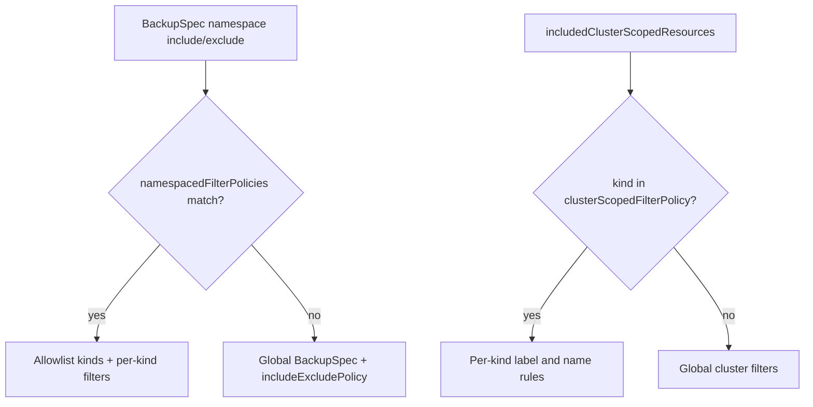

<a id="doc-12e0a48d6c5f2a58f4caa284"></a>

# velero-io/velero / ADOPTERS.md

Upstream: https://github.com/velero-io/velero/blob/cfd7752dfd0ce485605bcb8232885d4d88dd18db/ADOPTERS.md

Commit: `cfd7752dfd0ce485605bcb8232885d4d88dd18db`

Retrieved: 2026-10-01T15:44:26.254856+00:00

Kind: official-document

Raw SHA256: `312bac422e01f8364ab0ceee9fb1226a09d2693aedee8065587fcc7a5073daf7`

Source text below is untrusted reference content. Acquisition does not verify technical claims.

License status: UPSTREAM_NOTICES_CAPTURED_PER_FILE_REVIEW_REQUIRED. See this repository's captured license files.

---

# Velero Adopters

If you're using Velero and want to add your organization to this list, 
[follow these directions][1]!

<a href="https://www.pitsdatarecovery.net/" border="0" target="_blank"></a>
<a href="https://www.bitgo.com" border="0" target="_blank"></a>&nbsp; &nbsp; &nbsp;
<a href="https://www.nirmata.com" border="0" target="_blank"></a>&nbsp; &nbsp; &nbsp;
<a href="https://kyma-project.io/" border="0" target="_blank"></a>&nbsp; &nbsp; &nbsp;
<a href="https://redhat.com/" border="0" target="_blank"></a>&nbsp; &nbsp; &nbsp;
<a href="https://dellemc.com/" border="0" target="_blank"></a>&nbsp; &nbsp; &nbsp;
<a href="https://bugsnag.com/" border="0" target="_blank"></a>&nbsp; &nbsp; &nbsp;
<a href="https://okteto.com/" border="0" target="_blank"></a>&nbsp; &nbsp; &nbsp;
<a href="https://banzaicloud.com/" border="0" target="_blank"></a>&nbsp; &nbsp; &nbsp;
<a href="https://sighup.io/" border="0" target="_blank"></a>&nbsp; &nbsp; &nbsp;
<a href="https://mayadata.io/" border="0" target="_blank"></a>&nbsp; &nbsp; &nbsp;
<a href="https://www.replicated.com/" border="0" target="_blank"></a>
<a href="https://cloudcasa.io/" border="0" target="_blank"></a>
<a href="https://azure.microsoft.com/" border="0" target="_blank"></a>
<a href="https://www.broadcom.com/" border="0" target="_blank"></a>
## Success Stories

Below is a list of adopters of Velero in **production environments** that have
publicly shared the details of how they use it.

**[BitGo][20]**  
BitGo uses Velero backup and restore capabilities to seamlessly provision and scale fullnode statefulsets on the fly as well as having it serve an integral piece for our Kubernetes disaster-recovery story.

**[Bugsnag][30]**  
We use Velero for managing backups of an internal instance of our on-premise clustered solution. We also recommend our users of [on-premise Bugsnag installations](https://www.bugsnag.com/on-premise) use Velero for [managing their own backups](https://docs.bugsnag.com/on-premise/clustered/backup-restore/). <!-- Velero.io word list : ignore -->

**[Banzai Cloud][60]**  
[Banzai Cloud Pipeline][61] is a Kubernetes-based microservices platform that integrates services needed for Day-1 and Day-2 operations along with first-class support both for on-prem and hybrid multi-cloud deployments. We use Velero to periodically [backup and restore these clusters in case of disasters][62].

## Solutions built with Velero

Below is a list of solutions where Velero is being used as a component.

**[Nirmata][10]**  
We have integrated our [solution with Velero][11] to provide our customers with out of box backup/DR.

**[Kyma][40]**  
Kyma [integrates with Velero][41] to effortlessly back up and restore Kyma clusters with all its resources. Velero capabilities allow Kyma users to define and run manual and scheduled backups in order to successfully handle a disaster-recovery scenario.

**[Red Hat][50]**  
Red Hat has developed 2 operators for the OpenShift platform:
- [Migration Toolkit for Containers][51] (Crane): This operator uses [Velero and Restic][52] to drive the migration of applications between OpenShift clusters.
- [OADP (OpenShift API for Data Protection) Operator][53]: This operator sets up and installs Velero on the OpenShift platform, allowing users to backup and restore applications.

**[Dell EMC][70]**  
For Kubernetes environments, [PowerProtect Data Manager][71] leverages the Container Storage Interface (CSI) framework to take snapshots to back up the persistent data or the data that the application creates e.g. databases. [Dell EMC leverages Velero][72] to backup the namespace configuration files (also known as Namespace meta data) for enterprise grade data protection.

**[SIGHUP][80]**  
SIGHUP integrates Velero in its [Fury Kubernetes Distribution][81] providing predefined schedules and configurations to ensure an optimized disaster recovery experience.
[Fury Kubernetes Disaster Recovery Module][82] is ready to be deployed into any Kubernetes cluster running anywhere.

**[MayaData][90]**  
MayaData is a large user of Velero as well as a contributor. MayaData offers a Data Agility platform called [OpenEBS Director][91], that helps customers confidently and easily manage stateful workloads in Kubernetes. Velero is one of the core software building block of the OpenEBS Director's [DMaaS or data migration as a service offering][92] used to enable data protection strategies.

**[Okteto][93]**  
Okteto integrates Velero in [Okteto Cloud][94] and [Okteto Enterprise][95] to periodically backup and restore our clusters for disaster recovery. Velero is also a core software building block to provide namespace cloning capabilities, a feature that allows our users cloning staging environments into their personal development namespace for providing production-like development environments.

**[Replicated][100]**<br>
Replicated uses the Velero open source project to enable snapshots in [KOTS][101] to backup Kubernetes manifests & persistent volumes. In addition to the default functionality that Velero provides, [KOTS][101] provides a detailed interface in the [Admin Console][102] that can be used to manage the storage destination and schedule, and to perform and monitor the backup and restore process.<br>

**[CloudCasa][103]**<br>
[Catalogic Software][104] integrates Velero with [CloudCasa][103] - A Smart Home in the Cloud for Backups. CloudCasa is a full-featured, scalable, cloud-native solution providing Kubernetes data protection, disaster recovery, and migration as a service. An option to manage existing Velero instances and an enterprise self-hosted option are also available.<br>

**[Microsoft Azure][105]**<br>
[Azure Backup for AKS][106] is an Azure native, Kubernetes aware, Enterprise ready backup for containerized applications deployed on Azure Kubernetes Service (AKS). AKS Backup utilizes Velero to perform backup and restore operations to protect stateful applications in AKS clusters.<br>

**[Broadcom][107]**<br>
[VMware Cloud Foundation][108] (VCF) offers built-in [vSphere Kubernetes Service][109] (VKS),  a Kubernetes runtime that includes a CNCF certified Kubernetes distribution, to deploy and manage containerized workloads. VCF empowers platform engineers with native [Kubernetes multi-cluster management][110] capability for managing Kubernetes (K8s) infrastructure at scale. VCF utilizes Velero for Kubernetes data protection enabling platform engineers to back up and restore containerized workloads manifests & persistent volumes, helping to increase the resiliency of stateful applications in VKS cluster.

## Adding your organization to the list of Velero Adopters

If you are using Velero and would like to be included in the list of `Velero Adopters`, add an SVG version of your logo to the `site/static/img/adopters` directory in this repo and submit a [pull request][3] with your change. Name the image file something that reflects your company (e.g., if your company is called Acme, name the image acme.png). See this for an example [PR][4].

### Adding a logo to velero.io

If you would like to add your logo to a future `Adopters of Velero` section on [velero.io][2], follow the steps above to add your organization to the list of Velero Adopters. Our community will follow up and publish it to the [velero.io][2] website.

[1]: #adding-a-logo-to-veleroio
[2]: https://velero.io
[3]: https://github.com/vmware-tanzu/velero/pulls
[4]: https://github.com/vmware-tanzu/velero/pull/2242

[10]: https://www.nirmata.com/2019/08/14/kubernetes-disaster-recovery-using-velero-and-nirmata/
[11]: https://nirmata.com

[20]: https://bitgo.com

[30]: https://bugsnag.com

[40]: https://kyma-project.io
[41]: https://kyma-project.io/docs/components/backup/#overview-overview

[50]: https://redhat.com
[51]: https://github.com/fusor/mig-operator
[52]: https://github.com/fusor/mig-operator/blob/master/docs/usage/2.md
[53]: https://github.com/openshift/oadp-operator

[60]: https://banzaicloud.com
[61]: https://banzaicloud.com/products/pipeline/
[62]: https://banzaicloud.com/blog/vault-backup-velero/

[70]: https://dellemc.com
[71]: https://dellemc.com/dataprotection
[72]: https://www.dellemc.com/resources/en-us/asset/briefs-handouts/solutions/h18141-dellemc-dpd-kubernetes.pdf

[80]: https://sighup.io
[81]: https://github.com/sighupio/fury-distribution
[82]: https://github.com/sighupio/fury-kubernetes-dr

[90]: https://mayadata.io
[91]: https://director.mayadata.io/
[92]: https://help.mayadata.io/hc/en-us/articles/360033401591-DMaaS

[93]: https://okteto.com
[94]: https://cloud.okteto.com
[95]: https://okteto.com/enterprise/

[100]: https://www.replicated.com
[101]: https://kots.io
[102]: https://kots.io/kotsadm/snapshots/overview/

[103]: https://cloudcasa.io/
[104]: https://www.catalogicsoftware.com/

[105]: https://azure.microsoft.com/
[106]: https://learn.microsoft.com/azure/backup/backup-overview

[107]: https://www.broadcom.com/
[108]: https://www.vmware.com/products/cloud-infrastructure/vmware-cloud-foundation
[109]: https://www.vmware.com/products/cloud-infrastructure/vsphere-kubernetes-service
[110]: https://blogs.vmware.com/cloud-foundation/2025/09/29/empowering-platform-engineers-with-native-kubernetes-multi-cluster-management-in-vmware-cloud-foundation/

<a id="doc-06572a96a58dc510037d5efa"></a>

# velero-io/velero / CHANGELOG.md

Upstream: https://github.com/velero-io/velero/blob/cfd7752dfd0ce485605bcb8232885d4d88dd18db/CHANGELOG.md

Commit: `cfd7752dfd0ce485605bcb8232885d4d88dd18db`

Retrieved: 2026-10-01T15:44:26.254856+00:00

Kind: official-document

Raw SHA256: `41f0bf9cee28786ef4b1c42d5e64aba1a89511dfa689648f3b86601da02541d3`

Source text below is untrusted reference content. Acquisition does not verify technical claims.

License status: UPSTREAM_NOTICES_CAPTURED_PER_FILE_REVIEW_REQUIRED. See this repository's captured license files.

---

## Current release:
  * [CHANGELOG-1.15.md][25]

## Older releases:
  * [CHANGELOG-1.14.md][24]
  * [CHANGELOG-1.13.md][23]
  * [CHANGELOG-1.12.md][22]
  * [CHANGELOG-1.11.md][21]
  * [CHANGELOG-1.10.md][20]
  * [CHANGELOG-1.9.md][19]
  * [CHANGELOG-1.8.md][18]
  * [CHANGELOG-1.7.md][17]
  * [CHANGELOG-1.6.md][16]
  * [CHANGELOG-1.5.md][15]
  * [CHANGELOG-1.4.md][14]
  * [CHANGELOG-1.3.md][13]
  * [CHANGELOG-1.2.md][12]
  * [CHANGELOG-1.1.md][11]
  * [CHANGELOG-1.0.md][10]
  * [CHANGELOG-0.11.md][9]
  * [CHANGELOG-0.10.md][8]
  * [CHANGELOG-0.9.md][7]
  * [CHANGELOG-0.8.md][6]
  * [CHANGELOG-0.7.md][5]
  * [CHANGELOG-0.6.md][4]
  * [CHANGELOG-0.5.md][3]
  * [CHANGELOG-0.4.md][2]
  * [CHANGELOG-0.3.md][1]


[25]: https://github.com/vmware-tanzu/velero/blob/main/changelogs/CHANGELOG-1.15.md
[24]: https://github.com/vmware-tanzu/velero/blob/main/changelogs/CHANGELOG-1.14.md
[23]: https://github.com/vmware-tanzu/velero/blob/main/changelogs/CHANGELOG-1.13.md
[22]: https://github.com/vmware-tanzu/velero/blob/main/changelogs/CHANGELOG-1.12.md
[21]: https://github.com/vmware-tanzu/velero/blob/main/changelogs/CHANGELOG-1.11.md
[20]: https://github.com/vmware-tanzu/velero/blob/main/changelogs/CHANGELOG-1.10.md
[19]: https://github.com/vmware-tanzu/velero/blob/main/changelogs/CHANGELOG-1.9.md
[18]: https://github.com/vmware-tanzu/velero/blob/main/changelogs/CHANGELOG-1.8.md
[17]: https://github.com/vmware-tanzu/velero/blob/main/changelogs/CHANGELOG-1.7.md
[16]: https://github.com/vmware-tanzu/velero/blob/main/changelogs/CHANGELOG-1.6.md
[15]: https://github.com/vmware-tanzu/velero/blob/main/changelogs/CHANGELOG-1.5.md
[14]: https://github.com/vmware-tanzu/velero/blob/main/changelogs/CHANGELOG-1.4.md
[13]: https://github.com/vmware-tanzu/velero/blob/main/changelogs/CHANGELOG-1.3.md
[12]: https://github.com/vmware-tanzu/velero/blob/main/changelogs/CHANGELOG-1.2.md
[11]: https://github.com/vmware-tanzu/velero/blob/main/changelogs/CHANGELOG-1.1.md
[10]: https://github.com/vmware-tanzu/velero/blob/main/changelogs/CHANGELOG-1.0.md
[9]: https://github.com/vmware-tanzu/velero/blob/main/changelogs/CHANGELOG-0.11.md
[8]: https://github.com/vmware-tanzu/velero/blob/main/changelogs/CHANGELOG-0.10.md
[7]: https://github.com/vmware-tanzu/velero/blob/main/changelogs/CHANGELOG-0.9.md
[6]: https://github.com/vmware-tanzu/velero/blob/main/changelogs/CHANGELOG-0.8.md
[5]: https://github.com/vmware-tanzu/velero/blob/main/changelogs/CHANGELOG-0.7.md
[4]: https://github.com/vmware-tanzu/velero/blob/main/changelogs/CHANGELOG-0.6.md
[3]: https://github.com/vmware-tanzu/velero/blob/main/changelogs/CHANGELOG-0.5.md
[2]: https://github.com/vmware-tanzu/velero/blob/main/changelogs/CHANGELOG-0.4.md
[1]: https://github.com/vmware-tanzu/velero/blob/main/changelogs/CHANGELOG-0.3.md
[0]: https://github.com/vmware-tanzu/velero/blob/main/changelogs/unreleased


<a id="doc-c693279643b8cd5d248172d9"></a>

# velero-io/velero / LICENSE

Upstream: https://github.com/velero-io/velero/blob/cfd7752dfd0ce485605bcb8232885d4d88dd18db/LICENSE

Commit: `cfd7752dfd0ce485605bcb8232885d4d88dd18db`

Retrieved: 2026-10-01T15:44:26.254856+00:00

Kind: license

Raw SHA256: `9cf5de169b595cdae317551ef69a794b59fa3d1e151db4190d337fe08d13d5f8`

Source text below is untrusted reference content. Acquisition does not verify technical claims.

License status: UPSTREAM_NOTICES_CAPTURED_PER_FILE_REVIEW_REQUIRED. See this repository's captured license files.

---

````text
Apache License
Version 2.0, January 2004
http://www.apache.org/licenses/

TERMS AND CONDITIONS FOR USE, REPRODUCTION, AND DISTRIBUTION

1. Definitions.

"License" shall mean the terms and conditions for use, reproduction,
and distribution as defined by Sections 1 through 9 of this document.

"Licensor" shall mean the copyright owner or entity authorized by
the copyright owner that is granting the License.

"Legal Entity" shall mean the union of the acting entity and all
other entities that control, are controlled by, or are under common
control with that entity. For the purposes of this definition,
"control" means (i) the power, direct or indirect, to cause the
direction or management of such entity, whether by contract or
otherwise, or (ii) ownership of fifty percent (50%) or more of the
outstanding shares, or (iii) beneficial ownership of such entity.

"You" (or "Your") shall mean an individual or Legal Entity
exercising permissions granted by this License.

"Source" form shall mean the preferred form for making modifications,
including but not limited to software source code, documentation
source, and configuration files.

"Object" form shall mean any form resulting from mechanical
transformation or translation of a Source form, including but
not limited to compiled object code, generated documentation,
and conversions to other media types.

"Work" shall mean the work of authorship, whether in Source or
Object form, made available under the License, as indicated by a
copyright notice that is included in or attached to the work
(an example is provided in the Appendix below).

"Derivative Works" shall mean any work, whether in Source or Object
form, that is based on (or derived from) the Work and for which the
editorial revisions, annotations, elaborations, or other modifications
represent, as a whole, an original work of authorship. For the purposes
of this License, Derivative Works shall not include works that remain
separable from, or merely link (or bind by name) to the interfaces of,
the Work and Derivative Works thereof.

"Contribution" shall mean any work of authorship, including
the original version of the Work and any modifications or additions
to that Work or Derivative Works thereof, that is intentionally
submitted to Licensor for inclusion in the Work by the copyright owner
or by an individual or Legal Entity authorized to submit on behalf of
the copyright owner. For the purposes of this definition, "submitted"
means any form of electronic, verbal, or written communication sent
to the Licensor or its representatives, including but not limited to
communication on electronic mailing lists, source code control systems,
and issue tracking systems that are managed by, or on behalf of, the
Licensor for the purpose of discussing and improving the Work, but
excluding communication that is conspicuously marked or otherwise
designated in writing by the copyright owner as "Not a Contribution."

"Contributor" shall mean Licensor and any individual or Legal Entity
on behalf of whom a Contribution has been received by Licensor and
subsequently incorporated within the Work.

2. Grant of Copyright License. Subject to the terms and conditions of
this License, each Contributor hereby grants to You a perpetual,
worldwide, non-exclusive, no-charge, royalty-free, irrevocable
copyright license to reproduce, prepare Derivative Works of,
publicly display, publicly perform, sublicense, and distribute the
Work and such Derivative Works in Source or Object form.

3. Grant of Patent License. Subject to the terms and conditions of
this License, each Contributor hereby grants to You a perpetual,
worldwide, non-exclusive, no-charge, royalty-free, irrevocable
(except as stated in this section) patent license to make, have made,
use, offer to sell, sell, import, and otherwise transfer the Work,
where such license applies only to those patent claims licensable
by such Contributor that are necessarily infringed by their
Contribution(s) alone or by combination of their Contribution(s)
with the Work to which such Contribution(s) was submitted. If You
institute patent litigation against any entity (including a
cross-claim or counterclaim in a lawsuit) alleging that the Work
or a Contribution incorporated within the Work constitutes direct
or contributory patent infringement, then any patent licenses
granted to You under this License for that Work shall terminate
as of the date such litigation is filed.

4. Redistribution. You may reproduce and distribute copies of the
Work or Derivative Works thereof in any medium, with or without
modifications, and in Source or Object form, provided that You
meet the following conditions:

(a) You must give any other recipients of the Work or
Derivative Works a copy of this License; and

(b) You must cause any modified files to carry prominent notices
stating that You changed the files; and

(c) You must retain, in the Source form of any Derivative Works
that You distribute, all copyright, patent, trademark, and
attribution notices from the Source form of the Work,
excluding those notices that do not pertain to any part of
the Derivative Works; and

(d) If the Work includes a "NOTICE" text file as part of its
distribution, then any Derivative Works that You distribute must
include a readable copy of the attribution notices contained
within such NOTICE file, excluding those notices that do not
pertain to any part of the Derivative Works, in at least one
of the following places: within a NOTICE text file distributed
as part of the Derivative Works; within the Source form or
documentation, if provided along with the Derivative Works; or,
within a display generated by the Derivative Works, if and
wherever such third-party notices normally appear. The contents
of the NOTICE file are for informational purposes only and
do not modify the License. You may add Your own attribution
notices within Derivative Works that You distribute, alongside
or as an addendum to the NOTICE text from the Work, provided
that such additional attribution notices cannot be construed
as modifying the License.

You may add Your own copyright statement to Your modifications and
may provide additional or different license terms and conditions
for use, reproduction, or distribution of Your modifications, or
for any such Derivative Works as a whole, provided Your use,
reproduction, and distribution of the Work otherwise complies with
the conditions stated in this License.

5. Submission of Contributions. Unless You explicitly state otherwise,
any Contribution intentionally submitted for inclusion in the Work
by You to the Licensor shall be under the terms and conditions of
this License, without any additional terms or conditions.
Notwithstanding the above, nothing herein shall supersede or modify
the terms of any separate license agreement you may have executed
with Licensor regarding such Contributions.

6. Trademarks. This License does not grant permission to use the trade
names, trademarks, service marks, or product names of the Licensor,
except as required for reasonable and customary use in describing the
origin of the Work and reproducing the content of the NOTICE file.

7. Disclaimer of Warranty. Unless required by applicable law or
agreed to in writing, Licensor provides the Work (and each
Contributor provides its Contributions) on an "AS IS" BASIS,
WITHOUT WARRANTIES OR CONDITIONS OF ANY KIND, either express or
implied, including, without limitation, any warranties or conditions
of TITLE, NON-INFRINGEMENT, MERCHANTABILITY, or FITNESS FOR A
PARTICULAR PURPOSE. You are solely responsible for determining the
appropriateness of using or redistributing the Work and assume any
risks associated with Your exercise of permissions under this License.

8. Limitation of Liability. In no event and under no legal theory,
whether in tort (including negligence), contract, or otherwise,
unless required by applicable law (such as deliberate and grossly
negligent acts) or agreed to in writing, shall any Contributor be
liable to You for damages, including any direct, indirect, special,
incidental, or consequential damages of any character arising as a
result of this License or out of the use or inability to use the
Work (including but not limited to damages for loss of goodwill,
work stoppage, computer failure or malfunction, or any and all
other commercial damages or losses), even if such Contributor
has been advised of the possibility of such damages.

9. Accepting Warranty or Additional Liability. While redistributing
the Work or Derivative Works thereof, You may choose to offer,
and charge a fee for, acceptance of support, warranty, indemnity,
or other liability obligations and/or rights consistent with this
License. However, in accepting such obligations, You may act only
on Your own behalf and on Your sole responsibility, not on behalf
of any other Contributor, and only if You agree to indemnify,
defend, and hold each Contributor harmless for any liability
incurred by, or claims asserted against, such Contributor by reason
of your accepting any such warranty or additional liability.

END OF TERMS AND CONDITIONS

APPENDIX: How to apply the Apache License to your work.

To apply the Apache License to your work, attach the following
boilerplate notice, with the fields enclosed by brackets "{}"
replaced with your own identifying information. (Don't include
the brackets!)  The text should be enclosed in the appropriate
comment syntax for the file format. We also recommend that a
file or class name and description of purpose be included on the
same "printed page" as the copyright notice for easier
identification within third-party archives.

Copyright {yyyy} {name of copyright owner}

Licensed under the Apache License, Version 2.0 (the "License");
you may not use this file except in compliance with the License.
You may obtain a copy of the License at

http://www.apache.org/licenses/LICENSE-2.0

Unless required by applicable law or agreed to in writing, software
distributed under the License is distributed on an "AS IS" BASIS,
WITHOUT WARRANTIES OR CONDITIONS OF ANY KIND, either express or implied.
See the License for the specific language governing permissions and
limitations under the License.

````


<a id="doc-39da3bd6270d44ea37b6ed50"></a>

# velero-io/velero / MAINTAINERS.md

Upstream: https://github.com/velero-io/velero/blob/cfd7752dfd0ce485605bcb8232885d4d88dd18db/MAINTAINERS.md

Commit: `cfd7752dfd0ce485605bcb8232885d4d88dd18db`

Retrieved: 2026-10-01T15:44:26.254856+00:00

Kind: official-document

Raw SHA256: `2ffc24e67ee12e5e7d32ac51d6044a77c0a5631433b15e25e7e6508faaf2e31f`

Source text below is untrusted reference content. Acquisition does not verify technical claims.

License status: UPSTREAM_NOTICES_CAPTURED_PER_FILE_REVIEW_REQUIRED. See this repository's captured license files.

---

# Velero Maintainers

[GOVERNANCE.md](https://github.com/velero-io/.github/blob/main/GOVERNANCE.md) describes governance guidelines and maintainer responsibilities.

## Maintainers

All maintainers share collective responsibility for the entire Velero project. There are no siloed, per-area owners: every maintainer is a final reviewer of pull requests across the codebase, and code ownership is assigned to the maintainer group as a whole (see [CODEOWNERS](https://github.com/velero-io/velero/blob/main/CODEOWNERS)). Maintainers review PRs, ensure code quality, triage issues, fix bugs, and perform release and maintenance tasks across all components.

| Maintainer          | GitHub ID                                                     | Affiliation                                      |
|---------------------|---------------------------------------------------------------|--------------------------------------------------|
| Scott Seago         | [sseago](https://github.com/sseago)                           | [OpenShift](https://github.com/openshift)        |
| Daniel Jiang        | [reasonerjt](https://github.com/reasonerjt)                   | Broadcom                                         |
| Wenkai Yin          | [ywk253100](https://github.com/ywk253100)                     | Broadcom                                         |
| Xun Jiang           | [blackpiglet](https://github.com/blackpiglet)                 | Broadcom                                         |
| Shubham Pampattiwar | [shubham-pampattiwar](https://github.com/shubham-pampattiwar) | [OpenShift](https://github.com/openshift)        |
| Yonghui Li          | [Lyndon-Li](https://github.com/Lyndon-Li)                     | Broadcom                                         |
| Anshul Ahuja        | [anshulahuja98](https://github.com/anshulahuja98)             | [Microsoft Azure](https://www.github.com/azure/) |
| Tiger Kaovilai      | [kaovilai](https://github.com/kaovilai)                       | [OpenShift](https://github.com/openshift)        |

## Contacting the maintainers

* **GitHub:** open an issue or pull request in the relevant [velero-io](https://github.com/velero-io) repository, or @mention a maintainer by their GitHub ID.
* **Slack:** [#velero](https://kubernetes.slack.com/messages/velero) on the Kubernetes Slack.
* **Mailing list:** [Velero Google Group](https://groups.google.com/forum/#!forum/projectvelero).
* **Security issues:** follow the private disclosure process in [SECURITY.md](https://github.com/velero-io/.github/blob/main/SECURITY.md) (cncf-velero-security@lists.cncf.io). Do not report vulnerabilities through public channels.

## Emeritus Maintainers
* Adnan Abdulhussein ([prydonius](https://github.com/prydonius))
* Andy Goldstein ([ncdc](https://github.com/ncdc))
* Steve Kriss ([skriss](https://github.com/skriss))
* Carlos Panato ([cpanato](https://github.com/cpanato))
* Nolan Brubaker ([nrb](https://github.com/nrb))
* Ashish Amarnath ([ashish-amarnath](https://github.com/ashish-amarnath))
* Carlisia Thompson ([carlisia](https://github.com/carlisia))
* Bridget McErlean ([zubron](https://github.com/zubron))
* JenTing Hsiao ([jenting](https://github.com/jenting))
* Dave Smith-Uchida ([dsu-igeek](https://github.com/dsu-igeek))
* Ming Qiu ([qiuming-best](https://github.com/qiuming-best))


<a id="doc-b335630551682c19a781afeb"></a>

# velero-io/velero / README.md

Upstream: https://github.com/velero-io/velero/blob/cfd7752dfd0ce485605bcb8232885d4d88dd18db/README.md

Commit: `cfd7752dfd0ce485605bcb8232885d4d88dd18db`

Retrieved: 2026-10-01T15:44:26.254856+00:00

Kind: official-document

Raw SHA256: `f768ef31ffaf6650f872e460db52c485ad69f904558fdb873bac1234d8a566cc`

Source text below is untrusted reference content. Acquisition does not verify technical claims.

License status: UPSTREAM_NOTICES_CAPTURED_PER_FILE_REVIEW_REQUIRED. See this repository's captured license files.

---

![100]

[![Build Status][1]][2] [](https://bestpractices.coreinfrastructure.org/projects/3811)
[](https://scorecard.dev/viewer/?uri=github.com/velero-io/velero)
[](https://github.com/velero-io/velero/releases)
[](https://github.com/velero-io/velero/stargazers)
[](https://hub.docker.com/r/velero/velero)

## Overview

Velero (formerly Heptio Ark) gives you tools to back up and restore your Kubernetes cluster resources and persistent volumes. You can run Velero with a public cloud platform or on-premises. 

Velero lets you:

* Take backups of your cluster and restore in case of loss.
* Migrate cluster resources to other clusters.
* Replicate your production cluster to development and testing clusters.

Velero consists of:

* A server that runs on your cluster
* A command-line client that runs locally

## Documentation

[The documentation][29] provides a getting started guide and information about building from source, architecture, extending Velero and more.

Please use the version selector at the top of the site to ensure you are using the appropriate documentation for your version of Velero.

## Troubleshooting

If you encounter issues, review the [troubleshooting docs][30], [file an issue][4], or talk to us on the [#velero-users][25] and [#velero-dev][26] channel on the Kubernetes Slack server.

## Community

Velero is an open community and we welcome your participation. The best way to get involved is to join our bi-weekly community meetings:

* Join the [Velero community meetings](https://velero.io/community/), held bi-weekly, alternating between Beijing-friendly and US/Europe-friendly time zones.
* Subscribe to the [project meeting calendar](https://zoom-lfx.platform.linuxfoundation.org/meetings/velero?view=week).
* Chat with us on the [Kubernetes Slack][25] `#velero-users` channel and join the [mailing list][24].

See the [community page](https://velero.io/community/) for the full schedule and details.

## Contributing

If you are ready to jump in and test, add code, or help with documentation, follow the instructions on our [Start contributing][31] documentation for guidance on how to setup Velero for development.

## Governance

Velero's [governance][32] describes how the project is run, including the decision-making process, the roles and responsibilities of maintainers, and how to become a maintainer. Governance applies across the Velero org and is maintained at [velero-io/.github][32].

## Changelog

See [the list of releases][6] to find out about feature changes.

### Velero compatibility matrix

The following is a list of the supported Kubernetes versions for each Velero version.

| Velero version | Expected Kubernetes version compatibility | Tested on Kubernetes version        |
|----------------|-------------------------------------------|-------------------------------------|
| 1.18           | 1.18-latest                               | 1.33.7, 1.34.1, and 1.35.0          |
| 1.17           | 1.18-latest                               | 1.31.7, 1.32.3, 1.33.1, and 1.34.0  |
| 1.16           | 1.18-latest                               | 1.31.4, 1.32.3, and 1.33.0          |
| 1.15           | 1.18-latest                               | 1.28.8, 1.29.8, 1.30.4 and 1.31.1   |
| 1.14           | 1.18-latest                               | 1.27.9, 1.28.9, and 1.29.4          |

Velero supports IPv4, IPv6, and dual stack environments. Support for this was tested against Velero v1.8.

The Velero maintainers are continuously working to expand testing coverage, but are not able to test every combination of Velero and supported Kubernetes versions for each Velero release. The table above is meant to track the current testing coverage and the expected supported Kubernetes versions for each Velero version.

If you are interested in using a different version of Kubernetes with a given Velero version, we'd recommend that you perform testing before installing or upgrading your environment. For full information around capabilities within a release, also see the Velero [release notes](https://github.com/velero-io/velero/releases) or Kubernetes [release notes](https://github.com/kubernetes/kubernetes/tree/master/CHANGELOG). See the Velero [support page](https://velero.io/docs/latest/support-process/) for information about supported versions of Velero.

For each release, Velero maintainers run the test to ensure the upgrade path from n-2 minor release.  For example, before the release of v1.10.x, the test will verify that the backup created by v1.9.x and v1.8.x can be restored using the build to be tagged as v1.10.x.

## Cloud Native Computing Foundation
<!-- remove sandbox once promoted -->
Velero is a [Cloud Native Computing Foundation](https://www.cncf.io/) sandbox project.

<p align="center">
  <a href="https://www.cncf.io/">
    
  </a>
</p>

Copyright Contributors to Velero, established as Velero a Series of LF Projects, LLC.
For website terms of use, trademark policy and other project policies please see
<https://lfprojects.org/policies/>.

[1]: https://github.com/velero-io/velero/workflows/Main%20CI/badge.svg
[2]: https://github.com/velero-io/velero/actions?query=workflow%3A"Main+CI"
[4]: https://github.com/velero-io/velero/issues
[6]: https://github.com/velero-io/velero/releases
[9]: https://kubernetes.io/docs/setup/
[10]: https://kubernetes.io/docs/tasks/tools/install-kubectl/#install-with-homebrew-on-macos
[11]: https://kubernetes.io/docs/tasks/tools/install-kubectl/#tabset-1
[12]: https://github.com/kubernetes/kubernetes/blob/master/cluster/addons/dns/README.md
[14]: https://github.com/kubernetes/kubernetes
[24]: https://groups.google.com/forum/#!forum/projectvelero
[25]: https://kubernetes.slack.com/messages/velero-users
[26]: https://kubernetes.slack.com/messages/velero-dev
[29]: https://velero.io/docs/
[30]: https://velero.io/docs/troubleshooting
[31]: https://velero.io/docs/start-contributing
[32]: https://github.com/velero-io/.github/blob/main/GOVERNANCE.md
[100]: https://velero.io/docs/main/img/velero.png


<a id="doc-683343bdf93f55ed3cada861"></a>

# velero-io/velero / ROADMAP.md

Upstream: https://github.com/velero-io/velero/blob/cfd7752dfd0ce485605bcb8232885d4d88dd18db/ROADMAP.md

Commit: `cfd7752dfd0ce485605bcb8232885d4d88dd18db`

Retrieved: 2026-10-01T15:44:26.254856+00:00

Kind: official-document

Raw SHA256: `6013e6cfe56e72138f5913e677427e357cab075d9e2fb03169743f644ce386d0`

Source text below is untrusted reference content. Acquisition does not verify technical claims.

License status: UPSTREAM_NOTICES_CAPTURED_PER_FILE_REVIEW_REQUIRED. See this repository's captured license files.

---

# Please go to the [Velero Wiki](https://github.com/vmware-tanzu/velero/wiki/) to see our latest roadmap, archived roadmaps and roadmap guidance.

<a id="doc-588247153e773e3a0504c68b"></a>

# velero-io/velero / assets/README.md

Upstream: https://github.com/velero-io/velero/blob/cfd7752dfd0ce485605bcb8232885d4d88dd18db/assets/README.md

Commit: `cfd7752dfd0ce485605bcb8232885d4d88dd18db`

Retrieved: 2026-10-01T15:44:26.254856+00:00

Kind: official-document

Raw SHA256: `b8d67639fa9935cde24d831938c76cd0d48552425b792bf0c1c8ff0240fac5ab`

Source text below is untrusted reference content. Acquisition does not verify technical claims.

License status: UPSTREAM_NOTICES_CAPTURED_PER_FILE_REVIEW_REQUIRED. See this repository's captured license files.

---

# Velero Assets

This folder contains logo images for Velero in gray (for light backgrounds) and white (for dark backgrounds like black t-shirts or dark mode!) – horizontal and stacked… in .eps and .svg.

## Some general guidelines for usage

• Don’t alter the logos/graphics: resize, reformat, recolor. Keep them intact.

• Don’t separate the word mark (Velero) from the icon) – we are still building a strong name and identity – and the logo by itself doesn’t have any strong recognition or association with as yet: so best practice keep the two together. Nike kept its name with the swoosh for quite some time before the swoosh became iconic.

• Don’t append the name to another brand – let it stand alone!

<a id="doc-ee49dc4e16357e5ceacfdc96"></a>

# velero-io/velero / changelogs/CHANGELOG-0.10.md

Upstream: https://github.com/velero-io/velero/blob/cfd7752dfd0ce485605bcb8232885d4d88dd18db/changelogs/CHANGELOG-0.10.md

Commit: `cfd7752dfd0ce485605bcb8232885d4d88dd18db`

Retrieved: 2026-10-01T15:44:26.254856+00:00

Kind: official-document

Raw SHA256: `516bd9b8746e6e1aaae98f5340e38d17766eaf0ba30b6643d4fd5af34db913b7`

Source text below is untrusted reference content. Acquisition does not verify technical claims.

License status: UPSTREAM_NOTICES_CAPTURED_PER_FILE_REVIEW_REQUIRED. See this repository's captured license files.

---

  - [v0.10.2](#v0102)
  - [v0.10.1](#v0101)
  - [v0.10.0](#v0100)

## v0.10.2
#### 2019-02-28

### Download
- https://github.com/heptio/ark/releases/tag/v0.10.2

### Changes
  * upgrade restic to v0.9.4 & replace --hostname flag with --host (#1156, @skriss)
  * use 'restic stats' instead of 'restic check' to determine if repo exists (#1171, @skriss)
  * Fix concurrency bug in code ensuring restic repository exists (#1235, @skriss)

## v0.10.1
#### 2019-01-10

### Download
- https://github.com/heptio/ark/releases/tag/v0.10.1

### Changes
  * Fix minio setup job command (#1118, @acbramley)
  * Add debugging-install link in doc get-started.md (#1131, @hex108)
  * `ark version`: show full git SHA & combine git tree state indicator with git SHA line (#1124, @skriss)
  * Delete spec.priority in pod restore action (#879, @mwieczorek)
  * Allow to use AWS Signature v1 for creating signed AWS urls (#811, @bashofmann)
  * add multizone/regional support to gcp (#765, @wwitzel3)
  * Fixed the newline output when deleting a schedule. (#1120, @jwhitcraft)
  * Remove obsolete make targets and rename 'make goreleaser' to 'make release' (#1114, @skriss)
  * Update to go 1.11 (#1069, @gliptak)
  * Update CHANGELOGs (#1063, @wwitzel3)
  * Initialize empty schedule metrics on server init (#1054, @cbeneke)
  * Added brew reference (#1051, @omerlh)
  * Remove default token from all service accounts (#1048, @ncdc)
  * Add pprof support to the Ark server (#234, @ncdc)

## v0.10.0
#### 2018-11-15

### Download
- https://github.com/heptio/ark/releases/tag/v0.10.0

### Highlights
- We've introduced two new custom resource definitions, `BackupStorageLocation` and `VolumeSnapshotLocation`, that replace the `Config` CRD from
previous versions. As part of this, you may now configure more than one possible location for where backups and snapshots are stored, and when you
create a `Backup` you can select the location where you'd like that particular backup to be stored. See the [Locations documentation][2] for an overview
of this feature.
- Ark's plugin system has been significantly refactored to improve robustness and ease of development. Plugin processes are now automatically restarted
if they unexpectedly terminate. Additionally, plugin binaries can now contain more than one plugin implementation (e.g. and object store *and* a block store,
or many backup item actions).
- The sync process, which ensures that Backup custom resources exist for each backup in object storage, has been revamped to run much more frequently (once
per minute rather than once per hour), to use significantly fewer cloud provider API calls, and to not generate spurious Kubernetes API errors.
- Ark can now be configured to store all data under a prefix within an object storage bucket. This means that you no longer need a separate bucket per Ark
instance; you can now have all of your clusters' Ark backups go into a single bucket, with each cluster having its own prefix/subdirectory
within that bucket.
- Restic backup data is now automatically stored within the same bucket/prefix as the rest of the Ark data. A separate bucket is no longer required (or allowed).
- Ark resources (backups, restores, schedules) can now be bulk-deleted through the `ark` CLI, using the `--all` or `--selector` flags, or by specifying 
multiple resource names as arguments to the `delete` commands.
- The `ark` CLI now supports waiting for backups and restores to complete with the `--wait` flag for `ark backup create` and `ark restore create`
- Restores can be created directly from the most recent backup for a schedule, using `ark restore create --from-schedule SCHEDULE_NAME`

### Breaking Changes

Heptio Ark v0.10 contains a number of breaking changes.  Upgrading will require some additional steps beyond just updating your client binary and your
container image tag. We've provided a [detailed set of instructions][1] to help you with the upgrade process. **Please read and follow these instructions 
carefully to ensure a successful upgrade!**

- The `Config` CRD has been replaced by `BackupStorageLocation` and `VolumeSnapshotLocation` CRDs. 
- The interface for external plugins (object/block stores, backup/restore item actions) has changed. If you have authored any custom plugins, they'll 
need to be updated for v0.10.
    - The [`ObjectStore.ListCommonPrefixes`](https://github.com/vmware-tanzu/velero/blob/main/pkg/cloudprovider/object_store.go#L50) signature has changed to add a `prefix` parameter.
    - Registering plugins has changed. Create a new plugin server with the `NewServer` function, and register plugins with the appropriate functions. See the [`Server`](https://github.com/vmware-tanzu/velero/blob/main/pkg/plugin/server.go#L37) interface for details.
- The organization of Ark data in object storage has changed. Existing data will need to be moved around to conform to the new layout.

### All Changes
-   [b9de44ff](https://github.com/heptio/ark/commit/b9de44ff)	update docs to reference config/ dir within release tarballs
-   [eace0255](https://github.com/heptio/ark/commit/eace0255)	goreleaser: update example image tags to match version being released
-   [cff02159](https://github.com/heptio/ark/commit/cff02159)	add rbac content, rework get-started for NodePort and publicUrl, add versioning information
-   [fa14255e](https://github.com/heptio/ark/commit/fa14255e)	add content for docs issue 819
-   [22959071](https://github.com/heptio/ark/commit/22959071)	add doc explaining locations
-   [e5556fe6](https://github.com/heptio/ark/commit/e5556fe6)	Added qps and burst to server's client
-   [9ae861c9](https://github.com/heptio/ark/commit/9ae861c9)	Support a separate URL base for pre-signed URLs
-   [698420b6](https://github.com/heptio/ark/commit/698420b6)	Update storage-layout-reorg-v0.10.md
-   [6c9e1f18](https://github.com/heptio/ark/commit/6c9e1f18)	lower some noisy logs to debug level
-   [318fd8a8](https://github.com/heptio/ark/commit/318fd8a8)	add troubleshooting for loadbalancer restores
-   [defb8aa8](https://github.com/heptio/ark/commit/defb8aa8)	remove code that checks directly for a backup from restore controller
-   [7abe1156](https://github.com/heptio/ark/commit/7abe1156)	Move clearing up of metadata before plugin's actions
-   [ec013e6f](https://github.com/heptio/ark/commit/ec013e6f)	Document upgrading plugins in the deployment
-   [d6162e94](https://github.com/heptio/ark/commit/d6162e94)	fix goreleaser bugs
-   [a15df276](https://github.com/heptio/ark/commit/a15df276)	Add correct link and change role
-   [46bed015](https://github.com/heptio/ark/commit/46bed015)	add 0.10 breaking changes warning to readme in main
-   [e3a7d6a2](https://github.com/heptio/ark/commit/e3a7d6a2)	add content for issue 994
-   [400911e9](https://github.com/heptio/ark/commit/400911e9)	address docs issue #978
-   [b818cc27](https://github.com/heptio/ark/commit/b818cc27)	don't require a default provider VSL if there's only 1
-   [90638086](https://github.com/heptio/ark/commit/90638086)	v0.10 changelog
-   [6e2166c4](https://github.com/heptio/ark/commit/6e2166c4)	add docs page on versions and upgrading
-   [18b434cb](https://github.com/heptio/ark/commit/18b434cb)	goreleaser scripts for building/creating a release on a workstation
-   [bb65d67a](https://github.com/heptio/ark/commit/bb65d67a)	update restic prerequisite with min k8s version
-   [b5a2ccd5](https://github.com/heptio/ark/commit/b5a2ccd5)	Silence git detached HEAD advice in build container
-   [67749141](https://github.com/heptio/ark/commit/67749141)	instructions for upgrading to v0.10
-   [516422c2](https://github.com/heptio/ark/commit/516422c2)	sync controller: fill in missing .spec.storageLocation
- 	[195e6aaf](https://github.com/heptio/ark/commit/195e6aaf)	fix bug preventing PV snapshots from v0.10 backups from restoring
- 	[bca58516](https://github.com/heptio/ark/commit/bca58516)	Run 'make update' to update formatting
- 	[573ce7d0](https://github.com/heptio/ark/commit/573ce7d0)	Update formatting script
- 	[90d9be59](https://github.com/heptio/ark/commit/90d9be59)	support restoring/deleting legacy backups with .status.volumeBackups
- 	[ef194972](https://github.com/heptio/ark/commit/ef194972)	rename variables #967
- 	[6d4e702c](https://github.com/heptio/ark/commit/6d4e702c)	fix broken link
- 	[596eea1b](https://github.com/heptio/ark/commit/596eea1b)	restore storageclasses before pvs and pvcs
- 	[f014cab1](https://github.com/heptio/ark/commit/f014cab1)	backup describer: show snapshot summary by default, details optionally
- 	[8acc66d0](https://github.com/heptio/ark/commit/8acc66d0)	remove pvProviderExists param from NewRestoreController
- 	[57ce590f](https://github.com/heptio/ark/commit/57ce590f)	create a struct for multiple return of same type in restore_contoroller #967
- 	[028fafb6](https://github.com/heptio/ark/commit/028fafb6)	Corrected grammatical  error
- 	[db856aff](https://github.com/heptio/ark/commit/db856aff)	Specify return arguments
- 	[9952dfb0](https://github.com/heptio/ark/commit/9952dfb0)	Address #424: Add CRDs to list of prioritized resources
- 	[cf2c2714](https://github.com/heptio/ark/commit/cf2c2714)	fix bugs in GetBackupVolumeSnapshots and add test
- 	[ec124673](https://github.com/heptio/ark/commit/ec124673)	remove all references to Config from docs/examples
- 	[c36131a0](https://github.com/heptio/ark/commit/c36131a0)	remove Config-related code
- 	[406b50a7](https://github.com/heptio/ark/commit/406b50a7)	update restore process using snapshot locations
- 	[268080ad](https://github.com/heptio/ark/commit/268080ad)	avoid panics if can't get block store during deletion
- 	[4a03370f](https://github.com/heptio/ark/commit/4a03370f)	update backup deletion controller for snapshot locations
- 	[38c72b8c](https://github.com/heptio/ark/commit/38c72b8c)	include snapshot locations in created schedule's backup spec
- 	[0ec2de55](https://github.com/heptio/ark/commit/0ec2de55)	azure: update blockstore to allow storing snaps in different resource group
- 	[35bb533c](https://github.com/heptio/ark/commit/35bb533c)	close gzip writer before uploading volumesnapshots file
- 	[da9ed38c](https://github.com/heptio/ark/commit/da9ed38c)	store volume snapshot info as JSON in backup storage
- 	[e24248e0](https://github.com/heptio/ark/commit/e24248e0)	add --volume-snapshot-locations flag to ark backup create
- 	[df07b7dc](https://github.com/heptio/ark/commit/df07b7dc)	update backup code to work with volume snapshot locations
- 	[4af89fa8](https://github.com/heptio/ark/commit/4af89fa8)	add unit test for getDefaultVolumeSnapshotLocations
- 	[02f50b9c](https://github.com/heptio/ark/commit/02f50b9c)	add default-volume-snapshot-locations to server cmd
- 	[1aa712d2](https://github.com/heptio/ark/commit/1aa712d2)	Default and validate VolumeSnapshotLocations
- 	[bbf76985](https://github.com/heptio/ark/commit/bbf76985)	add create CLI command for snapshot locations
- 	[aeb221ea](https://github.com/heptio/ark/commit/aeb221ea)	Add printer for snapshot locations
- 	[ffc612ac](https://github.com/heptio/ark/commit/ffc612ac)	Add volume snapshot CLI get command
- 	[f20342aa](https://github.com/heptio/ark/commit/f20342aa)	Add VolumeLocation and Snapshot.
- 	[7172db8a](https://github.com/heptio/ark/commit/7172db8a)	upgrade to restic v0.9.3
- 	[99adc4fa](https://github.com/heptio/ark/commit/99adc4fa)	Remove broken references to docs that are not existing
- 	[474efde6](https://github.com/heptio/ark/commit/474efde6)	Fixed relative link for image
- 	[41735154](https://github.com/heptio/ark/commit/41735154)	don't require a default backup storage location to exist
- 	[0612c5de](https://github.com/heptio/ark/commit/0612c5de)	templatize error message in DeleteOptions
- 	[66bcbc05](https://github.com/heptio/ark/commit/66bcbc05)	add support for bulk deletion to ark schedule delete
- 	[3af43b49](https://github.com/heptio/ark/commit/3af43b49)	add azure-specific code to support multi-location restic
- 	[d009163b](https://github.com/heptio/ark/commit/d009163b)	update restic to support multiple backup storage locations
- 	[f4c99c77](https://github.com/heptio/ark/commit/f4c99c77)	Change link for the support matrix
- 	[91e45d56](https://github.com/heptio/ark/commit/91e45d56)	Fix broken storage providers link
- 	[ed0eb865](https://github.com/heptio/ark/commit/ed0eb865)	fix backup storage location example YAMLs
- 	[eb709b8f](https://github.com/heptio/ark/commit/eb709b8f)	only sync a backup location if it's changed since last sync
- 	[af3af1b5](https://github.com/heptio/ark/commit/af3af1b5)	clarify Azure resource group usage in docs
- 	[9fdf8513](https://github.com/heptio/ark/commit/9fdf8513)	Minor code cleanup
- 	[2073e15a](https://github.com/heptio/ark/commit/2073e15a)	Fix formatting for live site
- 	[0fc3e8d8](https://github.com/heptio/ark/commit/0fc3e8d8)	add documentation on running Ark on-premises
- 	[e46e89cb](https://github.com/heptio/ark/commit/e46e89cb)	have restic share main Ark bucket
- 	[42b54586](https://github.com/heptio/ark/commit/42b54586)	refactor to make valid dirs part of an object store layout
- 	[8bc7e4f6](https://github.com/heptio/ark/commit/8bc7e4f6)	store backups & restores in backups/, restores/ subdirs in obj storage
- 	[e3232b7e](https://github.com/heptio/ark/commit/e3232b7e)	add support for bulk deletion to ark restore delete
- 	[17be71e1](https://github.com/heptio/ark/commit/17be71e1)	remove deps used for docs gen
- 	[20635106](https://github.com/heptio/ark/commit/20635106)	remove script for generating docs
- 	[6fd9ea9d](https://github.com/heptio/ark/commit/6fd9ea9d)	remove cli reference docs and related scripts
- 	[4833607a](https://github.com/heptio/ark/commit/4833607a)	Fix infinite sleep in fsfreeze container
- 	[7668bfd4](https://github.com/heptio/ark/commit/7668bfd4)	Add links for Portworx plugin support
- 	[468006e6](https://github.com/heptio/ark/commit/468006e6)	Fix Portworx name in doc
- 	[e6b44539](https://github.com/heptio/ark/commit/e6b44539)	Make fsfreeze image building consistent
- 	[fcd27a13](https://github.com/heptio/ark/commit/fcd27a13)	get a new metadata accessor after calling backup item actions
- 	[ffef86e3](https://github.com/heptio/ark/commit/ffef86e3)	Adding support for the AWS_CLUSTER_NAME env variable allowing to claim volumes ownership
- 	[cda3dff8](https://github.com/heptio/ark/commit/cda3dff8)	Document single binary plugins
- 	[f049e078](https://github.com/heptio/ark/commit/f049e078)	Remove ROADMAP.md, update ZenHub link to Ark board
- 	[94617b30](https://github.com/heptio/ark/commit/94617b30)	convert all controllers to use genericController, logContext -> log
- 	[779cb428](https://github.com/heptio/ark/commit/779cb428)	Document SignatureDoesNotMatch error and triaging
- 	[7d8813a9](https://github.com/heptio/ark/commit/7d8813a9)	move ObjectStore mock into pkg/cloudprovider/mocks
- 	[f0edf733](https://github.com/heptio/ark/commit/f0edf733)	add a BackupStore to pkg/persistence that supports prefixes
- 	[af64069d](https://github.com/heptio/ark/commit/af64069d)	create pkg/persistence and move relevant code from pkg/cloudprovider into it
- 	[29d75d72](https://github.com/heptio/ark/commit/29d75d72)	move object and block store interfaces to their own files
- 	[211aa7b7](https://github.com/heptio/ark/commit/211aa7b7)	Set schedule labels to subsequent backups
- 	[d34994cb](https://github.com/heptio/ark/commit/d34994cb)	set azure restic env vars based on default backup location's config
- 	[a50367f1](https://github.com/heptio/ark/commit/a50367f1)	Regenerate CLI docs
- 	[7bc27bbb](https://github.com/heptio/ark/commit/7bc27bbb)	Pin cobra version
- 	[e94277ac](https://github.com/heptio/ark/commit/e94277ac)	Update pflag version
- 	[df69b274](https://github.com/heptio/ark/commit/df69b274)	azure: update documentation and examples
- 	[cb321db2](https://github.com/heptio/ark/commit/cb321db2)	azure: refactor to not use helpers/ pkg, validate all env/config inputs
- 	[9d7ea748](https://github.com/heptio/ark/commit/9d7ea748)	azure: support different RGs/storage accounts per backup location
- 	[cd4e9f53](https://github.com/heptio/ark/commit/cd4e9f53)	azure: fix for breaking change in blob.GetSASURI
- 	[a440029c](https://github.com/heptio/ark/commit/a440029c)	bump Azure SDK version and include storage mgmt package
- 	[b31e25bf](https://github.com/heptio/ark/commit/b31e25bf)	server: remove unused code, replace deprecated func
- 	[729d7339](https://github.com/heptio/ark/commit/729d7339)	controllers: take a newPluginManager func in constructors
- 	[6445dbf1](https://github.com/heptio/ark/commit/6445dbf1)	Update examples and docs for backup locations
- 	[133dc185](https://github.com/heptio/ark/commit/133dc185)	backup sync: process the default location first
- 	[7a1e6d16](https://github.com/heptio/ark/commit/7a1e6d16)	generic controller: allow controllers with only a resync func
- 	[6f7bfe54](https://github.com/heptio/ark/commit/6f7bfe54)	remove Config CRD's BackupStorageProvider & other obsolete code
- 	[bd4d97b9](https://github.com/heptio/ark/commit/bd4d97b9)	move server's defaultBackupLocation into config struct
- 	[0e94fa37](https://github.com/heptio/ark/commit/0e94fa37)	update sync controller for backup locations
- 	[2750aa71](https://github.com/heptio/ark/commit/2750aa71)	Use backup storage location during restore
- 	[20f89fbc](https://github.com/heptio/ark/commit/20f89fbc)	use the default backup storage location for restic
- 	[833a6307](https://github.com/heptio/ark/commit/833a6307)	Add storage location to backup get/describe
- 	[cf7c8587](https://github.com/heptio/ark/commit/cf7c8587)	download request: fix setting of log level for plugin manager
- 	[3234124a](https://github.com/heptio/ark/commit/3234124a)	backup deletion: fix setting of log level in plugin manager
- 	[74043ab4](https://github.com/heptio/ark/commit/74043ab4)	download request controller: fix bug in determining expiration
- 	[7007f198](https://github.com/heptio/ark/commit/7007f198)	refactor download request controller test and add test cases
- 	[8f534615](https://github.com/heptio/ark/commit/8f534615)	download request controller: use backup location for object store
- 	[bab08ed1](https://github.com/heptio/ark/commit/bab08ed1)	backup deletion controller: use backup location for object store
- 	[c6f488f7](https://github.com/heptio/ark/commit/c6f488f7)	Use backup location in the backup controller
- 	[06b5af44](https://github.com/heptio/ark/commit/06b5af44)	add create and get CLI commands for backup locations
- 	[adbcd370](https://github.com/heptio/ark/commit/adbcd370)	add --default-backup-storage-location flag to server cmd
- 	[2a34772e](https://github.com/heptio/ark/commit/2a34772e)	Add --storage-location argument to create commands
- 	[56f16170](https://github.com/heptio/ark/commit/56f16170)	Correct metadata for BackupStorageLocationList
- 	[345c3c39](https://github.com/heptio/ark/commit/345c3c39)	Generate clients for BackupStorageLocation
- 	[a25eb032](https://github.com/heptio/ark/commit/a25eb032)	Add BackupStorageLocation API type
- 	[575c4ddc](https://github.com/heptio/ark/commit/575c4ddc)	apply annotations on single line, no restore mode
- 	[030ea6c0](https://github.com/heptio/ark/commit/030ea6c0)	minor word updates and command wrapping
- 	[d32f8dbb](https://github.com/heptio/ark/commit/d32f8dbb)	Update hooks/fsfreeze example
- 	[342a1c64](https://github.com/heptio/ark/commit/342a1c64)	add an ark bug command
- 	[9c11ba90](https://github.com/heptio/ark/commit/9c11ba90)	Add DigitalOcean to S3-compatible backup providers
- 	[ea50ebf2](https://github.com/heptio/ark/commit/ea50ebf2)	Fix map merging logic
- 	[9508e4a2](https://github.com/heptio/ark/commit/9508e4a2)	Switch Config CRD elements to server flags
- 	[0c3ac67b](https://github.com/heptio/ark/commit/0c3ac67b)	start using a namespaced label on restored objects, deprecate old label
- 	[6e53aa03](https://github.com/heptio/ark/commit/6e53aa03)	Bring back 'make local'
- 	[5acccaa7](https://github.com/heptio/ark/commit/5acccaa7)	add bulk deletion support to ark backup delete
- 	[3aa241a7](https://github.com/heptio/ark/commit/3aa241a7)	Preserve node ports during restore when annotations hold specification.
- 	[c5f5862c](https://github.com/heptio/ark/commit/c5f5862c)	Add --wait support to ark backup create
- 	[eb6f742b](https://github.com/heptio/ark/commit/eb6f742b)	Document CRD not found errors
- 	[fb4d507c](https://github.com/heptio/ark/commit/fb4d507c)	Extend doc about synchronization
- 	[e7bb5926](https://github.com/heptio/ark/commit/e7bb5926)	Add --wait support to `ark restore create`
- 	[8ce513ac](https://github.com/heptio/ark/commit/8ce513ac)	Only delete unused backup if they are complete
- 	[1c26fbde](https://github.com/heptio/ark/commit/1c26fbde)	remove SnapshotService, replace with direct BlockStore usage
- 	[13051218](https://github.com/heptio/ark/commit/13051218)	Refactor plugin management
- 	[74dbf387](https://github.com/heptio/ark/commit/74dbf387)	Add restore failed phase and metrics
- 	[8789ae5c](https://github.com/heptio/ark/commit/8789ae5c)	update testify to latest released version
- 	[fe9d61a9](https://github.com/heptio/ark/commit/fe9d61a9)	Add schedule command info to quickstart
- 	[ca5656c2](https://github.com/heptio/ark/commit/ca5656c2)	fix bug preventing backup item action item updates from saving
- 	[d2e629f5](https://github.com/heptio/ark/commit/d2e629f5)	Delete backups from etcd if they're not in storage
- 	[625ba481](https://github.com/heptio/ark/commit/625ba481)	Fix ZenHub link on Readme.md
- 	[dcae6eb0](https://github.com/heptio/ark/commit/dcae6eb0)	Update gcp-config.md
- 	[06d6665a](https://github.com/heptio/ark/commit/06d6665a)	check s3URL scheme upon AWS ObjectStore Init()
- 	[cc359f6e](https://github.com/heptio/ark/commit/cc359f6e)	Add contributor docs for our ZenHub usage
- 	[f6204562](https://github.com/heptio/ark/commit/f6204562)	cleanup service account action log statement
- 	[450fa72f](https://github.com/heptio/ark/commit/450fa72f)	Initialize schedule Prometheus metrics to have them created beforehand (see https://prometheus.io/docs/practices/instrumentation/#avoid-missing-metrics)
- 	[39c4267a](https://github.com/heptio/ark/commit/39c4267a)	Clarify that object storage should per-cluster
- 	[78cbdf95](https://github.com/heptio/ark/commit/78cbdf95)	delete old deletion requests for backup when processing a new one
- 	[85a61b8e](https://github.com/heptio/ark/commit/85a61b8e)	return nil error if 404 encountered when deleting snapshots
- 	[a2a7dbda](https://github.com/heptio/ark/commit/a2a7dbda)	fix tagging latest by using make's ifeq
- 	[b4a52e45](https://github.com/heptio/ark/commit/b4a52e45)	Add commands for context to the bug template
- 	[3efe6770](https://github.com/heptio/ark/commit/3efe6770)	Update Ark library code to work with Kubernetes 1.11
- 	[7e8c8c69](https://github.com/heptio/ark/commit/7e8c8c69)	Add some basic troubleshooting commands
- 	[d1955120](https://github.com/heptio/ark/commit/d1955120)	require namespace for backups/etc. to exist at server startup
- 	[683f7afc](https://github.com/heptio/ark/commit/683f7afc)	switch to using .status.startTimestamp for sorting backups
- 	[b71a37db](https://github.com/heptio/ark/commit/b71a37db)	Record backup completion time before uploading
- 	[217084cd](https://github.com/heptio/ark/commit/217084cd)	Add example ark version command to issue templates
- 	[040788bb](https://github.com/heptio/ark/commit/040788bb)	Add minor improvements and aws example<Plug>delimitMateCR
- 	[5b89f7b6](https://github.com/heptio/ark/commit/5b89f7b6)	Skip backup sync if it already exists in k8s
- 	[c6050845](https://github.com/heptio/ark/commit/c6050845)	restore controller: switch to 'c' for receiver name
- 	[706ae07d](https://github.com/heptio/ark/commit/706ae07d)	enable a schedule to be provided as the source for a restore
- 	[aea68414](https://github.com/heptio/ark/commit/aea68414)	fix up Slack link in troubleshooting on main branch
- 	[bb8e2e91](https://github.com/heptio/ark/commit/bb8e2e91)	Document how to run the Ark server locally
- 	[dc84e591](https://github.com/heptio/ark/commit/dc84e591)	Remove outdated namespace deletion content
- 	[23abbc9a](https://github.com/heptio/ark/commit/23abbc9a)	fix paths
- 	[f0426538](https://github.com/heptio/ark/commit/f0426538)	use posix-compliant conditional for checking TAG_LATEST
- 	[cf336d80](https://github.com/heptio/ark/commit/cf336d80)	Added new templates
- 	[795dc262](https://github.com/heptio/ark/commit/795dc262)	replace pkg/restore's osFileSystem with pkg/util/filesystem's
- 	[eabef085](https://github.com/heptio/ark/commit/eabef085)	Update generated Ark code based on the 1.11 k8s.io/code-generator script
- 	[f5eac0b4](https://github.com/heptio/ark/commit/f5eac0b4)	Update vendored library code for Kubernetes 1.11

[1]: https://heptio.github.io/velero/v0.10.0/upgrading-to-v0.10
[2]: locations.md


<a id="doc-30fee2839acedaa2d43496a7"></a>

# velero-io/velero / changelogs/CHANGELOG-0.11.md

Upstream: https://github.com/velero-io/velero/blob/cfd7752dfd0ce485605bcb8232885d4d88dd18db/changelogs/CHANGELOG-0.11.md

Commit: `cfd7752dfd0ce485605bcb8232885d4d88dd18db`

Retrieved: 2026-10-01T15:44:26.254856+00:00

Kind: official-document

Raw SHA256: `70d7dc7d6b1de1ee889d3cde74c37785a1afd013ad7b803c2e5fc63d5575e434`

Source text below is untrusted reference content. Acquisition does not verify technical claims.

License status: UPSTREAM_NOTICES_CAPTURED_PER_FILE_REVIEW_REQUIRED. See this repository's captured license files.

---

## v0.11.1
#### 2019-05-17

### Download
- https://github.com/heptio/velero/releases/tag/v0.11.1

### Highlights
* Added the `velero migrate-backups` command to migrate legacy Ark backup metadata to the current Velero format in object storage. This command needs to be run in preparation for upgrading to v1.0, **if** you have backups that were originally created prior to v0.11 (i.e. when the project was named Ark).

## v0.11.0
#### 2019-02-28

### Download
- https://github.com/heptio/velero/releases/tag/v0.11.0

### Highlights
* Heptio Ark is now Velero! This release is the first one to use the new name. For details on the changes and how to migrate to v0.11, see the [migration instructions][1]. **Please follow the instructions to ensure a successful upgrade to v0.11.**
* Restic has been upgraded to v0.9.4, which brings significantly faster restores thanks to a new multi-threaded restorer.
* Velero now waits for terminating namespaces and persistent volumes to delete before attempting to restore them, rather than trying and failing to restore them while they're being deleted.

### All Changes
* Fix concurrency bug in code ensuring restic repository exists (#1235, @skriss)
* Wait for PVs and namespaces to delete before attempting to restore them. (#826, @nrb)
* Set the zones for GCP regional disks on restore. This requires the `compute.zones.get` permission on the GCP serviceaccount in order to work correctly. (#1200, @nrb)
* Renamed Heptio Ark to Velero. Changed internal imports, environment variables, and binary name. (#1184, @nrb)
* use 'restic stats' instead of 'restic check' to determine if repo exists (#1171, @skriss)
* upgrade restic to v0.9.4 & replace --hostname flag with --host (#1156, @skriss)
* Clarify restore log when object unchanged (#1153, @daved)
* Add backup-version file in backup tarball. (#1117, @wwitzel3)
* add ServerStatusRequest CRD and show server version in `ark version` output (#1116, @skriss)

[1]: https://heptio.github.io/velero/v0.11.0/migrating-to-velero


<a id="doc-00a32c74146991e9423dcfca"></a>

# velero-io/velero / changelogs/CHANGELOG-0.3.md

Upstream: https://github.com/velero-io/velero/blob/cfd7752dfd0ce485605bcb8232885d4d88dd18db/changelogs/CHANGELOG-0.3.md

Commit: `cfd7752dfd0ce485605bcb8232885d4d88dd18db`

Retrieved: 2026-10-01T15:44:26.254856+00:00

Kind: official-document

Raw SHA256: `e1aee9807530337faf4af9e6d399769dd686ee9d8bd8655351bbcd0bb4ef256e`

Source text below is untrusted reference content. Acquisition does not verify technical claims.

License status: UPSTREAM_NOTICES_CAPTURED_PER_FILE_REVIEW_REQUIRED. See this repository's captured license files.

---

- [v0.3.3](#v033)
- [v0.3.2](#v032)
- [v0.3.1](#v031)
- [v0.3.0](#v030)

## v0.3.3
#### 2017-08-10
### Download
  - https://github.com/heptio/ark/tree/v0.3.3

### Bug Fixes
  * Treat the first field in a schedule's cron expression as minutes, not seconds


## v0.3.2
#### 2017-08-07
### Download
  - https://github.com/heptio/ark/tree/v0.3.2

### New Features
  * Add client-go auth provider plugins for Azure, GCP, OIDC


## v0.3.1
#### 2017-08-03
### Download
  - https://github.com/heptio/ark/tree/v0.3.1

### Bug Fixes
  * Fix Makefile VERSION


## v0.3.0
#### 2017-08-03
### Download
  - https://github.com/heptio/ark/tree/v0.3.0

### All New Features
  *  Initial Release


<a id="doc-06c52499bc9cae009ca6b0f2"></a>

# velero-io/velero / changelogs/CHANGELOG-0.4.md

Upstream: https://github.com/velero-io/velero/blob/cfd7752dfd0ce485605bcb8232885d4d88dd18db/changelogs/CHANGELOG-0.4.md

Commit: `cfd7752dfd0ce485605bcb8232885d4d88dd18db`

Retrieved: 2026-10-01T15:44:26.254856+00:00

Kind: official-document

Raw SHA256: `041e2d76d87e8383a7d371aae730cbf479b760de7a01808a666bdb148e013d52`

Source text below is untrusted reference content. Acquisition does not verify technical claims.

License status: UPSTREAM_NOTICES_CAPTURED_PER_FILE_REVIEW_REQUIRED. See this repository's captured license files.

---

- [v0.4.0](#v040)

## v0.4.0
#### 2017-09-14
### Download
  - https://github.com/heptio/ark/tree/v0.4.0

### Breaking changes
  * Snapshotting and restoring volumes is now enabled by default
  * The --namespaces flag for 'ark restore create' has been replaced by --include-namespaces and
    --exclude-namespaces

### New features
  * Support for S3 SSE with KMS
  * Cloud provider configurations are validated at startup
  * The persistentVolumeProvider is now optional
  * Restore objects are garbage collected
  * Each backup now has an associated log file, viewable via 'ark backup logs'
  * Each restore now has an associated log file, viewable via 'ark restore logs'
  * Add --include-resources/--exclude-resources for restores

### Bug fixes
  * Only save/use iops for io1 volumes on AWS
  * When restoring, try to retrieve the Backup directly from object storage if it's not found
  * When syncing Backups from object storage to Kubernetes, don't return at the first error
    encountered
  * More closely match how kubectl performs kubeconfig resolution
  * Increase default Azure API request timeout to 2 minutes
  * Update Azure diskURI to match diskName


<a id="doc-71beed015ec03b2bb152ca09"></a>

# velero-io/velero / changelogs/CHANGELOG-0.5.md

Upstream: https://github.com/velero-io/velero/blob/cfd7752dfd0ce485605bcb8232885d4d88dd18db/changelogs/CHANGELOG-0.5.md

Commit: `cfd7752dfd0ce485605bcb8232885d4d88dd18db`

Retrieved: 2026-10-01T15:44:26.254856+00:00

Kind: official-document

Raw SHA256: `97c12d4a699a1103cca41087acf6462a89c459e59e1348230362bfe89bf1b4c5`

Source text below is untrusted reference content. Acquisition does not verify technical claims.

License status: UPSTREAM_NOTICES_CAPTURED_PER_FILE_REVIEW_REQUIRED. See this repository's captured license files.

---

- [v0.5.1](#v051)
- [v0.5.0](#v050)

## v0.5.1
#### 2017-11-06
### Download
  - https://github.com/heptio/ark/tree/v0.5.1

### Bug fixes
  * If a Service is headless, retain ClusterIP = None when backing up and restoring.
  * Use the specified --label-selector when listing backups, schedules, and restores.
  * Restore namespace mapping functionality that was accidentally broken in 0.5.0.
  * Always include namespaces in the backup, regardless of the --include-cluster-resources setting.


## v0.5.0
#### 2017-10-26
### Download
  - https://github.com/heptio/ark/tree/v0.5.0

### Breaking changes
  * The backup tar file format has changed. Backups created using previous versions of Ark cannot be restored using v0.5.0.
  * When backing up one or more specific namespaces, cluster-scoped resources are no longer backed up by default, with the exception of PVs that are used within the target namespace(s). Cluster-scoped resources can still be included by explicitly specifying `--include-cluster-resources`.

### New features
  * Add customized user-agent string for Ark CLI
  * Switch from glog to logrus
  * Exclude nodes from restoration
  * Add a FAQ
  * Record PV availability zone and use it when restoring volumes from snapshots
  * Back up the PV associated with a PVC
  * Add `--include-cluster-resources` flag to `ark backup create`
  * Add `--include-cluster-resources` flag to `ark restore create`
  * Properly support resource restore priorities across cluster-scoped and namespace-scoped resources
  * Support `ark create ...` and `ark get ...`
  * Make ark run as cluster-admin
  * Add pod exec backup hooks
  * Support cross-compilation & upgrade to go 1.9
  
### Bug fixes
  * Make config change detection more robust


<a id="doc-fcc90d2d49473b7643cd6766"></a>

# velero-io/velero / changelogs/CHANGELOG-0.6.md

Upstream: https://github.com/velero-io/velero/blob/cfd7752dfd0ce485605bcb8232885d4d88dd18db/changelogs/CHANGELOG-0.6.md

Commit: `cfd7752dfd0ce485605bcb8232885d4d88dd18db`

Retrieved: 2026-10-01T15:44:26.254856+00:00

Kind: official-document

Raw SHA256: `c175721d07f9fbd74f90c3cb438da0945660e449c8ecbe02881fee8856414186`

Source text below is untrusted reference content. Acquisition does not verify technical claims.

License status: UPSTREAM_NOTICES_CAPTURED_PER_FILE_REVIEW_REQUIRED. See this repository's captured license files.

---

- [v0.6.0](#v060)

## v0.6.0
#### 2017-11-30
### Download
  - https://github.com/heptio/ark/tree/v0.6.0

### Highlights
  * **Plugins** - We now support user-defined plugins that can extend Ark functionality to meet your custom backup/restore needs without needing to be compiled into the core binary. We support pluggable block and object stores as well as per-item backup and restore actions that can execute arbitrary logic, including modifying the items being backed up or restored. For more information see the [documentation](docs/plugins.md), which includes a reference to a fully-functional sample plugin repository. (#174 #188 #206 #213 #215 #217 #223 #226)
  * **Describers** - The Ark CLI now includes `describe` commands for `backups`, `restores`, and `schedules` that provide human-friendly representations of the relevant API objects.

### Breaking Changes
  * The config object format has changed. In order to upgrade to v0.6.0, the config object will have to be updated to match the new format. See the [examples](examples) and [documentation](docs/config-definition.md) for more information.
  * The restore object format has changed. The `warnings` and `errors` fields are now ints containing the counts, while full warnings and errors are now stored in the object store instead of etcd. Restore objects created prior to v.0.6.0 should be deleted, or a new bucket used, and the old restore objects deleted from Kubernetes (`kubectl -n heptio-ark delete restore --all`).

### All New Features
  * Add `ark plugin add` and `ark plugin remove` commands #217, @skriss
  * Add plugin support for block/object stores, backup/restore item actions #174 #188 #206 #213 #215 #223 #226, @skriss @ncdc
  * Improve Azure deployment instructions #216, @ncdc
  * Change default TTL for backups to 30 days #204, @nrb
  * Improve logging for backups and restores #199, @ncdc
  * Add `ark backup describe`, `ark schedule describe` #196, @ncdc
  * Add `ark restore describe` and move restore warnings/errors to object storage #173 #201 #202, @ncdc
  * Upgrade to client-go v5.0.1, kubernetes v1.8.2 #157, @ncdc
  * Add Travis CI support #165 #166, @ncdc

### Bug Fixes
  * Fix log location hook prefix stripping #222, @ncdc
  * When running `ark backup download`, remove file if there's an error #154, @ncdc
  * Update documentation for AWS KMS Key alias support #163, @lli-hiya
  * Remove clock from `volume_snapshot_action` #137, @athampy


<a id="doc-a2db69f03eddc339e46c70e8"></a>

# velero-io/velero / changelogs/CHANGELOG-0.7.md

Upstream: https://github.com/velero-io/velero/blob/cfd7752dfd0ce485605bcb8232885d4d88dd18db/changelogs/CHANGELOG-0.7.md

Commit: `cfd7752dfd0ce485605bcb8232885d4d88dd18db`

Retrieved: 2026-10-01T15:44:26.254856+00:00

Kind: official-document

Raw SHA256: `53118b806e3da91350c2901e967323d2d9094a4b4fcb1117543f5e178829bd5d`

Source text below is untrusted reference content. Acquisition does not verify technical claims.

License status: UPSTREAM_NOTICES_CAPTURED_PER_FILE_REVIEW_REQUIRED. See this repository's captured license files.

---

- [v0.7.1](#v071)
- [v0.7.0](#v070)

## v0.7.1
#### 2018-02-22
### Download
  - https://github.com/heptio/ark/releases/tag/v0.7.1

### Bug Fixes:
  * Run the Ark server in its own namespace, separate from backups/schedules/restores/config (#322, @ncdc)


## v0.7.0
#### 2018-02-15
### Download
  - https://github.com/heptio/ark/releases/tag/v0.7.0

### New Features:
  * Run the Ark server in any namespace (#272, @ncdc)
  * Add ability to delete backups and their associated data (#252, @skriss)
  * Support both pre and post backup hooks (#243, @ncdc)

### Bug Fixes / Other Changes:
  * Switch from Update() to Patch() when updating Ark resources (#241, @skriss)
  * Don't fail the backup if a PVC is not bound to a PV (#256, @skriss)
  * Restore serviceaccounts prior to workload controllers (#258, @ncdc)
  * Stop removing annotations from PVs when restoring them (#263, @skriss)
  * Update GCP client libraries (#249, @skriss)
  * Clarify backup and restore creation messages (#270, @nrb)
  * Update S3 bucket creation docs for us-east-1 (#285, @lypht)


<a id="doc-04a0a271e67c0b74720774cc"></a>

# velero-io/velero / changelogs/CHANGELOG-0.8.md

Upstream: https://github.com/velero-io/velero/blob/cfd7752dfd0ce485605bcb8232885d4d88dd18db/changelogs/CHANGELOG-0.8.md

Commit: `cfd7752dfd0ce485605bcb8232885d4d88dd18db`

Retrieved: 2026-10-01T15:44:26.254856+00:00

Kind: official-document

Raw SHA256: `2a703e4c862dc34d2eea666459141a820b6d2691b5dbf7aedf0140446faf7ff9`

Source text below is untrusted reference content. Acquisition does not verify technical claims.

License status: UPSTREAM_NOTICES_CAPTURED_PER_FILE_REVIEW_REQUIRED. See this repository's captured license files.

---

- [v0.8.3](#v083)
- [v0.8.2](#v082)
- [v0.8.1](#v081)
- [v0.8.0](#v080)

## v0.8.3
#### 2018-06-29
### Download
  - https://github.com/heptio/ark/releases/tag/v0.8.3

### Bug Fixes:
  * Don't restore backup and restore resources to avoid possible data corruption (#622, @ncdc)


## v0.8.2
#### 2018-06-01
### Download
  - https://github.com/heptio/ark/releases/tag/v0.8.2

### Bug Fixes:
  * Don't crash when a persistent volume claim is missing spec.volumeName (#520, @ncdc)


## v0.8.1
#### 2018-04-23
### Download
  - https://github.com/heptio/ark/releases/tag/v0.8.1

### Bug Fixes:
  * Azure: allow pre-v0.8.0 backups with disk snapshots to be restored and deleted (#446 #449, @skriss)


## v0.8.0
#### 2018-04-19
### Download
  - https://github.com/heptio/ark/releases/tag/v0.8.0

### Highlights:
  * Backup deletion has been completely revamped to make it simpler and less error-prone. As a user, you still use the `ark backup delete` command to request deletion of a backup and its associated cloud
  resources; behind the scenes, we've switched to using a new `DeleteBackupRequest` Custom Resource and associated controller for processing deletion requests.
  * We've reduced the number of required fields in the Ark config. For Azure, `location` is no longer required, and for GCP, `project` is not needed.
  * Ark now copies tags from volumes to snapshots during backup, and from snapshots to new volumes during restore. 

### Breaking Changes:
  * Ark has moved back to a single namespace (`heptio-ark` by default) as part of #383.

### All New Features:
  * Add global `--kubecontext` flag to Ark CLI (#296, @blakebarnett)
  * Azure: support cross-resource group restores of volumes (#356 #378, @skriss)
  * AWS/Azure/GCP: copy tags from volumes to snapshots, and from snapshots to volumes (#341, @skriss)
  * Replace finalizer for backup deletion with `DeleteBackupRequest` custom resource & controller (#383 #431, @ncdc @nrb)
  * Don't log warnings during restore if an identical object already exists in the cluster (#405, @nrb)
  * Add bash & zsh completion support (#384, @containscafeine)
  
### Bug Fixes / Other Changes:
  * Error from the Ark CLI if attempting to restore a non-existent backup (#302, @ncdc)
  * Enable running the Ark server locally for development purposes (#334, @ncdc)
  * Add examples to `ark schedule create` documentation (#331, @lypht)
  * GCP: Remove `project` requirement from Ark config (#345, @skriss)
  * Add `--from-backup` flag to `ark restore create` and allow custom restore names (#342 #409, @skriss)
  * Azure: remove `location` requirement from Ark config (#344, @skriss)
  * Add documentation/examples for storing backups in IBM Cloud Object Storage (#321, @roytman)
  * Reduce verbosity of hooks logging (#362, @skriss)
  * AWS: Add minimal IAM policy to documentation (#363 #419, @hopkinsth)
  * Don't restore events (#374, @sanketjpatel)
  * Azure: reduce API polling interval from 60s to 5s (#359, @skriss)
  * Switch from hostPath to emptyDir volume type for minio example (#386, @containscafeine)
  * Add limit ranges as a prioritized resource for restores (#392, @containscafeine)
  * AWS: Add documentation on using Ark with kube2iam (#402, @domderen)
  * Azure: add node selector so Ark pod is scheduled on a linux node (#415, @ffd2subroutine)
  * Error from the Ark CLI if attempting to get logs for a non-existent restore (#391, @containscafeine)
  * GCP: Add minimal IAM policy to documentation (#429, @skriss @jody-frankowski)

### Upgrading from v0.7.1:
  Ark v0.7.1 moved the Ark server deployment into a separate namespace, `heptio-ark-server`. As of v0.8.0 we've
  returned to a single namespace, `heptio-ark`, for all Ark-related resources. If you're currently running v0.7.1,
  here are the steps you can take to upgrade:

1. Execute the steps from the **Credentials and configuration** section for your cloud:
    * [AWS](https://heptio.github.io/velero/v0.8.0/aws-config#credentials-and-configuration)
    * [Azure](https://heptio.github.io/velero/v0.8.0/azure-config#credentials-and-configuration)
    * [GCP](https://heptio.github.io/velero/v0.8.0/gcp-config#credentials-and-configuration)

    When you get to the secret creation step, if you don't have your `credentials-ark` file handy, 
    you can copy the existing secret from your `heptio-ark-server` namespace into the `heptio-ark` namespace:
    ```bash
    kubectl get secret/cloud-credentials -n heptio-ark-server --export -o json | \
      jq '.metadata.namespace="heptio-ark"' | \
      kubectl apply -f -
    ```

2. You can now safely delete the `heptio-ark-server` namespace:
    ```bash
    kubectl delete namespace heptio-ark-server
    ```

3. Execute the commands from the **Start the server** section for your cloud:
    * [AWS](https://heptio.github.io/velero/v0.8.0/aws-config#start-the-server)
    * [Azure](https://heptio.github.io/velero/v0.8.0/azure-config#start-the-server)
    * [GCP](https://heptio.github.io/velero/v0.8.0/gcp-config#start-the-server)


<a id="doc-fde70970953d887ccfd92082"></a>

# velero-io/velero / changelogs/CHANGELOG-0.9.md

Upstream: https://github.com/velero-io/velero/blob/cfd7752dfd0ce485605bcb8232885d4d88dd18db/changelogs/CHANGELOG-0.9.md

Commit: `cfd7752dfd0ce485605bcb8232885d4d88dd18db`

Retrieved: 2026-10-01T15:44:26.254856+00:00

Kind: official-document

Raw SHA256: `2105ebd1062e6f90559d3fae4d068133c57cdbdd10c7e7be23279f8bf9bc85d7`

Source text below is untrusted reference content. Acquisition does not verify technical claims.

License status: UPSTREAM_NOTICES_CAPTURED_PER_FILE_REVIEW_REQUIRED. See this repository's captured license files.

---

  - [v0.9.11](#v0911)
  - [v0.9.10](#v0910)
  - [v0.9.9](#v099)
  - [v0.9.8](#v098)
  - [v0.9.7](#v097)
  - [v0.9.6](#v096)
  - [v0.9.5](#v095)
  - [v0.9.4](#v094)
  - [v0.9.3](#v093)
  - [v0.9.2](#v092)
  - [v0.9.1](#v091)
  - [v0.9.0](#v090)

## v0.9.11
#### 2018-11-08
### Download
  - https://github.com/heptio/ark/releases/tag/v0.9.11

### Bug Fixes
  * Fix bug preventing PV snapshots from being restored (#1040, @ncdc)


## v0.9.10
#### 2018-11-01
### Download
  - https://github.com/heptio/ark/releases/tag/v0.9.10

### Bug Fixes
  * restore storageclasses before pvs and pvcs (#594, @shubheksha)
  * AWS: Ensure that the order returned by ListObjects is consistent (#999, @bashofmann)
  * Add CRDs to list of prioritized resources (#424, @domenicrosati)
  * Verify PV doesn't exist before creating new volume (#609, @nrb)
  * Update README.md - Grammar mistake corrected (#1018, @midhunbiju)


## v0.9.9
#### 2018-10-24
### Download
  - https://github.com/heptio/ark/releases/tag/v0.9.9

### Bug Fixes
  * Check if initContainers key exists before attempting to remove volume mounts. (#927, @skriss)


## v0.9.8
#### 2018-10-18
### Download
  - https://github.com/heptio/ark/releases/tag/v0.9.8

### Bug Fixes
  * Discard service account token volume mounts from init containers on restore (#910, @james-powis)
  * Support --include-cluster-resources flag when creating schedule (#942, @captjt)
  * Remove logic to get a GCP project (#926, @shubheksha)
  * Only try to back up PVCs linked PV if the PVC's phase is Bound (#920, @skriss)
  * Claim ownership of new AWS volumes on Kubernetes cluster being restored into (#801, @ljakimczuk)
  * Remove timeout check when taking snapshots (#928, @carlisia)


## v0.9.7
#### 2018-10-04
### Download
  - https://github.com/heptio/ark/releases/tag/v0.9.7

### Bug Fixes
  * Preserve explicitly-specified node ports during restore (#712, @timoreimann)
  * Enable restoring resources with ownerReference set (#837, @mwieczorek)
  * Fix error when restoring ExternalName services (#869, @shubheksha)
  * remove restore log helper for accurate line numbers (#891, @skriss)
  * Display backup StartTimestamp in `ark backup get` output (#894, @marctc)
  * Fix restic restores when using namespace mappings (#900, @skriss)


## v0.9.6
#### 2018-09-21
### Download
  - https://github.com/heptio/ark/releases/tag/v0.9.6

### Bug Fixes
  * Discard service account tokens from non-default service accounts on restore (#843, @james-powis)
  * Update Docker images to use `alpine:3.8` (#852, @nrb)


## v0.9.5
#### 2018-09-17
### Download
  - https://github.com/heptio/ark/releases/tag/v0.9.5

### Bug Fixes
  * Fix issue causing restic restores not to work (#834, @skriss)


## v0.9.4
#### 20180-09-05
### Download
  - https://github.com/heptio/ark/releases/tag/v0.9.4

### Bug Fixes
  * Terminate plugin clients to resolve memory leaks (#797, @skriss)
  * Fix nil map errors when merging annotations (#812, @nrb)


## v0.9.3
#### 2018-08-10
### Download
  - https://github.com/heptio/ark/releases/tag/v0.9.3
### Bug Fixes
  * Initialize Prometheus metrics when creating a new schedule (#689, @lemaral)


## v0.9.2
#### 2018-07-26
### Download
  - https://github.com/heptio/ark/releases/tag/v0.9.2) - 2018-07-26

### Bug Fixes:
  * Fix issue where modifications made by backup item actions were not being saved to backup tarball (#704, @skriss)


## v0.9.1
#### 2018-07-23
### Download
  - https://github.com/heptio/ark/releases/tag/v0.9.1

### Bug Fixes:
  * Require namespace for Ark's CRDs to already exist at server startup (#676, @skriss)
  * Require all Ark CRDs to exist at server startup (#683, @skriss)
  * Fix `latest` tagging in Makefile (#690, @skriss)
  * Make Ark compatible with clusters that don't have the `rbac.authorization.k8s.io/v1` API group (#682, @nrb)
  * Don't consider missing snapshots an error during backup deletion, limit backup deletion requests per backup to 1 (#687, @skriss)


## v0.9.0
#### 2018-07-06
### Download
  - https://github.com/heptio/ark/releases/tag/v0.9.0

### Highlights:
  * Ark now has support for backing up and restoring Kubernetes volumes using a free open-source backup tool called [restic](https://github.com/restic/restic).
    This provides users an out-of-the-box solution for backing up and restoring almost any type of Kubernetes volume, whether or not it has snapshot support
    integrated with Ark. For more information, see the [documentation](https://github.com/vmware-tanzu/velero/blob/main/docs/restic.md).
  * Support for Prometheus metrics has been added! View total number of backup attempts (including success or failure), total backup size in bytes, and backup
    durations. More metrics coming in future releases!

### All New Features:
  * Add restic support (#508 #532 #533 #534 #535 #537 #540 #541 #545 #546 #547 #548 #555 #557 #561 #563 #569 #570 #571 #606 #608 #610 #621 #631 #636, @skriss)
  * Add prometheus metrics (#531 #551 #564, @ashish-amarnath @nrb)
  * When backing up a service account, include cluster roles/cluster role bindings that reference it (#470, @skriss)
  * When restoring service accounts, copy secrets/image pull secrets into the target cluster even if the service account already exists (#403, @nrb)

### Bug Fixes / Other Changes:
  * Upgrade to Kubernetes 1.10 dependencies (#417, @skriss)
  * Upgrade to go 1.10 and alpine 3.7 (#456, @skriss)
  * Display no excluded resources/namespaces as `<none>` rather than `*` (#453, @nrb)
  * Skip completed jobs and pods when restoring (#463, @nrb)
  * Set namespace correctly when syncing backups from object storage (#472, @skriss)
  * When building on macOS, bind-mount volumes with delegated config (#478, @skriss)
  * Add replica sets and daemonsets to cohabiting resources so they're not backed up twice (#482 #485, @skriss)
  * Shut down the Ark server gracefully on SIGINT/SIGTERM (#483, @skriss)
  * Only back up resources that support GET and DELETE in addition to LIST and CREATE (#486, @nrb)
  * Show a better error message when trying to get an incomplete restore's logs (#496, @nrb)
  * Stop processing when setting a backup deletion request's phase to `Deleting` fails (#500, @nrb)
  * Add library code to install Ark's server components (#437 #506, @marpaia)
  * Properly handle errors when backing up additional items (#512, @carlpett)
  * Run post hooks even if backup actions fail (#514, @carlpett)
  * GCP: fail backup if upload to object storage fails (#510, @nrb)
  * AWS: don't require `region` as part of backup storage provider config (#455, @skriss)
  * Ignore terminating resources while doing a backup (#526, @yastij)
  * Log to stdout instead of stderr (#553, @ncdc)
  * Move sample minio deployment's config to an emptyDir (#566, @runyontr)
  * Add `omitempty` tag to optional API fields (@580, @nikhita)
  * Don't restore PVs with a reclaim policy of `Delete` and no snapshot (#613, @ncdc)
  * Don't restore mirror pods (#619, @ncdc)

### Docs Contributors:
  * @gianrubio
  * @castrojo
  * @dhananjaysathe
  * @c-knowles
  * @mattkelly
  * @ae-v
  * @hamidzr


<a id="doc-c5c8167c9c705f593ba974f7"></a>

# velero-io/velero / changelogs/CHANGELOG-1.0.md

Upstream: https://github.com/velero-io/velero/blob/cfd7752dfd0ce485605bcb8232885d4d88dd18db/changelogs/CHANGELOG-1.0.md

Commit: `cfd7752dfd0ce485605bcb8232885d4d88dd18db`

Retrieved: 2026-10-01T15:44:26.254856+00:00

Kind: official-document

Raw SHA256: `6ac7fde77e2ea633f9339201e695318b951b6ee650acf8d9cf95738f1bb7f996`

Source text below is untrusted reference content. Acquisition does not verify technical claims.

License status: UPSTREAM_NOTICES_CAPTURED_PER_FILE_REVIEW_REQUIRED. See this repository's captured license files.

---

## v1.0.0
#### 2019-05-20

### Highlights
- We've added a new command, `velero install`, to make it easier to get up and running with Velero. This CLI command replaces the static YAML installation files that were previously part of release tarballs. See the updated [install instructions][3] for more information.
- We've made a number of improvements to the plugin framework:
    - we've reorganized the relevant packages to minimize the import surface for plugin authors
    - all plugins are now wrapped in panic handlers that will report information on panics back to Velero
    - Velero's `--log-level` flag is now passed to plugin implementations
    - Errors logged within plugins are now annotated with the file/line of where the error occurred
    - Restore item actions can now optionally return a list of additional related items that should be restored
    - Restore item actions can now indicate that an item *should not* be restored
- For Azure installation, the `cloud-credentials` secret can now be created from a file containing a list of environment variables. Note that `velero install` always uses this method of providing credentials for Azure. For more details, see [Run on Azure][0].
- We've added a new phase, `PartiallyFailed`, for both backups and restores. This new phase is used for backups/restores that successfully process some but not all of their items.
- We removed all legacy Ark references, including API types, prometheus metrics, restic & hook annotations, etc.
- The restic integration remains a **beta feature**. Please continue to try it out and provide feedback, and we'll be working over the next couple of releases to bring it to GA.

### Breaking Changes

#### API
* All legacy Ark data types and pre-1.0 compatibility code has been removed. Users should migrate any backups created pre-v0.11.0 with the `velero migrate-backups` command, available in [v0.11.1][2].

#### Image
* The base container image has been switched to `ubuntu:bionic`

#### Labels/Annotations/Metrics
* The "ark" annotations for specifying hooks are no longer supported, and have been replaced with "velero"-based equivalents.
* The "ark" annotation for specifying restic backups is no longer supported, and has been replaced with a "velero"-based equivalent.
* The "ark" prometheus metrics no longer exist, and have been replaced with "velero"-based equivalents.

#### Plugin Development
* `BlockStore` plugins are now named `VolumeSnapshotter` plugins
* Plugin APIs have moved to reduce the import surface:
    * Plugin gRPC servers live in `github.com/heptio/velero/pkg/plugin/framework`
    * Plugin interface types live in `github.com/heptio/velero/pkg/plugin/velero`
* RestoreItemAction interface now takes the original item from the backup as a parameter
* RestoreItemAction plugins can now return additional items to restore
* RestoreItemAction plugins can now skip restoring an item
* Plugins may now send stack traces with errors to the Velero server, so that the errors may be put into the server log
* Plugins must now be "namespaced," using `example.domain.com/plugin-name` format
    * For external ObjectStore and VolumeSnapshotter plugins. this name will also be the provider name in BackupStorageLoction and VolumeSnapshotLocation objects
* `--log-level` flag is now passed to all plugins

#### Validation
* Configs for Azure, AWS, and GCP are now checked for invalid or extra keys, and the server is halted if any are found

### Download
- https://github.com/heptio/velero/releases/tag/v1.0.0

### Container Image
`gcr.io/heptio-images/velero:v1.0.0`

### Documentation
https://velero.io/docs/v1.0.0/

### Upgrading
To upgrade from a previous version of Velero, see our [upgrade instructions][1].

### All Changes
* Change base images to ubuntu:bionic (#1488, @skriss)
* Expose the timestamp of the last successful backup in a gauge (#1448, @fabito)
* check backup existence before download (#1447, @fabito)
* Use `latest` image tag if no version information is provided at build time (#1439, @nrb)
* switch from `restic stats` to `restic snapshots` for checking restic repository existence (#1416, @skriss)
* GCP: add optional 'project' config to volume snapshot location for if snapshots are in a different project than the IAM account (#1405, @skriss)
* Disallow bucket names starting with '-' (#1407, @nrb)
* Shorten label values when they're longer than 63 characters (#1392, @anshulc)
* Fail backup if it already exists in object storage. (#1390, @ncdc,carlisia)
* Add PartiallyFailed phase for backups, log + continue on errors during backup process (#1386, @skriss)
* Remove deprecated "hooks" for backups (they've been replaced by "pre hooks") (#1384, @skriss)
* Restic repo ensurer: return error if new repository does not become ready within a minute, and fix channel closing/deletion (#1367, @skriss)
* Support non-namespaced names for built-in plugins (#1366, @nrb)
* Change container base images to debian:stretch-slim and upgrade to go 1.12 (#1365, @skriss)
* Azure: allow credentials to be provided in a .env file (path specified by $AZURE_CREDENTIALS_FILE), formatted like (#1364, @skriss):
    ```
    AZURE_TENANT_ID=${AZURE_TENANT_ID}
    AZURE_SUBSCRIPTION_ID=${AZURE_SUBSCRIPTION_ID}
    AZURE_CLIENT_ID=${AZURE_CLIENT_ID}
    AZURE_CLIENT_SECRET=${AZURE_CLIENT_SECRET}
    AZURE_RESOURCE_GROUP=${AZURE_RESOURCE_GROUP} 
    ```
* Instantiate the plugin manager with the per-restore logger so plugin logs are captured in the per-restore log (#1358, @skriss)
* Add gauge metrics for number of existing backups and restores (#1353, @fabito)
* Set default TTL for backups (#1352, @vorar)
* Validate that there can't be any duplicate plugin name, and that the name format is `example.io/name`. (#1339, @carlisia)
* AWS/Azure/GCP: fail fast if unsupported keys are provided in BackupStorageLocation/VolumeSnapshotLocation config (#1338, @skriss)
* `velero backup logs` & `velero restore logs`: show helpful error message if backup/restore does not exist or is not finished processing (#1337, @skriss)
* Add support for allowing a RestoreItemAction to skip item restore. (#1336, @sseago)
* Improve error message around invalid S3 URLs, and gracefully handle trailing backslashes. (#1331, @skriss)
* Set backup's start timestamp before patching it to InProgress so start times display in `velero backup get` while in progress (#1330, @skriss)
* Added ability to dynamically disable controllers (#1326, @amanw)
* Remove deprecated code in preparation for v1.0 release (#1323, @skriss):
    - remove ark.heptio.com API group
    - remove support for reading ark-backup.json files from object storage
    - remove Ark field from RestoreResult type
    - remove support for "hook.backup.ark.heptio.com/..." annotations for specifying hooks
    - remove support for $HOME/.config/ark/ client config directory
    - remove support for restoring Azure snapshots using short snapshot ID formats in backup metadata
    - stop applying "velero-restore" label to restored resources and remove it from the API pkg
    - remove code that strips the "gc.ark.heptio.com" finalizer from backups
    - remove support for "backup.ark.heptio.com/..." annotations for requesting restic backups
    - remove "ark"-prefixed prometheus metrics
    - remove VolumeBackups field and related code from Backup's status
* Rename BlockStore plugin to VolumeSnapshotter (#1321, @skriss)
* Bump plugin ProtocolVersion to version 2 (#1319, @carlisia)
* Remove Warning field from restore item action output (#1318, @skriss)
* Fix for #1312, use describe to determine if AWS EBS snapshot is encrypted and explicitly pass that value in EC2 CreateVolume call. (#1316, @mstump)
* Allow restic restore helper image name to be optionally specified via ConfigMap (#1311, @skriss)
* Compile only once to lower the initialization cost for regexp.MustCompile. (#1306, @pei0804)
* Enable restore item actions to return additional related items to be restored; have pods return PVCs and PVCs return PVs (#1304, @skriss)
* Log error locations from plugin logger, and don't overwrite them in the client logger if they exist already (#1301, @skriss)
* Send stack traces from plugin errors to Velero via gRPC so error location info can be logged (#1300, @skriss)
* Azure: restore volumes in the original region's zone (#1298, @sylr)
* Check for and exclude hostPath-based persistent volumes from restic backup (#1297, @skriss)
* Make resticrepositories non-restorable resources (#1296, @skriss)
* Gracefully handle failed API groups from the discovery API (#1293, @fabito)
* Add `velero install` command for basic use cases. (#1287, @nrb)
* Collect 3 new metrics: backup_deletion_{attempt|failure|success}_total (#1280, @fabito)
* Pass --log-level flag to internal/external plugins, matching Velero server's log level (#1278, @skriss)
* AWS EBS Volume IDs now contain AZ (#1274, @tsturzl)
* Add panic handlers to all server-side plugin methods (#1270, @skriss)
* Move all the interfaces and associated types necessary to implement all of the Velero plugins to under the new package `velero`. (#1264, @carlisia)
* Update `velero restore` to not open every single file open during extraction of the data (#1261, @asaf)
* Remove restore code that waits for a PV to become Available (#1254, @skriss)
* Improve `describe` output
* Move Phase to right under Metadata(name/namespace/label/annotations)
* Move Validation errors: section right after Phase: section and only show it if the item has a phase of FailedValidation
* For restores move Warnings and Errors under Validation errors. Leave their display as is. (#1248, @DheerajSShetty)
* Don't remove storage class from a persistent volume when restoring it (#1246, @skriss)
* Need to defer closing the the ReadCloser in ObjectStoreGRPCServer.GetObject (#1236, @DheerajSShetty)
* Update Kubernetes dependencies to match v1.12, and update Azure SDK to v19.0.0 (GA) (#1231, @skriss)
* Remove pkg/util/collections/map_utils.go, replace with structured API types and apimachinery's unstructured helpers (#1146, @skriss)
* Add original resource (from backup) to restore item action interface (#1123, @mwieczorek)


[0]: https://velero.io/docs/v1.0.0/azure-config
[1]: https://velero.io/docs/v1.0.0/upgrade-to-1.0
[2]: https://github.com/heptio/velero/releases/tag/v0.11.1
[3]: https://velero.io/docs/v1.0.0/install-overview


<a id="doc-c00da34a312829d2736f6261"></a>

# velero-io/velero / changelogs/CHANGELOG-1.1.md

Upstream: https://github.com/velero-io/velero/blob/cfd7752dfd0ce485605bcb8232885d4d88dd18db/changelogs/CHANGELOG-1.1.md

Commit: `cfd7752dfd0ce485605bcb8232885d4d88dd18db`

Retrieved: 2026-10-01T15:44:26.254856+00:00

Kind: official-document

Raw SHA256: `c7ee95caeedc731dc8a7540b508e478d76b477cd59832ebb234c4fb17a0f3d0f`

Source text below is untrusted reference content. Acquisition does not verify technical claims.

License status: UPSTREAM_NOTICES_CAPTURED_PER_FILE_REVIEW_REQUIRED. See this repository's captured license files.

---

## v1.1.0
#### 2019-08-22

### Download
- https://github.com/heptio/velero/releases/tag/v1.1.0

### Container Image
`gcr.io/heptio-images/velero:v1.1.0`

### Documentation
https://velero.io/docs/v1.1.0/

### Upgrading

**If you are running Velero in a non-default namespace**, i.e. any namespace other than `velero`, manual intervention is required when upgrading to v1.1. See [upgrading to v1.1](https://velero.io/docs/v1.1.0/upgrade-to-1.1/) for details.

### Highlights

#### Improved Restic Support

A big focus of our work this cycle was continuing to improve support for restic. To that end, we’ve fixed the following bugs:


- Prior to version 1.1, restic backups could be delayed or failed due to long-lived locks on the repository. Now, Velero removes stale locks from restic repositories every 5 minutes, ensuring they do not interrupt normal operations.  
- Previously, the PodVolumeBackup custom resources that represented a restic backup within a cluster were not synchronized between clusters, making it unclear what restic volumes were available to restore into a new cluster. In version 1.1, these resources are synced into clusters, so they are more visible to you when you are trying to restore volumes.  
- Originally, Velero would not validate the host path in which volumes were mounted on a given node. If a node did not expose the filesystem correctly, you wouldn’t know about it until a backup failed. Now, Velero’s restic server will validate that the directory structure is correct on startup, providing earlier feedback when it’s not.  
- Velero’s restic support is intended to work on a broad range of volume types. With the general release of the [Container Storage Interface API](https://kubernetes.io/blog/2019/01/15/container-storage-interface-ga/), Velero can now use restic to back up CSI volumes.  

Along with our bug fixes, we’ve provided an easier way to move restic backups between storage providers. Different providers often have different StorageClasses, requiring user intervention to make restores successfully complete.

To make cross-provider moves simpler, we’ve introduced a StorageClass remapping plug-in. It allows you to automatically translate one StorageClass on PersistentVolumeClaims and PersistentVolumes to another. You can read more about it in our [documentation](https://velero.io/docs/v1.1.0/restore-reference/#changing-pv-pvc-storage-classes).

#### Quality-of-Life Improvements

We’ve also made several other enhancements to Velero that should benefit all users.

Users sometimes ask about recommendations for Velero’s resource allocation within their cluster. To help with this concern, we’ve added default resource requirements to the Velero Deployment and restic init containers, along with configurable requests and limits for the restic DaemonSet. All these values can be adjusted if your environment requires it.

We’ve also taken some time to improve Velero for the future by updating the Deployment and DaemonSet to use the apps/v1 API group, which will be the [default in Kubernetes 1.16](https://github.com/kubernetes/kubernetes/blob/master/CHANGELOG-1.16.md#action-required-3). This change means that `velero install` and the `velero plugin` commands will require Kubernetes 1.9 or later to work. Existing Velero installs will continue to work without needing changes, however.

In order to help you better understand what resources have been backed up, we’ve added a list of resources in the `velero backup describe --details` command. This change makes it easier to inspect a backup without having to download and extract it.

In the same vein, we’ve added the ability to put custom tags on cloud-provider snapshots. This approach should provide a better way to keep track of the resources being created in your cloud account. To add a label to a snapshot at backup time, use the `--labels` argument in the `velero backup create` command.

Our final change for increasing visibility into your Velero installation is the `velero plugin get` command. This command will report all the plug-ins within the Velero deployment..

Velero has previously used a restore-only flag on the server to control whether a cluster could write backups to object storage. With Velero 1.1, we’ve now moved the restore-only behavior into read-only BackupStorageLocations. This move means that the Velero server can use a BackupStorageLocation as a source to restore from, but not for backups, while still retaining the ability to back up to other configured locations. In the future, the `--restore-only` flag will be removed in favor of configuring read-only BackupStorageLocations.

#### Community Contributions

We appreciate all community contributions, whether they be pull requests, bug reports, feature requests, or just questions. With this release, we wanted to draw attention to a few contributions in particular:

For users of node-based IAM authentication systems such as kube2iam, `velero install` now supports the `--pod-annotations` argument for applying necessary annotations at install time. This support should make `velero install` more flexible for scenarios that do not use Secrets for access to their cloud buckets and volumes. You can read more about how to use this new argument in our [AWS documentation](https://velero.io/docs/v1.1.0/aws-config/#alternative-setup-permissions-using-kube2iam). Huge thanks to [Traci Kamp](https://github.com/tlkamp) for this contribution.

Structured logging is important for any application, and Velero is no different. Starting with version 1.1, the Velero server can now output its logs in a JSON format, allowing easier parsing and ingestion. Thank you to [Donovan Carthew](https://github.com/carthewd) for this feature.

AWS supports multiple profiles for accessing object storage, but in the past Velero only used the default. With v.1.1, you can set the `profile` key on yourBackupStorageLocation to specify an alternate profile. If no profile is set, the default one is used, making this change backward compatible. Thanks [Pranav Gaikwad](https://github.com/pranavgaikwad) for this change.

Finally, thanks to testing by [Dylan Murray](https://github.com/dymurray) and [Scott Seago](https://github.com/sseago), an issue with running Velero in non-default namespaces was found in our beta version for this release. If you’re running Velero in a namespace other than `velero`, please follow the [upgrade instructions](https://velero.io/docs/v1.1.0/upgrade-to-1.1/).

### All Changes
  * Add the prefix to BSL config map so that object stores can use it when initializing (#1767, @betta1)
  * Use `VELERO_NAMESPACE` to determine what namespace Velero server is running in. For any v1.0 installations using a different namespace, the `VELERO_NAMESPACE` environment variable will need to be set to the correct namespace. (#1748, @nrb)
  * support setting CPU/memory requests with unbounded limits using velero install (#1745, @prydonius)
  * sort output of resource list in `velero backup describe --details` (#1741, @prydonius)
  * adds the ability to define custom tags to be added to snapshots by specifying custom labels on the Backup CR with the velero backup create --labels flag (#1729, @prydonius)
  * Restore restic volumes from PodVolumeBackups CRs (#1723, @carlisia)
  * properly restore PVs backed up with restic and a reclaim policy of "Retain" (#1713, @skriss)
  * Make `--secret-file` flag on `velero install` optional, add `--no-secret` flag for explicit confirmation (#1699, @nrb)
  * Add low cpu/memory limits to the restic init container. This allows for restoration into namespaces with quotas defined. (#1677, @nrb)
  * Adds configurable CPU/memory requests and limits to the restic DaemonSet generated by velero install. (#1710, @prydonius)
  * remove any stale locks from restic repositories every 5m (#1708, @skriss)
  * error if backup storage location's Bucket field also contains a prefix, and gracefully handle leading/trailing slashes on Bucket and Prefix fields. (#1694, @skriss)
  * enhancement: allow option to choose JSON log output  (#1654, @carthewd)
  * Adds configurable CPU/memory requests and limits to the Velero Deployment generated by velero install. (#1678, @prydonius)
  * Store restic PodVolumeBackups in obj storage & use that as source of truth like regular backups. (#1577, @carlisia)
  * Update Velero Deployment to use apps/v1 API group. `velero install` and `velero plugin add/remove` commands will now require Kubernetes 1.9+ (#1673, @nrb)
  * Respect the --kubecontext and --kubeconfig arguments for `velero install`. (#1656, @nrb)
  * add plugin for updating PV & PVC storage classes on restore based on a config map (#1621, @skriss)
  * Add restic support for CSI volumes (#1615, @nrb)
  * bug fix: Fixed namespace usage with cli command 'version' (#1630, @jwmatthews)
  * enhancement: allow users to specify additional Velero/Restic pod annotations on the command line with the pod-annotations flag. (#1626, @tlkamp)
  * adds validation for pod volumes hostPath mount on restic server startup (#1616, @prydonius)
  * enable support for ppc64le architecture (#1605, @prajyot)
  * bug fix: only restore additional items returned from restore item actions if they match the restore's namespace/resource selectors (#1612, @skriss)
  * add startTimestamp and completionTimestamp to PodVolumeBackup and PodVolumeRestore status fields (#1609, @prydonius)
  * bug fix: respect namespace selector when determining which restore item actions to run (#1607, @skriss)
  * ensure correct backup item actions run with namespace selector (#1601, @prydonius)
  * allows excluding resources from backups with the `velero.io/exclude-from-backup=true` label (#1588, @prydonius)
  * ensures backup item action modifications to an item's namespace/name are saved in the file path in the tarball (#1587, @prydonius)
  * Hides `velero server` and `velero restic server` commands from the list of available commands as these are not intended for use by the velero CLI user. (#1561, @prydonius)
  * remove dependency on glog, update to klog (#1559, @skriss)
  * move issue-template-gen from docs/ to hack/ (#1558, @skriss)
  * fix panic when processing DeleteBackupRequest objects without labels (#1556, @prydonius)
  * support for multiple AWS profiles (#1548, @pranavgaikwad)
  * Add CLI command to list (get) all Velero plugins (#1535, @carlisia)
  * Added author as a tag on blog post.  Should fix 404 error when trying to follow link as specified in issue #1522. (#1522, @coonsd)
  * Allow individual backup storage locations to be read-only (#1517, @skriss)
  * Stop returning an error when a restic volume is empty since it is a valid scenario. (#1480, @carlisia)
  * add ability to use wildcard in includes/excludes (#1428, @guilhem)


<a id="doc-a98654f1db02ef956dd86531"></a>

# velero-io/velero / changelogs/CHANGELOG-1.10.md

Upstream: https://github.com/velero-io/velero/blob/cfd7752dfd0ce485605bcb8232885d4d88dd18db/changelogs/CHANGELOG-1.10.md

Commit: `cfd7752dfd0ce485605bcb8232885d4d88dd18db`

Retrieved: 2026-10-01T15:44:26.254856+00:00

Kind: official-document

Raw SHA256: `52dcf0fcd45625dd2a702f36ad5b50c1199cbc9b6eeee6d2436e2b2003aad9e0`

Source text below is untrusted reference content. Acquisition does not verify technical claims.

License status: UPSTREAM_NOTICES_CAPTURED_PER_FILE_REVIEW_REQUIRED. See this repository's captured license files.

---

  ## v1.10.0
### 2022-11-23

### Download
https://github.com/vmware-tanzu/velero/releases/tag/v1.10.0

### Container Image
`velero/velero:v1.10.0`

### Documentation
https://velero.io/docs/v1.10/

### Upgrading
https://velero.io/docs/v1.10/upgrade-to-1.10/

### Highlights

#### Unified Repository and Kopia integration
In this release, we introduced the Unified Repository architecture to build a data path where data movers and the backup repository are decoupled and a unified backup repository could serve various data movement activities.

In this release, we also deeply integrate Velero with Kopia, specifically, Kopia's uploader modules are isolated as a generic file system uploader; Kopia's repository modules are encapsulated as the unified backup repository.

For more information, refer to the [design document](https://github.com/vmware-tanzu/velero/blob/v1.10.0/design/unified-repo-and-kopia-integration/unified-repo-and-kopia-integration.md).

#### File system backup refactor
Velero's file system backup (a.k.s. pod volume backup or formerly restic backup) is refactored as the first user of the Unified Repository architecture. Specifically, we added a new path, the Kopia path, besides the existing Restic path. While Restic path is still available and set as default, you can opt in Kopia path by specifying the `uploader-type` parameter at installation time. Meanwhile, you are free to restore from existing backups under either path, Velero dynamically switches to the correct path to process the restore.

Because of the new path, we renamed some modules and parameters, refer to the Break Changes section for more details.

For more information, visit the [file system backup document](https://velero.io/docs/v1.10/file-system-backup/) and [v1.10 upgrade guide document](https://velero.io/docs/v1.10/upgrade-to-1.10/).

Meanwhile, we've created a performance guide for both Restic path and Kopia path, which helps you to choose between the two paths and provides you the best practice to configure them under different scenarios. Please note that the results in the guide are based on our testing environments, you may get different results when testing in your own ones. For more information, visit the [performance guide document](https://velero.io/docs/v1.10/performance-guidance/).

#### Plugin versioning V1 refactor
In this release, Velero moves plugins BackupItemAction, RestoreItemAction and VolumeSnapshotterAction to version v1, this allows future plugin changes that do not support backward compatibility, so is a preparation for various complex tasks, for example, data movement tasks.
For more information, refer to the [plugin versioning design document](https://github.com/vmware-tanzu/velero/blob/v1.10.0/design/plugin-versioning.md).

#### Refactor the controllers using Kubebuilder v3
In this release we continued our code modernization work, rewriting some controllers using Kubebuilder v3. This work is ongoing and we will continue to make progress in future releases.

#### Add credentials to volume snapshot locations
In this release, we enabled dedicate credentials options to volume snapshot locations so that you can specify credentials per volume snapshot location as same as backup storage location.

For more information, please visit the [locations document](https://velero.io/docs/v1.10/locations/).

#### CSI snapshot enhancements
In this release we added several changes to enhance the robustness of CSI snapshot procedures, for example, some protection code for error handling, and a mechanism to skip exclusion checks so that CSI snapshot works with various backup resource filters.

#### Backup schedule pause/unpause
In this release, Velero supports to pause/unpause a backup schedule during or after its creation. Specifically:

At creation time, you can specify `–paused` flag to `velero schedule create` command, if so, you will create a paused schedule that will not run until it is unpaused
After creation, you can run `velero schedule pause` or `velero schedule unpause` command to pause/unpause a schedule

#### Runtime and dependencies
In order to fix CVEs, we changed Velero's runtime and dependencies as follows:

Bump go runtime to v1.18.8
Bump some core dependent libraries to newer versions
Compile Restic (v0.13.1) with go 1.18.8 instead of packaging the official binary


#### Breaking changes
Due to file system backup refactor, below modules and parameters name have been changed in this release:

`restic` daemonset is renamed to `node-agent`
`resticRepository` CR is renamed to `backupRepository`
`velero restic repo` command is renamed to `velero repo`
`velero-restic-credentials` secret is renamed to `velero-repo-credentials`
`default-volumes-to-restic` parameter is renamed to `default-volumes-to-fs-backup`
`restic-timeout` parameter is renamed to `fs-backup-timeout`
`default-restic-prune-frequency` parameter is renamed to `default-repo-maintain-frequency`

#### Upgrade
Due to the major changes of file system backup, the old upgrade steps are not suitable any more. For the new upgrade steps, visit [v1.10 upgrade guide document](https://velero.io/docs/v1.10/upgrade-to-1.10/).

#### Limitations/Known issues
In this release, Kopia backup repository (so the Kopia path of file system backup) doesn't support self signed certificate for S3 compatible storage. To track this problem, refer to this [Velero issue](https://github.com/vmware-tanzu/velero/issues/5123) or [Kopia issue](https://github.com/kopia/kopia/issues/1443). 

Due to the code change in Velero, there will be some code change required in vSphere plugin, without which the functionality may be impacted.  Therefore, if you are using vSphere plugin in your workflow, please hold the upgrade until the issue [#485](https://github.com/vmware-tanzu/velero-plugin-for-vsphere/issues/485) is fixed in vSphere plugin.

### All changes
  
  * Restore ClusterBootstrap before Cluster otherwise a new default ClusterBootstrap object is create for the cluster  (#5616, @ywk253100)
  * Add compile restic binary for CVE fix  (#5574, @qiuming-best)
  * Fix controller problematic log output  (#5572, @qiuming-best)
  * Enhance the restore priorities list to support specifying the low prioritized resources that need to be restored in the last (#5535, @ywk253100)
  * fix restic backup progress error (#5534, @qiuming-best)
  * fix restic backup failure with self-signed certification backend storage (#5526, @qiuming-best)
  * Add credential store in backup deletion controller to support VSL credential. (#5521, @blackpiglet)
  * Fix issue 5505: the pod volume backups/restores except the first one fail under the kopia path if "AZURE_CLOUD_NAME" is specified (#5512, @Lyndon-Li)
  * After Pod Volume Backup/Restore refactor, remove all the unreasonable appearance of "restic" word from documents (#5499, @Lyndon-Li)
  * Refactor Pod Volume Backup/Restore doc to match the new behavior (#5484, @Lyndon-Li)
  * Remove redundancy code block left by #5388. (#5483, @blackpiglet)
  * Issue fix 5477: create the common way to support S3 compatible object storages that work for both Restic and Kopia; Keep the resticRepoPrefix parameter for compatibility (#5478, @Lyndon-Li)
  * Update the k8s.io dependencies to 0.24.0.
This also required an update to github.com/bombsimon/logrusr/v3.
Removed the `WithClusterName` method
as it is a "legacy field that was
always cleared by the system and never used" as per upstream k8s
https://github.com/kubernetes/apimachinery/blob/release-1.24/pkg/apis/meta/v1/types.go#L257-L259 (#5471, @kcboyle)
  * Add v1.10 velero upgrade doc (#5468, @qiuming-best)
  * Upgrade velero docker image to use go 1.18 and upgrade golangci-lint to 1.45.0 (#5459, @Lyndon-Li)
  * Add VolumeSnapshot client back. (#5449, @blackpiglet)
  * Change subcommand `velero restic repo` to `velero repo` (#5446, @allenxu404)
  * Remove irrational "Restic" names in Velero code after the PVBR refactor (#5444, @Lyndon-Li)
  * moved RIA execute input/output structs back to velero package (#5441, @sseago)
  * Rename Velero pod volume restore init helper from "velero-restic-restore-helper" to "velero-restore-helper" (#5432, @Lyndon-Li)
  * Skip the exclusion check for additional resources returned by BIA (#5429, @reasonerjt)
  * Change B/R describe CLI to support Kopia (#5412, @allenxu404)
  * Add nil check before execution of csi snapshot delete (#5401, @shubham-pampattiwar)
  * update velero using klog to version v2.9.0 (#5396, @blackpiglet)
  * Fix Test_prepareBackupRequest_BackupStorageLocation UT failure. (#5394, @blackpiglet)
  * Rename Velero daemonset from "restic" to "node-agent" (#5390, @Lyndon-Li)
  * Add some corner cases checking for CSI snapshot in backup controller. (#5388, @blackpiglet)
  * Fix issue 5386: Velero providers a full URL as the S3Url while the underlying minio client only accept the host part of the URL as the endpoint and the schema should be specified separately. (#5387, @Lyndon-Li)
  * Fix restore error with flag namespace-mappings (#5377, @qiuming-best)
  * Pod Volume Backup/Restore Refactor: Rename parameters in CRDs and commands to remove "Restic" word (#5370, @Lyndon-Li)
  * Added backupController's UT to test the prepareBackupRequest() method BackupStorageLocation processing logic (#5362, @niulechuan)
  * Fix a repoEnsurer problem introduced by the refactor - The repoEnsurer didn't check "" state of BackupRepository, as a result, the function GetBackupRepository always returns without an error even though the ensreReady is specified. (#5359, @Lyndon-Li)
  * Add E2E test for schedule backup (#5355, @danfengliu)
  * Add useOwnerReferencesInBackup field doc for schedule. (#5353, @cleverhu)
  * Clarify the help message for the default value of parameter --snapshot-volumes, when it's not set. (#5350, @blackpiglet)
  * Fix restore cmd extraflag overwrite bug (#5347, @qiuming-best)
  * Resolve gopkg.in/yaml.v3 vulnerabilities by upgrading gopkg.in/yaml.v3 to v3.0.1 (#5344, @kaovilai)
  * Increase ensure restic repository timeout to 5m (#5335, @shubham-pampattiwar)
  * Add opt-in and opt-out PersistentVolume backup to E2E tests (#5331, @danfengliu)
  * Cancel downloadRequest when timeout without downloadURL (#5329, @kaovilai)
  * Fix PVB finds wrong parent snapshot (#5322, @qiuming-best)
  * Fix issue 4874 and 4752: check the daemonset pod is running in the node where the workload pod resides before running the PVB for the pod (#5319, @Lyndon-Li)
  * plugin versioning v1 refactor for VolumeSnapshotter (#5318, @sseago)
  * Change the status of restore to completed from partially failed when restore empty backup (#5314, @allenxu404)
  * RestoreItemAction v1 refactoring for plugin api versioning (#5312, @sseago)
  * Refactor the repoEnsurer code to use controller runtime client and wrap some common BackupRepository operations to share with other modules (#5308, @Lyndon-Li)
  * Remove snapshot related lister, informer and client from backup controller. (#5299, @jxun)
  * Remove github.com/apex/log logger. (#5297, @blackpiglet)
  * change CSISnapshotTimeout from pointer to normal variables. (#5294, @cleverhu)
  * Optimize code for restore exists resources. (#5293, @cleverhu)
  * Add more detailed comments for labels columns. (#5291, @cleverhu)
  * Add backup status checking in schedule controller. (#5283, @blackpiglet)
  * Add changes for problems/enhancements found during smoking test for Kopia pod volume backup/restore (#5282, @Lyndon-Li)
  * Support pause/unpause schedules (#5279, @ywk253100)
  *  plugin/clientmgmt refactoring for BackupItemAction v1 (#5271, @sseago)
  * Don't move velero v1 plugins to new proto dir (#5263, @sseago)
  * Fill gaps for Kopia path of PVBR: integrate Repo Manager with Unified Repo; pass UploaderType to PVBR backupper and restorer; pass RepositoryType to BackupRepository controller and Repo Ensurer (#5259, @Lyndon-Li)
  * Add csiSnapshotTimeout for describe backup (#5252, @cleverhu)
  * equip gc controller with configurable frequency (#5248, @allenxu404)
  * Fix nil pointer panic when restoring StatefulSets (#5247, @divolgin)
  * Controller refactor code modifications. (#5241, @jxun)
  * Fix edge cases for already exists resources (#5239, @shubham-pampattiwar)
  * Check for empty ns list before checking nslist[0] (#5236, @sseago)
  * Remove reference to non-existent doc (#5234, @reasonerjt)
  * Add changes for Kopia Integration: Kopia Lib - method implementation. Add changes to write Kopia Repository logs to Velero log (#5233, @Lyndon-Li)
  * Add changes for Kopia Integration: Kopia Lib - initialize Kopia repo (#5231, @Lyndon-Li)
  * Uploader Implementation: Kopia backup and restore (#5221, @qiuming-best)
  * Migrate backup sync controller from code-generator to kubebuilder. (#5218, @jxun)
  * check vsc null pointer (#5217, @lilongfeng0902)
  * Refactor GCController with kubebuilder (#5215, @allenxu404)
  * Uploader Implementation: Restic backup and restore (#5214, @qiuming-best)
  * Add parameter "uploader-type" to velero server (#5212, @reasonerjt)
  * Add annotation "pv.kubernetes.io/migrated-to" for CSI checking. (#5181, @jxun)
  * Add changes for Kopia Integration: Unified Repository Provider - method implementation (#5179, @Lyndon-Li)
  * Treat namespaces with exclude label as excludedNamespaces
Related issue: #2413 (#5178, @allenxu404)
  * Reduce CRD size. (#5174, @jxun)
  * Fix restic backups to multiple backup storage locations bug (#5172, @qiuming-best)
  * Add changes for Kopia Integration: Unified Repository Provider - Repo Password (#5167, @Lyndon-Li)
  * Skip registering "crd-remap-version" plugin when feature flag "EnableAPIGroupVersions" is set (#5165, @reasonerjt)
  * Kopia uploader integration on shim progress uploader module (#5163, @qiuming-best)
  * Add labeled and unlabeled events for PR changelog check action. (#5157, @jxun)
  * VolumeSnapshotLocation refactor with kubebuilder. (#5148, @jxun)
  * Delay CA file deletion in PVB controller. (#5145, @jxun)
  * This commit splits the pkg/restic package into several packages to support Kopia integration works (#5143, @ywk253100)
  * Kopia Integration: Add the Unified Repository Interface definition. Kopia Integration: Add the changes for Unified Repository storage config. Related Issues; #5076, #5080 (#5142, @Lyndon-Li)
  * Update the CRD for kopia integration (#5135, @reasonerjt)
  * Let "make shell xxx" respect GOPROXY (#5128, @reasonerjt)
  * Modify BackupStoreGetter to avoid BSL spec changes (#5122, @sseago)
  * Dump stack trace when the plugin server handles panic (#5110, @reasonerjt)
  * Make CSI snapshot creation timeout configurable. (#5104, @jxun)
  *  Fix bsl validation bug: the BSL is validated continually and doesn't respect the validation period configured (#5101, @ywk253100)
  * Exclude "csinodes.storage.k8s.io" and "volumeattachments.storage.k8s.io" from restore by default. (#5064, @jxun)
  * Move 'velero.io/exclude-from-backup' label string to const (#5053, @niulechuan)
  * Modify Github actions. (#5052, @jxun)
  * Fix typo in doc, in https://velero.io/docs/main/restore-reference/ "Restore order" section, "Mamespace" should be "Namespace". (#5051, @niulechuan)
  * Delete opened issues triage action. (#5041, @jxun)
  * When spec.RestoreStatus is empty, don't restore status (#5008, @sseago)
  * Added DownloadTargetKindCSIBackupVolumeSnapshots for retrieving the signed URL to download only the `<backup name>`-csi-volumesnapshots.json.gz  and DownloadTargetKindCSIBackupVolumeSnapshotContents to download only `<backup name>`-csi-volumesnapshotcontents.json.gz in the DownloadRequest CR structure. These files are already present in the backup layout.  (#4980, @anshulahuja98)
  * Refactor BackupItemAction proto and related code to backupitemaction/v1 package.  This is part of implementation of the plugin version design https://github.com/vmware-tanzu/velero/blob/main/design/plugin-versioning.md (#4943, @phuongatemc)
  * Unified Repository Design (#4926, @Lyndon-Li)
  * Add credentials to volume snapshot locations (#4864, @sseago)

<a id="doc-9bd3ed4317d1b7955627477e"></a>

# velero-io/velero / changelogs/CHANGELOG-1.11.md

Upstream: https://github.com/velero-io/velero/blob/cfd7752dfd0ce485605bcb8232885d4d88dd18db/changelogs/CHANGELOG-1.11.md

Commit: `cfd7752dfd0ce485605bcb8232885d4d88dd18db`

Retrieved: 2026-10-01T15:44:26.254856+00:00

Kind: official-document

Raw SHA256: `120d1d95513f39d6e6dcddc8cace4299384f67eff6661d2c3e5696d17dde9d43`

Source text below is untrusted reference content. Acquisition does not verify technical claims.

License status: UPSTREAM_NOTICES_CAPTURED_PER_FILE_REVIEW_REQUIRED. See this repository's captured license files.

---

## v1.11
### 2023-04-07

### Download
https://github.com/vmware-tanzu/velero/releases/tag/v1.11.0

### Container Image
`velero/velero:v1.11.0`

### Documentation
https://velero.io/docs/v1.11/

### Upgrading
https://velero.io/docs/v1.11/upgrade-to-1.11/

### Highlights

#### BackupItemAction v2
This feature implements the BackupItemAction v2. BIA v2 has two new methods: Progress() and Cancel() and modifies the Execute() return value.

The API change is needed to facilitate long-running BackupItemAction plugin actions that may not be complete when the Execute() method returns. This will allow long-running BackupItemAction plugin actions to continue in the background while the Velero moves to the following plugin or the next item.

#### RestoreItemAction v2
This feature implemented the RestoreItemAction v2. RIA v2 has three new methods: Progress(), Cancel(), and AreAdditionalItemsReady(), and it modifies RestoreItemActionExecuteOutput() structure in the RIA return value.

The Progress() and Cancel() methods are needed to facilitate long-running RestoreItemAction plugin actions that may not be complete when the Execute() method returns. This will allow long-running RestoreItemAction plugin actions to continue in the background while the Velero moves to the following plugin or the next item. The AreAdditionalItemsReady() method is needed to allow plugins to tell Velero to wait until the returned additional items have been restored and are ready for use in the cluster before restoring the current item.

#### Plugin Progress Monitoring
This is intended as a replacement for the previously-approved Upload Progress Monitoring design ([Upload Progress Monitoring](https://github.com/vmware-tanzu/velero/blob/main/design/upload-progress.md)) to expand the supported use cases beyond snapshot upload to include what was previously called Async Backup/Restore Item Actions.

#### Flexible resource policy that can filter volumes to skip in the backup
This feature provides a flexible policy to filter volumes in the backup without requiring patching any labels or annotations to the pods or volumes. This policy is configured as k8s ConfigMap and maintained by the users themselves, and it can be extended to more scenarios in the future. By now, the policy rules out volumes from backup depending on the CSI driver, NFS setting, volume size, and StorageClass setting. Please refer to [policy API design](https://github.com/vmware-tanzu/velero/blob/main/design/Implemented/handle-backup-of-volumes-by-resources-filters.md#api-design) for the policy's ConifgMap format. It is not guaranteed to work on unofficial third-party plugins as it may not follow the existing backup workflow code logic of Velero.

#### Resource Filters that can distinguish cluster scope and namespace scope resources
This feature adds four new resource filters for backup. The new filters are separated into cluster scope and namespace scope. Before this feature, Velero could not filter cluster scope resources precisely. This feature provides the ability and refactors existing resource filter parameters.

#### Add a parameter for setting the Velero server connection with the k8s API server's timeout
In Velero, some code pieces need to communicate with the k8s API server. Before v1.11, these code pieces used hard-code timeout settings. This feature adds a resource-timeout parameter in the velero server binary to make it configurable.

#### Add resource list in the output of the restore describe command
Before this feature, Velero restore didn't have a restored resources list as the Velero backup. It's not convenient for users to learn what is restored. This feature adds the resources list and the handling result of the resources (including created, updated, failed, and skipped).

#### Refactor controllers with controller-runtime
In v1.11, Backup Controller and Restore controller are refactored with controller-runtime. Till v1.11, all Velero controllers use the controller-runtime framework.

#### Runtime and dependencies
To fix CVEs and keep pace with Golang, Velero made changes as follows:
* Bump Golang runtime to v1.19.8.
* Bump several dependent libraries to new versions.
* Compile Restic (v0.15.0) with Golang v1.19.8 instead of packaging the official binary.


### Breaking changes
* The Velero CSI plugin now determines whether to restore Volume's data from snapshots on the restore's restorePVs setting. Before v1.11, the CSI plugin doesn't check the restorePVs parameter setting. 


### Limitations/Known issues
* The Flexible resource policy that can filter volumes to skip in the backup is not guaranteed to work on unofficial third-party plugins because the plugins may not follow the existing backup workflow code logic of Velero. The ConfigMap used as the policy is supposed to be maintained by users.


### All Changes
* Modify new scope resource filters name. (#6089, @blackpiglet)
* Make Velero not exits when EnableCSI is on and CSI snapshot not installed (#6062, @blackpiglet)
* Restore Services before Clusters (#6057, @ywk253100)
* Fixed backup deletion bug related to async operations (#6041, @sseago)
* Update Golang version to v1.19 for branch main. (#6039, @blackpiglet)
* Fix issue #5972, don't assume errorField as error type when dealing with logger.WithError (#6028, @Lyndon-Li)
* distinguish between New and InProgress operations (#6012, @sseago)
* Modify golangci.yaml file. Resolve found lint issues. (#6008, @blackpiglet)
* Remove Reference of itemsnapshotter (#5997, @reasonerjt)
* minor fixes for backup_operations_controller (#5996, @sseago)
* RIAv2 async operations controller work (#5993, @sseago)
* Follow-on fixes for BIAv2 controller work (#5971, @sseago)
* Refactor backup controller based on the controller-runtime framework. (#5969, @qiuming-best)
* Fix client wait problem after async operation change, velero backup/restore --wait should check a full list of the terminal status (#5964, @Lyndon-Li)
* Fix issue #5935, refactor the logics for backup/restore persistent log, so as to remove the contest to gzip writer (#5956, @Lyndon-Li)
* Switch the base image to distroless/base-nossl-debian11 to reduce the CVE triage efforts (#5939, @ywk253100)
* Wait for additional items to be ready before restoring current item (#5933, @sseago)
* Add configurable server setting for default timeouts (#5926, @eemcmullan)
* Add warning/error result to cmd `velero backup describe` (#5916, @allenxu404)
* Fix Dependabot alerts. Use 1.18 and 1.19 golang instead of patch image in dockerfile. Add release-1.10 and release-1.9 in Trivy daily scan. (#5911, @blackpiglet)
* Update client-go to v0.25.6 (#5907, @kaovilai)
* Limit the concurrent number for backup's VolumeSnapshot operation. (#5900, @blackpiglet)
* Fix goreleaser issue for resolving tags and updated it's version. (#5899, @anshulahuja98)
* This is to fix issue 5881, enhance the PVB tracker in two modes, Track and Taken (#5894, @Lyndon-Li)
* Add labels for velero installed namespace to support PSA. (#5873, @blackpiglet)
* Add restored resource list in the restore describe command (#5867, @ywk253100)
* Add a json output to cmd velero backup describe  (#5865, @allenxu404)
* Make restore controller adopting the controller-runtime framework. (#5864, @blackpiglet)
* Replace k8s.io/apimachinery/pkg/util/clock with k8s.io/utils/clock (#5859, @hezhizhen)
* Restore finalizer and managedFields of metadata during the restoration (#5853, @ywk253100)
* BIAv2 async operations controller work (#5849, @sseago)
* Add secret restore item action to handle service account token secret (#5843, @ywk253100)
* Add new resource filters can separate cluster and namespace scope resources. (#5838, @blackpiglet)
* Correct PVB/PVR Failed Phase patching during startup (#5828, @kaovilai)
* bump up golang net to fix CVE-2022-41721 (#5812, @Lyndon-Li)
* Update CRD descriptions for SnapshotVolumes and restorePVs (#5807, @shubham-pampattiwar)
* Add mapped selected-node existence check (#5806, @blackpiglet)
* Add option "--service-account-name" to install cmd (#5802, @reasonerjt)
* Enable staticcheck linter. (#5788, @blackpiglet)
* Set Kopia IgnoreUnknownTypes in ErrorHandlingPolicy to True for ignoring backup unknown file type (#5786, @qiuming-best)
* Bump up Restic version to 0.15.0  (#5784, @qiuming-best)
* Add File system backup related metrics to Grafana dashboard
  - Add metrics backup_warning_total for record of total warnings
  - Add metrics backup_last_status for record of last status of the backup  (#5779, @allenxu404)
* Design for Handling backup of volumes by resources filters (#5773, @qiuming-best)
* Add PR container build action, which will not push image. Add GOARM parameter. (#5771, @blackpiglet)
* Fix issue 5458, track pod volume backup until the CR is submitted in case it is skipped half way (#5769, @Lyndon-Li)
* Fix issue 5226, invalidate the related backup repositories whenever the backup storage info change in BSL (#5768, @Lyndon-Li)
* Add Restic builder in Dockerfile, and keep the used built Golang image version in accordance with upstream Restic. (#5764, @blackpiglet)
* Fix issue 5043, after the restore pod is scheduled, check if the node-agent pod is running in the same node. (#5760, @Lyndon-Li)
* Remove restore controller's redundant client. (#5759, @blackpiglet)
* Define itemoperations.json format and update DownloadRequest API (#5752, @sseago)
* Add Trivy nightly scan. (#5740, @jxun)
* Fix issue 5696, check if the repo is still openable before running the prune and forget operation, if not, try to reconnect the repo (#5715, @Lyndon-Li)
* Fix error with Restic backup empty volumes (#5713, @qiuming-best)
* new backup and restore phases to support async plugin operations:
  - WaitingForPluginOperations
  - WaitingForPluginOperationsPartiallyFailed (#5710, @sseago)
* Prevent nil panic on exec restore hooks (#5675, @dymurray)
* Fix CVEs scanned by trivy (#5653, @qiuming-best)
* Publish backupresults json to enhance error info during backups. (#5576, @anshulahuja98)
* RestoreItemAction v2 API implementation (#5569, @sseago)
* add new RestoreItemAction of "velero.io/change-image-name" to handle the issue mentioned at #5519 (#5540, @wenterjoy)
* BackupItemAction v2 API implementation (#5442, @sseago)
* Proposal to separate resource filter into cluster scope and namespace scope (#5333, @blackpiglet)


<a id="doc-5c8114acaa43d03cbafc2079"></a>

# velero-io/velero / changelogs/CHANGELOG-1.12.md

Upstream: https://github.com/velero-io/velero/blob/cfd7752dfd0ce485605bcb8232885d4d88dd18db/changelogs/CHANGELOG-1.12.md

Commit: `cfd7752dfd0ce485605bcb8232885d4d88dd18db`

Retrieved: 2026-10-01T15:44:26.254856+00:00

Kind: official-document

Raw SHA256: `76e0429687824654d205fec8b0a4109e7420c414aaec9b8c91c4c25939646545`

Source text below is untrusted reference content. Acquisition does not verify technical claims.

License status: UPSTREAM_NOTICES_CAPTURED_PER_FILE_REVIEW_REQUIRED. See this repository's captured license files.

---

## v1.12
### 2023-08-18

### Download
https://github.com/vmware-tanzu/velero/releases/tag/v1.12.0

### Container Image
`velero/velero:v1.12.0`

### Documentation
https://velero.io/docs/v1.12/

### Upgrading
https://velero.io/docs/v1.12/upgrade-to-1.12/

### Highlights

#### CSI Snapshot Data Movement
CSI Snapshot Data Movement refers to back up CSI snapshot data from the volatile and limited production environment into durable, heterogeneous, and scalable backup storage in a consistent manner; and restore the data to volumes in the original or alternative environment.

CSI Snapshot Data Movement is useful in below scenarios:

* For on-premises users, the storage usually doesn't support durable snapshots, so it is impossible/less efficient/cost ineffective to keep volume snapshots by the storage This feature helps to move the snapshot data to a storage with lower cost and larger scale for long time preservation.
* For public cloud users, this feature helps users to fulfill the multiple cloud strategy. It allows users to back up volume snapshots from one cloud provider and preserve or restore the data to another cloud provider. Then users will be free to flow their business data across cloud providers based on Velero backup and restore

CSI Snapshot Data Movement is built according to the Volume Snapshot Data Movement design ([Volume Snapshot Data Movement](https://github.com/vmware-tanzu/velero/blob/main/design/Implemented/unified-repo-and-kopia-integration/unified-repo-and-kopia-integration.md)). More details can be found in the design.

#### Resource Modifiers
In many use cases, customers often need to substitute specific values in Kubernetes resources during the restoration process like changing the namespace, changing the storage class, etc. 

To address this need, Resource Modifiers (also known as JSON Substitutions) offer a generic solution in the restore workflow. It allows the user to define filters for specific resources and then specify a JSON patch (operator, path, value) to apply to the resource. This feature simplifies the process of making substitutions without requiring the implementation of a new RestoreItemAction plugin. More details can be found in Volume Snapshot Resource Modifiers design ([Resource Modifiers](https://github.com/vmware-tanzu/velero/blob/main/design/Implemented/json-substitution-action-design.md)).

#### Multiple VolumeSnapshotClasses
Prior to version 1.12, the Velero CSI plugin would choose the VolumeSnapshotClass in the cluster based on matching driver names and the presence of the "velero.io/csi-volumesnapshot-class" label. However,  this approach proved inadequate for many user scenarios.

With the introduction of version 1.12, Velero now offers support for multiple VolumeSnapshotClasses in the CSI Plugin, enabling users to select a specific class for a particular backup. More details can be found in Multiple VolumeSnapshotClasses design ([Multiple VolumeSnapshotClasses](https://github.com/vmware-tanzu/velero/blob/main/design/Implemented/multiple-csi-volumesnapshotclass-support.md)).

#### Restore Finalizer
Before v1.12, the restore controller would only delete restore resources but wouldn’t delete restore data from the backup storage location when the command `velero restore delete` was executed. The only chance Velero deletes restores data from the backup storage location is when the associated backup is deleted.

In this version, Velero introduces a finalizer that ensures the cleanup of all associated data for restores when running the command `velero restore delete`.

#### Runtime and dependencies
To fix CVEs and keep pace with Golang, Velero made changes as follows:
* Bump Golang runtime to v1.20.7.
* Bump several dependent libraries to new versions.
* Bump Kopia to v0.13.


### Breaking changes
* Prior to v1.12, the parameter `uploader-type` for Velero installation had a default value of "restic". However, starting from this version, the default value has been changed to "kopia". This means that Velero will now use Kopia as the default path for file system backup.
* The ways of setting CSI snapshot time have changed in v1.12. First, the sync waiting time for creating a snapshot handle in the CSI plugin is changed from the fixed 10 minutes into backup.Spec.CSISnapshotTimeout. The second, the async waiting time for VolumeSnapshot and VolumeSnapshotContent's status turning into `ReadyToUse` in operation uses the operation's timeout. The default value is 4 hours.
* As from [Velero helm chart v4.0.0](https://github.com/vmware-tanzu/helm-charts/releases/tag/velero-4.0.0), it supports multiple BSL and VSL, and the BSL and VSL have changed from the map into a slice, and[ this breaking change](https://github.com/vmware-tanzu/helm-charts/pull/413) is not backward compatible. So it would be best to change the BSL and VSL configuration into slices before the Upgrade.


### Limitations/Known issues
* The Azure plugin supports Azure AD Workload identity way, but it only works for Velero native snapshots. It cannot support filesystem backup and snapshot data mover scenarios. 


### All Changes
* Fixes #6498. Get resource client again after restore actions in case resource's gv is changed. This is an improvement of pr #6499, to support group changes. A group change usually happens in a restore plugin which is used for resource conversion: convert a resource from a not supported gv to a supported gv (#6634, @27149chen)
* Add API support for volMode block, only error for now. (#6608, @shawn-hurley)
* Fix how the AWS credentials are obtained from configuration (#6598, @aws_creds)
* Add performance E2E test (#6569, @qiuming-best)
* Non default s3 credential profiles work on Unified Repository Provider (kopia) (#6558, @kaovilai)
* Fix issue #6571, fix the problem for restore item operation to set the errors correctly so that they can be recorded by Velero restore and then reflect the correct status for Velero restore. (#6594, @Lyndon-Li)
* Fix issue 6575, flush the repo after delete the snapshot, otherwise, the changes(deleting repo snapshot) cannot be committed to the repo. (#6587, @Lyndon-Li)
* Delete moved snapshots when the backup is deleted (#6547, @reasonerjt)
* check if restore crd exist before operating restores (#6544, @allenxu404)
* Remove PVC's selector in backup's PVC action. (#6481, @blackpiglet)
* Delete the expired deletebackuprequests that are stuck in "InProgress" (#6476, @reasonerjt)
* Fix issue #6534, reset PVB CR's StorageLocation to the latest one during backup sync as same as the backup CR. Also fix similar problem with DataUploadResult for data mover restore. (#6533, @Lyndon-Li)
* Fix issue #6519. Restrict the client manager of node-agent server to include only Velero resources from the server's namespace, otherwise, the controllers will try to reconcile CRs from all the installed Velero namespaces. (#6523, @Lyndon-Li)
* Track the skipped PVC and print the summary in backup log  (#6496, @reasonerjt)
* Add restore finalizer to clean up external resources (#6479, @allenxu404)
* fix: Typos and add more spell checking rules to CI (#6415, @mateusoliveira43)
* Add missing CompletionTimestamp and metrics when restore moved into terminal phase in restoreOperationsReconciler (#6397, @Nutrymaco)
* Add support for resource Modifications in the restore flow. Also known as JSON Substitutions. (#6452, @anshulahuja98)
* Remove dependency of the legacy client code from pkg/cmd directory part 2 (#6497, @blackpiglet)
* Add data upload and download metrics (#6493, @allenxu404)
* Fix issue 6490, If a backup/restore has multiple async operations and one operation fails while others are still in-progress, when all the operations finish, the backup/restore will be set as Completed falsely (#6491, @Lyndon-Li)
* Velero Plugins no longer need kopia indirect dependency in their go.mod (#6484, @kaovilai)
* Remove dependency of the legacy client code from pkg/cmd directory (#6469, @blackpiglet)
* Add support for OpenStack CSI drivers topology keys (#6464, @openstack-csi-topology-keys)
* Add exit code log and possible memory shortage warning log for Restic command failure. (#6459, @blackpiglet)
* Modify DownloadRequest controller logic (#6433, @blackpiglet)
* Add data download controller for data mover (#6436, @qiuming-best)
* Fix hook filter display issue for backup describer (#6434, @allenxu404)
* Retrieve DataUpload into backup result ConfigMap during volume snapshot restore. (#6410, @blackpiglet)
* Design to add support for Multiple VolumeSnapshotClasses in CSI Plugin. (#5774, @anshulahuja98)
* Clarify the deletion frequency for gc controller (#6414, @allenxu404)
* Add unit tests for pkg/archive (#6396, @allenxu404)
* Add UT for pkg/discovery (#6394, @qiuming-best)
* Add UT for pkg/util (#6368, @Lyndon-Li)
* Add the code for data mover restore expose (#6357, @Lyndon-Li)
* Restore Endpoints before Services (#6315, @ywk253100)
* Add warning message for volume snapshotter in data mover case. (#6377, @blackpiglet)
* Add unit test for pkg/uploader (#6374, @qiuming-best)
* Change kopia as the default path of PVB (#6370, @Lyndon-Li)
* Do not persist VolumeSnapshot and VolumeSnapshotContent for snapshot DataMover case. (#6366, @blackpiglet)
* Add data mover related options in CLI (#6365, @ywk253100)
* Add dataupload controller (#6337, @qiuming-best)
* Add UT cases for pkg/podvolume (#6336, @Lyndon-Li)
* Remove Wait VolumeSnapshot to ReadyToUse logic. (#6327, @blackpiglet)
* Enhance the code because of #6297, the return value of GetBucketRegion is not recorded, as a result, when it fails, we have no way to get the cause (#6326, @Lyndon-Li)
* Skip updating status when CRDs are restored (#6325, @reasonerjt)
* Include namespaces needed by namespaced-scope resources in backup. (#6320, @blackpiglet)
* Update metrics when backup failed with validation error (#6318, @ywk253100)
* Add the code for data mover backup expose (#6308, @Lyndon-Li)
* Fix a PVR issue for generic data path -- the namespace remap was not honored, and enhance the code for better error handling (#6303, @Lyndon-Li)
* Add default values for defaultItemOperationTimeout and itemOperationSyncFrequency in velero CLI  (#6298, @shubham-pampattiwar)
* Add UT cases for pkg/repository (#6296, @Lyndon-Li)
* Fix issue #5875. Since Kopia has supported IAM, Velero should not require static credentials all the time (#6283, @Lyndon-Li)
* Fixed a bug where status.progress is not getting updated for backups. (#6276, @kkothule)
* Add code change for async generic data path that is used by both PVB/PVR and data mover (#6226, @Lyndon-Li)
* Add data mover CRD under v2alpha1, include DataUpload CRD and DataDownload CRD (#6176, @Lyndon-Li)
* Remove any dataSource or dataSourceRef fields from PVCs in PVC BIA for cases of
prior PVC restores with CSI (#6111, @eemcmullan)
* Add the design for Volume Snapshot Data Movement (#5968, @Lyndon-Li)
* Fix issue #5123, Kopia repository supports self-cert CA for S3 compatible storage. (#6268, @Lyndon-Li)
* Bump up Kopia to v0.13 (#6248, @Lyndon-Li)
* log volumes to backup to help debug why `IsPodRunning` is called. (#6232, @kaovilai)
* Enable errcheck linter and resolve found issues (#6208, @blackpiglet)
* Enable more linters, and remove mal-functioned milestoned issue action. (#6194, @blackpiglet)
* Enable stylecheck linter and resolve found issues. (#6185, @blackpiglet)
* Fix issue #6182. If pod is not running, don't treat it as an error, let it go and leave a warning. (#6184, @Lyndon-Li)
* Enable staticcheck and resolve found issues (#6183, @blackpiglet)
* Enable linter revive and resolve found errors: part 2 (#6177, @blackpiglet)
* Enable linter revive and resolve found errors: part 1 (#6173, @blackpiglet)
* Fix usestdlibvars and whitespace linters issues. (#6162, @blackpiglet)
* Update Golang to v1.20 for main. (#6158, @blackpiglet)
* Make GetPluginConfig accessible from other packages. (#6151, @tkaovila)
* Ignore not found error during patching managedFields (#6136, @ywk253100)
* Fix the goreleaser issues and add a new goreleaser action (#6109, @blackpiglet)


<a id="doc-5871ce144dc5f3f02b011bd2"></a>

# velero-io/velero / changelogs/CHANGELOG-1.13.md

Upstream: https://github.com/velero-io/velero/blob/cfd7752dfd0ce485605bcb8232885d4d88dd18db/changelogs/CHANGELOG-1.13.md

Commit: `cfd7752dfd0ce485605bcb8232885d4d88dd18db`

Retrieved: 2026-10-01T15:44:26.254856+00:00

Kind: official-document

Raw SHA256: `f74d189dbd68244930d261c4fc92da57f7614b411a4fbbf609ee9438cba7e0e7`

Source text below is untrusted reference content. Acquisition does not verify technical claims.

License status: UPSTREAM_NOTICES_CAPTURED_PER_FILE_REVIEW_REQUIRED. See this repository's captured license files.

---

## v1.13
### 2024-01-10

### Download
https://github.com/vmware-tanzu/velero/releases/tag/v1.13.0

### Container Image
`velero/velero:v1.13.0`

### Documentation
https://velero.io/docs/v1.13/

### Upgrading
https://velero.io/docs/v1.13/upgrade-to-1.13/

### Highlights

#### Resource Modifier Enhancement
Velero introduced the Resource Modifiers in v1.12.0. This feature allows users to specify a ConfigMap with a set of rules to modify the resources during restoration. However, only the JSON Patch is supported when creating the rules, and JSON Patch has some limitations, which cannot cover all use cases. In v1.13.0, Velero adds new support for JSON Merge Patch and Strategic Merge Patch, which provide more power and flexibility and allow users to use the same ConfigMap to apply patches on the resources. More design details can be found in [Support JSON Merge Patch and Strategic Merge Patch in Resource Modifiers](https://github.com/vmware-tanzu/velero/blob/main/design/Implemented/merge-patch-and-strategic-in-resource-modifier.md) design. For instructions on how to use the feature, please refer to the [Resource Modifiers](https://velero.io/docs/v1.13/restore-resource-modifiers/) doc.

#### Node-Agent Concurrency
Velero data movement activities from fs-backups and CSI snapshot data movements run in Velero node-agent, so may be hosted by every node in the cluster and consume resources (i.e. CPU, memory, network bandwidth) from there. With v1.13, users are allowed to configure how many data movement activities (a.k.a, loads) run in each node globally or by node, so that users can better leverage the performance of Velero data movement activities and the resource consumption in the cluster. For more information, check the [Node-Agent Concurrency](https://velero.io/docs/v1.13/node-agent-concurrency/) document. 

#### Parallel Files Upload Options
Velero now supports configurable options for parallel files upload when using Kopia uploader to do fs-backups or CSI snapshot data movements which makes speed up backup possible.
For more information, please check [Here](https://velero.io/docs/v1.13/backup-reference/#parallel-files-upload).

#### Write Sparse Files Options
If using fs-restore or CSI snapshot data movements, it’s supported to write sparse files during restore. For more information, please check [Here](https://velero.io/docs/v1.13/restore-reference/#write-sparse-files).

#### Backup Describe
In v1.13, the Backup Volume section is added to the velero backup describe command output. The backup Volumes section describes information for all the volumes included in the backup of various backup types, i.e. native snapshot, fs-backup, CSI snapshot, and CSI snapshot data movement. Particularly, the velero backup description now supports showing the information of CSI snapshot data movements, which is not supported in v1.12.

Additionally, backup describe command will not check EnableCSI feature gate from client side, so if a backup has volumes with CSI snapshot or CSI snapshot data movement, backup describe command always shows the corresponding information in its output.

#### Backup's new VolumeInfo metadata
Create a new metadata file in the backup repository's backup name sub-directory to store the backup-including PVC and PV information. The information includes the backing-up method of the PVC and PV data, snapshot information, and status. The VolumeInfo metadata file determines how the PV resource should be restored. The Velero downstream software can also use this metadata file to get a summary of the backup's volume data information.

#### Enhancement for CSI Snapshot Data Movements when Velero Pod Restart
When performing backup and restore operations, enhancements have been implemented for Velero server pods or node agents to ensure that the current backup or restore process is not stuck or interrupted after restart due to certain exceptional circumstances.

#### New status fields added to show hook execution details
Hook execution status is now included in the backup/restore CR status and displayed in the backup/restore describe command output. Specifically, it will show the number of hooks which attempted to execute under the HooksAttempted  field and the number of hooks which failed to execute under the HooksFailed  field. 

#### AWS SDK Bump Up
Bump up AWS SDK for Go to version 2, which offers significant performance improvements in CPU and memory utilization over version 1.

#### Azure AD/Workload Identity Support
Azure AD/Workload Identity is the recommended approach to do the authentication with Azure services/AKS, Velero has introduced support for Azure AD/Workload Identity on the Velero Azure plugin side in previous releases, and in v1.13.0 Velero adds new support for Kopia operations(file system backup/data mover/etc.) with Azure AD/Workload Identity.

#### Runtime and dependencies
To fix CVEs and keep pace with Golang, Velero made changes as follows:
* Bump Golang runtime to v1.21.6.
* Bump several dependent libraries to new versions.
* Bump Kopia to v0.15.0.


### Breaking changes
* Backup describe command: due to the backup describe output enhancement, some existing information (i.e. the output for native snapshot, CSI snapshot, and fs-backup) has been moved to the Backup Volumes section with some format changes.
* API type changes: changes the field [DataMoverConfig](https://github.com/vmware-tanzu/velero/blob/v1.13.0/pkg/apis/velero/v2alpha1/data_upload_types.go#L54) in DataUploadSpec from `*map[string][string]`` to `map[string]string`
* Velero install command: due to the issue [#7264](https://github.com/vmware-tanzu/velero/issues/7264), v1.13.0 introduces a break change that make the informer cache enabled by default to keep the actual behavior consistent with the helper message(the informer cache is disabled by default before the change).


### Limitations/Known issues
* The backup's VolumeInfo metadata doesn't have the information updated in the async operations. This function could be supported in v1.14 release. 

### Note
* Velero introduces the informer cache which is enabled by default. The informer cache improves the restore performance but may cause higher memory consumption. Increase the memory limit of the Velero pod or disable the informer cache by specifying the `--disable-informer-cache` option when installing Velero if you get the OOM error.

### Deprecation announcement
* The generated k8s clients, informers, and listers are deprecated in the Velero v1.13 release. They are put in the Velero repository's pkg/generated directory. According to the n+2 supporting policy, the deprecated are kept for two more releases. The pkg/generated directory should be deleted in the v1.15 release.
* After the backup VolumeInfo metadata file is added to the backup, Velero decides how to restore the PV resource according to the VolumeInfo content. To support the backup generated by the older version of Velero, the old logic is also kept. The support for the backup without the VolumeInfo metadata file will be kept for two releases. The support logic will be deleted in the v1.15 release.

### All Changes
  * Make "disable-informer-cache" option false(enabled) by default to keep it consistent with the help message (#7294, @ywk253100)
  * Fix issue #6928, remove snapshot deletion timeout for PVB (#7282, @Lyndon-Li)
  * Do not set "targetNamespace" to namespace items (#7274, @reasonerjt)
  * Fix issue #7244. By the end of the upload, check the outstanding incomplete snapshots and delete them by calling ApplyRetentionPolicy (#7245, @Lyndon-Li)
  * Adjust the newline output of resource list in restore describer (#7238, @allenxu404)
  * Remove the redundant newline in backup describe output (#7229, @allenxu404)
  * Fix issue #7189, data mover generic restore - don't assume the first volume as the restore volume (#7201, @Lyndon-Li)
  * Update CSIVolumeSnapshotsCompleted in backup's status and the metric
during backup finalize stage according to async operations content. (#7184, @blackpiglet)
  * Refactor DownloadRequest Stream function (#7175, @blackpiglet)
  * Add `--skip-immediately` flag to schedule commands; `--schedule-skip-immediately` server and install (#7169, @kaovilai)
  * Add node-agent concurrency doc and change the config name from dataPathConcurrency to loadCocurrency (#7161, @Lyndon-Li)
  * Enhance hooks tracker by adding a returned error to record function (#7153, @allenxu404)
  * Track the skipped PV when SnapshotVolumes set as false (#7152, @reasonerjt)
  * Add more linters part 2. (#7151, @blackpiglet)
  * Fix issue #7135, check pod status before checking node-agent pod status (#7150, @Lyndon-Li)
  * Treat namespace as a regular restorable item (#7143, @reasonerjt)
  * Allow sparse option for Kopia & Restic restore  (#7141, @qiuming-best)
  * Use VolumeInfo to help restore the PV. (#7138, @blackpiglet)
  * Node agent restart enhancement (#7130, @qiuming-best)
  * Fix issue #6695, add describe for data mover backups (#7125, @Lyndon-Li)
  * Add hooks status to backup/restore CR (#7117, @allenxu404)
  * Include plugin name in the error message by operations (#7115, @reasonerjt)
  * Fix issue #7068, due to a behavior of CSI external snapshotter, manipulations of VS and VSC may not be handled in the same order inside external snapshotter as the API is called. So add a protection finalizer to ensure the order (#7102, @Lyndon-Li)
  * Generate VolumeInfo for backup. (#7100, @blackpiglet)
  * Fix issue #7094, fallback to full backup if previous snapshot is not found (#7096, @Lyndon-Li)
  * Fix issue #7068, due to an behavior of CSI external snapshotter, manipulations of VS and VSC may not be handled in the same order inside external snapshotter as the API is called. So add a protection finalizer to ensure the order (#7095, @Lyndon-Li)
  * Skip syncing the backup which doesn't contain backup metadata (#7081, @ywk253100)
  * Fix issue #6693, partially fail restore if CSI snapshot is involved but CSI feature is not ready, i.e., CSI feature gate is not enabled or CSI plugin is not installed. (#7077, @Lyndon-Li)
  * Truncate the credential file to avoid the change of secret content messing it up (#7072, @ywk253100)
  * Add VolumeInfo metadata structures. (#7070, @blackpiglet)
  * improve discoveryHelper.Refresh() in restore (#7069, @27149chen)
  * Add DataUpload Result and CSI VolumeSnapshot check for restore PV. (#7061, @blackpiglet)
  * Add the implementation for design #6950, configurable data path concurrency (#7059, @Lyndon-Li)
  * Make data mover fail early (#7052, @qiuming-best)
  * Remove dependency of generated client part 3. (#7051, @blackpiglet)
  * Update Backup.Status.CSIVolumeSnapshotsCompleted during finalize (#7046, @kaovilai)
  * Remove the Velero generated client. (#7041, @blackpiglet)
  * Fix issue #7027, data mover backup exposer should not assume the first volume as the backup volume in backup pod (#7038, @Lyndon-Li)
  * Read information from the credential specified by BSL (#7034, @ywk253100)
  * Fix #6857. Added check for matching Owner References when synchronizing backups, removing references that are not found/have mismatched uid. (#7032, @deefdragon)
  * Add description markers for dataupload and datadownload CRDs (#7028, @shubham-pampattiwar)
  * Add HealthCheckNodePort deletion logic for Service restore. (#7026, @blackpiglet)
  * Fix inconsistent behavior of Backup and Restore hook execution (#7022, @allenxu404)
  * Fix #6964. Don't use csiSnapshotTimeout (10 min) for waiting snapshot to readyToUse for data mover, so as to make the behavior complied with CSI snapshot backup (#7011, @Lyndon-Li)
  * restore: Use warning when Create IsAlreadyExist and Get error (#7004, @kaovilai)
  * Bump kopia to 0.15.0 (#7001, @Lyndon-Li)
  * Make Kopia file parallelism configurable (#7000, @qiuming-best)
  * Fix unified repository (kopia) s3 credentials profile selection (#6995, @kaovilai)
  * Fix #6988, always get region from BSL if it is not empty (#6990, @Lyndon-Li)
  * Limit PVC block mode logic to non-Windows platform. (#6989, @blackpiglet)
  * It is a valid case that the Status.RestoreSize field in VolumeSnapshot is not set, if so, get the volume size from the source PVC to create the backup PVC (#6976, @Lyndon-Li)
  * Check whether the action is a CSI action and whether CSI feature is enabled, before executing the action. (#6968, @blackpiglet)
  * Add the PV backup information design document. (#6962, @blackpiglet)
  * Change controller-runtime List option from MatchingFields to ListOptions (#6958, @blackpiglet)
  * Add the design for node-agent concurrency (#6950, @Lyndon-Li)
  * Import auth provider plugins (#6947, @0x113)
  * Fix #6668, add a limitation for file system restore parallelism with other types of restores (CSI snapshot restore, CSI snapshot movement restore) (#6946, @Lyndon-Li)
  * Add MSI Support for Azure plugin. (#6938, @yanggangtony)
  * Partially fix #6734, guide Kubernetes' scheduler to spread backup pods evenly across nodes as much as possible, so that data mover backup could achieve better parallelism (#6926, @Lyndon-Li)
  * Bump up aws sdk to aws-sdk-go-v2 (#6923, @reasonerjt)
  * Optional check if targeted container is ready before executing a hook (#6918, @Ripolin)
  * Support JSON Merge Patch and Strategic Merge Patch in Resource Modifiers (#6917, @27149chen)
  * Fix issue 6913: Velero Built-in Datamover: Backup stucks in phase WaitingForPluginOperations when Node Agent pod gets restarted (#6914, @shubham-pampattiwar)
  * Set ParallelUploadAboveSize as MaxInt64 and flush repo after setting up policy so that policy is retrieved correctly by TreeForSource (#6885, @Lyndon-Li)
  * Replace the base image with paketobuildpacks image (#6883, @ywk253100)
  * Fix issue #6859, move plugin depending podvolume functions to util pkg, so as to remove the dependencies to unnecessary repository packages like kopia, azure, etc. (#6875, @Lyndon-Li)
  * Fix #6861. Only Restic path requires repoIdentifier, so for non-restic path, set the repoIdentifier fields as empty in PVB and PVR and also remove the RepoIdentifier column in the get output of PVBs and PVRs (#6872, @Lyndon-Li)
  * Add volume types filter in resource policies (#6863, @qiuming-best)
  * change the metrics backup_attempt_total default value to 1. (#6838, @yanggangtony)
  * Bump kopia to v0.14 (#6833, @Lyndon-Li)
  * Retry failed create when using generateName (#6830, @sseago)
  * Fix issue #6786, always delete VSC regardless of the deletion policy (#6827, @Lyndon-Li)
  * Proposal to support JSON Merge Patch and Strategic Merge Patch in Resource Modifiers (#6797, @27149chen)
  * Fix the node-agent missing metrics-address defines. (#6784, @yanggangtony)
  * Fix default BSL setting not work (#6771, @qiuming-best)
  * Update restore controller logic for restore deletion (#6770, @ywk253100)
  * Fix #6752: add namespace exclude check. (#6760, @blackpiglet)
  * Fix issue #6753, remove the check for read-only BSL in restore async operation controller since Velero cannot fully support read-only mode BSL in restore at present (#6757, @Lyndon-Li)
  * Fix issue #6647, add the --default-snapshot-move-data parameter to Velero install, so that users don't need to specify --snapshot-move-data per backup when they want to move snapshot data for all backups (#6751, @Lyndon-Li)
  * Use old(origin) namespace in resource modifier conditions in case namespace may change during restore (#6724, @27149chen)
  * Perf improvements for existing resource restore (#6723, @sseago)
  * Remove schedule-related metrics on schedule delete (#6715, @nilesh-akhade)
  * Kubernetes 1.27 new job label batch.kubernetes.io/controller-uid are deleted during restore per https://github.com/kubernetes/kubernetes/pull/114930 (#6712, @kaovilai)
  * This pr made some improvements in Resource Modifiers: 1. add label selector 2. change the field name from groupKind to groupResource (#6704, @27149chen)
  * Make Kopia support Azure AD (#6686, @ywk253100)
  * Add support for block volumes with Kopia (#6680, @dzaninovic)
  * Delete PartiallyFailed orphaned backups as well as Completed ones (#6649, @sseago)
  * Add CSI snapshot data movement doc (#6637, @Lyndon-Li)
  * Fixes #6636, skip subresource in resource discovery (#6635, @27149chen)
  * Add `orLabelSelectors` for backup, restore commands (#6475, @nilesh-akhade)
  * fix run preHook and postHook on completed pods (#5211, @cleverhu)

<a id="doc-e8ff9e53e82f8b23e9bc562d"></a>

# velero-io/velero / changelogs/CHANGELOG-1.14.md

Upstream: https://github.com/velero-io/velero/blob/cfd7752dfd0ce485605bcb8232885d4d88dd18db/changelogs/CHANGELOG-1.14.md

Commit: `cfd7752dfd0ce485605bcb8232885d4d88dd18db`

Retrieved: 2026-10-01T15:44:26.254856+00:00

Kind: official-document

Raw SHA256: `eb67aa6f459d642b490f76853a42fd9a0af4fe1c068557258f048d9dc2800ebd`

Source text below is untrusted reference content. Acquisition does not verify technical claims.

License status: UPSTREAM_NOTICES_CAPTURED_PER_FILE_REVIEW_REQUIRED. See this repository's captured license files.

---

## v1.14

### Download
https://github.com/vmware-tanzu/velero/releases/tag/v1.14.0

### Container Image
`velero/velero:v1.14.0`

### Documentation
https://velero.io/docs/v1.14/

### Upgrading
https://velero.io/docs/v1.14/upgrade-to-1.14/

### Highlights

#### The maintenance work for kopia/restic backup repositories is run in jobs
Since velero started using kopia as the approach for filesystem-level backup/restore, we've noticed an issue when velero connects to the kopia backup repositories and performs maintenance, it sometimes consumes excessive memory that can cause the velero pod to get OOM Killed.  To mitigate this issue, the maintenance work will be moved out of velero pod to a separate kubernetes job, and the user will be able to specify the resource request in "velero install".
#### Volume Policies are extended to support more actions to handle volumes
In an earlier release, a flexible volume policy was introduced to skip certain volumes from a backup.  In v1.14 we've made enhancement to this policy to allow the user to set how the volumes should be backed up.  The user will be able to set "fs-backup" or "snapshot" as value of “action" in the policy and velero will backup the volumes accordingly.  This enhancement allows the user to achieve a fine-grained control like "opt-in/out" without having to update the target workload.  For more details please refer to https://velero.io/docs/v1.14/resource-filtering/#supported-volumepolicy-actions
#### Node Selection for Data Movement Backup
In velero the data movement flow relies on datamover pods, and these pods may take substantial resources and keep running for a long time.  In v1.14, the user will be able to create a configmap to define the eligible nodes on which the datamover pods are launched.  For more details refer to https://velero.io/docs/v1.14/data-movement-backup-node-selection/ 
#### VolumeInfo metadata for restored volumes
In v1.13, we introduced volumeinfo metadata for backup to help velero CLI and downstream adopter understand how velero handles each volume during backup.  In v1.14, similar metadata will be persisted for each restore. velero CLI is also updated to bring more info in the output of "velero restore describe".
#### "Finalizing" phase is introduced to restores
The "Finalizing" phase is added to the state transition flow to restore, which helps us fix several issues: The labels added to PVs will be restored after the data in the PV is restored via volumesnapshotter.  The post restore hook will be executed after datamovement is finished.
#### Certificate-based authentication support for Azure
Besides the service principal with secret(password)-based authentication, Velero introduces the new support for service principal with certificate-based authentication in v1.14.0. This approach enables you to adopt a phishing resistant authentication by using conditional access policies, which better protects Azure resources and is the recommended way by Azure.

### Runtime and dependencies
* Golang runtime: v1.22.2
* kopia: v0.17.0

### Limitations/Known issues
* For the external BackupItemAction plugins that take snapshots for PVs, such as vsphere plugin.  If the plugin checks the value of the field "snapshotVolumes" in the backup spec as a criteria for snapshot, the settings in the volume policy will not take effect.  For example, if the "snapshotVolumes" is set to False in the backup spec, but a volume meets the condition in the volume policy for "snapshot" action, because the plugin will not check the settings in the volume policy, the plugin will not take snapshot for the volume.  For more details please refer to #7818

### Breaking changes
* CSI plugin has been merged into velero repo in v1.14 release.  It will be installed by default as an internal plugin, and should not be installed via "–plugins " parameter in "velero install" command.
* The default resource requests and limitations for node agent are removed in v1.14, to make the node agent pods have the QoS class of "BestEffort", more details please refer to #7391
* There's a change in namespace filtering behavior during backup:  In v1.14, when the includedNamespaces/excludedNamespaces fields are not set and the labelSelector/OrLabelSelectors are set in the backup spec, the backup will only include the namespaces which contain the resources that match the label selectors, while in previous releases all namespaces will be included in the backup with such settings.  More details refer to #7105
* Patching the PV in the "Finalizing" state may cause the restore to be in "PartiallyFailed" state when the PV is blocked in "Pending" state, while in the previous release the restore may end up being in "Complete" state. For more details refer to #7866

### All Changes
* Fix backup log to show error string, not index (#7805, @piny940)
* Modify the volume helper logic. (#7794, @blackpiglet)
* Add documentation for extension of volume policy feature (#7779, @shubham-pampattiwar)
* Surface errors when waiting for backupRepository and timeout occurs (#7762, @kaovilai)
* Add existingResourcePolicy restore CR validation to controller (#7757, @kaovilai)
* Fix condition matching in resource modifier when there are multiple rules (#7715, @27149chen)
* Bump up the version of KinD and k8s in github actions (#7702, @reasonerjt)
* Implementation for Extending VolumePolicies to support more actions (#7664, @shubham-pampattiwar)
* Migrate from `github.com/Azure/azure-storage-blob-go` to `github.com/Azure/azure-sdk-for-go/sdk/storage/azblob` (#7598, @mmorel-35)
* When Included/ExcludedNamespaces are omitted, and LabelSelector or OrLabelSelector is used, namespaces without selected items are excluded from backup. (#7697, @blackpiglet)
* Display CSI snapshot restores in restore describe (#7687, @reasonerjt)
* Use specific credential rather than the credential chain for Azure (#7680, @ywk253100)
* Modify hook docs for clarity on displaying hook execution results (#7679, @allenxu404)
* Wait for results of restore exec hook executions in Finalizing phase instead of InProgress phase (#7619, @allenxu404)
* migrating to `sdk/resourcemanager/**/arm**` from `services/**/mgmt/**` (#7596, @mmorel-35)
* Bump up to go1.22 (#7666, @reasonerjt)
* Fix issue #7648. Adjust the exposing logic to avoid exposing failure and snapshot leak when expose fails (#7662, @Lyndon-Li)
* Track and persist restore volume info (#7630, @reasonerjt)
* Check the existence of the namespaces provided in the "--include-namespaces" option (#7569, @ywk253100)
* Add the finalization phase to the restore workflow (#7377, @allenxu404)
* Upgrade the version of go plugin related libs/tools (#7373, @ywk253100)
* Check resource Group Version and Kind is available in cluster before attempting restore to prevent being stuck. (#7322, @kaovilai)
* Merge CSI plugin code into Velero. (#7609, @blackpiglet)
* Fix issue #7391, remove the default constraint for node-agent pods (#7488, @Lyndon-Li)
* Fix DataDownload fails during restore for empty PVC workload (#7521, @qiuming-best)
* Add repository maintenance job (#7451, @qiuming-best)
* Check whether the VolumeSnapshot's source PVC is nil before using it.
  Skip populate VolumeInfo for data-moved PV when CSI is not enabled. (#7515, @blackpiglet)
* Fix issue #7308, change the data path requeue time to 5 second for data mover backup/restore, PVB and PVR. (#7458, @Lyndon-Li)
*  Patch newly dynamically provisioned PV with volume info to restore custom setting of PV (#7504, @allenxu404)
* Adjust the logic for the backup_last_status metrics to stop incorrectly incrementing over time (#7445, @allenxu404)
* dependabot: support github-actions updates (#7594, @mmorel-35)
* Include the design for adding the finalization phase to the restore workflow (#7317, @allenxu404)
* Fix issue #7211. Enable advanced feature capability and add support to concatenate objects for unified repo. (#7452, @Lyndon-Li)
* Add design to introduce restore volume info (#7610, @reasonerjt)
* Increase the k8s client QPS/burst to avoid throttling request errors (#7311, @ywk253100)
* Support update the backup VolumeInfos by the Async ops result. (#7554, @blackpiglet)
* FS backup create PodVolumeBackup when the backup excluded PVC,
  so I added logic to skip PVC volume type when PVC is not included in the backup resources to be backed up. (#7472, @sbahar619)
* Respect and use `credentialsFile` specified in BSL.spec.config when IRSA is configured over Velero Pod Environment credentials (#7374, @reasonerjt)
* Move the native snapshot definition code into internal directory (#7544, @blackpiglet)
* Fix issue #7036. Add the implementation of node selection for data mover backups (#7437, @Lyndon-Li)
* Fix issue #7535, add the MustHave resource check during item collection and item filter for restore (#7585, @Lyndon-Li)
* build(deps): bump json-patch to v5.8.0 (#7584, @mmorel-35)
* Add confirm flag to velero plugin add (#7566, @kaovilai)
* do not skip unknown gvr at the beginning and get new gr when kind is changed (#7523, @27149chen)
* Fix snapshot leak for backup (#7558, @qiuming-best)
* For issue #7036, add the document for data mover node selection (#7640, @Lyndon-Li)
* Add design for Extending VolumePolicies to support more actions (#6956, @shubham-pampattiwar)
* BackupRepositories associated with a BSL are invalidated when BSL is (re-)created. (#7380, @kaovilai)
* Improve the concurrency for PVBs in different pods  (#7571, @ywk253100)
* Bump up Kopia to v0.16.0 and open kopia repo with no index change (#7559, @Lyndon-Li)
* Bump up the versions of several Kubernetes-related libs (#7489, @ywk253100)
* Make parallel restore configurable (#7512, @qiuming-best)
* Support certificate-based authentication for Azure (#7549, @ywk253100)
* Fix issue #7281, batch delete snapshots in the same repo (#7438, @Lyndon-Li)
* Add CRD name to error message when it is not ready to use (#7295, @josemarevalo)
* Add the design for node selection for data mover backup (#7383, @Lyndon-Li)
* Bump up aws-sdk to latest version to leverage Pod Identity credentials. (#7307, @guikcd)
* Fix issue #7246. Document the behavior for repo snapshot deletion (#7622, @Lyndon-Li)
* Fix issue #7583, set backupName optional for Restore CRD (#7617, @Lyndon-Li)


<a id="doc-e5e12f9ab39d649647aaa3e0"></a>

# velero-io/velero / changelogs/CHANGELOG-1.15.md

Upstream: https://github.com/velero-io/velero/blob/cfd7752dfd0ce485605bcb8232885d4d88dd18db/changelogs/CHANGELOG-1.15.md

Commit: `cfd7752dfd0ce485605bcb8232885d4d88dd18db`

Retrieved: 2026-10-01T15:44:26.254856+00:00

Kind: official-document

Raw SHA256: `ca7bbab833ca341a1d52ea53bf42196ff18ab78b4cbfb02a7b101bc6610e4d63`

Source text below is untrusted reference content. Acquisition does not verify technical claims.

License status: UPSTREAM_NOTICES_CAPTURED_PER_FILE_REVIEW_REQUIRED. See this repository's captured license files.

---

## v1.15

### Download
https://github.com/vmware-tanzu/velero/releases/tag/v1.15.0

### Container Image
`velero/velero:v1.15.0`

### Documentation
https://velero.io/docs/v1.15/

### Upgrading
https://velero.io/docs/v1.15/upgrade-to-1.15/

### Highlights
#### Data mover micro service
Data transfer activities for CSI Snapshot Data Movement are moved from node-agent pods to dedicate backupPods or restorePods. This brings many benefits such as:  
- This avoids to access volume data through host path, while host path access is privileged and may involve security escalations, which are concerned by users.
- This enables users to to control resource (i.e., cpu, memory) allocations in a granular manner, e.g., control them per backup/restore of a volume.
- This enhances the resilience, crash of one data movement activity won't affect others.
- This prevents unnecessary full backup because of host path changes after workload pods restart.
- For more information, check the design https://github.com/vmware-tanzu/velero/blob/main/design/Implemented/vgdp-micro-service/vgdp-micro-service.md.

#### Item Block concepts and ItemBlockAction (IBA) plugin
Item Block concepts are introduced for resource backups to help to achieve multiple thread backups. Specifically, correlated resources are categorized in the same item block and item blocks could be processed concurrently in multiple threads.  
ItemBlockAction plugin is introduced to help Velero to categorize resources into item blocks. At present, Velero provides built-in IBAs for pods and PVCs and Velero also supports customized IBAs for any resources.  
In v1.15, Velero doesn't support multiple thread process of item blocks though item block concepts and IBA plugins are fully supported. The multiple thread support will be delivered in future releases.  
For more information, check the design https://github.com/vmware-tanzu/velero/blob/main/design/backup-performance-improvements.md.  

#### Node selection for repository maintenance job
Repository maintenance are resource consuming tasks, Velero now allows you to configure the nodes to run repository maintenance jobs, so that you can run repository maintenance jobs in idle nodes or avoid them to run in nodes hosting critical workloads.  
To support the configuration, a new repository maintenance configuration configMap is introduced.  
For more information, check the document https://velero.io/docs/v1.15/repository-maintenance/.  

#### Backup PVC read-only configuration
In 1.15, Velero allows you to configure the data mover backupPods to read-only mount the backupPVCs. In this way, the data mover expose process could be significantly accelerated for some storages (i.e., ceph).  
To support the configuration, a new backup PVC configuration configMap is introduced.  
For more information, check the document https://velero.io/docs/v1.15/data-movement-backup-pvc-configuration/.  

#### Backup PVC storage class configuration
In 1.15, Velero allows you to configure the storageclass used by the data mover backupPods. In this way, the provision of backupPVCs don't need to adhere to the same pattern as workload PVCs, e.g., for a backupPVC, it only needs one replica, whereas, the a workload PVC may have multiple replicas.  
To support the configuration, the same backup PVC configuration configMap is used.  
For more information, check the document https://velero.io/docs/v1.15/data-movement-backup-pvc-configuration/.  

#### Backup repository data cache configuration
The backup repository may need to cache data on the client side during various repository operations, i.e., read, write, maintenance, etc. The cache consumes the root file system space of the pod where the repository access happens.  
In 1.15, Velero allows you to configure the total size of the cache per repository. In this way, if your pod doesn't have enough space in its root file system, the pod won't be evicted due to running out of ephemeral storage.  
To support the configuration, a new backup repository configuration configMap is introduced.  
For more information, check the document https://velero.io/docs/v1.15/backup-repository-configuration/.  

#### Performance improvements
In 1.15, several performance related issues/enhancements are included, which makes significant performance improvements in specific scenarios:  
- There was a memory leak of Velero server after plugin calls, now it is fixed, see issue https://github.com/vmware-tanzu/velero/issues/7925
- The `client-burst/client-qps` parameters are automatically inherited to plugins, so that you can use the same velero server parameters to accelerate the plugin executions when large number of API server calls happen, see issue https://github.com/vmware-tanzu/velero/issues/7806
- Maintenance of Kopia repository takes huge memory in scenarios that huge number of files have been backed up, Velero 1.15 has included the Kopia upstream enhancement to fix the problem, see issue https://github.com/vmware-tanzu/velero/issues/7510

### Runtime and dependencies
Golang runtime: v1.22.8  
kopia: v0.17.0

### Limitations/Known issues
#### Read-only backup PVC may not work on SELinux environments
Due to an issue of Kubernetes upstream, if a volume is mounted as read-only in SELinux environments, the read privilege is not granted to any user, as a result, the data mover backup will fail. On the other hand, the backupPVC must be mounted as read-only in order to accelerate the data mover expose process.  
Therefore, a user option is added in the same backup PVC configuration configMap, once the option is enabled, the backupPod container will run as a super privileged container and disable SELinux access control. If you have concern in this super privileged container or you have configured [pod security admissions](https://kubernetes.io/docs/concepts/security/pod-security-admission/) and don't allow super privileged containers, you will not be able to use this read-only backupPVC feature and lose the benefit to accelerate the data mover expose process.  

### Breaking changes
#### Deprecation of Restic
Restic path for fs-backup is in deprecation process starting from 1.15. According to [Velero deprecation policy](https://github.com/vmware-tanzu/velero/blob/v1.15/GOVERNANCE.md#deprecation-policy), for 1.15, if Restic path is used the backup/restore of fs-backup still creates and succeeds, but you will see warnings in below scenarios:  
- When `--uploader-type=restic` is used in Velero installation
- When Restic path is used to create backup/restore of fs-backup

#### node-agent configuration name is configurable
Previously, a fixed name is searched for node-agent configuration configMap. Now in 1.15, Velero allows you to customize the name of the configMap, on the other hand, the name must be specified by node-agent server parameter `node-agent-configmap`.  

#### Repository maintenance job configurations in Velero server parameter are moved to repository maintenance job configuration configMap
In 1.15, below Velero server parameters for repository maintenance jobs are moved to the repository maintenance job configuration configMap. While for back compatibility reason, the same Velero sever parameters are preserved as is. But the configMap is recommended and the same values in the configMap take preference if they exist in both places:  
```
--keep-latest-maintenance-jobs
--maintenance-job-cpu-request
--maintenance-job-mem-request
--maintenance-job-cpu-limit
--maintenance-job-mem-limit
```

#### Changing PVC selected-node feature is deprecated
In 1.15, the [Changing PVC selected-node feature](https://velero.io/docs/v1.15/restore-reference/#changing-pvc-selected-node) enters deprecation process and will be removed in future releases according to [Velero deprecation policy](https://github.com/vmware-tanzu/velero/blob/v1.15/GOVERNANCE.md#deprecation-policy). Usage of this feature for any purpose is not recommended.  

### All Changes
  * add no-relabeling option to backupPVC configmap (#8288, @sseago)
  * only set spec.volumes readonly if PVC is readonly for datamover (#8284, @sseago)
  * Add labels to maintenance job pods (#8256, @shubham-pampattiwar)
  * Add the Carvel package related resources to the restore priority list (#8228, @ywk253100)
  * Reduces indirect imports for plugin/framework importers (#8208, @kaovilai)
  * Add controller name to periodical_enqueue_source. The logger parameter now includes an additional field with the value of reflect.TypeOf(objList).String() and another field with the value of controllerName. (#8198, @kaovilai)
  * Update Openshift SCC docs link (#8170, @shubham-pampattiwar)
  * Partially fix issue #8138, add doc for node-agent memory preserve (#8167, @Lyndon-Li)
  * Pass Velero server command args to the plugins (#8166, @ywk253100)
  * Fix issue #8155, Merge Kopia upstream commits for critical issue fixes and performance improvements (#8158, @Lyndon-Li)
  * Implement the Repo maintenance Job configuration. (#8145, @blackpiglet)
  * Add document for data mover micro service (#8144, @Lyndon-Li)
  * Fix issue #8134, allow to config resource request/limit for data mover micro service pods (#8143, @Lyndon-Li)
  * Apply backupPVCConfig to backupPod volume spec (#8141, @shubham-pampattiwar)
  * Add resource modifier for velero restore describe CLI (#8139, @blackpiglet)
  * Fix issue #7620, add doc for backup repo config (#8131, @Lyndon-Li)
  * Modify E2E and perf test report generated directory (#8129, @blackpiglet)
  * Add docs for backup pvc config support (#8119, @shubham-pampattiwar)
  * Delete generated k8s client and informer. (#8114, @blackpiglet)
  * Add support for backup PVC configuration (#8109, @shubham-pampattiwar)
  * ItemBlock model and phase 1 (single-thread) workflow changes (#8102, @sseago)
  * Fix issue #8032, make node-agent configMap name configurable (#8097, @Lyndon-Li)
  * Fix issue #8072, add the warning messages for restic deprecation (#8096, @Lyndon-Li)
  * Fix issue #7620, add backup repository configuration implementation and support cacheLimit configuration for Kopia repo (#8093, @Lyndon-Li)
  * Patch dbr's status when error happens (#8086, @reasonerjt)
  * According to design #7576, after node-agent restarts, if a DU/DD is in InProgress status, re-capture the data mover ms pod and continue the execution (#8085, @Lyndon-Li)
  * Updates to IBM COS documentation to match current version (#8082, @gjanders)
  * Data mover micro service DUCR/DDCR controller refactor according to design #7576 (#8074, @Lyndon-Li)
  * add retries with timeout to existing patch calls that moves a backup/restore from InProgress/Finalizing to a final status phase. (#8068, @kaovilai)
  * Data mover micro service restore according to design #7576 (#8061, @Lyndon-Li)
  * Internal ItemBlockAction plugins (#8054, @sseago)
  * Data mover micro service backup according to design #7576 (#8046, @Lyndon-Li)
  * Avoid wrapping failed PVB status with empty message. (#8028, @mrnold)
  * Created new ItemBlockAction (IBA) plugin type (#8026, @sseago)
  * Make PVPatchMaximumDuration timeout configurable (#8021, @shubham-pampattiwar)
  * Reuse existing plugin manager for get/put volume info (#8012, @sseago)
  * Data mover ms watcher according to design #7576 (#7999, @Lyndon-Li)
  * New data path for data mover ms according to design #7576 (#7988, @Lyndon-Li)
  * For issue #7700 and #7747, add the design for backup PVC configurations (#7982, @Lyndon-Li)
  * Only get VolumeSnapshotClass when DataUpload exists. (#7974, @blackpiglet)
  * Fix issue #7972, sync the backupPVC deletion in expose clean up (#7973, @Lyndon-Li)
  * Expose the VolumeHelper to third-party plugins. (#7969, @blackpiglet)
  * Check whether the volume's source is PVC before fetching its PV. (#7967, @blackpiglet)
  * Check whether the namespaces specified in namespace filter exist. (#7965, @blackpiglet)
  * Add design for backup repository configurations for issue #7620, #7301 (#7963, @Lyndon-Li)
  * New data path for data mover ms according to design #7576 (#7955, @Lyndon-Li)
  * Skip PV patch step in Restoe workflow for WaitForFirstConsumer VolumeBindingMode Pending state PVCs (#7953, @shubham-pampattiwar)
  * Fix issue #7904, add the deprecation and limitation clarification for change PVC selected-node feature (#7948, @Lyndon-Li)
  * Expose the VolumeHelper to third-party plugins. (#7944, @blackpiglet)
  * Don't consider unschedulable pods unrecoverable (#7899, @sseago)
  * Upgrade to robfig/cron/v3 to support time zone specification. (#7793, @kaovilai)
  * Add the result in the backup's VolumeInfo. (#7775, @blackpiglet)
  * Migrate from github.com/golang/protobuf to google.golang.org/protobuf (#7593, @mmorel-35)
  * Add the design for data mover micro service (#7576, @Lyndon-Li)
  * Descriptive restore error when restoring into a terminating namespace. (#7424, @kaovilai)
  * Ignore missing path error in conditional match (#7410, @seanblong)
  * Propose a deprecation process for velero (#5532, @shubham-pampattiwar)


<a id="doc-dacf260dc402214cfd2dfd29"></a>

# velero-io/velero / changelogs/CHANGELOG-1.16.md

Upstream: https://github.com/velero-io/velero/blob/cfd7752dfd0ce485605bcb8232885d4d88dd18db/changelogs/CHANGELOG-1.16.md

Commit: `cfd7752dfd0ce485605bcb8232885d4d88dd18db`

Retrieved: 2026-10-01T15:44:26.254856+00:00

Kind: official-document

Raw SHA256: `42edf8557b2f0d51db811f6c0d085c7a8bc17f7fa43578b4769475ee0c0b4477`

Source text below is untrusted reference content. Acquisition does not verify technical claims.

License status: UPSTREAM_NOTICES_CAPTURED_PER_FILE_REVIEW_REQUIRED. See this repository's captured license files.

---

## v1.16

### Download
https://github.com/vmware-tanzu/velero/releases/tag/v1.16.0

### Container Image
`velero/velero:v1.16.0`

### Documentation
https://velero.io/docs/v1.16/

### Upgrading
https://velero.io/docs/v1.16/upgrade-to-1.16/

### Highlights
#### Windows cluster support
In v1.16, Velero supports to run in Windows clusters and backup/restore Windows workloads, either stateful or stateless:
 * Hybrid build and all-in-one image: the build process is enhanced to build an all-in-one image for hybrid CPU architecture and hybrid platform. For more information, check the design https://github.com/vmware-tanzu/velero/blob/main/design/multiple-arch-build-with-windows.md
 * Deployment in Windows clusters: Velero node-agent, data mover pods and maintenance jobs now support to run in both linux and Windows nodes
 * Data mover backup/restore Windows workloads: Velero built-in data mover supports Windows workloads throughout its full cycle, i.e., discovery, backup, restore, pre/post hook, etc. It automatically identifies Windows workloads and schedules data mover pods to the right group of nodes

Check the epic issue https://github.com/vmware-tanzu/velero/issues/8289 for more information.  

#### Parallel Item Block backup
v1.16 now supports to back up item blocks in parallel. Specifically, during backup, correlated resources are grouped in item blocks and Velero backup engine creates a thread pool to back up the item blocks in parallel. This significantly improves the backup throughput, especially when there are large scale of resources.  
Pre/post hooks also belongs to item blocks, so will also run in parallel along with the item blocks.  
Users are allowed to configure the parallelism through the `--item-block-worker-count` Velero server parameter. If not configured, the default parallelism is 1.  

For more information, check issue https://github.com/vmware-tanzu/velero/issues/8334.  

#### Data mover restore enhancement in scalability
In previous releases, for each volume of WaitForFirstConsumer mode, data mover restore is only allowed to happen in the node that the volume is attached. This severely degrades the parallelism and the balance of node resource(CPU, memory, network bandwidth) consumption for data mover restore (https://github.com/vmware-tanzu/velero/issues/8044).  

In v1.16, users are allowed to configure data mover restores running and spreading evenly across all nodes in the cluster. The configuration is done through a new flag `ignoreDelayBinding` in node-agent configuration (https://github.com/vmware-tanzu/velero/issues/8242).  

#### Data mover enhancements in observability 
In 1.16, some observability enhancements are added:
 * Output various statuses of intermediate objects for failures of data mover backup/restore (https://github.com/vmware-tanzu/velero/issues/8267)
 * Output the errors when Velero fails to delete intermediate objects during clean up (https://github.com/vmware-tanzu/velero/issues/8125)

The outputs are in the same node-agent log and enabled automatically.  

#### CSI snapshot backup/restore enhancement in usability
In previous releases, a unnecessary VolumeSnapshotContent object is retained for each backup and synced to other clusters sharing the same backup storage location. And during restore, the retained VolumeSnapshotContent is also restored unnecessarily.  

In 1.16, the retained VolumeSnapshotContent is removed from the backup, so no unnecessary CSI objects are synced or restored.  

For more information, check issue https://github.com/vmware-tanzu/velero/issues/8725.  

#### Backup Repository Maintenance enhancement in resiliency and observability
In v1.16, some enhancements of backup repository maintenance are added to improve the observability and resiliency:
 * A new backup repository maintenance history section, called `RecentMaintenance`, is added to the BackupRepository CR. Specifically, for each BackupRepository, including start/completion time, completion status and error message. (https://github.com/vmware-tanzu/velero/issues/7810)
 * Running maintenance jobs are now recaptured after Velero server restarts. (https://github.com/vmware-tanzu/velero/issues/7753)
 * The maintenance job will not be launched for readOnly BackupStorageLocation. (https://github.com/vmware-tanzu/velero/issues/8238)
 * The backup repository will not try to initialize a new repository for readOnly BackupStorageLocation. (https://github.com/vmware-tanzu/velero/issues/8091)
 * Users now are allowed to configure the intervals of an effective maintenance in the way of `normalGC`, `fastGC` and `eagerGC`, through the `fullMaintenanceInterval` parameter in backupRepository configuration. (https://github.com/vmware-tanzu/velero/issues/8364)

#### Volume Policy enhancement of filtering volumes by PVC labels
In v1.16, Volume Policy is extended to support filtering volumes by PVC labels. (https://github.com/vmware-tanzu/velero/issues/8256).   

#### Resource Status restore per object
In v1.16, users are allowed to define whether to restore resource status per object through an annotation `velero.io/restore-status` set on the object. (https://github.com/vmware-tanzu/velero/issues/8204).  

#### Velero Restore Helper binary is merged into Velero image 
In v1.16, Velero banaries, i.e., velero, velero-helper and velero-restore-helper, are all included into the single Velero image. (https://github.com/vmware-tanzu/velero/issues/8484).  

### Runtime and dependencies
Golang runtime: 1.23.7  
kopia: 0.19.0

### Limitations/Known issues
#### Limitations of Windows support
  * fs-backup is not supported for Windows workloads and so fs-backup runs only in linux nodes for linux workloads
  * Backup/restore of NTFS extended attributes/advanced features are not supported, i.e., Security Descriptors, System/Hidden/ReadOnly attributes, Creation Time, NTFS Streams, etc.

### All Changes
  * Add third party annotation support for maintenance job, so that the declared third party annotations could be added to the maintenance job pods (#8812, @Lyndon-Li)
  * Fix issue #8803, use deterministic name to create backupRepository (#8808, @Lyndon-Li)
  * Refactor restoreItem and related functions to differentiate the backup resource name and the restore target resource name. (#8797, @blackpiglet)
  * ensure that PV is removed before VS is deleted (#8777, @ix-rzi)
  * host_pods should not be mandatory to node-agent (#8774, @mpryc)
  * Log doesn't show pv name, but displays %!s(MISSING) instead (#8771, @hu-keyu)
  * Fix issue #8754, add third party annotation support for data mover (#8770, @Lyndon-Li)
  * Add docs for volume policy with labels as a criteria (#8759, @shubham-pampattiwar)
  * Move pvc annotation removal from CSI RIA to regular PVC RIA (#8755, @sseago)
  * Add doc for maintenance history (#8747, @Lyndon-Li)
  * Fix issue #8733, add doc for restorePVC (#8737, @Lyndon-Li)
  * Fix issue #8426, add doc for Windows support (#8736, @Lyndon-Li)
  * Fix issue #8475, refactor build-from-source doc for hybrid image build (#8729, @Lyndon-Li)
  * Return directly if no pod volme backup are tracked (#8728, @ywk253100)
  * Fix issue #8706, for immediate volumes, there is no selected-node annotation on PVC, so deduce the attached node from VolumeAttachment CRs (#8715, @Lyndon-Li)
  * Add labels as a criteria for volume policy (#8713, @shubham-pampattiwar)
  * Copy SecurityContext from Containers[0] if present for PVR (#8712, @sseago)
  * Support pushing images to an insecure registry (#8703, @ywk253100)
  * Modify golangci configuration to make it work. (#8695, @blackpiglet)
  * Run backup post hooks inside ItemBlock synchronously (#8694, @ywk253100)
  * Add docs for object level status restore (#8693, @shubham-pampattiwar)
  * Clean artifacts generated during CSI B/R. (#8684, @blackpiglet)
  * Don't run maintenance on the ReadOnly BackupRepositories. (#8681, @blackpiglet)
  * Fix #8657: WaitGroup panic issue (#8679, @ywk253100)
  * Fixes issue #8214, validate `--from-schedule` flag in create backup command to prevent empty or whitespace-only values. (#8665, @aj-2000)
  * Implement parallel ItemBlock processing via backup_controller goroutines (#8659, @sseago)
  * Clean up leaked CSI snapshot for incomplete backup (#8637, @raesonerjt)
  * Handle update conflict when restoring the status (#8630, @ywk253100)
  * Fix issue #8419, support repo maintenance job to run on Windows nodes (#8626, @Lyndon-Li)
  * Always create DataUpload configmap in restore namespace (#8621, @sseago)
  * Fix issue #8091, avoid to create new repo when BSL is readonly (#8615, @Lyndon-Li)
  * Fix issue #8242, distribute dd evenly across nodes (#8611, @Lyndon-Li)
  * Fix issue #8497, update du/dd progress on completion (#8608, @Lyndon-Li)
  * Fix issue #8418, add Windows toleration to data mover pods (#8606, @Lyndon-Li)
  * Check the PVB status via podvolume Backupper rather than calling API server to avoid API server issue (#8603, @ywk253100)
  * Fix issue #8067, add tmp folder (/tmp for linux, C:\Windows\Temp for Windows) as an alternative of udmrepo's config file location (#8602, @Lyndon-Li)
  * Data mover restore for Windows (#8594, @Lyndon-Li)
  * Skip patching the PV in finalization for failed operation (#8591, @reasonerjt)
  * Fix issue #8579, set event burst to block event broadcaster from filtering events (#8590, @Lyndon-Li)
  * Configurable Kopia Maintenance Interval. backup-repository-configmap adds an option for configurable`fullMaintenanceInterval` where fastGC (12 hours), and eagerGC (6 hours) allowing for faster removal of deleted velero backups from kopia repo. (#8581, @kaovilai)
  * Fix issue #7753, recall repo maintenance history on Velero server restart (#8580, @Lyndon-Li)
  * Clear validation errors when schedule is valid (#8575, @ywk253100)
  * Merge restore helper image into Velero server image (#8574, @ywk253100)
  * Don't include excluded items in ItemBlocks (#8572, @sseago)
  * fs uploader and block uploader support Windows nodes (#8569, @Lyndon-Li)
  * Fix issue #8418, support data mover backup for Windows nodes (#8555, @Lyndon-Li)
  * Fix issue #8044, allow users to ignore delay binding the restorePVC of data mover when it is in WaitForFirstConsumer mode (#8550, @Lyndon-Li)
  * Fix issue #8539, validate uploader types when o.CRDsOnly is set to false only since CRD installation doesn't rely on uploader types (#8538, @Lyndon-Li)
  * Fix issue #7810, add maintenance history for backupRepository CRs (#8532, @Lyndon-Li)
  * Make fs-backup work on linux nodes with the new Velero deployment and disable fs-backup if the source/target pod is running in non-linux node (#8424) (#8518, @Lyndon-Li)
  * Fix issue: backup schedule pause/unpause doesn't work (#8512, @ywk253100)
  * Fix backup post hook issue #8159 (caused by #7571): always execute backup post hooks after PVBs are handled (#8509, @ywk253100)
  * Fix issue #8267, enhance the error message when expose fails (#8508, @Lyndon-Li)
  * Fix issue #8416, #8417, deploy Velero server and node-agent in linux/Windows hybrid env (#8504, @Lyndon-Li)
  * Design to add label selector as a criteria for volume policy (#8503, @shubham-pampattiwar)
  * Related to issue #8485, move the acceptedByNode and acceptedTimestamp to Status of DU/DD CRD (#8498, @Lyndon-Li)
  * Add SecurityContext to restore-helper (#8491, @reasonerjt)
  * Fix issue #8433, add third party labels to data mover pods when the same labels exist in node-agent pods (#8487, @Lyndon-Li)
  * Fix issue #8485, add an accepted time so as to count the prepare timeout (#8486, @Lyndon-Li)
  * Fix issue #8125, log diagnostic info for data mover exposers when expose timeout (#8482, @Lyndon-Li)
  * Fix issue #8415, implement multi-arch build and Windows build (#8476, @Lyndon-Li)
  * Pin kopia to 0.18.2 (#8472, @Lyndon-Li)
  * Add nil check for updating DataUpload VolumeInfo in finalizing phase (#8471, @blackpiglet)
  * Allowing Object-Level Resource Status Restore (#8464, @shubham-pampattiwar)
  * For issue #8429. Add the design for multi-arch build and windows build (#8459, @Lyndon-Li)
  * Upgrade go.mod k8s.io/ go.mod to v0.31.3 and implemented proper logger configuration for both client-go and controller-runtime libraries. This change ensures that logging format and level settings are properly applied throughout the codebase. The update improves logging consistency and control across the Velero system. (#8450, @kaovilai)
  * Add Design for Allowing Object-Level Resource Status Restore (#8403, @shubham-pampattiwar)
  * Fix issue #8391, check ErrCancelled from suffix of data mover pod's termination message (#8396, @Lyndon-Li)
  * Fix issue #8394, don't call closeDataPath in VGDP callbacks, otherwise, the VGDP cleanup will hang (#8395, @Lyndon-Li)
  * Adding support in velero Resource Policies for filtering PVs based on additional VolumeAttributes properties under CSI PVs (#8383, @mayankagg9722)
  * Add --item-block-worker-count flag to velero install and server (#8380, @sseago)
  * Make BackedUpItems thread safe (#8366, @sseago)
  * Include --annotations flag in backup and restore create commands (#8354, @alromeros)
  * Use aggregated discovery API to discovery API groups and resources (#8353, @ywk253100)
  * Copy "envFrom" from Velero server when creating maintenance jobs (#8343, @evhan)
  * Set hinting region to use for GetBucketRegion() in pkg/repository/config/aws.go (#8297, @kaovilai)
  * Bump up version of client-go and controller-runtime (#8275, @ywk253100)
  * fix(pkg/repository/maintenance): don't panic when there's no container statuses (#8271, @mcluseau)
  * Add Backup warning for inclusion of NS managed by ArgoCD (#8257, @shubham-pampattiwar)
  * Added tracking for deleted namespace status check in restore flow. (#8233, @sangitaray2021)

<a id="doc-7ed9d37eae6ff048beac097d"></a>

# velero-io/velero / changelogs/CHANGELOG-1.17.md

Upstream: https://github.com/velero-io/velero/blob/cfd7752dfd0ce485605bcb8232885d4d88dd18db/changelogs/CHANGELOG-1.17.md

Commit: `cfd7752dfd0ce485605bcb8232885d4d88dd18db`

Retrieved: 2026-10-01T15:44:26.254856+00:00

Kind: official-document

Raw SHA256: `bef059428b6ab85b2db8300b73e22677120576e240959899a2074eb025450262`

Source text below is untrusted reference content. Acquisition does not verify technical claims.

License status: UPSTREAM_NOTICES_CAPTURED_PER_FILE_REVIEW_REQUIRED. See this repository's captured license files.

---

## v1.17

### Download
https://github.com/vmware-tanzu/velero/releases/tag/v1.17.0

### Container Image
`velero/velero:v1.17.0`

### Documentation
https://velero.io/docs/v1.17/

### Upgrading
https://velero.io/docs/v1.17/upgrade-to-1.17/

### Highlights
#### Modernized fs-backup
In v1.17, Velero fs-backup is modernized to the micro-service architecture, which brings below benefits:  
- Many features that were absent to fs-backup are now available, i.e., load concurrency control, cancel, resume on restart, etc.
- fs-backup is more robust, the running backup/restore could survive from node-agent restart; and the resource allocation is in a more granular manner, the failure of one backup/restore won't impact others.  
- The resource usage of node-agent is steady, especially, the node-agent pods won't request huge memory and hold it for a long time.  

Check design https://github.com/vmware-tanzu/velero/blob/main/design/vgdp-micro-service-for-fs-backup/vgdp-micro-service-for-fs-backup.md for more details.  

#### fs-backup support Windows cluster
In v1.17, Velero fs-backup supports to backup/restore Windows workloads. By leveraging the new micro-service architecture for fs-backup, data mover pods could run in Windows nodes and backup/restore Windows volumes. Together with CSI snapshot data movement for Windows which is delivered in 1.16, Velero now supports Windows workload backup/restore in full scenarios.  
Check design https://github.com/vmware-tanzu/velero/blob/main/design/vgdp-micro-service-for-fs-backup/vgdp-micro-service-for-fs-backup.md for more details.  

#### Volume group snapshot support
In v1.17, Velero supports [volume group snapshots](https://kubernetes.io/blog/2024/12/18/kubernetes-1-32-volume-group-snapshot-beta/) which is a beta feature in Kubernetes upstream, for both CSI snapshot backup and CSI snapshot data movement. This allows a snapshot to be taken from multiple volumes at the same point-in-time to achieve write order consistency, which is helpful to achieve better data consistency when multiple volumes being backed up are correlated.  
Check the document https://velero.io/docs/main/volume-group-snapshots/ for more details.  

#### Priority class support
In v1.17, [Kubernetes priority class](https://kubernetes.io/docs/concepts/scheduling-eviction/pod-priority-preemption/#priorityclass) is supported for all modules across Velero. Specifically, users are allowed to configure priority class to Velero server, node-agent, data mover pods, backup repository maintenance jobs separately.  
Check design https://github.com/vmware-tanzu/velero/blob/main/design/Implemented/priority-class-name-support_design.md for more details.  

#### Scalability and Resiliency improvements of data movers
##### Reduce excessive number of data mover pods in Pending state
In v1.17, Velero allows users to set a `PrepareQueueLength` in the node-agent configuration, data mover pods and volumes out of this number won't be created until data path quota is available, so that excessive number cluster resources won't  be taken unnecessarily, which is particularly helpful for large scale environments. This improvement applies to all kinds of data movements, including fs-backup and CSI snapshot data movement.  
Check design https://github.com/vmware-tanzu/velero/blob/main/design/node-agent-load-soothing.md for more details.  

##### Enhancement on node-agent restart handling for data movements
In v1.17, data movements in all phases could survive from node-agent restart and resume themselves; when a data movement gets orphaned in special cases, e.g., cluster node absent, it could also be canceled appropriately after the restart. This improvement applies to all kinds of data movements, including fs-backup and CSI snapshot data movement.  
Check issue https://github.com/vmware-tanzu/velero/issues/8534 for more details.  

##### CSI snapshot data movement restore node-selection and node-selection by storage class
In v1.17, CSI snapshot data movement restore acquires the same node-selection capability as backup, that is, users could specify which nodes can/cannot run data mover pods for both backup and restore now. And users are also allowed to configure the node-selection per storage class, which is particularly helpful to the environments where a storage class are not usable by all cluster nodes.  
Check issue https://github.com/vmware-tanzu/velero/issues/8186 and https://github.com/vmware-tanzu/velero/issues/8223 for more details.  

#### Include/exclude policy support for resource policy
In v1.17, Velero resource policy supports `includeExcludePolicy` besides the existing `volumePolicy`. This allows users to set include/exclude filters for resources in a resource policy configmap, so that these filters are reusable among multiple backups.  
Check the document https://velero.io/docs/main/resource-filtering/#creating-resource-policies:~:text=resources%3D%22*%22-,Resource%20policies,-Velero%20provides%20resource for more details.  

### Runtime and dependencies
Golang runtime: 1.24.6  
kopia: 0.21.1  

### Limitations/Known issues

### Breaking changes
#### Deprecation of Restic
According to [Velero deprecation policy](https://github.com/vmware-tanzu/velero/blob/main/GOVERNANCE.md#deprecation-policy), backup of fs-backup under Restic path is removed in v1.17, so `--uploader-type=restic` is not a valid installation configuration anymore. This means you cannot create a backup under Restic path, but you can still restore from the previous backups under Restic path until v1.19.  

#### Repository maintenance job configurations are removed from Velero server parameter
Since the repository maintenance job configurations are moved to repository maintenance job configMap, in v1.17 below Velero sever parameters are removed:
- --keep-latest-maintenance-jobs
- --maintenance-job-cpu-request
- --maintenance-job-mem-request
- --maintenance-job-cpu-limit
- --maintenance-job-mem-limit

### All Changes
  * Add ConfigMap parameters validation for install CLI and server start. (#9200, @blackpiglet)
  * Add priorityclasses to high priority restore list (#9175, @kaovilai)
  * Introduced context-based logger for backend implementations (Azure, GCS, S3, and Filesystem) (#9168, @priyansh17)
  * Fix issue #9140, add os=windows:NoSchedule toleration for Windows pods (#9165, @Lyndon-Li)
  * Remove the repository maintenance job parameters from velero server. (#9147, @blackpiglet)
  * Add include/exclude policy to resources policy (#9145, @reasonerjt)
  * Add ConfigMap support for keepLatestMaintenanceJobs with CLI parameter fallback (#9135, @shubham-pampattiwar)
  * Fix the dd and du's node affinity issue. (#9130, @blackpiglet)
  * Remove the WaitUntilVSCHandleIsReady from vs BIA. (#9124, @blackpiglet)
  * Add comprehensive Volume Group Snapshots documentation with workflow diagrams and examples (#9123, @shubham-pampattiwar)
  * Fix issue #9065, add doc for node-agent prepare queue length (#9118, @Lyndon-Li)
  * Fix issue #9095, update restore doc for PVC selected-node (#9117, @Lyndon-Li)
  * Update CSI Snapshot Data Movement doc for issue #8534, #8185 (#9113, @Lyndon-Li)
  * Fix issue #8986, refactor fs-backup doc after VGDP Micro Service for fs-backup (#9112, @Lyndon-Li)
  * Return error if timeout when checking server version (#9111, @ywk253100)
  * Update "Default Volumes to Fs Backup" to "File System Backup (Default)" (#9105, @shubham-pampattiwar)
  * Fix issue #9077, don't block backup deletion on list VS error (#9100, @Lyndon-Li)
  * Bump up Kopia to v0.21.1 (#9098, @Lyndon-Li)
  * Add imagePullSecrets inheritance for VGDP pod and maintenance job. (#9096, @blackpiglet)
  * Avoid checking the VS and VSC status in the backup finalizing phase. (#9092, @blackpiglet)
  * Fix issue #9053, Always remove selected-node annotation during PVC restore when no node mapping exists. Breaking change: Previously, the annotation was preserved if the node existed. (#9076, @Lyndon-Li)
  * Enable parameterized kubelet mount path during node-agent installation (#9074, @longxiucai)
  * Fix issue #8857, support third party tolerations for data mover pods (#9072, @Lyndon-Li)
  * Fix issue #8813, remove restic from the valid uploader type (#9069, @Lyndon-Li)
  * Fix issue #8185, allow users to disable pod volume host path mount for node-agent (#9068, @Lyndon-Li)
  * Fix #8344, add the design for a mechanism to soothe creation of data mover pods for DataUpload, DataDownload, PodVolumeBackup and PodVolumeRestore (#9067, @Lyndon-Li)
  * Fix #8344, add a mechanism to soothe creation of data mover pods for DataUpload, DataDownload, PodVolumeBackup and PodVolumeRestore (#9064, @Lyndon-Li)
  * Add Gauge metric for BSL availability (#9059, @reasonerjt)
  * Fix missing defaultVolumesToFsBackup flag output in Velero describe backup cmd (#9056, @shubham-pampattiwar)
  * Allow for proper tracking of multiple hooks per container (#9048, @sseago)
  * Make the backup repository controller doesn't invalidate the BSL on restart (#9046, @blackpiglet)
  * Removed username/password credential handling from newConfigCredential as azidentity.UsernamePasswordCredentialOptions is reported as deprecated. (#9041, @priyansh17)
  * Remove dependency with VolumeSnapshotClass in DataUpload. (#9040, @blackpiglet)
  * Fix issue #8961, cancel PVB/PVR on Velero server restart (#9031, @Lyndon-Li)
  * Fix issue #8962, resume PVB/PVR during node-agent restarts (#9030, @Lyndon-Li)
  * Bump kopia v0.20.1 (#9027, @Lyndon-Li)
  * Fix issue #8965, support PVB/PVR's cancel state in the backup/restore (#9026, @Lyndon-Li)
  * Fix Issue 8816 When specifying LabelSelector on restore, related items such as PVC and VolumeSnapshot are not included (#9024, @amastbau)
  * Fix issue #8963, add legacy PVR controller for Restic path (#9022, @Lyndon-Li)
  * Fix issue #8964, add Windows support for VGDP MS for fs-backup (#9021, @Lyndon-Li)
  * Accommodate VGS workflows in PVC CSI plugin (#9019, @shubham-pampattiwar)
  * Fix issue #8958, add VGDP MS PVB controller (#9015, @Lyndon-Li)
  * Fix issue #8959, add VGDP MS PVR controller (#9014, @Lyndon-Li)
  * Fix issue #8988, add data path for VGDP ms PVR (#9005, @Lyndon-Li)
  * Fix issue #8988, add data path for VGDP ms pvb (#8998, @Lyndon-Li)
  * Skip VS and VSC not created by backup. (#8990, @blackpiglet)
  * Make ResticIdentifier optional for kopia BackupRepositories (#8987, @kaovilai)
  * Fix issue #8960, implement PodVolume exposer for PVB/PVR (#8985, @Lyndon-Li)
  * fix: update mc command in minio-deployment example (#8982, @vishal-chdhry)
  * Fix issue #8957, add design for VGDP MS for fs-backup (#8979, @Lyndon-Li)
  * Add BSL status check for backup/restore operations. (#8976, @blackpiglet)
  * Mark BackupRepository not ready when BSL changed (#8975, @ywk253100)
  * Add support for [distributed snapshotting](https://github.com/kubernetes-csi/external-snapshotter/tree/4cedb3f45790ac593ebfa3324c490abedf739477?tab=readme-ov-file#distributed-snapshotting) (#8969, @flx5)
  * Fix issue #8534, refactor dm controllers to tolerate cancel request in more cases, e.g., node restart, node drain (#8952, @Lyndon-Li)
  * The backup and restore VGDP affinity enhancement implementation. (#8949, @blackpiglet)
  * Remove CSI VS and VSC metadata from backup. (#8946, @blackpiglet)
  * Extend PVCAction itemblock plugin to support grouping PVCs under VGS label key (#8944, @shubham-pampattiwar)
  * Copy security context from origin pod (#8943, @farodin91)
  * Add support for configuring VGS label key (#8938, @shubham-pampattiwar)
  * Add VolumeSnapshotContent into the RIA and the mustHave resource list. (#8924, @blackpiglet)
  * Mounted cloud credentials should not be world-readable (#8919, @sseago)
  * Warn for not found error in patching managed fields (#8902, @sseago)
  * Fix issue 8878, relief node os deduction error checks (#8891, @Lyndon-Li)
  * Skip namespace in terminating state in backup resource collection. (#8890, @blackpiglet)
  * Implement PriorityClass Support (#8883, @kaovilai)
  * Fix Velero adding restore-wait init container when not needed. (#8880, @kaovilai)
  * Pass the logger in kopia related operations. (#8875, @hu-keyu)
  * Inherit the dnsPolicy and dnsConfig from the node agent pod. This is done so that the kopia task uses the same configuration. (#8845, @flx5)
  * Add design for VolumeGroupSnapshot support (#8778, @shubham-pampattiwar)
  * Inherit k8s default volumeSnapshotClass. (#8719, @hu-keyu)
  * CLI automatically discovers and uses cacert from BSL for download requests (#8557, @kaovilai)
  * This PR aims to add s390x support to Velero binary. (#7505, @pandurangkhandeparker)

<a id="doc-da39d291d3e13a45cc310852"></a>

# velero-io/velero / changelogs/CHANGELOG-1.18.md

Upstream: https://github.com/velero-io/velero/blob/cfd7752dfd0ce485605bcb8232885d4d88dd18db/changelogs/CHANGELOG-1.18.md

Commit: `cfd7752dfd0ce485605bcb8232885d4d88dd18db`

Retrieved: 2026-10-01T15:44:26.254856+00:00

Kind: official-document

Raw SHA256: `52af0b2ae8d7a072ae5efb35bbc02e512d049ee29f0527d81621e88aad56cc31`

Source text below is untrusted reference content. Acquisition does not verify technical claims.

License status: UPSTREAM_NOTICES_CAPTURED_PER_FILE_REVIEW_REQUIRED. See this repository's captured license files.

---

## v1.18

### Download
https://github.com/vmware-tanzu/velero/releases/tag/v1.18.0

### Container Image
`velero/velero:v1.18.0`

### Documentation
https://velero.io/docs/v1.18/

### Upgrading
https://velero.io/docs/v1.18/upgrade-to-1.18/

### Highlights
#### Concurrent backup
In v1.18, Velero is capable to process multiple backups concurrently. This is a significant usability improvement, especially for multiple tenants or multiple users case, backups submitted from different users could run their backups simultaneously without interfering with each other.  

Check design https://github.com/vmware-tanzu/velero/blob/main/design/Implemented/concurrent-backup-processing.md for more details.

#### Cache volume for data movers
In v1.18, Velero allows users to configure cache volumes for data mover pods during restore for CSI snapshot data movement and fs-backup. This brings below benefits:
- Solve the problem that data mover pods fail to when pod's ephemeral disk is limited
- Solve the problem that multiple data mover pods fail to run concurrently in one node when the node's ephemeral disk is limited
- Working together with backup repository's cache limit configuration, cache volume with appropriate size helps to improve the restore throughput

Check design https://github.com/vmware-tanzu/velero/blob/main/design/Implemented/backup-repo-cache-volume.md for more details.

#### Incremental size for data movers
In v1.18, Velero allows users to observe the incremental size of data movers backups for CSI snapshot data movement and fs-backup, so that users could visually see the data reduction due to incremental backup.

#### Wildcard support for namespaces
In v1.18, Velero allows to use Glob regular expressions for namespace filters during backup and restore, so that users could filter namespaces in a batch manner.

#### VolumePolicy for PVC phase
In v1.18, Velero VolumePolicy supports actions by PVC phase, which help users to do special operations for PVCs with a specific phase, e.g., skip PVCs in Pending/Lost status from the backup.  

#### Scalability and Resiliency improvements
##### Prevent Velero server OOM Kill for large backup repositories
In v1.18, some backup repository operations are delay executed out of Velero server, so Velero server won't be OOM Killed.

#### Performance improvement for VolumePolicy
In v1.18, VolumePolicy is enhanced for large number of pods/PVCs so that the performance is significantly improved.

#### Events for data mover pod diagnostic
In v1.18, events are recorded into data mover pod diagnostic, which allows user to see more information for troubleshooting when the data mover pod fails.

### Runtime and dependencies
Golang runtime: 1.25.7  
kopia: 0.22.3

### Limitations/Known issues

### Breaking changes
#### Deprecation of PVC selected node feature
According to [Velero deprecation policy](https://github.com/vmware-tanzu/velero/blob/main/GOVERNANCE.md#deprecation-policy), PVC selected node feature is deprecated in v1.18. Velero could appropriately handle PVC's selected-node annotation, so users don't need to do anything particularly.

### All Changes
* Remove backup from running list when backup fails validation (#9498, @sseago)
* Maintenance Job only uses the first element of the LoadAffinity array (#9494, @blackpiglet)
* Fix issue #9478, add diagnose info on expose peek fails (#9481, @Lyndon-Li)
* Add Role, RoleBinding, ClusterRole, and ClusterRoleBinding in restore sequence. (#9474, @blackpiglet)
* Add maintenance job and data mover pod's labels and annotations setting. (#9452, @blackpiglet)
* Fix plugin init container names exceeding DNS-1123 limit (#9445, @mpryc)
* Add PVC-to-Pod cache to improve volume policy performance (#9441, @shubham-pampattiwar)
* Remove VolumeSnapshotClass from CSI B/R process. (#9431, @blackpiglet)
* Use hookIndex for recording multiple restore exec hooks. (#9366, @blackpiglet)
* Sanitize Azure HTTP responses in BSL status messages (#9321, @shubham-pampattiwar)
* Remove labels associated with previous backups (#9206, @Joeavaikath)
* Add VolumePolicy support for PVC Phase conditions to allow skipping Pending PVCs (#9166, @claude)
* feat: Enhance BackupStorageLocation with Secret-based CA certificate support (#9141, @kaovilai)
* Add `--apply` flag to `install` command, allowing usage of Kubernetes apply to make changes to existing installs (#9132, @mjnagel)
* Fix issue #9194, add doc for GOMAXPROCS behavior change (#9420, @Lyndon-Li)
* Apply volume policies to VolumeGroupSnapshot PVC filtering (#9419, @shubham-pampattiwar)
* Fix issue #9276, add doc for cache volume support (#9418, @Lyndon-Li)
* Add Prometheus metrics for maintenance jobs (#9414, @shubham-pampattiwar)
* Fix issue #9400, connect repo first time after creation so that init params could be written (#9407, @Lyndon-Li)
* Cache volume for PVR (#9397, @Lyndon-Li)
* Cache volume support for DataDownload (#9391, @Lyndon-Li)
* don't copy securitycontext from first container if configmap found (#9389, @sseago)
* Refactor repo provider interface for static configuration (#9379, @Lyndon-Li)
* Fix issue #9365, prevent fake completion notification due to multiple update of single PVR (#9375, @Lyndon-Li)
* Add cache volume configuration (#9370, @Lyndon-Li)
* Track actual resource names for GenerateName in restore status (#9368, @shubham-pampattiwar)
* Fix managed fields patch for resources using GenerateName (#9367, @shubham-pampattiwar)
* Support cache volume for generic restore exposer and pod volume exposer (#9362, @Lyndon-Li)
* Add incrementalSize to DU/PVB for reporting new/changed size (#9357, @sseago)
* Add snapshotSize for DataDownload, PodVolumeRestore (#9354, @Lyndon-Li)
* Add cache dir configuration for udmrepo (#9353, @Lyndon-Li)
* Fix the Job build error when BackupReposiotry name longer than 63. (#9350, @blackpiglet)
* Add cache configuration to VGDP (#9342, @Lyndon-Li)
* Fix issue #9332, add bytesDone for cache files (#9333, @Lyndon-Li)
* Fix typos in documentation (#9329, @T4iFooN-IX)
* Concurrent backup processing (#9307, @sseago)
* VerifyJSONConfigs verify every elements in Data. (#9302, @blackpiglet)
* Fix issue #9267, add events to data mover prepare diagnostic (#9296, @Lyndon-Li)
* Add option for privileged fs-backup pod (#9295, @sseago)
* Fix issue #9193, don't connect repo in repo controller (#9291, @Lyndon-Li)
* Implement concurrency control for cache of native VolumeSnapshotter plugin. (#9281, @0xLeo258)
* Fix issue #7904, remove the code and doc for PVC node selection (#9269, @Lyndon-Li)
* Fix schedule controller to prevent backup queue accumulation during extended blocking scenarios by properly handling empty backup phases (#9264, @shubham-pampattiwar)
* Fix repository maintenance jobs to inherit allowlisted tolerations from Velero deployment (#9256, @shubham-pampattiwar)
* Implement wildcard namespace pattern expansion for backup namespace includes/excludes. This change adds support for wildcard patterns (*, ?, [abc], {a,b,c}) in namespace includes and excludes during backup operations (#9255, @Joeavaikath)
* Protect VolumeSnapshot field from race condition during multi-thread backup (#9248, @0xLeo258)
* Update AzureAD Microsoft Authentication Library to v1.5.0 (#9244, @priyansh17)
* Get pod list once per namespace in pvc IBA (#9226, @sseago)
* Fix issue #7725, add design for backup repo cache configuration (#9148, @Lyndon-Li)
* Fix issue #9229, don't attach backupPVC to the source node (#9233, @Lyndon-Li)
* feat: Permit specifying annotations for the BackupPVC (#9173, @clementnuss)

<a id="doc-f8d92a0b2a1a31e8260abd57"></a>

# velero-io/velero / changelogs/CHANGELOG-1.2.md

Upstream: https://github.com/velero-io/velero/blob/cfd7752dfd0ce485605bcb8232885d4d88dd18db/changelogs/CHANGELOG-1.2.md

Commit: `cfd7752dfd0ce485605bcb8232885d4d88dd18db`

Retrieved: 2026-10-01T15:44:26.254856+00:00

Kind: official-document

Raw SHA256: `b27f323ae169ef9ba982b271783d48a9d8e33cb68cfc981800d8d7edc1295e37`

Source text below is untrusted reference content. Acquisition does not verify technical claims.

License status: UPSTREAM_NOTICES_CAPTURED_PER_FILE_REVIEW_REQUIRED. See this repository's captured license files.

---

## v1.2.0
#### 2019-11-07

### Download
https://github.com/vmware-tanzu/velero/releases/tag/v1.2.0

### Container Image
`velero/velero:v1.2.0`

Please note that as of this release we are no longer publishing new container images to `gcr.io/heptio-images`. The existing ones will remain there for the foreseeable future.

### Documentation
https://velero.io/docs/v1.2.0/

### Upgrading
https://velero.io/docs/v1.2.0/upgrade-to-1.2/

### Highlights
## Moving Cloud Provider Plugins Out of Tree

Velero has had built-in support for AWS, Microsoft Azure, and Google Cloud Platform (GCP)  since day 1. When Velero moved to a plugin architecture for object store providers and volume snapshotters in version 0.6, the code for these three providers was converted to use the plugin interface provided by this new architecture, but the cloud provider code still remained inside the Velero codebase. This put the AWS, Azure, and GCP plugins in a different position compared with other providers’ plugins, since they automatically shipped with the Velero binary and could include documentation in-tree.

With version 1.2, we’ve extracted the AWS, Azure, and GCP plugins into their own repositories, one per provider. We now also publish one plugin image per provider. This change brings these providers to parity with other providers’ plugin implementations, reduces the size of the core Velero binary by not requiring each provider’s SDK to be included, and opens the door for the plugins to be maintained and released independently of core Velero.

## Restic Integration Improvements

We’ve continued to work on improving Velero’s restic integration. With this release, we’ve made the following enhancements:

- Restic backup and restore progress is now captured during execution and visible to the user through the `velero backup/restore describe --details` command. The details are updated every 10 seconds. This provides a new level of visibility into restic operations for users.
- Restic backups of persistent volume claims (PVCs) now remain incremental across the rescheduling of a pod. Previously, if the pod using a PVC was rescheduled, the next restic backup would require a full rescan of the volume’s contents. This improvement potentially makes such backups significantly faster.
- Read-write-many volumes are no longer backed up once for every pod using the volume, but instead just once per Velero backup. This improvement speeds up backups and prevents potential restore issues due to multiple copies of the backup being processed simultaneously.


## Clone PVs When Cloning a Namespace

Before version 1.2, you could clone a Kubernetes namespace by backing it up and then restoring it to a different namespace in the same cluster by using the `--namespace-mappings` flag with the `velero restore create` command. However, in this scenario, Velero was unable to clone persistent volumes used by the namespace, leading to errors for users.

In version 1.2, Velero automatically detects when you are trying to clone an existing namespace, and clones the persistent volumes used by the namespace as well. This doesn’t require the user to specify any additional flags for the `velero restore create` command.  This change lets you fully achieve your goal of cloning namespaces using persistent storage within a cluster.

## Improved Server-Side Encryption Support

To help you secure your important backup data, we’ve added support for more forms of server-side encryption of backup data on both AWS and GCP. Specifically:
- On AWS, Velero now supports Amazon S3-managed encryption keys (SSE-S3), which uses AES256 encryption, by specifying `serverSideEncryption: AES256` in a backup storage location’s config.
- On GCP, Velero now supports using a specific Cloud KMS key for server-side encryption by specifying `kmsKeyName: <key name>` in a backup storage location’s config.

## CRD Structural Schema

In Kubernetes 1.16, custom resource definitions (CRDs) reached general availability. Structural schemas are required for CRDs created in the `apiextensions.k8s.io/v1` API group. Velero now defines a structural schema for each of its CRDs and automatically applies it the user runs the `velero install` command.  The structural schemas enable the user to get quicker feedback when their backup, restore, or schedule request is invalid, so they can immediately remediate their request.

### All Changes
  * Ensure object store plugin processes are cleaned up after restore and after BSL validation during server start up (#2041, @betta1)
  * bug fix: don't try to restore pod volume backups that don't have a snapshot ID (#2031, @skriss)
  * Restore Documentation: Updated Restore Documentation with Clarification implications of removing restore object. (#1957, @nainav)
  * add `--allow-partially-failed` flag to `velero restore create` for use with `--from-schedule` to allow partially-failed backups to be restored (#1994, @skriss)
  * Allow backup storage locations to specify backup sync period or toggle off sync (#1936, @betta1)
  * Remove cloud provider code (#1985, @carlisia)
  * Restore action for cluster/namespace role bindings (#1974, @alexander-demichev)
  * Add `--no-default-backup-location` flag to `velero install` (#1931, @Frank51)
  * If includeClusterResources is nil/auto, pull in necessary CRDs in backupResource (#1831, @sseago)
  * Azure: add support for Azure China/German clouds (#1938, @andyzhangx)
  * Add a new required `--plugins` flag for `velero install` command. `--plugins` takes a list of container images to add as initcontainers. (#1930, @nrb)
  * restic: only backup read-write-many PVCs at most once, even if they're annotated for backup from multiple pods. (#1896, @skriss)
  * Azure: add support for cross-subscription backups (#1895, @boxcee)
  * adds `insecureSkipTLSVerify` server config for AWS storage and `--insecure-skip-tls-verify` flag on client for self-signed certs (#1793, @s12chung)
  * Add check to update resource field during backupItem (#1904, @spiffcs)
  * Add `LD_LIBRARY_PATH` (=/plugins) to the env variables of velero deployment. (#1893, @lintongj)
  * backup sync controller: stop using `metadata/revision` file, do a full diff of bucket contents vs. cluster contents each sync interval (#1892, @skriss)
  * bug fix: during restore, check item's original namespace, not the remapped one, for inclusion/exclusion (#1909, @skriss)
  * adds structural schema to Velero CRDs created on Velero install, enabling validation of Velero API fields (#1898, @prydonius)
  * GCP: add support for specifying a Cloud KMS key name to use for encrypting backups in a storage location. (#1879, @skriss)
  * AWS: add support for SSE-S3 AES256 encryption via `serverSideEncryption` config field in BackupStorageLocation (#1869, @skriss)
  * change default `restic prune` interval to 7 days, add `velero server/install` flags for specifying an alternate default value. (#1864, @skriss)
  * velero install: if `--use-restic` and `--wait` are specified, wait up to a minute for restic daemonset to be ready (#1859, @skriss)
  * report restore progress in PodVolumeRestores and expose progress in the velero restore describe --details command (#1854, @prydonius)
  * Jekyll Site updates - modifies documentation to use a wider layout; adds better markdown table formatting (#1848, @ccbayer)
  * fix excluding additional items with the velero.io/exclude-from-backup=true label (#1843, @prydonius)
  * report backup progress in PodVolumeBackups and expose progress in the velero backup describe --details command. Also upgrades restic to v0.9.5 (#1821, @prydonius)
  * Add `--features` argument to all velero commands to provide feature flags that can control enablement of pre-release features. (#1798, @nrb)
  * when backing up PVCs with restic, specify `--parent` flag to prevent full volume rescans after pod reschedules (#1807, @skriss)
  * remove 'restic check' calls from before/after 'restic prune' since they're redundant (#1794, @skriss)
  * fix error formatting due interpreting % as printf formatted strings (#1781, @s12chung)
  * when using `velero restore create --namespace-mappings ...` to create a second copy of a namespace in a cluster, create copies of the PVs used (#1779, @skriss)
  * adds --from-schedule flag to the `velero create backup` command to create a Backup from an existing Schedule (#1734, @prydonius)


<a id="doc-ceccee0bdedeed8271b6857c"></a>

# velero-io/velero / changelogs/CHANGELOG-1.3.md

Upstream: https://github.com/velero-io/velero/blob/cfd7752dfd0ce485605bcb8232885d4d88dd18db/changelogs/CHANGELOG-1.3.md

Commit: `cfd7752dfd0ce485605bcb8232885d4d88dd18db`

Retrieved: 2026-10-01T15:44:26.254856+00:00

Kind: official-document

Raw SHA256: `f4c9cdf38ec418c70946bd6c0f73ffa85d596fd9f4b056ce0b5e0cc96065bf43`

Source text below is untrusted reference content. Acquisition does not verify technical claims.

License status: UPSTREAM_NOTICES_CAPTURED_PER_FILE_REVIEW_REQUIRED. See this repository's captured license files.

---

## v1.3.2
### 2020-04-03

### Download
https://github.com/vmware-tanzu/velero/releases/tag/v1.3.2

### Container Image
`velero/velero:v1.3.2`

### Documentation
https://velero.io/docs/v1.3.2/

### Upgrading
https://velero.io/docs/v1.3.2/upgrade-to-1.3/

### All Changes
* Allow `plugins/` as a valid top-level directory within backup storage locations. This directory is a place for plugin authors to store arbitrary data as needed. It is recommended to create an additional subdirectory under `plugins/` specifically for your plugin, e.g. `plugins/my-plugin-data/`. (#2350, @skriss)
* bug fix: don't panic in `velero restic repo get` when last maintenance time is `nil` (#2315, @skriss)

## v1.3.1
### 2020-03-10

### Download
https://github.com/vmware-tanzu/velero/releases/tag/v1.3.1

### Container Image
`velero/velero:v1.3.1`

### Documentation
https://velero.io/docs/v1.3.1/

### Upgrading
https://velero.io/docs/v1.3.1/upgrade-to-1.3/

### Highlights

Fixed a bug that caused failures when backing up CustomResourceDefinitions with whole numbers in numeric fields.

### All Changes
 * Fix CRD backup failures when fields contained a whole number. (#2322, @nrb)


## v1.3.0
#### 2020-03-02

### Download
https://github.com/vmware-tanzu/velero/releases/tag/v1.3.0

### Container Image
`velero/velero:v1.3.0`

### Documentation
https://velero.io/docs/v1.3.0/

### Upgrading
https://velero.io/docs/v1.3.0/upgrade-to-1.3/

### Highlights

#### Custom Resource Definition Backup and Restore Improvements

This release includes a number of related bug fixes and improvements to how Velero backs up and restores custom resource definitions (CRDs) and instances of those CRDs.

We found and fixed three issues around restoring CRDs that were originally created via the `v1beta1` CRD API.  The first issue affected CRDs that  had the `PreserveUnknownFields` field set to `true`.  These CRDs could not be restored into 1.16+ Kubernetes clusters, because the `v1` CRD API does not allow this field to be set to `true`. We added code to the restore process to check for this scenario, to set the `PreserveUnknownFields` field to `false`, and to instead set `x-kubernetes-preserve-unknown-fields` to `true` in the OpenAPIv3 structural schema, per Kubernetes guidance. For more information on this, see the [Kubernetes documentation](https://kubernetes.io/docs/tasks/access-kubernetes-api/custom-resources/custom-resource-definitions/#pruning-versus-preserving-unknown-fields). The second issue affected CRDs without structural schemas. These CRDs need to be backed up/restored through the `v1beta1` API, since all CRDs created through the `v1` API must have structural schemas. We added code to detect these CRDs and always back them up/restore them through the `v1beta1` API. Finally, related to the previous issue, we found that our restore code was unable to handle backups with multiple API versions for a given resource type, and we’ve remediated this as well.

We also improved the CRD restore process to enable users to properly restore CRDs and instances of those CRDs in a single restore operation. Previously, users found that they needed to run two separate restores: one to restore the CRD(s), and another to restore instances of the CRD(s).  This was due to two deficiencies in the Velero code. First, Velero did not wait for a CRD to be fully accepted by the Kubernetes API server and ready for serving before moving on; and second, Velero did not refresh its cached list of available APIs in the target cluster after restoring CRDs, so it was not aware that it could restore instances of those CRDs.

We fixed both of these issues by (1) adding code to wait for CRDs to be “ready” after restore before moving on, and (2) refreshing the cached list of APIs after restoring CRDs, so any instances of newly-restored CRDs could subsequently be restored.

With all of these fixes and improvements in place, we hope that the CRD backup and restore experience is now seamless across all supported versions of Kubernetes.


#### Multi-Arch Docker Images

Thanks to community members [@Prajyot-Parab](https://github.com/Prajyot-Parab) and [@shaneutt](https://github.com/shaneutt), Velero now provides multi-arch container images by using Docker manifest lists.  We are currently publishing images for `linux/amd64`, `linux/arm64`, `linux/arm`, and `linux/ppc64le` in [our Docker repository](https://hub.docker.com/r/velero/velero/tags?page=1&name=v1.3&ordering=last_updated).

Users don’t need to change anything other than updating their version tag - the v1.3 image is `velero/velero:v1.3.0`, and Docker will automatically pull the proper architecture for the host.

For more information on manifest lists, see [Docker’s documentation](https://docs.docker.com/registry/spec/manifest-v2-2/). 


#### Bug Fixes, Usability Enhancements, and More

We fixed a large number of bugs and made some smaller usability improvements in this release. Here are a few highlights:

- Support private registries with custom ports for the restic restore helper image ([PR #1999](https://github.com/vmware-tanzu/velero/pull/1999), [@cognoz](https://github.com/cognoz))
- Use AWS profile from BackupStorageLocation when invoking restic ([PR #2096](https://github.com/vmware-tanzu/velero/pull/2096), [@dinesh](https://github.com/dinesh))
- Allow restores from schedules in other clusters ([PR #2218](https://github.com/vmware-tanzu/velero/pull/2218), [@cpanato](https://github.com/cpanato))
- Fix memory leak & race condition in restore code ([PR #2201](https://github.com/vmware-tanzu/velero/pull/2201), [@skriss](https://github.com/skriss))


### All Changes
  * Corrected the selfLink for Backup CR in site/docs/main/output-file-format.md (#2292, @RushinthJohn)
  * Back up schema-less CustomResourceDefinitions as v1beta1, even if they are retrieved via the v1 endpoint. (#2264, @nrb)
  * Bug fix: restic backup volume snapshot to the second location failed (#2244, @jenting)
  * Added support of using PV name from volumesnapshotter('SetVolumeID') in case of PV renaming during the restore (#2216, @mynktl)
  * Replaced deprecated helm repo url at all it appearance at docs. (#2209, @markrity)
  * added support for arm and arm64 images (#2227, @shaneutt)
  * when restoring from a schedule, validate by checking for backup(s) labeled with the schedule name rather than existence of the schedule itself, to allow for restoring from deleted schedules and schedules in other clusters (#2218, @cpanato)
  * bug fix: back up server-preferred version of CRDs rather than always the `v1beta1` version (#2230, @skriss)
  * Wait for CustomResourceDefinitions to be ready before restoring CustomResources. Also refresh the resource list from the Kubernetes API server after restoring CRDs in order to properly restore CRs. (#1937, @nrb)
  * When restoring a v1 CRD with PreserveUnknownFields = True, make sure that the preservation behavior is maintained by copying the flag into the Open API V3 schema, but update the flag so as to allow the Kubernetes API server to accept the CRD without error. (#2197, @nrb)
  * Enable pruning unknown CRD fields (#2187, @jenting)
  * bump restic to 0.9.6 to fix some issues with non AWS standard regions (#2210, @Sh4d1)
  * bug fix: fix race condition resulting in restores sometimes succeeding despite restic restore failures (#2201, @skriss)
  * Bug fix: Check for nil LastMaintenanceTime in ResticRepository dueForMaintenance (#2200, @sseago)
  * repopulate backup_last_successful_timestamp metrics for each schedule after server restart (#2196, @skriss)
  * added support for ppc64le images and manifest lists (#1768, @prajyot)
  * bug fix: only prioritize restoring `replicasets.apps`, not `replicasets.extensions` (#2157, @skriss)
  * bug fix: restore both `replicasets.apps` *and* `replicasets.extensions` before `deployments` (#2120, @skriss)
  * bug fix: don't restore cluster-scoped resources when restoring specific namespaces and IncludeClusterResources is nil (#2118, @skriss)
  * Enabling Velero to switch credentials (`AWS_PROFILE`) if multiple s3-compatible backupLocations are present (#2096, @dinesh)
  * bug fix: deep-copy backup's labels when constructing snapshot tags, so the PV name isn't added as a label to the backup (#2075, @skriss)
  * remove the `fsfreeze-pause` image being published from this repo; replace it with `ubuntu:bionic` in the nginx example app (#2068, @skriss)
  * add support for a private registry with a custom port in a restic-helper image (#1999, @cognoz)
  * return better error message to user when cluster config can't be found via `--kubeconfig`, `$KUBECONFIG`, or in-cluster config (#2057, @skriss)


<a id="doc-f0e07864c384077f421dc17a"></a>

# velero-io/velero / changelogs/CHANGELOG-1.4.md

Upstream: https://github.com/velero-io/velero/blob/cfd7752dfd0ce485605bcb8232885d4d88dd18db/changelogs/CHANGELOG-1.4.md

Commit: `cfd7752dfd0ce485605bcb8232885d4d88dd18db`

Retrieved: 2026-10-01T15:44:26.254856+00:00

Kind: official-document

Raw SHA256: `5647f05c0e391c3284d5312d4838f0ce40d83e6e5d101db1330c51cdd234e8b1`

Source text below is untrusted reference content. Acquisition does not verify technical claims.

License status: UPSTREAM_NOTICES_CAPTURED_PER_FILE_REVIEW_REQUIRED. See this repository's captured license files.

---

## v1.4.2
### 2020-07-13

### Download
https://github.com/vmware-tanzu/velero/releases/tag/v1.4.2

### Container Image
`velero/velero:v1.4.2`

### Documentation
https://velero.io/docs/v1.4/

### Upgrading
https://velero.io/docs/v1.4/upgrade-to-1.4/

### All Changes
  * log a warning instead of erroring if an additional item returned from a plugin can't be found in the Kubernetes API (#2595, @skriss)
  * Adjust restic default time out to 4 hours and base pod resource requests to 500m CPU/512Mi memory. (#2696, @nrb)
  * capture version of the CRD prior before invoking the remap_crd_version backup item action (#2683, @ashish-amarnath)


## v1.4.1

This tag was created in code, but has no associated docker image due to misconfigured building infrastructure. v1.4.2 fixes this.

## v1.4.0
### 2020-05-26

### Download
https://github.com/vmware-tanzu/velero/releases/tag/v1.4.0

### Container Image
`velero/velero:v1.4.0`

### Documentation
https://velero.io/docs/v1.4/

### Upgrading
https://velero.io/docs/v1.4/upgrade-to-1.4/

### Highlights

 * Added beta-level CSI support!
 * Added custom CA certificate support
 * Backup progress reporting
 * Changed backup tarball format to support all versions of a given resource

### All Changes
  * increment restic volumesnapshot count after successful pvb create (#2542, @ashish-amarnath)
  * Add details of CSI volumesnapshotcontents associated with a backup to `velero backup describe` when the `EnableCSI` feature flag is given on the velero client. (#2448, @nrb)
  * Allow users the option to retrieve all versions of a given resource (instead of just the preferred version) from the API server with the `EnableAPIGroupVersions` feature flag. (#2373, @brito-rafa)
  * Changed backup tarball format to store all versions of a given resource, updated backup tarball format to 1.1.0. (#2373, @brito-rafa)
  * allow feature flags to be passed from install CLI (#2503, @ashish-amarnath)
  * sync backups' CSI API objects into the cluster as part of the backup sync controller (#2496, @ashish-amarnath)
  * bug fix: in error location logging hook, if the item logged under the `error` key doesn't implement the `error` interface, don't return an error since this is a valid scenario (#2487, @skriss)
  * bug fix: in CRD restore plugin, don't use runtime.DefaultUnstructuredConverter.FromUnstructured(...) to avoid conversion issues when float64 fields contain int values (#2484, @skriss)
  * during backup deletion also delete CSI volumesnapshotcontents that were created as a part of the backup but the associated volumesnapshot object does not exist (#2480, @ashish-amarnath)
  * If plugins don't support the `--features` flag, don't pass it to them. Also, update the standard plugin server to ignore unknown flags. (#2479, @skriss)
  * At backup time, if a CustomResourceDefinition appears to have been created via the v1beta1 endpoint, retrieve it from the v1beta1 endpoint instead of simply changing the APIVersion. (#2478, @nrb)
  * update container base images from ubuntu:bionic to ubuntu:focal (#2471, @skriss)
  * bug fix: when a resource includes/excludes list contains unresolvable items, don't remove them from the list, so that the list doesn't inadvertently end up matching *all* resources. (#2462, @skriss)
  * Azure: add support for getting storage account key for restic directly from an environment variable (#2455, @jaygridley)
  * Support to skip VSL validation for the backup having SnapshotVolumes set to false or created with `--snapshot-volumes=false` (#2450, @mynktl)
  * report backup progress (number of items backed up so far out of an estimated total number of items) during backup in the logs and as status fields on the Backup custom resource (#2440, @skriss)
  * bug fix: populate namespace in logs for backup errors (#2438, @skriss)
  * during backup deletion also delete CSI volumesnapshots that were created as a part of the backup (#2411, @ashish-amarnath)
  * bump Kubernetes module dependencies to v0.17.4 to get fix for https://github.com/kubernetes/kubernetes/issues/86149 (#2407, @skriss)
  * bug fix: save PodVolumeBackup manifests to object storage even if the volume was empty, so that on restore, the PV is dynamically reprovisioned if applicable (#2390, @skriss)
  * Adding new restoreItemAction for PVC to update the selected-node annotation (#2377, @mynktl)
  * Added a --cacert flag to the install command to provide the CA bundle to use when verifying TLS connections to object storage (#2368, @mansam)
  * Added a `--cacert` flag to the velero client describe, download, and logs commands to allow passing a path to a certificate to use when verifying TLS connections to object storage. Also added a corresponding client config option called `cacert` which takes a path to a certificate bundle to use as a default when `--cacert` is not specified. (#2364, @mansam)
  * support setting a custom CA certificate on a BSL to use when verifying TLS connections (#2353, @mansam)
  * adding annotations on backup CRD for k8s major, minor and git versions (#2346, @brito-rafa)
  * When the EnableCSI feature flag is provided, upload CSI VolumeSnapshots and VolumeSnapshotContents to object storage as gzipped JSON. (#2323, @nrb)
  * add CSI snapshot API types into default restore priorities (#2318, @ashish-amarnath)
  * refactoring: wait for all informer caches to sync before running controllers (#2299, @skriss)
  * refactor restore code to lazily resolve resources via discovery and eliminate second restore loop for instances of restored CRDs (#2248, @skriss)
  * upgrade to go 1.14 and migrate from `dep` to go modules (#2214, @skriss)
  * clarify the wording for restore describe for namespaces included


<a id="doc-02e4d4eaef3df31e5d125ed2"></a>

# velero-io/velero / changelogs/CHANGELOG-1.5.md

Upstream: https://github.com/velero-io/velero/blob/cfd7752dfd0ce485605bcb8232885d4d88dd18db/changelogs/CHANGELOG-1.5.md

Commit: `cfd7752dfd0ce485605bcb8232885d4d88dd18db`

Retrieved: 2026-10-01T15:44:26.254856+00:00

Kind: official-document

Raw SHA256: `ab0510b15bc8c3851c3e0bab6a961d618fe050e84fe85378b9d27737c164b08b`

Source text below is untrusted reference content. Acquisition does not verify technical claims.

License status: UPSTREAM_NOTICES_CAPTURED_PER_FILE_REVIEW_REQUIRED. See this repository's captured license files.

---

## v1.5.1
### 2020-09-16

### Download
https://github.com/vmware-tanzu/velero/releases/tag/v1.5.1

### Container Image
`velero/velero:v1.5.1`

### Documentation
https://velero.io/docs/v1.5/

### Upgrading
https://velero.io/docs/v1.5/upgrade-to-1.5/

### Highlights

 * Auto Volume Backup Using Restic with `--default-volumes-to-restic` flag
 * DeleteItemAction plugins
 * Code modernization
 * Restore Hooks: InitContianer Restore Hooks and Exec Restore Hooks

### All Changes

  * 🏃‍♂️ add shortnames for CRDs (#2911, @ashish-amarnath)
  * Use format version instead of version on `velero backup describe` since version has been deprecated (#2901, @jenting)
  * fix EnableAPIGroupersions output log format (#2882, @jenting)
  * Convert ServerStatusRequest controller to kubebuilder (#2838, @carlisia)
  * rename the PV if VolumeSnapshotter has modified the PV name (#2835, @pawanpraka1)
  * Implement post-restore exec hooks in pod containers (#2804, @areed)
  * Check for errors on restic backup command (#2863, @dymurray)
  * 🐛 fix passing LDFLAGS across build stages (#2853, @ashish-amarnath)
  * Feature: Invoke DeleteItemAction plugins based on backup contents when a backup is deleted. (#2815, @nrb)
  * When JSON logging format is enabled, place error message at "error.message" instead of "error" for compatibility with Elasticsearch/ELK and the Elastic Common Schema (#2830, @bgagnon)
  * discovery Helper support get GroupVersionResource and an APIResource from GroupVersionKind (#2764, @runzexia)
  * Migrate site from Jekyll to Hugo (#2720, @tbatard)
  * Add the DeleteItemAction plugin type (#2808, @nrb)
  * 🐛 Manually patch the generated yaml for restore CRD as a hacky workaround (#2814, @ashish-amarnath)
  * Setup crd validation github action on k8s versions (#2805, @ashish-amarnath)
  * 🐛 Supply command to run restic-wait init container (#2802, @ashish-amarnath)
  * Make init and exec restore hooks as optional in restore hookSpec (#2793, @ashish-amarnath)
  * Implement restore hooks injecting init containers into pod spec (#2787, @ashish-amarnath)
  * Pass default-volumes-to-restic flag from create schedule to backup (#2776, @ashish-amarnath)
  * Enhance Backup to support backing up resources in specific orders and add --ordered-resources option to support this feature. (#2724, @phuong)
  * Fix inconsistent type for the "resource" structured logging field (#2796, @bgagnon)
  * Add the ability to set the allowPrivilegeEscalation flag in the securityContext for the Restic restore helper. (#2792, @doughepi)
  * Add cacert flag for velero backup-location create (#2778, @jenting)
  * Exclude volumes mounting secrets and configmaps from defaulting volume backups to restic (#2762, @ashish-amarnath)
  * Add types to implement restore hooks (#2761, @ashish-amarnath)
  * Add wait group and error channel for restore hooks to restore context. (#2755, @areed)
  * Refactor image builds to use buildx for multi arch image building (#2754, @robreus)
  * Add annotation key constants for restore hooks (#2750, @ashish-amarnath)
  * Adds Start and CompletionTimestamp to RestoreStatus
Displays the Timestamps when issued a print or describe (#2748, @thejasbabu)
  * Move pkg/backup/item_hook_handlers.go to internal/hook (#2734, @nrb)
  * add metrics for restic back up operation (#2719, @ashish-amarnath)
  * StorageGrid compatibility by removing explicit gzip accept header setting (#2712, @fvsqr)
  * restic: add support for setting SecurityContext (runAsUser, runAsGroup) for restore (#2621, @jaygridley)
  * Add backupValidationFailureTotal to metrics (#2714, @kathpeony)
  * bump Kubernetes module dependencies to v0.18.4 to fix https://github.com/vmware-tanzu/velero/issues/2540 by adding code compatibility with kubernetes v1.18 (#2651, @laverya)
  * Add a BSL controller to handle validation + update BSL status phase (validation removed from the server and no longer blocks when there's any invalid BSL) (#2674, @carlisia)
  * updated acceptable values on cron schedule from 0-7 to 0-6 (#2676, @dthrasher)
  * Improve velero download doc (#2660, @carlisia)
  * Update basic-install and release-instructions documentation for Windows Chocolatey package (#2638, @adamrushuk)
  * move CSI plugin out of prototype into beta (#2636, @ashish-amarnath)
  * Add a new supported provider for an object storage plugin for Storj (#2635, @jessicagreben)
  * Update basic-install.md documentation: Add windows cli installation option via chocolatey (#2629, @adamrushuk)
  * Documentation: Update Jekyll to 4.1.0. Switch from redcarpet to kramdown for Markdown renderer (#2625, @tbatard)
  * improve builder image handling so that we don't rebuild each `make shell` (#2620, @mauilion)
    * first check if there are pending changed on the build-image dockerfile if so build it.
    * then check if there is an image in the registry if so pull it.
    * then build an image cause we don't have a cached image. (this handles the backward compat case.)
    * fix make clean to clear go mod cache before removing dirs (for containerized builds)
  * Add linter checks to Makefile (#2615, @tbatard)
  * add a CI check for a changelog file (#2613, @ashish-amarnath)
  * implement option to back up all volumes by default with restic  (#2611, @ashish-amarnath)
  * When a timeout string can't be parsed, log the error as a warning instead of silently consuming the error. (#2610, @nrb)
  * Azure: support using `aad-pod-identity` auth when using restic (#2602, @skriss)
  * log a warning instead of erroring if an additional item returned from a plugin can't be found in the Kubernetes API (#2595, @skriss)
  * when creating new backup from schedule from cli, allow backup name to be automatically generated (#2569, @cblecker)
  * Convert manifests + BSL api client to kubebuilder (#2561, @carlisia)
  * backup/restore: reinstantiate backup store just before uploading artifacts to ensure credentials are up-to-date (#2550, @skriss)


<a id="doc-c0127c4d8b47b75f6da5b0b5"></a>

# velero-io/velero / changelogs/CHANGELOG-1.6.md

Upstream: https://github.com/velero-io/velero/blob/cfd7752dfd0ce485605bcb8232885d4d88dd18db/changelogs/CHANGELOG-1.6.md

Commit: `cfd7752dfd0ce485605bcb8232885d4d88dd18db`

Retrieved: 2026-10-01T15:44:26.254856+00:00

Kind: official-document

Raw SHA256: `3ecc73b1bf629c18b4432507c1cbf9bd5aaa799aad3277549d716c5e69af10c8`

Source text below is untrusted reference content. Acquisition does not verify technical claims.

License status: UPSTREAM_NOTICES_CAPTURED_PER_FILE_REVIEW_REQUIRED. See this repository's captured license files.

---

## v1.6.0
### 2021-04-12

### Download
https://github.com/vmware-tanzu/velero/releases/tag/v1.6.0

### Container Image
`velero/velero:v1.6.0`

### Documentation
https://velero.io/docs/v1.6/

### Upgrading
https://velero.io/docs/v1.6/upgrade-to-1.6/

### Highlights

 * Support for per-BSL credentials
 * Progress reporting for restores
 * Restore API Groups by priority level
 * Restic v0.12.0 upgrade
 * End-to-end testing 
 * CLI usability improvements

### All Changes

  * Add support for restic to use per-BSL credentials. Velero will now serialize the secret referenced by the `Credential` field in the BSL and use this path when setting provider specific environment variables for restic commands.  (#3489, @zubron)
  * Upgrade restic from v0.9.6 to v0.12.0. (#3528, @ashish-amarnath)
  * Progress reporting added for Velero Restores (#3125, @pranavgaikwad)
  * Add uninstall option for velero cli (#3399, @vadasambar)
  * Add support for per-BSL credentials. Velero will now serialize the secret referenced by the `Credential` field in the BSL and pass this path through to Object Storage plugins via the `config` map using the `credentialsFile` key. (#3442, @zubron)
  * Fixed a bug where restic volumes would not be restored when using a namespace mapping. (#3475, @zubron)
  * Restore API group version by priority. Increase timeout to 3 minutes in DeploymentIsReady(...) function in the install package (#3133, @codegold79)
  * Add field and cli flag to associate a credential with a BSL on BSL create|set. (#3190, @carlisia)
  * Add colored output to `describe schedule/backup/restore` commands (#3275, @mike1808)
  * Add CAPI Cluster and ClusterResourceSets to default restore priorities so that the capi-controller-manager does not panic on restores. (#3446, @nrb)
  * Use label to select Velero deployment in plugin cmd (#3447, @codegold79)
  * feat: support setting BackupStorageLocation CA certificate via `velero backup-location set --cacert` (#3167, @jenting)
  * Add restic initContainer length check in pod volume restore to prevent restic plugin container disappear in runtime (#3198, @shellwedance)
  * Bump versions of external snapshotter and others in order to make `go get` to succeed (#3202, @georgettica)
  * Support fish shell completion (#3231, @jenting)
  * Change the logging level of PV deletion timeout from Debug to Warn (#3316, @MadhavJivrajani)
  * Set the BSL created at install time as the "default" (#3172, @carlisia)
  * Capitalize all help messages (#3209, @jenting)
  * Increased default Velero pod memory limit to 512Mi (#3234, @dsmithuchida)
  * Fixed an issue where the deletion of a backup would fail if the backup tarball couldn't be downloaded from object storage. Now the tarball is only downloaded if there are associated DeleteItemAction plugins and if downloading the tarball fails, the plugins are skipped. (#2993, @zubron)
  * feat: add delete sub-command for BSL (#3073, @jenting)
  * 🐛 BSLs with validation disabled should be validated at least once (#3084, @ashish-amarnath)
  * feat: support configures BackupStorageLocation custom resources to indicate which one is the default (#3092, @jenting)
  * Added "--preserve-nodeports" flag to preserve original nodePorts when restoring. (#3095, @yusufgungor)
  * Owner reference in backup when created from schedule (#3127, @matheusjuvelino)
  * issue: add flag to the schedule cmd to configure the `useOwnerReferencesInBackup` option #3176 (#3182, @matheusjuvelino)
  * cli: allow creating multiple instances of Velero across two different namespaces (#2886, @alaypatel07)
  * Feature: It is possible to change the timezone of the container by specifying in the manifest.. env: [TZ: Zone/Country], or in the Helm Chart.. configuration: {extraEnvVars: [TZ: 'Zone/Country']} (#2944, @mickkael)
  * Fix issue where bare `velero` command returned an error code. (#2947, @nrb)
  * Restore CRD Resource name to fix CRD wait functionality. (#2949, @sseago)
  * Fixed 'velero.io/change-pvc-node-selector' plugin to fetch configmap using label key "velero.io/change-pvc-node-selector"  (#2970, @mynktl)
  * Compile with Go 1.15 (#2974, @gliptak)
  * Fix BSL controller to avoid invoking init() on all BSLs regardless of ValidationFrequency (#2992, @betta1)
  * Ensure that bound PVCs and PVs remain bound on restore. (#3007, @nrb)
  * Allows the restic-wait container to exist in any order in the pod being restored. Prints a warning message in the case where the restic-wait container isn't the first container in the list of initialization containers. (#3011, @doughepi)
  * Add warning to velero version cmd if the client and server versions mismatch.  (#3024, @cvhariharan)
  * 🐛  Use namespace and name to match PVB to Pod restore (#3051, @ashish-amarnath)
  * Fixed various typos across codebase (#3057, @invidian)
  * 🐛  ItemAction plugins for unresolvable types should not be run for all types (#3059, @ashish-amarnath)
  * Basic end-to-end tests, generate data/backup/remove/restore/verify. Uses distributed data generator (#3060, @dsu-igeek)
  * Added GitHub Workflow running Codespell for spell checking (#3064, @invidian)
  * Pass annotations from schedule to backup it creates the same way it is done for labels. Add WithannotationsMap function to builder to be able to pass map instead of key/val list (#3067, @funkycode)
  * Add instructions to clone repository for examples in docs (#3074, @MadhavJivrajani)
  * 🏃‍♂️ update setup-kind github actions CI (#3085, @ashish-amarnath)
  * Modify wrong function name to correct one. (#3106, @shellwedance)


<a id="doc-a958475056dffa4ce637e834"></a>

# velero-io/velero / changelogs/CHANGELOG-1.7.md

Upstream: https://github.com/velero-io/velero/blob/cfd7752dfd0ce485605bcb8232885d4d88dd18db/changelogs/CHANGELOG-1.7.md

Commit: `cfd7752dfd0ce485605bcb8232885d4d88dd18db`

Retrieved: 2026-10-01T15:44:26.254856+00:00

Kind: official-document

Raw SHA256: `1d4c1ef2f0d367b6dba40db424a9992c244de50857d2d838e1f07000522f30b1`

Source text below is untrusted reference content. Acquisition does not verify technical claims.

License status: UPSTREAM_NOTICES_CAPTURED_PER_FILE_REVIEW_REQUIRED. See this repository's captured license files.

---

## v1.7.0
### 2021-09-07

### Download
https://github.com/vmware-tanzu/velero/releases/tag/v1.7.0

### Container Image
`velero/velero:v1.7.0`

### Documentation
https://velero.io/docs/v1.7/

### Upgrading
https://velero.io/docs/v1.7/upgrade-to-1.7/

### Highlights

#### Distroless images

The Velero container images now use [distroless base images](https://github.com/GoogleContainerTools/distroless).
Using distroless images as the base ensures that only the packages and programs necessary for running Velero are included.
Unrelated libraries and OS packages, that often contain security vulnerabilities, are now excluded.
This change reduces the size of both the server and restic restore helper image by approximately 62MB.

As the [distroless](https://github.com/GoogleContainerTools/distroless) images do not contain a shell, it will no longer be possible to exec into Velero containers using these images.

#### New "debug" command

This release introduces the new `velero debug` command.
This command collects information about a Velero installation, such as pod logs and resources managed by Velero, in a tarball which can be provided to the Velero maintainer team to help diagnose issues.

### All changes

  * Distinguish between different unnamed node ports when preserving (#4026, @sseago)
  * Validate namespace in Velero backup create command (#4057, @codegold79)
  * Empty the "ClusterIPs" along with "ClusterIP" when "ClusterIP" isn't "None" (#4101, @ywk253100)
  * Add a RestoreItemAction plugin (`velero.io/apiservice`) which skips the restore of any `APIService` which is managed by Kubernetes. These are identified using the `kube-aggregator.kubernetes.io/automanaged` label. (#4028, @zubron)
  * Change the base image to distroless (#4055, @ywk253100)
  * Updated the version of velero/velero-plugin-for-aws version from v1.2.0 to v1.2.1 (#4064, @kahirokunn)
  * Skip the backup and restore of DownwardAPI volumes when using restic. (#4076, @zubron)
  * Bump up Go to 1.16 (#3990, @reasonerjt)
  * Fix restic error when volume is emptyDir and Pod not running (#3993, @mahaupt)
  * Select the velero deployment with both label and container name (#3996, @ywk253100)
  * Wait for the namespace to be deleted before removing the CRDs during uninstall. This deprecates the `--wait` flag of the `uninstall` command (#4007, @ywk253100)
  * Use the cluster preferred CRD API version when polling for Velero CRD readiness. (#4015, @zubron)
  * Implement velero debug (#4022, @reasonerjt)
  * Skip the restore of volumes that originally came from a projected volume when using restic. (#3877, @zubron)
  * Run the E2E test with kind(provision various versions of k8s cluster) and MinIO on Github Action (#3912, @ywk253100)
  * Fix -install-velero flag for e2e tests (#3919, @jaidevmane)
  * Upgrade Velero ClusterRoleBinding to use v1 API (#3926, @jenting)
  * enable e2e tests to choose crd apiVersion (#3941, @sseago)
  * Fixing multipleNamespaceTest bug - Missing expect statement in test (#3983, @jaidevmane)
  * Add --client-page-size flag to server to allow chunking Kubernetes API LIST calls across multiple requests on large clusters (#3823, @dharmab)
  * Fix CR restore regression introduced in 1.6 restore progress. (#3845, @sseago)
  * Use region specified in the BackupStorageLocation spec when getting restic repo identifier. Originally fixed by @jala-dx in #3617. (#3857, @zubron)
  * skip backuping projected volume when using restic (#3866, @alaypatel07)
  * Install Kubernetes preferred CRDs API version (v1beta1/v1). (#3614, @jenting)
  * Add Label to BackupSpec so that labels can explicitly be provided to Schedule.Spec.Template.Metadata.Labels which will be reflected on the backups created. (#3641, @arush-sal)
  * Add PVC UID label to PodVolumeRestore (#3792, @sseago)
  * Support pulling plugin images by digest (#3803, @2uasimojo)
  * Added BackupPhaseUploading and BackupPhaseUploadingPartialFailure backup phases as part of Upload Progress Monitoring. (#3805, @dsmithuchida)

    Uploading (new)
    The "Uploading" phase signifies that the main part of the backup, including 
    snapshotting has completed successfully and uploading is continuing. In 
    the event of an error during uploading, the phase will change to 
    UploadingPartialFailure. On success, the phase changes to Completed. The 
    backup cannot be restored from when it is in the Uploading state.

    UploadingPartialFailure (new)
    The "UploadingPartialFailure" phase signifies that the main part of the backup,
    including snapshotting has completed, but there were partial failures either 
    during the main part or during the uploading. The backup cannot be restored 
    from when it is in the UploadingPartialFailure state.
  * 🐛 Fix plugin name derivation from image name (#3711, @ashish-amarnath)
  * ✨ ⚠️ Remove CSI volumesnapshot artifact deletion

This change requires https://github.com/vmware-tanzu/velero-plugin-for-csi/pull/86 for Velero to continue
deleting of CSI volumesnapshots when the corresponding backups are deleted. (#3734, @ashish-amarnath)
  * use unstructured to marshal selective fields for service restore action (#3789, @alaypatel07)


<a id="doc-ba08ef32e2667e234bad79a6"></a>

# velero-io/velero / changelogs/CHANGELOG-1.8.md

Upstream: https://github.com/velero-io/velero/blob/cfd7752dfd0ce485605bcb8232885d4d88dd18db/changelogs/CHANGELOG-1.8.md

Commit: `cfd7752dfd0ce485605bcb8232885d4d88dd18db`

Retrieved: 2026-10-01T15:44:26.254856+00:00

Kind: official-document

Raw SHA256: `f3c0b1afc3086a9d7e94067d3614488ff8dba08174c34c26220790b5e8487eeb`

Source text below is untrusted reference content. Acquisition does not verify technical claims.

License status: UPSTREAM_NOTICES_CAPTURED_PER_FILE_REVIEW_REQUIRED. See this repository's captured license files.

---

## v1.8.0
### 2022-01-14

### Download
https://github.com/vmware-tanzu/velero/releases/tag/v1.8.0

### Container Image
`velero/velero:v1.8.0`

### Documentation
https://velero.io/docs/v1.8

### Upgrading
https://velero.io/docs/v1.8/upgrade-to-1.8/

### Highlights

#### Velero plugins now support handling volumes created by the CSI drivers of cloud providers
Versions 1.4 of the Velero plugins for AWS, Azure and GCP now support snapshotting and restoring the persistent volumes provisioned by CSI driver via the APIs of the cloud providers. With this enhancement, users can backup and restore the persistent volumes on these cloud providers without using the Velero CSI plugin. The CSI plugin will remain beta and the feature flag `EnableCSI` will be disabled by default.

For the version of the plugins and the CSI drivers they support respectively please see the table:

| Plugin | Version | CSI Driver |
| --- | ----------- | ---------- |
| velero-plugin-for-aws | v1.4.0 | ebs.csi.aws.com |
| velero-plugin-for-microsoft-azure | v1.4.0 | disk.csi.azure.com |
| velero-plugin-for-gcp | v1.4.0 | pd.csi.storage.gke.io |

#### IPv6 dual stack support
We've verified the functionality of Velero on IPv6 dual stack by successfully running the E2E test on IPv6 dual stack environment.
#### Refactor the controllers using Kubebuilder v3
In this release we continued our code modernization work, rewriting some controllers using Kubebuilder v3. This work is ongoing and we will continue to make progress in future releases.
#### Enhancements to E2E test cases
More test cases have been added to the E2E test suite to improve the release health.
#### Respect the cron setting of scheduled backup
The creation time is now taken into account to calculate the next run for scheduled backup.

#### Deleting BSLs also cleans up related resources

When a Backup Storage Location (BSL) is deleted, backup and Restic repository resources will also be deleted.

#### Breaking changes

Starting in v1.8, Velero will only support Kubernetes v1 CRD meaning that Velero v1.8+ will only run on Kubernetes v1.16+. Before upgrading, make sure you are running a supported Kubernetes version. For more information, see our [compatibility matrix](https://github.com/vmware-tanzu/velero#velero-compatibility-matrix).

#### Upload Progress Monitoring and Item Snapshotter
Item Snapshotter plugin API was merged.  This will support both Upload Progress
monitoring and the planned Data Mover.  Upload Progress monitoring PRs are
in progress for 1.9.

### All changes

* E2E test on ssr object with controller namespace mix-ups (#4521, @mqiu)
* Check whether the volume is provisioned by CSI driver or not by the annotation as well (#4513, @ywk253100)
* Initialize the labels field of `velero backup-location create` option to avoid #4484 (#4491, @ywk253100)
* Fix e2e 2500 namespaces scale test timeout problem (#4480, @mqiu)
* Add backup deletion e2e test  (#4401, @danfengliu)
* Return the error when getting backup store in backup deletion controller (#4465, @reasonerjt)
* Ignore the provided port is already allocated error when restoring the LoadBalancer service (#4462, @ywk253100)
* Revert #4423 migrate backup sync controller to kubebuilder. (#4457, @jxun)
* Add rbac and annotation test cases (#4455, @mqiu)
* remove --crds-version in velero install command. (#4446, @jxun)
* Upgrade e2e test vsphere plugin (#4440, @mqiu)
* Fix e2e test failures for the inappropriate optimize of velero install (#4438, @mqiu)
* Limit backup namespaces on test resource filtering cases (#4437, @mqiu)
* Bump up Go to 1.17 (#4431, @reasonerjt)
* Added `<backup name>`-itemsnapshots.json.gz to the backup format.  This file exists
  when item snapshots are taken and contains an array of volume.Itemsnapshots
  containing the information about the snapshots.  This will not be used unless
  upload progress monitoring and item snapshots are enabled and an ItemSnapshot
  plugin is used to take snapshots.

Also added DownloadTargetKindBackupItemSnapshots for retrieving the signed URL to download only the `<backup name>`-itemsnapshots.json.gz part of a backup for use by
`velero backup describe`. (#4429, @dsmithuchida)
* Migrate backup sync controller from code-generator to kubebuilder. (#4423, @jxun)
* Added UploadProgressFeature flag to enable Upload Progress Monitoring and Item
  Snapshotters. (#4416, @dsmithuchida)
* Added BackupWithResolvers and RestoreWithResolvers calls.  Will eventually replace Backup and Restore methods.
  Adds ItemSnapshotters to Backup and Restore workflows. (#4410, @dsu)
* Build for darwin-arm64 (#4409, @epk)
* Add resource filtering test cases (#4404, @mqiu)
* Fix the issue that the backup cannot be deleted after the application uninstalled (#4398, @ywk253100)
* Add restoreactionitem plugin to handle admission webhook configurations (#4397, @reasonerjt)
* Keep the annotation "pv.kubernetes.io/provisioned-by" when restoring PVs (#4391, @ywk253100)
* Adjust structure of e2e test codes (#4386, @mqiu)
* feat: migrate velero controller from kubebuilder v2 to v3
  From Velero v1.8, apiextesions.k8s.io/v1beta1 is no longer supported,
  which means only CRD of apiextensions.k8s.io/v1 is supported,
  and the supported Kubernetes version is updated to v1.16 and later. (#4382, @jxun)
* Delete backups and Restic repos associated with deleted BSL(s) (#4377, @codegold79)
* Add the key for GKE zone for AZ collection (#4376, @reasonerjt)
* Fix statefulsets volumeClaimTemplates storageClassName when use Changing PV/PVC Storage Classes (#4375, @Box-Cube)
* Fix snapshot e2e test issue of jsonpath (#4372, @danfengliu)
* Modify the timestamp in the name of a backup generated from schedule to use UTC. (#4353, @jxun)
* Read Availability zone from nodeAffinity requirements  (#4350, @reasonerjt)
* Use factory.Namespace() to replace hardcoded velero namespace (#4346, @half-life666)
* Return the error if velero failed to detect S3 region for restic repo (#4343, @reasonerjt)
* Add init log option for velero controller-runtime manager. (#4341, @jxun)
* Ignore the `provided port is already allocated` error when restoring the `NodePort` service (#4336, @ywk253100)
* Fixed an issue with the `backup-location create` command where the BSL Credential field would be set to an invalid empty SecretKeySelector when no credential details were provided. (#4322, @zubron)
* fix buggy pager func (#4306, @alaypatel07)
* Don't create a backup immediately after creating a schedule (#4281, @ywk253100)
* Fix CVE-2020-29652 and CVE-2020-26160 (#4274, @ywk253100)
* Refine tag-release.sh to align with change in release process (#4185, @reasonerjt)
* Fix plugins incompatible issue in upgrade test (#4141, @danfengliu)
* Verify group before treating resource as cohabiting (#4126, @sseago)
* Added ItemSnapshotter plugin definition and plugin framework - addresses #3533.
  Part of the Upload Progress enhancement (#3533) (#4077, @dsmithuchida)
* Add upgrade test in E2E test (#4058, @danfengliu)
* Handle namespace mapping for PVs without snapshots on restore (#3708, @sseago)


<a id="doc-61d856013e56a46b1ff4c161"></a>

# velero-io/velero / changelogs/CHANGELOG-1.9.md

Upstream: https://github.com/velero-io/velero/blob/cfd7752dfd0ce485605bcb8232885d4d88dd18db/changelogs/CHANGELOG-1.9.md

Commit: `cfd7752dfd0ce485605bcb8232885d4d88dd18db`

Retrieved: 2026-10-01T15:44:26.254856+00:00

Kind: official-document

Raw SHA256: `b92367f96f13cf0161d1aa08c1710904996b39225aba44a97b8cc46ad6f66baf`

Source text below is untrusted reference content. Acquisition does not verify technical claims.

License status: UPSTREAM_NOTICES_CAPTURED_PER_FILE_REVIEW_REQUIRED. See this repository's captured license files.

---

## v1.9.0
### 2022-06-13

### Download
https://github.com/vmware-tanzu/velero/releases/tag/v1.9.0

### Container Image
`velero/velero:v1.9.0`

### Documentation
https://velero.io/docs/v1.9/

### Upgrading
https://velero.io/docs/v1.9/upgrade-to-1.9/

### Highlights

#### Improvement to the CSI plugin
- Bump up to the CSI volume snapshot v1 API
- No VolumeSnapshot will be left in the source namespace of the workload
- Report metrics for CSI snapshots

More improvements please refer to [CSI plugin improvement](https://github.com/vmware-tanzu/velero/issues?q=is%3Aissue+label%3A%22CSI+plugin+-+GA+-+phase1%22+is%3Aclosed)

With these improvements we'll provide official support for CSI snapshots on AKS/EKS clusters. (with CSI plugin v0.3.0)

#### Refactor the controllers using Kubebuilder v3
In this release we continued our code modernization work, rewriting some controllers using Kubebuilder v3. This work is ongoing and we will continue to make progress in future releases.

#### Optionally restore status on selected resources
Options are added to the CLI and Restore spec to control the group of resources whose status will be restored.

#### ExistingResourcePolicy in the restore API
Users can choose to overwrite or patch the existing resources during restore by setting this policy.

#### Upgrade integrated Restic version and add skip TLS validation in Restic command
Upgrade integrated Restic version, which will resolve some of the CVEs, and support skip TLS validation in Restic backup/restore.

#### Breaking changes
With bumping up the API to v1 in CSI plugin, the v0.3.0 CSI plugin will only work for Kubernetes v1.20+

### All changes

  * restic: add full support for setting SecurityContext for restore init container from configMap. (#4084, @MatthieuFin)
  * Add metrics backup_items_total and backup_items_errors (#4296, @tobiasgiese)
  * Convert PodVolumebackup controller to the Kubebuilder framework (#4436, @fgold)
  * Skip not mounted volumes when backing up (#4497, @dkeven)
  * Update doc for v1.8 (#4517, @reasonerjt)
  * Fix bug to make the restic prune frequency configurable (#4518, @ywk253100)
  * Add E2E test of backups sync from BSL (#4545, @mqiu)
  * Fix: OrderedResources in Schedules (#4550, @dbrekau)
  * Skip volumes of non-running pods when backing up (#4584, @bynare)
  * E2E SSR test add retry mechanism and logs  (#4591, @mqiu)
  * Add pushing image to GCR in github workflow to facilitate some environments that have rate limitation to docker hub, e.g. vSphere. (#4623, @jxun)
  * Add existingResourcePolicy to Restore API (#4628, @shubham-pampattiwar)
  * Fix E2E backup namespaces test (#4634, @qiuming-best)
  * Update image used by E2E test to gcr.io (#4639, @jxun)
  * Add multiple label selector support to Velero Backup and Restore APIs (#4650, @shubham-pampattiwar)
  * Convert Pod Volume Restore resource/controller to the Kubebuilder framework (#4655, @ywk253100)
  * Update --use-owner-references-in-backup description in velero command line. (#4660, @jxun)
  * Avoid overwritten hook's exec.container parameter when running pod command executor. (#4661, @jxun)
  * Support regional pv for GKE (#4680, @jxun)
  * Bypass the remap CRD version plugin when v1beta1 CRD is not supported (#4686, @reasonerjt)
  * Add GINKGO_SKIP to support skip specific case in e2e test. (#4692, @jxun)
  * Add --pod-labels flag to velero install (#4694, @j4m3s-s)
  * Enable coverage in test.sh and upload to codecov (#4704, @reasonerjt)
  * Mark the BSL as "Unavailable" when gets any error and add a new field "Message" to the status to record the error message (#4719, @ywk253100)
  * Support multiple skip option for E2E test (#4725, @jxun)
  * Add PriorityClass to the AdditionalItems of Backup's PodAction and Restore's PodAction plugin to backup and restore PriorityClass if it is used by a Pod. (#4740, @phuongatemc)
  * Insert all restore errors and warnings into restore log. (#4743, @sseago)
  * Refactor schedule controller with kubebuilder (#4748, @ywk253100)
  * Garbage collector now adds labels to backups that failed to delete for BSLNotFound, BSLCannotGet, BSLReadOnly reasons. (#4757, @kaovilai)
  * Skip podvolumerestore creation when restore excludes pv/pvc (#4769, @half-life666)
  * Add parameter for e2e test to support modify kibishii install path. (#4778, @jxun)
  * Ensure the restore hook applied to new namespace based on the mapping (#4779, @reasonerjt)
  * Add ability to restore status on selected resources (#4785, @RafaeLeal)
  * Do not take snapshot for PV to avoid duplicated snapshotting, when CSI feature is enabled. (#4797, @jxun)
  * Bump up to v1 API for CSI snapshot (#4800, @reasonerjt)
  * fix: delete empty backups (#4817, @yuvalman)
  * Add CSI VolumeSnapshot related metrics. (#4818, @jxun)
  * Fix default-backup-ttl not work (#4831, @qiuming-best)
  * Make the vsc created by backup sync controller deletable (#4832, @reasonerjt)
  * Make in-progress backup/restore as failed when doing the reconcile to avoid hanging in in-progress status (#4833, @ywk253100)
  * Use controller-gen to generate the deep copy methods for objects (#4838, @ywk253100)
  * Update integrated Restic version and add insecureSkipTLSVerify for Restic CLI. (#4839, @jxun)
  * Modify CSI VolumeSnapshot metric related code. (#4854, @jxun)
  * Refactor backup deletion controller based on kubebuilder (#4855, @reasonerjt)
  * Remove VolumeSnapshots created during backup when CSI feature is enabled. (#4858, @jxun)
  * Convert Restic Repository resource/controller to the Kubebuilder framework (#4859, @qiuming-best)
  * Add ClusterClasses to the restore priority list (#4866, @reasonerjt)
  * Cleanup the .velero folder after restic done (#4872, @big-appled)
  * Delete orphan CSI snapshots in backup sync controller (#4887, @reasonerjt)
  * Make waiting VolumeSnapshot to ready process parallel. (#4889, @jxun)
  * continue rather than return for non-matching restore action label (#4890, @sseago)
  * Make in-progress PVB/PVR as failed when restic controller restarts to avoid hanging backup/restore (#4893, @ywk253100)
  * Refactor BSL controller with periodical enqueue source (#4894, @jxun)
  * Make garbage collection for expired backups configurable (#4897, @ywk253100)
  * Bump up the version of distroless to base-debian11 (#4898, @ywk253100)
  * Add schedule ordered resources E2E test (#4913, @qiuming-best)
  * Make velero completion zsh command output can be used by `source` command. (#4914, @jxun)
  * Enhance the map flag to support parsing input value contains entry delimiters (#4920, @ywk253100)
  * Fix E2E test [Backups][Deletion][Restic] on GCP. (#4968, @jxun)
  * Disable status as sub resource in CRDs (#4972, @ywk253100)
  * Add more information for failing to get path or snapshot in restic backup and restore. (#4988, @jxun)


<a id="doc-49aaa2819e35a856818ecec8"></a>

# velero-io/velero / examples/README.md

Upstream: https://github.com/velero-io/velero/blob/cfd7752dfd0ce485605bcb8232885d4d88dd18db/examples/README.md

Commit: `cfd7752dfd0ce485605bcb8232885d4d88dd18db`

Retrieved: 2026-10-01T15:44:26.254856+00:00

Kind: official-document

Raw SHA256: `ead6091c3f2bd17c6a01b1ec1c3bb1ef157ed55a7698b5296f7f83efd0cfbdad`

Source text below is untrusted reference content. Acquisition does not verify technical claims.

License status: UPSTREAM_NOTICES_CAPTURED_PER_FILE_REVIEW_REQUIRED. See this repository's captured license files.

---

# Examples

This directory contains sample YAML config files that can be used for exploring Velero.

* `minio/`: Used in the [Quickstart][0] to set up [Minio][1], a local S3-compatible object storage service. It provides a convenient way to test Velero without tying you to a specific cloud provider.

* `nginx-app/`: A sample nginx app that can be used to test backups and restores.


[0]: https://velero.io/docs/main/contributions/minio/
[1]: https://github.com/minio/minio


<a id="doc-7bf1ebe52c8d65a3649c3d11"></a>

# velero-io/velero / examples/nginx-app/README.md

Upstream: https://github.com/velero-io/velero/blob/cfd7752dfd0ce485605bcb8232885d4d88dd18db/examples/nginx-app/README.md

Commit: `cfd7752dfd0ce485605bcb8232885d4d88dd18db`

Retrieved: 2026-10-01T15:44:26.254856+00:00

Kind: official-document

Raw SHA256: `43f4bccc26b94b8829b4ca10678b17d9921bfd3f36a439791d19d4c35255f15f`

Source text below is untrusted reference content. Acquisition does not verify technical claims.

License status: UPSTREAM_NOTICES_CAPTURED_PER_FILE_REVIEW_REQUIRED. See this repository's captured license files.

---

# Files

This directory contains manifests for two versions of a sample Nginx app under the `nginx-example` namespace.

## `base.yaml`

This is the most basic version of the Nginx app, which can be used to test Velero's backup and restore functionality.

*This can be deployed as is.*

## `with-pv.yaml`

This sets up an Nginx app that logs to a persistent volume, so that Velero's PV snapshotting functionality can also be tested.

*This requires you to first replace the placeholder value `<YOUR_STORAGE_CLASS_NAME>`.*


<a id="doc-b92e250d0aec6ab992b2c45c"></a>

# velero-io/velero / restore-hooks_product-requirements.md

Upstream: https://github.com/velero-io/velero/blob/cfd7752dfd0ce485605bcb8232885d4d88dd18db/restore-hooks_product-requirements.md

Commit: `cfd7752dfd0ce485605bcb8232885d4d88dd18db`

Retrieved: 2026-10-01T15:44:26.254856+00:00

Kind: official-document

Raw SHA256: `b0df665883a336a17c2249ae229b1f7697b7d817e76d8e031c032d204cd98773`

Source text below is untrusted reference content. Acquisition does not verify technical claims.

License status: UPSTREAM_NOTICES_CAPTURED_PER_FILE_REVIEW_REQUIRED. See this repository's captured license files.

---

Velero Restore Hooks - PRD (Product Requirements Document) 

MVP Feature Set

Relates to:  [https://github.com/vmware-tanzu/velero/issues/2116](https://github.com/vmware-tanzu/velero/issues/2116)


# **Change tracking**

_This is a live document, you can reach me on the following channels for more information or for any questions:_


*   _Email:  [bstephanie@vmware.com](mailto:bstephanie@vmware.com)_
*   _Kubernetes slack:  _
    *   _Channel:  #velero_
    *   _@Stephanie Bauman_
*   _VMware internal slack:_
    *   _@bstephanie_


# **Relates to Git Issues:**


*   [https://app.zenhub.com/workspaces/velero-5c59c15e39d47b774b5864e3/issues/vmware-tanzu/velero/2465](https://app.zenhub.com/workspaces/velero-5c59c15e39d47b774b5864e3/issues/vmware-tanzu/velero/2465)
    *   [https://github.com/vmware-tanzu/velero/pull/2465/files?short_path=140e0c6#diff-140e0c6b370f250ee97f6ecafc8dbb7a](https://github.com/vmware-tanzu/velero/pull/2465/files?short_path=140e0c6#diff-140e0c6b370f250ee97f6ecafc8dbb7a)
*   [https://github.com/vmware-tanzu/velero/issues/1150](https://github.com/vmware-tanzu/velero/issues/1150)

Background

Velero supports restore operations but there are gaps in the process.  Gaps in the restore process require users to manually carry out steps to start, clean up, and end the restore process. Other gaps in the restore process can cause issues with application performance for applications running in a pod when a restore operation is carried out. 

On a restore, Velero currently does not include hooks to execute a pre- or -post restore script. As a result, users are required to perform additional actions following a velero restore operation. Some gaps that currently exist in the Velero restore process are:


*   Users can create a restore operation but has no option to customize or automate commands during the start of the restore operation
*   Users can perform post restore operations but have no option to customize or automate commands during the end of the restore operation

Strategic Fit

Adding a restore hook action today would allow Velero to unpack the data that was backed up in an automated way by enabling Velero to execute commands in containers during a restore. This will also improve the restore operations on a container and mitigate against any negative performance impacts of apps running in the container during restore.

Purpose / Goal

The purpose of this feature is to improve the extensibility and user experience of pre and post restore operations for Velero users.

Goals for this feature include:


*   Enhance application performance during and following restore events 
*   Provide pre-restore hooks for customizing start restore operations
*   Provide actions for things like retry actions, event logging, etc... during restore operations 
*   Provide observability/status of restore commands run in restored pods
*   Extend restore logs to include status, error codes and necessary metadata for restore commands run during restore operations for enhanced troubleshooting capabilities 
*   Provide post-restore hooks for customizing end of restore operations
*   Include pre-populated data that has been serialized by a Velero backup hook into a container or external service prior to allowing a restore to be marked as completed. 

Non-goals

Feature Description

This feature will automate the restore operations/processes in Velero, and will provide restore hook actions in Velero that allows users to execute restore commands on a container. Restore hooks include pre-hook actions and post-hook actions.

This feature will mirror the actions of a Velero backup by allowing Velero to check for any restore hooks specified for a pod. 

Assumptions


*   Restore operations will be run at the pod level instead of at the volume level. Some databases require the pod to be running and in some cases a user cannot manipulate a volume without the pod running. We need to support more than one type of database for this feature and so we need to ensure that this works broadly as opposed to providing support only for specific dbs. 
*   Velero will be responsible for invoking the restore hook. 

 

MVP Use Cases 

The following use cases must be included as part of the Velero restore hooks MVP (minimum viable product). 

**Note: **Processing of concurrent vs sequential workloads is slated later in the Velero roadmap (see [https://github.com/vmware-tanzu/velero/pull/2548/files](https://github.com/vmware-tanzu/velero/pull/2548/files)). The MVP for this feature set will align with restore of single workloads vs concurrent workload restores. A second epic will be created to address the concurrent restore operations and will be added to the backlog for priority visibility. 

**Note: **Please refer to the Requirements section of this document for more details on what items are P0 (must have in the MVP), P1 (should not ship without for the MVP), P2 (nice to haves).

**<span style="text-decoration:underline;">USE CASE 1</span>**


    **Title:** Run restore hook before pod restart.


    **Description:  **As a user, I would like to run a restore hook before the applications in my pod are restarted.

**<span style="text-decoration:underline;">______________________________________________________________</span>**

**<span style="text-decoration:underline;">USE CASE 2</span>**


    **Title: **Allow restore hook to run on non-kubernetes databases


    **Description: **As a user, I would like to run restore hook operations even on databases that are external to Kubernetes (such as postgres, elastic, etc…).

**<span style="text-decoration:underline;">______________________________________________________________</span>**

**<span style="text-decoration:underline;">USE CASE 3</span>**


    **Title: **Run restore at pod level.


    **Description: **As a user, I would like to make sure that I can run the restore hook at the pod level. And, I would like the option to run this with an annotation flag in line or using an init container.**<span style="text-decoration:underline;"> </span>**The restore pre-hook should allow the user to run the command on the container where the pre-hook should be executed. Similar to the backup hooks, this hook should run to default to run on the first container in the pod. 

**<span style="text-decoration:underline;">______________________________________________________________</span>**

**<span style="text-decoration:underline;">USE CASE 4</span>**


    **Title:** Specify container in which to run pre-hook


    **Description: **As a user, if I do not want to run the pre-hook command on the first container in the pod (default container), I would like the option to annotate the specific container that i would like the hook to run in.

**<span style="text-decoration:underline;">______________________________________________________________</span>**

**<span style="text-decoration:underline;">USE CASE 5</span>**


    **Title: **Check for latest snapshot 


    **Description: **As a user, I would like Velero to run a check for the latest snapshot in object storage prior to starting restore operations on a pod. 

**<span style="text-decoration:underline;">______________________________________________________________</span>**

**<span style="text-decoration:underline;">USE CASE 6</span>**


    **Title: **Display/surface output from restore hooks/restore status 


    **Description:** As a user, I would like to see the output of the restore hooks/status of my restore surfaced from the pod volume restore status. Including statuses:  Pending, Running/In Progress, Succeeded, Failed, Unknown.

**<span style="text-decoration:underline;">______________________________________________________________</span>**

**<span style="text-decoration:underline;">USE CASE 7</span>**


    **Title: **Restore metadata


    **Description: **As a user, I would like to have the metadata of the contents of what was restored using Velero.


    _Note: Kubernetes patterns may result in some snapshot metadata being overwritten during restore operations._

**<span style="text-decoration:underline;">______________________________________________________________</span>**

**<span style="text-decoration:underline;">USE CASE 8</span>*

    **Title: **Increase default restore and retry limits. 


    **Description: **As a user, I would like to increase the default restore retry and timeout limits from the default values to some other value I would like to specify. 


    _Note: See use case 11 for the default value specifications. _

**<span style="text-decoration:underline;">______________________________________________________________</span>**

User Experience

The following is representative of what the user experience could look like for Velero restore pre-hooks and post-hooks. 

**_Note: These examples are representative and are not to be considered for use in pre- and post- restore hook operations until the technical design is complete._**

**Restore Pre-Hooks**

<span style="text-decoration:underline;">Container Command</span>


```
pre.hook.restore.velero.io/container

kubectl patch backupstoragelocation <STORAGE LOCATION NAME> \
    --namespace velero \
    --type merge \
    --patch '{"spec":{"accessMode":"ReadOnly"}}'
```


<span style="text-decoration:underline;">Command Execute</span>


```
pre.hook.restore.velero.io/command
```


Includes commands for:


*   Create
    *   Create from most recent backup
    *   Create from specific backup - allow user to list backups
*   Set backup storage location to read only 

    ```
    kubectl patch backupstoragelocation <STORAGE LOCATION NAME> \
        --namespace velero \
        --type merge \
        --patch '{"spec":{"accessMode":"ReadOnly"}}
    ```


*   Set backup storage location to read-write

    ```
    kubectl patch backupstoragelocation <STORAGE LOCATION NAME> \
        --namespace velero \
        --type merge \
        --patch '{"spec":{"accessMode":"ReadWrite"}}'

    ```


<span style="text-decoration:underline;">Error handling </span>


```
pre.hook.restore.velero.io/on-error
```


<span style="text-decoration:underline;">Timeout </span>


```
pre.hook.restore.velero.io/retry
```


Requirements 

**_P0_** = must not ship without 


    (absolute requirement for MVP, engineering requirements for long term viability usually fall in here for ex., and incompletion nearing or by deadline means delaying code freeze and GA date)

**_P1_** = should not ship without 


    (required for feature to achieve general adoption, should be scoped into feature but can be pushed back to later iterations if needed)

**_P2_** = nice to have 


    (opportunistic, should not be scoped into the overall feature if it has dependencies and could cause delay)

**P0 Requirements**
P0. Use Case 1 - Run restore hook before pod restart.

P0.  Use Case 3- Run restore at pod level.

P0. Use Case 5 - Check for latest snapshot

P0. Use Case 9 - ** **Display/surface restore status 

P0. Use Case 10 - Restore metadata 

P0. Use Case 11 - Retry restore upon restore failure/error/timeout

P0. Use Case 12 - Increase default restore and retry limits. 

**P1 Requirements**
P1.  Use Case 2 - Allow restore hook to run on non-kubernetes databases

P1. Use Case 4 - Specify container in which to run pre-hook

P1. Use Case 6 - Specify backup snapshot to use for restore

P1. Use Case 7 - ** **Include or exclude namespaces from restore

**P2 Requirements**
P2. 

**Out of scope**

The following requirements are out of scope for the Velero Restore Hooks MVP:


1. Verifying the integrity of a backup, resource, or other artifact will not be included in the scope of this effort. 
2. Verifying the integrity of a snapshot using Kubernetes hash checks.
3. Running concurrent restore operations (for the MVP) a secondary epic will be opened to align better with the concurrent workload operations currently set on the Velero roadmap for Q4 timeframe. 

**Questions** 


1. For USE CASE 1:  Init vs app containers - if multiple containers are specified for a pod kubelet will run each init container sequentially - does this have an impact on things like concurrent workload processing? 
2. Can velero allow a user to specify a specific backup if the most recent backup is not desired in a restore?
3. If a backup specified for a restore operation fails, can velero retry and pick up the next most recent backup in the restore?
4. Can velero provide a delta between the two backups if a different backup needs to be picked up (other than the most recent because the most recent backup cannot be accessed?)
5. What types of errors can velero surface about backups, namespaces, pods, resources, if a backup has an issue with it preventing a restore from being done? 

 

For questions, please contact michaelmi@vmware.com,  [bstephanie@vmware.com](mailto:bstephanie@vmware.com) 


<a id="doc-76784f66e0b55c5e4de45cea"></a>

# velero-io/velero / site/README-HUGO.md

Upstream: https://github.com/velero-io/velero/blob/cfd7752dfd0ce485605bcb8232885d4d88dd18db/site/README-HUGO.md

Commit: `cfd7752dfd0ce485605bcb8232885d4d88dd18db`

Retrieved: 2026-10-01T15:44:26.254856+00:00

Kind: official-document

Raw SHA256: `3be37295a8af94b323cfe1d6cd2ad326c5d7ce6a54039328c609c5528035681d`

Source text below is untrusted reference content. Acquisition does not verify technical claims.

License status: UPSTREAM_NOTICES_CAPTURED_PER_FILE_REVIEW_REQUIRED. See this repository's captured license files.

---

# Running in Docker

To run this site in a Docker container, you can use `make serve-docs` from the root directory.

# Dependencies for MacOS

Install the following for an easy to use dev environment:

* `brew install hugo`

# Dependencies for Linux
If you are running a build on Ubuntu you will need the following packages:
* hugo


# Local Development
1. Clone down your own fork, or clone the main repo `git clone https://github.com/velero-io/velero` and add your own remote.
1. `cd velero/site`
1. Serve the site and watch for markup/sass changes `hugo serve`.
1. View your website at http://127.0.0.1:1313/
1. Commit any changes and push everything to your fork.
1. Once you're ready, submit a PR of your changes. Netlify will automatically generate a preview of your changes.

# Jetbrains IDE setup (IntelliJ, Goland, etc)
1. Install the `Hugo Integration` plugin: https://plugins.jetbrains.com/plugin/13215-hugo-integration
    - Under `Preferences...` -> `Plugins`
1. Create a new configuration:
    - Click `Edit Configurations...`
    - Click the `+` button to create a new configuration and select `Hugo`
    - Select `hugo serve` and make sure it is running under the `site` directory
    - Save and run the new Configuration
    - View your website at http://127.0.0.1:1313/
    - Any changes in `site` will reload the website automatically

# Adding a New Docs Version

To add a new set of versioned docs to go with a new Velero release:

1. In the root of the repository, run:

   ```bash
   # set to the appropriate version numbers
   NEW_DOCS_VERSION=vX.Y VELERO_VERSION=vX.Y.Z make gen-docs
   ```

1. [Pre-release only] In `site/config.yaml`, revert the change to the `latest` field, so the pre-release docs do not become the default.


<a id="doc-1e963b58d7bd7f629c567436"></a>

# velero-io/velero / site/content/docs/main/_index.md

Upstream: https://github.com/velero-io/velero/blob/cfd7752dfd0ce485605bcb8232885d4d88dd18db/site/content/docs/main/_index.md

Commit: `cfd7752dfd0ce485605bcb8232885d4d88dd18db`

Retrieved: 2026-10-01T15:44:26.254856+00:00

Kind: official-document

Raw SHA256: `8a4f384e5e81f18429b0ccdbee41570c16ba1c7b0e91a11e338e7fc8d45b3b93`

Source text below is untrusted reference content. Acquisition does not verify technical claims.

License status: UPSTREAM_NOTICES_CAPTURED_PER_FILE_REVIEW_REQUIRED. See this repository's captured license files.

---

---
toc: "false"
cascade:
  version: main
  toc: "true"
---
![100]

[![Build Status][1]][2]

## Overview

Velero (formerly Heptio Ark) gives you tools to back up and restore your Kubernetes cluster resources and persistent volumes. You can run Velero with a cloud provider or on-premises. Velero lets you:

* Take backups of your cluster and restore in case of loss.
* Migrate cluster resources to other clusters.
* Replicate your production cluster to development and testing clusters.

Velero consists of:

* A server that runs on your cluster
* A command-line client that runs locally

## Documentation

This site is our documentation home with installation instructions, plus information about customizing Velero for your needs, architecture, extending Velero, contributing to Velero and more.

Please use the version selector at the top of the site to ensure you are using the appropriate documentation for your version of Velero.

## Troubleshooting

If you encounter issues, review the [troubleshooting docs][30], [file an issue][4], or talk to us on the [#velero-users channel][25] on the Kubernetes Slack server.

## Contributing

If you are ready to jump in and test, add code, or help with documentation, follow the instructions on our [Start contributing](https://velero.io/docs/main/start-contributing/) documentation for guidance on how to setup Velero for development.

## Changelog

See [the list of releases][6] to find out about feature changes.

[1]: https://github.com/velero-io/velero/workflows/Main%20CI/badge.svg
[2]: https://github.com/velero-io/velero/actions?query=workflow%3A"Main+CI"

[4]: https://github.com/velero-io/velero/issues
[6]: https://github.com/velero-io/velero/releases

[9]: https://kubernetes.io/docs/setup/
[10]: https://kubernetes.io/docs/tasks/tools/install-kubectl/#install-with-homebrew-on-macos
[11]: https://kubernetes.io/docs/tasks/tools/install-kubectl/#tabset-1
[12]: https://github.com/kubernetes/kubernetes/blob/main/cluster/addons/dns/README.md
[14]: https://github.com/kubernetes/kubernetes
[24]: https://groups.google.com/forum/#!forum/projectvelero
[25]: https://kubernetes.slack.com/messages/velero-users

[30]: troubleshooting.md

[100]: img/velero.png


<a id="doc-1498454d2c34ffd5438f5fa0"></a>

# velero-io/velero / site/content/docs/main/api-types/README.md

Upstream: https://github.com/velero-io/velero/blob/cfd7752dfd0ce485605bcb8232885d4d88dd18db/site/content/docs/main/api-types/README.md

Commit: `cfd7752dfd0ce485605bcb8232885d4d88dd18db`

Retrieved: 2026-10-01T15:44:26.254856+00:00

Kind: official-document

Raw SHA256: `574ec975fa4d85518134178288f11c247f8a78211155283a4cc3a4cd37cdd22d`

Source text below is untrusted reference content. Acquisition does not verify technical claims.

License status: UPSTREAM_NOTICES_CAPTURED_PER_FILE_REVIEW_REQUIRED. See this repository's captured license files.

---

---
title: "Table of Contents"
layout: docs
---

## API types

Here we list the API types that have some functionality that you can only configure via json/yaml vs the `velero` cli
(hooks)

* [Backup][1]
* [Restore][2]
* [Schedule][3]
* [BackupStorageLocation][4]
* [VolumeSnapshotLocation][5]

[1]: backup.md
[2]: restore.md
[3]: schedule.md
[4]: backupstoragelocation.md
[5]: volumesnapshotlocation.md


<a id="doc-c833a693b58825c1f06c77d0"></a>

# velero-io/velero / site/content/docs/main/api-types/_index.md

Upstream: https://github.com/velero-io/velero/blob/cfd7752dfd0ce485605bcb8232885d4d88dd18db/site/content/docs/main/api-types/_index.md

Commit: `cfd7752dfd0ce485605bcb8232885d4d88dd18db`

Retrieved: 2026-10-01T15:44:26.254856+00:00

Kind: official-document

Raw SHA256: `e0d4e8bddedd7e85da816faba8282bf0e39b3ff2add202f287ec4b1178a65b84`

Source text below is untrusted reference content. Acquisition does not verify technical claims.

License status: UPSTREAM_NOTICES_CAPTURED_PER_FILE_REVIEW_REQUIRED. See this repository's captured license files.

---

---
layout: docs
title: API types
---

Here's a list the API types that have some functionality that you can only configure via json/yaml vs the `velero` cli
(hooks)

* [Backup][1]
* [Restore][2]
* [Schedule][3]
* [BackupStorageLocation][4]
* [VolumeSnapshotLocation][5]

[1]: backup.md
[2]: restore.md
[3]: schedule.md
[4]: backupstoragelocation.md
[5]: volumesnapshotlocation.md


<a id="doc-f1fe1725cf9aaa77f2f80c80"></a>

# velero-io/velero / site/content/docs/main/api-types/backup.md

Upstream: https://github.com/velero-io/velero/blob/cfd7752dfd0ce485605bcb8232885d4d88dd18db/site/content/docs/main/api-types/backup.md

Commit: `cfd7752dfd0ce485605bcb8232885d4d88dd18db`

Retrieved: 2026-10-01T15:44:26.254856+00:00

Kind: official-document

Raw SHA256: `638888f05e3b93d8940c9ff4227ae389f91da4a9b373949c202fc18ffd0876dd`

Source text below is untrusted reference content. Acquisition does not verify technical claims.

License status: UPSTREAM_NOTICES_CAPTURED_PER_FILE_REVIEW_REQUIRED. See this repository's captured license files.

---

---
title: "Backup API Type"
layout: docs
---

## Use

Use the `Backup` API type to request the Velero server to perform a backup. Once created, the
Velero Server immediately starts the backup process.

## API GroupVersion

Backup belongs to the API group version `velero.io/v1`.

## Definition

Here is a sample `Backup` object with each of the fields documented:

**Note:** Namespace includes/excludes support glob patterns (`*`, `?`, `[abc]`). See [Namespace Glob Patterns](../namespace-glob-patterns) for more details.

```yaml
# Standard Kubernetes API Version declaration. Required.
apiVersion: velero.io/v1
# Standard Kubernetes Kind declaration. Required.
kind: Backup
# Standard Kubernetes metadata. Required.
metadata:
  # Backup name. May be any valid Kubernetes object name. Required.
  name: a
  # Backup namespace. Must be the namespace of the Velero server. Required.
  namespace: velero
# Parameters about the backup. Required.
spec:
  # CSISnapshotTimeout specifies the time used to wait for
  # CSI VolumeSnapshot status turns to ReadyToUse during creation, before
  # returning error as timeout. The default value is 10 minute.
  csiSnapshotTimeout: 10m
  # ItemOperationTimeout specifies the time used to wait for
  # asynchronous BackupItemAction operations
  # The default value is 4 hour.
  itemOperationTimeout: 4h
  # resourcePolicy specifies the referenced resource policies that backup should follow
  # optional
  resourcePolicy:
    kind: configmap
    name: resource-policy-configmap
  # Array of namespaces to include in the backup. Accepts glob patterns (*, ?, [abc]).
  # Note: '*' alone is reserved for empty fields, which means all namespaces.
  # If unspecified, all namespaces are included. Optional.
  includedNamespaces:
  - '*'
  # Array of namespaces to exclude from the backup. Accepts glob patterns (*, ?, [abc]). Optional.
  excludedNamespaces:
  - some-namespace
  # Array of resources to include in the backup. Resources may be shortcuts (for example 'po' for 'pods')
  # or fully-qualified. If unspecified, all resources are included. Optional.
  includedResources:
  - '*'
  # Array of resources to exclude from the backup. Resources may be shortcuts (for example 'po' for 'pods')
  # or fully-qualified. Optional.
  excludedResources:
  - storageclasses.storage.k8s.io
  # Order of the resources to be collected during the backup process.  It's a map with key being the plural resource
  # name, and the value being a list of object names separated by comma.  Each resource name has format "namespace/objectname".
  # For cluster resources, simply use "objectname". Optional
  orderedResources:
    pods: mysql/mysql-cluster-replica-0,mysql/mysql-cluster-replica-1,mysql/mysql-cluster-source-0
    persistentvolumes: pvc-87ae0832-18fd-4f40-a2a4-5ed4242680c4,pvc-63be1bb0-90f5-4629-a7db-b8ce61ee29b3
  # Whether to include cluster-scoped resources. Valid values are true, false, and
  # null/unset. If true, all cluster-scoped resources are included (subject to included/excluded
  # resources and the label selector). If false, no cluster-scoped resources are included. If unset,
  # all cluster-scoped resources are included if and only if all namespaces are included and there are
  # no excluded namespaces. Otherwise, if there is at least one namespace specified in either
  # includedNamespaces or excludedNamespaces, then the only cluster-scoped resources that are backed
  # up are those associated with namespace-scoped resources included in the backup. For example, if a
  # PersistentVolumeClaim is included in the backup, its associated PersistentVolume (which is
  # cluster-scoped) would also be backed up.
  includeClusterResources: null
  # Array of cluster-scoped resources to exclude from the backup. Resources may be shortcuts 
  # (for example 'sc' for 'storageclasses'), or fully-qualified. If unspecified, 
  # no additional cluster-scoped resources are excluded. Optional.
  # Cannot work with include-resources, exclude-resources and include-cluster-resources.
  excludedClusterScopedResources: {}
  # Array of cluster-scoped resources to include from the backup. Resources may be shortcuts 
  # (for example 'sc' for 'storageclasses'), or fully-qualified. If unspecified, 
  # no additional cluster-scoped resources are included. Optional.
  # Cannot work with include-resources, exclude-resources and include-cluster-resources.
  includedClusterScopedResources: {}
  # Array of namespace-scoped resources to exclude from the backup. Resources may be shortcuts 
  # (for example 'cm' for 'configmaps'), or fully-qualified. If unspecified, 
  # no namespace-scoped resources are excluded. Optional.
  # Cannot work with include-resources, exclude-resources and include-cluster-resources.
  excludedNamespaceScopedResources: {}
  # Array of namespace-scoped resources to include from the backup. Resources may be shortcuts 
  # (for example 'cm' for 'configmaps'), or fully-qualified. If unspecified, 
  # all namespace-scoped resources are included. Optional.
  # Cannot work with include-resources, exclude-resources and include-cluster-resources.
  includedNamespaceScopedResources: {}
  # Individual objects must match this label selector to be included in the backup. Optional.
  labelSelector:
    matchLabels:
      app: velero
      component: server
  # Individual object when matched with any of the label selector specified in the set are to be included in the backup. Optional.
  # orLabelSelectors as well as labelSelector cannot co-exist, only one of them can be specified in the backup request
  orLabelSelectors:
  - matchLabels:
      app: velero
  - matchLabels:
      app: data-protection
  # Whether or not to snapshot volumes. Valid values are true, false, and null/unset. If unset, Velero performs snapshots as long as
  # a persistent volume provider is configured for Velero.
  snapshotVolumes: null
  # Where to store the tarball and logs.
  storageLocation: aws-primary
  # The list of locations in which to store volume snapshots created for this backup.
  volumeSnapshotLocations:
    - aws-primary
    - gcp-primary
  # The amount of time before this backup is eligible for garbage collection. If not specified,
  # a default value of 30 days will be used. The default can be configured on the velero server
  # by passing the flag --default-backup-ttl.
  ttl: 24h0m0s
  # whether pod volume file system backup should be used for all volumes by default.
  defaultVolumesToFsBackup: true
  # Whether snapshot data should be moved. If set, data movement is launched after the snapshot is created.
  snapshotMoveData: true
  # The data mover to be used by the backup. If the value is "" or "velero", the built-in data mover will be used.
  datamover: velero
  # UploaderConfig specifies the configuration for the uploader
  uploaderConfig:
      # ParallelFilesUpload is the number of files parallel uploads to perform when using the uploader.
      parallelFilesUpload: 10
  # Actions to perform at different times during a backup. The only hook supported is
  # executing a command in a container in a pod using the pod exec API. Optional.
  hooks:
    # Array of hooks that are applicable to specific resources. Optional.
    resources:
      -
        # Name of the hook. Will be displayed in backup log.
        name: my-hook
        # Array of namespaces to which this hook applies. If unspecified, the hook applies to all
        # namespaces. Optional.
        includedNamespaces:
        - '*'
        # Array of namespaces to which this hook does not apply. Optional.
        excludedNamespaces:
        - some-namespace
        # Array of resources to which this hook applies. The only resource supported at this time is
        # pods.
        includedResources:
        - pods
        # Array of resources to which this hook does not apply. Optional.
        excludedResources: []
        # This hook only applies to objects matching this label selector. Optional.
        labelSelector:
          matchLabels:
            app: velero
            component: server
        # An array of hooks to run before executing custom actions. Only "exec" hooks are supported.
        pre:
          -
            # The type of hook. This must be "exec".
            exec:
              # The name of the container where the command will be executed. If unspecified, the
              # first container in the pod will be used. Optional.
              container: my-container
              # The command to execute, specified as an array. Required.
              command:
                - /bin/uname
                - -a
              # How to handle an error executing the command. Valid values are Fail and Continue.
              # Defaults to Fail. Optional.
              onError: Fail
              # How long to wait for the command to finish executing. Defaults to 30 seconds. Optional.
              timeout: 10s
        # An array of hooks to run after all custom actions and additional items have been
        # processed. Only "exec" hooks are supported.
        post:
          # Same content as pre above.
  # BackupType specifies how volume data is backed up, with possible values including Full and Incremental.
	# BackupType is optional. If it's not set, it will default to Full.
  # BackupType is only meaningful for data mover backup, including CSI snapshot fs backup, CSI snapshot block backup, and fs backup.
  # For CSI only backup and Velero native backup, backupType doesn't take effect.
  # Full means data mover will forcefully upload all data in volumes.
  # Incremental means data mover will only upload data change since last snapshot. 
  backupType: Full
# Status about the Backup. Users should not set any data here.
status:
  # The version of this Backup. The only version supported is 1.
  version: 1
  # The date and time when the Backup is eligible for garbage collection.
  expiration: null
  # The current phase.
  # Valid values are New, FailedValidation, InProgress, WaitingForPluginOperations,
  # WaitingForPluginOperationsPartiallyFailed, FinalizingafterPluginOperations,
  # FinalizingPartiallyFailed, Completed, PartiallyFailed, Failed.
  phase: ""
  # An array of any validation errors encountered.
  validationErrors: null
  # Date/time when the backup started being processed.
  startTimestamp: 2019-04-29T15:58:43Z
  # Date/time when the backup finished being processed.
  completionTimestamp: 2019-04-29T15:58:56Z
  # Number of volume snapshots that Velero tried to create for this backup.
  volumeSnapshotsAttempted: 2
  # Number of volume snapshots that Velero successfully created for this backup.
  volumeSnapshotsCompleted: 1
  # Number of attempted BackupItemAction operations for this backup.
  backupItemOperationsAttempted: 2
  # Number of BackupItemAction operations that Velero successfully completed for this backup.
  backupItemOperationsCompleted: 1
  # Number of BackupItemAction operations that ended in failure for this backup.
  backupItemOperationsFailed: 0
  # Number of warnings that were logged by the backup.
  warnings: 2
  # Number of errors that were logged by the backup.
  errors: 0
  # An error that caused the entire backup to fail.
  failureReason: ""
```


<a id="doc-3c59bbf8d8f609192bee0080"></a>

# velero-io/velero / site/content/docs/main/api-types/backupstoragelocation.md

Upstream: https://github.com/velero-io/velero/blob/cfd7752dfd0ce485605bcb8232885d4d88dd18db/site/content/docs/main/api-types/backupstoragelocation.md

Commit: `cfd7752dfd0ce485605bcb8232885d4d88dd18db`

Retrieved: 2026-10-01T15:44:26.254856+00:00

Kind: official-document

Raw SHA256: `80d42f1dd3fc8c20b90bfbfe82b1f74ecdf58c21e451a4850818d4c01a4fb62c`

Source text below is untrusted reference content. Acquisition does not verify technical claims.

License status: UPSTREAM_NOTICES_CAPTURED_PER_FILE_REVIEW_REQUIRED. See this repository's captured license files.

---

---
title: "Velero Backup Storage Locations"
layout: docs
---

## Backup Storage Location

Velero can store backups in a number of locations. These are represented in the cluster via the `BackupStorageLocation` CRD.

Velero must have at least one `BackupStorageLocation`. By default, this is expected to be named `default`, however the name can be changed by specifying `--default-backup-storage-location` on `velero server`.  Backups that do not explicitly specify a storage location will be saved to this `BackupStorageLocation`.

A sample YAML `BackupStorageLocation` looks like the following:

```yaml
apiVersion: velero.io/v1
kind: BackupStorageLocation
metadata:
  name: default
  namespace: velero
spec:
  backupSyncPeriod: 2m0s
  provider: aws
  objectStorage:
    bucket: myBucket
  credential:
    name: secret-name
    key: key-in-secret
  config:
    region: us-west-2
    profile: "default"
```

### Example with self-signed certificate

When using object storage with self-signed certificates, you can specify the CA certificate:

```yaml
apiVersion: velero.io/v1
kind: BackupStorageLocation
metadata:
  name: default
  namespace: velero
spec:
  provider: aws
  objectStorage:
    bucket: velero-backups
    # Base64 encoded CA certificate (deprecated - use caCertRef instead)
    caCert: LS0tLS1CRUdJTiBDRVJUSUZJQ0FURS0tLS0tCk1JSUR1VENDQXFHZ0F3SUJBZ0lVTWRiWkNaYnBhcE9lYThDR0NMQnhhY3dVa213d0RRWUpLb1pJaHZjTkFRRUwKQlFBd2JERUxNQWtHQTFVRUJoTUNWVk14RXpBUkJnTlZCQWdNQ2tOaGJHbG1iM0p1YVdFeEZqQVVCZ05WQkFjTQpEVk5oYmlCR2NtRnVZMmx6WTI4eEdEQVdCZ05WQkFvTUQwVjRZVzF3YkdVZ1EyOXRjR0Z1ZVRFV01CUUdBMVVFCkF3d05aWGhoYlhCc1pTNXNiMk5oYkRBZUZ3MHlNekEzTVRBeE9UVXlNVGhhRncweU5EQTNNRGt4T1RVeU1UaGEKTUd3eEN6QUpCZ05WQkFZVEFsVlRNUk13RVFZRFZRUUNEQXBEWEJ4cG1iM0p1YVdFeEZqQVVCZ05WQkFjTURWTmgKYmlCR2NtRnVZMmx6WTI4eEdEQVdCZ05WQkFvTUQwVjRZVzF3YkdVZ1EyOXRjR0Z1ZVRFV01CUUdBMVVFQXd3TgpaWGhoYlhCc1pTNXNiMk5oYkRDQ0FTSXdEUVlKS29aSWh2Y05BUUVCQlFBRGdnRVBBRENDQVFvQ2dnRUJBS1dqCi0tLS0tRU5EIENFUlRJRklDQVRFLS0tLS0K
  config:
    region: us-east-1
    s3Url: https://minio.example.com
```

#### Using a CA Certificate with Secret Reference (Recommended)

The recommended approach is to use `caCertRef` to reference a Secret containing the CA certificate:

```yaml
# First, create a Secret containing the CA certificate
apiVersion: v1
kind: Secret
metadata:
  name: storage-ca-cert
  namespace: velero
type: Opaque
data:
  ca-bundle.crt: <base64-encoded-certificate>

---
# Then reference it in the BackupStorageLocation
apiVersion: velero.io/v1
kind: BackupStorageLocation
metadata:
  name: default
  namespace: velero
spec:
  provider: aws
  objectStorage:
    bucket: myBucket
    caCertRef:
      name: storage-ca-cert
      key: ca-bundle.crt
  # ... other configuration
```

**Note:** You cannot specify both `caCert` and `caCertRef` in the same BackupStorageLocation. The `caCert` field is deprecated and will be removed in a future version.

### Parameter Reference

The configurable parameters are as follows:

#### Main config parameters


| Key | Type | Default | Meaning |
| --- | --- | --- | --- |
| `provider` | String | Required Field | The name for whichever object storage provider will be used to store the backups. See [your object storage provider's plugin documentation](../supported-providers) for the appropriate value to use. |
| `objectStorage` | ObjectStorageLocation | Required Field | Specification of the object storage for the given provider. |
| `objectStorage/bucket` | String | Required Field | The storage bucket where backups are to be uploaded. |
| `objectStorage/prefix` | String | Optional Field | The directory inside a storage bucket where backups are to be uploaded. |
| `objectStorage/caCert` | String | Optional Field | **Deprecated**: Use `caCertRef` instead. A base64 encoded CA bundle to be used when verifying TLS connections |
| `objectStorage/caCertRef` | [corev1.SecretKeySelector](https://kubernetes.io/docs/reference/generated/kubernetes-api/v1.20/#secretkeyselector-v1-core) | Optional Field | Reference to a Secret containing a CA bundle to be used when verifying TLS connections. The Secret must be in the same namespace as the BackupStorageLocation. |
| `objectStorage/caCertRef/name` | String | Required Field (when using caCertRef) | The name of the Secret containing the CA certificate bundle |
| `objectStorage/caCertRef/key` | String | Required Field (when using caCertRef) | The key within the Secret that contains the CA certificate bundle |
| `config` | map[string]string | None (Optional) | Provider-specific configuration keys/values to be passed to the object store plugin. See [your object storage provider's plugin documentation](../supported-providers) for details. |
| `accessMode` | String | `ReadWrite` | How Velero can access the backup storage location. Valid values are `ReadWrite`, `ReadOnly`. |
| `backupSyncPeriod` | metav1.Duration | Optional Field | How frequently Velero should synchronize backups in object storage. Default is Velero's server backup sync period. Set this to `0s` to disable sync. |
| `validationFrequency` | metav1.Duration | Optional Field | How frequently Velero should validate the object storage . Default is Velero's server validation frequency. Set this to `0s` to disable validation. Default 1 minute. |
| `credential` | [corev1.SecretKeySelector](https://kubernetes.io/docs/reference/generated/kubernetes-api/v1.20/#secretkeyselector-v1-core) | Optional Field | The credential information to be used with this location. |
| `credential/name` | String | Optional Field | The name of the secret within the Velero namespace which contains the credential information. |
| `credential/key` | String | Optional Field | The key to use within the secret. |


<a id="doc-8c8b2d0427198a3e20eabaf1"></a>

# velero-io/velero / site/content/docs/main/api-types/restore.md

Upstream: https://github.com/velero-io/velero/blob/cfd7752dfd0ce485605bcb8232885d4d88dd18db/site/content/docs/main/api-types/restore.md

Commit: `cfd7752dfd0ce485605bcb8232885d4d88dd18db`

Retrieved: 2026-10-01T15:44:26.254856+00:00

Kind: official-document

Raw SHA256: `6e58cd98d12ed934f401888871c604d69482c47b91b043c57b8cf42920396f88`

Source text below is untrusted reference content. Acquisition does not verify technical claims.

License status: UPSTREAM_NOTICES_CAPTURED_PER_FILE_REVIEW_REQUIRED. See this repository's captured license files.

---

---
title: "Restore API Type"
layout: docs
---

## Use

The `Restore` API type is used as a request for the Velero server to perform a Restore. Once created, the
Velero Server immediately starts the Restore process.

## API GroupVersion

Restore belongs to the API group version `velero.io/v1`.

## Definition

Here is a sample `Restore` object with each of the fields documented:

**Note:** Namespace includes/excludes support glob patterns (`*`, `?`, `[abc]`). See [Namespace Glob Patterns](../namespace-glob-patterns) for more details.

```yaml
# Standard Kubernetes API Version declaration. Required.
apiVersion: velero.io/v1
# Standard Kubernetes Kind declaration. Required.
kind: Restore
# Standard Kubernetes metadata. Required.
metadata:
  # Restore name. May be any valid Kubernetes object name. Required.
  name: a-very-special-backup-0000111122223333
  # Restore namespace. Must be the namespace of the Velero server. Required.
  namespace: velero
# Parameters about the restore. Required.
spec:
  # The unique name of the Velero backup to restore from.
  backupName: a-very-special-backup
  # The unique name of the Velero schedule
  # to restore from. If specified, and BackupName is empty, Velero will
  # restore from the most recent successful backup created from this schedule.
  scheduleName: my-scheduled-backup-name
  # ItemOperationTimeout specifies the time used to wait for
  # asynchronous BackupItemAction operations
  # The default value is 4 hour.
  itemOperationTimeout: 4h
  # UploaderConfig specifies the configuration for the restore.
  uploaderConfig:
    # WriteSparseFiles is a flag to indicate whether write files sparsely or not
    writeSparseFiles: true
    # ParallelFilesDownload is the concurrency number setting for restore
    parallelFilesDownload: 10
  # Array of namespaces to include in the restore. Accepts glob patterns (*, ?, [abc]).
  # If unspecified, all namespaces are included. Optional.
  includedNamespaces:
  - '*'
  # Array of namespaces to exclude from the restore. Accepts glob patterns (*, ?, [abc]). Optional.
  excludedNamespaces:
  - some-namespace
  # Array of resources to include in the restore. Resources may be shortcuts (for example 'po' for 'pods')
  # or fully-qualified. If unspecified, all resources are included. Optional.
  includedResources:
  - '*'
  # Array of resources to exclude from the restore. Resources may be shortcuts (for example 'po' for 'pods')
  # or fully-qualified. Optional.
  excludedResources:
  - storageclasses.storage.k8s.io

  # restoreStatus selects resources to restore not only the specification, but
  # the status of the manifest. This is specially useful for CRDs that maintain
  # external references. By default, it excludes all resources.
  restoreStatus:
    # Array of resources to include in the restore status. Just like above,
    # resources may be shortcuts (for example 'po' for 'pods') or fully-qualified.
    # If unspecified, no resources are included. Optional.
    includedResources:
    - workflows
    # Array of resources to exclude from the restore status. Resources may be
    # shortcuts (for example 'po' for 'pods') or fully-qualified.
    # If unspecified, all resources are excluded. Optional.
    excludedResources: []

  # Whether or not to include cluster-scoped resources. Valid values are true, false, and
  # null/unset. If true, all cluster-scoped resources are included (subject to included/excluded
  # resources and the label selector). If false, no cluster-scoped resources are included. If unset,
  # all cluster-scoped resources are included if and only if all namespaces are included and there are
  # no excluded namespaces. Otherwise, if there is at least one namespace specified in either
  # includedNamespaces or excludedNamespaces, then the only cluster-scoped resources that are backed
  # up are those associated with namespace-scoped resources included in the restore. For example, if a
  # PersistentVolumeClaim is included in the restore, its associated PersistentVolume (which is
  # cluster-scoped) would also be backed up.
  includeClusterResources: null
  # Individual objects must match this label selector to be included in the restore. Optional.
  labelSelector:
    matchLabels:
      app: velero
      component: server
  # Individual object when matched with any of the label selector specified in the set are to be included in the restore. Optional.
  # orLabelSelectors as well as labelSelector cannot co-exist, only one of them can be specified in the restore request
  orLabelSelectors:
  - matchLabels:
      app: velero
  - matchLabels:
      app: data-protection
  # namespaceMapping is a map of source namespace names to
  # target namespace names to restore into. Any source namespaces not
  # included in the map will be restored into namespaces of the same name.
  namespaceMapping:
    namespace-backup-from: namespace-to-restore-to
  # restorePVs specifies whether to restore all included PVs
  # from snapshot. Optional
  restorePVs: true
  # preserveNodePorts specifies whether to restore old nodePorts from backup,
  # so that the exposed port numbers on the node will remain the same after restore. Optional
  preserveNodePorts: true
  # existingResourcePolicy specifies the restore behaviour
  # for the Kubernetes resource to be restored. Optional
  existingResourcePolicy: none
  # ResourceModifier specifies the reference to JSON resource patches
  # that should be applied to resources before restoration. Optional
  resourceModifier:
    kind: ConfigMap
    name: resource-modifier-configmap
  # Actions to perform during or post restore. The only hooks currently supported are
  # adding an init container to a pod before it can be restored and executing a command in a
  # restored pod's container. Optional.
  hooks:
    # Array of hooks that are applicable to specific resources. Optional.
    resources:
    # Name is the name of this hook.
    - name: restore-hook-1
      # Array of namespaces to which this hook applies. If unspecified, the hook applies to all
      # namespaces. Optional.
      includedNamespaces:
      - ns1
      # Array of namespaces to which this hook does not apply. Optional.
      excludedNamespaces:
      - ns3
      # Array of resources to which this hook applies. If unspecified, the hook applies to all resources in the backup. Optional.
      # The only resource supported at this time is pods.
      includedResources:
      - pods
      # Array of resources to which this hook does not apply. Optional.
      excludedResources: []
      # This hook only applies to objects matching this label selector. Optional.
      labelSelector:
        matchLabels:
          app: velero
          component: server
      # An array of hooks to run during or after restores. Currently only "init" and "exec" hooks
      # are supported.
      postHooks:
      # The type of the hook. This must be "init" or "exec".
      - init:
          # An array of container specs to be added as init containers to pods to which this hook applies to.
          initContainers:
          - name: restore-hook-init1
            image: alpine:latest
            # Mounting volumes from the podSpec to which this hooks applies to.
            volumeMounts:
            - mountPath: /restores/pvc1-vm
              # Volume name from the podSpec
              name: pvc1-vm
            command:
            - /bin/ash
            - -c
            - echo -n "FOOBARBAZ" >> /restores/pvc1-vm/foobarbaz
          - name: restore-hook-init2
            image: alpine:latest
            # Mounting volumes from the podSpec to which this hooks applies to.
            volumeMounts:
            - mountPath: /restores/pvc2-vm
              # Volume name from the podSpec
              name: pvc2-vm
            command:
            - /bin/ash
            - -c
            - echo -n "DEADFEED" >> /restores/pvc2-vm/deadfeed
      - exec:
          # The container name where the hook will be executed. Defaults to the first container.
          # Optional.
          container: foo
          # The command that will be executed in the container. Required.
          command:
          - /bin/bash
          - -c
          - "psql < /backup/backup.sql"
          # How long to wait for a container to become ready. This should be long enough for the
          # container to start plus any preceding hooks in the same container to complete. The wait
          # timeout begins when the container is restored and may require time for the image to pull
          # and volumes to mount. If not set the restore will wait indefinitely. Optional.
          waitTimeout: 5m
          # How long to wait once execution begins. Defaults to 30 seconds. Optional.
          execTimeout: 1m
          # How to handle execution failures. Valid values are `Fail` and `Continue`. Defaults to
          # `Continue`. With `Continue` mode, execution failures are logged only. With `Fail` mode,
          # no more restore hooks will be executed in any container in any pod and the status of the
          # Restore will be `PartiallyFailed`. Optional.
          onError: Continue
# RestoreStatus captures the current status of a Velero restore. Users should not set any data here.
status:
  # The current phase.
  # Valid values are New, FailedValidation, InProgress, WaitingForPluginOperations,
  # WaitingForPluginOperationsPartiallyFailed, Completed, PartiallyFailed, Failed.
  phase: ""
  # An array of any validation errors encountered.
  validationErrors: null
  # Number of attempted RestoreItemAction operations for this restore.
  restoreItemOperationsAttempted: 2
  # Number of RestoreItemAction operations that Velero successfully completed for this restore.
  restoreItemOperationsCompleted: 1
  # Number of RestoreItemAction operations that ended in failure for this restore.
  restoreItemOperationsFailed: 0
  # Number of warnings that were logged by the restore.
  warnings: 2
  # Errors is a count of all error messages that were generated
  # during execution of the restore. The actual errors are stored in object
  # storage.
  errors: 0
  # FailureReason is an error that caused the entire restore
  # to fail.
  failureReason:

```


<a id="doc-a521c2750535d66cd8cf8c68"></a>

# velero-io/velero / site/content/docs/main/api-types/schedule.md

Upstream: https://github.com/velero-io/velero/blob/cfd7752dfd0ce485605bcb8232885d4d88dd18db/site/content/docs/main/api-types/schedule.md

Commit: `cfd7752dfd0ce485605bcb8232885d4d88dd18db`

Retrieved: 2026-10-01T15:44:26.254856+00:00

Kind: official-document

Raw SHA256: `d2e806848327246e44acd41cf59a0803e85f5f719120fe8cfd91385912fcb10c`

Source text below is untrusted reference content. Acquisition does not verify technical claims.

License status: UPSTREAM_NOTICES_CAPTURED_PER_FILE_REVIEW_REQUIRED. See this repository's captured license files.

---

---
title: "Schedule API Type"
layout: docs
---

## Use

The `Schedule` API type is used as a repeatable request for the Velero server to perform a backup for a given cron notation. Once created, the
Velero Server will start the backup process. It will then wait for the next valid point of the given cron expression and execute the backup
process on a repeating basis.

### Schedule Control Fields

The Schedule API provides several fields to control backup execution behavior:

- **paused**: When set to `true`, the schedule is paused and no new backups will be created. When set back to `false`, the schedule is unpaused and will resume creating backups according to the cron schedule.

- **skipImmediately**: Controls whether to skip an immediate backup when a schedule is created or unpaused. By default (when `false`), if a backup is due immediately upon creation or unpausing, it will be executed right away. When set to `true`, the controller will:
  1. Skip the immediate backup
  2. Record the current time in the `lastSkipped` status field
  3. Automatically reset `skipImmediately` back to `false` (one-time use)
  4. Schedule the next backup based on the cron expression, using `lastSkipped` as the reference time

- **lastSkipped**: A status field (not directly settable) that records when a backup was last skipped due to `skipImmediately` being `true`. The controller uses this timestamp, if more recent than `lastBackup`, to calculate the next scheduled backup time.

This "consume and reset" pattern for `skipImmediately` ensures that after skipping one immediate backup, the schedule returns to normal behavior for subsequent runs without requiring user intervention.

## API GroupVersion

Schedule belongs to the API group version `velero.io/v1`.

## Definition

Here is a sample `Schedule` object with each of the fields documented:

```yaml
# Standard Kubernetes API Version declaration. Required.
apiVersion: velero.io/v1
# Standard Kubernetes Kind declaration. Required.
kind: Schedule
# Standard Kubernetes metadata. Required.
metadata:
  # Schedule name. May be any valid Kubernetes object name. Required.
  name: a
  # Schedule namespace. Must be the namespace of the Velero server. Required.
  namespace: velero
# Parameters about the scheduled backup. Required.
spec:
  # Paused specifies whether the schedule is paused or not
  paused: false
  # SkipImmediately specifies whether to skip backup if schedule is due immediately when unpaused or created.
  # This is a one-time flag that will be automatically reset to false after being consumed.
  # When true, the controller will skip the immediate backup, set LastSkipped timestamp, and reset this to false.
  skipImmediately: false
  # Schedule is a Cron expression defining when to run the Backup
  schedule: 0 7 * * *
  # Specifies whether to use OwnerReferences on backups created by this Schedule. 
  # Notice: if set to true, when schedule is deleted, backups will be deleted too. Optional.
  useOwnerReferencesInBackup: false
  # Template is the spec that should be used for each backup triggered by this schedule.
  template:
    # CSISnapshotTimeout specifies the time used to wait for
    # CSI VolumeSnapshot status turns to ReadyToUse during creation, before
    # returning error as timeout. The default value is 10 minute.
    csiSnapshotTimeout: 10m
    # ItemOperationTimeout specifies the time used to wait for
    # asynchronous BackupItemAction operations
    # The default value is 4 hour.
    itemOperationTimeout: 4h
    # resourcePolicy specifies the referenced resource policies that backup should follow
    # optional
    resourcePolicy:
      kind: configmap
      name: resource-policy-configmap
    # Array of namespaces to include in the scheduled backup. If unspecified, all namespaces are included.
    # Optional.
    includedNamespaces:
    - '*'
    # Array of namespaces to exclude from the scheduled backup. Optional.
    excludedNamespaces:
    - some-namespace
    # Array of resources to include in the scheduled backup. Resources may be shortcuts (for example 'po' for 'pods')
    # or fully-qualified. If unspecified, all resources are included. Optional.
    includedResources:
    - '*'
    # Array of resources to exclude from the scheduled backup. Resources may be shortcuts (for example 'po' for 'pods')
    # or fully-qualified. Optional.
    excludedResources:
    - storageclasses.storage.k8s.io
    orderedResources:
      pods: mysql/mysql-cluster-replica-0,mysql/mysql-cluster-replica-1,mysql/mysql-cluster-source-0
      persistentvolumes: pvc-87ae0832-18fd-4f40-a2a4-5ed4242680c4,pvc-63be1bb0-90f5-4629-a7db-b8ce61ee29b3
    # Whether to include cluster-scoped resources. Valid values are true, false, and
    # null/unset. If true, all cluster-scoped resources are included (subject to included/excluded
    # resources and the label selector). If false, no cluster-scoped resources are included. If unset,
    # all cluster-scoped resources are included if and only if all namespaces are included and there are
    # no excluded namespaces. Otherwise, if there is at least one namespace specified in either
    # includedNamespaces or excludedNamespaces, then the only cluster-scoped resources that are backed
    # up are those associated with namespace-scoped resources included in the scheduled backup. For example, if a
    # PersistentVolumeClaim is included in the backup, its associated PersistentVolume (which is
    # cluster-scoped) would also be backed up.
    includeClusterResources: null
    # Array of cluster-scoped resources to exclude from the backup. Resources may be shortcuts 
    # (for example 'sc' for 'storageclasses'), or fully-qualified. If unspecified, 
    # no additional cluster-scoped resources are excluded. Optional.
    # Cannot work with include-resources, exclude-resources and include-cluster-resources.
    excludedClusterScopedResources: {}
    # Array of cluster-scoped resources to include from the backup. Resources may be shortcuts 
    # (for example 'sc' for 'storageclasses'), or fully-qualified. If unspecified, 
    # no additional cluster-scoped resources are included. Optional.
    # Cannot work with include-resources, exclude-resources and include-cluster-resources.
    includedClusterScopedResources: {}
    # Array of namespace-scoped resources to exclude from the backup. Resources may be shortcuts 
    # (for example 'cm' for 'configmaps'), or fully-qualified. If unspecified, 
    # no namespace-scoped resources are excluded. Optional.
    # Cannot work with include-resources, exclude-resources and include-cluster-resources.
    excludedNamespaceScopedResources: {}
    # Array of namespace-scoped resources to include from the backup. Resources may be shortcuts 
    # (for example 'cm' for 'configmaps'), or fully-qualified. If unspecified, 
    # all namespace-scoped resources are included. Optional.
    # Cannot work with include-resources, exclude-resources and include-cluster-resources.
    includedNamespaceScopedResources: {}
    # Individual objects must match this label selector to be included in the scheduled backup. Optional.
    labelSelector:
      matchLabels:
        app: velero
        component: server
    # Individual object when matched with any of the label selector specified in the set are to be included in the backup. Optional.
    # orLabelSelectors as well as labelSelector cannot co-exist, only one of them can be specified in the backup request
    orLabelSelectors:
      - matchLabels:
          app: velero
      - matchLabels:
          app: data-protection
    # Whether to snapshot volumes. Valid values are true, false, and null/unset. If unset, Velero performs snapshots as long as
    # a persistent volume provider is configured for Velero.
    snapshotVolumes: null
    # Where to store the tarball and logs.
    storageLocation: aws-primary
    # The list of locations in which to store volume snapshots created for backups under this schedule.
    volumeSnapshotLocations:
      - aws-primary
      - gcp-primary
    # The amount of time before backups created on this schedule are eligible for garbage collection. If not specified,
    # a default value of 30 days will be used. The default can be configured on the velero server
    # by passing the flag --default-backup-ttl.
    ttl: 24h0m0s
    # whether pod volume file system backup should be used for all volumes by default.
    defaultVolumesToFsBackup: true
    # Whether snapshot data should be moved. If set, data movement is launched after the snapshot is created.
    snapshotMoveData: true
    # The data mover to be used by the backup. If the value is "" or "velero", the built-in data mover will be used.
    datamover: velero
    # UploaderConfig specifies the configuration for the uploader
    uploaderConfig:
        # ParallelFilesUpload is the number of files parallel uploads to perform when using the uploader.
        parallelFilesUpload: 10
    # The labels/annotations you want on backup objects, created from this schedule (instead of copying the labels/annotations you have on schedule object itself).
    # When this field is set, the labels/annotations from the Schedule resource are not copied to the Backup resource.
    metadata:
      labels:
        labelname: somelabelvalue
      annotations:
        annotationname: someannotationvalue
    # Actions to perform at different times during a backup. The only hook supported is
    # executing a command in a container in a pod using the pod exec API. Optional.
    hooks:
      # Array of hooks that are applicable to specific resources. Optional.
      resources:
        -
          # Name of the hook. Will be displayed in backup log.
          name: my-hook
          # Array of namespaces to which this hook applies. If unspecified, the hook applies to all
          # namespaces. Optional.
          includedNamespaces:
          - '*'
          # Array of namespaces to which this hook does not apply. Optional.
          excludedNamespaces:
          - some-namespace
          # Array of resources to which this hook applies. The only resource supported at this time is
          # pods.
          includedResources:
          - pods
          # Array of resources to which this hook does not apply. Optional.
          excludedResources: []
          # This hook only applies to objects matching this label selector. Optional.
          labelSelector:
            matchLabels:
              app: velero
              component: server
          # An array of hooks to run before executing custom actions. Only "exec" hooks are supported.
          pre:
            -
              # The type of hook. This must be "exec".
              exec:
                # The name of the container where the command will be executed. If unspecified, the
                # first container in the pod will be used. Optional.
                container: my-container
                # The command to execute, specified as an array. Required.
                command:
                  - /bin/uname
                  - -a
                # How to handle an error executing the command. Valid values are Fail and Continue.
                # Defaults to Fail. Optional.
                onError: Fail
                # How long to wait for the command to finish executing. Defaults to 30 seconds. Optional.
                timeout: 10s
          # An array of hooks to run after all custom actions and additional items have been
          # processed. Only "exec" hooks are supported.
          post:
            # Same content as pre above.
status:
  # The current phase.
  # Valid values are New, Enabled, FailedValidation.
  phase: ""
  # Date/time of the last backup for a given schedule
  lastBackup:
  # Date/time when a backup was last skipped due to skipImmediately being true
  lastSkipped:
  # An array of any validation errors encountered.
  validationErrors:
```


<a id="doc-c7c5ce3182fe7a4b576c1784"></a>

# velero-io/velero / site/content/docs/main/api-types/volumesnapshotlocation.md

Upstream: https://github.com/velero-io/velero/blob/cfd7752dfd0ce485605bcb8232885d4d88dd18db/site/content/docs/main/api-types/volumesnapshotlocation.md

Commit: `cfd7752dfd0ce485605bcb8232885d4d88dd18db`

Retrieved: 2026-10-01T15:44:26.254856+00:00

Kind: official-document

Raw SHA256: `3d0101904ee9e47b869e4661b2435397524bc21cc850e65c25c9f69a786cf472`

Source text below is untrusted reference content. Acquisition does not verify technical claims.

License status: UPSTREAM_NOTICES_CAPTURED_PER_FILE_REVIEW_REQUIRED. See this repository's captured license files.

---

---
title: "Velero Volume Snapshot Location"
layout: docs
---

## Volume Snapshot Location

A volume snapshot location is the location in which to store the volume snapshots created for a backup.

Velero can be configured to take snapshots of volumes from multiple providers. Velero also allows you to configure multiple possible `VolumeSnapshotLocation` per provider, although you can only select one location per provider at backup time.

Each VolumeSnapshotLocation describes a provider + location. These are represented in the cluster via the `VolumeSnapshotLocation` CRD. Velero must have at least one `VolumeSnapshotLocation` per cloud provider.

A sample YAML `VolumeSnapshotLocation` looks like the following:

```yaml
apiVersion: velero.io/v1
kind: VolumeSnapshotLocation
metadata:
  name: aws-default
  namespace: velero
spec:
  provider: aws
  credential:
    name: secret-name
    key: key-in-secret
  config:
    region: us-west-2
    profile: "default"
```

### Parameter Reference

The configurable parameters are as follows:

#### Main config parameters


| Key | Type | Default | Meaning |
| --- | --- | --- | --- |
| `provider` | String | Required Field | The name for whichever storage provider will be used to create/store the volume snapshots. See [your volume snapshot provider's plugin documentation](../supported-providers) for the appropriate value to use. |
| `config` | map string string | None (Optional) |  Provider-specific configuration keys/values to be passed to the volume snapshotter plugin. See [your volume snapshot provider's plugin documentation](../supported-providers) for details. |
| `credential` | [corev1.SecretKeySelector](https://kubernetes.io/docs/reference/generated/kubernetes-api/v1.20/#secretkeyselector-v1-core) | Optional Field | The credential information to be used with this location. |
| `credential/name` | String | Optional Field | The name of the secret within the Velero namespace which contains the credential information. |
| `credential/key` | String | Optional Field | The key to use within the secret. |



<a id="doc-f7f4debd419fe58df916e810"></a>

# velero-io/velero / site/content/docs/main/backup-hooks.md

Upstream: https://github.com/velero-io/velero/blob/cfd7752dfd0ce485605bcb8232885d4d88dd18db/site/content/docs/main/backup-hooks.md

Commit: `cfd7752dfd0ce485605bcb8232885d4d88dd18db`

Retrieved: 2026-10-01T15:44:26.254856+00:00

Kind: official-document

Raw SHA256: `00f24b4f1a7123b9b1ab0e3ad14068116082b94f31e25edf444453a6b5050e6f`

Source text below is untrusted reference content. Acquisition does not verify technical claims.

License status: UPSTREAM_NOTICES_CAPTURED_PER_FILE_REVIEW_REQUIRED. See this repository's captured license files.

---

---
title: "Backup Hooks"
layout: docs
---

Velero supports executing commands in containers in pods during a backup.

## Backup Hooks

When performing a backup, you can specify one or more commands to execute in a container in a pod
when that pod is being backed up. The commands can be configured to run *before* any custom action
processing ("pre" hooks), or after all custom actions have been completed and any additional items
specified by custom action have been backed up ("post" hooks). Note that hooks are _not_ executed within a shell
on the containers.

As of Velero 1.15, related items that must be backed up together are grouped into ItemBlocks, and pod hooks run before and after the ItemBlock is backed up.
In particular, this means that if an ItemBlock contains more than one pod (such as in a scenario where an RWX volume is mounted by multiple pods), pre hooks are run for all pods in the ItemBlock, then the items are backed up, then all post hooks are run.

There are two ways to specify hooks: annotations on the pod itself, and in the Backup spec.

### Specifying Hooks As Pod Annotations

You can use the following annotations on a pod to make Velero execute a hook when backing up the pod:

#### Pre hooks

* `pre.hook.backup.velero.io/container`
  * The container where the command should be executed. Defaults to the first container in the pod. Optional.
* `pre.hook.backup.velero.io/command`
  * The command to execute. This command is not executed within a shell by default. If a shell is needed to run your command, include a shell command, like `/bin/sh`, that is supported by the container at the beginning of your command. If you need multiple arguments, specify the command as a JSON array, such as `["/usr/bin/uname", "-a"]`. See [examples of using pre hook commands](#backup-hook-commands-examples). Optional.
* `pre.hook.backup.velero.io/on-error`
  * What to do if the command returns a non-zero exit code.  Defaults to `Fail`. Valid values are Fail and Continue. Optional.
* `pre.hook.backup.velero.io/timeout`
  * How long to wait for the command to execute. The hook is considered in error if the command exceeds the timeout. Defaults to 30s. Optional.


#### Post hooks

* `post.hook.backup.velero.io/container`
  * The container where the command should be executed. Default is the first container in the pod. Optional.
* `post.hook.backup.velero.io/command`
  * The command to execute. This command is not executed within a shell by default. If a shell is needed to run your command, include a shell command, like `/bin/sh`, that is supported by the container at the beginning of your command. If you need multiple arguments, specify the command as a JSON array, such as `["/usr/bin/uname", "-a"]`. See [examples of using pre hook commands](#backup-hook-commands-examples). Optional.
* `post.hook.backup.velero.io/on-error`
  * What to do if the command returns a non-zero exit code.  Defaults to `Fail`. Valid values are Fail and Continue. Optional.
* `post.hook.backup.velero.io/timeout`
  * How long to wait for the command to execute. The hook is considered in error if the command exceeds the timeout. Defaults to 30s. Optional.

### Specifying Hooks in the Backup Spec

Please see the documentation on the [Backup API Type][1] for how to specify hooks in the Backup
spec.

## Hook Example with fsfreeze

This examples walks you through using both pre and post hooks for freezing a file system. Freezing the
file system is useful to ensure that all pending disk I/O operations have completed prior to taking a snapshot.

### Annotations

The Velero [example/nginx-app/with-pv.yaml][2] serves as an example of adding the pre and post hook annotations directly
to your declarative deployment. Below is an example of what updating an object in place might look like.

```shell
kubectl annotate pod -n nginx-example -l app=nginx \
    pre.hook.backup.velero.io/command='["/sbin/fsfreeze", "--freeze", "/var/log/nginx"]' \
    pre.hook.backup.velero.io/container=fsfreeze \
    post.hook.backup.velero.io/command='["/sbin/fsfreeze", "--unfreeze", "/var/log/nginx"]' \
    post.hook.backup.velero.io/container=fsfreeze
```

Now test the pre and post hooks by creating a backup. You can use the Velero logs to verify that the pre and post
hooks are running and exiting without error.

```shell
velero backup create nginx-hook-test

velero backup get nginx-hook-test
velero backup logs nginx-hook-test | grep hookCommand
```

## Backup hook commands examples

### Multiple commands

To use multiple commands, wrap your target command in a shell and separate them with `;`, `&&`, or other shell conditional constructs.

```shell
    pre.hook.backup.velero.io/command='["/bin/bash", "-c", "echo hello > hello.txt && echo goodbye > goodbye.txt"]'
```

#### Using environment variables

You are able to use environment variables from your pods in your pre and post hook commands by including a shell command before using the environment variable. For example, `MYSQL_ROOT_PASSWORD` is an environment variable defined in pod called `mysql`. To use `MYSQL_ROOT_PASSWORD` in your pre-hook, you'd include a shell, like `/bin/sh`, before calling your environment variable:

```
pre:
- exec:
    container: mysql
    command:
      - /bin/sh
      - -c
      - mysql --password=$MYSQL_ROOT_PASSWORD -e "FLUSH TABLES WITH READ LOCK"
    onError: Fail
```

Note that the container must support the shell command you use. 

## Backup Hook Execution Results
### Viewing Results

Velero records the execution results of hooks, allowing users to obtain this information by running the following command:

```bash
$ velero backup describe <backup name>
```

The displayed results include the number of hooks that were attempted to be executed and the number of hooks that failed execution. Any detailed failure reasons will be present in `Errors` section if applicable. 

```bash
HooksAttempted:   1
HooksFailed:      0
```


[1]: api-types/backup.md
[2]: https://github.com/velero-io/velero/blob/main/examples/nginx-app/with-pv.yaml


<a id="doc-9eb731a6aa614ba61a0b8ee7"></a>

# velero-io/velero / site/content/docs/main/backup-reference.md

Upstream: https://github.com/velero-io/velero/blob/cfd7752dfd0ce485605bcb8232885d4d88dd18db/site/content/docs/main/backup-reference.md

Commit: `cfd7752dfd0ce485605bcb8232885d4d88dd18db`

Retrieved: 2026-10-01T15:44:26.254856+00:00

Kind: official-document

Raw SHA256: `1b61b73dee85bf3260b800d9a2357530fc1bfad188d4163dce61901f854ef21a`

Source text below is untrusted reference content. Acquisition does not verify technical claims.

License status: UPSTREAM_NOTICES_CAPTURED_PER_FILE_REVIEW_REQUIRED. See this repository's captured license files.

---

---
title: "Backup Reference"
layout: docs
---

## Exclude Specific Items from Backup

It is possible to exclude individual items from being backed up, even if they match the resource/namespace/label selectors defined in the backup spec. To do this, label the item as follows:

```bash
kubectl label -n <ITEM_NAMESPACE> <RESOURCE>/<NAME> velero.io/exclude-from-backup=true
```
## Parallel Files Upload
If using fs-backup with Kopia uploader or CSI snapshot data movements, it's allowed to configure the option for parallel files upload, which could accelerate the backup:
```bash
velero backup create <BACKUP_NAME> --include-namespaces <NAMESPACE> --parallel-files-upload <NUM> --wait
```

## Specify Backup Orders of Resources of Specific Kind

To backup resources of specific Kind in a specific order, use option --ordered-resources to specify a mapping Kinds to an ordered list of specific resources of that Kind.  Resource names are separated by commas and their names are in format 'namespace/resourcename'. For cluster scope resource, simply use resource name. Key-value pairs in the mapping are separated by semi-colon.  Kind name is in plural form.

```bash
velero backup create backupName --include-cluster-resources=true --ordered-resources 'pods=ns1/pod1,ns1/pod2;persistentvolumes=pv4,pv8' --include-namespaces=ns1
velero backup create backupName --ordered-resources 'statefulsets=ns1/sts1,ns1/sts0' --include-namespaces=ns1
```
## Schedule a Backup

The **schedule** operation allows you to create a backup of your data at a specified time, defined by a [Cron expression](https://en.wikipedia.org/wiki/Cron).

```
velero schedule create NAME --schedule="* * * * *" [flags]
```

Cron schedules use the following format.

```
# ┌───────────── minute (0 - 59)
# │ ┌───────────── hour (0 - 23)
# │ │ ┌───────────── day of the month (1 - 31)
# │ │ │ ┌───────────── month (1 - 12)
# │ │ │ │ ┌───────────── day of the week (0 - 6) (Sunday to Saturday;
# │ │ │ │ │                                   7 is also Sunday on some systems)
# │ │ │ │ │
# │ │ │ │ │
# * * * * *
```

For example, the command below creates a backup that runs every day at 3am.

```
velero schedule create example-schedule --schedule="0 3 * * *"
```

This command will create the backup, `example-schedule`, within Velero, but the backup will not be taken until the next scheduled time, 3am. Backups created by a schedule are saved with the name `<SCHEDULE NAME>-<TIMESTAMP>`, where `<TIMESTAMP>` is formatted as *YYYYMMDDhhmmss*. For a full list of available configuration flags use the Velero CLI help command.

```
velero schedule create --help
```

Once you create the scheduled backup, you can then trigger it manually using the `velero backup` command.

```
velero backup create --from-schedule example-schedule
```

This command will immediately trigger a new backup based on your template for `example-schedule`. This will not affect the backup schedule, and another backup will trigger at the scheduled time.

### Time zone specification
Time zone can be specified in the schedule cron. The format is `CRON_TZ=<timezone> <cron>`.

Specifying timezones can reduce disputes in the case of daylight saving time changes. For example, if the schedule is set to run at 3am, and daylight saving time changes, the schedule will still run at 3am in the timezone specified.

Be aware that jobs scheduled during daylight-savings leap-ahead transitions will not be run!

For example, the command below creates a backup that runs every day at 3am in the timezone `America/New_York`.

```
velero schedule create example-schedule --schedule="CRON_TZ=America/New_York 0 3 * * *"
```

Another example, the command below creates a backup that runs every day at 3am in the timezone `Asia/Shanghai`.

```
velero schedule create example-schedule --schedule="CRON_TZ=Asia/Shanghai 0 3 * * *"
```

The supported timezone names are listed in the [IANA Time Zone Database](https://en.wikipedia.org/wiki/List_of_tz_database_time_zones#List) under 'TZ identifier'.
<!--
cron's WithLocation functions uses time.Location as parameter, and [time.LoadLocation](https://pkg.go.dev/time#LoadLocation) support names from IANA timezone database in following locations in this order
- the directory or uncompressed zip file named by the ZONEINFO environment variable
- on a Unix system, the system standard installation location
- $GOROOT/lib/time/zoneinfo.zip
- the time/tzdata package, if it was imported
 -->

### Limitation

#### Backup's OwnerReference with Schedule
Backups created from schedule can have owner reference to the schedule. This can be achieved by command:

```
velero schedule create --use-owner-references-in-backup <backup-name>
```
By this way, schedule is the owner of it created backups. This is useful for some GitOps scenarios, or the resource tree of k8s synchronized from other places.

Please do notice there is also side effect that may not be expected. Because schedule is the owner, when the schedule is deleted, the related backups CR (Just backup CR is deleted. Backup data still exists in object store and snapshots) will be deleted by k8s GC controller, too, but Velero controller will sync these backups from object store's metadata into k8s. Then k8s GC controller and Velero controller will fight over whether these backups should exist all through.

If there is possibility the schedule will be disable to not create backup anymore, and the created backups are still useful. Please do not enable this option. For detail, please reference to [Backups created by a schedule with useOwnerReferenceInBackup set do not get synced properly](https://github.com/velero-io/velero/issues/4093).

Some GitOps tools have configurations to avoid pruning the day 2 backups generated from the schedule.
For example, the ArgoCD has two ways to do that:
* Add annotations to schedule. This method makes ArgoCD ignore the schedule from syncing, so the generated backups are ignored too, but it has a side effect. When deleting the schedule from the GitOps manifest, the schedule can not be deleted. User needs to do it manually.
``` yaml
    annotations:
      argocd.argoproj.io/compare-options: IgnoreExtraneous
      argocd.argoproj.io/sync-options: Delete=false,Prune=false
```
* If ArgoCD is deployed by ArgoCD-Operator, there is another option: [resourceExclusions](https://argocd-operator.readthedocs.io/en/latest/reference/argocd/#resource-exclusions-example). This is an example, which means ArgoCD operator should ignore `Backup` and `Restore` in `velero.io` group in the `velero` namespace for all managed k8s cluster.
``` yaml
apiVersion: argoproj.io/v1alpha1
kind: ArgoCD
metadata:
  name: velero-argocd
  namespace: velero
spec:
  resourceExclusions: |
    - apiGroups:
      - velero.io
      kinds:
      - Backup
      - Restore
      clusters:
      - "*"
```

#### Cannot support backup data immutability
Starting from 1.11, Velero's backups may not work as expected when the target object storage has some kind of an "immutability" option configured. These options are known by different names (see links below for some examples). The main reason is that Velero first saves the state of a backup as Finalizing and then checks whether there are any async operations in progress. If there are, it needs to wait for all of them to be finished before moving the backup state to Complete. If there are no async operations, the state is moved to Complete right away. In either case, Velero needs to modify the metadata in object storage and that will not be possible if some kind of immutability is configured on the object storage.

Even with versions prior to 1.11, there was no explicit support in Velero to work with object storage that has "immutability" configuration. As a result, you may see some problems even though backups seem to work (e.g. versions objects not being deleted when backup is deleted).

Note that backups may still work in some cases depending on specific providers and configurations.

* For AWS S3 service, backups work because S3's object lock only applies to versioned buckets, and the object data can still be updated as the new version. But when backups are deleted, old versions of the objects will not be deleted.
* Azure Storage Blob supports both versioned-level immutability and container-level immutability. For the versioned-level scenario, data immutability can still work in Velero, but the container-level cannot.
* GCP Cloud storage policy only supports bucket-level immutability, so there is no way to make it work in the GCP environment.

The following are the links to cloud providers' documentation in this regard:

* [AWS S3 Using S3 Object Lock](https://docs.aws.amazon.com/AmazonS3/latest/userguide/object-lock.html)
* [Azure Storage Blob Containers - Lock Immutability Policy](https://learn.microsoft.com/en-us/azure/storage/blobs/immutable-policy-configure-version-scope?tabs=azure-portal)
* [GCP cloud storage Retention policies and retention policy locks](https://cloud.google.com/storage/docs/bucket-lock)
 
## Kubernetes API Pagination

By default, Velero will paginate the LIST API call for each resource type in the Kubernetes API when collecting items into a backup. The `--client-page-size` flag for the Velero server configures the size of each page.

Depending on the cluster's scale, tuning the page size can improve backup performance. You can experiment with higher values, noting their impact on the relevant `apiserver_request_duration_seconds_*` metrics from the Kubernetes apiserver.

Pagination can be entirely disabled by setting `--client-page-size` to `0`. This will request all items in a single unpaginated LIST call.

## Deleting Backups

Use the following commands to delete Velero backups:  
`velero backup delete <backupName>`: successful run of this command will:
- Immediately delete the resource backup data from the backup storage
- Immediately delete the volume snapshots associates to the backup if any (e.g., volumes are backed up with CSI snapshot backup or native snapshot method)
- Trigger the deletion of volume backup data if any data is persisted to the backup repository (e.g., volumes are backed up with CSI snapshot data movement or fs-backup method). You will not see the backup storage space is released immediately, the backup repository maintenance jobs will GC the data and finally release the storage space

Velero backup deletion needs extra spaces in the backup storage, so make sure the backup storage is not full during the backup deletion, otherwise, the backup deletion or the following backup repository maintenance jobs may fail.  

`kubectl delete backup <backupName> -n <veleroNamespace>`: this command will delete the backup custom resource only and will not delete any associated data from the backup storage. So it is used for limited purposes only, e.g., all the backup data has been deleted in the backup storage, you just need to clear the orphaned CRs in the cluster.  


<a id="doc-7d6cf8fb3921da6be60336bc"></a>

# velero-io/velero / site/content/docs/main/backup-repository-configuration.md

Upstream: https://github.com/velero-io/velero/blob/cfd7752dfd0ce485605bcb8232885d4d88dd18db/site/content/docs/main/backup-repository-configuration.md

Commit: `cfd7752dfd0ce485605bcb8232885d4d88dd18db`

Retrieved: 2026-10-01T15:44:26.254856+00:00

Kind: official-document

Raw SHA256: `afd386a2d5c2394faec31b9307de8c4265ff202cb969932592f836b42123df03`

Source text below is untrusted reference content. Acquisition does not verify technical claims.

License status: UPSTREAM_NOTICES_CAPTURED_PER_FILE_REVIEW_REQUIRED. See this repository's captured license files.

---

---
title: "Backup Repository Configuration"
layout: docs
---

Velero uses selectable backup repositories for various backup/restore methods, i.e., [file-system backup][1], [CSI snapshot data movement][2], etc. To achieve the best performance, backup repositories may need to be configured according to the running environments.  

Velero uses a BackupRepository CR to represent the instance of the backup repository. Now, a new field `repositoryConfig` is added to support various configurations to the underlying backup repository.  

Velero also allows you to specify configurations before the BackupRepository CR is created through a configMap. The configurations in the configMap will be copied to the BackupRepository CR when it is created at the due time.  
The configMap should be in the same namespace where Velero is installed. If multiple Velero instances are installed in different namespaces, there should be one configMap in each namespace which applies to Velero instance in that namespace only. The name of the configMap should be specified in the Velero server parameter `--backup-repository-configmap`.  


The users can specify the ConfigMap name during velero installation by CLI:
`velero install --backup-repository-configmap=<ConfigMap-Name>`

Conclusively, you have two ways to add/change/delete configurations of a backup repository:  
- If the BackupRepository CR for the backup repository is already there, you should modify the `repositoryConfig` field. The new changes will be applied to the backup repository at the due time, it doesn't require Velero server to restart.   
- Otherwise, you can create the backup repository configMap as a template for the BackupRepository CRs that are going to be created.  

The backup repository configMap is repository type specific (for example, `kopia`), so for one repository type, you only need to create one set of configurations, they will be applied to all BackupRepository CRs of the same type. Whereas, the changes of `repositoryConfig` field apply to the specific BackupRepository CR only, you may need to change every BackupRepository CR of the same type.

Below is an example of the BackupRepository configMap with the configurations:  
```yaml
apiVersion: v1
kind: ConfigMap
metadata:
  name: <config-name>
  namespace: velero
data:
  <kopia>: |
    {
      "cacheLimitMB": 2048,
      "fullMaintenanceInterval": "fastGC"
    }
  <other-repository-type>: |
    {
      "cacheLimitMB": 1024   
    } 
```

To create the configMap, you need to save something like the above sample to a file and then run below commands:  
```shell
kubectl apply -f <yaml-file-name>
```

When and how the configurations are used is decided by the backup repository itself. Though you can specify any configuration to the configMap or `repositoryConfig`, the configuration may/may not be used by the backup repository, or the configuration may be used at an arbitrary time.  

Below is the supported configurations by Velero and the specific backup repository.  
***Kopia repository:***  
`cacheLimitMB`: specifies the size limit(in MB) for the local data cache. The more data is cached locally, the less data may be downloaded from the backup storage, so the better performance may be achieved. Practically, you can specify any size that is smaller than the free space so that the disk space won't run out. This parameter is for repository connection, that is, you could change it before connecting to the repository. E.g., before a backup/restore/maintenance.  

`fullMaintenanceInterval`: The full maintenance interval defaults to kopia defaults of 24 hours. Override options below allows for faster removal of deleted velero backups from kopia repo.
- normalGC: 24 hours
- fastGC: 12 hours
- eagerGC: 6 hours

Per kopia [Maintenance Safety](https://kopia.io/docs/advanced/maintenance/#maintenance-safety), it is expected that velero backup deletion will not result in immediate kopia repository data removal. Reducing full maintenance interval using above options should help reduce time taken to remove blobs not in use.

On the other hand, the not-in-use data will be deleted permanently after the full maintenance, so shorter full maintenance intervals may weaken the data safety if they are used incorrectly.

[1]: file-system-backup.md
[2]: csi-snapshot-data-movement.md


<a id="doc-5334ecade4fe219be3ddb409"></a>

# velero-io/velero / site/content/docs/main/backup-restore-windows.md

Upstream: https://github.com/velero-io/velero/blob/cfd7752dfd0ce485605bcb8232885d4d88dd18db/site/content/docs/main/backup-restore-windows.md

Commit: `cfd7752dfd0ce485605bcb8232885d4d88dd18db`

Retrieved: 2026-10-01T15:44:26.254856+00:00

Kind: official-document

Raw SHA256: `d6793ecd80ac744ccde61b858a1b8d156816141ea485c53940dce4df24e68f48`

Source text below is untrusted reference content. Acquisition does not verify technical claims.

License status: UPSTREAM_NOTICES_CAPTURED_PER_FILE_REVIEW_REQUIRED. See this repository's captured license files.

---

---
title: "Backup Restore Windows Workloads"
layout: docs
---

## Prerequisites

Velero supports to backup and restore Windows workloads, either stateless or stateful.  
To keep compatibility to the existing Velero plugins, Velero server runs in linux nodes only, so Velero requires at least one linux node in the cluster. And it is not recommended to run Velero server in control plane, so a linux worker node is required. For resource requirement of the linux node for Velero server, see [Customize resource requests and limits][1].  

Velero is built and tested with `windows/amd64/ltsc2022` container only, older Windows versions, i.e., Windows Server 2019, are not supported.  

For volume backups, CSI and CSI snapshot should be supported by the storage.  

## Installation

As mentioned in [Image building][2], a hybrid image is provided for all platforms, so you don't need to set different images for linux and Windows clusters, you can always use the all-in-one image, e.g., `velero/velero:v1.16.0` or `velero/velero:main`.  

In order to backup/restore volumes for stateful workloads, Velero node-agent needs to run in the Windows nodes. Velero provides a dedicated daemonset for Windows nodes, called `node-agent-windows`.  
Therefore, in a typical cluster with linux and Windows nodes, there are two daemonsets for Velero node-agent, the existing `node-agent` daemonset for linux nodes, and the `node-agent-windows` daemonset for Windows nodes.  
If you want to install `node-agent` daemonset, specify `--use-node-agent` parameter in `velero install` command; and if you want to install `node-agent-windows` daemonset, specify `--use-node-agent-windows` parameter.  

## Resource backup restore

Resource backup/restore for Windows workloads is done by the Velero server the same as for linux workloads.  

Since Velero server is running in linux nodes only, all the existing plugins, i.e., BIA, RIA, BackupStore plugins, could be started by Velero in a cluster with Windows nodes. However, whether or how the plugins are functional for Windows workloads is decided by the plugins themselves.  
It is recommended that plugin providers do a thorough test with Velero in Windows cluster environments, and:
- If they need to support Windows workloads, make the necessary modification to ensure their plugins work well with Windows workloads
- If they don't want to support Windows workloads, or part of the Windows workloads, they need to ensure the plugins won't cause any failure or crash when they process the undesired Windows workload items

## Volume backup restore

Below is the support status for Windows workload volumes for different backup methods:
- CSI snapshot data movement: block volumes (i.e., vSphere CNS Block Volume, Azure Disk, AWS EBS, GCP Persistent Disk, etc.) are fully supported; file volumes (i.e., vSphere CNS File Volume, Azure File, AWS EFS, GCP Filestore, etc.) are not tested or officially supported. This is the same for linux workloads
- CSI snapshot backup: block volumes (i.e., vSphere CNS Block Volume, Azure Disk, AWS EBS, GCP Persistent Disk, etc.) are fully supported; file volumes (i.e., vSphere CNS File Volume, Azure File, AWS EFS, GCP Filestore, etc.) are not tested or officially supported. This is the same for linux workloads
- native snapshot backup: supported the same as for linux workloads
- file system backup: at present, NOT supported

For volume backups/restores conducted through Velero plugins, the support status is decided by the plugins themselves.  

### CSI snapshot data movement

During backup, Velero automatically identifies the OS type of the workload and schedules data mover pods to the right nodes. Specifically, for a linux workload, linux nodes in the cluster will be used; for a Windows workload, Windows nodes in the cluster will be used.  
You could view the OS type that a data mover pod is running with from the DataUpload status's `nodeOS` field.   

Velero takes several measures to deduce the OS type for volumes of workloads, from PVCs, VolumeAttach CRs, nodes and storage classes. If Velero fails to deduce the OS type, it falls back to linux, then the data mover pods will be scheduled to linux nodes. As a result, the data mover pods may not be able to start and the corresponding DataUploads will be cancelled because of timeout, so the backup will be partially failed.  

Therefore, it is highly recommended you provide a dedicated storage class for Windows workloads volumes, and set `csi.storage.k8s.io/fstype` correctly. E.g., for linux workload volumes, set `csi.storage.k8s.io/fstype=ext4`; for Windows workload volumes set `csi.storage.k8s.io/fstype=ntfs`.  
Specifically, if you have X number of storage classes for linux workloads, you need to create another X number of storage classes for Windows workloads.  
This is helpful for Velero to deduce the right OS type successfully all the time, especially when you are backing up the following kinds of volumes belonging to a Windows workload:
- The PVC is with Immediate mode
- There is no pod mounting the PVC at the time of backup

For restore, Velero automatically inherits the OS type from backup, so no deduction process is required.  

For other information, check [CSI Snapshot Data Movement][3].  


## Backup Repository Maintenance job

Backup Repository Maintenance jobs and pods are supported to run in Windows nodes, that is, you can take full node resources in a cluster with Windows nodes for Backup Repository Maintenance. For more information, check [Repository Maintenance][4].  

## Backup restore hooks

Pre/post backup/restore hooks are supported for Windows workloads, the commands run in the same Windows nodes hosting the workload pods. For more information, check [Backup Hooks][5] and [Restore Hooks][6].  

## Limitations

NTFS extended attributes/advanced features are not supported, i.e., Security Descriptors, System/Hidden/ReadOnly attributes, Creation Time, NTFS Streams, etc. That is, after backup/restore, these data will be lost.  


[1]: customize-installation.md#customize-resource-requests-and-limits
[2]: build-from-source.md#image-building
[3]: csi-snapshot-data-movement.md
[4]: repository-maintenance.md
[5]: backup-hooks.md
[6]: restore-hooks.md

<a id="doc-747bc8ba1d6e6e8831ceec9d"></a>

# velero-io/velero / site/content/docs/main/basic-install.md

Upstream: https://github.com/velero-io/velero/blob/cfd7752dfd0ce485605bcb8232885d4d88dd18db/site/content/docs/main/basic-install.md

Commit: `cfd7752dfd0ce485605bcb8232885d4d88dd18db`

Retrieved: 2026-10-01T15:44:26.254856+00:00

Kind: official-document

Raw SHA256: `196d11568f0133f2b69ecfe715ff0ec7cc77e96bdc67ddf310308bd229e01a20`

Source text below is untrusted reference content. Acquisition does not verify technical claims.

License status: UPSTREAM_NOTICES_CAPTURED_PER_FILE_REVIEW_REQUIRED. See this repository's captured license files.

---

---
title: "Basic Install"
layout: docs
---

Use this doc to get a basic installation of Velero.
Refer [this document](customize-installation.md) to customize your installation, including setting priority classes for Velero components.

## Prerequisites

- Access to a Kubernetes cluster, v1.16 or later, with DNS and container networking enabled. For more information on supported Kubernetes versions, see the Velero [compatibility matrix](https://github.com/velero-io/velero#velero-compatibility-matrix).
- `kubectl` installed locally

Velero uses object storage to store backups and associated artifacts. It also optionally integrates with supported block storage systems to snapshot your persistent volumes. Before beginning the installation process, you should identify the object storage provider and optional block storage provider(s) you'll be using from the list of [compatible providers][0].

Velero supports storage providers for both cloud-provider environments and on-premises environments. For more details on on-premises scenarios, see the [on-premises documentation][2].

### Velero on Windows

Velero supports to backup and restore Windows workloads, either stateless or stateful.
Velero node-agent and data mover pods could run in Windows nodes. To keep compatibility to the existing Velero plugins, Velero server runs in linux nodes only, so Velero requires at least one linux node in the cluster. Velero provides Windows images for specific Windows versions. For more information see [Backup Restore Windows Workloads][6].  

## Install the CLI

### Option 1: MacOS - Homebrew

On macOS, you can use [Homebrew](https://brew.sh) to install the `velero` client:

```bash
brew install velero
```

### Option 2: GitHub release

1. Download the [latest release][1]'s tarball for your client platform.
1. Extract the tarball:

   ```bash
   tar -xvf <RELEASE-TARBALL-NAME>.tar.gz
   ```

1. Move the extracted `velero` binary to somewhere in your `$PATH` (`/usr/local/bin` for most users).

### Option 3: Windows - Chocolatey

On Windows, you can use [Chocolatey](https://chocolatey.org/install) to install the [velero](https://chocolatey.org/packages/velero) client:

```powershell
choco install velero
```

## Install and configure the server components

There are two supported methods for installing the Velero server components:

- the `velero install` CLI command
- the [Helm chart](https://vmware-tanzu.github.io/helm-charts/)

Velero uses storage provider plugins to integrate with a variety of storage systems to support backup and snapshot operations. The steps to install and configure the Velero server components along with the appropriate plugins are specific to your chosen storage provider. To find installation instructions for your chosen storage provider, follow the documentation link for your provider at our [supported storage providers][0] page

_Note: if your object storage provider is different than your volume snapshot provider, follow the installation instructions for your object storage provider first, then return here and follow the instructions to [add your volume snapshot provider][4]._

## Command line Autocompletion

Please refer to [this part of the documentation][5].

[0]: supported-providers.md
[1]: https://github.com/velero-io/velero/releases/latest
[2]: on-premises.md
[3]: overview-plugins.md
[4]: customize-installation.md#install-an-additional-volume-snapshot-provider
[5]: customize-installation.md#optional-velero-cli-configurations
[6]: backup-restore-windows.md


<a id="doc-14b157bf1f96b0f3abc3dbca"></a>

# velero-io/velero / site/content/docs/main/build-from-source.md

Upstream: https://github.com/velero-io/velero/blob/cfd7752dfd0ce485605bcb8232885d4d88dd18db/site/content/docs/main/build-from-source.md

Commit: `cfd7752dfd0ce485605bcb8232885d4d88dd18db`

Retrieved: 2026-10-01T15:44:26.254856+00:00

Kind: official-document

Raw SHA256: `3ed3e4c1cbe4ebc23656711133bcb04f2a2c95c13ab763b0b3d1bbb59fe64f61`

Source text below is untrusted reference content. Acquisition does not verify technical claims.

License status: UPSTREAM_NOTICES_CAPTURED_PER_FILE_REVIEW_REQUIRED. See this repository's captured license files.

---

---
title: "Build from source"
layout: docs
---

## Prerequisites

* Access to a Kubernetes cluster, version 1.7 or later.
* A DNS server on the cluster
* `kubectl` installed
* [Go][5] installed (minimum version 1.8)

## Get the source

### Option 1) Get latest (recommended)

```bash
mkdir $HOME/go
export GOPATH=$HOME/go
go get github.com/velero-io/velero
```

Where `go` is your [import path][4] for Go.

For Go development, it is recommended to add the Go import path (`$HOME/go` in this example) to your path.

### Option 2) Release archive

Download the archive named `Source code` from the [release page][22] and extract it in your Go import path as `src/github.com/velero-io/velero`.

Note that the Makefile targets assume building from a git repository. When building from an archive, you will be limited to the `go build` commands described below.

## Build

There are a number of different ways to build `velero` depending on your needs. This section outlines the main possibilities.

When building by using `make`, it will place the binaries under `_output/bin/$GOOS/$GOARCH`. For example, you will find the binary for darwin here: `_output/bin/darwin/amd64/velero`, and the binary for linux here: `_output/bin/linux/amd64/velero`. `make` will also splice version and git commit information in so that `velero version` displays proper output.

Note: `velero install` will also use the version information to determine which tagged image to deploy. If you would like to overwrite what image gets deployed, use the `image` flag (see below for instructions on how to build images).

### Build the binary

To build the `velero` binary on your local machine, compiled for your OS and architecture, run one of these two commands:

```bash
go build ./cmd/velero
```

```bash
make local
```

### Cross compiling

To build the velero binary targeting linux/amd64 within a build container on your local machine, run:

```bash
make build
```

For any specific platform, run `make build-<GOOS>-<GOARCH>`.

For example, to build for the Mac, run `make build-darwin-amd64`.

Velero's `Makefile` has a convenience target, `all-build`, that builds the following platforms:

* linux-amd64
* linux-arm
* linux-arm64
* linux-ppc64le
* darwin-amd64
* windows-amd64

## Making images and updating Velero

If after installing Velero you would like to change the image used by its deployment to one that contains your code changes, you may do so by updating the image:

```bash
kubectl -n velero set image deploy/velero velero=myimagerepo/velero:$VERSION
```

To build a Velero container image, you need to configure `buildx` first.

### Buildx

Docker Buildx is a CLI plugin that extends the docker command with the full support of the features provided by Moby BuildKit builder toolkit. It provides the same user experience as docker build with many new features like creating scoped builder instances and building against multiple nodes concurrently.

More information in the [docker docs][23] and in the [buildx github][24] repo.

### Image building

#### Build local image

If you want to build an image with the same OS type and CPU architecture with your local machine, you can keep most the build parameters as default.  
Run below command to build the local image:  
```bash
make container
```
Optionally, set the `$VERSION` environment variable to change the image tag or `$BIN` to change which binary to build a container image for.  
Optionally, you can set the `$REGISTRY` environment variable. For example, if you want to build the `gcr.io/my-registry/velero:main` image, set `$REGISTRY` to `gcr.io/my-registry`. If this variable is not set, the default is `velero`.  
The image is preserved in the local machine, you can run `docker push` to push the image to the specified registry, or if not specified, docker hub by default.  

#### Build hybrid image

You can also build a hybrid image that supports multiple OS types or CPU architectures. A hybrid image contains a manifest list with one or more manifests each of which maps to a single `os type/arch/os version` configuration.  
Below `os type/arch/os version` configurations are tested and supported:
* `linux/amd64`
* `linux/arm64`
* `windows/amd64/ltsc2022`

The hybrid image must be pushed to a registry as the local system doesn't support all the manifests in the image. So `BUILDX_OUTPUT_TYPE` parameter must be set as `registry`.  
By default, `$REGISTRY` is set as `velero`, you can change it to your own registry.  

To build a hybrid image, the following one time setup is necessary:

1. If you are building cross platform container images
    ```bash
    $ docker run --rm --privileged multiarch/qemu-user-static --reset -p yes
    ```
2. Create and bootstrap a new docker buildx builder
    ```bash
    $ docker buildx create --use --name builder
      builder
    $ docker buildx inspect --bootstrap
      [+] Building 2.6s (1/1) FINISHED
      => [internal] booting buildkit                                2.6s
      => => pulling image moby/buildkit:buildx-stable-1             1.9s
      => => creating container buildx_buildkit_builder0             0.7s
    Name:   builder
    Driver: docker-container

    Nodes:
    Name:      builder0
    Endpoint:  unix:///var/run/docker.sock
    Status:    running
    Platforms: linux/amd64, linux/arm64, linux/ppc64le, linux/s390x, linux/386, linux/arm/v7, linux/arm/v6
    ```
    NOTE: Without the above setup, the output of `docker buildx inspect --bootstrap` will be:
    ```bash
    $ docker buildx inspect --bootstrap
    Name:   default
    Driver: docker

    Nodes:
    Name:      default
    Endpoint:  default
    Status:    running
    Platforms: linux/amd64, linux/arm64, linux/ppc64le, linux/s390x, linux/386, linux/arm/v7, linux/arm/v6
    ```
    And the `REGISTRY=myrepo BUILDX_OUTPUT_TYPE=registry make container` will fail with the below error:
    ```bash
    $ REGISTRY=ashishamarnath BUILDX_PLATFORMS=linux/arm64 BUILDX_OUTPUT_TYPE=registry make container
    auto-push is currently not implemented for docker driver
    make: *** [container] Error 1
    ```

Having completed the above one time setup, now the output of `docker buildx inspect --bootstrap` should be like

```bash
$ docker buildx inspect --bootstrap
Name:   builder
Driver: docker-container

Nodes:
Name:      builder0
Endpoint:  unix:///var/run/docker.sock
Status:    running
Platforms: linux/amd64, linux/arm64, linux/riscv64, linux/ppc64le, linux/s390x, linux/386, linux/arm/v7, linux/arm/v
```

Now build and push the container image by running the `make container` command with `$BUILDX_OUTPUT_TYPE` set to `registry`.

Blow command builds a hybrid image with single configuration `linux/amd64`:  
```bash
$ REGISTRY=myrepo BUILDX_OUTPUT_TYPE=registry make container
```

Blow command builds a hybrid image with configurations `linux/amd64` and `linux/arm64`:  
```bash
$ REGISTRY=myrepo BUILDX_OUTPUT_TYPE=registry BUILD_ARCH=amd64,arm64 make container
```

Blow command builds a hybrid image with configurations `linux/amd64`, `linux/arm64` and `windows/amd64/ltsc2022`:  
```bash
$ REGISTRY=myrepo BUILDX_OUTPUT_TYPE=registry BUILD_OS=linux,windows BUILD_ARCH=amd64,arm64 make container
```

Note: if you want to update the image but not change its name, you will have to trigger Kubernetes to pick up the new image. One way of doing so is by deleting the Velero deployment pod and node-agent pods:

```bash
kubectl -n velero delete pods -l deploy=velero
```

[4]: https://blog.golang.org/organizing-go-code
[5]: https://golang.org/doc/install
[22]: https://github.com/velero-io/velero/releases
[23]: https://docs.docker.com/buildx/working-with-buildx/
[24]: https://github.com/docker/buildx


<a id="doc-171be975d9965f01cbf2f670"></a>

# velero-io/velero / site/content/docs/main/code-standards.md

Upstream: https://github.com/velero-io/velero/blob/cfd7752dfd0ce485605bcb8232885d4d88dd18db/site/content/docs/main/code-standards.md

Commit: `cfd7752dfd0ce485605bcb8232885d4d88dd18db`

Retrieved: 2026-10-01T15:44:26.254856+00:00

Kind: official-document

Raw SHA256: `bddf7f5218a99a977466559f9db8e2b1edb5eabb28c686342970666b9cc88fb9`

Source text below is untrusted reference content. Acquisition does not verify technical claims.

License status: UPSTREAM_NOTICES_CAPTURED_PER_FILE_REVIEW_REQUIRED. See this repository's captured license files.

---

---
title: "Code Standards"
layout: docs
toc: "true"
---

## Opening PRs

When opening a pull request, please fill out the checklist supplied the template. This will help others properly categorize and review your pull request.

### PR title

Make sure that the pull request title summarizes the change made (and not just "fixes issue #xxxx"):

Example PR titles:

 - "Check for nil when validating foo"
 - "Issue #1234: Check for nil when validating foo"

### Cherry-pick PRs

When a PR to main needs to be cherry-picked to a release branch, please wait until the main PR is merged first before creating the CP PR. If the CP PR is made before the main PR is merged, there is a risk that PR modifications in response to review comments will not make it into the CP PR.

The Cherry-pick PR title should reference the branch it's cherry-picked to and the fact that it's a CP of a commit to main:

 - "[release-1.13 CP] Issue #1234: Check for nil when validating foo"


## Adding a changelog

Authors are expected to include a changelog file with their pull requests. The changelog file
should be a new file created in the `changelogs/unreleased` folder. The file should follow the
naming convention of `pr-username` and the contents of the file should be your text for the
changelog.

    velero/changelogs/unreleased   <- folder
        000-username            <- file

Add that to the PR.

A command to do this is `make new-changelog CHANGELOG_BODY="Changes you have made"`

If a PR does not warrant a changelog, the CI check for a changelog can be skipped by applying a `changelog-not-required` label on the PR. If you are making a PR on a release branch, you should still make a new file in the `changelogs/unreleased` folder on the release branch for your change. 

## Copyright header

Whenever a source code file is being modified, the copyright notice should be updated to our standard copyright notice. That is, it should read “Copyright the Velero contributors.”

For new files, the entire copyright and license header must be added.

Please note that doc files do not need a copyright header.

## Code

- Log messages are capitalized.

- Error messages are kept lower-cased.

- Wrap/add a stack only to errors that are being directly returned from non-velero code, such as an API call to the Kubernetes server.

    ```bash
    errors.WithStack(err)
    ```

- Prefer to use the utilities in the Kubernetes package [`sets`](https://godoc.org/github.com/kubernetes/apimachinery/pkg/util/sets).

    ```bash
    k8s.io/apimachinery/pkg/util/sets
    ```

## Imports

For imports, we use the following convention:

`<group><version><api | client | informer | ...>`

Example:

    import (
        corev1api "k8s.io/api/core/v1"
    	metav1 "k8s.io/apimachinery/pkg/apis/meta/v1"
    	corev1client "k8s.io/client-go/kubernetes/typed/core/v1"
    	corev1listers "k8s.io/client-go/listers/core/v1"

        velerov1api "github.com/velero-io/velero/pkg/apis/velero/v1"
        velerov1client "github.com/velero-io/velero/pkg/generated/clientset/versioned/typed/velero/v1"
    )

## Mocks

We use a package to generate mocks for our interfaces.

Example: if you want to change this mock: https://github.com/velero-io/velero/blob/main/pkg/podvolume/mocks/restorer.go

Run:

```bash
go get github.com/vektra/mockery/.../
cd pkg/podvolume
mockery -name=Restorer
```

Might need to run `make update` to update the imports.

## Kubernetes Labels

When generating label values, be sure to pass them through the `label.GetValidName()` helper function.

This will help ensure that the values are the proper length and format to be stored and queried.

In general, UIDs are safe to persist as label values.

This function is not relevant to annotation values, which do not have restrictions.

## DCO Sign off

All authors to the project retain copyright to their work. However, to ensure
that they are only submitting work that they have rights to, we are requiring
everyone to acknowledge this by signing their work.

Any copyright notices in this repo should specify the authors as "the Velero contributors".

To sign your work, just add a line like this at the end of your commit message:

```
Signed-off-by: Joe Beda <joe@heptio.com>
```

This can easily be done with the `--signoff` option to `git commit`.

By doing this you state that you can certify the following (from [https://developercertificate.org/](https://developercertificate.org/)):

```
Developer Certificate of Origin
Version 1.1

Copyright (C) 2004, 2006 The Linux Foundation and its contributors.
1 Letterman Drive
Suite D4700
San Francisco, CA, 94129

Everyone is permitted to copy and distribute verbatim copies of this
license document, but changing it is not allowed.


Developer's Certificate of Origin 1.1

By making a contribution to this project, I certify that:

(a) The contribution was created in whole or in part by me and I
    have the right to submit it under the open source license
    indicated in the file; or

(b) The contribution is based upon previous work that, to the best
    of my knowledge, is covered under an appropriate open source
    license and I have the right under that license to submit that
    work with modifications, whether created in whole or in part
    by me, under the same open source license (unless I am
    permitted to submit under a different license), as indicated
    in the file; or

(c) The contribution was provided directly to me by some other
    person who certified (a), (b) or (c) and I have not modified
    it.

(d) I understand and agree that this project and the contribution
    are public and that a record of the contribution (including all
    personal information I submit with it, including my sign-off) is
    maintained indefinitely and may be redistributed consistent with
    this project or the open source license(s) involved.
```


<a id="doc-a207c8602a1381af12ea065d"></a>

# velero-io/velero / site/content/docs/main/contributions/ibm-config.md

Upstream: https://github.com/velero-io/velero/blob/cfd7752dfd0ce485605bcb8232885d4d88dd18db/site/content/docs/main/contributions/ibm-config.md

Commit: `cfd7752dfd0ce485605bcb8232885d4d88dd18db`

Retrieved: 2026-10-01T15:44:26.254856+00:00

Kind: official-document

Raw SHA256: `7f0d3bdd854f991f8cb7ac1a11a5138f08cf6cf4418157765463b7f4b96bb1ed`

Source text below is untrusted reference content. Acquisition does not verify technical claims.

License status: UPSTREAM_NOTICES_CAPTURED_PER_FILE_REVIEW_REQUIRED. See this repository's captured license files.

---

---
title: "Use IBM Cloud Object Storage as Velero's storage destination."
layout: docs
---
You can deploy Velero on IBM [Public][5] or [Private][4] clouds, or even on any other Kubernetes cluster, but anyway you can use IBM Cloud Object Store as a destination for Velero's backups.

To set up IBM Cloud Object Storage (COS) as Velero's destination, you:

* Download an official release of Velero
* Create your COS instance
* Create an S3 bucket
* Define a service that can store data in the bucket
* Configure and start the Velero server

## Download Velero

1. Download the [latest official release's](https://github.com/velero-io/velero/releases) tarball for your client platform.

    _We strongly recommend that you use an [official release](https://github.com/velero-io/velero/releases) of
Velero. The tarballs for each release contain the `velero` command-line client. The code in the main branch
of the Velero repository is under active development and is not guaranteed to be stable!_

1. Extract the tarball:

    ```bash
    tar -xvf <RELEASE-TARBALL-NAME>.tar.gz -C /dir/to/extract/to
    ```

    The directory you extracted is called the "Velero directory" in subsequent steps.

1. Move the `velero` binary from the Velero directory to somewhere in your PATH.

## Create COS instance
If you don’t have a COS instance, you can create a new one, according to the detailed instructions in [Creating a new resource instance][1].

## Create an S3 bucket
Velero requires an object storage bucket to store backups in. See instructions in [Create some buckets to store your data][2].

## Define a service that can store data in the bucket.
The process of creating service credentials is described in [Service credentials][3].
Several comments:

1. The Velero service will write its backup into the bucket, so it requires the “Writer” access role.

2. Velero uses an AWS S3 compatible API. Which means it authenticates using a signature created from a pair of access and secret keys — a set of HMAC credentials. You can create these HMAC credentials by specifying `{“HMAC”:true}` as an optional inline parameter. See [HMAC credentials][31] guide.

3. After successfully creating a Service credential, you can view the JSON definition of the credential. Under the `cos_hmac_keys` entry there are `access_key_id` and `secret_access_key`. Use them in the next step.

4. Create a Velero-specific credentials file (`credentials-velero`) in your local directory:

    ```
    [default]
    aws_access_key_id=<ACCESS_KEY_ID>
    aws_secret_access_key=<SECRET_ACCESS_KEY>
    ```

    Where the access key id and secret are the values that you got above.

## Install and start Velero

Install Velero, including all prerequisites, into the cluster and start the deployment. This will create a namespace called `velero`, and place a deployment named `velero` in it.

```bash
velero install \
    --provider aws \
    --bucket <YOUR_BUCKET> \
    --secret-file ./credentials-velero \
    --plugins velero/velero-plugin-for-aws:v1.10.0\
    --use-volume-snapshots=false \
    --backup-location-config region=<YOUR_REGION>,s3ForcePathStyle="true",s3Url=<YOUR_URL_ACCESS_POINT>,checksumAlgorithm=""
```

Velero does not have a volume snapshot plugin for IBM Cloud, so creating volume snapshots is disabled.

Additionally, you can specify `--use-node-agent` to enable [File System Backup][16], and `--wait` to wait for the deployment to be ready.

(Optional) Specify [CPU and memory resource requests and limits][15] for the Velero/node-agent pods.

Once the installation is complete, remove the default `VolumeSnapshotLocation` that was created by `velero install`, since it's specific to AWS and won't work for IBM Cloud:

```bash
kubectl -n velero delete volumesnapshotlocation.velero.io default
```

For more complex installation needs, use either the Helm chart, or add `--dry-run -o yaml` options for generating the YAML representation for the installation.

## Installing the nginx example (optional)

If you run the nginx example, in file `examples/nginx-app/with-pv.yaml`:

Uncomment `storageClassName: <YOUR_STORAGE_CLASS_NAME>` and replace with your `StorageClass` name.

[0]: ../namespace.md
[1]: https://cloud.ibm.com/docs/cloud-object-storage/getting-started.html
[2]: https://cloud.ibm.com/docs/cloud-object-storage/getting-started.html#create-buckets
[3]: https://cloud.ibm.com/docs/cloud-object-storage/iam?topic=cloud-object-storage-service-credentials
[31]: https://cloud.ibm.com/docs/cloud-object-storage?topic=cloud-object-storage-uhc-hmac-credentials-main
[4]: https://www.ibm.com/docs/en/cloud-private
[5]: https://cloud.ibm.com/docs/containers/container_index.html#container_index
[14]: http://docs.aws.amazon.com/IAM/latest/UserGuide/introduction.html
[15]: ../customize-installation.md#customize-resource-requests-and-limits
[16]: ../file-system-backup.md


<a id="doc-5c0c4dd47c434b357eb92e76"></a>

# velero-io/velero / site/content/docs/main/contributions/minio.md

Upstream: https://github.com/velero-io/velero/blob/cfd7752dfd0ce485605bcb8232885d4d88dd18db/site/content/docs/main/contributions/minio.md

Commit: `cfd7752dfd0ce485605bcb8232885d4d88dd18db`

Retrieved: 2026-10-01T15:44:26.254856+00:00

Kind: official-document

Raw SHA256: `1830e7f85aad5b9a6b1100127319832a11b9c3542ecd264e9f9de81acdc30b68`

Source text below is untrusted reference content. Acquisition does not verify technical claims.

License status: UPSTREAM_NOTICES_CAPTURED_PER_FILE_REVIEW_REQUIRED. See this repository's captured license files.

---

---
title: "Quick start evaluation install with Minio"
layout: docs
---

The following example sets up the Velero server and client, then backs up and restores a sample application.

For simplicity, the example uses Minio, an S3-compatible storage service that runs locally on your cluster.
For additional functionality with this setup, see the section below on how to [expose Minio outside your cluster][1].

**NOTE** The example lets you explore basic Velero functionality. Configuring Minio for production is out of scope.

See [Set up Velero on your platform][3] for how to configure Velero for a production environment.

If you encounter issues with installing or configuring, see [Debugging Installation Issues](../debugging-install.md).

## Prerequisites

* Access to a Kubernetes cluster, version 1.7 or later.  **Note:** File System Backup support requires Kubernetes version 1.10 or later, or an earlier version with the mount propagation feature enabled. File System Backup support is not required for this example, but may be of interest later. See [File System Backup][17].
* A DNS server on the cluster
* `kubectl` installed
* Sufficient disk space to store backups in Minio.  You will need sufficient disk space available to handle any
backups plus at least 1GB additional.  Minio will not operate if less than 1GB of free disk space is available.

## Install the CLI

### Option 1: MacOS - Homebrew

On macOS, you can use [Homebrew](https://brew.sh) to install the `velero` client:

```bash
brew install velero
```

### Option 2: GitHub release

1. Download the [latest official release's](https://github.com/velero-io/velero/releases) tarball for your client platform.

    _We strongly recommend that you use an [official release](https://github.com/velero-io/velero/releases) of
Velero. The tarballs for each release contain the `velero` command-line client. The code in the main branch
of the Velero repository is under active development and is not guaranteed to be stable!_

1. Extract the tarball:

    ```bash
    tar -xvf <RELEASE-TARBALL-NAME>.tar.gz -C /dir/to/extract/to
    ```

    The directory you extracted is called the "Velero directory" in subsequent steps.

1. Move the `velero` binary from the Velero directory to somewhere in your PATH.

## Set up server

These instructions start the Velero server and a Minio instance that is accessible from within the cluster only. See [Expose Minio outside your cluster](#expose-minio-outside-your-cluster-with-a-service) for information about configuring your cluster for outside access to Minio. Outside access is required to access logs and run `velero describe` commands.

1. Create a Velero-specific credentials file (`credentials-velero`) in your Velero directory:

    ```
    [default]
    aws_access_key_id = minio
    aws_secret_access_key = minio123
    ```

1. Start the server and the local storage service. In the Velero directory, run:

    ```
    kubectl apply -f examples/minio/00-minio-deployment.yaml
    ```
    _Note_: The example Minio yaml provided uses "empty dir".  Your node needs to have enough space available to store the
    data being backed up plus 1GB of free space.  If the node does not have enough space, you can modify the example yaml to
    use a Persistent Volume instead of "empty dir"

    ```
    velero install \
        --provider aws \
        --plugins velero/velero-plugin-for-aws:v1.14.0 \
        --bucket velero \
        --secret-file ./credentials-velero \
        --use-volume-snapshots=false \
        --backup-location-config region=minio,s3ForcePathStyle="true",s3Url=http://minio.velero.svc:9000
    ```

    * This example assumes that it is running within a local cluster without a volume provider capable of snapshots, so no `VolumeSnapshotLocation` is created (`--use-volume-snapshots=false`). You may need to update AWS plugin version to one that is [compatible](https://github.com/velero-io/velero-plugin-for-aws#compatibility) with the version of Velero you are installing.

    * Additionally, you can specify `--use-node-agent` to enable File System Backup support, and `--wait` to wait for the deployment to be ready.

    * This example also assumes you have named your Minio bucket "velero".

    * Please make sure to set parameter `s3ForcePathStyle=true`. The parameter is used to set the Velero integrated AWS SDK data query address style. There are two types of the address: [virtual-host and path-style](https://docs.aws.amazon.com/AmazonS3/latest/userguide/VirtualHosting.html). If the `s3ForcePathStyle=true` is not set, the default value is false, then the AWS SDK will query in virtual-host style, but the MinIO server only support path-style address by default. The miss match will mean Velero can upload data to MinIO, but **cannot download from MinIO**. This [link](https://github.com/velero-io/velero/issues/7268) is an example of this issue.
    It can be resolved by two ways:
      * Set `s3ForcePathStyle=true` for parameter `--backup-location-config` when installing Velero. This is the preferred way.
      * Make MinIO server support virtual-host style address. Add the [MINIO_DOMAIN environment variable](https://min.io/docs/minio/linux/reference/minio-server/settings/core.html#id5) for MinIO server will do the magic.


1. Deploy the example nginx application:

    ```bash
    kubectl apply -f examples/nginx-app/base.yaml
    ```

1. Check to see that both the Velero and nginx deployments are successfully created:

    ```
    kubectl get deployments -l component=velero --namespace=velero
    kubectl get deployments --namespace=nginx-example
    ```

## Back up

1. Create a backup for any object that matches the `app=nginx` label selector:

    ```
    velero backup create nginx-backup --selector app=nginx
    ```

    Alternatively if you want to backup all objects *except* those matching the label `backup=ignore`:

    ```
    velero backup create nginx-backup --selector 'backup notin (ignore)'
    ```

1. (Optional) Create regularly scheduled backups based on a cron expression using the `app=nginx` label selector:

    ```
    velero schedule create nginx-daily --schedule="0 1 * * *" --selector app=nginx
    ```

    Alternatively, you can use some non-standard shorthand cron expressions:

    ```
    velero schedule create nginx-daily --schedule="@daily" --selector app=nginx
    ```

    See the [cron package's documentation][30] for more usage examples.

1. Simulate a disaster:

    ```
    kubectl delete namespace nginx-example
    ```

1. To check that the nginx deployment and service are gone, run:

    ```
    kubectl get deployments --namespace=nginx-example
    kubectl get services --namespace=nginx-example
    kubectl get namespace/nginx-example
    ```

    You should get no results.

    NOTE: You might need to wait for a few minutes for the namespace to be fully cleaned up.

## Restore

1. Run:

    ```
    velero restore create --from-backup nginx-backup
    ```

1. Run:

    ```
    velero restore get
    ```

    After the restore finishes, the output looks like the following:

    ```
    NAME                          BACKUP         STATUS      WARNINGS   ERRORS    CREATED                         SELECTOR
    nginx-backup-20170727200524   nginx-backup   Completed   0          0         2017-07-27 20:05:24 +0000 UTC   <none>
    ```

NOTE: The restore can take a few moments to finish. During this time, the `STATUS` column reads `InProgress`.

After a successful restore, the `STATUS` column is `Completed`, and `WARNINGS` and `ERRORS` are 0. All objects in the `nginx-example` namespace should be just as they were before you deleted them.

If there are errors or warnings, you can look at them in detail:

```
velero restore describe <RESTORE_NAME>
```

For more information, see [the debugging information][18].

## Clean up

If you want to delete any backups you created, including data in object storage and persistent
volume snapshots, you can run:

```
velero backup delete BACKUP_NAME
```

This asks the Velero server to delete all backup data associated with `BACKUP_NAME`.  You need to do
this for each backup you want to permanently delete. A future version of Velero will allow you to
delete multiple backups by name or label selector.

Once fully removed, the backup is no longer visible when you run:

```
velero backup get BACKUP_NAME
```

To completely uninstall Velero, minio, and the nginx example app from your Kubernetes cluster:

```
kubectl delete namespace/velero clusterrolebinding/velero
kubectl delete crds -l component=velero
kubectl delete -f examples/nginx-app/base.yaml
```

## Expose Minio outside your cluster with a Service

When you run commands to get logs or describe a backup, the Velero server generates a pre-signed URL to download the requested items. To access these URLs from outside the cluster -- that is, from your Velero client -- you need to make Minio available outside the cluster. You can:

- Change the Minio Service type from `ClusterIP` to `NodePort`.
- Set up Ingress for your cluster, keeping Minio Service type `ClusterIP`.

You can also specify a `publicUrl` config field for the pre-signed URL in your backup storage location config.

### Expose Minio with Service of type NodePort

The Minio deployment by default specifies a Service of type `ClusterIP`. You can change this to `NodePort` to easily expose a cluster service externally if you can reach the node from your Velero client.

You must also get the Minio URL, which you can then specify as the value of the `publicUrl` field in your backup storage location config.

1.  In `examples/minio/00-minio-deployment.yaml`, change the value of Service `spec.type` from `ClusterIP` to `NodePort`.

1.  Get the Minio URL:

  - if you're running Minikube:

      ```shell
      minikube service minio --namespace=velero --url
      ```

  - in any other environment:
    1.  Get the value of an external IP address or DNS name of any node in your cluster. You must be able to reach this address from the Velero client.
    1.  Append the value of the NodePort to get a complete URL. You can get this value by running:

        ```shell
        kubectl -n velero get svc/minio -o jsonpath='{.spec.ports[0].nodePort}'
        ```

1.  Edit your `BackupStorageLocation` YAML, adding `publicUrl: <URL_FROM_PREVIOUS_STEP>` as a field under `spec.config`. You must include the `http://` or `https://` prefix.

## Accessing logs with an HTTPS endpoint

If you're using Minio with HTTPS, you may see unintelligible text in the output of `velero describe`, or `velero logs` commands.

To fix this, you can add a public URL to the `BackupStorageLocation`.

In a terminal, run the following:

```shell
kubectl patch -n velero backupstoragelocation default --type merge -p '{"spec":{"config":{"publicUrl":"https://<a public IP for your Minio instance>:9000"}}}'
```

If your certificate is self-signed, see the [documentation on self-signed certificates][32].

## Expose Minio outside your cluster with Kubernetes in Docker (KinD):

Kubernetes in Docker does not have support for NodePort services (see [this issue](https://github.com/kubernetes-sigs/kind/issues/99)). In this case, you can use a port forward to access the Minio bucket.

In a terminal, run the following:

```shell
MINIO_POD=$(kubectl get pods -n velero -l component=minio -o jsonpath='{.items[0].metadata.name}')

kubectl port-forward $MINIO_POD -n velero 9000:9000
```

Then, in another terminal:

```shell
kubectl edit backupstoragelocation default -n velero
```

Add `publicUrl: http://localhost:9000` under the `spec.config` section.


### Work with Ingress

Configuring Ingress for your cluster is out of scope for the Velero documentation. If you have already set up Ingress, however, it makes sense to continue with it while you run the example Velero configuration with Minio.

In this case:

1.  Keep the Service type as `ClusterIP`.

1.  Edit your `BackupStorageLocation` YAML, adding `publicUrl: <URL_AND_PORT_OF_INGRESS>` as a field under `spec.config`.

[1]: #expose-minio-with-service-of-type-nodeport
[3]: ../customize-installation.md
[17]: ../file-system-backup.md
[18]: ../debugging-restores.md
[26]: https://github.com/velero-io/velero/releases
[30]: https://godoc.org/github.com/robfig/cron
[32]: ../self-signed-certificates.md


<a id="doc-8e9b095aeed22312381356e9"></a>

# velero-io/velero / site/content/docs/main/contributions/oracle-config.md

Upstream: https://github.com/velero-io/velero/blob/cfd7752dfd0ce485605bcb8232885d4d88dd18db/site/content/docs/main/contributions/oracle-config.md

Commit: `cfd7752dfd0ce485605bcb8232885d4d88dd18db`

Retrieved: 2026-10-01T15:44:26.254856+00:00

Kind: official-document

Raw SHA256: `6c859ebeb46b4c4479a72b0de9009eea39f87b701656671d391782c3fe88c802`

Source text below is untrusted reference content. Acquisition does not verify technical claims.

License status: UPSTREAM_NOTICES_CAPTURED_PER_FILE_REVIEW_REQUIRED. See this repository's captured license files.

---

---
title: "Use Oracle Cloud as a Backup Storage Provider for Velero"
layout: docs
---

## Introduction

[Velero](https://velero.io/) is a tool used to backup and migrate Kubernetes applications. Here are the steps to use [Oracle Cloud Object Storage](https://docs.cloud.oracle.com/iaas/Content/Object/Concepts/objectstorageoverview.htm) as a destination for Velero backups.

1. [Download Velero](#download-velero)
2. [Create A Customer Secret Key](#create-a-customer-secret-key)
3. [Create An Oracle Object Storage Bucket](#create-an-oracle-object-storage-bucket)
4. [Install Velero](#install-velero)
5. [Clean Up](#clean-up)
6. [Examples](#examples)
7. [Additional Reading](#additional-reading)

## Download Velero

1. Download the [latest release](https://github.com/velero-io/velero/releases/) of Velero to your development environment. This includes the `velero` CLI utility and example Kubernetes manifest files. For example:

    ```
    wget https://github.com/velero-io/velero/releases/download/v1.0.0/velero-v1.0.0-linux-amd64.tar.gz
    ```

    **NOTE:** Its strongly recommend that you use an official release of Velero. The tarballs for each release contain the velero command-line client. The code in the main branch of the Velero repository is under active development and is not guaranteed to be stable!

2. Untar the release in your `/usr/bin` directory:  `tar -xzvf <RELEASE-TARBALL-NAME>.tar.gz`

   You may choose to rename the directory `velero` for the sake of simplicity: `mv velero-v1.0.0-linux-amd64 velero`

3. Add it to your PATH: `export PATH=/usr/local/bin/velero:$PATH`

4. Run `velero` to confirm the CLI has been installed correctly. You should see an output like this:

```
$ velero
Velero is a tool for managing disaster recovery, specifically for Kubernetes
cluster resources. It provides a simple, configurable, and operationally robust
way to back up your application state and associated data.

If you're familiar with kubectl, Velero supports a similar model, allowing you to
execute commands such as 'velero get backup' and 'velero create schedule'. The same
operations can also be performed as 'velero backup get' and 'velero schedule create'.

Usage:
  velero [command]
```


## Create A Customer Secret Key

1. Oracle Object Storage provides an API to enable interoperability with Amazon S3. To use this Amazon S3 Compatibility API, you need to generate the signing key required to authenticate with Amazon S3. This special signing key is an Access Key/Secret Key pair. Follow these steps to [create a Customer Secret Key](https://docs.cloud.oracle.com/iaas/Content/Identity/Tasks/managingcredentials.htm#To4). Refer to this link for more information about [Working with Customer Secret Keys](https://docs.cloud.oracle.com/iaas/Content/Identity/Tasks/managingcredentials.htm#s3).

2. Create a Velero credentials file with your Customer Secret Key:

   ```
   $ vi credentials-velero

   [default]
   aws_access_key_id=bae031188893d1eb83719648790ac850b76c9441
   aws_secret_access_key=MmY9heKrWiNVCSZQ2Mf5XTJ6Ys93Bw2d2D6NMSTXZlk=
   ```


## Create An Oracle Object Storage Bucket

Create an Oracle Cloud Object Storage bucket called `velero` in the root compartment of your Oracle Cloud tenancy. Refer to this page for [more information about creating a bucket with Object Storage](https://docs.cloud.oracle.com/iaas/Content/Object/Tasks/managingbuckets.htm#usingconsole).


## Install Velero

You will need the following information to install Velero into your Kubernetes cluster with Oracle Object Storage as the Backup Storage provider:

```
velero install \
    --provider [provider name] \
    --bucket [bucket name] \
    --prefix [tenancy name] \
    --use-volume-snapshots=false \
    --secret-file [secret file location] \
    --backup-location-config region=[region],s3ForcePathStyle="true",s3Url=[storage API endpoint]
```

- `--provider` This example uses the S3-compatible API, so use `aws` as the provider.
- `--bucket` The name of the bucket created in Oracle Object Storage - in our case this is named `velero`.
- ` --prefix` The name of your Oracle Cloud tenancy - in our case this is named `oracle-cloudnative`.
- `--use-volume-snapshots=false` Velero does not have a volume snapshot plugin for Oracle Cloud, so creating volume snapshots is disabled.
- `--secret-file` The path to your `credentials-velero` file.
- `--backup-location-config` The path to your Oracle Object Storage bucket. This consists of your `region` which corresponds to your Oracle Cloud region name ([List of Oracle Cloud Regions](https://docs.cloud.oracle.com/iaas/Content/General/Concepts/regions.htm?Highlight=regions)) and the `s3Url`, the S3-compatible API endpoint for Oracle Object Storage based on your region: `https://oracle-cloudnative.compat.objectstorage.[region name].oraclecloud.com`

For example:

```
velero install \
    --provider aws \
    --bucket velero \
    --prefix oracle-cloudnative \
    --use-volume-snapshots=false \
    --secret-file /Users/mboxell/bin/velero/credentials-velero \
    --backup-location-config region=us-phoenix-1,s3ForcePathStyle="true",s3Url=https://oracle-cloudnative.compat.objectstorage.us-phoenix-1.oraclecloud.com
```

This will create a `velero` namespace in your cluster along with a number of CRDs, a ClusterRoleBinding, ServiceAccount, Secret, and Deployment for Velero. If your pod fails to successfully provision, you can troubleshoot your installation by running: `kubectl logs [velero pod name]`.


## Clean Up

To remove Velero from your environment, delete the namespace, ClusterRoleBinding, ServiceAccount, Secret, and Deployment and delete the CRDs, run:

```
kubectl delete namespace/velero clusterrolebinding/velero
kubectl delete crds -l component=velero
```

This will remove all resources created by `velero install`.


## Examples

After creating the Velero server in your cluster, try this example:

### Basic example (without PersistentVolumes)

1. Start the sample nginx app: `kubectl apply -f examples/nginx-app/base.yaml`

   This will create an `nginx-example` namespace with a `nginx-deployment` deployment, and `my-nginx` service.

   ```
   $ kubectl apply -f examples/nginx-app/base.yaml
   namespace/nginx-example created
   deployment.apps/nginx-deployment created
   service/my-nginx created
   ```

   You can see the created resources by running `kubectl get all`

   ```
   $ kubectl get all
   NAME                                    READY   STATUS    RESTARTS   AGE
   pod/nginx-deployment-67594d6bf6-4296p   1/1     Running   0          20s
   pod/nginx-deployment-67594d6bf6-f9r5s   1/1     Running   0          20s

   NAME               TYPE           CLUSTER-IP     EXTERNAL-IP   PORT(S)        AGE
   service/my-nginx   LoadBalancer   10.96.69.166   <pending>     80:31859/TCP   21s

   NAME                               DESIRED   CURRENT   UP-TO-DATE   AVAILABLE   AGE
   deployment.apps/nginx-deployment   2         2         2            2           21s

   NAME                                          DESIRED   CURRENT   READY   AGE
   replicaset.apps/nginx-deployment-67594d6bf6   2         2         2       21s
   ```

2. Create a backup: `velero backup create nginx-backup --include-namespaces nginx-example`

   ```
   $ velero backup create nginx-backup --include-namespaces nginx-example
   Backup request "nginx-backup" submitted successfully.
   Run `velero backup describe nginx-backup` or `velero backup logs nginx-backup` for more details.
   ```

   At this point you can navigate to appropriate bucket, called `velero`, in the Oracle Cloud Object Storage console to see the resources backed up using Velero.

3. Simulate a disaster by deleting the `nginx-example` namespace: `kubectl delete namespaces nginx-example`

   ```
   $ kubectl delete namespaces nginx-example
   namespace "nginx-example" deleted
   ```

   Wait for the namespace to be deleted. To check that the nginx deployment, service, and namespace are gone, run:

   ```
   kubectl get deployments --namespace=nginx-example
   kubectl get services --namespace=nginx-example
   kubectl get namespace/nginx-example
   ```

   This should return: `No resources found.`

4. Restore your lost resources: `velero restore create --from-backup nginx-backup`

   ```
   $ velero restore create --from-backup nginx-backup
   Restore request "nginx-backup-20190604102710" submitted successfully.
   Run `velero restore describe nginx-backup-20190604102710` or `velero restore logs nginx-backup-20190604102710` for more details.
   ```

   Running `kubectl get namespaces` will show that the `nginx-example` namespace has been restored along with its contents.

5. Run: `velero restore get` to view the list of restored resources. After the restore finishes, the output looks like the following:

   ```
   $ velero restore get
   NAME                          BACKUP         STATUS      WARNINGS   ERRORS   CREATED                         SELECTOR
   nginx-backup-20190604104249   nginx-backup   Completed   0          0        2019-06-04 10:42:39 -0700 PDT   <none>
   ```

   NOTE: The restore can take a few moments to finish. During this time, the `STATUS` column reads `InProgress`.

   After a successful restore, the `STATUS` column shows `Completed`, and `WARNINGS` and `ERRORS` will show `0`. All objects in the `nginx-example` namespace should be just as they were before you deleted them.

   If there are errors or warnings, for instance if the `STATUS` column displays `FAILED` instead of `InProgress`, you can look at them in detail with `velero restore describe <RESTORE_NAME>`


6. Clean up the environment with `kubectl delete -f examples/nginx-app/base.yaml`

   ```
   $ kubectl delete -f examples/nginx-app/base.yaml
   namespace "nginx-example" deleted
   deployment.apps "nginx-deployment" deleted
   service "my-nginx" deleted
   ```

   If you want to delete any backups you created, including data in object storage, you can run: `velero backup delete BACKUP_NAME`

   ```
   $ velero backup delete nginx-backup
   Are you sure you want to continue (Y/N)? Y
   Request to delete backup "nginx-backup" submitted successfully.
   The backup will be fully deleted after all associated data (disk snapshots, backup files, restores) are removed.
   ```

   This asks the Velero server to delete all backup data associated with `BACKUP_NAME`. You need to do this for each backup you want to permanently delete. A future version of Velero will allow you to delete multiple backups by name or label selector.

   Once fully removed, the backup is no longer visible when you run: `velero backup get BACKUP_NAME` or more generally `velero backup get`:

   ```
   $ velero backup get nginx-backup
   An error occurred: backups.velero.io "nginx-backup" not found
   ```

   ```
   $ velero backup get
   NAME     STATUS      CREATED     EXPIRES     STORAGE     LOCATION        SELECTOR
   ```


## Additional Reading

* [Official Velero Documentation](https://velero.io/docs/main/)
* [Oracle Cloud Infrastructure Documentation](https://docs.cloud.oracle.com/)


<a id="doc-83b658695a11a53da322843c"></a>

# velero-io/velero / site/content/docs/main/contributions/tencent-config.md

Upstream: https://github.com/velero-io/velero/blob/cfd7752dfd0ce485605bcb8232885d4d88dd18db/site/content/docs/main/contributions/tencent-config.md

Commit: `cfd7752dfd0ce485605bcb8232885d4d88dd18db`

Retrieved: 2026-10-01T15:44:26.254856+00:00

Kind: official-document

Raw SHA256: `e20b622eaf1a647ef974db0bf33f022571e0c085106fa563389334a919500dc9`

Source text below is untrusted reference content. Acquisition does not verify technical claims.

License status: UPSTREAM_NOTICES_CAPTURED_PER_FILE_REVIEW_REQUIRED. See this repository's captured license files.

---

---
title: "Use Tencent Cloud Object Storage as Velero's storage destination."
layout: docs
---


You can deploy Velero on Tencent [TKE](https://cloud.tencent.com/document/product/457), or an other Kubernetes cluster, and use Tencent Cloud Object Store as a destination for Velero’s backups.


## Prerequisites

- Registered [Tencent Cloud Account](https://cloud.tencent.com/register).
-  [Tencent Cloud COS](https://console.cloud.tencent.com/cos) service, referred to as COS, has been launched
- A Kubernetes cluster has been created, cluster version v1.16 or later, and the cluster can use DNS and Internet services normally. If you need to create a TKE cluster, refer to the Tencent [create a cluster](https://cloud.tencent.com/document/product/457/32189) documentation.

## Create a Tencent Cloud COS bucket

Create an object bucket for Velero to store backups in the Tencent Cloud COS console. For how to create, please refer to Tencent Cloud COS [Create a bucket](https://cloud.tencent.com/document/product/436/13309) usage instructions.

Set access to the bucket through the object storage console, the bucket needs to be **read** and **written**, so the account is granted data reading, data writing permissions. For how to configure, see the [permission access settings](https://cloud.tencent.com/document/product/436/13315) Tencent user instructions.

## Get bucket access credentials

Velero uses an AWS S3-compatible API to access Tencent Cloud COS storage, which requires authentication using a pair of access key IDs and key-created signatures.

In the S3 API parameter, the "access_key_id" field is the access key ID and the "secret_access_key" field is the key.

In the [Tencent Cloud Access Management Console](https://console.cloud.tencent.com/cam/capi), Create and acquire  Tencent Cloud Keys "SecretId" and "SecretKey" for  COS authorized account. **Where the "SecretId" value corresponds to the value of S3 API parameter "access_key_id" field, the "SecretKey" value corresponds to the value of S3 API parameter "secret_access_key" field**.

Create the credential profile "credentials-velero" required by Velero in the local directory based on the above correspondence:

```bash
[default]
aws_access_key_id=<SecretId>
aws_secret_access_key=<SecretKey>
```

## Install Velero Resources

You need to install the Velero CLI first, see [Install the CLI](https://velero.io/docs/v1.5/basic-install/#install-the-cli)  for how to install.

Follow the Velero installation command below to create velero and node-agent workloads and other necessary resource objects.

```bash
velero install  --provider aws --plugins velero/velero-plugin-for-aws:v1.1.0 --bucket  <BucketName> \
--secret-file ./credentials-velero \
--use-node-agent \
--default-volumes-to-fs-backup \
--backup-location-config \
region=ap-guangzhou,s3ForcePathStyle="true",s3Url=https://cos.ap-guangzhou.myqcloud.com
```

Description of the parameters:

- `--provider`: Declares the type of plugin provided by "aws".

- `--plugins`: Use the AWS S3 compatible API plugin "velero-plugin-for-aws".

- `--bucket`: The bucket name created at Tencent Cloud COS.

- `--secret-file`: Access tencent cloud COS access credential file for the "credentials-velero" credential file created above.

- `--use-node-agent`: Enable Velero node-agent daemonset. At present, Velero File System Backup requires this daemonset, so if you are using File System Backup, it needs to be turned on. For the usage and limitation of File System Backup, See [File System Backup](../file-system-backup.md).

- `--default-volumes-to-fs-backup`: Enable the use of File System Backup to back up all Pod volumes, provided that the `--use-node-agent`parameter needs to be turned on.

- `--backup-location-config`: Back up the bucket access-related configuration:

  `region`: Tencent cloud COS bucket area, for example, if the created region is Guangzhou, the Region parameter value is "ap-guangzhou".

  `s3ForcePathStyle`: Use the S3 file path format.

  `s3Url`: Tencent Cloud COS-compatible S3 API access address,Note that instead of creating a COS bucket for public network access domain name, you must use a format of "https://cos.`region`.myqcloud.com" URL, for example, if the region is Guangzhou, the parameter value is "https://cos.ap-guangzhou.myqcloud.com.".

There are other installation parameters that can be viewed using `velero install --help`, such as setting `--use-volume-snapshots=false` to close the storage volume data snapshot backup if you do not want to back up the storage volume data.

After executing the installation commands above, the installation process looks like this:



After the installation command is complete, wait for the velero and node-agent workloads to be ready to see if the configured storage location is available.

Executing the 'velero backup-location get' command to view the storage location status and display "Available" indicates that access to Tencent Cloud COS is OK, as shown in the following image:



At this point, The installation using Tencent Cloud COS as Velero storage location is complete, If you need more installation information about Velero, You can see the official website [Velero documentation](https://velero.io/docs/) .

## Velero backup and restore example

In the cluster, use the helm tool to create a minio test service with a persistent volume, and the minio installation method can be found in the [minio installation](https://github.com/minio/charts), in which case can bound a load balancer for the minio service to access the management page using a public address in the browser.



Sign in to the minio web management page and upload some image data for the test, as shown below:



With Velero Backup, you can back up all objects in the cluster directly, or filter objects by type, namespace, and/or label. This example uses the following command to back up all resources under the 'default' namespace.

```
velero backup create default-backup --include-namespaces <Namespace>
```

Use the `velero backup get` command to see if the backup task is complete, and when the backup task status is "Completed," the backup task is completed without any errors, as shown in the following below:



At this point delete all of MinIO's resources, including its PVC persistence volume, as shown below::



After deleting the MinIO resource, use your backup to restore the deleted MinIO resource, and temporarily update the backup storage location to read-only mode (this prevents the backup object from being created or deleted in the backup storage location during the restore process)::

```bash
kubectl patch backupstoragelocation default --namespace velero \
    --type merge \
    --patch '{"spec":{"accessMode":"ReadOnly"}}'

```

Modifying access to Velero's storage location is "ReadOnly," as shown in the following image:



Now use the backup "default-backup" that Velero just created to create the restore task:

```bash
velero restore create --from-backup <BackupObject>
```

You can also use `velero restore get` to see the status of the restore task, and if the restore status is "Completed," the restore task is complete, as shown in the following image:



When the restore is complete, you can see that the previously deleted minio-related resources have been restored successfully, as shown in the following image:



Log in to minio's management page on your browser and you can see that the previously uploaded picture data is still there, indicating that the persistent volume's data was successfully restored, as shown below:



When the restore is complete, don't forget to restore the backup storage location to read and write mode so that the next backup task can be used successfully:

```bash
kubectl patch backupstoragelocation default --namespace velero \
   --type merge \
   --patch '{"spec":{"accessMode":"ReadWrite"}}'
```


## Uninstall Velero Resources

To uninstall velero resources in a cluster, you can do so using the following command:

```bash
kubectl delete namespace/velero clusterrolebinding/velero
kubectl delete crds -l component=velero
```


## Additional Reading

- [Official Velero Documentation](https://velero.io/docs/)
- [Tencent Cloud Documentation](https://cloud.tencent.com/document/product)


<a id="doc-a0121c33bae4bfd2067f1017"></a>

# velero-io/velero / site/content/docs/main/csi-snapshot-data-movement.md

Upstream: https://github.com/velero-io/velero/blob/cfd7752dfd0ce485605bcb8232885d4d88dd18db/site/content/docs/main/csi-snapshot-data-movement.md

Commit: `cfd7752dfd0ce485605bcb8232885d4d88dd18db`

Retrieved: 2026-10-01T15:44:26.254856+00:00

Kind: official-document

Raw SHA256: `e997232b8919313a535db462e6a5632ddad248ad83e80a42aaa2b6a2a13522b9`

Source text below is untrusted reference content. Acquisition does not verify technical claims.

License status: UPSTREAM_NOTICES_CAPTURED_PER_FILE_REVIEW_REQUIRED. See this repository's captured license files.

---

---
title: "CSI Snapshot Data Movement"
layout: docs
---

CSI Snapshot Data Movement is built according to the [Volume Snapshot Data Movement design][1] and is specifically designed to move CSI snapshot data to a backup storage location.  
CSI Snapshot Data Movement takes CSI snapshots through the CSI plugin in nearly the same way as [CSI snapshot backup][2]. However, it doesn't stop after a snapshot is taken. Instead, it tries to access the snapshot data through various data movers and back up the data to a backup storage connected to the data movers.  
Consequently, the volume data is backed up to a pre-defined backup storage in a consistent manner.  
After the backup completes, the CSI snapshot will be removed by Velero and the snapshot data space will be released on the storage side.  

CSI Snapshot Data Movement is useful in below scenarios:
- For on-premises users, the storage usually doesn't support durable snapshots, so it is impossible/less efficient/cost ineffective to keep volume snapshots by the storage, as required by the [CSI snapshot backup][2]. This feature helps to move the snapshot data to a storage with lower cost and larger scale for long time preservation.    
- For public cloud users, this feature helps users to fulfil the multiple cloud strategy. It allows users to back up volume snapshots from one cloud provider and preserve or restore the data to another cloud provider. Then users will be free to flow their business data across cloud providers based on Velero backup and restore.  

Besides, Velero [File System Backup][3] which could also back up the volume data to a pre-defined backup storage. CSI Snapshot Data Movement works together with [File System Backup][3] to satisfy different requirements for the above scenarios. And whenever available, CSI Snapshot Data Movement should be used in preference since the [File System Backup][3] reads data from the live PV, in which way the data is not captured at the same point in time, so is less consistent.  
Moreover, CSI Snapshot Data Movement brings more possible ways of data access, i.e., accessing the data from the block level, either fully or incrementally.  
On the other hand, there are quite some cases that CSI snapshot is not available (i.e., you need a volume snapshot plugin for your storage platform, or you're using EFS, NFS, emptyDir, local, or any other volume type that doesn't have a native snapshot), then [File System Backup][3] will be the only option.  

### Built-in Data Movers: File System vs. Block Data Mover

CSI Snapshot Data Movement supports both Velero built-in data movers and customized data movers. For the details of how Velero works with customized data movers, check the [Volume Snapshot Data Movement design][1].

Velero Built-in Data Mover (VBDM) provides two data movers:
1. **Velero File System Data Mover (`velero-fs`)**:
   - Reads volume data through the file system and writes to the backup repository via Velero's built-in uploader (Kopia).
   - Serves as the default data mover when `--data-mover velero` or no data mover parameter is specified.
   - Ideal for volumes backed by file storage (e.g., AWS EFS, Azure Files, CephFS, NFS), or when the storage does not support block-level Changed Block Tracking (CBT).

2. **Velero Block Data Mover (`velero-block`)**:
   - Accesses snapshot data directly at the raw block level, bypassing file system traversal.
   - Integrates with the [Kubernetes CSI Changed Block Tracking (CBT) API][23] (`SnapshotMetadataService`) to identify allocated blocks (for full backups) and changed blocks (for incremental backups).
   - Provides significant performance and efficiency advantages:
     - **Higher throughput and lower resource usage**: Avoids file system scanning overhead, particularly beneficial for large volumes or file systems with millions of small files.
     - **True incremental backups via CBT**: Only transfers changed blocks since the previous snapshot, substantially minimizing network transfer, backup storage footprint, and backup duration (lowering TCO).
     - **Volume mode flexibility**: Backs up both `FileSystem` and `Block` volumeMode volumes (as long as backed by block storage). On restore, writes raw block data and can rebind to either `FileSystem` or `Block` mode target PVCs.
     - **OS independence**: Does not require host filesystem drivers for the volume's filesystem format.
   - For more technical details, see the [Block Data Mover Design][24].

Both built-in data movers read/write snapshot data from/to the Unified Repository.

Velero built-in data mover restores both volume data and metadata, so the data mover pods need to run as root user.

### Comparing Backup Approaches: Block Data Mover vs. File System Data Mover vs. File System Backup

The following table summarizes the key differences among the three approaches to back up volume data:

| Capability / Scenario | Block Data Mover | File System Data Mover | File System Backup |
| :--- | :--- | :--- | :--- |
| **Data Source** | CSI VolumeSnapshot | CSI VolumeSnapshot | Live, mounted workload Pod volume |
| **Point-in-Time Consistency** | Yes (crash-consistent) | Yes (crash-consistent) | No |
| **Storage Backend** | Block storage only (EBS, Azure Disk, Ceph RBD, CNS, etc.) | File storage and Block storage (EFS, Azure Files, CephFS, etc.) | Any storage (including local, emptyDir, HostPath, NFS) |
| **CSI Snapshot Required?** | Yes | Yes | No |
| **Supported Volume Modes** | `Block` mode and `FileSystem` mode | `FileSystem` mode only | `FileSystem` mode only |
| **Node OS for Data Mover** | Linux nodes only | Linux and Windows nodes | Linux and Windows nodes |
| **Incremental Mechanism** | CSI Changed Block Tracking (CBT) | File attributes check | File metadata check |
| **Incremental Efficiency for Large Files** | **Very High** (reads and uploads only changed blocks) | **Low** (must scan entire file on change) | **Low** (must scan entire file on change) |
| **Performance with Huge Number of Small Files** | **Very High** (raw sequential block I/O, no filesystem syscall overhead) | **Low** (millions of inode lookups and file system calls) | **Low** (millions of inode lookups and file system calls) |
| **Data Deduplication** | yes (fix sized) | yes (variable sized) | yes (variable sized)|
| **Data Encryption At Rest** | yes | yes | yes |

#### When to Use Each Approach

- **Use Block Data Mover whenever possible if:**
  - The volume is backed by block storage.
  - The storage provider has a CSI driver supporting volume snapshots.
  - The CSI driver supports the Kubernetes CSI Changed Block Tracking (CBT) API (for optimal incremental efficiency), or you have workloads with huge numbers of small files where block-level streaming is vastly superior even without CBT.
  - You are backing up database or transactional workloads with large data files (e.g., PostgreSQL, MySQL, MongoDB, Elasticsearch).
  - You are backing up raw block volumes (`volumeMode: Block`).

- **Use File System Data Mover when:**
  - The volume is backed by file storage systems such as AWS EFS, Azure Files (SMB/NFS), CephFS, or NFS, which do not expose block-level device access.
  - CSI snapshots are supported for the storage.

- **Use File System Backup (`fs-backup`) only when:**
  - CSI volume snapshots are not available (e.g., storage platform lacks a CSI driver or snapshot plugin, or you are backing up local volumes, `emptyDir`, `hostPath`, or non-CSI NFS shares).
  - *Caution*: File System Backup reads directly from the live filesystem while workload pods are writing. File modifications during backup can lead to inconsistent backups. Whenever CSI snapshots are available, CSI Snapshot Data Movement should always be preferred.

#### Why Incremental Backup for File System Data Mover Is Low Efficiency for Large Files

The file system data mover and File System Backup operate at the file and directory abstraction level:
1. **Full File Scanning on Modification**: When a file is modified (detected via attributes such as modification timestamp `mtime` or file size), the file system uploader must **read the entire file from beginning to end**.
2. **Severe Overhead on Large Files**: In workloads like databases or virtual machine disks where single data files can span tens or hundreds of gigabytes (or even terabytes), even a minor change (e.g., writing a few kilobytes to a database transaction log or modifying a few table pages) forces the file system data mover to re-read and hash the entire multi-gigabyte file. This leads to massive disk read I/O, heavy CPU utilization, and prolonged backup windows, even though the actual amount of changed data transferred to the repository is small.

In contrast, the **Block Data Mover** queries the CSI CBT API directly for changed block ranges. It completely skips unchanged regions and reads *only* the specific blocks that were modified directly from the block device using direct I/O, drastically reducing I/O, CPU consumption, and backup time.

#### Benefits of Block Data Mover Even Without CBT

Even in environments where CSI Changed Block Tracking (CBT) is unavailable (e.g., storage platforms that have not yet implemented the CBT API, or when falling back to a full backup), the block data mover provides substantial advantages over the file system data mover:

1. **Elimination of Filesystem Metadata Bottlenecks**:
   - In file systems containing hundreds of thousands or millions of small files (e.g., source code repositories, web asset caches, machine learning datasets), `velero-fs` must execute individual POSIX system calls (`stat`, `lstat`, `opendir`, `readdir`, `open`, `read`, `close`) for every file and directory.
   - This causes massive metadata lookup overhead, inode lock contention, directory cache thrashing, and high memory usage, severely throttling backup throughput.
   - In contrast, Block Data Mover opens the underlying disk as a raw block device using direct I/O. It completely ignores filesystem metadata, directory hierarchies, and inode trees, reading the volume sequentially as a contiguous stream of blocks at raw disk line speeds.

2. **Predictable Throughput Independent of File Count**:
   - With Block Data Mover, backup throughput depends strictly on the physical size of the volume (or allocated blocks), rather than the number, depth, or distribution of files.
   - Backing up a 100 GB volume with 5 million small files takes the same amount of time as backing up a 100 GB volume containing a single large file.

3. **Faster Restoration**:
   - During restore, Block Data Mover writes raw blocks directly to the target block device using direct I/O and leverages the SCSI commands to zero-out unallocated blocks quickly.
   - It avoids the immense overhead of creating millions of individual files, directory paths, and setting permissions/timestamps one by one.

## Setup CSI Snapshot Data Movement

## Prerequisites

 1. The source cluster is Kubernetes version 1.20 or greater.
 2. The source cluster is running a CSI driver capable of supporting volume snapshots at the [v1 API level][4].
 3. CSI Snapshot Data Movement requires the Kubernetes [MountPropagation feature][5].
 4. Specific prerequisites for Block Data Mover:
    - Block storage backend: The volume must be backed by block storage (e.g., AWS EBS, Azure Managed Disk, Ceph RBD, VMware CNS block volumes, etc.). Volumes backed by file storage (NFS, EFS, Azure Files, etc.) cannot use the block data mover.
    - Kubernetes CSI Changed Block Tracking (CBT): For block-level incremental backup and allocated block tracking, the CSI driver and storage platform must support the [Kubernetes CSI Changed Block Tracking (CBT) API][23] (`SnapshotMetadataService`).
    - Linux cluster nodes: Block data mover pods mount raw block devices. In heterogeneous clusters with both Linux and Windows nodes, block data mover pods must run on Linux nodes. (Windows workloads backed by block storage can still be protected and restored from Linux nodes).
    - CBT Service Account (if required): If the CSI SnapshotMetadataService requires authentication via a specific ServiceAccount, configure `csiSnapshotMetadataServiceConfigs` in the `node-agent-config` ConfigMap.


### Install Velero Node Agent

Velero Node Agent is a Kubernetes daemonset that hosts Velero data movement controllers and launches data mover pods. 
If you are using Velero built-in data mover, Node Agent must be installed. To install Node Agent, use the `--use-node-agent` flag.  
Velero built-in data mover doesn't require the host path for pod volumes into Node Agent pods. The installation by default creates it in order to support fs-backup. If you don't use fs-backup and want to remove it from Node Agent, you can specify the `--node-agent-disable-host-path` flag.  

```bash
velero install --use-node-agent --node-agent-disable-host-path
```

#### CSI Snapshot Metadata Service (CBT) Configuration

When using the Velero block data mover (`velero-block`), the data mover pod communicates with the CSI driver's `SnapshotMetadataService` to query allocated or changed blocks. If your CSI driver's CBT service requires authentication with a dedicated Kubernetes service account, you can configure it in the `node-agent-config` ConfigMap under `csiSnapshotMetadataServiceConfigs`:

```json
{
  "csiSnapshotMetadataServiceConfigs": {
    "saName": "<cbt-service-account-name>"
  }
}
```

Specify the ConfigMap during Velero installation:
```bash
velero install --use-node-agent --node-agent-configmap=<ConfigMap-Name> ...
```

When configured, Velero automatically passes `--cbt-sa-name=<cbt-service-account-name>` to the data mover pod. For more details on configuring node-agent, see [Node-agent Configuration][25].

### Configure A Backup Storage Location

At present, Velero backup repository supports object storage as the backup storage. Velero gets the parameters from the 
[BackupStorageLocation][8] to compose the URL to the backup storage.  
Velero's known object storage providers are included here [supported providers][9], for which, Velero pre-defines the endpoints. If you want to use a different backup storage, make sure it is S3 compatible and you provide the correct bucket name and endpoint in BackupStorageLocation. Velero handles the creation of the backup repo prefix in the backup storage, so make sure it is specified in BackupStorageLocation correctly.  

Velero creates one backup repository per namespace. For example, if backing up 2 namespaces, namespace1 and namespace2, using kopia repository on AWS S3, the full backup repo path for namespace1 would be `https://s3-us-west-2.amazonaws.com/bucket/kopia/ns1` and for namespace2 would be `https://s3-us-west-2.amazonaws.com/bucket/kopia/ns2`.  

There may be additional installation steps depending on the cloud provider plugin you are using. You should refer to the [plugin specific documentation][9] for the must up to date information.  

**Note:** Currently, Velero creates a secret named `velero-repo-credentials` in the velero install namespace, containing a default backup repository password.
You can update the secret with your own password encoded as base64 prior to the first backup (i.e., [File System Backup][3], snapshot data movements) targeting to the backup repository. The value of the key to update is  
```
data:
  repository-password: <custom-password>
```
Backup repository is created during the first execution of backup targeting to it after installing Velero with node agent. If you update the secret password after the first backup which created the backup repository, then Velero will not be able to connect with the older backups.  

## Install Velero with CSI support on source cluster

On source cluster, Velero needs to manipulate CSI snapshots through the CSI volume snapshot APIs, so you must enable the `EnableCSI` feature flag on the Velero server.  

To integrate Velero with the CSI volume snapshot APIs, you must enable the `EnableCSI` feature flag.

From release-1.14, the `github.com/velero-io/velero-plugin-for-csi` repository, which is the Velero CSI plugin, is merged into the `github.com/velero-io/velero` repository.
The reasons to merge the CSI plugin are:
* The VolumeSnapshot data mover depends on the CSI plugin, it's reasonabe to integrate them.
* This change reduces the Velero deploying complexity.
* This makes performance tuning easier in the future.

As a result, no need to install Velero CSI plugin anymore.

```bash
velero install \
--features=EnableCSI \
--plugins=<object storage plugin> \
...
```

### Configure storage class on target cluster

For Velero built-in data movement, CSI facilities are not required necessarily in the target cluster. On the other hand, Velero built-in data movement creates a PVC with the same specification as it is in the source cluster and expects the volume to be provisioned similarly. For example, the same storage class should be working in the target cluster.  
By default, Velero won't restore storage class resources from the backup since they are cluster scope resources. However, if you specify the `--include-cluster-resources` restore flag, they will be restored. For a cross provider scenario, the storage class from the source cluster is probably not usable in the target cluster.  
In either of the above cases, the best practice is to create a working storage class in the target cluster with the same name as it in the source cluster. In this way, even though `--include-cluster-resources` is specified, Velero restore will skip restoring the storage class since it finds an existing one.  
Otherwise, if the storage class name in the target cluster is different, you can change the PVC's storage class name during restore by the [changing PV/PVC storage class][10] method. You can also configure to skip restoring the storage class resources from the backup since they are not usable.  

### Priority Class Configuration

For Velero built-in data mover, data mover pods launched during CSI snapshot data movement will use the priority class name configured in the node-agent configmap. The node-agent daemonset itself gets its priority class from the `--node-agent-priority-class-name` flag during Velero installation. This can help ensure proper scheduling behavior in resource-constrained environments. For more details on configuring data mover pod resources, see [Data Movement Pod Resource Configuration][11].

### Customized Data Movers

If you are using a customized data mover, follow the data mover's instructions for any further prerequisites.  
For Velero side configurations mentioned above, the installation and configuration of node-agent may not be required.  


## To back up

Velero uses a custom resource `DataUpload` to drive the data movement. The selected data mover watches and reconciles these CRs.  
Velero allows users to decide whether CSI snapshot data should be moved, which data mover to use, and whether to perform a full or incremental backup.

### Data Mover Selection

The data mover can be chosen per backup using the `--data-mover` flag:
- `velero` (default): Uses the default built-in data mover (currently refers to `velero-fs`).
- `velero-block`: Uses the Velero block data mover.
- `velero-fs`: Uses the Velero file system data mover.
- `<custom-data-mover>`: Uses a customized data mover plugin.

### Backup Type Selection

Velero supports selecting the backup type via the `--backup-type` flag:
- `Incremental` (default):
  - **For `velero-block`**: Velero interacts with the CSI SnapshotMetadataService to retrieve changed blocks since the previous snapshot, and backs up only those changed blocks to the backup repository. Unchanged blocks share the same data with the parent snapshots.
  - **For `velero-fs`**: Velero uploads newly added or modified files based on file attributes.
- `Full`:
  - **For `velero-block`**: Velero queries the CSI SnapshotMetadataService for all allocated blocks in the volume and backs them up. Unallocated regions are treated as zeroes and deduplicated in the backup repository.
  - **For `velero-fs`**: Velero scans and uploads all files in the volume.

### Backup Commands

To take an incremental backup with the Velero block data mover:

```bash
velero backup create NAME --snapshot-move-data --data-mover velero-block OPTIONS...
```

To take a full backup with the Velero block data mover:

```bash
velero backup create NAME --snapshot-move-data --data-mover velero-block --backup-type Full OPTIONS...
```

To take a backup with the Velero file system data mover:

```bash
velero backup create NAME --snapshot-move-data --data-mover velero-fs OPTIONS...
```

Or using a customized data mover:

```bash
velero backup create NAME --snapshot-move-data --data-mover DATA-MOVER-NAME OPTIONS...
```

### Mixing Data Movers via Volume Policy

In many environments, a single backup may protect volumes from different storage backends—such as block storage volumes (e.g., AWS EBS) alongside file storage volumes (e.g., AWS EFS, Azure Files) or storage classes that lack CBT support.

You can mix `velero-block` and `velero-fs` within the same backup by defining a Volume Policy. Under the `snapshot` action in the policy, configure `parameters.dataMover` as `velero-block` or `velero-fs`:

```yaml
volumePolicies:
- conditions:
    storageClass:
    - fast-ebs-sc
  action:
    type: snapshot
    parameters:
      dataMover: velero-block
- conditions:
    storageClass:
    - efs-sc
  action:
    type: snapshot
    parameters:
      dataMover: velero-fs
```

Volumes matched by the volume policy conditions will use the specified data mover, while any other volumes will fall back to the backup's `--data-mover` setting. For more details on configuring volume policies, see [Resource Filtering & Volume Policy][26].

### Fallback to Full Backup

For incremental backups using `velero-block`, Velero will automatically fall back to a full backup of all allocated blocks in the following situations:
- The CSI SnapshotMetadataService returns an error
- The critical information is missing or cannot be retrieved from the parent snapshot.
- The parent snapshot is missing in the backup repository.

When fallback occurs, unallocated regions are still skipped and identical data blocks remain deduplicated by the backup repository. The backup description will clearly indicate that a fallback took place: `Backup Type: Incremental (fallen back to Full)`. In addition, the reason for the fallback is captured in the `status.activities` field of the corresponding `DataUpload` CR.

### Monitoring Backup Progress

When the backup starts, you will see the `VolumeSnapshot` and `VolumeSnapshotContent` objects created, but after the backup finishes, the objects will disappear.  
After snapshots are created, you will see one or more `DataUpload` CRs created.  
You may also see some intermediate objects (i.e., pods, PVCs, PVs) created in the Velero namespace or cluster scope; these assist data movers in transferring data and are automatically deleted after completion.  

The phase of a `DataUpload` CR transitions through several states and eventually reaches a terminal state: `Completed`, `Failed`, or `Cancelled`. While the `DataUpload` is in progress, progress is displayed with `BYTES DONE` (amount of data processed so far) and `TOTAL BYTES` (estimated total volume data). Upon completion, these two numbers will match. In addition, `INCREMENTAL BYTES` indicates the amount of data that is new or changed since the last backup. For `velero-block`, this represents the volume data identified as changed by CBT:

```bash
kubectl -n velero get datauploads -l velero.io/backup-name=YOUR_BACKUP_NAME -w
```

By default, `INCREMENTAL BYTES` is not displayed in the `kubectl get` output. Use `-o wide` to view it:

```bash
kubectl -n velero get datauploads -o wide -l velero.io/backup-name=YOUR_BACKUP_NAME -w
```

When the backup completes, you can inspect detailed information:

```bash
velero backup describe YOUR_BACKUP_NAME --details
```

In the `--details` output, each volume's `Data Movement` section displays the configured data mover, the backup type, the uploader type, and the transferred/incremental data size:

```
    Data Movement:
        Operation ID: velero-backup-xxxx.pvc-yyyy
        Data Mover: velero-block
        Backup Type: Incremental
        Uploader Type: velero-block
        Moved data Size (bytes): 10737418240
        Incremental data Size (bytes): 104857600
        Result: Completed
```

If an incremental backup fell back to full, it will show:
```
        Backup Type: Incremental (fallen back to Full)
```

You can also view the full `DataUpload` custom resource:

```bash
kubectl -n velero get datauploads -l velero.io/backup-name=YOUR_BACKUP_NAME -o yaml
```

In the `DataUpload` status:
- `status.activities`: Lists operational activity and progress messages encountered during data movement, such as incremental fallback reasons.
- `status.message`: Describes the terminal status if the operation failed or was cancelled.

## To restore

You do not need to specify data mover information when creating a restore. Velero automatically retrieves the configurations (data mover type, backup mode, uploader) from the backup metadata.

To restore from your Velero backup:

```bash
velero restore create --from-backup BACKUP_NAME OPTIONS...
```

When the restore starts, you will see one or more `DataDownload` CRs created.  
You may also see some intermediate objects (i.e., pods, PVCs, PVs) created in Velero namespace or the cluster scope, they are to help data movers to move data. And they will be removed after the restore completes.  
The phase of a `DataDownload` CR changes several times during the restore process and finally goes to one of the terminal status, `Completed`, `Failed` or `Cancelled`. You can see the phase changes as well as the data download progress by watching the DataDownload CRs:  

```bash
kubectl -n velero get datadownloads -l velero.io/restore-name=YOUR_RESTORE_NAME -w
```

When the restore completes, view details about the restore:

```bash
velero restore describe YOUR_RESTORE_NAME --details
```

Sample output in `--details`:
```
    Data Movement:
        Operation ID: velero-restore-xxxx.pvc-yyyy
        Data Mover: velero-block
        Uploader Type: velero-block
        Restore Type: full
        Restored data Size (bytes): 10737418240
```

You can also view the `DataDownload` custom resources directly:

```bash
kubectl -n velero get datadownloads -l velero.io/restore-name=YOUR_RESTORE_NAME -o yaml
```

Similar to `DataUpload`, `status.activities` captures operational activities during data download, while `status.message` describes terminal failure or cancellation details.

## Limitations

- **[Velero Block Data Mover] Linux Node Execution**: Block data mover pods mount raw block devices. Because Windows containers do not support raw block mode volumes, block data mover pods can only run on Linux nodes. However, Windows workloads backed by block storage can still be backed up and restored using the block data mover as long as the data mover pods run on Linux nodes.
- **[Velero File System Data Mover] Filesystem Identity Preservation**: On volumes where the underlying filesystem enforces mount-constant identity (Azure Files SMB/CIFS, Azure Blob via blobfuse, GCP Cloud Storage FUSE, and similar), data download's `chown`/`chmod` can report success while changing nothing, silently losing file ownership (and on FUSE mounts, permission bits). See [File Ownership and Permission Preservation](file-system-backup.md#file-ownership-and-permission-preservation) for details and remediation.
- **[Velero Built-in Data Mover] Static Encryption Key**: At present, Velero uses a static, common encryption key for all backup repositories it creates. **This means that anyone who has access to your backup storage can decrypt your backup data**. Ensure you limit access to the backup storage appropriately.

## Troubleshooting

Run the following checks:

Are your Velero server and daemonset pods running?

```bash
kubectl get pods -n velero
```

Does your backup repository exist, and is it ready?

```bash
velero repo get

velero repo get REPO_NAME -o yaml
```

Are there any errors in your Velero backup/restore?

```bash
velero backup describe BACKUP_NAME --details
velero backup logs BACKUP_NAME

velero restore describe RESTORE_NAME --details
velero restore logs RESTORE_NAME
```

When reviewing backup details, check whether an incremental backup fell back to full:
- Look for `Backup Type: Incremental (fallen back to Full)` under `Data Movement`. This indicates that CBT metadata retrieval was unsuccessful or the parent snapshot was missing.
- Inspect the specific reason for fallback from `status.activities` on the `DataUpload` CR:
  ```bash
  kubectl -n velero get datauploads -l velero.io/backup-name=BACKUP_NAME -o jsonpath='{range .items[*]}{.metadata.name}{"\n"}{range .status.activities}{"  - "}{.}{"\n"}{end}{end}'
  ```

What is the status of your `DataUpload` and `DataDownload`?

```bash
kubectl -n velero get datauploads -l velero.io/backup-name=BACKUP_NAME -o yaml

kubectl -n velero get datadownloads -l velero.io/restore-name=RESTORE_NAME -o yaml
```

Key fields to check in the CR status:
- `status.phase`: Displays the current lifecycle phase (e.g., `Accepted`, `Prepared`, `InProgress`, `Completed`, `Failed`, `Cancelled`).
- `status.activities`: Lists events and progress messages that occurred during data movement (such as fallback details or warnings).
- `status.message`: Details the reason when the CR reaches a terminal failure or cancelled status.

Is there any useful information in the Velero server or data mover pod logs?

```bash
kubectl -n velero logs deploy/velero
kubectl -n velero logs DAEMON_POD_NAME
```

For block data mover:
- Verify that data mover pods are being scheduled on Linux nodes.
- If using CSI CBT, verify that the CSI driver's `SnapshotMetadataService` is healthy and reachable.
- If the CBT service requires authentication, confirm that `csiSnapshotMetadataServiceConfigs.saName` is configured with the correct service account name in the `node-agent-config` ConfigMap.

**NOTE**: You can increase the verbosity of the pod logs by adding `--log-level=debug` as an argument to the container command in the deployment/daemonset pod template spec.  

If you are using a customized data mover, follow the data mover's instruction for additional troubleshooting methods.  


## How backup and restore work

CSI snapshot data movement is a combination of CSI snapshot and data movement, which is jointly executed by Velero server, CSI plugin and the data mover. 
This section lists general concepts of how CSI snapshot data movement backup and restore work. For detailed mechanisms and workflows, refer to the [Volume Snapshot Data Movement design][1], [VGDP Micro Service For Volume Snapshot Data Movement design][18], and the [Block Data Mover design][24].  

### Custom resource and controllers

Velero has three custom resource definitions and associated controllers:

- `DataUpload` - represents a data upload of a volume snapshot. The CSI plugin creates one `DataUpload` per CSI snapshot. Data movers need to handle these CRs to finish the data upload process.  
Velero built-in data mover runs a controller for this resource on each node (in node-agent daemonset). Controllers from different nodes may handle one CR in different phases, but finally the data transfer is done by a data mover pod in one node.  

- `DataDownload` - represents a data download of a volume snapshot.  The CSI plugin creates one `DataDownload` per volume to be restored. Data movers need to handle these CRs to finish the data upload process.  
Velero built-in data mover runs a controller for this resource on each node (in node-agent daemonset). Controllers from different nodes may handle one CR in different phases, but finally the data transfer is done by a data mover pod in one node. 

- `BackupRepository` - represents/manages the lifecycle of Velero's backup repositories. Velero creates a backup repository per namespace when the first CSI snapshot backup/restore for a namespace is requested. You can see information about your Velero's backup repositories by running `velero repo get`.  
This CR is used by Velero built-in data movers, customized data movers may or may not use it.  

For other resources or controllers involved by customized data movers, check the data mover's instructions.  

### Backup

Velero backs up resources for CSI snapshot data movement backup in the same way as other backup types. When it encounters a PVC, specific logic is executed:  

- When it finds a PVC object, Velero invokes the CSI plugin through a Backup Item Action.  
- The CSI plugin creates a CSI snapshot for the PVC by creating the `VolumeSnapshot` and `VolumeSnapshotContent` objects.  
- The CSI plugin checks if data movement is required. If so, it evaluates any configured Volume Policies  and the backup's `backupType`, creates a `DataUpload` CR, and returns to the Velero backup workflow.  
- Velero continues backing up other resources, including additional PVC objects.  
- The Velero backup controller periodically queries the data movement status from the CSI plugin (configurable via `--item-operation-sync-frequency` Velero server parameter, default is 10s). The CSI plugin checks the phase of the `DataUpload` CRs.  
- When all `DataUpload` CRs reach a terminal state (`Completed`, `Failed`, or `Cancelled`), the Velero backup persists all metadata and completes.  
- If a `DataUpload` CR does not reach a terminal state within the configured timeout, it is cancelled (configurable via `--item-operation-timeout`, default is `4 hours`).  

#### Data Mover Execution during Backup

When Velero built-in data mover processes the `DataUpload` CR:
- **For Block Data Mover**:
  - The CSI Snapshot Exposer provisions an intermediate `BackupPVC` in `volumeMode: Block`, regardless of whether the source volume was `volumeMode: FileSystem` or `volumeMode: Block`.
  - The data mover pod queries the CSI driver's `SnapshotMetadataService` via gRPC:
    - For full backups, it retrieves all allocated block extents.
    - For incremental backups, it retrieves only the blocks changed since the parent backup.
  - The block device is opened with direct I/O. An asynchronous reader reads allocated or changed blocks guided by the CBT, while an asynchronous writer uploads the blocks to the Unified Repository.
  - For incremental backups, changed blocks are directly saved to the Unified Repository with deduplication, only metadata is copied from the parent object in the Unified Repository, no extra data is copied or moved.
- **For File System Data Mover**:
  - The CSI Snapshot Exposer provisions the intermediate `BackupPVC` in `volumeMode: FileSystem`.
  - The data mover pod mounts the file system and walks the directory hierarchy, backing up files to the Unified Repository using Kopia uploader with deduplication.

### Restore

Velero restores resources for CSI snapshot data movement restore in the same way as other restore types. When it encounters a PVC, specific logic is executed: 

- When it finds a PVC object, Velero calls the CSI plugin through a Restore Item Action.  
- The CSI plugin checks the backup metadata. If data movement was involved, it creates a `DataDownload` CR populated with the appropriate data mover type and returns to the restore workflow.  
- Velero continues restoring other resources, including other PVC objects.  
- The Velero restore controller periodically (according to `--item-operation-sync-frequency` Velero server parameter, default every 10s) queries the data movement status from the CSI plugin.  
- When all `DataDownload` CRs reach a terminal state (`Completed`, `Failed`, or `Cancelled`), the restore finishes.  

#### Data Mover Execution during Restore

When Velero built-in data mover processes the `DataDownload` CR:
- **For Block Data Mover**:
  - The Generic Restore Exposer provisions an intermediate restore volume in `volumeMode: Block`.
  - The block uploader reads block objects from the Unified Repository and writes them directly to the block device using direct I/O.
  - Zero blocks are unmapped or zeroed out, avoiding unnecessary data write operations.
  - If the target PVC has `volumeMode: FileSystem`, Kubernetes does not allow directly binding a block PV to a filesystem PVC. The exposer creates a FileSystem mode PV, and binds it to the target PVC.
- **For File System Data Mover (`velero-fs`)**:
  - The Generic Restore Exposer provisions the target volume in `volumeMode: FileSystem`.
  - The data mover pod mounts the volume and restores files, directory structures, and file attributes from the Unified Repository.

### Backup Deletion

When a backup is created, a snapshot is saved into the repository for the volume data as a reference to the volume data stored in the repository.  
When deleting a backup, Velero calls the repository to delete the repository snapshot. The repository snapshot disappears immediately after the backup is deleted. The volume data backed up in the repository then becomes orphaned, and the repository relies on maintenance jobs to delete the orphaned data.  
As a result, after you delete a backup, the backup storage size does not reduce until a full repository maintenance job completes successfully. Ensure that periodical repository maintenance jobs run and complete successfully.  

For the **file system data mover**:
- Kopia uploader may keep internal snapshots that are automatically managed during routine backups or purged during repository maintenance.

Even after deleting all backups and their backup data (via repository maintenance), repository metadata remains to preserve the repository instance. If you stop using the backup repository, you can empty the backup storage manually.  

### Parallelism

Velero calls the CSI plugin concurrently for volumes, so `DataUpload`/`DataDownload` CRs are created concurrently.  
How `DataUpload`/`DataDownload` CRs are processed across nodes and within a node depends on the data mover and node-agent configuration:

For Velero built-in data movers, the Kubernetes scheduler mounts the snapshot volume or restore volume associated with a `DataUpload`/`DataDownload` CR to a specific node, where the local `DataUpload`/`DataDownload` controller processes it.  
By default, a controller in one node handles one request at a time. You can configure higher concurrency per node using [node-agent Concurrency Configuration][14]. Snapshot and restore volumes spread across different nodes are processed in parallel, while volumes on the same node are processed concurrently according to your concurrency configuration.  

The preparation process of mounting volumes may create intermediate objects. To control the number of pending intermediate objects, configure the [node-agent Prepare Queue Length][20].  

You can monitor which node is processing each CR and observe progress:

```bash
kubectl -n velero get datauploads -l velero.io/backup-name=YOUR_BACKUP_NAME -w
```

```bash
kubectl -n velero get datadownloads -l velero.io/restore-name=YOUR_RESTORE_NAME -w
```

For each individual volume, parallelism operates as follows:  
- **File System Data Mover**: Files within the volume are processed in parallel. You can control concurrency using the `--parallel-files-upload` backup flag or `--parallel-files-download` restore flag. If omitted, Velero defaults to the number of CPU cores in the node hosting the data mover pod.  
- **Block Data Mover**: Block data is processed sequentially with a dedicated reader and writer running asynchronously connected by an internal ring buffer. Sequential I/O provides optimal throughput for block devices. Concurrency across different volumes is handled via node-agent load concurrency.  

Notice that Golang 1.25 and later respects the CPU limit set to the pods to decide the physical threads provisioned to the pod processes (see [Container-aware GOMAXPROCS][22] for more details), so for Velero 1.18 (which consumes Golang 1.25) and later, if you set a CPU limit to the data mover pods, you may not get the expected performance (e.g., backup/restore throughput) with the default parallelism. The outcome may or may not be obvious varying on your volume data. If it is required, you could customize `--parallel-files-upload` or `--parallel-files-download` according to the CPU limit set to the data mover pods.  

### Restart and resume
When Velero server is restarted, if the resource backup/restore has completed, so the backup/restore has excceded `InProgress` status and is waiting for the completion of the data movements, Velero will recapture the status of the running data movements and resume the execution.  
When node-agent is restarted, Velero tries to recapture the status of the running data movements and resume the execution; if the resume fails, the data movements are canceled.  

### Cancellation

At present, Velero backup and restore doesn't support end to end cancellation that is launched by users.  
However, Velero cancels the `DataUpload`/`DataDownload` in below scenarios automatically:
- When Velero server is restarted and the backup/restore is in `InProgress` status
- When node-agent is restarted and the resume of an existing `DataUpload`/`DataDownload` fails  
- When an ongoing backup/restore is deleted
- When a backup/restore does not finish before the item operation timeout (default value is `4 hours`)

Customized data movers that support cancellation could cancel their ongoing tasks and clean up any intermediate resources. If you are using Velero built-in data mover, the cancellation is supported.  

### Support ReadOnlyRootFilesystem setting
When the Velero server pod's SecurityContext sets the `ReadOnlyRootFileSystem` parameter to true, the Velero server pod's filesystem is running in read-only mode. Then the backup deletion may fail, because the repository needs to write some cache and configuration data into the pod's root filesystem.

```
Errors: /error to connect repo with storage: error to connect to repository: unable to write config file: unable to create config directory: mkdir /home/cnb/udmrepo: read-only file system
```

The workaround is making those directories as ephemeral k8s volumes, then those directories are not counted as pod's root filesystem.
The `user-name` is the Velero pod's running user name. The default value is `cnb`.

``` yaml
apiVersion: apps/v1
kind: Deployment
metadata:
  name: velero
  namespace: velero
spec:
  template:
    spec:
      containers:
      - name: velero
        ......
        volumeMounts:
          ......
          - mountPath: /home/<user-name>/udmrepo
            name: udmrepo
          - mountPath: /home/<user-name>/.cache
            name: cache
          ......
      volumes:
        ......
        - emptyDir: {}
          name: udmrepo
        - emptyDir: {}
          name: cache
        ......
```

At present, Velero doesn't allow setting the `ReadOnlyRootFileSystem` parameter on data mover pods, so the root filesystem for the data mover pods is always writable.  

### Resource Consumption

Both the uploader and repository consume remarkable CPU/memory during the backup/restore, especially for massive small files or large backup size cases.  

For Velero built-in data mover, Velero uses [BestEffort as the QoS][13] for data mover pods (so no CPU/memory request/limit is set), so that backups/restores wouldn't fail due to resource throttling in any cases.  
If you want to constraint the CPU/memory usage, you need to [Customize Data Mover Pod Resource Limits][11]. The CPU/memory consumption is always related to the scale of data to be backed up/restored, refer to [Performance Guidance][12] for more details, so it is highly recommended that you perform your own testing to find the best resource limits for your data.  

During the restore, the repository may also cache data/metadata so as to reduce the network footprint and speed up the restore. The repository uses its own policy to store and clean up the cache.  
For Kopia repository, by default, the cache is stored in the data mover pod's root file system. If your root file system space is limited, the data mover pods may be evicted due to running out of the ephemeral storage, which causes the restore fails. To cope with this problem, Velero allows you:
- configure a limit of the cache size per backup repository, for more details, check [Backup Repository Configuration][17].  
- configure a dedicated volume for cache data, for more details, check [Data Movement Cache Volume][21].  


### Node Selection

The node where a data movement backup/restore runs is decided by the data mover.  

For Velero built-in data movers, the Kubernetes scheduler mounts the snapshot volume or restore volume associated with a `DataUpload`/`DataDownload` CR to a specific node, and the local data mover controller runs the data transfer on that node.  

- **Linux Node Requirement for Block Data Mover**: The block data mover can only run on Linux nodes because Windows containers do not support raw block devices.
- **Backup Node Selection**: You can customize which node(s) should or should not run data movement backup pods using [Data Movement Backup Node Selection][15].
- **Restore Node Selection and Windows Workloads**: For normal restores, node selection cannot be configured directly because data movement restore pods must often run on the same node where the restored workload is scheduled. When restoring Windows workloads using the block data mover, Velero ignores Windows-specific selected nodes and instead determines volume topology from the storage class and PV, ensuring that the restore pod is scheduled on a compatible Linux node that can access the storage volume.

### BackupPVC Configuration

The `BackupPVC` serves as an intermediate Persistent Volume Claim (PVC) utilized during data movement backup operations, providing efficient access to data.
In complex storage environments, optimizing `BackupPVC` configurations can significantly enhance the performance of backup operations. [This document][16] outlines advanced configuration options for `BackupPVC`, allowing users to fine-tune access modes and storage class settings based on their storage provider's capabilities. Note that for the block data mover, the `BackupPVC` is always created with `volumeMode: Block`.

### RestorePVC Configuration

The `RestorePVC` serves as an intermediate Persistent Volume Claim (PVC) utilized during data movement restore operations, providing efficient access to data.  
Sometimes, `RestorePVC` needs to be configured to increase the performance of restore operations. [This document][19] outlines advanced configuration options for `RestorePVC`, allowing users to fine-tune access modes and storage class settings based on their storage provider's capabilities. Note that for the block data mover, the intermediate `RestorePVC` is provisioned with `volumeMode: Block` during data restore and rebound appropriately to match the target PVC.


[1]: https://github.com/velero-io/velero/pull/5968
[2]: csi.md
[3]: file-system-backup.md
[4]: https://kubernetes.io/blog/2020/12/10/kubernetes-1.20-volume-snapshot-moves-to-ga/
[5]: https://kubernetes.io/docs/concepts/storage/volumes/#mount-propagation
[7]: https://docs.microsoft.com/en-us/azure/aks/azure-files-dynamic-pv
[8]: api-types/backupstoragelocation.md
[9]: supported-providers.md
[10]: restore-reference.md#changing-pv/pvc-Storage-Classes
[11]: data-movement-pod-resource-configuration.md
[12]: performance-guidance.md
[13]: https://kubernetes.io/docs/concepts/workloads/pods/pod-qos/
[14]: node-agent-concurrency.md
[15]: data-movement-node-selection.md
[16]: data-movement-backup-pvc-configuration.md
[17]: backup-repository-configuration.md
[18]: https://github.com/velero-io/velero/pull/7576
[19]: data-movement-restore-pvc-configuration.md
[20]: node-agent-prepare-queue-length.md
[21]: data-movement-cache-volume.md
[22]: https://tip.golang.org/doc/go1.25#container-aware-gomaxprocs:~:text=Runtime%C2%B6-,Container%2Daware%20GOMAXPROCS,-%C2%B6
[23]: https://kubernetes.io/blog/2025/09/25/csi-changed-block-tracking/
[24]: https://github.com/velero-io/velero/blob/main/design/block-data-mover/block-data-mover.md
[25]: supported-configmaps/node-agent-configmap.md
[26]: resource-filtering.md


<a id="doc-892d30ebd17188b1e908d93a"></a>

# velero-io/velero / site/content/docs/main/csi.md

Upstream: https://github.com/velero-io/velero/blob/cfd7752dfd0ce485605bcb8232885d4d88dd18db/site/content/docs/main/csi.md

Commit: `cfd7752dfd0ce485605bcb8232885d4d88dd18db`

Retrieved: 2026-10-01T15:44:26.254856+00:00

Kind: official-document

Raw SHA256: `cca2579cfd1038f0f1e9c92cef9acad2d2e0042782e9d48041bac20577cbdfc0`

Source text below is untrusted reference content. Acquisition does not verify technical claims.

License status: UPSTREAM_NOTICES_CAPTURED_PER_FILE_REVIEW_REQUIRED. See this repository's captured license files.

---

---
title: "Container Storage Interface Snapshot Support in Velero"
layout: docs
---

Integrating Container Storage Interface (CSI) snapshot support into Velero enables Velero to backup and restore CSI-backed volumes using the [Kubernetes CSI Snapshot APIs](https://kubernetes.io/docs/concepts/storage/volume-snapshots/).

By supporting CSI snapshot APIs, Velero can support any volume provider that has a CSI driver, without requiring a Velero-specific plugin to be available. This page gives an overview of how to add support for CSI snapshots to Velero.

## Notice
From release-1.14, the `github.com/velero-io/velero-plugin-for-csi` repository, which is the Velero CSI plugin, is merged into the `github.com/velero-io/velero` repository.
The reasons to merge the CSI plugin are:
* The VolumeSnapshot data mover depends on the CSI plugin, it's reasonabe to integrate them.
* This change reduces the Velero deploying complexity.
* This makes performance tuning easier in the future.

As a result, no need to install Velero CSI plugin anymore.

## Prerequisites

 1. Your cluster is Kubernetes version 1.20 or greater.
 1. Your cluster is running a CSI driver capable of support volume snapshots at the [v1 API level](https://kubernetes.io/blog/2020/12/10/kubernetes-1.20-volume-snapshot-moves-to-ga/).
 1. When restoring CSI VolumeSnapshots across clusters, the name of the CSI driver in the destination cluster is the same as that on the source cluster to ensure cross cluster portability of CSI VolumeSnapshots

**NOTE:** Not all cloud provider's CSI drivers guarantee snapshot durability, meaning that the VolumeSnapshot and VolumeSnapshotContent objects may be stored in the same object storage system location as the original PersistentVolume and may be vulnerable to data loss. You should refer to your cloud provider's documentation for more information on configuring snapshot durability.  Since v0.3.0 the velero team will provide official support for CSI plugin when they are used with AWS and Azure drivers.

## Installing Velero with CSI support

To integrate Velero with the CSI volume snapshot APIs, you must enable the `EnableCSI` feature flag.

```bash
velero install \
--features=EnableCSI \
--plugins=<object storage plugin> \
...
```

To include the status of CSI objects associated with a Velero backup in `velero backup describe` output, run `velero client config set features=EnableCSI`.
See [Enabling Features][1] for more information about managing client-side feature flags.

## Implementation Choices

This section documents some of the choices made during implementing the CSI snapshot.

 1. VolumeSnapshots created by the Velero CSI plugins are retained only for the lifetime of the backup even if the `DeletionPolicy` on the VolumeSnapshotClass is set to `Retain`. To accomplish this, during deletion of the backup the prior to deleting the VolumeSnapshot, VolumeSnapshotContent object is patched to set its `DeletionPolicy` to `Delete`. Deleting the VolumeSnapshot object will result in cascade delete of the VolumeSnapshotContent and the snapshot in the storage provider.
 2. VolumeSnapshotContent objects created during a `velero backup` that are dangling, unbound to a VolumeSnapshot object, will be discovered, using labels, and deleted on backup deletion.
 3. The Velero CSI plugins, to backup CSI backed PVCs, will choose the VolumeSnapshotClass in the cluster based on the following logic:
    1. **Default Behavior Based On Annotation:**
    You can specify a default VolumeSnapshotClass for VolumeSnapshots that don't request any particular class to bind to by adding the snapshot.storage.kubernetes.io/is-default-class: "true" annotation.
    For example, if you want to create a VolumeSnapshotClass for the CSI driver `disk.csi.cloud.com` for taking snapshots of disks created with `disk.csi.cloud.com` based storage classes, you can create a VolumeSnapshotClass like this:
        ```yaml
        apiVersion: snapshot.storage.k8s.io/v1
        kind: VolumeSnapshotClass
        metadata:
          name: test-snapclass-by-annotation
          annotations:
            snapshot.storage.kubernetes.io/is-default-class: "true"
        driver: disk.csi.cloud.com
       ```    
       Note: If multiple CSI drivers exist, a default VolumeSnapshotClass can be specified for each of them.
    2. **Default Behavior Based On Label:**
    You can simply create a VolumeSnapshotClass for a particular driver and put a label on it to indicate that it is the default VolumeSnapshotClass for that driver.  For example, if you want to create a VolumeSnapshotClass for the CSI driver `disk.csi.cloud.com` for taking snapshots of disks created with `disk.csi.cloud.com` based storage classes, you can create a VolumeSnapshotClass like this:
        ```yaml
        apiVersion: snapshot.storage.k8s.io/v1
        kind: VolumeSnapshotClass
        metadata:
          name: test-snapclass-by-label
          labels:
            velero.io/csi-volumesnapshot-class: "true"
        driver: disk.csi.cloud.com
        ```
        Note: For each driver type, there should only be 1 VolumeSnapshotClass with the label `velero.io/csi-volumesnapshot-class: "true"`.

    2. **Choose VolumeSnapshotClass for a particular Backup Or Schedule:**
    If you want to use a particular VolumeSnapshotClass for a particular backup or schedule, you can add a annotation to the backup or schedule to indicate which VolumeSnapshotClass to use.  For example, if you want to use the VolumeSnapshotClass `test-snapclass` for a particular backup for snapshotting PVCs of `disk.csi.cloud.com`, you can create a backup like this:
        ```yaml
        apiVersion: velero.io/v1
        kind: Backup
        metadata:
          name: test-backup
          annotations:
            velero.io/csi-volumesnapshot-class_disk.csi.cloud.com: "test-snapclass"
        spec:
            includedNamespaces:
            - default
        ```
        Note: Please ensure all your annotations are in lowercase. And follow the following format: `velero.io/csi-volumesnapshot-class_<driver name> = <VolumeSnapshotClass Name>`

    3. **Choosing VolumeSnapshotClass via Volume Policy:**
    If you want to use a particular VolumeSnapshotClass based on conditions like StorageClass, you can specify the `snapshotClass` parameter in a volume policy's `snapshot` action. This is useful when multiple storage arrays share the same CSI driver but require different VolumeSnapshotClasses. For example:
        ```yaml
        version: v1
        volumePolicies:
        - conditions:
            storageClass:
            - nutanix-files
          action:
            type: snapshot
            parameters:
              snapshotClass: nutanix-files-snapclass
        ```
        This overrides backup/schedule annotations and VolumeSnapshotClass labels, but is overridden by PVC-level annotations. See the [resource filtering documentation](resource-filtering.md) for more volume policy examples.

    4. **Choosing VolumeSnapshotClass for a particular PVC:**
    If you want to use a particular VolumeSnapshotClass for a particular PVC, you can add a annotation to the PVC to indicate which VolumeSnapshotClass to use. This overrides any other method of selecting a VolumeSnapshotClass. For example, if you want to use the VolumeSnapshotClass `test-snapclass` for a particular PVC, you can create a PVC like this:
        ```yaml
        apiVersion: v1
        kind: PersistentVolumeClaim
        metadata:
          name: test-pvc
          annotations:
            velero.io/csi-volumesnapshot-class: "test-snapclass"
        spec:
            accessModes:
            - ReadWriteOnce
            resources:
                requests:
                storage: 1Gi
            storageClassName: disk.csi.cloud.com
        ```
 4. The VolumeSnapshot objects will be removed from the cluster after the backup is uploaded to the object storage, so that the namespace that is backed up can be deleted without removing the snapshot in the storage provider if the `DeletionPolicy` is `Delete`.  

## How it Works - Overview

Velero's CSI support does not rely on the Velero VolumeSnapshotter plugin interface.

Instead, Velero uses a collection of BackupItemAction plugins that act first against PersistentVolumeClaims.

When this BackupItemAction sees PersistentVolumeClaims pointing to a PersistentVolume backed by a CSI driver, it will choose the VolumeSnapshotClass with the same driver name that has the `velero.io/csi-volumesnapshot-class` label to create a CSI VolumeSnapshot object with the PersistentVolumeClaim as a source.
This VolumeSnapshot object resides in the same namespace as the PersistentVolumeClaim that was used as a source.

From there, the CSI external-snapshotter controller will see the VolumeSnapshot and create a VolumeSnapshotContent object, a cluster-scoped resource that will point to the actual, disk-based snapshot in the storage system.
The external-snapshotter plugin will call the CSI driver's snapshot method, and the driver will call the storage system's APIs to generate the snapshot.
Once an ID is generated and the storage system marks the snapshot as usable for restore, the VolumeSnapshotContent object will be updated with a `status.snapshotHandle` and the `status.readyToUse` field will be set.

Velero will include the generated VolumeSnapshot and VolumeSnapshotContent objects in the backup tarball, as well as
upload all VolumeSnapshots and VolumeSnapshotContents objects in a JSON file to the object storage system. **Note that
only Kubernetes objects are uploaded to the object storage, not the data in snapshots.**

From v1.16, when Velero synchronizes backups into a new cluster, the VolumeSnapshotClass that is chosen to take
snapshot will be synced into the cluster, so that Velero can manage backup expiration appropriately.


The `DeletionPolicy` on the VolumeSnapshotContent will be the same as the `DeletionPolicy` on the VolumeSnapshotClass that was used to create the VolumeSnapshot. Setting a `DeletionPolicy` of `Retain` on the VolumeSnapshotClass will preserve the volume snapshot in the storage system for the lifetime of the Velero backup and will prevent the deletion of the volume snapshot, in the storage system, in the event of a disaster where the namespace with the VolumeSnapshot object may be lost.

When the Velero backup expires, the VolumeSnapshot objects will be deleted and the VolumeSnapshotContent objects will be updated to have a `DeletionPolicy` of `Delete`, to free space on the storage system.

**Note:** The AWS, Microsoft Azure, and Google Cloud Platform (GCP) Velero plugins version 1.4 and later are able to snapshot and restore persistent volumes provisioned by a CSI driver via the APIs of the cloud provider, without having to install Velero CSI plugins. See the [AWS](https://github.com/velero-io/velero-plugin-for-aws), [Microsoft Azure](https://github.com/velero-io/velero-plugin-for-microsoft-azure), and [Google Cloud Platform (GCP)](https://github.com/velero-io/velero-plugin-for-gcp) Velero plugin repo for more information on supported CSI drivers.
From v1.14, no need to install the CSI plugin, because it is integrated into the Velero code base.

[1]: customize-installation.md#enable-server-side-features


<a id="doc-c49f9e9ac629ee7b31d91df1"></a>

# velero-io/velero / site/content/docs/main/custom-plugins.md

Upstream: https://github.com/velero-io/velero/blob/cfd7752dfd0ce485605bcb8232885d4d88dd18db/site/content/docs/main/custom-plugins.md

Commit: `cfd7752dfd0ce485605bcb8232885d4d88dd18db`

Retrieved: 2026-10-01T15:44:26.254856+00:00

Kind: official-document

Raw SHA256: `bdcc1fbb831529bf431626a06115b3f58b193cb73ada321853f513df43026972`

Source text below is untrusted reference content. Acquisition does not verify technical claims.

License status: UPSTREAM_NOTICES_CAPTURED_PER_FILE_REVIEW_REQUIRED. See this repository's captured license files.

---

---
title: "Plugins"
layout: docs
---

Velero has a plugin architecture that allows users to add their own custom functionality to Velero backups & restores without having to modify/recompile the core Velero binary. To add custom functionality, users simply create their own binary containing implementations of Velero's plugin kinds (described below), plus a small amount of boilerplate code to expose the plugin implementations to Velero. This binary is added to a container image that serves as an init container for the Velero server pod and copies the binary into a shared emptyDir volume for the Velero server to access.

Multiple plugins, of any type,  can be implemented in this binary.

A fully-functional [sample plugin repository][1] is provided to serve as a convenient starting point for plugin authors.

## Plugin Naming

A plugin is identified by a prefix + name. 

**Note: Please don't use `velero.io` as the prefix for a plugin not supported by the Velero team.** The prefix should help users identify the entity developing the plugin, so please use a prefix that identify yourself. 

Whenever you define a Backup Storage Location or Volume Snapshot Location, this full name will be the value for the `provider` specification.

For example: `oracle.io/oracle`.

```
apiVersion: velero.io/v1
kind: BackupStorageLocation
spec:
  provider: oracle.io/oracle
```

```
apiVersion: velero.io/v1
kind: VolumeSnapshotLocation
spec:
  provider: oracle.io/oracle
```

When naming your plugin, keep in mind that the full name needs to conform to these rules:
- have two parts, prefix + name, separated by '/'
- none of the above parts can be empty
- the prefix is a valid DNS subdomain name
- a plugin with the same prefix + name cannot already exist

### Some examples:

```
- example.io/azure
- 1.2.3.4/5678
- example-with-dash.io/azure
```

You will need to give your plugin(s) the full name when registering them by calling the appropriate `RegisterX` function: <https://github.com/velero-io/velero/blob/0e0f357cef7cf15d4c1d291d3caafff2eeb69c1e/pkg/plugin/framework/server.go#L42-L60>

## Plugin Kinds

Velero supports the following kinds of plugins:

- **Object Store** - persists and retrieves backups, backup logs and restore logs
- **Volume Snapshotter** - creates volume snapshots (during backup) and restores volumes from snapshots (during restore)
- **Backup Item Action** - executes arbitrary logic for individual items prior to storing them in a backup file
- **Restore Item Action** - executes arbitrary logic for individual items prior to restoring them into a cluster
- **Delete Item Action** - executes arbitrary logic based on individual items within a backup prior to deleting the backup
- **Item Block Action** - executes arbitrary logic for individual items to determine which items should be backed up together

Plugin binaries are discovered by recursively reading a directory in no particular order. Hence no guarantee is provided for the
order in which item action plugins are invoked. However, if a single binary implements multiple item action plugins,
they may be invoked in the order in which they are registered but it is best to not depend on this
implementation. This is not guaranteed officially and the implementation can change at any time.

### Must-include additional items (Backup Item Actions)

Backup Item Actions may return `AdditionalItems` that Velero backs up as dependencies of the current item.
By default those additional items must still pass the backup's global resource and namespace include/exclude filters.

To force-backup hard dependencies despite those filters, set the following annotation on the `UpdatedItem` returned from `Execute()`:

```
backup.velero.io/must-include-additional-items: "true"
```

Behavior:
- Only the string value `"true"` enables the bypass.
- The annotation applies blanket to all `AdditionalItems` from that BIA invocation (not per-item).
- Velero strips the annotation before saving the item to the backup tarball.
- **Important Note for File System Backup (FSB):** If your plugin returns both a Pod and its associated PersistentVolumeClaims (PVCs) as `AdditionalItems`, and you expect Velero to create PodVolumeBackups (PVBs) for those PVCs using File System Backup, using this annotation ensures Velero correctly evaluates the PVCs for FSB. Velero explicitly tracks PVCs returned as additional items with this annotation, guaranteeing that PVBs are created even if the PVCs are excluded by global or fine-grained backup filters, regardless of the order they are returned in the `AdditionalItems` slice.

### Must-include additional items (Restore Item Actions)

Restore Item Actions may return `AdditionalItems` that Velero restores as dependencies of the current item.
By default those additional items must still pass the restore's global resource and namespace include/exclude
filters (and `IncludeClusterResources=false` for cluster-scoped resources).

To force-restore hard dependencies despite those filters, set the following annotation on the `UpdatedItem`
returned from `Execute()`:

```
restore.velero.io/must-include-additional-items: "true"
```

Behavior:
- Only the string value `"true"` enables the bypass.
- The annotation applies blanket to all `AdditionalItems` from that RIA invocation (not per-item).
- Velero strips the annotation before applying the item to the cluster.
- `SkipRestore: true` takes precedence: if set, the annotation is never inspected and `AdditionalItems` are not processed.
- Must-include only bypasses filters; the additional item must still exist in the backup tarball.
- When an additional item targets an excluded namespace, Velero may still create that target namespace so the item can be restored.
- Cluster-scoped additional items are restored even when `IncludeClusterResources=false`.
- Transitive force-include requires each RIA level to re-set the annotation on its own `UpdatedItem`.

This mirrors the backup-side annotation `backup.velero.io/must-include-additional-items` used by Backup Item Actions.
Installing an RIA that sets this annotation is a trust decision: the plugin can restore resources outside the operator's restore filters.

## Plugin Logging

Velero provides a [logger][2] that can be used by plugins to log structured information to the main Velero server log or
per-backup/restore logs. It also passes a `--log-level` flag to each plugin binary, whose value is the value of the same
flag from the main Velero process. This means that if you turn on debug logging for the Velero server via `--log-level=debug`,
plugins will also emit debug-level logs. See the [sample repository][1] for an example of how to use the logger within your plugin.

## Plugin Configuration

Velero uses a ConfigMap-based convention for providing configuration to plugins. If your plugin needs to be configured at runtime,
define a ConfigMap like the following:

```yaml
apiVersion: v1
kind: ConfigMap
metadata:
  # any name can be used; Velero uses the labels (below)
  # to identify it rather than the name
  name: my-plugin-config

  # must be in the namespace where the velero deployment
  # is running
  namespace: velero

  labels:
    # this value-less label identifies the ConfigMap as
    # config for a plugin (the built-in change storageclass
    # restore item action plugin)
    velero.io/plugin-config: ""

    # add a label whose key corresponds to the fully-qualified
    # plugin name (for example mydomain.io/my-plugin-name), and whose
    # value is the plugin type (BackupItemAction, RestoreItemAction,
    # ObjectStore, or VolumeSnapshotter)
    <fully-qualified-plugin-name>: <plugin-type>

data:
  # add your configuration data here as key-value pairs
```

Then, in your plugin's implementation, you can read this ConfigMap to fetch the necessary configuration. 

## Feature Flags

Velero will pass any known features flags as a comma-separated list of strings to the `--features` argument.

Once parsed into a `[]string`, the features can then be registered using the `NewFeatureFlagSet` function and queried with `features.Enabled(<featureName>)`.

## Environment Variables

Velero adds the `LD_LIBRARY_PATH` into the list of environment variables to provide the convenience for plugins that requires C libraries/extensions in the runtime.

[1]: https://github.com/velero-io/velero-plugin-example
[2]: https://github.com/velero-io/velero/blob/main/pkg/plugin/logger.go


<a id="doc-3c9ef4a78b5240d4e34cfcdf"></a>

# velero-io/velero / site/content/docs/main/customize-installation.md

Upstream: https://github.com/velero-io/velero/blob/cfd7752dfd0ce485605bcb8232885d4d88dd18db/site/content/docs/main/customize-installation.md

Commit: `cfd7752dfd0ce485605bcb8232885d4d88dd18db`

Retrieved: 2026-10-01T15:44:26.254856+00:00

Kind: official-document

Raw SHA256: `06aaf9ae31e2e1c5ad86316da2b8d8c46eefd360f748b8ca76b86d4bcaf9c91d`

Source text below is untrusted reference content. Acquisition does not verify technical claims.

License status: UPSTREAM_NOTICES_CAPTURED_PER_FILE_REVIEW_REQUIRED. See this repository's captured license files.

---

---
title: "Customize Velero Install"
layout: docs
---

## Plugins

During install, Velero requires that at least one plugin is added (with the `--plugins` flag). Please see the documentation under [Plugins](overview-plugins.md)

## Install in any namespace

Velero is installed in the `velero` namespace by default. However, you can install Velero in any namespace. See [run in custom namespace][2] for details.

## Use non-file-based identity mechanisms

By default, `velero install` expects a credentials file for your `velero` IAM account to be provided via the `--secret-file` flag.

If you are using an alternate identity mechanism, such as kube2iam/kiam on AWS, Workload Identity on GKE, etc., that does not require a credentials file, you can specify the `--no-secret` flag instead of `--secret-file`.

## Enable file system backup

By default, `velero install` does not install Velero's [File System Backup][3]. To enable it, specify the `--use-node-agent` flag.

If you've already run `velero install` without the `--use-node-agent` flag, you can run the same command again, including the `--use-node-agent` flag, to add the file system backup to your existing install.

Note that for some use cases (including installation on OpenShift clusters) the fs-backup pods must run in a Privileged security context. This is configured through the node-agent configmap (see below) by setting `privilegedFsBackup` to `true` in the configmap.

## CSI Snapshot Data Movement

Velero node-agent is required by [CSI Snapshot Data Movement][12] when Velero built-in data mover is used. By default, `velero install` does not install Velero's node-agent. To enable it, specify the `--use-node-agent` flag.

For some use cases, Velero node-agent requires to run under privileged mode. For example, when backing up block volumes, it is required to allow the node-agent to access the block device. To enable it set velero install flags `--privileged-node-agent`.

If you've already run `velero install` without the `--use-node-agent` or `--privileged-node-agent` flag, you can run the same command again, including the `--use-node-agent` or `--privileged-node-agent` flag, to add CSI snapshot data movement to your existing install.

## Customize the kubelet root path of the node-agent
When installing with the `--use-node-agent` flag, the node-agent will mount the default kubelet paths `/var/lib/kubelet/pods` and `/var/lib/kubelet/plugins` (hostPath). To customize these kubelet mount paths, use the `--kubelet-root-dir` flag.

## Default Pod Volume backup to file system backup

By default, `velero install` does not enable the use of File System Backup (FSB) to take backups of all pod volumes. You must apply an [annotation](file-system-backup.md/#using-opt-in-pod-volume-backup) to every pod which contains volumes for Velero to use FSB for the backup.

If you are planning to only use FSB for volume backups, you can run the `velero install` command with the `--default-volumes-to-fs-backup` flag. This will default all pod volume backups to use FSB without having to apply annotations to pods. Note that when this flag is set during install, Velero will always try to use FSB to perform the backup. If you want an individual backup to use volume snapshots instead, set the `--snapshot-volumes` flag in the `backup create` command. Alternatively, you can set the `--default-volumes-to-fs-backup` flag on an individual backup to make sure Velero uses FSB for each volume being backed up.

## Update an existing installation

By default, the `velero install` command creates new resources in your cluster. If you're updating an existing Velero installation, you can use the `--apply` flag to apply changes to existing resources instead of attempting to create new ones:

```bash
velero install --apply
```

When the `--apply` flag is specified, Velero uses server-side apply to update existing resources. This is particularly useful when updating Velero to a new version or when modifying your installation configuration. While this can be used as part of an upgrade process, please note that for version upgrades, additional steps may be required depending on the specific changes between versions. Also ensure when using this flag that you are setting any additional flags previously used for your existing configuration so that you don't introduce unexpected changes.

## Enable features

New features in Velero will be released as beta features behind feature flags which are not enabled by default. A full listing of Velero feature flags can be found [here][11].

### Enable server side features

Features on the Velero server can be enabled using the `--features` flag to the `velero install` command. This flag takes as value a comma separated list of feature flags to enable. As an example [CSI snapshotting of PVCs][10] can be enabled using `EnableCSI` feature flag in the `velero install` command as shown below:

```bash
velero install --features=EnableCSI
```

Another example is enabling the support of multiple API group versions, as documented at [- -features=EnableAPIGroupVersions](enable-api-group-versions-feature.md).

Feature flags, passed to `velero install` will be passed to the Velero deployment and also to the `node-agent` daemon set, if `--use-node-agent` flag is used.

Similarly, features may be disabled by removing the corresponding feature flags from the `--features` flag.

Enabling and disabling feature flags will require modifying the Velero deployment and also the node-agent daemonset. This may be done from the CLI by uninstalling and re-installing Velero, or by editing the `deploy/velero` and `daemonset/node-agent` resources in-cluster.

```bash
$ kubectl -n velero edit deploy/velero
$ kubectl -n velero edit daemonset/node-agent
```

### Enable client side features

For some features it may be necessary to use the `--features` flag to the Velero client. This may be done by passing the `--features` on every command run using the Velero CLI or the by setting the features in the velero client config file using the `velero client config set` command as shown below:

```bash
velero client config set features=feature1,feature2...
```

This stores the config in a file at `$HOME/.config/velero/config.json`.

All client side feature flags may be disabled using the below command

```bash
velero client config set features=
```

### Colored CLI output

Velero CLI uses colored output for some commands, such as `velero describe`. If
the environment in which Velero is run doesn't support colored output, the
colored output will be automatically disabled. However, you can manually disable
colors with config file:

```bash
velero client config set colorized=false
```

Note that if you specify `--colorized=true` as a CLI option it will override
the config file setting.


## Set priority class names for Velero components

You can set priority class names for different Velero components during installation. This allows you to influence the scheduling and eviction behavior of Velero pods, which can be useful in clusters where resource contention is high.

### Priority class configuration options:

1. **Velero server deployment**: Use the `--server-priority-class-name` flag
2. **Node agent daemonset**: Use the `--node-agent-priority-class-name` flag
3. **Data mover pods**: Configure through the node-agent configmap (see below)
4. **Maintenance jobs**: Configure through the repository maintenance job configmap (see below)

```bash
velero install \
    --server-priority-class-name=<SERVER_PRIORITY_CLASS> \
    --node-agent-priority-class-name=<NODE_AGENT_PRIORITY_CLASS>
```

### Configuring priority classes for data mover pods and maintenance jobs

For data mover pods and maintenance jobs, priority classes are configured through ConfigMaps that must be created before installation:

**Data mover pods** (via node-agent configmap):
```bash
kubectl create configmap node-agent-config -n velero --from-file=config.json=/dev/stdin <<EOF
{
    "priorityClassName": "low-priority"
}
EOF

velero install --node-agent-configmap node-agent-config # ... other flags
```

**Maintenance jobs** (via repository maintenance job configmap):
```bash
kubectl create configmap repo-maintenance-job-config -n velero --from-file=config.json=/dev/stdin <<EOF
{
    "global": {
        "priorityClassName": "low-priority"
    }
}
EOF

velero install --repo-maintenance-job-configmap repo-maintenance-job-config # ... other flags
```

Note that you need to create the priority classes before installing Velero. For more information on priority classes, see the [Kubernetes documentation on Pod Priority and Preemption](https://kubernetes.io/docs/concepts/scheduling-eviction/pod-priority-preemption/).

## Customize resource requests and limits

At installation, You could set resource requests and limits for the Velero pod, the node-agent pod and the [repository maintenance job][14], if you are using the [File System Backup][3] or [CSI Snapshot Data Movement][12].  


|Setting|Velero pod defaults|node-agent pod defaults|
|--- |--- |--- |
|CPU request|500m|N/A|
|Memory requests|128Mi|N/A|
|CPU limit|1000m (1 CPU)|N/A|
|Memory limit|512Mi|N/A|

  
For Velero pod, through testing, the Velero maintainers have found these defaults work well when backing up and restoring 1000 or less resources. If you are enabling concurrent backups and your backups tend to be large, you may need to increase these limits.
For node-agent pod, by default it doesn't have CPU/memory request/limit, so that the backups/restores won't break due to resource throttling. The Velero maintainers have also done some [Performance Tests][13] to show the relationship of CPU/memory usage and the scale of data being backed up/restored.

For repository maintenance job, it's no limit on resources by default. You could configure the job resource limitation based on target data to be backed up, some further settings please refer to [repository maintenance job][14].

You don't have to change the defaults all the time, but if you need, it's recommended that you perform your own testing to find the best resource limits for your clusters and resources.   

### Install with custom resource requests and limits

You can customize these resource requests and limit when you first install using the [velero install][6] CLI command.

```
velero install \
  --velero-pod-cpu-request <CPU_REQUEST> \
  --velero-pod-mem-request <MEMORY_REQUEST> \
  --velero-pod-cpu-limit <CPU_LIMIT> \
  --velero-pod-mem-limit <MEMORY_LIMIT> \
  [--use-node-agent] \
  [--default-volumes-to-fs-backup] \
  [--node-agent-pod-cpu-request <CPU_REQUEST>] \
  [--node-agent-pod-mem-request <MEMORY_REQUEST>] \
  [--node-agent-pod-cpu-limit <CPU_LIMIT>] \
  [--node-agent-pod-mem-limit <MEMORY_LIMIT>] \
  [--maintenance-job-cpu-request <CPU_REQUEST>] \
  [--maintenance-job-mem-request <MEMORY_REQUEST>] \
  [--maintenance-job-cpu-limit <CPU_LIMIT>] \
  [--maintenance-job-mem-limit <MEMORY_LIMIT>]
```

### Update resource requests and limits after install

After installation you can adjust the resource requests and limits in the Velero Deployment spec or node-agent DaemonSet spec, if you are using the File System Backup.

**Velero pod**

Update the `spec.template.spec.containers.resources.limits` and `spec.template.spec.containers.resources.requests` values in the Velero deployment.

```bash
kubectl patch deployment velero -n velero --patch \
'{"spec":{"template":{"spec":{"containers":[{"name": "velero", "resources": {"limits":{"cpu": "1", "memory": "512Mi"}, "requests": {"cpu": "1", "memory": "128Mi"}}}]}}}}'
```

**node-agent pod**

Update the `spec.template.spec.containers.resources.limits` and `spec.template.spec.containers.resources.requests` values in the node-agent DaemonSet spec.

```bash
kubectl patch daemonset node-agent -n velero --patch \
'{"spec":{"template":{"spec":{"containers":[{"name": "node-agent", "resources": {"limits":{"cpu": "1", "memory": "1024Mi"}, "requests": {"cpu": "1", "memory": "512Mi"}}}]}}}}'
```

Additionally, you may want to update the default File System Backup operation timeout (default 240 minutes) to allow larger backups more time to complete. You can adjust this timeout by adding the `- --fs-backup-timeout` argument to the Velero Deployment spec.

**NOTE:** Changes made to this timeout value will revert back to the default value if you re-run the Velero install command.

1. Open the Velero Deployment spec.

    ```
    kubectl edit deploy velero -n velero
    ```

1. Add `- --fs-backup-timeout` to `spec.template.spec.containers`.

    ```yaml
    spec:
      template:
        spec:
          containers:
          - args:
            - --fs-backup-timeout=240m
    ```

### Ephemeral-storage Requests and Limits

Velero does not set ephemeral-storage limits during installation. Limits and requests can be edited after install for clusters that monitor and restrict ephemeral-storage usage. 

Plugins will use ephemeral-storage. There needs to be a sufficient requests and limit set to account for plugins and the additional ephemeral-storage used to maintain credentials and cache space for datamovers. Object storage plugins will fit comfortably into an allocation of 100MB of ephemeral-storage.

## Configure more than one storage location for backups or volume snapshots

Velero supports any number of backup storage locations and volume snapshot locations. For more details, see [about locations](locations.md).

However, `velero install` only supports configuring at most one backup storage location and one volume snapshot location.

To configure additional locations after running `velero install`, use the `velero backup-location create` and/or `velero snapshot-location create` commands along with provider-specific configuration. Use the `--help` flag on each of these commands for more details.

### Set default backup storage location or volume snapshot locations

When performing backups, Velero needs to know where to backup your data. This means that if you configure multiple locations, you must specify the location Velero should use each time you run `velero backup create`, or you can set a default backup storage location or default volume snapshot locations. If you only have one backup storage location or volume snapshot location set for a provider, Velero will automatically use that location as the default.

#### Set default backup storage location
currently, Velero could set the default backup storage location as below:
- First way: Set a default backup storage location by passing a `--default` flag when running `velero backup-location create`.

  ```
  velero backup-location create backups-primary \
    --provider aws \
    --bucket velero-backups \
    --config region=us-east-1 \
    --default
  ```
- Second way: Set a default backup storage location by passing a  `--default` flag when running `velero backup-location set`.
  ```bash
  velero backup-location set backups-primary --default
  ```
  We also could remove the default backup storage location by this command, below is one example
  ```bash
  velero backup-location set backups-primary --default=false
  ```
- Third way: Set a default backup storage location by passing `--default-backup-storage-location` flag on the `velero server` command.
   ```bash
  velero server --default-backup-storage-location backups-primary
   ```
Note: Only could have one default backup storage location, which means it's not allowed to set two default backup storage locations at the same time, the priorities among these three are as follows:
- if velero server side has specified one default backup storage location, suppose it's `A`
  - if `A` backup storage location exists, it's not allowed to set a new default backup storage location
  - if `A` does not exist
    - if using `velero backup-location set` or `velero backup-location create --default` command
      - it could be successful if no default backup storage location exists.
      - it would fail if already exist one default backup storage location. (So it need to remove other default backup storage location at first)
- if velero server side has not specified one default backup storage location
  - if using `velero backup-location set` or `velero backup-location create --default` command
    - it could be successful if no default backup storage location exists.
    - it would fail if already exist one default backup storage location. (So it need to remove other default backup storage location at first)
#### Set default volume snapshot location
You can set a default volume snapshot location for each of your volume snapshot providers using the `--default-volume-snapshot-locations` flag on the `velero server` command.

```
velero server --default-volume-snapshot-locations="<PROVIDER-NAME>:<LOCATION-NAME>,<PROVIDER2-NAME>:<LOCATION2-NAME>"
```

## Do not configure a backup storage location during install

If you need to install Velero without a default backup storage location (without specifying `--bucket` or `--provider`), the `--no-default-backup-location` flag is required for confirmation.

## Install an additional volume snapshot provider

Velero supports using different providers for volume snapshots than for object storage -- for example, you can use AWS S3 for object storage, and Portworx for block volume snapshots.

However, `velero install` only supports configuring a single matching provider for both object storage and volume snapshots.

To use a different volume snapshot provider:

1. Install the Velero server components by following the instructions for your **object storage** provider

1. Add your volume snapshot provider's plugin to Velero (look in [your provider][0]'s documentation for the image name):

    ```bash
    velero plugin add <registry/image:version>
    ```

1. Add a volume snapshot location for your provider, following [your provider][0]'s documentation for configuration:

    ```bash
    velero snapshot-location create <NAME> \
        --provider <PROVIDER-NAME> \
        [--config <PROVIDER-CONFIG>]
    ```

## Generate YAML only

By default, `velero install` generates and applies a customized set of Kubernetes configuration (YAML) to your cluster.

To generate the YAML without applying it to your cluster, use the `--dry-run -o yaml` flags.

This is useful for applying bespoke customizations, integrating with a GitOps workflow, etc.

If you are installing Velero in Kubernetes 1.14.x or earlier, you need to use `kubectl apply`'s `--validate=false` option when applying the generated configuration to your cluster. See [issue 2077][7] and [issue 2311][8] for more context.

## Use a storage provider secured by a self-signed certificate

If you intend to use Velero with a storage provider that is secured by a self-signed certificate,
you may need to instruct Velero to trust that certificate. See [use Velero with a storage provider secured by a self-signed certificate][9] for details.

## Enabling parallel/concurrent backup processing

By default, only one backup is processed in the `InProgress` phase at a time. The install flag `concurrent-backups`, which takes an integer argument, configures Velero to process multiple backups at the same time, up to a max of `concurrent-backups`. The other restriction on parallel backup processing is that two backups which have any included namespaces in common may not run at the same time. For example, if `concurrent-backups` is set to 2 and two backups for "namespace1" are submitted at the same time, only one of those will be processed at the same time. On the other hand, if a backup for "namespace1" and another for "namespace2" are submitted, then both can be processed in parallel. Note that a whole-cluster backup (one which does not restrict to a set list of namespaces) includes all namespaces, and therefore it will not run in parallel with any other backup.

Enabling parallel backups can provide a significant performance benefit for backups which contain a large number of Kubernetes resources or ones which contain a large number of smaller volumes. Backups dominated by large volumes will not see as much benefit, since the majority of time for those backups is spent waiting for the async phase to complete. A larger `concurrent-backups` configuration may require additional memory and CPU resources for the velero container.

## Limiting Resource Backup Data Cache Size
For Kubernetes resource data (non volume data), for some operations like Restores or Backup Deletions, etc., Velero uses local cache (in the root file system of the cluster node) to download and extract the data from the backup storage location, Velero sets a limit for the cache size. If the cache size exceeds the limit, the specific operation would fail.  
By default Velero sets the limit as 16GB, if your backup data is large, you can change the Velero server parameter `max-backup-extraction-size`. Here is an example to set the limit to 32GB:

```yaml
containers:
  - name: velero
    image: velero/velero:latest
    command:
      - /velero
    args:
      - server
      - --max-backup-extraction-size=32768
```

## Additional options

Run `velero install --help` or see the [Helm chart documentation](https://vmware-tanzu.github.io/helm-charts/) for the full set of installation options.

## Optional Velero CLI configurations

### Enabling shell autocompletion

**Velero CLI** provides autocompletion support for `Bash`, `Zsh`, and `Fish`, which can save you a lot of typing. In addition to command and flag names, the CLI dynamically completes resource names (backups, restores, schedules, etc.) by querying the cluster.

Below are the procedures to set up autocompletion for `Bash` (including the difference between `Linux` and `macOS`) and `Zsh`.

#### Bash on Linux

The **Velero CLI** completion script for `Bash` can be generated with the command `velero completion bash`. Sourcing the completion script in your shell enables velero autocompletion.

However, the completion script depends on [**bash-completion**](https://github.com/scop/bash-completion), which means that you have to install this software first (you can test if you have bash-completion already installed by running `type _init_completion`).

##### Install bash-completion

`bash-completion` is provided by many package managers (see [here](https://github.com/scop/bash-completion#installation)). You can install it with `apt-get install bash-completion` or `yum install bash-completion`, etc.

The above commands create `/usr/share/bash-completion/bash_completion`, which is the main script of bash-completion. Depending on your package manager, you have to manually source this file in your `~/.bashrc` file.

To find out, reload your shell and run `type _init_completion`. If the command succeeds, you're already set, otherwise add the following to your `~/.bashrc` file:

```shell
source /usr/share/bash-completion/bash_completion
```

Reload your shell and verify that bash-completion is correctly installed by typing `type _init_completion`.

##### Enable Velero CLI autocompletion for Bash on Linux

You now need to ensure that the **Velero CLI** completion script gets sourced in all your shell sessions. There are two ways in which you can do this:

- Source the completion script in your `~/.bashrc` file:

    ```shell
    echo 'source <(velero completion bash)' >>~/.bashrc
    ```

- Add the completion script to the `/etc/bash_completion.d` directory:

    ```shell
    velero completion bash >/etc/bash_completion.d/velero
    ```

- If you have an alias for velero, you can extend shell completion to work with that alias:

    ```shell
    echo 'alias v=velero' >>~/.bashrc
    echo 'complete -F __start_velero v' >>~/.bashrc
    ```

> `bash-completion` sources all completion scripts in `/etc/bash_completion.d`.

Both approaches are equivalent. After reloading your shell, velero autocompletion should be working.

#### Bash on macOS

The **Velero CLI** completion script for Bash can be generated with `velero completion bash`. Sourcing this script in your shell enables velero completion.

However, the velero completion script depends on [**bash-completion**](https://github.com/scop/bash-completion) which you thus have to previously install.


> There are two versions of bash-completion, v1 and v2. V1 is for Bash 3.2 (which is the default on macOS), and v2 is for Bash 4.1+. The velero completion script **doesn't work** correctly with bash-completion v1 and Bash 3.2. It requires **bash-completion v2** and **Bash 4.1+**. Thus, to be able to correctly use velero completion on macOS, you have to install and use Bash 4.1+ ([*instructions*](https://itnext.io/upgrading-bash-on-macos-7138bd1066ba)). The following instructions assume that you use Bash 4.1+ (that is, any Bash version of 4.1 or newer).


##### Install bash-completion

> As mentioned, these instructions assume you use Bash 4.1+, which means you will install bash-completion v2 (in contrast to Bash 3.2 and bash-completion v1, in which case kubectl completion won't work).

You can test if you have bash-completion v2 already installed with `type _init_completion`. If not, you can install it with Homebrew:

  ```shell
  brew install bash-completion@2
  ```

As stated in the output of this command, add the following to your `~/.bashrc` file:

  ```shell
  export BASH_COMPLETION_COMPAT_DIR="/usr/local/etc/bash_completion.d"
  [[ -r "/usr/local/etc/profile.d/bash_completion.sh" ]] && . "/usr/local/etc/profile.d/bash_completion.sh"
  ```

Reload your shell and verify that bash-completion v2 is correctly installed with `type _init_completion`.

##### Enable Velero CLI autocompletion for Bash on macOS

You now have to ensure that the velero completion script gets sourced in all your shell sessions. There are multiple ways to achieve this:

- Source the completion script in your `~/.bashrc` file:

    ```shell
    echo 'source <(velero completion bash)' >>~/.bashrc

    ```

- Add the completion script to the `/usr/local/etc/bash_completion.d` directory:

    ```shell
    velero completion bash >/usr/local/etc/bash_completion.d/velero
    ```

- If you have an alias for velero, you can extend shell completion to work with that alias:

    ```shell
    echo 'alias v=velero' >>~/.bashrc
    echo 'complete -F __start_velero v' >>~/.bashrc
    ```

- If you installed velero with Homebrew (as explained [above](#install-with-homebrew-on-macos)), then the velero completion script should already be in `/usr/local/etc/bash_completion.d/velero`. In that case, you don't need to do anything.

> The Homebrew installation of bash-completion v2 sources all the files in the `BASH_COMPLETION_COMPAT_DIR` directory, that's why the latter two methods work.

In any case, after reloading your shell, velero completion should be working.

#### Autocompletion on Zsh

The velero completion script for Zsh can be generated with the command `velero completion zsh`. Sourcing the completion script in your shell enables velero autocompletion.

To do so in all your shell sessions, add the following to your `~/.zshrc` file:

  ```shell
  source <(velero completion zsh)
  ```

If you have an alias for kubectl, you can extend shell completion to work with that alias:

  ```shell
  echo 'alias v=velero' >>~/.zshrc
  echo 'complete -F __start_velero v' >>~/.zshrc
  ```

After reloading your shell, kubectl autocompletion should be working.

If you get an error like `complete:13: command not found: compdef`, then add the following to the beginning of your `~/.zshrc` file:

  ```shell
  autoload -Uz compinit
  compinit
  ```

## Advanced configuration through external ConfigMaps

Velero supports to configure its some advanced behaviors by external ConfigMaps.
Velero itself isn't responsible for creating and maintaining these ConfigMaps, instead the users should do that.

By far, `velero install` supports the following parameters to specify the external ConfigMap names:
* --backup-repository-configmap: [backup repository configuration document][15]
* --node-agent-configmap: [node-agent concurrency configuration document][16], and there are some other documents specify other parts of node-agent-config.
* --repo-maintenance-job-configmap: [repository maintenance configuration document][17]
* --default-resource-modifier-configmap: [default restore resource modifier document][18]. When set, the referenced ConfigMap's resource modifier rules apply automatically to all restores that don't specify a per-restore modifier.

From v1.17, Velero adds verification for the ConfigMaps in CLI and server side, which means `velero install` CLI will fail and velero server and node-agent pod will exit if the specified ConfigMaps don't exist or are invalid.

The change's aim is validating the ConfigMaps and fail early instead of finding the ConfigMaps are not valid during running data mover pod or repository maintenance job.

However, there means the user cannot just running `velero install` CLI then get a working environment, when the external ConfigMaps are involved.

The new workflow is:
* Create the needed namespace: `kubectl create ns velero`
* Add PSA labels to the namespace: `kubectl label ns velero pod-security.velero.io/enforce=privileged`
* Create the needed ConfigMaps.
* Run the `velero install` CLI:
  ``` bash
  velero install \
    --provider aws \
    ......
    --backup-repository-configmap=... \
    --node-agent-configmap=... \
    --repo-maintenance-job-configmap=...
  ```


[1]: https://github.com/velero-io/velero/releases/latest
[2]: namespace.md
[3]: file-system-backup.md
[4]: on-premises.md
[6]: velero-install.md#usage
[7]: https://github.com/velero-io/velero/issues/2077
[8]: https://github.com/velero-io/velero/issues/2311
[9]: self-signed-certificates.md
[10]: csi.md
[11]: https://github.com/velero-io/velero/blob/main/pkg/apis/velero/v1/constants.go
[12]: csi-snapshot-data-movement.md
[13]: performance-guidance.md
[14]: repository-maintenance.md
[15]: backup-repository-configuration.md
[16]: node-agent-concurrency.md
[17]: repository-maintenance.md
[18]: restore-resource-modifiers.md#default-resource-modifiers


<a id="doc-76ba727cd6c81d9d0cbaf89a"></a>

# velero-io/velero / site/content/docs/main/data-movement-backup-pvc-configuration.md

Upstream: https://github.com/velero-io/velero/blob/cfd7752dfd0ce485605bcb8232885d4d88dd18db/site/content/docs/main/data-movement-backup-pvc-configuration.md

Commit: `cfd7752dfd0ce485605bcb8232885d4d88dd18db`

Retrieved: 2026-10-01T15:44:26.254856+00:00

Kind: official-document

Raw SHA256: `30c81eba680557f05b02930c5a2b40c2eb3b31947798e82e5ceb7c8767078684`

Source text below is untrusted reference content. Acquisition does not verify technical claims.

License status: UPSTREAM_NOTICES_CAPTURED_PER_FILE_REVIEW_REQUIRED. See this repository's captured license files.

---

---
title: "BackupPVC Configuration for Data Movement Backup"
layout: docs
---

`BackupPVC`  is an intermediate PVC to access data from during the data movement backup operation.

In some scenarios users may need to configure some advanced options of the backupPVC so that the data movement backup
operation could perform better. Specifically:
- For some storage providers, when creating a read-only volume from a snapshot, it is very fast; whereas, if a writable volume
  is created from the snapshot, they need to clone the entire disk data, which is time consuming. If the `backupPVC`'s `accessModes` is
  set as `ReadOnlyMany`, the volume driver is able to tell the storage to create a read-only volume, which may dramatically shorten the
  snapshot expose time. On the other hand,  `ReadOnlyMany` is not supported by all volumes. Therefore, users should be allowed to configure
  the `accessModes` for the `backupPVC`.
- Some storage providers create one or more replicas when creating a volume, the number of replicas is defined in the storage class.
  However, it doesn't make any sense to keep replicas when an intermediate volume used by the backup. Therefore, users should be allowed
  to configure another storage class specifically used by the `backupPVC`.
- In SELinux-enabled clusters, such as OpenShift, when using the above-mentioned readOnly access mode setting, SELinux relabeling of the
  volume is not possible. Therefore for these clusters, when setting `readOnly` for a storage class, users must also disable relabeling.
  Note that this option is not consistent with the Restricted pod security policy, so if Velero pods must run with a restricted policy,
  disabling relabeling (and therefore readOnly volume mounting) is not possible.

Velero introduces a new section in the node agent configuration ConfigMap (the name of this ConfigMap is passed using `--node-agent-configmap` velero server argument)
called `backupPVC`, through which you can specify the following
configurations:

- `storageClass`: This specifies the storage class to be used for the backupPVC. If this value does not exist or is empty then by 
default the source PVC's storage class will be used.

- `readOnly`: This is a boolean value. If set to `true` then `ReadOnlyMany` will be the only value set to the backupPVC's access modes. Otherwise 
`ReadWriteOnce` value will be used.

- `spcNoRelabeling`: This is a boolean value. If set to `true`, then `pod.Spec.SecurityContext.SELinuxOptions.Type` will be set to `spc_t`. From
  the SELinux point of view, this will be considered a "Super Privileged Container" which means that selinux enforcement will be disabled and
  volume relabeling will not occur. This field is ignored if `readOnly` is `false`.

- `readWriteOncePod`: This is a boolean value. If set to `true`, then `ReadWriteOncePod` will be the only value set to the backupPVC's access modes. On
  SELinux-enabled clusters the kubelet applies the SELinux label to a `ReadWriteOncePod` volume at mount time (`-o context=`) instead of recursively
  relabeling every file on the volume, which can take hours on volumes with a high file count. It requires a CSI driver that advertises SELinux mount
  support (`CSIDriver.spec.seLinuxMount: true`) and a storage class that supports creating `ReadWriteOncePod` PVCs from a snapshot. This field is ignored
  if `readOnly` is `true`.

The users can specify the ConfigMap name during velero installation by CLI:
`velero install --node-agent-configmap=<ConfigMap-Name>`

- `annotations`: permits to set annotations on the backupPVC itself. typically useful for some CSI provider which cannot mount
  a VolumeSnapshot without a custom annotation.

- `secretNames`: a list of secret names to copy from the source PVC's namespace to the Velero namespace before the backupPVC is
  created, and delete after the DataUpload completes. This is needed for CSI drivers that require namespace-scoped secrets to
  provision the volume, for example ODF/ceph-csi encrypted volumes that fetch a KMS token secret (`ceph-csi-kms-token`) from the
  PVC's namespace. Without this, the backupPVC created in the Velero namespace fails to provision because the secret only exists
  in the source namespace.

- `configMapNames`: a list of configmap names to copy from the source PVC's namespace to the Velero namespace before the backupPVC
  is created, and delete after the DataUpload completes. This is needed for CSI drivers that require namespace-scoped configmaps to
  provision the volume, for example a tenant-specific ceph-csi KMS connection override configmap (`ceph-csi-kms-config`).

A sample of `backupPVC` config as part of the ConfigMap would look like:
```json
{
    "backupPVC": {
        "storage-class-1": {
            "storageClass": "backupPVC-storage-class",
            "readOnly": true
        },
        "storage-class-2": {
            "storageClass": "backupPVC-storage-class"
        },
        "storage-class-3": {
            "readOnly": true,
            "annotations": {
              "some-csi.provider.io/readOnlyClone": true
            }
        },
        "storage-class-4": {
            "readOnly": true,
            "spcNoRelabeling": true
        },
        "ocs-storagecluster-ceph-rbd-encrypted": {
            "secretNames": ["ceph-csi-kms-token"],
            "configMapNames": ["ceph-csi-kms-config"]
        },
        "storage-class-5": {
            "readWriteOncePod": true
        }
    }
}
```

**Note on encrypted volumes:** the copied secrets/configmaps are labeled `velero.io/backup-pvc-secret=<DataUpload UID>` and
deleted when the DataUpload completes (or on failure). If concurrent DataUploads from different namespaces need a secret with the same
name but different content in the Velero namespace, they conflict. For ceph-csi,
this can be avoided by configuring a unique
[`tenantTokenName` per tenant](https://github.com/ceph/ceph-csi/blob/devel/docs/design/proposals/encryption-with-vault-tokens.md#example-of-the-kms-configuration-file-for-vault-tokens).

**Note:** 
- Users should make sure that the storage class specified in `backupPVC` config should exist in the cluster and can be used by the
`backupPVC`, otherwise the corresponding DataUpload CR will stay in `Accepted` phase until timeout (data movement prepare timeout value is 30m by default).
- If the users are setting `readOnly` value as `true` in the `backupPVC` config then they must also make sure that the storage class that is being used for
`backupPVC` should support creation of `ReadOnlyMany` PVC from a snapshot, otherwise the corresponding DataUpload CR will stay in `Accepted` phase until
timeout (data movement prepare timeout value is 30m by default).
- In an SELinux-enabled cluster, any time users set `readOnly=true` they must also set `spcNoRelabeling=true`. There is no need to set `spcNoRelabeling=true`
if the volume is not readOnly.
- `readWriteOncePod` and `readOnly` are mutually exclusive. If both are set to `true`, `readOnly` wins, `readWriteOncePod` is ignored and a warning is logged.
- `readWriteOncePod` is an alternative to `readOnly`+`spcNoRelabeling` for SELinux-enabled clusters whose storage does not support `ReadOnlyMany`
(for example Ceph RBD in Filesystem mode or LVM). Users must make sure the storage class used for `backupPVC` supports creating a `ReadWriteOncePod` PVC from
a snapshot, otherwise the corresponding DataUpload CR will stay in `Accepted` phase until timeout.
- If any of the above problems occur, then the DataUpload CR is `canceled` after timeout, and the backupPod and backupPVC will be deleted, and the backup
will be marked as `PartiallyFailed`.

## Related Documentation

- [Node-agent Configuration](supported-configmaps/node-agent-configmap.md) - Complete reference for all configuration options
- [Node-agent Concurrency](node-agent-concurrency.md) - Configure concurrent operations per node
- [Node Selection for Data Movement](data-movement-node-selection.md) - Configure which nodes run data movement
- [Data Movement Pod Resource Configuration](data-movement-pod-resource-configuration.md) - Configure pod resources
- [BackupPVC Configuration](data-movement-backup-pvc-configuration.md) - Configure backup storage
- [RestorePVC Configuration](data-movement-restore-pvc-configuration.md) - Configure restore storage
- [Cache PVC Configuration](data-movement-cache-volume.md) - Configure restore data mover storage

<a id="doc-b7da6a956d891c33f9ad7c49"></a>

# velero-io/velero / site/content/docs/main/data-movement-cache-volume.md

Upstream: https://github.com/velero-io/velero/blob/cfd7752dfd0ce485605bcb8232885d4d88dd18db/site/content/docs/main/data-movement-cache-volume.md

Commit: `cfd7752dfd0ce485605bcb8232885d4d88dd18db`

Retrieved: 2026-10-01T15:44:26.254856+00:00

Kind: official-document

Raw SHA256: `f07142ce542e6b16c4e8a7bf2bd394b9c904d5c138093d824bc66c0e6e827b34`

Source text below is untrusted reference content. Acquisition does not verify technical claims.

License status: UPSTREAM_NOTICES_CAPTURED_PER_FILE_REVIEW_REQUIRED. See this repository's captured license files.

---

---
title: "Cache PVC Configuration for Data Movement Restore"
layout: docs
---

Velero data movement restore (i.e., for CSI snapshot data movement and fs-backup) may request the backup repository to cache data locally so as to reduce the data request from the remote backup storage.  
The cache behavior is decided by the specific backup repository, and Velero allows you to configure a cache limit for the backup repositories who support it (i.e., kopia repository). For more details, see [Backup Repository Configuration][1].  
The size of cache may significantly impact on the performance. Specifically, if the cache size is too small, the restore throughput will be severely reduced and much more data would be downloaded from the backup storage.  
By default, the cache data location is in the data mover pods' root disk. In some environments, the pods' root disk size is very limited, so a large cache size would cause the data mover pods evicted because of running out of ephemeral disk.  

To cope with the problems and guarantee the data mover pods always run with a fine tuned local cache, Velero supports dedicated cache PVCs for data movement restore, for CSI snapshot data movement and fs-backup.  

By default, Velero data mover pods run without cache PVCs. To enable cache PVC, you need to fill the cache PVC configurations in the node-agent configMap.  

A sample of cache PVC configuration as part of the ConfigMap would look like:
```json
{
    "cachePVC": {
        "residentThresholdInMB": 1024,
        "storageClass": "sc-wffc"
    }
}
```

To create the configMap, save something like the above sample to a file and then run below commands:  
```shell
kubectl create cm node-agent-config -n velero --from-file=<json file name>
```

A must-have field in the configuration is `storageClass` which tells Velero which storage class is used to provision the cache PVC. Velero relies on Kubernetes dynamic provision process to provision the PVC, static provision is not supported.  

The cache PVC behavior could be further fine tuned through `residentThresholdInMB`. Its value is compared to the size of the backup, if the size is smaller than this value, no cache PVC would be created when restoring from the backup. This ensures that cache PVCs are not created in vain when the backup size is too small and can be accommodated in the data mover pods' root disk.  

This configuration decides whether and how to provision cache PVCs, but it doesn't decide their size. Instead, the size is decided by the specific backup repository. Specifically, Velero asks a cache limit from the backup repository and uses this limit to calculate the cache PVC size.  
The cache limit is decided by the backup repository itself, for Kopia repository, if `cacheLimitMB` is specified in the backup repository configuration, its value will be used; otherwise, a default limit (5 GB) is used.  
Then Velero inflates the limit by 20% by considering the non-payload overheads and delay cache cleanup behavior varying on backup repositories.    

Take Kopia repository and the above cache PVC configuration for example:  
- When `cacheLimitMB` is not available for the repository, a 6GB cache PVC is created for the backup that is larger than 1GB; otherwise, no cache volume is created
- When `cacheLimitMB` is specified as `10240` for the repository, a 12GB cache PVC is created for the backup that is larger than 1GB; otherwise, no cache volume is created  

To enable both the node-agent configMap and backup repository configMap, specify the flags in velero installation by CLI:
`velero install --node-agent-configmap=<ConfigMap-Name> --backup-repository-configmap=<ConfigMap-Name>`

## Related Documentation

- [Node-agent Configuration](supported-configmaps/node-agent-configmap.md) - Complete reference for all configuration options
- [Node-agent Concurrency](node-agent-concurrency.md) - Configure concurrent operations per node
- [Node Selection for Data Movement](data-movement-node-selection.md) - Configure which nodes run data movement
- [Data Movement Pod Resource Configuration](data-movement-pod-resource-configuration.md) - Configure pod resources
- [BackupPVC Configuration](data-movement-backup-pvc-configuration.md) - Configure backup storage
- [RestorePVC Configuration](data-movement-restore-pvc-configuration.md) - Configure restore storage
- [Cache PVC Configuration](data-movement-cache-volume.md) - Configure restore data mover storage

[1]: backup-repository-configuration.md


<a id="doc-bc454d1d957d7806729aea8d"></a>

# velero-io/velero / site/content/docs/main/data-movement-node-selection.md

Upstream: https://github.com/velero-io/velero/blob/cfd7752dfd0ce485605bcb8232885d4d88dd18db/site/content/docs/main/data-movement-node-selection.md

Commit: `cfd7752dfd0ce485605bcb8232885d4d88dd18db`

Retrieved: 2026-10-01T15:44:26.254856+00:00

Kind: official-document

Raw SHA256: `90a6c6fe1ea2094877f459cf23f701e9f93b06a3063d04186001efcef4b949ba`

Source text below is untrusted reference content. Acquisition does not verify technical claims.

License status: UPSTREAM_NOTICES_CAPTURED_PER_FILE_REVIEW_REQUIRED. See this repository's captured license files.

---

---
title: "Node Selection for Data Movement"
layout: docs
---

Velero node-agent is a DaemonSet hosting the data movement modules to complete the concrete work of backups/restores.
Varying from the data size, data complexity, resource availability, the data movement may take a long time and remarkable resources (CPU, memory, network bandwidth, etc.) during the backup and restore.

Velero data movement backup and restore support to constrain the nodes where it runs. This is helpful in below scenarios:
- Prevent the data movement from running in specific nodes because users have more critical workloads in the nodes
- Constrain the data movement to run in specific nodes because these nodes have more resources than others
- Constrain the data movement to run in specific nodes because the storage allows volume/snapshot provisions in these nodes only

Velero introduces a new section in the node-agent ConfigMap, called ```loadAffinity```, through which users can specify the nodes to/not to run data movement, in the affinity and anti-affinity flavors.

**Important**: Currently, only the first element in the `loadAffinity` array is used. Any additional elements after the first one will be ignored. If you need to specify multiple conditions, combine them within a single `loadAffinity` element using both `matchLabels` and `matchExpressions`.

### Example of Incorrect Usage (Multiple Array Elements)

The following configuration will NOT work as intended:

```json
{
    "loadAffinity": [
        {
            "nodeSelector": {
                "matchLabels": {
                    "environment": "production"
                }
            }
        },
        {
            "nodeSelector": {
                "matchLabels": {
                    "disk-type": "ssd"
                }
            }
        }
    ]
}
```

In this example, you might expect data movement to run only on nodes that are BOTH in production AND have SSD disks. However, **only the first condition (environment=production) will be applied**. The second array element will be completely ignored.

### Correct Usage (Combined Conditions)

To achieve the intended behavior, combine all conditions into a single array element:

```json
{
    "loadAffinity": [
        {
            "nodeSelector": {
                "matchLabels": {
                    "environment": "production",
                    "disk-type": "ssd"
                }
            }
        }
    ]
}
```

If it is not there, a ConfigMap should be created manually. The ConfigMap should be in the same namespace where Velero is installed. If multiple Velero instances are installed in different namespaces, there should be one ConfigMap in each namespace which applies to node-agent in that namespace only. The name of the ConfigMap should be specified in the node-agent server parameter ```--node-agent-configmap```.
The node-agent server checks these configurations at startup time. Therefore, users could edit this ConfigMap any time, but in order to make the changes effective, node-agent server needs to be restarted.

The users can specify the ConfigMap name during velero installation by CLI:
`velero install --node-agent-configmap=<ConfigMap-Name>`

## Node Selection manner

### Affinity
Affinity configuration means allowing the data movement to run in the nodes specified. There are two ways to define it:
-  It could be defined by `MatchLabels`. The labels defined in `MatchLabels` means a `LabelSelectorOpIn` operation by default, so in the current context, they will be treated as affinity rules. In the above sample, it defines to run data movement in nodes with label `beta.kubernetes.io/instance-type` of value `Standard_B4ms` (Run data movement in `Standard_B4ms` nodes only).
- It could be defined by `MatchExpressions`. The labels are defined in `Key` and `Values` of `MatchExpressions` and the `Operator` should be defined as `LabelSelectorOpIn` or `LabelSelectorOpExists`. In the above sample, it defines to run data movement in nodes with label `kubernetes.io/hostname` of values `node-1`, `node-2` and `node-3` (Run data movement in `node-1`, `node-2` and `node-3` only).

### Anti-affinity
Anti-affinity configuration means preventing the data movement from running in the nodes specified. Below is the way to define it:
- It could be defined by `MatchExpressions`. The labels are defined in `Key` and `Values` of `MatchExpressions` and the `Operator` should be defined as `LabelSelectorOpNotIn` or `LabelSelectorOpDoesNotExist`. In the above sample, it disallows data movement to run in nodes with label `xxx/critial-workload`.

## How to create the LoadAffinity ConfigMap and apply to the NodeAgent

To create the ConfigMap, save something like the above sample to a json file and then run below command:
```
kubectl create cm <ConfigMap name> -n velero --from-file=<json file name>
```

To provide the ConfigMap to node-agent, edit the node-agent DaemonSet and add the ```- --node-agent-configmap``` argument to the spec:
1. Open the node-agent daemonset spec
```
kubectl edit ds node-agent -n velero
```
2. Add ```- --node-agent-configmap``` to ```spec.template.spec.containers```
```
spec:
  template:
    spec:
      containers:
      - args:
        - --node-agent-configmap=<ConfigMap name>
```

## Examples

### LoadAffinity
Here is a sample of the ConfigMap with ```loadAffinity```:
```json
{
    "loadAffinity": [
        {
            "nodeSelector": {
                "matchLabels": {
                    "beta.kubernetes.io/instance-type": "Standard_B4ms"
                },
                "matchExpressions": [
                    {
                        "key": "kubernetes.io/hostname",
                        "values": [
                            "node-1",
                            "node-2",
                            "node-3"
                        ],
                        "operator": "In"
                    },
                    {
                        "key": "xxx/critial-workload",
                        "operator": "DoesNotExist"
                    }
                ]          
            }
        }
    ]
}
```

This example demonstrates how to use both `matchLabels` and `matchExpressions` in the same single LoadAffinity element.

### LoadAffinity with StorageClass (Note: Only First Element Used)

``` json
{
    "loadAffinity": [
        {
            "nodeSelector": {
                "matchLabels": {
                    "beta.kubernetes.io/instance-type": "Standard_B4ms"
                }
            }
        },
        {
            "nodeSelector": {
                "matchExpressions": [
                    {
                        "key": "kubernetes.io/os",
                        "values": [
                            "linux"
                        ],
                        "operator": "In"
                    }
                ]
            },
            "storageClass": "kibishii-storage-class"
        }
    ]
}
```

This sample demonstrates how the `loadAffinity` elements with `StorageClass` field and without `StorageClass` field setting work together. If the VGDP mounting volume is created from StorageClass `kibishii-storage-class`, its pod will run Linux nodes.

The other VGDP instances will run on nodes, which instance type is `Standard_B4ms`.

### LoadAffinity interacts with BackupPVC

``` json
{
    "loadAffinity": [
        {
            "nodeSelector": {
                "matchLabels": {
                    "beta.kubernetes.io/instance-type": "Standard_B4ms"
                }
            },
            "storageClass": "kibishii-storage-class"
        },
        {
            "nodeSelector": {
                "matchLabels": {
                    "beta.kubernetes.io/instance-type": "Standard_B2ms"
                }
            },
            "storageClass": "worker-storagepolicy"
        }
    ],
    "backupPVC": {
        "kibishii-storage-class": {
            "storageClass": "worker-storagepolicy"
        }
    }
}
```

Velero data mover supports to use different StorageClass to create backupPVC by [design](https://github.com/velero-io/velero/pull/7982).

In this example, if the backup target PVC's StorageClass is `kibishii-storage-class`, its backupPVC should use StorageClass `worker-storagepolicy`. Because the final StorageClass is `worker-storagepolicy`, the backupPod uses the loadAffinity specified by `loadAffinity`'s elements with `StorageClass` field set to `worker-storagepolicy`. backupPod will be assigned to nodes, which instance type is `Standard_B2ms`.

### LoadAffinity interacts with RestorePVC

``` json
{
    "loadAffinity": [
        {
            "nodeSelector": {
                "matchLabels": {
                    "beta.kubernetes.io/instance-type": "Standard_B4ms"
                }
            },
            "storageClass": "kibishii-storage-class"
        }
    ],
    "restorePVC": {
        "ignoreDelayBinding": false
    }
}
```

#### StorageClass's bind mode is WaitForFirstConsumer

``` yaml
apiVersion: storage.k8s.io/v1
kind: StorageClass
metadata:
  name: kibishii-storage-class
parameters:
  svStorageClass: worker-storagepolicy
provisioner: csi.vsphere.vmware.com
reclaimPolicy: Delete
volumeBindingMode: WaitForFirstConsumer
```

If restorePVC should be created from StorageClass `kibishii-storage-class`, and it's volumeBindingMode is `WaitForFirstConsumer`.
Although `loadAffinityPerStorageClass` has a section matches the StorageClass, the `ignoreDelayBinding` is set `false`, the Velero exposer will wait until the target Pod scheduled to a node, and returns the node as SelectedNode for the restorePVC.
As a result, the `loadAffinityPerStorageClass` will not take affect.

#### StorageClass's bind mode is Immediate

``` yaml
apiVersion: storage.k8s.io/v1
kind: StorageClass
metadata:
  name: kibishii-storage-class
parameters:
  svStorageClass: worker-storagepolicy
provisioner: csi.vsphere.vmware.com
reclaimPolicy: Delete
volumeBindingMode: Immediate
```

Because the StorageClass volumeBindingMode is `Immediate`, although `ignoreDelayBinding` is set to `false`, restorePVC will not be created according to the target Pod.

The restorePod will be assigned to nodes, which instance type is `Standard_B4ms`.

## Related Documentation

- [Node-agent Configuration](supported-configmaps/node-agent-configmap.md) - Complete reference for all configuration options
- [Node-agent Concurrency](node-agent-concurrency.md) - Configure concurrent operations per node
- [Node Selection for Data Movement](data-movement-node-selection.md) - Configure which nodes run data movement
- [Data Movement Pod Resource Configuration](data-movement-pod-resource-configuration.md) - Configure pod resources
- [BackupPVC Configuration](data-movement-backup-pvc-configuration.md) - Configure backup storage
- [RestorePVC Configuration](data-movement-restore-pvc-configuration.md) - Configure restore storage
- [Cache PVC Configuration](data-movement-cache-volume.md) - Configure restore data mover storage


<a id="doc-90a9f97f81d051ca35d5c6dd"></a>

# velero-io/velero / site/content/docs/main/data-movement-pod-resource-configuration.md

Upstream: https://github.com/velero-io/velero/blob/cfd7752dfd0ce485605bcb8232885d4d88dd18db/site/content/docs/main/data-movement-pod-resource-configuration.md

Commit: `cfd7752dfd0ce485605bcb8232885d4d88dd18db`

Retrieved: 2026-10-01T15:44:26.254856+00:00

Kind: official-document

Raw SHA256: `ef4b0fc1b10461c8ffb83df6207d1b1dd5da9741afac7d68577acc3f91642321`

Source text below is untrusted reference content. Acquisition does not verify technical claims.

License status: UPSTREAM_NOTICES_CAPTURED_PER_FILE_REVIEW_REQUIRED. See this repository's captured license files.

---

---
title: "Data Movement Pod Resource Configuration"
layout: docs
---

During [CSI Snapshot Data Movement][1], Velero built-in data mover launches data mover pods to run the data transfer.  
During [fs-backup][2], Velero also launches data mover pods to run the data transfer.  
The data transfer is a time and resource consuming activity.  

Velero by default uses the [BestEffort QoS][2] for the data mover pods, which guarantees the best performance of the data movement activities. On the other hand, it may take lots of cluster resource, i.e., CPU, memory, ephemeral storage, and how many resources are taken is decided by the concurrency and the scale of data to be moved.  

If the cluster nodes don't have sufficient resource, Velero also allows you to customize the resources for the data mover pods.    
Note: If less resources are assigned to data mover pods, the data movement activities may take longer time; or the data mover pods may be OOM killed if the assigned memory resource doesn't meet the requirements. Consequently, the dataUpload/dataDownload may run longer or fail.  

Refer to [Performance Guidance][3] for a guidance of performance vs. resource usage, and it is highly recommended that you perform your own testing to find the best resource limits for your data.  

Velero introduces a new section in the node-agent configMap, called ```podResources```, through which you can set customized resources configurations for data mover pods.  
If it is not there, a configMap should be created manually. The configMap should be in the same namespace where Velero is installed. If multiple Velero instances are installed in different namespaces, there should be one configMap in each namespace which applies to node-agent in that namespace only. The name of the configMap should be specified in the node-agent server parameter ```--node-agent-configmap```.  
Node-agent server checks these configurations at startup time. Therefore, you could edit this configMap any time, but in order to make the changes effective, node-agent server needs to be restarted.  

### Pod Resources
Here is a sample of the configMap with ```podResources```:  
```json
{
    "podResources": {
        "cpuRequest": "1000m",
        "cpuLimit": "1000m",
        "ephemeralStorageRequest": "5Gi",
        "ephemeralStorageLimit": "10Gi",
        "memoryRequest": "512Mi",
        "memoryLimit": "1Gi"        
    }
}
```

The string values in ```podResources``` must match Kubernetes Quantity expressions; for each resource, the "request" value must not be larger than the "limit" value. Otherwise, if any one of the values fail, the entire ```podResources``` configuration will be ignored (so the default policy will be used).  

To create the configMap, save something like the above sample to a json file and then run below command:
```
kubectl create cm node-agent-config -n velero --from-file=<json file name>
```

To provide the configMap to node-agent, edit the node-agent daemonset and add the ```- --node-agent-configmap``` argument to the spec:
1. Open the node-agent daemonset spec  
```
kubectl edit ds node-agent -n velero
```
2. Add ```- --node-agent-configmap``` to ```spec.template.spec.containers```  
```
spec:
  template:
    spec:
      containers:
      - args:
        - --node-agent-configmap=<configMap name>
```

### Priority Class

Data mover pods will use the priorityClassName configured in the node-agent configmap. The priorityClassName for data mover pods is configured through the node-agent configmap (specified via the `--node-agent-configmap` flag), while the node-agent daemonset itself uses the priority class set by the `--node-agent-priority-class-name` flag during Velero installation.

#### When to Use Priority Classes

**Higher Priority Classes** (e.g., `system-cluster-critical`, `system-node-critical`, or custom high-priority):
- When you have dedicated nodes for backup operations
- When backup/restore operations are time-critical
- When you want to ensure data mover pods are scheduled even during high cluster utilization
- For disaster recovery scenarios where restore speed is critical

**Lower Priority Classes** (e.g., `low-priority` or negative values):
- When you want to protect production workload performance
- When backup operations can be delayed during peak hours
- When cluster resources are limited and production workloads take precedence
- For non-critical backup operations that can tolerate delays

#### Consequences of Priority Class Settings

**High Priority**:
- ✅ Data mover pods are more likely to be scheduled quickly
- ✅ Less likely to be preempted by other workloads
- ❌ May cause resource pressure on production workloads
- ❌ Could lead to production pod evictions in extreme cases

**Low Priority**:
- ✅ Production workloads are protected from resource competition
- ✅ Cluster stability is maintained during backup operations
- ❌ Backup/restore operations may take longer to start
- ❌ Data mover pods may be preempted, causing backup failures
- ❌ In resource-constrained clusters, backups might not run at all

#### Example Configuration

To configure priority class for data mover pods, include it in your node-agent configmap:

```json
{
    "priorityClassName": "backup-priority"
}
```

First, create the priority class in your cluster:

```yaml
apiVersion: scheduling.k8s.io/v1
kind: PriorityClass
metadata:
  name: backup-priority
value: 1000
globalDefault: false
description: "Priority class for Velero data mover pods"
```

Then create or update the node-agent configmap:

```bash
kubectl create cm node-agent-config -n velero --from-file=node-agent-config.json
```

**Note**: If the specified priority class doesn't exist in the cluster when data mover pods are created, the pods will fail to schedule. Velero validates the priority class at startup and logs a warning if it doesn't exist, but the pods will still attempt to use it.

### Pod Labels
Add customized labels for data mover pods to support third-party integrations and environment-specific requirements.

If `podLabels` is configured, it supersedes Velero's [in-tree third-party labels](https://github.com/velero-io/velero/blob/94f64639cee09c5caaa65b65ab5f42175f41c101/pkg/util/third_party.go#L19-L21).
If `podLabels` is not configured, Velero uses the in-tree third-party labels for compatibility with common cloud providers and networking solutions.

The configurations work for DataUpload, DataDownload, PodVolumeBackup, and PodVolumeRestore pods.

#### Configuration Example
```json
{
  "podLabels": {
    "spectrocloud.com/connection": "proxy",
    "gnp/k8s-api-access": "",
    "gnp/monitoring-client": "",
    "np/s3-backup-backend": "",
    "cp/inject-truststore": "extended"
  }
}
```

### Pod Annotations
Add customized annotations for data mover pods to support third-party integrations and pod-level configuration.

If `podAnnotations` is configured, it supersedes Velero's [in-tree third-party annotations](https://github.com/velero-io/velero/blob/94f64639cee09c5caaa65b65ab5f42175f41c101/pkg/util/third_party.go#L23-L25).
If `podAnnotations` is not configured, Velero uses the in-tree third-party annotations for compatibility with common cloud providers and networking solutions.

The configurations work for DataUpload, DataDownload, PodVolumeBackup, and PodVolumeRestore pods.

#### Configuration Example
```json
{
  "podAnnotations": {
    "iam.amazonaws.com/role": "velero-backup-role",
    "vault.hashicorp.com/agent-inject": "true",
    "prometheus.io/scrape": "true",
    "custom.company.com/environment": "production"
  }
}
```

## Related Documentation

- [Node-agent Configuration](supported-configmaps/node-agent-configmap.md) - Complete reference for all configuration options
- [Node-agent Concurrency](node-agent-concurrency.md) - Configure concurrent operations per node
- [Node Selection for Data Movement](data-movement-node-selection.md) - Configure which nodes run data movement
- [Data Movement Pod Resource Configuration](data-movement-pod-resource-configuration.md) - Configure pod resources
- [BackupPVC Configuration](data-movement-backup-pvc-configuration.md) - Configure backup storage
- [RestorePVC Configuration](data-movement-restore-pvc-configuration.md) - Configure restore storage
- [Cache PVC Configuration](data-movement-cache-volume.md) - Configure restore data mover storage

[1]: csi-snapshot-data-movement.md
[2]: file-system-backup.md
[3]: https://kubernetes.io/docs/concepts/workloads/pods/pod-qos/
[4]: performance-guidance.md


<a id="doc-e1453f788e6f1cad0bb07f19"></a>

# velero-io/velero / site/content/docs/main/data-movement-restore-pvc-configuration.md

Upstream: https://github.com/velero-io/velero/blob/cfd7752dfd0ce485605bcb8232885d4d88dd18db/site/content/docs/main/data-movement-restore-pvc-configuration.md

Commit: `cfd7752dfd0ce485605bcb8232885d4d88dd18db`

Retrieved: 2026-10-01T15:44:26.254856+00:00

Kind: official-document

Raw SHA256: `825a61269213181c86da9bf665f721ff9a16e315b7297bbb87cd29830c9b6eda`

Source text below is untrusted reference content. Acquisition does not verify technical claims.

License status: UPSTREAM_NOTICES_CAPTURED_PER_FILE_REVIEW_REQUIRED. See this repository's captured license files.

---

---
title: "RestorePVC Configuration for Data Movement Restore"
layout: docs
---

`RestorePVC`  is an intermediate PVC to write data during the data movement restore operation.

In some scenarios users may need to configure some advanced options of the `restorePVC` so that the data movement restore operation could perform better. Specifically:
- For a volume with `WaitForFirstConsumer` mode, theoretically, the data mover pod should not be created until the restored is scheduled to a node; and the data movement should happen in that node only (because the pod may not run in every node because of topology constraints). This significantly degrades the parallelism of data movement restores; and this also prevents Velero from restoring a volume without a pod mounted. On the other hand, users must know their topology constrains if they have, or they must know in which nodes their restored workload pods can be scheduled. Therefore, in the backup/restore context, it is fine not to strictly follow the rule of `WaitForFirstConsumer` mode, instead, users should be allowed to configure to ignore the rule if they are aware that there is no topology constraints in their environments or they know how to select the nodes for restore pods to run appropriately.

Velero introduces a new section in the node agent configuration ConfigMap (the name of this ConfigMap is passed using `--node-agent-configmap` velero server argument) called `restorePVC`, through which you can specify the following configurations:

- `ignoreDelayBinding`: If this flag is set, the data movement restore will ignore the delay binding requirements from `WaitForFirstConsumer` mode, create the restore pod and provision the volume associated to an arbitrary node. When multiple volume restores happen in parallel, the restore pods will be spread evenly to all the nodes.

- `secretNames`: a list of secret names to copy from the target (restore) namespace to the Velero namespace before the restorePVC is created, and delete after the DataDownload completes. This is needed for CSI drivers that require namespace-scoped secrets to provision the volume, for example ODF/ceph-csi encrypted volumes that fetch a KMS token secret (`ceph-csi-kms-token`) from the PVC's namespace. Without this, the restorePVC created in the Velero namespace fails to provision because the secret only exists in the target namespace.

- `configMapNames`: a list of configmap names to copy from the target (restore) namespace to the Velero namespace before the restorePVC is created, and delete after the DataDownload completes. This is needed for CSI drivers that require namespace-scoped configmaps to provision the volume, for example a tenant-specific ceph-csi KMS connection override configmap (`ceph-csi-kms-config`).


The users can specify the ConfigMap name during velero installation by CLI:
`velero install --node-agent-configmap=<ConfigMap-Name>`

A sample of `restorePVC` config as part of the ConfigMap would look like:
```json
{
    "restorePVC": {
        "ignoreDelayBinding": true,
        "secretNames": ["ceph-csi-kms-token"],
        "configMapNames": ["ceph-csi-kms-config"]
    }
}
```

**Note on encrypted volumes:** unlike `backupPVC` (which is keyed per source storage class), `restorePVC` is a single config that applies to all restore PVCs. The copied secrets/configmaps are labeled `velero.io/backup-pvc-secret=<DataDownload UID>` and deleted when the DataDownload completes (or on failure).

**Note:** 
- If `ignoreDelayBinding` is set, the restored volume is provisioned in the storage areas associated to an arbitrary node, if the restored pod cannot be scheduled to that node, e.g., because of topology constraints, the data mover restore still completes, but the workload is not usable since the restored pod cannot mount the restored volume
- At present, node selection is not supported for data mover restore, so the restored volume may be attached to any node in the cluster; once node selection is supported and enabled, the restored volume will be attached to one of the selected nodes only. In this way, node selection and `ignoreDelayBinding` can work together even though the environment is with topology constraints

## Related Documentation

- [Node-agent Configuration](supported-configmaps/node-agent-configmap.md) - Complete reference for all configuration options
- [Node-agent Concurrency](node-agent-concurrency.md) - Configure concurrent operations per node
- [Node Selection for Data Movement](data-movement-node-selection.md) - Configure which nodes run data movement
- [Data Movement Pod Resource Configuration](data-movement-pod-resource-configuration.md) - Configure pod resources
- [BackupPVC Configuration](data-movement-backup-pvc-configuration.md) - Configure backup storage
- [RestorePVC Configuration](data-movement-restore-pvc-configuration.md) - Configure restore storage
- [Cache PVC Configuration](data-movement-cache-volume.md) - Configure restore data mover storage


<a id="doc-adc15b578a4a6b083e28f46a"></a>

# velero-io/velero / site/content/docs/main/debugging-install.md

Upstream: https://github.com/velero-io/velero/blob/cfd7752dfd0ce485605bcb8232885d4d88dd18db/site/content/docs/main/debugging-install.md

Commit: `cfd7752dfd0ce485605bcb8232885d4d88dd18db`

Retrieved: 2026-10-01T15:44:26.254856+00:00

Kind: official-document

Raw SHA256: `3cbf7ee1894c9ba992b7b249531a97b49274f3cf41208fa544d102824773e9d5`

Source text below is untrusted reference content. Acquisition does not verify technical claims.

License status: UPSTREAM_NOTICES_CAPTURED_PER_FILE_REVIEW_REQUIRED. See this repository's captured license files.

---

---
title: "Debugging Installation Issues"
layout: docs
---

## General

### `invalid configuration: no configuration has been provided`
This typically means that no `kubeconfig` file can be found for the Velero client to use. Velero looks for a kubeconfig in the
following locations:
* the path specified by the `--kubeconfig` flag, if any
* the path specified by the `$KUBECONFIG` environment variable, if any
* `~/.kube/config`

### Backups or restores stuck in `New` phase
This means that the Velero controllers are not processing the backups/restores, which usually happens because the Velero server is not running. Check the pod description and logs for errors:
```
kubectl -n velero describe pods
kubectl -n velero logs deployment/velero
```


## AWS

### `NoCredentialProviders: no valid providers in chain`

#### Using credentials
This means that the secret containing the AWS IAM user credentials for Velero has not been created/mounted properly
into the Velero server pod. Ensure the following:

* The `cloud-credentials` secret exists in the Velero server's namespace
* The `cloud-credentials` secret has a single key, `cloud`, whose value is the contents of the `credentials-velero` file
* The `credentials-velero` file is formatted properly and has the correct values:

    ```
    [default]
    aws_access_key_id=<your AWS access key ID>
    aws_secret_access_key=<your AWS secret access key>
    ```

* The `cloud-credentials` secret is defined as a volume for the Velero deployment
* The `cloud-credentials` secret is being mounted into the Velero server pod at `/credentials`

#### Using kube2iam
This means that Velero can't read the content of the S3 bucket. Ensure the following:

* A Trust Policy document exists that allows the role used by kube2iam to assume Velero's role, as stated in the AWS config documentation.
* The new Velero role has all the permissions listed in the documentation regarding S3.


## Azure

### `Failed to refresh the Token` or `adal: Refresh request failed`
This means that the secrets containing the Azure service principal credentials for Velero has not been created/mounted
properly into the Velero server pod. Ensure the following:

* The `cloud-credentials` secret exists in the Velero server's namespace
* The `cloud-credentials` secret has all of the expected keys and each one has the correct value (see [setup instructions][0])
* The `cloud-credentials` secret is defined as a volume for the Velero deployment
* The `cloud-credentials` secret is being mounted into the Velero server pod at `/credentials`


## GCE/GKE

### `open credentials/cloud: no such file or directory`
This means that the secret containing the GCE service account credentials for Velero has not been created/mounted properly
into the Velero server pod. Ensure the following:

* The `cloud-credentials` secret exists in the Velero server's namespace
* The `cloud-credentials` secret has a single key, `cloud`, whose value is the contents of the `credentials-velero` file
* The `cloud-credentials` secret is defined as a volume for the Velero deployment
* The `cloud-credentials` secret is being mounted into the Velero server pod at `/credentials`

[0]: azure-config.md#create-service-principal


<a id="doc-af374af22d5101bcdf0ad0ab"></a>

# velero-io/velero / site/content/docs/main/debugging-restores.md

Upstream: https://github.com/velero-io/velero/blob/cfd7752dfd0ce485605bcb8232885d4d88dd18db/site/content/docs/main/debugging-restores.md

Commit: `cfd7752dfd0ce485605bcb8232885d4d88dd18db`

Retrieved: 2026-10-01T15:44:26.254856+00:00

Kind: official-document

Raw SHA256: `c16a8356d620033c01f2f93cb6bc12292a025e53406bc5e0b19f34a26244c158`

Source text below is untrusted reference content. Acquisition does not verify technical claims.

License status: UPSTREAM_NOTICES_CAPTURED_PER_FILE_REVIEW_REQUIRED. See this repository's captured license files.

---

---
title: "Debugging Restores"
layout: docs
---

## Example

When Velero finishes a Restore, its status changes to "Completed" regardless of whether or not there are issues during the process. The number of warnings and errors are indicated in the output columns from `velero restore get`:

```
NAME                          BACKUP          STATUS      WARNINGS   ERRORS    CREATED                         SELECTOR
backup-test-20170726180512    backup-test     Completed   155        76        2017-07-26 11:41:14 -0400 EDT   <none>
backup-test-20170726180513    backup-test     Completed   121        14        2017-07-26 11:48:24 -0400 EDT   <none>
backup-test-2-20170726180514  backup-test-2   Completed   0          0         2017-07-26 13:31:21 -0400 EDT   <none>
backup-test-2-20170726180515  backup-test-2   Completed   0          1         2017-07-26 13:32:59 -0400 EDT   <none>
```

To delve into the warnings and errors into more detail, you can use `velero restore describe`:

```bash
velero restore describe backup-test-20170726180512
```

The output looks like this:

```
Name:         backup-test-20170726180512
Namespace:    velero
Labels:       <none>
Annotations:  <none>

Backup:  backup-test

Namespaces:
  Included:  *
  Excluded:  <none>

Resources:
  Included:        serviceaccounts
  Excluded:        nodes, events, events.events.k8s.io
  Cluster-scoped:  auto

Namespace mappings:  <none>

Label selector:  <none>

Restore PVs:  auto

Preserve Service NodePorts:  auto

Phase:  Completed

Validation errors:  <none>

Warnings:
  Velero:     <none>
  Cluster:    <none>
  Namespaces:
    velero:       serviceaccounts "velero" already exists
                  serviceaccounts "default" already exists
    kube-public:  serviceaccounts "default" already exists
    kube-system:  serviceaccounts "attachdetach-controller" already exists
                  serviceaccounts "certificate-controller" already exists
                  serviceaccounts "cronjob-controller" already exists
                  serviceaccounts "daemon-set-controller" already exists
                  serviceaccounts "default" already exists
                  serviceaccounts "deployment-controller" already exists
                  serviceaccounts "disruption-controller" already exists
                  serviceaccounts "endpoint-controller" already exists
                  serviceaccounts "generic-garbage-collector" already exists
                  serviceaccounts "horizontal-pod-autoscaler" already exists
                  serviceaccounts "job-controller" already exists
                  serviceaccounts "kube-dns" already exists
                  serviceaccounts "namespace-controller" already exists
                  serviceaccounts "node-controller" already exists
                  serviceaccounts "persistent-volume-binder" already exists
                  serviceaccounts "pod-garbage-collector" already exists
                  serviceaccounts "replicaset-controller" already exists
                  serviceaccounts "replication-controller" already exists
                  serviceaccounts "resourcequota-controller" already exists
                  serviceaccounts "service-account-controller" already exists
                  serviceaccounts "service-controller" already exists
                  serviceaccounts "statefulset-controller" already exists
                  serviceaccounts "ttl-controller" already exists
    default:      serviceaccounts "default" already exists

Errors:
  Velero:     <none>
  Cluster:    <none>
  Namespaces: <none>
```

## Structure

Errors appear for incomplete or partial restores. Warnings appear for non-blocking issues, for example, the
restore looks "normal" and all resources referenced in the backup exist in some form, although some
of them may have been pre-existing.

Both errors and warnings are structured in the same way:

* `Velero`: A list of system-related issues encountered by the Velero server. For example, Velero couldn't read a directory.

* `Cluster`: A list of issues related to the restore of cluster-scoped resources.

* `Namespaces`: A map of namespaces to the list of issues related to the restore of their respective resources.


<a id="doc-3148449172665e1fe59b7d02"></a>

# velero-io/velero / site/content/docs/main/development.md

Upstream: https://github.com/velero-io/velero/blob/cfd7752dfd0ce485605bcb8232885d4d88dd18db/site/content/docs/main/development.md

Commit: `cfd7752dfd0ce485605bcb8232885d4d88dd18db`

Retrieved: 2026-10-01T15:44:26.254856+00:00

Kind: official-document

Raw SHA256: `ec1c3736c0b87240b634cf57b52aaba45c6b1c44fdd4f1a9b4825dcfda895886`

Source text below is untrusted reference content. Acquisition does not verify technical claims.

License status: UPSTREAM_NOTICES_CAPTURED_PER_FILE_REVIEW_REQUIRED. See this repository's captured license files.

---

---
title: "Development "
layout: docs
---

## Update generated files

Run `make update` to regenerate files if you make the following changes:

* Add/edit/remove command line flags and/or their help text
* Add/edit/remove commands or subcommands
* Add new API types
* Add/edit/remove plugin protobuf message or service definitions

The following files are automatically generated from the source code:

* CRDs
* Documentation
* Protobuf/gRPC types

You can run `make verify` to ensure that all generated files (CRDs, docs) are up to date.

## Linting

You can run `make lint` which executes golangci-lint inside the build image, or `make local-lint` which executes outside of the build image.
Both `make lint` and `make local-lint` will only run the linter against changes.

Use `lint-all` to run the linter against the entire code base.

The default linters are defined in the `Makefile` via the `LINTERS` variable.

You can also override the default list of linters by  running the command

`$ make lint LINTERS=gosec`

## Test

To run unit tests, use `make test`.

## Using the main branch

If you are developing or using the main branch, note that you may need to update the Velero CRDs to get new changes as other development work is completed.

```bash
velero install --crds-only --dry-run -o yaml | kubectl apply -f -
```

**NOTE:** You could change the default CRD API version (v1beta1 _or_ v1) if Velero CLI can't discover the Kubernetes preferred CRD API version. The Kubernetes version < 1.16 preferred CRD API version is v1beta1; the Kubernetes version >= 1.16 preferred CRD API version is v1.


## Dependency management

Velero is written in Go and uses [Go modules](https://go.dev/ref/mod) to manage its dependencies. Direct and indirect dependencies are declared in `go.mod` and pinned in `go.sum`.

The project keeps dependencies up to date and responds to upstream security fixes as follows:

* [Dependabot](https://docs.github.com/en/code-security/dependabot) is configured in [`.github/dependabot.yml`](https://github.com/velero-io/velero/blob/main/.github/dependabot.yml) to open pull requests for Go module and GitHub Actions updates on a weekly schedule. Updates are grouped to reduce noise.
* Dependency update pull requests follow the same review process as any other change: they must pass CI and be approved by a maintainer before merging.
* Security-relevant updates are prioritized. Vulnerabilities in dependencies that affect Velero are handled through the [security release process](https://github.com/velero-io/.github/blob/main/SECURITY.md).
* New direct dependencies should be kept to a minimum and use a license compatible with Velero's [Apache 2.0 license](https://github.com/velero-io/velero/blob/main/LICENSE).


<a id="doc-cb327ee26530e753d5b15c5f"></a>

# velero-io/velero / site/content/docs/main/disaster-case.md

Upstream: https://github.com/velero-io/velero/blob/cfd7752dfd0ce485605bcb8232885d4d88dd18db/site/content/docs/main/disaster-case.md

Commit: `cfd7752dfd0ce485605bcb8232885d4d88dd18db`

Retrieved: 2026-10-01T15:44:26.254856+00:00

Kind: official-document

Raw SHA256: `d90b9b750b967a607f666f84355450facc6258470e5d9262c9272620c9bdcd1c`

Source text below is untrusted reference content. Acquisition does not verify technical claims.

License status: UPSTREAM_NOTICES_CAPTURED_PER_FILE_REVIEW_REQUIRED. See this repository's captured license files.

---

---
title: "Disaster recovery"
layout: docs
---

*Using Schedules and Read-Only Backup Storage Locations*

If you periodically back up your cluster's resources, you are able to return to a previous state in case of some unexpected mishap, such as a service outage. Doing so with Velero looks like the following:

1.  After you first run the Velero server on your cluster, set up a daily backup (replacing `<SCHEDULE NAME>` in the command as desired):

    ```
    velero schedule create <SCHEDULE NAME> --schedule "0 7 * * *"
    ```
    
    This creates a Backup object with the name `<SCHEDULE NAME>-<TIMESTAMP>`. The default backup retention period, expressed as TTL (time to live), is 30 days (720 hours); you can use the `--ttl <DURATION>` flag to change this as necessary. See [how velero works][1] for more information about backup expiry. 

1.  A disaster happens and you need to recreate your resources.

1.  Update your backup storage location to read-only mode (this prevents backup objects from being created or deleted in the backup storage location during the restore process):

    ```bash
    kubectl patch backupstoragelocation <STORAGE LOCATION NAME> \
        --namespace velero \
        --type merge \
        --patch '{"spec":{"accessMode":"ReadOnly"}}'
    ```

1.  Create a restore with your most recent Velero Backup:

    ```
    velero restore create --from-backup <SCHEDULE NAME>-<TIMESTAMP>
    ```

1. When ready, revert your backup storage location to read-write mode:

    ```bash
    kubectl patch backupstoragelocation <STORAGE LOCATION NAME> \
       --namespace velero \
       --type merge \
       --patch '{"spec":{"accessMode":"ReadWrite"}}'
    ```
    
[1]: how-velero-works.md#set-a-backup-to-expire


<a id="doc-fbee7cc2e628817780811872"></a>

# velero-io/velero / site/content/docs/main/enable-api-group-versions-feature.md

Upstream: https://github.com/velero-io/velero/blob/cfd7752dfd0ce485605bcb8232885d4d88dd18db/site/content/docs/main/enable-api-group-versions-feature.md

Commit: `cfd7752dfd0ce485605bcb8232885d4d88dd18db`

Retrieved: 2026-10-01T15:44:26.254856+00:00

Kind: official-document

Raw SHA256: `5bd9393f2d50fad241f2bb0bfba1638571e31a07a26ee89975a6adea6ebeea2e`

Source text below is untrusted reference content. Acquisition does not verify technical claims.

License status: UPSTREAM_NOTICES_CAPTURED_PER_FILE_REVIEW_REQUIRED. See this repository's captured license files.

---

---
title: "Enable API Group Versions Feature"
layout: docs
---

## Background

Velero serves to both restore and migrate Kubernetes applications. Typically, backup and restore does not involve upgrading Kubernetes API group versions. However, when migrating from a source cluster to a destination cluster, it is not unusual to see the API group versions differing between clusters.  

**NOTE:** Kubernetes applications are made up of various resources. Common resources are pods, jobs, and deployments. Custom resources are created via custom resource definitions (CRDs). Every resource, whether custom or not, is part of a group, and each group has a version called the API group version.

Kubernetes by default allows changing API group versions between clusters as long as the upgrade is a single version, for example, v1 -> v2beta1. Jumping multiple versions, for example, v1 -> v3, is not supported out of the box. This is where the Velero Enable API Group Version feature can help you during an upgrade.

Currently, the Enable API Group Version feature is in beta and can be enabled by installing Velero with a [feature flag](customize-installation.md/#enable-server-side-features), `--features=EnableAPIGroupVersions`.

For the most up-to-date information on Kubernetes API version compatibility, you should always review the [Kubernetes release notes](https://github.com/kubernetes/kubernetes/tree/master/CHANGELOG) for the source and destination cluster version to before starting an upgrade, migration, or restore. If there is a difference between Kubernetes API versions, use the Enable API Group Version feature to help mitigate compatibility issues.

## How the Enable API Group Versions Feature Works

When the Enable API Group Versions feature is enabled on the source cluster, Velero will not only back up Kubernetes preferred API group versions, but it will also back up all supported versions on the cluster. As an example, consider the resource `horizontalpodautoscalers` which falls under the `autoscaling` group. Without the feature flag enabled, only the preferred API group version for autoscaling, `v2` will be backed up. With the feature enabled, the remaining supported versions, `v1` will also be backed up. Once the versions are stored in the backup tarball file, they will be available to be restored on the destination cluster.

When the Enable API Group Versions feature is enabled on the destination cluster, Velero restore will choose the version to restore based on an API group version priority order.

The version priorities are listed from highest to lowest priority below:

- Priority 1: destination cluster preferred version
- Priority 2: source cluster preferred version
- Priority 3: non-preferred common supported version with the highest [Kubernetes version priority](https://kubernetes.io/docs/tasks/extend-kubernetes/custom-resources/custom-resource-definition-versioning/#version-priority)

The highest priority (Priority 1) will be the destination cluster's preferred API group version. If the destination preferred version is found in the backup tarball, it will be the API group version chosen for restoration for that resource. However, if the destination preferred version is not found in the backup tarball, the next version in the list will be selected: the source cluster preferred version (Priority 2).

If the source cluster preferred version is found to be supported by the destination cluster, it will be chosen as the API group version to restore. However, if the source preferred version is not supported by the destination cluster, then the next version in the list will be considered: a non-preferred common supported version (Priority 3).

In the case that there are more than one non-preferred common supported version, which version will be chosen? The answer requires understanding the [Kubernetes version priority order](https://kubernetes.io/docs/tasks/extend-kubernetes/custom-resources/custom-resource-definition-versioning/#version-priority). Kubernetes prioritizes group versions by making the latest, most stable version the highest priority. The highest priority version is the Kubernetes preferred version. Here is a sorted version list example from the Kubernetes.io documentation:

- v10
- v2
- v1
- v11beta2
- v10beta3
- v3beta1
- v12alpha1
- v11alpha2
- foo1
- foo10

Of the non-preferred common versions, the version that has the highest Kubernetes version priority will be chosen. See the example for Priority 3 below.

To better understand which API group version will be chosen, the following provides some concrete examples. The examples use the term "target cluster" which is synonymous to "destination cluster".


## Procedure for Using the Enable API Group Versions Feature

1. [Install Velero](basic-install.md) on source cluster with the [feature flag enabled](customize-installation.md/#enable-server-side-features). The flag is `--features=EnableAPIGroupVersions`. For the enable API group versions feature to work, the feature flag needs to be used for Velero installations on both the source and destination clusters.
2. Back up and restore following the [migration case instructions](migration-case.md). Note that "Cluster 1" in the instructions refers to the source cluster, and "Cluster 2" refers to the destination cluster.

## Advanced Procedure for Customizing the Version Prioritization

Optionally, users can create a config map to override the default API group prioritization for some or all of the resources being migrated. For each resource that is specified by the user, Velero will search for the version in both the backup tarball and the destination cluster. If there is a match, the user-specified API group version will be restored. If the backup tarball and the destination cluster does not have or support any of the user-specified versions, then the default version prioritization will be used.

Here are the steps for creating a config map that allows users to override the default version prioritization. These steps must happen on the destination cluster before a Velero restore is initiated.

1. Create a file called `restoreResourcesVersionPriority`. The file name will become a key in the `data` field of the config map.
    - In the file, write a line for each resource group you'd like to override. Make sure each line follows the format `<resource>.<group>=<highest user priority version>,<next highest>`
    - Note that the resource group and versions are separated by a single equal (=) sign. Each version is listed in order of user's priority separated by commas.
    - Here is an example of the contents of a config map file:

    ```cm
    rockbands.music.example.io=v2beta1,v2beta2
    orchestras.music.example.io=v2,v3alpha1
    subscriptions.operators.coreos.com=v2,v1
    ```

2. Apply config map with

    ```bash
    kubectl create configmap enableapigroupversions --from-file=<absolute path>/restoreResourcesVersionPriority -n velero
    ```

3. See the config map with

    ```bash
    kubectl describe configmap enableapigroupversions -n velero
    ```

    The config map should look something like

    ```bash
    Name:         enableapigroupversions
    Namespace:    velero
    Labels:       <none>
    Annotations:  <none>

    Data
    ====
    restoreResourcesVersionPriority:
    ----
    rockbands.music.example.io=v2beta1,v2beta2
    orchestras.music.example.io=v2,v3alpha1
    subscriptions.operators.coreos.com=v2,v1
    Events:  <none>
    ```

## Troubleshooting

1. Refer to the [troubleshooting section](troubleshooting.md) of the docs as the techniques generally apply here as well.
2. The [debug logs](troubleshooting.md/#getting-velero-debug-logs) will contain information on which version was chosen to restore.
3. If no API group version could be found that both exists in the backup tarball file and is supported by the destination cluster, then the following error will be recorded (no need to activate debug level logging): `"error restoring rockbands.music.example.io/rockstars/beatles: the server could not find the requested resource"`.


<a id="doc-8fc1911f273833261c31a817"></a>

# velero-io/velero / site/content/docs/main/examples.md

Upstream: https://github.com/velero-io/velero/blob/cfd7752dfd0ce485605bcb8232885d4d88dd18db/site/content/docs/main/examples.md

Commit: `cfd7752dfd0ce485605bcb8232885d4d88dd18db`

Retrieved: 2026-10-01T15:44:26.254856+00:00

Kind: official-document

Raw SHA256: `61a2c01b2e0b53358907308a656b2e4a179d5d1984021c03cb5ab238522881ea`

Source text below is untrusted reference content. Acquisition does not verify technical claims.

License status: UPSTREAM_NOTICES_CAPTURED_PER_FILE_REVIEW_REQUIRED. See this repository's captured license files.

---

---
title: "Examples"
layout: docs
---

After you set up the Velero server, you can clone the examples used in the following sections by running the following:
```
git clone https://github.com/velero-io/velero.git
cd velero
```

## Basic example (without PersistentVolumes)

1. Start the sample nginx app:

    ```bash
    kubectl apply -f examples/nginx-app/base.yaml
    ```

1. Create a backup:

    ```bash
    velero backup create nginx-backup --include-namespaces nginx-example
    ```

1. Simulate a disaster:

    ```bash
    kubectl delete namespaces nginx-example
    ```

    Wait for the namespace to be deleted.

1. Restore your lost resources:

    ```bash
    velero restore create --from-backup nginx-backup
    ```

## Snapshot example (with PersistentVolumes)

> NOTE: For Azure, you must run Kubernetes version 1.7.2 or later to support PV snapshotting of managed disks.

1. Start the sample nginx app:

    ```bash
    kubectl apply -f examples/nginx-app/with-pv.yaml
    ```

1. Create a backup with PV snapshotting. `--csi-snapshot-timeout` is used to setup time to wait before CSI snapshot creation timeout. The default value is 10 minutes:

    ```bash
    velero backup create nginx-backup --include-namespaces nginx-example --csi-snapshot-timeout=20m
    ```

1. Simulate a disaster:

    ```bash
    kubectl delete namespaces nginx-example
    ```

    Because the default [reclaim policy][1] for dynamically-provisioned PVs is "Delete", these commands should trigger your cloud provider to delete the disk that backs the PV. Deletion is asynchronous, so this may take some time. **Before continuing to the next step, check your cloud provider to confirm that the disk no longer exists.**

1. Restore your lost resources:

    ```bash
    velero restore create --from-backup nginx-backup
    ```

[1]: https://kubernetes.io/docs/concepts/storage/persistent-volumes/#reclaiming


<a id="doc-5f162d0b09725c874e67a5ca"></a>

# velero-io/velero / site/content/docs/main/file-system-backup.md

Upstream: https://github.com/velero-io/velero/blob/cfd7752dfd0ce485605bcb8232885d4d88dd18db/site/content/docs/main/file-system-backup.md

Commit: `cfd7752dfd0ce485605bcb8232885d4d88dd18db`

Retrieved: 2026-10-01T15:44:26.254856+00:00

Kind: official-document

Raw SHA256: `860bb508a5b1fe2bf88104da5df634447695a6048a1cabda459f2e6001e14788`

Source text below is untrusted reference content. Acquisition does not verify technical claims.

License status: UPSTREAM_NOTICES_CAPTURED_PER_FILE_REVIEW_REQUIRED. See this repository's captured license files.

---

---
title: "File System Backup"
layout: docs
---

Velero supports backing up and restoring Kubernetes volumes attached to pods from the file system of the volumes, called 
File System Backup (FSB shortly) or Pod Volume Backup. The data movement is fulfilled by using modules from free open-source 
backup tool [kopia][2]. This support is considered beta quality. Please see the list of [limitations](#limitations)
to understand if it fits your use case.  

Velero allows you to take snapshots of persistent volumes as part of your backups if you’re using one of
the supported cloud providers’ block storage offerings (Amazon EBS Volumes, Azure Managed Disks, Google Persistent Disks).
It also provides a plugin model that enables anyone to implement additional object and block storage backends, outside the
main Velero repository.  

If your storage supports CSI (Container Storage Interface) snapshots, Velero also allows you to take snapshots through CSI and then optionally move the snapshot data to a different storage location.  

Velero's File System Backup is an addition to the aforementioned snapshot approaches. Its pros and cons are listed below:  
Pros:  
- It is capable of backing up and restoring almost any type of Kubernetes volume. Therefore, if you need a volume snapshot 
plugin for your storage platform, or if you're using EFS, AzureFile, NFS, emptyDir, local, or any other volume type that doesn't 
have a native snapshot concept, FSB might be for you.  
- It is not tied to a specific storage platform, so you could save the backup data to a different storage platform from 
the one backing Kubernetes volumes, for example, a durable storage.

Cons:
- It backs up data from the live file system, in which way the data is not captured at the same point in time, so is less consistent than the snapshot approaches.
- It access the file system from the mounted hostpath directory, so Velero Node Agent pods need to run as root user and even under privileged mode in some environments.

## Relationship with Volume Snapshots

It's important to understand that File System Backup (FSB) and volume snapshots (native/CSI) are **mutually exclusive** for the same volume:

- When FSB is performed on a volume, Velero will **skip** taking a snapshot of that volume
- When FSB is opted out for a volume, Velero will **attempt** to take a snapshot (if configured)
- This prevents duplicate backups of the same data

This behavior is automatic and ensures optimal backup performance and storage usage.  

**NOTE:** hostPath volumes are not supported, but the [local volume type][5] is supported.  

## Setup File System Backup

### Prerequisites

- Understand how Velero performs [file system backup](#how-backup-and-restore-work).
- [Download][4] the latest Velero release.
- Kubernetes v1.16.0 or later are required. Velero's File System Backup requires the Kubernetes [MountPropagation feature][6].

### Install Velero Node Agent

Velero Node Agent is a Kubernetes daemonset that hosts controllers for File System Backup.  
To install Node Agent, use the `--use-node-agent` flag in the `velero install` command. See the [install overview][3] for more 
details on other flags for the install command.  

```
velero install --use-node-agent
```

When using FSB on a storage that doesn't have Velero support for snapshots, the `--use-volume-snapshots=false` flag prevents an 
unused `VolumeSnapshotLocation` from being created on installation.  

At present, Velero FSB supports object storage as the backup storage only. Velero gets the parameters from the 
[BackupStorageLocation `config`](api-types/backupstoragelocation.md) to compose the URL to the backup storage. Velero's known object 
storage providers are include here [supported providers](supported-providers.md), for which, Velero pre-defines the endpoints; if you 
want to use a different backup storage, make sure it is S3 compatible and you provide the correct bucket name and endpoint in 
BackupStorageLocation. Velero handles the creation of the backup repo prefix in the backup storage, so make sure it is specified in BackupStorageLocation correctly.  

Velero creates one backup repo per namespace. For example, if backing up 2 namespaces, namespace1 and namespace2, using kopia 
repository on AWS S3, the full backup repo path for namespace1 would be `https://s3-us-west-2.amazonaws.com/bucket/kopia/ns1` and 
for namespace2 would be `https://s3-us-west-2.amazonaws.com/bucket/kopia/ns2`.  

There may be additional installation steps depending on the cloud provider plugin you are using. You should refer to the 
[plugin specific documentation](supported-providers.md) for the most up to date information.  

**Note:** Currently, Velero creates a secret named `velero-repo-credentials` in the velero install namespace, containing a default backup repository password.
You can update the secret with your own password encoded as base64 prior to the first backup (i.e., FS Backup, data mover) targeting to the backup repository. The value of the key to update is
```
data:
  repository-password: <custom-password>
```
Backup repository is created during the first execution of backup targeting to it after installing Velero with node agent. If you update the secret password after the first
backup which created the backup repository, then Velero will not be able to connect with the older backups.

### Configure Node Agent DaemonSet spec

After installation, some PaaS/CaaS platforms based on Kubernetes also require modifications the node-agent DaemonSet spec. 
The steps in this section are only needed if you are installing on RancherOS, Nutanix, OpenShift, VMware Tanzu Kubernetes Grid 
Integrated Edition (formerly VMware Enterprise PKS), or Microsoft Azure.  


**RancherOS**


Update the host path for volumes in the node-agent DaemonSet in the Velero namespace from `/var/lib/kubelet/pods` to 
`/opt/rke/var/lib/kubelet/pods`.  

```yaml
hostPath:
  path: /var/lib/kubelet/pods
```

to

```yaml
hostPath:
  path: /opt/rke/var/lib/kubelet/pods
```

**Nutanix**


Update the host path for volumes in the node-agent DaemonSet in the Velero namespace from `/var/lib/kubelet/pods` to
`/var/nutanix/var/lib/kubelet`.

```yaml
hostPath:
  path: /var/lib/kubelet/pods
```

to

```yaml
hostPath:
  path: /var/nutanix/var/lib/kubelet
```

**OpenShift**


To mount the correct hostpath to pods volumes, run the node-agent pod in `privileged` mode.

1. Add the `velero` ServiceAccount to the `privileged` SCC:

    ```
    oc adm policy add-scc-to-user privileged -z velero -n velero
    ```

2. Install Velero with the '--privileged-node-agent' option to request a privileged mode:
  
    ```
    velero install --use-node-agent --privileged-node-agent
    ```


If node-agent is not running in a privileged mode, it will not be able to access pods volumes within the mounted 
hostpath directory because of the default enforced SELinux mode configured in the host system level. You can 
[create a custom SCC](https://docs.openshift.com/container-platform/latest/authentication/managing-security-context-constraints.html) to relax the 
security in your cluster so that node-agent pods are allowed to use the hostPath volume plugin without granting 
them access to the `privileged` SCC.  

By default a userland openshift namespace will not schedule pods on all nodes in the cluster.  

To schedule on all nodes the namespace needs an annotation:  

```
oc annotate namespace <velero namespace> openshift.io/node-selector=""
```

This should be done before velero installation.  

Or the ds needs to be deleted and recreated:  

```
oc get ds node-agent -o yaml -n <velero namespace> > ds.yaml
oc annotate namespace <velero namespace> openshift.io/node-selector=""
oc create -n <velero namespace> -f ds.yaml
```

**VMware Tanzu Kubernetes Grid Integrated Edition (formerly VMware Enterprise PKS)**  

You need to enable the `Allow Privileged` option in your plan configuration so that Velero is able to mount the hostpath.  

The hostPath should be changed from `/var/lib/kubelet/pods` to `/var/vcap/data/kubelet/pods`

```yaml
hostPath:
  path: /var/vcap/data/kubelet/pods
```

## To back up

Velero supports two approaches of discovering pod volumes that need to be backed up using FSB:  

- Opt-in approach: Where every pod containing a volume to be backed up using FSB must be annotated 
with the volume's name.
- Opt-out approach: Where all pod volumes are backed up using FSB, with the ability to opt-out any 
volumes that should not be backed up.

The following sections provide more details on the two approaches.  

### Using the opt-out approach

In this approach, Velero will back up all pod volumes using FSB with the exception of:  

- Volumes mounting the default service account token, Kubernetes Secrets, and ConfigMaps
- Hostpath volumes
- **Volumes explicitly excluded using annotations** (see below)

**Important:** When you exclude a volume from FSB using annotations, Velero will attempt to back it up using volume snapshots instead (if CSI snapshots are enabled and the volume is a CSI volume or if properly configured with a compatible VolumeSnapshotLocation).

It is possible to exclude volumes from being backed up using the `backup.velero.io/backup-volumes-excludes` 
annotation on the pod.  

Instructions to back up using this approach are as follows:  

1. Run the following command on each pod that contains volumes that should **not** be backed up using FSB

    ```bash
    kubectl -n YOUR_POD_NAMESPACE annotate pod/YOUR_POD_NAME backup.velero.io/backup-volumes-excludes=YOUR_VOLUME_NAME_1,YOUR_VOLUME_NAME_2,...
    ```
    where the volume names are the names of the volumes in the pod spec.

    For example, in the following pod:

    ```yaml
    apiVersion: v1
    kind: Pod
    metadata:
      name: app1
      namespace: sample
    spec:
      containers:
      - image: k8s.gcr.io/test-webserver
        name: test-webserver
        volumeMounts:
        - name: pvc1-vm
          mountPath: /volume-1
        - name: pvc2-vm
          mountPath: /volume-2
      volumes:
      - name: pvc1-vm
        persistentVolumeClaim:
          claimName: pvc1
      - name: pvc2-vm
          claimName: pvc2
    ```
    to exclude FSB of volume `pvc1-vm`, you would run:

    ```bash
    kubectl -n sample annotate pod/app1 backup.velero.io/backup-volumes-excludes=pvc1-vm
    ```

2. Take a Velero backup:

    ```bash
    velero backup create BACKUP_NAME --default-volumes-to-fs-backup OTHER_OPTIONS
    ```

    The above steps uses the opt-out approach on a per backup basis.

    Alternatively, this behavior may be enabled on all velero backups running the `velero install` command with 
    the `--default-volumes-to-fs-backup` flag. Refer [install overview][10] for details.  

3. When the backup completes, view information about the backups:

    ```bash
    velero backup describe YOUR_BACKUP_NAME
    ```
    ```bash
    kubectl -n velero get podvolumebackups -l velero.io/backup-name=YOUR_BACKUP_NAME -o yaml
    ```

### Using opt-in pod volume backup

Velero, by default, uses this approach to discover pod volumes that need to be backed up using FSB. Every pod 
containing a volume to be backed up using FSB must be annotated with the volume's name using the 
`backup.velero.io/backup-volumes` annotation.

**Note:** Volumes not annotated for FSB will be considered for volume snapshots if:
- `--snapshot-volumes` is not set to `false`
- The volume supports snapshots (either CSI or native)
- Either the volume is a CSI volume and CSI snapshots are enabled or there is a compatible VolumeSnapshotLocation configured  

Instructions to back up using this approach are as follows:

1. Run the following for each pod that contains a volume to back up:

    ```bash
    kubectl -n YOUR_POD_NAMESPACE annotate pod/YOUR_POD_NAME backup.velero.io/backup-volumes=YOUR_VOLUME_NAME_1,YOUR_VOLUME_NAME_2,...
    ```

    where the volume names are the names of the volumes in the pod spec.

    For example, for the following pod:

    ```yaml
    apiVersion: v1
    kind: Pod
    metadata:
      name: sample
      namespace: foo
    spec:
      containers:
      - image: k8s.gcr.io/test-webserver
        name: test-webserver
        volumeMounts:
        - name: pvc-volume
          mountPath: /volume-1
        - name: emptydir-volume
          mountPath: /volume-2
      volumes:
      - name: pvc-volume
        persistentVolumeClaim:
          claimName: test-volume-claim
      - name: emptydir-volume
        emptyDir: {}
    ```

    You'd run:

    ```bash
    kubectl -n foo annotate pod/sample backup.velero.io/backup-volumes=pvc-volume,emptydir-volume
    ```

    This annotation can also be provided in a pod template spec if you use a controller to manage your pods.  

1. Take a Velero backup:

    ```bash
    velero backup create NAME OPTIONS...
    ```

1. When the backup completes, view information about the backups:

    ```bash
    velero backup describe YOUR_BACKUP_NAME
    ```
    ```bash
    kubectl -n velero get podvolumebackups -l velero.io/backup-name=YOUR_BACKUP_NAME -o yaml
    ```

## To restore

Regardless of how volumes are discovered for backup using FSB, the process of restoring remains the same.  

1. Restore from your Velero backup:

    ```bash
    velero restore create --from-backup BACKUP_NAME OPTIONS...
    ```

1. When the restore completes, view information about your pod volume restores:

    ```bash
    velero restore describe YOUR_RESTORE_NAME
    ```
    ```bash
    kubectl -n velero get podvolumerestores -l velero.io/restore-name=YOUR_RESTORE_NAME -o yaml
    ```

## Limitations

- `hostPath` volumes are not supported. [Local persistent volumes][5] are supported.
- At present, Velero uses a static, common encryption key for all backup repositories it creates. **This means 
that anyone who has access to your backup storage can decrypt your backup data**. Make sure that you limit access 
to the backup storage appropriately.
- An incremental backup chain will be maintained across pod reschedules for PVCs. However, for pod volumes that 
are *not* PVCs, such as `emptyDir` volumes, when a pod is deleted/recreated (for example, by a ReplicaSet/Deployment), 
the next backup of those volumes will be full rather than incremental, because the pod volume's lifecycle is assumed 
to be defined by its pod.
- Even though the backup data could be incrementally preserved, for a single file data, FSB leverages on deduplication 
to find the difference to be saved. This means that large files (such as ones storing a database) will take a long time 
to scan for data deduplication, even if the actual difference is small.
- Velero's File System Backup reads/writes data from volumes by accessing the node's filesystem, on which the pod is running. 
For this reason, FSB can only backup volumes that are mounted by a pod and not directly from the PVC. For orphan PVC/PV pairs 
(without running pods), some Velero users overcame this limitation running a staging pod (i.e. a busybox or alpine container 
with an infinite sleep) to mount these PVC/PV pairs prior taking a Velero backup.  
- Velero File System Backup expects volumes to be mounted under `<hostPath>/<pod UID>` (`hostPath` is configurable as mentioned in [Configure Node Agent DaemonSet spec](#configure-node-agent-daemonset-spec)). Some Kubernetes systems (i.e., [vCluster][11]) don't mount volumes under the `<pod UID>` sub-dir, Velero File System Backup is not working with them.  
- File system restores of the same pod won't start until all the volumes of the pod get bound, even though some of the volumes have been bound and ready for restore. An a result, if a pod has multiple volumes, while only part of the volumes are restored by file system restore, these file system restores won't start until the other volumes are restored completely by other restore types (i.e., [CSI Snapshot Restore][12], [CSI Snapshot Data Movement][13]), the file system restores won't happen concurrently with those other types of restores.
- On volumes where the underlying filesystem enforces mount-constant identity (Azure Files SMB/CIFS, Azure Blob via blobfuse, GCP Cloud Storage FUSE, and similar), FSB restore's `chown`/`chmod` can report success while changing nothing, silently losing file ownership (and on FUSE mounts, permission bits) with no error surfaced anywhere. See [File Ownership and Permission Preservation](#file-ownership-and-permission-preservation) below. 

## File Ownership and Permission Preservation

[#file-ownership-and-permission-preservation](#file-ownership-and-permission-preservation)

Some volume types enforce a **mount-constant identity**: file ownership and/or permission mode are determined
entirely by the mount configuration rather than being stored per-file on the underlying storage. On these
filesystems, when FSB restore runs `chown`/`chmod` as root, the system call **returns success while changing
nothing**: the restored files simply present whatever owner/mode the mount is configured to force. Because no
error is ever raised, this is a silent failure: the restore reports `Completed` with zero warnings, and nothing
in the node-agent or data mover pod logs indicates a problem.

This is a distinct failure mode from cases where the storage backend actively rejects the ownership change
(for example, NFS server-side `root_squash`, which returns a real `EPERM`). That class of failure can, in
principle, be caught by inspecting the error path. The mount-constant-identity case cannot, because there is no
error to catch.

**Affected volume types (verified or by design):**

| Storage                                                        | Ownership storage                              | `chown` as root                          | `chmod` as root                          |
| ---------------------------------------------------------------- | ----------------------------------------------- | ------------------------------------------ | ------------------------------------------ |
| Azure Files SMB/CIFS, default or forced `uid=`/`gid=` mount options | Mount-constant                                  | Silent no-op                               | Forced by `file_mode=`/`dir_mode=`         |
| Azure Files SMB with `idsfromsid,modefromsid` mount options      | Stored in NTFS security descriptors             | Works, persists, survives remount          | Works, persists                            |
| Azure Blob via blobfuse (`blobfuse2`)                             | Mount-constant                                  | Silent no-op                               | Silent no-op                               |
| Azure Blob NFSv3 (Premium)                                        | Real POSIX (server-side)                        | Works                                      | Works                                      |
| Azure Files NFS 4.1 (Premium)                                     | Real POSIX (server-side)                        | Works                                      | Works                                      |
| Azure Files NFS 4.1 with `rootSquashType: RootSquash`             | Real POSIX, but root is squashed                | Real `EPERM` (see NFS ownership caveat below) | Works                                      |
| GCP Cloud Storage FUSE (`gcsfuse.csi.storage.gke.io`)             | Mount-time uid/gid/mode, not stored              | Not supported - silent-loss class          | Not supported - silent-loss class          |
| AWS FSx for Windows (SMB, NTFS ACLs)                              | NTFS ACLs, don't map to POSIX ownership          | Doesn't map                                | Doesn't map                                |
| AWS EFS Access Points with a `PosixUser`                          | Access Point overrides uid/gid for all operations | Neutralized server-side                    | N/A                                        |

Azure Disk (block storage) and plain Azure Files/EFS without the above configurations use real POSIX semantics
and are not affected.

### Verified remediation for Azure Files SMB

Add `idsfromsid,modefromsid` to the StorageClass `mountOptions`, and do **not** force `uid=`/`gid=`/`mode=`
alongside them. This stores real per-file ownership and mode in the share's NTFS security descriptors and gives
full fidelity across backup and restore.

Caveats:

- On a fresh share, the volume root receives a translated security descriptor on first mount (typically
  `uid=0 gid=<fsGroup> mode=1707`). Non-root workloads may need a one-time root init container to `chown`/`chmod`
  the volume root before the main container starts; this operation itself works correctly on this mount.
- A restrictive owner/mode on the volume root can prevent Velero's FSB restore-wait init container from
  accessing the volume if its identity doesn't match the workload's. If you hit a restore stuck at
  `Init:0/1`, configure the restore helper's security context (`secCtxRunAsUser`, `secCtxRunAsGroup`, or `secCtx`)
  to match your workload's UID/GID. See [Customize Restore Helper Container](#customize-restore-helper-container).

As an alternative, Azure Files NFS 4.1 (Premium tier) or Azure Blob NFSv3 (Premium tier) also preserve ownership
and mode with full fidelity, **provided you avoid `rootSquashType: RootSquash`**. Root-squashed NFS mounts
reject root's `chown` with a real `EPERM`, which is a different (but related) failure. See the NFS ownership
note below.

### No remediation exists for blobfuse or gcsfuse

For Azure Blob via blobfuse and GCP Cloud Storage FUSE, there is currently no mount option or configuration
that preserves per-file ownership or mode. This is a limitation of the FUSE drivers themselves, not something
Velero or its restore path can work around. If your workload depends on stat-level ownership fidelity (for
example, databases like PostgreSQL or MySQL that refuse to start if the data directory's ownership doesn't
match the running user), avoid these volume types for that data. Use block storage, a real POSIX-backed
protocol (e.g. Azure Files NFS 4.1, Azure Blob NFSv3), or Azure Files SMB with `idsfromsid,modefromsid` instead.

### Related: NFS root_squash ownership loss

A related but mechanically distinct issue affects NFS mounts with server-side `root_squash` enabled: the
`chown` call receives a real `EPERM` from the server, but Velero's kopia integration currently sets
`IgnorePermissionErrors: true`, which silently discards that error. The end result looks the same to the user
(a `Completed` restore with lost ownership), but the underlying mechanism differs. Here an error genuinely
occurs, it is simply swallowed, whereas on mount-constant-identity filesystems no error is ever generated in
the first place. If you're troubleshooting ownership loss on NFS-backed volumes with root squashing enabled,
this is the more likely cause.

### Diagnosing which case you're hitting

Check the mount options inside the affected pod:

  `mount | grep -E 'cifs|fuse|nfs'`

Look for `uid=`/`gid=` (CIFS) or a FUSE filesystem type. The typical symptom in all these cases is a restore
that reports `Completed` with no warnings, followed by an application failing immediately afterward with an
ownership-related error, for example:

  FATAL: data directory "/var/lib/postgresql/data/pgdata" has wrong ownership
  HINT: The server must be started by the user that owns the data directory.

This signature, a clean restore followed by an immediate ownership-related crash, is the indicator that
you're affected by one of the limitations described above rather than a genuine restore failure.


## Customize Restore Helper Container

Velero uses a helper init container when performing a FSB restore. By default, the image for this container is same with the Velero server container. 
You can customize the image that is used for this helper by creating a ConfigMap in the Velero namespace with the alternate image.  

In addition, you can customize the resource requirements for the init container, should you need.  

The ConfigMap must look like the following:

```yaml
apiVersion: v1
kind: ConfigMap
metadata:
  # any name can be used; Velero uses the labels (below)
  # to identify it rather than the name
  name: fs-restore-action-config
  # must be in the velero namespace
  namespace: velero
  # the below labels should be used verbatim in your
  # ConfigMap.
  labels:
    # this value-less label identifies the ConfigMap as
    # config for a plugin (i.e. the built-in restore
    # item action plugin)
    velero.io/plugin-config: ""
    # this label identifies the name and kind of plugin
    # that this ConfigMap is for.
    velero.io/pod-volume-restore: RestoreItemAction
data:
  # The value for "image" can either include a tag or not;
  # if the tag is *not* included, the tag from the main Velero
  # image will automatically be used.
  image: myregistry.io/my-custom-helper-image[:OPTIONAL_TAG]

  # "cpuRequest" sets the request.cpu value on the restore init containers during restore.
  # If not set, it will default to "100m". A value of "0" is treated as unbounded.
  cpuRequest: 200m

  # "memRequest" sets the request.memory value on the restore init containers during restore.
  # If not set, it will default to "128Mi". A value of "0" is treated as unbounded.
  memRequest: 128Mi

  # "cpuLimit" sets the request.cpu value on the restore init containers during restore.
  # If not set, it will default to "100m". A value of "0" is treated as unbounded.
  cpuLimit: 200m

  # "memLimit" sets the request.memory value on the restore init containers during restore.
  # If not set, it will default to "128Mi". A value of "0" is treated as unbounded.
  memLimit: 128Mi

  # "secCtxRunAsUser" sets the securityContext.runAsUser value on the restore init containers during restore.
  secCtxRunAsUser: 1001

  # "secCtxRunAsGroup" sets the securityContext.runAsGroup value on the restore init containers during restore.
  secCtxRunAsGroup: 999

  # "secCtxAllowPrivilegeEscalation" sets the securityContext.allowPrivilegeEscalation value on the restore init containers during restore.
  secCtxAllowPrivilegeEscalation: false

  # "secCtx" sets the securityContext object value on the restore init containers during restore.
  # This key override  `secCtxRunAsUser`, `secCtxRunAsGroup`, `secCtxAllowPrivilegeEscalation` if `secCtx.runAsUser`, `secCtx.runAsGroup` or `secCtx.allowPrivilegeEscalation` are set.
  secCtx: |
    capabilities:
      drop:
      - ALL
      add: []
    allowPrivilegeEscalation: false
    readOnlyRootFilesystem: true
    runAsUser: 1001
    runAsGroup: 999

```

## Troubleshooting

Run the following checks:

Are your Velero server and daemonset pods running?

```bash
kubectl get pods -n velero
```

Does your backup repository exist, and is it ready?

```bash
velero repo get

velero repo get REPO_NAME -o yaml
```

Are there any errors in your Velero backup/restore?

```bash
velero backup describe BACKUP_NAME
velero backup logs BACKUP_NAME

velero restore describe RESTORE_NAME
velero restore logs RESTORE_NAME
```

What is the status of your pod volume backups/restores?

```bash
kubectl -n velero get podvolumebackups -l velero.io/backup-name=BACKUP_NAME -o yaml

kubectl -n velero get podvolumerestores -l velero.io/restore-name=RESTORE_NAME -o yaml
```

Is there any useful information in the Velero server or daemon pod logs?

```bash
kubectl -n velero logs deploy/velero
kubectl -n velero logs DAEMON_POD_NAME
```

**NOTE**: You can increase the verbosity of the pod logs by adding `--log-level=debug` as an argument
to the container command in the deployment/daemonset pod template spec.

### Verifying backup methods used

To understand which backup method was used for your volumes:

1. Check if volumes were skipped for FSB:
   ```bash
   velero backup logs BACKUP_NAME | grep "skipped PVs"
   ```
   This will show volumes opted out of FSB, which may still be backed up via snapshots.

2. Verify volume snapshots were created:
   ```bash
   velero backup describe BACKUP_NAME --details
   ```
   Look for the "Velero-Native Snapshots" or "CSI Snapshots" sections.

3. Check PodVolumeBackups for FSB:
   ```bash
   kubectl -n velero get podvolumebackups -l velero.io/backup-name=BACKUP_NAME
   ```

**Note:** A volume appearing in the "skipped PVs" summary doesn't mean it wasn't backed up - it may have been backed up via volume snapshot instead.

### Disk space issues during restore

If restores fail due to "no space left on device" errors, the `--write-sparse-files` option may help in specific scenarios. However, this only works if the persistent volume had sparse files during backup that would free up enough space for the restore process. If the volume doesn't contain sparse files, this option will not resolve the disk space issue.

For more information, see [Write Sparse files](restore-reference.md#write-sparse-files) in the restore documentation.

## Backup Method Decision Flow

When Velero encounters a volume during backup, it follows this decision flow:

1. **Is the volume opted out of FSB?** (via `backup.velero.io/backup-volumes-excludes`)
   - Yes → Skip FSB, attempt volume snapshot (if configured)
   - No → Continue to step 2

2. **Is the volume opted in for FSB?** (via `backup.velero.io/backup-volumes` or `--default-volumes-to-fs-backup`)
   - Yes → Perform FSB, skip volume snapshot
   - No → Attempt volume snapshot (if configured)

3. **For volume snapshots to succeed:**
   - CSI snapshots must be enabled for CSI volumes or compatible VolumeSnapshotLocation must be configured
   - Volume type must be supported by the snapshot provider
   - `--snapshot-volumes` must not be `false`

## How backup and restore work

### How Velero integrates with Kopia
Velero integrate Kopia modules into Velero's code, primarily two modules:
- Kopia Uploader: Velero makes some wrap and isolation around it to create a generic file system uploader, 
which is used to backup pod volume data
- Kopia Repository: Velero integrates it with Velero's Unified Repository Interface, it is used to preserve the backup data and manage 
the backup storage  

For more details, refer to [kopia architecture](https://kopia.io/docs/advanced/architecture/) and 
Velero's [Unified Repository & Kopia Integration Design](https://github.com/velero-io/velero/blob/main/design/Implemented/unified-repo-and-kopia-integration/unified-repo-and-kopia-integration.md)

### Custom resource and controllers
Velero has three custom resource definitions and associated controllers:

- `BackupRepository` - represents/manages the lifecycle of Velero's backup repositories. Velero creates 
a backup repository per namespace when the first FSB backup/restore for a namespace is requested. The backup 
repository is backed by kopia, the `BackupRepository` controller invokes kopia internally, 
refer to [kopia integration](#how-velero-integrates-with-kopia) for details.

You can see information about your Velero's backup repositories by running `velero repo get`.

- `PodVolumeBackup` - represents a FSB backup of a volume in a pod. The main Velero backup process creates
one or more of these when it finds an annotated pod. Each node in the cluster runs a controller for this
resource (in a daemonset) that handles the `PodVolumeBackups` for pods on that node. `PodVolumeBackup` is backed by kopia, 
the data mover pod invokes kopia internally, refer to [kopia integration](#how-velero-integrates-with-kopia) for details.

- `PodVolumeRestore` - represents a FSB restore of a pod volume. The main Velero restore process creates one
or more of these when it encounters a pod that has associated FSB backups. Each node in the cluster runs a
controller for this resource (in the same daemonset as above) that handles the `PodVolumeRestores` for pods
on that node. `PodVolumeRestore` is backed by kopia, the controller or data mover pod invokes kopia internally, 
refer to [kopia integration](#how-velero-integrates-with-kopia) for details.  

### Backup

1. Based on configuration, the main Velero backup process uses the opt-in or opt-out approach to check each pod 
that it's backing up for the volumes to be backed up using FSB.  
2. When found, Velero first ensures a backup repository exists for the pod's namespace, by:
    - checking if a `BackupRepository` custom resource already exists
    - if not, creating a new one, and waiting for the `BackupRepository` controller to init/connect it
3. Velero then creates a `PodVolumeBackup` custom resource per volume listed in the pod annotation  
4. The main Velero process now waits for the `PodVolumeBackup` resources to complete or fail  
5. Meanwhile, each `PodVolumeBackup` is handled by the controller on the appropriate node, which:
    - has a hostPath volume mount of `/var/lib/kubelet/pods` to access the pod volume data
    - finds the pod volume's subdirectory within the above volume
    - creates a data mover pod which mounts the pod volume's subdirectory as a host path
    - waits the data mover pod until it reaches to a terminal state
    - updates the status of the custom resource to `Completed` or `Failed`
6. Kopia modules are launched inside the data mover pod and back up data from the host path mount
7. As each `PodVolumeBackup` finishes, the main Velero process adds it to the Velero backup in a file named 
`<backup-name>-podvolumebackups.json.gz`. This file gets uploaded to object storage alongside the backup tarball. 
It will be used for restores, as seen in the next section.  

### Restore

1. The main Velero restore process checks each existing `PodVolumeBackup` custom resource in the cluster to backup from.  
2. For each `PodVolumeBackup` found, Velero first ensures a backup repository exists for the pod's namespace, by:
    - checking if a `BackupRepository` custom resource already exists
    - if not, creating a new one, and waiting for the `BackupRepository` controller to connect it (note that
    in this case, the actual repository should already exist in backup storage, so the Velero controller will simply
    check it for integrity and make a location connection)
3. Velero adds an init container to the pod, whose job is to wait for all FSB restores for the pod to complete (more
on this shortly)
4. Velero creates the pod, with the added init container, by submitting it to the Kubernetes API. Then, the Kubernetes 
scheduler schedules this pod to a worker node. If the pod fails to be scheduled for 
some reason (i.e. lack of cluster resources), the FSB restore will not be done.
5. Velero creates a `PodVolumeRestore` custom resource for each volume to be restored in the pod
6. The main Velero process now waits for each `PodVolumeRestore` resource to complete or fail
7. Meanwhile, each `PodVolumeRestore` is handled by the controller on the appropriate node, which:
    - has a hostPath volume mount of `/var/lib/kubelet/pods` to access the pod volume data
    - waits for the pod to be running the init container
    - finds the pod volume's subdirectory within the above volume
    - launches kopia modules inside the node-agent pod to run the restore
    - creates a data mover pod which mounts the pod volume's subdirectory as a host path and wait until it reaches to a terminal state
    - on success, writes a file into the pod volume, in a `.velero` subdirectory, whose name is the UID of the Velero 
    restore that this pod volume restore is for
    - updates the status of the custom resource to `Completed` or `Failed`
8. Kopia modules are launched inside the data mover pod and restore data to the host path mount
9. The init container that was added to the pod is running a process that waits until it finds a file
within each restored volume, under `.velero`, whose name is the UID of the Velero restore being run
10. Once all such files are found, the init container's process terminates successfully and the pod moves
on to running other init containers/the main containers.

Velero won't restore a resource if a that resource is scaled to 0 and already exists in the cluster. If Velero restored the 
requested pods in this scenario, the Kubernetes reconciliation loops that manage resources would delete the running pods 
because its scaled to be 0. Velero will be able to restore once the resources is scaled up, and the pods are created and remain running.  

### Backup Deletion
When a backup is created, a snapshot is saved into the repository for the volume data under the both path. The snapshot is a reference to the volume data saved in the repository.  
When deleting a backup, Velero calls the repository to delete the repository snapshot. So the repository snapshot disappears immediately after the backup is deleted. Then the volume data backed up in the repository turns to orphan, but it is not deleted by this time. The repository relies on the maintenance functionalitiy to delete the orphan data.  
As a result, after you delete a backup, you don't see the backup storage size reduces until some full maintenance jobs completes successfully. And for the same reason, you should check and make sure that the periodical repository maintenance job runs and completes successfully.  

Even after deleting all the backups and their backup data (by repository maintenance), the backup storage is still not empty, some repository metadata are there to keep the instance of the backup repository.  
Furthermore, Velero never deletes these repository metadata, if you are sure you'll never usage the backup repository, you can empty the backup storage manually.   

Kopia uploader may keep some internal snapshots which is not managed by Velero. In normal cases, the internal snapshots are deleted along with running of backups.  
However, if you run a backup which aborts halfway(some internal snapshots are thereby generated) and never run new backups again, some internal snapshots may be left there. In this case, since you stop using the backup repository, you can delete the entire repository metadata from the backup storage manually.  

### Parallelism
By default, one `PodVolumeBackup`/`PodVolumeRestore` request is handled in a node at a time. You can configure more parallelism per node by [node-agent Concurrency Configuration][19].  
By the meantime, one data mover pod is created for each volume to be backed up/restored, if there is no available concurrency quota, the data mover pod has to wait there. To make a control of the data mover pods, you can configure the [node-agent Prepare Queue Length][20].  

For each volume, files in the volume are processed in parallel. You can use `--parallel-files-upload` backup flag or `--parallel-files-download` restore flag to control how many files are processed in parallel. Otherwise, if they are not set, Velero by default refers to the number of CPU cores in the node (where the backup/restore is running) for the parallelism. That is to say, the parallelism is not affected by the CPU request/limit set to the data mover pods.  

Notice that Golang 1.25 and later respects the CPU limit set to the pods to decide the physical threads provisioned to the pod processes (see [Container-aware GOMAXPROCS][23] for more details), so for Velero 1.18 (which consumes Golang 1.25) and later, if you set a CPU limit to the data mover pods, you may not get the expected performance (e.g., backup/restore throughput) with the default parallelism. The outcome may or may not be obvious varying on your volume data. If it is required, you could customize `--parallel-files-upload` or `--parallel-files-download` according to the CPU limit set to the data mover pods.  

### Restart and resume
When Velero server is restarted, the running backups/restores will be marked as `Failed`. The corresponding `PodVolumeBackup`/`PodVolumeRestore` will be canceled.   
When node-agent is restarted, the controller will try to recapture and resume the `PodVolumeBackup`/`PodVolumeRestore`. If the resume fails, the `PodVolumeBackup`/`PodVolumeRestore` will be canceled.  

### Cancellation

At present, Velero backup and restore doesn't support end to end cancellation that is launched by users.  
However, Velero cancels the `PodVolumeBackup`/`PodVolumeRestore` in below scenarios automatically:
- When Velero server is restarted
- When node-agent is restarted and the resume fails  
- When an ongoing backup/restore is deleted
- When a backup/restore does not finish before the timeout (specified by Velero server parameter `fs-backup-timeout`, default value is `4 hours`)

## 3rd party controllers

### Monitor backup annotation

Velero does not provide a mechanism to detect persistent volume claims that are missing the File System Backup annotation.

To solve this, a controller was written by Thomann Bits&Beats: [velero-pvc-watcher][7]

## Support ReadOnlyRootFilesystem setting
When the Velero server/node-agent pod's SecurityContext sets the `ReadOnlyRootFileSystem` parameter to true, the Velero server/node-agent pod's filesystem is running in read-only mode.
If the user creates a backup with Kopia as the uploader, the backup will fail, because the Kopia needs to write some cache and configuration data into the pod filesystem.

```
Errors: Velero:    name: /mongodb-0 message: /Error backing up item error: /failed to wait BackupRepository: backup repository is not ready: error to connect to backup repo: error to connect repo with storage: error to connect to repository: unable to write config file: unable to create config directory: mkdir /home/cnb/udmrepo: read-only file system name: /mongodb-1 message: /Error backing up item error: /failed to wait BackupRepository: backup repository is not ready: error to connect to backup repo: error to connect repo with storage: error to connect to repository: unable to write config file: unable to create config directory: mkdir /home/cnb/udmrepo: read-only file system name: /mongodb-2 message: /Error backing up item error: /failed to wait BackupRepository: backup repository is not ready: error to connect to backup repo: error to connect repo with storage: error to connect to repository: unable to write config file: unable to create config directory: mkdir /home/cnb/udmrepo: read-only file system Cluster:    <none>
```

The workaround is making those directories as ephemeral k8s volumes, then those directories are not counted as pod's root filesystem.
The `user-name` is the Velero pod's running user name. The default value is `cnb`.

``` yaml
apiVersion: apps/v1
kind: Deployment
metadata:
  name: velero
  namespace: velero
spec:
  template:
    spec:
      containers:
      - name: velero
        ......
        volumeMounts:
          ......
          - mountPath: /home/<user-name>/udmrepo
            name: udmrepo
          - mountPath: /home/<user-name>/.cache
            name: cache
          ......
      volumes:
        ......
        - emptyDir: {}
          name: udmrepo
        - emptyDir: {}
          name: cache
        ......
```  

## Priority Class Configuration

For Velero built-in data mover, data mover pods launched during file system backup will use the priority class name configured in the node-agent configmap. The node-agent daemonset itself gets its priority class from the `--node-agent-priority-class-name` flag during Velero installation. This can help ensure proper scheduling behavior in resource-constrained environments. For more details on configuring data mover pod resources, see [Data Movement Pod Resource Configuration][21].

## Resource Consumption

Both the uploader and repository consume remarkable CPU/memory during the backup/restore, especially for massive small files or large backup size cases.  
Velero node-agent uses [BestEffort as the QoS][14] for node-agent pods (so no CPU/memory request/limit is set), so that backups/restores wouldn't fail due to resource throttling in any cases.  
If you want to constraint the CPU/memory usage, you need to [customize the resource limits][15]. The CPU/memory consumption is always related to the scale of data to be backed up/restored, refer to [Performance Guidance][16] for more details, so it is highly recommended that you perform your own testing to find the best resource limits for your data.   

During the restore, the repository may also cache data/metadata so as to reduce the network footprint and speed up the restore. The repository uses its own policy to store and clean up the cache.  
For Kopia repository, by default, the cache is stored in the data mover pod's root file system. If your root file system space is limited, the data mover pods may be evicted due to running out of the ephemeral storage, which causes the restore fails. To cope with this problem, Velero allows you:
- configure a limit of the cache size per backup repository, for more details, check [Backup Repository Configuration][18].  
- configure a dedicated volume for cache data, for more details, check [Data Movement Cache Volume][22].  

[2]: https://github.com/kopia/kopia
[3]: customize-installation.md#enable-file-system-backup
[4]: https://github.com/velero-io/velero/releases/
[5]: https://kubernetes.io/docs/concepts/storage/volumes/#local
[6]: https://kubernetes.io/docs/concepts/storage/volumes/#mount-propagation
[7]: https://github.com/bitsbeats/velero-pvc-watcher
[8]: https://docs.microsoft.com/en-us/azure/aks/azure-files-dynamic-pv
[10]: customize-installation.md#default-pod-volume-backup-to-file-system-backup
[11]: https://www.vcluster.com/
[12]: csi.md
[13]: csi-snapshot-data-movement.md
[14]: https://kubernetes.io/docs/concepts/workloads/pods/pod-qos/
[15]: customize-installation.md#customize-resource-requests-and-limits
[16]: performance-guidance.md
[18]: backup-repository-configuration.md
[19]: node-agent-concurrency.md
[20]: node-agent-prepare-queue-length.md
[21]: data-movement-pod-resource-configuration.md
[22]: data-movement-cache-volume.md
[23]: https://tip.golang.org/doc/go1.25#container-aware-gomaxprocs:~:text=Runtime%C2%B6-,Container%2Daware%20GOMAXPROCS,-%C2%B6


<a id="doc-c2b4edbed58f38c548a938b1"></a>

# velero-io/velero / site/content/docs/main/fine-grained-backup-filters.md

Upstream: https://github.com/velero-io/velero/blob/cfd7752dfd0ce485605bcb8232885d4d88dd18db/site/content/docs/main/fine-grained-backup-filters.md

Commit: `cfd7752dfd0ce485605bcb8232885d4d88dd18db`

Retrieved: 2026-10-01T15:44:26.254856+00:00

Kind: official-document

Raw SHA256: `ce0043e3ac664e696c0db207a218df0e28891080c3f86f505f199142cd91b1fa`

Source text below is untrusted reference content. Acquisition does not verify technical claims.

License status: UPSTREAM_NOTICES_CAPTURED_PER_FILE_REVIEW_REQUIRED. See this repository's captured license files.

---

---
title: "Fine-Grained Backup Filters"
layout: docs
---

This guide explains how to use Velero's **fine-grained backup filters**: per-namespace, per-kind rules with independent label selectors and resource name patterns. Configuration lives in the same **ResourcePolicy ConfigMap** you may already use for volume policies.

For architecture and pipeline details, see the [design document](https://github.com/velero-io/velero/blob/main/design/backup-filter-enhancement/fine-grained-backup-filters-design.md).

---

## Introduction

Velero's global backup filters apply the same namespace list, resource types, and label selector to every namespace in a backup. That works for many clusters, but common scenarios need more control:

- **Different namespaces, different strategies** — back up everything in a database namespace, but only Deployments and ConfigMaps in a frontend namespace.
- **Filter by resource name** — back up `app-config` and `app-secret` without also capturing `monitoring-config`.
- **Different labels per kind** — Deployments labeled `app=workload-1` and StatefulSets labeled `app=workload-2` in the same namespace.

Fine-grained filters add two optional sections to the ResourcePolicy ConfigMap:

| Section | Scope | Behavior |
|---------|-------|----------|
| `namespacedFilterPolicies` | Namespaces you match (exact name or glob) | **Exclusive allowlist** — only resource kinds listed in `resourceFilters` (or covered by a catch-all) are backed up from those namespaces |
| `clusterScopedFilterPolicy` | Cluster-scoped resources globally | **Refinement overlay** — listed kinds get per-kind label and name rules; unlisted cluster-scoped kinds still use global BackupSpec filters |

**No new BackupSpec CRD fields** are required. Reference the policy from `Backup.spec.resourcePolicy` or `velero backup create --resource-policies-configmap`.

**Backward compatible:** if you omit both new sections, backups behave exactly as they do today.

---

## Prerequisites and wiring

### What you need

- Velero installed with backup filters support (see your Velero release notes).
- A ResourcePolicy ConfigMap in the Velero namespace (`velero` by default).
- Permission to create Backups (or Schedules) that reference the ConfigMap.

### End-to-end pattern

Every example below follows the same three steps:

1. **Create or update** a ConfigMap with `data.policy` containing `version: v1` and your filter rules.
2. **Create a Backup** (or Schedule) that includes the target namespaces and references the ConfigMap.
3. **Verify** with `velero backup describe` and inspect backup contents or logs.

### Minimal skeleton

Use this once; later examples show only the `policy:` body.

**ResourcePolicy ConfigMap:**

```yaml
apiVersion: v1
kind: ConfigMap
metadata:
  name: my-backup-filter-policy
  namespace: velero
data:
  policy: |
    version: v1
    namespacedFilterPolicies:
      - namespaces:
          - my-namespace
        resourceFilters:
          - kinds: [ConfigMap]
            labelSelector:
              matchLabels:
                app: my-app
```

**Backup:**

```yaml
apiVersion: velero.io/v1
kind: Backup
metadata:
  name: my-backup
  namespace: velero
spec:
  includedNamespaces:
    - my-namespace
  resourcePolicy:
    kind: configmap
    name: my-backup-filter-policy
  storageLocation: default
```

**CLI equivalent:**

```bash
velero backup create my-backup \
  --include-namespaces my-namespace \
  --resource-policies-configmap my-backup-filter-policy
```

**Verify:**

```bash
velero backup describe my-backup
velero backup describe my-backup -o json | jq '.namespacedFilterPolicies'
```

### Important: do not mix old-style BackupSpec resource filters

When `namespacedFilterPolicies` or `clusterScopedFilterPolicy` is present in the ResourcePolicy, **do not** set these on the Backup:

- `spec.includedResources` / `spec.excludedResources`
- `spec.includeClusterResources`

Use `includeExcludePolicy` inside the ResourcePolicy ConfigMap for global resource-type include/exclude instead. Velero rejects backups that combine the new policy sections with old-style fields.

Schedules follow the same rule: configure filters in the ResourcePolicy ConfigMap, not via deprecated resource filter fields on the Schedule template.

---

## Examples

Each example includes: **goal**, **policy YAML**, **backup notes**, **expected outcome**, and **how to verify**.

---

### Example 0 — Baseline (no new filters)

**Goal:** Confirm that namespaces without a `namespacedFilterPolicies` entry still use global BackupSpec filters.

**Policy:** Omit `namespacedFilterPolicies` and `clusterScopedFilterPolicy` entirely (or use a ConfigMap with only `volumePolicies` / `includeExcludePolicy`).

**Backup:**

```yaml
spec:
  includedNamespaces:
    - ns-a
    - ns-b
    - production
  # No resourcePolicy — global filters only
```

**Expected outcome:** All resources in included namespaces follow `includedNamespaces`, `labelSelector`, `includedResources`, and related global fields — same as before this feature.

**Verify:** `velero backup describe` shows no namespace-scoped filter policies section.

---

### Example 1 — Per-namespace kinds and labels

**Goal:** In `ns-a`, back up only ConfigMaps, Secrets, Deployments, and Pods with `app=my-app`. In `ns-b`, use global filters (no policy entry for that namespace).

**Policy:**

```yaml
version: v1
namespacedFilterPolicies:
  - namespaces:
      - ns-a
    resourceFilters:
      - kinds: [ConfigMap, Secret, Deployment, Pod]
        labelSelector:
          matchLabels:
            app: my-app
```

**Backup:**

```yaml
spec:
  includedNamespaces:
    - ns-a
    - ns-b
  resourcePolicy:
    kind: configmap
    name: per-namespace-resource-filter-policy   # or your ConfigMap name
```

**Expected outcome:**

- **ns-a:** Only listed kinds with label `app=my-app` (e.g. `app-config`, `app-secret`, `app-deployment`). Resources like `monitoring-config` (different labels) are excluded.
- **ns-b:** Everything allowed by global filters (no namespace policy match).

**Verify:** `velero backup describe` lists resolved filters for `ns-a`.

---

### Example 2 — Exact resource names

**Goal:** Back up only two ConfigMaps by exact name, optionally requiring a label.

**Policy:**

```yaml
version: v1
namespacedFilterPolicies:
  - namespaces:
      - target-namespace
    resourceFilters:
      - kinds: [ConfigMap]
        names: [vm-1, vm-2]
        labelSelector:
          matchLabels:
            resource-type: VirtualMachine
```

**Backup:** `includedNamespaces: [target-namespace]` plus `resourcePolicy` reference.

**Expected outcome:** Only `vm-1` and `vm-2` ConfigMaps with `resource-type=VirtualMachine`. `vm-3` and other ConfigMaps are excluded.

**Verify:** Backup archive contains exactly those two ConfigMaps in `target-namespace`.

---

### Example 3 — Glob name patterns with exclusions

**Goal:** Back up `app-*` ConfigMaps and Secrets in `production`, but exclude temporary and debug names.

**Policy:**

```yaml
version: v1
namespacedFilterPolicies:
  - namespaces:
      - production
    resourceFilters:
      - kinds: [ConfigMap, Secret]
        names: ["app-*"]
        excludedNames: ["*-tmp-*", "*-debug-*", "*-tmp", "*-debug"]
```

**Expected outcome:**

- **Included:** `app-config`, `app-cache-config`, `app-secret`, `app-db-secret`
- **Excluded:** `app-tmp-config`, `app-debug-config` (excluded by `excludedNames`), and `monitoring-tmp-secret` (excluded because it does not match the `names: ["app-*"]` allowlist)

`excludedNames` takes precedence over `names` when both match.

**Verify:** Inspect backup item list.

---

### Example 4 — Per-kind label selectors

**Goal:** Apply different label rules to different resource types in the same namespace.

**Policy:**

```yaml
version: v1
namespacedFilterPolicies:
  - namespaces:
      - target-namespace
    resourceFilters:
      - kinds: [ConfigMap]
        orLabelSelectors:
          - matchLabels:
              app: production-workload-1
              component: vm-group
          - matchLabels:
              app: production-workload-2
              component: vm-service
```

**Expected outcome:** ConfigMaps matching either label combination are backed up; other ConfigMaps in the namespace are not (for this kind).

**Note:** Prefer `matchExpressions` with `In` for value-OR on a single key (see next example). Use `orLabelSelectors` when you need OR across **independent multi-key groups**. `labelSelector` and `orLabelSelectors` cannot appear in the same `resourceFilters` entry.

---

### Example 4b — Set-based label selectors (`matchExpressions`)

**Goal:** Back up Deployments and Pods that are in `prod` or `staging`, belong to `app=my-app`, and do **not** carry a skip label.

**Policy:**

```yaml
version: v1
namespacedFilterPolicies:
  - namespaces:
      - production
    resourceFilters:
      - kinds: [Deployment, Pod]
        labelSelector:
          matchLabels:
            app: my-app
          matchExpressions:
            - key: environment
              operator: In
              values: [prod, staging]
            - key: do-not-backup
              operator: DoesNotExist
```

**Supported operators:** `In`, `NotIn`, `Exists`, `DoesNotExist` (same as Kubernetes / Velero global `--selector`).

**Other useful patterns:**

```yaml
# Exclude environments
matchExpressions:
  - key: environment
    operator: NotIn
    values: [dev, test]

# Require a label key to be present (any value)
matchExpressions:
  - key: tier
    operator: Exists
```

**Expected outcome:** Only Deployments/Pods with `app=my-app`, `environment` in `{prod, staging}`, and without `do-not-backup` are backed up.

---

### Example 5 — OR label selectors across kinds

**Goal:** Back up ConfigMaps, Secrets, or Deployments that match any of several label conditions.

**Policy:**

```yaml
version: v1
namespacedFilterPolicies:
  - namespaces:
      - ns-a
    resourceFilters:
      - kinds: [ConfigMap, Secret]
        orLabelSelectors:
          - matchLabels:
              app: my-app
          - matchLabels:
              app: monitoring
      - kinds: [Deployment]
        orLabelSelectors:
          - matchLabels:
              app: my-app
          - matchLabels:
              app: monitoring
          - matchLabels:
              component: backend
```

**Expected outcome:** Resources included if they match **any** selector in `orLabelSelectors` for their kind (AND within each selector, OR across the list).

---

### Example 6 — Multiple criteria on one kind

**Goal:** Combine exact names with OR label selectors for a single kind.

**Policy:**

```yaml
version: v1
namespacedFilterPolicies:
  - namespaces:
      - target-namespace
    resourceFilters:
      - kinds: [ConfigMap]
        names: [vm-1, vm-2]
        orLabelSelectors:
          - matchLabels:
              resource-type: VirtualMachine
          - matchLabels:
              component: vm-group
          - matchLabels:
              component: vm-service
```

**Expected outcome:** Only `vm-1` and `vm-2` that also satisfy one of the label OR branches.

---

### Example 7 — One policy entry, multiple namespaces

**Goal:** Apply the same rules to `ns-a`, `ns-b`, and `production` in a single policy block.

**Policy:**

```yaml
version: v1
namespacedFilterPolicies:
  - namespaces:
      - ns-a
      - ns-b
      - production
    resourceFilters:
      - kinds: [ConfigMap]
      - kinds: [Deployment]
        labelSelector:
          matchLabels:
            tier: web
```

**Expected outcome:**

- All ConfigMaps in those namespaces (no label filter on that entry).
- Deployments with `tier=web` only.

---

### Example 8 — Namespace glob patterns and ordering

**Goal:** Different backup breadth for `team-frontend-prod`, `team-frontend-dev`, and `team-backend-test` using glob patterns.

**Policy (correct order — most specific first):**

```yaml
version: v1
namespacedFilterPolicies:
  - namespaces:
      - "team-frontend-*"
    resourceFilters:
      - kinds: [Deployment, Service, ConfigMap]
  - namespaces:
      - "team-*"
    resourceFilters:
      - kinds: [Deployment, Service]
  - namespaces:
      - team-frontend-prod          # exact match
    resourceFilters:
      - kinds: [Deployment, Service, ConfigMap, Secret, PersistentVolumeClaim]
```

**Expected outcome:**

| Namespace | Matched policy | Kinds backed up |
|-----------|----------------|-----------------|
| `team-frontend-prod` | First entry (exact) | 5 kinds |
| `team-frontend-dev` | `team-frontend-*` | 3 kinds |
| `team-backend-test` | `team-*` | 2 kinds |

**Wrong order (avoid):** If `team-*` is listed **before** `team-frontend-*`, then `team-frontend-dev` matches the broader `team-*` rule first and only Deployments and Services are backed up — the more specific `team-frontend-*` rule is never reached.

Velero evaluates namespaces by looking for an **exact match** first, and then evaluates glob patterns in **definition order** (first-match wins). Because `team-frontend-prod` is an exact match in this policy, its evaluation is unaffected by glob ordering. However, for namespaces relying on glob patterns like `team-frontend-dev`, the order of the glob patterns is critical.

**Backup:** Include all relevant namespaces in `includedNamespaces` (they must still pass the global namespace filter).

---

### Example 9 — Catch-all by label

**Goal:** Back up any resource kind that has a given label, without listing every kind. Kind-specific entries override the catch-all.

**Policy (recommended explicit form):**

```yaml
version: v1
namespacedFilterPolicies:
  - namespaces:
      - ns-a
    resourceFilters:
      - kinds: ["*"]                 # catch-all
        labelSelector:
          matchLabels:
            app: common-app
      - kinds: [ConfigMap, Secret]   # override for these kinds
        labelSelector:
          matchLabels:
            app: specialized-app
```

**Equivalent:** `kinds: []` (empty) also denotes a catch-all; `kinds: ["*"]` is preferred for readability.

**Rules:**

- At most **one** catch-all per namespace policy entry.
- Catch-all entries **cannot** use `names` or `excludedNames` — use kind-specific entries for name filtering.
- Catch-all does **not** inherit `BackupSpec.labelSelector`; set `labelSelector` or `orLabelSelectors` on the catch-all entry explicitly.

**Expected outcome:** ConfigMaps and Secrets use `app=specialized-app`; all other kinds listed only via catch-all use `app=common-app`.

---

### Example 10 — Catch-all with per-kind name overrides

**Goal:** Pin critical Deployments and Secrets by exact name; back up everything else with a label convention.

**Policy:**

```yaml
version: v1
namespacedFilterPolicies:
  - namespaces:
      - ns-a
    resourceFilters:
      - kinds: [Deployment]
        names: [api-server, worker]
      - kinds: [Secret]
        names: [db-credentials, tls-cert]
      - kinds: ["*"]
        labelSelector:
          matchLabels:
            backup: "true"
```

**Expected outcome:**

- Deployments: only `api-server` and `worker`
- Secrets: only `db-credentials` and `tls-cert`
- Other kinds (ConfigMap, Service, …): resources with `backup=true` only

**Verify:** `other-deployment` and `no-backup-label-config` should be absent; `backup-labeled-config` and `catch-all-labeled-service` should be present.

---

### Example 11 — Override-only catch-all (no label on catch-all)

**Goal:** Apply a strict name filter to one kind while including all other kinds without listing them or adding labels.

**Policy:**

```yaml
version: v1
namespacedFilterPolicies:
  - namespaces:
      - ns-a
    resourceFilters:
      - kinds: [Secret]
        names: [app-secret]
      - kinds: ["*"]    # no labelSelector — all other kinds included
```

**Expected outcome:**

- Secrets: only `app-secret`
- Other kinds in `ns-a`: all instances included (subject to global filters and allowlist semantics for listed vs unlisted kinds via catch-all)

Use this when you need a narrow exception for one type and broad inclusion for the rest of the namespace.

---

### Example 12 — Cluster-scoped refinement

**Goal:** Refine which cluster-scoped resources are backed up by name and label, without replacing global cluster-scoped inclusion.

**Policy:**

```yaml
version: v1
clusterScopedFilterPolicy:
  resourceFilters:
    - kinds: [StorageClass]
      names: ["my-app-*"]
    - kinds: [ClusterRole, ClusterRoleBinding]
      labelSelector:
        matchLabels:
          app: my-app
```

**Backup (required):** You must still include cluster-scoped kinds on the Backup:

```yaml
spec:
  includedNamespaces:
    - ns-a
  includedClusterScopedResources:
    - storageclasses
    - clusterroles
    - clusterrolebindings
  resourcePolicy:
    kind: configmap
    name: cluster-scoped-filter-policy
```

**Expected outcome (full overlay):**

- StorageClasses matching `my-app-*` only
- ClusterRoles and ClusterRoleBindings with `app=my-app` only
- Namespace-scoped resources in `ns-a`: global filters (no `namespacedFilterPolicies` in this example)

**Partial overlay:** If `includedClusterScopedResources` lists only `clusterroles` and `clusterrolebindings`, StorageClasses are **not** backed up even if listed in `clusterScopedFilterPolicy` — global inclusion is evaluated first.

**Differences from namespace policies:**

- **Not** an allowlist — unlisted cluster-scoped kinds fall back to global filters.
- **No catch-all** — `kinds: []` or `kinds: ["*"]` is invalid and fails validation.

---

### Example 13 — Global `includeExcludePolicy` and namespace filters

**Goal:** Set a global resource-type baseline, then refine per namespace. Understand that global **exclusions** cannot be overridden per namespace.

**Policy:**

```yaml
version: v1
includeExcludePolicy:
  includedNamespaceScopedResources:
    - configmaps
    - secrets
    - deployments
    - services
namespacedFilterPolicies:
  - namespaces:
      - ns-a
    resourceFilters:
      - kinds: [ConfigMap, Secret]
        labelSelector:
          matchLabels:
            app: my-app
  - namespaces:
      - production
    resourceFilters:
      - kinds: [ConfigMap]
        names: ["app-*"]
```

**Expected outcome:**

- **ns-a:** ConfigMaps and Secrets with `app=my-app` (within global allowlist)
- **production:** ConfigMaps matching `app-*` pattern
- **Other included namespaces:** Only kinds allowed by `includeExcludePolicy` (no per-namespace override)

**Global exclusion wins (important):**

```yaml
includeExcludePolicy:
  excludedNamespaceScopedResources:
    - secrets
namespacedFilterPolicies:
  - namespaces:
      - ns-a
    resourceFilters:
      - kinds: [ConfigMap, Secret, Deployment]
        labelSelector:
          matchLabels:
            app: my-app
```

**Result:** No Secrets in the backup — the namespace policy cannot re-include a globally excluded kind. Velero logs a warning at backup start if you list an excluded kind in `namespacedFilterPolicies`.

**Backup tip:** Do not set `includedResources` on the Backup; use `includeExcludePolicy` in the ConfigMap instead.

---

### Example 14 — Volume policies and namespace filters together

**Goal:** Use volume snapshot/fs-backup rules and namespace filters in one ConfigMap.

**Policy:**

```yaml
version: v1
volumePolicies:
  - conditions:
      capacity: "0,10Gi"
      storageClass:
        - standard
    action:
      type: fs-backup
  - conditions:
      capacity: "10Gi,100Gi"
    action:
      type: snapshot
namespacedFilterPolicies:
  - namespaces:
      - production
    resourceFilters:
      - kinds: [ConfigMap]
        names: ["app-*"]
        excludedNames: ["*-tmp-*", "*-debug-*", "*-tmp", "*-debug"]
      - kinds: [Secret]
        labelSelector:
          matchLabels:
            workload: application
```

**Expected outcome:** Volume actions apply to PVCs per `volumePolicies`; resource inclusion follows `namespacedFilterPolicies`. The sections are independent.

---

### Example 15 — `velero.io/exclude-from-backup=true` always wins

**Goal:** Ensure explicitly excluded resources never appear in the backup, even when they match namespace filters or catch-all rules.

**Policy:**

```yaml
version: v1
namespacedFilterPolicies:
  - namespaces:
      - ns-a
    resourceFilters:
      - kinds: [ConfigMap, Secret]
        labelSelector:
          matchLabels:
            app: my-app
      - kinds: ["*"]
        labelSelector:
          matchLabels:
            app: my-app
```

**On resources to exclude**, set:

```yaml
metadata:
  labels:
    velero.io/exclude-from-backup: "true"
```

**Expected outcome:** Resources with `app=my-app` **and** `velero.io/exclude-from-backup=true` are excluded. Same rule applies to cluster-scoped resources refined by `clusterScopedFilterPolicy`.

---

## Concepts reference

### `resourceFilters` fields

| Field | Description |
|-------|-------------|
| `kinds` | Resource type names (e.g. `ConfigMap`, `deployments`). Empty or `["*"]` = catch-all (namespace policies only). |
| `labelSelector` | Kubernetes-style selector with `matchLabels` and/or `matchExpressions` (`In`, `NotIn`, `Exists`, `DoesNotExist`). All requirements are AND-ed. |
| `orLabelSelectors` | List of selectors; match if **any** entry matches (AND within each, OR across the list). Use for OR of multi-key groups; prefer `In` for value-OR on one key. Mutually exclusive with `labelSelector`. |
| `names` | Exact names or glob patterns to include. |
| `excludedNames` | Patterns to exclude; wins over `names` when both match. |

Only kinds listed in `resourceFilters` (or covered by catch-all) are collected from namespaces matched by `namespacedFilterPolicies`.

### Glob pattern syntax

Name and namespace patterns use the same glob style as elsewhere in Velero (`gobwas/glob`):

- Supported: `*`, `?`, `[abc]`, `[a-z]`
- Not supported: `**`, regex, `|`, `()`, `!`, `{}`, `,`

Examples: `app-*`, `team-frontend-*`, `*-tmp`.

### Precedence cheat sheet

**Namespaces**

1. `BackupSpec.excludedNamespaces` — excluded namespaces are never backed up; namespace policies cannot override this.
2. `namespacedFilterPolicies` — first matching pattern (exact match checked before globs in pattern order).
3. No match — use global BackupSpec + `includeExcludePolicy`.

**Namespace-scoped resources (when a namespace policy matches)**

1. Global `includeExcludePolicy` exclusions (e.g. `excludedNamespaceScopedResources`) apply first.
2. Only kinds in `resourceFilters` (or catch-all) are allowlisted for collection.
3. Per-kind `labelSelector` / `orLabelSelectors` for API list calls.
4. Per-kind `names` / `excludedNames` at backup write time.
5. Label `velero.io/exclude-from-backup=true` always excludes.

**Cluster-scoped resources**

1. Must be allowed by `includedClusterScopedResources` / global cluster settings.
2. If `clusterScopedFilterPolicy` lists the kind, apply its label and name rules.
3. If not listed in `clusterScopedFilterPolicy`, use global BackupSpec filters.
4. `velero.io/exclude-from-backup=true` always excludes.



### Catch-all summary

| Rule | Detail |
|------|--------|
| Syntax | `kinds: ["*"]` or `kinds: []` |
| Count | At most one catch-all per `namespacedFilterPolicies` entry |
| Names | `names` / `excludedNames` not allowed on catch-all |
| Override | Kind-specific entries take precedence over catch-all |
| Label inheritance | Does not use `BackupSpec.labelSelector` |
| Cluster-scoped | Catch-all **not** supported in `clusterScopedFilterPolicy` |

---

## Troubleshooting and validation

### Verify a backup

```bash
velero backup describe BACKUP_NAME
velero backup logs BACKUP_NAME
velero backup describe BACKUP_NAME -o json | jq '.namespacedFilterPolicies'
velero backup describe BACKUP_NAME -o json | jq '.clusterScopedFilterPolicy'
```

Catch-all entries appear as `<catch-all> (all other kinds)` in text output, or `"isCatchAll": true` in JSON.

### Common misconfigurations

| Symptom | Likely cause | Fix |
|---------|----------------|-----|
| Fewer resources than expected in `team-frontend-prod` | Broad namespace pattern listed before specific one | Reorder policies: most specific `namespaces` first |
| Namespace policy lists Secrets but none in backup | `includeExcludePolicy` excludes `secrets` globally | Remove global exclusion or accept no Secrets |
| `ClusterRole` in namespace policy has no effect | Cluster-scoped kind in `namespacedFilterPolicies` | Move rule to `clusterScopedFilterPolicy`; check logs for warning |
| Backup fails at creation with filter message | Old-style `includedResources` with new policies | Move resource types to `includeExcludePolicy` in ConfigMap |
| Catch-all does not use backup-wide label | By design | Set `labelSelector` on the catch-all entry |
| Cluster-scoped policy validation error on `kinds: ["*"]` | Catch-all not allowed for cluster policy | List each cluster-scoped kind explicitly |

### Velero logs

```bash
kubectl logs -n velero deployment/velero | grep -i "namespacedFilterPolicies\|clusterScopedFilterPolicy"
kubectl logs -n velero deployment/velero | grep "globally excluded by includeExcludePolicy"
kubectl logs -n velero deployment/velero | grep "cluster-scoped"
```

### Validation errors (policy ConfigMap)

Velero validates the ResourcePolicy when a backup starts. Common errors:

| Error (summary) | Cause |
|-----------------|--------|
| `at least one namespace must be specified` | Empty `namespaces: []` |
| `at least one resourceFilter must be specified` | Empty `resourceFilters: []` |
| `names or excludedNames cannot be specified for catch-all filters` | Name patterns on catch-all entry |
| `only one catch-all resource filter is allowed` | Multiple catch-alls in one policy entry |
| `kind "X" appears in both resourceFilters[...]` | Same kind in two entries |
| `labelSelector and orLabelSelectors cannot co-exist` | Both set in one entry |
| `invalid label selector` | Bad operator, values, or label key/value syntax |
| `duplicate namespace pattern` | Same namespace string in two policy entries |
| `invalid glob pattern` | Bad characters in namespace or name pattern |
| `clusterScopedFilterPolicy... kinds must be specified (catch-all is not supported)` | Empty or `["*"]` kinds in cluster policy |
| `include-resources, exclude-resources... cannot be used with namespace-scoped or cluster-scoped global filter policies` | Old-style BackupSpec filters with new policy |

### Silent edge cases (no error)

- Namespace pattern matches no existing namespace — policy loaded but never applied.
- Kind listed but no instances in namespace — empty result, backup still succeeds.
- `excludedNames` narrows `names` — e.g. `names: ["app-*"]` + `excludedNames: ["app-config"]` excludes `app-config` only.

---

## Restore behavior

Restore is unchanged: it restores whatever is in the backup archive. Resources excluded by fine-grained filters are simply absent. Use `Restore.spec.includedNamespaces` (and existing restore filters) to limit what you restore from a partial backup.

Fine-grained resource filtering is also available on the restore path using `namespacedFilterPolicies` and `clusterScopedFilterPolicy`. For details on the restore-side policies, see the [Fine-grained restore filters design](https://github.com/velero-io/velero/blob/main/design/restore-filter-enhancement/fine-grained-restore-filters-design.md).

---

## Related links

- [Fine-grained backup filters design](https://github.com/velero-io/velero/blob/main/design/backup-filter-enhancement/fine-grained-backup-filters-design.md)


<a id="doc-6b07d4b57a6eb122efb75965"></a>

# velero-io/velero / site/content/docs/main/fine-grained-restore-filters.md

Upstream: https://github.com/velero-io/velero/blob/cfd7752dfd0ce485605bcb8232885d4d88dd18db/site/content/docs/main/fine-grained-restore-filters.md

Commit: `cfd7752dfd0ce485605bcb8232885d4d88dd18db`

Retrieved: 2026-10-01T15:44:26.254856+00:00

Kind: official-document

Raw SHA256: `0f2cd7de907a46469c855dc61fab91994e45d54054b87a179ca39721263441b2`

Source text below is untrusted reference content. Acquisition does not verify technical claims.

License status: UPSTREAM_NOTICES_CAPTURED_PER_FILE_REVIEW_REQUIRED. See this repository's captured license files.

---

---
title: "Fine-Grained Restore Filters"
layout: docs
---

This guide explains how to use Velero's **fine-grained restore filters**: per-namespace, per-kind rules with independent label selectors and resource name patterns. Configuration lives in a **ResourcePolicy ConfigMap**, using the exact same format introduced for fine-grained backup filters.

For architecture and pipeline details, see the [design document](https://github.com/velero-io/velero/blob/main/design/restore-filter-enhancement/fine-grained-restore-filters-design.md).

---

## Introduction

Velero's traditional restore filters apply the same namespace list, resource types, and label selector to every namespace being restored. Common scenarios need more control:

- **Selective restore from a full backup** — restore only specific application components from a namespace, leaving out monitoring or logging resources that were also backed up.
- **Cross-environment migration** — restore StatefulSets and PVCs in a database namespace, but only Deployments and Services in a frontend namespace.
- **Filter by resource name** — restore `app-config` and `app-secret` without restoring `monitoring-config` from the same namespace.
- **Restore-time override** — apply different label selectors during restore than were used during backup to handle environment differences.

Fine-grained filters add two optional sections to the ResourcePolicy ConfigMap:

| Section | Scope | Behavior |
|---------|-------|----------|
| `namespacedFilterPolicies` | Namespaces you match (exact name or glob) | **Exclusive allowlist** — only resource kinds listed in `resourceFilters` (or covered by a catch-all) are restored for those namespaces, provided they pass global filters. |
| `clusterScopedFilterPolicy` | Cluster-scoped resources globally | **Refinement overlay** — listed kinds get per-kind label and name rules; unlisted cluster-scoped kinds still use global RestoreSpec filters. |

**Backward compatible:** Fine-grained restore filters are optional. If a restore does not reference a ResourcePolicy, Velero relies solely on standard RestoreSpec filters (includedNamespaces, includedResources, labelSelector, etc.).

---

## Prerequisites and wiring

### What you need

- A ResourcePolicy ConfigMap in the Velero namespace (`velero` by default).
- Permission to create Restores that reference the ConfigMap.

### End-to-end pattern

Every example below follows the same three steps:

1. **Create or update** a ConfigMap with `data.policy` containing `version: v1` and your filter rules.
2. **Create a Restore** that includes the target namespaces and references the ConfigMap.
3. **Verify** with `velero restore describe` and inspect the restored resources.

### Minimal skeleton

Use this once; later examples show only the `policy:` body.

**ResourcePolicy ConfigMap:**

```yaml
apiVersion: v1
kind: ConfigMap
metadata:
  name: my-restore-filter-policy
  namespace: velero
data:
  policy: |
    version: v1
    namespacedFilterPolicies:
      - namespaces:
          - my-namespace
        resourceFilters:
          - kinds: [ConfigMap]
            labelSelector:
              matchLabels:
                app: my-app
```

**Restore:**

```yaml
apiVersion: velero.io/v1
kind: Restore
metadata:
  name: my-restore
  namespace: velero
spec:
  backupName: my-backup
  includedNamespaces:
    - my-namespace
  resourcePolicy:
    kind: configmap
    name: my-restore-filter-policy
```

**CLI equivalent:**

```bash
velero restore create my-restore \
  --from-backup my-backup \
  --include-namespaces my-namespace \
  --resource-policies-configmap my-restore-filter-policy
```

**Verify:**

```bash
velero restore describe my-restore
```

### Important: Interaction with Global Filters

The restore pipeline evaluates **global resource filters first**:
- `RestoreSpec.IncludedResources` and `RestoreSpec.ExcludedResources` act as a global gate.
- A resource kind **must** pass the global gate before per-namespace filters are evaluated.
- **A namespace policy cannot re-include a globally excluded kind.** If you globally exclude `secrets`, listing `Secret` in a namespace policy will have no effect.

---

## Examples

Each example includes: **goal**, **policy YAML**, **restore notes**, and **expected outcome**.

---

### Example 0 — Baseline (no new filters)

**Goal:** Confirm that namespaces without a `namespacedFilterPolicies` entry still use global RestoreSpec filters.

**Policy:** Omit `namespacedFilterPolicies` and `clusterScopedFilterPolicy` entirely.

**Restore:**

```yaml
spec:
  includedNamespaces:
    - ns-a
    - ns-b
  # No resourcePolicy — global filters only
```

**Expected outcome:** All resources in included namespaces follow `includedNamespaces`, `labelSelector`, `includedResources`, and related global fields — same as before this feature.

---

### Example 1 — Per-namespace kinds and labels

**Goal:** In `ns-a`, restore only ConfigMaps, Secrets, Deployments, and Pods with `app=my-app`. In `ns-b`, use global filters (no policy entry for that namespace).

**Policy:**

```yaml
version: v1
namespacedFilterPolicies:
  - namespaces:
      - ns-a
    resourceFilters:
      - kinds: [ConfigMap, Secret, Deployment, Pod]
        labelSelector:
          matchLabels:
            app: my-app
```

**Restore:**

```yaml
spec:
  includedNamespaces:
    - ns-a
    - ns-b
  resourcePolicy:
    kind: configmap
    name: per-namespace-resource-filter-policy
```

**Expected outcome:**

- **ns-a:** Only listed kinds with label `app=my-app` (e.g. `app-config`, `app-secret`, `app-deployment`). Resources like `monitoring-config` (different labels) are excluded.
- **ns-b:** Everything allowed by global filters (no namespace policy match).

---

### Example 2 — Exact resource names

**Goal:** Restore only two ConfigMaps by exact name, optionally requiring a label.

**Policy:**

```yaml
version: v1
namespacedFilterPolicies:
  - namespaces:
      - target-namespace
    resourceFilters:
      - kinds: [ConfigMap]
        names: [vm-1, vm-2]
        labelSelector:
          matchLabels:
            resource-type: VirtualMachine
```

**Expected outcome:** Only `vm-1` and `vm-2` ConfigMaps with `resource-type=VirtualMachine` are restored. `vm-3` and other ConfigMaps are skipped.

---

### Example 3 — Glob name patterns with exclusions

**Goal:** Restore `app-*` ConfigMaps and Secrets in `production`, but exclude temporary and debug names.

**Policy:**

```yaml
version: v1
namespacedFilterPolicies:
  - namespaces:
      - production
    resourceFilters:
      - kinds: [ConfigMap, Secret]
        names: ["app-*"]
        excludedNames: ["*-tmp-*", "*-debug-*", "*-tmp", "*-debug"]
```

**Expected outcome:**

- **Included:** `app-config`, `app-cache-config`, `app-secret`
- **Excluded:** `app-config-tmp`, `app-tmp-config`, `app-debug-config`, `monitoring-tmp-secret`

`excludedNames` takes precedence over `names` when both match.

---

### Example 4 — Per-kind label selectors

**Goal:** Apply different label rules to different resource types in the same namespace.

**Policy:**

```yaml
version: v1
namespacedFilterPolicies:
  - namespaces:
      - target-namespace
    resourceFilters:
      - kinds: [ConfigMap]
        orLabelSelectors:
          - matchLabels:
              app: production-workload-1
              component: vm-group
          - matchLabels:
              app: production-workload-2
              component: vm-service
```

**Expected outcome:** ConfigMaps matching either label combination are restored; other ConfigMaps in the namespace are not.

**Note:** Prefer `matchExpressions` with `In` for value-OR on a single key (see next example). Use `orLabelSelectors` when you need OR across **independent multi-key groups**. `labelSelector` and `orLabelSelectors` cannot appear in the same `resourceFilters` entry.

---

### Example 4b — Set-based label selectors (`matchExpressions`)

**Goal:** Restore Deployments and Pods that are in `prod` or `staging`, belong to `app=my-app`, and do **not** carry a skip label.

**Policy:**

```yaml
version: v1
namespacedFilterPolicies:
  - namespaces:
      - production
    resourceFilters:
      - kinds: [Deployment, Pod]
        labelSelector:
          matchLabels:
            app: my-app
          matchExpressions:
            - key: environment
              operator: In
              values: [prod, staging]
            - key: do-not-restore
              operator: DoesNotExist
```

**Supported operators:** `In`, `NotIn`, `Exists`, `DoesNotExist` (same as Kubernetes / Velero global `--selector`).

**Other useful patterns:**

```yaml
# Exclude environments
matchExpressions:
  - key: environment
    operator: NotIn
    values: [dev, test]

# Require a label key to be present (any value)
matchExpressions:
  - key: tier
    operator: Exists
```

**Expected outcome:** Only Deployments/Pods with `app=my-app`, `environment` in `{prod, staging}`, and without `do-not-restore` are restored.

---

### Example 5 — OR label selectors across kinds

**Goal:** Restore ConfigMaps, Secrets, or Deployments that match any of several label conditions.

**Policy:**

```yaml
version: v1
namespacedFilterPolicies:
  - namespaces:
      - ns-a
    resourceFilters:
      - kinds: [ConfigMap, Secret]
        orLabelSelectors:
          - matchLabels:
              app: my-app
          - matchLabels:
              app: monitoring
      - kinds: [Deployment]
        orLabelSelectors:
          - matchLabels:
              app: my-app
          - matchLabels:
              app: monitoring
          - matchLabels:
              component: backend
```

**Expected outcome:** Resources included if they match **any** selector in `orLabelSelectors` for their kind (AND within each selector, OR across the list).

---

### Example 6 — Multiple criteria on one kind

**Goal:** Combine exact names with OR label selectors for a single kind.

**Policy:**

```yaml
version: v1
namespacedFilterPolicies:
  - namespaces:
      - target-namespace
    resourceFilters:
      - kinds: [ConfigMap]
        names: [vm-1, vm-2]
        orLabelSelectors:
          - matchLabels:
              resource-type: VirtualMachine
          - matchLabels:
              component: vm-group
          - matchLabels:
              component: vm-service
```

**Expected outcome:** Only `vm-1` and `vm-2` that also satisfy one of the label OR branches.

---

### Example 7 — One policy entry, multiple namespaces

**Goal:** Apply the same rules to `ns-a`, `ns-b`, and `production` in a single policy block.

**Policy:**

```yaml
version: v1
namespacedFilterPolicies:
  - namespaces:
      - ns-a
      - ns-b
      - production
    resourceFilters:
      - kinds: [ConfigMap]
      - kinds: [Deployment]
        labelSelector:
          matchLabels:
            tier: web
```

**Expected outcome:**

- All ConfigMaps in those namespaces (no label filter on that entry).
- Deployments with `tier=web` only.

---

### Example 8 — Namespace glob patterns and ordering

**Goal:** Different restore breadth for `team-frontend-prod`, `team-frontend-dev`, and `team-backend-test` using glob patterns.

**Note on Precedence:** Exact namespace matches always take precedence regardless of where they are listed. However, if multiple glob patterns could match a namespace, they are evaluated in the order they appear. Always list specific globs before broad globs.

**Policy:**

```yaml
version: v1
namespacedFilterPolicies:
  # Globs must be ordered specific-to-broad
  - namespaces:
      - "team-frontend-*"           # specific pattern match
    resourceFilters:
      - kinds: [Deployment, Service, ConfigMap]
  - namespaces:
      - "team-*"                    # broad pattern
    resourceFilters:
      - kinds: [Deployment, Service]

  # Exact matches always win, even if placed at the bottom
  - namespaces:
      - team-frontend-prod          # exact match
    resourceFilters:
      - kinds: [Deployment, Service, ConfigMap, Secret, PersistentVolumeClaim]
```

**Expected outcome:**

| Namespace | Matched policy | Kinds restored |
|-----------|----------------|-----------------|
| `team-frontend-prod` | `team-frontend-prod` (Exact match priority) | 5 kinds |
| `team-frontend-dev` | `team-frontend-*` (First matching glob) | 3 kinds |
| `team-backend-test` | `team-*` (First matching glob) | 2 kinds |

Velero uses **first-match** semantics: the first policy entry whose namespace pattern matches wins.

---

### Example 9 — Catch-all by label

**Goal:** Restore any resource kind that has a given label, without listing every kind. Kind-specific entries override the catch-all.

**Policy:**

```yaml
version: v1
namespacedFilterPolicies:
  - namespaces:
      - ns-a
    resourceFilters:
      - kinds: ["*"]                 # catch-all
        labelSelector:
          matchLabels:
            app: common-app
      - kinds: [ConfigMap, Secret]   # override for these kinds
        labelSelector:
          matchLabels:
            app: specialized-app
```

**Rules:**

- At most **one** catch-all per namespace policy entry.
- Catch-all entries **cannot** use `names` or `excludedNames`.
- Catch-all does **not** inherit `RestoreSpec.LabelSelector`.

**Expected outcome:** ConfigMaps and Secrets use `app=specialized-app`; all other kinds listed only via catch-all use `app=common-app`.

---

### Example 10 — Catch-all with per-kind name overrides

**Goal:** Pin critical Deployments and Secrets by exact name; restore everything else with a label convention.

**Policy:**

```yaml
version: v1
namespacedFilterPolicies:
  - namespaces:
      - ns-a
    resourceFilters:
      - kinds: [Deployment]
        names: [api-server, worker]
      - kinds: [Secret]
        names: [db-credentials, tls-cert]
      - kinds: ["*"]
        labelSelector:
          matchLabels:
            restore: "true"
```

**Expected outcome:**

- Deployments: only `api-server` and `worker`
- Secrets: only `db-credentials` and `tls-cert`
- Other kinds (ConfigMap, Service, …): resources with `restore=true` only

---

### Example 11 — Override-only catch-all (no label on catch-all)

**Goal:** Apply a strict name filter to one kind while restoring all other kinds without listing them or adding labels.

**Policy:**

```yaml
version: v1
namespacedFilterPolicies:
  - namespaces:
      - ns-a
    resourceFilters:
      - kinds: [Secret]
        names: [app-secret]
      - kinds: ["*"]    # no labelSelector — all other kinds included
```

**Expected outcome:**

- Secrets: only `app-secret`
- Other kinds in `ns-a`: all instances restored (subject to global filters)

---

### Example 12 — Cluster-scoped refinement

**Goal:** Refine which cluster-scoped resources are restored by name and label, without replacing global cluster-scoped inclusion.

**Policy:**

```yaml
version: v1
clusterScopedFilterPolicy:
  resourceFilters:
    - kinds: [StorageClass]
      names: ["my-app-*"]
    - kinds: [ClusterRole, ClusterRoleBinding]
      labelSelector:
        matchLabels:
          app: my-app
```

**Restore (required):** You must still include cluster-scoped kinds on the Restore:

```yaml
spec:
  includeClusterResources: true
  resourcePolicy:
    kind: configmap
    name: cluster-scoped-filter-policy
```

**Expected outcome:**

- StorageClasses matching `my-app-*` only
- ClusterRoles and ClusterRoleBindings with `app=my-app` only
- Other cluster-scoped resources: restored according to global filters.

**Differences from namespace policies:**

- **Not** an allowlist — unlisted cluster-scoped kinds fall back to global filters.
- **No catch-all** — `kinds: []` or `kinds: ["*"]` is invalid and fails validation.

---

### Example 13 — Global `ExcludedResources` and namespace filters

**Goal:** Understand that global **exclusions** cannot be overridden per namespace.

**Restore:**
```yaml
spec:
  excludedResources:
    - secrets
```

**Policy:**
```yaml
version: v1
namespacedFilterPolicies:
  - namespaces:
      - ns-a
    resourceFilters:
      - kinds: [ConfigMap, Secret, Deployment]
        labelSelector:
          matchLabels:
            app: my-app
```

**Result:** No Secrets are restored — the namespace policy cannot re-include a globally excluded kind. Velero logs a warning at restore start if you list an excluded kind in `namespacedFilterPolicies`.

---

### Example 14 — Separate ConfigMaps for Backup and Restore

**Goal:** Understand why you cannot use a single ConfigMap for both backup and restore operations if it contains backup-specific policies.

**Policy:**

```yaml
version: v1
volumePolicies:
  - conditions:
      capacity: "0,10Gi"
    action:
      type: fs-backup
namespacedFilterPolicies:
  - namespaces:
      - production
    resourceFilters:
      - kinds: [ConfigMap, Secret]
        names: ["app-*"]
```

**Expected outcome:** The restore operation will **fail validation**. The Velero restore pipeline strictly rejects any ResourcePolicy ConfigMap containing `volumePolicies` or `includeExcludePolicy`. To avoid this, the restore-side ConfigMap should contain only the restore-supported sections (`namespacedFilterPolicies` and/or `clusterScopedFilterPolicy`).

---

### Example 15 — `velero.io/exclude-from-backup=true` always wins

**Goal:** Ensure explicitly excluded resources never appear in the restore.

If a resource was backed up (perhaps before the label was added, or manually modified in the archive) but has `velero.io/exclude-from-backup: "true"`, the restore pipeline honors it. Any item carrying this label is skipped regardless of whether it matches global or per-namespace restore filters.

---

## Concepts reference

### `resourceFilters` fields

| Field | Description |
|-------|-------------|
| `kinds` | Resource type names (e.g. `ConfigMap`, `deployments`). Empty or `["*"]` = catch-all (namespace policies only). |
| `labelSelector` | Kubernetes-style selector with `matchLabels` and/or `matchExpressions` (`In`, `NotIn`, `Exists`, `DoesNotExist`). All requirements are AND-ed. |
| `orLabelSelectors` | List of selectors; match if **any** entry matches (AND within each, OR across the list). Use for OR of multi-key groups; prefer `In` for value-OR on one key. Mutually exclusive with `labelSelector`. |
| `names` | Exact names or glob patterns to include. |
| `excludedNames` | Patterns to exclude; wins over `names` when both match. |

### Glob pattern syntax

Name and namespace patterns use the same glob style as elsewhere in Velero (`gobwas/glob`):

- Supported: `*`, `?`, `[abc]`, `[a-z]`
- Not supported: `**`, regex, `|`, `()`, `!`, `{}`, `,`

Examples: `app-*`, `team-frontend-*`, `*-tmp`.

### Precedence cheat sheet

**Namespaces**

1. `RestoreSpec.ExcludedNamespaces` — excluded namespaces are never restored.
2. `namespacedFilterPolicies` — first matching pattern (exact match checked before globs in pattern order).
3. No match — use global RestoreSpec filters.

**Namespace-scoped resources (when a namespace policy matches)**

1. Global `RestoreSpec.IncludedResources` / `ExcludedResources` apply first.
2. Only kinds in `resourceFilters` (or catch-all) are allowlisted for restoration.
3. Per-kind `labelSelector` / `orLabelSelectors` replace global selectors.
4. Per-kind `names` / `excludedNames` filter by resource name.
5. Label `velero.io/exclude-from-backup=true` always excludes.
6. **Plugin Additional Items** bypass fine-grained filters to ensure dependencies (like PVs) are restored.

**Cluster-scoped resources**

1. Must be allowed by global cluster settings (`includeClusterResources`).
2. If `clusterScopedFilterPolicy` lists the kind, apply its label and name rules.
3. If not listed in `clusterScopedFilterPolicy`, use global RestoreSpec filters.
4. `velero.io/exclude-from-backup=true` always excludes.

### Catch-all summary

| Rule | Detail |
|------|--------|
| Syntax | `kinds: ["*"]` or `kinds: []` |
| Count | At most one catch-all per `namespacedFilterPolicies` entry |
| Names | `names` / `excludedNames` not allowed on catch-all |
| Override | Kind-specific entries take precedence over catch-all |
| Label inheritance | Does not use `RestoreSpec.LabelSelector` |
| Cluster-scoped | Catch-all **not** supported in `clusterScopedFilterPolicy` |

---

## Troubleshooting and validation

### Verify a restore

```bash
velero restore describe RESTORE_NAME
velero restore logs RESTORE_NAME
```

The output of `velero restore describe` will show the `Resource Policy` field if a ConfigMap was used.

### Common misconfigurations

| Symptom | Likely cause | Fix |
|---------|----------------|-----|
| Fewer resources than expected in `team-frontend-prod` | Broad namespace pattern listed before specific one | Reorder policies: most specific `namespaces` first |
| Namespace policy lists Secrets but none restored | `RestoreSpec.ExcludedResources` excludes `secrets` globally | Remove global exclusion or accept no Secrets |
| `ClusterRole` in namespace policy has no effect | Cluster-scoped kind in `namespacedFilterPolicies` | Move rule to `clusterScopedFilterPolicy`; check logs for warning |
| Catch-all does not use restore-wide label | By design | Set `labelSelector` on the catch-all entry |
| Cluster-scoped policy validation error on `kinds: ["*"]` | Catch-all not allowed for cluster policy | List each cluster-scoped kind explicitly |

### Velero logs

```bash
kubectl logs -n velero deployment/velero | grep -i "namespacedFilterPolicies\|clusterScopedFilterPolicy"
kubectl logs -n velero deployment/velero | grep "globally excluded by RestoreSpec.ExcludedResources"
```

### Validation errors (policy ConfigMap)

Velero validates the ResourcePolicy when a restore starts. Common errors:

| Error (summary) | Cause |
|-----------------|--------|
| `at least one namespace must be specified` | Empty `namespaces: []` |
| `at least one resourceFilter must be specified` | Empty `resourceFilters: []` |
| `names or excludedNames cannot be specified for catch-all filters` | Name patterns on catch-all entry |
| `only one catch-all resource filter is allowed` | Multiple catch-alls in one policy entry |
| `kind "X" appears in both resourceFilters[...]` | Same kind in two entries |
| `labelSelector and orLabelSelectors cannot co-exist` | Both set in one entry |
| `invalid label selector` | Bad operator, values, or label key/value syntax |
| `duplicate namespace pattern` | Same namespace string in two policy entries |
| `invalid glob pattern` | Bad characters in namespace or name pattern |
| `clusterScopedFilterPolicy... kinds must be specified (catch-all is not supported)` | Empty or `["*"]` kinds in cluster policy |

### Silent edge cases (no error)

- Namespace pattern matches no existing namespace in the backup — policy loaded but never applied.
- Kind listed but no instances in namespace — empty result, restore still succeeds.
- `excludedNames` narrows `names` — e.g. `names: ["app-*"]` + `excludedNames: ["app-config"]` excludes `app-config` only.

---

## Related links

- [Fine-grained restore filters design](https://github.com/velero-io/velero/blob/main/design/restore-filter-enhancement/fine-grained-restore-filters-design.md)


<a id="doc-6bf0a49e51fb4edc255bce67"></a>

# velero-io/velero / site/content/docs/main/how-velero-works.md

Upstream: https://github.com/velero-io/velero/blob/cfd7752dfd0ce485605bcb8232885d4d88dd18db/site/content/docs/main/how-velero-works.md

Commit: `cfd7752dfd0ce485605bcb8232885d4d88dd18db`

Retrieved: 2026-10-01T15:44:26.254856+00:00

Kind: official-document

Raw SHA256: `77fcb6bcff071817011c45e44ffaebf2e81b38c42b0569d26064b76f0b3892cf`

Source text below is untrusted reference content. Acquisition does not verify technical claims.

License status: UPSTREAM_NOTICES_CAPTURED_PER_FILE_REVIEW_REQUIRED. See this repository's captured license files.

---

---
title: "How Velero Works"
layout: docs
---

Each Velero operation -- on-demand backup, scheduled backup, restore -- is a custom resource, defined with a Kubernetes [Custom Resource Definition (CRD)][20] and stored in [etcd][22]. Velero also includes controllers that process the custom resources to perform backups, restores, and all related operations.

You can back up or restore all objects in your cluster, or you can filter objects by type, namespace, and/or label.

Velero is ideal for the disaster recovery use case, as well as for snapshotting your application state, prior to performing system operations on your cluster, like upgrades.

## On-demand backups

The **backup** operation:

1. Uploads a tarball of copied Kubernetes objects into cloud object storage.

1. Calls the cloud provider API to make disk snapshots of persistent volumes, if specified.

You can optionally specify backup hooks to be executed during the backup. For example, you might
need to tell a database to flush its in-memory buffers to disk before taking a snapshot. [More about backup hooks][10].

Note that cluster backups are not strictly atomic. If Kubernetes objects are being created or edited at the time of backup, they might not be included in the backup. The odds of capturing inconsistent information are low, but it is possible.

## Scheduled backups

The **schedule** operation allows you to back up your data at recurring intervals. You can create a scheduled backup at any time, and the first backup is then performed at the schedule's specified interval. These intervals are specified by a Cron expression.

Velero saves backups created from a schedule with the name `<SCHEDULE NAME>-<TIMESTAMP>`, where `<TIMESTAMP>` is formatted as *YYYYMMDDhhmmss*. For more information see the [Backup Reference documentation](backup-reference.md).


## Backup workflow

When you run `velero backup create test-backup`:

1. The Velero client makes a call to the Kubernetes API server to create a `Backup` object.

1. The `BackupController` notices the new `Backup` object and performs validation.

1. The `BackupController` begins the backup process. It collects the data to back up by querying the API server for resources.

1. The `BackupController` makes a call to the object storage service -- for example, AWS S3 -- to upload the backup file.

By default, `velero backup create` makes disk snapshots of any persistent volumes. You can adjust the snapshots by specifying additional flags. Run `velero backup create --help` to see available flags. Snapshots can be disabled with the option `--snapshot-volumes=false`.

![19]

## Restores

The **restore** operation allows you to restore all of the objects and persistent volumes from a previously created backup. You can also restore only a [filtered](resource-filtering.md) subset of objects and persistent volumes. Velero supports multiple namespace remapping--for example, in a single restore, objects in namespace "abc" can be recreated under namespace "def", and the objects in namespace "123" under "456".

The default name of a restore is `<BACKUP NAME>-<TIMESTAMP>`, where `<TIMESTAMP>` is formatted as *YYYYMMDDhhmmss*. You can also specify a custom name. A restored object also includes a label with key `velero.io/restore-name` and value `<RESTORE NAME>`.

By default, backup storage locations are created in read-write mode. However, during a restore, you can configure a backup storage location to be in read-only mode, which disables backup creation and deletion for the storage location. This is useful to ensure that no backups are inadvertently created or deleted during a restore scenario.

You can optionally specify [restore hooks][11] to be executed during a restore or after resources are restored. For example, you might need to perform a custom database restore operation before the database application containers start.

### Restore workflow

When you run `velero restore create`:

1. The Velero client makes a call to the Kubernetes API server to create a [`Restore`](api-types/restore.md) object.

1. The `RestoreController` notices the new Restore object and performs validation.

1. The `RestoreController` fetches the backup information from the object storage service. It then runs some preprocessing on the backed up resources to make sure the resources will work on the new cluster. For example, using the [backed-up API versions](#backed-up-api-versions) to verify that the restore resource will work on the target cluster.

1. The `RestoreController` starts the restore process, restoring each eligible resource one at a time.

By default, Velero performs a non-destructive restore, meaning that it won't delete any data on the target cluster. If a resource in the backup already exists in the target cluster, Velero will skip that resource. You can configure Velero to use an update policy instead using the [`--existing-resource-policy`](restore-reference.md#restore-existing-resource-policy) restore flag. When this flag is set to `update`, Velero will attempt to update an existing resource in the target cluster to match the resource from the backup.

For more details about the Velero restore process, see the [Restore Reference](restore-reference.md) page.

## Backed-up API versions

Velero backs up resources using the Kubernetes API server's *preferred version* for each group/resource. When restoring a resource, this same API group/version must exist in the target cluster in order for the restore to be successful.

For example, if the cluster being backed up has a `gizmos` resource in the `things` API group, with group/versions `things/v1alpha1`, `things/v1beta1`, and `things/v1`, and the server's preferred group/version is `things/v1`, then all `gizmos` will be backed up from the `things/v1` API endpoint. When backups from this cluster are restored, the target cluster **must** have the `things/v1` endpoint in order for `gizmos` to be restored. Note that `things/v1` **does not** need to be the preferred version in the target cluster; it just needs to exist.

## Set a backup to expire

When you create a backup, you can specify a TTL (time to live) by adding the flag `--ttl <DURATION>`. If Velero sees that an existing backup resource is expired, it removes:

* The backup resource
* The backup file from cloud object storage
* All PersistentVolume snapshots
* All associated Restores

The TTL flag allows the user to specify the backup retention period with the value specified in hours, minutes and seconds in the form `--ttl 24h0m0s`. If not specified, a default TTL value of 30 days will be applied.

The effects of expiration are not applied immediately, they are applied when the gc-controller runs its reconciliation loop every hour by default. If needed, you can adjust the frequency of the reconciliation loop using the `--garbage-collection-frequency
<DURATION>` flag.

If backup fails to delete, a label `velero.io/gc-failure=<Reason>` will be added to the backup custom resource.

You can use this label to filter and select backups that failed to delete.

Implemented reasons are:
- BSLNotFound: Backup storage location not found
- BSLCannotGet: Backup storage location cannot be retrieved from the API server for reasons other than not found
- BSLReadOnly: Backup storage location is read-only

## Object storage sync

Velero treats object storage as the source of truth. It continuously checks to see that the correct backup resources are always present. If there is a properly formatted backup file in the storage bucket, but no corresponding backup resource in the Kubernetes API, Velero synchronizes the information from object storage to Kubernetes.

This allows restore functionality to work in a cluster migration scenario, where the original backup objects do not exist in the new cluster.

Likewise, if a `Completed` backup object exists in Kubernetes but not in object storage, it will be deleted from Kubernetes since the backup tarball no longer exists.
`Failed` or `PartiallyFailed` backup will not be removed by object storage sync.

[10]: backup-hooks.md
[11]: restore-hooks.md
[19]: /docs/main/img/backup-process.png
[20]: https://kubernetes.io/docs/concepts/api-extension/custom-resources/#customresourcedefinitions
[21]: https://kubernetes.io/docs/concepts/api-extension/custom-resources/#custom-controllers
[22]: https://github.com/coreos/etcd


<a id="doc-31ed811f22678f9d698c88d4"></a>

# velero-io/velero / site/content/docs/main/image-tagging.md

Upstream: https://github.com/velero-io/velero/blob/cfd7752dfd0ce485605bcb8232885d4d88dd18db/site/content/docs/main/image-tagging.md

Commit: `cfd7752dfd0ce485605bcb8232885d4d88dd18db`

Retrieved: 2026-10-01T15:44:26.254856+00:00

Kind: official-document

Raw SHA256: `164ea6bc143aef472f2eae487eb5f8ebf59ce4b8645ccffbdb7bef93ded45200`

Source text below is untrusted reference content. Acquisition does not verify technical claims.

License status: UPSTREAM_NOTICES_CAPTURED_PER_FILE_REVIEW_REQUIRED. See this repository's captured license files.

---

---
title: "Image tagging policy"
layout: docs
---

This document describes Velero's image tagging policy.

## Released versions

`velero/velero:<SemVer>`

Velero follows the [Semantic Versioning](http://semver.org/) standard for releases. Each tag in the `github.com/velero-io/velero` repository has a matching image, `velero/velero:v1.0.0`.

### Latest

`velero/velero:latest`

The `latest` tag follows the most recently released version of Velero.

## Development

`velero/velero:main`

The `main` tag follows the latest commit to land on the `main` branch.


<a id="doc-4b8cc43666a077bd61d0dcfe"></a>

# velero-io/velero / site/content/docs/main/img/README.md

Upstream: https://github.com/velero-io/velero/blob/cfd7752dfd0ce485605bcb8232885d4d88dd18db/site/content/docs/main/img/README.md

Commit: `cfd7752dfd0ce485605bcb8232885d4d88dd18db`

Retrieved: 2026-10-01T15:44:26.254856+00:00

Kind: official-document

Raw SHA256: `69114891e5d080c41d5f71118b436a12732cc384f014f88e1bdd890d341c3825`

Source text below is untrusted reference content. Acquisition does not verify technical claims.

License status: UPSTREAM_NOTICES_CAPTURED_PER_FILE_REVIEW_REQUIRED. See this repository's captured license files.

---

Some of these diagrams (for instance backup-process.png), have been created on [draw.io](https://www.draw.io), using the "Include a copy of my diagram" option.  If you want to make changes to these diagrams, try importing them into draw.io, and you should have access to the original shapes/text that went into the originals.


<a id="doc-ac03392ceb98c54637b35480"></a>

# velero-io/velero / site/content/docs/main/locations.md

Upstream: https://github.com/velero-io/velero/blob/cfd7752dfd0ce485605bcb8232885d4d88dd18db/site/content/docs/main/locations.md

Commit: `cfd7752dfd0ce485605bcb8232885d4d88dd18db`

Retrieved: 2026-10-01T15:44:26.254856+00:00

Kind: official-document

Raw SHA256: `3a868b64f9f9981aaf4c676a9455c2e4de04c9ec2d33409d71dd5e0809c978f9`

Source text below is untrusted reference content. Acquisition does not verify technical claims.

License status: UPSTREAM_NOTICES_CAPTURED_PER_FILE_REVIEW_REQUIRED. See this repository's captured license files.

---

---
title: "Backup Storage Locations and Volume Snapshot Locations"
layout: docs
---

## Overview

Velero has two custom resources, `BackupStorageLocation` and `VolumeSnapshotLocation`, that are used to configure where Velero backups and their associated persistent volume snapshots are stored.

A `BackupStorageLocation` is defined as a bucket or a prefix within a bucket under which all Velero data is stored and a set of additional provider-specific fields (AWS region, Azure storage account, etc.). Velero assumes it has control over the location you provide so you should use a dedicated bucket or prefix. If you provide a prefix, then the rest of the bucket is safe to use for multiple purposes. The [API documentation][1] captures the configurable parameters for each in-tree provider.

A `VolumeSnapshotLocation` is defined entirely by provider-specific fields (AWS region, Azure resource group, Portworx snapshot type, etc.) The [API documentation][2] captures the configurable parameters for each in-tree provider.

The user can pre-configure one or more possible `BackupStorageLocations` and one or more `VolumeSnapshotLocations`, and can select *at backup creation time* the location in which the backup and associated snapshots should be stored.

This configuration design enables a number of different use cases, including:

- Take snapshots of more than one kind of persistent volume in a single Velero backup. For example, in a cluster with both EBS volumes and Portworx volumes
- Have some Velero backups go to a bucket in an eastern USA region, and others go to a bucket in a western USA region, or to a different storage provider
- For volume providers that support it, like Portworx, you can have some snapshots stored locally on the cluster and have others stored in the cloud

## Limitations / Caveats

- Velero supports multiple credentials for `BackupStorageLocations`, allowing you to specify the credentials to use with any `BackupStorageLocation`.
  However, use of this feature requires support within the plugin for the object storage provider you wish to use.
  All [plugins maintained by the Velero team][5] support this feature.
  If you are using a plugin from another provider, please check their documentation to determine if this feature is supported.

- Velero supports multiple credentials for `VolumeSnapshotLocations`, allowing you to specify the credentials to use with any `VolumeSnapshotLocation`.
  However, use of this feature requires support within the plugin for the object storage provider you wish to use.
  All [plugins maintained by the Velero team][5] support this feature.
  If you are using a plugin from another provider, please check their documentation to determine if this feature is supported.

- Volume snapshots are still limited by where your provider allows you to create snapshots. For example, AWS and Azure do not allow you to create a volume snapshot in a different region than where the volume is. If you try to take a Velero backup using a volume snapshot location with a different region than where your cluster's volumes are, the backup will fail.

- Each Velero backup has one `BackupStorageLocation`, and one `VolumeSnapshotLocation` per volume provider. It is not possible (yet) to send a single Velero backup to multiple backup storage locations simultaneously, or a single volume snapshot to multiple locations simultaneously. However, you can always set up multiple scheduled backups that differ only in the storage locations used if redundancy of backups across locations is important.

- Cross-provider snapshots are not supported. If you have a cluster with more than one type of volume, like EBS and Portworx, but you only have a `VolumeSnapshotLocation` configured for EBS, then Velero will **only** snapshot the EBS volumes.

- File System Backup data is stored under a prefix/subdirectory of the main Velero bucket, and will go into the bucket corresponding to the `BackupStorageLocation` selected by the user at backup creation time.

- Velero's backups are split into 2 pieces - the metadata stored in object storage, and snapshots/backups of the persistent volume data. Right now, Velero *itself* does not encrypt either of them, instead it relies on the native mechanisms in the object and snapshot systems. A special case is File System Backup, which backs up the persistent volume data at the filesystem level and send it to Velero's object storage.

- Velero's compression for object metadata is limited, using Golang's tar implementation. In most instances, Kubernetes objects are limited to 1.5MB in size, but many don't approach that, meaning that compression may not be necessary. Note that File System Backup has not yet implemented compression, but does have de-deduplication capabilities.

- If you have [multiple](customize-installation.md#configure-more-than-one-storage-location-for-backups-or-volume-snapshots) `VolumeSnapshotLocations` configured for a provider, you must always specify a valid `VolumeSnapshotLocation` when creating a backup, even if you are using [File System Backup](file-system-backup.md) for volume backups. You can optionally decide to set the [`--default-volume-snapshot-locations`](customize-installation.md#set-default-backup-storage-location-or-volume-snapshot-locations) flag using the `velero server`, which lists the default `VolumeSnapshotLocation` Velero should use if a `VolumeSnapshotLocation` is not specified when creating a backup. If you only have one `VolumeSnapshotLocation` for a provider, Velero will automatically use that location as the default.

## Examples

Let's look at some examples of how you can use this configuration mechanism to address some common use cases:

### Take snapshots of more than one kind of persistent volume in a single Velero backup

During server configuration:

```shell
velero snapshot-location create ebs-us-east-1 \
    --provider aws \
    --config region=us-east-1

velero snapshot-location create portworx-cloud \
    --provider portworx \
    --config type=cloud
```

During backup creation:

```shell
velero backup create full-cluster-backup \
    --volume-snapshot-locations ebs-us-east-1,portworx-cloud
```

Alternately, since in this example there's only one possible volume snapshot location configured for each of our two providers (`ebs-us-east-1` for `aws`, and `portworx-cloud` for `portworx`), Velero doesn't require them to be explicitly specified when creating the backup:

```shell
velero backup create full-cluster-backup
```

### Have some Velero backups go to a bucket in an eastern USA region (default), and others go to a bucket in a western USA region

In this example, two `BackupStorageLocations` will be created within the same account but in different regions.
They will both use the credentials provided at install time and stored in the `cloud-credentials` secret.
If you need to configure unique credentials for each `BackupStorageLocation`, please refer to the [later example][8].

During server configuration:

```shell
velero backup-location create backups-primary \
    --provider aws \
    --bucket velero-backups \
    --config region=us-east-1 \
    --default

velero backup-location create backups-secondary \
    --provider aws \
    --bucket velero-backups \
    --config region=us-west-1
```

A "default" backup storage location (BSL) is where backups get saved to when no BSL is specified at backup creation time.

You can change the default backup storage location at any time by setting the `--default` flag using the
`velero backup-location set` command and configure a different location to be the default.

Examples:

```shell
velero backup-location set backups-secondary --default
```


During backup creation:

```shell
velero backup create full-cluster-backup
```

Or:

```shell
velero backup create full-cluster-alternate-location-backup \
    --storage-location backups-secondary
```

### For volume providers that support it (like Portworx), have some snapshots be stored locally on the cluster and have others be stored in the cloud

During server configuration:

```shell
velero snapshot-location create portworx-local \
    --provider portworx \
    --config type=local

velero snapshot-location create portworx-cloud \
    --provider portworx \
    --config type=cloud
```

During backup creation:

```shell
# Note that since in this example you have two possible volume snapshot locations for the Portworx
# provider, you need to explicitly specify which one to use when creating a backup. Alternately,
# you can set the --default-volume-snapshot-locations flag on the `velero server` command (run by
# the Velero deployment) to specify which location should be used for each provider by default, in
# which case you don't need to specify it when creating a backup.
velero backup create local-snapshot-backup \
    --volume-snapshot-locations portworx-local
```

Or:

```shell
velero backup create cloud-snapshot-backup \
    --volume-snapshot-locations portworx-cloud
```

### Use a single location

If you don't have a use case for more than one location, it's still easy to use Velero. Let's assume you're running on AWS, in the `us-west-1` region:

During server configuration:

```shell
velero backup-location create backups-primary \
    --provider aws \
    --bucket velero-backups \
    --config region=us-west-1 \
    --default

velero snapshot-location create ebs-us-west-1 \
    --provider aws \
    --config region=us-west-1
```

During backup creation:

```shell
# Velero will automatically use your configured backup storage location and volume snapshot location.
# Nothing needs to be specified when creating a backup.
velero backup create full-cluster-backup
```

### Create a storage location that uses unique credentials

It is possible to create additional `BackupStorageLocations` that use their own credentials.
This enables you to save backups to another storage provider or to another account with the storage provider you are already using.

If you create additional `BackupStorageLocations` without specifying the credentials to use, Velero will use the credentials provided at install time and stored in the `cloud-credentials` secret.
Please see the [earlier example][9] for details on how to create multiple `BackupStorageLocations` that use the same credentials.

#### Prerequisites
- This feature requires support from the [object storage provider plugin][5] you wish to use.
  All plugins maintained by the Velero team support this feature.
  If you are using a plugin from another provider, please check their documentation to determine if this is supported.
- The [plugin for the object storage provider][5] you wish to use must be [installed][6].
- You must create a file with the object storage credentials. Follow the instructions provided by your object storage provider plugin to create this file.

Once you have installed the necessary plugin and created the credentials file, create a [Kubernetes Secret][7] in the Velero namespace that contains these credentials:

```shell
kubectl create secret generic -n velero credentials --from-file=bsl=</path/to/credentialsfile>
```

This will create a secret named `credentials` with a single key (`bsl`) which contains the contents of your credentials file.
Next, create a `BackupStorageLocation` that uses this Secret by passing the Secret name and key in the `--credential` flag.
When interacting with this `BackupStorageLocation` in the future, Velero will fetch the data from the key within the Secret you provide.

For example, a new `BackupStorageLocation` with a Secret would be configured as follows:

```bash
velero backup-location create <bsl-name> \
  --provider <provider> \
  --bucket <bucket> \
  --config region=<region> \
  --credential=<secret-name>=<key-within-secret>
```

The `BackupStorageLocation` is ready to use when it has the phase `Available`.
You can check the status with the following command:

```bash
velero backup-location get
```

To use this new `BackupStorageLocation` when performing a backup, use the flag `--storage-location <bsl-name>` when running `velero backup create`.
You may also set this new `BackupStorageLocation` as the default with the command `velero backup-location set --default <bsl-name>`.

### Modify the credentials used by an existing storage location

By default, `BackupStorageLocations` will use the credentials provided at install time and stored in the `cloud-credentials` secret in the Velero namespace.
You can modify these existing credentials by [editing the `cloud-credentials` secret][10], however, these changes will apply to all locations using this secret.
This may be the desired outcome, for example, in the case where you wish to rotate the credentials used for a particular account.

You can also opt to modify an existing `BackupStorageLocation` such that it uses its own credentials by using the `backup-location set` command.

If you have a credentials file that you wish to use for a `BackupStorageLocation`, follow the instructions above to create the Secret with that file in the Velero namespace.

Once you have created the Secret, or have an existing Secret which contains the credentials you wish to use for your `BackupStorageLocation`, set the credential to use as follows:

```bash
velero backup-location set <bsl-name> \
  --credential=<secret-name>=<key-within-secret>
```

### Create a volume snapshot location that uses unique credentials

It is possible to create additional `VolumeSnapshotLocations` that use their own credentials.
This may be necessary if you already have default credentials which don't match the account used by the cloud volumes being backed up.

If you create additional `VolumeSnapshotLocations` without specifying the credentials to use, Velero will use the credentials provided at install time and stored in the `cloud-credentials` secret.

#### Prerequisites
- This feature requires support from the [volume snapshotter plugin][5] you wish to use.
  All plugins maintained by the Velero team support this feature.
  If you are using a plugin from another provider, please check their documentation to determine if this is supported.
- The [plugin for the volume snapshotter provider][5] you wish to use must be [installed][6].
- You must create a file with the object storage credentials. Follow the instructions provided by your object storage provider plugin to create this file.

Once you have installed the necessary plugin and created the credentials file, create a [Kubernetes Secret][7] in the Velero namespace that contains these credentials:

```shell
kubectl create secret generic -n velero credentials --from-file=vsl=</path/to/credentialsfile>
```

This will create a secret named `credentials` with a single key (`vsl`) which contains the contents of your credentials file.
Next, create a `VolumeSnapshotLocation` that uses this Secret by passing the Secret name and key in the `--credential` flag.
When interacting with this `VolumeSnapshotLocation` in the future, Velero will fetch the data from the key within the Secret you provide.

For example, a new `VolumeSnapshotLocation` with a Secret would be configured as follows:

```bash
velero snapshot-location create <vsl-name> \
  --provider <provider> \
  --config region=<region> \
  --credential=<secret-name>=<key-within-secret>
```

To use this new `VolumeSnapshotLocation` when performing a backup, use the flag `--volume-snapshot-locations <vsl-name>[,<vsl-name...]` when running `velero backup create`, supplying at most one VSL per provider.

### Modify the credentials used by an existing volume snapshot location

By default, `VolumeSnapshotLocations` will use the credentials provided at install time and stored in the `cloud-credentials` secret in the Velero namespace.
You can modify these existing credentials by [editing the `cloud-credentials` secret][10], however, these changes will apply to all locations using this secret.
This may be the desired outcome, for example, in the case where you wish to rotate the credentials used for a particular account.

You can also opt to modify an existing `VolumeSnapshotLocation` such that it uses its own credentials by using the `snapshot-location set` command.

If you have a credentials file that you wish to use for a `VolumeSnapshotLocation`, follow the instructions above to create the Secret with that file in the Velero namespace.

Once you have created the Secret, or have an existing Secret which contains the credentials you wish to use for your `VolumeSnapshotLocation`, set the credential to use as follows:

```bash
velero snapshot-location set <vsl-name> \
  --credential=<secret-name>=<key-within-secret>
```

## Additional Use Cases

1. If you're using Azure's AKS, you may want to store your volume snapshots outside of the "infrastructure" resource group that is automatically created when you create your AKS cluster. This is possible using a `VolumeSnapshotLocation`, by specifying a `resourceGroup` under the `config` section of the snapshot location. See the [Azure volume snapshot location documentation][3] for details.

1. If you're using Azure, you may want to store your Velero backups across multiple storage accounts and/or resource groups/subscriptions. This is possible using a `BackupStorageLocation`, by specifying a `storageAccount`, `resourceGroup` and/or `subscriptionId`, respectively, under the `config` section of the backup location. See the [Azure backup storage location documentation][4] for details.


[1]: api-types/backupstoragelocation.md
[2]: api-types/volumesnapshotlocation.md
[3]: https://github.com/velero-io/velero-plugin-for-microsoft-azure/blob/main/volumesnapshotlocation.md
[4]: https://github.com/velero-io/velero-plugin-for-microsoft-azure/blob/main/backupstoragelocation.md
[5]: /plugins
[6]: overview-plugins.md
[7]: https://kubernetes.io/docs/concepts/configuration/secret/
[8]: #create-a-storage-location-that-uses-unique-credentials
[9]: #have-some-velero-backups-go-to-a-bucket-in-an-eastern-usa-region-default-and-others-go-to-a-bucket-in-a-western-usa-region
[10]: https://kubernetes.io/docs/concepts/configuration/secret/#editing-a-secret


<a id="doc-94ef67f7f35c8029b9bd9a2c"></a>

# velero-io/velero / site/content/docs/main/maintainers.md

Upstream: https://github.com/velero-io/velero/blob/cfd7752dfd0ce485605bcb8232885d4d88dd18db/site/content/docs/main/maintainers.md

Commit: `cfd7752dfd0ce485605bcb8232885d4d88dd18db`

Retrieved: 2026-10-01T15:44:26.254856+00:00

Kind: official-document

Raw SHA256: `34ada40fad6f4ae1bb635f495405728f4b69d82d2a8ca2dd87c945b815c76edf`

Source text below is untrusted reference content. Acquisition does not verify technical claims.

License status: UPSTREAM_NOTICES_CAPTURED_PER_FILE_REVIEW_REQUIRED. See this repository's captured license files.

---

---
title: "Instructions for Maintainers"
layout: docs
toc: "true"
---

There are some guidelines maintainers need to follow. We list them here for quick reference, especially for new maintainers. These guidelines apply to all projects in the Velero org, including the main project, the Velero Helm chart, and all other [related repositories](https://github.com/velero-io/velero/blob/main/GOVERNANCE.md#code-repositories).

Please be sure to also go through the guidance under the entire [Contribute](start-contributing.md) section.

## Reviewing PRs
- PRs require 2 approvals before it is mergeable.
- The second reviewer usually merges the PR (if you notice a PR open for a while and with 2 approvals, go ahead and merge it!)
- As you review a PR that is not yet ready to merge, please check if the "request review" needs to be refreshed for any reviewer (this is better than @mention at them)
- Refrain from @mention other maintainers to review the PR unless it is an immediate need. All maintainers already get notified through the automated add to the "request review". If it is an urgent need, please add a helpful message as to why it is so people can properly prioritize work.
- There is no need to manually request reviewers: after the PR is created, all maintainers will be automatically added to the list (note: feel free to remove people if they are on PTO, etc).
- Be familiar with the [lazy consensus](https://github.com/velero-io/velero/blob/main/GOVERNANCE.md#lazy-consensus) policy for the project.

Some tips for doing reviews:
- There are some [code standards and general guidelines](https://velero.io/docs/main/code-standards) we aim for
- We have [guidelines for writing and reviewing documentation](https://velero.io/docs/main/style-guide/)
- When reviewing a design document, ensure it follows [our format and guidelines]( https://github.com/velero-io/velero/blob/main/design/_template.md). Also, when reviewing a PR that implements a previously accepted design, ensure the associated design doc is moved to the [design/implemented](https://github.com/velero-io/velero/tree/main/design/implemented) folder.


## Creating a release
Maintainers are expected to create releases for the project. We have parts of the process automated, and full [instructions](release-instructions).
We are working towards automating more the Velero testing, but there is still a need for manual testing as part of the release process.
The manual test cases for release testing are documented [here](./manual-testing).

## Community support
Maintainers are expected to participate in the community support rotation. We have guidelines for how we handle the [support](support-process).

## Community engagement
Maintainers for the Velero project are highly involved with the open source community. All the online community meetings for the project are listed in our [community](community) page.

## How do I become a maintainer?
The Velero project welcomes contributors of all kinds. We are also always on the look out for a high level of engagement from contributors and opportunities to bring in new maintainers. If this is of interest, take a look at how [adding a maintainer](https://github.com/velero-io/velero/blob/main/GOVERNANCE.md#maintainers) is decided.


<a id="doc-7c1cdb9c614ebd517d32ae7d"></a>

# velero-io/velero / site/content/docs/main/manual-testing.md

Upstream: https://github.com/velero-io/velero/blob/cfd7752dfd0ce485605bcb8232885d4d88dd18db/site/content/docs/main/manual-testing.md

Commit: `cfd7752dfd0ce485605bcb8232885d4d88dd18db`

Retrieved: 2026-10-01T15:44:26.254856+00:00

Kind: official-document

Raw SHA256: `45e649d52f24dda753c4ff573d68e1e7d0ef7f8a805050b00fc404c59a0887b3`

Source text below is untrusted reference content. Acquisition does not verify technical claims.

License status: UPSTREAM_NOTICES_CAPTURED_PER_FILE_REVIEW_REQUIRED. See this repository's captured license files.

---

---
title: "Manual Testing Requirements for Velero"
layout: docs
---

Although we have automated unit and end-to-end tests, there is still a need for Velero to undergo manual tests during a release.
This document outlines the manual test operations that Velero needs to correctly perform in order to be considered ready for release.

## Current test cases

The following are test cases that are currently performed as part of a Velero release.

### Install

- Verify that Velero CRDs are compatible with the earliest and latest versions of Kubernetes that we support:
  - Kubernetes v1.12
  - Kubernetes v1.20

### Upgrade

- Verify that Velero upgrade instructions work

### Basic functionality

The "Backup and Restore" test cases below describe general backup and restore functionality that needs to run successfully on all the following providers that we maintain plugins for:
- AWS
- GCP
- Microsoft Azure
- VMware vSphere

#### Backup and Restore

- Verify that a backup and restore using Volume Snapshots can be performed
- Verify that a backup and restore using File System Backup can be performed
- Verify that a backup of a cluster workload can be restored in a new cluster
- Verify that an installation using the latest version can be used to restore from backups created with the last 3 versions.
  - e.g. Install Velero 1.6 and use it to restore backups from Velero v1.3, v1.4, v1.5.

### Working with Multiple Providers

The following are test cases that exercise Velero behaviour when interacting with multiple providers:

- Verify that a backup and restore to multiple BackupStorageLocations using the same provider with unique credentials can be performed
- Verify that a backup and restore to multiple BackupStorageLocations using different providers with unique credentials can be performed
- Verify that a backup and restore that includes volume snapshots using different providers for the snapshots and object storage can be performed
  - e.g. perform a backup and restore using AWS for the VolumeSnapshotLocation and Azure Blob Storage as the BackupStorageLocation

## Future test cases

The following are test cases that are not currently performed as part of a Velero release but cases that we will want to cover with future releases.

### Schedules

- Verify that schedules create a backup upon creation and create Backup resources at the correct frequency

### Resource management

- Verify that deleted backups are successfully removed from object storage
- Verify that backups that have been removed from object storage can still be deleted with `velero delete backup`
- Verify that Volume Snapshots associated with a deleted backup are removed
- Verify that backups that exceed their TTL are deleted
- Verify that existing backups in object storage are synced to Velero

### Backup repository test cases

- Verify that backup repository maintenance is performed as the specified interval

### Backup Hooks

- Verify that a pre backup hook provided via pod annotation is performed during backup
- Verify that a pre backup hook provided via Backup spec is performed during backup
- Verify that a post backup hook provided via pod annotation is performed during backup
- Verify that a post backup hook provided via Backup spec is performed during backup

### Restore Hooks

- Verify that an InitContainer restore hook provided via pod annotation is performed during restore
- Verify that an InitContainer restore hook provided via Restore spec is performed during restore
- Verify that an InitContainer restore hook provided via Restore spec is performed during restore that includes restoring File System Backup volumes
- Verify that an Exec restore hook provided via pod annotation is performed during restore
- Verify that an Exec restore hook provided via Restore spec is performed during restore


#### Resource filtering

- Verify that backups and restores correctly apply the following resource filters:
  - `--include-namespaces`
  - `--include-resources`
  - `--include-cluster-resources`
  - `--exclude-namespaces`
  - `--exclude-resources`
  - `velero.io/exclude-from-backup=true` label

- Since v1.11, new resource filters are added. The new filters only work for backup, and cannot work with old filters (`--include-resources`, `--exclude-resources` and `--include-cluster-resources`). Need to verify backups correctly apply the following new resource filters:
  - `--exclude-cluster-scoped-resources`
  - `--include-cluster-scoped-resources`
  - `--exclude-namespace-scoped-resources` 
  - `--include-namespace-scoped-resources`


<a id="doc-45f14c8136fcecc33d3cb261"></a>

# velero-io/velero / site/content/docs/main/migration-case.md

Upstream: https://github.com/velero-io/velero/blob/cfd7752dfd0ce485605bcb8232885d4d88dd18db/site/content/docs/main/migration-case.md

Commit: `cfd7752dfd0ce485605bcb8232885d4d88dd18db`

Retrieved: 2026-10-01T15:44:26.254856+00:00

Kind: official-document

Raw SHA256: `f10f0875b5708a81efa4c46a7114d7d34a4d77928e5d476957af1db43bda2d75`

Source text below is untrusted reference content. Acquisition does not verify technical claims.

License status: UPSTREAM_NOTICES_CAPTURED_PER_FILE_REVIEW_REQUIRED. See this repository's captured license files.

---

---
title: "Cluster migration"
layout: docs
---

Velero's backup and restore capabilities make it a valuable tool for migrating your data between clusters. Cluster migration with Velero is based on Velero's [object storage sync](how-velero-works.md#object-storage-sync) functionality, which is responsible for syncing Velero resources from your designated object storage to your cluster. This means that to perform cluster migration with Velero you must point each Velero instance running on clusters involved with the migration to the same cloud object storage location.

This page outlines a cluster migration scenario and some common configurations you will need to start using Velero to begin migrating data.

## Before migrating your cluster

Before migrating you should consider the following,

* Velero does not natively support the migration of persistent volumes snapshots across cloud providers. If you would like to migrate volume data between cloud platforms, enable [File System Backup](file-system-backup.md), which will backup volume contents at the filesystem level.
* Velero doesn't support restoring into a cluster with a lower Kubernetes version than where the backup was taken.
* Migrating workloads across clusters that are not running the same version of Kubernetes might be possible, but some factors need to be considered before migration, including the compatibility of API groups between clusters for each custom resource. If a Kubernetes version upgrade breaks the compatibility of core/native API groups, migrating with Velero will not be possible without first updating the impacted custom resources. For more information about API group versions, please see [EnableAPIGroupVersions](enable-api-group-versions-feature.md).
* The Velero plugin for AWS and Azure does not support migrating data between regions. If you need to do this, you must use [File System Backup](file-system-backup.md).


## Migration Scenario

This scenario steps through the migration of resources from Cluster 1 to Cluster 2. In this scenario, both clusters are using the same cloud provider, AWS, and Velero's [AWS plugin](https://github.com/velero-io/velero-plugin-for-aws).

1. On Cluster 1, make sure Velero is installed and points to an object storage location using the `--bucket` flag.

    ```
    velero install --provider aws --image velero/velero:v1.8.0 --plugins velero/velero-plugin-for-aws:v1.4.0 --bucket velero-migration-demo --secret-file xxxx/aws-credentials-cluster1 --backup-location-config region=us-east-2 --snapshot-location-config region=us-east-2
    ```

    During installation, Velero creates a Backup Storage Location called `default` inside the `--bucket` your provided in the install command, in this case `velero-migration-demo`. This is the location that Velero will use to store backups. Running `velero backup-location get` will show the backup location of Cluster 1.


    ```
    velero backup-location get
    NAME      PROVIDER   BUCKET/PREFIX           PHASE       LAST VALIDATED                  ACCESS MODE   DEFAULT
    default   aws        velero-migration-demo   Available   2022-05-13 13:41:30 +0800 CST   ReadWrite     true
    ```

1. Still on Cluster 1, make sure you have a backup of your cluster. Replace `<BACKUP-NAME>` with a name for your backup.

    ```
    velero backup create <BACKUP-NAME>
    ```

    Alternatively, you can create a [scheduled backup](https://velero.io/docs/main/backup-reference/#schedule-a-backup) of your data with the Velero `schedule` operation. This is the recommended way to make sure your data is automatically backed up according to the schedule you define.

    The default backup retention period, expressed as TTL (time to live), is 30 days (720 hours); you can use the `--ttl <DURATION>` flag to change this as necessary. See [how velero works](how-velero-works.md#set-a-backup-to-expire) for more information about backup expiry.

1. On Cluster 2, make sure that Velero is installed. Note that the install command below has the same `region` and `--bucket` location as the install command for Cluster 1. The Velero plugin for AWS does not support migrating data between regions.

    ```
    velero install --provider aws --image velero/velero:v1.8.0 --plugins velero/velero-plugin-for-aws:v1.4.0 --bucket velero-migration-demo --secret-file xxxx/aws-credentials-cluster2 --backup-location-config region=us-east-2 --snapshot-location-config region=us-east-2
    ```

    Alternatively you could configure `BackupStorageLocations` and `VolumeSnapshotLocations` after installing Velero on Cluster 2, pointing to the `--bucket` location and  `region` used by Cluster 1. To do this you can use to `velero backup-location create` and `velero snapshot-location create` commands.

    ```
    velero backup-location create bsl --provider aws --bucket velero-migration-demo --config region=us-east-2 --access-mode=ReadOnly
    ```

    Its recommended that you configure the `BackupStorageLocations` as read-only
    by using the `--access-mode=ReadOnly` flag for `velero backup-location create`. This will make sure that the backup is not deleted from the object store by mistake during the restore. See `velero backup-location –help` for more information about the available flags for this command.

    ```
    velero snapshot-location create vsl --provider aws --config region=us-east-2
    ```
    See `velero snapshot-location –help` for more information about the available flags for this command.


1.  Continuing on Cluster 2, make sure that the Velero Backup object created on Cluster 1 is available. `<BACKUP-NAME>` should be the same name used to create your backup of Cluster 1.

    ```
    velero backup describe <BACKUP-NAME>
    ```

    Velero resources are [synchronized](how-velero-works.md#object-storage-sync) with the backup files in object storage. This means that the Velero resources created by Cluster 1's backup will be synced to Cluster 2 through the shared Backup Storage Location. Once the sync occurs, you will be able to access the backup from Cluster 1 on Cluster 2 using Velero commands. The default sync interval is 1 minute, so you may need to wait before checking for the backup's availability on Cluster 2. You can configure this interval with the `--backup-sync-period` flag to the Velero server on Cluster 2.

1.  On Cluster 2, once you have confirmed that the right backup is available, you can restore everything to Cluster 2.

    ```
    velero restore create --from-backup <BACKUP-NAME>
    ```

    Make sure `<BACKUP-NAME>` is the same backup name from Cluster 1.

## Verify Both Clusters

Check that the Cluster 2 is behaving as expected:

1.  On Cluster 2, run:

    ```
    velero restore get
    ```

1.  Then run:

    ```
    velero restore describe <RESTORE-NAME-FROM-GET-COMMAND>
    ```

    Your data that was backed up from Cluster 1 should now be available on Cluster 2.

If you encounter issues, make sure that Velero is running in the same namespace in both clusters.


## Notice
If the two clusters couldn't share the snapshots generated by backup, for example migration from EKS to AKS, then please consider using [the file system backup](file-system-backup.md) or [the snapshot data mover](csi-snapshot-data-movement.md).

<a id="doc-cf11f03061f3f55b2eecf5d7"></a>

# velero-io/velero / site/content/docs/main/namespace-glob-patterns.md

Upstream: https://github.com/velero-io/velero/blob/cfd7752dfd0ce485605bcb8232885d4d88dd18db/site/content/docs/main/namespace-glob-patterns.md

Commit: `cfd7752dfd0ce485605bcb8232885d4d88dd18db`

Retrieved: 2026-10-01T15:44:26.254856+00:00

Kind: official-document

Raw SHA256: `f8bf058021424e704e6a13662e12cc05e53aca232a4f68a8b12ab42bf9f7a41a`

Source text below is untrusted reference content. Acquisition does not verify technical claims.

License status: UPSTREAM_NOTICES_CAPTURED_PER_FILE_REVIEW_REQUIRED. See this repository's captured license files.

---

---
title: "Namespace Glob Patterns"
layout: docs
---

When using `--include-namespaces` and `--exclude-namespaces` flags with backup and restore commands, you can use glob patterns to match multiple namespaces.

Note: If the resolution of namespace patterns results in no namespaces, the backup will succeed with a warning.

## Supported Patterns

Velero supports the following glob pattern characters:

- `*` - Matches any sequence of characters
  ```bash
  velero backup create my-backup --include-namespaces "app-*"
  # Matches: app-prod, app-staging, app-dev, etc.
  ```

- `?` - Matches exactly one character
  ```bash
  velero backup create my-backup --include-namespaces "ns?"
  # Matches: ns1, ns2, nsa, but NOT ns10
  ```

- `[abc]` - Matches any single character in the brackets
  ```bash
  velero backup create my-backup --include-namespaces "ns[123]"
  # Matches: ns1, ns2, ns3
  ```

- `[a-z]` - Matches any single character in the range
  ```bash
  velero backup create my-backup --include-namespaces "ns[a-c]"
  # Matches: nsa, nsb, nsc
  ```

## Unsupported Patterns

The following patterns are **not supported** and will cause validation errors:

- `**` - Consecutive asterisks
- `|` - Alternation (regex operator)
- `()` - Grouping (regex operators)
- `!` - Negation
- `{}` - Brace expansion
- `,` - Comma (used in brace expansion) 

## Special Cases

- `*` alone means "all namespaces" and is not expanded
- Empty brackets `[]` are invalid
- Unmatched or unclosed brackets will cause validation errors

## Examples

Combine patterns with include and exclude flags:

```bash
# Backup all production namespaces except test
velero backup create prod-backup \
  --include-namespaces "*-prod" \
  --exclude-namespaces "test-*"

# Backup specific numbered namespaces
velero backup create numbered-backup \
  --include-namespaces "app-[0-9]"

# Restore namespaces matching multiple patterns
velero restore create my-restore \
  --from-backup my-backup \
  --include-namespaces "frontend-*,backend-*"
```


<a id="doc-74502758af23a58bc67cf4f0"></a>

# velero-io/velero / site/content/docs/main/namespace.md

Upstream: https://github.com/velero-io/velero/blob/cfd7752dfd0ce485605bcb8232885d4d88dd18db/site/content/docs/main/namespace.md

Commit: `cfd7752dfd0ce485605bcb8232885d4d88dd18db`

Retrieved: 2026-10-01T15:44:26.254856+00:00

Kind: official-document

Raw SHA256: `3f887e2537f0b86752bd3f467653c9eeaa1c404bf71e9ac96aeddfed37ec21ec`

Source text below is untrusted reference content. Acquisition does not verify technical claims.

License status: UPSTREAM_NOTICES_CAPTURED_PER_FILE_REVIEW_REQUIRED. See this repository's captured license files.

---

---
title: "Run in a non-default namespace"
layout: docs
---

The Velero installation and backups by default are run in the `velero` namespace. However, it is possible to use a different namespace.

## Customize the namespace during install

Use the `--namespace` flag, in conjunction with the other flags in the `velero install` command (as shown in the [the Velero install instructions][0]). This will inform Velero where to install.

## Customize the namespace for operational commands

To have namespace consistency, specify the namespace for all Velero operational commands to be the same as the namespace used to install Velero:

```bash
velero client config set namespace=<NAMESPACE_VALUE>
```

If Velero was installed in the namespace of your current kubeconfig context, you can have operational commands automatically use that namespace, without having to type it out or update it every time you switch contexts:

```bash
velero client config set namespace-mode=auto
```

With `namespace-mode=auto` set, Velero resolves the namespace from the current kubeconfig context (or the context specified with `--kubecontext`) on every command invocation, instead of using the static `namespace` value. If the namespace can't be resolved from the kubeconfig context (for example, the context has no namespace set, or the kubeconfig can't be loaded), Velero falls back to the static `namespace` value, or the `velero` default if that isn't set either.

To disable `namespace-mode=auto` and go back to using the static `namespace` value, clear it by setting it to an empty value:

```bash
velero client config set namespace-mode=
```

Alternatively, you may use the global `--namespace` flag with any operational command to tell Velero where to run.

[0]: basic-install.md#install-the-cli


<a id="doc-f4b09934b596c628f3e1b887"></a>

# velero-io/velero / site/content/docs/main/node-agent-concurrency.md

Upstream: https://github.com/velero-io/velero/blob/cfd7752dfd0ce485605bcb8232885d4d88dd18db/site/content/docs/main/node-agent-concurrency.md

Commit: `cfd7752dfd0ce485605bcb8232885d4d88dd18db`

Retrieved: 2026-10-01T15:44:26.254856+00:00

Kind: official-document

Raw SHA256: `794478359970afd0d290fd596f4aed3c8a950c0c1db26bd2867b544987c7fe9c`

Source text below is untrusted reference content. Acquisition does not verify technical claims.

License status: UPSTREAM_NOTICES_CAPTURED_PER_FILE_REVIEW_REQUIRED. See this repository's captured license files.

---

---
title: "Node-agent Concurrency"
layout: docs
---

Velero node-agent is a daemonset hosting modules to complete the concrete tasks of backups/restores, i.e., file system backup/restore, CSI snapshot data movement.  
Varying from the data size, data complexity, resource availability, the tasks may take a long time and remarkable resources (CPU, memory, network bandwidth, etc.). These tasks make the loads of node-agent.

Node-agent concurrency configurations allow you to configure the concurrent number of node-agent loads per node. When the resources are sufficient in nodes, you can set a large concurrent number, so as to reduce the backup/restore time; otherwise, the concurrency should be reduced, otherwise, the backup/restore may encounter problems, i.e., time lagging, hang or OOM kill.

To set Node-agent concurrency configurations, a configMap should be created manually. The configMap should be in the same namespace where Velero is installed. If multiple Velero instances are installed in different namespaces, there should be one configMap in each namespace which applies to node-agent in that namespace only. The name of the configMap should be specified in the node-agent server parameter ```--node-agent-configmap```.
Node-agent server checks these configurations at startup time. Therefore, you could edit this configMap any time, but in order to make the changes effective, node-agent server needs to be restarted.

The users can specify the ConfigMap name during velero installation by CLI:
`velero install --node-agent-configmap=<ConfigMap-Name>`

### Global concurrent number
You can specify a concurrent number that will be applied to all nodes if the per-node number is not specified. This number is set through ```globalConfig``` field in ```loadConcurrency```.
The number starts from 1 which means there is no concurrency, only one load is allowed. There is no roof limit. If this number is not specified or not valid, a hard-coded default value will be used, the value is set to 1.

### Per-node concurrent number
You can specify different concurrent number per node, for example, you can set 3 concurrent instances in Node-1, 2 instances in Node-2 and 1 instance in Node-3.  
The range of Per-node concurrent number is the same with Global concurrent number. Per-node concurrent number is preferable to Global concurrent number, so it will overwrite the Global concurrent number for that node.

Per-node concurrent number is implemented through ```perNodeConfig``` field in ```loadConcurrency```.
```perNodeConfig``` is a list of ```RuledConfigs``` each item of which matches one or more nodes by label selectors and specify the concurrent number for the matched nodes.  
Here is an example of the ```perNodeConfig``:
```
"nodeSelector: kubernetes.io/hostname=node1; number: 3"
"nodeSelector: beta.kubernetes.io/instance-type=Standard_B4ms; number: 5"
```
The first element means the node with host name ```node1``` gets the Per-node concurrent number of 3.
The second element means all the nodes with label ```beta.kubernetes.io/instance-type``` of value ```Standard_B4ms``` get the Per-node concurrent number of 5.
At least one node is expected to have a label with the specified ```RuledConfigs``` element (rule). If no node is with this label, the Per-node rule makes no effect.
If one node falls into more than one rules, e.g., if node1 also has the label ```beta.kubernetes.io/instance-type=Standard_B4ms```, the smallest number (3) will be used.

### Sample
A sample of the complete ConfigMap is as below:
```json
{
    "loadConcurrency": {
        "globalConfig": 2,
        "perNodeConfig": [
            {
                "nodeSelector": {
                    "matchLabels": {
                        "kubernetes.io/hostname": "node1"
                    }
                },
                "number": 3
            },
            {
                "nodeSelector": {
                    "matchLabels": {
                        "beta.kubernetes.io/instance-type": "Standard_B4ms"
                    }
                },
                "number": 5
            }
        ]
    }
}
```
To create the ConfigMap, save something like the above sample to a json file and then run below command:
```
kubectl create cm <ConfigMap name> -n velero --from-file=<json file name>
```
To provide the ConfigMap to node-agent, edit the node-agent daemonset and add the ```- --node-agent-configmap``` argument to the spec:
1. Open the node-agent daemonset spec
```
kubectl edit ds node-agent -n velero
```
2. Add ```- --node-agent-configmap``` to ```spec.template.spec.containers```
```
spec:
  template:
    spec:
      containers:
      - args:
        - --node-agent-configmap=<ConfigMap name>
```

## Related Documentation

- [Node-agent Configuration](supported-configmaps/node-agent-configmap.md) - Complete reference for all configuration options
- [Node-agent Concurrency](node-agent-concurrency.md) - Configure concurrent operations per node
- [Node Selection for Data Movement](data-movement-node-selection.md) - Configure which nodes run data movement
- [Data Movement Pod Resource Configuration](data-movement-pod-resource-configuration.md) - Configure pod resources
- [BackupPVC Configuration](data-movement-backup-pvc-configuration.md) - Configure backup storage
- [RestorePVC Configuration](data-movement-restore-pvc-configuration.md) - Configure restore storage
- [Cache PVC Configuration](data-movement-cache-volume.md) - Configure restore data mover storage


<a id="doc-cab63e3cf52648a749b0274f"></a>

# velero-io/velero / site/content/docs/main/node-agent-prepare-queue-length.md

Upstream: https://github.com/velero-io/velero/blob/cfd7752dfd0ce485605bcb8232885d4d88dd18db/site/content/docs/main/node-agent-prepare-queue-length.md

Commit: `cfd7752dfd0ce485605bcb8232885d4d88dd18db`

Retrieved: 2026-10-01T15:44:26.254856+00:00

Kind: official-document

Raw SHA256: `e5889643bb5f80d01aa7d8f5ef36a3d461c7783d56477963ccc3686b2edf6895`

Source text below is untrusted reference content. Acquisition does not verify technical claims.

License status: UPSTREAM_NOTICES_CAPTURED_PER_FILE_REVIEW_REQUIRED. See this repository's captured license files.

---

---
title: "Node-agent Prepare Queue Length"
layout: docs
---

During [CSI Snapshot Data Movement][1], Velero built-in data mover launches data mover pods to run the data transfer.  
During [fs-backup][2], Velero also launches data mover pods to run the data transfer.  
Other intermediate resources may also be created along with the data mover pods, i.e., PVCs, VolumeSnapshots, VolumeSnapshotContents, etc.  

Velero uses [node-agent Concurrency Configuration][3] to control the number of concurrent data transfer activities across the nodes, by default, the concurrency is 1 per node.  

when the parallelism across the available nodes are much lower than the total number of volumes to be backed up/restored, the intermediate objects may exist for much longer time unnecessarily, which takes unnecessary resources from the cluster.  
The available nodes are decided by various factors, e.g., node OS type (linux or Windows), [Node Selection][4] (for CSI Snapshot Data Movement only), etc.  

Velero allows you to configure the `prepareQueueLength` in node-agent Configuration, which defines the maximum number of `DataUpload`/`DataDownload`/`PodVolumeBackup`/`PodVolumeRestore` CRs under the preparation statuses but are not yet processed by any node (e.g., in phases of `Accepted`, `Prepared`). In this way, the number of intermediate objects are constrained.  

### Sample
Here is a sample of the configMap with ```prepareQueueLength```:  
```json
{
    "loadConcurrency": {
        "prepareQueueLength": 10
    }
}
``` 

To create the configMap, save something like the above sample to a json file and then run below command:
```
kubectl create cm node-agent-config -n velero --from-file=<json file name>
```

To provide the configMap to node-agent, edit the node-agent daemonset and add the ```- --node-agent-configmap`` argument to the spec:
1. Open the node-agent daemonset spec  
```
kubectl edit ds node-agent -n velero
```
2. Add ```- --node-agent-configmap``` to ```spec.template.spec.containers```  
```
spec:
  template:
    spec:
      containers:
      - args:
        - --node-agent-configmap=<configMap name>
```

## Related Documentation

- [Node-agent Configuration](supported-configmaps/node-agent-configmap.md) - Complete reference for all configuration options
- [Node-agent Concurrency](node-agent-concurrency.md) - Configure concurrent operations per node
- [Node Selection for Data Movement](data-movement-node-selection.md) - Configure which nodes run data movement
- [Data Movement Pod Resource Configuration](data-movement-pod-resource-configuration.md) - Configure pod resources
- [BackupPVC Configuration](data-movement-backup-pvc-configuration.md) - Configure backup storage
- [RestorePVC Configuration](data-movement-restore-pvc-configuration.md) - Configure restore storage
- [Cache PVC Configuration](data-movement-cache-volume.md) - Configure restore data mover storage

[1]: csi-snapshot-data-movement.md
[2]: file-system-backup.md
[3]: node-agent-concurrency.md
[4]: data-movement-node-selection.md


<a id="doc-969658f8afe9c909f2cea0ed"></a>

# velero-io/velero / site/content/docs/main/on-premises.md

Upstream: https://github.com/velero-io/velero/blob/cfd7752dfd0ce485605bcb8232885d4d88dd18db/site/content/docs/main/on-premises.md

Commit: `cfd7752dfd0ce485605bcb8232885d4d88dd18db`

Retrieved: 2026-10-01T15:44:26.254856+00:00

Kind: official-document

Raw SHA256: `906f07104bb83bd99b0b46d87339bdb9b888829ffeb4c0d7dcd43bad1d19c980`

Source text below is untrusted reference content. Acquisition does not verify technical claims.

License status: UPSTREAM_NOTICES_CAPTURED_PER_FILE_REVIEW_REQUIRED. See this repository's captured license files.

---

---
title: "On-Premises Environments"
layout: docs
---

You can run Velero in an on-premises cluster in different ways depending on your requirements.

### Selecting an object storage provider

You must select an object storage backend that Velero can use to store backup data. [Supported providers][0] contains information on various
options that are supported or have been reported to work by users.

If you do not already have an object storage system, [MinIO][2] is an open-source S3-compatible object storage system that can be installed on-premises and is compatible with Velero. The details of configuring it for production usage are out of scope for Velero's documentation, but an [evaluation install guide][3] using MinIO is provided for convenience.

### (Optional) Selecting volume snapshot providers

If you need to back up persistent volume data, you must select a volume backup solution. [Supported providers][0] contains information on the supported options.

For example, if you use [Portworx][4] for persistent storage, you can install their Velero plugin to get native Portworx snapshots as part of your Velero backups.

If there is no native snapshot plugin available for your storage platform, you can use Velero's [File System Backup][1], which provides a platform-agnostic file-level backup solution for volume data.

### Air-gapped deployments

In an air-gapped deployment, there is no access to the public internet, and therefore no access to public container registries.

In these scenarios, you will need to make sure that you have an internal registry, such as [Harbor][5], installed and the Velero core and plugin images loaded into your internal registry.

Below you will find instructions to downloading the Velero images to your local machine, tagging them, then uploading them to your custom registry.

#### Preparing the Velero image

First, download the Velero image, tag it for the your private registry, then upload it into the registry so that it can be pulled by your cluster.

```bash
PRIVATE_REG=<your private registry>
VELERO_VERSION=<version of Velero you're targeting, for example v1.4.0>

docker pull velero/velero:$VELERO_VERSION
docker tag velero/velero:$VELERO_VERSION $PRIVATE_REG/velero:$VELERO_VERSION
docker push $PRIVATE_REG/velero:$VELERO_VERSION
```

#### Preparing plugin images

Next, repeat these steps for any plugins you may need. This example will use the AWS plugin, but the plugin name should be replaced with the plugins you will need.

```bash
PRIVATE_REG=<your private registry>
PLUGIN_VERSION=<version of plugin you're targeting, for example v1.0.2>

docker pull velero/velero-plugin-for-aws:$PLUGIN_VERSION
docker tag velero/velero-plugin-for-aws:$PLUGIN_VERSION $PRIVATE_REG/velero-plugin-for-aws:$PLUGIN_VERSION
docker push $PRIVATE_REG/velero-plugin-for-aws:$PLUGIN_VERSION
```

#### Preparing the restore helper image (optional)

If you are using File System Backup, you will also need to upload the restore helper image.

```bash
PRIVATE_REG=<your private registry>
VELERO_VERSION=<version of Velero you're targeting, for example v1.4.0>

docker pull velero/velero-restore-helper:$VELERO_VERSION
docker tag velero/velero-restore-helper:$VELERO_VERSION $PRIVATE_REG/velero-restore-helper:$VELERO_VERSION
docker push $PRIVATE_REG/velero-restore-helper:$VELERO_VERSION
```

#### Pulling specific architecture images (optional)

Velero uses Docker manifests for its images, allowing Docker to pull the image needed based on your client machine's architecture.

If you need to pull a specific image, you should replace the `velero/velero` image with the specific architecture image, such as `velero/velero-arm`.

To see an up-to-date list of architectures, be sure to enable Docker experimental features and use `docker manifest inspect velero/velero` (or whichever image you're interested in), and join the architecture string to the end of the image name with `-`.

#### Installing Velero

By default, `velero install` will use the public `velero/velero` image. When using an air-gapped deployment, use your private registry's image for Velero and your private registry's images for any plugins.

```bash
velero install \
 --image=$PRIVATE_REG/velero:$VELERO_VERSION \
 --plugins=$PRIVATE_REG/velero-plugin-for-aws:$PLUGIN_VERSION \
<....>
```


[0]: supported-providers.md
[1]: file-system-backup.md
[2]: https://min.io
[3]: contributions/minio.md
[4]: https://portworx.com
[5]: https://goharbor.io/


<a id="doc-73795115c3446fa035cc5039"></a>

# velero-io/velero / site/content/docs/main/output-file-format.md

Upstream: https://github.com/velero-io/velero/blob/cfd7752dfd0ce485605bcb8232885d4d88dd18db/site/content/docs/main/output-file-format.md

Commit: `cfd7752dfd0ce485605bcb8232885d4d88dd18db`

Retrieved: 2026-10-01T15:44:26.254856+00:00

Kind: official-document

Raw SHA256: `2cc9cd12ec252f1423c91b5b169754e22f6ad5ba101884129c9e9a21f74dfb8e`

Source text below is untrusted reference content. Acquisition does not verify technical claims.

License status: UPSTREAM_NOTICES_CAPTURED_PER_FILE_REVIEW_REQUIRED. See this repository's captured license files.

---

---
title: "Output file format"
layout: docs
---

A backup is a gzip-compressed tar file whose name matches the Backup API resource's `metadata.name` (what is specified during `velero backup create <NAME>`).

In cloud object storage, each backup file is stored in its own subdirectory in the bucket specified in the Velero server configuration. This subdirectory includes an additional file called `velero-backup.json`. The JSON file lists all information about your associated Backup resource, including any default values. This gives you a complete historical record of the backup configuration. The JSON file also specifies `status.version`, which corresponds to the output file format.

The directory structure in your cloud storage looks something like:

```
rootBucket/
    backup1234/
        velero-backup.json
        backup1234.tar.gz
```

## Example backup JSON file

```json
{
  "kind": "Backup",
  "apiVersion": "velero.io/v1",
  "metadata": {
    "name": "test-backup",
    "namespace": "velero",
    "selfLink": "/apis/velero.io/v1/namespaces/velero/backups/test-backup",
    "uid": "a12345cb-75f5-11e7-b4c2-abcdef123456",
    "resourceVersion": "337075",
    "creationTimestamp": "2017-07-31T13:39:15Z"
  },
  "spec": {
    "includedNamespaces": [
      "*"
    ],
    "excludedNamespaces": null,
    "includedResources": [
      "*"
    ],
    "excludedResources": null,
    "labelSelector": null,
    "snapshotVolumes": true,
    "ttl": "24h0m0s"
  },
  "status": {
    "version": 1,
    "formatVersion": "1.1.0",
    "expiration": "2017-08-01T13:39:15Z",
    "phase": "Completed",
    "volumeBackups": {
      "pvc-e1e2d345-7583-11e7-b4c2-abcdef123456": {
        "snapshotID": "snap-04b1a8e11dfb33ab0",
        "type": "gp2",
        "iops": 100
      }
    },
    "validationErrors": null
  }
}
```
Note that this file includes detailed info about your volume snapshots in the `status.volumeBackups` field, which can be helpful if you want to manually check them in your cloud provider GUI.

## Output File Format Versioning

The Velero output file format is intended to be relatively stable, but may change over time to support new features.

To accommodate this, Velero follows [Semantic Versioning](http://semver.org/) for the file format version.

Minor and patch versions will indicate backwards-compatible changes that previous versions of Velero can restore, including new directories or files.

A major version would indicate that a version of Velero older than the version that created the backup could not restore it, usually because of moved or renamed directories or files.

Major versions of the file format will be incremented with major version releases of Velero.
However, a major version release of Velero does not necessarily mean that the backup format version changed - Velero 3.0 could still use backup file format 2.0, as an example.

## Versions

### File Format Version: 1.1 (Current)

Version 1.1 added support of API groups versions as part of the backup. Previously, only the preferred version of each API groups was backed up. Each resource has one or more sub-directories: one sub-directory for each supported version of the API group. The preferred version API Group of each resource has the suffix "-preferredversion" as part of the sub-directory name. For backward compatibility, we kept the classic directory structure without the API group version, which sits on the same level as the API group sub-directory versions.

By default, only the preferred API group of each resource is backed up. To take a backup of all API group versions, you need to run the Velero server with the `--features=EnableAPIGroupVersions` feature flag. This is an experimental flag and the restore logic to handle multiple API group versions is documented at [EnableAPIGroupVersions](enable-api-group-versions-feature.md).

When unzipped, a typical backup directory (`backup1234.tar.gz`) taken with this file format version looks like the following (with the feature flag):

```
resources/
    persistentvolumes/
        cluster/
            pv01.json
            ...
        v1-preferredversion/
            cluster/
                pv01.json
                ...
    configmaps/
        namespaces/
            namespace1/
                myconfigmap.json
                ...
            namespace2/
                ...
        v1-preferredversion/
            namespaces/
                namespace1/
                    myconfigmap.json
                    ...
                namespace2/
                    ...
    pods/
        namespaces/
            namespace1/
                mypod.json
                ...
            namespace2/
                ...
        v1-preferredversion/
            namespaces/
                namespace1/
                    mypod.json
                    ...
                namespace2/
                    ...
    jobs.batch/
        namespaces/
            namespace1/
                awesome-job.json
                ...
            namespace2/
                ...
        v1-preferredversion/
            namespaces/
                namespace1/
                    awesome-job.json
                    ...
                namespace2/
                    ...
    deployments/
        namespaces/
            namespace1/
                cool-deployment.json
                ...
            namespace2/
                ...
	v1-preferredversion/
		namespaces/
		    namespace1/
			cool-deployment.json
			...
		    namespace2/
			...
    horizontalpodautoscalers.autoscaling/
        namespaces/
            namespace1/
                hpa-to-the-rescue.json
                ...
            namespace2/
                ...
        v1-preferredversion/
            namespaces/
                namespace1/
                    hpa-to-the-rescue.json
                    ...
                namespace2/
                    ...
        v2beta1/
            namespaces/
                namespace1/
                    hpa-to-the-rescue.json
                    ...
                namespace2/
                    ...
        v2beta2/
            namespaces/
                namespace1/
                    hpa-to-the-rescue.json
                    ...
                namespace2/
                    ...

    ...
```

### File Format Version: 1

When unzipped, a typical backup directory (`backup1234.tar.gz`) looks like the following:

```
resources/
    persistentvolumes/
        cluster/
            pv01.json
            ...
    configmaps/
        namespaces/
            namespace1/
                myconfigmap.json
                ...
            namespace2/
                ...
    pods/
        namespaces/
            namespace1/
                mypod.json
                ...
            namespace2/
                ...
    jobs/
        namespaces/
            namespace1/
                awesome-job.json
                ...
            namespace2/
                ...
    deployments/
        namespaces/
            namespace1/
                cool-deployment.json
                ...
            namespace2/
                ...
    ...
```


<a id="doc-ee2ff11d2fb8bb5bdc7aceca"></a>

# velero-io/velero / site/content/docs/main/overview-plugins.md

Upstream: https://github.com/velero-io/velero/blob/cfd7752dfd0ce485605bcb8232885d4d88dd18db/site/content/docs/main/overview-plugins.md

Commit: `cfd7752dfd0ce485605bcb8232885d4d88dd18db`

Retrieved: 2026-10-01T15:44:26.254856+00:00

Kind: official-document

Raw SHA256: `978389608786ad79c6b14a2a7b119c75fbc92d52468a6464fe9f23e3bffb1212`

Source text below is untrusted reference content. Acquisition does not verify technical claims.

License status: UPSTREAM_NOTICES_CAPTURED_PER_FILE_REVIEW_REQUIRED. See this repository's captured license files.

---

---
title: "Velero plugin system"
layout: docs
---

Velero uses storage provider plugins to integrate with a variety of storage systems to support backup and snapshot operations.

For server installation, Velero requires that at least one plugin is added (with the `--plugins` flag). The plugin will be either of the type object store or volume snapshotter, or a plugin that contains both. An exception to this is that when the user is not configuring a backup storage location or a snapshot storage location at the time of install, this flag is optional.

Any plugin can be added after Velero has been installed by using the command `velero plugin add <registry/image:version>`.

Example with a dockerhub image: `velero plugin add velero/velero-plugin-for-aws:v1.0.0`.

In the same way, any plugin can be removed by using the command `velero plugin remove <registry/image:version>`.

## Creating a new plugin

Anyone can add integrations for any platform to provide additional backup and volume storage without modifying the Velero codebase. To write a plugin for a new backup or volume storage platform, take a look at our [example repo][1] and at our documentation for [Custom plugins][2].

## Adding a new plugin

After you publish your plugin on your own repository, open a PR that adds a link to it under the appropriate list of [supported providers][3] page in our documentation.

You can also add the [`velero-plugin` GitHub Topic][4] to your repo, and it will be shown under the aggregated list of repositories automatically.

[1]: https://github.com/velero-io/velero-plugin-example/
[2]: custom-plugins.md
[3]: supported-providers.md
[4]: https://github.com/topics/velero-plugin


<a id="doc-0d4b264b54fd863f78456d43"></a>

# velero-io/velero / site/content/docs/main/performance-guidance.md

Upstream: https://github.com/velero-io/velero/blob/cfd7752dfd0ce485605bcb8232885d4d88dd18db/site/content/docs/main/performance-guidance.md

Commit: `cfd7752dfd0ce485605bcb8232885d4d88dd18db`

Retrieved: 2026-10-01T15:44:26.254856+00:00

Kind: official-document

Raw SHA256: `98f24809c42dfb4ce89baf42309e05c6beb72d8865d5c10f8a3d24ce55a126bf`

Source text below is untrusted reference content. Acquisition does not verify technical claims.

License status: UPSTREAM_NOTICES_CAPTURED_PER_FILE_REVIEW_REQUIRED. See this repository's captured license files.

---

---
title: "Velero File System Backup Performance Guide"
layout: docs
---

When using Velero to do file system backup & restore, Kopia uploader performance can vary based on data shape and resource settings.

We've done several rounds of tests against Kopia uploader through Velero, which may give you some guidance. But the test results will vary from different infrastructures, and our tests are limited and couldn't cover a variety of data scenarios, **the test results and analysis are for reference only**.

## Infrastructure

Minio is used as Velero backend storage,  Network File System (NFS) is used to create the persistent volumes (PVs) and Persistent Volume Claims (PVC) based on the storage. The minio and NFS server are deployed independently in different virtual machines (VM), which with 300 MB/s write throughput and 175 MB/s read throughput representatively.

The details of environmental information as below:

```
### KUBERNETES VERSION
root@velero-host-01:~# kubectl version
Client Version: version.Info{Major:"1", Minor:"22", GitVersion:"v1.22.4"
Server Version: version.Info{Major:"1", Minor:"21", GitVersion:"v1.21.14"

### DOCKER VERSION
root@velero-host-01:~# docker version
Client:
 Version:           20.10.12
 API version:       1.41

Server:
 Engine:
  Version:          20.10.12
  API version:      1.41 (minimum version 1.12)
  Go version:       go1.16.2
 containerd:
  Version:          1.5.9-0ubuntu1~20.04.4
 runc:
  Version:          1.1.0-0ubuntu1~20.04.1
 docker-init:
  Version:          0.19.0

### NODES
root@velero-host-01:~# kubectl get nodes |wc -l 
6 // one master with 6 work nodes

### DISK INFO
root@velero-host-01:~# smartctl -a /dev/sda
smartctl 7.1 2019-12-30 r5022 [x86_64-linux-5.4.0-126-generic] (local build)
Copyright (C) 2002-19, Bruce Allen, Christian Franke, www.smartmontools.org

=== START OF INFORMATION SECTION ===
Vendor:               VMware
Product:              Virtual disk
Revision:             1.0
Logical block size:   512 bytes
Rotation Rate:        Solid State Device
Device type:          disk
### MEMORY INFO
root@velero-host-01:~# free -h
              total        used        free      shared  buff/cache   available
Mem:          3.8Gi       328Mi       3.1Gi       1.0Mi       469Mi       3.3Gi
Swap:            0B          0B          0B

### CPU INFO
root@velero-host-01:~# cat /proc/cpuinfo | grep name | cut -f2 -d: | uniq -c
      4  Intel(R) Xeon(R) Gold 6230R CPU @ 2.10GHz

### SYSTEM INFO
root@velero-host-01:~# cat /proc/version
root@velero-host-01:~# cat /proc/version
Linux version 5.4.0-126-generic (build@lcy02-amd64-072) (gcc version 9.4.0 (Ubuntu 9.4.0-1ubuntu1~20.04.1)) #142-Ubuntu SMP Fri Aug 26 12:12:57 UTC 2022

### VELERO VERSION
root@velero-host-01:~# velero version
Client:
	Version: main ###v1.10 pre-release version
	Git commit: 9b22ca6100646523876b18a491d881561b4dbcf3-dirty
Server:
	Version: main ###v1.10 pre-release version
```

## Test

Below we've done 6 groups of tests. For each single group of test, we used limited resources (1 core CPU 2 GB memory or 4 cores CPU 4 GB memory) to do Velero file system backup under Kopia path.

Recorded the metrics of time consumption, maximum CPU usage, maximum memory usage, and minio storage usage for node-agent daemonset. The metrics of Velero deployment are not included.

Compression is disabled for testing purposes.

### Case 1: 4194304(4M) files, 2396745(2M) directories, 0B per file total 0B content
#### result:
|Uploader| Resources|Times |Max CPU|Max Memory|Repo Usage|
|--------|----------|:----:|------:|:--------:|:--------:|
| Kopia  | 1c2g     |24m54s| 65%   |1530 MB   |80 MB     |
| Kopia  | 4c4g     |24m52s| 63%   |2216 MB   |80 MB     |
#### conclusion:
- The memory usage is larger than Velero's default memory limit (1GB) for Kopia under massive empty files.
- There is no significant time reduction by increasing resources from 1c2g to 4c4g.

### Case 2: Using the same size (100B) of file and default Velero's resource configuration, the testing quantity of files from 20 thousand to 2 million, these groups of cases mainly test the behavior with the increasing quantity of files.

### Case 2.1: 235298(23K) files, 137257 (10k)directories, 100B per file total 22.440MB content
#### result:
| Uploader  | Resources|Times |Max CPU|Max Memory|Repo Usage|
|-------|----------|:----:|------:|:--------:|:--------:|
| Kopia | 1c1g     |2m34s | 70%   |692 MB   |108 MB     |

### Case 2.2 470596(40k) files, 137257 (10k)directories, 100B per file total 44.880MB content
#### result:
| Uploader  | Resources|Times |Max CPU|Max Memory|Repo Usage|
|-------|----------|:----:|------:|:--------:|:--------:|
| Kopia | 1c1g     |3m45s | 68%   |831 MB   |108 MB     |

### Case 2.3 705894(70k) files, 137257(10k) directories, 100B per file total 67.319MB content
#### result:
|Uploader| Resources|Times |Max CPU|Max Memory|Repo Usage|
|--------|----------|:----:|------:|:--------:|:--------:|
| Kopia  | 1c1g     |5m06s | 71%   |861 MB    |108 MB    |

### Case 2.4 2097152(2M) files, 2396745(2M) directories, 100B per file total 200.000MB content
#### result:
|Uploader| Resources|Times |Max CPU|Max Memory|Repo Usage|
|--------|----------|:----:|------:|:--------:|:--------:|
| Kopia  | 1c1g     |OOM   | 74%   |N/A       |N/A       |
#### conclusion:
- With the increasing number of files, there is no memory abnormal surge, and memory usage is linearly increasing until it exceeds 1GB where Case 2.4 Kopia uploader OOM happened.
- Kopia uploader gets increasingly faster along with the increasing number of files.

### Case 3: 10625(10k) files, 781 directories, 1.000MB per file total 10.376GB content
#### result:
|Uploader| Resources|Times |Max CPU|Max Memory|Repo Usage|
|--------|----------|:----:|------:|:--------:|:--------:|
| Kopia  | 1c2g     |1m37s | 75%   |251 MB    |10 GB     |
| Kopia  | 4c4g     |1m35s | 75%   |248 MB    |10 GB     |
#### conclusion:
- This case involves a relatively large backup size, and there is no significant time reduction by increasing resources from 1c2g to 4c4g for Kopia uploader.

### Case 4: 900 files, 1 directory, 1.000GB per file total 900.000GB content
#### result:
|Uploader| Resources|Times  |Max CPU|Max Memory|Repo Usage|
|--------|----------|:-----:|------:|:--------:|:--------:|
| Kopia  | 1c2g     |2h30m  | 100%  |714 MB   |900 GB     |
| Kopia  | 4c4g     |1h42m  | 138%  |786 MB   |900 GB     |
#### conclusion:
- For backup large amounts of data, allocating more resources can reduce backup time for Kopia uploader.

## Summary
- With the same specification resources, Kopia uploader is less time-consuming when backup.
- Kopia uploader performs well when backing up large amounts of data or massive small files.
- It's better to set one reasonable resource configuration instead of the default depending on your scenario. With default configuration, it's easy to hit timeout or OOM in large-scale backups.


<a id="doc-8e0dc61a01291a0c49865c12"></a>

# velero-io/velero / site/content/docs/main/plugin-release-instructions.md

Upstream: https://github.com/velero-io/velero/blob/cfd7752dfd0ce485605bcb8232885d4d88dd18db/site/content/docs/main/plugin-release-instructions.md

Commit: `cfd7752dfd0ce485605bcb8232885d4d88dd18db`

Retrieved: 2026-10-01T15:44:26.254856+00:00

Kind: official-document

Raw SHA256: `ed443ae6d3b3290e53ea31b3c3d04aa2b5b5f93f5170c362e6df8c96388b6c6f`

Source text below is untrusted reference content. Acquisition does not verify technical claims.

License status: UPSTREAM_NOTICES_CAPTURED_PER_FILE_REVIEW_REQUIRED. See this repository's captured license files.

---

---
title: Releasing Velero plugins
layout: docs
toc: "true"
---

Velero plugins maintained by the core maintainers do not have any shipped binaries, only container images, so there is no need to invoke a GoReleaser script.
Container images are built via a CI job on git push.

Plugins the Velero core team is responsible include all those listed in [the Velero-supported providers list](supported-providers.md) _except_ the vSphere plugin.


## Steps
### Open a PR to prepare the repo
1. Update the README.md file to update the compatibility matrix and `velero install` instructions with the expected version number and open a PR.
1. Determining the version number is based on semantic versioning and whether the plugin uses any newly introduced, changed, or removed methods or variables from Velero.
2. Roll all unreleased changelogs into a new `CHANGELOG-v<version>.md` file and delete the content of the `unreleased` folder. Edit the new changelog file as needed.
### Tag
1. Once the PR is merged, checkout the upstream `main` branch. Your local upstream might be named `upstream` or `origin`, so use this command: `git checkout <upstream-name>/main`.
1. Tag the git version - `git tag v<version>`.
1. Push the git tag - `git push --tags <upstream-name>` to trigger the image build.
2. Wait for the container images to build. You may check the progress of the GH action that triggers the image build at `https://github.com/velero-io/<plugin-name>/actions`
3. Verify that an image with the new tag is available at `https://hub.docker.com/repository/docker/velero/<plugin-name>/`.
4. Run the Velero [e2e tests][2] using the new image. Until it is made configurable, you will have to edit the [plugin version][1] in the test.
### Release
1. If all e2e tests pass, go to the GitHub release page of the plugin (`https://github.com/velero-io/<plugin-name>/releases`) and manually create a release for the new tag. 
1. Copy and paste the content of the new changelog file into the release description field.

[1]: https://github.com/velero-io/velero/blob/c8dfd648bbe85db0184ea53296de4220895497e6/test/e2e/velero_utils.go#L27
[2]: https://github.com/velero-io/velero/tree/main/test/e2e


<a id="doc-f56f2cb1cc4a8ed2e3dcf489"></a>

# velero-io/velero / site/content/docs/main/proxy.md

Upstream: https://github.com/velero-io/velero/blob/cfd7752dfd0ce485605bcb8232885d4d88dd18db/site/content/docs/main/proxy.md

Commit: `cfd7752dfd0ce485605bcb8232885d4d88dd18db`

Retrieved: 2026-10-01T15:44:26.254856+00:00

Kind: official-document

Raw SHA256: `ca3acffc60657c06fa449c798f59763046f3484fb0b221e5c7fb3f55ddd0b0a1`

Source text below is untrusted reference content. Acquisition does not verify technical claims.

License status: UPSTREAM_NOTICES_CAPTURED_PER_FILE_REVIEW_REQUIRED. See this repository's captured license files.

---

---
title: "Behind Proxy"
layout: docs
toc: "true"
---

This document explains how to make Velero work behind proxy.
The procedures described in this document are concluded from the scenario that Velero is deployed behind proxy, and Velero needs to connect to a public MinIO server as storage location. Maybe other scenarios' configurations are not exactly the same, but basically they should share most parts.

## Set the proxy server address
Specify the proxy server address by environment variables in Velero deployment and node-agent DaemonSet.
Take the following as an example:
``` yaml
    ...
    spec:
      containers:
      - args:
        - server
        - --features=EnableCSI
        command:
        - /velero
        env:
        ...
        - name: HTTP_PROXY
          value: <proxy_address>
        - name: HTTPS_PROXY
          value: <proxy_address>
        # In case not all destinations that Velero connects to need go through proxy, users can specify the NO_PROXY to bypass proxy. 
        - name: NO_PROXY
          value: <address_list_not_use_proxy>
```

## Set the proxy required certificates
In some cases, the proxy requires certificate to connect. You can provide certificates in the BSL configuration.
It's possible that the object storage also requires certificate, then include both certificates together.

### Method 1: Using Kubernetes Secrets (Recommended)

The recommended approach is to store certificates in a Kubernetes Secret and reference them using `caCertRef`:

1. Create a file containing all required certificates:

   ``` bash
   cat certs
   -----BEGIN CERTIFICATE-----
   certificates first content
   -----END CERTIFICATE-----

   -----BEGIN CERTIFICATE-----
   certificates second content
   -----END CERTIFICATE-----
   ```

2. Create a Secret from the certificate file:

   ``` bash
   kubectl create secret generic proxy-ca-certs \
     --from-file=ca-bundle.crt=certs \
     -n velero
   ```

3. Reference the Secret in your BackupStorageLocation:

``` yaml
apiVersion: velero.io/v1
kind: BackupStorageLocation
metadata:
  name: default
  namespace: velero
spec:
  provider: <YOUR_PROVIDER>
  default: true
  objectStorage:
    bucket: velero
    caCertRef:
      name: proxy-ca-certs
      key: ca-bundle.crt
  # ... other configuration
```

### Method 2: Using inline certificates (Deprecated)

**Note:** The `caCert` field is deprecated. Use `caCertRef` for better security and management.

If you must use the inline method, encode the certificate content with base64:

``` bash
cat certs | base64
LS0tLS1CRUdJTiBDRVJUSUZJQ0FURS0tLS0tCmNlcnRpZmljYXRlcyBmaXJzdCBjb250ZW50Ci0tLS0tRU5EIENFUlRJRklDQVRFLS0tLS0KCi0tLS0tQkVHSU4gQ0VSVElGSUNBVEUtLS0tLQpjZXJ0aWZpY2F0ZXMgc2Vjb25kIGNvbnRlbnQKLS0tLS1FTkQgQ0VSVElGSUNBVEUtLS0tLQo=
```

``` yaml
apiVersion: velero.io/v1
kind: BackupStorageLocation
# ...
spec:
  # ...
  default: true
  objectStorage:
    bucket: velero
    caCert: LS0tLS1CRUdJTiBDRVJUSUZJQ0FURS0tLS0tCmNlcnRpZmljYXRlcyBmaXJzdCBjb250ZW50Ci0tLS0tRU5EIENFUlRJRklDQVRFLS0tLS0KCi0tLS0tQkVHSU4gQ0VSVElGSUNBVEUtLS0tLQpjZXJ0aWZpY2F0ZXMgc2Vjb25kIGNvbnRlbnQKLS0tLS1FTkQgQ0VSVElGSUNBVEUtLS0tLQo=
  # ...
```


<a id="doc-bf7e6b26198464e9a31a3210"></a>

# velero-io/velero / site/content/docs/main/rbac.md

Upstream: https://github.com/velero-io/velero/blob/cfd7752dfd0ce485605bcb8232885d4d88dd18db/site/content/docs/main/rbac.md

Commit: `cfd7752dfd0ce485605bcb8232885d4d88dd18db`

Retrieved: 2026-10-01T15:44:26.254856+00:00

Kind: official-document

Raw SHA256: `56c74e829640ea9982e5d6347e0989982653ef7732753c833d9aeb45fbbf8b28`

Source text below is untrusted reference content. Acquisition does not verify technical claims.

License status: UPSTREAM_NOTICES_CAPTURED_PER_FILE_REVIEW_REQUIRED. See this repository's captured license files.

---

---
title: "Run Velero more securely with restrictive RBAC settings"
layout: docs
---

By default Velero runs with an RBAC policy of ClusterRole `cluster-admin`. This is to make sure that Velero can back up or restore anything in your cluster. But `cluster-admin` access is wide open -- it gives Velero components access to everything in your cluster. Depending on your environment and your security needs, you should consider whether to configure additional RBAC policies with more restrictive access. 

**Note:** Roles and RoleBindings are associated with a single namespaces, not with an entire cluster. PersistentVolume backups are associated only with an entire cluster. This means that any backups or restores that use a restrictive Role and RoleBinding pair can manage only the resources that belong to the namespace. You do not need a wide open RBAC policy to manage PersistentVolumes, however. You can configure a ClusterRole and ClusterRoleBinding that allow backups and restores only of PersistentVolumes, not of all objects in the cluster.

For more information about RBAC and access control generally in Kubernetes, see the Kubernetes documentation about [access control][1], [managing service accounts][2], and [RBAC authorization][3].

## Set up with restricted RBAC permissions

Here's a sample of restricted permission setting.

```yaml
apiVersion: rbac.authorization.k8s.io/v1
kind: Role
metadata:
  namespace: YOUR_NAMESPACE_HERE
  name: ROLE_NAME_HERE
  labels:
    component: velero
rules:
  - apiGroups:
      - velero.io
    verbs:
      - "*"
    resources:
      - "*"
---
apiVersion: rbac.authorization.k8s.io/v1
kind: RoleBinding
metadata:
  name: ROLEBINDING_NAME_HERE
  namespace: YOUR_NAMESPACE_HERE
subjects:
  - kind: ServiceAccount
    name: YOUR_SERVICEACCOUNT_HERE
roleRef:
  kind: Role
  name: ROLE_NAME_HERE
  apiGroup: rbac.authorization.k8s.io
---
apiVersion: rbac.authorization.k8s.io/v1
kind: ClusterRole
metadata:
  name: velero-clusterrole
rules:
- apiGroups: 
  - ""
  resources:
  - persistentvolumes
  - namespaces
  verbs:
  - '*'
- apiGroups: 
  - '*'
  resources:
  - '*'
  verbs:
  - list
- apiGroups:
  - 'apiextensions.k8s.io'
  resources:
  - 'customresourcedefinitions'
  verbs:
  - get
---
apiVersion: rbac.authorization.k8s.io/v1
kind: ClusterRoleBinding
metadata:
  name: velero-clusterrolebinding
roleRef:
  apiGroup: rbac.authorization.k8s.io
  kind: ClusterRole
  name: velero-clusterrole
subjects:
  - kind: ServiceAccount
    name: YOUR_SERVICEACCOUNT_HERE
    namespace: YOUR_NAMESPACE_HERE
```

You can add more permissions into the `Role` setting according to the need.
`velero-clusterrole` ClusterRole is verified to work in most cases.
`Namespaces` resource permission is needed to create namespace during restore. If you don't need that, the `create` permission can be removed, but `list` and `get` permissions of `Namespaces` resource is still needed, because Velero needs to know whether the namespace it's assigned exists in the cluster.
`PersistentVolumes` resource permission is needed for back up and restore volumes. If that is not needed, it can be removed too.
`CustomResourceDefinitions` resource permission is needed to backup CR instances' CRD. It's better to keep them.
It's better to have the `list` permission for all resources, because Velero needs to read some resources during backup, for example, `ClusterRoles` is listed for backing `ServiceAccount` up, and `VolumeSnapshotContent` for CSI `PersistentVolumeClaim`. If you just enable `list` permissions for the resources you want to back up and restore, it's possible that backup or restore end with failure.

[1]: https://kubernetes.io/docs/reference/access-authn-authz/controlling-access/
[2]: https://kubernetes.io/docs/reference/access-authn-authz/service-accounts-admin/
[3]: https://kubernetes.io/docs/reference/access-authn-authz/rbac/
[4]: namespace.md


<a id="doc-78b4ca448793dc17aa3071c6"></a>

# velero-io/velero / site/content/docs/main/release-instructions.md

Upstream: https://github.com/velero-io/velero/blob/cfd7752dfd0ce485605bcb8232885d4d88dd18db/site/content/docs/main/release-instructions.md

Commit: `cfd7752dfd0ce485605bcb8232885d4d88dd18db`

Retrieved: 2026-10-01T15:44:26.254856+00:00

Kind: official-document

Raw SHA256: `0e8013306c76e3b0c84fb47b05ea27568799ac9f0f0c80a3bc483838c9af45ee`

Source text below is untrusted reference content. Acquisition does not verify technical claims.

License status: UPSTREAM_NOTICES_CAPTURED_PER_FILE_REVIEW_REQUIRED. See this repository's captured license files.

---

---
title: "Release Instructions"
layout: docs
toc: "true"
---
This page covers the steps to perform when releasing a new version of Velero.

## General notes
- Please read the documented variables in each script to understand what they are for and how to properly format their values.
- You will need to have an upstream remote configured to use to the [velero-io/velero](https://github.com/velero-io/velero) repository.
  You can check this using `git remote -v`.
  The release script ([`tag-release.sh`](https://github.com/velero-io/velero/blob/main/hack/release-tools/tag-release.sh)) will use `upstream` as the default remote name if it is not specified using the environment variable `REMOTE`.
- GA release: major and minor releases only. Example: 1.0 (major), 1.5 (minor).
- Pre-releases: Any release leading up to a GA. Example: 1.4.0-beta.1, 1.5.0-rc.1
- RC releases: Release Candidate, contains everything that is supposed to ship with the GA release. This is still a pre-release.

## Velero Release Requirements

Velero is on a "train leaves the station" model for releases.  We will generate a release candidate (RC)
at the scheduled time.  Multiple release candidates may be generated, depending on if bugs are found during testing.
When testing has passed a release build will be generated.

### Release Candidate criteria
The release candidate commit must meet the following criteria:

* No major bugs outstanding 
* Unit tests pass
* E2E tests against latest Kubernetes on AWS, vSphere and kind pass

Once the release has moved to RC, a code freeze is in effect.  Only changes needed to release are allowable.

### Release criteria
In order for a release candidate to be released, it must meet the following criteria:

* Unit tests pass
* E2E tests against latest K8S and earliest supported K8S on Azure, vSphere, Kind, AWS, GCP
* Manual tests pass (manual tests will be converted to automated testing)

When bugs are identified by any of these methods, we will determine whether the bug is a release blocker or not and
a fix generated if it is.  When release blocker bugs identifies in an release candidate are fixed, another RC will
be generated and the test cycle will restart.

## Preparing

### Create release blog post (GA only)
For each major or minor release, create and publish a blog post to let folks know what's new. Please follow these [instructions](how-to-write-and-release-a-blog-post).

### Changelog and Docs PR
#### Troubleshooting
- If you encounter the error `You don't have enough free space in /var/cache/apt/archives/` when running `make serve-docs`: run `docker system prune`.

#### Steps
1.  If it doesn't already exist: in a branch, create the file `changelogs/CHANGELOG-<major>.<minor>.md` by copying the most recent one.
1.  Update the file `changelogs/CHANGELOG-<major>.<minor>.md`
	- Run `make changelog` to generate a list of all unreleased changes.
    - Copy/paste the output into `CHANGELOG-<major>.<minor>.md`, under the "All Changes" section for the release. 
	- You *may* choose to tweak formatting on the list of changes by adding code blocks, etc.
	- 	Update links at the top of the file to point to the new release version
1.  Update the main `CHANGELOG.md` file to properly reference the release-specific changelog file
	- Under "Current release": 
	    - Should contain only the current GA release.
    - Under "Development release": 
	    - Should contain only the latest pre-release
	    - Move any prior pre-release into "Older releases"
1. GA Only: Remove all changelog files from `changelogs/unreleased`.
1. Generate new docs
	- Run `make gen-docs`, passing the appropriate variables. Examples:
		a) `VELERO_VERSION=v1.5.0-rc.1 NEW_DOCS_VERSION=v1.5.0-rc.1 make gen-docs`.
		b) `VELERO_VERSION=v1.5.0 NEW_DOCS_VERSION=v1.5 make gen-docs`).
	- Note:
	    - `PREVIOUS_DOCS_VERSION=<doc-version-to-copy-from>` is optional; when not set, it will default to the latest doc version.
	    - `VELERO_VERSION` and `NEW_DOCS_VERSION` are slightly different, the `VELERO_VERSION` may have lots of small release versions for one specific $major.minor, such as 'v1.5.0' and 'v1.5.1', but `NEW_DOCS_VERSION` may still be 'v1.5' for not document update.
1. Clean up when there is an existing set of pre-release versioned docs for the version you are releasing
	- Example: `site/content/docs/v1.5.0-beta.1` exists, and you're releasing `v1.5.0-rc.1` or `v1.5`
    - Remove the directory containing the pre-release docs, i.e. `site/content/docs/<pre-release-version>`.
    - Delete the pre-release docs table of contents file, i.e. `site/data/docs/<pre-release-version>-toc.yml`.
    - Remove the pre-release docs table of contents mapping entry from `site/data/toc-mapping.yml`.
    - Remove all references to the pre-release docs from `site/config.yml`.
1. Create the "Upgrade to $major.minor" page if it does not already exist ([example](https://velero.io/docs/v1.5/upgrade-to-1.5/)).
   If it already exists, update any usage of the previous version string within this file to use the new version string instead ([example](https://github.com/velero-io/velero/pull/2941/files#diff-d594f8fd0901fed79c39aab4b348193d)).
   This needs to be done in both the versioned and the `main` folders.
1. Review and submit PR
	- Follow the additional instructions at `site/README-HUGO.md` to complete the docs generation process.
	- Do a review of the diffs, and/or run `make serve-docs` and review the site.
	- Submit a PR containing the changelog and the version-tagged docs.

### Pin the base image 
The image of velero is built based on [Distroless docker image](https://github.com/GoogleContainerTools/distroless).  
For the reproducibility of the release, before the release candidate is tagged, we need to make sure the in the Dockerfile 
on the release branch, the base image is referenced by digest, such as
https://github.com/velero-io/velero/blob/release-1.7/Dockerfile#L53-L54

## Velero release
### Notes
- Pre-requisite: PR with the changelog and docs is merged, so that it's included in the release tag.
- This process is the same for both pre-release and GA.
- Refer to the [General notes](general-notes) above for instructions.

#### Troubleshooting
- If the dry-run fails with random errors, try running it again.

#### Steps
1. Manually create the release branch on Github, in the form like `release-$major.$minor`
1. Create a tagged release in dry-run mode
	- This won't push anything to GitHub.
	- Run `VELERO_VERSION=v1.9.0-rc.1 REMOTE=<upstream-remote> GITHUB_TOKEN=REDACTED ON_RELEASE_BRANCH=TRUE ./hack/release-tools/tag-release.sh`.
	- Fix any issue.
1. Create a tagged release and push it to GitHub
	- Run `VELERO_VERSION=v1.9.0-rc.1 REMOTE=<upstream-remote> GITHUB_TOKEN=REDACTED ON_RELEASE_BRANCH=TRUE ./hack/release-tools/tag-release.sh publish`.
1. Publish the release
	- Navigate to the draft GitHub release at https://github.com/velero-io/velero/releases and edit the release.
	- If this is a patch release (e.g. `v1.9.1`), note that the full `CHANGELOG-1.9.md` contents will be included in the body of the GitHub release. You need to delete the previous releases' content (e.g. `v1.9.0`'s changelog) so that only the latest patch release's changelog shows.
	- Do a quick review for formatting. 
	- **Note:** the `goreleaser` process should have detected if it's a pre-release version and, if so, checked the box at the bottom of the GitHub release page appropriately, but it's always worth double-checking.
	- Verify that GitHub has built and pushed all the images (it takes a while): https://github.com/velero-io/velero/actions
	- Verify that the images are on Docker Hub: https://hub.docker.com/r/velero/velero/tags
	- Verify that the assets were published to the GitHub release
	- Publish the release.
1.  Test the release
	- By now, the Docker images should have been published. 
	- Perform a smoke-test - for example:
		- Download the CLI from the GitHub release
	    - Use it to install Velero into a cluster (or manually update an existing deployment to use the new images)
	    - Verify that `velero version` shows the expected output
	    - Run a backup/restore and ensure it works

## Homebrew release (GA only)
These are the steps to update the Velero Homebrew version.

### Steps
- If you don't already have one, create a [GitHub access token for Homebrew](https://github.com/settings/tokens/new?scopes=gist,public_repo&description=Homebrew)
- Run `export HOMEBREW_GITHUB_API_TOKEN=your_token_here` on your command line to make sure that `brew` can work on GitHub on your behalf.
- Run `hack/release-tools/brew-update.sh`. This script will download the necessary files, do the checks, and invoke the brew helper to submit the PR, which will open in your browser.
- Update Windows Chocolatey version. From a Windows computer, follow the step-by-step instructions to [create the Windows Chocolatey package for Velero CLI](https://github.com/adamrushuk/velero-choco/blob/main/README.md). Please update the `tools\chocolateyinstall.ps1` file content according to [the existing Velero chocolatey package install script file](https://community.chocolatey.org/packages/velero#files). The current Velero chocolatey package maintainer is [Adam Rush](https://github.com/adamrushuk). It's possible others don't have permission to upload the new version. If so, please contact [Adam Rush](https://github.com/adamrushuk) for help.

## Plugins

To release plugins maintained by the Velero team, follow the [plugin release instructions](plugin-release-instructions.md).

After the plugin images are built, be sure to update any [e2e tests][3] that use these plugins.

## Helm Chart (GA only)

### Steps
- Update the CRDs under helm chart folder `crds` according to the current Velero GA version, and add the labels for the helm chart CRDs. For example: https://github.com/vmware-tanzu/helm-charts/pull/248.
- Bump the Chart version `version` on the `Chart.yaml`.
- Bump the Velero version `appVersion` on the `Chart.yaml` file and `tag` on the `values.yaml` file.
- Bump the plugin version on the `values.yaml` if needed.
- Update the _upgrade_ instruction and related tag on the `README.md` file.

## How to write and release a blog post
What to include in a release blog:
* Thank all contributors for their involvement in the release.
  * Where possible shoutout folks by name or consider spotlighting new maintainers.
* Highlight the themes, or areas of focus, for the release. Some examples of themes are security, bug fixes, feature improvements. See past Velero [release blog posts][1] for more examples.
* Include summaries of new features or workflows introduced in a release.
  * This can also include new project initiatives, like a code-of-conduct update.
  * Consider creating additional blog posts that go through new features in more detail. Plan to publish additional blogs after the release blog (all blogs don’t have to be publish all at once).

Release blog post PR:
* Prepare a PR containing the release blog post. Read the [website guidelines][2] for more information on creating a blog post. It's usually easiest to make a copy of the most recent existing post, then replace the content as appropriate.
* You also need to update `site/content/_index.md` to have "Latest Release Information" contain a link to the new post.
* Plan to publish the blog post the same day as the release.

## Announce a release
Once you are finished doing the release, let the rest of the world know it's available by posting messages in the following places.
1.  GA Only: Merge the blog post PR.
1. Velero's Twitter account. Maintainers are encouraged to help spread the word by posting or reposting on social media.
1. Community Slack channel.
1. Google group message.

What to include:
* Thank all contributors
* A brief list of highlights in the release
* Link to the release blog post, release notes, and/or github release page

[1]: https://velero.io/blog
[2]: website-guidelines.md
[3]: https://github.com/velero-io/velero/tree/main/test/e2e


<a id="doc-af8d94b2a950700dbf6c958a"></a>

# velero-io/velero / site/content/docs/main/release-schedule.md

Upstream: https://github.com/velero-io/velero/blob/cfd7752dfd0ce485605bcb8232885d4d88dd18db/site/content/docs/main/release-schedule.md

Commit: `cfd7752dfd0ce485605bcb8232885d4d88dd18db`

Retrieved: 2026-10-01T15:44:26.254856+00:00

Kind: official-document

Raw SHA256: `51f3ae2286ba63115696a18648f660da3b47404fd4b7b329ad172f6ad451ed64`

Source text below is untrusted reference content. Acquisition does not verify technical claims.

License status: UPSTREAM_NOTICES_CAPTURED_PER_FILE_REVIEW_REQUIRED. See this repository's captured license files.

---

---
title: "Release Schedule"
layout: docs
toc: "true"
---

Definitions borrowed from [the Kubernetes release process document](https://github.com/kubernetes/community/blob/master/contributors/devel/sig-release/release.md#definitions)

General phases for a Velero release
- Enhancement/Design freeze
- Implementation phase
- Feature freeze & pruning
- Code freeze & prerelease
- Release
- Velero plugin repositories would be bumped up one minor version when new Velero is released


<a id="doc-9d4cde11db75152dd0fd667c"></a>

# velero-io/velero / site/content/docs/main/repository-maintenance.md

Upstream: https://github.com/velero-io/velero/blob/cfd7752dfd0ce485605bcb8232885d4d88dd18db/site/content/docs/main/repository-maintenance.md

Commit: `cfd7752dfd0ce485605bcb8232885d4d88dd18db`

Retrieved: 2026-10-01T15:44:26.254856+00:00

Kind: official-document

Raw SHA256: `72fa1012851378be16334fe388267475e13d86dc92f8ead1f4891b0092b127e5`

Source text below is untrusted reference content. Acquisition does not verify technical claims.

License status: UPSTREAM_NOTICES_CAPTURED_PER_FILE_REVIEW_REQUIRED. See this repository's captured license files.

---

---
title: "Repository Maintenance"
layout: docs
---

From v1.14 on, Velero decouples repository maintenance from the Velero server by launching a k8s job to do maintenance when needed, to mitigate the impact on the Velero server during backups.

Before v1.14.0, Velero performs periodic maintenance on the repository within Velero server pod, this operation may consume significant CPU and memory resources in some cases, leading to Velero server being killed by OOM. Now Velero will launch independent k8s jobs to do the maintenance in Velero installation namespace.

For repository maintenance jobs, there's no limit on resources by default. You could configure the job resource limitation based on target data to be backed up.

From v1.15 and on, Velero introduces a new ConfigMap, specified by `velero server --repo-maintenance-job-configmap` parameter, to set repository maintenance Job configuration, including Node Affinity and resources. The old `velero server` parameters ( `--maintenance-job-cpu-request`, `--maintenance-job-mem-request`, `--maintenance-job-cpu-limit`, `--maintenance-job-mem-limit`, and `--keep-latest-maintenance-jobs`) introduced in v1.14 are deprecated, and will be deleted in v1.17.

The users can specify the ConfigMap name during velero installation by CLI:
`velero install --repo-maintenance-job-configmap=<ConfigMap-Name>`

## Settings
### Resource Limitation and Node Affinity
Those are specified by the ConfigMap specified by `velero server --repo-maintenance-job-configmap` parameter.

This ConfigMap content is a Map.
If there is a key value as `global` in the map, the key's value is applied to all BackupRepositories maintenance jobs that cannot find their own specific configuration in the ConfigMap.
The other keys in the map is the combination of three elements of a BackupRepository, because those three keys can identify a unique BackupRepository:
* The namespace in which BackupRepository backs up volume data.
* The BackupRepository referenced BackupStorageLocation's name.
* The BackupRepository's type. Possible value is `kopia`.

If there is a key match with BackupRepository, the key's value is applied to the BackupRepository's maintenance jobs.
By this way, it's possible to let user configure before the BackupRepository is created.
This is especially convenient for administrator configuring during the Velero installation.
For example, the following BackupRepository's key should be `test-default-kopia`.

``` yaml
- apiVersion: velero.io/v1
  kind: BackupRepository
  metadata:
    generateName: test-default-kopia-
    labels:
      velero.io/repository-type: kopia
      velero.io/storage-location: default
      velero.io/volume-namespace: test
    name: test-default-kopia-kgt6n
    namespace: velero
  spec:
    backupStorageLocation: default
    maintenanceFrequency: 1h0m0s
    repositoryType: kopia
    volumeNamespace: test
```

You can still customize the maintenance job resource requests and limit when using the [velero install][1] CLI command.

The `LoadAffinity` structure is reused from design [node-agent affinity configuration][2].

### Affinity Example
It's possible that the users want to choose nodes that match condition A or condition B to run the job.
For example, the user want to let the nodes is in a specified machine type or the nodes locate in the us-central1-x zones to run the job.
This can be done by adding multiple entries in the `LoadAffinity` array.

The sample of the ```repo-maintenance-job-configmap``` ConfigMap for the above scenario is as below:
``` bash
cat <<EOF > repo-maintenance-job-config.yaml
apiVersion: v1
kind: ConfigMap
metadata:
  name: repo-maintenance-job-config
  namespace: velero
data:
  global: |
    {
      "podResources": {
        "cpuRequest": "100m",
        "cpuLimit": "200m",
        "ephemeralStorageRequest": "5Gi",
        "ephemeralStorageLimit": "10Gi",
        "memoryRequest": "100Mi",
        "memoryLimit": "200Mi"
      },
      "keepLatestMaintenanceJobs": 1,
      "loadAffinity": [
        {
          "nodeSelector": {
            "matchExpressions": [
              {
                "key": "topology.kubernetes.io/zone",
                "operator": "In",
                "values": [
                  "us-central1-a",
                  "us-central1-b",
                  "us-central1-c"
                ]
              }
            ]
          }
        }
      ]
    }
  kibishii-default-kopia: |
    {
      "podResources": {
        "cpuRequest": "200m",
        "cpuLimit": "400m",
        "ephemeralStorageRequest": "5Gi",
        "ephemeralStorageLimit": "10Gi",
        "memoryRequest": "200Mi",
        "memoryLimit": "400Mi"
      },
      "keepLatestMaintenanceJobs": 2
    }
EOF
```
Notice: although loadAffinity is an array, Velero only takes the first element of the array.

This sample showcases how to use affinity configuration:
- matchLabels: maintenance job runs on nodes located in `us-central1-a`, `us-central1-b` and `us-central1-c`.

To create the configMap, users need to save something like the above sample to a json file and then run below command:
```
kubectl apply -f repo-maintenance-job-config.yaml
```

### Log
Maintenance job inherits the log level and log format settings from the Velero server, so if the Velero server enabled the debug log, the maintenance job will also open the debug level log.

### Num of Keeping Latest Maintenance Jobs
Velero will keep one specific number of the latest maintenance jobs for each repository. By default, we only keep 3 latest maintenance jobs for each repository, and Velero support configures this setting by the below command when Velero installs:

```bash
velero install --keep-latest-maintenance-jobs <NUM>
```

### Default Repository Maintenance Frequency
The frequency of running maintenance jobs could be set by the below command when Velero is installed:
```bash
velero install --default-repo-maintain-frequency <DURATION>
```
For Kopia the default maintenance frequency is 1 hour.

### Full Maintenance Interval customization
See [backup repository configuration][3]  

### Maintenance History
You can view the maintenance history by describing the corresponding backupRepository CR:

```
Status:
  Last Maintenance Time:  <timestamp>
  Recent Maintenance:
    Complete Timestamp:  <timestamp>
    Result:              Succeeded
    Start Timestamp:     <timestamp>
    Complete Timestamp:  <timestamp>
    Result:              Succeeded
    Start Timestamp:     <timestamp>
    Message:             <error message>
    Result:              Failed
    Start Timestamp:     <timestamp>
```

- `Last Maintenance Time` indicates the time of the latest successful maintenance job
- `Recent Maintenance` keeps the status of the recent 3 maintenance jobs, including its start time, result (succeeded/failed), completion time (if the maintenance job succeeded), or error message (if the maintenance failed)

### Others
Maintenance jobs will inherit nodeSelector, service account, image, environment variables, cloud-credentials, priorityClassName etc. from Velero deployment.

For labels and annotations, maintenance jobs do NOT inherit all labels and annotations from the Velero deployment. Instead, they include:

**Labels:**

* `velero.io/repo-name: <repository-name>` - automatically added to identify which repository they are maintaining
* Only specific [third-party labels][4] from the Velero server deployment that are in the predefined list, currently limited to:
  * `azure.workload.identity/use`
* Any custom labels explicitly configured in the repository maintenance job ConfigMap

**Annotations:**

* Only specific [third-party annotations][5] from the Velero server deployment that are in the predefined list, currently limited to:
  * `iam.amazonaws.com/role`
* Any custom annotations explicitly configured in the repository maintenance job ConfigMap

**Important:** Other labels and annotations from the Velero deployment are NOT inherited by maintenance jobs. This is by design to ensure only specific labels and annotations required for cloud provider identity systems are propagated.

**Tolerations:**

Similarly, maintenance jobs do NOT inherit all tolerations from the Velero deployment. Instead, they include:
* The required Windows toleration (`os=windows:NoSchedule`) for backward compatibility
* Only specific [third-party tolerations][6] from the Velero server deployment that are in the predefined list, currently limited to:
  * `kubernetes.azure.com/scalesetpriority`
  * `CriticalAddonsOnly`
* Any custom tolerations explicitly configured in the repository maintenance job ConfigMap

Maintenance jobs will not run for backup repositories whose backup storage location is set as readOnly.

#### Priority Class Configuration
Maintenance jobs can be configured with a specific priority class through the repository maintenance job ConfigMap. The priority class name should be specified in the global configuration section:

```json
{
    "global": {
        "priorityClassName": "low-priority",
        "podResources": {
            "cpuRequest": "100m",
            "memoryRequest": "128Mi"
        }
    }
}
```

Note that priority class configuration is only read from the global configuration section, ensuring all maintenance jobs use the same priority class regardless of which repository they are maintaining.

#### Tolerations Configuration
Maintenance jobs can be configured with customized tolerations through the repository maintenance job ConfigMap to allow scheduling on nodes with custom taints (such as dedicated node groups managed by Karpenter). The tolerations should be specified in the global configuration section:

```json
{
    "global": {
        "tolerations": [
            {
                "key": "dedicated",
                "operator": "Equal",
                "value": "maintenance",
                "effect": "NoSchedule"
            }
        ]
    }
}
```

Note that tolerations configuration is only read from the global configuration section, ensuring all maintenance jobs use the same tolerations regardless of which repository they are maintaining.

Configured tolerations are merged with (and deduplicated against) the Windows toleration (`os=windows:NoSchedule`) and in-tree third-party tolerations inherited from the Velero deployment (`kubernetes.azure.com/scalesetpriority` and `CriticalAddonsOnly`).
Deduplication applies only to exact duplicate tolerations with the same `key`, `operator`, `value`, and `effect`; configured tolerations do not override different inherited tolerations based only on matching keys or partial field matches.

#### Pod Labels and Annotations Configuration
Maintenance jobs can be configured with customized labels (`podLabels`) and annotations (`podAnnotations`) through the repository maintenance job ConfigMap to support third-party integrations, monitoring, and environment-specific requirements.

Both labels and annotations must be specified in the `global` configuration section:

```json
{
    "global": {
        "podLabels": {
            "environment": "production",
            "team": "storage"
        },
        "podAnnotations": {
            "vault.hashicorp.com/agent-inject": "true",
            "prometheus.io/scrape": "true"
        }
    }
}
```

Note that `podLabels` and `podAnnotations` are only read from the global configuration section, ensuring all maintenance jobs use the same labels and annotations regardless of which repository they are maintaining.

**Label Handling Rules:**
* Velero automatically adds the `velero.io/repo-name: <repository-name>` label to identify the repository being maintained; this reserved label cannot be overridden by user configuration.
* If `podLabels` is configured in the ConfigMap, user-provided labels are applied. Note that user-provided `podLabels` supersede the in-tree third-party labels from the Velero deployment. If you need both custom labels and in-tree third-party labels (e.g. `azure.workload.identity/use`), you must explicitly include them in the `podLabels` configuration.
* If `podLabels` is not configured, Velero automatically inherits the allowed [third-party labels][4] from the Velero deployment.

**Annotation Handling Rules:**
* If `podAnnotations` is configured in the ConfigMap, user-provided annotations are applied. Note that user-provided `podAnnotations` supersede the in-tree third-party annotations from the Velero deployment. If you need both custom annotations and in-tree third-party annotations (e.g. `iam.amazonaws.com/role`), you must explicitly include them in the `podAnnotations` configuration.
* If `podAnnotations` is not configured, Velero automatically inherits the allowed [third-party annotations][5] from the Velero deployment.

[1]: velero-install.md#usage
[2]: node-agent-concurrency.md
[3]: backup-repository-configuration.md#full-maintenance-interval-customization
[4]: https://github.com/velero-io/velero/blob/d5a2e7e6b9512e8ba52ec269ed5ce9a0fa23548c/pkg/util/third_party.go#L19-L21
[5]: https://github.com/velero-io/velero/blob/d5a2e7e6b9512e8ba52ec269ed5ce9a0fa23548c/pkg/util/third_party.go#L23-L25
[6]: https://github.com/velero-io/velero/blob/d5a2e7e6b9512e8ba52ec269ed5ce9a0fa23548c/pkg/util/third_party.go#L27-L30


<a id="doc-6294b7c20c8c127b2da9c7f4"></a>

# velero-io/velero / site/content/docs/main/resource-filtering.md

Upstream: https://github.com/velero-io/velero/blob/cfd7752dfd0ce485605bcb8232885d4d88dd18db/site/content/docs/main/resource-filtering.md

Commit: `cfd7752dfd0ce485605bcb8232885d4d88dd18db`

Retrieved: 2026-10-01T15:44:26.254856+00:00

Kind: official-document

Raw SHA256: `c899fd0a8bee7c00981ee8f047b59535858ba45611d7af9d0abb911b8372784b`

Source text below is untrusted reference content. Acquisition does not verify technical claims.

License status: UPSTREAM_NOTICES_CAPTURED_PER_FILE_REVIEW_REQUIRED. See this repository's captured license files.

---

---
title: "Resource filtering"
layout: docs
---

*Filter objects by namespace, type, labels or resource policies.*

This page describes how to filter resources for backup and restore.
Users can use include and exclude flags with the `velero backup` and `velero restore` commands. Users can also use resource policies for fine-grained resource filtering during backup and restore, as well as volume handling during backup.
By default, Velero includes all objects in a backup or restore when no filtering options are used.

## Includes

Only specific resources are included, all others are excluded.

Wildcard takes precedence when both a wildcard and specific resource are included.

### --include-namespaces

Namespaces to include. Accepts glob patterns (`*`, `?`, `[abc]`). Default is `*`, all namespaces.

See [Namespace Glob Patterns](namespace-glob-patterns) for more details on supported patterns.

Note: `*` alone is reserved for empty fields, which means all namespaces.

* Backup a namespace and it's objects.

  ```bash
  velero backup create <backup-name> --include-namespaces <namespace>
  ```

* Restore two namespaces and their objects.

  ```bash
  velero restore create --from-backup <backup-name> --include-namespaces <namespace1>,<namespace2>
  ```

### --include-resources

Kubernetes resources to include in the backup, formatted as resource.group, such as storageclasses.storage.k8s.io (use `*` for all resources). Cannot work with `--include-cluster-scoped-resources`, `--exclude-cluster-scoped-resources`, `--include-namespace-scoped-resources` and `--exclude-namespace-scoped-resources`.

* Backup all deployments in the cluster.

  ```bash
  velero backup create <backup-name> --include-resources deployments
  ```

* Restore all deployments and configmaps in the cluster.

  ```bash
  velero restore create --from-backup <backup-name> --include-resources deployments,configmaps
  ```

* Backup the deployments in a namespace.

  ```bash
  velero backup create <backup-name> --include-resources deployments --include-namespaces <namespace>
  ```

### --include-cluster-resources

Includes cluster-scoped resources. Cannot work with `--include-cluster-scoped-resources`, `--exclude-cluster-scoped-resources`, `--include-namespace-scoped-resources` and `--exclude-namespace-scoped-resources`. This option can have three possible values:

* `true`: all cluster-scoped resources are included.

* `false`: no cluster-scoped resources are included.

* `nil` ("auto" or not supplied):

  - Cluster-scoped resources are included when backing up or restoring all namespaces. Default: `true`.

  - Cluster-scoped resources are not included when namespace filtering is used. Default: `false`.

    * Some related cluster-scoped resources may still be backed/restored up if triggered by a custom action (for example, PVC->PV) unless `--include-cluster-resources=false`.

* Backup entire cluster including cluster-scoped resources.

  ```bash
  velero backup create <backup-name>
  ```

* Restore only namespaced resources in the cluster.

  ```bash
  velero restore create --from-backup <backup-name> --include-cluster-resources=false
  ```

* Backup a namespace and include cluster-scoped resources.

  ```bash
  velero backup create <backup-name> --include-namespaces <namespace> --include-cluster-resources=true
  ```

### --selector

* Include resources matching the label selector.

  ```bash
  velero backup create <backup-name> --selector <key>=<value>
  ```
* Include resources that are not matching the selector
  ```bash
  velero backup create <backup-name> --selector "<key> notin (<value>)"
  ```

The same selector syntax works on restore. Set-based selectors are useful for phased restores: restore labeled resources first, then everything else.

* Restore only resources matching the label selector.

  ```bash
  velero restore create --from-backup <backup-name> --selector <key>=<value>
  ```

* Restore everything in the backup except resources matching the selector.

  ```bash
  velero restore create --from-backup <backup-name> --selector "<key> notin (<value>)"
  ```

  `notin` also matches resources that don't have the `<key>` label at all: this restores resources whose `<key>` label has any other value, as well as resources without the `<key>` label.

* Restore only resources that do not have a particular label key.

  ```bash
  velero restore create --from-backup <backup-name> --selector '!<key>'
  ```

Note: resources pulled in as dependencies of selected items by restore item actions (for example, a restored pod's service account or persistent volume claims) are restored even if the label selector would exclude them.

For more information read the [Kubernetes label selector documentation](https://kubernetes.io/docs/concepts/overview/working-with-objects/labels/#label-selectors)

### --or-selector

To include the resources that match at least one of the label selectors from the list. Separate the selectors with ` or `. The ` or ` is used as a separator to split label selectors, and it is not an operator.

This option cannot be used together with `--selector`.

* Include resources matching any one of the label selector, `foo=bar` or `baz=qux`

  ```bash
  velero backup create backup1 --or-selector "foo=bar or baz=qux"
  ```

* Include resources that are labeled `environment=production` or `env=prod` or `env=production` or `environment=prod`.

  ```bash
  velero restore create restore-prod --from-backup=prod-backup --or-selector "env in (prod,production) or environment in (prod, production)"
  ```

### --include-cluster-scoped-resources
Kubernetes cluster-scoped resources to include in the backup, formatted as resource.group, such as `storageclasses.storage.k8s.io`(use '*' for all resources). Cannot work with `--include-resources`, `--exclude-resources` and `--include-cluster-resources`. This parameter only works for backup, not for restore.

* Backup all StorageClasses and ClusterRoles in the cluster.

  ```bash
  velero backup create <backup-name> --include-cluster-scoped-resources="storageclasses,clusterroles"
  ```

* Backup all cluster-scoped resources in the cluster.

  ```bash
  velero backup create <backup-name> --include-cluster-scoped-resources="*"
  ```


### --include-namespace-scoped-resources
Kubernetes namespace resources to include in the backup, formatted as resource.group, such as `deployments.apps`(use '*' for all resources). Cannot work with `--include-resources`, `--exclude-resources` and `--include-cluster-resources`. This parameter only works for backup, not for restore.

* Backup all Deployments and ConfigMaps in the cluster.

  ```bash
  velero backup create <backup-name> --include-namespace-scoped-resources="deployments.apps,configmaps"
  ```

* Backup all namespace resources in the cluster.

  ```bash
  velero backup create <backup-name> --include-namespace-scoped-resources="*"
  ```

## Excludes

Exclude specific resources from the backup.

Wildcard excludes are ignored.

### --exclude-namespaces

Namespaces to exclude. Accepts glob patterns (`*`, `?`, `[abc]`).

See [Namespace Glob Patterns](namespace-glob-patterns.md) for more details on supported patterns.

* Exclude kube-system from the cluster backup.

  ```bash
  velero backup create <backup-name> --exclude-namespaces kube-system
  ```

* Exclude two namespaces during a restore.

  ```bash
  velero restore create --from-backup <backup-name> --exclude-namespaces <namespace1>,<namespace2>
  ```

### --exclude-resources

Kubernetes resources to exclude, formatted as resource.group, such as storageclasses.storage.k8s.io. Cannot work with `--include-cluster-scoped-resources`, `--exclude-cluster-scoped-resources`, `--include-namespace-scoped-resources` and `--exclude-namespace-scoped-resources`.

* Exclude secrets from the backup.

  ```bash
  velero backup create <backup-name> --exclude-resources secrets
  ```

* Exclude secrets and rolebindings.

  ```bash
  velero backup create <backup-name> --exclude-resources secrets,rolebindings
  ```

### velero.io/exclude-from-backup=true

* Resources with the label `velero.io/exclude-from-backup=true` are not included in backup, even if it contains a matching selector label.

### --exclude-cluster-scoped-resources
Kubernetes cluster-scoped resources to exclude from the backup, formatted as resource.group, such as `storageclasses.storage.k8s.io`(use '*' for all resources). Cannot work with `--include-resources`, `--exclude-resources` and `--include-cluster-resources`. This parameter only works for backup, not for restore.

* Exclude StorageClasses and ClusterRoles from the backup.

  ```bash
  velero backup create <backup-name> --exclude-cluster-scoped-resources="storageclasses,clusterroles"
  ```

* Exclude all cluster-scoped resources from the backup.

  ```bash
  velero backup create <backup-name> --exclude-cluster-scoped-resources="*"
  ```

### --exclude-namespace-scoped-resources
Kubernetes namespace resources to exclude from the backup, formatted as resource.group, such as `deployments.apps`(use '*' for all resources). Cannot work with `--include-resources`, `--exclude-resources` and `--include-cluster-resources`. This parameter only works for backup, not for restore.

* Exclude all Deployments and ConfigMaps from the backup.

  ```bash
  velero backup create <backup-name> --exclude-namespace-scoped-resources="deployments.apps,configmaps"
  ```

* Exclude all namespace resources from the backup.

  ```bash
  velero backup create <backup-name> --exclude-namespace-scoped-resources="*"
  ```

## Resource policies

Velero provides resource policies (defined in a ConfigMap and referenced via `--resource-policies-configmap` or `spec.resourcePolicy`) to define fine-grained resource filters and volume handling rules.

Resource policies support both **Backup** and **Restore** operations, though certain policy sections are specific to backup workflows.

### Supported policy sections by operation

| Policy Section | Description | Supported Operations | Learn More |
| --- | --- | --- | --- |
| `namespacedFilterPolicies` | Fine-grained per-namespace and per-kind filters with label selectors and resource name patterns. | **Backup** & **Restore** | [Fine-Grained Backup Filters](fine-grained-backup-filters.md) / [Fine-Grained Restore Filters](fine-grained-restore-filters.md) |
| `clusterScopedFilterPolicy` | Fine-grained cluster-scoped filter overlays with per-kind label selectors and resource name patterns. | **Backup** & **Restore** | [Fine-Grained Backup Filters](fine-grained-backup-filters.md) / [Fine-Grained Restore Filters](fine-grained-restore-filters.md) |
| `volumePolicies` | Rules to control volume data backup methods (`skip`, `snapshot`, `fs-backup`) based on conditions. | **Backup** only | See [VolumePolicy](#volumepolicy-backup-only) |
| `includeExcludePolicy` | Reusable scoped resource include/exclude filters. | **Backup** only | See [IncludeExcludePolicy](#includeexcludepolicy-backup-only) |
| `includeExcludePolicy.includedNamespacesByLabel` / `excludedNamespacesByLabel` / `labelSelectorLogic` | Dynamically include/exclude whole namespaces by label selector; `labelSelectorLogic` picks OR (default, any entry matches) or AND (every entry must match) across multiple entries in the same list. | **Backup** only | See [Namespace selection by label](#namespace-selection-by-label-backup-only) |

### Creating and referencing resource policies

Using resource policies is a two-step process:

1. **Create the resource policies ConfigMap**

   Create a ConfigMap in the Velero installation namespace (typically `velero`) containing your YAML policy definition:
   ```bash
   kubectl create cm <configmap-name> --from-file <yaml-file> -n velero
   ```

2. **Reference the resource policies ConfigMap in a Backup or Restore**

   * **For Backup:** Reference the ConfigMap via CLI flag or in the Backup CR spec:
     ```bash
     velero backup create <backup-name> --resource-policies-configmap <configmap-name>
     ```
     Or in `Backup.spec`:
     ```yaml
     spec:
       resourcePolicy:
         kind: ConfigMap
         name: <configmap-name>
     ```

   * **For Restore:** Reference the ConfigMap via CLI flag or in the Restore CR spec:
     ```bash
     velero restore create <restore-name> --from-backup <backup-name> --resource-policies-configmap <configmap-name>
     ```
     Or in `Restore.spec`:
     ```yaml
     spec:
       resourcePolicy:
         kind: ConfigMap
         name: <configmap-name>
     ```

   These flags and fields can also be combined with standard include and exclude options.

### YAML template

The policies YAML config file showing all supported sections:

```yaml
# Currently supports v1 version
version: v1

# Fine-grained namespace-scoped filters (Supported for both Backup and Restore)
namespacedFilterPolicies:
  - namespace: "app-ns-*"
    resourceFilters:
      - kind: "deployment"
        labelSelector:
          matchLabels:
            app: frontend
        includedResourceNames:
          - "web-*"
      - kind: "secret"
        excludedResourceNames:
          - "sensitive-secret"

# Fine-grained cluster-scoped filter overlay (Supported for both Backup and Restore)
clusterScopedFilterPolicy:
  resourceFilters:
    - kind: "storageclass"
      labelSelector:
        matchLabels:
          tier: gold

# Volume handling policies (Supported for Backup ONLY)
volumePolicies:
  - conditions:
      capacity: "10,100Gi"
      csi:
        driver: ebs.csi.aws.com
      storageClass:
        - gp2
        - standard
      pvcPhase:
        - Pending
      pvcVolumeMode: Block
      pvcAccessModes:
        - ReadWriteOnce
    action:
      type: skip
  - conditions:
      nfs: {}
    action:
      type: fs-backup

# Legacy scoped resource include/exclude filters (Supported for Backup ONLY)
# NOTE: Cannot be combined with --include-resources, --exclude-resources, or --include-cluster-resources in Backup.
includeExcludePolicy:
  includedClusterScopedResources:
    - "crd"
    - "pv"
  excludedClusterScopedResources: []
  includedNamespaceScopedResources:
    - "pod"
    - "service"
    - "deployment"
    - "pvc"
  excludedNamespaceScopedResources:
    - "configmap"
    - "secret"
```

### Fine-grained backup and restore filters

`namespacedFilterPolicies` and `clusterScopedFilterPolicy` allow defining per-namespace and per-kind rules with independent label selectors and resource name patterns.

* **During Backup:** Controls which resources are backed up from matching namespaces or kinds.
* **During Restore:** Controls which resources are restored from a backup archive without modifying the backup itself.

For comprehensive guides, syntax details, and detailed examples, see:
* [Fine-Grained Backup Filters](fine-grained-backup-filters.md)
* [Fine-Grained Restore Filters](fine-grained-restore-filters.md)

### IncludeExcludePolicy (Backup only)
The `includeExcludePolicy` is used to filter resources based on the namespace-scoped and cluster-scoped resources. User can use it 
to define a group of filters and reuse them across different backups.

For example, user can configmap `my-policy` of resource policies with following content:
```yaml
version: v1
includeExcludePolicy:
  includedClusterScopedResources:
    - "crd"
  excludedClusterScopedResources: []
  includedNamespaceScopedResources: []
  excludedNamespaceScopedResources:
    - "configmap"
    - "event"
```
If the user creates a backup via command like
```bash
velero backup create <backup-name> --resource-policies-configmap my-policy --include-namespaces my-workload-ns
```
The backup will include all resources in namespace `my-workload-ns` except for `configmap` and `event`, and all CRDs in the cluster.

#### Limitations 
The `includeExcludePolicy` does not work with `--include-resources`, `--exclude-resources` and `--include-cluster-resources` filters in Backup.
If the user create the backup with command like `velero backup create my-backup --include-cluster-resources --include-namespaces workload-ns --resource-policies-configmap my-policy`
the backup will fail with status `FailedValidation`

The filters in `includeExcludePolicy` cannot include `*`.  Only specific resources can be set in the filters.

#### "includeExcludePolicy" .vs. filters in Backup Spec
User can use the includeExcludePolicy with other _scoped filters_ when creating a backup.  velero will combine the filters
when it's collecting the resources during the backup.  During this process the filters in the Backup Spec have higher priority.
For example, if the user use this command to create a backup, reusing the resource policies created in the previous example:
```bash
velero backup create <backup-name> --resource-policies-configmap my-policy --include-namespace-scoped-resources * --include-cluster-scoped-resources -apiservices --include-namespaces my-workload-ns
```
The backup will include all resources in namespace `my-workload-ns`, including `configmap` and `event`, and all CRDs and
`apiservices` in the cluster.

### Namespace selection by label (Backup only)
`includedNamespacesByLabel` and `excludedNamespacesByLabel` let you dynamically include or exclude entire namespaces from
a backup based on Kubernetes label selectors applied to the namespace objects themselves, without enumerating namespace
names in `BackupSpec` or a schedule. This is useful when namespaces are created and labeled dynamically and you don't want
to update `--include-namespaces`/`--exclude-namespaces` (or a schedule) every time.

Both fields live in `includeExcludePolicy`, alongside the resource-scoped filters above, and are lists of Kubernetes label
selector strings (same syntax as `kubectl get ns -l <selector>`). A realistic policy commonly sets both together — include
any namespace opted into a schedule by team, but always exclude confidential ones regardless of team:

```yaml
version: v1
includeExcludePolicy:
  includedNamespacesByLabel:
    - "velero-backup-schedule=weekly"
    - "team=platform"
  excludedNamespacesByLabel:
    - "confidential=true"
```

With the policy above, a namespace labeled `velero-backup-schedule=weekly` AND `confidential=true` is still excluded —
`excludedNamespacesByLabel` always wins (see [Precedence](#precedence) below).

By default, multiple entries within `includedNamespacesByLabel` (and, independently, within `excludedNamespacesByLabel`)
are OR'd together: a namespace matching *any* entry in the list is included/excluded. Set `labelSelectorLogic: "AND"` to
require a namespace to match *every* entry in the list instead:

```yaml
version: v1
includeExcludePolicy:
  labelSelectorLogic: "AND"
  includedNamespacesByLabel:
    - "tier=critical"
    - "compliance=pci"
```

(A single selector string can already express AND via comma-separated requirements, e.g. `"tier=critical,compliance=pci"`
— that's standard `labels.Parse` syntax and unrelated to `labelSelectorLogic`, which only controls how *separate list
entries* combine.)

#### Precedence

- If `includedNamespacesByLabel` is configured and `BackupSpec.IncludedNamespaces` was left empty (the common case — a
  schedule with no explicit namespace list), the namespaces resolved by label become the entire inclusion baseline
  instead of "all namespaces." If the selector currently matches nothing, the backup selects nothing — it does not fall
  back to "everything."
- If `BackupSpec.IncludedNamespaces` is also set explicitly, the label-resolved namespaces are added to that list. An
  explicit `--include-namespaces '*'` is treated the same way as any other explicit value here — it is **preserved**,
  not narrowed down to just the label matches, since `*` already means "every namespace" regardless of what else is in
  the list.
- `excludedNamespacesByLabel` always subtracts from the effective set, the same way `--exclude-namespaces` does, whether
  or not `includedNamespacesByLabel` is configured.
- `BackupSpec.LabelSelector`/`--selector` is unaffected by any of this — it continues to filter individual resources, not
  namespaces. A namespace selected via `includedNamespacesByLabel` gets its own `Namespace` object backed up even if that
  namespace doesn't separately match `--selector`; resources inside it are still filtered by `--selector` as usual. This
  matches how an explicitly-named `--include-namespaces` entry already behaves today.

This union-vs-replacement distinction is subtle but matters in practice — the same `includedNamespacesByLabel` policy
produces a different effective namespace set depending on what else is configured on the backup:

| `BackupSpec.IncludedNamespaces` | `includedNamespacesByLabel` matches | Effective included namespaces |
| --- | --- | --- |
| *(empty)* | `team-a`, `team-b` | `team-a`, `team-b` (**replaces** the "all namespaces" default) |
| `ops` | `team-a`, `team-b` | `ops`, `team-a`, `team-b` (**unions** with the explicit list) |
| `*` (explicit) | `team-a`, `team-b` | `*` (**preserved as-is** — already "every namespace", not narrowed) |
| *(empty)* | *(no matches yet)* | *(none)* — not "all namespaces" |

Selectors are evaluated once, when the backup starts — a namespace labeled to match *after* that point isn't picked up
until the next backup runs. The resolved names are written into the created Backup's own `spec.includedNamespaces` (and
`spec.excludedNamespaces`), so `velero backup describe` and `kubectl get backup <name> -o yaml` show exactly which
namespaces were actually selected. When a selector matches nothing, that field shows the internal `[-]*` pattern
(`resourcepolicies.NoNamespaceMatchesPattern`) rather than an actual namespace name — a placeholder namespace glob
guaranteed to match nothing, not a sign anything went wrong.

#### Limitations

- Not usable in a `RestoreSpec.ResourcePolicy` ConfigMap — like the rest of `includeExcludePolicy`, a ConfigMap containing
  these fields is rejected for Restore.
- Not honored in the global `--global-backup-volume-policies-configmap`; set these on a per-backup (or per-schedule) ResourcePolicy
  ConfigMap referenced via `--resource-policies-configmap` / `BackupSpec.ResourcePolicy`.
- An empty (or whitespace-only) selector string is rejected at validation time rather than silently matching every
  namespace.
- `labelSelectorLogic` applies the same OR/AND choice to both `includedNamespacesByLabel` and
  `excludedNamespacesByLabel` when both are set — there's no way to set AND for one and OR for the other. Setting
  `"AND"` to narrow which namespaces are included also requires *every* `excludedNamespacesByLabel` entry to match
  before a namespace is excluded, which excludes fewer namespaces than the OR default. If you rely on
  `excludedNamespacesByLabel` as a safety net, keep it to a single selector entry (comma-separated requirements
  within that one entry already express AND, independent of `labelSelectorLogic`) so its behavior doesn't change
  based on how `includedNamespacesByLabel` is tuned.
- Narrowing `BackupSpec.IncludedNamespaces` from "all namespaces" down to a resolved subset — whether via
  `includedNamespacesByLabel` or a plain explicit namespace list — also stops cluster-scoped resources (CRDs,
  ClusterRoles, StorageClasses, etc.) from being backed up by default, per Velero's existing
  `IncludeClusterResources` auto-detection (unset means "only include cluster-scoped resources on a full,
  all-namespaces backup"). Set `includeClusterResources: true` on the backup explicitly if you still want them.

### VolumePolicy (Backup only)
VolumePolicy is a data structure to control how velero handle the volumes matching certain conditions.

#### Supported VolumePolicy actions
There are three actions supported via the VolumePolicy feature:
* skip: don't back up the action matching volume's data.
* snapshot: back up the action matching volume's data by the snapshot way.
* fs-backup: back up the action matching volumes' data by the fs-backup way.

#### Supported conditions

Currently, Velero supports the volume attributes listed below:
- capacity: matching volumes have the capacity that falls within this `capacity` range. The capacity value should include the lower value and upper value concatenated by commas, the unit of each value in capacity could be `Ti`, `Gi`, `Mi`, `Ki` etc, which is a standard storage unit in Kubernetes. And it has several combinations below:
  - "0,5Gi" or "0Gi,5Gi" which means capacity or size matches from 0 to 5Gi, including value 0 and value 5Gi
  - ",5Gi" which is equal to "0,5Gi"
  - "5Gi," which means capacity or size matches larger than 5Gi, including value 5Gi
  - "5Gi" which is not supported and will be failed in validating the configuration
- storageClass: matching volumes those with specified `storageClass`, such as `gp2`, `ebs-sc` in eks
- volume sources: matching volumes that used specified volume sources. Currently we support nfs or csi backend volume source
- pvcPhase: matching volumes based on the phase of their associated PVCs (Pending, Bound, Lost)
- pvcVolumeMode: matching volumes based on the volume mode of their associated PVCs (Filesystem, Block)
- pvcAccessModes: matching volumes based on the access modes of their associated PVCs (ReadWriteOnce, ReadOnlyMany, ReadWriteMany, ReadWriteOncePod). All configured access modes must be present on the PVC.

Velero supported conditions and format listed below:
- capacity
  ```yaml
  # match volume has the size between 10Gi and 100Gi
  capacity: "10Gi,100Gi"
  ```
- storageClass
  ```yaml
  # match volume has the storage class gp2 or ebs-sc
  storageClass:
    - gp2
    - ebs-sc
  ```
- volume sources (currently only support below format and attributes)
1. Specify the volume source name, the name could be `nfs`, `rbd`, `iscsi`, `csi` etc, but Velero only support `nfs` and `csi` currently.
    ```yaml
    # match any volume has nfs volume source
    nfs : {}
    # match any volume has csi volume source
    csi : {}
    ```

2. Specify details for the related volume source (currently we only support csi driver filter and nfs server or path filter)
    ```yaml
    # match volume has csi volume source and using `aws.efs.csi.driver`
    csi:
      driver: aws.efs.csi.driver 
    # match volume has nfs volume source and using below server and path
    nfs:
      server: 192.168.200.90
      path: /mnt/nfs
    ```
    For volume provisioned by [Persistent Volumes](https://kubernetes.io/docs/concepts/storage/persistent-volumes) support all above attributes, but for pod [Volume](https://kubernetes.io/docs/concepts/storage/volumes) only support filtered by volume source.

- volume types

  Support filter volumes by types
  ```yaml
  volumeTypes: 
    # matches volumes listed below
    - emptyDir
    - downwardAPI
    - configmap
    - cinder
  ```
   Volume types could be found in [Persistent Volumes](https://kubernetes.io/docs/concepts/storage/persistent-volumes) and pod [Volume](https://kubernetes.io/docs/concepts/storage/volumes)

- pvc Labels

  This condition filters volumes based on the labels on their associated PVCs. The condition is specified as a simple key/value mapping. The volume matches this condition if all the key/value pairs defined in the policy are present on the PVC. 
    ```yaml
    pvcLabels:
      environment: production
    ```

    Some examples:
  - Environment specific labels: Snapshot volumes whose associated PVC has the label `environment: production`.
      ```yaml
      volumePolicies:
      - conditions:
          pvcLabels:
            environment: production
        action:
          type: snapshot
      ```
  - Subset Matching: Even if the PVC contains extra labels, it will match as long as the required key/value pair is present. For example, if the PVC has:
      ```yaml
      labels:
        environment: production
        team: backend
      ```
    the following policy will match because it only requires `environment: production`:
      ```yaml
      volumePolicies:
      - conditions:
          pvcLabels:
            environment: production
        action:
          type: skip
      ```
  - Mismatched PVC Labels: If the policy requires both `environment: production` and `app: frontend`, but the PVC only has `environment: production`, the volume will not match.
      ```yaml
      volumePolicies:
      - conditions:
          pvcLabels:
            environment: production
            app: frontend
        action:
          type: skip
      ```

- pvc Phase

  This condition filters volumes based on the phase of their associated PVCs. The condition is specified as a list of phases to match. The volume matches this condition if the PVC's phase matches any of the phases in the list. Supported phases are: `Pending`, `Bound`, and `Lost`.
    ```yaml
    pvcPhase:
      - Pending
    ```

    Some examples:
  - Skip Pending PVCs: Skip backup of volumes whose associated PVC is in `Pending` phase (useful for PVCs that haven't been bound to a PV yet).
      ```yaml
      volumePolicies:
      - conditions:
          pvcPhase:
            - Pending
        action:
          type: skip
      ```
  - Skip multiple phases: Skip backup of volumes whose associated PVC is either in `Pending` or `Lost` phase.
      ```yaml
      volumePolicies:
      - conditions:
          pvcPhase:
            - Pending
            - Lost
        action:
          type: skip
      ```
  - Backup only Bound PVCs: Only backup volumes whose associated PVC is in `Bound` phase.
      ```yaml
      volumePolicies:
      - conditions:
          pvcPhase:
            - Bound
        action:
          type: snapshot
      ```
  - Combine with other conditions: You can combine PVC phase conditions with other conditions like storage class or labels.
      ```yaml
      volumePolicies:
      - conditions:
          pvcPhase:
            - Pending
          storageClass:
            - gp2
        action:
          type: skip
      ```

- pvc VolumeMode

  This condition filters PVC-backed volumes based on the volume mode of their associated PVCs. The condition is specified as a single volume mode to match. The volume matches this condition if the PVC's volume mode exactly matches the configured value. Matching is case-sensitive, so `block` does not match `Block`. Supported volume modes are: `Filesystem` and `Block`. If `pvcVolumeMode` is omitted from a policy, volume mode is not restricted. Non-PVC volumes, such as `emptyDir`, `configMap`, or inline volumes without an associated PVC, do not match policies that require this condition.
    ```yaml
    pvcVolumeMode: Block
    ```

    Some examples:
  - Skip Block PVCs: Skip backup of volumes whose associated PVC uses `Block` volume mode.
      ```yaml
      volumePolicies:
      - conditions:
          pvcVolumeMode: Block
        action:
          type: skip
      ```
  - Combine with other conditions: You can combine PVC volume mode conditions with other conditions like PVC phase, storage class, or labels.
      ```yaml
      volumePolicies:
      - conditions:
          pvcVolumeMode: Block
          pvcPhase:
            - Bound
        action:
          type: snapshot
      ```

- pvc AccessModes

  This condition filters PVC-backed volumes based on the access modes of their associated PVCs. The condition is specified as a list of access modes to match. The volume matches this condition only if the PVC has all of the access modes in the list. Matching is case-sensitive, so `readwriteonce` does not match `ReadWriteOnce`. Supported access modes are: `ReadWriteOnce`, `ReadOnlyMany`, `ReadWriteMany`, and `ReadWriteOncePod`. Non-PVC volumes, such as `emptyDir`, `configMap`, or inline volumes without an associated PVC, do not match policies that require this condition.
    ```yaml
    pvcAccessModes:
      - ReadWriteOnce
    ```

    Some examples:
  - Skip ReadWriteOnce PVCs: Skip backup of volumes whose associated PVC includes the `ReadWriteOnce` access mode.
      ```yaml
      volumePolicies:
      - conditions:
          pvcAccessModes:
            - ReadWriteOnce
        action:
          type: skip
      ```
  - Match multiple access modes: Apply an action to volumes whose associated PVC includes both `ReadOnlyMany` and `ReadWriteMany`.
      ```yaml
      volumePolicies:
      - conditions:
          pvcAccessModes:
            - ReadOnlyMany
            - ReadWriteMany
        action:
          type: snapshot
      ```
  - Combine with other conditions: You can combine PVC access mode conditions with other conditions like PVC volume mode, PVC phase, storage class, or labels.
      ```yaml
      volumePolicies:
      - conditions:
          pvcAccessModes:
            - ReadWriteOnce
          pvcVolumeMode: Block
        action:
          type: snapshot
      ```


### Resource policies rules
- Velero already has lots of include or exclude filters. the resource policies are the final filters after others include or exclude filters in one backup processing workflow. So if use a defined similar filter like the opt-in approach to backup one pod volume but skip backup of the same pod volume in resource policies, as resource policies are the final filters that are applied, the volume will not be backed up.
- If volume resource policies conflict with themselves the first matched policy will be respected when many policies are defined.

#### VolumePolicy priority with existing filters
* [Includes filters](#includes) and [Excludes filters](#excludes) have the highest priority. The filtered-out resources by them cannot reach to the VolumePolicy.
* The VolumePolicy has the second priority. It supersedes all the other filters.
* The filesystem volume backup opt-in/opt-out way has the third priority.
* The `backup.Spec.SnapshotVolumes` has the fourth priority.

#### Support for `fs-backup` and `snapshot` actions via volume policy feature
- Starting from velero 1.14, the volume policy feature has been extended to support more actions like `fs-backup` and `snapshot`.
- This feature only extends the action aspect of volume policy and not criteria aspect, the criteria components as described above remain the same.
- When we are using the volume policy approach for backing up the volumes then the volume policy criteria and action need to be specific and explicit, 
there is no default behaviour, if a volume matches fs-backup action then fs-backup method will be used for that volume and similarly if the volume matches
the criteria for snapshot action then the snapshot workflow will be used for the volume backup.
- Another thing to note is that the volume policy workflow uses the legacy opt-in/opt-out approach as a fallback option. For instance, the user specifies
a volume policy but for a particular volume included in the backup there are no actions(fs-backup/snapshot) matching in the volume policy for that volume,
in such a scenario the legacy approach will be used for backing up the particular volume. Considering everything, the recommendation would be to use only one
of the approaches to backup volumes - volume policy approach or the opt-in/opt-out legacy approach, and not mix them for clarity.
- Snapshot action can either be a native snapshot or a csi snapshot or csi snapshot datamover, as is the case with the current flow where velero itself makes the decision based on the backup CR's existing options.
- The `snapshot` action supports an optional `snapshotClass` parameter that specifies which VolumeSnapshotClass to use for CSI snapshots. This is useful when multiple storage arrays share the same CSI driver but require different VolumeSnapshotClasses. When specified, this takes priority over backup annotations and VolumeSnapshotClass labels, but is overridden by PVC-level annotations. See the [CSI documentation](csi.md) for the full VolumeSnapshotClass selection priority order.
- The `snapshot` action via Volume Policy has higher priority if there is a `snapshot` action matching for a particular volume, this volume would be backed up via snapshot irrespective of the value of `backup.Spec.SnapshotVolumes`.
- If for a particular volume there is no `snapshot` matching action then the volume will be backed up via snapshot given that `backup.Spec.SnapshotVolumes` is not explicitly set to false.
- Let's see some examples on how to use the volume policy feature for `fs-backup` and `snapshot` action purposes:

We will use a simple application example in which there is an application pod which has 2 volumes: 
- Volume 1 has associated Persistent Volume Claim 1 and Persistent Volume 1 which uses storage class `gp2-csi`
- Volume 2 has associated Persistent Volume Claim 2 and Persistent Volume 2 which uses storage class `gp3-csi`

Now lets go through some example uses-cases and their outcomes:

***Example 1: User wants to use `fs-backup` action for backing up the volumes having storage class as `gp2-csi`*** 
1. User specifies the volume policy as follows:
```yaml
version: v1
volumePolicies:
- conditions:
    storageClass:
    - gp2-csi
  action:
    type: fs-backup
```

2. User creates a backup using this volume policy
3. The outcome would be that velero would perform `fs-backup` operation ***only*** on `Volume 1` as ***only*** `Volume 1` satisfies the criteria for `fs-backup` action.

***Example 2: User wants to use `snapshot` action for backing up the volumes having storage class as `gp2-csi`***
1. User specifies the volume policy as follows:
```yaml
version: v1
volumePolicies:
- conditions:
    storageClass:
    - gp2-csi
  action:
    type: snapshot
```
2. User creates a backup using this volume policy
3. The outcome would be that velero would perform `snapshot` operation ***only*** on `Volume 1` as ***only*** `Volume 1` satisfies the criteria for `snapshot` action.

***Example 3: User wants to use `snapshot` action for backing up the volumes having storage class as `gp2-csi` and wants to use `fs-backup` action for backing up the volumes having storage class as `gp3-csi`***
1. User specifies the volume policy as follows:
```yaml
version: v1
volumePolicies:
- conditions:
    storageClass:
    - gp2-csi
  action:
    type: snapshot
- conditions:
    storageClass:
    - gp3-csi
  action:
    type: fs-backup
```
2. User creates a backup using this volume policy
3. The outcome would be that velero would perform `snapshot` operation ***only*** on `Volume 1` as ***only*** `Volume 1` satisfies the criteria for `snapshot` action. Also, velero would perform `fs-backup` operation ***only*** on `Volume 2` as ***only*** `Volume 2` satisfies the criteria for `fs-backup` action.

***Example 4: User wants to use `snapshot` action for backing up the volumes having storage class as `gp3-csi` and at the same time also annotates the pod to use opt-in fs-backup legacy approach for Volume 1***
1. User specifies the volume policy as follows and also annotates the pod with `backup.velero.io/backup-volumes=Volume 1`
```yaml
version: v1
volumePolicies:
- conditions:
    storageClass:
    - gp3-csi
  action:
    type: snapshot
```
2. User creates a backup using this volume policy
3. The outcome would be that velero would perform `snapshot` operation for `Volume 2` as it matches the action criteria and velero would also perform the `fs-backup` operation for `Volume-1` via the legacy annotations based fallback approach as there is no matching action for `Volume-1`  

***Example 5: User wants to use `fs-backup` action for backing up the volumes having storage class as `gp2-csi` and at the same time also specifies `defaultVolumesToFSBackup: true` (fallback option for no action matching volumes)***
1. User specifies the volume policy as follows and specifies `defaultVolumesToFSBackup: true`:
```yaml
version: v1
volumePolicies:
- conditions:
    storageClass:
    - gp2-csi
  action:
    type: fs-backup
```
2. User creates a backup using this volume policy
3. The outcome would be that velero would perform `fs-backup` operation on both the volumes
   - `fs-backup` on `Volume 1` because `Volume 1` satisfies the criteria for `fs-backup` action. 
   - Also, for Volume 2 as no matching action was found so legacy approach will be used as a fallback option for this volume (`fs-backup` operation will be done as `defaultVolumesToFSBackup: true` is specified by the user).

***Example 6: User has two storage arrays using the same CSI driver and needs different VolumeSnapshotClasses for each***
1. User specifies the volume policy as follows:
```yaml
version: v1
volumePolicies:
- conditions:
    storageClass:
    - array-1-sc
  action:
    type: snapshot
    parameters:
      snapshotClass: vsc-array-1
- conditions:
    storageClass:
    - array-2-sc
  action:
    type: snapshot
    parameters:
      snapshotClass: vsc-array-2
```
2. User creates a backup using this volume policy
3. The outcome would be that velero would use `vsc-array-1` VolumeSnapshotClass for volumes on storage class `array-1-sc` and `vsc-array-2` VolumeSnapshotClass for volumes on storage class `array-2-sc`, even though both storage classes use the same CSI driver.

### Global backup volume policies

Resource policies (volume policies) are normally opt-in per backup via `--resource-policies-configmap`. An administrator can instead configure a cluster-wide baseline that applies to **every** backup by starting the Velero server with the `--global-backup-volume-policies-configmap` flag, pointing at a ConfigMap in the Velero install namespace:

```bash
velero server --global-backup-volume-policies-configmap global-volume-policy
```

The ConfigMap uses the exact same format as a per-backup resource policies ConfigMap (a single data key holding a `ResourcePolicies` YAML document):

```yaml
apiVersion: v1
kind: ConfigMap
metadata:
  name: global-volume-policy
  namespace: velero
data:
  policies.yaml: |
    version: v1
    volumePolicies:
      - conditions:
          storageClass:
            - gp2
        action:
          type: skip
```

#### Behavior

- **Only `volumePolicies` apply globally.** If the global ConfigMap contains `includeExcludePolicy`, `clusterScopedFilterPolicy`, or `namespacedFilterPolicies`, those sections are ignored and a warning is logged. Those filters are tied to a specific backup use case, so they remain per-backup only.
- **Merge semantics.** When a backup runs, the effective `volumePolicies` list is the backup-level policies followed by the global policies:

  ```
  merged.volumePolicies = backup.volumePolicies ++ global.volumePolicies
  ```

  Because the first matching policy wins, a backup can override the global baseline for a specific volume while still inheriting every global rule it does not override. If a backup references no resource policy, the global policy applies on its own.
- **Validation.** The global ConfigMap is validated at server startup (the server fails to start if it is missing or invalid) and again on each backup (a backup whose global policy has become missing or invalid is moved to the `FailedValidation` phase).

#### Example

Global policy (`--global-backup-volume-policies-configmap=global-volume-policy`): skip `gp2` volumes.

```yaml
version: v1
volumePolicies:
  - conditions:
      storageClass:
        - gp2
    action:
      type: skip
```

Backup-level policy (`--resource-policies-configmap backup01`): `fs-backup` NFS volumes.

```yaml
version: v1
volumePolicies:
  - conditions:
      nfs: {}
    action:
      type: fs-backup
```

Effective (merged) policy used for the backup — backup rules first, then global:

```yaml
version: v1
volumePolicies:
  - conditions:
      nfs: {}
    action:
      type: fs-backup
  - conditions:
      storageClass:
        - gp2
    action:
      type: skip
```

When a global policy contributes to a backup, `velero backup describe` surfaces the contributing ConfigMap under a `Global volume policies` section.


<a id="doc-7a5cfb232330c0b6aa7382f4"></a>

# velero-io/velero / site/content/docs/main/restore-hooks.md

Upstream: https://github.com/velero-io/velero/blob/cfd7752dfd0ce485605bcb8232885d4d88dd18db/site/content/docs/main/restore-hooks.md

Commit: `cfd7752dfd0ce485605bcb8232885d4d88dd18db`

Retrieved: 2026-10-01T15:44:26.254856+00:00

Kind: official-document

Raw SHA256: `db91c2f8d4967269a19e762dd928c87b35ad039e01d1ab15003ba45fbe04af0f`

Source text below is untrusted reference content. Acquisition does not verify technical claims.

License status: UPSTREAM_NOTICES_CAPTURED_PER_FILE_REVIEW_REQUIRED. See this repository's captured license files.

---

---
title: "Restore Hooks"
layout: docs
---

Velero supports Restore Hooks, custom actions that can be executed during or after the restore process. There are two kinds of Restore Hooks:

1. InitContainer Restore Hooks: These will add init containers into restored pods to perform any necessary setup before the application containers of the restored pod can start.
1. Exec Restore Hooks: These can be used to execute custom commands or scripts in containers of a restored Kubernetes pod.

## InitContainer Restore Hooks

Use an `InitContainer` hook to add init containers into a pod before it's restored. You can use these init containers to run any setup needed for the pod to resume running from its backed-up state.
The InitContainer added by the restore hook will be the first init container in the `podSpec` of the restored pod.
In the case where the pod had volumes backed up using File System Backup, then, the restore hook InitContainer will be added after the `restore-wait` InitContainer.

NOTE: This ordering can be altered by any mutating webhooks that may be installed in the cluster.

There are two ways to specify `InitContainer` restore hooks:
1. Specifying restore hooks in annotations
1. Specifying restore hooks in the restore spec

### Specifying Restore Hooks As Pod Annotations

Below are the annotations that can be added to a pod to specify restore hooks:
* `init.hook.restore.velero.io/container-image`
    * The container image for the init container to be added. Optional.
* `init.hook.restore.velero.io/container-name`
    * The name for the init container that is being added. Optional.
* `init.hook.restore.velero.io/command`
    * This is the `ENTRYPOINT` for the init container being added. This command is not executed within a shell and the container image's `ENTRYPOINT` is used if this is not provided. If a shell is needed to run your command, include a shell command, like `/bin/sh`, that is supported by the container at the beginning of your command. If you need multiple arguments, specify the command as a JSON array, such as `["/usr/bin/uname", "-a"]`. See [InitContainer As Pod Annotation Example](#initcontainer-restore-hooks-as-pod-annotation-example). Optional.

#### InitContainer Restore Hooks As Pod Annotation Example

Use the below commands to add annotations to the pods before taking a backup.

```bash
$ kubectl annotate pod -n <POD_NAMESPACE> <POD_NAME> \
    init.hook.restore.velero.io/container-name=restore-hook \
    init.hook.restore.velero.io/container-image=alpine:latest \
    init.hook.restore.velero.io/command='["/bin/ash", "-c", "date"]'
```

With the annotation above, Velero will add the following init container to the pod when it's restored.

```json
{
  "command": [
    "/bin/ash",
    "-c",
    "date"
  ],
  "image": "alpine:latest",
  "imagePullPolicy": "Always",
  "name": "restore-hook"
  ...
}
```

### Specifying Restore Hooks In Restore Spec

Init container restore hooks can also be specified using the `RestoreSpec`.
Please refer to the documentation on the [Restore API Type][1] for how to specify hooks in the Restore spec.
Init container restore hook command is not executed within a shell by default. If a shell is needed to run your command, include a shell command, like /bin/sh, that is supported by the container at the beginning of your command.

#### Example

Below is an example of specifying restore hooks in `RestoreSpec`

```yaml
apiVersion: velero.io/v1
kind: Restore
metadata:
  name: r2
  namespace: velero
spec:
  backupName: b2
  excludedResources:
  ...
  includedNamespaces:
  - '*'
  hooks:
    resources:
    - name: restore-hook-1
      includedNamespaces:
      - app
      postHooks:
      - init:
          initContainers:
          - name: restore-hook-init1
            image: alpine:latest
            volumeMounts:
            - mountPath: /restores/pvc1-vm
              name: pvc1-vm
            command:
            - /bin/ash
            - -c
            - echo -n "FOOBARBAZ" >> /restores/pvc1-vm/foobarbaz
          - name: restore-hook-init2
            image: alpine:latest
            volumeMounts:
            - mountPath: /restores/pvc2-vm
              name: pvc2-vm
            command:
            - /bin/ash
            - -c
            - echo -n "DEADFEED" >> /restores/pvc2-vm/deadfeed
```

The `hooks` in the above `RestoreSpec`, when restored, will add two init containers to every pod in the `app` namespace

```json
{
  "command": [
    "/bin/ash",
    "-c",
    "echo -n \"FOOBARBAZ\" >> /restores/pvc1-vm/foobarbaz"
  ],
  "image": "alpine:latest",
  "imagePullPolicy": "Always",
  "name": "restore-hook-init1",
  "resources": {},
  "terminationMessagePath": "/dev/termination-log",
  "terminationMessagePolicy": "File",
  "volumeMounts": [
    {
      "mountPath": "/restores/pvc1-vm",
      "name": "pvc1-vm"
    }
  ]
  ...
}
```

and

```json
{
  "command": [
    "/bin/ash",
    "-c",
    "echo -n \"DEADFEED\" >> /restores/pvc2-vm/deadfeed"
  ],
  "image": "alpine:latest",
  "imagePullPolicy": "Always",
  "name": "restore-hook-init2",
  "resources": {},
  "terminationMessagePath": "/dev/termination-log",
  "terminationMessagePolicy": "File",
  "volumeMounts": [
    {
      "mountPath": "/restores/pvc2-vm",
      "name": "pvc2-vm"
    }
  ]
  ...
}
```

## Exec Restore Hooks

Use an Exec Restore hook to execute commands in a restored pod's containers after they start.

There are two ways to specify `Exec` restore hooks:
1. Specifying exec restore hooks in annotations
1. Specifying exec restore hooks in the restore spec

If a pod has the annotation `post.hook.restore.velero.io/command` then that is the only hook that will be executed in the pod.
No hooks from the restore spec will be executed in that pod.

### Specifying Exec Restore Hooks As Pod Annotations

Below are the annotations that can be added to a pod to specify exec restore hooks:
* `post.hook.restore.velero.io/container`
    * The container name where the hook will be executed. Defaults to the first container. Optional.
* `post.hook.restore.velero.io/command`
    * The command that will be executed in the container. This command is not executed within a shell by default. If a shell is needed to run your command, include a shell command, like `/bin/sh`, that is supported by the container at the beginning of your command. If you need multiple arguments, specify the command as a JSON array, such as `["/usr/bin/uname", "-a"]`. See [Exec Restore Hooks As Pod Annotation Example](#exec-restore-hooks-as-pod-annotation-example). Optional.
* `post.hook.restore.velero.io/on-error`
    * How to handle execution failures. Valid values are `Fail` and `Continue`. Defaults to `Continue`. With `Continue` mode, execution failures are logged only. With `Fail` mode, no more restore hooks will be executed in any container in any pod and the status of the Restore will be `PartiallyFailed`. Optional.
* `post.hook.restore.velero.io/exec-timeout`
    * How long to wait once execution begins. Defaults is 30 seconds. Optional.
* `post.hook.restore.velero.io/wait-timeout`
    * How long to wait for a container to become ready. This should be long enough for the container to start plus any preceding hooks in the same container to complete. The wait timeout begins when the container is restored and may require time for the image to pull and volumes to mount. If not set the restore will wait indefinitely. Optional.
* `post.hook.restore.velero.io/wait-for-ready`
    * String representation of a boolean that ensure command will be launched when underlying container is fully [Ready](https://kubernetes.io/docs/tasks/configure-pod-container/configure-liveness-readiness-startup-probes/#define-readiness-probes). Use with caution because if only one restore hook for a pod consists of `WaitForReady` flag as "true", all the other hook executions for that pod, whatever their origin (`Backup` or `Restore` CRD), will wait for `Ready` state too. Any value except "true" will be considered as "false". Defaults is false. Optional.

#### Exec Restore Hooks As Pod Annotation Example

Use the below commands to add annotations to the pods before taking a backup.

```bash
$ kubectl annotate pod -n <POD_NAMESPACE> <POD_NAME> \
    post.hook.restore.velero.io/container=postgres \
    post.hook.restore.velero.io/command='["/bin/bash", "-c", "psql < /backup/backup.sql"]' \
    post.hook.restore.velero.io/wait-timeout=5m \
    post.hook.restore.velero.io/exec-timeout=45s \
    post.hook.restore.velero.io/on-error=Continue
```

### Specifying Exec Restore Hooks in Restore Spec

Exec restore hooks can also be specified using the `RestoreSpec`.
Please refer to the documentation on the [Restore API Type][1] for how to specify hooks in the Restore spec.
Exec restore hook command is not executed within a shell by default. If a shell is needed to run your command, include a shell command, like /bin/sh, that is supported by the container at the beginning of your command.

#### Multiple Exec Restore Hooks Example

Below is an example of specifying restore hooks in  a `RestoreSpec`.
When using the restore spec it is possible to specify multiple hooks for a single pod, as this example demonstrates.

All hooks applicable to a single container will be executed sequentially in that container once it starts.
The ordering of hooks executed in a single container follows the order of the restore spec.
In this example, the `pg_isready` hook is guaranteed to run before the `psql` hook because they both apply to the same container and the `pg_isready` hook is defined first.

If a pod has multiple containers with applicable hooks, all hooks for a single container will be executed before executing hooks in another container.
In this example, if the postgres container starts before the sidecar container, both postgres hooks will run before the hook in the sidecar.
This means the sidecar container may be running for several minutes before its hook is executed.

Velero guarantees that no two hooks for a single pod are executed in parallel, but hooks executing in different pods may run in parallel.


```yaml
apiVersion: velero.io/v1
kind: Restore
metadata:
  name: r2
  namespace: velero
spec:
  backupName: b2
  excludedResources:
  ...
  includedNamespaces:
  - '*'
  hooks:
    resources:
    - name: restore-hook-1
      includedNamespaces:
      - app
      postHooks:
      - exec:
          execTimeout: 1m
          waitTimeout: 5m
          onError: Fail
          container: postgres
          command:
          - /bin/bash
          - '-c'
          - 'while ! pg_isready; do sleep 1; done'
      - exec:
          container: postgres
          waitTimeout: 6m
          execTimeout: 1m
          command:
          - /bin/bash
          - '-c'
          - 'psql < /backup/backup.sql'
      - exec:
          container: sidecar
          command:
          - /bin/bash
          - '-c'
          - 'date > /start'
```

## Restore hook commands using scenarios
### Using environment variables

You are able to use environment variables from your pods in your pre and post hook commands by including a shell command before using the environment variable. For example, `MYSQL_ROOT_PASSWORD` is an environment variable defined in pod called `mysql`. To use `MYSQL_ROOT_PASSWORD` in your pre-hook, you'd include a shell, like `/bin/sh`, before calling your environment variable:

```
postHooks:
- exec:
    container: mysql
    command:
      - /bin/sh
      - -c
      - mysql --password=$MYSQL_ROOT_PASSWORD -e "FLUSH TABLES WITH READ LOCK"
    onError: Fail
```

Note that the container must support the shell command you use. 

## Restore Hook Execution Results
### Viewing Results

Velero records the execution results of hooks, allowing users to obtain this information by running the following command:

```bash
$ velero restore describe <restore name>
```

The displayed results include the number of hooks that were attempted to be executed and the number of hooks that failed execution. Any detailed failure reasons will be present in `Errors` section if applicable. 

```bash
HooksAttempted:   1
HooksFailed:      0
```


[1]: api-types/restore.md


<a id="doc-5fc16f7433f54eeda8424408"></a>

# velero-io/velero / site/content/docs/main/restore-reference.md

Upstream: https://github.com/velero-io/velero/blob/cfd7752dfd0ce485605bcb8232885d4d88dd18db/site/content/docs/main/restore-reference.md

Commit: `cfd7752dfd0ce485605bcb8232885d4d88dd18db`

Retrieved: 2026-10-01T15:44:26.254856+00:00

Kind: official-document

Raw SHA256: `ef3c835f6c5153b69d7a1279e2cdd1d9a2886869c9b724e737c166b1b29bb346`

Source text below is untrusted reference content. Acquisition does not verify technical claims.

License status: UPSTREAM_NOTICES_CAPTURED_PER_FILE_REVIEW_REQUIRED. See this repository's captured license files.

---

---
title: "Restore Reference"
layout: docs
---

The page outlines how to use the `velero restore` command, configuration options for restores, and describes the main process Velero uses to perform restores.

## Restore command-line options
To see all commands for restores, run `velero restore --help`.

To see all options associated with a specific command, provide the `--help` flag to that command. For example,  `velero restore create --help` shows all options associated with the `create` command.

```Usage:
  velero restore [command]

Available Commands:
  create      Create a restore
  delete      Delete restores
  describe    Describe restores
  get         Get restores
  logs        Get restore logs
```

## Detailed Restore workflow

The following is an overview of Velero's restore process that starts after you run `velero restore create`.

1. The Velero client makes a call to the Kubernetes API server to create a [`Restore`](api-types/restore.md) object.

1. The `RestoreController` notices the new `Restore` object and performs validation. This includes verifying that the referenced backup is in a usable phase. Only backups in `Completed` or `PartiallyFailed` phase are accepted as restore sources.

1. The `RestoreController` fetches basic information about the backup being restored, like the [BackupStorageLocation](locations.md) (BSL). It also fetches a tarball of the cluster resources in the backup, any volumes that will be restored using File System Backup, and any volume snapshots to be restored.

1. The `RestoreController` then extracts the tarball of backup cluster resources to the /tmp folder and performs some pre-processing on the resources, including:

    * Sorting the resources to help Velero decide the [restore order](#restore-order) to use.

    * Attempting to discover the resources by their Kubernetes [Group Version Resource (GVR)](https://kubernetes.io/docs/reference/using-api/api-concepts/). If a resource is not discoverable, Velero will exclude it from the restore. See more about how [Velero backs up API versions](#backed-up-api-versions).

    * Applying any configured [resource filters](resource-filtering.md).

    * Verify the target namespace, if you have configured  [`--namespace-mappings`](#restoring-into-a-different-namespace) restore option.


1. The `RestoreController` begins restoring the eligible resources one at a time. Velero extracts the current resource into a Kubernetes resource object. Depending on the type of resource and restore options you specified, Velero will make the following modifications to the resource or preparations to the target cluster before attempting to create the resource:

    * The `RestoreController` makes sure the target namespace exists. If the target namespace does not exist, then the `RestoreController` will create a new one on the cluster.

    * If the resource is a Persistent Volume (PV), the `RestoreController` will [rename](#persistent-volume-rename) the PV and [remap](#restoring-into-a-different-namespace) its namespace.

    * If the resource is a Persistent Volume Claim (PVC), the `RestoreController` will modify the [PVC metadata](#pvc-restore).

    * Execute the resource’s `RestoreItemAction` [custom plugins](custom-plugins/), if you have configured one.

    * Update the resource object’s namespace if you've configured [namespace remapping](#restoring-into-a-different-namespace).

    * The `RestoreController` adds a `velero.io/backup-name` label with the backup name and a `velero.io/restore-name` with the restore name to the resource. This can help you easily identify restored resources and which backup they were restored from.

1. The `RestoreController` creates the resource object on the target cluster. If the resource is a PV then the `RestoreController` will restore the PV data from the [durable snapshot](#snapshot-pv-restore), [File System Backup](#file-system-backup-pv-restore), or [CSI snapshot](#csi-pv-restore) depending on how the PV was backed up.

    If the resource already exists in the target cluster, which is determined by the Kubernetes API during resource creation, the `RestoreController` will skip the resource. The only [exception](#restore-existing-resource-policy) are Service Accounts, which Velero will attempt to merge differences between the backed up ServiceAccount into the ServiceAccount on the target cluster. You can [change the default existing resource restore policy](#restore-existing-resource-policy) to update resources instead of skipping them using the `--existing-resource-policy`.

1. Once the resource is created on the target cluster, Velero may take some additional steps or wait for additional processes to complete before moving onto the next resource to restore.

    * If the resource is a Pod, the `RestoreController` will execute any [Restore Hooks](restore-hooks.md) and wait for the hook to finish.
    * If the resource is a PV restored by File System Backup, the `RestoreController` starts a File System Backup’s restore. Velero continues to restore more resources while the file system restore is running. The `RestoreController` sets a timeout for any resources restored with File System Backup during a restore. The default timeout is 4 hours, but you can configure this be setting using `--fs-backup-timeout` restore option. The restore will not finish until either the file system restore is completed or times out.
    * If the resource is a Custom Resource Definition, the `RestoreController` waits for its availability in the cluster. The timeout is 1 minute.

    If any failures happen finishing these steps, the `RestoreController` will log an error in the restore result and will continue restoring.

## Restore order

By default, Velero will restore resources in the following order:

* Custom Resource Definitions
* Namespaces
* StorageClasses
* VolumeSnapshotClass
* VolumeSnapshotContents
* VolumeSnapshots
* DataUploads
* PersistentVolumes
* PersistentVolumeClaims
* ClusterRoles
* Roles
* ServiceAccounts
* ClusterRoleBindings
* RoleBindings
* Secrets
* ConfigMaps
* LimitRanges
* PriorityClasses
* Pods
* ReplicaSets
* ClusterClasses
* Endpoints
* Services
* ClusterBootstraps
* Clusters
* ClusterResourceSets
* Apps (apps.kappctrl.k14s.io)
* PackageInstalls

It's recommended that you use the default order for your restores. You are able to customize this order if you need to by setting the `--restore-resource-priorities` flag on the Velero server and specifying a different resource order. This customized order will apply to all future restores. You don't have to specify all resources in the `--restore-resource-priorities` flag. The priority list contains two parts which are split by the `-` element: resources before the `-` element are restored first as high priorities, resources after the `-` element are restored last as low priorities, and any resource not in the list will be restored alphabetically between the high and low priorities.

```shell
velero server \
--restore-resource-priorities=customresourcedefinitions,namespaces,storageclasses,\
volumesnapshotclass.snapshot.storage.k8s.io,volumesnapshotcontents.snapshot.storage.k8s.io,\
volumesnapshots.snapshot.storage.k8s.io,datauploads.velero.io,persistentvolumes,\
persistentvolumeclaims,clusterroles,roles,serviceaccounts,clusterrolebindings,rolebindings,\
secrets,configmaps,limitranges,priorityclasses,pods,replicasets.apps,\
clusterclasses.cluster.x-k8s.io,endpoints,services,-,clusterbootstraps.run.tanzu.vmware.com,\
clusters.cluster.x-k8s.io,clusterresourcesets.addons.cluster.x-k8s.io,apps.kappctrl.k14s.io,\
packageinstalls.packaging.carvel.dev
```


## Restoring Persistent Volumes and Persistent Volume Claims

Velero has three approaches when restoring a PV, depending on how the backup was taken.

1. When restoring a snapshot, Velero statically creates the PV and then binds it to a restored PVC. Velero's PV rename and remap process is used only in this case because this is the only case where Velero creates the PV resource directly.
1. When restoring with File System Backup, Velero uses Kubernetes’ [dynamic provision process](https://kubernetes.io/docs/concepts/storage/dynamic-provisioning/) to provision the PV after creating the PVC. In this case, the PV object is not actually created by Velero.
1. When restoring with the [CSI plugin](csi.md), the PV is created from a CSI snapshot by the CSI driver. Velero doesn’t create the PV directly. Instead Velero creates a PVC with its DataSource referring to the CSI VolumeSnapshot object.

### Snapshot PV Restore

PV data backed up by durable snapshots is restored by VolumeSnapshot plugins. Velero calls the plugins’ interface to create a volume from a snapshot. The plugin returns the volume’s `volumeID`. This ID is created by storage vendors and will be updated in the PV object created by Velero, so that the PV object is connected to the volume restored from a snapshot.

### File System Backup PV Restore

For more information on File System Backup restores, see the [File System Backup](file-system-backup.md#restore) page.

### CSI PV Restore

A PV backed up by CSI snapshots is restored by the [CSI plugin](csi). This happens when restoring the PVC object that has been snapshotted by CSI. The CSI VolumeSnapshot object name is specified with the PVC during backup as the annotation `velero.io/volume-snapshot-name`. After validating the VolumeSnapshot object, Velero updates the PVC by adding a `DataSource` field and setting its value to the VolumeSnapshot name.

### Persistent Volume Rename

When restoring PVs, if the PV being restored does not exist on the target cluster, Velero will create the PV using the name from the backup. Velero will rename a PV before restoring if both of the following conditions are met:

1. The PV already exists on the target cluster.
1. The PV’s claim namespace has been [remapped](#restoring-into-a-different-namespace).

If both conditions are met, Velero will create the PV with a new name. The new name is the prefix `velero-clone-` and a random UUID. Velero also preserves the original name of the PV by adding an annotation `velero.io/original-pv-name` to the restored PV object.

If you attempt to restore the PV's referenced PVC into its original namespace without remapping the namespace, Velero will not rename the PV. If a PV's referenced PVC exists already for that namespace, the restored PV creation attempt will fail, with an `Already Exist` error from the Kubernetes API Server.

### PVC Restore

PVC objects are created the same way as other Kubernetes resources during a restore, with some specific changes:
* For a dynamic binding PVCs, Velero removes the fields related to bindings from the PVC object. This enables the default Kubernetes [dynamic binding process](https://kubernetes.io/docs/concepts/storage/persistent-volumes/#binding) to be used for this PVC. The fields include:
    * volumeName
    * pv.kubernetes.io/bind-completed annotation
    * pv.kubernetes.io/bound-by-controller annotation
* For a PVC that is bound by Velero Restore, if the target PV has been renamed by the [PV restore process](#persistent-volume-rename), the RestoreController renames the `volumeName` field of the PVC object.

### Changing PV/PVC Storage Classes

Velero can change the storage class of persistent volumes and persistent volume claims during restores. To configure a storage class mapping, create a config map in the Velero namespace like the following:

```yaml
apiVersion: v1
kind: ConfigMap
metadata:
  # any name can be used; Velero uses the labels (below)
  # to identify it rather than the name
  name: change-storage-class-config
  # must be in the velero namespace
  namespace: velero
  # the below labels should be used verbatim in your
  # ConfigMap.
  labels:
    # this value-less label identifies the ConfigMap as
    # config for a plugin (i.e. the built-in restore item action plugin)
    velero.io/plugin-config: ""
    # this label identifies the name and kind of plugin
    # that this ConfigMap is for.
    velero.io/change-storage-class: RestoreItemAction
data:
  # add 1+ key-value pairs here, where the key is the old
  # storage class name and the value is the new storage
  # class name.
  <old-storage-class>: <new-storage-class>
```
### Changing Image Repositories  
Velero can change the image name of pod/deployment/statefulsets/daemonset/replicaset/replicationcontroller/job/cronjob during restores. To configure a image name mapping, create a config map in the Velero namespace like the following:

```yaml
apiVersion: v1
kind: ConfigMap
metadata:
  # any name can be used; Velero uses the labels (below)
  # to identify it rather than the name
  name: change-image-name-config
  # must be in the velero namespace
  namespace: velero
  # the below labels should be used verbatim in your
  # ConfigMap.
  labels:
    # this value-less label identifies the ConfigMap as
    # config for a plugin (i.e. the built-in restore item action plugin)
    velero.io/plugin-config: ""
    # this label identifies the name and kind of plugin
    # that this ConfigMap is for.
    velero.io/change-image-name: RestoreItemAction
data:
  # add 1+ key-value pairs here, where the key can be any
  # words that ConfigMap accepts. 
  # the value should be：
  # "<old_image_name_sub_part><delimiter><new_image_name_sub_part>"
  # for current implementation the <delimiter> can only be ","
  # e.x: in case your old image name is 1.1.1.1:5000/abc:test
  "case1":"1.1.1.1:5000,2.2.2.2:3000"
  "case2":"5000,3000"
  "case3":"abc:test,edf:test"
  "case5":"test,latest"
  "case4":"1.1.1.1:5000/abc:test,2.2.2.2:3000/edf:test"
  # Please note that image name may contain more than one part that
  # matching the replacing words.
  # e.x:in case your old image names are:
  # dev/image1:dev and dev/image2:dev
  # you want change to:
  # test/image1:dev and test/image2:dev
  # the suggested replacing rule is:
  "case5":"dev/,test/"
  # this will avoid unexpected replacement to the second "dev".
```

### PVC selected-node

Velero removes PVC's `volume.kubernetes.io/selected-node` annotation during restore, so that the restored PVC could be provisioned appropriately according to ```WaitForFirstConsumer``` rules, storage topologies and the restored pod's schedule result, etc.  

For more information of how this selected-node annotation matters to PVC restore, see issue https://github.com/velero-io/velero/issues/9053.  

## Restoring into a different namespace

Velero can restore resources into a different namespace than the one they were backed up from. To do this, use the `--namespace-mappings` flag:

```bash
velero restore create <RESTORE_NAME> \
  --from-backup <BACKUP_NAME> \
  --namespace-mappings old-ns-1:new-ns-1,old-ns-2:new-ns-2
```

For example, A Persistent Volume object has a reference to the Persistent Volume Claim’s namespace in the field `Spec.ClaimRef.Namespace`. If you specify that Velero should remap the target namespace during the restore, Velero will change the  `Spec.ClaimRef.Namespace` field on the PV object from `old-ns-1` to `new-ns-1`.

## Restore existing resource policy

By default, Velero is configured to be non-destructive during a restore. This means that it will never overwrite data that already exists in your cluster. When Velero attempts to create a resource during a restore, the resource being restored is compared to the existing resources on the target cluster. If the resource already exists in the target cluster, Velero skips restoring the current resource and moves onto the next resource to restore, without making any changes to the target cluster.

An exception to the default restore policy is ServiceAccounts. When restoring a ServiceAccount that already exists on the target cluster, Velero will attempt to merge the fields of the ServiceAccount from the backup into the existing ServiceAccount. Secrets and ImagePullSecrets are appended from the backed-up ServiceAccount. Velero adds any non-existing labels and annotations from the backed-up ServiceAccount to the existing resource, leaving the existing labels and annotations in place.

You can change this policy for a restore by using the `--existing-resource-policy` restore flag. The available options
are `none` (default) and `update`. If you choose to update existing resources during a restore
(`--existing-resource-policy=update`), Velero will attempt to update an existing resource to match the resource from the backup: 

* If the existing resource in the target cluster is the same as the resource Velero is attempting to restore, Velero will add a `velero.io/backup-name` label with the backup name and a `velero.io/restore-name` label with the restore name to the existing resource. If patching the labels fails, Velero adds a restore error and continues restoring the next resource.

* If the existing resource in the target cluster is different from the backup, Velero will first try to patch the existing resource to match the backup resource. If the patch is successful, Velero will add a `velero.io/backup-name` label with the backup name and a `velero.io/restore-name` label with the restore name to the existing resource. If the patch fails, Velero adds a restore warning and tries to add the `velero.io/backup-name` and `velero.io/restore-name` labels on the resource. If the labels patch also fails, then Velero logs a restore error and continues restoring the next resource.

You can also configure the existing resource policy in a [Restore](api-types/restore.md) object.

**NOTE:** 
* Update of a resource only applies to the Kubernetes resource data such as its spec. It may not work as expected for certain resource types such as PVCs and Pods. In case of PVCs for example, data in the PV is not restored or overwritten in any way.
* `update` existing resource policy works in a best-effort way, which means when restore's `--existing-resource-policy` is set to `update`, Velero will try to update the resource if the resource already exists, if the update fails, Velero will fall back to the default non-destructive way in the restore, and just logs a warning without failing the restore.

## Restore "status" field of objects

By default, Velero will remove the `status` field of an object before it's restored. This is because the value `status` field is typically set by the controller during reconciliation.  However, some custom resources are designed to store environment specific information in the `status` field, and it is important to preserve such information during restore.

You can use `--status-include-resources` and `--status-exclude-resources` flags to select the resources whose `status` field will be restored by Velero.  If there are resources selected via these flags, velero will trigger another API call to update the restored object to restore `status` field after it's created.

## Object-Level Resource Status Restoration

Starting from Velero 1.16, Velero now supports object-level control over status restoration during restores. Previously, status restoration could only be configured at the resource type level using the `restoreStatus` field in the Restore CR. With this enhancement, users and controllers can now specify status restoration at the individual resource instance level using the annotation:
```yaml
metadata:
  annotations:
    velero.io/restore-status: "true"
```
This feature provides fine-grained control over status restoration, allowing users and controllers to mark specific objects for status restore while keeping others unaffected.

Velero determines whether to restore the status of an object based on the following precedence:
1.	Object-Level Annotation (`velero.io/restore-status`)
- If the annotation is present with a valid value ("true" or "false"), it overrides the global `restoreStatus` setting.
- "true" → Status will be restored for this object, even if the resource type is not included in `restoreStatus.includedResources`.
- "false" → Status will not be restored for this object, even if the resource type is included in `restoreStatus.includedResources`.
2.	Restore CR (`restoreStatus` Field)
•	If the annotation is missing or invalid, Velero falls back to the `restoreStatus` configuration in the Restore CR.
•	Objects of resource types listed in `restoreStatus.includedResources` will have their status restored.
•	Objects of resource types excluded from `restoreStatus.excludedResources` will not have their status restored.
3.	Default Behavior
•	If an object has no annotation and its resource type is not included in `restoreStatus.includedResources`, status restoration is skipped.

Let's go over some examples:

1. Restore Status for a Specific Object: If you want Velero to restore the status for a specific resource instance regardless of global restore settings, add the annotation:
```yaml
metadata:
  annotations:
    velero.io/restore-status: "true"
```
Even if the resource type is not listed in `restoreStatus.includedResources`, this object’s status will be restored.

2. Prevent Status Restore for a Specific Object: If you want to exclude a specific object from status restoration, even if its resource type is included in `restoreStatus.includedResources`, use:
```yaml
metadata:
  annotations:
    velero.io/restore-status: "false"
```
This ensures that this specific object will not have its status restored.

3. Restore Status Based on Resource Type: If you want to restore the status for all objects of a resource type, use the `restoreStatus` field in the Restore CR:
```yaml
apiVersion: velero.io/v1
kind: Restore
metadata:
  name: restore-with-status
  namespace: velero
spec:
  restoreStatus:
    includedResources:
      - foo.bar.io
```
All `foo.bar.io` objects will have their status restored, except those that have `velero.io/restore-status`: "false" annotation.

4.  Default Behavior (No Annotations & No Restore Spec): If no `velero.io/restore-status` annotation is set and the resource type is not listed in `restoreStatus.includedResources`, Velero skips restoring status for that object. This maintains the existing default behavior.

## Write Sparse files
If using fs-restore or CSI snapshot data movements, it's supported to write sparse files during restore by the below command:
```bash
velero restore create <RESTORE_NAME> --from-backup <BACKUP_NAME> --write-sparse-files --wait
``` 

## Parallel Files Download
If using fs-restore or CSI snapshot data movements, it's possible to configure one option for parallel file downloads during the restore by Kopia uploader using the command below:
```bash
velero restore create <RESTORE_NAME> --from-backup <BACKUP_NAME> --parallel-files-download <NUM> --wait
``` 

## Removing a Restore object

There are two ways to delete a Restore object:

1. Deleting with `velero restore delete` will delete the Custom Resource representing the restore, along with its individual log and results files. It will not delete any objects that were created by the restore in your cluster.
2. Deleting with `kubectl -n velero delete restore` will delete the Custom Resource representing the restore. It will not delete restore log or results files from object storage, or any objects that were created during the restore in your cluster.

## What happens to NodePorts and HealthCheckNodePort when restoring Services

During a restore, Velero deletes **Auto assigned** NodePorts and HealthCheckNodePort by default and Services get new **auto assigned** nodePorts and healthCheckNodePort after restore.

Velero auto detects **explicitly specified** NodePorts using **`last-applied-config`** annotation and **`managedFields`**. They are **preserved** after restore. NodePorts can be explicitly specified as `.spec.ports[*].nodePort` field on Service definition.

Velero will do the same to the `HealthCheckNodePort` as `NodePorts`.

### Always Preserve NodePorts and HealthCheckNodePort

It is not always possible to set nodePorts and healthCheckNodePort explicitly on some big clusters because of operational complexity. As the Kubernetes [NodePort documentation](https://kubernetes.io/docs/concepts/services-networking/service/#type-nodeport) states, "if you want a specific port number, you can specify a value in the `nodePort` field. The control plane will either allocate you that port or report that the API transaction failed. This means that you need to take care of possible port collisions yourself. You also have to use a valid port number, one that's inside the range configured for NodePort use.""

The clusters which are not explicitly specifying nodePorts may still need to restore original NodePorts in the event of a disaster. Auto assigned nodePorts are typically defined on Load Balancers located in front of cluster. Changing all these nodePorts on Load Balancers is another operation complexity you are responsible for updating after disaster if nodePorts are changed.

Use the `velero restore create ` command's `--preserve-nodeports` flag to preserve Service nodePorts and healthCheckNodePort always, regardless of whether nodePorts are explicitly specified or not. This flag is used for preserving the original nodePorts and healthCheckNodePort from a backup and can be used as `--preserve-nodeports` or `--preserve-nodeports=true`. If this flag is present, Velero will not remove the nodePorts and healthCheckNodePort when restoring a Service, but will try to use the nodePorts from the backup.

Trying to preserve nodePorts and healthCheckNodePort may cause port conflicts when restoring on situations below:

- If the nodePort from the backup is already allocated on the target cluster then Velero prints error log as shown below and continues the restore operation.

  ```
  time="2020-11-23T12:58:31+03:00" level=info msg="Executing item action for services" logSource="pkg/restore/restore.go:1002" restore=velero/test-with-3-svc-20201123125825

  time="2020-11-23T12:58:31+03:00" level=info msg="Restoring Services with original NodePort(s)" cmd=_output/bin/linux/amd64/velero logSource="pkg/restore/service_action.go:61" pluginName=velero restore=velero/test-with-3-svc-20201123125825

  time="2020-11-23T12:58:31+03:00" level=info msg="Attempting to restore Service: hello-service" logSource="pkg/restore/restore.go:1107" restore=velero/test-with-3-svc-20201123125825

  time="2020-11-23T12:58:31+03:00" level=error msg="error restoring hello-service: Service \"hello-service\" is invalid: spec.ports[0].nodePort: Invalid value: 31536: provided port is already allocated" logSource="pkg/restore/restore.go:1170" restore=velero/test-with-3-svc-20201123125825
  ```

- If the nodePort from the backup is not in the nodePort range of target cluster then Velero prints error log as below and continues with the restore operation. Kubernetes default nodePort range is 30000-32767 but on the example cluster nodePort range is 20000-22767 and tried to restore Service with nodePort 31536.

  ```
  time="2020-11-23T13:09:17+03:00" level=info msg="Executing item action for services" logSource="pkg/restore/restore.go:1002" restore=velero/test-with-3-svc-20201123130915

  time="2020-11-23T13:09:17+03:00" level=info msg="Restoring Services with original NodePort(s)" cmd=_output/bin/linux/amd64/velero logSource="pkg/restore/service_action.go:61" pluginName=velero restore=velero/test-with-3-svc-20201123130915

  time="2020-11-23T13:09:17+03:00" level=info msg="Attempting to restore Service: hello-service" logSource="pkg/restore/restore.go:1107" restore=velero/test-with-3-svc-20201123130915

  time="2020-11-23T13:09:17+03:00" level=error msg="error restoring hello-service: Service \"hello-service\" is invalid: spec.ports[0].nodePort: Invalid value: 31536: provided port is not in the valid range. The range of valid ports is 20000-22767" logSource="pkg/restore/restore.go:1170" restore=velero/test-with-3-svc-20201123130915
  ```


<a id="doc-001f49fffbd7a05a8745681f"></a>

# velero-io/velero / site/content/docs/main/restore-resource-modifiers.md

Upstream: https://github.com/velero-io/velero/blob/cfd7752dfd0ce485605bcb8232885d4d88dd18db/site/content/docs/main/restore-resource-modifiers.md

Commit: `cfd7752dfd0ce485605bcb8232885d4d88dd18db`

Retrieved: 2026-10-01T15:44:26.254856+00:00

Kind: official-document

Raw SHA256: `a8755d834060ff87e6526d5c050a152752d72a9747ac360de8bd8f928c2330c9`

Source text below is untrusted reference content. Acquisition does not verify technical claims.

License status: UPSTREAM_NOTICES_CAPTURED_PER_FILE_REVIEW_REQUIRED. See this repository's captured license files.

---

---
title: "Restore Resource Modifiers"
layout: docs
---

## Resource Modifiers
Velero provides a generic ability to modify the resources during restore by specifying json patches. The json patches are applied to the resources before they are restored. The json patches are specified in a configmap and the configmap is referenced in the restore command. 

**Creating resource Modifiers**

Below is the two-step of using resource modifiers to modify the resources during restore.
1. Creating resource modifiers configmap

   You need to create one configmap in Velero install namespace from a YAML file that defined resource modifiers. The creating command would be like the below:
   ```bash
   kubectl create cm <configmap-name> --from-file <yaml-file> -n velero
   ```
2. Creating a restore reference to the defined resource policies

   You can create a restore with the flag `--resource-modifier-configmap`, which will apply the defined resource modifiers to the current restore. The creating command would be like the below:
   ```bash
   velero restore create --resource-modifier-configmap <configmap-name>
   ```

**YAML template**

- Yaml template:
```yaml
version: v1
resourceModifierRules:
- conditions:
     groupResource: persistentvolumeclaims
     resourceNameRegex: "^mysql.*$"
     namespaces:
     - bar
     - foo
     labelSelector:
        matchLabels:
           foo: bar
  patches:
  - operation: replace
    path: "/spec/storageClassName"
    value: "premium"
  - operation: remove
    path: "/metadata/labels/test"
 ```

- The above configmap will apply the JSON Patch to all the PVCs in the namespaces bar and foo with name starting with mysql and match label `foo: bar`. The JSON Patch will replace the storageClassName with "premium" and remove the label "test" from the PVCs.
- Note that the Namespace here is the original namespace of the backed up resource, not the new namespace where the resource is going to be restored.
- You can specify multiple JSON Patches for a particular resource. The patches will be applied in the order specified in the configmap. A subsequent patch is applied in order and if multiple patches are specified for the same path, the last patch will override the previous patches.
- You can specify multiple resourceModifierRules in the configmap. The rules will be applied in the order specified in the configmap. 

### Operations supported by the JSON Patch RFC: 
- add
- remove
- replace
- move
- copy
- test (covered below)

### Advanced scenarios
#### **Conditional patches using test operation**
 The `test` operation can be used to check if a particular value is present in the resource. If the value is present, the patch will be applied. If the value is not present, the patch will not be applied. This can be used to apply a patch only if a particular value is present in the resource. For example, if you wish to change the storage class of a PVC only if the PVC is using a particular storage class, you can use the following configmap.
```yaml
version: v1
resourceModifierRules:
- conditions:
    groupResource: persistentvolumeclaims
    resourceNameRegex: ".*"
    namespaces:
    - bar
    - foo
  patches:
  - operation: test
    path: "/spec/storageClassName"
    value: "premium"
  - operation: replace
    path: "/spec/storageClassName"
    value: "standard"
```

#### **Other examples**
```yaml
version: v1
resourceModifierRules:
- conditions:
    groupResource: deployments.apps
    resourceNameRegex: "^test-.*$"
    namespaces:
    - bar
    - foo
  patches:
    # Dealing with complex values by escaping the yaml
  - operation: add
    path: "/spec/template/spec/containers/0"
    value: "{\"name\": \"nginx\", \"image\": \"nginx:1.14.2\", \"ports\": [{\"containerPort\": 80}]}"
    # Copy Operator
  - operation: copy
    from: "/spec/template/spec/containers/0"
    path: "/spec/template/spec/containers/1"
```

**Note:** 
- The design and approach is inspired from [kubectl patch command](https://github.com/kubernetes/kubectl/blob/0a61782351a027411b8b45b1443ec3dceddef421/pkg/cmd/patch/patch.go#L102C2-L104C1)
-  Update a container's image using a json patch with positional arrays
kubectl patch pod valid-pod -type='json' -p='[{"op": "replace", "path": "/spec/containers/0/image", "value":"new image"}]'
- Before creating the resource modifier yaml, you can try it out using kubectl patch command. The same commands should work as it is.

#### JSON Merge Patch
You can modify a resource using JSON Merge Patch
```yaml
version: v1
resourceModifierRules:
- conditions:
    groupResource: pods
    namespaces:
    - ns1
  mergePatches:
  - patchData: |
      {
        "metadata": {
          "annotations": {
            "foo": null
          }
        }
      }
```
- The above configmap will apply the Merge Patch to all the pods in namespace ns1 and remove the annotation `foo` from the pods.
- Both json and yaml format are supported for the patchData.
- For more details, please refer to [this doc](https://kubernetes.io/docs/tasks/manage-kubernetes-objects/update-api-object-kubectl-patch/)

#### Strategic Merge Patch
You can modify a resource using Strategic Merge Patch
```yaml
version: v1
resourceModifierRules:
- conditions:
    groupResource: pods
    resourceNameRegex: "^my-pod$"
    namespaces:
    - ns1
  strategicPatches:
  - patchData: |
      {
        "spec": {
          "containers": [
            {
              "name": "nginx",
              "image": "repo2/nginx"
            }
          ]
        }
      }
```
- The above configmap will apply the Strategic Merge Patch to the pod with name my-pod in namespace ns1 and update the image of container nginx to `repo2/nginx`.
- Both json and yaml format are supported for the patchData.
- For more details, please refer to [this doc](https://kubernetes.io/docs/tasks/manage-kubernetes-objects/update-api-object-kubectl-patch/)


### Conditional Patches in ALL Patch Types
A new field `matches` is added in conditions to support conditional patches.

Example of matches in conditions
```yaml
version: v1
resourceModifierRules:
- conditions:
    groupResource: persistentvolumeclaims.storage.k8s.io
    matches:
    - path: "/spec/storageClassName"
      value: "premium"
  mergePatches:
  - patchData: |
      {
        "metadata": {
          "annotations": {
            "foo": null
          }
        }
      }
```
- The above configmap will apply the Merge Patch to all the PVCs in all namespaces with storageClassName premium and remove the annotation `foo` from the PVCs.
- You can specify multiple rules in the `matches` list. The patch will be applied only if all the matches are satisfied.

### Wildcard Support for GroupResource
The user can specify a wildcard for groupResource in the conditions' struct. This will allow the user to apply the patches for all the resources of a particular group or all resources in all groups. For example, `*.apps` will apply to all the resources in the `apps` group, `*` will apply to all the resources in core group, `*.*` will apply to all the resources in all groups.
- If both `*.groupName` and `namespaces` are specified, the patches will be applied to all the namespaced resources in this group in the specified namespaces and all the cluster resources in this group.

## Default Resource Modifiers

Velero supports a server-level default resource modifier that applies automatically to all restores without requiring per-restore configuration.
This is useful for common transformations like stripping stale CNI annotations that can break workloads after restore.

### Configuration

1. Create a ConfigMap in the Velero namespace with your default resource modifier rules:

```bash
kubectl apply -f examples/default-resource-modifier-cni.yaml
```

2. Configure the Velero server to use it, either during install:

```bash
velero install --default-resource-modifier-configmap=default-restore-resource-modifiers ...
```

Or by editing an existing deployment:

```bash
kubectl -n velero edit deploy velero
# Add to the server args: --default-resource-modifier-configmap=default-restore-resource-modifiers
```

### Precedence

When a per-restore modifier is specified via `--resource-modifier-configmap`, it takes exclusive precedence and the default is not applied.

### Opt-out

To skip the default modifier for a specific restore without specifying a per-restore modifier:

```bash
velero restore create --from-backup my-backup --skip-default-resource-modifier
```

### Error Handling

If the default ConfigMap is missing or contains invalid data, Velero logs a warning and proceeds with the restore.
Per-restore modifier errors remain fatal and cause the restore to fail validation.

<a id="doc-fc2c1bbebbfee3c9bfd1d0f0"></a>

# velero-io/velero / site/content/docs/main/run-locally.md

Upstream: https://github.com/velero-io/velero/blob/cfd7752dfd0ce485605bcb8232885d4d88dd18db/site/content/docs/main/run-locally.md

Commit: `cfd7752dfd0ce485605bcb8232885d4d88dd18db`

Retrieved: 2026-10-01T15:44:26.254856+00:00

Kind: official-document

Raw SHA256: `61a9280feb8794dc35b5a7b8455bfc783b95c9aa43940d825b251f167bad5f04`

Source text below is untrusted reference content. Acquisition does not verify technical claims.

License status: UPSTREAM_NOTICES_CAPTURED_PER_FILE_REVIEW_REQUIRED. See this repository's captured license files.

---

---
title: "Run Velero locally in development"
layout: docs
---

Running the Velero server locally can speed up iterative development. This eliminates the need to rebuild the Velero server
image and redeploy it to the cluster with each change.

## Run Velero locally with a remote cluster

Velero runs against the Kubernetes API server as the endpoint (as per the `kubeconfig` configuration), so both the Velero server and client use the same `client-go` to communicate with Kubernetes. This means the Velero server can be run locally just as functionally as if it was running in the remote cluster.

### Prerequisites

When running Velero, you will need to ensure that you set up all of the following:

* Appropriate RBAC permissions in the cluster
  * Read access for all data from the source cluster and namespaces
  * Write access to the target cluster and namespaces
* Cloud provider credentials
  * Read/write access to volumes
  * Read/write access to object storage for backup data
* A [BackupStorageLocation][20] object definition for the Velero server
* (Optional) A [VolumeSnapshotLocation][21] object definition for the Velero server, to take PV snapshots

### 1. Install Velero

See documentation on how to install Velero in some specific providers: [Install overview][22]

### 2. Scale deployment down to zero

After you use the `velero install` command to install Velero into your cluster, you scale the Velero deployment down to 0 so it is not simultaneously being run on the remote cluster and potentially causing things to get out of sync:

`kubectl scale --replicas=0 deployment velero -n velero`

#### 3. Start the Velero server locally

* To run the server locally, use the full path according to the binary you need. Example, if you are on a Mac, and using `AWS` as a provider, this is how to run the binary you built from source using the full path: `AWS_SHARED_CREDENTIALS_FILE=<path-to-credentials-file> ./_output/bin/darwin/amd64/velero`. Alternatively, you may add the `velero` binary to your `PATH`.

* Start the server: `velero server [CLI flags]`. The following CLI flags may be useful to customize, but see `velero server --help` for full details:
  * `--log-level`: set the Velero server's log level (default `info`, use `debug` for the most logging)
  * `--kubeconfig`: set the path to the kubeconfig file the Velero server uses to talk to the Kubernetes apiserver (default `$KUBECONFIG`)
  * `--namespace`: the set namespace where the Velero server should look for backups, schedules, restores (default `velero`)
  * `--plugin-dir`: set the directory where the Velero server looks for plugins (default `/plugins`)
    * The `--plugin-dir` flag requires the plugin binary to be present locally, and should be set to the directory containing this built binary.
  * `--metrics-address`: set the bind address and port where Prometheus metrics are exposed (default `:8085`)

[15]: https://docs.aws.amazon.com/cli/latest/topic/config-vars.html#the-shared-credentials-file
[16]: https://cloud.google.com/docs/authentication/getting-started#setting_the_environment_variable
[18]: https://eksctl.io/
[20]: api-types/backupstoragelocation.md
[21]: api-types/volumesnapshotlocation.md
[22]: basic-install.md


<a id="doc-b51a4f27cf0338297a36b3ad"></a>

# velero-io/velero / site/content/docs/main/self-signed-certificates.md

Upstream: https://github.com/velero-io/velero/blob/cfd7752dfd0ce485605bcb8232885d4d88dd18db/site/content/docs/main/self-signed-certificates.md

Commit: `cfd7752dfd0ce485605bcb8232885d4d88dd18db`

Retrieved: 2026-10-01T15:44:26.254856+00:00

Kind: official-document

Raw SHA256: `d6789a93b496e7b5c8112b1488bbd37023910eabd6a56a74dee4ddb69d5ecea6`

Source text below is untrusted reference content. Acquisition does not verify technical claims.

License status: UPSTREAM_NOTICES_CAPTURED_PER_FILE_REVIEW_REQUIRED. See this repository's captured license files.

---

---
title: "Use Velero with a storage provider secured by a self-signed certificate"
layout: docs
---

If you are using an S3-Compatible storage provider that is secured with a self-signed certificate, connections to the object store may fail with a `certificate signed by unknown authority` message.
To proceed, provide a certificate bundle when adding the storage provider.

## Trusting a self-signed certificate during installation

When using the `velero install` command, you can use the `--cacert` flag to provide a path
to a PEM-encoded certificate bundle to trust.

```bash
velero install \
    --plugins <PLUGIN_CONTAINER_IMAGE [PLUGIN_CONTAINER_IMAGE]>
    --provider <YOUR_PROVIDER> \
    --bucket <YOUR_BUCKET> \
    --secret-file <PATH_TO_FILE> \
    --cacert <PATH_TO_CA_BUNDLE>
```

Velero will then automatically use the provided CA bundle to verify TLS connections to
that storage provider when backing up and restoring.

## Trusting a self-signed certificate using Kubernetes Secrets (Recommended)

The recommended approach for managing CA certificates is to store them in a Kubernetes Secret and reference them in the BackupStorageLocation using `caCertRef`. This provides better security and easier certificate management:

1. Create a Secret containing your CA certificate:

```bash
kubectl create secret generic storage-ca-cert \
  --from-file=ca-bundle.crt=<PATH_TO_CA_BUNDLE> \
  -n velero
```

2. Create or update your BackupStorageLocation to reference the Secret:

```yaml
apiVersion: velero.io/v1
kind: BackupStorageLocation
metadata:
  name: default
  namespace: velero
spec:
  provider: <YOUR_PROVIDER>
  objectStorage:
    bucket: <YOUR_BUCKET>
    caCertRef:
      name: storage-ca-cert
      key: ca-bundle.crt
  # ... other configuration
```

### Benefits of using Secrets

- **Security**: Certificates are stored encrypted in etcd
- **Certificate Rotation**: Update the Secret to rotate certificates without modifying the BackupStorageLocation
- **RBAC**: Control access to certificates using Kubernetes RBAC
- **Separation of Concerns**: Keep sensitive certificate data separate from configuration

## Trusting a self-signed certificate with the Velero client

**Note**: As of Velero v1.15, the CLI automatically discovers certificates configured in the BackupStorageLocation. If you have configured certificates using either `caCert` (deprecated) or `caCertRef` (recommended) in your BSL, you no longer need to specify the `--cacert` flag for backup describe, download, or logs commands.

### Automatic Certificate Discovery

The Velero CLI automatically discovers and uses CA certificates from the BackupStorageLocation configuration. The resolution order is:

1. **`--cacert` flag** (if provided) - Takes highest precedence
2. **`caCertRef`** - References a Secret containing the certificate (recommended)
3. **`caCert`** - Inline certificate in the BSL (deprecated)

Examples:

```bash
# Automatic discovery (no flag needed if BSL has caCertRef or caCert configured)
velero backup describe my-backup
velero backup download my-backup
velero backup logs my-backup

# Manual override (takes precedence over BSL configuration)
velero backup describe my-backup --cacert <PATH_TO_CA_BUNDLE>
```

### Configuring CA Certificates in BackupStorageLocation

You can configure CA certificates in the BackupStorageLocation using either method:

1. **Using `caCertRef` (Recommended)**:

   ```yaml
   apiVersion: velero.io/v1
   kind: BackupStorageLocation
   metadata:
     name: default
     namespace: velero
   spec:
     provider: aws
     objectStorage:
       bucket: velero-backups
       caCertRef:
         name: storage-ca-cert
         key: ca-bundle.crt
     config:
       region: us-east-1
   ```

2. **Using inline `caCert` (Deprecated)**:

   ```yaml
   apiVersion: velero.io/v1
   kind: BackupStorageLocation
   metadata:
     name: default
     namespace: velero
   spec:
     provider: aws
     objectStorage:
       bucket: velero-backups
       caCert: LS0tLS1CRUdJTiBDRVJUSUZJQ0FURS0tLS0tCi4uLiAoYmFzZTY0IGVuY29kZWQgY2VydGlmaWNhdGUgY29udGVudCkgLi4uCi0tLS0tRU5EIENFUlRJRklDQVRFLS0tLS0K
     config:
       region: us-east-1
   ```

When the CA certificate is configured in the BackupStorageLocation using either method, Velero client commands will automatically discover and use it without requiring the `--cacert` flag.

## Error with client certificate with custom S3 server

In case you are using a custom S3-compatible server, you may encounter that the backup fails with an error similar to one below.

```text
rpc error: code = Unknown desc = RequestError: send request failed caused by:
Get https://minio.com:3000/k8s-backup-bucket?delimiter=%2F&list-type=2&prefix=: remote error: tls: alert(116)
```

Error 116 represents certificate required as seen here in [error codes](https://datatracker.ietf.org/doc/html/rfc8446#appendix-B.2).
Velero as a client does not include its certificate while performing SSL handshake with the server.
From [TLS 1.3 spec](https://tools.ietf.org/html/rfc8446), verifying client certificate is optional on the server.
You will need to change this setting on the server to make it work.

## Skipping TLS verification

**Note:** The `--insecure-skip-tls-verify` flag is insecure and susceptible to man-in-the-middle attacks and meant to help your testing and developing scenarios in an on-premises environment. Using this flag in production is not recommended.

Velero provides a way for you to skip TLS verification on the object store when using the [AWS provider plugin](https://github.com/velero-io/velero-plugin-for-aws) or [File System Backup](file-system-backup.md) by passing the `--insecure-skip-tls-verify` flag with the following Velero commands,

* velero backup describe
* velero backup download
* velero backup logs
* velero restore describe
* velero restore logs

If true, the object store's TLS certificate will not be checked for validity before Velero or backup repository connects to the object storage. You can permanently skip TLS verification for an object store by setting `Spec.Config.InsecureSkipTLSVerify` to true in the [BackupStorageLocation](api-types/backupstoragelocation.md) CRD.

Note that Velero's File System Backup uses Kopia to do data transfer between object store and Kubernetes cluster disks. This means that when you specify `--insecure-skip-tls-verify` in Velero operations that involve File System Backup, Velero will convey this information to Kopia.


<a id="doc-9321565d36ecb3810a208255"></a>

# velero-io/velero / site/content/docs/main/start-contributing.md

Upstream: https://github.com/velero-io/velero/blob/cfd7752dfd0ce485605bcb8232885d4d88dd18db/site/content/docs/main/start-contributing.md

Commit: `cfd7752dfd0ce485605bcb8232885d4d88dd18db`

Retrieved: 2026-10-01T15:44:26.254856+00:00

Kind: official-document

Raw SHA256: `2cf53a2bb4b51e033afc97bddcbb880831023fb857d4eb658de5203a2e74e125`

Source text below is untrusted reference content. Acquisition does not verify technical claims.

License status: UPSTREAM_NOTICES_CAPTURED_PER_FILE_REVIEW_REQUIRED. See this repository's captured license files.

---

---
title: "Start contributing"
layout: docs
---

## Before you start

* Please familiarize yourself with the [Code of Conduct][1] before contributing.
* Also, see [CONTRIBUTING.md][2] for instructions on the developer certificate of origin that we require.

## Creating a design doc

Having a high level design document with the proposed change and the impacts helps the maintainers evaluate if a major change should be incorporated.

To make a design pull request, you can copy the template found in the `design/_template.md` file into a new Markdown file.

## Finding your way around

You may join the Velero community and contribute in many different ways, including helping us design or test new features. For any significant feature we consider adding, we start with a design document. You may find a list of in progress new designs here: https://github.com/velero-io/velero/pulls?q=is%3Aopen+is%3Apr+label%3ADesign. Feel free to review and help us with your input.

You can also vote on issues using :+1: and :-1:, as explained in our [Feature enhancement request][3] and [Bug issue][4] templates. This will help us quantify importance and prioritize issues.

For information on how to connect with our maintainers and community, join our online meetings, or find good first issues, start on our [Velero community](https://velero.io/community/) page.

Please browse our list of resources, including a playlist of past online community meetings, blog posts, and other resources to help you get familiar with our project: [Velero resources](https://velero.io/resources/).

## Contributing

If you are ready to jump in and test, add code, or help with documentation, please use the navigation on the left under `Contribute`.

[1]: https://github.com/velero-io/velero/blob/main/CODE_OF_CONDUCT.md
[2]: https://github.com/velero-io/velero/blob/main/CONTRIBUTING.md
[3]: https://github.com/velero-io/velero/blob/main/.github/ISSUE_TEMPLATE/feature-enhancement-request.md
[4]: https://github.com/velero-io/velero/blob/main/.github/ISSUE_TEMPLATE/bug_report.md


<a id="doc-2b468103aec8e887030aeeb2"></a>

# velero-io/velero / site/content/docs/main/style-guide.md

Upstream: https://github.com/velero-io/velero/blob/cfd7752dfd0ce485605bcb8232885d4d88dd18db/site/content/docs/main/style-guide.md

Commit: `cfd7752dfd0ce485605bcb8232885d4d88dd18db`

Retrieved: 2026-10-01T15:44:26.254856+00:00

Kind: official-document

Raw SHA256: `e3604c35731fcb92cf46a18aa1dc95367ff70fcb800d6b5ecac7d78f266e803b`

Source text below is untrusted reference content. Acquisition does not verify technical claims.

License status: UPSTREAM_NOTICES_CAPTURED_PER_FILE_REVIEW_REQUIRED. See this repository's captured license files.

---

---
title: "Documentation Style Guide"
layout: docs
---

_This style guide is adapted from the [Kubernetes style guide](https://kubernetes.io/docs/contribute/style/style-guide/)._

This page outlines writing style guidelines for the Velero documentation and you should use this page as a reference you write or edit content. Note that these are guidelines, not rules. Use your best judgment as you write documentation, and feel free to propose changes to these guidelines. Changes to the style guide are made by the Velero maintainers as a group. To propose a change or addition create an issue/PR, or add a suggestion to the [community meeting agenda](https://hackmd.io/Jq6F5zqZR7S80CeDWUklkA) and attend the meeting to participate in the discussion.

The Velero documentation uses the [kramdown](https://kramdown.gettalong.org/) Markdown renderer.

## Content best practices
### Use present tense


|Do|Don't|
|--- |--- |
|This `command` starts a proxy.|This command will start a proxy.|


Exception: Use future or past tense if it is required to convey the correct meaning.

### Use active voice


|Do|Don't|
|--- |--- |
|You can explore the API using a browser.|The API can be explored using a browser.|
|The YAML file specifies the replica count.|The replica count is specified in the YAML file.|


Exception: Use passive voice if active voice leads to an awkward sentence construction.

### Use simple and direct language

Use simple and direct language. Avoid using unnecessary phrases, such as saying "please."


|Do|Don't|
|--- |--- |
|To create a ReplicaSet, ...|In order to create a ReplicaSet, ...|
|See the configuration file.|Please see the configuration file.|
|View the Pods.|With this next command, we'll view the Pods.|


### Address the reader as "you"


|Do|Don't|
|--- |--- |
|You can create a Deployment by ...|We'll create a Deployment by ...|
|In the preceding output, you can see...|In the preceding output, we can see ...|


### Avoid Latin phrases

Prefer English terms over Latin abbreviations.


|Do|Don't|
|--- |--- |
|For example, ...|e.g., ...|
|That is, ...|i.e., ...|


Exception: Use "etc." for et cetera.

## Patterns to avoid


### Avoid using "we"

Using "we" in a sentence can be confusing, because the reader might not know
whether they're part of the "we" you're describing.


|Do|Don't|
|--- |--- |
|Version 1.4 includes ...|In version 1.4, we have added ...|
|Kubernetes provides a new feature for ...|We provide a new feature ...|
|This page teaches you how to use Pods.|In this page, we are going to learn about Pods.|


### Avoid jargon and idioms

Many readers speak English as a second language. Avoid jargon and idioms to help them understand better.


|Do|Don't|
|--- |--- |
|Internally, ...|Under the hood, ...|
|Create a new cluster.|Turn up a new cluster.|


### Avoid statements about the future or that will soon be out of date

Avoid making promises or giving hints about the future. If you need to talk about
a beta feature, put the text under a heading that identifies it as beta
information.

Also avoid words like “recently”, "currently" and "new." A feature that is new today might not be
considered new in a few months.


|Do|Don't|
|--- |--- |
|In version 1.4, ...|In the current version, ...|
|The Federation feature provides ...|The new Federation feature provides ...|


### Language

This documentation uses U.S. English spelling and grammar.

## Documentation formatting standards

### Use camel case for API objects

When you refer to an API object, use the same uppercase and lowercase letters
that are used in the actual object name. Typically, the names of API
objects use
[camel case](https://en.wikipedia.org/wiki/Camel_case).

Don't split the API object name into separate words. For example, use
PodTemplateList, not Pod Template List.

Refer to API objects without saying "object," unless omitting "object"
leads to an awkward sentence construction.


|Do|Don't|
|--- |--- |
|The Pod has two containers.|The pod has two containers.|
|The Deployment is responsible for ...|The Deployment object is responsible for ...|
|A PodList is a list of Pods.|A Pod List is a list of pods.|
|The two ContainerPorts ...|The two ContainerPort objects ...|
|The two ContainerStateTerminated objects ...|The two ContainerStateTerminateds ...|


### Use angle brackets for placeholders

Use angle brackets for placeholders. Tell the reader what a placeholder represents.

1. Display information about a Pod:

        kubectl describe pod <pod-name> -n <namespace>

    If the pod is in the default namespace, you can omit the '-n' parameter.

### Use bold for user interface elements


|Do|Don't|
|--- |--- |
|Click **Fork**.|Click "Fork".|
|Select **Other**.|Select "Other".|


### Use italics to define or introduce new terms


|Do|Don't|
|--- |--- |
|A _cluster_ is a set of nodes ...|A "cluster" is a set of nodes ...|
|These components form the _control plane_.|These components form the **control plane**.|


### Use code style for filenames, directories, paths, object field names and namespaces

|Do|Don't|
|--- |--- |
|Open the `envars.yaml` file.|Open the envars.yaml file.|
|Go to the `/docs/tutorials` directory.|Go to the /docs/tutorials directory.|
|Open the `/_data/concepts.yaml` file.|Open the /\_data/concepts.yaml file.|



### Use punctuation inside quotes

|Do|Don't|
|--- |--- |
|events are recorded with an associated "stage."|events are recorded with an associated "stage".|
|The copy is called a "fork."|The copy is called a "fork".|


Exception: When the quoted word is a user input.

Example:
* My user ID is “IM47g”.
* Did you try the password “mycatisawesome”?

## Inline code formatting


### Use code style for inline code and commands

For inline code in an HTML document, use the `<code>` tag. In a Markdown
document, use the backtick (`` ` ``).


|Do|Don't|
|--- |--- |
|The `kubectl run` command creates a Deployment.|The "kubectl run" command creates a Deployment.|
|For declarative management, use `kubectl apply`.|For declarative management, use "kubectl apply".|
|Use single backticks to enclose inline code. For example, `var example = true`.|Use two asterisks (`**`) or an underscore (`_`) to enclose inline code. For example, **var example = true**.|
|Use triple backticks (\`\`\`) before and after a multi-line block of code for fenced code blocks.|Use multi-line blocks of code to create diagrams, flowcharts, or other illustrations.|
|Use meaningful variable names that have a context.|Use variable names such as 'foo','bar', and 'baz' that are not meaningful and lack context.|
|Remove trailing spaces in the code.|Add trailing spaces in the code, where these are important, because a screen reader will read out the spaces as well.|


### Starting a sentence with a component tool or component name


|Do|Don't|
|--- |--- |
|The `kubeadm` tool bootstraps and provisions machines in a cluster.|`kubeadm` tool bootstraps and provisions machines in a cluster.|
|The kube-scheduler is the default scheduler for Kubernetes.|kube-scheduler is the default scheduler for Kubernetes.|


### Use normal style for string and integer field values

For field values of type string or integer, use normal style without quotation marks.


|Do|Don't|
|--- |--- |
|Set the value of `imagePullPolicy` to `Always`.|Set the value of `imagePullPolicy` to "Always".|
|Set the value of `image` to `nginx:1.16`.|Set the value of `image` to nginx:1.16.|
|Set the value of the `replicas` field to `2`.|Set the value of the `replicas` field to 2.|


## Code snippet formatting


### Don't include the command prompt


|Do|Don't|
|--- |--- |
|kubectl get pods|$ kubectl get pods|


### Separate commands from output

Verify that the Pod is running on your chosen node:

```
kubectl get pods --output=wide
```

The output is similar to this:

```
NAME     READY     STATUS    RESTARTS   AGE    IP           NODE
nginx    1/1       Running   0          13s    10.200.0.4   worker0
```

## Velero.io word list


A list of Velero-specific terms and words to be used consistently across the site.


|Term|Usage|
|--- |--- |
|Kubernetes|Kubernetes should always be capitalized.|
|Docker|Docker should always be capitalized.|
|Velero|Velero should always be capitalized.|
|VMware|VMware should always be correctly capitalized.|
|On-premises|On-premises or on-prem rather than on-premise or other variations.| <!-- Velero.io word list : ignore -->
|Backup|Backup for noun or adjective, rather than back-up, back up or other variations.| <!-- Velero.io word list : ignore -->
|Back up|Back up for verb, rather than other variations.|
|Plugin|Plugin rather than plug-in or other variations.| <!-- Velero.io word list : ignore -->
|Allowlist|Use allowlist instead of whitelist.| <!-- Velero.io word list : ignore -->
|Denylist|Use denylist instead of blacklist.| <!-- Velero.io word list : ignore -->


## Markdown elements

### Headings
People accessing this documentation may use a screen reader or other assistive technology (AT). [Screen readers](https://en.wikipedia.org/wiki/Screen_reader) are linear output devices, they output items on a page one at a time. If there is a lot of content on a page, you can use headings to give the page an internal structure. A good page structure helps all readers to easily navigate the page or filter topics of interest.


|Do|Don't|
|--- |--- |
|Include a title on each page or blog post.|Include more than one title headings (#) in a page.|
|Use ordered headings to provide a meaningful high-level outline of your content.|Use headings level 4 through 6, unless it is absolutely necessary. If your content is that detailed, it may need to be broken into separate articles.|
|Use sentence case for headings. For example, **Extend kubectl with plugins**|Use title case for headings. For example, **Extend Kubectl With Plugins**|


### Paragraphs



|Do|Don't|
|--- |--- |
|Try to keep paragraphs under 6 sentences.|Write long-winded paragraphs.|
|Use three hyphens (`---`) to create a horizontal rule for breaks in paragraph content.|Use horizontal rules for decoration.|


### Links


|Do|Don't|
|--- |--- |
|Write hyperlinks that give you context for the content they link to. For example: Certain ports are open on your machines. See [check required ports](#check-required-ports) for more details.|Use ambiguous terms such as “click here”. For example: Certain ports are open on your machines. See [here](#check-required-ports) for more details.|
|Write Markdown-style links: `[link text](URL)`. For example: `[community meeting agenda](https://hackmd.io/Jq6F5zqZR7S80CeDWUklkA)` and the output is  [community meeting agenda](https://hackmd.io/Jq6F5zqZR7S80CeDWUklkA).|Write HTML-style links: `Visit our tutorial!`|



### Lists

Group items in a list that are related to each other and need to appear in a specific order or to indicate a correlation between multiple items. When a screen reader comes across a list—whether it is an ordered or unordered list—it will be announced to the user that there is a group of list items. The user can then use the arrow keys to move up and down between the various items in the list.
Website navigation links can also be marked up as list items; after all they are nothing but a group of related links.

 - End each item in a list with a period if one or more items in the list are complete sentences. For the sake of consistency, normally either all items or none should be complete sentences.

  - Ordered lists that are part of an incomplete introductory sentence can be in lowercase and punctuated as if each item was a part of the introductory sentence.

 - Use the number one (`1.`) for ordered lists.

 - Use (`+`), (`*`), or (`-`) for unordered lists - be consistent within the same document.

 - Leave a blank line after each list.

 - Indent nested lists with four spaces (for example, ⋅⋅⋅⋅).

 - List items may consist of multiple paragraphs. Each subsequent paragraph in a list item must be indented by either four spaces or one tab.

### Tables

The semantic purpose of a data table is to present tabular data. Sighted users can quickly scan the table but a screen reader goes through line by line. A table [caption](https://www.w3schools.com/tags/tag_caption.asp) is used to create a descriptive title for a data table. Assistive technologies (AT) use the HTML table caption element to identify the table contents to the user within the page structure.

If you need to create a table, create the table in markdown and use the table [Hugo shortcode](https://gohugo.io/content-management/shortcodes/) to include a caption.

```

Parameter | Description | Default
:---------|:------------|:-------
`timeout` | The timeout for requests | `30s`
`logLevel` | The log level for log output | `INFO`


```
**Note:** This shortcode does not support markdown reference-style links. Use inline-style links in tables. See more information about [markdown link styles](https://github.com/adam-p/markdown-here/wiki/Markdown-Cheatsheet#links).


<a id="doc-80933d1d7e216508ba891a78"></a>

# velero-io/velero / site/content/docs/main/support-process.md

Upstream: https://github.com/velero-io/velero/blob/cfd7752dfd0ce485605bcb8232885d4d88dd18db/site/content/docs/main/support-process.md

Commit: `cfd7752dfd0ce485605bcb8232885d4d88dd18db`

Retrieved: 2026-10-01T15:44:26.254856+00:00

Kind: official-document

Raw SHA256: `eec5a1208b7f713e191b23a239616e9f08356274af7ec381469ab3c185e5390f`

Source text below is untrusted reference content. Acquisition does not verify technical claims.

License status: UPSTREAM_NOTICES_CAPTURED_PER_FILE_REVIEW_REQUIRED. See this repository's captured license files.

---

---
title: "Support Process"
layout: docs
---


Velero provides best effort support through the process on this page for the current version of Velero and n-1 Velero version, including all patch releases in the supported minor releases. For example, if the current version is 1.9, the Velero maintainers would offer best effort support for v1.9 and v1.8. If you have a question about a previous Velero version (for example, 1.7), please note that maintainers may ask you to upgrade to a supported version before doing any investigation into your issue.

For more information about Velero testing and supported Kubernetes versions, see Velero's [compatibility matrix](https://github.com/velero-io/velero/blob/main/README.md#velero-compatibility-matrix).


## Weekly Rotation

The Velero maintainers use a weekly rotation to manage community support. Each week, a different maintainer is the point person for responding to incoming support issues via Slack, GitHub, and the Google group. The point person is *not* expected to be on-call 24x7. Instead, they choose one or more hour(s) per day to be available/responding to incoming issues. They will communicate to the community what that time slot will be each week.

## Start of Week

We will update the public Slack channel's topic to indicate that you are the point person for the week, and what hours you'll be available.

## During the Week

### Where we will monitor
- `#velero-users` and `#velero-dev` public Slack channels in Kubernetes org
- [all Velero-related repos][0] in GitHub (`velero`, `velero-plugin-for-[aws|gcp|microsoft-azure|csi]`, `helm-charts`)

### GitHub issue flow

Generally speaking, new GitHub issues will fall into one of several categories. We use the following process for each:

1. **Feature request**
    - Label the issue with `kind/requirement` 
1. **Bug**
    - Label the issue with `Bug`
1. **User question/problem** that does not clearly fall into one of the previous categories
    - Add comments as you go, so both the user and future support people have as much context as possible
    - Use the `Needs investigation` label to indicate additional work needed to truly understand the problem or the root cause.
    - Use the `Needs Info` label to indicate an issue is waiting for information from the user. Remove/re-add the label as needed.
    - For the issues that require reproduction, add label `Needs reproduction` or `status/not-reproducible` to indicate the status.
    - If you resolve the issue with the user, close it out
    - If the issue ends up being a feature request or a bug, update the title and follow the appropriate process for it
    - If the reporter becomes unresponsive after multiple pings, close out the issue due to inactivity and comment that the user can always reach out again as needed

[0]: https://github.com/velero-io?q=velero&type=&language=


<a id="doc-bc13bdf96f46d4986d48b7d0"></a>

# velero-io/velero / site/content/docs/main/supported-configmaps/_index.md

Upstream: https://github.com/velero-io/velero/blob/cfd7752dfd0ce485605bcb8232885d4d88dd18db/site/content/docs/main/supported-configmaps/_index.md

Commit: `cfd7752dfd0ce485605bcb8232885d4d88dd18db`

Retrieved: 2026-10-01T15:44:26.254856+00:00

Kind: official-document

Raw SHA256: `cca81cb05d1406ee3c752abb4f10fe25de7801af0def5df300709fbcb6d0e769`

Source text below is untrusted reference content. Acquisition does not verify technical claims.

License status: UPSTREAM_NOTICES_CAPTURED_PER_FILE_REVIEW_REQUIRED. See this repository's captured license files.

---

---
layout: docs
title: Supported ConfigMaps
---

Here's a list of ConfigMaps that Velero support, but their life cycle control are out of Velero's scope.

* [node-agent ConfigMap][1]

[1]: node-agent-configmap.md

<a id="doc-1615ce6c27abcbddbf69b307"></a>

# velero-io/velero / site/content/docs/main/supported-configmaps/node-agent-configmap.md

Upstream: https://github.com/velero-io/velero/blob/cfd7752dfd0ce485605bcb8232885d4d88dd18db/site/content/docs/main/supported-configmaps/node-agent-configmap.md

Commit: `cfd7752dfd0ce485605bcb8232885d4d88dd18db`

Retrieved: 2026-10-01T15:44:26.254856+00:00

Kind: official-document

Raw SHA256: `5fa65b306e277267cfd19c6d22b5b42a62fa50b39d874469e1e739e31cb48e5f`

Source text below is untrusted reference content. Acquisition does not verify technical claims.

License status: UPSTREAM_NOTICES_CAPTURED_PER_FILE_REVIEW_REQUIRED. See this repository's captured license files.

---

---
title: "Node-agent Configuration"
layout: docs
---

## Glossary
**Data Mover Pods**: Data Mover Pods are:
* Pods launched by Velero built-in data mover to run the data transfer during [CSI Snapshot Data Movement](../csi-snapshot-data-movement.md), i.e., DataUpload pod and DataDownload pod.
* Pods launched by Velero to run the data transfer during [File System backup](../file-system-backup.md), i.e., PodVolumeBackup pod and PodVolumeRestore pod.

## Overview
The Velero node-agent is a DaemonSet that hosts modules for completing backup and restore operations, including file system backup/restore and CSI snapshot data movement. This document provides comprehensive configuration options for the ConfigMap provisioned by node-agent's `--node-agent-configmap` parameter.

Node-agent puts advanced configurations of Data Mover Pods into a ConfigMap that contains JSON configuration. The ConfigMap should be created in the same namespace where Velero is installed, and its name is specified using the `--node-agent-configmap` parameter.

## Creating and Managing the ConfigMap

**Notice**: The ConfigMap's life cycle control is out of the scope of Velero.
Users need to create and maintain the ConfigMap themselves.

**Important**: The node-agent server checks configurations at startup time. After editing the ConfigMap, restart the node-agent DaemonSet for changes to take effect.
`kubectl rollout restart -n <velero-namespace> daemonset/node-agent`

To create the ConfigMap:
1. Save your configuration to a JSON file
2. Create the ConfigMap:
```bash
kubectl create cm <ConfigMap-Name> -n velero --from-file=<json-file-name>
```

### Specify during install
The ConfigMap name can be specified during Velero installation:
```bash
velero install --node-agent-configmap=<ConfigMap-Name>
```

### Specify after install
To apply the ConfigMap to the node-agent DaemonSet:
```bash
kubectl edit ds node-agent -n velero
```

Add the ConfigMap reference to the container arguments:
```yaml
spec:
  template:
    spec:
      containers:
      - args:
        - --node-agent-configmap=<ConfigMap-Name>
```

## Configuration Sections
### Load Concurrency (`loadConcurrency`)

Controls the concurrent number of Data Mover Pods per node to optimize resource usage and performance.

The configurations work for PodVolumeBackup, PodVolumeRestore, DataUpload, and DataDownload pods.

#### Configuration Options
- **`globalConfig`**: Set default concurrent number applied to all nodes.
- **`perNodeConfig`**: Set different concurrent numbers for specific nodes using label selectors.
- **`prepareQueueLength`**: Set the max number of intermediate backup/restore pods under pending status.

#### Global Configuration
Sets a default concurrent number applied to all nodes:
```json
{
  "loadConcurrency": {
    "globalConfig": 2
  }
}
```

#### Per-node Configuration
Specify different concurrent numbers for specific nodes using label selectors:
```json
{
  "loadConcurrency": {
    "globalConfig": 2,
    "perNodeConfig": [
      {
        "nodeSelector": {
          "matchLabels": {
            "kubernetes.io/hostname": "node1"
          }
        },
        "number": 3
      },
      {
        "nodeSelector": {
          "matchLabels": {
            "beta.kubernetes.io/instance-type": "Standard_B4ms"
          }
        },
        "number": 5
      }
    ]
  }
}
```

- **Range**: Starts from 1 (no concurrency per node), no upper limit
- **Priority**: Per-node configuration overrides global configuration
- **Conflicts**: If a node matches multiple rules, the smallest number is used
- **Default**: 1 if not specified

**Use Cases:**
- Increase concurrency on nodes with more resources
- Reduce concurrency on nodes with limited resources or critical workloads
- Prevent OOM kills and resource contention

#### PrepareQueueLength
The prepare queue length controls the maximum number of `DataUpload`/`DataDownload`/`PodVolumeBackup`/`PodVolumeRestore` CRs under the preparation statuses but are not yet processed by any node, which means the CR corresponding pod is pending state.

If there are thousands of intermediate backup/restore pods, and without this control, they start at the same time, then causing a big burden on the k8s API server.

```json
{
  "loadConcurrency": {
    "prepareQueueLength": 10
  }
}
```

- **Range**: Starts from 1 (for all node-agent pods), no upper limit
- **Scope**: This parameter controls all PVB, PVR, DataUpload, and DataDownload pods pending number. It applies to all node-agent pods.
- **Default**: No limitation if not specified

**Use Cases:**
- Prevent too much workload pods are created, but cannot start.
- Limit resource consumption from intermediate objects (PVCs, VolumeSnapshots, etc.)
- Prevent resource exhaustion when backup/restore concurrency is limited
- Balance between parallelism and resource usage

**Affected CR Phases:**
- DataUpload/DataDownload CRs in `Accepted` or `Prepared` phases
- PodVolumeBackup/PodVolumeRestore CRs in preparation phases

### Node Selection (`loadAffinity`)
Constrains which nodes can run Data Mover Pods for CSI Snapshot Data Movement using affinity and anti-affinity rules.

The configurations work for DataUpload, and DataDownload pods.

For detailed information, see [Node Selection for Data Movement](../data-movement-node-selection.md).

Example:

```json
{
  "loadAffinity": [
    {
      "nodeSelector": {
        "matchLabels": {
          "beta.kubernetes.io/instance-type": "Standard_B4ms"
        },
        "matchExpressions": [
          {
            "key": "kubernetes.io/hostname",
            "values": ["node-1", "node-2", "node-3"],
            "operator": "In"
          },
          {
            "key": "critical-workload",
            "operator": "DoesNotExist"
          }
        ]
      }
    }
  ]
}
```

#### Configuration Options
- **`nodeSelector`**: Specify DataUpload and DataDownload pods can run on which nodes.
- **`storageClass`**: Filter DataUpload and DataDownload pods on the PVC's StorageClass. If not set, its corresponding `nodeSelector` applies to all DataUpload and DataDownload pods.

**Important Limitations:**
- Only the first element without `storageClass` parameter in the `loadAffinity` array is used for general node selection
- Additional elements are only considered if they have a `storageClass` field
- To combine multiple conditions, use both `matchLabels` and `matchExpressions` in a single element

**Use Cases:**
- Prevent data movement on nodes with critical workloads
- Run data movement only on nodes with sufficient resources
- Ensure data movement runs only on nodes where storage is accessible
- Comply with topology constraints


#### Storage Class Specific Selection
Configure different node selection rules for specific storage classes:
* For StorageClass `fast-ssd`, the first match is chosen, which is nodes with label `"environment": "production"`.
* For StorageClass `hdd`, the nodes with label `"environment": "backup"` are chosen. 

```json
{
  "loadAffinity": [
    {
      "nodeSelector": {
        "matchLabels": {
          "environment": "production"
        }
      },
      "storageClass": "fast-ssd"
    },
    {
      "nodeSelector": {
        "matchLabels": {
          "environment": "staging"
        }
      },
      "storageClass": "fast-ssd"
    },
    {
      "nodeSelector": {
        "matchLabels": {
          "environment": "backup"
        }
      },
      "storageClass": "hdd"
    }
  ]
}
```

### Pod Resources (`podResources`)
Configure CPU, memory and ephemeral storage resources for Data Mover Pods to optimize performance and prevent resource conflict.

The configurations work for PodVolumeBackup, PodVolumeRestore, DataUpload, and DataDownload pods.

```json
{
  "podResources": {
    "cpuRequest": "1000m",
    "cpuLimit": "2000m",
    "ephemeralStorageRequest": "5Gi",
    "ephemeralStorageLimit": "10Gi",
    "memoryRequest": "1Gi",
    "memoryLimit": "4Gi"
  }
}
```

**Use Cases:**
- Limit resource consumption in resource-constrained clusters
- Guarantee resources for time-critical backup/restore operations
- Prevent OOM kills during large data transfers
- Control scheduling priority relative to production workloads

**Values**: Must be valid Kubernetes Quantity expressions
**Validation**: Request values must not exceed limit values
**Default**: BestEffort QoS if not specified
**Failure Handling**: Invalid values cause the entire `podResources` section to be ignored

For detailed information, see [Data Movement Pod Resource Configuration](../data-movement-pod-resource-configuration.md).


### Priority Class (`priorityClassName`)

Configure the Data Mover Pods' PriorityClass.

The configurations work for PodVolumeBackup, PodVolumeRestore, DataUpload, and DataDownload pods.

#### Configuration Options
- **`priorityClassName`**: The name of the PriorityClass to assign to backup/restore pods

Configure pod priority to control scheduling behavior:

**High Priority** (e.g., `system-cluster-critical`):
- ✅ Faster scheduling and less likely to be preempted
- ❌ May impact production workload performance

**Low Priority** (e.g., `low-priority`):
- ✅ Protects production workloads from resource competition
- ❌ May delay backup operations or cause preemption

```json
{
  "priorityClassName": "low-priority"
}
```

**Use Cases:**
- Control scheduling priority of backup/restore operations
- Protect production workloads from resource competition
- Ensure critical backups are scheduled quickly

### Backup PVC Configuration (`backupPVC`)

Configure intermediate PVCs used during data movement backup operations for optimal performance.

The configurations work for DataUpload pods.

For detailed information, see [BackupPVC Configuration for Data Movement Backup](../data-movement-backup-pvc-configuration.md).

#### Configuration Options
- **`storageClass`**: Alternative storage class for backup PVCs (defaults to source PVC's storage class)
- **`readOnly`**: This is a boolean value. If set to `true` then `ReadOnlyMany` will be the only value set to the backupPVC's access modes. Otherwise `ReadWriteOnce` value will be used.
- **`spcNoRelabeling`**: This is a boolean value. If set to true, then `pod.Spec.SecurityContext.SELinuxOptions.Type` will be set to `spc_t`. From the SELinux point of view, this will be considered a `Super Privileged Container` which means that selinux enforcement will be disabled and volume relabeling will not occur. This field is ignored if `readOnly` is `false`.
- **`secretNames`**: List of secret names to copy from the source PVC's namespace to the Velero namespace before creating the backupPVC (deleted after the DataUpload completes). Needed for CSI drivers that require namespace-scoped secrets to provision the volume, e.g. ODF/ceph-csi encrypted volumes (`ceph-csi-kms-token`).
- **`configMapNames`**: List of configmap names to copy from the source PVC's namespace to the Velero namespace before creating the backupPVC (deleted after the DataUpload completes). Needed for CSI drivers that require namespace-scoped configmaps to provision the volume, e.g. a tenant ceph-csi KMS config (`ceph-csi-kms-config`).
- **`readWriteOncePod`**: This is a boolean value. If set to `true`, then `ReadWriteOncePod` will be the only value set to the backupPVC's access modes, so the kubelet labels the volume at mount time instead of relabeling every file. Requires a CSI driver with `seLinuxMount: true` and a storage class that supports `ReadWriteOncePod` PVCs from a snapshot. This field is ignored if `readOnly` is `true`.

**Use Cases:**
- Use read-only volumes for faster snapshot-to-volume conversion
- Use dedicated storage classes optimized for backup operations
- Reduce replica count for intermediate backup volumes
- Comply with SELinux requirements in secured environments

**Important Notes:**
- Ensure specified storage classes exist and support required access modes
- In SELinux environments, always set `spcNoRelabeling: true` when using `readOnly: true`
- In SELinux environments where the storage does not support `ReadOnlyMany`, use `readWriteOncePod: true` instead; it is ignored when `readOnly: true` is also set
- Failures result in DataUpload CR staying in `Accepted` phase until timeout (30m default)

#### Storage Class Mapping
`storageClass` specifies alternative storage class for backup PVCs (defaults to source PVC's storage class).

Configure different backup PVC settings per source storage class:
```json
{
  "backupPVC": {
    "fast-storage": {
      "storageClass": "backup-storage-1"
    },
    "slow-storage": {
      "storageClass": "backup-storage-2"
    }
  }
}
```

#### ReadOnly and SPC Configuration

Create BackupPVC in ReadOnly mode, which can avoid full data clone during backup process in some storage providers, such as Ceph RBD.

```json
{
  "backupPVC": {
    "source-storage-class": {
      "storageClass": "backup-optimized-class",
      "readOnly": true,
      "spcNoRelabeling": true
    }
  }
}
```

### Restore PVC Configuration (`restorePVC`)

Configure intermediate PVCs used by Data Mover Pods during CSI Snapshot Data Movement restore.

The configurations work for DataDownload pods.

```json
{
  "restorePVC": {
    "ignoreDelayBinding": true
  }
}
```

For detailed information, see [RestorePVC Configuration for Data Movement Restore](../data-movement-restore-pvc-configuration.md).

#### Configuration Options
- **`ignoreDelayBinding`**: Ignore `WaitForFirstConsumer` binding mode constraints
- **`secretNames`**: List of secret names to copy from the target (restore) namespace to the Velero namespace before creating the restorePVC (deleted after the DataDownload completes). Needed for CSI drivers that require namespace-scoped secrets to provision the volume, e.g. ODF/ceph-csi encrypted volumes (`ceph-csi-kms-token`).
- **`configMapNames`**: List of configmap names to copy from the target (restore) namespace to the Velero namespace before creating the restorePVC (deleted after the DataDownload completes). Needed for CSI drivers that require namespace-scoped configmaps to provision the volume, e.g. a tenant ceph-csi KMS config (`ceph-csi-kms-config`).

**Use Cases:**
- Improve restore parallelism by not waiting for pod scheduling
- Enable volume restore without requiring a pod to be mounted
- Work around topology constraints when you know the environment setup

**Important Notes:**
- Use only when you understand your cluster's topology constraints
- May result in volumes provisioned on nodes where workload pods cannot be scheduled
- Works best with node selection to ensure proper node targeting

### Privileged FS Backup and Restore (`privilegedFsBackup`)

Add `privileged` permission in PodVolumeBackup and PodVolumeRestore created pod's `SecurityContext`, because in some k8s environments, mounting HostPath volume needs privileged permission to work.

The configurations work for PodVolumeBackup, and PodVolumeRestore pods.

#### Configuration Options
- **`privilegedFsBackup`**: Boolean value to enable privileged security context for file system backup/restore pods

```json
{
  "privilegedFsBackup": true
}
```

**Use Cases:**
- Enable file system backup in environments requiring privileged container access
- Support HostPath volume mounting in restricted Kubernetes environments
- Comply with security policies that restrict container capabilities

**Important Notes:**
- In v1.17+, PodVolumeBackup and PodVolumeRestore run as independent pods using HostPath volumes
- Required when cluster security policies restrict HostPath volume mounting

For detailed information, see [Enable file system backup document](../customize-installation.md#enable-file-system-backup)

### Cache PVC Configuration (`cachePVC`)

Configure intermediate PVCs used for CSI Snapshot Data Movement restore operations to cache the downloaded data.

The configurations work for DataDownload pods.

For detailed information, see [Cache PVC Configuration for Data Movement Restore](../data-movement-cache-volume.md).

#### Configuration Options
- **`thresholdInGB`**: Minimum backup data size (in GB) to trigger cache PVC creation during restore
- **`storageClass`**: Storage class used to create cache PVCs.

**Use Cases:**
- Improve restore performance by caching downloaded data locally
- Reduce repeated data downloads from object storage
- Optimize restore operations for large volumes

**Important Notes:**
- Cache PVC is only created when restored data size exceeds the threshold
- Ensure specified storage class exists and has sufficient capacity
- Cache PVCs are temporary and cleaned up after restore completion

```json
{
  "cachePVC": {
    "thresholdInGB": 1,
    "storageClass": "cache-optimized-storage"
  }
}
```

### Pod Labels Configuration (`podLabels`)

Add customized labels for data mover pods to support third-party integrations and environment-specific requirements.

If `podLabels` is configured, it supersedes Velero's [in-tree third-party labels](https://github.com/velero-io/velero/blob/94f64639cee09c5caaa65b65ab5f42175f41c101/pkg/util/third_party.go#L19-L21).
If `podLabels` is not configured, Velero uses the in-tree third-party labels for compatibility with common cloud providers and networking solutions.

The configurations work for DataUpload, DataDownload, PodVolumeBackup, and PodVolumeRestore pods.

#### Configuration Example
```json
{
  "podLabels": {
    "spectrocloud.com/connection": "proxy",
    "gnp/k8s-api-access": "",
    "gnp/monitoring-client": "",
    "np/s3-backup-backend": "",
    "cp/inject-truststore": "extended"
  }
}
```

#### Use Cases
- **Proxy Configuration**: Kubernetes environment requires proxy settings for external connections configured via labels
- **Firewall Rules**: Network policies configured based on pod labels for traffic control
- **Cloud Provider Integration**: Labels required by managed Kubernetes services (AKS, EKS, GKE)
- **Security Policy Injection**: Labels that trigger security agent or certificate injection

#### Important Notes
- **Third-party Label Replacement**: When `podLabels` is configured, Velero's built-in in-tree labels are NOT automatically added
- **Explicit Configuration Required**: If you need both custom labels and in-tree third-party labels, explicitly include the in-tree labels in the `podLabels` configuration
- **In-tree Labels**: The default in-tree labels include support for Azure workload identity

### Pod Annotations Configuration (`podAnnotations`)

Add customized annotations for data mover pods to support third-party integrations and pod-level configuration.

If `podAnnotations` is configured, it supersedes Velero's [in-tree third-party annotations](https://github.com/velero-io/velero/blob/94f64639cee09c5caaa65b65ab5f42175f41c101/pkg/util/third_party.go#L23-L25).
If `podAnnotations` is not configured, Velero uses the in-tree third-party annotations for compatibility with common cloud providers and networking solutions.

The configurations work for DataUpload, DataDownload, PodVolumeBackup, and PodVolumeRestore pods.

#### Configuration Example
```json
{
  "podAnnotations": {
    "iam.amazonaws.com/role": "velero-backup-role",
    "vault.hashicorp.com/agent-inject": "true",
    "prometheus.io/scrape": "true",
    "custom.company.com/environment": "production"
  }
}
```

#### Use Cases
- **Secret Management Integration**: HashiCorp Vault or other secret managers using annotations for automatic secret injection
- **Monitoring and Observability**: Prometheus scrape configurations and other monitoring tool annotations
- **Custom Application Integration**: Company-specific annotations for operational tooling

#### Important Notes
- **Third-party Annotation Replacement**: When `podAnnotations` is configured, Velero's built-in in-tree annotations are NOT automatically added
- **Explicit Configuration Required**: If you need both custom annotations and in-tree third-party annotations, explicitly include the in-tree annotations in the `podAnnotations` configuration
- **In-tree Annotations**: The default in-tree annotations include support for AWS IAM roles

### Tolerations Configuration (`tolerations`)

Add customized tolerations for data mover pods to allow scheduling on nodes with custom taints.

Unlike `podLabels`/`podAnnotations`, `tolerations` does **not** replace Velero's [in-tree third-party toleration allowlist](https://github.com/vmware-tanzu/velero/blob/main/pkg/util/third_party.go). Any toleration on the node-agent DaemonSet whose key is in that allowlist (currently `kubernetes.azure.com/scalesetpriority` and `CriticalAddonsOnly`) is always merged in alongside the tolerations configured here, with duplicates removed.

The configurations work for DataUpload, DataDownload, PodVolumeBackup, and PodVolumeRestore pods. This does not affect repository maintenance jobs; tolerations for maintenance jobs are configured separately via the repository maintenance job ConfigMap (see [Repository Maintenance](../repository-maintenance.md#tolerations-configuration)).

#### Configuration Example
```json
{
  "tolerations": [
    {
      "key": "dedicated",
      "operator": "Equal",
      "value": "backup",
      "effect": "NoSchedule"
    }
  ]
}
```

#### Use Cases
- **Dedicated Backup Node Pools**: Nodes tainted to only run backup/restore workloads
- **Spot/Preemptible Node Pools**: Additional spot-instance taints beyond the built-in Azure allowlist
- **Custom Maintenance Taints**: Nodes with `NoExecute` taints applied during maintenance windows

#### Important Notes
- **Merge, Not Replace**: `tolerations` is merged with (not a replacement for) the in-tree third-party allowlisted tolerations inherited from the node-agent DaemonSet
- **Deduplication**: Identical tolerations (same key, operator, value, and effect) from either source are only applied once

## Complete Configuration Example
Here's a comprehensive example showing how all configuration sections work together:

```json
{
  "loadConcurrency": {
    "globalConfig": 2,
    "prepareQueueLength": 15,
    "perNodeConfig": [
      {
        "nodeSelector": {
          "matchLabels": {
            "kubernetes.io/hostname": "node1"
          }
        },
        "number": 3
      }
    ]
  },
  "loadAffinity": [
    {
      "nodeSelector": {
        "matchLabels": {
          "node-type": "backup"
        },
        "matchExpressions": [
          {
            "key": "critical-workload",
            "operator": "DoesNotExist"
          }
        ]
      }
    },
    {
      "nodeSelector": {
        "matchLabels": {
          "environment": "staging"
        }
      },
      "storageClass": "fast-ssd"
    }
  ],
  "podResources": {
    "cpuRequest": "500m",
    "cpuLimit": "1000m",
    "ephemeralStorageRequest": "5Gi",
    "ephemeralStorageLimit": "10Gi",
    "memoryRequest": "1Gi",
    "memoryLimit": "2Gi"
  },
  "priorityClassName": "backup-priority",
  "backupPVC": {
    "fast-storage": {
      "storageClass": "backup-optimized-class",
      "readOnly": true,
      "spcNoRelabeling": true
    },
    "slow-storage": {
      "storageClass": "backup-storage-2"
    }
  },
  "restorePVC": {
    "ignoreDelayBinding": true
  },
  "privilegedFsBackup": true,
  "cachePVC": {
      "thresholdInGB": 1,
      "storageClass": "cache-optimized-storage"
  },
  "podLabels": {
    "spectrocloud.com/connection": "proxy",
    "gnp/k8s-api-access": "",
    "gnp/monitoring-client": "",
    "np/s3-backup-backend": "",
    "cp/inject-truststore": "extended"
  },
  "podAnnotations": {
    "iam.amazonaws.com/role": "velero-backup-role",
    "vault.hashicorp.com/agent-inject": "true",
    "prometheus.io/scrape": "true",
    "custom.company.com/environment": "production"
  },
  "tolerations": [
    {
      "key": "dedicated",
      "operator": "Equal",
      "value": "backup",
      "effect": "NoSchedule"
    }
  ]
}
```

This configuration:
- Allows 2 concurrent operations globally, 3 on worker `node1`
- Allows up to 15 operations in preparation phases
- Runs Data Mover Pods only on backup nodes without critical workloads
- Uses fast storage nodes for fast-ssd storage class operations
- Limits pod resources to prevent cluster overload
- Uses backup-priority PriorityClass for backup operations
- Optimizes backup PVCs with read-only access and dedicated storage classes
- Ignores delay binding for faster restores
- Enable privileged permission for PodVolume pods
- Enable cache PVC for file system restore
- The cache threshold is 1GB and use dedicated StorageClass
- Use customized labels and annotations data mover pods
- Tolerate the `dedicated=backup:NoSchedule` taint, merged with any allowlisted DaemonSet tolerations

## Troubleshooting

### Common Issues

1. **ConfigMap not taking effect**: Restart node-agent DaemonSet after changes
2. **Invalid resource values**: Check logs for validation errors; entire section ignored on failure
3. **Storage class not found**: Ensure specified storage classes exist in the cluster
4. **SELinux issues**: Set `spcNoRelabeling: true` when using `readOnly: true`
5. **Node selection not working**: Verify node labels and check only first loadAffinity element is used

### Validation

To verify your configuration is loaded correctly:
```bash
kubectl logs -n velero -l app=node-agent | grep -i config
```

To check current node-agent configuration:
```bash
kubectl get cm <ConfigMap-Name> -n velero -o yaml
```

## Related Documentation
For detailed information on specific configuration sections:
- [Node-agent Concurrency](../node-agent-concurrency.md)
- [Node Selection for Data Movement](../data-movement-node-selection.md)
- [Data Movement Pod Resource Configuration](../data-movement-pod-resource-configuration.md)
- [BackupPVC Configuration for Data Movement Backup](../data-movement-backup-pvc-configuration.md)
- [RestorePVC Configuration for Data Movement Restore](../data-movement-restore-pvc-configuration.md)
- [Node-agent Prepare Queue Length](../node-agent-prepare-queue-length.md)
- [Cache PVC Configuration for Data Movement Restore](../data-movement-cache-volume.md)


<a id="doc-173514f88863c9b1ba828a51"></a>

# velero-io/velero / site/content/docs/main/supported-providers.md

Upstream: https://github.com/velero-io/velero/blob/cfd7752dfd0ce485605bcb8232885d4d88dd18db/site/content/docs/main/supported-providers.md

Commit: `cfd7752dfd0ce485605bcb8232885d4d88dd18db`

Retrieved: 2026-10-01T15:44:26.254856+00:00

Kind: official-document

Raw SHA256: `319ba9092ddc05552669b9d8bb1414f2939c5b3eb04729d909e947c3281b0cec`

Source text below is untrusted reference content. Acquisition does not verify technical claims.

License status: UPSTREAM_NOTICES_CAPTURED_PER_FILE_REVIEW_REQUIRED. See this repository's captured license files.

---

---
title: "Providers"
layout: docs
---

Velero supports a variety of storage providers for different backup and snapshot operations. Velero has a plugin system which allows anyone to add compatibility for additional backup and volume storage platforms without modifying the Velero codebase.

## Provider plugins maintained by the Velero maintainers



| Provider                          | Object Store                                                                                     | Volume Snapshotter                                                                                 | Plugin Provider Repo                    | Setup Instructions            | Parameters                                                                                                                                                                                                                                              |
|-----------------------------------|--------------------------------------------------------------------------------------------------|----------------------------------------------------------------------------------------------------|-----------------------------------------|-------------------------------|---------------------------------------------------------------------------------------------------------------------------------------------------------------------------------------------------------------------------------------------------------|
| [Amazon Web Services (AWS)](https://aws.amazon.com)    | AWS S3 | AWS EBS | [Velero plugin for AWS](https://github.com/velero-io/velero-plugin-for-aws)              | [AWS Plugin Setup](https://github.com/velero-io/velero-plugin-for-aws#setup)        | [BackupStorageLocation](https://github.com/velero-io/velero-plugin-for-aws/blob/main/backupstoragelocation.md) <br/> [VolumeSnapshotLocation](https://github.com/velero-io/velero-plugin-for-aws/blob/main/volumesnapshotlocation.md)             |
| [Google Cloud Platform (GCP)](https://cloud.google.com) | [Google Cloud Storage](https://github.com/velero-io/velero-plugin-for-gcp/blob/main/backupstoragelocation.md)                                                                         | [Google Compute Engine Disks](https://github.com/velero-io/velero-plugin-for-gcp/blob/main/volumesnapshotlocation.md)                                                                    | [Velero plugin for GCP](https://github.com/velero-io/velero-plugin-for-gcp)             | [GCP Plugin Setup](https://github.com/velero-io/velero-plugin-for-gcp#setup)        | [BackupStorageLocation](https://github.com/velero-io/velero-plugin-for-gcp/blob/main/backupstoragelocation.md) <br/> [VolumeSnapshotLocation](https://github.com/velero-io/velero-plugin-for-gcp/blob/main/volumesnapshotlocation.md)             |
| [Microsoft Azure](https://azure.com)              | Azure Blob Storage                                                                               | Azure Managed Disks                                                                                | [Velero plugin for Microsoft Azure](https://github.com/velero-io/velero-plugin-for-microsoft-azure) | [Azure Plugin Setup](https://github.com/velero-io/velero-plugin-for-microsoft-azure#setup)      | [BackupStorageLocation](https://github.com/velero-io/velero-plugin-for-microsoft-azure/blob/main/backupstoragelocation.md) <br/> [VolumeSnapshotLocation](https://github.com/velero-io/velero-plugin-for-microsoft-azure/blob/main/volumesnapshotlocation.md) |
| [VMware vSphere](https://www.vmware.com/ca/products/vsphere.html)              | 🚫                                                                                               | vSphere Volumes                                                                                    | [VMware vSphere](https://github.com/velero-io/velero-plugin-for-vsphere)                    | [vSphere Plugin Setup](https://github.com/velero-io/velero-plugin-for-vsphere#velero-plugin-for-vsphere-installation-and-configuration-details)    | 🚫 |


Contact: [#Velero Slack](https://kubernetes.slack.com/messages/velero), [GitHub Issues](https://github.com/velero-io/velero/issues)

## Provider plugins maintained by the Velero community


| Provider                  | Object Store                 | Volume Snapshotter                 | Plugin Documentation   | Contact                         |
|---------------------------|------------------------------|------------------------------------|------------------------|---------------------------------|
| [AlibabaCloud](https://www.alibabacloud.com/)        | Alibaba Cloud OSS            | Alibaba Cloud                      | [AlibabaCloud](https://github.com/AliyunContainerService/velero-plugin)     | [GitHub Issue](https://github.com/AliyunContainerService/velero-plugin/issues)              |
| [DigitalOcean](https://www.digitalocean.com/)        | DigitalOcean Object Storage  | DigitalOcean Volumes Block Storage | [StackPointCloud](https://github.com/StackPointCloud/ark-plugin-digitalocean)  |                                 |
| [Hewlett Packard](https://www.hpe.com/us/en/storage.html)     | 🚫                           | HPE Storage                        | [Hewlett Packard](https://github.com/hpe-storage/velero-plugin)  | [Slack](https://slack.hpedev.io/), [GitHub Issue](https://github.com/hpe-storage/velero-plugin/issues) |
| [HuaweiCloud](https://www.huaweicloud.com)     | HuaweiCloud OBS                           | 🚫                        | [HuaweiCloud](https://github.com/setoru/velero-plugin-for-huaweicloud)  | [GitHub Issue](https://github.com/setoru/velero-plugin-for-huaweicloud/issues) |
| [OpenEBS](https://openebs.io/)             | 🚫                           | OpenEBS CStor Volume               | [OpenEBS](https://github.com/openebs/velero-plugin)          | [Slack](https://openebs-community.slack.com/), [GitHub Issue](https://github.com/openebs/velero-plugin/issues) |
| [OpenStack](https://www.openstack.org/) | Swift | Cinder | [OpenStack](https://github.com/Lirt/velero-plugin-for-openstack) | [GitHub Issue](https://github.com/Lirt/velero-plugin-for-openstack/issues) |
| [Portworx](https://portworx.com/)            | 🚫                           | Portworx Volume                    | [Portworx](https://docs.portworx.com/scheduler/kubernetes/ark.html)         | [Slack](https://portworx.slack.com/messages/px-k8s), [GitHub Issue](https://github.com/portworx/ark-plugin/issues) |
| [Storj](https://storj.io)               | Storj Object Storage         | 🚫                                 | [Storj](https://github.com/storj-thirdparty/velero-plugin)            | [GitHub Issue](https://github.com/storj-thirdparty/velero-plugin/issues)              |


## S3-Compatible object store providers

Velero's AWS Object Store plugin uses [Amazon's Go SDK][0] to connect to the AWS S3 API. Some third-party storage providers also support the S3 API, and users have reported the following providers work with Velero:

_Note that these storage providers are not regularly tested by the Velero team._

 * [IBM Cloud][1]
 * [Oracle Cloud][2]
 * [Minio][3]
 * [DigitalOcean][4]
 * [NooBaa][5]
 * [Tencent Cloud][7]
 * Ceph RADOS v12.2.7
 * Quobyte
 * [Cloudian HyperStore][38]

_Some storage providers, like Quobyte, may need a different [signature algorithm version][6]._

## Non-supported volume snapshots

In the case you want to take volume snapshots but didn't find a plugin for your provider, Velero has support for snapshotting using File System Backup. Please see the [File System Backup][30] documentation.

[0]: https://github.com/aws/aws-sdk-go-v2
[1]: contributions/ibm-config.md
[2]: contributions/oracle-config.md
[3]: contributions/minio.md
[4]: https://github.com/StackPointCloud/ark-plugin-digitalocean
[5]: http://www.noobaa.com/
[6]: https://github.com/velero-io/velero-plugin-for-aws/blob/main/backupstoragelocation.md
[7]: contributions/tencent-config.md
[25]: https://github.com/hpe-storage/velero-plugin
[30]: file-system-backup.md
[36]: https://github.com/velero-io/velero-plugin-for-gcp#setup
[38]: https://www.cloudian.com/


<a id="doc-b7da0285f51c825ffdf51bec"></a>

# velero-io/velero / site/content/docs/main/tilt.md

Upstream: https://github.com/velero-io/velero/blob/cfd7752dfd0ce485605bcb8232885d4d88dd18db/site/content/docs/main/tilt.md

Commit: `cfd7752dfd0ce485605bcb8232885d4d88dd18db`

Retrieved: 2026-10-01T15:44:26.254856+00:00

Kind: official-document

Raw SHA256: `c9b764af39cec18f7f938eb3d418158ab0d3ac64f9e15c952e16cbb0782ee770`

Source text below is untrusted reference content. Acquisition does not verify technical claims.

License status: UPSTREAM_NOTICES_CAPTURED_PER_FILE_REVIEW_REQUIRED. See this repository's captured license files.

---

---
title: "Rapid iterative Velero development with Tilt "
layout: docs
---

## Overview
This document describes how to use [Tilt](https://tilt.dev) with any cluster for a simplified
workflow that offers easy deployments and rapid iterative builds.

This setup allows for continuing deployment of the Velero server and, if specified, any provider plugin or the node-agent daemonset.
It does this work by:

1. Deploying the necessary Kubernetes resources, such as the Velero CRDs and Velero deployment
1. Building a local binary for Velero and (if specified) provider plugins as a `local_resource`
1. Invoking `docker_build` to live update any binary into the container/init container and trigger a re-start

Tilt will look for configuration files under `velero/tilt-resources`. Most of the
files in this directory are gitignored so you may configure your setup according to your needs.

## Prerequisites
1. [Docker](https://docs.docker.com/install/) v19.03 or newer
1. A Kubernetes cluster v1.16 or greater (does not have to be Kind)
1. [Tilt](https://docs.tilt.dev/install.html) v0.12.0 or newer
1. Clone the [Velero project](https://github.com/velero-io/velero) repository
   locally
1. Access to an S3 object storage
1. Clone any [provider plugin(s)](https://velero.io/plugins/) you want to make changes to and deploy (optional, must be configured to be deployed by the Velero Tilt's setup, [more info below](#provider-plugins))

Note: To properly configure any plugin you use, please follow the plugin's documentation.

## Getting started

### tl;dr
- Copy all sample files under `velero/tilt-resources/examples` into `velero/tilt-resources`.
- Configure the `velero_v1_backupstoragelocation.yaml` file, and the `cloud` file for the storage credentials/secret.

- Run `tilt up`.

### Create a Tilt settings file
Create a configuration file named `tilt-settings.json` and place it in your local copy of `velero/tilt-resources`. Alternatively,
you may copy and paste the sample file found in  `velero/tilt-resources/examples`.

Here is an example:

```json
{
    "default_registry": "",
    "enable_providers": [
        "aws",
        "gcp",
        "azure",
        "csi"
    ],
    "providers": {
        "aws": "../velero-plugin-for-aws",
        "gcp": "../velero-plugin-for-gcp",
        "azure": "../velero-plugin-for-microsoft-azure",
    },
    "allowed_contexts": [
        "development"
    ],
    "use_node_agent": false,
    "create_backup_locations": true,
    "setup-minio": true,
    "enable_debug": false,
    "debug_continue_on_start": true
}
```

#### tilt-settings.json fields
**default_registry** (String, default=""): The image registry to use if you need to push images. See the [Tilt
*documentation](https://docs.tilt.dev/api.html#api.default_registry) for more details.

**provider_repos** (Array[]String, default=[]): A list of paths to all the provider plugins you want to make changes to. Each provider must have a
`tilt-provider.json` file describing how to build the provider.

**enable_providers** (Array[]String, default=[]): A list of the provider plugins to enable. See [provider plugins](provider-plugins)
for more details. Note: when not making changes to a plugin, it is not necessary to load them into
Tilt: an existing image and version might be specified in the Velero deployment instead, and Tilt will load that.

**allowed_contexts** (Array, default=[]): A list of kubeconfig contexts Tilt is allowed to use. See the Tilt documentation on
*[allow_k8s_contexts](https://docs.tilt.dev/api.html#api.allow_k8s_contexts) for more details. Note: Kind is automatically allowed.

**use_node_agent** (Bool, default=false): Indicate whether to deploy the node-agent Daemonset. If set to `true`, Tilt will look for a `velero/tilt-resources/node-agent.yaml`  file
containing the configuration of the Velero node-agent DaemonSet.

**create_backup_locations** (Bool, default=false): Indicate whether to create one or more backup storage locations. If set to `true`, Tilt will look for a `velero/tilt-resources/velero_v1_backupstoragelocation.yaml` file
containing at least one configuration for a Velero backup storage location.

**setup-minio** (Bool, default=false): Configure this to  `true` if you want to configure backup storage locations in a Minio instance running inside your cluster.

**enable_debug** (Bool, default=false): Configure this to  `true` if you want to debug the velero process using [Delve](https://github.com/go-delve/delve).

**debug_continue_on_start** (Bool, default=true): Configure this to  `true` if you want the velero process to continue on start when in debug mode. See [Delve CLI documentation](https://github.com/go-delve/delve/blob/master/Documentation/usage/dlv.md).

### Create Kubernetes resource files to deploy
All needed Kubernetes resource files are provided as ready to use samples in the `velero/tilt-resources/examples` directory. You only have to move them to the `velero/tilt-resources` level.

Because the Velero Kubernetes deployment as well as the node-agent DaemonSet contain the configuration
for any plugin to be used, files for these resources are expected to be provided by the user so you may choose
which provider plugin to load as a init container. Currently, the sample files provided are configured with all the
plugins supported by Velero, feel free to remove any of them as needed.

For Velero to operate fully, it also needs at least one backup
storage location. A sample file is provided that needs to be modified with the specific
configuration for your object storage. See the next sub-section for more details on this.

### Configure a backup storage location
You will have to configure the `velero/tilt-resources/velero_v1_backupstoragelocation.yaml` with the proper values according to your storage provider. Read the [plugin documentation](https://velero.io/plugins/)
to learn what field/value pairs are required for your particular provider's backup storage location configuration.

Below are some ways to configure a backup storage location for Velero.
#### As a storage with a service provider
Follow the provider documentation to provision the storage. We have a [list of all known object storage providers](supported-providers/) with corresponding plugins for Velero.

#### Using MinIO as an object storage
Note: to use MinIO as an object storage, you will need to use the [`AWS` plugin](https://github.com/velero-io/velero-plugin-for-aws), and configure the storage location with the `spec.provider` set to `aws` and the `spec.config.region` set to `minio`. Example:
```
spec:
  config:
    region: minio
    s3ForcePathStyle: "true"
    s3Url: http://minio.velero.svc:9000
  objectStorage:
    bucket: velero
  provider: aws
```

Here are two ways to use MinIO as the storage:

1) As a MinIO instance running inside your cluster (don't do this for production!)

    In the `tilt-settings.json` file, set `"setup-minio": true`. This will configure a Kubernetes deployment containing a running
instance of MinIO inside your cluster. There are [extra steps](contributions/minio/#expose-minio-outside-your-cluster-with-a-service)
necessary to expose MinIO outside the cluster.

    To access this storage, you will need to expose MinIO outside the cluster by forwarding the MinIO port to the local machine using kubectl port-forward -n <velero-namespace> svc/minio 9000. Update the BSL configuration to use that as its "public URL" by adding `publicUrl: http://localhost:9000` to the BSL config. This is necessary to do things like download a backup file.

    Note: with this setup, when your cluster is terminated so is the storage and any backup/restore in it.

1) As a standalone MinIO instance running locally in a Docker container

    See [these instructions](https://github.com/velero-io/velero/discussions/3381) to run MinIO locally on your computer, as a standalone as opposed to running it on a Pod.

Please see our [locations documentation](locations/) to learn more how backup locations work.

### Configure the provider credentials (secret)
Whatever object storage provider you use, configure the credentials for in the `velero/tilt-resources/cloud` file. Read the [plugin documentation](https://velero.io/plugins/)
to learn what field/value pairs are required for your provider's credentials. The Tilt file will invoke Kustomize to create the secret under the hard-coded key `secret.cloud-credentials.data.cloud` in the Velero namespace.

There is a sample credentials file properly formatted for a MinIO storage credentials in `velero/tilt-resources/examples/cloud`.

### Configure debugging with Delve
If you would like to debug the Velero process, you can enable debug mode by setting the field `enable_debug` to `true` in your `tilt-resources/tile-settings.json` file.
This will enable you to debug the process using [Delve](https://github.com/go-delve/delve).
By enabling debug mode, the Velero executable will be built in debug mode (using the flags `-gcflags="-N -l"` which disables optimizations and inlining), and the process will be started in the Velero deployment using [`dlv exec`](https://github.com/go-delve/delve/blob/master/Documentation/usage/dlv_exec.md).

The debug server will accept connections on port 2345 and Tilt is configured to forward this port to the local machine.
Once Tilt is [running](#run-tilt) and the Velero resource is ready, you can connect to the debug server to begin debugging.
To connect to the session, you can use the Delve CLI locally by running `dlv connect 127.0.0.1:2345`. See the [Delve CLI documentation](https://github.com/go-delve/delve/tree/master/Documentation/cli) for more guidance on how to use Delve.
Delve can also be used within a number of [editors and IDEs](https://github.com/go-delve/delve/blob/master/Documentation/EditorIntegration.md).

By default, the Velero process will continue on start when in debug mode.
This means that the process will run until a breakpoint is set.
You can disable this by setting the field `debug_continue_on_start` to `false` in your `tilt-resources/tile-settings.json` file.
When this setting is disabled, the Velero process will not continue to run until a `continue` instruction is issued through your Delve session.

When exiting your debug session, the CLI and editor integrations will typically ask if the remote process should be stopped.
It is important to leave the remote process running and just disconnect from the debugging session.
By stopping the remote process, that will cause the Velero container to stop and the pod to restart.
If backups are in progress, these will be left in a stale state as they are not resumed when the Velero pod restarts.

### Run Tilt!
To launch your development environment, run:

``` bash
tilt up
```

This will output the address to a web browser interface where you can monitor Tilt's status and the logs for each Tilt resource. After a brief amount of time, you should have a running development environment, and you should now be able to
create backups/restores and fully operate Velero.

Note: Running `tilt down` after exiting out of Tilt [will delete all resources](https://docs.tilt.dev/cli/tilt_down.html) specified in the Tiltfile.

Tip: Create an alias to `velero/_tuiltbuild/local/velero` and you won't have to run `make local` to get a refreshed version of the Velero CLI, just use the alias.

Please see the documentation for [how Velero works](how-velero-works/).

## Provider plugins
A provider must supply a `tilt-provider.json` file describing how to build it. Here is an example:

```json
{
  "plugin_name": "velero-plugin-for-aws",
  "context": ".",
  "image": "velero/velero-plugin-for-aws",
  "live_reload_deps": [
    "velero-plugin-for-aws"
  ],
  "go_main": "./velero-plugin-for-aws"
}
```

## Live updates
Each provider plugin configured to be deployed by Velero's Tilt setup has a `live_reload_deps` list. This defines the files and/or directories that Tilt
should monitor for changes. When a dependency is modified, Tilt rebuilds the provider's binary **on your local
machine**, copies the binary to the init container, and triggers a restart of the Velero container. This is significantly faster
than rebuilding the container image for each change. It also helps keep the size of each development image as small as
possible (the container images do not need the entire go toolchain, source code, module dependencies, etc.).


<a id="doc-938f0ef3b6d8f0cea2181a3f"></a>

# velero-io/velero / site/content/docs/main/troubleshooting.md

Upstream: https://github.com/velero-io/velero/blob/cfd7752dfd0ce485605bcb8232885d4d88dd18db/site/content/docs/main/troubleshooting.md

Commit: `cfd7752dfd0ce485605bcb8232885d4d88dd18db`

Retrieved: 2026-10-01T15:44:26.254856+00:00

Kind: official-document

Raw SHA256: `796c54f4bbd956d0cf9fc85a496145aeaebac2440458dc3746a4d11939be9be9`

Source text below is untrusted reference content. Acquisition does not verify technical claims.

License status: UPSTREAM_NOTICES_CAPTURED_PER_FILE_REVIEW_REQUIRED. See this repository's captured license files.

---

---
title: "Troubleshooting"
layout: docs
---

These tips can help you troubleshoot known issues. If they don't help, you can [file an issue][4], or talk to us on the [#velero channel][25] on the Kubernetes Slack server.

## Debug installation/ setup issues

- [Debug installation/setup issues][2]

## Debug restores

- [Debug restores][1]

## General troubleshooting information

You can use the `velero bug` command to open a [Github issue][4] by launching a browser window with some prepopulated values. Values included are OS, CPU architecture, `kubectl` client and server versions (if available) and the `velero` client version. This information isn't submitted to Github until you click the `Submit new issue` button in the Github UI, so feel free to add, remove or update whatever information you like.

You can use the `velero debug` command to generate a debug bundle, which is a tarball
that contains:
* Version information
* Logs of velero server and plugins
* Resources managed by velero server such as backup, restore, podvolumebackup, podvolumerestore, etc.
* Logs of the backup and restore, if specified in the parameters

Please use command `velero debug --help` to see more usage details.

### Getting velero debug logs

You can increase the verbosity of the Velero server by editing your Velero deployment to look like this:


```
kubectl edit deployment/velero -n velero
...
   containers:
     - name: velero
       image: velero/velero:latest
       command:
         - /velero
       args:
         - server
         - --log-level # Add this line
         - debug       # Add this line
...
```

**Note:** Velero plugins are started as separate processes and once the Velero operation is done (either successfully or not), they exit. So, if you see **received EOF, stopping recv loop** messages in debug logs, that does not mean an error occurred, just that a plugin finished executing.

## Known issue with restoring LoadBalancer Service

Because of how Kubernetes handles Service objects of `type=LoadBalancer`, when you restore these objects you might encounter an issue with changed values for Service UIDs. Kubernetes automatically generates the name of the cloud resource based on the Service UID, which is different when restored, resulting in a different name for the cloud load balancer. If the DNS CNAME for your application points to the DNS name of your cloud load balancer, you'll need to update the CNAME pointer when you perform a Velero restore.

Alternatively, you might be able to use the Service's `spec.loadBalancerIP` field to keep connections valid, if your cloud provider supports this value. See [the Kubernetes documentation about Services of Type LoadBalancer](https://kubernetes.io/docs/concepts/services-networking/service/#loadbalancer).

## Known issue with restoring resources when Admission webhooks are enabled

The [Admission webhooks](https://kubernetes.io/docs/reference/access-authn-authz/extensible-admission-controllers/) may forbid a resource to be created based on the input, it may optionally mutate the input as well.  
Because velero calls the API server to restore resources, it is possible that the admission webhooks are invoked and cause unexpected failures, depending on the implementation and the configuration of the webhooks.
To work around such issue, you may disable the webhooks or create a restore item action plugin to modify the resources before they are restored. 

## Miscellaneous issues

### Velero reports `custom resource not found` errors when starting up.

Velero's server will not start if the required Custom Resource Definitions are not found in Kubernetes. Run `velero install` again to install any missing custom resource definitions.

### `velero backup logs` returns a `SignatureDoesNotMatch` error

Downloading artifacts from object storage utilizes temporary, signed URLs. In the case of S3-compatible
providers, such as Ceph, there may be differences between their implementation and the official S3
API that cause errors.

Here are some things to verify if you receive `SignatureDoesNotMatch` errors:

  * Make sure your S3-compatible layer is using [signature version 4][5] (such as Ceph RADOS v12.2.7)
  * For Ceph, try using a native Ceph account for credentials instead of external providers such as OpenStack Keystone

### `velero backup logs` or `velero describe` fails with `no such host`

Downloading artifacts uses a pre-signed URL built from the `s3Url` in your `BackupStorageLocation`. If that address is only resolvable inside the cluster, such as a Kubernetes Service name, the Velero client cannot fetch the artifact even though the backup or restore itself succeeded:

```
Warnings:  <error getting warnings: Get "http://minio.velero.svc:9000/velero/restores/...":
dial tcp: lookup minio.velero.svc: no such host>
```

The backup or restore is unaffected. Only the download of its log or results file fails.

To fix this, give the location a `publicUrl` that your client can reach. See [Expose Minio outside your cluster][26] for the Minio case; the same applies to any object store addressed by an in-cluster name.

## Velero (or a pod it was backing up) restarted during a backup and the backup is stuck InProgress

Velero cannot resume backups that were interrupted. Backups stuck in the `InProgress` phase can be deleted with `kubectl delete backup <name> -n <velero-namespace>`.
Backups in the `InProgress` phase have not uploaded any files to object storage.

## Velero is not publishing prometheus metrics

Steps to troubleshoot:

- Confirm that your velero deployment has metrics publishing enabled. The [latest Velero helm charts][6] have been setup with [metrics enabled by default][7].
- Confirm that the Velero server pod exposes the port on which the metrics server listens on. By default, this value is 8085.

```yaml
          ports:
          - containerPort: 8085
            name: metrics
            protocol: TCP
```

- Confirm that the metric server is listening for and responding to connections on this port. This can be done using [port-forwarding][9] as shown below

```bash
$ kubectl -n <YOUR_VELERO_NAMESPACE> port-forward <YOUR_VELERO_POD> 8085:8085
Forwarding from 127.0.0.1:8085 -> 8085
Forwarding from [::1]:8085 -> 8085
.
.
.
```

Now, visiting http://localhost:8085/metrics on a browser should show the metrics that are being scraped from Velero.

- Confirm that the Velero server pod has the necessary [annotations][8] for prometheus to scrape metrics.
- Confirm, from the Prometheus UI, that the Velero pod is one of the targets being scraped from Prometheus.


## Is Velero using the correct cloud credentials?

Cloud provider credentials are given to Velero to store and retrieve backups from the object store and to perform volume snapshotting operations.

These credentials are either passed to Velero at install time using:
1. `--secret-file` flag to the `velero install` command.  OR
1. `--set-file credentials.secretContents.cloud` flag to the `helm install` command.

Or, they are specified when creating a `BackupStorageLocation` using the `--credential` flag.

### Troubleshooting credentials provided during install

If using the credentials provided at install time, they are stored in the cluster as a Kubernetes secret named `cloud-credentials` in the same namespace in which Velero is installed.

Follow the below troubleshooting steps to confirm that Velero is using the correct credentials:
1. Confirm that the `cloud-credentials` secret exists and has the correct content.
    ```bash
    $ kubectl -n velero get secrets cloud-credentials
    NAME                TYPE     DATA   AGE
    cloud-credentials   Opaque   1      11h
    $ kubectl -n velero get secrets cloud-credentials -ojsonpath={.data.cloud} | base64 --decode
    <Output should be your credentials>
    ```

1. Confirm that velero deployment is mounting the `cloud-credentials` secret.
    ```bash
    $ kubectl -n velero get deploy velero -ojson | jq .spec.template.spec.containers[0].volumeMounts
      [
      {
          "mountPath": "/plugins",
          "name": "plugins"
      },
      {
          "mountPath": "/scratch",
          "name": "scratch"
      },
      {
          "mountPath": "/credentials",
          "name": "cloud-credentials"
      }
      ]
    ```

    If [File System Backup][3] is enabled, then, confirm that the node-agent daemonset is also mounting the `cloud-credentials` secret.
    ```bash
    $ kubectl -n velero get ds node-agent -ojson |jq .spec.template.spec.containers[0].volumeMounts
    [
      {
        "mountPath": "/host_pods",
        "mountPropagation": "HostToContainer",
        "name": "host-pods"
      },
      {
        "mountPath": "/scratch",
        "name": "scratch"
      },
      {
        "mountPath": "/credentials",
        "name": "cloud-credentials"
      }
    ]
    ```

1. Confirm if the correct credentials are mounted into the Velero pod.
    ```bash
    $ kubectl -n velero exec -ti deploy/velero -- bash
    nobody@velero-69f9c874c-l8mqp:/$ cat /credentials/cloud
    <Output should be your credentials>
    ```

### Troubleshooting `BackupStorageLocation` and `VolumeSnapshotLocation` credentials

Follow the below troubleshooting steps to confirm that Velero is using the correct credentials if using credentials specific to a [`BackupStorageLocation` or `VolumeSnapshotLocation`][10]:
1. Confirm that the object storage provider plugin being used supports multiple credentials.

   If the logs from the Velero deployment contain the error message `"config has invalid keys credentialsFile"`, the version of your object storage plugin does not yet support multiple credentials.

   The object storage plugins [maintained by the Velero team][11] support this feature, so please update your plugin to the latest version if you see the above error message.

   If you are using a plugin from a different provider, please contact them for further advice.

1. Confirm that the secret and key referenced by the `BackupStorageLocation` or `VolumeSnapshotLocation` exists in the Velero namespace and has the correct content:
   ```bash
   # Determine which secret and key the BackupStorageLocation is using
   BSL_SECRET=$(kubectl get backupstoragelocations.velero.io -n velero <bsl-name> -o yaml -o jsonpath={.spec.credential.name})
   BSL_SECRET_KEY=$(kubectl get backupstoragelocations.velero.io -n velero <bsl-name> -o yaml -o jsonpath={.spec.credential.key})

   # Confirm that the secret exists
   kubectl -n velero get secret $BSL_SECRET

   # Print the content of the secret and ensure it is correct
   kubectl -n velero get secret $BSL_SECRET -ojsonpath={.data.$BSL_SECRET_KEY} | base64 --decode

   # Determine which secret and key the VolumeSnapshotLocation is using
   VSL_SECRET=$(kubectl get volumesnapshotlocations.velero.io -n velero <vsl-name> -o yaml -o jsonpath={.spec.credential.name})
   VSL_SECRET_KEY=$(kubectl get volumesnapshotlocations.velero.io -n velero <vsl-name> -o yaml -o jsonpath={.spec.credential.key})

   # Confirm that the secret exists
   kubectl -n velero get secret $VSL_SECRET

   # Print the content of the secret and ensure it is correct
   kubectl -n velero get secret $VSL_SECRET -ojsonpath={.data.$VSL_SECRET_KEY} | base64 --decode
   ```
   If the secret can't be found, the secret does not exist within the Velero namespace and must be created.

   If no output is produced when printing the contents of the secret, the key within the secret may not exist or may have no content.
   Ensure that the key exists within the secret's data by checking the output from `kubectl -n velero describe secret $BSL_SECRET` or `kubectl -n velero describe secret $VSL_SECRET`.
   If it does not exist, follow the instructions for [editing a Kubernetes secret][12] to add the base64 encoded credentials data.

## Kopia repository files' ownership mismatch

Velero sets the files' ownership created in the Kopia repository to `default@default`.

If users need to use Kopia CLI to connect to the Velero created Kopia repositories, please use the following CLI as an example to avoid overwriting the ownership by accident.
``` bash
kopia repository connect <type> <--read-only> --bucket= --override-username=default --override-hostname=default
```

If the ownership conflict error(`maintenance must be run by designated user`) already happens,
Velero doesn't handle the conflict by design.
To resolve it, please use Kopia maintenance CLI to set the ownership correctly, e.g. `kopia maintenance set --owner=default@default`.

Please refer to [Issue 9007](https://github.com/velero-io/velero/issues/9007) for more information.

## Disk space issues during restore

If you encounter "no space left on device" errors during restore, the `--write-sparse-files` flag may help in certain scenarios.

Example error message:
```
Velero: pod volume restore failed: error restoring volume: error creating .velero directory for done file: mkdir /host_pods/60880bf2-9d1c-47cf-ba8f-5f8db43b385b/volumes/kubernetes.io~csi/pvc-ee79e0f0-ed62-44f7-987e-16efca1d1cd5/mount/.velero: no space left on device
```

**Important Limitation**: The `--write-sparse-files` flag only works if the persistent volume had sparse files during backup that would free up enough space for the done file. If the volume doesn't contain sparse files, this option will not resolve the disk space issue.

To try using sparse files during restore:
```bash
velero restore create <RESTORE_NAME> --from-backup <BACKUP_NAME> --write-sparse-files
```

See [Write Sparse files](restore-reference.md#write-sparse-files) for more details on using this option.

[1]: debugging-restores.md
[2]: debugging-install.md
[3]: file-system-backup.md
[4]: https://github.com/velero-io/velero/issues
[5]: https://docs.aws.amazon.com/AmazonS3/latest/API/sig-v4-authenticating-requests.html
[6]: https://github.com/vmware-tanzu/helm-charts/blob/main/charts/velero
[7]: https://github.com/vmware-tanzu/helm-charts/blob/main/charts/velero/values.yaml#L44
[8]: https://github.com/vmware-tanzu/helm-charts/blob/main/charts/velero/values.yaml#L49-L52
[9]: https://kubernetes.io/docs/reference/generated/kubectl/kubectl-commands#port-forward
[10]: locations.md
[11]: /plugins
[12]: https://kubernetes.io/docs/concepts/configuration/secret/#editing-a-secret
[25]: https://kubernetes.slack.com/messages/velero
[26]: contributions/minio.md


<a id="doc-2ecc1caa309e352313f30e7d"></a>

# velero-io/velero / site/content/docs/main/uninstalling.md

Upstream: https://github.com/velero-io/velero/blob/cfd7752dfd0ce485605bcb8232885d4d88dd18db/site/content/docs/main/uninstalling.md

Commit: `cfd7752dfd0ce485605bcb8232885d4d88dd18db`

Retrieved: 2026-10-01T15:44:26.254856+00:00

Kind: official-document

Raw SHA256: `681fa01de7a70b3b9154e5a5b043f1aa223d9b453db5a6df9359871991b17d6d`

Source text below is untrusted reference content. Acquisition does not verify technical claims.

License status: UPSTREAM_NOTICES_CAPTURED_PER_FILE_REVIEW_REQUIRED. See this repository's captured license files.

---

---
title: "Uninstalling Velero"
layout: docs
---

If you would like to completely uninstall Velero from your cluster, the following commands will remove all resources created by `velero install`:

```bash
velero uninstall
```


<a id="doc-23d5e0fecdd527fcaa3ae849"></a>

# velero-io/velero / site/content/docs/main/upgrade-to-1.18.md

Upstream: https://github.com/velero-io/velero/blob/cfd7752dfd0ce485605bcb8232885d4d88dd18db/site/content/docs/main/upgrade-to-1.18.md

Commit: `cfd7752dfd0ce485605bcb8232885d4d88dd18db`

Retrieved: 2026-10-01T15:44:26.254856+00:00

Kind: official-document

Raw SHA256: `f8522b523b0c73380a48ad559fa10fda0d3e5316243707bd655ecd3617d7e8c6`

Source text below is untrusted reference content. Acquisition does not verify technical claims.

License status: UPSTREAM_NOTICES_CAPTURED_PER_FILE_REVIEW_REQUIRED. See this repository's captured license files.

---

---
title: "Upgrading to Velero 1.18"
layout: docs
---

## Prerequisites

- Velero [v1.17.x][9] installed.

If you're not yet running at least Velero v1.17, see the following:

- [Upgrading to v1.8][1]
- [Upgrading to v1.9][2]
- [Upgrading to v1.10][3]
- [Upgrading to v1.11][4]
- [Upgrading to v1.12][5]
- [Upgrading to v1.13][6]
- [Upgrading to v1.14][7]
- [Upgrading to v1.15][8]
- [Upgrading to v1.16][9]
- [Upgrading to v1.17][10]

Before upgrading, check the [Velero compatibility matrix](https://github.com/velero-io/velero#velero-compatibility-matrix) to make sure your version of Kubernetes is supported by the new version of Velero.

## Instructions

### Upgrade from v1.17
1. Install the Velero v1.18 command-line interface (CLI) by following the [instructions here][0].

    Verify that you've properly installed it by running:

    ```bash
    velero version --client-only
    ```

    You should see the following output:

    ```bash
    Client:
        Version: v1.18.0
        Git commit: <git SHA>
    ```

2. Update the Velero custom resource definitions (CRDs) to include schema changes across all CRDs that are at the core of the new features in this release:

    ```bash
    velero install --crds-only --dry-run -o yaml | kubectl apply -f -
    ```

3. Update the container image used by the Velero deployment, plugin and (optionally) the node agent daemon set:
    ```bash
   # set the container and image of the init container for plugin accordingly,
   # if you are using other plugin
    kubectl set image deployment/velero \
        velero=velero/velero:v1.18.0 \
        velero-plugin-for-aws=velero/velero-plugin-for-aws:v1.14.0 \
        --namespace velero

    # optional, if using the node agent daemonset
    kubectl set image daemonset/node-agent \
        node-agent=velero/velero:v1.18.0 \
        --namespace velero
    ```
4. Confirm that the deployment is up and running with the correct version by running:

    ```bash
    velero version
    ```

    You should see the following output:

    ```bash
    Client:
        Version: v1.18.0
        Git commit: <git SHA>

    Server:
        Version: v1.18.0
    ```

[0]: basic-install.md#install-the-cli
[1]: https://velero.io/docs/v1.8/upgrade-to-1.8
[2]: https://velero.io/docs/v1.9/upgrade-to-1.9
[3]: https://velero.io/docs/v1.10/upgrade-to-1.10
[4]: https://velero.io/docs/v1.11/upgrade-to-1.11
[5]: https://velero.io/docs/v1.12/upgrade-to-1.12
[6]: https://velero.io/docs/v1.13/upgrade-to-1.13
[7]: https://velero.io/docs/v1.14/upgrade-to-1.14
[8]: https://velero.io/docs/v1.15/upgrade-to-1.15
[9]: https://velero.io/docs/v1.16/upgrade-to-1.16
[10]: https://velero.io/docs/v1.17/upgrade-to-1.17

<a id="doc-9405cb3e74315a5fcfd172a7"></a>

# velero-io/velero / site/content/docs/main/velero-install.md

Upstream: https://github.com/velero-io/velero/blob/cfd7752dfd0ce485605bcb8232885d4d88dd18db/site/content/docs/main/velero-install.md

Commit: `cfd7752dfd0ce485605bcb8232885d4d88dd18db`

Retrieved: 2026-10-01T15:44:26.254856+00:00

Kind: official-document

Raw SHA256: `d8ce4de6bfb9c0f6d794cab0c7890205a527b37ec7c92ee6f8a46ecfe04f23a3`

Source text below is untrusted reference content. Acquisition does not verify technical claims.

License status: UPSTREAM_NOTICES_CAPTURED_PER_FILE_REVIEW_REQUIRED. See this repository's captured license files.

---

---
title: "Velero Install CLI"
layout: docs
---

This document serves as a guide to using the `velero install` CLI command to install `velero` server components into your Kubernetes cluster.

_NOTE_: `velero install` will, by default, use the CLI's version information to determine the version of the server components to deploy. This behavior may be overridden by using the `--image` flag. Refer to [Building Server Component Container Images][1].

## Usage

This section explains some of the basic flags supported by the `velero install` CLI command. For a complete explanation of the flags, please run `velero install --help`

```bash
velero install \
    --plugins <PLUGIN_CONTAINER_IMAGE [PLUGIN_CONTAINER_IMAGE]>
    --provider <YOUR_PROVIDER> \
    --bucket <YOUR_BUCKET> \
    --secret-file <PATH_TO_FILE> \
    --velero-pod-cpu-request <CPU_REQUEST> \
    --velero-pod-mem-request <MEMORY_REQUEST> \
    --velero-pod-cpu-limit <CPU_LIMIT> \
    --velero-pod-mem-limit <MEMORY_LIMIT> \
    --kubelet-root-dir <PATH_TO_KUBELET_ROOT_DIR> \
    [--use-node-agent] \
    [--default-volumes-to-fs-backup] \
    [--node-agent-pod-cpu-request <CPU_REQUEST>] \
    [--node-agent-pod-mem-request <MEMORY_REQUEST>] \
    [--node-agent-pod-cpu-limit <CPU_LIMIT>] \
    [--node-agent-pod-mem-limit <MEMORY_LIMIT>] \
    [--maintenance-job-cpu-request <CPU_REQUEST>] \
    [--maintenance-job-mem-request <MEMORY_REQUEST>] \
    [--maintenance-job-cpu-limit <CPU_LIMIT>] \
    [--maintenance-job-mem-limit <MEMORY_LIMIT>] \
    [--server-priority-class-name <PRIORITY_CLASS_NAME>] \
    [--node-agent-priority-class-name <PRIORITY_CLASS_NAME>]
```

The values for the resource requests and limits flags follow the same format as [Kubernetes resource requirements][3]
For plugin container images, please refer to our [supported providers][2] page.

The `--server-priority-class-name` and `--node-agent-priority-class-name` flags allow you to set priority classes for the Velero server deployment and node agent daemonset respectively. This can help ensure proper scheduling and eviction behavior in resource-constrained environments. Note that you must create the priority class before installing Velero.

## Examples

This section provides examples that serve as a starting point for more customized installations.

```bash
velero install --provider gcp --plugins velero/velero-plugin-for-gcp:v1.0.0 --bucket mybucket --secret-file ./gcp-service-account.json

velero install --provider aws --plugins velero/velero-plugin-for-aws:v1.0.0 --bucket backups --secret-file ./aws-iam-creds --backup-location-config region=us-east-2 --snapshot-location-config region=us-east-2 --use-node-agent

velero install --provider azure --plugins velero/velero-plugin-for-microsoft-azure:v1.0.0 --bucket $BLOB_CONTAINER --secret-file ./credentials-velero --backup-location-config resourceGroup=$AZURE_BACKUP_RESOURCE_GROUP,storageAccount=$AZURE_STORAGE_ACCOUNT_ID[,subscriptionId=$AZURE_BACKUP_SUBSCRIPTION_ID] --snapshot-location-config apiTimeout=<YOUR_TIMEOUT>[,resourceGroup=$AZURE_BACKUP_RESOURCE_GROUP,subscriptionId=$AZURE_BACKUP_SUBSCRIPTION_ID]
```

[1]: build-from-source.md#making-images-and-updating-velero
[2]: supported-providers.md
[3]: https://kubernetes.io/docs/concepts/configuration/manage-compute-resources-container/


<a id="doc-5612ddb8e0678e2668ce49f2"></a>

# velero-io/velero / site/content/docs/main/volume-group-snapshots.md

Upstream: https://github.com/velero-io/velero/blob/cfd7752dfd0ce485605bcb8232885d4d88dd18db/site/content/docs/main/volume-group-snapshots.md

Commit: `cfd7752dfd0ce485605bcb8232885d4d88dd18db`

Retrieved: 2026-10-01T15:44:26.254856+00:00

Kind: official-document

Raw SHA256: `e14b8f45794f3780f5c76383f440839ab1962b041d9ecfb1c6ee929c691055e8`

Source text below is untrusted reference content. Acquisition does not verify technical claims.

License status: UPSTREAM_NOTICES_CAPTURED_PER_FILE_REVIEW_REQUIRED. See this repository's captured license files.

---

---
title: "Volume Group Snapshots"
description: "A guide to using Volume Group Snapshots with Velero for consistent backups of multi-volume applications."
layout: docs
---

Velero provides robust support for **Volume Group Snapshots (VGS)**, a powerful Kubernetes feature for creating atomic, crash-consistent snapshots of multiple volumes simultaneously. This capability is essential for stateful applications that distribute data across several PersistentVolumeClaims (PVCs) and require that all data be captured at the exact same moment to ensure data integrity.

> **Who is this for?** This guide is for application owners and backup administrators who need to ensure data consistency for multi-volume stateful applications, such as distributed databases (e.g., Cassandra, Zookeeper) or complex stateful services.

## When to Use Volume Group Snapshots

You should consider using Volume Group Snapshots when:

- Your application uses multiple PVCs that are logically related.
- You need to ensure write-order consistency across all volumes.
- Your storage provider's CSI driver supports the Volume Group Snapshot feature.

## Key Concepts

Before diving in, let's clarify the Kubernetes resources involved in this process:

- **VolumeGroupSnapshot (VGS):** A request to your storage provider to create a snapshot of a group of volumes.
- **VolumeGroupSnapshotContent (VGSC):** Represents the actual snapshot of the volume group, provisioned by the CSI driver.
- **VolumeGroupSnapshotClass (VGSClass):** A cluster-level resource that defines the configuration for a VGS, including the CSI driver and other parameters.
- **VolumeSnapshot (VS) & VolumeSnapshotContent (VSC):** The individual volume snapshots that are created as part of the VGS process.

## Velero's VGS Backup and Restore Workflow

Velero's integration with VGS is designed to be as seamless as possible, automating the complexities of group snapshots. Velero supports three distinct workflows depending on your configuration:

### Three VGS Workflow Branches

Velero automatically selects the appropriate workflow based on your backup configuration:

#### 1. VGS + Data Mover
**When**: PVCs have VGS labels AND `--snapshot-move-data=true` flag is used

**Use case**: Need atomic consistency + long-term storage/cross-cloud portability

- Creates `VolumeGroupSnapshot` for write-order consistency across all labeled PVCs
- Extracts individual `VolumeSnapshot` objects from the VGS
- Creates `DataUpload` CRs that move each volume's data to object storage
- Cleans up temporary VGS and VGS Content resources
- **Result**: Volume data stored in object storage, no local snapshots retained

#### 2. VGS without Data Mover  
**When**: PVCs have VGS labels BUT `--snapshot-move-data=false` (or flag omitted)

**Use case**: Need atomic consistency with local snapshot storage

- Creates `VolumeGroupSnapshot` for write-order consistency across all labeled PVCs
- Extracts individual `VolumeSnapshot` objects from the VGS
- Backup depends only on `VolumeSnapshots`, no `DataUpload` or data mover involved
- Cleans up temporary VGS and VGS Content resources
- **Result**: Individual `VolumeSnapshots` stored on your storage system

#### 3. Individual Volume Snapshots
**When**: PVCs have NO VGS labels (standard CSI snapshot behavior)

**Use case**: Independent volume backups, no consistency requirements

- Creates individual `VolumeSnapshot` per PVC independently
- No atomic consistency guarantees across volumes
- Optionally uses data movement if `--snapshot-move-data=true` flag is set
- **Result**: Independent volume snapshots (local or in object storage)

### Choosing the Right Workflow

Select your workflow based on your application's requirements:

| Scenario | VGS Labels | Data Movement Flag | Workflow | Best For |
|----------|------------|-------------------|----------|----------|
| Multi-volume app + cross-cloud backup | ✅ | `--snapshot-move-data=true` | **VGS + Data Movement** | Distributed databases with portability needs |
| Multi-volume app + local snapshots | ✅ | `--snapshot-move-data=false` (or omitted) | **VGS Only** | Applications requiring consistency with fast local snapshots |
| Single volumes or independent backups | ❌ | `--snapshot-move-data=true` (optional) | **Individual Snapshots** | Simple applications, testing, or independent services |

**Example Commands:**
```bash
# VGS + Data Movement (cross-cloud, long-term storage)
velero backup create db-backup --include-namespaces my-database --snapshot-move-data=true

# VGS Only (atomic consistency, local storage)  
velero backup create db-backup --include-namespaces my-database --snapshot-move-data=false

# Individual Snapshots (standard CSI behavior)
velero backup create app-backup --include-namespaces my-app
```

### The Backup Process

The VGS backup workflow is triggered by a simple label on your PVCs.

1.  **Grouping PVCs:** When a backup is initiated, Velero's `PVCAction` plugin scans for PVCs with the VGS label (the default is `velero.io/volume-group`). All PVCs within the same namespace that share the same label value are collected into a single `ItemBlock`. This ensures they are processed as a single, atomic unit.

2.  **Orchestrating the Snapshot:** The CSI plugin takes over to manage the snapshot creation:
    *   **Driver Verification:** It first confirms that all PVCs in the group are managed by the same CSI driver.
    *   **Class Selection:** It then determines the correct `VolumeGroupSnapshotClass` to use based on your configuration.
    *   **VGS Creation:** A `VolumeGroupSnapshot` resource is created, signaling the CSI driver to begin the snapshot process for the entire group.

3.  **Snapshot Finalization:** Velero monitors the process, and once the `VolumeGroupSnapshot` is ready, it performs these final steps:
    *   Waits for the CSI driver to create the individual `VolumeSnapshot` objects.
    *   Applies the backup's labels to each `VolumeSnapshot` for tracking.

4.  **Resource Cleanup:** To keep your cluster tidy, Velero deletes the temporary `VolumeGroupSnapshot` and `VolumeGroupSnapshotContent` resources after the individual `VolumeSnapshots` have been created and secured.

Here is a visual representation of the backup workflow:


### The Restore Process

Restoring from a VGS backup is simple and flexible. During backup, Velero creates individual `VolumeSnapshots` from the `VolumeGroupSnapshot`, so the restore process works with standard volume snapshot restoration.

> **Good to know:** No special VGS-related logic is needed during the restore. This means you can restore your data to a cluster that doesn't have VGS support enabled, providing excellent portability.

## Prerequisites

Before using Volume Group Snapshots with Velero, ensure your environment meets these requirements:

### 1. Kubernetes Version
- Kubernetes 1.20+ (when VolumeGroupSnapshot API was introduced)
- Check your version: `kubectl version --short`

### 2. External-Snapshotter Version
Velero detects the served VolumeGroupSnapshot API version at runtime and works with any of `groupsnapshot.storage.k8s.io/v1`, `v1beta2`, or `v1beta1`. When a cluster serves more than one, Velero prefers the newest (`v1` > `v1beta2` > `v1beta1`). The installed external-snapshotter CRDs and controllers must serve at least one of these versions.

```bash
# Check which group-snapshot API versions the CRDs serve
kubectl get crd \
  volumegroupsnapshots.groupsnapshot.storage.k8s.io \
  volumegroupsnapshotcontents.groupsnapshot.storage.k8s.io \
  volumegroupsnapshotclasses.groupsnapshot.storage.k8s.io \
  -o jsonpath='{range .items[*]}{.metadata.name}{"\n"}{range .spec.versions[*]}{"  "}{.name}{" served="}{.served}{"\n"}{end}{end}'
```

### 3. VolumeGroupSnapshot CRDs
Check the Volume Group Snapshot CRDs on your cluster:

```bash
# Check if VGS CRDs are installed
kubectl get crd | grep volumegroup
```

### 4. CSI Driver Support
Verify your CSI driver supports Volume Group Snapshots:

```bash
# Check if your CSI driver has VolumeGroupSnapshotClass resources
kubectl get volumegroupsnapshotclass

# Verify CSI driver capabilities (example for AWS EBS)
kubectl describe csidriver ebs.csi.aws.com
```

### 5. VolumeGroupSnapshotClass Configuration
Ensure a VolumeGroupSnapshotClass exists for your storage and is properly labeled for Velero discovery:

```bash
# List available VolumeGroupSnapshotClasses
kubectl get volumegroupsnapshotclass -o wide
```

**Important:** The VolumeGroupSnapshotClass must have the label `velero.io/csi-volumegroupsnapshot-class: "true"` for Velero to automatically discover and use it:

```yaml
apiVersion: groupsnapshot.storage.k8s.io/v1
kind: VolumeGroupSnapshotClass
metadata:
  name: csi-vgs-class
  labels:
    velero.io/csi-volumegroupsnapshot-class: "true"
driver: ebs.csi.aws.com
deletionPolicy: Delete
```

Verify your VolumeGroupSnapshotClass has the correct label:
```bash
# Check if VolumeGroupSnapshotClass has the required label
kubectl get volumegroupsnapshotclass --show-labels
```

## Step-by-Step: Using VGS with Velero

Here's how to get started with VGS backups:

1.  **Verify Prerequisites:** Ensure all prerequisites above are met.

2.  **Label Your PVCs:** The key to grouping volumes is to apply a consistent label to all PVCs that should be snapshotted together. **Important:** All PVCs in a group must use the same CSI driver and exist in the same namespace.

### Complete Workflow Example

Here's a complete end-to-end example of using VGS with a database application that has multiple volumes:

#### 1. Set Up the Application

Deploy a database application with multiple PVCs:

**PVC for Primary Data:**
```yaml
apiVersion: v1
kind: PersistentVolumeClaim
metadata:
  name: db-data-pvc
  namespace: my-database
  labels:
    velero.io/volume-group: db-cluster-1
spec:
  accessModes:
    - ReadWriteOnce
  resources:
    requests:
      storage: 10Gi
  storageClassName: my-csi-storage-class
```

**PVC for Transaction Logs:**
```yaml
apiVersion: v1
kind: PersistentVolumeClaim
metadata:
  name: db-logs-pvc
  namespace: my-database
  labels:
    velero.io/volume-group: db-cluster-1
spec:
  accessModes:
    - ReadWriteOnce
  resources:
    requests:
      storage: 5Gi
  storageClassName: my-csi-storage-class
```

When you next back up the `my-database` namespace, Velero will see the `velero.io/volume-group: db-cluster-1` label on both PVCs and will trigger a `VolumeGroupSnapshot` for the `db-cluster-1` group.

#### 2. Create the Backup

```bash
# Create backup that will use VGS for labeled PVCs
velero backup create my-app-backup --include-namespaces my-database

# Monitor backup progress
velero backup describe my-app-backup
velero backup logs my-app-backup
```

#### 3. Verify VGS Processing

```bash
# Verify VolumeSnapshots were created from the VGS
kubectl get volumesnapshot -n my-database -o wide

# Check that snapshots have the correct labels
kubectl get volumesnapshot -n my-database --show-labels

# Confirm backup completed successfully
velero backup describe my-app-backup | grep Phase
```

#### 4. Test Restore

```bash
# Create a test namespace for restore
kubectl create namespace my-database-restore

# Restore to the new namespace
velero restore create test-restore \
  --from-backup my-app-backup \
  --namespace-mappings my-database:my-database-restore

# Monitor restore progress
velero restore describe test-restore
velero restore logs test-restore

# Verify PVCs were restored correctly
kubectl get pvc -n my-database-restore --show-labels
```

#### 5. Cleanup Test Resources

```bash
# Remove test namespace after verification
kubectl delete namespace my-database-restore

# List backups and restores
velero backup get
velero restore get
```

## Advanced Configuration

You can customize the label key that Velero uses to identify VGS groups. This is useful if you have pre-existing labels or want to use a different convention. The configuration is applied with the following order of precedence:

1.  **Backup Resource Spec (Highest Priority):** For the most granular control, you can specify the label key directly in your `Backup` resource definition.
    ```yaml
    apiVersion: velero.io/v1
    kind: Backup
    metadata:
      name: my-app-backup
      namespace: velero
    spec:
      volumeGroupSnapshotLabelKey: "my-organization.io/snapshot-group"
      includedNamespaces: [ "my-database" ]
      # ... other backup spec details
    ```

2.  **Velero Server Argument:** You can set a cluster-wide default by providing the `--volume-group-snapshot-label-key` command-line argument when you install or start the Velero server.

3.  **Default Value (Lowest Priority):** If you don't provide any custom configuration, Velero defaults to using `velero.io/volume-group`.

## Volume Policies and VolumeGroupSnapshots

Volume policies control which volumes should be backed up and how (snapshot vs filesystem backup). When using VolumeGroupSnapshots, volume policies are applied **before** grouping PVCs.

### How Volume Policies Affect VGS

When Velero processes PVCs for a VolumeGroupSnapshot:

1. **Label Matching:** All PVCs with the matching VGS label are identified
2. **Policy Filtering:** Volume policies are evaluated for each PVC
3. **Group Creation:** Only PVCs that should be snapshotted (not excluded by policy) are included in the VGS
4. **Warning Logging:** If any PVCs are excluded from the group by volume policy, a warning is logged

This behavior ensures that volume policies take precedence over VGS labels. The VGS label indicates "group these volumes **if they're being backed up**", while the volume policy determines "which volumes to back up".

### Example Scenario

Consider an application with mixed storage types where some volumes should be excluded:

```yaml
# Database PVC using CSI driver (should be backed up)
apiVersion: v1
kind: PersistentVolumeClaim
metadata:
  name: db-data
  namespace: my-app
  labels:
    app.kubernetes.io/instance: myapp  # VGS label
spec:
  storageClassName: csi-storage
  # ...

---
# Config PVC using NFS (should be excluded)
apiVersion: v1
kind: PersistentVolumeClaim
metadata:
  name: config-data
  namespace: my-app
  labels:
    app.kubernetes.io/instance: myapp  # Same VGS label
spec:
  storageClassName: nfs-storage
  # ...
```

**Volume Policy Configuration:**
```yaml
apiVersion: v1
kind: ConfigMap
metadata:
  name: velero-volume-policies
  namespace: velero
data:
  volume-policy: |
    version: v1
    volumePolicies:
    - conditions:
        nfs: {}
      action:
        type: skip
```

**Backup Configuration:**
```yaml
apiVersion: velero.io/v1
kind: Backup
metadata:
  name: myapp-backup
spec:
  includedNamespaces:
  - my-app
  volumeGroupSnapshotLabelKey: app.kubernetes.io/instance
  resourcePolicy:
    kind: ConfigMap
    name: velero-volume-policies
```

**Result:**
- The NFS PVC (`config-data`) is filtered out by the volume policy
- Only the CSI PVC (`db-data`) is included in the VolumeGroupSnapshot
- A warning is logged: `PVC my-app/config-data has VolumeGroupSnapshot label app.kubernetes.io/instance=myapp but is excluded by volume policy`
- The backup succeeds with a single-volume VGS instead of failing with "multiple CSI drivers" error

### Best Practices

1. **Use Specific Labels:** When possible, use VGS labels that only target volumes you want to group, rather than relying on volume policies for filtering
2. **Monitor Warnings:** Review backup logs for volume policy exclusion warnings to ensure intended PVCs are being backed up
3. **Test Configurations:** Verify that your volume policy and VGS label combinations produce the expected grouping in a test environment

## Troubleshooting

### Common Issues and Solutions

#### VGS Not Created During Backup

**Symptoms:** Backup completes but individual VolumeSnapshots are created instead of VGS
```bash
# Check if PVCs have the correct label
kubectl get pvc -n my-database --show-labels

# Verify all PVCs use the same CSI driver
kubectl get pv $(kubectl get pvc -n my-database -o jsonpath='{.items[*].spec.volumeName}') -o jsonpath='{range .items[*]}{.metadata.name}: {.spec.csi.driver}{"\n"}{end}'
```

**Solutions:**
- Ensure all PVCs have the same volume group label value
- Verify all PVCs use the same CSI driver
- Check that VolumeGroupSnapshotClass exists for your CSI driver

#### VGS Creation Fails

**Symptoms:** Backup fails with VGS-related errors
```bash
# Check Velero logs for VGS errors
velero backup logs my-app-backup | grep -i "VolumeGroup"

# Check CSI driver logs
kubectl logs -n kube-system -l app=ebs-csi-controller --tail=100
```

**Solutions:**
- Verify CSI driver supports VolumeGroupSnapshots
- Check VolumeGroupSnapshotClass configuration
- Ensure storage backend supports group snapshots

#### Multiple CSI Drivers Error

**Symptoms:** Backup fails with error about multiple CSI drivers found
```
Error backing up item: failed to determine CSI driver for PVCs in VolumeGroupSnapshot group:
found multiple CSI drivers: linstor.csi.linbit.com and nfs.csi.k8s.io
```

**Cause:** PVCs with the same VGS label use different CSI drivers or include non-CSI volumes

**Solutions:**
1. Use more specific labels that only match PVCs using the same CSI driver
2. Use volume policies to exclude PVCs that shouldn't be snapshotted:
   ```yaml
   apiVersion: v1
   kind: ConfigMap
   metadata:
     name: velero-volume-policies
     namespace: velero
   data:
     volume-policy: |
       version: v1
       volumePolicies:
       - conditions:
           nfs: {}
         action:
           type: skip
   ```
3. Check backup logs for volume policy warnings to verify filtering is working

#### VolumeGroupSnapshot Setup: Default VolumeSnapshotClass Required

**Issue**

When creating VolumeGroupSnapshot backups, you may encounter this error:

```
VolumeSnapshot has a temporary error Failed to set default snapshot class with error cannot find default snapshot class. Snapshot controller will retry later.
```

**Cause**

The Kubernetes snapshot controller requires a default VolumeSnapshotClass to be configured in the cluster, but none is currently set.

**Solution**

Set a default VolumeSnapshotClass that uses the same CSI driver as your VolumeGroupSnapshotClass:

```bash
# List available VolumeSnapshotClasses
kubectl get volumesnapshotclasses

# Set the appropriate class as default for your CSI driver
kubectl patch volumesnapshotclass <snapshot-class-name> \
  -p '{"metadata":{"annotations":{"snapshot.storage.kubernetes.io/is-default-class":"true"}}}'

# Example for Ceph RBD:
kubectl patch volumesnapshotclass ocs-storagecluster-rbdplugin-snapclass \
  -p '{"metadata":{"annotations":{"snapshot.storage.kubernetes.io/is-default-class":"true"}}}'
```

**Important:** Ensure the default VolumeSnapshotClass uses the same CSI driver as your VolumeGroupSnapshotClass. For example, if your VolumeGroupSnapshotClass uses `ebs.csi.aws.com`, the default VolumeSnapshotClass should also use `ebs.csi.aws.com`.

**Note:** Only one VolumeSnapshotClass should be marked as default per CSI driver to avoid conflicts. The default VolumeSnapshotClass driver must match the CSI driver used by your VolumeGroupSnapshotClass.

### Best Practices

1. **Test VGS Support:** Always test VGS functionality in a non-production environment first
2. **Monitor Resource Usage:** VGS operations may consume more resources than individual snapshots
3. **Label Consistency:** Use consistent labeling across your organization
4. **Backup Validation:** Always verify backup success before relying on it for disaster recovery
5. **Storage Quotas:** Ensure sufficient storage quota for group snapshots


<a id="doc-3924f7a600691141df1fdad1"></a>

# velero-io/velero / site/content/docs/main/website-guidelines.md

Upstream: https://github.com/velero-io/velero/blob/cfd7752dfd0ce485605bcb8232885d4d88dd18db/site/content/docs/main/website-guidelines.md

Commit: `cfd7752dfd0ce485605bcb8232885d4d88dd18db`

Retrieved: 2026-10-01T15:44:26.254856+00:00

Kind: official-document

Raw SHA256: `47330a9ae3f3904b603dd8249765a731039d437d144350ce00f96e3a22e4a480`

Source text below is untrusted reference content. Acquisition does not verify technical claims.

License status: UPSTREAM_NOTICES_CAPTURED_PER_FILE_REVIEW_REQUIRED. See this repository's captured license files.

---

---
title: "Website Guidelines"
layout: docs
---

## Running the website locally

When making changes to the website, please run the site locally before submitting a PR and manually verify your changes.

At the root of the project, run:

```bash
make serve-docs
```

This runs all the Hugo dependencies in a container.

Alternatively, for quickly loading the website, under the `velero/site/` directory run:

```bash
hugo serve
```

For more information on how to run the website locally, please see our [Hugo documentation](https://gohugo.io/getting-started/).

## Adding a blog post

To add a blog post, create a new markdown (.MD) file in the `/site/content/posts/` folder. A blog post requires the following front matter.

```yaml
title: "Title of the blog"
excerpt: Brief summary of thee blog post that appears as a preview on velero.io/blogs
author_name: Jane Smith
slug: URL-For-Blog
# Use different categories that apply to your blog. This is used to connect related blogs on the site
categories: ['velero','release']
# Image to use for blog. The path is relative to the site/static/ folder
image: /img/posts/example-image.jpg
# Tag should match author to drive author pages. Tags can have multiple values.
tags: ['Velero Team', 'Nolan Brubaker']
```

Include the `author_name` value in tags field so the page that lists the author's posts will work properly, for example https://velero.io/tags/carlisia-thompson/.

Ideally each blog will have a unique image to use on the blog home page, but if you do not include an image, the default Velero logo will be used instead. Use an image that is less than 70KB and add it to the `/site/static/img/posts` folder.


<a id="doc-ff9e2147a7584354fc92b82c"></a>

# velero-io/velero / site/content/docs/v0.10.0/_index.md

Upstream: https://github.com/velero-io/velero/blob/cfd7752dfd0ce485605bcb8232885d4d88dd18db/site/content/docs/v0.10.0/_index.md

Commit: `cfd7752dfd0ce485605bcb8232885d4d88dd18db`

Retrieved: 2026-10-01T15:44:26.254856+00:00

Kind: official-document

Raw SHA256: `d6b7c7ea212d30655fff6347c9cf5de2b73d5d2208d24f8afa298d9865f92ee1`

Source text below is untrusted reference content. Acquisition does not verify technical claims.

License status: UPSTREAM_NOTICES_CAPTURED_PER_FILE_REVIEW_REQUIRED. See this repository's captured license files.

---

---
version: v0.10.0
---
# Heptio Ark

**Maintainers:** [Heptio][0]

[![Build Status][1]][2]  

## Overview

Ark gives you tools to back up and restore your Kubernetes cluster resources and persistent volumes. Ark lets you:

* Take backups of your cluster and restore in case of loss.
* Copy cluster resources to other clusters.
* Replicate your production environment for development and testing environments.

Ark consists of:

* A server that runs on your cluster
* A command-line client that runs locally

You can run Ark in clusters on a cloud provider or on-premises. For detailed information, see [Compatible Storage Providers][99].

## Breaking changes

Ark version 0.10.0 introduces a number of breaking changes. Before you upgrade to version 0.10.0, make sure to read [the documentation on upgrading](upgrading-to-v0.10.md).

## More information

[The documentation][29] provides a getting started guide, plus information about building from source, architecture, extending Ark, and more.

## Troubleshooting

If you encounter issues, review the [troubleshooting docs][30], [file an issue][4], or talk to us on the [#ark-dr channel][25] on the Kubernetes Slack server. 

## Contributing

Thanks for taking the time to join our community and start contributing!

Feedback and discussion are available on [the mailing list][24].

### Before you start

* Please familiarize yourself with the [Code of Conduct][8] before contributing.
* See [CONTRIBUTING.md][5] for instructions on the developer certificate of origin that we require.
* Read how [we're using ZenHub][26] for project and roadmap planning

### Pull requests

* We welcome pull requests. Feel free to dig through the [issues][4] and jump in.

## Changelog

See [the list of releases][6] to find out about feature changes.

[0]: https://github.com/heptio
[1]: https://travis-ci.org/heptio/ark.svg?branch=main
[2]: https://travis-ci.org/heptio/ark

[4]: https://github.com/heptio/ark/issues
[5]: https://github.com/heptio/ark/blob/main/CONTRIBUTING.md
[6]: https://github.com/heptio/ark/releases

[8]: https://github.com/heptio/ark/blob/main/CODE_OF_CONDUCT.md
[9]: https://kubernetes.io/docs/setup/
[10]: https://kubernetes.io/docs/tasks/tools/install-kubectl/#install-with-homebrew-on-macos
[11]: https://kubernetes.io/docs/tasks/tools/install-kubectl/#tabset-1
[12]: https://github.com/kubernetes/kubernetes/blob/main/cluster/addons/dns/README.md
[14]: https://github.com/kubernetes/kubernetes


[24]: http://j.hept.io/ark-list
[25]: https://kubernetes.slack.com/messages/ark-dr
[26]: https://github.com/heptio/ark/blob/main/docs/zenhub.md


[29]: https://velero.io/docs/v0.10.0/
[30]: /troubleshooting.md

[99]: /support-matrix.md


<a id="doc-f886bb963720c58bb7514e70"></a>

# velero-io/velero / site/content/docs/v0.10.0/about.md

Upstream: https://github.com/velero-io/velero/blob/cfd7752dfd0ce485605bcb8232885d4d88dd18db/site/content/docs/v0.10.0/about.md

Commit: `cfd7752dfd0ce485605bcb8232885d4d88dd18db`

Retrieved: 2026-10-01T15:44:26.254856+00:00

Kind: official-document

Raw SHA256: `893ea4efaf42cde799b2f4b7554853c51b6ed682512d9ce03323259601007d6a`

Source text below is untrusted reference content. Acquisition does not verify technical claims.

License status: UPSTREAM_NOTICES_CAPTURED_PER_FILE_REVIEW_REQUIRED. See this repository's captured license files.

---

---
title: "How Ark Works"
layout: docs
---

Each Ark operation -- on-demand backup, scheduled backup, restore -- is a custom resource, defined with a Kubernetes [Custom Resource Definition (CRD)][20] and stored in [etcd][22]. Ark also includes controllers that process the custom resources to perform backups, restores, and all related operations.

You can back up or restore all objects in your cluster, or you can filter objects by type, namespace, and/or label.

Ark is ideal for the disaster recovery use case, as well as for snapshotting your application state, prior to performing system operations on your cluster (e.g. upgrades).

## On-demand backups

The **backup** operation:

1. Uploads a tarball of copied Kubernetes objects into cloud object storage.

1. Calls the cloud provider API to make disk snapshots of persistent volumes, if specified.

You can optionally specify hooks to be executed during the backup. For example, you might
need to tell a database to flush its in-memory buffers to disk before taking a snapshot. [More about hooks][10].

Note that cluster backups are not strictly atomic. If Kubernetes objects are being created or edited at the time of backup, they might not be included in the backup. The odds of capturing inconsistent information are low, but it is possible.

## Scheduled backups

The **schedule** operation allows you to back up your data at recurring intervals. The first backup is performed when the schedule is first created, and subsequent backups happen at the schedule's specified interval. These intervals are specified by a Cron expression.

Scheduled backups are saved with the name `<SCHEDULE NAME>-<TIMESTAMP>`, where `<TIMESTAMP>` is formatted as *YYYYMMDDhhmmss*.

## Restores

The **restore** operation allows you to restore all of the objects and persistent volumes from a previously created backup. You can also restore only a filtered subset of objects and persistent volumes. Ark supports multiple namespace remapping--for example, in a single restore, objects in namespace "abc" can be recreated under namespace "def", and the objects in namespace "123" under "456".

The default name of a restore is `<BACKUP NAME>-<TIMESTAMP>`, where `<TIMESTAMP>` is formatted as *YYYYMMDDhhmmss*. You can also specify a custom name. A restored object also includes a label with key `ark.heptio.com/restore-name` and value `<RESTORE NAME>`.

You can also run the Ark server in restore-only mode, which disables backup, schedule, and garbage collection functionality during disaster recovery.

## Backup workflow

When you run `ark backup create test-backup`:

1. The Ark client makes a call to the Kubernetes API server to create a `Backup` object.

1. The `BackupController` notices the new `Backup` object and performs validation.

1. The `BackupController` begins the backup process. It collects the data to back up by querying the API server for resources.

1. The `BackupController` makes a call to the object storage service -- for example, AWS S3 -- to upload the backup file.

By default, `ark backup create` makes disk snapshots of any persistent volumes. You can adjust the snapshots by specifying additional flags. Run `ark backup create --help` to see available flags. Snapshots can be disabled with the option `--snapshot-volumes=false`.

![19]

## Set a backup to expire

When you create a backup, you can specify a TTL by adding the flag `--ttl <DURATION>`. If Ark sees that an existing backup resource is expired, it removes:

* The backup resource
* The backup file from cloud object storage
* All PersistentVolume snapshots
* All associated Restores

## Object storage sync

Heptio Ark treats object storage as the source of truth. It continuously checks to see that the correct backup resources are always present. If there is a properly formatted backup file in the storage bucket, but no corresponding backup resource in the Kubernetes API, Ark synchronizes the information from object storage to Kubernetes.

This allows restore functionality to work in a cluster migration scenario, where the original backup objects do not exist in the new cluster.

Likewise, if a backup object exists in Kubernetes but not in object storage, it will be deleted from Kubernetes since the backup tarball no longer exists.

[10]: hooks.md
[19]: /img/backup-process.png
[20]: https://kubernetes.io/docs/concepts/api-extension/custom-resources/#customresourcedefinitions
[21]: https://kubernetes.io/docs/concepts/api-extension/custom-resources/#custom-controllers
[22]: https://github.com/coreos/etcd


<a id="doc-e648dbe28a90742a8f571860"></a>

# velero-io/velero / site/content/docs/v0.10.0/api-types/README.md

Upstream: https://github.com/velero-io/velero/blob/cfd7752dfd0ce485605bcb8232885d4d88dd18db/site/content/docs/v0.10.0/api-types/README.md

Commit: `cfd7752dfd0ce485605bcb8232885d4d88dd18db`

Retrieved: 2026-10-01T15:44:26.254856+00:00

Kind: official-document

Raw SHA256: `0ae924ccf9385197583ff99ba19e7dd113a0df23cc2f9c0b8a1ffa15a1fdd50a`

Source text below is untrusted reference content. Acquisition does not verify technical claims.

License status: UPSTREAM_NOTICES_CAPTURED_PER_FILE_REVIEW_REQUIRED. See this repository's captured license files.

---

---
title: "Table of Contents"
layout: docs
---

## API types

Here we list the API types that have some functionality that you can only configure via json/yaml vs the `ark` cli
(hooks)

* [Backup][1]
* [BackupStorageLocation][2]
* [VolumeSnapshotLocation][3]

[1]: backup.md
[2]: backupstoragelocation.md
[3]: volumesnapshotlocation.md


<a id="doc-48834402adb28dc6302050fc"></a>

# velero-io/velero / site/content/docs/v0.10.0/api-types/backup.md

Upstream: https://github.com/velero-io/velero/blob/cfd7752dfd0ce485605bcb8232885d4d88dd18db/site/content/docs/v0.10.0/api-types/backup.md

Commit: `cfd7752dfd0ce485605bcb8232885d4d88dd18db`

Retrieved: 2026-10-01T15:44:26.254856+00:00

Kind: official-document

Raw SHA256: `fc680a72a22398e7b0c31220f17996ea07c27d58a68241f92f1aaae9a3b1a7d8`

Source text below is untrusted reference content. Acquisition does not verify technical claims.

License status: UPSTREAM_NOTICES_CAPTURED_PER_FILE_REVIEW_REQUIRED. See this repository's captured license files.

---

---
title: "Backup API Type"
layout: docs
---

## Use

The `Backup` API type is used as a request for the Ark Server to perform a backup. Once created, the
Ark Server immediately starts the backup process.

## API GroupVersion

Backup belongs to the API group version `ark.heptio.com/v1`.

## Definition

Here is a sample `Backup` object with each of the fields documented:

```yaml
# Standard Kubernetes API Version declaration. Required.
apiVersion: ark.heptio.com/v1
# Standard Kubernetes Kind declaration. Required.
kind: Backup
# Standard Kubernetes metadata. Required.
metadata:
  # Backup name. May be any valid Kubernetes object name. Required.
  name: a
  # Backup namespace. Required. In version 0.7.0 and later, can be any string. Must be the namespace of the Ark server.
  namespace: heptio-ark
# Parameters about the backup. Required.
spec:
  # Array of namespaces to include in the backup. If unspecified, all namespaces are included.
  # Optional.
  includedNamespaces:
  - '*'
  # Array of namespaces to exclude from the backup. Optional.
  excludedNamespaces:
  - some-namespace
  # Array of resources to include in the backup. Resources may be shortcuts (e.g. 'po' for 'pods')
  # or fully-qualified. If unspecified, all resources are included. Optional.
  includedResources:
  - '*'
  # Array of resources to exclude from the backup. Resources may be shortcuts (e.g. 'po' for 'pods')
  # or fully-qualified. Optional.
  excludedResources:
  - storageclasses.storage.k8s.io
  # Whether or not to include cluster-scoped resources. Valid values are true, false, and
  # null/unset. If true, all cluster-scoped resources are included (subject to included/excluded
  # resources and the label selector). If false, no cluster-scoped resources are included. If unset,
  # all cluster-scoped resources are included if and only if all namespaces are included and there are
  # no excluded namespaces. Otherwise, if there is at least one namespace specified in either
  # includedNamespaces or excludedNamespaces, then the only cluster-scoped resources that are backed
  # up are those associated with namespace-scoped resources included in the backup. For example, if a
  # PersistentVolumeClaim is included in the backup, its associated PersistentVolume (which is
  # cluster-scoped) would also be backed up.
  includeClusterResources: null
  # Individual objects must match this label selector to be included in the backup. Optional.
  labelSelector:
    matchLabels:
      app: ark
      component: server
  # Whether or not to snapshot volumes. This only applies to PersistentVolumes for Azure, GCE, and
  # AWS. Valid values are true, false, and null/unset. If unset, Ark performs snapshots as long as
  # a persistent volume provider is configured for Ark.
  snapshotVolumes: null
  # Where to store the tarball and logs.
  storageLocation: aws-primary
  # The list of locations in which to store volume snapshots created for this backup.
  volumeSnapshotLocations:
    - aws-primary
    - gcp-primary
  # The amount of time before this backup is eligible for garbage collection.
  ttl: 24h0m0s
  # Actions to perform at different times during a backup. The only hook currently supported is
  # executing a command in a container in a pod using the pod exec API. Optional.
  hooks:
    # Array of hooks that are applicable to specific resources. Optional.
    resources:
      -
        # Name of the hook. Will be displayed in backup log.
        name: my-hook
        # Array of namespaces to which this hook applies. If unspecified, the hook applies to all
        # namespaces. Optional.
        includedNamespaces:
        - '*'
        # Array of namespaces to which this hook does not apply. Optional.
        excludedNamespaces:
        - some-namespace
        # Array of resources to which this hook applies. The only resource supported at this time is
        # pods.
        includedResources:
        - pods
        # Array of resources to which this hook does not apply. Optional.
        excludedResources: []
        # This hook only applies to objects matching this label selector. Optional.
        labelSelector:
          matchLabels:
            app: ark
            component: server
        # An array of hooks to run before executing custom actions. Currently only "exec" hooks are supported.
        # DEPRECATED. Use pre instead.
        hooks:
          # Same content as pre below.
        # An array of hooks to run before executing custom actions. Currently only "exec" hooks are supported.
        pre:
          - 
            # The type of hook. This must be "exec".
            exec:
              # The name of the container where the command will be executed. If unspecified, the
              # first container in the pod will be used. Optional.
              container: my-container
              # The command to execute, specified as an array. Required.
              command:
                - /bin/uname
                - -a
              # How to handle an error executing the command. Valid values are Fail and Continue.
              # Defaults to Fail. Optional.
              onError: Fail
              # How long to wait for the command to finish executing. Defaults to 30 seconds. Optional.
              timeout: 10s
        # An array of hooks to run after all custom actions and additional items have been
        # processed. Currently only "exec" hooks are supported.
        post:
          # Same content as pre above.
# Status about the Backup. Users should not set any data here.
status:
  # The date and time when the Backup is eligible for garbage collection.
  expiration: null
  # The current phase. Valid values are New, FailedValidation, InProgress, Completed, Failed.
  phase: ""
  # An array of any validation errors encountered.
  validationErrors: null
  # The version of this Backup. The only version currently supported is 1.
  version: 1
  # Information about PersistentVolumes needed during restores.
  volumeBackups:
    # Each key is the name of a PersistentVolume.
    some-pv-name:
      # The ID used by the cloud provider for the snapshot created for this Backup.
      snapshotID: snap-1234
      # The type of the volume in the cloud provider API.
      type: io1
      # The availability zone where the volume resides in the cloud provider.
      availabilityZone: my-zone
      # The amount of provisioned IOPS for the volume. Optional.
      iops: 10000
```


<a id="doc-b293189aca436fdc93d7f1e3"></a>

# velero-io/velero / site/content/docs/v0.10.0/api-types/backupstoragelocation.md

Upstream: https://github.com/velero-io/velero/blob/cfd7752dfd0ce485605bcb8232885d4d88dd18db/site/content/docs/v0.10.0/api-types/backupstoragelocation.md

Commit: `cfd7752dfd0ce485605bcb8232885d4d88dd18db`

Retrieved: 2026-10-01T15:44:26.254856+00:00

Kind: official-document

Raw SHA256: `1dc1efdb6a5b6a8551cd5c958e8271c2d2b45317b1a01d93f933311a46eabf82`

Source text below is untrusted reference content. Acquisition does not verify technical claims.

License status: UPSTREAM_NOTICES_CAPTURED_PER_FILE_REVIEW_REQUIRED. See this repository's captured license files.

---

---
title: "Ark Backup Storage Locations"
layout: docs
---

## Backup Storage Location

Ark can store backups in a number of locations. These are represented in the cluster via the `BackupStorageLocation` CRD.

Ark must have at least one `BackupStorageLocation`. By default, this is expected to be named `default`, however the name can be changed by specifying `--default-backup-storage-location` on `ark server`.  Backups that do not explicitly specify a storage location will be saved to this `BackupStorageLocation`.

> *NOTE*: `BackupStorageLocation` takes the place of the `Config.backupStorageProvider` key as of v0.10.0

A sample YAML `BackupStorageLocation` looks like the following:

```yaml
apiVersion: ark.heptio.com/v1
kind: BackupStorageLocation
metadata:
  name: default
  namespace: heptio-ark
spec:
  provider: aws
  objectStorage:
    bucket: myBucket
    config:
      region: us-west-2
```

### Parameter Reference

The configurable parameters are as follows:

#### Main config parameters

| Key | Type | Default | Meaning |
| --- | --- | --- | --- |
| `provider` | String (Ark natively supports `aws`, `gcp`, and `azure`. Other providers may be available via external plugins.)| Required Field | The name for whichever cloud provider will be used to actually store the backups. |
| `objectStorage` | ObjectStorageLocation | Specification of the object storage for the given provider. |
| `objectStorage/bucket` | String | Required Field | The storage bucket where backups are to be uploaded. |
| `objectStorage/prefix` | String | Optional Field | The directory inside a storage bucket where backups are to be uploaded. |
| `objectStorage/config` | map[string]string<br><br>(See the corresponding [AWS][0], [GCP][1], and [Azure][2]-specific configs or your provider's documentation.) | None (Optional) | Configuration keys/values to be passed to the cloud provider for backup storage. |

#### AWS

**(Or other S3-compatible storage)**

##### objectStorage/config

| Key | Type | Default | Meaning |
| --- | --- | --- | --- |
| `region` | string | Empty | *Example*: "us-east-1"<br><br>See [AWS documentation][3] for the full list.<br><br>Queried from the AWS S3 API if not provided. |
| `s3ForcePathStyle` | bool | `false` | Set this to `true` if you are using a local storage service like Minio. |
| `s3Url` | string | Required field for non-AWS-hosted storage| *Example*: http://minio:9000<br><br>You can specify the AWS S3 URL here for explicitness, but Ark can already generate it from `region`, and `bucket`. This field is primarily for local storage services like Minio.|
| `publicUrl` | string | Empty | *Example*: https://minio.mycluster.com<br><br>If specified, use this instead of `s3Url` when generating download URLs (e.g., for logs). This field is primarily for local storage services like Minio.|
| `kmsKeyId` | string | Empty | *Example*: "502b409c-4da1-419f-a16e-eif453b3i49f" or "alias/`<KMS-Key-Alias-Name>`"<br><br>Specify an [AWS KMS key][10] id or alias to enable encryption of the backups stored in S3. Only works with AWS S3 and may require explicitly granting key usage rights.|

#### Azure

##### objectStorage/config

| Key | Type | Default | Meaning |
| --- | --- | --- | --- |
| `resourceGroup` | string | Required Field | Name of the resource group containing the storage account for this backup storage location. |
| `storageAccount` | string | Required Field | Name of the storage account for this backup storage location. |

#### GCP

No parameters required.

[0]: #aws
[1]: #gcp
[2]: #azure
[3]: http://docs.aws.amazon.com/AWSEC2/latest/UserGuide/using-regions-availability-zones.html#concepts-available-regions


<a id="doc-397e28316f5f7dfedf414896"></a>

# velero-io/velero / site/content/docs/v0.10.0/api-types/volumesnapshotlocation.md

Upstream: https://github.com/velero-io/velero/blob/cfd7752dfd0ce485605bcb8232885d4d88dd18db/site/content/docs/v0.10.0/api-types/volumesnapshotlocation.md

Commit: `cfd7752dfd0ce485605bcb8232885d4d88dd18db`

Retrieved: 2026-10-01T15:44:26.254856+00:00

Kind: official-document

Raw SHA256: `40b5096aafdff72cc46a6cf24581ea4d4372649c1ffbf0c7a89a550a29d119d4`

Source text below is untrusted reference content. Acquisition does not verify technical claims.

License status: UPSTREAM_NOTICES_CAPTURED_PER_FILE_REVIEW_REQUIRED. See this repository's captured license files.

---

---
title: "Ark Volume Snapshot Location"
layout: docs
---

## Volume Snapshot Location

A volume snapshot location is the location in which to store the volume snapshots created for a backup.

Ark can be configured to take snapshots of volumes from multiple providers. Ark also allows you to configure multiple possible `VolumeSnapshotLocation` per provider, although you can only select one location per provider at backup time.

Each VolumeSnapshotLocation describes a provider + location. These are represented in the cluster via the `VolumeSnapshotLocation` CRD. Ark must have at least one `VolumeSnapshotLocation` per cloud provider.

A sample YAML `VolumeSnapshotLocation` looks like the following:

```yaml
apiVersion: ark.heptio.com/v1
kind: VolumeSnapshotLocation
metadata:
  name: aws-default
  namespace: heptio-ark
spec:
  provider: aws
  config:
    region: us-west-2
```

### Parameter Reference

The configurable parameters are as follows:

#### Main config parameters

| Key | Type | Default | Meaning |
| --- | --- | --- | --- |
| `provider` | String (Ark natively supports `aws`, `gcp`, and `azure`. Other providers may be available via external plugins.)| Required Field | The name for whichever cloud provider will be used to actually store the volume. |
| `config` | See the corresponding [AWS][0], [GCP][1], and [Azure][2]-specific configs or your provider's documentation.

#### AWS

##### config

| Key | Type | Default | Meaning |
| --- | --- | --- | --- |
| `region` | string | Empty | *Example*: "us-east-1"<br><br>See [AWS documentation][3] for the full list.<br><br>Queried from the AWS S3 API if not provided. |

#### Azure

##### config

| Key | Type | Default | Meaning |
| --- | --- | --- | --- |
| `apiTimeout` | metav1.Duration | 2m0s | How long to wait for an Azure API request to complete before timeout. |
| `resourceGroup` | string | Optional | The name of the resource group where volume snapshots should be stored, if different from the cluster's resource group. |

#### GCP

No parameters required.

[0]: #aws
[1]: #gcp
[2]: #azure
[3]: http://docs.aws.amazon.com/AWSEC2/latest/UserGuide/using-regions-availability-zones.html#concepts-available-regions


<a id="doc-ceb5473efc852573c3328066"></a>

# velero-io/velero / site/content/docs/v0.10.0/aws-config.md

Upstream: https://github.com/velero-io/velero/blob/cfd7752dfd0ce485605bcb8232885d4d88dd18db/site/content/docs/v0.10.0/aws-config.md

Commit: `cfd7752dfd0ce485605bcb8232885d4d88dd18db`

Retrieved: 2026-10-01T15:44:26.254856+00:00

Kind: official-document

Raw SHA256: `b1cfd309c040516e02acb1cca6d3343103e5490fdc6888ce33dde58df762e26d`

Source text below is untrusted reference content. Acquisition does not verify technical claims.

License status: UPSTREAM_NOTICES_CAPTURED_PER_FILE_REVIEW_REQUIRED. See this repository's captured license files.

---

---
title: "Run Ark on AWS"
layout: docs
---

To set up Ark on AWS, you:

* Create your S3 bucket
* Create an AWS IAM user for Ark
* Configure the server
* Create a Secret for your credentials

If you do not have the `aws` CLI locally installed, follow the [user guide][5] to set it up.

## Create S3 bucket

Heptio Ark requires an object storage bucket to store backups in, preferably unique to a single Kubernetes cluster (see the [FAQ][20] for more details). Create an S3 bucket, replacing placeholders appropriately:

```bash
aws s3api create-bucket \
    --bucket <YOUR_BUCKET> \
    --region <YOUR_REGION> \
    --create-bucket-configuration LocationConstraint=<YOUR_REGION>
```
NOTE: us-east-1 does not support a `LocationConstraint`.  If your region is `us-east-1`, omit the bucket configuration:

```bash
aws s3api create-bucket \
    --bucket <YOUR_BUCKET> \
    --region us-east-1
```

## Create IAM user

For more information, see [the AWS documentation on IAM users][14].

1. Create the IAM user:

    ```bash
    aws iam create-user --user-name heptio-ark
    ```
    
    > If you'll be using Ark to backup multiple clusters with multiple S3 buckets, it may be desirable to create a unique username per cluster rather than the default `heptio-ark`.

2. Attach policies to give `heptio-ark` the necessary permissions:

    ```bash
    BUCKET=<YOUR_BUCKET>
    cat > heptio-ark-policy.json <<EOF
    {
        "Version": "2012-10-17",
        "Statement": [
            {
                "Effect": "Allow",
                "Action": [
                    "ec2:DescribeVolumes",
                    "ec2:DescribeSnapshots",
                    "ec2:CreateTags",
                    "ec2:CreateVolume",
                    "ec2:CreateSnapshot",
                    "ec2:DeleteSnapshot"
                ],
                "Resource": "*"
            },
            {
                "Effect": "Allow",
                "Action": [
                    "s3:GetObject",
                    "s3:DeleteObject",
                    "s3:PutObject",
                    "s3:AbortMultipartUpload",
                    "s3:ListMultipartUploadParts"
                ],
                "Resource": [
                    "arn:aws:s3:::${BUCKET}/*"
                ]
            },
            {
                "Effect": "Allow",
                "Action": [
                    "s3:ListBucket"
                ],
                "Resource": [
                    "arn:aws:s3:::${BUCKET}"
                ]
            }
        ]
    }
    EOF

    aws iam put-user-policy \
      --user-name heptio-ark \
      --policy-name heptio-ark \
      --policy-document file://heptio-ark-policy.json
    ```

3. Create an access key for the user:

    ```bash
    aws iam create-access-key --user-name heptio-ark
    ```

    The result should look like:

    ```json
     {
        "AccessKey": {
              "UserName": "heptio-ark",
              "Status": "Active",
              "CreateDate": "2017-07-31T22:24:41.576Z",
              "SecretAccessKey": <AWS_SECRET_ACCESS_KEY>,
              "AccessKeyId": <AWS_ACCESS_KEY_ID>
          }
     }
    ```

4. Create an Ark-specific credentials file (`credentials-ark`) in your local directory:

    ```
    [default]
    aws_access_key_id=<AWS_ACCESS_KEY_ID>
    aws_secret_access_key=<AWS_SECRET_ACCESS_KEY>
    ```

    where the access key id and secret are the values returned from the `create-access-key` request.

## Credentials and configuration

In the Ark directory (i.e. where you extracted the release tarball), run the following to first set up namespaces, RBAC, and other scaffolding. To run in a custom namespace, make sure that you have edited the YAML files to specify the namespace. See [Run in custom namespace][0].

```bash
kubectl apply -f config/common/00-prereqs.yaml
```

Create a Secret. In the directory of the credentials file you just created, run:

```bash
kubectl create secret generic cloud-credentials \
    --namespace <ARK_NAMESPACE> \
    --from-file cloud=credentials-ark
```

Specify the following values in the example files:

* In `config/aws/05-ark-backupstoragelocation.yaml`:

  * Replace `<YOUR_BUCKET>` and `<YOUR_REGION>` (for S3 backup storage, region is optional and will be queried from the AWS S3 API if not provided). See the [BackupStorageLocation definition][21] for details.

* In `config/aws/06-ark-volumesnapshotlocation.yaml`:

  * Replace `<YOUR_REGION>`. See the [VolumeSnapshotLocation definition][6] for details.

* (Optional, use only to specify multiple volume snapshot locations) In `config/aws/10-deployment.yaml` (or `config/aws/10-deployment-kube2iam.yaml`, as appropriate):

  * Uncomment the `--default-volume-snapshot-locations` and replace provider locations with the values for your environment.

* (Optional) If you run the nginx example, in file `config/nginx-app/with-pv.yaml`:

    * Replace `<YOUR_STORAGE_CLASS_NAME>` with `gp2`. This is AWS's default `StorageClass` name.

* (Optional) If you have multiple clusters and you want to support migration of resources between them, in file `config/aws/10-deployment.yaml`:

    * Uncomment the environment variable `AWS_CLUSTER_NAME` and replace `<YOUR_CLUSTER_NAME>` with the current cluster's name. When restoring backup, it will make Ark (and cluster it's running on) claim ownership of AWS volumes created from snapshots taken on different cluster.
    The best way to get the current cluster's name is to either check it with used deployment tool or to read it directly from the EC2 instances tags. 
    
      The following listing shows how to get the cluster's nodes EC2 Tags. First, get the nodes external IDs (EC2 IDs):

        ```bash
        kubectl get nodes -o jsonpath='{.items[*].spec.externalID}'
        ```
    
      Copy one of the returned IDs `<ID>` and use it with the `aws` CLI tool to search for one of the following:

      * The `kubernetes.io/cluster/<AWS_CLUSTER_NAME>` tag of the value `owned`. The `<AWS_CLUSTER_NAME>` is then your cluster's name:

          ```bash
          aws ec2 describe-tags --filters "Name=resource-id,Values=<ID>" "Name=value,Values=owned"
          ```
    
      * If the first output returns nothing, then check for the legacy Tag `KubernetesCluster` of the value `<AWS_CLUSTER_NAME>`:

          ```bash
          aws ec2 describe-tags --filters "Name=resource-id,Values=<ID>" "Name=key,Values=KubernetesCluster"
        ```

## Start the server

In the root of your Ark directory, run:

  ```bash
  kubectl apply -f config/aws/05-ark-backupstoragelocation.yaml
  kubectl apply -f config/aws/06-ark-volumesnapshotlocation.yaml
  kubectl apply -f config/aws/10-deployment.yaml
  ```

## ALTERNATIVE: Setup permissions using kube2iam

[Kube2iam](https://github.com/jtblin/kube2iam) is a Kubernetes application that allows managing AWS IAM permissions for pod via annotations rather than operating on API keys.

> This path assumes you have `kube2iam` already running in your Kubernetes cluster. If that is not the case, please install it first, following the docs here: [https://github.com/jtblin/kube2iam](https://github.com/jtblin/kube2iam)

It can be set up for Ark by creating a role that will have required permissions, and later by adding the permissions annotation on the ark deployment to define which role it should use internally.

1. Create a Trust Policy document to allow the role being used for EC2 management & assume kube2iam role:

    ```bash
    cat > heptio-ark-trust-policy.json <<EOF
    {
        "Version": "2012-10-17",
        "Statement": [
            {
                "Effect": "Allow",
                "Principal": {
                    "Service": "ec2.amazonaws.com"
                },
                "Action": "sts:AssumeRole"
            },
            {
                "Effect": "Allow",
                "Principal": {
                    "AWS": "arn:aws:iam::<AWS_ACCOUNT_ID>:role/<ROLE_CREATED_WHEN_INITIALIZING_KUBE2IAM>"
                },
                "Action": "sts:AssumeRole"
            }
        ]
    }
    EOF
    ```

2. Create the IAM role:

    ```bash
    aws iam create-role --role-name heptio-ark --assume-role-policy-document file://./heptio-ark-trust-policy.json
    ```

3. Attach policies to give `heptio-ark` the necessary permissions:

    ```bash
    BUCKET=<YOUR_BUCKET>
    cat > heptio-ark-policy.json <<EOF
    {
        "Version": "2012-10-17",
        "Statement": [
            {
                "Effect": "Allow",
                "Action": [
                    "ec2:DescribeVolumes",
                    "ec2:DescribeSnapshots",
                    "ec2:CreateTags",
                    "ec2:CreateVolume",
                    "ec2:CreateSnapshot",
                    "ec2:DeleteSnapshot"
                ],
                "Resource": "*"
            },
            {
                "Effect": "Allow",
                "Action": [
                    "s3:GetObject",
                    "s3:DeleteObject",
                    "s3:PutObject",
                    "s3:AbortMultipartUpload",
                    "s3:ListMultipartUploadParts"
                ],
                "Resource": [
                    "arn:aws:s3:::${BUCKET}/*"
                ]
            },
            {
                "Effect": "Allow",
                "Action": [
                    "s3:ListBucket"
                ],
                "Resource": [
                    "arn:aws:s3:::${BUCKET}"
                ]
            }
        ]
    }
    EOF

    aws iam put-role-policy \
      --role-name heptio-ark \
      --policy-name heptio-ark-policy \
      --policy-document file://./heptio-ark-policy.json
    ```
4. Update `AWS_ACCOUNT_ID` & `HEPTIO_ARK_ROLE_NAME` in the file `config/aws/10-deployment-kube2iam.yaml`:

    ```
    ---
    apiVersion: apps/v1beta1
    kind: Deployment
    metadata:
        namespace: heptio-ark
        name: ark
    spec:
        replicas: 1
        template:
            metadata:
                labels:
                    component: ark
                annotations:
                    iam.amazonaws.com/role: arn:aws:iam::<AWS_ACCOUNT_ID>:role/<HEPTIO_ARK_ROLE_NAME>
    ...
    ```

5. Run Ark deployment using the file `config/aws/10-deployment-kube2iam.yaml`.

[0]: namespace.md
[5]: https://docs.aws.amazon.com/cli/latest/userguide/cli-chap-welcome.html
[6]: api-types/volumesnapshotlocation.md#aws
[14]: http://docs.aws.amazon.com/IAM/latest/UserGuide/introduction.html
[20]: faq.md
[21]: api-types/backupstoragelocation.md#aws


<a id="doc-05baa9065319f68eea992078"></a>

# velero-io/velero / site/content/docs/v0.10.0/azure-config.md

Upstream: https://github.com/velero-io/velero/blob/cfd7752dfd0ce485605bcb8232885d4d88dd18db/site/content/docs/v0.10.0/azure-config.md

Commit: `cfd7752dfd0ce485605bcb8232885d4d88dd18db`

Retrieved: 2026-10-01T15:44:26.254856+00:00

Kind: official-document

Raw SHA256: `330278dc086e1ac25dc470f0485cc5b7a974edfdc431e24ef027aa8cc71e9e0d`

Source text below is untrusted reference content. Acquisition does not verify technical claims.

License status: UPSTREAM_NOTICES_CAPTURED_PER_FILE_REVIEW_REQUIRED. See this repository's captured license files.

---

---
title: "Run Ark on Azure"
layout: docs
---

To configure Ark on Azure, you:

* Create your Azure storage account and blob container
* Create Azure service principal for Ark
* Configure the server
* Create a Secret for your credentials

If you do not have the `az` Azure CLI 2.0 installed locally, follow the [install guide][18] to set it up. 

Run:

```bash
az login
```

## Kubernetes cluster prerequisites

Ensure that the VMs for your agent pool allow Managed Disks. If I/O performance is critical,
consider using Premium Managed Disks, which are SSD backed.

## Create Azure storage account and blob container

Heptio Ark requires a storage account and blob container in which to store backups.

The storage account can be created in the same Resource Group as your Kubernetes cluster or
separated into its own Resource Group. The example below shows the storage account created in a
separate `Ark_Backups` Resource Group.

The storage account needs to be created with a globally unique id since this is used for dns. In
the sample script below, we're generating a random name using `uuidgen`, but you can come up with 
this name however you'd like, following the [Azure naming rules for storage accounts][19]. The 
storage account is created with encryption at rest capabilities (Microsoft managed keys) and is 
configured to only allow access via https.

```bash
# Create a resource group for the backups storage account. Change the location as needed.
AZURE_BACKUP_RESOURCE_GROUP=Ark_Backups
az group create -n $AZURE_BACKUP_RESOURCE_GROUP --location WestUS

# Create the storage account
AZURE_STORAGE_ACCOUNT_ID="ark$(uuidgen | cut -d '-' -f5 | tr '[A-Z]' '[a-z]')"
az storage account create \
    --name $AZURE_STORAGE_ACCOUNT_ID \
    --resource-group $AZURE_BACKUP_RESOURCE_GROUP \
    --sku Standard_GRS \
    --encryption-services blob \
    --https-only true \
    --kind BlobStorage \
    --access-tier Hot
```

Create the blob container named `ark`. Feel free to use a different name, preferably unique to a single Kubernetes cluster. See the [FAQ][20] for more details.

```bash
az storage container create -n ark --public-access off --account-name $AZURE_STORAGE_ACCOUNT_ID
```

## Get resource group for persistent volume snapshots

1. Set the name of the Resource Group that contains your Kubernetes cluster's virtual machines/disks.

    > **WARNING**: If you're using [AKS][22], `AZURE_RESOURCE_GROUP` must be set to the name of the auto-generated resource group that is created 
    when you provision your cluster in Azure, since this is the resource group that contains your cluster's virtual machines/disks.

    ```bash
    AZURE_RESOURCE_GROUP=<NAME_OF_RESOURCE_GROUP>
    ```

    If you are unsure of the Resource Group name, run the following command to get a list that you can select from. Then set the `AZURE_RESOURCE_GROUP` environment variable to the appropriate value.

    ```bash
    az group list --query '[].{ ResourceGroup: name, Location:location }'
    ```

    Get your cluster's Resource Group name from the `ResourceGroup` value in the response, and use it to set `$AZURE_RESOURCE_GROUP`.

## Create service principal

To integrate Ark with Azure, you must create an Ark-specific [service principal][17].

1. Obtain your Azure Account Subscription ID and Tenant ID:

    ```bash
    AZURE_SUBSCRIPTION_ID=`az account list --query '[?isDefault].id' -o tsv`
    AZURE_TENANT_ID=`az account list --query '[?isDefault].tenantId' -o tsv`
    ```

1. Create a service principal with `Contributor` role. This will have subscription-wide access, so protect this credential. You can specify a password or let the `az ad sp create-for-rbac` command create one for you.

    > If you'll be using Ark to backup multiple clusters with multiple blob containers, it may be desirable to create a unique username per cluster rather than the default `heptio-ark`.

    ```bash
    # Create service principal and specify your own password
    AZURE_CLIENT_SECRET=super_secret_and_high_entropy_password_replace_me_with_your_own
    az ad sp create-for-rbac --name "heptio-ark" --role "Contributor" --password $AZURE_CLIENT_SECRET

    # Or create service principal and let the CLI generate a password for you. Make sure to capture the password.
    AZURE_CLIENT_SECRET=`az ad sp create-for-rbac --name "heptio-ark" --role "Contributor" --query 'password' -o tsv`

    # After creating the service principal, obtain the client id
    AZURE_CLIENT_ID=`az ad sp list --display-name "heptio-ark" --query '[0].appId' -o tsv`
    ```

## Credentials and configuration

In the Ark directory (i.e. where you extracted the release tarball), run the following to first set up namespaces, RBAC, and other scaffolding. To run in a custom namespace, make sure that you have edited the YAML file to specify the namespace. See [Run in custom namespace][0].

```bash
kubectl apply -f config/common/00-prereqs.yaml
```

Now you need to create a Secret that contains all the environment variables you just set. The command looks like the following:

```bash
kubectl create secret generic cloud-credentials \
    --namespace <ARK_NAMESPACE> \
    --from-literal AZURE_SUBSCRIPTION_ID=${AZURE_SUBSCRIPTION_ID} \
    --from-literal AZURE_TENANT_ID=${AZURE_TENANT_ID} \
    --from-literal AZURE_CLIENT_ID=${AZURE_CLIENT_ID} \
    --from-literal AZURE_CLIENT_SECRET=${AZURE_CLIENT_SECRET} \
    --from-literal AZURE_RESOURCE_GROUP=${AZURE_RESOURCE_GROUP}
```

Now that you have your Azure credentials stored in a Secret, you need to replace some placeholder values in the template files. Specifically, you need to change the following:

* In file `config/azure/05-ark-backupstoragelocation.yaml`:

  * Replace `<YOUR_BLOB_CONTAINER>`, `<YOUR_STORAGE_RESOURCE_GROUP>`, and `<YOUR_STORAGE_ACCOUNT>`. See the [BackupStorageLocation definition][21] for details.

* In file `config/azure/06-ark-volumesnapshotlocation.yaml`:

  * Replace `<YOUR_TIMEOUT>`. See the [VolumeSnapshotLocation definition][8] for details.

* (Optional, use only if you need to specify multiple volume snapshot locations) In `config/azure/00-ark-deployment.yaml`:

  * Uncomment the `--default-volume-snapshot-locations` and replace provider locations with the values for your environment.

## Start the server

In the root of your Ark directory, run:

  ```bash
  kubectl apply -f config/azure/
  ```

[0]: namespace.md
[8]: api-types/volumesnapshotlocation.md#azure
[17]: https://docs.microsoft.com/en-us/azure/active-directory/develop/active-directory-application-objects
[18]: https://docs.microsoft.com/en-us/cli/azure/install-azure-cli
[19]: https://docs.microsoft.com/en-us/azure/architecture/best-practices/naming-conventions#storage
[20]: faq.md
[21]: api-types/backupstoragelocation.md#azure
[22]: https://azure.microsoft.com/en-us/services/kubernetes-service/


<a id="doc-1f6b1134d738f680234ee421"></a>

# velero-io/velero / site/content/docs/v0.10.0/build-from-scratch.md

Upstream: https://github.com/velero-io/velero/blob/cfd7752dfd0ce485605bcb8232885d4d88dd18db/site/content/docs/v0.10.0/build-from-scratch.md

Commit: `cfd7752dfd0ce485605bcb8232885d4d88dd18db`

Retrieved: 2026-10-01T15:44:26.254856+00:00

Kind: official-document

Raw SHA256: `134f2f1cc623677642ca35dd31ad3db943b2bdd2c30a9c45ba1513a27a0ea96f`

Source text below is untrusted reference content. Acquisition does not verify technical claims.

License status: UPSTREAM_NOTICES_CAPTURED_PER_FILE_REVIEW_REQUIRED. See this repository's captured license files.

---

---
title: "Build from source"
layout: docs
---

* [Prerequisites][1]
* [Download][2]
* [Build][3]
* [Test][12]
* [Run][7]
* [Vendoring dependencies][10]

## Prerequisites

* Access to a Kubernetes cluster, version 1.7 or later. Version 1.7.5 or later is required to run `ark backup delete`.
* A DNS server on the cluster
* `kubectl` installed
* [Go][5] installed (minimum version 1.8)

## Getting the source

```bash
mkdir $HOME/go
export GOPATH=$HOME/go
go get github.com/heptio/ark
```

Where `go` is your [import path][4] for Go.

For Go development, it is recommended to add the Go import path (`$HOME/go` in this example) to your path.


## Build

You can build your Ark image locally on the machine where you run your cluster, or you can push it to a private registry. This section covers both workflows.

Set the `$REGISTRY` environment variable (used in the `Makefile`) to push the Heptio Ark images to your own registry. This allows any node in your cluster to pull your locally built image.

In the Ark root directory, to build your container with the tag `$REGISTRY/ark:$VERSION`, run:

```
make container
```

To push your image to a registry, use `make push`.

### Update generated files

The following files are automatically generated from the source code:

* The clientset
* Listers
* Shared informers
* Documentation
* Protobuf/gRPC types

Run `make update` to regenerate files if you make the following changes:

* Add/edit/remove command line flags and/or their help text
* Add/edit/remove commands or subcommands
* Add new API types

Run [generate-proto.sh][13] to regenerate files if you make the following changes:

* Add/edit/remove protobuf message or service definitions. These changes require the [proto compiler][14]. 

### Cross compiling

By default, `make build` builds an `ark` binary for `linux-amd64`.
To build for another platform, run `make build-<GOOS>-<GOARCH>`.
For example, to build for the Mac, run `make build-darwin-amd64`.
All binaries are placed in `_output/bin/<GOOS>/<GOARCH>`-- for example, `_output/bin/darwin/amd64/ark`.

Ark's `Makefile` has a convenience target, `all-build`, that builds the following platforms:

* linux-amd64
* linux-arm
* linux-arm64
* darwin-amd64
* windows-amd64

## 3. Test

To run unit tests, use `make test`. You can also run `make verify` to ensure that all generated
files (clientset, listers, shared informers, docs) are up to date.

## 4. Run

### Prerequisites 

When running Heptio Ark, you will need to account for the following (all of which are handled in the [`/examples`][6] manifests):

* Appropriate RBAC permissions in the cluster
  * Read access for all data from the source cluster and namespaces
  * Write access to the target cluster and namespaces
* Cloud provider credentials
  * Read/write access to volumes
  * Read/write access to object storage for backup data
* A [BackupStorageLocation][20] object definition for the Ark server
* (Optional) A [VolumeSnapshotLocation][21] object definition for the Ark server, to take PV snapshots

### Create a cluster

To provision a cluster on AWS using Amazon’s official CloudFormation templates, here are two options:

* EC2 [Quick Start for Kubernetes][17]

* eksctl - [a CLI for Amazon EKS][18]

### Option 1: Run your Ark server locally

Running the Ark server locally can speed up iterative development. This eliminates the need to rebuild the Ark server
image and redeploy it to the cluster with each change.

#### 1. Set environment variables

Set the appropriate environment variable for your cloud provider:

AWS: [AWS_SHARED_CREDENTIALS_FILE][15]

GCP: [GOOGLE_APPLICATION_CREDENTIALS][16]

Azure:

  1. AZURE_CLIENT_ID

  2. AZURE_CLIENT_SECRET

  3. AZURE_SUBSCRIPTION_ID

  4. AZURE_TENANT_ID

  5. AZURE_STORAGE_ACCOUNT_ID

  6. AZURE_STORAGE_KEY

  7. AZURE_RESOURCE_GROUP

#### 2. Create resources in a cluster

You may create resources on a cluster using our [example configurations][19].

##### Example

Here is how to setup using an existing cluster in AWS: At the root of the Ark repo:

- Edit `examples/aws/05-ark-backupstoragelocation.yaml` to point to your AWS S3 bucket and region. Note: you can run `aws s3api list-buckets` to get the name of all your buckets.

- (Optional) Edit `examples/aws/06-ark-volumesnapshotlocation.yaml` to point to your AWS region.

Then run the commands below.

`00-prereqs.yaml` contains all our CustomResourceDefinitions (CRDs) that allow us to perform CRUD operations on backups, restores, schedules, etc. it also contains the `heptio-ark` namespace, the `ark` ServiceAccount, and a cluster role binding to grant the `ark` ServiceAccount the cluster-admin role:

```bash
kubectl apply -f examples/common/00-prereqs.yaml
```

`10-deployment.yaml` is a sample Ark config resource for AWS:

```bash
kubectl apply -f examples/aws/10-deployment.yaml
```

And `05-ark-backupstoragelocation.yaml` specifies the location of your backup storage, together with the optional `06-ark-volumesnapshotlocation.yaml`:

```bash
kubectl apply -f examples/aws/05-ark-backupstoragelocation.yaml
```

or

```bash
kubectl apply -f examples/aws/05-ark-backupstoragelocation.yaml examples/aws/06-ark-volumesnapshotlocation.yaml
```

### 3. Start the Ark server

* Make sure `ark` is in your `PATH` or specify the full path.

* Set variable for Ark as needed. The variables below can be exported as environment variables or passed as CLI cmd flags:
  * `--kubeconfig`: set the path to the kubeconfig file the Ark server uses to talk to the Kubernetes apiserver
  * `--namespace`: the set namespace where the Ark server should look for backups, schedules, restores
  * `--log-level`: set the Ark server's log level
  * `--plugin-dir`: set the directory where the Ark server looks for plugins
  * `--metrics-address`: set the bind address and port where Prometheus metrics are exposed

* Start the server: `ark server`

### Option 2: Run your Ark server in a deployment

1. Install Ark using a deployment:

We have examples of deployments for different cloud providers in `examples/<cloud-provider>/10-deployment.yaml`.

2. Replace the deployment's default Ark image with the image that you built. Run:

```
kubectl --namespace=heptio-ark set image deployment/ark ark=$REGISTRY/ark:$VERSION
```

where `$REGISTRY` and `$VERSION` are the values that you built Ark with.

## 5. Vendoring dependencies

If you need to add or update the vendored dependencies, see [Vendoring dependencies][11].

[0]: ../README.md
[1]: #prerequisites
[2]: #download
[3]: #build
[4]: https://blog.golang.org/organizing-go-code
[5]: https://golang.org/doc/install
[6]: https://github.com/heptio/ark/tree/main/examples
[7]: #run
[8]: config-definition.md
[10]: #vendoring-dependencies
[11]: vendoring-dependencies.md
[12]: #test
[13]: https://github.com/heptio/ark/blob/main/hack/generate-proto.sh
[14]: https://grpc.io/docs/quickstart/go.html#install-protocol-buffers-v3
[15]: https://docs.aws.amazon.com/cli/latest/topic/config-vars.html#the-shared-credentials-file
[16]: https://cloud.google.com/docs/authentication/getting-started#setting_the_environment_variable
[17]: https://aws.amazon.com/quickstart/architecture/heptio-kubernetes/
[18]: https://eksctl.io/
[19]: ../examples/README.md
[20]: /api-types/backupstoragelocation.md
[21]: /api-types/volumesnapshotlocation.md


<a id="doc-31fa94cbeb9146694d37c377"></a>

# velero-io/velero / site/content/docs/v0.10.0/debugging-install.md

Upstream: https://github.com/velero-io/velero/blob/cfd7752dfd0ce485605bcb8232885d4d88dd18db/site/content/docs/v0.10.0/debugging-install.md

Commit: `cfd7752dfd0ce485605bcb8232885d4d88dd18db`

Retrieved: 2026-10-01T15:44:26.254856+00:00

Kind: official-document

Raw SHA256: `e4d60348e9852ac1939ec37319b80b9ae74631052bac03d4200e0fdd5dc58969`

Source text below is untrusted reference content. Acquisition does not verify technical claims.

License status: UPSTREAM_NOTICES_CAPTURED_PER_FILE_REVIEW_REQUIRED. See this repository's captured license files.

---

---
title: "Debugging Installation Issues"
layout: docs
---

## General

### `invalid configuration: no configuration has been provided`
This typically means that no `kubeconfig` file can be found for the Ark client to use. Ark looks for a kubeconfig in the 
following locations:
* the path specified by the `--kubeconfig` flag, if any
* the path specified by the `$KUBECONFIG` environment variable, if any
* `~/.kube/config`

### Backups or restores stuck in `New` phase
This means that the Ark controllers are not processing the backups/restores, which usually happens because the Ark server is not running. Check the pod description and logs for errors:
```
kubectl -n heptio-ark describe pods
kubectl -n heptio-ark logs deployment/ark
```


## AWS

### `NoCredentialProviders: no valid providers in chain`
This means that the secret containing the AWS IAM user credentials for Ark has not been created/mounted properly 
into the Ark server pod. Ensure the following:
* The `cloud-credentials` secret exists in the Ark server's namespace
* The `cloud-credentials` secret has a single key, `cloud`, whose value is the contents of the `credentials-ark` file
* The `credentials-ark` file is formatted properly and has the correct values:
    
    ```
    [default]
    aws_access_key_id=<your AWS access key ID>
    aws_secret_access_key=<your AWS secret access key>
    ```
* The `cloud-credentials` secret is defined as a volume for the Ark deployment
* The `cloud-credentials` secret is being mounted into the Ark server pod at `/credentials`


## Azure

### `Failed to refresh the Token` or `adal: Refresh request failed`
This means that the secrets containing the Azure service principal credentials for Ark has not been created/mounted 
properly into the Ark server pod. Ensure the following:
* The `cloud-credentials` secret exists in the Ark server's namespace
* The `cloud-credentials` secret has all of the expected keys and each one has the correct value (see [setup instructions](0))
* The `cloud-credentials` secret is defined as a volume for the Ark deployment
* The `cloud-credentials` secret is being mounted into the Ark server pod at `/credentials`


## GCE/GKE

### `open credentials/cloud: no such file or directory`
This means that the secret containing the GCE service account credentials for Ark has not been created/mounted properly 
into the Ark server pod. Ensure the following:
* The `cloud-credentials` secret exists in the Ark server's namespace
* The `cloud-credentials` secret has a single key, `cloud`, whose value is the contents of the `credentials-ark` file
* The `cloud-credentials` secret is defined as a volume for the Ark deployment
* The `cloud-credentials` secret is being mounted into the Ark server pod at `/credentials`

[0]: azure-config#credentials-and-configuration


<a id="doc-7074f08975ce467473550981"></a>

# velero-io/velero / site/content/docs/v0.10.0/debugging-restores.md

Upstream: https://github.com/velero-io/velero/blob/cfd7752dfd0ce485605bcb8232885d4d88dd18db/site/content/docs/v0.10.0/debugging-restores.md

Commit: `cfd7752dfd0ce485605bcb8232885d4d88dd18db`

Retrieved: 2026-10-01T15:44:26.254856+00:00

Kind: official-document

Raw SHA256: `a95d3a9423c857e1d2f004ee1ee9c6f96b88c08d856bc8118e7c32bf6760c3a2`

Source text below is untrusted reference content. Acquisition does not verify technical claims.

License status: UPSTREAM_NOTICES_CAPTURED_PER_FILE_REVIEW_REQUIRED. See this repository's captured license files.

---

---
title: "Debugging Restores"
layout: docs
---

* [Example][0]
* [Structure][1]

## Example

When Heptio Ark finishes a Restore, its status changes to "Completed" regardless of whether or not there are issues during the process. The number of warnings and errors are indicated in the output columns from `ark restore get`:

```
NAME                          BACKUP          STATUS      WARNINGS   ERRORS    CREATED                         SELECTOR
backup-test-20170726180512    backup-test     Completed   155        76        2017-07-26 11:41:14 -0400 EDT   <none>
backup-test-20170726180513    backup-test     Completed   121        14        2017-07-26 11:48:24 -0400 EDT   <none>
backup-test-2-20170726180514  backup-test-2   Completed   0          0         2017-07-26 13:31:21 -0400 EDT   <none>
backup-test-2-20170726180515  backup-test-2   Completed   0          1         2017-07-26 13:32:59 -0400 EDT   <none>
```

To delve into the warnings and errors into more detail, you can use `ark restore describe`:
```
ark restore describe backup-test-20170726180512
```
The output looks like this:
```
Name:         backup-test-20170726180512
Namespace:    heptio-ark
Labels:       <none>
Annotations:  <none>

Backup:  backup-test

Namespaces:
  Included:  *
  Excluded:  <none>

Resources:
  Included:        serviceaccounts
  Excluded:        nodes, events, events.events.k8s.io
  Cluster-scoped:  auto

Namespace mappings:  <none>

Label selector:  <none>

Restore PVs:  auto

Phase:  Completed

Validation errors:  <none>

Warnings:
  Ark:        <none>
  Cluster:    <none>
  Namespaces:
    heptio-ark:   serviceaccounts "ark" already exists
                  serviceaccounts "default" already exists
    kube-public:  serviceaccounts "default" already exists
    kube-system:  serviceaccounts "attachdetach-controller" already exists
                  serviceaccounts "certificate-controller" already exists
                  serviceaccounts "cronjob-controller" already exists
                  serviceaccounts "daemon-set-controller" already exists
                  serviceaccounts "default" already exists
                  serviceaccounts "deployment-controller" already exists
                  serviceaccounts "disruption-controller" already exists
                  serviceaccounts "endpoint-controller" already exists
                  serviceaccounts "generic-garbage-collector" already exists
                  serviceaccounts "horizontal-pod-autoscaler" already exists
                  serviceaccounts "job-controller" already exists
                  serviceaccounts "kube-dns" already exists
                  serviceaccounts "namespace-controller" already exists
                  serviceaccounts "node-controller" already exists
                  serviceaccounts "persistent-volume-binder" already exists
                  serviceaccounts "pod-garbage-collector" already exists
                  serviceaccounts "replicaset-controller" already exists
                  serviceaccounts "replication-controller" already exists
                  serviceaccounts "resourcequota-controller" already exists
                  serviceaccounts "service-account-controller" already exists
                  serviceaccounts "service-controller" already exists
                  serviceaccounts "statefulset-controller" already exists
                  serviceaccounts "ttl-controller" already exists
    default:      serviceaccounts "default" already exists

Errors:
  Ark:        <none>
  Cluster:    <none>
  Namespaces: <none>
```

## Structure

Errors appear for incomplete or partial restores. Warnings appear for non-blocking issues (e.g. the
restore looks "normal" and all resources referenced in the backup exist in some form, although some
of them may have been pre-existing).

Both errors and warnings are structured in the same way:

* `Ark`: A list of system-related issues encountered by the Ark server (e.g. couldn't read directory).

* `Cluster`: A list of issues related to the restore of cluster-scoped resources.

* `Namespaces`: A map of namespaces to the list of issues related to the restore of their respective resources.

[0]: #example
[1]: #structure


<a id="doc-9dbb2f06e69f4a227988b425"></a>

# velero-io/velero / site/content/docs/v0.10.0/disaster-case.md

Upstream: https://github.com/velero-io/velero/blob/cfd7752dfd0ce485605bcb8232885d4d88dd18db/site/content/docs/v0.10.0/disaster-case.md

Commit: `cfd7752dfd0ce485605bcb8232885d4d88dd18db`

Retrieved: 2026-10-01T15:44:26.254856+00:00

Kind: official-document

Raw SHA256: `c7b54a85932434cb969fcb357724434255e17c43c4d6e903c373bb474d3f35aa`

Source text below is untrusted reference content. Acquisition does not verify technical claims.

License status: UPSTREAM_NOTICES_CAPTURED_PER_FILE_REVIEW_REQUIRED. See this repository's captured license files.

---

---
title: "Disaster recovery"
layout: docs
---

*Using Schedules and Restore-Only Mode*

If you periodically back up your cluster's resources, you are able to return to a previous state in case of some unexpected mishap, such as a service outage. Doing so with Heptio Ark looks like the following:

1.  After you first run the Ark server on your cluster, set up a daily backup (replacing `<SCHEDULE NAME>` in the command as desired):

    ```
    ark schedule create <SCHEDULE NAME> --schedule "0 7 * * *"
    ```
    This creates a Backup object with the name `<SCHEDULE NAME>-<TIMESTAMP>`.

1.  A disaster happens and you need to recreate your resources.

1.  Update the Ark server deployment, adding the argument for the `server` command flag `restore-only` set to `true`. This prevents Backup objects from being created or deleted during your Restore process.

1.  Create a restore with your most recent Ark Backup:
    ```
    ark restore create --from-backup <SCHEDULE NAME>-<TIMESTAMP>
    ```


<a id="doc-168c84057d75404ea3fc3fc5"></a>

# velero-io/velero / site/content/docs/v0.10.0/extend.md

Upstream: https://github.com/velero-io/velero/blob/cfd7752dfd0ce485605bcb8232885d4d88dd18db/site/content/docs/v0.10.0/extend.md

Commit: `cfd7752dfd0ce485605bcb8232885d4d88dd18db`

Retrieved: 2026-10-01T15:44:26.254856+00:00

Kind: official-document

Raw SHA256: `8143093b21cbed682c57fdc90f1e87fbdb4df136b50348f6ac2e2d5b73462bda`

Source text below is untrusted reference content. Acquisition does not verify technical claims.

License status: UPSTREAM_NOTICES_CAPTURED_PER_FILE_REVIEW_REQUIRED. See this repository's captured license files.

---

---
title: "Extend Ark"
layout: docs
---

Ark includes mechanisms for extending the core functionality to meet your individual backup/restore needs:

* [Hooks][27] allow you to specify commands to be executed within running pods during a backup. This is useful if you need to run a workload-specific command prior to taking a backup (for example, to flush disk buffers or to freeze a database).
* [Plugins][28] allow you to develop custom object/block storage back-ends or per-item backup/restore actions that can execute arbitrary logic, including modifying the items being backed up/restored. Plugins can be used by Ark without needing to be compiled into the core Ark binary.

[27]: hooks.md
[28]: plugins.md


<a id="doc-10dfb6bc5802f1d942059bc5"></a>

# velero-io/velero / site/content/docs/v0.10.0/faq.md

Upstream: https://github.com/velero-io/velero/blob/cfd7752dfd0ce485605bcb8232885d4d88dd18db/site/content/docs/v0.10.0/faq.md

Commit: `cfd7752dfd0ce485605bcb8232885d4d88dd18db`

Retrieved: 2026-10-01T15:44:26.254856+00:00

Kind: official-document

Raw SHA256: `88483d575346f4d384f7a59b74cfdcee9408e70e60eccd10ec56ac3ffd51c2d2`

Source text below is untrusted reference content. Acquisition does not verify technical claims.

License status: UPSTREAM_NOTICES_CAPTURED_PER_FILE_REVIEW_REQUIRED. See this repository's captured license files.

---

---
title: "FAQ"
layout: docs
---

## When is it appropriate to use Ark instead of etcd's built in backup/restore?

Etcd's backup/restore tooling is good for recovering from data loss in a single etcd cluster. For
example, it is a good idea to take a backup of etcd prior to upgrading etcd itself. For more
sophisticated management of your Kubernetes cluster backups and restores, we feel that Ark is
generally a better approach. It gives you the ability to throw away an unstable cluster and restore
your Kubernetes resources and data into a new cluster, which you can't do easily just by backing up
and restoring etcd.

Examples of cases where Ark is useful:

* you don't have access to etcd (e.g. you're running on GKE)
* backing up both Kubernetes resources and persistent volume state
* cluster migrations
* backing up a subset of your Kubernetes resources
* backing up Kubernetes resources that are stored across multiple etcd clusters (for example if you
  run a custom apiserver)

## Will Ark restore my Kubernetes resources exactly the way they were before?

Yes, with some exceptions. For example, when Ark restores pods it deletes the `nodeName` from the
pod so that it can be scheduled onto a new node. You can see some more examples of the differences
in [pod_action.go](https://github.com/heptio/ark/blob/main/pkg/restore/pod_action.go)

## I'm using Ark in multiple clusters. Should I use the same bucket to store all of my backups?

We **strongly** recommend that you use a separate bucket per cluster to store backups. Sharing a bucket
across multiple Ark instances can lead to numerous problems - failed backups, overwritten backups,
inadvertently deleted backups, etc., all of which can be avoided by using a separate bucket per Ark
instance.

Related to this, if you need to restore a backup from cluster A into cluster B, please use restore-only
mode in cluster B's Ark instance (via the `--restore-only` flag on the `ark server` command specified
in your Ark deployment) while it's configured to use cluster A's bucket. This will ensure no 
new backups are created, and no existing backups are deleted or overwritten.


<a id="doc-88607e679e37394e7a64896e"></a>

# velero-io/velero / site/content/docs/v0.10.0/gcp-config.md

Upstream: https://github.com/velero-io/velero/blob/cfd7752dfd0ce485605bcb8232885d4d88dd18db/site/content/docs/v0.10.0/gcp-config.md

Commit: `cfd7752dfd0ce485605bcb8232885d4d88dd18db`

Retrieved: 2026-10-01T15:44:26.254856+00:00

Kind: official-document

Raw SHA256: `88046b2109ea69578ead4be59c00f18ccc7e6c50547ab318168eec57e8f899e8`

Source text below is untrusted reference content. Acquisition does not verify technical claims.

License status: UPSTREAM_NOTICES_CAPTURED_PER_FILE_REVIEW_REQUIRED. See this repository's captured license files.

---

---
title: "Run Ark on GCP"
layout: docs
---

You can run Kubernetes on Google Cloud Platform in either: 

* Kubernetes on Google Compute Engine virtual machines
* Google Kubernetes Engine 

If you do not have the `gcloud` and `gsutil` CLIs locally installed, follow the [user guide][16] to set them up.

## Create GCS bucket

Heptio Ark requires an object storage bucket in which to store backups, preferably unique to a single Kubernetes cluster (see the [FAQ][20] for more details). Create a GCS bucket, replacing the <YOUR_BUCKET> placeholder with the name of your bucket:

```bash
BUCKET=<YOUR_BUCKET>

gsutil mb gs://$BUCKET/
```

## Create service account

To integrate Heptio Ark with GCP, create an Ark-specific [Service Account][15]:

1. View your current config settings:

    ```bash
    gcloud config list
    ```

    Store the `project` value from the results in the environment variable `$PROJECT_ID`.
    
    ```bash
    PROJECT_ID=$(gcloud config get-value project)
    ```

2. Create a service account:

    ```bash
    gcloud iam service-accounts create heptio-ark \
        --display-name "Heptio Ark service account"
    ```

    > If you'll be using Ark to backup multiple clusters with multiple GCS buckets, it may be desirable to create a unique username per cluster rather than the default `heptio-ark`.

    Then list all accounts and find the `heptio-ark` account you just created:
    ```bash
    gcloud iam service-accounts list
    ```

    Set the `$SERVICE_ACCOUNT_EMAIL` variable to match its `email` value.
    
    ```bash
    SERVICE_ACCOUNT_EMAIL=$(gcloud iam service-accounts list \
      --filter="displayName:Heptio Ark service account" \
      --format 'value(email)')
    ```

3. Attach policies to give `heptio-ark` the necessary permissions to function:

    ```bash
    
    ROLE_PERMISSIONS=(
        compute.disks.get
        compute.disks.create
        compute.disks.createSnapshot
        compute.snapshots.get
        compute.snapshots.create
        compute.snapshots.useReadOnly
        compute.snapshots.delete
    )

    gcloud iam roles create heptio_ark.server \
        --project $PROJECT_ID \
        --title "Heptio Ark Server" \
        --permissions "$(IFS=","; echo "${ROLE_PERMISSIONS[*]}")"    

    gcloud projects add-iam-policy-binding $PROJECT_ID \
        --member serviceAccount:$SERVICE_ACCOUNT_EMAIL \
        --role projects/$PROJECT_ID/roles/heptio_ark.server

    gsutil iam ch serviceAccount:$SERVICE_ACCOUNT_EMAIL:objectAdmin gs://${BUCKET}
    ```

4. Create a service account key, specifying an output file (`credentials-ark`) in your local directory:

    ```bash
    gcloud iam service-accounts keys create credentials-ark \
        --iam-account $SERVICE_ACCOUNT_EMAIL
    ```

## Credentials and configuration

If you run Google Kubernetes Engine (GKE), make sure that your current IAM user is a cluster-admin. This role is required to create RBAC objects.
See [the GKE documentation][22] for more information.

In the Ark directory (i.e. where you extracted the release tarball), run the following to first set up namespaces, RBAC, and other scaffolding. To run in a custom namespace, make sure that you have edited the YAML files to specify the namespace. See [Run in custom namespace][0].

```bash
kubectl apply -f config/common/00-prereqs.yaml
```

Create a Secret. In the directory of the credentials file you just created, run:

```bash
kubectl create secret generic cloud-credentials \
    --namespace heptio-ark \
    --from-file cloud=credentials-ark
```

**Note: If you use a custom namespace, replace `heptio-ark` with the name of the custom namespace**

Specify the following values in the example files:

* In file `config/gcp/05-ark-backupstoragelocation.yaml`:

  * Replace `<YOUR_BUCKET>`. See the [BackupStorageLocation definition][7] for details.

* (Optional) If you run the nginx example, in file `config/nginx-app/with-pv.yaml`:

    * Replace `<YOUR_STORAGE_CLASS_NAME>` with `standard`. This is GCP's default `StorageClass` name.

* (Optional, use only if you need to specify multiple volume snapshot locations) In `config/gcp/10-deployment.yaml`:

  * Uncomment the `--default-volume-snapshot-locations` and replace provider locations with the values for your environment.

## Start the server

In the root of your Ark directory, run:

  ```bash
  kubectl apply -f config/gcp/05-ark-backupstoragelocation.yaml
  kubectl apply -f config/gcp/06-ark-volumesnapshotlocation.yaml
  kubectl apply -f config/gcp/10-deployment.yaml
  ```

  [0]: namespace.md
  [7]: api-types/backupstoragelocation.md#gcp
  [15]: https://cloud.google.com/compute/docs/access/service-accounts
  [16]: https://cloud.google.com/sdk/docs/
  [20]: faq.md
  [22]: https://cloud.google.com/kubernetes-engine/docs/how-to/role-based-access-control#prerequisites_for_using_role-based_access_control


<a id="doc-c33076d2635da92034394f44"></a>

# velero-io/velero / site/content/docs/v0.10.0/get-started.md

Upstream: https://github.com/velero-io/velero/blob/cfd7752dfd0ce485605bcb8232885d4d88dd18db/site/content/docs/v0.10.0/get-started.md

Commit: `cfd7752dfd0ce485605bcb8232885d4d88dd18db`

Retrieved: 2026-10-01T15:44:26.254856+00:00

Kind: official-document

Raw SHA256: `4784b6b5e8f2fbe548b01d7c643a10ff2e89eec767f59d79bfea14b60a9d701b`

Source text below is untrusted reference content. Acquisition does not verify technical claims.

License status: UPSTREAM_NOTICES_CAPTURED_PER_FILE_REVIEW_REQUIRED. See this repository's captured license files.

---

---
title: "Getting started"
layout: docs
---

The following example sets up the Ark server and client, then backs up and restores a sample application.

For simplicity, the example uses Minio, an S3-compatible storage service that runs locally on your cluster.

**NOTE** The example lets you explore basic Ark functionality. Configuring Minio for production is out of scope.

See [Set up Ark on your platform][3] for how to configure Ark for a production environment.

## Prerequisites

* Access to a Kubernetes cluster, version 1.7 or later. Version 1.7.5 or later is required to run `ark backup delete`.
* A DNS server on the cluster
* `kubectl` installed

### Download

1. Download the [latest release's][26] tarball for your platform.

1. Extract the tarball:
    ```bash
    tar -xzf <RELEASE-TARBALL-NAME>.tar.gz -C /dir/to/extract/to 
    ```
    We'll refer to the directory you extracted to as the "Ark directory" in subsequent steps.

1. Move the `ark` binary from the Ark directory to somewhere in your PATH.

## Set up server

These instructions start the Ark server and a Minio instance that is accessible from within the cluster only. See the following section for information about configuring your cluster for outside access to Minio. Outside access is required to access logs and run `ark describe` commands.

1.  Start the server and the local storage service. In the Ark directory, run:

    ```bash
    kubectl apply -f config/common/00-prereqs.yaml
    kubectl apply -f config/minio/
    ```

1. Deploy the example nginx application:

    ```bash
    kubectl apply -f config/nginx-app/base.yaml
    ```

1. Check to see that both the Ark and nginx deployments are successfully created:

    ```
    kubectl get deployments -l component=ark --namespace=heptio-ark
    kubectl get deployments --namespace=nginx-example
    ```

## (Optional) Expose Minio outside your cluster

When you run commands to get logs or describe a backup, the Ark server generates a pre-signed URL to download the requested items. To access these URLs from outside the cluster -- that is, from your Ark client -- you need to make Minio available outside the cluster. You can:

- Change the Minio Service type from `ClusterIP` to `NodePort`.
- Set up Ingress for your cluster, keeping Minio Service type `ClusterIP`.

In Ark 0.10, you can also specify the value of a new `publicUrl` field for the pre-signed URL in your backup storage config.

### Expose Minio with Service of type NodePort

The Minio deployment by default specifies a Service of type `ClusterIP`. You can change this to `NodePort` to easily expose a cluster service externally if you can reach the node from your Ark client.

You must also get the Minio URL, which you can then specify as the value of the new `publicUrl` field in your backup storage config.

1.  In `examples/minio/00-minio-deployment.yaml`, change the value of Service `spec.type` from `ClusterIP` to `NodePort`.

1.  Get the Minio URL:

    - if you're running Minikube:

      ```shell
      minikube service minio --namespace=heptio-ark --url
      ```

    - in any other environment:

      1.  Get the value of an external IP address or DNS name of any node in your cluster. You must be able to reach this address from the Ark client.

      1.  Append the value of the NodePort to get a complete URL. You can get this value by running:

          ```shell
          kubectl -n heptio-ark get svc/minio -o jsonpath='{.spec.ports[0].nodePort}'
          ```

1.  In `examples/minio/05-ark-backupstoragelocation.yaml`, uncomment the `publicUrl` line and provide this Minio URL as the value of the `publicUrl` field. You must include the `http://` or `https://` prefix.

### Work with Ingress

Configuring Ingress for your cluster is out of scope for the Ark documentation. If you have already set up Ingress, however, it makes sense to continue with it while you run the example Ark configuration with Minio.

In this case: 

1.  Keep the Service type as `ClusterIP`.

1.  In `examples/minio/05-ark-backupstoragelocation.yaml`, uncomment the `publicUrl` line and provide the URL and port of your Ingress as the value of the `publicUrl` field.

## Back up

1. Create a backup for any object that matches the `app=nginx` label selector:

    ```
    ark backup create nginx-backup --selector app=nginx
    ```

   Alternatively if you want to backup all objects *except* those matching the label `backup=ignore`:

   ```
   ark backup create nginx-backup --selector 'backup notin (ignore)'
   ```

1. (Optional) Create regularly scheduled backups based on a cron expression using the `app=nginx` label selector:

    ```
    ark schedule create nginx-daily --schedule="0 1 * * *" --selector app=nginx
    ```

    Alternatively, you can use some non-standard shorthand cron expressions:

    ```
    ark schedule create nginx-daily --schedule="@daily" --selector app=nginx
    ```

    See the [cron package's documentation][30] for more usage examples.

1. Simulate a disaster:

    ```
    kubectl delete namespace nginx-example
    ```

1. To check that the nginx deployment and service are gone, run:

    ```
    kubectl get deployments --namespace=nginx-example
    kubectl get services --namespace=nginx-example
    kubectl get namespace/nginx-example
    ```

    You should get no results.
    
    NOTE: You might need to wait for a few minutes for the namespace to be fully cleaned up.

## Restore

1. Run:

    ```
    ark restore create --from-backup nginx-backup
    ```

1. Run:

    ```
    ark restore get
    ```

    After the restore finishes, the output looks like the following:

    ```
    NAME                          BACKUP         STATUS      WARNINGS   ERRORS    CREATED                         SELECTOR
    nginx-backup-20170727200524   nginx-backup   Completed   0          0         2017-07-27 20:05:24 +0000 UTC   <none>
    ```

NOTE: The restore can take a few moments to finish. During this time, the `STATUS` column reads `InProgress`.

After a successful restore, the `STATUS` column is `Completed`, and `WARNINGS` and `ERRORS` are 0. All objects in the `nginx-example` namespace should be just as they were before you deleted them.

If there are errors or warnings, you can look at them in detail:

```
ark restore describe <RESTORE_NAME>
```

For more information, see [the debugging information][18].

## Clean up

If you want to delete any backups you created, including data in object storage and persistent
volume snapshots, you can run:

```
ark backup delete BACKUP_NAME
```

This asks the Ark server to delete all backup data associated with `BACKUP_NAME`.  You need to do
this for each backup you want to permanently delete. A future version of Ark will allow you to
delete multiple backups by name or label selector.

Once fully removed, the backup is no longer visible when you run:

```
ark backup get BACKUP_NAME
```

If you want to uninstall Ark but preserve the backup data in object storage and persistent volume
snapshots, it is safe to remove the `heptio-ark` namespace and everything else created for this
example:

```
kubectl delete -f config/common/
kubectl delete -f config/minio/
kubectl delete -f config/nginx-app/base.yaml
```

[3]: install-overview.md
[18]: debugging-restores.md
[26]: https://github.com/heptio/ark/releases
[30]: https://godoc.org/github.com/robfig/cron


<a id="doc-01adec672858b8a0855fd5eb"></a>

# velero-io/velero / site/content/docs/v0.10.0/hooks.md

Upstream: https://github.com/velero-io/velero/blob/cfd7752dfd0ce485605bcb8232885d4d88dd18db/site/content/docs/v0.10.0/hooks.md

Commit: `cfd7752dfd0ce485605bcb8232885d4d88dd18db`

Retrieved: 2026-10-01T15:44:26.254856+00:00

Kind: official-document

Raw SHA256: `d9df138b7fc4c409302950cb36fd80f3c9adf1616b8880efedbfd2577bc41420`

Source text below is untrusted reference content. Acquisition does not verify technical claims.

License status: UPSTREAM_NOTICES_CAPTURED_PER_FILE_REVIEW_REQUIRED. See this repository's captured license files.

---

---
title: "Hooks"
layout: docs
---

Heptio Ark currently supports executing commands in containers in pods during a backup.

## Backup Hooks

When performing a backup, you can specify one or more commands to execute in a container in a pod
when that pod is being backed up.

Ark versions prior to v0.7.0 only support hooks that execute prior to any custom action processing
("pre" hooks).

As of version v0.7.0, Ark also supports "post" hooks - these execute after all custom actions have
completed, as well as after all the additional items specified by custom actions have been backed
up.

There are two ways to specify hooks: annotations on the pod itself, and in the Backup spec.

### Specifying Hooks As Pod Annotations

You can use the following annotations on a pod to make Ark execute a hook when backing up the pod:

#### Pre hooks

| Annotation Name | Description |
| --- | --- |
| `pre.hook.backup.ark.heptio.com/container` | The container where the command should be executed.  Defaults to the first container in the pod. Optional. |
| `pre.hook.backup.ark.heptio.com/command` | The command to execute. If you need multiple arguments, specify the command as a JSON array, such as `["/usr/bin/uname", "-a"]` |
| `pre.hook.backup.ark.heptio.com/on-error` | What to do if the command returns a non-zero exit code.  Defaults to Fail. Valid values are Fail and Continue. Optional. |
| `pre.hook.backup.ark.heptio.com/timeout` | How long to wait for the command to execute. The hook is considered in error if the command exceeds the timeout. Defaults to 30s. Optional. |

Ark v0.7.0+ continues to support the original (deprecated) way to specify pre hooks - without the
`pre.` prefix in the annotation names (e.g. `hook.backup.ark.heptio.com/container`).

#### Post hooks (v0.7.0+)

| Annotation Name | Description |
| --- | --- |
| `post.hook.backup.ark.heptio.com/container` | The container where the command should be executed.  Defaults to the first container in the pod. Optional. |
| `post.hook.backup.ark.heptio.com/command` | The command to execute. If you need multiple arguments, specify the command as a JSON array, such as `["/usr/bin/uname", "-a"]` |
| `post.hook.backup.ark.heptio.com/on-error` | What to do if the command returns a non-zero exit code.  Defaults to Fail. Valid values are Fail and Continue. Optional. |
| `post.hook.backup.ark.heptio.com/timeout` | How long to wait for the command to execute. The hook is considered in error if the command exceeds the timeout. Defaults to 30s. Optional. |

### Specifying Hooks in the Backup Spec

Please see the documentation on the [Backup API Type][1] for how to specify hooks in the Backup
spec.

## Hook Example with fsfreeze

We are going to walk through using both pre and post hooks for freezing a file system. Freezing the
file system is useful to ensure that all pending disk I/O operations have completed prior to taking a snapshot.

We will be using [examples/nginx-app/with-pv.yaml][2] for this example. Follow the [steps for your provider][3] to
setup this example.

### Annotations

The Ark [example/nginx-app/with-pv.yaml][2] serves as an example of adding the pre and post hook annotations directly
to your declarative deployment. Below is an example of what updating an object in place might look like.

```shell
kubectl annotate pod -n nginx-example -l app=nginx \
    pre.hook.backup.ark.heptio.com/command='["/sbin/fsfreeze", "--freeze", "/var/log/nginx"]' \
    pre.hook.backup.ark.heptio.com/container=fsfreeze \
    post.hook.backup.ark.heptio.com/command='["/sbin/fsfreeze", "--unfreeze", "/var/log/nginx"]' \
    post.hook.backup.ark.heptio.com/container=fsfreeze
```

Now test the pre and post hooks by creating a backup. You can use the Ark logs to verify that the pre and post
hooks are running and exiting without error.

```shell
ark backup create nginx-hook-test

ark backup get nginx-hook-test
ark backup logs nginx-hook-test | grep hookCommand
```


[1]: api-types/backup.md
[2]: examples/nginx-app/with-pv.yaml
[3]: cloud-common.md


<a id="doc-825d4e6e8259b172ad5c3b8f"></a>

# velero-io/velero / site/content/docs/v0.10.0/ibm-config.md

Upstream: https://github.com/velero-io/velero/blob/cfd7752dfd0ce485605bcb8232885d4d88dd18db/site/content/docs/v0.10.0/ibm-config.md

Commit: `cfd7752dfd0ce485605bcb8232885d4d88dd18db`

Retrieved: 2026-10-01T15:44:26.254856+00:00

Kind: official-document

Raw SHA256: `0829518d62f3293af67d5fca02aa038344b7bc422def3de8ed2defa053981d3f`

Source text below is untrusted reference content. Acquisition does not verify technical claims.

License status: UPSTREAM_NOTICES_CAPTURED_PER_FILE_REVIEW_REQUIRED. See this repository's captured license files.

---

---
title: "Use IBM Cloud Object Storage as Ark's storage destination."
layout: docs
---
You can deploy Ark on IBM [Public][5] or [Private][4] clouds, or even on any other Kubernetes cluster, but anyway you can use IBM Cloud Object Store as a destination for Ark's backups. 

To set up IBM Cloud Object Storage (COS) as Ark's destination, you:

* Create your COS instance
* Create an S3 bucket
* Define a service that can store data in the bucket
* Configure and start the Ark server


## Create COS instance
If you don’t have a COS instance, you can create a new one, according to the detailed instructions in [Creating a new resource instance][1].

## Create an S3 bucket
Heptio Ark requires an object storage bucket to store backups in. See instructions in [Create some buckets to store your data][2].

## Define a service that can store data in the bucket.
The process of creating service credentials is described in [Service credentials][3].
Several comments:

1. The Ark service will write its backup into the bucket, so it requires the “Writer” access role.

2. Ark uses an AWS S3 compatible API. Which means it authenticates using a signature created from a pair of access and secret keys — a set of HMAC credentials. You can create these HMAC credentials by specifying `{“HMAC”:true}` as an optional inline parameter. See step 3 in the [Service credentials][3] guide.

3. After successfully creating a Service credential, you can view the JSON definition of the credential. Under the `cos_hmac_keys` entry there are `access_key_id` and `secret_access_key`. We will use them in the next step.

4. Create an Ark-specific credentials file (`credentials-ark`) in your local directory:

    ```
    [default]
    aws_access_key_id=<ACCESS_KEY_ID>
    aws_secret_access_key=<SECRET_ACCESS_KEY>
    ```

    where the access key id and secret are the values that we got above.

## Credentials and configuration

In the Ark directory (i.e. where you extracted the release tarball), run the following to first set up namespaces, RBAC, and other scaffolding. To run in a custom namespace, make sure that you have edited the YAML files to specify the namespace. See [Run in custom namespace][0].

```bash
kubectl apply -f config/common/00-prereqs.yaml
```

Create a Secret. In the directory of the credentials file you just created, run:

```bash
kubectl create secret generic cloud-credentials \
    --namespace <ARK_NAMESPACE> \
    --from-file cloud=credentials-ark
```

Specify the following values in the example files:

* In `config/ibm/05-ark-backupstoragelocation.yaml`:

  * Replace `<YOUR_BUCKET>`, `<YOUR_REGION>` and `<YOUR_URL_ACCESS_POINT>`. See the [BackupStorageLocation definition][6] for details.

* (Optional) If you run the nginx example, in file `config/nginx-app/with-pv.yaml`:

    * Replace `<YOUR_STORAGE_CLASS_NAME>` with your `StorageClass` name.

## Start the Ark server

In the root of your Ark directory, run:

  ```bash
  kubectl apply -f config/ibm/05-ark-backupstoragelocation.yaml
  kubectl apply -f config/ibm/10-deployment.yaml
  ```

  [0]: namespace.md
  [1]: https://console.bluemix.net/docs/services/cloud-object-storage/basics/order-storage.html#creating-a-new-resource-instance
  [2]: https://console.bluemix.net/docs/services/cloud-object-storage/getting-started.html#create-buckets
  [3]: https://console.bluemix.net/docs/services/cloud-object-storage/iam/service-credentials.html#service-credentials
  [4]: https://www.ibm.com/support/knowledgecenter/SSBS6K_2.1.0/kc_welcome_containers.html
  [5]: https://console.bluemix.net/docs/containers/container_index.html#container_index
  [6]: api-types/backupstoragelocation.md#aws
  [14]: http://docs.aws.amazon.com/IAM/latest/UserGuide/introduction.html


<a id="doc-8858d96d2044891dfb738422"></a>

# velero-io/velero / site/content/docs/v0.10.0/image-tagging.md

Upstream: https://github.com/velero-io/velero/blob/cfd7752dfd0ce485605bcb8232885d4d88dd18db/site/content/docs/v0.10.0/image-tagging.md

Commit: `cfd7752dfd0ce485605bcb8232885d4d88dd18db`

Retrieved: 2026-10-01T15:44:26.254856+00:00

Kind: official-document

Raw SHA256: `d699dd03717db57923ddc120107acb040ff1d880219b1813ba0c6f952c40cd64`

Source text below is untrusted reference content. Acquisition does not verify technical claims.

License status: UPSTREAM_NOTICES_CAPTURED_PER_FILE_REVIEW_REQUIRED. See this repository's captured license files.

---

---
title: "Image tagging policy"
layout: docs
---

This document describes Ark's image tagging policy.

## Released versions

`gcr.io/heptio-images/ark:<SemVer>`

Ark follows the [Semantic Versioning](http://semver.org/) standard for releases. Each tag in the `github.com/heptio/ark` repository has a matching image, e.g. `gcr.io/heptio-images/ark:v0.8.0`.

### Latest

`gcr.io/heptio-images/ark:latest`

The `latest` tag follows the most recently released version of Ark.

## Development

`gcr.io/heptio-images/ark:main`

The `main` tag follows the latest commit to land on the `main` branch.


<a id="doc-a336ddf0f86e905e75b00c27"></a>

# velero-io/velero / site/content/docs/v0.10.0/img/README.md

Upstream: https://github.com/velero-io/velero/blob/cfd7752dfd0ce485605bcb8232885d4d88dd18db/site/content/docs/v0.10.0/img/README.md

Commit: `cfd7752dfd0ce485605bcb8232885d4d88dd18db`

Retrieved: 2026-10-01T15:44:26.254856+00:00

Kind: official-document

Raw SHA256: `69114891e5d080c41d5f71118b436a12732cc384f014f88e1bdd890d341c3825`

Source text below is untrusted reference content. Acquisition does not verify technical claims.

License status: UPSTREAM_NOTICES_CAPTURED_PER_FILE_REVIEW_REQUIRED. See this repository's captured license files.

---

Some of these diagrams (for instance backup-process.png), have been created on [draw.io](https://www.draw.io), using the "Include a copy of my diagram" option.  If you want to make changes to these diagrams, try importing them into draw.io, and you should have access to the original shapes/text that went into the originals.


<a id="doc-94202ab06c9429d6a07153ef"></a>

# velero-io/velero / site/content/docs/v0.10.0/install-overview.md

Upstream: https://github.com/velero-io/velero/blob/cfd7752dfd0ce485605bcb8232885d4d88dd18db/site/content/docs/v0.10.0/install-overview.md

Commit: `cfd7752dfd0ce485605bcb8232885d4d88dd18db`

Retrieved: 2026-10-01T15:44:26.254856+00:00

Kind: official-document

Raw SHA256: `09cbb431379c7c1a94e978308281ba66fa51bc288e1245ba859238f60ec835fe`

Source text below is untrusted reference content. Acquisition does not verify technical claims.

License status: UPSTREAM_NOTICES_CAPTURED_PER_FILE_REVIEW_REQUIRED. See this repository's captured license files.

---

---
title: "Set up Ark on your platform"
layout: docs
---

You can run Ark with a cloud provider or on-premises. For detailed information about the platforms that Ark supports, see [Compatible Storage Providers][99].

In version 0.7.0 and later, you can run Ark in any namespace, which requires additional customization. See [Run in custom namespace][3].

In version 0.9.0 and later, you can use Ark's integration with restic, which requires additional setup. See [restic instructions][20].

## Customize configuration

Whether you run Ark on a cloud provider or on-premises, if you have more than one volume snapshot location for a given volume provider, you can specify its default location for backups by setting a server flag in your Ark deployment YAML.

For details, see the documentation topics for individual cloud providers.

## Cloud provider

The Ark repository includes a set of example YAML files that specify the settings for each supported cloud provider. For provider-specific instructions, see:

* [Run Ark on AWS][0]
* [Run Ark on GCP][1]
* [Run Ark on Azure][2]
* [Use IBM Cloud Object Store as Ark's storage destination][4]

## On-premises

You can run Ark in an on-premises cluster in different ways depending on your requirements. 

First, you must select an object storage backend that Ark can use to store backup data. [Compatible Storage Providers][99] contains information on various
options that are supported or have been reported to work by users. [Minio][101] is an option if you want to keep your backup data on-premises and you are 
not using another storage platform that offers an S3-compatible object storage API.

Second, if you need to back up persistent volume data, you must select a volume backup solution. [Volume Snapshot Providers][100] contains information on
the supported options. For example, if you use [Portworx][102] for persistent storage, you can install their Ark plugin to get native Portworx snapshots as part
of your Ark backups. If there is no native snapshot plugin available for your storage platform, you can use Ark's [restic integration][20], which provides a
platform-agnostic backup solution for volume data.

## Examples

After you set up the Ark server, try these examples:

### Basic example (without PersistentVolumes)

1. Start the sample nginx app:

    ```bash
    kubectl apply -f config/nginx-app/base.yaml
    ```

1. Create a backup:

    ```bash
    ark backup create nginx-backup --include-namespaces nginx-example
    ```

1. Simulate a disaster:

    ```bash
    kubectl delete namespaces nginx-example
    ```

    Wait for the namespace to be deleted.

1. Restore your lost resources:

    ```bash
    ark restore create --from-backup nginx-backup
    ```

### Snapshot example (with PersistentVolumes)

> NOTE: For Azure, you must run Kubernetes version 1.7.2 or later to support PV snapshotting of managed disks.

1. Start the sample nginx app:

    ```bash
    kubectl apply -f config/nginx-app/with-pv.yaml
    ```

1. Create a backup with PV snapshotting:

    ```bash
    ark backup create nginx-backup --include-namespaces nginx-example
    ```

1. Simulate a disaster:

    ```bash
    kubectl delete namespaces nginx-example
    ```

    Because the default [reclaim policy][19] for dynamically-provisioned PVs is "Delete", these commands should trigger your cloud provider to delete the disk that backs the PV. Deletion is asynchronous, so this may take some time. **Before continuing to the next step, check your cloud provider to confirm that the disk no longer exists.**

1. Restore your lost resources:

    ```bash
    ark restore create --from-backup nginx-backup
    ```

[0]: aws-config.md
[1]: gcp-config.md
[2]: azure-config.md
[3]: namespace.md
[4]: ibm-config.md
[19]: https://kubernetes.io/docs/concepts/storage/persistent-volumes/#reclaiming
[20]: restic.md
[99]: support-matrix.md
[100]: support-matrix.md#volume-snapshot-providers
[101]: https://www.minio.io
[102]: https://portworx.com


<a id="doc-52053237043cd66d5858c9a7"></a>

# velero-io/velero / site/content/docs/v0.10.0/locations.md

Upstream: https://github.com/velero-io/velero/blob/cfd7752dfd0ce485605bcb8232885d4d88dd18db/site/content/docs/v0.10.0/locations.md

Commit: `cfd7752dfd0ce485605bcb8232885d4d88dd18db`

Retrieved: 2026-10-01T15:44:26.254856+00:00

Kind: official-document

Raw SHA256: `5c40f9be361893c0e698de96a1e434a206eb16f0749b146e18f125fb302d7dd4`

Source text below is untrusted reference content. Acquisition does not verify technical claims.

License status: UPSTREAM_NOTICES_CAPTURED_PER_FILE_REVIEW_REQUIRED. See this repository's captured license files.

---

---
title: "Backup Storage Locations and Volume Snapshot Locations"
layout: docs
---

Ark v0.10 introduces a new way of configuring where Ark backups and their associated persistent volume snapshots are stored.

## Motivations

In Ark versions prior to v0.10, the configuration for where to store backups & volume snapshots is specified in a `Config` custom resource. The `backupStorageProvider` section captures the place where all Ark backups should be stored. This is defined by a **provider** (e.g. `aws`, `azure`, `gcp`, `minio`, etc.), a **bucket**, and possibly some additional provider-specific settings (e.g. `region`). Similarly, the `persistentVolumeProvider` section captures the place where all persistent volume snapshots taken as part of Ark backups should be stored, and is defined by a **provider** and additional provider-specific settings (e.g. `region`).

There are a number of use cases that this basic design does not support, such as:

- Take snapshots of more than one kind of persistent volume in a single Ark backup (e.g. in a cluster with both EBS volumes and Portworx volumes)
- Have some Ark backups go to a bucket in an eastern USA region, and others go to a bucket in a western USA region
- For volume providers that support it (e.g. Portworx), have some snapshots be stored locally on the cluster and have others be stored in the cloud

Additionally, as we look ahead to backup replication, a major feature on our roadmap, we know that we'll need Ark to be able to support multiple possible storage locations.

## Overview

In Ark v0.10 we got rid of the `Config` custom resource, and replaced it with two new custom resources, `BackupStorageLocation` and `VolumeSnapshotLocation`. The new resources directly replace the legacy `backupStorageProvider` and `persistentVolumeProvider` sections of the `Config` resource, respectively. 

Now, the user can pre-define more than one possible `BackupStorageLocation` and more than one `VolumeSnapshotLocation`, and can select *at backup creation time* the location in which the backup and associated snapshots should be stored. 

A `BackupStorageLocation` is defined as a bucket, a prefix within that bucket under which all Ark data should be stored, and a set of additional provider-specific fields (e.g. AWS region, Azure storage account, etc.) The [API documentation][1] captures the configurable parameters for each in-tree provider.

A `VolumeSnapshotLocation` is defined entirely by provider-specific fields (e.g. AWS region, Azure resource group, Portworx snapshot type, etc.) The [API documentation][2] captures the configurable parameters for each in-tree provider.

Additionally, since multiple `VolumeSnapshotLocations` can be created, the user can now configure locations for more than one volume provider, and if the cluster has volumes from multiple providers (e.g. AWS EBS and Portworx), all of them can be snapshotted in a single Ark backup.

## Limitations / Caveats

- Volume snapshots are still limited by where your provider allows you to create snapshots. For example, AWS and Azure do not allow you to create a volume snapshot in a different region than where the volume is. If you try to take an Ark backup using a volume snapshot location with a different region than where your cluster's volumes are, the backup will fail.

- Each Ark backup has one `BackupStorageLocation`, and one `VolumeSnapshotLocation` per volume provider. It is not possible (yet) to send a single Ark backup to multiple backup storage locations simultaneously, or a single volume snapshot to multiple locations simultaneously. However, you can always set up multiple scheduled backups that differ only in the storage locations used if redundancy of backups across locations is important.

- Cross-provider snapshots are not supported. If you have a cluster with more than one type of volume (e.g. EBS and Portworx), but you only have a `VolumeSnapshotLocation` configured for EBS, then Ark will **only** snapshot the EBS volumes.

- Restic data is now stored under a prefix/subdirectory of the main Ark bucket, and will go into the bucket corresponding to the `BackupStorageLocation` selected by the user at backup creation time.

## Examples

Let's look at some examples of how we can use this new mechanism to address each of our previously unsupported use cases:

#### Take snapshots of more than one kind of persistent volume in a single Ark backup (e.g. in a cluster with both EBS volumes and Portworx volumes)

During server configuration:

```shell
ark snapshot-location create ebs-us-east-1 \
    --provider aws \
    --config region=us-east-1

ark snapshot-location create portworx-cloud \
    --provider portworx \
    --config type=cloud
```

During backup creation:

```shell
ark backup create full-cluster-backup \
    --volume-snapshot-locations ebs-us-east-1,portworx-cloud
```

Alternately, since in this example there's only one possible volume snapshot location configured for each of our two providers (`ebs-us-east-1` for `aws`, and `portworx-cloud` for `portworx`), Ark doesn't require them to be explicitly specified when creating the backup:

```shell
ark backup create full-cluster-backup
```

#### Have some Ark backups go to a bucket in an eastern USA region, and others go to a bucket in a western USA region

During server configuration:

```shell
ark backup-location create default \
    --provider aws \
    --bucket ark-backups \
    --config region=us-east-1

ark backup-location create s3-alt-region \
    --provider aws \
    --bucket ark-backups-alt \
    --config region=us-west-1
```

During backup creation:
```shell
# The Ark server will automatically store backups in the backup storage location named "default" if
# one is not specified when creating the backup. You can alter which backup storage location is used
# by default by setting the --default-backup-storage-location flag on the `ark server` command (run
# by the Ark deployment) to the name of a different backup storage location.
ark backup create full-cluster-backup
```
Or:
```shell
ark backup create full-cluster-alternate-location-backup \
    --storage-location s3-alt-region
```

#### For volume providers that support it (e.g. Portworx), have some snapshots be stored locally on the cluster and have others be stored in the cloud

During server configuration:

```shell
ark snapshot-location create portworx-local \
    --provider portworx \
    --config type=local

ark snapshot-location create portworx-cloud \
    --provider portworx \
    --config type=cloud
```

During backup creation:

```shell
# Note that since in this example we have two possible volume snapshot locations for the Portworx 
# provider, we need to explicitly specify which one to use when creating a backup. Alternately,
# you can set the --default-volume-snapshot-locations flag on the `ark server` command (run by
# the Ark deployment) to specify which location should be used for each provider by default, in 
# which case you don't need to specify it when creating a backup.
ark backup create local-snapshot-backup \
    --volume-snapshot-locations portworx-local
```

Or:

```shell
ark backup create cloud-snapshot-backup \
    --volume-snapshot-locations portworx-cloud
```

#### One location is still easy

If you don't have a use case for more than one location, it's still just as easy to use Ark. Let's assume you're running on AWS, in the `us-west-1` region:

During server configuration:

```shell
ark backup-location create default \
    --provider aws \
    --bucket ark-backups \
    --config region=us-west-1

ark snapshot-location create ebs-us-west-1 \
    --provider aws \
    --config region=us-west-1
```

During backup creation:
```shell
# Ark's will automatically use your configured backup storage location and volume snapshot location. 
# Nothing new needs to be specified when creating a backup.
ark backup create full-cluster-backup
```

## Additional Use Cases

1. If you're using Azure's AKS, you may want to store your volume snapshots outside of the "infrastructure" resource group that is automatically created when you create your AKS cluster. This is now possible using a `VolumeSnapshotLocation`, by specifying a `resourceGroup` under the `config` section of the snapshot location. See the [Azure volume snapshot location documentation][3] for details.

1. If you're using Azure, you may want to store your Ark backups across multiple storage accounts and/or resource groups. This is now possible using a `BackupStorageLocation`, by specifying a `storageAccount` and/or `resourceGroup`, respectively, under the `config` section of the backup location. See the [Azure backup storage location documentation][4] for details.


[1]: api-types/backupstoragelocation.md
[2]: api-types/volumesnapshotlocation.md
[3]: api-types/volumesnapshotlocation.md#azure
[4]: api-types/backupstoragelocation.md#azure


<a id="doc-77a058251636447a87ad4040"></a>

# velero-io/velero / site/content/docs/v0.10.0/migration-case.md

Upstream: https://github.com/velero-io/velero/blob/cfd7752dfd0ce485605bcb8232885d4d88dd18db/site/content/docs/v0.10.0/migration-case.md

Commit: `cfd7752dfd0ce485605bcb8232885d4d88dd18db`

Retrieved: 2026-10-01T15:44:26.254856+00:00

Kind: official-document

Raw SHA256: `a1e33c7c430c45d5fb0d12ef3f62835d3e7ba0075e7c0671812fffbfcc8a2cfe`

Source text below is untrusted reference content. Acquisition does not verify technical claims.

License status: UPSTREAM_NOTICES_CAPTURED_PER_FILE_REVIEW_REQUIRED. See this repository's captured license files.

---

---
title: "Cluster migration"
layout: docs
---

*Using Backups and Restores*

Heptio Ark can help you port your resources from one cluster to another, as long as you point each Ark instance to the same cloud object storage location. In this scenario, we are also assuming that your clusters are hosted by the same cloud provider. **Note that Heptio Ark does not support the migration of persistent volumes across cloud providers.**

1.  *(Cluster 1)* Assuming you haven't already been checkpointing your data with the Ark `schedule` operation, you need to first back up your entire cluster (replacing `<BACKUP-NAME>` as desired):

    ```
    ark backup create <BACKUP-NAME>
    ```
    The default TTL is 30 days (720 hours); you can use the `--ttl` flag to change this as necessary.

1.  *(Cluster 2)* Add the `--restore-only` flag to the server spec in the Ark deployment YAML.

1.  *(Cluster 2)* Make sure that the `BackupStorageLocation` and `VolumeSnapshotLocation` CRDs match the ones from *Cluster 1*, so that your new Ark server instance points to the same bucket.

1.  *(Cluster 2)* Make sure that the Ark Backup object is created. Ark resources are synchronized with the backup files in cloud storage.

    ```
    ark backup describe <BACKUP-NAME>
    ```

    **Note:** As of version 0.10, the default sync interval is 1 minute, so make sure to wait before checking. You can configure this interval with the `--backup-sync-period` flag to the Ark server.

1.  *(Cluster 2)* Once you have confirmed that the right Backup (`<BACKUP-NAME>`) is now present, you can restore everything with:

    ```
    ark restore create --from-backup <BACKUP-NAME>
    ```

## Verify both clusters

Check that the second cluster is behaving as expected:

1.  *(Cluster 2)* Run:

    ```
    ark restore get
    ```

1.  Then run:

    ```
    ark restore describe <RESTORE-NAME-FROM-GET-COMMAND>
    ```

If you encounter issues, make sure that Ark is running in the same namespace in both clusters.


<a id="doc-ba7d9622ebbb2039a3bd1fe9"></a>

# velero-io/velero / site/content/docs/v0.10.0/namespace.md

Upstream: https://github.com/velero-io/velero/blob/cfd7752dfd0ce485605bcb8232885d4d88dd18db/site/content/docs/v0.10.0/namespace.md

Commit: `cfd7752dfd0ce485605bcb8232885d4d88dd18db`

Retrieved: 2026-10-01T15:44:26.254856+00:00

Kind: official-document

Raw SHA256: `38b2dcaad2265c95bae6b221eb5912c4fa0b029a2d98ea1c21284a2c24d824ee`

Source text below is untrusted reference content. Acquisition does not verify technical claims.

License status: UPSTREAM_NOTICES_CAPTURED_PER_FILE_REVIEW_REQUIRED. See this repository's captured license files.

---

---
title: "Run in custom namespace"
layout: docs
---

In Ark version 0.7.0 and later, you can run Ark in any namespace. To do so, you specify the
namespace in the YAML files that configure the Ark server. You then also specify the namespace when
you run Ark client commands.

## Edit the example files

The Ark release tarballs include a set of example configs that you can use to set up your Ark server. The
examples place the server and backup/schedule/restore/etc. data in the `heptio-ark` namespace.

To run the server in another namespace, you edit the relevant files, changing `heptio-ark` to
your desired namespace.

To store your backups, schedules, restores, and config in another namespace, you edit the relevant
files, changing `heptio-ark` to your desired namespace. You also need to create the
`cloud-credentials` secret in your desired namespace.

First, ensure you've [downloaded & extracted the latest release][0].

For all cloud providers, edit `config/common/00-prereqs.yaml`. This file defines:

* CustomResourceDefinitions for the Ark objects (backups, schedules, restores, downloadrequests, etc.)
* The namespace where the Ark server runs
* The namespace where backups, schedules, restores, etc. are stored
* The Ark service account
* The RBAC rules to grant permissions to the Ark service account


### AWS

For AWS, edit:

* `config/aws/05-ark-backupstoragelocation.yaml`
* `config/aws/06-ark-volumesnapshotlocation.yaml`
* `config/aws/10-deployment.yaml`


### Azure

For Azure, edit:

* `config/azure/00-ark-deployment.yaml`
* `config/azure/05-ark-backupstoragelocation.yaml`
* `config/azure/06-ark-volumesnapshotlocation.yaml`

### GCP

For GCP, edit:

* `config/gcp/05-ark-backupstoragelocation.yaml`
* `config/gcp/06-ark-volumesnapshotlocation.yaml`
* `config/gcp/10-deployment.yaml`


### IBM

For IBM, edit:

* `config/ibm/05-ark-backupstoragelocation.yaml`
* `config/ibm/10-deployment.yaml`


## Specify the namespace in client commands

To specify the namespace for all Ark client commands, run:

```
ark client config set namespace=<NAMESPACE_VALUE>
```


[0]: get-started.md#download


<a id="doc-96310837a9f6f450efb33fa9"></a>

# velero-io/velero / site/content/docs/v0.10.0/output-file-format.md

Upstream: https://github.com/velero-io/velero/blob/cfd7752dfd0ce485605bcb8232885d4d88dd18db/site/content/docs/v0.10.0/output-file-format.md

Commit: `cfd7752dfd0ce485605bcb8232885d4d88dd18db`

Retrieved: 2026-10-01T15:44:26.254856+00:00

Kind: official-document

Raw SHA256: `6e979a8451a81a4b0f1dde96940eca484c18b8d33cd8140c50809b741b8773c6`

Source text below is untrusted reference content. Acquisition does not verify technical claims.

License status: UPSTREAM_NOTICES_CAPTURED_PER_FILE_REVIEW_REQUIRED. See this repository's captured license files.

---

---
title: "Output file format"
layout: docs
---

A backup is a gzip-compressed tar file whose name matches the Backup API resource's `metadata.name` (what is specified during `ark backup create <NAME>`).

In cloud object storage, each backup file is stored in its own subdirectory in the bucket specified in the Ark server configuration. This subdirectory includes an additional file called `ark-backup.json`. The JSON file lists all information about your associated Backup resource, including any default values. This gives you a complete historical record of the backup configuration. The JSON file also specifies `status.version`, which corresponds to the output file format.

The directory structure in your cloud storage looks something like:

```
rootBucket/
    backup1234/
        ark-backup.json
        backup1234.tar.gz
```

## Example backup JSON file

```json
{
  "kind": "Backup",
  "apiVersion": "ark.heptio.com/v1",
  "metadata": {
    "name": "test-backup",
    "namespace": "heptio-ark",
    "selfLink": "/apis/ark.heptio.com/v1/namespaces/heptio-ark/backups/testtest",
    "uid": "a12345cb-75f5-11e7-b4c2-abcdef123456",
    "resourceVersion": "337075",
    "creationTimestamp": "2017-07-31T13:39:15Z"
  },
  "spec": {
    "includedNamespaces": [
      "*"
    ],
    "excludedNamespaces": null,
    "includedResources": [
      "*"
    ],
    "excludedResources": null,
    "labelSelector": null,
    "snapshotVolumes": true,
    "ttl": "24h0m0s"
  },
  "status": {
    "version": 1,
    "expiration": "2017-08-01T13:39:15Z",
    "phase": "Completed",
    "volumeBackups": {
      "pvc-e1e2d345-7583-11e7-b4c2-abcdef123456": {
        "snapshotID": "snap-04b1a8e11dfb33ab0",
        "type": "gp2",
        "iops": 100
      }
    },
    "validationErrors": null
  }
}
```
Note that this file includes detailed info about your volume snapshots in the `status.volumeBackups` field, which can be helpful if you want to manually check them in your cloud provider GUI.

## file format version: 1

When unzipped, a typical backup directory (e.g. `backup1234.tar.gz`) looks like the following:

```
resources/
    persistentvolumes/
        cluster/
            pv01.json
            ...
    configmaps/
        namespaces/
            namespace1/
                myconfigmap.json
                ...
            namespace2/
                ...
    pods/
        namespaces/
            namespace1/
                mypod.json
                ...
            namespace2/
                ...
    jobs/
        namespaces/
            namespace1/
                awesome-job.json
                ...
            namespace2/
                ...
    deployments/
        namespaces/
            namespace1/
                cool-deployment.json
                ...
            namespace2/
                ...
    ...
```


<a id="doc-3e662ac9d41cc1be4466f9dd"></a>

# velero-io/velero / site/content/docs/v0.10.0/plugins.md

Upstream: https://github.com/velero-io/velero/blob/cfd7752dfd0ce485605bcb8232885d4d88dd18db/site/content/docs/v0.10.0/plugins.md

Commit: `cfd7752dfd0ce485605bcb8232885d4d88dd18db`

Retrieved: 2026-10-01T15:44:26.254856+00:00

Kind: official-document

Raw SHA256: `8b8d693c1c91db4e4dff4c90c8b3625e624bdecefa04dcefa4b13346449cf62f`

Source text below is untrusted reference content. Acquisition does not verify technical claims.

License status: UPSTREAM_NOTICES_CAPTURED_PER_FILE_REVIEW_REQUIRED. See this repository's captured license files.

---

---
title: "Plugins"
layout: docs
---

Heptio Ark has a plugin architecture that allows users to add their own custom functionality to Ark backups & restores 
without having to modify/recompile the core Ark binary. To add custom functionality, users simply create their own binary 
containing implementations of Ark's plugin kinds (described below), plus a small amount of boilerplate code to 
expose the plugin implementations to Ark. This binary is added to a container image that serves as an init container for 
the Ark server pod and copies the binary into a shared emptyDir volume for the Ark server to access. 

Multiple plugins, of any type,  can be implemented in this binary.

A fully-functional [sample plugin repository][1] is provided to serve as a convenient starting point for plugin authors.

## Plugin Kinds

Ark currently supports the following kinds of plugins:

- **Object Store** - persists and retrieves backups, backup logs and restore logs
- **Block Store** - creates volume snapshots (during backup) and restores volumes from snapshots (during restore)
- **Backup Item Action** - executes arbitrary logic for individual items prior to storing them in a backup file
- **Restore Item Action** - executes arbitrary logic for individual items prior to restoring them into a cluster

## Plugin Logging

Ark provides a [logger][2] that can be used by plugins to log structured information to the main Ark server log or 
per-backup/restore logs. See the [sample repository][1] for an example of how to instantiate and use the logger 
within your plugin.


[1]: https://github.com/heptio/ark-plugin-example
[2]: https://github.com/heptio/ark/blob/main/pkg/plugin/logger.go


<a id="doc-2eadd3846e2a5e4506a9be7f"></a>

# velero-io/velero / site/content/docs/v0.10.0/rbac.md

Upstream: https://github.com/velero-io/velero/blob/cfd7752dfd0ce485605bcb8232885d4d88dd18db/site/content/docs/v0.10.0/rbac.md

Commit: `cfd7752dfd0ce485605bcb8232885d4d88dd18db`

Retrieved: 2026-10-01T15:44:26.254856+00:00

Kind: official-document

Raw SHA256: `f51c0b01e011e77fe24e84f6032fffd25c58c23a6c8c956dfeafe9f77ac30184`

Source text below is untrusted reference content. Acquisition does not verify technical claims.

License status: UPSTREAM_NOTICES_CAPTURED_PER_FILE_REVIEW_REQUIRED. See this repository's captured license files.

---

---
title: "Run Ark more securely with restrictive RBAC settings"
layout: docs
---

By default Ark runs with an RBAC policy of ClusterRole `cluster-admin`. This is to make sure that Ark can back up or restore anything in your cluster. But `cluster-admin` access is wide open -- it gives Ark components access to everything in your cluster. Depending on your environment and your security needs, you should consider whether to configure additional RBAC policies with more restrictive access. 

**Note:** Roles and RoleBindings are associated with a single namespaces, not with an entire cluster. PersistentVolume backups are associated only with an entire cluster. This means that any backups or restores that use a restrictive Role and RoleBinding pair can manage only the resources that belong to the namespace. You do not need a wide open RBAC policy to manage PersistentVolumes, however. You can configure a ClusterRole and ClusterRoleBinding that allow backups and restores only of PersistentVolumes, not of all objects in the cluster.

For more information about RBAC and access control generally in Kubernetes, see the Kubernetes documentation about [access control][1], [managing service accounts][2], and [RBAC authorization][3].

## Set up Roles and RoleBindings

Here's a sample Role and RoleBinding pair.

```yaml
apiVersion: rbac.authorization.k8s.io/v1
kind: Role
metadata:
  namespace: YOUR_NAMESPACE_HERE
  name: ROLE_NAME_HERE
  labels:
    component: ark
rules:
  - apiGroups:
      - ark.heptio.com
    verbs:
      - "*"
    resources:
      - "*"
```

```yaml
apiVersion: rbac.authorization.k8s.io/v1
kind: RoleBinding
metadata:
  name: ROLEBINDING_NAME_HERE
subjects:
  - kind: ServiceAccount
    name: YOUR_SERVICEACCOUNT_HERE
roleRef:
  kind: Role
  name: ROLE_NAME_HERE
  apiGroup: rbac.authorization.k8s.io
```

[1]: https://kubernetes.io/docs/reference/access-authn-authz/controlling-access/
[2]: https://kubernetes.io/docs/reference/access-authn-authz/service-accounts-admin/
[3]: https://kubernetes.io/docs/reference/access-authn-authz/rbac/
[4]: namespace.md


<a id="doc-255c0bad64e8aa0940d93d43"></a>

# velero-io/velero / site/content/docs/v0.10.0/restic.md

Upstream: https://github.com/velero-io/velero/blob/cfd7752dfd0ce485605bcb8232885d4d88dd18db/site/content/docs/v0.10.0/restic.md

Commit: `cfd7752dfd0ce485605bcb8232885d4d88dd18db`

Retrieved: 2026-10-01T15:44:26.254856+00:00

Kind: official-document

Raw SHA256: `dfb22a1c2aeb2cee896a536ace9b05abbe1865ad037c6890b89d76edf47f737f`

Source text below is untrusted reference content. Acquisition does not verify technical claims.

License status: UPSTREAM_NOTICES_CAPTURED_PER_FILE_REVIEW_REQUIRED. See this repository's captured license files.

---

---
title: "Restic Integration"
layout: docs
---

As of version 0.9.0, Ark has support for backing up and restoring Kubernetes volumes using a free open-source backup tool called 
[restic][1].

Ark has always allowed you to take snapshots of persistent volumes as part of your backups if you’re using one of 
the supported cloud providers’ block storage offerings (Amazon EBS Volumes, Azure Managed Disks, Google Persistent Disks). 
Starting with version 0.6.0, we provide a plugin model that enables anyone to implement additional object and block storage 
backends, outside the main Ark repository.

We integrated restic with Ark so that users have an out-of-the-box solution for backing up and restoring almost any type of Kubernetes
volume*. This is a new capability for Ark, not a replacement for existing functionality. If you're running on AWS, and
taking EBS snapshots as part of your regular Ark backups, there's no need to switch to using restic. However, if you've
been waiting for a snapshot plugin for your storage platform, or if you're using EFS, AzureFile, NFS, emptyDir, 
local, or any other volume type that doesn't have a native snapshot concept, restic might be for you.

Restic is not tied to a specific storage platform, which means that this integration also paves the way for future work to enable
cross-volume-type data migrations. Stay tuned as this evolves!

\* hostPath volumes are not supported, but the [new local volume type][4] is supported.

## Setup

### Prerequisites

- A working install of Ark version 0.10.0 or later. See [Set up Ark][2]
- A local clone of [the latest release tag of the Ark repository][3]
- Ark's restic integration requires the Kubernetes [MountPropagation feature][6], which is enabled by default in Kubernetes v1.10.0 and later.


### Instructions

1. Ensure you've [downloaded & extracted the latest release][3].

1. In the Ark directory (i.e. where you extracted the release tarball), run the following to create new custom resource definitions:

    ```bash
    kubectl apply -f config/common/00-prereqs.yaml
    ```

1. Run one of the following for your platform to create the daemonset:

    - AWS: `kubectl apply -f config/aws/20-restic-daemonset.yaml`
    - Azure: `kubectl apply -f config/azure/20-restic-daemonset.yaml`
    - GCP: `kubectl apply -f config/gcp/20-restic-daemonset.yaml`
    - Minio: `kubectl apply -f config/minio/30-restic-daemonset.yaml`

You're now ready to use Ark with restic.

## Back up

1. Run the following for each pod that contains a volume to back up:

    ```bash
    kubectl -n YOUR_POD_NAMESPACE annotate pod/YOUR_POD_NAME backup.ark.heptio.com/backup-volumes=YOUR_VOLUME_NAME_1,YOUR_VOLUME_NAME_2,...
    ```

    where the volume names are the names of the volumes in the pod spec. 
    
    For example, for the following pod:

    ```bash
    apiVersion: v1
    kind: Pod
    metadata:
      name: sample
      namespace: foo
    spec:
      containers:
      - image: k8s.gcr.io/test-webserver
        name: test-webserver
        volumeMounts:
        - name: pvc-volume
          mountPath: /volume-1
        - name: emptydir-volume
          mountPath: /volume-2
      volumes:
      - name: pvc-volume
        persistentVolumeClaim: 
          claimName: test-volume-claim
      - name: emptydir-volume
        emptyDir: {}
    ```

    You'd run:
    ```bash
    kubectl -n foo annotate pod/sample backup.ark.heptio.com/backup-volumes=pvc-volume,emptydir-volume
    ```

    This annotation can also be provided in a pod template spec if you use a controller to manage your pods.

1. Take an Ark backup:

    ```bash
    ark backup create NAME OPTIONS...
    ```

1. When the backup completes, view information about the backups:

    ```bash
    ark backup describe YOUR_BACKUP_NAME

    kubectl -n heptio-ark get podvolumebackups -l ark.heptio.com/backup-name=YOUR_BACKUP_NAME -o yaml
    ```

## Restore

1. Restore from your Ark backup:

    ```bash
    ark restore create --from-backup BACKUP_NAME OPTIONS...
    ```

1. When the restore completes, view information about your pod volume restores:
    
    ```bash
    ark restore describe YOUR_RESTORE_NAME

    kubectl -n heptio-ark get podvolumerestores -l ark.heptio.com/restore-name=YOUR_RESTORE_NAME -o yaml
    ```

## Limitations

- `hostPath` volumes are not supported. [Local persistent volumes][4] are supported.
- Those of you familiar with [restic][1] may know that it encrypts all of its data. We've decided to use a static, 
common encryption key for all restic repositories created by Ark. **This means that anyone who has access to your
bucket can decrypt your restic backup data**. Make sure that you limit access to the restic bucket
appropriately. We plan to implement full Ark backup encryption, including securing the restic encryption keys, in 
a future release.   

## Troubleshooting

Run the following checks:

Are your Ark server and daemonset pods running?

```bash
kubectl get pods -n heptio-ark
```

Does your restic repository exist, and is it ready?

```bash
ark restic repo get

ark restic repo get REPO_NAME -o yaml
```

Are there any errors in your Ark backup/restore?

```bash
ark backup describe BACKUP_NAME
ark backup logs BACKUP_NAME

ark restore describe RESTORE_NAME
ark restore logs RESTORE_NAME
```

What is the status of your pod volume backups/restores?

```bash
kubectl -n heptio-ark get podvolumebackups -l ark.heptio.com/backup-name=BACKUP_NAME -o yaml

kubectl -n heptio-ark get podvolumerestores -l ark.heptio.com/restore-name=RESTORE_NAME -o yaml
```

Is there any useful information in the Ark server or daemon pod logs?

```bash
kubectl -n heptio-ark logs deploy/ark
kubectl -n heptio-ark logs DAEMON_POD_NAME
```

**NOTE**: You can increase the verbosity of the pod logs by adding `--log-level=debug` as an argument
to the container command in the deployment/daemonset pod template spec.

## How backup and restore work with restic

We introduced three custom resource definitions and associated controllers:

- `ResticRepository` - represents/manages the lifecycle of Ark's [restic repositories][5]. Ark creates
a restic repository per namespace when the first restic backup for a namespace is requested. The controller
for this custom resource executes restic repository lifecycle commands -- `restic init`, `restic check`,
and `restic prune`.

    You can see information about your Ark restic repositories by running `ark restic repo get`.

- `PodVolumeBackup` - represents a restic backup of a volume in a pod. The main Ark backup process creates
one or more of these when it finds an annotated pod. Each node in the cluster runs a controller for this
resource (in a daemonset) that handles the `PodVolumeBackups` for pods on that node. The controller executes
`restic backup` commands to backup pod volume data. 

- `PodVolumeRestore` - represents a restic restore of a pod volume. The main Ark restore process creates one
or more of these when it encounters a pod that has associated restic backups. Each node in the cluster runs a 
controller for this resource (in the same daemonset as above) that handles the `PodVolumeRestores` for pods 
on that node. The controller executes `restic restore` commands to restore pod volume data.

### Backup

1. The main Ark backup process checks each pod that it's backing up for the annotation specifying a restic backup
should be taken (`backup.ark.heptio.com/backup-volumes`)
1. When found, Ark first ensures a restic repository exists for the pod's namespace, by:
    - checking if a `ResticRepository` custom resource already exists
    - if not, creating a new one, and waiting for the `ResticRepository` controller to init/check it
1. Ark then creates a `PodVolumeBackup` custom resource per volume listed in the pod annotation
1. The main Ark process now waits for the `PodVolumeBackup` resources to complete or fail
1. Meanwhile, each `PodVolumeBackup` is handled by the controller on the appropriate node, which:
    - has a hostPath volume mount of `/var/lib/kubelet/pods` to access the pod volume data
    - finds the pod volume's subdirectory within the above volume
    - runs `restic backup`
    - updates the status of the custom resource to `Completed` or `Failed`
1. As each `PodVolumeBackup` finishes, the main Ark process captures its restic snapshot ID and adds it as an annotation
to the copy of the pod JSON that's stored in the Ark backup. This will be used for restores, as seen in the next section.

### Restore

1. The main Ark restore process checks each pod that it's restoring for annotations specifying a restic backup
exists for a volume in the pod (`snapshot.ark.heptio.com/<volume-name>`)
1. When found, Ark first ensures a restic repository exists for the pod's namespace, by:
    - checking if a `ResticRepository` custom resource already exists
    - if not, creating a new one, and waiting for the `ResticRepository` controller to init/check it (note that
    in this case, the actual repository should already exist in object storage, so the Ark controller will simply
    check it for integrity)
1. Ark adds an init container to the pod, whose job is to wait for all restic restores for the pod to complete (more
on this shortly)
1. Ark creates the pod, with the added init container, by submitting it to the Kubernetes API
1. Ark creates a `PodVolumeRestore` custom resource for each volume to be restored in the pod
1. The main Ark process now waits for each `PodVolumeRestore` resource to complete or fail
1. Meanwhile, each `PodVolumeRestore` is handled by the controller on the appropriate node, which:
    - has a hostPath volume mount of `/var/lib/kubelet/pods` to access the pod volume data
    - waits for the pod to be running the init container
    - finds the pod volume's subdirectory within the above volume
    - runs `restic restore`
    - on success, writes a file into the pod volume, in an `.ark` subdirectory, whose name is the UID of the Ark restore
    that this pod volume restore is for
    - updates the status of the custom resource to `Completed` or `Failed`
1. The init container that was added to the pod is running a process that waits until it finds a file
within each restored volume, under `.ark`, whose name is the UID of the Ark restore being run
1. Once all such files are found, the init container's process terminates successfully and the pod moves
on to running other init containers/the main containers.


[1]: https://github.com/restic/restic
[2]: install-overview.md
[3]: https://github.com/heptio/ark/releases/
[4]: https://kubernetes.io/docs/concepts/storage/volumes/#local
[5]: http://restic.readthedocs.io/en/latest/100_references.html#terminology
[6]: https://kubernetes.io/docs/concepts/storage/volumes/#mount-propagation


<a id="doc-d71425f40094654afe476298"></a>

# velero-io/velero / site/content/docs/v0.10.0/storage-layout-reorg-v0.10.md

Upstream: https://github.com/velero-io/velero/blob/cfd7752dfd0ce485605bcb8232885d4d88dd18db/site/content/docs/v0.10.0/storage-layout-reorg-v0.10.md

Commit: `cfd7752dfd0ce485605bcb8232885d4d88dd18db`

Retrieved: 2026-10-01T15:44:26.254856+00:00

Kind: official-document

Raw SHA256: `af49a734141cc67244381d37f37d4d3e5f5dde1a8f6f3c6f406296a2c81c53a9`

Source text below is untrusted reference content. Acquisition does not verify technical claims.

License status: UPSTREAM_NOTICES_CAPTURED_PER_FILE_REVIEW_REQUIRED. See this repository's captured license files.

---

---
title: "Object Storage Layout Changes in v0.10"
layout: docs
---

## Overview

Ark v0.10 includes breaking changes to where data is stored in your object storage bucket. You'll need to run a [one-time migration procedure](#upgrading-to-v010)
if you're upgrading from prior versions of Ark.

## Details

Prior to v0.10, Ark stored data in an object storage bucket using the following structure:

```
<your-bucket>/
    backup-1/
        ark-backup.json
        backup-1.tar.gz
        backup-1-logs.gz
        restore-of-backup-1-logs.gz
        restore-of-backup-1-results.gz
    backup-2/
        ark-backup.json
        backup-2.tar.gz
        backup-2-logs.gz
        restore-of-backup-2-logs.gz
        restore-of-backup-2-results.gz
    ...
```

Ark also stored restic data, if applicable, in a separate object storage bucket, structured as:

```
<your-ark-restic-bucket>/[<your-optional-prefix>/]
    namespace-1/
        data/
        index/
        keys/
        snapshots/
        config
    namespace-2/
        data/
        index/
        keys/
        snapshots/
        config
    ...
```

As of v0.10, we've reorganized this layout to provide a cleaner and more extensible directory structure. The new layout looks like:

```
<your-bucket>[/<your-prefix>]/
    backups/
        backup-1/
            ark-backup.json
            backup-1.tar.gz
            backup-1-logs.gz
        backup-2/
            ark-backup.json
            backup-2.tar.gz
            backup-2-logs.gz
        ...
    restores/
        restore-of-backup-1/
            restore-of-backup-1-logs.gz
            restore-of-backup-1-results.gz
        restore-of-backup-2/
            restore-of-backup-2-logs.gz
            restore-of-backup-2-results.gz
        ...
    restic/
        namespace-1/
            data/
            index/
            keys/
            snapshots/
            config
        namespace-2/
            data/
            index/
            keys/
            snapshots/
            config
        ...
    ...
```

## Upgrading to v0.10

Before upgrading to v0.10, you'll need to run a one-time upgrade script to rearrange the contents of your existing Ark bucket(s) to be compatible with
the new layout.

Please note that the following scripts **will not** migrate existing restore logs/results into the new `restores/` subdirectory. This means that they
will not be accessible using `ark restore describe` or `ark restore logs`. They *will* remain in the relevant backup's subdirectory so they are manually
accessible, and will eventually be garbage-collected along with the backup. We've taken this approach in order to keep the migration scripts simple 
and less error-prone.

### rclone-Based Script

This script uses [rclone][1], which you can download and install following the instructions [here][2]. 
Please read through the script carefully before starting and execute it step-by-step.

```bash
ARK_BUCKET=<your-ark-bucket>
ARK_TEMP_MIGRATION_BUCKET=<a-temp-bucket-for-migration>

# 1. This is an interactive step that configures rclone to be 
#    able to access your storage provider. Follow the instructions,
#    and keep track of the "remote name" for the next step:
rclone config

# 2. Store the name of the rclone remote that you just set up
#    in Step #1:
RCLONE_REMOTE_NAME=<your-remote-name>

# 3. Create a temporary bucket to be used as a backup of your 
#    current Ark bucket's contents:
rclone mkdir ${RCLONE_REMOTE_NAME}:${ARK_TEMP_MIGRATION_BUCKET}

# 4. Do a full copy of the contents of your Ark bucket into the 
#    temporary bucket:
rclone copy ${RCLONE_REMOTE_NAME}:${ARK_BUCKET} ${RCLONE_REMOTE_NAME}:${ARK_TEMP_MIGRATION_BUCKET}

# 5. Verify that the temporary bucket contains an exact copy of 
#    your Ark bucket's contents. You should see a short block
#    of output stating "0 differences found":
rclone check ${RCLONE_REMOTE_NAME}:${ARK_BUCKET} ${RCLONE_REMOTE_NAME}:${ARK_TEMP_MIGRATION_BUCKET}

# 6. Delete your Ark bucket's contents (this command does not 
#    delete the bucket itself, only the contents):
rclone delete ${RCLONE_REMOTE_NAME}:${ARK_BUCKET}

# 7. Copy the contents of the temporary bucket into your Ark bucket, 
#    under the 'backups/' directory/prefix:
rclone copy ${RCLONE_REMOTE_NAME}:${ARK_TEMP_MIGRATION_BUCKET} ${RCLONE_REMOTE_NAME}:${ARK_BUCKET}/backups

# 8. Verify that the 'backups/' directory in your Ark bucket now
#    contains an exact copy of the temporary bucket's contents:
rclone check ${RCLONE_REMOTE_NAME}:${ARK_BUCKET}/backups ${RCLONE_REMOTE_NAME}:${ARK_TEMP_MIGRATION_BUCKET}

# 9. OPTIONAL: If you have restic data to migrate:

#    a. Copy the contents of your Ark restic location into your 
#       Ark bucket, under the 'restic/' directory/prefix:
     ARK_RESTIC_LOCATION=<your-ark-restic-bucket[/optional-prefix]>
     rclone copy ${RCLONE_REMOTE_NAME}:${ARK_RESTIC_LOCATION} ${RCLONE_REMOTE_NAME}:${ARK_BUCKET}/restic

#    b. Check that the 'restic/' directory in your Ark bucket now
#       contains an exact copy of your restic location: 
    rclone check ${RCLONE_REMOTE_NAME}:${ARK_BUCKET}/restic ${RCLONE_REMOTE_NAME}:${ARK_RESTIC_LOCATION}
    
#    c. Delete your ResticRepository custom resources to allow Ark
#       to find them in the new location:
    kubectl -n heptio-ark delete resticrepositories --all

# 10. Once you've confirmed that Ark v0.10 works with your revised Ark
#    bucket, you can delete the temporary migration bucket.
```

[1]: https://rclone.org/
[2]: https://rclone.org/downloads/


<a id="doc-8e916b01f06d50f3a236cf99"></a>

# velero-io/velero / site/content/docs/v0.10.0/support-matrix.md

Upstream: https://github.com/velero-io/velero/blob/cfd7752dfd0ce485605bcb8232885d4d88dd18db/site/content/docs/v0.10.0/support-matrix.md

Commit: `cfd7752dfd0ce485605bcb8232885d4d88dd18db`

Retrieved: 2026-10-01T15:44:26.254856+00:00

Kind: official-document

Raw SHA256: `1674e3b5eee3a704fda9461d130adce8b41d06f71954d6d50e8268b2208cd9f5`

Source text below is untrusted reference content. Acquisition does not verify technical claims.

License status: UPSTREAM_NOTICES_CAPTURED_PER_FILE_REVIEW_REQUIRED. See this repository's captured license files.

---

---
title: "Compatible Storage Providers"
layout: docs
---

Ark supports a variety of storage providers for different backup and snapshot operations. As of version 0.6.0, a plugin system allows anyone to add compatibility for additional backup and volume storage platforms without modifying the Ark codebase.

## Backup Storage Providers

| Provider                  | Owner    | Contact                         |
|---------------------------|----------|---------------------------------|
| [AWS S3][2]               | Ark Team | [Slack][10], [GitHub Issue][11] |
| [Azure Blob Storage][3]   | Ark Team | [Slack][10], [GitHub Issue][11] |
| [Google Cloud Storage][4] | Ark Team | [Slack][10], [GitHub Issue][11] |

## S3-Compatible Backup Storage Providers

Ark uses [Amazon's Go SDK][12] to connect to the S3 API. Some third-party storage providers also support the S3 API, and users have reported the following providers work with Ark:

_Note that these providers are not regularly tested by the Ark team._

 * [IBM Cloud][5]
 * [Minio][9]
 * Ceph RADOS v12.2.7
 * [DigitalOcean][7]

## Volume Snapshot Providers

| Provider                         | Owner           | Contact                         |
|----------------------------------|-----------------|---------------------------------|
| [AWS EBS][2]                     | Ark Team        | [Slack][10], [GitHub Issue][11] |
| [Azure Managed Disks][3]         | Ark Team        | [Slack][10], [GitHub Issue][11] |
| [Google Compute Engine Disks][4] | Ark Team        | [Slack][10], [GitHub Issue][11] |
| [Restic][1]                      | Ark Team        | [Slack][10], [GitHub Issue][11] |
| [Portworx][6]                    | Portworx        | [Slack][13], [GitHub Issue][14] |
| [DigitalOcean][7]                | StackPointCloud |                                 |

### Adding a new plugin

To write a plugin for a new backup or volume storage system, take a look at the [example repo][8].

After you publish your plugin, open a PR that adds your plugin to the appropriate list.

[1]: restic.md
[2]: aws-config.md
[3]: azure-config.md
[4]: gcp-config.md
[5]: ibm-config.md
[6]: https://docs.portworx.com/scheduler/kubernetes/ark.html
[7]: https://github.com/StackPointCloud/ark-plugin-digitalocean
[8]: https://github.com/heptio/ark-plugin-example/
[9]: get-started.md
[10]: https://kubernetes.slack.com/messages/ark-dr
[11]: https://github.com/heptio/ark/issues
[12]: https://github.com/aws/aws-sdk-go
[13]: https://portworx.slack.com/messages/px-k8s
[14]: https://github.com/portworx/ark-plugin/issues


<a id="doc-0c6920494645e55594f61c9f"></a>

# velero-io/velero / site/content/docs/v0.10.0/troubleshooting.md

Upstream: https://github.com/velero-io/velero/blob/cfd7752dfd0ce485605bcb8232885d4d88dd18db/site/content/docs/v0.10.0/troubleshooting.md

Commit: `cfd7752dfd0ce485605bcb8232885d4d88dd18db`

Retrieved: 2026-10-01T15:44:26.254856+00:00

Kind: official-document

Raw SHA256: `9e5233ea21350e962302c36d336bd074e21b6bc0118db7202acd35a2ee6f8c69`

Source text below is untrusted reference content. Acquisition does not verify technical claims.

License status: UPSTREAM_NOTICES_CAPTURED_PER_FILE_REVIEW_REQUIRED. See this repository's captured license files.

---

---
title: "Troubleshooting"
layout: docs
---

These tips can help you troubleshoot known issues. If they don't help, you can [file an issue][4], or talk to us on the [#ark-dr channel][25] on the Kubernetes Slack server.

See also:

- [Debug installation/setup issues][2]
- [Debug restores][1]

## General troubleshooting information

In `ark` version >= `0.1.0`, you can use the `ark bug` command to open a [Github issue][4] by launching a browser window with some prepopulated values. Values included are OS, CPU architecture, `kubectl` client and server versions (if available) and the `ark` client version. This information isn't submitted to Github until you click the `Submit new issue` button in the Github UI, so feel free to add, remove or update whatever information you like.

Some general commands for troubleshooting that may be helpful:

* `ark backup describe <backupName>` - describe the details of a backup
* `ark backup logs <backupName>` - fetch the logs for this specific backup. Useful for viewing failures and warnings, including resources that could not be backed up.
* `ark restore describe <restoreName>` - describe the details of a restore
* `ark restore logs <restoreName>` - fetch the logs for this specific restore. Useful for viewing failures and warnings, including resources that could not be restored.
* `kubectl logs deployment/ark -n heptio-ark` - fetch the logs of the Ark server pod. This provides the output of the Ark server processes.

### Getting ark debug logs

You can increase the verbosity of the Ark server by editing your Ark deployment to look like this:


```
kubectl edit deployment/ark -n heptio-ark
...
   containers:
     - name: ark
       image: gcr.io/heptio-images/ark:latest
       command:
         - /ark
       args:
         - server
         - --log-level # Add this line
         - debug       # Add this line
...
```

## Known issue with restoring LoadBalancer Service

Because of how Kubernetes handles Service objects of `type=LoadBalancer`, when you restore these objects you might encounter an issue with changed values for Service UIDs. Kubernetes automatically generates the name of the cloud resource based on the Service UID, which is different when restored, resulting in a different name for the cloud load balancer. If the DNS CNAME for your application points to the DNS name of your cloud load balancer, you'll need to update the CNAME pointer when you perform an Ark restore.

Alternatively, you might be able to use the Service's `spec.loadBalancerIP` field to keep connections valid, if your cloud provider supports this value. See [the Kubernetes documentation about Services of Type LoadBalancer](https://kubernetes.io/docs/concepts/services-networking/service/#loadbalancer).

## Miscellaneous issues

### Ark reports `custom resource not found` errors when starting up.

Ark's server will not start if the required Custom Resource Definitions are not found in Kubernetes. Apply
the `config/common/00-prereqs.yaml` file to create these definitions, then restart Ark.

### `ark backup logs` returns a `SignatureDoesNotMatch` error

Downloading artifacts from object storage utilizes temporary, signed URLs. In the case of S3-compatible
providers, such as Ceph, there may be differences between their implementation and the official S3
API that cause errors.

Here are some things to verify if you receive `SignatureDoesNotMatch` errors:

  * Make sure your S3-compatible layer is using [signature version 4][5] (such as Ceph RADOS v12.2.7)
  * For Ceph, try using a native Ceph account for credentials instead of external providers such as OpenStack Keystone


[1]: debugging-restores.md
[2]: debugging-install.md
[4]: https://github.com/heptio/ark/issues
[5]: https://docs.aws.amazon.com/AmazonS3/latest/API/sig-v4-authenticating-requests.html
[25]: https://kubernetes.slack.com/messages/ark-dr


<a id="doc-1caaacd13d7743de72574e58"></a>

# velero-io/velero / site/content/docs/v0.10.0/upgrading-to-v0.10.md

Upstream: https://github.com/velero-io/velero/blob/cfd7752dfd0ce485605bcb8232885d4d88dd18db/site/content/docs/v0.10.0/upgrading-to-v0.10.md

Commit: `cfd7752dfd0ce485605bcb8232885d4d88dd18db`

Retrieved: 2026-10-01T15:44:26.254856+00:00

Kind: official-document

Raw SHA256: `06814116ccaa5efb957580227c07cd1201cb672f93d11b0954e7f48471f50f50`

Source text below is untrusted reference content. Acquisition does not verify technical claims.

License status: UPSTREAM_NOTICES_CAPTURED_PER_FILE_REVIEW_REQUIRED. See this repository's captured license files.

---

---
title: "Upgrading to Ark v0.10"
layout: docs
---

## Overview

Ark v0.10 includes a number of breaking changes. Below, we outline what those changes are, and what steps you should take to ensure
a successful upgrade from prior versions of Ark.

## Breaking Changes

### Switch from Config to BackupStorageLocation and VolumeSnapshotLocation CRDs, and new server flags

Prior to v0.10, Ark used a `Config` CRD to capture information about your backup storage and persistent volume providers, as well
some miscellaneous Ark settings. In v0.10, we've eliminated this CRD and replaced it with:

- A [BackupStorageLocation][1] CRD to capture information about where to store your backups
- A [VolumeSnapshotLocation][2] CRD to capture information about where to store your persistent volume snapshots
- Command-line flags for the `ark server` command (run by your Ark deployment) to capture miscellaneous Ark settings

When upgrading to v0.10, you'll need to transfer the configuration information that you currently have in the `Config` CRD
into the above. We'll cover exactly how to do this below.

For a general overview of this change, see the [Locations documentation][4].

### Reorganization of data in object storage

We've made [changes to the layout of data stored in object storage][3] for simplicity and extensibility. You'll need to
rearrange any pre-v0.10 data as part of the upgrade. We've provided a script to help with this.

## Step-by-Step Upgrade Instructions

1. Ensure you've [downloaded & extracted the latest release][5].

1. Scale down your existing Ark deployment:
    ```bash
    kubectl scale -n heptio-ark deploy/ark --replicas 0
    ```

1. In the Ark directory (i.e. where you extracted the release tarball), re-apply the `00-prereqs.yaml` file to create new CRDs:
    ```bash
    kubectl apply -f config/common/00-prereqs.yaml
    ```

1. Create one or more [BackupStorageLocation][1] resources based on the examples provided in the `config/` directory for your platform, using information from the existing `Config` resource as necessary.

1. If you're using Ark to take PV snapshots, create one or more [VolumeSnapshotLocation][2] resources based on the examples provided in the `config/` directory for your platform, using information from the existing `Config` resource as necessary.

1. Perform the one-time object storage migration detailed [here][3].

1. In your Ark deployment YAML (see the `config/` directory for samples), specify flags to the `ark server` command under the container's `args`:

    a. The names of the `BackupStorageLocation` and `VolumeSnapshotLocation(s)` that should be used by default for backups. If defaults are set here, 
    users won't need to explicitly specify location names when creating backups (though they still can, if they want to store backups/snapshots in
    alternate locations). If no value is specified for `--default-backup-storage-location`, the Ark server looks for a `BackupStorageLocation` 
    named `default` to use.

    Flag | Default Value | Description | Example
    ---- | ------------- | ----------- | -------
    `--default-backup-storage-location` | "default" | name of the backup storage location that should be used by default for backups | aws-us-east-1-bucket
    `--default-volume-snapshot-locations` | [none] | name of the volume snapshot location(s) that should be used by default for PV snapshots, for each PV provider | aws:us-east-1,portworx:local

    **NOTE:** the values of these flags should correspond to the names of a `BackupStorageLocation` and `VolumeSnapshotLocation(s)` custom resources
    in the cluster.

    b. Any non-default Ark server settings:

    Flag | Default Value | Description
    ---- | ------------- | -----------
    `--backup-sync-period` | 1m | how often to ensure all Ark backups in object storage exist as Backup API objects in the cluster
    `--restic-timeout` | 1h | how long backups/restores of pod volumes should be allowed to run before timing out (previously `podVolumeOperationTimeout` in the `Config` resource in pre-v0.10 versions)
    `--restore-only` | false | run in a mode where only restores are allowed; backups, schedules, and garbage-collection are all disabled

1. If you are using any plugins, update the Ark deployment YAML to reference the latest image tag for your plugins. This can be found under the `initContainers` section of your deployment YAML.

1. Apply your updated Ark deployment YAML to your cluster and ensure the pod(s) starts up successfully.

1. If you're using Ark's restic integration, ensure the daemon set pods have been re-created with the latest Ark image (if your daemon set YAML is using the `:latest` tag, you can delete the pods so they're recreated with an updated image).

1. Once you've confirmed all of your settings have been migrated over correctly, delete the Config CRD:
    ```bash
    kubectl delete -n heptio-ark config --all
    kubectl delete crd configs.ark.heptio.com
    ```


[1]: /api-types/backupstoragelocation.md
[2]: /api-types/volumesnapshotlocation.md
[3]: storage-layout-reorg-v0.10.md
[4]: locations.md
[5]: get-started.md#download


<a id="doc-3c52448dfc4645078c88641a"></a>

# velero-io/velero / site/content/docs/v0.10.0/vendoring-dependencies.md

Upstream: https://github.com/velero-io/velero/blob/cfd7752dfd0ce485605bcb8232885d4d88dd18db/site/content/docs/v0.10.0/vendoring-dependencies.md

Commit: `cfd7752dfd0ce485605bcb8232885d4d88dd18db`

Retrieved: 2026-10-01T15:44:26.254856+00:00

Kind: official-document

Raw SHA256: `0cc8118045963fdffe939c402451848ba6befd40d2f4e882dbfb001e085d73c7`

Source text below is untrusted reference content. Acquisition does not verify technical claims.

License status: UPSTREAM_NOTICES_CAPTURED_PER_FILE_REVIEW_REQUIRED. See this repository's captured license files.

---

---
title: "Vendoring dependencies"
layout: docs
---

## Overview

We are using [dep][0] to manage dependencies. You can install it by following [these
instructions][1].

## Adding a new dependency

Run `dep ensure`. If you want to see verbose output, you can append `-v` as in
`dep ensure -v`.

## Updating an existing dependency

Run `dep ensure -update <pkg> [<pkg> ...]` to update one or more dependencies.

[0]: https://github.com/golang/dep
[1]: https://golang.github.io/dep/docs/installation.html


<a id="doc-e90270f987b51caeed943c82"></a>

# velero-io/velero / site/content/docs/v0.10.0/versions.md

Upstream: https://github.com/velero-io/velero/blob/cfd7752dfd0ce485605bcb8232885d4d88dd18db/site/content/docs/v0.10.0/versions.md

Commit: `cfd7752dfd0ce485605bcb8232885d4d88dd18db`

Retrieved: 2026-10-01T15:44:26.254856+00:00

Kind: official-document

Raw SHA256: `332b808559d1e13c3e444ca46ee36533e78ac3496dae46730961ba39ff17d06e`

Source text below is untrusted reference content. Acquisition does not verify technical claims.

License status: UPSTREAM_NOTICES_CAPTURED_PER_FILE_REVIEW_REQUIRED. See this repository's captured license files.

---

---
title: "Upgrading Ark versions"
layout: docs
---

Ark supports multiple concurrent versions. Whether you're setting up Ark for the first time or upgrading to a new version, you need to pay careful attention to versioning. This doc page is new as of version 0.10.0, and will be updated with information about subsequent releases.

## Minor versions, patch versions

The documentation site provides docs for minor versions only, not for patch releases. Patch releases are guaranteed not to be breaking, but you should carefully read the [release notes][1] to make sure that you understand any relevant changes.

If you're upgrading from a patch version to a patch version, you only need to update the image tags in your configurations. No other steps are needed.

Breaking changes are documented in the release notes and in the documentation.

## Breaking changes for version 0.10.0

- See [Upgrading to version 0.10.0][2]

## Ark versions and Kubernetes versions

Not all Ark versions support all versions of Kubernetes. You should be aware of the following known limitations:

- Ark version 0.9.0 requires Kubernetes version 1.8 or later. In version 0.9.1, Ark was updated to support earlier versions.
- Restic support requires Kubernetes version 1.10 or later, or an earlier version with the mount propagation feature enabled. See [Restic Integration][3].

[1]: https://github.com/heptio/ark/releases
[2]: upgrading-to-v0.10.md
[3]: restic.md


<a id="doc-d319e18d4c035639cbdc37b1"></a>

# velero-io/velero / site/content/docs/v0.10.0/zenhub.md

Upstream: https://github.com/velero-io/velero/blob/cfd7752dfd0ce485605bcb8232885d4d88dd18db/site/content/docs/v0.10.0/zenhub.md

Commit: `cfd7752dfd0ce485605bcb8232885d4d88dd18db`

Retrieved: 2026-10-01T15:44:26.254856+00:00

Kind: official-document

Raw SHA256: `0c84f609f0199c7b1a50eb465a491b25dc18cfe23852afbb8688e630880fa24a`

Source text below is untrusted reference content. Acquisition does not verify technical claims.

License status: UPSTREAM_NOTICES_CAPTURED_PER_FILE_REVIEW_REQUIRED. See this repository's captured license files.

---

---
title: "ZenHub"
layout: docs
---

As an Open Source community, it is necessary for our work, communication, and collaboration to be done in the open.
GitHub provides a central repository for code, pull requests, issues, and documentation.  When applicable, we will use Google Docs for design reviews, proposals, and other working documents.

While GitHub issues, milestones, and labels generally work pretty well, the Heptio team has found that product planning requires some additional tooling that GitHub projects do not offer.  

In our effort to minimize tooling while enabling product management insights, we have decided to use [ZenHub Open-Source](https://www.zenhub.com/blog/open-source/) to overlay product and project tracking on top of GitHub.
ZenHub is a GitHub application that provides Kanban visualization, Epic tracking, fine-grained prioritization, and more.  It's primary backing storage system is existing GitHub issues along with additional metadata stored in ZenHub's database.

If you are an Ark user or Ark Developer, you do not _need_ to use ZenHub for your regular workflow (e.g to see open bug reports or feature requests, work on pull requests).  However, if you'd like to be able to visualize the high-level project goals and roadmap, you will need to use the free version of ZenHub.

## Using ZenHub

ZenHub can be integrated within the GitHub interface using their [Chrome or FireFox extensions](https://www.zenhub.com/extension).  In addition, you can use their dedicated [web application](https://app.zenhub.com/workspace/o/heptio/ark/boards?filterLogic=all&repos=99143276).


<a id="doc-6bc11805230d96872a388d67"></a>

# velero-io/velero / site/content/docs/v0.11.0/_index.md

Upstream: https://github.com/velero-io/velero/blob/cfd7752dfd0ce485605bcb8232885d4d88dd18db/site/content/docs/v0.11.0/_index.md

Commit: `cfd7752dfd0ce485605bcb8232885d4d88dd18db`

Retrieved: 2026-10-01T15:44:26.254856+00:00

Kind: official-document

Raw SHA256: `7a17ea40c3fbecd89ec7c862bc630878fba5e72667f238e23e059f9bfdc9750f`

Source text below is untrusted reference content. Acquisition does not verify technical claims.

License status: UPSTREAM_NOTICES_CAPTURED_PER_FILE_REVIEW_REQUIRED. See this repository's captured license files.

---

---
version: v0.11.0
---
![100]

[![Build Status][1]][2]  

## Overview

Velero (formerly Heptio Ark) gives you tools to back up and restore your Kubernetes cluster resources and persistent volumes. Velero lets you:

* Take backups of your cluster and restore in case of loss.
* Copy cluster resources to other clusters.
* Replicate your production environment for development and testing environments.

Velero consists of:

* A server that runs on your cluster
* A command-line client that runs locally

You can run Velero in clusters on a cloud provider or on-premises. For detailed information, see [Compatible Storage Providers][99].

## Installation

We strongly recommend that you use an [official release][6] of Velero. The tarballs for each release contain the
command-line client **and** version-specific sample YAML files for deploying Velero to your cluster.
Follow the instructions under the **Install** section of [our documentation][29] to get started.

_The code and sample YAML files in the main branch of the Velero repository are under active development and are not guaranteed to be stable. Use them at your own risk!_

## More information

[The documentation][29] provides a getting started guide, plus information about building from source, architecture, extending Velero, and more.

Please use the version selector at the top of the site to ensure you are using the appropriate documentation for your version of Velero.

## Troubleshooting

If you encounter issues, review the [troubleshooting docs][30], [file an issue][4], or talk to us on the [#velero channel][25] on the Kubernetes Slack server.

## Contributing

Thanks for taking the time to join our community and start contributing!

Feedback and discussion are available on [the mailing list][24].

### Before you start

* Please familiarize yourself with the [Code of Conduct][8] before contributing.
* See [CONTRIBUTING.md][5] for instructions on the developer certificate of origin that we require.
* Read how [we're using ZenHub][26] for project and roadmap planning

### Pull requests

* We welcome pull requests. Feel free to dig through the [issues][4] and jump in.

## Changelog

See [the list of releases][6] to find out about feature changes.

[1]: https://travis-ci.org/heptio/velero.svg?branch=main
[2]: https://travis-ci.org/heptio/velero

[4]: https://github.com/heptio/velero/issues
[5]: https://github.com/heptio/velero/blob/main/CONTRIBUTING.md
[6]: https://github.com/heptio/velero/releases

[8]: https://github.com/heptio/velero/blob/main/CODE_OF_CONDUCT.md
[9]: https://kubernetes.io/docs/setup/
[10]: https://kubernetes.io/docs/tasks/tools/install-kubectl/#install-with-homebrew-on-macos
[11]: https://kubernetes.io/docs/tasks/tools/install-kubectl/#tabset-1
[12]: https://github.com/kubernetes/kubernetes/blob/main/cluster/addons/dns/README.md
[14]: https://github.com/kubernetes/kubernetes

[24]: https://groups.google.com/forum/#!forum/projectvelero
[25]: https://kubernetes.slack.com/messages/velero
[26]: https://github.com/heptio/velero/blob/main/docs/zenhub.md


[29]: https://velero.io/docs/v0.11.0/install-overview
[30]: /troubleshooting.md

[99]: /support-matrix.md
[100]: /img/velero.png


<a id="doc-cc1cefb3516dedabd6d96edb"></a>

# velero-io/velero / site/content/docs/v0.11.0/about.md

Upstream: https://github.com/velero-io/velero/blob/cfd7752dfd0ce485605bcb8232885d4d88dd18db/site/content/docs/v0.11.0/about.md

Commit: `cfd7752dfd0ce485605bcb8232885d4d88dd18db`

Retrieved: 2026-10-01T15:44:26.254856+00:00

Kind: official-document

Raw SHA256: `955bb45f90a5e6df916e7a344f833bf38b70ecb64fa829ece18566f2942b65e5`

Source text below is untrusted reference content. Acquisition does not verify technical claims.

License status: UPSTREAM_NOTICES_CAPTURED_PER_FILE_REVIEW_REQUIRED. See this repository's captured license files.

---

---
title: "How Velero Works"
layout: docs
---

Each Velero operation -- on-demand backup, scheduled backup, restore -- is a custom resource, defined with a Kubernetes [Custom Resource Definition (CRD)][20] and stored in [etcd][22]. Velero also includes controllers that process the custom resources to perform backups, restores, and all related operations.

You can back up or restore all objects in your cluster, or you can filter objects by type, namespace, and/or label.

Velero is ideal for the disaster recovery use case, as well as for snapshotting your application state, prior to performing system operations on your cluster (e.g. upgrades).

## On-demand backups

The **backup** operation:

1. Uploads a tarball of copied Kubernetes objects into cloud object storage.

1. Calls the cloud provider API to make disk snapshots of persistent volumes, if specified.

You can optionally specify hooks to be executed during the backup. For example, you might
need to tell a database to flush its in-memory buffers to disk before taking a snapshot. [More about hooks][10].

Note that cluster backups are not strictly atomic. If Kubernetes objects are being created or edited at the time of backup, they might not be included in the backup. The odds of capturing inconsistent information are low, but it is possible.

## Scheduled backups

The **schedule** operation allows you to back up your data at recurring intervals. The first backup is performed when the schedule is first created, and subsequent backups happen at the schedule's specified interval. These intervals are specified by a Cron expression.

Scheduled backups are saved with the name `<SCHEDULE NAME>-<TIMESTAMP>`, where `<TIMESTAMP>` is formatted as *YYYYMMDDhhmmss*.

## Restores

The **restore** operation allows you to restore all of the objects and persistent volumes from a previously created backup. You can also restore only a filtered subset of objects and persistent volumes. Velero supports multiple namespace remapping--for example, in a single restore, objects in namespace "abc" can be recreated under namespace "def", and the objects in namespace "123" under "456".

The default name of a restore is `<BACKUP NAME>-<TIMESTAMP>`, where `<TIMESTAMP>` is formatted as *YYYYMMDDhhmmss*. You can also specify a custom name. A restored object also includes a label with key `velero.io/restore-name` and value `<RESTORE NAME>`.

You can also run the Velero server in restore-only mode, which disables backup, schedule, and garbage collection functionality during disaster recovery.

## Backup workflow

When you run `velero backup create test-backup`:

1. The Velero client makes a call to the Kubernetes API server to create a `Backup` object.

1. The `BackupController` notices the new `Backup` object and performs validation.

1. The `BackupController` begins the backup process. It collects the data to back up by querying the API server for resources.

1. The `BackupController` makes a call to the object storage service -- for example, AWS S3 -- to upload the backup file.

By default, `velero backup create` makes disk snapshots of any persistent volumes. You can adjust the snapshots by specifying additional flags. Run `velero backup create --help` to see available flags. Snapshots can be disabled with the option `--snapshot-volumes=false`.

![19]

## Backed-up API versions

Velero backs up resources using the Kubernetes API server's *preferred version* for each group/resource. When restoring a resource, this same API group/version must exist in the target cluster in order for the restore to be successful.

For example, if the cluster being backed up has a `gizmos` resource in the `things` API group, with group/versions `things/v1alpha1`, `things/v1beta1`, and `things/v1`, and the server's preferred group/version is `things/v1`, then all `gizmos` will be backed up from the `things/v1` API endpoint. When backups from this cluster are restored, the target cluster **must** have the `things/v1` endpoint in order for `gizmos` to be restored. Note that `things/v1` **does not** need to be the preferred version in the target cluster; it just needs to exist.

## Set a backup to expire

When you create a backup, you can specify a TTL by adding the flag `--ttl <DURATION>`. If Velero sees that an existing backup resource is expired, it removes:

* The backup resource
* The backup file from cloud object storage
* All PersistentVolume snapshots
* All associated Restores

## Object storage sync

Velero treats object storage as the source of truth. It continuously checks to see that the correct backup resources are always present. If there is a properly formatted backup file in the storage bucket, but no corresponding backup resource in the Kubernetes API, Velero synchronizes the information from object storage to Kubernetes.

This allows restore functionality to work in a cluster migration scenario, where the original backup objects do not exist in the new cluster.

Likewise, if a backup object exists in Kubernetes but not in object storage, it will be deleted from Kubernetes since the backup tarball no longer exists.

[10]: hooks.md
[19]: /img/backup-process.png
[20]: https://kubernetes.io/docs/concepts/api-extension/custom-resources/#customresourcedefinitions
[21]: https://kubernetes.io/docs/concepts/api-extension/custom-resources/#custom-controllers
[22]: https://github.com/coreos/etcd


<a id="doc-f44f9fc37dda7e724f00ba88"></a>

# velero-io/velero / site/content/docs/v0.11.0/api-types/README.md

Upstream: https://github.com/velero-io/velero/blob/cfd7752dfd0ce485605bcb8232885d4d88dd18db/site/content/docs/v0.11.0/api-types/README.md

Commit: `cfd7752dfd0ce485605bcb8232885d4d88dd18db`

Retrieved: 2026-10-01T15:44:26.254856+00:00

Kind: official-document

Raw SHA256: `df3fd2012630027b0dd00ae2abd5dc63392eddeb266cbfaacbd3abcf2fd4c2da`

Source text below is untrusted reference content. Acquisition does not verify technical claims.

License status: UPSTREAM_NOTICES_CAPTURED_PER_FILE_REVIEW_REQUIRED. See this repository's captured license files.

---

---
title: "Table of Contents"
layout: docs
---

## API types

Here we list the API types that have some functionality that you can only configure via json/yaml vs the `velero` cli
(hooks)

* [Backup][1]
* [BackupStorageLocation][2]
* [VolumeSnapshotLocation][3]

[1]: backup.md
[2]: backupstoragelocation.md
[3]: volumesnapshotlocation.md


<a id="doc-9b50420c94dfe7c720585530"></a>

# velero-io/velero / site/content/docs/v0.11.0/api-types/backup.md

Upstream: https://github.com/velero-io/velero/blob/cfd7752dfd0ce485605bcb8232885d4d88dd18db/site/content/docs/v0.11.0/api-types/backup.md

Commit: `cfd7752dfd0ce485605bcb8232885d4d88dd18db`

Retrieved: 2026-10-01T15:44:26.254856+00:00

Kind: official-document

Raw SHA256: `80a76f2b698209b8065dfa880bfc3e96fdb0e9fd3aedc4791de744679bb9571a`

Source text below is untrusted reference content. Acquisition does not verify technical claims.

License status: UPSTREAM_NOTICES_CAPTURED_PER_FILE_REVIEW_REQUIRED. See this repository's captured license files.

---

---
title: "Backup API Type"
layout: docs
---

## Use

The `Backup` API type is used as a request for the Velero Server to perform a backup. Once created, the
Velero Server immediately starts the backup process.

## API GroupVersion

Backup belongs to the API group version `velero.io/v1`.

## Definition

Here is a sample `Backup` object with each of the fields documented:

```yaml
# Standard Kubernetes API Version declaration. Required.
apiVersion: velero.io/v1
# Standard Kubernetes Kind declaration. Required.
kind: Backup
# Standard Kubernetes metadata. Required.
metadata:
  # Backup name. May be any valid Kubernetes object name. Required.
  name: a
  # Backup namespace. Required. In version 0.7.0 and later, can be any string. Must be the namespace of the Velero server.
  namespace: velero
# Parameters about the backup. Required.
spec:
  # Array of namespaces to include in the backup. If unspecified, all namespaces are included.
  # Optional.
  includedNamespaces:
  - '*'
  # Array of namespaces to exclude from the backup. Optional.
  excludedNamespaces:
  - some-namespace
  # Array of resources to include in the backup. Resources may be shortcuts (e.g. 'po' for 'pods')
  # or fully-qualified. If unspecified, all resources are included. Optional.
  includedResources:
  - '*'
  # Array of resources to exclude from the backup. Resources may be shortcuts (e.g. 'po' for 'pods')
  # or fully-qualified. Optional.
  excludedResources:
  - storageclasses.storage.k8s.io
  # Whether or not to include cluster-scoped resources. Valid values are true, false, and
  # null/unset. If true, all cluster-scoped resources are included (subject to included/excluded
  # resources and the label selector). If false, no cluster-scoped resources are included. If unset,
  # all cluster-scoped resources are included if and only if all namespaces are included and there are
  # no excluded namespaces. Otherwise, if there is at least one namespace specified in either
  # includedNamespaces or excludedNamespaces, then the only cluster-scoped resources that are backed
  # up are those associated with namespace-scoped resources included in the backup. For example, if a
  # PersistentVolumeClaim is included in the backup, its associated PersistentVolume (which is
  # cluster-scoped) would also be backed up.
  includeClusterResources: null
  # Individual objects must match this label selector to be included in the backup. Optional.
  labelSelector:
    matchLabels:
      app: velero
      component: server
  # Whether or not to snapshot volumes. This only applies to PersistentVolumes for Azure, GCE, and
  # AWS. Valid values are true, false, and null/unset. If unset, Velero performs snapshots as long as
  # a persistent volume provider is configured for Velero.
  snapshotVolumes: null
  # Where to store the tarball and logs.
  storageLocation: aws-primary
  # The list of locations in which to store volume snapshots created for this backup.
  volumeSnapshotLocations:
    - aws-primary
    - gcp-primary
  # The amount of time before this backup is eligible for garbage collection.
  ttl: 24h0m0s
  # Actions to perform at different times during a backup. The only hook currently supported is
  # executing a command in a container in a pod using the pod exec API. Optional.
  hooks:
    # Array of hooks that are applicable to specific resources. Optional.
    resources:
      -
        # Name of the hook. Will be displayed in backup log.
        name: my-hook
        # Array of namespaces to which this hook applies. If unspecified, the hook applies to all
        # namespaces. Optional.
        includedNamespaces:
        - '*'
        # Array of namespaces to which this hook does not apply. Optional.
        excludedNamespaces:
        - some-namespace
        # Array of resources to which this hook applies. The only resource supported at this time is
        # pods.
        includedResources:
        - pods
        # Array of resources to which this hook does not apply. Optional.
        excludedResources: []
        # This hook only applies to objects matching this label selector. Optional.
        labelSelector:
          matchLabels:
            app: velero
            component: server
        # An array of hooks to run before executing custom actions. Currently only "exec" hooks are supported.
        # DEPRECATED. Use pre instead.
        hooks:
          # Same content as pre below.
        # An array of hooks to run before executing custom actions. Currently only "exec" hooks are supported.
        pre:
          - 
            # The type of hook. This must be "exec".
            exec:
              # The name of the container where the command will be executed. If unspecified, the
              # first container in the pod will be used. Optional.
              container: my-container
              # The command to execute, specified as an array. Required.
              command:
                - /bin/uname
                - -a
              # How to handle an error executing the command. Valid values are Fail and Continue.
              # Defaults to Fail. Optional.
              onError: Fail
              # How long to wait for the command to finish executing. Defaults to 30 seconds. Optional.
              timeout: 10s
        # An array of hooks to run after all custom actions and additional items have been
        # processed. Currently only "exec" hooks are supported.
        post:
          # Same content as pre above.
# Status about the Backup. Users should not set any data here.
status:
  # The date and time when the Backup is eligible for garbage collection.
  expiration: null
  # The current phase. Valid values are New, FailedValidation, InProgress, Completed, Failed.
  phase: ""
  # An array of any validation errors encountered.
  validationErrors: null
  # The version of this Backup. The only version currently supported is 1.
  version: 1
  # Information about PersistentVolumes needed during restores.
  volumeBackups:
    # Each key is the name of a PersistentVolume.
    some-pv-name:
      # The ID used by the cloud provider for the snapshot created for this Backup.
      snapshotID: snap-1234
      # The type of the volume in the cloud provider API.
      type: io1
      # The availability zone where the volume resides in the cloud provider.
      availabilityZone: my-zone
      # The amount of provisioned IOPS for the volume. Optional.
      iops: 10000
```


<a id="doc-70ffe9f7e189aca6b4bb1b1a"></a>

# velero-io/velero / site/content/docs/v0.11.0/api-types/backupstoragelocation.md

Upstream: https://github.com/velero-io/velero/blob/cfd7752dfd0ce485605bcb8232885d4d88dd18db/site/content/docs/v0.11.0/api-types/backupstoragelocation.md

Commit: `cfd7752dfd0ce485605bcb8232885d4d88dd18db`

Retrieved: 2026-10-01T15:44:26.254856+00:00

Kind: official-document

Raw SHA256: `34b6ffe1bb8610ca066a3380a2faaf899bf85c18b9abecaf08d628033323a04c`

Source text below is untrusted reference content. Acquisition does not verify technical claims.

License status: UPSTREAM_NOTICES_CAPTURED_PER_FILE_REVIEW_REQUIRED. See this repository's captured license files.

---

---
title: "Velero Backup Storage Locations"
layout: docs
---

## Backup Storage Location

Velero can store backups in a number of locations. These are represented in the cluster via the `BackupStorageLocation` CRD.

Velero must have at least one `BackupStorageLocation`. By default, this is expected to be named `default`, however the name can be changed by specifying `--default-backup-storage-location` on `velero server`.  Backups that do not explicitly specify a storage location will be saved to this `BackupStorageLocation`.

> *NOTE*: `BackupStorageLocation` takes the place of the `Config.backupStorageProvider` key as of v0.10.0

A sample YAML `BackupStorageLocation` looks like the following:

```yaml
apiVersion: velero.io/v1
kind: BackupStorageLocation
metadata:
  name: default
  namespace: velero
spec:
  provider: aws
  objectStorage:
    bucket: myBucket
  config:
    region: us-west-2
```

### Parameter Reference

The configurable parameters are as follows:

#### Main config parameters

| Key | Type | Default | Meaning |
| --- | --- | --- | --- |
| `provider` | String (Velero natively supports `aws`, `gcp`, and `azure`. Other providers may be available via external plugins.)| Required Field | The name for whichever cloud provider will be used to actually store the backups. |
| `objectStorage` | ObjectStorageLocation | Specification of the object storage for the given provider. |
| `objectStorage/bucket` | String | Required Field | The storage bucket where backups are to be uploaded. |
| `objectStorage/prefix` | String | Optional Field | The directory inside a storage bucket where backups are to be uploaded. |
| `config` | map[string]string<br><br>(See the corresponding [AWS][0], [GCP][1], and [Azure][2]-specific configs or your provider's documentation.) | None (Optional) | Configuration keys/values to be passed to the cloud provider for backup storage. |

#### AWS

**(Or other S3-compatible storage)**

##### config

| Key | Type | Default | Meaning |
| --- | --- | --- | --- |
| `region` | string | Empty | *Example*: "us-east-1"<br><br>See [AWS documentation][3] for the full list.<br><br>Queried from the AWS S3 API if not provided. |
| `s3ForcePathStyle` | bool | `false` | Set this to `true` if you are using a local storage service like Minio. |
| `s3Url` | string | Required field for non-AWS-hosted storage| *Example*: http://minio:9000<br><br>You can specify the AWS S3 URL here for explicitness, but Velero can already generate it from `region`, and `bucket`. This field is primarily for local storage services like Minio.|
| `publicUrl` | string | Empty | *Example*: https://minio.mycluster.com<br><br>If specified, use this instead of `s3Url` when generating download URLs (e.g., for logs). This field is primarily for local storage services like Minio.|
| `kmsKeyId` | string | Empty | *Example*: "502b409c-4da1-419f-a16e-eif453b3i49f" or "alias/`<KMS-Key-Alias-Name>`"<br><br>Specify an [AWS KMS key][10] id or alias to enable encryption of the backups stored in S3. Only works with AWS S3 and may require explicitly granting key usage rights.|
| `signatureVersion` | string | `"4"` | Version of the signature algorithm used to create signed URLs that are used by velero cli to download backups or fetch logs. Possible versions are "1" and "4". Usually the default version 4 is correct, but some S3-compatible providers like Quobyte only support version 1.|

#### Azure

##### config

| Key | Type | Default | Meaning |
| --- | --- | --- | --- |
| `resourceGroup` | string | Required Field | Name of the resource group containing the storage account for this backup storage location. |
| `storageAccount` | string | Required Field | Name of the storage account for this backup storage location. |

#### GCP

No parameters required.

[0]: #aws
[1]: #gcp
[2]: #azure
[3]: http://docs.aws.amazon.com/AWSEC2/latest/UserGuide/using-regions-availability-zones.html#concepts-available-regions
[10]: http://docs.aws.amazon.com/kms/latest/developerguide/overview.html


<a id="doc-cd25a91f8cc71989a5a06287"></a>

# velero-io/velero / site/content/docs/v0.11.0/api-types/volumesnapshotlocation.md

Upstream: https://github.com/velero-io/velero/blob/cfd7752dfd0ce485605bcb8232885d4d88dd18db/site/content/docs/v0.11.0/api-types/volumesnapshotlocation.md

Commit: `cfd7752dfd0ce485605bcb8232885d4d88dd18db`

Retrieved: 2026-10-01T15:44:26.254856+00:00

Kind: official-document

Raw SHA256: `0a31e985e1997466542774cd673aae39550240356f0cffc03ba5a366f804aeb9`

Source text below is untrusted reference content. Acquisition does not verify technical claims.

License status: UPSTREAM_NOTICES_CAPTURED_PER_FILE_REVIEW_REQUIRED. See this repository's captured license files.

---

---
title: "Velero Volume Snapshot Location"
layout: docs
---

## Volume Snapshot Location

A volume snapshot location is the location in which to store the volume snapshots created for a backup.

Velero can be configured to take snapshots of volumes from multiple providers. Velero also allows you to configure multiple possible `VolumeSnapshotLocation` per provider, although you can only select one location per provider at backup time.

Each VolumeSnapshotLocation describes a provider + location. These are represented in the cluster via the `VolumeSnapshotLocation` CRD. Velero must have at least one `VolumeSnapshotLocation` per cloud provider.

A sample YAML `VolumeSnapshotLocation` looks like the following:

```yaml
apiVersion: velero.io/v1
kind: VolumeSnapshotLocation
metadata:
  name: aws-default
  namespace: velero
spec:
  provider: aws
  config:
    region: us-west-2
```

### Parameter Reference

The configurable parameters are as follows:

#### Main config parameters

| Key | Type | Default | Meaning |
| --- | --- | --- | --- |
| `provider` | String (Velero natively supports `aws`, `gcp`, and `azure`. Other providers may be available via external plugins.)| Required Field | The name for whichever cloud provider will be used to actually store the volume. |
| `config` | See the corresponding [AWS][0], [GCP][1], and [Azure][2]-specific configs or your provider's documentation.

#### AWS

##### config

| Key | Type | Default | Meaning |
| --- | --- | --- | --- |
| `region` | string | Empty | *Example*: "us-east-1"<br><br>See [AWS documentation][3] for the full list.<br><br>Queried from the AWS S3 API if not provided. |

#### Azure

##### config

| Key | Type | Default | Meaning |
| --- | --- | --- | --- |
| `apiTimeout` | metav1.Duration | 2m0s | How long to wait for an Azure API request to complete before timeout. |
| `resourceGroup` | string | Optional | The name of the resource group where volume snapshots should be stored, if different from the cluster's resource group. |

#### GCP

No parameters required.

[0]: #aws
[1]: #gcp
[2]: #azure
[3]: http://docs.aws.amazon.com/AWSEC2/latest/UserGuide/using-regions-availability-zones.html#concepts-available-regions


<a id="doc-61749de1d476737cdea842b9"></a>

# velero-io/velero / site/content/docs/v0.11.0/aws-config.md

Upstream: https://github.com/velero-io/velero/blob/cfd7752dfd0ce485605bcb8232885d4d88dd18db/site/content/docs/v0.11.0/aws-config.md

Commit: `cfd7752dfd0ce485605bcb8232885d4d88dd18db`

Retrieved: 2026-10-01T15:44:26.254856+00:00

Kind: official-document

Raw SHA256: `56e926de6bf341f51398332af5f2f33d728a22a52dbfa776467bb65b1d384974`

Source text below is untrusted reference content. Acquisition does not verify technical claims.

License status: UPSTREAM_NOTICES_CAPTURED_PER_FILE_REVIEW_REQUIRED. See this repository's captured license files.

---

---
title: "Run Velero on AWS"
layout: docs
---

To set up Velero on AWS, you:

* Download an official release of Velero
* Create your S3 bucket
* Create an AWS IAM user for Velero
* Configure the server
* Create a Secret for your credentials

If you do not have the `aws` CLI locally installed, follow the [user guide][5] to set it up.

## Download Velero

1. Download the [latest release's](https://github.com/heptio/velero/releases) tarball for your client platform.

1. Extract the tarball:
    ```bash
    tar -xvf <RELEASE-TARBALL-NAME>.tar.gz -C /dir/to/extract/to 
    ```
    We'll refer to the directory you extracted to as the "Velero directory" in subsequent steps.

1. Move the `velero` binary from the Velero directory to somewhere in your PATH.

_We strongly recommend that you use an [official release](https://github.com/heptio/velero/releases) of Velero. The tarballs for each release contain the
`velero` command-line client **and** version-specific sample YAML files for deploying Velero to your cluster. The code and sample YAML files in the main 
branch of the Velero repository are under active development and are not guaranteed to be stable. Use them at your own risk!_

## Create S3 bucket

Velero requires an object storage bucket to store backups in, preferably unique to a single Kubernetes cluster (see the [FAQ][20] for more details). Create an S3 bucket, replacing placeholders appropriately:

```bash
aws s3api create-bucket \
    --bucket <YOUR_BUCKET> \
    --region <YOUR_REGION> \
    --create-bucket-configuration LocationConstraint=<YOUR_REGION>
```
NOTE: us-east-1 does not support a `LocationConstraint`.  If your region is `us-east-1`, omit the bucket configuration:

```bash
aws s3api create-bucket \
    --bucket <YOUR_BUCKET> \
    --region us-east-1
```

## Create IAM user

For more information, see [the AWS documentation on IAM users][14].

1. Create the IAM user:

    ```bash
    aws iam create-user --user-name velero
    ```
    
    > If you'll be using Velero to backup multiple clusters with multiple S3 buckets, it may be desirable to create a unique username per cluster rather than the default `velero`.

2. Attach policies to give `velero` the necessary permissions:

    ```bash
    BUCKET=<YOUR_BUCKET>
    cat > velero-policy.json <<EOF
    {
        "Version": "2012-10-17",
        "Statement": [
            {
                "Effect": "Allow",
                "Action": [
                    "ec2:DescribeVolumes",
                    "ec2:DescribeSnapshots",
                    "ec2:CreateTags",
                    "ec2:CreateVolume",
                    "ec2:CreateSnapshot",
                    "ec2:DeleteSnapshot"
                ],
                "Resource": "*"
            },
            {
                "Effect": "Allow",
                "Action": [
                    "s3:GetObject",
                    "s3:DeleteObject",
                    "s3:PutObject",
                    "s3:AbortMultipartUpload",
                    "s3:ListMultipartUploadParts"
                ],
                "Resource": [
                    "arn:aws:s3:::${BUCKET}/*"
                ]
            },
            {
                "Effect": "Allow",
                "Action": [
                    "s3:ListBucket"
                ],
                "Resource": [
                    "arn:aws:s3:::${BUCKET}"
                ]
            }
        ]
    }
    EOF

    aws iam put-user-policy \
      --user-name velero \
      --policy-name velero \
      --policy-document file://velero-policy.json
    ```

3. Create an access key for the user:

    ```bash
    aws iam create-access-key --user-name velero
    ```

    The result should look like:

    ```json
     {
        "AccessKey": {
              "UserName": "velero",
              "Status": "Active",
              "CreateDate": "2017-07-31T22:24:41.576Z",
              "SecretAccessKey": <AWS_SECRET_ACCESS_KEY>,
              "AccessKeyId": <AWS_ACCESS_KEY_ID>
          }
     }
    ```

4. Create a Velero-specific credentials file (`credentials-velero`) in your local directory:

    ```
    [default]
    aws_access_key_id=<AWS_ACCESS_KEY_ID>
    aws_secret_access_key=<AWS_SECRET_ACCESS_KEY>
    ```

    where the access key id and secret are the values returned from the `create-access-key` request.

## Credentials and configuration

In the Velero directory (i.e. where you extracted the release tarball), run the following to first set up namespaces, RBAC, and other scaffolding. To run in a custom namespace, make sure that you have edited the YAML files to specify the namespace. See [Run in custom namespace][0].

```bash
kubectl apply -f config/common/00-prereqs.yaml
```

Create a Secret. In the directory of the credentials file you just created, run:

```bash
kubectl create secret generic cloud-credentials \
    --namespace <VELERO_NAMESPACE> \
    --from-file cloud=credentials-velero
```

Specify the following values in the example files:

* In `config/aws/05-backupstoragelocation.yaml`:

  * Replace `<YOUR_BUCKET>` and `<YOUR_REGION>` (for S3 backup storage, region is optional and will be queried from the AWS S3 API if not provided). See the [BackupStorageLocation definition][21] for details.

* In `config/aws/06-volumesnapshotlocation.yaml`:

  * Replace `<YOUR_REGION>`. See the [VolumeSnapshotLocation definition][6] for details.

* (Optional, use only to specify multiple volume snapshot locations) In `config/aws/10-deployment.yaml` (or `config/aws/10-deployment-kube2iam.yaml`, as appropriate):

  * Uncomment the `--default-volume-snapshot-locations` and replace provider locations with the values for your environment.

* (Optional) If you run the nginx example, in file `config/nginx-app/with-pv.yaml`:

    * Replace `<YOUR_STORAGE_CLASS_NAME>` with `gp2`. This is AWS's default `StorageClass` name.

* (Optional) If you have multiple clusters and you want to support migration of resources between them, in file `config/aws/10-deployment.yaml`:

    * Uncomment the environment variable `AWS_CLUSTER_NAME` and replace `<YOUR_CLUSTER_NAME>` with the current cluster's name. When restoring backup, it will make Velero (and cluster it's running on) claim ownership of AWS volumes created from snapshots taken on different cluster.
    The best way to get the current cluster's name is to either check it with used deployment tool or to read it directly from the EC2 instances tags. 
    
      The following listing shows how to get the cluster's nodes EC2 Tags. First, get the nodes external IDs (EC2 IDs):

        ```bash
        kubectl get nodes -o jsonpath='{.items[*].spec.externalID}'
        ```
    
      Copy one of the returned IDs `<ID>` and use it with the `aws` CLI tool to search for one of the following:

      * The `kubernetes.io/cluster/<AWS_CLUSTER_NAME>` tag of the value `owned`. The `<AWS_CLUSTER_NAME>` is then your cluster's name:

          ```bash
          aws ec2 describe-tags --filters "Name=resource-id,Values=<ID>" "Name=value,Values=owned"
          ```
    
      * If the first output returns nothing, then check for the legacy Tag `KubernetesCluster` of the value `<AWS_CLUSTER_NAME>`:

          ```bash
          aws ec2 describe-tags --filters "Name=resource-id,Values=<ID>" "Name=key,Values=KubernetesCluster"
        ```

## Start the server

In the root of your Velero directory, run:

  ```bash
  kubectl apply -f config/aws/05-backupstoragelocation.yaml
  kubectl apply -f config/aws/06-volumesnapshotlocation.yaml
  kubectl apply -f config/aws/10-deployment.yaml
  ```

## ALTERNATIVE: Setup permissions using kube2iam

[Kube2iam](https://github.com/jtblin/kube2iam) is a Kubernetes application that allows managing AWS IAM permissions for pod via annotations rather than operating on API keys.

> This path assumes you have `kube2iam` already running in your Kubernetes cluster. If that is not the case, please install it first, following the docs here: [https://github.com/jtblin/kube2iam](https://github.com/jtblin/kube2iam)

It can be set up for Velero by creating a role that will have required permissions, and later by adding the permissions annotation on the velero deployment to define which role it should use internally.

1. Create a Trust Policy document to allow the role being used for EC2 management & assume kube2iam role:

    ```bash
    cat > velero-trust-policy.json <<EOF
    {
        "Version": "2012-10-17",
        "Statement": [
            {
                "Effect": "Allow",
                "Principal": {
                    "Service": "ec2.amazonaws.com"
                },
                "Action": "sts:AssumeRole"
            },
            {
                "Effect": "Allow",
                "Principal": {
                    "AWS": "arn:aws:iam::<AWS_ACCOUNT_ID>:role/<ROLE_CREATED_WHEN_INITIALIZING_KUBE2IAM>"
                },
                "Action": "sts:AssumeRole"
            }
        ]
    }
    EOF
    ```

2. Create the IAM role:

    ```bash
    aws iam create-role --role-name velero --assume-role-policy-document file://./velero-trust-policy.json
    ```

3. Attach policies to give `velero` the necessary permissions:

    ```bash
    BUCKET=<YOUR_BUCKET>
    cat > velero-policy.json <<EOF
    {
        "Version": "2012-10-17",
        "Statement": [
            {
                "Effect": "Allow",
                "Action": [
                    "ec2:DescribeVolumes",
                    "ec2:DescribeSnapshots",
                    "ec2:CreateTags",
                    "ec2:CreateVolume",
                    "ec2:CreateSnapshot",
                    "ec2:DeleteSnapshot"
                ],
                "Resource": "*"
            },
            {
                "Effect": "Allow",
                "Action": [
                    "s3:GetObject",
                    "s3:DeleteObject",
                    "s3:PutObject",
                    "s3:AbortMultipartUpload",
                    "s3:ListMultipartUploadParts"
                ],
                "Resource": [
                    "arn:aws:s3:::${BUCKET}/*"
                ]
            },
            {
                "Effect": "Allow",
                "Action": [
                    "s3:ListBucket"
                ],
                "Resource": [
                    "arn:aws:s3:::${BUCKET}"
                ]
            }
        ]
    }
    EOF

    aws iam put-role-policy \
      --role-name velero \
      --policy-name velero-policy \
      --policy-document file://./velero-policy.json
    ```
4. Update `AWS_ACCOUNT_ID` & `VELERO_ROLE_NAME` in the file `config/aws/10-deployment-kube2iam.yaml`:

    ```
    ---
    apiVersion: apps/v1beta1
    kind: Deployment
    metadata:
        namespace: velero
        name: velero
    spec:
        replicas: 1
        template:
            metadata:
                labels:
                    component: velero
                annotations:
                    iam.amazonaws.com/role: arn:aws:iam::<AWS_ACCOUNT_ID>:role/<VELERO_ROLE_NAME>
    ...
    ```

5. Run Velero deployment using the file `config/aws/10-deployment-kube2iam.yaml`.

[0]: namespace.md
[5]: https://docs.aws.amazon.com/cli/latest/userguide/cli-chap-welcome.html
[6]: api-types/volumesnapshotlocation.md#aws
[14]: http://docs.aws.amazon.com/IAM/latest/UserGuide/introduction.html
[20]: faq.md
[21]: api-types/backupstoragelocation.md#aws


<a id="doc-cc594a284159c9d558afeb4b"></a>

# velero-io/velero / site/content/docs/v0.11.0/azure-config.md

Upstream: https://github.com/velero-io/velero/blob/cfd7752dfd0ce485605bcb8232885d4d88dd18db/site/content/docs/v0.11.0/azure-config.md

Commit: `cfd7752dfd0ce485605bcb8232885d4d88dd18db`

Retrieved: 2026-10-01T15:44:26.254856+00:00

Kind: official-document

Raw SHA256: `915d78b567c0597b4953460156cf567508b4b3b80f3635a40d59147e19ae0dc7`

Source text below is untrusted reference content. Acquisition does not verify technical claims.

License status: UPSTREAM_NOTICES_CAPTURED_PER_FILE_REVIEW_REQUIRED. See this repository's captured license files.

---

---
title: "Run Velero on Azure"
layout: docs
---

To configure Velero on Azure, you:

* Download an official release of Velero
* Create your Azure storage account and blob container
* Create Azure service principal for Velero
* Configure the server
* Create a Secret for your credentials

If you do not have the `az` Azure CLI 2.0 installed locally, follow the [install guide][18] to set it up. 

Run:

```bash
az login
```

## Kubernetes cluster prerequisites

Ensure that the VMs for your agent pool allow Managed Disks. If I/O performance is critical,
consider using Premium Managed Disks, which are SSD backed.

## Download Velero

1. Download the [latest release's](https://github.com/heptio/velero/releases) tarball for your client platform.

1. Extract the tarball:
    ```bash
    tar -xvf <RELEASE-TARBALL-NAME>.tar.gz -C /dir/to/extract/to 
    ```
    We'll refer to the directory you extracted to as the "Velero directory" in subsequent steps.

1. Move the `velero` binary from the Velero directory to somewhere in your PATH.

_We strongly recommend that you use an [official release](https://github.com/heptio/velero/releases) of Velero. The tarballs for each release contain the
`velero` command-line client **and** version-specific sample YAML files for deploying Velero to your cluster. The code and sample YAML files in the main 
branch of the Velero repository are under active development and are not guaranteed to be stable. Use them at your own risk!_

## Create Azure storage account and blob container

Velero requires a storage account and blob container in which to store backups.

The storage account can be created in the same Resource Group as your Kubernetes cluster or
separated into its own Resource Group. The example below shows the storage account created in a
separate `Velero_Backups` Resource Group.

The storage account needs to be created with a globally unique id since this is used for dns. In
the sample script below, we're generating a random name using `uuidgen`, but you can come up with 
this name however you'd like, following the [Azure naming rules for storage accounts][19]. The 
storage account is created with encryption at rest capabilities (Microsoft managed keys) and is 
configured to only allow access via https.

```bash
# Create a resource group for the backups storage account. Change the location as needed.
AZURE_BACKUP_RESOURCE_GROUP=Velero_Backups
az group create -n $AZURE_BACKUP_RESOURCE_GROUP --location WestUS

# Create the storage account
AZURE_STORAGE_ACCOUNT_ID="velero$(uuidgen | cut -d '-' -f5 | tr '[A-Z]' '[a-z]')"
az storage account create \
    --name $AZURE_STORAGE_ACCOUNT_ID \
    --resource-group $AZURE_BACKUP_RESOURCE_GROUP \
    --sku Standard_GRS \
    --encryption-services blob \
    --https-only true \
    --kind BlobStorage \
    --access-tier Hot
```

Create the blob container named `velero`. Feel free to use a different name, preferably unique to a single Kubernetes cluster. See the [FAQ][20] for more details.

```bash
az storage container create -n velero --public-access off --account-name $AZURE_STORAGE_ACCOUNT_ID
```

## Get resource group for persistent volume snapshots

1. Set the name of the Resource Group that contains your Kubernetes cluster's virtual machines/disks.

    > **WARNING**: If you're using [AKS][22], `AZURE_RESOURCE_GROUP` must be set to the name of the auto-generated resource group that is created 
    when you provision your cluster in Azure, since this is the resource group that contains your cluster's virtual machines/disks.

    ```bash
    AZURE_RESOURCE_GROUP=<NAME_OF_RESOURCE_GROUP>
    ```

    If you are unsure of the Resource Group name, run the following command to get a list that you can select from. Then set the `AZURE_RESOURCE_GROUP` environment variable to the appropriate value.

    ```bash
    az group list --query '[].{ ResourceGroup: name, Location:location }'
    ```

    Get your cluster's Resource Group name from the `ResourceGroup` value in the response, and use it to set `$AZURE_RESOURCE_GROUP`.

## Create service principal

To integrate Velero with Azure, you must create an Velero-specific [service principal][17].

1. Obtain your Azure Account Subscription ID and Tenant ID:

    ```bash
    AZURE_SUBSCRIPTION_ID=`az account list --query '[?isDefault].id' -o tsv`
    AZURE_TENANT_ID=`az account list --query '[?isDefault].tenantId' -o tsv`
    ```

1. Create a service principal with `Contributor` role. This will have subscription-wide access, so protect this credential. You can specify a password or let the `az ad sp create-for-rbac` command create one for you.

    > If you'll be using Velero to backup multiple clusters with multiple blob containers, it may be desirable to create a unique username per cluster rather than the default `velero`.

    ```bash
    # Create service principal and specify your own password
    AZURE_CLIENT_SECRET=super_secret_and_high_entropy_password_replace_me_with_your_own
    az ad sp create-for-rbac --name "velero" --role "Contributor" --password $AZURE_CLIENT_SECRET

    # Or create service principal and let the CLI generate a password for you. Make sure to capture the password.
    AZURE_CLIENT_SECRET=`az ad sp create-for-rbac --name "velero" --role "Contributor" --query 'password' -o tsv`

    # After creating the service principal, obtain the client id
    AZURE_CLIENT_ID=`az ad sp list --display-name "velero" --query '[0].appId' -o tsv`
    ```

## Credentials and configuration

In the Velero directory (i.e. where you extracted the release tarball), run the following to first set up namespaces, RBAC, and other scaffolding. To run in a custom namespace, make sure that you have edited the YAML file to specify the namespace. See [Run in custom namespace][0].

```bash
kubectl apply -f config/common/00-prereqs.yaml
```

Now you need to create a Secret that contains all the environment variables you just set. The command looks like the following:

```bash
kubectl create secret generic cloud-credentials \
    --namespace <VELERO_NAMESPACE> \
    --from-literal AZURE_SUBSCRIPTION_ID=${AZURE_SUBSCRIPTION_ID} \
    --from-literal AZURE_TENANT_ID=${AZURE_TENANT_ID} \
    --from-literal AZURE_CLIENT_ID=${AZURE_CLIENT_ID} \
    --from-literal AZURE_CLIENT_SECRET=${AZURE_CLIENT_SECRET} \
    --from-literal AZURE_RESOURCE_GROUP=${AZURE_RESOURCE_GROUP}
```

Now that you have your Azure credentials stored in a Secret, you need to replace some placeholder values in the template files. Specifically, you need to change the following:

* In file `config/azure/05-backupstoragelocation.yaml`:

  * Replace `<YOUR_BLOB_CONTAINER>`, `<YOUR_STORAGE_RESOURCE_GROUP>`, and `<YOUR_STORAGE_ACCOUNT>`. See the [BackupStorageLocation definition][21] for details.

* In file `config/azure/06-volumesnapshotlocation.yaml`:

  * Replace `<YOUR_TIMEOUT>`. See the [VolumeSnapshotLocation definition][8] for details.

* (Optional, use only if you need to specify multiple volume snapshot locations) In `config/azure/00-deployment.yaml`:

  * Uncomment the `--default-volume-snapshot-locations` and replace provider locations with the values for your environment.

## Start the server

In the root of your Velero directory, run:

  ```bash
  kubectl apply -f config/azure/
  ```

[0]: namespace.md
[8]: api-types/volumesnapshotlocation.md#azure
[17]: https://docs.microsoft.com/en-us/azure/active-directory/develop/active-directory-application-objects
[18]: https://docs.microsoft.com/en-us/cli/azure/install-azure-cli
[19]: https://docs.microsoft.com/en-us/azure/architecture/best-practices/naming-conventions#storage
[20]: faq.md
[21]: api-types/backupstoragelocation.md#azure
[22]: https://azure.microsoft.com/en-us/services/kubernetes-service/


<a id="doc-f6cf3fc42f91755ec0cb9014"></a>

# velero-io/velero / site/content/docs/v0.11.0/build-from-scratch.md

Upstream: https://github.com/velero-io/velero/blob/cfd7752dfd0ce485605bcb8232885d4d88dd18db/site/content/docs/v0.11.0/build-from-scratch.md

Commit: `cfd7752dfd0ce485605bcb8232885d4d88dd18db`

Retrieved: 2026-10-01T15:44:26.254856+00:00

Kind: official-document

Raw SHA256: `fb20b26652afce7c84d9949f28d3dc325cced8aa7a00b7d0c48cd67dc07c6a7a`

Source text below is untrusted reference content. Acquisition does not verify technical claims.

License status: UPSTREAM_NOTICES_CAPTURED_PER_FILE_REVIEW_REQUIRED. See this repository's captured license files.

---

---
title: "Build from source"
layout: docs
---

* [Prerequisites][1]
* [Getting the source][2]
* [Build][3]
* [Test][12]
* [Run][7]
* [Vendoring dependencies][10]

## Prerequisites

* Access to a Kubernetes cluster, version 1.7 or later. Version 1.7.5 or later is required to run `velero backup delete`.
* A DNS server on the cluster
* `kubectl` installed
* [Go][5] installed (minimum version 1.8)

## Getting the source

### Option 1) Get latest (recommended)

```bash
mkdir $HOME/go
export GOPATH=$HOME/go
go get github.com/heptio/velero
```

Where `go` is your [import path][4] for Go.

For Go development, it is recommended to add the Go import path (`$HOME/go` in this example) to your path.

### Option 2) Release archive
Download the archive named `Source code` from the [release page][22] and extract it in your Go import path as `src/github.com/heptio/velero`.

Note that the Makefile targets assume building from a git repository. When building from an archive, you will be limited to the `go build` commands described below.

## Build

You can build your Velero image locally on the machine where you run your cluster, or you can push it to a private registry. This section covers both workflows.

Set the `$REGISTRY` environment variable (used in the `Makefile`) to push the Velero images to your own registry. This allows any node in your cluster to pull your locally built image.

In the Velero root directory, to build your container with the tag `$REGISTRY/velero:$VERSION`, run:

```
make container
```

To push your image to a registry, use `make push`.

To build only the `velero` binary, run:
```
go build ./cmd/velero
```

### Update generated files

The following files are automatically generated from the source code:

* The clientset
* Listers
* Shared informers
* Documentation
* Protobuf/gRPC types

Run `make update` to regenerate files if you make the following changes:

* Add/edit/remove command line flags and/or their help text
* Add/edit/remove commands or subcommands
* Add new API types

Run [generate-proto.sh][13] to regenerate files if you make the following changes:

* Add/edit/remove protobuf message or service definitions. These changes require the [proto compiler][14] and compiler plugin `protoc-gen-go` version v1.0.0. 

### Cross compiling

By default, `make build` builds an `velero` binary for `linux-amd64`.
To build for another platform, run `make build-<GOOS>-<GOARCH>`.
For example, to build for the Mac, run `make build-darwin-amd64`.
All binaries are placed in `_output/bin/<GOOS>/<GOARCH>`-- for example, `_output/bin/darwin/amd64/velero`.

Velero's `Makefile` has a convenience target, `all-build`, that builds the following platforms:

* linux-amd64
* linux-arm
* linux-arm64
* darwin-amd64
* windows-amd64

## 3. Test

To run unit tests, use `make test`. You can also run `make verify` to ensure that all generated
files (clientset, listers, shared informers, docs) are up to date.

## 4. Run

### Prerequisites 

When running Velero, you will need to account for the following (all of which are handled in the [`/examples`][6] manifests):

* Appropriate RBAC permissions in the cluster
  * Read access for all data from the source cluster and namespaces
  * Write access to the target cluster and namespaces
* Cloud provider credentials
  * Read/write access to volumes
  * Read/write access to object storage for backup data
* A [BackupStorageLocation][20] object definition for the Velero server
* (Optional) A [VolumeSnapshotLocation][21] object definition for the Velero server, to take PV snapshots

### Create a cluster

To provision a cluster on AWS using Amazon’s official CloudFormation templates, here are two options:

* EC2 [Quick Start for Kubernetes][17]

* eksctl - [a CLI for Amazon EKS][18]

### Option 1: Run your Velero server locally

Running the Velero server locally can speed up iterative development. This eliminates the need to rebuild the Velero server
image and redeploy it to the cluster with each change.

#### 1. Set environment variables

Set the appropriate environment variable for your cloud provider:

AWS: [AWS_SHARED_CREDENTIALS_FILE][15]

GCP: [GOOGLE_APPLICATION_CREDENTIALS][16]

Azure:

  1. AZURE_CLIENT_ID

  2. AZURE_CLIENT_SECRET

  3. AZURE_SUBSCRIPTION_ID

  4. AZURE_TENANT_ID

  5. AZURE_STORAGE_ACCOUNT_ID

  6. AZURE_STORAGE_KEY

  7. AZURE_RESOURCE_GROUP

#### 2. Create resources in a cluster

You may create resources on a cluster using our [example configurations][19].

##### Example

Here is how to setup using an existing cluster in AWS: At the root of the Velero repo:

- Edit `examples/aws/05-backupstoragelocation.yaml` to point to your AWS S3 bucket and region. Note: you can run `aws s3api list-buckets` to get the name of all your buckets.

- (Optional) Edit `examples/aws/06-volumesnapshotlocation.yaml` to point to your AWS region.

Then run the commands below.

`00-prereqs.yaml` contains all our CustomResourceDefinitions (CRDs) that allow us to perform CRUD operations on backups, restores, schedules, etc. it also contains the `velero` namespace, the `velero` ServiceAccount, and a cluster role binding to grant the `velero` ServiceAccount the cluster-admin role:

```bash
kubectl apply -f examples/common/00-prereqs.yaml
```

`10-deployment.yaml` is a sample Velero config resource for AWS:

```bash
kubectl apply -f examples/aws/10-deployment.yaml
```

And `05-backupstoragelocation.yaml` specifies the location of your backup storage, together with the optional `06-volumesnapshotlocation.yaml`:

```bash
kubectl apply -f examples/aws/05-backupstoragelocation.yaml
```

or

```bash
kubectl apply -f examples/aws/05-backupstoragelocation.yaml examples/aws/06-volumesnapshotlocation.yaml
```

### 3. Start the Velero server

* Make sure `velero` is in your `PATH` or specify the full path.

* Set variable for Velero as needed. The variables below can be exported as environment variables or passed as CLI cmd flags:
  * `--kubeconfig`: set the path to the kubeconfig file the Velero server uses to talk to the Kubernetes apiserver
  * `--namespace`: the set namespace where the Velero server should look for backups, schedules, restores
  * `--log-level`: set the Velero server's log level
  * `--plugin-dir`: set the directory where the Velero server looks for plugins
  * `--metrics-address`: set the bind address and port where Prometheus metrics are exposed

* Start the server: `velero server`

### Option 2: Run your Velero server in a deployment

1. Install Velero using a deployment:

We have examples of deployments for different cloud providers in `examples/<cloud-provider>/10-deployment.yaml`.

2. Replace the deployment's default Velero image with the image that you built. Run:

```
kubectl --namespace=velero set image deployment/velero velero=$REGISTRY/velero:$VERSION
```

where `$REGISTRY` and `$VERSION` are the values that you built Velero with.

## 5. Vendoring dependencies

If you need to add or update the vendored dependencies, see [Vendoring dependencies][11].

[0]: ../README.md
[1]: #prerequisites
[2]: #getting-the-source
[3]: #build
[4]: https://blog.golang.org/organizing-go-code
[5]: https://golang.org/doc/install
[6]: https://github.com/heptio/velero/tree/main/examples
[7]: #run
[8]: config-definition.md
[10]: #vendoring-dependencies
[11]: vendoring-dependencies.md
[12]: #test
[13]: https://github.com/heptio/velero/blob/main/hack/generate-proto.sh
[14]: https://grpc.io/docs/quickstart/go.html#install-protocol-buffers-v3
[15]: https://docs.aws.amazon.com/cli/latest/topic/config-vars.html#the-shared-credentials-file
[16]: https://cloud.google.com/docs/authentication/getting-started#setting_the_environment_variable
[17]: https://aws.amazon.com/quickstart/architecture/heptio-kubernetes/
[18]: https://eksctl.io/
[19]: ../examples/README.md
[20]: api-types/backupstoragelocation.md
[21]: api-types/volumesnapshotlocation.md
[22]: https://github.com/heptio/velero/releases


<a id="doc-998a7643e467cfbe31b14d1d"></a>

# velero-io/velero / site/content/docs/v0.11.0/debugging-install.md

Upstream: https://github.com/velero-io/velero/blob/cfd7752dfd0ce485605bcb8232885d4d88dd18db/site/content/docs/v0.11.0/debugging-install.md

Commit: `cfd7752dfd0ce485605bcb8232885d4d88dd18db`

Retrieved: 2026-10-01T15:44:26.254856+00:00

Kind: official-document

Raw SHA256: `da17c6ead6ec299b6ed4ec51aa41e98dd2d65b0a80f99834914186e910ce1a6c`

Source text below is untrusted reference content. Acquisition does not verify technical claims.

License status: UPSTREAM_NOTICES_CAPTURED_PER_FILE_REVIEW_REQUIRED. See this repository's captured license files.

---

---
title: "Debugging Installation Issues"
layout: docs
---

## General

### `invalid configuration: no configuration has been provided`
This typically means that no `kubeconfig` file can be found for the Velero client to use. Velero looks for a kubeconfig in the 
following locations:
* the path specified by the `--kubeconfig` flag, if any
* the path specified by the `$KUBECONFIG` environment variable, if any
* `~/.kube/config`

### Backups or restores stuck in `New` phase
This means that the Velero controllers are not processing the backups/restores, which usually happens because the Velero server is not running. Check the pod description and logs for errors:
```
kubectl -n velero describe pods
kubectl -n velero logs deployment/velero
```


## AWS

### `NoCredentialProviders: no valid providers in chain`

#### Using credentials
This means that the secret containing the AWS IAM user credentials for Velero has not been created/mounted properly 
into the Velero server pod. Ensure the following:
* The `cloud-credentials` secret exists in the Velero server's namespace
* The `cloud-credentials` secret has a single key, `cloud`, whose value is the contents of the `credentials-velero` file
* The `credentials-velero` file is formatted properly and has the correct values:
    
    ```
    [default]
    aws_access_key_id=<your AWS access key ID>
    aws_secret_access_key=<your AWS secret access key>
    ```
* The `cloud-credentials` secret is defined as a volume for the Velero deployment
* The `cloud-credentials` secret is being mounted into the Velero server pod at `/credentials`

#### Using kube2iam
This means that Ark can't read the content of the S3 bucket. Ensure the following:
* There is a Trust Policy document allowing the role used by kube2iam to assume Ark's role, as stated in the AWS config documentation.
* The new Ark role has all the permissions listed in the documentation regarding S3.


## Azure

### `Failed to refresh the Token` or `adal: Refresh request failed`
This means that the secrets containing the Azure service principal credentials for Velero has not been created/mounted 
properly into the Velero server pod. Ensure the following:
* The `cloud-credentials` secret exists in the Velero server's namespace
* The `cloud-credentials` secret has all of the expected keys and each one has the correct value (see [setup instructions](0))
* The `cloud-credentials` secret is defined as a volume for the Velero deployment
* The `cloud-credentials` secret is being mounted into the Velero server pod at `/credentials`


## GCE/GKE

### `open credentials/cloud: no such file or directory`
This means that the secret containing the GCE service account credentials for Velero has not been created/mounted properly 
into the Velero server pod. Ensure the following:
* The `cloud-credentials` secret exists in the Velero server's namespace
* The `cloud-credentials` secret has a single key, `cloud`, whose value is the contents of the `credentials-velero` file
* The `cloud-credentials` secret is defined as a volume for the Velero deployment
* The `cloud-credentials` secret is being mounted into the Velero server pod at `/credentials`

[0]: azure-config#credentials-and-configuration


<a id="doc-36ec016adbb0b6cf16eff568"></a>

# velero-io/velero / site/content/docs/v0.11.0/debugging-restores.md

Upstream: https://github.com/velero-io/velero/blob/cfd7752dfd0ce485605bcb8232885d4d88dd18db/site/content/docs/v0.11.0/debugging-restores.md

Commit: `cfd7752dfd0ce485605bcb8232885d4d88dd18db`

Retrieved: 2026-10-01T15:44:26.254856+00:00

Kind: official-document

Raw SHA256: `5469451b1a51f4e9fed1691f0123169a4795ad6c1fe7f2d79751c3c208d79657`

Source text below is untrusted reference content. Acquisition does not verify technical claims.

License status: UPSTREAM_NOTICES_CAPTURED_PER_FILE_REVIEW_REQUIRED. See this repository's captured license files.

---

---
title: "Debugging Restores"
layout: docs
---

* [Example][0]
* [Structure][1]

## Example

When Velero finishes a Restore, its status changes to "Completed" regardless of whether or not there are issues during the process. The number of warnings and errors are indicated in the output columns from `velero restore get`:

```
NAME                          BACKUP          STATUS      WARNINGS   ERRORS    CREATED                         SELECTOR
backup-test-20170726180512    backup-test     Completed   155        76        2017-07-26 11:41:14 -0400 EDT   <none>
backup-test-20170726180513    backup-test     Completed   121        14        2017-07-26 11:48:24 -0400 EDT   <none>
backup-test-2-20170726180514  backup-test-2   Completed   0          0         2017-07-26 13:31:21 -0400 EDT   <none>
backup-test-2-20170726180515  backup-test-2   Completed   0          1         2017-07-26 13:32:59 -0400 EDT   <none>
```

To delve into the warnings and errors into more detail, you can use `velero restore describe`:
```
velero restore describe backup-test-20170726180512
```
The output looks like this:
```
Name:         backup-test-20170726180512
Namespace:    velero
Labels:       <none>
Annotations:  <none>

Backup:  backup-test

Namespaces:
  Included:  *
  Excluded:  <none>

Resources:
  Included:        serviceaccounts
  Excluded:        nodes, events, events.events.k8s.io
  Cluster-scoped:  auto

Namespace mappings:  <none>

Label selector:  <none>

Restore PVs:  auto

Phase:  Completed

Validation errors:  <none>

Warnings:
  Velero:     <none>
  Cluster:    <none>
  Namespaces:
    velero:       serviceaccounts "velero" already exists
                  serviceaccounts "default" already exists
    kube-public:  serviceaccounts "default" already exists
    kube-system:  serviceaccounts "attachdetach-controller" already exists
                  serviceaccounts "certificate-controller" already exists
                  serviceaccounts "cronjob-controller" already exists
                  serviceaccounts "daemon-set-controller" already exists
                  serviceaccounts "default" already exists
                  serviceaccounts "deployment-controller" already exists
                  serviceaccounts "disruption-controller" already exists
                  serviceaccounts "endpoint-controller" already exists
                  serviceaccounts "generic-garbage-collector" already exists
                  serviceaccounts "horizontal-pod-autoscaler" already exists
                  serviceaccounts "job-controller" already exists
                  serviceaccounts "kube-dns" already exists
                  serviceaccounts "namespace-controller" already exists
                  serviceaccounts "node-controller" already exists
                  serviceaccounts "persistent-volume-binder" already exists
                  serviceaccounts "pod-garbage-collector" already exists
                  serviceaccounts "replicaset-controller" already exists
                  serviceaccounts "replication-controller" already exists
                  serviceaccounts "resourcequota-controller" already exists
                  serviceaccounts "service-account-controller" already exists
                  serviceaccounts "service-controller" already exists
                  serviceaccounts "statefulset-controller" already exists
                  serviceaccounts "ttl-controller" already exists
    default:      serviceaccounts "default" already exists

Errors:
  Velero:     <none>
  Cluster:    <none>
  Namespaces: <none>
```

## Structure

Errors appear for incomplete or partial restores. Warnings appear for non-blocking issues (e.g. the
restore looks "normal" and all resources referenced in the backup exist in some form, although some
of them may have been pre-existing).

Both errors and warnings are structured in the same way:

* `Velero`: A list of system-related issues encountered by the Velero server (e.g. couldn't read directory).

* `Cluster`: A list of issues related to the restore of cluster-scoped resources.

* `Namespaces`: A map of namespaces to the list of issues related to the restore of their respective resources.

[0]: #example
[1]: #structure


<a id="doc-f7b8a644030b98eb9864fbfe"></a>

# velero-io/velero / site/content/docs/v0.11.0/disaster-case.md

Upstream: https://github.com/velero-io/velero/blob/cfd7752dfd0ce485605bcb8232885d4d88dd18db/site/content/docs/v0.11.0/disaster-case.md

Commit: `cfd7752dfd0ce485605bcb8232885d4d88dd18db`

Retrieved: 2026-10-01T15:44:26.254856+00:00

Kind: official-document

Raw SHA256: `f1b657191a29a4a0178ff4453e946f29302e5ca4dad827bf7e7b118824c0e02c`

Source text below is untrusted reference content. Acquisition does not verify technical claims.

License status: UPSTREAM_NOTICES_CAPTURED_PER_FILE_REVIEW_REQUIRED. See this repository's captured license files.

---

---
title: "Disaster recovery"
layout: docs
---

*Using Schedules and Restore-Only Mode*

If you periodically back up your cluster's resources, you are able to return to a previous state in case of some unexpected mishap, such as a service outage. Doing so with Velero looks like the following:

1.  After you first run the Velero server on your cluster, set up a daily backup (replacing `<SCHEDULE NAME>` in the command as desired):

    ```
    velero schedule create <SCHEDULE NAME> --schedule "0 7 * * *"
    ```
    This creates a Backup object with the name `<SCHEDULE NAME>-<TIMESTAMP>`.

1.  A disaster happens and you need to recreate your resources.

1.  Update the Velero server deployment, adding the argument for the `server` command flag `restore-only` set to `true`. This prevents Backup objects from being created or deleted during your Restore process.

1.  Create a restore with your most recent Velero Backup:
    ```
    velero restore create --from-backup <SCHEDULE NAME>-<TIMESTAMP>
    ```


<a id="doc-6ee9a5da4b2b7ccc34ae8a2c"></a>

# velero-io/velero / site/content/docs/v0.11.0/expose-minio.md

Upstream: https://github.com/velero-io/velero/blob/cfd7752dfd0ce485605bcb8232885d4d88dd18db/site/content/docs/v0.11.0/expose-minio.md

Commit: `cfd7752dfd0ce485605bcb8232885d4d88dd18db`

Retrieved: 2026-10-01T15:44:26.254856+00:00

Kind: official-document

Raw SHA256: `820f94f844bf8d14279f9ba58bcc8ae153d381be796fa3c779b09d3c433a9aa8`

Source text below is untrusted reference content. Acquisition does not verify technical claims.

License status: UPSTREAM_NOTICES_CAPTURED_PER_FILE_REVIEW_REQUIRED. See this repository's captured license files.

---

---
title: "Expose Minio outside your cluster"
layout: docs
---

When you run commands to get logs or describe a backup, the Velero server generates a pre-signed URL to download the requested items. To access these URLs from outside the cluster -- that is, from your Velero client -- you need to make Minio available outside the cluster. You can:

- Change the Minio Service type from `ClusterIP` to `NodePort`.
- Set up Ingress for your cluster, keeping Minio Service type `ClusterIP`.

In Velero 0.10, you can also specify the value of a new `publicUrl` field for the pre-signed URL in your backup storage config.

For basic instructions on how to install the Velero server and client, see [the getting started example][1].

## Expose Minio with Service of type NodePort

The Minio deployment by default specifies a Service of type `ClusterIP`. You can change this to `NodePort` to easily expose a cluster service externally if you can reach the node from your Velero client.

You must also get the Minio URL, which you can then specify as the value of the new `publicUrl` field in your backup storage config.

1.  In `examples/minio/00-minio-deployment.yaml`, change the value of Service `spec.type` from `ClusterIP` to `NodePort`.

1.  Get the Minio URL:

    - if you're running Minikube:

      ```shell
      minikube service minio --namespace=velero --url
      ```

    - in any other environment:

      1.  Get the value of an external IP address or DNS name of any node in your cluster. You must be able to reach this address from the Velero client.

      1.  Append the value of the NodePort to get a complete URL. You can get this value by running:

          ```shell
          kubectl -n velero get svc/minio -o jsonpath='{.spec.ports[0].nodePort}'
          ```

1.  In `examples/minio/05-backupstoragelocation.yaml`, uncomment the `publicUrl` line and provide this Minio URL as the value of the `publicUrl` field. You must include the `http://` or `https://` prefix.

## Work with Ingress

Configuring Ingress for your cluster is out of scope for the Velero documentation. If you have already set up Ingress, however, it makes sense to continue with it while you run the example Velero configuration with Minio.

In this case: 

1.  Keep the Service type as `ClusterIP`.

1.  In `examples/minio/05-backupstoragelocation.yaml`, uncomment the `publicUrl` line and provide the URL and port of your Ingress as the value of the `publicUrl` field.

[1]: get-started.md


<a id="doc-6179a3f6e3c428c6760ce7f4"></a>

# velero-io/velero / site/content/docs/v0.11.0/extend.md

Upstream: https://github.com/velero-io/velero/blob/cfd7752dfd0ce485605bcb8232885d4d88dd18db/site/content/docs/v0.11.0/extend.md

Commit: `cfd7752dfd0ce485605bcb8232885d4d88dd18db`

Retrieved: 2026-10-01T15:44:26.254856+00:00

Kind: official-document

Raw SHA256: `b8fa50f54340c47e5c8ea1a7e083ec3d70f75c01dcb8254f637f8edc9c6e1527`

Source text below is untrusted reference content. Acquisition does not verify technical claims.

License status: UPSTREAM_NOTICES_CAPTURED_PER_FILE_REVIEW_REQUIRED. See this repository's captured license files.

---

---
title: "Extend Velero"
layout: docs
---

Velero includes mechanisms for extending the core functionality to meet your individual backup/restore needs:

* [Hooks][27] allow you to specify commands to be executed within running pods during a backup. This is useful if you need to run a workload-specific command prior to taking a backup (for example, to flush disk buffers or to freeze a database).
* [Plugins][28] allow you to develop custom object/block storage back-ends or per-item backup/restore actions that can execute arbitrary logic, including modifying the items being backed up/restored. Plugins can be used by Velero without needing to be compiled into the core Velero binary.

[27]: hooks.md
[28]: plugins.md


<a id="doc-8171edd58b7feeb37b51c0a8"></a>

# velero-io/velero / site/content/docs/v0.11.0/faq.md

Upstream: https://github.com/velero-io/velero/blob/cfd7752dfd0ce485605bcb8232885d4d88dd18db/site/content/docs/v0.11.0/faq.md

Commit: `cfd7752dfd0ce485605bcb8232885d4d88dd18db`

Retrieved: 2026-10-01T15:44:26.254856+00:00

Kind: official-document

Raw SHA256: `ff7120f51a46503ad54904aa5d631d4e172116153accebfeba569cd934e560af`

Source text below is untrusted reference content. Acquisition does not verify technical claims.

License status: UPSTREAM_NOTICES_CAPTURED_PER_FILE_REVIEW_REQUIRED. See this repository's captured license files.

---

---
title: "FAQ"
layout: docs
---

## When is it appropriate to use Velero instead of etcd's built in backup/restore?

Etcd's backup/restore tooling is good for recovering from data loss in a single etcd cluster. For
example, it is a good idea to take a backup of etcd prior to upgrading etcd itself. For more
sophisticated management of your Kubernetes cluster backups and restores, we feel that Velero is
generally a better approach. It gives you the ability to throw away an unstable cluster and restore
your Kubernetes resources and data into a new cluster, which you can't do easily just by backing up
and restoring etcd.

Examples of cases where Velero is useful:

* you don't have access to etcd (e.g. you're running on GKE)
* backing up both Kubernetes resources and persistent volume state
* cluster migrations
* backing up a subset of your Kubernetes resources
* backing up Kubernetes resources that are stored across multiple etcd clusters (for example if you
  run a custom apiserver)

## Will Velero restore my Kubernetes resources exactly the way they were before?

Yes, with some exceptions. For example, when Velero restores pods it deletes the `nodeName` from the
pod so that it can be scheduled onto a new node. You can see some more examples of the differences
in [pod_action.go](https://github.com/heptio/velero/blob/main/pkg/restore/pod_action.go)

## I'm using Velero in multiple clusters. Should I use the same bucket to store all of my backups?

We **strongly** recommend that you use a separate bucket per cluster to store backups. Sharing a bucket
across multiple Velero instances can lead to numerous problems - failed backups, overwritten backups,
inadvertently deleted backups, etc., all of which can be avoided by using a separate bucket per Velero
instance.

Related to this, if you need to restore a backup from cluster A into cluster B, please use restore-only
mode in cluster B's Velero instance (via the `--restore-only` flag on the `velero server` command specified
in your Velero deployment) while it's configured to use cluster A's bucket. This will ensure no 
new backups are created, and no existing backups are deleted or overwritten.


<a id="doc-db2bb450acd00e9a20aaa545"></a>

# velero-io/velero / site/content/docs/v0.11.0/gcp-config.md

Upstream: https://github.com/velero-io/velero/blob/cfd7752dfd0ce485605bcb8232885d4d88dd18db/site/content/docs/v0.11.0/gcp-config.md

Commit: `cfd7752dfd0ce485605bcb8232885d4d88dd18db`

Retrieved: 2026-10-01T15:44:26.254856+00:00

Kind: official-document

Raw SHA256: `05132442d7d4fa2a6ae33dbe6b2b0ce5de186152e0ea32304b3c683162ac8644`

Source text below is untrusted reference content. Acquisition does not verify technical claims.

License status: UPSTREAM_NOTICES_CAPTURED_PER_FILE_REVIEW_REQUIRED. See this repository's captured license files.

---

---
title: "Run Velero on GCP"
layout: docs
---

You can run Kubernetes on Google Cloud Platform in either: 

* Kubernetes on Google Compute Engine virtual machines
* Google Kubernetes Engine 

If you do not have the `gcloud` and `gsutil` CLIs locally installed, follow the [user guide][16] to set them up.

## Download Velero

1. Download the [latest release's](https://github.com/heptio/velero/releases) tarball for your client platform.

1. Extract the tarball:
    ```bash
    tar -xvf <RELEASE-TARBALL-NAME>.tar.gz -C /dir/to/extract/to 
    ```
    We'll refer to the directory you extracted to as the "Velero directory" in subsequent steps.

1. Move the `velero` binary from the Velero directory to somewhere in your PATH.

_We strongly recommend that you use an [official release](https://github.com/heptio/velero/releases) of Velero. The tarballs for each release contain the
`velero` command-line client **and** version-specific sample YAML files for deploying Velero to your cluster. The code and sample YAML files in the main 
branch of the Velero repository are under active development and are not guaranteed to be stable. Use them at your own risk!_

## Create GCS bucket

Velero requires an object storage bucket in which to store backups, preferably unique to a single Kubernetes cluster (see the [FAQ][20] for more details). Create a GCS bucket, replacing the <YOUR_BUCKET> placeholder with the name of your bucket:

```bash
BUCKET=<YOUR_BUCKET>

gsutil mb gs://$BUCKET/
```

## Create service account

To integrate Velero with GCP, create an Velero-specific [Service Account][15]:

1. View your current config settings:

    ```bash
    gcloud config list
    ```

    Store the `project` value from the results in the environment variable `$PROJECT_ID`.
    
    ```bash
    PROJECT_ID=$(gcloud config get-value project)
    ```

2. Create a service account:

    ```bash
    gcloud iam service-accounts create velero \
        --display-name "Velero service account"
    ```

    > If you'll be using Velero to backup multiple clusters with multiple GCS buckets, it may be desirable to create a unique username per cluster rather than the default `velero`.

    Then list all accounts and find the `velero` account you just created:
    ```bash
    gcloud iam service-accounts list
    ```

    Set the `$SERVICE_ACCOUNT_EMAIL` variable to match its `email` value.
    
    ```bash
    SERVICE_ACCOUNT_EMAIL=$(gcloud iam service-accounts list \
      --filter="displayName:Velero service account" \
      --format 'value(email)')
    ```

3. Attach policies to give `velero` the necessary permissions to function:

    ```bash
    
    ROLE_PERMISSIONS=(
        compute.disks.get
        compute.disks.create
        compute.disks.createSnapshot
        compute.snapshots.get
        compute.snapshots.create
        compute.snapshots.useReadOnly
        compute.snapshots.delete
        compute.zones.get
    )

    gcloud iam roles create velero.server \
        --project $PROJECT_ID \
        --title "Velero Server" \
        --permissions "$(IFS=","; echo "${ROLE_PERMISSIONS[*]}")"    

    gcloud projects add-iam-policy-binding $PROJECT_ID \
        --member serviceAccount:$SERVICE_ACCOUNT_EMAIL \
        --role projects/$PROJECT_ID/roles/velero.server

    gsutil iam ch serviceAccount:$SERVICE_ACCOUNT_EMAIL:objectAdmin gs://${BUCKET}
    ```

4. Create a service account key, specifying an output file (`credentials-velero`) in your local directory:

    ```bash
    gcloud iam service-accounts keys create credentials-velero \
        --iam-account $SERVICE_ACCOUNT_EMAIL
    ```

## Credentials and configuration

If you run Google Kubernetes Engine (GKE), make sure that your current IAM user is a cluster-admin. This role is required to create RBAC objects.
See [the GKE documentation][22] for more information.

In the Velero directory (i.e. where you extracted the release tarball), run the following to first set up namespaces, RBAC, and other scaffolding. To run in a custom namespace, make sure that you have edited the YAML files to specify the namespace. See [Run in custom namespace][0].

```bash
kubectl apply -f config/common/00-prereqs.yaml
```

Create a Secret. In the directory of the credentials file you just created, run:

```bash
kubectl create secret generic cloud-credentials \
    --namespace velero \
    --from-file cloud=credentials-velero
```

**Note: If you use a custom namespace, replace `velero` with the name of the custom namespace**

Specify the following values in the example files:

* In file `config/gcp/05-backupstoragelocation.yaml`:

  * Replace `<YOUR_BUCKET>`. See the [BackupStorageLocation definition][7] for details.

* (Optional) If you run the nginx example, in file `config/nginx-app/with-pv.yaml`:

    * Replace `<YOUR_STORAGE_CLASS_NAME>` with `standard`. This is GCP's default `StorageClass` name.

* (Optional, use only if you need to specify multiple volume snapshot locations) In `config/gcp/10-deployment.yaml`:

  * Uncomment the `--default-volume-snapshot-locations` and replace provider locations with the values for your environment.

## Start the server

In the root of your Velero directory, run:

  ```bash
  kubectl apply -f config/gcp/05-backupstoragelocation.yaml
  kubectl apply -f config/gcp/06-volumesnapshotlocation.yaml
  kubectl apply -f config/gcp/10-deployment.yaml
  ```

  [0]: namespace.md
  [7]: api-types/backupstoragelocation.md#gcp
  [15]: https://cloud.google.com/compute/docs/access/service-accounts
  [16]: https://cloud.google.com/sdk/docs/
  [20]: faq.md
  [22]: https://cloud.google.com/kubernetes-engine/docs/how-to/role-based-access-control#prerequisites_for_using_role-based_access_control


<a id="doc-086623085fcd9ff68011a8b8"></a>

# velero-io/velero / site/content/docs/v0.11.0/get-started.md

Upstream: https://github.com/velero-io/velero/blob/cfd7752dfd0ce485605bcb8232885d4d88dd18db/site/content/docs/v0.11.0/get-started.md

Commit: `cfd7752dfd0ce485605bcb8232885d4d88dd18db`

Retrieved: 2026-10-01T15:44:26.254856+00:00

Kind: official-document

Raw SHA256: `e374c79a804beed23c48870c6eb612765ec573a3ce0c7a43a35c51c0a61447e0`

Source text below is untrusted reference content. Acquisition does not verify technical claims.

License status: UPSTREAM_NOTICES_CAPTURED_PER_FILE_REVIEW_REQUIRED. See this repository's captured license files.

---

---
title: "Getting started"
layout: docs
---

The following example sets up the Velero server and client, then backs up and restores a sample application. 

For simplicity, the example uses Minio, an S3-compatible storage service that runs locally on your cluster. 
For additional functionality with this setup, see the docs on how to [expose Minio outside your cluster][31].

**NOTE** The example lets you explore basic Velero functionality. Configuring Minio for production is out of scope.

See [Set up Velero on your platform][3] for how to configure Velero for a production environment.

If you encounter issues with installing or configuring, see [Debugging Installation Issues](debugging-install.md).

### Prerequisites

* Access to a Kubernetes cluster, version 1.7 or later. Version 1.7.5 or later is required to run `velero backup delete`.
* A DNS server on the cluster
* `kubectl` installed

## Download Velero

1. Download the [latest release's](https://github.com/heptio/velero/releases) tarball for your client platform.

1. Extract the tarball:
    ```bash
    tar -xvf <RELEASE-TARBALL-NAME>.tar.gz -C /dir/to/extract/to 
    ```
    We'll refer to the directory you extracted to as the "Velero directory" in subsequent steps.

1. Move the `velero` binary from the Velero directory to somewhere in your PATH.

_We strongly recommend that you use an [official release](https://github.com/heptio/velero/releases) of Velero. The tarballs for each release contain the
`velero` command-line client **and** version-specific sample YAML files for deploying Velero to your cluster. The code and sample YAML files in the main 
branch of the Velero repository are under active development and are not guaranteed to be stable. Use them at your own risk!_

#### MacOS Installation

On Mac, you can use [HomeBrew](https://brew.sh) to install the `velero` client:
```bash
brew install velero
```

### Set up server

These instructions start the Velero server and a Minio instance that is accessible from within the cluster only. See [Expose Minio outside your cluster][31] for information about configuring your cluster for outside access to Minio. Outside access is required to access logs and run `velero describe` commands.

1.  Start the server and the local storage service. In the Velero directory, run:

    ```bash
    kubectl apply -f config/common/00-prereqs.yaml
    kubectl apply -f config/minio/
    ```

1. Deploy the example nginx application:

    ```bash
    kubectl apply -f config/nginx-app/base.yaml
    ```

1. Check to see that both the Velero and nginx deployments are successfully created:

    ```
    kubectl get deployments -l component=velero --namespace=velero
    kubectl get deployments --namespace=nginx-example
    ```

### Back up

1. Create a backup for any object that matches the `app=nginx` label selector:

    ```
    velero backup create nginx-backup --selector app=nginx
    ```

   Alternatively if you want to backup all objects *except* those matching the label `backup=ignore`:

   ```
   velero backup create nginx-backup --selector 'backup notin (ignore)'
   ```

1. (Optional) Create regularly scheduled backups based on a cron expression using the `app=nginx` label selector:

    ```
    velero schedule create nginx-daily --schedule="0 1 * * *" --selector app=nginx
    ```

    Alternatively, you can use some non-standard shorthand cron expressions:

    ```
    velero schedule create nginx-daily --schedule="@daily" --selector app=nginx
    ```

    See the [cron package's documentation][30] for more usage examples.

1. Simulate a disaster:

    ```
    kubectl delete namespace nginx-example
    ```

1. To check that the nginx deployment and service are gone, run:

    ```
    kubectl get deployments --namespace=nginx-example
    kubectl get services --namespace=nginx-example
    kubectl get namespace/nginx-example
    ```

    You should get no results.
    
    NOTE: You might need to wait for a few minutes for the namespace to be fully cleaned up.

### Restore

1. Run:

    ```
    velero restore create --from-backup nginx-backup
    ```

1. Run:

    ```
    velero restore get
    ```

    After the restore finishes, the output looks like the following:

    ```
    NAME                          BACKUP         STATUS      WARNINGS   ERRORS    CREATED                         SELECTOR
    nginx-backup-20170727200524   nginx-backup   Completed   0          0         2017-07-27 20:05:24 +0000 UTC   <none>
    ```

NOTE: The restore can take a few moments to finish. During this time, the `STATUS` column reads `InProgress`.

After a successful restore, the `STATUS` column is `Completed`, and `WARNINGS` and `ERRORS` are 0. All objects in the `nginx-example` namespace should be just as they were before you deleted them.

If there are errors or warnings, you can look at them in detail:

```
velero restore describe <RESTORE_NAME>
```

For more information, see [the debugging information][18].

### Clean up

If you want to delete any backups you created, including data in object storage and persistent
volume snapshots, you can run:

```
velero backup delete BACKUP_NAME
```

This asks the Velero server to delete all backup data associated with `BACKUP_NAME`.  You need to do
this for each backup you want to permanently delete. A future version of Velero will allow you to
delete multiple backups by name or label selector.

Once fully removed, the backup is no longer visible when you run:

```
velero backup get BACKUP_NAME
```

If you want to uninstall Velero but preserve the backup data in object storage and persistent volume
snapshots, it is safe to remove the `velero` namespace and everything else created for this
example:

```
kubectl delete -f config/common/
kubectl delete -f config/minio/
kubectl delete -f config/nginx-app/base.yaml
```

[31]: expose-minio.md
[3]: install-overview.md
[18]: debugging-restores.md
[26]: https://github.com/heptio/velero/releases
[30]: https://godoc.org/github.com/robfig/cron


<a id="doc-83b6de3bc151476c64cfda0a"></a>

# velero-io/velero / site/content/docs/v0.11.0/hooks.md

Upstream: https://github.com/velero-io/velero/blob/cfd7752dfd0ce485605bcb8232885d4d88dd18db/site/content/docs/v0.11.0/hooks.md

Commit: `cfd7752dfd0ce485605bcb8232885d4d88dd18db`

Retrieved: 2026-10-01T15:44:26.254856+00:00

Kind: official-document

Raw SHA256: `bb91f28b1cddd58071ace3f2f09cfd3fcb4c11789ca74e62a6e6d8600f8d3cf3`

Source text below is untrusted reference content. Acquisition does not verify technical claims.

License status: UPSTREAM_NOTICES_CAPTURED_PER_FILE_REVIEW_REQUIRED. See this repository's captured license files.

---

---
title: "Hooks"
layout: docs
---

Velero currently supports executing commands in containers in pods during a backup.

## Backup Hooks

When performing a backup, you can specify one or more commands to execute in a container in a pod
when that pod is being backed up.

Velero versions prior to v0.7.0 only support hooks that execute prior to any custom action processing
("pre" hooks).

As of version v0.7.0, Velero also supports "post" hooks - these execute after all custom actions have
completed, as well as after all the additional items specified by custom actions have been backed
up.

There are two ways to specify hooks: annotations on the pod itself, and in the Backup spec.

### Specifying Hooks As Pod Annotations

You can use the following annotations on a pod to make Velero execute a hook when backing up the pod:

#### Pre hooks

| Annotation Name | Description |
| --- | --- |
| `pre.hook.backup.velero.io/container` | The container where the command should be executed.  Defaults to the first container in the pod. Optional. |
| `pre.hook.backup.velero.io/command` | The command to execute. If you need multiple arguments, specify the command as a JSON array, such as `["/usr/bin/uname", "-a"]` |
| `pre.hook.backup.velero.io/on-error` | What to do if the command returns a non-zero exit code.  Defaults to Fail. Valid values are Fail and Continue. Optional. |
| `pre.hook.backup.velero.io/timeout` | How long to wait for the command to execute. The hook is considered in error if the command exceeds the timeout. Defaults to 30s. Optional. |


#### Post hooks (v0.7.0+)

| Annotation Name | Description |
| --- | --- |
| `post.hook.backup.velero.io/container` | The container where the command should be executed.  Defaults to the first container in the pod. Optional. |
| `post.hook.backup.velero.io/command` | The command to execute. If you need multiple arguments, specify the command as a JSON array, such as `["/usr/bin/uname", "-a"]` |
| `post.hook.backup.velero.io/on-error` | What to do if the command returns a non-zero exit code.  Defaults to Fail. Valid values are Fail and Continue. Optional. |
| `post.hook.backup.velero.io/timeout` | How long to wait for the command to execute. The hook is considered in error if the command exceeds the timeout. Defaults to 30s. Optional. |

### Specifying Hooks in the Backup Spec

Please see the documentation on the [Backup API Type][1] for how to specify hooks in the Backup
spec.

## Hook Example with fsfreeze

We are going to walk through using both pre and post hooks for freezing a file system. Freezing the
file system is useful to ensure that all pending disk I/O operations have completed prior to taking a snapshot.

We will be using [examples/nginx-app/with-pv.yaml][2] for this example. Follow the [steps for your provider][3] to
setup this example.

### Annotations

The Velero [example/nginx-app/with-pv.yaml][2] serves as an example of adding the pre and post hook annotations directly
to your declarative deployment. Below is an example of what updating an object in place might look like.

```shell
kubectl annotate pod -n nginx-example -l app=nginx \
    pre.hook.backup.velero.io/command='["/sbin/fsfreeze", "--freeze", "/var/log/nginx"]' \
    pre.hook.backup.velero.io/container=fsfreeze \
    post.hook.backup.velero.io/command='["/sbin/fsfreeze", "--unfreeze", "/var/log/nginx"]' \
    post.hook.backup.velero.io/container=fsfreeze
```

Now test the pre and post hooks by creating a backup. You can use the Velero logs to verify that the pre and post
hooks are running and exiting without error.

```shell
velero backup create nginx-hook-test

velero backup get nginx-hook-test
velero backup logs nginx-hook-test | grep hookCommand
```


[1]: api-types/backup.md
[2]: examples/nginx-app/with-pv.yaml
[3]: cloud-common.md


<a id="doc-3242645935923778e60cc8bd"></a>

# velero-io/velero / site/content/docs/v0.11.0/ibm-config.md

Upstream: https://github.com/velero-io/velero/blob/cfd7752dfd0ce485605bcb8232885d4d88dd18db/site/content/docs/v0.11.0/ibm-config.md

Commit: `cfd7752dfd0ce485605bcb8232885d4d88dd18db`

Retrieved: 2026-10-01T15:44:26.254856+00:00

Kind: official-document

Raw SHA256: `75f4b72032a7873b28700e716e094003163fa1e6d5bff32961920c4e544d5a21`

Source text below is untrusted reference content. Acquisition does not verify technical claims.

License status: UPSTREAM_NOTICES_CAPTURED_PER_FILE_REVIEW_REQUIRED. See this repository's captured license files.

---

---
title: "Use IBM Cloud Object Storage as Velero's storage destination."
layout: docs
---
You can deploy Velero on IBM [Public][5] or [Private][4] clouds, or even on any other Kubernetes cluster, but anyway you can use IBM Cloud Object Store as a destination for Velero's backups. 

To set up IBM Cloud Object Storage (COS) as Velero's destination, you:

* Download an official release of Velero
* Create your COS instance
* Create an S3 bucket
* Define a service that can store data in the bucket
* Configure and start the Velero server

## Download Velero

1. Download the [latest release's](https://github.com/heptio/velero/releases) tarball for your client platform.

1. Extract the tarball:
    ```bash
    tar -xvf <RELEASE-TARBALL-NAME>.tar.gz -C /dir/to/extract/to 
    ```
    We'll refer to the directory you extracted to as the "Velero directory" in subsequent steps.

1. Move the `velero` binary from the Velero directory to somewhere in your PATH.

_We strongly recommend that you use an [official release](https://github.com/heptio/velero/releases) of Velero. The tarballs for each release contain the
`velero` command-line client **and** version-specific sample YAML files for deploying Velero to your cluster. The code and sample YAML files in the main 
branch of the Velero repository are under active development and are not guaranteed to be stable. Use them at your own risk!_

## Create COS instance
If you don’t have a COS instance, you can create a new one, according to the detailed instructions in [Creating a new resource instance][1].

## Create an S3 bucket
Velero requires an object storage bucket to store backups in. See instructions in [Create some buckets to store your data][2].

## Define a service that can store data in the bucket.
The process of creating service credentials is described in [Service credentials][3].
Several comments:

1. The Velero service will write its backup into the bucket, so it requires the “Writer” access role.

2. Velero uses an AWS S3 compatible API. Which means it authenticates using a signature created from a pair of access and secret keys — a set of HMAC credentials. You can create these HMAC credentials by specifying `{“HMAC”:true}` as an optional inline parameter. See step 3 in the [Service credentials][3] guide.

3. After successfully creating a Service credential, you can view the JSON definition of the credential. Under the `cos_hmac_keys` entry there are `access_key_id` and `secret_access_key`. We will use them in the next step.

4. Create an Velero-specific credentials file (`credentials-velero`) in your local directory:

    ```
    [default]
    aws_access_key_id=<ACCESS_KEY_ID>
    aws_secret_access_key=<SECRET_ACCESS_KEY>
    ```

    where the access key id and secret are the values that we got above.

## Credentials and configuration

In the Velero directory (i.e. where you extracted the release tarball), run the following to first set up namespaces, RBAC, and other scaffolding. To run in a custom namespace, make sure that you have edited the YAML files to specify the namespace. See [Run in custom namespace][0].

```bash
kubectl apply -f config/common/00-prereqs.yaml
```

Create a Secret. In the directory of the credentials file you just created, run:

```bash
kubectl create secret generic cloud-credentials \
    --namespace <VELERO_NAMESPACE> \
    --from-file cloud=credentials-velero
```

Specify the following values in the example files:

* In `config/ibm/05-backupstoragelocation.yaml`:

  * Replace `<YOUR_BUCKET>`, `<YOUR_REGION>` and `<YOUR_URL_ACCESS_POINT>`. See the [BackupStorageLocation definition][6] for details.

* (Optional) If you run the nginx example, in file `config/nginx-app/with-pv.yaml`:

    * Replace `<YOUR_STORAGE_CLASS_NAME>` with your `StorageClass` name.

## Start the Velero server

In the root of your Velero directory, run:

  ```bash
  kubectl apply -f config/ibm/05-backupstoragelocation.yaml
  kubectl apply -f config/ibm/10-deployment.yaml
  ```

  [0]: namespace.md
  [1]: https://console.bluemix.net/docs/services/cloud-object-storage/basics/order-storage.html#creating-a-new-resource-instance
  [2]: https://console.bluemix.net/docs/services/cloud-object-storage/getting-started.html#create-buckets
  [3]: https://console.bluemix.net/docs/services/cloud-object-storage/iam/service-credentials.html#service-credentials
  [4]: https://www.ibm.com/support/knowledgecenter/SSBS6K_2.1.0/kc_welcome_containers.html
  [5]: https://console.bluemix.net/docs/containers/container_index.html#container_index
  [6]: api-types/backupstoragelocation.md#aws
  [14]: http://docs.aws.amazon.com/IAM/latest/UserGuide/introduction.html


<a id="doc-ea7de03b8e122cb7318d8a7a"></a>

# velero-io/velero / site/content/docs/v0.11.0/image-tagging.md

Upstream: https://github.com/velero-io/velero/blob/cfd7752dfd0ce485605bcb8232885d4d88dd18db/site/content/docs/v0.11.0/image-tagging.md

Commit: `cfd7752dfd0ce485605bcb8232885d4d88dd18db`

Retrieved: 2026-10-01T15:44:26.254856+00:00

Kind: official-document

Raw SHA256: `b3689b8e8e5ae9f069f88dc137f41624d18197c05667cc7b56918fb63c4d9fba`

Source text below is untrusted reference content. Acquisition does not verify technical claims.

License status: UPSTREAM_NOTICES_CAPTURED_PER_FILE_REVIEW_REQUIRED. See this repository's captured license files.

---

---
title: "Image tagging policy"
layout: docs
---

This document describes Velero's image tagging policy.

## Released versions

`gcr.io/heptio-images/velero:<SemVer>`

Velero follows the [Semantic Versioning](http://semver.org/) standard for releases. Each tag in the `github.com/heptio/velero` repository has a matching image, e.g. `gcr.io/heptio-images/velero:v0.11.0`.

### Latest

`gcr.io/heptio-images/velero:latest`

The `latest` tag follows the most recently released version of Velero.

## Development

`gcr.io/heptio-images/velero:main`

The `main` tag follows the latest commit to land on the `main` branch.


<a id="doc-6df077a943e03c8e82975b1b"></a>

# velero-io/velero / site/content/docs/v0.11.0/img/README.md

Upstream: https://github.com/velero-io/velero/blob/cfd7752dfd0ce485605bcb8232885d4d88dd18db/site/content/docs/v0.11.0/img/README.md

Commit: `cfd7752dfd0ce485605bcb8232885d4d88dd18db`

Retrieved: 2026-10-01T15:44:26.254856+00:00

Kind: official-document

Raw SHA256: `69114891e5d080c41d5f71118b436a12732cc384f014f88e1bdd890d341c3825`

Source text below is untrusted reference content. Acquisition does not verify technical claims.

License status: UPSTREAM_NOTICES_CAPTURED_PER_FILE_REVIEW_REQUIRED. See this repository's captured license files.

---

Some of these diagrams (for instance backup-process.png), have been created on [draw.io](https://www.draw.io), using the "Include a copy of my diagram" option.  If you want to make changes to these diagrams, try importing them into draw.io, and you should have access to the original shapes/text that went into the originals.


<a id="doc-8ff81b49d2b8f8f164e296ba"></a>

# velero-io/velero / site/content/docs/v0.11.0/install-overview.md

Upstream: https://github.com/velero-io/velero/blob/cfd7752dfd0ce485605bcb8232885d4d88dd18db/site/content/docs/v0.11.0/install-overview.md

Commit: `cfd7752dfd0ce485605bcb8232885d4d88dd18db`

Retrieved: 2026-10-01T15:44:26.254856+00:00

Kind: official-document

Raw SHA256: `04378852bd7ad93dc38cdd54e1f5de4f4ae831fe2a9be982a0841586d220cc47`

Source text below is untrusted reference content. Acquisition does not verify technical claims.

License status: UPSTREAM_NOTICES_CAPTURED_PER_FILE_REVIEW_REQUIRED. See this repository's captured license files.

---

---
title: "Set up Velero on your platform"
layout: docs
---

You can run Velero with a cloud provider or on-premises. For detailed information about the platforms that Velero supports, see [Compatible Storage Providers][99].

In version 0.7.0 and later, you can run Velero in any namespace, which requires additional customization. See [Run in custom namespace][3].

In version 0.9.0 and later, you can use Velero's integration with restic, which requires additional setup. See [restic instructions][20].

## Customize configuration

Whether you run Velero on a cloud provider or on-premises, if you have more than one volume snapshot location for a given volume provider, you can specify its default location for backups by setting a server flag in your Velero deployment YAML.

For details, see the documentation topics for individual cloud providers.

## Cloud provider

The Velero repository includes a set of example YAML files that specify the settings for each supported cloud provider. For provider-specific instructions, see:

* [Run Velero on AWS][0]
* [Run Velero on GCP][1]
* [Run Velero on Azure][2]
* [Use IBM Cloud Object Store as Velero's storage destination][4]

## On-premises

You can run Velero in an on-premises cluster in different ways depending on your requirements. 

First, you must select an object storage backend that Velero can use to store backup data. [Compatible Storage Providers][99] contains information on various
options that are supported or have been reported to work by users. [Minio][101] is an option if you want to keep your backup data on-premises and you are 
not using another storage platform that offers an S3-compatible object storage API.

Second, if you need to back up persistent volume data, you must select a volume backup solution. [Volume Snapshot Providers][100] contains information on
the supported options. For example, if you use [Portworx][102] for persistent storage, you can install their Velero plugin to get native Portworx snapshots as part
of your Velero backups. If there is no native snapshot plugin available for your storage platform, you can use Velero's [restic integration][20], which provides a
platform-agnostic backup solution for volume data.

## Examples

After you set up the Velero server, try these examples:

### Basic example (without PersistentVolumes)

1. Start the sample nginx app:

    ```bash
    kubectl apply -f config/nginx-app/base.yaml
    ```

1. Create a backup:

    ```bash
    velero backup create nginx-backup --include-namespaces nginx-example
    ```

1. Simulate a disaster:

    ```bash
    kubectl delete namespaces nginx-example
    ```

    Wait for the namespace to be deleted.

1. Restore your lost resources:

    ```bash
    velero restore create --from-backup nginx-backup
    ```

### Snapshot example (with PersistentVolumes)

> NOTE: For Azure, you must run Kubernetes version 1.7.2 or later to support PV snapshotting of managed disks.

1. Start the sample nginx app:

    ```bash
    kubectl apply -f config/nginx-app/with-pv.yaml
    ```

1. Create a backup with PV snapshotting:

    ```bash
    velero backup create nginx-backup --include-namespaces nginx-example
    ```

1. Simulate a disaster:

    ```bash
    kubectl delete namespaces nginx-example
    ```

    Because the default [reclaim policy][19] for dynamically-provisioned PVs is "Delete", these commands should trigger your cloud provider to delete the disk that backs the PV. Deletion is asynchronous, so this may take some time. **Before continuing to the next step, check your cloud provider to confirm that the disk no longer exists.**

1. Restore your lost resources:

    ```bash
    velero restore create --from-backup nginx-backup
    ```

[0]: aws-config.md
[1]: gcp-config.md
[2]: azure-config.md
[3]: namespace.md
[4]: ibm-config.md
[19]: https://kubernetes.io/docs/concepts/storage/persistent-volumes/#reclaiming
[20]: restic.md
[99]: support-matrix.md
[100]: support-matrix.md#volume-snapshot-providers
[101]: https://www.minio.io
[102]: https://portworx.com


<a id="doc-244960cc3df2c6383edb27e6"></a>

# velero-io/velero / site/content/docs/v0.11.0/locations.md

Upstream: https://github.com/velero-io/velero/blob/cfd7752dfd0ce485605bcb8232885d4d88dd18db/site/content/docs/v0.11.0/locations.md

Commit: `cfd7752dfd0ce485605bcb8232885d4d88dd18db`

Retrieved: 2026-10-01T15:44:26.254856+00:00

Kind: official-document

Raw SHA256: `0ed05724a6133997e53cb502c0f14f5d802558025e695a68c5a21367dce0fe5b`

Source text below is untrusted reference content. Acquisition does not verify technical claims.

License status: UPSTREAM_NOTICES_CAPTURED_PER_FILE_REVIEW_REQUIRED. See this repository's captured license files.

---

---
title: "Backup Storage Locations and Volume Snapshot Locations"
layout: docs
---

Velero v0.10 introduces a new way of configuring where Velero backups and their associated persistent volume snapshots are stored.

## Motivations

In Velero versions prior to v0.10, the configuration for where to store backups & volume snapshots is specified in a `Config` custom resource. The `backupStorageProvider` section captures the place where all Velero backups should be stored. This is defined by a **provider** (e.g. `aws`, `azure`, `gcp`, `minio`, etc.), a **bucket**, and possibly some additional provider-specific settings (e.g. `region`). Similarly, the `persistentVolumeProvider` section captures the place where all persistent volume snapshots taken as part of Velero backups should be stored, and is defined by a **provider** and additional provider-specific settings (e.g. `region`).

There are a number of use cases that this basic design does not support, such as:

- Take snapshots of more than one kind of persistent volume in a single Velero backup (e.g. in a cluster with both EBS volumes and Portworx volumes)
- Have some Velero backups go to a bucket in an eastern USA region, and others go to a bucket in a western USA region
- For volume providers that support it (e.g. Portworx), have some snapshots be stored locally on the cluster and have others be stored in the cloud

Additionally, as we look ahead to backup replication, a major feature on our roadmap, we know that we'll need Velero to be able to support multiple possible storage locations.

## Overview

In Velero v0.10 we got rid of the `Config` custom resource, and replaced it with two new custom resources, `BackupStorageLocation` and `VolumeSnapshotLocation`. The new resources directly replace the legacy `backupStorageProvider` and `persistentVolumeProvider` sections of the `Config` resource, respectively. 

Now, the user can pre-define more than one possible `BackupStorageLocation` and more than one `VolumeSnapshotLocation`, and can select *at backup creation time* the location in which the backup and associated snapshots should be stored. 

A `BackupStorageLocation` is defined as a bucket, a prefix within that bucket under which all Velero data should be stored, and a set of additional provider-specific fields (e.g. AWS region, Azure storage account, etc.) The [API documentation][1] captures the configurable parameters for each in-tree provider.

A `VolumeSnapshotLocation` is defined entirely by provider-specific fields (e.g. AWS region, Azure resource group, Portworx snapshot type, etc.) The [API documentation][2] captures the configurable parameters for each in-tree provider.

Additionally, since multiple `VolumeSnapshotLocations` can be created, the user can now configure locations for more than one volume provider, and if the cluster has volumes from multiple providers (e.g. AWS EBS and Portworx), all of them can be snapshotted in a single Velero backup.

## Limitations / Caveats

- Volume snapshots are still limited by where your provider allows you to create snapshots. For example, AWS and Azure do not allow you to create a volume snapshot in a different region than where the volume is. If you try to take an Velero backup using a volume snapshot location with a different region than where your cluster's volumes are, the backup will fail.

- Each Velero backup has one `BackupStorageLocation`, and one `VolumeSnapshotLocation` per volume provider. It is not possible (yet) to send a single Velero backup to multiple backup storage locations simultaneously, or a single volume snapshot to multiple locations simultaneously. However, you can always set up multiple scheduled backups that differ only in the storage locations used if redundancy of backups across locations is important.

- Cross-provider snapshots are not supported. If you have a cluster with more than one type of volume (e.g. EBS and Portworx), but you only have a `VolumeSnapshotLocation` configured for EBS, then Velero will **only** snapshot the EBS volumes.

- Restic data is now stored under a prefix/subdirectory of the main Velero bucket, and will go into the bucket corresponding to the `BackupStorageLocation` selected by the user at backup creation time.

## Examples

Let's look at some examples of how we can use this new mechanism to address each of our previously unsupported use cases:

#### Take snapshots of more than one kind of persistent volume in a single Velero backup (e.g. in a cluster with both EBS volumes and Portworx volumes)

During server configuration:

```shell
velero snapshot-location create ebs-us-east-1 \
    --provider aws \
    --config region=us-east-1

velero snapshot-location create portworx-cloud \
    --provider portworx \
    --config type=cloud
```

During backup creation:

```shell
velero backup create full-cluster-backup \
    --volume-snapshot-locations ebs-us-east-1,portworx-cloud
```

Alternately, since in this example there's only one possible volume snapshot location configured for each of our two providers (`ebs-us-east-1` for `aws`, and `portworx-cloud` for `portworx`), Velero doesn't require them to be explicitly specified when creating the backup:

```shell
velero backup create full-cluster-backup
```

#### Have some Velero backups go to a bucket in an eastern USA region, and others go to a bucket in a western USA region

During server configuration:

```shell
velero backup-location create default \
    --provider aws \
    --bucket velero-backups \
    --config region=us-east-1

velero backup-location create s3-alt-region \
    --provider aws \
    --bucket velero-backups-alt \
    --config region=us-west-1
```

During backup creation:
```shell
# The Velero server will automatically store backups in the backup storage location named "default" if
# one is not specified when creating the backup. You can alter which backup storage location is used
# by default by setting the --default-backup-storage-location flag on the `velero server` command (run
# by the Velero deployment) to the name of a different backup storage location.
velero backup create full-cluster-backup
```
Or:
```shell
velero backup create full-cluster-alternate-location-backup \
    --storage-location s3-alt-region
```

#### For volume providers that support it (e.g. Portworx), have some snapshots be stored locally on the cluster and have others be stored in the cloud

During server configuration:

```shell
velero snapshot-location create portworx-local \
    --provider portworx \
    --config type=local

velero snapshot-location create portworx-cloud \
    --provider portworx \
    --config type=cloud
```

During backup creation:

```shell
# Note that since in this example we have two possible volume snapshot locations for the Portworx 
# provider, we need to explicitly specify which one to use when creating a backup. Alternately,
# you can set the --default-volume-snapshot-locations flag on the `velero server` command (run by
# the Velero deployment) to specify which location should be used for each provider by default, in 
# which case you don't need to specify it when creating a backup.
velero backup create local-snapshot-backup \
    --volume-snapshot-locations portworx-local
```

Or:

```shell
velero backup create cloud-snapshot-backup \
    --volume-snapshot-locations portworx-cloud
```

#### One location is still easy

If you don't have a use case for more than one location, it's still just as easy to use Velero. Let's assume you're running on AWS, in the `us-west-1` region:

During server configuration:

```shell
velero backup-location create default \
    --provider aws \
    --bucket velero-backups \
    --config region=us-west-1

velero snapshot-location create ebs-us-west-1 \
    --provider aws \
    --config region=us-west-1
```

During backup creation:
```shell
# Velero's will automatically use your configured backup storage location and volume snapshot location. 
# Nothing new needs to be specified when creating a backup.
velero backup create full-cluster-backup
```

## Additional Use Cases

1. If you're using Azure's AKS, you may want to store your volume snapshots outside of the "infrastructure" resource group that is automatically created when you create your AKS cluster. This is now possible using a `VolumeSnapshotLocation`, by specifying a `resourceGroup` under the `config` section of the snapshot location. See the [Azure volume snapshot location documentation][3] for details.

1. If you're using Azure, you may want to store your Velero backups across multiple storage accounts and/or resource groups. This is now possible using a `BackupStorageLocation`, by specifying a `storageAccount` and/or `resourceGroup`, respectively, under the `config` section of the backup location. See the [Azure backup storage location documentation][4] for details.


[1]: api-types/backupstoragelocation.md
[2]: api-types/volumesnapshotlocation.md
[3]: api-types/volumesnapshotlocation.md#azure
[4]: api-types/backupstoragelocation.md#azure


<a id="doc-fbe015342664bdb64785e698"></a>

# velero-io/velero / site/content/docs/v0.11.0/migrating-to-velero.md

Upstream: https://github.com/velero-io/velero/blob/cfd7752dfd0ce485605bcb8232885d4d88dd18db/site/content/docs/v0.11.0/migrating-to-velero.md

Commit: `cfd7752dfd0ce485605bcb8232885d4d88dd18db`

Retrieved: 2026-10-01T15:44:26.254856+00:00

Kind: official-document

Raw SHA256: `dc1ee7bb8f7d742c1b79c17e18b8a1e38dcff465d511a9649f61e8824190d547`

Source text below is untrusted reference content. Acquisition does not verify technical claims.

License status: UPSTREAM_NOTICES_CAPTURED_PER_FILE_REVIEW_REQUIRED. See this repository's captured license files.

---

---
title: "Migrating from Heptio Ark to Velero"
layout: docs
---

As of v0.11.0, Heptio Ark has become Velero. This means the following changes have been made:

* The `ark` CLI client is now `velero`.
* The default Kubernetes namespace and ServiceAccount are now named `velero` (formerly `heptio-ark`).
* The container image name is now `gcr.io/heptio-images/velero` (formerly `gcr.io/heptio-images/ark`).
* CRDs are now under the new `velero.io` API group name (formerly `ark.heptio.com`).


The following instructions will help you migrate your existing Ark installation to Velero.

# Prerequisites

*  Ark v0.10.x installed. See the v0.10.x [upgrade instructions][1] to upgrade from older versions.
* `kubectl` installed.
* `cluster-admin` permissions.

# Migration process

At a high level, the migration process involves the following steps:

* Scale down the `ark` deployment, so it will not process schedules, backups, or restores during the migration period.
* Create a new namespace (named `velero` by default).
* Apply the new CRDs.
* Migrate existing Ark CRD objects, labels, and annotations to the new Velero equivalents.
* Recreate the existing cloud credentials secret(s) in the velero namespace.
* Apply the updated Kubernetes deployment and daemonset (for restic support) to use the new container images and namespace.
* Remove the existing Ark namespace (which includes the deployment), CRDs, and ClusterRoleBinding.

These steps are provided in a script here:

```bash
kubectl scale --namespace heptio-ark deployment/ark --replicas 0
 OS=$(uname | tr '[:upper:]' '[:lower:]') # Determine if the OS is Linux or macOS
 ARCH="amd64"

# Download the velero client/example tarball to and unpack
curl -L https://github.com/heptio/velero/releases/download/v0.11.0/velero-v0.11.0-${OS}-${ARCH}.tar.gz --output velero-v0.11.0-${OS}-${ARCH}.tar.gz
tar xvf velero-v0.11.0-${OS}-${ARCH}.tar.gz

# Create the prerequisite CRDs and namespace
kubectl apply -f config/common/00-prereqs.yaml

# Download and unpack the crd-migrator tool
curl -L https://github.com/vmware/crd-migration-tool/releases/download/v1.0.0/crd-migration-tool-v1.0.0-${OS}-${ARCH}.tar.gz --output crd-migration-tool-v1.0.0-${OS}-${ARCH}.tar.gz
tar xvf crd-migration-tool-v1.0.0-${OS}-${ARCH}.tar.gz

# Run the tool against your cluster.
./crd-migrator \
    --from ark.heptio.com/v1 \
    --to velero.io/v1 \
    --label-mappings ark.heptio.com:velero.io,ark-schedule:velero.io/schedule-name \
    --annotation-mappings ark.heptio.com:velero.io \
    --namespace-mappings heptio-ark:velero


# Copy the necessary secret from the ark namespace
kubectl get secret --namespace heptio-ark cloud-credentials --export -o yaml | kubectl apply --namespace velero -f -

# Apply the Velero deployment and restic DaemonSet for your platform
## GCP
#kubectl apply -f config/gcp/10-deployment.yaml
#kubectl apply -f config/gcp/20-restic-daemonset.yaml
## AWS
#kubectl apply -f config/aws/10-deployment.yaml
#kubectl apply -f config/aws/20-restic-daemonset.yaml
## Azure
#kubectl apply -f config/azure/00-deployment.yaml
#kubectl apply -f config/azure/20-restic-daemonset.yaml

# Verify your data is still present
./velero get backup
./velero get restore

# Remove old Ark data
kubectl delete namespace heptio-ark
kubectl delete crds -l component=ark 
kubectl delete clusterrolebindings -l component=ark
```

[1]: https://velero.io/docs/v0.10.0/upgrading-to-v0.10


<a id="doc-ba2f946cc2af2f7074f577da"></a>

# velero-io/velero / site/content/docs/v0.11.0/migration-case.md

Upstream: https://github.com/velero-io/velero/blob/cfd7752dfd0ce485605bcb8232885d4d88dd18db/site/content/docs/v0.11.0/migration-case.md

Commit: `cfd7752dfd0ce485605bcb8232885d4d88dd18db`

Retrieved: 2026-10-01T15:44:26.254856+00:00

Kind: official-document

Raw SHA256: `bdfb3628e9676abbdb6415e303d3d665e85b52f3167eafbc2e06ce79b7efaca0`

Source text below is untrusted reference content. Acquisition does not verify technical claims.

License status: UPSTREAM_NOTICES_CAPTURED_PER_FILE_REVIEW_REQUIRED. See this repository's captured license files.

---

---
title: "Cluster migration"
layout: docs
---

*Using Backups and Restores*

Velero can help you port your resources from one cluster to another, as long as you point each Velero instance to the same cloud object storage location. In this scenario, we are also assuming that your clusters are hosted by the same cloud provider. **Note that Velero does not support the migration of persistent volumes across cloud providers.**

1.  *(Cluster 1)* Assuming you haven't already been checkpointing your data with the Velero `schedule` operation, you need to first back up your entire cluster (replacing `<BACKUP-NAME>` as desired):

    ```
    velero backup create <BACKUP-NAME>
    ```
    The default TTL is 30 days (720 hours); you can use the `--ttl` flag to change this as necessary.

1.  *(Cluster 2)* Add the `--restore-only` flag to the server spec in the Velero deployment YAML.

1.  *(Cluster 2)* Make sure that the `BackupStorageLocation` and `VolumeSnapshotLocation` CRDs match the ones from *Cluster 1*, so that your new Velero server instance points to the same bucket.

1.  *(Cluster 2)* Make sure that the Velero Backup object is created. Velero resources are synchronized with the backup files in cloud storage.

    ```
    velero backup describe <BACKUP-NAME>
    ```

    **Note:** As of version 0.10, the default sync interval is 1 minute, so make sure to wait before checking. You can configure this interval with the `--backup-sync-period` flag to the Velero server.

1.  *(Cluster 2)* Once you have confirmed that the right Backup (`<BACKUP-NAME>`) is now present, you can restore everything with:

    ```
    velero restore create --from-backup <BACKUP-NAME>
    ```

## Verify both clusters

Check that the second cluster is behaving as expected:

1.  *(Cluster 2)* Run:

    ```
    velero restore get
    ```

1.  Then run:

    ```
    velero restore describe <RESTORE-NAME-FROM-GET-COMMAND>
    ```

If you encounter issues, make sure that Velero is running in the same namespace in both clusters.


<a id="doc-1e52b900137caa3b7d224cf6"></a>

# velero-io/velero / site/content/docs/v0.11.0/namespace.md

Upstream: https://github.com/velero-io/velero/blob/cfd7752dfd0ce485605bcb8232885d4d88dd18db/site/content/docs/v0.11.0/namespace.md

Commit: `cfd7752dfd0ce485605bcb8232885d4d88dd18db`

Retrieved: 2026-10-01T15:44:26.254856+00:00

Kind: official-document

Raw SHA256: `b0a8263bcb55b2452376797570a952c0c761d9e241922445400bb25f10dc37ff`

Source text below is untrusted reference content. Acquisition does not verify technical claims.

License status: UPSTREAM_NOTICES_CAPTURED_PER_FILE_REVIEW_REQUIRED. See this repository's captured license files.

---

---
title: "Run in custom namespace"
layout: docs
---

In Velero version 0.7.0 and later, you can run Velero in any namespace. To do so, you specify the
namespace in the YAML files that configure the Velero server. You then also specify the namespace when
you run Velero client commands.

## Edit the example files

The Velero release tarballs include a set of example configs that you can use to set up your Velero server. The
examples place the server and backup/schedule/restore/etc. data in the `velero` namespace.

To run the server in another namespace, you edit the relevant files, changing `velero` to
your desired namespace.

To store your backups, schedules, restores, and config in another namespace, you edit the relevant
files, changing `velero` to your desired namespace. You also need to create the
`cloud-credentials` secret in your desired namespace.

First, ensure you've [downloaded & extracted the latest release][0].

For all cloud providers, edit `config/common/00-prereqs.yaml`. This file defines:

* CustomResourceDefinitions for the Velero objects (backups, schedules, restores, downloadrequests, etc.)
* The namespace where the Velero server runs
* The namespace where backups, schedules, restores, etc. are stored
* The Velero service account
* The RBAC rules to grant permissions to the Velero service account


### AWS

For AWS, edit:

* `config/aws/05-backupstoragelocation.yaml`
* `config/aws/06-volumesnapshotlocation.yaml`
* `config/aws/10-deployment.yaml`


### Azure

For Azure, edit:

* `config/azure/00-deployment.yaml`
* `config/azure/05-backupstoragelocation.yaml`
* `config/azure/06-volumesnapshotlocation.yaml`

### GCP

For GCP, edit:

* `config/gcp/05-backupstoragelocation.yaml`
* `config/gcp/06-volumesnapshotlocation.yaml`
* `config/gcp/10-deployment.yaml`


### IBM

For IBM, edit:

* `config/ibm/05-backupstoragelocation.yaml`
* `config/ibm/10-deployment.yaml`


## Specify the namespace in client commands

To specify the namespace for all Velero client commands, run:

```
velero client config set namespace=<NAMESPACE_VALUE>
```


[0]: get-started.md#download


<a id="doc-3f3eb7df3180764782a35143"></a>

# velero-io/velero / site/content/docs/v0.11.0/output-file-format.md

Upstream: https://github.com/velero-io/velero/blob/cfd7752dfd0ce485605bcb8232885d4d88dd18db/site/content/docs/v0.11.0/output-file-format.md

Commit: `cfd7752dfd0ce485605bcb8232885d4d88dd18db`

Retrieved: 2026-10-01T15:44:26.254856+00:00

Kind: official-document

Raw SHA256: `73b3c11fc92728ffd974c98c55a732ddcf57778a7a922d92f03b814a7cc271f9`

Source text below is untrusted reference content. Acquisition does not verify technical claims.

License status: UPSTREAM_NOTICES_CAPTURED_PER_FILE_REVIEW_REQUIRED. See this repository's captured license files.

---

---
title: "Output file format"
layout: docs
---

A backup is a gzip-compressed tar file whose name matches the Backup API resource's `metadata.name` (what is specified during `velero backup create <NAME>`).

In cloud object storage, each backup file is stored in its own subdirectory in the bucket specified in the Velero server configuration. This subdirectory includes an additional file called `velero-backup.json`. The JSON file lists all information about your associated Backup resource, including any default values. This gives you a complete historical record of the backup configuration. The JSON file also specifies `status.version`, which corresponds to the output file format.

The directory structure in your cloud storage looks something like:

```
rootBucket/
    backup1234/
        velero-backup.json
        backup1234.tar.gz
```

## Example backup JSON file

```json
{
  "kind": "Backup",
  "apiVersion": "velero.io/v1",
  "metadata": {
    "name": "test-backup",
    "namespace": "velero",
    "selfLink": "/apis/velero.io/v1/namespaces/velero/backups/testtest",
    "uid": "a12345cb-75f5-11e7-b4c2-abcdef123456",
    "resourceVersion": "337075",
    "creationTimestamp": "2017-07-31T13:39:15Z"
  },
  "spec": {
    "includedNamespaces": [
      "*"
    ],
    "excludedNamespaces": null,
    "includedResources": [
      "*"
    ],
    "excludedResources": null,
    "labelSelector": null,
    "snapshotVolumes": true,
    "ttl": "24h0m0s"
  },
  "status": {
    "version": 1,
    "expiration": "2017-08-01T13:39:15Z",
    "phase": "Completed",
    "volumeBackups": {
      "pvc-e1e2d345-7583-11e7-b4c2-abcdef123456": {
        "snapshotID": "snap-04b1a8e11dfb33ab0",
        "type": "gp2",
        "iops": 100
      }
    },
    "validationErrors": null
  }
}
```
Note that this file includes detailed info about your volume snapshots in the `status.volumeBackups` field, which can be helpful if you want to manually check them in your cloud provider GUI.

## file format version: 1

When unzipped, a typical backup directory (e.g. `backup1234.tar.gz`) looks like the following:

```
resources/
    persistentvolumes/
        cluster/
            pv01.json
            ...
    configmaps/
        namespaces/
            namespace1/
                myconfigmap.json
                ...
            namespace2/
                ...
    pods/
        namespaces/
            namespace1/
                mypod.json
                ...
            namespace2/
                ...
    jobs/
        namespaces/
            namespace1/
                awesome-job.json
                ...
            namespace2/
                ...
    deployments/
        namespaces/
            namespace1/
                cool-deployment.json
                ...
            namespace2/
                ...
    ...
```


<a id="doc-950e9349ad764710731bd986"></a>

# velero-io/velero / site/content/docs/v0.11.0/plugins.md

Upstream: https://github.com/velero-io/velero/blob/cfd7752dfd0ce485605bcb8232885d4d88dd18db/site/content/docs/v0.11.0/plugins.md

Commit: `cfd7752dfd0ce485605bcb8232885d4d88dd18db`

Retrieved: 2026-10-01T15:44:26.254856+00:00

Kind: official-document

Raw SHA256: `6543df73f8275552120e4215af3ac2514080177bf44515325c09fb0a7d4a364f`

Source text below is untrusted reference content. Acquisition does not verify technical claims.

License status: UPSTREAM_NOTICES_CAPTURED_PER_FILE_REVIEW_REQUIRED. See this repository's captured license files.

---

---
title: "Plugins"
layout: docs
---

Velero has a plugin architecture that allows users to add their own custom functionality to Velero backups & restores 
without having to modify/recompile the core Velero binary. To add custom functionality, users simply create their own binary 
containing implementations of Velero's plugin kinds (described below), plus a small amount of boilerplate code to 
expose the plugin implementations to Velero. This binary is added to a container image that serves as an init container for 
the Velero server pod and copies the binary into a shared emptyDir volume for the Velero server to access. 

Multiple plugins, of any type,  can be implemented in this binary.

A fully-functional [sample plugin repository][1] is provided to serve as a convenient starting point for plugin authors.

## Plugin Kinds

Velero currently supports the following kinds of plugins:

- **Object Store** - persists and retrieves backups, backup logs and restore logs
- **Block Store** - creates volume snapshots (during backup) and restores volumes from snapshots (during restore)
- **Backup Item Action** - executes arbitrary logic for individual items prior to storing them in a backup file
- **Restore Item Action** - executes arbitrary logic for individual items prior to restoring them into a cluster

## Plugin Logging

Velero provides a [logger][2] that can be used by plugins to log structured information to the main Velero server log or 
per-backup/restore logs. See the [sample repository][1] for an example of how to instantiate and use the logger 
within your plugin.


[1]: https://github.com/heptio/velero-plugin-example
[2]: https://github.com/heptio/velero/blob/main/pkg/plugin/logger.go


<a id="doc-6bb651ec803d1d8cc6232db4"></a>

# velero-io/velero / site/content/docs/v0.11.0/rbac.md

Upstream: https://github.com/velero-io/velero/blob/cfd7752dfd0ce485605bcb8232885d4d88dd18db/site/content/docs/v0.11.0/rbac.md

Commit: `cfd7752dfd0ce485605bcb8232885d4d88dd18db`

Retrieved: 2026-10-01T15:44:26.254856+00:00

Kind: official-document

Raw SHA256: `dd7fc1a57c99dc027fe6241f9652f17d92afc318f90c6ec2d015f90e58f97a98`

Source text below is untrusted reference content. Acquisition does not verify technical claims.

License status: UPSTREAM_NOTICES_CAPTURED_PER_FILE_REVIEW_REQUIRED. See this repository's captured license files.

---

---
title: "Run Velero more securely with restrictive RBAC settings"
layout: docs
---

By default Velero runs with an RBAC policy of ClusterRole `cluster-admin`. This is to make sure that Velero can back up or restore anything in your cluster. But `cluster-admin` access is wide open -- it gives Velero components access to everything in your cluster. Depending on your environment and your security needs, you should consider whether to configure additional RBAC policies with more restrictive access. 

**Note:** Roles and RoleBindings are associated with a single namespaces, not with an entire cluster. PersistentVolume backups are associated only with an entire cluster. This means that any backups or restores that use a restrictive Role and RoleBinding pair can manage only the resources that belong to the namespace. You do not need a wide open RBAC policy to manage PersistentVolumes, however. You can configure a ClusterRole and ClusterRoleBinding that allow backups and restores only of PersistentVolumes, not of all objects in the cluster.

For more information about RBAC and access control generally in Kubernetes, see the Kubernetes documentation about [access control][1], [managing service accounts][2], and [RBAC authorization][3].

## Set up Roles and RoleBindings

Here's a sample Role and RoleBinding pair.

```yaml
apiVersion: rbac.authorization.k8s.io/v1
kind: Role
metadata:
  namespace: YOUR_NAMESPACE_HERE
  name: ROLE_NAME_HERE
  labels:
    component: velero
rules:
  - apiGroups:
      - velero.io
    verbs:
      - "*"
    resources:
      - "*"
```

```yaml
apiVersion: rbac.authorization.k8s.io/v1
kind: RoleBinding
metadata:
  name: ROLEBINDING_NAME_HERE
subjects:
  - kind: ServiceAccount
    name: YOUR_SERVICEACCOUNT_HERE
roleRef:
  kind: Role
  name: ROLE_NAME_HERE
  apiGroup: rbac.authorization.k8s.io
```

[1]: https://kubernetes.io/docs/reference/access-authn-authz/controlling-access/
[2]: https://kubernetes.io/docs/reference/access-authn-authz/service-accounts-admin/
[3]: https://kubernetes.io/docs/reference/access-authn-authz/rbac/
[4]: namespace.md


<a id="doc-f51bafdc582780081eab6348"></a>

# velero-io/velero / site/content/docs/v0.11.0/restic.md

Upstream: https://github.com/velero-io/velero/blob/cfd7752dfd0ce485605bcb8232885d4d88dd18db/site/content/docs/v0.11.0/restic.md

Commit: `cfd7752dfd0ce485605bcb8232885d4d88dd18db`

Retrieved: 2026-10-01T15:44:26.254856+00:00

Kind: official-document

Raw SHA256: `6a0795272bd66a59b442b981e93d772b0cbd474b60336809fcf610ce84cf62e0`

Source text below is untrusted reference content. Acquisition does not verify technical claims.

License status: UPSTREAM_NOTICES_CAPTURED_PER_FILE_REVIEW_REQUIRED. See this repository's captured license files.

---

---
title: "Restic Integration"
layout: docs
---

As of version 0.9.0, Velero has support for backing up and restoring Kubernetes volumes using a free open-source backup tool called 
[restic][1].

Velero has always allowed you to take snapshots of persistent volumes as part of your backups if you’re using one of 
the supported cloud providers’ block storage offerings (Amazon EBS Volumes, Azure Managed Disks, Google Persistent Disks). 
Starting with version 0.6.0, we provide a plugin model that enables anyone to implement additional object and block storage 
backends, outside the main Velero repository.

We integrated restic with Velero so that users have an out-of-the-box solution for backing up and restoring almost any type of Kubernetes
volume*. This is a new capability for Velero, not a replacement for existing functionality. If you're running on AWS, and
taking EBS snapshots as part of your regular Velero backups, there's no need to switch to using restic. However, if you've
been waiting for a snapshot plugin for your storage platform, or if you're using EFS, AzureFile, NFS, emptyDir, 
local, or any other volume type that doesn't have a native snapshot concept, restic might be for you.

Restic is not tied to a specific storage platform, which means that this integration also paves the way for future work to enable
cross-volume-type data migrations. Stay tuned as this evolves!

\* hostPath volumes are not supported, but the [new local volume type][4] is supported.

## Setup

### Prerequisites

- A working install of Velero version 0.10.0 or later. See [Set up Velero][2]
- A local clone of [the latest release tag of the Velero repository][3]
- Velero's restic integration requires the Kubernetes [MountPropagation feature][6], which is enabled by default in Kubernetes v1.10.0 and later.


### Instructions

1. Ensure you've [downloaded & extracted the latest release][3].

1. In the Velero directory (i.e. where you extracted the release tarball), run the following to create new custom resource definitions:

    ```bash
    kubectl apply -f config/common/00-prereqs.yaml
    ```

1. Run one of the following for your platform to create the daemonset:

    - AWS: `kubectl apply -f config/aws/20-restic-daemonset.yaml`
    - Azure: `kubectl apply -f config/azure/20-restic-daemonset.yaml`
    - GCP: `kubectl apply -f config/gcp/20-restic-daemonset.yaml`
    - Minio: `kubectl apply -f config/minio/30-restic-daemonset.yaml`

You're now ready to use Velero with restic.

## Back up

1. Run the following for each pod that contains a volume to back up:

    ```bash
    kubectl -n YOUR_POD_NAMESPACE annotate pod/YOUR_POD_NAME backup.velero.io/backup-volumes=YOUR_VOLUME_NAME_1,YOUR_VOLUME_NAME_2,...
    ```

    where the volume names are the names of the volumes in the pod spec. 
    
    For example, for the following pod:

    ```bash
    apiVersion: v1
    kind: Pod
    metadata:
      name: sample
      namespace: foo
    spec:
      containers:
      - image: k8s.gcr.io/test-webserver
        name: test-webserver
        volumeMounts:
        - name: pvc-volume
          mountPath: /volume-1
        - name: emptydir-volume
          mountPath: /volume-2
      volumes:
      - name: pvc-volume
        persistentVolumeClaim: 
          claimName: test-volume-claim
      - name: emptydir-volume
        emptyDir: {}
    ```

    You'd run:
    ```bash
    kubectl -n foo annotate pod/sample backup.velero.io/backup-volumes=pvc-volume,emptydir-volume
    ```

    This annotation can also be provided in a pod template spec if you use a controller to manage your pods.

1. Take an Velero backup:

    ```bash
    velero backup create NAME OPTIONS...
    ```

1. When the backup completes, view information about the backups:

    ```bash
    velero backup describe YOUR_BACKUP_NAME

    kubectl -n velero get podvolumebackups -l velero.io/backup-name=YOUR_BACKUP_NAME -o yaml
    ```

## Restore

1. Restore from your Velero backup:

    ```bash
    velero restore create --from-backup BACKUP_NAME OPTIONS...
    ```

1. When the restore completes, view information about your pod volume restores:
    
    ```bash
    velero restore describe YOUR_RESTORE_NAME

    kubectl -n velero get podvolumerestores -l velero.io/restore-name=YOUR_RESTORE_NAME -o yaml
    ```

## Limitations

- `hostPath` volumes are not supported. [Local persistent volumes][4] are supported.
- Those of you familiar with [restic][1] may know that it encrypts all of its data. We've decided to use a static, 
common encryption key for all restic repositories created by Velero. **This means that anyone who has access to your
bucket can decrypt your restic backup data**. Make sure that you limit access to the restic bucket
appropriately. We plan to implement full Velero backup encryption, including securing the restic encryption keys, in 
a future release.   

## Troubleshooting

Run the following checks:

Are your Velero server and daemonset pods running?

```bash
kubectl get pods -n velero
```

Does your restic repository exist, and is it ready?

```bash
velero restic repo get

velero restic repo get REPO_NAME -o yaml
```

Are there any errors in your Velero backup/restore?

```bash
velero backup describe BACKUP_NAME
velero backup logs BACKUP_NAME

velero restore describe RESTORE_NAME
velero restore logs RESTORE_NAME
```

What is the status of your pod volume backups/restores?

```bash
kubectl -n velero get podvolumebackups -l velero.io/backup-name=BACKUP_NAME -o yaml

kubectl -n velero get podvolumerestores -l velero.io/restore-name=RESTORE_NAME -o yaml
```

Is there any useful information in the Velero server or daemon pod logs?

```bash
kubectl -n velero logs deploy/velero
kubectl -n velero logs DAEMON_POD_NAME
```

**NOTE**: You can increase the verbosity of the pod logs by adding `--log-level=debug` as an argument
to the container command in the deployment/daemonset pod template spec.

## How backup and restore work with restic

We introduced three custom resource definitions and associated controllers:

- `ResticRepository` - represents/manages the lifecycle of Velero's [restic repositories][5]. Velero creates
a restic repository per namespace when the first restic backup for a namespace is requested. The controller
for this custom resource executes restic repository lifecycle commands -- `restic init`, `restic check`,
and `restic prune`.

    You can see information about your Velero restic repositories by running `velero restic repo get`.

- `PodVolumeBackup` - represents a restic backup of a volume in a pod. The main Velero backup process creates
one or more of these when it finds an annotated pod. Each node in the cluster runs a controller for this
resource (in a daemonset) that handles the `PodVolumeBackups` for pods on that node. The controller executes
`restic backup` commands to backup pod volume data. 

- `PodVolumeRestore` - represents a restic restore of a pod volume. The main Velero restore process creates one
or more of these when it encounters a pod that has associated restic backups. Each node in the cluster runs a 
controller for this resource (in the same daemonset as above) that handles the `PodVolumeRestores` for pods 
on that node. The controller executes `restic restore` commands to restore pod volume data.

### Backup

1. The main Velero backup process checks each pod that it's backing up for the annotation specifying a restic backup
should be taken (`backup.velero.io/backup-volumes`)
1. When found, Velero first ensures a restic repository exists for the pod's namespace, by:
    - checking if a `ResticRepository` custom resource already exists
    - if not, creating a new one, and waiting for the `ResticRepository` controller to init/check it
1. Velero then creates a `PodVolumeBackup` custom resource per volume listed in the pod annotation
1. The main Velero process now waits for the `PodVolumeBackup` resources to complete or fail
1. Meanwhile, each `PodVolumeBackup` is handled by the controller on the appropriate node, which:
    - has a hostPath volume mount of `/var/lib/kubelet/pods` to access the pod volume data
    - finds the pod volume's subdirectory within the above volume
    - runs `restic backup`
    - updates the status of the custom resource to `Completed` or `Failed`
1. As each `PodVolumeBackup` finishes, the main Velero process captures its restic snapshot ID and adds it as an annotation
to the copy of the pod JSON that's stored in the Velero backup. This will be used for restores, as seen in the next section.

### Restore

1. The main Velero restore process checks each pod that it's restoring for annotations specifying a restic backup
exists for a volume in the pod (`snapshot.velero.io/<volume-name>`)
1. When found, Velero first ensures a restic repository exists for the pod's namespace, by:
    - checking if a `ResticRepository` custom resource already exists
    - if not, creating a new one, and waiting for the `ResticRepository` controller to init/check it (note that
    in this case, the actual repository should already exist in object storage, so the Velero controller will simply
    check it for integrity)
1. Velero adds an init container to the pod, whose job is to wait for all restic restores for the pod to complete (more
on this shortly)
1. Velero creates the pod, with the added init container, by submitting it to the Kubernetes API
1. Velero creates a `PodVolumeRestore` custom resource for each volume to be restored in the pod
1. The main Velero process now waits for each `PodVolumeRestore` resource to complete or fail
1. Meanwhile, each `PodVolumeRestore` is handled by the controller on the appropriate node, which:
    - has a hostPath volume mount of `/var/lib/kubelet/pods` to access the pod volume data
    - waits for the pod to be running the init container
    - finds the pod volume's subdirectory within the above volume
    - runs `restic restore`
    - on success, writes a file into the pod volume, in a `.velero` subdirectory, whose name is the UID of the Velero restore
    that this pod volume restore is for
    - updates the status of the custom resource to `Completed` or `Failed`
1. The init container that was added to the pod is running a process that waits until it finds a file
within each restored volume, under `.velero`, whose name is the UID of the Velero restore being run
1. Once all such files are found, the init container's process terminates successfully and the pod moves
on to running other init containers/the main containers.


[1]: https://github.com/restic/restic
[2]: install-overview.md
[3]: https://github.com/heptio/velero/releases/
[4]: https://kubernetes.io/docs/concepts/storage/volumes/#local
[5]: http://restic.readthedocs.io/en/latest/100_references.html#terminology
[6]: https://kubernetes.io/docs/concepts/storage/volumes/#mount-propagation


<a id="doc-dca4f356cfd7ca25ecaefd78"></a>

# velero-io/velero / site/content/docs/v0.11.0/support-matrix.md

Upstream: https://github.com/velero-io/velero/blob/cfd7752dfd0ce485605bcb8232885d4d88dd18db/site/content/docs/v0.11.0/support-matrix.md

Commit: `cfd7752dfd0ce485605bcb8232885d4d88dd18db`

Retrieved: 2026-10-01T15:44:26.254856+00:00

Kind: official-document

Raw SHA256: `550b445dce32600ae07e9ed01878a06f2aa030d40fe337255f8bd3eee0219221`

Source text below is untrusted reference content. Acquisition does not verify technical claims.

License status: UPSTREAM_NOTICES_CAPTURED_PER_FILE_REVIEW_REQUIRED. See this repository's captured license files.

---

---
title: "Compatible Storage Providers"
layout: docs
---

Velero supports a variety of storage providers for different backup and snapshot operations. As of version 0.6.0, a plugin system allows anyone to add compatibility for additional backup and volume storage platforms without modifying the Velero codebase.

## Backup Storage Providers

| Provider                  | Owner    | Contact                         |
|---------------------------|----------|---------------------------------|
| [AWS S3][2]               | Velero Team | [Slack][10], [GitHub Issue][11] |
| [Azure Blob Storage][3]   | Velero Team | [Slack][10], [GitHub Issue][11] |
| [Google Cloud Storage][4] | Velero Team | [Slack][10], [GitHub Issue][11] |

## S3-Compatible Backup Storage Providers

Velero uses [Amazon's Go SDK][12] to connect to the S3 API. Some third-party storage providers also support the S3 API, and users have reported the following providers work with Velero:

_Note that these providers are not regularly tested by the Velero team._

 * [IBM Cloud][5]
 * [Minio][9]
 * Ceph RADOS v12.2.7
 * [DigitalOcean][7]
 * Quobyte

_Some storage providers, like Quobyte, may need a different [signature algorithm version][15]._

## Volume Snapshot Providers

| Provider                         | Owner           | Contact                         |
|----------------------------------|-----------------|---------------------------------|
| [AWS EBS][2]                     | Velero Team        | [Slack][10], [GitHub Issue][11] |
| [Azure Managed Disks][3]         | Velero Team        | [Slack][10], [GitHub Issue][11] |
| [Google Compute Engine Disks][4] | Velero Team        | [Slack][10], [GitHub Issue][11] |
| [Restic][1]                      | Velero Team        | [Slack][10], [GitHub Issue][11] |
| [Portworx][6]                    | Portworx        | [Slack][13], [GitHub Issue][14] |
| [DigitalOcean][7]                | StackPointCloud |                                 |

### Adding a new plugin

To write a plugin for a new backup or volume storage system, take a look at the [example repo][8].

After you publish your plugin, open a PR that adds your plugin to the appropriate list.

[1]: restic.md
[2]: aws-config.md
[3]: azure-config.md
[4]: gcp-config.md
[5]: ibm-config.md
[6]: https://docs.portworx.com/scheduler/kubernetes/ark.html
[7]: https://github.com/StackPointCloud/ark-plugin-digitalocean
[8]: https://github.com/heptio/velero-plugin-example/
[9]: get-started.md
[10]: https://kubernetes.slack.com/messages/velero
[11]: https://github.com/heptio/velero/issues
[12]: https://github.com/aws/aws-sdk-go
[13]: https://portworx.slack.com/messages/px-k8s
[14]: https://github.com/portworx/ark-plugin/issues
[15]: api-types/backupstoragelocation.md#aws


<a id="doc-cb36b3b8e348aa2d867d9189"></a>

# velero-io/velero / site/content/docs/v0.11.0/troubleshooting.md

Upstream: https://github.com/velero-io/velero/blob/cfd7752dfd0ce485605bcb8232885d4d88dd18db/site/content/docs/v0.11.0/troubleshooting.md

Commit: `cfd7752dfd0ce485605bcb8232885d4d88dd18db`

Retrieved: 2026-10-01T15:44:26.254856+00:00

Kind: official-document

Raw SHA256: `bd4713430cf8b1203969ef8bb4d197172ec79db7a6224d981e34851825f416be`

Source text below is untrusted reference content. Acquisition does not verify technical claims.

License status: UPSTREAM_NOTICES_CAPTURED_PER_FILE_REVIEW_REQUIRED. See this repository's captured license files.

---

---
title: "Troubleshooting"
layout: docs
---

These tips can help you troubleshoot known issues. If they don't help, you can [file an issue][4], or talk to us on the [#velero channel][25] on the Kubernetes Slack server.

See also:

- [Debug installation/setup issues][2]
- [Debug restores][1]

## General troubleshooting information

In `velero` version >= `0.10.0`, you can use the `velero bug` command to open a [Github issue][4] by launching a browser window with some prepopulated values. Values included are OS, CPU architecture, `kubectl` client and server versions (if available) and the `velero` client version. This information isn't submitted to Github until you click the `Submit new issue` button in the Github UI, so feel free to add, remove or update whatever information you like.

Some general commands for troubleshooting that may be helpful:

* `velero backup describe <backupName>` - describe the details of a backup
* `velero backup logs <backupName>` - fetch the logs for this specific backup. Useful for viewing failures and warnings, including resources that could not be backed up.
* `velero restore describe <restoreName>` - describe the details of a restore
* `velero restore logs <restoreName>` - fetch the logs for this specific restore. Useful for viewing failures and warnings, including resources that could not be restored.
* `kubectl logs deployment/velero -n velero` - fetch the logs of the Velero server pod. This provides the output of the Velero server processes.

### Getting velero debug logs

You can increase the verbosity of the Velero server by editing your Velero deployment to look like this:


```
kubectl edit deployment/velero -n velero
...
   containers:
     - name: velero
       image: gcr.io/heptio-images/velero:latest
       command:
         - /velero
       args:
         - server
         - --log-level # Add this line
         - debug       # Add this line
...
```

## Known issue with restoring LoadBalancer Service

Because of how Kubernetes handles Service objects of `type=LoadBalancer`, when you restore these objects you might encounter an issue with changed values for Service UIDs. Kubernetes automatically generates the name of the cloud resource based on the Service UID, which is different when restored, resulting in a different name for the cloud load balancer. If the DNS CNAME for your application points to the DNS name of your cloud load balancer, you'll need to update the CNAME pointer when you perform an Velero restore.

Alternatively, you might be able to use the Service's `spec.loadBalancerIP` field to keep connections valid, if your cloud provider supports this value. See [the Kubernetes documentation about Services of Type LoadBalancer](https://kubernetes.io/docs/concepts/services-networking/service/#loadbalancer).

## Miscellaneous issues

### Velero reports `custom resource not found` errors when starting up.

Velero's server will not start if the required Custom Resource Definitions are not found in Kubernetes. Apply
the `config/common/00-prereqs.yaml` file to create these definitions, then restart Velero.

### `velero backup logs` returns a `SignatureDoesNotMatch` error

Downloading artifacts from object storage utilizes temporary, signed URLs. In the case of S3-compatible
providers, such as Ceph, there may be differences between their implementation and the official S3
API that cause errors.

Here are some things to verify if you receive `SignatureDoesNotMatch` errors:

  * Make sure your S3-compatible layer is using [signature version 4][5] (such as Ceph RADOS v12.2.7)
  * For Ceph, try using a native Ceph account for credentials instead of external providers such as OpenStack Keystone


[1]: debugging-restores.md
[2]: debugging-install.md
[4]: https://github.com/heptio/velero/issues
[5]: https://docs.aws.amazon.com/AmazonS3/latest/API/sig-v4-authenticating-requests.html
[25]: https://kubernetes.slack.com/messages/velero


<a id="doc-734148a656e6606641db6c58"></a>

# velero-io/velero / site/content/docs/v0.11.0/vendoring-dependencies.md

Upstream: https://github.com/velero-io/velero/blob/cfd7752dfd0ce485605bcb8232885d4d88dd18db/site/content/docs/v0.11.0/vendoring-dependencies.md

Commit: `cfd7752dfd0ce485605bcb8232885d4d88dd18db`

Retrieved: 2026-10-01T15:44:26.254856+00:00

Kind: official-document

Raw SHA256: `0cc8118045963fdffe939c402451848ba6befd40d2f4e882dbfb001e085d73c7`

Source text below is untrusted reference content. Acquisition does not verify technical claims.

License status: UPSTREAM_NOTICES_CAPTURED_PER_FILE_REVIEW_REQUIRED. See this repository's captured license files.

---

---
title: "Vendoring dependencies"
layout: docs
---

## Overview

We are using [dep][0] to manage dependencies. You can install it by following [these
instructions][1].

## Adding a new dependency

Run `dep ensure`. If you want to see verbose output, you can append `-v` as in
`dep ensure -v`.

## Updating an existing dependency

Run `dep ensure -update <pkg> [<pkg> ...]` to update one or more dependencies.

[0]: https://github.com/golang/dep
[1]: https://golang.github.io/dep/docs/installation.html


<a id="doc-8d5e4a0a31ecf16d626543c4"></a>

# velero-io/velero / site/content/docs/v0.11.0/versions.md

Upstream: https://github.com/velero-io/velero/blob/cfd7752dfd0ce485605bcb8232885d4d88dd18db/site/content/docs/v0.11.0/versions.md

Commit: `cfd7752dfd0ce485605bcb8232885d4d88dd18db`

Retrieved: 2026-10-01T15:44:26.254856+00:00

Kind: official-document

Raw SHA256: `8aaf3b544f8a74c484f0aac671d147b68bcaf8c2a2b013c0e7853e6620554104`

Source text below is untrusted reference content. Acquisition does not verify technical claims.

License status: UPSTREAM_NOTICES_CAPTURED_PER_FILE_REVIEW_REQUIRED. See this repository's captured license files.

---

---
title: "Upgrading Velero versions"
layout: docs
---

Velero supports multiple concurrent versions. Whether you're setting up Velero for the first time or upgrading to a new version, you need to pay careful attention to versioning. This doc page is new as of version 0.10.0, and will be updated with information about subsequent releases.

## Minor versions, patch versions

The documentation site provides docs for minor versions only, not for patch releases. Patch releases are guaranteed not to be breaking, but you should carefully read the [release notes][1] to make sure that you understand any relevant changes.

If you're upgrading from a patch version to a patch version, you only need to update the image tags in your configurations. No other steps are needed.

Breaking changes are documented in the release notes and in the documentation.

## Breaking changes for version 0.10.0

- See [Upgrading to version 0.10.0][2]

## Velero versions and Kubernetes versions

Not all Velero versions support all versions of Kubernetes. You should be aware of the following known limitations:

- Velero version 0.9.0 requires Kubernetes version 1.8 or later. In version 0.9.1, Velero was updated to support earlier versions.
- Restic support requires Kubernetes version 1.10 or later, or an earlier version with the mount propagation feature enabled. See [Restic Integration][3].

[1]: https://github.com/heptio/velero/releases
[2]: https://velero.io/docs/v0.10.0/upgrading-to-v0.10
[3]: restic.md


<a id="doc-1adc8d3d881a75db0c710264"></a>

# velero-io/velero / site/content/docs/v0.11.0/zenhub.md

Upstream: https://github.com/velero-io/velero/blob/cfd7752dfd0ce485605bcb8232885d4d88dd18db/site/content/docs/v0.11.0/zenhub.md

Commit: `cfd7752dfd0ce485605bcb8232885d4d88dd18db`

Retrieved: 2026-10-01T15:44:26.254856+00:00

Kind: official-document

Raw SHA256: `164b816b99b8243395597bf8446046f294ed54b8ad531440d20e4fd2cf6f491a`

Source text below is untrusted reference content. Acquisition does not verify technical claims.

License status: UPSTREAM_NOTICES_CAPTURED_PER_FILE_REVIEW_REQUIRED. See this repository's captured license files.

---

---
title: "ZenHub"
layout: docs
---

As an Open Source community, it is necessary for our work, communication, and collaboration to be done in the open.
GitHub provides a central repository for code, pull requests, issues, and documentation.  When applicable, we will use Google Docs for design reviews, proposals, and other working documents.

While GitHub issues, milestones, and labels generally work pretty well, the Velero team has found that product planning requires some additional tooling that GitHub projects do not offer.  

In our effort to minimize tooling while enabling product management insights, we have decided to use [ZenHub Open-Source](https://www.zenhub.com/blog/open-source/) to overlay product and project tracking on top of GitHub.
ZenHub is a GitHub application that provides Kanban visualization, Epic tracking, fine-grained prioritization, and more.  It's primary backing storage system is existing GitHub issues along with additional metadata stored in ZenHub's database.

If you are an Velero user or Velero Developer, you do not _need_ to use ZenHub for your regular workflow (e.g to see open bug reports or feature requests, work on pull requests).  However, if you'd like to be able to visualize the high-level project goals and roadmap, you will need to use the free version of ZenHub.

## Using ZenHub

ZenHub can be integrated within the GitHub interface using their [Chrome or FireFox extensions](https://www.zenhub.com/extension).  In addition, you can use their dedicated [web application](https://app.zenhub.com/workspace/o/heptio/velero/boards?filterLogic=all&repos=99143276).


<a id="doc-10281e70cbf43dda036907b1"></a>

# velero-io/velero / site/content/docs/v0.3.0/_index.md

Upstream: https://github.com/velero-io/velero/blob/cfd7752dfd0ce485605bcb8232885d4d88dd18db/site/content/docs/v0.3.0/_index.md

Commit: `cfd7752dfd0ce485605bcb8232885d4d88dd18db`

Retrieved: 2026-10-01T15:44:26.254856+00:00

Kind: official-document

Raw SHA256: `48c45daafcf381e1bcf8744ef86a67ed1c35bec44866dd453a913046e2ab9f4d`

Source text below is untrusted reference content. Acquisition does not verify technical claims.

License status: UPSTREAM_NOTICES_CAPTURED_PER_FILE_REVIEW_REQUIRED. See this repository's captured license files.

---

---
version: v0.3.0
---
# Heptio Ark

**Maintainers:** [Heptio][0]

[![Build Status][1]][2]

## Overview
Heptio Ark is a utility for managing disaster recovery, specifically for your [Kubernetes][14] cluster resources and persistent volumes. It provides a simple, configurable, and operationally robust way to back up and restore applications and PVs from a series of checkpoints. This allows you to better automate in the following scenarios:

* **Disaster recovery** with reduced TTR (time to respond), in the case of:
    * Infrastructure loss
    * Data corruption
    * Service outages

* **Cross-cloud-provider migration** for Kubernetes API objects (cross-cloud-provider migration of persistent volume snapshots not yet supported)

* **Dev and testing environment setup (+ CI)**, via replication of prod environment

More concretely, Heptio Ark combines an in-cluster service with a CLI that allows you to record both:
1. *Configurable subsets of Kubernetes API objects* -- as tarballs stored in object storage
2. *Disk snapshots of Persistent Volumes* -- via the cloud provider APIs

Heptio Ark currently supports the [AWS][15], [GCP][16], and [Azure][17] cloud provider platforms.

## Quickstart

This guide gets Ark up and running on your cluster, and goes through an example using the following:
* **Minio, an S3-compatible storage service** that runs locally on your cluster. This is the storage service where backup files are uploaded. *Note that Ark is intended to run on a cloud provider--we are using Minio here to keep the example convenient and self-contained.*

* **A sample nginx app** under the `nginx-example` namespace, used to demonstrate Ark's backup and restore functionality.

Note that this example *does not* include a demonstration of PV disk snapshots, because that feature requires integration with a cloud provider API. For snapshotting examples and instructions specific to AWS, GCP, and Azure, see [Cloud Provider Specifics][23].

### 0. Prerequisites

* *You should have access to an up-and-running Kubernetes cluster (minimum version 1.7).* If you do not have a cluster, [choose a setup solution][9] from the official Kubernetes docs.

* *You will need to have a DNS server set up on your cluster for the example files to work.* You can check this with `kubectl get svc -l k8s-app=kube-dns --namespace=kube-system`. If said service does not exist, [these instructions][12] may help.

* *You should have `kubectl` installed.* If not, follow the instructions for [installing via Homebrew (MacOS)][10] or [building the binary (Linux)][11].

### 1. Download
Clone or fork the Heptio Ark repo:
```
git clone git@github.com:heptio/ark.git
```

### 2. Setup

There are two types of Ark instances that work in tandem:
1. **Ark server**: Runs persistently on the cluster.
2. **Ark client**: Launched by the user whenever they want to initiate an operation (e.g. a backup).

To get the server started on your cluster (as well as the local storage service), execute the following commands in Ark's root directory:

```
kubectl apply -f examples/common/00-prereqs.yaml
kubectl apply -f examples/minio/
kubectl apply -f examples/common/10-deployment.yaml
```

*NOTE: If you encounter an error related to Config creation, wait for a minute and run the command again. (The Config CRD does not always finish registering in time.)*

Now deploy the example nginx app:
```
kubectl apply -f examples/nginx-app/base.yaml
```

Check to see that both the Ark and nginx deployments have been successfully created:
```
kubectl get deployments -l component=ark --namespace=heptio-ark
kubectl get deployments --namespace=nginx-example
```

Finally, create an alias for the Ark client's Docker executable. (Make sure that your `KUBECONFIG` environment variable is pointing at the proper config first). This will save a lot of future typing:

```
alias ark='docker run --rm -v $(dirname $KUBECONFIG):/kubeconfig -e KUBECONFIG=/kubeconfig/$(basename $KUBECONFIG) gcr.io/heptio-images/ark:latest'
```
*NOTE*: Depending on how your Kubeconfig is written--if it refers to the Kubernetes API server using the host machine's `localhost`, for instance--you may need to add an additional `--net="host"` flag to the `docker run` command.


### 3. Back up and restore
First, create a backup specifically for any object matching the `app=nginx` label selector:

```
ark backup create nginx-backup --selector app=nginx
```

Now you can mimic a disaster with the following:
```
kubectl delete namespace nginx-example
```
Oh no! The nginx deployment and service are both gone, as you can see (though you may have to wait a minute or two for the namespace be fully cleaned up):
```
kubectl get deployments --namespace=nginx-example
kubectl get services --namespace=nginx-example
```
Neither commands should yield any results. However, because Ark has your back(up), you can run this command:
```
ark restore create nginx-backup
```

To check on the status of the Restore:
```
ark restore get
```

The output should look something like the table below:
```
NAME                          BACKUP         STATUS      WARNINGS   ERRORS    CREATED                         SELECTOR
nginx-backup-20170727200524   nginx-backup   Completed   0          0         2017-07-27 20:05:24 +0000 UTC   <none>
```

If the Restore's `STATUS` column is "Completed", and `WARNINGS` and `ERRORS` are both zero, the restore is a success. All of the objects in the `nginx-example` namespace should be just as they were before.

Otherwise, if there are warnings or errors indicated, you can run the following command to look at them in more detail:
```
ark restore get <RESTORE NAME> -o yaml
```
See the [debugging documentation][18] for more details.

*NOTE*: In the example files, the `storage` volume is defined via `hostPath` for better visibility. If you're curious to see the [structure of the backup files][13] firsthand, you can find the compressed results in `/tmp/minio/ark/nginx-backup`.

### 4. Tear Down
Using the following command, you can remove all Kubernetes objects associated with this example:
```
kubectl delete -f examples/common/
kubectl delete -f examples/minio/
kubectl delete -f examples/nginx-app/base.yaml
```

## Architecture

Each of Heptio Ark's operations (Backups, Schedules, and Restores) are custom resources themselves, defined using [CRDs][20]. Their accompanying [custom controllers][21] handle them when they are submitted to the Kubernetes API server.

As mentioned before, Ark runs in two different modes:

* **Ark client**: Allows you to query, create, and delete the Ark resources as desired.

* **Ark server**: Runs all of the Ark controllers. Each controller watches its respective custom resource for API operations, performs validation, and handles the majority of the cloud API logic (e.g. interfacing with object storage and persistent volumes).

Looking at a specific example--an `ark backup create test-backup --snapshot-volumes` command triggers the following operations:

![19]

1. The *ark client* makes a call to the Kubernetes API server, creating a `Backup` custom resource (which is stored in [etcd][22]).

2. The `BackupController` sees that a new `Backup` has been created, and validates it.

3. Once validation passes, the `BackupController` begins the backup process. It collects data by querying the Kubernetes API Server for resources.

4. Once the data has been aggregated, the `BackupController` makes a call to the object storage service (e.g. Amazon S3) to upload the backup file.

5. If the `--snapshot-volumes` flag is specified, Ark also makes disk snapshots of any persistent volumes, using the appropriate cloud service API.

## Further documentation

 To learn more about Heptio Ark operations and their applications, see the [`/docs` directory][3].

## Troubleshooting

If you encounter any problems that the documentation does not address, [file an issue][4].  

## Contributing

Thanks for taking the time to join our community and start contributing!

#### Before you start

* Please familiarize yourself with the [Code of Conduct][8] before contributing.
* See [CONTRIBUTING.md][5] for instructions on the developer certificate of origin that we require.

#### Pull requests

* We welcome pull requests. Feel free to dig through the [issues][4] and jump in.


## Changelog

See [the list of releases][6] to find out about feature changes.

[0]: https://github.com/heptio
[1]: https://jenkins.i.heptio.com/buildStatus/icon?job=ark-prbuilder
[2]: https://jenkins.i.heptio.com/job/ark-prbuilder/
[3]: /
[4]: https://github.com/heptio/ark/issues
[5]: https://github.com/heptio/ark/tree/v0.3.0/CONTRIBUTING.md
[6]: https://github.com/heptio/ark/tree/v0.3.0/CHANGELOG.md
[7]: /build-from-scratch.md
[8]: https://github.com/heptio/ark/tree/v0.3.0/CODE_OF_CONDUCT.md
[9]: https://kubernetes.io/docs/setup/
[10]: https://kubernetes.io/docs/tasks/tools/install-kubectl/#install-with-homebrew-on-macos
[11]: https://kubernetes.io/docs/tasks/tools/install-kubectl/#tabset-1
[12]: https://github.com/kubernetes/kubernetes/blob/main/cluster/addons/dns/README.md
[13]: /output-file-format.md
[14]: https://github.com/kubernetes/kubernetes
[15]: https://aws.amazon.com/
[16]: https://cloud.google.com/
[17]: https://azure.microsoft.com/
[18]: /debugging-restores.md
[19]: /img/backup-process.png
[20]: https://kubernetes.io/docs/concepts/api-extension/custom-resources/#customresourcedefinitions
[21]: https://kubernetes.io/docs/concepts/api-extension/custom-resources/#custom-controllers
[22]: https://github.com/coreos/etcd
[23]: /cloud-provider-specifics.md


<a id="doc-ce3629c6f27a0870b3d12c7c"></a>

# velero-io/velero / site/content/docs/v0.3.0/build-from-scratch.md

Upstream: https://github.com/velero-io/velero/blob/cfd7752dfd0ce485605bcb8232885d4d88dd18db/site/content/docs/v0.3.0/build-from-scratch.md

Commit: `cfd7752dfd0ce485605bcb8232885d4d88dd18db`

Retrieved: 2026-10-01T15:44:26.254856+00:00

Kind: official-document

Raw SHA256: `8a6323466e0ba2eb644d773bf2007050e8ce1d9d9ad5da431b6be8a560526885`

Source text below is untrusted reference content. Acquisition does not verify technical claims.

License status: UPSTREAM_NOTICES_CAPTURED_PER_FILE_REVIEW_REQUIRED. See this repository's captured license files.

---

---
title: "Build From Scratch"
layout: docs
---

While the [README][0] pulls from the Heptio image registry, you can also build your own Heptio Ark container with the following steps:

* [0. Prerequisites][1]
* [1. Download][2]
* [2. Build][3]
* [3. Run][7]

## 0. Prerequisites

In addition to the handling the prerequisites mentioned in the [Quickstart][4], you should have [Go][5] installed (minimum version 1.8).

## 1. Download

Install with go:
```
go get github.com/heptio/ark
```
The files are installed in `$GOPATH/src/github.com/heptio/ark`.

## 2. Build

Set the `$REGISTRY` environment variable (used in the `Makefile`) if you want to push the Heptio Ark images to your own registry. This allows any node in your cluster to pull your locally built image.

`$PROJECT` and `$VERSION` environment variables are also specified in the `Makefile`, and can be similarly modified as desired.

Run the following in the Ark root directory to build your container with the tag `$REGISTRY/$PROJECT:$VERSION`:
```
sudo make all
```

To push your image to a registry, use `make push`.

## 3. Run
When running Heptio Ark, you will need to account for the following (all of which are handled in the [`/examples`][6] manifests):
* Appropriate RBAC permissions in the cluster
  * *Read access* for all data from the source cluster and namespaces
  * *Write access* to the target cluster and namespaces
* Cloud provider credentials
  * *Read/write access* to volumes
  * *Read/write access* to object storage for backup data
* A [Config object][8] definition for the Ark server

See [Cloud Provider Specifics][9] for a more detailed guide.

[0]: ../README.md
[1]: #0-prerequisites
[2]: #1-download
[3]: #2-build
[4]: ../README.md#quickstart
[5]: https://golang.org/doc/install
[6]: /examples
[7]: #3-run
[8]: reference.md#ark-config-definition
[9]: cloud-provider-specifics.md


<a id="doc-b59707c94a2eebb8a2037936"></a>

# velero-io/velero / site/content/docs/v0.3.0/cli-reference/README.md

Upstream: https://github.com/velero-io/velero/blob/cfd7752dfd0ce485605bcb8232885d4d88dd18db/site/content/docs/v0.3.0/cli-reference/README.md

Commit: `cfd7752dfd0ce485605bcb8232885d4d88dd18db`

Retrieved: 2026-10-01T15:44:26.254856+00:00

Kind: official-document

Raw SHA256: `ac66c1da56d17c0bef550b14e8a6988ef4396f41972bfede6359f483f195c6f9`

Source text below is untrusted reference content. Acquisition does not verify technical claims.

License status: UPSTREAM_NOTICES_CAPTURED_PER_FILE_REVIEW_REQUIRED. See this repository's captured license files.

---

---
title: "Command line reference"
layout: docs
---

The Ark client provides a CLI that allows you to initiate ad-hoc backups, scheduled backups, or restores.

*The files in this directory enumerate each of the possible `ark` commands and their flags. Note that you can also find this info with the CLI itself, using the `--help` flag.*

## Running the client

While it is possible to build and run the `ark` executable yourself, it is recommended to use the containerized version. Use the alias described in the quickstart:

```
alias ark='docker run --rm -v $(dirname $KUBECONFIG):/kubeconfig -e KUBECONFIG=/kubeconfig/$(basename $KUBECONFIG) gcr.io/heptio-images/ark:latest'
```

Assuming that your `KUBECONFIG` variable is set, this alias takes care of specifying the appropriate Kubernetes cluster credentials for you.

## Kubernetes cluster credentials
In general, Ark will search for your cluster credentials in the following order:
* `--kubeconfig` command line flag
* `$KUBECONFIG` environment variable
* In-cluster credentials--this only works when you are running Ark in a pod


<a id="doc-88184a7bb8166ea4c0a8cc50"></a>

# velero-io/velero / site/content/docs/v0.3.0/cli-reference/ark.md

Upstream: https://github.com/velero-io/velero/blob/cfd7752dfd0ce485605bcb8232885d4d88dd18db/site/content/docs/v0.3.0/cli-reference/ark.md

Commit: `cfd7752dfd0ce485605bcb8232885d4d88dd18db`

Retrieved: 2026-10-01T15:44:26.254856+00:00

Kind: official-document

Raw SHA256: `f856282e6169d940ce2e2323828edd4c9686237c3172b5940e3dc350a709a7fb`

Source text below is untrusted reference content. Acquisition does not verify technical claims.

License status: UPSTREAM_NOTICES_CAPTURED_PER_FILE_REVIEW_REQUIRED. See this repository's captured license files.

---

---
title: "ark"
layout: docs
---

Back up and restore Kubernetes cluster resources.

### Synopsis


Heptio Ark is a tool for managing disaster recovery, specifically for
Kubernetes cluster resources. It provides a simple, configurable,
and operationally robust way to back up your application state and
associated data.

### Options

```
      --alsologtostderr                  log to standard error as well as files
      --kubeconfig string                Path to the kubeconfig file to use to talk to the Kubernetes apiserver. If unset, try the environment variable KUBECONFIG, as well as in-cluster configuration
      --log_backtrace_at traceLocation   when logging hits line file:N, emit a stack trace (default :0)
      --log_dir string                   If non-empty, write log files in this directory
      --logtostderr                      log to standard error instead of files
      --stderrthreshold severity         logs at or above this threshold go to stderr (default 2)
  -v, --v Level                          log level for V logs
      --vmodule moduleSpec               comma-separated list of pattern=N settings for file-filtered logging
```

### SEE ALSO
* [ark backup](ark_backup.md)	 - Work with backups
* [ark restore](ark_restore.md)	 - Work with restores
* [ark schedule](ark_schedule.md)	 - Work with schedules
* [ark server](ark_server.md)	 - Run the ark server
* [ark version](ark_version.md)	 - Print the ark version and associated image


<a id="doc-337a8b38cbd87ac5f011c71d"></a>

# velero-io/velero / site/content/docs/v0.3.0/cli-reference/ark_backup.md

Upstream: https://github.com/velero-io/velero/blob/cfd7752dfd0ce485605bcb8232885d4d88dd18db/site/content/docs/v0.3.0/cli-reference/ark_backup.md

Commit: `cfd7752dfd0ce485605bcb8232885d4d88dd18db`

Retrieved: 2026-10-01T15:44:26.254856+00:00

Kind: official-document

Raw SHA256: `e0853d2e31d82fba30f002dd3f6a96d6bb8a33d10e428ad92d7f52a509d2291c`

Source text below is untrusted reference content. Acquisition does not verify technical claims.

License status: UPSTREAM_NOTICES_CAPTURED_PER_FILE_REVIEW_REQUIRED. See this repository's captured license files.

---

---
title: "ark backup"
layout: docs
---

Work with backups

### Synopsis


Work with backups

### Options inherited from parent commands

```
      --alsologtostderr                  log to standard error as well as files
      --kubeconfig string                Path to the kubeconfig file to use to talk to the Kubernetes apiserver. If unset, try the environment variable KUBECONFIG, as well as in-cluster configuration
      --log_backtrace_at traceLocation   when logging hits line file:N, emit a stack trace (default :0)
      --log_dir string                   If non-empty, write log files in this directory
      --logtostderr                      log to standard error instead of files
      --stderrthreshold severity         logs at or above this threshold go to stderr (default 2)
  -v, --v Level                          log level for V logs
      --vmodule moduleSpec               comma-separated list of pattern=N settings for file-filtered logging
```

### SEE ALSO
* [ark](ark.md)	 - Back up and restore Kubernetes cluster resources.
* [ark backup create](ark_backup_create.md)	 - Create a backup
* [ark backup get](ark_backup_get.md)	 - Get backups


<a id="doc-3799673a8e198acbb0063cf2"></a>

# velero-io/velero / site/content/docs/v0.3.0/cli-reference/ark_backup_create.md

Upstream: https://github.com/velero-io/velero/blob/cfd7752dfd0ce485605bcb8232885d4d88dd18db/site/content/docs/v0.3.0/cli-reference/ark_backup_create.md

Commit: `cfd7752dfd0ce485605bcb8232885d4d88dd18db`

Retrieved: 2026-10-01T15:44:26.254856+00:00

Kind: official-document

Raw SHA256: `3fc9501738f4510feeb8f99703967756ebdbea5fecbbd9a27397cd03469b514e`

Source text below is untrusted reference content. Acquisition does not verify technical claims.

License status: UPSTREAM_NOTICES_CAPTURED_PER_FILE_REVIEW_REQUIRED. See this repository's captured license files.

---

---
title: "ark backup create"
layout: docs
---

Create a backup

### Synopsis


Create a backup

```
ark backup create NAME
```

### Options

```
      --exclude-namespaces stringArray   namespaces to exclude from the backup
      --exclude-resources stringArray    resources to exclude from the backup, formatted as resource.group, such as storageclasses.storage.k8s.io
      --include-namespaces stringArray   namespaces to include in the backup (use '*' for all namespaces) (default *)
      --include-resources stringArray    resources to include in the backup, formatted as resource.group, such as storageclasses.storage.k8s.io (use '*' for all resources)
      --label-columns stringArray        a comma-separated list of labels to be displayed as columns
      --labels mapStringString           labels to apply to the backup
  -o, --output string                    Output display format. For create commands, display the object but do not send it to the server. Valid formats are 'table', 'json', and 'yaml'.
  -l, --selector labelSelector           only back up resources matching this label selector (default <none>)
      --show-labels                      show labels in the last column
      --snapshot-volumes                 take snapshots of PersistentVolumes as part of the backup
      --ttl duration                     how long before the backup can be garbage collected (default 24h0m0s)
```

### Options inherited from parent commands

```
      --alsologtostderr                  log to standard error as well as files
      --kubeconfig string                Path to the kubeconfig file to use to talk to the Kubernetes apiserver. If unset, try the environment variable KUBECONFIG, as well as in-cluster configuration
      --log_backtrace_at traceLocation   when logging hits line file:N, emit a stack trace (default :0)
      --log_dir string                   If non-empty, write log files in this directory
      --logtostderr                      log to standard error instead of files
      --stderrthreshold severity         logs at or above this threshold go to stderr (default 2)
  -v, --v Level                          log level for V logs
      --vmodule moduleSpec               comma-separated list of pattern=N settings for file-filtered logging
```

### SEE ALSO
* [ark backup](ark_backup.md)	 - Work with backups


<a id="doc-4090ff79a92a299923a18395"></a>

# velero-io/velero / site/content/docs/v0.3.0/cli-reference/ark_backup_get.md

Upstream: https://github.com/velero-io/velero/blob/cfd7752dfd0ce485605bcb8232885d4d88dd18db/site/content/docs/v0.3.0/cli-reference/ark_backup_get.md

Commit: `cfd7752dfd0ce485605bcb8232885d4d88dd18db`

Retrieved: 2026-10-01T15:44:26.254856+00:00

Kind: official-document

Raw SHA256: `74198c47e8b12b62d7cea58f0f20a36c59f6e86051a96ea0e6cc1a5e6e59136e`

Source text below is untrusted reference content. Acquisition does not verify technical claims.

License status: UPSTREAM_NOTICES_CAPTURED_PER_FILE_REVIEW_REQUIRED. See this repository's captured license files.

---

---
title: "ark backup get"
layout: docs
---

Get backups

### Synopsis


Get backups

```
ark backup get
```

### Options

```
      --label-columns stringArray   a comma-separated list of labels to be displayed as columns
  -o, --output string               Output display format. For create commands, display the object but do not send it to the server. Valid formats are 'table', 'json', and 'yaml'. (default "table")
  -l, --selector string             only show items matching this label selector
      --show-labels                 show labels in the last column
```

### Options inherited from parent commands

```
      --alsologtostderr                  log to standard error as well as files
      --kubeconfig string                Path to the kubeconfig file to use to talk to the Kubernetes apiserver. If unset, try the environment variable KUBECONFIG, as well as in-cluster configuration
      --log_backtrace_at traceLocation   when logging hits line file:N, emit a stack trace (default :0)
      --log_dir string                   If non-empty, write log files in this directory
      --logtostderr                      log to standard error instead of files
      --stderrthreshold severity         logs at or above this threshold go to stderr (default 2)
  -v, --v Level                          log level for V logs
      --vmodule moduleSpec               comma-separated list of pattern=N settings for file-filtered logging
```

### SEE ALSO
* [ark backup](ark_backup.md)	 - Work with backups


<a id="doc-5b59e3d4f69179c512d1ebc3"></a>

# velero-io/velero / site/content/docs/v0.3.0/cli-reference/ark_restore.md

Upstream: https://github.com/velero-io/velero/blob/cfd7752dfd0ce485605bcb8232885d4d88dd18db/site/content/docs/v0.3.0/cli-reference/ark_restore.md

Commit: `cfd7752dfd0ce485605bcb8232885d4d88dd18db`

Retrieved: 2026-10-01T15:44:26.254856+00:00

Kind: official-document

Raw SHA256: `319e4fa8aa6805a1e5c6a3e425debf8905d774f5b34ebf640b7c58c07e85f756`

Source text below is untrusted reference content. Acquisition does not verify technical claims.

License status: UPSTREAM_NOTICES_CAPTURED_PER_FILE_REVIEW_REQUIRED. See this repository's captured license files.

---

---
title: "ark restore"
layout: docs
---

Work with restores

### Synopsis


Work with restores

### Options inherited from parent commands

```
      --alsologtostderr                  log to standard error as well as files
      --kubeconfig string                Path to the kubeconfig file to use to talk to the Kubernetes apiserver. If unset, try the environment variable KUBECONFIG, as well as in-cluster configuration
      --log_backtrace_at traceLocation   when logging hits line file:N, emit a stack trace (default :0)
      --log_dir string                   If non-empty, write log files in this directory
      --logtostderr                      log to standard error instead of files
      --stderrthreshold severity         logs at or above this threshold go to stderr (default 2)
  -v, --v Level                          log level for V logs
      --vmodule moduleSpec               comma-separated list of pattern=N settings for file-filtered logging
```

### SEE ALSO
* [ark](ark.md)	 - Back up and restore Kubernetes cluster resources.
* [ark restore create](ark_restore_create.md)	 - Create a restore
* [ark restore delete](ark_restore_delete.md)	 - Delete a restore
* [ark restore get](ark_restore_get.md)	 - get restores


<a id="doc-0824686ee79324b9b0b4122e"></a>

# velero-io/velero / site/content/docs/v0.3.0/cli-reference/ark_restore_create.md

Upstream: https://github.com/velero-io/velero/blob/cfd7752dfd0ce485605bcb8232885d4d88dd18db/site/content/docs/v0.3.0/cli-reference/ark_restore_create.md

Commit: `cfd7752dfd0ce485605bcb8232885d4d88dd18db`

Retrieved: 2026-10-01T15:44:26.254856+00:00

Kind: official-document

Raw SHA256: `6fdc5d445adcaed1c79d342fa8269905ba0105565f3c7d3874161b63807aec93`

Source text below is untrusted reference content. Acquisition does not verify technical claims.

License status: UPSTREAM_NOTICES_CAPTURED_PER_FILE_REVIEW_REQUIRED. See this repository's captured license files.

---

---
title: "ark restore create"
layout: docs
---

Create a restore

### Synopsis


Create a restore

```
ark restore create BACKUP
```

### Options

```
      --label-columns stringArray            a comma-separated list of labels to be displayed as columns
      --labels mapStringString               labels to apply to the restore
      --namespace-mappings mapStringString   namespace mappings from name in the backup to desired restored name in the form src1:dst1,src2:dst2,...
      --namespaces stringArray               comma-separated list of namespaces to restore
  -o, --output string                        Output display format. For create commands, display the object but do not send it to the server. Valid formats are 'table', 'json', and 'yaml'.
      --restore-volumes                      whether to restore volumes from snapshots
  -l, --selector labelSelector               only restore resources matching this label selector (default <none>)
      --show-labels                          show labels in the last column
```

### Options inherited from parent commands

```
      --alsologtostderr                  log to standard error as well as files
      --kubeconfig string                Path to the kubeconfig file to use to talk to the Kubernetes apiserver. If unset, try the environment variable KUBECONFIG, as well as in-cluster configuration
      --log_backtrace_at traceLocation   when logging hits line file:N, emit a stack trace (default :0)
      --log_dir string                   If non-empty, write log files in this directory
      --logtostderr                      log to standard error instead of files
      --stderrthreshold severity         logs at or above this threshold go to stderr (default 2)
  -v, --v Level                          log level for V logs
      --vmodule moduleSpec               comma-separated list of pattern=N settings for file-filtered logging
```

### SEE ALSO
* [ark restore](ark_restore.md)	 - Work with restores


<a id="doc-934b37555729eccc0bfe5af1"></a>

# velero-io/velero / site/content/docs/v0.3.0/cli-reference/ark_restore_delete.md

Upstream: https://github.com/velero-io/velero/blob/cfd7752dfd0ce485605bcb8232885d4d88dd18db/site/content/docs/v0.3.0/cli-reference/ark_restore_delete.md

Commit: `cfd7752dfd0ce485605bcb8232885d4d88dd18db`

Retrieved: 2026-10-01T15:44:26.254856+00:00

Kind: official-document

Raw SHA256: `ea063bddd4ff3af4a533bf82ca6ab4420d9b0aded611254d04685881f1a3131e`

Source text below is untrusted reference content. Acquisition does not verify technical claims.

License status: UPSTREAM_NOTICES_CAPTURED_PER_FILE_REVIEW_REQUIRED. See this repository's captured license files.

---

---
title: "ark restore delete"
layout: docs
---

Delete a restore

### Synopsis


Delete a restore

```
ark restore delete NAME
```

### Options inherited from parent commands

```
      --alsologtostderr                  log to standard error as well as files
      --kubeconfig string                Path to the kubeconfig file to use to talk to the Kubernetes apiserver. If unset, try the environment variable KUBECONFIG, as well as in-cluster configuration
      --log_backtrace_at traceLocation   when logging hits line file:N, emit a stack trace (default :0)
      --log_dir string                   If non-empty, write log files in this directory
      --logtostderr                      log to standard error instead of files
      --stderrthreshold severity         logs at or above this threshold go to stderr (default 2)
  -v, --v Level                          log level for V logs
      --vmodule moduleSpec               comma-separated list of pattern=N settings for file-filtered logging
```

### SEE ALSO
* [ark restore](ark_restore.md)	 - Work with restores


<a id="doc-0c4e34247a6e4cde708add22"></a>

# velero-io/velero / site/content/docs/v0.3.0/cli-reference/ark_restore_get.md

Upstream: https://github.com/velero-io/velero/blob/cfd7752dfd0ce485605bcb8232885d4d88dd18db/site/content/docs/v0.3.0/cli-reference/ark_restore_get.md

Commit: `cfd7752dfd0ce485605bcb8232885d4d88dd18db`

Retrieved: 2026-10-01T15:44:26.254856+00:00

Kind: official-document

Raw SHA256: `34f231031bebe64e0418bb746169bdfeb539dd0892beb70748225515c46417cc`

Source text below is untrusted reference content. Acquisition does not verify technical claims.

License status: UPSTREAM_NOTICES_CAPTURED_PER_FILE_REVIEW_REQUIRED. See this repository's captured license files.

---

---
title: "ark restore get"
layout: docs
---

get restores

### Synopsis


get restores

```
ark restore get
```

### Options

```
      --label-columns stringArray   a comma-separated list of labels to be displayed as columns
  -o, --output string               Output display format. For create commands, display the object but do not send it to the server. Valid formats are 'table', 'json', and 'yaml'. (default "table")
  -l, --selector string             only show items matching this label selector
      --show-labels                 show labels in the last column
```

### Options inherited from parent commands

```
      --alsologtostderr                  log to standard error as well as files
      --kubeconfig string                Path to the kubeconfig file to use to talk to the Kubernetes apiserver. If unset, try the environment variable KUBECONFIG, as well as in-cluster configuration
      --log_backtrace_at traceLocation   when logging hits line file:N, emit a stack trace (default :0)
      --log_dir string                   If non-empty, write log files in this directory
      --logtostderr                      log to standard error instead of files
      --stderrthreshold severity         logs at or above this threshold go to stderr (default 2)
  -v, --v Level                          log level for V logs
      --vmodule moduleSpec               comma-separated list of pattern=N settings for file-filtered logging
```

### SEE ALSO
* [ark restore](ark_restore.md)	 - Work with restores


<a id="doc-b47be20450eb3987c99111a7"></a>

# velero-io/velero / site/content/docs/v0.3.0/cli-reference/ark_schedule.md

Upstream: https://github.com/velero-io/velero/blob/cfd7752dfd0ce485605bcb8232885d4d88dd18db/site/content/docs/v0.3.0/cli-reference/ark_schedule.md

Commit: `cfd7752dfd0ce485605bcb8232885d4d88dd18db`

Retrieved: 2026-10-01T15:44:26.254856+00:00

Kind: official-document

Raw SHA256: `55dd833893456254054bfc9224017e85319febd07dacf071af9ad74f214c475b`

Source text below is untrusted reference content. Acquisition does not verify technical claims.

License status: UPSTREAM_NOTICES_CAPTURED_PER_FILE_REVIEW_REQUIRED. See this repository's captured license files.

---

---
title: "ark schedule"
layout: docs
---

Work with schedules

### Synopsis


Work with schedules

### Options inherited from parent commands

```
      --alsologtostderr                  log to standard error as well as files
      --kubeconfig string                Path to the kubeconfig file to use to talk to the Kubernetes apiserver. If unset, try the environment variable KUBECONFIG, as well as in-cluster configuration
      --log_backtrace_at traceLocation   when logging hits line file:N, emit a stack trace (default :0)
      --log_dir string                   If non-empty, write log files in this directory
      --logtostderr                      log to standard error instead of files
      --stderrthreshold severity         logs at or above this threshold go to stderr (default 2)
  -v, --v Level                          log level for V logs
      --vmodule moduleSpec               comma-separated list of pattern=N settings for file-filtered logging
```

### SEE ALSO
* [ark](ark.md)	 - Back up and restore Kubernetes cluster resources.
* [ark schedule create](ark_schedule_create.md)	 - Create a schedule
* [ark schedule delete](ark_schedule_delete.md)	 - Delete a schedule
* [ark schedule get](ark_schedule_get.md)	 - Get schedules


<a id="doc-20215ec2956247ab5e468546"></a>

# velero-io/velero / site/content/docs/v0.3.0/cli-reference/ark_schedule_create.md

Upstream: https://github.com/velero-io/velero/blob/cfd7752dfd0ce485605bcb8232885d4d88dd18db/site/content/docs/v0.3.0/cli-reference/ark_schedule_create.md

Commit: `cfd7752dfd0ce485605bcb8232885d4d88dd18db`

Retrieved: 2026-10-01T15:44:26.254856+00:00

Kind: official-document

Raw SHA256: `cd474f8401d1d2799eb1babef79878fc14650009de3b925952aecde22862080a`

Source text below is untrusted reference content. Acquisition does not verify technical claims.

License status: UPSTREAM_NOTICES_CAPTURED_PER_FILE_REVIEW_REQUIRED. See this repository's captured license files.

---

---
title: "ark schedule create"
layout: docs
---

Create a schedule

### Synopsis


Create a schedule

```
ark schedule create NAME
```

### Options

```
      --exclude-namespaces stringArray   namespaces to exclude from the backup
      --exclude-resources stringArray    resources to exclude from the backup, formatted as resource.group, such as storageclasses.storage.k8s.io
      --include-namespaces stringArray   namespaces to include in the backup (use '*' for all namespaces) (default *)
      --include-resources stringArray    resources to include in the backup, formatted as resource.group, such as storageclasses.storage.k8s.io (use '*' for all resources)
      --label-columns stringArray        a comma-separated list of labels to be displayed as columns
      --labels mapStringString           labels to apply to the backup
  -o, --output string                    Output display format. For create commands, display the object but do not send it to the server. Valid formats are 'table', 'json', and 'yaml'.
      --schedule string                  a cron expression specifying a recurring schedule for this backup to run
  -l, --selector labelSelector           only back up resources matching this label selector (default <none>)
      --show-labels                      show labels in the last column
      --snapshot-volumes                 take snapshots of PersistentVolumes as part of the backup
      --ttl duration                     how long before the backup can be garbage collected (default 24h0m0s)
```

### Options inherited from parent commands

```
      --alsologtostderr                  log to standard error as well as files
      --kubeconfig string                Path to the kubeconfig file to use to talk to the Kubernetes apiserver. If unset, try the environment variable KUBECONFIG, as well as in-cluster configuration
      --log_backtrace_at traceLocation   when logging hits line file:N, emit a stack trace (default :0)
      --log_dir string                   If non-empty, write log files in this directory
      --logtostderr                      log to standard error instead of files
      --stderrthreshold severity         logs at or above this threshold go to stderr (default 2)
  -v, --v Level                          log level for V logs
      --vmodule moduleSpec               comma-separated list of pattern=N settings for file-filtered logging
```

### SEE ALSO
* [ark schedule](ark_schedule.md)	 - Work with schedules


<a id="doc-ddbe9d03fb82272fcbc76d39"></a>

# velero-io/velero / site/content/docs/v0.3.0/cli-reference/ark_schedule_delete.md

Upstream: https://github.com/velero-io/velero/blob/cfd7752dfd0ce485605bcb8232885d4d88dd18db/site/content/docs/v0.3.0/cli-reference/ark_schedule_delete.md

Commit: `cfd7752dfd0ce485605bcb8232885d4d88dd18db`

Retrieved: 2026-10-01T15:44:26.254856+00:00

Kind: official-document

Raw SHA256: `57d6221e2b0ae58c6c8dad649362b10954ddb5fc24ca2fdb0afaefd53bbf2cb8`

Source text below is untrusted reference content. Acquisition does not verify technical claims.

License status: UPSTREAM_NOTICES_CAPTURED_PER_FILE_REVIEW_REQUIRED. See this repository's captured license files.

---

---
title: "ark schedule delete"
layout: docs
---

Delete a schedule

### Synopsis


Delete a schedule

```
ark schedule delete NAME
```

### Options inherited from parent commands

```
      --alsologtostderr                  log to standard error as well as files
      --kubeconfig string                Path to the kubeconfig file to use to talk to the Kubernetes apiserver. If unset, try the environment variable KUBECONFIG, as well as in-cluster configuration
      --log_backtrace_at traceLocation   when logging hits line file:N, emit a stack trace (default :0)
      --log_dir string                   If non-empty, write log files in this directory
      --logtostderr                      log to standard error instead of files
      --stderrthreshold severity         logs at or above this threshold go to stderr (default 2)
  -v, --v Level                          log level for V logs
      --vmodule moduleSpec               comma-separated list of pattern=N settings for file-filtered logging
```

### SEE ALSO
* [ark schedule](ark_schedule.md)	 - Work with schedules


<a id="doc-fec39333266370bf9499a0bd"></a>

# velero-io/velero / site/content/docs/v0.3.0/cli-reference/ark_schedule_get.md

Upstream: https://github.com/velero-io/velero/blob/cfd7752dfd0ce485605bcb8232885d4d88dd18db/site/content/docs/v0.3.0/cli-reference/ark_schedule_get.md

Commit: `cfd7752dfd0ce485605bcb8232885d4d88dd18db`

Retrieved: 2026-10-01T15:44:26.254856+00:00

Kind: official-document

Raw SHA256: `8e887c567fb0ac96b298857b8cb5630a5a7e4dbfe3c8129ab36b64de4ef26311`

Source text below is untrusted reference content. Acquisition does not verify technical claims.

License status: UPSTREAM_NOTICES_CAPTURED_PER_FILE_REVIEW_REQUIRED. See this repository's captured license files.

---

---
title: "ark schedule get"
layout: docs
---

Get schedules

### Synopsis


Get schedules

```
ark schedule get
```

### Options

```
      --label-columns stringArray   a comma-separated list of labels to be displayed as columns
  -o, --output string               Output display format. For create commands, display the object but do not send it to the server. Valid formats are 'table', 'json', and 'yaml'. (default "table")
  -l, --selector string             only show items matching this label selector
      --show-labels                 show labels in the last column
```

### Options inherited from parent commands

```
      --alsologtostderr                  log to standard error as well as files
      --kubeconfig string                Path to the kubeconfig file to use to talk to the Kubernetes apiserver. If unset, try the environment variable KUBECONFIG, as well as in-cluster configuration
      --log_backtrace_at traceLocation   when logging hits line file:N, emit a stack trace (default :0)
      --log_dir string                   If non-empty, write log files in this directory
      --logtostderr                      log to standard error instead of files
      --stderrthreshold severity         logs at or above this threshold go to stderr (default 2)
  -v, --v Level                          log level for V logs
      --vmodule moduleSpec               comma-separated list of pattern=N settings for file-filtered logging
```

### SEE ALSO
* [ark schedule](ark_schedule.md)	 - Work with schedules


<a id="doc-5524f2ad68e8407fa24a3e70"></a>

# velero-io/velero / site/content/docs/v0.3.0/cli-reference/ark_server.md

Upstream: https://github.com/velero-io/velero/blob/cfd7752dfd0ce485605bcb8232885d4d88dd18db/site/content/docs/v0.3.0/cli-reference/ark_server.md

Commit: `cfd7752dfd0ce485605bcb8232885d4d88dd18db`

Retrieved: 2026-10-01T15:44:26.254856+00:00

Kind: official-document

Raw SHA256: `b8f977f54b49cb2306e6189806990fc2fe3b65a7ce32b8a49e5f61fc483ba47b`

Source text below is untrusted reference content. Acquisition does not verify technical claims.

License status: UPSTREAM_NOTICES_CAPTURED_PER_FILE_REVIEW_REQUIRED. See this repository's captured license files.

---

---
title: "ark server"
layout: docs
---

Run the ark server

### Synopsis


Run the ark server

```
ark server
```

### Options

```
      --kubeconfig string   Path to the kubeconfig file to use to talk to the Kubernetes apiserver. If unset, try the environment variable KUBECONFIG, as well as in-cluster configuration
```

### Options inherited from parent commands

```
      --alsologtostderr                  log to standard error as well as files
      --log_backtrace_at traceLocation   when logging hits line file:N, emit a stack trace (default :0)
      --log_dir string                   If non-empty, write log files in this directory
      --logtostderr                      log to standard error instead of files
      --stderrthreshold severity         logs at or above this threshold go to stderr (default 2)
  -v, --v Level                          log level for V logs
      --vmodule moduleSpec               comma-separated list of pattern=N settings for file-filtered logging
```

### SEE ALSO
* [ark](ark.md)	 - Back up and restore Kubernetes cluster resources.


<a id="doc-e90388e9638a4ceca45566d7"></a>

# velero-io/velero / site/content/docs/v0.3.0/cli-reference/ark_version.md

Upstream: https://github.com/velero-io/velero/blob/cfd7752dfd0ce485605bcb8232885d4d88dd18db/site/content/docs/v0.3.0/cli-reference/ark_version.md

Commit: `cfd7752dfd0ce485605bcb8232885d4d88dd18db`

Retrieved: 2026-10-01T15:44:26.254856+00:00

Kind: official-document

Raw SHA256: `10b4a6c34a3fd6d183151664f2e0d23c674aa7a9ea93233ded3de03706d3a11c`

Source text below is untrusted reference content. Acquisition does not verify technical claims.

License status: UPSTREAM_NOTICES_CAPTURED_PER_FILE_REVIEW_REQUIRED. See this repository's captured license files.

---

---
title: "ark version"
layout: docs
---

Print the ark version and associated image

### Synopsis


Print the ark version and associated image

```
ark version
```

### Options inherited from parent commands

```
      --alsologtostderr                  log to standard error as well as files
      --kubeconfig string                Path to the kubeconfig file to use to talk to the Kubernetes apiserver. If unset, try the environment variable KUBECONFIG, as well as in-cluster configuration
      --log_backtrace_at traceLocation   when logging hits line file:N, emit a stack trace (default :0)
      --log_dir string                   If non-empty, write log files in this directory
      --logtostderr                      log to standard error instead of files
      --stderrthreshold severity         logs at or above this threshold go to stderr (default 2)
  -v, --v Level                          log level for V logs
      --vmodule moduleSpec               comma-separated list of pattern=N settings for file-filtered logging
```

### SEE ALSO
* [ark](ark.md)	 - Back up and restore Kubernetes cluster resources.


<a id="doc-1e9b95603526793498a5c6bd"></a>

# velero-io/velero / site/content/docs/v0.3.0/cloud-provider-specifics.md

Upstream: https://github.com/velero-io/velero/blob/cfd7752dfd0ce485605bcb8232885d4d88dd18db/site/content/docs/v0.3.0/cloud-provider-specifics.md

Commit: `cfd7752dfd0ce485605bcb8232885d4d88dd18db`

Retrieved: 2026-10-01T15:44:26.254856+00:00

Kind: official-document

Raw SHA256: `693a8a55e8f6cc546d34af6c081e73a6a5788e983376431db32ebfdfd8774f90`

Source text below is untrusted reference content. Acquisition does not verify technical claims.

License status: UPSTREAM_NOTICES_CAPTURED_PER_FILE_REVIEW_REQUIRED. See this repository's captured license files.

---

---
title: "Cloud Provider Specifics"
layout: docs
---

While the [Quickstart][0] uses a local storage service to quickly set up Heptio Ark as a demonstration, this document details additional configurations that are required when integrating with the cloud providers below:

* [Setup][12]
  * [AWS][1]
  * [GCP][2]
  * [Azure][3]
* [Run][13]
  * [Ark server][9]
  * [Basic example (no PVs)][10]
  * [Snapshot example (with PVs)][11]


## Setup
### AWS

#### IAM user creation

To integrate Heptio Ark with AWS, you should follow the instructions below to create an Ark-specific [IAM user][14].

1. If you do not have the AWS CLI locally installed, follow the [user guide][5] to set it up.

2. Create an IAM user:

    ```
    aws iam create-user --user-name heptio-ark
    ```

3. Attach a policy to give `heptio-ark` the necessary permissions:

    ```
    aws iam attach-user-policy \
        --policy-arn arn:aws:iam::aws:policy/AmazonS3FullAccess \
        --user-name heptio-ark
    aws iam attach-user-policy \
        --policy-arn arn:aws:iam::aws:policy/AmazonEC2FullAccess \
        --user-name heptio-ark
    ```

4. Create an access key for the user:

    ```
    aws iam create-access-key --user-name heptio-ark
    ```

    The result should look like:

    ```
     {
        "AccessKey": {
              "UserName": "heptio-ark",
              "Status": "Active",
              "CreateDate": "2017-07-31T22:24:41.576Z",
              "SecretAccessKey": <AWS_SECRET_ACCESS_KEY>,
              "AccessKeyId": <AWS_ACCESS_KEY_ID>
          }
     }
    ```
5. Using the output from the previous command, create an Ark-specific credentials file (`credentials-ark`) in your local directory that looks like the following:

    ```
    [default]
    aws_access_key_id=<AWS_ACCESS_KEY_ID>
    aws_secret_access_key=<AWS_SECRET_ACCESS_KEY>
    ```


#### Credentials and configuration

In the Ark root directory, run the following to first set up namespaces, RBAC, and other scaffolding:
```
kubectl apply -f examples/common/00-prereqs.yaml
```

Create a Secret, running this command in the local directory of the credentials file you just created:

```
kubectl create secret generic cloud-credentials \
    --namespace heptio-ark \
    --from-file cloud=credentials-ark
```

Now that you have your IAM user credentials stored in a Secret, you need to replace some placeholder values in the template files. Specifically, you need to change the following:

* In file `examples/aws/00-ark-config.yaml`:

  * Replace `<YOUR_BUCKET>`, `<YOUR_REGION>`, and `<YOUR_AVAILABILITY_ZONE>`. See the [Config definition][6] for details.


* In file `examples/common/10-deployment.yaml`:

  * Make sure that `spec.template.spec.containers[*].env.name` is "AWS_SHARED_CREDENTIALS_FILE".


* (Optional) If you are running the Nginx example, in file `examples/nginx-app/with-pv.yaml`:

    * Replace `<YOUR_STORAGE_CLASS_NAME>` with `gp2`. This is AWS's default `StorageClass` name.


### GCP

#### Service account creation

To integrate Heptio Ark with GCP, you should follow the instructions below to create an Ark-specific [Service Account][15].

1. If you do not have the gcloud CLI locally installed, follow the [user guide][16] to set it up.

2. View your current config settings:

    ```
    gcloud config list
    ```

    Store the `project` value from the results in the environment variable `$PROJECT_ID`.

2. Create a service account:

    ```
    gcloud iam service-accounts create heptio-ark \
        --display-name "Heptio Ark service account"
    ```
    Then list all accounts and find the `heptio-ark` account you just created:
    ```
    gcloud iam service-accounts list
    ```
    Set the `$SERVICE_ACCOUNT_EMAIL` variable to match its `email` value.

3. Attach policies to give `heptio-ark` the necessary permissions to function (replacing placeholders appropriately):

    ```
    gcloud projects add-iam-policy-binding $PROJECT_ID \
        --member serviceAccount:$SERVICE_ACCOUNT_EMAIL \
        --role roles/compute.storageAdmin
    gcloud projects add-iam-policy-binding $PROJECT_ID \
        --member serviceAccount:$SERVICE_ACCOUNT_EMAIL \
        --role roles/storage.admin
    ```

4. Create a service account key, specifying an output file (`credentials-ark`) in your local directory:

    ```
    gcloud iam service-accounts keys create credentials-ark \
        --iam-account $SERVICE_ACCOUNT_EMAIL
    ```

#### Credentials and configuration

In the Ark root directory, run the following to first set up namespaces, RBAC, and other scaffolding:
```
kubectl apply -f examples/common/00-prereqs.yaml
```

Create a Secret, running this command in the local directory of the credentials file you just created:

```
kubectl create secret generic cloud-credentials \
    --namespace heptio-ark \
    --from-file cloud=credentials-ark
```

Now that you have your Google Cloud credentials stored in a Secret, you need to replace some placeholder values in the template files. Specifically, you need to change the following:

* In file `examples/gcp/00-ark-config.yaml`:

  * Replace `<YOUR_BUCKET>`, `<YOUR_PROJECT>` and `<YOUR_ZONE>`. See the [Config definition][7] for details.


* In file `examples/common/10-deployment.yaml`:

  * Change `spec.template.spec.containers[*].env.name` to "GOOGLE_APPLICATION_CREDENTIALS".


* (Optional) If you are running the Nginx example, in file `examples/nginx-app/with-pv.yaml`:

    * Replace `<YOUR_STORAGE_CLASS_NAME>` with `standard`. This is GCP's default `StorageClass` name.

### Azure

#### Service principal creation
To integrate Heptio Ark with Azure, you should follow the instructions below to create an Ark-specific [service principal][17].

1. If you do not have the `az` Azure CLI 2.0 locally installed, follow the [user guide][18] to set it up. Once done, run:

    ```
    az login
    ```

2. There are seven environment variables that need to be set for Heptio Ark to work properly. The following steps detail how to acquire these, in the process of setting up the necessary RBAC.

3. List your account:

    ```
    az account list
    ```
    Save the relevant response values into environment variables: `id` corresponds to `$AZURE_SUBSCRIPTION_ID` and `tenantId` corresponds to `$AZURE_TENANT_ID`.

4. Assuming that you already have a running Kubernetes cluster on Azure, you should have a corresponding resource group as well. List your current groups to find it:

    ```
    az group list
    ```
     Get your cluster's group `name` from the response, and use it to set `$AZURE_RESOURCE_GROUP`. (Also note the `location`--this is later used in the Azure-specific portion of the Ark Config).

5. Create a service principal with the "Contributor" role:

    ```
    az ad sp create-for-rbac --role="Contributor" --name="heptio-ark"
    ```
    From the response, save `appId` into `$AZURE_CLIENT_ID` and `password` into `$AZURE_CLIENT_SECRET`.

6. Login into the `heptio-ark` service principal account:

    ```
    az login --service-principal \
        --username http://heptio-ark-test \
        --password $AZURE_CLIENT_SECRET \
        --tenant $AZURE_TENANT_ID
    ```

7. Specify a *globally-unique* storage account id and save it in `$AZURE_STORAGE_ACCOUNT_ID`. Then create the storage account, specifying the optional `--location` flag if you do not have defaults from `az configure`:

    ```
    az storage account create \
        --name $AZURE_STORAGE_ACCOUNT_ID \
        --resource-group $AZURE_RESOURCE_GROUP \
        --sku Standard_GRS
    ```
    You will encounter an error message if the storage account ID is not unique; change it accordingly.

8. Get the keys for your storage account:

    ```
    az storage account keys list \
        --account-name $AZURE_STORAGE_ACCOUNT_ID \
        --resource-group $AZURE_RESOURCE_GROUP
    ```
    Set `$AZURE_STORAGE_KEY` to any one of the `value`s returned.

#### Credentials and configuration

In the Ark root directory, run the following to first set up namespaces, RBAC, and other scaffolding:
```
kubectl apply -f examples/common/00-prereqs.yaml
```

Now you need to create a Secret that contains all the seven environment variables you just set. The command looks like the following:
```
kubectl create secret generic cloud-credentials \
    --namespace heptio-ark \
    --from-literal AZURE_SUBSCRIPTION_ID=${AZURE_SUBSCRIPTION_ID} \
    --from-literal AZURE_TENANT_ID=${AZURE_TENANT_ID} \
    --from-literal AZURE_RESOURCE_GROUP=${AZURE_RESOURCE_GROUP} \
    --from-literal AZURE_CLIENT_ID=${AZURE_CLIENT_ID} \
    --from-literal AZURE_CLIENT_SECRET=${AZURE_CLIENT_SECRET} \
    --from-literal AZURE_STORAGE_ACCOUNT_ID=${AZURE_STORAGE_ACCOUNT_ID} \
    --from-literal AZURE_STORAGE_KEY=${AZURE_STORAGE_KEY}
```

Now that you have your Azure credentials stored in a Secret, you need to replace some placeholder values in the template files. Specifically, you need to change the following:

* In file `examples/azure/10-ark-config.yaml`:

  * Replace `<YOUR_BUCKET>`, `<YOUR_LOCATION>`, and `<YOUR_TIMEOUT>`. See the [Config definition][8] for details.


## Run

### Ark server

Make sure that you have run `kubectl apply -f examples/common/00-prereqs.yaml` first (this command is incorporated in the previous setup instructions because it creates the necessary namespaces).

* **AWS and GCP**

  Start the Ark server itself, using the Config from the appropriate cloud-provider-specific directory:
  ```
  kubectl apply -f examples/common/10-deployment.yaml
  kubectl apply -f examples/<CLOUD-PROVIDER>/
  ```
* **Azure**

  Because Azure loads its credentials differently (from environment variables rather than a file), you need to instead run:
  ```
  kubectl apply -f examples/azure/
  ```

### Basic example (No PVs)

Start the sample nginx app:
```
kubectl apply -f examples/nginx-app/base.yaml
```
Now create a backup with PV snapshotting:
```
ark backup create nginx-backup --selector app=nginx
```
Simulate a disaster:
```
kubectl delete namespaces nginx-example
```
Now restore your lost resources:
```
ark restore create nginx-backup
```

### Snapshot example (With PVs)

> NOTE: For Azure, your Kubernetes cluster needs to be version 1.7.2+ in order to support PV snapshotting of its managed disks.

Label a node so that all nginx pods end up on the same machine (avoiding PV binding issues):
```
nginx_node_name=$(kubectl get nodes -o jsonpath='{.items[0].metadata.name}')
kubectl label nodes $nginx_node_name app=nginx
```

Start the sample nginx app:
```
kubectl apply -f examples/nginx-app/with-pv.yaml
```

Because Kubernetes does not automatically transfer labels from PVCs to dynamically generated PVs, you need to do so manually:
```
nginx_pv_name=$(kubectl get pv -o jsonpath='{.items[?(@.spec.claimRef.name=="nginx-logs")].metadata.name}')
kubectl label pv $nginx_pv_name app=nginx
```
Now create a backup with PV snapshotting:
```
ark backup create nginx-backup --selector app=nginx --snapshot-volumes
```
Simulate a disaster:
```
kubectl delete namespaces nginx-example
kubectl delete pv $nginx_pv_name
```
Now restore your lost resources:
```
ark restore create nginx-backup
```

[0]: /README.md#quickstart
[1]: #aws
[2]: #gcp
[3]: #azure
[4]: /examples/aws
[5]: http://docs.aws.amazon.com/cli/latest/userguide/installing.html
[6]: config-definition.md#aws
[7]: config-definition.md#gcp
[8]: config-definition.md#azure
[9]: #ark-server
[10]: #basic-example-no-pvs
[11]: #snapshot-example-with-pvs
[12]: #setup
[13]: #run
[14]: http://docs.aws.amazon.com/IAM/latest/UserGuide/introduction.html
[15]: https://cloud.google.com/compute/docs/access/service-accounts
[16]: https://cloud.google.com/compute/docs/gcloud-compute
[17]: https://docs.microsoft.com/en-us/azure/active-directory/develop/active-directory-application-objects
[18]: https://docs.microsoft.com/en-us/azure/storage/storage-azure-cli


<a id="doc-95622129548d22270a44da49"></a>

# velero-io/velero / site/content/docs/v0.3.0/concepts.md

Upstream: https://github.com/velero-io/velero/blob/cfd7752dfd0ce485605bcb8232885d4d88dd18db/site/content/docs/v0.3.0/concepts.md

Commit: `cfd7752dfd0ce485605bcb8232885d4d88dd18db`

Retrieved: 2026-10-01T15:44:26.254856+00:00

Kind: official-document

Raw SHA256: `00dd5860fc665aef3844d3ea453ed6e283f1e01824987e9e5031aa4614a2c873`

Source text below is untrusted reference content. Acquisition does not verify technical claims.

License status: UPSTREAM_NOTICES_CAPTURED_PER_FILE_REVIEW_REQUIRED. See this repository's captured license files.

---

---
title: "Concepts"
layout: docs
---

* [Overview][0]
* [Operation types][1]
    * [1. Backups][2]
    * [2. Schedules][3]
    * [3. Restores][4]
* [Expired backup deletion][5]
* [Cloud storage sync][6]

## Overview

Heptio Ark provides customizable degrees of recovery for all Kubernetes API objects (Pods, Deployments, Jobs, Custom Resource Definitions, etc.), as well as for persistent volumes. This recovery can be cluster-wide, or fine-tuned according to object type, namespace, or labels.

Ark is ideal for the disaster recovery use case, as well as for snapshotting your application state, prior to performing system operations on your cluster (e.g. upgrades).

## Operation types

This section gives a quick overview of the Ark operation types.

### 1. Backups
The *backup* operation (1) uploads a tarball of copied Kubernetes resources into cloud object storage and (2) uses the cloud provider API to make disk snapshots of persistent volumes, if specified. [Annotations][8] are cleared for PVs but kept for all other object types.

Some things to be aware of:
* *Cluster backups are not strictly atomic.* If API objects are being created or edited at the time of backup, they may or not be included in the backup. In practice, backups happen very quickly and so the odds of capturing inconsistent information are low, but still possible.

* *A backup usually takes no more than a few seconds.* The snapshotting process for persistent volumes is asynchronous, so the runtime of the `ark backup` command isn't dependent on disk size.

These ad-hoc backups are saved with the `<BACKUP NAME>` specified during creation.


### 2. Schedules
The *schedule* operation allows you to back up your data at recurring intervals. The first backup is performed when the schedule is first created, and subsequent backups happen at the schedule's specified interval. These intervals are specified by a Cron expression.

A Schedule acts as a wrapper for Backups; when triggered, it creates them behind the scenes.

Scheduled backups are saved with the name `<SCHEDULE NAME>-<TIMESTAMP>`, where `<TIMESTAMP>` is formatted as *YYYYMMDDhhmmss*.

### 3. Restores
The *restore* operation allows you to restore all of the objects and persistent volumes from a previously created Backup. Heptio Ark supports multiple namespace remapping--for example, in a single restore, objects in namespace "abc" can be recreated under namespace "def", and the ones in "123" under "456".

Kubernetes API objects that have been restored can be identified with a label that looks like `ark-restore=<BACKUP NAME>-<TIMESTAMP>`, where `<TIMESTAMP>` is formatted as *YYYYMMDDhhmmss*.

You can also run the Ark server in *restore-only* mode, which disables backup, schedule, and garbage collection functionality during disaster recovery.

## Expired backup deletion

When first creating a backup, you can specify a TTL. If Ark sees that an existing Backup resource has expired, it removes both:
* The Backup resource itself
* The actual backup file from cloud object storage

## Cloud storage sync

Heptio Ark treats object storage as the source of truth. It continuously checks to see that the correct Backup resources are always present. If there is a properly formatted backup file in the storage bucket, but no corresponding Backup resources in the Kubernetes API, Ark synchronizes the information from object storage to Kubernetes.

This allows *restore* functionality to work in a cluster migration scenario, where the original Backup objects do not exist in the new cluster. See the [use case guide][7] for details.

[0]: #overview
[1]: #operation-types
[2]: #1-backups
[3]: #2-schedules
[4]: #3-restores
[5]: #expired-backup-deletion
[6]: #cloud-storage-sync
[7]: use-cases.md#cluster-migration
[8]: https://kubernetes.io/docs/concepts/overview/working-with-objects/annotations/


<a id="doc-d56c81cb0811784cf06e300a"></a>

# velero-io/velero / site/content/docs/v0.3.0/config-definition.md

Upstream: https://github.com/velero-io/velero/blob/cfd7752dfd0ce485605bcb8232885d4d88dd18db/site/content/docs/v0.3.0/config-definition.md

Commit: `cfd7752dfd0ce485605bcb8232885d4d88dd18db`

Retrieved: 2026-10-01T15:44:26.254856+00:00

Kind: official-document

Raw SHA256: `4db1a6f2cbbc7c19ad7137d7599d9ab3783a21361c52e29403f72bb064755670`

Source text below is untrusted reference content. Acquisition does not verify technical claims.

License status: UPSTREAM_NOTICES_CAPTURED_PER_FILE_REVIEW_REQUIRED. See this repository's captured license files.

---

---
title: "Ark Config definition"
layout: docs
---

* [Overview][10]
* [Example][11]
* [Parameter Reference][8]
  * [Main config][9]
  * [AWS][0]
  * [GCP][1]
  * [Azure][2]

## Overview

Heptio Ark defines its own Config object (a custom resource) for specifying Ark backup and cloud provider settings. When the Ark server is first deployed, it waits until you create a Config--specifically one named `default`--in the `heptio-ark` namespace.

> *NOTE*: There is an underlying assumption that you're running the Ark server as a Kubernetes deployment. If the `default` Config is modified, the server shuts down gracefully. Once the kubelet restarts the Ark server pod, the server then uses the updated Config values.

## Example

A sample YAML `Config` looks like the following:
```
apiVersion: ark.heptio.com/v1
kind: Config
metadata:
  namespace: heptio-ark
  name: default
persistentVolumeProvider:
  aws:
    region: minio
    availabilityZone: minio
    s3ForcePathStyle: true
    s3Url: http://minio:9000
backupStorageProvider:
  bucket: ark
  aws:
    region: minio
    availabilityZone: minio
    s3ForcePathStyle: true
    s3Url: http://minio:9000
backupSyncPeriod: 60m
gcSyncPeriod: 60m
scheduleSyncPeriod: 1m
restoreOnlyMode: false
```

## Parameter Reference

The configurable parameters are as follows:

### Main config parameters

| Key | Type | Default | Meaning |
| --- | --- | --- | --- |
| `persistentVolumeProvider` | CloudProviderConfig<br><br>(Supported key values are `aws`, `gcp`, and `azure`, but only one can be present. See the corresponding [AWS][0], [GCP][1], and [Azure][2]-specific configs.) | Required Field | The specification for whichever cloud provider the cluster is using for persistent volumes (to be snapshotted).<br><br> *NOTE*: For Azure, your Kubernetes cluster needs to be version 1.7.2+ in order to support PV snapshotting of its managed disks. |
| `backupStorageProvider`/(inline) | CloudProviderConfig<br><br>(Supported key values are `aws`, `gcp`, and `azure`, but only one can be present. See the corresponding [AWS][0], [GCP][1], and [Azure][2]-specific configs.) | Required Field | The specification for whichever cloud provider will be used to actually store the backups. |
| `backupStorageProvider/bucket` | String | Required Field | The storage bucket where backups are to be uploaded. |
| `backupSyncPeriod` | metav1.Duration | 60m0s | How frequently Ark queries the object storage to make sure that the appropriate Backup resources have been created for existing backup files. |
| `gcSyncPeriod` | metav1.Duration | 60m0s | How frequently Ark queries the object storage to delete backup files that have passed their TTL. |
| `scheduleSyncPeriod` | metav1.Duration | 1m0s | How frequently Ark checks its Schedule resource objects to see if a backup needs to be initiated. |
| `resourcePriorities` | []string | `[namespaces, persistentvolumes, persistentvolumeclaims, secrets, configmaps]` | An ordered list that describes the order in which Kubernetes resource objects should be restored (also specified with the `<RESOURCE>.<GROUP>` format.<br><br>If a resource is not in this list, it is restored after all other prioritized resources. |
| `restoreOnlyMode` | bool | `false` | When RestoreOnly mode is on, functionality for backups, schedules, and expired backup deletion is *turned off*. Restores are made from existing backup files in object storage. |

### AWS

**(Or other S3-compatible storage)**

| Key | Type | Default | Meaning |
| --- | --- | --- | --- |
| `region` | string | Required Field | *Example*: "us-east-1"<br><br>See [AWS documentation][3] for the full list. |
| `availabilityZone` | string | Required Field | *Example*: "us-east-1a"<br><br>See [AWS documentation][4] for details. |
| `disableSSL` | bool | `false` | Set this to `true` if you are using Minio (or another local, S3-compatible storage service) and your deployment is not secured. |
| `s3ForcePathStyle` | bool | `false` | Set this to `true` if you are using a local storage service like Minio. |
| `s3Url` | string | Required field for non-AWS-hosted storage| *Example*: http://minio:9000<br><br>You can specify the AWS S3 URL here for explicitness, but Ark can already generate it from `region`, `availabilityZone`, and `bucket`. This field is primarily for local storage services like Minio.|

### GCP
| Key | Type | Default | Meaning |
| --- | --- | --- | --- |
| `project` | string | Required Field | *Example*: "project-example-3jsn23"<br><br> See the [Project ID documentation][5] for details. |
| `zone` | string | Required Field | *Example*: "us-central1-a"<br><br>See [GCP documentation][6] for the full list. |

### Azure
| Key | Type | Default | Meaning |
| --- | --- | --- | --- |
| `location` | string | Required Field | *Example*: "Canada East"<br><br>See [the list of available locations][7] (note that this particular page refers to them as "Regions"). |
| `apiTimeout` | metav1.Duration | 1m0s | How long to wait for an API Azure request to complete before timeout. |

[0]: #aws
[1]: #gcp
[2]: #azure
[3]: http://docs.aws.amazon.com/AWSEC2/latest/UserGuide/using-regions-availability-zones.html#concepts-available-regions
[4]: http://docs.aws.amazon.com/AWSEC2/latest/UserGuide/using-regions-availability-zones.html#concepts-availability-zones
[5]: https://cloud.google.com/resource-manager/docs/creating-managing-projects#identifying_projects
[6]: https://cloud.google.com/compute/docs/regions-zones/regions-zones
[7]: https://azure.microsoft.com/en-us/regions/
[8]: #parameter-reference
[9]: #main-config-parameters
[10]: #overview
[11]: #example


<a id="doc-0464f15852b805fada4e43ae"></a>

# velero-io/velero / site/content/docs/v0.3.0/debugging-restores.md

Upstream: https://github.com/velero-io/velero/blob/cfd7752dfd0ce485605bcb8232885d4d88dd18db/site/content/docs/v0.3.0/debugging-restores.md

Commit: `cfd7752dfd0ce485605bcb8232885d4d88dd18db`

Retrieved: 2026-10-01T15:44:26.254856+00:00

Kind: official-document

Raw SHA256: `f1ccf4a713bd6f6989ae8cf9fc68c67492ed3758196fc47bd472a15df425a4a8`

Source text below is untrusted reference content. Acquisition does not verify technical claims.

License status: UPSTREAM_NOTICES_CAPTURED_PER_FILE_REVIEW_REQUIRED. See this repository's captured license files.

---

---
title: "Debugging Restores"
layout: docs
---

* [Example][0]
* [Structure][1]

## Example

When Heptio Ark finishes a Restore, its status changes to "Completed" regardless of whether or not there are issues during the process. The number of warnings and errors are indicated in the output columns from `ark restore get`:

```
NAME                          BACKUP          STATUS      WARNINGS   ERRORS    CREATED                         SELECTOR
backup-test-20170726180512    backup-test     Completed   155        76        2017-07-26 11:41:14 -0400 EDT   <none>
backup-test-20170726180513    backup-test     Completed   121        14        2017-07-26 11:48:24 -0400 EDT   <none>
backup-test-2-20170726180514  backup-test-2   Completed   0          0         2017-07-26 13:31:21 -0400 EDT   <none>
backup-test-2-20170726180515  backup-test-2   Completed   0          1         2017-07-26 13:32:59 -0400 EDT   <none>
```

To delve into the warnings and errors into more detail, you can use the `-o` option:
```
kubectl restore get backup-test-20170726180512 -o yaml
```
The output YAML has a `status` field which may look like the following:
```
status:
  errors:
    ark: null
    cluster: null
    namespaces: null 
  phase: Completed
  validationErrors: null
  warnings:
    ark: null
    cluster: null
    namespaces:
      cm1:
      - secrets "default-token-t0slk" already exists
```

## Structure
The `status` field in a Restore's YAML has subfields for `errors` and `warnings`. `errors` appear for incomplete or partial restores. `warnings` appear for non-blocking issues (e.g. the restore looks "normal" and all resources referenced in the backup exist in some form, although some of them may have been pre-existing).

Both `errors` and `warnings` are structured in the same way:

* `ark`: A list of system-related issues encountered by the Ark server (e.g. couldn't read directory).

* `cluster`: A list of issues related to the restore of cluster-scoped resources.

* `namespaces`: A map of namespaces to the list of issues related to the restore of their respective resources.

[0]: #example
[1]: #structure


<a id="doc-74123c0e60ba873e7e21e039"></a>

# velero-io/velero / site/content/docs/v0.3.0/img/README.md

Upstream: https://github.com/velero-io/velero/blob/cfd7752dfd0ce485605bcb8232885d4d88dd18db/site/content/docs/v0.3.0/img/README.md

Commit: `cfd7752dfd0ce485605bcb8232885d4d88dd18db`

Retrieved: 2026-10-01T15:44:26.254856+00:00

Kind: official-document

Raw SHA256: `69114891e5d080c41d5f71118b436a12732cc384f014f88e1bdd890d341c3825`

Source text below is untrusted reference content. Acquisition does not verify technical claims.

License status: UPSTREAM_NOTICES_CAPTURED_PER_FILE_REVIEW_REQUIRED. See this repository's captured license files.

---

Some of these diagrams (for instance backup-process.png), have been created on [draw.io](https://www.draw.io), using the "Include a copy of my diagram" option.  If you want to make changes to these diagrams, try importing them into draw.io, and you should have access to the original shapes/text that went into the originals.


<a id="doc-136839bbcaeb2d5065d597d5"></a>

# velero-io/velero / site/content/docs/v0.3.0/output-file-format.md

Upstream: https://github.com/velero-io/velero/blob/cfd7752dfd0ce485605bcb8232885d4d88dd18db/site/content/docs/v0.3.0/output-file-format.md

Commit: `cfd7752dfd0ce485605bcb8232885d4d88dd18db`

Retrieved: 2026-10-01T15:44:26.254856+00:00

Kind: official-document

Raw SHA256: `86932abc126a87faf4aed2fd4c3316c68883a1fc8dee893f322f9cb9b13b12c5`

Source text below is untrusted reference content. Acquisition does not verify technical claims.

License status: UPSTREAM_NOTICES_CAPTURED_PER_FILE_REVIEW_REQUIRED. See this repository's captured license files.

---

---
title: "Output file format"
layout: docs
---

A backup is a gzip-compressed tar file whose name matches the Backup API resource's `metadata.name` (what is specified during `ark backup create <NAME>`).

In cloud object storage, *each backup file is stored in its own subdirectory* beneath the bucket specified in the Ark server configuration. This subdirectory includes an additional file called `ark-backup.json`. The JSON file explicitly lists all info about your associated Backup resource--including any default values used--so that you have a complete historical record of its configuration. It also specifies `status.version`, which corresponds to the output file format.

All together, the directory structure in your cloud storage may look like:

```
rootBucket/
    backup1234/
        ark-backup.json
        backup1234.tar.gz
```

## `ark-backup.json`
An example of this file looks like the following:
```
{
  "kind": "Backup",
  "apiVersion": "ark.heptio.com/v1",
  "metadata": {
    "name": "test-backup",
    "namespace": "heptio-ark",
    "selfLink": "/apis/ark.heptio.com/v1/namespaces/heptio-ark/backups/testtest",
    "uid": "a12345cb-75f5-11e7-b4c2-abcdef123456",
    "resourceVersion": "337075",
    "creationTimestamp": "2017-07-31T13:39:15Z"
  },
  "spec": {
    "includedNamespaces": [
      "*"
    ],
    "excludedNamespaces": null,
    "includedResources": [
      "*"
    ],
    "excludedResources": null,
    "labelSelector": null,
    "snapshotVolumes": true,
    "ttl": "24h0m0s"
  },
  "status": {
    "version": 1,
    "expiration": "2017-08-01T13:39:15Z",
    "phase": "Completed",
    "volumeBackups": {
      "pvc-e1e2d345-7583-11e7-b4c2-abcdef123456": {
        "snapshotID": "snap-04b1a8e11dfb33ab0",
        "type": "gp2",
        "iops": 100
      }
    },
    "validationErrors": null
  }
}
```
Note that this file includes detailed info about your volume snapshots in the `status.volumeBackups` field, which can be helpful if you want to manually check them in your cloud provider GUI.

## file format version: 1

When unzipped, a typical backup directory (e.g. `backup1234.tar.gz`) looks like the following:

```
cluster/
    persistentvolumes/
        pv01.json
        ...
namespaces/
    namespace1/
        configmaps/
            myconfigmap.json
            ...
        pods
            mypod.json
            ...
        jobs
            awesome-job.json
            ...
        deployments
            cool-deployment.json
            ...
        ...
    namespace2/
        ...
    ...
```


<a id="doc-7a6fd6634b1aae9dd77410d6"></a>

# velero-io/velero / site/content/docs/v0.3.0/use-cases.md

Upstream: https://github.com/velero-io/velero/blob/cfd7752dfd0ce485605bcb8232885d4d88dd18db/site/content/docs/v0.3.0/use-cases.md

Commit: `cfd7752dfd0ce485605bcb8232885d4d88dd18db`

Retrieved: 2026-10-01T15:44:26.254856+00:00

Kind: official-document

Raw SHA256: `5a2418fda6d8e2c1e0a446a2eb7c60ea5f414502706351b32adff40ae3d79b89`

Source text below is untrusted reference content. Acquisition does not verify technical claims.

License status: UPSTREAM_NOTICES_CAPTURED_PER_FILE_REVIEW_REQUIRED. See this repository's captured license files.

---

---
title: "Use Cases"
layout: docs
---

This doc provides sample Ark commands for the following common scenarios:
* [Disaster recovery][0]
* [Cluster migration][1]

## Disaster recovery

*Using Schedules and Restore-Only Mode*

If you periodically back up your cluster's resources, you are able to return to a previous state in case of some unexpected mishap, such as a service outage. Doing so with Heptio Ark looks like the following:

1. After you first run the Ark server on your cluster, set up a daily backup (replacing `<SCHEDULE NAME>` in the command as desired):

    ```
    ark schedule create <SCHEDULE NAME> --schedule "0 7 * * *"
    ```
    This creates a Backup object with the name `<SCHEDULE NAME>-<TIMESTAMP>`.

2. A disaster happens and you need to recreate your resources.

3. Update the [Ark server Config][3], setting `restoreOnlyMode` to `true`. This prevents Backup objects from being created or deleted during your Restore process.

4. Create a restore with your most recent Ark Backup:
    ```
    ark restore create <SCHEDULE NAME>-<TIMESTAMP>
    ```

## Cluster migration

*Using Backups and Restores*

Heptio Ark can help you port your resources from one cluster to another, as long as you point each Ark Config to the same cloud object storage. In this scenario, we are also assuming that your clusters are hosted by the same cloud provider. **Note that Heptio Ark does not support the migration of persistent volumes across cloud providers.**

1. *(Cluster 1)* Assuming you haven't already been checkpointing your data with the Ark `schedule` operation, you need to first back up your entire cluster (replacing `<BACKUP-NAME>` as desired):

   ```
   ark backup create <BACKUP-NAME> --snapshot-volumes
   ```
   The default TTL is 24 hours; you can use the `--ttl` flag to change this as necessary.

2. *(Cluster 2)* Make sure that the `persistentVolumeProvider` and `backupStorageProvider` fields in the Ark Config match the ones from *Cluster 1*, so that your new Ark server instance is pointing to the same bucket.

3. *(Cluster 2)* Make sure that the Ark Backup object has been created. Ark resources are [synced][2] with the backup files available in cloud storage.

4. *(Cluster 2)* Once you have confirmed that the right Backup (`<BACKUP-NAME>`) is now present, you can restore everything with:
```
ark restore create <BACKUP-NAME> --restore-volumes
```

[0]: #disaster-recovery
[1]: #cluster-migration
[2]: concepts.md#cloud-storage-sync
[3]: config-definition.md#main-config-parameters


<a id="doc-dfe098e52964207a8e2c08aa"></a>

# velero-io/velero / site/content/docs/v0.4.0/_index.md

Upstream: https://github.com/velero-io/velero/blob/cfd7752dfd0ce485605bcb8232885d4d88dd18db/site/content/docs/v0.4.0/_index.md

Commit: `cfd7752dfd0ce485605bcb8232885d4d88dd18db`

Retrieved: 2026-10-01T15:44:26.254856+00:00

Kind: official-document

Raw SHA256: `7894d0ef8861cb039af4c3b655232c713a35572fa8e6cb09a8f4ab4400384926`

Source text below is untrusted reference content. Acquisition does not verify technical claims.

License status: UPSTREAM_NOTICES_CAPTURED_PER_FILE_REVIEW_REQUIRED. See this repository's captured license files.

---

---
version: v0.4.0
---
# Heptio Ark

**Maintainers:** [Heptio][0]

[![Build Status][1]][2]

## Overview
Heptio Ark is a utility for managing disaster recovery, specifically for your [Kubernetes][14] cluster resources and persistent volumes. It provides a simple, configurable, and operationally robust way to back up and restore applications and PVs from a series of checkpoints. This allows you to better automate in the following scenarios:

* **Disaster recovery** with reduced TTR (time to respond), in the case of:
    * Infrastructure loss
    * Data corruption
    * Service outages

* **Cross-cloud-provider migration** for Kubernetes API objects (cross-cloud-provider migration of persistent volume snapshots not yet supported)

* **Dev and testing environment setup (+ CI)**, via replication of prod environment

More concretely, Heptio Ark combines an in-cluster service with a CLI that allows you to record both:
1. *Configurable subsets of Kubernetes API objects* -- as tarballs stored in object storage
2. *Disk snapshots of Persistent Volumes* -- via the cloud provider APIs

Heptio Ark currently supports the [AWS][15], [GCP][16], and [Azure][17] cloud provider platforms.

## Quickstart

This guide gets Ark up and running on your cluster, and goes through an example using the following:
* **Minio, an S3-compatible storage service** that runs locally on your cluster. This is the storage service where backup files are uploaded. *Note that Ark is intended to run on a cloud provider--we are using Minio here to keep the example convenient and self-contained.*

* **A sample nginx app** under the `nginx-example` namespace, used to demonstrate Ark's backup and restore functionality.

Note that this example *does not* include a demonstration of PV disk snapshots, because that feature requires integration with a cloud provider API. For snapshotting examples and instructions specific to AWS, GCP, and Azure, see [Cloud Provider Specifics][23].

### 0. Prerequisites

* *You should have access to an up-and-running Kubernetes cluster (minimum version 1.7).* If you do not have a cluster, [choose a setup solution][9] from the official Kubernetes docs.

* *You will need to have a DNS server set up on your cluster for the example files to work.* You can check this with `kubectl get svc -l k8s-app=kube-dns --namespace=kube-system`. If said service does not exist, [these instructions][12] may help.

* *You should have `kubectl` installed.* If not, follow the instructions for [installing via Homebrew (MacOS)][10] or [building the binary (Linux)][11].

### 1. Download
Clone or fork the Heptio Ark repo:
```
git clone git@github.com:heptio/ark.git
```

> NOTE: Documentation may change between releases. See the [Changelog][20] for links to previous versions of this repository and its docs.
>
> To ensure that you are working off a specific release, `git checkout <VERSION_TAG>` where `<VERSION_TAG>` is the appropriate tag for the Ark version you wish to use (e.g. "v0.3.3"). You should `git checkout main` only if you're planning on [building the Ark image from scratch][7].

### 2. Setup

There are two types of Ark instances that work in tandem:
1. **Ark server**: Runs persistently on the cluster.
2. **Ark client**: Launched by the user whenever they want to initiate an operation (e.g. a backup).

To get the server started on your cluster (as well as the local storage service), execute the following commands in Ark's root directory:

```
kubectl apply -f examples/common/00-prereqs.yaml
kubectl apply -f examples/minio/
kubectl apply -f examples/common/10-deployment.yaml
```

*NOTE: If you encounter an error related to Config creation, wait for a minute and run the command again. (The Config CRD does not always finish registering in time.)*

Now deploy the example nginx app:
```
kubectl apply -f examples/nginx-app/base.yaml
```

Check to see that both the Ark and nginx deployments have been successfully created:
```
kubectl get deployments -l component=ark --namespace=heptio-ark
kubectl get deployments --namespace=nginx-example
```

Finally, create an alias for the Ark client's Docker executable. (Make sure that your `KUBECONFIG` environment variable is pointing at the proper config first). This will save a lot of future typing:

```
alias ark='docker run --rm -u $(id -u) -v $(dirname $KUBECONFIG):/kubeconfig -e KUBECONFIG=/kubeconfig/$(basename $KUBECONFIG) gcr.io/heptio-images/ark:latest'
```
*NOTE*: Depending on how your Kubeconfig is written--if it refers to the Kubernetes API server using the host machine's `localhost`, for instance--you may need to add an additional `--net="host"` flag to the `docker run` command.


### 3. Back up and restore
First, create a backup specifically for any object matching the `app=nginx` label selector:

```
ark backup create nginx-backup --selector app=nginx
```

Now you can mimic a disaster with the following:
```
kubectl delete namespace nginx-example
```
Oh no! The nginx deployment and service are both gone, as you can see (though you may have to wait a minute or two for the namespace be fully cleaned up):
```
kubectl get deployments --namespace=nginx-example
kubectl get services --namespace=nginx-example
```
Neither commands should yield any results. However, because Ark has your back(up), you can run this command:
```
ark restore create nginx-backup
```

To check on the status of the Restore:
```
ark restore get
```

The output should look something like the table below:
```
NAME                          BACKUP         STATUS      WARNINGS   ERRORS    CREATED                         SELECTOR
nginx-backup-20170727200524   nginx-backup   Completed   0          0         2017-07-27 20:05:24 +0000 UTC   <none>
```

If the Restore's `STATUS` column is "Completed", and `WARNINGS` and `ERRORS` are both zero, the restore is a success. All of the objects in the `nginx-example` namespace should be just as they were before.

Otherwise, if there are warnings or errors indicated, you can run the following command to look at them in more detail:
```
ark restore get <RESTORE NAME> -o yaml
```
See the [debugging documentation][18] for more details.

*NOTE*: In the example files, the `storage` volume is defined via `hostPath` for better visibility. If you're curious to see the [structure of the backup files][13] firsthand, you can find the compressed results in `/tmp/minio/ark/nginx-backup`.

### 4. Tear Down
Using the following command, you can remove all Kubernetes objects associated with this example:
```
kubectl delete -f examples/common/
kubectl delete -f examples/minio/
kubectl delete -f examples/nginx-app/base.yaml
```

## Architecture

Each of Heptio Ark's operations (Backups, Schedules, and Restores) are custom resources themselves, defined using [CRDs][20]. Their accompanying [custom controllers][21] handle them when they are submitted to the Kubernetes API server.

As mentioned before, Ark runs in two different modes:

* **Ark client**: Allows you to query, create, and delete the Ark resources as desired.

* **Ark server**: Runs all of the Ark controllers. Each controller watches its respective custom resource for API operations, performs validation, and handles the majority of the cloud API logic (e.g. interfacing with object storage and persistent volumes).

Looking at a specific example--an `ark backup create test-backup` command triggers the following operations:

![19]

1. The *ark client* makes a call to the Kubernetes API server, creating a `Backup` custom resource (which is stored in [etcd][22]).

2. The `BackupController` sees that a new `Backup` has been created, and validates it.

3. Once validation passes, the `BackupController` begins the backup process. It collects data by querying the Kubernetes API Server for resources.

4. Once the data has been aggregated, the `BackupController` makes a call to the object storage service (e.g. Amazon S3) to upload the backup file.

5. By default, Ark also makes disk snapshots of any persistent volumes, using the appropriate cloud service API. (This can be disabled via the option `--snapshot-volumes=false`)

## Further documentation

 To learn more about Heptio Ark operations and their applications, see the [`/docs` directory][3].

## Troubleshooting

If you encounter any problems that the documentation does not address, [file an issue][4].  

## Contributing

Thanks for taking the time to join our community and start contributing!

Feedback and discussion is available on [the mailing list][24].

#### Before you start

* Please familiarize yourself with the [Code of Conduct][8] before contributing.
* See [CONTRIBUTING.md][5] for instructions on the developer certificate of origin that we require.

#### Pull requests

* We welcome pull requests. Feel free to dig through the [issues][4] and jump in.


## Changelog

See [the list of releases][6] to find out about feature changes.

[0]: https://github.com/heptio
[1]: https://jenkins.i.heptio.com/buildStatus/icon?job=ark-main
[2]: https://jenkins.i.heptio.com/job/ark-main/
[3]: /
[4]: https://github.com/heptio/ark/issues
[5]: https://github.com/heptio/ark/tree/v0.4.0/CONTRIBUTING.md
[6]: https://github.com/heptio/ark/tree/v0.4.0/CHANGELOG.md
[7]: /build-from-scratch.md
[8]: https://github.com/heptio/ark/tree/v0.4.0/CODE_OF_CONDUCT.md
[9]: https://kubernetes.io/docs/setup/
[10]: https://kubernetes.io/docs/tasks/tools/install-kubectl/#install-with-homebrew-on-macos
[11]: https://kubernetes.io/docs/tasks/tools/install-kubectl/#tabset-1
[12]: https://github.com/kubernetes/kubernetes/blob/main/cluster/addons/dns/README.md
[13]: /output-file-format.md
[14]: https://github.com/kubernetes/kubernetes
[15]: https://aws.amazon.com/
[16]: https://cloud.google.com/
[17]: https://azure.microsoft.com/
[18]: /debugging-restores.md
[19]: /img/backup-process.png
[20]: https://kubernetes.io/docs/concepts/api-extension/custom-resources/#customresourcedefinitions
[21]: https://kubernetes.io/docs/concepts/api-extension/custom-resources/#custom-controllers
[22]: https://github.com/coreos/etcd
[23]: /cloud-provider-specifics.md
[24]: http://j.hept.io/ark-list


<a id="doc-1fdf585870f0a532c0eb6e9c"></a>

# velero-io/velero / site/content/docs/v0.4.0/build-from-scratch.md

Upstream: https://github.com/velero-io/velero/blob/cfd7752dfd0ce485605bcb8232885d4d88dd18db/site/content/docs/v0.4.0/build-from-scratch.md

Commit: `cfd7752dfd0ce485605bcb8232885d4d88dd18db`

Retrieved: 2026-10-01T15:44:26.254856+00:00

Kind: official-document

Raw SHA256: `b5715c89912fc9e152135e0821383a2aeb86607a3ec171d0491d0776cc2f555f`

Source text below is untrusted reference content. Acquisition does not verify technical claims.

License status: UPSTREAM_NOTICES_CAPTURED_PER_FILE_REVIEW_REQUIRED. See this repository's captured license files.

---

---
title: "Build From Scratch"
layout: docs
---

While the [README][0] pulls from the Heptio image registry, you can also build your own Heptio Ark container with the following steps:

* [0. Prerequisites][1]
* [1. Download][2]
* [2. Build][3]
* [3. Run][7]
* [4. Vendoring dependencies][10]

## 0. Prerequisites

In addition to the handling the prerequisites mentioned in the [Quickstart][4], you should have [Go][5] installed (minimum version 1.8).

## 1. Download

Install with go:
```
go get github.com/heptio/ark
```
The files are installed in `$GOPATH/src/github.com/heptio/ark`.

## 2. Build

You can build your Ark image locally on the machine where you run your cluster, or you can push it to a private registry. This section covers both workflows.

Set the `$REGISTRY` environment variable (used in the `Makefile`) if you want to push the Heptio Ark images to your own registry. This allows any node in your cluster to pull your locally built image.

`$PROJECT` and `$VERSION` environment variables are also specified in the `Makefile`, and can be similarly modified as desired.

Run the following in the Ark root directory to build your container with the tag `$REGISTRY/$PROJECT:$VERSION`:
```
sudo make all
```

To push your image to a registry, use `make push`.

## 3. Run

### Considerations

When running Heptio Ark, you will need to account for the following (all of which are handled in the [`/examples`][6] manifests):
* Appropriate RBAC permissions in the cluster
  * *Read access* for all data from the source cluster and namespaces
  * *Write access* to the target cluster and namespaces
* Cloud provider credentials
  * *Read/write access* to volumes
  * *Read/write access* to object storage for backup data
* A [Config object][8] definition for the Ark server

See [Cloud Provider Specifics][9] for a more detailed guide.

### Specifying your image

Once your Ark deployment is up and running, **you need to replace the Heptio-provided Ark image with the specific one that you built.** You can do so with the following command:
```
kubectl set image deployment/ark ark=$REGISTRY/$PROJECT:$VERSION
```
where `$REGISTRY`, `$PROJECT`, and `$VERSION` match what you used in the [build step][3].

## 4. Vendoring dependencies
If you need to add or update the vendored dependencies, please see [Vendoring dependencies][11].

[0]: ../README.md
[1]: #0-prerequisites
[2]: #1-download
[3]: #2-build
[4]: ../README.md#quickstart
[5]: https://golang.org/doc/install
[6]: /examples
[7]: #3-run
[8]: reference.md#ark-config-definition
[9]: cloud-provider-specifics.md
[10]: #4-vendoring-dependencies
[11]: vendoring-dependencies.md


<a id="doc-042e56c9016be77f770ebe86"></a>

# velero-io/velero / site/content/docs/v0.4.0/cli-reference/README.md

Upstream: https://github.com/velero-io/velero/blob/cfd7752dfd0ce485605bcb8232885d4d88dd18db/site/content/docs/v0.4.0/cli-reference/README.md

Commit: `cfd7752dfd0ce485605bcb8232885d4d88dd18db`

Retrieved: 2026-10-01T15:44:26.254856+00:00

Kind: official-document

Raw SHA256: `30ccf26cbd0c890c778f64d11f7b95a13c467f3bfb4818f784cdc4f39cfc386a`

Source text below is untrusted reference content. Acquisition does not verify technical claims.

License status: UPSTREAM_NOTICES_CAPTURED_PER_FILE_REVIEW_REQUIRED. See this repository's captured license files.

---

---
title: "Command line reference"
layout: docs
---

The Ark client provides a CLI that allows you to initiate ad-hoc backups, scheduled backups, or restores.

*The files in this directory enumerate each of the possible `ark` commands and their flags. Note that you can also find this info with the CLI itself, using the `--help` flag.*

## Running the client

While it is possible to build and run the `ark` executable yourself, it is recommended to use the containerized version. Use the alias described in the quickstart:

```
alias ark='docker run --rm -u $(id -u) -v $(dirname $KUBECONFIG):/kubeconfig -e KUBECONFIG=/kubeconfig/$(basename $KUBECONFIG) gcr.io/heptio-images/ark:latest'
```

Assuming that your `KUBECONFIG` variable is set, this alias takes care of specifying the appropriate Kubernetes cluster credentials for you.

## Kubernetes cluster credentials
In general, Ark will search for your cluster credentials in the following order:
* `--kubeconfig` command line flag
* `$KUBECONFIG` environment variable
* In-cluster credentials--this only works when you are running Ark in a pod


<a id="doc-bc0d331de07a3add2f4ba814"></a>

# velero-io/velero / site/content/docs/v0.4.0/cli-reference/ark.md

Upstream: https://github.com/velero-io/velero/blob/cfd7752dfd0ce485605bcb8232885d4d88dd18db/site/content/docs/v0.4.0/cli-reference/ark.md

Commit: `cfd7752dfd0ce485605bcb8232885d4d88dd18db`

Retrieved: 2026-10-01T15:44:26.254856+00:00

Kind: official-document

Raw SHA256: `1164e19825f6e487e5f362468df5223f32de9f9e1d993e044cfd1f6056c5bfa0`

Source text below is untrusted reference content. Acquisition does not verify technical claims.

License status: UPSTREAM_NOTICES_CAPTURED_PER_FILE_REVIEW_REQUIRED. See this repository's captured license files.

---

---
title: "ark"
layout: docs
---

Back up and restore Kubernetes cluster resources.

### Synopsis


Heptio Ark is a tool for managing disaster recovery, specifically for
Kubernetes cluster resources. It provides a simple, configurable,
and operationally robust way to back up your application state and
associated data.

### Options

```
      --alsologtostderr                  log to standard error as well as files
  -h, --help                             help for ark
      --kubeconfig string                Path to the kubeconfig file to use to talk to the Kubernetes apiserver. If unset, try the environment variable KUBECONFIG, as well as in-cluster configuration
      --log_backtrace_at traceLocation   when logging hits line file:N, emit a stack trace (default :0)
      --log_dir string                   If non-empty, write log files in this directory
      --logtostderr                      log to standard error instead of files
      --stderrthreshold severity         logs at or above this threshold go to stderr (default 2)
  -v, --v Level                          log level for V logs
      --vmodule moduleSpec               comma-separated list of pattern=N settings for file-filtered logging
```

### SEE ALSO
* [ark backup](ark_backup.md)	 - Work with backups
* [ark restore](ark_restore.md)	 - Work with restores
* [ark schedule](ark_schedule.md)	 - Work with schedules
* [ark server](ark_server.md)	 - Run the ark server
* [ark version](ark_version.md)	 - Print the ark version and associated image


<a id="doc-5f2f6983fbb4ab3eca192d01"></a>

# velero-io/velero / site/content/docs/v0.4.0/cli-reference/ark_backup.md

Upstream: https://github.com/velero-io/velero/blob/cfd7752dfd0ce485605bcb8232885d4d88dd18db/site/content/docs/v0.4.0/cli-reference/ark_backup.md

Commit: `cfd7752dfd0ce485605bcb8232885d4d88dd18db`

Retrieved: 2026-10-01T15:44:26.254856+00:00

Kind: official-document

Raw SHA256: `2f8677f2c21273c51c990e26fac9467088b6bb441aa334f46fb8aba27dc2e307`

Source text below is untrusted reference content. Acquisition does not verify technical claims.

License status: UPSTREAM_NOTICES_CAPTURED_PER_FILE_REVIEW_REQUIRED. See this repository's captured license files.

---

---
title: "ark backup"
layout: docs
---

Work with backups

### Synopsis


Work with backups

### Options

```
  -h, --help   help for backup
```

### Options inherited from parent commands

```
      --alsologtostderr                  log to standard error as well as files
      --kubeconfig string                Path to the kubeconfig file to use to talk to the Kubernetes apiserver. If unset, try the environment variable KUBECONFIG, as well as in-cluster configuration
      --log_backtrace_at traceLocation   when logging hits line file:N, emit a stack trace (default :0)
      --log_dir string                   If non-empty, write log files in this directory
      --logtostderr                      log to standard error instead of files
      --stderrthreshold severity         logs at or above this threshold go to stderr (default 2)
  -v, --v Level                          log level for V logs
      --vmodule moduleSpec               comma-separated list of pattern=N settings for file-filtered logging
```

### SEE ALSO
* [ark](ark.md)	 - Back up and restore Kubernetes cluster resources.
* [ark backup create](ark_backup_create.md)	 - Create a backup
* [ark backup download](ark_backup_download.md)	 - Download a backup
* [ark backup get](ark_backup_get.md)	 - Get backups
* [ark backup logs](ark_backup_logs.md)	 - Get backup logs


<a id="doc-3ad9e0c59185e9568dbcbd80"></a>

# velero-io/velero / site/content/docs/v0.4.0/cli-reference/ark_backup_create.md

Upstream: https://github.com/velero-io/velero/blob/cfd7752dfd0ce485605bcb8232885d4d88dd18db/site/content/docs/v0.4.0/cli-reference/ark_backup_create.md

Commit: `cfd7752dfd0ce485605bcb8232885d4d88dd18db`

Retrieved: 2026-10-01T15:44:26.254856+00:00

Kind: official-document

Raw SHA256: `afe20a50cfd84a77a0c36c47e5ecad2a16a911b6618e0b483b5880974e6fa4fa`

Source text below is untrusted reference content. Acquisition does not verify technical claims.

License status: UPSTREAM_NOTICES_CAPTURED_PER_FILE_REVIEW_REQUIRED. See this repository's captured license files.

---

---
title: "ark backup create"
layout: docs
---

Create a backup

### Synopsis


Create a backup

```
ark backup create NAME [flags]
```

### Options

```
      --exclude-namespaces stringArray         namespaces to exclude from the backup
      --exclude-resources stringArray          resources to exclude from the backup, formatted as resource.group, such as storageclasses.storage.k8s.io
  -h, --help                                   help for create
      --include-namespaces stringArray         namespaces to include in the backup (use '*' for all namespaces) (default *)
      --include-resources stringArray          resources to include in the backup, formatted as resource.group, such as storageclasses.storage.k8s.io (use '*' for all resources)
      --label-columns stringArray              a comma-separated list of labels to be displayed as columns
      --labels mapStringString                 labels to apply to the backup
  -o, --output string                          Output display format. For create commands, display the object but do not send it to the server. Valid formats are 'table', 'json', and 'yaml'.
  -l, --selector labelSelector                 only back up resources matching this label selector (default <none>)
      --show-labels                            show labels in the last column
      --snapshot-volumes optionalBool[=true]   take snapshots of PersistentVolumes as part of the backup
      --ttl duration                           how long before the backup can be garbage collected (default 24h0m0s)
```

### Options inherited from parent commands

```
      --alsologtostderr                  log to standard error as well as files
      --kubeconfig string                Path to the kubeconfig file to use to talk to the Kubernetes apiserver. If unset, try the environment variable KUBECONFIG, as well as in-cluster configuration
      --log_backtrace_at traceLocation   when logging hits line file:N, emit a stack trace (default :0)
      --log_dir string                   If non-empty, write log files in this directory
      --logtostderr                      log to standard error instead of files
      --stderrthreshold severity         logs at or above this threshold go to stderr (default 2)
  -v, --v Level                          log level for V logs
      --vmodule moduleSpec               comma-separated list of pattern=N settings for file-filtered logging
```

### SEE ALSO
* [ark backup](ark_backup.md)	 - Work with backups


<a id="doc-65957858180ed67dc6545259"></a>

# velero-io/velero / site/content/docs/v0.4.0/cli-reference/ark_backup_download.md

Upstream: https://github.com/velero-io/velero/blob/cfd7752dfd0ce485605bcb8232885d4d88dd18db/site/content/docs/v0.4.0/cli-reference/ark_backup_download.md

Commit: `cfd7752dfd0ce485605bcb8232885d4d88dd18db`

Retrieved: 2026-10-01T15:44:26.254856+00:00

Kind: official-document

Raw SHA256: `e956611bada5e01cf02b88d92dec259eb1c983d6b114dd75e6c8e88a2a3205ca`

Source text below is untrusted reference content. Acquisition does not verify technical claims.

License status: UPSTREAM_NOTICES_CAPTURED_PER_FILE_REVIEW_REQUIRED. See this repository's captured license files.

---

---
title: "ark backup download"
layout: docs
---

Download a backup

### Synopsis


Download a backup

```
ark backup download NAME [flags]
```

### Options

```
      --force              forces the download and will overwrite file if it exists already
  -h, --help               help for download
  -o, --output string      path to output file. Defaults to <NAME>-data.tar.gz in the current directory
      --timeout duration   maximum time to wait to process download request (default 1m0s)
```

### Options inherited from parent commands

```
      --alsologtostderr                  log to standard error as well as files
      --kubeconfig string                Path to the kubeconfig file to use to talk to the Kubernetes apiserver. If unset, try the environment variable KUBECONFIG, as well as in-cluster configuration
      --log_backtrace_at traceLocation   when logging hits line file:N, emit a stack trace (default :0)
      --log_dir string                   If non-empty, write log files in this directory
      --logtostderr                      log to standard error instead of files
      --stderrthreshold severity         logs at or above this threshold go to stderr (default 2)
  -v, --v Level                          log level for V logs
      --vmodule moduleSpec               comma-separated list of pattern=N settings for file-filtered logging
```

### SEE ALSO
* [ark backup](ark_backup.md)	 - Work with backups


<a id="doc-c6c98364cb4564f6584c4403"></a>

# velero-io/velero / site/content/docs/v0.4.0/cli-reference/ark_backup_get.md

Upstream: https://github.com/velero-io/velero/blob/cfd7752dfd0ce485605bcb8232885d4d88dd18db/site/content/docs/v0.4.0/cli-reference/ark_backup_get.md

Commit: `cfd7752dfd0ce485605bcb8232885d4d88dd18db`

Retrieved: 2026-10-01T15:44:26.254856+00:00

Kind: official-document

Raw SHA256: `60f1f8c790124f75016170af80b796e2cc349c566495ed018db1e942d93a35ff`

Source text below is untrusted reference content. Acquisition does not verify technical claims.

License status: UPSTREAM_NOTICES_CAPTURED_PER_FILE_REVIEW_REQUIRED. See this repository's captured license files.

---

---
title: "ark backup get"
layout: docs
---

Get backups

### Synopsis


Get backups

```
ark backup get [flags]
```

### Options

```
  -h, --help                        help for get
      --label-columns stringArray   a comma-separated list of labels to be displayed as columns
  -o, --output string               Output display format. For create commands, display the object but do not send it to the server. Valid formats are 'table', 'json', and 'yaml'. (default "table")
  -l, --selector string             only show items matching this label selector
      --show-labels                 show labels in the last column
```

### Options inherited from parent commands

```
      --alsologtostderr                  log to standard error as well as files
      --kubeconfig string                Path to the kubeconfig file to use to talk to the Kubernetes apiserver. If unset, try the environment variable KUBECONFIG, as well as in-cluster configuration
      --log_backtrace_at traceLocation   when logging hits line file:N, emit a stack trace (default :0)
      --log_dir string                   If non-empty, write log files in this directory
      --logtostderr                      log to standard error instead of files
      --stderrthreshold severity         logs at or above this threshold go to stderr (default 2)
  -v, --v Level                          log level for V logs
      --vmodule moduleSpec               comma-separated list of pattern=N settings for file-filtered logging
```

### SEE ALSO
* [ark backup](ark_backup.md)	 - Work with backups


<a id="doc-c24c20840a24ce2dfe24ead4"></a>

# velero-io/velero / site/content/docs/v0.4.0/cli-reference/ark_backup_logs.md

Upstream: https://github.com/velero-io/velero/blob/cfd7752dfd0ce485605bcb8232885d4d88dd18db/site/content/docs/v0.4.0/cli-reference/ark_backup_logs.md

Commit: `cfd7752dfd0ce485605bcb8232885d4d88dd18db`

Retrieved: 2026-10-01T15:44:26.254856+00:00

Kind: official-document

Raw SHA256: `a1e445a5f21b5a0ee1c49a3820967ce02d5e672dd0c064320410953efe267952`

Source text below is untrusted reference content. Acquisition does not verify technical claims.

License status: UPSTREAM_NOTICES_CAPTURED_PER_FILE_REVIEW_REQUIRED. See this repository's captured license files.

---

---
title: "ark backup logs"
layout: docs
---

Get backup logs

### Synopsis


Get backup logs

```
ark backup logs BACKUP [flags]
```

### Options

```
  -h, --help               help for logs
      --timeout duration   how long to wait to receive logs (default 1m0s)
```

### Options inherited from parent commands

```
      --alsologtostderr                  log to standard error as well as files
      --kubeconfig string                Path to the kubeconfig file to use to talk to the Kubernetes apiserver. If unset, try the environment variable KUBECONFIG, as well as in-cluster configuration
      --log_backtrace_at traceLocation   when logging hits line file:N, emit a stack trace (default :0)
      --log_dir string                   If non-empty, write log files in this directory
      --logtostderr                      log to standard error instead of files
      --stderrthreshold severity         logs at or above this threshold go to stderr (default 2)
  -v, --v Level                          log level for V logs
      --vmodule moduleSpec               comma-separated list of pattern=N settings for file-filtered logging
```

### SEE ALSO
* [ark backup](ark_backup.md)	 - Work with backups


<a id="doc-0ffd0f389eb2e800a7522bcb"></a>

# velero-io/velero / site/content/docs/v0.4.0/cli-reference/ark_restore.md

Upstream: https://github.com/velero-io/velero/blob/cfd7752dfd0ce485605bcb8232885d4d88dd18db/site/content/docs/v0.4.0/cli-reference/ark_restore.md

Commit: `cfd7752dfd0ce485605bcb8232885d4d88dd18db`

Retrieved: 2026-10-01T15:44:26.254856+00:00

Kind: official-document

Raw SHA256: `c6bba1777fcb8d90ebae6a979811966c639123a83e785d44085f09a4b15d95ea`

Source text below is untrusted reference content. Acquisition does not verify technical claims.

License status: UPSTREAM_NOTICES_CAPTURED_PER_FILE_REVIEW_REQUIRED. See this repository's captured license files.

---

---
title: "ark restore"
layout: docs
---

Work with restores

### Synopsis


Work with restores

### Options

```
  -h, --help   help for restore
```

### Options inherited from parent commands

```
      --alsologtostderr                  log to standard error as well as files
      --kubeconfig string                Path to the kubeconfig file to use to talk to the Kubernetes apiserver. If unset, try the environment variable KUBECONFIG, as well as in-cluster configuration
      --log_backtrace_at traceLocation   when logging hits line file:N, emit a stack trace (default :0)
      --log_dir string                   If non-empty, write log files in this directory
      --logtostderr                      log to standard error instead of files
      --stderrthreshold severity         logs at or above this threshold go to stderr (default 2)
  -v, --v Level                          log level for V logs
      --vmodule moduleSpec               comma-separated list of pattern=N settings for file-filtered logging
```

### SEE ALSO
* [ark](ark.md)	 - Back up and restore Kubernetes cluster resources.
* [ark restore create](ark_restore_create.md)	 - Create a restore
* [ark restore delete](ark_restore_delete.md)	 - Delete a restore
* [ark restore get](ark_restore_get.md)	 - get restores
* [ark restore logs](ark_restore_logs.md)	 - Get restore logs


<a id="doc-1daf241d46b935aabe6ca70d"></a>

# velero-io/velero / site/content/docs/v0.4.0/cli-reference/ark_restore_create.md

Upstream: https://github.com/velero-io/velero/blob/cfd7752dfd0ce485605bcb8232885d4d88dd18db/site/content/docs/v0.4.0/cli-reference/ark_restore_create.md

Commit: `cfd7752dfd0ce485605bcb8232885d4d88dd18db`

Retrieved: 2026-10-01T15:44:26.254856+00:00

Kind: official-document

Raw SHA256: `db6e89d9a1420008731325ae9b90ae096ac9ddfd878471cda74d51e0513e35ee`

Source text below is untrusted reference content. Acquisition does not verify technical claims.

License status: UPSTREAM_NOTICES_CAPTURED_PER_FILE_REVIEW_REQUIRED. See this repository's captured license files.

---

---
title: "ark restore create"
layout: docs
---

Create a restore

### Synopsis


Create a restore

```
ark restore create BACKUP [flags]
```

### Options

```
      --exclude-namespaces stringArray        namespaces to exclude from the restore
      --exclude-resources stringArray         resources to exclude from the restore, formatted as resource.group, such as storageclasses.storage.k8s.io
  -h, --help                                  help for create
      --include-namespaces stringArray        namespaces to include in the restore (use '*' for all namespaces) (default *)
      --include-resources stringArray         resources to include in the restore, formatted as resource.group, such as storageclasses.storage.k8s.io (use '*' for all resources)
      --label-columns stringArray             a comma-separated list of labels to be displayed as columns
      --labels mapStringString                labels to apply to the restore
      --namespace-mappings mapStringString    namespace mappings from name in the backup to desired restored name in the form src1:dst1,src2:dst2,...
  -o, --output string                         Output display format. For create commands, display the object but do not send it to the server. Valid formats are 'table', 'json', and 'yaml'.
      --restore-volumes optionalBool[=true]   whether to restore volumes from snapshots
  -l, --selector labelSelector                only restore resources matching this label selector (default <none>)
      --show-labels                           show labels in the last column
```

### Options inherited from parent commands

```
      --alsologtostderr                  log to standard error as well as files
      --kubeconfig string                Path to the kubeconfig file to use to talk to the Kubernetes apiserver. If unset, try the environment variable KUBECONFIG, as well as in-cluster configuration
      --log_backtrace_at traceLocation   when logging hits line file:N, emit a stack trace (default :0)
      --log_dir string                   If non-empty, write log files in this directory
      --logtostderr                      log to standard error instead of files
      --stderrthreshold severity         logs at or above this threshold go to stderr (default 2)
  -v, --v Level                          log level for V logs
      --vmodule moduleSpec               comma-separated list of pattern=N settings for file-filtered logging
```

### SEE ALSO
* [ark restore](ark_restore.md)	 - Work with restores


<a id="doc-d0a4ed73bc2b8a71dcdce731"></a>

# velero-io/velero / site/content/docs/v0.4.0/cli-reference/ark_restore_delete.md

Upstream: https://github.com/velero-io/velero/blob/cfd7752dfd0ce485605bcb8232885d4d88dd18db/site/content/docs/v0.4.0/cli-reference/ark_restore_delete.md

Commit: `cfd7752dfd0ce485605bcb8232885d4d88dd18db`

Retrieved: 2026-10-01T15:44:26.254856+00:00

Kind: official-document

Raw SHA256: `e3272546a7e6db07c3db203bd640ca3b6b0687eef20f9a0e70227aeec245214d`

Source text below is untrusted reference content. Acquisition does not verify technical claims.

License status: UPSTREAM_NOTICES_CAPTURED_PER_FILE_REVIEW_REQUIRED. See this repository's captured license files.

---

---
title: "ark restore delete"
layout: docs
---

Delete a restore

### Synopsis


Delete a restore

```
ark restore delete NAME [flags]
```

### Options

```
  -h, --help   help for delete
```

### Options inherited from parent commands

```
      --alsologtostderr                  log to standard error as well as files
      --kubeconfig string                Path to the kubeconfig file to use to talk to the Kubernetes apiserver. If unset, try the environment variable KUBECONFIG, as well as in-cluster configuration
      --log_backtrace_at traceLocation   when logging hits line file:N, emit a stack trace (default :0)
      --log_dir string                   If non-empty, write log files in this directory
      --logtostderr                      log to standard error instead of files
      --stderrthreshold severity         logs at or above this threshold go to stderr (default 2)
  -v, --v Level                          log level for V logs
      --vmodule moduleSpec               comma-separated list of pattern=N settings for file-filtered logging
```

### SEE ALSO
* [ark restore](ark_restore.md)	 - Work with restores


<a id="doc-372c9087b894fcfdb79a4e29"></a>

# velero-io/velero / site/content/docs/v0.4.0/cli-reference/ark_restore_get.md

Upstream: https://github.com/velero-io/velero/blob/cfd7752dfd0ce485605bcb8232885d4d88dd18db/site/content/docs/v0.4.0/cli-reference/ark_restore_get.md

Commit: `cfd7752dfd0ce485605bcb8232885d4d88dd18db`

Retrieved: 2026-10-01T15:44:26.254856+00:00

Kind: official-document

Raw SHA256: `c16f8b18b80131e413c4338206cc094f07b8405752170abb5062efd292ddd60c`

Source text below is untrusted reference content. Acquisition does not verify technical claims.

License status: UPSTREAM_NOTICES_CAPTURED_PER_FILE_REVIEW_REQUIRED. See this repository's captured license files.

---

---
title: "ark restore get"
layout: docs
---

get restores

### Synopsis


get restores

```
ark restore get [flags]
```

### Options

```
  -h, --help                        help for get
      --label-columns stringArray   a comma-separated list of labels to be displayed as columns
  -o, --output string               Output display format. For create commands, display the object but do not send it to the server. Valid formats are 'table', 'json', and 'yaml'. (default "table")
  -l, --selector string             only show items matching this label selector
      --show-labels                 show labels in the last column
```

### Options inherited from parent commands

```
      --alsologtostderr                  log to standard error as well as files
      --kubeconfig string                Path to the kubeconfig file to use to talk to the Kubernetes apiserver. If unset, try the environment variable KUBECONFIG, as well as in-cluster configuration
      --log_backtrace_at traceLocation   when logging hits line file:N, emit a stack trace (default :0)
      --log_dir string                   If non-empty, write log files in this directory
      --logtostderr                      log to standard error instead of files
      --stderrthreshold severity         logs at or above this threshold go to stderr (default 2)
  -v, --v Level                          log level for V logs
      --vmodule moduleSpec               comma-separated list of pattern=N settings for file-filtered logging
```

### SEE ALSO
* [ark restore](ark_restore.md)	 - Work with restores


<a id="doc-7e9ed183f726b91d23fd13c7"></a>

# velero-io/velero / site/content/docs/v0.4.0/cli-reference/ark_restore_logs.md

Upstream: https://github.com/velero-io/velero/blob/cfd7752dfd0ce485605bcb8232885d4d88dd18db/site/content/docs/v0.4.0/cli-reference/ark_restore_logs.md

Commit: `cfd7752dfd0ce485605bcb8232885d4d88dd18db`

Retrieved: 2026-10-01T15:44:26.254856+00:00

Kind: official-document

Raw SHA256: `9e1834a84bb67cfa6ef3fce708eabb948837a7abc77e1c7fe134590fe30d2eda`

Source text below is untrusted reference content. Acquisition does not verify technical claims.

License status: UPSTREAM_NOTICES_CAPTURED_PER_FILE_REVIEW_REQUIRED. See this repository's captured license files.

---

---
title: "ark restore logs"
layout: docs
---

Get restore logs

### Synopsis


Get restore logs

```
ark restore logs RESTORE [flags]
```

### Options

```
  -h, --help               help for logs
      --timeout duration   how long to wait to receive logs (default 1m0s)
```

### Options inherited from parent commands

```
      --alsologtostderr                  log to standard error as well as files
      --kubeconfig string                Path to the kubeconfig file to use to talk to the Kubernetes apiserver. If unset, try the environment variable KUBECONFIG, as well as in-cluster configuration
      --log_backtrace_at traceLocation   when logging hits line file:N, emit a stack trace (default :0)
      --log_dir string                   If non-empty, write log files in this directory
      --logtostderr                      log to standard error instead of files
      --stderrthreshold severity         logs at or above this threshold go to stderr (default 2)
  -v, --v Level                          log level for V logs
      --vmodule moduleSpec               comma-separated list of pattern=N settings for file-filtered logging
```

### SEE ALSO
* [ark restore](ark_restore.md)	 - Work with restores


<a id="doc-8f4977c24f3b865931ebd557"></a>

# velero-io/velero / site/content/docs/v0.4.0/cli-reference/ark_schedule.md

Upstream: https://github.com/velero-io/velero/blob/cfd7752dfd0ce485605bcb8232885d4d88dd18db/site/content/docs/v0.4.0/cli-reference/ark_schedule.md

Commit: `cfd7752dfd0ce485605bcb8232885d4d88dd18db`

Retrieved: 2026-10-01T15:44:26.254856+00:00

Kind: official-document

Raw SHA256: `a0a1ccb39c2af86b44658472b57ce26220d09e3e2179369bbbb0ada3a2454b39`

Source text below is untrusted reference content. Acquisition does not verify technical claims.

License status: UPSTREAM_NOTICES_CAPTURED_PER_FILE_REVIEW_REQUIRED. See this repository's captured license files.

---

---
title: "ark schedule"
layout: docs
---

Work with schedules

### Synopsis


Work with schedules

### Options

```
  -h, --help   help for schedule
```

### Options inherited from parent commands

```
      --alsologtostderr                  log to standard error as well as files
      --kubeconfig string                Path to the kubeconfig file to use to talk to the Kubernetes apiserver. If unset, try the environment variable KUBECONFIG, as well as in-cluster configuration
      --log_backtrace_at traceLocation   when logging hits line file:N, emit a stack trace (default :0)
      --log_dir string                   If non-empty, write log files in this directory
      --logtostderr                      log to standard error instead of files
      --stderrthreshold severity         logs at or above this threshold go to stderr (default 2)
  -v, --v Level                          log level for V logs
      --vmodule moduleSpec               comma-separated list of pattern=N settings for file-filtered logging
```

### SEE ALSO
* [ark](ark.md)	 - Back up and restore Kubernetes cluster resources.
* [ark schedule create](ark_schedule_create.md)	 - Create a schedule
* [ark schedule delete](ark_schedule_delete.md)	 - Delete a schedule
* [ark schedule get](ark_schedule_get.md)	 - Get schedules


<a id="doc-c1d326088172f3adee26aaaa"></a>

# velero-io/velero / site/content/docs/v0.4.0/cli-reference/ark_schedule_create.md

Upstream: https://github.com/velero-io/velero/blob/cfd7752dfd0ce485605bcb8232885d4d88dd18db/site/content/docs/v0.4.0/cli-reference/ark_schedule_create.md

Commit: `cfd7752dfd0ce485605bcb8232885d4d88dd18db`

Retrieved: 2026-10-01T15:44:26.254856+00:00

Kind: official-document

Raw SHA256: `b42e784e277477a5ad481add4ed51d9451751a38b5a3d33b86de23d53c9314f3`

Source text below is untrusted reference content. Acquisition does not verify technical claims.

License status: UPSTREAM_NOTICES_CAPTURED_PER_FILE_REVIEW_REQUIRED. See this repository's captured license files.

---

---
title: "ark schedule create"
layout: docs
---

Create a schedule

### Synopsis


Create a schedule

```
ark schedule create NAME [flags]
```

### Options

```
      --exclude-namespaces stringArray         namespaces to exclude from the backup
      --exclude-resources stringArray          resources to exclude from the backup, formatted as resource.group, such as storageclasses.storage.k8s.io
  -h, --help                                   help for create
      --include-namespaces stringArray         namespaces to include in the backup (use '*' for all namespaces) (default *)
      --include-resources stringArray          resources to include in the backup, formatted as resource.group, such as storageclasses.storage.k8s.io (use '*' for all resources)
      --label-columns stringArray              a comma-separated list of labels to be displayed as columns
      --labels mapStringString                 labels to apply to the backup
  -o, --output string                          Output display format. For create commands, display the object but do not send it to the server. Valid formats are 'table', 'json', and 'yaml'.
      --schedule string                        a cron expression specifying a recurring schedule for this backup to run
  -l, --selector labelSelector                 only back up resources matching this label selector (default <none>)
      --show-labels                            show labels in the last column
      --snapshot-volumes optionalBool[=true]   take snapshots of PersistentVolumes as part of the backup
      --ttl duration                           how long before the backup can be garbage collected (default 24h0m0s)
```

### Options inherited from parent commands

```
      --alsologtostderr                  log to standard error as well as files
      --kubeconfig string                Path to the kubeconfig file to use to talk to the Kubernetes apiserver. If unset, try the environment variable KUBECONFIG, as well as in-cluster configuration
      --log_backtrace_at traceLocation   when logging hits line file:N, emit a stack trace (default :0)
      --log_dir string                   If non-empty, write log files in this directory
      --logtostderr                      log to standard error instead of files
      --stderrthreshold severity         logs at or above this threshold go to stderr (default 2)
  -v, --v Level                          log level for V logs
      --vmodule moduleSpec               comma-separated list of pattern=N settings for file-filtered logging
```

### SEE ALSO
* [ark schedule](ark_schedule.md)	 - Work with schedules


<a id="doc-04d55541c50497d4c2836fca"></a>

# velero-io/velero / site/content/docs/v0.4.0/cli-reference/ark_schedule_delete.md

Upstream: https://github.com/velero-io/velero/blob/cfd7752dfd0ce485605bcb8232885d4d88dd18db/site/content/docs/v0.4.0/cli-reference/ark_schedule_delete.md

Commit: `cfd7752dfd0ce485605bcb8232885d4d88dd18db`

Retrieved: 2026-10-01T15:44:26.254856+00:00

Kind: official-document

Raw SHA256: `ea4243584b1f3705f6f2e236b44316e1df29e9c9152177f8b22c62d05e465ac0`

Source text below is untrusted reference content. Acquisition does not verify technical claims.

License status: UPSTREAM_NOTICES_CAPTURED_PER_FILE_REVIEW_REQUIRED. See this repository's captured license files.

---

---
title: "ark schedule delete"
layout: docs
---

Delete a schedule

### Synopsis


Delete a schedule

```
ark schedule delete NAME [flags]
```

### Options

```
  -h, --help   help for delete
```

### Options inherited from parent commands

```
      --alsologtostderr                  log to standard error as well as files
      --kubeconfig string                Path to the kubeconfig file to use to talk to the Kubernetes apiserver. If unset, try the environment variable KUBECONFIG, as well as in-cluster configuration
      --log_backtrace_at traceLocation   when logging hits line file:N, emit a stack trace (default :0)
      --log_dir string                   If non-empty, write log files in this directory
      --logtostderr                      log to standard error instead of files
      --stderrthreshold severity         logs at or above this threshold go to stderr (default 2)
  -v, --v Level                          log level for V logs
      --vmodule moduleSpec               comma-separated list of pattern=N settings for file-filtered logging
```

### SEE ALSO
* [ark schedule](ark_schedule.md)	 - Work with schedules


<a id="doc-bd211f4c44e5f6d61bb39577"></a>

# velero-io/velero / site/content/docs/v0.4.0/cli-reference/ark_schedule_get.md

Upstream: https://github.com/velero-io/velero/blob/cfd7752dfd0ce485605bcb8232885d4d88dd18db/site/content/docs/v0.4.0/cli-reference/ark_schedule_get.md

Commit: `cfd7752dfd0ce485605bcb8232885d4d88dd18db`

Retrieved: 2026-10-01T15:44:26.254856+00:00

Kind: official-document

Raw SHA256: `1078bc5460360a972a869787a455524b7f5dcaf7cc29fe77d2ef99122d19d2ad`

Source text below is untrusted reference content. Acquisition does not verify technical claims.

License status: UPSTREAM_NOTICES_CAPTURED_PER_FILE_REVIEW_REQUIRED. See this repository's captured license files.

---

---
title: "ark schedule get"
layout: docs
---

Get schedules

### Synopsis


Get schedules

```
ark schedule get [flags]
```

### Options

```
  -h, --help                        help for get
      --label-columns stringArray   a comma-separated list of labels to be displayed as columns
  -o, --output string               Output display format. For create commands, display the object but do not send it to the server. Valid formats are 'table', 'json', and 'yaml'. (default "table")
  -l, --selector string             only show items matching this label selector
      --show-labels                 show labels in the last column
```

### Options inherited from parent commands

```
      --alsologtostderr                  log to standard error as well as files
      --kubeconfig string                Path to the kubeconfig file to use to talk to the Kubernetes apiserver. If unset, try the environment variable KUBECONFIG, as well as in-cluster configuration
      --log_backtrace_at traceLocation   when logging hits line file:N, emit a stack trace (default :0)
      --log_dir string                   If non-empty, write log files in this directory
      --logtostderr                      log to standard error instead of files
      --stderrthreshold severity         logs at or above this threshold go to stderr (default 2)
  -v, --v Level                          log level for V logs
      --vmodule moduleSpec               comma-separated list of pattern=N settings for file-filtered logging
```

### SEE ALSO
* [ark schedule](ark_schedule.md)	 - Work with schedules


<a id="doc-3492e513206c11bf5f6ba7fb"></a>

# velero-io/velero / site/content/docs/v0.4.0/cli-reference/ark_server.md

Upstream: https://github.com/velero-io/velero/blob/cfd7752dfd0ce485605bcb8232885d4d88dd18db/site/content/docs/v0.4.0/cli-reference/ark_server.md

Commit: `cfd7752dfd0ce485605bcb8232885d4d88dd18db`

Retrieved: 2026-10-01T15:44:26.254856+00:00

Kind: official-document

Raw SHA256: `603ef81e011342acd540573809c9bd355ad53ba03317760d6b4010585b954e29`

Source text below is untrusted reference content. Acquisition does not verify technical claims.

License status: UPSTREAM_NOTICES_CAPTURED_PER_FILE_REVIEW_REQUIRED. See this repository's captured license files.

---

---
title: "ark server"
layout: docs
---

Run the ark server

### Synopsis


Run the ark server

```
ark server [flags]
```

### Options

```
  -h, --help   help for server
```

### Options inherited from parent commands

```
      --alsologtostderr                  log to standard error as well as files
      --kubeconfig string                Path to the kubeconfig file to use to talk to the Kubernetes apiserver. If unset, try the environment variable KUBECONFIG, as well as in-cluster configuration
      --log_backtrace_at traceLocation   when logging hits line file:N, emit a stack trace (default :0)
      --log_dir string                   If non-empty, write log files in this directory
      --logtostderr                      log to standard error instead of files
      --stderrthreshold severity         logs at or above this threshold go to stderr (default 2)
  -v, --v Level                          log level for V logs
      --vmodule moduleSpec               comma-separated list of pattern=N settings for file-filtered logging
```

### SEE ALSO
* [ark](ark.md)	 - Back up and restore Kubernetes cluster resources.


<a id="doc-aedec921525cc09655c908b9"></a>

# velero-io/velero / site/content/docs/v0.4.0/cli-reference/ark_version.md

Upstream: https://github.com/velero-io/velero/blob/cfd7752dfd0ce485605bcb8232885d4d88dd18db/site/content/docs/v0.4.0/cli-reference/ark_version.md

Commit: `cfd7752dfd0ce485605bcb8232885d4d88dd18db`

Retrieved: 2026-10-01T15:44:26.254856+00:00

Kind: official-document

Raw SHA256: `c79b6fd8898d3135d64848736f994a2112ba9fdd2e6f4416fd53aa3f855c20e3`

Source text below is untrusted reference content. Acquisition does not verify technical claims.

License status: UPSTREAM_NOTICES_CAPTURED_PER_FILE_REVIEW_REQUIRED. See this repository's captured license files.

---

---
title: "ark version"
layout: docs
---

Print the ark version and associated image

### Synopsis


Print the ark version and associated image

```
ark version [flags]
```

### Options

```
  -h, --help   help for version
```

### Options inherited from parent commands

```
      --alsologtostderr                  log to standard error as well as files
      --kubeconfig string                Path to the kubeconfig file to use to talk to the Kubernetes apiserver. If unset, try the environment variable KUBECONFIG, as well as in-cluster configuration
      --log_backtrace_at traceLocation   when logging hits line file:N, emit a stack trace (default :0)
      --log_dir string                   If non-empty, write log files in this directory
      --logtostderr                      log to standard error instead of files
      --stderrthreshold severity         logs at or above this threshold go to stderr (default 2)
  -v, --v Level                          log level for V logs
      --vmodule moduleSpec               comma-separated list of pattern=N settings for file-filtered logging
```

### SEE ALSO
* [ark](ark.md)	 - Back up and restore Kubernetes cluster resources.


<a id="doc-bb7aae4d108779b3b14d9883"></a>

# velero-io/velero / site/content/docs/v0.4.0/cloud-provider-specifics.md

Upstream: https://github.com/velero-io/velero/blob/cfd7752dfd0ce485605bcb8232885d4d88dd18db/site/content/docs/v0.4.0/cloud-provider-specifics.md

Commit: `cfd7752dfd0ce485605bcb8232885d4d88dd18db`

Retrieved: 2026-10-01T15:44:26.254856+00:00

Kind: official-document

Raw SHA256: `7c513d24bb40018453f439362a26f108d4e92eeb85fc6442ff73e376ad01c6cb`

Source text below is untrusted reference content. Acquisition does not verify technical claims.

License status: UPSTREAM_NOTICES_CAPTURED_PER_FILE_REVIEW_REQUIRED. See this repository's captured license files.

---

---
title: "Cloud Provider Specifics"
layout: docs
---

> NOTE: Documentation may change between releases. See the [Changelog][20] for links to previous versions of this repository and its docs.
>
> To ensure that you are working off a specific release, `git checkout <VERSION_TAG>` where `<VERSION_TAG>` is the appropriate tag for the Ark version you wish to use (e.g. "v0.3.3"). You should `git checkout main` only if you're planning on [building the Ark image from scratch][21].

While the [Quickstart][0] uses a local storage service to quickly set up Heptio Ark as a demonstration, this document details additional configurations that are required when integrating with the cloud providers below:

* [Setup][12]
  * [AWS][1]
  * [GCP][2]
  * [Azure][3]
* [Run][13]
  * [Ark server][9]
  * [Basic example (no PVs)][10]
  * [Snapshot example (with PVs)][11]


## Setup
### AWS

#### IAM user creation

To integrate Heptio Ark with AWS, you should follow the instructions below to create an Ark-specific [IAM user][14].

1. If you do not have the AWS CLI locally installed, follow the [user guide][5] to set it up.

2. Create an IAM user:

    ```
    aws iam create-user --user-name heptio-ark
    ```

3. Attach a policy to give `heptio-ark` the necessary permissions:

    ```
    aws iam attach-user-policy \
        --policy-arn arn:aws:iam::aws:policy/AmazonS3FullAccess \
        --user-name heptio-ark
    aws iam attach-user-policy \
        --policy-arn arn:aws:iam::aws:policy/AmazonEC2FullAccess \
        --user-name heptio-ark
    ```

4. Create an access key for the user:

    ```
    aws iam create-access-key --user-name heptio-ark
    ```

    The result should look like:

    ```
     {
        "AccessKey": {
              "UserName": "heptio-ark",
              "Status": "Active",
              "CreateDate": "2017-07-31T22:24:41.576Z",
              "SecretAccessKey": <AWS_SECRET_ACCESS_KEY>,
              "AccessKeyId": <AWS_ACCESS_KEY_ID>
          }
     }
    ```
5. Using the output from the previous command, create an Ark-specific credentials file (`credentials-ark`) in your local directory that looks like the following:

    ```
    [default]
    aws_access_key_id=<AWS_ACCESS_KEY_ID>
    aws_secret_access_key=<AWS_SECRET_ACCESS_KEY>
    ```


#### Credentials and configuration

In the Ark root directory, run the following to first set up namespaces, RBAC, and other scaffolding:
```
kubectl apply -f examples/common/00-prereqs.yaml
```

Create a Secret, running this command in the local directory of the credentials file you just created:

```
kubectl create secret generic cloud-credentials \
    --namespace heptio-ark \
    --from-file cloud=credentials-ark
```

Now that you have your IAM user credentials stored in a Secret, you need to replace some placeholder values in the template files. Specifically, you need to change the following:

* In file `examples/aws/00-ark-config.yaml`:

  * Replace `<YOUR_BUCKET>`, `<YOUR_REGION>`, and `<YOUR_AVAILABILITY_ZONE>`. See the [Config definition][6] for details.


* In file `examples/common/10-deployment.yaml`:

  * Make sure that `spec.template.spec.containers[*].env.name` is "AWS_SHARED_CREDENTIALS_FILE".


* (Optional) If you are running the Nginx example, in file `examples/nginx-app/with-pv.yaml`:

    * Replace `<YOUR_STORAGE_CLASS_NAME>` with `gp2`. This is AWS's default `StorageClass` name.


### GCP

#### Service account creation

To integrate Heptio Ark with GCP, you should follow the instructions below to create an Ark-specific [Service Account][15].

1. If you do not have the gcloud CLI locally installed, follow the [user guide][16] to set it up.

2. View your current config settings:

    ```
    gcloud config list
    ```

    Store the `project` value from the results in the environment variable `$PROJECT_ID`.

2. Create a service account:

    ```
    gcloud iam service-accounts create heptio-ark \
        --display-name "Heptio Ark service account"
    ```
    Then list all accounts and find the `heptio-ark` account you just created:
    ```
    gcloud iam service-accounts list
    ```
    Set the `$SERVICE_ACCOUNT_EMAIL` variable to match its `email` value.

3. Attach policies to give `heptio-ark` the necessary permissions to function (replacing placeholders appropriately):

    ```
    gcloud projects add-iam-policy-binding $PROJECT_ID \
        --member serviceAccount:$SERVICE_ACCOUNT_EMAIL \
        --role roles/compute.storageAdmin
    gcloud projects add-iam-policy-binding $PROJECT_ID \
        --member serviceAccount:$SERVICE_ACCOUNT_EMAIL \
        --role roles/storage.admin
    ```

4. Create a service account key, specifying an output file (`credentials-ark`) in your local directory:

    ```
    gcloud iam service-accounts keys create credentials-ark \
        --iam-account $SERVICE_ACCOUNT_EMAIL
    ```

#### Credentials and configuration

In the Ark root directory, run the following to first set up namespaces, RBAC, and other scaffolding:
```
kubectl apply -f examples/common/00-prereqs.yaml
```

Create a Secret, running this command in the local directory of the credentials file you just created:

```
kubectl create secret generic cloud-credentials \
    --namespace heptio-ark \
    --from-file cloud=credentials-ark
```

Now that you have your Google Cloud credentials stored in a Secret, you need to replace some placeholder values in the template files. Specifically, you need to change the following:

* In file `examples/gcp/00-ark-config.yaml`:

  * Replace `<YOUR_BUCKET>`, `<YOUR_PROJECT>` and `<YOUR_ZONE>`. See the [Config definition][7] for details.


* In file `examples/common/10-deployment.yaml`:

  * Change `spec.template.spec.containers[*].env.name` to "GOOGLE_APPLICATION_CREDENTIALS".


* (Optional) If you are running the Nginx example, in file `examples/nginx-app/with-pv.yaml`:

    * Replace `<YOUR_STORAGE_CLASS_NAME>` with `standard`. This is GCP's default `StorageClass` name.

### Azure

#### Service principal creation
To integrate Heptio Ark with Azure, you should follow the instructions below to create an Ark-specific [service principal][17].

1. If you do not have the `az` Azure CLI 2.0 locally installed, follow the [user guide][18] to set it up. Once done, run:

    ```
    az login
    ```

2. There are seven environment variables that need to be set for Heptio Ark to work properly. The following steps detail how to acquire these, in the process of setting up the necessary RBAC.

3. List your account:

    ```
    az account list
    ```
    Save the relevant response values into environment variables: `id` corresponds to `$AZURE_SUBSCRIPTION_ID` and `tenantId` corresponds to `$AZURE_TENANT_ID`.

4. Assuming that you already have a running Kubernetes cluster on Azure, you should have a corresponding resource group as well. List your current groups to find it:

    ```
    az group list
    ```
     Get your cluster's group `name` from the response, and use it to set `$AZURE_RESOURCE_GROUP`. (Also note the `location`--this is later used in the Azure-specific portion of the Ark Config).

5. Create a service principal with the "Contributor" role:

    ```
    az ad sp create-for-rbac --role="Contributor" --name="heptio-ark"
    ```
    From the response, save `appId` into `$AZURE_CLIENT_ID` and `password` into `$AZURE_CLIENT_SECRET`.

6. Login into the `heptio-ark` service principal account:

    ```
    az login --service-principal \
        --username http://heptio-ark \
        --password $AZURE_CLIENT_SECRET \
        --tenant $AZURE_TENANT_ID
    ```

7. Specify a *globally-unique* storage account id and save it in `$AZURE_STORAGE_ACCOUNT_ID`. Then create the storage account, specifying the optional `--location` flag if you do not have defaults from `az configure`:

    ```
    az storage account create \
        --name $AZURE_STORAGE_ACCOUNT_ID \
        --resource-group $AZURE_RESOURCE_GROUP \
        --sku Standard_GRS
    ```
    You will encounter an error message if the storage account ID is not unique; change it accordingly.

8. Get the keys for your storage account:

    ```
    az storage account keys list \
        --account-name $AZURE_STORAGE_ACCOUNT_ID \
        --resource-group $AZURE_RESOURCE_GROUP
    ```
    Set `$AZURE_STORAGE_KEY` to any one of the `value`s returned.

#### Credentials and configuration

In the Ark root directory, run the following to first set up namespaces, RBAC, and other scaffolding:
```
kubectl apply -f examples/common/00-prereqs.yaml
```

Now you need to create a Secret that contains all the seven environment variables you just set. The command looks like the following:
```
kubectl create secret generic cloud-credentials \
    --namespace heptio-ark \
    --from-literal AZURE_SUBSCRIPTION_ID=${AZURE_SUBSCRIPTION_ID} \
    --from-literal AZURE_TENANT_ID=${AZURE_TENANT_ID} \
    --from-literal AZURE_RESOURCE_GROUP=${AZURE_RESOURCE_GROUP} \
    --from-literal AZURE_CLIENT_ID=${AZURE_CLIENT_ID} \
    --from-literal AZURE_CLIENT_SECRET=${AZURE_CLIENT_SECRET} \
    --from-literal AZURE_STORAGE_ACCOUNT_ID=${AZURE_STORAGE_ACCOUNT_ID} \
    --from-literal AZURE_STORAGE_KEY=${AZURE_STORAGE_KEY}
```

Now that you have your Azure credentials stored in a Secret, you need to replace some placeholder values in the template files. Specifically, you need to change the following:

* In file `examples/azure/10-ark-config.yaml`:

  * Replace `<YOUR_BUCKET>`, `<YOUR_LOCATION>`, and `<YOUR_TIMEOUT>`. See the [Config definition][8] for details.


## Run

### Ark server

Make sure that you have run `kubectl apply -f examples/common/00-prereqs.yaml` first (this command is incorporated in the previous setup instructions because it creates the necessary namespaces).

* **AWS and GCP**

  Start the Ark server itself, using the Config from the appropriate cloud-provider-specific directory:
  ```
  kubectl apply -f examples/common/10-deployment.yaml
  kubectl apply -f examples/<CLOUD-PROVIDER>/
  ```
* **Azure**

  Because Azure loads its credentials differently (from environment variables rather than a file), you need to instead run:
  ```
  kubectl apply -f examples/azure/
  ```

### Basic example (No PVs)

Start the sample nginx app:
```
kubectl apply -f examples/nginx-app/base.yaml
```
Now create a backup:
```
ark backup create nginx-backup --selector app=nginx
```
Simulate a disaster:
```
kubectl delete namespaces nginx-example
```
Now restore your lost resources:
```
ark restore create nginx-backup
```

### Snapshot example (With PVs)

> NOTE: For Azure, your Kubernetes cluster needs to be version 1.7.2+ in order to support PV snapshotting of its managed disks.

Start the sample nginx app:
```
kubectl apply -f examples/nginx-app/with-pv.yaml
```

Because Kubernetes does not automatically transfer labels from PVCs to dynamically generated PVs, you need to do so manually:
```
nginx_pv_name=$(kubectl get pv -o jsonpath='{.items[?(@.spec.claimRef.name=="nginx-logs")].metadata.name}')
kubectl label pv $nginx_pv_name app=nginx
```
Now create a backup with PV snapshotting:
```
ark backup create nginx-backup --selector app=nginx
```
Simulate a disaster:
```
kubectl delete namespaces nginx-example
kubectl delete pv $nginx_pv_name
```
Because the default [reclaim policy][19] for dynamically-provisioned PVs is "Delete", the above commands should trigger your cloud provider to delete the disk backing the PV. The deletion process is asynchronous so this may take some time. **Before continuing to the next step, check your cloud provider (via dashboard or CLI) to confirm that the disk no longer exists.**

Now restore your lost resources:
```
ark restore create nginx-backup
```

[0]: /README.md#quickstart
[1]: #aws
[2]: #gcp
[3]: #azure
[4]: /examples/aws
[5]: http://docs.aws.amazon.com/cli/latest/userguide/installing.html
[6]: config-definition.md#aws
[7]: config-definition.md#gcp
[8]: config-definition.md#azure
[9]: #ark-server
[10]: #basic-example-no-pvs
[11]: #snapshot-example-with-pvs
[12]: #setup
[13]: #run
[14]: http://docs.aws.amazon.com/IAM/latest/UserGuide/introduction.html
[15]: https://cloud.google.com/compute/docs/access/service-accounts
[16]: https://cloud.google.com/compute/docs/gcloud-compute
[17]: https://docs.microsoft.com/en-us/azure/active-directory/develop/active-directory-application-objects
[18]: https://docs.microsoft.com/en-us/azure/storage/storage-azure-cli
[19]: https://kubernetes.io/docs/concepts/storage/persistent-volumes/#reclaiming
[20]: /CHANGELOG.md
[21]: /docs/build-from-scratch.md


<a id="doc-45e6fbb4248c8b12b42454a6"></a>

# velero-io/velero / site/content/docs/v0.4.0/concepts.md

Upstream: https://github.com/velero-io/velero/blob/cfd7752dfd0ce485605bcb8232885d4d88dd18db/site/content/docs/v0.4.0/concepts.md

Commit: `cfd7752dfd0ce485605bcb8232885d4d88dd18db`

Retrieved: 2026-10-01T15:44:26.254856+00:00

Kind: official-document

Raw SHA256: `00dd5860fc665aef3844d3ea453ed6e283f1e01824987e9e5031aa4614a2c873`

Source text below is untrusted reference content. Acquisition does not verify technical claims.

License status: UPSTREAM_NOTICES_CAPTURED_PER_FILE_REVIEW_REQUIRED. See this repository's captured license files.

---

---
title: "Concepts"
layout: docs
---

* [Overview][0]
* [Operation types][1]
    * [1. Backups][2]
    * [2. Schedules][3]
    * [3. Restores][4]
* [Expired backup deletion][5]
* [Cloud storage sync][6]

## Overview

Heptio Ark provides customizable degrees of recovery for all Kubernetes API objects (Pods, Deployments, Jobs, Custom Resource Definitions, etc.), as well as for persistent volumes. This recovery can be cluster-wide, or fine-tuned according to object type, namespace, or labels.

Ark is ideal for the disaster recovery use case, as well as for snapshotting your application state, prior to performing system operations on your cluster (e.g. upgrades).

## Operation types

This section gives a quick overview of the Ark operation types.

### 1. Backups
The *backup* operation (1) uploads a tarball of copied Kubernetes resources into cloud object storage and (2) uses the cloud provider API to make disk snapshots of persistent volumes, if specified. [Annotations][8] are cleared for PVs but kept for all other object types.

Some things to be aware of:
* *Cluster backups are not strictly atomic.* If API objects are being created or edited at the time of backup, they may or not be included in the backup. In practice, backups happen very quickly and so the odds of capturing inconsistent information are low, but still possible.

* *A backup usually takes no more than a few seconds.* The snapshotting process for persistent volumes is asynchronous, so the runtime of the `ark backup` command isn't dependent on disk size.

These ad-hoc backups are saved with the `<BACKUP NAME>` specified during creation.


### 2. Schedules
The *schedule* operation allows you to back up your data at recurring intervals. The first backup is performed when the schedule is first created, and subsequent backups happen at the schedule's specified interval. These intervals are specified by a Cron expression.

A Schedule acts as a wrapper for Backups; when triggered, it creates them behind the scenes.

Scheduled backups are saved with the name `<SCHEDULE NAME>-<TIMESTAMP>`, where `<TIMESTAMP>` is formatted as *YYYYMMDDhhmmss*.

### 3. Restores
The *restore* operation allows you to restore all of the objects and persistent volumes from a previously created Backup. Heptio Ark supports multiple namespace remapping--for example, in a single restore, objects in namespace "abc" can be recreated under namespace "def", and the ones in "123" under "456".

Kubernetes API objects that have been restored can be identified with a label that looks like `ark-restore=<BACKUP NAME>-<TIMESTAMP>`, where `<TIMESTAMP>` is formatted as *YYYYMMDDhhmmss*.

You can also run the Ark server in *restore-only* mode, which disables backup, schedule, and garbage collection functionality during disaster recovery.

## Expired backup deletion

When first creating a backup, you can specify a TTL. If Ark sees that an existing Backup resource has expired, it removes both:
* The Backup resource itself
* The actual backup file from cloud object storage

## Cloud storage sync

Heptio Ark treats object storage as the source of truth. It continuously checks to see that the correct Backup resources are always present. If there is a properly formatted backup file in the storage bucket, but no corresponding Backup resources in the Kubernetes API, Ark synchronizes the information from object storage to Kubernetes.

This allows *restore* functionality to work in a cluster migration scenario, where the original Backup objects do not exist in the new cluster. See the [use case guide][7] for details.

[0]: #overview
[1]: #operation-types
[2]: #1-backups
[3]: #2-schedules
[4]: #3-restores
[5]: #expired-backup-deletion
[6]: #cloud-storage-sync
[7]: use-cases.md#cluster-migration
[8]: https://kubernetes.io/docs/concepts/overview/working-with-objects/annotations/


<a id="doc-27d40f2c90492bce7749db86"></a>

# velero-io/velero / site/content/docs/v0.4.0/config-definition.md

Upstream: https://github.com/velero-io/velero/blob/cfd7752dfd0ce485605bcb8232885d4d88dd18db/site/content/docs/v0.4.0/config-definition.md

Commit: `cfd7752dfd0ce485605bcb8232885d4d88dd18db`

Retrieved: 2026-10-01T15:44:26.254856+00:00

Kind: official-document

Raw SHA256: `0c91fdb51061dc14446eb874eea678e86349276c6b030b3378dff645eaee7927`

Source text below is untrusted reference content. Acquisition does not verify technical claims.

License status: UPSTREAM_NOTICES_CAPTURED_PER_FILE_REVIEW_REQUIRED. See this repository's captured license files.

---

---
title: "Ark Config definition"
layout: docs
---

* [Overview][10]
* [Example][11]
* [Parameter Reference][8]
  * [Main config][9]
  * [AWS][0]
  * [GCP][1]
  * [Azure][2]

## Overview

Heptio Ark defines its own Config object (a custom resource) for specifying Ark backup and cloud provider settings. When the Ark server is first deployed, it waits until you create a Config--specifically one named `default`--in the `heptio-ark` namespace.

> *NOTE*: There is an underlying assumption that you're running the Ark server as a Kubernetes deployment. If the `default` Config is modified, the server shuts down gracefully. Once the kubelet restarts the Ark server pod, the server then uses the updated Config values.

## Example

A sample YAML `Config` looks like the following:
```
apiVersion: ark.heptio.com/v1
kind: Config
metadata:
  namespace: heptio-ark
  name: default
persistentVolumeProvider:
  aws:
    region: us-west-2
    availabilityZone: us-west-2a
backupStorageProvider:
  bucket: ark
  aws:
    region: us-west-2
backupSyncPeriod: 60m
gcSyncPeriod: 60m
scheduleSyncPeriod: 1m
restoreOnlyMode: false
```

## Parameter Reference

The configurable parameters are as follows:

### Main config parameters

| Key | Type | Default | Meaning |
| --- | --- | --- | --- |
| `persistentVolumeProvider` | CloudProviderConfig<br><br>(Supported key values are `aws`, `gcp`, and `azure`, but only one can be present. See the corresponding [AWS][0], [GCP][1], and [Azure][2]-specific configs.) | None (Optional) | The specification for whichever cloud provider the cluster is using for persistent volumes (to be snapshotted), if any.<br><br>If not specified, Backups and Restores requesting PV snapshots & restores, respectively, are considered invalid. <br><br> *NOTE*: For Azure, your Kubernetes cluster needs to be version 1.7.2+ in order to support PV snapshotting of its managed disks. |
| `backupStorageProvider`/(inline) | CloudProviderConfig<br><br>(Supported key values are `aws`, `gcp`, and `azure`, but only one can be present. See the corresponding [AWS][0], [GCP][1], and [Azure][2]-specific configs.) | Required Field | The specification for whichever cloud provider will be used to actually store the backups. |
| `backupStorageProvider/bucket` | String | Required Field | The storage bucket where backups are to be uploaded. |
| `backupSyncPeriod` | metav1.Duration | 60m0s | How frequently Ark queries the object storage to make sure that the appropriate Backup resources have been created for existing backup files. |
| `gcSyncPeriod` | metav1.Duration | 60m0s | How frequently Ark queries the object storage to delete backup files that have passed their TTL. |
| `scheduleSyncPeriod` | metav1.Duration | 1m0s | How frequently Ark checks its Schedule resource objects to see if a backup needs to be initiated. |
| `resourcePriorities` | []string | `[namespaces, persistentvolumes, persistentvolumeclaims, secrets, configmaps]` | An ordered list that describes the order in which Kubernetes resource objects should be restored (also specified with the `<RESOURCE>.<GROUP>` format.<br><br>If a resource is not in this list, it is restored after all other prioritized resources. |
| `restoreOnlyMode` | bool | `false` | When RestoreOnly mode is on, functionality for backups, schedules, and expired backup deletion is *turned off*. Restores are made from existing backup files in object storage. |

### AWS

**(Or other S3-compatible storage)**

#### backupStorageProvider

| Key | Type | Default | Meaning |
| --- | --- | --- | --- |
| `region` | string | Required Field | *Example*: "us-east-1"<br><br>See [AWS documentation][3] for the full list. |
| `disableSSL` | bool | `false` | Set this to `true` if you are using Minio (or another local, S3-compatible storage service) and your deployment is not secured. |
| `s3ForcePathStyle` | bool | `false` | Set this to `true` if you are using a local storage service like Minio. |
| `s3Url` | string | Required field for non-AWS-hosted storage| *Example*: http://minio:9000<br><br>You can specify the AWS S3 URL here for explicitness, but Ark can already generate it from `region`, `availabilityZone`, and `bucket`. This field is primarily for local storage services like Minio.|
| `kmsKeyID` | string | Empty | *Example*: "502b409c-4da1-419f-a16e-eif453b3i49f"<br><br>Specify an [AWS KMS key][12] id to enable encryption of the backups stored in S3. Only works with AWS S3 and may require explicitly granting key usage rights.|

#### persistentVolumeProvider (AWS Only)

| Key | Type | Default | Meaning |
| --- | --- | --- | --- |
| `region` | string | Required Field | *Example*: "us-east-1"<br><br>See [AWS documentation][3] for the full list. |
| `availabilityZone` | string | Required Field | *Example*: "us-east-1a"<br><br>See [AWS documentation][4] for details. |

### GCP

#### backupStorageProvider

No parameters required; specify an empty object per [example file][13].

#### persistentVolumeProvider

| Key | Type | Default | Meaning |
| --- | --- | --- | --- |
| `project` | string | Required Field | *Example*: "project-example-3jsn23"<br><br> See the [Project ID documentation][5] for details. |
| `zone` | string | Required Field | *Example*: "us-central1-a"<br><br>See [GCP documentation][6] for the full list. |

### Azure

#### backupStorageProvider

No parameters required; specify an empty object per [example file][14].

#### persistentVolumeProvider

| Key | Type | Default | Meaning |
| --- | --- | --- | --- |
| `location` | string | Required Field | *Example*: "Canada East"<br><br>See [the list of available locations][7] (note that this particular page refers to them as "Regions"). |
| `apiTimeout` | metav1.Duration | 2m0s | How long to wait for an Azure API request to complete before timeout. |

[0]: #aws
[1]: #gcp
[2]: #azure
[3]: http://docs.aws.amazon.com/AWSEC2/latest/UserGuide/using-regions-availability-zones.html#concepts-available-regions
[4]: http://docs.aws.amazon.com/AWSEC2/latest/UserGuide/using-regions-availability-zones.html#concepts-availability-zones
[5]: https://cloud.google.com/resource-manager/docs/creating-managing-projects#identifying_projects
[6]: https://cloud.google.com/compute/docs/regions-zones/regions-zones
[7]: https://azure.microsoft.com/en-us/regions/
[8]: #parameter-reference
[9]: #main-config-parameters
[10]: #overview
[11]: #example
[12]: http://docs.aws.amazon.com/kms/latest/developerguide/overview.html
[13]: ../examples/gcp/00-ark-config.yaml
[14]: ../examples/azure/10-ark-config.yaml


<a id="doc-f52bd287200cb939a78de9f1"></a>

# velero-io/velero / site/content/docs/v0.4.0/debugging-restores.md

Upstream: https://github.com/velero-io/velero/blob/cfd7752dfd0ce485605bcb8232885d4d88dd18db/site/content/docs/v0.4.0/debugging-restores.md

Commit: `cfd7752dfd0ce485605bcb8232885d4d88dd18db`

Retrieved: 2026-10-01T15:44:26.254856+00:00

Kind: official-document

Raw SHA256: `f1ccf4a713bd6f6989ae8cf9fc68c67492ed3758196fc47bd472a15df425a4a8`

Source text below is untrusted reference content. Acquisition does not verify technical claims.

License status: UPSTREAM_NOTICES_CAPTURED_PER_FILE_REVIEW_REQUIRED. See this repository's captured license files.

---

---
title: "Debugging Restores"
layout: docs
---

* [Example][0]
* [Structure][1]

## Example

When Heptio Ark finishes a Restore, its status changes to "Completed" regardless of whether or not there are issues during the process. The number of warnings and errors are indicated in the output columns from `ark restore get`:

```
NAME                          BACKUP          STATUS      WARNINGS   ERRORS    CREATED                         SELECTOR
backup-test-20170726180512    backup-test     Completed   155        76        2017-07-26 11:41:14 -0400 EDT   <none>
backup-test-20170726180513    backup-test     Completed   121        14        2017-07-26 11:48:24 -0400 EDT   <none>
backup-test-2-20170726180514  backup-test-2   Completed   0          0         2017-07-26 13:31:21 -0400 EDT   <none>
backup-test-2-20170726180515  backup-test-2   Completed   0          1         2017-07-26 13:32:59 -0400 EDT   <none>
```

To delve into the warnings and errors into more detail, you can use the `-o` option:
```
kubectl restore get backup-test-20170726180512 -o yaml
```
The output YAML has a `status` field which may look like the following:
```
status:
  errors:
    ark: null
    cluster: null
    namespaces: null 
  phase: Completed
  validationErrors: null
  warnings:
    ark: null
    cluster: null
    namespaces:
      cm1:
      - secrets "default-token-t0slk" already exists
```

## Structure
The `status` field in a Restore's YAML has subfields for `errors` and `warnings`. `errors` appear for incomplete or partial restores. `warnings` appear for non-blocking issues (e.g. the restore looks "normal" and all resources referenced in the backup exist in some form, although some of them may have been pre-existing).

Both `errors` and `warnings` are structured in the same way:

* `ark`: A list of system-related issues encountered by the Ark server (e.g. couldn't read directory).

* `cluster`: A list of issues related to the restore of cluster-scoped resources.

* `namespaces`: A map of namespaces to the list of issues related to the restore of their respective resources.

[0]: #example
[1]: #structure


<a id="doc-b35d4de3f044e8caeba5da64"></a>

# velero-io/velero / site/content/docs/v0.4.0/img/README.md

Upstream: https://github.com/velero-io/velero/blob/cfd7752dfd0ce485605bcb8232885d4d88dd18db/site/content/docs/v0.4.0/img/README.md

Commit: `cfd7752dfd0ce485605bcb8232885d4d88dd18db`

Retrieved: 2026-10-01T15:44:26.254856+00:00

Kind: official-document

Raw SHA256: `69114891e5d080c41d5f71118b436a12732cc384f014f88e1bdd890d341c3825`

Source text below is untrusted reference content. Acquisition does not verify technical claims.

License status: UPSTREAM_NOTICES_CAPTURED_PER_FILE_REVIEW_REQUIRED. See this repository's captured license files.

---

Some of these diagrams (for instance backup-process.png), have been created on [draw.io](https://www.draw.io), using the "Include a copy of my diagram" option.  If you want to make changes to these diagrams, try importing them into draw.io, and you should have access to the original shapes/text that went into the originals.


<a id="doc-b6129ba24ad39dc3615a4768"></a>

# velero-io/velero / site/content/docs/v0.4.0/output-file-format.md

Upstream: https://github.com/velero-io/velero/blob/cfd7752dfd0ce485605bcb8232885d4d88dd18db/site/content/docs/v0.4.0/output-file-format.md

Commit: `cfd7752dfd0ce485605bcb8232885d4d88dd18db`

Retrieved: 2026-10-01T15:44:26.254856+00:00

Kind: official-document

Raw SHA256: `86932abc126a87faf4aed2fd4c3316c68883a1fc8dee893f322f9cb9b13b12c5`

Source text below is untrusted reference content. Acquisition does not verify technical claims.

License status: UPSTREAM_NOTICES_CAPTURED_PER_FILE_REVIEW_REQUIRED. See this repository's captured license files.

---

---
title: "Output file format"
layout: docs
---

A backup is a gzip-compressed tar file whose name matches the Backup API resource's `metadata.name` (what is specified during `ark backup create <NAME>`).

In cloud object storage, *each backup file is stored in its own subdirectory* beneath the bucket specified in the Ark server configuration. This subdirectory includes an additional file called `ark-backup.json`. The JSON file explicitly lists all info about your associated Backup resource--including any default values used--so that you have a complete historical record of its configuration. It also specifies `status.version`, which corresponds to the output file format.

All together, the directory structure in your cloud storage may look like:

```
rootBucket/
    backup1234/
        ark-backup.json
        backup1234.tar.gz
```

## `ark-backup.json`
An example of this file looks like the following:
```
{
  "kind": "Backup",
  "apiVersion": "ark.heptio.com/v1",
  "metadata": {
    "name": "test-backup",
    "namespace": "heptio-ark",
    "selfLink": "/apis/ark.heptio.com/v1/namespaces/heptio-ark/backups/testtest",
    "uid": "a12345cb-75f5-11e7-b4c2-abcdef123456",
    "resourceVersion": "337075",
    "creationTimestamp": "2017-07-31T13:39:15Z"
  },
  "spec": {
    "includedNamespaces": [
      "*"
    ],
    "excludedNamespaces": null,
    "includedResources": [
      "*"
    ],
    "excludedResources": null,
    "labelSelector": null,
    "snapshotVolumes": true,
    "ttl": "24h0m0s"
  },
  "status": {
    "version": 1,
    "expiration": "2017-08-01T13:39:15Z",
    "phase": "Completed",
    "volumeBackups": {
      "pvc-e1e2d345-7583-11e7-b4c2-abcdef123456": {
        "snapshotID": "snap-04b1a8e11dfb33ab0",
        "type": "gp2",
        "iops": 100
      }
    },
    "validationErrors": null
  }
}
```
Note that this file includes detailed info about your volume snapshots in the `status.volumeBackups` field, which can be helpful if you want to manually check them in your cloud provider GUI.

## file format version: 1

When unzipped, a typical backup directory (e.g. `backup1234.tar.gz`) looks like the following:

```
cluster/
    persistentvolumes/
        pv01.json
        ...
namespaces/
    namespace1/
        configmaps/
            myconfigmap.json
            ...
        pods
            mypod.json
            ...
        jobs
            awesome-job.json
            ...
        deployments
            cool-deployment.json
            ...
        ...
    namespace2/
        ...
    ...
```


<a id="doc-dc93ba16aa1a3e4dee0b5bd2"></a>

# velero-io/velero / site/content/docs/v0.4.0/use-cases.md

Upstream: https://github.com/velero-io/velero/blob/cfd7752dfd0ce485605bcb8232885d4d88dd18db/site/content/docs/v0.4.0/use-cases.md

Commit: `cfd7752dfd0ce485605bcb8232885d4d88dd18db`

Retrieved: 2026-10-01T15:44:26.254856+00:00

Kind: official-document

Raw SHA256: `c7344df499567339666b0a1da92aae4a9482aed97ceace1cdd378c869282fc7d`

Source text below is untrusted reference content. Acquisition does not verify technical claims.

License status: UPSTREAM_NOTICES_CAPTURED_PER_FILE_REVIEW_REQUIRED. See this repository's captured license files.

---

---
title: "Use Cases"
layout: docs
---

This doc provides sample Ark commands for the following common scenarios:
* [Disaster recovery][0]
* [Cluster migration][1]

## Disaster recovery

*Using Schedules and Restore-Only Mode*

If you periodically back up your cluster's resources, you are able to return to a previous state in case of some unexpected mishap, such as a service outage. Doing so with Heptio Ark looks like the following:

1. After you first run the Ark server on your cluster, set up a daily backup (replacing `<SCHEDULE NAME>` in the command as desired):

    ```
    ark schedule create <SCHEDULE NAME> --schedule "0 7 * * *"
    ```
    This creates a Backup object with the name `<SCHEDULE NAME>-<TIMESTAMP>`.

2. A disaster happens and you need to recreate your resources.

3. Update the [Ark server Config][3], setting `restoreOnlyMode` to `true`. This prevents Backup objects from being created or deleted during your Restore process.

4. Create a restore with your most recent Ark Backup:
    ```
    ark restore create <SCHEDULE NAME>-<TIMESTAMP>
    ```

## Cluster migration

*Using Backups and Restores*

Heptio Ark can help you port your resources from one cluster to another, as long as you point each Ark Config to the same cloud object storage. In this scenario, we are also assuming that your clusters are hosted by the same cloud provider. **Note that Heptio Ark does not support the migration of persistent volumes across cloud providers.**

1. *(Cluster 1)* Assuming you haven't already been checkpointing your data with the Ark `schedule` operation, you need to first back up your entire cluster (replacing `<BACKUP-NAME>` as desired):

   ```
   ark backup create <BACKUP-NAME>
   ```
   The default TTL is 24 hours; you can use the `--ttl` flag to change this as necessary.

2. *(Cluster 2)* Make sure that the `persistentVolumeProvider` and `backupStorageProvider` fields in the Ark Config match the ones from *Cluster 1*, so that your new Ark server instance is pointing to the same bucket.

3. *(Cluster 2)* Make sure that the Ark Backup object has been created. Ark resources are [synced][2] with the backup files available in cloud storage.

4. *(Cluster 2)* Once you have confirmed that the right Backup (`<BACKUP-NAME>`) is now present, you can restore everything with:
```
ark restore create <BACKUP-NAME>
```

[0]: #disaster-recovery
[1]: #cluster-migration
[2]: concepts.md#cloud-storage-sync
[3]: config-definition.md#main-config-parameters


<a id="doc-fb9e08c73bb96a1bed4d1362"></a>

# velero-io/velero / site/content/docs/v0.4.0/vendoring-dependencies.md

Upstream: https://github.com/velero-io/velero/blob/cfd7752dfd0ce485605bcb8232885d4d88dd18db/site/content/docs/v0.4.0/vendoring-dependencies.md

Commit: `cfd7752dfd0ce485605bcb8232885d4d88dd18db`

Retrieved: 2026-10-01T15:44:26.254856+00:00

Kind: official-document

Raw SHA256: `1f974b5286f7bc002b42ec78ed6027d4fa7e67f03c5a74785d1521e172940b1b`

Source text below is untrusted reference content. Acquisition does not verify technical claims.

License status: UPSTREAM_NOTICES_CAPTURED_PER_FILE_REVIEW_REQUIRED. See this repository's captured license files.

---

---
title: "Vendoring dependencies"
layout: docs
---

## Overview

We are using [dep][0] to manage dependencies. You can install it by running

```
go get -u github.com/golang/dep/cmd/dep
```

Dep currently pulls in a bit more than we'd like, so
we have created a script to remove these extra files: `hack/dep-save.sh`.

## Adding a new dependency

Run `hack/dep-save.sh`. If you want to see verbose output, you can append `-v` as in
`hack/dep-save.sh -v`.

## Updating an existing dependency

Run `hack/dep-save.sh -update <pkg> [<pkg> ...]` to update one or more dependencies.

[0]: https://github.com/golang/dep


<a id="doc-acae7b5cad1114852bed1a82"></a>

# velero-io/velero / site/content/docs/v0.5.0/_index.md

Upstream: https://github.com/velero-io/velero/blob/cfd7752dfd0ce485605bcb8232885d4d88dd18db/site/content/docs/v0.5.0/_index.md

Commit: `cfd7752dfd0ce485605bcb8232885d4d88dd18db`

Retrieved: 2026-10-01T15:44:26.254856+00:00

Kind: official-document

Raw SHA256: `0fea34c095be936e3be51599202e93ba7da04c30ce8436e83da52307eecbb0f8`

Source text below is untrusted reference content. Acquisition does not verify technical claims.

License status: UPSTREAM_NOTICES_CAPTURED_PER_FILE_REVIEW_REQUIRED. See this repository's captured license files.

---

---
version: v0.5.0
---
# Heptio Ark

**Maintainers:** [Heptio][0]

[![Build Status][1]][2]

## Overview
Heptio Ark is a utility for managing disaster recovery, specifically for your [Kubernetes][14] cluster resources and persistent volumes. It provides a simple, configurable, and operationally robust way to back up and restore applications and PVs from a series of checkpoints. This allows you to better automate in the following scenarios:

* **Disaster recovery** with reduced TTR (time to respond), in the case of:
    * Infrastructure loss
    * Data corruption
    * Service outages

* **Cross-cloud-provider migration** for Kubernetes API objects (cross-cloud-provider migration of persistent volume snapshots not yet supported)

* **Dev and testing environment setup (+ CI)**, via replication of prod environment

More concretely, Heptio Ark combines an in-cluster service with a CLI that allows you to record both:
1. *Configurable subsets of Kubernetes API objects* -- as tarballs stored in object storage
2. *Disk snapshots of Persistent Volumes* -- via the cloud provider APIs

Heptio Ark currently supports the [AWS][15], [GCP][16], and [Azure][17] cloud provider platforms.

## Quickstart

This guide gets Ark up and running on your cluster, and goes through an example using the following:
* **Minio, an S3-compatible storage service** that runs locally on your cluster. This is the storage service where backup files are uploaded. *Note that Ark is intended to run on a cloud provider--we are using Minio here to keep the example convenient and self-contained.*

* **A sample nginx app** under the `nginx-example` namespace, used to demonstrate Ark's backup and restore functionality.

Note that this example *does not* include a demonstration of PV disk snapshots, because that feature requires integration with a cloud provider API. For snapshotting examples and instructions specific to AWS, GCP, and Azure, see [Cloud Provider Specifics][23].

### 0. Prerequisites

* *You should have access to an up-and-running Kubernetes cluster (minimum version 1.7).* If you do not have a cluster, [choose a setup solution][9] from the official Kubernetes docs.

* *You will need to have a DNS server set up on your cluster for the example files to work.* You can check this with `kubectl get svc -l k8s-app=kube-dns --namespace=kube-system`. If said service does not exist, [these instructions][12] may help.

* *You should have `kubectl` installed.* If not, follow the instructions for [installing via Homebrew (MacOS)][10] or [building the binary (Linux)][11].

### 1. Download
Clone or fork the Heptio Ark repo:
```
git clone git@github.com:heptio/ark.git
```

> NOTE: Documentation may change between releases. See the [Changelog][20] for links to previous versions of this repository and its docs.
>
> To ensure that you are working off a specific release, `git checkout <VERSION_TAG>` where `<VERSION_TAG>` is the appropriate tag for the Ark version you wish to use (e.g. "v0.3.3"). You should `git checkout main` only if you're planning on [building the Ark image from scratch][7].

### 2. Setup

There are two types of Ark instances that work in tandem:
1. **Ark server**: Runs persistently on the cluster.
2. **Ark client**: Launched by the user whenever they want to initiate an operation (e.g. a backup).

To get the server started on your cluster (as well as the local storage service), execute the following commands in Ark's root directory:

```
kubectl apply -f examples/common/00-prereqs.yaml
kubectl apply -f examples/minio/
kubectl apply -f examples/common/10-deployment.yaml
```

*NOTE: If you encounter an error related to Config creation, wait for a minute and run the command again. (The Config CRD does not always finish registering in time.)*

Now deploy the example nginx app:
```
kubectl apply -f examples/nginx-app/base.yaml
```

Check to see that both the Ark and nginx deployments have been successfully created:
```
kubectl get deployments -l component=ark --namespace=heptio-ark
kubectl get deployments --namespace=nginx-example
```

Finally, install the Ark client somewhere in your `$PATH`:
* [Download a pre-built release][26], or
* [Build it from scratch][7]


### 3. Back up and restore
First, create a backup specifically for any object matching the `app=nginx` label selector:

```
ark backup create nginx-backup --selector app=nginx
```

Now you can mimic a disaster with the following:
```
kubectl delete namespace nginx-example
```
Oh no! The nginx deployment and service are both gone, as you can see (though you may have to wait a minute or two for the namespace be fully cleaned up):
```
kubectl get deployments --namespace=nginx-example
kubectl get services --namespace=nginx-example
```
Neither commands should yield any results. However, because Ark has your back(up), you can run this command:
```
ark restore create nginx-backup
```

To check on the status of the Restore:
```
ark restore get
```

The output should look something like the table below:
```
NAME                          BACKUP         STATUS      WARNINGS   ERRORS    CREATED                         SELECTOR
nginx-backup-20170727200524   nginx-backup   Completed   0          0         2017-07-27 20:05:24 +0000 UTC   <none>
```

If the Restore's `STATUS` column is "Completed", and `WARNINGS` and `ERRORS` are both zero, the restore is a success. All of the objects in the `nginx-example` namespace should be just as they were before.

Otherwise, if there are warnings or errors indicated, you can run the following command to look at them in more detail:
```
ark restore get <RESTORE NAME> -o yaml
```
See the [debugging documentation][18] for more details.

*NOTE*: In the example files, the `storage` volume is defined via `hostPath` for better visibility. If you're curious to see the [structure of the backup files][13] firsthand, you can find the compressed results in `/tmp/minio/ark/nginx-backup`.

### 4. Tear Down
Using the following command, you can remove all Kubernetes objects associated with this example:
```
kubectl delete -f examples/common/
kubectl delete -f examples/minio/
kubectl delete -f examples/nginx-app/base.yaml
```

## Architecture

Each of Heptio Ark's operations (Backups, Schedules, and Restores) are custom resources themselves, defined using [CRDs][20]. Their accompanying [custom controllers][21] handle them when they are submitted to the Kubernetes API server.

As mentioned before, Ark runs in two different modes:

* **Ark client**: Allows you to query, create, and delete the Ark resources as desired.

* **Ark server**: Runs all of the Ark controllers. Each controller watches its respective custom resource for API operations, performs validation, and handles the majority of the cloud API logic (e.g. interfacing with object storage and persistent volumes).

Looking at a specific example--an `ark backup create test-backup` command triggers the following operations:

![19]

1. The *ark client* makes a call to the Kubernetes API server, creating a `Backup` custom resource (which is stored in [etcd][22]).

2. The `BackupController` sees that a new `Backup` has been created, and validates it.

3. Once validation passes, the `BackupController` begins the backup process. It collects data by querying the Kubernetes API Server for resources.

4. Once the data has been aggregated, the `BackupController` makes a call to the object storage service (e.g. Amazon S3) to upload the backup file.

5. By default, Ark also makes disk snapshots of any persistent volumes, using the appropriate cloud service API. (This can be disabled via the option `--snapshot-volumes=false`)

## Further documentation

 To learn more about Heptio Ark operations and their applications, see the [`/docs` directory][3].

## Troubleshooting

If you encounter any problems that the documentation does not address, [file an issue][4] or talk to us on the [Kubernetes Slack team][25] channel `#ark-dr`.

## Contributing

Thanks for taking the time to join our community and start contributing!

Feedback and discussion is available on [the mailing list][24].

#### Before you start

* Please familiarize yourself with the [Code of Conduct][8] before contributing.
* See [CONTRIBUTING.md][5] for instructions on the developer certificate of origin that we require.

#### Pull requests

* We welcome pull requests. Feel free to dig through the [issues][4] and jump in.


## Changelog

See [the list of releases][6] to find out about feature changes.

[0]: https://github.com/heptio
[1]: https://jenkins.i.heptio.com/buildStatus/icon?job=ark-main
[2]: https://jenkins.i.heptio.com/job/ark-main/
[3]: /
[4]: https://github.com/heptio/ark/issues
[5]: https://github.com/heptio/ark/tree/v0.5.0/CONTRIBUTING.md
[6]: https://github.com/heptio/ark/tree/v0.5.0/CHANGELOG.md
[7]: /build-from-scratch.md
[8]: https://github.com/heptio/ark/tree/v0.5.0/CODE_OF_CONDUCT.md
[9]: https://kubernetes.io/docs/setup/
[10]: https://kubernetes.io/docs/tasks/tools/install-kubectl/#install-with-homebrew-on-macos
[11]: https://kubernetes.io/docs/tasks/tools/install-kubectl/#tabset-1
[12]: https://github.com/kubernetes/kubernetes/blob/main/cluster/addons/dns/README.md
[13]: /output-file-format.md
[14]: https://github.com/kubernetes/kubernetes
[15]: https://aws.amazon.com/
[16]: https://cloud.google.com/
[17]: https://azure.microsoft.com/
[18]: /debugging-restores.md
[19]: /img/backup-process.png
[20]: https://kubernetes.io/docs/concepts/api-extension/custom-resources/#customresourcedefinitions
[21]: https://kubernetes.io/docs/concepts/api-extension/custom-resources/#custom-controllers
[22]: https://github.com/coreos/etcd
[23]: /cloud-provider-specifics.md
[24]: http://j.hept.io/ark-list
[25]: http://slack.kubernetes.io/
[26]: https://github.com/heptio/ark/releases


<a id="doc-654e4090e291bf6f425f89f7"></a>

# velero-io/velero / site/content/docs/v0.5.0/api-types/README.md

Upstream: https://github.com/velero-io/velero/blob/cfd7752dfd0ce485605bcb8232885d4d88dd18db/site/content/docs/v0.5.0/api-types/README.md

Commit: `cfd7752dfd0ce485605bcb8232885d4d88dd18db`

Retrieved: 2026-10-01T15:44:26.254856+00:00

Kind: official-document

Raw SHA256: `01dbbe2e8246684d8d3fbe02edb07cd561b18309278585ce519e2553301a1dcf`

Source text below is untrusted reference content. Acquisition does not verify technical claims.

License status: UPSTREAM_NOTICES_CAPTURED_PER_FILE_REVIEW_REQUIRED. See this repository's captured license files.

---

---
title: "Table of Contents"
layout: docs
---

## API types

* [Backup][1]

[1]: backup.md


<a id="doc-dc143ed366795de82f2c111d"></a>

# velero-io/velero / site/content/docs/v0.5.0/api-types/backup.md

Upstream: https://github.com/velero-io/velero/blob/cfd7752dfd0ce485605bcb8232885d4d88dd18db/site/content/docs/v0.5.0/api-types/backup.md

Commit: `cfd7752dfd0ce485605bcb8232885d4d88dd18db`

Retrieved: 2026-10-01T15:44:26.254856+00:00

Kind: official-document

Raw SHA256: `16d076ddb37771f0695b923754265611e47e74c6b4e052d22165d0b9b1916aac`

Source text below is untrusted reference content. Acquisition does not verify technical claims.

License status: UPSTREAM_NOTICES_CAPTURED_PER_FILE_REVIEW_REQUIRED. See this repository's captured license files.

---

---
title: "Backup API Type"
layout: docs
---

## Use

The `Backup` API type is used as a request for the Ark Server to perform a backup. Once created, the
Ark Server immediately starts the backup process.

## API GroupVersion

Backup belongs to the API group version `ark.heptio.com/v1`.

## Definition

Here is a sample `Backup` object with each of the fields documented:

```yaml
# Standard Kubernetes API Version declaration. Required.
apiVersion: ark.heptio.com/v1
# Standard Kubernetes Kind declaration. Required.
kind: Backup
# Standard Kubernetes metadata. Required.
metadata:
  # Backup name. May be any valid Kubernetes object name. Required.
  name: a
  # Backup namespace. Must be heptio-ark. Required.
  namespace: heptio-ark
# Parameters about the backup. Required.
spec:
  # Array of namespaces to include in the backup. If unspecified, all namespaces are included.
  # Optional.
  includedNamespaces:
  - '*'
  # Array of namespaces to exclude from the backup. Optional.
  excludedNamespaces:
  - some-namespace
  # Array of resources to include in the backup. Resources may be shortcuts (e.g. 'po' for 'pods')
  # or fully-qualified. If unspecified, all resources are included. Optional.
  includedResources:
  - '*'
  # Array of resources to exclude from the backup. Resources may be shortcuts (e.g. 'po' for 'pods')
  # or fully-qualified. Optional.
  excludedResources:
  - storageclasses.storage.k8s.io
  # Whether or not to include cluster-scoped resources. Valid values are true, false, and
  # null/unset. If true, all cluster-scoped resources are included (subject to included/excluded
  # resources and the label selector). If false, no cluster-scoped resources are included. If unset,
  # all cluster-scoped resources are included if and only if all namespaces are included and there are
  # no excluded namespaces. Otherwise, if there is at least one namespace specified in either
  # includedNamespaces or excludedNamespaces, then the only cluster-scoped resources that are backed
  # up are those associated with namespace-scoped resources included in the backup. For example, if a
  # PersistentVolumeClaim is included in the backup, its associated PersistentVolume (which is
  # cluster-scoped) would also be backed up.
  includeClusterResources: null
  # Individual objects must match this label selector to be included in the backup. Optional.
  labelSelector:
    matchLabels:
      app: ark
      component: server
  # Whether or not to snapshot volumes. This only applies to PersistentVolumes for Azure, GCE, and
  # AWS. Valid values are true, false, and null/unset. If unset, Ark performs snapshots as long as
  # a persistent volume provider is configured for Ark.
  snapshotVolumes: null
  # The amount of time before this backup is eligible for garbage collection.
  ttl: 24h0m0s
  # Actions to perform at different times during a backup. The only hook currently supported is
  # executing a command in a container in a pod using the pod exec API. Optional.
  hooks:
    # Array of hooks that are applicable to specific resources. Optional.
    resources:
      -
        # Name of the hook. Will be displayed in backup log.
        name: my-hook
        # Array of namespaces to which this hook applies. If unspecified, the hook applies to all
        # namespaces. Optional.
        includedNamespaces:
        - '*'
        # Array of namespaces to which this hook does not apply. Optional.
        excludedNamespaces:
        - some-namespace
        # Array of resources to which this hook applies. The only resource supported at this time is
        # pods.
        includedResources:
        - pods
        # Array of resources to which this hook does not apply. Optional.
        excludedResources: []
        # This hook only applies to objects matching this label selector. Optional.
        labelSelector:
          matchLabels:
            app: ark
            component: server
        # An array of hooks to run. Currently only "exec" hooks are supported.
        hooks:
          - 
            # The type of hook. This must be "exec".
            exec:
              # The name of the container where the command will be executed. If unspecified, the
              # first container in the pod will be used. Optional.
              container: my-container
              # The command to execute, specified as an array. Required.
              command:
                - /bin/uname
                - -a
              # How to handle an error executing the command. Valid values are Fail and Continue.
              # Defaults to Fail. Optional.
              onError: Fail
              # How long to wait for the command to finish executing. Defaults to 30 seconds. Optional.
              timeout: 10s
# Status about the Backup. Users should not set any data here.
status:
  # The date and time when the Backup is eligible for garbage collection.
  expiration: null
  # The current phase. Valid values are New, FailedValidation, InProgress, Completed, Failed.
  phase: ""
  # An array of any validation errors encountered.
  validationErrors: null
  # The version of this Backup. The only version currently supported is 1.
  version: 1
  # Information about PersistentVolumes needed during restores.
  volumeBackups:
    # Each key is the name of a PersistentVolume.
    some-pv-name:
      # The ID used by the cloud provider for the snapshot created for this Backup.
      snapshotID: snap-1234
      # The type of the volume in the cloud provider API.
      type: io1
      # The availability zone where the volume resides in the cloud provider.
      availabilityZone: my-zone
      # The amount of provisioned IOPS for the volume. Optional.
      iops: 10000
```


<a id="doc-188311555483860ce8015828"></a>

# velero-io/velero / site/content/docs/v0.5.0/build-from-scratch.md

Upstream: https://github.com/velero-io/velero/blob/cfd7752dfd0ce485605bcb8232885d4d88dd18db/site/content/docs/v0.5.0/build-from-scratch.md

Commit: `cfd7752dfd0ce485605bcb8232885d4d88dd18db`

Retrieved: 2026-10-01T15:44:26.254856+00:00

Kind: official-document

Raw SHA256: `2099a40dd2491e69868d4d79e641c27c55b395d575af030037f7e5e4e7748e8e`

Source text below is untrusted reference content. Acquisition does not verify technical claims.

License status: UPSTREAM_NOTICES_CAPTURED_PER_FILE_REVIEW_REQUIRED. See this repository's captured license files.

---

---
title: "Build From Scratch"
layout: docs
---

While the [README][0] pulls from the Heptio image registry, you can also build your own Heptio Ark container with the following steps:

* [0. Prerequisites][1]
* [1. Download][2]
* [2. Build][3]
* [3. Test][12]
* [4. Run][7]
* [5. Vendoring dependencies][10]

## 0. Prerequisites

In addition to the handling the prerequisites mentioned in the [Quickstart][4], you should have [Go][5] installed (minimum version 1.8).

## 1. Download

Install with go:
```
go get github.com/heptio/ark
```
The files are installed in `$GOPATH/src/github.com/heptio/ark`.

## 2. Build

You can build your Ark image locally on the machine where you run your cluster, or you can push it to a private registry. This section covers both workflows.

Set the `$REGISTRY` environment variable (used in the `Makefile`) if you want to push the Heptio Ark images to your own registry. This allows any node in your cluster to pull your locally built image.

`$PROJECT` and `$VERSION` environment variables are also specified in the `Makefile`, and can be similarly modified as desired.

Run the following in the Ark root directory to build your container with the tag `$REGISTRY/$PROJECT:$VERSION`:
```
make container
```

To push your image to a registry, use `make push`.

### Updating generated files

There are several files that are automatically generated based on the source code in the repository.
These include:
* The clientset
* Listers
* Shared informers
* Documentation

If you make any of the following changes, you will need to run `make update` to regenerate
automatically generated files:
* Add/edit/remove command line flags and/or their help text
* Add/edit/remove commands or subcommands
* Add new API types

### Cross compiling

By default, `make` will build an `ark` binary that runs on your host operating system and
architecture. If you want to build for another platform, you can do so with `make
build-<GOOS>-<GOARCH` - for example, to build for the Mac, you would do `make build-darwin-amd64`.
All binaries are placed in `_output/bin/<GOOS>/<GOARCH>`, e.g. `_output/bin/darwin/amd64/ark`.

Ark's `Makefile` has a convenience target, `all-build`, that builds the following platforms:
* linux-amd64
* linux-arm
* linux-arm64
* darwin-amd64
* windows-amd64

## 3. Test

To run unit tests, use `make test`. You can also run `make verify` to ensure that all generated
files (clientset, listers, shared informers, docs) are up to date.

## 4. Run

### Considerations

When running Heptio Ark, you will need to account for the following (all of which are handled in the [`/examples`][6] manifests):
* Appropriate RBAC permissions in the cluster
  * *Read access* for all data from the source cluster and namespaces
  * *Write access* to the target cluster and namespaces
* Cloud provider credentials
  * *Read/write access* to volumes
  * *Read/write access* to object storage for backup data
* A [Config object][8] definition for the Ark server

See [Cloud Provider Specifics][9] for a more detailed guide.

### Specifying your image

Once your Ark deployment is up and running, **you need to replace the Heptio-provided Ark image with the specific one that you built.** You can do so with the following command:
```
kubectl set image deployment/ark ark=$REGISTRY/$PROJECT:$VERSION
```
where `$REGISTRY`, `$PROJECT`, and `$VERSION` match what you used in the [build step][3].

## 5. Vendoring dependencies
If you need to add or update the vendored dependencies, please see [Vendoring dependencies][11].

[0]: ../README.md
[1]: #0-prerequisites
[2]: #1-download
[3]: #2-build
[4]: ../README.md#quickstart
[5]: https://golang.org/doc/install
[6]: /examples
[7]: #4-run
[8]: reference.md#ark-config-definition
[9]: cloud-provider-specifics.md
[10]: #4-vendoring-dependencies
[11]: vendoring-dependencies.md
[12]: #3-test


<a id="doc-2ec4971cda0ebaa8427eeec0"></a>

# velero-io/velero / site/content/docs/v0.5.0/cli-reference/README.md

Upstream: https://github.com/velero-io/velero/blob/cfd7752dfd0ce485605bcb8232885d4d88dd18db/site/content/docs/v0.5.0/cli-reference/README.md

Commit: `cfd7752dfd0ce485605bcb8232885d4d88dd18db`

Retrieved: 2026-10-01T15:44:26.254856+00:00

Kind: official-document

Raw SHA256: `30ccf26cbd0c890c778f64d11f7b95a13c467f3bfb4818f784cdc4f39cfc386a`

Source text below is untrusted reference content. Acquisition does not verify technical claims.

License status: UPSTREAM_NOTICES_CAPTURED_PER_FILE_REVIEW_REQUIRED. See this repository's captured license files.

---

---
title: "Command line reference"
layout: docs
---

The Ark client provides a CLI that allows you to initiate ad-hoc backups, scheduled backups, or restores.

*The files in this directory enumerate each of the possible `ark` commands and their flags. Note that you can also find this info with the CLI itself, using the `--help` flag.*

## Running the client

While it is possible to build and run the `ark` executable yourself, it is recommended to use the containerized version. Use the alias described in the quickstart:

```
alias ark='docker run --rm -u $(id -u) -v $(dirname $KUBECONFIG):/kubeconfig -e KUBECONFIG=/kubeconfig/$(basename $KUBECONFIG) gcr.io/heptio-images/ark:latest'
```

Assuming that your `KUBECONFIG` variable is set, this alias takes care of specifying the appropriate Kubernetes cluster credentials for you.

## Kubernetes cluster credentials
In general, Ark will search for your cluster credentials in the following order:
* `--kubeconfig` command line flag
* `$KUBECONFIG` environment variable
* In-cluster credentials--this only works when you are running Ark in a pod


<a id="doc-e9a659d837144669cbb74dc7"></a>

# velero-io/velero / site/content/docs/v0.5.0/cli-reference/ark.md

Upstream: https://github.com/velero-io/velero/blob/cfd7752dfd0ce485605bcb8232885d4d88dd18db/site/content/docs/v0.5.0/cli-reference/ark.md

Commit: `cfd7752dfd0ce485605bcb8232885d4d88dd18db`

Retrieved: 2026-10-01T15:44:26.254856+00:00

Kind: official-document

Raw SHA256: `23c39c5eea1ad2bc73a2ec7a8c4b5d30426903e6a300e0f7fac2abc15ab75f52`

Source text below is untrusted reference content. Acquisition does not verify technical claims.

License status: UPSTREAM_NOTICES_CAPTURED_PER_FILE_REVIEW_REQUIRED. See this repository's captured license files.

---

---
title: "ark"
layout: docs
---

Back up and restore Kubernetes cluster resources.

### Synopsis


Heptio Ark is a tool for managing disaster recovery, specifically for Kubernetes
cluster resources. It provides a simple, configurable, and operationally robust
way to back up your application state and associated data.

If you're familiar with kubectl, Ark supports a similar model, allowing you to
execute commands such as 'ark get backup' and 'ark create schedule'. The same
operations can also be performed as 'ark backup get' and 'ark schedule create'.

### Options

```
      --alsologtostderr                  log to standard error as well as files
  -h, --help                             help for ark
      --kubeconfig string                Path to the kubeconfig file to use to talk to the Kubernetes apiserver. If unset, try the environment variable KUBECONFIG, as well as in-cluster configuration
      --log_backtrace_at traceLocation   when logging hits line file:N, emit a stack trace (default :0)
      --log_dir string                   If non-empty, write log files in this directory
      --logtostderr                      log to standard error instead of files
      --stderrthreshold severity         logs at or above this threshold go to stderr (default 2)
  -v, --v Level                          log level for V logs
      --vmodule moduleSpec               comma-separated list of pattern=N settings for file-filtered logging
```

### SEE ALSO
* [ark backup](ark_backup.md)	 - Work with backups
* [ark create](ark_create.md)	 - Create ark resources
* [ark get](ark_get.md)	 - Get ark resources
* [ark restore](ark_restore.md)	 - Work with restores
* [ark schedule](ark_schedule.md)	 - Work with schedules
* [ark server](ark_server.md)	 - Run the ark server
* [ark version](ark_version.md)	 - Print the ark version and associated image


<a id="doc-114c3b23ef51864de747e4da"></a>

# velero-io/velero / site/content/docs/v0.5.0/cli-reference/ark_backup.md

Upstream: https://github.com/velero-io/velero/blob/cfd7752dfd0ce485605bcb8232885d4d88dd18db/site/content/docs/v0.5.0/cli-reference/ark_backup.md

Commit: `cfd7752dfd0ce485605bcb8232885d4d88dd18db`

Retrieved: 2026-10-01T15:44:26.254856+00:00

Kind: official-document

Raw SHA256: `2f8677f2c21273c51c990e26fac9467088b6bb441aa334f46fb8aba27dc2e307`

Source text below is untrusted reference content. Acquisition does not verify technical claims.

License status: UPSTREAM_NOTICES_CAPTURED_PER_FILE_REVIEW_REQUIRED. See this repository's captured license files.

---

---
title: "ark backup"
layout: docs
---

Work with backups

### Synopsis


Work with backups

### Options

```
  -h, --help   help for backup
```

### Options inherited from parent commands

```
      --alsologtostderr                  log to standard error as well as files
      --kubeconfig string                Path to the kubeconfig file to use to talk to the Kubernetes apiserver. If unset, try the environment variable KUBECONFIG, as well as in-cluster configuration
      --log_backtrace_at traceLocation   when logging hits line file:N, emit a stack trace (default :0)
      --log_dir string                   If non-empty, write log files in this directory
      --logtostderr                      log to standard error instead of files
      --stderrthreshold severity         logs at or above this threshold go to stderr (default 2)
  -v, --v Level                          log level for V logs
      --vmodule moduleSpec               comma-separated list of pattern=N settings for file-filtered logging
```

### SEE ALSO
* [ark](ark.md)	 - Back up and restore Kubernetes cluster resources.
* [ark backup create](ark_backup_create.md)	 - Create a backup
* [ark backup download](ark_backup_download.md)	 - Download a backup
* [ark backup get](ark_backup_get.md)	 - Get backups
* [ark backup logs](ark_backup_logs.md)	 - Get backup logs


<a id="doc-9fce76d3b127bfe76c5a8699"></a>

# velero-io/velero / site/content/docs/v0.5.0/cli-reference/ark_backup_create.md

Upstream: https://github.com/velero-io/velero/blob/cfd7752dfd0ce485605bcb8232885d4d88dd18db/site/content/docs/v0.5.0/cli-reference/ark_backup_create.md

Commit: `cfd7752dfd0ce485605bcb8232885d4d88dd18db`

Retrieved: 2026-10-01T15:44:26.254856+00:00

Kind: official-document

Raw SHA256: `c1f0707b50269d4a0254186689a750b5152ef58d5ffce59d272be73c12b6a9d0`

Source text below is untrusted reference content. Acquisition does not verify technical claims.

License status: UPSTREAM_NOTICES_CAPTURED_PER_FILE_REVIEW_REQUIRED. See this repository's captured license files.

---

---
title: "ark backup create"
layout: docs
---

Create a backup

### Synopsis


Create a backup

```
ark backup create NAME [flags]
```

### Options

```
      --exclude-namespaces stringArray                  namespaces to exclude from the backup
      --exclude-resources stringArray                   resources to exclude from the backup, formatted as resource.group, such as storageclasses.storage.k8s.io
  -h, --help                                            help for create
      --include-cluster-resources optionalBool[=true]   include cluster-scoped resources in the backup
      --include-namespaces stringArray                  namespaces to include in the backup (use '*' for all namespaces) (default *)
      --include-resources stringArray                   resources to include in the backup, formatted as resource.group, such as storageclasses.storage.k8s.io (use '*' for all resources)
      --label-columns stringArray                       a comma-separated list of labels to be displayed as columns
      --labels mapStringString                          labels to apply to the backup
  -o, --output string                                   Output display format. For create commands, display the object but do not send it to the server. Valid formats are 'table', 'json', and 'yaml'.
  -l, --selector labelSelector                          only back up resources matching this label selector (default <none>)
      --show-labels                                     show labels in the last column
      --snapshot-volumes optionalBool[=true]            take snapshots of PersistentVolumes as part of the backup
      --ttl duration                                    how long before the backup can be garbage collected (default 24h0m0s)
```

### Options inherited from parent commands

```
      --alsologtostderr                  log to standard error as well as files
      --kubeconfig string                Path to the kubeconfig file to use to talk to the Kubernetes apiserver. If unset, try the environment variable KUBECONFIG, as well as in-cluster configuration
      --log_backtrace_at traceLocation   when logging hits line file:N, emit a stack trace (default :0)
      --log_dir string                   If non-empty, write log files in this directory
      --logtostderr                      log to standard error instead of files
      --stderrthreshold severity         logs at or above this threshold go to stderr (default 2)
  -v, --v Level                          log level for V logs
      --vmodule moduleSpec               comma-separated list of pattern=N settings for file-filtered logging
```

### SEE ALSO
* [ark backup](ark_backup.md)	 - Work with backups


<a id="doc-dd19dce74dbee56427746416"></a>

# velero-io/velero / site/content/docs/v0.5.0/cli-reference/ark_backup_download.md

Upstream: https://github.com/velero-io/velero/blob/cfd7752dfd0ce485605bcb8232885d4d88dd18db/site/content/docs/v0.5.0/cli-reference/ark_backup_download.md

Commit: `cfd7752dfd0ce485605bcb8232885d4d88dd18db`

Retrieved: 2026-10-01T15:44:26.254856+00:00

Kind: official-document

Raw SHA256: `e956611bada5e01cf02b88d92dec259eb1c983d6b114dd75e6c8e88a2a3205ca`

Source text below is untrusted reference content. Acquisition does not verify technical claims.

License status: UPSTREAM_NOTICES_CAPTURED_PER_FILE_REVIEW_REQUIRED. See this repository's captured license files.

---

---
title: "ark backup download"
layout: docs
---

Download a backup

### Synopsis


Download a backup

```
ark backup download NAME [flags]
```

### Options

```
      --force              forces the download and will overwrite file if it exists already
  -h, --help               help for download
  -o, --output string      path to output file. Defaults to <NAME>-data.tar.gz in the current directory
      --timeout duration   maximum time to wait to process download request (default 1m0s)
```

### Options inherited from parent commands

```
      --alsologtostderr                  log to standard error as well as files
      --kubeconfig string                Path to the kubeconfig file to use to talk to the Kubernetes apiserver. If unset, try the environment variable KUBECONFIG, as well as in-cluster configuration
      --log_backtrace_at traceLocation   when logging hits line file:N, emit a stack trace (default :0)
      --log_dir string                   If non-empty, write log files in this directory
      --logtostderr                      log to standard error instead of files
      --stderrthreshold severity         logs at or above this threshold go to stderr (default 2)
  -v, --v Level                          log level for V logs
      --vmodule moduleSpec               comma-separated list of pattern=N settings for file-filtered logging
```

### SEE ALSO
* [ark backup](ark_backup.md)	 - Work with backups


<a id="doc-fe86eb58ff2fc4ca5d8f134f"></a>

# velero-io/velero / site/content/docs/v0.5.0/cli-reference/ark_backup_get.md

Upstream: https://github.com/velero-io/velero/blob/cfd7752dfd0ce485605bcb8232885d4d88dd18db/site/content/docs/v0.5.0/cli-reference/ark_backup_get.md

Commit: `cfd7752dfd0ce485605bcb8232885d4d88dd18db`

Retrieved: 2026-10-01T15:44:26.254856+00:00

Kind: official-document

Raw SHA256: `60f1f8c790124f75016170af80b796e2cc349c566495ed018db1e942d93a35ff`

Source text below is untrusted reference content. Acquisition does not verify technical claims.

License status: UPSTREAM_NOTICES_CAPTURED_PER_FILE_REVIEW_REQUIRED. See this repository's captured license files.

---

---
title: "ark backup get"
layout: docs
---

Get backups

### Synopsis


Get backups

```
ark backup get [flags]
```

### Options

```
  -h, --help                        help for get
      --label-columns stringArray   a comma-separated list of labels to be displayed as columns
  -o, --output string               Output display format. For create commands, display the object but do not send it to the server. Valid formats are 'table', 'json', and 'yaml'. (default "table")
  -l, --selector string             only show items matching this label selector
      --show-labels                 show labels in the last column
```

### Options inherited from parent commands

```
      --alsologtostderr                  log to standard error as well as files
      --kubeconfig string                Path to the kubeconfig file to use to talk to the Kubernetes apiserver. If unset, try the environment variable KUBECONFIG, as well as in-cluster configuration
      --log_backtrace_at traceLocation   when logging hits line file:N, emit a stack trace (default :0)
      --log_dir string                   If non-empty, write log files in this directory
      --logtostderr                      log to standard error instead of files
      --stderrthreshold severity         logs at or above this threshold go to stderr (default 2)
  -v, --v Level                          log level for V logs
      --vmodule moduleSpec               comma-separated list of pattern=N settings for file-filtered logging
```

### SEE ALSO
* [ark backup](ark_backup.md)	 - Work with backups


<a id="doc-4ad3cf4ad2372b119e0dd097"></a>

# velero-io/velero / site/content/docs/v0.5.0/cli-reference/ark_backup_logs.md

Upstream: https://github.com/velero-io/velero/blob/cfd7752dfd0ce485605bcb8232885d4d88dd18db/site/content/docs/v0.5.0/cli-reference/ark_backup_logs.md

Commit: `cfd7752dfd0ce485605bcb8232885d4d88dd18db`

Retrieved: 2026-10-01T15:44:26.254856+00:00

Kind: official-document

Raw SHA256: `a1e445a5f21b5a0ee1c49a3820967ce02d5e672dd0c064320410953efe267952`

Source text below is untrusted reference content. Acquisition does not verify technical claims.

License status: UPSTREAM_NOTICES_CAPTURED_PER_FILE_REVIEW_REQUIRED. See this repository's captured license files.

---

---
title: "ark backup logs"
layout: docs
---

Get backup logs

### Synopsis


Get backup logs

```
ark backup logs BACKUP [flags]
```

### Options

```
  -h, --help               help for logs
      --timeout duration   how long to wait to receive logs (default 1m0s)
```

### Options inherited from parent commands

```
      --alsologtostderr                  log to standard error as well as files
      --kubeconfig string                Path to the kubeconfig file to use to talk to the Kubernetes apiserver. If unset, try the environment variable KUBECONFIG, as well as in-cluster configuration
      --log_backtrace_at traceLocation   when logging hits line file:N, emit a stack trace (default :0)
      --log_dir string                   If non-empty, write log files in this directory
      --logtostderr                      log to standard error instead of files
      --stderrthreshold severity         logs at or above this threshold go to stderr (default 2)
  -v, --v Level                          log level for V logs
      --vmodule moduleSpec               comma-separated list of pattern=N settings for file-filtered logging
```

### SEE ALSO
* [ark backup](ark_backup.md)	 - Work with backups


<a id="doc-acc6b9a5e2d858d3103e21dd"></a>

# velero-io/velero / site/content/docs/v0.5.0/cli-reference/ark_create.md

Upstream: https://github.com/velero-io/velero/blob/cfd7752dfd0ce485605bcb8232885d4d88dd18db/site/content/docs/v0.5.0/cli-reference/ark_create.md

Commit: `cfd7752dfd0ce485605bcb8232885d4d88dd18db`

Retrieved: 2026-10-01T15:44:26.254856+00:00

Kind: official-document

Raw SHA256: `f0e01bffe8c99bc378d658c92beb860e959d5a126e8acceabfca62c0444ea2e4`

Source text below is untrusted reference content. Acquisition does not verify technical claims.

License status: UPSTREAM_NOTICES_CAPTURED_PER_FILE_REVIEW_REQUIRED. See this repository's captured license files.

---

---
title: "ark create"
layout: docs
---

Create ark resources

### Synopsis


Create ark resources

### Options

```
  -h, --help   help for create
```

### Options inherited from parent commands

```
      --alsologtostderr                  log to standard error as well as files
      --kubeconfig string                Path to the kubeconfig file to use to talk to the Kubernetes apiserver. If unset, try the environment variable KUBECONFIG, as well as in-cluster configuration
      --log_backtrace_at traceLocation   when logging hits line file:N, emit a stack trace (default :0)
      --log_dir string                   If non-empty, write log files in this directory
      --logtostderr                      log to standard error instead of files
      --stderrthreshold severity         logs at or above this threshold go to stderr (default 2)
  -v, --v Level                          log level for V logs
      --vmodule moduleSpec               comma-separated list of pattern=N settings for file-filtered logging
```

### SEE ALSO
* [ark](ark.md)	 - Back up and restore Kubernetes cluster resources.
* [ark create backup](ark_create_backup.md)	 - Create a backup
* [ark create restore](ark_create_restore.md)	 - Create a restore
* [ark create schedule](ark_create_schedule.md)	 - Create a schedule


<a id="doc-3255d3fb28b4f5a5b0518eef"></a>

# velero-io/velero / site/content/docs/v0.5.0/cli-reference/ark_create_backup.md

Upstream: https://github.com/velero-io/velero/blob/cfd7752dfd0ce485605bcb8232885d4d88dd18db/site/content/docs/v0.5.0/cli-reference/ark_create_backup.md

Commit: `cfd7752dfd0ce485605bcb8232885d4d88dd18db`

Retrieved: 2026-10-01T15:44:26.254856+00:00

Kind: official-document

Raw SHA256: `d7b76fa941a80a75e1fb8461c2e8ce1778cd5e5cb78a071430539a3bc40dfcea`

Source text below is untrusted reference content. Acquisition does not verify technical claims.

License status: UPSTREAM_NOTICES_CAPTURED_PER_FILE_REVIEW_REQUIRED. See this repository's captured license files.

---

---
title: "ark create backup"
layout: docs
---

Create a backup

### Synopsis


Create a backup

```
ark create backup NAME [flags]
```

### Options

```
      --exclude-namespaces stringArray                  namespaces to exclude from the backup
      --exclude-resources stringArray                   resources to exclude from the backup, formatted as resource.group, such as storageclasses.storage.k8s.io
  -h, --help                                            help for backup
      --include-cluster-resources optionalBool[=true]   include cluster-scoped resources in the backup
      --include-namespaces stringArray                  namespaces to include in the backup (use '*' for all namespaces) (default *)
      --include-resources stringArray                   resources to include in the backup, formatted as resource.group, such as storageclasses.storage.k8s.io (use '*' for all resources)
      --label-columns stringArray                       a comma-separated list of labels to be displayed as columns
      --labels mapStringString                          labels to apply to the backup
  -o, --output string                                   Output display format. For create commands, display the object but do not send it to the server. Valid formats are 'table', 'json', and 'yaml'.
  -l, --selector labelSelector                          only back up resources matching this label selector (default <none>)
      --show-labels                                     show labels in the last column
      --snapshot-volumes optionalBool[=true]            take snapshots of PersistentVolumes as part of the backup
      --ttl duration                                    how long before the backup can be garbage collected (default 24h0m0s)
```

### Options inherited from parent commands

```
      --alsologtostderr                  log to standard error as well as files
      --kubeconfig string                Path to the kubeconfig file to use to talk to the Kubernetes apiserver. If unset, try the environment variable KUBECONFIG, as well as in-cluster configuration
      --log_backtrace_at traceLocation   when logging hits line file:N, emit a stack trace (default :0)
      --log_dir string                   If non-empty, write log files in this directory
      --logtostderr                      log to standard error instead of files
      --stderrthreshold severity         logs at or above this threshold go to stderr (default 2)
  -v, --v Level                          log level for V logs
      --vmodule moduleSpec               comma-separated list of pattern=N settings for file-filtered logging
```

### SEE ALSO
* [ark create](ark_create.md)	 - Create ark resources


<a id="doc-4f034fca09e4bf99415840ee"></a>

# velero-io/velero / site/content/docs/v0.5.0/cli-reference/ark_create_restore.md

Upstream: https://github.com/velero-io/velero/blob/cfd7752dfd0ce485605bcb8232885d4d88dd18db/site/content/docs/v0.5.0/cli-reference/ark_create_restore.md

Commit: `cfd7752dfd0ce485605bcb8232885d4d88dd18db`

Retrieved: 2026-10-01T15:44:26.254856+00:00

Kind: official-document

Raw SHA256: `a05f6fda76eff05f02f61ca3d007cd9056ed09a86f16ad7c5ddd848fad8a7af6`

Source text below is untrusted reference content. Acquisition does not verify technical claims.

License status: UPSTREAM_NOTICES_CAPTURED_PER_FILE_REVIEW_REQUIRED. See this repository's captured license files.

---

---
title: "ark create restore"
layout: docs
---

Create a restore

### Synopsis


Create a restore

```
ark create restore BACKUP [flags]
```

### Options

```
      --exclude-namespaces stringArray                  namespaces to exclude from the restore
      --exclude-resources stringArray                   resources to exclude from the restore, formatted as resource.group, such as storageclasses.storage.k8s.io
  -h, --help                                            help for restore
      --include-cluster-resources optionalBool[=true]   include cluster-scoped resources in the restore
      --include-namespaces stringArray                  namespaces to include in the restore (use '*' for all namespaces) (default *)
      --include-resources stringArray                   resources to include in the restore, formatted as resource.group, such as storageclasses.storage.k8s.io (use '*' for all resources)
      --label-columns stringArray                       a comma-separated list of labels to be displayed as columns
      --labels mapStringString                          labels to apply to the restore
      --namespace-mappings mapStringString              namespace mappings from name in the backup to desired restored name in the form src1:dst1,src2:dst2,...
  -o, --output string                                   Output display format. For create commands, display the object but do not send it to the server. Valid formats are 'table', 'json', and 'yaml'.
      --restore-volumes optionalBool[=true]             whether to restore volumes from snapshots
  -l, --selector labelSelector                          only restore resources matching this label selector (default <none>)
      --show-labels                                     show labels in the last column
```

### Options inherited from parent commands

```
      --alsologtostderr                  log to standard error as well as files
      --kubeconfig string                Path to the kubeconfig file to use to talk to the Kubernetes apiserver. If unset, try the environment variable KUBECONFIG, as well as in-cluster configuration
      --log_backtrace_at traceLocation   when logging hits line file:N, emit a stack trace (default :0)
      --log_dir string                   If non-empty, write log files in this directory
      --logtostderr                      log to standard error instead of files
      --stderrthreshold severity         logs at or above this threshold go to stderr (default 2)
  -v, --v Level                          log level for V logs
      --vmodule moduleSpec               comma-separated list of pattern=N settings for file-filtered logging
```

### SEE ALSO
* [ark create](ark_create.md)	 - Create ark resources


<a id="doc-22987914fa0cb9abebf02511"></a>

# velero-io/velero / site/content/docs/v0.5.0/cli-reference/ark_create_schedule.md

Upstream: https://github.com/velero-io/velero/blob/cfd7752dfd0ce485605bcb8232885d4d88dd18db/site/content/docs/v0.5.0/cli-reference/ark_create_schedule.md

Commit: `cfd7752dfd0ce485605bcb8232885d4d88dd18db`

Retrieved: 2026-10-01T15:44:26.254856+00:00

Kind: official-document

Raw SHA256: `e6fcf4342c17e006cdd73021d930c12ba9167e4133707fef2baf6f219bd43441`

Source text below is untrusted reference content. Acquisition does not verify technical claims.

License status: UPSTREAM_NOTICES_CAPTURED_PER_FILE_REVIEW_REQUIRED. See this repository's captured license files.

---

---
title: "ark create schedule"
layout: docs
---

Create a schedule

### Synopsis


Create a schedule

```
ark create schedule NAME [flags]
```

### Options

```
      --exclude-namespaces stringArray                  namespaces to exclude from the backup
      --exclude-resources stringArray                   resources to exclude from the backup, formatted as resource.group, such as storageclasses.storage.k8s.io
  -h, --help                                            help for schedule
      --include-cluster-resources optionalBool[=true]   include cluster-scoped resources in the backup
      --include-namespaces stringArray                  namespaces to include in the backup (use '*' for all namespaces) (default *)
      --include-resources stringArray                   resources to include in the backup, formatted as resource.group, such as storageclasses.storage.k8s.io (use '*' for all resources)
      --label-columns stringArray                       a comma-separated list of labels to be displayed as columns
      --labels mapStringString                          labels to apply to the backup
  -o, --output string                                   Output display format. For create commands, display the object but do not send it to the server. Valid formats are 'table', 'json', and 'yaml'.
      --schedule string                                 a cron expression specifying a recurring schedule for this backup to run
  -l, --selector labelSelector                          only back up resources matching this label selector (default <none>)
      --show-labels                                     show labels in the last column
      --snapshot-volumes optionalBool[=true]            take snapshots of PersistentVolumes as part of the backup
      --ttl duration                                    how long before the backup can be garbage collected (default 24h0m0s)
```

### Options inherited from parent commands

```
      --alsologtostderr                  log to standard error as well as files
      --kubeconfig string                Path to the kubeconfig file to use to talk to the Kubernetes apiserver. If unset, try the environment variable KUBECONFIG, as well as in-cluster configuration
      --log_backtrace_at traceLocation   when logging hits line file:N, emit a stack trace (default :0)
      --log_dir string                   If non-empty, write log files in this directory
      --logtostderr                      log to standard error instead of files
      --stderrthreshold severity         logs at or above this threshold go to stderr (default 2)
  -v, --v Level                          log level for V logs
      --vmodule moduleSpec               comma-separated list of pattern=N settings for file-filtered logging
```

### SEE ALSO
* [ark create](ark_create.md)	 - Create ark resources


<a id="doc-1f1ae9789fdcd903409cbad1"></a>

# velero-io/velero / site/content/docs/v0.5.0/cli-reference/ark_get.md

Upstream: https://github.com/velero-io/velero/blob/cfd7752dfd0ce485605bcb8232885d4d88dd18db/site/content/docs/v0.5.0/cli-reference/ark_get.md

Commit: `cfd7752dfd0ce485605bcb8232885d4d88dd18db`

Retrieved: 2026-10-01T15:44:26.254856+00:00

Kind: official-document

Raw SHA256: `6d658bd19d55b09ac239fa3ffa9a1d39d8d438c480a0e1bf8903f8c41b26b323`

Source text below is untrusted reference content. Acquisition does not verify technical claims.

License status: UPSTREAM_NOTICES_CAPTURED_PER_FILE_REVIEW_REQUIRED. See this repository's captured license files.

---

---
title: "ark get"
layout: docs
---

Get ark resources

### Synopsis


Get ark resources

### Options

```
  -h, --help   help for get
```

### Options inherited from parent commands

```
      --alsologtostderr                  log to standard error as well as files
      --kubeconfig string                Path to the kubeconfig file to use to talk to the Kubernetes apiserver. If unset, try the environment variable KUBECONFIG, as well as in-cluster configuration
      --log_backtrace_at traceLocation   when logging hits line file:N, emit a stack trace (default :0)
      --log_dir string                   If non-empty, write log files in this directory
      --logtostderr                      log to standard error instead of files
      --stderrthreshold severity         logs at or above this threshold go to stderr (default 2)
  -v, --v Level                          log level for V logs
      --vmodule moduleSpec               comma-separated list of pattern=N settings for file-filtered logging
```

### SEE ALSO
* [ark](ark.md)	 - Back up and restore Kubernetes cluster resources.
* [ark get backups](ark_get_backups.md)	 - Get backups
* [ark get restores](ark_get_restores.md)	 - Get restores
* [ark get schedules](ark_get_schedules.md)	 - Get schedules


<a id="doc-1800e912038e3b42e3152c0b"></a>

# velero-io/velero / site/content/docs/v0.5.0/cli-reference/ark_get_backups.md

Upstream: https://github.com/velero-io/velero/blob/cfd7752dfd0ce485605bcb8232885d4d88dd18db/site/content/docs/v0.5.0/cli-reference/ark_get_backups.md

Commit: `cfd7752dfd0ce485605bcb8232885d4d88dd18db`

Retrieved: 2026-10-01T15:44:26.254856+00:00

Kind: official-document

Raw SHA256: `e24ecf6bc94417eda88d4850510af218be30a5a993103927d13916c0f33fc2f0`

Source text below is untrusted reference content. Acquisition does not verify technical claims.

License status: UPSTREAM_NOTICES_CAPTURED_PER_FILE_REVIEW_REQUIRED. See this repository's captured license files.

---

---
title: "ark get backups"
layout: docs
---

Get backups

### Synopsis


Get backups

```
ark get backups [flags]
```

### Options

```
  -h, --help                        help for backups
      --label-columns stringArray   a comma-separated list of labels to be displayed as columns
  -o, --output string               Output display format. For create commands, display the object but do not send it to the server. Valid formats are 'table', 'json', and 'yaml'. (default "table")
  -l, --selector string             only show items matching this label selector
      --show-labels                 show labels in the last column
```

### Options inherited from parent commands

```
      --alsologtostderr                  log to standard error as well as files
      --kubeconfig string                Path to the kubeconfig file to use to talk to the Kubernetes apiserver. If unset, try the environment variable KUBECONFIG, as well as in-cluster configuration
      --log_backtrace_at traceLocation   when logging hits line file:N, emit a stack trace (default :0)
      --log_dir string                   If non-empty, write log files in this directory
      --logtostderr                      log to standard error instead of files
      --stderrthreshold severity         logs at or above this threshold go to stderr (default 2)
  -v, --v Level                          log level for V logs
      --vmodule moduleSpec               comma-separated list of pattern=N settings for file-filtered logging
```

### SEE ALSO
* [ark get](ark_get.md)	 - Get ark resources


<a id="doc-898fa404c47f156bc6905e29"></a>

# velero-io/velero / site/content/docs/v0.5.0/cli-reference/ark_get_restores.md

Upstream: https://github.com/velero-io/velero/blob/cfd7752dfd0ce485605bcb8232885d4d88dd18db/site/content/docs/v0.5.0/cli-reference/ark_get_restores.md

Commit: `cfd7752dfd0ce485605bcb8232885d4d88dd18db`

Retrieved: 2026-10-01T15:44:26.254856+00:00

Kind: official-document

Raw SHA256: `aaace0cd99af7be4bde635c3553389e95f683964fa86ab04a489fd28f69be3cc`

Source text below is untrusted reference content. Acquisition does not verify technical claims.

License status: UPSTREAM_NOTICES_CAPTURED_PER_FILE_REVIEW_REQUIRED. See this repository's captured license files.

---

---
title: "ark get restores"
layout: docs
---

Get restores

### Synopsis


Get restores

```
ark get restores [flags]
```

### Options

```
  -h, --help                        help for restores
      --label-columns stringArray   a comma-separated list of labels to be displayed as columns
  -o, --output string               Output display format. For create commands, display the object but do not send it to the server. Valid formats are 'table', 'json', and 'yaml'. (default "table")
  -l, --selector string             only show items matching this label selector
      --show-labels                 show labels in the last column
```

### Options inherited from parent commands

```
      --alsologtostderr                  log to standard error as well as files
      --kubeconfig string                Path to the kubeconfig file to use to talk to the Kubernetes apiserver. If unset, try the environment variable KUBECONFIG, as well as in-cluster configuration
      --log_backtrace_at traceLocation   when logging hits line file:N, emit a stack trace (default :0)
      --log_dir string                   If non-empty, write log files in this directory
      --logtostderr                      log to standard error instead of files
      --stderrthreshold severity         logs at or above this threshold go to stderr (default 2)
  -v, --v Level                          log level for V logs
      --vmodule moduleSpec               comma-separated list of pattern=N settings for file-filtered logging
```

### SEE ALSO
* [ark get](ark_get.md)	 - Get ark resources


<a id="doc-79ea61ed0d994a226a420a59"></a>

# velero-io/velero / site/content/docs/v0.5.0/cli-reference/ark_get_schedules.md

Upstream: https://github.com/velero-io/velero/blob/cfd7752dfd0ce485605bcb8232885d4d88dd18db/site/content/docs/v0.5.0/cli-reference/ark_get_schedules.md

Commit: `cfd7752dfd0ce485605bcb8232885d4d88dd18db`

Retrieved: 2026-10-01T15:44:26.254856+00:00

Kind: official-document

Raw SHA256: `2af00c279a9b2c5c6083d2e09d9136adb0a641c6406aa1f7b569b6873dc55e4c`

Source text below is untrusted reference content. Acquisition does not verify technical claims.

License status: UPSTREAM_NOTICES_CAPTURED_PER_FILE_REVIEW_REQUIRED. See this repository's captured license files.

---

---
title: "ark get schedules"
layout: docs
---

Get schedules

### Synopsis


Get schedules

```
ark get schedules [flags]
```

### Options

```
  -h, --help                        help for schedules
      --label-columns stringArray   a comma-separated list of labels to be displayed as columns
  -o, --output string               Output display format. For create commands, display the object but do not send it to the server. Valid formats are 'table', 'json', and 'yaml'. (default "table")
  -l, --selector string             only show items matching this label selector
      --show-labels                 show labels in the last column
```

### Options inherited from parent commands

```
      --alsologtostderr                  log to standard error as well as files
      --kubeconfig string                Path to the kubeconfig file to use to talk to the Kubernetes apiserver. If unset, try the environment variable KUBECONFIG, as well as in-cluster configuration
      --log_backtrace_at traceLocation   when logging hits line file:N, emit a stack trace (default :0)
      --log_dir string                   If non-empty, write log files in this directory
      --logtostderr                      log to standard error instead of files
      --stderrthreshold severity         logs at or above this threshold go to stderr (default 2)
  -v, --v Level                          log level for V logs
      --vmodule moduleSpec               comma-separated list of pattern=N settings for file-filtered logging
```

### SEE ALSO
* [ark get](ark_get.md)	 - Get ark resources


<a id="doc-e9b6d0aa591b4249c38e6b3e"></a>

# velero-io/velero / site/content/docs/v0.5.0/cli-reference/ark_restore.md

Upstream: https://github.com/velero-io/velero/blob/cfd7752dfd0ce485605bcb8232885d4d88dd18db/site/content/docs/v0.5.0/cli-reference/ark_restore.md

Commit: `cfd7752dfd0ce485605bcb8232885d4d88dd18db`

Retrieved: 2026-10-01T15:44:26.254856+00:00

Kind: official-document

Raw SHA256: `baada01f4c2dde37e26820158c0275bfdb9fb72c18bf631998c7f3a850131bb4`

Source text below is untrusted reference content. Acquisition does not verify technical claims.

License status: UPSTREAM_NOTICES_CAPTURED_PER_FILE_REVIEW_REQUIRED. See this repository's captured license files.

---

---
title: "ark restore"
layout: docs
---

Work with restores

### Synopsis


Work with restores

### Options

```
  -h, --help   help for restore
```

### Options inherited from parent commands

```
      --alsologtostderr                  log to standard error as well as files
      --kubeconfig string                Path to the kubeconfig file to use to talk to the Kubernetes apiserver. If unset, try the environment variable KUBECONFIG, as well as in-cluster configuration
      --log_backtrace_at traceLocation   when logging hits line file:N, emit a stack trace (default :0)
      --log_dir string                   If non-empty, write log files in this directory
      --logtostderr                      log to standard error instead of files
      --stderrthreshold severity         logs at or above this threshold go to stderr (default 2)
  -v, --v Level                          log level for V logs
      --vmodule moduleSpec               comma-separated list of pattern=N settings for file-filtered logging
```

### SEE ALSO
* [ark](ark.md)	 - Back up and restore Kubernetes cluster resources.
* [ark restore create](ark_restore_create.md)	 - Create a restore
* [ark restore delete](ark_restore_delete.md)	 - Delete a restore
* [ark restore get](ark_restore_get.md)	 - Get restores
* [ark restore logs](ark_restore_logs.md)	 - Get restore logs


<a id="doc-3cb7ff0279ba7d85a0d76f90"></a>

# velero-io/velero / site/content/docs/v0.5.0/cli-reference/ark_restore_create.md

Upstream: https://github.com/velero-io/velero/blob/cfd7752dfd0ce485605bcb8232885d4d88dd18db/site/content/docs/v0.5.0/cli-reference/ark_restore_create.md

Commit: `cfd7752dfd0ce485605bcb8232885d4d88dd18db`

Retrieved: 2026-10-01T15:44:26.254856+00:00

Kind: official-document

Raw SHA256: `783bd13670e3735f7dcc5decc698d7a3154467de80a9b45e54a82e2129a02640`

Source text below is untrusted reference content. Acquisition does not verify technical claims.

License status: UPSTREAM_NOTICES_CAPTURED_PER_FILE_REVIEW_REQUIRED. See this repository's captured license files.

---

---
title: "ark restore create"
layout: docs
---

Create a restore

### Synopsis


Create a restore

```
ark restore create BACKUP [flags]
```

### Options

```
      --exclude-namespaces stringArray                  namespaces to exclude from the restore
      --exclude-resources stringArray                   resources to exclude from the restore, formatted as resource.group, such as storageclasses.storage.k8s.io
  -h, --help                                            help for create
      --include-cluster-resources optionalBool[=true]   include cluster-scoped resources in the restore
      --include-namespaces stringArray                  namespaces to include in the restore (use '*' for all namespaces) (default *)
      --include-resources stringArray                   resources to include in the restore, formatted as resource.group, such as storageclasses.storage.k8s.io (use '*' for all resources)
      --label-columns stringArray                       a comma-separated list of labels to be displayed as columns
      --labels mapStringString                          labels to apply to the restore
      --namespace-mappings mapStringString              namespace mappings from name in the backup to desired restored name in the form src1:dst1,src2:dst2,...
  -o, --output string                                   Output display format. For create commands, display the object but do not send it to the server. Valid formats are 'table', 'json', and 'yaml'.
      --restore-volumes optionalBool[=true]             whether to restore volumes from snapshots
  -l, --selector labelSelector                          only restore resources matching this label selector (default <none>)
      --show-labels                                     show labels in the last column
```

### Options inherited from parent commands

```
      --alsologtostderr                  log to standard error as well as files
      --kubeconfig string                Path to the kubeconfig file to use to talk to the Kubernetes apiserver. If unset, try the environment variable KUBECONFIG, as well as in-cluster configuration
      --log_backtrace_at traceLocation   when logging hits line file:N, emit a stack trace (default :0)
      --log_dir string                   If non-empty, write log files in this directory
      --logtostderr                      log to standard error instead of files
      --stderrthreshold severity         logs at or above this threshold go to stderr (default 2)
  -v, --v Level                          log level for V logs
      --vmodule moduleSpec               comma-separated list of pattern=N settings for file-filtered logging
```

### SEE ALSO
* [ark restore](ark_restore.md)	 - Work with restores


<a id="doc-11f59d02d81419de3573d135"></a>

# velero-io/velero / site/content/docs/v0.5.0/cli-reference/ark_restore_delete.md

Upstream: https://github.com/velero-io/velero/blob/cfd7752dfd0ce485605bcb8232885d4d88dd18db/site/content/docs/v0.5.0/cli-reference/ark_restore_delete.md

Commit: `cfd7752dfd0ce485605bcb8232885d4d88dd18db`

Retrieved: 2026-10-01T15:44:26.254856+00:00

Kind: official-document

Raw SHA256: `e3272546a7e6db07c3db203bd640ca3b6b0687eef20f9a0e70227aeec245214d`

Source text below is untrusted reference content. Acquisition does not verify technical claims.

License status: UPSTREAM_NOTICES_CAPTURED_PER_FILE_REVIEW_REQUIRED. See this repository's captured license files.

---

---
title: "ark restore delete"
layout: docs
---

Delete a restore

### Synopsis


Delete a restore

```
ark restore delete NAME [flags]
```

### Options

```
  -h, --help   help for delete
```

### Options inherited from parent commands

```
      --alsologtostderr                  log to standard error as well as files
      --kubeconfig string                Path to the kubeconfig file to use to talk to the Kubernetes apiserver. If unset, try the environment variable KUBECONFIG, as well as in-cluster configuration
      --log_backtrace_at traceLocation   when logging hits line file:N, emit a stack trace (default :0)
      --log_dir string                   If non-empty, write log files in this directory
      --logtostderr                      log to standard error instead of files
      --stderrthreshold severity         logs at or above this threshold go to stderr (default 2)
  -v, --v Level                          log level for V logs
      --vmodule moduleSpec               comma-separated list of pattern=N settings for file-filtered logging
```

### SEE ALSO
* [ark restore](ark_restore.md)	 - Work with restores


<a id="doc-742a871c5c1cdd1e06217fc6"></a>

# velero-io/velero / site/content/docs/v0.5.0/cli-reference/ark_restore_get.md

Upstream: https://github.com/velero-io/velero/blob/cfd7752dfd0ce485605bcb8232885d4d88dd18db/site/content/docs/v0.5.0/cli-reference/ark_restore_get.md

Commit: `cfd7752dfd0ce485605bcb8232885d4d88dd18db`

Retrieved: 2026-10-01T15:44:26.254856+00:00

Kind: official-document

Raw SHA256: `c7954df54d8c6a56ff1ca10b27157764dd65e78eee0d479d6362cdd81b8fd520`

Source text below is untrusted reference content. Acquisition does not verify technical claims.

License status: UPSTREAM_NOTICES_CAPTURED_PER_FILE_REVIEW_REQUIRED. See this repository's captured license files.

---

---
title: "ark restore get"
layout: docs
---

Get restores

### Synopsis


Get restores

```
ark restore get [flags]
```

### Options

```
  -h, --help                        help for get
      --label-columns stringArray   a comma-separated list of labels to be displayed as columns
  -o, --output string               Output display format. For create commands, display the object but do not send it to the server. Valid formats are 'table', 'json', and 'yaml'. (default "table")
  -l, --selector string             only show items matching this label selector
      --show-labels                 show labels in the last column
```

### Options inherited from parent commands

```
      --alsologtostderr                  log to standard error as well as files
      --kubeconfig string                Path to the kubeconfig file to use to talk to the Kubernetes apiserver. If unset, try the environment variable KUBECONFIG, as well as in-cluster configuration
      --log_backtrace_at traceLocation   when logging hits line file:N, emit a stack trace (default :0)
      --log_dir string                   If non-empty, write log files in this directory
      --logtostderr                      log to standard error instead of files
      --stderrthreshold severity         logs at or above this threshold go to stderr (default 2)
  -v, --v Level                          log level for V logs
      --vmodule moduleSpec               comma-separated list of pattern=N settings for file-filtered logging
```

### SEE ALSO
* [ark restore](ark_restore.md)	 - Work with restores


<a id="doc-01373b70f947a246193a083e"></a>

# velero-io/velero / site/content/docs/v0.5.0/cli-reference/ark_restore_logs.md

Upstream: https://github.com/velero-io/velero/blob/cfd7752dfd0ce485605bcb8232885d4d88dd18db/site/content/docs/v0.5.0/cli-reference/ark_restore_logs.md

Commit: `cfd7752dfd0ce485605bcb8232885d4d88dd18db`

Retrieved: 2026-10-01T15:44:26.254856+00:00

Kind: official-document

Raw SHA256: `9e1834a84bb67cfa6ef3fce708eabb948837a7abc77e1c7fe134590fe30d2eda`

Source text below is untrusted reference content. Acquisition does not verify technical claims.

License status: UPSTREAM_NOTICES_CAPTURED_PER_FILE_REVIEW_REQUIRED. See this repository's captured license files.

---

---
title: "ark restore logs"
layout: docs
---

Get restore logs

### Synopsis


Get restore logs

```
ark restore logs RESTORE [flags]
```

### Options

```
  -h, --help               help for logs
      --timeout duration   how long to wait to receive logs (default 1m0s)
```

### Options inherited from parent commands

```
      --alsologtostderr                  log to standard error as well as files
      --kubeconfig string                Path to the kubeconfig file to use to talk to the Kubernetes apiserver. If unset, try the environment variable KUBECONFIG, as well as in-cluster configuration
      --log_backtrace_at traceLocation   when logging hits line file:N, emit a stack trace (default :0)
      --log_dir string                   If non-empty, write log files in this directory
      --logtostderr                      log to standard error instead of files
      --stderrthreshold severity         logs at or above this threshold go to stderr (default 2)
  -v, --v Level                          log level for V logs
      --vmodule moduleSpec               comma-separated list of pattern=N settings for file-filtered logging
```

### SEE ALSO
* [ark restore](ark_restore.md)	 - Work with restores


<a id="doc-10fce8585aaa3dc862900972"></a>

# velero-io/velero / site/content/docs/v0.5.0/cli-reference/ark_schedule.md

Upstream: https://github.com/velero-io/velero/blob/cfd7752dfd0ce485605bcb8232885d4d88dd18db/site/content/docs/v0.5.0/cli-reference/ark_schedule.md

Commit: `cfd7752dfd0ce485605bcb8232885d4d88dd18db`

Retrieved: 2026-10-01T15:44:26.254856+00:00

Kind: official-document

Raw SHA256: `a0a1ccb39c2af86b44658472b57ce26220d09e3e2179369bbbb0ada3a2454b39`

Source text below is untrusted reference content. Acquisition does not verify technical claims.

License status: UPSTREAM_NOTICES_CAPTURED_PER_FILE_REVIEW_REQUIRED. See this repository's captured license files.

---

---
title: "ark schedule"
layout: docs
---

Work with schedules

### Synopsis


Work with schedules

### Options

```
  -h, --help   help for schedule
```

### Options inherited from parent commands

```
      --alsologtostderr                  log to standard error as well as files
      --kubeconfig string                Path to the kubeconfig file to use to talk to the Kubernetes apiserver. If unset, try the environment variable KUBECONFIG, as well as in-cluster configuration
      --log_backtrace_at traceLocation   when logging hits line file:N, emit a stack trace (default :0)
      --log_dir string                   If non-empty, write log files in this directory
      --logtostderr                      log to standard error instead of files
      --stderrthreshold severity         logs at or above this threshold go to stderr (default 2)
  -v, --v Level                          log level for V logs
      --vmodule moduleSpec               comma-separated list of pattern=N settings for file-filtered logging
```

### SEE ALSO
* [ark](ark.md)	 - Back up and restore Kubernetes cluster resources.
* [ark schedule create](ark_schedule_create.md)	 - Create a schedule
* [ark schedule delete](ark_schedule_delete.md)	 - Delete a schedule
* [ark schedule get](ark_schedule_get.md)	 - Get schedules


<a id="doc-c50b1a8eadad8838dd63e113"></a>

# velero-io/velero / site/content/docs/v0.5.0/cli-reference/ark_schedule_create.md

Upstream: https://github.com/velero-io/velero/blob/cfd7752dfd0ce485605bcb8232885d4d88dd18db/site/content/docs/v0.5.0/cli-reference/ark_schedule_create.md

Commit: `cfd7752dfd0ce485605bcb8232885d4d88dd18db`

Retrieved: 2026-10-01T15:44:26.254856+00:00

Kind: official-document

Raw SHA256: `f3bc09e7899abc88fd562ccdff13d17aafa1adde98c46cbea219c494461dbd42`

Source text below is untrusted reference content. Acquisition does not verify technical claims.

License status: UPSTREAM_NOTICES_CAPTURED_PER_FILE_REVIEW_REQUIRED. See this repository's captured license files.

---

---
title: "ark schedule create"
layout: docs
---

Create a schedule

### Synopsis


Create a schedule

```
ark schedule create NAME [flags]
```

### Options

```
      --exclude-namespaces stringArray                  namespaces to exclude from the backup
      --exclude-resources stringArray                   resources to exclude from the backup, formatted as resource.group, such as storageclasses.storage.k8s.io
  -h, --help                                            help for create
      --include-cluster-resources optionalBool[=true]   include cluster-scoped resources in the backup
      --include-namespaces stringArray                  namespaces to include in the backup (use '*' for all namespaces) (default *)
      --include-resources stringArray                   resources to include in the backup, formatted as resource.group, such as storageclasses.storage.k8s.io (use '*' for all resources)
      --label-columns stringArray                       a comma-separated list of labels to be displayed as columns
      --labels mapStringString                          labels to apply to the backup
  -o, --output string                                   Output display format. For create commands, display the object but do not send it to the server. Valid formats are 'table', 'json', and 'yaml'.
      --schedule string                                 a cron expression specifying a recurring schedule for this backup to run
  -l, --selector labelSelector                          only back up resources matching this label selector (default <none>)
      --show-labels                                     show labels in the last column
      --snapshot-volumes optionalBool[=true]            take snapshots of PersistentVolumes as part of the backup
      --ttl duration                                    how long before the backup can be garbage collected (default 24h0m0s)
```

### Options inherited from parent commands

```
      --alsologtostderr                  log to standard error as well as files
      --kubeconfig string                Path to the kubeconfig file to use to talk to the Kubernetes apiserver. If unset, try the environment variable KUBECONFIG, as well as in-cluster configuration
      --log_backtrace_at traceLocation   when logging hits line file:N, emit a stack trace (default :0)
      --log_dir string                   If non-empty, write log files in this directory
      --logtostderr                      log to standard error instead of files
      --stderrthreshold severity         logs at or above this threshold go to stderr (default 2)
  -v, --v Level                          log level for V logs
      --vmodule moduleSpec               comma-separated list of pattern=N settings for file-filtered logging
```

### SEE ALSO
* [ark schedule](ark_schedule.md)	 - Work with schedules


<a id="doc-b3a4ef4cd230904b375fc774"></a>

# velero-io/velero / site/content/docs/v0.5.0/cli-reference/ark_schedule_delete.md

Upstream: https://github.com/velero-io/velero/blob/cfd7752dfd0ce485605bcb8232885d4d88dd18db/site/content/docs/v0.5.0/cli-reference/ark_schedule_delete.md

Commit: `cfd7752dfd0ce485605bcb8232885d4d88dd18db`

Retrieved: 2026-10-01T15:44:26.254856+00:00

Kind: official-document

Raw SHA256: `ea4243584b1f3705f6f2e236b44316e1df29e9c9152177f8b22c62d05e465ac0`

Source text below is untrusted reference content. Acquisition does not verify technical claims.

License status: UPSTREAM_NOTICES_CAPTURED_PER_FILE_REVIEW_REQUIRED. See this repository's captured license files.

---

---
title: "ark schedule delete"
layout: docs
---

Delete a schedule

### Synopsis


Delete a schedule

```
ark schedule delete NAME [flags]
```

### Options

```
  -h, --help   help for delete
```

### Options inherited from parent commands

```
      --alsologtostderr                  log to standard error as well as files
      --kubeconfig string                Path to the kubeconfig file to use to talk to the Kubernetes apiserver. If unset, try the environment variable KUBECONFIG, as well as in-cluster configuration
      --log_backtrace_at traceLocation   when logging hits line file:N, emit a stack trace (default :0)
      --log_dir string                   If non-empty, write log files in this directory
      --logtostderr                      log to standard error instead of files
      --stderrthreshold severity         logs at or above this threshold go to stderr (default 2)
  -v, --v Level                          log level for V logs
      --vmodule moduleSpec               comma-separated list of pattern=N settings for file-filtered logging
```

### SEE ALSO
* [ark schedule](ark_schedule.md)	 - Work with schedules


<a id="doc-4d1e06e2a0571f07d62097bd"></a>

# velero-io/velero / site/content/docs/v0.5.0/cli-reference/ark_schedule_get.md

Upstream: https://github.com/velero-io/velero/blob/cfd7752dfd0ce485605bcb8232885d4d88dd18db/site/content/docs/v0.5.0/cli-reference/ark_schedule_get.md

Commit: `cfd7752dfd0ce485605bcb8232885d4d88dd18db`

Retrieved: 2026-10-01T15:44:26.254856+00:00

Kind: official-document

Raw SHA256: `1078bc5460360a972a869787a455524b7f5dcaf7cc29fe77d2ef99122d19d2ad`

Source text below is untrusted reference content. Acquisition does not verify technical claims.

License status: UPSTREAM_NOTICES_CAPTURED_PER_FILE_REVIEW_REQUIRED. See this repository's captured license files.

---

---
title: "ark schedule get"
layout: docs
---

Get schedules

### Synopsis


Get schedules

```
ark schedule get [flags]
```

### Options

```
  -h, --help                        help for get
      --label-columns stringArray   a comma-separated list of labels to be displayed as columns
  -o, --output string               Output display format. For create commands, display the object but do not send it to the server. Valid formats are 'table', 'json', and 'yaml'. (default "table")
  -l, --selector string             only show items matching this label selector
      --show-labels                 show labels in the last column
```

### Options inherited from parent commands

```
      --alsologtostderr                  log to standard error as well as files
      --kubeconfig string                Path to the kubeconfig file to use to talk to the Kubernetes apiserver. If unset, try the environment variable KUBECONFIG, as well as in-cluster configuration
      --log_backtrace_at traceLocation   when logging hits line file:N, emit a stack trace (default :0)
      --log_dir string                   If non-empty, write log files in this directory
      --logtostderr                      log to standard error instead of files
      --stderrthreshold severity         logs at or above this threshold go to stderr (default 2)
  -v, --v Level                          log level for V logs
      --vmodule moduleSpec               comma-separated list of pattern=N settings for file-filtered logging
```

### SEE ALSO
* [ark schedule](ark_schedule.md)	 - Work with schedules


<a id="doc-bfb0fbfd13d818903f7e2502"></a>

# velero-io/velero / site/content/docs/v0.5.0/cli-reference/ark_server.md

Upstream: https://github.com/velero-io/velero/blob/cfd7752dfd0ce485605bcb8232885d4d88dd18db/site/content/docs/v0.5.0/cli-reference/ark_server.md

Commit: `cfd7752dfd0ce485605bcb8232885d4d88dd18db`

Retrieved: 2026-10-01T15:44:26.254856+00:00

Kind: official-document

Raw SHA256: `7171b4bf2e946ceed254da2b70d7597e0f0b866176067707659e127b83fcc83e`

Source text below is untrusted reference content. Acquisition does not verify technical claims.

License status: UPSTREAM_NOTICES_CAPTURED_PER_FILE_REVIEW_REQUIRED. See this repository's captured license files.

---

---
title: "ark server"
layout: docs
---

Run the ark server

### Synopsis


Run the ark server

```
ark server [flags]
```

### Options

```
  -h, --help        help for server
      --log-level   the level at which to log. Valid values are debug, info, warning, error, fatal, panic. (default info)
```

### Options inherited from parent commands

```
      --alsologtostderr                  log to standard error as well as files
      --kubeconfig string                Path to the kubeconfig file to use to talk to the Kubernetes apiserver. If unset, try the environment variable KUBECONFIG, as well as in-cluster configuration
      --log_backtrace_at traceLocation   when logging hits line file:N, emit a stack trace (default :0)
      --log_dir string                   If non-empty, write log files in this directory
      --logtostderr                      log to standard error instead of files
      --stderrthreshold severity         logs at or above this threshold go to stderr (default 2)
  -v, --v Level                          log level for V logs
      --vmodule moduleSpec               comma-separated list of pattern=N settings for file-filtered logging
```

### SEE ALSO
* [ark](ark.md)	 - Back up and restore Kubernetes cluster resources.


<a id="doc-e34969515aa76a0106ca9804"></a>

# velero-io/velero / site/content/docs/v0.5.0/cli-reference/ark_version.md

Upstream: https://github.com/velero-io/velero/blob/cfd7752dfd0ce485605bcb8232885d4d88dd18db/site/content/docs/v0.5.0/cli-reference/ark_version.md

Commit: `cfd7752dfd0ce485605bcb8232885d4d88dd18db`

Retrieved: 2026-10-01T15:44:26.254856+00:00

Kind: official-document

Raw SHA256: `c79b6fd8898d3135d64848736f994a2112ba9fdd2e6f4416fd53aa3f855c20e3`

Source text below is untrusted reference content. Acquisition does not verify technical claims.

License status: UPSTREAM_NOTICES_CAPTURED_PER_FILE_REVIEW_REQUIRED. See this repository's captured license files.

---

---
title: "ark version"
layout: docs
---

Print the ark version and associated image

### Synopsis


Print the ark version and associated image

```
ark version [flags]
```

### Options

```
  -h, --help   help for version
```

### Options inherited from parent commands

```
      --alsologtostderr                  log to standard error as well as files
      --kubeconfig string                Path to the kubeconfig file to use to talk to the Kubernetes apiserver. If unset, try the environment variable KUBECONFIG, as well as in-cluster configuration
      --log_backtrace_at traceLocation   when logging hits line file:N, emit a stack trace (default :0)
      --log_dir string                   If non-empty, write log files in this directory
      --logtostderr                      log to standard error instead of files
      --stderrthreshold severity         logs at or above this threshold go to stderr (default 2)
  -v, --v Level                          log level for V logs
      --vmodule moduleSpec               comma-separated list of pattern=N settings for file-filtered logging
```

### SEE ALSO
* [ark](ark.md)	 - Back up and restore Kubernetes cluster resources.


<a id="doc-bcbb32c1fb2fbe0eba041888"></a>

# velero-io/velero / site/content/docs/v0.5.0/cloud-provider-specifics.md

Upstream: https://github.com/velero-io/velero/blob/cfd7752dfd0ce485605bcb8232885d4d88dd18db/site/content/docs/v0.5.0/cloud-provider-specifics.md

Commit: `cfd7752dfd0ce485605bcb8232885d4d88dd18db`

Retrieved: 2026-10-01T15:44:26.254856+00:00

Kind: official-document

Raw SHA256: `87b53302e5fa487c0a15dec7688c34328363291cfdc193797550e6f378ca2916`

Source text below is untrusted reference content. Acquisition does not verify technical claims.

License status: UPSTREAM_NOTICES_CAPTURED_PER_FILE_REVIEW_REQUIRED. See this repository's captured license files.

---

---
title: "Cloud Provider Specifics"
layout: docs
---

> NOTE: Documentation may change between releases. See the [Changelog][20] for links to previous versions of this repository and its docs.
>
> To ensure that you are working off a specific release, `git checkout <VERSION_TAG>` where `<VERSION_TAG>` is the appropriate tag for the Ark version you wish to use (e.g. "v0.3.3"). You should `git checkout main` only if you're planning on [building the Ark image from scratch][21].

While the [Quickstart][0] uses a local storage service to quickly set up Heptio Ark as a demonstration, this document details additional configurations that are required when integrating with the cloud providers below:

* [Setup][12]
  * [AWS][1]
  * [GCP][2]
  * [Azure][3]
* [Run][13]
  * [Ark server][9]
  * [Basic example (no PVs)][10]
  * [Snapshot example (with PVs)][11]


## Setup
### AWS

#### IAM user creation

To integrate Heptio Ark with AWS, you should follow the instructions below to create an Ark-specific [IAM user][14].

1. If you do not have the AWS CLI locally installed, follow the [user guide][5] to set it up.

2. Create an IAM user:

    ```
    aws iam create-user --user-name heptio-ark
    ```

3. Attach a policy to give `heptio-ark` the necessary permissions:

    ```
    aws iam attach-user-policy \
        --policy-arn arn:aws:iam::aws:policy/AmazonS3FullAccess \
        --user-name heptio-ark
    aws iam attach-user-policy \
        --policy-arn arn:aws:iam::aws:policy/AmazonEC2FullAccess \
        --user-name heptio-ark
    ```

4. Create an access key for the user:

    ```
    aws iam create-access-key --user-name heptio-ark
    ```

    The result should look like:

    ```
     {
        "AccessKey": {
              "UserName": "heptio-ark",
              "Status": "Active",
              "CreateDate": "2017-07-31T22:24:41.576Z",
              "SecretAccessKey": <AWS_SECRET_ACCESS_KEY>,
              "AccessKeyId": <AWS_ACCESS_KEY_ID>
          }
     }
    ```
5. Using the output from the previous command, create an Ark-specific credentials file (`credentials-ark`) in your local directory that looks like the following:

    ```
    [default]
    aws_access_key_id=<AWS_ACCESS_KEY_ID>
    aws_secret_access_key=<AWS_SECRET_ACCESS_KEY>
    ```


#### Credentials and configuration

In the Ark root directory, run the following to first set up namespaces, RBAC, and other scaffolding:
```
kubectl apply -f examples/common/00-prereqs.yaml
```

Create a Secret, running this command in the local directory of the credentials file you just created:

```
kubectl create secret generic cloud-credentials \
    --namespace heptio-ark \
    --from-file cloud=credentials-ark
```

Now that you have your IAM user credentials stored in a Secret, you need to replace some placeholder values in the template files. Specifically, you need to change the following:

* In file `examples/aws/00-ark-config.yaml`:

  * Replace `<YOUR_BUCKET>` and `<YOUR_REGION>`. See the [Config definition][6] for details.


* In file `examples/common/10-deployment.yaml`:

  * Make sure that `spec.template.spec.containers[*].env.name` is "AWS_SHARED_CREDENTIALS_FILE".


* (Optional) If you are running the Nginx example, in file `examples/nginx-app/with-pv.yaml`:

    * Replace `<YOUR_STORAGE_CLASS_NAME>` with `gp2`. This is AWS's default `StorageClass` name.


### GCP

#### Service account creation

To integrate Heptio Ark with GCP, you should follow the instructions below to create an Ark-specific [Service Account][15].

1. If you do not have the gcloud CLI locally installed, follow the [user guide][16] to set it up.

2. View your current config settings:

    ```
    gcloud config list
    ```

    Store the `project` value from the results in the environment variable `$PROJECT_ID`.

2. Create a service account:

    ```
    gcloud iam service-accounts create heptio-ark \
        --display-name "Heptio Ark service account"
    ```
    Then list all accounts and find the `heptio-ark` account you just created:
    ```
    gcloud iam service-accounts list
    ```
    Set the `$SERVICE_ACCOUNT_EMAIL` variable to match its `email` value.

3. Attach policies to give `heptio-ark` the necessary permissions to function (replacing placeholders appropriately):

    ```
    gcloud projects add-iam-policy-binding $PROJECT_ID \
        --member serviceAccount:$SERVICE_ACCOUNT_EMAIL \
        --role roles/compute.storageAdmin
    gcloud projects add-iam-policy-binding $PROJECT_ID \
        --member serviceAccount:$SERVICE_ACCOUNT_EMAIL \
        --role roles/storage.admin
    ```

4. Create a service account key, specifying an output file (`credentials-ark`) in your local directory:

    ```
    gcloud iam service-accounts keys create credentials-ark \
        --iam-account $SERVICE_ACCOUNT_EMAIL
    ```

#### Credentials and configuration

In the Ark root directory, run the following to first set up namespaces, RBAC, and other scaffolding:
```
kubectl apply -f examples/common/00-prereqs.yaml
```

Create a Secret, running this command in the local directory of the credentials file you just created:

```
kubectl create secret generic cloud-credentials \
    --namespace heptio-ark \
    --from-file cloud=credentials-ark
```

Now that you have your Google Cloud credentials stored in a Secret, you need to replace some placeholder values in the template files. Specifically, you need to change the following:

* In file `examples/gcp/00-ark-config.yaml`:

  * Replace `<YOUR_BUCKET>` and `<YOUR_PROJECT>`. See the [Config definition][7] for details.


* In file `examples/common/10-deployment.yaml`:

  * Change `spec.template.spec.containers[*].env.name` to "GOOGLE_APPLICATION_CREDENTIALS".


* (Optional) If you are running the Nginx example, in file `examples/nginx-app/with-pv.yaml`:

    * Replace `<YOUR_STORAGE_CLASS_NAME>` with `standard`. This is GCP's default `StorageClass` name.

### Azure

#### Service principal creation
To integrate Heptio Ark with Azure, you should follow the instructions below to create an Ark-specific [service principal][17].

1. If you do not have the `az` Azure CLI 2.0 locally installed, follow the [user guide][18] to set it up. Once done, run:

    ```
    az login
    ```

2. There are seven environment variables that need to be set for Heptio Ark to work properly. The following steps detail how to acquire these, in the process of setting up the necessary RBAC.

3. List your account:

    ```
    az account list
    ```
    Save the relevant response values into environment variables: `id` corresponds to `$AZURE_SUBSCRIPTION_ID` and `tenantId` corresponds to `$AZURE_TENANT_ID`.

4. Assuming that you already have a running Kubernetes cluster on Azure, you should have a corresponding resource group as well. List your current groups to find it:

    ```
    az group list
    ```
     Get your cluster's group `name` from the response, and use it to set `$AZURE_RESOURCE_GROUP`. (Also note the `location`--this is later used in the Azure-specific portion of the Ark Config).

5. Create a service principal with the "Contributor" role:

    ```
    az ad sp create-for-rbac --role="Contributor" --name="heptio-ark"
    ```
    From the response, save `appId` into `$AZURE_CLIENT_ID` and `password` into `$AZURE_CLIENT_SECRET`.

6. Login into the `heptio-ark` service principal account:

    ```
    az login --service-principal \
        --username http://heptio-ark \
        --password $AZURE_CLIENT_SECRET \
        --tenant $AZURE_TENANT_ID
    ```

7. Specify a *globally-unique* storage account id and save it in `$AZURE_STORAGE_ACCOUNT_ID`. Then create the storage account, specifying the optional `--location` flag if you do not have defaults from `az configure`:

    ```
    az storage account create \
        --name $AZURE_STORAGE_ACCOUNT_ID \
        --resource-group $AZURE_RESOURCE_GROUP \
        --sku Standard_GRS
    ```
    You will encounter an error message if the storage account ID is not unique; change it accordingly.

8. Get the keys for your storage account:

    ```
    az storage account keys list \
        --account-name $AZURE_STORAGE_ACCOUNT_ID \
        --resource-group $AZURE_RESOURCE_GROUP
    ```
    Set `$AZURE_STORAGE_KEY` to any one of the `value`s returned.

#### Credentials and configuration

In the Ark root directory, run the following to first set up namespaces, RBAC, and other scaffolding:
```
kubectl apply -f examples/common/00-prereqs.yaml
```

Now you need to create a Secret that contains all the seven environment variables you just set. The command looks like the following:
```
kubectl create secret generic cloud-credentials \
    --namespace heptio-ark \
    --from-literal AZURE_SUBSCRIPTION_ID=${AZURE_SUBSCRIPTION_ID} \
    --from-literal AZURE_TENANT_ID=${AZURE_TENANT_ID} \
    --from-literal AZURE_RESOURCE_GROUP=${AZURE_RESOURCE_GROUP} \
    --from-literal AZURE_CLIENT_ID=${AZURE_CLIENT_ID} \
    --from-literal AZURE_CLIENT_SECRET=${AZURE_CLIENT_SECRET} \
    --from-literal AZURE_STORAGE_ACCOUNT_ID=${AZURE_STORAGE_ACCOUNT_ID} \
    --from-literal AZURE_STORAGE_KEY=${AZURE_STORAGE_KEY}
```

Now that you have your Azure credentials stored in a Secret, you need to replace some placeholder values in the template files. Specifically, you need to change the following:

* In file `examples/azure/10-ark-config.yaml`:

  * Replace `<YOUR_BUCKET>`, `<YOUR_LOCATION>`, and `<YOUR_TIMEOUT>`. See the [Config definition][8] for details.


## Run

### Ark server

Make sure that you have run `kubectl apply -f examples/common/00-prereqs.yaml` first (this command is incorporated in the previous setup instructions because it creates the necessary namespaces).

* **AWS and GCP**

  Start the Ark server itself, using the Config from the appropriate cloud-provider-specific directory:
  ```
  kubectl apply -f examples/common/10-deployment.yaml
  kubectl apply -f examples/<CLOUD-PROVIDER>/
  ```
* **Azure**

  Because Azure loads its credentials differently (from environment variables rather than a file), you need to instead run:
  ```
  kubectl apply -f examples/azure/
  ```

### Basic example (No PVs)

Start the sample nginx app:
```
kubectl apply -f examples/nginx-app/base.yaml
```
Now create a backup:
```
ark backup create nginx-backup --selector app=nginx
```
Simulate a disaster:
```
kubectl delete namespaces nginx-example
```
Now restore your lost resources:
```
ark restore create nginx-backup
```

### Snapshot example (With PVs)

> NOTE: For Azure, your Kubernetes cluster needs to be version 1.7.2+ in order to support PV snapshotting of its managed disks.

Start the sample nginx app:
```
kubectl apply -f examples/nginx-app/with-pv.yaml
```

Because Kubernetes does not automatically transfer labels from PVCs to dynamically generated PVs, you need to do so manually:
```
nginx_pv_name=$(kubectl get pv -o jsonpath='{.items[?(@.spec.claimRef.name=="nginx-logs")].metadata.name}')
kubectl label pv $nginx_pv_name app=nginx
```
Now create a backup with PV snapshotting:
```
ark backup create nginx-backup --selector app=nginx
```
Simulate a disaster:
```
kubectl delete namespaces nginx-example
kubectl delete pv $nginx_pv_name
```
Because the default [reclaim policy][19] for dynamically-provisioned PVs is "Delete", the above commands should trigger your cloud provider to delete the disk backing the PV. The deletion process is asynchronous so this may take some time. **Before continuing to the next step, check your cloud provider (via dashboard or CLI) to confirm that the disk no longer exists.**

Now restore your lost resources:
```
ark restore create nginx-backup
```

[0]: /README.md#quickstart
[1]: #aws
[2]: #gcp
[3]: #azure
[4]: /examples/aws
[5]: http://docs.aws.amazon.com/cli/latest/userguide/installing.html
[6]: config-definition.md#aws
[7]: config-definition.md#gcp
[8]: config-definition.md#azure
[9]: #ark-server
[10]: #basic-example-no-pvs
[11]: #snapshot-example-with-pvs
[12]: #setup
[13]: #run
[14]: http://docs.aws.amazon.com/IAM/latest/UserGuide/introduction.html
[15]: https://cloud.google.com/compute/docs/access/service-accounts
[16]: https://cloud.google.com/compute/docs/gcloud-compute
[17]: https://docs.microsoft.com/en-us/azure/active-directory/develop/active-directory-application-objects
[18]: https://docs.microsoft.com/en-us/azure/storage/storage-azure-cli
[19]: https://kubernetes.io/docs/concepts/storage/persistent-volumes/#reclaiming
[20]: /CHANGELOG.md
[21]: /docs/build-from-scratch.md


<a id="doc-6a3fe024b9386eb87427ffa3"></a>

# velero-io/velero / site/content/docs/v0.5.0/concepts.md

Upstream: https://github.com/velero-io/velero/blob/cfd7752dfd0ce485605bcb8232885d4d88dd18db/site/content/docs/v0.5.0/concepts.md

Commit: `cfd7752dfd0ce485605bcb8232885d4d88dd18db`

Retrieved: 2026-10-01T15:44:26.254856+00:00

Kind: official-document

Raw SHA256: `f56f8adb39bf2097774cdff279efda84ad5ab382c608521ba15b137a76ff0aad`

Source text below is untrusted reference content. Acquisition does not verify technical claims.

License status: UPSTREAM_NOTICES_CAPTURED_PER_FILE_REVIEW_REQUIRED. See this repository's captured license files.

---

---
title: "Concepts"
layout: docs
---

* [Overview][0]
* [Operation types][1]
    * [1. Backups][2]
    * [2. Schedules][3]
    * [3. Restores][4]
* [API types][9]
* [Expired backup deletion][5]
* [Cloud storage sync][6]

## Overview

Heptio Ark provides customizable degrees of recovery for all Kubernetes API objects (Pods, Deployments, Jobs, Custom Resource Definitions, etc.), as well as for persistent volumes. This recovery can be cluster-wide, or fine-tuned according to object type, namespace, or labels.

Ark is ideal for the disaster recovery use case, as well as for snapshotting your application state, prior to performing system operations on your cluster (e.g. upgrades).

## Operation types

This section gives a quick overview of the Ark operation types.

### 1. Backups
The *backup* operation (1) uploads a tarball of copied Kubernetes resources into cloud object storage and (2) uses the cloud provider API to make disk snapshots of persistent volumes, if specified. [Annotations][8] are cleared for PVs but kept for all other object types.

You can optionally specify hooks that should be executed during the backup. For example, you may
need to tell a database to flush its in-memory buffers to disk prior to taking a snapshot. You can
find more information about hooks [here][11].

Some things to be aware of:
* *Cluster backups are not strictly atomic.* If API objects are being created or edited at the time of backup, they may or not be included in the backup. In practice, backups happen very quickly and so the odds of capturing inconsistent information are low, but still possible.

* *A backup usually takes no more than a few seconds.* The snapshotting process for persistent volumes is asynchronous, so the runtime of the `ark backup` command isn't dependent on disk size.

These ad-hoc backups are saved with the `<BACKUP NAME>` specified during creation.


### 2. Schedules
The *schedule* operation allows you to back up your data at recurring intervals. The first backup is performed when the schedule is first created, and subsequent backups happen at the schedule's specified interval. These intervals are specified by a Cron expression.

A Schedule acts as a wrapper for Backups; when triggered, it creates them behind the scenes.

Scheduled backups are saved with the name `<SCHEDULE NAME>-<TIMESTAMP>`, where `<TIMESTAMP>` is formatted as *YYYYMMDDhhmmss*.

### 3. Restores
The *restore* operation allows you to restore all of the objects and persistent volumes from a previously created Backup. Heptio Ark supports multiple namespace remapping--for example, in a single restore, objects in namespace "abc" can be recreated under namespace "def", and the ones in "123" under "456".

Kubernetes API objects that have been restored can be identified with a label that looks like `ark-restore=<BACKUP NAME>-<TIMESTAMP>`, where `<TIMESTAMP>` is formatted as *YYYYMMDDhhmmss*.

You can also run the Ark server in *restore-only* mode, which disables backup, schedule, and garbage collection functionality during disaster recovery.

## API types

For information about the individual API types Ark uses, please see the [API types reference][10].

## Expired backup deletion

When first creating a backup, you can specify a TTL. If Ark sees that an existing Backup resource has expired, it removes both:
* The Backup resource itself
* The actual backup file from cloud object storage

## Cloud storage sync

Heptio Ark treats object storage as the source of truth. It continuously checks to see that the correct Backup resources are always present. If there is a properly formatted backup file in the storage bucket, but no corresponding Backup resources in the Kubernetes API, Ark synchronizes the information from object storage to Kubernetes.

This allows *restore* functionality to work in a cluster migration scenario, where the original Backup objects do not exist in the new cluster. See the [use case guide][7] for details.

[0]: #overview
[1]: #operation-types
[2]: #1-backups
[3]: #2-schedules
[4]: #3-restores
[5]: #expired-backup-deletion
[6]: #cloud-storage-sync
[7]: use-cases.md#cluster-migration
[8]: https://kubernetes.io/docs/concepts/overview/working-with-objects/annotations/
[9]: #api-types
[10]: api-types/
[11]: hooks.md


<a id="doc-eebb5d07cb3d4c0718e2bd59"></a>

# velero-io/velero / site/content/docs/v0.5.0/config-definition.md

Upstream: https://github.com/velero-io/velero/blob/cfd7752dfd0ce485605bcb8232885d4d88dd18db/site/content/docs/v0.5.0/config-definition.md

Commit: `cfd7752dfd0ce485605bcb8232885d4d88dd18db`

Retrieved: 2026-10-01T15:44:26.254856+00:00

Kind: official-document

Raw SHA256: `d16687df59ddeafd050bdd97b557b6663f45f07b6d069f5531ab4d7808947f1f`

Source text below is untrusted reference content. Acquisition does not verify technical claims.

License status: UPSTREAM_NOTICES_CAPTURED_PER_FILE_REVIEW_REQUIRED. See this repository's captured license files.

---

---
title: "Ark Config definition"
layout: docs
---

* [Overview][8]
* [Example][9]
* [Parameter Reference][6]
  * [Main config][7]
  * [AWS][0]
  * [GCP][1]
  * [Azure][2]

## Overview

Heptio Ark defines its own Config object (a custom resource) for specifying Ark backup and cloud provider settings. When the Ark server is first deployed, it waits until you create a Config--specifically one named `default`--in the `heptio-ark` namespace.

> *NOTE*: There is an underlying assumption that you're running the Ark server as a Kubernetes deployment. If the `default` Config is modified, the server shuts down gracefully. Once the kubelet restarts the Ark server pod, the server then uses the updated Config values.

## Example

A sample YAML `Config` looks like the following:
```
apiVersion: ark.heptio.com/v1
kind: Config
metadata:
  namespace: heptio-ark
  name: default
persistentVolumeProvider:
  aws:
    region: us-west-2
backupStorageProvider:
  bucket: ark
  aws:
    region: us-west-2
backupSyncPeriod: 60m
gcSyncPeriod: 60m
scheduleSyncPeriod: 1m
restoreOnlyMode: false
```

## Parameter Reference

The configurable parameters are as follows:

### Main config parameters

| Key | Type | Default | Meaning |
| --- | --- | --- | --- |
| `persistentVolumeProvider` | CloudProviderConfig<br><br>(Supported key values are `aws`, `gcp`, and `azure`, but only one can be present. See the corresponding [AWS][0], [GCP][1], and [Azure][2]-specific configs.) | None (Optional) | The specification for whichever cloud provider the cluster is using for persistent volumes (to be snapshotted), if any.<br><br>If not specified, Backups and Restores requesting PV snapshots & restores, respectively, are considered invalid. <br><br> *NOTE*: For Azure, your Kubernetes cluster needs to be version 1.7.2+ in order to support PV snapshotting of its managed disks. |
| `backupStorageProvider`/(inline) | CloudProviderConfig<br><br>(Supported key values are `aws`, `gcp`, and `azure`, but only one can be present. See the corresponding [AWS][0], [GCP][1], and [Azure][2]-specific configs.) | Required Field | The specification for whichever cloud provider will be used to actually store the backups. |
| `backupStorageProvider/bucket` | String | Required Field | The storage bucket where backups are to be uploaded. |
| `backupSyncPeriod` | metav1.Duration | 60m0s | How frequently Ark queries the object storage to make sure that the appropriate Backup resources have been created for existing backup files. |
| `gcSyncPeriod` | metav1.Duration | 60m0s | How frequently Ark queries the object storage to delete backup files that have passed their TTL. |
| `scheduleSyncPeriod` | metav1.Duration | 1m0s | How frequently Ark checks its Schedule resource objects to see if a backup needs to be initiated. |
| `resourcePriorities` | []string | `[namespaces, persistentvolumes, persistentvolumeclaims, secrets, configmaps]` | An ordered list that describes the order in which Kubernetes resource objects should be restored (also specified with the `<RESOURCE>.<GROUP>` format.<br><br>If a resource is not in this list, it is restored after all other prioritized resources. |
| `restoreOnlyMode` | bool | `false` | When RestoreOnly mode is on, functionality for backups, schedules, and expired backup deletion is *turned off*. Restores are made from existing backup files in object storage. |

### AWS

**(Or other S3-compatible storage)**

#### backupStorageProvider

| Key | Type | Default | Meaning |
| --- | --- | --- | --- |
| `region` | string | Required Field | *Example*: "us-east-1"<br><br>See [AWS documentation][3] for the full list. |
| `disableSSL` | bool | `false` | Set this to `true` if you are using Minio (or another local, S3-compatible storage service) and your deployment is not secured. |
| `s3ForcePathStyle` | bool | `false` | Set this to `true` if you are using a local storage service like Minio. |
| `s3Url` | string | Required field for non-AWS-hosted storage| *Example*: http://minio:9000<br><br>You can specify the AWS S3 URL here for explicitness, but Ark can already generate it from `region`, and `bucket`. This field is primarily for local storage services like Minio.|
| `kmsKeyId` | string | Empty | *Example*: "502b409c-4da1-419f-a16e-eif453b3i49f"<br><br>Specify an [AWS KMS key][10] id to enable encryption of the backups stored in S3. Only works with AWS S3 and may require explicitly granting key usage rights.|

#### persistentVolumeProvider (AWS Only)

| Key | Type | Default | Meaning |
| --- | --- | --- | --- |
| `region` | string | Required Field | *Example*: "us-east-1"<br><br>See [AWS documentation][3] for the full list. |

### GCP

#### backupStorageProvider

No parameters required; specify an empty object per [example file][11].

#### persistentVolumeProvider

| Key | Type | Default | Meaning |
| --- | --- | --- | --- |
| `project` | string | Required Field | *Example*: "project-example-3jsn23"<br><br> See the [Project ID documentation][4] for details. |

### Azure

#### backupStorageProvider

No parameters required; specify an empty object per [example file][12].

#### persistentVolumeProvider

| Key | Type | Default | Meaning |
| --- | --- | --- | --- |
| `location` | string | Required Field | *Example*: "Canada East"<br><br>See [the list of available locations][5] (note that this particular page refers to them as "Regions"). |
| `apiTimeout` | metav1.Duration | 2m0s | How long to wait for an Azure API request to complete before timeout. |

[0]: #aws
[1]: #gcp
[2]: #azure
[3]: http://docs.aws.amazon.com/AWSEC2/latest/UserGuide/using-regions-availability-zones.html#concepts-available-regions
[4]: https://cloud.google.com/resource-manager/docs/creating-managing-projects#identifying_projects
[5]: https://azure.microsoft.com/en-us/regions/
[6]: #parameter-reference
[7]: #main-config-parameters
[8]: #overview
[9]: #example
[10]: http://docs.aws.amazon.com/kms/latest/developerguide/overview.html
[11]: ../examples/gcp/00-ark-config.yaml
[12]: ../examples/azure/10-ark-config.yaml


<a id="doc-650efdabc4e9deaaf9e1f3cb"></a>

# velero-io/velero / site/content/docs/v0.5.0/debugging-restores.md

Upstream: https://github.com/velero-io/velero/blob/cfd7752dfd0ce485605bcb8232885d4d88dd18db/site/content/docs/v0.5.0/debugging-restores.md

Commit: `cfd7752dfd0ce485605bcb8232885d4d88dd18db`

Retrieved: 2026-10-01T15:44:26.254856+00:00

Kind: official-document

Raw SHA256: `f1ccf4a713bd6f6989ae8cf9fc68c67492ed3758196fc47bd472a15df425a4a8`

Source text below is untrusted reference content. Acquisition does not verify technical claims.

License status: UPSTREAM_NOTICES_CAPTURED_PER_FILE_REVIEW_REQUIRED. See this repository's captured license files.

---

---
title: "Debugging Restores"
layout: docs
---

* [Example][0]
* [Structure][1]

## Example

When Heptio Ark finishes a Restore, its status changes to "Completed" regardless of whether or not there are issues during the process. The number of warnings and errors are indicated in the output columns from `ark restore get`:

```
NAME                          BACKUP          STATUS      WARNINGS   ERRORS    CREATED                         SELECTOR
backup-test-20170726180512    backup-test     Completed   155        76        2017-07-26 11:41:14 -0400 EDT   <none>
backup-test-20170726180513    backup-test     Completed   121        14        2017-07-26 11:48:24 -0400 EDT   <none>
backup-test-2-20170726180514  backup-test-2   Completed   0          0         2017-07-26 13:31:21 -0400 EDT   <none>
backup-test-2-20170726180515  backup-test-2   Completed   0          1         2017-07-26 13:32:59 -0400 EDT   <none>
```

To delve into the warnings and errors into more detail, you can use the `-o` option:
```
kubectl restore get backup-test-20170726180512 -o yaml
```
The output YAML has a `status` field which may look like the following:
```
status:
  errors:
    ark: null
    cluster: null
    namespaces: null 
  phase: Completed
  validationErrors: null
  warnings:
    ark: null
    cluster: null
    namespaces:
      cm1:
      - secrets "default-token-t0slk" already exists
```

## Structure
The `status` field in a Restore's YAML has subfields for `errors` and `warnings`. `errors` appear for incomplete or partial restores. `warnings` appear for non-blocking issues (e.g. the restore looks "normal" and all resources referenced in the backup exist in some form, although some of them may have been pre-existing).

Both `errors` and `warnings` are structured in the same way:

* `ark`: A list of system-related issues encountered by the Ark server (e.g. couldn't read directory).

* `cluster`: A list of issues related to the restore of cluster-scoped resources.

* `namespaces`: A map of namespaces to the list of issues related to the restore of their respective resources.

[0]: #example
[1]: #structure


<a id="doc-4fa2d1b768d364ab670e0fdc"></a>

# velero-io/velero / site/content/docs/v0.5.0/faq.md

Upstream: https://github.com/velero-io/velero/blob/cfd7752dfd0ce485605bcb8232885d4d88dd18db/site/content/docs/v0.5.0/faq.md

Commit: `cfd7752dfd0ce485605bcb8232885d4d88dd18db`

Retrieved: 2026-10-01T15:44:26.254856+00:00

Kind: official-document

Raw SHA256: `79225a5a88e6d4b83633c95a37e086123de9fa44c0d485c8c88617ee6bd1fc8e`

Source text below is untrusted reference content. Acquisition does not verify technical claims.

License status: UPSTREAM_NOTICES_CAPTURED_PER_FILE_REVIEW_REQUIRED. See this repository's captured license files.

---

---
title: "FAQ"
layout: docs
---

## When is it appropriate to use Ark instead of etcd's built in backup/restore?

Etcd's backup/restore tooling is good for recovering from data loss in a single etcd cluster. For
example, it is a good idea to take a backup of etcd prior to upgrading etcd itself. For more
sophisticated management of your Kubernetes cluster backups and restores, we feel that Ark is
generally a better approach. It gives you the ability to throw away an unstable cluster and restore
your Kubernetes resources and data into a new cluster, which you can't do easily just by backing up
and restoring etcd.

Examples of cases where Ark is useful:

* you don't have access to etcd (e.g. you're running on GKE)
* backing up both Kubernetes resources and persistent volume state
* cluster migrations
* backing up a subset of your Kubernetes resources
* backing up Kubernetes resources that are stored across multiple etcd clusters (for example if you
  run a custom apiserver)

## Will Ark restore my Kubernetes resources exactly the way they were before?

Yes, with some exceptions. For example, when Ark restores pods it deletes the `nodeName` from the
pod so that it can be scheduled onto a new node. You can see some more examples of the differences
in [pod_restorer.go](https://github.com/heptio/ark/blob/main/pkg/restore/restorers/pod_restorer.go)


<a id="doc-ffbdf6a7c8397468e4090eca"></a>

# velero-io/velero / site/content/docs/v0.5.0/hooks.md

Upstream: https://github.com/velero-io/velero/blob/cfd7752dfd0ce485605bcb8232885d4d88dd18db/site/content/docs/v0.5.0/hooks.md

Commit: `cfd7752dfd0ce485605bcb8232885d4d88dd18db`

Retrieved: 2026-10-01T15:44:26.254856+00:00

Kind: official-document

Raw SHA256: `529d5cd93c90598a0d6fe0ba9b774de1ec73fd9b1bece728c9258026fb5bd374`

Source text below is untrusted reference content. Acquisition does not verify technical claims.

License status: UPSTREAM_NOTICES_CAPTURED_PER_FILE_REVIEW_REQUIRED. See this repository's captured license files.

---

---
title: "Hooks"
layout: docs
---

Heptio Ark currently supports executing commands in containers in pods during a backup.

## Backup Hooks

When performing a backup, you can specify one or more commands to execute in a container in a pod
when that pod is being backed up. There are two ways to specify hooks: annotations on the pod
itself, and in the Backup spec.

### Specifying Hooks As Pod Annotations

You can use the following annotations on a pod to make Ark execute a hook when backing up the pod:

| Annotation Name | Description |
| --- | --- |
| `hook.backup.ark.heptio.com/container` | The container where the command should be executed.  Defaults to the first container in the pod. Optional. |
| `hook.backup.ark.heptio.com/command` | The command to execute. If you need multiple arguments, specify the command as a JSON array, such as `["/usr/bin/uname", "-a"]` |
| `hook.backup.ark.heptio.com/on-error` | What to do if the command returns a non-zero exit code.  Defaults to Fail. Valid values are Fail and Continue. Optional. |
| `hook.backup.ark.heptio.com/timeout` | How long to wait for the command to execute. The hook is considered in error if the command exceeds the timeout. Defaults to 30s. Optional. |

### Specifying Hooks in the Backup Spec

Please see the documentation on the [Backup API Type][1] for how to specify hooks in the Backup
spec.

[1]: api-types/backup.md


<a id="doc-5a627eaac50013c8dbf6ddd1"></a>

# velero-io/velero / site/content/docs/v0.5.0/img/README.md

Upstream: https://github.com/velero-io/velero/blob/cfd7752dfd0ce485605bcb8232885d4d88dd18db/site/content/docs/v0.5.0/img/README.md

Commit: `cfd7752dfd0ce485605bcb8232885d4d88dd18db`

Retrieved: 2026-10-01T15:44:26.254856+00:00

Kind: official-document

Raw SHA256: `69114891e5d080c41d5f71118b436a12732cc384f014f88e1bdd890d341c3825`

Source text below is untrusted reference content. Acquisition does not verify technical claims.

License status: UPSTREAM_NOTICES_CAPTURED_PER_FILE_REVIEW_REQUIRED. See this repository's captured license files.

---

Some of these diagrams (for instance backup-process.png), have been created on [draw.io](https://www.draw.io), using the "Include a copy of my diagram" option.  If you want to make changes to these diagrams, try importing them into draw.io, and you should have access to the original shapes/text that went into the originals.


<a id="doc-f2a200c386bcc9329729bf50"></a>

# velero-io/velero / site/content/docs/v0.5.0/output-file-format.md

Upstream: https://github.com/velero-io/velero/blob/cfd7752dfd0ce485605bcb8232885d4d88dd18db/site/content/docs/v0.5.0/output-file-format.md

Commit: `cfd7752dfd0ce485605bcb8232885d4d88dd18db`

Retrieved: 2026-10-01T15:44:26.254856+00:00

Kind: official-document

Raw SHA256: `536737b8303b09bcf6efbd6c80d8d573e93838c24f92f3b542bc69a297fe54ef`

Source text below is untrusted reference content. Acquisition does not verify technical claims.

License status: UPSTREAM_NOTICES_CAPTURED_PER_FILE_REVIEW_REQUIRED. See this repository's captured license files.

---

---
title: "Output file format"
layout: docs
---

A backup is a gzip-compressed tar file whose name matches the Backup API resource's `metadata.name` (what is specified during `ark backup create <NAME>`).

In cloud object storage, *each backup file is stored in its own subdirectory* beneath the bucket specified in the Ark server configuration. This subdirectory includes an additional file called `ark-backup.json`. The JSON file explicitly lists all info about your associated Backup resource--including any default values used--so that you have a complete historical record of its configuration. It also specifies `status.version`, which corresponds to the output file format.

All together, the directory structure in your cloud storage may look like:

```
rootBucket/
    backup1234/
        ark-backup.json
        backup1234.tar.gz
```

## `ark-backup.json`
An example of this file looks like the following:
```
{
  "kind": "Backup",
  "apiVersion": "ark.heptio.com/v1",
  "metadata": {
    "name": "test-backup",
    "namespace": "heptio-ark",
    "selfLink": "/apis/ark.heptio.com/v1/namespaces/heptio-ark/backups/testtest",
    "uid": "a12345cb-75f5-11e7-b4c2-abcdef123456",
    "resourceVersion": "337075",
    "creationTimestamp": "2017-07-31T13:39:15Z"
  },
  "spec": {
    "includedNamespaces": [
      "*"
    ],
    "excludedNamespaces": null,
    "includedResources": [
      "*"
    ],
    "excludedResources": null,
    "labelSelector": null,
    "snapshotVolumes": true,
    "ttl": "24h0m0s"
  },
  "status": {
    "version": 1,
    "expiration": "2017-08-01T13:39:15Z",
    "phase": "Completed",
    "volumeBackups": {
      "pvc-e1e2d345-7583-11e7-b4c2-abcdef123456": {
        "snapshotID": "snap-04b1a8e11dfb33ab0",
        "type": "gp2",
        "iops": 100
      }
    },
    "validationErrors": null
  }
}
```
Note that this file includes detailed info about your volume snapshots in the `status.volumeBackups` field, which can be helpful if you want to manually check them in your cloud provider GUI.

## file format version: 1

When unzipped, a typical backup directory (e.g. `backup1234.tar.gz`) looks like the following:

```
resources/
    persistentvolumes/
        cluster/
            pv01.json
            ...
    configmaps/
        namespaces/
            namespace1/
                myconfigmap.json
                ...
            namespace2/
                ...
    pods/
        namespaces/
            namespace1/
                mypod.json
                ...
            namespace2/
                ...
    jobs/
        namespaces/
            namespace1/
                awesome-job.json
                ...
            namespace2/
                ...
    deployments/
        namespaces/
            namespace1/
                cool-deployment.json
                ...
            namespace2/
                ...
    ...
```


<a id="doc-41db115a24de79d1bbe6a661"></a>

# velero-io/velero / site/content/docs/v0.5.0/use-cases.md

Upstream: https://github.com/velero-io/velero/blob/cfd7752dfd0ce485605bcb8232885d4d88dd18db/site/content/docs/v0.5.0/use-cases.md

Commit: `cfd7752dfd0ce485605bcb8232885d4d88dd18db`

Retrieved: 2026-10-01T15:44:26.254856+00:00

Kind: official-document

Raw SHA256: `c7344df499567339666b0a1da92aae4a9482aed97ceace1cdd378c869282fc7d`

Source text below is untrusted reference content. Acquisition does not verify technical claims.

License status: UPSTREAM_NOTICES_CAPTURED_PER_FILE_REVIEW_REQUIRED. See this repository's captured license files.

---

---
title: "Use Cases"
layout: docs
---

This doc provides sample Ark commands for the following common scenarios:
* [Disaster recovery][0]
* [Cluster migration][1]

## Disaster recovery

*Using Schedules and Restore-Only Mode*

If you periodically back up your cluster's resources, you are able to return to a previous state in case of some unexpected mishap, such as a service outage. Doing so with Heptio Ark looks like the following:

1. After you first run the Ark server on your cluster, set up a daily backup (replacing `<SCHEDULE NAME>` in the command as desired):

    ```
    ark schedule create <SCHEDULE NAME> --schedule "0 7 * * *"
    ```
    This creates a Backup object with the name `<SCHEDULE NAME>-<TIMESTAMP>`.

2. A disaster happens and you need to recreate your resources.

3. Update the [Ark server Config][3], setting `restoreOnlyMode` to `true`. This prevents Backup objects from being created or deleted during your Restore process.

4. Create a restore with your most recent Ark Backup:
    ```
    ark restore create <SCHEDULE NAME>-<TIMESTAMP>
    ```

## Cluster migration

*Using Backups and Restores*

Heptio Ark can help you port your resources from one cluster to another, as long as you point each Ark Config to the same cloud object storage. In this scenario, we are also assuming that your clusters are hosted by the same cloud provider. **Note that Heptio Ark does not support the migration of persistent volumes across cloud providers.**

1. *(Cluster 1)* Assuming you haven't already been checkpointing your data with the Ark `schedule` operation, you need to first back up your entire cluster (replacing `<BACKUP-NAME>` as desired):

   ```
   ark backup create <BACKUP-NAME>
   ```
   The default TTL is 24 hours; you can use the `--ttl` flag to change this as necessary.

2. *(Cluster 2)* Make sure that the `persistentVolumeProvider` and `backupStorageProvider` fields in the Ark Config match the ones from *Cluster 1*, so that your new Ark server instance is pointing to the same bucket.

3. *(Cluster 2)* Make sure that the Ark Backup object has been created. Ark resources are [synced][2] with the backup files available in cloud storage.

4. *(Cluster 2)* Once you have confirmed that the right Backup (`<BACKUP-NAME>`) is now present, you can restore everything with:
```
ark restore create <BACKUP-NAME>
```

[0]: #disaster-recovery
[1]: #cluster-migration
[2]: concepts.md#cloud-storage-sync
[3]: config-definition.md#main-config-parameters


<a id="doc-d639efacb4192331fa5af2a4"></a>

# velero-io/velero / site/content/docs/v0.5.0/vendoring-dependencies.md

Upstream: https://github.com/velero-io/velero/blob/cfd7752dfd0ce485605bcb8232885d4d88dd18db/site/content/docs/v0.5.0/vendoring-dependencies.md

Commit: `cfd7752dfd0ce485605bcb8232885d4d88dd18db`

Retrieved: 2026-10-01T15:44:26.254856+00:00

Kind: official-document

Raw SHA256: `1f974b5286f7bc002b42ec78ed6027d4fa7e67f03c5a74785d1521e172940b1b`

Source text below is untrusted reference content. Acquisition does not verify technical claims.

License status: UPSTREAM_NOTICES_CAPTURED_PER_FILE_REVIEW_REQUIRED. See this repository's captured license files.

---

---
title: "Vendoring dependencies"
layout: docs
---

## Overview

We are using [dep][0] to manage dependencies. You can install it by running

```
go get -u github.com/golang/dep/cmd/dep
```

Dep currently pulls in a bit more than we'd like, so
we have created a script to remove these extra files: `hack/dep-save.sh`.

## Adding a new dependency

Run `hack/dep-save.sh`. If you want to see verbose output, you can append `-v` as in
`hack/dep-save.sh -v`.

## Updating an existing dependency

Run `hack/dep-save.sh -update <pkg> [<pkg> ...]` to update one or more dependencies.

[0]: https://github.com/golang/dep


<a id="doc-3511d761561f5f8a2bbe4de5"></a>

# velero-io/velero / site/content/docs/v0.6.0/_index.md

Upstream: https://github.com/velero-io/velero/blob/cfd7752dfd0ce485605bcb8232885d4d88dd18db/site/content/docs/v0.6.0/_index.md

Commit: `cfd7752dfd0ce485605bcb8232885d4d88dd18db`

Retrieved: 2026-10-01T15:44:26.254856+00:00

Kind: official-document

Raw SHA256: `67bd0ceefae324222fd7b491b0de091ce54dd2191d6db46af6f469fb5333ae6e`

Source text below is untrusted reference content. Acquisition does not verify technical claims.

License status: UPSTREAM_NOTICES_CAPTURED_PER_FILE_REVIEW_REQUIRED. See this repository's captured license files.

---

---
version: v0.6.0
---
# Heptio Ark

**Maintainers:** [Heptio][0]

[![Build Status][1]][2]

## Overview
Heptio Ark is a utility for managing disaster recovery, specifically for your [Kubernetes][14] cluster resources and persistent volumes. It provides a simple, configurable, and operationally robust way to back up and restore applications and PVs from a series of checkpoints. This allows you to better automate in the following scenarios:

* **Disaster recovery** with reduced TTR (time to respond), in the case of:
    * Infrastructure loss
    * Data corruption
    * Service outages

* **Cross-cloud-provider migration** for Kubernetes API objects (cross-cloud-provider migration of persistent volume snapshots not yet supported)

* **Dev and testing environment setup (+ CI)**, via replication of prod environment

More concretely, Heptio Ark combines an in-cluster service with a CLI that allows you to record both:
1. *Configurable subsets of Kubernetes API objects* -- as tarballs stored in object storage
2. *Disk snapshots of Persistent Volumes* -- via the cloud provider APIs

Heptio Ark currently supports the [AWS][15], [GCP][16], and [Azure][17] cloud provider platforms.

## Quickstart

This guide gets Ark up and running on your cluster, and goes through an example using the following:
* **Minio, an S3-compatible storage service** that runs locally on your cluster. This is the storage service where backup files are uploaded. *Note that Ark is intended to run on a cloud provider--we are using Minio here to keep the example convenient and self-contained.*

* **A sample nginx app** under the `nginx-example` namespace, used to demonstrate Ark's backup and restore functionality.

Note that this example *does not* include a demonstration of PV disk snapshots, because that feature requires integration with a cloud provider API. For snapshotting examples and instructions specific to AWS, GCP, and Azure, see [Cloud Provider Specifics][23].

### 0. Prerequisites

* *You should have access to an up-and-running Kubernetes cluster (minimum version 1.7).* If you do not have a cluster, [choose a setup solution][9] from the official Kubernetes docs.

* *You will need to have a DNS server set up on your cluster for the example files to work.* You can check this with `kubectl get svc -l k8s-app=kube-dns --namespace=kube-system`. If said service does not exist, [these instructions][12] may help.

* *You should have `kubectl` installed.* If not, follow the instructions for [installing via Homebrew (MacOS)][10] or [building the binary (Linux)][11].

### 1. Download
Clone or fork the Heptio Ark repo:
```
git clone git@github.com:heptio/ark.git
```

> NOTE: Documentation may change between releases. See the [Changelog][20] for links to previous versions of this repository and its docs.
>
> To ensure that you are working off a specific release, `git checkout <VERSION_TAG>` where `<VERSION_TAG>` is the appropriate tag for the Ark version you wish to use (e.g. "v0.3.3"). You should `git checkout main` only if you're planning on [building the Ark image from scratch][7].

### 2. Setup

There are two types of Ark instances that work in tandem:
1. **Ark server**: Runs persistently on the cluster.
2. **Ark client**: Launched by the user whenever they want to initiate an operation (e.g. a backup).

To get the server started on your cluster (as well as the local storage service), execute the following commands in Ark's root directory:

```
kubectl apply -f examples/common/00-prereqs.yaml
kubectl apply -f examples/minio/
kubectl apply -f examples/common/10-deployment.yaml
```

*NOTE: If you encounter an error related to Config creation, wait for a minute and run the command again. (The Config CRD does not always finish registering in time.)*

Now deploy the example nginx app:
```
kubectl apply -f examples/nginx-app/base.yaml
```

Check to see that both the Ark and nginx deployments have been successfully created:
```
kubectl get deployments -l component=ark --namespace=heptio-ark
kubectl get deployments --namespace=nginx-example
```

Finally, install the Ark client somewhere in your `$PATH`:
* [Download a pre-built release][26], or
* [Build it from scratch][7]


### 3. Back up and restore
First, create a backup specifically for any object matching the `app=nginx` label selector:

```
ark backup create nginx-backup --selector app=nginx
```

Now you can mimic a disaster with the following:
```
kubectl delete namespace nginx-example
```
Oh no! The nginx deployment and service are both gone, as you can see (though you may have to wait a minute or two for the namespace be fully cleaned up):
```
kubectl get deployments --namespace=nginx-example
kubectl get services --namespace=nginx-example
```
Neither commands should yield any results. However, because Ark has your back(up), you can run this command:
```
ark restore create nginx-backup
```

To check on the status of the Restore:
```
ark restore get
```

The output should look something like the table below:
```
NAME                          BACKUP         STATUS      WARNINGS   ERRORS    CREATED                         SELECTOR
nginx-backup-20170727200524   nginx-backup   Completed   0          0         2017-07-27 20:05:24 +0000 UTC   <none>
```

If the Restore's `STATUS` column is "Completed", and `WARNINGS` and `ERRORS` are both zero, the restore is a success. All of the objects in the `nginx-example` namespace should be just as they were before.

Otherwise, if there are warnings or errors indicated, you can run the following command to look at them in more detail:
```
ark restore get <RESTORE NAME> -o yaml
```
See the [debugging documentation][18] for more details.

*NOTE*: In the example files, the `storage` volume is defined via `hostPath` for better visibility. If you're curious to see the [structure of the backup files][13] firsthand, you can find the compressed results in `/tmp/minio/ark/nginx-backup`.

### 4. Tear Down
Using the following command, you can remove all Kubernetes objects associated with this example:
```
kubectl delete -f examples/common/
kubectl delete -f examples/minio/
kubectl delete -f examples/nginx-app/base.yaml
```

## Architecture

Each of Heptio Ark's operations (Backups, Schedules, and Restores) are custom resources themselves, defined using [CRDs][20]. Their accompanying [custom controllers][21] handle them when they are submitted to the Kubernetes API server.

As mentioned before, Ark runs in two different modes:

* **Ark client**: Allows you to query, create, and delete the Ark resources as desired.

* **Ark server**: Runs all of the Ark controllers. Each controller watches its respective custom resource for API operations, performs validation, and handles the majority of the cloud API logic (e.g. interfacing with object storage and persistent volumes).

Looking at a specific example--an `ark backup create test-backup` command triggers the following operations:

![19]

1. The *ark client* makes a call to the Kubernetes API server, creating a `Backup` custom resource (which is stored in [etcd][22]).

2. The `BackupController` sees that a new `Backup` has been created, and validates it.

3. Once validation passes, the `BackupController` begins the backup process. It collects data by querying the Kubernetes API Server for resources.

4. Once the data has been aggregated, the `BackupController` makes a call to the object storage service (e.g. Amazon S3) to upload the backup file.

5. By default, Ark also makes disk snapshots of any persistent volumes, using the appropriate cloud service API. (This can be disabled via the option `--snapshot-volumes=false`)

## Extensibility

Ark has multiple mechanisms for extending the core functionality to meet your individual backup/restore needs:

* [Hooks][27] allow you to specify commands to be executed within running pods during a backup. This is useful if you need to run a workload-specific command prior to taking a backup (for example, to flush disk buffers or to freeze a database).
* [Plugins][28] enable you to develop custom object/block storage back-ends or per-item backup/restore actions that can execute arbitrary logic, including modifying the items being backed up/restored. Plugins can be used by Ark without needing to be compiled into the core Ark binary.


## Further documentation

 To learn more about Heptio Ark operations and their applications, see the [`/docs` directory][3].

## Troubleshooting

If you encounter any problems that the documentation does not address, [file an issue][4] or talk to us on the [Kubernetes Slack team][25] channel `#ark-dr`.

## Contributing

Thanks for taking the time to join our community and start contributing!

Feedback and discussion is available on [the mailing list][24].

#### Before you start

* Please familiarize yourself with the [Code of Conduct][8] before contributing.
* See [CONTRIBUTING.md][5] for instructions on the developer certificate of origin that we require.

#### Pull requests

* We welcome pull requests. Feel free to dig through the [issues][4] and jump in.


## Changelog

See [the list of releases][6] to find out about feature changes.

[0]: https://github.com/heptio
[1]: https://travis-ci.org/heptio/ark.svg?branch=main
[2]: https://travis-ci.org/heptio/ark
[3]: /
[4]: https://github.com/heptio/ark/issues
[5]: https://github.com/heptio/ark/tree/v0.6.0/CONTRIBUTING.md
[6]: https://github.com/heptio/ark/tree/v0.6.0/CHANGELOG.md
[7]: /build-from-scratch.md
[8]: https://github.com/heptio/ark/tree/v0.6.0/CODE_OF_CONDUCT.md
[9]: https://kubernetes.io/docs/setup/
[10]: https://kubernetes.io/docs/tasks/tools/install-kubectl/#install-with-homebrew-on-macos
[11]: https://kubernetes.io/docs/tasks/tools/install-kubectl/#tabset-1
[12]: https://github.com/kubernetes/kubernetes/blob/main/cluster/addons/dns/README.md
[13]: /output-file-format.md
[14]: https://github.com/kubernetes/kubernetes
[15]: https://aws.amazon.com/
[16]: https://cloud.google.com/
[17]: https://azure.microsoft.com/
[18]: /debugging-restores.md
[19]: /img/backup-process.png
[20]: https://kubernetes.io/docs/concepts/api-extension/custom-resources/#customresourcedefinitions
[21]: https://kubernetes.io/docs/concepts/api-extension/custom-resources/#custom-controllers
[22]: https://github.com/coreos/etcd
[23]: /cloud-provider-specifics.md
[24]: http://j.hept.io/ark-list
[25]: http://slack.kubernetes.io/
[26]: https://github.com/heptio/ark/releases
[27]: /hooks.md
[28]: /plugins.md


<a id="doc-f6ac50f08182159d93d48ad1"></a>

# velero-io/velero / site/content/docs/v0.6.0/api-types/README.md

Upstream: https://github.com/velero-io/velero/blob/cfd7752dfd0ce485605bcb8232885d4d88dd18db/site/content/docs/v0.6.0/api-types/README.md

Commit: `cfd7752dfd0ce485605bcb8232885d4d88dd18db`

Retrieved: 2026-10-01T15:44:26.254856+00:00

Kind: official-document

Raw SHA256: `01dbbe2e8246684d8d3fbe02edb07cd561b18309278585ce519e2553301a1dcf`

Source text below is untrusted reference content. Acquisition does not verify technical claims.

License status: UPSTREAM_NOTICES_CAPTURED_PER_FILE_REVIEW_REQUIRED. See this repository's captured license files.

---

---
title: "Table of Contents"
layout: docs
---

## API types

* [Backup][1]

[1]: backup.md


<a id="doc-97fcf8af9e9421f7041ffc74"></a>

# velero-io/velero / site/content/docs/v0.6.0/api-types/backup.md

Upstream: https://github.com/velero-io/velero/blob/cfd7752dfd0ce485605bcb8232885d4d88dd18db/site/content/docs/v0.6.0/api-types/backup.md

Commit: `cfd7752dfd0ce485605bcb8232885d4d88dd18db`

Retrieved: 2026-10-01T15:44:26.254856+00:00

Kind: official-document

Raw SHA256: `16d076ddb37771f0695b923754265611e47e74c6b4e052d22165d0b9b1916aac`

Source text below is untrusted reference content. Acquisition does not verify technical claims.

License status: UPSTREAM_NOTICES_CAPTURED_PER_FILE_REVIEW_REQUIRED. See this repository's captured license files.

---

---
title: "Backup API Type"
layout: docs
---

## Use

The `Backup` API type is used as a request for the Ark Server to perform a backup. Once created, the
Ark Server immediately starts the backup process.

## API GroupVersion

Backup belongs to the API group version `ark.heptio.com/v1`.

## Definition

Here is a sample `Backup` object with each of the fields documented:

```yaml
# Standard Kubernetes API Version declaration. Required.
apiVersion: ark.heptio.com/v1
# Standard Kubernetes Kind declaration. Required.
kind: Backup
# Standard Kubernetes metadata. Required.
metadata:
  # Backup name. May be any valid Kubernetes object name. Required.
  name: a
  # Backup namespace. Must be heptio-ark. Required.
  namespace: heptio-ark
# Parameters about the backup. Required.
spec:
  # Array of namespaces to include in the backup. If unspecified, all namespaces are included.
  # Optional.
  includedNamespaces:
  - '*'
  # Array of namespaces to exclude from the backup. Optional.
  excludedNamespaces:
  - some-namespace
  # Array of resources to include in the backup. Resources may be shortcuts (e.g. 'po' for 'pods')
  # or fully-qualified. If unspecified, all resources are included. Optional.
  includedResources:
  - '*'
  # Array of resources to exclude from the backup. Resources may be shortcuts (e.g. 'po' for 'pods')
  # or fully-qualified. Optional.
  excludedResources:
  - storageclasses.storage.k8s.io
  # Whether or not to include cluster-scoped resources. Valid values are true, false, and
  # null/unset. If true, all cluster-scoped resources are included (subject to included/excluded
  # resources and the label selector). If false, no cluster-scoped resources are included. If unset,
  # all cluster-scoped resources are included if and only if all namespaces are included and there are
  # no excluded namespaces. Otherwise, if there is at least one namespace specified in either
  # includedNamespaces or excludedNamespaces, then the only cluster-scoped resources that are backed
  # up are those associated with namespace-scoped resources included in the backup. For example, if a
  # PersistentVolumeClaim is included in the backup, its associated PersistentVolume (which is
  # cluster-scoped) would also be backed up.
  includeClusterResources: null
  # Individual objects must match this label selector to be included in the backup. Optional.
  labelSelector:
    matchLabels:
      app: ark
      component: server
  # Whether or not to snapshot volumes. This only applies to PersistentVolumes for Azure, GCE, and
  # AWS. Valid values are true, false, and null/unset. If unset, Ark performs snapshots as long as
  # a persistent volume provider is configured for Ark.
  snapshotVolumes: null
  # The amount of time before this backup is eligible for garbage collection.
  ttl: 24h0m0s
  # Actions to perform at different times during a backup. The only hook currently supported is
  # executing a command in a container in a pod using the pod exec API. Optional.
  hooks:
    # Array of hooks that are applicable to specific resources. Optional.
    resources:
      -
        # Name of the hook. Will be displayed in backup log.
        name: my-hook
        # Array of namespaces to which this hook applies. If unspecified, the hook applies to all
        # namespaces. Optional.
        includedNamespaces:
        - '*'
        # Array of namespaces to which this hook does not apply. Optional.
        excludedNamespaces:
        - some-namespace
        # Array of resources to which this hook applies. The only resource supported at this time is
        # pods.
        includedResources:
        - pods
        # Array of resources to which this hook does not apply. Optional.
        excludedResources: []
        # This hook only applies to objects matching this label selector. Optional.
        labelSelector:
          matchLabels:
            app: ark
            component: server
        # An array of hooks to run. Currently only "exec" hooks are supported.
        hooks:
          - 
            # The type of hook. This must be "exec".
            exec:
              # The name of the container where the command will be executed. If unspecified, the
              # first container in the pod will be used. Optional.
              container: my-container
              # The command to execute, specified as an array. Required.
              command:
                - /bin/uname
                - -a
              # How to handle an error executing the command. Valid values are Fail and Continue.
              # Defaults to Fail. Optional.
              onError: Fail
              # How long to wait for the command to finish executing. Defaults to 30 seconds. Optional.
              timeout: 10s
# Status about the Backup. Users should not set any data here.
status:
  # The date and time when the Backup is eligible for garbage collection.
  expiration: null
  # The current phase. Valid values are New, FailedValidation, InProgress, Completed, Failed.
  phase: ""
  # An array of any validation errors encountered.
  validationErrors: null
  # The version of this Backup. The only version currently supported is 1.
  version: 1
  # Information about PersistentVolumes needed during restores.
  volumeBackups:
    # Each key is the name of a PersistentVolume.
    some-pv-name:
      # The ID used by the cloud provider for the snapshot created for this Backup.
      snapshotID: snap-1234
      # The type of the volume in the cloud provider API.
      type: io1
      # The availability zone where the volume resides in the cloud provider.
      availabilityZone: my-zone
      # The amount of provisioned IOPS for the volume. Optional.
      iops: 10000
```


<a id="doc-05a26b1fd4a75353d9299093"></a>

# velero-io/velero / site/content/docs/v0.6.0/build-from-scratch.md

Upstream: https://github.com/velero-io/velero/blob/cfd7752dfd0ce485605bcb8232885d4d88dd18db/site/content/docs/v0.6.0/build-from-scratch.md

Commit: `cfd7752dfd0ce485605bcb8232885d4d88dd18db`

Retrieved: 2026-10-01T15:44:26.254856+00:00

Kind: official-document

Raw SHA256: `7f12010acce2a59b3a4ee98fe10cbc19c6c95ead794e61091f5dde063eec003b`

Source text below is untrusted reference content. Acquisition does not verify technical claims.

License status: UPSTREAM_NOTICES_CAPTURED_PER_FILE_REVIEW_REQUIRED. See this repository's captured license files.

---

---
title: "Build From Scratch"
layout: docs
---

While the [README][0] pulls from the Heptio image registry, you can also build your own Heptio Ark container with the following steps:

* [0. Prerequisites][1]
* [1. Download][2]
* [2. Build][3]
* [3. Test][12]
* [4. Run][7]
* [5. Vendoring dependencies][10]

## 0. Prerequisites

In addition to the handling the prerequisites mentioned in the [Quickstart][4], you should have [Go][5] installed (minimum version 1.8).

## 1. Download

Install with go:
```
go get github.com/heptio/ark
```
The files are installed in `$GOPATH/src/github.com/heptio/ark`.

## 2. Build

You can build your Ark image locally on the machine where you run your cluster, or you can push it to a private registry. This section covers both workflows.

Set the `$REGISTRY` environment variable (used in the `Makefile`) if you want to push the Heptio Ark images to your own registry. This allows any node in your cluster to pull your locally built image.

`$PROJECT` and `$VERSION` environment variables are also specified in the `Makefile`, and can be similarly modified as desired.

Run the following in the Ark root directory to build your container with the tag `$REGISTRY/$PROJECT:$VERSION`:
```
make container
```

To push your image to a registry, use `make push`.

### Updating generated files

There are several files that are automatically generated based on the source code in the repository.
These include:
* The clientset
* Listers
* Shared informers
* Documentation
* Protobuf/gRPC types

If you make any of the following changes, you will need to run `make update` to regenerate
automatically generated files:
* Add/edit/remove command line flags and/or their help text
* Add/edit/remove commands or subcommands
* Add new API types

If you make the following change, you will need to run [generate-proto.sh][13] to regenerate
automatically generated files (note that this requires the [proto compiler][14] to be installed):
* Add/edit/remove protobuf message or service definitions 

### Cross compiling

By default, `make` will build an `ark` binary that runs on your host operating system and
architecture. If you want to build for another platform, you can do so with `make
build-<GOOS>-<GOARCH` - for example, to build for the Mac, you would do `make build-darwin-amd64`.
All binaries are placed in `_output/bin/<GOOS>/<GOARCH>`, e.g. `_output/bin/darwin/amd64/ark`.

Ark's `Makefile` has a convenience target, `all-build`, that builds the following platforms:
* linux-amd64
* linux-arm
* linux-arm64
* darwin-amd64
* windows-amd64

## 3. Test

To run unit tests, use `make test`. You can also run `make verify` to ensure that all generated
files (clientset, listers, shared informers, docs) are up to date.

## 4. Run

### Considerations

When running Heptio Ark, you will need to account for the following (all of which are handled in the [`/examples`][6] manifests):
* Appropriate RBAC permissions in the cluster
  * *Read access* for all data from the source cluster and namespaces
  * *Write access* to the target cluster and namespaces
* Cloud provider credentials
  * *Read/write access* to volumes
  * *Read/write access* to object storage for backup data
* A [Config object][8] definition for the Ark server

See [Cloud Provider Specifics][9] for a more detailed guide.

### Specifying your image

Once your Ark deployment is up and running, **you need to replace the Heptio-provided Ark image with the specific one that you built.** You can do so with the following command:
```
kubectl set image deployment/ark ark=$REGISTRY/$PROJECT:$VERSION
```
where `$REGISTRY`, `$PROJECT`, and `$VERSION` match what you used in the [build step][3].

## 5. Vendoring dependencies
If you need to add or update the vendored dependencies, please see [Vendoring dependencies][11].

[0]: ../README.md
[1]: #0-prerequisites
[2]: #1-download
[3]: #2-build
[4]: ../README.md#quickstart
[5]: https://golang.org/doc/install
[6]: /examples
[7]: #4-run
[8]: reference.md#ark-config-definition
[9]: cloud-provider-specifics.md
[10]: #4-vendoring-dependencies
[11]: vendoring-dependencies.md
[12]: #3-test
[13]: ../hack/generate-proto.sh
[14]: https://grpc.io/docs/quickstart/go.html#install-protocol-buffers-v3


<a id="doc-433147fbc81cb08fa9b01b01"></a>

# velero-io/velero / site/content/docs/v0.6.0/cli-reference/README.md

Upstream: https://github.com/velero-io/velero/blob/cfd7752dfd0ce485605bcb8232885d4d88dd18db/site/content/docs/v0.6.0/cli-reference/README.md

Commit: `cfd7752dfd0ce485605bcb8232885d4d88dd18db`

Retrieved: 2026-10-01T15:44:26.254856+00:00

Kind: official-document

Raw SHA256: `30ccf26cbd0c890c778f64d11f7b95a13c467f3bfb4818f784cdc4f39cfc386a`

Source text below is untrusted reference content. Acquisition does not verify technical claims.

License status: UPSTREAM_NOTICES_CAPTURED_PER_FILE_REVIEW_REQUIRED. See this repository's captured license files.

---

---
title: "Command line reference"
layout: docs
---

The Ark client provides a CLI that allows you to initiate ad-hoc backups, scheduled backups, or restores.

*The files in this directory enumerate each of the possible `ark` commands and their flags. Note that you can also find this info with the CLI itself, using the `--help` flag.*

## Running the client

While it is possible to build and run the `ark` executable yourself, it is recommended to use the containerized version. Use the alias described in the quickstart:

```
alias ark='docker run --rm -u $(id -u) -v $(dirname $KUBECONFIG):/kubeconfig -e KUBECONFIG=/kubeconfig/$(basename $KUBECONFIG) gcr.io/heptio-images/ark:latest'
```

Assuming that your `KUBECONFIG` variable is set, this alias takes care of specifying the appropriate Kubernetes cluster credentials for you.

## Kubernetes cluster credentials
In general, Ark will search for your cluster credentials in the following order:
* `--kubeconfig` command line flag
* `$KUBECONFIG` environment variable
* In-cluster credentials--this only works when you are running Ark in a pod


<a id="doc-cf0ecf50006a6f67d0e336a7"></a>

# velero-io/velero / site/content/docs/v0.6.0/cli-reference/ark.md

Upstream: https://github.com/velero-io/velero/blob/cfd7752dfd0ce485605bcb8232885d4d88dd18db/site/content/docs/v0.6.0/cli-reference/ark.md

Commit: `cfd7752dfd0ce485605bcb8232885d4d88dd18db`

Retrieved: 2026-10-01T15:44:26.254856+00:00

Kind: official-document

Raw SHA256: `1f5dad110dfd1c2297b3d1e464647de6d1d6bf8deefa6d23fd1502cad2ec6787`

Source text below is untrusted reference content. Acquisition does not verify technical claims.

License status: UPSTREAM_NOTICES_CAPTURED_PER_FILE_REVIEW_REQUIRED. See this repository's captured license files.

---

---
title: "ark"
layout: docs
---

Back up and restore Kubernetes cluster resources.

### Synopsis


Heptio Ark is a tool for managing disaster recovery, specifically for Kubernetes
cluster resources. It provides a simple, configurable, and operationally robust
way to back up your application state and associated data.

If you're familiar with kubectl, Ark supports a similar model, allowing you to
execute commands such as 'ark get backup' and 'ark create schedule'. The same
operations can also be performed as 'ark backup get' and 'ark schedule create'.

### Options

```
      --alsologtostderr                  log to standard error as well as files
  -h, --help                             help for ark
      --kubeconfig string                Path to the kubeconfig file to use to talk to the Kubernetes apiserver. If unset, try the environment variable KUBECONFIG, as well as in-cluster configuration
      --log_backtrace_at traceLocation   when logging hits line file:N, emit a stack trace (default :0)
      --log_dir string                   If non-empty, write log files in this directory
      --logtostderr                      log to standard error instead of files
      --stderrthreshold severity         logs at or above this threshold go to stderr (default 2)
  -v, --v Level                          log level for V logs
      --vmodule moduleSpec               comma-separated list of pattern=N settings for file-filtered logging
```

### SEE ALSO
* [ark backup](ark_backup.md)	 - Work with backups
* [ark create](ark_create.md)	 - Create ark resources
* [ark describe](ark_describe.md)	 - Describe ark resources
* [ark get](ark_get.md)	 - Get ark resources
* [ark plugin](ark_plugin.md)	 - Work with plugins
* [ark restore](ark_restore.md)	 - Work with restores
* [ark schedule](ark_schedule.md)	 - Work with schedules
* [ark server](ark_server.md)	 - Run the ark server
* [ark version](ark_version.md)	 - Print the ark version and associated image


<a id="doc-935789b8ededc24fc3949230"></a>

# velero-io/velero / site/content/docs/v0.6.0/cli-reference/ark_backup.md

Upstream: https://github.com/velero-io/velero/blob/cfd7752dfd0ce485605bcb8232885d4d88dd18db/site/content/docs/v0.6.0/cli-reference/ark_backup.md

Commit: `cfd7752dfd0ce485605bcb8232885d4d88dd18db`

Retrieved: 2026-10-01T15:44:26.254856+00:00

Kind: official-document

Raw SHA256: `175808876c422bd310dd7b2e84d371cff7eddb9756e328890177b6c1a7703f3c`

Source text below is untrusted reference content. Acquisition does not verify technical claims.

License status: UPSTREAM_NOTICES_CAPTURED_PER_FILE_REVIEW_REQUIRED. See this repository's captured license files.

---

---
title: "ark backup"
layout: docs
---

Work with backups

### Synopsis


Work with backups

### Options

```
  -h, --help   help for backup
```

### Options inherited from parent commands

```
      --alsologtostderr                  log to standard error as well as files
      --kubeconfig string                Path to the kubeconfig file to use to talk to the Kubernetes apiserver. If unset, try the environment variable KUBECONFIG, as well as in-cluster configuration
      --log_backtrace_at traceLocation   when logging hits line file:N, emit a stack trace (default :0)
      --log_dir string                   If non-empty, write log files in this directory
      --logtostderr                      log to standard error instead of files
      --stderrthreshold severity         logs at or above this threshold go to stderr (default 2)
  -v, --v Level                          log level for V logs
      --vmodule moduleSpec               comma-separated list of pattern=N settings for file-filtered logging
```

### SEE ALSO
* [ark](ark.md)	 - Back up and restore Kubernetes cluster resources.
* [ark backup create](ark_backup_create.md)	 - Create a backup
* [ark backup describe](ark_backup_describe.md)	 - Describe backups
* [ark backup download](ark_backup_download.md)	 - Download a backup
* [ark backup get](ark_backup_get.md)	 - Get backups
* [ark backup logs](ark_backup_logs.md)	 - Get backup logs


<a id="doc-5bd68e181786c96ea070de85"></a>

# velero-io/velero / site/content/docs/v0.6.0/cli-reference/ark_backup_create.md

Upstream: https://github.com/velero-io/velero/blob/cfd7752dfd0ce485605bcb8232885d4d88dd18db/site/content/docs/v0.6.0/cli-reference/ark_backup_create.md

Commit: `cfd7752dfd0ce485605bcb8232885d4d88dd18db`

Retrieved: 2026-10-01T15:44:26.254856+00:00

Kind: official-document

Raw SHA256: `4d2a7612d37ba9e6f4987cce90924ef7890d4fb56c67971c88f3c87faf3641d7`

Source text below is untrusted reference content. Acquisition does not verify technical claims.

License status: UPSTREAM_NOTICES_CAPTURED_PER_FILE_REVIEW_REQUIRED. See this repository's captured license files.

---

---
title: "ark backup create"
layout: docs
---

Create a backup

### Synopsis


Create a backup

```
ark backup create NAME [flags]
```

### Options

```
      --exclude-namespaces stringArray                  namespaces to exclude from the backup
      --exclude-resources stringArray                   resources to exclude from the backup, formatted as resource.group, such as storageclasses.storage.k8s.io
  -h, --help                                            help for create
      --include-cluster-resources optionalBool[=true]   include cluster-scoped resources in the backup
      --include-namespaces stringArray                  namespaces to include in the backup (use '*' for all namespaces) (default *)
      --include-resources stringArray                   resources to include in the backup, formatted as resource.group, such as storageclasses.storage.k8s.io (use '*' for all resources)
      --label-columns stringArray                       a comma-separated list of labels to be displayed as columns
      --labels mapStringString                          labels to apply to the backup
  -o, --output string                                   Output display format. For create commands, display the object but do not send it to the server. Valid formats are 'table', 'json', and 'yaml'.
  -l, --selector labelSelector                          only back up resources matching this label selector (default <none>)
      --show-labels                                     show labels in the last column
      --snapshot-volumes optionalBool[=true]            take snapshots of PersistentVolumes as part of the backup
      --ttl duration                                    how long before the backup can be garbage collected (default 720h0m0s)
```

### Options inherited from parent commands

```
      --alsologtostderr                  log to standard error as well as files
      --kubeconfig string                Path to the kubeconfig file to use to talk to the Kubernetes apiserver. If unset, try the environment variable KUBECONFIG, as well as in-cluster configuration
      --log_backtrace_at traceLocation   when logging hits line file:N, emit a stack trace (default :0)
      --log_dir string                   If non-empty, write log files in this directory
      --logtostderr                      log to standard error instead of files
      --stderrthreshold severity         logs at or above this threshold go to stderr (default 2)
  -v, --v Level                          log level for V logs
      --vmodule moduleSpec               comma-separated list of pattern=N settings for file-filtered logging
```

### SEE ALSO
* [ark backup](ark_backup.md)	 - Work with backups


<a id="doc-c435876d28639af8560cd9a7"></a>

# velero-io/velero / site/content/docs/v0.6.0/cli-reference/ark_backup_describe.md

Upstream: https://github.com/velero-io/velero/blob/cfd7752dfd0ce485605bcb8232885d4d88dd18db/site/content/docs/v0.6.0/cli-reference/ark_backup_describe.md

Commit: `cfd7752dfd0ce485605bcb8232885d4d88dd18db`

Retrieved: 2026-10-01T15:44:26.254856+00:00

Kind: official-document

Raw SHA256: `9a62d5a841ed931369f366fc6eda0e139eaa62793b34f5037ad63750fb482964`

Source text below is untrusted reference content. Acquisition does not verify technical claims.

License status: UPSTREAM_NOTICES_CAPTURED_PER_FILE_REVIEW_REQUIRED. See this repository's captured license files.

---

---
title: "ark backup describe"
layout: docs
---

Describe backups

### Synopsis


Describe backups

```
ark backup describe [NAME1] [NAME2] [NAME...] [flags]
```

### Options

```
  -h, --help              help for describe
  -l, --selector string   only show items matching this label selector
```

### Options inherited from parent commands

```
      --alsologtostderr                  log to standard error as well as files
      --kubeconfig string                Path to the kubeconfig file to use to talk to the Kubernetes apiserver. If unset, try the environment variable KUBECONFIG, as well as in-cluster configuration
      --log_backtrace_at traceLocation   when logging hits line file:N, emit a stack trace (default :0)
      --log_dir string                   If non-empty, write log files in this directory
      --logtostderr                      log to standard error instead of files
      --stderrthreshold severity         logs at or above this threshold go to stderr (default 2)
  -v, --v Level                          log level for V logs
      --vmodule moduleSpec               comma-separated list of pattern=N settings for file-filtered logging
```

### SEE ALSO
* [ark backup](ark_backup.md)	 - Work with backups


<a id="doc-98a29c9e159e43ee8911de20"></a>

# velero-io/velero / site/content/docs/v0.6.0/cli-reference/ark_backup_download.md

Upstream: https://github.com/velero-io/velero/blob/cfd7752dfd0ce485605bcb8232885d4d88dd18db/site/content/docs/v0.6.0/cli-reference/ark_backup_download.md

Commit: `cfd7752dfd0ce485605bcb8232885d4d88dd18db`

Retrieved: 2026-10-01T15:44:26.254856+00:00

Kind: official-document

Raw SHA256: `e956611bada5e01cf02b88d92dec259eb1c983d6b114dd75e6c8e88a2a3205ca`

Source text below is untrusted reference content. Acquisition does not verify technical claims.

License status: UPSTREAM_NOTICES_CAPTURED_PER_FILE_REVIEW_REQUIRED. See this repository's captured license files.

---

---
title: "ark backup download"
layout: docs
---

Download a backup

### Synopsis


Download a backup

```
ark backup download NAME [flags]
```

### Options

```
      --force              forces the download and will overwrite file if it exists already
  -h, --help               help for download
  -o, --output string      path to output file. Defaults to <NAME>-data.tar.gz in the current directory
      --timeout duration   maximum time to wait to process download request (default 1m0s)
```

### Options inherited from parent commands

```
      --alsologtostderr                  log to standard error as well as files
      --kubeconfig string                Path to the kubeconfig file to use to talk to the Kubernetes apiserver. If unset, try the environment variable KUBECONFIG, as well as in-cluster configuration
      --log_backtrace_at traceLocation   when logging hits line file:N, emit a stack trace (default :0)
      --log_dir string                   If non-empty, write log files in this directory
      --logtostderr                      log to standard error instead of files
      --stderrthreshold severity         logs at or above this threshold go to stderr (default 2)
  -v, --v Level                          log level for V logs
      --vmodule moduleSpec               comma-separated list of pattern=N settings for file-filtered logging
```

### SEE ALSO
* [ark backup](ark_backup.md)	 - Work with backups


<a id="doc-715dee49e377ee5d6f12de64"></a>

# velero-io/velero / site/content/docs/v0.6.0/cli-reference/ark_backup_get.md

Upstream: https://github.com/velero-io/velero/blob/cfd7752dfd0ce485605bcb8232885d4d88dd18db/site/content/docs/v0.6.0/cli-reference/ark_backup_get.md

Commit: `cfd7752dfd0ce485605bcb8232885d4d88dd18db`

Retrieved: 2026-10-01T15:44:26.254856+00:00

Kind: official-document

Raw SHA256: `60f1f8c790124f75016170af80b796e2cc349c566495ed018db1e942d93a35ff`

Source text below is untrusted reference content. Acquisition does not verify technical claims.

License status: UPSTREAM_NOTICES_CAPTURED_PER_FILE_REVIEW_REQUIRED. See this repository's captured license files.

---

---
title: "ark backup get"
layout: docs
---

Get backups

### Synopsis


Get backups

```
ark backup get [flags]
```

### Options

```
  -h, --help                        help for get
      --label-columns stringArray   a comma-separated list of labels to be displayed as columns
  -o, --output string               Output display format. For create commands, display the object but do not send it to the server. Valid formats are 'table', 'json', and 'yaml'. (default "table")
  -l, --selector string             only show items matching this label selector
      --show-labels                 show labels in the last column
```

### Options inherited from parent commands

```
      --alsologtostderr                  log to standard error as well as files
      --kubeconfig string                Path to the kubeconfig file to use to talk to the Kubernetes apiserver. If unset, try the environment variable KUBECONFIG, as well as in-cluster configuration
      --log_backtrace_at traceLocation   when logging hits line file:N, emit a stack trace (default :0)
      --log_dir string                   If non-empty, write log files in this directory
      --logtostderr                      log to standard error instead of files
      --stderrthreshold severity         logs at or above this threshold go to stderr (default 2)
  -v, --v Level                          log level for V logs
      --vmodule moduleSpec               comma-separated list of pattern=N settings for file-filtered logging
```

### SEE ALSO
* [ark backup](ark_backup.md)	 - Work with backups


<a id="doc-427db26d5b02c8247a45880c"></a>

# velero-io/velero / site/content/docs/v0.6.0/cli-reference/ark_backup_logs.md

Upstream: https://github.com/velero-io/velero/blob/cfd7752dfd0ce485605bcb8232885d4d88dd18db/site/content/docs/v0.6.0/cli-reference/ark_backup_logs.md

Commit: `cfd7752dfd0ce485605bcb8232885d4d88dd18db`

Retrieved: 2026-10-01T15:44:26.254856+00:00

Kind: official-document

Raw SHA256: `a1e445a5f21b5a0ee1c49a3820967ce02d5e672dd0c064320410953efe267952`

Source text below is untrusted reference content. Acquisition does not verify technical claims.

License status: UPSTREAM_NOTICES_CAPTURED_PER_FILE_REVIEW_REQUIRED. See this repository's captured license files.

---

---
title: "ark backup logs"
layout: docs
---

Get backup logs

### Synopsis


Get backup logs

```
ark backup logs BACKUP [flags]
```

### Options

```
  -h, --help               help for logs
      --timeout duration   how long to wait to receive logs (default 1m0s)
```

### Options inherited from parent commands

```
      --alsologtostderr                  log to standard error as well as files
      --kubeconfig string                Path to the kubeconfig file to use to talk to the Kubernetes apiserver. If unset, try the environment variable KUBECONFIG, as well as in-cluster configuration
      --log_backtrace_at traceLocation   when logging hits line file:N, emit a stack trace (default :0)
      --log_dir string                   If non-empty, write log files in this directory
      --logtostderr                      log to standard error instead of files
      --stderrthreshold severity         logs at or above this threshold go to stderr (default 2)
  -v, --v Level                          log level for V logs
      --vmodule moduleSpec               comma-separated list of pattern=N settings for file-filtered logging
```

### SEE ALSO
* [ark backup](ark_backup.md)	 - Work with backups


<a id="doc-cd075203dd425758a0b75cae"></a>

# velero-io/velero / site/content/docs/v0.6.0/cli-reference/ark_create.md

Upstream: https://github.com/velero-io/velero/blob/cfd7752dfd0ce485605bcb8232885d4d88dd18db/site/content/docs/v0.6.0/cli-reference/ark_create.md

Commit: `cfd7752dfd0ce485605bcb8232885d4d88dd18db`

Retrieved: 2026-10-01T15:44:26.254856+00:00

Kind: official-document

Raw SHA256: `f0e01bffe8c99bc378d658c92beb860e959d5a126e8acceabfca62c0444ea2e4`

Source text below is untrusted reference content. Acquisition does not verify technical claims.

License status: UPSTREAM_NOTICES_CAPTURED_PER_FILE_REVIEW_REQUIRED. See this repository's captured license files.

---

---
title: "ark create"
layout: docs
---

Create ark resources

### Synopsis


Create ark resources

### Options

```
  -h, --help   help for create
```

### Options inherited from parent commands

```
      --alsologtostderr                  log to standard error as well as files
      --kubeconfig string                Path to the kubeconfig file to use to talk to the Kubernetes apiserver. If unset, try the environment variable KUBECONFIG, as well as in-cluster configuration
      --log_backtrace_at traceLocation   when logging hits line file:N, emit a stack trace (default :0)
      --log_dir string                   If non-empty, write log files in this directory
      --logtostderr                      log to standard error instead of files
      --stderrthreshold severity         logs at or above this threshold go to stderr (default 2)
  -v, --v Level                          log level for V logs
      --vmodule moduleSpec               comma-separated list of pattern=N settings for file-filtered logging
```

### SEE ALSO
* [ark](ark.md)	 - Back up and restore Kubernetes cluster resources.
* [ark create backup](ark_create_backup.md)	 - Create a backup
* [ark create restore](ark_create_restore.md)	 - Create a restore
* [ark create schedule](ark_create_schedule.md)	 - Create a schedule


<a id="doc-ae0c878c47e83d17c8cec851"></a>

# velero-io/velero / site/content/docs/v0.6.0/cli-reference/ark_create_backup.md

Upstream: https://github.com/velero-io/velero/blob/cfd7752dfd0ce485605bcb8232885d4d88dd18db/site/content/docs/v0.6.0/cli-reference/ark_create_backup.md

Commit: `cfd7752dfd0ce485605bcb8232885d4d88dd18db`

Retrieved: 2026-10-01T15:44:26.254856+00:00

Kind: official-document

Raw SHA256: `22380b263c6713a8e03892a51befcf4c8aaf34817c78e65e049bb00b3226024e`

Source text below is untrusted reference content. Acquisition does not verify technical claims.

License status: UPSTREAM_NOTICES_CAPTURED_PER_FILE_REVIEW_REQUIRED. See this repository's captured license files.

---

---
title: "ark create backup"
layout: docs
---

Create a backup

### Synopsis


Create a backup

```
ark create backup NAME [flags]
```

### Options

```
      --exclude-namespaces stringArray                  namespaces to exclude from the backup
      --exclude-resources stringArray                   resources to exclude from the backup, formatted as resource.group, such as storageclasses.storage.k8s.io
  -h, --help                                            help for backup
      --include-cluster-resources optionalBool[=true]   include cluster-scoped resources in the backup
      --include-namespaces stringArray                  namespaces to include in the backup (use '*' for all namespaces) (default *)
      --include-resources stringArray                   resources to include in the backup, formatted as resource.group, such as storageclasses.storage.k8s.io (use '*' for all resources)
      --label-columns stringArray                       a comma-separated list of labels to be displayed as columns
      --labels mapStringString                          labels to apply to the backup
  -o, --output string                                   Output display format. For create commands, display the object but do not send it to the server. Valid formats are 'table', 'json', and 'yaml'.
  -l, --selector labelSelector                          only back up resources matching this label selector (default <none>)
      --show-labels                                     show labels in the last column
      --snapshot-volumes optionalBool[=true]            take snapshots of PersistentVolumes as part of the backup
      --ttl duration                                    how long before the backup can be garbage collected (default 720h0m0s)
```

### Options inherited from parent commands

```
      --alsologtostderr                  log to standard error as well as files
      --kubeconfig string                Path to the kubeconfig file to use to talk to the Kubernetes apiserver. If unset, try the environment variable KUBECONFIG, as well as in-cluster configuration
      --log_backtrace_at traceLocation   when logging hits line file:N, emit a stack trace (default :0)
      --log_dir string                   If non-empty, write log files in this directory
      --logtostderr                      log to standard error instead of files
      --stderrthreshold severity         logs at or above this threshold go to stderr (default 2)
  -v, --v Level                          log level for V logs
      --vmodule moduleSpec               comma-separated list of pattern=N settings for file-filtered logging
```

### SEE ALSO
* [ark create](ark_create.md)	 - Create ark resources


<a id="doc-75f6f3ad9c4f842039f12f1e"></a>

# velero-io/velero / site/content/docs/v0.6.0/cli-reference/ark_create_restore.md

Upstream: https://github.com/velero-io/velero/blob/cfd7752dfd0ce485605bcb8232885d4d88dd18db/site/content/docs/v0.6.0/cli-reference/ark_create_restore.md

Commit: `cfd7752dfd0ce485605bcb8232885d4d88dd18db`

Retrieved: 2026-10-01T15:44:26.254856+00:00

Kind: official-document

Raw SHA256: `a05f6fda76eff05f02f61ca3d007cd9056ed09a86f16ad7c5ddd848fad8a7af6`

Source text below is untrusted reference content. Acquisition does not verify technical claims.

License status: UPSTREAM_NOTICES_CAPTURED_PER_FILE_REVIEW_REQUIRED. See this repository's captured license files.

---

---
title: "ark create restore"
layout: docs
---

Create a restore

### Synopsis


Create a restore

```
ark create restore BACKUP [flags]
```

### Options

```
      --exclude-namespaces stringArray                  namespaces to exclude from the restore
      --exclude-resources stringArray                   resources to exclude from the restore, formatted as resource.group, such as storageclasses.storage.k8s.io
  -h, --help                                            help for restore
      --include-cluster-resources optionalBool[=true]   include cluster-scoped resources in the restore
      --include-namespaces stringArray                  namespaces to include in the restore (use '*' for all namespaces) (default *)
      --include-resources stringArray                   resources to include in the restore, formatted as resource.group, such as storageclasses.storage.k8s.io (use '*' for all resources)
      --label-columns stringArray                       a comma-separated list of labels to be displayed as columns
      --labels mapStringString                          labels to apply to the restore
      --namespace-mappings mapStringString              namespace mappings from name in the backup to desired restored name in the form src1:dst1,src2:dst2,...
  -o, --output string                                   Output display format. For create commands, display the object but do not send it to the server. Valid formats are 'table', 'json', and 'yaml'.
      --restore-volumes optionalBool[=true]             whether to restore volumes from snapshots
  -l, --selector labelSelector                          only restore resources matching this label selector (default <none>)
      --show-labels                                     show labels in the last column
```

### Options inherited from parent commands

```
      --alsologtostderr                  log to standard error as well as files
      --kubeconfig string                Path to the kubeconfig file to use to talk to the Kubernetes apiserver. If unset, try the environment variable KUBECONFIG, as well as in-cluster configuration
      --log_backtrace_at traceLocation   when logging hits line file:N, emit a stack trace (default :0)
      --log_dir string                   If non-empty, write log files in this directory
      --logtostderr                      log to standard error instead of files
      --stderrthreshold severity         logs at or above this threshold go to stderr (default 2)
  -v, --v Level                          log level for V logs
      --vmodule moduleSpec               comma-separated list of pattern=N settings for file-filtered logging
```

### SEE ALSO
* [ark create](ark_create.md)	 - Create ark resources


<a id="doc-34d3e97569cb6cdf93477a0d"></a>

# velero-io/velero / site/content/docs/v0.6.0/cli-reference/ark_create_schedule.md

Upstream: https://github.com/velero-io/velero/blob/cfd7752dfd0ce485605bcb8232885d4d88dd18db/site/content/docs/v0.6.0/cli-reference/ark_create_schedule.md

Commit: `cfd7752dfd0ce485605bcb8232885d4d88dd18db`

Retrieved: 2026-10-01T15:44:26.254856+00:00

Kind: official-document

Raw SHA256: `e61fb1e77e3c8ecdab8d8229dcbfd7c40b8f55f3e07110112475eb491fcf11f6`

Source text below is untrusted reference content. Acquisition does not verify technical claims.

License status: UPSTREAM_NOTICES_CAPTURED_PER_FILE_REVIEW_REQUIRED. See this repository's captured license files.

---

---
title: "ark create schedule"
layout: docs
---

Create a schedule

### Synopsis


Create a schedule

```
ark create schedule NAME [flags]
```

### Options

```
      --exclude-namespaces stringArray                  namespaces to exclude from the backup
      --exclude-resources stringArray                   resources to exclude from the backup, formatted as resource.group, such as storageclasses.storage.k8s.io
  -h, --help                                            help for schedule
      --include-cluster-resources optionalBool[=true]   include cluster-scoped resources in the backup
      --include-namespaces stringArray                  namespaces to include in the backup (use '*' for all namespaces) (default *)
      --include-resources stringArray                   resources to include in the backup, formatted as resource.group, such as storageclasses.storage.k8s.io (use '*' for all resources)
      --label-columns stringArray                       a comma-separated list of labels to be displayed as columns
      --labels mapStringString                          labels to apply to the backup
  -o, --output string                                   Output display format. For create commands, display the object but do not send it to the server. Valid formats are 'table', 'json', and 'yaml'.
      --schedule string                                 a cron expression specifying a recurring schedule for this backup to run
  -l, --selector labelSelector                          only back up resources matching this label selector (default <none>)
      --show-labels                                     show labels in the last column
      --snapshot-volumes optionalBool[=true]            take snapshots of PersistentVolumes as part of the backup
      --ttl duration                                    how long before the backup can be garbage collected (default 720h0m0s)
```

### Options inherited from parent commands

```
      --alsologtostderr                  log to standard error as well as files
      --kubeconfig string                Path to the kubeconfig file to use to talk to the Kubernetes apiserver. If unset, try the environment variable KUBECONFIG, as well as in-cluster configuration
      --log_backtrace_at traceLocation   when logging hits line file:N, emit a stack trace (default :0)
      --log_dir string                   If non-empty, write log files in this directory
      --logtostderr                      log to standard error instead of files
      --stderrthreshold severity         logs at or above this threshold go to stderr (default 2)
  -v, --v Level                          log level for V logs
      --vmodule moduleSpec               comma-separated list of pattern=N settings for file-filtered logging
```

### SEE ALSO
* [ark create](ark_create.md)	 - Create ark resources


<a id="doc-000e79fd0965b840e32d0ba6"></a>

# velero-io/velero / site/content/docs/v0.6.0/cli-reference/ark_describe.md

Upstream: https://github.com/velero-io/velero/blob/cfd7752dfd0ce485605bcb8232885d4d88dd18db/site/content/docs/v0.6.0/cli-reference/ark_describe.md

Commit: `cfd7752dfd0ce485605bcb8232885d4d88dd18db`

Retrieved: 2026-10-01T15:44:26.254856+00:00

Kind: official-document

Raw SHA256: `9db0a14eb91f94453c17b09eb917647af6ba19047b454c5051ed6d237429cd73`

Source text below is untrusted reference content. Acquisition does not verify technical claims.

License status: UPSTREAM_NOTICES_CAPTURED_PER_FILE_REVIEW_REQUIRED. See this repository's captured license files.

---

---
title: "ark describe"
layout: docs
---

Describe ark resources

### Synopsis


Describe ark resources

### Options

```
  -h, --help   help for describe
```

### Options inherited from parent commands

```
      --alsologtostderr                  log to standard error as well as files
      --kubeconfig string                Path to the kubeconfig file to use to talk to the Kubernetes apiserver. If unset, try the environment variable KUBECONFIG, as well as in-cluster configuration
      --log_backtrace_at traceLocation   when logging hits line file:N, emit a stack trace (default :0)
      --log_dir string                   If non-empty, write log files in this directory
      --logtostderr                      log to standard error instead of files
      --stderrthreshold severity         logs at or above this threshold go to stderr (default 2)
  -v, --v Level                          log level for V logs
      --vmodule moduleSpec               comma-separated list of pattern=N settings for file-filtered logging
```

### SEE ALSO
* [ark](ark.md)	 - Back up and restore Kubernetes cluster resources.
* [ark describe backups](ark_describe_backups.md)	 - Describe backups
* [ark describe restores](ark_describe_restores.md)	 - Describe restores
* [ark describe schedules](ark_describe_schedules.md)	 - Describe schedules


<a id="doc-fbf874300f5df849f0695e6b"></a>

# velero-io/velero / site/content/docs/v0.6.0/cli-reference/ark_describe_backups.md

Upstream: https://github.com/velero-io/velero/blob/cfd7752dfd0ce485605bcb8232885d4d88dd18db/site/content/docs/v0.6.0/cli-reference/ark_describe_backups.md

Commit: `cfd7752dfd0ce485605bcb8232885d4d88dd18db`

Retrieved: 2026-10-01T15:44:26.254856+00:00

Kind: official-document

Raw SHA256: `c7fad6804761493dd5f35c5b2eadb133f0827e83beca858bcbad1aaca2a07c47`

Source text below is untrusted reference content. Acquisition does not verify technical claims.

License status: UPSTREAM_NOTICES_CAPTURED_PER_FILE_REVIEW_REQUIRED. See this repository's captured license files.

---

---
title: "ark describe backups"
layout: docs
---

Describe backups

### Synopsis


Describe backups

```
ark describe backups [NAME1] [NAME2] [NAME...] [flags]
```

### Options

```
  -h, --help              help for backups
  -l, --selector string   only show items matching this label selector
```

### Options inherited from parent commands

```
      --alsologtostderr                  log to standard error as well as files
      --kubeconfig string                Path to the kubeconfig file to use to talk to the Kubernetes apiserver. If unset, try the environment variable KUBECONFIG, as well as in-cluster configuration
      --log_backtrace_at traceLocation   when logging hits line file:N, emit a stack trace (default :0)
      --log_dir string                   If non-empty, write log files in this directory
      --logtostderr                      log to standard error instead of files
      --stderrthreshold severity         logs at or above this threshold go to stderr (default 2)
  -v, --v Level                          log level for V logs
      --vmodule moduleSpec               comma-separated list of pattern=N settings for file-filtered logging
```

### SEE ALSO
* [ark describe](ark_describe.md)	 - Describe ark resources


<a id="doc-5fe2303009215f6ff6039a28"></a>

# velero-io/velero / site/content/docs/v0.6.0/cli-reference/ark_describe_restores.md

Upstream: https://github.com/velero-io/velero/blob/cfd7752dfd0ce485605bcb8232885d4d88dd18db/site/content/docs/v0.6.0/cli-reference/ark_describe_restores.md

Commit: `cfd7752dfd0ce485605bcb8232885d4d88dd18db`

Retrieved: 2026-10-01T15:44:26.254856+00:00

Kind: official-document

Raw SHA256: `d0bc9e8f04ec1bea1e54fc886eb57fe945f6477fa0e0ebc0815556df1490d784`

Source text below is untrusted reference content. Acquisition does not verify technical claims.

License status: UPSTREAM_NOTICES_CAPTURED_PER_FILE_REVIEW_REQUIRED. See this repository's captured license files.

---

---
title: "ark describe restores"
layout: docs
---

Describe restores

### Synopsis


Describe restores

```
ark describe restores [NAME1] [NAME2] [NAME...] [flags]
```

### Options

```
  -h, --help              help for restores
  -l, --selector string   only show items matching this label selector
```

### Options inherited from parent commands

```
      --alsologtostderr                  log to standard error as well as files
      --kubeconfig string                Path to the kubeconfig file to use to talk to the Kubernetes apiserver. If unset, try the environment variable KUBECONFIG, as well as in-cluster configuration
      --log_backtrace_at traceLocation   when logging hits line file:N, emit a stack trace (default :0)
      --log_dir string                   If non-empty, write log files in this directory
      --logtostderr                      log to standard error instead of files
      --stderrthreshold severity         logs at or above this threshold go to stderr (default 2)
  -v, --v Level                          log level for V logs
      --vmodule moduleSpec               comma-separated list of pattern=N settings for file-filtered logging
```

### SEE ALSO
* [ark describe](ark_describe.md)	 - Describe ark resources


<a id="doc-bc6acb066c9f04f1c663227b"></a>

# velero-io/velero / site/content/docs/v0.6.0/cli-reference/ark_describe_schedules.md

Upstream: https://github.com/velero-io/velero/blob/cfd7752dfd0ce485605bcb8232885d4d88dd18db/site/content/docs/v0.6.0/cli-reference/ark_describe_schedules.md

Commit: `cfd7752dfd0ce485605bcb8232885d4d88dd18db`

Retrieved: 2026-10-01T15:44:26.254856+00:00

Kind: official-document

Raw SHA256: `4bc7f9af8b8e95559f0c69a87adbd89bd78980871e655300ba30ea08e69c6af9`

Source text below is untrusted reference content. Acquisition does not verify technical claims.

License status: UPSTREAM_NOTICES_CAPTURED_PER_FILE_REVIEW_REQUIRED. See this repository's captured license files.

---

---
title: "ark describe schedules"
layout: docs
---

Describe schedules

### Synopsis


Describe schedules

```
ark describe schedules [NAME1] [NAME2] [NAME...] [flags]
```

### Options

```
  -h, --help              help for schedules
  -l, --selector string   only show items matching this label selector
```

### Options inherited from parent commands

```
      --alsologtostderr                  log to standard error as well as files
      --kubeconfig string                Path to the kubeconfig file to use to talk to the Kubernetes apiserver. If unset, try the environment variable KUBECONFIG, as well as in-cluster configuration
      --log_backtrace_at traceLocation   when logging hits line file:N, emit a stack trace (default :0)
      --log_dir string                   If non-empty, write log files in this directory
      --logtostderr                      log to standard error instead of files
      --stderrthreshold severity         logs at or above this threshold go to stderr (default 2)
  -v, --v Level                          log level for V logs
      --vmodule moduleSpec               comma-separated list of pattern=N settings for file-filtered logging
```

### SEE ALSO
* [ark describe](ark_describe.md)	 - Describe ark resources


<a id="doc-c8d0a30756a8475a9e993355"></a>

# velero-io/velero / site/content/docs/v0.6.0/cli-reference/ark_get.md

Upstream: https://github.com/velero-io/velero/blob/cfd7752dfd0ce485605bcb8232885d4d88dd18db/site/content/docs/v0.6.0/cli-reference/ark_get.md

Commit: `cfd7752dfd0ce485605bcb8232885d4d88dd18db`

Retrieved: 2026-10-01T15:44:26.254856+00:00

Kind: official-document

Raw SHA256: `6d658bd19d55b09ac239fa3ffa9a1d39d8d438c480a0e1bf8903f8c41b26b323`

Source text below is untrusted reference content. Acquisition does not verify technical claims.

License status: UPSTREAM_NOTICES_CAPTURED_PER_FILE_REVIEW_REQUIRED. See this repository's captured license files.

---

---
title: "ark get"
layout: docs
---

Get ark resources

### Synopsis


Get ark resources

### Options

```
  -h, --help   help for get
```

### Options inherited from parent commands

```
      --alsologtostderr                  log to standard error as well as files
      --kubeconfig string                Path to the kubeconfig file to use to talk to the Kubernetes apiserver. If unset, try the environment variable KUBECONFIG, as well as in-cluster configuration
      --log_backtrace_at traceLocation   when logging hits line file:N, emit a stack trace (default :0)
      --log_dir string                   If non-empty, write log files in this directory
      --logtostderr                      log to standard error instead of files
      --stderrthreshold severity         logs at or above this threshold go to stderr (default 2)
  -v, --v Level                          log level for V logs
      --vmodule moduleSpec               comma-separated list of pattern=N settings for file-filtered logging
```

### SEE ALSO
* [ark](ark.md)	 - Back up and restore Kubernetes cluster resources.
* [ark get backups](ark_get_backups.md)	 - Get backups
* [ark get restores](ark_get_restores.md)	 - Get restores
* [ark get schedules](ark_get_schedules.md)	 - Get schedules


<a id="doc-c9b8904b21a18f8ce6552eef"></a>

# velero-io/velero / site/content/docs/v0.6.0/cli-reference/ark_get_backups.md

Upstream: https://github.com/velero-io/velero/blob/cfd7752dfd0ce485605bcb8232885d4d88dd18db/site/content/docs/v0.6.0/cli-reference/ark_get_backups.md

Commit: `cfd7752dfd0ce485605bcb8232885d4d88dd18db`

Retrieved: 2026-10-01T15:44:26.254856+00:00

Kind: official-document

Raw SHA256: `e24ecf6bc94417eda88d4850510af218be30a5a993103927d13916c0f33fc2f0`

Source text below is untrusted reference content. Acquisition does not verify technical claims.

License status: UPSTREAM_NOTICES_CAPTURED_PER_FILE_REVIEW_REQUIRED. See this repository's captured license files.

---

---
title: "ark get backups"
layout: docs
---

Get backups

### Synopsis


Get backups

```
ark get backups [flags]
```

### Options

```
  -h, --help                        help for backups
      --label-columns stringArray   a comma-separated list of labels to be displayed as columns
  -o, --output string               Output display format. For create commands, display the object but do not send it to the server. Valid formats are 'table', 'json', and 'yaml'. (default "table")
  -l, --selector string             only show items matching this label selector
      --show-labels                 show labels in the last column
```

### Options inherited from parent commands

```
      --alsologtostderr                  log to standard error as well as files
      --kubeconfig string                Path to the kubeconfig file to use to talk to the Kubernetes apiserver. If unset, try the environment variable KUBECONFIG, as well as in-cluster configuration
      --log_backtrace_at traceLocation   when logging hits line file:N, emit a stack trace (default :0)
      --log_dir string                   If non-empty, write log files in this directory
      --logtostderr                      log to standard error instead of files
      --stderrthreshold severity         logs at or above this threshold go to stderr (default 2)
  -v, --v Level                          log level for V logs
      --vmodule moduleSpec               comma-separated list of pattern=N settings for file-filtered logging
```

### SEE ALSO
* [ark get](ark_get.md)	 - Get ark resources


<a id="doc-e9acf82dd31290fbb083df2f"></a>

# velero-io/velero / site/content/docs/v0.6.0/cli-reference/ark_get_restores.md

Upstream: https://github.com/velero-io/velero/blob/cfd7752dfd0ce485605bcb8232885d4d88dd18db/site/content/docs/v0.6.0/cli-reference/ark_get_restores.md

Commit: `cfd7752dfd0ce485605bcb8232885d4d88dd18db`

Retrieved: 2026-10-01T15:44:26.254856+00:00

Kind: official-document

Raw SHA256: `aaace0cd99af7be4bde635c3553389e95f683964fa86ab04a489fd28f69be3cc`

Source text below is untrusted reference content. Acquisition does not verify technical claims.

License status: UPSTREAM_NOTICES_CAPTURED_PER_FILE_REVIEW_REQUIRED. See this repository's captured license files.

---

---
title: "ark get restores"
layout: docs
---

Get restores

### Synopsis


Get restores

```
ark get restores [flags]
```

### Options

```
  -h, --help                        help for restores
      --label-columns stringArray   a comma-separated list of labels to be displayed as columns
  -o, --output string               Output display format. For create commands, display the object but do not send it to the server. Valid formats are 'table', 'json', and 'yaml'. (default "table")
  -l, --selector string             only show items matching this label selector
      --show-labels                 show labels in the last column
```

### Options inherited from parent commands

```
      --alsologtostderr                  log to standard error as well as files
      --kubeconfig string                Path to the kubeconfig file to use to talk to the Kubernetes apiserver. If unset, try the environment variable KUBECONFIG, as well as in-cluster configuration
      --log_backtrace_at traceLocation   when logging hits line file:N, emit a stack trace (default :0)
      --log_dir string                   If non-empty, write log files in this directory
      --logtostderr                      log to standard error instead of files
      --stderrthreshold severity         logs at or above this threshold go to stderr (default 2)
  -v, --v Level                          log level for V logs
      --vmodule moduleSpec               comma-separated list of pattern=N settings for file-filtered logging
```

### SEE ALSO
* [ark get](ark_get.md)	 - Get ark resources


<a id="doc-7ff5a66ac5cd56f1c82eab56"></a>

# velero-io/velero / site/content/docs/v0.6.0/cli-reference/ark_get_schedules.md

Upstream: https://github.com/velero-io/velero/blob/cfd7752dfd0ce485605bcb8232885d4d88dd18db/site/content/docs/v0.6.0/cli-reference/ark_get_schedules.md

Commit: `cfd7752dfd0ce485605bcb8232885d4d88dd18db`

Retrieved: 2026-10-01T15:44:26.254856+00:00

Kind: official-document

Raw SHA256: `2af00c279a9b2c5c6083d2e09d9136adb0a641c6406aa1f7b569b6873dc55e4c`

Source text below is untrusted reference content. Acquisition does not verify technical claims.

License status: UPSTREAM_NOTICES_CAPTURED_PER_FILE_REVIEW_REQUIRED. See this repository's captured license files.

---

---
title: "ark get schedules"
layout: docs
---

Get schedules

### Synopsis


Get schedules

```
ark get schedules [flags]
```

### Options

```
  -h, --help                        help for schedules
      --label-columns stringArray   a comma-separated list of labels to be displayed as columns
  -o, --output string               Output display format. For create commands, display the object but do not send it to the server. Valid formats are 'table', 'json', and 'yaml'. (default "table")
  -l, --selector string             only show items matching this label selector
      --show-labels                 show labels in the last column
```

### Options inherited from parent commands

```
      --alsologtostderr                  log to standard error as well as files
      --kubeconfig string                Path to the kubeconfig file to use to talk to the Kubernetes apiserver. If unset, try the environment variable KUBECONFIG, as well as in-cluster configuration
      --log_backtrace_at traceLocation   when logging hits line file:N, emit a stack trace (default :0)
      --log_dir string                   If non-empty, write log files in this directory
      --logtostderr                      log to standard error instead of files
      --stderrthreshold severity         logs at or above this threshold go to stderr (default 2)
  -v, --v Level                          log level for V logs
      --vmodule moduleSpec               comma-separated list of pattern=N settings for file-filtered logging
```

### SEE ALSO
* [ark get](ark_get.md)	 - Get ark resources


<a id="doc-71f1f303cad47d5ef11efef2"></a>

# velero-io/velero / site/content/docs/v0.6.0/cli-reference/ark_plugin.md

Upstream: https://github.com/velero-io/velero/blob/cfd7752dfd0ce485605bcb8232885d4d88dd18db/site/content/docs/v0.6.0/cli-reference/ark_plugin.md

Commit: `cfd7752dfd0ce485605bcb8232885d4d88dd18db`

Retrieved: 2026-10-01T15:44:26.254856+00:00

Kind: official-document

Raw SHA256: `77b1f69edd1b0bba5676f2086a7d85da0f7110c72c78f3786b734a9e51965b33`

Source text below is untrusted reference content. Acquisition does not verify technical claims.

License status: UPSTREAM_NOTICES_CAPTURED_PER_FILE_REVIEW_REQUIRED. See this repository's captured license files.

---

---
title: "ark plugin"
layout: docs
---

Work with plugins

### Synopsis


Work with plugins

### Options

```
  -h, --help   help for plugin
```

### Options inherited from parent commands

```
      --alsologtostderr                  log to standard error as well as files
      --kubeconfig string                Path to the kubeconfig file to use to talk to the Kubernetes apiserver. If unset, try the environment variable KUBECONFIG, as well as in-cluster configuration
      --log_backtrace_at traceLocation   when logging hits line file:N, emit a stack trace (default :0)
      --log_dir string                   If non-empty, write log files in this directory
      --logtostderr                      log to standard error instead of files
      --stderrthreshold severity         logs at or above this threshold go to stderr (default 2)
  -v, --v Level                          log level for V logs
      --vmodule moduleSpec               comma-separated list of pattern=N settings for file-filtered logging
```

### SEE ALSO
* [ark](ark.md)	 - Back up and restore Kubernetes cluster resources.
* [ark plugin add](ark_plugin_add.md)	 - Add a plugin
* [ark plugin remove](ark_plugin_remove.md)	 - Remove a plugin


<a id="doc-0147f4e9bf0c558c6436bca7"></a>

# velero-io/velero / site/content/docs/v0.6.0/cli-reference/ark_plugin_add.md

Upstream: https://github.com/velero-io/velero/blob/cfd7752dfd0ce485605bcb8232885d4d88dd18db/site/content/docs/v0.6.0/cli-reference/ark_plugin_add.md

Commit: `cfd7752dfd0ce485605bcb8232885d4d88dd18db`

Retrieved: 2026-10-01T15:44:26.254856+00:00

Kind: official-document

Raw SHA256: `254c7e1f81ceef7502538f66faf350279b194b26882ead4fb1d623a632de5bbd`

Source text below is untrusted reference content. Acquisition does not verify technical claims.

License status: UPSTREAM_NOTICES_CAPTURED_PER_FILE_REVIEW_REQUIRED. See this repository's captured license files.

---

---
title: "ark plugin add"
layout: docs
---

Add a plugin

### Synopsis


Add a plugin

```
ark plugin add IMAGE [flags]
```

### Options

```
  -h, --help                help for add
      --image-pull-policy   the imagePullPolicy for the plugin container. Valid values are Always, IfNotPresent, Never. (default IfNotPresent)
```

### Options inherited from parent commands

```
      --alsologtostderr                  log to standard error as well as files
      --kubeconfig string                Path to the kubeconfig file to use to talk to the Kubernetes apiserver. If unset, try the environment variable KUBECONFIG, as well as in-cluster configuration
      --log_backtrace_at traceLocation   when logging hits line file:N, emit a stack trace (default :0)
      --log_dir string                   If non-empty, write log files in this directory
      --logtostderr                      log to standard error instead of files
      --stderrthreshold severity         logs at or above this threshold go to stderr (default 2)
  -v, --v Level                          log level for V logs
      --vmodule moduleSpec               comma-separated list of pattern=N settings for file-filtered logging
```

### SEE ALSO
* [ark plugin](ark_plugin.md)	 - Work with plugins


<a id="doc-2ada1a03325a0feecee6da77"></a>

# velero-io/velero / site/content/docs/v0.6.0/cli-reference/ark_plugin_remove.md

Upstream: https://github.com/velero-io/velero/blob/cfd7752dfd0ce485605bcb8232885d4d88dd18db/site/content/docs/v0.6.0/cli-reference/ark_plugin_remove.md

Commit: `cfd7752dfd0ce485605bcb8232885d4d88dd18db`

Retrieved: 2026-10-01T15:44:26.254856+00:00

Kind: official-document

Raw SHA256: `f0559191da9823f11e17bffbc0e8f8996e6389239506ce34a743f180738d1d2a`

Source text below is untrusted reference content. Acquisition does not verify technical claims.

License status: UPSTREAM_NOTICES_CAPTURED_PER_FILE_REVIEW_REQUIRED. See this repository's captured license files.

---

---
title: "ark plugin remove"
layout: docs
---

Remove a plugin

### Synopsis


Remove a plugin

```
ark plugin remove [NAME | IMAGE] [flags]
```

### Options

```
  -h, --help   help for remove
```

### Options inherited from parent commands

```
      --alsologtostderr                  log to standard error as well as files
      --kubeconfig string                Path to the kubeconfig file to use to talk to the Kubernetes apiserver. If unset, try the environment variable KUBECONFIG, as well as in-cluster configuration
      --log_backtrace_at traceLocation   when logging hits line file:N, emit a stack trace (default :0)
      --log_dir string                   If non-empty, write log files in this directory
      --logtostderr                      log to standard error instead of files
      --stderrthreshold severity         logs at or above this threshold go to stderr (default 2)
  -v, --v Level                          log level for V logs
      --vmodule moduleSpec               comma-separated list of pattern=N settings for file-filtered logging
```

### SEE ALSO
* [ark plugin](ark_plugin.md)	 - Work with plugins


<a id="doc-16321ef199764484a4959d17"></a>

# velero-io/velero / site/content/docs/v0.6.0/cli-reference/ark_restore.md

Upstream: https://github.com/velero-io/velero/blob/cfd7752dfd0ce485605bcb8232885d4d88dd18db/site/content/docs/v0.6.0/cli-reference/ark_restore.md

Commit: `cfd7752dfd0ce485605bcb8232885d4d88dd18db`

Retrieved: 2026-10-01T15:44:26.254856+00:00

Kind: official-document

Raw SHA256: `75563b9e4cfb1991da0f57fd4a4a62f1d965bd4922bf6e8a477ff22ca4bc9926`

Source text below is untrusted reference content. Acquisition does not verify technical claims.

License status: UPSTREAM_NOTICES_CAPTURED_PER_FILE_REVIEW_REQUIRED. See this repository's captured license files.

---

---
title: "ark restore"
layout: docs
---

Work with restores

### Synopsis


Work with restores

### Options

```
  -h, --help   help for restore
```

### Options inherited from parent commands

```
      --alsologtostderr                  log to standard error as well as files
      --kubeconfig string                Path to the kubeconfig file to use to talk to the Kubernetes apiserver. If unset, try the environment variable KUBECONFIG, as well as in-cluster configuration
      --log_backtrace_at traceLocation   when logging hits line file:N, emit a stack trace (default :0)
      --log_dir string                   If non-empty, write log files in this directory
      --logtostderr                      log to standard error instead of files
      --stderrthreshold severity         logs at or above this threshold go to stderr (default 2)
  -v, --v Level                          log level for V logs
      --vmodule moduleSpec               comma-separated list of pattern=N settings for file-filtered logging
```

### SEE ALSO
* [ark](ark.md)	 - Back up and restore Kubernetes cluster resources.
* [ark restore create](ark_restore_create.md)	 - Create a restore
* [ark restore delete](ark_restore_delete.md)	 - Delete a restore
* [ark restore describe](ark_restore_describe.md)	 - Describe restores
* [ark restore get](ark_restore_get.md)	 - Get restores
* [ark restore logs](ark_restore_logs.md)	 - Get restore logs


<a id="doc-905cd7e90890900cce605dfb"></a>

# velero-io/velero / site/content/docs/v0.6.0/cli-reference/ark_restore_create.md

Upstream: https://github.com/velero-io/velero/blob/cfd7752dfd0ce485605bcb8232885d4d88dd18db/site/content/docs/v0.6.0/cli-reference/ark_restore_create.md

Commit: `cfd7752dfd0ce485605bcb8232885d4d88dd18db`

Retrieved: 2026-10-01T15:44:26.254856+00:00

Kind: official-document

Raw SHA256: `783bd13670e3735f7dcc5decc698d7a3154467de80a9b45e54a82e2129a02640`

Source text below is untrusted reference content. Acquisition does not verify technical claims.

License status: UPSTREAM_NOTICES_CAPTURED_PER_FILE_REVIEW_REQUIRED. See this repository's captured license files.

---

---
title: "ark restore create"
layout: docs
---

Create a restore

### Synopsis


Create a restore

```
ark restore create BACKUP [flags]
```

### Options

```
      --exclude-namespaces stringArray                  namespaces to exclude from the restore
      --exclude-resources stringArray                   resources to exclude from the restore, formatted as resource.group, such as storageclasses.storage.k8s.io
  -h, --help                                            help for create
      --include-cluster-resources optionalBool[=true]   include cluster-scoped resources in the restore
      --include-namespaces stringArray                  namespaces to include in the restore (use '*' for all namespaces) (default *)
      --include-resources stringArray                   resources to include in the restore, formatted as resource.group, such as storageclasses.storage.k8s.io (use '*' for all resources)
      --label-columns stringArray                       a comma-separated list of labels to be displayed as columns
      --labels mapStringString                          labels to apply to the restore
      --namespace-mappings mapStringString              namespace mappings from name in the backup to desired restored name in the form src1:dst1,src2:dst2,...
  -o, --output string                                   Output display format. For create commands, display the object but do not send it to the server. Valid formats are 'table', 'json', and 'yaml'.
      --restore-volumes optionalBool[=true]             whether to restore volumes from snapshots
  -l, --selector labelSelector                          only restore resources matching this label selector (default <none>)
      --show-labels                                     show labels in the last column
```

### Options inherited from parent commands

```
      --alsologtostderr                  log to standard error as well as files
      --kubeconfig string                Path to the kubeconfig file to use to talk to the Kubernetes apiserver. If unset, try the environment variable KUBECONFIG, as well as in-cluster configuration
      --log_backtrace_at traceLocation   when logging hits line file:N, emit a stack trace (default :0)
      --log_dir string                   If non-empty, write log files in this directory
      --logtostderr                      log to standard error instead of files
      --stderrthreshold severity         logs at or above this threshold go to stderr (default 2)
  -v, --v Level                          log level for V logs
      --vmodule moduleSpec               comma-separated list of pattern=N settings for file-filtered logging
```

### SEE ALSO
* [ark restore](ark_restore.md)	 - Work with restores


<a id="doc-3e816fd94606156e1bd6f22e"></a>

# velero-io/velero / site/content/docs/v0.6.0/cli-reference/ark_restore_delete.md

Upstream: https://github.com/velero-io/velero/blob/cfd7752dfd0ce485605bcb8232885d4d88dd18db/site/content/docs/v0.6.0/cli-reference/ark_restore_delete.md

Commit: `cfd7752dfd0ce485605bcb8232885d4d88dd18db`

Retrieved: 2026-10-01T15:44:26.254856+00:00

Kind: official-document

Raw SHA256: `e3272546a7e6db07c3db203bd640ca3b6b0687eef20f9a0e70227aeec245214d`

Source text below is untrusted reference content. Acquisition does not verify technical claims.

License status: UPSTREAM_NOTICES_CAPTURED_PER_FILE_REVIEW_REQUIRED. See this repository's captured license files.

---

---
title: "ark restore delete"
layout: docs
---

Delete a restore

### Synopsis


Delete a restore

```
ark restore delete NAME [flags]
```

### Options

```
  -h, --help   help for delete
```

### Options inherited from parent commands

```
      --alsologtostderr                  log to standard error as well as files
      --kubeconfig string                Path to the kubeconfig file to use to talk to the Kubernetes apiserver. If unset, try the environment variable KUBECONFIG, as well as in-cluster configuration
      --log_backtrace_at traceLocation   when logging hits line file:N, emit a stack trace (default :0)
      --log_dir string                   If non-empty, write log files in this directory
      --logtostderr                      log to standard error instead of files
      --stderrthreshold severity         logs at or above this threshold go to stderr (default 2)
  -v, --v Level                          log level for V logs
      --vmodule moduleSpec               comma-separated list of pattern=N settings for file-filtered logging
```

### SEE ALSO
* [ark restore](ark_restore.md)	 - Work with restores


<a id="doc-dad37cf5022a79f3cec9a091"></a>

# velero-io/velero / site/content/docs/v0.6.0/cli-reference/ark_restore_describe.md

Upstream: https://github.com/velero-io/velero/blob/cfd7752dfd0ce485605bcb8232885d4d88dd18db/site/content/docs/v0.6.0/cli-reference/ark_restore_describe.md

Commit: `cfd7752dfd0ce485605bcb8232885d4d88dd18db`

Retrieved: 2026-10-01T15:44:26.254856+00:00

Kind: official-document

Raw SHA256: `e9ace71d03c3bf176cbdd978ff7cef41e1512ef008be981de72bbb11b0da0722`

Source text below is untrusted reference content. Acquisition does not verify technical claims.

License status: UPSTREAM_NOTICES_CAPTURED_PER_FILE_REVIEW_REQUIRED. See this repository's captured license files.

---

---
title: "ark restore describe"
layout: docs
---

Describe restores

### Synopsis


Describe restores

```
ark restore describe [NAME1] [NAME2] [NAME...] [flags]
```

### Options

```
  -h, --help              help for describe
  -l, --selector string   only show items matching this label selector
```

### Options inherited from parent commands

```
      --alsologtostderr                  log to standard error as well as files
      --kubeconfig string                Path to the kubeconfig file to use to talk to the Kubernetes apiserver. If unset, try the environment variable KUBECONFIG, as well as in-cluster configuration
      --log_backtrace_at traceLocation   when logging hits line file:N, emit a stack trace (default :0)
      --log_dir string                   If non-empty, write log files in this directory
      --logtostderr                      log to standard error instead of files
      --stderrthreshold severity         logs at or above this threshold go to stderr (default 2)
  -v, --v Level                          log level for V logs
      --vmodule moduleSpec               comma-separated list of pattern=N settings for file-filtered logging
```

### SEE ALSO
* [ark restore](ark_restore.md)	 - Work with restores


<a id="doc-5aa9a6abac4a609bceb89189"></a>

# velero-io/velero / site/content/docs/v0.6.0/cli-reference/ark_restore_get.md

Upstream: https://github.com/velero-io/velero/blob/cfd7752dfd0ce485605bcb8232885d4d88dd18db/site/content/docs/v0.6.0/cli-reference/ark_restore_get.md

Commit: `cfd7752dfd0ce485605bcb8232885d4d88dd18db`

Retrieved: 2026-10-01T15:44:26.254856+00:00

Kind: official-document

Raw SHA256: `c7954df54d8c6a56ff1ca10b27157764dd65e78eee0d479d6362cdd81b8fd520`

Source text below is untrusted reference content. Acquisition does not verify technical claims.

License status: UPSTREAM_NOTICES_CAPTURED_PER_FILE_REVIEW_REQUIRED. See this repository's captured license files.

---

---
title: "ark restore get"
layout: docs
---

Get restores

### Synopsis


Get restores

```
ark restore get [flags]
```

### Options

```
  -h, --help                        help for get
      --label-columns stringArray   a comma-separated list of labels to be displayed as columns
  -o, --output string               Output display format. For create commands, display the object but do not send it to the server. Valid formats are 'table', 'json', and 'yaml'. (default "table")
  -l, --selector string             only show items matching this label selector
      --show-labels                 show labels in the last column
```

### Options inherited from parent commands

```
      --alsologtostderr                  log to standard error as well as files
      --kubeconfig string                Path to the kubeconfig file to use to talk to the Kubernetes apiserver. If unset, try the environment variable KUBECONFIG, as well as in-cluster configuration
      --log_backtrace_at traceLocation   when logging hits line file:N, emit a stack trace (default :0)
      --log_dir string                   If non-empty, write log files in this directory
      --logtostderr                      log to standard error instead of files
      --stderrthreshold severity         logs at or above this threshold go to stderr (default 2)
  -v, --v Level                          log level for V logs
      --vmodule moduleSpec               comma-separated list of pattern=N settings for file-filtered logging
```

### SEE ALSO
* [ark restore](ark_restore.md)	 - Work with restores


<a id="doc-8f4822ede784534ec00ce36a"></a>

# velero-io/velero / site/content/docs/v0.6.0/cli-reference/ark_restore_logs.md

Upstream: https://github.com/velero-io/velero/blob/cfd7752dfd0ce485605bcb8232885d4d88dd18db/site/content/docs/v0.6.0/cli-reference/ark_restore_logs.md

Commit: `cfd7752dfd0ce485605bcb8232885d4d88dd18db`

Retrieved: 2026-10-01T15:44:26.254856+00:00

Kind: official-document

Raw SHA256: `9e1834a84bb67cfa6ef3fce708eabb948837a7abc77e1c7fe134590fe30d2eda`

Source text below is untrusted reference content. Acquisition does not verify technical claims.

License status: UPSTREAM_NOTICES_CAPTURED_PER_FILE_REVIEW_REQUIRED. See this repository's captured license files.

---

---
title: "ark restore logs"
layout: docs
---

Get restore logs

### Synopsis


Get restore logs

```
ark restore logs RESTORE [flags]
```

### Options

```
  -h, --help               help for logs
      --timeout duration   how long to wait to receive logs (default 1m0s)
```

### Options inherited from parent commands

```
      --alsologtostderr                  log to standard error as well as files
      --kubeconfig string                Path to the kubeconfig file to use to talk to the Kubernetes apiserver. If unset, try the environment variable KUBECONFIG, as well as in-cluster configuration
      --log_backtrace_at traceLocation   when logging hits line file:N, emit a stack trace (default :0)
      --log_dir string                   If non-empty, write log files in this directory
      --logtostderr                      log to standard error instead of files
      --stderrthreshold severity         logs at or above this threshold go to stderr (default 2)
  -v, --v Level                          log level for V logs
      --vmodule moduleSpec               comma-separated list of pattern=N settings for file-filtered logging
```

### SEE ALSO
* [ark restore](ark_restore.md)	 - Work with restores


<a id="doc-ea67fd8d9599c5a93d6bb800"></a>

# velero-io/velero / site/content/docs/v0.6.0/cli-reference/ark_schedule.md

Upstream: https://github.com/velero-io/velero/blob/cfd7752dfd0ce485605bcb8232885d4d88dd18db/site/content/docs/v0.6.0/cli-reference/ark_schedule.md

Commit: `cfd7752dfd0ce485605bcb8232885d4d88dd18db`

Retrieved: 2026-10-01T15:44:26.254856+00:00

Kind: official-document

Raw SHA256: `dc7b220e863318e0e9fef28e796926fd4fa502d70cd5ddf5acb30626df8d926d`

Source text below is untrusted reference content. Acquisition does not verify technical claims.

License status: UPSTREAM_NOTICES_CAPTURED_PER_FILE_REVIEW_REQUIRED. See this repository's captured license files.

---

---
title: "ark schedule"
layout: docs
---

Work with schedules

### Synopsis


Work with schedules

### Options

```
  -h, --help   help for schedule
```

### Options inherited from parent commands

```
      --alsologtostderr                  log to standard error as well as files
      --kubeconfig string                Path to the kubeconfig file to use to talk to the Kubernetes apiserver. If unset, try the environment variable KUBECONFIG, as well as in-cluster configuration
      --log_backtrace_at traceLocation   when logging hits line file:N, emit a stack trace (default :0)
      --log_dir string                   If non-empty, write log files in this directory
      --logtostderr                      log to standard error instead of files
      --stderrthreshold severity         logs at or above this threshold go to stderr (default 2)
  -v, --v Level                          log level for V logs
      --vmodule moduleSpec               comma-separated list of pattern=N settings for file-filtered logging
```

### SEE ALSO
* [ark](ark.md)	 - Back up and restore Kubernetes cluster resources.
* [ark schedule create](ark_schedule_create.md)	 - Create a schedule
* [ark schedule delete](ark_schedule_delete.md)	 - Delete a schedule
* [ark schedule describe](ark_schedule_describe.md)	 - Describe schedules
* [ark schedule get](ark_schedule_get.md)	 - Get schedules


<a id="doc-b2a2a18b99e5b561815a6bc8"></a>

# velero-io/velero / site/content/docs/v0.6.0/cli-reference/ark_schedule_create.md

Upstream: https://github.com/velero-io/velero/blob/cfd7752dfd0ce485605bcb8232885d4d88dd18db/site/content/docs/v0.6.0/cli-reference/ark_schedule_create.md

Commit: `cfd7752dfd0ce485605bcb8232885d4d88dd18db`

Retrieved: 2026-10-01T15:44:26.254856+00:00

Kind: official-document

Raw SHA256: `971e90b4a9978b61ee58488217591838f8c30d104a025521f899e278a3dba03c`

Source text below is untrusted reference content. Acquisition does not verify technical claims.

License status: UPSTREAM_NOTICES_CAPTURED_PER_FILE_REVIEW_REQUIRED. See this repository's captured license files.

---

---
title: "ark schedule create"
layout: docs
---

Create a schedule

### Synopsis


Create a schedule

```
ark schedule create NAME [flags]
```

### Options

```
      --exclude-namespaces stringArray                  namespaces to exclude from the backup
      --exclude-resources stringArray                   resources to exclude from the backup, formatted as resource.group, such as storageclasses.storage.k8s.io
  -h, --help                                            help for create
      --include-cluster-resources optionalBool[=true]   include cluster-scoped resources in the backup
      --include-namespaces stringArray                  namespaces to include in the backup (use '*' for all namespaces) (default *)
      --include-resources stringArray                   resources to include in the backup, formatted as resource.group, such as storageclasses.storage.k8s.io (use '*' for all resources)
      --label-columns stringArray                       a comma-separated list of labels to be displayed as columns
      --labels mapStringString                          labels to apply to the backup
  -o, --output string                                   Output display format. For create commands, display the object but do not send it to the server. Valid formats are 'table', 'json', and 'yaml'.
      --schedule string                                 a cron expression specifying a recurring schedule for this backup to run
  -l, --selector labelSelector                          only back up resources matching this label selector (default <none>)
      --show-labels                                     show labels in the last column
      --snapshot-volumes optionalBool[=true]            take snapshots of PersistentVolumes as part of the backup
      --ttl duration                                    how long before the backup can be garbage collected (default 720h0m0s)
```

### Options inherited from parent commands

```
      --alsologtostderr                  log to standard error as well as files
      --kubeconfig string                Path to the kubeconfig file to use to talk to the Kubernetes apiserver. If unset, try the environment variable KUBECONFIG, as well as in-cluster configuration
      --log_backtrace_at traceLocation   when logging hits line file:N, emit a stack trace (default :0)
      --log_dir string                   If non-empty, write log files in this directory
      --logtostderr                      log to standard error instead of files
      --stderrthreshold severity         logs at or above this threshold go to stderr (default 2)
  -v, --v Level                          log level for V logs
      --vmodule moduleSpec               comma-separated list of pattern=N settings for file-filtered logging
```

### SEE ALSO
* [ark schedule](ark_schedule.md)	 - Work with schedules


<a id="doc-f3164f595bb9496a165d323b"></a>

# velero-io/velero / site/content/docs/v0.6.0/cli-reference/ark_schedule_delete.md

Upstream: https://github.com/velero-io/velero/blob/cfd7752dfd0ce485605bcb8232885d4d88dd18db/site/content/docs/v0.6.0/cli-reference/ark_schedule_delete.md

Commit: `cfd7752dfd0ce485605bcb8232885d4d88dd18db`

Retrieved: 2026-10-01T15:44:26.254856+00:00

Kind: official-document

Raw SHA256: `ea4243584b1f3705f6f2e236b44316e1df29e9c9152177f8b22c62d05e465ac0`

Source text below is untrusted reference content. Acquisition does not verify technical claims.

License status: UPSTREAM_NOTICES_CAPTURED_PER_FILE_REVIEW_REQUIRED. See this repository's captured license files.

---

---
title: "ark schedule delete"
layout: docs
---

Delete a schedule

### Synopsis


Delete a schedule

```
ark schedule delete NAME [flags]
```

### Options

```
  -h, --help   help for delete
```

### Options inherited from parent commands

```
      --alsologtostderr                  log to standard error as well as files
      --kubeconfig string                Path to the kubeconfig file to use to talk to the Kubernetes apiserver. If unset, try the environment variable KUBECONFIG, as well as in-cluster configuration
      --log_backtrace_at traceLocation   when logging hits line file:N, emit a stack trace (default :0)
      --log_dir string                   If non-empty, write log files in this directory
      --logtostderr                      log to standard error instead of files
      --stderrthreshold severity         logs at or above this threshold go to stderr (default 2)
  -v, --v Level                          log level for V logs
      --vmodule moduleSpec               comma-separated list of pattern=N settings for file-filtered logging
```

### SEE ALSO
* [ark schedule](ark_schedule.md)	 - Work with schedules


<a id="doc-e53e8137f4516317cb0bd46b"></a>

# velero-io/velero / site/content/docs/v0.6.0/cli-reference/ark_schedule_describe.md

Upstream: https://github.com/velero-io/velero/blob/cfd7752dfd0ce485605bcb8232885d4d88dd18db/site/content/docs/v0.6.0/cli-reference/ark_schedule_describe.md

Commit: `cfd7752dfd0ce485605bcb8232885d4d88dd18db`

Retrieved: 2026-10-01T15:44:26.254856+00:00

Kind: official-document

Raw SHA256: `54a588cc032156c1633981b23999de4d8e848359e2b41868923ad9c2bc261958`

Source text below is untrusted reference content. Acquisition does not verify technical claims.

License status: UPSTREAM_NOTICES_CAPTURED_PER_FILE_REVIEW_REQUIRED. See this repository's captured license files.

---

---
title: "ark schedule describe"
layout: docs
---

Describe schedules

### Synopsis


Describe schedules

```
ark schedule describe [NAME1] [NAME2] [NAME...] [flags]
```

### Options

```
  -h, --help              help for describe
  -l, --selector string   only show items matching this label selector
```

### Options inherited from parent commands

```
      --alsologtostderr                  log to standard error as well as files
      --kubeconfig string                Path to the kubeconfig file to use to talk to the Kubernetes apiserver. If unset, try the environment variable KUBECONFIG, as well as in-cluster configuration
      --log_backtrace_at traceLocation   when logging hits line file:N, emit a stack trace (default :0)
      --log_dir string                   If non-empty, write log files in this directory
      --logtostderr                      log to standard error instead of files
      --stderrthreshold severity         logs at or above this threshold go to stderr (default 2)
  -v, --v Level                          log level for V logs
      --vmodule moduleSpec               comma-separated list of pattern=N settings for file-filtered logging
```

### SEE ALSO
* [ark schedule](ark_schedule.md)	 - Work with schedules


<a id="doc-d84ef6882136c6e4ea232670"></a>

# velero-io/velero / site/content/docs/v0.6.0/cli-reference/ark_schedule_get.md

Upstream: https://github.com/velero-io/velero/blob/cfd7752dfd0ce485605bcb8232885d4d88dd18db/site/content/docs/v0.6.0/cli-reference/ark_schedule_get.md

Commit: `cfd7752dfd0ce485605bcb8232885d4d88dd18db`

Retrieved: 2026-10-01T15:44:26.254856+00:00

Kind: official-document

Raw SHA256: `1078bc5460360a972a869787a455524b7f5dcaf7cc29fe77d2ef99122d19d2ad`

Source text below is untrusted reference content. Acquisition does not verify technical claims.

License status: UPSTREAM_NOTICES_CAPTURED_PER_FILE_REVIEW_REQUIRED. See this repository's captured license files.

---

---
title: "ark schedule get"
layout: docs
---

Get schedules

### Synopsis


Get schedules

```
ark schedule get [flags]
```

### Options

```
  -h, --help                        help for get
      --label-columns stringArray   a comma-separated list of labels to be displayed as columns
  -o, --output string               Output display format. For create commands, display the object but do not send it to the server. Valid formats are 'table', 'json', and 'yaml'. (default "table")
  -l, --selector string             only show items matching this label selector
      --show-labels                 show labels in the last column
```

### Options inherited from parent commands

```
      --alsologtostderr                  log to standard error as well as files
      --kubeconfig string                Path to the kubeconfig file to use to talk to the Kubernetes apiserver. If unset, try the environment variable KUBECONFIG, as well as in-cluster configuration
      --log_backtrace_at traceLocation   when logging hits line file:N, emit a stack trace (default :0)
      --log_dir string                   If non-empty, write log files in this directory
      --logtostderr                      log to standard error instead of files
      --stderrthreshold severity         logs at or above this threshold go to stderr (default 2)
  -v, --v Level                          log level for V logs
      --vmodule moduleSpec               comma-separated list of pattern=N settings for file-filtered logging
```

### SEE ALSO
* [ark schedule](ark_schedule.md)	 - Work with schedules


<a id="doc-d2506e1704d4df62180573cb"></a>

# velero-io/velero / site/content/docs/v0.6.0/cli-reference/ark_server.md

Upstream: https://github.com/velero-io/velero/blob/cfd7752dfd0ce485605bcb8232885d4d88dd18db/site/content/docs/v0.6.0/cli-reference/ark_server.md

Commit: `cfd7752dfd0ce485605bcb8232885d4d88dd18db`

Retrieved: 2026-10-01T15:44:26.254856+00:00

Kind: official-document

Raw SHA256: `7171b4bf2e946ceed254da2b70d7597e0f0b866176067707659e127b83fcc83e`

Source text below is untrusted reference content. Acquisition does not verify technical claims.

License status: UPSTREAM_NOTICES_CAPTURED_PER_FILE_REVIEW_REQUIRED. See this repository's captured license files.

---

---
title: "ark server"
layout: docs
---

Run the ark server

### Synopsis


Run the ark server

```
ark server [flags]
```

### Options

```
  -h, --help        help for server
      --log-level   the level at which to log. Valid values are debug, info, warning, error, fatal, panic. (default info)
```

### Options inherited from parent commands

```
      --alsologtostderr                  log to standard error as well as files
      --kubeconfig string                Path to the kubeconfig file to use to talk to the Kubernetes apiserver. If unset, try the environment variable KUBECONFIG, as well as in-cluster configuration
      --log_backtrace_at traceLocation   when logging hits line file:N, emit a stack trace (default :0)
      --log_dir string                   If non-empty, write log files in this directory
      --logtostderr                      log to standard error instead of files
      --stderrthreshold severity         logs at or above this threshold go to stderr (default 2)
  -v, --v Level                          log level for V logs
      --vmodule moduleSpec               comma-separated list of pattern=N settings for file-filtered logging
```

### SEE ALSO
* [ark](ark.md)	 - Back up and restore Kubernetes cluster resources.


<a id="doc-94ff8ad93cb595bf5060748d"></a>

# velero-io/velero / site/content/docs/v0.6.0/cli-reference/ark_version.md

Upstream: https://github.com/velero-io/velero/blob/cfd7752dfd0ce485605bcb8232885d4d88dd18db/site/content/docs/v0.6.0/cli-reference/ark_version.md

Commit: `cfd7752dfd0ce485605bcb8232885d4d88dd18db`

Retrieved: 2026-10-01T15:44:26.254856+00:00

Kind: official-document

Raw SHA256: `c79b6fd8898d3135d64848736f994a2112ba9fdd2e6f4416fd53aa3f855c20e3`

Source text below is untrusted reference content. Acquisition does not verify technical claims.

License status: UPSTREAM_NOTICES_CAPTURED_PER_FILE_REVIEW_REQUIRED. See this repository's captured license files.

---

---
title: "ark version"
layout: docs
---

Print the ark version and associated image

### Synopsis


Print the ark version and associated image

```
ark version [flags]
```

### Options

```
  -h, --help   help for version
```

### Options inherited from parent commands

```
      --alsologtostderr                  log to standard error as well as files
      --kubeconfig string                Path to the kubeconfig file to use to talk to the Kubernetes apiserver. If unset, try the environment variable KUBECONFIG, as well as in-cluster configuration
      --log_backtrace_at traceLocation   when logging hits line file:N, emit a stack trace (default :0)
      --log_dir string                   If non-empty, write log files in this directory
      --logtostderr                      log to standard error instead of files
      --stderrthreshold severity         logs at or above this threshold go to stderr (default 2)
  -v, --v Level                          log level for V logs
      --vmodule moduleSpec               comma-separated list of pattern=N settings for file-filtered logging
```

### SEE ALSO
* [ark](ark.md)	 - Back up and restore Kubernetes cluster resources.


<a id="doc-d425d5d9b48be80a3bcaf8b1"></a>

# velero-io/velero / site/content/docs/v0.6.0/cloud-provider-specifics.md

Upstream: https://github.com/velero-io/velero/blob/cfd7752dfd0ce485605bcb8232885d4d88dd18db/site/content/docs/v0.6.0/cloud-provider-specifics.md

Commit: `cfd7752dfd0ce485605bcb8232885d4d88dd18db`

Retrieved: 2026-10-01T15:44:26.254856+00:00

Kind: official-document

Raw SHA256: `de29984a3ee2fd8ec142a76f443cbeb8a50f41291d3c89cd04e3677aef1e988a`

Source text below is untrusted reference content. Acquisition does not verify technical claims.

License status: UPSTREAM_NOTICES_CAPTURED_PER_FILE_REVIEW_REQUIRED. See this repository's captured license files.

---

---
title: "Cloud Provider Specifics"
layout: docs
---

> NOTE: Documentation may change between releases. See the [Changelog][20] for links to previous versions of this repository and its docs.
>
> To ensure that you are working off a specific release, `git checkout <VERSION_TAG>` where `<VERSION_TAG>` is the appropriate tag for the Ark version you wish to use (e.g. "v0.3.3"). You should `git checkout main` only if you're planning on [building the Ark image from scratch][21].

While the [Quickstart][0] uses a local storage service to quickly set up Heptio Ark as a demonstration, this document details additional configurations that are required when integrating with the cloud providers below:

* [Setup][12]
  * [AWS][1]
  * [GCP][2]
  * [Azure][3]
* [Run][13]
  * [Ark server][9]
  * [Basic example (no PVs)][10]
  * [Snapshot example (with PVs)][11]


## Setup
### AWS

#### IAM user creation

To integrate Heptio Ark with AWS, you should follow the instructions below to create an Ark-specific [IAM user][14].

1. If you do not have the AWS CLI locally installed, follow the [user guide][5] to set it up.

2. Create an IAM user:

    ```bash
    aws iam create-user --user-name heptio-ark
    ```

3. Attach a policy to give `heptio-ark` the necessary permissions:

    ```bash
    aws iam attach-user-policy \
        --policy-arn arn:aws:iam::aws:policy/AmazonS3FullAccess \
        --user-name heptio-ark
    aws iam attach-user-policy \
        --policy-arn arn:aws:iam::aws:policy/AmazonEC2FullAccess \
        --user-name heptio-ark
    ```

4. Create an access key for the user:

    ```bash
    aws iam create-access-key --user-name heptio-ark
    ```

    The result should look like:

    ```json
     {
        "AccessKey": {
              "UserName": "heptio-ark",
              "Status": "Active",
              "CreateDate": "2017-07-31T22:24:41.576Z",
              "SecretAccessKey": <AWS_SECRET_ACCESS_KEY>,
              "AccessKeyId": <AWS_ACCESS_KEY_ID>
          }
     }
    ```
5. Using the output from the previous command, create an Ark-specific credentials file (`credentials-ark`) in your local directory that looks like the following:

    ```
    [default]
    aws_access_key_id=<AWS_ACCESS_KEY_ID>
    aws_secret_access_key=<AWS_SECRET_ACCESS_KEY>
    ```


#### Credentials and configuration

In the Ark root directory, run the following to first set up namespaces, RBAC, and other scaffolding:

```bash
kubectl apply -f examples/common/00-prereqs.yaml
```

Create a Secret, running this command in the local directory of the credentials file you just created:

```bash
kubectl create secret generic cloud-credentials \
    --namespace heptio-ark \
    --from-file cloud=credentials-ark
```

Now that you have your IAM user credentials stored in a Secret, you need to replace some placeholder values in the template files. Specifically, you need to change the following:

* In file `examples/aws/00-ark-config.yaml`:

  * Replace `<YOUR_BUCKET>` and `<YOUR_REGION>`. See the [Config definition][6] for details.


* In file `examples/common/10-deployment.yaml`:

  * Make sure that `spec.template.spec.containers[*].env.name` is "AWS_SHARED_CREDENTIALS_FILE".


* (Optional) If you are running the Nginx example, in file `examples/nginx-app/with-pv.yaml`:

    * Replace `<YOUR_STORAGE_CLASS_NAME>` with `gp2`. This is AWS's default `StorageClass` name.


### GCP

#### Service account creation

To integrate Heptio Ark with GCP, you should follow the instructions below to create an Ark-specific [Service Account][15].

1. If you do not have the gcloud CLI locally installed, follow the [user guide][16] to set it up.

2. View your current config settings:

    ```bash
    gcloud config list
    ```

    Store the `project` value from the results in the environment variable `$PROJECT_ID`.

2. Create a service account:

    ```bash
    gcloud iam service-accounts create heptio-ark \
        --display-name "Heptio Ark service account"
    ```

    Then list all accounts and find the `heptio-ark` account you just created:
    ```bash
    gcloud iam service-accounts list
    ```

    Set the `$SERVICE_ACCOUNT_EMAIL` variable to match its `email` value.

3. Attach policies to give `heptio-ark` the necessary permissions to function (replacing placeholders appropriately):

    ```bash
    gcloud projects add-iam-policy-binding $PROJECT_ID \
        --member serviceAccount:$SERVICE_ACCOUNT_EMAIL \
        --role roles/compute.storageAdmin
    gcloud projects add-iam-policy-binding $PROJECT_ID \
        --member serviceAccount:$SERVICE_ACCOUNT_EMAIL \
        --role roles/storage.admin
    ```

4. Create a service account key, specifying an output file (`credentials-ark`) in your local directory:

    ```bash
    gcloud iam service-accounts keys create credentials-ark \
        --iam-account $SERVICE_ACCOUNT_EMAIL
    ```

#### Credentials and configuration

In the Ark root directory, run the following to first set up namespaces, RBAC, and other scaffolding:

```bash
kubectl apply -f examples/common/00-prereqs.yaml
```

Create a Secret, running this command in the local directory of the credentials file you just created:

```bash
kubectl create secret generic cloud-credentials \
    --namespace heptio-ark \
    --from-file cloud=credentials-ark
```

Now that you have your Google Cloud credentials stored in a Secret, you need to replace some placeholder values in the template files. Specifically, you need to change the following:

* In file `examples/gcp/00-ark-config.yaml`:

  * Replace `<YOUR_BUCKET>` and `<YOUR_PROJECT>`. See the [Config definition][7] for details.


* In file `examples/common/10-deployment.yaml`:

  * Change `spec.template.spec.containers[*].env.name` to "GOOGLE_APPLICATION_CREDENTIALS".


* (Optional) If you are running the Nginx example, in file `examples/nginx-app/with-pv.yaml`:

    * Replace `<YOUR_STORAGE_CLASS_NAME>` with `standard`. This is GCP's default `StorageClass` name.

### Azure

#### Kubernetes cluster prerequisites

Ensure that the VMs for your agent pool allow Managed Disks. If I/O performance is critical,
consider using Premium Managed Disks, as these are SSD backed.

#### Service principal creation
To integrate Heptio Ark with Azure, you should follow the instructions below to create an Ark-specific [service principal][17].

1. If you do not have the `az` Azure CLI 2.0 locally installed, follow the [install guide][18] to set it up. Once done, run:

    ```bash
    az login
    ```

2. There are seven environment variables that need to be set for Heptio Ark to work properly. The following steps detail how to acquire these, in the process of setting up the necessary RBAC.

3. Obtain your Azure Account Subscription ID and Tenant ID:

    ```bash
    AZURE_SUBSCRIPTION_ID=`az account list --query '[?isDefault].id' -o tsv`
    AZURE_TENANT_ID=`az account list --query '[?isDefault].tenantId' -o tsv`
    ```

4. Set the name of the Resource Group that contains your Kubernetes cluster.

    ```bash
    # Change "Kubernetes" as needed
    AZURE_RESOURCE_GROUP=Kubernetes
    ```

    If you are unsure of the Resource Group name, run the following command to get a list that you can select from. Then set the `AZURE_RESOURCE_GROUP` environment variable to the appropriate value.

    ```bash
    az group list --query '[].{ ResourceGroup: name, Location:location }'
    ```

    Get your cluster's Resource Group name from the `ResourceGroup` value in the response, and use it to set `$AZURE_RESOURCE_GROUP`. (Also note the `Location` value in the response -- this is later used in the Azure-specific portion of the Ark Config).

5. Create a service principal with `Contributor` role. This will have subscription-wide access, so protect this credential. You can specify a password or let the `az ad sp create-for-rbac` command create one for you.

    ```bash
    # Create service principal and specify your own password
    AZURE_CLIENT_SECRET=super_secret_and_high_entropy_password_replace_me_with_your_own
    az ad sp create-for-rbac --name "heptio-ark" --role "Contributor" --password $AZURE_CLIENT_SECRET

    # Or create service principal and let the cli generate a password for you. ensure we capture the password though.
    AZURE_CLIENT_SECRET=`az ad sp create-for-rbac --name "heptio-ark" --role "Contributor" --query 'password' -o tsv`

    # After creating the service principal, obtain the client id
    AZURE_CLIENT_ID=`az ad sp list --display-name "heptio-ark" --query '[0].appId' -o tsv`
    ```

6. Create the storage account and blob container for Ark to store the backups in.

    The storage account can be created in the same Resource Group as your Kubernetes cluster or
    separated into its own Resource Group. The example below shows the storage account created in a
    separate `Ark_Backups` Resource Group.

    The storage account needs to be created with a globally unique id since this is used for dns. The
    random function ensures you don't have to come up with a unique name. The storage account is
    created with encryption at rest capabilities (Microsoft managed keys) and is configured to only
    allow access via https.

   ```bash
    # Create a resource group for the backups storage account. Change the location as needed.
    AZURE_BACKUP_RESOURCE_GROUP=Ark_Backups
    az group create -n $AZURE_BACKUP_RESOURCE_GROUP --location WestUS

    # Create the storage account
    AZURE_STORAGE_ACCOUNT_ID="ark`cat /proc/sys/kernel/random/uuid | cut -d '-' -f5`"
    az storage account create \
      --name $AZURE_STORAGE_ACCOUNT_ID \
      --resource-group $AZURE_BACKUP_RESOURCE_GROUP \
      --sku Standard_GRS \
      --encryption-services blob \
      --https-only true \
      --kind BlobStorage \
      --access-tier Hot

    # Create the blob container named "ark". Feel free to use a different name; you'll need to
    # adjust the `bucket` field under `backupStorageProvider` in the Ark Config accordingly if you do.
    az storage container create -n ark --public-access off --account-name $AZURE_STORAGE_ACCOUNT_ID

    # Obtain the storage access key for the storage account just created
    AZURE_STORAGE_KEY=`az storage account keys list \
      --account-name $AZURE_STORAGE_ACCOUNT_ID \
      --resource-group $AZURE_BACKUP_RESOURCE_GROUP \
      --query [0].value \
      -o tsv`
   ```

#### Credentials and configuration

In the Ark root directory, run the following to first set up namespaces, RBAC, and other scaffolding:

```bash
kubectl apply -f examples/common/00-prereqs.yaml
```

Now you need to create a Secret that contains all the seven environment variables you just set. The command looks like the following:

```bash
kubectl create secret generic cloud-credentials \
    --namespace heptio-ark \
    --from-literal AZURE_SUBSCRIPTION_ID=${AZURE_SUBSCRIPTION_ID} \
    --from-literal AZURE_TENANT_ID=${AZURE_TENANT_ID} \
    --from-literal AZURE_RESOURCE_GROUP=${AZURE_RESOURCE_GROUP} \
    --from-literal AZURE_CLIENT_ID=${AZURE_CLIENT_ID} \
    --from-literal AZURE_CLIENT_SECRET=${AZURE_CLIENT_SECRET} \
    --from-literal AZURE_STORAGE_ACCOUNT_ID=${AZURE_STORAGE_ACCOUNT_ID} \
    --from-literal AZURE_STORAGE_KEY=${AZURE_STORAGE_KEY}
```

Now that you have your Azure credentials stored in a Secret, you need to replace some placeholder values in the template files. Specifically, you need to change the following:

* In file `examples/azure/10-ark-config.yaml`:

  * Replace `<YOUR_BUCKET>`, `<YOUR_LOCATION>`, and `<YOUR_TIMEOUT>`. See the [Config definition][8] for details.

Here is an example of a completed file.

```yaml
apiVersion: ark.heptio.com/v1
kind: Config
metadata:
  namespace: heptio-ark
  name: default
persistentVolumeProvider:
  name: azure
  config:
    location: "West US"
    apiTimeout: 15m
backupStorageProvider:
  name: azure
  bucket: ark
backupSyncPeriod: 30m
gcSyncPeriod: 30m
scheduleSyncPeriod: 1m
restoreOnlyMode: false
```

You can get a complete list of Azure locations with the following command:

```bash
az account list-locations --query "sort([].displayName)" -o tsv
```


## Run

### Ark server

Make sure that you have run `kubectl apply -f examples/common/00-prereqs.yaml` first (this command is incorporated in the previous setup instructions because it creates the necessary namespaces).

* **AWS and GCP**

  Start the Ark server itself, using the Config from the appropriate cloud-provider-specific directory:

  ```bash
  kubectl apply -f examples/common/10-deployment.yaml
  kubectl apply -f examples/<CLOUD-PROVIDER>/
  ```
* **Azure**

  Because Azure loads its credentials differently (from environment variables rather than a file), you need to instead run:

  ```bash
  kubectl apply -f examples/azure/
  ```

### Basic example (No PVs)

Start the sample nginx app:

```bash
kubectl apply -f examples/nginx-app/base.yaml
```

Now create a backup:

```bash
ark backup create nginx-backup --selector app=nginx
```

Simulate a disaster:

```bash
kubectl delete namespaces nginx-example
```

Now restore your lost resources:

```bash
ark restore create nginx-backup
```

### Snapshot example (With PVs)

> NOTE: For Azure, your Kubernetes cluster needs to be version 1.7.2+ in order to support PV snapshotting of its managed disks.

Start the sample nginx app:

```bash
kubectl apply -f examples/nginx-app/with-pv.yaml
```

Because Kubernetes does not automatically transfer labels from PVCs to dynamically generated PVs, you need to do so manually:

```bash
nginx_pv_name=$(kubectl get pv -o jsonpath='{.items[?(@.spec.claimRef.name=="nginx-logs")].metadata.name}')
kubectl label pv $nginx_pv_name app=nginx
```

Now create a backup with PV snapshotting:

```bash
ark backup create nginx-backup --selector app=nginx
```

Simulate a disaster:

```bash
kubectl delete namespaces nginx-example
kubectl delete pv $nginx_pv_name
```

Because the default [reclaim policy][19] for dynamically-provisioned PVs is "Delete", the above commands should trigger your cloud provider to delete the disk backing the PV. The deletion process is asynchronous so this may take some time. **Before continuing to the next step, check your cloud provider (via dashboard or CLI) to confirm that the disk no longer exists.**

Now restore your lost resources:

```bash
ark restore create nginx-backup
```

[0]: /README.md#quickstart
[1]: #aws
[2]: #gcp
[3]: #azure
[4]: /examples/aws
[5]: http://docs.aws.amazon.com/cli/latest/userguide/installing.html
[6]: config-definition.md#aws
[7]: config-definition.md#gcp
[8]: config-definition.md#azure
[9]: #ark-server
[10]: #basic-example-no-pvs
[11]: #snapshot-example-with-pvs
[12]: #setup
[13]: #run
[14]: http://docs.aws.amazon.com/IAM/latest/UserGuide/introduction.html
[15]: https://cloud.google.com/compute/docs/access/service-accounts
[16]: https://cloud.google.com/compute/docs/gcloud-compute
[17]: https://docs.microsoft.com/en-us/azure/active-directory/develop/active-directory-application-objects
[18]: https://docs.microsoft.com/en-us/cli/azure/install-azure-cli
[19]: https://kubernetes.io/docs/concepts/storage/persistent-volumes/#reclaiming
[20]: /CHANGELOG.md
[21]: /docs/build-from-scratch.md


<a id="doc-3e951fac935d17d516943dc0"></a>

# velero-io/velero / site/content/docs/v0.6.0/concepts.md

Upstream: https://github.com/velero-io/velero/blob/cfd7752dfd0ce485605bcb8232885d4d88dd18db/site/content/docs/v0.6.0/concepts.md

Commit: `cfd7752dfd0ce485605bcb8232885d4d88dd18db`

Retrieved: 2026-10-01T15:44:26.254856+00:00

Kind: official-document

Raw SHA256: `f56f8adb39bf2097774cdff279efda84ad5ab382c608521ba15b137a76ff0aad`

Source text below is untrusted reference content. Acquisition does not verify technical claims.

License status: UPSTREAM_NOTICES_CAPTURED_PER_FILE_REVIEW_REQUIRED. See this repository's captured license files.

---

---
title: "Concepts"
layout: docs
---

* [Overview][0]
* [Operation types][1]
    * [1. Backups][2]
    * [2. Schedules][3]
    * [3. Restores][4]
* [API types][9]
* [Expired backup deletion][5]
* [Cloud storage sync][6]

## Overview

Heptio Ark provides customizable degrees of recovery for all Kubernetes API objects (Pods, Deployments, Jobs, Custom Resource Definitions, etc.), as well as for persistent volumes. This recovery can be cluster-wide, or fine-tuned according to object type, namespace, or labels.

Ark is ideal for the disaster recovery use case, as well as for snapshotting your application state, prior to performing system operations on your cluster (e.g. upgrades).

## Operation types

This section gives a quick overview of the Ark operation types.

### 1. Backups
The *backup* operation (1) uploads a tarball of copied Kubernetes resources into cloud object storage and (2) uses the cloud provider API to make disk snapshots of persistent volumes, if specified. [Annotations][8] are cleared for PVs but kept for all other object types.

You can optionally specify hooks that should be executed during the backup. For example, you may
need to tell a database to flush its in-memory buffers to disk prior to taking a snapshot. You can
find more information about hooks [here][11].

Some things to be aware of:
* *Cluster backups are not strictly atomic.* If API objects are being created or edited at the time of backup, they may or not be included in the backup. In practice, backups happen very quickly and so the odds of capturing inconsistent information are low, but still possible.

* *A backup usually takes no more than a few seconds.* The snapshotting process for persistent volumes is asynchronous, so the runtime of the `ark backup` command isn't dependent on disk size.

These ad-hoc backups are saved with the `<BACKUP NAME>` specified during creation.


### 2. Schedules
The *schedule* operation allows you to back up your data at recurring intervals. The first backup is performed when the schedule is first created, and subsequent backups happen at the schedule's specified interval. These intervals are specified by a Cron expression.

A Schedule acts as a wrapper for Backups; when triggered, it creates them behind the scenes.

Scheduled backups are saved with the name `<SCHEDULE NAME>-<TIMESTAMP>`, where `<TIMESTAMP>` is formatted as *YYYYMMDDhhmmss*.

### 3. Restores
The *restore* operation allows you to restore all of the objects and persistent volumes from a previously created Backup. Heptio Ark supports multiple namespace remapping--for example, in a single restore, objects in namespace "abc" can be recreated under namespace "def", and the ones in "123" under "456".

Kubernetes API objects that have been restored can be identified with a label that looks like `ark-restore=<BACKUP NAME>-<TIMESTAMP>`, where `<TIMESTAMP>` is formatted as *YYYYMMDDhhmmss*.

You can also run the Ark server in *restore-only* mode, which disables backup, schedule, and garbage collection functionality during disaster recovery.

## API types

For information about the individual API types Ark uses, please see the [API types reference][10].

## Expired backup deletion

When first creating a backup, you can specify a TTL. If Ark sees that an existing Backup resource has expired, it removes both:
* The Backup resource itself
* The actual backup file from cloud object storage

## Cloud storage sync

Heptio Ark treats object storage as the source of truth. It continuously checks to see that the correct Backup resources are always present. If there is a properly formatted backup file in the storage bucket, but no corresponding Backup resources in the Kubernetes API, Ark synchronizes the information from object storage to Kubernetes.

This allows *restore* functionality to work in a cluster migration scenario, where the original Backup objects do not exist in the new cluster. See the [use case guide][7] for details.

[0]: #overview
[1]: #operation-types
[2]: #1-backups
[3]: #2-schedules
[4]: #3-restores
[5]: #expired-backup-deletion
[6]: #cloud-storage-sync
[7]: use-cases.md#cluster-migration
[8]: https://kubernetes.io/docs/concepts/overview/working-with-objects/annotations/
[9]: #api-types
[10]: api-types/
[11]: hooks.md


<a id="doc-a49d59d51acb6d61d0dbe30f"></a>

# velero-io/velero / site/content/docs/v0.6.0/config-definition.md

Upstream: https://github.com/velero-io/velero/blob/cfd7752dfd0ce485605bcb8232885d4d88dd18db/site/content/docs/v0.6.0/config-definition.md

Commit: `cfd7752dfd0ce485605bcb8232885d4d88dd18db`

Retrieved: 2026-10-01T15:44:26.254856+00:00

Kind: official-document

Raw SHA256: `d8398ce4bfff1884c91060e601d3678fbe9cc257f90ba2a07224f35b2aa9583a`

Source text below is untrusted reference content. Acquisition does not verify technical claims.

License status: UPSTREAM_NOTICES_CAPTURED_PER_FILE_REVIEW_REQUIRED. See this repository's captured license files.

---

---
title: "Ark Config definition"
layout: docs
---

* [Overview][8]
* [Example][9]
* [Parameter Reference][6]
  * [Main config][7]
  * [AWS][0]
  * [GCP][1]
  * [Azure][2]

## Overview

Heptio Ark defines its own Config object (a custom resource) for specifying Ark backup and cloud provider settings. When the Ark server is first deployed, it waits until you create a Config--specifically one named `default`--in the `heptio-ark` namespace.

> *NOTE*: There is an underlying assumption that you're running the Ark server as a Kubernetes deployment. If the `default` Config is modified, the server shuts down gracefully. Once the kubelet restarts the Ark server pod, the server then uses the updated Config values.

## Example

A sample YAML `Config` looks like the following:
```
apiVersion: ark.heptio.com/v1
kind: Config
metadata:
  namespace: heptio-ark
  name: default
persistentVolumeProvider:
  name: aws
  config:
    region: us-west-2
backupStorageProvider:
  name: aws
  bucket: ark
  config:
    region: us-west-2
backupSyncPeriod: 60m
gcSyncPeriod: 60m
scheduleSyncPeriod: 1m
restoreOnlyMode: false
```

## Parameter Reference

The configurable parameters are as follows:

### Main config parameters

| Key | Type | Default | Meaning |
| --- | --- | --- | --- |
| `persistentVolumeProvider` | CloudProviderConfig | None (Optional) | The specification for whichever cloud provider the cluster is using for persistent volumes (to be snapshotted), if any.<br><br>If not specified, Backups and Restores requesting PV snapshots & restores, respectively, are considered invalid. <br><br> *NOTE*: For Azure, your Kubernetes cluster needs to be version 1.7.2+ in order to support PV snapshotting of its managed disks. |
| `persistentVolumeProvider/name` | String<br><br>(Ark natively supports `aws`, `gcp`, and `azure`. Other providers may be available via external plugins.) | None (Optional) | The name of the cloud provider the cluster is using for persistent volumes, if any. |
| `persistentVolumeProvider/config` | map[string]string<br><br>(See the corresponding [AWS][0], [GCP][1], and [Azure][2]-specific configs or your provider's documentation.) | None (Optional) | Configuration keys/values to be passed to the cloud provider for persistent volumes.  |
| `backupStorageProvider` | CloudProviderConfig | Required Field | The specification for whichever cloud provider will be used to actually store the backups. |
| `backupStorageProvider/name` | String<br><br>(Ark natively supports `aws`, `gcp`, and `azure`. Other providers may be available via external plugins.) | Required Field | The name of the cloud provider that will be used to actually store the backups. |
| `backupStorageProvider/bucket` | String | Required Field | The storage bucket where backups are to be uploaded. |
| `backupStorageProvider/config` | map[string]string<br><br>(See the corresponding [AWS][0], [GCP][1], and [Azure][2]-specific configs or your provider's documentation.) | None (Optional) | Configuration keys/values to be passed to the cloud provider for backup storage. |
| `backupSyncPeriod` | metav1.Duration | 60m0s | How frequently Ark queries the object storage to make sure that the appropriate Backup resources have been created for existing backup files. |
| `gcSyncPeriod` | metav1.Duration | 60m0s | How frequently Ark queries the object storage to delete backup files that have passed their TTL. |
| `scheduleSyncPeriod` | metav1.Duration | 1m0s | How frequently Ark checks its Schedule resource objects to see if a backup needs to be initiated. |
| `resourcePriorities` | []string | `[namespaces, persistentvolumes, persistentvolumeclaims, secrets, configmaps]` | An ordered list that describes the order in which Kubernetes resource objects should be restored (also specified with the `<RESOURCE>.<GROUP>` format.<br><br>If a resource is not in this list, it is restored after all other prioritized resources. |
| `restoreOnlyMode` | bool | `false` | When RestoreOnly mode is on, functionality for backups, schedules, and expired backup deletion is *turned off*. Restores are made from existing backup files in object storage. |

### AWS

**(Or other S3-compatible storage)**

#### backupStorageProvider/config

| Key | Type | Default | Meaning |
| --- | --- | --- | --- |
| `region` | string | Required Field | *Example*: "us-east-1"<br><br>See [AWS documentation][3] for the full list. |
| `s3ForcePathStyle` | bool | `false` | Set this to `true` if you are using a local storage service like Minio. |
| `s3Url` | string | Required field for non-AWS-hosted storage| *Example*: http://minio:9000<br><br>You can specify the AWS S3 URL here for explicitness, but Ark can already generate it from `region`, and `bucket`. This field is primarily for local storage services like Minio.|
| `kmsKeyId` | string | Empty | *Example*: "502b409c-4da1-419f-a16e-eif453b3i49f" or "alias/`<KMS-Key-Alias-Name>`"<br><br>Specify an [AWS KMS key][10] id or alias to enable encryption of the backups stored in S3. Only works with AWS S3 and may require explicitly granting key usage rights.|

#### persistentVolumeProvider/config (AWS Only)

| Key | Type | Default | Meaning |
| --- | --- | --- | --- |
| `region` | string | Required Field | *Example*: "us-east-1"<br><br>See [AWS documentation][3] for the full list. |

### GCP

#### backupStorageProvider/config

No parameters required.

#### persistentVolumeProvider/config

| Key | Type | Default | Meaning |
| --- | --- | --- | --- |
| `project` | string | Required Field | *Example*: "project-example-3jsn23"<br><br> See the [Project ID documentation][4] for details. |

### Azure

#### backupStorageProvider/config

No parameters required.

#### persistentVolumeProvider/config

| Key | Type | Default | Meaning |
| --- | --- | --- | --- |
| `location` | string | Required Field | *Example*: "Canada East"<br><br>See [the list of available locations][5] (note that this particular page refers to them as "Regions"). |
| `apiTimeout` | metav1.Duration | 2m0s | How long to wait for an Azure API request to complete before timeout. |

[0]: #aws
[1]: #gcp
[2]: #azure
[3]: http://docs.aws.amazon.com/AWSEC2/latest/UserGuide/using-regions-availability-zones.html#concepts-available-regions
[4]: https://cloud.google.com/resource-manager/docs/creating-managing-projects#identifying_projects
[5]: https://azure.microsoft.com/en-us/regions/
[6]: #parameter-reference
[7]: #main-config-parameters
[8]: #overview
[9]: #example
[10]: http://docs.aws.amazon.com/kms/latest/developerguide/overview.html
[11]: ../examples/gcp/00-ark-config.yaml
[12]: ../examples/azure/10-ark-config.yaml


<a id="doc-53a4e2cb5017582cd2b87e42"></a>

# velero-io/velero / site/content/docs/v0.6.0/debugging-restores.md

Upstream: https://github.com/velero-io/velero/blob/cfd7752dfd0ce485605bcb8232885d4d88dd18db/site/content/docs/v0.6.0/debugging-restores.md

Commit: `cfd7752dfd0ce485605bcb8232885d4d88dd18db`

Retrieved: 2026-10-01T15:44:26.254856+00:00

Kind: official-document

Raw SHA256: `1683659efe67a95dc21c96c59765e60cf745fe8723e2c4f9474f4c370b042c7b`

Source text below is untrusted reference content. Acquisition does not verify technical claims.

License status: UPSTREAM_NOTICES_CAPTURED_PER_FILE_REVIEW_REQUIRED. See this repository's captured license files.

---

---
title: "Debugging Restores"
layout: docs
---

* [Example][0]
* [Structure][1]

## Example

When Heptio Ark finishes a Restore, its status changes to "Completed" regardless of whether or not there are issues during the process. The number of warnings and errors are indicated in the output columns from `ark restore get`:

```
NAME                          BACKUP          STATUS      WARNINGS   ERRORS    CREATED                         SELECTOR
backup-test-20170726180512    backup-test     Completed   155        76        2017-07-26 11:41:14 -0400 EDT   <none>
backup-test-20170726180513    backup-test     Completed   121        14        2017-07-26 11:48:24 -0400 EDT   <none>
backup-test-2-20170726180514  backup-test-2   Completed   0          0         2017-07-26 13:31:21 -0400 EDT   <none>
backup-test-2-20170726180515  backup-test-2   Completed   0          1         2017-07-26 13:32:59 -0400 EDT   <none>
```

To delve into the warnings and errors into more detail, you can use `ark restore describe`:
```
ark restore describe backup-test-20170726180512
```
The output looks like this:
```
Name:         backup-test-20170726180512
Namespace:    heptio-ark
Labels:       <none>
Annotations:  <none>

Backup:  backup-test

Namespaces:
  Included:  *
  Excluded:  <none>

Resources:
  Included:        serviceaccounts
  Excluded:        nodes
  Cluster-scoped:  auto

Namespace mappings:  <none>

Label selector:  <none>

Restore PVs:  auto

Phase:  Completed

Validation errors:  <none>

Warnings:
  Ark:        <none>
  Cluster:    <none>
  Namespaces:
    heptio-ark:   serviceaccounts "ark" already exists
                  serviceaccounts "default" already exists
    kube-public:  serviceaccounts "default" already exists
    kube-system:  serviceaccounts "attachdetach-controller" already exists
                  serviceaccounts "certificate-controller" already exists
                  serviceaccounts "cronjob-controller" already exists
                  serviceaccounts "daemon-set-controller" already exists
                  serviceaccounts "default" already exists
                  serviceaccounts "deployment-controller" already exists
                  serviceaccounts "disruption-controller" already exists
                  serviceaccounts "endpoint-controller" already exists
                  serviceaccounts "generic-garbage-collector" already exists
                  serviceaccounts "horizontal-pod-autoscaler" already exists
                  serviceaccounts "job-controller" already exists
                  serviceaccounts "kube-dns" already exists
                  serviceaccounts "namespace-controller" already exists
                  serviceaccounts "node-controller" already exists
                  serviceaccounts "persistent-volume-binder" already exists
                  serviceaccounts "pod-garbage-collector" already exists
                  serviceaccounts "replicaset-controller" already exists
                  serviceaccounts "replication-controller" already exists
                  serviceaccounts "resourcequota-controller" already exists
                  serviceaccounts "service-account-controller" already exists
                  serviceaccounts "service-controller" already exists
                  serviceaccounts "statefulset-controller" already exists
                  serviceaccounts "ttl-controller" already exists
    default:      serviceaccounts "default" already exists

Errors:
  Ark:        <none>
  Cluster:    <none>
  Namespaces: <none>
```

## Structure

Errors appear for incomplete or partial restores. Warnings appear for non-blocking issues (e.g. the
restore looks "normal" and all resources referenced in the backup exist in some form, although some
of them may have been pre-existing).

Both errors and warnings are structured in the same way:

* `Ark`: A list of system-related issues encountered by the Ark server (e.g. couldn't read directory).

* `Cluster`: A list of issues related to the restore of cluster-scoped resources.

* `Namespaces`: A map of namespaces to the list of issues related to the restore of their respective resources.

[0]: #example
[1]: #structure


<a id="doc-7bdb198d69c636d367be941c"></a>

# velero-io/velero / site/content/docs/v0.6.0/faq.md

Upstream: https://github.com/velero-io/velero/blob/cfd7752dfd0ce485605bcb8232885d4d88dd18db/site/content/docs/v0.6.0/faq.md

Commit: `cfd7752dfd0ce485605bcb8232885d4d88dd18db`

Retrieved: 2026-10-01T15:44:26.254856+00:00

Kind: official-document

Raw SHA256: `c51e99b45c58c5fe5b59aee3b93c28c8ead32610cebbe55b4660a61e75a736d1`

Source text below is untrusted reference content. Acquisition does not verify technical claims.

License status: UPSTREAM_NOTICES_CAPTURED_PER_FILE_REVIEW_REQUIRED. See this repository's captured license files.

---

---
title: "FAQ"
layout: docs
---

## When is it appropriate to use Ark instead of etcd's built in backup/restore?

Etcd's backup/restore tooling is good for recovering from data loss in a single etcd cluster. For
example, it is a good idea to take a backup of etcd prior to upgrading etcd itself. For more
sophisticated management of your Kubernetes cluster backups and restores, we feel that Ark is
generally a better approach. It gives you the ability to throw away an unstable cluster and restore
your Kubernetes resources and data into a new cluster, which you can't do easily just by backing up
and restoring etcd.

Examples of cases where Ark is useful:

* you don't have access to etcd (e.g. you're running on GKE)
* backing up both Kubernetes resources and persistent volume state
* cluster migrations
* backing up a subset of your Kubernetes resources
* backing up Kubernetes resources that are stored across multiple etcd clusters (for example if you
  run a custom apiserver)

## Will Ark restore my Kubernetes resources exactly the way they were before?

Yes, with some exceptions. For example, when Ark restores pods it deletes the `nodeName` from the
pod so that it can be scheduled onto a new node. You can see some more examples of the differences
in [pod_action.go](https://github.com/heptio/ark/blob/main/pkg/restore/pod_action.go)


<a id="doc-4fa5bbc5f233674b1496063f"></a>

# velero-io/velero / site/content/docs/v0.6.0/hooks.md

Upstream: https://github.com/velero-io/velero/blob/cfd7752dfd0ce485605bcb8232885d4d88dd18db/site/content/docs/v0.6.0/hooks.md

Commit: `cfd7752dfd0ce485605bcb8232885d4d88dd18db`

Retrieved: 2026-10-01T15:44:26.254856+00:00

Kind: official-document

Raw SHA256: `529d5cd93c90598a0d6fe0ba9b774de1ec73fd9b1bece728c9258026fb5bd374`

Source text below is untrusted reference content. Acquisition does not verify technical claims.

License status: UPSTREAM_NOTICES_CAPTURED_PER_FILE_REVIEW_REQUIRED. See this repository's captured license files.

---

---
title: "Hooks"
layout: docs
---

Heptio Ark currently supports executing commands in containers in pods during a backup.

## Backup Hooks

When performing a backup, you can specify one or more commands to execute in a container in a pod
when that pod is being backed up. There are two ways to specify hooks: annotations on the pod
itself, and in the Backup spec.

### Specifying Hooks As Pod Annotations

You can use the following annotations on a pod to make Ark execute a hook when backing up the pod:

| Annotation Name | Description |
| --- | --- |
| `hook.backup.ark.heptio.com/container` | The container where the command should be executed.  Defaults to the first container in the pod. Optional. |
| `hook.backup.ark.heptio.com/command` | The command to execute. If you need multiple arguments, specify the command as a JSON array, such as `["/usr/bin/uname", "-a"]` |
| `hook.backup.ark.heptio.com/on-error` | What to do if the command returns a non-zero exit code.  Defaults to Fail. Valid values are Fail and Continue. Optional. |
| `hook.backup.ark.heptio.com/timeout` | How long to wait for the command to execute. The hook is considered in error if the command exceeds the timeout. Defaults to 30s. Optional. |

### Specifying Hooks in the Backup Spec

Please see the documentation on the [Backup API Type][1] for how to specify hooks in the Backup
spec.

[1]: api-types/backup.md


<a id="doc-e1f66ee747e317f609833a49"></a>

# velero-io/velero / site/content/docs/v0.6.0/img/README.md

Upstream: https://github.com/velero-io/velero/blob/cfd7752dfd0ce485605bcb8232885d4d88dd18db/site/content/docs/v0.6.0/img/README.md

Commit: `cfd7752dfd0ce485605bcb8232885d4d88dd18db`

Retrieved: 2026-10-01T15:44:26.254856+00:00

Kind: official-document

Raw SHA256: `69114891e5d080c41d5f71118b436a12732cc384f014f88e1bdd890d341c3825`

Source text below is untrusted reference content. Acquisition does not verify technical claims.

License status: UPSTREAM_NOTICES_CAPTURED_PER_FILE_REVIEW_REQUIRED. See this repository's captured license files.

---

Some of these diagrams (for instance backup-process.png), have been created on [draw.io](https://www.draw.io), using the "Include a copy of my diagram" option.  If you want to make changes to these diagrams, try importing them into draw.io, and you should have access to the original shapes/text that went into the originals.


<a id="doc-9cc71f5e3e85393310ba9d2d"></a>

# velero-io/velero / site/content/docs/v0.6.0/output-file-format.md

Upstream: https://github.com/velero-io/velero/blob/cfd7752dfd0ce485605bcb8232885d4d88dd18db/site/content/docs/v0.6.0/output-file-format.md

Commit: `cfd7752dfd0ce485605bcb8232885d4d88dd18db`

Retrieved: 2026-10-01T15:44:26.254856+00:00

Kind: official-document

Raw SHA256: `536737b8303b09bcf6efbd6c80d8d573e93838c24f92f3b542bc69a297fe54ef`

Source text below is untrusted reference content. Acquisition does not verify technical claims.

License status: UPSTREAM_NOTICES_CAPTURED_PER_FILE_REVIEW_REQUIRED. See this repository's captured license files.

---

---
title: "Output file format"
layout: docs
---

A backup is a gzip-compressed tar file whose name matches the Backup API resource's `metadata.name` (what is specified during `ark backup create <NAME>`).

In cloud object storage, *each backup file is stored in its own subdirectory* beneath the bucket specified in the Ark server configuration. This subdirectory includes an additional file called `ark-backup.json`. The JSON file explicitly lists all info about your associated Backup resource--including any default values used--so that you have a complete historical record of its configuration. It also specifies `status.version`, which corresponds to the output file format.

All together, the directory structure in your cloud storage may look like:

```
rootBucket/
    backup1234/
        ark-backup.json
        backup1234.tar.gz
```

## `ark-backup.json`
An example of this file looks like the following:
```
{
  "kind": "Backup",
  "apiVersion": "ark.heptio.com/v1",
  "metadata": {
    "name": "test-backup",
    "namespace": "heptio-ark",
    "selfLink": "/apis/ark.heptio.com/v1/namespaces/heptio-ark/backups/testtest",
    "uid": "a12345cb-75f5-11e7-b4c2-abcdef123456",
    "resourceVersion": "337075",
    "creationTimestamp": "2017-07-31T13:39:15Z"
  },
  "spec": {
    "includedNamespaces": [
      "*"
    ],
    "excludedNamespaces": null,
    "includedResources": [
      "*"
    ],
    "excludedResources": null,
    "labelSelector": null,
    "snapshotVolumes": true,
    "ttl": "24h0m0s"
  },
  "status": {
    "version": 1,
    "expiration": "2017-08-01T13:39:15Z",
    "phase": "Completed",
    "volumeBackups": {
      "pvc-e1e2d345-7583-11e7-b4c2-abcdef123456": {
        "snapshotID": "snap-04b1a8e11dfb33ab0",
        "type": "gp2",
        "iops": 100
      }
    },
    "validationErrors": null
  }
}
```
Note that this file includes detailed info about your volume snapshots in the `status.volumeBackups` field, which can be helpful if you want to manually check them in your cloud provider GUI.

## file format version: 1

When unzipped, a typical backup directory (e.g. `backup1234.tar.gz`) looks like the following:

```
resources/
    persistentvolumes/
        cluster/
            pv01.json
            ...
    configmaps/
        namespaces/
            namespace1/
                myconfigmap.json
                ...
            namespace2/
                ...
    pods/
        namespaces/
            namespace1/
                mypod.json
                ...
            namespace2/
                ...
    jobs/
        namespaces/
            namespace1/
                awesome-job.json
                ...
            namespace2/
                ...
    deployments/
        namespaces/
            namespace1/
                cool-deployment.json
                ...
            namespace2/
                ...
    ...
```


<a id="doc-47cfb0abe257cf353d8967ee"></a>

# velero-io/velero / site/content/docs/v0.6.0/plugins.md

Upstream: https://github.com/velero-io/velero/blob/cfd7752dfd0ce485605bcb8232885d4d88dd18db/site/content/docs/v0.6.0/plugins.md

Commit: `cfd7752dfd0ce485605bcb8232885d4d88dd18db`

Retrieved: 2026-10-01T15:44:26.254856+00:00

Kind: official-document

Raw SHA256: `22cb343287852f068089c8d0d844cc9b46bed868cdb6c704a83c9774f3f8018a`

Source text below is untrusted reference content. Acquisition does not verify technical claims.

License status: UPSTREAM_NOTICES_CAPTURED_PER_FILE_REVIEW_REQUIRED. See this repository's captured license files.

---

---
title: "Plugins"
layout: docs
---

Heptio Ark has a plugin architecture that allows users to add their own custom functionality to Ark backups & restores 
without having to modify/recompile the core Ark binary. To add custom functionality, users simply create their own binary 
containing an implementation of one of Ark's plugin kinds (described below), plus a small amount of boilerplate code to 
expose the plugin implementation to Ark. This binary is added to a container image that serves as an init container for 
the Ark server pod and copies the binary into a shared emptyDir volume for the Ark server to access. 

A fully-functional [sample plugin repository][1] is provided to serve as a convenient starting point for plugin authors.

## Plugin Kinds

Ark currently supports the following kinds of plugins:

- **Object Store** - persists and retrieves backups, backup logs and restore logs
- **Block Store** - creates volume snapshots (during backup) and restores volumes from snapshots (during restore)
- **Backup Item Action** - executes arbitrary logic for individual items prior to storing them in a backup file
- **Restore Item Action** - executes arbitrary logic for individual items prior to restoring them into a cluster

## Plugin Naming

Ark relies on a naming convention to identify plugins. Each plugin binary should be named `ark-<plugin-kind>-<name>`,
where `plugin-kind` is one of `objectstore`, `blockstore`, `backupitemaction`, or `restoreitemaction`, and `name` is
unique within the plugin kind.

## Plugin Logging

Ark provides a [logger][2] that can be used by plugins to log structured information to the main Ark server log or 
per-backup/restore logs. See the [sample repository][1] for an example of how to instantiate and use the logger 
within your plugin.


[1]: https://github.com/heptio/ark-plugin-example
[2]: https://github.com/heptio/ark/blob/main/pkg/plugin/logger.go


<a id="doc-0945d410de654517191212f4"></a>

# velero-io/velero / site/content/docs/v0.6.0/use-cases.md

Upstream: https://github.com/velero-io/velero/blob/cfd7752dfd0ce485605bcb8232885d4d88dd18db/site/content/docs/v0.6.0/use-cases.md

Commit: `cfd7752dfd0ce485605bcb8232885d4d88dd18db`

Retrieved: 2026-10-01T15:44:26.254856+00:00

Kind: official-document

Raw SHA256: `ed92476fcd8983e049d18bdb06e3186e95a35a3ca7c1c376db4a890ce1041cac`

Source text below is untrusted reference content. Acquisition does not verify technical claims.

License status: UPSTREAM_NOTICES_CAPTURED_PER_FILE_REVIEW_REQUIRED. See this repository's captured license files.

---

---
title: "Use Cases"
layout: docs
---

This doc provides sample Ark commands for the following common scenarios:
* [Disaster recovery][0]
* [Cluster migration][1]

## Disaster recovery

*Using Schedules and Restore-Only Mode*

If you periodically back up your cluster's resources, you are able to return to a previous state in case of some unexpected mishap, such as a service outage. Doing so with Heptio Ark looks like the following:

1. After you first run the Ark server on your cluster, set up a daily backup (replacing `<SCHEDULE NAME>` in the command as desired):

    ```
    ark schedule create <SCHEDULE NAME> --schedule "0 7 * * *"
    ```
    This creates a Backup object with the name `<SCHEDULE NAME>-<TIMESTAMP>`.

2. A disaster happens and you need to recreate your resources.

3. Update the [Ark server Config][3], setting `restoreOnlyMode` to `true`. This prevents Backup objects from being created or deleted during your Restore process.

4. Create a restore with your most recent Ark Backup:
    ```
    ark restore create <SCHEDULE NAME>-<TIMESTAMP>
    ```

## Cluster migration

*Using Backups and Restores*

Heptio Ark can help you port your resources from one cluster to another, as long as you point each Ark Config to the same cloud object storage. In this scenario, we are also assuming that your clusters are hosted by the same cloud provider. **Note that Heptio Ark does not support the migration of persistent volumes across cloud providers.**

1. *(Cluster 1)* Assuming you haven't already been checkpointing your data with the Ark `schedule` operation, you need to first back up your entire cluster (replacing `<BACKUP-NAME>` as desired):

   ```
   ark backup create <BACKUP-NAME>
   ```
   The default TTL is 30 days (720 hours); you can use the `--ttl` flag to change this as necessary.

2. *(Cluster 2)* Make sure that the `persistentVolumeProvider` and `backupStorageProvider` fields in the Ark Config match the ones from *Cluster 1*, so that your new Ark server instance is pointing to the same bucket.

3. *(Cluster 2)* Make sure that the Ark Backup object has been created. Ark resources are [synced][2] with the backup files available in cloud storage.

4. *(Cluster 2)* Once you have confirmed that the right Backup (`<BACKUP-NAME>`) is now present, you can restore everything with:
```
ark restore create <BACKUP-NAME>
```

[0]: #disaster-recovery
[1]: #cluster-migration
[2]: concepts.md#cloud-storage-sync
[3]: config-definition.md#main-config-parameters


<a id="doc-182517e9715b63f0af821eab"></a>

# velero-io/velero / site/content/docs/v0.6.0/vendoring-dependencies.md

Upstream: https://github.com/velero-io/velero/blob/cfd7752dfd0ce485605bcb8232885d4d88dd18db/site/content/docs/v0.6.0/vendoring-dependencies.md

Commit: `cfd7752dfd0ce485605bcb8232885d4d88dd18db`

Retrieved: 2026-10-01T15:44:26.254856+00:00

Kind: official-document

Raw SHA256: `1f974b5286f7bc002b42ec78ed6027d4fa7e67f03c5a74785d1521e172940b1b`

Source text below is untrusted reference content. Acquisition does not verify technical claims.

License status: UPSTREAM_NOTICES_CAPTURED_PER_FILE_REVIEW_REQUIRED. See this repository's captured license files.

---

---
title: "Vendoring dependencies"
layout: docs
---

## Overview

We are using [dep][0] to manage dependencies. You can install it by running

```
go get -u github.com/golang/dep/cmd/dep
```

Dep currently pulls in a bit more than we'd like, so
we have created a script to remove these extra files: `hack/dep-save.sh`.

## Adding a new dependency

Run `hack/dep-save.sh`. If you want to see verbose output, you can append `-v` as in
`hack/dep-save.sh -v`.

## Updating an existing dependency

Run `hack/dep-save.sh -update <pkg> [<pkg> ...]` to update one or more dependencies.

[0]: https://github.com/golang/dep


<a id="doc-1427315cdb28c3cf316e1875"></a>

# velero-io/velero / site/content/docs/v0.7.0/_index.md

Upstream: https://github.com/velero-io/velero/blob/cfd7752dfd0ce485605bcb8232885d4d88dd18db/site/content/docs/v0.7.0/_index.md

Commit: `cfd7752dfd0ce485605bcb8232885d4d88dd18db`

Retrieved: 2026-10-01T15:44:26.254856+00:00

Kind: official-document

Raw SHA256: `ea2a3f749af4e803f48e35134b17349129ba63821775d7510c5025a3831b8042`

Source text below is untrusted reference content. Acquisition does not verify technical claims.

License status: UPSTREAM_NOTICES_CAPTURED_PER_FILE_REVIEW_REQUIRED. See this repository's captured license files.

---

---
version: v0.7.0
---
# Heptio Ark

**Maintainers:** [Heptio][0]

[![Build Status][1]][2]

## Overview

Ark gives you tools to back up and restore your Kubernetes cluster resources and persistent volumes. Ark lets you:

* Take backups of your cluster and restore in case of loss.
* Copy cluster resources across cloud providers. NOTE: Cloud volume migrations are not yet supported.
* Replicate your production environment for development and testing environments.

Ark consists of:

* A server that runs on your cluster
* A command-line client that runs locally

## Getting started

The following example sets up the Ark server and client, then backs up and restores a sample application.

For simplicity, the example uses Minio, an S3-compatible storage service that runs locally on your cluster. See [Set up Ark with your cloud provider][3] for how to run on a cloud provider. 

### Prerequisites

* Access to a Kubernetes cluster, version 1.7 or later. Version 1.7.5 or later is required to run `ark backup delete`.
* A DNS server on the cluster
* `kubectl` installed

### Download

Clone or fork the Ark repository:

```
git clone git@github.com:heptio/ark.git
```

NOTE: Make sure to check out the appropriate version. We recommend that you check out the latest tagged version. The main branch is under active development and might not be stable.

### Set up server

1. Start the server and the local storage service. In the root directory of Ark, run:

    ```bash
    kubectl apply -f examples/common/00-prereqs.yaml
    kubectl apply -f examples/minio/
    kubectl apply -f examples/common/10-deployment.yaml
    ```

    NOTE: If you get an error about Config creation, wait for a minute, then run the commands again.

1. Deploy the example nginx application:

    ```bash
    kubectl apply -f examples/nginx-app/base.yaml
    ```

1. Check to see that both the Ark and nginx deployments are successfully created:

    ```
    kubectl get deployments -l component=ark --namespace=heptio-ark
    kubectl get deployments --namespace=nginx-example
    ```

### Install client

For this example, we recommend that you [download a pre-built release][26].

You can also [build from source][7].

Make sure that you install somewhere in your `$PATH`.

### Back up

1. Create a backup for any object that matches the `app=nginx` label selector:

    ```
    ark backup create nginx-backup --selector app=nginx
    ```

1. Simulate a disaster:

    ```
    kubectl delete namespace nginx-example
    ```

1. To check that the nginx deployment and service are gone, run:

    ```
    kubectl get deployments --namespace=nginx-example
    kubectl get services --namespace=nginx-example
    kubectl get namespace/nginx-example
    ```

    You should get no results.
    
    NOTE: You might need to wait for a few minutes for the namespace to be fully cleaned up.

### Restore

1. Run:

    ```
    ark restore create nginx-backup
    ```

1. Run:

    ```
    ark restore get
    ```

    After the restore finishes, the output looks like the following:

    ```
    NAME                          BACKUP         STATUS      WARNINGS   ERRORS    CREATED                         SELECTOR
    nginx-backup-20170727200524   nginx-backup   Completed   0          0         2017-07-27 20:05:24 +0000 UTC   <none>
    ```

NOTE: The restore can take a few moments to finish. During this time, the `STATUS` column reads `InProgress`.

After a successful restore, the `STATUS` column is `Completed`, and `WARNINGS` and `ERRORS` are 0. All objects in the `nginx-example` namespacee should be just as they were before you deleted them.

If there are errors or warnings, you can look at them in detail:

```
ark restore describe <RESTORE_NAME>
```

For more information, see [the debugging information][18].

### Clean up

To remove the Kubernetes objects for this example from your cluster, run:

```
kubectl delete -f examples/common/
kubectl delete -f examples/minio/
kubectl delete -f examples/nginx-app/base.yaml
```

## More information

[The documentation][29] provides detailed information about building from source, architecture, extending Ark, and more.

## Troubleshooting

If you encounter any problems that the documentation does not address, [file an issue][4] or talk to us on the [Kubernetes Slack team][25] channel `#ark-dr`.

## Contributing

Thanks for taking the time to join our community and start contributing!

Feedback and discussion is available on [the mailing list][24].

#### Before you start

* Please familiarize yourself with the [Code of Conduct][8] before contributing.
* See [CONTRIBUTING.md][5] for instructions on the developer certificate of origin that we require.

#### Pull requests

* We welcome pull requests. Feel free to dig through the [issues][4] and jump in.

## Changelog

See [the list of releases][6] to find out about feature changes.

[0]: https://github.com/heptio
[1]: https://travis-ci.org/heptio/ark.svg?branch=main
[2]: https://travis-ci.org/heptio/ark
[3]: /cloud-common.md
[4]: https://github.com/heptio/ark/issues
[5]: https://github.com/heptio/ark/blob/main/CONTRIBUTING.md
[6]: https://github.com/heptio/ark/releases
[7]: /build-from-scratch.md
[8]: https://github.com/heptio/ark/blob/main/CODE_OF_CONDUCT.md
[9]: https://kubernetes.io/docs/setup/
[10]: https://kubernetes.io/docs/tasks/tools/install-kubectl/#install-with-homebrew-on-macos
[11]: https://kubernetes.io/docs/tasks/tools/install-kubectl/#tabset-1
[12]: https://github.com/kubernetes/kubernetes/blob/main/cluster/addons/dns/README.md
[13]: /output-file-format.md
[14]: https://github.com/kubernetes/kubernetes
[15]: https://aws.amazon.com/
[16]: https://cloud.google.com/
[17]: https://azure.microsoft.com/
[18]: /debugging-restores.md
[19]: /img/backup-process.png
[20]: https://kubernetes.io/docs/concepts/api-extension/custom-resources/#customresourcedefinitions
[21]: https://kubernetes.io/docs/concepts/api-extension/custom-resources/#custom-controllers
[22]: https://github.com/coreos/etcd
[24]: http://j.hept.io/ark-list
[25]: http://slack.kubernetes.io/
[26]: https://github.com/heptio/ark/releases
[27]: /hooks.md
[28]: /plugins.md
[29]: https://velero.io/docs/v0.7.0/


<a id="doc-ca1e0fc0a8067a7f5d3f54c0"></a>

# velero-io/velero / site/content/docs/v0.7.0/about.md

Upstream: https://github.com/velero-io/velero/blob/cfd7752dfd0ce485605bcb8232885d4d88dd18db/site/content/docs/v0.7.0/about.md

Commit: `cfd7752dfd0ce485605bcb8232885d4d88dd18db`

Retrieved: 2026-10-01T15:44:26.254856+00:00

Kind: official-document

Raw SHA256: `32dcb629596de62081af9db3c5948b967f49cbb6097badfa69f005fb78476d27`

Source text below is untrusted reference content. Acquisition does not verify technical claims.

License status: UPSTREAM_NOTICES_CAPTURED_PER_FILE_REVIEW_REQUIRED. See this repository's captured license files.

---

---
title: "About Heptio Ark"
layout: docs
---

Heptio Ark provides customizable degrees of recovery for all Kubernetes objects (Pods, Deployments, Jobs, Custom Resource Definitions, etc.), as well as for persistent volumes. This recovery can be cluster-wide, or fine-tuned according to object type, namespace, or labels.

Ark is ideal for the disaster recovery use case, as well as for snapshotting your application state, prior to performing system operations on your cluster (e.g. upgrades).

## Features

Ark provides the following operations:

* On-demand backups
* Scheduled backups
* Restores

Each operation is a custom resource, defined with a Kubernetes [Custom Resource Definition (CRD)][20] and stored in [etcd][22]. An additional custom resource, Config, specifies required information and customized options, such as cloud provider settings. These resources are handled by [custom controllers][21] when their corresponding requests are submitted to the Kubernetes API server.

Each controller watches its custom resource for API requests (Ark operations), performs validations, and handles the logic for interacting with the cloud provider API -- for example, managing object storage and persistent volumes.

### On-demand backups

The **backup** operation:

1. Uploads a tarball of copied Kubernetes objects into cloud object storage.

1. Calls the cloud provider API to make disk snapshots of persistent volumes, if specified.

You can optionally specify hooks to be executed during the backup. For example, you might
need to tell a database to flush its in-memory buffers to disk before taking a snapshot. [More about hooks][10].

Note that cluster backups are not strictly atomic. If Kubernetes objects are being created or edited at the time of backup, they might not be included in the backup. The odds of capturing inconsistent information are low, but it is possible.

### Scheduled backups

The **schedule** operation allows you to back up your data at recurring intervals. The first backup is performed when the schedule is first created, and subsequent backups happen at the schedule's specified interval. These intervals are specified by a Cron expression.

A Schedule acts as a wrapper for Backups; when triggered, it creates them behind the scenes.

Scheduled backups are saved with the name `<SCHEDULE NAME>-<TIMESTAMP>`, where `<TIMESTAMP>` is formatted as *YYYYMMDDhhmmss*.

### Restores

The **restore** operation allows you to restore all of the objects and persistent volumes from a previously created Backup. Heptio Ark supports multiple namespace remapping--for example, in a single restore, objects in namespace "abc" can be recreated under namespace "def", and the ones in "123" under "456".

Kubernetes objects that have been restored can be identified with a label that looks like `ark-restore=<BACKUP NAME>-<TIMESTAMP>`, where `<TIMESTAMP>` is formatted as *YYYYMMDDhhmmss*.

You can also run the Ark server in restore-only mode, which disables backup, schedule, and garbage collection functionality during disaster recovery.

## Backup workflow

Here's what happens when you run `ark backup create test-backup`:

1. The Ark client makes a call to the Kubernetes API server to create a `Backup` object.

1. The `BackupController` notices the new `Backup` object and performs validation.

1. The `BackupController` begins the backup process. It collects the data to back up by querying the API server for resources.

1. The `BackupController` makes a call to the object storage service -- for example, AWS S3 -- to upload the backup file.

By default `ark backup create` makes disk snapshots of any persistent volumes. You can adjust the snapshots by specifying additional flags. See [the CLI help][30] for more information. Snapshots can be disabled with the option `--snapshot-volumes=false`.

![19]

## Set a backup to expire

When you create a backup, you can specify a TTL by adding the flag `--ttl <DURATION>`. If Ark sees that an existing Backup resource is expired, it removes:

* The Backup resource
* The backup file from cloud object storage
* All PersistentVolume snapshots
* All associated Restores

## Object storage sync

Heptio Ark treats object storage as the source of truth. It continuously checks to see that the correct Backup resources are always present. If there is a properly formatted backup file in the storage bucket, but no corresponding Backup resources in the Kubernetes API, Ark synchronizes the information from object storage to Kubernetes.

This allows restore functionality to work in a cluster migration scenario, where the original Backup objects do not exist in the new cluster. See the tutorials for details.

[19]: /img/backup-process.png
[30]: https://github.com/heptio/ark/blob/main/docs/cli-reference/ark_create_backup.md


<a id="doc-89eb4f850c6ed54572bc7ce5"></a>

# velero-io/velero / site/content/docs/v0.7.0/api-types/README.md

Upstream: https://github.com/velero-io/velero/blob/cfd7752dfd0ce485605bcb8232885d4d88dd18db/site/content/docs/v0.7.0/api-types/README.md

Commit: `cfd7752dfd0ce485605bcb8232885d4d88dd18db`

Retrieved: 2026-10-01T15:44:26.254856+00:00

Kind: official-document

Raw SHA256: `01dbbe2e8246684d8d3fbe02edb07cd561b18309278585ce519e2553301a1dcf`

Source text below is untrusted reference content. Acquisition does not verify technical claims.

License status: UPSTREAM_NOTICES_CAPTURED_PER_FILE_REVIEW_REQUIRED. See this repository's captured license files.

---

---
title: "Table of Contents"
layout: docs
---

## API types

* [Backup][1]

[1]: backup.md


<a id="doc-96b4a7780518e277a1d9fb1b"></a>

# velero-io/velero / site/content/docs/v0.7.0/api-types/backup.md

Upstream: https://github.com/velero-io/velero/blob/cfd7752dfd0ce485605bcb8232885d4d88dd18db/site/content/docs/v0.7.0/api-types/backup.md

Commit: `cfd7752dfd0ce485605bcb8232885d4d88dd18db`

Retrieved: 2026-10-01T15:44:26.254856+00:00

Kind: official-document

Raw SHA256: `0d1ff9b496b101dc9d86f4cab116cbc7ff6a6ed5782e0aa311e342f5904b9a37`

Source text below is untrusted reference content. Acquisition does not verify technical claims.

License status: UPSTREAM_NOTICES_CAPTURED_PER_FILE_REVIEW_REQUIRED. See this repository's captured license files.

---

---
title: "Backup API Type"
layout: docs
---

## Use

The `Backup` API type is used as a request for the Ark Server to perform a backup. Once created, the
Ark Server immediately starts the backup process.

## API GroupVersion

Backup belongs to the API group version `ark.heptio.com/v1`.

## Definition

Here is a sample `Backup` object with each of the fields documented:

```yaml
# Standard Kubernetes API Version declaration. Required.
apiVersion: ark.heptio.com/v1
# Standard Kubernetes Kind declaration. Required.
kind: Backup
# Standard Kubernetes metadata. Required.
metadata:
  # Backup name. May be any valid Kubernetes object name. Required.
  name: a
  # Backup namespace. Required. In version 0.7.0 and later, can be any string. Must be the namespace of the Ark server.
  namespace: heptio-ark
# Parameters about the backup. Required.
spec:
  # Array of namespaces to include in the backup. If unspecified, all namespaces are included.
  # Optional.
  includedNamespaces:
  - '*'
  # Array of namespaces to exclude from the backup. Optional.
  excludedNamespaces:
  - some-namespace
  # Array of resources to include in the backup. Resources may be shortcuts (e.g. 'po' for 'pods')
  # or fully-qualified. If unspecified, all resources are included. Optional.
  includedResources:
  - '*'
  # Array of resources to exclude from the backup. Resources may be shortcuts (e.g. 'po' for 'pods')
  # or fully-qualified. Optional.
  excludedResources:
  - storageclasses.storage.k8s.io
  # Whether or not to include cluster-scoped resources. Valid values are true, false, and
  # null/unset. If true, all cluster-scoped resources are included (subject to included/excluded
  # resources and the label selector). If false, no cluster-scoped resources are included. If unset,
  # all cluster-scoped resources are included if and only if all namespaces are included and there are
  # no excluded namespaces. Otherwise, if there is at least one namespace specified in either
  # includedNamespaces or excludedNamespaces, then the only cluster-scoped resources that are backed
  # up are those associated with namespace-scoped resources included in the backup. For example, if a
  # PersistentVolumeClaim is included in the backup, its associated PersistentVolume (which is
  # cluster-scoped) would also be backed up.
  includeClusterResources: null
  # Individual objects must match this label selector to be included in the backup. Optional.
  labelSelector:
    matchLabels:
      app: ark
      component: server
  # Whether or not to snapshot volumes. This only applies to PersistentVolumes for Azure, GCE, and
  # AWS. Valid values are true, false, and null/unset. If unset, Ark performs snapshots as long as
  # a persistent volume provider is configured for Ark.
  snapshotVolumes: null
  # The amount of time before this backup is eligible for garbage collection.
  ttl: 24h0m0s
  # Actions to perform at different times during a backup. The only hook currently supported is
  # executing a command in a container in a pod using the pod exec API. Optional.
  hooks:
    # Array of hooks that are applicable to specific resources. Optional.
    resources:
      -
        # Name of the hook. Will be displayed in backup log.
        name: my-hook
        # Array of namespaces to which this hook applies. If unspecified, the hook applies to all
        # namespaces. Optional.
        includedNamespaces:
        - '*'
        # Array of namespaces to which this hook does not apply. Optional.
        excludedNamespaces:
        - some-namespace
        # Array of resources to which this hook applies. The only resource supported at this time is
        # pods.
        includedResources:
        - pods
        # Array of resources to which this hook does not apply. Optional.
        excludedResources: []
        # This hook only applies to objects matching this label selector. Optional.
        labelSelector:
          matchLabels:
            app: ark
            component: server
        # An array of hooks to run before executing custom actions. Currently only "exec" hooks are supported.
        # DEPRECATED. Use pre instead.
        hooks:
          # Same content as pre below.
        # An array of hooks to run before executing custom actions. Currently only "exec" hooks are supported.
        pre:
          - 
            # The type of hook. This must be "exec".
            exec:
              # The name of the container where the command will be executed. If unspecified, the
              # first container in the pod will be used. Optional.
              container: my-container
              # The command to execute, specified as an array. Required.
              command:
                - /bin/uname
                - -a
              # How to handle an error executing the command. Valid values are Fail and Continue.
              # Defaults to Fail. Optional.
              onError: Fail
              # How long to wait for the command to finish executing. Defaults to 30 seconds. Optional.
              timeout: 10s
        # An array of hooks to run after all custom actions and additional items have been
        # processed. Currently only "exec" hooks are supported.
        post:
          # Same content as pre above.
# Status about the Backup. Users should not set any data here.
status:
  # The date and time when the Backup is eligible for garbage collection.
  expiration: null
  # The current phase. Valid values are New, FailedValidation, InProgress, Completed, Failed.
  phase: ""
  # An array of any validation errors encountered.
  validationErrors: null
  # The version of this Backup. The only version currently supported is 1.
  version: 1
  # Information about PersistentVolumes needed during restores.
  volumeBackups:
    # Each key is the name of a PersistentVolume.
    some-pv-name:
      # The ID used by the cloud provider for the snapshot created for this Backup.
      snapshotID: snap-1234
      # The type of the volume in the cloud provider API.
      type: io1
      # The availability zone where the volume resides in the cloud provider.
      availabilityZone: my-zone
      # The amount of provisioned IOPS for the volume. Optional.
      iops: 10000
```


<a id="doc-2fec96905a9d47e9e88c8022"></a>

# velero-io/velero / site/content/docs/v0.7.0/aws-config.md

Upstream: https://github.com/velero-io/velero/blob/cfd7752dfd0ce485605bcb8232885d4d88dd18db/site/content/docs/v0.7.0/aws-config.md

Commit: `cfd7752dfd0ce485605bcb8232885d4d88dd18db`

Retrieved: 2026-10-01T15:44:26.254856+00:00

Kind: official-document

Raw SHA256: `5016c8afc89b1da86f1c67d758b7b97f881a65bf44690996996fa24eb6cc3c6c`

Source text below is untrusted reference content. Acquisition does not verify technical claims.

License status: UPSTREAM_NOTICES_CAPTURED_PER_FILE_REVIEW_REQUIRED. See this repository's captured license files.

---

---
title: "Run Ark on AWS"
layout: docs
---

To set up Ark on AWS, you:

* Create your S3 bucket
* Create an AWS IAM user for Ark
* Configure the server
* Create a Secret for your credentials

If you do not have the `aws` CLI locally installed, follow the [user guide][5] to set it up.

## Create S3 bucket

Heptio Ark requires an object storage bucket to store backups in. Create an S3 bucket, replacing placeholders appropriately:

```bash
aws s3api create-bucket \
    --bucket <YOUR_BUCKET> \
    --region <YOUR_REGION> \
    --create-bucket-configuration LocationConstraint=<YOUR_REGION>
```
NOTE: us-east-1 does not support a `LocationConstraint`.  If your region is `us-east-1`, omit the bucket configuration:

```bash
aws s3api create-bucket \
    --bucket <YOUR_BUCKET> \
    --region us-east-1
```

## Create IAM user

For more information, see [the AWS documentation on IAM users][14].

1. Create the IAM user:

    ```bash
    aws iam create-user --user-name heptio-ark
    ```

2. Attach policies to give `heptio-ark` the necessary permissions:

    ```bash
    aws iam attach-user-policy \
        --policy-arn arn:aws:iam::aws:policy/AmazonS3FullAccess \
        --user-name heptio-ark
    aws iam attach-user-policy \
        --policy-arn arn:aws:iam::aws:policy/AmazonEC2FullAccess \
        --user-name heptio-ark
    ```

3. Create an access key for the user:

    ```bash
    aws iam create-access-key --user-name heptio-ark
    ```

    The result should look like:

    ```json
     {
        "AccessKey": {
              "UserName": "heptio-ark",
              "Status": "Active",
              "CreateDate": "2017-07-31T22:24:41.576Z",
              "SecretAccessKey": <AWS_SECRET_ACCESS_KEY>,
              "AccessKeyId": <AWS_ACCESS_KEY_ID>
          }
     }
    ```

4. Create an Ark-specific credentials file (`credentials-ark`) in your local directory:

    ```
    [default]
    aws_access_key_id=<AWS_ACCESS_KEY_ID>
    aws_secret_access_key=<AWS_SECRET_ACCESS_KEY>
    ```

    where the access key id and secret are the values returned from the `create-access-key` request.

## Credentials and configuration

In the Ark root directory, run the following to first set up namespaces, RBAC, and other scaffolding. To run in a custom namespace, make sure that you have edited the YAML files to specify the namespace. See [Run in custom namespace][0].

```bash
kubectl apply -f examples/common/00-prereqs.yaml
```

Create a Secret. In the directory of the credentials file you just created, run:

```bash
kubectl create secret generic cloud-credentials \
    --namespace <ARK_NAMESPACE> \
    --from-file cloud=credentials-ark
```

Specify the following values in the example files:

* In `examples/aws/00-ark-config.yaml`:

  * Replace `<YOUR_BUCKET>` and `<YOUR_REGION>`. See the [Config definition][6] for details.

* In `examples/common/10-deployment.yaml`:

  * Make sure that `spec.template.spec.containers[*].env.name` is "AWS_SHARED_CREDENTIALS_FILE".

* (Optional) If you run the nginx example, in file `examples/nginx-app/with-pv.yaml`:

    * Replace `<YOUR_STORAGE_CLASS_NAME>` with `gp2`. This is AWS's default `StorageClass` name.

## Start the server

In the root of your Ark directory, run:

  ```bash
  kubectl apply -f examples/aws/00-ark-config.yaml
  kubectl apply -f examples/common/10-deployment.yaml
  ```

  [0]: /namespace.md
  [6]: /config-definition.md#aws
  [14]: http://docs.aws.amazon.com/IAM/latest/UserGuide/introduction.html


<a id="doc-7686a1c62aa5d49df4f259c4"></a>

# velero-io/velero / site/content/docs/v0.7.0/azure-config.md

Upstream: https://github.com/velero-io/velero/blob/cfd7752dfd0ce485605bcb8232885d4d88dd18db/site/content/docs/v0.7.0/azure-config.md

Commit: `cfd7752dfd0ce485605bcb8232885d4d88dd18db`

Retrieved: 2026-10-01T15:44:26.254856+00:00

Kind: official-document

Raw SHA256: `19a5019826c7228c29a9612d747413ec5fe4bdcedf73c213197748f63983ea52`

Source text below is untrusted reference content. Acquisition does not verify technical claims.

License status: UPSTREAM_NOTICES_CAPTURED_PER_FILE_REVIEW_REQUIRED. See this repository's captured license files.

---

---
title: "Run Ark on Azure"
layout: docs
---

To configure Ark on Azure, you:

* Create your Azure storage account and blob container
* Create Azure service principal for Ark
* Configure the server
* Create a Secret for your credentials

If you do not have the `az` Azure CLI 2.0 installed locally, follow the [install guide][18] to set it up. 

Run:

```bash
az login
```

## Kubernetes cluster prerequisites

Ensure that the VMs for your agent pool allow Managed Disks. If I/O performance is critical,
consider using Premium Managed Disks, which are SSD backed.

## Create Azure storage account and blob container

Heptio Ark requires a storage account and blob container in which to store backups.

The storage account can be created in the same Resource Group as your Kubernetes cluster or
separated into its own Resource Group. The example below shows the storage account created in a
separate `Ark_Backups` Resource Group.

The storage account needs to be created with a globally unique id since this is used for dns. The
random function ensures you don't have to come up with a unique name. The storage account is
created with encryption at rest capabilities (Microsoft managed keys) and is configured to only
allow access via https.

```bash
# Create a resource group for the backups storage account. Change the location as needed.
AZURE_BACKUP_RESOURCE_GROUP=Ark_Backups
az group create -n $AZURE_BACKUP_RESOURCE_GROUP --location WestUS

# Create the storage account
AZURE_STORAGE_ACCOUNT_ID="ark`cat /proc/sys/kernel/random/uuid | cut -d '-' -f5`"
az storage account create \
    --name $AZURE_STORAGE_ACCOUNT_ID \
    --resource-group $AZURE_BACKUP_RESOURCE_GROUP \
    --sku Standard_GRS \
    --encryption-services blob \
    --https-only true \
    --kind BlobStorage \
    --access-tier Hot

# Create the blob container named "ark". Feel free to use a different name; you'll need to
# adjust the `bucket` field under `backupStorageProvider` in the Ark Config accordingly if you do.
az storage container create -n ark --public-access off --account-name $AZURE_STORAGE_ACCOUNT_ID

# Obtain the storage access key for the storage account just created
AZURE_STORAGE_KEY=`az storage account keys list \
    --account-name $AZURE_STORAGE_ACCOUNT_ID \
    --resource-group $AZURE_BACKUP_RESOURCE_GROUP \
    --query [0].value \
    -o tsv`
```

## Create service principal

To integrate Ark with Azure, you must create an Ark-specific [service principal][17]. Note that seven environment variables must be set for Ark to work properly.

1. Obtain your Azure Account Subscription ID and Tenant ID:

    ```bash
    AZURE_SUBSCRIPTION_ID=`az account list --query '[?isDefault].id' -o tsv`
    AZURE_TENANT_ID=`az account list --query '[?isDefault].tenantId' -o tsv`
    ```

1. Set the name of the Resource Group that contains your Kubernetes cluster.

    ```bash
    # Make sure this is the name of the second resource group. See warning.
    AZURE_RESOURCE_GROUP=<NAME_OF_RESOURCE_GROUP_2>
    ```

    WARNING: `AZURE_RESOURCE_GROUP` must be set to the name of the second resource group that is created when you provision your cluster in Azure. Your cluster is provisioned in the resource group that you specified when you created the cluster. Your disks, however, are provisioned in the second resource group.

    If you are unsure of the Resource Group name, run the following command to get a list that you can select from. Then set the `AZURE_RESOURCE_GROUP` environment variable to the appropriate value.

    ```bash
    az group list --query '[].{ ResourceGroup: name, Location:location }'
    ```

    Get your cluster's Resource Group name from the `ResourceGroup` value in the response, and use it to set `$AZURE_RESOURCE_GROUP`. (Also note the `Location` value in the response -- this is later used in the Azure-specific portion of the Ark Config).

1. Create a service principal with `Contributor` role. This will have subscription-wide access, so protect this credential. You can specify a password or let the `az ad sp create-for-rbac` command create one for you.

    ```bash
    # Create service principal and specify your own password
    AZURE_CLIENT_SECRET=super_secret_and_high_entropy_password_replace_me_with_your_own
    az ad sp create-for-rbac --name "heptio-ark" --role "Contributor" --password $AZURE_CLIENT_SECRET

    # Or create service principal and let the CLI generate a password for you. Make sure to capture the password.
    AZURE_CLIENT_SECRET=`az ad sp create-for-rbac --name "heptio-ark" --role "Contributor" --query 'password' -o tsv`

    # After creating the service principal, obtain the client id
    AZURE_CLIENT_ID=`az ad sp list --display-name "heptio-ark" --query '[0].appId' -o tsv`
    ```

## Credentials and configuration

In the Ark root directory, run the following to first set up namespaces, RBAC, and other scaffolding. To run in a custom namespace, make sure that you have edited the YAML file to specify the namespace. See [Run in custom namespace][0].

```bash
kubectl apply -f examples/common/00-prereqs.yaml
```

Now you need to create a Secret that contains all the seven environment variables you just set. The command looks like the following:

```bash
kubectl create secret generic cloud-credentials \
    --namespace <ARK_NAMESPACE> \
    --from-literal AZURE_SUBSCRIPTION_ID=${AZURE_SUBSCRIPTION_ID} \
    --from-literal AZURE_TENANT_ID=${AZURE_TENANT_ID} \
    --from-literal AZURE_RESOURCE_GROUP=${AZURE_RESOURCE_GROUP} \
    --from-literal AZURE_CLIENT_ID=${AZURE_CLIENT_ID} \
    --from-literal AZURE_CLIENT_SECRET=${AZURE_CLIENT_SECRET} \
    --from-literal AZURE_STORAGE_ACCOUNT_ID=${AZURE_STORAGE_ACCOUNT_ID} \
    --from-literal AZURE_STORAGE_KEY=${AZURE_STORAGE_KEY}
```

Now that you have your Azure credentials stored in a Secret, you need to replace some placeholder values in the template files. Specifically, you need to change the following:

* In file `examples/azure/10-ark-config.yaml`:

  * Replace `<YOUR_BUCKET>`, `<YOUR_LOCATION>`, and `<YOUR_TIMEOUT>`. See the [Config definition][8] for details.

Here is an example of a completed file.

```yaml
apiVersion: ark.heptio.com/v1
kind: Config
metadata:
  namespace: heptio-ark
  name: default
persistentVolumeProvider:
  name: azure
  config:
    location: "West US"
    apiTimeout: 15m
backupStorageProvider:
  name: azure
  bucket: ark
backupSyncPeriod: 30m
gcSyncPeriod: 30m
scheduleSyncPeriod: 1m
restoreOnlyMode: false
```

You can get a complete list of Azure locations with the following command:

```bash
az account list-locations --query "sort([].displayName)" -o tsv
```

## Start the server

In the root of your Ark directory, run:

  ```bash
  kubectl apply -f examples/azure/
  ```

  [0]: /namespace.md
  [8]: config-definition.md#azure
  [17]: https://docs.microsoft.com/en-us/azure/active-directory/develop/active-directory-application-objects
  [18]: https://docs.microsoft.com/en-us/cli/azure/install-azure-cli


<a id="doc-ca2723cd00870372460e8d88"></a>

# velero-io/velero / site/content/docs/v0.7.0/build-from-scratch.md

Upstream: https://github.com/velero-io/velero/blob/cfd7752dfd0ce485605bcb8232885d4d88dd18db/site/content/docs/v0.7.0/build-from-scratch.md

Commit: `cfd7752dfd0ce485605bcb8232885d4d88dd18db`

Retrieved: 2026-10-01T15:44:26.254856+00:00

Kind: official-document

Raw SHA256: `f3439595540e99d766b4a292214bd7f3657245d11de91e9fc6d3e45f5e98397e`

Source text below is untrusted reference content. Acquisition does not verify technical claims.

License status: UPSTREAM_NOTICES_CAPTURED_PER_FILE_REVIEW_REQUIRED. See this repository's captured license files.

---

---
title: "Build from source"
layout: docs
---

* [Prerequisites][1]
* [Download][2]
* [Build][3]
* [Test][12]
* [Run][7]
* [Vendoring dependencies][10]

## Prerequisites

* Access to a Kubernetes cluster, version 1.7 or later. Version 1.7.5 or later is required to run `ark backup delete`.
* A DNS server on the cluster
* `kubectl` installed
* [Go][5] installed (minimum version 1.8)

## Download

Install with go:
```
go get github.com/heptio/ark
```
The files are installed in `$GOPATH/src/github.com/heptio/ark`.

## Build

You can build your Ark image locally on the machine where you run your cluster, or you can push it to a private registry. This section covers both workflows.

Set the `$REGISTRY` environment variable (used in the `Makefile`) to push the Heptio Ark images to your own registry. This allows any node in your cluster to pull your locally built image.

In the Ark root directory, to build your container with the tag `$REGISTRY/ark:$VERSION`, run:

```
make container
```

To push your image to a registry, use `make push`.

### Update generated files

The following files are automatically generated from the source code:

* The clientset
* Listers
* Shared informers
* Documentation
* Protobuf/gRPC types

If you make any of the following changes, you must run `make update` to regenerate
the files:

* Add/edit/remove command line flags and/or their help text
* Add/edit/remove commands or subcommands
* Add new API types

If you make the following change, you must run [generate-proto.sh][13] to regenerate files:

* Add/edit/remove protobuf message or service definitions. These changes require the [proto compiler][14]. 

### Cross compiling

By default, `make` builds an `ark` binary that runs on your host operating system and architecture. 
To build for another platform, run `make build-<GOOS>-<GOARCH`.
For example, to build for the Mac, run `make build-darwin-amd64`.
All binaries are placed in `_output/bin/<GOOS>/<GOARCH>`-- for example, `_output/bin/darwin/amd64/ark`.

Ark's `Makefile` has a convenience target, `all-build`, that builds the following platforms:
* linux-amd64
* linux-arm
* linux-arm64
* darwin-amd64
* windows-amd64

## 3. Test

To run unit tests, use `make test`. You can also run `make verify` to ensure that all generated
files (clientset, listers, shared informers, docs) are up to date.

## 4. Run

When running Heptio Ark, you will need to account for the following (all of which are handled in the [`/examples`][6] manifests):

* Appropriate RBAC permissions in the cluster
  * Read access for all data from the source cluster and namespaces
  * Write access to the target cluster and namespaces
* Cloud provider credentials
  * Read/write access to volumes
  * Read/write access to object storage for backup data
* A [Config object][8] definition for the Ark server

See [Cloud Provider Specifics][9] for more details.

### Specifying your image

When your Ark deployment is up and running, you must replace the Heptio-provided Ark image with the image that you built. Run:

```
kubectl set image deployment/ark ark=$REGISTRY/ark:$VERSION
```
where `$REGISTRY` and `$VERSION` are the values that you built with.

## 5. Vendoring dependencies

If you need to add or update the vendored dependencies, see [Vendoring dependencies][11].

[0]: ../README.md
[1]: #prerequisites
[2]: #download
[3]: #build
[4]: ../README.md#quickstart
[5]: https://golang.org/doc/install
[6]: https://github.com/heptio/ark/tree/main/examples
[7]: #run
[8]: /config-definition.md
[9]: /cloud-common.md
[10]: #vendoring-dependencies
[11]: /vendoring-dependencies.md
[12]: #test
[13]: https://github.com/heptio/ark/blob/main/hack/generate-proto.sh
[14]: https://grpc.io/docs/quickstart/go.html#install-protocol-buffers-v3


<a id="doc-2b4bffa150f94f845af1c577"></a>

# velero-io/velero / site/content/docs/v0.7.0/cli-reference/README.md

Upstream: https://github.com/velero-io/velero/blob/cfd7752dfd0ce485605bcb8232885d4d88dd18db/site/content/docs/v0.7.0/cli-reference/README.md

Commit: `cfd7752dfd0ce485605bcb8232885d4d88dd18db`

Retrieved: 2026-10-01T15:44:26.254856+00:00

Kind: official-document

Raw SHA256: `63381e56c617749205d497076857e5adecc128c8f84b0b090d6ec60bd84df652`

Source text below is untrusted reference content. Acquisition does not verify technical claims.

License status: UPSTREAM_NOTICES_CAPTURED_PER_FILE_REVIEW_REQUIRED. See this repository's captured license files.

---

---
title: "Command line reference"
layout: docs
---

The Ark client provides a CLI that allows you to initiate ad-hoc backups, scheduled backups, or restores.

[The files in the CLI reference directory][1] in the repository enumerate each of the possible `ark` commands and their flags. 
This information is available in the CLI, using the `--help` flag.

## Running the client

We recommend that you [download a pre-built release][26], but you can also build and run the `ark` executable. 

## Kubernetes cluster credentials

In general, Ark will search for your cluster credentials in the following order:
* `--kubeconfig` command line flag
* `$KUBECONFIG` environment variable
* In-cluster credentials--this only works when you are running Ark in a pod

[1]: https://github.com/heptio/ark/tree/main/docs/cli-reference
[26]: https://github.com/heptio/ark/releases


<a id="doc-05c0f9daa9b4db06d1b15848"></a>

# velero-io/velero / site/content/docs/v0.7.0/cli-reference/ark.md

Upstream: https://github.com/velero-io/velero/blob/cfd7752dfd0ce485605bcb8232885d4d88dd18db/site/content/docs/v0.7.0/cli-reference/ark.md

Commit: `cfd7752dfd0ce485605bcb8232885d4d88dd18db`

Retrieved: 2026-10-01T15:44:26.254856+00:00

Kind: official-document

Raw SHA256: `875e4b61c066b62dea6b77b79363b904da1997a5af3740c347bee95212abf3f9`

Source text below is untrusted reference content. Acquisition does not verify technical claims.

License status: UPSTREAM_NOTICES_CAPTURED_PER_FILE_REVIEW_REQUIRED. See this repository's captured license files.

---

---
title: "ark"
layout: docs
---

Back up and restore Kubernetes cluster resources.

### Synopsis


Heptio Ark is a tool for managing disaster recovery, specifically for Kubernetes
cluster resources. It provides a simple, configurable, and operationally robust
way to back up your application state and associated data.

If you're familiar with kubectl, Ark supports a similar model, allowing you to
execute commands such as 'ark get backup' and 'ark create schedule'. The same
operations can also be performed as 'ark backup get' and 'ark schedule create'.

### Options

```
      --alsologtostderr                  log to standard error as well as files
  -h, --help                             help for ark
      --kubeconfig string                Path to the kubeconfig file to use to talk to the Kubernetes apiserver. If unset, try the environment variable KUBECONFIG, as well as in-cluster configuration
      --log_backtrace_at traceLocation   when logging hits line file:N, emit a stack trace (default :0)
      --log_dir string                   If non-empty, write log files in this directory
      --logtostderr                      log to standard error instead of files
  -n, --namespace string                 The namespace in which Ark should operate (default "heptio-ark")
      --stderrthreshold severity         logs at or above this threshold go to stderr (default 2)
  -v, --v Level                          log level for V logs
      --vmodule moduleSpec               comma-separated list of pattern=N settings for file-filtered logging
```

### SEE ALSO
* [ark backup](ark_backup.md)	 - Work with backups
* [ark client](ark_client.md)	 - Ark client related commands
* [ark create](ark_create.md)	 - Create ark resources
* [ark delete](ark_delete.md)	 - Delete ark resources
* [ark describe](ark_describe.md)	 - Describe ark resources
* [ark get](ark_get.md)	 - Get ark resources
* [ark plugin](ark_plugin.md)	 - Work with plugins
* [ark restore](ark_restore.md)	 - Work with restores
* [ark schedule](ark_schedule.md)	 - Work with schedules
* [ark server](ark_server.md)	 - Run the ark server
* [ark version](ark_version.md)	 - Print the ark version and associated image


<a id="doc-9521651bf56b5611ce9fcf52"></a>

# velero-io/velero / site/content/docs/v0.7.0/cli-reference/ark_backup.md

Upstream: https://github.com/velero-io/velero/blob/cfd7752dfd0ce485605bcb8232885d4d88dd18db/site/content/docs/v0.7.0/cli-reference/ark_backup.md

Commit: `cfd7752dfd0ce485605bcb8232885d4d88dd18db`

Retrieved: 2026-10-01T15:44:26.254856+00:00

Kind: official-document

Raw SHA256: `a79d2c20b0c608466acfeb4f6c4f154b8bf5fe2f0313e6faf1d72aef8cb8ef80`

Source text below is untrusted reference content. Acquisition does not verify technical claims.

License status: UPSTREAM_NOTICES_CAPTURED_PER_FILE_REVIEW_REQUIRED. See this repository's captured license files.

---

---
title: "ark backup"
layout: docs
---

Work with backups

### Synopsis


Work with backups

### Options

```
  -h, --help   help for backup
```

### Options inherited from parent commands

```
      --alsologtostderr                  log to standard error as well as files
      --kubeconfig string                Path to the kubeconfig file to use to talk to the Kubernetes apiserver. If unset, try the environment variable KUBECONFIG, as well as in-cluster configuration
      --log_backtrace_at traceLocation   when logging hits line file:N, emit a stack trace (default :0)
      --log_dir string                   If non-empty, write log files in this directory
      --logtostderr                      log to standard error instead of files
  -n, --namespace string                 The namespace in which Ark should operate (default "heptio-ark")
      --stderrthreshold severity         logs at or above this threshold go to stderr (default 2)
  -v, --v Level                          log level for V logs
      --vmodule moduleSpec               comma-separated list of pattern=N settings for file-filtered logging
```

### SEE ALSO
* [ark](ark.md)	 - Back up and restore Kubernetes cluster resources.
* [ark backup create](ark_backup_create.md)	 - Create a backup
* [ark backup delete](ark_backup_delete.md)	 - Delete a backup
* [ark backup describe](ark_backup_describe.md)	 - Describe backups
* [ark backup download](ark_backup_download.md)	 - Download a backup
* [ark backup get](ark_backup_get.md)	 - Get backups
* [ark backup logs](ark_backup_logs.md)	 - Get backup logs


<a id="doc-734b90835b501f1b5d0d0650"></a>

# velero-io/velero / site/content/docs/v0.7.0/cli-reference/ark_backup_create.md

Upstream: https://github.com/velero-io/velero/blob/cfd7752dfd0ce485605bcb8232885d4d88dd18db/site/content/docs/v0.7.0/cli-reference/ark_backup_create.md

Commit: `cfd7752dfd0ce485605bcb8232885d4d88dd18db`

Retrieved: 2026-10-01T15:44:26.254856+00:00

Kind: official-document

Raw SHA256: `caa8146e79b8cc73e0e739bed59ea1d305c1130775820be960803445b5e7d03d`

Source text below is untrusted reference content. Acquisition does not verify technical claims.

License status: UPSTREAM_NOTICES_CAPTURED_PER_FILE_REVIEW_REQUIRED. See this repository's captured license files.

---

---
title: "ark backup create"
layout: docs
---

Create a backup

### Synopsis


Create a backup

```
ark backup create NAME [flags]
```

### Options

```
      --exclude-namespaces stringArray                  namespaces to exclude from the backup
      --exclude-resources stringArray                   resources to exclude from the backup, formatted as resource.group, such as storageclasses.storage.k8s.io
  -h, --help                                            help for create
      --include-cluster-resources optionalBool[=true]   include cluster-scoped resources in the backup
      --include-namespaces stringArray                  namespaces to include in the backup (use '*' for all namespaces) (default *)
      --include-resources stringArray                   resources to include in the backup, formatted as resource.group, such as storageclasses.storage.k8s.io (use '*' for all resources)
      --label-columns stringArray                       a comma-separated list of labels to be displayed as columns
      --labels mapStringString                          labels to apply to the backup
  -o, --output string                                   Output display format. For create commands, display the object but do not send it to the server. Valid formats are 'table', 'json', and 'yaml'.
  -l, --selector labelSelector                          only back up resources matching this label selector (default <none>)
      --show-labels                                     show labels in the last column
      --snapshot-volumes optionalBool[=true]            take snapshots of PersistentVolumes as part of the backup
      --ttl duration                                    how long before the backup can be garbage collected (default 720h0m0s)
```

### Options inherited from parent commands

```
      --alsologtostderr                  log to standard error as well as files
      --kubeconfig string                Path to the kubeconfig file to use to talk to the Kubernetes apiserver. If unset, try the environment variable KUBECONFIG, as well as in-cluster configuration
      --log_backtrace_at traceLocation   when logging hits line file:N, emit a stack trace (default :0)
      --log_dir string                   If non-empty, write log files in this directory
      --logtostderr                      log to standard error instead of files
  -n, --namespace string                 The namespace in which Ark should operate (default "heptio-ark")
      --stderrthreshold severity         logs at or above this threshold go to stderr (default 2)
  -v, --v Level                          log level for V logs
      --vmodule moduleSpec               comma-separated list of pattern=N settings for file-filtered logging
```

### SEE ALSO
* [ark backup](ark_backup.md)	 - Work with backups


<a id="doc-61e133fe1efe6702ab7c0797"></a>

# velero-io/velero / site/content/docs/v0.7.0/cli-reference/ark_backup_delete.md

Upstream: https://github.com/velero-io/velero/blob/cfd7752dfd0ce485605bcb8232885d4d88dd18db/site/content/docs/v0.7.0/cli-reference/ark_backup_delete.md

Commit: `cfd7752dfd0ce485605bcb8232885d4d88dd18db`

Retrieved: 2026-10-01T15:44:26.254856+00:00

Kind: official-document

Raw SHA256: `d2ad6d6c97bbf7d6a636b5d49196350440b79bc353c8e463ec2d73571669bf93`

Source text below is untrusted reference content. Acquisition does not verify technical claims.

License status: UPSTREAM_NOTICES_CAPTURED_PER_FILE_REVIEW_REQUIRED. See this repository's captured license files.

---

---
title: "ark backup delete"
layout: docs
---

Delete a backup

### Synopsis


Delete a backup

```
ark backup delete NAME [flags]
```

### Options

```
  -h, --help   help for delete
```

### Options inherited from parent commands

```
      --alsologtostderr                  log to standard error as well as files
      --kubeconfig string                Path to the kubeconfig file to use to talk to the Kubernetes apiserver. If unset, try the environment variable KUBECONFIG, as well as in-cluster configuration
      --log_backtrace_at traceLocation   when logging hits line file:N, emit a stack trace (default :0)
      --log_dir string                   If non-empty, write log files in this directory
      --logtostderr                      log to standard error instead of files
  -n, --namespace string                 The namespace in which Ark should operate (default "heptio-ark")
      --stderrthreshold severity         logs at or above this threshold go to stderr (default 2)
  -v, --v Level                          log level for V logs
      --vmodule moduleSpec               comma-separated list of pattern=N settings for file-filtered logging
```

### SEE ALSO
* [ark backup](ark_backup.md)	 - Work with backups


<a id="doc-91a24157c79e5660c4daa168"></a>

# velero-io/velero / site/content/docs/v0.7.0/cli-reference/ark_backup_describe.md

Upstream: https://github.com/velero-io/velero/blob/cfd7752dfd0ce485605bcb8232885d4d88dd18db/site/content/docs/v0.7.0/cli-reference/ark_backup_describe.md

Commit: `cfd7752dfd0ce485605bcb8232885d4d88dd18db`

Retrieved: 2026-10-01T15:44:26.254856+00:00

Kind: official-document

Raw SHA256: `0bdba6fa2b97426fb0f7b8e123929b75baf52322f0daba092d0fd37190f42a73`

Source text below is untrusted reference content. Acquisition does not verify technical claims.

License status: UPSTREAM_NOTICES_CAPTURED_PER_FILE_REVIEW_REQUIRED. See this repository's captured license files.

---

---
title: "ark backup describe"
layout: docs
---

Describe backups

### Synopsis


Describe backups

```
ark backup describe [NAME1] [NAME2] [NAME...] [flags]
```

### Options

```
  -h, --help              help for describe
  -l, --selector string   only show items matching this label selector
```

### Options inherited from parent commands

```
      --alsologtostderr                  log to standard error as well as files
      --kubeconfig string                Path to the kubeconfig file to use to talk to the Kubernetes apiserver. If unset, try the environment variable KUBECONFIG, as well as in-cluster configuration
      --log_backtrace_at traceLocation   when logging hits line file:N, emit a stack trace (default :0)
      --log_dir string                   If non-empty, write log files in this directory
      --logtostderr                      log to standard error instead of files
  -n, --namespace string                 The namespace in which Ark should operate (default "heptio-ark")
      --stderrthreshold severity         logs at or above this threshold go to stderr (default 2)
  -v, --v Level                          log level for V logs
      --vmodule moduleSpec               comma-separated list of pattern=N settings for file-filtered logging
```

### SEE ALSO
* [ark backup](ark_backup.md)	 - Work with backups


<a id="doc-e0544bedb8a676c1b15616c2"></a>

# velero-io/velero / site/content/docs/v0.7.0/cli-reference/ark_backup_download.md

Upstream: https://github.com/velero-io/velero/blob/cfd7752dfd0ce485605bcb8232885d4d88dd18db/site/content/docs/v0.7.0/cli-reference/ark_backup_download.md

Commit: `cfd7752dfd0ce485605bcb8232885d4d88dd18db`

Retrieved: 2026-10-01T15:44:26.254856+00:00

Kind: official-document

Raw SHA256: `68ac67d06c6975331f569b8afe095044c8ce8cde5f8543907d9a7a45e0a84fff`

Source text below is untrusted reference content. Acquisition does not verify technical claims.

License status: UPSTREAM_NOTICES_CAPTURED_PER_FILE_REVIEW_REQUIRED. See this repository's captured license files.

---

---
title: "ark backup download"
layout: docs
---

Download a backup

### Synopsis


Download a backup

```
ark backup download NAME [flags]
```

### Options

```
      --force              forces the download and will overwrite file if it exists already
  -h, --help               help for download
  -o, --output string      path to output file. Defaults to <NAME>-data.tar.gz in the current directory
      --timeout duration   maximum time to wait to process download request (default 1m0s)
```

### Options inherited from parent commands

```
      --alsologtostderr                  log to standard error as well as files
      --kubeconfig string                Path to the kubeconfig file to use to talk to the Kubernetes apiserver. If unset, try the environment variable KUBECONFIG, as well as in-cluster configuration
      --log_backtrace_at traceLocation   when logging hits line file:N, emit a stack trace (default :0)
      --log_dir string                   If non-empty, write log files in this directory
      --logtostderr                      log to standard error instead of files
  -n, --namespace string                 The namespace in which Ark should operate (default "heptio-ark")
      --stderrthreshold severity         logs at or above this threshold go to stderr (default 2)
  -v, --v Level                          log level for V logs
      --vmodule moduleSpec               comma-separated list of pattern=N settings for file-filtered logging
```

### SEE ALSO
* [ark backup](ark_backup.md)	 - Work with backups


<a id="doc-56c3c48588af446ede07150a"></a>

# velero-io/velero / site/content/docs/v0.7.0/cli-reference/ark_backup_get.md

Upstream: https://github.com/velero-io/velero/blob/cfd7752dfd0ce485605bcb8232885d4d88dd18db/site/content/docs/v0.7.0/cli-reference/ark_backup_get.md

Commit: `cfd7752dfd0ce485605bcb8232885d4d88dd18db`

Retrieved: 2026-10-01T15:44:26.254856+00:00

Kind: official-document

Raw SHA256: `95170936be614dd6d998bdc4c5fbd9006a22581633a02120a93d94c14f3faa00`

Source text below is untrusted reference content. Acquisition does not verify technical claims.

License status: UPSTREAM_NOTICES_CAPTURED_PER_FILE_REVIEW_REQUIRED. See this repository's captured license files.

---

---
title: "ark backup get"
layout: docs
---

Get backups

### Synopsis


Get backups

```
ark backup get [flags]
```

### Options

```
  -h, --help                        help for get
      --label-columns stringArray   a comma-separated list of labels to be displayed as columns
  -o, --output string               Output display format. For create commands, display the object but do not send it to the server. Valid formats are 'table', 'json', and 'yaml'. (default "table")
  -l, --selector string             only show items matching this label selector
      --show-labels                 show labels in the last column
```

### Options inherited from parent commands

```
      --alsologtostderr                  log to standard error as well as files
      --kubeconfig string                Path to the kubeconfig file to use to talk to the Kubernetes apiserver. If unset, try the environment variable KUBECONFIG, as well as in-cluster configuration
      --log_backtrace_at traceLocation   when logging hits line file:N, emit a stack trace (default :0)
      --log_dir string                   If non-empty, write log files in this directory
      --logtostderr                      log to standard error instead of files
  -n, --namespace string                 The namespace in which Ark should operate (default "heptio-ark")
      --stderrthreshold severity         logs at or above this threshold go to stderr (default 2)
  -v, --v Level                          log level for V logs
      --vmodule moduleSpec               comma-separated list of pattern=N settings for file-filtered logging
```

### SEE ALSO
* [ark backup](ark_backup.md)	 - Work with backups


<a id="doc-70d14aa46795c69e1ad51360"></a>

# velero-io/velero / site/content/docs/v0.7.0/cli-reference/ark_backup_logs.md

Upstream: https://github.com/velero-io/velero/blob/cfd7752dfd0ce485605bcb8232885d4d88dd18db/site/content/docs/v0.7.0/cli-reference/ark_backup_logs.md

Commit: `cfd7752dfd0ce485605bcb8232885d4d88dd18db`

Retrieved: 2026-10-01T15:44:26.254856+00:00

Kind: official-document

Raw SHA256: `4bbb9d7d6f8b50e068659df4abb8b77a2db00c4f7205ca5e9548b818b2c2ccac`

Source text below is untrusted reference content. Acquisition does not verify technical claims.

License status: UPSTREAM_NOTICES_CAPTURED_PER_FILE_REVIEW_REQUIRED. See this repository's captured license files.

---

---
title: "ark backup logs"
layout: docs
---

Get backup logs

### Synopsis


Get backup logs

```
ark backup logs BACKUP [flags]
```

### Options

```
  -h, --help               help for logs
      --timeout duration   how long to wait to receive logs (default 1m0s)
```

### Options inherited from parent commands

```
      --alsologtostderr                  log to standard error as well as files
      --kubeconfig string                Path to the kubeconfig file to use to talk to the Kubernetes apiserver. If unset, try the environment variable KUBECONFIG, as well as in-cluster configuration
      --log_backtrace_at traceLocation   when logging hits line file:N, emit a stack trace (default :0)
      --log_dir string                   If non-empty, write log files in this directory
      --logtostderr                      log to standard error instead of files
  -n, --namespace string                 The namespace in which Ark should operate (default "heptio-ark")
      --stderrthreshold severity         logs at or above this threshold go to stderr (default 2)
  -v, --v Level                          log level for V logs
      --vmodule moduleSpec               comma-separated list of pattern=N settings for file-filtered logging
```

### SEE ALSO
* [ark backup](ark_backup.md)	 - Work with backups


<a id="doc-a214fa6887ad51d3fec6aa39"></a>

# velero-io/velero / site/content/docs/v0.7.0/cli-reference/ark_client.md

Upstream: https://github.com/velero-io/velero/blob/cfd7752dfd0ce485605bcb8232885d4d88dd18db/site/content/docs/v0.7.0/cli-reference/ark_client.md

Commit: `cfd7752dfd0ce485605bcb8232885d4d88dd18db`

Retrieved: 2026-10-01T15:44:26.254856+00:00

Kind: official-document

Raw SHA256: `e1035d8f028c78f1639a2911f06965525f8c577a0ac27b61a6256e9e2955840f`

Source text below is untrusted reference content. Acquisition does not verify technical claims.

License status: UPSTREAM_NOTICES_CAPTURED_PER_FILE_REVIEW_REQUIRED. See this repository's captured license files.

---

---
title: "ark client"
layout: docs
---

Ark client related commands

### Synopsis


Ark client related commands

### Options

```
  -h, --help   help for client
```

### Options inherited from parent commands

```
      --alsologtostderr                  log to standard error as well as files
      --kubeconfig string                Path to the kubeconfig file to use to talk to the Kubernetes apiserver. If unset, try the environment variable KUBECONFIG, as well as in-cluster configuration
      --log_backtrace_at traceLocation   when logging hits line file:N, emit a stack trace (default :0)
      --log_dir string                   If non-empty, write log files in this directory
      --logtostderr                      log to standard error instead of files
  -n, --namespace string                 The namespace in which Ark should operate (default "heptio-ark")
      --stderrthreshold severity         logs at or above this threshold go to stderr (default 2)
  -v, --v Level                          log level for V logs
      --vmodule moduleSpec               comma-separated list of pattern=N settings for file-filtered logging
```

### SEE ALSO
* [ark](ark.md)	 - Back up and restore Kubernetes cluster resources.
* [ark client config](ark_client_config.md)	 - Get and set client configuration file values


<a id="doc-1aeffcdaa40db8ec2776109b"></a>

# velero-io/velero / site/content/docs/v0.7.0/cli-reference/ark_client_config.md

Upstream: https://github.com/velero-io/velero/blob/cfd7752dfd0ce485605bcb8232885d4d88dd18db/site/content/docs/v0.7.0/cli-reference/ark_client_config.md

Commit: `cfd7752dfd0ce485605bcb8232885d4d88dd18db`

Retrieved: 2026-10-01T15:44:26.254856+00:00

Kind: official-document

Raw SHA256: `6096325e12223c389a503501548e4741b751b56a52983d78c49fb58f32b3b22d`

Source text below is untrusted reference content. Acquisition does not verify technical claims.

License status: UPSTREAM_NOTICES_CAPTURED_PER_FILE_REVIEW_REQUIRED. See this repository's captured license files.

---

---
title: "ark client config"
layout: docs
---

Get and set client configuration file values

### Synopsis


Get and set client configuration file values

### Options

```
  -h, --help   help for config
```

### Options inherited from parent commands

```
      --alsologtostderr                  log to standard error as well as files
      --kubeconfig string                Path to the kubeconfig file to use to talk to the Kubernetes apiserver. If unset, try the environment variable KUBECONFIG, as well as in-cluster configuration
      --log_backtrace_at traceLocation   when logging hits line file:N, emit a stack trace (default :0)
      --log_dir string                   If non-empty, write log files in this directory
      --logtostderr                      log to standard error instead of files
  -n, --namespace string                 The namespace in which Ark should operate (default "heptio-ark")
      --stderrthreshold severity         logs at or above this threshold go to stderr (default 2)
  -v, --v Level                          log level for V logs
      --vmodule moduleSpec               comma-separated list of pattern=N settings for file-filtered logging
```

### SEE ALSO
* [ark client](ark_client.md)	 - Ark client related commands
* [ark client config get](ark_client_config_get.md)	 - Get client configuration file values
* [ark client config set](ark_client_config_set.md)	 - Set client configuration file values


<a id="doc-8cb6e443720b2524f436f361"></a>

# velero-io/velero / site/content/docs/v0.7.0/cli-reference/ark_client_config_get.md

Upstream: https://github.com/velero-io/velero/blob/cfd7752dfd0ce485605bcb8232885d4d88dd18db/site/content/docs/v0.7.0/cli-reference/ark_client_config_get.md

Commit: `cfd7752dfd0ce485605bcb8232885d4d88dd18db`

Retrieved: 2026-10-01T15:44:26.254856+00:00

Kind: official-document

Raw SHA256: `1a9dace48aa6434198f42644ab1f83986c2652353da6beefea22c741f237c244`

Source text below is untrusted reference content. Acquisition does not verify technical claims.

License status: UPSTREAM_NOTICES_CAPTURED_PER_FILE_REVIEW_REQUIRED. See this repository's captured license files.

---

---
title: "ark client config get"
layout: docs
---

Get client configuration file values

### Synopsis


Get client configuration file values

```
ark client config get [KEY 1] [KEY 2] [...] [flags]
```

### Options

```
  -h, --help   help for get
```

### Options inherited from parent commands

```
      --alsologtostderr                  log to standard error as well as files
      --kubeconfig string                Path to the kubeconfig file to use to talk to the Kubernetes apiserver. If unset, try the environment variable KUBECONFIG, as well as in-cluster configuration
      --log_backtrace_at traceLocation   when logging hits line file:N, emit a stack trace (default :0)
      --log_dir string                   If non-empty, write log files in this directory
      --logtostderr                      log to standard error instead of files
  -n, --namespace string                 The namespace in which Ark should operate (default "heptio-ark")
      --stderrthreshold severity         logs at or above this threshold go to stderr (default 2)
  -v, --v Level                          log level for V logs
      --vmodule moduleSpec               comma-separated list of pattern=N settings for file-filtered logging
```

### SEE ALSO
* [ark client config](ark_client_config.md)	 - Get and set client configuration file values


<a id="doc-d145d8461477098fbde3a602"></a>

# velero-io/velero / site/content/docs/v0.7.0/cli-reference/ark_client_config_set.md

Upstream: https://github.com/velero-io/velero/blob/cfd7752dfd0ce485605bcb8232885d4d88dd18db/site/content/docs/v0.7.0/cli-reference/ark_client_config_set.md

Commit: `cfd7752dfd0ce485605bcb8232885d4d88dd18db`

Retrieved: 2026-10-01T15:44:26.254856+00:00

Kind: official-document

Raw SHA256: `1d92a104e3d252170b9c4a0867bb7970b7cb64831b6b400236016d89957c9051`

Source text below is untrusted reference content. Acquisition does not verify technical claims.

License status: UPSTREAM_NOTICES_CAPTURED_PER_FILE_REVIEW_REQUIRED. See this repository's captured license files.

---

---
title: "ark client config set"
layout: docs
---

Set client configuration file values

### Synopsis


Set client configuration file values

```
ark client config set KEY=VALUE [KEY=VALUE]... [flags]
```

### Options

```
  -h, --help   help for set
```

### Options inherited from parent commands

```
      --alsologtostderr                  log to standard error as well as files
      --kubeconfig string                Path to the kubeconfig file to use to talk to the Kubernetes apiserver. If unset, try the environment variable KUBECONFIG, as well as in-cluster configuration
      --log_backtrace_at traceLocation   when logging hits line file:N, emit a stack trace (default :0)
      --log_dir string                   If non-empty, write log files in this directory
      --logtostderr                      log to standard error instead of files
  -n, --namespace string                 The namespace in which Ark should operate (default "heptio-ark")
      --stderrthreshold severity         logs at or above this threshold go to stderr (default 2)
  -v, --v Level                          log level for V logs
      --vmodule moduleSpec               comma-separated list of pattern=N settings for file-filtered logging
```

### SEE ALSO
* [ark client config](ark_client_config.md)	 - Get and set client configuration file values


<a id="doc-4aaf210e508e8e934d2f2728"></a>

# velero-io/velero / site/content/docs/v0.7.0/cli-reference/ark_create.md

Upstream: https://github.com/velero-io/velero/blob/cfd7752dfd0ce485605bcb8232885d4d88dd18db/site/content/docs/v0.7.0/cli-reference/ark_create.md

Commit: `cfd7752dfd0ce485605bcb8232885d4d88dd18db`

Retrieved: 2026-10-01T15:44:26.254856+00:00

Kind: official-document

Raw SHA256: `e5a0636f11b0bbce582503ac596cb0246e827a11386fb974f465f00a794b1eed`

Source text below is untrusted reference content. Acquisition does not verify technical claims.

License status: UPSTREAM_NOTICES_CAPTURED_PER_FILE_REVIEW_REQUIRED. See this repository's captured license files.

---

---
title: "ark create"
layout: docs
---

Create ark resources

### Synopsis


Create ark resources

### Options

```
  -h, --help   help for create
```

### Options inherited from parent commands

```
      --alsologtostderr                  log to standard error as well as files
      --kubeconfig string                Path to the kubeconfig file to use to talk to the Kubernetes apiserver. If unset, try the environment variable KUBECONFIG, as well as in-cluster configuration
      --log_backtrace_at traceLocation   when logging hits line file:N, emit a stack trace (default :0)
      --log_dir string                   If non-empty, write log files in this directory
      --logtostderr                      log to standard error instead of files
  -n, --namespace string                 The namespace in which Ark should operate (default "heptio-ark")
      --stderrthreshold severity         logs at or above this threshold go to stderr (default 2)
  -v, --v Level                          log level for V logs
      --vmodule moduleSpec               comma-separated list of pattern=N settings for file-filtered logging
```

### SEE ALSO
* [ark](ark.md)	 - Back up and restore Kubernetes cluster resources.
* [ark create backup](ark_create_backup.md)	 - Create a backup
* [ark create restore](ark_create_restore.md)	 - Create a restore
* [ark create schedule](ark_create_schedule.md)	 - Create a schedule


<a id="doc-1784f8d342b88d64ab0d9b7d"></a>

# velero-io/velero / site/content/docs/v0.7.0/cli-reference/ark_create_backup.md

Upstream: https://github.com/velero-io/velero/blob/cfd7752dfd0ce485605bcb8232885d4d88dd18db/site/content/docs/v0.7.0/cli-reference/ark_create_backup.md

Commit: `cfd7752dfd0ce485605bcb8232885d4d88dd18db`

Retrieved: 2026-10-01T15:44:26.254856+00:00

Kind: official-document

Raw SHA256: `df29e9b7657a6eb31b765d3451f871f81063e67dd30976b588c9e86211df12ae`

Source text below is untrusted reference content. Acquisition does not verify technical claims.

License status: UPSTREAM_NOTICES_CAPTURED_PER_FILE_REVIEW_REQUIRED. See this repository's captured license files.

---

---
title: "ark create backup"
layout: docs
---

Create a backup

### Synopsis


Create a backup

```
ark create backup NAME [flags]
```

### Options

```
      --exclude-namespaces stringArray                  namespaces to exclude from the backup
      --exclude-resources stringArray                   resources to exclude from the backup, formatted as resource.group, such as storageclasses.storage.k8s.io
  -h, --help                                            help for backup
      --include-cluster-resources optionalBool[=true]   include cluster-scoped resources in the backup
      --include-namespaces stringArray                  namespaces to include in the backup (use '*' for all namespaces) (default *)
      --include-resources stringArray                   resources to include in the backup, formatted as resource.group, such as storageclasses.storage.k8s.io (use '*' for all resources)
      --label-columns stringArray                       a comma-separated list of labels to be displayed as columns
      --labels mapStringString                          labels to apply to the backup
  -o, --output string                                   Output display format. For create commands, display the object but do not send it to the server. Valid formats are 'table', 'json', and 'yaml'.
  -l, --selector labelSelector                          only back up resources matching this label selector (default <none>)
      --show-labels                                     show labels in the last column
      --snapshot-volumes optionalBool[=true]            take snapshots of PersistentVolumes as part of the backup
      --ttl duration                                    how long before the backup can be garbage collected (default 720h0m0s)
```

### Options inherited from parent commands

```
      --alsologtostderr                  log to standard error as well as files
      --kubeconfig string                Path to the kubeconfig file to use to talk to the Kubernetes apiserver. If unset, try the environment variable KUBECONFIG, as well as in-cluster configuration
      --log_backtrace_at traceLocation   when logging hits line file:N, emit a stack trace (default :0)
      --log_dir string                   If non-empty, write log files in this directory
      --logtostderr                      log to standard error instead of files
  -n, --namespace string                 The namespace in which Ark should operate (default "heptio-ark")
      --stderrthreshold severity         logs at or above this threshold go to stderr (default 2)
  -v, --v Level                          log level for V logs
      --vmodule moduleSpec               comma-separated list of pattern=N settings for file-filtered logging
```

### SEE ALSO
* [ark create](ark_create.md)	 - Create ark resources


<a id="doc-1feb008b0c9bfa75994e2feb"></a>

# velero-io/velero / site/content/docs/v0.7.0/cli-reference/ark_create_restore.md

Upstream: https://github.com/velero-io/velero/blob/cfd7752dfd0ce485605bcb8232885d4d88dd18db/site/content/docs/v0.7.0/cli-reference/ark_create_restore.md

Commit: `cfd7752dfd0ce485605bcb8232885d4d88dd18db`

Retrieved: 2026-10-01T15:44:26.254856+00:00

Kind: official-document

Raw SHA256: `ebd536c089724af6eea70dd39e2f727694a84d5482e1be741f721ca5b7ad05e7`

Source text below is untrusted reference content. Acquisition does not verify technical claims.

License status: UPSTREAM_NOTICES_CAPTURED_PER_FILE_REVIEW_REQUIRED. See this repository's captured license files.

---

---
title: "ark create restore"
layout: docs
---

Create a restore

### Synopsis


Create a restore

```
ark create restore BACKUP [flags]
```

### Options

```
      --exclude-namespaces stringArray                  namespaces to exclude from the restore
      --exclude-resources stringArray                   resources to exclude from the restore, formatted as resource.group, such as storageclasses.storage.k8s.io
  -h, --help                                            help for restore
      --include-cluster-resources optionalBool[=true]   include cluster-scoped resources in the restore
      --include-namespaces stringArray                  namespaces to include in the restore (use '*' for all namespaces) (default *)
      --include-resources stringArray                   resources to include in the restore, formatted as resource.group, such as storageclasses.storage.k8s.io (use '*' for all resources)
      --label-columns stringArray                       a comma-separated list of labels to be displayed as columns
      --labels mapStringString                          labels to apply to the restore
      --namespace-mappings mapStringString              namespace mappings from name in the backup to desired restored name in the form src1:dst1,src2:dst2,...
  -o, --output string                                   Output display format. For create commands, display the object but do not send it to the server. Valid formats are 'table', 'json', and 'yaml'.
      --restore-volumes optionalBool[=true]             whether to restore volumes from snapshots
  -l, --selector labelSelector                          only restore resources matching this label selector (default <none>)
      --show-labels                                     show labels in the last column
```

### Options inherited from parent commands

```
      --alsologtostderr                  log to standard error as well as files
      --kubeconfig string                Path to the kubeconfig file to use to talk to the Kubernetes apiserver. If unset, try the environment variable KUBECONFIG, as well as in-cluster configuration
      --log_backtrace_at traceLocation   when logging hits line file:N, emit a stack trace (default :0)
      --log_dir string                   If non-empty, write log files in this directory
      --logtostderr                      log to standard error instead of files
  -n, --namespace string                 The namespace in which Ark should operate (default "heptio-ark")
      --stderrthreshold severity         logs at or above this threshold go to stderr (default 2)
  -v, --v Level                          log level for V logs
      --vmodule moduleSpec               comma-separated list of pattern=N settings for file-filtered logging
```

### SEE ALSO
* [ark create](ark_create.md)	 - Create ark resources


<a id="doc-3ffc52a5440765c5c6f41942"></a>

# velero-io/velero / site/content/docs/v0.7.0/cli-reference/ark_create_schedule.md

Upstream: https://github.com/velero-io/velero/blob/cfd7752dfd0ce485605bcb8232885d4d88dd18db/site/content/docs/v0.7.0/cli-reference/ark_create_schedule.md

Commit: `cfd7752dfd0ce485605bcb8232885d4d88dd18db`

Retrieved: 2026-10-01T15:44:26.254856+00:00

Kind: official-document

Raw SHA256: `a7eaadf9481cc2f0c59d20417c99d8abbed881bd114ccca6cfe4e1ce04f2995a`

Source text below is untrusted reference content. Acquisition does not verify technical claims.

License status: UPSTREAM_NOTICES_CAPTURED_PER_FILE_REVIEW_REQUIRED. See this repository's captured license files.

---

---
title: "ark create schedule"
layout: docs
---

Create a schedule

### Synopsis


Create a schedule

```
ark create schedule NAME [flags]
```

### Options

```
      --exclude-namespaces stringArray                  namespaces to exclude from the backup
      --exclude-resources stringArray                   resources to exclude from the backup, formatted as resource.group, such as storageclasses.storage.k8s.io
  -h, --help                                            help for schedule
      --include-cluster-resources optionalBool[=true]   include cluster-scoped resources in the backup
      --include-namespaces stringArray                  namespaces to include in the backup (use '*' for all namespaces) (default *)
      --include-resources stringArray                   resources to include in the backup, formatted as resource.group, such as storageclasses.storage.k8s.io (use '*' for all resources)
      --label-columns stringArray                       a comma-separated list of labels to be displayed as columns
      --labels mapStringString                          labels to apply to the backup
  -o, --output string                                   Output display format. For create commands, display the object but do not send it to the server. Valid formats are 'table', 'json', and 'yaml'.
      --schedule string                                 a cron expression specifying a recurring schedule for this backup to run
  -l, --selector labelSelector                          only back up resources matching this label selector (default <none>)
      --show-labels                                     show labels in the last column
      --snapshot-volumes optionalBool[=true]            take snapshots of PersistentVolumes as part of the backup
      --ttl duration                                    how long before the backup can be garbage collected (default 720h0m0s)
```

### Options inherited from parent commands

```
      --alsologtostderr                  log to standard error as well as files
      --kubeconfig string                Path to the kubeconfig file to use to talk to the Kubernetes apiserver. If unset, try the environment variable KUBECONFIG, as well as in-cluster configuration
      --log_backtrace_at traceLocation   when logging hits line file:N, emit a stack trace (default :0)
      --log_dir string                   If non-empty, write log files in this directory
      --logtostderr                      log to standard error instead of files
  -n, --namespace string                 The namespace in which Ark should operate (default "heptio-ark")
      --stderrthreshold severity         logs at or above this threshold go to stderr (default 2)
  -v, --v Level                          log level for V logs
      --vmodule moduleSpec               comma-separated list of pattern=N settings for file-filtered logging
```

### SEE ALSO
* [ark create](ark_create.md)	 - Create ark resources


<a id="doc-81b87f695482be60eb2b318c"></a>

# velero-io/velero / site/content/docs/v0.7.0/cli-reference/ark_delete.md

Upstream: https://github.com/velero-io/velero/blob/cfd7752dfd0ce485605bcb8232885d4d88dd18db/site/content/docs/v0.7.0/cli-reference/ark_delete.md

Commit: `cfd7752dfd0ce485605bcb8232885d4d88dd18db`

Retrieved: 2026-10-01T15:44:26.254856+00:00

Kind: official-document

Raw SHA256: `a6f071a9247b5f10eb7e1a0d3785fe5c8470c06bfe6aee27c8a4666ca4ea6baa`

Source text below is untrusted reference content. Acquisition does not verify technical claims.

License status: UPSTREAM_NOTICES_CAPTURED_PER_FILE_REVIEW_REQUIRED. See this repository's captured license files.

---

---
title: "ark delete"
layout: docs
---

Delete ark resources

### Synopsis


Delete ark resources

### Options

```
  -h, --help   help for delete
```

### Options inherited from parent commands

```
      --alsologtostderr                  log to standard error as well as files
      --kubeconfig string                Path to the kubeconfig file to use to talk to the Kubernetes apiserver. If unset, try the environment variable KUBECONFIG, as well as in-cluster configuration
      --log_backtrace_at traceLocation   when logging hits line file:N, emit a stack trace (default :0)
      --log_dir string                   If non-empty, write log files in this directory
      --logtostderr                      log to standard error instead of files
  -n, --namespace string                 The namespace in which Ark should operate (default "heptio-ark")
      --stderrthreshold severity         logs at or above this threshold go to stderr (default 2)
  -v, --v Level                          log level for V logs
      --vmodule moduleSpec               comma-separated list of pattern=N settings for file-filtered logging
```

### SEE ALSO
* [ark](ark.md)	 - Back up and restore Kubernetes cluster resources.
* [ark delete backup](ark_delete_backup.md)	 - Delete a backup
* [ark delete restore](ark_delete_restore.md)	 - Delete a restore
* [ark delete schedule](ark_delete_schedule.md)	 - Delete a schedule


<a id="doc-a2bcdf4d35eaef826f3816e7"></a>

# velero-io/velero / site/content/docs/v0.7.0/cli-reference/ark_delete_backup.md

Upstream: https://github.com/velero-io/velero/blob/cfd7752dfd0ce485605bcb8232885d4d88dd18db/site/content/docs/v0.7.0/cli-reference/ark_delete_backup.md

Commit: `cfd7752dfd0ce485605bcb8232885d4d88dd18db`

Retrieved: 2026-10-01T15:44:26.254856+00:00

Kind: official-document

Raw SHA256: `bc7f4b91e6344d952f6931605f47e40ba21f4c3e9649292e4a771f580ff36299`

Source text below is untrusted reference content. Acquisition does not verify technical claims.

License status: UPSTREAM_NOTICES_CAPTURED_PER_FILE_REVIEW_REQUIRED. See this repository's captured license files.

---

---
title: "ark delete backup"
layout: docs
---

Delete a backup

### Synopsis


Delete a backup

```
ark delete backup NAME [flags]
```

### Options

```
  -h, --help   help for backup
```

### Options inherited from parent commands

```
      --alsologtostderr                  log to standard error as well as files
      --kubeconfig string                Path to the kubeconfig file to use to talk to the Kubernetes apiserver. If unset, try the environment variable KUBECONFIG, as well as in-cluster configuration
      --log_backtrace_at traceLocation   when logging hits line file:N, emit a stack trace (default :0)
      --log_dir string                   If non-empty, write log files in this directory
      --logtostderr                      log to standard error instead of files
  -n, --namespace string                 The namespace in which Ark should operate (default "heptio-ark")
      --stderrthreshold severity         logs at or above this threshold go to stderr (default 2)
  -v, --v Level                          log level for V logs
      --vmodule moduleSpec               comma-separated list of pattern=N settings for file-filtered logging
```

### SEE ALSO
* [ark delete](ark_delete.md)	 - Delete ark resources


<a id="doc-502fb36381ccb06b8483b6d1"></a>

# velero-io/velero / site/content/docs/v0.7.0/cli-reference/ark_delete_restore.md

Upstream: https://github.com/velero-io/velero/blob/cfd7752dfd0ce485605bcb8232885d4d88dd18db/site/content/docs/v0.7.0/cli-reference/ark_delete_restore.md

Commit: `cfd7752dfd0ce485605bcb8232885d4d88dd18db`

Retrieved: 2026-10-01T15:44:26.254856+00:00

Kind: official-document

Raw SHA256: `2a1d5c8d02bd4ea859548f8e0f375f7861fbed47e30544c1d42234dc9d3f058f`

Source text below is untrusted reference content. Acquisition does not verify technical claims.

License status: UPSTREAM_NOTICES_CAPTURED_PER_FILE_REVIEW_REQUIRED. See this repository's captured license files.

---

---
title: "ark delete restore"
layout: docs
---

Delete a restore

### Synopsis


Delete a restore

```
ark delete restore NAME [flags]
```

### Options

```
  -h, --help   help for restore
```

### Options inherited from parent commands

```
      --alsologtostderr                  log to standard error as well as files
      --kubeconfig string                Path to the kubeconfig file to use to talk to the Kubernetes apiserver. If unset, try the environment variable KUBECONFIG, as well as in-cluster configuration
      --log_backtrace_at traceLocation   when logging hits line file:N, emit a stack trace (default :0)
      --log_dir string                   If non-empty, write log files in this directory
      --logtostderr                      log to standard error instead of files
  -n, --namespace string                 The namespace in which Ark should operate (default "heptio-ark")
      --stderrthreshold severity         logs at or above this threshold go to stderr (default 2)
  -v, --v Level                          log level for V logs
      --vmodule moduleSpec               comma-separated list of pattern=N settings for file-filtered logging
```

### SEE ALSO
* [ark delete](ark_delete.md)	 - Delete ark resources


<a id="doc-8f6ddfd3140e1491e8155810"></a>

# velero-io/velero / site/content/docs/v0.7.0/cli-reference/ark_delete_schedule.md

Upstream: https://github.com/velero-io/velero/blob/cfd7752dfd0ce485605bcb8232885d4d88dd18db/site/content/docs/v0.7.0/cli-reference/ark_delete_schedule.md

Commit: `cfd7752dfd0ce485605bcb8232885d4d88dd18db`

Retrieved: 2026-10-01T15:44:26.254856+00:00

Kind: official-document

Raw SHA256: `dbbdf7ef753b1db8a968575bf2881233e5acb2a731db683ded561a79d42708c1`

Source text below is untrusted reference content. Acquisition does not verify technical claims.

License status: UPSTREAM_NOTICES_CAPTURED_PER_FILE_REVIEW_REQUIRED. See this repository's captured license files.

---

---
title: "ark delete schedule"
layout: docs
---

Delete a schedule

### Synopsis


Delete a schedule

```
ark delete schedule NAME [flags]
```

### Options

```
  -h, --help   help for schedule
```

### Options inherited from parent commands

```
      --alsologtostderr                  log to standard error as well as files
      --kubeconfig string                Path to the kubeconfig file to use to talk to the Kubernetes apiserver. If unset, try the environment variable KUBECONFIG, as well as in-cluster configuration
      --log_backtrace_at traceLocation   when logging hits line file:N, emit a stack trace (default :0)
      --log_dir string                   If non-empty, write log files in this directory
      --logtostderr                      log to standard error instead of files
  -n, --namespace string                 The namespace in which Ark should operate (default "heptio-ark")
      --stderrthreshold severity         logs at or above this threshold go to stderr (default 2)
  -v, --v Level                          log level for V logs
      --vmodule moduleSpec               comma-separated list of pattern=N settings for file-filtered logging
```

### SEE ALSO
* [ark delete](ark_delete.md)	 - Delete ark resources


<a id="doc-28d350ea7c2915f9585ad82f"></a>

# velero-io/velero / site/content/docs/v0.7.0/cli-reference/ark_describe.md

Upstream: https://github.com/velero-io/velero/blob/cfd7752dfd0ce485605bcb8232885d4d88dd18db/site/content/docs/v0.7.0/cli-reference/ark_describe.md

Commit: `cfd7752dfd0ce485605bcb8232885d4d88dd18db`

Retrieved: 2026-10-01T15:44:26.254856+00:00

Kind: official-document

Raw SHA256: `7f326e12cef5d75bbbac64b2a1294337a8177dfc1c39ec1a1d556de6b8ee88d9`

Source text below is untrusted reference content. Acquisition does not verify technical claims.

License status: UPSTREAM_NOTICES_CAPTURED_PER_FILE_REVIEW_REQUIRED. See this repository's captured license files.

---

---
title: "ark describe"
layout: docs
---

Describe ark resources

### Synopsis


Describe ark resources

### Options

```
  -h, --help   help for describe
```

### Options inherited from parent commands

```
      --alsologtostderr                  log to standard error as well as files
      --kubeconfig string                Path to the kubeconfig file to use to talk to the Kubernetes apiserver. If unset, try the environment variable KUBECONFIG, as well as in-cluster configuration
      --log_backtrace_at traceLocation   when logging hits line file:N, emit a stack trace (default :0)
      --log_dir string                   If non-empty, write log files in this directory
      --logtostderr                      log to standard error instead of files
  -n, --namespace string                 The namespace in which Ark should operate (default "heptio-ark")
      --stderrthreshold severity         logs at or above this threshold go to stderr (default 2)
  -v, --v Level                          log level for V logs
      --vmodule moduleSpec               comma-separated list of pattern=N settings for file-filtered logging
```

### SEE ALSO
* [ark](ark.md)	 - Back up and restore Kubernetes cluster resources.
* [ark describe backups](ark_describe_backups.md)	 - Describe backups
* [ark describe restores](ark_describe_restores.md)	 - Describe restores
* [ark describe schedules](ark_describe_schedules.md)	 - Describe schedules


<a id="doc-3a3c7e5171e0d4fa8f252b6b"></a>

# velero-io/velero / site/content/docs/v0.7.0/cli-reference/ark_describe_backups.md

Upstream: https://github.com/velero-io/velero/blob/cfd7752dfd0ce485605bcb8232885d4d88dd18db/site/content/docs/v0.7.0/cli-reference/ark_describe_backups.md

Commit: `cfd7752dfd0ce485605bcb8232885d4d88dd18db`

Retrieved: 2026-10-01T15:44:26.254856+00:00

Kind: official-document

Raw SHA256: `2b38bec70ae1ad5b85cc37991b282f5999014e7c139658e74837ed4f5f4cf3ae`

Source text below is untrusted reference content. Acquisition does not verify technical claims.

License status: UPSTREAM_NOTICES_CAPTURED_PER_FILE_REVIEW_REQUIRED. See this repository's captured license files.

---

---
title: "ark describe backups"
layout: docs
---

Describe backups

### Synopsis


Describe backups

```
ark describe backups [NAME1] [NAME2] [NAME...] [flags]
```

### Options

```
  -h, --help              help for backups
  -l, --selector string   only show items matching this label selector
```

### Options inherited from parent commands

```
      --alsologtostderr                  log to standard error as well as files
      --kubeconfig string                Path to the kubeconfig file to use to talk to the Kubernetes apiserver. If unset, try the environment variable KUBECONFIG, as well as in-cluster configuration
      --log_backtrace_at traceLocation   when logging hits line file:N, emit a stack trace (default :0)
      --log_dir string                   If non-empty, write log files in this directory
      --logtostderr                      log to standard error instead of files
  -n, --namespace string                 The namespace in which Ark should operate (default "heptio-ark")
      --stderrthreshold severity         logs at or above this threshold go to stderr (default 2)
  -v, --v Level                          log level for V logs
      --vmodule moduleSpec               comma-separated list of pattern=N settings for file-filtered logging
```

### SEE ALSO
* [ark describe](ark_describe.md)	 - Describe ark resources


<a id="doc-d1784ce577ee876cc060b5f6"></a>

# velero-io/velero / site/content/docs/v0.7.0/cli-reference/ark_describe_restores.md

Upstream: https://github.com/velero-io/velero/blob/cfd7752dfd0ce485605bcb8232885d4d88dd18db/site/content/docs/v0.7.0/cli-reference/ark_describe_restores.md

Commit: `cfd7752dfd0ce485605bcb8232885d4d88dd18db`

Retrieved: 2026-10-01T15:44:26.254856+00:00

Kind: official-document

Raw SHA256: `8e1fed1ed1203ab51fda8ccea512c1de9be317a99fc09d7db9446c44c72f968d`

Source text below is untrusted reference content. Acquisition does not verify technical claims.

License status: UPSTREAM_NOTICES_CAPTURED_PER_FILE_REVIEW_REQUIRED. See this repository's captured license files.

---

---
title: "ark describe restores"
layout: docs
---

Describe restores

### Synopsis


Describe restores

```
ark describe restores [NAME1] [NAME2] [NAME...] [flags]
```

### Options

```
  -h, --help              help for restores
  -l, --selector string   only show items matching this label selector
```

### Options inherited from parent commands

```
      --alsologtostderr                  log to standard error as well as files
      --kubeconfig string                Path to the kubeconfig file to use to talk to the Kubernetes apiserver. If unset, try the environment variable KUBECONFIG, as well as in-cluster configuration
      --log_backtrace_at traceLocation   when logging hits line file:N, emit a stack trace (default :0)
      --log_dir string                   If non-empty, write log files in this directory
      --logtostderr                      log to standard error instead of files
  -n, --namespace string                 The namespace in which Ark should operate (default "heptio-ark")
      --stderrthreshold severity         logs at or above this threshold go to stderr (default 2)
  -v, --v Level                          log level for V logs
      --vmodule moduleSpec               comma-separated list of pattern=N settings for file-filtered logging
```

### SEE ALSO
* [ark describe](ark_describe.md)	 - Describe ark resources


<a id="doc-e0b7231ee0e8a2e38fa722e9"></a>

# velero-io/velero / site/content/docs/v0.7.0/cli-reference/ark_describe_schedules.md

Upstream: https://github.com/velero-io/velero/blob/cfd7752dfd0ce485605bcb8232885d4d88dd18db/site/content/docs/v0.7.0/cli-reference/ark_describe_schedules.md

Commit: `cfd7752dfd0ce485605bcb8232885d4d88dd18db`

Retrieved: 2026-10-01T15:44:26.254856+00:00

Kind: official-document

Raw SHA256: `9da1d71324aa9e0a56b9f2682a2ba529191a4b1cf9b695eea090cf9fc4b201a7`

Source text below is untrusted reference content. Acquisition does not verify technical claims.

License status: UPSTREAM_NOTICES_CAPTURED_PER_FILE_REVIEW_REQUIRED. See this repository's captured license files.

---

---
title: "ark describe schedules"
layout: docs
---

Describe schedules

### Synopsis


Describe schedules

```
ark describe schedules [NAME1] [NAME2] [NAME...] [flags]
```

### Options

```
  -h, --help              help for schedules
  -l, --selector string   only show items matching this label selector
```

### Options inherited from parent commands

```
      --alsologtostderr                  log to standard error as well as files
      --kubeconfig string                Path to the kubeconfig file to use to talk to the Kubernetes apiserver. If unset, try the environment variable KUBECONFIG, as well as in-cluster configuration
      --log_backtrace_at traceLocation   when logging hits line file:N, emit a stack trace (default :0)
      --log_dir string                   If non-empty, write log files in this directory
      --logtostderr                      log to standard error instead of files
  -n, --namespace string                 The namespace in which Ark should operate (default "heptio-ark")
      --stderrthreshold severity         logs at or above this threshold go to stderr (default 2)
  -v, --v Level                          log level for V logs
      --vmodule moduleSpec               comma-separated list of pattern=N settings for file-filtered logging
```

### SEE ALSO
* [ark describe](ark_describe.md)	 - Describe ark resources


<a id="doc-51c5054f5b201239e921abf2"></a>

# velero-io/velero / site/content/docs/v0.7.0/cli-reference/ark_get.md

Upstream: https://github.com/velero-io/velero/blob/cfd7752dfd0ce485605bcb8232885d4d88dd18db/site/content/docs/v0.7.0/cli-reference/ark_get.md

Commit: `cfd7752dfd0ce485605bcb8232885d4d88dd18db`

Retrieved: 2026-10-01T15:44:26.254856+00:00

Kind: official-document

Raw SHA256: `b518a070f7465f0ca0879cd245cd45a6ca408dc4823ae648139842481eeee2cb`

Source text below is untrusted reference content. Acquisition does not verify technical claims.

License status: UPSTREAM_NOTICES_CAPTURED_PER_FILE_REVIEW_REQUIRED. See this repository's captured license files.

---

---
title: "ark get"
layout: docs
---

Get ark resources

### Synopsis


Get ark resources

### Options

```
  -h, --help   help for get
```

### Options inherited from parent commands

```
      --alsologtostderr                  log to standard error as well as files
      --kubeconfig string                Path to the kubeconfig file to use to talk to the Kubernetes apiserver. If unset, try the environment variable KUBECONFIG, as well as in-cluster configuration
      --log_backtrace_at traceLocation   when logging hits line file:N, emit a stack trace (default :0)
      --log_dir string                   If non-empty, write log files in this directory
      --logtostderr                      log to standard error instead of files
  -n, --namespace string                 The namespace in which Ark should operate (default "heptio-ark")
      --stderrthreshold severity         logs at or above this threshold go to stderr (default 2)
  -v, --v Level                          log level for V logs
      --vmodule moduleSpec               comma-separated list of pattern=N settings for file-filtered logging
```

### SEE ALSO
* [ark](ark.md)	 - Back up and restore Kubernetes cluster resources.
* [ark get backups](ark_get_backups.md)	 - Get backups
* [ark get restores](ark_get_restores.md)	 - Get restores
* [ark get schedules](ark_get_schedules.md)	 - Get schedules


<a id="doc-99274bec25fedd1b92afc8b0"></a>

# velero-io/velero / site/content/docs/v0.7.0/cli-reference/ark_get_backups.md

Upstream: https://github.com/velero-io/velero/blob/cfd7752dfd0ce485605bcb8232885d4d88dd18db/site/content/docs/v0.7.0/cli-reference/ark_get_backups.md

Commit: `cfd7752dfd0ce485605bcb8232885d4d88dd18db`

Retrieved: 2026-10-01T15:44:26.254856+00:00

Kind: official-document

Raw SHA256: `b78472823ca5643b5e53f864dafe65728888f461db4dd147442575d0cd4c5ab2`

Source text below is untrusted reference content. Acquisition does not verify technical claims.

License status: UPSTREAM_NOTICES_CAPTURED_PER_FILE_REVIEW_REQUIRED. See this repository's captured license files.

---

---
title: "ark get backups"
layout: docs
---

Get backups

### Synopsis


Get backups

```
ark get backups [flags]
```

### Options

```
  -h, --help                        help for backups
      --label-columns stringArray   a comma-separated list of labels to be displayed as columns
  -o, --output string               Output display format. For create commands, display the object but do not send it to the server. Valid formats are 'table', 'json', and 'yaml'. (default "table")
  -l, --selector string             only show items matching this label selector
      --show-labels                 show labels in the last column
```

### Options inherited from parent commands

```
      --alsologtostderr                  log to standard error as well as files
      --kubeconfig string                Path to the kubeconfig file to use to talk to the Kubernetes apiserver. If unset, try the environment variable KUBECONFIG, as well as in-cluster configuration
      --log_backtrace_at traceLocation   when logging hits line file:N, emit a stack trace (default :0)
      --log_dir string                   If non-empty, write log files in this directory
      --logtostderr                      log to standard error instead of files
  -n, --namespace string                 The namespace in which Ark should operate (default "heptio-ark")
      --stderrthreshold severity         logs at or above this threshold go to stderr (default 2)
  -v, --v Level                          log level for V logs
      --vmodule moduleSpec               comma-separated list of pattern=N settings for file-filtered logging
```

### SEE ALSO
* [ark get](ark_get.md)	 - Get ark resources


<a id="doc-561c0f6ffa7baa4fb26d477b"></a>

# velero-io/velero / site/content/docs/v0.7.0/cli-reference/ark_get_restores.md

Upstream: https://github.com/velero-io/velero/blob/cfd7752dfd0ce485605bcb8232885d4d88dd18db/site/content/docs/v0.7.0/cli-reference/ark_get_restores.md

Commit: `cfd7752dfd0ce485605bcb8232885d4d88dd18db`

Retrieved: 2026-10-01T15:44:26.254856+00:00

Kind: official-document

Raw SHA256: `7fa76528ac7cf31ea1c16007337813c267d92a279fb9542066c255354059c5dc`

Source text below is untrusted reference content. Acquisition does not verify technical claims.

License status: UPSTREAM_NOTICES_CAPTURED_PER_FILE_REVIEW_REQUIRED. See this repository's captured license files.

---

---
title: "ark get restores"
layout: docs
---

Get restores

### Synopsis


Get restores

```
ark get restores [flags]
```

### Options

```
  -h, --help                        help for restores
      --label-columns stringArray   a comma-separated list of labels to be displayed as columns
  -o, --output string               Output display format. For create commands, display the object but do not send it to the server. Valid formats are 'table', 'json', and 'yaml'. (default "table")
  -l, --selector string             only show items matching this label selector
      --show-labels                 show labels in the last column
```

### Options inherited from parent commands

```
      --alsologtostderr                  log to standard error as well as files
      --kubeconfig string                Path to the kubeconfig file to use to talk to the Kubernetes apiserver. If unset, try the environment variable KUBECONFIG, as well as in-cluster configuration
      --log_backtrace_at traceLocation   when logging hits line file:N, emit a stack trace (default :0)
      --log_dir string                   If non-empty, write log files in this directory
      --logtostderr                      log to standard error instead of files
  -n, --namespace string                 The namespace in which Ark should operate (default "heptio-ark")
      --stderrthreshold severity         logs at or above this threshold go to stderr (default 2)
  -v, --v Level                          log level for V logs
      --vmodule moduleSpec               comma-separated list of pattern=N settings for file-filtered logging
```

### SEE ALSO
* [ark get](ark_get.md)	 - Get ark resources


<a id="doc-7493d96ba65631539515286f"></a>

# velero-io/velero / site/content/docs/v0.7.0/cli-reference/ark_get_schedules.md

Upstream: https://github.com/velero-io/velero/blob/cfd7752dfd0ce485605bcb8232885d4d88dd18db/site/content/docs/v0.7.0/cli-reference/ark_get_schedules.md

Commit: `cfd7752dfd0ce485605bcb8232885d4d88dd18db`

Retrieved: 2026-10-01T15:44:26.254856+00:00

Kind: official-document

Raw SHA256: `0fc038a87944932225af19cc770d37e62221479862523d7e9b5a567b7733feee`

Source text below is untrusted reference content. Acquisition does not verify technical claims.

License status: UPSTREAM_NOTICES_CAPTURED_PER_FILE_REVIEW_REQUIRED. See this repository's captured license files.

---

---
title: "ark get schedules"
layout: docs
---

Get schedules

### Synopsis


Get schedules

```
ark get schedules [flags]
```

### Options

```
  -h, --help                        help for schedules
      --label-columns stringArray   a comma-separated list of labels to be displayed as columns
  -o, --output string               Output display format. For create commands, display the object but do not send it to the server. Valid formats are 'table', 'json', and 'yaml'. (default "table")
  -l, --selector string             only show items matching this label selector
      --show-labels                 show labels in the last column
```

### Options inherited from parent commands

```
      --alsologtostderr                  log to standard error as well as files
      --kubeconfig string                Path to the kubeconfig file to use to talk to the Kubernetes apiserver. If unset, try the environment variable KUBECONFIG, as well as in-cluster configuration
      --log_backtrace_at traceLocation   when logging hits line file:N, emit a stack trace (default :0)
      --log_dir string                   If non-empty, write log files in this directory
      --logtostderr                      log to standard error instead of files
  -n, --namespace string                 The namespace in which Ark should operate (default "heptio-ark")
      --stderrthreshold severity         logs at or above this threshold go to stderr (default 2)
  -v, --v Level                          log level for V logs
      --vmodule moduleSpec               comma-separated list of pattern=N settings for file-filtered logging
```

### SEE ALSO
* [ark get](ark_get.md)	 - Get ark resources


<a id="doc-379883b4a43e6e0a7ff68506"></a>

# velero-io/velero / site/content/docs/v0.7.0/cli-reference/ark_plugin.md

Upstream: https://github.com/velero-io/velero/blob/cfd7752dfd0ce485605bcb8232885d4d88dd18db/site/content/docs/v0.7.0/cli-reference/ark_plugin.md

Commit: `cfd7752dfd0ce485605bcb8232885d4d88dd18db`

Retrieved: 2026-10-01T15:44:26.254856+00:00

Kind: official-document

Raw SHA256: `fa50302730e860a9486a2d9f12d37161bfac27ab039caa294eefcf1a541d0e83`

Source text below is untrusted reference content. Acquisition does not verify technical claims.

License status: UPSTREAM_NOTICES_CAPTURED_PER_FILE_REVIEW_REQUIRED. See this repository's captured license files.

---

---
title: "ark plugin"
layout: docs
---

Work with plugins

### Synopsis


Work with plugins

### Options

```
  -h, --help   help for plugin
```

### Options inherited from parent commands

```
      --alsologtostderr                  log to standard error as well as files
      --kubeconfig string                Path to the kubeconfig file to use to talk to the Kubernetes apiserver. If unset, try the environment variable KUBECONFIG, as well as in-cluster configuration
      --log_backtrace_at traceLocation   when logging hits line file:N, emit a stack trace (default :0)
      --log_dir string                   If non-empty, write log files in this directory
      --logtostderr                      log to standard error instead of files
  -n, --namespace string                 The namespace in which Ark should operate (default "heptio-ark")
      --stderrthreshold severity         logs at or above this threshold go to stderr (default 2)
  -v, --v Level                          log level for V logs
      --vmodule moduleSpec               comma-separated list of pattern=N settings for file-filtered logging
```

### SEE ALSO
* [ark](ark.md)	 - Back up and restore Kubernetes cluster resources.
* [ark plugin add](ark_plugin_add.md)	 - Add a plugin
* [ark plugin remove](ark_plugin_remove.md)	 - Remove a plugin


<a id="doc-81b9798e8c4059c57ba22748"></a>

# velero-io/velero / site/content/docs/v0.7.0/cli-reference/ark_plugin_add.md

Upstream: https://github.com/velero-io/velero/blob/cfd7752dfd0ce485605bcb8232885d4d88dd18db/site/content/docs/v0.7.0/cli-reference/ark_plugin_add.md

Commit: `cfd7752dfd0ce485605bcb8232885d4d88dd18db`

Retrieved: 2026-10-01T15:44:26.254856+00:00

Kind: official-document

Raw SHA256: `9109924a5f55a1267d34ef5212b68654e47ec5d93d9abd2c2fc4b29131f04cb3`

Source text below is untrusted reference content. Acquisition does not verify technical claims.

License status: UPSTREAM_NOTICES_CAPTURED_PER_FILE_REVIEW_REQUIRED. See this repository's captured license files.

---

---
title: "ark plugin add"
layout: docs
---

Add a plugin

### Synopsis


Add a plugin

```
ark plugin add IMAGE [flags]
```

### Options

```
  -h, --help                help for add
      --image-pull-policy   the imagePullPolicy for the plugin container. Valid values are Always, IfNotPresent, Never. (default IfNotPresent)
```

### Options inherited from parent commands

```
      --alsologtostderr                  log to standard error as well as files
      --kubeconfig string                Path to the kubeconfig file to use to talk to the Kubernetes apiserver. If unset, try the environment variable KUBECONFIG, as well as in-cluster configuration
      --log_backtrace_at traceLocation   when logging hits line file:N, emit a stack trace (default :0)
      --log_dir string                   If non-empty, write log files in this directory
      --logtostderr                      log to standard error instead of files
  -n, --namespace string                 The namespace in which Ark should operate (default "heptio-ark")
      --stderrthreshold severity         logs at or above this threshold go to stderr (default 2)
  -v, --v Level                          log level for V logs
      --vmodule moduleSpec               comma-separated list of pattern=N settings for file-filtered logging
```

### SEE ALSO
* [ark plugin](ark_plugin.md)	 - Work with plugins


<a id="doc-fee89bf8f311f063afeae601"></a>

# velero-io/velero / site/content/docs/v0.7.0/cli-reference/ark_plugin_remove.md

Upstream: https://github.com/velero-io/velero/blob/cfd7752dfd0ce485605bcb8232885d4d88dd18db/site/content/docs/v0.7.0/cli-reference/ark_plugin_remove.md

Commit: `cfd7752dfd0ce485605bcb8232885d4d88dd18db`

Retrieved: 2026-10-01T15:44:26.254856+00:00

Kind: official-document

Raw SHA256: `b15d06527be8581c648b1be5b6444f53bb1cc819e2141e9f2748d1b0a6898090`

Source text below is untrusted reference content. Acquisition does not verify technical claims.

License status: UPSTREAM_NOTICES_CAPTURED_PER_FILE_REVIEW_REQUIRED. See this repository's captured license files.

---

---
title: "ark plugin remove"
layout: docs
---

Remove a plugin

### Synopsis


Remove a plugin

```
ark plugin remove [NAME | IMAGE] [flags]
```

### Options

```
  -h, --help   help for remove
```

### Options inherited from parent commands

```
      --alsologtostderr                  log to standard error as well as files
      --kubeconfig string                Path to the kubeconfig file to use to talk to the Kubernetes apiserver. If unset, try the environment variable KUBECONFIG, as well as in-cluster configuration
      --log_backtrace_at traceLocation   when logging hits line file:N, emit a stack trace (default :0)
      --log_dir string                   If non-empty, write log files in this directory
      --logtostderr                      log to standard error instead of files
  -n, --namespace string                 The namespace in which Ark should operate (default "heptio-ark")
      --stderrthreshold severity         logs at or above this threshold go to stderr (default 2)
  -v, --v Level                          log level for V logs
      --vmodule moduleSpec               comma-separated list of pattern=N settings for file-filtered logging
```

### SEE ALSO
* [ark plugin](ark_plugin.md)	 - Work with plugins


<a id="doc-7886d05899c695dcd4d591a4"></a>

# velero-io/velero / site/content/docs/v0.7.0/cli-reference/ark_restore.md

Upstream: https://github.com/velero-io/velero/blob/cfd7752dfd0ce485605bcb8232885d4d88dd18db/site/content/docs/v0.7.0/cli-reference/ark_restore.md

Commit: `cfd7752dfd0ce485605bcb8232885d4d88dd18db`

Retrieved: 2026-10-01T15:44:26.254856+00:00

Kind: official-document

Raw SHA256: `7e69221c5cefbf4e235df66a86e7610bbefd67efd32e7ab033a4c83f8b66aa85`

Source text below is untrusted reference content. Acquisition does not verify technical claims.

License status: UPSTREAM_NOTICES_CAPTURED_PER_FILE_REVIEW_REQUIRED. See this repository's captured license files.

---

---
title: "ark restore"
layout: docs
---

Work with restores

### Synopsis


Work with restores

### Options

```
  -h, --help   help for restore
```

### Options inherited from parent commands

```
      --alsologtostderr                  log to standard error as well as files
      --kubeconfig string                Path to the kubeconfig file to use to talk to the Kubernetes apiserver. If unset, try the environment variable KUBECONFIG, as well as in-cluster configuration
      --log_backtrace_at traceLocation   when logging hits line file:N, emit a stack trace (default :0)
      --log_dir string                   If non-empty, write log files in this directory
      --logtostderr                      log to standard error instead of files
  -n, --namespace string                 The namespace in which Ark should operate (default "heptio-ark")
      --stderrthreshold severity         logs at or above this threshold go to stderr (default 2)
  -v, --v Level                          log level for V logs
      --vmodule moduleSpec               comma-separated list of pattern=N settings for file-filtered logging
```

### SEE ALSO
* [ark](ark.md)	 - Back up and restore Kubernetes cluster resources.
* [ark restore create](ark_restore_create.md)	 - Create a restore
* [ark restore delete](ark_restore_delete.md)	 - Delete a restore
* [ark restore describe](ark_restore_describe.md)	 - Describe restores
* [ark restore get](ark_restore_get.md)	 - Get restores
* [ark restore logs](ark_restore_logs.md)	 - Get restore logs


<a id="doc-3b45b4936ea8c966c282be05"></a>

# velero-io/velero / site/content/docs/v0.7.0/cli-reference/ark_restore_create.md

Upstream: https://github.com/velero-io/velero/blob/cfd7752dfd0ce485605bcb8232885d4d88dd18db/site/content/docs/v0.7.0/cli-reference/ark_restore_create.md

Commit: `cfd7752dfd0ce485605bcb8232885d4d88dd18db`

Retrieved: 2026-10-01T15:44:26.254856+00:00

Kind: official-document

Raw SHA256: `faf1a678dde37084750ce1501acf59ee038c38dc8d2a8f49d8a91d0503389be1`

Source text below is untrusted reference content. Acquisition does not verify technical claims.

License status: UPSTREAM_NOTICES_CAPTURED_PER_FILE_REVIEW_REQUIRED. See this repository's captured license files.

---

---
title: "ark restore create"
layout: docs
---

Create a restore

### Synopsis


Create a restore

```
ark restore create BACKUP [flags]
```

### Options

```
      --exclude-namespaces stringArray                  namespaces to exclude from the restore
      --exclude-resources stringArray                   resources to exclude from the restore, formatted as resource.group, such as storageclasses.storage.k8s.io
  -h, --help                                            help for create
      --include-cluster-resources optionalBool[=true]   include cluster-scoped resources in the restore
      --include-namespaces stringArray                  namespaces to include in the restore (use '*' for all namespaces) (default *)
      --include-resources stringArray                   resources to include in the restore, formatted as resource.group, such as storageclasses.storage.k8s.io (use '*' for all resources)
      --label-columns stringArray                       a comma-separated list of labels to be displayed as columns
      --labels mapStringString                          labels to apply to the restore
      --namespace-mappings mapStringString              namespace mappings from name in the backup to desired restored name in the form src1:dst1,src2:dst2,...
  -o, --output string                                   Output display format. For create commands, display the object but do not send it to the server. Valid formats are 'table', 'json', and 'yaml'.
      --restore-volumes optionalBool[=true]             whether to restore volumes from snapshots
  -l, --selector labelSelector                          only restore resources matching this label selector (default <none>)
      --show-labels                                     show labels in the last column
```

### Options inherited from parent commands

```
      --alsologtostderr                  log to standard error as well as files
      --kubeconfig string                Path to the kubeconfig file to use to talk to the Kubernetes apiserver. If unset, try the environment variable KUBECONFIG, as well as in-cluster configuration
      --log_backtrace_at traceLocation   when logging hits line file:N, emit a stack trace (default :0)
      --log_dir string                   If non-empty, write log files in this directory
      --logtostderr                      log to standard error instead of files
  -n, --namespace string                 The namespace in which Ark should operate (default "heptio-ark")
      --stderrthreshold severity         logs at or above this threshold go to stderr (default 2)
  -v, --v Level                          log level for V logs
      --vmodule moduleSpec               comma-separated list of pattern=N settings for file-filtered logging
```

### SEE ALSO
* [ark restore](ark_restore.md)	 - Work with restores


<a id="doc-2f7d4a963f287831950d6ae3"></a>

# velero-io/velero / site/content/docs/v0.7.0/cli-reference/ark_restore_delete.md

Upstream: https://github.com/velero-io/velero/blob/cfd7752dfd0ce485605bcb8232885d4d88dd18db/site/content/docs/v0.7.0/cli-reference/ark_restore_delete.md

Commit: `cfd7752dfd0ce485605bcb8232885d4d88dd18db`

Retrieved: 2026-10-01T15:44:26.254856+00:00

Kind: official-document

Raw SHA256: `2b1184f05e62c8771afbe0fd3b7f3c43d4695740fbea0bbed37af19c3cc1561b`

Source text below is untrusted reference content. Acquisition does not verify technical claims.

License status: UPSTREAM_NOTICES_CAPTURED_PER_FILE_REVIEW_REQUIRED. See this repository's captured license files.

---

---
title: "ark restore delete"
layout: docs
---

Delete a restore

### Synopsis


Delete a restore

```
ark restore delete NAME [flags]
```

### Options

```
  -h, --help   help for delete
```

### Options inherited from parent commands

```
      --alsologtostderr                  log to standard error as well as files
      --kubeconfig string                Path to the kubeconfig file to use to talk to the Kubernetes apiserver. If unset, try the environment variable KUBECONFIG, as well as in-cluster configuration
      --log_backtrace_at traceLocation   when logging hits line file:N, emit a stack trace (default :0)
      --log_dir string                   If non-empty, write log files in this directory
      --logtostderr                      log to standard error instead of files
  -n, --namespace string                 The namespace in which Ark should operate (default "heptio-ark")
      --stderrthreshold severity         logs at or above this threshold go to stderr (default 2)
  -v, --v Level                          log level for V logs
      --vmodule moduleSpec               comma-separated list of pattern=N settings for file-filtered logging
```

### SEE ALSO
* [ark restore](ark_restore.md)	 - Work with restores


<a id="doc-af675c075d5eb9ab7d458411"></a>

# velero-io/velero / site/content/docs/v0.7.0/cli-reference/ark_restore_describe.md

Upstream: https://github.com/velero-io/velero/blob/cfd7752dfd0ce485605bcb8232885d4d88dd18db/site/content/docs/v0.7.0/cli-reference/ark_restore_describe.md

Commit: `cfd7752dfd0ce485605bcb8232885d4d88dd18db`

Retrieved: 2026-10-01T15:44:26.254856+00:00

Kind: official-document

Raw SHA256: `6287aa4dd6bc931354eb4bca74dc8b2f1c05cac3844695b4193e6704e08be871`

Source text below is untrusted reference content. Acquisition does not verify technical claims.

License status: UPSTREAM_NOTICES_CAPTURED_PER_FILE_REVIEW_REQUIRED. See this repository's captured license files.

---

---
title: "ark restore describe"
layout: docs
---

Describe restores

### Synopsis


Describe restores

```
ark restore describe [NAME1] [NAME2] [NAME...] [flags]
```

### Options

```
  -h, --help              help for describe
  -l, --selector string   only show items matching this label selector
```

### Options inherited from parent commands

```
      --alsologtostderr                  log to standard error as well as files
      --kubeconfig string                Path to the kubeconfig file to use to talk to the Kubernetes apiserver. If unset, try the environment variable KUBECONFIG, as well as in-cluster configuration
      --log_backtrace_at traceLocation   when logging hits line file:N, emit a stack trace (default :0)
      --log_dir string                   If non-empty, write log files in this directory
      --logtostderr                      log to standard error instead of files
  -n, --namespace string                 The namespace in which Ark should operate (default "heptio-ark")
      --stderrthreshold severity         logs at or above this threshold go to stderr (default 2)
  -v, --v Level                          log level for V logs
      --vmodule moduleSpec               comma-separated list of pattern=N settings for file-filtered logging
```

### SEE ALSO
* [ark restore](ark_restore.md)	 - Work with restores


<a id="doc-d2cf6a6e3c9e17c9f05797af"></a>

# velero-io/velero / site/content/docs/v0.7.0/cli-reference/ark_restore_get.md

Upstream: https://github.com/velero-io/velero/blob/cfd7752dfd0ce485605bcb8232885d4d88dd18db/site/content/docs/v0.7.0/cli-reference/ark_restore_get.md

Commit: `cfd7752dfd0ce485605bcb8232885d4d88dd18db`

Retrieved: 2026-10-01T15:44:26.254856+00:00

Kind: official-document

Raw SHA256: `46dcdb06f70308db3e4e71e645f76ddbac73957ff5031ad8a603bb8fdb0a7e6e`

Source text below is untrusted reference content. Acquisition does not verify technical claims.

License status: UPSTREAM_NOTICES_CAPTURED_PER_FILE_REVIEW_REQUIRED. See this repository's captured license files.

---

---
title: "ark restore get"
layout: docs
---

Get restores

### Synopsis


Get restores

```
ark restore get [flags]
```

### Options

```
  -h, --help                        help for get
      --label-columns stringArray   a comma-separated list of labels to be displayed as columns
  -o, --output string               Output display format. For create commands, display the object but do not send it to the server. Valid formats are 'table', 'json', and 'yaml'. (default "table")
  -l, --selector string             only show items matching this label selector
      --show-labels                 show labels in the last column
```

### Options inherited from parent commands

```
      --alsologtostderr                  log to standard error as well as files
      --kubeconfig string                Path to the kubeconfig file to use to talk to the Kubernetes apiserver. If unset, try the environment variable KUBECONFIG, as well as in-cluster configuration
      --log_backtrace_at traceLocation   when logging hits line file:N, emit a stack trace (default :0)
      --log_dir string                   If non-empty, write log files in this directory
      --logtostderr                      log to standard error instead of files
  -n, --namespace string                 The namespace in which Ark should operate (default "heptio-ark")
      --stderrthreshold severity         logs at or above this threshold go to stderr (default 2)
  -v, --v Level                          log level for V logs
      --vmodule moduleSpec               comma-separated list of pattern=N settings for file-filtered logging
```

### SEE ALSO
* [ark restore](ark_restore.md)	 - Work with restores


<a id="doc-831c645bd57a5b1a13bf4860"></a>

# velero-io/velero / site/content/docs/v0.7.0/cli-reference/ark_restore_logs.md

Upstream: https://github.com/velero-io/velero/blob/cfd7752dfd0ce485605bcb8232885d4d88dd18db/site/content/docs/v0.7.0/cli-reference/ark_restore_logs.md

Commit: `cfd7752dfd0ce485605bcb8232885d4d88dd18db`

Retrieved: 2026-10-01T15:44:26.254856+00:00

Kind: official-document

Raw SHA256: `757f38d926e35b8693800a8fed2093eed60cadb35aef0e5e6127644d9990efe1`

Source text below is untrusted reference content. Acquisition does not verify technical claims.

License status: UPSTREAM_NOTICES_CAPTURED_PER_FILE_REVIEW_REQUIRED. See this repository's captured license files.

---

---
title: "ark restore logs"
layout: docs
---

Get restore logs

### Synopsis


Get restore logs

```
ark restore logs RESTORE [flags]
```

### Options

```
  -h, --help               help for logs
      --timeout duration   how long to wait to receive logs (default 1m0s)
```

### Options inherited from parent commands

```
      --alsologtostderr                  log to standard error as well as files
      --kubeconfig string                Path to the kubeconfig file to use to talk to the Kubernetes apiserver. If unset, try the environment variable KUBECONFIG, as well as in-cluster configuration
      --log_backtrace_at traceLocation   when logging hits line file:N, emit a stack trace (default :0)
      --log_dir string                   If non-empty, write log files in this directory
      --logtostderr                      log to standard error instead of files
  -n, --namespace string                 The namespace in which Ark should operate (default "heptio-ark")
      --stderrthreshold severity         logs at or above this threshold go to stderr (default 2)
  -v, --v Level                          log level for V logs
      --vmodule moduleSpec               comma-separated list of pattern=N settings for file-filtered logging
```

### SEE ALSO
* [ark restore](ark_restore.md)	 - Work with restores


<a id="doc-096b635af4381decc0fc10de"></a>

# velero-io/velero / site/content/docs/v0.7.0/cli-reference/ark_schedule.md

Upstream: https://github.com/velero-io/velero/blob/cfd7752dfd0ce485605bcb8232885d4d88dd18db/site/content/docs/v0.7.0/cli-reference/ark_schedule.md

Commit: `cfd7752dfd0ce485605bcb8232885d4d88dd18db`

Retrieved: 2026-10-01T15:44:26.254856+00:00

Kind: official-document

Raw SHA256: `de193d929e60a5ea4b90b3a02a67ef9e7129b2b3125c3e5a072bc1f2b994021b`

Source text below is untrusted reference content. Acquisition does not verify technical claims.

License status: UPSTREAM_NOTICES_CAPTURED_PER_FILE_REVIEW_REQUIRED. See this repository's captured license files.

---

---
title: "ark schedule"
layout: docs
---

Work with schedules

### Synopsis


Work with schedules

### Options

```
  -h, --help   help for schedule
```

### Options inherited from parent commands

```
      --alsologtostderr                  log to standard error as well as files
      --kubeconfig string                Path to the kubeconfig file to use to talk to the Kubernetes apiserver. If unset, try the environment variable KUBECONFIG, as well as in-cluster configuration
      --log_backtrace_at traceLocation   when logging hits line file:N, emit a stack trace (default :0)
      --log_dir string                   If non-empty, write log files in this directory
      --logtostderr                      log to standard error instead of files
  -n, --namespace string                 The namespace in which Ark should operate (default "heptio-ark")
      --stderrthreshold severity         logs at or above this threshold go to stderr (default 2)
  -v, --v Level                          log level for V logs
      --vmodule moduleSpec               comma-separated list of pattern=N settings for file-filtered logging
```

### SEE ALSO
* [ark](ark.md)	 - Back up and restore Kubernetes cluster resources.
* [ark schedule create](ark_schedule_create.md)	 - Create a schedule
* [ark schedule delete](ark_schedule_delete.md)	 - Delete a schedule
* [ark schedule describe](ark_schedule_describe.md)	 - Describe schedules
* [ark schedule get](ark_schedule_get.md)	 - Get schedules


<a id="doc-baff403cc045834c04655afe"></a>

# velero-io/velero / site/content/docs/v0.7.0/cli-reference/ark_schedule_create.md

Upstream: https://github.com/velero-io/velero/blob/cfd7752dfd0ce485605bcb8232885d4d88dd18db/site/content/docs/v0.7.0/cli-reference/ark_schedule_create.md

Commit: `cfd7752dfd0ce485605bcb8232885d4d88dd18db`

Retrieved: 2026-10-01T15:44:26.254856+00:00

Kind: official-document

Raw SHA256: `d1c639bc59d43913f6f77d55716b31b95cacc41f68224243c92d91583719588e`

Source text below is untrusted reference content. Acquisition does not verify technical claims.

License status: UPSTREAM_NOTICES_CAPTURED_PER_FILE_REVIEW_REQUIRED. See this repository's captured license files.

---

---
title: "ark schedule create"
layout: docs
---

Create a schedule

### Synopsis


Create a schedule

```
ark schedule create NAME [flags]
```

### Options

```
      --exclude-namespaces stringArray                  namespaces to exclude from the backup
      --exclude-resources stringArray                   resources to exclude from the backup, formatted as resource.group, such as storageclasses.storage.k8s.io
  -h, --help                                            help for create
      --include-cluster-resources optionalBool[=true]   include cluster-scoped resources in the backup
      --include-namespaces stringArray                  namespaces to include in the backup (use '*' for all namespaces) (default *)
      --include-resources stringArray                   resources to include in the backup, formatted as resource.group, such as storageclasses.storage.k8s.io (use '*' for all resources)
      --label-columns stringArray                       a comma-separated list of labels to be displayed as columns
      --labels mapStringString                          labels to apply to the backup
  -o, --output string                                   Output display format. For create commands, display the object but do not send it to the server. Valid formats are 'table', 'json', and 'yaml'.
      --schedule string                                 a cron expression specifying a recurring schedule for this backup to run
  -l, --selector labelSelector                          only back up resources matching this label selector (default <none>)
      --show-labels                                     show labels in the last column
      --snapshot-volumes optionalBool[=true]            take snapshots of PersistentVolumes as part of the backup
      --ttl duration                                    how long before the backup can be garbage collected (default 720h0m0s)
```

### Options inherited from parent commands

```
      --alsologtostderr                  log to standard error as well as files
      --kubeconfig string                Path to the kubeconfig file to use to talk to the Kubernetes apiserver. If unset, try the environment variable KUBECONFIG, as well as in-cluster configuration
      --log_backtrace_at traceLocation   when logging hits line file:N, emit a stack trace (default :0)
      --log_dir string                   If non-empty, write log files in this directory
      --logtostderr                      log to standard error instead of files
  -n, --namespace string                 The namespace in which Ark should operate (default "heptio-ark")
      --stderrthreshold severity         logs at or above this threshold go to stderr (default 2)
  -v, --v Level                          log level for V logs
      --vmodule moduleSpec               comma-separated list of pattern=N settings for file-filtered logging
```

### SEE ALSO
* [ark schedule](ark_schedule.md)	 - Work with schedules


<a id="doc-636df11c9a8a60951d09f976"></a>

# velero-io/velero / site/content/docs/v0.7.0/cli-reference/ark_schedule_delete.md

Upstream: https://github.com/velero-io/velero/blob/cfd7752dfd0ce485605bcb8232885d4d88dd18db/site/content/docs/v0.7.0/cli-reference/ark_schedule_delete.md

Commit: `cfd7752dfd0ce485605bcb8232885d4d88dd18db`

Retrieved: 2026-10-01T15:44:26.254856+00:00

Kind: official-document

Raw SHA256: `786b0c4dee45dd19e01847a051d516b8db081aff6780b097cf3935e14586da2d`

Source text below is untrusted reference content. Acquisition does not verify technical claims.

License status: UPSTREAM_NOTICES_CAPTURED_PER_FILE_REVIEW_REQUIRED. See this repository's captured license files.

---

---
title: "ark schedule delete"
layout: docs
---

Delete a schedule

### Synopsis


Delete a schedule

```
ark schedule delete NAME [flags]
```

### Options

```
  -h, --help   help for delete
```

### Options inherited from parent commands

```
      --alsologtostderr                  log to standard error as well as files
      --kubeconfig string                Path to the kubeconfig file to use to talk to the Kubernetes apiserver. If unset, try the environment variable KUBECONFIG, as well as in-cluster configuration
      --log_backtrace_at traceLocation   when logging hits line file:N, emit a stack trace (default :0)
      --log_dir string                   If non-empty, write log files in this directory
      --logtostderr                      log to standard error instead of files
  -n, --namespace string                 The namespace in which Ark should operate (default "heptio-ark")
      --stderrthreshold severity         logs at or above this threshold go to stderr (default 2)
  -v, --v Level                          log level for V logs
      --vmodule moduleSpec               comma-separated list of pattern=N settings for file-filtered logging
```

### SEE ALSO
* [ark schedule](ark_schedule.md)	 - Work with schedules


<a id="doc-b1843c859dba4a2149da9cc9"></a>

# velero-io/velero / site/content/docs/v0.7.0/cli-reference/ark_schedule_describe.md

Upstream: https://github.com/velero-io/velero/blob/cfd7752dfd0ce485605bcb8232885d4d88dd18db/site/content/docs/v0.7.0/cli-reference/ark_schedule_describe.md

Commit: `cfd7752dfd0ce485605bcb8232885d4d88dd18db`

Retrieved: 2026-10-01T15:44:26.254856+00:00

Kind: official-document

Raw SHA256: `240ec5abf9cdb45b542bc13214fb2df8c6ab63fb72a3e2677c4b43d7193affbd`

Source text below is untrusted reference content. Acquisition does not verify technical claims.

License status: UPSTREAM_NOTICES_CAPTURED_PER_FILE_REVIEW_REQUIRED. See this repository's captured license files.

---

---
title: "ark schedule describe"
layout: docs
---

Describe schedules

### Synopsis


Describe schedules

```
ark schedule describe [NAME1] [NAME2] [NAME...] [flags]
```

### Options

```
  -h, --help              help for describe
  -l, --selector string   only show items matching this label selector
```

### Options inherited from parent commands

```
      --alsologtostderr                  log to standard error as well as files
      --kubeconfig string                Path to the kubeconfig file to use to talk to the Kubernetes apiserver. If unset, try the environment variable KUBECONFIG, as well as in-cluster configuration
      --log_backtrace_at traceLocation   when logging hits line file:N, emit a stack trace (default :0)
      --log_dir string                   If non-empty, write log files in this directory
      --logtostderr                      log to standard error instead of files
  -n, --namespace string                 The namespace in which Ark should operate (default "heptio-ark")
      --stderrthreshold severity         logs at or above this threshold go to stderr (default 2)
  -v, --v Level                          log level for V logs
      --vmodule moduleSpec               comma-separated list of pattern=N settings for file-filtered logging
```

### SEE ALSO
* [ark schedule](ark_schedule.md)	 - Work with schedules


<a id="doc-470482eb8adb410f11f18678"></a>

# velero-io/velero / site/content/docs/v0.7.0/cli-reference/ark_schedule_get.md

Upstream: https://github.com/velero-io/velero/blob/cfd7752dfd0ce485605bcb8232885d4d88dd18db/site/content/docs/v0.7.0/cli-reference/ark_schedule_get.md

Commit: `cfd7752dfd0ce485605bcb8232885d4d88dd18db`

Retrieved: 2026-10-01T15:44:26.254856+00:00

Kind: official-document

Raw SHA256: `a1fd93e1368f776819fc2f528cc0c63a3dee424536ee919f03c93342144f9a0a`

Source text below is untrusted reference content. Acquisition does not verify technical claims.

License status: UPSTREAM_NOTICES_CAPTURED_PER_FILE_REVIEW_REQUIRED. See this repository's captured license files.

---

---
title: "ark schedule get"
layout: docs
---

Get schedules

### Synopsis


Get schedules

```
ark schedule get [flags]
```

### Options

```
  -h, --help                        help for get
      --label-columns stringArray   a comma-separated list of labels to be displayed as columns
  -o, --output string               Output display format. For create commands, display the object but do not send it to the server. Valid formats are 'table', 'json', and 'yaml'. (default "table")
  -l, --selector string             only show items matching this label selector
      --show-labels                 show labels in the last column
```

### Options inherited from parent commands

```
      --alsologtostderr                  log to standard error as well as files
      --kubeconfig string                Path to the kubeconfig file to use to talk to the Kubernetes apiserver. If unset, try the environment variable KUBECONFIG, as well as in-cluster configuration
      --log_backtrace_at traceLocation   when logging hits line file:N, emit a stack trace (default :0)
      --log_dir string                   If non-empty, write log files in this directory
      --logtostderr                      log to standard error instead of files
  -n, --namespace string                 The namespace in which Ark should operate (default "heptio-ark")
      --stderrthreshold severity         logs at or above this threshold go to stderr (default 2)
  -v, --v Level                          log level for V logs
      --vmodule moduleSpec               comma-separated list of pattern=N settings for file-filtered logging
```

### SEE ALSO
* [ark schedule](ark_schedule.md)	 - Work with schedules


<a id="doc-63251c6a50f10b753b39988e"></a>

# velero-io/velero / site/content/docs/v0.7.0/cli-reference/ark_server.md

Upstream: https://github.com/velero-io/velero/blob/cfd7752dfd0ce485605bcb8232885d4d88dd18db/site/content/docs/v0.7.0/cli-reference/ark_server.md

Commit: `cfd7752dfd0ce485605bcb8232885d4d88dd18db`

Retrieved: 2026-10-01T15:44:26.254856+00:00

Kind: official-document

Raw SHA256: `cc103376fbbd4eae956f2870f0f158d2b0c49dfdf34fcfb988bf1edee2c21ccf`

Source text below is untrusted reference content. Acquisition does not verify technical claims.

License status: UPSTREAM_NOTICES_CAPTURED_PER_FILE_REVIEW_REQUIRED. See this repository's captured license files.

---

---
title: "ark server"
layout: docs
---

Run the ark server

### Synopsis


Run the ark server

```
ark server [flags]
```

### Options

```
  -h, --help        help for server
      --log-level   the level at which to log. Valid values are debug, info, warning, error, fatal, panic. (default info)
```

### Options inherited from parent commands

```
      --alsologtostderr                  log to standard error as well as files
      --kubeconfig string                Path to the kubeconfig file to use to talk to the Kubernetes apiserver. If unset, try the environment variable KUBECONFIG, as well as in-cluster configuration
      --log_backtrace_at traceLocation   when logging hits line file:N, emit a stack trace (default :0)
      --log_dir string                   If non-empty, write log files in this directory
      --logtostderr                      log to standard error instead of files
  -n, --namespace string                 The namespace in which Ark should operate (default "heptio-ark")
      --stderrthreshold severity         logs at or above this threshold go to stderr (default 2)
  -v, --v Level                          log level for V logs
      --vmodule moduleSpec               comma-separated list of pattern=N settings for file-filtered logging
```

### SEE ALSO
* [ark](ark.md)	 - Back up and restore Kubernetes cluster resources.


<a id="doc-76a755a1b5606a99e7b99ea1"></a>

# velero-io/velero / site/content/docs/v0.7.0/cli-reference/ark_version.md

Upstream: https://github.com/velero-io/velero/blob/cfd7752dfd0ce485605bcb8232885d4d88dd18db/site/content/docs/v0.7.0/cli-reference/ark_version.md

Commit: `cfd7752dfd0ce485605bcb8232885d4d88dd18db`

Retrieved: 2026-10-01T15:44:26.254856+00:00

Kind: official-document

Raw SHA256: `0c42ce12297a1f6610de1c5920ff09f1b95d442d83fcaa178a8724ae6c3a9d24`

Source text below is untrusted reference content. Acquisition does not verify technical claims.

License status: UPSTREAM_NOTICES_CAPTURED_PER_FILE_REVIEW_REQUIRED. See this repository's captured license files.

---

---
title: "ark version"
layout: docs
---

Print the ark version and associated image

### Synopsis


Print the ark version and associated image

```
ark version [flags]
```

### Options

```
  -h, --help   help for version
```

### Options inherited from parent commands

```
      --alsologtostderr                  log to standard error as well as files
      --kubeconfig string                Path to the kubeconfig file to use to talk to the Kubernetes apiserver. If unset, try the environment variable KUBECONFIG, as well as in-cluster configuration
      --log_backtrace_at traceLocation   when logging hits line file:N, emit a stack trace (default :0)
      --log_dir string                   If non-empty, write log files in this directory
      --logtostderr                      log to standard error instead of files
  -n, --namespace string                 The namespace in which Ark should operate (default "heptio-ark")
      --stderrthreshold severity         logs at or above this threshold go to stderr (default 2)
  -v, --v Level                          log level for V logs
      --vmodule moduleSpec               comma-separated list of pattern=N settings for file-filtered logging
```

### SEE ALSO
* [ark](ark.md)	 - Back up and restore Kubernetes cluster resources.


<a id="doc-5597e9940459e5a37ad9a9cf"></a>

# velero-io/velero / site/content/docs/v0.7.0/cloud-common.md

Upstream: https://github.com/velero-io/velero/blob/cfd7752dfd0ce485605bcb8232885d4d88dd18db/site/content/docs/v0.7.0/cloud-common.md

Commit: `cfd7752dfd0ce485605bcb8232885d4d88dd18db`

Retrieved: 2026-10-01T15:44:26.254856+00:00

Kind: official-document

Raw SHA256: `47878cb796b9408ae558991bec445b2ea973f068abb2b46ef54d877ce3157289`

Source text below is untrusted reference content. Acquisition does not verify technical claims.

License status: UPSTREAM_NOTICES_CAPTURED_PER_FILE_REVIEW_REQUIRED. See this repository's captured license files.

---

---
title: "Set up Ark with your cloud provider"
layout: docs
---

To run Ark with your cloud provider, you specify provider-specific settings for the Ark server. In version 0.7.0 and later, you can run Ark in any namespace, which requires additional customization. See [Run in custom namespace][3].

The Ark repository includes a set of example YAML files that specify the settings for each cloud provider. For provider-specific instructions, see:

* [Run Ark on AWS][0]
* [Run Ark on GCP][1]
* [Run Ark on Azure][2]

## Examples

After you set up the Ark server, try these examples:

### Basic example (without PersistentVolumes)

1. Start the sample nginx app:

    ```bash
    kubectl apply -f examples/nginx-app/base.yaml
    ```

1. Create a backup:

    ```bash
    ark backup create nginx-backup --include-namespaces nginx-example
    ```

1. Simulate a disaster:

    ```bash
    kubectl delete namespaces nginx-example
    ```

    Wait for the namespace to be deleted.

1. Restore your lost resources:

    ```bash
    ark restore create nginx-backup
    ```

### Snapshot example (with PersistentVolumes)

> NOTE: For Azure, your Kubernetes cluster needs to be version 1.7.2+ to support PV snapshotting of its managed disks.

1. Start the sample nginx app:

    ```bash
    kubectl apply -f examples/nginx-app/with-pv.yaml
    ```

1. Create a backup with PV snapshotting:

    ```bash
    ark backup create nginx-backup --include-namespaces nginx-example
    ```

1. Simulate a disaster:

    ```bash
    kubectl delete namespaces nginx-example
    ```

    Because the default [reclaim policy][19] for dynamically-provisioned PVs is "Delete", these commands should trigger your cloud provider to delete the disk backing the PV. The deletion process is asynchronous so this may take some time. **Before continuing to the next step, check your cloud provider to confirm that the disk no longer exists.**

1. Restore your lost resources:

    ```bash
    ark restore create nginx-backup
    ```

[0]: /aws-config.md
[1]: /gcp-config.md
[2]: /azure-config.md
[3]: /namespace.md
[19]: https://kubernetes.io/docs/concepts/storage/persistent-volumes/#reclaiming


<a id="doc-a812e2e3d4f136ff25e5f4ef"></a>

# velero-io/velero / site/content/docs/v0.7.0/config-definition.md

Upstream: https://github.com/velero-io/velero/blob/cfd7752dfd0ce485605bcb8232885d4d88dd18db/site/content/docs/v0.7.0/config-definition.md

Commit: `cfd7752dfd0ce485605bcb8232885d4d88dd18db`

Retrieved: 2026-10-01T15:44:26.254856+00:00

Kind: official-document

Raw SHA256: `997bf53944dd39d48fcb155273a536dcf6b76ac7686554de015fc7bf17b6e91b`

Source text below is untrusted reference content. Acquisition does not verify technical claims.

License status: UPSTREAM_NOTICES_CAPTURED_PER_FILE_REVIEW_REQUIRED. See this repository's captured license files.

---

---
title: "Ark Config definition"
layout: docs
---

* [Overview][8]
* [Example][9]
* [Parameter Reference][6]
  * [Main config][7]
  * [AWS][0]
  * [GCP][1]
  * [Azure][2]

## Overview

Heptio Ark defines its own Config object (a custom resource) for specifying Ark backup and cloud provider settings. When the Ark server is first deployed, it waits until you create a Config--specifically one named `default`--in the `heptio-ark` namespace.

> *NOTE*: There is an underlying assumption that you're running the Ark server as a Kubernetes deployment. If the `default` Config is modified, the server shuts down gracefully. Once the kubelet restarts the Ark server pod, the server then uses the updated Config values.

## Example

A sample YAML `Config` looks like the following:
```
apiVersion: ark.heptio.com/v1
kind: Config
metadata:
  namespace: heptio-ark
  name: default
persistentVolumeProvider:
  name: aws
  config:
    region: us-west-2
backupStorageProvider:
  name: aws
  bucket: ark
  config:
    region: us-west-2
backupSyncPeriod: 60m
gcSyncPeriod: 60m
scheduleSyncPeriod: 1m
restoreOnlyMode: false
```

## Parameter Reference

The configurable parameters are as follows:

### Main config parameters

| Key | Type | Default | Meaning |
| --- | --- | --- | --- |
| `persistentVolumeProvider` | CloudProviderConfig | None (Optional) | The specification for whichever cloud provider the cluster is using for persistent volumes (to be snapshotted), if any.<br><br>If not specified, Backups and Restores requesting PV snapshots & restores, respectively, are considered invalid. <br><br> *NOTE*: For Azure, your Kubernetes cluster needs to be version 1.7.2+ in order to support PV snapshotting of its managed disks. |
| `persistentVolumeProvider/name` | String<br><br>(Ark natively supports `aws`, `gcp`, and `azure`. Other providers may be available via external plugins.) | None (Optional) | The name of the cloud provider the cluster is using for persistent volumes, if any. |
| `persistentVolumeProvider/config` | map[string]string<br><br>(See the corresponding [AWS][0], [GCP][1], and [Azure][2]-specific configs or your provider's documentation.) | None (Optional) | Configuration keys/values to be passed to the cloud provider for persistent volumes.  |
| `backupStorageProvider` | CloudProviderConfig | Required Field | The specification for whichever cloud provider will be used to actually store the backups. |
| `backupStorageProvider/name` | String<br><br>(Ark natively supports `aws`, `gcp`, and `azure`. Other providers may be available via external plugins.) | Required Field | The name of the cloud provider that will be used to actually store the backups. |
| `backupStorageProvider/bucket` | String | Required Field | The storage bucket where backups are to be uploaded. |
| `backupStorageProvider/config` | map[string]string<br><br>(See the corresponding [AWS][0], [GCP][1], and [Azure][2]-specific configs or your provider's documentation.) | None (Optional) | Configuration keys/values to be passed to the cloud provider for backup storage. |
| `backupSyncPeriod` | metav1.Duration | 60m0s | How frequently Ark queries the object storage to make sure that the appropriate Backup resources have been created for existing backup files. |
| `gcSyncPeriod` | metav1.Duration | 60m0s | How frequently Ark queries the object storage to delete backup files that have passed their TTL. |
| `scheduleSyncPeriod` | metav1.Duration | 1m0s | How frequently Ark checks its Schedule resource objects to see if a backup needs to be initiated. |
| `resourcePriorities` | []string | `[namespaces, persistentvolumes, persistentvolumeclaims, secrets, configmaps]` | An ordered list that describes the order in which Kubernetes resource objects should be restored (also specified with the `<RESOURCE>.<GROUP>` format.<br><br>If a resource is not in this list, it is restored after all other prioritized resources. |
| `restoreOnlyMode` | bool | `false` | When RestoreOnly mode is on, functionality for backups, schedules, and expired backup deletion is *turned off*. Restores are made from existing backup files in object storage. |

### AWS

**(Or other S3-compatible storage)**

#### backupStorageProvider/config

| Key | Type | Default | Meaning |
| --- | --- | --- | --- |
| `region` | string | Required Field | *Example*: "us-east-1"<br><br>See [AWS documentation][3] for the full list. |
| `s3ForcePathStyle` | bool | `false` | Set this to `true` if you are using a local storage service like Minio. |
| `s3Url` | string | Required field for non-AWS-hosted storage| *Example*: http://minio:9000<br><br>You can specify the AWS S3 URL here for explicitness, but Ark can already generate it from `region`, and `bucket`. This field is primarily for local storage services like Minio.|
| `kmsKeyId` | string | Empty | *Example*: "502b409c-4da1-419f-a16e-eif453b3i49f" or "alias/`<KMS-Key-Alias-Name>`"<br><br>Specify an [AWS KMS key][10] id or alias to enable encryption of the backups stored in S3. Only works with AWS S3 and may require explicitly granting key usage rights.|

#### persistentVolumeProvider/config (AWS Only)

| Key | Type | Default | Meaning |
| --- | --- | --- | --- |
| `region` | string | Required Field | *Example*: "us-east-1"<br><br>See [AWS documentation][3] for the full list. |

### GCP

#### backupStorageProvider/config

No parameters required.

#### persistentVolumeProvider/config

| Key | Type | Default | Meaning |
| --- | --- | --- | --- |
| `project` | string | Required Field | *Example*: "project-example-3jsn23"<br><br> See the [Project ID documentation][4] for details. |

### Azure

#### backupStorageProvider/config

No parameters required.

#### persistentVolumeProvider/config

| Key | Type | Default | Meaning |
| --- | --- | --- | --- |
| `location` | string | Required Field | *Example*: "Canada East"<br><br>See [the list of available locations][5] (note that this particular page refers to them as "Regions"). |
| `apiTimeout` | metav1.Duration | 2m0s | How long to wait for an Azure API request to complete before timeout. |

[0]: #aws
[1]: #gcp
[2]: #azure
[3]: http://docs.aws.amazon.com/AWSEC2/latest/UserGuide/using-regions-availability-zones.html#concepts-available-regions
[4]: https://cloud.google.com/resource-manager/docs/creating-managing-projects#identifying_projects
[5]: https://azure.microsoft.com/en-us/regions/
[6]: #parameter-reference
[7]: #main-config-parameters
[8]: #overview
[9]: #example
[10]: http://docs.aws.amazon.com/kms/latest/developerguide/overview.html


<a id="doc-c6c8b021ef78521a846f8414"></a>

# velero-io/velero / site/content/docs/v0.7.0/debugging-restores.md

Upstream: https://github.com/velero-io/velero/blob/cfd7752dfd0ce485605bcb8232885d4d88dd18db/site/content/docs/v0.7.0/debugging-restores.md

Commit: `cfd7752dfd0ce485605bcb8232885d4d88dd18db`

Retrieved: 2026-10-01T15:44:26.254856+00:00

Kind: official-document

Raw SHA256: `1683659efe67a95dc21c96c59765e60cf745fe8723e2c4f9474f4c370b042c7b`

Source text below is untrusted reference content. Acquisition does not verify technical claims.

License status: UPSTREAM_NOTICES_CAPTURED_PER_FILE_REVIEW_REQUIRED. See this repository's captured license files.

---

---
title: "Debugging Restores"
layout: docs
---

* [Example][0]
* [Structure][1]

## Example

When Heptio Ark finishes a Restore, its status changes to "Completed" regardless of whether or not there are issues during the process. The number of warnings and errors are indicated in the output columns from `ark restore get`:

```
NAME                          BACKUP          STATUS      WARNINGS   ERRORS    CREATED                         SELECTOR
backup-test-20170726180512    backup-test     Completed   155        76        2017-07-26 11:41:14 -0400 EDT   <none>
backup-test-20170726180513    backup-test     Completed   121        14        2017-07-26 11:48:24 -0400 EDT   <none>
backup-test-2-20170726180514  backup-test-2   Completed   0          0         2017-07-26 13:31:21 -0400 EDT   <none>
backup-test-2-20170726180515  backup-test-2   Completed   0          1         2017-07-26 13:32:59 -0400 EDT   <none>
```

To delve into the warnings and errors into more detail, you can use `ark restore describe`:
```
ark restore describe backup-test-20170726180512
```
The output looks like this:
```
Name:         backup-test-20170726180512
Namespace:    heptio-ark
Labels:       <none>
Annotations:  <none>

Backup:  backup-test

Namespaces:
  Included:  *
  Excluded:  <none>

Resources:
  Included:        serviceaccounts
  Excluded:        nodes
  Cluster-scoped:  auto

Namespace mappings:  <none>

Label selector:  <none>

Restore PVs:  auto

Phase:  Completed

Validation errors:  <none>

Warnings:
  Ark:        <none>
  Cluster:    <none>
  Namespaces:
    heptio-ark:   serviceaccounts "ark" already exists
                  serviceaccounts "default" already exists
    kube-public:  serviceaccounts "default" already exists
    kube-system:  serviceaccounts "attachdetach-controller" already exists
                  serviceaccounts "certificate-controller" already exists
                  serviceaccounts "cronjob-controller" already exists
                  serviceaccounts "daemon-set-controller" already exists
                  serviceaccounts "default" already exists
                  serviceaccounts "deployment-controller" already exists
                  serviceaccounts "disruption-controller" already exists
                  serviceaccounts "endpoint-controller" already exists
                  serviceaccounts "generic-garbage-collector" already exists
                  serviceaccounts "horizontal-pod-autoscaler" already exists
                  serviceaccounts "job-controller" already exists
                  serviceaccounts "kube-dns" already exists
                  serviceaccounts "namespace-controller" already exists
                  serviceaccounts "node-controller" already exists
                  serviceaccounts "persistent-volume-binder" already exists
                  serviceaccounts "pod-garbage-collector" already exists
                  serviceaccounts "replicaset-controller" already exists
                  serviceaccounts "replication-controller" already exists
                  serviceaccounts "resourcequota-controller" already exists
                  serviceaccounts "service-account-controller" already exists
                  serviceaccounts "service-controller" already exists
                  serviceaccounts "statefulset-controller" already exists
                  serviceaccounts "ttl-controller" already exists
    default:      serviceaccounts "default" already exists

Errors:
  Ark:        <none>
  Cluster:    <none>
  Namespaces: <none>
```

## Structure

Errors appear for incomplete or partial restores. Warnings appear for non-blocking issues (e.g. the
restore looks "normal" and all resources referenced in the backup exist in some form, although some
of them may have been pre-existing).

Both errors and warnings are structured in the same way:

* `Ark`: A list of system-related issues encountered by the Ark server (e.g. couldn't read directory).

* `Cluster`: A list of issues related to the restore of cluster-scoped resources.

* `Namespaces`: A map of namespaces to the list of issues related to the restore of their respective resources.

[0]: #example
[1]: #structure


<a id="doc-0353af14f4cc36dfaed83c70"></a>

# velero-io/velero / site/content/docs/v0.7.0/extend.md

Upstream: https://github.com/velero-io/velero/blob/cfd7752dfd0ce485605bcb8232885d4d88dd18db/site/content/docs/v0.7.0/extend.md

Commit: `cfd7752dfd0ce485605bcb8232885d4d88dd18db`

Retrieved: 2026-10-01T15:44:26.254856+00:00

Kind: official-document

Raw SHA256: `dfadf5257d0e1283800b6329c393ab03fe1de5f137e4536e523526f2376e2fff`

Source text below is untrusted reference content. Acquisition does not verify technical claims.

License status: UPSTREAM_NOTICES_CAPTURED_PER_FILE_REVIEW_REQUIRED. See this repository's captured license files.

---

---
title: "Extend Ark"
layout: docs
---

Ark includes mechanisms for extending the core functionality to meet your individual backup/restore needs:

* [Hooks][27] allow you to specify commands to be executed within running pods during a backup. This is useful if you need to run a workload-specific command prior to taking a backup (for example, to flush disk buffers or to freeze a database).
* [Plugins][28] allow you to develop custom object/block storage back-ends or per-item backup/restore actions that can execute arbitrary logic, including modifying the items being backed up/restored. Plugins can be used by Ark without needing to be compiled into the core Ark binary.

[27]: /hooks.md
[28]: /plugins.md


<a id="doc-2a253a710914ae0b2bd46913"></a>

# velero-io/velero / site/content/docs/v0.7.0/faq.md

Upstream: https://github.com/velero-io/velero/blob/cfd7752dfd0ce485605bcb8232885d4d88dd18db/site/content/docs/v0.7.0/faq.md

Commit: `cfd7752dfd0ce485605bcb8232885d4d88dd18db`

Retrieved: 2026-10-01T15:44:26.254856+00:00

Kind: official-document

Raw SHA256: `c51e99b45c58c5fe5b59aee3b93c28c8ead32610cebbe55b4660a61e75a736d1`

Source text below is untrusted reference content. Acquisition does not verify technical claims.

License status: UPSTREAM_NOTICES_CAPTURED_PER_FILE_REVIEW_REQUIRED. See this repository's captured license files.

---

---
title: "FAQ"
layout: docs
---

## When is it appropriate to use Ark instead of etcd's built in backup/restore?

Etcd's backup/restore tooling is good for recovering from data loss in a single etcd cluster. For
example, it is a good idea to take a backup of etcd prior to upgrading etcd itself. For more
sophisticated management of your Kubernetes cluster backups and restores, we feel that Ark is
generally a better approach. It gives you the ability to throw away an unstable cluster and restore
your Kubernetes resources and data into a new cluster, which you can't do easily just by backing up
and restoring etcd.

Examples of cases where Ark is useful:

* you don't have access to etcd (e.g. you're running on GKE)
* backing up both Kubernetes resources and persistent volume state
* cluster migrations
* backing up a subset of your Kubernetes resources
* backing up Kubernetes resources that are stored across multiple etcd clusters (for example if you
  run a custom apiserver)

## Will Ark restore my Kubernetes resources exactly the way they were before?

Yes, with some exceptions. For example, when Ark restores pods it deletes the `nodeName` from the
pod so that it can be scheduled onto a new node. You can see some more examples of the differences
in [pod_action.go](https://github.com/heptio/ark/blob/main/pkg/restore/pod_action.go)


<a id="doc-a0fb674b2ee7c56109cb17c0"></a>

# velero-io/velero / site/content/docs/v0.7.0/gcp-config.md

Upstream: https://github.com/velero-io/velero/blob/cfd7752dfd0ce485605bcb8232885d4d88dd18db/site/content/docs/v0.7.0/gcp-config.md

Commit: `cfd7752dfd0ce485605bcb8232885d4d88dd18db`

Retrieved: 2026-10-01T15:44:26.254856+00:00

Kind: official-document

Raw SHA256: `1cd7e02b29863ad5e4b9da2050dc10b053624309a98bded1b8a3eae22fe2e8b8`

Source text below is untrusted reference content. Acquisition does not verify technical claims.

License status: UPSTREAM_NOTICES_CAPTURED_PER_FILE_REVIEW_REQUIRED. See this repository's captured license files.

---

---
title: "Run Ark on GCP"
layout: docs
---

You can run Kubernetes on Google Cloud Platform in either of: 

* Kubernetes on Google Compute Engine virtual machines
* Google Kubernetes Engine 

If you do not have the `gcloud` and `gsutil` CLIs locally installed, follow the [user guide][16] to set them up.

## Create GCS bucket

Heptio Ark requires an object storage bucket in which to store backups. Create a GCS bucket, replacing placeholder appropriately:

```bash
gsutil mb gs://<YOUR_BUCKET>/
```

## Create service account

To integrate Heptio Ark with GCP, create an Ark-specific [Service Account][15]:

1. View your current config settings:

    ```bash
    gcloud config list
    ```

    Store the `project` value from the results in the environment variable `$PROJECT_ID`.

2. Create a service account:

    ```bash
    gcloud iam service-accounts create heptio-ark \
        --display-name "Heptio Ark service account"
    ```

    Then list all accounts and find the `heptio-ark` account you just created:
    ```bash
    gcloud iam service-accounts list
    ```

    Set the `$SERVICE_ACCOUNT_EMAIL` variable to match its `email` value.

3. Attach policies to give `heptio-ark` the necessary permissions to function:

    ```bash
    gcloud projects add-iam-policy-binding $PROJECT_ID \
        --member serviceAccount:$SERVICE_ACCOUNT_EMAIL \
        --role roles/compute.storageAdmin
    gcloud projects add-iam-policy-binding $PROJECT_ID \
        --member serviceAccount:$SERVICE_ACCOUNT_EMAIL \
        --role roles/storage.admin
    ```

4. Create a service account key, specifying an output file (`credentials-ark`) in your local directory:

    ```bash
    gcloud iam service-accounts keys create credentials-ark \
        --iam-account $SERVICE_ACCOUNT_EMAIL
    ```

## Credentials and configuration

If you run Google Kubernetes Engine (GKE), make sure that your current IAM user is a cluster-admin. This role is required to create RBAC objects.
See [the GKE documentation][22] for more information.

In the Ark root directory, run the following to first set up namespaces, RBAC, and other scaffolding. To run in a custom namespace, make sure that you have edited the YAML files to specify the namespace. See [Run in custom namespace][0].

```bash
kubectl apply -f examples/common/00-prereqs.yaml
```

Create a Secret. In the directory of the credentials file you just created, run:

```bash
kubectl create secret generic cloud-credentials \
    --namespace <ARK_NAMESPACE> \
    --from-file cloud=credentials-ark
```

Specify the following values in the example files:

* In file `examples/gcp/00-ark-config.yaml`:

  * Replace `<YOUR_BUCKET>` and `<YOUR_PROJECT>`. See the [Config definition][7] for details.

* In file `examples/common/10-deployment.yaml`:

  * Change `spec.template.spec.containers[*].env.name` to "GOOGLE_APPLICATION_CREDENTIALS".

* (Optional) If you run the nginx example, in file `examples/nginx-app/with-pv.yaml`:

    * Replace `<YOUR_STORAGE_CLASS_NAME>` with `standard`. This is GCP's default `StorageClass` name.

## Start the server

In the root of your Ark directory, run:

  ```bash
  kubectl apply -f examples/gcp/00-ark-config.yaml
  kubectl apply -f examples/common/10-deployment.yaml
  ```

  [0]: /namespace.md
  [7]: /config-definition.md#gcp
  [15]: https://cloud.google.com/compute/docs/access/service-accounts
  [16]: https://cloud.google.com/sdk/docs/
  [22]: https://cloud.google.com/kubernetes-engine/docs/how-to/role-based-access-control#prerequisites_for_using_role-based_access_control


<a id="doc-818a147700b4147632249ef9"></a>

# velero-io/velero / site/content/docs/v0.7.0/hooks.md

Upstream: https://github.com/velero-io/velero/blob/cfd7752dfd0ce485605bcb8232885d4d88dd18db/site/content/docs/v0.7.0/hooks.md

Commit: `cfd7752dfd0ce485605bcb8232885d4d88dd18db`

Retrieved: 2026-10-01T15:44:26.254856+00:00

Kind: official-document

Raw SHA256: `b8d30ef52f0a37fd8784888744a2ff5f291411c29f4805a9551c7b19fb32a3d2`

Source text below is untrusted reference content. Acquisition does not verify technical claims.

License status: UPSTREAM_NOTICES_CAPTURED_PER_FILE_REVIEW_REQUIRED. See this repository's captured license files.

---

---
title: "Hooks"
layout: docs
---

Heptio Ark currently supports executing commands in containers in pods during a backup.

## Backup Hooks

When performing a backup, you can specify one or more commands to execute in a container in a pod
when that pod is being backed up.

Ark versions prior to v0.7.0 only support hooks that execute prior to any custom action processing
("pre" hooks).

As of version v0.7.0, Ark also supports "post" hooks - these execute after all custom actions have
completed, as well as after all the additional items specified by custom actions have been backed
up.

An example of when you might use both pre and post hooks is freezing a file system. If you want to
ensure that all pending disk I/O operations have completed prior to taking a snapshot, you could use
a pre hook to run `fsfreeze --freeze`. Next, Ark would take a snapshot of the disk. Finally, you
could use a post hook to run `fsfreeze --unfreeze`.

There are two ways to specify hooks: annotations on the pod itself, and in the Backup spec.

### Specifying Hooks As Pod Annotations

You can use the following annotations on a pod to make Ark execute a hook when backing up the pod:

#### Pre hooks

| Annotation Name | Description |
| --- | --- |
| `pre.hook.backup.ark.heptio.com/container` | The container where the command should be executed.  Defaults to the first container in the pod. Optional. |
| `pre.hook.backup.ark.heptio.com/command` | The command to execute. If you need multiple arguments, specify the command as a JSON array, such as `["/usr/bin/uname", "-a"]` |
| `pre.hook.backup.ark.heptio.com/on-error` | What to do if the command returns a non-zero exit code.  Defaults to Fail. Valid values are Fail and Continue. Optional. |
| `pre.hook.backup.ark.heptio.com/timeout` | How long to wait for the command to execute. The hook is considered in error if the command exceeds the timeout. Defaults to 30s. Optional. |

Ark v0.7.0+ continues to support the original (deprecated) way to specify pre hooks - without the
`pre.` prefix in the annotation names (e.g. `hook.backup.ark.heptio.com/container`).

#### Post hooks (v0.7.0+)

| Annotation Name | Description |
| --- | --- |
| `post.hook.backup.ark.heptio.com/container` | The container where the command should be executed.  Defaults to the first container in the pod. Optional. |
| `post.hook.backup.ark.heptio.com/command` | The command to execute. If you need multiple arguments, specify the command as a JSON array, such as `["/usr/bin/uname", "-a"]` |
| `post.hook.backup.ark.heptio.com/on-error` | What to do if the command returns a non-zero exit code.  Defaults to Fail. Valid values are Fail and Continue. Optional. |
| `post.hook.backup.ark.heptio.com/timeout` | How long to wait for the command to execute. The hook is considered in error if the command exceeds the timeout. Defaults to 30s. Optional. |

### Specifying Hooks in the Backup Spec

Please see the documentation on the [Backup API Type][1] for how to specify hooks in the Backup
spec.

[1]: api-types/backup.md


<a id="doc-ed233f0bae20f7816884d15d"></a>

# velero-io/velero / site/content/docs/v0.7.0/img/README.md

Upstream: https://github.com/velero-io/velero/blob/cfd7752dfd0ce485605bcb8232885d4d88dd18db/site/content/docs/v0.7.0/img/README.md

Commit: `cfd7752dfd0ce485605bcb8232885d4d88dd18db`

Retrieved: 2026-10-01T15:44:26.254856+00:00

Kind: official-document

Raw SHA256: `69114891e5d080c41d5f71118b436a12732cc384f014f88e1bdd890d341c3825`

Source text below is untrusted reference content. Acquisition does not verify technical claims.

License status: UPSTREAM_NOTICES_CAPTURED_PER_FILE_REVIEW_REQUIRED. See this repository's captured license files.

---

Some of these diagrams (for instance backup-process.png), have been created on [draw.io](https://www.draw.io), using the "Include a copy of my diagram" option.  If you want to make changes to these diagrams, try importing them into draw.io, and you should have access to the original shapes/text that went into the originals.


<a id="doc-1d1eb9685ade5063d73ec30b"></a>

# velero-io/velero / site/content/docs/v0.7.0/namespace.md

Upstream: https://github.com/velero-io/velero/blob/cfd7752dfd0ce485605bcb8232885d4d88dd18db/site/content/docs/v0.7.0/namespace.md

Commit: `cfd7752dfd0ce485605bcb8232885d4d88dd18db`

Retrieved: 2026-10-01T15:44:26.254856+00:00

Kind: official-document

Raw SHA256: `e1c838091176fb7c037a5a480683835acf7045369784cdcc76356feb198303da`

Source text below is untrusted reference content. Acquisition does not verify technical claims.

License status: UPSTREAM_NOTICES_CAPTURED_PER_FILE_REVIEW_REQUIRED. See this repository's captured license files.

---

---
title: "Run in custom namespace"
layout: docs
---

In Ark version 0.7.0 and later, you can run Ark in any namespace. To do so, you specify the namespace in the YAML files that configure the Ark server. You then also specify the namespace when you run Ark client commands.

## Edit the example files

The Ark repository includes [a set of examples][0] that you can use to set up your Ark server. The examples specify only the default `heptio-ark` namespace. To run in another namespace, you edit the relevant files to specify your custom namespace.

For all cloud providers, edit `https://github.com/heptio/ark/blob/main/examples/common/00-prereqs.yaml`. This file defines:

* CustomResourceDefinitions for the Ark objects (backups, schedules, restores, configs, downloadrequests)
* The Ark namespace
* The Ark service account
* The RBAC rules to grant permissions to the Ark service account


### AWS

For AWS, edit:

* `https://github.com/heptio/ark/blob/main/examples/common/10-deployment.yaml`
* `https://github.com/heptio/ark/blob/main/examples/aws/00-ark-config.yaml`


### GCP

For GCP, edit:

* `https://github.com/heptio/ark/blob/main/examples/common/10-deployment.yaml`
* `https://github.com/heptio/ark/blob/main/examples/gcp/00-ark-config.yaml`


### Azure

For Azure, edit:

* `https://github.com/heptio/ark/blob/main/examples/azure/00-ark-deployment.yaml`
* `https://github.com/heptio/ark/blob/main/examples/azure/10-ark-config.yaml`


## Specify the namespace in client commands

To specify the namespace for all Ark client commands, run:

```
ark client config set namespace=<NAMESPACE_VALUE>
```


[0]: https://github.com/heptio/ark/tree/main/examples


<a id="doc-ae4cf6bb0473445ba831b529"></a>

# velero-io/velero / site/content/docs/v0.7.0/output-file-format.md

Upstream: https://github.com/velero-io/velero/blob/cfd7752dfd0ce485605bcb8232885d4d88dd18db/site/content/docs/v0.7.0/output-file-format.md

Commit: `cfd7752dfd0ce485605bcb8232885d4d88dd18db`

Retrieved: 2026-10-01T15:44:26.254856+00:00

Kind: official-document

Raw SHA256: `231d277023d7baae7aed3fa159b50311a856880d56039c8a6e075314c3184dc1`

Source text below is untrusted reference content. Acquisition does not verify technical claims.

License status: UPSTREAM_NOTICES_CAPTURED_PER_FILE_REVIEW_REQUIRED. See this repository's captured license files.

---

---
title: "Output file format"
layout: docs
---

A backup is a gzip-compressed tar file whose name matches the Backup API resource's `metadata.name` (what is specified during `ark backup create <NAME>`).

In cloud object storage, each backup file is stored in its own subdirectory in the bucket specified in the Ark server configuration. This subdirectory includes an additional file called `ark-backup.json`. The JSON file lists all information about your associated Backup resource, including any default values. This gives you a complete historical record of the backup configuration. The JSON file also specifies `status.version`, which corresponds to the output file format.

The directory structure in your cloud storage looks something like:

```
rootBucket/
    backup1234/
        ark-backup.json
        backup1234.tar.gz
```

## Example backup JSON file

```
{
  "kind": "Backup",
  "apiVersion": "ark.heptio.com/v1",
  "metadata": {
    "name": "test-backup",
    "namespace": "heptio-ark",
    "selfLink": "/apis/ark.heptio.com/v1/namespaces/heptio-ark/backups/testtest",
    "uid": "a12345cb-75f5-11e7-b4c2-abcdef123456",
    "resourceVersion": "337075",
    "creationTimestamp": "2017-07-31T13:39:15Z"
  },
  "spec": {
    "includedNamespaces": [
      "*"
    ],
    "excludedNamespaces": null,
    "includedResources": [
      "*"
    ],
    "excludedResources": null,
    "labelSelector": null,
    "snapshotVolumes": true,
    "ttl": "24h0m0s"
  },
  "status": {
    "version": 1,
    "expiration": "2017-08-01T13:39:15Z",
    "phase": "Completed",
    "volumeBackups": {
      "pvc-e1e2d345-7583-11e7-b4c2-abcdef123456": {
        "snapshotID": "snap-04b1a8e11dfb33ab0",
        "type": "gp2",
        "iops": 100
      }
    },
    "validationErrors": null
  }
}
```
Note that this file includes detailed info about your volume snapshots in the `status.volumeBackups` field, which can be helpful if you want to manually check them in your cloud provider GUI.

## file format version: 1

When unzipped, a typical backup directory (e.g. `backup1234.tar.gz`) looks like the following:

```
resources/
    persistentvolumes/
        cluster/
            pv01.json
            ...
    configmaps/
        namespaces/
            namespace1/
                myconfigmap.json
                ...
            namespace2/
                ...
    pods/
        namespaces/
            namespace1/
                mypod.json
                ...
            namespace2/
                ...
    jobs/
        namespaces/
            namespace1/
                awesome-job.json
                ...
            namespace2/
                ...
    deployments/
        namespaces/
            namespace1/
                cool-deployment.json
                ...
            namespace2/
                ...
    ...
```


<a id="doc-0c2bc3a2258d4a4eeb41da5e"></a>

# velero-io/velero / site/content/docs/v0.7.0/plugins.md

Upstream: https://github.com/velero-io/velero/blob/cfd7752dfd0ce485605bcb8232885d4d88dd18db/site/content/docs/v0.7.0/plugins.md

Commit: `cfd7752dfd0ce485605bcb8232885d4d88dd18db`

Retrieved: 2026-10-01T15:44:26.254856+00:00

Kind: official-document

Raw SHA256: `22cb343287852f068089c8d0d844cc9b46bed868cdb6c704a83c9774f3f8018a`

Source text below is untrusted reference content. Acquisition does not verify technical claims.

License status: UPSTREAM_NOTICES_CAPTURED_PER_FILE_REVIEW_REQUIRED. See this repository's captured license files.

---

---
title: "Plugins"
layout: docs
---

Heptio Ark has a plugin architecture that allows users to add their own custom functionality to Ark backups & restores 
without having to modify/recompile the core Ark binary. To add custom functionality, users simply create their own binary 
containing an implementation of one of Ark's plugin kinds (described below), plus a small amount of boilerplate code to 
expose the plugin implementation to Ark. This binary is added to a container image that serves as an init container for 
the Ark server pod and copies the binary into a shared emptyDir volume for the Ark server to access. 

A fully-functional [sample plugin repository][1] is provided to serve as a convenient starting point for plugin authors.

## Plugin Kinds

Ark currently supports the following kinds of plugins:

- **Object Store** - persists and retrieves backups, backup logs and restore logs
- **Block Store** - creates volume snapshots (during backup) and restores volumes from snapshots (during restore)
- **Backup Item Action** - executes arbitrary logic for individual items prior to storing them in a backup file
- **Restore Item Action** - executes arbitrary logic for individual items prior to restoring them into a cluster

## Plugin Naming

Ark relies on a naming convention to identify plugins. Each plugin binary should be named `ark-<plugin-kind>-<name>`,
where `plugin-kind` is one of `objectstore`, `blockstore`, `backupitemaction`, or `restoreitemaction`, and `name` is
unique within the plugin kind.

## Plugin Logging

Ark provides a [logger][2] that can be used by plugins to log structured information to the main Ark server log or 
per-backup/restore logs. See the [sample repository][1] for an example of how to instantiate and use the logger 
within your plugin.


[1]: https://github.com/heptio/ark-plugin-example
[2]: https://github.com/heptio/ark/blob/main/pkg/plugin/logger.go


<a id="doc-815f082929fbf89b4b1066c3"></a>

# velero-io/velero / site/content/docs/v0.7.0/use-cases.md

Upstream: https://github.com/velero-io/velero/blob/cfd7752dfd0ce485605bcb8232885d4d88dd18db/site/content/docs/v0.7.0/use-cases.md

Commit: `cfd7752dfd0ce485605bcb8232885d4d88dd18db`

Retrieved: 2026-10-01T15:44:26.254856+00:00

Kind: official-document

Raw SHA256: `dfa226b63db880306cfcfd4c2c848db1220eed133c7a7fe7bcd2b7112df78ec9`

Source text below is untrusted reference content. Acquisition does not verify technical claims.

License status: UPSTREAM_NOTICES_CAPTURED_PER_FILE_REVIEW_REQUIRED. See this repository's captured license files.

---

---
title: "Use Cases"
layout: docs
---

This doc provides sample Ark commands for the following common scenarios:
* [Disaster recovery][0]
* [Cluster migration][1]

## Disaster recovery

*Using Schedules and Restore-Only Mode*

If you periodically back up your cluster's resources, you are able to return to a previous state in case of some unexpected mishap, such as a service outage. Doing so with Heptio Ark looks like the following:

1. After you first run the Ark server on your cluster, set up a daily backup (replacing `<SCHEDULE NAME>` in the command as desired):

    ```
    ark schedule create <SCHEDULE NAME> --schedule "0 7 * * *"
    ```
    This creates a Backup object with the name `<SCHEDULE NAME>-<TIMESTAMP>`.

2. A disaster happens and you need to recreate your resources.

3. Update the [Ark server Config][3], setting `restoreOnlyMode` to `true`. This prevents Backup objects from being created or deleted during your Restore process.

4. Create a restore with your most recent Ark Backup:
    ```
    ark restore create <SCHEDULE NAME>-<TIMESTAMP>
    ```

## Cluster migration

*Using Backups and Restores*

Heptio Ark can help you port your resources from one cluster to another, as long as you point each Ark Config to the same cloud object storage. In this scenario, we are also assuming that your clusters are hosted by the same cloud provider. **Note that Heptio Ark does not support the migration of persistent volumes across cloud providers.**

1. *(Cluster 1)* Assuming you haven't already been checkpointing your data with the Ark `schedule` operation, you need to first back up your entire cluster (replacing `<BACKUP-NAME>` as desired):

   ```
   ark backup create <BACKUP-NAME>
   ```
   The default TTL is 30 days (720 hours); you can use the `--ttl` flag to change this as necessary.

2. *(Cluster 2)* Make sure that the `persistentVolumeProvider` and `backupStorageProvider` fields in the Ark Config match the ones from *Cluster 1*, so that your new Ark server instance is pointing to the same bucket.

3. *(Cluster 2)* Make sure that the Ark Backup object has been created. Ark resources are synced with the backup files available in cloud storage.

4. *(Cluster 2)* Once you have confirmed that the right Backup (`<BACKUP-NAME>`) is now present, you can restore everything with:
```
ark restore create <BACKUP-NAME>
```

[0]: #disaster-recovery
[1]: #cluster-migration
[3]: /config-definition.md#main-config-parameters


<a id="doc-8b6bfd63547d116f72dcca02"></a>

# velero-io/velero / site/content/docs/v0.7.0/vendoring-dependencies.md

Upstream: https://github.com/velero-io/velero/blob/cfd7752dfd0ce485605bcb8232885d4d88dd18db/site/content/docs/v0.7.0/vendoring-dependencies.md

Commit: `cfd7752dfd0ce485605bcb8232885d4d88dd18db`

Retrieved: 2026-10-01T15:44:26.254856+00:00

Kind: official-document

Raw SHA256: `1f974b5286f7bc002b42ec78ed6027d4fa7e67f03c5a74785d1521e172940b1b`

Source text below is untrusted reference content. Acquisition does not verify technical claims.

License status: UPSTREAM_NOTICES_CAPTURED_PER_FILE_REVIEW_REQUIRED. See this repository's captured license files.

---

---
title: "Vendoring dependencies"
layout: docs
---

## Overview

We are using [dep][0] to manage dependencies. You can install it by running

```
go get -u github.com/golang/dep/cmd/dep
```

Dep currently pulls in a bit more than we'd like, so
we have created a script to remove these extra files: `hack/dep-save.sh`.

## Adding a new dependency

Run `hack/dep-save.sh`. If you want to see verbose output, you can append `-v` as in
`hack/dep-save.sh -v`.

## Updating an existing dependency

Run `hack/dep-save.sh -update <pkg> [<pkg> ...]` to update one or more dependencies.

[0]: https://github.com/golang/dep


<a id="doc-01fa14b4836902bc9ea8c145"></a>

# velero-io/velero / site/content/docs/v0.7.1/_index.md

Upstream: https://github.com/velero-io/velero/blob/cfd7752dfd0ce485605bcb8232885d4d88dd18db/site/content/docs/v0.7.1/_index.md

Commit: `cfd7752dfd0ce485605bcb8232885d4d88dd18db`

Retrieved: 2026-10-01T15:44:26.254856+00:00

Kind: official-document

Raw SHA256: `df0bd0d1da2464109e8a7edd6d0fb67eb85daaa883764117aed8e3e47300aafa`

Source text below is untrusted reference content. Acquisition does not verify technical claims.

License status: UPSTREAM_NOTICES_CAPTURED_PER_FILE_REVIEW_REQUIRED. See this repository's captured license files.

---

---
version: v0.7.1
---
# Heptio Ark

**Maintainers:** [Heptio][0]

[![Build Status][1]][2]

## Overview

Ark gives you tools to back up and restore your Kubernetes cluster resources and persistent volumes. Ark lets you:

* Take backups of your cluster and restore in case of loss.
* Copy cluster resources across cloud providers. NOTE: Cloud volume migrations are not yet supported.
* Replicate your production environment for development and testing environments.

Ark consists of:

* A server that runs on your cluster
* A command-line client that runs locally

## More information

[The documentation][29] provides detailed information about building from source, architecture, extending Ark, and more.

## Getting started

The following example sets up the Ark server and client, then backs up and restores a sample application.

For simplicity, the example uses Minio, an S3-compatible storage service that runs locally on your cluster. See [Set up Ark with your cloud provider][3] for how to run on a cloud provider. 

### Prerequisites

* Access to a Kubernetes cluster, version 1.7 or later. Version 1.7.5 or later is required to run `ark backup delete`.
* A DNS server on the cluster
* `kubectl` installed

### Download

Clone or fork the Ark repository:

```
git clone git@github.com:heptio/ark.git
```

NOTE: Make sure to check out the appropriate version. We recommend that you check out the latest tagged version. The main branch is under active development and might not be stable.

### Set up server

1. Start the server and the local storage service. In the root directory of Ark, run:

    ```bash
    kubectl apply -f examples/common/00-prereqs.yaml
    kubectl apply -f examples/minio/
    kubectl apply -f examples/common/10-deployment.yaml
    ```

    NOTE: If you get an error about Config creation, wait for a minute, then run the commands again.

1. Deploy the example nginx application:

    ```bash
    kubectl apply -f examples/nginx-app/base.yaml
    ```

1. Check to see that both the Ark and nginx deployments are successfully created:

    ```
    kubectl get deployments -l component=ark --namespace=heptio-ark
    kubectl get deployments --namespace=nginx-example
    ```

### Install client

For this example, we recommend that you [download a pre-built release][26].

You can also [build from source][7].

Make sure that you install somewhere in your `$PATH`.

### Back up

1. Create a backup for any object that matches the `app=nginx` label selector:

    ```
    ark backup create nginx-backup --selector app=nginx
    ```

1. Simulate a disaster:

    ```
    kubectl delete namespace nginx-example
    ```

1. To check that the nginx deployment and service are gone, run:

    ```
    kubectl get deployments --namespace=nginx-example
    kubectl get services --namespace=nginx-example
    kubectl get namespace/nginx-example
    ```

    You should get no results.
    
    NOTE: You might need to wait for a few minutes for the namespace to be fully cleaned up.

### Restore

1. Run:

    ```
    ark restore create nginx-backup
    ```

1. Run:

    ```
    ark restore get
    ```

    After the restore finishes, the output looks like the following:

    ```
    NAME                          BACKUP         STATUS      WARNINGS   ERRORS    CREATED                         SELECTOR
    nginx-backup-20170727200524   nginx-backup   Completed   0          0         2017-07-27 20:05:24 +0000 UTC   <none>
    ```

NOTE: The restore can take a few moments to finish. During this time, the `STATUS` column reads `InProgress`.

After a successful restore, the `STATUS` column is `Completed`, and `WARNINGS` and `ERRORS` are 0. All objects in the `nginx-example` namespacee should be just as they were before you deleted them.

If there are errors or warnings, you can look at them in detail:

```
ark restore describe <RESTORE_NAME>
```

For more information, see [the debugging information][18].

### Clean up

Delete any backups you created:

```
kubectl delete -n heptio-ark backup --all
```

Before you continue, wait for the following to show no backups:

```
ark backup get
```

To remove the Kubernetes objects for this example from your cluster, run:

```
kubectl delete -f examples/common/
kubectl delete -f examples/minio/
kubectl delete -f examples/nginx-app/base.yaml
```

## Troubleshooting

If you encounter issues, review the [troubleshooting docs][30], [file an issue][4], or talk to us on the [Kubernetes Slack team][25] channel `#ark-dr`.

## Contributing

Thanks for taking the time to join our community and start contributing!

Feedback and discussion is available on [the mailing list][24].

#### Before you start

* Please familiarize yourself with the [Code of Conduct][8] before contributing.
* See [CONTRIBUTING.md][5] for instructions on the developer certificate of origin that we require.

#### Pull requests

* We welcome pull requests. Feel free to dig through the [issues][4] and jump in.

## Changelog

See [the list of releases][6] to find out about feature changes.

[0]: https://github.com/heptio
[1]: https://travis-ci.org/heptio/ark.svg?branch=main
[2]: https://travis-ci.org/heptio/ark
[3]: /cloud-common.md
[4]: https://github.com/heptio/ark/issues
[5]: https://github.com/heptio/ark/blob/main/CONTRIBUTING.md
[6]: https://github.com/heptio/ark/releases
[7]: /build-from-scratch.md
[8]: https://github.com/heptio/ark/blob/main/CODE_OF_CONDUCT.md
[9]: https://kubernetes.io/docs/setup/
[10]: https://kubernetes.io/docs/tasks/tools/install-kubectl/#install-with-homebrew-on-macos
[11]: https://kubernetes.io/docs/tasks/tools/install-kubectl/#tabset-1
[12]: https://github.com/kubernetes/kubernetes/blob/main/cluster/addons/dns/README.md
[13]: /output-file-format.md
[14]: https://github.com/kubernetes/kubernetes
[15]: https://aws.amazon.com/
[16]: https://cloud.google.com/
[17]: https://azure.microsoft.com/
[18]: /debugging-restores.md
[19]: /img/backup-process.png
[20]: https://kubernetes.io/docs/concepts/api-extension/custom-resources/#customresourcedefinitions
[21]: https://kubernetes.io/docs/concepts/api-extension/custom-resources/#custom-controllers
[22]: https://github.com/coreos/etcd
[24]: http://j.hept.io/ark-list
[25]: http://slack.kubernetes.io/
[26]: https://github.com/heptio/ark/releases
[27]: /hooks.md
[28]: /plugins.md
[29]: https://velero.io/docs/v0.7.1/
[30]: /troubleshooting.md


<a id="doc-42ca8a9754872bfc8a8e917a"></a>

# velero-io/velero / site/content/docs/v0.7.1/about.md

Upstream: https://github.com/velero-io/velero/blob/cfd7752dfd0ce485605bcb8232885d4d88dd18db/site/content/docs/v0.7.1/about.md

Commit: `cfd7752dfd0ce485605bcb8232885d4d88dd18db`

Retrieved: 2026-10-01T15:44:26.254856+00:00

Kind: official-document

Raw SHA256: `32dcb629596de62081af9db3c5948b967f49cbb6097badfa69f005fb78476d27`

Source text below is untrusted reference content. Acquisition does not verify technical claims.

License status: UPSTREAM_NOTICES_CAPTURED_PER_FILE_REVIEW_REQUIRED. See this repository's captured license files.

---

---
title: "About Heptio Ark"
layout: docs
---

Heptio Ark provides customizable degrees of recovery for all Kubernetes objects (Pods, Deployments, Jobs, Custom Resource Definitions, etc.), as well as for persistent volumes. This recovery can be cluster-wide, or fine-tuned according to object type, namespace, or labels.

Ark is ideal for the disaster recovery use case, as well as for snapshotting your application state, prior to performing system operations on your cluster (e.g. upgrades).

## Features

Ark provides the following operations:

* On-demand backups
* Scheduled backups
* Restores

Each operation is a custom resource, defined with a Kubernetes [Custom Resource Definition (CRD)][20] and stored in [etcd][22]. An additional custom resource, Config, specifies required information and customized options, such as cloud provider settings. These resources are handled by [custom controllers][21] when their corresponding requests are submitted to the Kubernetes API server.

Each controller watches its custom resource for API requests (Ark operations), performs validations, and handles the logic for interacting with the cloud provider API -- for example, managing object storage and persistent volumes.

### On-demand backups

The **backup** operation:

1. Uploads a tarball of copied Kubernetes objects into cloud object storage.

1. Calls the cloud provider API to make disk snapshots of persistent volumes, if specified.

You can optionally specify hooks to be executed during the backup. For example, you might
need to tell a database to flush its in-memory buffers to disk before taking a snapshot. [More about hooks][10].

Note that cluster backups are not strictly atomic. If Kubernetes objects are being created or edited at the time of backup, they might not be included in the backup. The odds of capturing inconsistent information are low, but it is possible.

### Scheduled backups

The **schedule** operation allows you to back up your data at recurring intervals. The first backup is performed when the schedule is first created, and subsequent backups happen at the schedule's specified interval. These intervals are specified by a Cron expression.

A Schedule acts as a wrapper for Backups; when triggered, it creates them behind the scenes.

Scheduled backups are saved with the name `<SCHEDULE NAME>-<TIMESTAMP>`, where `<TIMESTAMP>` is formatted as *YYYYMMDDhhmmss*.

### Restores

The **restore** operation allows you to restore all of the objects and persistent volumes from a previously created Backup. Heptio Ark supports multiple namespace remapping--for example, in a single restore, objects in namespace "abc" can be recreated under namespace "def", and the ones in "123" under "456".

Kubernetes objects that have been restored can be identified with a label that looks like `ark-restore=<BACKUP NAME>-<TIMESTAMP>`, where `<TIMESTAMP>` is formatted as *YYYYMMDDhhmmss*.

You can also run the Ark server in restore-only mode, which disables backup, schedule, and garbage collection functionality during disaster recovery.

## Backup workflow

Here's what happens when you run `ark backup create test-backup`:

1. The Ark client makes a call to the Kubernetes API server to create a `Backup` object.

1. The `BackupController` notices the new `Backup` object and performs validation.

1. The `BackupController` begins the backup process. It collects the data to back up by querying the API server for resources.

1. The `BackupController` makes a call to the object storage service -- for example, AWS S3 -- to upload the backup file.

By default `ark backup create` makes disk snapshots of any persistent volumes. You can adjust the snapshots by specifying additional flags. See [the CLI help][30] for more information. Snapshots can be disabled with the option `--snapshot-volumes=false`.

![19]

## Set a backup to expire

When you create a backup, you can specify a TTL by adding the flag `--ttl <DURATION>`. If Ark sees that an existing Backup resource is expired, it removes:

* The Backup resource
* The backup file from cloud object storage
* All PersistentVolume snapshots
* All associated Restores

## Object storage sync

Heptio Ark treats object storage as the source of truth. It continuously checks to see that the correct Backup resources are always present. If there is a properly formatted backup file in the storage bucket, but no corresponding Backup resources in the Kubernetes API, Ark synchronizes the information from object storage to Kubernetes.

This allows restore functionality to work in a cluster migration scenario, where the original Backup objects do not exist in the new cluster. See the tutorials for details.

[19]: /img/backup-process.png
[30]: https://github.com/heptio/ark/blob/main/docs/cli-reference/ark_create_backup.md


<a id="doc-2242cbb76f4c48befe66c4dc"></a>

# velero-io/velero / site/content/docs/v0.7.1/api-types/README.md

Upstream: https://github.com/velero-io/velero/blob/cfd7752dfd0ce485605bcb8232885d4d88dd18db/site/content/docs/v0.7.1/api-types/README.md

Commit: `cfd7752dfd0ce485605bcb8232885d4d88dd18db`

Retrieved: 2026-10-01T15:44:26.254856+00:00

Kind: official-document

Raw SHA256: `01dbbe2e8246684d8d3fbe02edb07cd561b18309278585ce519e2553301a1dcf`

Source text below is untrusted reference content. Acquisition does not verify technical claims.

License status: UPSTREAM_NOTICES_CAPTURED_PER_FILE_REVIEW_REQUIRED. See this repository's captured license files.

---

---
title: "Table of Contents"
layout: docs
---

## API types

* [Backup][1]

[1]: backup.md


<a id="doc-0482bcc6292317b8c6813f73"></a>

# velero-io/velero / site/content/docs/v0.7.1/api-types/backup.md

Upstream: https://github.com/velero-io/velero/blob/cfd7752dfd0ce485605bcb8232885d4d88dd18db/site/content/docs/v0.7.1/api-types/backup.md

Commit: `cfd7752dfd0ce485605bcb8232885d4d88dd18db`

Retrieved: 2026-10-01T15:44:26.254856+00:00

Kind: official-document

Raw SHA256: `0d1ff9b496b101dc9d86f4cab116cbc7ff6a6ed5782e0aa311e342f5904b9a37`

Source text below is untrusted reference content. Acquisition does not verify technical claims.

License status: UPSTREAM_NOTICES_CAPTURED_PER_FILE_REVIEW_REQUIRED. See this repository's captured license files.

---

---
title: "Backup API Type"
layout: docs
---

## Use

The `Backup` API type is used as a request for the Ark Server to perform a backup. Once created, the
Ark Server immediately starts the backup process.

## API GroupVersion

Backup belongs to the API group version `ark.heptio.com/v1`.

## Definition

Here is a sample `Backup` object with each of the fields documented:

```yaml
# Standard Kubernetes API Version declaration. Required.
apiVersion: ark.heptio.com/v1
# Standard Kubernetes Kind declaration. Required.
kind: Backup
# Standard Kubernetes metadata. Required.
metadata:
  # Backup name. May be any valid Kubernetes object name. Required.
  name: a
  # Backup namespace. Required. In version 0.7.0 and later, can be any string. Must be the namespace of the Ark server.
  namespace: heptio-ark
# Parameters about the backup. Required.
spec:
  # Array of namespaces to include in the backup. If unspecified, all namespaces are included.
  # Optional.
  includedNamespaces:
  - '*'
  # Array of namespaces to exclude from the backup. Optional.
  excludedNamespaces:
  - some-namespace
  # Array of resources to include in the backup. Resources may be shortcuts (e.g. 'po' for 'pods')
  # or fully-qualified. If unspecified, all resources are included. Optional.
  includedResources:
  - '*'
  # Array of resources to exclude from the backup. Resources may be shortcuts (e.g. 'po' for 'pods')
  # or fully-qualified. Optional.
  excludedResources:
  - storageclasses.storage.k8s.io
  # Whether or not to include cluster-scoped resources. Valid values are true, false, and
  # null/unset. If true, all cluster-scoped resources are included (subject to included/excluded
  # resources and the label selector). If false, no cluster-scoped resources are included. If unset,
  # all cluster-scoped resources are included if and only if all namespaces are included and there are
  # no excluded namespaces. Otherwise, if there is at least one namespace specified in either
  # includedNamespaces or excludedNamespaces, then the only cluster-scoped resources that are backed
  # up are those associated with namespace-scoped resources included in the backup. For example, if a
  # PersistentVolumeClaim is included in the backup, its associated PersistentVolume (which is
  # cluster-scoped) would also be backed up.
  includeClusterResources: null
  # Individual objects must match this label selector to be included in the backup. Optional.
  labelSelector:
    matchLabels:
      app: ark
      component: server
  # Whether or not to snapshot volumes. This only applies to PersistentVolumes for Azure, GCE, and
  # AWS. Valid values are true, false, and null/unset. If unset, Ark performs snapshots as long as
  # a persistent volume provider is configured for Ark.
  snapshotVolumes: null
  # The amount of time before this backup is eligible for garbage collection.
  ttl: 24h0m0s
  # Actions to perform at different times during a backup. The only hook currently supported is
  # executing a command in a container in a pod using the pod exec API. Optional.
  hooks:
    # Array of hooks that are applicable to specific resources. Optional.
    resources:
      -
        # Name of the hook. Will be displayed in backup log.
        name: my-hook
        # Array of namespaces to which this hook applies. If unspecified, the hook applies to all
        # namespaces. Optional.
        includedNamespaces:
        - '*'
        # Array of namespaces to which this hook does not apply. Optional.
        excludedNamespaces:
        - some-namespace
        # Array of resources to which this hook applies. The only resource supported at this time is
        # pods.
        includedResources:
        - pods
        # Array of resources to which this hook does not apply. Optional.
        excludedResources: []
        # This hook only applies to objects matching this label selector. Optional.
        labelSelector:
          matchLabels:
            app: ark
            component: server
        # An array of hooks to run before executing custom actions. Currently only "exec" hooks are supported.
        # DEPRECATED. Use pre instead.
        hooks:
          # Same content as pre below.
        # An array of hooks to run before executing custom actions. Currently only "exec" hooks are supported.
        pre:
          - 
            # The type of hook. This must be "exec".
            exec:
              # The name of the container where the command will be executed. If unspecified, the
              # first container in the pod will be used. Optional.
              container: my-container
              # The command to execute, specified as an array. Required.
              command:
                - /bin/uname
                - -a
              # How to handle an error executing the command. Valid values are Fail and Continue.
              # Defaults to Fail. Optional.
              onError: Fail
              # How long to wait for the command to finish executing. Defaults to 30 seconds. Optional.
              timeout: 10s
        # An array of hooks to run after all custom actions and additional items have been
        # processed. Currently only "exec" hooks are supported.
        post:
          # Same content as pre above.
# Status about the Backup. Users should not set any data here.
status:
  # The date and time when the Backup is eligible for garbage collection.
  expiration: null
  # The current phase. Valid values are New, FailedValidation, InProgress, Completed, Failed.
  phase: ""
  # An array of any validation errors encountered.
  validationErrors: null
  # The version of this Backup. The only version currently supported is 1.
  version: 1
  # Information about PersistentVolumes needed during restores.
  volumeBackups:
    # Each key is the name of a PersistentVolume.
    some-pv-name:
      # The ID used by the cloud provider for the snapshot created for this Backup.
      snapshotID: snap-1234
      # The type of the volume in the cloud provider API.
      type: io1
      # The availability zone where the volume resides in the cloud provider.
      availabilityZone: my-zone
      # The amount of provisioned IOPS for the volume. Optional.
      iops: 10000
```


<a id="doc-85bfdbb6b3b5b73b30a7d6aa"></a>

# velero-io/velero / site/content/docs/v0.7.1/aws-config.md

Upstream: https://github.com/velero-io/velero/blob/cfd7752dfd0ce485605bcb8232885d4d88dd18db/site/content/docs/v0.7.1/aws-config.md

Commit: `cfd7752dfd0ce485605bcb8232885d4d88dd18db`

Retrieved: 2026-10-01T15:44:26.254856+00:00

Kind: official-document

Raw SHA256: `9ef22e14ef559b1e8b13f82ae4d92fd56a3023e9314f8a980a1a5764870d8014`

Source text below is untrusted reference content. Acquisition does not verify technical claims.

License status: UPSTREAM_NOTICES_CAPTURED_PER_FILE_REVIEW_REQUIRED. See this repository's captured license files.

---

---
title: "Run Ark on AWS"
layout: docs
---

To set up Ark on AWS, you:

* Create your S3 bucket
* Create an AWS IAM user for Ark
* Configure the server
* Create a Secret for your credentials

If you do not have the `aws` CLI locally installed, follow the [user guide][5] to set it up.

## Create S3 bucket

Heptio Ark requires an object storage bucket to store backups in. Create an S3 bucket, replacing placeholders appropriately:

```bash
aws s3api create-bucket \
    --bucket <YOUR_BUCKET> \
    --region <YOUR_REGION> \
    --create-bucket-configuration LocationConstraint=<YOUR_REGION>
```
NOTE: us-east-1 does not support a `LocationConstraint`.  If your region is `us-east-1`, omit the bucket configuration:

```bash
aws s3api create-bucket \
    --bucket <YOUR_BUCKET> \
    --region us-east-1
```

## Create IAM user

For more information, see [the AWS documentation on IAM users][14].

1. Create the IAM user:

    ```bash
    aws iam create-user --user-name heptio-ark
    ```

2. Attach policies to give `heptio-ark` the necessary permissions:

    ```bash
    aws iam attach-user-policy \
        --policy-arn arn:aws:iam::aws:policy/AmazonS3FullAccess \
        --user-name heptio-ark
    aws iam attach-user-policy \
        --policy-arn arn:aws:iam::aws:policy/AmazonEC2FullAccess \
        --user-name heptio-ark
    ```

3. Create an access key for the user:

    ```bash
    aws iam create-access-key --user-name heptio-ark
    ```

    The result should look like:

    ```json
     {
        "AccessKey": {
              "UserName": "heptio-ark",
              "Status": "Active",
              "CreateDate": "2017-07-31T22:24:41.576Z",
              "SecretAccessKey": <AWS_SECRET_ACCESS_KEY>,
              "AccessKeyId": <AWS_ACCESS_KEY_ID>
          }
     }
    ```

4. Create an Ark-specific credentials file (`credentials-ark`) in your local directory:

    ```
    [default]
    aws_access_key_id=<AWS_ACCESS_KEY_ID>
    aws_secret_access_key=<AWS_SECRET_ACCESS_KEY>
    ```

    where the access key id and secret are the values returned from the `create-access-key` request.

## Credentials and configuration

In the Ark root directory, run the following to first set up namespaces, RBAC, and other scaffolding. To run in a custom namespace, make sure that you have edited the YAML files to specify the namespace. See [Run in custom namespace][0].

```bash
kubectl apply -f examples/common/00-prereqs.yaml
```

Create a Secret. In the directory of the credentials file you just created, run:

```bash
kubectl create secret generic cloud-credentials \
    --namespace <ARK_SERVER_NAMESPACE> \
    --from-file cloud=credentials-ark
```

Specify the following values in the example files:

* In `examples/aws/00-ark-config.yaml`:

  * Replace `<YOUR_BUCKET>` and `<YOUR_REGION>`. See the [Config definition][6] for details.

* In `examples/common/10-deployment.yaml`:

  * Make sure that `spec.template.spec.containers[*].env.name` is "AWS_SHARED_CREDENTIALS_FILE".

* (Optional) If you run the nginx example, in file `examples/nginx-app/with-pv.yaml`:

    * Replace `<YOUR_STORAGE_CLASS_NAME>` with `gp2`. This is AWS's default `StorageClass` name.

## Start the server

In the root of your Ark directory, run:

  ```bash
  kubectl apply -f examples/aws/00-ark-config.yaml
  kubectl apply -f examples/common/10-deployment.yaml
  ```

  [0]: namespace.md
  [6]: config-definition.md#aws
  [14]: http://docs.aws.amazon.com/IAM/latest/UserGuide/introduction.html


<a id="doc-b648018225863f63ce65ffd6"></a>

# velero-io/velero / site/content/docs/v0.7.1/azure-config.md

Upstream: https://github.com/velero-io/velero/blob/cfd7752dfd0ce485605bcb8232885d4d88dd18db/site/content/docs/v0.7.1/azure-config.md

Commit: `cfd7752dfd0ce485605bcb8232885d4d88dd18db`

Retrieved: 2026-10-01T15:44:26.254856+00:00

Kind: official-document

Raw SHA256: `2945aaa442c1fbce3f401c062df54dfe716ae766bc9e0ce0a57c9092b53d3c84`

Source text below is untrusted reference content. Acquisition does not verify technical claims.

License status: UPSTREAM_NOTICES_CAPTURED_PER_FILE_REVIEW_REQUIRED. See this repository's captured license files.

---

---
title: "Run Ark on Azure"
layout: docs
---

To configure Ark on Azure, you:

* Create your Azure storage account and blob container
* Create Azure service principal for Ark
* Configure the server
* Create a Secret for your credentials

If you do not have the `az` Azure CLI 2.0 installed locally, follow the [install guide][18] to set it up. 

Run:

```bash
az login
```

## Kubernetes cluster prerequisites

Ensure that the VMs for your agent pool allow Managed Disks. If I/O performance is critical,
consider using Premium Managed Disks, which are SSD backed.

## Create Azure storage account and blob container

Heptio Ark requires a storage account and blob container in which to store backups.

The storage account can be created in the same Resource Group as your Kubernetes cluster or
separated into its own Resource Group. The example below shows the storage account created in a
separate `Ark_Backups` Resource Group.

The storage account needs to be created with a globally unique id since this is used for dns. The
random function ensures you don't have to come up with a unique name. The storage account is
created with encryption at rest capabilities (Microsoft managed keys) and is configured to only
allow access via https.

```bash
# Create a resource group for the backups storage account. Change the location as needed.
AZURE_BACKUP_RESOURCE_GROUP=Ark_Backups
az group create -n $AZURE_BACKUP_RESOURCE_GROUP --location WestUS

# Create the storage account
AZURE_STORAGE_ACCOUNT_ID="ark`cat /proc/sys/kernel/random/uuid | cut -d '-' -f5`"
az storage account create \
    --name $AZURE_STORAGE_ACCOUNT_ID \
    --resource-group $AZURE_BACKUP_RESOURCE_GROUP \
    --sku Standard_GRS \
    --encryption-services blob \
    --https-only true \
    --kind BlobStorage \
    --access-tier Hot

# Create the blob container named "ark". Feel free to use a different name; you'll need to
# adjust the `bucket` field under `backupStorageProvider` in the Ark Config accordingly if you do.
az storage container create -n ark --public-access off --account-name $AZURE_STORAGE_ACCOUNT_ID

# Obtain the storage access key for the storage account just created
AZURE_STORAGE_KEY=`az storage account keys list \
    --account-name $AZURE_STORAGE_ACCOUNT_ID \
    --resource-group $AZURE_BACKUP_RESOURCE_GROUP \
    --query [0].value \
    -o tsv`
```

## Create service principal

To integrate Ark with Azure, you must create an Ark-specific [service principal][17]. Note that seven environment variables must be set for Ark to work properly.

1. Obtain your Azure Account Subscription ID and Tenant ID:

    ```bash
    AZURE_SUBSCRIPTION_ID=`az account list --query '[?isDefault].id' -o tsv`
    AZURE_TENANT_ID=`az account list --query '[?isDefault].tenantId' -o tsv`
    ```

1. Set the name of the Resource Group that contains your Kubernetes cluster.

    ```bash
    # Make sure this is the name of the second resource group. See warning.
    AZURE_RESOURCE_GROUP=<NAME_OF_RESOURCE_GROUP_2>
    ```

    WARNING: `AZURE_RESOURCE_GROUP` must be set to the name of the second resource group that is created when you provision your cluster in Azure. Your cluster is provisioned in the resource group that you specified when you created the cluster. Your disks, however, are provisioned in the second resource group.

    If you are unsure of the Resource Group name, run the following command to get a list that you can select from. Then set the `AZURE_RESOURCE_GROUP` environment variable to the appropriate value.

    ```bash
    az group list --query '[].{ ResourceGroup: name, Location:location }'
    ```

    Get your cluster's Resource Group name from the `ResourceGroup` value in the response, and use it to set `$AZURE_RESOURCE_GROUP`. (Also note the `Location` value in the response -- this is later used in the Azure-specific portion of the Ark Config).

1. Create a service principal with `Contributor` role. This will have subscription-wide access, so protect this credential. You can specify a password or let the `az ad sp create-for-rbac` command create one for you.

    ```bash
    # Create service principal and specify your own password
    AZURE_CLIENT_SECRET=super_secret_and_high_entropy_password_replace_me_with_your_own
    az ad sp create-for-rbac --name "heptio-ark" --role "Contributor" --password $AZURE_CLIENT_SECRET

    # Or create service principal and let the CLI generate a password for you. Make sure to capture the password.
    AZURE_CLIENT_SECRET=`az ad sp create-for-rbac --name "heptio-ark" --role "Contributor" --query 'password' -o tsv`

    # After creating the service principal, obtain the client id
    AZURE_CLIENT_ID=`az ad sp list --display-name "heptio-ark" --query '[0].appId' -o tsv`
    ```

## Credentials and configuration

In the Ark root directory, run the following to first set up namespaces, RBAC, and other scaffolding. To run in a custom namespace, make sure that you have edited the YAML file to specify the namespace. See [Run in custom namespace][0].

```bash
kubectl apply -f examples/common/00-prereqs.yaml
```

Now you need to create a Secret that contains all the seven environment variables you just set. The command looks like the following:

```bash
kubectl create secret generic cloud-credentials \
    --namespace <ARK_SERVER_NAMESPACE> \
    --from-literal AZURE_SUBSCRIPTION_ID=${AZURE_SUBSCRIPTION_ID} \
    --from-literal AZURE_TENANT_ID=${AZURE_TENANT_ID} \
    --from-literal AZURE_RESOURCE_GROUP=${AZURE_RESOURCE_GROUP} \
    --from-literal AZURE_CLIENT_ID=${AZURE_CLIENT_ID} \
    --from-literal AZURE_CLIENT_SECRET=${AZURE_CLIENT_SECRET} \
    --from-literal AZURE_STORAGE_ACCOUNT_ID=${AZURE_STORAGE_ACCOUNT_ID} \
    --from-literal AZURE_STORAGE_KEY=${AZURE_STORAGE_KEY}
```

Now that you have your Azure credentials stored in a Secret, you need to replace some placeholder values in the template files. Specifically, you need to change the following:

* In file `examples/azure/10-ark-config.yaml`:

  * Replace `<YOUR_BUCKET>`, `<YOUR_LOCATION>`, and `<YOUR_TIMEOUT>`. See the [Config definition][8] for details.

Here is an example of a completed file.

```yaml
apiVersion: ark.heptio.com/v1
kind: Config
metadata:
  namespace: heptio-ark
  name: default
persistentVolumeProvider:
  name: azure
  config:
    location: "West US"
    apiTimeout: 15m
backupStorageProvider:
  name: azure
  bucket: ark
backupSyncPeriod: 30m
gcSyncPeriod: 30m
scheduleSyncPeriod: 1m
restoreOnlyMode: false
```

You can get a complete list of Azure locations with the following command:

```bash
az account list-locations --query "sort([].displayName)" -o tsv
```

## Start the server

In the root of your Ark directory, run:

  ```bash
  kubectl apply -f examples/azure/
  ```

  [0]: namespace.md
  [8]: config-definition.md#azure
  [17]: https://docs.microsoft.com/en-us/azure/active-directory/develop/active-directory-application-objects
  [18]: https://docs.microsoft.com/en-us/cli/azure/install-azure-cli


<a id="doc-0db2b1527bb95b4024026936"></a>

# velero-io/velero / site/content/docs/v0.7.1/build-from-scratch.md

Upstream: https://github.com/velero-io/velero/blob/cfd7752dfd0ce485605bcb8232885d4d88dd18db/site/content/docs/v0.7.1/build-from-scratch.md

Commit: `cfd7752dfd0ce485605bcb8232885d4d88dd18db`

Retrieved: 2026-10-01T15:44:26.254856+00:00

Kind: official-document

Raw SHA256: `6bcb411e5bd2bf7f369c09b8128f03502316c754c87aed4f39ac6a8f4c415200`

Source text below is untrusted reference content. Acquisition does not verify technical claims.

License status: UPSTREAM_NOTICES_CAPTURED_PER_FILE_REVIEW_REQUIRED. See this repository's captured license files.

---

---
title: "Build from source"
layout: docs
---

* [Prerequisites][1]
* [Download][2]
* [Build][3]
* [Test][12]
* [Run][7]
* [Vendoring dependencies][10]

## Prerequisites

* Access to a Kubernetes cluster, version 1.7 or later. Version 1.7.5 or later is required to run `ark backup delete`.
* A DNS server on the cluster
* `kubectl` installed
* [Go][5] installed (minimum version 1.8)

## Download

Install with go:
```
go get github.com/heptio/ark
```
The files are installed in `$GOPATH/src/github.com/heptio/ark`.

## Build

You can build your Ark image locally on the machine where you run your cluster, or you can push it to a private registry. This section covers both workflows.

Set the `$REGISTRY` environment variable (used in the `Makefile`) to push the Heptio Ark images to your own registry. This allows any node in your cluster to pull your locally built image.

In the Ark root directory, to build your container with the tag `$REGISTRY/ark:$VERSION`, run:

```
make container
```

To push your image to a registry, use `make push`.

### Update generated files

The following files are automatically generated from the source code:

* The clientset
* Listers
* Shared informers
* Documentation
* Protobuf/gRPC types

If you make any of the following changes, you must run `make update` to regenerate
the files:

* Add/edit/remove command line flags and/or their help text
* Add/edit/remove commands or subcommands
* Add new API types

If you make the following change, you must run [generate-proto.sh][13] to regenerate files:

* Add/edit/remove protobuf message or service definitions. These changes require the [proto compiler][14]. 

### Cross compiling

By default, `make` builds an `ark` binary that runs on your host operating system and architecture. 
To build for another platform, run `make build-<GOOS>-<GOARCH`.
For example, to build for the Mac, run `make build-darwin-amd64`.
All binaries are placed in `_output/bin/<GOOS>/<GOARCH>`-- for example, `_output/bin/darwin/amd64/ark`.

Ark's `Makefile` has a convenience target, `all-build`, that builds the following platforms:
* linux-amd64
* linux-arm
* linux-arm64
* darwin-amd64
* windows-amd64

## 3. Test

To run unit tests, use `make test`. You can also run `make verify` to ensure that all generated
files (clientset, listers, shared informers, docs) are up to date.

## 4. Run

When running Heptio Ark, you will need to account for the following (all of which are handled in the [`/examples`][6] manifests):

* Appropriate RBAC permissions in the cluster
  * Read access for all data from the source cluster and namespaces
  * Write access to the target cluster and namespaces
* Cloud provider credentials
  * Read/write access to volumes
  * Read/write access to object storage for backup data
* A [Config object][8] definition for the Ark server

See [Cloud Provider Specifics][9] for more details.

### Specifying your image

When your Ark deployment is up and running, you must replace the Heptio-provided Ark image with the image that you built. Run:

```
kubectl set image deployment/ark ark=$REGISTRY/ark:$VERSION
```
where `$REGISTRY` and `$VERSION` are the values that you built with.

## 5. Vendoring dependencies

If you need to add or update the vendored dependencies, see [Vendoring dependencies][11].

[0]: ../README.md
[1]: #prerequisites
[2]: #download
[3]: #build
[4]: ../README.md#quickstart
[5]: https://golang.org/doc/install
[6]: https://github.com/heptio/ark/tree/main/examples
[7]: #run
[8]: config-definition.md
[9]: cloud-common.md
[10]: #vendoring-dependencies
[11]: vendoring-dependencies.md
[12]: #test
[13]: https://github.com/heptio/ark/blob/main/hack/generate-proto.sh
[14]: https://grpc.io/docs/quickstart/go.html#install-protocol-buffers-v3


<a id="doc-861c2ce0c7955171cb3562a8"></a>

# velero-io/velero / site/content/docs/v0.7.1/cli-reference/README.md

Upstream: https://github.com/velero-io/velero/blob/cfd7752dfd0ce485605bcb8232885d4d88dd18db/site/content/docs/v0.7.1/cli-reference/README.md

Commit: `cfd7752dfd0ce485605bcb8232885d4d88dd18db`

Retrieved: 2026-10-01T15:44:26.254856+00:00

Kind: official-document

Raw SHA256: `63381e56c617749205d497076857e5adecc128c8f84b0b090d6ec60bd84df652`

Source text below is untrusted reference content. Acquisition does not verify technical claims.

License status: UPSTREAM_NOTICES_CAPTURED_PER_FILE_REVIEW_REQUIRED. See this repository's captured license files.

---

---
title: "Command line reference"
layout: docs
---

The Ark client provides a CLI that allows you to initiate ad-hoc backups, scheduled backups, or restores.

[The files in the CLI reference directory][1] in the repository enumerate each of the possible `ark` commands and their flags. 
This information is available in the CLI, using the `--help` flag.

## Running the client

We recommend that you [download a pre-built release][26], but you can also build and run the `ark` executable. 

## Kubernetes cluster credentials

In general, Ark will search for your cluster credentials in the following order:
* `--kubeconfig` command line flag
* `$KUBECONFIG` environment variable
* In-cluster credentials--this only works when you are running Ark in a pod

[1]: https://github.com/heptio/ark/tree/main/docs/cli-reference
[26]: https://github.com/heptio/ark/releases


<a id="doc-42dd3ab89af6c5d2026e0ff5"></a>

# velero-io/velero / site/content/docs/v0.7.1/cli-reference/ark.md

Upstream: https://github.com/velero-io/velero/blob/cfd7752dfd0ce485605bcb8232885d4d88dd18db/site/content/docs/v0.7.1/cli-reference/ark.md

Commit: `cfd7752dfd0ce485605bcb8232885d4d88dd18db`

Retrieved: 2026-10-01T15:44:26.254856+00:00

Kind: official-document

Raw SHA256: `875e4b61c066b62dea6b77b79363b904da1997a5af3740c347bee95212abf3f9`

Source text below is untrusted reference content. Acquisition does not verify technical claims.

License status: UPSTREAM_NOTICES_CAPTURED_PER_FILE_REVIEW_REQUIRED. See this repository's captured license files.

---

---
title: "ark"
layout: docs
---

Back up and restore Kubernetes cluster resources.

### Synopsis


Heptio Ark is a tool for managing disaster recovery, specifically for Kubernetes
cluster resources. It provides a simple, configurable, and operationally robust
way to back up your application state and associated data.

If you're familiar with kubectl, Ark supports a similar model, allowing you to
execute commands such as 'ark get backup' and 'ark create schedule'. The same
operations can also be performed as 'ark backup get' and 'ark schedule create'.

### Options

```
      --alsologtostderr                  log to standard error as well as files
  -h, --help                             help for ark
      --kubeconfig string                Path to the kubeconfig file to use to talk to the Kubernetes apiserver. If unset, try the environment variable KUBECONFIG, as well as in-cluster configuration
      --log_backtrace_at traceLocation   when logging hits line file:N, emit a stack trace (default :0)
      --log_dir string                   If non-empty, write log files in this directory
      --logtostderr                      log to standard error instead of files
  -n, --namespace string                 The namespace in which Ark should operate (default "heptio-ark")
      --stderrthreshold severity         logs at or above this threshold go to stderr (default 2)
  -v, --v Level                          log level for V logs
      --vmodule moduleSpec               comma-separated list of pattern=N settings for file-filtered logging
```

### SEE ALSO
* [ark backup](ark_backup.md)	 - Work with backups
* [ark client](ark_client.md)	 - Ark client related commands
* [ark create](ark_create.md)	 - Create ark resources
* [ark delete](ark_delete.md)	 - Delete ark resources
* [ark describe](ark_describe.md)	 - Describe ark resources
* [ark get](ark_get.md)	 - Get ark resources
* [ark plugin](ark_plugin.md)	 - Work with plugins
* [ark restore](ark_restore.md)	 - Work with restores
* [ark schedule](ark_schedule.md)	 - Work with schedules
* [ark server](ark_server.md)	 - Run the ark server
* [ark version](ark_version.md)	 - Print the ark version and associated image


<a id="doc-26c234b7161349ce9fb1c7e9"></a>

# velero-io/velero / site/content/docs/v0.7.1/cli-reference/ark_backup.md

Upstream: https://github.com/velero-io/velero/blob/cfd7752dfd0ce485605bcb8232885d4d88dd18db/site/content/docs/v0.7.1/cli-reference/ark_backup.md

Commit: `cfd7752dfd0ce485605bcb8232885d4d88dd18db`

Retrieved: 2026-10-01T15:44:26.254856+00:00

Kind: official-document

Raw SHA256: `a79d2c20b0c608466acfeb4f6c4f154b8bf5fe2f0313e6faf1d72aef8cb8ef80`

Source text below is untrusted reference content. Acquisition does not verify technical claims.

License status: UPSTREAM_NOTICES_CAPTURED_PER_FILE_REVIEW_REQUIRED. See this repository's captured license files.

---

---
title: "ark backup"
layout: docs
---

Work with backups

### Synopsis


Work with backups

### Options

```
  -h, --help   help for backup
```

### Options inherited from parent commands

```
      --alsologtostderr                  log to standard error as well as files
      --kubeconfig string                Path to the kubeconfig file to use to talk to the Kubernetes apiserver. If unset, try the environment variable KUBECONFIG, as well as in-cluster configuration
      --log_backtrace_at traceLocation   when logging hits line file:N, emit a stack trace (default :0)
      --log_dir string                   If non-empty, write log files in this directory
      --logtostderr                      log to standard error instead of files
  -n, --namespace string                 The namespace in which Ark should operate (default "heptio-ark")
      --stderrthreshold severity         logs at or above this threshold go to stderr (default 2)
  -v, --v Level                          log level for V logs
      --vmodule moduleSpec               comma-separated list of pattern=N settings for file-filtered logging
```

### SEE ALSO
* [ark](ark.md)	 - Back up and restore Kubernetes cluster resources.
* [ark backup create](ark_backup_create.md)	 - Create a backup
* [ark backup delete](ark_backup_delete.md)	 - Delete a backup
* [ark backup describe](ark_backup_describe.md)	 - Describe backups
* [ark backup download](ark_backup_download.md)	 - Download a backup
* [ark backup get](ark_backup_get.md)	 - Get backups
* [ark backup logs](ark_backup_logs.md)	 - Get backup logs


<a id="doc-74055753009a5e401ddf30d8"></a>

# velero-io/velero / site/content/docs/v0.7.1/cli-reference/ark_backup_create.md

Upstream: https://github.com/velero-io/velero/blob/cfd7752dfd0ce485605bcb8232885d4d88dd18db/site/content/docs/v0.7.1/cli-reference/ark_backup_create.md

Commit: `cfd7752dfd0ce485605bcb8232885d4d88dd18db`

Retrieved: 2026-10-01T15:44:26.254856+00:00

Kind: official-document

Raw SHA256: `caa8146e79b8cc73e0e739bed59ea1d305c1130775820be960803445b5e7d03d`

Source text below is untrusted reference content. Acquisition does not verify technical claims.

License status: UPSTREAM_NOTICES_CAPTURED_PER_FILE_REVIEW_REQUIRED. See this repository's captured license files.

---

---
title: "ark backup create"
layout: docs
---

Create a backup

### Synopsis


Create a backup

```
ark backup create NAME [flags]
```

### Options

```
      --exclude-namespaces stringArray                  namespaces to exclude from the backup
      --exclude-resources stringArray                   resources to exclude from the backup, formatted as resource.group, such as storageclasses.storage.k8s.io
  -h, --help                                            help for create
      --include-cluster-resources optionalBool[=true]   include cluster-scoped resources in the backup
      --include-namespaces stringArray                  namespaces to include in the backup (use '*' for all namespaces) (default *)
      --include-resources stringArray                   resources to include in the backup, formatted as resource.group, such as storageclasses.storage.k8s.io (use '*' for all resources)
      --label-columns stringArray                       a comma-separated list of labels to be displayed as columns
      --labels mapStringString                          labels to apply to the backup
  -o, --output string                                   Output display format. For create commands, display the object but do not send it to the server. Valid formats are 'table', 'json', and 'yaml'.
  -l, --selector labelSelector                          only back up resources matching this label selector (default <none>)
      --show-labels                                     show labels in the last column
      --snapshot-volumes optionalBool[=true]            take snapshots of PersistentVolumes as part of the backup
      --ttl duration                                    how long before the backup can be garbage collected (default 720h0m0s)
```

### Options inherited from parent commands

```
      --alsologtostderr                  log to standard error as well as files
      --kubeconfig string                Path to the kubeconfig file to use to talk to the Kubernetes apiserver. If unset, try the environment variable KUBECONFIG, as well as in-cluster configuration
      --log_backtrace_at traceLocation   when logging hits line file:N, emit a stack trace (default :0)
      --log_dir string                   If non-empty, write log files in this directory
      --logtostderr                      log to standard error instead of files
  -n, --namespace string                 The namespace in which Ark should operate (default "heptio-ark")
      --stderrthreshold severity         logs at or above this threshold go to stderr (default 2)
  -v, --v Level                          log level for V logs
      --vmodule moduleSpec               comma-separated list of pattern=N settings for file-filtered logging
```

### SEE ALSO
* [ark backup](ark_backup.md)	 - Work with backups


<a id="doc-17bc48fa30d0d5546fa69f63"></a>

# velero-io/velero / site/content/docs/v0.7.1/cli-reference/ark_backup_delete.md

Upstream: https://github.com/velero-io/velero/blob/cfd7752dfd0ce485605bcb8232885d4d88dd18db/site/content/docs/v0.7.1/cli-reference/ark_backup_delete.md

Commit: `cfd7752dfd0ce485605bcb8232885d4d88dd18db`

Retrieved: 2026-10-01T15:44:26.254856+00:00

Kind: official-document

Raw SHA256: `d2ad6d6c97bbf7d6a636b5d49196350440b79bc353c8e463ec2d73571669bf93`

Source text below is untrusted reference content. Acquisition does not verify technical claims.

License status: UPSTREAM_NOTICES_CAPTURED_PER_FILE_REVIEW_REQUIRED. See this repository's captured license files.

---

---
title: "ark backup delete"
layout: docs
---

Delete a backup

### Synopsis


Delete a backup

```
ark backup delete NAME [flags]
```

### Options

```
  -h, --help   help for delete
```

### Options inherited from parent commands

```
      --alsologtostderr                  log to standard error as well as files
      --kubeconfig string                Path to the kubeconfig file to use to talk to the Kubernetes apiserver. If unset, try the environment variable KUBECONFIG, as well as in-cluster configuration
      --log_backtrace_at traceLocation   when logging hits line file:N, emit a stack trace (default :0)
      --log_dir string                   If non-empty, write log files in this directory
      --logtostderr                      log to standard error instead of files
  -n, --namespace string                 The namespace in which Ark should operate (default "heptio-ark")
      --stderrthreshold severity         logs at or above this threshold go to stderr (default 2)
  -v, --v Level                          log level for V logs
      --vmodule moduleSpec               comma-separated list of pattern=N settings for file-filtered logging
```

### SEE ALSO
* [ark backup](ark_backup.md)	 - Work with backups


<a id="doc-ae50de738a3d47d6a1f0a34c"></a>

# velero-io/velero / site/content/docs/v0.7.1/cli-reference/ark_backup_describe.md

Upstream: https://github.com/velero-io/velero/blob/cfd7752dfd0ce485605bcb8232885d4d88dd18db/site/content/docs/v0.7.1/cli-reference/ark_backup_describe.md

Commit: `cfd7752dfd0ce485605bcb8232885d4d88dd18db`

Retrieved: 2026-10-01T15:44:26.254856+00:00

Kind: official-document

Raw SHA256: `0bdba6fa2b97426fb0f7b8e123929b75baf52322f0daba092d0fd37190f42a73`

Source text below is untrusted reference content. Acquisition does not verify technical claims.

License status: UPSTREAM_NOTICES_CAPTURED_PER_FILE_REVIEW_REQUIRED. See this repository's captured license files.

---

---
title: "ark backup describe"
layout: docs
---

Describe backups

### Synopsis


Describe backups

```
ark backup describe [NAME1] [NAME2] [NAME...] [flags]
```

### Options

```
  -h, --help              help for describe
  -l, --selector string   only show items matching this label selector
```

### Options inherited from parent commands

```
      --alsologtostderr                  log to standard error as well as files
      --kubeconfig string                Path to the kubeconfig file to use to talk to the Kubernetes apiserver. If unset, try the environment variable KUBECONFIG, as well as in-cluster configuration
      --log_backtrace_at traceLocation   when logging hits line file:N, emit a stack trace (default :0)
      --log_dir string                   If non-empty, write log files in this directory
      --logtostderr                      log to standard error instead of files
  -n, --namespace string                 The namespace in which Ark should operate (default "heptio-ark")
      --stderrthreshold severity         logs at or above this threshold go to stderr (default 2)
  -v, --v Level                          log level for V logs
      --vmodule moduleSpec               comma-separated list of pattern=N settings for file-filtered logging
```

### SEE ALSO
* [ark backup](ark_backup.md)	 - Work with backups


<a id="doc-cb6195b045016d12d0ea4358"></a>

# velero-io/velero / site/content/docs/v0.7.1/cli-reference/ark_backup_download.md

Upstream: https://github.com/velero-io/velero/blob/cfd7752dfd0ce485605bcb8232885d4d88dd18db/site/content/docs/v0.7.1/cli-reference/ark_backup_download.md

Commit: `cfd7752dfd0ce485605bcb8232885d4d88dd18db`

Retrieved: 2026-10-01T15:44:26.254856+00:00

Kind: official-document

Raw SHA256: `68ac67d06c6975331f569b8afe095044c8ce8cde5f8543907d9a7a45e0a84fff`

Source text below is untrusted reference content. Acquisition does not verify technical claims.

License status: UPSTREAM_NOTICES_CAPTURED_PER_FILE_REVIEW_REQUIRED. See this repository's captured license files.

---

---
title: "ark backup download"
layout: docs
---

Download a backup

### Synopsis


Download a backup

```
ark backup download NAME [flags]
```

### Options

```
      --force              forces the download and will overwrite file if it exists already
  -h, --help               help for download
  -o, --output string      path to output file. Defaults to <NAME>-data.tar.gz in the current directory
      --timeout duration   maximum time to wait to process download request (default 1m0s)
```

### Options inherited from parent commands

```
      --alsologtostderr                  log to standard error as well as files
      --kubeconfig string                Path to the kubeconfig file to use to talk to the Kubernetes apiserver. If unset, try the environment variable KUBECONFIG, as well as in-cluster configuration
      --log_backtrace_at traceLocation   when logging hits line file:N, emit a stack trace (default :0)
      --log_dir string                   If non-empty, write log files in this directory
      --logtostderr                      log to standard error instead of files
  -n, --namespace string                 The namespace in which Ark should operate (default "heptio-ark")
      --stderrthreshold severity         logs at or above this threshold go to stderr (default 2)
  -v, --v Level                          log level for V logs
      --vmodule moduleSpec               comma-separated list of pattern=N settings for file-filtered logging
```

### SEE ALSO
* [ark backup](ark_backup.md)	 - Work with backups


<a id="doc-0175e05107702f8a0996fbd4"></a>

# velero-io/velero / site/content/docs/v0.7.1/cli-reference/ark_backup_get.md

Upstream: https://github.com/velero-io/velero/blob/cfd7752dfd0ce485605bcb8232885d4d88dd18db/site/content/docs/v0.7.1/cli-reference/ark_backup_get.md

Commit: `cfd7752dfd0ce485605bcb8232885d4d88dd18db`

Retrieved: 2026-10-01T15:44:26.254856+00:00

Kind: official-document

Raw SHA256: `95170936be614dd6d998bdc4c5fbd9006a22581633a02120a93d94c14f3faa00`

Source text below is untrusted reference content. Acquisition does not verify technical claims.

License status: UPSTREAM_NOTICES_CAPTURED_PER_FILE_REVIEW_REQUIRED. See this repository's captured license files.

---

---
title: "ark backup get"
layout: docs
---

Get backups

### Synopsis


Get backups

```
ark backup get [flags]
```

### Options

```
  -h, --help                        help for get
      --label-columns stringArray   a comma-separated list of labels to be displayed as columns
  -o, --output string               Output display format. For create commands, display the object but do not send it to the server. Valid formats are 'table', 'json', and 'yaml'. (default "table")
  -l, --selector string             only show items matching this label selector
      --show-labels                 show labels in the last column
```

### Options inherited from parent commands

```
      --alsologtostderr                  log to standard error as well as files
      --kubeconfig string                Path to the kubeconfig file to use to talk to the Kubernetes apiserver. If unset, try the environment variable KUBECONFIG, as well as in-cluster configuration
      --log_backtrace_at traceLocation   when logging hits line file:N, emit a stack trace (default :0)
      --log_dir string                   If non-empty, write log files in this directory
      --logtostderr                      log to standard error instead of files
  -n, --namespace string                 The namespace in which Ark should operate (default "heptio-ark")
      --stderrthreshold severity         logs at or above this threshold go to stderr (default 2)
  -v, --v Level                          log level for V logs
      --vmodule moduleSpec               comma-separated list of pattern=N settings for file-filtered logging
```

### SEE ALSO
* [ark backup](ark_backup.md)	 - Work with backups


<a id="doc-a192c7ce0319e4915b656dc6"></a>

# velero-io/velero / site/content/docs/v0.7.1/cli-reference/ark_backup_logs.md

Upstream: https://github.com/velero-io/velero/blob/cfd7752dfd0ce485605bcb8232885d4d88dd18db/site/content/docs/v0.7.1/cli-reference/ark_backup_logs.md

Commit: `cfd7752dfd0ce485605bcb8232885d4d88dd18db`

Retrieved: 2026-10-01T15:44:26.254856+00:00

Kind: official-document

Raw SHA256: `4bbb9d7d6f8b50e068659df4abb8b77a2db00c4f7205ca5e9548b818b2c2ccac`

Source text below is untrusted reference content. Acquisition does not verify technical claims.

License status: UPSTREAM_NOTICES_CAPTURED_PER_FILE_REVIEW_REQUIRED. See this repository's captured license files.

---

---
title: "ark backup logs"
layout: docs
---

Get backup logs

### Synopsis


Get backup logs

```
ark backup logs BACKUP [flags]
```

### Options

```
  -h, --help               help for logs
      --timeout duration   how long to wait to receive logs (default 1m0s)
```

### Options inherited from parent commands

```
      --alsologtostderr                  log to standard error as well as files
      --kubeconfig string                Path to the kubeconfig file to use to talk to the Kubernetes apiserver. If unset, try the environment variable KUBECONFIG, as well as in-cluster configuration
      --log_backtrace_at traceLocation   when logging hits line file:N, emit a stack trace (default :0)
      --log_dir string                   If non-empty, write log files in this directory
      --logtostderr                      log to standard error instead of files
  -n, --namespace string                 The namespace in which Ark should operate (default "heptio-ark")
      --stderrthreshold severity         logs at or above this threshold go to stderr (default 2)
  -v, --v Level                          log level for V logs
      --vmodule moduleSpec               comma-separated list of pattern=N settings for file-filtered logging
```

### SEE ALSO
* [ark backup](ark_backup.md)	 - Work with backups


<a id="doc-51c14055ce9599d14ffba3ea"></a>

# velero-io/velero / site/content/docs/v0.7.1/cli-reference/ark_client.md

Upstream: https://github.com/velero-io/velero/blob/cfd7752dfd0ce485605bcb8232885d4d88dd18db/site/content/docs/v0.7.1/cli-reference/ark_client.md

Commit: `cfd7752dfd0ce485605bcb8232885d4d88dd18db`

Retrieved: 2026-10-01T15:44:26.254856+00:00

Kind: official-document

Raw SHA256: `e1035d8f028c78f1639a2911f06965525f8c577a0ac27b61a6256e9e2955840f`

Source text below is untrusted reference content. Acquisition does not verify technical claims.

License status: UPSTREAM_NOTICES_CAPTURED_PER_FILE_REVIEW_REQUIRED. See this repository's captured license files.

---

---
title: "ark client"
layout: docs
---

Ark client related commands

### Synopsis


Ark client related commands

### Options

```
  -h, --help   help for client
```

### Options inherited from parent commands

```
      --alsologtostderr                  log to standard error as well as files
      --kubeconfig string                Path to the kubeconfig file to use to talk to the Kubernetes apiserver. If unset, try the environment variable KUBECONFIG, as well as in-cluster configuration
      --log_backtrace_at traceLocation   when logging hits line file:N, emit a stack trace (default :0)
      --log_dir string                   If non-empty, write log files in this directory
      --logtostderr                      log to standard error instead of files
  -n, --namespace string                 The namespace in which Ark should operate (default "heptio-ark")
      --stderrthreshold severity         logs at or above this threshold go to stderr (default 2)
  -v, --v Level                          log level for V logs
      --vmodule moduleSpec               comma-separated list of pattern=N settings for file-filtered logging
```

### SEE ALSO
* [ark](ark.md)	 - Back up and restore Kubernetes cluster resources.
* [ark client config](ark_client_config.md)	 - Get and set client configuration file values


<a id="doc-91e16dbb479bc3ba5e88fc42"></a>

# velero-io/velero / site/content/docs/v0.7.1/cli-reference/ark_client_config.md

Upstream: https://github.com/velero-io/velero/blob/cfd7752dfd0ce485605bcb8232885d4d88dd18db/site/content/docs/v0.7.1/cli-reference/ark_client_config.md

Commit: `cfd7752dfd0ce485605bcb8232885d4d88dd18db`

Retrieved: 2026-10-01T15:44:26.254856+00:00

Kind: official-document

Raw SHA256: `6096325e12223c389a503501548e4741b751b56a52983d78c49fb58f32b3b22d`

Source text below is untrusted reference content. Acquisition does not verify technical claims.

License status: UPSTREAM_NOTICES_CAPTURED_PER_FILE_REVIEW_REQUIRED. See this repository's captured license files.

---

---
title: "ark client config"
layout: docs
---

Get and set client configuration file values

### Synopsis


Get and set client configuration file values

### Options

```
  -h, --help   help for config
```

### Options inherited from parent commands

```
      --alsologtostderr                  log to standard error as well as files
      --kubeconfig string                Path to the kubeconfig file to use to talk to the Kubernetes apiserver. If unset, try the environment variable KUBECONFIG, as well as in-cluster configuration
      --log_backtrace_at traceLocation   when logging hits line file:N, emit a stack trace (default :0)
      --log_dir string                   If non-empty, write log files in this directory
      --logtostderr                      log to standard error instead of files
  -n, --namespace string                 The namespace in which Ark should operate (default "heptio-ark")
      --stderrthreshold severity         logs at or above this threshold go to stderr (default 2)
  -v, --v Level                          log level for V logs
      --vmodule moduleSpec               comma-separated list of pattern=N settings for file-filtered logging
```

### SEE ALSO
* [ark client](ark_client.md)	 - Ark client related commands
* [ark client config get](ark_client_config_get.md)	 - Get client configuration file values
* [ark client config set](ark_client_config_set.md)	 - Set client configuration file values


<a id="doc-40defbe6511c4f214888ca41"></a>

# velero-io/velero / site/content/docs/v0.7.1/cli-reference/ark_client_config_get.md

Upstream: https://github.com/velero-io/velero/blob/cfd7752dfd0ce485605bcb8232885d4d88dd18db/site/content/docs/v0.7.1/cli-reference/ark_client_config_get.md

Commit: `cfd7752dfd0ce485605bcb8232885d4d88dd18db`

Retrieved: 2026-10-01T15:44:26.254856+00:00

Kind: official-document

Raw SHA256: `1a9dace48aa6434198f42644ab1f83986c2652353da6beefea22c741f237c244`

Source text below is untrusted reference content. Acquisition does not verify technical claims.

License status: UPSTREAM_NOTICES_CAPTURED_PER_FILE_REVIEW_REQUIRED. See this repository's captured license files.

---

---
title: "ark client config get"
layout: docs
---

Get client configuration file values

### Synopsis


Get client configuration file values

```
ark client config get [KEY 1] [KEY 2] [...] [flags]
```

### Options

```
  -h, --help   help for get
```

### Options inherited from parent commands

```
      --alsologtostderr                  log to standard error as well as files
      --kubeconfig string                Path to the kubeconfig file to use to talk to the Kubernetes apiserver. If unset, try the environment variable KUBECONFIG, as well as in-cluster configuration
      --log_backtrace_at traceLocation   when logging hits line file:N, emit a stack trace (default :0)
      --log_dir string                   If non-empty, write log files in this directory
      --logtostderr                      log to standard error instead of files
  -n, --namespace string                 The namespace in which Ark should operate (default "heptio-ark")
      --stderrthreshold severity         logs at or above this threshold go to stderr (default 2)
  -v, --v Level                          log level for V logs
      --vmodule moduleSpec               comma-separated list of pattern=N settings for file-filtered logging
```

### SEE ALSO
* [ark client config](ark_client_config.md)	 - Get and set client configuration file values


<a id="doc-ef5a76948b366605bd3b01c7"></a>

# velero-io/velero / site/content/docs/v0.7.1/cli-reference/ark_client_config_set.md

Upstream: https://github.com/velero-io/velero/blob/cfd7752dfd0ce485605bcb8232885d4d88dd18db/site/content/docs/v0.7.1/cli-reference/ark_client_config_set.md

Commit: `cfd7752dfd0ce485605bcb8232885d4d88dd18db`

Retrieved: 2026-10-01T15:44:26.254856+00:00

Kind: official-document

Raw SHA256: `1d92a104e3d252170b9c4a0867bb7970b7cb64831b6b400236016d89957c9051`

Source text below is untrusted reference content. Acquisition does not verify technical claims.

License status: UPSTREAM_NOTICES_CAPTURED_PER_FILE_REVIEW_REQUIRED. See this repository's captured license files.

---

---
title: "ark client config set"
layout: docs
---

Set client configuration file values

### Synopsis


Set client configuration file values

```
ark client config set KEY=VALUE [KEY=VALUE]... [flags]
```

### Options

```
  -h, --help   help for set
```

### Options inherited from parent commands

```
      --alsologtostderr                  log to standard error as well as files
      --kubeconfig string                Path to the kubeconfig file to use to talk to the Kubernetes apiserver. If unset, try the environment variable KUBECONFIG, as well as in-cluster configuration
      --log_backtrace_at traceLocation   when logging hits line file:N, emit a stack trace (default :0)
      --log_dir string                   If non-empty, write log files in this directory
      --logtostderr                      log to standard error instead of files
  -n, --namespace string                 The namespace in which Ark should operate (default "heptio-ark")
      --stderrthreshold severity         logs at or above this threshold go to stderr (default 2)
  -v, --v Level                          log level for V logs
      --vmodule moduleSpec               comma-separated list of pattern=N settings for file-filtered logging
```

### SEE ALSO
* [ark client config](ark_client_config.md)	 - Get and set client configuration file values


<a id="doc-47657453e173090a39f315f4"></a>

# velero-io/velero / site/content/docs/v0.7.1/cli-reference/ark_create.md

Upstream: https://github.com/velero-io/velero/blob/cfd7752dfd0ce485605bcb8232885d4d88dd18db/site/content/docs/v0.7.1/cli-reference/ark_create.md

Commit: `cfd7752dfd0ce485605bcb8232885d4d88dd18db`

Retrieved: 2026-10-01T15:44:26.254856+00:00

Kind: official-document

Raw SHA256: `e5a0636f11b0bbce582503ac596cb0246e827a11386fb974f465f00a794b1eed`

Source text below is untrusted reference content. Acquisition does not verify technical claims.

License status: UPSTREAM_NOTICES_CAPTURED_PER_FILE_REVIEW_REQUIRED. See this repository's captured license files.

---

---
title: "ark create"
layout: docs
---

Create ark resources

### Synopsis


Create ark resources

### Options

```
  -h, --help   help for create
```

### Options inherited from parent commands

```
      --alsologtostderr                  log to standard error as well as files
      --kubeconfig string                Path to the kubeconfig file to use to talk to the Kubernetes apiserver. If unset, try the environment variable KUBECONFIG, as well as in-cluster configuration
      --log_backtrace_at traceLocation   when logging hits line file:N, emit a stack trace (default :0)
      --log_dir string                   If non-empty, write log files in this directory
      --logtostderr                      log to standard error instead of files
  -n, --namespace string                 The namespace in which Ark should operate (default "heptio-ark")
      --stderrthreshold severity         logs at or above this threshold go to stderr (default 2)
  -v, --v Level                          log level for V logs
      --vmodule moduleSpec               comma-separated list of pattern=N settings for file-filtered logging
```

### SEE ALSO
* [ark](ark.md)	 - Back up and restore Kubernetes cluster resources.
* [ark create backup](ark_create_backup.md)	 - Create a backup
* [ark create restore](ark_create_restore.md)	 - Create a restore
* [ark create schedule](ark_create_schedule.md)	 - Create a schedule


<a id="doc-2022412584a4d85923ace31a"></a>

# velero-io/velero / site/content/docs/v0.7.1/cli-reference/ark_create_backup.md

Upstream: https://github.com/velero-io/velero/blob/cfd7752dfd0ce485605bcb8232885d4d88dd18db/site/content/docs/v0.7.1/cli-reference/ark_create_backup.md

Commit: `cfd7752dfd0ce485605bcb8232885d4d88dd18db`

Retrieved: 2026-10-01T15:44:26.254856+00:00

Kind: official-document

Raw SHA256: `df29e9b7657a6eb31b765d3451f871f81063e67dd30976b588c9e86211df12ae`

Source text below is untrusted reference content. Acquisition does not verify technical claims.

License status: UPSTREAM_NOTICES_CAPTURED_PER_FILE_REVIEW_REQUIRED. See this repository's captured license files.

---

---
title: "ark create backup"
layout: docs
---

Create a backup

### Synopsis


Create a backup

```
ark create backup NAME [flags]
```

### Options

```
      --exclude-namespaces stringArray                  namespaces to exclude from the backup
      --exclude-resources stringArray                   resources to exclude from the backup, formatted as resource.group, such as storageclasses.storage.k8s.io
  -h, --help                                            help for backup
      --include-cluster-resources optionalBool[=true]   include cluster-scoped resources in the backup
      --include-namespaces stringArray                  namespaces to include in the backup (use '*' for all namespaces) (default *)
      --include-resources stringArray                   resources to include in the backup, formatted as resource.group, such as storageclasses.storage.k8s.io (use '*' for all resources)
      --label-columns stringArray                       a comma-separated list of labels to be displayed as columns
      --labels mapStringString                          labels to apply to the backup
  -o, --output string                                   Output display format. For create commands, display the object but do not send it to the server. Valid formats are 'table', 'json', and 'yaml'.
  -l, --selector labelSelector                          only back up resources matching this label selector (default <none>)
      --show-labels                                     show labels in the last column
      --snapshot-volumes optionalBool[=true]            take snapshots of PersistentVolumes as part of the backup
      --ttl duration                                    how long before the backup can be garbage collected (default 720h0m0s)
```

### Options inherited from parent commands

```
      --alsologtostderr                  log to standard error as well as files
      --kubeconfig string                Path to the kubeconfig file to use to talk to the Kubernetes apiserver. If unset, try the environment variable KUBECONFIG, as well as in-cluster configuration
      --log_backtrace_at traceLocation   when logging hits line file:N, emit a stack trace (default :0)
      --log_dir string                   If non-empty, write log files in this directory
      --logtostderr                      log to standard error instead of files
  -n, --namespace string                 The namespace in which Ark should operate (default "heptio-ark")
      --stderrthreshold severity         logs at or above this threshold go to stderr (default 2)
  -v, --v Level                          log level for V logs
      --vmodule moduleSpec               comma-separated list of pattern=N settings for file-filtered logging
```

### SEE ALSO
* [ark create](ark_create.md)	 - Create ark resources


<a id="doc-0c15d459c3072e6c82274d8c"></a>

# velero-io/velero / site/content/docs/v0.7.1/cli-reference/ark_create_restore.md

Upstream: https://github.com/velero-io/velero/blob/cfd7752dfd0ce485605bcb8232885d4d88dd18db/site/content/docs/v0.7.1/cli-reference/ark_create_restore.md

Commit: `cfd7752dfd0ce485605bcb8232885d4d88dd18db`

Retrieved: 2026-10-01T15:44:26.254856+00:00

Kind: official-document

Raw SHA256: `ebd536c089724af6eea70dd39e2f727694a84d5482e1be741f721ca5b7ad05e7`

Source text below is untrusted reference content. Acquisition does not verify technical claims.

License status: UPSTREAM_NOTICES_CAPTURED_PER_FILE_REVIEW_REQUIRED. See this repository's captured license files.

---

---
title: "ark create restore"
layout: docs
---

Create a restore

### Synopsis


Create a restore

```
ark create restore BACKUP [flags]
```

### Options

```
      --exclude-namespaces stringArray                  namespaces to exclude from the restore
      --exclude-resources stringArray                   resources to exclude from the restore, formatted as resource.group, such as storageclasses.storage.k8s.io
  -h, --help                                            help for restore
      --include-cluster-resources optionalBool[=true]   include cluster-scoped resources in the restore
      --include-namespaces stringArray                  namespaces to include in the restore (use '*' for all namespaces) (default *)
      --include-resources stringArray                   resources to include in the restore, formatted as resource.group, such as storageclasses.storage.k8s.io (use '*' for all resources)
      --label-columns stringArray                       a comma-separated list of labels to be displayed as columns
      --labels mapStringString                          labels to apply to the restore
      --namespace-mappings mapStringString              namespace mappings from name in the backup to desired restored name in the form src1:dst1,src2:dst2,...
  -o, --output string                                   Output display format. For create commands, display the object but do not send it to the server. Valid formats are 'table', 'json', and 'yaml'.
      --restore-volumes optionalBool[=true]             whether to restore volumes from snapshots
  -l, --selector labelSelector                          only restore resources matching this label selector (default <none>)
      --show-labels                                     show labels in the last column
```

### Options inherited from parent commands

```
      --alsologtostderr                  log to standard error as well as files
      --kubeconfig string                Path to the kubeconfig file to use to talk to the Kubernetes apiserver. If unset, try the environment variable KUBECONFIG, as well as in-cluster configuration
      --log_backtrace_at traceLocation   when logging hits line file:N, emit a stack trace (default :0)
      --log_dir string                   If non-empty, write log files in this directory
      --logtostderr                      log to standard error instead of files
  -n, --namespace string                 The namespace in which Ark should operate (default "heptio-ark")
      --stderrthreshold severity         logs at or above this threshold go to stderr (default 2)
  -v, --v Level                          log level for V logs
      --vmodule moduleSpec               comma-separated list of pattern=N settings for file-filtered logging
```

### SEE ALSO
* [ark create](ark_create.md)	 - Create ark resources


<a id="doc-fe5ca069078216c0e4fe022a"></a>

# velero-io/velero / site/content/docs/v0.7.1/cli-reference/ark_create_schedule.md

Upstream: https://github.com/velero-io/velero/blob/cfd7752dfd0ce485605bcb8232885d4d88dd18db/site/content/docs/v0.7.1/cli-reference/ark_create_schedule.md

Commit: `cfd7752dfd0ce485605bcb8232885d4d88dd18db`

Retrieved: 2026-10-01T15:44:26.254856+00:00

Kind: official-document

Raw SHA256: `a7eaadf9481cc2f0c59d20417c99d8abbed881bd114ccca6cfe4e1ce04f2995a`

Source text below is untrusted reference content. Acquisition does not verify technical claims.

License status: UPSTREAM_NOTICES_CAPTURED_PER_FILE_REVIEW_REQUIRED. See this repository's captured license files.

---

---
title: "ark create schedule"
layout: docs
---

Create a schedule

### Synopsis


Create a schedule

```
ark create schedule NAME [flags]
```

### Options

```
      --exclude-namespaces stringArray                  namespaces to exclude from the backup
      --exclude-resources stringArray                   resources to exclude from the backup, formatted as resource.group, such as storageclasses.storage.k8s.io
  -h, --help                                            help for schedule
      --include-cluster-resources optionalBool[=true]   include cluster-scoped resources in the backup
      --include-namespaces stringArray                  namespaces to include in the backup (use '*' for all namespaces) (default *)
      --include-resources stringArray                   resources to include in the backup, formatted as resource.group, such as storageclasses.storage.k8s.io (use '*' for all resources)
      --label-columns stringArray                       a comma-separated list of labels to be displayed as columns
      --labels mapStringString                          labels to apply to the backup
  -o, --output string                                   Output display format. For create commands, display the object but do not send it to the server. Valid formats are 'table', 'json', and 'yaml'.
      --schedule string                                 a cron expression specifying a recurring schedule for this backup to run
  -l, --selector labelSelector                          only back up resources matching this label selector (default <none>)
      --show-labels                                     show labels in the last column
      --snapshot-volumes optionalBool[=true]            take snapshots of PersistentVolumes as part of the backup
      --ttl duration                                    how long before the backup can be garbage collected (default 720h0m0s)
```

### Options inherited from parent commands

```
      --alsologtostderr                  log to standard error as well as files
      --kubeconfig string                Path to the kubeconfig file to use to talk to the Kubernetes apiserver. If unset, try the environment variable KUBECONFIG, as well as in-cluster configuration
      --log_backtrace_at traceLocation   when logging hits line file:N, emit a stack trace (default :0)
      --log_dir string                   If non-empty, write log files in this directory
      --logtostderr                      log to standard error instead of files
  -n, --namespace string                 The namespace in which Ark should operate (default "heptio-ark")
      --stderrthreshold severity         logs at or above this threshold go to stderr (default 2)
  -v, --v Level                          log level for V logs
      --vmodule moduleSpec               comma-separated list of pattern=N settings for file-filtered logging
```

### SEE ALSO
* [ark create](ark_create.md)	 - Create ark resources


<a id="doc-03a54edf6872456e5998cc3f"></a>

# velero-io/velero / site/content/docs/v0.7.1/cli-reference/ark_delete.md

Upstream: https://github.com/velero-io/velero/blob/cfd7752dfd0ce485605bcb8232885d4d88dd18db/site/content/docs/v0.7.1/cli-reference/ark_delete.md

Commit: `cfd7752dfd0ce485605bcb8232885d4d88dd18db`

Retrieved: 2026-10-01T15:44:26.254856+00:00

Kind: official-document

Raw SHA256: `a6f071a9247b5f10eb7e1a0d3785fe5c8470c06bfe6aee27c8a4666ca4ea6baa`

Source text below is untrusted reference content. Acquisition does not verify technical claims.

License status: UPSTREAM_NOTICES_CAPTURED_PER_FILE_REVIEW_REQUIRED. See this repository's captured license files.

---

---
title: "ark delete"
layout: docs
---

Delete ark resources

### Synopsis


Delete ark resources

### Options

```
  -h, --help   help for delete
```

### Options inherited from parent commands

```
      --alsologtostderr                  log to standard error as well as files
      --kubeconfig string                Path to the kubeconfig file to use to talk to the Kubernetes apiserver. If unset, try the environment variable KUBECONFIG, as well as in-cluster configuration
      --log_backtrace_at traceLocation   when logging hits line file:N, emit a stack trace (default :0)
      --log_dir string                   If non-empty, write log files in this directory
      --logtostderr                      log to standard error instead of files
  -n, --namespace string                 The namespace in which Ark should operate (default "heptio-ark")
      --stderrthreshold severity         logs at or above this threshold go to stderr (default 2)
  -v, --v Level                          log level for V logs
      --vmodule moduleSpec               comma-separated list of pattern=N settings for file-filtered logging
```

### SEE ALSO
* [ark](ark.md)	 - Back up and restore Kubernetes cluster resources.
* [ark delete backup](ark_delete_backup.md)	 - Delete a backup
* [ark delete restore](ark_delete_restore.md)	 - Delete a restore
* [ark delete schedule](ark_delete_schedule.md)	 - Delete a schedule


<a id="doc-757b59f540b862e1b9029287"></a>

# velero-io/velero / site/content/docs/v0.7.1/cli-reference/ark_delete_backup.md

Upstream: https://github.com/velero-io/velero/blob/cfd7752dfd0ce485605bcb8232885d4d88dd18db/site/content/docs/v0.7.1/cli-reference/ark_delete_backup.md

Commit: `cfd7752dfd0ce485605bcb8232885d4d88dd18db`

Retrieved: 2026-10-01T15:44:26.254856+00:00

Kind: official-document

Raw SHA256: `bc7f4b91e6344d952f6931605f47e40ba21f4c3e9649292e4a771f580ff36299`

Source text below is untrusted reference content. Acquisition does not verify technical claims.

License status: UPSTREAM_NOTICES_CAPTURED_PER_FILE_REVIEW_REQUIRED. See this repository's captured license files.

---

---
title: "ark delete backup"
layout: docs
---

Delete a backup

### Synopsis


Delete a backup

```
ark delete backup NAME [flags]
```

### Options

```
  -h, --help   help for backup
```

### Options inherited from parent commands

```
      --alsologtostderr                  log to standard error as well as files
      --kubeconfig string                Path to the kubeconfig file to use to talk to the Kubernetes apiserver. If unset, try the environment variable KUBECONFIG, as well as in-cluster configuration
      --log_backtrace_at traceLocation   when logging hits line file:N, emit a stack trace (default :0)
      --log_dir string                   If non-empty, write log files in this directory
      --logtostderr                      log to standard error instead of files
  -n, --namespace string                 The namespace in which Ark should operate (default "heptio-ark")
      --stderrthreshold severity         logs at or above this threshold go to stderr (default 2)
  -v, --v Level                          log level for V logs
      --vmodule moduleSpec               comma-separated list of pattern=N settings for file-filtered logging
```

### SEE ALSO
* [ark delete](ark_delete.md)	 - Delete ark resources


<a id="doc-fd9f001ed9608b32f244b504"></a>

# velero-io/velero / site/content/docs/v0.7.1/cli-reference/ark_delete_restore.md

Upstream: https://github.com/velero-io/velero/blob/cfd7752dfd0ce485605bcb8232885d4d88dd18db/site/content/docs/v0.7.1/cli-reference/ark_delete_restore.md

Commit: `cfd7752dfd0ce485605bcb8232885d4d88dd18db`

Retrieved: 2026-10-01T15:44:26.254856+00:00

Kind: official-document

Raw SHA256: `2a1d5c8d02bd4ea859548f8e0f375f7861fbed47e30544c1d42234dc9d3f058f`

Source text below is untrusted reference content. Acquisition does not verify technical claims.

License status: UPSTREAM_NOTICES_CAPTURED_PER_FILE_REVIEW_REQUIRED. See this repository's captured license files.

---

---
title: "ark delete restore"
layout: docs
---

Delete a restore

### Synopsis


Delete a restore

```
ark delete restore NAME [flags]
```

### Options

```
  -h, --help   help for restore
```

### Options inherited from parent commands

```
      --alsologtostderr                  log to standard error as well as files
      --kubeconfig string                Path to the kubeconfig file to use to talk to the Kubernetes apiserver. If unset, try the environment variable KUBECONFIG, as well as in-cluster configuration
      --log_backtrace_at traceLocation   when logging hits line file:N, emit a stack trace (default :0)
      --log_dir string                   If non-empty, write log files in this directory
      --logtostderr                      log to standard error instead of files
  -n, --namespace string                 The namespace in which Ark should operate (default "heptio-ark")
      --stderrthreshold severity         logs at or above this threshold go to stderr (default 2)
  -v, --v Level                          log level for V logs
      --vmodule moduleSpec               comma-separated list of pattern=N settings for file-filtered logging
```

### SEE ALSO
* [ark delete](ark_delete.md)	 - Delete ark resources


<a id="doc-b359c397a1717a1b5471cbb4"></a>

# velero-io/velero / site/content/docs/v0.7.1/cli-reference/ark_delete_schedule.md

Upstream: https://github.com/velero-io/velero/blob/cfd7752dfd0ce485605bcb8232885d4d88dd18db/site/content/docs/v0.7.1/cli-reference/ark_delete_schedule.md

Commit: `cfd7752dfd0ce485605bcb8232885d4d88dd18db`

Retrieved: 2026-10-01T15:44:26.254856+00:00

Kind: official-document

Raw SHA256: `dbbdf7ef753b1db8a968575bf2881233e5acb2a731db683ded561a79d42708c1`

Source text below is untrusted reference content. Acquisition does not verify technical claims.

License status: UPSTREAM_NOTICES_CAPTURED_PER_FILE_REVIEW_REQUIRED. See this repository's captured license files.

---

---
title: "ark delete schedule"
layout: docs
---

Delete a schedule

### Synopsis


Delete a schedule

```
ark delete schedule NAME [flags]
```

### Options

```
  -h, --help   help for schedule
```

### Options inherited from parent commands

```
      --alsologtostderr                  log to standard error as well as files
      --kubeconfig string                Path to the kubeconfig file to use to talk to the Kubernetes apiserver. If unset, try the environment variable KUBECONFIG, as well as in-cluster configuration
      --log_backtrace_at traceLocation   when logging hits line file:N, emit a stack trace (default :0)
      --log_dir string                   If non-empty, write log files in this directory
      --logtostderr                      log to standard error instead of files
  -n, --namespace string                 The namespace in which Ark should operate (default "heptio-ark")
      --stderrthreshold severity         logs at or above this threshold go to stderr (default 2)
  -v, --v Level                          log level for V logs
      --vmodule moduleSpec               comma-separated list of pattern=N settings for file-filtered logging
```

### SEE ALSO
* [ark delete](ark_delete.md)	 - Delete ark resources


<a id="doc-c57e151ba07afcd59f46d5de"></a>

# velero-io/velero / site/content/docs/v0.7.1/cli-reference/ark_describe.md

Upstream: https://github.com/velero-io/velero/blob/cfd7752dfd0ce485605bcb8232885d4d88dd18db/site/content/docs/v0.7.1/cli-reference/ark_describe.md

Commit: `cfd7752dfd0ce485605bcb8232885d4d88dd18db`

Retrieved: 2026-10-01T15:44:26.254856+00:00

Kind: official-document

Raw SHA256: `7f326e12cef5d75bbbac64b2a1294337a8177dfc1c39ec1a1d556de6b8ee88d9`

Source text below is untrusted reference content. Acquisition does not verify technical claims.

License status: UPSTREAM_NOTICES_CAPTURED_PER_FILE_REVIEW_REQUIRED. See this repository's captured license files.

---

---
title: "ark describe"
layout: docs
---

Describe ark resources

### Synopsis


Describe ark resources

### Options

```
  -h, --help   help for describe
```

### Options inherited from parent commands

```
      --alsologtostderr                  log to standard error as well as files
      --kubeconfig string                Path to the kubeconfig file to use to talk to the Kubernetes apiserver. If unset, try the environment variable KUBECONFIG, as well as in-cluster configuration
      --log_backtrace_at traceLocation   when logging hits line file:N, emit a stack trace (default :0)
      --log_dir string                   If non-empty, write log files in this directory
      --logtostderr                      log to standard error instead of files
  -n, --namespace string                 The namespace in which Ark should operate (default "heptio-ark")
      --stderrthreshold severity         logs at or above this threshold go to stderr (default 2)
  -v, --v Level                          log level for V logs
      --vmodule moduleSpec               comma-separated list of pattern=N settings for file-filtered logging
```

### SEE ALSO
* [ark](ark.md)	 - Back up and restore Kubernetes cluster resources.
* [ark describe backups](ark_describe_backups.md)	 - Describe backups
* [ark describe restores](ark_describe_restores.md)	 - Describe restores
* [ark describe schedules](ark_describe_schedules.md)	 - Describe schedules


<a id="doc-28ceb8acb5e081af7090a9df"></a>

# velero-io/velero / site/content/docs/v0.7.1/cli-reference/ark_describe_backups.md

Upstream: https://github.com/velero-io/velero/blob/cfd7752dfd0ce485605bcb8232885d4d88dd18db/site/content/docs/v0.7.1/cli-reference/ark_describe_backups.md

Commit: `cfd7752dfd0ce485605bcb8232885d4d88dd18db`

Retrieved: 2026-10-01T15:44:26.254856+00:00

Kind: official-document

Raw SHA256: `2b38bec70ae1ad5b85cc37991b282f5999014e7c139658e74837ed4f5f4cf3ae`

Source text below is untrusted reference content. Acquisition does not verify technical claims.

License status: UPSTREAM_NOTICES_CAPTURED_PER_FILE_REVIEW_REQUIRED. See this repository's captured license files.

---

---
title: "ark describe backups"
layout: docs
---

Describe backups

### Synopsis


Describe backups

```
ark describe backups [NAME1] [NAME2] [NAME...] [flags]
```

### Options

```
  -h, --help              help for backups
  -l, --selector string   only show items matching this label selector
```

### Options inherited from parent commands

```
      --alsologtostderr                  log to standard error as well as files
      --kubeconfig string                Path to the kubeconfig file to use to talk to the Kubernetes apiserver. If unset, try the environment variable KUBECONFIG, as well as in-cluster configuration
      --log_backtrace_at traceLocation   when logging hits line file:N, emit a stack trace (default :0)
      --log_dir string                   If non-empty, write log files in this directory
      --logtostderr                      log to standard error instead of files
  -n, --namespace string                 The namespace in which Ark should operate (default "heptio-ark")
      --stderrthreshold severity         logs at or above this threshold go to stderr (default 2)
  -v, --v Level                          log level for V logs
      --vmodule moduleSpec               comma-separated list of pattern=N settings for file-filtered logging
```

### SEE ALSO
* [ark describe](ark_describe.md)	 - Describe ark resources


<a id="doc-91e55309ae0330f120d33c27"></a>

# velero-io/velero / site/content/docs/v0.7.1/cli-reference/ark_describe_restores.md

Upstream: https://github.com/velero-io/velero/blob/cfd7752dfd0ce485605bcb8232885d4d88dd18db/site/content/docs/v0.7.1/cli-reference/ark_describe_restores.md

Commit: `cfd7752dfd0ce485605bcb8232885d4d88dd18db`

Retrieved: 2026-10-01T15:44:26.254856+00:00

Kind: official-document

Raw SHA256: `8e1fed1ed1203ab51fda8ccea512c1de9be317a99fc09d7db9446c44c72f968d`

Source text below is untrusted reference content. Acquisition does not verify technical claims.

License status: UPSTREAM_NOTICES_CAPTURED_PER_FILE_REVIEW_REQUIRED. See this repository's captured license files.

---

---
title: "ark describe restores"
layout: docs
---

Describe restores

### Synopsis


Describe restores

```
ark describe restores [NAME1] [NAME2] [NAME...] [flags]
```

### Options

```
  -h, --help              help for restores
  -l, --selector string   only show items matching this label selector
```

### Options inherited from parent commands

```
      --alsologtostderr                  log to standard error as well as files
      --kubeconfig string                Path to the kubeconfig file to use to talk to the Kubernetes apiserver. If unset, try the environment variable KUBECONFIG, as well as in-cluster configuration
      --log_backtrace_at traceLocation   when logging hits line file:N, emit a stack trace (default :0)
      --log_dir string                   If non-empty, write log files in this directory
      --logtostderr                      log to standard error instead of files
  -n, --namespace string                 The namespace in which Ark should operate (default "heptio-ark")
      --stderrthreshold severity         logs at or above this threshold go to stderr (default 2)
  -v, --v Level                          log level for V logs
      --vmodule moduleSpec               comma-separated list of pattern=N settings for file-filtered logging
```

### SEE ALSO
* [ark describe](ark_describe.md)	 - Describe ark resources


<a id="doc-e3ec0242b70166fdcf1bc46b"></a>

# velero-io/velero / site/content/docs/v0.7.1/cli-reference/ark_describe_schedules.md

Upstream: https://github.com/velero-io/velero/blob/cfd7752dfd0ce485605bcb8232885d4d88dd18db/site/content/docs/v0.7.1/cli-reference/ark_describe_schedules.md

Commit: `cfd7752dfd0ce485605bcb8232885d4d88dd18db`

Retrieved: 2026-10-01T15:44:26.254856+00:00

Kind: official-document

Raw SHA256: `9da1d71324aa9e0a56b9f2682a2ba529191a4b1cf9b695eea090cf9fc4b201a7`

Source text below is untrusted reference content. Acquisition does not verify technical claims.

License status: UPSTREAM_NOTICES_CAPTURED_PER_FILE_REVIEW_REQUIRED. See this repository's captured license files.

---

---
title: "ark describe schedules"
layout: docs
---

Describe schedules

### Synopsis


Describe schedules

```
ark describe schedules [NAME1] [NAME2] [NAME...] [flags]
```

### Options

```
  -h, --help              help for schedules
  -l, --selector string   only show items matching this label selector
```

### Options inherited from parent commands

```
      --alsologtostderr                  log to standard error as well as files
      --kubeconfig string                Path to the kubeconfig file to use to talk to the Kubernetes apiserver. If unset, try the environment variable KUBECONFIG, as well as in-cluster configuration
      --log_backtrace_at traceLocation   when logging hits line file:N, emit a stack trace (default :0)
      --log_dir string                   If non-empty, write log files in this directory
      --logtostderr                      log to standard error instead of files
  -n, --namespace string                 The namespace in which Ark should operate (default "heptio-ark")
      --stderrthreshold severity         logs at or above this threshold go to stderr (default 2)
  -v, --v Level                          log level for V logs
      --vmodule moduleSpec               comma-separated list of pattern=N settings for file-filtered logging
```

### SEE ALSO
* [ark describe](ark_describe.md)	 - Describe ark resources


<a id="doc-b72faf490403766cd0a1e661"></a>

# velero-io/velero / site/content/docs/v0.7.1/cli-reference/ark_get.md

Upstream: https://github.com/velero-io/velero/blob/cfd7752dfd0ce485605bcb8232885d4d88dd18db/site/content/docs/v0.7.1/cli-reference/ark_get.md

Commit: `cfd7752dfd0ce485605bcb8232885d4d88dd18db`

Retrieved: 2026-10-01T15:44:26.254856+00:00

Kind: official-document

Raw SHA256: `b518a070f7465f0ca0879cd245cd45a6ca408dc4823ae648139842481eeee2cb`

Source text below is untrusted reference content. Acquisition does not verify technical claims.

License status: UPSTREAM_NOTICES_CAPTURED_PER_FILE_REVIEW_REQUIRED. See this repository's captured license files.

---

---
title: "ark get"
layout: docs
---

Get ark resources

### Synopsis


Get ark resources

### Options

```
  -h, --help   help for get
```

### Options inherited from parent commands

```
      --alsologtostderr                  log to standard error as well as files
      --kubeconfig string                Path to the kubeconfig file to use to talk to the Kubernetes apiserver. If unset, try the environment variable KUBECONFIG, as well as in-cluster configuration
      --log_backtrace_at traceLocation   when logging hits line file:N, emit a stack trace (default :0)
      --log_dir string                   If non-empty, write log files in this directory
      --logtostderr                      log to standard error instead of files
  -n, --namespace string                 The namespace in which Ark should operate (default "heptio-ark")
      --stderrthreshold severity         logs at or above this threshold go to stderr (default 2)
  -v, --v Level                          log level for V logs
      --vmodule moduleSpec               comma-separated list of pattern=N settings for file-filtered logging
```

### SEE ALSO
* [ark](ark.md)	 - Back up and restore Kubernetes cluster resources.
* [ark get backups](ark_get_backups.md)	 - Get backups
* [ark get restores](ark_get_restores.md)	 - Get restores
* [ark get schedules](ark_get_schedules.md)	 - Get schedules


<a id="doc-d385b489558d37c02ca0cce3"></a>

# velero-io/velero / site/content/docs/v0.7.1/cli-reference/ark_get_backups.md

Upstream: https://github.com/velero-io/velero/blob/cfd7752dfd0ce485605bcb8232885d4d88dd18db/site/content/docs/v0.7.1/cli-reference/ark_get_backups.md

Commit: `cfd7752dfd0ce485605bcb8232885d4d88dd18db`

Retrieved: 2026-10-01T15:44:26.254856+00:00

Kind: official-document

Raw SHA256: `b78472823ca5643b5e53f864dafe65728888f461db4dd147442575d0cd4c5ab2`

Source text below is untrusted reference content. Acquisition does not verify technical claims.

License status: UPSTREAM_NOTICES_CAPTURED_PER_FILE_REVIEW_REQUIRED. See this repository's captured license files.

---

---
title: "ark get backups"
layout: docs
---

Get backups

### Synopsis


Get backups

```
ark get backups [flags]
```

### Options

```
  -h, --help                        help for backups
      --label-columns stringArray   a comma-separated list of labels to be displayed as columns
  -o, --output string               Output display format. For create commands, display the object but do not send it to the server. Valid formats are 'table', 'json', and 'yaml'. (default "table")
  -l, --selector string             only show items matching this label selector
      --show-labels                 show labels in the last column
```

### Options inherited from parent commands

```
      --alsologtostderr                  log to standard error as well as files
      --kubeconfig string                Path to the kubeconfig file to use to talk to the Kubernetes apiserver. If unset, try the environment variable KUBECONFIG, as well as in-cluster configuration
      --log_backtrace_at traceLocation   when logging hits line file:N, emit a stack trace (default :0)
      --log_dir string                   If non-empty, write log files in this directory
      --logtostderr                      log to standard error instead of files
  -n, --namespace string                 The namespace in which Ark should operate (default "heptio-ark")
      --stderrthreshold severity         logs at or above this threshold go to stderr (default 2)
  -v, --v Level                          log level for V logs
      --vmodule moduleSpec               comma-separated list of pattern=N settings for file-filtered logging
```

### SEE ALSO
* [ark get](ark_get.md)	 - Get ark resources


<a id="doc-2323a1f46427814c143d3901"></a>

# velero-io/velero / site/content/docs/v0.7.1/cli-reference/ark_get_restores.md

Upstream: https://github.com/velero-io/velero/blob/cfd7752dfd0ce485605bcb8232885d4d88dd18db/site/content/docs/v0.7.1/cli-reference/ark_get_restores.md

Commit: `cfd7752dfd0ce485605bcb8232885d4d88dd18db`

Retrieved: 2026-10-01T15:44:26.254856+00:00

Kind: official-document

Raw SHA256: `7fa76528ac7cf31ea1c16007337813c267d92a279fb9542066c255354059c5dc`

Source text below is untrusted reference content. Acquisition does not verify technical claims.

License status: UPSTREAM_NOTICES_CAPTURED_PER_FILE_REVIEW_REQUIRED. See this repository's captured license files.

---

---
title: "ark get restores"
layout: docs
---

Get restores

### Synopsis


Get restores

```
ark get restores [flags]
```

### Options

```
  -h, --help                        help for restores
      --label-columns stringArray   a comma-separated list of labels to be displayed as columns
  -o, --output string               Output display format. For create commands, display the object but do not send it to the server. Valid formats are 'table', 'json', and 'yaml'. (default "table")
  -l, --selector string             only show items matching this label selector
      --show-labels                 show labels in the last column
```

### Options inherited from parent commands

```
      --alsologtostderr                  log to standard error as well as files
      --kubeconfig string                Path to the kubeconfig file to use to talk to the Kubernetes apiserver. If unset, try the environment variable KUBECONFIG, as well as in-cluster configuration
      --log_backtrace_at traceLocation   when logging hits line file:N, emit a stack trace (default :0)
      --log_dir string                   If non-empty, write log files in this directory
      --logtostderr                      log to standard error instead of files
  -n, --namespace string                 The namespace in which Ark should operate (default "heptio-ark")
      --stderrthreshold severity         logs at or above this threshold go to stderr (default 2)
  -v, --v Level                          log level for V logs
      --vmodule moduleSpec               comma-separated list of pattern=N settings for file-filtered logging
```

### SEE ALSO
* [ark get](ark_get.md)	 - Get ark resources


<a id="doc-867b31ddf61650a6c2c33267"></a>

# velero-io/velero / site/content/docs/v0.7.1/cli-reference/ark_get_schedules.md

Upstream: https://github.com/velero-io/velero/blob/cfd7752dfd0ce485605bcb8232885d4d88dd18db/site/content/docs/v0.7.1/cli-reference/ark_get_schedules.md

Commit: `cfd7752dfd0ce485605bcb8232885d4d88dd18db`

Retrieved: 2026-10-01T15:44:26.254856+00:00

Kind: official-document

Raw SHA256: `0fc038a87944932225af19cc770d37e62221479862523d7e9b5a567b7733feee`

Source text below is untrusted reference content. Acquisition does not verify technical claims.

License status: UPSTREAM_NOTICES_CAPTURED_PER_FILE_REVIEW_REQUIRED. See this repository's captured license files.

---

---
title: "ark get schedules"
layout: docs
---

Get schedules

### Synopsis


Get schedules

```
ark get schedules [flags]
```

### Options

```
  -h, --help                        help for schedules
      --label-columns stringArray   a comma-separated list of labels to be displayed as columns
  -o, --output string               Output display format. For create commands, display the object but do not send it to the server. Valid formats are 'table', 'json', and 'yaml'. (default "table")
  -l, --selector string             only show items matching this label selector
      --show-labels                 show labels in the last column
```

### Options inherited from parent commands

```
      --alsologtostderr                  log to standard error as well as files
      --kubeconfig string                Path to the kubeconfig file to use to talk to the Kubernetes apiserver. If unset, try the environment variable KUBECONFIG, as well as in-cluster configuration
      --log_backtrace_at traceLocation   when logging hits line file:N, emit a stack trace (default :0)
      --log_dir string                   If non-empty, write log files in this directory
      --logtostderr                      log to standard error instead of files
  -n, --namespace string                 The namespace in which Ark should operate (default "heptio-ark")
      --stderrthreshold severity         logs at or above this threshold go to stderr (default 2)
  -v, --v Level                          log level for V logs
      --vmodule moduleSpec               comma-separated list of pattern=N settings for file-filtered logging
```

### SEE ALSO
* [ark get](ark_get.md)	 - Get ark resources


<a id="doc-96d3986dce4a3f6daecbcdab"></a>

# velero-io/velero / site/content/docs/v0.7.1/cli-reference/ark_plugin.md

Upstream: https://github.com/velero-io/velero/blob/cfd7752dfd0ce485605bcb8232885d4d88dd18db/site/content/docs/v0.7.1/cli-reference/ark_plugin.md

Commit: `cfd7752dfd0ce485605bcb8232885d4d88dd18db`

Retrieved: 2026-10-01T15:44:26.254856+00:00

Kind: official-document

Raw SHA256: `fa50302730e860a9486a2d9f12d37161bfac27ab039caa294eefcf1a541d0e83`

Source text below is untrusted reference content. Acquisition does not verify technical claims.

License status: UPSTREAM_NOTICES_CAPTURED_PER_FILE_REVIEW_REQUIRED. See this repository's captured license files.

---

---
title: "ark plugin"
layout: docs
---

Work with plugins

### Synopsis


Work with plugins

### Options

```
  -h, --help   help for plugin
```

### Options inherited from parent commands

```
      --alsologtostderr                  log to standard error as well as files
      --kubeconfig string                Path to the kubeconfig file to use to talk to the Kubernetes apiserver. If unset, try the environment variable KUBECONFIG, as well as in-cluster configuration
      --log_backtrace_at traceLocation   when logging hits line file:N, emit a stack trace (default :0)
      --log_dir string                   If non-empty, write log files in this directory
      --logtostderr                      log to standard error instead of files
  -n, --namespace string                 The namespace in which Ark should operate (default "heptio-ark")
      --stderrthreshold severity         logs at or above this threshold go to stderr (default 2)
  -v, --v Level                          log level for V logs
      --vmodule moduleSpec               comma-separated list of pattern=N settings for file-filtered logging
```

### SEE ALSO
* [ark](ark.md)	 - Back up and restore Kubernetes cluster resources.
* [ark plugin add](ark_plugin_add.md)	 - Add a plugin
* [ark plugin remove](ark_plugin_remove.md)	 - Remove a plugin


<a id="doc-c905e33834502bedecc733d3"></a>

# velero-io/velero / site/content/docs/v0.7.1/cli-reference/ark_plugin_add.md

Upstream: https://github.com/velero-io/velero/blob/cfd7752dfd0ce485605bcb8232885d4d88dd18db/site/content/docs/v0.7.1/cli-reference/ark_plugin_add.md

Commit: `cfd7752dfd0ce485605bcb8232885d4d88dd18db`

Retrieved: 2026-10-01T15:44:26.254856+00:00

Kind: official-document

Raw SHA256: `9109924a5f55a1267d34ef5212b68654e47ec5d93d9abd2c2fc4b29131f04cb3`

Source text below is untrusted reference content. Acquisition does not verify technical claims.

License status: UPSTREAM_NOTICES_CAPTURED_PER_FILE_REVIEW_REQUIRED. See this repository's captured license files.

---

---
title: "ark plugin add"
layout: docs
---

Add a plugin

### Synopsis


Add a plugin

```
ark plugin add IMAGE [flags]
```

### Options

```
  -h, --help                help for add
      --image-pull-policy   the imagePullPolicy for the plugin container. Valid values are Always, IfNotPresent, Never. (default IfNotPresent)
```

### Options inherited from parent commands

```
      --alsologtostderr                  log to standard error as well as files
      --kubeconfig string                Path to the kubeconfig file to use to talk to the Kubernetes apiserver. If unset, try the environment variable KUBECONFIG, as well as in-cluster configuration
      --log_backtrace_at traceLocation   when logging hits line file:N, emit a stack trace (default :0)
      --log_dir string                   If non-empty, write log files in this directory
      --logtostderr                      log to standard error instead of files
  -n, --namespace string                 The namespace in which Ark should operate (default "heptio-ark")
      --stderrthreshold severity         logs at or above this threshold go to stderr (default 2)
  -v, --v Level                          log level for V logs
      --vmodule moduleSpec               comma-separated list of pattern=N settings for file-filtered logging
```

### SEE ALSO
* [ark plugin](ark_plugin.md)	 - Work with plugins


<a id="doc-ceaed2767d08e6189334d2c4"></a>

# velero-io/velero / site/content/docs/v0.7.1/cli-reference/ark_plugin_remove.md

Upstream: https://github.com/velero-io/velero/blob/cfd7752dfd0ce485605bcb8232885d4d88dd18db/site/content/docs/v0.7.1/cli-reference/ark_plugin_remove.md

Commit: `cfd7752dfd0ce485605bcb8232885d4d88dd18db`

Retrieved: 2026-10-01T15:44:26.254856+00:00

Kind: official-document

Raw SHA256: `b15d06527be8581c648b1be5b6444f53bb1cc819e2141e9f2748d1b0a6898090`

Source text below is untrusted reference content. Acquisition does not verify technical claims.

License status: UPSTREAM_NOTICES_CAPTURED_PER_FILE_REVIEW_REQUIRED. See this repository's captured license files.

---

---
title: "ark plugin remove"
layout: docs
---

Remove a plugin

### Synopsis


Remove a plugin

```
ark plugin remove [NAME | IMAGE] [flags]
```

### Options

```
  -h, --help   help for remove
```

### Options inherited from parent commands

```
      --alsologtostderr                  log to standard error as well as files
      --kubeconfig string                Path to the kubeconfig file to use to talk to the Kubernetes apiserver. If unset, try the environment variable KUBECONFIG, as well as in-cluster configuration
      --log_backtrace_at traceLocation   when logging hits line file:N, emit a stack trace (default :0)
      --log_dir string                   If non-empty, write log files in this directory
      --logtostderr                      log to standard error instead of files
  -n, --namespace string                 The namespace in which Ark should operate (default "heptio-ark")
      --stderrthreshold severity         logs at or above this threshold go to stderr (default 2)
  -v, --v Level                          log level for V logs
      --vmodule moduleSpec               comma-separated list of pattern=N settings for file-filtered logging
```

### SEE ALSO
* [ark plugin](ark_plugin.md)	 - Work with plugins


<a id="doc-59e2976e203e5f4bedcb335b"></a>

# velero-io/velero / site/content/docs/v0.7.1/cli-reference/ark_restore.md

Upstream: https://github.com/velero-io/velero/blob/cfd7752dfd0ce485605bcb8232885d4d88dd18db/site/content/docs/v0.7.1/cli-reference/ark_restore.md

Commit: `cfd7752dfd0ce485605bcb8232885d4d88dd18db`

Retrieved: 2026-10-01T15:44:26.254856+00:00

Kind: official-document

Raw SHA256: `7e69221c5cefbf4e235df66a86e7610bbefd67efd32e7ab033a4c83f8b66aa85`

Source text below is untrusted reference content. Acquisition does not verify technical claims.

License status: UPSTREAM_NOTICES_CAPTURED_PER_FILE_REVIEW_REQUIRED. See this repository's captured license files.

---

---
title: "ark restore"
layout: docs
---

Work with restores

### Synopsis


Work with restores

### Options

```
  -h, --help   help for restore
```

### Options inherited from parent commands

```
      --alsologtostderr                  log to standard error as well as files
      --kubeconfig string                Path to the kubeconfig file to use to talk to the Kubernetes apiserver. If unset, try the environment variable KUBECONFIG, as well as in-cluster configuration
      --log_backtrace_at traceLocation   when logging hits line file:N, emit a stack trace (default :0)
      --log_dir string                   If non-empty, write log files in this directory
      --logtostderr                      log to standard error instead of files
  -n, --namespace string                 The namespace in which Ark should operate (default "heptio-ark")
      --stderrthreshold severity         logs at or above this threshold go to stderr (default 2)
  -v, --v Level                          log level for V logs
      --vmodule moduleSpec               comma-separated list of pattern=N settings for file-filtered logging
```

### SEE ALSO
* [ark](ark.md)	 - Back up and restore Kubernetes cluster resources.
* [ark restore create](ark_restore_create.md)	 - Create a restore
* [ark restore delete](ark_restore_delete.md)	 - Delete a restore
* [ark restore describe](ark_restore_describe.md)	 - Describe restores
* [ark restore get](ark_restore_get.md)	 - Get restores
* [ark restore logs](ark_restore_logs.md)	 - Get restore logs


<a id="doc-0024db38eb74928f29a1639d"></a>

# velero-io/velero / site/content/docs/v0.7.1/cli-reference/ark_restore_create.md

Upstream: https://github.com/velero-io/velero/blob/cfd7752dfd0ce485605bcb8232885d4d88dd18db/site/content/docs/v0.7.1/cli-reference/ark_restore_create.md

Commit: `cfd7752dfd0ce485605bcb8232885d4d88dd18db`

Retrieved: 2026-10-01T15:44:26.254856+00:00

Kind: official-document

Raw SHA256: `faf1a678dde37084750ce1501acf59ee038c38dc8d2a8f49d8a91d0503389be1`

Source text below is untrusted reference content. Acquisition does not verify technical claims.

License status: UPSTREAM_NOTICES_CAPTURED_PER_FILE_REVIEW_REQUIRED. See this repository's captured license files.

---

---
title: "ark restore create"
layout: docs
---

Create a restore

### Synopsis


Create a restore

```
ark restore create BACKUP [flags]
```

### Options

```
      --exclude-namespaces stringArray                  namespaces to exclude from the restore
      --exclude-resources stringArray                   resources to exclude from the restore, formatted as resource.group, such as storageclasses.storage.k8s.io
  -h, --help                                            help for create
      --include-cluster-resources optionalBool[=true]   include cluster-scoped resources in the restore
      --include-namespaces stringArray                  namespaces to include in the restore (use '*' for all namespaces) (default *)
      --include-resources stringArray                   resources to include in the restore, formatted as resource.group, such as storageclasses.storage.k8s.io (use '*' for all resources)
      --label-columns stringArray                       a comma-separated list of labels to be displayed as columns
      --labels mapStringString                          labels to apply to the restore
      --namespace-mappings mapStringString              namespace mappings from name in the backup to desired restored name in the form src1:dst1,src2:dst2,...
  -o, --output string                                   Output display format. For create commands, display the object but do not send it to the server. Valid formats are 'table', 'json', and 'yaml'.
      --restore-volumes optionalBool[=true]             whether to restore volumes from snapshots
  -l, --selector labelSelector                          only restore resources matching this label selector (default <none>)
      --show-labels                                     show labels in the last column
```

### Options inherited from parent commands

```
      --alsologtostderr                  log to standard error as well as files
      --kubeconfig string                Path to the kubeconfig file to use to talk to the Kubernetes apiserver. If unset, try the environment variable KUBECONFIG, as well as in-cluster configuration
      --log_backtrace_at traceLocation   when logging hits line file:N, emit a stack trace (default :0)
      --log_dir string                   If non-empty, write log files in this directory
      --logtostderr                      log to standard error instead of files
  -n, --namespace string                 The namespace in which Ark should operate (default "heptio-ark")
      --stderrthreshold severity         logs at or above this threshold go to stderr (default 2)
  -v, --v Level                          log level for V logs
      --vmodule moduleSpec               comma-separated list of pattern=N settings for file-filtered logging
```

### SEE ALSO
* [ark restore](ark_restore.md)	 - Work with restores


<a id="doc-f45b6f7c1898129f9d6a6dc4"></a>

# velero-io/velero / site/content/docs/v0.7.1/cli-reference/ark_restore_delete.md

Upstream: https://github.com/velero-io/velero/blob/cfd7752dfd0ce485605bcb8232885d4d88dd18db/site/content/docs/v0.7.1/cli-reference/ark_restore_delete.md

Commit: `cfd7752dfd0ce485605bcb8232885d4d88dd18db`

Retrieved: 2026-10-01T15:44:26.254856+00:00

Kind: official-document

Raw SHA256: `2b1184f05e62c8771afbe0fd3b7f3c43d4695740fbea0bbed37af19c3cc1561b`

Source text below is untrusted reference content. Acquisition does not verify technical claims.

License status: UPSTREAM_NOTICES_CAPTURED_PER_FILE_REVIEW_REQUIRED. See this repository's captured license files.

---

---
title: "ark restore delete"
layout: docs
---

Delete a restore

### Synopsis


Delete a restore

```
ark restore delete NAME [flags]
```

### Options

```
  -h, --help   help for delete
```

### Options inherited from parent commands

```
      --alsologtostderr                  log to standard error as well as files
      --kubeconfig string                Path to the kubeconfig file to use to talk to the Kubernetes apiserver. If unset, try the environment variable KUBECONFIG, as well as in-cluster configuration
      --log_backtrace_at traceLocation   when logging hits line file:N, emit a stack trace (default :0)
      --log_dir string                   If non-empty, write log files in this directory
      --logtostderr                      log to standard error instead of files
  -n, --namespace string                 The namespace in which Ark should operate (default "heptio-ark")
      --stderrthreshold severity         logs at or above this threshold go to stderr (default 2)
  -v, --v Level                          log level for V logs
      --vmodule moduleSpec               comma-separated list of pattern=N settings for file-filtered logging
```

### SEE ALSO
* [ark restore](ark_restore.md)	 - Work with restores


<a id="doc-6a600fab679393fe6980a69a"></a>

# velero-io/velero / site/content/docs/v0.7.1/cli-reference/ark_restore_describe.md

Upstream: https://github.com/velero-io/velero/blob/cfd7752dfd0ce485605bcb8232885d4d88dd18db/site/content/docs/v0.7.1/cli-reference/ark_restore_describe.md

Commit: `cfd7752dfd0ce485605bcb8232885d4d88dd18db`

Retrieved: 2026-10-01T15:44:26.254856+00:00

Kind: official-document

Raw SHA256: `6287aa4dd6bc931354eb4bca74dc8b2f1c05cac3844695b4193e6704e08be871`

Source text below is untrusted reference content. Acquisition does not verify technical claims.

License status: UPSTREAM_NOTICES_CAPTURED_PER_FILE_REVIEW_REQUIRED. See this repository's captured license files.

---

---
title: "ark restore describe"
layout: docs
---

Describe restores

### Synopsis


Describe restores

```
ark restore describe [NAME1] [NAME2] [NAME...] [flags]
```

### Options

```
  -h, --help              help for describe
  -l, --selector string   only show items matching this label selector
```

### Options inherited from parent commands

```
      --alsologtostderr                  log to standard error as well as files
      --kubeconfig string                Path to the kubeconfig file to use to talk to the Kubernetes apiserver. If unset, try the environment variable KUBECONFIG, as well as in-cluster configuration
      --log_backtrace_at traceLocation   when logging hits line file:N, emit a stack trace (default :0)
      --log_dir string                   If non-empty, write log files in this directory
      --logtostderr                      log to standard error instead of files
  -n, --namespace string                 The namespace in which Ark should operate (default "heptio-ark")
      --stderrthreshold severity         logs at or above this threshold go to stderr (default 2)
  -v, --v Level                          log level for V logs
      --vmodule moduleSpec               comma-separated list of pattern=N settings for file-filtered logging
```

### SEE ALSO
* [ark restore](ark_restore.md)	 - Work with restores


<a id="doc-c2641307853020e89d318a81"></a>

# velero-io/velero / site/content/docs/v0.7.1/cli-reference/ark_restore_get.md

Upstream: https://github.com/velero-io/velero/blob/cfd7752dfd0ce485605bcb8232885d4d88dd18db/site/content/docs/v0.7.1/cli-reference/ark_restore_get.md

Commit: `cfd7752dfd0ce485605bcb8232885d4d88dd18db`

Retrieved: 2026-10-01T15:44:26.254856+00:00

Kind: official-document

Raw SHA256: `46dcdb06f70308db3e4e71e645f76ddbac73957ff5031ad8a603bb8fdb0a7e6e`

Source text below is untrusted reference content. Acquisition does not verify technical claims.

License status: UPSTREAM_NOTICES_CAPTURED_PER_FILE_REVIEW_REQUIRED. See this repository's captured license files.

---

---
title: "ark restore get"
layout: docs
---

Get restores

### Synopsis


Get restores

```
ark restore get [flags]
```

### Options

```
  -h, --help                        help for get
      --label-columns stringArray   a comma-separated list of labels to be displayed as columns
  -o, --output string               Output display format. For create commands, display the object but do not send it to the server. Valid formats are 'table', 'json', and 'yaml'. (default "table")
  -l, --selector string             only show items matching this label selector
      --show-labels                 show labels in the last column
```

### Options inherited from parent commands

```
      --alsologtostderr                  log to standard error as well as files
      --kubeconfig string                Path to the kubeconfig file to use to talk to the Kubernetes apiserver. If unset, try the environment variable KUBECONFIG, as well as in-cluster configuration
      --log_backtrace_at traceLocation   when logging hits line file:N, emit a stack trace (default :0)
      --log_dir string                   If non-empty, write log files in this directory
      --logtostderr                      log to standard error instead of files
  -n, --namespace string                 The namespace in which Ark should operate (default "heptio-ark")
      --stderrthreshold severity         logs at or above this threshold go to stderr (default 2)
  -v, --v Level                          log level for V logs
      --vmodule moduleSpec               comma-separated list of pattern=N settings for file-filtered logging
```

### SEE ALSO
* [ark restore](ark_restore.md)	 - Work with restores


<a id="doc-a6bb574fc0ca1c32534e8fb1"></a>

# velero-io/velero / site/content/docs/v0.7.1/cli-reference/ark_restore_logs.md

Upstream: https://github.com/velero-io/velero/blob/cfd7752dfd0ce485605bcb8232885d4d88dd18db/site/content/docs/v0.7.1/cli-reference/ark_restore_logs.md

Commit: `cfd7752dfd0ce485605bcb8232885d4d88dd18db`

Retrieved: 2026-10-01T15:44:26.254856+00:00

Kind: official-document

Raw SHA256: `757f38d926e35b8693800a8fed2093eed60cadb35aef0e5e6127644d9990efe1`

Source text below is untrusted reference content. Acquisition does not verify technical claims.

License status: UPSTREAM_NOTICES_CAPTURED_PER_FILE_REVIEW_REQUIRED. See this repository's captured license files.

---

---
title: "ark restore logs"
layout: docs
---

Get restore logs

### Synopsis


Get restore logs

```
ark restore logs RESTORE [flags]
```

### Options

```
  -h, --help               help for logs
      --timeout duration   how long to wait to receive logs (default 1m0s)
```

### Options inherited from parent commands

```
      --alsologtostderr                  log to standard error as well as files
      --kubeconfig string                Path to the kubeconfig file to use to talk to the Kubernetes apiserver. If unset, try the environment variable KUBECONFIG, as well as in-cluster configuration
      --log_backtrace_at traceLocation   when logging hits line file:N, emit a stack trace (default :0)
      --log_dir string                   If non-empty, write log files in this directory
      --logtostderr                      log to standard error instead of files
  -n, --namespace string                 The namespace in which Ark should operate (default "heptio-ark")
      --stderrthreshold severity         logs at or above this threshold go to stderr (default 2)
  -v, --v Level                          log level for V logs
      --vmodule moduleSpec               comma-separated list of pattern=N settings for file-filtered logging
```

### SEE ALSO
* [ark restore](ark_restore.md)	 - Work with restores


<a id="doc-c5a77ab1e06a2df1488f6551"></a>

# velero-io/velero / site/content/docs/v0.7.1/cli-reference/ark_schedule.md

Upstream: https://github.com/velero-io/velero/blob/cfd7752dfd0ce485605bcb8232885d4d88dd18db/site/content/docs/v0.7.1/cli-reference/ark_schedule.md

Commit: `cfd7752dfd0ce485605bcb8232885d4d88dd18db`

Retrieved: 2026-10-01T15:44:26.254856+00:00

Kind: official-document

Raw SHA256: `de193d929e60a5ea4b90b3a02a67ef9e7129b2b3125c3e5a072bc1f2b994021b`

Source text below is untrusted reference content. Acquisition does not verify technical claims.

License status: UPSTREAM_NOTICES_CAPTURED_PER_FILE_REVIEW_REQUIRED. See this repository's captured license files.

---

---
title: "ark schedule"
layout: docs
---

Work with schedules

### Synopsis


Work with schedules

### Options

```
  -h, --help   help for schedule
```

### Options inherited from parent commands

```
      --alsologtostderr                  log to standard error as well as files
      --kubeconfig string                Path to the kubeconfig file to use to talk to the Kubernetes apiserver. If unset, try the environment variable KUBECONFIG, as well as in-cluster configuration
      --log_backtrace_at traceLocation   when logging hits line file:N, emit a stack trace (default :0)
      --log_dir string                   If non-empty, write log files in this directory
      --logtostderr                      log to standard error instead of files
  -n, --namespace string                 The namespace in which Ark should operate (default "heptio-ark")
      --stderrthreshold severity         logs at or above this threshold go to stderr (default 2)
  -v, --v Level                          log level for V logs
      --vmodule moduleSpec               comma-separated list of pattern=N settings for file-filtered logging
```

### SEE ALSO
* [ark](ark.md)	 - Back up and restore Kubernetes cluster resources.
* [ark schedule create](ark_schedule_create.md)	 - Create a schedule
* [ark schedule delete](ark_schedule_delete.md)	 - Delete a schedule
* [ark schedule describe](ark_schedule_describe.md)	 - Describe schedules
* [ark schedule get](ark_schedule_get.md)	 - Get schedules


<a id="doc-870f0a0f26d7be67b30bc424"></a>

# velero-io/velero / site/content/docs/v0.7.1/cli-reference/ark_schedule_create.md

Upstream: https://github.com/velero-io/velero/blob/cfd7752dfd0ce485605bcb8232885d4d88dd18db/site/content/docs/v0.7.1/cli-reference/ark_schedule_create.md

Commit: `cfd7752dfd0ce485605bcb8232885d4d88dd18db`

Retrieved: 2026-10-01T15:44:26.254856+00:00

Kind: official-document

Raw SHA256: `d1c639bc59d43913f6f77d55716b31b95cacc41f68224243c92d91583719588e`

Source text below is untrusted reference content. Acquisition does not verify technical claims.

License status: UPSTREAM_NOTICES_CAPTURED_PER_FILE_REVIEW_REQUIRED. See this repository's captured license files.

---

---
title: "ark schedule create"
layout: docs
---

Create a schedule

### Synopsis


Create a schedule

```
ark schedule create NAME [flags]
```

### Options

```
      --exclude-namespaces stringArray                  namespaces to exclude from the backup
      --exclude-resources stringArray                   resources to exclude from the backup, formatted as resource.group, such as storageclasses.storage.k8s.io
  -h, --help                                            help for create
      --include-cluster-resources optionalBool[=true]   include cluster-scoped resources in the backup
      --include-namespaces stringArray                  namespaces to include in the backup (use '*' for all namespaces) (default *)
      --include-resources stringArray                   resources to include in the backup, formatted as resource.group, such as storageclasses.storage.k8s.io (use '*' for all resources)
      --label-columns stringArray                       a comma-separated list of labels to be displayed as columns
      --labels mapStringString                          labels to apply to the backup
  -o, --output string                                   Output display format. For create commands, display the object but do not send it to the server. Valid formats are 'table', 'json', and 'yaml'.
      --schedule string                                 a cron expression specifying a recurring schedule for this backup to run
  -l, --selector labelSelector                          only back up resources matching this label selector (default <none>)
      --show-labels                                     show labels in the last column
      --snapshot-volumes optionalBool[=true]            take snapshots of PersistentVolumes as part of the backup
      --ttl duration                                    how long before the backup can be garbage collected (default 720h0m0s)
```

### Options inherited from parent commands

```
      --alsologtostderr                  log to standard error as well as files
      --kubeconfig string                Path to the kubeconfig file to use to talk to the Kubernetes apiserver. If unset, try the environment variable KUBECONFIG, as well as in-cluster configuration
      --log_backtrace_at traceLocation   when logging hits line file:N, emit a stack trace (default :0)
      --log_dir string                   If non-empty, write log files in this directory
      --logtostderr                      log to standard error instead of files
  -n, --namespace string                 The namespace in which Ark should operate (default "heptio-ark")
      --stderrthreshold severity         logs at or above this threshold go to stderr (default 2)
  -v, --v Level                          log level for V logs
      --vmodule moduleSpec               comma-separated list of pattern=N settings for file-filtered logging
```

### SEE ALSO
* [ark schedule](ark_schedule.md)	 - Work with schedules


<a id="doc-b860bbce638f367c19b8634d"></a>

# velero-io/velero / site/content/docs/v0.7.1/cli-reference/ark_schedule_delete.md

Upstream: https://github.com/velero-io/velero/blob/cfd7752dfd0ce485605bcb8232885d4d88dd18db/site/content/docs/v0.7.1/cli-reference/ark_schedule_delete.md

Commit: `cfd7752dfd0ce485605bcb8232885d4d88dd18db`

Retrieved: 2026-10-01T15:44:26.254856+00:00

Kind: official-document

Raw SHA256: `786b0c4dee45dd19e01847a051d516b8db081aff6780b097cf3935e14586da2d`

Source text below is untrusted reference content. Acquisition does not verify technical claims.

License status: UPSTREAM_NOTICES_CAPTURED_PER_FILE_REVIEW_REQUIRED. See this repository's captured license files.

---

---
title: "ark schedule delete"
layout: docs
---

Delete a schedule

### Synopsis


Delete a schedule

```
ark schedule delete NAME [flags]
```

### Options

```
  -h, --help   help for delete
```

### Options inherited from parent commands

```
      --alsologtostderr                  log to standard error as well as files
      --kubeconfig string                Path to the kubeconfig file to use to talk to the Kubernetes apiserver. If unset, try the environment variable KUBECONFIG, as well as in-cluster configuration
      --log_backtrace_at traceLocation   when logging hits line file:N, emit a stack trace (default :0)
      --log_dir string                   If non-empty, write log files in this directory
      --logtostderr                      log to standard error instead of files
  -n, --namespace string                 The namespace in which Ark should operate (default "heptio-ark")
      --stderrthreshold severity         logs at or above this threshold go to stderr (default 2)
  -v, --v Level                          log level for V logs
      --vmodule moduleSpec               comma-separated list of pattern=N settings for file-filtered logging
```

### SEE ALSO
* [ark schedule](ark_schedule.md)	 - Work with schedules


<a id="doc-6d59120a840348ca984cf75d"></a>

# velero-io/velero / site/content/docs/v0.7.1/cli-reference/ark_schedule_describe.md

Upstream: https://github.com/velero-io/velero/blob/cfd7752dfd0ce485605bcb8232885d4d88dd18db/site/content/docs/v0.7.1/cli-reference/ark_schedule_describe.md

Commit: `cfd7752dfd0ce485605bcb8232885d4d88dd18db`

Retrieved: 2026-10-01T15:44:26.254856+00:00

Kind: official-document

Raw SHA256: `240ec5abf9cdb45b542bc13214fb2df8c6ab63fb72a3e2677c4b43d7193affbd`

Source text below is untrusted reference content. Acquisition does not verify technical claims.

License status: UPSTREAM_NOTICES_CAPTURED_PER_FILE_REVIEW_REQUIRED. See this repository's captured license files.

---

---
title: "ark schedule describe"
layout: docs
---

Describe schedules

### Synopsis


Describe schedules

```
ark schedule describe [NAME1] [NAME2] [NAME...] [flags]
```

### Options

```
  -h, --help              help for describe
  -l, --selector string   only show items matching this label selector
```

### Options inherited from parent commands

```
      --alsologtostderr                  log to standard error as well as files
      --kubeconfig string                Path to the kubeconfig file to use to talk to the Kubernetes apiserver. If unset, try the environment variable KUBECONFIG, as well as in-cluster configuration
      --log_backtrace_at traceLocation   when logging hits line file:N, emit a stack trace (default :0)
      --log_dir string                   If non-empty, write log files in this directory
      --logtostderr                      log to standard error instead of files
  -n, --namespace string                 The namespace in which Ark should operate (default "heptio-ark")
      --stderrthreshold severity         logs at or above this threshold go to stderr (default 2)
  -v, --v Level                          log level for V logs
      --vmodule moduleSpec               comma-separated list of pattern=N settings for file-filtered logging
```

### SEE ALSO
* [ark schedule](ark_schedule.md)	 - Work with schedules


<a id="doc-ab6970fc8cfe51510787cc3e"></a>

# velero-io/velero / site/content/docs/v0.7.1/cli-reference/ark_schedule_get.md

Upstream: https://github.com/velero-io/velero/blob/cfd7752dfd0ce485605bcb8232885d4d88dd18db/site/content/docs/v0.7.1/cli-reference/ark_schedule_get.md

Commit: `cfd7752dfd0ce485605bcb8232885d4d88dd18db`

Retrieved: 2026-10-01T15:44:26.254856+00:00

Kind: official-document

Raw SHA256: `a1fd93e1368f776819fc2f528cc0c63a3dee424536ee919f03c93342144f9a0a`

Source text below is untrusted reference content. Acquisition does not verify technical claims.

License status: UPSTREAM_NOTICES_CAPTURED_PER_FILE_REVIEW_REQUIRED. See this repository's captured license files.

---

---
title: "ark schedule get"
layout: docs
---

Get schedules

### Synopsis


Get schedules

```
ark schedule get [flags]
```

### Options

```
  -h, --help                        help for get
      --label-columns stringArray   a comma-separated list of labels to be displayed as columns
  -o, --output string               Output display format. For create commands, display the object but do not send it to the server. Valid formats are 'table', 'json', and 'yaml'. (default "table")
  -l, --selector string             only show items matching this label selector
      --show-labels                 show labels in the last column
```

### Options inherited from parent commands

```
      --alsologtostderr                  log to standard error as well as files
      --kubeconfig string                Path to the kubeconfig file to use to talk to the Kubernetes apiserver. If unset, try the environment variable KUBECONFIG, as well as in-cluster configuration
      --log_backtrace_at traceLocation   when logging hits line file:N, emit a stack trace (default :0)
      --log_dir string                   If non-empty, write log files in this directory
      --logtostderr                      log to standard error instead of files
  -n, --namespace string                 The namespace in which Ark should operate (default "heptio-ark")
      --stderrthreshold severity         logs at or above this threshold go to stderr (default 2)
  -v, --v Level                          log level for V logs
      --vmodule moduleSpec               comma-separated list of pattern=N settings for file-filtered logging
```

### SEE ALSO
* [ark schedule](ark_schedule.md)	 - Work with schedules


<a id="doc-0a6ed6f714721a34da27e2d8"></a>

# velero-io/velero / site/content/docs/v0.7.1/cli-reference/ark_server.md

Upstream: https://github.com/velero-io/velero/blob/cfd7752dfd0ce485605bcb8232885d4d88dd18db/site/content/docs/v0.7.1/cli-reference/ark_server.md

Commit: `cfd7752dfd0ce485605bcb8232885d4d88dd18db`

Retrieved: 2026-10-01T15:44:26.254856+00:00

Kind: official-document

Raw SHA256: `cc103376fbbd4eae956f2870f0f158d2b0c49dfdf34fcfb988bf1edee2c21ccf`

Source text below is untrusted reference content. Acquisition does not verify technical claims.

License status: UPSTREAM_NOTICES_CAPTURED_PER_FILE_REVIEW_REQUIRED. See this repository's captured license files.

---

---
title: "ark server"
layout: docs
---

Run the ark server

### Synopsis


Run the ark server

```
ark server [flags]
```

### Options

```
  -h, --help        help for server
      --log-level   the level at which to log. Valid values are debug, info, warning, error, fatal, panic. (default info)
```

### Options inherited from parent commands

```
      --alsologtostderr                  log to standard error as well as files
      --kubeconfig string                Path to the kubeconfig file to use to talk to the Kubernetes apiserver. If unset, try the environment variable KUBECONFIG, as well as in-cluster configuration
      --log_backtrace_at traceLocation   when logging hits line file:N, emit a stack trace (default :0)
      --log_dir string                   If non-empty, write log files in this directory
      --logtostderr                      log to standard error instead of files
  -n, --namespace string                 The namespace in which Ark should operate (default "heptio-ark")
      --stderrthreshold severity         logs at or above this threshold go to stderr (default 2)
  -v, --v Level                          log level for V logs
      --vmodule moduleSpec               comma-separated list of pattern=N settings for file-filtered logging
```

### SEE ALSO
* [ark](ark.md)	 - Back up and restore Kubernetes cluster resources.


<a id="doc-c9c786b6c87c2c9ef0c024be"></a>

# velero-io/velero / site/content/docs/v0.7.1/cli-reference/ark_version.md

Upstream: https://github.com/velero-io/velero/blob/cfd7752dfd0ce485605bcb8232885d4d88dd18db/site/content/docs/v0.7.1/cli-reference/ark_version.md

Commit: `cfd7752dfd0ce485605bcb8232885d4d88dd18db`

Retrieved: 2026-10-01T15:44:26.254856+00:00

Kind: official-document

Raw SHA256: `0c42ce12297a1f6610de1c5920ff09f1b95d442d83fcaa178a8724ae6c3a9d24`

Source text below is untrusted reference content. Acquisition does not verify technical claims.

License status: UPSTREAM_NOTICES_CAPTURED_PER_FILE_REVIEW_REQUIRED. See this repository's captured license files.

---

---
title: "ark version"
layout: docs
---

Print the ark version and associated image

### Synopsis


Print the ark version and associated image

```
ark version [flags]
```

### Options

```
  -h, --help   help for version
```

### Options inherited from parent commands

```
      --alsologtostderr                  log to standard error as well as files
      --kubeconfig string                Path to the kubeconfig file to use to talk to the Kubernetes apiserver. If unset, try the environment variable KUBECONFIG, as well as in-cluster configuration
      --log_backtrace_at traceLocation   when logging hits line file:N, emit a stack trace (default :0)
      --log_dir string                   If non-empty, write log files in this directory
      --logtostderr                      log to standard error instead of files
  -n, --namespace string                 The namespace in which Ark should operate (default "heptio-ark")
      --stderrthreshold severity         logs at or above this threshold go to stderr (default 2)
  -v, --v Level                          log level for V logs
      --vmodule moduleSpec               comma-separated list of pattern=N settings for file-filtered logging
```

### SEE ALSO
* [ark](ark.md)	 - Back up and restore Kubernetes cluster resources.


<a id="doc-1508445d58f76a1f50ad8e34"></a>

# velero-io/velero / site/content/docs/v0.7.1/cloud-common.md

Upstream: https://github.com/velero-io/velero/blob/cfd7752dfd0ce485605bcb8232885d4d88dd18db/site/content/docs/v0.7.1/cloud-common.md

Commit: `cfd7752dfd0ce485605bcb8232885d4d88dd18db`

Retrieved: 2026-10-01T15:44:26.254856+00:00

Kind: official-document

Raw SHA256: `c7110974cb02a2b6f4df124a113adbb7ba92dd359c9cf766fd24812379d3e572`

Source text below is untrusted reference content. Acquisition does not verify technical claims.

License status: UPSTREAM_NOTICES_CAPTURED_PER_FILE_REVIEW_REQUIRED. See this repository's captured license files.

---

---
title: "Set up Ark with your cloud provider"
layout: docs
---

To run Ark with your cloud provider, you specify provider-specific settings for the Ark server. In version 0.7.0 and later, you can run Ark in any namespace, which requires additional customization. See [Run in custom namespace][3].

The Ark repository includes a set of example YAML files that specify the settings for each cloud provider. For provider-specific instructions, see:

* [Run Ark on AWS][0]
* [Run Ark on GCP][1]
* [Run Ark on Azure][2]

## Examples

After you set up the Ark server, try these examples:

### Basic example (without PersistentVolumes)

1. Start the sample nginx app:

    ```bash
    kubectl apply -f examples/nginx-app/base.yaml
    ```

1. Create a backup:

    ```bash
    ark backup create nginx-backup --include-namespaces nginx-example
    ```

1. Simulate a disaster:

    ```bash
    kubectl delete namespaces nginx-example
    ```

    Wait for the namespace to be deleted.

1. Restore your lost resources:

    ```bash
    ark restore create nginx-backup
    ```

### Snapshot example (with PersistentVolumes)

> NOTE: For Azure, your Kubernetes cluster needs to be version 1.7.2+ to support PV snapshotting of its managed disks.

1. Start the sample nginx app:

    ```bash
    kubectl apply -f examples/nginx-app/with-pv.yaml
    ```

1. Create a backup with PV snapshotting:

    ```bash
    ark backup create nginx-backup --include-namespaces nginx-example
    ```

1. Simulate a disaster:

    ```bash
    kubectl delete namespaces nginx-example
    ```

    Because the default [reclaim policy][19] for dynamically-provisioned PVs is "Delete", these commands should trigger your cloud provider to delete the disk backing the PV. The deletion process is asynchronous so this may take some time. **Before continuing to the next step, check your cloud provider to confirm that the disk no longer exists.**

1. Restore your lost resources:

    ```bash
    ark restore create nginx-backup
    ```

[0]: aws-config.md
[1]: gcp-config.md
[2]: azure-config.md
[3]: namespace.md
[19]: https://kubernetes.io/docs/concepts/storage/persistent-volumes/#reclaiming


<a id="doc-e2cb83d5299e227170ec651c"></a>

# velero-io/velero / site/content/docs/v0.7.1/config-definition.md

Upstream: https://github.com/velero-io/velero/blob/cfd7752dfd0ce485605bcb8232885d4d88dd18db/site/content/docs/v0.7.1/config-definition.md

Commit: `cfd7752dfd0ce485605bcb8232885d4d88dd18db`

Retrieved: 2026-10-01T15:44:26.254856+00:00

Kind: official-document

Raw SHA256: `997bf53944dd39d48fcb155273a536dcf6b76ac7686554de015fc7bf17b6e91b`

Source text below is untrusted reference content. Acquisition does not verify technical claims.

License status: UPSTREAM_NOTICES_CAPTURED_PER_FILE_REVIEW_REQUIRED. See this repository's captured license files.

---

---
title: "Ark Config definition"
layout: docs
---

* [Overview][8]
* [Example][9]
* [Parameter Reference][6]
  * [Main config][7]
  * [AWS][0]
  * [GCP][1]
  * [Azure][2]

## Overview

Heptio Ark defines its own Config object (a custom resource) for specifying Ark backup and cloud provider settings. When the Ark server is first deployed, it waits until you create a Config--specifically one named `default`--in the `heptio-ark` namespace.

> *NOTE*: There is an underlying assumption that you're running the Ark server as a Kubernetes deployment. If the `default` Config is modified, the server shuts down gracefully. Once the kubelet restarts the Ark server pod, the server then uses the updated Config values.

## Example

A sample YAML `Config` looks like the following:
```
apiVersion: ark.heptio.com/v1
kind: Config
metadata:
  namespace: heptio-ark
  name: default
persistentVolumeProvider:
  name: aws
  config:
    region: us-west-2
backupStorageProvider:
  name: aws
  bucket: ark
  config:
    region: us-west-2
backupSyncPeriod: 60m
gcSyncPeriod: 60m
scheduleSyncPeriod: 1m
restoreOnlyMode: false
```

## Parameter Reference

The configurable parameters are as follows:

### Main config parameters

| Key | Type | Default | Meaning |
| --- | --- | --- | --- |
| `persistentVolumeProvider` | CloudProviderConfig | None (Optional) | The specification for whichever cloud provider the cluster is using for persistent volumes (to be snapshotted), if any.<br><br>If not specified, Backups and Restores requesting PV snapshots & restores, respectively, are considered invalid. <br><br> *NOTE*: For Azure, your Kubernetes cluster needs to be version 1.7.2+ in order to support PV snapshotting of its managed disks. |
| `persistentVolumeProvider/name` | String<br><br>(Ark natively supports `aws`, `gcp`, and `azure`. Other providers may be available via external plugins.) | None (Optional) | The name of the cloud provider the cluster is using for persistent volumes, if any. |
| `persistentVolumeProvider/config` | map[string]string<br><br>(See the corresponding [AWS][0], [GCP][1], and [Azure][2]-specific configs or your provider's documentation.) | None (Optional) | Configuration keys/values to be passed to the cloud provider for persistent volumes.  |
| `backupStorageProvider` | CloudProviderConfig | Required Field | The specification for whichever cloud provider will be used to actually store the backups. |
| `backupStorageProvider/name` | String<br><br>(Ark natively supports `aws`, `gcp`, and `azure`. Other providers may be available via external plugins.) | Required Field | The name of the cloud provider that will be used to actually store the backups. |
| `backupStorageProvider/bucket` | String | Required Field | The storage bucket where backups are to be uploaded. |
| `backupStorageProvider/config` | map[string]string<br><br>(See the corresponding [AWS][0], [GCP][1], and [Azure][2]-specific configs or your provider's documentation.) | None (Optional) | Configuration keys/values to be passed to the cloud provider for backup storage. |
| `backupSyncPeriod` | metav1.Duration | 60m0s | How frequently Ark queries the object storage to make sure that the appropriate Backup resources have been created for existing backup files. |
| `gcSyncPeriod` | metav1.Duration | 60m0s | How frequently Ark queries the object storage to delete backup files that have passed their TTL. |
| `scheduleSyncPeriod` | metav1.Duration | 1m0s | How frequently Ark checks its Schedule resource objects to see if a backup needs to be initiated. |
| `resourcePriorities` | []string | `[namespaces, persistentvolumes, persistentvolumeclaims, secrets, configmaps]` | An ordered list that describes the order in which Kubernetes resource objects should be restored (also specified with the `<RESOURCE>.<GROUP>` format.<br><br>If a resource is not in this list, it is restored after all other prioritized resources. |
| `restoreOnlyMode` | bool | `false` | When RestoreOnly mode is on, functionality for backups, schedules, and expired backup deletion is *turned off*. Restores are made from existing backup files in object storage. |

### AWS

**(Or other S3-compatible storage)**

#### backupStorageProvider/config

| Key | Type | Default | Meaning |
| --- | --- | --- | --- |
| `region` | string | Required Field | *Example*: "us-east-1"<br><br>See [AWS documentation][3] for the full list. |
| `s3ForcePathStyle` | bool | `false` | Set this to `true` if you are using a local storage service like Minio. |
| `s3Url` | string | Required field for non-AWS-hosted storage| *Example*: http://minio:9000<br><br>You can specify the AWS S3 URL here for explicitness, but Ark can already generate it from `region`, and `bucket`. This field is primarily for local storage services like Minio.|
| `kmsKeyId` | string | Empty | *Example*: "502b409c-4da1-419f-a16e-eif453b3i49f" or "alias/`<KMS-Key-Alias-Name>`"<br><br>Specify an [AWS KMS key][10] id or alias to enable encryption of the backups stored in S3. Only works with AWS S3 and may require explicitly granting key usage rights.|

#### persistentVolumeProvider/config (AWS Only)

| Key | Type | Default | Meaning |
| --- | --- | --- | --- |
| `region` | string | Required Field | *Example*: "us-east-1"<br><br>See [AWS documentation][3] for the full list. |

### GCP

#### backupStorageProvider/config

No parameters required.

#### persistentVolumeProvider/config

| Key | Type | Default | Meaning |
| --- | --- | --- | --- |
| `project` | string | Required Field | *Example*: "project-example-3jsn23"<br><br> See the [Project ID documentation][4] for details. |

### Azure

#### backupStorageProvider/config

No parameters required.

#### persistentVolumeProvider/config

| Key | Type | Default | Meaning |
| --- | --- | --- | --- |
| `location` | string | Required Field | *Example*: "Canada East"<br><br>See [the list of available locations][5] (note that this particular page refers to them as "Regions"). |
| `apiTimeout` | metav1.Duration | 2m0s | How long to wait for an Azure API request to complete before timeout. |

[0]: #aws
[1]: #gcp
[2]: #azure
[3]: http://docs.aws.amazon.com/AWSEC2/latest/UserGuide/using-regions-availability-zones.html#concepts-available-regions
[4]: https://cloud.google.com/resource-manager/docs/creating-managing-projects#identifying_projects
[5]: https://azure.microsoft.com/en-us/regions/
[6]: #parameter-reference
[7]: #main-config-parameters
[8]: #overview
[9]: #example
[10]: http://docs.aws.amazon.com/kms/latest/developerguide/overview.html


<a id="doc-26a243e46dcd60147e2c6805"></a>

# velero-io/velero / site/content/docs/v0.7.1/debugging-deletes.md

Upstream: https://github.com/velero-io/velero/blob/cfd7752dfd0ce485605bcb8232885d4d88dd18db/site/content/docs/v0.7.1/debugging-deletes.md

Commit: `cfd7752dfd0ce485605bcb8232885d4d88dd18db`

Retrieved: 2026-10-01T15:44:26.254856+00:00

Kind: official-document

Raw SHA256: `5dec7ac54203f78084a85b280c89cc61aaf18602cf02dd848a7853ed89a33b22`

Source text below is untrusted reference content. Acquisition does not verify technical claims.

License status: UPSTREAM_NOTICES_CAPTURED_PER_FILE_REVIEW_REQUIRED. See this repository's captured license files.

---

---
title: "Ark version 0.7.0 and later: issue with deleting namespaces and backups "
layout: docs
---

Version 0.7.0 introduced the ability to delete backups. However, you may encounter an issue if you try to 
delete the `heptio-ark` namespace. The namespace can get stuck in a terminating state, and you cannot delete your backups. 
To fix:

1. If you don't have it, [install `jq`][0].

1. Run:
    
    ```bash
    bash <(kubectl -n heptio-ark get backup -o json | jq -c -r $'.items[] | "kubectl -n heptio-ark patch backup/" + .metadata.name + " -p \'" + (({metadata: {finalizers: ( (.metadata.finalizers // []) - ["gc.ark.heptio.com"]), resourceVersion: .metadata.resourceVersion}}) | tostring) + "\' --type=merge"')
    ```

This command retrieves a list of backups, then generates and runs another list of commands that look like:

```
kubectl -n heptio-ark patch backup/my-backup -p '{"metadata":{"finalizers":[],"resourceVersion":"461343"}}' --type=merge
kubectl -n heptio-ark patch backup/some-other-backup -p '{"metadata":{"finalizers":[],"resourceVersion":"461718"}}' --type=merge
```

If you encounter errors that tell you patching backups is not allowed, the Ark
CustomResourceDefinitions (CRDs) might have been deleted. To fix, recreate the CRDs using 
`examples/common/00-prereqs.yaml`, then follow the steps above.

## Mitigate the issue in Ark version 0.7.1 and later

In Ark version 0.7.1, the default configuration runs the Ark server in a different namespace from the namespace 
for backups, schedules, restores, and the Ark config. We strongly recommend that you keep this configuration. 
This approach can help prevent issues with deletes.

## For the curious: why the error occurs

The Ark team added the ability to delete backups by adding a **finalizer** to each
backup. When you request the deletion of an object that has at least one finalizer, Kubernetes sets
the object's deletion timestamp, which indicates that the object is marked for deletion. However, it does
not immediately delete the object. Instead, the object is deleted only when it no longer has
any finalizers. This means that something -- in this case, Ark -- must process the backup and then
remove the Ark finalizer from it.

Ark versions earlier than v0.7.1 place the Ark server pod in the same namespace as backups, restores,
schedules, and the Ark config. If you try to delete the namespace, with `kubectl delete
namespace/heptio-ark`, the Ark server pod might be deleted before the backups, because
the order of deletions is arbitrary. If this happens, the remaining bacukps are stuck in a 
deleting state, because the Ark server pod no longer exists to remove their finalizers.

[0]: https://stedolan.github.io/jq/


<a id="doc-3f5e22ec5023c62003a530fe"></a>

# velero-io/velero / site/content/docs/v0.7.1/debugging-restores.md

Upstream: https://github.com/velero-io/velero/blob/cfd7752dfd0ce485605bcb8232885d4d88dd18db/site/content/docs/v0.7.1/debugging-restores.md

Commit: `cfd7752dfd0ce485605bcb8232885d4d88dd18db`

Retrieved: 2026-10-01T15:44:26.254856+00:00

Kind: official-document

Raw SHA256: `1683659efe67a95dc21c96c59765e60cf745fe8723e2c4f9474f4c370b042c7b`

Source text below is untrusted reference content. Acquisition does not verify technical claims.

License status: UPSTREAM_NOTICES_CAPTURED_PER_FILE_REVIEW_REQUIRED. See this repository's captured license files.

---

---
title: "Debugging Restores"
layout: docs
---

* [Example][0]
* [Structure][1]

## Example

When Heptio Ark finishes a Restore, its status changes to "Completed" regardless of whether or not there are issues during the process. The number of warnings and errors are indicated in the output columns from `ark restore get`:

```
NAME                          BACKUP          STATUS      WARNINGS   ERRORS    CREATED                         SELECTOR
backup-test-20170726180512    backup-test     Completed   155        76        2017-07-26 11:41:14 -0400 EDT   <none>
backup-test-20170726180513    backup-test     Completed   121        14        2017-07-26 11:48:24 -0400 EDT   <none>
backup-test-2-20170726180514  backup-test-2   Completed   0          0         2017-07-26 13:31:21 -0400 EDT   <none>
backup-test-2-20170726180515  backup-test-2   Completed   0          1         2017-07-26 13:32:59 -0400 EDT   <none>
```

To delve into the warnings and errors into more detail, you can use `ark restore describe`:
```
ark restore describe backup-test-20170726180512
```
The output looks like this:
```
Name:         backup-test-20170726180512
Namespace:    heptio-ark
Labels:       <none>
Annotations:  <none>

Backup:  backup-test

Namespaces:
  Included:  *
  Excluded:  <none>

Resources:
  Included:        serviceaccounts
  Excluded:        nodes
  Cluster-scoped:  auto

Namespace mappings:  <none>

Label selector:  <none>

Restore PVs:  auto

Phase:  Completed

Validation errors:  <none>

Warnings:
  Ark:        <none>
  Cluster:    <none>
  Namespaces:
    heptio-ark:   serviceaccounts "ark" already exists
                  serviceaccounts "default" already exists
    kube-public:  serviceaccounts "default" already exists
    kube-system:  serviceaccounts "attachdetach-controller" already exists
                  serviceaccounts "certificate-controller" already exists
                  serviceaccounts "cronjob-controller" already exists
                  serviceaccounts "daemon-set-controller" already exists
                  serviceaccounts "default" already exists
                  serviceaccounts "deployment-controller" already exists
                  serviceaccounts "disruption-controller" already exists
                  serviceaccounts "endpoint-controller" already exists
                  serviceaccounts "generic-garbage-collector" already exists
                  serviceaccounts "horizontal-pod-autoscaler" already exists
                  serviceaccounts "job-controller" already exists
                  serviceaccounts "kube-dns" already exists
                  serviceaccounts "namespace-controller" already exists
                  serviceaccounts "node-controller" already exists
                  serviceaccounts "persistent-volume-binder" already exists
                  serviceaccounts "pod-garbage-collector" already exists
                  serviceaccounts "replicaset-controller" already exists
                  serviceaccounts "replication-controller" already exists
                  serviceaccounts "resourcequota-controller" already exists
                  serviceaccounts "service-account-controller" already exists
                  serviceaccounts "service-controller" already exists
                  serviceaccounts "statefulset-controller" already exists
                  serviceaccounts "ttl-controller" already exists
    default:      serviceaccounts "default" already exists

Errors:
  Ark:        <none>
  Cluster:    <none>
  Namespaces: <none>
```

## Structure

Errors appear for incomplete or partial restores. Warnings appear for non-blocking issues (e.g. the
restore looks "normal" and all resources referenced in the backup exist in some form, although some
of them may have been pre-existing).

Both errors and warnings are structured in the same way:

* `Ark`: A list of system-related issues encountered by the Ark server (e.g. couldn't read directory).

* `Cluster`: A list of issues related to the restore of cluster-scoped resources.

* `Namespaces`: A map of namespaces to the list of issues related to the restore of their respective resources.

[0]: #example
[1]: #structure


<a id="doc-3f63cf36436357dff6cb7344"></a>

# velero-io/velero / site/content/docs/v0.7.1/extend.md

Upstream: https://github.com/velero-io/velero/blob/cfd7752dfd0ce485605bcb8232885d4d88dd18db/site/content/docs/v0.7.1/extend.md

Commit: `cfd7752dfd0ce485605bcb8232885d4d88dd18db`

Retrieved: 2026-10-01T15:44:26.254856+00:00

Kind: official-document

Raw SHA256: `8143093b21cbed682c57fdc90f1e87fbdb4df136b50348f6ac2e2d5b73462bda`

Source text below is untrusted reference content. Acquisition does not verify technical claims.

License status: UPSTREAM_NOTICES_CAPTURED_PER_FILE_REVIEW_REQUIRED. See this repository's captured license files.

---

---
title: "Extend Ark"
layout: docs
---

Ark includes mechanisms for extending the core functionality to meet your individual backup/restore needs:

* [Hooks][27] allow you to specify commands to be executed within running pods during a backup. This is useful if you need to run a workload-specific command prior to taking a backup (for example, to flush disk buffers or to freeze a database).
* [Plugins][28] allow you to develop custom object/block storage back-ends or per-item backup/restore actions that can execute arbitrary logic, including modifying the items being backed up/restored. Plugins can be used by Ark without needing to be compiled into the core Ark binary.

[27]: hooks.md
[28]: plugins.md


<a id="doc-0efefedc2d20edb0e9506414"></a>

# velero-io/velero / site/content/docs/v0.7.1/faq.md

Upstream: https://github.com/velero-io/velero/blob/cfd7752dfd0ce485605bcb8232885d4d88dd18db/site/content/docs/v0.7.1/faq.md

Commit: `cfd7752dfd0ce485605bcb8232885d4d88dd18db`

Retrieved: 2026-10-01T15:44:26.254856+00:00

Kind: official-document

Raw SHA256: `c51e99b45c58c5fe5b59aee3b93c28c8ead32610cebbe55b4660a61e75a736d1`

Source text below is untrusted reference content. Acquisition does not verify technical claims.

License status: UPSTREAM_NOTICES_CAPTURED_PER_FILE_REVIEW_REQUIRED. See this repository's captured license files.

---

---
title: "FAQ"
layout: docs
---

## When is it appropriate to use Ark instead of etcd's built in backup/restore?

Etcd's backup/restore tooling is good for recovering from data loss in a single etcd cluster. For
example, it is a good idea to take a backup of etcd prior to upgrading etcd itself. For more
sophisticated management of your Kubernetes cluster backups and restores, we feel that Ark is
generally a better approach. It gives you the ability to throw away an unstable cluster and restore
your Kubernetes resources and data into a new cluster, which you can't do easily just by backing up
and restoring etcd.

Examples of cases where Ark is useful:

* you don't have access to etcd (e.g. you're running on GKE)
* backing up both Kubernetes resources and persistent volume state
* cluster migrations
* backing up a subset of your Kubernetes resources
* backing up Kubernetes resources that are stored across multiple etcd clusters (for example if you
  run a custom apiserver)

## Will Ark restore my Kubernetes resources exactly the way they were before?

Yes, with some exceptions. For example, when Ark restores pods it deletes the `nodeName` from the
pod so that it can be scheduled onto a new node. You can see some more examples of the differences
in [pod_action.go](https://github.com/heptio/ark/blob/main/pkg/restore/pod_action.go)


<a id="doc-c7f1f6e66df4c5b3b80247aa"></a>

# velero-io/velero / site/content/docs/v0.7.1/gcp-config.md

Upstream: https://github.com/velero-io/velero/blob/cfd7752dfd0ce485605bcb8232885d4d88dd18db/site/content/docs/v0.7.1/gcp-config.md

Commit: `cfd7752dfd0ce485605bcb8232885d4d88dd18db`

Retrieved: 2026-10-01T15:44:26.254856+00:00

Kind: official-document

Raw SHA256: `497db1f55fad1410f22e3a516a4d11512cc9e8690b6902142a016b5776d948dd`

Source text below is untrusted reference content. Acquisition does not verify technical claims.

License status: UPSTREAM_NOTICES_CAPTURED_PER_FILE_REVIEW_REQUIRED. See this repository's captured license files.

---

---
title: "Run Ark on GCP"
layout: docs
---

You can run Kubernetes on Google Cloud Platform in either of: 

* Kubernetes on Google Compute Engine virtual machines
* Google Kubernetes Engine 

If you do not have the `gcloud` and `gsutil` CLIs locally installed, follow the [user guide][16] to set them up.

## Create GCS bucket

Heptio Ark requires an object storage bucket in which to store backups. Create a GCS bucket, replacing placeholder appropriately:

```bash
gsutil mb gs://<YOUR_BUCKET>/
```

## Create service account

To integrate Heptio Ark with GCP, create an Ark-specific [Service Account][15]:

1. View your current config settings:

    ```bash
    gcloud config list
    ```

    Store the `project` value from the results in the environment variable `$PROJECT_ID`.

2. Create a service account:

    ```bash
    gcloud iam service-accounts create heptio-ark \
        --display-name "Heptio Ark service account"
    ```

    Then list all accounts and find the `heptio-ark` account you just created:
    ```bash
    gcloud iam service-accounts list
    ```

    Set the `$SERVICE_ACCOUNT_EMAIL` variable to match its `email` value.

3. Attach policies to give `heptio-ark` the necessary permissions to function:

    ```bash
    gcloud projects add-iam-policy-binding $PROJECT_ID \
        --member serviceAccount:$SERVICE_ACCOUNT_EMAIL \
        --role roles/compute.storageAdmin
    gcloud projects add-iam-policy-binding $PROJECT_ID \
        --member serviceAccount:$SERVICE_ACCOUNT_EMAIL \
        --role roles/storage.admin
    ```

4. Create a service account key, specifying an output file (`credentials-ark`) in your local directory:

    ```bash
    gcloud iam service-accounts keys create credentials-ark \
        --iam-account $SERVICE_ACCOUNT_EMAIL
    ```

## Credentials and configuration

If you run Google Kubernetes Engine (GKE), make sure that your current IAM user is a cluster-admin. This role is required to create RBAC objects.
See [the GKE documentation][22] for more information.

In the Ark root directory, run the following to first set up namespaces, RBAC, and other scaffolding. To run in a custom namespace, make sure that you have edited the YAML files to specify the namespace. See [Run in custom namespace][0].

```bash
kubectl apply -f examples/common/00-prereqs.yaml
```

Create a Secret. In the directory of the credentials file you just created, run:

```bash
kubectl create secret generic cloud-credentials \
    --namespace <ARK_SERVER_NAMESPACE> \
    --from-file cloud=credentials-ark
```

Specify the following values in the example files:

* In file `examples/gcp/00-ark-config.yaml`:

  * Replace `<YOUR_BUCKET>` and `<YOUR_PROJECT>`. See the [Config definition][7] for details.

* In file `examples/common/10-deployment.yaml`:

  * Change `spec.template.spec.containers[*].env.name` to "GOOGLE_APPLICATION_CREDENTIALS".

* (Optional) If you run the nginx example, in file `examples/nginx-app/with-pv.yaml`:

    * Replace `<YOUR_STORAGE_CLASS_NAME>` with `standard`. This is GCP's default `StorageClass` name.

## Start the server

In the root of your Ark directory, run:

  ```bash
  kubectl apply -f examples/gcp/00-ark-config.yaml
  kubectl apply -f examples/common/10-deployment.yaml
  ```

  [0]: namespace.md
  [7]: config-definition.md#gcp
  [15]: https://cloud.google.com/compute/docs/access/service-accounts
  [16]: https://cloud.google.com/sdk/docs/
  [22]: https://cloud.google.com/kubernetes-engine/docs/how-to/role-based-access-control#prerequisites_for_using_role-based_access_control


<a id="doc-0222c79264cf3461c03b0bdf"></a>

# velero-io/velero / site/content/docs/v0.7.1/hooks.md

Upstream: https://github.com/velero-io/velero/blob/cfd7752dfd0ce485605bcb8232885d4d88dd18db/site/content/docs/v0.7.1/hooks.md

Commit: `cfd7752dfd0ce485605bcb8232885d4d88dd18db`

Retrieved: 2026-10-01T15:44:26.254856+00:00

Kind: official-document

Raw SHA256: `b8d30ef52f0a37fd8784888744a2ff5f291411c29f4805a9551c7b19fb32a3d2`

Source text below is untrusted reference content. Acquisition does not verify technical claims.

License status: UPSTREAM_NOTICES_CAPTURED_PER_FILE_REVIEW_REQUIRED. See this repository's captured license files.

---

---
title: "Hooks"
layout: docs
---

Heptio Ark currently supports executing commands in containers in pods during a backup.

## Backup Hooks

When performing a backup, you can specify one or more commands to execute in a container in a pod
when that pod is being backed up.

Ark versions prior to v0.7.0 only support hooks that execute prior to any custom action processing
("pre" hooks).

As of version v0.7.0, Ark also supports "post" hooks - these execute after all custom actions have
completed, as well as after all the additional items specified by custom actions have been backed
up.

An example of when you might use both pre and post hooks is freezing a file system. If you want to
ensure that all pending disk I/O operations have completed prior to taking a snapshot, you could use
a pre hook to run `fsfreeze --freeze`. Next, Ark would take a snapshot of the disk. Finally, you
could use a post hook to run `fsfreeze --unfreeze`.

There are two ways to specify hooks: annotations on the pod itself, and in the Backup spec.

### Specifying Hooks As Pod Annotations

You can use the following annotations on a pod to make Ark execute a hook when backing up the pod:

#### Pre hooks

| Annotation Name | Description |
| --- | --- |
| `pre.hook.backup.ark.heptio.com/container` | The container where the command should be executed.  Defaults to the first container in the pod. Optional. |
| `pre.hook.backup.ark.heptio.com/command` | The command to execute. If you need multiple arguments, specify the command as a JSON array, such as `["/usr/bin/uname", "-a"]` |
| `pre.hook.backup.ark.heptio.com/on-error` | What to do if the command returns a non-zero exit code.  Defaults to Fail. Valid values are Fail and Continue. Optional. |
| `pre.hook.backup.ark.heptio.com/timeout` | How long to wait for the command to execute. The hook is considered in error if the command exceeds the timeout. Defaults to 30s. Optional. |

Ark v0.7.0+ continues to support the original (deprecated) way to specify pre hooks - without the
`pre.` prefix in the annotation names (e.g. `hook.backup.ark.heptio.com/container`).

#### Post hooks (v0.7.0+)

| Annotation Name | Description |
| --- | --- |
| `post.hook.backup.ark.heptio.com/container` | The container where the command should be executed.  Defaults to the first container in the pod. Optional. |
| `post.hook.backup.ark.heptio.com/command` | The command to execute. If you need multiple arguments, specify the command as a JSON array, such as `["/usr/bin/uname", "-a"]` |
| `post.hook.backup.ark.heptio.com/on-error` | What to do if the command returns a non-zero exit code.  Defaults to Fail. Valid values are Fail and Continue. Optional. |
| `post.hook.backup.ark.heptio.com/timeout` | How long to wait for the command to execute. The hook is considered in error if the command exceeds the timeout. Defaults to 30s. Optional. |

### Specifying Hooks in the Backup Spec

Please see the documentation on the [Backup API Type][1] for how to specify hooks in the Backup
spec.

[1]: api-types/backup.md


<a id="doc-a6c5ea2f0f9a86cbe69dd764"></a>

# velero-io/velero / site/content/docs/v0.7.1/img/README.md

Upstream: https://github.com/velero-io/velero/blob/cfd7752dfd0ce485605bcb8232885d4d88dd18db/site/content/docs/v0.7.1/img/README.md

Commit: `cfd7752dfd0ce485605bcb8232885d4d88dd18db`

Retrieved: 2026-10-01T15:44:26.254856+00:00

Kind: official-document

Raw SHA256: `69114891e5d080c41d5f71118b436a12732cc384f014f88e1bdd890d341c3825`

Source text below is untrusted reference content. Acquisition does not verify technical claims.

License status: UPSTREAM_NOTICES_CAPTURED_PER_FILE_REVIEW_REQUIRED. See this repository's captured license files.

---

Some of these diagrams (for instance backup-process.png), have been created on [draw.io](https://www.draw.io), using the "Include a copy of my diagram" option.  If you want to make changes to these diagrams, try importing them into draw.io, and you should have access to the original shapes/text that went into the originals.


<a id="doc-9754c832a437c4508d65f76f"></a>

# velero-io/velero / site/content/docs/v0.7.1/namespace.md

Upstream: https://github.com/velero-io/velero/blob/cfd7752dfd0ce485605bcb8232885d4d88dd18db/site/content/docs/v0.7.1/namespace.md

Commit: `cfd7752dfd0ce485605bcb8232885d4d88dd18db`

Retrieved: 2026-10-01T15:44:26.254856+00:00

Kind: official-document

Raw SHA256: `e788b754b5432cecaec47d69cd6a5b33e234b14becac2e407796ef57e6f86c49`

Source text below is untrusted reference content. Acquisition does not verify technical claims.

License status: UPSTREAM_NOTICES_CAPTURED_PER_FILE_REVIEW_REQUIRED. See this repository's captured license files.

---

---
title: "Run in custom namespace"
layout: docs
---

In Ark version 0.7.0 and later, you can run Ark in any namespace. To do so, you specify the
namespace in the YAML files that configure the Ark server. You then also specify the namespace when
you run Ark client commands.

## Edit the example files

The Ark repository includes [a set of examples][0] that you can use to set up your Ark server. The
examples place the server in the `heptio-ark-server` namespace, and backup/schedule/restore/config
data in the `heptio-ark` namespace.

To run the server in another namespace, you edit the relevant files, changing `heptio-ark-server` to
your desired namespace.

To store your backups, schedules, restores, and config in another namespace, you edit the relevant
files, changing `heptio-ark` to your desired namespace.

WARNING: It is recommended to run the Ark server in one namespace, and place your backups, schedules,
restores, and config in a different namespace. You might encounter issues with deleting a single Ark
namespace that contains everything.

For all cloud providers, edit `https://github.com/heptio/ark/blob/main/examples/common/00-prereqs.yaml`. This file defines:

* CustomResourceDefinitions for the Ark objects (backups, schedules, restores, configs, downloadrequests)
* The namespace where the Ark server runs
* The namespace where backups, schedules, restores, and the config are stored
* The Ark service account
* The RBAC rules to grant permissions to the Ark service account


### AWS

For AWS, edit:

* `https://github.com/heptio/ark/blob/main/examples/common/10-deployment.yaml`
* `https://github.com/heptio/ark/blob/main/examples/aws/00-ark-config.yaml`


### GCP

For GCP, edit:

* `https://github.com/heptio/ark/blob/main/examples/common/10-deployment.yaml`
* `https://github.com/heptio/ark/blob/main/examples/gcp/00-ark-config.yaml`


### Azure

For Azure, edit:

* `https://github.com/heptio/ark/blob/main/examples/azure/00-ark-deployment.yaml`
* `https://github.com/heptio/ark/blob/main/examples/azure/10-ark-config.yaml`


## Specify the namespace in client commands

To specify the namespace for all Ark client commands, run:

```
ark client config set namespace=<NAMESPACE_VALUE>
```


[0]: https://github.com/heptio/ark/tree/main/examples


<a id="doc-0019fdae7b9da82983815551"></a>

# velero-io/velero / site/content/docs/v0.7.1/output-file-format.md

Upstream: https://github.com/velero-io/velero/blob/cfd7752dfd0ce485605bcb8232885d4d88dd18db/site/content/docs/v0.7.1/output-file-format.md

Commit: `cfd7752dfd0ce485605bcb8232885d4d88dd18db`

Retrieved: 2026-10-01T15:44:26.254856+00:00

Kind: official-document

Raw SHA256: `231d277023d7baae7aed3fa159b50311a856880d56039c8a6e075314c3184dc1`

Source text below is untrusted reference content. Acquisition does not verify technical claims.

License status: UPSTREAM_NOTICES_CAPTURED_PER_FILE_REVIEW_REQUIRED. See this repository's captured license files.

---

---
title: "Output file format"
layout: docs
---

A backup is a gzip-compressed tar file whose name matches the Backup API resource's `metadata.name` (what is specified during `ark backup create <NAME>`).

In cloud object storage, each backup file is stored in its own subdirectory in the bucket specified in the Ark server configuration. This subdirectory includes an additional file called `ark-backup.json`. The JSON file lists all information about your associated Backup resource, including any default values. This gives you a complete historical record of the backup configuration. The JSON file also specifies `status.version`, which corresponds to the output file format.

The directory structure in your cloud storage looks something like:

```
rootBucket/
    backup1234/
        ark-backup.json
        backup1234.tar.gz
```

## Example backup JSON file

```
{
  "kind": "Backup",
  "apiVersion": "ark.heptio.com/v1",
  "metadata": {
    "name": "test-backup",
    "namespace": "heptio-ark",
    "selfLink": "/apis/ark.heptio.com/v1/namespaces/heptio-ark/backups/testtest",
    "uid": "a12345cb-75f5-11e7-b4c2-abcdef123456",
    "resourceVersion": "337075",
    "creationTimestamp": "2017-07-31T13:39:15Z"
  },
  "spec": {
    "includedNamespaces": [
      "*"
    ],
    "excludedNamespaces": null,
    "includedResources": [
      "*"
    ],
    "excludedResources": null,
    "labelSelector": null,
    "snapshotVolumes": true,
    "ttl": "24h0m0s"
  },
  "status": {
    "version": 1,
    "expiration": "2017-08-01T13:39:15Z",
    "phase": "Completed",
    "volumeBackups": {
      "pvc-e1e2d345-7583-11e7-b4c2-abcdef123456": {
        "snapshotID": "snap-04b1a8e11dfb33ab0",
        "type": "gp2",
        "iops": 100
      }
    },
    "validationErrors": null
  }
}
```
Note that this file includes detailed info about your volume snapshots in the `status.volumeBackups` field, which can be helpful if you want to manually check them in your cloud provider GUI.

## file format version: 1

When unzipped, a typical backup directory (e.g. `backup1234.tar.gz`) looks like the following:

```
resources/
    persistentvolumes/
        cluster/
            pv01.json
            ...
    configmaps/
        namespaces/
            namespace1/
                myconfigmap.json
                ...
            namespace2/
                ...
    pods/
        namespaces/
            namespace1/
                mypod.json
                ...
            namespace2/
                ...
    jobs/
        namespaces/
            namespace1/
                awesome-job.json
                ...
            namespace2/
                ...
    deployments/
        namespaces/
            namespace1/
                cool-deployment.json
                ...
            namespace2/
                ...
    ...
```


<a id="doc-1df4bcb67d7080598464c16f"></a>

# velero-io/velero / site/content/docs/v0.7.1/plugins.md

Upstream: https://github.com/velero-io/velero/blob/cfd7752dfd0ce485605bcb8232885d4d88dd18db/site/content/docs/v0.7.1/plugins.md

Commit: `cfd7752dfd0ce485605bcb8232885d4d88dd18db`

Retrieved: 2026-10-01T15:44:26.254856+00:00

Kind: official-document

Raw SHA256: `22cb343287852f068089c8d0d844cc9b46bed868cdb6c704a83c9774f3f8018a`

Source text below is untrusted reference content. Acquisition does not verify technical claims.

License status: UPSTREAM_NOTICES_CAPTURED_PER_FILE_REVIEW_REQUIRED. See this repository's captured license files.

---

---
title: "Plugins"
layout: docs
---

Heptio Ark has a plugin architecture that allows users to add their own custom functionality to Ark backups & restores 
without having to modify/recompile the core Ark binary. To add custom functionality, users simply create their own binary 
containing an implementation of one of Ark's plugin kinds (described below), plus a small amount of boilerplate code to 
expose the plugin implementation to Ark. This binary is added to a container image that serves as an init container for 
the Ark server pod and copies the binary into a shared emptyDir volume for the Ark server to access. 

A fully-functional [sample plugin repository][1] is provided to serve as a convenient starting point for plugin authors.

## Plugin Kinds

Ark currently supports the following kinds of plugins:

- **Object Store** - persists and retrieves backups, backup logs and restore logs
- **Block Store** - creates volume snapshots (during backup) and restores volumes from snapshots (during restore)
- **Backup Item Action** - executes arbitrary logic for individual items prior to storing them in a backup file
- **Restore Item Action** - executes arbitrary logic for individual items prior to restoring them into a cluster

## Plugin Naming

Ark relies on a naming convention to identify plugins. Each plugin binary should be named `ark-<plugin-kind>-<name>`,
where `plugin-kind` is one of `objectstore`, `blockstore`, `backupitemaction`, or `restoreitemaction`, and `name` is
unique within the plugin kind.

## Plugin Logging

Ark provides a [logger][2] that can be used by plugins to log structured information to the main Ark server log or 
per-backup/restore logs. See the [sample repository][1] for an example of how to instantiate and use the logger 
within your plugin.


[1]: https://github.com/heptio/ark-plugin-example
[2]: https://github.com/heptio/ark/blob/main/pkg/plugin/logger.go


<a id="doc-b83c3c2d16fd14b76f5d9c65"></a>

# velero-io/velero / site/content/docs/v0.7.1/troubleshooting.md

Upstream: https://github.com/velero-io/velero/blob/cfd7752dfd0ce485605bcb8232885d4d88dd18db/site/content/docs/v0.7.1/troubleshooting.md

Commit: `cfd7752dfd0ce485605bcb8232885d4d88dd18db`

Retrieved: 2026-10-01T15:44:26.254856+00:00

Kind: official-document

Raw SHA256: `36bf96297a1b41c8b1cd7f49431fe52901d353f42a079042badc966d12d768dd`

Source text below is untrusted reference content. Acquisition does not verify technical claims.

License status: UPSTREAM_NOTICES_CAPTURED_PER_FILE_REVIEW_REQUIRED. See this repository's captured license files.

---

---
title: "Troubleshooting"
layout: docs
---

These tips can help you troubleshoot known issues. If they don't help, you can [file an issue][4], or talk to us on the [Kubernetes Slack team][25] channel `#ark-dr`.

* [Delete namespaces and backups][0]

* [Debug restores][1]

[0]: debugging-deletes.md
[1]: debugging-restores.md
[4]: https://github.com/heptio/ark/issues
[25]: http://slack.kubernetes.io/


<a id="doc-d06e958dcb37f71ef17a4d06"></a>

# velero-io/velero / site/content/docs/v0.7.1/use-cases.md

Upstream: https://github.com/velero-io/velero/blob/cfd7752dfd0ce485605bcb8232885d4d88dd18db/site/content/docs/v0.7.1/use-cases.md

Commit: `cfd7752dfd0ce485605bcb8232885d4d88dd18db`

Retrieved: 2026-10-01T15:44:26.254856+00:00

Kind: official-document

Raw SHA256: `433da6d9662722ad5d1d01819342bd25464728d15623a24a776d0d6220037d88`

Source text below is untrusted reference content. Acquisition does not verify technical claims.

License status: UPSTREAM_NOTICES_CAPTURED_PER_FILE_REVIEW_REQUIRED. See this repository's captured license files.

---

---
title: "Use Cases"
layout: docs
---

This doc provides sample Ark commands for the following common scenarios:
* [Disaster recovery][0]
* [Cluster migration][1]

## Disaster recovery

*Using Schedules and Restore-Only Mode*

If you periodically back up your cluster's resources, you are able to return to a previous state in case of some unexpected mishap, such as a service outage. Doing so with Heptio Ark looks like the following:

1. After you first run the Ark server on your cluster, set up a daily backup (replacing `<SCHEDULE NAME>` in the command as desired):

    ```
    ark schedule create <SCHEDULE NAME> --schedule "0 7 * * *"
    ```
    This creates a Backup object with the name `<SCHEDULE NAME>-<TIMESTAMP>`.

2. A disaster happens and you need to recreate your resources.

3. Update the [Ark server Config][3], setting `restoreOnlyMode` to `true`. This prevents Backup objects from being created or deleted during your Restore process.

4. Create a restore with your most recent Ark Backup:
    ```
    ark restore create <SCHEDULE NAME>-<TIMESTAMP>
    ```

## Cluster migration

*Using Backups and Restores*

Heptio Ark can help you port your resources from one cluster to another, as long as you point each Ark Config to the same cloud object storage. In this scenario, we are also assuming that your clusters are hosted by the same cloud provider. **Note that Heptio Ark does not support the migration of persistent volumes across cloud providers.**

1. *(Cluster 1)* Assuming you haven't already been checkpointing your data with the Ark `schedule` operation, you need to first back up your entire cluster (replacing `<BACKUP-NAME>` as desired):

   ```
   ark backup create <BACKUP-NAME>
   ```
   The default TTL is 30 days (720 hours); you can use the `--ttl` flag to change this as necessary.

2. *(Cluster 2)* Make sure that the `persistentVolumeProvider` and `backupStorageProvider` fields in the Ark Config match the ones from *Cluster 1*, so that your new Ark server instance is pointing to the same bucket.

3. *(Cluster 2)* Make sure that the Ark Backup object has been created. Ark resources are synced with the backup files available in cloud storage.

4. *(Cluster 2)* Once you have confirmed that the right Backup (`<BACKUP-NAME>`) is now present, you can restore everything with:
```
ark restore create <BACKUP-NAME>
```

[0]: #disaster-recovery
[1]: #cluster-migration
[3]: config-definition.md#main-config-parameters


<a id="doc-cedc549f1c80219b4ef84774"></a>

# velero-io/velero / site/content/docs/v0.7.1/vendoring-dependencies.md

Upstream: https://github.com/velero-io/velero/blob/cfd7752dfd0ce485605bcb8232885d4d88dd18db/site/content/docs/v0.7.1/vendoring-dependencies.md

Commit: `cfd7752dfd0ce485605bcb8232885d4d88dd18db`

Retrieved: 2026-10-01T15:44:26.254856+00:00

Kind: official-document

Raw SHA256: `1f974b5286f7bc002b42ec78ed6027d4fa7e67f03c5a74785d1521e172940b1b`

Source text below is untrusted reference content. Acquisition does not verify technical claims.

License status: UPSTREAM_NOTICES_CAPTURED_PER_FILE_REVIEW_REQUIRED. See this repository's captured license files.

---

---
title: "Vendoring dependencies"
layout: docs
---

## Overview

We are using [dep][0] to manage dependencies. You can install it by running

```
go get -u github.com/golang/dep/cmd/dep
```

Dep currently pulls in a bit more than we'd like, so
we have created a script to remove these extra files: `hack/dep-save.sh`.

## Adding a new dependency

Run `hack/dep-save.sh`. If you want to see verbose output, you can append `-v` as in
`hack/dep-save.sh -v`.

## Updating an existing dependency

Run `hack/dep-save.sh -update <pkg> [<pkg> ...]` to update one or more dependencies.

[0]: https://github.com/golang/dep


<a id="doc-c812d8ee17576e9d01adbe7f"></a>

# velero-io/velero / site/content/docs/v0.8.0/_index.md

Upstream: https://github.com/velero-io/velero/blob/cfd7752dfd0ce485605bcb8232885d4d88dd18db/site/content/docs/v0.8.0/_index.md

Commit: `cfd7752dfd0ce485605bcb8232885d4d88dd18db`

Retrieved: 2026-10-01T15:44:26.254856+00:00

Kind: official-document

Raw SHA256: `354f1dad92dc77ca181c1b197d4e2a118138a88f4badcd11c285737fdab1f646`

Source text below is untrusted reference content. Acquisition does not verify technical claims.

License status: UPSTREAM_NOTICES_CAPTURED_PER_FILE_REVIEW_REQUIRED. See this repository's captured license files.

---

---
version: v0.8.0
---
# Heptio Ark

**Maintainers:** [Heptio][0]

[![Build Status][1]][2]

## Overview

Ark gives you tools to back up and restore your Kubernetes cluster resources and persistent volumes. Ark lets you:

* Take backups of your cluster and restore in case of loss.
* Copy cluster resources across cloud providers. NOTE: Cloud volume migrations are not yet supported.
* Replicate your production environment for development and testing environments.

Ark consists of:

* A server that runs on your cluster
* A command-line client that runs locally

## More information

[The documentation][29] provides detailed information about building from source, architecture, extending Ark, and more.

## Getting started

The following example sets up the Ark server and client, then backs up and restores a sample application.

For simplicity, the example uses Minio, an S3-compatible storage service that runs locally on your cluster. See [Set up Ark with your cloud provider][3] for how to run on a cloud provider. 

### Prerequisites

* Access to a Kubernetes cluster, version 1.7 or later. Version 1.7.5 or later is required to run `ark backup delete`.
* A DNS server on the cluster
* `kubectl` installed

### Download

Clone or fork the Ark repository:

```
git clone git@github.com:heptio/ark.git
```

NOTE: Make sure to check out the appropriate version. We recommend that you check out the latest tagged version. The main branch is under active development and might not be stable.

### Set up server

1. Start the server and the local storage service. In the root directory of Ark, run:

    ```bash
    kubectl apply -f examples/common/00-prereqs.yaml
    kubectl apply -f examples/minio/
    ```

    NOTE: If you get an error about Config creation, wait for a minute, then run the commands again.

1. Deploy the example nginx application:

    ```bash
    kubectl apply -f examples/nginx-app/base.yaml
    ```

1. Check to see that both the Ark and nginx deployments are successfully created:

    ```
    kubectl get deployments -l component=ark --namespace=heptio-ark
    kubectl get deployments --namespace=nginx-example
    ```

### Install client

For this example, we recommend that you [download a pre-built release][26].

You can also [build from source][7].

Make sure that you install somewhere in your `$PATH`.

### Back up

1. Create a backup for any object that matches the `app=nginx` label selector:

    ```
    ark backup create nginx-backup --selector app=nginx
    ```

1. Simulate a disaster:

    ```
    kubectl delete namespace nginx-example
    ```

1. To check that the nginx deployment and service are gone, run:

    ```
    kubectl get deployments --namespace=nginx-example
    kubectl get services --namespace=nginx-example
    kubectl get namespace/nginx-example
    ```

    You should get no results.
    
    NOTE: You might need to wait for a few minutes for the namespace to be fully cleaned up.

### Restore

1. Run:

    ```
    ark restore create --from-backup nginx-backup
    ```

1. Run:

    ```
    ark restore get
    ```

    After the restore finishes, the output looks like the following:

    ```
    NAME                          BACKUP         STATUS      WARNINGS   ERRORS    CREATED                         SELECTOR
    nginx-backup-20170727200524   nginx-backup   Completed   0          0         2017-07-27 20:05:24 +0000 UTC   <none>
    ```

NOTE: The restore can take a few moments to finish. During this time, the `STATUS` column reads `InProgress`.

After a successful restore, the `STATUS` column is `Completed`, and `WARNINGS` and `ERRORS` are 0. All objects in the `nginx-example` namespacee should be just as they were before you deleted them.

If there are errors or warnings, you can look at them in detail:

```
ark restore describe <RESTORE_NAME>
```

For more information, see [the debugging information][18].

### Clean up

If you want to delete any backups you created, including data in object storage and persistent
volume snapshots, you can run:

```
ark backup delete BACKUP_NAME
```

This asks the Ark server to delete all backup data associated with `BACKUP_NAME`.  You need to do
this for each backup you want to permanently delete. A future version of Ark will allow you to
delete multiple backups by name or label selector.

Once fully removed, the backup is no longer visible when you run:

```
ark backup get BACKUP_NAME
```

If you want to uninstall Ark but preserve the backup data in object storage and persistent volume
snapshots, it is safe to remove the `heptio-ark` namespace and everything else created for this
example:

```
kubectl delete -f examples/common/
kubectl delete -f examples/minio/
kubectl delete -f examples/nginx-app/base.yaml
```

## Troubleshooting

If you encounter issues, review the [troubleshooting docs][30], [file an issue][4], or talk to us on the [Kubernetes Slack team][25] channel `#ark-dr`.

## Contributing

Thanks for taking the time to join our community and start contributing!

Feedback and discussion is available on [the mailing list][24].

#### Before you start

* Please familiarize yourself with the [Code of Conduct][8] before contributing.
* See [CONTRIBUTING.md][5] for instructions on the developer certificate of origin that we require.

#### Pull requests

* We welcome pull requests. Feel free to dig through the [issues][4] and jump in.

## Changelog

See [the list of releases][6] to find out about feature changes.

[0]: https://github.com/heptio
[1]: https://travis-ci.org/heptio/ark.svg?branch=main
[2]: https://travis-ci.org/heptio/ark
[3]: /cloud-common.md
[4]: https://github.com/heptio/ark/issues
[5]: https://github.com/heptio/ark/blob/main/CONTRIBUTING.md
[6]: https://github.com/heptio/ark/releases
[7]: /build-from-scratch.md
[8]: https://github.com/heptio/ark/blob/main/CODE_OF_CONDUCT.md
[9]: https://kubernetes.io/docs/setup/
[10]: https://kubernetes.io/docs/tasks/tools/install-kubectl/#install-with-homebrew-on-macos
[11]: https://kubernetes.io/docs/tasks/tools/install-kubectl/#tabset-1
[12]: https://github.com/kubernetes/kubernetes/blob/main/cluster/addons/dns/README.md
[13]: /output-file-format.md
[14]: https://github.com/kubernetes/kubernetes
[15]: https://aws.amazon.com/
[16]: https://cloud.google.com/
[17]: https://azure.microsoft.com/
[18]: /debugging-restores.md
[19]: /img/backup-process.png
[20]: https://kubernetes.io/docs/concepts/api-extension/custom-resources/#customresourcedefinitions
[21]: https://kubernetes.io/docs/concepts/api-extension/custom-resources/#custom-controllers
[22]: https://github.com/coreos/etcd
[24]: http://j.hept.io/ark-list
[25]: http://slack.kubernetes.io/
[26]: https://github.com/heptio/ark/releases
[27]: /hooks.md
[28]: /plugins.md
[29]: https://velero.io/docs/v0.8.0/
[30]: /troubleshooting.md


<a id="doc-345256b3d80ca6390f1f0be8"></a>

# velero-io/velero / site/content/docs/v0.8.0/about.md

Upstream: https://github.com/velero-io/velero/blob/cfd7752dfd0ce485605bcb8232885d4d88dd18db/site/content/docs/v0.8.0/about.md

Commit: `cfd7752dfd0ce485605bcb8232885d4d88dd18db`

Retrieved: 2026-10-01T15:44:26.254856+00:00

Kind: official-document

Raw SHA256: `32dcb629596de62081af9db3c5948b967f49cbb6097badfa69f005fb78476d27`

Source text below is untrusted reference content. Acquisition does not verify technical claims.

License status: UPSTREAM_NOTICES_CAPTURED_PER_FILE_REVIEW_REQUIRED. See this repository's captured license files.

---

---
title: "About Heptio Ark"
layout: docs
---

Heptio Ark provides customizable degrees of recovery for all Kubernetes objects (Pods, Deployments, Jobs, Custom Resource Definitions, etc.), as well as for persistent volumes. This recovery can be cluster-wide, or fine-tuned according to object type, namespace, or labels.

Ark is ideal for the disaster recovery use case, as well as for snapshotting your application state, prior to performing system operations on your cluster (e.g. upgrades).

## Features

Ark provides the following operations:

* On-demand backups
* Scheduled backups
* Restores

Each operation is a custom resource, defined with a Kubernetes [Custom Resource Definition (CRD)][20] and stored in [etcd][22]. An additional custom resource, Config, specifies required information and customized options, such as cloud provider settings. These resources are handled by [custom controllers][21] when their corresponding requests are submitted to the Kubernetes API server.

Each controller watches its custom resource for API requests (Ark operations), performs validations, and handles the logic for interacting with the cloud provider API -- for example, managing object storage and persistent volumes.

### On-demand backups

The **backup** operation:

1. Uploads a tarball of copied Kubernetes objects into cloud object storage.

1. Calls the cloud provider API to make disk snapshots of persistent volumes, if specified.

You can optionally specify hooks to be executed during the backup. For example, you might
need to tell a database to flush its in-memory buffers to disk before taking a snapshot. [More about hooks][10].

Note that cluster backups are not strictly atomic. If Kubernetes objects are being created or edited at the time of backup, they might not be included in the backup. The odds of capturing inconsistent information are low, but it is possible.

### Scheduled backups

The **schedule** operation allows you to back up your data at recurring intervals. The first backup is performed when the schedule is first created, and subsequent backups happen at the schedule's specified interval. These intervals are specified by a Cron expression.

A Schedule acts as a wrapper for Backups; when triggered, it creates them behind the scenes.

Scheduled backups are saved with the name `<SCHEDULE NAME>-<TIMESTAMP>`, where `<TIMESTAMP>` is formatted as *YYYYMMDDhhmmss*.

### Restores

The **restore** operation allows you to restore all of the objects and persistent volumes from a previously created Backup. Heptio Ark supports multiple namespace remapping--for example, in a single restore, objects in namespace "abc" can be recreated under namespace "def", and the ones in "123" under "456".

Kubernetes objects that have been restored can be identified with a label that looks like `ark-restore=<BACKUP NAME>-<TIMESTAMP>`, where `<TIMESTAMP>` is formatted as *YYYYMMDDhhmmss*.

You can also run the Ark server in restore-only mode, which disables backup, schedule, and garbage collection functionality during disaster recovery.

## Backup workflow

Here's what happens when you run `ark backup create test-backup`:

1. The Ark client makes a call to the Kubernetes API server to create a `Backup` object.

1. The `BackupController` notices the new `Backup` object and performs validation.

1. The `BackupController` begins the backup process. It collects the data to back up by querying the API server for resources.

1. The `BackupController` makes a call to the object storage service -- for example, AWS S3 -- to upload the backup file.

By default `ark backup create` makes disk snapshots of any persistent volumes. You can adjust the snapshots by specifying additional flags. See [the CLI help][30] for more information. Snapshots can be disabled with the option `--snapshot-volumes=false`.

![19]

## Set a backup to expire

When you create a backup, you can specify a TTL by adding the flag `--ttl <DURATION>`. If Ark sees that an existing Backup resource is expired, it removes:

* The Backup resource
* The backup file from cloud object storage
* All PersistentVolume snapshots
* All associated Restores

## Object storage sync

Heptio Ark treats object storage as the source of truth. It continuously checks to see that the correct Backup resources are always present. If there is a properly formatted backup file in the storage bucket, but no corresponding Backup resources in the Kubernetes API, Ark synchronizes the information from object storage to Kubernetes.

This allows restore functionality to work in a cluster migration scenario, where the original Backup objects do not exist in the new cluster. See the tutorials for details.

[19]: /img/backup-process.png
[30]: https://github.com/heptio/ark/blob/main/docs/cli-reference/ark_create_backup.md


<a id="doc-d13d3564f8895dae87517470"></a>

# velero-io/velero / site/content/docs/v0.8.0/api-types/README.md

Upstream: https://github.com/velero-io/velero/blob/cfd7752dfd0ce485605bcb8232885d4d88dd18db/site/content/docs/v0.8.0/api-types/README.md

Commit: `cfd7752dfd0ce485605bcb8232885d4d88dd18db`

Retrieved: 2026-10-01T15:44:26.254856+00:00

Kind: official-document

Raw SHA256: `01dbbe2e8246684d8d3fbe02edb07cd561b18309278585ce519e2553301a1dcf`

Source text below is untrusted reference content. Acquisition does not verify technical claims.

License status: UPSTREAM_NOTICES_CAPTURED_PER_FILE_REVIEW_REQUIRED. See this repository's captured license files.

---

---
title: "Table of Contents"
layout: docs
---

## API types

* [Backup][1]

[1]: backup.md


<a id="doc-37787ce55cbb6fa6248f372d"></a>

# velero-io/velero / site/content/docs/v0.8.0/api-types/backup.md

Upstream: https://github.com/velero-io/velero/blob/cfd7752dfd0ce485605bcb8232885d4d88dd18db/site/content/docs/v0.8.0/api-types/backup.md

Commit: `cfd7752dfd0ce485605bcb8232885d4d88dd18db`

Retrieved: 2026-10-01T15:44:26.254856+00:00

Kind: official-document

Raw SHA256: `0d1ff9b496b101dc9d86f4cab116cbc7ff6a6ed5782e0aa311e342f5904b9a37`

Source text below is untrusted reference content. Acquisition does not verify technical claims.

License status: UPSTREAM_NOTICES_CAPTURED_PER_FILE_REVIEW_REQUIRED. See this repository's captured license files.

---

---
title: "Backup API Type"
layout: docs
---

## Use

The `Backup` API type is used as a request for the Ark Server to perform a backup. Once created, the
Ark Server immediately starts the backup process.

## API GroupVersion

Backup belongs to the API group version `ark.heptio.com/v1`.

## Definition

Here is a sample `Backup` object with each of the fields documented:

```yaml
# Standard Kubernetes API Version declaration. Required.
apiVersion: ark.heptio.com/v1
# Standard Kubernetes Kind declaration. Required.
kind: Backup
# Standard Kubernetes metadata. Required.
metadata:
  # Backup name. May be any valid Kubernetes object name. Required.
  name: a
  # Backup namespace. Required. In version 0.7.0 and later, can be any string. Must be the namespace of the Ark server.
  namespace: heptio-ark
# Parameters about the backup. Required.
spec:
  # Array of namespaces to include in the backup. If unspecified, all namespaces are included.
  # Optional.
  includedNamespaces:
  - '*'
  # Array of namespaces to exclude from the backup. Optional.
  excludedNamespaces:
  - some-namespace
  # Array of resources to include in the backup. Resources may be shortcuts (e.g. 'po' for 'pods')
  # or fully-qualified. If unspecified, all resources are included. Optional.
  includedResources:
  - '*'
  # Array of resources to exclude from the backup. Resources may be shortcuts (e.g. 'po' for 'pods')
  # or fully-qualified. Optional.
  excludedResources:
  - storageclasses.storage.k8s.io
  # Whether or not to include cluster-scoped resources. Valid values are true, false, and
  # null/unset. If true, all cluster-scoped resources are included (subject to included/excluded
  # resources and the label selector). If false, no cluster-scoped resources are included. If unset,
  # all cluster-scoped resources are included if and only if all namespaces are included and there are
  # no excluded namespaces. Otherwise, if there is at least one namespace specified in either
  # includedNamespaces or excludedNamespaces, then the only cluster-scoped resources that are backed
  # up are those associated with namespace-scoped resources included in the backup. For example, if a
  # PersistentVolumeClaim is included in the backup, its associated PersistentVolume (which is
  # cluster-scoped) would also be backed up.
  includeClusterResources: null
  # Individual objects must match this label selector to be included in the backup. Optional.
  labelSelector:
    matchLabels:
      app: ark
      component: server
  # Whether or not to snapshot volumes. This only applies to PersistentVolumes for Azure, GCE, and
  # AWS. Valid values are true, false, and null/unset. If unset, Ark performs snapshots as long as
  # a persistent volume provider is configured for Ark.
  snapshotVolumes: null
  # The amount of time before this backup is eligible for garbage collection.
  ttl: 24h0m0s
  # Actions to perform at different times during a backup. The only hook currently supported is
  # executing a command in a container in a pod using the pod exec API. Optional.
  hooks:
    # Array of hooks that are applicable to specific resources. Optional.
    resources:
      -
        # Name of the hook. Will be displayed in backup log.
        name: my-hook
        # Array of namespaces to which this hook applies. If unspecified, the hook applies to all
        # namespaces. Optional.
        includedNamespaces:
        - '*'
        # Array of namespaces to which this hook does not apply. Optional.
        excludedNamespaces:
        - some-namespace
        # Array of resources to which this hook applies. The only resource supported at this time is
        # pods.
        includedResources:
        - pods
        # Array of resources to which this hook does not apply. Optional.
        excludedResources: []
        # This hook only applies to objects matching this label selector. Optional.
        labelSelector:
          matchLabels:
            app: ark
            component: server
        # An array of hooks to run before executing custom actions. Currently only "exec" hooks are supported.
        # DEPRECATED. Use pre instead.
        hooks:
          # Same content as pre below.
        # An array of hooks to run before executing custom actions. Currently only "exec" hooks are supported.
        pre:
          - 
            # The type of hook. This must be "exec".
            exec:
              # The name of the container where the command will be executed. If unspecified, the
              # first container in the pod will be used. Optional.
              container: my-container
              # The command to execute, specified as an array. Required.
              command:
                - /bin/uname
                - -a
              # How to handle an error executing the command. Valid values are Fail and Continue.
              # Defaults to Fail. Optional.
              onError: Fail
              # How long to wait for the command to finish executing. Defaults to 30 seconds. Optional.
              timeout: 10s
        # An array of hooks to run after all custom actions and additional items have been
        # processed. Currently only "exec" hooks are supported.
        post:
          # Same content as pre above.
# Status about the Backup. Users should not set any data here.
status:
  # The date and time when the Backup is eligible for garbage collection.
  expiration: null
  # The current phase. Valid values are New, FailedValidation, InProgress, Completed, Failed.
  phase: ""
  # An array of any validation errors encountered.
  validationErrors: null
  # The version of this Backup. The only version currently supported is 1.
  version: 1
  # Information about PersistentVolumes needed during restores.
  volumeBackups:
    # Each key is the name of a PersistentVolume.
    some-pv-name:
      # The ID used by the cloud provider for the snapshot created for this Backup.
      snapshotID: snap-1234
      # The type of the volume in the cloud provider API.
      type: io1
      # The availability zone where the volume resides in the cloud provider.
      availabilityZone: my-zone
      # The amount of provisioned IOPS for the volume. Optional.
      iops: 10000
```


<a id="doc-56bc205b9ea6ba2b7400bdbc"></a>

# velero-io/velero / site/content/docs/v0.8.0/aws-config.md

Upstream: https://github.com/velero-io/velero/blob/cfd7752dfd0ce485605bcb8232885d4d88dd18db/site/content/docs/v0.8.0/aws-config.md

Commit: `cfd7752dfd0ce485605bcb8232885d4d88dd18db`

Retrieved: 2026-10-01T15:44:26.254856+00:00

Kind: official-document

Raw SHA256: `56a2aa909a2b79c4a016ab156cc90ba15782f7a115ee1576c4b95c69a09c87d7`

Source text below is untrusted reference content. Acquisition does not verify technical claims.

License status: UPSTREAM_NOTICES_CAPTURED_PER_FILE_REVIEW_REQUIRED. See this repository's captured license files.

---

---
title: "Run Ark on AWS"
layout: docs
---

To set up Ark on AWS, you:

* Create your S3 bucket
* Create an AWS IAM user for Ark
* Configure the server
* Create a Secret for your credentials

If you do not have the `aws` CLI locally installed, follow the [user guide][5] to set it up.

## Create S3 bucket

Heptio Ark requires an object storage bucket to store backups in. Create an S3 bucket, replacing placeholders appropriately:

```bash
aws s3api create-bucket \
    --bucket <YOUR_BUCKET> \
    --region <YOUR_REGION> \
    --create-bucket-configuration LocationConstraint=<YOUR_REGION>
```
NOTE: us-east-1 does not support a `LocationConstraint`.  If your region is `us-east-1`, omit the bucket configuration:

```bash
aws s3api create-bucket \
    --bucket <YOUR_BUCKET> \
    --region us-east-1
```

## Create IAM user

For more information, see [the AWS documentation on IAM users][14].

1. Create the IAM user:

    ```bash
    aws iam create-user --user-name heptio-ark
    ```

2. Attach policies to give `heptio-ark` the necessary permissions:

    ```bash
    BUCKET=<YOUR_BUCKET>
    cat > heptio-ark-policy.json <<EOF
    {
        "Version": "2012-10-17",
        "Statement": [
            {
                "Effect": "Allow",
                "Action": [
                    "ec2:DescribeVolumes",
                    "ec2:DescribeSnapshots",
                    "ec2:CreateTags",
                    "ec2:CreateVolume",
                    "ec2:CreateSnapshot",
                    "ec2:DeleteSnapshot"
                ],
                "Resource": "*"
            },
            {
                "Effect": "Allow",
                "Action": [
                    "s3:GetObject",
                    "s3:DeleteObject",
                    "s3:PutObject",
                    "s3:AbortMultipartUpload",
                    "s3:ListMultipartUploadParts"
                ],
                "Resource": [
                    "arn:aws:s3:::${BUCKET}/*"
                ]
            },
            {
                "Effect": "Allow",
                "Action": [
                    "s3:ListBucket"
                ],
                "Resource": [
                    "arn:aws:s3:::${BUCKET}"
                ]
            }
        ]
    }
    EOF

    aws iam put-user-policy \
      --user-name heptio-ark \
      --policy-name heptio-ark \
      --policy-document file://heptio-ark-policy.json
    ```

3. Create an access key for the user:

    ```bash
    aws iam create-access-key --user-name heptio-ark
    ```

    The result should look like:

    ```json
     {
        "AccessKey": {
              "UserName": "heptio-ark",
              "Status": "Active",
              "CreateDate": "2017-07-31T22:24:41.576Z",
              "SecretAccessKey": <AWS_SECRET_ACCESS_KEY>,
              "AccessKeyId": <AWS_ACCESS_KEY_ID>
          }
     }
    ```

4. Create an Ark-specific credentials file (`credentials-ark`) in your local directory:

    ```
    [default]
    aws_access_key_id=<AWS_ACCESS_KEY_ID>
    aws_secret_access_key=<AWS_SECRET_ACCESS_KEY>
    ```

    where the access key id and secret are the values returned from the `create-access-key` request.

## Credentials and configuration

In the Ark root directory, run the following to first set up namespaces, RBAC, and other scaffolding. To run in a custom namespace, make sure that you have edited the YAML files to specify the namespace. See [Run in custom namespace][0].

```bash
kubectl apply -f examples/common/00-prereqs.yaml
```

Create a Secret. In the directory of the credentials file you just created, run:

```bash
kubectl create secret generic cloud-credentials \
    --namespace <ARK_NAMESPACE> \
    --from-file cloud=credentials-ark
```

Specify the following values in the example files:

* In `examples/aws/00-ark-config.yaml`:

  * Replace `<YOUR_BUCKET>` and `<YOUR_REGION>`. See the [Config definition][6] for details.

* (Optional) If you run the nginx example, in file `examples/nginx-app/with-pv.yaml`:

    * Replace `<YOUR_STORAGE_CLASS_NAME>` with `gp2`. This is AWS's default `StorageClass` name.

## Start the server

In the root of your Ark directory, run:

  ```bash
  kubectl apply -f examples/aws/00-ark-config.yaml
  kubectl apply -f examples/aws/10-deployment.yaml
  ```

## ALTERNATIVE: Setup permissions using kube2iam

[Kube2iam](https://github.com/jtblin/kube2iam) is a Kubernetes application that allows managing AWS IAM permissions for pod via annotations rather than operating on API keys.

> This path assumes you have `kube2iam` already running in your Kubernetes cluster. If that is not the case, please install it first, following the docs here: https://github.com/jtblin/kube2iam

It can be set up for Ark by creating a role that will have required permissions, and later by adding the permissions annotation on the ark deployment to define which role it should use internally.

1. Create a Trust Policy document to allow the role being used for EC2 management & assume kube2iam role:

    ```bash
    cat > heptio-ark-trust-policy.json <<EOF
    {
        "Version": "2012-10-17",
        "Statement": [
            {
                "Effect": "Allow",
                "Principal": {
                    "Service": "ec2.amazonaws.com"
                },
                "Action": "sts:AssumeRole"
            },
            {
                "Effect": "Allow",
                "Principal": {
                    "AWS": "arn:aws:iam::<AWS_ACCOUNT_ID>:role/<ROLE_CREATED_WHEN_INITIALIZING_KUBE2IAM>"
                },
                "Action": "sts:AssumeRole"
            }
        ]
    }
    EOF
    ```

2. Create the IAM role:

    ```bash
    aws iam create-role --role-name heptio-ark --assume-role-policy-document file://./heptio-ark-trust-policy.json
    ```

3. Attach policies to give `heptio-ark` the necessary permissions:

    ```bash
    BUCKET=<YOUR_BUCKET>
    cat > heptio-ark-policy.json <<EOF
    {
        "Version": "2012-10-17",
        "Statement": [
            {
                "Effect": "Allow",
                "Action": [
                    "ec2:DescribeVolumes",
                    "ec2:DescribeSnapshots",
                    "ec2:CreateTags",
                    "ec2:CreateVolume",
                    "ec2:CreateSnapshot",
                    "ec2:DeleteSnapshot"
                ],
                "Resource": "*"
            },
            {
                "Effect": "Allow",
                "Action": [
                    "s3:GetObject",
                    "s3:DeleteObject",
                    "s3:PutObject",
                    "s3:AbortMultipartUpload",
                    "s3:ListMultipartUploadParts"
                ],
                "Resource": [
                    "arn:aws:s3:::${BUCKET}/*"
                ]
            },
            {
                "Effect": "Allow",
                "Action": [
                    "s3:ListBucket"
                ],
                "Resource": [
                    "arn:aws:s3:::${BUCKET}"
                ]
            }
        ]
    }
    EOF

    aws iam put-role-policy \
      --role-name heptio-ark \
      --policy-name heptio-ark-policy \
      --policy-document file://./heptio-ark-policy.json
    ```
4. Update AWS_ACCOUNT_ID & HEPTIO_ARK_ROLE_NAME in the file `examples/common/10-deployment-kube2iam.yaml`:

    ```
    ---
    apiVersion: apps/v1beta1
    kind: Deployment
    metadata:
        namespace: heptio-ark
        name: ark
    spec:
        replicas: 1
        template:
            metadata:
                labels:
                    component: ark
                annotations:
                    iam.amazonaws.com/role: arn:aws:iam::<AWS_ACCOUNT_ID>:role/heptio-ark
    ...
    ```

5. Run Ark deployment using the file `examples/aws/10-deployment-kube2iam.yaml`.

  [0]: namespace.md
  [6]: config-definition.md#aws
  [14]: http://docs.aws.amazon.com/IAM/latest/UserGuide/introduction.html


<a id="doc-9c0f4218e025533870a9edbe"></a>

# velero-io/velero / site/content/docs/v0.8.0/azure-config.md

Upstream: https://github.com/velero-io/velero/blob/cfd7752dfd0ce485605bcb8232885d4d88dd18db/site/content/docs/v0.8.0/azure-config.md

Commit: `cfd7752dfd0ce485605bcb8232885d4d88dd18db`

Retrieved: 2026-10-01T15:44:26.254856+00:00

Kind: official-document

Raw SHA256: `7969d8124c3df28f2389f9a983b26d2f85dccd56d54cc33f3f211e928dfbdd38`

Source text below is untrusted reference content. Acquisition does not verify technical claims.

License status: UPSTREAM_NOTICES_CAPTURED_PER_FILE_REVIEW_REQUIRED. See this repository's captured license files.

---

---
title: "Run Ark on Azure"
layout: docs
---

To configure Ark on Azure, you:

* Create your Azure storage account and blob container
* Create Azure service principal for Ark
* Configure the server
* Create a Secret for your credentials

If you do not have the `az` Azure CLI 2.0 installed locally, follow the [install guide][18] to set it up. 

Run:

```bash
az login
```

## Kubernetes cluster prerequisites

Ensure that the VMs for your agent pool allow Managed Disks. If I/O performance is critical,
consider using Premium Managed Disks, which are SSD backed.

## Create Azure storage account and blob container

Heptio Ark requires a storage account and blob container in which to store backups.

The storage account can be created in the same Resource Group as your Kubernetes cluster or
separated into its own Resource Group. The example below shows the storage account created in a
separate `Ark_Backups` Resource Group.

The storage account needs to be created with a globally unique id since this is used for dns. The
random function ensures you don't have to come up with a unique name. The storage account is
created with encryption at rest capabilities (Microsoft managed keys) and is configured to only
allow access via https.

```bash
# Create a resource group for the backups storage account. Change the location as needed.
AZURE_BACKUP_RESOURCE_GROUP=Ark_Backups
az group create -n $AZURE_BACKUP_RESOURCE_GROUP --location WestUS

# Create the storage account
AZURE_STORAGE_ACCOUNT_ID="ark`cat /proc/sys/kernel/random/uuid | cut -d '-' -f5`"
az storage account create \
    --name $AZURE_STORAGE_ACCOUNT_ID \
    --resource-group $AZURE_BACKUP_RESOURCE_GROUP \
    --sku Standard_GRS \
    --encryption-services blob \
    --https-only true \
    --kind BlobStorage \
    --access-tier Hot

# Create the blob container named "ark". Feel free to use a different name; you'll need to
# adjust the `bucket` field under `backupStorageProvider` in the Ark Config accordingly if you do.
az storage container create -n ark --public-access off --account-name $AZURE_STORAGE_ACCOUNT_ID

# Obtain the storage access key for the storage account just created
AZURE_STORAGE_KEY=`az storage account keys list \
    --account-name $AZURE_STORAGE_ACCOUNT_ID \
    --resource-group $AZURE_BACKUP_RESOURCE_GROUP \
    --query [0].value \
    -o tsv`
```

## Create service principal

To integrate Ark with Azure, you must create an Ark-specific [service principal][17]. Note that seven environment variables must be set for Ark to work properly.

1. Obtain your Azure Account Subscription ID and Tenant ID:

    ```bash
    AZURE_SUBSCRIPTION_ID=`az account list --query '[?isDefault].id' -o tsv`
    AZURE_TENANT_ID=`az account list --query '[?isDefault].tenantId' -o tsv`
    ```

1. Set the name of the Resource Group that contains your Kubernetes cluster.

    ```bash
    # Make sure this is the name of the second resource group. See warning.
    AZURE_RESOURCE_GROUP=<NAME_OF_RESOURCE_GROUP_2>
    ```

    WARNING: `AZURE_RESOURCE_GROUP` must be set to the name of the second resource group that is created when you provision your cluster in Azure. Your cluster is provisioned in the resource group that you specified when you created the cluster. Your disks, however, are provisioned in the second resource group.

    If you are unsure of the Resource Group name, run the following command to get a list that you can select from. Then set the `AZURE_RESOURCE_GROUP` environment variable to the appropriate value.

    ```bash
    az group list --query '[].{ ResourceGroup: name, Location:location }'
    ```

    Get your cluster's Resource Group name from the `ResourceGroup` value in the response, and use it to set `$AZURE_RESOURCE_GROUP`.

1. Create a service principal with `Contributor` role. This will have subscription-wide access, so protect this credential. You can specify a password or let the `az ad sp create-for-rbac` command create one for you.

    ```bash
    # Create service principal and specify your own password
    AZURE_CLIENT_SECRET=super_secret_and_high_entropy_password_replace_me_with_your_own
    az ad sp create-for-rbac --name "heptio-ark" --role "Contributor" --password $AZURE_CLIENT_SECRET

    # Or create service principal and let the CLI generate a password for you. Make sure to capture the password.
    AZURE_CLIENT_SECRET=`az ad sp create-for-rbac --name "heptio-ark" --role "Contributor" --query 'password' -o tsv`

    # After creating the service principal, obtain the client id
    AZURE_CLIENT_ID=`az ad sp list --display-name "heptio-ark" --query '[0].appId' -o tsv`
    ```

## Credentials and configuration

In the Ark root directory, run the following to first set up namespaces, RBAC, and other scaffolding. To run in a custom namespace, make sure that you have edited the YAML file to specify the namespace. See [Run in custom namespace][0].

```bash
kubectl apply -f examples/common/00-prereqs.yaml
```

Now you need to create a Secret that contains all the seven environment variables you just set. The command looks like the following:

```bash
kubectl create secret generic cloud-credentials \
    --namespace <ARK_NAMESPACE> \
    --from-literal AZURE_SUBSCRIPTION_ID=${AZURE_SUBSCRIPTION_ID} \
    --from-literal AZURE_TENANT_ID=${AZURE_TENANT_ID} \
    --from-literal AZURE_RESOURCE_GROUP=${AZURE_RESOURCE_GROUP} \
    --from-literal AZURE_CLIENT_ID=${AZURE_CLIENT_ID} \
    --from-literal AZURE_CLIENT_SECRET=${AZURE_CLIENT_SECRET} \
    --from-literal AZURE_STORAGE_ACCOUNT_ID=${AZURE_STORAGE_ACCOUNT_ID} \
    --from-literal AZURE_STORAGE_KEY=${AZURE_STORAGE_KEY}
```

Now that you have your Azure credentials stored in a Secret, you need to replace some placeholder values in the template files. Specifically, you need to change the following:

* In file `examples/azure/10-ark-config.yaml`:

  * Replace `<YOUR_BUCKET>` and `<YOUR_TIMEOUT>`. See the [Config definition][8] for details.

Here is an example of a completed file.

```yaml
apiVersion: ark.heptio.com/v1
kind: Config
metadata:
  namespace: heptio-ark
  name: default
persistentVolumeProvider:
  name: azure
  config:
    apiTimeout: 15m
backupStorageProvider:
  name: azure
  bucket: ark
backupSyncPeriod: 30m
gcSyncPeriod: 30m
scheduleSyncPeriod: 1m
restoreOnlyMode: false
```

## Start the server

In the root of your Ark directory, run:

  ```bash
  kubectl apply -f examples/azure/
  ```

  [0]: namespace.md
  [8]: config-definition.md#azure
  [17]: https://docs.microsoft.com/en-us/azure/active-directory/develop/active-directory-application-objects
  [18]: https://docs.microsoft.com/en-us/cli/azure/install-azure-cli


<a id="doc-f8ca0f8982e20b62685193f4"></a>

# velero-io/velero / site/content/docs/v0.8.0/build-from-scratch.md

Upstream: https://github.com/velero-io/velero/blob/cfd7752dfd0ce485605bcb8232885d4d88dd18db/site/content/docs/v0.8.0/build-from-scratch.md

Commit: `cfd7752dfd0ce485605bcb8232885d4d88dd18db`

Retrieved: 2026-10-01T15:44:26.254856+00:00

Kind: official-document

Raw SHA256: `6bcb411e5bd2bf7f369c09b8128f03502316c754c87aed4f39ac6a8f4c415200`

Source text below is untrusted reference content. Acquisition does not verify technical claims.

License status: UPSTREAM_NOTICES_CAPTURED_PER_FILE_REVIEW_REQUIRED. See this repository's captured license files.

---

---
title: "Build from source"
layout: docs
---

* [Prerequisites][1]
* [Download][2]
* [Build][3]
* [Test][12]
* [Run][7]
* [Vendoring dependencies][10]

## Prerequisites

* Access to a Kubernetes cluster, version 1.7 or later. Version 1.7.5 or later is required to run `ark backup delete`.
* A DNS server on the cluster
* `kubectl` installed
* [Go][5] installed (minimum version 1.8)

## Download

Install with go:
```
go get github.com/heptio/ark
```
The files are installed in `$GOPATH/src/github.com/heptio/ark`.

## Build

You can build your Ark image locally on the machine where you run your cluster, or you can push it to a private registry. This section covers both workflows.

Set the `$REGISTRY` environment variable (used in the `Makefile`) to push the Heptio Ark images to your own registry. This allows any node in your cluster to pull your locally built image.

In the Ark root directory, to build your container with the tag `$REGISTRY/ark:$VERSION`, run:

```
make container
```

To push your image to a registry, use `make push`.

### Update generated files

The following files are automatically generated from the source code:

* The clientset
* Listers
* Shared informers
* Documentation
* Protobuf/gRPC types

If you make any of the following changes, you must run `make update` to regenerate
the files:

* Add/edit/remove command line flags and/or their help text
* Add/edit/remove commands or subcommands
* Add new API types

If you make the following change, you must run [generate-proto.sh][13] to regenerate files:

* Add/edit/remove protobuf message or service definitions. These changes require the [proto compiler][14]. 

### Cross compiling

By default, `make` builds an `ark` binary that runs on your host operating system and architecture. 
To build for another platform, run `make build-<GOOS>-<GOARCH`.
For example, to build for the Mac, run `make build-darwin-amd64`.
All binaries are placed in `_output/bin/<GOOS>/<GOARCH>`-- for example, `_output/bin/darwin/amd64/ark`.

Ark's `Makefile` has a convenience target, `all-build`, that builds the following platforms:
* linux-amd64
* linux-arm
* linux-arm64
* darwin-amd64
* windows-amd64

## 3. Test

To run unit tests, use `make test`. You can also run `make verify` to ensure that all generated
files (clientset, listers, shared informers, docs) are up to date.

## 4. Run

When running Heptio Ark, you will need to account for the following (all of which are handled in the [`/examples`][6] manifests):

* Appropriate RBAC permissions in the cluster
  * Read access for all data from the source cluster and namespaces
  * Write access to the target cluster and namespaces
* Cloud provider credentials
  * Read/write access to volumes
  * Read/write access to object storage for backup data
* A [Config object][8] definition for the Ark server

See [Cloud Provider Specifics][9] for more details.

### Specifying your image

When your Ark deployment is up and running, you must replace the Heptio-provided Ark image with the image that you built. Run:

```
kubectl set image deployment/ark ark=$REGISTRY/ark:$VERSION
```
where `$REGISTRY` and `$VERSION` are the values that you built with.

## 5. Vendoring dependencies

If you need to add or update the vendored dependencies, see [Vendoring dependencies][11].

[0]: ../README.md
[1]: #prerequisites
[2]: #download
[3]: #build
[4]: ../README.md#quickstart
[5]: https://golang.org/doc/install
[6]: https://github.com/heptio/ark/tree/main/examples
[7]: #run
[8]: config-definition.md
[9]: cloud-common.md
[10]: #vendoring-dependencies
[11]: vendoring-dependencies.md
[12]: #test
[13]: https://github.com/heptio/ark/blob/main/hack/generate-proto.sh
[14]: https://grpc.io/docs/quickstart/go.html#install-protocol-buffers-v3


<a id="doc-9da52758677a1630c00e5416"></a>

# velero-io/velero / site/content/docs/v0.8.0/cli-reference/README.md

Upstream: https://github.com/velero-io/velero/blob/cfd7752dfd0ce485605bcb8232885d4d88dd18db/site/content/docs/v0.8.0/cli-reference/README.md

Commit: `cfd7752dfd0ce485605bcb8232885d4d88dd18db`

Retrieved: 2026-10-01T15:44:26.254856+00:00

Kind: official-document

Raw SHA256: `63381e56c617749205d497076857e5adecc128c8f84b0b090d6ec60bd84df652`

Source text below is untrusted reference content. Acquisition does not verify technical claims.

License status: UPSTREAM_NOTICES_CAPTURED_PER_FILE_REVIEW_REQUIRED. See this repository's captured license files.

---

---
title: "Command line reference"
layout: docs
---

The Ark client provides a CLI that allows you to initiate ad-hoc backups, scheduled backups, or restores.

[The files in the CLI reference directory][1] in the repository enumerate each of the possible `ark` commands and their flags. 
This information is available in the CLI, using the `--help` flag.

## Running the client

We recommend that you [download a pre-built release][26], but you can also build and run the `ark` executable. 

## Kubernetes cluster credentials

In general, Ark will search for your cluster credentials in the following order:
* `--kubeconfig` command line flag
* `$KUBECONFIG` environment variable
* In-cluster credentials--this only works when you are running Ark in a pod

[1]: https://github.com/heptio/ark/tree/main/docs/cli-reference
[26]: https://github.com/heptio/ark/releases


<a id="doc-9b42a79abda11fae05ba7afe"></a>

# velero-io/velero / site/content/docs/v0.8.0/cli-reference/ark.md

Upstream: https://github.com/velero-io/velero/blob/cfd7752dfd0ce485605bcb8232885d4d88dd18db/site/content/docs/v0.8.0/cli-reference/ark.md

Commit: `cfd7752dfd0ce485605bcb8232885d4d88dd18db`

Retrieved: 2026-10-01T15:44:26.254856+00:00

Kind: official-document

Raw SHA256: `e6b97244d619fbaf4bf14b24261b275cb46ff21c0095b3b0218884772824fd24`

Source text below is untrusted reference content. Acquisition does not verify technical claims.

License status: UPSTREAM_NOTICES_CAPTURED_PER_FILE_REVIEW_REQUIRED. See this repository's captured license files.

---

---
title: "ark"
layout: docs
---

Back up and restore Kubernetes cluster resources.

### Synopsis


Heptio Ark is a tool for managing disaster recovery, specifically for Kubernetes
cluster resources. It provides a simple, configurable, and operationally robust
way to back up your application state and associated data.

If you're familiar with kubectl, Ark supports a similar model, allowing you to
execute commands such as 'ark get backup' and 'ark create schedule'. The same
operations can also be performed as 'ark backup get' and 'ark schedule create'.

### Options

```
      --alsologtostderr                  log to standard error as well as files
  -h, --help                             help for ark
      --kubeconfig string                Path to the kubeconfig file to use to talk to the Kubernetes apiserver. If unset, try the environment variable KUBECONFIG, as well as in-cluster configuration
      --kubecontext string               The context to use to talk to the Kubernetes apiserver. If unset defaults to whatever your current-context is (kubectl config current-context)
      --log_backtrace_at traceLocation   when logging hits line file:N, emit a stack trace (default :0)
      --log_dir string                   If non-empty, write log files in this directory
      --logtostderr                      log to standard error instead of files
  -n, --namespace string                 The namespace in which Ark should operate (default "heptio-ark")
      --stderrthreshold severity         logs at or above this threshold go to stderr (default 2)
  -v, --v Level                          log level for V logs
      --vmodule moduleSpec               comma-separated list of pattern=N settings for file-filtered logging
```

### SEE ALSO
* [ark backup](ark_backup.md)	 - Work with backups
* [ark client](ark_client.md)	 - Ark client related commands
* [ark completion](ark_completion.md)	 - Output shell completion code for the specified shell (bash or zsh)
* [ark create](ark_create.md)	 - Create ark resources
* [ark delete](ark_delete.md)	 - Delete ark resources
* [ark describe](ark_describe.md)	 - Describe ark resources
* [ark get](ark_get.md)	 - Get ark resources
* [ark plugin](ark_plugin.md)	 - Work with plugins
* [ark restore](ark_restore.md)	 - Work with restores
* [ark schedule](ark_schedule.md)	 - Work with schedules
* [ark server](ark_server.md)	 - Run the ark server
* [ark version](ark_version.md)	 - Print the ark version and associated image


<a id="doc-6a06b5366bc5d47ba33e580b"></a>

# velero-io/velero / site/content/docs/v0.8.0/cli-reference/ark_backup.md

Upstream: https://github.com/velero-io/velero/blob/cfd7752dfd0ce485605bcb8232885d4d88dd18db/site/content/docs/v0.8.0/cli-reference/ark_backup.md

Commit: `cfd7752dfd0ce485605bcb8232885d4d88dd18db`

Retrieved: 2026-10-01T15:44:26.254856+00:00

Kind: official-document

Raw SHA256: `e662b8786bbadf463643ac173da15a4440d147c9770240c527c5745948147b5e`

Source text below is untrusted reference content. Acquisition does not verify technical claims.

License status: UPSTREAM_NOTICES_CAPTURED_PER_FILE_REVIEW_REQUIRED. See this repository's captured license files.

---

---
title: "ark backup"
layout: docs
---

Work with backups

### Synopsis


Work with backups

### Options

```
  -h, --help   help for backup
```

### Options inherited from parent commands

```
      --alsologtostderr                  log to standard error as well as files
      --kubeconfig string                Path to the kubeconfig file to use to talk to the Kubernetes apiserver. If unset, try the environment variable KUBECONFIG, as well as in-cluster configuration
      --kubecontext string               The context to use to talk to the Kubernetes apiserver. If unset defaults to whatever your current-context is (kubectl config current-context)
      --log_backtrace_at traceLocation   when logging hits line file:N, emit a stack trace (default :0)
      --log_dir string                   If non-empty, write log files in this directory
      --logtostderr                      log to standard error instead of files
  -n, --namespace string                 The namespace in which Ark should operate (default "heptio-ark")
      --stderrthreshold severity         logs at or above this threshold go to stderr (default 2)
  -v, --v Level                          log level for V logs
      --vmodule moduleSpec               comma-separated list of pattern=N settings for file-filtered logging
```

### SEE ALSO
* [ark](ark.md)	 - Back up and restore Kubernetes cluster resources.
* [ark backup create](ark_backup_create.md)	 - Create a backup
* [ark backup delete](ark_backup_delete.md)	 - Delete a backup
* [ark backup describe](ark_backup_describe.md)	 - Describe backups
* [ark backup download](ark_backup_download.md)	 - Download a backup
* [ark backup get](ark_backup_get.md)	 - Get backups
* [ark backup logs](ark_backup_logs.md)	 - Get backup logs


<a id="doc-13af7f2e89922a444267bc42"></a>

# velero-io/velero / site/content/docs/v0.8.0/cli-reference/ark_backup_create.md

Upstream: https://github.com/velero-io/velero/blob/cfd7752dfd0ce485605bcb8232885d4d88dd18db/site/content/docs/v0.8.0/cli-reference/ark_backup_create.md

Commit: `cfd7752dfd0ce485605bcb8232885d4d88dd18db`

Retrieved: 2026-10-01T15:44:26.254856+00:00

Kind: official-document

Raw SHA256: `7a81a846d71339e7932ff4a4d00b681d69e6d4d5174f6189d4748df2541d4dfb`

Source text below is untrusted reference content. Acquisition does not verify technical claims.

License status: UPSTREAM_NOTICES_CAPTURED_PER_FILE_REVIEW_REQUIRED. See this repository's captured license files.

---

---
title: "ark backup create"
layout: docs
---

Create a backup

### Synopsis


Create a backup

```
ark backup create NAME [flags]
```

### Options

```
      --exclude-namespaces stringArray                  namespaces to exclude from the backup
      --exclude-resources stringArray                   resources to exclude from the backup, formatted as resource.group, such as storageclasses.storage.k8s.io
  -h, --help                                            help for create
      --include-cluster-resources optionalBool[=true]   include cluster-scoped resources in the backup
      --include-namespaces stringArray                  namespaces to include in the backup (use '*' for all namespaces) (default *)
      --include-resources stringArray                   resources to include in the backup, formatted as resource.group, such as storageclasses.storage.k8s.io (use '*' for all resources)
      --label-columns stringArray                       a comma-separated list of labels to be displayed as columns
      --labels mapStringString                          labels to apply to the backup
  -o, --output string                                   Output display format. For create commands, display the object but do not send it to the server. Valid formats are 'table', 'json', and 'yaml'.
  -l, --selector labelSelector                          only back up resources matching this label selector (default <none>)
      --show-labels                                     show labels in the last column
      --snapshot-volumes optionalBool[=true]            take snapshots of PersistentVolumes as part of the backup
      --ttl duration                                    how long before the backup can be garbage collected (default 720h0m0s)
```

### Options inherited from parent commands

```
      --alsologtostderr                  log to standard error as well as files
      --kubeconfig string                Path to the kubeconfig file to use to talk to the Kubernetes apiserver. If unset, try the environment variable KUBECONFIG, as well as in-cluster configuration
      --kubecontext string               The context to use to talk to the Kubernetes apiserver. If unset defaults to whatever your current-context is (kubectl config current-context)
      --log_backtrace_at traceLocation   when logging hits line file:N, emit a stack trace (default :0)
      --log_dir string                   If non-empty, write log files in this directory
      --logtostderr                      log to standard error instead of files
  -n, --namespace string                 The namespace in which Ark should operate (default "heptio-ark")
      --stderrthreshold severity         logs at or above this threshold go to stderr (default 2)
  -v, --v Level                          log level for V logs
      --vmodule moduleSpec               comma-separated list of pattern=N settings for file-filtered logging
```

### SEE ALSO
* [ark backup](ark_backup.md)	 - Work with backups


<a id="doc-d3914b7ccae5678d58408f48"></a>

# velero-io/velero / site/content/docs/v0.8.0/cli-reference/ark_backup_delete.md

Upstream: https://github.com/velero-io/velero/blob/cfd7752dfd0ce485605bcb8232885d4d88dd18db/site/content/docs/v0.8.0/cli-reference/ark_backup_delete.md

Commit: `cfd7752dfd0ce485605bcb8232885d4d88dd18db`

Retrieved: 2026-10-01T15:44:26.254856+00:00

Kind: official-document

Raw SHA256: `0110666839e3b2b79a004c36b2efa9ad2110e2bbd45ea8c911fb04a8716c8f64`

Source text below is untrusted reference content. Acquisition does not verify technical claims.

License status: UPSTREAM_NOTICES_CAPTURED_PER_FILE_REVIEW_REQUIRED. See this repository's captured license files.

---

---
title: "ark backup delete"
layout: docs
---

Delete a backup

### Synopsis


Delete a backup

```
ark backup delete NAME [flags]
```

### Options

```
      --confirm   Confirm deletion
  -h, --help      help for delete
```

### Options inherited from parent commands

```
      --alsologtostderr                  log to standard error as well as files
      --kubeconfig string                Path to the kubeconfig file to use to talk to the Kubernetes apiserver. If unset, try the environment variable KUBECONFIG, as well as in-cluster configuration
      --kubecontext string               The context to use to talk to the Kubernetes apiserver. If unset defaults to whatever your current-context is (kubectl config current-context)
      --log_backtrace_at traceLocation   when logging hits line file:N, emit a stack trace (default :0)
      --log_dir string                   If non-empty, write log files in this directory
      --logtostderr                      log to standard error instead of files
  -n, --namespace string                 The namespace in which Ark should operate (default "heptio-ark")
      --stderrthreshold severity         logs at or above this threshold go to stderr (default 2)
  -v, --v Level                          log level for V logs
      --vmodule moduleSpec               comma-separated list of pattern=N settings for file-filtered logging
```

### SEE ALSO
* [ark backup](ark_backup.md)	 - Work with backups


<a id="doc-2e5eea448546824f40932d05"></a>

# velero-io/velero / site/content/docs/v0.8.0/cli-reference/ark_backup_describe.md

Upstream: https://github.com/velero-io/velero/blob/cfd7752dfd0ce485605bcb8232885d4d88dd18db/site/content/docs/v0.8.0/cli-reference/ark_backup_describe.md

Commit: `cfd7752dfd0ce485605bcb8232885d4d88dd18db`

Retrieved: 2026-10-01T15:44:26.254856+00:00

Kind: official-document

Raw SHA256: `979c61baa2e25d5840486f6b66d016b31123287913ef02caa4df8d73a40130ce`

Source text below is untrusted reference content. Acquisition does not verify technical claims.

License status: UPSTREAM_NOTICES_CAPTURED_PER_FILE_REVIEW_REQUIRED. See this repository's captured license files.

---

---
title: "ark backup describe"
layout: docs
---

Describe backups

### Synopsis


Describe backups

```
ark backup describe [NAME1] [NAME2] [NAME...] [flags]
```

### Options

```
  -h, --help              help for describe
  -l, --selector string   only show items matching this label selector
```

### Options inherited from parent commands

```
      --alsologtostderr                  log to standard error as well as files
      --kubeconfig string                Path to the kubeconfig file to use to talk to the Kubernetes apiserver. If unset, try the environment variable KUBECONFIG, as well as in-cluster configuration
      --kubecontext string               The context to use to talk to the Kubernetes apiserver. If unset defaults to whatever your current-context is (kubectl config current-context)
      --log_backtrace_at traceLocation   when logging hits line file:N, emit a stack trace (default :0)
      --log_dir string                   If non-empty, write log files in this directory
      --logtostderr                      log to standard error instead of files
  -n, --namespace string                 The namespace in which Ark should operate (default "heptio-ark")
      --stderrthreshold severity         logs at or above this threshold go to stderr (default 2)
  -v, --v Level                          log level for V logs
      --vmodule moduleSpec               comma-separated list of pattern=N settings for file-filtered logging
```

### SEE ALSO
* [ark backup](ark_backup.md)	 - Work with backups


<a id="doc-6b9080bf85ec3c8d4518a884"></a>

# velero-io/velero / site/content/docs/v0.8.0/cli-reference/ark_backup_download.md

Upstream: https://github.com/velero-io/velero/blob/cfd7752dfd0ce485605bcb8232885d4d88dd18db/site/content/docs/v0.8.0/cli-reference/ark_backup_download.md

Commit: `cfd7752dfd0ce485605bcb8232885d4d88dd18db`

Retrieved: 2026-10-01T15:44:26.254856+00:00

Kind: official-document

Raw SHA256: `fe2b72e91050952dbd23980010e8957deb2f186e3ddfda9dec7ab469efdd1a8e`

Source text below is untrusted reference content. Acquisition does not verify technical claims.

License status: UPSTREAM_NOTICES_CAPTURED_PER_FILE_REVIEW_REQUIRED. See this repository's captured license files.

---

---
title: "ark backup download"
layout: docs
---

Download a backup

### Synopsis


Download a backup

```
ark backup download NAME [flags]
```

### Options

```
      --force              forces the download and will overwrite file if it exists already
  -h, --help               help for download
  -o, --output string      path to output file. Defaults to <NAME>-data.tar.gz in the current directory
      --timeout duration   maximum time to wait to process download request (default 1m0s)
```

### Options inherited from parent commands

```
      --alsologtostderr                  log to standard error as well as files
      --kubeconfig string                Path to the kubeconfig file to use to talk to the Kubernetes apiserver. If unset, try the environment variable KUBECONFIG, as well as in-cluster configuration
      --kubecontext string               The context to use to talk to the Kubernetes apiserver. If unset defaults to whatever your current-context is (kubectl config current-context)
      --log_backtrace_at traceLocation   when logging hits line file:N, emit a stack trace (default :0)
      --log_dir string                   If non-empty, write log files in this directory
      --logtostderr                      log to standard error instead of files
  -n, --namespace string                 The namespace in which Ark should operate (default "heptio-ark")
      --stderrthreshold severity         logs at or above this threshold go to stderr (default 2)
  -v, --v Level                          log level for V logs
      --vmodule moduleSpec               comma-separated list of pattern=N settings for file-filtered logging
```

### SEE ALSO
* [ark backup](ark_backup.md)	 - Work with backups


<a id="doc-a833a76d7cb4b8a052e824c5"></a>

# velero-io/velero / site/content/docs/v0.8.0/cli-reference/ark_backup_get.md

Upstream: https://github.com/velero-io/velero/blob/cfd7752dfd0ce485605bcb8232885d4d88dd18db/site/content/docs/v0.8.0/cli-reference/ark_backup_get.md

Commit: `cfd7752dfd0ce485605bcb8232885d4d88dd18db`

Retrieved: 2026-10-01T15:44:26.254856+00:00

Kind: official-document

Raw SHA256: `53d0d89bc575e1e067fdea5a0e74b5d9e0dfb626b502f72cd38dad25197d3cd1`

Source text below is untrusted reference content. Acquisition does not verify technical claims.

License status: UPSTREAM_NOTICES_CAPTURED_PER_FILE_REVIEW_REQUIRED. See this repository's captured license files.

---

---
title: "ark backup get"
layout: docs
---

Get backups

### Synopsis


Get backups

```
ark backup get [flags]
```

### Options

```
  -h, --help                        help for get
      --label-columns stringArray   a comma-separated list of labels to be displayed as columns
  -o, --output string               Output display format. For create commands, display the object but do not send it to the server. Valid formats are 'table', 'json', and 'yaml'. (default "table")
  -l, --selector string             only show items matching this label selector
      --show-labels                 show labels in the last column
```

### Options inherited from parent commands

```
      --alsologtostderr                  log to standard error as well as files
      --kubeconfig string                Path to the kubeconfig file to use to talk to the Kubernetes apiserver. If unset, try the environment variable KUBECONFIG, as well as in-cluster configuration
      --kubecontext string               The context to use to talk to the Kubernetes apiserver. If unset defaults to whatever your current-context is (kubectl config current-context)
      --log_backtrace_at traceLocation   when logging hits line file:N, emit a stack trace (default :0)
      --log_dir string                   If non-empty, write log files in this directory
      --logtostderr                      log to standard error instead of files
  -n, --namespace string                 The namespace in which Ark should operate (default "heptio-ark")
      --stderrthreshold severity         logs at or above this threshold go to stderr (default 2)
  -v, --v Level                          log level for V logs
      --vmodule moduleSpec               comma-separated list of pattern=N settings for file-filtered logging
```

### SEE ALSO
* [ark backup](ark_backup.md)	 - Work with backups


<a id="doc-bde7da8ce1b4d7bdffbea9ad"></a>

# velero-io/velero / site/content/docs/v0.8.0/cli-reference/ark_backup_logs.md

Upstream: https://github.com/velero-io/velero/blob/cfd7752dfd0ce485605bcb8232885d4d88dd18db/site/content/docs/v0.8.0/cli-reference/ark_backup_logs.md

Commit: `cfd7752dfd0ce485605bcb8232885d4d88dd18db`

Retrieved: 2026-10-01T15:44:26.254856+00:00

Kind: official-document

Raw SHA256: `acbde9c1015458656c5e64baf3fb19e8fee6154775ab4d84e06ebf473869e41e`

Source text below is untrusted reference content. Acquisition does not verify technical claims.

License status: UPSTREAM_NOTICES_CAPTURED_PER_FILE_REVIEW_REQUIRED. See this repository's captured license files.

---

---
title: "ark backup logs"
layout: docs
---

Get backup logs

### Synopsis


Get backup logs

```
ark backup logs BACKUP [flags]
```

### Options

```
  -h, --help               help for logs
      --timeout duration   how long to wait to receive logs (default 1m0s)
```

### Options inherited from parent commands

```
      --alsologtostderr                  log to standard error as well as files
      --kubeconfig string                Path to the kubeconfig file to use to talk to the Kubernetes apiserver. If unset, try the environment variable KUBECONFIG, as well as in-cluster configuration
      --kubecontext string               The context to use to talk to the Kubernetes apiserver. If unset defaults to whatever your current-context is (kubectl config current-context)
      --log_backtrace_at traceLocation   when logging hits line file:N, emit a stack trace (default :0)
      --log_dir string                   If non-empty, write log files in this directory
      --logtostderr                      log to standard error instead of files
  -n, --namespace string                 The namespace in which Ark should operate (default "heptio-ark")
      --stderrthreshold severity         logs at or above this threshold go to stderr (default 2)
  -v, --v Level                          log level for V logs
      --vmodule moduleSpec               comma-separated list of pattern=N settings for file-filtered logging
```

### SEE ALSO
* [ark backup](ark_backup.md)	 - Work with backups


<a id="doc-d4881f198b25a8faf8e6e4ab"></a>

# velero-io/velero / site/content/docs/v0.8.0/cli-reference/ark_client.md

Upstream: https://github.com/velero-io/velero/blob/cfd7752dfd0ce485605bcb8232885d4d88dd18db/site/content/docs/v0.8.0/cli-reference/ark_client.md

Commit: `cfd7752dfd0ce485605bcb8232885d4d88dd18db`

Retrieved: 2026-10-01T15:44:26.254856+00:00

Kind: official-document

Raw SHA256: `9a356a9c21577d7d892f00e529f80a527a705db280273ad195119b12cc839821`

Source text below is untrusted reference content. Acquisition does not verify technical claims.

License status: UPSTREAM_NOTICES_CAPTURED_PER_FILE_REVIEW_REQUIRED. See this repository's captured license files.

---

---
title: "ark client"
layout: docs
---

Ark client related commands

### Synopsis


Ark client related commands

### Options

```
  -h, --help   help for client
```

### Options inherited from parent commands

```
      --alsologtostderr                  log to standard error as well as files
      --kubeconfig string                Path to the kubeconfig file to use to talk to the Kubernetes apiserver. If unset, try the environment variable KUBECONFIG, as well as in-cluster configuration
      --kubecontext string               The context to use to talk to the Kubernetes apiserver. If unset defaults to whatever your current-context is (kubectl config current-context)
      --log_backtrace_at traceLocation   when logging hits line file:N, emit a stack trace (default :0)
      --log_dir string                   If non-empty, write log files in this directory
      --logtostderr                      log to standard error instead of files
  -n, --namespace string                 The namespace in which Ark should operate (default "heptio-ark")
      --stderrthreshold severity         logs at or above this threshold go to stderr (default 2)
  -v, --v Level                          log level for V logs
      --vmodule moduleSpec               comma-separated list of pattern=N settings for file-filtered logging
```

### SEE ALSO
* [ark](ark.md)	 - Back up and restore Kubernetes cluster resources.
* [ark client config](ark_client_config.md)	 - Get and set client configuration file values


<a id="doc-debf5c9b74e047de91f8f01f"></a>

# velero-io/velero / site/content/docs/v0.8.0/cli-reference/ark_client_config.md

Upstream: https://github.com/velero-io/velero/blob/cfd7752dfd0ce485605bcb8232885d4d88dd18db/site/content/docs/v0.8.0/cli-reference/ark_client_config.md

Commit: `cfd7752dfd0ce485605bcb8232885d4d88dd18db`

Retrieved: 2026-10-01T15:44:26.254856+00:00

Kind: official-document

Raw SHA256: `9cf5b4ab299015c1729c6657c8db41a8373fd57337e710bf666bac6e37a2dd5a`

Source text below is untrusted reference content. Acquisition does not verify technical claims.

License status: UPSTREAM_NOTICES_CAPTURED_PER_FILE_REVIEW_REQUIRED. See this repository's captured license files.

---

---
title: "ark client config"
layout: docs
---

Get and set client configuration file values

### Synopsis


Get and set client configuration file values

### Options

```
  -h, --help   help for config
```

### Options inherited from parent commands

```
      --alsologtostderr                  log to standard error as well as files
      --kubeconfig string                Path to the kubeconfig file to use to talk to the Kubernetes apiserver. If unset, try the environment variable KUBECONFIG, as well as in-cluster configuration
      --kubecontext string               The context to use to talk to the Kubernetes apiserver. If unset defaults to whatever your current-context is (kubectl config current-context)
      --log_backtrace_at traceLocation   when logging hits line file:N, emit a stack trace (default :0)
      --log_dir string                   If non-empty, write log files in this directory
      --logtostderr                      log to standard error instead of files
  -n, --namespace string                 The namespace in which Ark should operate (default "heptio-ark")
      --stderrthreshold severity         logs at or above this threshold go to stderr (default 2)
  -v, --v Level                          log level for V logs
      --vmodule moduleSpec               comma-separated list of pattern=N settings for file-filtered logging
```

### SEE ALSO
* [ark client](ark_client.md)	 - Ark client related commands
* [ark client config get](ark_client_config_get.md)	 - Get client configuration file values
* [ark client config set](ark_client_config_set.md)	 - Set client configuration file values


<a id="doc-4374d6617ded3d494f56209f"></a>

# velero-io/velero / site/content/docs/v0.8.0/cli-reference/ark_client_config_get.md

Upstream: https://github.com/velero-io/velero/blob/cfd7752dfd0ce485605bcb8232885d4d88dd18db/site/content/docs/v0.8.0/cli-reference/ark_client_config_get.md

Commit: `cfd7752dfd0ce485605bcb8232885d4d88dd18db`

Retrieved: 2026-10-01T15:44:26.254856+00:00

Kind: official-document

Raw SHA256: `af8d1317f67da3d7e53e0c2d1ba23f56e96c4223adb09118eb62dbf83db6fbcb`

Source text below is untrusted reference content. Acquisition does not verify technical claims.

License status: UPSTREAM_NOTICES_CAPTURED_PER_FILE_REVIEW_REQUIRED. See this repository's captured license files.

---

---
title: "ark client config get"
layout: docs
---

Get client configuration file values

### Synopsis


Get client configuration file values

```
ark client config get [KEY 1] [KEY 2] [...] [flags]
```

### Options

```
  -h, --help   help for get
```

### Options inherited from parent commands

```
      --alsologtostderr                  log to standard error as well as files
      --kubeconfig string                Path to the kubeconfig file to use to talk to the Kubernetes apiserver. If unset, try the environment variable KUBECONFIG, as well as in-cluster configuration
      --kubecontext string               The context to use to talk to the Kubernetes apiserver. If unset defaults to whatever your current-context is (kubectl config current-context)
      --log_backtrace_at traceLocation   when logging hits line file:N, emit a stack trace (default :0)
      --log_dir string                   If non-empty, write log files in this directory
      --logtostderr                      log to standard error instead of files
  -n, --namespace string                 The namespace in which Ark should operate (default "heptio-ark")
      --stderrthreshold severity         logs at or above this threshold go to stderr (default 2)
  -v, --v Level                          log level for V logs
      --vmodule moduleSpec               comma-separated list of pattern=N settings for file-filtered logging
```

### SEE ALSO
* [ark client config](ark_client_config.md)	 - Get and set client configuration file values


<a id="doc-e764b1611c55e44e7071c783"></a>

# velero-io/velero / site/content/docs/v0.8.0/cli-reference/ark_client_config_set.md

Upstream: https://github.com/velero-io/velero/blob/cfd7752dfd0ce485605bcb8232885d4d88dd18db/site/content/docs/v0.8.0/cli-reference/ark_client_config_set.md

Commit: `cfd7752dfd0ce485605bcb8232885d4d88dd18db`

Retrieved: 2026-10-01T15:44:26.254856+00:00

Kind: official-document

Raw SHA256: `2369af08884d879c65eb35bd0a92dead96fb185422f9f2672ced33df5d5e35b3`

Source text below is untrusted reference content. Acquisition does not verify technical claims.

License status: UPSTREAM_NOTICES_CAPTURED_PER_FILE_REVIEW_REQUIRED. See this repository's captured license files.

---

---
title: "ark client config set"
layout: docs
---

Set client configuration file values

### Synopsis


Set client configuration file values

```
ark client config set KEY=VALUE [KEY=VALUE]... [flags]
```

### Options

```
  -h, --help   help for set
```

### Options inherited from parent commands

```
      --alsologtostderr                  log to standard error as well as files
      --kubeconfig string                Path to the kubeconfig file to use to talk to the Kubernetes apiserver. If unset, try the environment variable KUBECONFIG, as well as in-cluster configuration
      --kubecontext string               The context to use to talk to the Kubernetes apiserver. If unset defaults to whatever your current-context is (kubectl config current-context)
      --log_backtrace_at traceLocation   when logging hits line file:N, emit a stack trace (default :0)
      --log_dir string                   If non-empty, write log files in this directory
      --logtostderr                      log to standard error instead of files
  -n, --namespace string                 The namespace in which Ark should operate (default "heptio-ark")
      --stderrthreshold severity         logs at or above this threshold go to stderr (default 2)
  -v, --v Level                          log level for V logs
      --vmodule moduleSpec               comma-separated list of pattern=N settings for file-filtered logging
```

### SEE ALSO
* [ark client config](ark_client_config.md)	 - Get and set client configuration file values


<a id="doc-13d9a9570c4e6b31a16308f8"></a>

# velero-io/velero / site/content/docs/v0.8.0/cli-reference/ark_completion.md

Upstream: https://github.com/velero-io/velero/blob/cfd7752dfd0ce485605bcb8232885d4d88dd18db/site/content/docs/v0.8.0/cli-reference/ark_completion.md

Commit: `cfd7752dfd0ce485605bcb8232885d4d88dd18db`

Retrieved: 2026-10-01T15:44:26.254856+00:00

Kind: official-document

Raw SHA256: `0e621c128345b1815d6de49531b4bebdc8a56aa92743d4185e29b8c0f140f85d`

Source text below is untrusted reference content. Acquisition does not verify technical claims.

License status: UPSTREAM_NOTICES_CAPTURED_PER_FILE_REVIEW_REQUIRED. See this repository's captured license files.

---

---
title: "ark completion"
layout: docs
---

Output shell completion code for the specified shell (bash or zsh)

### Synopsis


Generate shell completion code.

Auto completion supports both bash and zsh. Output is to STDOUT.

Load the ark completion code for bash into the current shell -
source <(ark completion bash)

Load the ark completion code for zsh into the current shell -
source <(ark completion zsh)


```
ark completion SHELL [flags]
```

### Options

```
  -h, --help   help for completion
```

### Options inherited from parent commands

```
      --alsologtostderr                  log to standard error as well as files
      --kubeconfig string                Path to the kubeconfig file to use to talk to the Kubernetes apiserver. If unset, try the environment variable KUBECONFIG, as well as in-cluster configuration
      --kubecontext string               The context to use to talk to the Kubernetes apiserver. If unset defaults to whatever your current-context is (kubectl config current-context)
      --log_backtrace_at traceLocation   when logging hits line file:N, emit a stack trace (default :0)
      --log_dir string                   If non-empty, write log files in this directory
      --logtostderr                      log to standard error instead of files
  -n, --namespace string                 The namespace in which Ark should operate (default "heptio-ark")
      --stderrthreshold severity         logs at or above this threshold go to stderr (default 2)
  -v, --v Level                          log level for V logs
      --vmodule moduleSpec               comma-separated list of pattern=N settings for file-filtered logging
```

### SEE ALSO
* [ark](ark.md)	 - Back up and restore Kubernetes cluster resources.


<a id="doc-474d138793eb59667addaa11"></a>

# velero-io/velero / site/content/docs/v0.8.0/cli-reference/ark_create.md

Upstream: https://github.com/velero-io/velero/blob/cfd7752dfd0ce485605bcb8232885d4d88dd18db/site/content/docs/v0.8.0/cli-reference/ark_create.md

Commit: `cfd7752dfd0ce485605bcb8232885d4d88dd18db`

Retrieved: 2026-10-01T15:44:26.254856+00:00

Kind: official-document

Raw SHA256: `8628f03a07eabb068e078470c35948f647c14b8d0a446fc9cfbe58a995ccd1f0`

Source text below is untrusted reference content. Acquisition does not verify technical claims.

License status: UPSTREAM_NOTICES_CAPTURED_PER_FILE_REVIEW_REQUIRED. See this repository's captured license files.

---

---
title: "ark create"
layout: docs
---

Create ark resources

### Synopsis


Create ark resources

### Options

```
  -h, --help   help for create
```

### Options inherited from parent commands

```
      --alsologtostderr                  log to standard error as well as files
      --kubeconfig string                Path to the kubeconfig file to use to talk to the Kubernetes apiserver. If unset, try the environment variable KUBECONFIG, as well as in-cluster configuration
      --kubecontext string               The context to use to talk to the Kubernetes apiserver. If unset defaults to whatever your current-context is (kubectl config current-context)
      --log_backtrace_at traceLocation   when logging hits line file:N, emit a stack trace (default :0)
      --log_dir string                   If non-empty, write log files in this directory
      --logtostderr                      log to standard error instead of files
  -n, --namespace string                 The namespace in which Ark should operate (default "heptio-ark")
      --stderrthreshold severity         logs at or above this threshold go to stderr (default 2)
  -v, --v Level                          log level for V logs
      --vmodule moduleSpec               comma-separated list of pattern=N settings for file-filtered logging
```

### SEE ALSO
* [ark](ark.md)	 - Back up and restore Kubernetes cluster resources.
* [ark create backup](ark_create_backup.md)	 - Create a backup
* [ark create restore](ark_create_restore.md)	 - Create a restore
* [ark create schedule](ark_create_schedule.md)	 - Create a schedule


<a id="doc-40d7b67f711e05068ee08ab7"></a>

# velero-io/velero / site/content/docs/v0.8.0/cli-reference/ark_create_backup.md

Upstream: https://github.com/velero-io/velero/blob/cfd7752dfd0ce485605bcb8232885d4d88dd18db/site/content/docs/v0.8.0/cli-reference/ark_create_backup.md

Commit: `cfd7752dfd0ce485605bcb8232885d4d88dd18db`

Retrieved: 2026-10-01T15:44:26.254856+00:00

Kind: official-document

Raw SHA256: `cd0c8807cdcf4949760b5ae1fbb8068ce90f2aa6148b067ee5bd79289c7f111c`

Source text below is untrusted reference content. Acquisition does not verify technical claims.

License status: UPSTREAM_NOTICES_CAPTURED_PER_FILE_REVIEW_REQUIRED. See this repository's captured license files.

---

---
title: "ark create backup"
layout: docs
---

Create a backup

### Synopsis


Create a backup

```
ark create backup NAME [flags]
```

### Options

```
      --exclude-namespaces stringArray                  namespaces to exclude from the backup
      --exclude-resources stringArray                   resources to exclude from the backup, formatted as resource.group, such as storageclasses.storage.k8s.io
  -h, --help                                            help for backup
      --include-cluster-resources optionalBool[=true]   include cluster-scoped resources in the backup
      --include-namespaces stringArray                  namespaces to include in the backup (use '*' for all namespaces) (default *)
      --include-resources stringArray                   resources to include in the backup, formatted as resource.group, such as storageclasses.storage.k8s.io (use '*' for all resources)
      --label-columns stringArray                       a comma-separated list of labels to be displayed as columns
      --labels mapStringString                          labels to apply to the backup
  -o, --output string                                   Output display format. For create commands, display the object but do not send it to the server. Valid formats are 'table', 'json', and 'yaml'.
  -l, --selector labelSelector                          only back up resources matching this label selector (default <none>)
      --show-labels                                     show labels in the last column
      --snapshot-volumes optionalBool[=true]            take snapshots of PersistentVolumes as part of the backup
      --ttl duration                                    how long before the backup can be garbage collected (default 720h0m0s)
```

### Options inherited from parent commands

```
      --alsologtostderr                  log to standard error as well as files
      --kubeconfig string                Path to the kubeconfig file to use to talk to the Kubernetes apiserver. If unset, try the environment variable KUBECONFIG, as well as in-cluster configuration
      --kubecontext string               The context to use to talk to the Kubernetes apiserver. If unset defaults to whatever your current-context is (kubectl config current-context)
      --log_backtrace_at traceLocation   when logging hits line file:N, emit a stack trace (default :0)
      --log_dir string                   If non-empty, write log files in this directory
      --logtostderr                      log to standard error instead of files
  -n, --namespace string                 The namespace in which Ark should operate (default "heptio-ark")
      --stderrthreshold severity         logs at or above this threshold go to stderr (default 2)
  -v, --v Level                          log level for V logs
      --vmodule moduleSpec               comma-separated list of pattern=N settings for file-filtered logging
```

### SEE ALSO
* [ark create](ark_create.md)	 - Create ark resources


<a id="doc-077b4ab64839d558bd37ed87"></a>

# velero-io/velero / site/content/docs/v0.8.0/cli-reference/ark_create_restore.md

Upstream: https://github.com/velero-io/velero/blob/cfd7752dfd0ce485605bcb8232885d4d88dd18db/site/content/docs/v0.8.0/cli-reference/ark_create_restore.md

Commit: `cfd7752dfd0ce485605bcb8232885d4d88dd18db`

Retrieved: 2026-10-01T15:44:26.254856+00:00

Kind: official-document

Raw SHA256: `5f1f381ab6c3e044dc7585d6a23e413a9594940f1a27a80a93acc50b55ecab56`

Source text below is untrusted reference content. Acquisition does not verify technical claims.

License status: UPSTREAM_NOTICES_CAPTURED_PER_FILE_REVIEW_REQUIRED. See this repository's captured license files.

---

---
title: "ark create restore"
layout: docs
---

Create a restore

### Synopsis


Create a restore

```
ark create restore [RESTORE_NAME] --from-backup BACKUP_NAME [flags]
```

### Examples

```
  # create a restore named "restore-1" from backup "backup-1"
  ark restore create restore-1 --from-backup backup-1

  # create a restore with a default name ("backup-1-<timestamp>") from backup "backup-1"
  ark restore create --from-backup backup-1
```

### Options

```
      --exclude-namespaces stringArray                  namespaces to exclude from the restore
      --exclude-resources stringArray                   resources to exclude from the restore, formatted as resource.group, such as storageclasses.storage.k8s.io
      --from-backup string                              backup to restore from
  -h, --help                                            help for restore
      --include-cluster-resources optionalBool[=true]   include cluster-scoped resources in the restore
      --include-namespaces stringArray                  namespaces to include in the restore (use '*' for all namespaces) (default *)
      --include-resources stringArray                   resources to include in the restore, formatted as resource.group, such as storageclasses.storage.k8s.io (use '*' for all resources)
      --label-columns stringArray                       a comma-separated list of labels to be displayed as columns
      --labels mapStringString                          labels to apply to the restore
      --namespace-mappings mapStringString              namespace mappings from name in the backup to desired restored name in the form src1:dst1,src2:dst2,...
  -o, --output string                                   Output display format. For create commands, display the object but do not send it to the server. Valid formats are 'table', 'json', and 'yaml'.
      --restore-volumes optionalBool[=true]             whether to restore volumes from snapshots
  -l, --selector labelSelector                          only restore resources matching this label selector (default <none>)
      --show-labels                                     show labels in the last column
```

### Options inherited from parent commands

```
      --alsologtostderr                  log to standard error as well as files
      --kubeconfig string                Path to the kubeconfig file to use to talk to the Kubernetes apiserver. If unset, try the environment variable KUBECONFIG, as well as in-cluster configuration
      --kubecontext string               The context to use to talk to the Kubernetes apiserver. If unset defaults to whatever your current-context is (kubectl config current-context)
      --log_backtrace_at traceLocation   when logging hits line file:N, emit a stack trace (default :0)
      --log_dir string                   If non-empty, write log files in this directory
      --logtostderr                      log to standard error instead of files
  -n, --namespace string                 The namespace in which Ark should operate (default "heptio-ark")
      --stderrthreshold severity         logs at or above this threshold go to stderr (default 2)
  -v, --v Level                          log level for V logs
      --vmodule moduleSpec               comma-separated list of pattern=N settings for file-filtered logging
```

### SEE ALSO
* [ark create](ark_create.md)	 - Create ark resources


<a id="doc-5a04f15c8be3a2b03a0aeec3"></a>

# velero-io/velero / site/content/docs/v0.8.0/cli-reference/ark_create_schedule.md

Upstream: https://github.com/velero-io/velero/blob/cfd7752dfd0ce485605bcb8232885d4d88dd18db/site/content/docs/v0.8.0/cli-reference/ark_create_schedule.md

Commit: `cfd7752dfd0ce485605bcb8232885d4d88dd18db`

Retrieved: 2026-10-01T15:44:26.254856+00:00

Kind: official-document

Raw SHA256: `207d7b6cf570a3cb6ad5098eb7f80e343e593ae974d9ebd8922b3431d2cfbd6f`

Source text below is untrusted reference content. Acquisition does not verify technical claims.

License status: UPSTREAM_NOTICES_CAPTURED_PER_FILE_REVIEW_REQUIRED. See this repository's captured license files.

---

---
title: "ark create schedule"
layout: docs
---

Create a schedule

### Synopsis


The --schedule flag is required, in cron notation:

| Character Position | Character Period | Acceptable Values |
| -------------------|:----------------:| -----------------:|
| 1                  | Minute           | 0-59,*            |
| 2                  | Hour             | 0-23,*            |
| 3                  | Day of Month     | 1-31,*            |
| 4                  | Month            | 1-12,*            |
| 5                  | Day of Week      | 0-7,*             |

```
ark create schedule NAME --schedule [flags]
```

### Examples

```
ark create schedule NAME --schedule="0 */6 * * *"
```

### Options

```
      --exclude-namespaces stringArray                  namespaces to exclude from the backup
      --exclude-resources stringArray                   resources to exclude from the backup, formatted as resource.group, such as storageclasses.storage.k8s.io
  -h, --help                                            help for schedule
      --include-cluster-resources optionalBool[=true]   include cluster-scoped resources in the backup
      --include-namespaces stringArray                  namespaces to include in the backup (use '*' for all namespaces) (default *)
      --include-resources stringArray                   resources to include in the backup, formatted as resource.group, such as storageclasses.storage.k8s.io (use '*' for all resources)
      --label-columns stringArray                       a comma-separated list of labels to be displayed as columns
      --labels mapStringString                          labels to apply to the backup
  -o, --output string                                   Output display format. For create commands, display the object but do not send it to the server. Valid formats are 'table', 'json', and 'yaml'.
      --schedule string                                 a cron expression specifying a recurring schedule for this backup to run
  -l, --selector labelSelector                          only back up resources matching this label selector (default <none>)
      --show-labels                                     show labels in the last column
      --snapshot-volumes optionalBool[=true]            take snapshots of PersistentVolumes as part of the backup
      --ttl duration                                    how long before the backup can be garbage collected (default 720h0m0s)
```

### Options inherited from parent commands

```
      --alsologtostderr                  log to standard error as well as files
      --kubeconfig string                Path to the kubeconfig file to use to talk to the Kubernetes apiserver. If unset, try the environment variable KUBECONFIG, as well as in-cluster configuration
      --kubecontext string               The context to use to talk to the Kubernetes apiserver. If unset defaults to whatever your current-context is (kubectl config current-context)
      --log_backtrace_at traceLocation   when logging hits line file:N, emit a stack trace (default :0)
      --log_dir string                   If non-empty, write log files in this directory
      --logtostderr                      log to standard error instead of files
  -n, --namespace string                 The namespace in which Ark should operate (default "heptio-ark")
      --stderrthreshold severity         logs at or above this threshold go to stderr (default 2)
  -v, --v Level                          log level for V logs
      --vmodule moduleSpec               comma-separated list of pattern=N settings for file-filtered logging
```

### SEE ALSO
* [ark create](ark_create.md)	 - Create ark resources


<a id="doc-0786fd8e3a62f8153b21af66"></a>

# velero-io/velero / site/content/docs/v0.8.0/cli-reference/ark_delete.md

Upstream: https://github.com/velero-io/velero/blob/cfd7752dfd0ce485605bcb8232885d4d88dd18db/site/content/docs/v0.8.0/cli-reference/ark_delete.md

Commit: `cfd7752dfd0ce485605bcb8232885d4d88dd18db`

Retrieved: 2026-10-01T15:44:26.254856+00:00

Kind: official-document

Raw SHA256: `aef57b98b0b7f6722ce5563837e9717217f3becbd74e32df19ede5833fd2f54d`

Source text below is untrusted reference content. Acquisition does not verify technical claims.

License status: UPSTREAM_NOTICES_CAPTURED_PER_FILE_REVIEW_REQUIRED. See this repository's captured license files.

---

---
title: "ark delete"
layout: docs
---

Delete ark resources

### Synopsis


Delete ark resources

### Options

```
  -h, --help   help for delete
```

### Options inherited from parent commands

```
      --alsologtostderr                  log to standard error as well as files
      --kubeconfig string                Path to the kubeconfig file to use to talk to the Kubernetes apiserver. If unset, try the environment variable KUBECONFIG, as well as in-cluster configuration
      --kubecontext string               The context to use to talk to the Kubernetes apiserver. If unset defaults to whatever your current-context is (kubectl config current-context)
      --log_backtrace_at traceLocation   when logging hits line file:N, emit a stack trace (default :0)
      --log_dir string                   If non-empty, write log files in this directory
      --logtostderr                      log to standard error instead of files
  -n, --namespace string                 The namespace in which Ark should operate (default "heptio-ark")
      --stderrthreshold severity         logs at or above this threshold go to stderr (default 2)
  -v, --v Level                          log level for V logs
      --vmodule moduleSpec               comma-separated list of pattern=N settings for file-filtered logging
```

### SEE ALSO
* [ark](ark.md)	 - Back up and restore Kubernetes cluster resources.
* [ark delete backup](ark_delete_backup.md)	 - Delete a backup
* [ark delete restore](ark_delete_restore.md)	 - Delete a restore
* [ark delete schedule](ark_delete_schedule.md)	 - Delete a schedule


<a id="doc-d2fe79f3a9f33f21336825e4"></a>

# velero-io/velero / site/content/docs/v0.8.0/cli-reference/ark_delete_backup.md

Upstream: https://github.com/velero-io/velero/blob/cfd7752dfd0ce485605bcb8232885d4d88dd18db/site/content/docs/v0.8.0/cli-reference/ark_delete_backup.md

Commit: `cfd7752dfd0ce485605bcb8232885d4d88dd18db`

Retrieved: 2026-10-01T15:44:26.254856+00:00

Kind: official-document

Raw SHA256: `c7056520a00a5215b8ba7ce7d83180d681aaf521afafe8ff9ade91eb19a0984f`

Source text below is untrusted reference content. Acquisition does not verify technical claims.

License status: UPSTREAM_NOTICES_CAPTURED_PER_FILE_REVIEW_REQUIRED. See this repository's captured license files.

---

---
title: "ark delete backup"
layout: docs
---

Delete a backup

### Synopsis


Delete a backup

```
ark delete backup NAME [flags]
```

### Options

```
      --confirm   Confirm deletion
  -h, --help      help for backup
```

### Options inherited from parent commands

```
      --alsologtostderr                  log to standard error as well as files
      --kubeconfig string                Path to the kubeconfig file to use to talk to the Kubernetes apiserver. If unset, try the environment variable KUBECONFIG, as well as in-cluster configuration
      --kubecontext string               The context to use to talk to the Kubernetes apiserver. If unset defaults to whatever your current-context is (kubectl config current-context)
      --log_backtrace_at traceLocation   when logging hits line file:N, emit a stack trace (default :0)
      --log_dir string                   If non-empty, write log files in this directory
      --logtostderr                      log to standard error instead of files
  -n, --namespace string                 The namespace in which Ark should operate (default "heptio-ark")
      --stderrthreshold severity         logs at or above this threshold go to stderr (default 2)
  -v, --v Level                          log level for V logs
      --vmodule moduleSpec               comma-separated list of pattern=N settings for file-filtered logging
```

### SEE ALSO
* [ark delete](ark_delete.md)	 - Delete ark resources


<a id="doc-152b43295befaae04d84985f"></a>

# velero-io/velero / site/content/docs/v0.8.0/cli-reference/ark_delete_restore.md

Upstream: https://github.com/velero-io/velero/blob/cfd7752dfd0ce485605bcb8232885d4d88dd18db/site/content/docs/v0.8.0/cli-reference/ark_delete_restore.md

Commit: `cfd7752dfd0ce485605bcb8232885d4d88dd18db`

Retrieved: 2026-10-01T15:44:26.254856+00:00

Kind: official-document

Raw SHA256: `fd5b0ad52bd6204b1b16d4ffdd674ed6b296a3582c578ab9359e33706e8956ab`

Source text below is untrusted reference content. Acquisition does not verify technical claims.

License status: UPSTREAM_NOTICES_CAPTURED_PER_FILE_REVIEW_REQUIRED. See this repository's captured license files.

---

---
title: "ark delete restore"
layout: docs
---

Delete a restore

### Synopsis


Delete a restore

```
ark delete restore NAME [flags]
```

### Options

```
  -h, --help   help for restore
```

### Options inherited from parent commands

```
      --alsologtostderr                  log to standard error as well as files
      --kubeconfig string                Path to the kubeconfig file to use to talk to the Kubernetes apiserver. If unset, try the environment variable KUBECONFIG, as well as in-cluster configuration
      --kubecontext string               The context to use to talk to the Kubernetes apiserver. If unset defaults to whatever your current-context is (kubectl config current-context)
      --log_backtrace_at traceLocation   when logging hits line file:N, emit a stack trace (default :0)
      --log_dir string                   If non-empty, write log files in this directory
      --logtostderr                      log to standard error instead of files
  -n, --namespace string                 The namespace in which Ark should operate (default "heptio-ark")
      --stderrthreshold severity         logs at or above this threshold go to stderr (default 2)
  -v, --v Level                          log level for V logs
      --vmodule moduleSpec               comma-separated list of pattern=N settings for file-filtered logging
```

### SEE ALSO
* [ark delete](ark_delete.md)	 - Delete ark resources


<a id="doc-46a3344a41ec37c4dc275303"></a>

# velero-io/velero / site/content/docs/v0.8.0/cli-reference/ark_delete_schedule.md

Upstream: https://github.com/velero-io/velero/blob/cfd7752dfd0ce485605bcb8232885d4d88dd18db/site/content/docs/v0.8.0/cli-reference/ark_delete_schedule.md

Commit: `cfd7752dfd0ce485605bcb8232885d4d88dd18db`

Retrieved: 2026-10-01T15:44:26.254856+00:00

Kind: official-document

Raw SHA256: `3eedf8986466fc953f7d6347b024b08f5373734a022f6deb38de42cd508aa169`

Source text below is untrusted reference content. Acquisition does not verify technical claims.

License status: UPSTREAM_NOTICES_CAPTURED_PER_FILE_REVIEW_REQUIRED. See this repository's captured license files.

---

---
title: "ark delete schedule"
layout: docs
---

Delete a schedule

### Synopsis


Delete a schedule

```
ark delete schedule NAME [flags]
```

### Options

```
  -h, --help   help for schedule
```

### Options inherited from parent commands

```
      --alsologtostderr                  log to standard error as well as files
      --kubeconfig string                Path to the kubeconfig file to use to talk to the Kubernetes apiserver. If unset, try the environment variable KUBECONFIG, as well as in-cluster configuration
      --kubecontext string               The context to use to talk to the Kubernetes apiserver. If unset defaults to whatever your current-context is (kubectl config current-context)
      --log_backtrace_at traceLocation   when logging hits line file:N, emit a stack trace (default :0)
      --log_dir string                   If non-empty, write log files in this directory
      --logtostderr                      log to standard error instead of files
  -n, --namespace string                 The namespace in which Ark should operate (default "heptio-ark")
      --stderrthreshold severity         logs at or above this threshold go to stderr (default 2)
  -v, --v Level                          log level for V logs
      --vmodule moduleSpec               comma-separated list of pattern=N settings for file-filtered logging
```

### SEE ALSO
* [ark delete](ark_delete.md)	 - Delete ark resources


<a id="doc-733d8c4cf4970231a1ad2ab2"></a>

# velero-io/velero / site/content/docs/v0.8.0/cli-reference/ark_describe.md

Upstream: https://github.com/velero-io/velero/blob/cfd7752dfd0ce485605bcb8232885d4d88dd18db/site/content/docs/v0.8.0/cli-reference/ark_describe.md

Commit: `cfd7752dfd0ce485605bcb8232885d4d88dd18db`

Retrieved: 2026-10-01T15:44:26.254856+00:00

Kind: official-document

Raw SHA256: `6ebd7d3d201dd06354ee1a09c30167628b7d2fe7130f2429d31db5f4260a945f`

Source text below is untrusted reference content. Acquisition does not verify technical claims.

License status: UPSTREAM_NOTICES_CAPTURED_PER_FILE_REVIEW_REQUIRED. See this repository's captured license files.

---

---
title: "ark describe"
layout: docs
---

Describe ark resources

### Synopsis


Describe ark resources

### Options

```
  -h, --help   help for describe
```

### Options inherited from parent commands

```
      --alsologtostderr                  log to standard error as well as files
      --kubeconfig string                Path to the kubeconfig file to use to talk to the Kubernetes apiserver. If unset, try the environment variable KUBECONFIG, as well as in-cluster configuration
      --kubecontext string               The context to use to talk to the Kubernetes apiserver. If unset defaults to whatever your current-context is (kubectl config current-context)
      --log_backtrace_at traceLocation   when logging hits line file:N, emit a stack trace (default :0)
      --log_dir string                   If non-empty, write log files in this directory
      --logtostderr                      log to standard error instead of files
  -n, --namespace string                 The namespace in which Ark should operate (default "heptio-ark")
      --stderrthreshold severity         logs at or above this threshold go to stderr (default 2)
  -v, --v Level                          log level for V logs
      --vmodule moduleSpec               comma-separated list of pattern=N settings for file-filtered logging
```

### SEE ALSO
* [ark](ark.md)	 - Back up and restore Kubernetes cluster resources.
* [ark describe backups](ark_describe_backups.md)	 - Describe backups
* [ark describe restores](ark_describe_restores.md)	 - Describe restores
* [ark describe schedules](ark_describe_schedules.md)	 - Describe schedules


<a id="doc-1ec49b97ff3c2768a5c06ea9"></a>

# velero-io/velero / site/content/docs/v0.8.0/cli-reference/ark_describe_backups.md

Upstream: https://github.com/velero-io/velero/blob/cfd7752dfd0ce485605bcb8232885d4d88dd18db/site/content/docs/v0.8.0/cli-reference/ark_describe_backups.md

Commit: `cfd7752dfd0ce485605bcb8232885d4d88dd18db`

Retrieved: 2026-10-01T15:44:26.254856+00:00

Kind: official-document

Raw SHA256: `fd2d23748ec35e322609037a2c7fee30135f4ccfdfeae0a9bda42a9300a97a51`

Source text below is untrusted reference content. Acquisition does not verify technical claims.

License status: UPSTREAM_NOTICES_CAPTURED_PER_FILE_REVIEW_REQUIRED. See this repository's captured license files.

---

---
title: "ark describe backups"
layout: docs
---

Describe backups

### Synopsis


Describe backups

```
ark describe backups [NAME1] [NAME2] [NAME...] [flags]
```

### Options

```
  -h, --help              help for backups
  -l, --selector string   only show items matching this label selector
```

### Options inherited from parent commands

```
      --alsologtostderr                  log to standard error as well as files
      --kubeconfig string                Path to the kubeconfig file to use to talk to the Kubernetes apiserver. If unset, try the environment variable KUBECONFIG, as well as in-cluster configuration
      --kubecontext string               The context to use to talk to the Kubernetes apiserver. If unset defaults to whatever your current-context is (kubectl config current-context)
      --log_backtrace_at traceLocation   when logging hits line file:N, emit a stack trace (default :0)
      --log_dir string                   If non-empty, write log files in this directory
      --logtostderr                      log to standard error instead of files
  -n, --namespace string                 The namespace in which Ark should operate (default "heptio-ark")
      --stderrthreshold severity         logs at or above this threshold go to stderr (default 2)
  -v, --v Level                          log level for V logs
      --vmodule moduleSpec               comma-separated list of pattern=N settings for file-filtered logging
```

### SEE ALSO
* [ark describe](ark_describe.md)	 - Describe ark resources


<a id="doc-d396147b6b3234f835d2a21b"></a>

# velero-io/velero / site/content/docs/v0.8.0/cli-reference/ark_describe_restores.md

Upstream: https://github.com/velero-io/velero/blob/cfd7752dfd0ce485605bcb8232885d4d88dd18db/site/content/docs/v0.8.0/cli-reference/ark_describe_restores.md

Commit: `cfd7752dfd0ce485605bcb8232885d4d88dd18db`

Retrieved: 2026-10-01T15:44:26.254856+00:00

Kind: official-document

Raw SHA256: `70bdaa139f4ec49d34c59f0ef1d3ddf2ebe96888e74bb34227d8499b077f262e`

Source text below is untrusted reference content. Acquisition does not verify technical claims.

License status: UPSTREAM_NOTICES_CAPTURED_PER_FILE_REVIEW_REQUIRED. See this repository's captured license files.

---

---
title: "ark describe restores"
layout: docs
---

Describe restores

### Synopsis


Describe restores

```
ark describe restores [NAME1] [NAME2] [NAME...] [flags]
```

### Options

```
  -h, --help              help for restores
  -l, --selector string   only show items matching this label selector
```

### Options inherited from parent commands

```
      --alsologtostderr                  log to standard error as well as files
      --kubeconfig string                Path to the kubeconfig file to use to talk to the Kubernetes apiserver. If unset, try the environment variable KUBECONFIG, as well as in-cluster configuration
      --kubecontext string               The context to use to talk to the Kubernetes apiserver. If unset defaults to whatever your current-context is (kubectl config current-context)
      --log_backtrace_at traceLocation   when logging hits line file:N, emit a stack trace (default :0)
      --log_dir string                   If non-empty, write log files in this directory
      --logtostderr                      log to standard error instead of files
  -n, --namespace string                 The namespace in which Ark should operate (default "heptio-ark")
      --stderrthreshold severity         logs at or above this threshold go to stderr (default 2)
  -v, --v Level                          log level for V logs
      --vmodule moduleSpec               comma-separated list of pattern=N settings for file-filtered logging
```

### SEE ALSO
* [ark describe](ark_describe.md)	 - Describe ark resources


<a id="doc-a0702c740dbf13e0ac0e7b5f"></a>

# velero-io/velero / site/content/docs/v0.8.0/cli-reference/ark_describe_schedules.md

Upstream: https://github.com/velero-io/velero/blob/cfd7752dfd0ce485605bcb8232885d4d88dd18db/site/content/docs/v0.8.0/cli-reference/ark_describe_schedules.md

Commit: `cfd7752dfd0ce485605bcb8232885d4d88dd18db`

Retrieved: 2026-10-01T15:44:26.254856+00:00

Kind: official-document

Raw SHA256: `88fa1cc22f0f57e8bbc2e9f4653acd02343cbff8e14e0cff808b100136c2272f`

Source text below is untrusted reference content. Acquisition does not verify technical claims.

License status: UPSTREAM_NOTICES_CAPTURED_PER_FILE_REVIEW_REQUIRED. See this repository's captured license files.

---

---
title: "ark describe schedules"
layout: docs
---

Describe schedules

### Synopsis


Describe schedules

```
ark describe schedules [NAME1] [NAME2] [NAME...] [flags]
```

### Options

```
  -h, --help              help for schedules
  -l, --selector string   only show items matching this label selector
```

### Options inherited from parent commands

```
      --alsologtostderr                  log to standard error as well as files
      --kubeconfig string                Path to the kubeconfig file to use to talk to the Kubernetes apiserver. If unset, try the environment variable KUBECONFIG, as well as in-cluster configuration
      --kubecontext string               The context to use to talk to the Kubernetes apiserver. If unset defaults to whatever your current-context is (kubectl config current-context)
      --log_backtrace_at traceLocation   when logging hits line file:N, emit a stack trace (default :0)
      --log_dir string                   If non-empty, write log files in this directory
      --logtostderr                      log to standard error instead of files
  -n, --namespace string                 The namespace in which Ark should operate (default "heptio-ark")
      --stderrthreshold severity         logs at or above this threshold go to stderr (default 2)
  -v, --v Level                          log level for V logs
      --vmodule moduleSpec               comma-separated list of pattern=N settings for file-filtered logging
```

### SEE ALSO
* [ark describe](ark_describe.md)	 - Describe ark resources


<a id="doc-25823140ecf8bdd749fd3a1f"></a>

# velero-io/velero / site/content/docs/v0.8.0/cli-reference/ark_get.md

Upstream: https://github.com/velero-io/velero/blob/cfd7752dfd0ce485605bcb8232885d4d88dd18db/site/content/docs/v0.8.0/cli-reference/ark_get.md

Commit: `cfd7752dfd0ce485605bcb8232885d4d88dd18db`

Retrieved: 2026-10-01T15:44:26.254856+00:00

Kind: official-document

Raw SHA256: `49c93f0cf777301666703c5cb40ad75cceaa5ff5343f86dabeab2c5a378d049a`

Source text below is untrusted reference content. Acquisition does not verify technical claims.

License status: UPSTREAM_NOTICES_CAPTURED_PER_FILE_REVIEW_REQUIRED. See this repository's captured license files.

---

---
title: "ark get"
layout: docs
---

Get ark resources

### Synopsis


Get ark resources

### Options

```
  -h, --help   help for get
```

### Options inherited from parent commands

```
      --alsologtostderr                  log to standard error as well as files
      --kubeconfig string                Path to the kubeconfig file to use to talk to the Kubernetes apiserver. If unset, try the environment variable KUBECONFIG, as well as in-cluster configuration
      --kubecontext string               The context to use to talk to the Kubernetes apiserver. If unset defaults to whatever your current-context is (kubectl config current-context)
      --log_backtrace_at traceLocation   when logging hits line file:N, emit a stack trace (default :0)
      --log_dir string                   If non-empty, write log files in this directory
      --logtostderr                      log to standard error instead of files
  -n, --namespace string                 The namespace in which Ark should operate (default "heptio-ark")
      --stderrthreshold severity         logs at or above this threshold go to stderr (default 2)
  -v, --v Level                          log level for V logs
      --vmodule moduleSpec               comma-separated list of pattern=N settings for file-filtered logging
```

### SEE ALSO
* [ark](ark.md)	 - Back up and restore Kubernetes cluster resources.
* [ark get backups](ark_get_backups.md)	 - Get backups
* [ark get restores](ark_get_restores.md)	 - Get restores
* [ark get schedules](ark_get_schedules.md)	 - Get schedules


<a id="doc-eef8019686e666b536fb3048"></a>

# velero-io/velero / site/content/docs/v0.8.0/cli-reference/ark_get_backups.md

Upstream: https://github.com/velero-io/velero/blob/cfd7752dfd0ce485605bcb8232885d4d88dd18db/site/content/docs/v0.8.0/cli-reference/ark_get_backups.md

Commit: `cfd7752dfd0ce485605bcb8232885d4d88dd18db`

Retrieved: 2026-10-01T15:44:26.254856+00:00

Kind: official-document

Raw SHA256: `16deac7b7629e4569857756b2a2ef590541da5ae5f911016f872becf84f8b789`

Source text below is untrusted reference content. Acquisition does not verify technical claims.

License status: UPSTREAM_NOTICES_CAPTURED_PER_FILE_REVIEW_REQUIRED. See this repository's captured license files.

---

---
title: "ark get backups"
layout: docs
---

Get backups

### Synopsis


Get backups

```
ark get backups [flags]
```

### Options

```
  -h, --help                        help for backups
      --label-columns stringArray   a comma-separated list of labels to be displayed as columns
  -o, --output string               Output display format. For create commands, display the object but do not send it to the server. Valid formats are 'table', 'json', and 'yaml'. (default "table")
  -l, --selector string             only show items matching this label selector
      --show-labels                 show labels in the last column
```

### Options inherited from parent commands

```
      --alsologtostderr                  log to standard error as well as files
      --kubeconfig string                Path to the kubeconfig file to use to talk to the Kubernetes apiserver. If unset, try the environment variable KUBECONFIG, as well as in-cluster configuration
      --kubecontext string               The context to use to talk to the Kubernetes apiserver. If unset defaults to whatever your current-context is (kubectl config current-context)
      --log_backtrace_at traceLocation   when logging hits line file:N, emit a stack trace (default :0)
      --log_dir string                   If non-empty, write log files in this directory
      --logtostderr                      log to standard error instead of files
  -n, --namespace string                 The namespace in which Ark should operate (default "heptio-ark")
      --stderrthreshold severity         logs at or above this threshold go to stderr (default 2)
  -v, --v Level                          log level for V logs
      --vmodule moduleSpec               comma-separated list of pattern=N settings for file-filtered logging
```

### SEE ALSO
* [ark get](ark_get.md)	 - Get ark resources


<a id="doc-4e15955a3835830b07215352"></a>

# velero-io/velero / site/content/docs/v0.8.0/cli-reference/ark_get_restores.md

Upstream: https://github.com/velero-io/velero/blob/cfd7752dfd0ce485605bcb8232885d4d88dd18db/site/content/docs/v0.8.0/cli-reference/ark_get_restores.md

Commit: `cfd7752dfd0ce485605bcb8232885d4d88dd18db`

Retrieved: 2026-10-01T15:44:26.254856+00:00

Kind: official-document

Raw SHA256: `ef85dea0585c9710a71fb58a80aafc441811689c7d73f07d18c13b2bddb8cdfd`

Source text below is untrusted reference content. Acquisition does not verify technical claims.

License status: UPSTREAM_NOTICES_CAPTURED_PER_FILE_REVIEW_REQUIRED. See this repository's captured license files.

---

---
title: "ark get restores"
layout: docs
---

Get restores

### Synopsis


Get restores

```
ark get restores [flags]
```

### Options

```
  -h, --help                        help for restores
      --label-columns stringArray   a comma-separated list of labels to be displayed as columns
  -o, --output string               Output display format. For create commands, display the object but do not send it to the server. Valid formats are 'table', 'json', and 'yaml'. (default "table")
  -l, --selector string             only show items matching this label selector
      --show-labels                 show labels in the last column
```

### Options inherited from parent commands

```
      --alsologtostderr                  log to standard error as well as files
      --kubeconfig string                Path to the kubeconfig file to use to talk to the Kubernetes apiserver. If unset, try the environment variable KUBECONFIG, as well as in-cluster configuration
      --kubecontext string               The context to use to talk to the Kubernetes apiserver. If unset defaults to whatever your current-context is (kubectl config current-context)
      --log_backtrace_at traceLocation   when logging hits line file:N, emit a stack trace (default :0)
      --log_dir string                   If non-empty, write log files in this directory
      --logtostderr                      log to standard error instead of files
  -n, --namespace string                 The namespace in which Ark should operate (default "heptio-ark")
      --stderrthreshold severity         logs at or above this threshold go to stderr (default 2)
  -v, --v Level                          log level for V logs
      --vmodule moduleSpec               comma-separated list of pattern=N settings for file-filtered logging
```

### SEE ALSO
* [ark get](ark_get.md)	 - Get ark resources


<a id="doc-9f00f3ed70e5bf03f41c09f6"></a>

# velero-io/velero / site/content/docs/v0.8.0/cli-reference/ark_get_schedules.md

Upstream: https://github.com/velero-io/velero/blob/cfd7752dfd0ce485605bcb8232885d4d88dd18db/site/content/docs/v0.8.0/cli-reference/ark_get_schedules.md

Commit: `cfd7752dfd0ce485605bcb8232885d4d88dd18db`

Retrieved: 2026-10-01T15:44:26.254856+00:00

Kind: official-document

Raw SHA256: `ca9fc7bdf4ce3957bda8b88d31db24c127341e20e8ffa3ecc8d24db487195eae`

Source text below is untrusted reference content. Acquisition does not verify technical claims.

License status: UPSTREAM_NOTICES_CAPTURED_PER_FILE_REVIEW_REQUIRED. See this repository's captured license files.

---

---
title: "ark get schedules"
layout: docs
---

Get schedules

### Synopsis


Get schedules

```
ark get schedules [flags]
```

### Options

```
  -h, --help                        help for schedules
      --label-columns stringArray   a comma-separated list of labels to be displayed as columns
  -o, --output string               Output display format. For create commands, display the object but do not send it to the server. Valid formats are 'table', 'json', and 'yaml'. (default "table")
  -l, --selector string             only show items matching this label selector
      --show-labels                 show labels in the last column
```

### Options inherited from parent commands

```
      --alsologtostderr                  log to standard error as well as files
      --kubeconfig string                Path to the kubeconfig file to use to talk to the Kubernetes apiserver. If unset, try the environment variable KUBECONFIG, as well as in-cluster configuration
      --kubecontext string               The context to use to talk to the Kubernetes apiserver. If unset defaults to whatever your current-context is (kubectl config current-context)
      --log_backtrace_at traceLocation   when logging hits line file:N, emit a stack trace (default :0)
      --log_dir string                   If non-empty, write log files in this directory
      --logtostderr                      log to standard error instead of files
  -n, --namespace string                 The namespace in which Ark should operate (default "heptio-ark")
      --stderrthreshold severity         logs at or above this threshold go to stderr (default 2)
  -v, --v Level                          log level for V logs
      --vmodule moduleSpec               comma-separated list of pattern=N settings for file-filtered logging
```

### SEE ALSO
* [ark get](ark_get.md)	 - Get ark resources


<a id="doc-b0a191573e5bb3c50087b963"></a>

# velero-io/velero / site/content/docs/v0.8.0/cli-reference/ark_plugin.md

Upstream: https://github.com/velero-io/velero/blob/cfd7752dfd0ce485605bcb8232885d4d88dd18db/site/content/docs/v0.8.0/cli-reference/ark_plugin.md

Commit: `cfd7752dfd0ce485605bcb8232885d4d88dd18db`

Retrieved: 2026-10-01T15:44:26.254856+00:00

Kind: official-document

Raw SHA256: `9daf4483f4116752089f49c711ba4de1b14c7627a4a12d93b4a1bd86ee649b0d`

Source text below is untrusted reference content. Acquisition does not verify technical claims.

License status: UPSTREAM_NOTICES_CAPTURED_PER_FILE_REVIEW_REQUIRED. See this repository's captured license files.

---

---
title: "ark plugin"
layout: docs
---

Work with plugins

### Synopsis


Work with plugins

### Options

```
  -h, --help   help for plugin
```

### Options inherited from parent commands

```
      --alsologtostderr                  log to standard error as well as files
      --kubeconfig string                Path to the kubeconfig file to use to talk to the Kubernetes apiserver. If unset, try the environment variable KUBECONFIG, as well as in-cluster configuration
      --kubecontext string               The context to use to talk to the Kubernetes apiserver. If unset defaults to whatever your current-context is (kubectl config current-context)
      --log_backtrace_at traceLocation   when logging hits line file:N, emit a stack trace (default :0)
      --log_dir string                   If non-empty, write log files in this directory
      --logtostderr                      log to standard error instead of files
  -n, --namespace string                 The namespace in which Ark should operate (default "heptio-ark")
      --stderrthreshold severity         logs at or above this threshold go to stderr (default 2)
  -v, --v Level                          log level for V logs
      --vmodule moduleSpec               comma-separated list of pattern=N settings for file-filtered logging
```

### SEE ALSO
* [ark](ark.md)	 - Back up and restore Kubernetes cluster resources.
* [ark plugin add](ark_plugin_add.md)	 - Add a plugin
* [ark plugin remove](ark_plugin_remove.md)	 - Remove a plugin


<a id="doc-beb471bc42e06fa1897bc1b8"></a>

# velero-io/velero / site/content/docs/v0.8.0/cli-reference/ark_plugin_add.md

Upstream: https://github.com/velero-io/velero/blob/cfd7752dfd0ce485605bcb8232885d4d88dd18db/site/content/docs/v0.8.0/cli-reference/ark_plugin_add.md

Commit: `cfd7752dfd0ce485605bcb8232885d4d88dd18db`

Retrieved: 2026-10-01T15:44:26.254856+00:00

Kind: official-document

Raw SHA256: `9c470f5418c1b937519c01b907b89c6bc7c3b9bc7462f51c1a033e4e507e8e33`

Source text below is untrusted reference content. Acquisition does not verify technical claims.

License status: UPSTREAM_NOTICES_CAPTURED_PER_FILE_REVIEW_REQUIRED. See this repository's captured license files.

---

---
title: "ark plugin add"
layout: docs
---

Add a plugin

### Synopsis


Add a plugin

```
ark plugin add IMAGE [flags]
```

### Options

```
  -h, --help                help for add
      --image-pull-policy   the imagePullPolicy for the plugin container. Valid values are Always, IfNotPresent, Never. (default IfNotPresent)
```

### Options inherited from parent commands

```
      --alsologtostderr                  log to standard error as well as files
      --kubeconfig string                Path to the kubeconfig file to use to talk to the Kubernetes apiserver. If unset, try the environment variable KUBECONFIG, as well as in-cluster configuration
      --kubecontext string               The context to use to talk to the Kubernetes apiserver. If unset defaults to whatever your current-context is (kubectl config current-context)
      --log_backtrace_at traceLocation   when logging hits line file:N, emit a stack trace (default :0)
      --log_dir string                   If non-empty, write log files in this directory
      --logtostderr                      log to standard error instead of files
  -n, --namespace string                 The namespace in which Ark should operate (default "heptio-ark")
      --stderrthreshold severity         logs at or above this threshold go to stderr (default 2)
  -v, --v Level                          log level for V logs
      --vmodule moduleSpec               comma-separated list of pattern=N settings for file-filtered logging
```

### SEE ALSO
* [ark plugin](ark_plugin.md)	 - Work with plugins


<a id="doc-82e80563ad4a83ece7de9375"></a>

# velero-io/velero / site/content/docs/v0.8.0/cli-reference/ark_plugin_remove.md

Upstream: https://github.com/velero-io/velero/blob/cfd7752dfd0ce485605bcb8232885d4d88dd18db/site/content/docs/v0.8.0/cli-reference/ark_plugin_remove.md

Commit: `cfd7752dfd0ce485605bcb8232885d4d88dd18db`

Retrieved: 2026-10-01T15:44:26.254856+00:00

Kind: official-document

Raw SHA256: `eaf8334936e0501765d83e4d114e75dd718f729e457703f42ba22b47b4719a77`

Source text below is untrusted reference content. Acquisition does not verify technical claims.

License status: UPSTREAM_NOTICES_CAPTURED_PER_FILE_REVIEW_REQUIRED. See this repository's captured license files.

---

---
title: "ark plugin remove"
layout: docs
---

Remove a plugin

### Synopsis


Remove a plugin

```
ark plugin remove [NAME | IMAGE] [flags]
```

### Options

```
  -h, --help   help for remove
```

### Options inherited from parent commands

```
      --alsologtostderr                  log to standard error as well as files
      --kubeconfig string                Path to the kubeconfig file to use to talk to the Kubernetes apiserver. If unset, try the environment variable KUBECONFIG, as well as in-cluster configuration
      --kubecontext string               The context to use to talk to the Kubernetes apiserver. If unset defaults to whatever your current-context is (kubectl config current-context)
      --log_backtrace_at traceLocation   when logging hits line file:N, emit a stack trace (default :0)
      --log_dir string                   If non-empty, write log files in this directory
      --logtostderr                      log to standard error instead of files
  -n, --namespace string                 The namespace in which Ark should operate (default "heptio-ark")
      --stderrthreshold severity         logs at or above this threshold go to stderr (default 2)
  -v, --v Level                          log level for V logs
      --vmodule moduleSpec               comma-separated list of pattern=N settings for file-filtered logging
```

### SEE ALSO
* [ark plugin](ark_plugin.md)	 - Work with plugins


<a id="doc-6814247c913e4b936c02fda8"></a>

# velero-io/velero / site/content/docs/v0.8.0/cli-reference/ark_restore.md

Upstream: https://github.com/velero-io/velero/blob/cfd7752dfd0ce485605bcb8232885d4d88dd18db/site/content/docs/v0.8.0/cli-reference/ark_restore.md

Commit: `cfd7752dfd0ce485605bcb8232885d4d88dd18db`

Retrieved: 2026-10-01T15:44:26.254856+00:00

Kind: official-document

Raw SHA256: `948071374ad23f3425a32a2899c751344f7fa66eb759d4447329ab29096c7dc3`

Source text below is untrusted reference content. Acquisition does not verify technical claims.

License status: UPSTREAM_NOTICES_CAPTURED_PER_FILE_REVIEW_REQUIRED. See this repository's captured license files.

---

---
title: "ark restore"
layout: docs
---

Work with restores

### Synopsis


Work with restores

### Options

```
  -h, --help   help for restore
```

### Options inherited from parent commands

```
      --alsologtostderr                  log to standard error as well as files
      --kubeconfig string                Path to the kubeconfig file to use to talk to the Kubernetes apiserver. If unset, try the environment variable KUBECONFIG, as well as in-cluster configuration
      --kubecontext string               The context to use to talk to the Kubernetes apiserver. If unset defaults to whatever your current-context is (kubectl config current-context)
      --log_backtrace_at traceLocation   when logging hits line file:N, emit a stack trace (default :0)
      --log_dir string                   If non-empty, write log files in this directory
      --logtostderr                      log to standard error instead of files
  -n, --namespace string                 The namespace in which Ark should operate (default "heptio-ark")
      --stderrthreshold severity         logs at or above this threshold go to stderr (default 2)
  -v, --v Level                          log level for V logs
      --vmodule moduleSpec               comma-separated list of pattern=N settings for file-filtered logging
```

### SEE ALSO
* [ark](ark.md)	 - Back up and restore Kubernetes cluster resources.
* [ark restore create](ark_restore_create.md)	 - Create a restore
* [ark restore delete](ark_restore_delete.md)	 - Delete a restore
* [ark restore describe](ark_restore_describe.md)	 - Describe restores
* [ark restore get](ark_restore_get.md)	 - Get restores
* [ark restore logs](ark_restore_logs.md)	 - Get restore logs


<a id="doc-4e4dd3f2794132c527ea0d4b"></a>

# velero-io/velero / site/content/docs/v0.8.0/cli-reference/ark_restore_create.md

Upstream: https://github.com/velero-io/velero/blob/cfd7752dfd0ce485605bcb8232885d4d88dd18db/site/content/docs/v0.8.0/cli-reference/ark_restore_create.md

Commit: `cfd7752dfd0ce485605bcb8232885d4d88dd18db`

Retrieved: 2026-10-01T15:44:26.254856+00:00

Kind: official-document

Raw SHA256: `bcd80ab5e2e21f9000de3ede638339f6149764547bae730bdf0b84691c248017`

Source text below is untrusted reference content. Acquisition does not verify technical claims.

License status: UPSTREAM_NOTICES_CAPTURED_PER_FILE_REVIEW_REQUIRED. See this repository's captured license files.

---

---
title: "ark restore create"
layout: docs
---

Create a restore

### Synopsis


Create a restore

```
ark restore create [RESTORE_NAME] --from-backup BACKUP_NAME [flags]
```

### Examples

```
  # create a restore named "restore-1" from backup "backup-1"
  ark restore create restore-1 --from-backup backup-1

  # create a restore with a default name ("backup-1-<timestamp>") from backup "backup-1"
  ark restore create --from-backup backup-1
```

### Options

```
      --exclude-namespaces stringArray                  namespaces to exclude from the restore
      --exclude-resources stringArray                   resources to exclude from the restore, formatted as resource.group, such as storageclasses.storage.k8s.io
      --from-backup string                              backup to restore from
  -h, --help                                            help for create
      --include-cluster-resources optionalBool[=true]   include cluster-scoped resources in the restore
      --include-namespaces stringArray                  namespaces to include in the restore (use '*' for all namespaces) (default *)
      --include-resources stringArray                   resources to include in the restore, formatted as resource.group, such as storageclasses.storage.k8s.io (use '*' for all resources)
      --label-columns stringArray                       a comma-separated list of labels to be displayed as columns
      --labels mapStringString                          labels to apply to the restore
      --namespace-mappings mapStringString              namespace mappings from name in the backup to desired restored name in the form src1:dst1,src2:dst2,...
  -o, --output string                                   Output display format. For create commands, display the object but do not send it to the server. Valid formats are 'table', 'json', and 'yaml'.
      --restore-volumes optionalBool[=true]             whether to restore volumes from snapshots
  -l, --selector labelSelector                          only restore resources matching this label selector (default <none>)
      --show-labels                                     show labels in the last column
```

### Options inherited from parent commands

```
      --alsologtostderr                  log to standard error as well as files
      --kubeconfig string                Path to the kubeconfig file to use to talk to the Kubernetes apiserver. If unset, try the environment variable KUBECONFIG, as well as in-cluster configuration
      --kubecontext string               The context to use to talk to the Kubernetes apiserver. If unset defaults to whatever your current-context is (kubectl config current-context)
      --log_backtrace_at traceLocation   when logging hits line file:N, emit a stack trace (default :0)
      --log_dir string                   If non-empty, write log files in this directory
      --logtostderr                      log to standard error instead of files
  -n, --namespace string                 The namespace in which Ark should operate (default "heptio-ark")
      --stderrthreshold severity         logs at or above this threshold go to stderr (default 2)
  -v, --v Level                          log level for V logs
      --vmodule moduleSpec               comma-separated list of pattern=N settings for file-filtered logging
```

### SEE ALSO
* [ark restore](ark_restore.md)	 - Work with restores


<a id="doc-f182f8d06dce7e3c2115a845"></a>

# velero-io/velero / site/content/docs/v0.8.0/cli-reference/ark_restore_delete.md

Upstream: https://github.com/velero-io/velero/blob/cfd7752dfd0ce485605bcb8232885d4d88dd18db/site/content/docs/v0.8.0/cli-reference/ark_restore_delete.md

Commit: `cfd7752dfd0ce485605bcb8232885d4d88dd18db`

Retrieved: 2026-10-01T15:44:26.254856+00:00

Kind: official-document

Raw SHA256: `678ff1c4455098bfa82ff483d0d76b70b1020d76bb9b39c048210750ad75c770`

Source text below is untrusted reference content. Acquisition does not verify technical claims.

License status: UPSTREAM_NOTICES_CAPTURED_PER_FILE_REVIEW_REQUIRED. See this repository's captured license files.

---

---
title: "ark restore delete"
layout: docs
---

Delete a restore

### Synopsis


Delete a restore

```
ark restore delete NAME [flags]
```

### Options

```
  -h, --help   help for delete
```

### Options inherited from parent commands

```
      --alsologtostderr                  log to standard error as well as files
      --kubeconfig string                Path to the kubeconfig file to use to talk to the Kubernetes apiserver. If unset, try the environment variable KUBECONFIG, as well as in-cluster configuration
      --kubecontext string               The context to use to talk to the Kubernetes apiserver. If unset defaults to whatever your current-context is (kubectl config current-context)
      --log_backtrace_at traceLocation   when logging hits line file:N, emit a stack trace (default :0)
      --log_dir string                   If non-empty, write log files in this directory
      --logtostderr                      log to standard error instead of files
  -n, --namespace string                 The namespace in which Ark should operate (default "heptio-ark")
      --stderrthreshold severity         logs at or above this threshold go to stderr (default 2)
  -v, --v Level                          log level for V logs
      --vmodule moduleSpec               comma-separated list of pattern=N settings for file-filtered logging
```

### SEE ALSO
* [ark restore](ark_restore.md)	 - Work with restores


<a id="doc-967aa284d1dabeb823d8a915"></a>

# velero-io/velero / site/content/docs/v0.8.0/cli-reference/ark_restore_describe.md

Upstream: https://github.com/velero-io/velero/blob/cfd7752dfd0ce485605bcb8232885d4d88dd18db/site/content/docs/v0.8.0/cli-reference/ark_restore_describe.md

Commit: `cfd7752dfd0ce485605bcb8232885d4d88dd18db`

Retrieved: 2026-10-01T15:44:26.254856+00:00

Kind: official-document

Raw SHA256: `73f598b93d7f98e6c15c3bc182f124157ff747f091d4393bf689a8f3fd5a19da`

Source text below is untrusted reference content. Acquisition does not verify technical claims.

License status: UPSTREAM_NOTICES_CAPTURED_PER_FILE_REVIEW_REQUIRED. See this repository's captured license files.

---

---
title: "ark restore describe"
layout: docs
---

Describe restores

### Synopsis


Describe restores

```
ark restore describe [NAME1] [NAME2] [NAME...] [flags]
```

### Options

```
  -h, --help              help for describe
  -l, --selector string   only show items matching this label selector
```

### Options inherited from parent commands

```
      --alsologtostderr                  log to standard error as well as files
      --kubeconfig string                Path to the kubeconfig file to use to talk to the Kubernetes apiserver. If unset, try the environment variable KUBECONFIG, as well as in-cluster configuration
      --kubecontext string               The context to use to talk to the Kubernetes apiserver. If unset defaults to whatever your current-context is (kubectl config current-context)
      --log_backtrace_at traceLocation   when logging hits line file:N, emit a stack trace (default :0)
      --log_dir string                   If non-empty, write log files in this directory
      --logtostderr                      log to standard error instead of files
  -n, --namespace string                 The namespace in which Ark should operate (default "heptio-ark")
      --stderrthreshold severity         logs at or above this threshold go to stderr (default 2)
  -v, --v Level                          log level for V logs
      --vmodule moduleSpec               comma-separated list of pattern=N settings for file-filtered logging
```

### SEE ALSO
* [ark restore](ark_restore.md)	 - Work with restores


<a id="doc-f0f87fb8ef58d2c5e30b9c91"></a>

# velero-io/velero / site/content/docs/v0.8.0/cli-reference/ark_restore_get.md

Upstream: https://github.com/velero-io/velero/blob/cfd7752dfd0ce485605bcb8232885d4d88dd18db/site/content/docs/v0.8.0/cli-reference/ark_restore_get.md

Commit: `cfd7752dfd0ce485605bcb8232885d4d88dd18db`

Retrieved: 2026-10-01T15:44:26.254856+00:00

Kind: official-document

Raw SHA256: `bf7fbba19fefa30bf6c655e05e3bcb92769ed52eab0037b90fbcb147565bf818`

Source text below is untrusted reference content. Acquisition does not verify technical claims.

License status: UPSTREAM_NOTICES_CAPTURED_PER_FILE_REVIEW_REQUIRED. See this repository's captured license files.

---

---
title: "ark restore get"
layout: docs
---

Get restores

### Synopsis


Get restores

```
ark restore get [flags]
```

### Options

```
  -h, --help                        help for get
      --label-columns stringArray   a comma-separated list of labels to be displayed as columns
  -o, --output string               Output display format. For create commands, display the object but do not send it to the server. Valid formats are 'table', 'json', and 'yaml'. (default "table")
  -l, --selector string             only show items matching this label selector
      --show-labels                 show labels in the last column
```

### Options inherited from parent commands

```
      --alsologtostderr                  log to standard error as well as files
      --kubeconfig string                Path to the kubeconfig file to use to talk to the Kubernetes apiserver. If unset, try the environment variable KUBECONFIG, as well as in-cluster configuration
      --kubecontext string               The context to use to talk to the Kubernetes apiserver. If unset defaults to whatever your current-context is (kubectl config current-context)
      --log_backtrace_at traceLocation   when logging hits line file:N, emit a stack trace (default :0)
      --log_dir string                   If non-empty, write log files in this directory
      --logtostderr                      log to standard error instead of files
  -n, --namespace string                 The namespace in which Ark should operate (default "heptio-ark")
      --stderrthreshold severity         logs at or above this threshold go to stderr (default 2)
  -v, --v Level                          log level for V logs
      --vmodule moduleSpec               comma-separated list of pattern=N settings for file-filtered logging
```

### SEE ALSO
* [ark restore](ark_restore.md)	 - Work with restores


<a id="doc-aaca94d28e8300c1da09f0f7"></a>

# velero-io/velero / site/content/docs/v0.8.0/cli-reference/ark_restore_logs.md

Upstream: https://github.com/velero-io/velero/blob/cfd7752dfd0ce485605bcb8232885d4d88dd18db/site/content/docs/v0.8.0/cli-reference/ark_restore_logs.md

Commit: `cfd7752dfd0ce485605bcb8232885d4d88dd18db`

Retrieved: 2026-10-01T15:44:26.254856+00:00

Kind: official-document

Raw SHA256: `701274b08e63b533a2e4dfa2bbf5940a067c1ce1a5155bdd97e11546bc24dc58`

Source text below is untrusted reference content. Acquisition does not verify technical claims.

License status: UPSTREAM_NOTICES_CAPTURED_PER_FILE_REVIEW_REQUIRED. See this repository's captured license files.

---

---
title: "ark restore logs"
layout: docs
---

Get restore logs

### Synopsis


Get restore logs

```
ark restore logs RESTORE [flags]
```

### Options

```
  -h, --help               help for logs
      --timeout duration   how long to wait to receive logs (default 1m0s)
```

### Options inherited from parent commands

```
      --alsologtostderr                  log to standard error as well as files
      --kubeconfig string                Path to the kubeconfig file to use to talk to the Kubernetes apiserver. If unset, try the environment variable KUBECONFIG, as well as in-cluster configuration
      --kubecontext string               The context to use to talk to the Kubernetes apiserver. If unset defaults to whatever your current-context is (kubectl config current-context)
      --log_backtrace_at traceLocation   when logging hits line file:N, emit a stack trace (default :0)
      --log_dir string                   If non-empty, write log files in this directory
      --logtostderr                      log to standard error instead of files
  -n, --namespace string                 The namespace in which Ark should operate (default "heptio-ark")
      --stderrthreshold severity         logs at or above this threshold go to stderr (default 2)
  -v, --v Level                          log level for V logs
      --vmodule moduleSpec               comma-separated list of pattern=N settings for file-filtered logging
```

### SEE ALSO
* [ark restore](ark_restore.md)	 - Work with restores


<a id="doc-43ba96745031c146bc4a1553"></a>

# velero-io/velero / site/content/docs/v0.8.0/cli-reference/ark_schedule.md

Upstream: https://github.com/velero-io/velero/blob/cfd7752dfd0ce485605bcb8232885d4d88dd18db/site/content/docs/v0.8.0/cli-reference/ark_schedule.md

Commit: `cfd7752dfd0ce485605bcb8232885d4d88dd18db`

Retrieved: 2026-10-01T15:44:26.254856+00:00

Kind: official-document

Raw SHA256: `51743da6ffc16e4a0ce78fae955fea5bf6ce480dc75acc5bae55c118e06c7bfc`

Source text below is untrusted reference content. Acquisition does not verify technical claims.

License status: UPSTREAM_NOTICES_CAPTURED_PER_FILE_REVIEW_REQUIRED. See this repository's captured license files.

---

---
title: "ark schedule"
layout: docs
---

Work with schedules

### Synopsis


Work with schedules

### Options

```
  -h, --help   help for schedule
```

### Options inherited from parent commands

```
      --alsologtostderr                  log to standard error as well as files
      --kubeconfig string                Path to the kubeconfig file to use to talk to the Kubernetes apiserver. If unset, try the environment variable KUBECONFIG, as well as in-cluster configuration
      --kubecontext string               The context to use to talk to the Kubernetes apiserver. If unset defaults to whatever your current-context is (kubectl config current-context)
      --log_backtrace_at traceLocation   when logging hits line file:N, emit a stack trace (default :0)
      --log_dir string                   If non-empty, write log files in this directory
      --logtostderr                      log to standard error instead of files
  -n, --namespace string                 The namespace in which Ark should operate (default "heptio-ark")
      --stderrthreshold severity         logs at or above this threshold go to stderr (default 2)
  -v, --v Level                          log level for V logs
      --vmodule moduleSpec               comma-separated list of pattern=N settings for file-filtered logging
```

### SEE ALSO
* [ark](ark.md)	 - Back up and restore Kubernetes cluster resources.
* [ark schedule create](ark_schedule_create.md)	 - Create a schedule
* [ark schedule delete](ark_schedule_delete.md)	 - Delete a schedule
* [ark schedule describe](ark_schedule_describe.md)	 - Describe schedules
* [ark schedule get](ark_schedule_get.md)	 - Get schedules


<a id="doc-f1b4293a84bda9cdf21b116d"></a>

# velero-io/velero / site/content/docs/v0.8.0/cli-reference/ark_schedule_create.md

Upstream: https://github.com/velero-io/velero/blob/cfd7752dfd0ce485605bcb8232885d4d88dd18db/site/content/docs/v0.8.0/cli-reference/ark_schedule_create.md

Commit: `cfd7752dfd0ce485605bcb8232885d4d88dd18db`

Retrieved: 2026-10-01T15:44:26.254856+00:00

Kind: official-document

Raw SHA256: `b447ee9378d6495504611c42b6312e81c38cf5f106c4dc5574600281b6ac15bb`

Source text below is untrusted reference content. Acquisition does not verify technical claims.

License status: UPSTREAM_NOTICES_CAPTURED_PER_FILE_REVIEW_REQUIRED. See this repository's captured license files.

---

---
title: "ark schedule create"
layout: docs
---

Create a schedule

### Synopsis


The --schedule flag is required, in cron notation:

| Character Position | Character Period | Acceptable Values |
| -------------------|:----------------:| -----------------:|
| 1                  | Minute           | 0-59,*            |
| 2                  | Hour             | 0-23,*            |
| 3                  | Day of Month     | 1-31,*            |
| 4                  | Month            | 1-12,*            |
| 5                  | Day of Week      | 0-7,*             |

```
ark schedule create NAME --schedule [flags]
```

### Examples

```
ark create schedule NAME --schedule="0 */6 * * *"
```

### Options

```
      --exclude-namespaces stringArray                  namespaces to exclude from the backup
      --exclude-resources stringArray                   resources to exclude from the backup, formatted as resource.group, such as storageclasses.storage.k8s.io
  -h, --help                                            help for create
      --include-cluster-resources optionalBool[=true]   include cluster-scoped resources in the backup
      --include-namespaces stringArray                  namespaces to include in the backup (use '*' for all namespaces) (default *)
      --include-resources stringArray                   resources to include in the backup, formatted as resource.group, such as storageclasses.storage.k8s.io (use '*' for all resources)
      --label-columns stringArray                       a comma-separated list of labels to be displayed as columns
      --labels mapStringString                          labels to apply to the backup
  -o, --output string                                   Output display format. For create commands, display the object but do not send it to the server. Valid formats are 'table', 'json', and 'yaml'.
      --schedule string                                 a cron expression specifying a recurring schedule for this backup to run
  -l, --selector labelSelector                          only back up resources matching this label selector (default <none>)
      --show-labels                                     show labels in the last column
      --snapshot-volumes optionalBool[=true]            take snapshots of PersistentVolumes as part of the backup
      --ttl duration                                    how long before the backup can be garbage collected (default 720h0m0s)
```

### Options inherited from parent commands

```
      --alsologtostderr                  log to standard error as well as files
      --kubeconfig string                Path to the kubeconfig file to use to talk to the Kubernetes apiserver. If unset, try the environment variable KUBECONFIG, as well as in-cluster configuration
      --kubecontext string               The context to use to talk to the Kubernetes apiserver. If unset defaults to whatever your current-context is (kubectl config current-context)
      --log_backtrace_at traceLocation   when logging hits line file:N, emit a stack trace (default :0)
      --log_dir string                   If non-empty, write log files in this directory
      --logtostderr                      log to standard error instead of files
  -n, --namespace string                 The namespace in which Ark should operate (default "heptio-ark")
      --stderrthreshold severity         logs at or above this threshold go to stderr (default 2)
  -v, --v Level                          log level for V logs
      --vmodule moduleSpec               comma-separated list of pattern=N settings for file-filtered logging
```

### SEE ALSO
* [ark schedule](ark_schedule.md)	 - Work with schedules


<a id="doc-3f5208ed2983b41b62fbb4ba"></a>

# velero-io/velero / site/content/docs/v0.8.0/cli-reference/ark_schedule_delete.md

Upstream: https://github.com/velero-io/velero/blob/cfd7752dfd0ce485605bcb8232885d4d88dd18db/site/content/docs/v0.8.0/cli-reference/ark_schedule_delete.md

Commit: `cfd7752dfd0ce485605bcb8232885d4d88dd18db`

Retrieved: 2026-10-01T15:44:26.254856+00:00

Kind: official-document

Raw SHA256: `481237d4343de2de8419b4780ad48fecdd241e23360eeb592785ee093354d0f0`

Source text below is untrusted reference content. Acquisition does not verify technical claims.

License status: UPSTREAM_NOTICES_CAPTURED_PER_FILE_REVIEW_REQUIRED. See this repository's captured license files.

---

---
title: "ark schedule delete"
layout: docs
---

Delete a schedule

### Synopsis


Delete a schedule

```
ark schedule delete NAME [flags]
```

### Options

```
  -h, --help   help for delete
```

### Options inherited from parent commands

```
      --alsologtostderr                  log to standard error as well as files
      --kubeconfig string                Path to the kubeconfig file to use to talk to the Kubernetes apiserver. If unset, try the environment variable KUBECONFIG, as well as in-cluster configuration
      --kubecontext string               The context to use to talk to the Kubernetes apiserver. If unset defaults to whatever your current-context is (kubectl config current-context)
      --log_backtrace_at traceLocation   when logging hits line file:N, emit a stack trace (default :0)
      --log_dir string                   If non-empty, write log files in this directory
      --logtostderr                      log to standard error instead of files
  -n, --namespace string                 The namespace in which Ark should operate (default "heptio-ark")
      --stderrthreshold severity         logs at or above this threshold go to stderr (default 2)
  -v, --v Level                          log level for V logs
      --vmodule moduleSpec               comma-separated list of pattern=N settings for file-filtered logging
```

### SEE ALSO
* [ark schedule](ark_schedule.md)	 - Work with schedules


<a id="doc-3a13ba4acb9673a409e4676a"></a>

# velero-io/velero / site/content/docs/v0.8.0/cli-reference/ark_schedule_describe.md

Upstream: https://github.com/velero-io/velero/blob/cfd7752dfd0ce485605bcb8232885d4d88dd18db/site/content/docs/v0.8.0/cli-reference/ark_schedule_describe.md

Commit: `cfd7752dfd0ce485605bcb8232885d4d88dd18db`

Retrieved: 2026-10-01T15:44:26.254856+00:00

Kind: official-document

Raw SHA256: `2953ab0c3e4ba26d632a5d4027e453d3077c9e219f4a2e9a6e2ea438deb0f18a`

Source text below is untrusted reference content. Acquisition does not verify technical claims.

License status: UPSTREAM_NOTICES_CAPTURED_PER_FILE_REVIEW_REQUIRED. See this repository's captured license files.

---

---
title: "ark schedule describe"
layout: docs
---

Describe schedules

### Synopsis


Describe schedules

```
ark schedule describe [NAME1] [NAME2] [NAME...] [flags]
```

### Options

```
  -h, --help              help for describe
  -l, --selector string   only show items matching this label selector
```

### Options inherited from parent commands

```
      --alsologtostderr                  log to standard error as well as files
      --kubeconfig string                Path to the kubeconfig file to use to talk to the Kubernetes apiserver. If unset, try the environment variable KUBECONFIG, as well as in-cluster configuration
      --kubecontext string               The context to use to talk to the Kubernetes apiserver. If unset defaults to whatever your current-context is (kubectl config current-context)
      --log_backtrace_at traceLocation   when logging hits line file:N, emit a stack trace (default :0)
      --log_dir string                   If non-empty, write log files in this directory
      --logtostderr                      log to standard error instead of files
  -n, --namespace string                 The namespace in which Ark should operate (default "heptio-ark")
      --stderrthreshold severity         logs at or above this threshold go to stderr (default 2)
  -v, --v Level                          log level for V logs
      --vmodule moduleSpec               comma-separated list of pattern=N settings for file-filtered logging
```

### SEE ALSO
* [ark schedule](ark_schedule.md)	 - Work with schedules


<a id="doc-37fd2346c8acd7a30a3f1fbf"></a>

# velero-io/velero / site/content/docs/v0.8.0/cli-reference/ark_schedule_get.md

Upstream: https://github.com/velero-io/velero/blob/cfd7752dfd0ce485605bcb8232885d4d88dd18db/site/content/docs/v0.8.0/cli-reference/ark_schedule_get.md

Commit: `cfd7752dfd0ce485605bcb8232885d4d88dd18db`

Retrieved: 2026-10-01T15:44:26.254856+00:00

Kind: official-document

Raw SHA256: `fff97c6b82b39ef3015dcdc889101d7853c73aa15d9fd037a73d6fa87179b4ae`

Source text below is untrusted reference content. Acquisition does not verify technical claims.

License status: UPSTREAM_NOTICES_CAPTURED_PER_FILE_REVIEW_REQUIRED. See this repository's captured license files.

---

---
title: "ark schedule get"
layout: docs
---

Get schedules

### Synopsis


Get schedules

```
ark schedule get [flags]
```

### Options

```
  -h, --help                        help for get
      --label-columns stringArray   a comma-separated list of labels to be displayed as columns
  -o, --output string               Output display format. For create commands, display the object but do not send it to the server. Valid formats are 'table', 'json', and 'yaml'. (default "table")
  -l, --selector string             only show items matching this label selector
      --show-labels                 show labels in the last column
```

### Options inherited from parent commands

```
      --alsologtostderr                  log to standard error as well as files
      --kubeconfig string                Path to the kubeconfig file to use to talk to the Kubernetes apiserver. If unset, try the environment variable KUBECONFIG, as well as in-cluster configuration
      --kubecontext string               The context to use to talk to the Kubernetes apiserver. If unset defaults to whatever your current-context is (kubectl config current-context)
      --log_backtrace_at traceLocation   when logging hits line file:N, emit a stack trace (default :0)
      --log_dir string                   If non-empty, write log files in this directory
      --logtostderr                      log to standard error instead of files
  -n, --namespace string                 The namespace in which Ark should operate (default "heptio-ark")
      --stderrthreshold severity         logs at or above this threshold go to stderr (default 2)
  -v, --v Level                          log level for V logs
      --vmodule moduleSpec               comma-separated list of pattern=N settings for file-filtered logging
```

### SEE ALSO
* [ark schedule](ark_schedule.md)	 - Work with schedules


<a id="doc-6bacfff4e0fbcfbf45c27385"></a>

# velero-io/velero / site/content/docs/v0.8.0/cli-reference/ark_server.md

Upstream: https://github.com/velero-io/velero/blob/cfd7752dfd0ce485605bcb8232885d4d88dd18db/site/content/docs/v0.8.0/cli-reference/ark_server.md

Commit: `cfd7752dfd0ce485605bcb8232885d4d88dd18db`

Retrieved: 2026-10-01T15:44:26.254856+00:00

Kind: official-document

Raw SHA256: `44ae1702c3b51bd4c88e8cc57cc01df6b4bdcbfd078fb1ad1101b0e96050a462`

Source text below is untrusted reference content. Acquisition does not verify technical claims.

License status: UPSTREAM_NOTICES_CAPTURED_PER_FILE_REVIEW_REQUIRED. See this repository's captured license files.

---

---
title: "ark server"
layout: docs
---

Run the ark server

### Synopsis


Run the ark server

```
ark server [flags]
```

### Options

```
  -h, --help                help for server
      --log-level           the level at which to log. Valid values are debug, info, warning, error, fatal, panic. (default info)
      --plugin-dir string   directory containing Ark plugins (default "/plugins")
```

### Options inherited from parent commands

```
      --alsologtostderr                  log to standard error as well as files
      --kubeconfig string                Path to the kubeconfig file to use to talk to the Kubernetes apiserver. If unset, try the environment variable KUBECONFIG, as well as in-cluster configuration
      --kubecontext string               The context to use to talk to the Kubernetes apiserver. If unset defaults to whatever your current-context is (kubectl config current-context)
      --log_backtrace_at traceLocation   when logging hits line file:N, emit a stack trace (default :0)
      --log_dir string                   If non-empty, write log files in this directory
      --logtostderr                      log to standard error instead of files
  -n, --namespace string                 The namespace in which Ark should operate (default "heptio-ark")
      --stderrthreshold severity         logs at or above this threshold go to stderr (default 2)
  -v, --v Level                          log level for V logs
      --vmodule moduleSpec               comma-separated list of pattern=N settings for file-filtered logging
```

### SEE ALSO
* [ark](ark.md)	 - Back up and restore Kubernetes cluster resources.


<a id="doc-3870bd239cc78a67340188a7"></a>

# velero-io/velero / site/content/docs/v0.8.0/cli-reference/ark_version.md

Upstream: https://github.com/velero-io/velero/blob/cfd7752dfd0ce485605bcb8232885d4d88dd18db/site/content/docs/v0.8.0/cli-reference/ark_version.md

Commit: `cfd7752dfd0ce485605bcb8232885d4d88dd18db`

Retrieved: 2026-10-01T15:44:26.254856+00:00

Kind: official-document

Raw SHA256: `8727a3603a978cccf660a78d7eb18dd89c522fab213772f00420cad8dcaffbbb`

Source text below is untrusted reference content. Acquisition does not verify technical claims.

License status: UPSTREAM_NOTICES_CAPTURED_PER_FILE_REVIEW_REQUIRED. See this repository's captured license files.

---

---
title: "ark version"
layout: docs
---

Print the ark version and associated image

### Synopsis


Print the ark version and associated image

```
ark version [flags]
```

### Options

```
  -h, --help   help for version
```

### Options inherited from parent commands

```
      --alsologtostderr                  log to standard error as well as files
      --kubeconfig string                Path to the kubeconfig file to use to talk to the Kubernetes apiserver. If unset, try the environment variable KUBECONFIG, as well as in-cluster configuration
      --kubecontext string               The context to use to talk to the Kubernetes apiserver. If unset defaults to whatever your current-context is (kubectl config current-context)
      --log_backtrace_at traceLocation   when logging hits line file:N, emit a stack trace (default :0)
      --log_dir string                   If non-empty, write log files in this directory
      --logtostderr                      log to standard error instead of files
  -n, --namespace string                 The namespace in which Ark should operate (default "heptio-ark")
      --stderrthreshold severity         logs at or above this threshold go to stderr (default 2)
  -v, --v Level                          log level for V logs
      --vmodule moduleSpec               comma-separated list of pattern=N settings for file-filtered logging
```

### SEE ALSO
* [ark](ark.md)	 - Back up and restore Kubernetes cluster resources.


<a id="doc-db8ec6180c7e39fd23eb0f7c"></a>

# velero-io/velero / site/content/docs/v0.8.0/cloud-common.md

Upstream: https://github.com/velero-io/velero/blob/cfd7752dfd0ce485605bcb8232885d4d88dd18db/site/content/docs/v0.8.0/cloud-common.md

Commit: `cfd7752dfd0ce485605bcb8232885d4d88dd18db`

Retrieved: 2026-10-01T15:44:26.254856+00:00

Kind: official-document

Raw SHA256: `b2fb2c8b69d82b4ed220eb2f358225f4182fbd494a7a646c4a584a8a3bce1c6a`

Source text below is untrusted reference content. Acquisition does not verify technical claims.

License status: UPSTREAM_NOTICES_CAPTURED_PER_FILE_REVIEW_REQUIRED. See this repository's captured license files.

---

---
title: "Set up Ark with your cloud provider"
layout: docs
---

To run Ark with your cloud provider, you specify provider-specific settings for the Ark server. In version 0.7.0 and later, you can run Ark in any namespace, which requires additional customization. See [Run in custom namespace][3].

The Ark repository includes a set of example YAML files that specify the settings for each cloud provider. For provider-specific instructions, see:

* [Run Ark on AWS][0]
* [Run Ark on GCP][1]
* [Run Ark on Azure][2]
* [Use IBM Cloud Object Store as Ark's storage destination][4]

## Examples

After you set up the Ark server, try these examples:

### Basic example (without PersistentVolumes)

1. Start the sample nginx app:

    ```bash
    kubectl apply -f examples/nginx-app/base.yaml
    ```

1. Create a backup:

    ```bash
    ark backup create nginx-backup --include-namespaces nginx-example
    ```

1. Simulate a disaster:

    ```bash
    kubectl delete namespaces nginx-example
    ```

    Wait for the namespace to be deleted.

1. Restore your lost resources:

    ```bash
    ark restore create --from-backup nginx-backup
    ```

### Snapshot example (with PersistentVolumes)

> NOTE: For Azure, your Kubernetes cluster needs to be version 1.7.2+ to support PV snapshotting of its managed disks.

1. Start the sample nginx app:

    ```bash
    kubectl apply -f examples/nginx-app/with-pv.yaml
    ```

1. Create a backup with PV snapshotting:

    ```bash
    ark backup create nginx-backup --include-namespaces nginx-example
    ```

1. Simulate a disaster:

    ```bash
    kubectl delete namespaces nginx-example
    ```

    Because the default [reclaim policy][19] for dynamically-provisioned PVs is "Delete", these commands should trigger your cloud provider to delete the disk backing the PV. The deletion process is asynchronous so this may take some time. **Before continuing to the next step, check your cloud provider to confirm that the disk no longer exists.**

1. Restore your lost resources:

    ```bash
    ark restore create --from-backup nginx-backup
    ```

[0]: aws-config.md
[1]: gcp-config.md
[2]: azure-config.md
[3]: namespace.md
[4]: ibm-config.md
[19]: https://kubernetes.io/docs/concepts/storage/persistent-volumes/#reclaiming


<a id="doc-8bf58b3510535aebac843172"></a>

# velero-io/velero / site/content/docs/v0.8.0/config-definition.md

Upstream: https://github.com/velero-io/velero/blob/cfd7752dfd0ce485605bcb8232885d4d88dd18db/site/content/docs/v0.8.0/config-definition.md

Commit: `cfd7752dfd0ce485605bcb8232885d4d88dd18db`

Retrieved: 2026-10-01T15:44:26.254856+00:00

Kind: official-document

Raw SHA256: `3e5ab7b0e33dd4fb9ec38207c006ca24c95d049043fb54dfa8775cdc0070de3b`

Source text below is untrusted reference content. Acquisition does not verify technical claims.

License status: UPSTREAM_NOTICES_CAPTURED_PER_FILE_REVIEW_REQUIRED. See this repository's captured license files.

---

---
title: "Ark Config definition"
layout: docs
---

* [Overview][8]
* [Example][9]
* [Parameter Reference][6]
  * [Main config][7]
  * [AWS][0]
  * [GCP][1]
  * [Azure][2]

## Overview

Heptio Ark defines its own Config object (a custom resource) for specifying Ark backup and cloud provider settings. When the Ark server is first deployed, it waits until you create a Config--specifically one named `default`--in the `heptio-ark` namespace.

> *NOTE*: There is an underlying assumption that you're running the Ark server as a Kubernetes deployment. If the `default` Config is modified, the server shuts down gracefully. Once the kubelet restarts the Ark server pod, the server then uses the updated Config values.

## Example

A sample YAML `Config` looks like the following:
```
apiVersion: ark.heptio.com/v1
kind: Config
metadata:
  namespace: heptio-ark
  name: default
persistentVolumeProvider:
  name: aws
  config:
    region: us-west-2
backupStorageProvider:
  name: aws
  bucket: ark
  config:
    region: us-west-2
backupSyncPeriod: 60m
gcSyncPeriod: 60m
scheduleSyncPeriod: 1m
restoreOnlyMode: false
```

## Parameter Reference

The configurable parameters are as follows:

### Main config parameters

| Key | Type | Default | Meaning |
| --- | --- | --- | --- |
| `persistentVolumeProvider` | CloudProviderConfig | None (Optional) | The specification for whichever cloud provider the cluster is using for persistent volumes (to be snapshotted), if any.<br><br>If not specified, Backups and Restores requesting PV snapshots & restores, respectively, are considered invalid. <br><br> *NOTE*: For Azure, your Kubernetes cluster needs to be version 1.7.2+ in order to support PV snapshotting of its managed disks. |
| `persistentVolumeProvider/name` | String<br><br>(Ark natively supports `aws`, `gcp`, and `azure`. Other providers may be available via external plugins.) | None (Optional) | The name of the cloud provider the cluster is using for persistent volumes, if any. |
| `persistentVolumeProvider/config` | map[string]string<br><br>(See the corresponding [AWS][0], [GCP][1], and [Azure][2]-specific configs or your provider's documentation.) | None (Optional) | Configuration keys/values to be passed to the cloud provider for persistent volumes.  |
| `backupStorageProvider` | CloudProviderConfig | Required Field | The specification for whichever cloud provider will be used to actually store the backups. |
| `backupStorageProvider/name` | String<br><br>(Ark natively supports `aws`, `gcp`, and `azure`. Other providers may be available via external plugins.) | Required Field | The name of the cloud provider that will be used to actually store the backups. |
| `backupStorageProvider/bucket` | String | Required Field | The storage bucket where backups are to be uploaded. |
| `backupStorageProvider/config` | map[string]string<br><br>(See the corresponding [AWS][0], [GCP][1], and [Azure][2]-specific configs or your provider's documentation.) | None (Optional) | Configuration keys/values to be passed to the cloud provider for backup storage. |
| `backupSyncPeriod` | metav1.Duration | 60m0s | How frequently Ark queries the object storage to make sure that the appropriate Backup resources have been created for existing backup files. |
| `gcSyncPeriod` | metav1.Duration | 60m0s | How frequently Ark queries the object storage to delete backup files that have passed their TTL. |
| `scheduleSyncPeriod` | metav1.Duration | 1m0s | How frequently Ark checks its Schedule resource objects to see if a backup needs to be initiated. |
| `resourcePriorities` | []string | `[namespaces, persistentvolumes, persistentvolumeclaims, secrets, configmaps]` | An ordered list that describes the order in which Kubernetes resource objects should be restored (also specified with the `<RESOURCE>.<GROUP>` format.<br><br>If a resource is not in this list, it is restored after all other prioritized resources. |
| `restoreOnlyMode` | bool | `false` | When RestoreOnly mode is on, functionality for backups, schedules, and expired backup deletion is *turned off*. Restores are made from existing backup files in object storage. |

### AWS

**(Or other S3-compatible storage)**

#### backupStorageProvider/config

| Key | Type | Default | Meaning |
| --- | --- | --- | --- |
| `region` | string | Required Field | *Example*: "us-east-1"<br><br>See [AWS documentation][3] for the full list. |
| `s3ForcePathStyle` | bool | `false` | Set this to `true` if you are using a local storage service like Minio. |
| `s3Url` | string | Required field for non-AWS-hosted storage| *Example*: http://minio:9000<br><br>You can specify the AWS S3 URL here for explicitness, but Ark can already generate it from `region`, and `bucket`. This field is primarily for local storage services like Minio.|
| `kmsKeyId` | string | Empty | *Example*: "502b409c-4da1-419f-a16e-eif453b3i49f" or "alias/`<KMS-Key-Alias-Name>`"<br><br>Specify an [AWS KMS key][10] id or alias to enable encryption of the backups stored in S3. Only works with AWS S3 and may require explicitly granting key usage rights.|

#### persistentVolumeProvider/config (AWS Only)

| Key | Type | Default | Meaning |
| --- | --- | --- | --- |
| `region` | string | Required Field | *Example*: "us-east-1"<br><br>See [AWS documentation][3] for the full list. |

### GCP

#### backupStorageProvider/config

No parameters required.

#### persistentVolumeProvider/config

No parameters required.

### Azure

#### backupStorageProvider/config

No parameters required.

#### persistentVolumeProvider/config

| Key | Type | Default | Meaning |
| --- | --- | --- | --- |
| `apiTimeout` | metav1.Duration | 2m0s | How long to wait for an Azure API request to complete before timeout. |

[0]: #aws
[1]: #gcp
[2]: #azure
[3]: http://docs.aws.amazon.com/AWSEC2/latest/UserGuide/using-regions-availability-zones.html#concepts-available-regions
[6]: #parameter-reference
[7]: #main-config-parameters
[8]: #overview
[9]: #example
[10]: http://docs.aws.amazon.com/kms/latest/developerguide/overview.html


<a id="doc-70d9bad6c0e188686f2fb001"></a>

# velero-io/velero / site/content/docs/v0.8.0/debugging-deletes.md

Upstream: https://github.com/velero-io/velero/blob/cfd7752dfd0ce485605bcb8232885d4d88dd18db/site/content/docs/v0.8.0/debugging-deletes.md

Commit: `cfd7752dfd0ce485605bcb8232885d4d88dd18db`

Retrieved: 2026-10-01T15:44:26.254856+00:00

Kind: official-document

Raw SHA256: `5dec7ac54203f78084a85b280c89cc61aaf18602cf02dd848a7853ed89a33b22`

Source text below is untrusted reference content. Acquisition does not verify technical claims.

License status: UPSTREAM_NOTICES_CAPTURED_PER_FILE_REVIEW_REQUIRED. See this repository's captured license files.

---

---
title: "Ark version 0.7.0 and later: issue with deleting namespaces and backups "
layout: docs
---

Version 0.7.0 introduced the ability to delete backups. However, you may encounter an issue if you try to 
delete the `heptio-ark` namespace. The namespace can get stuck in a terminating state, and you cannot delete your backups. 
To fix:

1. If you don't have it, [install `jq`][0].

1. Run:
    
    ```bash
    bash <(kubectl -n heptio-ark get backup -o json | jq -c -r $'.items[] | "kubectl -n heptio-ark patch backup/" + .metadata.name + " -p \'" + (({metadata: {finalizers: ( (.metadata.finalizers // []) - ["gc.ark.heptio.com"]), resourceVersion: .metadata.resourceVersion}}) | tostring) + "\' --type=merge"')
    ```

This command retrieves a list of backups, then generates and runs another list of commands that look like:

```
kubectl -n heptio-ark patch backup/my-backup -p '{"metadata":{"finalizers":[],"resourceVersion":"461343"}}' --type=merge
kubectl -n heptio-ark patch backup/some-other-backup -p '{"metadata":{"finalizers":[],"resourceVersion":"461718"}}' --type=merge
```

If you encounter errors that tell you patching backups is not allowed, the Ark
CustomResourceDefinitions (CRDs) might have been deleted. To fix, recreate the CRDs using 
`examples/common/00-prereqs.yaml`, then follow the steps above.

## Mitigate the issue in Ark version 0.7.1 and later

In Ark version 0.7.1, the default configuration runs the Ark server in a different namespace from the namespace 
for backups, schedules, restores, and the Ark config. We strongly recommend that you keep this configuration. 
This approach can help prevent issues with deletes.

## For the curious: why the error occurs

The Ark team added the ability to delete backups by adding a **finalizer** to each
backup. When you request the deletion of an object that has at least one finalizer, Kubernetes sets
the object's deletion timestamp, which indicates that the object is marked for deletion. However, it does
not immediately delete the object. Instead, the object is deleted only when it no longer has
any finalizers. This means that something -- in this case, Ark -- must process the backup and then
remove the Ark finalizer from it.

Ark versions earlier than v0.7.1 place the Ark server pod in the same namespace as backups, restores,
schedules, and the Ark config. If you try to delete the namespace, with `kubectl delete
namespace/heptio-ark`, the Ark server pod might be deleted before the backups, because
the order of deletions is arbitrary. If this happens, the remaining bacukps are stuck in a 
deleting state, because the Ark server pod no longer exists to remove their finalizers.

[0]: https://stedolan.github.io/jq/


<a id="doc-0a802e57410d44413d08ffb6"></a>

# velero-io/velero / site/content/docs/v0.8.0/debugging-restores.md

Upstream: https://github.com/velero-io/velero/blob/cfd7752dfd0ce485605bcb8232885d4d88dd18db/site/content/docs/v0.8.0/debugging-restores.md

Commit: `cfd7752dfd0ce485605bcb8232885d4d88dd18db`

Retrieved: 2026-10-01T15:44:26.254856+00:00

Kind: official-document

Raw SHA256: `a95d3a9423c857e1d2f004ee1ee9c6f96b88c08d856bc8118e7c32bf6760c3a2`

Source text below is untrusted reference content. Acquisition does not verify technical claims.

License status: UPSTREAM_NOTICES_CAPTURED_PER_FILE_REVIEW_REQUIRED. See this repository's captured license files.

---

---
title: "Debugging Restores"
layout: docs
---

* [Example][0]
* [Structure][1]

## Example

When Heptio Ark finishes a Restore, its status changes to "Completed" regardless of whether or not there are issues during the process. The number of warnings and errors are indicated in the output columns from `ark restore get`:

```
NAME                          BACKUP          STATUS      WARNINGS   ERRORS    CREATED                         SELECTOR
backup-test-20170726180512    backup-test     Completed   155        76        2017-07-26 11:41:14 -0400 EDT   <none>
backup-test-20170726180513    backup-test     Completed   121        14        2017-07-26 11:48:24 -0400 EDT   <none>
backup-test-2-20170726180514  backup-test-2   Completed   0          0         2017-07-26 13:31:21 -0400 EDT   <none>
backup-test-2-20170726180515  backup-test-2   Completed   0          1         2017-07-26 13:32:59 -0400 EDT   <none>
```

To delve into the warnings and errors into more detail, you can use `ark restore describe`:
```
ark restore describe backup-test-20170726180512
```
The output looks like this:
```
Name:         backup-test-20170726180512
Namespace:    heptio-ark
Labels:       <none>
Annotations:  <none>

Backup:  backup-test

Namespaces:
  Included:  *
  Excluded:  <none>

Resources:
  Included:        serviceaccounts
  Excluded:        nodes, events, events.events.k8s.io
  Cluster-scoped:  auto

Namespace mappings:  <none>

Label selector:  <none>

Restore PVs:  auto

Phase:  Completed

Validation errors:  <none>

Warnings:
  Ark:        <none>
  Cluster:    <none>
  Namespaces:
    heptio-ark:   serviceaccounts "ark" already exists
                  serviceaccounts "default" already exists
    kube-public:  serviceaccounts "default" already exists
    kube-system:  serviceaccounts "attachdetach-controller" already exists
                  serviceaccounts "certificate-controller" already exists
                  serviceaccounts "cronjob-controller" already exists
                  serviceaccounts "daemon-set-controller" already exists
                  serviceaccounts "default" already exists
                  serviceaccounts "deployment-controller" already exists
                  serviceaccounts "disruption-controller" already exists
                  serviceaccounts "endpoint-controller" already exists
                  serviceaccounts "generic-garbage-collector" already exists
                  serviceaccounts "horizontal-pod-autoscaler" already exists
                  serviceaccounts "job-controller" already exists
                  serviceaccounts "kube-dns" already exists
                  serviceaccounts "namespace-controller" already exists
                  serviceaccounts "node-controller" already exists
                  serviceaccounts "persistent-volume-binder" already exists
                  serviceaccounts "pod-garbage-collector" already exists
                  serviceaccounts "replicaset-controller" already exists
                  serviceaccounts "replication-controller" already exists
                  serviceaccounts "resourcequota-controller" already exists
                  serviceaccounts "service-account-controller" already exists
                  serviceaccounts "service-controller" already exists
                  serviceaccounts "statefulset-controller" already exists
                  serviceaccounts "ttl-controller" already exists
    default:      serviceaccounts "default" already exists

Errors:
  Ark:        <none>
  Cluster:    <none>
  Namespaces: <none>
```

## Structure

Errors appear for incomplete or partial restores. Warnings appear for non-blocking issues (e.g. the
restore looks "normal" and all resources referenced in the backup exist in some form, although some
of them may have been pre-existing).

Both errors and warnings are structured in the same way:

* `Ark`: A list of system-related issues encountered by the Ark server (e.g. couldn't read directory).

* `Cluster`: A list of issues related to the restore of cluster-scoped resources.

* `Namespaces`: A map of namespaces to the list of issues related to the restore of their respective resources.

[0]: #example
[1]: #structure


<a id="doc-6bc5f393f3134e59f8dbe4b9"></a>

# velero-io/velero / site/content/docs/v0.8.0/extend.md

Upstream: https://github.com/velero-io/velero/blob/cfd7752dfd0ce485605bcb8232885d4d88dd18db/site/content/docs/v0.8.0/extend.md

Commit: `cfd7752dfd0ce485605bcb8232885d4d88dd18db`

Retrieved: 2026-10-01T15:44:26.254856+00:00

Kind: official-document

Raw SHA256: `8143093b21cbed682c57fdc90f1e87fbdb4df136b50348f6ac2e2d5b73462bda`

Source text below is untrusted reference content. Acquisition does not verify technical claims.

License status: UPSTREAM_NOTICES_CAPTURED_PER_FILE_REVIEW_REQUIRED. See this repository's captured license files.

---

---
title: "Extend Ark"
layout: docs
---

Ark includes mechanisms for extending the core functionality to meet your individual backup/restore needs:

* [Hooks][27] allow you to specify commands to be executed within running pods during a backup. This is useful if you need to run a workload-specific command prior to taking a backup (for example, to flush disk buffers or to freeze a database).
* [Plugins][28] allow you to develop custom object/block storage back-ends or per-item backup/restore actions that can execute arbitrary logic, including modifying the items being backed up/restored. Plugins can be used by Ark without needing to be compiled into the core Ark binary.

[27]: hooks.md
[28]: plugins.md


<a id="doc-a8abcffb20fdafa2ac34329a"></a>

# velero-io/velero / site/content/docs/v0.8.0/faq.md

Upstream: https://github.com/velero-io/velero/blob/cfd7752dfd0ce485605bcb8232885d4d88dd18db/site/content/docs/v0.8.0/faq.md

Commit: `cfd7752dfd0ce485605bcb8232885d4d88dd18db`

Retrieved: 2026-10-01T15:44:26.254856+00:00

Kind: official-document

Raw SHA256: `c51e99b45c58c5fe5b59aee3b93c28c8ead32610cebbe55b4660a61e75a736d1`

Source text below is untrusted reference content. Acquisition does not verify technical claims.

License status: UPSTREAM_NOTICES_CAPTURED_PER_FILE_REVIEW_REQUIRED. See this repository's captured license files.

---

---
title: "FAQ"
layout: docs
---

## When is it appropriate to use Ark instead of etcd's built in backup/restore?

Etcd's backup/restore tooling is good for recovering from data loss in a single etcd cluster. For
example, it is a good idea to take a backup of etcd prior to upgrading etcd itself. For more
sophisticated management of your Kubernetes cluster backups and restores, we feel that Ark is
generally a better approach. It gives you the ability to throw away an unstable cluster and restore
your Kubernetes resources and data into a new cluster, which you can't do easily just by backing up
and restoring etcd.

Examples of cases where Ark is useful:

* you don't have access to etcd (e.g. you're running on GKE)
* backing up both Kubernetes resources and persistent volume state
* cluster migrations
* backing up a subset of your Kubernetes resources
* backing up Kubernetes resources that are stored across multiple etcd clusters (for example if you
  run a custom apiserver)

## Will Ark restore my Kubernetes resources exactly the way they were before?

Yes, with some exceptions. For example, when Ark restores pods it deletes the `nodeName` from the
pod so that it can be scheduled onto a new node. You can see some more examples of the differences
in [pod_action.go](https://github.com/heptio/ark/blob/main/pkg/restore/pod_action.go)


<a id="doc-403831ee8af5f8464811a1ac"></a>

# velero-io/velero / site/content/docs/v0.8.0/gcp-config.md

Upstream: https://github.com/velero-io/velero/blob/cfd7752dfd0ce485605bcb8232885d4d88dd18db/site/content/docs/v0.8.0/gcp-config.md

Commit: `cfd7752dfd0ce485605bcb8232885d4d88dd18db`

Retrieved: 2026-10-01T15:44:26.254856+00:00

Kind: official-document

Raw SHA256: `adec0fc6e3a76942350415470752b1e75d8666636896c162393b22e0329233fd`

Source text below is untrusted reference content. Acquisition does not verify technical claims.

License status: UPSTREAM_NOTICES_CAPTURED_PER_FILE_REVIEW_REQUIRED. See this repository's captured license files.

---

---
title: "Run Ark on GCP"
layout: docs
---

You can run Kubernetes on Google Cloud Platform in either of: 

* Kubernetes on Google Compute Engine virtual machines
* Google Kubernetes Engine 

If you do not have the `gcloud` and `gsutil` CLIs locally installed, follow the [user guide][16] to set them up.

## Create GCS bucket

Heptio Ark requires an object storage bucket in which to store backups. Create a GCS bucket, replacing placeholder appropriately:

```bash
gsutil mb gs://<YOUR_BUCKET>/
```

## Create service account

To integrate Heptio Ark with GCP, create an Ark-specific [Service Account][15]:

1. View your current config settings:

    ```bash
    gcloud config list
    ```

    Store the `project` value from the results in the environment variable `$PROJECT_ID`.

2. Create a service account:

    ```bash
    gcloud iam service-accounts create heptio-ark \
        --display-name "Heptio Ark service account"
    ```

    Then list all accounts and find the `heptio-ark` account you just created:
    ```bash
    gcloud iam service-accounts list
    ```

    Set the `$SERVICE_ACCOUNT_EMAIL` variable to match its `email` value.

3. Attach policies to give `heptio-ark` the necessary permissions to function:

    ```bash
    BUCKET=<YOUR_BUCKET>
    
    ROLE_PERMISSIONS=(
        compute.disks.get
        compute.disks.create
        compute.disks.createSnapshot
        compute.snapshots.get
        compute.snapshots.create
        compute.snapshots.useReadOnly
        compute.snapshots.delete
        compute.projects.get
    )

    gcloud iam roles create heptio_ark.server \
        --project $PROJECT_ID \
        --title "Heptio Ark Server" \
        --permissions "$(IFS=","; echo "${ROLE_PERMISSIONS[*]}")"    

    gcloud projects add-iam-policy-binding $PROJECT_ID \
        --member serviceAccount:$SERVICE_ACCOUNT_EMAIL \
        --role projects/$PROJECT_ID/roles/heptio_ark.server

    gsutil iam ch serviceAccount:$SERVICE_ACCOUNT_EMAIL:objectAdmin gs://${BUCKET}
    ```

4. Create a service account key, specifying an output file (`credentials-ark`) in your local directory:

    ```bash
    gcloud iam service-accounts keys create credentials-ark \
        --iam-account $SERVICE_ACCOUNT_EMAIL
    ```

## Credentials and configuration

If you run Google Kubernetes Engine (GKE), make sure that your current IAM user is a cluster-admin. This role is required to create RBAC objects.
See [the GKE documentation][22] for more information.

In the Ark root directory, run the following to first set up namespaces, RBAC, and other scaffolding. To run in a custom namespace, make sure that you have edited the YAML files to specify the namespace. See [Run in custom namespace][0].

```bash
kubectl apply -f examples/common/00-prereqs.yaml
```

Create a Secret. In the directory of the credentials file you just created, run:

```bash
kubectl create secret generic cloud-credentials \
    --namespace <ARK_NAMESPACE> \
    --from-file cloud=credentials-ark
```

Specify the following values in the example files:

* In file `examples/gcp/00-ark-config.yaml`:

  * Replace `<YOUR_BUCKET>`. See the [Config definition][7] for details.

* (Optional) If you run the nginx example, in file `examples/nginx-app/with-pv.yaml`:

    * Replace `<YOUR_STORAGE_CLASS_NAME>` with `standard`. This is GCP's default `StorageClass` name.

## Start the server

In the root of your Ark directory, run:

  ```bash
  kubectl apply -f examples/gcp/00-ark-config.yaml
  kubectl apply -f examples/gcp/10-deployment.yaml
  ```

  [0]: namespace.md
  [7]: config-definition.md#gcp
  [15]: https://cloud.google.com/compute/docs/access/service-accounts
  [16]: https://cloud.google.com/sdk/docs/
  [22]: https://cloud.google.com/kubernetes-engine/docs/how-to/role-based-access-control#prerequisites_for_using_role-based_access_control


<a id="doc-61591c00da0a291b34728d0e"></a>

# velero-io/velero / site/content/docs/v0.8.0/hooks.md

Upstream: https://github.com/velero-io/velero/blob/cfd7752dfd0ce485605bcb8232885d4d88dd18db/site/content/docs/v0.8.0/hooks.md

Commit: `cfd7752dfd0ce485605bcb8232885d4d88dd18db`

Retrieved: 2026-10-01T15:44:26.254856+00:00

Kind: official-document

Raw SHA256: `b8d30ef52f0a37fd8784888744a2ff5f291411c29f4805a9551c7b19fb32a3d2`

Source text below is untrusted reference content. Acquisition does not verify technical claims.

License status: UPSTREAM_NOTICES_CAPTURED_PER_FILE_REVIEW_REQUIRED. See this repository's captured license files.

---

---
title: "Hooks"
layout: docs
---

Heptio Ark currently supports executing commands in containers in pods during a backup.

## Backup Hooks

When performing a backup, you can specify one or more commands to execute in a container in a pod
when that pod is being backed up.

Ark versions prior to v0.7.0 only support hooks that execute prior to any custom action processing
("pre" hooks).

As of version v0.7.0, Ark also supports "post" hooks - these execute after all custom actions have
completed, as well as after all the additional items specified by custom actions have been backed
up.

An example of when you might use both pre and post hooks is freezing a file system. If you want to
ensure that all pending disk I/O operations have completed prior to taking a snapshot, you could use
a pre hook to run `fsfreeze --freeze`. Next, Ark would take a snapshot of the disk. Finally, you
could use a post hook to run `fsfreeze --unfreeze`.

There are two ways to specify hooks: annotations on the pod itself, and in the Backup spec.

### Specifying Hooks As Pod Annotations

You can use the following annotations on a pod to make Ark execute a hook when backing up the pod:

#### Pre hooks

| Annotation Name | Description |
| --- | --- |
| `pre.hook.backup.ark.heptio.com/container` | The container where the command should be executed.  Defaults to the first container in the pod. Optional. |
| `pre.hook.backup.ark.heptio.com/command` | The command to execute. If you need multiple arguments, specify the command as a JSON array, such as `["/usr/bin/uname", "-a"]` |
| `pre.hook.backup.ark.heptio.com/on-error` | What to do if the command returns a non-zero exit code.  Defaults to Fail. Valid values are Fail and Continue. Optional. |
| `pre.hook.backup.ark.heptio.com/timeout` | How long to wait for the command to execute. The hook is considered in error if the command exceeds the timeout. Defaults to 30s. Optional. |

Ark v0.7.0+ continues to support the original (deprecated) way to specify pre hooks - without the
`pre.` prefix in the annotation names (e.g. `hook.backup.ark.heptio.com/container`).

#### Post hooks (v0.7.0+)

| Annotation Name | Description |
| --- | --- |
| `post.hook.backup.ark.heptio.com/container` | The container where the command should be executed.  Defaults to the first container in the pod. Optional. |
| `post.hook.backup.ark.heptio.com/command` | The command to execute. If you need multiple arguments, specify the command as a JSON array, such as `["/usr/bin/uname", "-a"]` |
| `post.hook.backup.ark.heptio.com/on-error` | What to do if the command returns a non-zero exit code.  Defaults to Fail. Valid values are Fail and Continue. Optional. |
| `post.hook.backup.ark.heptio.com/timeout` | How long to wait for the command to execute. The hook is considered in error if the command exceeds the timeout. Defaults to 30s. Optional. |

### Specifying Hooks in the Backup Spec

Please see the documentation on the [Backup API Type][1] for how to specify hooks in the Backup
spec.

[1]: api-types/backup.md


<a id="doc-adb41e274d0bf15ea4304911"></a>

# velero-io/velero / site/content/docs/v0.8.0/ibm-config.md

Upstream: https://github.com/velero-io/velero/blob/cfd7752dfd0ce485605bcb8232885d4d88dd18db/site/content/docs/v0.8.0/ibm-config.md

Commit: `cfd7752dfd0ce485605bcb8232885d4d88dd18db`

Retrieved: 2026-10-01T15:44:26.254856+00:00

Kind: official-document

Raw SHA256: `7b075fa091b0fa4c13d2a3e8c79536219bbc39a893f48f407969940e82089217`

Source text below is untrusted reference content. Acquisition does not verify technical claims.

License status: UPSTREAM_NOTICES_CAPTURED_PER_FILE_REVIEW_REQUIRED. See this repository's captured license files.

---

---
title: "Use IBM Cloud Object Storage as Ark's storage destination."
layout: docs
---
You can deploy Ark on IBM [Public][5] or [Private][4] clouds, or even on any other Kubernetes cluster, but anyway you can use IBM Cloud Object Store as a destination for Ark's backups. 

To set up IBM Cloud Object Storage (COS) as Ark's destination, you:

* Create your COS instance 
* Create an S3 bucket
* Define a service that can store data in the bucket
* Configure and start the Ark server


## Create COS instance
If you don’t have a COS instance, you can create a new one, according to the detailed instructions in [Creating a new resource instance][1].

## Create an S3 bucket
Heptio Ark requires an object storage bucket to store backups in. See instructions in [Create some buckets to store your data][2].

## Define a service that can store data in the bucket. 
The process of creating service credentials is described in [Service credentials][3]. 
Several comments:

1. The Ark service will write its backup into the bucket, so it requires the “Writer” access role.

2. Ark uses an AWS S3 compatible API. Which means it authenticates using a signature created from a pair of access and secret keys — a set of HMAC credentials. You can create these HMAC credentials by specifying `{“HMAC”:true}` as an optional inline parameter. See step 3 in the [Service credentials][3] guide.

3. After successfully creating a Service credential, you can view the JSON definition of the credential. Under the `cos_hmac_keys` entry there are `access_key_id` and `secret_access_key`. We will use them in the next step.

4. Create an Ark-specific credentials file (`credentials-ark`) in your local directory:

    ```
    [default]
    aws_access_key_id=<ACCESS_KEY_ID>
    aws_secret_access_key=<SECRET_ACCESS_KEY>
    ```

    where the access key id and secret are the values that we got above.

## Credentials and configuration

In the Ark root directory, run the following to first set up namespaces, RBAC, and other scaffolding. To run in a custom namespace, make sure that you have edited the YAML files to specify the namespace. See [Run in custom namespace][0].

```bash
kubectl apply -f examples/common/00-prereqs.yaml
```

Create a Secret. In the directory of the credentials file you just created, run:

```bash
kubectl create secret generic cloud-credentials \
    --namespace <ARK_NAMESPACE> \
    --from-file cloud=credentials-ark
```

Specify the following values in the example files:

* In `examples/ibm/00-ark-config.yaml`:

  * Replace `<YOUR_BUCKET>`, `<YOUR_REGION>` and `<YOUR_URL_ACCESS_POINT>`. See the [Config definition][6] for details.


* (Optional) If you run the nginx example, in file `examples/nginx-app/with-pv.yaml`:

    * Replace `<YOUR_STORAGE_CLASS_NAME>` with your `StorageClass` name.

## Start the Ark server

In the root of your Ark directory, run:

  ```bash
  kubectl apply -f examples/ibm/00-ark-config.yaml
  kubectl apply -f examples/ibm/10-deployment.yaml
  ```

  [0]: namespace.md
  [1]: https://console.bluemix.net/docs/services/cloud-object-storage/basics/order-storage.html#creating-a-new-resource-instance
  [2]: https://console.bluemix.net/docs/services/cloud-object-storage/getting-started.html#create-buckets
  [3]: https://console.bluemix.net/docs/services/cloud-object-storage/iam/service-credentials.html#service-credentials
  [4]: https://www.ibm.com/support/knowledgecenter/SSBS6K_2.1.0/kc_welcome_containers.html
  [5]: https://console.bluemix.net/docs/containers/container_index.html#container_index
  [6]: config-definition.md#aws
  [14]: http://docs.aws.amazon.com/IAM/latest/UserGuide/introduction.html


<a id="doc-ab673d6fd85dd9ed282f6889"></a>

# velero-io/velero / site/content/docs/v0.8.0/img/README.md

Upstream: https://github.com/velero-io/velero/blob/cfd7752dfd0ce485605bcb8232885d4d88dd18db/site/content/docs/v0.8.0/img/README.md

Commit: `cfd7752dfd0ce485605bcb8232885d4d88dd18db`

Retrieved: 2026-10-01T15:44:26.254856+00:00

Kind: official-document

Raw SHA256: `69114891e5d080c41d5f71118b436a12732cc384f014f88e1bdd890d341c3825`

Source text below is untrusted reference content. Acquisition does not verify technical claims.

License status: UPSTREAM_NOTICES_CAPTURED_PER_FILE_REVIEW_REQUIRED. See this repository's captured license files.

---

Some of these diagrams (for instance backup-process.png), have been created on [draw.io](https://www.draw.io), using the "Include a copy of my diagram" option.  If you want to make changes to these diagrams, try importing them into draw.io, and you should have access to the original shapes/text that went into the originals.


<a id="doc-6d68ef9c1232d8a1a8778195"></a>

# velero-io/velero / site/content/docs/v0.8.0/namespace.md

Upstream: https://github.com/velero-io/velero/blob/cfd7752dfd0ce485605bcb8232885d4d88dd18db/site/content/docs/v0.8.0/namespace.md

Commit: `cfd7752dfd0ce485605bcb8232885d4d88dd18db`

Retrieved: 2026-10-01T15:44:26.254856+00:00

Kind: official-document

Raw SHA256: `4c97212151aeaed5f28294dc2237104af81f369c534f9e2b35c8a27ca7eb254a`

Source text below is untrusted reference content. Acquisition does not verify technical claims.

License status: UPSTREAM_NOTICES_CAPTURED_PER_FILE_REVIEW_REQUIRED. See this repository's captured license files.

---

---
title: "Run in custom namespace"
layout: docs
---

In Ark version 0.7.0 and later, you can run Ark in any namespace. To do so, you specify the
namespace in the YAML files that configure the Ark server. You then also specify the namespace when
you run Ark client commands.

## Edit the example files

The Ark repository includes [a set of examples][0] that you can use to set up your Ark server. The
examples place the server and backup/schedule/restore/config data in the `heptio-ark` namespace.

To run the server in another namespace, you edit the relevant files, changing `heptio-ark` to
your desired namespace.

To store your backups, schedules, restores, and config in another namespace, you edit the relevant
files, changing `heptio-ark` to your desired namespace. You also need to create the
`cloud-credentials` secret in your desired namespace.

For all cloud providers, edit `https://github.com/heptio/ark/blob/main/examples/common/00-prereqs.yaml`. This file defines:

* CustomResourceDefinitions for the Ark objects (backups, schedules, restores, configs, downloadrequests)
* The namespace where the Ark server runs
* The namespace where backups, schedules, restores, and the config are stored
* The Ark service account
* The RBAC rules to grant permissions to the Ark service account


### AWS

For AWS, edit:

* `https://github.com/heptio/ark/blob/main/examples/aws/10-deployment.yaml`
* `https://github.com/heptio/ark/blob/main/examples/aws/00-ark-config.yaml`


### GCP

For GCP, edit:

* `https://github.com/heptio/ark/blob/main/examples/gcp/10-deployment.yaml`
* `https://github.com/heptio/ark/blob/main/examples/gcp/00-ark-config.yaml`


### Azure

For Azure, edit:

* `https://github.com/heptio/ark/blob/main/examples/azure/00-ark-deployment.yaml`
* `https://github.com/heptio/ark/blob/main/examples/azure/10-ark-config.yaml`

### IBM

For IBM, edit:

* `https://github.com/heptio/ark/blob/main/examples/ibm/10-deployment.yaml`
* `https://github.com/heptio/ark/blob/main/examples/ibm/00-ark-config.yaml`

## Specify the namespace in client commands

To specify the namespace for all Ark client commands, run:

```
ark client config set namespace=<NAMESPACE_VALUE>
```


[0]: https://github.com/heptio/ark/tree/main/examples


<a id="doc-20b7baf6d3b79f4122c72f86"></a>

# velero-io/velero / site/content/docs/v0.8.0/output-file-format.md

Upstream: https://github.com/velero-io/velero/blob/cfd7752dfd0ce485605bcb8232885d4d88dd18db/site/content/docs/v0.8.0/output-file-format.md

Commit: `cfd7752dfd0ce485605bcb8232885d4d88dd18db`

Retrieved: 2026-10-01T15:44:26.254856+00:00

Kind: official-document

Raw SHA256: `231d277023d7baae7aed3fa159b50311a856880d56039c8a6e075314c3184dc1`

Source text below is untrusted reference content. Acquisition does not verify technical claims.

License status: UPSTREAM_NOTICES_CAPTURED_PER_FILE_REVIEW_REQUIRED. See this repository's captured license files.

---

---
title: "Output file format"
layout: docs
---

A backup is a gzip-compressed tar file whose name matches the Backup API resource's `metadata.name` (what is specified during `ark backup create <NAME>`).

In cloud object storage, each backup file is stored in its own subdirectory in the bucket specified in the Ark server configuration. This subdirectory includes an additional file called `ark-backup.json`. The JSON file lists all information about your associated Backup resource, including any default values. This gives you a complete historical record of the backup configuration. The JSON file also specifies `status.version`, which corresponds to the output file format.

The directory structure in your cloud storage looks something like:

```
rootBucket/
    backup1234/
        ark-backup.json
        backup1234.tar.gz
```

## Example backup JSON file

```
{
  "kind": "Backup",
  "apiVersion": "ark.heptio.com/v1",
  "metadata": {
    "name": "test-backup",
    "namespace": "heptio-ark",
    "selfLink": "/apis/ark.heptio.com/v1/namespaces/heptio-ark/backups/testtest",
    "uid": "a12345cb-75f5-11e7-b4c2-abcdef123456",
    "resourceVersion": "337075",
    "creationTimestamp": "2017-07-31T13:39:15Z"
  },
  "spec": {
    "includedNamespaces": [
      "*"
    ],
    "excludedNamespaces": null,
    "includedResources": [
      "*"
    ],
    "excludedResources": null,
    "labelSelector": null,
    "snapshotVolumes": true,
    "ttl": "24h0m0s"
  },
  "status": {
    "version": 1,
    "expiration": "2017-08-01T13:39:15Z",
    "phase": "Completed",
    "volumeBackups": {
      "pvc-e1e2d345-7583-11e7-b4c2-abcdef123456": {
        "snapshotID": "snap-04b1a8e11dfb33ab0",
        "type": "gp2",
        "iops": 100
      }
    },
    "validationErrors": null
  }
}
```
Note that this file includes detailed info about your volume snapshots in the `status.volumeBackups` field, which can be helpful if you want to manually check them in your cloud provider GUI.

## file format version: 1

When unzipped, a typical backup directory (e.g. `backup1234.tar.gz`) looks like the following:

```
resources/
    persistentvolumes/
        cluster/
            pv01.json
            ...
    configmaps/
        namespaces/
            namespace1/
                myconfigmap.json
                ...
            namespace2/
                ...
    pods/
        namespaces/
            namespace1/
                mypod.json
                ...
            namespace2/
                ...
    jobs/
        namespaces/
            namespace1/
                awesome-job.json
                ...
            namespace2/
                ...
    deployments/
        namespaces/
            namespace1/
                cool-deployment.json
                ...
            namespace2/
                ...
    ...
```


<a id="doc-36cc350ed3c4ba07f7adb39e"></a>

# velero-io/velero / site/content/docs/v0.8.0/plugins.md

Upstream: https://github.com/velero-io/velero/blob/cfd7752dfd0ce485605bcb8232885d4d88dd18db/site/content/docs/v0.8.0/plugins.md

Commit: `cfd7752dfd0ce485605bcb8232885d4d88dd18db`

Retrieved: 2026-10-01T15:44:26.254856+00:00

Kind: official-document

Raw SHA256: `22cb343287852f068089c8d0d844cc9b46bed868cdb6c704a83c9774f3f8018a`

Source text below is untrusted reference content. Acquisition does not verify technical claims.

License status: UPSTREAM_NOTICES_CAPTURED_PER_FILE_REVIEW_REQUIRED. See this repository's captured license files.

---

---
title: "Plugins"
layout: docs
---

Heptio Ark has a plugin architecture that allows users to add their own custom functionality to Ark backups & restores 
without having to modify/recompile the core Ark binary. To add custom functionality, users simply create their own binary 
containing an implementation of one of Ark's plugin kinds (described below), plus a small amount of boilerplate code to 
expose the plugin implementation to Ark. This binary is added to a container image that serves as an init container for 
the Ark server pod and copies the binary into a shared emptyDir volume for the Ark server to access. 

A fully-functional [sample plugin repository][1] is provided to serve as a convenient starting point for plugin authors.

## Plugin Kinds

Ark currently supports the following kinds of plugins:

- **Object Store** - persists and retrieves backups, backup logs and restore logs
- **Block Store** - creates volume snapshots (during backup) and restores volumes from snapshots (during restore)
- **Backup Item Action** - executes arbitrary logic for individual items prior to storing them in a backup file
- **Restore Item Action** - executes arbitrary logic for individual items prior to restoring them into a cluster

## Plugin Naming

Ark relies on a naming convention to identify plugins. Each plugin binary should be named `ark-<plugin-kind>-<name>`,
where `plugin-kind` is one of `objectstore`, `blockstore`, `backupitemaction`, or `restoreitemaction`, and `name` is
unique within the plugin kind.

## Plugin Logging

Ark provides a [logger][2] that can be used by plugins to log structured information to the main Ark server log or 
per-backup/restore logs. See the [sample repository][1] for an example of how to instantiate and use the logger 
within your plugin.


[1]: https://github.com/heptio/ark-plugin-example
[2]: https://github.com/heptio/ark/blob/main/pkg/plugin/logger.go


<a id="doc-4cee59ef84dad46594655a08"></a>

# velero-io/velero / site/content/docs/v0.8.0/troubleshooting.md

Upstream: https://github.com/velero-io/velero/blob/cfd7752dfd0ce485605bcb8232885d4d88dd18db/site/content/docs/v0.8.0/troubleshooting.md

Commit: `cfd7752dfd0ce485605bcb8232885d4d88dd18db`

Retrieved: 2026-10-01T15:44:26.254856+00:00

Kind: official-document

Raw SHA256: `36bf96297a1b41c8b1cd7f49431fe52901d353f42a079042badc966d12d768dd`

Source text below is untrusted reference content. Acquisition does not verify technical claims.

License status: UPSTREAM_NOTICES_CAPTURED_PER_FILE_REVIEW_REQUIRED. See this repository's captured license files.

---

---
title: "Troubleshooting"
layout: docs
---

These tips can help you troubleshoot known issues. If they don't help, you can [file an issue][4], or talk to us on the [Kubernetes Slack team][25] channel `#ark-dr`.

* [Delete namespaces and backups][0]

* [Debug restores][1]

[0]: debugging-deletes.md
[1]: debugging-restores.md
[4]: https://github.com/heptio/ark/issues
[25]: http://slack.kubernetes.io/


<a id="doc-27512d7c729653f35206eb7b"></a>

# velero-io/velero / site/content/docs/v0.8.0/use-cases.md

Upstream: https://github.com/velero-io/velero/blob/cfd7752dfd0ce485605bcb8232885d4d88dd18db/site/content/docs/v0.8.0/use-cases.md

Commit: `cfd7752dfd0ce485605bcb8232885d4d88dd18db`

Retrieved: 2026-10-01T15:44:26.254856+00:00

Kind: official-document

Raw SHA256: `0bb53654b1de95fad34f0023d842ad059fe9c52211ec7358afab7aa1fdc98d49`

Source text below is untrusted reference content. Acquisition does not verify technical claims.

License status: UPSTREAM_NOTICES_CAPTURED_PER_FILE_REVIEW_REQUIRED. See this repository's captured license files.

---

---
title: "Use Cases"
layout: docs
---

This doc provides sample Ark commands for the following common scenarios:
* [Disaster recovery][0]
* [Cluster migration][1]

## Disaster recovery

*Using Schedules and Restore-Only Mode*

If you periodically back up your cluster's resources, you are able to return to a previous state in case of some unexpected mishap, such as a service outage. Doing so with Heptio Ark looks like the following:

1. After you first run the Ark server on your cluster, set up a daily backup (replacing `<SCHEDULE NAME>` in the command as desired):

    ```
    ark schedule create <SCHEDULE NAME> --schedule "0 7 * * *"
    ```
    This creates a Backup object with the name `<SCHEDULE NAME>-<TIMESTAMP>`.

2. A disaster happens and you need to recreate your resources.

3. Update the [Ark server Config][3], setting `restoreOnlyMode` to `true`. This prevents Backup objects from being created or deleted during your Restore process.

4. Create a restore with your most recent Ark Backup:
    ```
    ark restore create --from-backup <SCHEDULE NAME>-<TIMESTAMP>
    ```

## Cluster migration

*Using Backups and Restores*

Heptio Ark can help you port your resources from one cluster to another, as long as you point each Ark Config to the same cloud object storage. In this scenario, we are also assuming that your clusters are hosted by the same cloud provider. **Note that Heptio Ark does not support the migration of persistent volumes across cloud providers.**

1. *(Cluster 1)* Assuming you haven't already been checkpointing your data with the Ark `schedule` operation, you need to first back up your entire cluster (replacing `<BACKUP-NAME>` as desired):

   ```
   ark backup create <BACKUP-NAME>
   ```
   The default TTL is 30 days (720 hours); you can use the `--ttl` flag to change this as necessary.

2. *(Cluster 2)* Make sure that the `persistentVolumeProvider` and `backupStorageProvider` fields in the Ark Config match the ones from *Cluster 1*, so that your new Ark server instance is pointing to the same bucket.

3. *(Cluster 2)* Make sure that the Ark Backup object has been created. Ark resources are synced with the backup files available in cloud storage.

4. *(Cluster 2)* Once you have confirmed that the right Backup (`<BACKUP-NAME>`) is now present, you can restore everything with:
```
ark restore create --from-backup <BACKUP-NAME>
```

[0]: #disaster-recovery
[1]: #cluster-migration
[3]: config-definition.md#main-config-parameters


<a id="doc-a961be65b58661cfe8f51dab"></a>

# velero-io/velero / site/content/docs/v0.8.0/vendoring-dependencies.md

Upstream: https://github.com/velero-io/velero/blob/cfd7752dfd0ce485605bcb8232885d4d88dd18db/site/content/docs/v0.8.0/vendoring-dependencies.md

Commit: `cfd7752dfd0ce485605bcb8232885d4d88dd18db`

Retrieved: 2026-10-01T15:44:26.254856+00:00

Kind: official-document

Raw SHA256: `0cc8118045963fdffe939c402451848ba6befd40d2f4e882dbfb001e085d73c7`

Source text below is untrusted reference content. Acquisition does not verify technical claims.

License status: UPSTREAM_NOTICES_CAPTURED_PER_FILE_REVIEW_REQUIRED. See this repository's captured license files.

---

---
title: "Vendoring dependencies"
layout: docs
---

## Overview

We are using [dep][0] to manage dependencies. You can install it by following [these
instructions][1].

## Adding a new dependency

Run `dep ensure`. If you want to see verbose output, you can append `-v` as in
`dep ensure -v`.

## Updating an existing dependency

Run `dep ensure -update <pkg> [<pkg> ...]` to update one or more dependencies.

[0]: https://github.com/golang/dep
[1]: https://golang.github.io/dep/docs/installation.html


<a id="doc-3f9bd4f49e3f60d79bb2c762"></a>

# velero-io/velero / site/content/docs/v0.8.1/_index.md

Upstream: https://github.com/velero-io/velero/blob/cfd7752dfd0ce485605bcb8232885d4d88dd18db/site/content/docs/v0.8.1/_index.md

Commit: `cfd7752dfd0ce485605bcb8232885d4d88dd18db`

Retrieved: 2026-10-01T15:44:26.254856+00:00

Kind: official-document

Raw SHA256: `72d3b96b172bf30c5c8a33f9f25a8786132dc455005e481da19e168ad5a96dd5`

Source text below is untrusted reference content. Acquisition does not verify technical claims.

License status: UPSTREAM_NOTICES_CAPTURED_PER_FILE_REVIEW_REQUIRED. See this repository's captured license files.

---

---
version: v0.8.1
---
# Heptio Ark

**Maintainers:** [Heptio][0]

[![Build Status][1]][2]

## Overview

Ark gives you tools to back up and restore your Kubernetes cluster resources and persistent volumes. Ark lets you:

* Take backups of your cluster and restore in case of loss.
* Copy cluster resources across cloud providers. NOTE: Cloud volume migrations are not yet supported.
* Replicate your production environment for development and testing environments.

Ark consists of:

* A server that runs on your cluster
* A command-line client that runs locally

## More information

[The documentation][29] provides detailed information about building from source, architecture, extending Ark, and more.

## Getting started

The following example sets up the Ark server and client, then backs up and restores a sample application.

For simplicity, the example uses Minio, an S3-compatible storage service that runs locally on your cluster. See [Set up Ark with your cloud provider][3] for how to run on a cloud provider. 

### Prerequisites

* Access to a Kubernetes cluster, version 1.7 or later. Version 1.7.5 or later is required to run `ark backup delete`.
* A DNS server on the cluster
* `kubectl` installed

### Download

Clone or fork the Ark repository:

```
git clone git@github.com:heptio/ark.git
```

NOTE: Make sure to check out the appropriate version. We recommend that you check out the latest tagged version. The main branch is under active development and might not be stable.

### Set up server

1. Start the server and the local storage service. In the root directory of Ark, run:

    ```bash
    kubectl apply -f examples/common/00-prereqs.yaml
    kubectl apply -f examples/minio/
    ```

    NOTE: If you get an error about Config creation, wait for a minute, then run the commands again.

1. Deploy the example nginx application:

    ```bash
    kubectl apply -f examples/nginx-app/base.yaml
    ```

1. Check to see that both the Ark and nginx deployments are successfully created:

    ```
    kubectl get deployments -l component=ark --namespace=heptio-ark
    kubectl get deployments --namespace=nginx-example
    ```

### Install client

For this example, we recommend that you [download a pre-built release][26].

You can also [build from source][7].

Make sure that you install somewhere in your `$PATH`.

### Back up

1. Create a backup for any object that matches the `app=nginx` label selector:

    ```
    ark backup create nginx-backup --selector app=nginx
    ```

1. Simulate a disaster:

    ```
    kubectl delete namespace nginx-example
    ```

1. To check that the nginx deployment and service are gone, run:

    ```
    kubectl get deployments --namespace=nginx-example
    kubectl get services --namespace=nginx-example
    kubectl get namespace/nginx-example
    ```

    You should get no results.
    
    NOTE: You might need to wait for a few minutes for the namespace to be fully cleaned up.

### Restore

1. Run:

    ```
    ark restore create --from-backup nginx-backup
    ```

1. Run:

    ```
    ark restore get
    ```

    After the restore finishes, the output looks like the following:

    ```
    NAME                          BACKUP         STATUS      WARNINGS   ERRORS    CREATED                         SELECTOR
    nginx-backup-20170727200524   nginx-backup   Completed   0          0         2017-07-27 20:05:24 +0000 UTC   <none>
    ```

NOTE: The restore can take a few moments to finish. During this time, the `STATUS` column reads `InProgress`.

After a successful restore, the `STATUS` column is `Completed`, and `WARNINGS` and `ERRORS` are 0. All objects in the `nginx-example` namespacee should be just as they were before you deleted them.

If there are errors or warnings, you can look at them in detail:

```
ark restore describe <RESTORE_NAME>
```

For more information, see [the debugging information][18].

### Clean up

If you want to delete any backups you created, including data in object storage and persistent
volume snapshots, you can run:

```
ark backup delete BACKUP_NAME
```

This asks the Ark server to delete all backup data associated with `BACKUP_NAME`.  You need to do
this for each backup you want to permanently delete. A future version of Ark will allow you to
delete multiple backups by name or label selector.

Once fully removed, the backup is no longer visible when you run:

```
ark backup get BACKUP_NAME
```

If you want to uninstall Ark but preserve the backup data in object storage and persistent volume
snapshots, it is safe to remove the `heptio-ark` namespace and everything else created for this
example:

```
kubectl delete -f examples/common/
kubectl delete -f examples/minio/
kubectl delete -f examples/nginx-app/base.yaml
```

## Troubleshooting

If you encounter issues, review the [troubleshooting docs][30], [file an issue][4], or talk to us on the [#ark-dr channel][25] on the Kubernetes Slack server. 

## Contributing

Thanks for taking the time to join our community and start contributing!

Feedback and discussion is available on [the mailing list][24].

#### Before you start

* Please familiarize yourself with the [Code of Conduct][8] before contributing.
* See [CONTRIBUTING.md][5] for instructions on the developer certificate of origin that we require.

#### Pull requests

* We welcome pull requests. Feel free to dig through the [issues][4] and jump in.

## Changelog

See [the list of releases][6] to find out about feature changes.

[0]: https://github.com/heptio
[1]: https://travis-ci.org/heptio/ark.svg?branch=main
[2]: https://travis-ci.org/heptio/ark
[3]: /cloud-common.md
[4]: https://github.com/heptio/ark/issues
[5]: https://github.com/heptio/ark/blob/main/CONTRIBUTING.md
[6]: https://github.com/heptio/ark/releases
[7]: /build-from-scratch.md
[8]: https://github.com/heptio/ark/blob/main/CODE_OF_CONDUCT.md
[9]: https://kubernetes.io/docs/setup/
[10]: https://kubernetes.io/docs/tasks/tools/install-kubectl/#install-with-homebrew-on-macos
[11]: https://kubernetes.io/docs/tasks/tools/install-kubectl/#tabset-1
[12]: https://github.com/kubernetes/kubernetes/blob/main/cluster/addons/dns/README.md
[13]: /output-file-format.md
[14]: https://github.com/kubernetes/kubernetes
[15]: https://aws.amazon.com/
[16]: https://cloud.google.com/
[17]: https://azure.microsoft.com/
[18]: /debugging-restores.md
[19]: /img/backup-process.png
[20]: https://kubernetes.io/docs/concepts/api-extension/custom-resources/#customresourcedefinitions
[21]: https://kubernetes.io/docs/concepts/api-extension/custom-resources/#custom-controllers
[22]: https://github.com/coreos/etcd
[24]: http://j.hept.io/ark-list
[25]: https://kubernetes.slack.com/messages/ark-dr
[26]: https://github.com/heptio/ark/releases
[27]: /hooks.md
[28]: /plugins.md
[29]: https://velero.io/docs/v0.8.1/
[30]: /troubleshooting.md


<a id="doc-afed3a6f07cd51e9e7e36d7f"></a>

# velero-io/velero / site/content/docs/v0.8.1/about.md

Upstream: https://github.com/velero-io/velero/blob/cfd7752dfd0ce485605bcb8232885d4d88dd18db/site/content/docs/v0.8.1/about.md

Commit: `cfd7752dfd0ce485605bcb8232885d4d88dd18db`

Retrieved: 2026-10-01T15:44:26.254856+00:00

Kind: official-document

Raw SHA256: `32dcb629596de62081af9db3c5948b967f49cbb6097badfa69f005fb78476d27`

Source text below is untrusted reference content. Acquisition does not verify technical claims.

License status: UPSTREAM_NOTICES_CAPTURED_PER_FILE_REVIEW_REQUIRED. See this repository's captured license files.

---

---
title: "About Heptio Ark"
layout: docs
---

Heptio Ark provides customizable degrees of recovery for all Kubernetes objects (Pods, Deployments, Jobs, Custom Resource Definitions, etc.), as well as for persistent volumes. This recovery can be cluster-wide, or fine-tuned according to object type, namespace, or labels.

Ark is ideal for the disaster recovery use case, as well as for snapshotting your application state, prior to performing system operations on your cluster (e.g. upgrades).

## Features

Ark provides the following operations:

* On-demand backups
* Scheduled backups
* Restores

Each operation is a custom resource, defined with a Kubernetes [Custom Resource Definition (CRD)][20] and stored in [etcd][22]. An additional custom resource, Config, specifies required information and customized options, such as cloud provider settings. These resources are handled by [custom controllers][21] when their corresponding requests are submitted to the Kubernetes API server.

Each controller watches its custom resource for API requests (Ark operations), performs validations, and handles the logic for interacting with the cloud provider API -- for example, managing object storage and persistent volumes.

### On-demand backups

The **backup** operation:

1. Uploads a tarball of copied Kubernetes objects into cloud object storage.

1. Calls the cloud provider API to make disk snapshots of persistent volumes, if specified.

You can optionally specify hooks to be executed during the backup. For example, you might
need to tell a database to flush its in-memory buffers to disk before taking a snapshot. [More about hooks][10].

Note that cluster backups are not strictly atomic. If Kubernetes objects are being created or edited at the time of backup, they might not be included in the backup. The odds of capturing inconsistent information are low, but it is possible.

### Scheduled backups

The **schedule** operation allows you to back up your data at recurring intervals. The first backup is performed when the schedule is first created, and subsequent backups happen at the schedule's specified interval. These intervals are specified by a Cron expression.

A Schedule acts as a wrapper for Backups; when triggered, it creates them behind the scenes.

Scheduled backups are saved with the name `<SCHEDULE NAME>-<TIMESTAMP>`, where `<TIMESTAMP>` is formatted as *YYYYMMDDhhmmss*.

### Restores

The **restore** operation allows you to restore all of the objects and persistent volumes from a previously created Backup. Heptio Ark supports multiple namespace remapping--for example, in a single restore, objects in namespace "abc" can be recreated under namespace "def", and the ones in "123" under "456".

Kubernetes objects that have been restored can be identified with a label that looks like `ark-restore=<BACKUP NAME>-<TIMESTAMP>`, where `<TIMESTAMP>` is formatted as *YYYYMMDDhhmmss*.

You can also run the Ark server in restore-only mode, which disables backup, schedule, and garbage collection functionality during disaster recovery.

## Backup workflow

Here's what happens when you run `ark backup create test-backup`:

1. The Ark client makes a call to the Kubernetes API server to create a `Backup` object.

1. The `BackupController` notices the new `Backup` object and performs validation.

1. The `BackupController` begins the backup process. It collects the data to back up by querying the API server for resources.

1. The `BackupController` makes a call to the object storage service -- for example, AWS S3 -- to upload the backup file.

By default `ark backup create` makes disk snapshots of any persistent volumes. You can adjust the snapshots by specifying additional flags. See [the CLI help][30] for more information. Snapshots can be disabled with the option `--snapshot-volumes=false`.

![19]

## Set a backup to expire

When you create a backup, you can specify a TTL by adding the flag `--ttl <DURATION>`. If Ark sees that an existing Backup resource is expired, it removes:

* The Backup resource
* The backup file from cloud object storage
* All PersistentVolume snapshots
* All associated Restores

## Object storage sync

Heptio Ark treats object storage as the source of truth. It continuously checks to see that the correct Backup resources are always present. If there is a properly formatted backup file in the storage bucket, but no corresponding Backup resources in the Kubernetes API, Ark synchronizes the information from object storage to Kubernetes.

This allows restore functionality to work in a cluster migration scenario, where the original Backup objects do not exist in the new cluster. See the tutorials for details.

[19]: /img/backup-process.png
[30]: https://github.com/heptio/ark/blob/main/docs/cli-reference/ark_create_backup.md


<a id="doc-176ec92ca33bd56c06731dbe"></a>

# velero-io/velero / site/content/docs/v0.8.1/api-types/README.md

Upstream: https://github.com/velero-io/velero/blob/cfd7752dfd0ce485605bcb8232885d4d88dd18db/site/content/docs/v0.8.1/api-types/README.md

Commit: `cfd7752dfd0ce485605bcb8232885d4d88dd18db`

Retrieved: 2026-10-01T15:44:26.254856+00:00

Kind: official-document

Raw SHA256: `01dbbe2e8246684d8d3fbe02edb07cd561b18309278585ce519e2553301a1dcf`

Source text below is untrusted reference content. Acquisition does not verify technical claims.

License status: UPSTREAM_NOTICES_CAPTURED_PER_FILE_REVIEW_REQUIRED. See this repository's captured license files.

---

---
title: "Table of Contents"
layout: docs
---

## API types

* [Backup][1]

[1]: backup.md


<a id="doc-83d56aee56c67e1b6c71ddb3"></a>

# velero-io/velero / site/content/docs/v0.8.1/api-types/backup.md

Upstream: https://github.com/velero-io/velero/blob/cfd7752dfd0ce485605bcb8232885d4d88dd18db/site/content/docs/v0.8.1/api-types/backup.md

Commit: `cfd7752dfd0ce485605bcb8232885d4d88dd18db`

Retrieved: 2026-10-01T15:44:26.254856+00:00

Kind: official-document

Raw SHA256: `0d1ff9b496b101dc9d86f4cab116cbc7ff6a6ed5782e0aa311e342f5904b9a37`

Source text below is untrusted reference content. Acquisition does not verify technical claims.

License status: UPSTREAM_NOTICES_CAPTURED_PER_FILE_REVIEW_REQUIRED. See this repository's captured license files.

---

---
title: "Backup API Type"
layout: docs
---

## Use

The `Backup` API type is used as a request for the Ark Server to perform a backup. Once created, the
Ark Server immediately starts the backup process.

## API GroupVersion

Backup belongs to the API group version `ark.heptio.com/v1`.

## Definition

Here is a sample `Backup` object with each of the fields documented:

```yaml
# Standard Kubernetes API Version declaration. Required.
apiVersion: ark.heptio.com/v1
# Standard Kubernetes Kind declaration. Required.
kind: Backup
# Standard Kubernetes metadata. Required.
metadata:
  # Backup name. May be any valid Kubernetes object name. Required.
  name: a
  # Backup namespace. Required. In version 0.7.0 and later, can be any string. Must be the namespace of the Ark server.
  namespace: heptio-ark
# Parameters about the backup. Required.
spec:
  # Array of namespaces to include in the backup. If unspecified, all namespaces are included.
  # Optional.
  includedNamespaces:
  - '*'
  # Array of namespaces to exclude from the backup. Optional.
  excludedNamespaces:
  - some-namespace
  # Array of resources to include in the backup. Resources may be shortcuts (e.g. 'po' for 'pods')
  # or fully-qualified. If unspecified, all resources are included. Optional.
  includedResources:
  - '*'
  # Array of resources to exclude from the backup. Resources may be shortcuts (e.g. 'po' for 'pods')
  # or fully-qualified. Optional.
  excludedResources:
  - storageclasses.storage.k8s.io
  # Whether or not to include cluster-scoped resources. Valid values are true, false, and
  # null/unset. If true, all cluster-scoped resources are included (subject to included/excluded
  # resources and the label selector). If false, no cluster-scoped resources are included. If unset,
  # all cluster-scoped resources are included if and only if all namespaces are included and there are
  # no excluded namespaces. Otherwise, if there is at least one namespace specified in either
  # includedNamespaces or excludedNamespaces, then the only cluster-scoped resources that are backed
  # up are those associated with namespace-scoped resources included in the backup. For example, if a
  # PersistentVolumeClaim is included in the backup, its associated PersistentVolume (which is
  # cluster-scoped) would also be backed up.
  includeClusterResources: null
  # Individual objects must match this label selector to be included in the backup. Optional.
  labelSelector:
    matchLabels:
      app: ark
      component: server
  # Whether or not to snapshot volumes. This only applies to PersistentVolumes for Azure, GCE, and
  # AWS. Valid values are true, false, and null/unset. If unset, Ark performs snapshots as long as
  # a persistent volume provider is configured for Ark.
  snapshotVolumes: null
  # The amount of time before this backup is eligible for garbage collection.
  ttl: 24h0m0s
  # Actions to perform at different times during a backup. The only hook currently supported is
  # executing a command in a container in a pod using the pod exec API. Optional.
  hooks:
    # Array of hooks that are applicable to specific resources. Optional.
    resources:
      -
        # Name of the hook. Will be displayed in backup log.
        name: my-hook
        # Array of namespaces to which this hook applies. If unspecified, the hook applies to all
        # namespaces. Optional.
        includedNamespaces:
        - '*'
        # Array of namespaces to which this hook does not apply. Optional.
        excludedNamespaces:
        - some-namespace
        # Array of resources to which this hook applies. The only resource supported at this time is
        # pods.
        includedResources:
        - pods
        # Array of resources to which this hook does not apply. Optional.
        excludedResources: []
        # This hook only applies to objects matching this label selector. Optional.
        labelSelector:
          matchLabels:
            app: ark
            component: server
        # An array of hooks to run before executing custom actions. Currently only "exec" hooks are supported.
        # DEPRECATED. Use pre instead.
        hooks:
          # Same content as pre below.
        # An array of hooks to run before executing custom actions. Currently only "exec" hooks are supported.
        pre:
          - 
            # The type of hook. This must be "exec".
            exec:
              # The name of the container where the command will be executed. If unspecified, the
              # first container in the pod will be used. Optional.
              container: my-container
              # The command to execute, specified as an array. Required.
              command:
                - /bin/uname
                - -a
              # How to handle an error executing the command. Valid values are Fail and Continue.
              # Defaults to Fail. Optional.
              onError: Fail
              # How long to wait for the command to finish executing. Defaults to 30 seconds. Optional.
              timeout: 10s
        # An array of hooks to run after all custom actions and additional items have been
        # processed. Currently only "exec" hooks are supported.
        post:
          # Same content as pre above.
# Status about the Backup. Users should not set any data here.
status:
  # The date and time when the Backup is eligible for garbage collection.
  expiration: null
  # The current phase. Valid values are New, FailedValidation, InProgress, Completed, Failed.
  phase: ""
  # An array of any validation errors encountered.
  validationErrors: null
  # The version of this Backup. The only version currently supported is 1.
  version: 1
  # Information about PersistentVolumes needed during restores.
  volumeBackups:
    # Each key is the name of a PersistentVolume.
    some-pv-name:
      # The ID used by the cloud provider for the snapshot created for this Backup.
      snapshotID: snap-1234
      # The type of the volume in the cloud provider API.
      type: io1
      # The availability zone where the volume resides in the cloud provider.
      availabilityZone: my-zone
      # The amount of provisioned IOPS for the volume. Optional.
      iops: 10000
```


<a id="doc-cdef19f2fcc8fb69fc0a6cf9"></a>

# velero-io/velero / site/content/docs/v0.8.1/aws-config.md

Upstream: https://github.com/velero-io/velero/blob/cfd7752dfd0ce485605bcb8232885d4d88dd18db/site/content/docs/v0.8.1/aws-config.md

Commit: `cfd7752dfd0ce485605bcb8232885d4d88dd18db`

Retrieved: 2026-10-01T15:44:26.254856+00:00

Kind: official-document

Raw SHA256: `ff00b1751c35b22df340e30573508f43dc7585bd506948157008274f6018310f`

Source text below is untrusted reference content. Acquisition does not verify technical claims.

License status: UPSTREAM_NOTICES_CAPTURED_PER_FILE_REVIEW_REQUIRED. See this repository's captured license files.

---

---
title: "Run Ark on AWS"
layout: docs
---

To set up Ark on AWS, you:

* Create your S3 bucket
* Create an AWS IAM user for Ark
* Configure the server
* Create a Secret for your credentials

If you do not have the `aws` CLI locally installed, follow the [user guide][5] to set it up.

## Create S3 bucket

Heptio Ark requires an object storage bucket to store backups in. Create an S3 bucket, replacing placeholders appropriately:

```bash
aws s3api create-bucket \
    --bucket <YOUR_BUCKET> \
    --region <YOUR_REGION> \
    --create-bucket-configuration LocationConstraint=<YOUR_REGION>
```
NOTE: us-east-1 does not support a `LocationConstraint`.  If your region is `us-east-1`, omit the bucket configuration:

```bash
aws s3api create-bucket \
    --bucket <YOUR_BUCKET> \
    --region us-east-1
```

## Create IAM user

For more information, see [the AWS documentation on IAM users][14].

1. Create the IAM user:

    ```bash
    aws iam create-user --user-name heptio-ark
    ```

2. Attach policies to give `heptio-ark` the necessary permissions:

    ```bash
    BUCKET=<YOUR_BUCKET>
    cat > heptio-ark-policy.json <<EOF
    {
        "Version": "2012-10-17",
        "Statement": [
            {
                "Effect": "Allow",
                "Action": [
                    "ec2:DescribeVolumes",
                    "ec2:DescribeSnapshots",
                    "ec2:CreateTags",
                    "ec2:CreateVolume",
                    "ec2:CreateSnapshot",
                    "ec2:DeleteSnapshot"
                ],
                "Resource": "*"
            },
            {
                "Effect": "Allow",
                "Action": [
                    "s3:GetObject",
                    "s3:DeleteObject",
                    "s3:PutObject",
                    "s3:AbortMultipartUpload",
                    "s3:ListMultipartUploadParts"
                ],
                "Resource": [
                    "arn:aws:s3:::${BUCKET}/*"
                ]
            },
            {
                "Effect": "Allow",
                "Action": [
                    "s3:ListBucket"
                ],
                "Resource": [
                    "arn:aws:s3:::${BUCKET}"
                ]
            }
        ]
    }
    EOF

    aws iam put-user-policy \
      --user-name heptio-ark \
      --policy-name heptio-ark \
      --policy-document file://heptio-ark-policy.json
    ```

3. Create an access key for the user:

    ```bash
    aws iam create-access-key --user-name heptio-ark
    ```

    The result should look like:

    ```json
     {
        "AccessKey": {
              "UserName": "heptio-ark",
              "Status": "Active",
              "CreateDate": "2017-07-31T22:24:41.576Z",
              "SecretAccessKey": <AWS_SECRET_ACCESS_KEY>,
              "AccessKeyId": <AWS_ACCESS_KEY_ID>
          }
     }
    ```

4. Create an Ark-specific credentials file (`credentials-ark`) in your local directory:

    ```
    [default]
    aws_access_key_id=<AWS_ACCESS_KEY_ID>
    aws_secret_access_key=<AWS_SECRET_ACCESS_KEY>
    ```

    where the access key id and secret are the values returned from the `create-access-key` request.

## Credentials and configuration

In the Ark root directory, run the following to first set up namespaces, RBAC, and other scaffolding. To run in a custom namespace, make sure that you have edited the YAML files to specify the namespace. See [Run in custom namespace][0].

```bash
kubectl apply -f examples/common/00-prereqs.yaml
```

Create a Secret. In the directory of the credentials file you just created, run:

```bash
kubectl create secret generic cloud-credentials \
    --namespace <ARK_NAMESPACE> \
    --from-file cloud=credentials-ark
```

Specify the following values in the example files:

* In `examples/aws/00-ark-config.yaml`:

  * Replace `<YOUR_BUCKET>` and `<YOUR_REGION>`. See the [Config definition][6] for details.

* (Optional) If you run the nginx example, in file `examples/nginx-app/with-pv.yaml`:

    * Replace `<YOUR_STORAGE_CLASS_NAME>` with `gp2`. This is AWS's default `StorageClass` name.

## Start the server

In the root of your Ark directory, run:

  ```bash
  kubectl apply -f examples/aws/00-ark-config.yaml
  kubectl apply -f examples/aws/10-deployment.yaml
  ```

## ALTERNATIVE: Setup permissions using kube2iam

[Kube2iam](https://github.com/jtblin/kube2iam) is a Kubernetes application that allows managing AWS IAM permissions for pod via annotations rather than operating on API keys.

> This path assumes you have `kube2iam` already running in your Kubernetes cluster. If that is not the case, please install it first, following the docs here: https://github.com/jtblin/kube2iam

It can be set up for Ark by creating a role that will have required permissions, and later by adding the permissions annotation on the ark deployment to define which role it should use internally.

1. Create a Trust Policy document to allow the role being used for EC2 management & assume kube2iam role:

    ```bash
    cat > heptio-ark-trust-policy.json <<EOF
    {
        "Version": "2012-10-17",
        "Statement": [
            {
                "Effect": "Allow",
                "Principal": {
                    "Service": "ec2.amazonaws.com"
                },
                "Action": "sts:AssumeRole"
            },
            {
                "Effect": "Allow",
                "Principal": {
                    "AWS": "arn:aws:iam::<AWS_ACCOUNT_ID>:role/<ROLE_CREATED_WHEN_INITIALIZING_KUBE2IAM>"
                },
                "Action": "sts:AssumeRole"
            }
        ]
    }
    EOF
    ```

2. Create the IAM role:

    ```bash
    aws iam create-role --role-name heptio-ark --assume-role-policy-document file://./heptio-ark-trust-policy.json
    ```

3. Attach policies to give `heptio-ark` the necessary permissions:

    ```bash
    BUCKET=<YOUR_BUCKET>
    cat > heptio-ark-policy.json <<EOF
    {
        "Version": "2012-10-17",
        "Statement": [
            {
                "Effect": "Allow",
                "Action": [
                    "ec2:DescribeVolumes",
                    "ec2:DescribeSnapshots",
                    "ec2:CreateTags",
                    "ec2:CreateVolume",
                    "ec2:CreateSnapshot",
                    "ec2:DeleteSnapshot"
                ],
                "Resource": "*"
            },
            {
                "Effect": "Allow",
                "Action": [
                    "s3:GetObject",
                    "s3:DeleteObject",
                    "s3:PutObject",
                    "s3:AbortMultipartUpload",
                    "s3:ListMultipartUploadParts"
                ],
                "Resource": [
                    "arn:aws:s3:::${BUCKET}/*"
                ]
            },
            {
                "Effect": "Allow",
                "Action": [
                    "s3:ListBucket"
                ],
                "Resource": [
                    "arn:aws:s3:::${BUCKET}"
                ]
            }
        ]
    }
    EOF

    aws iam put-role-policy \
      --role-name heptio-ark \
      --policy-name heptio-ark-policy \
      --policy-document file://./heptio-ark-policy.json
    ```
4. Update AWS_ACCOUNT_ID & HEPTIO_ARK_ROLE_NAME in the file `examples/common/10-deployment-kube2iam.yaml`:

    ```
    ---
    apiVersion: apps/v1beta1
    kind: Deployment
    metadata:
        namespace: heptio-ark
        name: ark
    spec:
        replicas: 1
        template:
            metadata:
                labels:
                    component: ark
                annotations:
                    iam.amazonaws.com/role: arn:aws:iam::<AWS_ACCOUNT_ID>:role/heptio-ark
    ...
    ```

5. Run Ark deployment using the file `examples/aws/10-deployment-kube2iam.yaml`.

[0]: namespace.md
[5]: https://docs.aws.amazon.com/cli/latest/userguide/cli-chap-welcome.html
[6]: config-definition.md#aws
[14]: http://docs.aws.amazon.com/IAM/latest/UserGuide/introduction.html


<a id="doc-154bf50a2c87696cb32182ee"></a>

# velero-io/velero / site/content/docs/v0.8.1/azure-config.md

Upstream: https://github.com/velero-io/velero/blob/cfd7752dfd0ce485605bcb8232885d4d88dd18db/site/content/docs/v0.8.1/azure-config.md

Commit: `cfd7752dfd0ce485605bcb8232885d4d88dd18db`

Retrieved: 2026-10-01T15:44:26.254856+00:00

Kind: official-document

Raw SHA256: `7969d8124c3df28f2389f9a983b26d2f85dccd56d54cc33f3f211e928dfbdd38`

Source text below is untrusted reference content. Acquisition does not verify technical claims.

License status: UPSTREAM_NOTICES_CAPTURED_PER_FILE_REVIEW_REQUIRED. See this repository's captured license files.

---

---
title: "Run Ark on Azure"
layout: docs
---

To configure Ark on Azure, you:

* Create your Azure storage account and blob container
* Create Azure service principal for Ark
* Configure the server
* Create a Secret for your credentials

If you do not have the `az` Azure CLI 2.0 installed locally, follow the [install guide][18] to set it up. 

Run:

```bash
az login
```

## Kubernetes cluster prerequisites

Ensure that the VMs for your agent pool allow Managed Disks. If I/O performance is critical,
consider using Premium Managed Disks, which are SSD backed.

## Create Azure storage account and blob container

Heptio Ark requires a storage account and blob container in which to store backups.

The storage account can be created in the same Resource Group as your Kubernetes cluster or
separated into its own Resource Group. The example below shows the storage account created in a
separate `Ark_Backups` Resource Group.

The storage account needs to be created with a globally unique id since this is used for dns. The
random function ensures you don't have to come up with a unique name. The storage account is
created with encryption at rest capabilities (Microsoft managed keys) and is configured to only
allow access via https.

```bash
# Create a resource group for the backups storage account. Change the location as needed.
AZURE_BACKUP_RESOURCE_GROUP=Ark_Backups
az group create -n $AZURE_BACKUP_RESOURCE_GROUP --location WestUS

# Create the storage account
AZURE_STORAGE_ACCOUNT_ID="ark`cat /proc/sys/kernel/random/uuid | cut -d '-' -f5`"
az storage account create \
    --name $AZURE_STORAGE_ACCOUNT_ID \
    --resource-group $AZURE_BACKUP_RESOURCE_GROUP \
    --sku Standard_GRS \
    --encryption-services blob \
    --https-only true \
    --kind BlobStorage \
    --access-tier Hot

# Create the blob container named "ark". Feel free to use a different name; you'll need to
# adjust the `bucket` field under `backupStorageProvider` in the Ark Config accordingly if you do.
az storage container create -n ark --public-access off --account-name $AZURE_STORAGE_ACCOUNT_ID

# Obtain the storage access key for the storage account just created
AZURE_STORAGE_KEY=`az storage account keys list \
    --account-name $AZURE_STORAGE_ACCOUNT_ID \
    --resource-group $AZURE_BACKUP_RESOURCE_GROUP \
    --query [0].value \
    -o tsv`
```

## Create service principal

To integrate Ark with Azure, you must create an Ark-specific [service principal][17]. Note that seven environment variables must be set for Ark to work properly.

1. Obtain your Azure Account Subscription ID and Tenant ID:

    ```bash
    AZURE_SUBSCRIPTION_ID=`az account list --query '[?isDefault].id' -o tsv`
    AZURE_TENANT_ID=`az account list --query '[?isDefault].tenantId' -o tsv`
    ```

1. Set the name of the Resource Group that contains your Kubernetes cluster.

    ```bash
    # Make sure this is the name of the second resource group. See warning.
    AZURE_RESOURCE_GROUP=<NAME_OF_RESOURCE_GROUP_2>
    ```

    WARNING: `AZURE_RESOURCE_GROUP` must be set to the name of the second resource group that is created when you provision your cluster in Azure. Your cluster is provisioned in the resource group that you specified when you created the cluster. Your disks, however, are provisioned in the second resource group.

    If you are unsure of the Resource Group name, run the following command to get a list that you can select from. Then set the `AZURE_RESOURCE_GROUP` environment variable to the appropriate value.

    ```bash
    az group list --query '[].{ ResourceGroup: name, Location:location }'
    ```

    Get your cluster's Resource Group name from the `ResourceGroup` value in the response, and use it to set `$AZURE_RESOURCE_GROUP`.

1. Create a service principal with `Contributor` role. This will have subscription-wide access, so protect this credential. You can specify a password or let the `az ad sp create-for-rbac` command create one for you.

    ```bash
    # Create service principal and specify your own password
    AZURE_CLIENT_SECRET=super_secret_and_high_entropy_password_replace_me_with_your_own
    az ad sp create-for-rbac --name "heptio-ark" --role "Contributor" --password $AZURE_CLIENT_SECRET

    # Or create service principal and let the CLI generate a password for you. Make sure to capture the password.
    AZURE_CLIENT_SECRET=`az ad sp create-for-rbac --name "heptio-ark" --role "Contributor" --query 'password' -o tsv`

    # After creating the service principal, obtain the client id
    AZURE_CLIENT_ID=`az ad sp list --display-name "heptio-ark" --query '[0].appId' -o tsv`
    ```

## Credentials and configuration

In the Ark root directory, run the following to first set up namespaces, RBAC, and other scaffolding. To run in a custom namespace, make sure that you have edited the YAML file to specify the namespace. See [Run in custom namespace][0].

```bash
kubectl apply -f examples/common/00-prereqs.yaml
```

Now you need to create a Secret that contains all the seven environment variables you just set. The command looks like the following:

```bash
kubectl create secret generic cloud-credentials \
    --namespace <ARK_NAMESPACE> \
    --from-literal AZURE_SUBSCRIPTION_ID=${AZURE_SUBSCRIPTION_ID} \
    --from-literal AZURE_TENANT_ID=${AZURE_TENANT_ID} \
    --from-literal AZURE_RESOURCE_GROUP=${AZURE_RESOURCE_GROUP} \
    --from-literal AZURE_CLIENT_ID=${AZURE_CLIENT_ID} \
    --from-literal AZURE_CLIENT_SECRET=${AZURE_CLIENT_SECRET} \
    --from-literal AZURE_STORAGE_ACCOUNT_ID=${AZURE_STORAGE_ACCOUNT_ID} \
    --from-literal AZURE_STORAGE_KEY=${AZURE_STORAGE_KEY}
```

Now that you have your Azure credentials stored in a Secret, you need to replace some placeholder values in the template files. Specifically, you need to change the following:

* In file `examples/azure/10-ark-config.yaml`:

  * Replace `<YOUR_BUCKET>` and `<YOUR_TIMEOUT>`. See the [Config definition][8] for details.

Here is an example of a completed file.

```yaml
apiVersion: ark.heptio.com/v1
kind: Config
metadata:
  namespace: heptio-ark
  name: default
persistentVolumeProvider:
  name: azure
  config:
    apiTimeout: 15m
backupStorageProvider:
  name: azure
  bucket: ark
backupSyncPeriod: 30m
gcSyncPeriod: 30m
scheduleSyncPeriod: 1m
restoreOnlyMode: false
```

## Start the server

In the root of your Ark directory, run:

  ```bash
  kubectl apply -f examples/azure/
  ```

  [0]: namespace.md
  [8]: config-definition.md#azure
  [17]: https://docs.microsoft.com/en-us/azure/active-directory/develop/active-directory-application-objects
  [18]: https://docs.microsoft.com/en-us/cli/azure/install-azure-cli


<a id="doc-e382b34e33ad8a4b1ae92dd7"></a>

# velero-io/velero / site/content/docs/v0.8.1/build-from-scratch.md

Upstream: https://github.com/velero-io/velero/blob/cfd7752dfd0ce485605bcb8232885d4d88dd18db/site/content/docs/v0.8.1/build-from-scratch.md

Commit: `cfd7752dfd0ce485605bcb8232885d4d88dd18db`

Retrieved: 2026-10-01T15:44:26.254856+00:00

Kind: official-document

Raw SHA256: `6bcb411e5bd2bf7f369c09b8128f03502316c754c87aed4f39ac6a8f4c415200`

Source text below is untrusted reference content. Acquisition does not verify technical claims.

License status: UPSTREAM_NOTICES_CAPTURED_PER_FILE_REVIEW_REQUIRED. See this repository's captured license files.

---

---
title: "Build from source"
layout: docs
---

* [Prerequisites][1]
* [Download][2]
* [Build][3]
* [Test][12]
* [Run][7]
* [Vendoring dependencies][10]

## Prerequisites

* Access to a Kubernetes cluster, version 1.7 or later. Version 1.7.5 or later is required to run `ark backup delete`.
* A DNS server on the cluster
* `kubectl` installed
* [Go][5] installed (minimum version 1.8)

## Download

Install with go:
```
go get github.com/heptio/ark
```
The files are installed in `$GOPATH/src/github.com/heptio/ark`.

## Build

You can build your Ark image locally on the machine where you run your cluster, or you can push it to a private registry. This section covers both workflows.

Set the `$REGISTRY` environment variable (used in the `Makefile`) to push the Heptio Ark images to your own registry. This allows any node in your cluster to pull your locally built image.

In the Ark root directory, to build your container with the tag `$REGISTRY/ark:$VERSION`, run:

```
make container
```

To push your image to a registry, use `make push`.

### Update generated files

The following files are automatically generated from the source code:

* The clientset
* Listers
* Shared informers
* Documentation
* Protobuf/gRPC types

If you make any of the following changes, you must run `make update` to regenerate
the files:

* Add/edit/remove command line flags and/or their help text
* Add/edit/remove commands or subcommands
* Add new API types

If you make the following change, you must run [generate-proto.sh][13] to regenerate files:

* Add/edit/remove protobuf message or service definitions. These changes require the [proto compiler][14]. 

### Cross compiling

By default, `make` builds an `ark` binary that runs on your host operating system and architecture. 
To build for another platform, run `make build-<GOOS>-<GOARCH`.
For example, to build for the Mac, run `make build-darwin-amd64`.
All binaries are placed in `_output/bin/<GOOS>/<GOARCH>`-- for example, `_output/bin/darwin/amd64/ark`.

Ark's `Makefile` has a convenience target, `all-build`, that builds the following platforms:
* linux-amd64
* linux-arm
* linux-arm64
* darwin-amd64
* windows-amd64

## 3. Test

To run unit tests, use `make test`. You can also run `make verify` to ensure that all generated
files (clientset, listers, shared informers, docs) are up to date.

## 4. Run

When running Heptio Ark, you will need to account for the following (all of which are handled in the [`/examples`][6] manifests):

* Appropriate RBAC permissions in the cluster
  * Read access for all data from the source cluster and namespaces
  * Write access to the target cluster and namespaces
* Cloud provider credentials
  * Read/write access to volumes
  * Read/write access to object storage for backup data
* A [Config object][8] definition for the Ark server

See [Cloud Provider Specifics][9] for more details.

### Specifying your image

When your Ark deployment is up and running, you must replace the Heptio-provided Ark image with the image that you built. Run:

```
kubectl set image deployment/ark ark=$REGISTRY/ark:$VERSION
```
where `$REGISTRY` and `$VERSION` are the values that you built with.

## 5. Vendoring dependencies

If you need to add or update the vendored dependencies, see [Vendoring dependencies][11].

[0]: ../README.md
[1]: #prerequisites
[2]: #download
[3]: #build
[4]: ../README.md#quickstart
[5]: https://golang.org/doc/install
[6]: https://github.com/heptio/ark/tree/main/examples
[7]: #run
[8]: config-definition.md
[9]: cloud-common.md
[10]: #vendoring-dependencies
[11]: vendoring-dependencies.md
[12]: #test
[13]: https://github.com/heptio/ark/blob/main/hack/generate-proto.sh
[14]: https://grpc.io/docs/quickstart/go.html#install-protocol-buffers-v3


<a id="doc-adbaae2ff8af486ac4728b1d"></a>

# velero-io/velero / site/content/docs/v0.8.1/cli-reference/README.md

Upstream: https://github.com/velero-io/velero/blob/cfd7752dfd0ce485605bcb8232885d4d88dd18db/site/content/docs/v0.8.1/cli-reference/README.md

Commit: `cfd7752dfd0ce485605bcb8232885d4d88dd18db`

Retrieved: 2026-10-01T15:44:26.254856+00:00

Kind: official-document

Raw SHA256: `63381e56c617749205d497076857e5adecc128c8f84b0b090d6ec60bd84df652`

Source text below is untrusted reference content. Acquisition does not verify technical claims.

License status: UPSTREAM_NOTICES_CAPTURED_PER_FILE_REVIEW_REQUIRED. See this repository's captured license files.

---

---
title: "Command line reference"
layout: docs
---

The Ark client provides a CLI that allows you to initiate ad-hoc backups, scheduled backups, or restores.

[The files in the CLI reference directory][1] in the repository enumerate each of the possible `ark` commands and their flags. 
This information is available in the CLI, using the `--help` flag.

## Running the client

We recommend that you [download a pre-built release][26], but you can also build and run the `ark` executable. 

## Kubernetes cluster credentials

In general, Ark will search for your cluster credentials in the following order:
* `--kubeconfig` command line flag
* `$KUBECONFIG` environment variable
* In-cluster credentials--this only works when you are running Ark in a pod

[1]: https://github.com/heptio/ark/tree/main/docs/cli-reference
[26]: https://github.com/heptio/ark/releases


<a id="doc-f76b5741b8d4bf6a9c84f03f"></a>

# velero-io/velero / site/content/docs/v0.8.1/cli-reference/ark.md

Upstream: https://github.com/velero-io/velero/blob/cfd7752dfd0ce485605bcb8232885d4d88dd18db/site/content/docs/v0.8.1/cli-reference/ark.md

Commit: `cfd7752dfd0ce485605bcb8232885d4d88dd18db`

Retrieved: 2026-10-01T15:44:26.254856+00:00

Kind: official-document

Raw SHA256: `e6b97244d619fbaf4bf14b24261b275cb46ff21c0095b3b0218884772824fd24`

Source text below is untrusted reference content. Acquisition does not verify technical claims.

License status: UPSTREAM_NOTICES_CAPTURED_PER_FILE_REVIEW_REQUIRED. See this repository's captured license files.

---

---
title: "ark"
layout: docs
---

Back up and restore Kubernetes cluster resources.

### Synopsis


Heptio Ark is a tool for managing disaster recovery, specifically for Kubernetes
cluster resources. It provides a simple, configurable, and operationally robust
way to back up your application state and associated data.

If you're familiar with kubectl, Ark supports a similar model, allowing you to
execute commands such as 'ark get backup' and 'ark create schedule'. The same
operations can also be performed as 'ark backup get' and 'ark schedule create'.

### Options

```
      --alsologtostderr                  log to standard error as well as files
  -h, --help                             help for ark
      --kubeconfig string                Path to the kubeconfig file to use to talk to the Kubernetes apiserver. If unset, try the environment variable KUBECONFIG, as well as in-cluster configuration
      --kubecontext string               The context to use to talk to the Kubernetes apiserver. If unset defaults to whatever your current-context is (kubectl config current-context)
      --log_backtrace_at traceLocation   when logging hits line file:N, emit a stack trace (default :0)
      --log_dir string                   If non-empty, write log files in this directory
      --logtostderr                      log to standard error instead of files
  -n, --namespace string                 The namespace in which Ark should operate (default "heptio-ark")
      --stderrthreshold severity         logs at or above this threshold go to stderr (default 2)
  -v, --v Level                          log level for V logs
      --vmodule moduleSpec               comma-separated list of pattern=N settings for file-filtered logging
```

### SEE ALSO
* [ark backup](ark_backup.md)	 - Work with backups
* [ark client](ark_client.md)	 - Ark client related commands
* [ark completion](ark_completion.md)	 - Output shell completion code for the specified shell (bash or zsh)
* [ark create](ark_create.md)	 - Create ark resources
* [ark delete](ark_delete.md)	 - Delete ark resources
* [ark describe](ark_describe.md)	 - Describe ark resources
* [ark get](ark_get.md)	 - Get ark resources
* [ark plugin](ark_plugin.md)	 - Work with plugins
* [ark restore](ark_restore.md)	 - Work with restores
* [ark schedule](ark_schedule.md)	 - Work with schedules
* [ark server](ark_server.md)	 - Run the ark server
* [ark version](ark_version.md)	 - Print the ark version and associated image


<a id="doc-83c9801884ec2eee8e27927c"></a>

# velero-io/velero / site/content/docs/v0.8.1/cli-reference/ark_backup.md

Upstream: https://github.com/velero-io/velero/blob/cfd7752dfd0ce485605bcb8232885d4d88dd18db/site/content/docs/v0.8.1/cli-reference/ark_backup.md

Commit: `cfd7752dfd0ce485605bcb8232885d4d88dd18db`

Retrieved: 2026-10-01T15:44:26.254856+00:00

Kind: official-document

Raw SHA256: `e662b8786bbadf463643ac173da15a4440d147c9770240c527c5745948147b5e`

Source text below is untrusted reference content. Acquisition does not verify technical claims.

License status: UPSTREAM_NOTICES_CAPTURED_PER_FILE_REVIEW_REQUIRED. See this repository's captured license files.

---

---
title: "ark backup"
layout: docs
---

Work with backups

### Synopsis


Work with backups

### Options

```
  -h, --help   help for backup
```

### Options inherited from parent commands

```
      --alsologtostderr                  log to standard error as well as files
      --kubeconfig string                Path to the kubeconfig file to use to talk to the Kubernetes apiserver. If unset, try the environment variable KUBECONFIG, as well as in-cluster configuration
      --kubecontext string               The context to use to talk to the Kubernetes apiserver. If unset defaults to whatever your current-context is (kubectl config current-context)
      --log_backtrace_at traceLocation   when logging hits line file:N, emit a stack trace (default :0)
      --log_dir string                   If non-empty, write log files in this directory
      --logtostderr                      log to standard error instead of files
  -n, --namespace string                 The namespace in which Ark should operate (default "heptio-ark")
      --stderrthreshold severity         logs at or above this threshold go to stderr (default 2)
  -v, --v Level                          log level for V logs
      --vmodule moduleSpec               comma-separated list of pattern=N settings for file-filtered logging
```

### SEE ALSO
* [ark](ark.md)	 - Back up and restore Kubernetes cluster resources.
* [ark backup create](ark_backup_create.md)	 - Create a backup
* [ark backup delete](ark_backup_delete.md)	 - Delete a backup
* [ark backup describe](ark_backup_describe.md)	 - Describe backups
* [ark backup download](ark_backup_download.md)	 - Download a backup
* [ark backup get](ark_backup_get.md)	 - Get backups
* [ark backup logs](ark_backup_logs.md)	 - Get backup logs


<a id="doc-5f8ecba68b8a2ffb7b588950"></a>

# velero-io/velero / site/content/docs/v0.8.1/cli-reference/ark_backup_create.md

Upstream: https://github.com/velero-io/velero/blob/cfd7752dfd0ce485605bcb8232885d4d88dd18db/site/content/docs/v0.8.1/cli-reference/ark_backup_create.md

Commit: `cfd7752dfd0ce485605bcb8232885d4d88dd18db`

Retrieved: 2026-10-01T15:44:26.254856+00:00

Kind: official-document

Raw SHA256: `7a81a846d71339e7932ff4a4d00b681d69e6d4d5174f6189d4748df2541d4dfb`

Source text below is untrusted reference content. Acquisition does not verify technical claims.

License status: UPSTREAM_NOTICES_CAPTURED_PER_FILE_REVIEW_REQUIRED. See this repository's captured license files.

---

---
title: "ark backup create"
layout: docs
---

Create a backup

### Synopsis


Create a backup

```
ark backup create NAME [flags]
```

### Options

```
      --exclude-namespaces stringArray                  namespaces to exclude from the backup
      --exclude-resources stringArray                   resources to exclude from the backup, formatted as resource.group, such as storageclasses.storage.k8s.io
  -h, --help                                            help for create
      --include-cluster-resources optionalBool[=true]   include cluster-scoped resources in the backup
      --include-namespaces stringArray                  namespaces to include in the backup (use '*' for all namespaces) (default *)
      --include-resources stringArray                   resources to include in the backup, formatted as resource.group, such as storageclasses.storage.k8s.io (use '*' for all resources)
      --label-columns stringArray                       a comma-separated list of labels to be displayed as columns
      --labels mapStringString                          labels to apply to the backup
  -o, --output string                                   Output display format. For create commands, display the object but do not send it to the server. Valid formats are 'table', 'json', and 'yaml'.
  -l, --selector labelSelector                          only back up resources matching this label selector (default <none>)
      --show-labels                                     show labels in the last column
      --snapshot-volumes optionalBool[=true]            take snapshots of PersistentVolumes as part of the backup
      --ttl duration                                    how long before the backup can be garbage collected (default 720h0m0s)
```

### Options inherited from parent commands

```
      --alsologtostderr                  log to standard error as well as files
      --kubeconfig string                Path to the kubeconfig file to use to talk to the Kubernetes apiserver. If unset, try the environment variable KUBECONFIG, as well as in-cluster configuration
      --kubecontext string               The context to use to talk to the Kubernetes apiserver. If unset defaults to whatever your current-context is (kubectl config current-context)
      --log_backtrace_at traceLocation   when logging hits line file:N, emit a stack trace (default :0)
      --log_dir string                   If non-empty, write log files in this directory
      --logtostderr                      log to standard error instead of files
  -n, --namespace string                 The namespace in which Ark should operate (default "heptio-ark")
      --stderrthreshold severity         logs at or above this threshold go to stderr (default 2)
  -v, --v Level                          log level for V logs
      --vmodule moduleSpec               comma-separated list of pattern=N settings for file-filtered logging
```

### SEE ALSO
* [ark backup](ark_backup.md)	 - Work with backups


<a id="doc-2bcb460c0842c86ca0f2f8d1"></a>

# velero-io/velero / site/content/docs/v0.8.1/cli-reference/ark_backup_delete.md

Upstream: https://github.com/velero-io/velero/blob/cfd7752dfd0ce485605bcb8232885d4d88dd18db/site/content/docs/v0.8.1/cli-reference/ark_backup_delete.md

Commit: `cfd7752dfd0ce485605bcb8232885d4d88dd18db`

Retrieved: 2026-10-01T15:44:26.254856+00:00

Kind: official-document

Raw SHA256: `0110666839e3b2b79a004c36b2efa9ad2110e2bbd45ea8c911fb04a8716c8f64`

Source text below is untrusted reference content. Acquisition does not verify technical claims.

License status: UPSTREAM_NOTICES_CAPTURED_PER_FILE_REVIEW_REQUIRED. See this repository's captured license files.

---

---
title: "ark backup delete"
layout: docs
---

Delete a backup

### Synopsis


Delete a backup

```
ark backup delete NAME [flags]
```

### Options

```
      --confirm   Confirm deletion
  -h, --help      help for delete
```

### Options inherited from parent commands

```
      --alsologtostderr                  log to standard error as well as files
      --kubeconfig string                Path to the kubeconfig file to use to talk to the Kubernetes apiserver. If unset, try the environment variable KUBECONFIG, as well as in-cluster configuration
      --kubecontext string               The context to use to talk to the Kubernetes apiserver. If unset defaults to whatever your current-context is (kubectl config current-context)
      --log_backtrace_at traceLocation   when logging hits line file:N, emit a stack trace (default :0)
      --log_dir string                   If non-empty, write log files in this directory
      --logtostderr                      log to standard error instead of files
  -n, --namespace string                 The namespace in which Ark should operate (default "heptio-ark")
      --stderrthreshold severity         logs at or above this threshold go to stderr (default 2)
  -v, --v Level                          log level for V logs
      --vmodule moduleSpec               comma-separated list of pattern=N settings for file-filtered logging
```

### SEE ALSO
* [ark backup](ark_backup.md)	 - Work with backups


<a id="doc-5f755debfaded41ed15b1ffe"></a>

# velero-io/velero / site/content/docs/v0.8.1/cli-reference/ark_backup_describe.md

Upstream: https://github.com/velero-io/velero/blob/cfd7752dfd0ce485605bcb8232885d4d88dd18db/site/content/docs/v0.8.1/cli-reference/ark_backup_describe.md

Commit: `cfd7752dfd0ce485605bcb8232885d4d88dd18db`

Retrieved: 2026-10-01T15:44:26.254856+00:00

Kind: official-document

Raw SHA256: `979c61baa2e25d5840486f6b66d016b31123287913ef02caa4df8d73a40130ce`

Source text below is untrusted reference content. Acquisition does not verify technical claims.

License status: UPSTREAM_NOTICES_CAPTURED_PER_FILE_REVIEW_REQUIRED. See this repository's captured license files.

---

---
title: "ark backup describe"
layout: docs
---

Describe backups

### Synopsis


Describe backups

```
ark backup describe [NAME1] [NAME2] [NAME...] [flags]
```

### Options

```
  -h, --help              help for describe
  -l, --selector string   only show items matching this label selector
```

### Options inherited from parent commands

```
      --alsologtostderr                  log to standard error as well as files
      --kubeconfig string                Path to the kubeconfig file to use to talk to the Kubernetes apiserver. If unset, try the environment variable KUBECONFIG, as well as in-cluster configuration
      --kubecontext string               The context to use to talk to the Kubernetes apiserver. If unset defaults to whatever your current-context is (kubectl config current-context)
      --log_backtrace_at traceLocation   when logging hits line file:N, emit a stack trace (default :0)
      --log_dir string                   If non-empty, write log files in this directory
      --logtostderr                      log to standard error instead of files
  -n, --namespace string                 The namespace in which Ark should operate (default "heptio-ark")
      --stderrthreshold severity         logs at or above this threshold go to stderr (default 2)
  -v, --v Level                          log level for V logs
      --vmodule moduleSpec               comma-separated list of pattern=N settings for file-filtered logging
```

### SEE ALSO
* [ark backup](ark_backup.md)	 - Work with backups


<a id="doc-714ef9270d0274a691f82eae"></a>

# velero-io/velero / site/content/docs/v0.8.1/cli-reference/ark_backup_download.md

Upstream: https://github.com/velero-io/velero/blob/cfd7752dfd0ce485605bcb8232885d4d88dd18db/site/content/docs/v0.8.1/cli-reference/ark_backup_download.md

Commit: `cfd7752dfd0ce485605bcb8232885d4d88dd18db`

Retrieved: 2026-10-01T15:44:26.254856+00:00

Kind: official-document

Raw SHA256: `fe2b72e91050952dbd23980010e8957deb2f186e3ddfda9dec7ab469efdd1a8e`

Source text below is untrusted reference content. Acquisition does not verify technical claims.

License status: UPSTREAM_NOTICES_CAPTURED_PER_FILE_REVIEW_REQUIRED. See this repository's captured license files.

---

---
title: "ark backup download"
layout: docs
---

Download a backup

### Synopsis


Download a backup

```
ark backup download NAME [flags]
```

### Options

```
      --force              forces the download and will overwrite file if it exists already
  -h, --help               help for download
  -o, --output string      path to output file. Defaults to <NAME>-data.tar.gz in the current directory
      --timeout duration   maximum time to wait to process download request (default 1m0s)
```

### Options inherited from parent commands

```
      --alsologtostderr                  log to standard error as well as files
      --kubeconfig string                Path to the kubeconfig file to use to talk to the Kubernetes apiserver. If unset, try the environment variable KUBECONFIG, as well as in-cluster configuration
      --kubecontext string               The context to use to talk to the Kubernetes apiserver. If unset defaults to whatever your current-context is (kubectl config current-context)
      --log_backtrace_at traceLocation   when logging hits line file:N, emit a stack trace (default :0)
      --log_dir string                   If non-empty, write log files in this directory
      --logtostderr                      log to standard error instead of files
  -n, --namespace string                 The namespace in which Ark should operate (default "heptio-ark")
      --stderrthreshold severity         logs at or above this threshold go to stderr (default 2)
  -v, --v Level                          log level for V logs
      --vmodule moduleSpec               comma-separated list of pattern=N settings for file-filtered logging
```

### SEE ALSO
* [ark backup](ark_backup.md)	 - Work with backups


<a id="doc-a6a5712aff7509ef5ed561e6"></a>

# velero-io/velero / site/content/docs/v0.8.1/cli-reference/ark_backup_get.md

Upstream: https://github.com/velero-io/velero/blob/cfd7752dfd0ce485605bcb8232885d4d88dd18db/site/content/docs/v0.8.1/cli-reference/ark_backup_get.md

Commit: `cfd7752dfd0ce485605bcb8232885d4d88dd18db`

Retrieved: 2026-10-01T15:44:26.254856+00:00

Kind: official-document

Raw SHA256: `53d0d89bc575e1e067fdea5a0e74b5d9e0dfb626b502f72cd38dad25197d3cd1`

Source text below is untrusted reference content. Acquisition does not verify technical claims.

License status: UPSTREAM_NOTICES_CAPTURED_PER_FILE_REVIEW_REQUIRED. See this repository's captured license files.

---

---
title: "ark backup get"
layout: docs
---

Get backups

### Synopsis


Get backups

```
ark backup get [flags]
```

### Options

```
  -h, --help                        help for get
      --label-columns stringArray   a comma-separated list of labels to be displayed as columns
  -o, --output string               Output display format. For create commands, display the object but do not send it to the server. Valid formats are 'table', 'json', and 'yaml'. (default "table")
  -l, --selector string             only show items matching this label selector
      --show-labels                 show labels in the last column
```

### Options inherited from parent commands

```
      --alsologtostderr                  log to standard error as well as files
      --kubeconfig string                Path to the kubeconfig file to use to talk to the Kubernetes apiserver. If unset, try the environment variable KUBECONFIG, as well as in-cluster configuration
      --kubecontext string               The context to use to talk to the Kubernetes apiserver. If unset defaults to whatever your current-context is (kubectl config current-context)
      --log_backtrace_at traceLocation   when logging hits line file:N, emit a stack trace (default :0)
      --log_dir string                   If non-empty, write log files in this directory
      --logtostderr                      log to standard error instead of files
  -n, --namespace string                 The namespace in which Ark should operate (default "heptio-ark")
      --stderrthreshold severity         logs at or above this threshold go to stderr (default 2)
  -v, --v Level                          log level for V logs
      --vmodule moduleSpec               comma-separated list of pattern=N settings for file-filtered logging
```

### SEE ALSO
* [ark backup](ark_backup.md)	 - Work with backups


<a id="doc-df7dde68ec13b181c0f53b5c"></a>

# velero-io/velero / site/content/docs/v0.8.1/cli-reference/ark_backup_logs.md

Upstream: https://github.com/velero-io/velero/blob/cfd7752dfd0ce485605bcb8232885d4d88dd18db/site/content/docs/v0.8.1/cli-reference/ark_backup_logs.md

Commit: `cfd7752dfd0ce485605bcb8232885d4d88dd18db`

Retrieved: 2026-10-01T15:44:26.254856+00:00

Kind: official-document

Raw SHA256: `acbde9c1015458656c5e64baf3fb19e8fee6154775ab4d84e06ebf473869e41e`

Source text below is untrusted reference content. Acquisition does not verify technical claims.

License status: UPSTREAM_NOTICES_CAPTURED_PER_FILE_REVIEW_REQUIRED. See this repository's captured license files.

---

---
title: "ark backup logs"
layout: docs
---

Get backup logs

### Synopsis


Get backup logs

```
ark backup logs BACKUP [flags]
```

### Options

```
  -h, --help               help for logs
      --timeout duration   how long to wait to receive logs (default 1m0s)
```

### Options inherited from parent commands

```
      --alsologtostderr                  log to standard error as well as files
      --kubeconfig string                Path to the kubeconfig file to use to talk to the Kubernetes apiserver. If unset, try the environment variable KUBECONFIG, as well as in-cluster configuration
      --kubecontext string               The context to use to talk to the Kubernetes apiserver. If unset defaults to whatever your current-context is (kubectl config current-context)
      --log_backtrace_at traceLocation   when logging hits line file:N, emit a stack trace (default :0)
      --log_dir string                   If non-empty, write log files in this directory
      --logtostderr                      log to standard error instead of files
  -n, --namespace string                 The namespace in which Ark should operate (default "heptio-ark")
      --stderrthreshold severity         logs at or above this threshold go to stderr (default 2)
  -v, --v Level                          log level for V logs
      --vmodule moduleSpec               comma-separated list of pattern=N settings for file-filtered logging
```

### SEE ALSO
* [ark backup](ark_backup.md)	 - Work with backups


<a id="doc-0103a33707fa55613ce017f9"></a>

# velero-io/velero / site/content/docs/v0.8.1/cli-reference/ark_client.md

Upstream: https://github.com/velero-io/velero/blob/cfd7752dfd0ce485605bcb8232885d4d88dd18db/site/content/docs/v0.8.1/cli-reference/ark_client.md

Commit: `cfd7752dfd0ce485605bcb8232885d4d88dd18db`

Retrieved: 2026-10-01T15:44:26.254856+00:00

Kind: official-document

Raw SHA256: `9a356a9c21577d7d892f00e529f80a527a705db280273ad195119b12cc839821`

Source text below is untrusted reference content. Acquisition does not verify technical claims.

License status: UPSTREAM_NOTICES_CAPTURED_PER_FILE_REVIEW_REQUIRED. See this repository's captured license files.

---

---
title: "ark client"
layout: docs
---

Ark client related commands

### Synopsis


Ark client related commands

### Options

```
  -h, --help   help for client
```

### Options inherited from parent commands

```
      --alsologtostderr                  log to standard error as well as files
      --kubeconfig string                Path to the kubeconfig file to use to talk to the Kubernetes apiserver. If unset, try the environment variable KUBECONFIG, as well as in-cluster configuration
      --kubecontext string               The context to use to talk to the Kubernetes apiserver. If unset defaults to whatever your current-context is (kubectl config current-context)
      --log_backtrace_at traceLocation   when logging hits line file:N, emit a stack trace (default :0)
      --log_dir string                   If non-empty, write log files in this directory
      --logtostderr                      log to standard error instead of files
  -n, --namespace string                 The namespace in which Ark should operate (default "heptio-ark")
      --stderrthreshold severity         logs at or above this threshold go to stderr (default 2)
  -v, --v Level                          log level for V logs
      --vmodule moduleSpec               comma-separated list of pattern=N settings for file-filtered logging
```

### SEE ALSO
* [ark](ark.md)	 - Back up and restore Kubernetes cluster resources.
* [ark client config](ark_client_config.md)	 - Get and set client configuration file values


<a id="doc-ce6ee67b72c60c4a5363e06b"></a>

# velero-io/velero / site/content/docs/v0.8.1/cli-reference/ark_client_config.md

Upstream: https://github.com/velero-io/velero/blob/cfd7752dfd0ce485605bcb8232885d4d88dd18db/site/content/docs/v0.8.1/cli-reference/ark_client_config.md

Commit: `cfd7752dfd0ce485605bcb8232885d4d88dd18db`

Retrieved: 2026-10-01T15:44:26.254856+00:00

Kind: official-document

Raw SHA256: `9cf5b4ab299015c1729c6657c8db41a8373fd57337e710bf666bac6e37a2dd5a`

Source text below is untrusted reference content. Acquisition does not verify technical claims.

License status: UPSTREAM_NOTICES_CAPTURED_PER_FILE_REVIEW_REQUIRED. See this repository's captured license files.

---

---
title: "ark client config"
layout: docs
---

Get and set client configuration file values

### Synopsis


Get and set client configuration file values

### Options

```
  -h, --help   help for config
```

### Options inherited from parent commands

```
      --alsologtostderr                  log to standard error as well as files
      --kubeconfig string                Path to the kubeconfig file to use to talk to the Kubernetes apiserver. If unset, try the environment variable KUBECONFIG, as well as in-cluster configuration
      --kubecontext string               The context to use to talk to the Kubernetes apiserver. If unset defaults to whatever your current-context is (kubectl config current-context)
      --log_backtrace_at traceLocation   when logging hits line file:N, emit a stack trace (default :0)
      --log_dir string                   If non-empty, write log files in this directory
      --logtostderr                      log to standard error instead of files
  -n, --namespace string                 The namespace in which Ark should operate (default "heptio-ark")
      --stderrthreshold severity         logs at or above this threshold go to stderr (default 2)
  -v, --v Level                          log level for V logs
      --vmodule moduleSpec               comma-separated list of pattern=N settings for file-filtered logging
```

### SEE ALSO
* [ark client](ark_client.md)	 - Ark client related commands
* [ark client config get](ark_client_config_get.md)	 - Get client configuration file values
* [ark client config set](ark_client_config_set.md)	 - Set client configuration file values


<a id="doc-e7935d86ddd35b32f6e4841d"></a>

# velero-io/velero / site/content/docs/v0.8.1/cli-reference/ark_client_config_get.md

Upstream: https://github.com/velero-io/velero/blob/cfd7752dfd0ce485605bcb8232885d4d88dd18db/site/content/docs/v0.8.1/cli-reference/ark_client_config_get.md

Commit: `cfd7752dfd0ce485605bcb8232885d4d88dd18db`

Retrieved: 2026-10-01T15:44:26.254856+00:00

Kind: official-document

Raw SHA256: `af8d1317f67da3d7e53e0c2d1ba23f56e96c4223adb09118eb62dbf83db6fbcb`

Source text below is untrusted reference content. Acquisition does not verify technical claims.

License status: UPSTREAM_NOTICES_CAPTURED_PER_FILE_REVIEW_REQUIRED. See this repository's captured license files.

---

---
title: "ark client config get"
layout: docs
---

Get client configuration file values

### Synopsis


Get client configuration file values

```
ark client config get [KEY 1] [KEY 2] [...] [flags]
```

### Options

```
  -h, --help   help for get
```

### Options inherited from parent commands

```
      --alsologtostderr                  log to standard error as well as files
      --kubeconfig string                Path to the kubeconfig file to use to talk to the Kubernetes apiserver. If unset, try the environment variable KUBECONFIG, as well as in-cluster configuration
      --kubecontext string               The context to use to talk to the Kubernetes apiserver. If unset defaults to whatever your current-context is (kubectl config current-context)
      --log_backtrace_at traceLocation   when logging hits line file:N, emit a stack trace (default :0)
      --log_dir string                   If non-empty, write log files in this directory
      --logtostderr                      log to standard error instead of files
  -n, --namespace string                 The namespace in which Ark should operate (default "heptio-ark")
      --stderrthreshold severity         logs at or above this threshold go to stderr (default 2)
  -v, --v Level                          log level for V logs
      --vmodule moduleSpec               comma-separated list of pattern=N settings for file-filtered logging
```

### SEE ALSO
* [ark client config](ark_client_config.md)	 - Get and set client configuration file values


<a id="doc-9c6b9714cc48c0d362a8b5a7"></a>

# velero-io/velero / site/content/docs/v0.8.1/cli-reference/ark_client_config_set.md

Upstream: https://github.com/velero-io/velero/blob/cfd7752dfd0ce485605bcb8232885d4d88dd18db/site/content/docs/v0.8.1/cli-reference/ark_client_config_set.md

Commit: `cfd7752dfd0ce485605bcb8232885d4d88dd18db`

Retrieved: 2026-10-01T15:44:26.254856+00:00

Kind: official-document

Raw SHA256: `2369af08884d879c65eb35bd0a92dead96fb185422f9f2672ced33df5d5e35b3`

Source text below is untrusted reference content. Acquisition does not verify technical claims.

License status: UPSTREAM_NOTICES_CAPTURED_PER_FILE_REVIEW_REQUIRED. See this repository's captured license files.

---

---
title: "ark client config set"
layout: docs
---

Set client configuration file values

### Synopsis


Set client configuration file values

```
ark client config set KEY=VALUE [KEY=VALUE]... [flags]
```

### Options

```
  -h, --help   help for set
```

### Options inherited from parent commands

```
      --alsologtostderr                  log to standard error as well as files
      --kubeconfig string                Path to the kubeconfig file to use to talk to the Kubernetes apiserver. If unset, try the environment variable KUBECONFIG, as well as in-cluster configuration
      --kubecontext string               The context to use to talk to the Kubernetes apiserver. If unset defaults to whatever your current-context is (kubectl config current-context)
      --log_backtrace_at traceLocation   when logging hits line file:N, emit a stack trace (default :0)
      --log_dir string                   If non-empty, write log files in this directory
      --logtostderr                      log to standard error instead of files
  -n, --namespace string                 The namespace in which Ark should operate (default "heptio-ark")
      --stderrthreshold severity         logs at or above this threshold go to stderr (default 2)
  -v, --v Level                          log level for V logs
      --vmodule moduleSpec               comma-separated list of pattern=N settings for file-filtered logging
```

### SEE ALSO
* [ark client config](ark_client_config.md)	 - Get and set client configuration file values


<a id="doc-c50e5cb4accd23e00af2af65"></a>

# velero-io/velero / site/content/docs/v0.8.1/cli-reference/ark_completion.md

Upstream: https://github.com/velero-io/velero/blob/cfd7752dfd0ce485605bcb8232885d4d88dd18db/site/content/docs/v0.8.1/cli-reference/ark_completion.md

Commit: `cfd7752dfd0ce485605bcb8232885d4d88dd18db`

Retrieved: 2026-10-01T15:44:26.254856+00:00

Kind: official-document

Raw SHA256: `0e621c128345b1815d6de49531b4bebdc8a56aa92743d4185e29b8c0f140f85d`

Source text below is untrusted reference content. Acquisition does not verify technical claims.

License status: UPSTREAM_NOTICES_CAPTURED_PER_FILE_REVIEW_REQUIRED. See this repository's captured license files.

---

---
title: "ark completion"
layout: docs
---

Output shell completion code for the specified shell (bash or zsh)

### Synopsis


Generate shell completion code.

Auto completion supports both bash and zsh. Output is to STDOUT.

Load the ark completion code for bash into the current shell -
source <(ark completion bash)

Load the ark completion code for zsh into the current shell -
source <(ark completion zsh)


```
ark completion SHELL [flags]
```

### Options

```
  -h, --help   help for completion
```

### Options inherited from parent commands

```
      --alsologtostderr                  log to standard error as well as files
      --kubeconfig string                Path to the kubeconfig file to use to talk to the Kubernetes apiserver. If unset, try the environment variable KUBECONFIG, as well as in-cluster configuration
      --kubecontext string               The context to use to talk to the Kubernetes apiserver. If unset defaults to whatever your current-context is (kubectl config current-context)
      --log_backtrace_at traceLocation   when logging hits line file:N, emit a stack trace (default :0)
      --log_dir string                   If non-empty, write log files in this directory
      --logtostderr                      log to standard error instead of files
  -n, --namespace string                 The namespace in which Ark should operate (default "heptio-ark")
      --stderrthreshold severity         logs at or above this threshold go to stderr (default 2)
  -v, --v Level                          log level for V logs
      --vmodule moduleSpec               comma-separated list of pattern=N settings for file-filtered logging
```

### SEE ALSO
* [ark](ark.md)	 - Back up and restore Kubernetes cluster resources.


<a id="doc-ee009d1388f8288599224b7b"></a>

# velero-io/velero / site/content/docs/v0.8.1/cli-reference/ark_create.md

Upstream: https://github.com/velero-io/velero/blob/cfd7752dfd0ce485605bcb8232885d4d88dd18db/site/content/docs/v0.8.1/cli-reference/ark_create.md

Commit: `cfd7752dfd0ce485605bcb8232885d4d88dd18db`

Retrieved: 2026-10-01T15:44:26.254856+00:00

Kind: official-document

Raw SHA256: `8628f03a07eabb068e078470c35948f647c14b8d0a446fc9cfbe58a995ccd1f0`

Source text below is untrusted reference content. Acquisition does not verify technical claims.

License status: UPSTREAM_NOTICES_CAPTURED_PER_FILE_REVIEW_REQUIRED. See this repository's captured license files.

---

---
title: "ark create"
layout: docs
---

Create ark resources

### Synopsis


Create ark resources

### Options

```
  -h, --help   help for create
```

### Options inherited from parent commands

```
      --alsologtostderr                  log to standard error as well as files
      --kubeconfig string                Path to the kubeconfig file to use to talk to the Kubernetes apiserver. If unset, try the environment variable KUBECONFIG, as well as in-cluster configuration
      --kubecontext string               The context to use to talk to the Kubernetes apiserver. If unset defaults to whatever your current-context is (kubectl config current-context)
      --log_backtrace_at traceLocation   when logging hits line file:N, emit a stack trace (default :0)
      --log_dir string                   If non-empty, write log files in this directory
      --logtostderr                      log to standard error instead of files
  -n, --namespace string                 The namespace in which Ark should operate (default "heptio-ark")
      --stderrthreshold severity         logs at or above this threshold go to stderr (default 2)
  -v, --v Level                          log level for V logs
      --vmodule moduleSpec               comma-separated list of pattern=N settings for file-filtered logging
```

### SEE ALSO
* [ark](ark.md)	 - Back up and restore Kubernetes cluster resources.
* [ark create backup](ark_create_backup.md)	 - Create a backup
* [ark create restore](ark_create_restore.md)	 - Create a restore
* [ark create schedule](ark_create_schedule.md)	 - Create a schedule


<a id="doc-240d1105d5c160dcbd7b01a4"></a>

# velero-io/velero / site/content/docs/v0.8.1/cli-reference/ark_create_backup.md

Upstream: https://github.com/velero-io/velero/blob/cfd7752dfd0ce485605bcb8232885d4d88dd18db/site/content/docs/v0.8.1/cli-reference/ark_create_backup.md

Commit: `cfd7752dfd0ce485605bcb8232885d4d88dd18db`

Retrieved: 2026-10-01T15:44:26.254856+00:00

Kind: official-document

Raw SHA256: `cd0c8807cdcf4949760b5ae1fbb8068ce90f2aa6148b067ee5bd79289c7f111c`

Source text below is untrusted reference content. Acquisition does not verify technical claims.

License status: UPSTREAM_NOTICES_CAPTURED_PER_FILE_REVIEW_REQUIRED. See this repository's captured license files.

---

---
title: "ark create backup"
layout: docs
---

Create a backup

### Synopsis


Create a backup

```
ark create backup NAME [flags]
```

### Options

```
      --exclude-namespaces stringArray                  namespaces to exclude from the backup
      --exclude-resources stringArray                   resources to exclude from the backup, formatted as resource.group, such as storageclasses.storage.k8s.io
  -h, --help                                            help for backup
      --include-cluster-resources optionalBool[=true]   include cluster-scoped resources in the backup
      --include-namespaces stringArray                  namespaces to include in the backup (use '*' for all namespaces) (default *)
      --include-resources stringArray                   resources to include in the backup, formatted as resource.group, such as storageclasses.storage.k8s.io (use '*' for all resources)
      --label-columns stringArray                       a comma-separated list of labels to be displayed as columns
      --labels mapStringString                          labels to apply to the backup
  -o, --output string                                   Output display format. For create commands, display the object but do not send it to the server. Valid formats are 'table', 'json', and 'yaml'.
  -l, --selector labelSelector                          only back up resources matching this label selector (default <none>)
      --show-labels                                     show labels in the last column
      --snapshot-volumes optionalBool[=true]            take snapshots of PersistentVolumes as part of the backup
      --ttl duration                                    how long before the backup can be garbage collected (default 720h0m0s)
```

### Options inherited from parent commands

```
      --alsologtostderr                  log to standard error as well as files
      --kubeconfig string                Path to the kubeconfig file to use to talk to the Kubernetes apiserver. If unset, try the environment variable KUBECONFIG, as well as in-cluster configuration
      --kubecontext string               The context to use to talk to the Kubernetes apiserver. If unset defaults to whatever your current-context is (kubectl config current-context)
      --log_backtrace_at traceLocation   when logging hits line file:N, emit a stack trace (default :0)
      --log_dir string                   If non-empty, write log files in this directory
      --logtostderr                      log to standard error instead of files
  -n, --namespace string                 The namespace in which Ark should operate (default "heptio-ark")
      --stderrthreshold severity         logs at or above this threshold go to stderr (default 2)
  -v, --v Level                          log level for V logs
      --vmodule moduleSpec               comma-separated list of pattern=N settings for file-filtered logging
```

### SEE ALSO
* [ark create](ark_create.md)	 - Create ark resources


<a id="doc-f4a7e698a7abeb39e16bede1"></a>

# velero-io/velero / site/content/docs/v0.8.1/cli-reference/ark_create_restore.md

Upstream: https://github.com/velero-io/velero/blob/cfd7752dfd0ce485605bcb8232885d4d88dd18db/site/content/docs/v0.8.1/cli-reference/ark_create_restore.md

Commit: `cfd7752dfd0ce485605bcb8232885d4d88dd18db`

Retrieved: 2026-10-01T15:44:26.254856+00:00

Kind: official-document

Raw SHA256: `5f1f381ab6c3e044dc7585d6a23e413a9594940f1a27a80a93acc50b55ecab56`

Source text below is untrusted reference content. Acquisition does not verify technical claims.

License status: UPSTREAM_NOTICES_CAPTURED_PER_FILE_REVIEW_REQUIRED. See this repository's captured license files.

---

---
title: "ark create restore"
layout: docs
---

Create a restore

### Synopsis


Create a restore

```
ark create restore [RESTORE_NAME] --from-backup BACKUP_NAME [flags]
```

### Examples

```
  # create a restore named "restore-1" from backup "backup-1"
  ark restore create restore-1 --from-backup backup-1

  # create a restore with a default name ("backup-1-<timestamp>") from backup "backup-1"
  ark restore create --from-backup backup-1
```

### Options

```
      --exclude-namespaces stringArray                  namespaces to exclude from the restore
      --exclude-resources stringArray                   resources to exclude from the restore, formatted as resource.group, such as storageclasses.storage.k8s.io
      --from-backup string                              backup to restore from
  -h, --help                                            help for restore
      --include-cluster-resources optionalBool[=true]   include cluster-scoped resources in the restore
      --include-namespaces stringArray                  namespaces to include in the restore (use '*' for all namespaces) (default *)
      --include-resources stringArray                   resources to include in the restore, formatted as resource.group, such as storageclasses.storage.k8s.io (use '*' for all resources)
      --label-columns stringArray                       a comma-separated list of labels to be displayed as columns
      --labels mapStringString                          labels to apply to the restore
      --namespace-mappings mapStringString              namespace mappings from name in the backup to desired restored name in the form src1:dst1,src2:dst2,...
  -o, --output string                                   Output display format. For create commands, display the object but do not send it to the server. Valid formats are 'table', 'json', and 'yaml'.
      --restore-volumes optionalBool[=true]             whether to restore volumes from snapshots
  -l, --selector labelSelector                          only restore resources matching this label selector (default <none>)
      --show-labels                                     show labels in the last column
```

### Options inherited from parent commands

```
      --alsologtostderr                  log to standard error as well as files
      --kubeconfig string                Path to the kubeconfig file to use to talk to the Kubernetes apiserver. If unset, try the environment variable KUBECONFIG, as well as in-cluster configuration
      --kubecontext string               The context to use to talk to the Kubernetes apiserver. If unset defaults to whatever your current-context is (kubectl config current-context)
      --log_backtrace_at traceLocation   when logging hits line file:N, emit a stack trace (default :0)
      --log_dir string                   If non-empty, write log files in this directory
      --logtostderr                      log to standard error instead of files
  -n, --namespace string                 The namespace in which Ark should operate (default "heptio-ark")
      --stderrthreshold severity         logs at or above this threshold go to stderr (default 2)
  -v, --v Level                          log level for V logs
      --vmodule moduleSpec               comma-separated list of pattern=N settings for file-filtered logging
```

### SEE ALSO
* [ark create](ark_create.md)	 - Create ark resources


<a id="doc-4b2be81af3874e4459947e40"></a>

# velero-io/velero / site/content/docs/v0.8.1/cli-reference/ark_create_schedule.md

Upstream: https://github.com/velero-io/velero/blob/cfd7752dfd0ce485605bcb8232885d4d88dd18db/site/content/docs/v0.8.1/cli-reference/ark_create_schedule.md

Commit: `cfd7752dfd0ce485605bcb8232885d4d88dd18db`

Retrieved: 2026-10-01T15:44:26.254856+00:00

Kind: official-document

Raw SHA256: `207d7b6cf570a3cb6ad5098eb7f80e343e593ae974d9ebd8922b3431d2cfbd6f`

Source text below is untrusted reference content. Acquisition does not verify technical claims.

License status: UPSTREAM_NOTICES_CAPTURED_PER_FILE_REVIEW_REQUIRED. See this repository's captured license files.

---

---
title: "ark create schedule"
layout: docs
---

Create a schedule

### Synopsis


The --schedule flag is required, in cron notation:

| Character Position | Character Period | Acceptable Values |
| -------------------|:----------------:| -----------------:|
| 1                  | Minute           | 0-59,*            |
| 2                  | Hour             | 0-23,*            |
| 3                  | Day of Month     | 1-31,*            |
| 4                  | Month            | 1-12,*            |
| 5                  | Day of Week      | 0-7,*             |

```
ark create schedule NAME --schedule [flags]
```

### Examples

```
ark create schedule NAME --schedule="0 */6 * * *"
```

### Options

```
      --exclude-namespaces stringArray                  namespaces to exclude from the backup
      --exclude-resources stringArray                   resources to exclude from the backup, formatted as resource.group, such as storageclasses.storage.k8s.io
  -h, --help                                            help for schedule
      --include-cluster-resources optionalBool[=true]   include cluster-scoped resources in the backup
      --include-namespaces stringArray                  namespaces to include in the backup (use '*' for all namespaces) (default *)
      --include-resources stringArray                   resources to include in the backup, formatted as resource.group, such as storageclasses.storage.k8s.io (use '*' for all resources)
      --label-columns stringArray                       a comma-separated list of labels to be displayed as columns
      --labels mapStringString                          labels to apply to the backup
  -o, --output string                                   Output display format. For create commands, display the object but do not send it to the server. Valid formats are 'table', 'json', and 'yaml'.
      --schedule string                                 a cron expression specifying a recurring schedule for this backup to run
  -l, --selector labelSelector                          only back up resources matching this label selector (default <none>)
      --show-labels                                     show labels in the last column
      --snapshot-volumes optionalBool[=true]            take snapshots of PersistentVolumes as part of the backup
      --ttl duration                                    how long before the backup can be garbage collected (default 720h0m0s)
```

### Options inherited from parent commands

```
      --alsologtostderr                  log to standard error as well as files
      --kubeconfig string                Path to the kubeconfig file to use to talk to the Kubernetes apiserver. If unset, try the environment variable KUBECONFIG, as well as in-cluster configuration
      --kubecontext string               The context to use to talk to the Kubernetes apiserver. If unset defaults to whatever your current-context is (kubectl config current-context)
      --log_backtrace_at traceLocation   when logging hits line file:N, emit a stack trace (default :0)
      --log_dir string                   If non-empty, write log files in this directory
      --logtostderr                      log to standard error instead of files
  -n, --namespace string                 The namespace in which Ark should operate (default "heptio-ark")
      --stderrthreshold severity         logs at or above this threshold go to stderr (default 2)
  -v, --v Level                          log level for V logs
      --vmodule moduleSpec               comma-separated list of pattern=N settings for file-filtered logging
```

### SEE ALSO
* [ark create](ark_create.md)	 - Create ark resources


<a id="doc-491eefd9234dcba31c8e9bc1"></a>

# velero-io/velero / site/content/docs/v0.8.1/cli-reference/ark_delete.md

Upstream: https://github.com/velero-io/velero/blob/cfd7752dfd0ce485605bcb8232885d4d88dd18db/site/content/docs/v0.8.1/cli-reference/ark_delete.md

Commit: `cfd7752dfd0ce485605bcb8232885d4d88dd18db`

Retrieved: 2026-10-01T15:44:26.254856+00:00

Kind: official-document

Raw SHA256: `aef57b98b0b7f6722ce5563837e9717217f3becbd74e32df19ede5833fd2f54d`

Source text below is untrusted reference content. Acquisition does not verify technical claims.

License status: UPSTREAM_NOTICES_CAPTURED_PER_FILE_REVIEW_REQUIRED. See this repository's captured license files.

---

---
title: "ark delete"
layout: docs
---

Delete ark resources

### Synopsis


Delete ark resources

### Options

```
  -h, --help   help for delete
```

### Options inherited from parent commands

```
      --alsologtostderr                  log to standard error as well as files
      --kubeconfig string                Path to the kubeconfig file to use to talk to the Kubernetes apiserver. If unset, try the environment variable KUBECONFIG, as well as in-cluster configuration
      --kubecontext string               The context to use to talk to the Kubernetes apiserver. If unset defaults to whatever your current-context is (kubectl config current-context)
      --log_backtrace_at traceLocation   when logging hits line file:N, emit a stack trace (default :0)
      --log_dir string                   If non-empty, write log files in this directory
      --logtostderr                      log to standard error instead of files
  -n, --namespace string                 The namespace in which Ark should operate (default "heptio-ark")
      --stderrthreshold severity         logs at or above this threshold go to stderr (default 2)
  -v, --v Level                          log level for V logs
      --vmodule moduleSpec               comma-separated list of pattern=N settings for file-filtered logging
```

### SEE ALSO
* [ark](ark.md)	 - Back up and restore Kubernetes cluster resources.
* [ark delete backup](ark_delete_backup.md)	 - Delete a backup
* [ark delete restore](ark_delete_restore.md)	 - Delete a restore
* [ark delete schedule](ark_delete_schedule.md)	 - Delete a schedule


<a id="doc-0b3df361cdedece1a3f62cce"></a>

# velero-io/velero / site/content/docs/v0.8.1/cli-reference/ark_delete_backup.md

Upstream: https://github.com/velero-io/velero/blob/cfd7752dfd0ce485605bcb8232885d4d88dd18db/site/content/docs/v0.8.1/cli-reference/ark_delete_backup.md

Commit: `cfd7752dfd0ce485605bcb8232885d4d88dd18db`

Retrieved: 2026-10-01T15:44:26.254856+00:00

Kind: official-document

Raw SHA256: `c7056520a00a5215b8ba7ce7d83180d681aaf521afafe8ff9ade91eb19a0984f`

Source text below is untrusted reference content. Acquisition does not verify technical claims.

License status: UPSTREAM_NOTICES_CAPTURED_PER_FILE_REVIEW_REQUIRED. See this repository's captured license files.

---

---
title: "ark delete backup"
layout: docs
---

Delete a backup

### Synopsis


Delete a backup

```
ark delete backup NAME [flags]
```

### Options

```
      --confirm   Confirm deletion
  -h, --help      help for backup
```

### Options inherited from parent commands

```
      --alsologtostderr                  log to standard error as well as files
      --kubeconfig string                Path to the kubeconfig file to use to talk to the Kubernetes apiserver. If unset, try the environment variable KUBECONFIG, as well as in-cluster configuration
      --kubecontext string               The context to use to talk to the Kubernetes apiserver. If unset defaults to whatever your current-context is (kubectl config current-context)
      --log_backtrace_at traceLocation   when logging hits line file:N, emit a stack trace (default :0)
      --log_dir string                   If non-empty, write log files in this directory
      --logtostderr                      log to standard error instead of files
  -n, --namespace string                 The namespace in which Ark should operate (default "heptio-ark")
      --stderrthreshold severity         logs at or above this threshold go to stderr (default 2)
  -v, --v Level                          log level for V logs
      --vmodule moduleSpec               comma-separated list of pattern=N settings for file-filtered logging
```

### SEE ALSO
* [ark delete](ark_delete.md)	 - Delete ark resources


<a id="doc-5532b9343a3db5d496472d2d"></a>

# velero-io/velero / site/content/docs/v0.8.1/cli-reference/ark_delete_restore.md

Upstream: https://github.com/velero-io/velero/blob/cfd7752dfd0ce485605bcb8232885d4d88dd18db/site/content/docs/v0.8.1/cli-reference/ark_delete_restore.md

Commit: `cfd7752dfd0ce485605bcb8232885d4d88dd18db`

Retrieved: 2026-10-01T15:44:26.254856+00:00

Kind: official-document

Raw SHA256: `fd5b0ad52bd6204b1b16d4ffdd674ed6b296a3582c578ab9359e33706e8956ab`

Source text below is untrusted reference content. Acquisition does not verify technical claims.

License status: UPSTREAM_NOTICES_CAPTURED_PER_FILE_REVIEW_REQUIRED. See this repository's captured license files.

---

---
title: "ark delete restore"
layout: docs
---

Delete a restore

### Synopsis


Delete a restore

```
ark delete restore NAME [flags]
```

### Options

```
  -h, --help   help for restore
```

### Options inherited from parent commands

```
      --alsologtostderr                  log to standard error as well as files
      --kubeconfig string                Path to the kubeconfig file to use to talk to the Kubernetes apiserver. If unset, try the environment variable KUBECONFIG, as well as in-cluster configuration
      --kubecontext string               The context to use to talk to the Kubernetes apiserver. If unset defaults to whatever your current-context is (kubectl config current-context)
      --log_backtrace_at traceLocation   when logging hits line file:N, emit a stack trace (default :0)
      --log_dir string                   If non-empty, write log files in this directory
      --logtostderr                      log to standard error instead of files
  -n, --namespace string                 The namespace in which Ark should operate (default "heptio-ark")
      --stderrthreshold severity         logs at or above this threshold go to stderr (default 2)
  -v, --v Level                          log level for V logs
      --vmodule moduleSpec               comma-separated list of pattern=N settings for file-filtered logging
```

### SEE ALSO
* [ark delete](ark_delete.md)	 - Delete ark resources


<a id="doc-5161daffff09e9d9df41df67"></a>

# velero-io/velero / site/content/docs/v0.8.1/cli-reference/ark_delete_schedule.md

Upstream: https://github.com/velero-io/velero/blob/cfd7752dfd0ce485605bcb8232885d4d88dd18db/site/content/docs/v0.8.1/cli-reference/ark_delete_schedule.md

Commit: `cfd7752dfd0ce485605bcb8232885d4d88dd18db`

Retrieved: 2026-10-01T15:44:26.254856+00:00

Kind: official-document

Raw SHA256: `3eedf8986466fc953f7d6347b024b08f5373734a022f6deb38de42cd508aa169`

Source text below is untrusted reference content. Acquisition does not verify technical claims.

License status: UPSTREAM_NOTICES_CAPTURED_PER_FILE_REVIEW_REQUIRED. See this repository's captured license files.

---

---
title: "ark delete schedule"
layout: docs
---

Delete a schedule

### Synopsis


Delete a schedule

```
ark delete schedule NAME [flags]
```

### Options

```
  -h, --help   help for schedule
```

### Options inherited from parent commands

```
      --alsologtostderr                  log to standard error as well as files
      --kubeconfig string                Path to the kubeconfig file to use to talk to the Kubernetes apiserver. If unset, try the environment variable KUBECONFIG, as well as in-cluster configuration
      --kubecontext string               The context to use to talk to the Kubernetes apiserver. If unset defaults to whatever your current-context is (kubectl config current-context)
      --log_backtrace_at traceLocation   when logging hits line file:N, emit a stack trace (default :0)
      --log_dir string                   If non-empty, write log files in this directory
      --logtostderr                      log to standard error instead of files
  -n, --namespace string                 The namespace in which Ark should operate (default "heptio-ark")
      --stderrthreshold severity         logs at or above this threshold go to stderr (default 2)
  -v, --v Level                          log level for V logs
      --vmodule moduleSpec               comma-separated list of pattern=N settings for file-filtered logging
```

### SEE ALSO
* [ark delete](ark_delete.md)	 - Delete ark resources


<a id="doc-d840dfbb947691389b500875"></a>

# velero-io/velero / site/content/docs/v0.8.1/cli-reference/ark_describe.md

Upstream: https://github.com/velero-io/velero/blob/cfd7752dfd0ce485605bcb8232885d4d88dd18db/site/content/docs/v0.8.1/cli-reference/ark_describe.md

Commit: `cfd7752dfd0ce485605bcb8232885d4d88dd18db`

Retrieved: 2026-10-01T15:44:26.254856+00:00

Kind: official-document

Raw SHA256: `6ebd7d3d201dd06354ee1a09c30167628b7d2fe7130f2429d31db5f4260a945f`

Source text below is untrusted reference content. Acquisition does not verify technical claims.

License status: UPSTREAM_NOTICES_CAPTURED_PER_FILE_REVIEW_REQUIRED. See this repository's captured license files.

---

---
title: "ark describe"
layout: docs
---

Describe ark resources

### Synopsis


Describe ark resources

### Options

```
  -h, --help   help for describe
```

### Options inherited from parent commands

```
      --alsologtostderr                  log to standard error as well as files
      --kubeconfig string                Path to the kubeconfig file to use to talk to the Kubernetes apiserver. If unset, try the environment variable KUBECONFIG, as well as in-cluster configuration
      --kubecontext string               The context to use to talk to the Kubernetes apiserver. If unset defaults to whatever your current-context is (kubectl config current-context)
      --log_backtrace_at traceLocation   when logging hits line file:N, emit a stack trace (default :0)
      --log_dir string                   If non-empty, write log files in this directory
      --logtostderr                      log to standard error instead of files
  -n, --namespace string                 The namespace in which Ark should operate (default "heptio-ark")
      --stderrthreshold severity         logs at or above this threshold go to stderr (default 2)
  -v, --v Level                          log level for V logs
      --vmodule moduleSpec               comma-separated list of pattern=N settings for file-filtered logging
```

### SEE ALSO
* [ark](ark.md)	 - Back up and restore Kubernetes cluster resources.
* [ark describe backups](ark_describe_backups.md)	 - Describe backups
* [ark describe restores](ark_describe_restores.md)	 - Describe restores
* [ark describe schedules](ark_describe_schedules.md)	 - Describe schedules


<a id="doc-338dc66be4e5bf833dc586da"></a>

# velero-io/velero / site/content/docs/v0.8.1/cli-reference/ark_describe_backups.md

Upstream: https://github.com/velero-io/velero/blob/cfd7752dfd0ce485605bcb8232885d4d88dd18db/site/content/docs/v0.8.1/cli-reference/ark_describe_backups.md

Commit: `cfd7752dfd0ce485605bcb8232885d4d88dd18db`

Retrieved: 2026-10-01T15:44:26.254856+00:00

Kind: official-document

Raw SHA256: `fd2d23748ec35e322609037a2c7fee30135f4ccfdfeae0a9bda42a9300a97a51`

Source text below is untrusted reference content. Acquisition does not verify technical claims.

License status: UPSTREAM_NOTICES_CAPTURED_PER_FILE_REVIEW_REQUIRED. See this repository's captured license files.

---

---
title: "ark describe backups"
layout: docs
---

Describe backups

### Synopsis


Describe backups

```
ark describe backups [NAME1] [NAME2] [NAME...] [flags]
```

### Options

```
  -h, --help              help for backups
  -l, --selector string   only show items matching this label selector
```

### Options inherited from parent commands

```
      --alsologtostderr                  log to standard error as well as files
      --kubeconfig string                Path to the kubeconfig file to use to talk to the Kubernetes apiserver. If unset, try the environment variable KUBECONFIG, as well as in-cluster configuration
      --kubecontext string               The context to use to talk to the Kubernetes apiserver. If unset defaults to whatever your current-context is (kubectl config current-context)
      --log_backtrace_at traceLocation   when logging hits line file:N, emit a stack trace (default :0)
      --log_dir string                   If non-empty, write log files in this directory
      --logtostderr                      log to standard error instead of files
  -n, --namespace string                 The namespace in which Ark should operate (default "heptio-ark")
      --stderrthreshold severity         logs at or above this threshold go to stderr (default 2)
  -v, --v Level                          log level for V logs
      --vmodule moduleSpec               comma-separated list of pattern=N settings for file-filtered logging
```

### SEE ALSO
* [ark describe](ark_describe.md)	 - Describe ark resources


<a id="doc-54c97f92e24831566911c4e6"></a>

# velero-io/velero / site/content/docs/v0.8.1/cli-reference/ark_describe_restores.md

Upstream: https://github.com/velero-io/velero/blob/cfd7752dfd0ce485605bcb8232885d4d88dd18db/site/content/docs/v0.8.1/cli-reference/ark_describe_restores.md

Commit: `cfd7752dfd0ce485605bcb8232885d4d88dd18db`

Retrieved: 2026-10-01T15:44:26.254856+00:00

Kind: official-document

Raw SHA256: `70bdaa139f4ec49d34c59f0ef1d3ddf2ebe96888e74bb34227d8499b077f262e`

Source text below is untrusted reference content. Acquisition does not verify technical claims.

License status: UPSTREAM_NOTICES_CAPTURED_PER_FILE_REVIEW_REQUIRED. See this repository's captured license files.

---

---
title: "ark describe restores"
layout: docs
---

Describe restores

### Synopsis


Describe restores

```
ark describe restores [NAME1] [NAME2] [NAME...] [flags]
```

### Options

```
  -h, --help              help for restores
  -l, --selector string   only show items matching this label selector
```

### Options inherited from parent commands

```
      --alsologtostderr                  log to standard error as well as files
      --kubeconfig string                Path to the kubeconfig file to use to talk to the Kubernetes apiserver. If unset, try the environment variable KUBECONFIG, as well as in-cluster configuration
      --kubecontext string               The context to use to talk to the Kubernetes apiserver. If unset defaults to whatever your current-context is (kubectl config current-context)
      --log_backtrace_at traceLocation   when logging hits line file:N, emit a stack trace (default :0)
      --log_dir string                   If non-empty, write log files in this directory
      --logtostderr                      log to standard error instead of files
  -n, --namespace string                 The namespace in which Ark should operate (default "heptio-ark")
      --stderrthreshold severity         logs at or above this threshold go to stderr (default 2)
  -v, --v Level                          log level for V logs
      --vmodule moduleSpec               comma-separated list of pattern=N settings for file-filtered logging
```

### SEE ALSO
* [ark describe](ark_describe.md)	 - Describe ark resources


<a id="doc-9564e1838307b3fce5a7d8e7"></a>

# velero-io/velero / site/content/docs/v0.8.1/cli-reference/ark_describe_schedules.md

Upstream: https://github.com/velero-io/velero/blob/cfd7752dfd0ce485605bcb8232885d4d88dd18db/site/content/docs/v0.8.1/cli-reference/ark_describe_schedules.md

Commit: `cfd7752dfd0ce485605bcb8232885d4d88dd18db`

Retrieved: 2026-10-01T15:44:26.254856+00:00

Kind: official-document

Raw SHA256: `88fa1cc22f0f57e8bbc2e9f4653acd02343cbff8e14e0cff808b100136c2272f`

Source text below is untrusted reference content. Acquisition does not verify technical claims.

License status: UPSTREAM_NOTICES_CAPTURED_PER_FILE_REVIEW_REQUIRED. See this repository's captured license files.

---

---
title: "ark describe schedules"
layout: docs
---

Describe schedules

### Synopsis


Describe schedules

```
ark describe schedules [NAME1] [NAME2] [NAME...] [flags]
```

### Options

```
  -h, --help              help for schedules
  -l, --selector string   only show items matching this label selector
```

### Options inherited from parent commands

```
      --alsologtostderr                  log to standard error as well as files
      --kubeconfig string                Path to the kubeconfig file to use to talk to the Kubernetes apiserver. If unset, try the environment variable KUBECONFIG, as well as in-cluster configuration
      --kubecontext string               The context to use to talk to the Kubernetes apiserver. If unset defaults to whatever your current-context is (kubectl config current-context)
      --log_backtrace_at traceLocation   when logging hits line file:N, emit a stack trace (default :0)
      --log_dir string                   If non-empty, write log files in this directory
      --logtostderr                      log to standard error instead of files
  -n, --namespace string                 The namespace in which Ark should operate (default "heptio-ark")
      --stderrthreshold severity         logs at or above this threshold go to stderr (default 2)
  -v, --v Level                          log level for V logs
      --vmodule moduleSpec               comma-separated list of pattern=N settings for file-filtered logging
```

### SEE ALSO
* [ark describe](ark_describe.md)	 - Describe ark resources


<a id="doc-ef15bf19f4ada6c82ffa61c3"></a>

# velero-io/velero / site/content/docs/v0.8.1/cli-reference/ark_get.md

Upstream: https://github.com/velero-io/velero/blob/cfd7752dfd0ce485605bcb8232885d4d88dd18db/site/content/docs/v0.8.1/cli-reference/ark_get.md

Commit: `cfd7752dfd0ce485605bcb8232885d4d88dd18db`

Retrieved: 2026-10-01T15:44:26.254856+00:00

Kind: official-document

Raw SHA256: `49c93f0cf777301666703c5cb40ad75cceaa5ff5343f86dabeab2c5a378d049a`

Source text below is untrusted reference content. Acquisition does not verify technical claims.

License status: UPSTREAM_NOTICES_CAPTURED_PER_FILE_REVIEW_REQUIRED. See this repository's captured license files.

---

---
title: "ark get"
layout: docs
---

Get ark resources

### Synopsis


Get ark resources

### Options

```
  -h, --help   help for get
```

### Options inherited from parent commands

```
      --alsologtostderr                  log to standard error as well as files
      --kubeconfig string                Path to the kubeconfig file to use to talk to the Kubernetes apiserver. If unset, try the environment variable KUBECONFIG, as well as in-cluster configuration
      --kubecontext string               The context to use to talk to the Kubernetes apiserver. If unset defaults to whatever your current-context is (kubectl config current-context)
      --log_backtrace_at traceLocation   when logging hits line file:N, emit a stack trace (default :0)
      --log_dir string                   If non-empty, write log files in this directory
      --logtostderr                      log to standard error instead of files
  -n, --namespace string                 The namespace in which Ark should operate (default "heptio-ark")
      --stderrthreshold severity         logs at or above this threshold go to stderr (default 2)
  -v, --v Level                          log level for V logs
      --vmodule moduleSpec               comma-separated list of pattern=N settings for file-filtered logging
```

### SEE ALSO
* [ark](ark.md)	 - Back up and restore Kubernetes cluster resources.
* [ark get backups](ark_get_backups.md)	 - Get backups
* [ark get restores](ark_get_restores.md)	 - Get restores
* [ark get schedules](ark_get_schedules.md)	 - Get schedules


<a id="doc-1acd93f6d060ec45e8418986"></a>

# velero-io/velero / site/content/docs/v0.8.1/cli-reference/ark_get_backups.md

Upstream: https://github.com/velero-io/velero/blob/cfd7752dfd0ce485605bcb8232885d4d88dd18db/site/content/docs/v0.8.1/cli-reference/ark_get_backups.md

Commit: `cfd7752dfd0ce485605bcb8232885d4d88dd18db`

Retrieved: 2026-10-01T15:44:26.254856+00:00

Kind: official-document

Raw SHA256: `16deac7b7629e4569857756b2a2ef590541da5ae5f911016f872becf84f8b789`

Source text below is untrusted reference content. Acquisition does not verify technical claims.

License status: UPSTREAM_NOTICES_CAPTURED_PER_FILE_REVIEW_REQUIRED. See this repository's captured license files.

---

---
title: "ark get backups"
layout: docs
---

Get backups

### Synopsis


Get backups

```
ark get backups [flags]
```

### Options

```
  -h, --help                        help for backups
      --label-columns stringArray   a comma-separated list of labels to be displayed as columns
  -o, --output string               Output display format. For create commands, display the object but do not send it to the server. Valid formats are 'table', 'json', and 'yaml'. (default "table")
  -l, --selector string             only show items matching this label selector
      --show-labels                 show labels in the last column
```

### Options inherited from parent commands

```
      --alsologtostderr                  log to standard error as well as files
      --kubeconfig string                Path to the kubeconfig file to use to talk to the Kubernetes apiserver. If unset, try the environment variable KUBECONFIG, as well as in-cluster configuration
      --kubecontext string               The context to use to talk to the Kubernetes apiserver. If unset defaults to whatever your current-context is (kubectl config current-context)
      --log_backtrace_at traceLocation   when logging hits line file:N, emit a stack trace (default :0)
      --log_dir string                   If non-empty, write log files in this directory
      --logtostderr                      log to standard error instead of files
  -n, --namespace string                 The namespace in which Ark should operate (default "heptio-ark")
      --stderrthreshold severity         logs at or above this threshold go to stderr (default 2)
  -v, --v Level                          log level for V logs
      --vmodule moduleSpec               comma-separated list of pattern=N settings for file-filtered logging
```

### SEE ALSO
* [ark get](ark_get.md)	 - Get ark resources


<a id="doc-e93f19164dd5802a463b0cb0"></a>

# velero-io/velero / site/content/docs/v0.8.1/cli-reference/ark_get_restores.md

Upstream: https://github.com/velero-io/velero/blob/cfd7752dfd0ce485605bcb8232885d4d88dd18db/site/content/docs/v0.8.1/cli-reference/ark_get_restores.md

Commit: `cfd7752dfd0ce485605bcb8232885d4d88dd18db`

Retrieved: 2026-10-01T15:44:26.254856+00:00

Kind: official-document

Raw SHA256: `ef85dea0585c9710a71fb58a80aafc441811689c7d73f07d18c13b2bddb8cdfd`

Source text below is untrusted reference content. Acquisition does not verify technical claims.

License status: UPSTREAM_NOTICES_CAPTURED_PER_FILE_REVIEW_REQUIRED. See this repository's captured license files.

---

---
title: "ark get restores"
layout: docs
---

Get restores

### Synopsis


Get restores

```
ark get restores [flags]
```

### Options

```
  -h, --help                        help for restores
      --label-columns stringArray   a comma-separated list of labels to be displayed as columns
  -o, --output string               Output display format. For create commands, display the object but do not send it to the server. Valid formats are 'table', 'json', and 'yaml'. (default "table")
  -l, --selector string             only show items matching this label selector
      --show-labels                 show labels in the last column
```

### Options inherited from parent commands

```
      --alsologtostderr                  log to standard error as well as files
      --kubeconfig string                Path to the kubeconfig file to use to talk to the Kubernetes apiserver. If unset, try the environment variable KUBECONFIG, as well as in-cluster configuration
      --kubecontext string               The context to use to talk to the Kubernetes apiserver. If unset defaults to whatever your current-context is (kubectl config current-context)
      --log_backtrace_at traceLocation   when logging hits line file:N, emit a stack trace (default :0)
      --log_dir string                   If non-empty, write log files in this directory
      --logtostderr                      log to standard error instead of files
  -n, --namespace string                 The namespace in which Ark should operate (default "heptio-ark")
      --stderrthreshold severity         logs at or above this threshold go to stderr (default 2)
  -v, --v Level                          log level for V logs
      --vmodule moduleSpec               comma-separated list of pattern=N settings for file-filtered logging
```

### SEE ALSO
* [ark get](ark_get.md)	 - Get ark resources


<a id="doc-d269dd6d4e130e39b21f0c99"></a>

# velero-io/velero / site/content/docs/v0.8.1/cli-reference/ark_get_schedules.md

Upstream: https://github.com/velero-io/velero/blob/cfd7752dfd0ce485605bcb8232885d4d88dd18db/site/content/docs/v0.8.1/cli-reference/ark_get_schedules.md

Commit: `cfd7752dfd0ce485605bcb8232885d4d88dd18db`

Retrieved: 2026-10-01T15:44:26.254856+00:00

Kind: official-document

Raw SHA256: `ca9fc7bdf4ce3957bda8b88d31db24c127341e20e8ffa3ecc8d24db487195eae`

Source text below is untrusted reference content. Acquisition does not verify technical claims.

License status: UPSTREAM_NOTICES_CAPTURED_PER_FILE_REVIEW_REQUIRED. See this repository's captured license files.

---

---
title: "ark get schedules"
layout: docs
---

Get schedules

### Synopsis


Get schedules

```
ark get schedules [flags]
```

### Options

```
  -h, --help                        help for schedules
      --label-columns stringArray   a comma-separated list of labels to be displayed as columns
  -o, --output string               Output display format. For create commands, display the object but do not send it to the server. Valid formats are 'table', 'json', and 'yaml'. (default "table")
  -l, --selector string             only show items matching this label selector
      --show-labels                 show labels in the last column
```

### Options inherited from parent commands

```
      --alsologtostderr                  log to standard error as well as files
      --kubeconfig string                Path to the kubeconfig file to use to talk to the Kubernetes apiserver. If unset, try the environment variable KUBECONFIG, as well as in-cluster configuration
      --kubecontext string               The context to use to talk to the Kubernetes apiserver. If unset defaults to whatever your current-context is (kubectl config current-context)
      --log_backtrace_at traceLocation   when logging hits line file:N, emit a stack trace (default :0)
      --log_dir string                   If non-empty, write log files in this directory
      --logtostderr                      log to standard error instead of files
  -n, --namespace string                 The namespace in which Ark should operate (default "heptio-ark")
      --stderrthreshold severity         logs at or above this threshold go to stderr (default 2)
  -v, --v Level                          log level for V logs
      --vmodule moduleSpec               comma-separated list of pattern=N settings for file-filtered logging
```

### SEE ALSO
* [ark get](ark_get.md)	 - Get ark resources


<a id="doc-071f683b80c59e7ec2bbb13e"></a>

# velero-io/velero / site/content/docs/v0.8.1/cli-reference/ark_plugin.md

Upstream: https://github.com/velero-io/velero/blob/cfd7752dfd0ce485605bcb8232885d4d88dd18db/site/content/docs/v0.8.1/cli-reference/ark_plugin.md

Commit: `cfd7752dfd0ce485605bcb8232885d4d88dd18db`

Retrieved: 2026-10-01T15:44:26.254856+00:00

Kind: official-document

Raw SHA256: `9daf4483f4116752089f49c711ba4de1b14c7627a4a12d93b4a1bd86ee649b0d`

Source text below is untrusted reference content. Acquisition does not verify technical claims.

License status: UPSTREAM_NOTICES_CAPTURED_PER_FILE_REVIEW_REQUIRED. See this repository's captured license files.

---

---
title: "ark plugin"
layout: docs
---

Work with plugins

### Synopsis


Work with plugins

### Options

```
  -h, --help   help for plugin
```

### Options inherited from parent commands

```
      --alsologtostderr                  log to standard error as well as files
      --kubeconfig string                Path to the kubeconfig file to use to talk to the Kubernetes apiserver. If unset, try the environment variable KUBECONFIG, as well as in-cluster configuration
      --kubecontext string               The context to use to talk to the Kubernetes apiserver. If unset defaults to whatever your current-context is (kubectl config current-context)
      --log_backtrace_at traceLocation   when logging hits line file:N, emit a stack trace (default :0)
      --log_dir string                   If non-empty, write log files in this directory
      --logtostderr                      log to standard error instead of files
  -n, --namespace string                 The namespace in which Ark should operate (default "heptio-ark")
      --stderrthreshold severity         logs at or above this threshold go to stderr (default 2)
  -v, --v Level                          log level for V logs
      --vmodule moduleSpec               comma-separated list of pattern=N settings for file-filtered logging
```

### SEE ALSO
* [ark](ark.md)	 - Back up and restore Kubernetes cluster resources.
* [ark plugin add](ark_plugin_add.md)	 - Add a plugin
* [ark plugin remove](ark_plugin_remove.md)	 - Remove a plugin


<a id="doc-69c76a1544df7c0f44f1c921"></a>

# velero-io/velero / site/content/docs/v0.8.1/cli-reference/ark_plugin_add.md

Upstream: https://github.com/velero-io/velero/blob/cfd7752dfd0ce485605bcb8232885d4d88dd18db/site/content/docs/v0.8.1/cli-reference/ark_plugin_add.md

Commit: `cfd7752dfd0ce485605bcb8232885d4d88dd18db`

Retrieved: 2026-10-01T15:44:26.254856+00:00

Kind: official-document

Raw SHA256: `9c470f5418c1b937519c01b907b89c6bc7c3b9bc7462f51c1a033e4e507e8e33`

Source text below is untrusted reference content. Acquisition does not verify technical claims.

License status: UPSTREAM_NOTICES_CAPTURED_PER_FILE_REVIEW_REQUIRED. See this repository's captured license files.

---

---
title: "ark plugin add"
layout: docs
---

Add a plugin

### Synopsis


Add a plugin

```
ark plugin add IMAGE [flags]
```

### Options

```
  -h, --help                help for add
      --image-pull-policy   the imagePullPolicy for the plugin container. Valid values are Always, IfNotPresent, Never. (default IfNotPresent)
```

### Options inherited from parent commands

```
      --alsologtostderr                  log to standard error as well as files
      --kubeconfig string                Path to the kubeconfig file to use to talk to the Kubernetes apiserver. If unset, try the environment variable KUBECONFIG, as well as in-cluster configuration
      --kubecontext string               The context to use to talk to the Kubernetes apiserver. If unset defaults to whatever your current-context is (kubectl config current-context)
      --log_backtrace_at traceLocation   when logging hits line file:N, emit a stack trace (default :0)
      --log_dir string                   If non-empty, write log files in this directory
      --logtostderr                      log to standard error instead of files
  -n, --namespace string                 The namespace in which Ark should operate (default "heptio-ark")
      --stderrthreshold severity         logs at or above this threshold go to stderr (default 2)
  -v, --v Level                          log level for V logs
      --vmodule moduleSpec               comma-separated list of pattern=N settings for file-filtered logging
```

### SEE ALSO
* [ark plugin](ark_plugin.md)	 - Work with plugins


<a id="doc-fa34178fdbb75a496ccc0fc3"></a>

# velero-io/velero / site/content/docs/v0.8.1/cli-reference/ark_plugin_remove.md

Upstream: https://github.com/velero-io/velero/blob/cfd7752dfd0ce485605bcb8232885d4d88dd18db/site/content/docs/v0.8.1/cli-reference/ark_plugin_remove.md

Commit: `cfd7752dfd0ce485605bcb8232885d4d88dd18db`

Retrieved: 2026-10-01T15:44:26.254856+00:00

Kind: official-document

Raw SHA256: `eaf8334936e0501765d83e4d114e75dd718f729e457703f42ba22b47b4719a77`

Source text below is untrusted reference content. Acquisition does not verify technical claims.

License status: UPSTREAM_NOTICES_CAPTURED_PER_FILE_REVIEW_REQUIRED. See this repository's captured license files.

---

---
title: "ark plugin remove"
layout: docs
---

Remove a plugin

### Synopsis


Remove a plugin

```
ark plugin remove [NAME | IMAGE] [flags]
```

### Options

```
  -h, --help   help for remove
```

### Options inherited from parent commands

```
      --alsologtostderr                  log to standard error as well as files
      --kubeconfig string                Path to the kubeconfig file to use to talk to the Kubernetes apiserver. If unset, try the environment variable KUBECONFIG, as well as in-cluster configuration
      --kubecontext string               The context to use to talk to the Kubernetes apiserver. If unset defaults to whatever your current-context is (kubectl config current-context)
      --log_backtrace_at traceLocation   when logging hits line file:N, emit a stack trace (default :0)
      --log_dir string                   If non-empty, write log files in this directory
      --logtostderr                      log to standard error instead of files
  -n, --namespace string                 The namespace in which Ark should operate (default "heptio-ark")
      --stderrthreshold severity         logs at or above this threshold go to stderr (default 2)
  -v, --v Level                          log level for V logs
      --vmodule moduleSpec               comma-separated list of pattern=N settings for file-filtered logging
```

### SEE ALSO
* [ark plugin](ark_plugin.md)	 - Work with plugins


<a id="doc-a348c1f86726f45175dba5e3"></a>

# velero-io/velero / site/content/docs/v0.8.1/cli-reference/ark_restore.md

Upstream: https://github.com/velero-io/velero/blob/cfd7752dfd0ce485605bcb8232885d4d88dd18db/site/content/docs/v0.8.1/cli-reference/ark_restore.md

Commit: `cfd7752dfd0ce485605bcb8232885d4d88dd18db`

Retrieved: 2026-10-01T15:44:26.254856+00:00

Kind: official-document

Raw SHA256: `948071374ad23f3425a32a2899c751344f7fa66eb759d4447329ab29096c7dc3`

Source text below is untrusted reference content. Acquisition does not verify technical claims.

License status: UPSTREAM_NOTICES_CAPTURED_PER_FILE_REVIEW_REQUIRED. See this repository's captured license files.

---

---
title: "ark restore"
layout: docs
---

Work with restores

### Synopsis


Work with restores

### Options

```
  -h, --help   help for restore
```

### Options inherited from parent commands

```
      --alsologtostderr                  log to standard error as well as files
      --kubeconfig string                Path to the kubeconfig file to use to talk to the Kubernetes apiserver. If unset, try the environment variable KUBECONFIG, as well as in-cluster configuration
      --kubecontext string               The context to use to talk to the Kubernetes apiserver. If unset defaults to whatever your current-context is (kubectl config current-context)
      --log_backtrace_at traceLocation   when logging hits line file:N, emit a stack trace (default :0)
      --log_dir string                   If non-empty, write log files in this directory
      --logtostderr                      log to standard error instead of files
  -n, --namespace string                 The namespace in which Ark should operate (default "heptio-ark")
      --stderrthreshold severity         logs at or above this threshold go to stderr (default 2)
  -v, --v Level                          log level for V logs
      --vmodule moduleSpec               comma-separated list of pattern=N settings for file-filtered logging
```

### SEE ALSO
* [ark](ark.md)	 - Back up and restore Kubernetes cluster resources.
* [ark restore create](ark_restore_create.md)	 - Create a restore
* [ark restore delete](ark_restore_delete.md)	 - Delete a restore
* [ark restore describe](ark_restore_describe.md)	 - Describe restores
* [ark restore get](ark_restore_get.md)	 - Get restores
* [ark restore logs](ark_restore_logs.md)	 - Get restore logs


<a id="doc-41c869c1965ac726e11a9915"></a>

# velero-io/velero / site/content/docs/v0.8.1/cli-reference/ark_restore_create.md

Upstream: https://github.com/velero-io/velero/blob/cfd7752dfd0ce485605bcb8232885d4d88dd18db/site/content/docs/v0.8.1/cli-reference/ark_restore_create.md

Commit: `cfd7752dfd0ce485605bcb8232885d4d88dd18db`

Retrieved: 2026-10-01T15:44:26.254856+00:00

Kind: official-document

Raw SHA256: `bcd80ab5e2e21f9000de3ede638339f6149764547bae730bdf0b84691c248017`

Source text below is untrusted reference content. Acquisition does not verify technical claims.

License status: UPSTREAM_NOTICES_CAPTURED_PER_FILE_REVIEW_REQUIRED. See this repository's captured license files.

---

---
title: "ark restore create"
layout: docs
---

Create a restore

### Synopsis


Create a restore

```
ark restore create [RESTORE_NAME] --from-backup BACKUP_NAME [flags]
```

### Examples

```
  # create a restore named "restore-1" from backup "backup-1"
  ark restore create restore-1 --from-backup backup-1

  # create a restore with a default name ("backup-1-<timestamp>") from backup "backup-1"
  ark restore create --from-backup backup-1
```

### Options

```
      --exclude-namespaces stringArray                  namespaces to exclude from the restore
      --exclude-resources stringArray                   resources to exclude from the restore, formatted as resource.group, such as storageclasses.storage.k8s.io
      --from-backup string                              backup to restore from
  -h, --help                                            help for create
      --include-cluster-resources optionalBool[=true]   include cluster-scoped resources in the restore
      --include-namespaces stringArray                  namespaces to include in the restore (use '*' for all namespaces) (default *)
      --include-resources stringArray                   resources to include in the restore, formatted as resource.group, such as storageclasses.storage.k8s.io (use '*' for all resources)
      --label-columns stringArray                       a comma-separated list of labels to be displayed as columns
      --labels mapStringString                          labels to apply to the restore
      --namespace-mappings mapStringString              namespace mappings from name in the backup to desired restored name in the form src1:dst1,src2:dst2,...
  -o, --output string                                   Output display format. For create commands, display the object but do not send it to the server. Valid formats are 'table', 'json', and 'yaml'.
      --restore-volumes optionalBool[=true]             whether to restore volumes from snapshots
  -l, --selector labelSelector                          only restore resources matching this label selector (default <none>)
      --show-labels                                     show labels in the last column
```

### Options inherited from parent commands

```
      --alsologtostderr                  log to standard error as well as files
      --kubeconfig string                Path to the kubeconfig file to use to talk to the Kubernetes apiserver. If unset, try the environment variable KUBECONFIG, as well as in-cluster configuration
      --kubecontext string               The context to use to talk to the Kubernetes apiserver. If unset defaults to whatever your current-context is (kubectl config current-context)
      --log_backtrace_at traceLocation   when logging hits line file:N, emit a stack trace (default :0)
      --log_dir string                   If non-empty, write log files in this directory
      --logtostderr                      log to standard error instead of files
  -n, --namespace string                 The namespace in which Ark should operate (default "heptio-ark")
      --stderrthreshold severity         logs at or above this threshold go to stderr (default 2)
  -v, --v Level                          log level for V logs
      --vmodule moduleSpec               comma-separated list of pattern=N settings for file-filtered logging
```

### SEE ALSO
* [ark restore](ark_restore.md)	 - Work with restores


<a id="doc-e11f6932f0fd1a363289d5af"></a>

# velero-io/velero / site/content/docs/v0.8.1/cli-reference/ark_restore_delete.md

Upstream: https://github.com/velero-io/velero/blob/cfd7752dfd0ce485605bcb8232885d4d88dd18db/site/content/docs/v0.8.1/cli-reference/ark_restore_delete.md

Commit: `cfd7752dfd0ce485605bcb8232885d4d88dd18db`

Retrieved: 2026-10-01T15:44:26.254856+00:00

Kind: official-document

Raw SHA256: `678ff1c4455098bfa82ff483d0d76b70b1020d76bb9b39c048210750ad75c770`

Source text below is untrusted reference content. Acquisition does not verify technical claims.

License status: UPSTREAM_NOTICES_CAPTURED_PER_FILE_REVIEW_REQUIRED. See this repository's captured license files.

---

---
title: "ark restore delete"
layout: docs
---

Delete a restore

### Synopsis


Delete a restore

```
ark restore delete NAME [flags]
```

### Options

```
  -h, --help   help for delete
```

### Options inherited from parent commands

```
      --alsologtostderr                  log to standard error as well as files
      --kubeconfig string                Path to the kubeconfig file to use to talk to the Kubernetes apiserver. If unset, try the environment variable KUBECONFIG, as well as in-cluster configuration
      --kubecontext string               The context to use to talk to the Kubernetes apiserver. If unset defaults to whatever your current-context is (kubectl config current-context)
      --log_backtrace_at traceLocation   when logging hits line file:N, emit a stack trace (default :0)
      --log_dir string                   If non-empty, write log files in this directory
      --logtostderr                      log to standard error instead of files
  -n, --namespace string                 The namespace in which Ark should operate (default "heptio-ark")
      --stderrthreshold severity         logs at or above this threshold go to stderr (default 2)
  -v, --v Level                          log level for V logs
      --vmodule moduleSpec               comma-separated list of pattern=N settings for file-filtered logging
```

### SEE ALSO
* [ark restore](ark_restore.md)	 - Work with restores


<a id="doc-39d93b7ea3c444a6659602ec"></a>

# velero-io/velero / site/content/docs/v0.8.1/cli-reference/ark_restore_describe.md

Upstream: https://github.com/velero-io/velero/blob/cfd7752dfd0ce485605bcb8232885d4d88dd18db/site/content/docs/v0.8.1/cli-reference/ark_restore_describe.md

Commit: `cfd7752dfd0ce485605bcb8232885d4d88dd18db`

Retrieved: 2026-10-01T15:44:26.254856+00:00

Kind: official-document

Raw SHA256: `73f598b93d7f98e6c15c3bc182f124157ff747f091d4393bf689a8f3fd5a19da`

Source text below is untrusted reference content. Acquisition does not verify technical claims.

License status: UPSTREAM_NOTICES_CAPTURED_PER_FILE_REVIEW_REQUIRED. See this repository's captured license files.

---

---
title: "ark restore describe"
layout: docs
---

Describe restores

### Synopsis


Describe restores

```
ark restore describe [NAME1] [NAME2] [NAME...] [flags]
```

### Options

```
  -h, --help              help for describe
  -l, --selector string   only show items matching this label selector
```

### Options inherited from parent commands

```
      --alsologtostderr                  log to standard error as well as files
      --kubeconfig string                Path to the kubeconfig file to use to talk to the Kubernetes apiserver. If unset, try the environment variable KUBECONFIG, as well as in-cluster configuration
      --kubecontext string               The context to use to talk to the Kubernetes apiserver. If unset defaults to whatever your current-context is (kubectl config current-context)
      --log_backtrace_at traceLocation   when logging hits line file:N, emit a stack trace (default :0)
      --log_dir string                   If non-empty, write log files in this directory
      --logtostderr                      log to standard error instead of files
  -n, --namespace string                 The namespace in which Ark should operate (default "heptio-ark")
      --stderrthreshold severity         logs at or above this threshold go to stderr (default 2)
  -v, --v Level                          log level for V logs
      --vmodule moduleSpec               comma-separated list of pattern=N settings for file-filtered logging
```

### SEE ALSO
* [ark restore](ark_restore.md)	 - Work with restores


<a id="doc-7715e2f4ba203f7fa6568ed0"></a>

# velero-io/velero / site/content/docs/v0.8.1/cli-reference/ark_restore_get.md

Upstream: https://github.com/velero-io/velero/blob/cfd7752dfd0ce485605bcb8232885d4d88dd18db/site/content/docs/v0.8.1/cli-reference/ark_restore_get.md

Commit: `cfd7752dfd0ce485605bcb8232885d4d88dd18db`

Retrieved: 2026-10-01T15:44:26.254856+00:00

Kind: official-document

Raw SHA256: `bf7fbba19fefa30bf6c655e05e3bcb92769ed52eab0037b90fbcb147565bf818`

Source text below is untrusted reference content. Acquisition does not verify technical claims.

License status: UPSTREAM_NOTICES_CAPTURED_PER_FILE_REVIEW_REQUIRED. See this repository's captured license files.

---

---
title: "ark restore get"
layout: docs
---

Get restores

### Synopsis


Get restores

```
ark restore get [flags]
```

### Options

```
  -h, --help                        help for get
      --label-columns stringArray   a comma-separated list of labels to be displayed as columns
  -o, --output string               Output display format. For create commands, display the object but do not send it to the server. Valid formats are 'table', 'json', and 'yaml'. (default "table")
  -l, --selector string             only show items matching this label selector
      --show-labels                 show labels in the last column
```

### Options inherited from parent commands

```
      --alsologtostderr                  log to standard error as well as files
      --kubeconfig string                Path to the kubeconfig file to use to talk to the Kubernetes apiserver. If unset, try the environment variable KUBECONFIG, as well as in-cluster configuration
      --kubecontext string               The context to use to talk to the Kubernetes apiserver. If unset defaults to whatever your current-context is (kubectl config current-context)
      --log_backtrace_at traceLocation   when logging hits line file:N, emit a stack trace (default :0)
      --log_dir string                   If non-empty, write log files in this directory
      --logtostderr                      log to standard error instead of files
  -n, --namespace string                 The namespace in which Ark should operate (default "heptio-ark")
      --stderrthreshold severity         logs at or above this threshold go to stderr (default 2)
  -v, --v Level                          log level for V logs
      --vmodule moduleSpec               comma-separated list of pattern=N settings for file-filtered logging
```

### SEE ALSO
* [ark restore](ark_restore.md)	 - Work with restores


<a id="doc-81f699684776a511211d6fbc"></a>

# velero-io/velero / site/content/docs/v0.8.1/cli-reference/ark_restore_logs.md

Upstream: https://github.com/velero-io/velero/blob/cfd7752dfd0ce485605bcb8232885d4d88dd18db/site/content/docs/v0.8.1/cli-reference/ark_restore_logs.md

Commit: `cfd7752dfd0ce485605bcb8232885d4d88dd18db`

Retrieved: 2026-10-01T15:44:26.254856+00:00

Kind: official-document

Raw SHA256: `701274b08e63b533a2e4dfa2bbf5940a067c1ce1a5155bdd97e11546bc24dc58`

Source text below is untrusted reference content. Acquisition does not verify technical claims.

License status: UPSTREAM_NOTICES_CAPTURED_PER_FILE_REVIEW_REQUIRED. See this repository's captured license files.

---

---
title: "ark restore logs"
layout: docs
---

Get restore logs

### Synopsis


Get restore logs

```
ark restore logs RESTORE [flags]
```

### Options

```
  -h, --help               help for logs
      --timeout duration   how long to wait to receive logs (default 1m0s)
```

### Options inherited from parent commands

```
      --alsologtostderr                  log to standard error as well as files
      --kubeconfig string                Path to the kubeconfig file to use to talk to the Kubernetes apiserver. If unset, try the environment variable KUBECONFIG, as well as in-cluster configuration
      --kubecontext string               The context to use to talk to the Kubernetes apiserver. If unset defaults to whatever your current-context is (kubectl config current-context)
      --log_backtrace_at traceLocation   when logging hits line file:N, emit a stack trace (default :0)
      --log_dir string                   If non-empty, write log files in this directory
      --logtostderr                      log to standard error instead of files
  -n, --namespace string                 The namespace in which Ark should operate (default "heptio-ark")
      --stderrthreshold severity         logs at or above this threshold go to stderr (default 2)
  -v, --v Level                          log level for V logs
      --vmodule moduleSpec               comma-separated list of pattern=N settings for file-filtered logging
```

### SEE ALSO
* [ark restore](ark_restore.md)	 - Work with restores


<a id="doc-bfade2089086b67b62c3b261"></a>

# velero-io/velero / site/content/docs/v0.8.1/cli-reference/ark_schedule.md

Upstream: https://github.com/velero-io/velero/blob/cfd7752dfd0ce485605bcb8232885d4d88dd18db/site/content/docs/v0.8.1/cli-reference/ark_schedule.md

Commit: `cfd7752dfd0ce485605bcb8232885d4d88dd18db`

Retrieved: 2026-10-01T15:44:26.254856+00:00

Kind: official-document

Raw SHA256: `51743da6ffc16e4a0ce78fae955fea5bf6ce480dc75acc5bae55c118e06c7bfc`

Source text below is untrusted reference content. Acquisition does not verify technical claims.

License status: UPSTREAM_NOTICES_CAPTURED_PER_FILE_REVIEW_REQUIRED. See this repository's captured license files.

---

---
title: "ark schedule"
layout: docs
---

Work with schedules

### Synopsis


Work with schedules

### Options

```
  -h, --help   help for schedule
```

### Options inherited from parent commands

```
      --alsologtostderr                  log to standard error as well as files
      --kubeconfig string                Path to the kubeconfig file to use to talk to the Kubernetes apiserver. If unset, try the environment variable KUBECONFIG, as well as in-cluster configuration
      --kubecontext string               The context to use to talk to the Kubernetes apiserver. If unset defaults to whatever your current-context is (kubectl config current-context)
      --log_backtrace_at traceLocation   when logging hits line file:N, emit a stack trace (default :0)
      --log_dir string                   If non-empty, write log files in this directory
      --logtostderr                      log to standard error instead of files
  -n, --namespace string                 The namespace in which Ark should operate (default "heptio-ark")
      --stderrthreshold severity         logs at or above this threshold go to stderr (default 2)
  -v, --v Level                          log level for V logs
      --vmodule moduleSpec               comma-separated list of pattern=N settings for file-filtered logging
```

### SEE ALSO
* [ark](ark.md)	 - Back up and restore Kubernetes cluster resources.
* [ark schedule create](ark_schedule_create.md)	 - Create a schedule
* [ark schedule delete](ark_schedule_delete.md)	 - Delete a schedule
* [ark schedule describe](ark_schedule_describe.md)	 - Describe schedules
* [ark schedule get](ark_schedule_get.md)	 - Get schedules


<a id="doc-73c1ecf116ee7bb63237deae"></a>

# velero-io/velero / site/content/docs/v0.8.1/cli-reference/ark_schedule_create.md

Upstream: https://github.com/velero-io/velero/blob/cfd7752dfd0ce485605bcb8232885d4d88dd18db/site/content/docs/v0.8.1/cli-reference/ark_schedule_create.md

Commit: `cfd7752dfd0ce485605bcb8232885d4d88dd18db`

Retrieved: 2026-10-01T15:44:26.254856+00:00

Kind: official-document

Raw SHA256: `b447ee9378d6495504611c42b6312e81c38cf5f106c4dc5574600281b6ac15bb`

Source text below is untrusted reference content. Acquisition does not verify technical claims.

License status: UPSTREAM_NOTICES_CAPTURED_PER_FILE_REVIEW_REQUIRED. See this repository's captured license files.

---

---
title: "ark schedule create"
layout: docs
---

Create a schedule

### Synopsis


The --schedule flag is required, in cron notation:

| Character Position | Character Period | Acceptable Values |
| -------------------|:----------------:| -----------------:|
| 1                  | Minute           | 0-59,*            |
| 2                  | Hour             | 0-23,*            |
| 3                  | Day of Month     | 1-31,*            |
| 4                  | Month            | 1-12,*            |
| 5                  | Day of Week      | 0-7,*             |

```
ark schedule create NAME --schedule [flags]
```

### Examples

```
ark create schedule NAME --schedule="0 */6 * * *"
```

### Options

```
      --exclude-namespaces stringArray                  namespaces to exclude from the backup
      --exclude-resources stringArray                   resources to exclude from the backup, formatted as resource.group, such as storageclasses.storage.k8s.io
  -h, --help                                            help for create
      --include-cluster-resources optionalBool[=true]   include cluster-scoped resources in the backup
      --include-namespaces stringArray                  namespaces to include in the backup (use '*' for all namespaces) (default *)
      --include-resources stringArray                   resources to include in the backup, formatted as resource.group, such as storageclasses.storage.k8s.io (use '*' for all resources)
      --label-columns stringArray                       a comma-separated list of labels to be displayed as columns
      --labels mapStringString                          labels to apply to the backup
  -o, --output string                                   Output display format. For create commands, display the object but do not send it to the server. Valid formats are 'table', 'json', and 'yaml'.
      --schedule string                                 a cron expression specifying a recurring schedule for this backup to run
  -l, --selector labelSelector                          only back up resources matching this label selector (default <none>)
      --show-labels                                     show labels in the last column
      --snapshot-volumes optionalBool[=true]            take snapshots of PersistentVolumes as part of the backup
      --ttl duration                                    how long before the backup can be garbage collected (default 720h0m0s)
```

### Options inherited from parent commands

```
      --alsologtostderr                  log to standard error as well as files
      --kubeconfig string                Path to the kubeconfig file to use to talk to the Kubernetes apiserver. If unset, try the environment variable KUBECONFIG, as well as in-cluster configuration
      --kubecontext string               The context to use to talk to the Kubernetes apiserver. If unset defaults to whatever your current-context is (kubectl config current-context)
      --log_backtrace_at traceLocation   when logging hits line file:N, emit a stack trace (default :0)
      --log_dir string                   If non-empty, write log files in this directory
      --logtostderr                      log to standard error instead of files
  -n, --namespace string                 The namespace in which Ark should operate (default "heptio-ark")
      --stderrthreshold severity         logs at or above this threshold go to stderr (default 2)
  -v, --v Level                          log level for V logs
      --vmodule moduleSpec               comma-separated list of pattern=N settings for file-filtered logging
```

### SEE ALSO
* [ark schedule](ark_schedule.md)	 - Work with schedules


<a id="doc-ad1134693bde8a0ad9c3d599"></a>

# velero-io/velero / site/content/docs/v0.8.1/cli-reference/ark_schedule_delete.md

Upstream: https://github.com/velero-io/velero/blob/cfd7752dfd0ce485605bcb8232885d4d88dd18db/site/content/docs/v0.8.1/cli-reference/ark_schedule_delete.md

Commit: `cfd7752dfd0ce485605bcb8232885d4d88dd18db`

Retrieved: 2026-10-01T15:44:26.254856+00:00

Kind: official-document

Raw SHA256: `481237d4343de2de8419b4780ad48fecdd241e23360eeb592785ee093354d0f0`

Source text below is untrusted reference content. Acquisition does not verify technical claims.

License status: UPSTREAM_NOTICES_CAPTURED_PER_FILE_REVIEW_REQUIRED. See this repository's captured license files.

---

---
title: "ark schedule delete"
layout: docs
---

Delete a schedule

### Synopsis


Delete a schedule

```
ark schedule delete NAME [flags]
```

### Options

```
  -h, --help   help for delete
```

### Options inherited from parent commands

```
      --alsologtostderr                  log to standard error as well as files
      --kubeconfig string                Path to the kubeconfig file to use to talk to the Kubernetes apiserver. If unset, try the environment variable KUBECONFIG, as well as in-cluster configuration
      --kubecontext string               The context to use to talk to the Kubernetes apiserver. If unset defaults to whatever your current-context is (kubectl config current-context)
      --log_backtrace_at traceLocation   when logging hits line file:N, emit a stack trace (default :0)
      --log_dir string                   If non-empty, write log files in this directory
      --logtostderr                      log to standard error instead of files
  -n, --namespace string                 The namespace in which Ark should operate (default "heptio-ark")
      --stderrthreshold severity         logs at or above this threshold go to stderr (default 2)
  -v, --v Level                          log level for V logs
      --vmodule moduleSpec               comma-separated list of pattern=N settings for file-filtered logging
```

### SEE ALSO
* [ark schedule](ark_schedule.md)	 - Work with schedules


<a id="doc-bf50bd1c622c4c25094dbd0c"></a>

# velero-io/velero / site/content/docs/v0.8.1/cli-reference/ark_schedule_describe.md

Upstream: https://github.com/velero-io/velero/blob/cfd7752dfd0ce485605bcb8232885d4d88dd18db/site/content/docs/v0.8.1/cli-reference/ark_schedule_describe.md

Commit: `cfd7752dfd0ce485605bcb8232885d4d88dd18db`

Retrieved: 2026-10-01T15:44:26.254856+00:00

Kind: official-document

Raw SHA256: `2953ab0c3e4ba26d632a5d4027e453d3077c9e219f4a2e9a6e2ea438deb0f18a`

Source text below is untrusted reference content. Acquisition does not verify technical claims.

License status: UPSTREAM_NOTICES_CAPTURED_PER_FILE_REVIEW_REQUIRED. See this repository's captured license files.

---

---
title: "ark schedule describe"
layout: docs
---

Describe schedules

### Synopsis


Describe schedules

```
ark schedule describe [NAME1] [NAME2] [NAME...] [flags]
```

### Options

```
  -h, --help              help for describe
  -l, --selector string   only show items matching this label selector
```

### Options inherited from parent commands

```
      --alsologtostderr                  log to standard error as well as files
      --kubeconfig string                Path to the kubeconfig file to use to talk to the Kubernetes apiserver. If unset, try the environment variable KUBECONFIG, as well as in-cluster configuration
      --kubecontext string               The context to use to talk to the Kubernetes apiserver. If unset defaults to whatever your current-context is (kubectl config current-context)
      --log_backtrace_at traceLocation   when logging hits line file:N, emit a stack trace (default :0)
      --log_dir string                   If non-empty, write log files in this directory
      --logtostderr                      log to standard error instead of files
  -n, --namespace string                 The namespace in which Ark should operate (default "heptio-ark")
      --stderrthreshold severity         logs at or above this threshold go to stderr (default 2)
  -v, --v Level                          log level for V logs
      --vmodule moduleSpec               comma-separated list of pattern=N settings for file-filtered logging
```

### SEE ALSO
* [ark schedule](ark_schedule.md)	 - Work with schedules


<a id="doc-9d8a48d829458b6392641375"></a>

# velero-io/velero / site/content/docs/v0.8.1/cli-reference/ark_schedule_get.md

Upstream: https://github.com/velero-io/velero/blob/cfd7752dfd0ce485605bcb8232885d4d88dd18db/site/content/docs/v0.8.1/cli-reference/ark_schedule_get.md

Commit: `cfd7752dfd0ce485605bcb8232885d4d88dd18db`

Retrieved: 2026-10-01T15:44:26.254856+00:00

Kind: official-document

Raw SHA256: `fff97c6b82b39ef3015dcdc889101d7853c73aa15d9fd037a73d6fa87179b4ae`

Source text below is untrusted reference content. Acquisition does not verify technical claims.

License status: UPSTREAM_NOTICES_CAPTURED_PER_FILE_REVIEW_REQUIRED. See this repository's captured license files.

---

---
title: "ark schedule get"
layout: docs
---

Get schedules

### Synopsis


Get schedules

```
ark schedule get [flags]
```

### Options

```
  -h, --help                        help for get
      --label-columns stringArray   a comma-separated list of labels to be displayed as columns
  -o, --output string               Output display format. For create commands, display the object but do not send it to the server. Valid formats are 'table', 'json', and 'yaml'. (default "table")
  -l, --selector string             only show items matching this label selector
      --show-labels                 show labels in the last column
```

### Options inherited from parent commands

```
      --alsologtostderr                  log to standard error as well as files
      --kubeconfig string                Path to the kubeconfig file to use to talk to the Kubernetes apiserver. If unset, try the environment variable KUBECONFIG, as well as in-cluster configuration
      --kubecontext string               The context to use to talk to the Kubernetes apiserver. If unset defaults to whatever your current-context is (kubectl config current-context)
      --log_backtrace_at traceLocation   when logging hits line file:N, emit a stack trace (default :0)
      --log_dir string                   If non-empty, write log files in this directory
      --logtostderr                      log to standard error instead of files
  -n, --namespace string                 The namespace in which Ark should operate (default "heptio-ark")
      --stderrthreshold severity         logs at or above this threshold go to stderr (default 2)
  -v, --v Level                          log level for V logs
      --vmodule moduleSpec               comma-separated list of pattern=N settings for file-filtered logging
```

### SEE ALSO
* [ark schedule](ark_schedule.md)	 - Work with schedules


<a id="doc-6b8d0e4019a72fdb485d731b"></a>

# velero-io/velero / site/content/docs/v0.8.1/cli-reference/ark_server.md

Upstream: https://github.com/velero-io/velero/blob/cfd7752dfd0ce485605bcb8232885d4d88dd18db/site/content/docs/v0.8.1/cli-reference/ark_server.md

Commit: `cfd7752dfd0ce485605bcb8232885d4d88dd18db`

Retrieved: 2026-10-01T15:44:26.254856+00:00

Kind: official-document

Raw SHA256: `44ae1702c3b51bd4c88e8cc57cc01df6b4bdcbfd078fb1ad1101b0e96050a462`

Source text below is untrusted reference content. Acquisition does not verify technical claims.

License status: UPSTREAM_NOTICES_CAPTURED_PER_FILE_REVIEW_REQUIRED. See this repository's captured license files.

---

---
title: "ark server"
layout: docs
---

Run the ark server

### Synopsis


Run the ark server

```
ark server [flags]
```

### Options

```
  -h, --help                help for server
      --log-level           the level at which to log. Valid values are debug, info, warning, error, fatal, panic. (default info)
      --plugin-dir string   directory containing Ark plugins (default "/plugins")
```

### Options inherited from parent commands

```
      --alsologtostderr                  log to standard error as well as files
      --kubeconfig string                Path to the kubeconfig file to use to talk to the Kubernetes apiserver. If unset, try the environment variable KUBECONFIG, as well as in-cluster configuration
      --kubecontext string               The context to use to talk to the Kubernetes apiserver. If unset defaults to whatever your current-context is (kubectl config current-context)
      --log_backtrace_at traceLocation   when logging hits line file:N, emit a stack trace (default :0)
      --log_dir string                   If non-empty, write log files in this directory
      --logtostderr                      log to standard error instead of files
  -n, --namespace string                 The namespace in which Ark should operate (default "heptio-ark")
      --stderrthreshold severity         logs at or above this threshold go to stderr (default 2)
  -v, --v Level                          log level for V logs
      --vmodule moduleSpec               comma-separated list of pattern=N settings for file-filtered logging
```

### SEE ALSO
* [ark](ark.md)	 - Back up and restore Kubernetes cluster resources.


<a id="doc-818bddb854d608463549efa4"></a>

# velero-io/velero / site/content/docs/v0.8.1/cli-reference/ark_version.md

Upstream: https://github.com/velero-io/velero/blob/cfd7752dfd0ce485605bcb8232885d4d88dd18db/site/content/docs/v0.8.1/cli-reference/ark_version.md

Commit: `cfd7752dfd0ce485605bcb8232885d4d88dd18db`

Retrieved: 2026-10-01T15:44:26.254856+00:00

Kind: official-document

Raw SHA256: `8727a3603a978cccf660a78d7eb18dd89c522fab213772f00420cad8dcaffbbb`

Source text below is untrusted reference content. Acquisition does not verify technical claims.

License status: UPSTREAM_NOTICES_CAPTURED_PER_FILE_REVIEW_REQUIRED. See this repository's captured license files.

---

---
title: "ark version"
layout: docs
---

Print the ark version and associated image

### Synopsis


Print the ark version and associated image

```
ark version [flags]
```

### Options

```
  -h, --help   help for version
```

### Options inherited from parent commands

```
      --alsologtostderr                  log to standard error as well as files
      --kubeconfig string                Path to the kubeconfig file to use to talk to the Kubernetes apiserver. If unset, try the environment variable KUBECONFIG, as well as in-cluster configuration
      --kubecontext string               The context to use to talk to the Kubernetes apiserver. If unset defaults to whatever your current-context is (kubectl config current-context)
      --log_backtrace_at traceLocation   when logging hits line file:N, emit a stack trace (default :0)
      --log_dir string                   If non-empty, write log files in this directory
      --logtostderr                      log to standard error instead of files
  -n, --namespace string                 The namespace in which Ark should operate (default "heptio-ark")
      --stderrthreshold severity         logs at or above this threshold go to stderr (default 2)
  -v, --v Level                          log level for V logs
      --vmodule moduleSpec               comma-separated list of pattern=N settings for file-filtered logging
```

### SEE ALSO
* [ark](ark.md)	 - Back up and restore Kubernetes cluster resources.


<a id="doc-e2f4cc57b978943e40b1ff92"></a>

# velero-io/velero / site/content/docs/v0.8.1/cloud-common.md

Upstream: https://github.com/velero-io/velero/blob/cfd7752dfd0ce485605bcb8232885d4d88dd18db/site/content/docs/v0.8.1/cloud-common.md

Commit: `cfd7752dfd0ce485605bcb8232885d4d88dd18db`

Retrieved: 2026-10-01T15:44:26.254856+00:00

Kind: official-document

Raw SHA256: `b2fb2c8b69d82b4ed220eb2f358225f4182fbd494a7a646c4a584a8a3bce1c6a`

Source text below is untrusted reference content. Acquisition does not verify technical claims.

License status: UPSTREAM_NOTICES_CAPTURED_PER_FILE_REVIEW_REQUIRED. See this repository's captured license files.

---

---
title: "Set up Ark with your cloud provider"
layout: docs
---

To run Ark with your cloud provider, you specify provider-specific settings for the Ark server. In version 0.7.0 and later, you can run Ark in any namespace, which requires additional customization. See [Run in custom namespace][3].

The Ark repository includes a set of example YAML files that specify the settings for each cloud provider. For provider-specific instructions, see:

* [Run Ark on AWS][0]
* [Run Ark on GCP][1]
* [Run Ark on Azure][2]
* [Use IBM Cloud Object Store as Ark's storage destination][4]

## Examples

After you set up the Ark server, try these examples:

### Basic example (without PersistentVolumes)

1. Start the sample nginx app:

    ```bash
    kubectl apply -f examples/nginx-app/base.yaml
    ```

1. Create a backup:

    ```bash
    ark backup create nginx-backup --include-namespaces nginx-example
    ```

1. Simulate a disaster:

    ```bash
    kubectl delete namespaces nginx-example
    ```

    Wait for the namespace to be deleted.

1. Restore your lost resources:

    ```bash
    ark restore create --from-backup nginx-backup
    ```

### Snapshot example (with PersistentVolumes)

> NOTE: For Azure, your Kubernetes cluster needs to be version 1.7.2+ to support PV snapshotting of its managed disks.

1. Start the sample nginx app:

    ```bash
    kubectl apply -f examples/nginx-app/with-pv.yaml
    ```

1. Create a backup with PV snapshotting:

    ```bash
    ark backup create nginx-backup --include-namespaces nginx-example
    ```

1. Simulate a disaster:

    ```bash
    kubectl delete namespaces nginx-example
    ```

    Because the default [reclaim policy][19] for dynamically-provisioned PVs is "Delete", these commands should trigger your cloud provider to delete the disk backing the PV. The deletion process is asynchronous so this may take some time. **Before continuing to the next step, check your cloud provider to confirm that the disk no longer exists.**

1. Restore your lost resources:

    ```bash
    ark restore create --from-backup nginx-backup
    ```

[0]: aws-config.md
[1]: gcp-config.md
[2]: azure-config.md
[3]: namespace.md
[4]: ibm-config.md
[19]: https://kubernetes.io/docs/concepts/storage/persistent-volumes/#reclaiming


<a id="doc-6502065c22171c0ca854ad61"></a>

# velero-io/velero / site/content/docs/v0.8.1/config-definition.md

Upstream: https://github.com/velero-io/velero/blob/cfd7752dfd0ce485605bcb8232885d4d88dd18db/site/content/docs/v0.8.1/config-definition.md

Commit: `cfd7752dfd0ce485605bcb8232885d4d88dd18db`

Retrieved: 2026-10-01T15:44:26.254856+00:00

Kind: official-document

Raw SHA256: `3e5ab7b0e33dd4fb9ec38207c006ca24c95d049043fb54dfa8775cdc0070de3b`

Source text below is untrusted reference content. Acquisition does not verify technical claims.

License status: UPSTREAM_NOTICES_CAPTURED_PER_FILE_REVIEW_REQUIRED. See this repository's captured license files.

---

---
title: "Ark Config definition"
layout: docs
---

* [Overview][8]
* [Example][9]
* [Parameter Reference][6]
  * [Main config][7]
  * [AWS][0]
  * [GCP][1]
  * [Azure][2]

## Overview

Heptio Ark defines its own Config object (a custom resource) for specifying Ark backup and cloud provider settings. When the Ark server is first deployed, it waits until you create a Config--specifically one named `default`--in the `heptio-ark` namespace.

> *NOTE*: There is an underlying assumption that you're running the Ark server as a Kubernetes deployment. If the `default` Config is modified, the server shuts down gracefully. Once the kubelet restarts the Ark server pod, the server then uses the updated Config values.

## Example

A sample YAML `Config` looks like the following:
```
apiVersion: ark.heptio.com/v1
kind: Config
metadata:
  namespace: heptio-ark
  name: default
persistentVolumeProvider:
  name: aws
  config:
    region: us-west-2
backupStorageProvider:
  name: aws
  bucket: ark
  config:
    region: us-west-2
backupSyncPeriod: 60m
gcSyncPeriod: 60m
scheduleSyncPeriod: 1m
restoreOnlyMode: false
```

## Parameter Reference

The configurable parameters are as follows:

### Main config parameters

| Key | Type | Default | Meaning |
| --- | --- | --- | --- |
| `persistentVolumeProvider` | CloudProviderConfig | None (Optional) | The specification for whichever cloud provider the cluster is using for persistent volumes (to be snapshotted), if any.<br><br>If not specified, Backups and Restores requesting PV snapshots & restores, respectively, are considered invalid. <br><br> *NOTE*: For Azure, your Kubernetes cluster needs to be version 1.7.2+ in order to support PV snapshotting of its managed disks. |
| `persistentVolumeProvider/name` | String<br><br>(Ark natively supports `aws`, `gcp`, and `azure`. Other providers may be available via external plugins.) | None (Optional) | The name of the cloud provider the cluster is using for persistent volumes, if any. |
| `persistentVolumeProvider/config` | map[string]string<br><br>(See the corresponding [AWS][0], [GCP][1], and [Azure][2]-specific configs or your provider's documentation.) | None (Optional) | Configuration keys/values to be passed to the cloud provider for persistent volumes.  |
| `backupStorageProvider` | CloudProviderConfig | Required Field | The specification for whichever cloud provider will be used to actually store the backups. |
| `backupStorageProvider/name` | String<br><br>(Ark natively supports `aws`, `gcp`, and `azure`. Other providers may be available via external plugins.) | Required Field | The name of the cloud provider that will be used to actually store the backups. |
| `backupStorageProvider/bucket` | String | Required Field | The storage bucket where backups are to be uploaded. |
| `backupStorageProvider/config` | map[string]string<br><br>(See the corresponding [AWS][0], [GCP][1], and [Azure][2]-specific configs or your provider's documentation.) | None (Optional) | Configuration keys/values to be passed to the cloud provider for backup storage. |
| `backupSyncPeriod` | metav1.Duration | 60m0s | How frequently Ark queries the object storage to make sure that the appropriate Backup resources have been created for existing backup files. |
| `gcSyncPeriod` | metav1.Duration | 60m0s | How frequently Ark queries the object storage to delete backup files that have passed their TTL. |
| `scheduleSyncPeriod` | metav1.Duration | 1m0s | How frequently Ark checks its Schedule resource objects to see if a backup needs to be initiated. |
| `resourcePriorities` | []string | `[namespaces, persistentvolumes, persistentvolumeclaims, secrets, configmaps]` | An ordered list that describes the order in which Kubernetes resource objects should be restored (also specified with the `<RESOURCE>.<GROUP>` format.<br><br>If a resource is not in this list, it is restored after all other prioritized resources. |
| `restoreOnlyMode` | bool | `false` | When RestoreOnly mode is on, functionality for backups, schedules, and expired backup deletion is *turned off*. Restores are made from existing backup files in object storage. |

### AWS

**(Or other S3-compatible storage)**

#### backupStorageProvider/config

| Key | Type | Default | Meaning |
| --- | --- | --- | --- |
| `region` | string | Required Field | *Example*: "us-east-1"<br><br>See [AWS documentation][3] for the full list. |
| `s3ForcePathStyle` | bool | `false` | Set this to `true` if you are using a local storage service like Minio. |
| `s3Url` | string | Required field for non-AWS-hosted storage| *Example*: http://minio:9000<br><br>You can specify the AWS S3 URL here for explicitness, but Ark can already generate it from `region`, and `bucket`. This field is primarily for local storage services like Minio.|
| `kmsKeyId` | string | Empty | *Example*: "502b409c-4da1-419f-a16e-eif453b3i49f" or "alias/`<KMS-Key-Alias-Name>`"<br><br>Specify an [AWS KMS key][10] id or alias to enable encryption of the backups stored in S3. Only works with AWS S3 and may require explicitly granting key usage rights.|

#### persistentVolumeProvider/config (AWS Only)

| Key | Type | Default | Meaning |
| --- | --- | --- | --- |
| `region` | string | Required Field | *Example*: "us-east-1"<br><br>See [AWS documentation][3] for the full list. |

### GCP

#### backupStorageProvider/config

No parameters required.

#### persistentVolumeProvider/config

No parameters required.

### Azure

#### backupStorageProvider/config

No parameters required.

#### persistentVolumeProvider/config

| Key | Type | Default | Meaning |
| --- | --- | --- | --- |
| `apiTimeout` | metav1.Duration | 2m0s | How long to wait for an Azure API request to complete before timeout. |

[0]: #aws
[1]: #gcp
[2]: #azure
[3]: http://docs.aws.amazon.com/AWSEC2/latest/UserGuide/using-regions-availability-zones.html#concepts-available-regions
[6]: #parameter-reference
[7]: #main-config-parameters
[8]: #overview
[9]: #example
[10]: http://docs.aws.amazon.com/kms/latest/developerguide/overview.html


<a id="doc-8c76cc398e101756ed2b61dc"></a>

# velero-io/velero / site/content/docs/v0.8.1/debugging-deletes.md

Upstream: https://github.com/velero-io/velero/blob/cfd7752dfd0ce485605bcb8232885d4d88dd18db/site/content/docs/v0.8.1/debugging-deletes.md

Commit: `cfd7752dfd0ce485605bcb8232885d4d88dd18db`

Retrieved: 2026-10-01T15:44:26.254856+00:00

Kind: official-document

Raw SHA256: `5dec7ac54203f78084a85b280c89cc61aaf18602cf02dd848a7853ed89a33b22`

Source text below is untrusted reference content. Acquisition does not verify technical claims.

License status: UPSTREAM_NOTICES_CAPTURED_PER_FILE_REVIEW_REQUIRED. See this repository's captured license files.

---

---
title: "Ark version 0.7.0 and later: issue with deleting namespaces and backups "
layout: docs
---

Version 0.7.0 introduced the ability to delete backups. However, you may encounter an issue if you try to 
delete the `heptio-ark` namespace. The namespace can get stuck in a terminating state, and you cannot delete your backups. 
To fix:

1. If you don't have it, [install `jq`][0].

1. Run:
    
    ```bash
    bash <(kubectl -n heptio-ark get backup -o json | jq -c -r $'.items[] | "kubectl -n heptio-ark patch backup/" + .metadata.name + " -p \'" + (({metadata: {finalizers: ( (.metadata.finalizers // []) - ["gc.ark.heptio.com"]), resourceVersion: .metadata.resourceVersion}}) | tostring) + "\' --type=merge"')
    ```

This command retrieves a list of backups, then generates and runs another list of commands that look like:

```
kubectl -n heptio-ark patch backup/my-backup -p '{"metadata":{"finalizers":[],"resourceVersion":"461343"}}' --type=merge
kubectl -n heptio-ark patch backup/some-other-backup -p '{"metadata":{"finalizers":[],"resourceVersion":"461718"}}' --type=merge
```

If you encounter errors that tell you patching backups is not allowed, the Ark
CustomResourceDefinitions (CRDs) might have been deleted. To fix, recreate the CRDs using 
`examples/common/00-prereqs.yaml`, then follow the steps above.

## Mitigate the issue in Ark version 0.7.1 and later

In Ark version 0.7.1, the default configuration runs the Ark server in a different namespace from the namespace 
for backups, schedules, restores, and the Ark config. We strongly recommend that you keep this configuration. 
This approach can help prevent issues with deletes.

## For the curious: why the error occurs

The Ark team added the ability to delete backups by adding a **finalizer** to each
backup. When you request the deletion of an object that has at least one finalizer, Kubernetes sets
the object's deletion timestamp, which indicates that the object is marked for deletion. However, it does
not immediately delete the object. Instead, the object is deleted only when it no longer has
any finalizers. This means that something -- in this case, Ark -- must process the backup and then
remove the Ark finalizer from it.

Ark versions earlier than v0.7.1 place the Ark server pod in the same namespace as backups, restores,
schedules, and the Ark config. If you try to delete the namespace, with `kubectl delete
namespace/heptio-ark`, the Ark server pod might be deleted before the backups, because
the order of deletions is arbitrary. If this happens, the remaining bacukps are stuck in a 
deleting state, because the Ark server pod no longer exists to remove their finalizers.

[0]: https://stedolan.github.io/jq/


<a id="doc-3ab3d3930b7660f23305f80d"></a>

# velero-io/velero / site/content/docs/v0.8.1/debugging-install.md

Upstream: https://github.com/velero-io/velero/blob/cfd7752dfd0ce485605bcb8232885d4d88dd18db/site/content/docs/v0.8.1/debugging-install.md

Commit: `cfd7752dfd0ce485605bcb8232885d4d88dd18db`

Retrieved: 2026-10-01T15:44:26.254856+00:00

Kind: official-document

Raw SHA256: `2fbcb624ad9fe21320fd5e5141f73a51aec5624ad160df0bc3ca62ae21739e72`

Source text below is untrusted reference content. Acquisition does not verify technical claims.

License status: UPSTREAM_NOTICES_CAPTURED_PER_FILE_REVIEW_REQUIRED. See this repository's captured license files.

---

---
title: "Debugging Installation Issues"
layout: docs
---

## General

### `invalid configuration: no configuration has been provided`
This typically means that no `kubeconfig` file can be found for the Ark client to use. Ark looks for a kubeconfig in the 
following locations:
* the path specified by the `--kubeconfig` flag, if any
* the path specified by the `$KUBECONFIG` environment variable, if any
* `~/.kube/config`

### Backups or restores stuck in `New` phase
This means that the Ark controllers are not processing the backups/restores, which usually happens because the Ark server is not running. Check the pod description and logs for errors:
```
kubectl -n heptio-ark describe pods
kubectl -n heptio-ark logs deployment/ark
```


## AWS

### `NoCredentialProviders: no valid providers in chain`
This means that the secret containing the AWS IAM user credentials for Ark has not been created/mounted properly 
into the Ark server pod. Ensure the following:
* The `cloud-credentials` secret exists in the Ark server's namespace
* The `cloud-credentials` secret has a single key, `cloud`, whose value is the contents of the `credentials-ark` file
* The `credentials-ark` file is formatted properly and has the correct values:
    
    ```
    [default]
    aws_access_key_id=<your AWS access key ID>
    aws_secret_access_key=<your AWS secret access key>
    ```
* The `cloud-credentials` secret is defined as a volume for the Ark deployment
* The `cloud-credentials` secret is being mounted into the Ark server pod at `/credentials`


## Azure

### `Failed to refresh the Token` or `adal: Refresh request failed`
This means that the secrets containing the Azure service principal credentials for Ark has not been created/mounted 
properly into the Ark server pod. Ensure the following:
* The `cloud-credentials` secret exists in the Ark server's namespace
* The `cloud-credentials` secret has seven keys and each one has the correct value (see [setup instructions][0])
* The `cloud-credentials` secret is defined as a volume for the Ark deployment
* The `cloud-credentials` secret is being mounted into the Ark server pod at `/credentials`


## GCE/GKE

### `open credentials/cloud: no such file or directory`
This means that the secret containing the GCE service account credentials for Ark has not been created/mounted properly 
into the Ark server pod. Ensure the following:
* The `cloud-credentials` secret exists in the Ark server's namespace
* The `cloud-credentials` secret has a single key, `cloud`, whose value is the contents of the `credentials-ark` file
* The `cloud-credentials` secret is defined as a volume for the Ark deployment
* The `cloud-credentials` secret is being mounted into the Ark server pod at `/credentials`

[0]: azure-config#credentials-and-configuration


<a id="doc-6fed08b60a92f97680b7520f"></a>

# velero-io/velero / site/content/docs/v0.8.1/debugging-restores.md

Upstream: https://github.com/velero-io/velero/blob/cfd7752dfd0ce485605bcb8232885d4d88dd18db/site/content/docs/v0.8.1/debugging-restores.md

Commit: `cfd7752dfd0ce485605bcb8232885d4d88dd18db`

Retrieved: 2026-10-01T15:44:26.254856+00:00

Kind: official-document

Raw SHA256: `a95d3a9423c857e1d2f004ee1ee9c6f96b88c08d856bc8118e7c32bf6760c3a2`

Source text below is untrusted reference content. Acquisition does not verify technical claims.

License status: UPSTREAM_NOTICES_CAPTURED_PER_FILE_REVIEW_REQUIRED. See this repository's captured license files.

---

---
title: "Debugging Restores"
layout: docs
---

* [Example][0]
* [Structure][1]

## Example

When Heptio Ark finishes a Restore, its status changes to "Completed" regardless of whether or not there are issues during the process. The number of warnings and errors are indicated in the output columns from `ark restore get`:

```
NAME                          BACKUP          STATUS      WARNINGS   ERRORS    CREATED                         SELECTOR
backup-test-20170726180512    backup-test     Completed   155        76        2017-07-26 11:41:14 -0400 EDT   <none>
backup-test-20170726180513    backup-test     Completed   121        14        2017-07-26 11:48:24 -0400 EDT   <none>
backup-test-2-20170726180514  backup-test-2   Completed   0          0         2017-07-26 13:31:21 -0400 EDT   <none>
backup-test-2-20170726180515  backup-test-2   Completed   0          1         2017-07-26 13:32:59 -0400 EDT   <none>
```

To delve into the warnings and errors into more detail, you can use `ark restore describe`:
```
ark restore describe backup-test-20170726180512
```
The output looks like this:
```
Name:         backup-test-20170726180512
Namespace:    heptio-ark
Labels:       <none>
Annotations:  <none>

Backup:  backup-test

Namespaces:
  Included:  *
  Excluded:  <none>

Resources:
  Included:        serviceaccounts
  Excluded:        nodes, events, events.events.k8s.io
  Cluster-scoped:  auto

Namespace mappings:  <none>

Label selector:  <none>

Restore PVs:  auto

Phase:  Completed

Validation errors:  <none>

Warnings:
  Ark:        <none>
  Cluster:    <none>
  Namespaces:
    heptio-ark:   serviceaccounts "ark" already exists
                  serviceaccounts "default" already exists
    kube-public:  serviceaccounts "default" already exists
    kube-system:  serviceaccounts "attachdetach-controller" already exists
                  serviceaccounts "certificate-controller" already exists
                  serviceaccounts "cronjob-controller" already exists
                  serviceaccounts "daemon-set-controller" already exists
                  serviceaccounts "default" already exists
                  serviceaccounts "deployment-controller" already exists
                  serviceaccounts "disruption-controller" already exists
                  serviceaccounts "endpoint-controller" already exists
                  serviceaccounts "generic-garbage-collector" already exists
                  serviceaccounts "horizontal-pod-autoscaler" already exists
                  serviceaccounts "job-controller" already exists
                  serviceaccounts "kube-dns" already exists
                  serviceaccounts "namespace-controller" already exists
                  serviceaccounts "node-controller" already exists
                  serviceaccounts "persistent-volume-binder" already exists
                  serviceaccounts "pod-garbage-collector" already exists
                  serviceaccounts "replicaset-controller" already exists
                  serviceaccounts "replication-controller" already exists
                  serviceaccounts "resourcequota-controller" already exists
                  serviceaccounts "service-account-controller" already exists
                  serviceaccounts "service-controller" already exists
                  serviceaccounts "statefulset-controller" already exists
                  serviceaccounts "ttl-controller" already exists
    default:      serviceaccounts "default" already exists

Errors:
  Ark:        <none>
  Cluster:    <none>
  Namespaces: <none>
```

## Structure

Errors appear for incomplete or partial restores. Warnings appear for non-blocking issues (e.g. the
restore looks "normal" and all resources referenced in the backup exist in some form, although some
of them may have been pre-existing).

Both errors and warnings are structured in the same way:

* `Ark`: A list of system-related issues encountered by the Ark server (e.g. couldn't read directory).

* `Cluster`: A list of issues related to the restore of cluster-scoped resources.

* `Namespaces`: A map of namespaces to the list of issues related to the restore of their respective resources.

[0]: #example
[1]: #structure


<a id="doc-4691bd9c5406122d41f84c83"></a>

# velero-io/velero / site/content/docs/v0.8.1/extend.md

Upstream: https://github.com/velero-io/velero/blob/cfd7752dfd0ce485605bcb8232885d4d88dd18db/site/content/docs/v0.8.1/extend.md

Commit: `cfd7752dfd0ce485605bcb8232885d4d88dd18db`

Retrieved: 2026-10-01T15:44:26.254856+00:00

Kind: official-document

Raw SHA256: `8143093b21cbed682c57fdc90f1e87fbdb4df136b50348f6ac2e2d5b73462bda`

Source text below is untrusted reference content. Acquisition does not verify technical claims.

License status: UPSTREAM_NOTICES_CAPTURED_PER_FILE_REVIEW_REQUIRED. See this repository's captured license files.

---

---
title: "Extend Ark"
layout: docs
---

Ark includes mechanisms for extending the core functionality to meet your individual backup/restore needs:

* [Hooks][27] allow you to specify commands to be executed within running pods during a backup. This is useful if you need to run a workload-specific command prior to taking a backup (for example, to flush disk buffers or to freeze a database).
* [Plugins][28] allow you to develop custom object/block storage back-ends or per-item backup/restore actions that can execute arbitrary logic, including modifying the items being backed up/restored. Plugins can be used by Ark without needing to be compiled into the core Ark binary.

[27]: hooks.md
[28]: plugins.md


<a id="doc-4bfdf3d4f9a151be030fdc44"></a>

# velero-io/velero / site/content/docs/v0.8.1/faq.md

Upstream: https://github.com/velero-io/velero/blob/cfd7752dfd0ce485605bcb8232885d4d88dd18db/site/content/docs/v0.8.1/faq.md

Commit: `cfd7752dfd0ce485605bcb8232885d4d88dd18db`

Retrieved: 2026-10-01T15:44:26.254856+00:00

Kind: official-document

Raw SHA256: `c51e99b45c58c5fe5b59aee3b93c28c8ead32610cebbe55b4660a61e75a736d1`

Source text below is untrusted reference content. Acquisition does not verify technical claims.

License status: UPSTREAM_NOTICES_CAPTURED_PER_FILE_REVIEW_REQUIRED. See this repository's captured license files.

---

---
title: "FAQ"
layout: docs
---

## When is it appropriate to use Ark instead of etcd's built in backup/restore?

Etcd's backup/restore tooling is good for recovering from data loss in a single etcd cluster. For
example, it is a good idea to take a backup of etcd prior to upgrading etcd itself. For more
sophisticated management of your Kubernetes cluster backups and restores, we feel that Ark is
generally a better approach. It gives you the ability to throw away an unstable cluster and restore
your Kubernetes resources and data into a new cluster, which you can't do easily just by backing up
and restoring etcd.

Examples of cases where Ark is useful:

* you don't have access to etcd (e.g. you're running on GKE)
* backing up both Kubernetes resources and persistent volume state
* cluster migrations
* backing up a subset of your Kubernetes resources
* backing up Kubernetes resources that are stored across multiple etcd clusters (for example if you
  run a custom apiserver)

## Will Ark restore my Kubernetes resources exactly the way they were before?

Yes, with some exceptions. For example, when Ark restores pods it deletes the `nodeName` from the
pod so that it can be scheduled onto a new node. You can see some more examples of the differences
in [pod_action.go](https://github.com/heptio/ark/blob/main/pkg/restore/pod_action.go)


<a id="doc-bdfdbdde974d85e139ab6093"></a>

# velero-io/velero / site/content/docs/v0.8.1/gcp-config.md

Upstream: https://github.com/velero-io/velero/blob/cfd7752dfd0ce485605bcb8232885d4d88dd18db/site/content/docs/v0.8.1/gcp-config.md

Commit: `cfd7752dfd0ce485605bcb8232885d4d88dd18db`

Retrieved: 2026-10-01T15:44:26.254856+00:00

Kind: official-document

Raw SHA256: `adec0fc6e3a76942350415470752b1e75d8666636896c162393b22e0329233fd`

Source text below is untrusted reference content. Acquisition does not verify technical claims.

License status: UPSTREAM_NOTICES_CAPTURED_PER_FILE_REVIEW_REQUIRED. See this repository's captured license files.

---

---
title: "Run Ark on GCP"
layout: docs
---

You can run Kubernetes on Google Cloud Platform in either of: 

* Kubernetes on Google Compute Engine virtual machines
* Google Kubernetes Engine 

If you do not have the `gcloud` and `gsutil` CLIs locally installed, follow the [user guide][16] to set them up.

## Create GCS bucket

Heptio Ark requires an object storage bucket in which to store backups. Create a GCS bucket, replacing placeholder appropriately:

```bash
gsutil mb gs://<YOUR_BUCKET>/
```

## Create service account

To integrate Heptio Ark with GCP, create an Ark-specific [Service Account][15]:

1. View your current config settings:

    ```bash
    gcloud config list
    ```

    Store the `project` value from the results in the environment variable `$PROJECT_ID`.

2. Create a service account:

    ```bash
    gcloud iam service-accounts create heptio-ark \
        --display-name "Heptio Ark service account"
    ```

    Then list all accounts and find the `heptio-ark` account you just created:
    ```bash
    gcloud iam service-accounts list
    ```

    Set the `$SERVICE_ACCOUNT_EMAIL` variable to match its `email` value.

3. Attach policies to give `heptio-ark` the necessary permissions to function:

    ```bash
    BUCKET=<YOUR_BUCKET>
    
    ROLE_PERMISSIONS=(
        compute.disks.get
        compute.disks.create
        compute.disks.createSnapshot
        compute.snapshots.get
        compute.snapshots.create
        compute.snapshots.useReadOnly
        compute.snapshots.delete
        compute.projects.get
    )

    gcloud iam roles create heptio_ark.server \
        --project $PROJECT_ID \
        --title "Heptio Ark Server" \
        --permissions "$(IFS=","; echo "${ROLE_PERMISSIONS[*]}")"    

    gcloud projects add-iam-policy-binding $PROJECT_ID \
        --member serviceAccount:$SERVICE_ACCOUNT_EMAIL \
        --role projects/$PROJECT_ID/roles/heptio_ark.server

    gsutil iam ch serviceAccount:$SERVICE_ACCOUNT_EMAIL:objectAdmin gs://${BUCKET}
    ```

4. Create a service account key, specifying an output file (`credentials-ark`) in your local directory:

    ```bash
    gcloud iam service-accounts keys create credentials-ark \
        --iam-account $SERVICE_ACCOUNT_EMAIL
    ```

## Credentials and configuration

If you run Google Kubernetes Engine (GKE), make sure that your current IAM user is a cluster-admin. This role is required to create RBAC objects.
See [the GKE documentation][22] for more information.

In the Ark root directory, run the following to first set up namespaces, RBAC, and other scaffolding. To run in a custom namespace, make sure that you have edited the YAML files to specify the namespace. See [Run in custom namespace][0].

```bash
kubectl apply -f examples/common/00-prereqs.yaml
```

Create a Secret. In the directory of the credentials file you just created, run:

```bash
kubectl create secret generic cloud-credentials \
    --namespace <ARK_NAMESPACE> \
    --from-file cloud=credentials-ark
```

Specify the following values in the example files:

* In file `examples/gcp/00-ark-config.yaml`:

  * Replace `<YOUR_BUCKET>`. See the [Config definition][7] for details.

* (Optional) If you run the nginx example, in file `examples/nginx-app/with-pv.yaml`:

    * Replace `<YOUR_STORAGE_CLASS_NAME>` with `standard`. This is GCP's default `StorageClass` name.

## Start the server

In the root of your Ark directory, run:

  ```bash
  kubectl apply -f examples/gcp/00-ark-config.yaml
  kubectl apply -f examples/gcp/10-deployment.yaml
  ```

  [0]: namespace.md
  [7]: config-definition.md#gcp
  [15]: https://cloud.google.com/compute/docs/access/service-accounts
  [16]: https://cloud.google.com/sdk/docs/
  [22]: https://cloud.google.com/kubernetes-engine/docs/how-to/role-based-access-control#prerequisites_for_using_role-based_access_control


<a id="doc-89dff1828e88fbd467070dd8"></a>

# velero-io/velero / site/content/docs/v0.8.1/hooks.md

Upstream: https://github.com/velero-io/velero/blob/cfd7752dfd0ce485605bcb8232885d4d88dd18db/site/content/docs/v0.8.1/hooks.md

Commit: `cfd7752dfd0ce485605bcb8232885d4d88dd18db`

Retrieved: 2026-10-01T15:44:26.254856+00:00

Kind: official-document

Raw SHA256: `b8d30ef52f0a37fd8784888744a2ff5f291411c29f4805a9551c7b19fb32a3d2`

Source text below is untrusted reference content. Acquisition does not verify technical claims.

License status: UPSTREAM_NOTICES_CAPTURED_PER_FILE_REVIEW_REQUIRED. See this repository's captured license files.

---

---
title: "Hooks"
layout: docs
---

Heptio Ark currently supports executing commands in containers in pods during a backup.

## Backup Hooks

When performing a backup, you can specify one or more commands to execute in a container in a pod
when that pod is being backed up.

Ark versions prior to v0.7.0 only support hooks that execute prior to any custom action processing
("pre" hooks).

As of version v0.7.0, Ark also supports "post" hooks - these execute after all custom actions have
completed, as well as after all the additional items specified by custom actions have been backed
up.

An example of when you might use both pre and post hooks is freezing a file system. If you want to
ensure that all pending disk I/O operations have completed prior to taking a snapshot, you could use
a pre hook to run `fsfreeze --freeze`. Next, Ark would take a snapshot of the disk. Finally, you
could use a post hook to run `fsfreeze --unfreeze`.

There are two ways to specify hooks: annotations on the pod itself, and in the Backup spec.

### Specifying Hooks As Pod Annotations

You can use the following annotations on a pod to make Ark execute a hook when backing up the pod:

#### Pre hooks

| Annotation Name | Description |
| --- | --- |
| `pre.hook.backup.ark.heptio.com/container` | The container where the command should be executed.  Defaults to the first container in the pod. Optional. |
| `pre.hook.backup.ark.heptio.com/command` | The command to execute. If you need multiple arguments, specify the command as a JSON array, such as `["/usr/bin/uname", "-a"]` |
| `pre.hook.backup.ark.heptio.com/on-error` | What to do if the command returns a non-zero exit code.  Defaults to Fail. Valid values are Fail and Continue. Optional. |
| `pre.hook.backup.ark.heptio.com/timeout` | How long to wait for the command to execute. The hook is considered in error if the command exceeds the timeout. Defaults to 30s. Optional. |

Ark v0.7.0+ continues to support the original (deprecated) way to specify pre hooks - without the
`pre.` prefix in the annotation names (e.g. `hook.backup.ark.heptio.com/container`).

#### Post hooks (v0.7.0+)

| Annotation Name | Description |
| --- | --- |
| `post.hook.backup.ark.heptio.com/container` | The container where the command should be executed.  Defaults to the first container in the pod. Optional. |
| `post.hook.backup.ark.heptio.com/command` | The command to execute. If you need multiple arguments, specify the command as a JSON array, such as `["/usr/bin/uname", "-a"]` |
| `post.hook.backup.ark.heptio.com/on-error` | What to do if the command returns a non-zero exit code.  Defaults to Fail. Valid values are Fail and Continue. Optional. |
| `post.hook.backup.ark.heptio.com/timeout` | How long to wait for the command to execute. The hook is considered in error if the command exceeds the timeout. Defaults to 30s. Optional. |

### Specifying Hooks in the Backup Spec

Please see the documentation on the [Backup API Type][1] for how to specify hooks in the Backup
spec.

[1]: api-types/backup.md


<a id="doc-66ab8e68661725b20f51577f"></a>

# velero-io/velero / site/content/docs/v0.8.1/ibm-config.md

Upstream: https://github.com/velero-io/velero/blob/cfd7752dfd0ce485605bcb8232885d4d88dd18db/site/content/docs/v0.8.1/ibm-config.md

Commit: `cfd7752dfd0ce485605bcb8232885d4d88dd18db`

Retrieved: 2026-10-01T15:44:26.254856+00:00

Kind: official-document

Raw SHA256: `7b075fa091b0fa4c13d2a3e8c79536219bbc39a893f48f407969940e82089217`

Source text below is untrusted reference content. Acquisition does not verify technical claims.

License status: UPSTREAM_NOTICES_CAPTURED_PER_FILE_REVIEW_REQUIRED. See this repository's captured license files.

---

---
title: "Use IBM Cloud Object Storage as Ark's storage destination."
layout: docs
---
You can deploy Ark on IBM [Public][5] or [Private][4] clouds, or even on any other Kubernetes cluster, but anyway you can use IBM Cloud Object Store as a destination for Ark's backups. 

To set up IBM Cloud Object Storage (COS) as Ark's destination, you:

* Create your COS instance 
* Create an S3 bucket
* Define a service that can store data in the bucket
* Configure and start the Ark server


## Create COS instance
If you don’t have a COS instance, you can create a new one, according to the detailed instructions in [Creating a new resource instance][1].

## Create an S3 bucket
Heptio Ark requires an object storage bucket to store backups in. See instructions in [Create some buckets to store your data][2].

## Define a service that can store data in the bucket. 
The process of creating service credentials is described in [Service credentials][3]. 
Several comments:

1. The Ark service will write its backup into the bucket, so it requires the “Writer” access role.

2. Ark uses an AWS S3 compatible API. Which means it authenticates using a signature created from a pair of access and secret keys — a set of HMAC credentials. You can create these HMAC credentials by specifying `{“HMAC”:true}` as an optional inline parameter. See step 3 in the [Service credentials][3] guide.

3. After successfully creating a Service credential, you can view the JSON definition of the credential. Under the `cos_hmac_keys` entry there are `access_key_id` and `secret_access_key`. We will use them in the next step.

4. Create an Ark-specific credentials file (`credentials-ark`) in your local directory:

    ```
    [default]
    aws_access_key_id=<ACCESS_KEY_ID>
    aws_secret_access_key=<SECRET_ACCESS_KEY>
    ```

    where the access key id and secret are the values that we got above.

## Credentials and configuration

In the Ark root directory, run the following to first set up namespaces, RBAC, and other scaffolding. To run in a custom namespace, make sure that you have edited the YAML files to specify the namespace. See [Run in custom namespace][0].

```bash
kubectl apply -f examples/common/00-prereqs.yaml
```

Create a Secret. In the directory of the credentials file you just created, run:

```bash
kubectl create secret generic cloud-credentials \
    --namespace <ARK_NAMESPACE> \
    --from-file cloud=credentials-ark
```

Specify the following values in the example files:

* In `examples/ibm/00-ark-config.yaml`:

  * Replace `<YOUR_BUCKET>`, `<YOUR_REGION>` and `<YOUR_URL_ACCESS_POINT>`. See the [Config definition][6] for details.


* (Optional) If you run the nginx example, in file `examples/nginx-app/with-pv.yaml`:

    * Replace `<YOUR_STORAGE_CLASS_NAME>` with your `StorageClass` name.

## Start the Ark server

In the root of your Ark directory, run:

  ```bash
  kubectl apply -f examples/ibm/00-ark-config.yaml
  kubectl apply -f examples/ibm/10-deployment.yaml
  ```

  [0]: namespace.md
  [1]: https://console.bluemix.net/docs/services/cloud-object-storage/basics/order-storage.html#creating-a-new-resource-instance
  [2]: https://console.bluemix.net/docs/services/cloud-object-storage/getting-started.html#create-buckets
  [3]: https://console.bluemix.net/docs/services/cloud-object-storage/iam/service-credentials.html#service-credentials
  [4]: https://www.ibm.com/support/knowledgecenter/SSBS6K_2.1.0/kc_welcome_containers.html
  [5]: https://console.bluemix.net/docs/containers/container_index.html#container_index
  [6]: config-definition.md#aws
  [14]: http://docs.aws.amazon.com/IAM/latest/UserGuide/introduction.html


<a id="doc-24ef12bfc3b7f6487645916b"></a>

# velero-io/velero / site/content/docs/v0.8.1/img/README.md

Upstream: https://github.com/velero-io/velero/blob/cfd7752dfd0ce485605bcb8232885d4d88dd18db/site/content/docs/v0.8.1/img/README.md

Commit: `cfd7752dfd0ce485605bcb8232885d4d88dd18db`

Retrieved: 2026-10-01T15:44:26.254856+00:00

Kind: official-document

Raw SHA256: `69114891e5d080c41d5f71118b436a12732cc384f014f88e1bdd890d341c3825`

Source text below is untrusted reference content. Acquisition does not verify technical claims.

License status: UPSTREAM_NOTICES_CAPTURED_PER_FILE_REVIEW_REQUIRED. See this repository's captured license files.

---

Some of these diagrams (for instance backup-process.png), have been created on [draw.io](https://www.draw.io), using the "Include a copy of my diagram" option.  If you want to make changes to these diagrams, try importing them into draw.io, and you should have access to the original shapes/text that went into the originals.


<a id="doc-af0ab33e5b0837f7cd0ddc38"></a>

# velero-io/velero / site/content/docs/v0.8.1/namespace.md

Upstream: https://github.com/velero-io/velero/blob/cfd7752dfd0ce485605bcb8232885d4d88dd18db/site/content/docs/v0.8.1/namespace.md

Commit: `cfd7752dfd0ce485605bcb8232885d4d88dd18db`

Retrieved: 2026-10-01T15:44:26.254856+00:00

Kind: official-document

Raw SHA256: `4c97212151aeaed5f28294dc2237104af81f369c534f9e2b35c8a27ca7eb254a`

Source text below is untrusted reference content. Acquisition does not verify technical claims.

License status: UPSTREAM_NOTICES_CAPTURED_PER_FILE_REVIEW_REQUIRED. See this repository's captured license files.

---

---
title: "Run in custom namespace"
layout: docs
---

In Ark version 0.7.0 and later, you can run Ark in any namespace. To do so, you specify the
namespace in the YAML files that configure the Ark server. You then also specify the namespace when
you run Ark client commands.

## Edit the example files

The Ark repository includes [a set of examples][0] that you can use to set up your Ark server. The
examples place the server and backup/schedule/restore/config data in the `heptio-ark` namespace.

To run the server in another namespace, you edit the relevant files, changing `heptio-ark` to
your desired namespace.

To store your backups, schedules, restores, and config in another namespace, you edit the relevant
files, changing `heptio-ark` to your desired namespace. You also need to create the
`cloud-credentials` secret in your desired namespace.

For all cloud providers, edit `https://github.com/heptio/ark/blob/main/examples/common/00-prereqs.yaml`. This file defines:

* CustomResourceDefinitions for the Ark objects (backups, schedules, restores, configs, downloadrequests)
* The namespace where the Ark server runs
* The namespace where backups, schedules, restores, and the config are stored
* The Ark service account
* The RBAC rules to grant permissions to the Ark service account


### AWS

For AWS, edit:

* `https://github.com/heptio/ark/blob/main/examples/aws/10-deployment.yaml`
* `https://github.com/heptio/ark/blob/main/examples/aws/00-ark-config.yaml`


### GCP

For GCP, edit:

* `https://github.com/heptio/ark/blob/main/examples/gcp/10-deployment.yaml`
* `https://github.com/heptio/ark/blob/main/examples/gcp/00-ark-config.yaml`


### Azure

For Azure, edit:

* `https://github.com/heptio/ark/blob/main/examples/azure/00-ark-deployment.yaml`
* `https://github.com/heptio/ark/blob/main/examples/azure/10-ark-config.yaml`

### IBM

For IBM, edit:

* `https://github.com/heptio/ark/blob/main/examples/ibm/10-deployment.yaml`
* `https://github.com/heptio/ark/blob/main/examples/ibm/00-ark-config.yaml`

## Specify the namespace in client commands

To specify the namespace for all Ark client commands, run:

```
ark client config set namespace=<NAMESPACE_VALUE>
```


[0]: https://github.com/heptio/ark/tree/main/examples


<a id="doc-d4b6b206ed21a5f443f1c6a2"></a>

# velero-io/velero / site/content/docs/v0.8.1/output-file-format.md

Upstream: https://github.com/velero-io/velero/blob/cfd7752dfd0ce485605bcb8232885d4d88dd18db/site/content/docs/v0.8.1/output-file-format.md

Commit: `cfd7752dfd0ce485605bcb8232885d4d88dd18db`

Retrieved: 2026-10-01T15:44:26.254856+00:00

Kind: official-document

Raw SHA256: `231d277023d7baae7aed3fa159b50311a856880d56039c8a6e075314c3184dc1`

Source text below is untrusted reference content. Acquisition does not verify technical claims.

License status: UPSTREAM_NOTICES_CAPTURED_PER_FILE_REVIEW_REQUIRED. See this repository's captured license files.

---

---
title: "Output file format"
layout: docs
---

A backup is a gzip-compressed tar file whose name matches the Backup API resource's `metadata.name` (what is specified during `ark backup create <NAME>`).

In cloud object storage, each backup file is stored in its own subdirectory in the bucket specified in the Ark server configuration. This subdirectory includes an additional file called `ark-backup.json`. The JSON file lists all information about your associated Backup resource, including any default values. This gives you a complete historical record of the backup configuration. The JSON file also specifies `status.version`, which corresponds to the output file format.

The directory structure in your cloud storage looks something like:

```
rootBucket/
    backup1234/
        ark-backup.json
        backup1234.tar.gz
```

## Example backup JSON file

```
{
  "kind": "Backup",
  "apiVersion": "ark.heptio.com/v1",
  "metadata": {
    "name": "test-backup",
    "namespace": "heptio-ark",
    "selfLink": "/apis/ark.heptio.com/v1/namespaces/heptio-ark/backups/testtest",
    "uid": "a12345cb-75f5-11e7-b4c2-abcdef123456",
    "resourceVersion": "337075",
    "creationTimestamp": "2017-07-31T13:39:15Z"
  },
  "spec": {
    "includedNamespaces": [
      "*"
    ],
    "excludedNamespaces": null,
    "includedResources": [
      "*"
    ],
    "excludedResources": null,
    "labelSelector": null,
    "snapshotVolumes": true,
    "ttl": "24h0m0s"
  },
  "status": {
    "version": 1,
    "expiration": "2017-08-01T13:39:15Z",
    "phase": "Completed",
    "volumeBackups": {
      "pvc-e1e2d345-7583-11e7-b4c2-abcdef123456": {
        "snapshotID": "snap-04b1a8e11dfb33ab0",
        "type": "gp2",
        "iops": 100
      }
    },
    "validationErrors": null
  }
}
```
Note that this file includes detailed info about your volume snapshots in the `status.volumeBackups` field, which can be helpful if you want to manually check them in your cloud provider GUI.

## file format version: 1

When unzipped, a typical backup directory (e.g. `backup1234.tar.gz`) looks like the following:

```
resources/
    persistentvolumes/
        cluster/
            pv01.json
            ...
    configmaps/
        namespaces/
            namespace1/
                myconfigmap.json
                ...
            namespace2/
                ...
    pods/
        namespaces/
            namespace1/
                mypod.json
                ...
            namespace2/
                ...
    jobs/
        namespaces/
            namespace1/
                awesome-job.json
                ...
            namespace2/
                ...
    deployments/
        namespaces/
            namespace1/
                cool-deployment.json
                ...
            namespace2/
                ...
    ...
```


<a id="doc-5644d66d88b5e9b1b5e4c725"></a>

# velero-io/velero / site/content/docs/v0.8.1/plugins.md

Upstream: https://github.com/velero-io/velero/blob/cfd7752dfd0ce485605bcb8232885d4d88dd18db/site/content/docs/v0.8.1/plugins.md

Commit: `cfd7752dfd0ce485605bcb8232885d4d88dd18db`

Retrieved: 2026-10-01T15:44:26.254856+00:00

Kind: official-document

Raw SHA256: `22cb343287852f068089c8d0d844cc9b46bed868cdb6c704a83c9774f3f8018a`

Source text below is untrusted reference content. Acquisition does not verify technical claims.

License status: UPSTREAM_NOTICES_CAPTURED_PER_FILE_REVIEW_REQUIRED. See this repository's captured license files.

---

---
title: "Plugins"
layout: docs
---

Heptio Ark has a plugin architecture that allows users to add their own custom functionality to Ark backups & restores 
without having to modify/recompile the core Ark binary. To add custom functionality, users simply create their own binary 
containing an implementation of one of Ark's plugin kinds (described below), plus a small amount of boilerplate code to 
expose the plugin implementation to Ark. This binary is added to a container image that serves as an init container for 
the Ark server pod and copies the binary into a shared emptyDir volume for the Ark server to access. 

A fully-functional [sample plugin repository][1] is provided to serve as a convenient starting point for plugin authors.

## Plugin Kinds

Ark currently supports the following kinds of plugins:

- **Object Store** - persists and retrieves backups, backup logs and restore logs
- **Block Store** - creates volume snapshots (during backup) and restores volumes from snapshots (during restore)
- **Backup Item Action** - executes arbitrary logic for individual items prior to storing them in a backup file
- **Restore Item Action** - executes arbitrary logic for individual items prior to restoring them into a cluster

## Plugin Naming

Ark relies on a naming convention to identify plugins. Each plugin binary should be named `ark-<plugin-kind>-<name>`,
where `plugin-kind` is one of `objectstore`, `blockstore`, `backupitemaction`, or `restoreitemaction`, and `name` is
unique within the plugin kind.

## Plugin Logging

Ark provides a [logger][2] that can be used by plugins to log structured information to the main Ark server log or 
per-backup/restore logs. See the [sample repository][1] for an example of how to instantiate and use the logger 
within your plugin.


[1]: https://github.com/heptio/ark-plugin-example
[2]: https://github.com/heptio/ark/blob/main/pkg/plugin/logger.go


<a id="doc-bd4bb918c9e620928d2b9929"></a>

# velero-io/velero / site/content/docs/v0.8.1/troubleshooting.md

Upstream: https://github.com/velero-io/velero/blob/cfd7752dfd0ce485605bcb8232885d4d88dd18db/site/content/docs/v0.8.1/troubleshooting.md

Commit: `cfd7752dfd0ce485605bcb8232885d4d88dd18db`

Retrieved: 2026-10-01T15:44:26.254856+00:00

Kind: official-document

Raw SHA256: `522b703daae9258d7ddb368eccdc340bd82fb535a293d83bbd7bb49671dd8be1`

Source text below is untrusted reference content. Acquisition does not verify technical claims.

License status: UPSTREAM_NOTICES_CAPTURED_PER_FILE_REVIEW_REQUIRED. See this repository's captured license files.

---

---
title: "Troubleshooting"
layout: docs
---

These tips can help you troubleshoot known issues. If they don't help, you can [file an issue][4], or talk to us on the [#ark-dr channel][25].

* [Debug installation/setup issues][2]

* [Delete namespaces and backups][0]

* [Debug restores][1]

[0]: debugging-deletes.md
[1]: debugging-restores.md
[2]: debugging-install.md
[4]: https://github.com/heptio/ark/issues
[25]: https://kubernetes.slack.com/messages/ark-dr


<a id="doc-92e09bd807bddb30216aa7ab"></a>

# velero-io/velero / site/content/docs/v0.8.1/use-cases.md

Upstream: https://github.com/velero-io/velero/blob/cfd7752dfd0ce485605bcb8232885d4d88dd18db/site/content/docs/v0.8.1/use-cases.md

Commit: `cfd7752dfd0ce485605bcb8232885d4d88dd18db`

Retrieved: 2026-10-01T15:44:26.254856+00:00

Kind: official-document

Raw SHA256: `0bb53654b1de95fad34f0023d842ad059fe9c52211ec7358afab7aa1fdc98d49`

Source text below is untrusted reference content. Acquisition does not verify technical claims.

License status: UPSTREAM_NOTICES_CAPTURED_PER_FILE_REVIEW_REQUIRED. See this repository's captured license files.

---

---
title: "Use Cases"
layout: docs
---

This doc provides sample Ark commands for the following common scenarios:
* [Disaster recovery][0]
* [Cluster migration][1]

## Disaster recovery

*Using Schedules and Restore-Only Mode*

If you periodically back up your cluster's resources, you are able to return to a previous state in case of some unexpected mishap, such as a service outage. Doing so with Heptio Ark looks like the following:

1. After you first run the Ark server on your cluster, set up a daily backup (replacing `<SCHEDULE NAME>` in the command as desired):

    ```
    ark schedule create <SCHEDULE NAME> --schedule "0 7 * * *"
    ```
    This creates a Backup object with the name `<SCHEDULE NAME>-<TIMESTAMP>`.

2. A disaster happens and you need to recreate your resources.

3. Update the [Ark server Config][3], setting `restoreOnlyMode` to `true`. This prevents Backup objects from being created or deleted during your Restore process.

4. Create a restore with your most recent Ark Backup:
    ```
    ark restore create --from-backup <SCHEDULE NAME>-<TIMESTAMP>
    ```

## Cluster migration

*Using Backups and Restores*

Heptio Ark can help you port your resources from one cluster to another, as long as you point each Ark Config to the same cloud object storage. In this scenario, we are also assuming that your clusters are hosted by the same cloud provider. **Note that Heptio Ark does not support the migration of persistent volumes across cloud providers.**

1. *(Cluster 1)* Assuming you haven't already been checkpointing your data with the Ark `schedule` operation, you need to first back up your entire cluster (replacing `<BACKUP-NAME>` as desired):

   ```
   ark backup create <BACKUP-NAME>
   ```
   The default TTL is 30 days (720 hours); you can use the `--ttl` flag to change this as necessary.

2. *(Cluster 2)* Make sure that the `persistentVolumeProvider` and `backupStorageProvider` fields in the Ark Config match the ones from *Cluster 1*, so that your new Ark server instance is pointing to the same bucket.

3. *(Cluster 2)* Make sure that the Ark Backup object has been created. Ark resources are synced with the backup files available in cloud storage.

4. *(Cluster 2)* Once you have confirmed that the right Backup (`<BACKUP-NAME>`) is now present, you can restore everything with:
```
ark restore create --from-backup <BACKUP-NAME>
```

[0]: #disaster-recovery
[1]: #cluster-migration
[3]: config-definition.md#main-config-parameters


<a id="doc-8d59e378fc81dd2e57e34172"></a>

# velero-io/velero / site/content/docs/v0.8.1/vendoring-dependencies.md

Upstream: https://github.com/velero-io/velero/blob/cfd7752dfd0ce485605bcb8232885d4d88dd18db/site/content/docs/v0.8.1/vendoring-dependencies.md

Commit: `cfd7752dfd0ce485605bcb8232885d4d88dd18db`

Retrieved: 2026-10-01T15:44:26.254856+00:00

Kind: official-document

Raw SHA256: `0cc8118045963fdffe939c402451848ba6befd40d2f4e882dbfb001e085d73c7`

Source text below is untrusted reference content. Acquisition does not verify technical claims.

License status: UPSTREAM_NOTICES_CAPTURED_PER_FILE_REVIEW_REQUIRED. See this repository's captured license files.

---

---
title: "Vendoring dependencies"
layout: docs
---

## Overview

We are using [dep][0] to manage dependencies. You can install it by following [these
instructions][1].

## Adding a new dependency

Run `dep ensure`. If you want to see verbose output, you can append `-v` as in
`dep ensure -v`.

## Updating an existing dependency

Run `dep ensure -update <pkg> [<pkg> ...]` to update one or more dependencies.

[0]: https://github.com/golang/dep
[1]: https://golang.github.io/dep/docs/installation.html


<a id="doc-4f4f59aaa76f84cda587f9ed"></a>

# velero-io/velero / site/content/docs/v0.9.0/_index.md

Upstream: https://github.com/velero-io/velero/blob/cfd7752dfd0ce485605bcb8232885d4d88dd18db/site/content/docs/v0.9.0/_index.md

Commit: `cfd7752dfd0ce485605bcb8232885d4d88dd18db`

Retrieved: 2026-10-01T15:44:26.254856+00:00

Kind: official-document

Raw SHA256: `98db9adc94a0cb7ee2d1cd3f6c8374958bc5149719814986a0b8960f8ffb6d54`

Source text below is untrusted reference content. Acquisition does not verify technical claims.

License status: UPSTREAM_NOTICES_CAPTURED_PER_FILE_REVIEW_REQUIRED. See this repository's captured license files.

---

---
version: v0.9.0
---
# Heptio Ark

**Maintainers:** [Heptio][0]

[![Build Status][1]][2]

## Overview

Ark gives you tools to back up and restore your Kubernetes cluster resources and persistent volumes. Ark lets you:

* Take backups of your cluster and restore in case of loss.
* Copy cluster resources across cloud providers. NOTE: Cloud volume migrations are not yet supported.
* Replicate your production environment for development and testing environments.

Ark consists of:

* A server that runs on your cluster
* A command-line client that runs locally

## More information

[The documentation][29] provides a getting started guide, plus information about building from source, architecture, extending Ark, and more.

## Troubleshooting

If you encounter issues, review the [troubleshooting docs][30], [file an issue][4], or talk to us on the [#ark-dr channel][25] on the Kubernetes Slack server. 

## Contributing

Thanks for taking the time to join our community and start contributing!

Feedback and discussion is available on [the mailing list][24].

### Before you start

* Please familiarize yourself with the [Code of Conduct][8] before contributing.
* See [CONTRIBUTING.md][5] for instructions on the developer certificate of origin that we require.

### Pull requests

* We welcome pull requests. Feel free to dig through the [issues][4] and jump in.

## Changelog

See [the list of releases][6] to find out about feature changes.

[0]: https://github.com/heptio
[1]: https://travis-ci.org/heptio/ark.svg?branch=main
[2]: https://travis-ci.org/heptio/ark

[4]: https://github.com/heptio/ark/issues
[5]: https://github.com/heptio/ark/blob/main/CONTRIBUTING.md
[6]: https://github.com/heptio/ark/releases

[8]: https://github.com/heptio/ark/blob/main/CODE_OF_CONDUCT.md
[9]: https://kubernetes.io/docs/setup/

[11]: https://kubernetes.io/docs/tasks/tools/install-kubectl/#tabset-1
[12]: https://github.com/kubernetes/kubernetes/blob/main/cluster/addons/dns/README.md
[14]: https://github.com/kubernetes/kubernetes


[24]: http://j.hept.io/ark-list
[25]: https://kubernetes.slack.com/messages/ark-dr


[29]: https://velero.io/docs/v0.9.0/
[30]: /troubleshooting.md


<a id="doc-c9ecb12cbf9fdbaae9a5e4bc"></a>

# velero-io/velero / site/content/docs/v0.9.0/about.md

Upstream: https://github.com/velero-io/velero/blob/cfd7752dfd0ce485605bcb8232885d4d88dd18db/site/content/docs/v0.9.0/about.md

Commit: `cfd7752dfd0ce485605bcb8232885d4d88dd18db`

Retrieved: 2026-10-01T15:44:26.254856+00:00

Kind: official-document

Raw SHA256: `62714cfa01138146dc876c7dab3e30dd3f40c3f6092dfba72d4f98d6c4dce14d`

Source text below is untrusted reference content. Acquisition does not verify technical claims.

License status: UPSTREAM_NOTICES_CAPTURED_PER_FILE_REVIEW_REQUIRED. See this repository's captured license files.

---

---
title: "How Ark Works"
layout: docs
---

Each Ark operation -- on-demand backup, scheduled backup, restore -- is a custom resource, defined with a Kubernetes [Custom Resource Definition (CRD)][20] and stored in [etcd][22]. The config custom resource specifies core information and options such as cloud provider settings. Ark also includes controllers that process the custom resources to perform backups, restores, and all related operations.

You can back up or restore all objects in your cluster, or you can filter objects by type, namespace, and/or label.

Ark is ideal for the disaster recovery use case, as well as for snapshotting your application state, prior to performing system operations on your cluster (e.g. upgrades).

## On-demand backups

The **backup** operation:

1. Uploads a tarball of copied Kubernetes objects into cloud object storage.

1. Calls the cloud provider API to make disk snapshots of persistent volumes, if specified.

You can optionally specify hooks to be executed during the backup. For example, you might
need to tell a database to flush its in-memory buffers to disk before taking a snapshot. [More about hooks][10].

Note that cluster backups are not strictly atomic. If Kubernetes objects are being created or edited at the time of backup, they might not be included in the backup. The odds of capturing inconsistent information are low, but it is possible.

## Scheduled backups

The **schedule** operation allows you to back up your data at recurring intervals. The first backup is performed when the schedule is first created, and subsequent backups happen at the schedule's specified interval. These intervals are specified by a Cron expression.

Scheduled backups are saved with the name `<SCHEDULE NAME>-<TIMESTAMP>`, where `<TIMESTAMP>` is formatted as *YYYYMMDDhhmmss*.

## Restores

The **restore** operation allows you to restore all of the objects and persistent volumes from a previously created backup. You can also restore only a filtered subset of objects and persistent volumes. Ark supports multiple namespace remapping--for example, in a single restore, objects in namespace "abc" can be recreated under namespace "def", and the objects in namespace "123" under "456".

The default name of a restore is `<BACKUP NAME>-<TIMESTAMP>`, where `<TIMESTAMP>` is formatted as *YYYYMMDDhhmmss*. You can also specify a custom name. A restored object also includes a label with key `ark-restore` and value `<RESTORE NAME>`.

You can also run the Ark server in restore-only mode, which disables backup, schedule, and garbage collection functionality during disaster recovery.

## Backup workflow

When you run `ark backup create test-backup`:

1. The Ark client makes a call to the Kubernetes API server to create a `Backup` object.

1. The `BackupController` notices the new `Backup` object and performs validation.

1. The `BackupController` begins the backup process. It collects the data to back up by querying the API server for resources.

1. The `BackupController` makes a call to the object storage service -- for example, AWS S3 -- to upload the backup file.

By default, `ark backup create` makes disk snapshots of any persistent volumes. You can adjust the snapshots by specifying additional flags. See [the CLI help][30] for more information. Snapshots can be disabled with the option `--snapshot-volumes=false`.

![19]

## Set a backup to expire

When you create a backup, you can specify a TTL by adding the flag `--ttl <DURATION>`. If Ark sees that an existing backup resource is expired, it removes:

* The backup resource
* The backup file from cloud object storage
* All PersistentVolume snapshots
* All associated Restores

## Object storage sync

Heptio Ark treats object storage as the source of truth. It continuously checks to see that the correct backup resources are always present. If there is a properly formatted backup file in the storage bucket, but no corresponding backup resource in the Kubernetes API, Ark synchronizes the information from object storage to Kubernetes.

This allows restore functionality to work in a cluster migration scenario, where the original backup objects do not exist in the new cluster.

[10]: hooks.md
[19]: /img/backup-process.png
[20]: https://kubernetes.io/docs/concepts/api-extension/custom-resources/#customresourcedefinitions
[21]: https://kubernetes.io/docs/concepts/api-extension/custom-resources/#custom-controllers
[22]: https://github.com/coreos/etcd
[30]: https://github.com/heptio/ark/blob/main/docs/cli-reference/ark_create_backup.md


<a id="doc-264998fc28ccda4e17b35003"></a>

# velero-io/velero / site/content/docs/v0.9.0/api-types/README.md

Upstream: https://github.com/velero-io/velero/blob/cfd7752dfd0ce485605bcb8232885d4d88dd18db/site/content/docs/v0.9.0/api-types/README.md

Commit: `cfd7752dfd0ce485605bcb8232885d4d88dd18db`

Retrieved: 2026-10-01T15:44:26.254856+00:00

Kind: official-document

Raw SHA256: `01dbbe2e8246684d8d3fbe02edb07cd561b18309278585ce519e2553301a1dcf`

Source text below is untrusted reference content. Acquisition does not verify technical claims.

License status: UPSTREAM_NOTICES_CAPTURED_PER_FILE_REVIEW_REQUIRED. See this repository's captured license files.

---

---
title: "Table of Contents"
layout: docs
---

## API types

* [Backup][1]

[1]: backup.md


<a id="doc-2793e0e1d406cb4062efb149"></a>

# velero-io/velero / site/content/docs/v0.9.0/api-types/backup.md

Upstream: https://github.com/velero-io/velero/blob/cfd7752dfd0ce485605bcb8232885d4d88dd18db/site/content/docs/v0.9.0/api-types/backup.md

Commit: `cfd7752dfd0ce485605bcb8232885d4d88dd18db`

Retrieved: 2026-10-01T15:44:26.254856+00:00

Kind: official-document

Raw SHA256: `0d1ff9b496b101dc9d86f4cab116cbc7ff6a6ed5782e0aa311e342f5904b9a37`

Source text below is untrusted reference content. Acquisition does not verify technical claims.

License status: UPSTREAM_NOTICES_CAPTURED_PER_FILE_REVIEW_REQUIRED. See this repository's captured license files.

---

---
title: "Backup API Type"
layout: docs
---

## Use

The `Backup` API type is used as a request for the Ark Server to perform a backup. Once created, the
Ark Server immediately starts the backup process.

## API GroupVersion

Backup belongs to the API group version `ark.heptio.com/v1`.

## Definition

Here is a sample `Backup` object with each of the fields documented:

```yaml
# Standard Kubernetes API Version declaration. Required.
apiVersion: ark.heptio.com/v1
# Standard Kubernetes Kind declaration. Required.
kind: Backup
# Standard Kubernetes metadata. Required.
metadata:
  # Backup name. May be any valid Kubernetes object name. Required.
  name: a
  # Backup namespace. Required. In version 0.7.0 and later, can be any string. Must be the namespace of the Ark server.
  namespace: heptio-ark
# Parameters about the backup. Required.
spec:
  # Array of namespaces to include in the backup. If unspecified, all namespaces are included.
  # Optional.
  includedNamespaces:
  - '*'
  # Array of namespaces to exclude from the backup. Optional.
  excludedNamespaces:
  - some-namespace
  # Array of resources to include in the backup. Resources may be shortcuts (e.g. 'po' for 'pods')
  # or fully-qualified. If unspecified, all resources are included. Optional.
  includedResources:
  - '*'
  # Array of resources to exclude from the backup. Resources may be shortcuts (e.g. 'po' for 'pods')
  # or fully-qualified. Optional.
  excludedResources:
  - storageclasses.storage.k8s.io
  # Whether or not to include cluster-scoped resources. Valid values are true, false, and
  # null/unset. If true, all cluster-scoped resources are included (subject to included/excluded
  # resources and the label selector). If false, no cluster-scoped resources are included. If unset,
  # all cluster-scoped resources are included if and only if all namespaces are included and there are
  # no excluded namespaces. Otherwise, if there is at least one namespace specified in either
  # includedNamespaces or excludedNamespaces, then the only cluster-scoped resources that are backed
  # up are those associated with namespace-scoped resources included in the backup. For example, if a
  # PersistentVolumeClaim is included in the backup, its associated PersistentVolume (which is
  # cluster-scoped) would also be backed up.
  includeClusterResources: null
  # Individual objects must match this label selector to be included in the backup. Optional.
  labelSelector:
    matchLabels:
      app: ark
      component: server
  # Whether or not to snapshot volumes. This only applies to PersistentVolumes for Azure, GCE, and
  # AWS. Valid values are true, false, and null/unset. If unset, Ark performs snapshots as long as
  # a persistent volume provider is configured for Ark.
  snapshotVolumes: null
  # The amount of time before this backup is eligible for garbage collection.
  ttl: 24h0m0s
  # Actions to perform at different times during a backup. The only hook currently supported is
  # executing a command in a container in a pod using the pod exec API. Optional.
  hooks:
    # Array of hooks that are applicable to specific resources. Optional.
    resources:
      -
        # Name of the hook. Will be displayed in backup log.
        name: my-hook
        # Array of namespaces to which this hook applies. If unspecified, the hook applies to all
        # namespaces. Optional.
        includedNamespaces:
        - '*'
        # Array of namespaces to which this hook does not apply. Optional.
        excludedNamespaces:
        - some-namespace
        # Array of resources to which this hook applies. The only resource supported at this time is
        # pods.
        includedResources:
        - pods
        # Array of resources to which this hook does not apply. Optional.
        excludedResources: []
        # This hook only applies to objects matching this label selector. Optional.
        labelSelector:
          matchLabels:
            app: ark
            component: server
        # An array of hooks to run before executing custom actions. Currently only "exec" hooks are supported.
        # DEPRECATED. Use pre instead.
        hooks:
          # Same content as pre below.
        # An array of hooks to run before executing custom actions. Currently only "exec" hooks are supported.
        pre:
          - 
            # The type of hook. This must be "exec".
            exec:
              # The name of the container where the command will be executed. If unspecified, the
              # first container in the pod will be used. Optional.
              container: my-container
              # The command to execute, specified as an array. Required.
              command:
                - /bin/uname
                - -a
              # How to handle an error executing the command. Valid values are Fail and Continue.
              # Defaults to Fail. Optional.
              onError: Fail
              # How long to wait for the command to finish executing. Defaults to 30 seconds. Optional.
              timeout: 10s
        # An array of hooks to run after all custom actions and additional items have been
        # processed. Currently only "exec" hooks are supported.
        post:
          # Same content as pre above.
# Status about the Backup. Users should not set any data here.
status:
  # The date and time when the Backup is eligible for garbage collection.
  expiration: null
  # The current phase. Valid values are New, FailedValidation, InProgress, Completed, Failed.
  phase: ""
  # An array of any validation errors encountered.
  validationErrors: null
  # The version of this Backup. The only version currently supported is 1.
  version: 1
  # Information about PersistentVolumes needed during restores.
  volumeBackups:
    # Each key is the name of a PersistentVolume.
    some-pv-name:
      # The ID used by the cloud provider for the snapshot created for this Backup.
      snapshotID: snap-1234
      # The type of the volume in the cloud provider API.
      type: io1
      # The availability zone where the volume resides in the cloud provider.
      availabilityZone: my-zone
      # The amount of provisioned IOPS for the volume. Optional.
      iops: 10000
```


<a id="doc-1a11f3d43c5080324bce5c1f"></a>

# velero-io/velero / site/content/docs/v0.9.0/aws-config.md

Upstream: https://github.com/velero-io/velero/blob/cfd7752dfd0ce485605bcb8232885d4d88dd18db/site/content/docs/v0.9.0/aws-config.md

Commit: `cfd7752dfd0ce485605bcb8232885d4d88dd18db`

Retrieved: 2026-10-01T15:44:26.254856+00:00

Kind: official-document

Raw SHA256: `d3b849787a8a9498990fd958413ef4c0d213bb4fb8c4e8ccf67c472112930ed2`

Source text below is untrusted reference content. Acquisition does not verify technical claims.

License status: UPSTREAM_NOTICES_CAPTURED_PER_FILE_REVIEW_REQUIRED. See this repository's captured license files.

---

---
title: "Run Ark on AWS"
layout: docs
---

To set up Ark on AWS, you:

* Create your S3 bucket
* Create an AWS IAM user for Ark
* Configure the server
* Create a Secret for your credentials

If you do not have the `aws` CLI locally installed, follow the [user guide][5] to set it up.

## Create S3 bucket

Heptio Ark requires an object storage bucket to store backups in. Create an S3 bucket, replacing placeholders appropriately:

```bash
aws s3api create-bucket \
    --bucket <YOUR_BUCKET> \
    --region <YOUR_REGION> \
    --create-bucket-configuration LocationConstraint=<YOUR_REGION>
```
NOTE: us-east-1 does not support a `LocationConstraint`.  If your region is `us-east-1`, omit the bucket configuration:

```bash
aws s3api create-bucket \
    --bucket <YOUR_BUCKET> \
    --region us-east-1
```

## Create IAM user

For more information, see [the AWS documentation on IAM users][14].

1. Create the IAM user:

    ```bash
    aws iam create-user --user-name heptio-ark
    ```

2. Attach policies to give `heptio-ark` the necessary permissions:

    ```bash
    BUCKET=<YOUR_BUCKET>
    cat > heptio-ark-policy.json <<EOF
    {
        "Version": "2012-10-17",
        "Statement": [
            {
                "Effect": "Allow",
                "Action": [
                    "ec2:DescribeVolumes",
                    "ec2:DescribeSnapshots",
                    "ec2:CreateTags",
                    "ec2:CreateVolume",
                    "ec2:CreateSnapshot",
                    "ec2:DeleteSnapshot"
                ],
                "Resource": "*"
            },
            {
                "Effect": "Allow",
                "Action": [
                    "s3:GetObject",
                    "s3:DeleteObject",
                    "s3:PutObject",
                    "s3:AbortMultipartUpload",
                    "s3:ListMultipartUploadParts"
                ],
                "Resource": [
                    "arn:aws:s3:::${BUCKET}/*"
                ]
            },
            {
                "Effect": "Allow",
                "Action": [
                    "s3:ListBucket"
                ],
                "Resource": [
                    "arn:aws:s3:::${BUCKET}"
                ]
            }
        ]
    }
    EOF

    aws iam put-user-policy \
      --user-name heptio-ark \
      --policy-name heptio-ark \
      --policy-document file://heptio-ark-policy.json
    ```

3. Create an access key for the user:

    ```bash
    aws iam create-access-key --user-name heptio-ark
    ```

    The result should look like:

    ```json
     {
        "AccessKey": {
              "UserName": "heptio-ark",
              "Status": "Active",
              "CreateDate": "2017-07-31T22:24:41.576Z",
              "SecretAccessKey": <AWS_SECRET_ACCESS_KEY>,
              "AccessKeyId": <AWS_ACCESS_KEY_ID>
          }
     }
    ```

4. Create an Ark-specific credentials file (`credentials-ark`) in your local directory:

    ```
    [default]
    aws_access_key_id=<AWS_ACCESS_KEY_ID>
    aws_secret_access_key=<AWS_SECRET_ACCESS_KEY>
    ```

    where the access key id and secret are the values returned from the `create-access-key` request.

## Credentials and configuration

In the Ark root directory, run the following to first set up namespaces, RBAC, and other scaffolding. To run in a custom namespace, make sure that you have edited the YAML files to specify the namespace. See [Run in custom namespace][0].

```bash
kubectl apply -f examples/common/00-prereqs.yaml
```

Create a Secret. In the directory of the credentials file you just created, run:

```bash
kubectl create secret generic cloud-credentials \
    --namespace <ARK_NAMESPACE> \
    --from-file cloud=credentials-ark
```

Specify the following values in the example files:

* In `examples/aws/00-ark-config.yaml`:

  * Replace `<YOUR_BUCKET>` and `<YOUR_REGION>` (for S3, region is optional and will be queried from the AWS S3 API if not provided). See the [Config definition][6] for details.

* (Optional) If you run the nginx example, in file `examples/nginx-app/with-pv.yaml`:

    * Replace `<YOUR_STORAGE_CLASS_NAME>` with `gp2`. This is AWS's default `StorageClass` name.

## Start the server

In the root of your Ark directory, run:

  ```bash
  kubectl apply -f examples/aws/00-ark-config.yaml
  kubectl apply -f examples/aws/10-deployment.yaml
  ```

## ALTERNATIVE: Setup permissions using kube2iam

[Kube2iam](https://github.com/jtblin/kube2iam) is a Kubernetes application that allows managing AWS IAM permissions for pod via annotations rather than operating on API keys.

> This path assumes you have `kube2iam` already running in your Kubernetes cluster. If that is not the case, please install it first, following the docs here: https://github.com/jtblin/kube2iam

It can be set up for Ark by creating a role that will have required permissions, and later by adding the permissions annotation on the ark deployment to define which role it should use internally.

1. Create a Trust Policy document to allow the role being used for EC2 management & assume kube2iam role:

    ```bash
    cat > heptio-ark-trust-policy.json <<EOF
    {
        "Version": "2012-10-17",
        "Statement": [
            {
                "Effect": "Allow",
                "Principal": {
                    "Service": "ec2.amazonaws.com"
                },
                "Action": "sts:AssumeRole"
            },
            {
                "Effect": "Allow",
                "Principal": {
                    "AWS": "arn:aws:iam::<AWS_ACCOUNT_ID>:role/<ROLE_CREATED_WHEN_INITIALIZING_KUBE2IAM>"
                },
                "Action": "sts:AssumeRole"
            }
        ]
    }
    EOF
    ```

2. Create the IAM role:

    ```bash
    aws iam create-role --role-name heptio-ark --assume-role-policy-document file://./heptio-ark-trust-policy.json
    ```

3. Attach policies to give `heptio-ark` the necessary permissions:

    ```bash
    BUCKET=<YOUR_BUCKET>
    cat > heptio-ark-policy.json <<EOF
    {
        "Version": "2012-10-17",
        "Statement": [
            {
                "Effect": "Allow",
                "Action": [
                    "ec2:DescribeVolumes",
                    "ec2:DescribeSnapshots",
                    "ec2:CreateTags",
                    "ec2:CreateVolume",
                    "ec2:CreateSnapshot",
                    "ec2:DeleteSnapshot"
                ],
                "Resource": "*"
            },
            {
                "Effect": "Allow",
                "Action": [
                    "s3:GetObject",
                    "s3:DeleteObject",
                    "s3:PutObject",
                    "s3:AbortMultipartUpload",
                    "s3:ListMultipartUploadParts"
                ],
                "Resource": [
                    "arn:aws:s3:::${BUCKET}/*"
                ]
            },
            {
                "Effect": "Allow",
                "Action": [
                    "s3:ListBucket"
                ],
                "Resource": [
                    "arn:aws:s3:::${BUCKET}"
                ]
            }
        ]
    }
    EOF

    aws iam put-role-policy \
      --role-name heptio-ark \
      --policy-name heptio-ark-policy \
      --policy-document file://./heptio-ark-policy.json
    ```
4. Update AWS_ACCOUNT_ID & HEPTIO_ARK_ROLE_NAME in the file `examples/aws/10-deployment-kube2iam.yaml`:

    ```
    ---
    apiVersion: apps/v1beta1
    kind: Deployment
    metadata:
        namespace: heptio-ark
        name: ark
    spec:
        replicas: 1
        template:
            metadata:
                labels:
                    component: ark
                annotations:
                    iam.amazonaws.com/role: arn:aws:iam::<AWS_ACCOUNT_ID>:role/heptio-ark
    ...
    ```

5. Run Ark deployment using the file `examples/aws/10-deployment-kube2iam.yaml`.

[0]: namespace.md
[5]: https://docs.aws.amazon.com/cli/latest/userguide/cli-chap-welcome.html
[6]: config-definition.md#aws
[14]: http://docs.aws.amazon.com/IAM/latest/UserGuide/introduction.html


<a id="doc-2ecb5514ea24b0873b3b6f62"></a>

# velero-io/velero / site/content/docs/v0.9.0/azure-config.md

Upstream: https://github.com/velero-io/velero/blob/cfd7752dfd0ce485605bcb8232885d4d88dd18db/site/content/docs/v0.9.0/azure-config.md

Commit: `cfd7752dfd0ce485605bcb8232885d4d88dd18db`

Retrieved: 2026-10-01T15:44:26.254856+00:00

Kind: official-document

Raw SHA256: `41b514ac23b5106547d753655a5f2b9481d471ccbde7e36aa5d223d87cbbb8fa`

Source text below is untrusted reference content. Acquisition does not verify technical claims.

License status: UPSTREAM_NOTICES_CAPTURED_PER_FILE_REVIEW_REQUIRED. See this repository's captured license files.

---

---
title: "Run Ark on Azure"
layout: docs
---

To configure Ark on Azure, you:

* Create your Azure storage account and blob container
* Create Azure service principal for Ark
* Configure the server
* Create a Secret for your credentials

If you do not have the `az` Azure CLI 2.0 installed locally, follow the [install guide][18] to set it up. 

Run:

```bash
az login
```

## Kubernetes cluster prerequisites

Ensure that the VMs for your agent pool allow Managed Disks. If I/O performance is critical,
consider using Premium Managed Disks, which are SSD backed.

## Create Azure storage account and blob container

Heptio Ark requires a storage account and blob container in which to store backups.

The storage account can be created in the same Resource Group as your Kubernetes cluster or
separated into its own Resource Group. The example below shows the storage account created in a
separate `Ark_Backups` Resource Group.

The storage account needs to be created with a globally unique id since this is used for dns. In
the sample script below, we're generating a random name using `uuidgen`, but you can come up with 
this name however you'd like, following the [Azure naming rules for storage accounts][19]. The 
storage account is created with encryption at rest capabilities (Microsoft managed keys) and is 
configured to only allow access via https.

```bash
# Create a resource group for the backups storage account. Change the location as needed.
AZURE_BACKUP_RESOURCE_GROUP=Ark_Backups
az group create -n $AZURE_BACKUP_RESOURCE_GROUP --location WestUS

# Create the storage account
AZURE_STORAGE_ACCOUNT_ID="ark$(uuidgen | cut -d '-' -f5 | tr '[A-Z]' '[a-z]')"
az storage account create \
    --name $AZURE_STORAGE_ACCOUNT_ID \
    --resource-group $AZURE_BACKUP_RESOURCE_GROUP \
    --sku Standard_GRS \
    --encryption-services blob \
    --https-only true \
    --kind BlobStorage \
    --access-tier Hot

# Create the blob container named "ark". Feel free to use a different name; you'll need to
# adjust the `bucket` field under `backupStorageProvider` in the Ark Config accordingly if you do.
az storage container create -n ark --public-access off --account-name $AZURE_STORAGE_ACCOUNT_ID

# Obtain the storage access key for the storage account just created
AZURE_STORAGE_KEY=`az storage account keys list \
    --account-name $AZURE_STORAGE_ACCOUNT_ID \
    --resource-group $AZURE_BACKUP_RESOURCE_GROUP \
    --query '[0].value' \
    -o tsv`
```

## Create service principal

To integrate Ark with Azure, you must create an Ark-specific [service principal][17]. Note that seven environment variables must be set for Ark to work properly.

1. Obtain your Azure Account Subscription ID and Tenant ID:

    ```bash
    AZURE_SUBSCRIPTION_ID=`az account list --query '[?isDefault].id' -o tsv`
    AZURE_TENANT_ID=`az account list --query '[?isDefault].tenantId' -o tsv`
    ```

1. Set the name of the Resource Group that contains your Kubernetes cluster.

    ```bash
    # Make sure this is the name of the second resource group. See warning.
    AZURE_RESOURCE_GROUP=<NAME_OF_RESOURCE_GROUP_2>
    ```

    WARNING: `AZURE_RESOURCE_GROUP` must be set to the name of the second resource group that is created when you provision your cluster in Azure. Your cluster is provisioned in the resource group that you specified when you created the cluster. Your disks, however, are provisioned in the second resource group.

    If you are unsure of the Resource Group name, run the following command to get a list that you can select from. Then set the `AZURE_RESOURCE_GROUP` environment variable to the appropriate value.

    ```bash
    az group list --query '[].{ ResourceGroup: name, Location:location }'
    ```

    Get your cluster's Resource Group name from the `ResourceGroup` value in the response, and use it to set `$AZURE_RESOURCE_GROUP`.

1. Create a service principal with `Contributor` role. This will have subscription-wide access, so protect this credential. You can specify a password or let the `az ad sp create-for-rbac` command create one for you.

    ```bash
    # Create service principal and specify your own password
    AZURE_CLIENT_SECRET=super_secret_and_high_entropy_password_replace_me_with_your_own
    az ad sp create-for-rbac --name "heptio-ark" --role "Contributor" --password $AZURE_CLIENT_SECRET

    # Or create service principal and let the CLI generate a password for you. Make sure to capture the password.
    AZURE_CLIENT_SECRET=`az ad sp create-for-rbac --name "heptio-ark" --role "Contributor" --query 'password' -o tsv`

    # After creating the service principal, obtain the client id
    AZURE_CLIENT_ID=`az ad sp list --display-name "heptio-ark" --query '[0].appId' -o tsv`
    ```

## Credentials and configuration

In the Ark root directory, run the following to first set up namespaces, RBAC, and other scaffolding. To run in a custom namespace, make sure that you have edited the YAML file to specify the namespace. See [Run in custom namespace][0].

```bash
kubectl apply -f examples/common/00-prereqs.yaml
```

Now you need to create a Secret that contains all the seven environment variables you just set. The command looks like the following:

```bash
kubectl create secret generic cloud-credentials \
    --namespace <ARK_NAMESPACE> \
    --from-literal AZURE_SUBSCRIPTION_ID=${AZURE_SUBSCRIPTION_ID} \
    --from-literal AZURE_TENANT_ID=${AZURE_TENANT_ID} \
    --from-literal AZURE_RESOURCE_GROUP=${AZURE_RESOURCE_GROUP} \
    --from-literal AZURE_CLIENT_ID=${AZURE_CLIENT_ID} \
    --from-literal AZURE_CLIENT_SECRET=${AZURE_CLIENT_SECRET} \
    --from-literal AZURE_STORAGE_ACCOUNT_ID=${AZURE_STORAGE_ACCOUNT_ID} \
    --from-literal AZURE_STORAGE_KEY=${AZURE_STORAGE_KEY}
```

Now that you have your Azure credentials stored in a Secret, you need to replace some placeholder values in the template files. Specifically, you need to change the following:

* In file `examples/azure/10-ark-config.yaml`:

  * Replace `<YOUR_BUCKET>` and `<YOUR_TIMEOUT>`. See the [Config definition][8] for details.

Here is an example of a completed file.

```yaml
apiVersion: ark.heptio.com/v1
kind: Config
metadata:
  namespace: heptio-ark
  name: default
persistentVolumeProvider:
  name: azure
  config:
    apiTimeout: 15m
backupStorageProvider:
  name: azure
  bucket: ark
backupSyncPeriod: 30m
gcSyncPeriod: 30m
scheduleSyncPeriod: 1m
restoreOnlyMode: false
```

## Start the server

In the root of your Ark directory, run:

  ```bash
  kubectl apply -f examples/azure/
  ```

  [0]: namespace.md
  [8]: config-definition.md#azure
  [17]: https://docs.microsoft.com/en-us/azure/active-directory/develop/active-directory-application-objects
  [18]: https://docs.microsoft.com/en-us/cli/azure/install-azure-cli
  [19]: https://docs.microsoft.com/en-us/azure/architecture/best-practices/naming-conventions#storage


<a id="doc-0f82a42cc4d68c8145acb679"></a>

# velero-io/velero / site/content/docs/v0.9.0/build-from-scratch.md

Upstream: https://github.com/velero-io/velero/blob/cfd7752dfd0ce485605bcb8232885d4d88dd18db/site/content/docs/v0.9.0/build-from-scratch.md

Commit: `cfd7752dfd0ce485605bcb8232885d4d88dd18db`

Retrieved: 2026-10-01T15:44:26.254856+00:00

Kind: official-document

Raw SHA256: `6bcb411e5bd2bf7f369c09b8128f03502316c754c87aed4f39ac6a8f4c415200`

Source text below is untrusted reference content. Acquisition does not verify technical claims.

License status: UPSTREAM_NOTICES_CAPTURED_PER_FILE_REVIEW_REQUIRED. See this repository's captured license files.

---

---
title: "Build from source"
layout: docs
---

* [Prerequisites][1]
* [Download][2]
* [Build][3]
* [Test][12]
* [Run][7]
* [Vendoring dependencies][10]

## Prerequisites

* Access to a Kubernetes cluster, version 1.7 or later. Version 1.7.5 or later is required to run `ark backup delete`.
* A DNS server on the cluster
* `kubectl` installed
* [Go][5] installed (minimum version 1.8)

## Download

Install with go:
```
go get github.com/heptio/ark
```
The files are installed in `$GOPATH/src/github.com/heptio/ark`.

## Build

You can build your Ark image locally on the machine where you run your cluster, or you can push it to a private registry. This section covers both workflows.

Set the `$REGISTRY` environment variable (used in the `Makefile`) to push the Heptio Ark images to your own registry. This allows any node in your cluster to pull your locally built image.

In the Ark root directory, to build your container with the tag `$REGISTRY/ark:$VERSION`, run:

```
make container
```

To push your image to a registry, use `make push`.

### Update generated files

The following files are automatically generated from the source code:

* The clientset
* Listers
* Shared informers
* Documentation
* Protobuf/gRPC types

If you make any of the following changes, you must run `make update` to regenerate
the files:

* Add/edit/remove command line flags and/or their help text
* Add/edit/remove commands or subcommands
* Add new API types

If you make the following change, you must run [generate-proto.sh][13] to regenerate files:

* Add/edit/remove protobuf message or service definitions. These changes require the [proto compiler][14]. 

### Cross compiling

By default, `make` builds an `ark` binary that runs on your host operating system and architecture. 
To build for another platform, run `make build-<GOOS>-<GOARCH`.
For example, to build for the Mac, run `make build-darwin-amd64`.
All binaries are placed in `_output/bin/<GOOS>/<GOARCH>`-- for example, `_output/bin/darwin/amd64/ark`.

Ark's `Makefile` has a convenience target, `all-build`, that builds the following platforms:
* linux-amd64
* linux-arm
* linux-arm64
* darwin-amd64
* windows-amd64

## 3. Test

To run unit tests, use `make test`. You can also run `make verify` to ensure that all generated
files (clientset, listers, shared informers, docs) are up to date.

## 4. Run

When running Heptio Ark, you will need to account for the following (all of which are handled in the [`/examples`][6] manifests):

* Appropriate RBAC permissions in the cluster
  * Read access for all data from the source cluster and namespaces
  * Write access to the target cluster and namespaces
* Cloud provider credentials
  * Read/write access to volumes
  * Read/write access to object storage for backup data
* A [Config object][8] definition for the Ark server

See [Cloud Provider Specifics][9] for more details.

### Specifying your image

When your Ark deployment is up and running, you must replace the Heptio-provided Ark image with the image that you built. Run:

```
kubectl set image deployment/ark ark=$REGISTRY/ark:$VERSION
```
where `$REGISTRY` and `$VERSION` are the values that you built with.

## 5. Vendoring dependencies

If you need to add or update the vendored dependencies, see [Vendoring dependencies][11].

[0]: ../README.md
[1]: #prerequisites
[2]: #download
[3]: #build
[4]: ../README.md#quickstart
[5]: https://golang.org/doc/install
[6]: https://github.com/heptio/ark/tree/main/examples
[7]: #run
[8]: config-definition.md
[9]: cloud-common.md
[10]: #vendoring-dependencies
[11]: vendoring-dependencies.md
[12]: #test
[13]: https://github.com/heptio/ark/blob/main/hack/generate-proto.sh
[14]: https://grpc.io/docs/quickstart/go.html#install-protocol-buffers-v3


<a id="doc-33fb4d19572abcd4835dbb61"></a>

# velero-io/velero / site/content/docs/v0.9.0/cli-reference/README.md

Upstream: https://github.com/velero-io/velero/blob/cfd7752dfd0ce485605bcb8232885d4d88dd18db/site/content/docs/v0.9.0/cli-reference/README.md

Commit: `cfd7752dfd0ce485605bcb8232885d4d88dd18db`

Retrieved: 2026-10-01T15:44:26.254856+00:00

Kind: official-document

Raw SHA256: `63381e56c617749205d497076857e5adecc128c8f84b0b090d6ec60bd84df652`

Source text below is untrusted reference content. Acquisition does not verify technical claims.

License status: UPSTREAM_NOTICES_CAPTURED_PER_FILE_REVIEW_REQUIRED. See this repository's captured license files.

---

---
title: "Command line reference"
layout: docs
---

The Ark client provides a CLI that allows you to initiate ad-hoc backups, scheduled backups, or restores.

[The files in the CLI reference directory][1] in the repository enumerate each of the possible `ark` commands and their flags. 
This information is available in the CLI, using the `--help` flag.

## Running the client

We recommend that you [download a pre-built release][26], but you can also build and run the `ark` executable. 

## Kubernetes cluster credentials

In general, Ark will search for your cluster credentials in the following order:
* `--kubeconfig` command line flag
* `$KUBECONFIG` environment variable
* In-cluster credentials--this only works when you are running Ark in a pod

[1]: https://github.com/heptio/ark/tree/main/docs/cli-reference
[26]: https://github.com/heptio/ark/releases


<a id="doc-c22cd947c5199d2632332a23"></a>

# velero-io/velero / site/content/docs/v0.9.0/cli-reference/ark.md

Upstream: https://github.com/velero-io/velero/blob/cfd7752dfd0ce485605bcb8232885d4d88dd18db/site/content/docs/v0.9.0/cli-reference/ark.md

Commit: `cfd7752dfd0ce485605bcb8232885d4d88dd18db`

Retrieved: 2026-10-01T15:44:26.254856+00:00

Kind: official-document

Raw SHA256: `27832b935cba9b7f90bb27fab3a0690df8707af70f66a6d734f4a461cb72341e`

Source text below is untrusted reference content. Acquisition does not verify technical claims.

License status: UPSTREAM_NOTICES_CAPTURED_PER_FILE_REVIEW_REQUIRED. See this repository's captured license files.

---

---
title: "ark"
layout: docs
---

Back up and restore Kubernetes cluster resources.

### Synopsis


Heptio Ark is a tool for managing disaster recovery, specifically for Kubernetes
cluster resources. It provides a simple, configurable, and operationally robust
way to back up your application state and associated data.

If you're familiar with kubectl, Ark supports a similar model, allowing you to
execute commands such as 'ark get backup' and 'ark create schedule'. The same
operations can also be performed as 'ark backup get' and 'ark schedule create'.

### Options

```
      --alsologtostderr                  log to standard error as well as files
  -h, --help                             help for ark
      --kubeconfig string                Path to the kubeconfig file to use to talk to the Kubernetes apiserver. If unset, try the environment variable KUBECONFIG, as well as in-cluster configuration
      --kubecontext string               The context to use to talk to the Kubernetes apiserver. If unset defaults to whatever your current-context is (kubectl config current-context)
      --log_backtrace_at traceLocation   when logging hits line file:N, emit a stack trace (default :0)
      --log_dir string                   If non-empty, write log files in this directory
      --logtostderr                      log to standard error instead of files
  -n, --namespace string                 The namespace in which Ark should operate (default "heptio-ark")
      --stderrthreshold severity         logs at or above this threshold go to stderr (default 2)
  -v, --v Level                          log level for V logs
      --vmodule moduleSpec               comma-separated list of pattern=N settings for file-filtered logging
```

### SEE ALSO
* [ark backup](ark_backup.md)	 - Work with backups
* [ark client](ark_client.md)	 - Ark client related commands
* [ark completion](ark_completion.md)	 - Output shell completion code for the specified shell (bash or zsh)
* [ark create](ark_create.md)	 - Create ark resources
* [ark delete](ark_delete.md)	 - Delete ark resources
* [ark describe](ark_describe.md)	 - Describe ark resources
* [ark get](ark_get.md)	 - Get ark resources
* [ark plugin](ark_plugin.md)	 - Work with plugins
* [ark restic](ark_restic.md)	 - Work with restic
* [ark restore](ark_restore.md)	 - Work with restores
* [ark schedule](ark_schedule.md)	 - Work with schedules
* [ark server](ark_server.md)	 - Run the ark server
* [ark version](ark_version.md)	 - Print the ark version and associated image


<a id="doc-451fb89c6018a43a5ae21f68"></a>

# velero-io/velero / site/content/docs/v0.9.0/cli-reference/ark_backup.md

Upstream: https://github.com/velero-io/velero/blob/cfd7752dfd0ce485605bcb8232885d4d88dd18db/site/content/docs/v0.9.0/cli-reference/ark_backup.md

Commit: `cfd7752dfd0ce485605bcb8232885d4d88dd18db`

Retrieved: 2026-10-01T15:44:26.254856+00:00

Kind: official-document

Raw SHA256: `e662b8786bbadf463643ac173da15a4440d147c9770240c527c5745948147b5e`

Source text below is untrusted reference content. Acquisition does not verify technical claims.

License status: UPSTREAM_NOTICES_CAPTURED_PER_FILE_REVIEW_REQUIRED. See this repository's captured license files.

---

---
title: "ark backup"
layout: docs
---

Work with backups

### Synopsis


Work with backups

### Options

```
  -h, --help   help for backup
```

### Options inherited from parent commands

```
      --alsologtostderr                  log to standard error as well as files
      --kubeconfig string                Path to the kubeconfig file to use to talk to the Kubernetes apiserver. If unset, try the environment variable KUBECONFIG, as well as in-cluster configuration
      --kubecontext string               The context to use to talk to the Kubernetes apiserver. If unset defaults to whatever your current-context is (kubectl config current-context)
      --log_backtrace_at traceLocation   when logging hits line file:N, emit a stack trace (default :0)
      --log_dir string                   If non-empty, write log files in this directory
      --logtostderr                      log to standard error instead of files
  -n, --namespace string                 The namespace in which Ark should operate (default "heptio-ark")
      --stderrthreshold severity         logs at or above this threshold go to stderr (default 2)
  -v, --v Level                          log level for V logs
      --vmodule moduleSpec               comma-separated list of pattern=N settings for file-filtered logging
```

### SEE ALSO
* [ark](ark.md)	 - Back up and restore Kubernetes cluster resources.
* [ark backup create](ark_backup_create.md)	 - Create a backup
* [ark backup delete](ark_backup_delete.md)	 - Delete a backup
* [ark backup describe](ark_backup_describe.md)	 - Describe backups
* [ark backup download](ark_backup_download.md)	 - Download a backup
* [ark backup get](ark_backup_get.md)	 - Get backups
* [ark backup logs](ark_backup_logs.md)	 - Get backup logs


<a id="doc-9fd9e9a79e0186c77102ca40"></a>

# velero-io/velero / site/content/docs/v0.9.0/cli-reference/ark_backup_create.md

Upstream: https://github.com/velero-io/velero/blob/cfd7752dfd0ce485605bcb8232885d4d88dd18db/site/content/docs/v0.9.0/cli-reference/ark_backup_create.md

Commit: `cfd7752dfd0ce485605bcb8232885d4d88dd18db`

Retrieved: 2026-10-01T15:44:26.254856+00:00

Kind: official-document

Raw SHA256: `7a81a846d71339e7932ff4a4d00b681d69e6d4d5174f6189d4748df2541d4dfb`

Source text below is untrusted reference content. Acquisition does not verify technical claims.

License status: UPSTREAM_NOTICES_CAPTURED_PER_FILE_REVIEW_REQUIRED. See this repository's captured license files.

---

---
title: "ark backup create"
layout: docs
---

Create a backup

### Synopsis


Create a backup

```
ark backup create NAME [flags]
```

### Options

```
      --exclude-namespaces stringArray                  namespaces to exclude from the backup
      --exclude-resources stringArray                   resources to exclude from the backup, formatted as resource.group, such as storageclasses.storage.k8s.io
  -h, --help                                            help for create
      --include-cluster-resources optionalBool[=true]   include cluster-scoped resources in the backup
      --include-namespaces stringArray                  namespaces to include in the backup (use '*' for all namespaces) (default *)
      --include-resources stringArray                   resources to include in the backup, formatted as resource.group, such as storageclasses.storage.k8s.io (use '*' for all resources)
      --label-columns stringArray                       a comma-separated list of labels to be displayed as columns
      --labels mapStringString                          labels to apply to the backup
  -o, --output string                                   Output display format. For create commands, display the object but do not send it to the server. Valid formats are 'table', 'json', and 'yaml'.
  -l, --selector labelSelector                          only back up resources matching this label selector (default <none>)
      --show-labels                                     show labels in the last column
      --snapshot-volumes optionalBool[=true]            take snapshots of PersistentVolumes as part of the backup
      --ttl duration                                    how long before the backup can be garbage collected (default 720h0m0s)
```

### Options inherited from parent commands

```
      --alsologtostderr                  log to standard error as well as files
      --kubeconfig string                Path to the kubeconfig file to use to talk to the Kubernetes apiserver. If unset, try the environment variable KUBECONFIG, as well as in-cluster configuration
      --kubecontext string               The context to use to talk to the Kubernetes apiserver. If unset defaults to whatever your current-context is (kubectl config current-context)
      --log_backtrace_at traceLocation   when logging hits line file:N, emit a stack trace (default :0)
      --log_dir string                   If non-empty, write log files in this directory
      --logtostderr                      log to standard error instead of files
  -n, --namespace string                 The namespace in which Ark should operate (default "heptio-ark")
      --stderrthreshold severity         logs at or above this threshold go to stderr (default 2)
  -v, --v Level                          log level for V logs
      --vmodule moduleSpec               comma-separated list of pattern=N settings for file-filtered logging
```

### SEE ALSO
* [ark backup](ark_backup.md)	 - Work with backups


<a id="doc-4de7ce614f582296dbc94569"></a>

# velero-io/velero / site/content/docs/v0.9.0/cli-reference/ark_backup_delete.md

Upstream: https://github.com/velero-io/velero/blob/cfd7752dfd0ce485605bcb8232885d4d88dd18db/site/content/docs/v0.9.0/cli-reference/ark_backup_delete.md

Commit: `cfd7752dfd0ce485605bcb8232885d4d88dd18db`

Retrieved: 2026-10-01T15:44:26.254856+00:00

Kind: official-document

Raw SHA256: `0110666839e3b2b79a004c36b2efa9ad2110e2bbd45ea8c911fb04a8716c8f64`

Source text below is untrusted reference content. Acquisition does not verify technical claims.

License status: UPSTREAM_NOTICES_CAPTURED_PER_FILE_REVIEW_REQUIRED. See this repository's captured license files.

---

---
title: "ark backup delete"
layout: docs
---

Delete a backup

### Synopsis


Delete a backup

```
ark backup delete NAME [flags]
```

### Options

```
      --confirm   Confirm deletion
  -h, --help      help for delete
```

### Options inherited from parent commands

```
      --alsologtostderr                  log to standard error as well as files
      --kubeconfig string                Path to the kubeconfig file to use to talk to the Kubernetes apiserver. If unset, try the environment variable KUBECONFIG, as well as in-cluster configuration
      --kubecontext string               The context to use to talk to the Kubernetes apiserver. If unset defaults to whatever your current-context is (kubectl config current-context)
      --log_backtrace_at traceLocation   when logging hits line file:N, emit a stack trace (default :0)
      --log_dir string                   If non-empty, write log files in this directory
      --logtostderr                      log to standard error instead of files
  -n, --namespace string                 The namespace in which Ark should operate (default "heptio-ark")
      --stderrthreshold severity         logs at or above this threshold go to stderr (default 2)
  -v, --v Level                          log level for V logs
      --vmodule moduleSpec               comma-separated list of pattern=N settings for file-filtered logging
```

### SEE ALSO
* [ark backup](ark_backup.md)	 - Work with backups


<a id="doc-624b0de9a3bac12727d83ab9"></a>

# velero-io/velero / site/content/docs/v0.9.0/cli-reference/ark_backup_describe.md

Upstream: https://github.com/velero-io/velero/blob/cfd7752dfd0ce485605bcb8232885d4d88dd18db/site/content/docs/v0.9.0/cli-reference/ark_backup_describe.md

Commit: `cfd7752dfd0ce485605bcb8232885d4d88dd18db`

Retrieved: 2026-10-01T15:44:26.254856+00:00

Kind: official-document

Raw SHA256: `e344144f86a8845873bc1380d67661df9063b4f4d133aa95b4cbdd0d644e2cdb`

Source text below is untrusted reference content. Acquisition does not verify technical claims.

License status: UPSTREAM_NOTICES_CAPTURED_PER_FILE_REVIEW_REQUIRED. See this repository's captured license files.

---

---
title: "ark backup describe"
layout: docs
---

Describe backups

### Synopsis


Describe backups

```
ark backup describe [NAME1] [NAME2] [NAME...] [flags]
```

### Options

```
  -h, --help              help for describe
  -l, --selector string   only show items matching this label selector
      --volume-details    display details of restic volume backups
```

### Options inherited from parent commands

```
      --alsologtostderr                  log to standard error as well as files
      --kubeconfig string                Path to the kubeconfig file to use to talk to the Kubernetes apiserver. If unset, try the environment variable KUBECONFIG, as well as in-cluster configuration
      --kubecontext string               The context to use to talk to the Kubernetes apiserver. If unset defaults to whatever your current-context is (kubectl config current-context)
      --log_backtrace_at traceLocation   when logging hits line file:N, emit a stack trace (default :0)
      --log_dir string                   If non-empty, write log files in this directory
      --logtostderr                      log to standard error instead of files
  -n, --namespace string                 The namespace in which Ark should operate (default "heptio-ark")
      --stderrthreshold severity         logs at or above this threshold go to stderr (default 2)
  -v, --v Level                          log level for V logs
      --vmodule moduleSpec               comma-separated list of pattern=N settings for file-filtered logging
```

### SEE ALSO
* [ark backup](ark_backup.md)	 - Work with backups


<a id="doc-67c9d1e1ae8ea6f361079210"></a>

# velero-io/velero / site/content/docs/v0.9.0/cli-reference/ark_backup_download.md

Upstream: https://github.com/velero-io/velero/blob/cfd7752dfd0ce485605bcb8232885d4d88dd18db/site/content/docs/v0.9.0/cli-reference/ark_backup_download.md

Commit: `cfd7752dfd0ce485605bcb8232885d4d88dd18db`

Retrieved: 2026-10-01T15:44:26.254856+00:00

Kind: official-document

Raw SHA256: `fe2b72e91050952dbd23980010e8957deb2f186e3ddfda9dec7ab469efdd1a8e`

Source text below is untrusted reference content. Acquisition does not verify technical claims.

License status: UPSTREAM_NOTICES_CAPTURED_PER_FILE_REVIEW_REQUIRED. See this repository's captured license files.

---

---
title: "ark backup download"
layout: docs
---

Download a backup

### Synopsis


Download a backup

```
ark backup download NAME [flags]
```

### Options

```
      --force              forces the download and will overwrite file if it exists already
  -h, --help               help for download
  -o, --output string      path to output file. Defaults to <NAME>-data.tar.gz in the current directory
      --timeout duration   maximum time to wait to process download request (default 1m0s)
```

### Options inherited from parent commands

```
      --alsologtostderr                  log to standard error as well as files
      --kubeconfig string                Path to the kubeconfig file to use to talk to the Kubernetes apiserver. If unset, try the environment variable KUBECONFIG, as well as in-cluster configuration
      --kubecontext string               The context to use to talk to the Kubernetes apiserver. If unset defaults to whatever your current-context is (kubectl config current-context)
      --log_backtrace_at traceLocation   when logging hits line file:N, emit a stack trace (default :0)
      --log_dir string                   If non-empty, write log files in this directory
      --logtostderr                      log to standard error instead of files
  -n, --namespace string                 The namespace in which Ark should operate (default "heptio-ark")
      --stderrthreshold severity         logs at or above this threshold go to stderr (default 2)
  -v, --v Level                          log level for V logs
      --vmodule moduleSpec               comma-separated list of pattern=N settings for file-filtered logging
```

### SEE ALSO
* [ark backup](ark_backup.md)	 - Work with backups


<a id="doc-0ceeaa2fe733778a421c292e"></a>

# velero-io/velero / site/content/docs/v0.9.0/cli-reference/ark_backup_get.md

Upstream: https://github.com/velero-io/velero/blob/cfd7752dfd0ce485605bcb8232885d4d88dd18db/site/content/docs/v0.9.0/cli-reference/ark_backup_get.md

Commit: `cfd7752dfd0ce485605bcb8232885d4d88dd18db`

Retrieved: 2026-10-01T15:44:26.254856+00:00

Kind: official-document

Raw SHA256: `53d0d89bc575e1e067fdea5a0e74b5d9e0dfb626b502f72cd38dad25197d3cd1`

Source text below is untrusted reference content. Acquisition does not verify technical claims.

License status: UPSTREAM_NOTICES_CAPTURED_PER_FILE_REVIEW_REQUIRED. See this repository's captured license files.

---

---
title: "ark backup get"
layout: docs
---

Get backups

### Synopsis


Get backups

```
ark backup get [flags]
```

### Options

```
  -h, --help                        help for get
      --label-columns stringArray   a comma-separated list of labels to be displayed as columns
  -o, --output string               Output display format. For create commands, display the object but do not send it to the server. Valid formats are 'table', 'json', and 'yaml'. (default "table")
  -l, --selector string             only show items matching this label selector
      --show-labels                 show labels in the last column
```

### Options inherited from parent commands

```
      --alsologtostderr                  log to standard error as well as files
      --kubeconfig string                Path to the kubeconfig file to use to talk to the Kubernetes apiserver. If unset, try the environment variable KUBECONFIG, as well as in-cluster configuration
      --kubecontext string               The context to use to talk to the Kubernetes apiserver. If unset defaults to whatever your current-context is (kubectl config current-context)
      --log_backtrace_at traceLocation   when logging hits line file:N, emit a stack trace (default :0)
      --log_dir string                   If non-empty, write log files in this directory
      --logtostderr                      log to standard error instead of files
  -n, --namespace string                 The namespace in which Ark should operate (default "heptio-ark")
      --stderrthreshold severity         logs at or above this threshold go to stderr (default 2)
  -v, --v Level                          log level for V logs
      --vmodule moduleSpec               comma-separated list of pattern=N settings for file-filtered logging
```

### SEE ALSO
* [ark backup](ark_backup.md)	 - Work with backups


<a id="doc-9a61330641291edb594fde07"></a>

# velero-io/velero / site/content/docs/v0.9.0/cli-reference/ark_backup_logs.md

Upstream: https://github.com/velero-io/velero/blob/cfd7752dfd0ce485605bcb8232885d4d88dd18db/site/content/docs/v0.9.0/cli-reference/ark_backup_logs.md

Commit: `cfd7752dfd0ce485605bcb8232885d4d88dd18db`

Retrieved: 2026-10-01T15:44:26.254856+00:00

Kind: official-document

Raw SHA256: `acbde9c1015458656c5e64baf3fb19e8fee6154775ab4d84e06ebf473869e41e`

Source text below is untrusted reference content. Acquisition does not verify technical claims.

License status: UPSTREAM_NOTICES_CAPTURED_PER_FILE_REVIEW_REQUIRED. See this repository's captured license files.

---

---
title: "ark backup logs"
layout: docs
---

Get backup logs

### Synopsis


Get backup logs

```
ark backup logs BACKUP [flags]
```

### Options

```
  -h, --help               help for logs
      --timeout duration   how long to wait to receive logs (default 1m0s)
```

### Options inherited from parent commands

```
      --alsologtostderr                  log to standard error as well as files
      --kubeconfig string                Path to the kubeconfig file to use to talk to the Kubernetes apiserver. If unset, try the environment variable KUBECONFIG, as well as in-cluster configuration
      --kubecontext string               The context to use to talk to the Kubernetes apiserver. If unset defaults to whatever your current-context is (kubectl config current-context)
      --log_backtrace_at traceLocation   when logging hits line file:N, emit a stack trace (default :0)
      --log_dir string                   If non-empty, write log files in this directory
      --logtostderr                      log to standard error instead of files
  -n, --namespace string                 The namespace in which Ark should operate (default "heptio-ark")
      --stderrthreshold severity         logs at or above this threshold go to stderr (default 2)
  -v, --v Level                          log level for V logs
      --vmodule moduleSpec               comma-separated list of pattern=N settings for file-filtered logging
```

### SEE ALSO
* [ark backup](ark_backup.md)	 - Work with backups


<a id="doc-f1d1487a05d0129a5e6adff4"></a>

# velero-io/velero / site/content/docs/v0.9.0/cli-reference/ark_client.md

Upstream: https://github.com/velero-io/velero/blob/cfd7752dfd0ce485605bcb8232885d4d88dd18db/site/content/docs/v0.9.0/cli-reference/ark_client.md

Commit: `cfd7752dfd0ce485605bcb8232885d4d88dd18db`

Retrieved: 2026-10-01T15:44:26.254856+00:00

Kind: official-document

Raw SHA256: `9a356a9c21577d7d892f00e529f80a527a705db280273ad195119b12cc839821`

Source text below is untrusted reference content. Acquisition does not verify technical claims.

License status: UPSTREAM_NOTICES_CAPTURED_PER_FILE_REVIEW_REQUIRED. See this repository's captured license files.

---

---
title: "ark client"
layout: docs
---

Ark client related commands

### Synopsis


Ark client related commands

### Options

```
  -h, --help   help for client
```

### Options inherited from parent commands

```
      --alsologtostderr                  log to standard error as well as files
      --kubeconfig string                Path to the kubeconfig file to use to talk to the Kubernetes apiserver. If unset, try the environment variable KUBECONFIG, as well as in-cluster configuration
      --kubecontext string               The context to use to talk to the Kubernetes apiserver. If unset defaults to whatever your current-context is (kubectl config current-context)
      --log_backtrace_at traceLocation   when logging hits line file:N, emit a stack trace (default :0)
      --log_dir string                   If non-empty, write log files in this directory
      --logtostderr                      log to standard error instead of files
  -n, --namespace string                 The namespace in which Ark should operate (default "heptio-ark")
      --stderrthreshold severity         logs at or above this threshold go to stderr (default 2)
  -v, --v Level                          log level for V logs
      --vmodule moduleSpec               comma-separated list of pattern=N settings for file-filtered logging
```

### SEE ALSO
* [ark](ark.md)	 - Back up and restore Kubernetes cluster resources.
* [ark client config](ark_client_config.md)	 - Get and set client configuration file values


<a id="doc-0a3e0550c9957870fc23a994"></a>

# velero-io/velero / site/content/docs/v0.9.0/cli-reference/ark_client_config.md

Upstream: https://github.com/velero-io/velero/blob/cfd7752dfd0ce485605bcb8232885d4d88dd18db/site/content/docs/v0.9.0/cli-reference/ark_client_config.md

Commit: `cfd7752dfd0ce485605bcb8232885d4d88dd18db`

Retrieved: 2026-10-01T15:44:26.254856+00:00

Kind: official-document

Raw SHA256: `9cf5b4ab299015c1729c6657c8db41a8373fd57337e710bf666bac6e37a2dd5a`

Source text below is untrusted reference content. Acquisition does not verify technical claims.

License status: UPSTREAM_NOTICES_CAPTURED_PER_FILE_REVIEW_REQUIRED. See this repository's captured license files.

---

---
title: "ark client config"
layout: docs
---

Get and set client configuration file values

### Synopsis


Get and set client configuration file values

### Options

```
  -h, --help   help for config
```

### Options inherited from parent commands

```
      --alsologtostderr                  log to standard error as well as files
      --kubeconfig string                Path to the kubeconfig file to use to talk to the Kubernetes apiserver. If unset, try the environment variable KUBECONFIG, as well as in-cluster configuration
      --kubecontext string               The context to use to talk to the Kubernetes apiserver. If unset defaults to whatever your current-context is (kubectl config current-context)
      --log_backtrace_at traceLocation   when logging hits line file:N, emit a stack trace (default :0)
      --log_dir string                   If non-empty, write log files in this directory
      --logtostderr                      log to standard error instead of files
  -n, --namespace string                 The namespace in which Ark should operate (default "heptio-ark")
      --stderrthreshold severity         logs at or above this threshold go to stderr (default 2)
  -v, --v Level                          log level for V logs
      --vmodule moduleSpec               comma-separated list of pattern=N settings for file-filtered logging
```

### SEE ALSO
* [ark client](ark_client.md)	 - Ark client related commands
* [ark client config get](ark_client_config_get.md)	 - Get client configuration file values
* [ark client config set](ark_client_config_set.md)	 - Set client configuration file values


<a id="doc-9ba241890da86671ab2bcd0b"></a>

# velero-io/velero / site/content/docs/v0.9.0/cli-reference/ark_client_config_get.md

Upstream: https://github.com/velero-io/velero/blob/cfd7752dfd0ce485605bcb8232885d4d88dd18db/site/content/docs/v0.9.0/cli-reference/ark_client_config_get.md

Commit: `cfd7752dfd0ce485605bcb8232885d4d88dd18db`

Retrieved: 2026-10-01T15:44:26.254856+00:00

Kind: official-document

Raw SHA256: `af8d1317f67da3d7e53e0c2d1ba23f56e96c4223adb09118eb62dbf83db6fbcb`

Source text below is untrusted reference content. Acquisition does not verify technical claims.

License status: UPSTREAM_NOTICES_CAPTURED_PER_FILE_REVIEW_REQUIRED. See this repository's captured license files.

---

---
title: "ark client config get"
layout: docs
---

Get client configuration file values

### Synopsis


Get client configuration file values

```
ark client config get [KEY 1] [KEY 2] [...] [flags]
```

### Options

```
  -h, --help   help for get
```

### Options inherited from parent commands

```
      --alsologtostderr                  log to standard error as well as files
      --kubeconfig string                Path to the kubeconfig file to use to talk to the Kubernetes apiserver. If unset, try the environment variable KUBECONFIG, as well as in-cluster configuration
      --kubecontext string               The context to use to talk to the Kubernetes apiserver. If unset defaults to whatever your current-context is (kubectl config current-context)
      --log_backtrace_at traceLocation   when logging hits line file:N, emit a stack trace (default :0)
      --log_dir string                   If non-empty, write log files in this directory
      --logtostderr                      log to standard error instead of files
  -n, --namespace string                 The namespace in which Ark should operate (default "heptio-ark")
      --stderrthreshold severity         logs at or above this threshold go to stderr (default 2)
  -v, --v Level                          log level for V logs
      --vmodule moduleSpec               comma-separated list of pattern=N settings for file-filtered logging
```

### SEE ALSO
* [ark client config](ark_client_config.md)	 - Get and set client configuration file values


<a id="doc-4dbace261be87d64444262b6"></a>

# velero-io/velero / site/content/docs/v0.9.0/cli-reference/ark_client_config_set.md

Upstream: https://github.com/velero-io/velero/blob/cfd7752dfd0ce485605bcb8232885d4d88dd18db/site/content/docs/v0.9.0/cli-reference/ark_client_config_set.md

Commit: `cfd7752dfd0ce485605bcb8232885d4d88dd18db`

Retrieved: 2026-10-01T15:44:26.254856+00:00

Kind: official-document

Raw SHA256: `2369af08884d879c65eb35bd0a92dead96fb185422f9f2672ced33df5d5e35b3`

Source text below is untrusted reference content. Acquisition does not verify technical claims.

License status: UPSTREAM_NOTICES_CAPTURED_PER_FILE_REVIEW_REQUIRED. See this repository's captured license files.

---

---
title: "ark client config set"
layout: docs
---

Set client configuration file values

### Synopsis


Set client configuration file values

```
ark client config set KEY=VALUE [KEY=VALUE]... [flags]
```

### Options

```
  -h, --help   help for set
```

### Options inherited from parent commands

```
      --alsologtostderr                  log to standard error as well as files
      --kubeconfig string                Path to the kubeconfig file to use to talk to the Kubernetes apiserver. If unset, try the environment variable KUBECONFIG, as well as in-cluster configuration
      --kubecontext string               The context to use to talk to the Kubernetes apiserver. If unset defaults to whatever your current-context is (kubectl config current-context)
      --log_backtrace_at traceLocation   when logging hits line file:N, emit a stack trace (default :0)
      --log_dir string                   If non-empty, write log files in this directory
      --logtostderr                      log to standard error instead of files
  -n, --namespace string                 The namespace in which Ark should operate (default "heptio-ark")
      --stderrthreshold severity         logs at or above this threshold go to stderr (default 2)
  -v, --v Level                          log level for V logs
      --vmodule moduleSpec               comma-separated list of pattern=N settings for file-filtered logging
```

### SEE ALSO
* [ark client config](ark_client_config.md)	 - Get and set client configuration file values


<a id="doc-ccdbcab527b2ee58bac7bc01"></a>

# velero-io/velero / site/content/docs/v0.9.0/cli-reference/ark_completion.md

Upstream: https://github.com/velero-io/velero/blob/cfd7752dfd0ce485605bcb8232885d4d88dd18db/site/content/docs/v0.9.0/cli-reference/ark_completion.md

Commit: `cfd7752dfd0ce485605bcb8232885d4d88dd18db`

Retrieved: 2026-10-01T15:44:26.254856+00:00

Kind: official-document

Raw SHA256: `0e621c128345b1815d6de49531b4bebdc8a56aa92743d4185e29b8c0f140f85d`

Source text below is untrusted reference content. Acquisition does not verify technical claims.

License status: UPSTREAM_NOTICES_CAPTURED_PER_FILE_REVIEW_REQUIRED. See this repository's captured license files.

---

---
title: "ark completion"
layout: docs
---

Output shell completion code for the specified shell (bash or zsh)

### Synopsis


Generate shell completion code.

Auto completion supports both bash and zsh. Output is to STDOUT.

Load the ark completion code for bash into the current shell -
source <(ark completion bash)

Load the ark completion code for zsh into the current shell -
source <(ark completion zsh)


```
ark completion SHELL [flags]
```

### Options

```
  -h, --help   help for completion
```

### Options inherited from parent commands

```
      --alsologtostderr                  log to standard error as well as files
      --kubeconfig string                Path to the kubeconfig file to use to talk to the Kubernetes apiserver. If unset, try the environment variable KUBECONFIG, as well as in-cluster configuration
      --kubecontext string               The context to use to talk to the Kubernetes apiserver. If unset defaults to whatever your current-context is (kubectl config current-context)
      --log_backtrace_at traceLocation   when logging hits line file:N, emit a stack trace (default :0)
      --log_dir string                   If non-empty, write log files in this directory
      --logtostderr                      log to standard error instead of files
  -n, --namespace string                 The namespace in which Ark should operate (default "heptio-ark")
      --stderrthreshold severity         logs at or above this threshold go to stderr (default 2)
  -v, --v Level                          log level for V logs
      --vmodule moduleSpec               comma-separated list of pattern=N settings for file-filtered logging
```

### SEE ALSO
* [ark](ark.md)	 - Back up and restore Kubernetes cluster resources.


<a id="doc-00f227b42d88c89037adfad2"></a>

# velero-io/velero / site/content/docs/v0.9.0/cli-reference/ark_create.md

Upstream: https://github.com/velero-io/velero/blob/cfd7752dfd0ce485605bcb8232885d4d88dd18db/site/content/docs/v0.9.0/cli-reference/ark_create.md

Commit: `cfd7752dfd0ce485605bcb8232885d4d88dd18db`

Retrieved: 2026-10-01T15:44:26.254856+00:00

Kind: official-document

Raw SHA256: `8628f03a07eabb068e078470c35948f647c14b8d0a446fc9cfbe58a995ccd1f0`

Source text below is untrusted reference content. Acquisition does not verify technical claims.

License status: UPSTREAM_NOTICES_CAPTURED_PER_FILE_REVIEW_REQUIRED. See this repository's captured license files.

---

---
title: "ark create"
layout: docs
---

Create ark resources

### Synopsis


Create ark resources

### Options

```
  -h, --help   help for create
```

### Options inherited from parent commands

```
      --alsologtostderr                  log to standard error as well as files
      --kubeconfig string                Path to the kubeconfig file to use to talk to the Kubernetes apiserver. If unset, try the environment variable KUBECONFIG, as well as in-cluster configuration
      --kubecontext string               The context to use to talk to the Kubernetes apiserver. If unset defaults to whatever your current-context is (kubectl config current-context)
      --log_backtrace_at traceLocation   when logging hits line file:N, emit a stack trace (default :0)
      --log_dir string                   If non-empty, write log files in this directory
      --logtostderr                      log to standard error instead of files
  -n, --namespace string                 The namespace in which Ark should operate (default "heptio-ark")
      --stderrthreshold severity         logs at or above this threshold go to stderr (default 2)
  -v, --v Level                          log level for V logs
      --vmodule moduleSpec               comma-separated list of pattern=N settings for file-filtered logging
```

### SEE ALSO
* [ark](ark.md)	 - Back up and restore Kubernetes cluster resources.
* [ark create backup](ark_create_backup.md)	 - Create a backup
* [ark create restore](ark_create_restore.md)	 - Create a restore
* [ark create schedule](ark_create_schedule.md)	 - Create a schedule


<a id="doc-94f7508bee89c6cdc8599053"></a>

# velero-io/velero / site/content/docs/v0.9.0/cli-reference/ark_create_backup.md

Upstream: https://github.com/velero-io/velero/blob/cfd7752dfd0ce485605bcb8232885d4d88dd18db/site/content/docs/v0.9.0/cli-reference/ark_create_backup.md

Commit: `cfd7752dfd0ce485605bcb8232885d4d88dd18db`

Retrieved: 2026-10-01T15:44:26.254856+00:00

Kind: official-document

Raw SHA256: `cd0c8807cdcf4949760b5ae1fbb8068ce90f2aa6148b067ee5bd79289c7f111c`

Source text below is untrusted reference content. Acquisition does not verify technical claims.

License status: UPSTREAM_NOTICES_CAPTURED_PER_FILE_REVIEW_REQUIRED. See this repository's captured license files.

---

---
title: "ark create backup"
layout: docs
---

Create a backup

### Synopsis


Create a backup

```
ark create backup NAME [flags]
```

### Options

```
      --exclude-namespaces stringArray                  namespaces to exclude from the backup
      --exclude-resources stringArray                   resources to exclude from the backup, formatted as resource.group, such as storageclasses.storage.k8s.io
  -h, --help                                            help for backup
      --include-cluster-resources optionalBool[=true]   include cluster-scoped resources in the backup
      --include-namespaces stringArray                  namespaces to include in the backup (use '*' for all namespaces) (default *)
      --include-resources stringArray                   resources to include in the backup, formatted as resource.group, such as storageclasses.storage.k8s.io (use '*' for all resources)
      --label-columns stringArray                       a comma-separated list of labels to be displayed as columns
      --labels mapStringString                          labels to apply to the backup
  -o, --output string                                   Output display format. For create commands, display the object but do not send it to the server. Valid formats are 'table', 'json', and 'yaml'.
  -l, --selector labelSelector                          only back up resources matching this label selector (default <none>)
      --show-labels                                     show labels in the last column
      --snapshot-volumes optionalBool[=true]            take snapshots of PersistentVolumes as part of the backup
      --ttl duration                                    how long before the backup can be garbage collected (default 720h0m0s)
```

### Options inherited from parent commands

```
      --alsologtostderr                  log to standard error as well as files
      --kubeconfig string                Path to the kubeconfig file to use to talk to the Kubernetes apiserver. If unset, try the environment variable KUBECONFIG, as well as in-cluster configuration
      --kubecontext string               The context to use to talk to the Kubernetes apiserver. If unset defaults to whatever your current-context is (kubectl config current-context)
      --log_backtrace_at traceLocation   when logging hits line file:N, emit a stack trace (default :0)
      --log_dir string                   If non-empty, write log files in this directory
      --logtostderr                      log to standard error instead of files
  -n, --namespace string                 The namespace in which Ark should operate (default "heptio-ark")
      --stderrthreshold severity         logs at or above this threshold go to stderr (default 2)
  -v, --v Level                          log level for V logs
      --vmodule moduleSpec               comma-separated list of pattern=N settings for file-filtered logging
```

### SEE ALSO
* [ark create](ark_create.md)	 - Create ark resources


<a id="doc-3d8a8747d2ead2a7706694ba"></a>

# velero-io/velero / site/content/docs/v0.9.0/cli-reference/ark_create_restore.md

Upstream: https://github.com/velero-io/velero/blob/cfd7752dfd0ce485605bcb8232885d4d88dd18db/site/content/docs/v0.9.0/cli-reference/ark_create_restore.md

Commit: `cfd7752dfd0ce485605bcb8232885d4d88dd18db`

Retrieved: 2026-10-01T15:44:26.254856+00:00

Kind: official-document

Raw SHA256: `5f1f381ab6c3e044dc7585d6a23e413a9594940f1a27a80a93acc50b55ecab56`

Source text below is untrusted reference content. Acquisition does not verify technical claims.

License status: UPSTREAM_NOTICES_CAPTURED_PER_FILE_REVIEW_REQUIRED. See this repository's captured license files.

---

---
title: "ark create restore"
layout: docs
---

Create a restore

### Synopsis


Create a restore

```
ark create restore [RESTORE_NAME] --from-backup BACKUP_NAME [flags]
```

### Examples

```
  # create a restore named "restore-1" from backup "backup-1"
  ark restore create restore-1 --from-backup backup-1

  # create a restore with a default name ("backup-1-<timestamp>") from backup "backup-1"
  ark restore create --from-backup backup-1
```

### Options

```
      --exclude-namespaces stringArray                  namespaces to exclude from the restore
      --exclude-resources stringArray                   resources to exclude from the restore, formatted as resource.group, such as storageclasses.storage.k8s.io
      --from-backup string                              backup to restore from
  -h, --help                                            help for restore
      --include-cluster-resources optionalBool[=true]   include cluster-scoped resources in the restore
      --include-namespaces stringArray                  namespaces to include in the restore (use '*' for all namespaces) (default *)
      --include-resources stringArray                   resources to include in the restore, formatted as resource.group, such as storageclasses.storage.k8s.io (use '*' for all resources)
      --label-columns stringArray                       a comma-separated list of labels to be displayed as columns
      --labels mapStringString                          labels to apply to the restore
      --namespace-mappings mapStringString              namespace mappings from name in the backup to desired restored name in the form src1:dst1,src2:dst2,...
  -o, --output string                                   Output display format. For create commands, display the object but do not send it to the server. Valid formats are 'table', 'json', and 'yaml'.
      --restore-volumes optionalBool[=true]             whether to restore volumes from snapshots
  -l, --selector labelSelector                          only restore resources matching this label selector (default <none>)
      --show-labels                                     show labels in the last column
```

### Options inherited from parent commands

```
      --alsologtostderr                  log to standard error as well as files
      --kubeconfig string                Path to the kubeconfig file to use to talk to the Kubernetes apiserver. If unset, try the environment variable KUBECONFIG, as well as in-cluster configuration
      --kubecontext string               The context to use to talk to the Kubernetes apiserver. If unset defaults to whatever your current-context is (kubectl config current-context)
      --log_backtrace_at traceLocation   when logging hits line file:N, emit a stack trace (default :0)
      --log_dir string                   If non-empty, write log files in this directory
      --logtostderr                      log to standard error instead of files
  -n, --namespace string                 The namespace in which Ark should operate (default "heptio-ark")
      --stderrthreshold severity         logs at or above this threshold go to stderr (default 2)
  -v, --v Level                          log level for V logs
      --vmodule moduleSpec               comma-separated list of pattern=N settings for file-filtered logging
```

### SEE ALSO
* [ark create](ark_create.md)	 - Create ark resources


<a id="doc-01f656fdd738e96680dc6460"></a>

# velero-io/velero / site/content/docs/v0.9.0/cli-reference/ark_create_schedule.md

Upstream: https://github.com/velero-io/velero/blob/cfd7752dfd0ce485605bcb8232885d4d88dd18db/site/content/docs/v0.9.0/cli-reference/ark_create_schedule.md

Commit: `cfd7752dfd0ce485605bcb8232885d4d88dd18db`

Retrieved: 2026-10-01T15:44:26.254856+00:00

Kind: official-document

Raw SHA256: `207d7b6cf570a3cb6ad5098eb7f80e343e593ae974d9ebd8922b3431d2cfbd6f`

Source text below is untrusted reference content. Acquisition does not verify technical claims.

License status: UPSTREAM_NOTICES_CAPTURED_PER_FILE_REVIEW_REQUIRED. See this repository's captured license files.

---

---
title: "ark create schedule"
layout: docs
---

Create a schedule

### Synopsis


The --schedule flag is required, in cron notation:

| Character Position | Character Period | Acceptable Values |
| -------------------|:----------------:| -----------------:|
| 1                  | Minute           | 0-59,*            |
| 2                  | Hour             | 0-23,*            |
| 3                  | Day of Month     | 1-31,*            |
| 4                  | Month            | 1-12,*            |
| 5                  | Day of Week      | 0-7,*             |

```
ark create schedule NAME --schedule [flags]
```

### Examples

```
ark create schedule NAME --schedule="0 */6 * * *"
```

### Options

```
      --exclude-namespaces stringArray                  namespaces to exclude from the backup
      --exclude-resources stringArray                   resources to exclude from the backup, formatted as resource.group, such as storageclasses.storage.k8s.io
  -h, --help                                            help for schedule
      --include-cluster-resources optionalBool[=true]   include cluster-scoped resources in the backup
      --include-namespaces stringArray                  namespaces to include in the backup (use '*' for all namespaces) (default *)
      --include-resources stringArray                   resources to include in the backup, formatted as resource.group, such as storageclasses.storage.k8s.io (use '*' for all resources)
      --label-columns stringArray                       a comma-separated list of labels to be displayed as columns
      --labels mapStringString                          labels to apply to the backup
  -o, --output string                                   Output display format. For create commands, display the object but do not send it to the server. Valid formats are 'table', 'json', and 'yaml'.
      --schedule string                                 a cron expression specifying a recurring schedule for this backup to run
  -l, --selector labelSelector                          only back up resources matching this label selector (default <none>)
      --show-labels                                     show labels in the last column
      --snapshot-volumes optionalBool[=true]            take snapshots of PersistentVolumes as part of the backup
      --ttl duration                                    how long before the backup can be garbage collected (default 720h0m0s)
```

### Options inherited from parent commands

```
      --alsologtostderr                  log to standard error as well as files
      --kubeconfig string                Path to the kubeconfig file to use to talk to the Kubernetes apiserver. If unset, try the environment variable KUBECONFIG, as well as in-cluster configuration
      --kubecontext string               The context to use to talk to the Kubernetes apiserver. If unset defaults to whatever your current-context is (kubectl config current-context)
      --log_backtrace_at traceLocation   when logging hits line file:N, emit a stack trace (default :0)
      --log_dir string                   If non-empty, write log files in this directory
      --logtostderr                      log to standard error instead of files
  -n, --namespace string                 The namespace in which Ark should operate (default "heptio-ark")
      --stderrthreshold severity         logs at or above this threshold go to stderr (default 2)
  -v, --v Level                          log level for V logs
      --vmodule moduleSpec               comma-separated list of pattern=N settings for file-filtered logging
```

### SEE ALSO
* [ark create](ark_create.md)	 - Create ark resources


<a id="doc-61707dd39dfdb5cbeb87ee3a"></a>

# velero-io/velero / site/content/docs/v0.9.0/cli-reference/ark_delete.md

Upstream: https://github.com/velero-io/velero/blob/cfd7752dfd0ce485605bcb8232885d4d88dd18db/site/content/docs/v0.9.0/cli-reference/ark_delete.md

Commit: `cfd7752dfd0ce485605bcb8232885d4d88dd18db`

Retrieved: 2026-10-01T15:44:26.254856+00:00

Kind: official-document

Raw SHA256: `aef57b98b0b7f6722ce5563837e9717217f3becbd74e32df19ede5833fd2f54d`

Source text below is untrusted reference content. Acquisition does not verify technical claims.

License status: UPSTREAM_NOTICES_CAPTURED_PER_FILE_REVIEW_REQUIRED. See this repository's captured license files.

---

---
title: "ark delete"
layout: docs
---

Delete ark resources

### Synopsis


Delete ark resources

### Options

```
  -h, --help   help for delete
```

### Options inherited from parent commands

```
      --alsologtostderr                  log to standard error as well as files
      --kubeconfig string                Path to the kubeconfig file to use to talk to the Kubernetes apiserver. If unset, try the environment variable KUBECONFIG, as well as in-cluster configuration
      --kubecontext string               The context to use to talk to the Kubernetes apiserver. If unset defaults to whatever your current-context is (kubectl config current-context)
      --log_backtrace_at traceLocation   when logging hits line file:N, emit a stack trace (default :0)
      --log_dir string                   If non-empty, write log files in this directory
      --logtostderr                      log to standard error instead of files
  -n, --namespace string                 The namespace in which Ark should operate (default "heptio-ark")
      --stderrthreshold severity         logs at or above this threshold go to stderr (default 2)
  -v, --v Level                          log level for V logs
      --vmodule moduleSpec               comma-separated list of pattern=N settings for file-filtered logging
```

### SEE ALSO
* [ark](ark.md)	 - Back up and restore Kubernetes cluster resources.
* [ark delete backup](ark_delete_backup.md)	 - Delete a backup
* [ark delete restore](ark_delete_restore.md)	 - Delete a restore
* [ark delete schedule](ark_delete_schedule.md)	 - Delete a schedule


<a id="doc-d198be34874eb81baad62de2"></a>

# velero-io/velero / site/content/docs/v0.9.0/cli-reference/ark_delete_backup.md

Upstream: https://github.com/velero-io/velero/blob/cfd7752dfd0ce485605bcb8232885d4d88dd18db/site/content/docs/v0.9.0/cli-reference/ark_delete_backup.md

Commit: `cfd7752dfd0ce485605bcb8232885d4d88dd18db`

Retrieved: 2026-10-01T15:44:26.254856+00:00

Kind: official-document

Raw SHA256: `c7056520a00a5215b8ba7ce7d83180d681aaf521afafe8ff9ade91eb19a0984f`

Source text below is untrusted reference content. Acquisition does not verify technical claims.

License status: UPSTREAM_NOTICES_CAPTURED_PER_FILE_REVIEW_REQUIRED. See this repository's captured license files.

---

---
title: "ark delete backup"
layout: docs
---

Delete a backup

### Synopsis


Delete a backup

```
ark delete backup NAME [flags]
```

### Options

```
      --confirm   Confirm deletion
  -h, --help      help for backup
```

### Options inherited from parent commands

```
      --alsologtostderr                  log to standard error as well as files
      --kubeconfig string                Path to the kubeconfig file to use to talk to the Kubernetes apiserver. If unset, try the environment variable KUBECONFIG, as well as in-cluster configuration
      --kubecontext string               The context to use to talk to the Kubernetes apiserver. If unset defaults to whatever your current-context is (kubectl config current-context)
      --log_backtrace_at traceLocation   when logging hits line file:N, emit a stack trace (default :0)
      --log_dir string                   If non-empty, write log files in this directory
      --logtostderr                      log to standard error instead of files
  -n, --namespace string                 The namespace in which Ark should operate (default "heptio-ark")
      --stderrthreshold severity         logs at or above this threshold go to stderr (default 2)
  -v, --v Level                          log level for V logs
      --vmodule moduleSpec               comma-separated list of pattern=N settings for file-filtered logging
```

### SEE ALSO
* [ark delete](ark_delete.md)	 - Delete ark resources


<a id="doc-73ce31f61eb4836086292bc0"></a>

# velero-io/velero / site/content/docs/v0.9.0/cli-reference/ark_delete_restore.md

Upstream: https://github.com/velero-io/velero/blob/cfd7752dfd0ce485605bcb8232885d4d88dd18db/site/content/docs/v0.9.0/cli-reference/ark_delete_restore.md

Commit: `cfd7752dfd0ce485605bcb8232885d4d88dd18db`

Retrieved: 2026-10-01T15:44:26.254856+00:00

Kind: official-document

Raw SHA256: `fd5b0ad52bd6204b1b16d4ffdd674ed6b296a3582c578ab9359e33706e8956ab`

Source text below is untrusted reference content. Acquisition does not verify technical claims.

License status: UPSTREAM_NOTICES_CAPTURED_PER_FILE_REVIEW_REQUIRED. See this repository's captured license files.

---

---
title: "ark delete restore"
layout: docs
---

Delete a restore

### Synopsis


Delete a restore

```
ark delete restore NAME [flags]
```

### Options

```
  -h, --help   help for restore
```

### Options inherited from parent commands

```
      --alsologtostderr                  log to standard error as well as files
      --kubeconfig string                Path to the kubeconfig file to use to talk to the Kubernetes apiserver. If unset, try the environment variable KUBECONFIG, as well as in-cluster configuration
      --kubecontext string               The context to use to talk to the Kubernetes apiserver. If unset defaults to whatever your current-context is (kubectl config current-context)
      --log_backtrace_at traceLocation   when logging hits line file:N, emit a stack trace (default :0)
      --log_dir string                   If non-empty, write log files in this directory
      --logtostderr                      log to standard error instead of files
  -n, --namespace string                 The namespace in which Ark should operate (default "heptio-ark")
      --stderrthreshold severity         logs at or above this threshold go to stderr (default 2)
  -v, --v Level                          log level for V logs
      --vmodule moduleSpec               comma-separated list of pattern=N settings for file-filtered logging
```

### SEE ALSO
* [ark delete](ark_delete.md)	 - Delete ark resources


<a id="doc-6f77dc6132918cc3149f53f6"></a>

# velero-io/velero / site/content/docs/v0.9.0/cli-reference/ark_delete_schedule.md

Upstream: https://github.com/velero-io/velero/blob/cfd7752dfd0ce485605bcb8232885d4d88dd18db/site/content/docs/v0.9.0/cli-reference/ark_delete_schedule.md

Commit: `cfd7752dfd0ce485605bcb8232885d4d88dd18db`

Retrieved: 2026-10-01T15:44:26.254856+00:00

Kind: official-document

Raw SHA256: `3eedf8986466fc953f7d6347b024b08f5373734a022f6deb38de42cd508aa169`

Source text below is untrusted reference content. Acquisition does not verify technical claims.

License status: UPSTREAM_NOTICES_CAPTURED_PER_FILE_REVIEW_REQUIRED. See this repository's captured license files.

---

---
title: "ark delete schedule"
layout: docs
---

Delete a schedule

### Synopsis


Delete a schedule

```
ark delete schedule NAME [flags]
```

### Options

```
  -h, --help   help for schedule
```

### Options inherited from parent commands

```
      --alsologtostderr                  log to standard error as well as files
      --kubeconfig string                Path to the kubeconfig file to use to talk to the Kubernetes apiserver. If unset, try the environment variable KUBECONFIG, as well as in-cluster configuration
      --kubecontext string               The context to use to talk to the Kubernetes apiserver. If unset defaults to whatever your current-context is (kubectl config current-context)
      --log_backtrace_at traceLocation   when logging hits line file:N, emit a stack trace (default :0)
      --log_dir string                   If non-empty, write log files in this directory
      --logtostderr                      log to standard error instead of files
  -n, --namespace string                 The namespace in which Ark should operate (default "heptio-ark")
      --stderrthreshold severity         logs at or above this threshold go to stderr (default 2)
  -v, --v Level                          log level for V logs
      --vmodule moduleSpec               comma-separated list of pattern=N settings for file-filtered logging
```

### SEE ALSO
* [ark delete](ark_delete.md)	 - Delete ark resources


<a id="doc-72a870971dc92fa1cee5239e"></a>

# velero-io/velero / site/content/docs/v0.9.0/cli-reference/ark_describe.md

Upstream: https://github.com/velero-io/velero/blob/cfd7752dfd0ce485605bcb8232885d4d88dd18db/site/content/docs/v0.9.0/cli-reference/ark_describe.md

Commit: `cfd7752dfd0ce485605bcb8232885d4d88dd18db`

Retrieved: 2026-10-01T15:44:26.254856+00:00

Kind: official-document

Raw SHA256: `6ebd7d3d201dd06354ee1a09c30167628b7d2fe7130f2429d31db5f4260a945f`

Source text below is untrusted reference content. Acquisition does not verify technical claims.

License status: UPSTREAM_NOTICES_CAPTURED_PER_FILE_REVIEW_REQUIRED. See this repository's captured license files.

---

---
title: "ark describe"
layout: docs
---

Describe ark resources

### Synopsis


Describe ark resources

### Options

```
  -h, --help   help for describe
```

### Options inherited from parent commands

```
      --alsologtostderr                  log to standard error as well as files
      --kubeconfig string                Path to the kubeconfig file to use to talk to the Kubernetes apiserver. If unset, try the environment variable KUBECONFIG, as well as in-cluster configuration
      --kubecontext string               The context to use to talk to the Kubernetes apiserver. If unset defaults to whatever your current-context is (kubectl config current-context)
      --log_backtrace_at traceLocation   when logging hits line file:N, emit a stack trace (default :0)
      --log_dir string                   If non-empty, write log files in this directory
      --logtostderr                      log to standard error instead of files
  -n, --namespace string                 The namespace in which Ark should operate (default "heptio-ark")
      --stderrthreshold severity         logs at or above this threshold go to stderr (default 2)
  -v, --v Level                          log level for V logs
      --vmodule moduleSpec               comma-separated list of pattern=N settings for file-filtered logging
```

### SEE ALSO
* [ark](ark.md)	 - Back up and restore Kubernetes cluster resources.
* [ark describe backups](ark_describe_backups.md)	 - Describe backups
* [ark describe restores](ark_describe_restores.md)	 - Describe restores
* [ark describe schedules](ark_describe_schedules.md)	 - Describe schedules


<a id="doc-4ffcf240e18df8b1252f7e47"></a>

# velero-io/velero / site/content/docs/v0.9.0/cli-reference/ark_describe_backups.md

Upstream: https://github.com/velero-io/velero/blob/cfd7752dfd0ce485605bcb8232885d4d88dd18db/site/content/docs/v0.9.0/cli-reference/ark_describe_backups.md

Commit: `cfd7752dfd0ce485605bcb8232885d4d88dd18db`

Retrieved: 2026-10-01T15:44:26.254856+00:00

Kind: official-document

Raw SHA256: `74942dadeb86d90bd59e51851c950f8c25ed5661e3e563b2d261446a60345bb2`

Source text below is untrusted reference content. Acquisition does not verify technical claims.

License status: UPSTREAM_NOTICES_CAPTURED_PER_FILE_REVIEW_REQUIRED. See this repository's captured license files.

---

---
title: "ark describe backups"
layout: docs
---

Describe backups

### Synopsis


Describe backups

```
ark describe backups [NAME1] [NAME2] [NAME...] [flags]
```

### Options

```
  -h, --help              help for backups
  -l, --selector string   only show items matching this label selector
      --volume-details    display details of restic volume backups
```

### Options inherited from parent commands

```
      --alsologtostderr                  log to standard error as well as files
      --kubeconfig string                Path to the kubeconfig file to use to talk to the Kubernetes apiserver. If unset, try the environment variable KUBECONFIG, as well as in-cluster configuration
      --kubecontext string               The context to use to talk to the Kubernetes apiserver. If unset defaults to whatever your current-context is (kubectl config current-context)
      --log_backtrace_at traceLocation   when logging hits line file:N, emit a stack trace (default :0)
      --log_dir string                   If non-empty, write log files in this directory
      --logtostderr                      log to standard error instead of files
  -n, --namespace string                 The namespace in which Ark should operate (default "heptio-ark")
      --stderrthreshold severity         logs at or above this threshold go to stderr (default 2)
  -v, --v Level                          log level for V logs
      --vmodule moduleSpec               comma-separated list of pattern=N settings for file-filtered logging
```

### SEE ALSO
* [ark describe](ark_describe.md)	 - Describe ark resources


<a id="doc-7484b97c00de392133c41bf6"></a>

# velero-io/velero / site/content/docs/v0.9.0/cli-reference/ark_describe_restores.md

Upstream: https://github.com/velero-io/velero/blob/cfd7752dfd0ce485605bcb8232885d4d88dd18db/site/content/docs/v0.9.0/cli-reference/ark_describe_restores.md

Commit: `cfd7752dfd0ce485605bcb8232885d4d88dd18db`

Retrieved: 2026-10-01T15:44:26.254856+00:00

Kind: official-document

Raw SHA256: `dadb3a9ec76b3e22a78c68b02e6f1a31bff5733df1606664394bd6f816593f0b`

Source text below is untrusted reference content. Acquisition does not verify technical claims.

License status: UPSTREAM_NOTICES_CAPTURED_PER_FILE_REVIEW_REQUIRED. See this repository's captured license files.

---

---
title: "ark describe restores"
layout: docs
---

Describe restores

### Synopsis


Describe restores

```
ark describe restores [NAME1] [NAME2] [NAME...] [flags]
```

### Options

```
  -h, --help              help for restores
  -l, --selector string   only show items matching this label selector
      --volume-details    display details of restic volume restores
```

### Options inherited from parent commands

```
      --alsologtostderr                  log to standard error as well as files
      --kubeconfig string                Path to the kubeconfig file to use to talk to the Kubernetes apiserver. If unset, try the environment variable KUBECONFIG, as well as in-cluster configuration
      --kubecontext string               The context to use to talk to the Kubernetes apiserver. If unset defaults to whatever your current-context is (kubectl config current-context)
      --log_backtrace_at traceLocation   when logging hits line file:N, emit a stack trace (default :0)
      --log_dir string                   If non-empty, write log files in this directory
      --logtostderr                      log to standard error instead of files
  -n, --namespace string                 The namespace in which Ark should operate (default "heptio-ark")
      --stderrthreshold severity         logs at or above this threshold go to stderr (default 2)
  -v, --v Level                          log level for V logs
      --vmodule moduleSpec               comma-separated list of pattern=N settings for file-filtered logging
```

### SEE ALSO
* [ark describe](ark_describe.md)	 - Describe ark resources


<a id="doc-68555fc2b634a74bb72d990f"></a>

# velero-io/velero / site/content/docs/v0.9.0/cli-reference/ark_describe_schedules.md

Upstream: https://github.com/velero-io/velero/blob/cfd7752dfd0ce485605bcb8232885d4d88dd18db/site/content/docs/v0.9.0/cli-reference/ark_describe_schedules.md

Commit: `cfd7752dfd0ce485605bcb8232885d4d88dd18db`

Retrieved: 2026-10-01T15:44:26.254856+00:00

Kind: official-document

Raw SHA256: `88fa1cc22f0f57e8bbc2e9f4653acd02343cbff8e14e0cff808b100136c2272f`

Source text below is untrusted reference content. Acquisition does not verify technical claims.

License status: UPSTREAM_NOTICES_CAPTURED_PER_FILE_REVIEW_REQUIRED. See this repository's captured license files.

---

---
title: "ark describe schedules"
layout: docs
---

Describe schedules

### Synopsis


Describe schedules

```
ark describe schedules [NAME1] [NAME2] [NAME...] [flags]
```

### Options

```
  -h, --help              help for schedules
  -l, --selector string   only show items matching this label selector
```

### Options inherited from parent commands

```
      --alsologtostderr                  log to standard error as well as files
      --kubeconfig string                Path to the kubeconfig file to use to talk to the Kubernetes apiserver. If unset, try the environment variable KUBECONFIG, as well as in-cluster configuration
      --kubecontext string               The context to use to talk to the Kubernetes apiserver. If unset defaults to whatever your current-context is (kubectl config current-context)
      --log_backtrace_at traceLocation   when logging hits line file:N, emit a stack trace (default :0)
      --log_dir string                   If non-empty, write log files in this directory
      --logtostderr                      log to standard error instead of files
  -n, --namespace string                 The namespace in which Ark should operate (default "heptio-ark")
      --stderrthreshold severity         logs at or above this threshold go to stderr (default 2)
  -v, --v Level                          log level for V logs
      --vmodule moduleSpec               comma-separated list of pattern=N settings for file-filtered logging
```

### SEE ALSO
* [ark describe](ark_describe.md)	 - Describe ark resources


<a id="doc-1115d666450a5d65d20f29b5"></a>

# velero-io/velero / site/content/docs/v0.9.0/cli-reference/ark_get.md

Upstream: https://github.com/velero-io/velero/blob/cfd7752dfd0ce485605bcb8232885d4d88dd18db/site/content/docs/v0.9.0/cli-reference/ark_get.md

Commit: `cfd7752dfd0ce485605bcb8232885d4d88dd18db`

Retrieved: 2026-10-01T15:44:26.254856+00:00

Kind: official-document

Raw SHA256: `49c93f0cf777301666703c5cb40ad75cceaa5ff5343f86dabeab2c5a378d049a`

Source text below is untrusted reference content. Acquisition does not verify technical claims.

License status: UPSTREAM_NOTICES_CAPTURED_PER_FILE_REVIEW_REQUIRED. See this repository's captured license files.

---

---
title: "ark get"
layout: docs
---

Get ark resources

### Synopsis


Get ark resources

### Options

```
  -h, --help   help for get
```

### Options inherited from parent commands

```
      --alsologtostderr                  log to standard error as well as files
      --kubeconfig string                Path to the kubeconfig file to use to talk to the Kubernetes apiserver. If unset, try the environment variable KUBECONFIG, as well as in-cluster configuration
      --kubecontext string               The context to use to talk to the Kubernetes apiserver. If unset defaults to whatever your current-context is (kubectl config current-context)
      --log_backtrace_at traceLocation   when logging hits line file:N, emit a stack trace (default :0)
      --log_dir string                   If non-empty, write log files in this directory
      --logtostderr                      log to standard error instead of files
  -n, --namespace string                 The namespace in which Ark should operate (default "heptio-ark")
      --stderrthreshold severity         logs at or above this threshold go to stderr (default 2)
  -v, --v Level                          log level for V logs
      --vmodule moduleSpec               comma-separated list of pattern=N settings for file-filtered logging
```

### SEE ALSO
* [ark](ark.md)	 - Back up and restore Kubernetes cluster resources.
* [ark get backups](ark_get_backups.md)	 - Get backups
* [ark get restores](ark_get_restores.md)	 - Get restores
* [ark get schedules](ark_get_schedules.md)	 - Get schedules


<a id="doc-83b224c36de9726e13751d8f"></a>

# velero-io/velero / site/content/docs/v0.9.0/cli-reference/ark_get_backups.md

Upstream: https://github.com/velero-io/velero/blob/cfd7752dfd0ce485605bcb8232885d4d88dd18db/site/content/docs/v0.9.0/cli-reference/ark_get_backups.md

Commit: `cfd7752dfd0ce485605bcb8232885d4d88dd18db`

Retrieved: 2026-10-01T15:44:26.254856+00:00

Kind: official-document

Raw SHA256: `16deac7b7629e4569857756b2a2ef590541da5ae5f911016f872becf84f8b789`

Source text below is untrusted reference content. Acquisition does not verify technical claims.

License status: UPSTREAM_NOTICES_CAPTURED_PER_FILE_REVIEW_REQUIRED. See this repository's captured license files.

---

---
title: "ark get backups"
layout: docs
---

Get backups

### Synopsis


Get backups

```
ark get backups [flags]
```

### Options

```
  -h, --help                        help for backups
      --label-columns stringArray   a comma-separated list of labels to be displayed as columns
  -o, --output string               Output display format. For create commands, display the object but do not send it to the server. Valid formats are 'table', 'json', and 'yaml'. (default "table")
  -l, --selector string             only show items matching this label selector
      --show-labels                 show labels in the last column
```

### Options inherited from parent commands

```
      --alsologtostderr                  log to standard error as well as files
      --kubeconfig string                Path to the kubeconfig file to use to talk to the Kubernetes apiserver. If unset, try the environment variable KUBECONFIG, as well as in-cluster configuration
      --kubecontext string               The context to use to talk to the Kubernetes apiserver. If unset defaults to whatever your current-context is (kubectl config current-context)
      --log_backtrace_at traceLocation   when logging hits line file:N, emit a stack trace (default :0)
      --log_dir string                   If non-empty, write log files in this directory
      --logtostderr                      log to standard error instead of files
  -n, --namespace string                 The namespace in which Ark should operate (default "heptio-ark")
      --stderrthreshold severity         logs at or above this threshold go to stderr (default 2)
  -v, --v Level                          log level for V logs
      --vmodule moduleSpec               comma-separated list of pattern=N settings for file-filtered logging
```

### SEE ALSO
* [ark get](ark_get.md)	 - Get ark resources


<a id="doc-ec827ec081d9963d41524249"></a>

# velero-io/velero / site/content/docs/v0.9.0/cli-reference/ark_get_restores.md

Upstream: https://github.com/velero-io/velero/blob/cfd7752dfd0ce485605bcb8232885d4d88dd18db/site/content/docs/v0.9.0/cli-reference/ark_get_restores.md

Commit: `cfd7752dfd0ce485605bcb8232885d4d88dd18db`

Retrieved: 2026-10-01T15:44:26.254856+00:00

Kind: official-document

Raw SHA256: `ef85dea0585c9710a71fb58a80aafc441811689c7d73f07d18c13b2bddb8cdfd`

Source text below is untrusted reference content. Acquisition does not verify technical claims.

License status: UPSTREAM_NOTICES_CAPTURED_PER_FILE_REVIEW_REQUIRED. See this repository's captured license files.

---

---
title: "ark get restores"
layout: docs
---

Get restores

### Synopsis


Get restores

```
ark get restores [flags]
```

### Options

```
  -h, --help                        help for restores
      --label-columns stringArray   a comma-separated list of labels to be displayed as columns
  -o, --output string               Output display format. For create commands, display the object but do not send it to the server. Valid formats are 'table', 'json', and 'yaml'. (default "table")
  -l, --selector string             only show items matching this label selector
      --show-labels                 show labels in the last column
```

### Options inherited from parent commands

```
      --alsologtostderr                  log to standard error as well as files
      --kubeconfig string                Path to the kubeconfig file to use to talk to the Kubernetes apiserver. If unset, try the environment variable KUBECONFIG, as well as in-cluster configuration
      --kubecontext string               The context to use to talk to the Kubernetes apiserver. If unset defaults to whatever your current-context is (kubectl config current-context)
      --log_backtrace_at traceLocation   when logging hits line file:N, emit a stack trace (default :0)
      --log_dir string                   If non-empty, write log files in this directory
      --logtostderr                      log to standard error instead of files
  -n, --namespace string                 The namespace in which Ark should operate (default "heptio-ark")
      --stderrthreshold severity         logs at or above this threshold go to stderr (default 2)
  -v, --v Level                          log level for V logs
      --vmodule moduleSpec               comma-separated list of pattern=N settings for file-filtered logging
```

### SEE ALSO
* [ark get](ark_get.md)	 - Get ark resources


<a id="doc-59c345ab9651a26deb054405"></a>

# velero-io/velero / site/content/docs/v0.9.0/cli-reference/ark_get_schedules.md

Upstream: https://github.com/velero-io/velero/blob/cfd7752dfd0ce485605bcb8232885d4d88dd18db/site/content/docs/v0.9.0/cli-reference/ark_get_schedules.md

Commit: `cfd7752dfd0ce485605bcb8232885d4d88dd18db`

Retrieved: 2026-10-01T15:44:26.254856+00:00

Kind: official-document

Raw SHA256: `ca9fc7bdf4ce3957bda8b88d31db24c127341e20e8ffa3ecc8d24db487195eae`

Source text below is untrusted reference content. Acquisition does not verify technical claims.

License status: UPSTREAM_NOTICES_CAPTURED_PER_FILE_REVIEW_REQUIRED. See this repository's captured license files.

---

---
title: "ark get schedules"
layout: docs
---

Get schedules

### Synopsis


Get schedules

```
ark get schedules [flags]
```

### Options

```
  -h, --help                        help for schedules
      --label-columns stringArray   a comma-separated list of labels to be displayed as columns
  -o, --output string               Output display format. For create commands, display the object but do not send it to the server. Valid formats are 'table', 'json', and 'yaml'. (default "table")
  -l, --selector string             only show items matching this label selector
      --show-labels                 show labels in the last column
```

### Options inherited from parent commands

```
      --alsologtostderr                  log to standard error as well as files
      --kubeconfig string                Path to the kubeconfig file to use to talk to the Kubernetes apiserver. If unset, try the environment variable KUBECONFIG, as well as in-cluster configuration
      --kubecontext string               The context to use to talk to the Kubernetes apiserver. If unset defaults to whatever your current-context is (kubectl config current-context)
      --log_backtrace_at traceLocation   when logging hits line file:N, emit a stack trace (default :0)
      --log_dir string                   If non-empty, write log files in this directory
      --logtostderr                      log to standard error instead of files
  -n, --namespace string                 The namespace in which Ark should operate (default "heptio-ark")
      --stderrthreshold severity         logs at or above this threshold go to stderr (default 2)
  -v, --v Level                          log level for V logs
      --vmodule moduleSpec               comma-separated list of pattern=N settings for file-filtered logging
```

### SEE ALSO
* [ark get](ark_get.md)	 - Get ark resources


<a id="doc-f6e257de71477ece6bd3b41d"></a>

# velero-io/velero / site/content/docs/v0.9.0/cli-reference/ark_plugin.md

Upstream: https://github.com/velero-io/velero/blob/cfd7752dfd0ce485605bcb8232885d4d88dd18db/site/content/docs/v0.9.0/cli-reference/ark_plugin.md

Commit: `cfd7752dfd0ce485605bcb8232885d4d88dd18db`

Retrieved: 2026-10-01T15:44:26.254856+00:00

Kind: official-document

Raw SHA256: `9daf4483f4116752089f49c711ba4de1b14c7627a4a12d93b4a1bd86ee649b0d`

Source text below is untrusted reference content. Acquisition does not verify technical claims.

License status: UPSTREAM_NOTICES_CAPTURED_PER_FILE_REVIEW_REQUIRED. See this repository's captured license files.

---

---
title: "ark plugin"
layout: docs
---

Work with plugins

### Synopsis


Work with plugins

### Options

```
  -h, --help   help for plugin
```

### Options inherited from parent commands

```
      --alsologtostderr                  log to standard error as well as files
      --kubeconfig string                Path to the kubeconfig file to use to talk to the Kubernetes apiserver. If unset, try the environment variable KUBECONFIG, as well as in-cluster configuration
      --kubecontext string               The context to use to talk to the Kubernetes apiserver. If unset defaults to whatever your current-context is (kubectl config current-context)
      --log_backtrace_at traceLocation   when logging hits line file:N, emit a stack trace (default :0)
      --log_dir string                   If non-empty, write log files in this directory
      --logtostderr                      log to standard error instead of files
  -n, --namespace string                 The namespace in which Ark should operate (default "heptio-ark")
      --stderrthreshold severity         logs at or above this threshold go to stderr (default 2)
  -v, --v Level                          log level for V logs
      --vmodule moduleSpec               comma-separated list of pattern=N settings for file-filtered logging
```

### SEE ALSO
* [ark](ark.md)	 - Back up and restore Kubernetes cluster resources.
* [ark plugin add](ark_plugin_add.md)	 - Add a plugin
* [ark plugin remove](ark_plugin_remove.md)	 - Remove a plugin


<a id="doc-41d40ae745308614c1d50907"></a>

# velero-io/velero / site/content/docs/v0.9.0/cli-reference/ark_plugin_add.md

Upstream: https://github.com/velero-io/velero/blob/cfd7752dfd0ce485605bcb8232885d4d88dd18db/site/content/docs/v0.9.0/cli-reference/ark_plugin_add.md

Commit: `cfd7752dfd0ce485605bcb8232885d4d88dd18db`

Retrieved: 2026-10-01T15:44:26.254856+00:00

Kind: official-document

Raw SHA256: `9c470f5418c1b937519c01b907b89c6bc7c3b9bc7462f51c1a033e4e507e8e33`

Source text below is untrusted reference content. Acquisition does not verify technical claims.

License status: UPSTREAM_NOTICES_CAPTURED_PER_FILE_REVIEW_REQUIRED. See this repository's captured license files.

---

---
title: "ark plugin add"
layout: docs
---

Add a plugin

### Synopsis


Add a plugin

```
ark plugin add IMAGE [flags]
```

### Options

```
  -h, --help                help for add
      --image-pull-policy   the imagePullPolicy for the plugin container. Valid values are Always, IfNotPresent, Never. (default IfNotPresent)
```

### Options inherited from parent commands

```
      --alsologtostderr                  log to standard error as well as files
      --kubeconfig string                Path to the kubeconfig file to use to talk to the Kubernetes apiserver. If unset, try the environment variable KUBECONFIG, as well as in-cluster configuration
      --kubecontext string               The context to use to talk to the Kubernetes apiserver. If unset defaults to whatever your current-context is (kubectl config current-context)
      --log_backtrace_at traceLocation   when logging hits line file:N, emit a stack trace (default :0)
      --log_dir string                   If non-empty, write log files in this directory
      --logtostderr                      log to standard error instead of files
  -n, --namespace string                 The namespace in which Ark should operate (default "heptio-ark")
      --stderrthreshold severity         logs at or above this threshold go to stderr (default 2)
  -v, --v Level                          log level for V logs
      --vmodule moduleSpec               comma-separated list of pattern=N settings for file-filtered logging
```

### SEE ALSO
* [ark plugin](ark_plugin.md)	 - Work with plugins


<a id="doc-2658a94dc536f573a5cf8c50"></a>

# velero-io/velero / site/content/docs/v0.9.0/cli-reference/ark_plugin_remove.md

Upstream: https://github.com/velero-io/velero/blob/cfd7752dfd0ce485605bcb8232885d4d88dd18db/site/content/docs/v0.9.0/cli-reference/ark_plugin_remove.md

Commit: `cfd7752dfd0ce485605bcb8232885d4d88dd18db`

Retrieved: 2026-10-01T15:44:26.254856+00:00

Kind: official-document

Raw SHA256: `eaf8334936e0501765d83e4d114e75dd718f729e457703f42ba22b47b4719a77`

Source text below is untrusted reference content. Acquisition does not verify technical claims.

License status: UPSTREAM_NOTICES_CAPTURED_PER_FILE_REVIEW_REQUIRED. See this repository's captured license files.

---

---
title: "ark plugin remove"
layout: docs
---

Remove a plugin

### Synopsis


Remove a plugin

```
ark plugin remove [NAME | IMAGE] [flags]
```

### Options

```
  -h, --help   help for remove
```

### Options inherited from parent commands

```
      --alsologtostderr                  log to standard error as well as files
      --kubeconfig string                Path to the kubeconfig file to use to talk to the Kubernetes apiserver. If unset, try the environment variable KUBECONFIG, as well as in-cluster configuration
      --kubecontext string               The context to use to talk to the Kubernetes apiserver. If unset defaults to whatever your current-context is (kubectl config current-context)
      --log_backtrace_at traceLocation   when logging hits line file:N, emit a stack trace (default :0)
      --log_dir string                   If non-empty, write log files in this directory
      --logtostderr                      log to standard error instead of files
  -n, --namespace string                 The namespace in which Ark should operate (default "heptio-ark")
      --stderrthreshold severity         logs at or above this threshold go to stderr (default 2)
  -v, --v Level                          log level for V logs
      --vmodule moduleSpec               comma-separated list of pattern=N settings for file-filtered logging
```

### SEE ALSO
* [ark plugin](ark_plugin.md)	 - Work with plugins


<a id="doc-046c0259354d22ab631597c1"></a>

# velero-io/velero / site/content/docs/v0.9.0/cli-reference/ark_restic.md

Upstream: https://github.com/velero-io/velero/blob/cfd7752dfd0ce485605bcb8232885d4d88dd18db/site/content/docs/v0.9.0/cli-reference/ark_restic.md

Commit: `cfd7752dfd0ce485605bcb8232885d4d88dd18db`

Retrieved: 2026-10-01T15:44:26.254856+00:00

Kind: official-document

Raw SHA256: `74eb1f6c8c66e94e547416aaaa5947f3f1f848080428e809238c082e17e97f80`

Source text below is untrusted reference content. Acquisition does not verify technical claims.

License status: UPSTREAM_NOTICES_CAPTURED_PER_FILE_REVIEW_REQUIRED. See this repository's captured license files.

---

---
title: "ark restic"
layout: docs
---

Work with restic

### Synopsis


Work with restic

### Options

```
  -h, --help   help for restic
```

### Options inherited from parent commands

```
      --alsologtostderr                  log to standard error as well as files
      --kubeconfig string                Path to the kubeconfig file to use to talk to the Kubernetes apiserver. If unset, try the environment variable KUBECONFIG, as well as in-cluster configuration
      --kubecontext string               The context to use to talk to the Kubernetes apiserver. If unset defaults to whatever your current-context is (kubectl config current-context)
      --log_backtrace_at traceLocation   when logging hits line file:N, emit a stack trace (default :0)
      --log_dir string                   If non-empty, write log files in this directory
      --logtostderr                      log to standard error instead of files
  -n, --namespace string                 The namespace in which Ark should operate (default "heptio-ark")
      --stderrthreshold severity         logs at or above this threshold go to stderr (default 2)
  -v, --v Level                          log level for V logs
      --vmodule moduleSpec               comma-separated list of pattern=N settings for file-filtered logging
```

### SEE ALSO
* [ark](ark.md)	 - Back up and restore Kubernetes cluster resources.
* [ark restic repo](ark_restic_repo.md)	 - Work with restic repositories
* [ark restic server](ark_restic_server.md)	 - Run the ark restic server


<a id="doc-898d7b6e8fffdf24874ee586"></a>

# velero-io/velero / site/content/docs/v0.9.0/cli-reference/ark_restic_repo.md

Upstream: https://github.com/velero-io/velero/blob/cfd7752dfd0ce485605bcb8232885d4d88dd18db/site/content/docs/v0.9.0/cli-reference/ark_restic_repo.md

Commit: `cfd7752dfd0ce485605bcb8232885d4d88dd18db`

Retrieved: 2026-10-01T15:44:26.254856+00:00

Kind: official-document

Raw SHA256: `8db110a19fc34653f7d7a90321a66878efa4757d258298ae7a17664c742e3ab4`

Source text below is untrusted reference content. Acquisition does not verify technical claims.

License status: UPSTREAM_NOTICES_CAPTURED_PER_FILE_REVIEW_REQUIRED. See this repository's captured license files.

---

---
title: "ark restic repo"
layout: docs
---

Work with restic repositories

### Synopsis


Work with restic repositories

### Options

```
  -h, --help   help for repo
```

### Options inherited from parent commands

```
      --alsologtostderr                  log to standard error as well as files
      --kubeconfig string                Path to the kubeconfig file to use to talk to the Kubernetes apiserver. If unset, try the environment variable KUBECONFIG, as well as in-cluster configuration
      --kubecontext string               The context to use to talk to the Kubernetes apiserver. If unset defaults to whatever your current-context is (kubectl config current-context)
      --log_backtrace_at traceLocation   when logging hits line file:N, emit a stack trace (default :0)
      --log_dir string                   If non-empty, write log files in this directory
      --logtostderr                      log to standard error instead of files
  -n, --namespace string                 The namespace in which Ark should operate (default "heptio-ark")
      --stderrthreshold severity         logs at or above this threshold go to stderr (default 2)
  -v, --v Level                          log level for V logs
      --vmodule moduleSpec               comma-separated list of pattern=N settings for file-filtered logging
```

### SEE ALSO
* [ark restic](ark_restic.md)	 - Work with restic
* [ark restic repo get](ark_restic_repo_get.md)	 - Get restic repositories


<a id="doc-7fb780f01f0967930975fc76"></a>

# velero-io/velero / site/content/docs/v0.9.0/cli-reference/ark_restic_repo_get.md

Upstream: https://github.com/velero-io/velero/blob/cfd7752dfd0ce485605bcb8232885d4d88dd18db/site/content/docs/v0.9.0/cli-reference/ark_restic_repo_get.md

Commit: `cfd7752dfd0ce485605bcb8232885d4d88dd18db`

Retrieved: 2026-10-01T15:44:26.254856+00:00

Kind: official-document

Raw SHA256: `5f4b5db6fa1dc129fb0a159110e5b64c9cd67d6d5969c6c596d7e7a3a674e1f3`

Source text below is untrusted reference content. Acquisition does not verify technical claims.

License status: UPSTREAM_NOTICES_CAPTURED_PER_FILE_REVIEW_REQUIRED. See this repository's captured license files.

---

---
title: "ark restic repo get"
layout: docs
---

Get restic repositories

### Synopsis


Get restic repositories

```
ark restic repo get [flags]
```

### Options

```
  -h, --help                        help for get
      --label-columns stringArray   a comma-separated list of labels to be displayed as columns
  -o, --output string               Output display format. For create commands, display the object but do not send it to the server. Valid formats are 'table', 'json', and 'yaml'. (default "table")
  -l, --selector string             only show items matching this label selector
      --show-labels                 show labels in the last column
```

### Options inherited from parent commands

```
      --alsologtostderr                  log to standard error as well as files
      --kubeconfig string                Path to the kubeconfig file to use to talk to the Kubernetes apiserver. If unset, try the environment variable KUBECONFIG, as well as in-cluster configuration
      --kubecontext string               The context to use to talk to the Kubernetes apiserver. If unset defaults to whatever your current-context is (kubectl config current-context)
      --log_backtrace_at traceLocation   when logging hits line file:N, emit a stack trace (default :0)
      --log_dir string                   If non-empty, write log files in this directory
      --logtostderr                      log to standard error instead of files
  -n, --namespace string                 The namespace in which Ark should operate (default "heptio-ark")
      --stderrthreshold severity         logs at or above this threshold go to stderr (default 2)
  -v, --v Level                          log level for V logs
      --vmodule moduleSpec               comma-separated list of pattern=N settings for file-filtered logging
```

### SEE ALSO
* [ark restic repo](ark_restic_repo.md)	 - Work with restic repositories


<a id="doc-d02cce5c2f10382d2acf7175"></a>

# velero-io/velero / site/content/docs/v0.9.0/cli-reference/ark_restic_server.md

Upstream: https://github.com/velero-io/velero/blob/cfd7752dfd0ce485605bcb8232885d4d88dd18db/site/content/docs/v0.9.0/cli-reference/ark_restic_server.md

Commit: `cfd7752dfd0ce485605bcb8232885d4d88dd18db`

Retrieved: 2026-10-01T15:44:26.254856+00:00

Kind: official-document

Raw SHA256: `3b2131512dc7b3590c010dcd4b643beb38ce42c6bcbe5cf3feb79bfb0f0ca7e5`

Source text below is untrusted reference content. Acquisition does not verify technical claims.

License status: UPSTREAM_NOTICES_CAPTURED_PER_FILE_REVIEW_REQUIRED. See this repository's captured license files.

---

---
title: "ark restic server"
layout: docs
---

Run the ark restic server

### Synopsis


Run the ark restic server

```
ark restic server [flags]
```

### Options

```
  -h, --help        help for server
      --log-level   the level at which to log. Valid values are debug, info, warning, error, fatal, panic. (default info)
```

### Options inherited from parent commands

```
      --alsologtostderr                  log to standard error as well as files
      --kubeconfig string                Path to the kubeconfig file to use to talk to the Kubernetes apiserver. If unset, try the environment variable KUBECONFIG, as well as in-cluster configuration
      --kubecontext string               The context to use to talk to the Kubernetes apiserver. If unset defaults to whatever your current-context is (kubectl config current-context)
      --log_backtrace_at traceLocation   when logging hits line file:N, emit a stack trace (default :0)
      --log_dir string                   If non-empty, write log files in this directory
      --logtostderr                      log to standard error instead of files
  -n, --namespace string                 The namespace in which Ark should operate (default "heptio-ark")
      --stderrthreshold severity         logs at or above this threshold go to stderr (default 2)
  -v, --v Level                          log level for V logs
      --vmodule moduleSpec               comma-separated list of pattern=N settings for file-filtered logging
```

### SEE ALSO
* [ark restic](ark_restic.md)	 - Work with restic


<a id="doc-b0f2c0b13a2255d8aaf17dc4"></a>

# velero-io/velero / site/content/docs/v0.9.0/cli-reference/ark_restore.md

Upstream: https://github.com/velero-io/velero/blob/cfd7752dfd0ce485605bcb8232885d4d88dd18db/site/content/docs/v0.9.0/cli-reference/ark_restore.md

Commit: `cfd7752dfd0ce485605bcb8232885d4d88dd18db`

Retrieved: 2026-10-01T15:44:26.254856+00:00

Kind: official-document

Raw SHA256: `948071374ad23f3425a32a2899c751344f7fa66eb759d4447329ab29096c7dc3`

Source text below is untrusted reference content. Acquisition does not verify technical claims.

License status: UPSTREAM_NOTICES_CAPTURED_PER_FILE_REVIEW_REQUIRED. See this repository's captured license files.

---

---
title: "ark restore"
layout: docs
---

Work with restores

### Synopsis


Work with restores

### Options

```
  -h, --help   help for restore
```

### Options inherited from parent commands

```
      --alsologtostderr                  log to standard error as well as files
      --kubeconfig string                Path to the kubeconfig file to use to talk to the Kubernetes apiserver. If unset, try the environment variable KUBECONFIG, as well as in-cluster configuration
      --kubecontext string               The context to use to talk to the Kubernetes apiserver. If unset defaults to whatever your current-context is (kubectl config current-context)
      --log_backtrace_at traceLocation   when logging hits line file:N, emit a stack trace (default :0)
      --log_dir string                   If non-empty, write log files in this directory
      --logtostderr                      log to standard error instead of files
  -n, --namespace string                 The namespace in which Ark should operate (default "heptio-ark")
      --stderrthreshold severity         logs at or above this threshold go to stderr (default 2)
  -v, --v Level                          log level for V logs
      --vmodule moduleSpec               comma-separated list of pattern=N settings for file-filtered logging
```

### SEE ALSO
* [ark](ark.md)	 - Back up and restore Kubernetes cluster resources.
* [ark restore create](ark_restore_create.md)	 - Create a restore
* [ark restore delete](ark_restore_delete.md)	 - Delete a restore
* [ark restore describe](ark_restore_describe.md)	 - Describe restores
* [ark restore get](ark_restore_get.md)	 - Get restores
* [ark restore logs](ark_restore_logs.md)	 - Get restore logs


<a id="doc-6c7236fadac33022d5add577"></a>

# velero-io/velero / site/content/docs/v0.9.0/cli-reference/ark_restore_create.md

Upstream: https://github.com/velero-io/velero/blob/cfd7752dfd0ce485605bcb8232885d4d88dd18db/site/content/docs/v0.9.0/cli-reference/ark_restore_create.md

Commit: `cfd7752dfd0ce485605bcb8232885d4d88dd18db`

Retrieved: 2026-10-01T15:44:26.254856+00:00

Kind: official-document

Raw SHA256: `bcd80ab5e2e21f9000de3ede638339f6149764547bae730bdf0b84691c248017`

Source text below is untrusted reference content. Acquisition does not verify technical claims.

License status: UPSTREAM_NOTICES_CAPTURED_PER_FILE_REVIEW_REQUIRED. See this repository's captured license files.

---

---
title: "ark restore create"
layout: docs
---

Create a restore

### Synopsis


Create a restore

```
ark restore create [RESTORE_NAME] --from-backup BACKUP_NAME [flags]
```

### Examples

```
  # create a restore named "restore-1" from backup "backup-1"
  ark restore create restore-1 --from-backup backup-1

  # create a restore with a default name ("backup-1-<timestamp>") from backup "backup-1"
  ark restore create --from-backup backup-1
```

### Options

```
      --exclude-namespaces stringArray                  namespaces to exclude from the restore
      --exclude-resources stringArray                   resources to exclude from the restore, formatted as resource.group, such as storageclasses.storage.k8s.io
      --from-backup string                              backup to restore from
  -h, --help                                            help for create
      --include-cluster-resources optionalBool[=true]   include cluster-scoped resources in the restore
      --include-namespaces stringArray                  namespaces to include in the restore (use '*' for all namespaces) (default *)
      --include-resources stringArray                   resources to include in the restore, formatted as resource.group, such as storageclasses.storage.k8s.io (use '*' for all resources)
      --label-columns stringArray                       a comma-separated list of labels to be displayed as columns
      --labels mapStringString                          labels to apply to the restore
      --namespace-mappings mapStringString              namespace mappings from name in the backup to desired restored name in the form src1:dst1,src2:dst2,...
  -o, --output string                                   Output display format. For create commands, display the object but do not send it to the server. Valid formats are 'table', 'json', and 'yaml'.
      --restore-volumes optionalBool[=true]             whether to restore volumes from snapshots
  -l, --selector labelSelector                          only restore resources matching this label selector (default <none>)
      --show-labels                                     show labels in the last column
```

### Options inherited from parent commands

```
      --alsologtostderr                  log to standard error as well as files
      --kubeconfig string                Path to the kubeconfig file to use to talk to the Kubernetes apiserver. If unset, try the environment variable KUBECONFIG, as well as in-cluster configuration
      --kubecontext string               The context to use to talk to the Kubernetes apiserver. If unset defaults to whatever your current-context is (kubectl config current-context)
      --log_backtrace_at traceLocation   when logging hits line file:N, emit a stack trace (default :0)
      --log_dir string                   If non-empty, write log files in this directory
      --logtostderr                      log to standard error instead of files
  -n, --namespace string                 The namespace in which Ark should operate (default "heptio-ark")
      --stderrthreshold severity         logs at or above this threshold go to stderr (default 2)
  -v, --v Level                          log level for V logs
      --vmodule moduleSpec               comma-separated list of pattern=N settings for file-filtered logging
```

### SEE ALSO
* [ark restore](ark_restore.md)	 - Work with restores


<a id="doc-ae5e1945198102374bfb8935"></a>

# velero-io/velero / site/content/docs/v0.9.0/cli-reference/ark_restore_delete.md

Upstream: https://github.com/velero-io/velero/blob/cfd7752dfd0ce485605bcb8232885d4d88dd18db/site/content/docs/v0.9.0/cli-reference/ark_restore_delete.md

Commit: `cfd7752dfd0ce485605bcb8232885d4d88dd18db`

Retrieved: 2026-10-01T15:44:26.254856+00:00

Kind: official-document

Raw SHA256: `678ff1c4455098bfa82ff483d0d76b70b1020d76bb9b39c048210750ad75c770`

Source text below is untrusted reference content. Acquisition does not verify technical claims.

License status: UPSTREAM_NOTICES_CAPTURED_PER_FILE_REVIEW_REQUIRED. See this repository's captured license files.

---

---
title: "ark restore delete"
layout: docs
---

Delete a restore

### Synopsis


Delete a restore

```
ark restore delete NAME [flags]
```

### Options

```
  -h, --help   help for delete
```

### Options inherited from parent commands

```
      --alsologtostderr                  log to standard error as well as files
      --kubeconfig string                Path to the kubeconfig file to use to talk to the Kubernetes apiserver. If unset, try the environment variable KUBECONFIG, as well as in-cluster configuration
      --kubecontext string               The context to use to talk to the Kubernetes apiserver. If unset defaults to whatever your current-context is (kubectl config current-context)
      --log_backtrace_at traceLocation   when logging hits line file:N, emit a stack trace (default :0)
      --log_dir string                   If non-empty, write log files in this directory
      --logtostderr                      log to standard error instead of files
  -n, --namespace string                 The namespace in which Ark should operate (default "heptio-ark")
      --stderrthreshold severity         logs at or above this threshold go to stderr (default 2)
  -v, --v Level                          log level for V logs
      --vmodule moduleSpec               comma-separated list of pattern=N settings for file-filtered logging
```

### SEE ALSO
* [ark restore](ark_restore.md)	 - Work with restores


<a id="doc-be97112a94744dfcc77596a9"></a>

# velero-io/velero / site/content/docs/v0.9.0/cli-reference/ark_restore_describe.md

Upstream: https://github.com/velero-io/velero/blob/cfd7752dfd0ce485605bcb8232885d4d88dd18db/site/content/docs/v0.9.0/cli-reference/ark_restore_describe.md

Commit: `cfd7752dfd0ce485605bcb8232885d4d88dd18db`

Retrieved: 2026-10-01T15:44:26.254856+00:00

Kind: official-document

Raw SHA256: `2f70efe697e04434c7170fd1ce65b4c21e700feda40257ad14c486edc75faa2a`

Source text below is untrusted reference content. Acquisition does not verify technical claims.

License status: UPSTREAM_NOTICES_CAPTURED_PER_FILE_REVIEW_REQUIRED. See this repository's captured license files.

---

---
title: "ark restore describe"
layout: docs
---

Describe restores

### Synopsis


Describe restores

```
ark restore describe [NAME1] [NAME2] [NAME...] [flags]
```

### Options

```
  -h, --help              help for describe
  -l, --selector string   only show items matching this label selector
      --volume-details    display details of restic volume restores
```

### Options inherited from parent commands

```
      --alsologtostderr                  log to standard error as well as files
      --kubeconfig string                Path to the kubeconfig file to use to talk to the Kubernetes apiserver. If unset, try the environment variable KUBECONFIG, as well as in-cluster configuration
      --kubecontext string               The context to use to talk to the Kubernetes apiserver. If unset defaults to whatever your current-context is (kubectl config current-context)
      --log_backtrace_at traceLocation   when logging hits line file:N, emit a stack trace (default :0)
      --log_dir string                   If non-empty, write log files in this directory
      --logtostderr                      log to standard error instead of files
  -n, --namespace string                 The namespace in which Ark should operate (default "heptio-ark")
      --stderrthreshold severity         logs at or above this threshold go to stderr (default 2)
  -v, --v Level                          log level for V logs
      --vmodule moduleSpec               comma-separated list of pattern=N settings for file-filtered logging
```

### SEE ALSO
* [ark restore](ark_restore.md)	 - Work with restores


<a id="doc-08deae284042e51d0456a28f"></a>

# velero-io/velero / site/content/docs/v0.9.0/cli-reference/ark_restore_get.md

Upstream: https://github.com/velero-io/velero/blob/cfd7752dfd0ce485605bcb8232885d4d88dd18db/site/content/docs/v0.9.0/cli-reference/ark_restore_get.md

Commit: `cfd7752dfd0ce485605bcb8232885d4d88dd18db`

Retrieved: 2026-10-01T15:44:26.254856+00:00

Kind: official-document

Raw SHA256: `bf7fbba19fefa30bf6c655e05e3bcb92769ed52eab0037b90fbcb147565bf818`

Source text below is untrusted reference content. Acquisition does not verify technical claims.

License status: UPSTREAM_NOTICES_CAPTURED_PER_FILE_REVIEW_REQUIRED. See this repository's captured license files.

---

---
title: "ark restore get"
layout: docs
---

Get restores

### Synopsis


Get restores

```
ark restore get [flags]
```

### Options

```
  -h, --help                        help for get
      --label-columns stringArray   a comma-separated list of labels to be displayed as columns
  -o, --output string               Output display format. For create commands, display the object but do not send it to the server. Valid formats are 'table', 'json', and 'yaml'. (default "table")
  -l, --selector string             only show items matching this label selector
      --show-labels                 show labels in the last column
```

### Options inherited from parent commands

```
      --alsologtostderr                  log to standard error as well as files
      --kubeconfig string                Path to the kubeconfig file to use to talk to the Kubernetes apiserver. If unset, try the environment variable KUBECONFIG, as well as in-cluster configuration
      --kubecontext string               The context to use to talk to the Kubernetes apiserver. If unset defaults to whatever your current-context is (kubectl config current-context)
      --log_backtrace_at traceLocation   when logging hits line file:N, emit a stack trace (default :0)
      --log_dir string                   If non-empty, write log files in this directory
      --logtostderr                      log to standard error instead of files
  -n, --namespace string                 The namespace in which Ark should operate (default "heptio-ark")
      --stderrthreshold severity         logs at or above this threshold go to stderr (default 2)
  -v, --v Level                          log level for V logs
      --vmodule moduleSpec               comma-separated list of pattern=N settings for file-filtered logging
```

### SEE ALSO
* [ark restore](ark_restore.md)	 - Work with restores


<a id="doc-f99ed768c66b273d9f6cce9b"></a>

# velero-io/velero / site/content/docs/v0.9.0/cli-reference/ark_restore_logs.md

Upstream: https://github.com/velero-io/velero/blob/cfd7752dfd0ce485605bcb8232885d4d88dd18db/site/content/docs/v0.9.0/cli-reference/ark_restore_logs.md

Commit: `cfd7752dfd0ce485605bcb8232885d4d88dd18db`

Retrieved: 2026-10-01T15:44:26.254856+00:00

Kind: official-document

Raw SHA256: `701274b08e63b533a2e4dfa2bbf5940a067c1ce1a5155bdd97e11546bc24dc58`

Source text below is untrusted reference content. Acquisition does not verify technical claims.

License status: UPSTREAM_NOTICES_CAPTURED_PER_FILE_REVIEW_REQUIRED. See this repository's captured license files.

---

---
title: "ark restore logs"
layout: docs
---

Get restore logs

### Synopsis


Get restore logs

```
ark restore logs RESTORE [flags]
```

### Options

```
  -h, --help               help for logs
      --timeout duration   how long to wait to receive logs (default 1m0s)
```

### Options inherited from parent commands

```
      --alsologtostderr                  log to standard error as well as files
      --kubeconfig string                Path to the kubeconfig file to use to talk to the Kubernetes apiserver. If unset, try the environment variable KUBECONFIG, as well as in-cluster configuration
      --kubecontext string               The context to use to talk to the Kubernetes apiserver. If unset defaults to whatever your current-context is (kubectl config current-context)
      --log_backtrace_at traceLocation   when logging hits line file:N, emit a stack trace (default :0)
      --log_dir string                   If non-empty, write log files in this directory
      --logtostderr                      log to standard error instead of files
  -n, --namespace string                 The namespace in which Ark should operate (default "heptio-ark")
      --stderrthreshold severity         logs at or above this threshold go to stderr (default 2)
  -v, --v Level                          log level for V logs
      --vmodule moduleSpec               comma-separated list of pattern=N settings for file-filtered logging
```

### SEE ALSO
* [ark restore](ark_restore.md)	 - Work with restores


<a id="doc-87cdb832fc67626e2638d9ca"></a>

# velero-io/velero / site/content/docs/v0.9.0/cli-reference/ark_schedule.md

Upstream: https://github.com/velero-io/velero/blob/cfd7752dfd0ce485605bcb8232885d4d88dd18db/site/content/docs/v0.9.0/cli-reference/ark_schedule.md

Commit: `cfd7752dfd0ce485605bcb8232885d4d88dd18db`

Retrieved: 2026-10-01T15:44:26.254856+00:00

Kind: official-document

Raw SHA256: `51743da6ffc16e4a0ce78fae955fea5bf6ce480dc75acc5bae55c118e06c7bfc`

Source text below is untrusted reference content. Acquisition does not verify technical claims.

License status: UPSTREAM_NOTICES_CAPTURED_PER_FILE_REVIEW_REQUIRED. See this repository's captured license files.

---

---
title: "ark schedule"
layout: docs
---

Work with schedules

### Synopsis


Work with schedules

### Options

```
  -h, --help   help for schedule
```

### Options inherited from parent commands

```
      --alsologtostderr                  log to standard error as well as files
      --kubeconfig string                Path to the kubeconfig file to use to talk to the Kubernetes apiserver. If unset, try the environment variable KUBECONFIG, as well as in-cluster configuration
      --kubecontext string               The context to use to talk to the Kubernetes apiserver. If unset defaults to whatever your current-context is (kubectl config current-context)
      --log_backtrace_at traceLocation   when logging hits line file:N, emit a stack trace (default :0)
      --log_dir string                   If non-empty, write log files in this directory
      --logtostderr                      log to standard error instead of files
  -n, --namespace string                 The namespace in which Ark should operate (default "heptio-ark")
      --stderrthreshold severity         logs at or above this threshold go to stderr (default 2)
  -v, --v Level                          log level for V logs
      --vmodule moduleSpec               comma-separated list of pattern=N settings for file-filtered logging
```

### SEE ALSO
* [ark](ark.md)	 - Back up and restore Kubernetes cluster resources.
* [ark schedule create](ark_schedule_create.md)	 - Create a schedule
* [ark schedule delete](ark_schedule_delete.md)	 - Delete a schedule
* [ark schedule describe](ark_schedule_describe.md)	 - Describe schedules
* [ark schedule get](ark_schedule_get.md)	 - Get schedules


<a id="doc-adb7f14e835d83e4cda1e9a6"></a>

# velero-io/velero / site/content/docs/v0.9.0/cli-reference/ark_schedule_create.md

Upstream: https://github.com/velero-io/velero/blob/cfd7752dfd0ce485605bcb8232885d4d88dd18db/site/content/docs/v0.9.0/cli-reference/ark_schedule_create.md

Commit: `cfd7752dfd0ce485605bcb8232885d4d88dd18db`

Retrieved: 2026-10-01T15:44:26.254856+00:00

Kind: official-document

Raw SHA256: `b447ee9378d6495504611c42b6312e81c38cf5f106c4dc5574600281b6ac15bb`

Source text below is untrusted reference content. Acquisition does not verify technical claims.

License status: UPSTREAM_NOTICES_CAPTURED_PER_FILE_REVIEW_REQUIRED. See this repository's captured license files.

---

---
title: "ark schedule create"
layout: docs
---

Create a schedule

### Synopsis


The --schedule flag is required, in cron notation:

| Character Position | Character Period | Acceptable Values |
| -------------------|:----------------:| -----------------:|
| 1                  | Minute           | 0-59,*            |
| 2                  | Hour             | 0-23,*            |
| 3                  | Day of Month     | 1-31,*            |
| 4                  | Month            | 1-12,*            |
| 5                  | Day of Week      | 0-7,*             |

```
ark schedule create NAME --schedule [flags]
```

### Examples

```
ark create schedule NAME --schedule="0 */6 * * *"
```

### Options

```
      --exclude-namespaces stringArray                  namespaces to exclude from the backup
      --exclude-resources stringArray                   resources to exclude from the backup, formatted as resource.group, such as storageclasses.storage.k8s.io
  -h, --help                                            help for create
      --include-cluster-resources optionalBool[=true]   include cluster-scoped resources in the backup
      --include-namespaces stringArray                  namespaces to include in the backup (use '*' for all namespaces) (default *)
      --include-resources stringArray                   resources to include in the backup, formatted as resource.group, such as storageclasses.storage.k8s.io (use '*' for all resources)
      --label-columns stringArray                       a comma-separated list of labels to be displayed as columns
      --labels mapStringString                          labels to apply to the backup
  -o, --output string                                   Output display format. For create commands, display the object but do not send it to the server. Valid formats are 'table', 'json', and 'yaml'.
      --schedule string                                 a cron expression specifying a recurring schedule for this backup to run
  -l, --selector labelSelector                          only back up resources matching this label selector (default <none>)
      --show-labels                                     show labels in the last column
      --snapshot-volumes optionalBool[=true]            take snapshots of PersistentVolumes as part of the backup
      --ttl duration                                    how long before the backup can be garbage collected (default 720h0m0s)
```

### Options inherited from parent commands

```
      --alsologtostderr                  log to standard error as well as files
      --kubeconfig string                Path to the kubeconfig file to use to talk to the Kubernetes apiserver. If unset, try the environment variable KUBECONFIG, as well as in-cluster configuration
      --kubecontext string               The context to use to talk to the Kubernetes apiserver. If unset defaults to whatever your current-context is (kubectl config current-context)
      --log_backtrace_at traceLocation   when logging hits line file:N, emit a stack trace (default :0)
      --log_dir string                   If non-empty, write log files in this directory
      --logtostderr                      log to standard error instead of files
  -n, --namespace string                 The namespace in which Ark should operate (default "heptio-ark")
      --stderrthreshold severity         logs at or above this threshold go to stderr (default 2)
  -v, --v Level                          log level for V logs
      --vmodule moduleSpec               comma-separated list of pattern=N settings for file-filtered logging
```

### SEE ALSO
* [ark schedule](ark_schedule.md)	 - Work with schedules


<a id="doc-f815589c3164a012e4fa95a5"></a>

# velero-io/velero / site/content/docs/v0.9.0/cli-reference/ark_schedule_delete.md

Upstream: https://github.com/velero-io/velero/blob/cfd7752dfd0ce485605bcb8232885d4d88dd18db/site/content/docs/v0.9.0/cli-reference/ark_schedule_delete.md

Commit: `cfd7752dfd0ce485605bcb8232885d4d88dd18db`

Retrieved: 2026-10-01T15:44:26.254856+00:00

Kind: official-document

Raw SHA256: `481237d4343de2de8419b4780ad48fecdd241e23360eeb592785ee093354d0f0`

Source text below is untrusted reference content. Acquisition does not verify technical claims.

License status: UPSTREAM_NOTICES_CAPTURED_PER_FILE_REVIEW_REQUIRED. See this repository's captured license files.

---

---
title: "ark schedule delete"
layout: docs
---

Delete a schedule

### Synopsis


Delete a schedule

```
ark schedule delete NAME [flags]
```

### Options

```
  -h, --help   help for delete
```

### Options inherited from parent commands

```
      --alsologtostderr                  log to standard error as well as files
      --kubeconfig string                Path to the kubeconfig file to use to talk to the Kubernetes apiserver. If unset, try the environment variable KUBECONFIG, as well as in-cluster configuration
      --kubecontext string               The context to use to talk to the Kubernetes apiserver. If unset defaults to whatever your current-context is (kubectl config current-context)
      --log_backtrace_at traceLocation   when logging hits line file:N, emit a stack trace (default :0)
      --log_dir string                   If non-empty, write log files in this directory
      --logtostderr                      log to standard error instead of files
  -n, --namespace string                 The namespace in which Ark should operate (default "heptio-ark")
      --stderrthreshold severity         logs at or above this threshold go to stderr (default 2)
  -v, --v Level                          log level for V logs
      --vmodule moduleSpec               comma-separated list of pattern=N settings for file-filtered logging
```

### SEE ALSO
* [ark schedule](ark_schedule.md)	 - Work with schedules


<a id="doc-201c14c5c374aaeadf7d4f5d"></a>

# velero-io/velero / site/content/docs/v0.9.0/cli-reference/ark_schedule_describe.md

Upstream: https://github.com/velero-io/velero/blob/cfd7752dfd0ce485605bcb8232885d4d88dd18db/site/content/docs/v0.9.0/cli-reference/ark_schedule_describe.md

Commit: `cfd7752dfd0ce485605bcb8232885d4d88dd18db`

Retrieved: 2026-10-01T15:44:26.254856+00:00

Kind: official-document

Raw SHA256: `2953ab0c3e4ba26d632a5d4027e453d3077c9e219f4a2e9a6e2ea438deb0f18a`

Source text below is untrusted reference content. Acquisition does not verify technical claims.

License status: UPSTREAM_NOTICES_CAPTURED_PER_FILE_REVIEW_REQUIRED. See this repository's captured license files.

---

---
title: "ark schedule describe"
layout: docs
---

Describe schedules

### Synopsis


Describe schedules

```
ark schedule describe [NAME1] [NAME2] [NAME...] [flags]
```

### Options

```
  -h, --help              help for describe
  -l, --selector string   only show items matching this label selector
```

### Options inherited from parent commands

```
      --alsologtostderr                  log to standard error as well as files
      --kubeconfig string                Path to the kubeconfig file to use to talk to the Kubernetes apiserver. If unset, try the environment variable KUBECONFIG, as well as in-cluster configuration
      --kubecontext string               The context to use to talk to the Kubernetes apiserver. If unset defaults to whatever your current-context is (kubectl config current-context)
      --log_backtrace_at traceLocation   when logging hits line file:N, emit a stack trace (default :0)
      --log_dir string                   If non-empty, write log files in this directory
      --logtostderr                      log to standard error instead of files
  -n, --namespace string                 The namespace in which Ark should operate (default "heptio-ark")
      --stderrthreshold severity         logs at or above this threshold go to stderr (default 2)
  -v, --v Level                          log level for V logs
      --vmodule moduleSpec               comma-separated list of pattern=N settings for file-filtered logging
```

### SEE ALSO
* [ark schedule](ark_schedule.md)	 - Work with schedules


<a id="doc-5b2110ec633c0c0848d0ddd9"></a>

# velero-io/velero / site/content/docs/v0.9.0/cli-reference/ark_schedule_get.md

Upstream: https://github.com/velero-io/velero/blob/cfd7752dfd0ce485605bcb8232885d4d88dd18db/site/content/docs/v0.9.0/cli-reference/ark_schedule_get.md

Commit: `cfd7752dfd0ce485605bcb8232885d4d88dd18db`

Retrieved: 2026-10-01T15:44:26.254856+00:00

Kind: official-document

Raw SHA256: `fff97c6b82b39ef3015dcdc889101d7853c73aa15d9fd037a73d6fa87179b4ae`

Source text below is untrusted reference content. Acquisition does not verify technical claims.

License status: UPSTREAM_NOTICES_CAPTURED_PER_FILE_REVIEW_REQUIRED. See this repository's captured license files.

---

---
title: "ark schedule get"
layout: docs
---

Get schedules

### Synopsis


Get schedules

```
ark schedule get [flags]
```

### Options

```
  -h, --help                        help for get
      --label-columns stringArray   a comma-separated list of labels to be displayed as columns
  -o, --output string               Output display format. For create commands, display the object but do not send it to the server. Valid formats are 'table', 'json', and 'yaml'. (default "table")
  -l, --selector string             only show items matching this label selector
      --show-labels                 show labels in the last column
```

### Options inherited from parent commands

```
      --alsologtostderr                  log to standard error as well as files
      --kubeconfig string                Path to the kubeconfig file to use to talk to the Kubernetes apiserver. If unset, try the environment variable KUBECONFIG, as well as in-cluster configuration
      --kubecontext string               The context to use to talk to the Kubernetes apiserver. If unset defaults to whatever your current-context is (kubectl config current-context)
      --log_backtrace_at traceLocation   when logging hits line file:N, emit a stack trace (default :0)
      --log_dir string                   If non-empty, write log files in this directory
      --logtostderr                      log to standard error instead of files
  -n, --namespace string                 The namespace in which Ark should operate (default "heptio-ark")
      --stderrthreshold severity         logs at or above this threshold go to stderr (default 2)
  -v, --v Level                          log level for V logs
      --vmodule moduleSpec               comma-separated list of pattern=N settings for file-filtered logging
```

### SEE ALSO
* [ark schedule](ark_schedule.md)	 - Work with schedules


<a id="doc-23d9d3e05ed6de8c16cd0136"></a>

# velero-io/velero / site/content/docs/v0.9.0/cli-reference/ark_server.md

Upstream: https://github.com/velero-io/velero/blob/cfd7752dfd0ce485605bcb8232885d4d88dd18db/site/content/docs/v0.9.0/cli-reference/ark_server.md

Commit: `cfd7752dfd0ce485605bcb8232885d4d88dd18db`

Retrieved: 2026-10-01T15:44:26.254856+00:00

Kind: official-document

Raw SHA256: `ddb5fd3bb1ff394cfb6066fc47980a41b0484846bd4bf8783365a02a5f6bd848`

Source text below is untrusted reference content. Acquisition does not verify technical claims.

License status: UPSTREAM_NOTICES_CAPTURED_PER_FILE_REVIEW_REQUIRED. See this repository's captured license files.

---

---
title: "ark server"
layout: docs
---

Run the ark server

### Synopsis


Run the ark server

```
ark server [flags]
```

### Options

```
  -h, --help                     help for server
      --log-level                the level at which to log. Valid values are debug, info, warning, error, fatal, panic. (default info)
      --metrics-address string   the address to expose prometheus metrics (default ":8085")
      --plugin-dir string        directory containing Ark plugins (default "/plugins")
```

### Options inherited from parent commands

```
      --alsologtostderr                  log to standard error as well as files
      --kubeconfig string                Path to the kubeconfig file to use to talk to the Kubernetes apiserver. If unset, try the environment variable KUBECONFIG, as well as in-cluster configuration
      --kubecontext string               The context to use to talk to the Kubernetes apiserver. If unset defaults to whatever your current-context is (kubectl config current-context)
      --log_backtrace_at traceLocation   when logging hits line file:N, emit a stack trace (default :0)
      --log_dir string                   If non-empty, write log files in this directory
      --logtostderr                      log to standard error instead of files
  -n, --namespace string                 The namespace in which Ark should operate (default "heptio-ark")
      --stderrthreshold severity         logs at or above this threshold go to stderr (default 2)
  -v, --v Level                          log level for V logs
      --vmodule moduleSpec               comma-separated list of pattern=N settings for file-filtered logging
```

### SEE ALSO
* [ark](ark.md)	 - Back up and restore Kubernetes cluster resources.


<a id="doc-22b29c29131d98b7fc862499"></a>

# velero-io/velero / site/content/docs/v0.9.0/cli-reference/ark_version.md

Upstream: https://github.com/velero-io/velero/blob/cfd7752dfd0ce485605bcb8232885d4d88dd18db/site/content/docs/v0.9.0/cli-reference/ark_version.md

Commit: `cfd7752dfd0ce485605bcb8232885d4d88dd18db`

Retrieved: 2026-10-01T15:44:26.254856+00:00

Kind: official-document

Raw SHA256: `8727a3603a978cccf660a78d7eb18dd89c522fab213772f00420cad8dcaffbbb`

Source text below is untrusted reference content. Acquisition does not verify technical claims.

License status: UPSTREAM_NOTICES_CAPTURED_PER_FILE_REVIEW_REQUIRED. See this repository's captured license files.

---

---
title: "ark version"
layout: docs
---

Print the ark version and associated image

### Synopsis


Print the ark version and associated image

```
ark version [flags]
```

### Options

```
  -h, --help   help for version
```

### Options inherited from parent commands

```
      --alsologtostderr                  log to standard error as well as files
      --kubeconfig string                Path to the kubeconfig file to use to talk to the Kubernetes apiserver. If unset, try the environment variable KUBECONFIG, as well as in-cluster configuration
      --kubecontext string               The context to use to talk to the Kubernetes apiserver. If unset defaults to whatever your current-context is (kubectl config current-context)
      --log_backtrace_at traceLocation   when logging hits line file:N, emit a stack trace (default :0)
      --log_dir string                   If non-empty, write log files in this directory
      --logtostderr                      log to standard error instead of files
  -n, --namespace string                 The namespace in which Ark should operate (default "heptio-ark")
      --stderrthreshold severity         logs at or above this threshold go to stderr (default 2)
  -v, --v Level                          log level for V logs
      --vmodule moduleSpec               comma-separated list of pattern=N settings for file-filtered logging
```

### SEE ALSO
* [ark](ark.md)	 - Back up and restore Kubernetes cluster resources.


<a id="doc-a7164d24aae009029df81d96"></a>

# velero-io/velero / site/content/docs/v0.9.0/config-definition.md

Upstream: https://github.com/velero-io/velero/blob/cfd7752dfd0ce485605bcb8232885d4d88dd18db/site/content/docs/v0.9.0/config-definition.md

Commit: `cfd7752dfd0ce485605bcb8232885d4d88dd18db`

Retrieved: 2026-10-01T15:44:26.254856+00:00

Kind: official-document

Raw SHA256: `887a35323b7a5efd603fb00f14a13557510c090c741e80ddc42f4f53e080c5ce`

Source text below is untrusted reference content. Acquisition does not verify technical claims.

License status: UPSTREAM_NOTICES_CAPTURED_PER_FILE_REVIEW_REQUIRED. See this repository's captured license files.

---

---
title: "Ark Config definition"
layout: docs
---

* [Overview][8]
* [Example][9]
* [Parameter Reference][6]
  * [Main config][7]
  * [AWS][0]
  * [GCP][1]
  * [Azure][2]

## Overview

Heptio Ark defines its own Config object (a custom resource) for specifying Ark backup and cloud provider settings. When the Ark server is first deployed, it waits until you create a Config--specifically one named `default`--in the `heptio-ark` namespace.

> *NOTE*: There is an underlying assumption that you're running the Ark server as a Kubernetes deployment. If the `default` Config is modified, the server shuts down gracefully. Once the kubelet restarts the Ark server pod, the server then uses the updated Config values.

## Example

A sample YAML `Config` looks like the following:
```
apiVersion: ark.heptio.com/v1
kind: Config
metadata:
  namespace: heptio-ark
  name: default
persistentVolumeProvider:
  name: aws
  config:
    region: us-west-2
backupStorageProvider:
  name: aws
  bucket: ark
  config:
    region: us-west-2
backupSyncPeriod: 60m
gcSyncPeriod: 60m
scheduleSyncPeriod: 1m
restoreOnlyMode: false
```

## Parameter Reference

The configurable parameters are as follows:

### Main config parameters

| Key | Type | Default | Meaning |
| --- | --- | --- | --- |
| `persistentVolumeProvider` | CloudProviderConfig | None (Optional) | The specification for whichever cloud provider the cluster is using for persistent volumes (to be snapshotted), if any.<br><br>If not specified, Backups and Restores requesting PV snapshots & restores, respectively, are considered invalid. <br><br> *NOTE*: For Azure, your Kubernetes cluster needs to be version 1.7.2+ in order to support PV snapshotting of its managed disks. |
| `persistentVolumeProvider/name` | String<br><br>(Ark natively supports `aws`, `gcp`, and `azure`. Other providers may be available via external plugins.) | None (Optional) | The name of the cloud provider the cluster is using for persistent volumes, if any. |
| `persistentVolumeProvider/config` | map[string]string<br><br>(See the corresponding [AWS][0], [GCP][1], and [Azure][2]-specific configs or your provider's documentation.) | None (Optional) | Configuration keys/values to be passed to the cloud provider for persistent volumes.  |
| `backupStorageProvider` | CloudProviderConfig | Required Field | The specification for whichever cloud provider will be used to actually store the backups. |
| `backupStorageProvider/name` | String<br><br>(Ark natively supports `aws`, `gcp`, and `azure`. Other providers may be available via external plugins.) | Required Field | The name of the cloud provider that will be used to actually store the backups. |
| `backupStorageProvider/bucket` | String | Required Field | The storage bucket where backups are to be uploaded. |
| `backupStorageProvider/config` | map[string]string<br><br>(See the corresponding [AWS][0], [GCP][1], and [Azure][2]-specific configs or your provider's documentation.) | None (Optional) | Configuration keys/values to be passed to the cloud provider for backup storage. |
| `backupSyncPeriod` | metav1.Duration | 60m0s | How frequently Ark queries the object storage to make sure that the appropriate Backup resources have been created for existing backup files. |
| `gcSyncPeriod` | metav1.Duration | 60m0s | How frequently Ark queries the object storage to delete backup files that have passed their TTL. |
| `scheduleSyncPeriod` | metav1.Duration | 1m0s | How frequently Ark checks its Schedule resource objects to see if a backup needs to be initiated. |
| `resourcePriorities` | []string | `[namespaces, persistentvolumes, persistentvolumeclaims, secrets, configmaps, serviceaccounts, limitranges]` | An ordered list that describes the order in which Kubernetes resource objects should be restored (also specified with the `<RESOURCE>.<GROUP>` format.<br><br>If a resource is not in this list, it is restored after all other prioritized resources. |
| `restoreOnlyMode` | bool | `false` | When RestoreOnly mode is on, functionality for backups, schedules, and expired backup deletion is *turned off*. Restores are made from existing backup files in object storage. |

### AWS

**(Or other S3-compatible storage)**

#### backupStorageProvider/config

| Key | Type | Default | Meaning |
| --- | --- | --- | --- |
| `region` | string | Empty | *Example*: "us-east-1"<br><br>See [AWS documentation][3] for the full list.<br><br>Queried from the AWS S3 API if not provided. |
| `s3ForcePathStyle` | bool | `false` | Set this to `true` if you are using a local storage service like Minio. |
| `s3Url` | string | Required field for non-AWS-hosted storage| *Example*: http://minio:9000<br><br>You can specify the AWS S3 URL here for explicitness, but Ark can already generate it from `region`, and `bucket`. This field is primarily for local storage services like Minio.|
| `kmsKeyId` | string | Empty | *Example*: "502b409c-4da1-419f-a16e-eif453b3i49f" or "alias/`<KMS-Key-Alias-Name>`"<br><br>Specify an [AWS KMS key][10] id or alias to enable encryption of the backups stored in S3. Only works with AWS S3 and may require explicitly granting key usage rights.|

#### persistentVolumeProvider/config (AWS Only)

| Key | Type | Default | Meaning |
| --- | --- | --- | --- |
| `region` | string | Required Field | *Example*: "us-east-1"<br><br>See [AWS documentation][3] for the full list. |

### GCP

#### backupStorageProvider/config

No parameters required.

#### persistentVolumeProvider/config

No parameters required.

### Azure

#### backupStorageProvider/config

No parameters required.

#### persistentVolumeProvider/config

| Key | Type | Default | Meaning |
| --- | --- | --- | --- |
| `apiTimeout` | metav1.Duration | 2m0s | How long to wait for an Azure API request to complete before timeout. |

[0]: #aws
[1]: #gcp
[2]: #azure
[3]: http://docs.aws.amazon.com/AWSEC2/latest/UserGuide/using-regions-availability-zones.html#concepts-available-regions
[6]: #parameter-reference
[7]: #main-config-parameters
[8]: #overview
[9]: #example
[10]: http://docs.aws.amazon.com/kms/latest/developerguide/overview.html


<a id="doc-db082ac06f28444012a88718"></a>

# velero-io/velero / site/content/docs/v0.9.0/debugging-install.md

Upstream: https://github.com/velero-io/velero/blob/cfd7752dfd0ce485605bcb8232885d4d88dd18db/site/content/docs/v0.9.0/debugging-install.md

Commit: `cfd7752dfd0ce485605bcb8232885d4d88dd18db`

Retrieved: 2026-10-01T15:44:26.254856+00:00

Kind: official-document

Raw SHA256: `e89dc2bbf8ae96bf63aae5b56c87b4c684817020b800f0d69fd4db9875097f32`

Source text below is untrusted reference content. Acquisition does not verify technical claims.

License status: UPSTREAM_NOTICES_CAPTURED_PER_FILE_REVIEW_REQUIRED. See this repository's captured license files.

---

---
title: "Debugging Installation Issues"
layout: docs
---

## General

### `invalid configuration: no configuration has been provided`
This typically means that no `kubeconfig` file can be found for the Ark client to use. Ark looks for a kubeconfig in the 
following locations:
* the path specified by the `--kubeconfig` flag, if any
* the path specified by the `$KUBECONFIG` environment variable, if any
* `~/.kube/config`

### Backups or restores stuck in `New` phase
This means that the Ark controllers are not processing the backups/restores, which usually happens because the Ark server is not running. Check the pod description and logs for errors:
```
kubectl -n heptio-ark describe pods
kubectl -n heptio-ark logs deployment/ark
```


## AWS

### `NoCredentialProviders: no valid providers in chain`
This means that the secret containing the AWS IAM user credentials for Ark has not been created/mounted properly 
into the Ark server pod. Ensure the following:
* The `cloud-credentials` secret exists in the Ark server's namespace
* The `cloud-credentials` secret has a single key, `cloud`, whose value is the contents of the `credentials-ark` file
* The `credentials-ark` file is formatted properly and has the correct values:
    
    ```
    [default]
    aws_access_key_id=<your AWS access key ID>
    aws_secret_access_key=<your AWS secret access key>
    ```
* The `cloud-credentials` secret is defined as a volume for the Ark deployment
* The `cloud-credentials` secret is being mounted into the Ark server pod at `/credentials`


## Azure

### `Failed to refresh the Token` or `adal: Refresh request failed`
This means that the secrets containing the Azure service principal credentials for Ark has not been created/mounted 
properly into the Ark server pod. Ensure the following:
* The `cloud-credentials` secret exists in the Ark server's namespace
* The `cloud-credentials` secret has seven keys and each one has the correct value (see [setup instructions](0))
* The `cloud-credentials` secret is defined as a volume for the Ark deployment
* The `cloud-credentials` secret is being mounted into the Ark server pod at `/credentials`


## GCE/GKE

### `open credentials/cloud: no such file or directory`
This means that the secret containing the GCE service account credentials for Ark has not been created/mounted properly 
into the Ark server pod. Ensure the following:
* The `cloud-credentials` secret exists in the Ark server's namespace
* The `cloud-credentials` secret has a single key, `cloud`, whose value is the contents of the `credentials-ark` file
* The `cloud-credentials` secret is defined as a volume for the Ark deployment
* The `cloud-credentials` secret is being mounted into the Ark server pod at `/credentials`

[0]: azure-config#credentials-and-configuration


<a id="doc-8ede9897d6c9dbf2a6515b3d"></a>

# velero-io/velero / site/content/docs/v0.9.0/debugging-restores.md

Upstream: https://github.com/velero-io/velero/blob/cfd7752dfd0ce485605bcb8232885d4d88dd18db/site/content/docs/v0.9.0/debugging-restores.md

Commit: `cfd7752dfd0ce485605bcb8232885d4d88dd18db`

Retrieved: 2026-10-01T15:44:26.254856+00:00

Kind: official-document

Raw SHA256: `a95d3a9423c857e1d2f004ee1ee9c6f96b88c08d856bc8118e7c32bf6760c3a2`

Source text below is untrusted reference content. Acquisition does not verify technical claims.

License status: UPSTREAM_NOTICES_CAPTURED_PER_FILE_REVIEW_REQUIRED. See this repository's captured license files.

---

---
title: "Debugging Restores"
layout: docs
---

* [Example][0]
* [Structure][1]

## Example

When Heptio Ark finishes a Restore, its status changes to "Completed" regardless of whether or not there are issues during the process. The number of warnings and errors are indicated in the output columns from `ark restore get`:

```
NAME                          BACKUP          STATUS      WARNINGS   ERRORS    CREATED                         SELECTOR
backup-test-20170726180512    backup-test     Completed   155        76        2017-07-26 11:41:14 -0400 EDT   <none>
backup-test-20170726180513    backup-test     Completed   121        14        2017-07-26 11:48:24 -0400 EDT   <none>
backup-test-2-20170726180514  backup-test-2   Completed   0          0         2017-07-26 13:31:21 -0400 EDT   <none>
backup-test-2-20170726180515  backup-test-2   Completed   0          1         2017-07-26 13:32:59 -0400 EDT   <none>
```

To delve into the warnings and errors into more detail, you can use `ark restore describe`:
```
ark restore describe backup-test-20170726180512
```
The output looks like this:
```
Name:         backup-test-20170726180512
Namespace:    heptio-ark
Labels:       <none>
Annotations:  <none>

Backup:  backup-test

Namespaces:
  Included:  *
  Excluded:  <none>

Resources:
  Included:        serviceaccounts
  Excluded:        nodes, events, events.events.k8s.io
  Cluster-scoped:  auto

Namespace mappings:  <none>

Label selector:  <none>

Restore PVs:  auto

Phase:  Completed

Validation errors:  <none>

Warnings:
  Ark:        <none>
  Cluster:    <none>
  Namespaces:
    heptio-ark:   serviceaccounts "ark" already exists
                  serviceaccounts "default" already exists
    kube-public:  serviceaccounts "default" already exists
    kube-system:  serviceaccounts "attachdetach-controller" already exists
                  serviceaccounts "certificate-controller" already exists
                  serviceaccounts "cronjob-controller" already exists
                  serviceaccounts "daemon-set-controller" already exists
                  serviceaccounts "default" already exists
                  serviceaccounts "deployment-controller" already exists
                  serviceaccounts "disruption-controller" already exists
                  serviceaccounts "endpoint-controller" already exists
                  serviceaccounts "generic-garbage-collector" already exists
                  serviceaccounts "horizontal-pod-autoscaler" already exists
                  serviceaccounts "job-controller" already exists
                  serviceaccounts "kube-dns" already exists
                  serviceaccounts "namespace-controller" already exists
                  serviceaccounts "node-controller" already exists
                  serviceaccounts "persistent-volume-binder" already exists
                  serviceaccounts "pod-garbage-collector" already exists
                  serviceaccounts "replicaset-controller" already exists
                  serviceaccounts "replication-controller" already exists
                  serviceaccounts "resourcequota-controller" already exists
                  serviceaccounts "service-account-controller" already exists
                  serviceaccounts "service-controller" already exists
                  serviceaccounts "statefulset-controller" already exists
                  serviceaccounts "ttl-controller" already exists
    default:      serviceaccounts "default" already exists

Errors:
  Ark:        <none>
  Cluster:    <none>
  Namespaces: <none>
```

## Structure

Errors appear for incomplete or partial restores. Warnings appear for non-blocking issues (e.g. the
restore looks "normal" and all resources referenced in the backup exist in some form, although some
of them may have been pre-existing).

Both errors and warnings are structured in the same way:

* `Ark`: A list of system-related issues encountered by the Ark server (e.g. couldn't read directory).

* `Cluster`: A list of issues related to the restore of cluster-scoped resources.

* `Namespaces`: A map of namespaces to the list of issues related to the restore of their respective resources.

[0]: #example
[1]: #structure


<a id="doc-d65bda3c8df69df6ee43405e"></a>

# velero-io/velero / site/content/docs/v0.9.0/extend.md

Upstream: https://github.com/velero-io/velero/blob/cfd7752dfd0ce485605bcb8232885d4d88dd18db/site/content/docs/v0.9.0/extend.md

Commit: `cfd7752dfd0ce485605bcb8232885d4d88dd18db`

Retrieved: 2026-10-01T15:44:26.254856+00:00

Kind: official-document

Raw SHA256: `8143093b21cbed682c57fdc90f1e87fbdb4df136b50348f6ac2e2d5b73462bda`

Source text below is untrusted reference content. Acquisition does not verify technical claims.

License status: UPSTREAM_NOTICES_CAPTURED_PER_FILE_REVIEW_REQUIRED. See this repository's captured license files.

---

---
title: "Extend Ark"
layout: docs
---

Ark includes mechanisms for extending the core functionality to meet your individual backup/restore needs:

* [Hooks][27] allow you to specify commands to be executed within running pods during a backup. This is useful if you need to run a workload-specific command prior to taking a backup (for example, to flush disk buffers or to freeze a database).
* [Plugins][28] allow you to develop custom object/block storage back-ends or per-item backup/restore actions that can execute arbitrary logic, including modifying the items being backed up/restored. Plugins can be used by Ark without needing to be compiled into the core Ark binary.

[27]: hooks.md
[28]: plugins.md


<a id="doc-b54bd4627e3544065223acf5"></a>

# velero-io/velero / site/content/docs/v0.9.0/faq.md

Upstream: https://github.com/velero-io/velero/blob/cfd7752dfd0ce485605bcb8232885d4d88dd18db/site/content/docs/v0.9.0/faq.md

Commit: `cfd7752dfd0ce485605bcb8232885d4d88dd18db`

Retrieved: 2026-10-01T15:44:26.254856+00:00

Kind: official-document

Raw SHA256: `5f5226c0b7ca2ae594bd3fd6c12787ef5653478b9d7e99258ff77a39eea0a35f`

Source text below is untrusted reference content. Acquisition does not verify technical claims.

License status: UPSTREAM_NOTICES_CAPTURED_PER_FILE_REVIEW_REQUIRED. See this repository's captured license files.

---

---
title: "FAQ"
layout: docs
---

## When is it appropriate to use Ark instead of etcd's built in backup/restore?

Etcd's backup/restore tooling is good for recovering from data loss in a single etcd cluster. For
example, it is a good idea to take a backup of etcd prior to upgrading etcd itself. For more
sophisticated management of your Kubernetes cluster backups and restores, we feel that Ark is
generally a better approach. It gives you the ability to throw away an unstable cluster and restore
your Kubernetes resources and data into a new cluster, which you can't do easily just by backing up
and restoring etcd.

Examples of cases where Ark is useful:

* you don't have access to etcd (e.g. you're running on GKE)
* backing up both Kubernetes resources and persistent volume state
* cluster migrations
* backing up a subset of your Kubernetes resources
* backing up Kubernetes resources that are stored across multiple etcd clusters (for example if you
  run a custom apiserver)

## Will Ark restore my Kubernetes resources exactly the way they were before?

Yes, with some exceptions. For example, when Ark restores pods it deletes the `nodeName` from the
pod so that it can be scheduled onto a new node. You can see some more examples of the differences
in [pod_action.go](https://github.com/heptio/ark/blob/main/pkg/restore/pod_action.go)

## I'm using Ark in multiple clusters. Should I use the same bucket to store all of my backups?

We **strongly** recommend that you use a separate bucket per cluster to store backups. Sharing a bucket
across multiple Ark instances can lead to numerous problems - failed backups, overwritten backups,
inadvertently deleted backups, etc., all of which can be avoided by using a separate bucket per Ark
instance.

Related to this, if you need to restore a backup from cluster A into cluster B, please use [restore-only][1]
mode in cluster B's Ark instance while it's configured to use cluster A's bucket. This will ensure no 
new backups are created, and no existing backups are deleted or overwritten.

## I receive 'custom resource not found' errors when starting up the Ark server

Ark's server will not start if the required Custom Resource Definitions are not found in Kubernetes. Apply
the `examples/common/00-prereqs.yaml` file to create these definitions, then restart Ark.

[1]: config-definition.md#main-config-parameters


<a id="doc-60ef31aade2ed3fd65f07bd7"></a>

# velero-io/velero / site/content/docs/v0.9.0/gcp-config.md

Upstream: https://github.com/velero-io/velero/blob/cfd7752dfd0ce485605bcb8232885d4d88dd18db/site/content/docs/v0.9.0/gcp-config.md

Commit: `cfd7752dfd0ce485605bcb8232885d4d88dd18db`

Retrieved: 2026-10-01T15:44:26.254856+00:00

Kind: official-document

Raw SHA256: `adec0fc6e3a76942350415470752b1e75d8666636896c162393b22e0329233fd`

Source text below is untrusted reference content. Acquisition does not verify technical claims.

License status: UPSTREAM_NOTICES_CAPTURED_PER_FILE_REVIEW_REQUIRED. See this repository's captured license files.

---

---
title: "Run Ark on GCP"
layout: docs
---

You can run Kubernetes on Google Cloud Platform in either of: 

* Kubernetes on Google Compute Engine virtual machines
* Google Kubernetes Engine 

If you do not have the `gcloud` and `gsutil` CLIs locally installed, follow the [user guide][16] to set them up.

## Create GCS bucket

Heptio Ark requires an object storage bucket in which to store backups. Create a GCS bucket, replacing placeholder appropriately:

```bash
gsutil mb gs://<YOUR_BUCKET>/
```

## Create service account

To integrate Heptio Ark with GCP, create an Ark-specific [Service Account][15]:

1. View your current config settings:

    ```bash
    gcloud config list
    ```

    Store the `project` value from the results in the environment variable `$PROJECT_ID`.

2. Create a service account:

    ```bash
    gcloud iam service-accounts create heptio-ark \
        --display-name "Heptio Ark service account"
    ```

    Then list all accounts and find the `heptio-ark` account you just created:
    ```bash
    gcloud iam service-accounts list
    ```

    Set the `$SERVICE_ACCOUNT_EMAIL` variable to match its `email` value.

3. Attach policies to give `heptio-ark` the necessary permissions to function:

    ```bash
    BUCKET=<YOUR_BUCKET>
    
    ROLE_PERMISSIONS=(
        compute.disks.get
        compute.disks.create
        compute.disks.createSnapshot
        compute.snapshots.get
        compute.snapshots.create
        compute.snapshots.useReadOnly
        compute.snapshots.delete
        compute.projects.get
    )

    gcloud iam roles create heptio_ark.server \
        --project $PROJECT_ID \
        --title "Heptio Ark Server" \
        --permissions "$(IFS=","; echo "${ROLE_PERMISSIONS[*]}")"    

    gcloud projects add-iam-policy-binding $PROJECT_ID \
        --member serviceAccount:$SERVICE_ACCOUNT_EMAIL \
        --role projects/$PROJECT_ID/roles/heptio_ark.server

    gsutil iam ch serviceAccount:$SERVICE_ACCOUNT_EMAIL:objectAdmin gs://${BUCKET}
    ```

4. Create a service account key, specifying an output file (`credentials-ark`) in your local directory:

    ```bash
    gcloud iam service-accounts keys create credentials-ark \
        --iam-account $SERVICE_ACCOUNT_EMAIL
    ```

## Credentials and configuration

If you run Google Kubernetes Engine (GKE), make sure that your current IAM user is a cluster-admin. This role is required to create RBAC objects.
See [the GKE documentation][22] for more information.

In the Ark root directory, run the following to first set up namespaces, RBAC, and other scaffolding. To run in a custom namespace, make sure that you have edited the YAML files to specify the namespace. See [Run in custom namespace][0].

```bash
kubectl apply -f examples/common/00-prereqs.yaml
```

Create a Secret. In the directory of the credentials file you just created, run:

```bash
kubectl create secret generic cloud-credentials \
    --namespace <ARK_NAMESPACE> \
    --from-file cloud=credentials-ark
```

Specify the following values in the example files:

* In file `examples/gcp/00-ark-config.yaml`:

  * Replace `<YOUR_BUCKET>`. See the [Config definition][7] for details.

* (Optional) If you run the nginx example, in file `examples/nginx-app/with-pv.yaml`:

    * Replace `<YOUR_STORAGE_CLASS_NAME>` with `standard`. This is GCP's default `StorageClass` name.

## Start the server

In the root of your Ark directory, run:

  ```bash
  kubectl apply -f examples/gcp/00-ark-config.yaml
  kubectl apply -f examples/gcp/10-deployment.yaml
  ```

  [0]: namespace.md
  [7]: config-definition.md#gcp
  [15]: https://cloud.google.com/compute/docs/access/service-accounts
  [16]: https://cloud.google.com/sdk/docs/
  [22]: https://cloud.google.com/kubernetes-engine/docs/how-to/role-based-access-control#prerequisites_for_using_role-based_access_control


<a id="doc-f5c44fea70650189bb01f38a"></a>

# velero-io/velero / site/content/docs/v0.9.0/hooks.md

Upstream: https://github.com/velero-io/velero/blob/cfd7752dfd0ce485605bcb8232885d4d88dd18db/site/content/docs/v0.9.0/hooks.md

Commit: `cfd7752dfd0ce485605bcb8232885d4d88dd18db`

Retrieved: 2026-10-01T15:44:26.254856+00:00

Kind: official-document

Raw SHA256: `b8d30ef52f0a37fd8784888744a2ff5f291411c29f4805a9551c7b19fb32a3d2`

Source text below is untrusted reference content. Acquisition does not verify technical claims.

License status: UPSTREAM_NOTICES_CAPTURED_PER_FILE_REVIEW_REQUIRED. See this repository's captured license files.

---

---
title: "Hooks"
layout: docs
---

Heptio Ark currently supports executing commands in containers in pods during a backup.

## Backup Hooks

When performing a backup, you can specify one or more commands to execute in a container in a pod
when that pod is being backed up.

Ark versions prior to v0.7.0 only support hooks that execute prior to any custom action processing
("pre" hooks).

As of version v0.7.0, Ark also supports "post" hooks - these execute after all custom actions have
completed, as well as after all the additional items specified by custom actions have been backed
up.

An example of when you might use both pre and post hooks is freezing a file system. If you want to
ensure that all pending disk I/O operations have completed prior to taking a snapshot, you could use
a pre hook to run `fsfreeze --freeze`. Next, Ark would take a snapshot of the disk. Finally, you
could use a post hook to run `fsfreeze --unfreeze`.

There are two ways to specify hooks: annotations on the pod itself, and in the Backup spec.

### Specifying Hooks As Pod Annotations

You can use the following annotations on a pod to make Ark execute a hook when backing up the pod:

#### Pre hooks

| Annotation Name | Description |
| --- | --- |
| `pre.hook.backup.ark.heptio.com/container` | The container where the command should be executed.  Defaults to the first container in the pod. Optional. |
| `pre.hook.backup.ark.heptio.com/command` | The command to execute. If you need multiple arguments, specify the command as a JSON array, such as `["/usr/bin/uname", "-a"]` |
| `pre.hook.backup.ark.heptio.com/on-error` | What to do if the command returns a non-zero exit code.  Defaults to Fail. Valid values are Fail and Continue. Optional. |
| `pre.hook.backup.ark.heptio.com/timeout` | How long to wait for the command to execute. The hook is considered in error if the command exceeds the timeout. Defaults to 30s. Optional. |

Ark v0.7.0+ continues to support the original (deprecated) way to specify pre hooks - without the
`pre.` prefix in the annotation names (e.g. `hook.backup.ark.heptio.com/container`).

#### Post hooks (v0.7.0+)

| Annotation Name | Description |
| --- | --- |
| `post.hook.backup.ark.heptio.com/container` | The container where the command should be executed.  Defaults to the first container in the pod. Optional. |
| `post.hook.backup.ark.heptio.com/command` | The command to execute. If you need multiple arguments, specify the command as a JSON array, such as `["/usr/bin/uname", "-a"]` |
| `post.hook.backup.ark.heptio.com/on-error` | What to do if the command returns a non-zero exit code.  Defaults to Fail. Valid values are Fail and Continue. Optional. |
| `post.hook.backup.ark.heptio.com/timeout` | How long to wait for the command to execute. The hook is considered in error if the command exceeds the timeout. Defaults to 30s. Optional. |

### Specifying Hooks in the Backup Spec

Please see the documentation on the [Backup API Type][1] for how to specify hooks in the Backup
spec.

[1]: api-types/backup.md


<a id="doc-6adc182687becfb262dedd95"></a>

# velero-io/velero / site/content/docs/v0.9.0/ibm-config.md

Upstream: https://github.com/velero-io/velero/blob/cfd7752dfd0ce485605bcb8232885d4d88dd18db/site/content/docs/v0.9.0/ibm-config.md

Commit: `cfd7752dfd0ce485605bcb8232885d4d88dd18db`

Retrieved: 2026-10-01T15:44:26.254856+00:00

Kind: official-document

Raw SHA256: `098d137acec0689f9781d076d90fa1d8b5ec90bed75845b6fe3d556008721ffb`

Source text below is untrusted reference content. Acquisition does not verify technical claims.

License status: UPSTREAM_NOTICES_CAPTURED_PER_FILE_REVIEW_REQUIRED. See this repository's captured license files.

---

---
title: "Use IBM Cloud Object Storage as Ark's storage destination."
layout: docs
---
You can deploy Ark on IBM [Public][5] or [Private][4] clouds, or even on any other Kubernetes cluster, but anyway you can use IBM Cloud Object Store as a destination for Ark's backups. 

To set up IBM Cloud Object Storage (COS) as Ark's destination, you:

* Create your COS instance
* Create an S3 bucket
* Define a service that can store data in the bucket
* Configure and start the Ark server


## Create COS instance
If you don’t have a COS instance, you can create a new one, according to the detailed instructions in [Creating a new resource instance][1].

## Create an S3 bucket
Heptio Ark requires an object storage bucket to store backups in. See instructions in [Create some buckets to store your data][2].

## Define a service that can store data in the bucket.
The process of creating service credentials is described in [Service credentials][3].
Several comments:

1. The Ark service will write its backup into the bucket, so it requires the “Writer” access role.

2. Ark uses an AWS S3 compatible API. Which means it authenticates using a signature created from a pair of access and secret keys — a set of HMAC credentials. You can create these HMAC credentials by specifying `{“HMAC”:true}` as an optional inline parameter. See step 3 in the [Service credentials][3] guide.

3. After successfully creating a Service credential, you can view the JSON definition of the credential. Under the `cos_hmac_keys` entry there are `access_key_id` and `secret_access_key`. We will use them in the next step.

4. Create an Ark-specific credentials file (`credentials-ark`) in your local directory:

    ```
    [default]
    aws_access_key_id=<ACCESS_KEY_ID>
    aws_secret_access_key=<SECRET_ACCESS_KEY>
    ```

    where the access key id and secret are the values that we got above.

## Credentials and configuration

In the Ark root directory, run the following to first set up namespaces, RBAC, and other scaffolding. To run in a custom namespace, make sure that you have edited the YAML files to specify the namespace. See [Run in custom namespace][0].

```bash
kubectl apply -f examples/common/00-prereqs.yaml
```

Create a Secret. In the directory of the credentials file you just created, run:

```bash
kubectl create secret generic cloud-credentials \
    --namespace <ARK_NAMESPACE> \
    --from-file cloud=credentials-ark
```

Specify the following values in the example files:

* In `examples/ibm/00-ark-config.yaml`:

  * Replace `<YOUR_BUCKET>`, `<YOUR_REGION>` and `<YOUR_URL_ACCESS_POINT>`. See the [Config definition][6] for details.


* (Optional) If you run the nginx example, in file `examples/nginx-app/with-pv.yaml`:

    * Replace `<YOUR_STORAGE_CLASS_NAME>` with your `StorageClass` name.

## Start the Ark server

In the root of your Ark directory, run:

  ```bash
  kubectl apply -f examples/ibm/00-ark-config.yaml
  kubectl apply -f examples/ibm/10-deployment.yaml
  ```

  [0]: namespace.md
  [1]: https://console.bluemix.net/docs/services/cloud-object-storage/basics/order-storage.html#creating-a-new-resource-instance
  [2]: https://console.bluemix.net/docs/services/cloud-object-storage/getting-started.html#create-buckets
  [3]: https://console.bluemix.net/docs/services/cloud-object-storage/iam/service-credentials.html#service-credentials
  [4]: https://www.ibm.com/support/knowledgecenter/SSBS6K_2.1.0/kc_welcome_containers.html
  [5]: https://console.bluemix.net/docs/containers/container_index.html#container_index
  [6]: config-definition.md#aws
  [14]: http://docs.aws.amazon.com/IAM/latest/UserGuide/introduction.html


<a id="doc-7aa08daf614615a6ab13c6ef"></a>

# velero-io/velero / site/content/docs/v0.9.0/image-tagging.md

Upstream: https://github.com/velero-io/velero/blob/cfd7752dfd0ce485605bcb8232885d4d88dd18db/site/content/docs/v0.9.0/image-tagging.md

Commit: `cfd7752dfd0ce485605bcb8232885d4d88dd18db`

Retrieved: 2026-10-01T15:44:26.254856+00:00

Kind: official-document

Raw SHA256: `d699dd03717db57923ddc120107acb040ff1d880219b1813ba0c6f952c40cd64`

Source text below is untrusted reference content. Acquisition does not verify technical claims.

License status: UPSTREAM_NOTICES_CAPTURED_PER_FILE_REVIEW_REQUIRED. See this repository's captured license files.

---

---
title: "Image tagging policy"
layout: docs
---

This document describes Ark's image tagging policy.

## Released versions

`gcr.io/heptio-images/ark:<SemVer>`

Ark follows the [Semantic Versioning](http://semver.org/) standard for releases. Each tag in the `github.com/heptio/ark` repository has a matching image, e.g. `gcr.io/heptio-images/ark:v0.8.0`.

### Latest

`gcr.io/heptio-images/ark:latest`

The `latest` tag follows the most recently released version of Ark.

## Development

`gcr.io/heptio-images/ark:main`

The `main` tag follows the latest commit to land on the `main` branch.


<a id="doc-f879dbf8b7f636d3d8338fa9"></a>

# velero-io/velero / site/content/docs/v0.9.0/img/README.md

Upstream: https://github.com/velero-io/velero/blob/cfd7752dfd0ce485605bcb8232885d4d88dd18db/site/content/docs/v0.9.0/img/README.md

Commit: `cfd7752dfd0ce485605bcb8232885d4d88dd18db`

Retrieved: 2026-10-01T15:44:26.254856+00:00

Kind: official-document

Raw SHA256: `69114891e5d080c41d5f71118b436a12732cc384f014f88e1bdd890d341c3825`

Source text below is untrusted reference content. Acquisition does not verify technical claims.

License status: UPSTREAM_NOTICES_CAPTURED_PER_FILE_REVIEW_REQUIRED. See this repository's captured license files.

---

Some of these diagrams (for instance backup-process.png), have been created on [draw.io](https://www.draw.io), using the "Include a copy of my diagram" option.  If you want to make changes to these diagrams, try importing them into draw.io, and you should have access to the original shapes/text that went into the originals.


<a id="doc-2ae4914b94173eeeb1e6abd6"></a>

# velero-io/velero / site/content/docs/v0.9.0/install-overview.md

Upstream: https://github.com/velero-io/velero/blob/cfd7752dfd0ce485605bcb8232885d4d88dd18db/site/content/docs/v0.9.0/install-overview.md

Commit: `cfd7752dfd0ce485605bcb8232885d4d88dd18db`

Retrieved: 2026-10-01T15:44:26.254856+00:00

Kind: official-document

Raw SHA256: `7e28aab6a772f34716229774e3d3bffc3fd247a623015d1fe679c69102bed6e0`

Source text below is untrusted reference content. Acquisition does not verify technical claims.

License status: UPSTREAM_NOTICES_CAPTURED_PER_FILE_REVIEW_REQUIRED. See this repository's captured license files.

---

---
title: "Set up Ark on your platform"
layout: docs
---

You can run Ark with a cloud provider or on-premises. For detailed information about the platforms that Ark supports, see [Compatible Storage Providers][99].

In version 0.7.0 and later, you can run Ark in any namespace, which requires additional customization. See [Run in custom namespace][3].

In version 0.9.0 and later, you can use Ark's integration with restic, which requires additional setup. See [restic instructions][20].

## Cloud provider

The Ark repository includes a set of example YAML files that specify the settings for each supported cloud provider. For provider-specific instructions, see:

* [Run Ark on AWS][0]
* [Run Ark on GCP][1]
* [Run Ark on Azure][2]
* [Use IBM Cloud Object Store as Ark's storage destination][4]

## On-premises

You can run Ark in an on-premises cluster in different ways depending on your requirements. 

First, you must select an object storage backend that Ark can use to store backup data. [Compatible Storage Providers][99] contains information on various
options that are supported or have been reported to work by users. [Minio][101] is an option if you want to keep your backup data on-premises and you are 
not using another storage platform that offers an S3-compatible object storage API.

Second, if you need to back up persistent volume data, you must select a volume backup solution. [Volume Snapshot Providers][100] contains information on
the supported options. For example, if you use [Portworx][102] for persistent storage, you can install their Ark plugin to get native Portworx snapshots as part
of your Ark backups. If there is no native snapshot plugin available for your storage platform, you can use Ark's [restic integration][20], which provides a
platform-agnostic backup solution for volume data.

## Examples

After you set up the Ark server, try these examples:

### Basic example (without PersistentVolumes)

1. Start the sample nginx app:

    ```bash
    kubectl apply -f examples/nginx-app/base.yaml
    ```

1. Create a backup:

    ```bash
    ark backup create nginx-backup --include-namespaces nginx-example
    ```

1. Simulate a disaster:

    ```bash
    kubectl delete namespaces nginx-example
    ```

    Wait for the namespace to be deleted.

1. Restore your lost resources:

    ```bash
    ark restore create --from-backup nginx-backup
    ```

### Snapshot example (with PersistentVolumes)

> NOTE: For Azure, you must run Kubernetes version 1.7.2 or later to support PV snapshotting of managed disks.

1. Start the sample nginx app:

    ```bash
    kubectl apply -f examples/nginx-app/with-pv.yaml
    ```

1. Create a backup with PV snapshotting:

    ```bash
    ark backup create nginx-backup --include-namespaces nginx-example
    ```

1. Simulate a disaster:

    ```bash
    kubectl delete namespaces nginx-example
    ```

    Because the default [reclaim policy][19] for dynamically-provisioned PVs is "Delete", these commands should trigger your cloud provider to delete the disk that backs the PV. Deletion is asynchronous, so this may take some time. **Before continuing to the next step, check your cloud provider to confirm that the disk no longer exists.**

1. Restore your lost resources:

    ```bash
    ark restore create --from-backup nginx-backup
    ```

[0]: aws-config.md
[1]: gcp-config.md
[2]: azure-config.md
[3]: namespace.md
[4]: ibm-config.md
[19]: https://kubernetes.io/docs/concepts/storage/persistent-volumes/#reclaiming
[20]: restic.md
[99]: support-matrix.md
[100]: support-matrix.md#volume-snapshot-providers
[101]: https://www.minio.io
[102]: https://portworx.com


<a id="doc-a62a48fc81ec59288cd70e72"></a>

# velero-io/velero / site/content/docs/v0.9.0/namespace.md

Upstream: https://github.com/velero-io/velero/blob/cfd7752dfd0ce485605bcb8232885d4d88dd18db/site/content/docs/v0.9.0/namespace.md

Commit: `cfd7752dfd0ce485605bcb8232885d4d88dd18db`

Retrieved: 2026-10-01T15:44:26.254856+00:00

Kind: official-document

Raw SHA256: `4c97212151aeaed5f28294dc2237104af81f369c534f9e2b35c8a27ca7eb254a`

Source text below is untrusted reference content. Acquisition does not verify technical claims.

License status: UPSTREAM_NOTICES_CAPTURED_PER_FILE_REVIEW_REQUIRED. See this repository's captured license files.

---

---
title: "Run in custom namespace"
layout: docs
---

In Ark version 0.7.0 and later, you can run Ark in any namespace. To do so, you specify the
namespace in the YAML files that configure the Ark server. You then also specify the namespace when
you run Ark client commands.

## Edit the example files

The Ark repository includes [a set of examples][0] that you can use to set up your Ark server. The
examples place the server and backup/schedule/restore/config data in the `heptio-ark` namespace.

To run the server in another namespace, you edit the relevant files, changing `heptio-ark` to
your desired namespace.

To store your backups, schedules, restores, and config in another namespace, you edit the relevant
files, changing `heptio-ark` to your desired namespace. You also need to create the
`cloud-credentials` secret in your desired namespace.

For all cloud providers, edit `https://github.com/heptio/ark/blob/main/examples/common/00-prereqs.yaml`. This file defines:

* CustomResourceDefinitions for the Ark objects (backups, schedules, restores, configs, downloadrequests)
* The namespace where the Ark server runs
* The namespace where backups, schedules, restores, and the config are stored
* The Ark service account
* The RBAC rules to grant permissions to the Ark service account


### AWS

For AWS, edit:

* `https://github.com/heptio/ark/blob/main/examples/aws/10-deployment.yaml`
* `https://github.com/heptio/ark/blob/main/examples/aws/00-ark-config.yaml`


### GCP

For GCP, edit:

* `https://github.com/heptio/ark/blob/main/examples/gcp/10-deployment.yaml`
* `https://github.com/heptio/ark/blob/main/examples/gcp/00-ark-config.yaml`


### Azure

For Azure, edit:

* `https://github.com/heptio/ark/blob/main/examples/azure/00-ark-deployment.yaml`
* `https://github.com/heptio/ark/blob/main/examples/azure/10-ark-config.yaml`

### IBM

For IBM, edit:

* `https://github.com/heptio/ark/blob/main/examples/ibm/10-deployment.yaml`
* `https://github.com/heptio/ark/blob/main/examples/ibm/00-ark-config.yaml`

## Specify the namespace in client commands

To specify the namespace for all Ark client commands, run:

```
ark client config set namespace=<NAMESPACE_VALUE>
```


[0]: https://github.com/heptio/ark/tree/main/examples


<a id="doc-79b643ecbaf2e3c7fe73665f"></a>

# velero-io/velero / site/content/docs/v0.9.0/output-file-format.md

Upstream: https://github.com/velero-io/velero/blob/cfd7752dfd0ce485605bcb8232885d4d88dd18db/site/content/docs/v0.9.0/output-file-format.md

Commit: `cfd7752dfd0ce485605bcb8232885d4d88dd18db`

Retrieved: 2026-10-01T15:44:26.254856+00:00

Kind: official-document

Raw SHA256: `231d277023d7baae7aed3fa159b50311a856880d56039c8a6e075314c3184dc1`

Source text below is untrusted reference content. Acquisition does not verify technical claims.

License status: UPSTREAM_NOTICES_CAPTURED_PER_FILE_REVIEW_REQUIRED. See this repository's captured license files.

---

---
title: "Output file format"
layout: docs
---

A backup is a gzip-compressed tar file whose name matches the Backup API resource's `metadata.name` (what is specified during `ark backup create <NAME>`).

In cloud object storage, each backup file is stored in its own subdirectory in the bucket specified in the Ark server configuration. This subdirectory includes an additional file called `ark-backup.json`. The JSON file lists all information about your associated Backup resource, including any default values. This gives you a complete historical record of the backup configuration. The JSON file also specifies `status.version`, which corresponds to the output file format.

The directory structure in your cloud storage looks something like:

```
rootBucket/
    backup1234/
        ark-backup.json
        backup1234.tar.gz
```

## Example backup JSON file

```
{
  "kind": "Backup",
  "apiVersion": "ark.heptio.com/v1",
  "metadata": {
    "name": "test-backup",
    "namespace": "heptio-ark",
    "selfLink": "/apis/ark.heptio.com/v1/namespaces/heptio-ark/backups/testtest",
    "uid": "a12345cb-75f5-11e7-b4c2-abcdef123456",
    "resourceVersion": "337075",
    "creationTimestamp": "2017-07-31T13:39:15Z"
  },
  "spec": {
    "includedNamespaces": [
      "*"
    ],
    "excludedNamespaces": null,
    "includedResources": [
      "*"
    ],
    "excludedResources": null,
    "labelSelector": null,
    "snapshotVolumes": true,
    "ttl": "24h0m0s"
  },
  "status": {
    "version": 1,
    "expiration": "2017-08-01T13:39:15Z",
    "phase": "Completed",
    "volumeBackups": {
      "pvc-e1e2d345-7583-11e7-b4c2-abcdef123456": {
        "snapshotID": "snap-04b1a8e11dfb33ab0",
        "type": "gp2",
        "iops": 100
      }
    },
    "validationErrors": null
  }
}
```
Note that this file includes detailed info about your volume snapshots in the `status.volumeBackups` field, which can be helpful if you want to manually check them in your cloud provider GUI.

## file format version: 1

When unzipped, a typical backup directory (e.g. `backup1234.tar.gz`) looks like the following:

```
resources/
    persistentvolumes/
        cluster/
            pv01.json
            ...
    configmaps/
        namespaces/
            namespace1/
                myconfigmap.json
                ...
            namespace2/
                ...
    pods/
        namespaces/
            namespace1/
                mypod.json
                ...
            namespace2/
                ...
    jobs/
        namespaces/
            namespace1/
                awesome-job.json
                ...
            namespace2/
                ...
    deployments/
        namespaces/
            namespace1/
                cool-deployment.json
                ...
            namespace2/
                ...
    ...
```


<a id="doc-a178a208989ed977c32758c8"></a>

# velero-io/velero / site/content/docs/v0.9.0/plugins.md

Upstream: https://github.com/velero-io/velero/blob/cfd7752dfd0ce485605bcb8232885d4d88dd18db/site/content/docs/v0.9.0/plugins.md

Commit: `cfd7752dfd0ce485605bcb8232885d4d88dd18db`

Retrieved: 2026-10-01T15:44:26.254856+00:00

Kind: official-document

Raw SHA256: `22cb343287852f068089c8d0d844cc9b46bed868cdb6c704a83c9774f3f8018a`

Source text below is untrusted reference content. Acquisition does not verify technical claims.

License status: UPSTREAM_NOTICES_CAPTURED_PER_FILE_REVIEW_REQUIRED. See this repository's captured license files.

---

---
title: "Plugins"
layout: docs
---

Heptio Ark has a plugin architecture that allows users to add their own custom functionality to Ark backups & restores 
without having to modify/recompile the core Ark binary. To add custom functionality, users simply create their own binary 
containing an implementation of one of Ark's plugin kinds (described below), plus a small amount of boilerplate code to 
expose the plugin implementation to Ark. This binary is added to a container image that serves as an init container for 
the Ark server pod and copies the binary into a shared emptyDir volume for the Ark server to access. 

A fully-functional [sample plugin repository][1] is provided to serve as a convenient starting point for plugin authors.

## Plugin Kinds

Ark currently supports the following kinds of plugins:

- **Object Store** - persists and retrieves backups, backup logs and restore logs
- **Block Store** - creates volume snapshots (during backup) and restores volumes from snapshots (during restore)
- **Backup Item Action** - executes arbitrary logic for individual items prior to storing them in a backup file
- **Restore Item Action** - executes arbitrary logic for individual items prior to restoring them into a cluster

## Plugin Naming

Ark relies on a naming convention to identify plugins. Each plugin binary should be named `ark-<plugin-kind>-<name>`,
where `plugin-kind` is one of `objectstore`, `blockstore`, `backupitemaction`, or `restoreitemaction`, and `name` is
unique within the plugin kind.

## Plugin Logging

Ark provides a [logger][2] that can be used by plugins to log structured information to the main Ark server log or 
per-backup/restore logs. See the [sample repository][1] for an example of how to instantiate and use the logger 
within your plugin.


[1]: https://github.com/heptio/ark-plugin-example
[2]: https://github.com/heptio/ark/blob/main/pkg/plugin/logger.go


<a id="doc-2e84af88b6c46eb29dcab392"></a>

# velero-io/velero / site/content/docs/v0.9.0/quickstart.md

Upstream: https://github.com/velero-io/velero/blob/cfd7752dfd0ce485605bcb8232885d4d88dd18db/site/content/docs/v0.9.0/quickstart.md

Commit: `cfd7752dfd0ce485605bcb8232885d4d88dd18db`

Retrieved: 2026-10-01T15:44:26.254856+00:00

Kind: official-document

Raw SHA256: `d10c7d54ad637acbc4c96da270cf28aa8722f5a30737fe69f0f35fdced5c93bf`

Source text below is untrusted reference content. Acquisition does not verify technical claims.

License status: UPSTREAM_NOTICES_CAPTURED_PER_FILE_REVIEW_REQUIRED. See this repository's captured license files.

---

---
title: "Getting started"
layout: docs
---

The following example sets up the Ark server and client, then backs up and restores a sample application.

For simplicity, the example uses Minio, an S3-compatible storage service that runs locally on your cluster.

**NOTE** The example lets you explore basic Ark functionality. In the real world, however, you would back your cluster up to external storage.

See [Set up Ark on your platform][3] for how to configure Ark for a production environment.


### Prerequisites

* Access to a Kubernetes cluster, version 1.7 or later. Version 1.7.5 or later is required to run `ark backup delete`.
* A DNS server on the cluster
* `kubectl` installed

### Download

Clone or fork the Ark repository:

```
git clone git@github.com:heptio/ark.git
```

NOTE: Make sure to check out the appropriate version. We recommend that you check out the latest tagged version. The main branch is under active development and might not be stable.

### Set up server

1. Start the server and the local storage service. In the root directory of Ark, run:

    ```bash
    kubectl apply -f examples/common/00-prereqs.yaml
    kubectl apply -f examples/minio/
    ```

    NOTE: If you get an error about Config creation, wait for a minute, then run the commands again.

1. Deploy the example nginx application:

    ```bash
    kubectl apply -f examples/nginx-app/base.yaml
    ```

1. Check to see that both the Ark and nginx deployments are successfully created:

    ```
    kubectl get deployments -l component=ark --namespace=heptio-ark
    kubectl get deployments --namespace=nginx-example
    ```

### Install client

[Download the client][26].

Make sure that you install somewhere in your PATH.

### Back up

1. Create a backup for any object that matches the `app=nginx` label selector:

    ```
    ark backup create nginx-backup --selector app=nginx
    ```

   Alternatively if you want to backup all objects *except* those matching the label `backup=ignore`:

   ```
   ark backup create nginx-backup --selector 'backup notin (ignore)'
   ```

1. Simulate a disaster:

    ```
    kubectl delete namespace nginx-example
    ```

1. To check that the nginx deployment and service are gone, run:

    ```
    kubectl get deployments --namespace=nginx-example
    kubectl get services --namespace=nginx-example
    kubectl get namespace/nginx-example
    ```

    You should get no results.
    
    NOTE: You might need to wait for a few minutes for the namespace to be fully cleaned up.

### Restore

1. Run:

    ```
    ark restore create --from-backup nginx-backup
    ```

1. Run:

    ```
    ark restore get
    ```

    After the restore finishes, the output looks like the following:

    ```
    NAME                          BACKUP         STATUS      WARNINGS   ERRORS    CREATED                         SELECTOR
    nginx-backup-20170727200524   nginx-backup   Completed   0          0         2017-07-27 20:05:24 +0000 UTC   <none>
    ```

NOTE: The restore can take a few moments to finish. During this time, the `STATUS` column reads `InProgress`.

After a successful restore, the `STATUS` column is `Completed`, and `WARNINGS` and `ERRORS` are 0. All objects in the `nginx-example` namespace should be just as they were before you deleted them.

If there are errors or warnings, you can look at them in detail:

```
ark restore describe <RESTORE_NAME>
```

For more information, see [the debugging information][18].

### Clean up

If you want to delete any backups you created, including data in object storage and persistent
volume snapshots, you can run:

```
ark backup delete BACKUP_NAME
```

This asks the Ark server to delete all backup data associated with `BACKUP_NAME`.  You need to do
this for each backup you want to permanently delete. A future version of Ark will allow you to
delete multiple backups by name or label selector.

Once fully removed, the backup is no longer visible when you run:

```
ark backup get BACKUP_NAME
```

If you want to uninstall Ark but preserve the backup data in object storage and persistent volume
snapshots, it is safe to remove the `heptio-ark` namespace and everything else created for this
example:

```
kubectl delete -f examples/common/
kubectl delete -f examples/minio/
kubectl delete -f examples/nginx-app/base.yaml
```

[3]: install-overview.md
[18]: debugging-restores.md
[26]: https://github.com/heptio/ark/releases


<a id="doc-f07ea8673b9b51ea5a5abdf0"></a>

# velero-io/velero / site/content/docs/v0.9.0/restic.md

Upstream: https://github.com/velero-io/velero/blob/cfd7752dfd0ce485605bcb8232885d4d88dd18db/site/content/docs/v0.9.0/restic.md

Commit: `cfd7752dfd0ce485605bcb8232885d4d88dd18db`

Retrieved: 2026-10-01T15:44:26.254856+00:00

Kind: official-document

Raw SHA256: `48a4a2b8b879efb04388cb8593a935d6e25a06378bdb1929a9b9cd855da0ba3e`

Source text below is untrusted reference content. Acquisition does not verify technical claims.

License status: UPSTREAM_NOTICES_CAPTURED_PER_FILE_REVIEW_REQUIRED. See this repository's captured license files.

---

---
title: "Restic Integration"
layout: docs
---

As of version 0.9.0, Ark has support for backing up and restoring Kubernetes volumes using a free open-source backup tool called 
[restic][1].

Ark has always allowed you to take snapshots of persistent volumes as part of your backups if you’re using one of 
the supported cloud providers’ block storage offerings (Amazon EBS Volumes, Azure Managed Disks, Google Persistent Disks). 
Starting with version 0.6.0, we provide a plugin model that enables anyone to implement additional object and block storage 
backends, outside the main Ark repository.

We integrated restic with Ark so that users have an out-of-the-box solution for backing up and restoring almost any type of Kubernetes
volume*. This is a new capability for Ark, not a replacement for existing functionality. If you're running on AWS, and
taking EBS snapshots as part of your regular Ark backups, there's no need to switch to using restic. However, if you've
been waiting for a snapshot plugin for your storage platform, or if you're using EFS, AzureFile, NFS, emptyDir, 
local, or any other volume type that doesn't have a native snapshot concept, restic might be for you.

Restic is not tied to a specific storage platform, which means that this integration also paves the way for future work to enable
cross-volume-type data migrations. Stay tuned as this evolves!

\* hostPath volumes are not supported, but the [new local volume type][4] is supported.

## Setup

### Prerequisites

- A working install of Ark version 0.9.0 or later. See [Set up Ark][2]
- A local clone of [the latest release tag of the Ark repository][3]

#### Additional steps if upgrading from version 0.9 alpha

- Manually delete all of the repositories/data from your existing restic bucket
- Delete all Ark backups from your cluster using `ark backup delete`
- Delete all secrets named `ark-restic-credentials` across all namespaces in your cluster

### Instructions

1. Download an updated Ark client from the [latest release][3], and move it to a location in your PATH.

1. From the Ark root directory, run the following to create new custom resource definitions:

    ```bash
    kubectl apply -f examples/common/00-prereqs.yaml
    ```

1. Run one of the following for your platform to create the daemonset:

    - AWS: `kubectl apply -f examples/aws/20-restic-daemonset.yaml`
    - Azure: `kubectl apply -f examples/azure/20-restic-daemonset.yaml`
    - GCP: `kubectl apply -f examples/gcp/20-restic-daemonset.yaml`
    - Minio: `kubectl apply -f examples/minio/30-restic-daemonset.yaml`

1. Create a new bucket for restic to store its data in, and give the `heptio-ark` IAM user access to it, similarly to
the main Ark bucket you've already set up. Note that this must be a different bucket than the main Ark bucket.
We plan to remove this limitation in a future release.

1. Uncomment `resticLocation` in your Ark config and set the value appropriately, then apply:
    
    - AWS: `kubectl apply -f examples/aws/00-ark-config.yaml`
    - Azure: `kubectl apply -f examples/azure/10-ark-config.yaml`
    - GCP: `kubectl apply -f examples/gcp/00-ark-config.yaml`
    - Minio: `kubectl apply -f examples/minio/10-ark-config.yaml`

    Note that `resticLocation` may either be just a bucket name, e.g. `my-restic-bucket`, or a bucket name plus a prefix under
    which you'd like the restic data to be stored, e.g. `my-restic-bucket/ark-repos`.

You're now ready to use Ark with restic.

## Back up

1. Run the following for each pod that contains a volume to back up:

    ```bash
    kubectl -n YOUR_POD_NAMESPACE annotate pod/YOUR_POD_NAME backup.ark.heptio.com/backup-volumes=YOUR_VOLUME_NAME_1,YOUR_VOLUME_NAME_2,...
    ```

    where the volume names are the names of the volumes in the pod spec. 
    
    For example, for the following pod:

    ```bash
    apiVersion: v1
    kind: Pod
    metadata:
      name: sample
      namespace: foo
    spec:
      containers:
      - image: k8s.gcr.io/test-webserver
        name: test-webserver
        volumeMounts:
        - name: pvc-volume
          mountPath: /volume-1
        - name: emptydir-volume
          mountPath: /volume-2
      volumes:
      - name: pvc-volume
        persistentVolumeClaim: 
          claimName: test-volume-claim
      - name: emptydir-volume
        emptyDir: {}
    ```

    You'd run:
    ```bash
    kubectl -n foo annotate pod/sample backup.ark.heptio.com/backup-volumes=pvc-volume,emptydir-volume
    ```

    This annotation can also be provided in a pod template spec if you use a controller to manage your pods.

1. Take an Ark backup:

    ```bash
    ark backup create NAME OPTIONS...
    ```

1. When the backup completes, view information about the backups:

    ```bash
    ark backup describe YOUR_BACKUP_NAME

    kubectl -n heptio-ark get podvolumebackups -l ark.heptio.com/backup-name=YOUR_BACKUP_NAME -o yaml
    ```

## Restore

1. Restore from your Ark backup:

    ```bash
    ark restore create --from-backup BACKUP_NAME OPTIONS...
    ```

1. When the restore completes, view information about your pod volume restores:
    
    ```bash
    ark restore describe YOUR_RESTORE_NAME

    kubectl -n heptio-ark get podvolumerestores -l ark.heptio.com/restore-name=YOUR_RESTORE_NAME -o yaml
    ```

## Limitations

- You cannot use the main Ark bucket for storing restic backups. We plan to address this issue
in a future release.
- `hostPath` volumes are not supported. [Local persistent volumes][4] are supported.
- Those of you familiar with [restic][1] may know that it encrypts all of its data. We've decided to use a static, 
common encryption key for all restic repositories created by Ark. **This means that anyone who has access to your
bucket can decrypt your restic backup data**. Make sure that you limit access to the restic bucket
appropriately. We plan to implement full Ark backup encryption, including securing the restic encryption keys, in 
a future release.   

## Troubleshooting

Run the following checks:

Are your Ark server and daemonset pods running?

```bash
kubectl get pods -n heptio-ark
```

Does your restic repository exist, and is it ready?

```bash
ark restic repo get

ark restic repo get REPO_NAME -o yaml
```

Are there any errors in your Ark backup/restore?

```bash
ark backup describe BACKUP_NAME
ark backup logs BACKUP_NAME

ark restore describe RESTORE_NAME
ark restore logs RESTORE_NAME
```

What is the status of your pod volume backups/restores?

```bash
kubectl -n heptio-ark get podvolumebackups -l ark.heptio.com/backup-name=BACKUP_NAME -o yaml

kubectl -n heptio-ark get podvolumerestores -l ark.heptio.com/restore-name=RESTORE_NAME -o yaml
```

Is there any useful information in the Ark server or daemon pod logs?

```bash
kubectl -n heptio-ark logs deploy/ark
kubectl -n heptio-ark logs DAEMON_POD_NAME
```

**NOTE**: You can increase the verbosity of the pod logs by adding `--log-level=debug` as an argument
to the container command in the deployment/daemonset pod template spec.

## How backup and restore work with restic

We introduced three custom resource definitions and associated controllers:

- `ResticRepository` - represents/manages the lifecycle of Ark's [restic repositories][5]. Ark creates
a restic repository per namespace when the first restic backup for a namespace is requested. The controller
for this custom resource executes restic repository lifecycle commands -- `restic init`, `restic check`,
and `restic prune`.

    You can see information about your Ark restic repositories by running `ark restic repo get`.

- `PodVolumeBackup` - represents a restic backup of a volume in a pod. The main Ark backup process creates
one or more of these when it finds an annotated pod. Each node in the cluster runs a controller for this
resource (in a daemonset) that handles the `PodVolumeBackups` for pods on that node. The controller executes
`restic backup` commands to backup pod volume data. 

- `PodVolumeRestore` - represents a restic restore of a pod volume. The main Ark restore process creates one
or more of these when it encounters a pod that has associated restic backups. Each node in the cluster runs a 
controller for this resource (in the same daemonset as above) that handles the `PodVolumeRestores` for pods 
on that node. The controller executes `restic restore` commands to restore pod volume data.

### Backup

1. The main Ark backup process checks each pod that it's backing up for the annotation specifying a restic backup
should be taken (`backup.ark.heptio.com/backup-volumes`)
1. When found, Ark first ensures a restic repository exists for the pod's namespace, by:
    - checking if a `ResticRepository` custom resource already exists
    - if not, creating a new one, and waiting for the `ResticRepository` controller to init/check it
1. Ark then creates a `PodVolumeBackup` custom resource per volume listed in the pod annotation
1. The main Ark process now waits for the `PodVolumeBackup` resources to complete or fail
1. Meanwhile, each `PodVolumeBackup` is handled by the controller on the appropriate node, which:
    - has a hostPath volume mount of `/var/lib/kubelet/pods` to access the pod volume data
    - finds the pod volume's subdirectory within the above volume
    - runs `restic backup`
    - updates the status of the custom resource to `Completed` or `Failed`
1. As each `PodVolumeBackup` finishes, the main Ark process captures its restic snapshot ID and adds it as an annotation
to the copy of the pod JSON that's stored in the Ark backup. This will be used for restores, as seen in the next section.

### Restore

1. The main Ark restore process checks each pod that it's restoring for annotations specifying a restic backup
exists for a volume in the pod (`snapshot.ark.heptio.com/<volume-name>`)
1. When found, Ark first ensures a restic repository exists for the pod's namespace, by:
    - checking if a `ResticRepository` custom resource already exists
    - if not, creating a new one, and waiting for the `ResticRepository` controller to init/check it (note that
    in this case, the actual repository should already exist in object storage, so the Ark controller will simply
    check it for integrity)
1. Ark adds an init container to the pod, whose job is to wait for all restic restores for the pod to complete (more
on this shortly)
1. Ark creates the pod, with the added init container, by submitting it to the Kubernetes API
1. Ark creates a `PodVolumeRestore` custom resource for each volume to be restored in the pod
1. The main Ark process now waits for each `PodVolumeRestore` resource to complete or fail
1. Meanwhile, each `PodVolumeRestore` is handled by the controller on the appropriate node, which:
    - has a hostPath volume mount of `/var/lib/kubelet/pods` to access the pod volume data
    - waits for the pod to be running the init container
    - finds the pod volume's subdirectory within the above volume
    - runs `restic restore`
    - on success, writes a file into the pod volume, in an `.ark` subdirectory, whose name is the UID of the Ark restore
    that this pod volume restore is for
    - updates the status of the custom resource to `Completed` or `Failed`
1. The init container that was added to the pod is running a process that waits until it finds a file
within each restored volume, under `.ark`, whose name is the UID of the Ark restore being run
1. Once all such files are found, the init container's process terminates successfully and the pod moves
on to running other init containers/the main containers.


[1]: https://github.com/restic/restic
[2]: install-overview.md
[3]: https://github.com/heptio/ark/releases/
[4]: https://kubernetes.io/docs/concepts/storage/volumes/#local
[5]: http://restic.readthedocs.io/en/latest/100_references.html#terminology


<a id="doc-8ebcbbca5f5c773fd4b436b2"></a>

# velero-io/velero / site/content/docs/v0.9.0/support-matrix.md

Upstream: https://github.com/velero-io/velero/blob/cfd7752dfd0ce485605bcb8232885d4d88dd18db/site/content/docs/v0.9.0/support-matrix.md

Commit: `cfd7752dfd0ce485605bcb8232885d4d88dd18db`

Retrieved: 2026-10-01T15:44:26.254856+00:00

Kind: official-document

Raw SHA256: `246166a5c502d01f3476b7cfe44ab1353be67d98eaea917155b5c524834b9b23`

Source text below is untrusted reference content. Acquisition does not verify technical claims.

License status: UPSTREAM_NOTICES_CAPTURED_PER_FILE_REVIEW_REQUIRED. See this repository's captured license files.

---

---
title: "Compatible Storage Providers"
layout: docs
---

Ark supports a variety of storage providers for different backup and snapshot operations. As of version 0.6.0, a plugin system allows anyone to add compatibility for additional backup and volume storage platforms without modifying the Ark codebase.

## Backup Storage Providers

| Provider                  | Owner    | Contact                         |
|---------------------------|----------|---------------------------------|
| [AWS S3][2]               | Ark Team | [Slack][10], [GitHub Issue][11] |
| [Azure Blob Storage][3]   | Ark Team | [Slack][10], [GitHub Issue][11] |
| [Google Cloud Storage][4] | Ark Team | [Slack][10], [GitHub Issue][11] |

## S3-Compatible Backup Storage Providers

Ark uses [Amazon's Go SDK][12] to connect to the S3 API. Some third-party storage providers also support the S3 API, and users have reported the following providers work with Ark:

_Note that these providers are not regularly tested by the Ark team._

 * [IBM Cloud][5]
 * [Minio][9]
 * Ceph RADOS v12.2.7
 * [DigitalOcean][7]

## Volume Snapshot Providers

| Provider                         | Owner           | Contact                         |
|----------------------------------|-----------------|---------------------------------|
| [AWS EBS][2]                     | Ark Team        | [Slack][10], [GitHub Issue][11] |
| [Azure Managed Disks][3]         | Ark Team        | [Slack][10], [GitHub Issue][11] |
| [Google Compute Engine Disks][4] | Ark Team        | [Slack][10], [GitHub Issue][11] |
| [Restic][1]                      | Ark Team        | [Slack][10], [GitHub Issue][11] |
| [Portworx][6]                    | Portworx        | [Slack][13], [GitHub Issue][14] |
| [DigitalOcean][7]                | StackPointCloud |                                 |

### Adding a new plugin

To write a plugin for a new backup or volume storage system, take a look at the [example repo][8].

After you publish your plugin, open a PR that adds your plugin to the appropriate list.

[1]: restic.md
[2]: aws-config.md
[3]: azure-config.md
[4]: gcp-config.md
[5]: ibm-config.md
[6]: https://docs.portworx.com/scheduler/kubernetes/ark.html
[7]: https://github.com/StackPointCloud/ark-plugin-digitalocean
[8]: https://github.com/heptio/ark-plugin-example/
[9]: quickstart.md
[10]: https://kubernetes.slack.com/messages/ark-dr
[11]: https://github.com/heptio/ark/issues
[12]: https://github.com/aws/aws-sdk-go
[13]: https://portworx.slack.com/messages/px-k8s
[14]: https://github.com/portworx/ark-plugin/issues


<a id="doc-2b74e7348f35ff2f528b8ee8"></a>

# velero-io/velero / site/content/docs/v0.9.0/troubleshooting.md

Upstream: https://github.com/velero-io/velero/blob/cfd7752dfd0ce485605bcb8232885d4d88dd18db/site/content/docs/v0.9.0/troubleshooting.md

Commit: `cfd7752dfd0ce485605bcb8232885d4d88dd18db`

Retrieved: 2026-10-01T15:44:26.254856+00:00

Kind: official-document

Raw SHA256: `7a43320c726392119d6bdfb6b5504d37bc9c445c80eabd0523733557ade8fba0`

Source text below is untrusted reference content. Acquisition does not verify technical claims.

License status: UPSTREAM_NOTICES_CAPTURED_PER_FILE_REVIEW_REQUIRED. See this repository's captured license files.

---

---
title: "Troubleshooting"
layout: docs
---

These tips can help you troubleshoot known issues. If they don't help, you can [file an issue][4], or talk to us on the [#ark-dr channel][25] on the Kubernetes Slack server. 

In `ark` version >= `0.1.0`, you can use the `ark bug` command to open a [Github issue][4] by launching a browser window with some prepopulated values. Values included are OS, CPU architecture, `kubectl` client and server versions (if available) and the `ark` client version. This information isn't submitted to Github until you click the `Submit new issue` button in the Github UI, so feel free to add, remove or update whatever information you like.

Some general commands for troubleshooting that may be helpful:

* `ark backup describe <backupName>` - describe the details of a backup
* `ark backup logs <backupName>` - fetch the logs for this specific backup. Useful for viewing failures and warnings, including resources that could not be backed up.
* `ark restore describe <restoreName>` - describe the details of a restore
* `ark restore logs <restoreName>` - fetch the logs for this specific restore. Useful for viewing failures and warnings, including resources that could not be restored.
* `kubectl logs deployment/ark -n heptio-ark` - fetch the logs of the Ark server pod. This provides the output of the Ark server processes.

## Getting ark debug logs

You can increase the verbosity of the Ark server by editing your Ark deployment to look like this:


```
kubectl edit deployment/ark -n heptio-ark
...
   containers:
     - name: ark
       image: gcr.io/heptio-images/ark:latest
       command:
         - /ark
       args:
         - server
         - --log-level # Add this line
         - debug       # Add this line
...
```


## [Debug installation/setup issues][2]

## [Debug restores][1]

## Miscellaneous issues

### Ark reports `custom resource not found` errors when starting up.

Ark's server will not start if the required Custom Resource Definitions are not found in Kubernetes. Apply
the `examples/common/00-prereqs.yaml` file to create these definitions, then restart Ark.

### `ark backup logs` returns a `SignatureDoesNotMatch` error

Downloading artifacts from object storage utilizes temporary, signed URLs. In the case of S3-compatible
providers, such as Ceph, there may be differences between their implementation and the official S3
API that cause errors.

Here are some things to verify if you receive `SignatureDoesNotMatch` errors:

  * Make sure your S3-compatible layer is using [signature version 4][5] (such as Ceph RADOS v12.2.7)
  * For Ceph, try using a native Ceph account for credentials instead of external providers such as OpenStack Keystone


[1]: debugging-restores.md
[2]: debugging-install.md
[4]: https://github.com/heptio/ark/issues
[5]: https://docs.aws.amazon.com/AmazonS3/latest/API/sig-v4-authenticating-requests.html
[25]: https://kubernetes.slack.com/messages/ark-dr


<a id="doc-d1b33c57b2da3d2e6cb6c839"></a>

# velero-io/velero / site/content/docs/v0.9.0/use-cases.md

Upstream: https://github.com/velero-io/velero/blob/cfd7752dfd0ce485605bcb8232885d4d88dd18db/site/content/docs/v0.9.0/use-cases.md

Commit: `cfd7752dfd0ce485605bcb8232885d4d88dd18db`

Retrieved: 2026-10-01T15:44:26.254856+00:00

Kind: official-document

Raw SHA256: `0bb53654b1de95fad34f0023d842ad059fe9c52211ec7358afab7aa1fdc98d49`

Source text below is untrusted reference content. Acquisition does not verify technical claims.

License status: UPSTREAM_NOTICES_CAPTURED_PER_FILE_REVIEW_REQUIRED. See this repository's captured license files.

---

---
title: "Use Cases"
layout: docs
---

This doc provides sample Ark commands for the following common scenarios:
* [Disaster recovery][0]
* [Cluster migration][1]

## Disaster recovery

*Using Schedules and Restore-Only Mode*

If you periodically back up your cluster's resources, you are able to return to a previous state in case of some unexpected mishap, such as a service outage. Doing so with Heptio Ark looks like the following:

1. After you first run the Ark server on your cluster, set up a daily backup (replacing `<SCHEDULE NAME>` in the command as desired):

    ```
    ark schedule create <SCHEDULE NAME> --schedule "0 7 * * *"
    ```
    This creates a Backup object with the name `<SCHEDULE NAME>-<TIMESTAMP>`.

2. A disaster happens and you need to recreate your resources.

3. Update the [Ark server Config][3], setting `restoreOnlyMode` to `true`. This prevents Backup objects from being created or deleted during your Restore process.

4. Create a restore with your most recent Ark Backup:
    ```
    ark restore create --from-backup <SCHEDULE NAME>-<TIMESTAMP>
    ```

## Cluster migration

*Using Backups and Restores*

Heptio Ark can help you port your resources from one cluster to another, as long as you point each Ark Config to the same cloud object storage. In this scenario, we are also assuming that your clusters are hosted by the same cloud provider. **Note that Heptio Ark does not support the migration of persistent volumes across cloud providers.**

1. *(Cluster 1)* Assuming you haven't already been checkpointing your data with the Ark `schedule` operation, you need to first back up your entire cluster (replacing `<BACKUP-NAME>` as desired):

   ```
   ark backup create <BACKUP-NAME>
   ```
   The default TTL is 30 days (720 hours); you can use the `--ttl` flag to change this as necessary.

2. *(Cluster 2)* Make sure that the `persistentVolumeProvider` and `backupStorageProvider` fields in the Ark Config match the ones from *Cluster 1*, so that your new Ark server instance is pointing to the same bucket.

3. *(Cluster 2)* Make sure that the Ark Backup object has been created. Ark resources are synced with the backup files available in cloud storage.

4. *(Cluster 2)* Once you have confirmed that the right Backup (`<BACKUP-NAME>`) is now present, you can restore everything with:
```
ark restore create --from-backup <BACKUP-NAME>
```

[0]: #disaster-recovery
[1]: #cluster-migration
[3]: config-definition.md#main-config-parameters


<a id="doc-ac68e49f1693813d50f36c27"></a>

# velero-io/velero / site/content/docs/v0.9.0/vendoring-dependencies.md

Upstream: https://github.com/velero-io/velero/blob/cfd7752dfd0ce485605bcb8232885d4d88dd18db/site/content/docs/v0.9.0/vendoring-dependencies.md

Commit: `cfd7752dfd0ce485605bcb8232885d4d88dd18db`

Retrieved: 2026-10-01T15:44:26.254856+00:00

Kind: official-document

Raw SHA256: `0cc8118045963fdffe939c402451848ba6befd40d2f4e882dbfb001e085d73c7`

Source text below is untrusted reference content. Acquisition does not verify technical claims.

License status: UPSTREAM_NOTICES_CAPTURED_PER_FILE_REVIEW_REQUIRED. See this repository's captured license files.

---

---
title: "Vendoring dependencies"
layout: docs
---

## Overview

We are using [dep][0] to manage dependencies. You can install it by following [these
instructions][1].

## Adding a new dependency

Run `dep ensure`. If you want to see verbose output, you can append `-v` as in
`dep ensure -v`.

## Updating an existing dependency

Run `dep ensure -update <pkg> [<pkg> ...]` to update one or more dependencies.

[0]: https://github.com/golang/dep
[1]: https://golang.github.io/dep/docs/installation.html


<a id="doc-1aebe93fa97c1433220ab237"></a>

# velero-io/velero / site/content/docs/v1.0.0/_index.md

Upstream: https://github.com/velero-io/velero/blob/cfd7752dfd0ce485605bcb8232885d4d88dd18db/site/content/docs/v1.0.0/_index.md

Commit: `cfd7752dfd0ce485605bcb8232885d4d88dd18db`

Retrieved: 2026-10-01T15:44:26.254856+00:00

Kind: official-document

Raw SHA256: `cb51f338b5dae41cba0abee7bebe5aa1f6ba8715652eeb1f69f1f39128897e4c`

Source text below is untrusted reference content. Acquisition does not verify technical claims.

License status: UPSTREAM_NOTICES_CAPTURED_PER_FILE_REVIEW_REQUIRED. See this repository's captured license files.

---

---
version: v1.0.0
---
![100]

[![Build Status][1]][2]

## Overview

Velero (formerly Heptio Ark) gives you tools to back up and restore your Kubernetes cluster resources and persistent volumes. Velero lets you:

* Take backups of your cluster and restore in case of loss.
* Migrate cluster resources to other clusters.
* Replicate your production cluster to development and testing clusters.

Velero consists of:

* A server that runs on your cluster
* A command-line client that runs locally

You can run Velero in clusters on a cloud provider or on-premises. For detailed information, see [Compatible Storage Providers][99].

## Installation

We strongly recommend that you use an [official release][6] of Velero. The tarballs for each release contain the
`velero` command-line client. Follow the [installation instructions][28] to get started.

_The code and sample YAML files in the main branch of the Velero repository are under active development and are not guaranteed to be stable. Use them at your own risk!_

## More information

[The documentation][29] provides a getting started guide, plus information about building from source, architecture, extending Velero, and more.

Please use the version selector at the top of the site to ensure you are using the appropriate documentation for your version of Velero.

## Troubleshooting

If you encounter issues, review the [troubleshooting docs][30], [file an issue][4], or talk to us on the [#velero channel][25] on the Kubernetes Slack server.

## Contributing

Thanks for taking the time to join our community and start contributing!

Feedback and discussion are available on [the mailing list][24].

### Before you start

* Please familiarize yourself with the [Code of Conduct][8] before contributing.
* See [CONTRIBUTING.md][5] for instructions on the developer certificate of origin that we require.
* Read how [we're using ZenHub][26] for project and roadmap planning

### Pull requests

* We welcome pull requests. Feel free to dig through the [issues][4] and jump in.

## Changelog

See [the list of releases][6] to find out about feature changes.

[1]: https://travis-ci.org/velero-io/velero.svg?branch=main
[2]: https://travis-ci.org/velero-io/velero

[4]: https://github.com/velero-io/velero/issues
[5]: https://github.com/velero-io/velero/blob/main/CONTRIBUTING.md
[6]: https://github.com/velero-io/velero/releases

[8]: https://github.com/velero-io/velero/blob/main/CODE_OF_CONDUCT.md
[9]: https://kubernetes.io/docs/setup/
[10]: https://kubernetes.io/docs/tasks/tools/install-kubectl/#install-with-homebrew-on-macos
[11]: https://kubernetes.io/docs/tasks/tools/install-kubectl/#tabset-1
[12]: https://github.com/kubernetes/kubernetes/blob/main/cluster/addons/dns/README.md
[14]: https://github.com/kubernetes/kubernetes

[24]: https://groups.google.com/forum/#!forum/projectvelero
[25]: https://kubernetes.slack.com/messages/velero
[26]: /zenhub.md


[28]: install-overview.md
[29]: https://velero.io/docs/v1.0.0/
[30]: troubleshooting.md

[99]: support-matrix.md
[100]: img/velero.png


<a id="doc-835391bf65b407fe8655f5ec"></a>

# velero-io/velero / site/content/docs/v1.0.0/about.md

Upstream: https://github.com/velero-io/velero/blob/cfd7752dfd0ce485605bcb8232885d4d88dd18db/site/content/docs/v1.0.0/about.md

Commit: `cfd7752dfd0ce485605bcb8232885d4d88dd18db`

Retrieved: 2026-10-01T15:44:26.254856+00:00

Kind: official-document

Raw SHA256: `78f376898bc1e291dd1ba46cf9d217efdd821c3ce75e890c06d4d10a94f5389a`

Source text below is untrusted reference content. Acquisition does not verify technical claims.

License status: UPSTREAM_NOTICES_CAPTURED_PER_FILE_REVIEW_REQUIRED. See this repository's captured license files.

---

---
title: "How Velero Works"
layout: docs
---

Each Velero operation -- on-demand backup, scheduled backup, restore -- is a custom resource, defined with a Kubernetes [Custom Resource Definition (CRD)][20] and stored in [etcd][22]. Velero also includes controllers that process the custom resources to perform backups, restores, and all related operations.

You can back up or restore all objects in your cluster, or you can filter objects by type, namespace, and/or label.

Velero is ideal for the disaster recovery use case, as well as for snapshotting your application state, prior to performing system operations on your cluster (e.g. upgrades).

## On-demand backups

The **backup** operation:

1. Uploads a tarball of copied Kubernetes objects into cloud object storage.

1. Calls the cloud provider API to make disk snapshots of persistent volumes, if specified.

You can optionally specify hooks to be executed during the backup. For example, you might
need to tell a database to flush its in-memory buffers to disk before taking a snapshot. [More about hooks][10].

Note that cluster backups are not strictly atomic. If Kubernetes objects are being created or edited at the time of backup, they might not be included in the backup. The odds of capturing inconsistent information are low, but it is possible.

## Scheduled backups

The **schedule** operation allows you to back up your data at recurring intervals. The first backup is performed when the schedule is first created, and subsequent backups happen at the schedule's specified interval. These intervals are specified by a Cron expression.

Scheduled backups are saved with the name `<SCHEDULE NAME>-<TIMESTAMP>`, where `<TIMESTAMP>` is formatted as *YYYYMMDDhhmmss*.

## Restores

The **restore** operation allows you to restore all of the objects and persistent volumes from a previously created backup. You can also restore only a filtered subset of objects and persistent volumes. Velero supports multiple namespace remapping--for example, in a single restore, objects in namespace "abc" can be recreated under namespace "def", and the objects in namespace "123" under "456".

The default name of a restore is `<BACKUP NAME>-<TIMESTAMP>`, where `<TIMESTAMP>` is formatted as *YYYYMMDDhhmmss*. You can also specify a custom name. A restored object also includes a label with key `velero.io/restore-name` and value `<RESTORE NAME>`.

You can also run the Velero server in restore-only mode, which disables backup, schedule, and garbage collection functionality during disaster recovery.

## Backup workflow

When you run `velero backup create test-backup`:

1. The Velero client makes a call to the Kubernetes API server to create a `Backup` object.

1. The `BackupController` notices the new `Backup` object and performs validation.

1. The `BackupController` begins the backup process. It collects the data to back up by querying the API server for resources.

1. The `BackupController` makes a call to the object storage service -- for example, AWS S3 -- to upload the backup file.

By default, `velero backup create` makes disk snapshots of any persistent volumes. You can adjust the snapshots by specifying additional flags. Run `velero backup create --help` to see available flags. Snapshots can be disabled with the option `--snapshot-volumes=false`.

![19]

## Backed-up API versions

Velero backs up resources using the Kubernetes API server's *preferred version* for each group/resource. When restoring a resource, this same API group/version must exist in the target cluster in order for the restore to be successful.

For example, if the cluster being backed up has a `gizmos` resource in the `things` API group, with group/versions `things/v1alpha1`, `things/v1beta1`, and `things/v1`, and the server's preferred group/version is `things/v1`, then all `gizmos` will be backed up from the `things/v1` API endpoint. When backups from this cluster are restored, the target cluster **must** have the `things/v1` endpoint in order for `gizmos` to be restored. Note that `things/v1` **does not** need to be the preferred version in the target cluster; it just needs to exist.

## Set a backup to expire

When you create a backup, you can specify a TTL by adding the flag `--ttl <DURATION>`. If Velero sees that an existing backup resource is expired, it removes:

* The backup resource
* The backup file from cloud object storage
* All PersistentVolume snapshots
* All associated Restores

## Object storage sync

Velero treats object storage as the source of truth. It continuously checks to see that the correct backup resources are always present. If there is a properly formatted backup file in the storage bucket, but no corresponding backup resource in the Kubernetes API, Velero synchronizes the information from object storage to Kubernetes.

This allows restore functionality to work in a cluster migration scenario, where the original backup objects do not exist in the new cluster.

Likewise, if a backup object exists in Kubernetes but not in object storage, it will be deleted from Kubernetes since the backup tarball no longer exists.

[10]: hooks.md
[19]: img/backup-process.png
[20]: https://kubernetes.io/docs/concepts/api-extension/custom-resources/#customresourcedefinitions
[21]: https://kubernetes.io/docs/concepts/api-extension/custom-resources/#custom-controllers
[22]: https://github.com/coreos/etcd


<a id="doc-76c836e9fbcf87771f8c7865"></a>

# velero-io/velero / site/content/docs/v1.0.0/api-types/README.md

Upstream: https://github.com/velero-io/velero/blob/cfd7752dfd0ce485605bcb8232885d4d88dd18db/site/content/docs/v1.0.0/api-types/README.md

Commit: `cfd7752dfd0ce485605bcb8232885d4d88dd18db`

Retrieved: 2026-10-01T15:44:26.254856+00:00

Kind: official-document

Raw SHA256: `df3fd2012630027b0dd00ae2abd5dc63392eddeb266cbfaacbd3abcf2fd4c2da`

Source text below is untrusted reference content. Acquisition does not verify technical claims.

License status: UPSTREAM_NOTICES_CAPTURED_PER_FILE_REVIEW_REQUIRED. See this repository's captured license files.

---

---
title: "Table of Contents"
layout: docs
---

## API types

Here we list the API types that have some functionality that you can only configure via json/yaml vs the `velero` cli
(hooks)

* [Backup][1]
* [BackupStorageLocation][2]
* [VolumeSnapshotLocation][3]

[1]: backup.md
[2]: backupstoragelocation.md
[3]: volumesnapshotlocation.md


<a id="doc-9051bf502dc5f51aafac8efc"></a>

# velero-io/velero / site/content/docs/v1.0.0/api-types/backup.md

Upstream: https://github.com/velero-io/velero/blob/cfd7752dfd0ce485605bcb8232885d4d88dd18db/site/content/docs/v1.0.0/api-types/backup.md

Commit: `cfd7752dfd0ce485605bcb8232885d4d88dd18db`

Retrieved: 2026-10-01T15:44:26.254856+00:00

Kind: official-document

Raw SHA256: `ec46dab88d3cf105937f4b5c88216a965a350d4183986d55f96847dad278cfd0`

Source text below is untrusted reference content. Acquisition does not verify technical claims.

License status: UPSTREAM_NOTICES_CAPTURED_PER_FILE_REVIEW_REQUIRED. See this repository's captured license files.

---

---
title: "Backup API Type"
layout: docs
---

## Use

The `Backup` API type is used as a request for the Velero server to perform a backup. Once created, the
Velero Server immediately starts the backup process.

## API GroupVersion

Backup belongs to the API group version `velero.io/v1`.

## Definition

Here is a sample `Backup` object with each of the fields documented:

```yaml
# Standard Kubernetes API Version declaration. Required.
apiVersion: velero.io/v1
# Standard Kubernetes Kind declaration. Required.
kind: Backup
# Standard Kubernetes metadata. Required.
metadata:
  # Backup name. May be any valid Kubernetes object name. Required.
  name: a
  # Backup namespace. Must be the namespace of the Velero server. Required.
  namespace: velero
# Parameters about the backup. Required.
spec:
  # Array of namespaces to include in the backup. If unspecified, all namespaces are included.
  # Optional.
  includedNamespaces:
  - '*'
  # Array of namespaces to exclude from the backup. Optional.
  excludedNamespaces:
  - some-namespace
  # Array of resources to include in the backup. Resources may be shortcuts (e.g. 'po' for 'pods')
  # or fully-qualified. If unspecified, all resources are included. Optional.
  includedResources:
  - '*'
  # Array of resources to exclude from the backup. Resources may be shortcuts (e.g. 'po' for 'pods')
  # or fully-qualified. Optional.
  excludedResources:
  - storageclasses.storage.k8s.io
  # Whether or not to include cluster-scoped resources. Valid values are true, false, and
  # null/unset. If true, all cluster-scoped resources are included (subject to included/excluded
  # resources and the label selector). If false, no cluster-scoped resources are included. If unset,
  # all cluster-scoped resources are included if and only if all namespaces are included and there are
  # no excluded namespaces. Otherwise, if there is at least one namespace specified in either
  # includedNamespaces or excludedNamespaces, then the only cluster-scoped resources that are backed
  # up are those associated with namespace-scoped resources included in the backup. For example, if a
  # PersistentVolumeClaim is included in the backup, its associated PersistentVolume (which is
  # cluster-scoped) would also be backed up.
  includeClusterResources: null
  # Individual objects must match this label selector to be included in the backup. Optional.
  labelSelector:
    matchLabels:
      app: velero
      component: server
  # Whether or not to snapshot volumes. This only applies to PersistentVolumes for Azure, GCE, and
  # AWS. Valid values are true, false, and null/unset. If unset, Velero performs snapshots as long as
  # a persistent volume provider is configured for Velero.
  snapshotVolumes: null
  # Where to store the tarball and logs.
  storageLocation: aws-primary
  # The list of locations in which to store volume snapshots created for this backup.
  volumeSnapshotLocations:
    - aws-primary
    - gcp-primary
  # The amount of time before this backup is eligible for garbage collection. If not specified, 
  # a default value of 30 days will be used. The default can be configured on the velero server
  # by passing the flag --default-backup-ttl. 
  ttl: 24h0m0s
  # Actions to perform at different times during a backup. The only hook currently supported is
  # executing a command in a container in a pod using the pod exec API. Optional.
  hooks:
    # Array of hooks that are applicable to specific resources. Optional.
    resources:
      -
        # Name of the hook. Will be displayed in backup log.
        name: my-hook
        # Array of namespaces to which this hook applies. If unspecified, the hook applies to all
        # namespaces. Optional.
        includedNamespaces:
        - '*'
        # Array of namespaces to which this hook does not apply. Optional.
        excludedNamespaces:
        - some-namespace
        # Array of resources to which this hook applies. The only resource supported at this time is
        # pods.
        includedResources:
        - pods
        # Array of resources to which this hook does not apply. Optional.
        excludedResources: []
        # This hook only applies to objects matching this label selector. Optional.
        labelSelector:
          matchLabels:
            app: velero
            component: server
        # An array of hooks to run before executing custom actions. Currently only "exec" hooks are supported.
        pre:
          - 
            # The type of hook. This must be "exec".
            exec:
              # The name of the container where the command will be executed. If unspecified, the
              # first container in the pod will be used. Optional.
              container: my-container
              # The command to execute, specified as an array. Required.
              command:
                - /bin/uname
                - -a
              # How to handle an error executing the command. Valid values are Fail and Continue.
              # Defaults to Fail. Optional.
              onError: Fail
              # How long to wait for the command to finish executing. Defaults to 30 seconds. Optional.
              timeout: 10s
        # An array of hooks to run after all custom actions and additional items have been
        # processed. Currently only "exec" hooks are supported.
        post:
          # Same content as pre above.
# Status about the Backup. Users should not set any data here.
status:
  # The version of this Backup. The only version currently supported is 1.
  version: 1
  # The date and time when the Backup is eligible for garbage collection.
  expiration: null
  # The current phase. Valid values are New, FailedValidation, InProgress, Completed, PartiallyFailed, Failed.
  phase: ""
  # An array of any validation errors encountered.
  validationErrors: null
  # Date/time when the backup started being processed.
  startTimestamp: 2019-04-29T15:58:43Z
  # Date/time when the backup finished being processed.
  completionTimestamp: 2019-04-29T15:58:56Z
  # Number of volume snapshots that Velero tried to create for this backup.
  volumeSnapshotsAttempted: 2
  # Number of volume snapshots that Velero successfully created for this backup.
  volumeSnapshotsCompleted: 1
  # Number of warnings that were logged by the backup.
  warnings: 2
  # Number of errors that were logged by the backup.
  errors: 0
  
```


<a id="doc-aaa231c7a8995db1993b3c25"></a>

# velero-io/velero / site/content/docs/v1.0.0/api-types/backupstoragelocation.md

Upstream: https://github.com/velero-io/velero/blob/cfd7752dfd0ce485605bcb8232885d4d88dd18db/site/content/docs/v1.0.0/api-types/backupstoragelocation.md

Commit: `cfd7752dfd0ce485605bcb8232885d4d88dd18db`

Retrieved: 2026-10-01T15:44:26.254856+00:00

Kind: official-document

Raw SHA256: `d1a54fc7f887c8f7210ad58187c750c637dc483d249ec31f93ec186b4423e83f`

Source text below is untrusted reference content. Acquisition does not verify technical claims.

License status: UPSTREAM_NOTICES_CAPTURED_PER_FILE_REVIEW_REQUIRED. See this repository's captured license files.

---

---
title: "Velero Backup Storage Locations"
layout: docs
---

## Backup Storage Location

Velero can store backups in a number of locations. These are represented in the cluster via the `BackupStorageLocation` CRD.

Velero must have at least one `BackupStorageLocation`. By default, this is expected to be named `default`, however the name can be changed by specifying `--default-backup-storage-location` on `velero server`.  Backups that do not explicitly specify a storage location will be saved to this `BackupStorageLocation`.

A sample YAML `BackupStorageLocation` looks like the following:

```yaml
apiVersion: velero.io/v1
kind: BackupStorageLocation
metadata:
  name: default
  namespace: velero
spec:
  provider: aws
  objectStorage:
    bucket: myBucket
  config:
    region: us-west-2
```

### Parameter Reference

The configurable parameters are as follows:

#### Main config parameters

| Key | Type | Default | Meaning |
| --- | --- | --- | --- |
| `provider` | String (Velero natively supports `aws`, `gcp`, and `azure`. Other providers may be available via external plugins.)| Required Field | The name for whichever cloud provider will be used to actually store the backups. |
| `objectStorage` | ObjectStorageLocation | Specification of the object storage for the given provider. |
| `objectStorage/bucket` | String | Required Field | The storage bucket where backups are to be uploaded. |
| `objectStorage/prefix` | String | Optional Field | The directory inside a storage bucket where backups are to be uploaded. |
| `config` | map[string]string<br><br>(See the corresponding [AWS][0], [GCP][1], and [Azure][2]-specific configs or your provider's documentation.) | None (Optional) | Configuration keys/values to be passed to the cloud provider for backup storage. |

#### AWS

**(Or other S3-compatible storage)**

##### config

| Key | Type | Default | Meaning |
| --- | --- | --- | --- |
| `region` | string | Empty | *Example*: "us-east-1"<br><br>See [AWS documentation][3] for the full list.<br><br>Queried from the AWS S3 API if not provided. |
| `s3ForcePathStyle` | bool | `false` | Set this to `true` if you are using a local storage service like Minio. |
| `s3Url` | string | Required field for non-AWS-hosted storage| *Example*: http://minio:9000<br><br>You can specify the AWS S3 URL here for explicitness, but Velero can already generate it from `region`, and `bucket`. This field is primarily for local storage services like Minio.|
| `publicUrl` | string | Empty | *Example*: https://minio.mycluster.com<br><br>If specified, use this instead of `s3Url` when generating download URLs (e.g., for logs). This field is primarily for local storage services like Minio.|
| `kmsKeyId` | string | Empty | *Example*: "502b409c-4da1-419f-a16e-eif453b3i49f" or "alias/`<KMS-Key-Alias-Name>`"<br><br>Specify an [AWS KMS key][10] id or alias to enable encryption of the backups stored in S3. Only works with AWS S3 and may require explicitly granting key usage rights.|
| `signatureVersion` | string | `"4"` | Version of the signature algorithm used to create signed URLs that are used by velero cli to download backups or fetch logs. Possible versions are "1" and "4". Usually the default version 4 is correct, but some S3-compatible providers like Quobyte only support version 1.|

#### Azure

##### config

| Key | Type | Default | Meaning |
| --- | --- | --- | --- |
| `resourceGroup` | string | Required Field | Name of the resource group containing the storage account for this backup storage location. |
| `storageAccount` | string | Required Field | Name of the storage account for this backup storage location. |

#### GCP

No parameters required.

[0]: #aws
[1]: #gcp
[2]: #azure
[3]: http://docs.aws.amazon.com/AWSEC2/latest/UserGuide/using-regions-availability-zones.html#concepts-available-regions
[10]: http://docs.aws.amazon.com/kms/latest/developerguide/overview.html


<a id="doc-807e491cc290e3f1382f2288"></a>

# velero-io/velero / site/content/docs/v1.0.0/api-types/volumesnapshotlocation.md

Upstream: https://github.com/velero-io/velero/blob/cfd7752dfd0ce485605bcb8232885d4d88dd18db/site/content/docs/v1.0.0/api-types/volumesnapshotlocation.md

Commit: `cfd7752dfd0ce485605bcb8232885d4d88dd18db`

Retrieved: 2026-10-01T15:44:26.254856+00:00

Kind: official-document

Raw SHA256: `e0f412658a4fac346e5ad4f8a1902180934e2529394d58db413ede0a04fd6f8f`

Source text below is untrusted reference content. Acquisition does not verify technical claims.

License status: UPSTREAM_NOTICES_CAPTURED_PER_FILE_REVIEW_REQUIRED. See this repository's captured license files.

---

---
title: "Velero Volume Snapshot Location"
layout: docs
---

## Volume Snapshot Location

A volume snapshot location is the location in which to store the volume snapshots created for a backup.

Velero can be configured to take snapshots of volumes from multiple providers. Velero also allows you to configure multiple possible `VolumeSnapshotLocation` per provider, although you can only select one location per provider at backup time.

Each VolumeSnapshotLocation describes a provider + location. These are represented in the cluster via the `VolumeSnapshotLocation` CRD. Velero must have at least one `VolumeSnapshotLocation` per cloud provider.

A sample YAML `VolumeSnapshotLocation` looks like the following:

```yaml
apiVersion: velero.io/v1
kind: VolumeSnapshotLocation
metadata:
  name: aws-default
  namespace: velero
spec:
  provider: aws
  config:
    region: us-west-2
```

### Parameter Reference

The configurable parameters are as follows:

#### Main config parameters

| Key | Type | Default | Meaning |
| --- | --- | --- | --- |
| `provider` | String (Velero natively supports `aws`, `gcp`, and `azure`. Other providers may be available via external plugins.)| Required Field | The name for whichever cloud provider will be used to actually store the volume. |
| `config` | See the corresponding [AWS][0], [GCP][1], and [Azure][2]-specific configs or your provider's documentation.

#### AWS

##### config

| Key | Type | Default | Meaning |
| --- | --- | --- | --- |
| `region` | string | Empty | *Example*: "us-east-1"<br><br>See [AWS documentation][3] for the full list.<br><br>Required. |

#### Azure

##### config

| Key | Type | Default | Meaning |
| --- | --- | --- | --- |
| `apiTimeout` | metav1.Duration | 2m0s | How long to wait for an Azure API request to complete before timeout. |
| `resourceGroup` | string | Optional | The name of the resource group where volume snapshots should be stored, if different from the cluster's resource group. |

#### GCP

##### config

| Key | Type | Default | Meaning |
| --- | --- | --- | --- |
| `snapshotLocation` | string | Empty | *Example*: "us-central1"<br><br>See [GCP documentation][4] for the full list.<br><br>If not specified the snapshots are stored in the [default location][5]. |
| `project` | string | Empty | The project ID where snapshots should be stored, if different than the project that your IAM account is in. Optional. |

[0]: #aws
[1]: #gcp
[2]: #azure
[3]: http://docs.aws.amazon.com/AWSEC2/latest/UserGuide/using-regions-availability-zones.html#concepts-available-regions
[4]: https://cloud.google.com/storage/docs/locations#available_locations
[5]: https://cloud.google.com/compute/docs/disks/create-snapshots#default_location


<a id="doc-ea8bc8ca7aac90b91a63a442"></a>

# velero-io/velero / site/content/docs/v1.0.0/aws-config.md

Upstream: https://github.com/velero-io/velero/blob/cfd7752dfd0ce485605bcb8232885d4d88dd18db/site/content/docs/v1.0.0/aws-config.md

Commit: `cfd7752dfd0ce485605bcb8232885d4d88dd18db`

Retrieved: 2026-10-01T15:44:26.254856+00:00

Kind: official-document

Raw SHA256: `9412c3e10020bdb97d160c9df53d6f015e389eef79bee7bbc7637816c7c4b5f5`

Source text below is untrusted reference content. Acquisition does not verify technical claims.

License status: UPSTREAM_NOTICES_CAPTURED_PER_FILE_REVIEW_REQUIRED. See this repository's captured license files.

---

---
title: "Run Velero on AWS"
layout: docs
---

To set up Velero on AWS, you:

* Download an official release of Velero
* Create your S3 bucket
* Create an AWS IAM user for Velero
* Install the server

If you do not have the `aws` CLI locally installed, follow the [user guide][5] to set it up.

## Download Velero

1. Download the [latest official release's](https://github.com/velero-io/velero/releases) tarball for your client platform.

    _We strongly recommend that you use an [official release](https://github.com/velero-io/velero/releases) of
Velero. The tarballs for each release contain the `velero` command-line client. The code in the main branch
of the Velero repository is under active development and is not guaranteed to be stable!_

2. Extract the tarball:

    ```
    tar -xvf <RELEASE-TARBALL-NAME>.tar.gz -C /dir/to/extract/to
    ```

    We'll refer to the directory you extracted to as the "Velero directory" in subsequent steps.

3. Move the `velero` binary from the Velero directory to somewhere in your PATH.

## Create S3 bucket

Velero requires an object storage bucket to store backups in, preferably unique to a single Kubernetes cluster (see the [FAQ][20] for more details). Create an S3 bucket, replacing placeholders appropriately:

```bash
BUCKET=<YOUR_BUCKET>
REGION=<YOUR_REGION>
aws s3api create-bucket \
    --bucket $BUCKET \
    --region $REGION \
    --create-bucket-configuration LocationConstraint=$REGION
```
NOTE: us-east-1 does not support a `LocationConstraint`.  If your region is `us-east-1`, omit the bucket configuration:

```bash
aws s3api create-bucket \
    --bucket $BUCKET \
    --region us-east-1
```

## Create IAM user

For more information, see [the AWS documentation on IAM users][14].

1. Create the IAM user:

    ```bash
    aws iam create-user --user-name velero
    ```

    If you'll be using Velero to backup multiple clusters with multiple S3 buckets, it may be desirable to create a unique username per cluster rather than the default `velero`.

2. Attach policies to give `velero` the necessary permissions:

    ```
    cat > velero-policy.json <<EOF
    {
        "Version": "2012-10-17",
        "Statement": [
            {
                "Effect": "Allow",
                "Action": [
                    "ec2:DescribeVolumes",
                    "ec2:DescribeSnapshots",
                    "ec2:CreateTags",
                    "ec2:CreateVolume",
                    "ec2:CreateSnapshot",
                    "ec2:DeleteSnapshot"
                ],
                "Resource": "*"
            },
            {
                "Effect": "Allow",
                "Action": [
                    "s3:GetObject",
                    "s3:DeleteObject",
                    "s3:PutObject",
                    "s3:AbortMultipartUpload",
                    "s3:ListMultipartUploadParts"
                ],
                "Resource": [
                    "arn:aws:s3:::${BUCKET}/*"
                ]
            },
            {
                "Effect": "Allow",
                "Action": [
                    "s3:ListBucket"
                ],
                "Resource": [
                    "arn:aws:s3:::${BUCKET}"
                ]
            }
        ]
    }
    EOF
    ```
    ```bash
    aws iam put-user-policy \
      --user-name velero \
      --policy-name velero \
      --policy-document file://velero-policy.json
    ```

3. Create an access key for the user:

    ```bash
    aws iam create-access-key --user-name velero
    ```

    The result should look like:

    ```json
    {
      "AccessKey": {
            "UserName": "velero",
            "Status": "Active",
            "CreateDate": "2017-07-31T22:24:41.576Z",
            "SecretAccessKey": <AWS_SECRET_ACCESS_KEY>,
            "AccessKeyId": <AWS_ACCESS_KEY_ID>
      }
    }
    ```

4. Create a Velero-specific credentials file (`credentials-velero`) in your local directory:

    ```bash
    [default]
    aws_access_key_id=<AWS_ACCESS_KEY_ID>
    aws_secret_access_key=<AWS_SECRET_ACCESS_KEY>
    ```

    where the access key id and secret are the values returned from the `create-access-key` request.


## Install and start Velero

Install Velero, including all prerequisites, into the cluster and start the deployment. This will create a namespace called `velero`, and place a deployment named `velero` in it.

```bash
velero install \
    --provider aws \
    --bucket $BUCKET \
    --secret-file ./credentials-velero \
    --backup-location-config region=$REGION \
    --snapshot-location-config region=$REGION
```

Additionally, you can specify `--use-restic` to enable restic support, and `--wait` to wait for the deployment to be ready.

(Optional) Specify [additional configurable parameters][21] for the `--backup-location-config` flag.

(Optional) Specify [additional configurable parameters][6] for the `--snapshot-location-config` flag.

For more complex installation needs, use either the Helm chart, or add `--dry-run -o yaml` options for generating the YAML representation for the installation.

## Setting AWS_CLUSTER_NAME (Optional)

If you have multiple clusters and you want to support migration of resources between them, you can use `kubectl edit deploy/velero -n velero` to edit your deployment:

Add the environment variable `AWS_CLUSTER_NAME` under `spec.template.spec.env`, with the current cluster's name. When restoring backup, it will make Velero (and cluster it's running on) claim ownership of AWS volumes created from snapshots taken on different cluster.
The best way to get the current cluster's name is to either check it with used deployment tool or to read it directly from the EC2 instances tags.

The following listing shows how to get the cluster's nodes EC2 Tags. First, get the nodes external IDs (EC2 IDs):

```bash
kubectl get nodes -o jsonpath='{.items[*].spec.externalID}'
```

Copy one of the returned IDs `<ID>` and use it with the `aws` CLI tool to search for one of the following:

  * The `kubernetes.io/cluster/<AWS_CLUSTER_NAME>` tag of the value `owned`. The `<AWS_CLUSTER_NAME>` is then your cluster's name:

    ```bash
    aws ec2 describe-tags --filters "Name=resource-id,Values=<ID>" "Name=value,Values=owned"
    ```

  * If the first output returns nothing, then check for the legacy Tag `KubernetesCluster` of the value `<AWS_CLUSTER_NAME>`:

    ```bash
    aws ec2 describe-tags --filters "Name=resource-id,Values=<ID>" "Name=key,Values=KubernetesCluster"
    ```

## ALTERNATIVE: Setup permissions using kube2iam

[Kube2iam](https://github.com/jtblin/kube2iam) is a Kubernetes application that allows managing AWS IAM permissions for pod via annotations rather than operating on API keys.

> This path assumes you have `kube2iam` already running in your Kubernetes cluster. If that is not the case, please install it first, following the docs here: [https://github.com/jtblin/kube2iam](https://github.com/jtblin/kube2iam)

It can be set up for Velero by creating a role that will have required permissions, and later by adding the permissions annotation on the velero deployment to define which role it should use internally.

1. Create a Trust Policy document to allow the role being used for EC2 management & assume kube2iam role:

    ```
    cat > velero-trust-policy.json <<EOF
    {
        "Version": "2012-10-17",
        "Statement": [
            {
                "Effect": "Allow",
                "Principal": {
                    "Service": "ec2.amazonaws.com"
                },
                "Action": "sts:AssumeRole"
            },
            {
                "Effect": "Allow",
                "Principal": {
                    "AWS": "arn:aws:iam::<AWS_ACCOUNT_ID>:role/<ROLE_CREATED_WHEN_INITIALIZING_KUBE2IAM>"
                },
                "Action": "sts:AssumeRole"
            }
        ]
    }
    EOF
    ```

2. Create the IAM role:

    ```bash
    aws iam create-role --role-name velero --assume-role-policy-document file://./velero-trust-policy.json
    ```

3. Attach policies to give `velero` the necessary permissions:

    ```
    BUCKET=<YOUR_BUCKET>
    cat > velero-policy.json <<EOF
    {
        "Version": "2012-10-17",
        "Statement": [
            {
                "Effect": "Allow",
                "Action": [
                    "ec2:DescribeVolumes",
                    "ec2:DescribeSnapshots",
                    "ec2:CreateTags",
                    "ec2:CreateVolume",
                    "ec2:CreateSnapshot",
                    "ec2:DeleteSnapshot"
                ],
                "Resource": "*"
            },
            {
                "Effect": "Allow",
                "Action": [
                    "s3:GetObject",
                    "s3:DeleteObject",
                    "s3:PutObject",
                    "s3:AbortMultipartUpload",
                    "s3:ListMultipartUploadParts"
                ],
                "Resource": [
                    "arn:aws:s3:::${BUCKET}/*"
                ]
            },
            {
                "Effect": "Allow",
                "Action": [
                    "s3:ListBucket"
                ],
                "Resource": [
                    "arn:aws:s3:::${BUCKET}"
                ]
            }
        ]
    }
    EOF
    ```
    ```bash
    aws iam put-role-policy \
      --role-name velero \
      --policy-name velero-policy \
      --policy-document file://./velero-policy.json
    ```

4. Update `AWS_ACCOUNT_ID` & `VELERO_ROLE_NAME` with `kubectl edit deploy/velero -n velero` and add the following annotation:

    ```
    ---
    apiVersion: apps/v1beta1
    kind: Deployment
    metadata:
        namespace: velero
        name: velero
    spec:
        replicas: 1
        template:
            metadata:
                labels:
                    component: velero
                annotations:
                    iam.amazonaws.com/role: arn:aws:iam::<AWS_ACCOUNT_ID>:role/<VELERO_ROLE_NAME>
    ...
    ```

[0]: namespace.md
[5]: https://docs.aws.amazon.com/cli/latest/userguide/cli-chap-welcome.html
[6]: api-types/volumesnapshotlocation.md#aws
[14]: http://docs.aws.amazon.com/IAM/latest/UserGuide/introduction.html
[20]: faq.md
[21]: api-types/backupstoragelocation.md#aws


<a id="doc-37162b057ec90f9933d27b1b"></a>

# velero-io/velero / site/content/docs/v1.0.0/azure-config.md

Upstream: https://github.com/velero-io/velero/blob/cfd7752dfd0ce485605bcb8232885d4d88dd18db/site/content/docs/v1.0.0/azure-config.md

Commit: `cfd7752dfd0ce485605bcb8232885d4d88dd18db`

Retrieved: 2026-10-01T15:44:26.254856+00:00

Kind: official-document

Raw SHA256: `2f23d7a17e8e4c46a00bb67ca9aaa5c7505cd905de9b8afb717d29cfc76c6692`

Source text below is untrusted reference content. Acquisition does not verify technical claims.

License status: UPSTREAM_NOTICES_CAPTURED_PER_FILE_REVIEW_REQUIRED. See this repository's captured license files.

---

---
title: "Run Velero on Azure"
layout: docs
---

To configure Velero on Azure, you:

* Download an official release of Velero
* Create your Azure storage account and blob container
* Create Azure service principal for Velero
* Install the server

If you do not have the `az` Azure CLI 2.0 installed locally, follow the [install guide][18] to set it up.

Run:

```bash
az login
```

## Kubernetes cluster prerequisites

Ensure that the VMs for your agent pool allow Managed Disks. If I/O performance is critical,
consider using Premium Managed Disks, which are SSD backed.

## Download Velero

1. Download the [latest official release's](https://github.com/velero-io/velero/releases) tarball for your client platform.

    _We strongly recommend that you use an [official release](https://github.com/velero-io/velero/releases) of
Velero. The tarballs for each release contain the `velero` command-line client. The code in the main branch
of the Velero repository is under active development and is not guaranteed to be stable!_

1. Extract the tarball:

    ```bash
    tar -xvf <RELEASE-TARBALL-NAME>.tar.gz -C /dir/to/extract/to
    ```

    We'll refer to the directory you extracted to as the "Velero directory" in subsequent steps.

1. Move the `velero` binary from the Velero directory to somewhere in your PATH.

## Create Azure storage account and blob container

Velero requires a storage account and blob container in which to store backups.

The storage account can be created in the same Resource Group as your Kubernetes cluster or
separated into its own Resource Group. The example below shows the storage account created in a
separate `Velero_Backups` Resource Group.

The storage account needs to be created with a globally unique id since this is used for dns. In
the sample script below, we're generating a random name using `uuidgen`, but you can come up with
this name however you'd like, following the [Azure naming rules for storage accounts][19]. The
storage account is created with encryption at rest capabilities (Microsoft managed keys) and is
configured to only allow access via https.

Create a resource group for the backups storage account. Change the location as needed.

```bash
AZURE_BACKUP_RESOURCE_GROUP=Velero_Backups
az group create -n $AZURE_BACKUP_RESOURCE_GROUP --location WestUS
```

Create the storage account.

```bash
AZURE_STORAGE_ACCOUNT_ID="velero$(uuidgen | cut -d '-' -f5 | tr '[A-Z]' '[a-z]')"
az storage account create \
    --name $AZURE_STORAGE_ACCOUNT_ID \
    --resource-group $AZURE_BACKUP_RESOURCE_GROUP \
    --sku Standard_GRS \
    --encryption-services blob \
    --https-only true \
    --kind BlobStorage \
    --access-tier Hot
```

Create the blob container named `velero`. Feel free to use a different name, preferably unique to a single Kubernetes cluster. See the [FAQ][20] for more details.

```bash
BLOB_CONTAINER=velero
az storage container create -n $BLOB_CONTAINER --public-access off --account-name $AZURE_STORAGE_ACCOUNT_ID
```

## Get resource group for persistent volume snapshots

1. Set the name of the Resource Group that contains your Kubernetes cluster's virtual machines/disks.

    **WARNING**: If you're using [AKS][22], `AZURE_RESOURCE_GROUP` must be set to the name of the auto-generated resource group that is created
    when you provision your cluster in Azure, since this is the resource group that contains your cluster's virtual machines/disks.

    ```bash
    AZURE_RESOURCE_GROUP=<NAME_OF_RESOURCE_GROUP>
    ```

    If you are unsure of the Resource Group name, run the following command to get a list that you can select from. Then set the `AZURE_RESOURCE_GROUP` environment variable to the appropriate value.

    ```bash
    az group list --query '[].{ ResourceGroup: name, Location:location }'
    ```

    Get your cluster's Resource Group name from the `ResourceGroup` value in the response, and use it to set `$AZURE_RESOURCE_GROUP`.

## Create service principal

To integrate Velero with Azure, you must create a Velero-specific [service principal][17].

1. Obtain your Azure Account Subscription ID and Tenant ID:

    ```bash
    AZURE_SUBSCRIPTION_ID=`az account list --query '[?isDefault].id' -o tsv`
    AZURE_TENANT_ID=`az account list --query '[?isDefault].tenantId' -o tsv`
    ```

1. Create a service principal with `Contributor` role. This will have subscription-wide access, so protect this credential.

    If you'll be using Velero to backup multiple clusters with multiple blob containers, it may be desirable to create a unique username per cluster rather than the default `velero`.

    Create service principal and let the CLI generate a password for you. Make sure to capture the password.

    ```bash
    AZURE_CLIENT_SECRET=`az ad sp create-for-rbac --name "velero" --role "Contributor" --query 'password' -o tsv`
    ```

    After creating the service principal, obtain the client id.

    ```bash
    AZURE_CLIENT_ID=`az ad sp list --display-name "velero" --query '[0].appId' -o tsv`
    ```

1. Now you need to create a file that contains all the environment variables you just set. The command looks like the following:

    ```
    cat << EOF  > ./credentials-velero
    AZURE_SUBSCRIPTION_ID=${AZURE_SUBSCRIPTION_ID}
    AZURE_TENANT_ID=${AZURE_TENANT_ID}
    AZURE_CLIENT_ID=${AZURE_CLIENT_ID}
    AZURE_CLIENT_SECRET=${AZURE_CLIENT_SECRET}
    AZURE_RESOURCE_GROUP=${AZURE_RESOURCE_GROUP}
    EOF
    ```

## Install and start Velero

Install Velero, including all prerequisites, into the cluster and start the deployment. This will create a namespace called `velero`, and place a deployment named `velero` in it.

```bash
velero install \
    --provider azure \
    --bucket $BLOB_CONTAINER \
    --secret-file ./credentials-velero \
    --backup-location-config resourceGroup=$AZURE_BACKUP_RESOURCE_GROUP,storageAccount=$AZURE_STORAGE_ACCOUNT_ID \
    --snapshot-location-config apiTimeout=<YOUR_TIMEOUT>
```

Additionally, you can specify `--use-restic` to enable restic support, and `--wait` to wait for the deployment to be ready.

(Optional) Specify [additional configurable parameters][21] for the `--backup-location-config` flag.

(Optional) Specify [additional configurable parameters][8] for the `--snapshot-location-config` flag.

For more complex installation needs, use either the Helm chart, or add `--dry-run -o yaml` options for generating the YAML representation for the installation.

[0]: namespace.md
[8]: api-types/volumesnapshotlocation.md#azure
[17]: https://docs.microsoft.com/en-us/azure/active-directory/develop/active-directory-application-objects
[18]: https://docs.microsoft.com/en-us/cli/azure/install-azure-cli
[19]: https://docs.microsoft.com/en-us/azure/architecture/best-practices/naming-conventions#storage
[20]: faq.md
[21]: api-types/backupstoragelocation.md#azure
[22]: https://azure.microsoft.com/en-us/services/kubernetes-service/


<a id="doc-2eb988230f2e48767fac1a4d"></a>

# velero-io/velero / site/content/docs/v1.0.0/build-from-source.md

Upstream: https://github.com/velero-io/velero/blob/cfd7752dfd0ce485605bcb8232885d4d88dd18db/site/content/docs/v1.0.0/build-from-source.md

Commit: `cfd7752dfd0ce485605bcb8232885d4d88dd18db`

Retrieved: 2026-10-01T15:44:26.254856+00:00

Kind: official-document

Raw SHA256: `196276415ecf298d0c41ea696c94a34c611b71a471278513a92f2f6ad6f1a867`

Source text below is untrusted reference content. Acquisition does not verify technical claims.

License status: UPSTREAM_NOTICES_CAPTURED_PER_FILE_REVIEW_REQUIRED. See this repository's captured license files.

---

---
title: "Build from source"
layout: docs
---

* [Prerequisites][1]
* [Getting the source][2]
* [Build][3]
* [Test][12]
* [Run][7]
* [Vendoring dependencies][10]

## Prerequisites

* Access to a Kubernetes cluster, version 1.7 or later.
* A DNS server on the cluster
* `kubectl` installed
* [Go][5] installed (minimum version 1.8)

## Getting the source

### Option 1) Get latest (recommended)

```bash
mkdir $HOME/go
export GOPATH=$HOME/go
go get github.com/velero-io/velero
```

Where `go` is your [import path][4] for Go.

For Go development, it is recommended to add the Go import path (`$HOME/go` in this example) to your path.

### Option 2) Release archive
Download the archive named `Source code` from the [release page][22] and extract it in your Go import path as `src/github.com/velero-io/velero`.

Note that the Makefile targets assume building from a git repository. When building from an archive, you will be limited to the `go build` commands described below.

## Build
There are a number of different ways to build `velero` depending on your needs. This section outlines the main possibilities.

To build the `velero` binary on your local machine, compiled for your OS and architecture, run:

```bash
go build ./cmd/velero
```

or:

```bash
make local
```

The latter will place the compiled binary under `$PWD/_output/bin/$GOOS/$GOARCH`, and will splice version and git commit information in so that `velero version` displays proper output. `velero install` will also use the version information to determine which tagged image to deploy.

To build the `velero` binary targeting `linux/amd64` within a build container on your local machine, run:

```bash
make build
```

See the **Cross compiling** section below for details on building for alternate OS/architecture combinations.

To build a Velero container image, first set the `$REGISTRY` environment variable. For example, if you want to build the `gcr.io/my-registry/velero:main` image, set `$REGISTRY` to `gcr.io/my-registry`. Optionally, set the `$VERSION` environment variable to change the image tag. Then, run:

```bash
make container
```

To push your image to a registry, run:

```bash
make push
```

### Update generated files

The following files are automatically generated from the source code:

* The clientset
* Listers
* Shared informers
* Documentation
* Protobuf/gRPC types

Run `make update` to regenerate files if you make the following changes:

* Add/edit/remove command line flags and/or their help text
* Add/edit/remove commands or subcommands
* Add new API types

Run [generate-proto.sh][13] to regenerate files if you make the following changes:

* Add/edit/remove protobuf message or service definitions. These changes require the [proto compiler][14] and compiler plugin `protoc-gen-go` version v1.0.0.

### Cross compiling

By default, `make build` builds an `velero` binary for `linux-amd64`.
To build for another platform, run `make build-<GOOS>-<GOARCH>`.
For example, to build for the Mac, run `make build-darwin-amd64`.
All binaries are placed in `_output/bin/<GOOS>/<GOARCH>`-- for example, `_output/bin/darwin/amd64/velero`.

Velero's `Makefile` has a convenience target, `all-build`, that builds the following platforms:

* linux-amd64
* linux-arm
* linux-arm64
* darwin-amd64
* windows-amd64

## 3. Test

To run unit tests, use `make test`. You can also run `make verify` to ensure that all generated
files (clientset, listers, shared informers, docs) are up to date.

## 4. Run

### Prerequisites

When running Velero, you will need to ensure that you set up all of the following:

* Appropriate RBAC permissions in the cluster
  * Read access for all data from the source cluster and namespaces
  * Write access to the target cluster and namespaces
* Cloud provider credentials
  * Read/write access to volumes
  * Read/write access to object storage for backup data
* A [BackupStorageLocation][20] object definition for the Velero server
* (Optional) A [VolumeSnapshotLocation][21] object definition for the Velero server, to take PV snapshots

### Create a cluster

To provision a cluster on AWS using Amazon’s official CloudFormation templates, here are two options:

* EC2 [Quick Start for Kubernetes][17]

* eksctl - [a CLI for Amazon EKS][18]

### Option 1: Run your Velero server locally

Running the Velero server locally can speed up iterative development. This eliminates the need to rebuild the Velero server
image and redeploy it to the cluster with each change.

#### 1. Set environment variables

Set the appropriate environment variable for your cloud provider:

AWS: [AWS_SHARED_CREDENTIALS_FILE][15]

GCP: [GOOGLE_APPLICATION_CREDENTIALS][16]

Azure:

  1. AZURE_CLIENT_ID

  2. AZURE_CLIENT_SECRET

  3. AZURE_SUBSCRIPTION_ID

  4. AZURE_TENANT_ID

  5. AZURE_STORAGE_ACCOUNT_ID

  6. AZURE_STORAGE_KEY

  7. AZURE_RESOURCE_GROUP

#### 2. Create required Velero resources in the cluster

You can use the `velero install` command to install velero into your cluster, then remove the deployment from the cluster, leaving you
with all of the required in-cluster resources.

##### Example

This examples assumes you are using an existing cluster in AWS.

Using the `velero` binary that you've built, run `velero install`:

```bash
# velero install requires a credentials file to exist, but we will
# not be using it since we're running the server locally, so just
# create an empty file to pass to the install command.
touch fake-credentials-file

velero install \
  --provider aws \
  --bucket $BUCKET \
  --backup-location-config region=$REGION \
  --snapshot-location-config region=$REGION \
  --secret-file ./fake-credentials-file

# 'velero install' creates an in-cluster deployment of the
# velero server using an official velero image, but we want
# to run the velero server on our local machine using the
# binary we built, so delete the in-cluster deployment.
kubectl --namespace velero delete deployment velero

rm fake-credentials-file
```

#### 3. Start the Velero server locally

* Make sure the `velero` binary you build is in your `PATH`, or specify the full path.

* Start the server: `velero server [CLI flags]`. The following CLI flags may be useful to customize, but see `velero server --help` for full details:
  * `--kubeconfig`: set the path to the kubeconfig file the Velero server uses to talk to the Kubernetes apiserver (default `$KUBECONFIG`)
  * `--namespace`: the set namespace where the Velero server should look for backups, schedules, restores (default `velero`)
  * `--log-level`: set the Velero server's log level (default `info`)
  * `--plugin-dir`: set the directory where the Velero server looks for plugins (default `/plugins`)
  * `--metrics-address`: set the bind address and port where Prometheus metrics are exposed (default `:8085`)

### Option 2: Run your Velero server in a deployment

1. Ensure you've built a `velero` container image and either loaded it onto your cluster's nodes, or pushed it to a registry (see [build][3]).

1. Install Velero into the cluster (the example below assumes you're using AWS):

    ```bash
    velero install \
      --provider aws \
      --image $YOUR_CONTAINER_IMAGE \
      --bucket $BUCKET \
      --backup-location-config region=$REGION \
      --snapshot-location-config region=$REGION \
      --secret-file $YOUR_AWS_CREDENTIALS_FILE
    ```

## 5. Vendoring dependencies

If you need to add or update the vendored dependencies, see [Vendoring dependencies][11].

[0]: ../README.md
[1]: #prerequisites
[2]: #getting-the-source
[3]: #build
[4]: https://blog.golang.org/organizing-go-code
[5]: https://golang.org/doc/install
[6]: https://github.com/velero-io/velero/tree/main/examples
[7]: #run
[8]: config-definition.md
[10]: #vendoring-dependencies
[11]: vendoring-dependencies.md
[12]: #test
[13]: https://github.com/velero-io/velero/blob/main/hack/generate-proto.sh
[14]: https://grpc.io/docs/quickstart/go.html#install-protocol-buffers-v3
[15]: https://docs.aws.amazon.com/cli/latest/topic/config-vars.html#the-shared-credentials-file
[16]: https://cloud.google.com/docs/authentication/getting-started#setting_the_environment_variable
[17]: https://aws.amazon.com/quickstart/architecture/heptio-kubernetes/
[18]: https://eksctl.io/
[19]: ../examples/README.md
[20]: api-types/backupstoragelocation.md
[21]: api-types/volumesnapshotlocation.md
[22]: https://github.com/velero-io/velero/releases


<a id="doc-eac68d1e6a9855e829b96463"></a>

# velero-io/velero / site/content/docs/v1.0.0/debugging-install.md

Upstream: https://github.com/velero-io/velero/blob/cfd7752dfd0ce485605bcb8232885d4d88dd18db/site/content/docs/v1.0.0/debugging-install.md

Commit: `cfd7752dfd0ce485605bcb8232885d4d88dd18db`

Retrieved: 2026-10-01T15:44:26.254856+00:00

Kind: official-document

Raw SHA256: `ac87a7069300b760e595e548f2e7027231c9c89f807032338b9d946191a50c0c`

Source text below is untrusted reference content. Acquisition does not verify technical claims.

License status: UPSTREAM_NOTICES_CAPTURED_PER_FILE_REVIEW_REQUIRED. See this repository's captured license files.

---

---
title: "Debugging Installation Issues"
layout: docs
---

## General

### `invalid configuration: no configuration has been provided`
This typically means that no `kubeconfig` file can be found for the Velero client to use. Velero looks for a kubeconfig in the
following locations:
* the path specified by the `--kubeconfig` flag, if any
* the path specified by the `$KUBECONFIG` environment variable, if any
* `~/.kube/config`

### Backups or restores stuck in `New` phase
This means that the Velero controllers are not processing the backups/restores, which usually happens because the Velero server is not running. Check the pod description and logs for errors:
```
kubectl -n velero describe pods
kubectl -n velero logs deployment/velero
```


## AWS

### `NoCredentialProviders: no valid providers in chain`

#### Using credentials
This means that the secret containing the AWS IAM user credentials for Velero has not been created/mounted properly
into the Velero server pod. Ensure the following:

* The `cloud-credentials` secret exists in the Velero server's namespace
* The `cloud-credentials` secret has a single key, `cloud`, whose value is the contents of the `credentials-velero` file
* The `credentials-velero` file is formatted properly and has the correct values:

    ```
    [default]
    aws_access_key_id=<your AWS access key ID>
    aws_secret_access_key=<your AWS secret access key>
    ```

* The `cloud-credentials` secret is defined as a volume for the Velero deployment
* The `cloud-credentials` secret is being mounted into the Velero server pod at `/credentials`

#### Using kube2iam
This means that Velero can't read the content of the S3 bucket. Ensure the following:

* There is a Trust Policy document allowing the role used by kube2iam to assume Velero's role, as stated in the AWS config documentation.
* The new Velero role has all the permissions listed in the documentation regarding S3.


## Azure

### `Failed to refresh the Token` or `adal: Refresh request failed`
This means that the secrets containing the Azure service principal credentials for Velero has not been created/mounted
properly into the Velero server pod. Ensure the following:

* The `cloud-credentials` secret exists in the Velero server's namespace
* The `cloud-credentials` secret has all of the expected keys and each one has the correct value (see [setup instructions][0])
* The `cloud-credentials` secret is defined as a volume for the Velero deployment
* The `cloud-credentials` secret is being mounted into the Velero server pod at `/credentials`


## GCE/GKE

### `open credentials/cloud: no such file or directory`
This means that the secret containing the GCE service account credentials for Velero has not been created/mounted properly
into the Velero server pod. Ensure the following:

* The `cloud-credentials` secret exists in the Velero server's namespace
* The `cloud-credentials` secret has a single key, `cloud`, whose value is the contents of the `credentials-velero` file
* The `cloud-credentials` secret is defined as a volume for the Velero deployment
* The `cloud-credentials` secret is being mounted into the Velero server pod at `/credentials`

[0]: azure-config.md#create-service-principal


<a id="doc-d34ea1fefbea6382a0392983"></a>

# velero-io/velero / site/content/docs/v1.0.0/debugging-restores.md

Upstream: https://github.com/velero-io/velero/blob/cfd7752dfd0ce485605bcb8232885d4d88dd18db/site/content/docs/v1.0.0/debugging-restores.md

Commit: `cfd7752dfd0ce485605bcb8232885d4d88dd18db`

Retrieved: 2026-10-01T15:44:26.254856+00:00

Kind: official-document

Raw SHA256: `3947097d74a679a761a535b4f1f49b173cdafd197672eabf496f617f9e159fe8`

Source text below is untrusted reference content. Acquisition does not verify technical claims.

License status: UPSTREAM_NOTICES_CAPTURED_PER_FILE_REVIEW_REQUIRED. See this repository's captured license files.

---

---
title: "Debugging Restores"
layout: docs
---

* [Example][0]
* [Structure][1]

## Example

When Velero finishes a Restore, its status changes to "Completed" regardless of whether or not there are issues during the process. The number of warnings and errors are indicated in the output columns from `velero restore get`:

```
NAME                          BACKUP          STATUS      WARNINGS   ERRORS    CREATED                         SELECTOR
backup-test-20170726180512    backup-test     Completed   155        76        2017-07-26 11:41:14 -0400 EDT   <none>
backup-test-20170726180513    backup-test     Completed   121        14        2017-07-26 11:48:24 -0400 EDT   <none>
backup-test-2-20170726180514  backup-test-2   Completed   0          0         2017-07-26 13:31:21 -0400 EDT   <none>
backup-test-2-20170726180515  backup-test-2   Completed   0          1         2017-07-26 13:32:59 -0400 EDT   <none>
```

To delve into the warnings and errors into more detail, you can use `velero restore describe`:

```bash
velero restore describe backup-test-20170726180512
```

The output looks like this:

```
Name:         backup-test-20170726180512
Namespace:    velero
Labels:       <none>
Annotations:  <none>

Backup:  backup-test

Namespaces:
  Included:  *
  Excluded:  <none>

Resources:
  Included:        serviceaccounts
  Excluded:        nodes, events, events.events.k8s.io
  Cluster-scoped:  auto

Namespace mappings:  <none>

Label selector:  <none>

Restore PVs:  auto

Phase:  Completed

Validation errors:  <none>

Warnings:
  Velero:     <none>
  Cluster:    <none>
  Namespaces:
    velero:       serviceaccounts "velero" already exists
                  serviceaccounts "default" already exists
    kube-public:  serviceaccounts "default" already exists
    kube-system:  serviceaccounts "attachdetach-controller" already exists
                  serviceaccounts "certificate-controller" already exists
                  serviceaccounts "cronjob-controller" already exists
                  serviceaccounts "daemon-set-controller" already exists
                  serviceaccounts "default" already exists
                  serviceaccounts "deployment-controller" already exists
                  serviceaccounts "disruption-controller" already exists
                  serviceaccounts "endpoint-controller" already exists
                  serviceaccounts "generic-garbage-collector" already exists
                  serviceaccounts "horizontal-pod-autoscaler" already exists
                  serviceaccounts "job-controller" already exists
                  serviceaccounts "kube-dns" already exists
                  serviceaccounts "namespace-controller" already exists
                  serviceaccounts "node-controller" already exists
                  serviceaccounts "persistent-volume-binder" already exists
                  serviceaccounts "pod-garbage-collector" already exists
                  serviceaccounts "replicaset-controller" already exists
                  serviceaccounts "replication-controller" already exists
                  serviceaccounts "resourcequota-controller" already exists
                  serviceaccounts "service-account-controller" already exists
                  serviceaccounts "service-controller" already exists
                  serviceaccounts "statefulset-controller" already exists
                  serviceaccounts "ttl-controller" already exists
    default:      serviceaccounts "default" already exists

Errors:
  Velero:     <none>
  Cluster:    <none>
  Namespaces: <none>
```

## Structure

Errors appear for incomplete or partial restores. Warnings appear for non-blocking issues (e.g. the
restore looks "normal" and all resources referenced in the backup exist in some form, although some
of them may have been pre-existing).

Both errors and warnings are structured in the same way:

* `Velero`: A list of system-related issues encountered by the Velero server (e.g. couldn't read directory).

* `Cluster`: A list of issues related to the restore of cluster-scoped resources.

* `Namespaces`: A map of namespaces to the list of issues related to the restore of their respective resources.

[0]: #example
[1]: #structure


<a id="doc-aaa56b7cb5e31f5e6bd08e13"></a>

# velero-io/velero / site/content/docs/v1.0.0/disaster-case.md

Upstream: https://github.com/velero-io/velero/blob/cfd7752dfd0ce485605bcb8232885d4d88dd18db/site/content/docs/v1.0.0/disaster-case.md

Commit: `cfd7752dfd0ce485605bcb8232885d4d88dd18db`

Retrieved: 2026-10-01T15:44:26.254856+00:00

Kind: official-document

Raw SHA256: `e4cbbca52947d4a7df8149c0f3058bf70e40b81937452f5121fc1558b287d0d8`

Source text below is untrusted reference content. Acquisition does not verify technical claims.

License status: UPSTREAM_NOTICES_CAPTURED_PER_FILE_REVIEW_REQUIRED. See this repository's captured license files.

---

---
title: "Disaster recovery"
layout: docs
---

*Using Schedules and Restore-Only Mode*

If you periodically back up your cluster's resources, you are able to return to a previous state in case of some unexpected mishap, such as a service outage. Doing so with Velero looks like the following:

1.  After you first run the Velero server on your cluster, set up a daily backup (replacing `<SCHEDULE NAME>` in the command as desired):

    ```
    velero schedule create <SCHEDULE NAME> --schedule "0 7 * * *"
    ```
    
    This creates a Backup object with the name `<SCHEDULE NAME>-<TIMESTAMP>`.

1.  A disaster happens and you need to recreate your resources.

1.  Update the Velero server deployment, adding the argument for the `server` command flag `restore-only` set to `true`. This prevents Backup objects from being created or deleted during your Restore process.

1.  Create a restore with your most recent Velero Backup:

    ```
    velero restore create --from-backup <SCHEDULE NAME>-<TIMESTAMP>
    ```


<a id="doc-60e164e8dbb78328fcefa117"></a>

# velero-io/velero / site/content/docs/v1.0.0/extend.md

Upstream: https://github.com/velero-io/velero/blob/cfd7752dfd0ce485605bcb8232885d4d88dd18db/site/content/docs/v1.0.0/extend.md

Commit: `cfd7752dfd0ce485605bcb8232885d4d88dd18db`

Retrieved: 2026-10-01T15:44:26.254856+00:00

Kind: official-document

Raw SHA256: `b8fa50f54340c47e5c8ea1a7e083ec3d70f75c01dcb8254f637f8edc9c6e1527`

Source text below is untrusted reference content. Acquisition does not verify technical claims.

License status: UPSTREAM_NOTICES_CAPTURED_PER_FILE_REVIEW_REQUIRED. See this repository's captured license files.

---

---
title: "Extend Velero"
layout: docs
---

Velero includes mechanisms for extending the core functionality to meet your individual backup/restore needs:

* [Hooks][27] allow you to specify commands to be executed within running pods during a backup. This is useful if you need to run a workload-specific command prior to taking a backup (for example, to flush disk buffers or to freeze a database).
* [Plugins][28] allow you to develop custom object/block storage back-ends or per-item backup/restore actions that can execute arbitrary logic, including modifying the items being backed up/restored. Plugins can be used by Velero without needing to be compiled into the core Velero binary.

[27]: hooks.md
[28]: plugins.md


<a id="doc-820deb69deb1b4635de17b90"></a>

# velero-io/velero / site/content/docs/v1.0.0/faq.md

Upstream: https://github.com/velero-io/velero/blob/cfd7752dfd0ce485605bcb8232885d4d88dd18db/site/content/docs/v1.0.0/faq.md

Commit: `cfd7752dfd0ce485605bcb8232885d4d88dd18db`

Retrieved: 2026-10-01T15:44:26.254856+00:00

Kind: official-document

Raw SHA256: `c5d70bf714fc6aa3b2eb9c7fd977cd65d0e138866d126f7e5a199fca41f6bcc3`

Source text below is untrusted reference content. Acquisition does not verify technical claims.

License status: UPSTREAM_NOTICES_CAPTURED_PER_FILE_REVIEW_REQUIRED. See this repository's captured license files.

---

---
title: "FAQ"
layout: docs
---

## When is it appropriate to use Velero instead of etcd's built in backup/restore?

Etcd's backup/restore tooling is good for recovering from data loss in a single etcd cluster. For
example, it is a good idea to take a backup of etcd prior to upgrading etcd itself. For more
sophisticated management of your Kubernetes cluster backups and restores, we feel that Velero is
generally a better approach. It gives you the ability to throw away an unstable cluster and restore
your Kubernetes resources and data into a new cluster, which you can't do easily just by backing up
and restoring etcd.

Examples of cases where Velero is useful:

* you don't have access to etcd (e.g. you're running on GKE)
* backing up both Kubernetes resources and persistent volume state
* cluster migrations
* backing up a subset of your Kubernetes resources
* backing up Kubernetes resources that are stored across multiple etcd clusters (for example if you
  run a custom apiserver)

## Will Velero restore my Kubernetes resources exactly the way they were before?

Yes, with some exceptions. For example, when Velero restores pods it deletes the `nodeName` from the
pod so that it can be scheduled onto a new node. You can see some more examples of the differences
in [pod_action.go](https://github.com/velero-io/velero/blob/main/pkg/restore/pod_action.go)

## I'm using Velero in multiple clusters. Should I use the same bucket to store all of my backups?

We **strongly** recommend that each Velero instance use a distinct bucket/prefix combination to store backups.
Having multiple Velero instances write backups to the same  bucket/prefix combination can lead to numerous 
problems - failed backups, overwritten backups, inadvertently deleted backups, etc., all of which can be 
avoided by using a separate bucket + prefix per Velero instance. 

It's fine to have multiple Velero instances back up to the same bucket if each instance uses its own
prefix within the bucket. This can be configured in your `BackupStorageLocation`, by setting the 
`spec.objectStorage.prefix` field. It's also fine to use a distinct bucket for each Velero instance, 
and not to use prefixes at all.

Related to this, if you need to restore a backup that was created in cluster A into cluster B, you may 
configure cluster B with a backup storage location that points to cluster A's bucket/prefix. If you do
this, you should use restore-only mode in cluster B's Velero instance (via the `--restore-only` flag on 
the `velero server` command specified in your Velero deployment) while it's configured to use cluster A's 
bucket/prefix. This will ensure no new backups are created, and no existing backups are deleted or overwritten.


<a id="doc-e2da084b9bbbb0dc4e780dee"></a>

# velero-io/velero / site/content/docs/v1.0.0/gcp-config.md

Upstream: https://github.com/velero-io/velero/blob/cfd7752dfd0ce485605bcb8232885d4d88dd18db/site/content/docs/v1.0.0/gcp-config.md

Commit: `cfd7752dfd0ce485605bcb8232885d4d88dd18db`

Retrieved: 2026-10-01T15:44:26.254856+00:00

Kind: official-document

Raw SHA256: `f5f5323c7bfa34c506f7cb3ce90f29e86c7968891a3fab952cc83cdb37610227`

Source text below is untrusted reference content. Acquisition does not verify technical claims.

License status: UPSTREAM_NOTICES_CAPTURED_PER_FILE_REVIEW_REQUIRED. See this repository's captured license files.

---

---
title: "Run Velero on GCP"
layout: docs
---

You can run Kubernetes on Google Cloud Platform in either:

* Kubernetes on Google Compute Engine virtual machines
* Google Kubernetes Engine

If you do not have the `gcloud` and `gsutil` CLIs locally installed, follow the [user guide][16] to set them up.

## Download Velero

1. Download the [latest official release's](https://github.com/velero-io/velero/releases) tarball for your client platform.

    _We strongly recommend that you use an [official release](https://github.com/velero-io/velero/releases) of
Velero. The tarballs for each release contain the `velero` command-line client. The code in the main branch
of the Velero repository is under active development and is not guaranteed to be stable!_

1. Extract the tarball:

    ```bash
    tar -xvf <RELEASE-TARBALL-NAME>.tar.gz -C /dir/to/extract/to
    ```

    We'll refer to the directory you extracted to as the "Velero directory" in subsequent steps.

1. Move the `velero` binary from the Velero directory to somewhere in your PATH.

## Create GCS bucket

Velero requires an object storage bucket in which to store backups, preferably unique to a single Kubernetes cluster (see the [FAQ][20] for more details). Create a GCS bucket, replacing the <YOUR_BUCKET> placeholder with the name of your bucket:

```bash
BUCKET=<YOUR_BUCKET>

gsutil mb gs://$BUCKET/
```

## Create service account

To integrate Velero with GCP, create a Velero-specific [Service Account][15]:

1. View your current config settings:

    ```bash
    gcloud config list
    ```

    Store the `project` value from the results in the environment variable `$PROJECT_ID`.

    ```bash
    PROJECT_ID=$(gcloud config get-value project)
    ```

2. Create a service account:

    ```bash
    gcloud iam service-accounts create velero \
        --display-name "Velero service account"
    ```

    > If you'll be using Velero to backup multiple clusters with multiple GCS buckets, it may be desirable to create a unique username per cluster rather than the default `velero`.

    Then list all accounts and find the `velero` account you just created:

    ```bash
    gcloud iam service-accounts list
    ```

    Set the `$SERVICE_ACCOUNT_EMAIL` variable to match its `email` value.

    ```bash
    SERVICE_ACCOUNT_EMAIL=$(gcloud iam service-accounts list \
      --filter="displayName:Velero service account" \
      --format 'value(email)')
    ```

3. Attach policies to give `velero` the necessary permissions to function:

    ```bash
    ROLE_PERMISSIONS=(
        compute.disks.get
        compute.disks.create
        compute.disks.createSnapshot
        compute.snapshots.get
        compute.snapshots.create
        compute.snapshots.useReadOnly
        compute.snapshots.delete
        compute.zones.get
    )

    gcloud iam roles create velero.server \
        --project $PROJECT_ID \
        --title "Velero Server" \
        --permissions "$(IFS=","; echo "${ROLE_PERMISSIONS[*]}")"    

    gcloud projects add-iam-policy-binding $PROJECT_ID \
        --member serviceAccount:$SERVICE_ACCOUNT_EMAIL \
        --role projects/$PROJECT_ID/roles/velero.server

    gsutil iam ch serviceAccount:$SERVICE_ACCOUNT_EMAIL:objectAdmin gs://${BUCKET}
    ```

4. Create a service account key, specifying an output file (`credentials-velero`) in your local directory:

    ```bash
    gcloud iam service-accounts keys create credentials-velero \
        --iam-account $SERVICE_ACCOUNT_EMAIL
    ```

## Credentials and configuration

If you run Google Kubernetes Engine (GKE), make sure that your current IAM user is a cluster-admin. This role is required to create RBAC objects.
See [the GKE documentation][22] for more information.


## Install and start Velero

Install Velero, including all prerequisites, into the cluster and start the deployment. This will create a namespace called `velero`, and place a deployment named `velero` in it.

```bash
velero install \
    --provider gcp \
    --bucket $BUCKET \
    --secret-file ./credentials-velero
```

Additionally, you can specify `--use-restic` to enable restic support, and `--wait` to wait for the deployment to be ready.

(Optional) Specify `--snapshot-location-config snapshotLocation=<YOUR_LOCATION>` to keep snapshots in a specific availability zone.  See the [VolumeSnapshotLocation definition][8] for details.

(Optional) Specify [additional configurable parameters][7] for the `--backup-location-config` flag.

(Optional) Specify [additional configurable parameters][8] for the `--snapshot-location-config` flag.

For more complex installation needs, use either the Helm chart, or add `--dry-run -o yaml` options for generating the YAML representation for the installation.

[0]: namespace.md
[7]: api-types/backupstoragelocation.md#gcp
[8]: api-types/volumesnapshotlocation.md#gcp
[15]: https://cloud.google.com/compute/docs/access/service-accounts
[16]: https://cloud.google.com/sdk/docs/
[20]: faq.md
[22]: https://cloud.google.com/kubernetes-engine/docs/how-to/role-based-access-control#iam-rolebinding-bootstrap


<a id="doc-d27f949f248722a5939284ff"></a>

# velero-io/velero / site/content/docs/v1.0.0/get-started.md

Upstream: https://github.com/velero-io/velero/blob/cfd7752dfd0ce485605bcb8232885d4d88dd18db/site/content/docs/v1.0.0/get-started.md

Commit: `cfd7752dfd0ce485605bcb8232885d4d88dd18db`

Retrieved: 2026-10-01T15:44:26.254856+00:00

Kind: official-document

Raw SHA256: `21e11bea3b59272faa30e128ef3fbd898925d68f13b13581c9cb7f505062e4c4`

Source text below is untrusted reference content. Acquisition does not verify technical claims.

License status: UPSTREAM_NOTICES_CAPTURED_PER_FILE_REVIEW_REQUIRED. See this repository's captured license files.

---

---
title: "Getting started"
layout: docs
---

The following example sets up the Velero server and client, then backs up and restores a sample application.

For simplicity, the example uses Minio, an S3-compatible storage service that runs locally on your cluster.
For additional functionality with this setup, see the docs on how to [expose Minio outside your cluster][31].

**NOTE** The example lets you explore basic Velero functionality. Configuring Minio for production is out of scope.

See [Set up Velero on your platform][3] for how to configure Velero for a production environment.

If you encounter issues with installing or configuring, see [Debugging Installation Issues](debugging-install.md).

### Prerequisites

* Access to a Kubernetes cluster, version 1.7 or later.  **Note:** restic support requires Kubernetes version 1.10 or later, or an earlier version with the mount propagation feature enabled. Restic support is not required for this example, but may be of interest later. See [Restic Integration][17].
* A DNS server on the cluster
* `kubectl` installed

### Download Velero

1. Download the [latest official release's](https://github.com/velero-io/velero/releases) tarball for your client platform.

    _We strongly recommend that you use an [official release](https://github.com/velero-io/velero/releases) of
Velero. The tarballs for each release contain the `velero` command-line client. The code in the main branch
of the Velero repository is under active development and is not guaranteed to be stable!_

1. Extract the tarball:

    ```bash
    tar -xvf <RELEASE-TARBALL-NAME>.tar.gz -C /dir/to/extract/to
    ```

    We'll refer to the directory you extracted to as the "Velero directory" in subsequent steps.

1. Move the `velero` binary from the Velero directory to somewhere in your PATH.

#### MacOS Installation

On Mac, you can use [HomeBrew](https://brew.sh) to install the `velero` client:

```bash
brew install velero
```

### Set up server

These instructions start the Velero server and a Minio instance that is accessible from within the cluster only. See [Expose Minio outside your cluster][31] for information about configuring your cluster for outside access to Minio. Outside access is required to access logs and run `velero describe` commands.

1. Create a Velero-specific credentials file (`credentials-velero`) in your local directory:

    ```
    [default]
    aws_access_key_id = minio
    aws_secret_access_key = minio123
    ```

1. Start the server and the local storage service. In the Velero directory, run:

    ```
    kubectl apply -f examples/minio/00-minio-deployment.yaml
    ```
    ```
    velero install \
        --provider aws \
        --bucket velero \
        --secret-file ./credentials-velero \
        --use-volume-snapshots=false \
        --backup-location-config region=minio,s3ForcePathStyle="true",s3Url=http://minio.velero.svc:9000
    ```

    This example assumes that it is running within a local cluster without a volume provider capable of snapshots, so no `VolumeSnapshotLocation` is created (`--use-volume-snapshots=false`).

    Additionally, you can specify `--use-restic` to enable restic support, and `--wait` to wait for the deployment to be ready.


1. Deploy the example nginx application:

    ```bash
    kubectl apply -f examples/nginx-app/base.yaml
    ```

1. Check to see that both the Velero and nginx deployments are successfully created:

    ```
    kubectl get deployments -l component=velero --namespace=velero
    kubectl get deployments --namespace=nginx-example
    ```

### Back up

1. Create a backup for any object that matches the `app=nginx` label selector:

    ```
    velero backup create nginx-backup --selector app=nginx
    ```

    Alternatively if you want to backup all objects *except* those matching the label `backup=ignore`:

    ```
    velero backup create nginx-backup --selector 'backup notin (ignore)'
    ```

1. (Optional) Create regularly scheduled backups based on a cron expression using the `app=nginx` label selector:

    ```
    velero schedule create nginx-daily --schedule="0 1 * * *" --selector app=nginx
    ```

    Alternatively, you can use some non-standard shorthand cron expressions:

    ```
    velero schedule create nginx-daily --schedule="@daily" --selector app=nginx
    ```

    See the [cron package's documentation][30] for more usage examples.

1. Simulate a disaster:

    ```
    kubectl delete namespace nginx-example
    ```

1. To check that the nginx deployment and service are gone, run:

    ```
    kubectl get deployments --namespace=nginx-example
    kubectl get services --namespace=nginx-example
    kubectl get namespace/nginx-example
    ```

    You should get no results.

    NOTE: You might need to wait for a few minutes for the namespace to be fully cleaned up.

### Restore

1. Run:

    ```
    velero restore create --from-backup nginx-backup
    ```

1. Run:

    ```
    velero restore get
    ```

    After the restore finishes, the output looks like the following:

    ```
    NAME                          BACKUP         STATUS      WARNINGS   ERRORS    CREATED                         SELECTOR
    nginx-backup-20170727200524   nginx-backup   Completed   0          0         2017-07-27 20:05:24 +0000 UTC   <none>
    ```

NOTE: The restore can take a few moments to finish. During this time, the `STATUS` column reads `InProgress`.

After a successful restore, the `STATUS` column is `Completed`, and `WARNINGS` and `ERRORS` are 0. All objects in the `nginx-example` namespace should be just as they were before you deleted them.

If there are errors or warnings, you can look at them in detail:

```
velero restore describe <RESTORE_NAME>
```

For more information, see [the debugging information][18].

### Clean up

If you want to delete any backups you created, including data in object storage and persistent
volume snapshots, you can run:

```
velero backup delete BACKUP_NAME
```

This asks the Velero server to delete all backup data associated with `BACKUP_NAME`.  You need to do
this for each backup you want to permanently delete. A future version of Velero will allow you to
delete multiple backups by name or label selector.

Once fully removed, the backup is no longer visible when you run:

```
velero backup get BACKUP_NAME
```

To completely uninstall Velero, minio, and the nginx example app from your Kubernetes cluster:

```
kubectl delete namespace/velero clusterrolebinding/velero
kubectl delete crds -l component=velero
kubectl delete -f examples/nginx-app/base.yaml
```

## Expose Minio outside your cluster with a Service

When you run commands to get logs or describe a backup, the Velero server generates a pre-signed URL to download the requested items. To access these URLs from outside the cluster -- that is, from your Velero client -- you need to make Minio available outside the cluster. You can:

- Change the Minio Service type from `ClusterIP` to `NodePort`.
- Set up Ingress for your cluster, keeping Minio Service type `ClusterIP`.

You can also specify a `publicUrl` config field for the pre-signed URL in your backup storage location config.

For basic instructions on how to install the Velero server and client, see [the getting started example][1].

### Expose Minio with Service of type NodePort

The Minio deployment by default specifies a Service of type `ClusterIP`. You can change this to `NodePort` to easily expose a cluster service externally if you can reach the node from your Velero client.

You must also get the Minio URL, which you can then specify as the value of the `publicUrl` field in your backup storage location config.

1.  In `examples/minio/00-minio-deployment.yaml`, change the value of Service `spec.type` from `ClusterIP` to `NodePort`.

1.  Get the Minio URL:

  - if you're running Minikube:

      ```shell
      minikube service minio --namespace=velero --url
      ```

  - in any other environment:
    1.  Get the value of an external IP address or DNS name of any node in your cluster. You must be able to reach this address from the Velero client.
    1.  Append the value of the NodePort to get a complete URL. You can get this value by running:

        ```shell
        kubectl -n velero get svc/minio -o jsonpath='{.spec.ports[0].nodePort}'
        ```

1.  Edit your `BackupStorageLocation` YAML, adding `publicUrl: <URL_FROM_PREVIOUS_STEP>` as a field under `spec.config`. You must include the `http://` or `https://` prefix.

## Expose Minio outside your cluster with Kubernetes in Docker (KinD):

Kubernetes in Docker currently does not have support for NodePort services (see [this issue](https://github.com/kubernetes-sigs/kind/issues/99)). In this case, you can use a port forward to access the Minio bucket.

In a terminal, run the following:

```shell
MINIO_POD=$(kubectl get pods -n velero -l component=minio -o jsonpath='{.items[0].metadata.name}')

kubectl port-forward $MINIO_POD -n velero 9000:9000
```

Then, in another terminal:

```shell
kubectl edit backupstoragelocation default -n velero
```

Add `publicUrl: http://localhost:9000` under the `spec.config` section.

### Work with Ingress

Configuring Ingress for your cluster is out of scope for the Velero documentation. If you have already set up Ingress, however, it makes sense to continue with it while you run the example Velero configuration with Minio.

In this case:

1.  Keep the Service type as `ClusterIP`.

1.  Edit your `BackupStorageLocation` YAML, adding `publicUrl: <URL_AND_PORT_OF_INGRESS>` as a field under `spec.config`.


[1]: get-started.md
[3]: install-overview.md
[17]: restic.md
[18]: debugging-restores.md
[26]: https://github.com/velero-io/velero/releases
[30]: https://godoc.org/github.com/robfig/cron
[31]: #expose-minio-outside-your-cluster


<a id="doc-c1c522406b435184e4f201f6"></a>

# velero-io/velero / site/content/docs/v1.0.0/hooks.md

Upstream: https://github.com/velero-io/velero/blob/cfd7752dfd0ce485605bcb8232885d4d88dd18db/site/content/docs/v1.0.0/hooks.md

Commit: `cfd7752dfd0ce485605bcb8232885d4d88dd18db`

Retrieved: 2026-10-01T15:44:26.254856+00:00

Kind: official-document

Raw SHA256: `14a4d6d7ae3093ebca72617056b99d33e712a947724f693c822fffa64890a3c2`

Source text below is untrusted reference content. Acquisition does not verify technical claims.

License status: UPSTREAM_NOTICES_CAPTURED_PER_FILE_REVIEW_REQUIRED. See this repository's captured license files.

---

---
title: "Hooks"
layout: docs
---

Velero currently supports executing commands in containers in pods during a backup.

## Backup Hooks

When performing a backup, you can specify one or more commands to execute in a container in a pod
when that pod is being backed up. The commands can be configured to run *before* any custom action
processing ("pre" hooks), or after all custom actions have been completed and any additional items
specified by custom action have been backed up ("post" hooks). Note that hooks are _not_ executed within a shell
on the containers.

There are two ways to specify hooks: annotations on the pod itself, and in the Backup spec.

### Specifying Hooks As Pod Annotations

You can use the following annotations on a pod to make Velero execute a hook when backing up the pod:

#### Pre hooks

* `pre.hook.backup.velero.io/container`
  * The container where the command should be executed. Defaults to the first container in the pod. Optional.
* `pre.hook.backup.velero.io/command`
  * The command to execute. If you need multiple arguments, specify the command as a JSON array, such as `["/usr/bin/uname", "-a"]`
* `pre.hook.backup.velero.io/on-error`
  * What to do if the command returns a non-zero exit code.  Defaults to Fail. Valid values are Fail and Continue. Optional.
* `pre.hook.backup.velero.io/timeout`
  * How long to wait for the command to execute. The hook is considered in error if the command exceeds the timeout. Defaults to 30s. Optional.


#### Post hooks

* `post.hook.backup.velero.io/container`
  * The container where the command should be executed. Defaults to the first container in the pod. Optional.
* `post.hook.backup.velero.io/command`
  * The command to execute. If you need multiple arguments, specify the command as a JSON array, such as `["/usr/bin/uname", "-a"]`
* `post.hook.backup.velero.io/on-error`
  * What to do if the command returns a non-zero exit code.  Defaults to Fail. Valid values are Fail and Continue. Optional.
* `post.hook.backup.velero.io/timeout`
  * How long to wait for the command to execute. The hook is considered in error if the command exceeds the timeout. Defaults to 30s. Optional.

### Specifying Hooks in the Backup Spec

Please see the documentation on the [Backup API Type][1] for how to specify hooks in the Backup
spec.

## Hook Example with fsfreeze

We are going to walk through using both pre and post hooks for freezing a file system. Freezing the
file system is useful to ensure that all pending disk I/O operations have completed prior to taking a snapshot.

We will be using [examples/nginx-app/with-pv.yaml][2] for this example. Follow the [steps for your provider][3] to
setup this example.

### Annotations

The Velero [example/nginx-app/with-pv.yaml][2] serves as an example of adding the pre and post hook annotations directly
to your declarative deployment. Below is an example of what updating an object in place might look like.

```shell
kubectl annotate pod -n nginx-example -l app=nginx \
    pre.hook.backup.velero.io/command='["/sbin/fsfreeze", "--freeze", "/var/log/nginx"]' \
    pre.hook.backup.velero.io/container=fsfreeze \
    post.hook.backup.velero.io/command='["/sbin/fsfreeze", "--unfreeze", "/var/log/nginx"]' \
    post.hook.backup.velero.io/container=fsfreeze
```

Now test the pre and post hooks by creating a backup. You can use the Velero logs to verify that the pre and post
hooks are running and exiting without error.

```shell
velero backup create nginx-hook-test

velero backup get nginx-hook-test
velero backup logs nginx-hook-test | grep hookCommand
```


[1]: api-types/backup.md
[2]: https://github.com/velero-io/velero/blob/v1.0.0/examples/nginx-app/with-pv.yaml
[3]: cloud-common.md


<a id="doc-a1ea6ca01a45acc639215d37"></a>

# velero-io/velero / site/content/docs/v1.0.0/ibm-config.md

Upstream: https://github.com/velero-io/velero/blob/cfd7752dfd0ce485605bcb8232885d4d88dd18db/site/content/docs/v1.0.0/ibm-config.md

Commit: `cfd7752dfd0ce485605bcb8232885d4d88dd18db`

Retrieved: 2026-10-01T15:44:26.254856+00:00

Kind: official-document

Raw SHA256: `93446214c169037468e186e3083d80c13c7528502bca474b50c0adc55c2b719a`

Source text below is untrusted reference content. Acquisition does not verify technical claims.

License status: UPSTREAM_NOTICES_CAPTURED_PER_FILE_REVIEW_REQUIRED. See this repository's captured license files.

---

---
title: "Use IBM Cloud Object Storage as Velero's storage destination."
layout: docs
---
You can deploy Velero on IBM [Public][5] or [Private][4] clouds, or even on any other Kubernetes cluster, but anyway you can use IBM Cloud Object Store as a destination for Velero's backups.

To set up IBM Cloud Object Storage (COS) as Velero's destination, you:

* Download an official release of Velero
* Create your COS instance
* Create an S3 bucket
* Define a service that can store data in the bucket
* Configure and start the Velero server

## Download Velero

1. Download the [latest official release's](https://github.com/velero-io/velero/releases) tarball for your client platform.

    _We strongly recommend that you use an [official release](https://github.com/velero-io/velero/releases) of
Velero. The tarballs for each release contain the `velero` command-line client. The code in the main branch
of the Velero repository is under active development and is not guaranteed to be stable!_

1. Extract the tarball:

    ```bash
    tar -xvf <RELEASE-TARBALL-NAME>.tar.gz -C /dir/to/extract/to
    ```

    We'll refer to the directory you extracted to as the "Velero directory" in subsequent steps.

1. Move the `velero` binary from the Velero directory to somewhere in your PATH.

## Create COS instance
If you don’t have a COS instance, you can create a new one, according to the detailed instructions in [Creating a new resource instance][1].

## Create an S3 bucket
Velero requires an object storage bucket to store backups in. See instructions in [Create some buckets to store your data][2].

## Define a service that can store data in the bucket.
The process of creating service credentials is described in [Service credentials][3].
Several comments:

1. The Velero service will write its backup into the bucket, so it requires the “Writer” access role.

2. Velero uses an AWS S3 compatible API. Which means it authenticates using a signature created from a pair of access and secret keys — a set of HMAC credentials. You can create these HMAC credentials by specifying `{“HMAC”:true}` as an optional inline parameter. See step 3 in the [Service credentials][3] guide.

3. After successfully creating a Service credential, you can view the JSON definition of the credential. Under the `cos_hmac_keys` entry there are `access_key_id` and `secret_access_key`. We will use them in the next step.

4. Create a Velero-specific credentials file (`credentials-velero`) in your local directory:

    ```
    [default]
    aws_access_key_id=<ACCESS_KEY_ID>
    aws_secret_access_key=<SECRET_ACCESS_KEY>
    ```

    where the access key id and secret are the values that we got above.

## Install and start Velero

Install Velero, including all prerequisites, into the cluster and start the deployment. This will create a namespace called `velero`, and place a deployment named `velero` in it.

```bash
velero install \
    --provider aws \
    --bucket <YOUR_BUCKET> \
    --secret-file ./credentials-velero \
    --use-volume-snapshots=false \
    --backup-location-config region=<YOUR_REGION>,s3ForcePathStyle="true",s3Url=<YOUR_URL_ACCESS_POINT>
```

Velero does not currently have a volume snapshot plugin for IBM Cloud, so creating volume snapshots is disabled.

Additionally, you can specify `--use-restic` to enable restic support, and `--wait` to wait for the deployment to be ready.

Once the installation is complete, remove the default `VolumeSnapshotLocation` that was created by `velero install`, since it's specific to AWS and won't work for IBM Cloud:

```bash
kubectl -n velero delete volumesnapshotlocation.velero.io default
```

For more complex installation needs, use either the Helm chart, or add `--dry-run -o yaml` options for generating the YAML representation for the installation.

## Installing the nginx example (optional)

If you run the nginx example, in file `examples/nginx-app/with-pv.yaml`:

Uncomment `storageClassName: <YOUR_STORAGE_CLASS_NAME>` and replace with your `StorageClass` name.


[0]: namespace.md
[1]: https://console.bluemix.net/docs/services/cloud-object-storage/basics/order-storage.html#creating-a-new-resource-instance
[2]: https://console.bluemix.net/docs/services/cloud-object-storage/getting-started.html#create-buckets
[3]: https://console.bluemix.net/docs/services/cloud-object-storage/iam/service-credentials.html#service-credentials
[4]: https://www.ibm.com/support/knowledgecenter/SSBS6K_2.1.0/kc_welcome_containers.html
[5]: https://console.bluemix.net/docs/containers/container_index.html#container_index
[6]: api-types/backupstoragelocation.md#aws
[14]: http://docs.aws.amazon.com/IAM/latest/UserGuide/introduction.html


<a id="doc-a69009c948d20f459114fab5"></a>

# velero-io/velero / site/content/docs/v1.0.0/image-tagging.md

Upstream: https://github.com/velero-io/velero/blob/cfd7752dfd0ce485605bcb8232885d4d88dd18db/site/content/docs/v1.0.0/image-tagging.md

Commit: `cfd7752dfd0ce485605bcb8232885d4d88dd18db`

Retrieved: 2026-10-01T15:44:26.254856+00:00

Kind: official-document

Raw SHA256: `834d0e54adca81f105405c71242e56982907a605dba41f9635e0f9e528e696cc`

Source text below is untrusted reference content. Acquisition does not verify technical claims.

License status: UPSTREAM_NOTICES_CAPTURED_PER_FILE_REVIEW_REQUIRED. See this repository's captured license files.

---

---
title: "Image tagging policy"
layout: docs
---

This document describes Velero's image tagging policy.

## Released versions

`gcr.io/heptio-images/velero:<SemVer>`

Velero follows the [Semantic Versioning](http://semver.org/) standard for releases. Each tag in the `github.com/velero-io/velero` repository has a matching image, e.g. `gcr.io/heptio-images/velero:v1.0.0`.

### Latest

`gcr.io/heptio-images/velero:latest`

The `latest` tag follows the most recently released version of Velero.

## Development

`gcr.io/heptio-images/velero:main`

The `main` tag follows the latest commit to land on the `main` branch.


<a id="doc-58998cb3fda055483d02067a"></a>

# velero-io/velero / site/content/docs/v1.0.0/img/README.md

Upstream: https://github.com/velero-io/velero/blob/cfd7752dfd0ce485605bcb8232885d4d88dd18db/site/content/docs/v1.0.0/img/README.md

Commit: `cfd7752dfd0ce485605bcb8232885d4d88dd18db`

Retrieved: 2026-10-01T15:44:26.254856+00:00

Kind: official-document

Raw SHA256: `69114891e5d080c41d5f71118b436a12732cc384f014f88e1bdd890d341c3825`

Source text below is untrusted reference content. Acquisition does not verify technical claims.

License status: UPSTREAM_NOTICES_CAPTURED_PER_FILE_REVIEW_REQUIRED. See this repository's captured license files.

---

Some of these diagrams (for instance backup-process.png), have been created on [draw.io](https://www.draw.io), using the "Include a copy of my diagram" option.  If you want to make changes to these diagrams, try importing them into draw.io, and you should have access to the original shapes/text that went into the originals.


<a id="doc-1af32f1d70ff8b5fdb2d5c12"></a>

# velero-io/velero / site/content/docs/v1.0.0/install-overview.md

Upstream: https://github.com/velero-io/velero/blob/cfd7752dfd0ce485605bcb8232885d4d88dd18db/site/content/docs/v1.0.0/install-overview.md

Commit: `cfd7752dfd0ce485605bcb8232885d4d88dd18db`

Retrieved: 2026-10-01T15:44:26.254856+00:00

Kind: official-document

Raw SHA256: `a6b1dbade9b64dcc117c891da2d7210879bf4055e8a11ce25b8f895f904223d6`

Source text below is untrusted reference content. Acquisition does not verify technical claims.

License status: UPSTREAM_NOTICES_CAPTURED_PER_FILE_REVIEW_REQUIRED. See this repository's captured license files.

---

---
title: "Set up Velero on your platform"
layout: docs
---

You can run Velero with a cloud provider or on-premises. For detailed information about the platforms that Velero supports, see [Compatible Storage Providers][99].

You can run Velero in any namespace, which requires additional customization. See [Run in custom namespace][3].

You can also use Velero's integration with restic, which requires additional setup. See [restic instructions][20].

## Cloud provider

The Velero client includes an `install` command to specify the settings for each supported cloud provider. You can install Velero for the included cloud providers using the following command:

```bash
velero install \
    --provider <YOUR_PROVIDER> \
    --bucket <YOUR_BUCKET> \
    --secret-file <PATH_TO_FILE> \
    [--backup-location-config]
    [--snapshot-location-config]
    [--namespace]
    [--use-volume-snapshots]
    [--use-restic]
```

For provider-specific instructions, see:

* [Run Velero on AWS][0]
* [Run Velero on GCP][1]
* [Run Velero on Azure][2]
* [Use IBM Cloud Object Store as Velero's storage destination][4]

When using restic on a storage provider that doesn't currently have Velero support for snapshots, the `--use-volume-snapshots=false` flag prevents an unused `VolumeSnapshotLocation` from being created on installation.

To see the YAML applied by the `velero install` command, use the `--dry-run -o yaml` arguments.

For more complex installation needs, use either the generated YAML, or the Helm chart.

## On-premises

You can run Velero in an on-premises cluster in different ways depending on your requirements.

First, you must select an object storage backend that Velero can use to store backup data. [Compatible Storage Providers][99] contains information on various
options that are supported or have been reported to work by users. [Minio][101] is an option if you want to keep your backup data on-premises and you are
not using another storage platform that offers an S3-compatible object storage API.

Second, if you need to back up persistent volume data, you must select a volume backup solution. [Volume Snapshot Providers][100] contains information on
the supported options. For example, if you use [Portworx][102] for persistent storage, you can install their Velero plugin to get native Portworx snapshots as part
of your Velero backups. If there is no native snapshot plugin available for your storage platform, you can use Velero's [restic integration][20], which provides a
platform-agnostic backup solution for volume data.

## Customize configuration

Whether you run Velero on a cloud provider or on-premises, if you have more than one volume snapshot location for a given volume provider, you can specify its default location for backups by setting a server flag in your Velero deployment YAML.

For details, see the documentation topics for individual cloud providers.

## Removing Velero

If you would like to completely uninstall Velero from your cluster, the following commands will remove all resources created by `velero install`:

```bash
kubectl delete namespace/velero clusterrolebinding/velero
kubectl delete crds -l component=velero
```

## Installing with the Helm chart

When installing using the Helm chart, the provider's credential information will need to be appended into your values.

The easiest way to do this is with the `--set-file` argument, available in Helm 2.10 and higher.

```bash
helm install --set-file credentials.secretContents.cloud=./credentials-velero stable/velero
```

See your cloud provider's documentation for the contents and creation of the `credentials-velero` file.

## Examples

After you set up the Velero server, try these examples:

### Basic example (without PersistentVolumes)

1. Start the sample nginx app:

    ```bash
    kubectl apply -f examples/nginx-app/base.yaml
    ```

1. Create a backup:

    ```bash
    velero backup create nginx-backup --include-namespaces nginx-example
    ```

1. Simulate a disaster:

    ```bash
    kubectl delete namespaces nginx-example
    ```

    Wait for the namespace to be deleted.

1. Restore your lost resources:

    ```bash
    velero restore create --from-backup nginx-backup
    ```

### Snapshot example (with PersistentVolumes)

> NOTE: For Azure, you must run Kubernetes version 1.7.2 or later to support PV snapshotting of managed disks.

1. Start the sample nginx app:

    ```bash
    kubectl apply -f examples/nginx-app/with-pv.yaml
    ```

1. Create a backup with PV snapshotting:

    ```bash
    velero backup create nginx-backup --include-namespaces nginx-example
    ```

1. Simulate a disaster:

    ```bash
    kubectl delete namespaces nginx-example
    ```

    Because the default [reclaim policy][19] for dynamically-provisioned PVs is "Delete", these commands should trigger your cloud provider to delete the disk that backs the PV. Deletion is asynchronous, so this may take some time. **Before continuing to the next step, check your cloud provider to confirm that the disk no longer exists.**

1. Restore your lost resources:

    ```bash
    velero restore create --from-backup nginx-backup
    ```

[0]: aws-config.md
[1]: gcp-config.md
[2]: azure-config.md
[3]: namespace.md
[4]: ibm-config.md
[19]: https://kubernetes.io/docs/concepts/storage/persistent-volumes/#reclaiming
[20]: restic.md
[99]: support-matrix.md
[100]: support-matrix.md#volume-snapshot-providers
[101]: https://www.minio.io
[102]: https://portworx.com


<a id="doc-307e7a425ba36f556e379c78"></a>

# velero-io/velero / site/content/docs/v1.0.0/locations.md

Upstream: https://github.com/velero-io/velero/blob/cfd7752dfd0ce485605bcb8232885d4d88dd18db/site/content/docs/v1.0.0/locations.md

Commit: `cfd7752dfd0ce485605bcb8232885d4d88dd18db`

Retrieved: 2026-10-01T15:44:26.254856+00:00

Kind: official-document

Raw SHA256: `295405a791526673dd68894b3ddde429bcab6de927b33cd4f56f08edd38d8c48`

Source text below is untrusted reference content. Acquisition does not verify technical claims.

License status: UPSTREAM_NOTICES_CAPTURED_PER_FILE_REVIEW_REQUIRED. See this repository's captured license files.

---

---
title: "Backup Storage Locations and Volume Snapshot Locations"
layout: docs
---

## Overview

Velero has two custom resources, `BackupStorageLocation` and `VolumeSnapshotLocation`, that are used to configure where Velero backups and their associated persistent volume snapshots are stored.

A `BackupStorageLocation` is defined as a bucket, a prefix within that bucket under which all Velero data should be stored, and a set of additional provider-specific fields (e.g. AWS region, Azure storage account, etc.) The [API documentation][1] captures the configurable parameters for each in-tree provider.

A `VolumeSnapshotLocation` is defined entirely by provider-specific fields (e.g. AWS region, Azure resource group, Portworx snapshot type, etc.) The [API documentation][2] captures the configurable parameters for each in-tree provider.

The user can pre-configure one or more possible `BackupStorageLocations` and one or more `VolumeSnapshotLocations`, and can select *at backup creation time* the location in which the backup and associated snapshots should be stored.

This configuration design enables a number of different use cases, including:

- Take snapshots of more than one kind of persistent volume in a single Velero backup (e.g. in a cluster with both EBS volumes and Portworx volumes)
- Have some Velero backups go to a bucket in an eastern USA region, and others go to a bucket in a western USA region
- For volume providers that support it (e.g. Portworx), have some snapshots be stored locally on the cluster and have others be stored in the cloud

## Limitations / Caveats

- Velero only supports a single set of credentials *per provider*. It's not yet possible to use different credentials for different locations, if they're for the same provider.

- Volume snapshots are still limited by where your provider allows you to create snapshots. For example, AWS and Azure do not allow you to create a volume snapshot in a different region than where the volume is. If you try to take a Velero backup using a volume snapshot location with a different region than where your cluster's volumes are, the backup will fail.

- Each Velero backup has one `BackupStorageLocation`, and one `VolumeSnapshotLocation` per volume provider. It is not possible (yet) to send a single Velero backup to multiple backup storage locations simultaneously, or a single volume snapshot to multiple locations simultaneously. However, you can always set up multiple scheduled backups that differ only in the storage locations used if redundancy of backups across locations is important.

- Cross-provider snapshots are not supported. If you have a cluster with more than one type of volume (e.g. EBS and Portworx), but you only have a `VolumeSnapshotLocation` configured for EBS, then Velero will **only** snapshot the EBS volumes.

- Restic data is stored under a prefix/subdirectory of the main Velero bucket, and will go into the bucket corresponding to the `BackupStorageLocation` selected by the user at backup creation time.

## Examples

Let's look at some examples of how we can use this configuration mechanism to address some common use cases:

#### Take snapshots of more than one kind of persistent volume in a single Velero backup (e.g. in a cluster with both EBS volumes and Portworx volumes)

During server configuration:

```shell
velero snapshot-location create ebs-us-east-1 \
    --provider aws \
    --config region=us-east-1

velero snapshot-location create portworx-cloud \
    --provider portworx \
    --config type=cloud
```

During backup creation:

```shell
velero backup create full-cluster-backup \
    --volume-snapshot-locations ebs-us-east-1,portworx-cloud
```

Alternately, since in this example there's only one possible volume snapshot location configured for each of our two providers (`ebs-us-east-1` for `aws`, and `portworx-cloud` for `portworx`), Velero doesn't require them to be explicitly specified when creating the backup:

```shell
velero backup create full-cluster-backup
```

#### Have some Velero backups go to a bucket in an eastern USA region, and others go to a bucket in a western USA region

During server configuration:

```shell
velero backup-location create default \
    --provider aws \
    --bucket velero-backups \
    --config region=us-east-1

velero backup-location create s3-alt-region \
    --provider aws \
    --bucket velero-backups-alt \
    --config region=us-west-1
```

During backup creation:

```shell
# The Velero server will automatically store backups in the backup storage location named "default" if
# one is not specified when creating the backup. You can alter which backup storage location is used
# by default by setting the --default-backup-storage-location flag on the `velero server` command (run
# by the Velero deployment) to the name of a different backup storage location.
velero backup create full-cluster-backup
```

Or:

```shell
velero backup create full-cluster-alternate-location-backup \
    --storage-location s3-alt-region
```

#### For volume providers that support it (e.g. Portworx), have some snapshots be stored locally on the cluster and have others be stored in the cloud

During server configuration:

```shell
velero snapshot-location create portworx-local \
    --provider portworx \
    --config type=local

velero snapshot-location create portworx-cloud \
    --provider portworx \
    --config type=cloud
```

During backup creation:

```shell
# Note that since in this example we have two possible volume snapshot locations for the Portworx
# provider, we need to explicitly specify which one to use when creating a backup. Alternately,
# you can set the --default-volume-snapshot-locations flag on the `velero server` command (run by
# the Velero deployment) to specify which location should be used for each provider by default, in
# which case you don't need to specify it when creating a backup.
velero backup create local-snapshot-backup \
    --volume-snapshot-locations portworx-local
```

Or:

```shell
velero backup create cloud-snapshot-backup \
    --volume-snapshot-locations portworx-cloud
```

#### Use a single location

If you don't have a use case for more than one location, it's still easy to use Velero. Let's assume you're running on AWS, in the `us-west-1` region:

During server configuration:

```shell
velero backup-location create default \
    --provider aws \
    --bucket velero-backups \
    --config region=us-west-1

velero snapshot-location create ebs-us-west-1 \
    --provider aws \
    --config region=us-west-1
```

During backup creation:

```shell
# Velero will automatically use your configured backup storage location and volume snapshot location.
# Nothing needs to be specified when creating a backup.
velero backup create full-cluster-backup
```

## Additional Use Cases

1. If you're using Azure's AKS, you may want to store your volume snapshots outside of the "infrastructure" resource group that is automatically created when you create your AKS cluster. This is possible using a `VolumeSnapshotLocation`, by specifying a `resourceGroup` under the `config` section of the snapshot location. See the [Azure volume snapshot location documentation][3] for details.

1. If you're using Azure, you may want to store your Velero backups across multiple storage accounts and/or resource groups. This is possible using a `BackupStorageLocation`, by specifying a `storageAccount` and/or `resourceGroup`, respectively, under the `config` section of the backup location. See the [Azure backup storage location documentation][4] for details.


[1]: api-types/backupstoragelocation.md
[2]: api-types/volumesnapshotlocation.md
[3]: api-types/volumesnapshotlocation.md#azure
[4]: api-types/backupstoragelocation.md#azure


<a id="doc-5ae4b57729a9eb0f07c972de"></a>

# velero-io/velero / site/content/docs/v1.0.0/migrating-to-velero.md

Upstream: https://github.com/velero-io/velero/blob/cfd7752dfd0ce485605bcb8232885d4d88dd18db/site/content/docs/v1.0.0/migrating-to-velero.md

Commit: `cfd7752dfd0ce485605bcb8232885d4d88dd18db`

Retrieved: 2026-10-01T15:44:26.254856+00:00

Kind: official-document

Raw SHA256: `830e52cbc5922f3ab32ef1904c30ceec0c5ca9aafb50051d4918ac4bcf72f039`

Source text below is untrusted reference content. Acquisition does not verify technical claims.

License status: UPSTREAM_NOTICES_CAPTURED_PER_FILE_REVIEW_REQUIRED. See this repository's captured license files.

---

---
title: "Migrating from Heptio Ark to Velero"
layout: docs
---

As of v0.11.0, Heptio Ark has become Velero. This means the following changes have been made:

* The `ark` CLI client is now `velero`.
* The default Kubernetes namespace and ServiceAccount are now named `velero` (formerly `heptio-ark`).
* The container image name is now `gcr.io/heptio-images/velero` (formerly `gcr.io/heptio-images/ark`).
* CRDs are now under the new `velero.io` API group name (formerly `ark.heptio.com`).


The following instructions will help you migrate your existing Ark installation to Velero.

# Prerequisites

*  Ark v0.10.x installed. See the v0.10.x [upgrade instructions][1] to upgrade from older versions.
* `kubectl` installed.
* `cluster-admin` permissions.

# Migration process

At a high level, the migration process involves the following steps:

* Scale down the `ark` deployment, so it will not process schedules, backups, or restores during the migration period.
* Create a new namespace (named `velero` by default).
* Apply the new CRDs.
* Migrate existing Ark CRD objects, labels, and annotations to the new Velero equivalents.
* Recreate the existing cloud credentials secret(s) in the velero namespace.
* Apply the updated Kubernetes deployment and daemonset (for restic support) to use the new container images and namespace.
* Remove the existing Ark namespace (which includes the deployment), CRDs, and ClusterRoleBinding.

These steps are provided in a script here:

```bash
kubectl scale --namespace heptio-ark deployment/ark --replicas 0
 OS=$(uname | tr '[:upper:]' '[:lower:]') # Determine if the OS is Linux or macOS
 ARCH="amd64"

# Download the velero client/example tarball to and unpack
curl -L https://github.com/velero-io/velero/releases/download/v0.11.0/velero-v0.11.0-${OS}-${ARCH}.tar.gz --output velero-v0.11.0-${OS}-${ARCH}.tar.gz
tar xvf velero-v0.11.0-${OS}-${ARCH}.tar.gz

# Create the prerequisite CRDs and namespace
kubectl apply -f config/common/00-prereqs.yaml

# Download and unpack the crd-migrator tool
curl -L https://github.com/vmware/crd-migration-tool/releases/download/v1.0.0/crd-migration-tool-v1.0.0-${OS}-${ARCH}.tar.gz --output crd-migration-tool-v1.0.0-${OS}-${ARCH}.tar.gz
tar xvf crd-migration-tool-v1.0.0-${OS}-${ARCH}.tar.gz

# Run the tool against your cluster.
./crd-migrator \
    --from ark.heptio.com/v1 \
    --to velero.io/v1 \
    --label-mappings ark.heptio.com:velero.io,ark-schedule:velero.io/schedule-name \
    --annotation-mappings ark.heptio.com:velero.io \
    --namespace-mappings heptio-ark:velero


# Copy the necessary secret from the ark namespace
kubectl get secret --namespace heptio-ark cloud-credentials --export -o yaml | kubectl apply --namespace velero -f -

# Apply the Velero deployment and restic DaemonSet for your platform
## GCP
#kubectl apply -f config/gcp/10-deployment.yaml
#kubectl apply -f config/gcp/20-restic-daemonset.yaml
## AWS
#kubectl apply -f config/aws/10-deployment.yaml
#kubectl apply -f config/aws/20-restic-daemonset.yaml
## Azure
#kubectl apply -f config/azure/00-deployment.yaml
#kubectl apply -f config/azure/20-restic-daemonset.yaml

# Verify your data is still present
./velero get backup
./velero get restore

# Remove old Ark data
kubectl delete namespace heptio-ark
kubectl delete crds -l component=ark 
kubectl delete clusterrolebindings -l component=ark
```

[1]: https://velero.io/docs/v0.10.0/upgrading-to-v0.10


<a id="doc-65ba39866df81ed1f98c3b12"></a>

# velero-io/velero / site/content/docs/v1.0.0/migration-case.md

Upstream: https://github.com/velero-io/velero/blob/cfd7752dfd0ce485605bcb8232885d4d88dd18db/site/content/docs/v1.0.0/migration-case.md

Commit: `cfd7752dfd0ce485605bcb8232885d4d88dd18db`

Retrieved: 2026-10-01T15:44:26.254856+00:00

Kind: official-document

Raw SHA256: `776731d681ff9f816e4a4f43e8f5afb190ccd28379cfb7df1435238f83c597cb`

Source text below is untrusted reference content. Acquisition does not verify technical claims.

License status: UPSTREAM_NOTICES_CAPTURED_PER_FILE_REVIEW_REQUIRED. See this repository's captured license files.

---

---
title: "Cluster migration"
layout: docs
---

*Using Backups and Restores*

Velero can help you port your resources from one cluster to another, as long as you point each Velero instance to the same cloud object storage location. In this scenario, we are also assuming that your clusters are hosted by the same cloud provider. **Note that Velero does not support the migration of persistent volumes across cloud providers.**

1.  *(Cluster 1)* Assuming you haven't already been checkpointing your data with the Velero `schedule` operation, you need to first back up your entire cluster (replacing `<BACKUP-NAME>` as desired):

    ```
    velero backup create <BACKUP-NAME>
    ```

    The default TTL is 30 days (720 hours); you can use the `--ttl` flag to change this as necessary.

1.  *(Cluster 2)* Add the `--restore-only` flag to the server spec in the Velero deployment YAML.

1.  *(Cluster 2)* Make sure that the `BackupStorageLocation` and `VolumeSnapshotLocation` CRDs match the ones from *Cluster 1*, so that your new Velero server instance points to the same bucket.

1.  *(Cluster 2)* Make sure that the Velero Backup object is created. Velero resources are synchronized with the backup files in cloud storage.

    ```
    velero backup describe <BACKUP-NAME>
    ```

    **Note:** The default sync interval is 1 minute, so make sure to wait before checking. You can configure this interval with the `--backup-sync-period` flag to the Velero server.

1.  *(Cluster 2)* Once you have confirmed that the right Backup (`<BACKUP-NAME>`) is now present, you can restore everything with:

    ```
    velero restore create --from-backup <BACKUP-NAME>
    ```

## Verify both clusters

Check that the second cluster is behaving as expected:

1.  *(Cluster 2)* Run:

    ```
    velero restore get
    ```

1.  Then run:

    ```
    velero restore describe <RESTORE-NAME-FROM-GET-COMMAND>
    ```

If you encounter issues, make sure that Velero is running in the same namespace in both clusters.


<a id="doc-9e371ba822cb823ebf2109b0"></a>

# velero-io/velero / site/content/docs/v1.0.0/namespace.md

Upstream: https://github.com/velero-io/velero/blob/cfd7752dfd0ce485605bcb8232885d4d88dd18db/site/content/docs/v1.0.0/namespace.md

Commit: `cfd7752dfd0ce485605bcb8232885d4d88dd18db`

Retrieved: 2026-10-01T15:44:26.254856+00:00

Kind: official-document

Raw SHA256: `ede661663e26e3456f1ea7fd97a043e1883a9ef7cfd1616611067b5913923985`

Source text below is untrusted reference content. Acquisition does not verify technical claims.

License status: UPSTREAM_NOTICES_CAPTURED_PER_FILE_REVIEW_REQUIRED. See this repository's captured license files.

---

---
title: "Run in custom namespace"
layout: docs
---

You can run Velero in any namespace.

First, ensure you've [downloaded & extracted the latest release][0].

Then, install Velero using the `--namespace` flag:

```bash
velero install --bucket <YOUR_BUCKET> --provider <YOUR_PROVIDER> --namespace <YOUR_NAMESPACE>
```


## Specify the namespace in client commands

To specify the namespace for all Velero client commands, run:

```bash
velero client config set namespace=<NAMESPACE_VALUE>
```


[0]: get-started.md#download


<a id="doc-386f3b2ec8930bce853a706b"></a>

# velero-io/velero / site/content/docs/v1.0.0/oracle-config.md

Upstream: https://github.com/velero-io/velero/blob/cfd7752dfd0ce485605bcb8232885d4d88dd18db/site/content/docs/v1.0.0/oracle-config.md

Commit: `cfd7752dfd0ce485605bcb8232885d4d88dd18db`

Retrieved: 2026-10-01T15:44:26.254856+00:00

Kind: official-document

Raw SHA256: `a1788437312a8df1d07095d828b143dd71ad3cd05784ff201e959d9f127d05dd`

Source text below is untrusted reference content. Acquisition does not verify technical claims.

License status: UPSTREAM_NOTICES_CAPTURED_PER_FILE_REVIEW_REQUIRED. See this repository's captured license files.

---

---
title: "Use Oracle Cloud as a Backup Storage Provider for Velero"
layout: docs
---

## Introduction

[Velero](https://velero.io/) is a tool used to backup and migrate Kubernetes applications. Here are the steps to use [Oracle Cloud Object Storage](https://docs.cloud.oracle.com/iaas/Content/Object/Concepts/objectstorageoverview.htm) as a destination for Velero backups. 

1. [Download Velero](#download-velero)
2. [Create A Customer Secret Key](#create-a-customer-secret-key)
3. [Create An Oracle Object Storage Bucket](#create-an-oracle-object-storage-bucket)
4. [Install Velero](#install-velero)
5. [Clean Up](#clean-up)
6. [Examples](#examples)
7. [Additional Reading](#additional-reading)

## Download Velero

1. Download the [latest release](https://github.com/velero-io/velero/releases/) of Velero to your development environment. This includes the `velero` CLI utility and example Kubernetes manifest files. For example: 

    ```
    wget https://github.com/velero-io/velero/releases/download/v1.0.0/velero-v1.0.0-linux-amd64.tar.gz
    ```

    *We strongly recommend that you use an official release of Velero. The tarballs for each release contain the velero command-line client. The code in the main branch of the Velero repository is under active development and is not guaranteed to be stable!*

2. Untar the release in your `/usr/bin` directory:  `tar -xzvf <RELEASE-TARBALL-NAME>.tar.gz` 

   You may choose to rename the directory `velero` for the sake of simplicity: `mv velero-v1.0.0-linux-amd64 velero` 

3. Add it to your PATH: `export PATH=/usr/local/bin/velero:$PATH`

4. Run `velero` to confirm the CLI has been installed correctly. You should see an output like this:

```
$ velero
Velero is a tool for managing disaster recovery, specifically for Kubernetes
cluster resources. It provides a simple, configurable, and operationally robust
way to back up your application state and associated data.

If you're familiar with kubectl, Velero supports a similar model, allowing you to
execute commands such as 'velero get backup' and 'velero create schedule'. The same
operations can also be performed as 'velero backup get' and 'velero schedule create'.

Usage:
  velero [command]
```


## Create A Customer Secret Key 

1. Oracle Object Storage provides an API to enable interoperability with Amazon S3. To use this Amazon S3 Compatibility API, you need to generate the signing key required to authenticate with Amazon S3. This special signing key is an Access Key/Secret Key pair. Follow these steps to [create a Customer Secret Key](https://docs.cloud.oracle.com/iaas/Content/Identity/Tasks/managingcredentials.htm#To4). Refer to this link for more information about [Working with Customer Secret Keys](https://docs.cloud.oracle.com/iaas/Content/Identity/Tasks/managingcredentials.htm#s3). 

2. Create a Velero credentials file with your Customer Secret Key:

   ```
   $ vi credentials-velero 
   
   [default]
   aws_access_key_id=bae031188893d1eb83719648790ac850b76c9441
   aws_secret_access_key=MmY9heKrWiNVCSZQ2Mf5XTJ6Ys93Bw2d2D6NMSTXZlk=
   ```


## Create An Oracle Object Storage Bucket 

Create an Oracle Cloud Object Storage bucket called `velero` in the root compartment of your Oracle Cloud tenancy. Refer to this page for [more information about creating a bucket with Object Storage](https://docs.cloud.oracle.com/iaas/Content/Object/Tasks/managingbuckets.htm#usingconsole). 


## Install Velero 

You will need the following information to install Velero into your Kubernetes cluster with Oracle Object Storage as the Backup Storage provider: 

```
velero install \
    --provider [provider name] \
    --bucket [bucket name] \
    --prefix [tenancy name] \
    --use-volume-snapshots=false \
    --secret-file [secret file location] \
    --backup-location-config region=[region],s3ForcePathStyle="true",s3Url=[storage API endpoint]
```

- `--provider` Because we are using the S3-compatible API, we will use `aws` as our provider. 
- `--bucket` The name of the bucket created in Oracle Object Storage - in our case this is named `velero`.
- ` --prefix` The name of your Oracle Cloud tenancy - in our case this is named `oracle-cloudnative`.
- `--use-volume-snapshots=false` Velero does not currently have a volume snapshot plugin for Oracle Cloud creating volume snapshots is disabled.
- `--secret-file` The path to your `credentials-velero` file.
- `--backup-location-config` The path to your Oracle Object Storage bucket. This consists of your `region` which corresponds to your Oracle Cloud region name ([List of Oracle Cloud Regions](https://docs.cloud.oracle.com/iaas/Content/General/Concepts/regions.htm?Highlight=regions)) and the `s3Url`, the S3-compatible API endpoint for Oracle Object Storage based on your region: `https://oracle-cloudnative.compat.objectstorage.[region name].oraclecloud.com`

For example: 

```
velero install \
    --provider aws \
    --bucket velero \
    --prefix oracle-cloudnative \
    --use-volume-snapshots=false \
    --secret-file /Users/mboxell/bin/velero/credentials-velero \
    --backup-location-config region=us-phoenix-1,s3ForcePathStyle="true",s3Url=https://oracle-cloudnative.compat.objectstorage.us-phoenix-1.oraclecloud.com
```

This will create a `velero` namespace in your cluster along with a number of CRDs, a ClusterRoleBinding, ServiceAccount, Secret, and Deployment for Velero. If your pod fails to successfully provision, you can troubleshoot your installation by running: `kubectl logs [velero pod name]`. 


## Clean Up

To remove Velero from your environment, delete the namespace, ClusterRoleBinding, ServiceAccount, Secret, and Deployment and delete the CRDs, run:

```
kubectl delete namespace/velero clusterrolebinding/velero
kubectl delete crds -l component=velero
```

This will remove all resources created by `velero install`. 


## Examples

After creating the Velero server in your cluster, try this example: 

### Basic example (without PersistentVolumes)

1. Start the sample nginx app: `kubectl apply -f examples/nginx-app/base.yaml`

   This will create an `nginx-example` namespace with a `nginx-deployment` deployment, and `my-nginx` service. 

   ```
   $ kubectl apply -f examples/nginx-app/base.yaml
   namespace/nginx-example created
   deployment.apps/nginx-deployment created
   service/my-nginx created
   ```

   You can see the created resources by running `kubectl get all`

   ```
   $ kubectl get all
   NAME                                    READY   STATUS    RESTARTS   AGE
   pod/nginx-deployment-67594d6bf6-4296p   1/1     Running   0          20s
   pod/nginx-deployment-67594d6bf6-f9r5s   1/1     Running   0          20s
   
   NAME               TYPE           CLUSTER-IP     EXTERNAL-IP   PORT(S)        AGE
   service/my-nginx   LoadBalancer   10.96.69.166   <pending>     80:31859/TCP   21s
   
   NAME                               DESIRED   CURRENT   UP-TO-DATE   AVAILABLE   AGE
   deployment.apps/nginx-deployment   2         2         2            2           21s
   
   NAME                                          DESIRED   CURRENT   READY   AGE
   replicaset.apps/nginx-deployment-67594d6bf6   2         2         2       21s
   ```

2. Create a backup: `velero backup create nginx-backup --include-namespaces nginx-example`

   ```
   $ velero backup create nginx-backup --include-namespaces nginx-example
   Backup request "nginx-backup" submitted successfully.
   Run `velero backup describe nginx-backup` or `velero backup logs nginx-backup` for more details.
   ```

   At this point you can navigate to appropriate bucket, which we called `velero`, in the Oracle Cloud Object Storage console to see the resources backed up using Velero. 

3. Simulate a disaster by deleting the `nginx-example` namespace: `kubectl delete namespaces nginx-example`

   ```
   $ kubectl delete namespaces nginx-example
   namespace "nginx-example" deleted
   ```

   Wait for the namespace to be deleted. To check that the nginx deployment, service, and namespace are gone, run:

   ```
   kubectl get deployments --namespace=nginx-example
   kubectl get services --namespace=nginx-example
   kubectl get namespace/nginx-example
   ```

   This should return: `No resources found.`

4. Restore your lost resources: `velero restore create --from-backup nginx-backup`

   ```
   $ velero restore create --from-backup nginx-backup
   Restore request "nginx-backup-20190604102710" submitted successfully.
   Run `velero restore describe nginx-backup-20190604102710` or `velero restore logs nginx-backup-20190604102710` for more details.
   ```

   Running `kubectl get namespaces` will show that the `nginx-example` namespace has been restored along with its contents. 

5. Run: `velero restore get` to view the list of restored resources. After the restore finishes, the output looks like the following:

   ```
   $ velero restore get
   NAME                          BACKUP         STATUS      WARNINGS   ERRORS   CREATED                         SELECTOR
   nginx-backup-20190604104249   nginx-backup   Completed   0          0        2019-06-04 10:42:39 -0700 PDT   <none>
   ```

   NOTE: The restore can take a few moments to finish. During this time, the `STATUS` column reads `InProgress`. 

   After a successful restore, the `STATUS` column shows `Completed`, and `WARNINGS` and `ERRORS` will show `0`. All objects in the `nginx-example` namespace should be just as they were before you deleted them.

   If there are errors or warnings, for instance if the `STATUS` column displays `FAILED` instead of `InProgress`, you can look at them in detail with `velero restore describe <RESTORE_NAME>`


6. Clean up the environment with `kubectl delete -f examples/nginx-app/base.yaml` 

   ```
   $ kubectl delete -f examples/nginx-app/base.yaml
   namespace "nginx-example" deleted
   deployment.apps "nginx-deployment" deleted
   service "my-nginx" deleted
   ```

   If you want to delete any backups you created, including data in object storage, you can run: `velero backup delete BACKUP_NAME`

   ```
   $ velero backup delete nginx-backup
   Are you sure you want to continue (Y/N)? Y
   Request to delete backup "nginx-backup" submitted successfully.
   The backup will be fully deleted after all associated data (disk snapshots, backup files, restores) are removed.
   ```

   This asks the Velero server to delete all backup data associated with `BACKUP_NAME`. You need to do this for each backup you want to permanently delete. A future version of Velero will allow you to delete multiple backups by name or label selector.

   Once fully removed, the backup is no longer visible when you run: `velero backup get BACKUP_NAME` or more generally `velero backup get`:
   
   ```
   $ velero backup get nginx-backup
   An error occurred: backups.velero.io "nginx-backup" not found
   ```

   ```
   $ velero backup get 
   NAME     STATUS      CREATED     EXPIRES     STORAGE     LOCATION        SELECTOR 
   ```


## Additional Reading 

* [Official Velero Documentation](https://velero.io/docs/main/)
* [Oracle Cloud Infrastructure Documentation](https://docs.cloud.oracle.com/)


<a id="doc-5376ebe89f30ebceeb56000c"></a>

# velero-io/velero / site/content/docs/v1.0.0/output-file-format.md

Upstream: https://github.com/velero-io/velero/blob/cfd7752dfd0ce485605bcb8232885d4d88dd18db/site/content/docs/v1.0.0/output-file-format.md

Commit: `cfd7752dfd0ce485605bcb8232885d4d88dd18db`

Retrieved: 2026-10-01T15:44:26.254856+00:00

Kind: official-document

Raw SHA256: `73b3c11fc92728ffd974c98c55a732ddcf57778a7a922d92f03b814a7cc271f9`

Source text below is untrusted reference content. Acquisition does not verify technical claims.

License status: UPSTREAM_NOTICES_CAPTURED_PER_FILE_REVIEW_REQUIRED. See this repository's captured license files.

---

---
title: "Output file format"
layout: docs
---

A backup is a gzip-compressed tar file whose name matches the Backup API resource's `metadata.name` (what is specified during `velero backup create <NAME>`).

In cloud object storage, each backup file is stored in its own subdirectory in the bucket specified in the Velero server configuration. This subdirectory includes an additional file called `velero-backup.json`. The JSON file lists all information about your associated Backup resource, including any default values. This gives you a complete historical record of the backup configuration. The JSON file also specifies `status.version`, which corresponds to the output file format.

The directory structure in your cloud storage looks something like:

```
rootBucket/
    backup1234/
        velero-backup.json
        backup1234.tar.gz
```

## Example backup JSON file

```json
{
  "kind": "Backup",
  "apiVersion": "velero.io/v1",
  "metadata": {
    "name": "test-backup",
    "namespace": "velero",
    "selfLink": "/apis/velero.io/v1/namespaces/velero/backups/testtest",
    "uid": "a12345cb-75f5-11e7-b4c2-abcdef123456",
    "resourceVersion": "337075",
    "creationTimestamp": "2017-07-31T13:39:15Z"
  },
  "spec": {
    "includedNamespaces": [
      "*"
    ],
    "excludedNamespaces": null,
    "includedResources": [
      "*"
    ],
    "excludedResources": null,
    "labelSelector": null,
    "snapshotVolumes": true,
    "ttl": "24h0m0s"
  },
  "status": {
    "version": 1,
    "expiration": "2017-08-01T13:39:15Z",
    "phase": "Completed",
    "volumeBackups": {
      "pvc-e1e2d345-7583-11e7-b4c2-abcdef123456": {
        "snapshotID": "snap-04b1a8e11dfb33ab0",
        "type": "gp2",
        "iops": 100
      }
    },
    "validationErrors": null
  }
}
```
Note that this file includes detailed info about your volume snapshots in the `status.volumeBackups` field, which can be helpful if you want to manually check them in your cloud provider GUI.

## file format version: 1

When unzipped, a typical backup directory (e.g. `backup1234.tar.gz`) looks like the following:

```
resources/
    persistentvolumes/
        cluster/
            pv01.json
            ...
    configmaps/
        namespaces/
            namespace1/
                myconfigmap.json
                ...
            namespace2/
                ...
    pods/
        namespaces/
            namespace1/
                mypod.json
                ...
            namespace2/
                ...
    jobs/
        namespaces/
            namespace1/
                awesome-job.json
                ...
            namespace2/
                ...
    deployments/
        namespaces/
            namespace1/
                cool-deployment.json
                ...
            namespace2/
                ...
    ...
```


<a id="doc-3ef510db809986b9e1de5aac"></a>

# velero-io/velero / site/content/docs/v1.0.0/plugins.md

Upstream: https://github.com/velero-io/velero/blob/cfd7752dfd0ce485605bcb8232885d4d88dd18db/site/content/docs/v1.0.0/plugins.md

Commit: `cfd7752dfd0ce485605bcb8232885d4d88dd18db`

Retrieved: 2026-10-01T15:44:26.254856+00:00

Kind: official-document

Raw SHA256: `25b6a4a64ebcb06a257b05fa5b236f4ced546d6cf17871870e07529c3921e5bc`

Source text below is untrusted reference content. Acquisition does not verify technical claims.

License status: UPSTREAM_NOTICES_CAPTURED_PER_FILE_REVIEW_REQUIRED. See this repository's captured license files.

---

---
title: "Plugins"
layout: docs
---

Velero has a plugin architecture that allows users to add their own custom functionality to Velero backups & restores without having to modify/recompile the core Velero binary. To add custom functionality, users simply create their own binary containing implementations of Velero's plugin kinds (described below), plus a small amount of boilerplate code to expose the plugin implementations to Velero. This binary is added to a container image that serves as an init container for the Velero server pod and copies the binary into a shared emptyDir volume for the Velero server to access.

Multiple plugins, of any type,  can be implemented in this binary.

A fully-functional [sample plugin repository][1] is provided to serve as a convenient starting point for plugin authors.

## Plugin Naming

When naming your plugin, keep in mind that the name needs to conform to these rules:
- have two parts separated by '/'
- none of the above parts can be empty
- the prefix is a valid DNS subdomain name
- a plugin with the same name cannot already exist

### Some examples:

```
- example.io/azure
- 1.2.3.4/5678
- example-with-dash.io/azure
```

You will need to give your plugin(s) a name when registering them by calling the appropriate `RegisterX` function: <https://github.com/velero-io/velero/blob/0e0f357cef7cf15d4c1d291d3caafff2eeb69c1e/pkg/plugin/framework/server.go#L42-L60>

## Plugin Kinds

Velero currently supports the following kinds of plugins:

- **Object Store** - persists and retrieves backups, backup logs and restore logs
- **Volume Snapshotter** - creates volume snapshots (during backup) and restores volumes from snapshots (during restore)
- **Backup Item Action** - executes arbitrary logic for individual items prior to storing them in a backup file
- **Restore Item Action** - executes arbitrary logic for individual items prior to restoring them into a cluster

## Plugin Logging

Velero provides a [logger][2] that can be used by plugins to log structured information to the main Velero server log or
per-backup/restore logs. It also passes a `--log-level` flag to each plugin binary, whose value is the value of the same
flag from the main Velero process. This means that if you turn on debug logging for the Velero server via `--log-level=debug`,
plugins will also emit debug-level logs. See the [sample repository][1] for an example of how to use the logger within your plugin.

## Plugin Configuration

Velero uses a ConfigMap-based convention for providing configuration to plugins. If your plugin needs to be configured at runtime, 
define a ConfigMap like the following:

```yaml
apiVersion: v1
kind: ConfigMap
metadata:
  # any name can be used; Velero uses the labels (below)
  # to identify it rather than the name
  name: my-plugin-config
  
  # must be in the namespace where the velero deployment
  # is running
  namespace: velero
  
  labels:
    # this value-less label identifies the ConfigMap as
    # config for a plugin (i.e. the built-in change storageclass
    # restore item action plugin)
    velero.io/plugin-config: ""
    
    # add a label whose key corresponds to the fully-qualified
    # plugin name (e.g. mydomain.io/my-plugin-name), and whose
    # value is the plugin type (BackupItemAction, RestoreItemAction,
    # ObjectStore, or VolumeSnapshotter)
    <fully-qualified-plugin-name>: <plugin-type>

data:
  # add your configuration data here as key-value pairs
```

Then, in your plugin's implementation, you can read this ConfigMap to fetch the necessary configuration. See the [restic restore action][3]
for an example of this -- in particular, the `getPluginConfig(...)` function.


[1]: https://github.com/velero-io/velero-plugin-example
[2]: https://github.com/velero-io/velero/blob/main/pkg/plugin/logger.go
[3]: https://github.com/velero-io/velero/blob/main/pkg/restore/restic_restore_action.go


<a id="doc-b1d9cd19bef675f762eb8038"></a>

# velero-io/velero / site/content/docs/v1.0.0/rbac.md

Upstream: https://github.com/velero-io/velero/blob/cfd7752dfd0ce485605bcb8232885d4d88dd18db/site/content/docs/v1.0.0/rbac.md

Commit: `cfd7752dfd0ce485605bcb8232885d4d88dd18db`

Retrieved: 2026-10-01T15:44:26.254856+00:00

Kind: official-document

Raw SHA256: `dd7fc1a57c99dc027fe6241f9652f17d92afc318f90c6ec2d015f90e58f97a98`

Source text below is untrusted reference content. Acquisition does not verify technical claims.

License status: UPSTREAM_NOTICES_CAPTURED_PER_FILE_REVIEW_REQUIRED. See this repository's captured license files.

---

---
title: "Run Velero more securely with restrictive RBAC settings"
layout: docs
---

By default Velero runs with an RBAC policy of ClusterRole `cluster-admin`. This is to make sure that Velero can back up or restore anything in your cluster. But `cluster-admin` access is wide open -- it gives Velero components access to everything in your cluster. Depending on your environment and your security needs, you should consider whether to configure additional RBAC policies with more restrictive access. 

**Note:** Roles and RoleBindings are associated with a single namespaces, not with an entire cluster. PersistentVolume backups are associated only with an entire cluster. This means that any backups or restores that use a restrictive Role and RoleBinding pair can manage only the resources that belong to the namespace. You do not need a wide open RBAC policy to manage PersistentVolumes, however. You can configure a ClusterRole and ClusterRoleBinding that allow backups and restores only of PersistentVolumes, not of all objects in the cluster.

For more information about RBAC and access control generally in Kubernetes, see the Kubernetes documentation about [access control][1], [managing service accounts][2], and [RBAC authorization][3].

## Set up Roles and RoleBindings

Here's a sample Role and RoleBinding pair.

```yaml
apiVersion: rbac.authorization.k8s.io/v1
kind: Role
metadata:
  namespace: YOUR_NAMESPACE_HERE
  name: ROLE_NAME_HERE
  labels:
    component: velero
rules:
  - apiGroups:
      - velero.io
    verbs:
      - "*"
    resources:
      - "*"
```

```yaml
apiVersion: rbac.authorization.k8s.io/v1
kind: RoleBinding
metadata:
  name: ROLEBINDING_NAME_HERE
subjects:
  - kind: ServiceAccount
    name: YOUR_SERVICEACCOUNT_HERE
roleRef:
  kind: Role
  name: ROLE_NAME_HERE
  apiGroup: rbac.authorization.k8s.io
```

[1]: https://kubernetes.io/docs/reference/access-authn-authz/controlling-access/
[2]: https://kubernetes.io/docs/reference/access-authn-authz/service-accounts-admin/
[3]: https://kubernetes.io/docs/reference/access-authn-authz/rbac/
[4]: namespace.md


<a id="doc-2a1468e93057992bf1f3f163"></a>

# velero-io/velero / site/content/docs/v1.0.0/restic.md

Upstream: https://github.com/velero-io/velero/blob/cfd7752dfd0ce485605bcb8232885d4d88dd18db/site/content/docs/v1.0.0/restic.md

Commit: `cfd7752dfd0ce485605bcb8232885d4d88dd18db`

Retrieved: 2026-10-01T15:44:26.254856+00:00

Kind: official-document

Raw SHA256: `983d212138d6b464f0e6a426c8eddebae1e579b887d4bbf794ba412b80294e5d`

Source text below is untrusted reference content. Acquisition does not verify technical claims.

License status: UPSTREAM_NOTICES_CAPTURED_PER_FILE_REVIEW_REQUIRED. See this repository's captured license files.

---

---
title: "Restic Integration"
layout: docs
---

Velero has support for backing up and restoring Kubernetes volumes using a free open-source backup tool called [restic][1]. This support is considered beta quality. Please see the list of [limitations](#limitations) to understand if it currently fits your use case.

Velero has always allowed you to take snapshots of persistent volumes as part of your backups if you’re using one of
the supported cloud providers’ block storage offerings (Amazon EBS Volumes, Azure Managed Disks, Google Persistent Disks).
We also provide a plugin model that enables anyone to implement additional object and block storage backends, outside the
main Velero repository.

We integrated restic with Velero so that users have an out-of-the-box solution for backing up and restoring almost any type of Kubernetes
volume*. This is a new capability for Velero, not a replacement for existing functionality. If you're running on AWS, and
taking EBS snapshots as part of your regular Velero backups, there's no need to switch to using restic. However, if you've
been waiting for a snapshot plugin for your storage platform, or if you're using EFS, AzureFile, NFS, emptyDir,
local, or any other volume type that doesn't have a native snapshot concept, restic might be for you.

Restic is not tied to a specific storage platform, which means that this integration also paves the way for future work to enable
cross-volume-type data migrations. Stay tuned as this evolves!

\* hostPath volumes are not supported, but the [new local volume type][4] is supported.

## Setup

### Prerequisites

- Velero's restic integration requires the Kubernetes [MountPropagation feature][6], which is enabled by default in Kubernetes v1.10.0 and later.

### Instructions

Ensure you've [downloaded latest release][3].

To install restic, use the `--use-restic` flag on the `velero install` command. See the [install overview][2] for more details.

Please note: For some PaaS/CaaS platforms based on Kubernetes such as RancherOS, OpenShift and Enterprise PKS, some modifications are required to the restic DaemonSet spec.

**RancherOS**

The host path for volumes is not `/var/lib/kubelet/pods`, rather it is `/opt/rke/var/lib/kubelet/pods`

```yaml
hostPath:
  path: /var/lib/kubelet/pods
```

to

```yaml
hostPath:
  path: /opt/rke/var/lib/kubelet/pods
```

**OpenShift**

The restic containers should be running in a `privileged` mode to be able to mount the correct hostpath to pods volumes.

1. Add the `velero` ServiceAccount to the `privileged` SCC:

```
$ oc adm policy add-scc-to-user privileged -z velero -n velero
```

2. Modify the DaemonSet yaml to request a privileged mode and mount the correct hostpath to pods volumes.

```diff
@@ -35,7 +35,7 @@ spec:
             secretName: cloud-credentials
         - name: host-pods
           hostPath:
-            path: /var/lib/kubelet/pods
+            path: /var/lib/origin/openshift.local.volumes/pods
         - name: scratch
           emptyDir: {}
       containers:
@@ -67,3 +67,5 @@ spec:
               value: /credentials/cloud
             - name: VELERO_SCRATCH_DIR
               value: /scratch
+          securityContext:
+            privileged: true
```

If restic is not running in a privileged mode, it will not be able to access pods volumes within the mounted hostpath directory because of the default enforced SELinux mode configured in the host system level. You can [create a custom SCC](https://docs.openshift.com/container-platform/3.11/admin_guide/manage_scc.html) in order to relax the security in your cluster so that restic pods are allowed to use the hostPath volume plug-in without granting them access to the `privileged` SCC.

**Enterprise PKS**

You need to enable the `Allow Privileged` option in your plan configuration so that restic is able to mount the hostpath.

The hostPath should be changed from `/var/lib/kubelet/pods` to `/var/vcap/data/kubelet/pods`

```yaml
hostPath:
  path: /var/vcap/data/kubelet/pods
```

You're now ready to use Velero with restic.

## Back up

1. Run the following for each pod that contains a volume to back up:

    ```bash
    kubectl -n YOUR_POD_NAMESPACE annotate pod/YOUR_POD_NAME backup.velero.io/backup-volumes=YOUR_VOLUME_NAME_1,YOUR_VOLUME_NAME_2,...
    ```

    where the volume names are the names of the volumes in the pod spec.

    For example, for the following pod:

    ```yaml
    apiVersion: v1
    kind: Pod
    metadata:
      name: sample
      namespace: foo
    spec:
      containers:
      - image: k8s.gcr.io/test-webserver
        name: test-webserver
        volumeMounts:
        - name: pvc-volume
          mountPath: /volume-1
        - name: emptydir-volume
          mountPath: /volume-2
      volumes:
      - name: pvc-volume
        persistentVolumeClaim:
          claimName: test-volume-claim
      - name: emptydir-volume
        emptyDir: {}
    ```

    You'd run:

    ```bash
    kubectl -n foo annotate pod/sample backup.velero.io/backup-volumes=pvc-volume,emptydir-volume
    ```

    This annotation can also be provided in a pod template spec if you use a controller to manage your pods.

1. Take a Velero backup:

    ```bash
    velero backup create NAME OPTIONS...
    ```

1. When the backup completes, view information about the backups:

    ```bash
    velero backup describe YOUR_BACKUP_NAME
    ```
    ```bash
    kubectl -n velero get podvolumebackups -l velero.io/backup-name=YOUR_BACKUP_NAME -o yaml
    ```

## Restore

1. Restore from your Velero backup:

    ```bash
    velero restore create --from-backup BACKUP_NAME OPTIONS...
    ```

1. When the restore completes, view information about your pod volume restores:

    ```bash
    velero restore describe YOUR_RESTORE_NAME
    ```
    ```bash
    kubectl -n velero get podvolumerestores -l velero.io/restore-name=YOUR_RESTORE_NAME -o yaml
    ```

## Limitations

- `hostPath` volumes are not supported. [Local persistent volumes][4] are supported.
- Those of you familiar with [restic][1] may know that it encrypts all of its data. We've decided to use a static,
common encryption key for all restic repositories created by Velero. **This means that anyone who has access to your
bucket can decrypt your restic backup data**. Make sure that you limit access to the restic bucket
appropriately. We plan to implement full Velero backup encryption, including securing the restic encryption keys, in
a future release.
- The current Velero/restic integration relies on using pod names to associate restic backups with their parents. If a pod is restarted, such as with a Deployment,
the next restic backup taken will be treated as a completely new backup, not an incremental one.
- Restic scans each file in a single thread. This means that large files (such as ones storing a database) will take a long time to scan for data deduplication, even if the actual
difference is small.

## Customize Restore Helper Image

Velero uses a helper init container when performing a restic restore. By default, the image for this container is `gcr.io/heptio-images/velero-restic-restore-helper:<VERSION>`,
where `VERSION` matches the version/tag of the main Velero image. You can customize the image that is used for this helper by creating a ConfigMap in the Velero namespace with
the alternate image. The ConfigMap must look like the following:

```yaml
apiVersion: v1
kind: ConfigMap
metadata:
  # any name can be used; Velero uses the labels (below)
  # to identify it rather than the name
  name: restic-restore-action-config
  # must be in the velero namespace
  namespace: velero
  # the below labels should be used verbatim in your
  # ConfigMap.
  labels:
    # this value-less label identifies the ConfigMap as
    # config for a plugin (i.e. the built-in restic restore
    # item action plugin)
    velero.io/plugin-config: ""
    # this label identifies the name and kind of plugin
    # that this ConfigMap is for.
    velero.io/restic: RestoreItemAction
data:
  # "image" is the only configurable key. The value can either
  # include a tag or not; if the tag is *not* included, the
  # tag from the main Velero image will automatically be used.
  image: myregistry.io/my-custom-helper-image[:OPTIONAL_TAG]
```

## Troubleshooting

Run the following checks:

Are your Velero server and daemonset pods running?

```bash
kubectl get pods -n velero
```

Does your restic repository exist, and is it ready?

```bash
velero restic repo get

velero restic repo get REPO_NAME -o yaml
```

Are there any errors in your Velero backup/restore?

```bash
velero backup describe BACKUP_NAME
velero backup logs BACKUP_NAME

velero restore describe RESTORE_NAME
velero restore logs RESTORE_NAME
```

What is the status of your pod volume backups/restores?

```bash
kubectl -n velero get podvolumebackups -l velero.io/backup-name=BACKUP_NAME -o yaml

kubectl -n velero get podvolumerestores -l velero.io/restore-name=RESTORE_NAME -o yaml
```

Is there any useful information in the Velero server or daemon pod logs?

```bash
kubectl -n velero logs deploy/velero
kubectl -n velero logs DAEMON_POD_NAME
```

**NOTE**: You can increase the verbosity of the pod logs by adding `--log-level=debug` as an argument
to the container command in the deployment/daemonset pod template spec.

## How backup and restore work with restic

We introduced three custom resource definitions and associated controllers:

- `ResticRepository` - represents/manages the lifecycle of Velero's [restic repositories][5]. Velero creates
a restic repository per namespace when the first restic backup for a namespace is requested. The controller
for this custom resource executes restic repository lifecycle commands -- `restic init`, `restic check`,
and `restic prune`.

    You can see information about your Velero restic repositories by running `velero restic repo get`.

- `PodVolumeBackup` - represents a restic backup of a volume in a pod. The main Velero backup process creates
one or more of these when it finds an annotated pod. Each node in the cluster runs a controller for this
resource (in a daemonset) that handles the `PodVolumeBackups` for pods on that node. The controller executes
`restic backup` commands to backup pod volume data.

- `PodVolumeRestore` - represents a restic restore of a pod volume. The main Velero restore process creates one
or more of these when it encounters a pod that has associated restic backups. Each node in the cluster runs a
controller for this resource (in the same daemonset as above) that handles the `PodVolumeRestores` for pods
on that node. The controller executes `restic restore` commands to restore pod volume data.

### Backup

1. The main Velero backup process checks each pod that it's backing up for the annotation specifying a restic backup
should be taken (`backup.velero.io/backup-volumes`)
1. When found, Velero first ensures a restic repository exists for the pod's namespace, by:
    - checking if a `ResticRepository` custom resource already exists
    - if not, creating a new one, and waiting for the `ResticRepository` controller to init/check it
1. Velero then creates a `PodVolumeBackup` custom resource per volume listed in the pod annotation
1. The main Velero process now waits for the `PodVolumeBackup` resources to complete or fail
1. Meanwhile, each `PodVolumeBackup` is handled by the controller on the appropriate node, which:
    - has a hostPath volume mount of `/var/lib/kubelet/pods` to access the pod volume data
    - finds the pod volume's subdirectory within the above volume
    - runs `restic backup`
    - updates the status of the custom resource to `Completed` or `Failed`
1. As each `PodVolumeBackup` finishes, the main Velero process captures its restic snapshot ID and adds it as an annotation
to the copy of the pod JSON that's stored in the Velero backup. This will be used for restores, as seen in the next section.

### Restore

1. The main Velero restore process checks each pod that it's restoring for annotations specifying a restic backup
exists for a volume in the pod (`snapshot.velero.io/<volume-name>`)
1. When found, Velero first ensures a restic repository exists for the pod's namespace, by:
    - checking if a `ResticRepository` custom resource already exists
    - if not, creating a new one, and waiting for the `ResticRepository` controller to init/check it (note that
    in this case, the actual repository should already exist in object storage, so the Velero controller will simply
    check it for integrity)
1. Velero adds an init container to the pod, whose job is to wait for all restic restores for the pod to complete (more
on this shortly)
1. Velero creates the pod, with the added init container, by submitting it to the Kubernetes API
1. Velero creates a `PodVolumeRestore` custom resource for each volume to be restored in the pod
1. The main Velero process now waits for each `PodVolumeRestore` resource to complete or fail
1. Meanwhile, each `PodVolumeRestore` is handled by the controller on the appropriate node, which:
    - has a hostPath volume mount of `/var/lib/kubelet/pods` to access the pod volume data
    - waits for the pod to be running the init container
    - finds the pod volume's subdirectory within the above volume
    - runs `restic restore`
    - on success, writes a file into the pod volume, in a `.velero` subdirectory, whose name is the UID of the Velero restore
    that this pod volume restore is for
    - updates the status of the custom resource to `Completed` or `Failed`
1. The init container that was added to the pod is running a process that waits until it finds a file
within each restored volume, under `.velero`, whose name is the UID of the Velero restore being run
1. Once all such files are found, the init container's process terminates successfully and the pod moves
on to running other init containers/the main containers.


[1]: https://github.com/restic/restic
[2]: install-overview.md
[3]: https://github.com/velero-io/velero/releases/
[4]: https://kubernetes.io/docs/concepts/storage/volumes/#local
[5]: http://restic.readthedocs.io/en/latest/100_references.html#terminology
[6]: https://kubernetes.io/docs/concepts/storage/volumes/#mount-propagation


<a id="doc-cf4486daf41026b03443f382"></a>

# velero-io/velero / site/content/docs/v1.0.0/support-matrix.md

Upstream: https://github.com/velero-io/velero/blob/cfd7752dfd0ce485605bcb8232885d4d88dd18db/site/content/docs/v1.0.0/support-matrix.md

Commit: `cfd7752dfd0ce485605bcb8232885d4d88dd18db`

Retrieved: 2026-10-01T15:44:26.254856+00:00

Kind: official-document

Raw SHA256: `d5308f2b5ae821211f1d979c41c3cbeb75f4f13b66bd63000d710f76a55dac2f`

Source text below is untrusted reference content. Acquisition does not verify technical claims.

License status: UPSTREAM_NOTICES_CAPTURED_PER_FILE_REVIEW_REQUIRED. See this repository's captured license files.

---

---
title: "Supported Kubernetes Versions"
layout: docs
---

- In general, Velero works on Kubernetes version 1.7 or later (when Custom Resource Definitions were introduced).
- Restic support requires Kubernetes version 1.10 or later, or an earlier version with the mount propagation feature enabled. See [Restic Integration][17].

# Compatible Storage Providers

Velero supports a variety of storage providers for different backup and snapshot operations. Velero has a plugin system which allows anyone to add compatibility for additional backup and volume storage platforms without modifying the Velero codebase.

## Backup Storage Providers

| Provider                  | Owner    | Contact                         |
|---------------------------|----------|---------------------------------|
| [AWS S3][2]               | Velero Team | [Slack][10], [GitHub Issue][11] |
| [Azure Blob Storage][3]   | Velero Team | [Slack][10], [GitHub Issue][11] |
| [Google Cloud Storage][4] | Velero Team | [Slack][10], [GitHub Issue][11] |

## S3-Compatible Backup Storage Providers

Velero uses [Amazon's Go SDK][12] to connect to the S3 API. Some third-party storage providers also support the S3 API, and users have reported the following providers work with Velero:

_Note that these providers are not regularly tested by the Velero team._

 * [IBM Cloud][5]
 * [Minio][9]
 * Ceph RADOS v12.2.7
 * [DigitalOcean][7]
 * Quobyte
 * [NooBaa][16]
 * [Oracle Cloud][23]

_Some storage providers, like Quobyte, may need a different [signature algorithm version][15]._

## Volume Snapshot Providers

| Provider                         | Owner           | Contact                         |
|----------------------------------|-----------------|---------------------------------|
| [AWS EBS][2]                     | Velero Team        | [Slack][10], [GitHub Issue][11] |
| [Azure Managed Disks][3]         | Velero Team        | [Slack][10], [GitHub Issue][11] |
| [Google Compute Engine Disks][4] | Velero Team        | [Slack][10], [GitHub Issue][11] |
| [Restic][1]                      | Velero Team        | [Slack][10], [GitHub Issue][11] |
| [Portworx][6]                    | Portworx        | [Slack][13], [GitHub Issue][14] |
| [DigitalOcean][7]                | StackPointCloud |                                 |
| [OpenEBS][18]                     | OpenEBS       | [Slack][19], [GitHub Issue][20] |
| [AlibabaCloud][21]                     | AlibabaCloud       |  [GitHub Issue][22] |

### Adding a new plugin

To write a plugin for a new backup or volume storage system, take a look at the [example repo][8].

After you publish your plugin, open a PR that adds your plugin to the appropriate list.

[1]: restic.md
[2]: aws-config.md
[3]: azure-config.md
[4]: gcp-config.md
[5]: ibm-config.md
[6]: https://docs.portworx.com/scheduler/kubernetes/ark.html
[7]: https://github.com/StackPointCloud/ark-plugin-digitalocean
[8]: https://github.com/velero-io/velero-plugin-example/
[9]: get-started.md
[10]: https://kubernetes.slack.com/messages/velero
[11]: https://github.com/velero-io/velero/issues
[12]: https://github.com/aws/aws-sdk-go
[13]: https://portworx.slack.com/messages/px-k8s
[14]: https://github.com/portworx/ark-plugin/issues
[15]: api-types/backupstoragelocation.md#aws
[16]: http://www.noobaa.com/
[17]: restic.md
[18]: https://github.com/openebs/velero-plugin
[19]: https://openebs-community.slack.com/
[20]: https://github.com/openebs/velero-plugin/issues
[21]: https://github.com/AliyunContainerService/velero-plugin
[22]: https://github.com/AliyunContainerService/velero-plugin/issues
[23]: oracle-config.md


<a id="doc-9eb6c312785c72e760e1d3a8"></a>

# velero-io/velero / site/content/docs/v1.0.0/troubleshooting.md

Upstream: https://github.com/velero-io/velero/blob/cfd7752dfd0ce485605bcb8232885d4d88dd18db/site/content/docs/v1.0.0/troubleshooting.md

Commit: `cfd7752dfd0ce485605bcb8232885d4d88dd18db`

Retrieved: 2026-10-01T15:44:26.254856+00:00

Kind: official-document

Raw SHA256: `cc98b05a534798c09e2ff9ea865cb48f9bf0eca3e51d3e4e9e8298d9a7182b0a`

Source text below is untrusted reference content. Acquisition does not verify technical claims.

License status: UPSTREAM_NOTICES_CAPTURED_PER_FILE_REVIEW_REQUIRED. See this repository's captured license files.

---

---
title: "Troubleshooting"
layout: docs
---

These tips can help you troubleshoot known issues. If they don't help, you can [file an issue][4], or talk to us on the [#velero channel][25] on the Kubernetes Slack server.

See also:

- [Debug installation/setup issues][2]
- [Debug restores][1]

## General troubleshooting information

You can use the `velero bug` command to open a [Github issue][4] by launching a browser window with some prepopulated values. Values included are OS, CPU architecture, `kubectl` client and server versions (if available) and the `velero` client version. This information isn't submitted to Github until you click the `Submit new issue` button in the Github UI, so feel free to add, remove or update whatever information you like.

Some general commands for troubleshooting that may be helpful:

* `velero backup describe <backupName>` - describe the details of a backup
* `velero backup logs <backupName>` - fetch the logs for this specific backup. Useful for viewing failures and warnings, including resources that could not be backed up.
* `velero restore describe <restoreName>` - describe the details of a restore
* `velero restore logs <restoreName>` - fetch the logs for this specific restore. Useful for viewing failures and warnings, including resources that could not be restored.
* `kubectl logs deployment/velero -n velero` - fetch the logs of the Velero server pod. This provides the output of the Velero server processes.

### Getting velero debug logs

You can increase the verbosity of the Velero server by editing your Velero deployment to look like this:


```
kubectl edit deployment/velero -n velero
...
   containers:
     - name: velero
       image: gcr.io/heptio-images/velero:latest
       command:
         - /velero
       args:
         - server
         - --log-level # Add this line
         - debug       # Add this line
...
```

## Known issue with restoring LoadBalancer Service

Because of how Kubernetes handles Service objects of `type=LoadBalancer`, when you restore these objects you might encounter an issue with changed values for Service UIDs. Kubernetes automatically generates the name of the cloud resource based on the Service UID, which is different when restored, resulting in a different name for the cloud load balancer. If the DNS CNAME for your application points to the DNS name of your cloud load balancer, you'll need to update the CNAME pointer when you perform a Velero restore.

Alternatively, you might be able to use the Service's `spec.loadBalancerIP` field to keep connections valid, if your cloud provider supports this value. See [the Kubernetes documentation about Services of Type LoadBalancer](https://kubernetes.io/docs/concepts/services-networking/service/#loadbalancer).

## Miscellaneous issues

### Velero reports `custom resource not found` errors when starting up.

Velero's server will not start if the required Custom Resource Definitions are not found in Kubernetes. Run `velero install` again to install any missing custom resource definitions.

### `velero backup logs` returns a `SignatureDoesNotMatch` error

Downloading artifacts from object storage utilizes temporary, signed URLs. In the case of S3-compatible
providers, such as Ceph, there may be differences between their implementation and the official S3
API that cause errors.

Here are some things to verify if you receive `SignatureDoesNotMatch` errors:

  * Make sure your S3-compatible layer is using [signature version 4][5] (such as Ceph RADOS v12.2.7)
  * For Ceph, try using a native Ceph account for credentials instead of external providers such as OpenStack Keystone

## Velero (or a pod it was backing up) restarted during a backup and the backup is stuck InProgress

Velero cannot currently resume backups that were interrupted. Backups stuck in the `InProgress` phase can be deleted with `kubectl delete backup <name> -n <velero-namespace>`.
Backups in the `InProgress` phase have not uploaded any files to object storage.


[1]: debugging-restores.md
[2]: debugging-install.md
[4]: https://github.com/velero-io/velero/issues
[5]: https://docs.aws.amazon.com/AmazonS3/latest/API/sig-v4-authenticating-requests.html
[25]: https://kubernetes.slack.com/messages/velero


<a id="doc-396e3cbda1363aa110d19841"></a>

# velero-io/velero / site/content/docs/v1.0.0/upgrade-to-1.0.md

Upstream: https://github.com/velero-io/velero/blob/cfd7752dfd0ce485605bcb8232885d4d88dd18db/site/content/docs/v1.0.0/upgrade-to-1.0.md

Commit: `cfd7752dfd0ce485605bcb8232885d4d88dd18db`

Retrieved: 2026-10-01T15:44:26.254856+00:00

Kind: official-document

Raw SHA256: `585d0783c887a52a854db39a7796b71532e24373d82b9301eec2db29f1dcc9cf`

Source text below is untrusted reference content. Acquisition does not verify technical claims.

License status: UPSTREAM_NOTICES_CAPTURED_PER_FILE_REVIEW_REQUIRED. See this repository's captured license files.

---

---
title: "Upgrading to Velero 1.0"
layout: docs
---

## Prerequisites
- Velero v0.11 installed. If you're not already on v0.11, see the [instructions for upgrading to v0.11][0]. **Upgrading directly from v0.10.x or earlier to v1.0 is not supported!**
- (Optional, but strongly recommended) Create a full copy of the object storage bucket(s) Velero is using. Part 1 of the upgrade procedure will modify the contents of the bucket, so we recommend creating a backup copy of it prior to upgrading.

## Instructions

### Part 1 - Rewrite Legacy Metadata

#### Overview

You need to replace legacy metadata in object storage with updated versions **for any backups that were originally taken with a version prior to v0.11 (i.e. when the project was named Ark)**. While Velero v0.11 is backwards-compatible with these legacy files, Velero v1.0 is not.

_If you're sure that you do not have any backups that were originally created prior to v0.11 (with Ark), you can proceed directly to Part 2._

We've added a CLI command to [Velero v0.11.1][1], `velero migrate-backups`, to help you with this. This command will:

- Replace `ark-backup.json` files in object storage with equivalent `velero-backup.json` files.
- Create `<backup-name>-volumesnapshots.json.gz` files in object storage if they don't already exist, containing snapshot metadata populated from the backups' `status.volumeBackups` field*.

_*backups created prior to v0.10 stored snapshot metadata in the `status.volumeBackups` field, but it has subsequently been replaced with the `<backup-name>-volumesnapshots.json.gz` file._


#### Instructions
1. Download the [v0.11.1 release tarball][1] tarball for your client platform.

1. Extract the tarball:

    ```bash
    tar -xvf <RELEASE-TARBALL-NAME>.tar.gz -C /dir/to/extract/to
    ```

1. Move the `velero` binary from the Velero directory to somewhere in your PATH.

1. Scale down your existing Velero deployment:

    ```bash
    kubectl -n velero scale deployment/velero --replicas 0
    ```

1. Fetch velero's credentials for accessing your object storage bucket and store them locally for use by `velero migrate-backups`:

    For AWS:

    ```bash
    export AWS_SHARED_CREDENTIALS_FILE=./velero-migrate-backups-credentials
    kubectl -n velero get secret cloud-credentials -o jsonpath="{.data.cloud}" | base64 --decode > $AWS_SHARED_CREDENTIALS_FILE
    ````

    For Azure:

    ```bash
    export AZURE_SUBSCRIPTION_ID=$(kubectl -n velero get secret cloud-credentials -o jsonpath="{.data.AZURE_SUBSCRIPTION_ID}" | base64 --decode)
    export AZURE_TENANT_ID=$(kubectl -n velero get secret cloud-credentials -o jsonpath="{.data.AZURE_TENANT_ID}" | base64 --decode)
    export AZURE_CLIENT_ID=$(kubectl -n velero get secret cloud-credentials -o jsonpath="{.data.AZURE_CLIENT_ID}" | base64 --decode)
    export AZURE_CLIENT_SECRET=$(kubectl -n velero get secret cloud-credentials -o jsonpath="{.data.AZURE_CLIENT_SECRET}" | base64 --decode)
    export AZURE_RESOURCE_GROUP=$(kubectl -n velero get secret cloud-credentials -o jsonpath="{.data.AZURE_RESOURCE_GROUP}" | base64 --decode)
    ```

    For GCP:

    ```bash
    export GOOGLE_APPLICATION_CREDENTIALS=./velero-migrate-backups-credentials
    kubectl -n velero get secret cloud-credentials -o jsonpath="{.data.cloud}" | base64 --decode > $GOOGLE_APPLICATION_CREDENTIALS
    ```

1. List all of your backup storage locations:

    ```bash
    velero backup-location get
    ```

1. For each backup storage location that you want to use with Velero 1.0, replace any legacy pre-v0.11 backup metadata with the equivalent current formats:

    ```
    # - BACKUP_LOCATION_NAME is the name of a backup location from the previous step, whose
    #   backup metadata will be updated in object storage
    # - SNAPSHOT_LOCATION_NAME is the name of the volume snapshot location that Velero should
    #   record volume snapshots as existing in (this is only relevant if you have backups that
    #   were originally taken with a pre-v0.10 Velero/Ark.)
    velero migrate-backups \
        --backup-location <BACKUP_LOCATION_NAME> \
        --snapshot-location <SNAPSHOT_LOCATION_NAME>
    ```

1. Scale up your deployment:

    ```bash
    kubectl -n velero scale deployment/velero --replicas 1
    ```

1. Remove the local `velero` credentials:

    For AWS:

    ```
    rm $AWS_SHARED_CREDENTIALS_FILE
    unset AWS_SHARED_CREDENTIALS_FILE
    ```

    For Azure:

    ```
    unset AZURE_SUBSCRIPTION_ID
    unset AZURE_TENANT_ID
    unset AZURE_CLIENT_ID
    unset AZURE_CLIENT_SECRET
    unset AZURE_RESOURCE_GROUP
    ```

    For GCP:

    ```
    rm $GOOGLE_APPLICATION_CREDENTIALS
    unset GOOGLE_APPLICATION_CREDENTIALS
    ```

### Part 2 - Upgrade Components to Velero 1.0

#### Overview

#### Instructions

1. Download the [v1.0 release tarball][2] tarball for your client platform.

1. Extract the tarball:

    ```bash
    tar -xvf <RELEASE-TARBALL-NAME>.tar.gz -C /dir/to/extract/to
    ```

1. Move the `velero` binary from the Velero directory to somewhere in your PATH, replacing any existing pre-1.0 `velero` binaries.

1. Update the image for the Velero deployment and daemon set (if applicable):

    ```bash
    kubectl -n velero set image deployment/velero velero=gcr.io/heptio-images/velero:v1.0.0
    kubectl -n velero set image daemonset/restic  restic=gcr.io/heptio-images/velero:v1.0.0
    ```

[0]: https://velero.io/docs/v0.11.0/migrating-to-velero
[1]: https://github.com/velero-io/velero/releases/tag/v0.11.1
[2]: https://github.com/velero-io/velero/releases/tag/v1.0.0


<a id="doc-110ddf720b8dfd91f71de276"></a>

# velero-io/velero / site/content/docs/v1.0.0/vendoring-dependencies.md

Upstream: https://github.com/velero-io/velero/blob/cfd7752dfd0ce485605bcb8232885d4d88dd18db/site/content/docs/v1.0.0/vendoring-dependencies.md

Commit: `cfd7752dfd0ce485605bcb8232885d4d88dd18db`

Retrieved: 2026-10-01T15:44:26.254856+00:00

Kind: official-document

Raw SHA256: `0cc8118045963fdffe939c402451848ba6befd40d2f4e882dbfb001e085d73c7`

Source text below is untrusted reference content. Acquisition does not verify technical claims.

License status: UPSTREAM_NOTICES_CAPTURED_PER_FILE_REVIEW_REQUIRED. See this repository's captured license files.

---

---
title: "Vendoring dependencies"
layout: docs
---

## Overview

We are using [dep][0] to manage dependencies. You can install it by following [these
instructions][1].

## Adding a new dependency

Run `dep ensure`. If you want to see verbose output, you can append `-v` as in
`dep ensure -v`.

## Updating an existing dependency

Run `dep ensure -update <pkg> [<pkg> ...]` to update one or more dependencies.

[0]: https://github.com/golang/dep
[1]: https://golang.github.io/dep/docs/installation.html


<a id="doc-cc3ddd50df1ac0065ecaec37"></a>

# velero-io/velero / site/content/docs/v1.0.0/zenhub.md

Upstream: https://github.com/velero-io/velero/blob/cfd7752dfd0ce485605bcb8232885d4d88dd18db/site/content/docs/v1.0.0/zenhub.md

Commit: `cfd7752dfd0ce485605bcb8232885d4d88dd18db`

Retrieved: 2026-10-01T15:44:26.254856+00:00

Kind: official-document

Raw SHA256: `dd7a44e2cdebc56f3868f71866582d33c1d355287b9fce0cca427fa227208c37`

Source text below is untrusted reference content. Acquisition does not verify technical claims.

License status: UPSTREAM_NOTICES_CAPTURED_PER_FILE_REVIEW_REQUIRED. See this repository's captured license files.

---

---
title: "ZenHub"
layout: docs
---

As an Open Source community, it is necessary for our work, communication, and collaboration to be done in the open.
GitHub provides a central repository for code, pull requests, issues, and documentation.  When applicable, we will use Google Docs for design reviews, proposals, and other working documents.

While GitHub issues, milestones, and labels generally work pretty well, the Velero team has found that product planning requires some additional tooling that GitHub projects do not offer.  

In our effort to minimize tooling while enabling product management insights, we have decided to use [ZenHub Open-Source](https://www.zenhub.com/blog/open-source/) to overlay product and project tracking on top of GitHub.
ZenHub is a GitHub application that provides Kanban visualization, Epic tracking, fine-grained prioritization, and more.  It's primary backing storage system is existing GitHub issues along with additional metadata stored in ZenHub's database.

If you are a Velero user or Velero Developer, you do not _need_ to use ZenHub for your regular workflow (e.g to see open bug reports or feature requests, work on pull requests).  However, if you'd like to be able to visualize the high-level project goals and roadmap, you will need to use the free version of ZenHub.

## Using ZenHub

ZenHub can be integrated within the GitHub interface using their [Chrome or FireFox extensions](https://www.zenhub.com/extension).  In addition, you can use their dedicated [web application](https://app.zenhub.com/workspace/o/heptio/velero/boards?filterLogic=all&repos=99143276).


<a id="doc-1af5c77c8067f36cf6a88d0d"></a>

# velero-io/velero / site/content/docs/v1.1.0/_index.md

Upstream: https://github.com/velero-io/velero/blob/cfd7752dfd0ce485605bcb8232885d4d88dd18db/site/content/docs/v1.1.0/_index.md

Commit: `cfd7752dfd0ce485605bcb8232885d4d88dd18db`

Retrieved: 2026-10-01T15:44:26.254856+00:00

Kind: official-document

Raw SHA256: `19e9ad95504f88e8191289aad8cbd2342791c9a87c99f307508d86cf5cb12094`

Source text below is untrusted reference content. Acquisition does not verify technical claims.

License status: UPSTREAM_NOTICES_CAPTURED_PER_FILE_REVIEW_REQUIRED. See this repository's captured license files.

---

---
version: v1.1.0
---
![100]

[![Build Status][1]][2]

## Overview

Velero (formerly Heptio Ark) gives you tools to back up and restore your Kubernetes cluster resources and persistent volumes. Velero lets you:

* Take backups of your cluster and restore in case of loss.
* Migrate cluster resources to other clusters.
* Replicate your production cluster to development and testing clusters.

Velero consists of:

* A server that runs on your cluster
* A command-line client that runs locally

You can run Velero in clusters on a cloud provider or on-premises. For detailed information, see [Compatible Storage Providers][99].

## Installation

We strongly recommend that you use an [official release][6] of Velero. The tarballs for each release contain the
`velero` command-line client. Follow the [installation instructions][28] to get started.

_The code and sample YAML files in the main branch of the Velero repository are under active development and are not guaranteed to be stable. Use them at your own risk!_

## More information

[The documentation][29] provides a getting started guide, plus information about building from source, architecture, extending Velero, and more.

Please use the version selector at the top of the site to ensure you are using the appropriate documentation for your version of Velero.

## Troubleshooting

If you encounter issues, review the [troubleshooting docs][30], [file an issue][4], or talk to us on the [#velero channel][25] on the Kubernetes Slack server.

## Contributing

If you are ready to jump in and test, add code, or help with documentation, follow the instructions on our [Start contributing](https://velero.io/docs/main/start-contributing/) documentation for guidance on how to setup Velero for development.

## Changelog

See [the list of releases][6] to find out about feature changes.

[1]: https://travis-ci.org/velero-io/velero.svg?branch=main
[2]: https://travis-ci.org/velero-io/velero

[4]: https://github.com/velero-io/velero/issues
[6]: https://github.com/velero-io/velero/releases

[9]: https://kubernetes.io/docs/setup/
[10]: https://kubernetes.io/docs/tasks/tools/install-kubectl/#install-with-homebrew-on-macos
[11]: https://kubernetes.io/docs/tasks/tools/install-kubectl/#tabset-1
[12]: https://github.com/kubernetes/kubernetes/blob/main/cluster/addons/dns/README.md
[14]: https://github.com/kubernetes/kubernetes

[24]: https://groups.google.com/forum/#!forum/projectvelero
[25]: https://kubernetes.slack.com/messages/velero

[28]: install-overview.md
[29]: https://velero.io/docs/main/
[30]: troubleshooting.md

[99]: support-matrix.md
[100]: img/velero.png


<a id="doc-b9dadef4a3aa6cd1802ec968"></a>

# velero-io/velero / site/content/docs/v1.1.0/about.md

Upstream: https://github.com/velero-io/velero/blob/cfd7752dfd0ce485605bcb8232885d4d88dd18db/site/content/docs/v1.1.0/about.md

Commit: `cfd7752dfd0ce485605bcb8232885d4d88dd18db`

Retrieved: 2026-10-01T15:44:26.254856+00:00

Kind: official-document

Raw SHA256: `c3a5e95e824dbc50b215d3db6d2219d05bd07fc49d55eac27f483c48aa4122bc`

Source text below is untrusted reference content. Acquisition does not verify technical claims.

License status: UPSTREAM_NOTICES_CAPTURED_PER_FILE_REVIEW_REQUIRED. See this repository's captured license files.

---

---
title: "How Velero Works"
layout: docs
---

Each Velero operation -- on-demand backup, scheduled backup, restore -- is a custom resource, defined with a Kubernetes [Custom Resource Definition (CRD)][20] and stored in [etcd][22]. Velero also includes controllers that process the custom resources to perform backups, restores, and all related operations.

You can back up or restore all objects in your cluster, or you can filter objects by type, namespace, and/or label.

Velero is ideal for the disaster recovery use case, as well as for snapshotting your application state, prior to performing system operations on your cluster (e.g. upgrades).

## On-demand backups

The **backup** operation:

1. Uploads a tarball of copied Kubernetes objects into cloud object storage.

1. Calls the cloud provider API to make disk snapshots of persistent volumes, if specified.

You can optionally specify hooks to be executed during the backup. For example, you might
need to tell a database to flush its in-memory buffers to disk before taking a snapshot. [More about hooks][10].

Note that cluster backups are not strictly atomic. If Kubernetes objects are being created or edited at the time of backup, they might not be included in the backup. The odds of capturing inconsistent information are low, but it is possible.

## Scheduled backups

The **schedule** operation allows you to back up your data at recurring intervals. The first backup is performed when the schedule is first created, and subsequent backups happen at the schedule's specified interval. These intervals are specified by a Cron expression.

Scheduled backups are saved with the name `<SCHEDULE NAME>-<TIMESTAMP>`, where `<TIMESTAMP>` is formatted as *YYYYMMDDhhmmss*.

## Restores

The **restore** operation allows you to restore all of the objects and persistent volumes from a previously created backup. You can also restore only a filtered subset of objects and persistent volumes. Velero supports multiple namespace remapping--for example, in a single restore, objects in namespace "abc" can be recreated under namespace "def", and the objects in namespace "123" under "456".

The default name of a restore is `<BACKUP NAME>-<TIMESTAMP>`, where `<TIMESTAMP>` is formatted as *YYYYMMDDhhmmss*. You can also specify a custom name. A restored object also includes a label with key `velero.io/restore-name` and value `<RESTORE NAME>`.

By default, backup storage locations are created in read-write mode. However, during a restore, you can configure a backup storage location to be in read-only mode, which disables backup creation and deletion for the storage location. This is useful to ensure that no backups are inadvertently created or deleted during a restore scenario.

## Backup workflow

When you run `velero backup create test-backup`:

1. The Velero client makes a call to the Kubernetes API server to create a `Backup` object.

1. The `BackupController` notices the new `Backup` object and performs validation.

1. The `BackupController` begins the backup process. It collects the data to back up by querying the API server for resources.

1. The `BackupController` makes a call to the object storage service -- for example, AWS S3 -- to upload the backup file.

By default, `velero backup create` makes disk snapshots of any persistent volumes. You can adjust the snapshots by specifying additional flags. Run `velero backup create --help` to see available flags. Snapshots can be disabled with the option `--snapshot-volumes=false`.

![19]

## Backed-up API versions

Velero backs up resources using the Kubernetes API server's *preferred version* for each group/resource. When restoring a resource, this same API group/version must exist in the target cluster in order for the restore to be successful.

For example, if the cluster being backed up has a `gizmos` resource in the `things` API group, with group/versions `things/v1alpha1`, `things/v1beta1`, and `things/v1`, and the server's preferred group/version is `things/v1`, then all `gizmos` will be backed up from the `things/v1` API endpoint. When backups from this cluster are restored, the target cluster **must** have the `things/v1` endpoint in order for `gizmos` to be restored. Note that `things/v1` **does not** need to be the preferred version in the target cluster; it just needs to exist.

## Set a backup to expire

When you create a backup, you can specify a TTL by adding the flag `--ttl <DURATION>`. If Velero sees that an existing backup resource is expired, it removes:

* The backup resource
* The backup file from cloud object storage
* All PersistentVolume snapshots
* All associated Restores

## Object storage sync

Velero treats object storage as the source of truth. It continuously checks to see that the correct backup resources are always present. If there is a properly formatted backup file in the storage bucket, but no corresponding backup resource in the Kubernetes API, Velero synchronizes the information from object storage to Kubernetes.

This allows restore functionality to work in a cluster migration scenario, where the original backup objects do not exist in the new cluster.

Likewise, if a backup object exists in Kubernetes but not in object storage, it will be deleted from Kubernetes since the backup tarball no longer exists.

[10]: hooks.md
[19]: img/backup-process.png
[20]: https://kubernetes.io/docs/concepts/api-extension/custom-resources/#customresourcedefinitions
[21]: https://kubernetes.io/docs/concepts/api-extension/custom-resources/#custom-controllers
[22]: https://github.com/coreos/etcd


<a id="doc-409736b8de449d81c77af272"></a>

# velero-io/velero / site/content/docs/v1.1.0/api-types/README.md

Upstream: https://github.com/velero-io/velero/blob/cfd7752dfd0ce485605bcb8232885d4d88dd18db/site/content/docs/v1.1.0/api-types/README.md

Commit: `cfd7752dfd0ce485605bcb8232885d4d88dd18db`

Retrieved: 2026-10-01T15:44:26.254856+00:00

Kind: official-document

Raw SHA256: `df3fd2012630027b0dd00ae2abd5dc63392eddeb266cbfaacbd3abcf2fd4c2da`

Source text below is untrusted reference content. Acquisition does not verify technical claims.

License status: UPSTREAM_NOTICES_CAPTURED_PER_FILE_REVIEW_REQUIRED. See this repository's captured license files.

---

---
title: "Table of Contents"
layout: docs
---

## API types

Here we list the API types that have some functionality that you can only configure via json/yaml vs the `velero` cli
(hooks)

* [Backup][1]
* [BackupStorageLocation][2]
* [VolumeSnapshotLocation][3]

[1]: backup.md
[2]: backupstoragelocation.md
[3]: volumesnapshotlocation.md


<a id="doc-431d6ab6ba74dbdd44aa276a"></a>

# velero-io/velero / site/content/docs/v1.1.0/api-types/backup.md

Upstream: https://github.com/velero-io/velero/blob/cfd7752dfd0ce485605bcb8232885d4d88dd18db/site/content/docs/v1.1.0/api-types/backup.md

Commit: `cfd7752dfd0ce485605bcb8232885d4d88dd18db`

Retrieved: 2026-10-01T15:44:26.254856+00:00

Kind: official-document

Raw SHA256: `ec46dab88d3cf105937f4b5c88216a965a350d4183986d55f96847dad278cfd0`

Source text below is untrusted reference content. Acquisition does not verify technical claims.

License status: UPSTREAM_NOTICES_CAPTURED_PER_FILE_REVIEW_REQUIRED. See this repository's captured license files.

---

---
title: "Backup API Type"
layout: docs
---

## Use

The `Backup` API type is used as a request for the Velero server to perform a backup. Once created, the
Velero Server immediately starts the backup process.

## API GroupVersion

Backup belongs to the API group version `velero.io/v1`.

## Definition

Here is a sample `Backup` object with each of the fields documented:

```yaml
# Standard Kubernetes API Version declaration. Required.
apiVersion: velero.io/v1
# Standard Kubernetes Kind declaration. Required.
kind: Backup
# Standard Kubernetes metadata. Required.
metadata:
  # Backup name. May be any valid Kubernetes object name. Required.
  name: a
  # Backup namespace. Must be the namespace of the Velero server. Required.
  namespace: velero
# Parameters about the backup. Required.
spec:
  # Array of namespaces to include in the backup. If unspecified, all namespaces are included.
  # Optional.
  includedNamespaces:
  - '*'
  # Array of namespaces to exclude from the backup. Optional.
  excludedNamespaces:
  - some-namespace
  # Array of resources to include in the backup. Resources may be shortcuts (e.g. 'po' for 'pods')
  # or fully-qualified. If unspecified, all resources are included. Optional.
  includedResources:
  - '*'
  # Array of resources to exclude from the backup. Resources may be shortcuts (e.g. 'po' for 'pods')
  # or fully-qualified. Optional.
  excludedResources:
  - storageclasses.storage.k8s.io
  # Whether or not to include cluster-scoped resources. Valid values are true, false, and
  # null/unset. If true, all cluster-scoped resources are included (subject to included/excluded
  # resources and the label selector). If false, no cluster-scoped resources are included. If unset,
  # all cluster-scoped resources are included if and only if all namespaces are included and there are
  # no excluded namespaces. Otherwise, if there is at least one namespace specified in either
  # includedNamespaces or excludedNamespaces, then the only cluster-scoped resources that are backed
  # up are those associated with namespace-scoped resources included in the backup. For example, if a
  # PersistentVolumeClaim is included in the backup, its associated PersistentVolume (which is
  # cluster-scoped) would also be backed up.
  includeClusterResources: null
  # Individual objects must match this label selector to be included in the backup. Optional.
  labelSelector:
    matchLabels:
      app: velero
      component: server
  # Whether or not to snapshot volumes. This only applies to PersistentVolumes for Azure, GCE, and
  # AWS. Valid values are true, false, and null/unset. If unset, Velero performs snapshots as long as
  # a persistent volume provider is configured for Velero.
  snapshotVolumes: null
  # Where to store the tarball and logs.
  storageLocation: aws-primary
  # The list of locations in which to store volume snapshots created for this backup.
  volumeSnapshotLocations:
    - aws-primary
    - gcp-primary
  # The amount of time before this backup is eligible for garbage collection. If not specified, 
  # a default value of 30 days will be used. The default can be configured on the velero server
  # by passing the flag --default-backup-ttl. 
  ttl: 24h0m0s
  # Actions to perform at different times during a backup. The only hook currently supported is
  # executing a command in a container in a pod using the pod exec API. Optional.
  hooks:
    # Array of hooks that are applicable to specific resources. Optional.
    resources:
      -
        # Name of the hook. Will be displayed in backup log.
        name: my-hook
        # Array of namespaces to which this hook applies. If unspecified, the hook applies to all
        # namespaces. Optional.
        includedNamespaces:
        - '*'
        # Array of namespaces to which this hook does not apply. Optional.
        excludedNamespaces:
        - some-namespace
        # Array of resources to which this hook applies. The only resource supported at this time is
        # pods.
        includedResources:
        - pods
        # Array of resources to which this hook does not apply. Optional.
        excludedResources: []
        # This hook only applies to objects matching this label selector. Optional.
        labelSelector:
          matchLabels:
            app: velero
            component: server
        # An array of hooks to run before executing custom actions. Currently only "exec" hooks are supported.
        pre:
          - 
            # The type of hook. This must be "exec".
            exec:
              # The name of the container where the command will be executed. If unspecified, the
              # first container in the pod will be used. Optional.
              container: my-container
              # The command to execute, specified as an array. Required.
              command:
                - /bin/uname
                - -a
              # How to handle an error executing the command. Valid values are Fail and Continue.
              # Defaults to Fail. Optional.
              onError: Fail
              # How long to wait for the command to finish executing. Defaults to 30 seconds. Optional.
              timeout: 10s
        # An array of hooks to run after all custom actions and additional items have been
        # processed. Currently only "exec" hooks are supported.
        post:
          # Same content as pre above.
# Status about the Backup. Users should not set any data here.
status:
  # The version of this Backup. The only version currently supported is 1.
  version: 1
  # The date and time when the Backup is eligible for garbage collection.
  expiration: null
  # The current phase. Valid values are New, FailedValidation, InProgress, Completed, PartiallyFailed, Failed.
  phase: ""
  # An array of any validation errors encountered.
  validationErrors: null
  # Date/time when the backup started being processed.
  startTimestamp: 2019-04-29T15:58:43Z
  # Date/time when the backup finished being processed.
  completionTimestamp: 2019-04-29T15:58:56Z
  # Number of volume snapshots that Velero tried to create for this backup.
  volumeSnapshotsAttempted: 2
  # Number of volume snapshots that Velero successfully created for this backup.
  volumeSnapshotsCompleted: 1
  # Number of warnings that were logged by the backup.
  warnings: 2
  # Number of errors that were logged by the backup.
  errors: 0
  
```


<a id="doc-ab1d68be7dbf6fa584b754c0"></a>

# velero-io/velero / site/content/docs/v1.1.0/api-types/backupstoragelocation.md

Upstream: https://github.com/velero-io/velero/blob/cfd7752dfd0ce485605bcb8232885d4d88dd18db/site/content/docs/v1.1.0/api-types/backupstoragelocation.md

Commit: `cfd7752dfd0ce485605bcb8232885d4d88dd18db`

Retrieved: 2026-10-01T15:44:26.254856+00:00

Kind: official-document

Raw SHA256: `882801e163395c7b22078f12b44e9239f2849908da88484067466a7a1c4d5d53`

Source text below is untrusted reference content. Acquisition does not verify technical claims.

License status: UPSTREAM_NOTICES_CAPTURED_PER_FILE_REVIEW_REQUIRED. See this repository's captured license files.

---

---
title: "Velero Backup Storage Locations"
layout: docs
---

## Backup Storage Location

Velero can store backups in a number of locations. These are represented in the cluster via the `BackupStorageLocation` CRD.

Velero must have at least one `BackupStorageLocation`. By default, this is expected to be named `default`, however the name can be changed by specifying `--default-backup-storage-location` on `velero server`.  Backups that do not explicitly specify a storage location will be saved to this `BackupStorageLocation`.

A sample YAML `BackupStorageLocation` looks like the following:

```yaml
apiVersion: velero.io/v1
kind: BackupStorageLocation
metadata:
  name: default
  namespace: velero
spec:
  provider: aws
  objectStorage:
    bucket: myBucket
  config:
    region: us-west-2
    profile: "default"
```

### Parameter Reference

The configurable parameters are as follows:

#### Main config parameters

| Key | Type | Default | Meaning |
| --- | --- | --- | --- |
| `provider` | String (Velero natively supports `aws`, `gcp`, and `azure`. Other providers may be available via external plugins.)| Required Field | The name for whichever cloud provider will be used to actually store the backups. |
| `objectStorage` | ObjectStorageLocation | Specification of the object storage for the given provider. |
| `objectStorage/bucket` | String | Required Field | The storage bucket where backups are to be uploaded. |
| `objectStorage/prefix` | String | Optional Field | The directory inside a storage bucket where backups are to be uploaded. |
| `config` | map[string]string<br><br>(See the corresponding [AWS][0], [GCP][1], and [Azure][2]-specific configs or your provider's documentation.) | None (Optional) | Configuration keys/values to be passed to the cloud provider for backup storage. |
| `accessMode` | String | `ReadWrite` | How Velero can access the backup storage location. Valid values are `ReadWrite`, `ReadOnly`. |


#### AWS

**(Or other S3-compatible storage)**

##### config

| Key | Type | Default | Meaning |
| --- | --- | --- | --- |
| `region` | string | Empty | *Example*: "us-east-1"<br><br>See [AWS documentation][3] for the full list.<br><br>Queried from the AWS S3 API if not provided. |
| `s3ForcePathStyle` | bool | `false` | Set this to `true` if you are using a local storage service like Minio. |
| `s3Url` | string | Required field for non-AWS-hosted storage| *Example*: http://minio:9000<br><br>You can specify the AWS S3 URL here for explicitness, but Velero can already generate it from `region`, and `bucket`. This field is primarily for local storage services like Minio.|
| `publicUrl` | string | Empty | *Example*: https://minio.mycluster.com<br><br>If specified, use this instead of `s3Url` when generating download URLs (e.g., for logs). This field is primarily for local storage services like Minio.|
| `kmsKeyId` | string | Empty | *Example*: "502b409c-4da1-419f-a16e-eif453b3i49f" or "alias/`<KMS-Key-Alias-Name>`"<br><br>Specify an [AWS KMS key][10] id or alias to enable encryption of the backups stored in S3. Only works with AWS S3 and may require explicitly granting key usage rights.|
| `signatureVersion` | string | `"4"` | Version of the signature algorithm used to create signed URLs that are used by velero cli to download backups or fetch logs. Possible versions are "1" and "4". Usually the default version 4 is correct, but some S3-compatible providers like Quobyte only support version 1.|
| `profile` | string | "default" | AWS profile within the credential file to use for given store |

#### Azure

##### config

| Key | Type | Default | Meaning |
| --- | --- | --- | --- |
| `resourceGroup` | string | Required Field | Name of the resource group containing the storage account for this backup storage location. |
| `storageAccount` | string | Required Field | Name of the storage account for this backup storage location. |

#### GCP

No parameters required.

[0]: #aws
[1]: #gcp
[2]: #azure
[3]: http://docs.aws.amazon.com/AWSEC2/latest/UserGuide/using-regions-availability-zones.html#concepts-available-regions
[10]: http://docs.aws.amazon.com/kms/latest/developerguide/overview.html


<a id="doc-4b18c86d36be2a6e5d4233f4"></a>

# velero-io/velero / site/content/docs/v1.1.0/api-types/volumesnapshotlocation.md

Upstream: https://github.com/velero-io/velero/blob/cfd7752dfd0ce485605bcb8232885d4d88dd18db/site/content/docs/v1.1.0/api-types/volumesnapshotlocation.md

Commit: `cfd7752dfd0ce485605bcb8232885d4d88dd18db`

Retrieved: 2026-10-01T15:44:26.254856+00:00

Kind: official-document

Raw SHA256: `bb1193776d220800b60d860d4f9e15b6a9d51cbd6409bfa59e761c7c23b2cba2`

Source text below is untrusted reference content. Acquisition does not verify technical claims.

License status: UPSTREAM_NOTICES_CAPTURED_PER_FILE_REVIEW_REQUIRED. See this repository's captured license files.

---

---
title: "Velero Volume Snapshot Location"
layout: docs
---

## Volume Snapshot Location

A volume snapshot location is the location in which to store the volume snapshots created for a backup.

Velero can be configured to take snapshots of volumes from multiple providers. Velero also allows you to configure multiple possible `VolumeSnapshotLocation` per provider, although you can only select one location per provider at backup time.

Each VolumeSnapshotLocation describes a provider + location. These are represented in the cluster via the `VolumeSnapshotLocation` CRD. Velero must have at least one `VolumeSnapshotLocation` per cloud provider.

A sample YAML `VolumeSnapshotLocation` looks like the following:

```yaml
apiVersion: velero.io/v1
kind: VolumeSnapshotLocation
metadata:
  name: aws-default
  namespace: velero
spec:
  provider: aws
  config:
    region: us-west-2
    profile: "default"
```

### Parameter Reference

The configurable parameters are as follows:

#### Main config parameters

| Key | Type | Default | Meaning |
| --- | --- | --- | --- |
| `provider` | String (Velero natively supports `aws`, `gcp`, and `azure`. Other providers may be available via external plugins.)| Required Field | The name for whichever cloud provider will be used to actually store the volume. |
| `config` | See the corresponding [AWS][0], [GCP][1], and [Azure][2]-specific configs or your provider's documentation.

#### AWS

##### config

| Key | Type | Default | Meaning |
| --- | --- | --- | --- |
| `region` | string | Empty | *Example*: "us-east-1"<br><br>See [AWS documentation][3] for the full list.<br><br>Required. |
| `profile` | string | "default" | AWS profile within the credential file to use for given store |

#### Azure

##### config

| Key | Type | Default | Meaning |
| --- | --- | --- | --- |
| `apiTimeout` | metav1.Duration | 2m0s | How long to wait for an Azure API request to complete before timeout. |
| `resourceGroup` | string | Optional | The name of the resource group where volume snapshots should be stored, if different from the cluster's resource group. |

#### GCP

##### config

| Key | Type | Default | Meaning |
| --- | --- | --- | --- |
| `snapshotLocation` | string | Empty | *Example*: "us-central1"<br><br>See [GCP documentation][4] for the full list.<br><br>If not specified the snapshots are stored in the [default location][5]. |
| `project` | string | Empty | The project ID where snapshots should be stored, if different than the project that your IAM account is in. Optional. |

[0]: #aws
[1]: #gcp
[2]: #azure
[3]: http://docs.aws.amazon.com/AWSEC2/latest/UserGuide/using-regions-availability-zones.html#concepts-available-regions
[4]: https://cloud.google.com/storage/docs/locations#available_locations
[5]: https://cloud.google.com/compute/docs/disks/create-snapshots#default_location


<a id="doc-6fc21b3b79a75b131a5046e2"></a>

# velero-io/velero / site/content/docs/v1.1.0/aws-config.md

Upstream: https://github.com/velero-io/velero/blob/cfd7752dfd0ce485605bcb8232885d4d88dd18db/site/content/docs/v1.1.0/aws-config.md

Commit: `cfd7752dfd0ce485605bcb8232885d4d88dd18db`

Retrieved: 2026-10-01T15:44:26.254856+00:00

Kind: official-document

Raw SHA256: `1519cb260e45e051f837e09a5bb8f805ece1593fa1dfa10b57cb6ce681bd60c1`

Source text below is untrusted reference content. Acquisition does not verify technical claims.

License status: UPSTREAM_NOTICES_CAPTURED_PER_FILE_REVIEW_REQUIRED. See this repository's captured license files.

---

---
title: "Run Velero on AWS"
layout: docs
---

To set up Velero on AWS, you:

* Download an official release of Velero
* Create your S3 bucket
* Create an AWS IAM user for Velero
* Install the server

If you do not have the `aws` CLI locally installed, follow the [user guide][5] to set it up.

## Download Velero

1. Download the [latest official release's](https://github.com/velero-io/velero/releases) tarball for your client platform.

    _We strongly recommend that you use an [official release](https://github.com/velero-io/velero/releases) of
Velero. The tarballs for each release contain the `velero` command-line client. The code in the main branch
of the Velero repository is under active development and is not guaranteed to be stable!_

2. Extract the tarball:

    ```
    tar -xvf <RELEASE-TARBALL-NAME>.tar.gz -C /dir/to/extract/to
    ```

    We'll refer to the directory you extracted to as the "Velero directory" in subsequent steps.

3. Move the `velero` binary from the Velero directory to somewhere in your PATH.

## Create S3 bucket

Velero requires an object storage bucket to store backups in, preferably unique to a single Kubernetes cluster (see the [FAQ][20] for more details). Create an S3 bucket, replacing placeholders appropriately:

```bash
BUCKET=<YOUR_BUCKET>
REGION=<YOUR_REGION>
aws s3api create-bucket \
    --bucket $BUCKET \
    --region $REGION \
    --create-bucket-configuration LocationConstraint=$REGION
```
NOTE: us-east-1 does not support a `LocationConstraint`.  If your region is `us-east-1`, omit the bucket configuration:

```bash
aws s3api create-bucket \
    --bucket $BUCKET \
    --region us-east-1
```

## Create IAM user

For more information, see [the AWS documentation on IAM users][14].

1. Create the IAM user:

    ```bash
    aws iam create-user --user-name velero
    ```

    If you'll be using Velero to backup multiple clusters with multiple S3 buckets, it may be desirable to create a unique username per cluster rather than the default `velero`.

2. Attach policies to give `velero` the necessary permissions:

    ```
    cat > velero-policy.json <<EOF
    {
        "Version": "2012-10-17",
        "Statement": [
            {
                "Effect": "Allow",
                "Action": [
                    "ec2:DescribeVolumes",
                    "ec2:DescribeSnapshots",
                    "ec2:CreateTags",
                    "ec2:CreateVolume",
                    "ec2:CreateSnapshot",
                    "ec2:DeleteSnapshot"
                ],
                "Resource": "*"
            },
            {
                "Effect": "Allow",
                "Action": [
                    "s3:GetObject",
                    "s3:DeleteObject",
                    "s3:PutObject",
                    "s3:AbortMultipartUpload",
                    "s3:ListMultipartUploadParts"
                ],
                "Resource": [
                    "arn:aws:s3:::${BUCKET}/*"
                ]
            },
            {
                "Effect": "Allow",
                "Action": [
                    "s3:ListBucket"
                ],
                "Resource": [
                    "arn:aws:s3:::${BUCKET}"
                ]
            }
        ]
    }
    EOF
    ```
    ```bash
    aws iam put-user-policy \
      --user-name velero \
      --policy-name velero \
      --policy-document file://velero-policy.json
    ```

3. Create an access key for the user:

    ```bash
    aws iam create-access-key --user-name velero
    ```

    The result should look like:

    ```json
    {
      "AccessKey": {
            "UserName": "velero",
            "Status": "Active",
            "CreateDate": "2017-07-31T22:24:41.576Z",
            "SecretAccessKey": <AWS_SECRET_ACCESS_KEY>,
            "AccessKeyId": <AWS_ACCESS_KEY_ID>
      }
    }
    ```

4. Create a Velero-specific credentials file (`credentials-velero`) in your local directory:

    ```bash
    [default]
    aws_access_key_id=<AWS_ACCESS_KEY_ID>
    aws_secret_access_key=<AWS_SECRET_ACCESS_KEY>
    ```

    where the access key id and secret are the values returned from the `create-access-key` request.


## Install and start Velero

Install Velero, including all prerequisites, into the cluster and start the deployment. This will create a namespace called `velero`, and place a deployment named `velero` in it.

```bash
velero install \
    --provider aws \
    --bucket $BUCKET \
    --secret-file ./credentials-velero \
    --backup-location-config region=$REGION \
    --snapshot-location-config region=$REGION
```

Additionally, you can specify `--use-restic` to enable restic support, and `--wait` to wait for the deployment to be ready.

(Optional) Specify [additional configurable parameters][21] for the `--backup-location-config` flag.

(Optional) Specify [additional configurable parameters][6] for the `--snapshot-location-config` flag.

(Optional) Specify [CPU and memory resource requests and limits][22] for the Velero/restic pods.

For more complex installation needs, use either the Helm chart, or add `--dry-run -o yaml` options for generating the YAML representation for the installation.

## Setting AWS_CLUSTER_NAME (Optional)

If you have multiple clusters and you want to support migration of resources between them, you can use `kubectl edit deploy/velero -n velero` to edit your deployment:

Add the environment variable `AWS_CLUSTER_NAME` under `spec.template.spec.env`, with the current cluster's name. When restoring backup, it will make Velero (and cluster it's running on) claim ownership of AWS volumes created from snapshots taken on different cluster.
The best way to get the current cluster's name is to either check it with used deployment tool or to read it directly from the EC2 instances tags.

The following listing shows how to get the cluster's nodes EC2 Tags. First, get the nodes external IDs (EC2 IDs):

```bash
kubectl get nodes -o jsonpath='{.items[*].spec.externalID}'
```

Copy one of the returned IDs `<ID>` and use it with the `aws` CLI tool to search for one of the following:

  * The `kubernetes.io/cluster/<AWS_CLUSTER_NAME>` tag of the value `owned`. The `<AWS_CLUSTER_NAME>` is then your cluster's name:

    ```bash
    aws ec2 describe-tags --filters "Name=resource-id,Values=<ID>" "Name=value,Values=owned"
    ```

  * If the first output returns nothing, then check for the legacy Tag `KubernetesCluster` of the value `<AWS_CLUSTER_NAME>`:

    ```bash
    aws ec2 describe-tags --filters "Name=resource-id,Values=<ID>" "Name=key,Values=KubernetesCluster"
    ```

## ALTERNATIVE: Setup permissions using kube2iam

[Kube2iam](https://github.com/jtblin/kube2iam) is a Kubernetes application that allows managing AWS IAM permissions for pod via annotations rather than operating on API keys.

> This path assumes you have `kube2iam` already running in your Kubernetes cluster. If that is not the case, please install it first, following the docs here: [https://github.com/jtblin/kube2iam](https://github.com/jtblin/kube2iam)

It can be set up for Velero by creating a role that will have required permissions, and later by adding the permissions annotation on the velero deployment to define which role it should use internally.

1. Create a Trust Policy document to allow the role being used for EC2 management & assume kube2iam role:

    ```
    cat > velero-trust-policy.json <<EOF
    {
        "Version": "2012-10-17",
        "Statement": [
            {
                "Effect": "Allow",
                "Principal": {
                    "Service": "ec2.amazonaws.com"
                },
                "Action": "sts:AssumeRole"
            },
            {
                "Effect": "Allow",
                "Principal": {
                    "AWS": "arn:aws:iam::<AWS_ACCOUNT_ID>:role/<ROLE_CREATED_WHEN_INITIALIZING_KUBE2IAM>"
                },
                "Action": "sts:AssumeRole"
            }
        ]
    }
    EOF
    ```

2. Create the IAM role:

    ```bash
    aws iam create-role --role-name velero --assume-role-policy-document file://./velero-trust-policy.json
    ```

3. Attach policies to give `velero` the necessary permissions:

    ```
    BUCKET=<YOUR_BUCKET>
    cat > velero-policy.json <<EOF
    {
        "Version": "2012-10-17",
        "Statement": [
            {
                "Effect": "Allow",
                "Action": [
                    "ec2:DescribeVolumes",
                    "ec2:DescribeSnapshots",
                    "ec2:CreateTags",
                    "ec2:CreateVolume",
                    "ec2:CreateSnapshot",
                    "ec2:DeleteSnapshot"
                ],
                "Resource": "*"
            },
            {
                "Effect": "Allow",
                "Action": [
                    "s3:GetObject",
                    "s3:DeleteObject",
                    "s3:PutObject",
                    "s3:AbortMultipartUpload",
                    "s3:ListMultipartUploadParts"
                ],
                "Resource": [
                    "arn:aws:s3:::${BUCKET}/*"
                ]
            },
            {
                "Effect": "Allow",
                "Action": [
                    "s3:ListBucket"
                ],
                "Resource": [
                    "arn:aws:s3:::${BUCKET}"
                ]
            }
        ]
    }
    EOF
    ```
    ```bash
    aws iam put-role-policy \
      --role-name velero \
      --policy-name velero-policy \
      --policy-document file://./velero-policy.json
    ```

4. Use the `--pod-annotations` argument on `velero install` to add the following annotation:

```bash
velero install \
    --pod-annotations iam.amazonaws.com/role=arn:aws:iam::<AWS_ACCOUNT_ID>:role/<VELERO_ROLE_NAME> \
    --provider aws \
    --bucket $BUCKET \
    --backup-location-config region=$REGION \
    --snapshot-location-config region=$REGION \
    --no-secret
```

[0]: namespace.md
[5]: https://docs.aws.amazon.com/cli/latest/userguide/cli-chap-welcome.html
[6]: api-types/volumesnapshotlocation.md#aws
[14]: http://docs.aws.amazon.com/IAM/latest/UserGuide/introduction.html
[20]: faq.md
[21]: api-types/backupstoragelocation.md#aws
[22]: install-overview.md#velero-resource-requirements


<a id="doc-8aab92de12242d091f9e2105"></a>

# velero-io/velero / site/content/docs/v1.1.0/azure-config.md

Upstream: https://github.com/velero-io/velero/blob/cfd7752dfd0ce485605bcb8232885d4d88dd18db/site/content/docs/v1.1.0/azure-config.md

Commit: `cfd7752dfd0ce485605bcb8232885d4d88dd18db`

Retrieved: 2026-10-01T15:44:26.254856+00:00

Kind: official-document

Raw SHA256: `c808412c1079b52e5fae379ea4fed3da259528d5ccecb5405731746dd3c4e3cb`

Source text below is untrusted reference content. Acquisition does not verify technical claims.

License status: UPSTREAM_NOTICES_CAPTURED_PER_FILE_REVIEW_REQUIRED. See this repository's captured license files.

---

---
title: "Run Velero on Azure"
layout: docs
---

To configure Velero on Azure, you:

* Download an official release of Velero
* Create your Azure storage account and blob container
* Create Azure service principal for Velero
* Install the server

If you do not have the `az` Azure CLI 2.0 installed locally, follow the [install guide][18] to set it up.

Run:

```bash
az login
```

## Kubernetes cluster prerequisites

Ensure that the VMs for your agent pool allow Managed Disks. If I/O performance is critical,
consider using Premium Managed Disks, which are SSD backed.

## Download Velero

1. Download the [latest official release's](https://github.com/velero-io/velero/releases) tarball for your client platform.

    _We strongly recommend that you use an [official release](https://github.com/velero-io/velero/releases) of
Velero. The tarballs for each release contain the `velero` command-line client. The code in the main branch
of the Velero repository is under active development and is not guaranteed to be stable!_

1. Extract the tarball:

    ```bash
    tar -xvf <RELEASE-TARBALL-NAME>.tar.gz -C /dir/to/extract/to
    ```

    We'll refer to the directory you extracted to as the "Velero directory" in subsequent steps.

1. Move the `velero` binary from the Velero directory to somewhere in your PATH.

## Create Azure storage account and blob container

Velero requires a storage account and blob container in which to store backups.

The storage account can be created in the same Resource Group as your Kubernetes cluster or
separated into its own Resource Group. The example below shows the storage account created in a
separate `Velero_Backups` Resource Group.

The storage account needs to be created with a globally unique id since this is used for dns. In
the sample script below, we're generating a random name using `uuidgen`, but you can come up with
this name however you'd like, following the [Azure naming rules for storage accounts][19]. The
storage account is created with encryption at rest capabilities (Microsoft managed keys) and is
configured to only allow access via https.

Create a resource group for the backups storage account. Change the location as needed.

```bash
AZURE_BACKUP_RESOURCE_GROUP=Velero_Backups
az group create -n $AZURE_BACKUP_RESOURCE_GROUP --location WestUS
```

Create the storage account.

```bash
AZURE_STORAGE_ACCOUNT_ID="velero$(uuidgen | cut -d '-' -f5 | tr '[A-Z]' '[a-z]')"
az storage account create \
    --name $AZURE_STORAGE_ACCOUNT_ID \
    --resource-group $AZURE_BACKUP_RESOURCE_GROUP \
    --sku Standard_GRS \
    --encryption-services blob \
    --https-only true \
    --kind BlobStorage \
    --access-tier Hot
```

Create the blob container named `velero`. Feel free to use a different name, preferably unique to a single Kubernetes cluster. See the [FAQ][20] for more details.

```bash
BLOB_CONTAINER=velero
az storage container create -n $BLOB_CONTAINER --public-access off --account-name $AZURE_STORAGE_ACCOUNT_ID
```

## Get resource group for persistent volume snapshots

1. Set the name of the Resource Group that contains your Kubernetes cluster's virtual machines/disks.

    **WARNING**: If you're using [AKS][22], `AZURE_RESOURCE_GROUP` must be set to the name of the auto-generated resource group that is created
    when you provision your cluster in Azure, since this is the resource group that contains your cluster's virtual machines/disks.

    ```bash
    AZURE_RESOURCE_GROUP=<NAME_OF_RESOURCE_GROUP>
    ```

    If you are unsure of the Resource Group name, run the following command to get a list that you can select from. Then set the `AZURE_RESOURCE_GROUP` environment variable to the appropriate value.

    ```bash
    az group list --query '[].{ ResourceGroup: name, Location:location }'
    ```

    Get your cluster's Resource Group name from the `ResourceGroup` value in the response, and use it to set `$AZURE_RESOURCE_GROUP`.

## Create service principal

To integrate Velero with Azure, you must create a Velero-specific [service principal][17].

1. Obtain your Azure Account Subscription ID and Tenant ID:

    ```bash
    AZURE_SUBSCRIPTION_ID=`az account list --query '[?isDefault].id' -o tsv`
    AZURE_TENANT_ID=`az account list --query '[?isDefault].tenantId' -o tsv`
    ```

1. Create a service principal with `Contributor` role. This will have subscription-wide access, so protect this credential.

    If you'll be using Velero to backup multiple clusters with multiple blob containers, it may be desirable to create a unique username per cluster rather than the default `velero`.

    Create service principal and let the CLI generate a password for you. Make sure to capture the password.

    ```bash
    AZURE_CLIENT_SECRET=`az ad sp create-for-rbac --name "velero" --role "Contributor" --query 'password' -o tsv`
    ```

    After creating the service principal, obtain the client id.

    ```bash
    AZURE_CLIENT_ID=`az ad sp list --display-name "velero" --query '[0].appId' -o tsv`
    ```

1. Now you need to create a file that contains all the environment variables you just set. The command looks like the following:

    ```
    cat << EOF  > ./credentials-velero
    AZURE_SUBSCRIPTION_ID=${AZURE_SUBSCRIPTION_ID}
    AZURE_TENANT_ID=${AZURE_TENANT_ID}
    AZURE_CLIENT_ID=${AZURE_CLIENT_ID}
    AZURE_CLIENT_SECRET=${AZURE_CLIENT_SECRET}
    AZURE_RESOURCE_GROUP=${AZURE_RESOURCE_GROUP}
    EOF
    ```

## Install and start Velero

Install Velero, including all prerequisites, into the cluster and start the deployment. This will create a namespace called `velero`, and place a deployment named `velero` in it.

```bash
velero install \
    --provider azure \
    --bucket $BLOB_CONTAINER \
    --secret-file ./credentials-velero \
    --backup-location-config resourceGroup=$AZURE_BACKUP_RESOURCE_GROUP,storageAccount=$AZURE_STORAGE_ACCOUNT_ID \
    --snapshot-location-config apiTimeout=<YOUR_TIMEOUT>
```

Additionally, you can specify `--use-restic` to enable restic support, and `--wait` to wait for the deployment to be ready.

(Optional) Specify [additional configurable parameters][21] for the `--backup-location-config` flag.

(Optional) Specify [additional configurable parameters][8] for the `--snapshot-location-config` flag.

(Optional) Specify [CPU and memory resource requests and limits][23] for the Velero/restic pods.

For more complex installation needs, use either the Helm chart, or add `--dry-run -o yaml` options for generating the YAML representation for the installation.

[0]: namespace.md
[8]: api-types/volumesnapshotlocation.md#azure
[17]: https://docs.microsoft.com/en-us/azure/active-directory/develop/active-directory-application-objects
[18]: https://docs.microsoft.com/en-us/cli/azure/install-azure-cli
[19]: https://docs.microsoft.com/en-us/azure/architecture/best-practices/naming-conventions#storage
[20]: faq.md
[21]: api-types/backupstoragelocation.md#azure
[22]: https://azure.microsoft.com/en-us/services/kubernetes-service/
[23]: install-overview.md#velero-resource-requirements


<a id="doc-89381b40e3550bcbd0ec7d0d"></a>

# velero-io/velero / site/content/docs/v1.1.0/backup-reference.md

Upstream: https://github.com/velero-io/velero/blob/cfd7752dfd0ce485605bcb8232885d4d88dd18db/site/content/docs/v1.1.0/backup-reference.md

Commit: `cfd7752dfd0ce485605bcb8232885d4d88dd18db`

Retrieved: 2026-10-01T15:44:26.254856+00:00

Kind: official-document

Raw SHA256: `1a1f11e43f2d05602c01e121ee59fe32dd1661f7aced5838b928fd43cc8ed892`

Source text below is untrusted reference content. Acquisition does not verify technical claims.

License status: UPSTREAM_NOTICES_CAPTURED_PER_FILE_REVIEW_REQUIRED. See this repository's captured license files.

---

---
title: "Backup Reference"
layout: docs
---

## Exclude Specific Items from Backup

It is possible to exclude individual items from being backed up, even if they match the resource/namespace/label selectors defined in the backup spec. To do this, label the item as follows:

```bash
kubectl label -n <ITEM_NAMESPACE> <RESOURCE>/<NAME> velero.io/exclude-from-backup=true
```

Please note, in v1.1.0 the label will not be honoured for "additional items" eg; PVCs/PVs that are in use by a pod that is being backed up. If this scenario is required, consider upgrading to v1.2.0 or later.


<a id="doc-b05a6744400637d49a0c8d34"></a>

# velero-io/velero / site/content/docs/v1.1.0/build-from-source.md

Upstream: https://github.com/velero-io/velero/blob/cfd7752dfd0ce485605bcb8232885d4d88dd18db/site/content/docs/v1.1.0/build-from-source.md

Commit: `cfd7752dfd0ce485605bcb8232885d4d88dd18db`

Retrieved: 2026-10-01T15:44:26.254856+00:00

Kind: official-document

Raw SHA256: `3d1a42febcbbdaf80c86614dd7cbccc46ac704588b53ef00dcd16fffddf5a12b`

Source text below is untrusted reference content. Acquisition does not verify technical claims.

License status: UPSTREAM_NOTICES_CAPTURED_PER_FILE_REVIEW_REQUIRED. See this repository's captured license files.

---

---
title: "Build from source"
layout: docs
---

## Prerequisites

* Access to a Kubernetes cluster, version 1.7 or later.
* A DNS server on the cluster
* `kubectl` installed
* [Go][5] installed (minimum version 1.8)

## Get the source

### Option 1) Get latest (recommended)

```bash
mkdir $HOME/go
export GOPATH=$HOME/go
go get github.com/velero-io/velero
```

Where `go` is your [import path][4] for Go.

For Go development, it is recommended to add the Go import path (`$HOME/go` in this example) to your path.

### Option 2) Release archive

Download the archive named `Source code` from the [release page][22] and extract it in your Go import path as `src/github.com/velero-io/velero`.

Note that the Makefile targets assume building from a git repository. When building from an archive, you will be limited to the `go build` commands described below.

## Build

There are a number of different ways to build `velero` depending on your needs. This section outlines the main possibilities.

When building by using `make`, it will place the binaries under `_output/bin/$GOOS/$GOARCH`. For example, you will find the binary for darwin here: `_output/bin/darwin/amd64/velero`, and the binary for linux here: `_output/bin/linux/amd64/velero`. `make` will also splice version and git commit information in so that `velero version` displays proper output. 

Note: `velero install` will also use the version information to determine which tagged image to deploy. If you would like to overwrite what image gets deployed, use the `image` flag (see below for instructions on how to build images).

### Build the binary

To build the `velero` binary on your local machine, compiled for your OS and architecture, run one of these two commands:

```bash
go build ./cmd/velero
```

```bash
make local
```

### Cross compiling

To build the velero binary targeting linux/amd64 within a build container on your local machine, run:

```bash
make build
```

For any specific platform, run `make build-<GOOS>-<GOARCH>`.

For example, to build for the Mac, run `make build-darwin-amd64`.

Velero's `Makefile` has a convenience target, `all-build`, that builds the following platforms:

* linux-amd64
* linux-arm
* linux-arm64
* darwin-amd64
* windows-amd64

## Making images and updating Velero

If after installing Velero you would like to change the image used by its deployment to one that contains your code changes, you may do so by updating the image:

```bash
kubectl -n velero set image deploy/velero velero=myimagerepo/velero:$VERSION
```

To build a Velero container image, first set the `$REGISTRY` environment variable. For example, if you want to build the `gcr.io/my-registry/velero:main` image, set `$REGISTRY` to `gcr.io/my-registry`. If this variable is not set, the default is `gcr.io/heptio-images`.

Optionally, set the `$VERSION` environment variable to change the image tag. Then, run:

```bash
make container
```

To push your image to the registry, run:

```bash
make push
```

Note: if you want to update the image but not change its name, you will have to trigger Kubernetes to pick up the new image. One way of doing so is by deleting the Velero deployment pod:

```bash
kubectl -n velero delete pods -l deploy=velero
```

[4]: https://blog.golang.org/organizing-go-code
[5]: https://golang.org/doc/install
[22]: https://github.com/velero-io/velero/releases


<a id="doc-d17b601298b6709a1be5e502"></a>

# velero-io/velero / site/content/docs/v1.1.0/debugging-install.md

Upstream: https://github.com/velero-io/velero/blob/cfd7752dfd0ce485605bcb8232885d4d88dd18db/site/content/docs/v1.1.0/debugging-install.md

Commit: `cfd7752dfd0ce485605bcb8232885d4d88dd18db`

Retrieved: 2026-10-01T15:44:26.254856+00:00

Kind: official-document

Raw SHA256: `ac87a7069300b760e595e548f2e7027231c9c89f807032338b9d946191a50c0c`

Source text below is untrusted reference content. Acquisition does not verify technical claims.

License status: UPSTREAM_NOTICES_CAPTURED_PER_FILE_REVIEW_REQUIRED. See this repository's captured license files.

---

---
title: "Debugging Installation Issues"
layout: docs
---

## General

### `invalid configuration: no configuration has been provided`
This typically means that no `kubeconfig` file can be found for the Velero client to use. Velero looks for a kubeconfig in the
following locations:
* the path specified by the `--kubeconfig` flag, if any
* the path specified by the `$KUBECONFIG` environment variable, if any
* `~/.kube/config`

### Backups or restores stuck in `New` phase
This means that the Velero controllers are not processing the backups/restores, which usually happens because the Velero server is not running. Check the pod description and logs for errors:
```
kubectl -n velero describe pods
kubectl -n velero logs deployment/velero
```


## AWS

### `NoCredentialProviders: no valid providers in chain`

#### Using credentials
This means that the secret containing the AWS IAM user credentials for Velero has not been created/mounted properly
into the Velero server pod. Ensure the following:

* The `cloud-credentials` secret exists in the Velero server's namespace
* The `cloud-credentials` secret has a single key, `cloud`, whose value is the contents of the `credentials-velero` file
* The `credentials-velero` file is formatted properly and has the correct values:

    ```
    [default]
    aws_access_key_id=<your AWS access key ID>
    aws_secret_access_key=<your AWS secret access key>
    ```

* The `cloud-credentials` secret is defined as a volume for the Velero deployment
* The `cloud-credentials` secret is being mounted into the Velero server pod at `/credentials`

#### Using kube2iam
This means that Velero can't read the content of the S3 bucket. Ensure the following:

* There is a Trust Policy document allowing the role used by kube2iam to assume Velero's role, as stated in the AWS config documentation.
* The new Velero role has all the permissions listed in the documentation regarding S3.


## Azure

### `Failed to refresh the Token` or `adal: Refresh request failed`
This means that the secrets containing the Azure service principal credentials for Velero has not been created/mounted
properly into the Velero server pod. Ensure the following:

* The `cloud-credentials` secret exists in the Velero server's namespace
* The `cloud-credentials` secret has all of the expected keys and each one has the correct value (see [setup instructions][0])
* The `cloud-credentials` secret is defined as a volume for the Velero deployment
* The `cloud-credentials` secret is being mounted into the Velero server pod at `/credentials`


## GCE/GKE

### `open credentials/cloud: no such file or directory`
This means that the secret containing the GCE service account credentials for Velero has not been created/mounted properly
into the Velero server pod. Ensure the following:

* The `cloud-credentials` secret exists in the Velero server's namespace
* The `cloud-credentials` secret has a single key, `cloud`, whose value is the contents of the `credentials-velero` file
* The `cloud-credentials` secret is defined as a volume for the Velero deployment
* The `cloud-credentials` secret is being mounted into the Velero server pod at `/credentials`

[0]: azure-config.md#create-service-principal


<a id="doc-4689b28555faf3214244f952"></a>

# velero-io/velero / site/content/docs/v1.1.0/debugging-restores.md

Upstream: https://github.com/velero-io/velero/blob/cfd7752dfd0ce485605bcb8232885d4d88dd18db/site/content/docs/v1.1.0/debugging-restores.md

Commit: `cfd7752dfd0ce485605bcb8232885d4d88dd18db`

Retrieved: 2026-10-01T15:44:26.254856+00:00

Kind: official-document

Raw SHA256: `3947097d74a679a761a535b4f1f49b173cdafd197672eabf496f617f9e159fe8`

Source text below is untrusted reference content. Acquisition does not verify technical claims.

License status: UPSTREAM_NOTICES_CAPTURED_PER_FILE_REVIEW_REQUIRED. See this repository's captured license files.

---

---
title: "Debugging Restores"
layout: docs
---

* [Example][0]
* [Structure][1]

## Example

When Velero finishes a Restore, its status changes to "Completed" regardless of whether or not there are issues during the process. The number of warnings and errors are indicated in the output columns from `velero restore get`:

```
NAME                          BACKUP          STATUS      WARNINGS   ERRORS    CREATED                         SELECTOR
backup-test-20170726180512    backup-test     Completed   155        76        2017-07-26 11:41:14 -0400 EDT   <none>
backup-test-20170726180513    backup-test     Completed   121        14        2017-07-26 11:48:24 -0400 EDT   <none>
backup-test-2-20170726180514  backup-test-2   Completed   0          0         2017-07-26 13:31:21 -0400 EDT   <none>
backup-test-2-20170726180515  backup-test-2   Completed   0          1         2017-07-26 13:32:59 -0400 EDT   <none>
```

To delve into the warnings and errors into more detail, you can use `velero restore describe`:

```bash
velero restore describe backup-test-20170726180512
```

The output looks like this:

```
Name:         backup-test-20170726180512
Namespace:    velero
Labels:       <none>
Annotations:  <none>

Backup:  backup-test

Namespaces:
  Included:  *
  Excluded:  <none>

Resources:
  Included:        serviceaccounts
  Excluded:        nodes, events, events.events.k8s.io
  Cluster-scoped:  auto

Namespace mappings:  <none>

Label selector:  <none>

Restore PVs:  auto

Phase:  Completed

Validation errors:  <none>

Warnings:
  Velero:     <none>
  Cluster:    <none>
  Namespaces:
    velero:       serviceaccounts "velero" already exists
                  serviceaccounts "default" already exists
    kube-public:  serviceaccounts "default" already exists
    kube-system:  serviceaccounts "attachdetach-controller" already exists
                  serviceaccounts "certificate-controller" already exists
                  serviceaccounts "cronjob-controller" already exists
                  serviceaccounts "daemon-set-controller" already exists
                  serviceaccounts "default" already exists
                  serviceaccounts "deployment-controller" already exists
                  serviceaccounts "disruption-controller" already exists
                  serviceaccounts "endpoint-controller" already exists
                  serviceaccounts "generic-garbage-collector" already exists
                  serviceaccounts "horizontal-pod-autoscaler" already exists
                  serviceaccounts "job-controller" already exists
                  serviceaccounts "kube-dns" already exists
                  serviceaccounts "namespace-controller" already exists
                  serviceaccounts "node-controller" already exists
                  serviceaccounts "persistent-volume-binder" already exists
                  serviceaccounts "pod-garbage-collector" already exists
                  serviceaccounts "replicaset-controller" already exists
                  serviceaccounts "replication-controller" already exists
                  serviceaccounts "resourcequota-controller" already exists
                  serviceaccounts "service-account-controller" already exists
                  serviceaccounts "service-controller" already exists
                  serviceaccounts "statefulset-controller" already exists
                  serviceaccounts "ttl-controller" already exists
    default:      serviceaccounts "default" already exists

Errors:
  Velero:     <none>
  Cluster:    <none>
  Namespaces: <none>
```

## Structure

Errors appear for incomplete or partial restores. Warnings appear for non-blocking issues (e.g. the
restore looks "normal" and all resources referenced in the backup exist in some form, although some
of them may have been pre-existing).

Both errors and warnings are structured in the same way:

* `Velero`: A list of system-related issues encountered by the Velero server (e.g. couldn't read directory).

* `Cluster`: A list of issues related to the restore of cluster-scoped resources.

* `Namespaces`: A map of namespaces to the list of issues related to the restore of their respective resources.

[0]: #example
[1]: #structure


<a id="doc-f9d66349441eb07f955b2e9d"></a>

# velero-io/velero / site/content/docs/v1.1.0/development.md

Upstream: https://github.com/velero-io/velero/blob/cfd7752dfd0ce485605bcb8232885d4d88dd18db/site/content/docs/v1.1.0/development.md

Commit: `cfd7752dfd0ce485605bcb8232885d4d88dd18db`

Retrieved: 2026-10-01T15:44:26.254856+00:00

Kind: official-document

Raw SHA256: `155c2d7d70cefcf2edd34bc42cccd96fd2595dadc3c658c8adc0513b11c6db06`

Source text below is untrusted reference content. Acquisition does not verify technical claims.

License status: UPSTREAM_NOTICES_CAPTURED_PER_FILE_REVIEW_REQUIRED. See this repository's captured license files.

---

---
title: "Development "
layout: docs
---

## Update generated files

Run `make update` to regenerate files if you make the following changes:

* Add/edit/remove command line flags and/or their help text
* Add/edit/remove commands or subcommands
* Add new API types

Run [generate-proto.sh][13] to regenerate files if you make the following changes:

* Add/edit/remove protobuf message or service definitions. These changes require the [proto compiler][14] and compiler plugin `protoc-gen-go` version v1.0.0.

The following files are automatically generated from the source code:

* The clientset
* Listers
* Shared informers
* Documentation
* Protobuf/gRPC types

You can run `make verify` to ensure that all generated files (clientset, listers, shared informers, docs) are up to date.

## Test

To run unit tests, use `make test`.

## Vendor dependencies

If you need to add or update the vendored dependencies, see [Vendoring dependencies][11].

[11]: vendoring-dependencies.md
[13]: https://github.com/velero-io/velero/blob/main/hack/generate-proto.sh
[14]: https://grpc.io/docs/quickstart/go.html#install-protocol-buffers-v3


<a id="doc-879760373912c96f92a6ce86"></a>

# velero-io/velero / site/content/docs/v1.1.0/disaster-case.md

Upstream: https://github.com/velero-io/velero/blob/cfd7752dfd0ce485605bcb8232885d4d88dd18db/site/content/docs/v1.1.0/disaster-case.md

Commit: `cfd7752dfd0ce485605bcb8232885d4d88dd18db`

Retrieved: 2026-10-01T15:44:26.254856+00:00

Kind: official-document

Raw SHA256: `3bfaa8e40acd7291960c35a3839168204fc60dd076e5618be1f7e9a61525b4bd`

Source text below is untrusted reference content. Acquisition does not verify technical claims.

License status: UPSTREAM_NOTICES_CAPTURED_PER_FILE_REVIEW_REQUIRED. See this repository's captured license files.

---

---
title: "Disaster recovery"
layout: docs
---

*Using Schedules and Read-Only Backup Storage Locations*

If you periodically back up your cluster's resources, you are able to return to a previous state in case of some unexpected mishap, such as a service outage. Doing so with Velero looks like the following:

1.  After you first run the Velero server on your cluster, set up a daily backup (replacing `<SCHEDULE NAME>` in the command as desired):

    ```
    velero schedule create <SCHEDULE NAME> --schedule "0 7 * * *"
    ```
    
    This creates a Backup object with the name `<SCHEDULE NAME>-<TIMESTAMP>`.

1.  A disaster happens and you need to recreate your resources.

1.  Update your backup storage location to read-only mode (this prevents backup objects from being created or deleted in the backup storage location during the restore process):

    ```bash
    kubectl patch backupstoragelocation <STORAGE LOCATION NAME> \
        --namespace velero \
        --type merge \
        --patch '{"spec":{"accessMode":"ReadOnly"}}'
    ```

1.  Create a restore with your most recent Velero Backup:

    ```
    velero restore create --from-backup <SCHEDULE NAME>-<TIMESTAMP>
    ```

1. When ready, revert your backup storage location to read-write mode:

   ```bash
   kubectl patch backupstoragelocation <STORAGE LOCATION NAME> \
       --namespace velero \
       --type merge \
       --patch '{"spec":{"accessMode":"ReadWrite"}}'
    ```


<a id="doc-8ceaea6f47370357e0c89547"></a>

# velero-io/velero / site/content/docs/v1.1.0/faq.md

Upstream: https://github.com/velero-io/velero/blob/cfd7752dfd0ce485605bcb8232885d4d88dd18db/site/content/docs/v1.1.0/faq.md

Commit: `cfd7752dfd0ce485605bcb8232885d4d88dd18db`

Retrieved: 2026-10-01T15:44:26.254856+00:00

Kind: official-document

Raw SHA256: `2ee8022b850bb55de577f184a2acfa1672e8aaf55d3177d74c8bb2675c89a2d8`

Source text below is untrusted reference content. Acquisition does not verify technical claims.

License status: UPSTREAM_NOTICES_CAPTURED_PER_FILE_REVIEW_REQUIRED. See this repository's captured license files.

---

---
title: "FAQ"
layout: docs
---

## When is it appropriate to use Velero instead of etcd's built in backup/restore?

Etcd's backup/restore tooling is good for recovering from data loss in a single etcd cluster. For
example, it is a good idea to take a backup of etcd prior to upgrading etcd itself. For more
sophisticated management of your Kubernetes cluster backups and restores, we feel that Velero is
generally a better approach. It gives you the ability to throw away an unstable cluster and restore
your Kubernetes resources and data into a new cluster, which you can't do easily just by backing up
and restoring etcd.

Examples of cases where Velero is useful:

* you don't have access to etcd (e.g. you're running on GKE)
* backing up both Kubernetes resources and persistent volume state
* cluster migrations
* backing up a subset of your Kubernetes resources
* backing up Kubernetes resources that are stored across multiple etcd clusters (for example if you
  run a custom apiserver)

## Will Velero restore my Kubernetes resources exactly the way they were before?

Yes, with some exceptions. For example, when Velero restores pods it deletes the `nodeName` from the
pod so that it can be scheduled onto a new node. You can see some more examples of the differences
in [pod_action.go](https://github.com/velero-io/velero/blob/v1.1.0/pkg/restore/pod_action.go)

## I'm using Velero in multiple clusters. Should I use the same bucket to store all of my backups?

We **strongly** recommend that each Velero instance use a distinct bucket/prefix combination to store backups.
Having multiple Velero instances write backups to the same  bucket/prefix combination can lead to numerous 
problems - failed backups, overwritten backups, inadvertently deleted backups, etc., all of which can be 
avoided by using a separate bucket + prefix per Velero instance. 

It's fine to have multiple Velero instances back up to the same bucket if each instance uses its own
prefix within the bucket. This can be configured in your `BackupStorageLocation`, by setting the 
`spec.objectStorage.prefix` field. It's also fine to use a distinct bucket for each Velero instance, 
and not to use prefixes at all.

Related to this, if you need to restore a backup that was created in cluster A into cluster B, you may 
configure cluster B with a backup storage location that points to cluster A's bucket/prefix. If you do
this, you should configure the storage location pointing to cluster A's bucket/prefix in `ReadOnly` mode
via the `--access-mode=ReadOnly` flag on the `velero backup-location create` command. This will ensure no
new backups are created from Cluster B in Cluster A's bucket/prefix, and no existing backups are deleted
or overwritten.


<a id="doc-f6bb16d835b32d3b70863401"></a>

# velero-io/velero / site/content/docs/v1.1.0/gcp-config.md

Upstream: https://github.com/velero-io/velero/blob/cfd7752dfd0ce485605bcb8232885d4d88dd18db/site/content/docs/v1.1.0/gcp-config.md

Commit: `cfd7752dfd0ce485605bcb8232885d4d88dd18db`

Retrieved: 2026-10-01T15:44:26.254856+00:00

Kind: official-document

Raw SHA256: `63c7c336d31ea443901e5377b6c9630e8b933676a8791e1d300490363838eaca`

Source text below is untrusted reference content. Acquisition does not verify technical claims.

License status: UPSTREAM_NOTICES_CAPTURED_PER_FILE_REVIEW_REQUIRED. See this repository's captured license files.

---

---
title: "Run Velero on GCP"
layout: docs
---

You can run Kubernetes on Google Cloud Platform in either:

* Kubernetes on Google Compute Engine virtual machines
* Google Kubernetes Engine

If you do not have the `gcloud` and `gsutil` CLIs locally installed, follow the [user guide][16] to set them up.

## Download Velero

1. Download the [latest official release's](https://github.com/velero-io/velero/releases) tarball for your client platform.

    _We strongly recommend that you use an [official release](https://github.com/velero-io/velero/releases) of
Velero. The tarballs for each release contain the `velero` command-line client. The code in the main branch
of the Velero repository is under active development and is not guaranteed to be stable!_

1. Extract the tarball:

    ```bash
    tar -xvf <RELEASE-TARBALL-NAME>.tar.gz -C /dir/to/extract/to
    ```

    We'll refer to the directory you extracted to as the "Velero directory" in subsequent steps.

1. Move the `velero` binary from the Velero directory to somewhere in your PATH.

## Create GCS bucket

Velero requires an object storage bucket in which to store backups, preferably unique to a single Kubernetes cluster (see the [FAQ][20] for more details). Create a GCS bucket, replacing the <YOUR_BUCKET> placeholder with the name of your bucket:

```bash
BUCKET=<YOUR_BUCKET>

gsutil mb gs://$BUCKET/
```

## Create service account

To integrate Velero with GCP, create a Velero-specific [Service Account][15]:

1. View your current config settings:

    ```bash
    gcloud config list
    ```

    Store the `project` value from the results in the environment variable `$PROJECT_ID`.

    ```bash
    PROJECT_ID=$(gcloud config get-value project)
    ```

2. Create a service account:

    ```bash
    gcloud iam service-accounts create velero \
        --display-name "Velero service account"
    ```

    > If you'll be using Velero to backup multiple clusters with multiple GCS buckets, it may be desirable to create a unique username per cluster rather than the default `velero`.

    Then list all accounts and find the `velero` account you just created:

    ```bash
    gcloud iam service-accounts list
    ```

    Set the `$SERVICE_ACCOUNT_EMAIL` variable to match its `email` value.

    ```bash
    SERVICE_ACCOUNT_EMAIL=$(gcloud iam service-accounts list \
      --filter="displayName:Velero service account" \
      --format 'value(email)')
    ```

3. Attach policies to give `velero` the necessary permissions to function:

    ```bash
    ROLE_PERMISSIONS=(
        compute.disks.get
        compute.disks.create
        compute.disks.createSnapshot
        compute.snapshots.get
        compute.snapshots.create
        compute.snapshots.useReadOnly
        compute.snapshots.delete
        compute.zones.get
    )

    gcloud iam roles create velero.server \
        --project $PROJECT_ID \
        --title "Velero Server" \
        --permissions "$(IFS=","; echo "${ROLE_PERMISSIONS[*]}")"    

    gcloud projects add-iam-policy-binding $PROJECT_ID \
        --member serviceAccount:$SERVICE_ACCOUNT_EMAIL \
        --role projects/$PROJECT_ID/roles/velero.server

    gsutil iam ch serviceAccount:$SERVICE_ACCOUNT_EMAIL:objectAdmin gs://${BUCKET}
    ```

4. Create a service account key, specifying an output file (`credentials-velero`) in your local directory:

    ```bash
    gcloud iam service-accounts keys create credentials-velero \
        --iam-account $SERVICE_ACCOUNT_EMAIL
    ```

## Credentials and configuration

If you run Google Kubernetes Engine (GKE), make sure that your current IAM user is a cluster-admin. This role is required to create RBAC objects.
See [the GKE documentation][22] for more information.


## Install and start Velero

Install Velero, including all prerequisites, into the cluster and start the deployment. This will create a namespace called `velero`, and place a deployment named `velero` in it.

```bash
velero install \
    --provider gcp \
    --bucket $BUCKET \
    --secret-file ./credentials-velero
```

Additionally, you can specify `--use-restic` to enable restic support, and `--wait` to wait for the deployment to be ready.

(Optional) Specify `--snapshot-location-config snapshotLocation=<YOUR_LOCATION>` to keep snapshots in a specific availability zone.  See the [VolumeSnapshotLocation definition][8] for details.

(Optional) Specify [additional configurable parameters][7] for the `--backup-location-config` flag.

(Optional) Specify [additional configurable parameters][8] for the `--snapshot-location-config` flag.

(Optional) Specify [CPU and memory resource requests and limits][23] for the Velero/restic pods.

For more complex installation needs, use either the Helm chart, or add `--dry-run -o yaml` options for generating the YAML representation for the installation.

[0]: namespace.md
[7]: api-types/backupstoragelocation.md#gcp
[8]: api-types/volumesnapshotlocation.md#gcp
[15]: https://cloud.google.com/compute/docs/access/service-accounts
[16]: https://cloud.google.com/sdk/docs/
[20]: faq.md
[22]: https://cloud.google.com/kubernetes-engine/docs/how-to/role-based-access-control#iam-rolebinding-bootstrap
[23]: install-overview.md#velero-resource-requirements


<a id="doc-c12ddd36cc050b47c5f8caa4"></a>

# velero-io/velero / site/content/docs/v1.1.0/get-started.md

Upstream: https://github.com/velero-io/velero/blob/cfd7752dfd0ce485605bcb8232885d4d88dd18db/site/content/docs/v1.1.0/get-started.md

Commit: `cfd7752dfd0ce485605bcb8232885d4d88dd18db`

Retrieved: 2026-10-01T15:44:26.254856+00:00

Kind: official-document

Raw SHA256: `21e11bea3b59272faa30e128ef3fbd898925d68f13b13581c9cb7f505062e4c4`

Source text below is untrusted reference content. Acquisition does not verify technical claims.

License status: UPSTREAM_NOTICES_CAPTURED_PER_FILE_REVIEW_REQUIRED. See this repository's captured license files.

---

---
title: "Getting started"
layout: docs
---

The following example sets up the Velero server and client, then backs up and restores a sample application.

For simplicity, the example uses Minio, an S3-compatible storage service that runs locally on your cluster.
For additional functionality with this setup, see the docs on how to [expose Minio outside your cluster][31].

**NOTE** The example lets you explore basic Velero functionality. Configuring Minio for production is out of scope.

See [Set up Velero on your platform][3] for how to configure Velero for a production environment.

If you encounter issues with installing or configuring, see [Debugging Installation Issues](debugging-install.md).

### Prerequisites

* Access to a Kubernetes cluster, version 1.7 or later.  **Note:** restic support requires Kubernetes version 1.10 or later, or an earlier version with the mount propagation feature enabled. Restic support is not required for this example, but may be of interest later. See [Restic Integration][17].
* A DNS server on the cluster
* `kubectl` installed

### Download Velero

1. Download the [latest official release's](https://github.com/velero-io/velero/releases) tarball for your client platform.

    _We strongly recommend that you use an [official release](https://github.com/velero-io/velero/releases) of
Velero. The tarballs for each release contain the `velero` command-line client. The code in the main branch
of the Velero repository is under active development and is not guaranteed to be stable!_

1. Extract the tarball:

    ```bash
    tar -xvf <RELEASE-TARBALL-NAME>.tar.gz -C /dir/to/extract/to
    ```

    We'll refer to the directory you extracted to as the "Velero directory" in subsequent steps.

1. Move the `velero` binary from the Velero directory to somewhere in your PATH.

#### MacOS Installation

On Mac, you can use [HomeBrew](https://brew.sh) to install the `velero` client:

```bash
brew install velero
```

### Set up server

These instructions start the Velero server and a Minio instance that is accessible from within the cluster only. See [Expose Minio outside your cluster][31] for information about configuring your cluster for outside access to Minio. Outside access is required to access logs and run `velero describe` commands.

1. Create a Velero-specific credentials file (`credentials-velero`) in your local directory:

    ```
    [default]
    aws_access_key_id = minio
    aws_secret_access_key = minio123
    ```

1. Start the server and the local storage service. In the Velero directory, run:

    ```
    kubectl apply -f examples/minio/00-minio-deployment.yaml
    ```
    ```
    velero install \
        --provider aws \
        --bucket velero \
        --secret-file ./credentials-velero \
        --use-volume-snapshots=false \
        --backup-location-config region=minio,s3ForcePathStyle="true",s3Url=http://minio.velero.svc:9000
    ```

    This example assumes that it is running within a local cluster without a volume provider capable of snapshots, so no `VolumeSnapshotLocation` is created (`--use-volume-snapshots=false`).

    Additionally, you can specify `--use-restic` to enable restic support, and `--wait` to wait for the deployment to be ready.


1. Deploy the example nginx application:

    ```bash
    kubectl apply -f examples/nginx-app/base.yaml
    ```

1. Check to see that both the Velero and nginx deployments are successfully created:

    ```
    kubectl get deployments -l component=velero --namespace=velero
    kubectl get deployments --namespace=nginx-example
    ```

### Back up

1. Create a backup for any object that matches the `app=nginx` label selector:

    ```
    velero backup create nginx-backup --selector app=nginx
    ```

    Alternatively if you want to backup all objects *except* those matching the label `backup=ignore`:

    ```
    velero backup create nginx-backup --selector 'backup notin (ignore)'
    ```

1. (Optional) Create regularly scheduled backups based on a cron expression using the `app=nginx` label selector:

    ```
    velero schedule create nginx-daily --schedule="0 1 * * *" --selector app=nginx
    ```

    Alternatively, you can use some non-standard shorthand cron expressions:

    ```
    velero schedule create nginx-daily --schedule="@daily" --selector app=nginx
    ```

    See the [cron package's documentation][30] for more usage examples.

1. Simulate a disaster:

    ```
    kubectl delete namespace nginx-example
    ```

1. To check that the nginx deployment and service are gone, run:

    ```
    kubectl get deployments --namespace=nginx-example
    kubectl get services --namespace=nginx-example
    kubectl get namespace/nginx-example
    ```

    You should get no results.

    NOTE: You might need to wait for a few minutes for the namespace to be fully cleaned up.

### Restore

1. Run:

    ```
    velero restore create --from-backup nginx-backup
    ```

1. Run:

    ```
    velero restore get
    ```

    After the restore finishes, the output looks like the following:

    ```
    NAME                          BACKUP         STATUS      WARNINGS   ERRORS    CREATED                         SELECTOR
    nginx-backup-20170727200524   nginx-backup   Completed   0          0         2017-07-27 20:05:24 +0000 UTC   <none>
    ```

NOTE: The restore can take a few moments to finish. During this time, the `STATUS` column reads `InProgress`.

After a successful restore, the `STATUS` column is `Completed`, and `WARNINGS` and `ERRORS` are 0. All objects in the `nginx-example` namespace should be just as they were before you deleted them.

If there are errors or warnings, you can look at them in detail:

```
velero restore describe <RESTORE_NAME>
```

For more information, see [the debugging information][18].

### Clean up

If you want to delete any backups you created, including data in object storage and persistent
volume snapshots, you can run:

```
velero backup delete BACKUP_NAME
```

This asks the Velero server to delete all backup data associated with `BACKUP_NAME`.  You need to do
this for each backup you want to permanently delete. A future version of Velero will allow you to
delete multiple backups by name or label selector.

Once fully removed, the backup is no longer visible when you run:

```
velero backup get BACKUP_NAME
```

To completely uninstall Velero, minio, and the nginx example app from your Kubernetes cluster:

```
kubectl delete namespace/velero clusterrolebinding/velero
kubectl delete crds -l component=velero
kubectl delete -f examples/nginx-app/base.yaml
```

## Expose Minio outside your cluster with a Service

When you run commands to get logs or describe a backup, the Velero server generates a pre-signed URL to download the requested items. To access these URLs from outside the cluster -- that is, from your Velero client -- you need to make Minio available outside the cluster. You can:

- Change the Minio Service type from `ClusterIP` to `NodePort`.
- Set up Ingress for your cluster, keeping Minio Service type `ClusterIP`.

You can also specify a `publicUrl` config field for the pre-signed URL in your backup storage location config.

For basic instructions on how to install the Velero server and client, see [the getting started example][1].

### Expose Minio with Service of type NodePort

The Minio deployment by default specifies a Service of type `ClusterIP`. You can change this to `NodePort` to easily expose a cluster service externally if you can reach the node from your Velero client.

You must also get the Minio URL, which you can then specify as the value of the `publicUrl` field in your backup storage location config.

1.  In `examples/minio/00-minio-deployment.yaml`, change the value of Service `spec.type` from `ClusterIP` to `NodePort`.

1.  Get the Minio URL:

  - if you're running Minikube:

      ```shell
      minikube service minio --namespace=velero --url
      ```

  - in any other environment:
    1.  Get the value of an external IP address or DNS name of any node in your cluster. You must be able to reach this address from the Velero client.
    1.  Append the value of the NodePort to get a complete URL. You can get this value by running:

        ```shell
        kubectl -n velero get svc/minio -o jsonpath='{.spec.ports[0].nodePort}'
        ```

1.  Edit your `BackupStorageLocation` YAML, adding `publicUrl: <URL_FROM_PREVIOUS_STEP>` as a field under `spec.config`. You must include the `http://` or `https://` prefix.

## Expose Minio outside your cluster with Kubernetes in Docker (KinD):

Kubernetes in Docker currently does not have support for NodePort services (see [this issue](https://github.com/kubernetes-sigs/kind/issues/99)). In this case, you can use a port forward to access the Minio bucket.

In a terminal, run the following:

```shell
MINIO_POD=$(kubectl get pods -n velero -l component=minio -o jsonpath='{.items[0].metadata.name}')

kubectl port-forward $MINIO_POD -n velero 9000:9000
```

Then, in another terminal:

```shell
kubectl edit backupstoragelocation default -n velero
```

Add `publicUrl: http://localhost:9000` under the `spec.config` section.

### Work with Ingress

Configuring Ingress for your cluster is out of scope for the Velero documentation. If you have already set up Ingress, however, it makes sense to continue with it while you run the example Velero configuration with Minio.

In this case:

1.  Keep the Service type as `ClusterIP`.

1.  Edit your `BackupStorageLocation` YAML, adding `publicUrl: <URL_AND_PORT_OF_INGRESS>` as a field under `spec.config`.


[1]: get-started.md
[3]: install-overview.md
[17]: restic.md
[18]: debugging-restores.md
[26]: https://github.com/velero-io/velero/releases
[30]: https://godoc.org/github.com/robfig/cron
[31]: #expose-minio-outside-your-cluster


<a id="doc-555f800292849756326c024d"></a>

# velero-io/velero / site/content/docs/v1.1.0/hooks.md

Upstream: https://github.com/velero-io/velero/blob/cfd7752dfd0ce485605bcb8232885d4d88dd18db/site/content/docs/v1.1.0/hooks.md

Commit: `cfd7752dfd0ce485605bcb8232885d4d88dd18db`

Retrieved: 2026-10-01T15:44:26.254856+00:00

Kind: official-document

Raw SHA256: `7c505d3c005c59d7f02e9c92738a32e89ebadfddb9702a893c74a2bdce387e1f`

Source text below is untrusted reference content. Acquisition does not verify technical claims.

License status: UPSTREAM_NOTICES_CAPTURED_PER_FILE_REVIEW_REQUIRED. See this repository's captured license files.

---

---
title: "Hooks"
layout: docs
---

Velero currently supports executing commands in containers in pods during a backup.

## Backup Hooks

When performing a backup, you can specify one or more commands to execute in a container in a pod
when that pod is being backed up. The commands can be configured to run *before* any custom action
processing ("pre" hooks), or after all custom actions have been completed and any additional items
specified by custom action have been backed up ("post" hooks). Note that hooks are _not_ executed within a shell
on the containers.

There are two ways to specify hooks: annotations on the pod itself, and in the Backup spec.

### Specifying Hooks As Pod Annotations

You can use the following annotations on a pod to make Velero execute a hook when backing up the pod:

#### Pre hooks

* `pre.hook.backup.velero.io/container`
  * The container where the command should be executed. Defaults to the first container in the pod. Optional.
* `pre.hook.backup.velero.io/command`
  * The command to execute. If you need multiple arguments, specify the command as a JSON array, such as `["/usr/bin/uname", "-a"]`
* `pre.hook.backup.velero.io/on-error`
  * What to do if the command returns a non-zero exit code.  Defaults to Fail. Valid values are Fail and Continue. Optional.
* `pre.hook.backup.velero.io/timeout`
  * How long to wait for the command to execute. The hook is considered in error if the command exceeds the timeout. Defaults to 30s. Optional.


#### Post hooks

* `post.hook.backup.velero.io/container`
  * The container where the command should be executed. Defaults to the first container in the pod. Optional.
* `post.hook.backup.velero.io/command`
  * The command to execute. If you need multiple arguments, specify the command as a JSON array, such as `["/usr/bin/uname", "-a"]`
* `post.hook.backup.velero.io/on-error`
  * What to do if the command returns a non-zero exit code.  Defaults to Fail. Valid values are Fail and Continue. Optional.
* `post.hook.backup.velero.io/timeout`
  * How long to wait for the command to execute. The hook is considered in error if the command exceeds the timeout. Defaults to 30s. Optional.

### Specifying Hooks in the Backup Spec

Please see the documentation on the [Backup API Type][1] for how to specify hooks in the Backup
spec.

## Hook Example with fsfreeze

We are going to walk through using both pre and post hooks for freezing a file system. Freezing the
file system is useful to ensure that all pending disk I/O operations have completed prior to taking a snapshot.

We will be using [examples/nginx-app/with-pv.yaml][2] for this example. Follow the [steps for your provider][3] to
setup this example.

### Annotations

The Velero [example/nginx-app/with-pv.yaml][2] serves as an example of adding the pre and post hook annotations directly
to your declarative deployment. Below is an example of what updating an object in place might look like.

```shell
kubectl annotate pod -n nginx-example -l app=nginx \
    pre.hook.backup.velero.io/command='["/sbin/fsfreeze", "--freeze", "/var/log/nginx"]' \
    pre.hook.backup.velero.io/container=fsfreeze \
    post.hook.backup.velero.io/command='["/sbin/fsfreeze", "--unfreeze", "/var/log/nginx"]' \
    post.hook.backup.velero.io/container=fsfreeze
```

Now test the pre and post hooks by creating a backup. You can use the Velero logs to verify that the pre and post
hooks are running and exiting without error.

```shell
velero backup create nginx-hook-test

velero backup get nginx-hook-test
velero backup logs nginx-hook-test | grep hookCommand
```


[1]: api-types/backup.md
[2]: https://github.com/velero-io/velero/blob/v1.1.0/examples/nginx-app/with-pv.yaml
[3]: cloud-common.md


<a id="doc-4ae7790f6f72cd02ee42f1e3"></a>

# velero-io/velero / site/content/docs/v1.1.0/ibm-config.md

Upstream: https://github.com/velero-io/velero/blob/cfd7752dfd0ce485605bcb8232885d4d88dd18db/site/content/docs/v1.1.0/ibm-config.md

Commit: `cfd7752dfd0ce485605bcb8232885d4d88dd18db`

Retrieved: 2026-10-01T15:44:26.254856+00:00

Kind: official-document

Raw SHA256: `130bc9c7a1812d7d12bb97559877f25ac0e71fc552bb401b0abf982cc93a56fb`

Source text below is untrusted reference content. Acquisition does not verify technical claims.

License status: UPSTREAM_NOTICES_CAPTURED_PER_FILE_REVIEW_REQUIRED. See this repository's captured license files.

---

---
title: "Use IBM Cloud Object Storage as Velero's storage destination."
layout: docs
---
You can deploy Velero on IBM [Public][5] or [Private][4] clouds, or even on any other Kubernetes cluster, but anyway you can use IBM Cloud Object Store as a destination for Velero's backups.

To set up IBM Cloud Object Storage (COS) as Velero's destination, you:

* Download an official release of Velero
* Create your COS instance
* Create an S3 bucket
* Define a service that can store data in the bucket
* Configure and start the Velero server

## Download Velero

1. Download the [latest official release's](https://github.com/velero-io/velero/releases) tarball for your client platform.

    _We strongly recommend that you use an [official release](https://github.com/velero-io/velero/releases) of
Velero. The tarballs for each release contain the `velero` command-line client. The code in the main branch
of the Velero repository is under active development and is not guaranteed to be stable!_

1. Extract the tarball:

    ```bash
    tar -xvf <RELEASE-TARBALL-NAME>.tar.gz -C /dir/to/extract/to
    ```

    We'll refer to the directory you extracted to as the "Velero directory" in subsequent steps.

1. Move the `velero` binary from the Velero directory to somewhere in your PATH.

## Create COS instance
If you don’t have a COS instance, you can create a new one, according to the detailed instructions in [Creating a new resource instance][1].

## Create an S3 bucket
Velero requires an object storage bucket to store backups in. See instructions in [Create some buckets to store your data][2].

## Define a service that can store data in the bucket.
The process of creating service credentials is described in [Service credentials][3].
Several comments:

1. The Velero service will write its backup into the bucket, so it requires the “Writer” access role.

2. Velero uses an AWS S3 compatible API. Which means it authenticates using a signature created from a pair of access and secret keys — a set of HMAC credentials. You can create these HMAC credentials by specifying `{“HMAC”:true}` as an optional inline parameter. See step 3 in the [Service credentials][3] guide.

3. After successfully creating a Service credential, you can view the JSON definition of the credential. Under the `cos_hmac_keys` entry there are `access_key_id` and `secret_access_key`. We will use them in the next step.

4. Create a Velero-specific credentials file (`credentials-velero`) in your local directory:

    ```
    [default]
    aws_access_key_id=<ACCESS_KEY_ID>
    aws_secret_access_key=<SECRET_ACCESS_KEY>
    ```

    where the access key id and secret are the values that we got above.

## Install and start Velero

Install Velero, including all prerequisites, into the cluster and start the deployment. This will create a namespace called `velero`, and place a deployment named `velero` in it.

```bash
velero install \
    --provider aws \
    --bucket <YOUR_BUCKET> \
    --secret-file ./credentials-velero \
    --use-volume-snapshots=false \
    --backup-location-config region=<YOUR_REGION>,s3ForcePathStyle="true",s3Url=<YOUR_URL_ACCESS_POINT>
```

Velero does not currently have a volume snapshot plugin for IBM Cloud, so creating volume snapshots is disabled.

Additionally, you can specify `--use-restic` to enable restic support, and `--wait` to wait for the deployment to be ready.

(Optional) Specify [CPU and memory resource requests and limits][15] for the Velero/restic pods.

Once the installation is complete, remove the default `VolumeSnapshotLocation` that was created by `velero install`, since it's specific to AWS and won't work for IBM Cloud:

```bash
kubectl -n velero delete volumesnapshotlocation.velero.io default
```

For more complex installation needs, use either the Helm chart, or add `--dry-run -o yaml` options for generating the YAML representation for the installation.

## Installing the nginx example (optional)

If you run the nginx example, in file `examples/nginx-app/with-pv.yaml`:

Uncomment `storageClassName: <YOUR_STORAGE_CLASS_NAME>` and replace with your `StorageClass` name.

[0]: namespace.md
[1]: https://console.bluemix.net/docs/services/cloud-object-storage/basics/order-storage.html#creating-a-new-resource-instance
[2]: https://console.bluemix.net/docs/services/cloud-object-storage/getting-started.html#create-buckets
[3]: https://console.bluemix.net/docs/services/cloud-object-storage/iam/service-credentials.html#service-credentials
[4]: https://www.ibm.com/support/knowledgecenter/SSBS6K_2.1.0/kc_welcome_containers.html
[5]: https://console.bluemix.net/docs/containers/container_index.html#container_index
[6]: api-types/backupstoragelocation.md#aws
[14]: http://docs.aws.amazon.com/IAM/latest/UserGuide/introduction.html
[15]: install-overview.md#velero-resource-requirements


<a id="doc-e0ab047f999e3fb82e494359"></a>

# velero-io/velero / site/content/docs/v1.1.0/image-tagging.md

Upstream: https://github.com/velero-io/velero/blob/cfd7752dfd0ce485605bcb8232885d4d88dd18db/site/content/docs/v1.1.0/image-tagging.md

Commit: `cfd7752dfd0ce485605bcb8232885d4d88dd18db`

Retrieved: 2026-10-01T15:44:26.254856+00:00

Kind: official-document

Raw SHA256: `834d0e54adca81f105405c71242e56982907a605dba41f9635e0f9e528e696cc`

Source text below is untrusted reference content. Acquisition does not verify technical claims.

License status: UPSTREAM_NOTICES_CAPTURED_PER_FILE_REVIEW_REQUIRED. See this repository's captured license files.

---

---
title: "Image tagging policy"
layout: docs
---

This document describes Velero's image tagging policy.

## Released versions

`gcr.io/heptio-images/velero:<SemVer>`

Velero follows the [Semantic Versioning](http://semver.org/) standard for releases. Each tag in the `github.com/velero-io/velero` repository has a matching image, e.g. `gcr.io/heptio-images/velero:v1.0.0`.

### Latest

`gcr.io/heptio-images/velero:latest`

The `latest` tag follows the most recently released version of Velero.

## Development

`gcr.io/heptio-images/velero:main`

The `main` tag follows the latest commit to land on the `main` branch.


<a id="doc-1364fc8a0f8bbf3e859635d1"></a>

# velero-io/velero / site/content/docs/v1.1.0/img/README.md

Upstream: https://github.com/velero-io/velero/blob/cfd7752dfd0ce485605bcb8232885d4d88dd18db/site/content/docs/v1.1.0/img/README.md

Commit: `cfd7752dfd0ce485605bcb8232885d4d88dd18db`

Retrieved: 2026-10-01T15:44:26.254856+00:00

Kind: official-document

Raw SHA256: `69114891e5d080c41d5f71118b436a12732cc384f014f88e1bdd890d341c3825`

Source text below is untrusted reference content. Acquisition does not verify technical claims.

License status: UPSTREAM_NOTICES_CAPTURED_PER_FILE_REVIEW_REQUIRED. See this repository's captured license files.

---

Some of these diagrams (for instance backup-process.png), have been created on [draw.io](https://www.draw.io), using the "Include a copy of my diagram" option.  If you want to make changes to these diagrams, try importing them into draw.io, and you should have access to the original shapes/text that went into the originals.


<a id="doc-1c623b2fea3544cd4a51a775"></a>

# velero-io/velero / site/content/docs/v1.1.0/install-overview.md

Upstream: https://github.com/velero-io/velero/blob/cfd7752dfd0ce485605bcb8232885d4d88dd18db/site/content/docs/v1.1.0/install-overview.md

Commit: `cfd7752dfd0ce485605bcb8232885d4d88dd18db`

Retrieved: 2026-10-01T15:44:26.254856+00:00

Kind: official-document

Raw SHA256: `62dcaf5c0493e0bcbeb2e8269182273135c9d10e2c7f2d3f91d89b6b0531c2cd`

Source text below is untrusted reference content. Acquisition does not verify technical claims.

License status: UPSTREAM_NOTICES_CAPTURED_PER_FILE_REVIEW_REQUIRED. See this repository's captured license files.

---

---
title: "Set up Velero on your platform"
layout: docs
---

You can run Velero with a cloud provider or on-premises. For detailed information about the platforms that Velero supports, see [Compatible Storage Providers][99].

You can run Velero in any namespace, which requires additional customization. See [Run in custom namespace][3].

You can also use Velero's integration with restic, which requires additional setup. See [restic instructions][20].

## Cloud provider

The Velero client includes an `install` command to specify the settings for each supported cloud provider. You can install Velero for the included cloud providers using the following command:

```bash
velero install \
    --provider <YOUR_PROVIDER> \
    --bucket <YOUR_BUCKET> \
    [--secret-file <PATH_TO_FILE>] \
    [--no-secret] \
    [--backup-location-config] \
    [--snapshot-location-config] \
    [--namespace] \
    [--use-volume-snapshots] \
    [--use-restic] \
    [--pod-annotations] \
```

When using node-based IAM policies, `--secret-file` is not required, but `--no-secret` is required for confirmation.

For provider-specific instructions, see:

* [Run Velero on AWS][0]
* [Run Velero on GCP][1]
* [Run Velero on Azure][2]
* [Use IBM Cloud Object Store as Velero's storage destination][4]

When using restic on a storage provider that doesn't currently have Velero support for snapshots, the `--use-volume-snapshots=false` flag prevents an unused `VolumeSnapshotLocation` from being created on installation.

To see the YAML applied by the `velero install` command, use the `--dry-run -o yaml` arguments.

For more complex installation needs, use either the generated YAML, or the Helm chart.

## On-premises

You can run Velero in an on-premises cluster in different ways depending on your requirements.

First, you must select an object storage backend that Velero can use to store backup data. [Compatible Storage Providers][99] contains information on various
options that are supported or have been reported to work by users. [Minio][101] is an option if you want to keep your backup data on-premises and you are
not using another storage platform that offers an S3-compatible object storage API.

Second, if you need to back up persistent volume data, you must select a volume backup solution. [Volume Snapshot Providers][100] contains information on
the supported options. For example, if you use [Portworx][102] for persistent storage, you can install their Velero plugin to get native Portworx snapshots as part
of your Velero backups. If there is no native snapshot plugin available for your storage platform, you can use Velero's [restic integration][20], which provides a
platform-agnostic backup solution for volume data.

## Customize configuration

Whether you run Velero on a cloud provider or on-premises, if you have more than one volume snapshot location for a given volume provider, you can specify its default location for backups by setting a server flag in your Velero deployment YAML.

For details, see the documentation topics for individual cloud providers.

## Velero resource requirements

By default, the Velero deployment requests 500m CPU, 128Mi memory and sets a limit of 1000m CPU, 256Mi.
Default requests and limits are not set for the restic pods as CPU/Memory usage can depend heavily on the size of volumes being backed up. 
If you need to customize these resource requests and limits, you can set the following flags in your `velero install` command:

```
velero install \
    --provider <YOUR_PROVIDER> \
    --bucket <YOUR_BUCKET> \
    --secret-file <PATH_TO_FILE> \
    --velero-pod-cpu-request <CPU_REQUEST> \
    --velero-pod-mem-request <MEMORY_REQUEST> \
    --velero-pod-cpu-limit <CPU_LIMIT> \
    --velero-pod-mem-limit <MEMORY_LIMIT> \
    [--use-restic] \
    [--restic-pod-cpu-request <CPU_REQUEST>] \
    [--restic-pod-mem-request <MEMORY_REQUEST>] \
    [--restic-pod-cpu-limit <CPU_LIMIT>] \
    [--restic-pod-mem-limit <MEMORY_LIMIT>]
```


Values for these flags follow the same format as [Kubernetes resource requirements][103].

## Removing Velero

If you would like to completely uninstall Velero from your cluster, the following commands will remove all resources created by `velero install`:

```bash
kubectl delete namespace/velero clusterrolebinding/velero
kubectl delete crds -l component=velero
```

## Installing with the Helm chart

When installing using the Helm chart, the provider's credential information will need to be appended into your values.

The easiest way to do this is with the `--set-file` argument, available in Helm 2.10 and higher.

```bash
helm install --set-file credentials.secretContents.cloud=./credentials-velero stable/velero
```

See your cloud provider's documentation for the contents and creation of the `credentials-velero` file.

## Examples

After you set up the Velero server, try these examples:

### Basic example (without PersistentVolumes)

1. Start the sample nginx app:

    ```bash
    kubectl apply -f examples/nginx-app/base.yaml
    ```

1. Create a backup:

    ```bash
    velero backup create nginx-backup --include-namespaces nginx-example
    ```

1. Simulate a disaster:

    ```bash
    kubectl delete namespaces nginx-example
    ```

    Wait for the namespace to be deleted.

1. Restore your lost resources:

    ```bash
    velero restore create --from-backup nginx-backup
    ```

### Snapshot example (with PersistentVolumes)

> NOTE: For Azure, you must run Kubernetes version 1.7.2 or later to support PV snapshotting of managed disks.

1. Start the sample nginx app:

    ```bash
    kubectl apply -f examples/nginx-app/with-pv.yaml
    ```

1. Create a backup with PV snapshotting:

    ```bash
    velero backup create nginx-backup --include-namespaces nginx-example
    ```

1. Simulate a disaster:

    ```bash
    kubectl delete namespaces nginx-example
    ```

    Because the default [reclaim policy][19] for dynamically-provisioned PVs is "Delete", these commands should trigger your cloud provider to delete the disk that backs the PV. Deletion is asynchronous, so this may take some time. **Before continuing to the next step, check your cloud provider to confirm that the disk no longer exists.**

1. Restore your lost resources:

    ```bash
    velero restore create --from-backup nginx-backup
    ```

[0]: aws-config.md
[1]: gcp-config.md
[2]: azure-config.md
[3]: namespace.md
[4]: ibm-config.md
[19]: https://kubernetes.io/docs/concepts/storage/persistent-volumes/#reclaiming
[20]: restic.md
[99]: support-matrix.md
[100]: support-matrix.md#volume-snapshot-providers
[101]: https://www.minio.io
[102]: https://portworx.com
[103]: https://kubernetes.io/docs/concepts/configuration/manage-compute-resources-container/#meaning-of-cpu


<a id="doc-67116118cc16a8f7e9bb9805"></a>

# velero-io/velero / site/content/docs/v1.1.0/locations.md

Upstream: https://github.com/velero-io/velero/blob/cfd7752dfd0ce485605bcb8232885d4d88dd18db/site/content/docs/v1.1.0/locations.md

Commit: `cfd7752dfd0ce485605bcb8232885d4d88dd18db`

Retrieved: 2026-10-01T15:44:26.254856+00:00

Kind: official-document

Raw SHA256: `295405a791526673dd68894b3ddde429bcab6de927b33cd4f56f08edd38d8c48`

Source text below is untrusted reference content. Acquisition does not verify technical claims.

License status: UPSTREAM_NOTICES_CAPTURED_PER_FILE_REVIEW_REQUIRED. See this repository's captured license files.

---

---
title: "Backup Storage Locations and Volume Snapshot Locations"
layout: docs
---

## Overview

Velero has two custom resources, `BackupStorageLocation` and `VolumeSnapshotLocation`, that are used to configure where Velero backups and their associated persistent volume snapshots are stored.

A `BackupStorageLocation` is defined as a bucket, a prefix within that bucket under which all Velero data should be stored, and a set of additional provider-specific fields (e.g. AWS region, Azure storage account, etc.) The [API documentation][1] captures the configurable parameters for each in-tree provider.

A `VolumeSnapshotLocation` is defined entirely by provider-specific fields (e.g. AWS region, Azure resource group, Portworx snapshot type, etc.) The [API documentation][2] captures the configurable parameters for each in-tree provider.

The user can pre-configure one or more possible `BackupStorageLocations` and one or more `VolumeSnapshotLocations`, and can select *at backup creation time* the location in which the backup and associated snapshots should be stored.

This configuration design enables a number of different use cases, including:

- Take snapshots of more than one kind of persistent volume in a single Velero backup (e.g. in a cluster with both EBS volumes and Portworx volumes)
- Have some Velero backups go to a bucket in an eastern USA region, and others go to a bucket in a western USA region
- For volume providers that support it (e.g. Portworx), have some snapshots be stored locally on the cluster and have others be stored in the cloud

## Limitations / Caveats

- Velero only supports a single set of credentials *per provider*. It's not yet possible to use different credentials for different locations, if they're for the same provider.

- Volume snapshots are still limited by where your provider allows you to create snapshots. For example, AWS and Azure do not allow you to create a volume snapshot in a different region than where the volume is. If you try to take a Velero backup using a volume snapshot location with a different region than where your cluster's volumes are, the backup will fail.

- Each Velero backup has one `BackupStorageLocation`, and one `VolumeSnapshotLocation` per volume provider. It is not possible (yet) to send a single Velero backup to multiple backup storage locations simultaneously, or a single volume snapshot to multiple locations simultaneously. However, you can always set up multiple scheduled backups that differ only in the storage locations used if redundancy of backups across locations is important.

- Cross-provider snapshots are not supported. If you have a cluster with more than one type of volume (e.g. EBS and Portworx), but you only have a `VolumeSnapshotLocation` configured for EBS, then Velero will **only** snapshot the EBS volumes.

- Restic data is stored under a prefix/subdirectory of the main Velero bucket, and will go into the bucket corresponding to the `BackupStorageLocation` selected by the user at backup creation time.

## Examples

Let's look at some examples of how we can use this configuration mechanism to address some common use cases:

#### Take snapshots of more than one kind of persistent volume in a single Velero backup (e.g. in a cluster with both EBS volumes and Portworx volumes)

During server configuration:

```shell
velero snapshot-location create ebs-us-east-1 \
    --provider aws \
    --config region=us-east-1

velero snapshot-location create portworx-cloud \
    --provider portworx \
    --config type=cloud
```

During backup creation:

```shell
velero backup create full-cluster-backup \
    --volume-snapshot-locations ebs-us-east-1,portworx-cloud
```

Alternately, since in this example there's only one possible volume snapshot location configured for each of our two providers (`ebs-us-east-1` for `aws`, and `portworx-cloud` for `portworx`), Velero doesn't require them to be explicitly specified when creating the backup:

```shell
velero backup create full-cluster-backup
```

#### Have some Velero backups go to a bucket in an eastern USA region, and others go to a bucket in a western USA region

During server configuration:

```shell
velero backup-location create default \
    --provider aws \
    --bucket velero-backups \
    --config region=us-east-1

velero backup-location create s3-alt-region \
    --provider aws \
    --bucket velero-backups-alt \
    --config region=us-west-1
```

During backup creation:

```shell
# The Velero server will automatically store backups in the backup storage location named "default" if
# one is not specified when creating the backup. You can alter which backup storage location is used
# by default by setting the --default-backup-storage-location flag on the `velero server` command (run
# by the Velero deployment) to the name of a different backup storage location.
velero backup create full-cluster-backup
```

Or:

```shell
velero backup create full-cluster-alternate-location-backup \
    --storage-location s3-alt-region
```

#### For volume providers that support it (e.g. Portworx), have some snapshots be stored locally on the cluster and have others be stored in the cloud

During server configuration:

```shell
velero snapshot-location create portworx-local \
    --provider portworx \
    --config type=local

velero snapshot-location create portworx-cloud \
    --provider portworx \
    --config type=cloud
```

During backup creation:

```shell
# Note that since in this example we have two possible volume snapshot locations for the Portworx
# provider, we need to explicitly specify which one to use when creating a backup. Alternately,
# you can set the --default-volume-snapshot-locations flag on the `velero server` command (run by
# the Velero deployment) to specify which location should be used for each provider by default, in
# which case you don't need to specify it when creating a backup.
velero backup create local-snapshot-backup \
    --volume-snapshot-locations portworx-local
```

Or:

```shell
velero backup create cloud-snapshot-backup \
    --volume-snapshot-locations portworx-cloud
```

#### Use a single location

If you don't have a use case for more than one location, it's still easy to use Velero. Let's assume you're running on AWS, in the `us-west-1` region:

During server configuration:

```shell
velero backup-location create default \
    --provider aws \
    --bucket velero-backups \
    --config region=us-west-1

velero snapshot-location create ebs-us-west-1 \
    --provider aws \
    --config region=us-west-1
```

During backup creation:

```shell
# Velero will automatically use your configured backup storage location and volume snapshot location.
# Nothing needs to be specified when creating a backup.
velero backup create full-cluster-backup
```

## Additional Use Cases

1. If you're using Azure's AKS, you may want to store your volume snapshots outside of the "infrastructure" resource group that is automatically created when you create your AKS cluster. This is possible using a `VolumeSnapshotLocation`, by specifying a `resourceGroup` under the `config` section of the snapshot location. See the [Azure volume snapshot location documentation][3] for details.

1. If you're using Azure, you may want to store your Velero backups across multiple storage accounts and/or resource groups. This is possible using a `BackupStorageLocation`, by specifying a `storageAccount` and/or `resourceGroup`, respectively, under the `config` section of the backup location. See the [Azure backup storage location documentation][4] for details.


[1]: api-types/backupstoragelocation.md
[2]: api-types/volumesnapshotlocation.md
[3]: api-types/volumesnapshotlocation.md#azure
[4]: api-types/backupstoragelocation.md#azure


<a id="doc-07654ef046d16b4a068d8c9d"></a>

# velero-io/velero / site/content/docs/v1.1.0/migrating-to-velero.md

Upstream: https://github.com/velero-io/velero/blob/cfd7752dfd0ce485605bcb8232885d4d88dd18db/site/content/docs/v1.1.0/migrating-to-velero.md

Commit: `cfd7752dfd0ce485605bcb8232885d4d88dd18db`

Retrieved: 2026-10-01T15:44:26.254856+00:00

Kind: official-document

Raw SHA256: `830e52cbc5922f3ab32ef1904c30ceec0c5ca9aafb50051d4918ac4bcf72f039`

Source text below is untrusted reference content. Acquisition does not verify technical claims.

License status: UPSTREAM_NOTICES_CAPTURED_PER_FILE_REVIEW_REQUIRED. See this repository's captured license files.

---

---
title: "Migrating from Heptio Ark to Velero"
layout: docs
---

As of v0.11.0, Heptio Ark has become Velero. This means the following changes have been made:

* The `ark` CLI client is now `velero`.
* The default Kubernetes namespace and ServiceAccount are now named `velero` (formerly `heptio-ark`).
* The container image name is now `gcr.io/heptio-images/velero` (formerly `gcr.io/heptio-images/ark`).
* CRDs are now under the new `velero.io` API group name (formerly `ark.heptio.com`).


The following instructions will help you migrate your existing Ark installation to Velero.

# Prerequisites

*  Ark v0.10.x installed. See the v0.10.x [upgrade instructions][1] to upgrade from older versions.
* `kubectl` installed.
* `cluster-admin` permissions.

# Migration process

At a high level, the migration process involves the following steps:

* Scale down the `ark` deployment, so it will not process schedules, backups, or restores during the migration period.
* Create a new namespace (named `velero` by default).
* Apply the new CRDs.
* Migrate existing Ark CRD objects, labels, and annotations to the new Velero equivalents.
* Recreate the existing cloud credentials secret(s) in the velero namespace.
* Apply the updated Kubernetes deployment and daemonset (for restic support) to use the new container images and namespace.
* Remove the existing Ark namespace (which includes the deployment), CRDs, and ClusterRoleBinding.

These steps are provided in a script here:

```bash
kubectl scale --namespace heptio-ark deployment/ark --replicas 0
 OS=$(uname | tr '[:upper:]' '[:lower:]') # Determine if the OS is Linux or macOS
 ARCH="amd64"

# Download the velero client/example tarball to and unpack
curl -L https://github.com/velero-io/velero/releases/download/v0.11.0/velero-v0.11.0-${OS}-${ARCH}.tar.gz --output velero-v0.11.0-${OS}-${ARCH}.tar.gz
tar xvf velero-v0.11.0-${OS}-${ARCH}.tar.gz

# Create the prerequisite CRDs and namespace
kubectl apply -f config/common/00-prereqs.yaml

# Download and unpack the crd-migrator tool
curl -L https://github.com/vmware/crd-migration-tool/releases/download/v1.0.0/crd-migration-tool-v1.0.0-${OS}-${ARCH}.tar.gz --output crd-migration-tool-v1.0.0-${OS}-${ARCH}.tar.gz
tar xvf crd-migration-tool-v1.0.0-${OS}-${ARCH}.tar.gz

# Run the tool against your cluster.
./crd-migrator \
    --from ark.heptio.com/v1 \
    --to velero.io/v1 \
    --label-mappings ark.heptio.com:velero.io,ark-schedule:velero.io/schedule-name \
    --annotation-mappings ark.heptio.com:velero.io \
    --namespace-mappings heptio-ark:velero


# Copy the necessary secret from the ark namespace
kubectl get secret --namespace heptio-ark cloud-credentials --export -o yaml | kubectl apply --namespace velero -f -

# Apply the Velero deployment and restic DaemonSet for your platform
## GCP
#kubectl apply -f config/gcp/10-deployment.yaml
#kubectl apply -f config/gcp/20-restic-daemonset.yaml
## AWS
#kubectl apply -f config/aws/10-deployment.yaml
#kubectl apply -f config/aws/20-restic-daemonset.yaml
## Azure
#kubectl apply -f config/azure/00-deployment.yaml
#kubectl apply -f config/azure/20-restic-daemonset.yaml

# Verify your data is still present
./velero get backup
./velero get restore

# Remove old Ark data
kubectl delete namespace heptio-ark
kubectl delete crds -l component=ark 
kubectl delete clusterrolebindings -l component=ark
```

[1]: https://velero.io/docs/v0.10.0/upgrading-to-v0.10


<a id="doc-97309b6b34c3feb1c9e4a0a9"></a>

# velero-io/velero / site/content/docs/v1.1.0/migration-case.md

Upstream: https://github.com/velero-io/velero/blob/cfd7752dfd0ce485605bcb8232885d4d88dd18db/site/content/docs/v1.1.0/migration-case.md

Commit: `cfd7752dfd0ce485605bcb8232885d4d88dd18db`

Retrieved: 2026-10-01T15:44:26.254856+00:00

Kind: official-document

Raw SHA256: `b14781ba8fa3457f4abb728fe1f07590e00a0d976506281e94933bc20038fd52`

Source text below is untrusted reference content. Acquisition does not verify technical claims.

License status: UPSTREAM_NOTICES_CAPTURED_PER_FILE_REVIEW_REQUIRED. See this repository's captured license files.

---

---
title: "Cluster migration"
layout: docs
---

*Using Backups and Restores*

Velero can help you port your resources from one cluster to another, as long as you point each Velero instance to the same cloud object storage location. In this scenario, we are also assuming that your clusters are hosted by the same cloud provider. **Note that Velero does not support the migration of persistent volumes across cloud providers.**

1.  *(Cluster 1)* Assuming you haven't already been checkpointing your data with the Velero `schedule` operation, you need to first back up your entire cluster (replacing `<BACKUP-NAME>` as desired):

    ```
    velero backup create <BACKUP-NAME>
    ```

    The default TTL is 30 days (720 hours); you can use the `--ttl` flag to change this as necessary.

1.  *(Cluster 2)* Configure `BackupStorageLocations` and `VolumeSnapshotLocations`, pointing to the locations used by *Cluster 1*, using `velero backup-location create` and `velero snapshot-location create`. Make sure to configure the `BackupStorageLocations` as read-only
    by using the `--access-mode=ReadOnly` flag for `velero backup-location create`.

1.  *(Cluster 2)* Make sure that the Velero Backup object is created. Velero resources are synchronized with the backup files in cloud storage.

    ```
    velero backup describe <BACKUP-NAME>
    ```

    **Note:** The default sync interval is 1 minute, so make sure to wait before checking. You can configure this interval with the `--backup-sync-period` flag to the Velero server.

1.  *(Cluster 2)* Once you have confirmed that the right Backup (`<BACKUP-NAME>`) is now present, you can restore everything with:

    ```
    velero restore create --from-backup <BACKUP-NAME>
    ```

## Verify both clusters

Check that the second cluster is behaving as expected:

1.  *(Cluster 2)* Run:

    ```
    velero restore get
    ```

1.  Then run:

    ```
    velero restore describe <RESTORE-NAME-FROM-GET-COMMAND>
    ```

If you encounter issues, make sure that Velero is running in the same namespace in both clusters.


<a id="doc-0ea599d9e9fe9a966ba37c6c"></a>

# velero-io/velero / site/content/docs/v1.1.0/namespace.md

Upstream: https://github.com/velero-io/velero/blob/cfd7752dfd0ce485605bcb8232885d4d88dd18db/site/content/docs/v1.1.0/namespace.md

Commit: `cfd7752dfd0ce485605bcb8232885d4d88dd18db`

Retrieved: 2026-10-01T15:44:26.254856+00:00

Kind: official-document

Raw SHA256: `ede661663e26e3456f1ea7fd97a043e1883a9ef7cfd1616611067b5913923985`

Source text below is untrusted reference content. Acquisition does not verify technical claims.

License status: UPSTREAM_NOTICES_CAPTURED_PER_FILE_REVIEW_REQUIRED. See this repository's captured license files.

---

---
title: "Run in custom namespace"
layout: docs
---

You can run Velero in any namespace.

First, ensure you've [downloaded & extracted the latest release][0].

Then, install Velero using the `--namespace` flag:

```bash
velero install --bucket <YOUR_BUCKET> --provider <YOUR_PROVIDER> --namespace <YOUR_NAMESPACE>
```


## Specify the namespace in client commands

To specify the namespace for all Velero client commands, run:

```bash
velero client config set namespace=<NAMESPACE_VALUE>
```


[0]: get-started.md#download


<a id="doc-10d4b873c38d9e9257547151"></a>

# velero-io/velero / site/content/docs/v1.1.0/oracle-config.md

Upstream: https://github.com/velero-io/velero/blob/cfd7752dfd0ce485605bcb8232885d4d88dd18db/site/content/docs/v1.1.0/oracle-config.md

Commit: `cfd7752dfd0ce485605bcb8232885d4d88dd18db`

Retrieved: 2026-10-01T15:44:26.254856+00:00

Kind: official-document

Raw SHA256: `5fff293ab1461a5b063740ac04c9fa8494c628520ea7ad932b98bfdc6f7609c7`

Source text below is untrusted reference content. Acquisition does not verify technical claims.

License status: UPSTREAM_NOTICES_CAPTURED_PER_FILE_REVIEW_REQUIRED. See this repository's captured license files.

---

---
title: "Use Oracle Cloud as a Backup Storage Provider for Velero"
layout: docs
---

## Introduction

[Velero](https://velero.io/) is a tool used to backup and migrate Kubernetes applications. Here are the steps to use [Oracle Cloud Object Storage](https://docs.cloud.oracle.com/iaas/Content/Object/Concepts/objectstorageoverview.htm) as a destination for Velero backups. 

1. [Download Velero](#download-velero)
2. [Create A Customer Secret Key](#create-a-customer-secret-key)
3. [Create An Oracle Object Storage Bucket](#create-an-oracle-object-storage-bucket)
4. [Install Velero](#install-velero)
5. [Clean Up](#clean-up)
6. [Examples](#examples)
7. [Additional Reading](#additional-reading)

## Download Velero

1. Download the [latest release](https://github.com/velero-io/velero/releases/) of Velero to your development environment. This includes the `velero` CLI utility and example Kubernetes manifest files. For example: 

    ```
    wget https://github.com/velero-io/velero/releases/download/v1.0.0/velero-v1.0.0-linux-amd64.tar.gz
    ```

    *We strongly recommend that you use an official release of Velero. The tarballs for each release contain the velero command-line client. The code in the main branch of the Velero repository is under active development and is not guaranteed to be stable!*

2. Untar the release in your `/usr/bin` directory:  `tar -xzvf <RELEASE-TARBALL-NAME>.tar.gz` 

   You may choose to rename the directory `velero` for the sake of simplicity: `mv velero-v1.0.0-linux-amd64 velero` 

3. Add it to your PATH: `export PATH=/usr/local/bin/velero:$PATH`

4. Run `velero` to confirm the CLI has been installed correctly. You should see an output like this:

```
$ velero
Velero is a tool for managing disaster recovery, specifically for Kubernetes
cluster resources. It provides a simple, configurable, and operationally robust
way to back up your application state and associated data.

If you're familiar with kubectl, Velero supports a similar model, allowing you to
execute commands such as 'velero get backup' and 'velero create schedule'. The same
operations can also be performed as 'velero backup get' and 'velero schedule create'.

Usage:
  velero [command]
```


## Create A Customer Secret Key 

1. Oracle Object Storage provides an API to enable interoperability with Amazon S3. To use this Amazon S3 Compatibility API, you need to generate the signing key required to authenticate with Amazon S3. This special signing key is an Access Key/Secret Key pair. Follow these steps to [create a Customer Secret Key](https://docs.cloud.oracle.com/iaas/Content/Identity/Tasks/managingcredentials.htm#To4). Refer to this link for more information about [Working with Customer Secret Keys](https://docs.cloud.oracle.com/iaas/Content/Identity/Tasks/managingcredentials.htm#s3). 

2. Create a Velero credentials file with your Customer Secret Key:

   ```
   $ vi credentials-velero 
   
   [default]
   aws_access_key_id=bae031188893d1eb83719648790ac850b76c9441
   aws_secret_access_key=MmY9heKrWiNVCSZQ2Mf5XTJ6Ys93Bw2d2D6NMSTXZlk=
   ```


## Create An Oracle Object Storage Bucket 

Create an Oracle Cloud Object Storage bucket called `velero` in the root compartment of your Oracle Cloud tenancy. Refer to this page for [more information about creating a bucket with Object Storage](https://docs.cloud.oracle.com/iaas/Content/Object/Tasks/managingbuckets.htm#usingconsole). 


## Install Velero 

You will need the following information to install Velero into your Kubernetes cluster with Oracle Object Storage as the Backup Storage provider: 

```
velero install \
    --provider [provider name] \
    --bucket [bucket name] \
    --prefix [tenancy name] \
    --use-volume-snapshots=false \
    --secret-file [secret file location] \
    --backup-location-config region=[region],s3ForcePathStyle="true",s3Url=[storage API endpoint]
```

- `--provider` Because we are using the S3-compatible API, we will use `aws` as our provider. 
- `--bucket` The name of the bucket created in Oracle Object Storage - in our case this is named `velero`.
- ` --prefix` The name of your Oracle Cloud tenancy - in our case this is named `oracle-cloudnative`.
- `--use-volume-snapshots=false` Velero does not currently have a volume snapshot plugin for Oracle Cloud creating volume snapshots is disabled.
- `--secret-file` The path to your `credentials-velero` file.
- `--backup-location-config` The path to your Oracle Object Storage bucket. This consists of your `region` which corresponds to your Oracle Cloud region name ([List of Oracle Cloud Regions](https://docs.cloud.oracle.com/iaas/Content/General/Concepts/regions.htm?Highlight=regions)) and the `s3Url`, the S3-compatible API endpoint for Oracle Object Storage based on your region: `https://oracle-cloudnative.compat.objectstorage.[region name].oraclecloud.com`

For example: 

```
velero install \
    --provider aws \
    --bucket velero \
    --prefix oracle-cloudnative \
    --use-volume-snapshots=false \
    --secret-file /Users/mboxell/bin/velero/credentials-velero \
    --backup-location-config region=us-phoenix-1,s3ForcePathStyle="true",s3Url=https://oracle-cloudnative.compat.objectstorage.us-phoenix-1.oraclecloud.com
```

This will create a `velero` namespace in your cluster along with a number of CRDs, a ClusterRoleBinding, ServiceAccount, Secret, and Deployment for Velero. If your pod fails to successfully provision, you can troubleshoot your installation by running: `kubectl logs [velero pod name]`. 


## Clean Up

To remove Velero from your environment, delete the namespace, ClusterRoleBinding, ServiceAccount, Secret, and Deployment and delete the CRDs, run:

```
kubectl delete namespace/velero clusterrolebinding/velero
kubectl delete crds -l component=velero
```

This will remove all resources created by `velero install`. 


## Examples

After creating the Velero server in your cluster, try this example: 

### Basic example (without PersistentVolumes)

1. Start the sample nginx app: `kubectl apply -f examples/nginx-app/base.yaml`

   This will create an `nginx-example` namespace with a `nginx-deployment` deployment, and `my-nginx` service. 

   ```
   $ kubectl apply -f examples/nginx-app/base.yaml
   namespace/nginx-example created
   deployment.apps/nginx-deployment created
   service/my-nginx created
   ```

   You can see the created resources by running `kubectl get all`

   ```
   $ kubectl get all
   NAME                                    READY   STATUS    RESTARTS   AGE
   pod/nginx-deployment-67594d6bf6-4296p   1/1     Running   0          20s
   pod/nginx-deployment-67594d6bf6-f9r5s   1/1     Running   0          20s
   
   NAME               TYPE           CLUSTER-IP     EXTERNAL-IP   PORT(S)        AGE
   service/my-nginx   LoadBalancer   10.96.69.166   <pending>     80:31859/TCP   21s
   
   NAME                               DESIRED   CURRENT   UP-TO-DATE   AVAILABLE   AGE
   deployment.apps/nginx-deployment   2         2         2            2           21s
   
   NAME                                          DESIRED   CURRENT   READY   AGE
   replicaset.apps/nginx-deployment-67594d6bf6   2         2         2       21s
   ```

2. Create a backup: `velero backup create nginx-backup --include-namespaces nginx-example`

   ```
   $ velero backup create nginx-backup --include-namespaces nginx-example
   Backup request "nginx-backup" submitted successfully.
   Run `velero backup describe nginx-backup` or `velero backup logs nginx-backup` for more details.
   ```

   At this point you can navigate to appropriate bucket, which we called `velero`, in the Oracle Cloud Object Storage console to see the resources backed up using Velero. 

3. Simulate a disaster by deleting the `nginx-example` namespace: `kubectl delete namespaces nginx-example`

   ```
   $ kubectl delete namespaces nginx-example
   namespace "nginx-example" deleted
   ```

   Wait for the namespace to be deleted. To check that the nginx deployment, service, and namespace are gone, run:

   ```
   kubectl get deployments --namespace=nginx-example
   kubectl get services --namespace=nginx-example
   kubectl get namespace/nginx-example
   ```

   This should return: `No resources found.`

4. Restore your lost resources: `velero restore create --from-backup nginx-backup`

   ```
   $ velero restore create --from-backup nginx-backup
   Restore request "nginx-backup-20190604102710" submitted successfully.
   Run `velero restore describe nginx-backup-20190604102710` or `velero restore logs nginx-backup-20190604102710` for more details.
   ```

   Running `kubectl get namespaces` will show that the `nginx-example` namespace has been restored along with its contents. 

5. Run: `velero restore get` to view the list of restored resources. After the restore finishes, the output looks like the following:

   ```
   $ velero restore get
   NAME                          BACKUP         STATUS      WARNINGS   ERRORS   CREATED                         SELECTOR
   nginx-backup-20190604104249   nginx-backup   Completed   0          0        2019-06-04 10:42:39 -0700 PDT   <none>
   ```

   NOTE: The restore can take a few moments to finish. During this time, the `STATUS` column reads `InProgress`. 

   After a successful restore, the `STATUS` column shows `Completed`, and `WARNINGS` and `ERRORS` will show `0`. All objects in the `nginx-example` namespace should be just as they were before you deleted them.

   If there are errors or warnings, for instance if the `STATUS` column displays `FAILED` instead of `InProgress`, you can look at them in detail with `velero restore describe <RESTORE_NAME>`


6. Clean up the environment with `kubectl delete -f examples/nginx-app/base.yaml` 

   ```
   $ kubectl delete -f examples/nginx-app/base.yaml
   namespace "nginx-example" deleted
   deployment.apps "nginx-deployment" deleted
   service "my-nginx" deleted
   ```

   If you want to delete any backups you created, including data in object storage, you can run: `velero backup delete BACKUP_NAME`

   ```
   $ velero backup delete nginx-backup
   Are you sure you want to continue (Y/N)? Y
   Request to delete backup "nginx-backup" submitted successfully.
   The backup will be fully deleted after all associated data (disk snapshots, backup files, restores) are removed.
   ```

   This asks the Velero server to delete all backup data associated with `BACKUP_NAME`. You need to do this for each backup you want to permanently delete. A future version of Velero will allow you to delete multiple backups by name or label selector.

   Once fully removed, the backup is no longer visible when you run: `velero backup get BACKUP_NAME` or more generally `velero backup get`:
   
   ```
   $ velero backup get nginx-backup
   An error occurred: backups.velero.io "nginx-backup" not found
   ```

   ```
   $ velero backup get 
   NAME     STATUS      CREATED     EXPIRES     STORAGE     LOCATION        SELECTOR 
   ```


## Additional Reading 

* [Official Velero Documentation](https://velero.io/docs/v1.1.0/)
* [Oracle Cloud Infrastructure Documentation](https://docs.cloud.oracle.com/)


<a id="doc-a6415ef25b15df920b8cf913"></a>

# velero-io/velero / site/content/docs/v1.1.0/output-file-format.md

Upstream: https://github.com/velero-io/velero/blob/cfd7752dfd0ce485605bcb8232885d4d88dd18db/site/content/docs/v1.1.0/output-file-format.md

Commit: `cfd7752dfd0ce485605bcb8232885d4d88dd18db`

Retrieved: 2026-10-01T15:44:26.254856+00:00

Kind: official-document

Raw SHA256: `73b3c11fc92728ffd974c98c55a732ddcf57778a7a922d92f03b814a7cc271f9`

Source text below is untrusted reference content. Acquisition does not verify technical claims.

License status: UPSTREAM_NOTICES_CAPTURED_PER_FILE_REVIEW_REQUIRED. See this repository's captured license files.

---

---
title: "Output file format"
layout: docs
---

A backup is a gzip-compressed tar file whose name matches the Backup API resource's `metadata.name` (what is specified during `velero backup create <NAME>`).

In cloud object storage, each backup file is stored in its own subdirectory in the bucket specified in the Velero server configuration. This subdirectory includes an additional file called `velero-backup.json`. The JSON file lists all information about your associated Backup resource, including any default values. This gives you a complete historical record of the backup configuration. The JSON file also specifies `status.version`, which corresponds to the output file format.

The directory structure in your cloud storage looks something like:

```
rootBucket/
    backup1234/
        velero-backup.json
        backup1234.tar.gz
```

## Example backup JSON file

```json
{
  "kind": "Backup",
  "apiVersion": "velero.io/v1",
  "metadata": {
    "name": "test-backup",
    "namespace": "velero",
    "selfLink": "/apis/velero.io/v1/namespaces/velero/backups/testtest",
    "uid": "a12345cb-75f5-11e7-b4c2-abcdef123456",
    "resourceVersion": "337075",
    "creationTimestamp": "2017-07-31T13:39:15Z"
  },
  "spec": {
    "includedNamespaces": [
      "*"
    ],
    "excludedNamespaces": null,
    "includedResources": [
      "*"
    ],
    "excludedResources": null,
    "labelSelector": null,
    "snapshotVolumes": true,
    "ttl": "24h0m0s"
  },
  "status": {
    "version": 1,
    "expiration": "2017-08-01T13:39:15Z",
    "phase": "Completed",
    "volumeBackups": {
      "pvc-e1e2d345-7583-11e7-b4c2-abcdef123456": {
        "snapshotID": "snap-04b1a8e11dfb33ab0",
        "type": "gp2",
        "iops": 100
      }
    },
    "validationErrors": null
  }
}
```
Note that this file includes detailed info about your volume snapshots in the `status.volumeBackups` field, which can be helpful if you want to manually check them in your cloud provider GUI.

## file format version: 1

When unzipped, a typical backup directory (e.g. `backup1234.tar.gz`) looks like the following:

```
resources/
    persistentvolumes/
        cluster/
            pv01.json
            ...
    configmaps/
        namespaces/
            namespace1/
                myconfigmap.json
                ...
            namespace2/
                ...
    pods/
        namespaces/
            namespace1/
                mypod.json
                ...
            namespace2/
                ...
    jobs/
        namespaces/
            namespace1/
                awesome-job.json
                ...
            namespace2/
                ...
    deployments/
        namespaces/
            namespace1/
                cool-deployment.json
                ...
            namespace2/
                ...
    ...
```


<a id="doc-9f5e1358f802ba53144bcb64"></a>

# velero-io/velero / site/content/docs/v1.1.0/plugins.md

Upstream: https://github.com/velero-io/velero/blob/cfd7752dfd0ce485605bcb8232885d4d88dd18db/site/content/docs/v1.1.0/plugins.md

Commit: `cfd7752dfd0ce485605bcb8232885d4d88dd18db`

Retrieved: 2026-10-01T15:44:26.254856+00:00

Kind: official-document

Raw SHA256: `0ba85763b190c0aac3fe3aeb052c5b1d49a5cae5c84e41aaab85f4f692d9e074`

Source text below is untrusted reference content. Acquisition does not verify technical claims.

License status: UPSTREAM_NOTICES_CAPTURED_PER_FILE_REVIEW_REQUIRED. See this repository's captured license files.

---

---
title: "Plugins"
layout: docs
---

Velero has a plugin architecture that allows users to add their own custom functionality to Velero backups & restores without having to modify/recompile the core Velero binary. To add custom functionality, users simply create their own binary containing implementations of Velero's plugin kinds (described below), plus a small amount of boilerplate code to expose the plugin implementations to Velero. This binary is added to a container image that serves as an init container for the Velero server pod and copies the binary into a shared emptyDir volume for the Velero server to access.

Multiple plugins, of any type,  can be implemented in this binary.

A fully-functional [sample plugin repository][1] is provided to serve as a convenient starting point for plugin authors.

## Plugin Naming

When naming your plugin, keep in mind that the name needs to conform to these rules:
- have two parts separated by '/'
- none of the above parts can be empty
- the prefix is a valid DNS subdomain name
- a plugin with the same name cannot already exist

### Some examples:

```
- example.io/azure
- 1.2.3.4/5678
- example-with-dash.io/azure
```

You will need to give your plugin(s) a name when registering them by calling the appropriate `RegisterX` function: <https://github.com/velero-io/velero/blob/0e0f357cef7cf15d4c1d291d3caafff2eeb69c1e/pkg/plugin/framework/server.go#L42-L60>

## Plugin Kinds

Velero currently supports the following kinds of plugins:

- **Object Store** - persists and retrieves backups, backup logs and restore logs
- **Volume Snapshotter** - creates volume snapshots (during backup) and restores volumes from snapshots (during restore)
- **Backup Item Action** - executes arbitrary logic for individual items prior to storing them in a backup file
- **Restore Item Action** - executes arbitrary logic for individual items prior to restoring them into a cluster

## Plugin Logging

Velero provides a [logger][2] that can be used by plugins to log structured information to the main Velero server log or
per-backup/restore logs. It also passes a `--log-level` flag to each plugin binary, whose value is the value of the same
flag from the main Velero process. This means that if you turn on debug logging for the Velero server via `--log-level=debug`,
plugins will also emit debug-level logs. See the [sample repository][1] for an example of how to use the logger within your plugin.

## Plugin Configuration

Velero uses a ConfigMap-based convention for providing configuration to plugins. If your plugin needs to be configured at runtime, 
define a ConfigMap like the following:

```yaml
apiVersion: v1
kind: ConfigMap
metadata:
  # any name can be used; Velero uses the labels (below)
  # to identify it rather than the name
  name: my-plugin-config
  
  # must be in the namespace where the velero deployment
  # is running
  namespace: velero
  
  labels:
    # this value-less label identifies the ConfigMap as
    # config for a plugin (i.e. the built-in change storageclass
    # restore item action plugin)
    velero.io/plugin-config: ""
    
    # add a label whose key corresponds to the fully-qualified
    # plugin name (e.g. mydomain.io/my-plugin-name), and whose
    # value is the plugin type (BackupItemAction, RestoreItemAction,
    # ObjectStore, or VolumeSnapshotter)
    <fully-qualified-plugin-name>: <plugin-type>

data:
  # add your configuration data here as key-value pairs
```

Then, in your plugin's implementation, you can read this ConfigMap to fetch the necessary configuration. See the [restic restore action][3]
for an example of this -- in particular, the `getPluginConfig(...)` function.


[1]: https://github.com/velero-io/velero-plugin-example
[2]: https://github.com/velero-io/velero/blob/v1.1.0/pkg/plugin/logger.go
[3]: https://github.com/velero-io/velero/blob/v1.1.0/pkg/restore/restic_restore_action.go


<a id="doc-be0084ab4ff281ba873e2075"></a>

# velero-io/velero / site/content/docs/v1.1.0/rbac.md

Upstream: https://github.com/velero-io/velero/blob/cfd7752dfd0ce485605bcb8232885d4d88dd18db/site/content/docs/v1.1.0/rbac.md

Commit: `cfd7752dfd0ce485605bcb8232885d4d88dd18db`

Retrieved: 2026-10-01T15:44:26.254856+00:00

Kind: official-document

Raw SHA256: `dd7fc1a57c99dc027fe6241f9652f17d92afc318f90c6ec2d015f90e58f97a98`

Source text below is untrusted reference content. Acquisition does not verify technical claims.

License status: UPSTREAM_NOTICES_CAPTURED_PER_FILE_REVIEW_REQUIRED. See this repository's captured license files.

---

---
title: "Run Velero more securely with restrictive RBAC settings"
layout: docs
---

By default Velero runs with an RBAC policy of ClusterRole `cluster-admin`. This is to make sure that Velero can back up or restore anything in your cluster. But `cluster-admin` access is wide open -- it gives Velero components access to everything in your cluster. Depending on your environment and your security needs, you should consider whether to configure additional RBAC policies with more restrictive access. 

**Note:** Roles and RoleBindings are associated with a single namespaces, not with an entire cluster. PersistentVolume backups are associated only with an entire cluster. This means that any backups or restores that use a restrictive Role and RoleBinding pair can manage only the resources that belong to the namespace. You do not need a wide open RBAC policy to manage PersistentVolumes, however. You can configure a ClusterRole and ClusterRoleBinding that allow backups and restores only of PersistentVolumes, not of all objects in the cluster.

For more information about RBAC and access control generally in Kubernetes, see the Kubernetes documentation about [access control][1], [managing service accounts][2], and [RBAC authorization][3].

## Set up Roles and RoleBindings

Here's a sample Role and RoleBinding pair.

```yaml
apiVersion: rbac.authorization.k8s.io/v1
kind: Role
metadata:
  namespace: YOUR_NAMESPACE_HERE
  name: ROLE_NAME_HERE
  labels:
    component: velero
rules:
  - apiGroups:
      - velero.io
    verbs:
      - "*"
    resources:
      - "*"
```

```yaml
apiVersion: rbac.authorization.k8s.io/v1
kind: RoleBinding
metadata:
  name: ROLEBINDING_NAME_HERE
subjects:
  - kind: ServiceAccount
    name: YOUR_SERVICEACCOUNT_HERE
roleRef:
  kind: Role
  name: ROLE_NAME_HERE
  apiGroup: rbac.authorization.k8s.io
```

[1]: https://kubernetes.io/docs/reference/access-authn-authz/controlling-access/
[2]: https://kubernetes.io/docs/reference/access-authn-authz/service-accounts-admin/
[3]: https://kubernetes.io/docs/reference/access-authn-authz/rbac/
[4]: namespace.md


<a id="doc-a9e4a493a21a7c7a9565b7fe"></a>

# velero-io/velero / site/content/docs/v1.1.0/restic.md

Upstream: https://github.com/velero-io/velero/blob/cfd7752dfd0ce485605bcb8232885d4d88dd18db/site/content/docs/v1.1.0/restic.md

Commit: `cfd7752dfd0ce485605bcb8232885d4d88dd18db`

Retrieved: 2026-10-01T15:44:26.254856+00:00

Kind: official-document

Raw SHA256: `82d64376abe98a738e9b7645b75b6c1af39831d8dbe56aaf8188c27e49541454`

Source text below is untrusted reference content. Acquisition does not verify technical claims.

License status: UPSTREAM_NOTICES_CAPTURED_PER_FILE_REVIEW_REQUIRED. See this repository's captured license files.

---

---
title: "Restic Integration"
layout: docs
---

Velero has support for backing up and restoring Kubernetes volumes using a free open-source backup tool called [restic][1]. This support is considered beta quality. Please see the list of [limitations](#limitations) to understand if it currently fits your use case.

Velero has always allowed you to take snapshots of persistent volumes as part of your backups if you’re using one of
the supported cloud providers’ block storage offerings (Amazon EBS Volumes, Azure Managed Disks, Google Persistent Disks).
We also provide a plugin model that enables anyone to implement additional object and block storage backends, outside the
main Velero repository.

We integrated restic with Velero so that users have an out-of-the-box solution for backing up and restoring almost any type of Kubernetes
volume*. This is a new capability for Velero, not a replacement for existing functionality. If you're running on AWS, and
taking EBS snapshots as part of your regular Velero backups, there's no need to switch to using restic. However, if you've
been waiting for a snapshot plugin for your storage platform, or if you're using EFS, AzureFile, NFS, emptyDir,
local, or any other volume type that doesn't have a native snapshot concept, restic might be for you.

Restic is not tied to a specific storage platform, which means that this integration also paves the way for future work to enable
cross-volume-type data migrations. Stay tuned as this evolves!

\* hostPath volumes are not supported, but the [new local volume type][4] is supported.

## Setup

### Prerequisites

- Velero's restic integration requires the Kubernetes [MountPropagation feature][6], which is enabled by default in Kubernetes v1.10.0 and later.

### Instructions

Ensure you've [downloaded latest release][3].

To install restic, use the `--use-restic` flag on the `velero install` command. See the [install overview][2] for more details.

Please note: For some PaaS/CaaS platforms based on Kubernetes such as RancherOS, OpenShift and Enterprise PKS, some modifications are required to the restic DaemonSet spec.

**RancherOS**

The host path for volumes is not `/var/lib/kubelet/pods`, rather it is `/opt/rke/var/lib/kubelet/pods`

```yaml
hostPath:
  path: /var/lib/kubelet/pods
```

to

```yaml
hostPath:
  path: /opt/rke/var/lib/kubelet/pods
```

**OpenShift**

The restic containers should be running in a `privileged` mode to be able to mount the correct hostpath to pods volumes.

1. Add the `velero` ServiceAccount to the `privileged` SCC:

```
$ oc adm policy add-scc-to-user privileged -z velero -n velero
```

2. Modify the DaemonSet yaml to request a privileged mode and mount the correct hostpath to pods volumes.

```diff
@@ -35,7 +35,7 @@ spec:
             secretName: cloud-credentials
         - name: host-pods
           hostPath:
-            path: /var/lib/kubelet/pods
+            path: /var/lib/origin/openshift.local.volumes/pods
         - name: scratch
           emptyDir: {}
       containers:
@@ -67,3 +67,5 @@ spec:
               value: /credentials/cloud
             - name: VELERO_SCRATCH_DIR
               value: /scratch
+          securityContext:
+            privileged: true
```

If restic is not running in a privileged mode, it will not be able to access pods volumes within the mounted hostpath directory because of the default enforced SELinux mode configured in the host system level. You can [create a custom SCC](https://docs.openshift.com/container-platform/3.11/admin_guide/manage_scc.html) in order to relax the security in your cluster so that restic pods are allowed to use the hostPath volume plug-in without granting them access to the `privileged` SCC.

By default a userland openshift namespace will not schedule pods on all nodes in the cluster.

To schedule on all nodes the namespace needs an annotation:

```
oc annotate namespace <velero namespace> openshift.io/node-selector=""
```

This should be done before velero installation.

Or the ds needs to be deleted and recreated:

```
oc get ds restic -o yaml -n <velero namespace> > ds.yaml
oc annotate namespace <velero namespace> openshift.io/node-selector=""
oc create -n <velero namespace> -f ds.yaml
```

**Enterprise PKS**

You need to enable the `Allow Privileged` option in your plan configuration so that restic is able to mount the hostpath.

The hostPath should be changed from `/var/lib/kubelet/pods` to `/var/vcap/data/kubelet/pods`

```yaml
hostPath:
  path: /var/vcap/data/kubelet/pods
```

You're now ready to use Velero with restic.

## Back up

1. Run the following for each pod that contains a volume to back up:

    ```bash
    kubectl -n YOUR_POD_NAMESPACE annotate pod/YOUR_POD_NAME backup.velero.io/backup-volumes=YOUR_VOLUME_NAME_1,YOUR_VOLUME_NAME_2,...
    ```

    where the volume names are the names of the volumes in the pod spec.

    For example, for the following pod:

    ```yaml
    apiVersion: v1
    kind: Pod
    metadata:
      name: sample
      namespace: foo
    spec:
      containers:
      - image: k8s.gcr.io/test-webserver
        name: test-webserver
        volumeMounts:
        - name: pvc-volume
          mountPath: /volume-1
        - name: emptydir-volume
          mountPath: /volume-2
      volumes:
      - name: pvc-volume
        persistentVolumeClaim:
          claimName: test-volume-claim
      - name: emptydir-volume
        emptyDir: {}
    ```

    You'd run:

    ```bash
    kubectl -n foo annotate pod/sample backup.velero.io/backup-volumes=pvc-volume,emptydir-volume
    ```

    This annotation can also be provided in a pod template spec if you use a controller to manage your pods.

1. Take a Velero backup:

    ```bash
    velero backup create NAME OPTIONS...
    ```

1. When the backup completes, view information about the backups:

    ```bash
    velero backup describe YOUR_BACKUP_NAME
    ```
    ```bash
    kubectl -n velero get podvolumebackups -l velero.io/backup-name=YOUR_BACKUP_NAME -o yaml
    ```

## Restore

1. Restore from your Velero backup:

    ```bash
    velero restore create --from-backup BACKUP_NAME OPTIONS...
    ```

1. When the restore completes, view information about your pod volume restores:

    ```bash
    velero restore describe YOUR_RESTORE_NAME
    ```
    ```bash
    kubectl -n velero get podvolumerestores -l velero.io/restore-name=YOUR_RESTORE_NAME -o yaml
    ```

## Limitations

- `hostPath` volumes are not supported. [Local persistent volumes][4] are supported.
- Those of you familiar with [restic][1] may know that it encrypts all of its data. We've decided to use a static,
common encryption key for all restic repositories created by Velero. **This means that anyone who has access to your
bucket can decrypt your restic backup data**. Make sure that you limit access to the restic bucket
appropriately. We plan to implement full Velero backup encryption, including securing the restic encryption keys, in
a future release.
- The current Velero/restic integration relies on using pod names to associate restic backups with their parents. If a pod is restarted, such as with a Deployment,
the next restic backup taken will be treated as a completely new backup, not an incremental one.
- Restic scans each file in a single thread. This means that large files (such as ones storing a database) will take a long time to scan for data deduplication, even if the actual
difference is small.

## Customize Restore Helper Container

Velero uses a helper init container when performing a restic restore. By default, the image for this container is `gcr.io/heptio-images/velero-restic-restore-helper:<VERSION>`,
where `VERSION` matches the version/tag of the main Velero image. You can customize the image that is used for this helper by creating a ConfigMap in the Velero namespace with
the alternate image. 

In addition, you can customize the resource requirements for the init container, should you need.

The ConfigMap must look like the following:

```yaml
apiVersion: v1
kind: ConfigMap
metadata:
  # any name can be used; Velero uses the labels (below)
  # to identify it rather than the name
  name: restic-restore-action-config
  # must be in the velero namespace
  namespace: velero
  # the below labels should be used verbatim in your
  # ConfigMap.
  labels:
    # this value-less label identifies the ConfigMap as
    # config for a plugin (i.e. the built-in restic restore
    # item action plugin)
    velero.io/plugin-config: ""
    # this label identifies the name and kind of plugin
    # that this ConfigMap is for.
    velero.io/restic: RestoreItemAction
data:
  # The value for "image" can either include a tag or not;
  # if the tag is *not* included, the tag from the main Velero
  # image will automatically be used.
  image: myregistry.io/my-custom-helper-image[:OPTIONAL_TAG]

  # "cpuRequest" sets the request.cpu value on the restic init containers during restore.
  # If not set, it will default to "100m". A value of "0" is treated as unbounded.
  cpuRequest: 200m
  
  # "memRequest" sets the request.memory value on the restic init containers during restore.
  # If not set, it will default to "128Mi". A value of "0" is treated as unbounded.
  memRequest: 128Mi

  # "cpuLimit" sets the request.cpu value on the restic init containers during restore.
  # If not set, it will default to "100m". A value of "0" is treated as unbounded.
  cpuLimit: 200m
  
  # "memLimit" sets the request.memory value on the restic init containers during restore.
  # If not set, it will default to "128Mi". A value of "0" is treated as unbounded.
  memLimit: 128Mi


```

## Troubleshooting

Run the following checks:

Are your Velero server and daemonset pods running?

```bash
kubectl get pods -n velero
```

Does your restic repository exist, and is it ready?

```bash
velero restic repo get

velero restic repo get REPO_NAME -o yaml
```

Are there any errors in your Velero backup/restore?

```bash
velero backup describe BACKUP_NAME
velero backup logs BACKUP_NAME

velero restore describe RESTORE_NAME
velero restore logs RESTORE_NAME
```

What is the status of your pod volume backups/restores?

```bash
kubectl -n velero get podvolumebackups -l velero.io/backup-name=BACKUP_NAME -o yaml

kubectl -n velero get podvolumerestores -l velero.io/restore-name=RESTORE_NAME -o yaml
```

Is there any useful information in the Velero server or daemon pod logs?

```bash
kubectl -n velero logs deploy/velero
kubectl -n velero logs DAEMON_POD_NAME
```

**NOTE**: You can increase the verbosity of the pod logs by adding `--log-level=debug` as an argument
to the container command in the deployment/daemonset pod template spec.

## How backup and restore work with restic

We introduced three custom resource definitions and associated controllers:

- `ResticRepository` - represents/manages the lifecycle of Velero's [restic repositories][5]. Velero creates
a restic repository per namespace when the first restic backup for a namespace is requested. The controller
for this custom resource executes restic repository lifecycle commands -- `restic init`, `restic check`,
and `restic prune`.

    You can see information about your Velero restic repositories by running `velero restic repo get`.

- `PodVolumeBackup` - represents a restic backup of a volume in a pod. The main Velero backup process creates
one or more of these when it finds an annotated pod. Each node in the cluster runs a controller for this
resource (in a daemonset) that handles the `PodVolumeBackups` for pods on that node. The controller executes
`restic backup` commands to backup pod volume data.

- `PodVolumeRestore` - represents a restic restore of a pod volume. The main Velero restore process creates one
or more of these when it encounters a pod that has associated restic backups. Each node in the cluster runs a
controller for this resource (in the same daemonset as above) that handles the `PodVolumeRestores` for pods
on that node. The controller executes `restic restore` commands to restore pod volume data.

### Backup

1. The main Velero backup process checks each pod that it's backing up for the annotation specifying a restic backup
should be taken (`backup.velero.io/backup-volumes`)
1. When found, Velero first ensures a restic repository exists for the pod's namespace, by:
    - checking if a `ResticRepository` custom resource already exists
    - if not, creating a new one, and waiting for the `ResticRepository` controller to init/check it
1. Velero then creates a `PodVolumeBackup` custom resource per volume listed in the pod annotation
1. The main Velero process now waits for the `PodVolumeBackup` resources to complete or fail
1. Meanwhile, each `PodVolumeBackup` is handled by the controller on the appropriate node, which:
    - has a hostPath volume mount of `/var/lib/kubelet/pods` to access the pod volume data
    - finds the pod volume's subdirectory within the above volume
    - runs `restic backup`
    - updates the status of the custom resource to `Completed` or `Failed`
1. As each `PodVolumeBackup` finishes, the main Velero process adds it to the Velero backup in a file named `<backup-name>-podvolumebackups.json.gz`. This file gets uploaded to object storage alongside the backup tarball. It will be used for restores, as seen in the next section.

### Restore

1. The main Velero restore process checks each existing `PodVolumeBackup` custom resource in the cluster to backup from.
1. For each `PodVolumeBackup` found, Velero first ensures a restic repository exists for the pod's namespace, by:
    - checking if a `ResticRepository` custom resource already exists
    - if not, creating a new one, and waiting for the `ResticRepository` controller to init/check it (note that
    in this case, the actual repository should already exist in object storage, so the Velero controller will simply
    check it for integrity)
1. Velero adds an init container to the pod, whose job is to wait for all restic restores for the pod to complete (more
on this shortly)
1. Velero creates the pod, with the added init container, by submitting it to the Kubernetes API
1. Velero creates a `PodVolumeRestore` custom resource for each volume to be restored in the pod
1. The main Velero process now waits for each `PodVolumeRestore` resource to complete or fail
1. Meanwhile, each `PodVolumeRestore` is handled by the controller on the appropriate node, which:
    - has a hostPath volume mount of `/var/lib/kubelet/pods` to access the pod volume data
    - waits for the pod to be running the init container
    - finds the pod volume's subdirectory within the above volume
    - runs `restic restore`
    - on success, writes a file into the pod volume, in a `.velero` subdirectory, whose name is the UID of the Velero restore
    that this pod volume restore is for
    - updates the status of the custom resource to `Completed` or `Failed`
1. The init container that was added to the pod is running a process that waits until it finds a file
within each restored volume, under `.velero`, whose name is the UID of the Velero restore being run
1. Once all such files are found, the init container's process terminates successfully and the pod moves
on to running other init containers/the main containers.

## 3rd party controller

### Monitor backup annotation

Velero does not currently provide a mechanism to detect persistent volume claims that are missing the restic backup annotation.

To solve this, a controller was written by Thomann Bits&Beats: [velero-pvc-watcher][7]

[1]: https://github.com/restic/restic
[2]: install-overview.md
[3]: https://github.com/velero-io/velero/releases/
[4]: https://kubernetes.io/docs/concepts/storage/volumes/#local
[5]: http://restic.readthedocs.io/en/latest/100_references.html#terminology
[6]: https://kubernetes.io/docs/concepts/storage/volumes/#mount-propagation
[7]: https://github.com/bitsbeats/velero-pvc-watcher


<a id="doc-8ccb535b11beb11d3a3b5f71"></a>

# velero-io/velero / site/content/docs/v1.1.0/restore-reference.md

Upstream: https://github.com/velero-io/velero/blob/cfd7752dfd0ce485605bcb8232885d4d88dd18db/site/content/docs/v1.1.0/restore-reference.md

Commit: `cfd7752dfd0ce485605bcb8232885d4d88dd18db`

Retrieved: 2026-10-01T15:44:26.254856+00:00

Kind: official-document

Raw SHA256: `5107b8adc1bae52d261cf902fd2a0c6cf416bf0bee2a766e6fc089c6be128831`

Source text below is untrusted reference content. Acquisition does not verify technical claims.

License status: UPSTREAM_NOTICES_CAPTURED_PER_FILE_REVIEW_REQUIRED. See this repository's captured license files.

---

---
title: "Restore Reference"
layout: docs
---

## Restoring Into a Different Namespace

Velero can restore resources into a different namespace than the one they were backed up from. To do this, use the `--namespace-mappings` flag:

```bash
velero restore create RESTORE_NAME \
  --from-backup BACKUP_NAME \
  --namespace-mappings old-ns-1:new-ns-1,old-ns-2:new-ns-2
```

## Changing PV/PVC Storage Classes

Velero can change the storage class of persistent volumes and persistent volume claims during restores. To configure a storage class mapping, create a config map in the Velero namespace like the following:

```yaml
apiVersion: v1
kind: ConfigMap
metadata:
  # any name can be used; Velero uses the labels (below)
  # to identify it rather than the name
  name: change-storage-class-config
  # must be in the velero namespace
  namespace: velero
  # the below labels should be used verbatim in your
  # ConfigMap.
  labels:
    # this value-less label identifies the ConfigMap as
    # config for a plugin (i.e. the built-in change storage
    # class restore item action plugin)
    velero.io/plugin-config: ""
    # this label identifies the name and kind of plugin
    # that this ConfigMap is for.
    velero.io/change-storage-class: RestoreItemAction
data:
  # add 1+ key-value pairs here, where the key is the old
  # storage class name and the value is the new storage
  # class name.
  <old-storage-class>: <new-storage-class>
```


<a id="doc-f0583779a92582d3de5706e8"></a>

# velero-io/velero / site/content/docs/v1.1.0/run-locally.md

Upstream: https://github.com/velero-io/velero/blob/cfd7752dfd0ce485605bcb8232885d4d88dd18db/site/content/docs/v1.1.0/run-locally.md

Commit: `cfd7752dfd0ce485605bcb8232885d4d88dd18db`

Retrieved: 2026-10-01T15:44:26.254856+00:00

Kind: official-document

Raw SHA256: `c5f3410788d3a0ce27e522cc77a3e819ef0363180e7a86a537d4a0da86d8ef23`

Source text below is untrusted reference content. Acquisition does not verify technical claims.

License status: UPSTREAM_NOTICES_CAPTURED_PER_FILE_REVIEW_REQUIRED. See this repository's captured license files.

---

---
title: "Run Velero locally in development"
layout: docs
---

Running the Velero server locally can speed up iterative development. This eliminates the need to rebuild the Velero server
image and redeploy it to the cluster with each change.

## Run Velero locally with a remote cluster

Velero runs against the Kubernetes API server as the endpoint (as per the `kubeconfig` configuration), so both the Velero server and client use the same `client-go` to communicate with Kubernetes. This means the Velero server can be run locally just as functionally as if it was running in the remote cluster.

### Prerequisites

When running Velero, you will need to ensure that you set up all of the following:

* Appropriate RBAC permissions in the cluster
  * Read access for all data from the source cluster and namespaces
  * Write access to the target cluster and namespaces
* Cloud provider credentials
  * Read/write access to volumes
  * Read/write access to object storage for backup data
* A [BackupStorageLocation][20] object definition for the Velero server
* (Optional) A [VolumeSnapshotLocation][21] object definition for the Velero server, to take PV snapshots

### 1. Install Velero

See documentation on how to install Velero in some specific providers: [Install overview][22]

### 2. Scale deployment down to zero

After you use the `velero install` command to install Velero into your cluster, you scale the Velero deployment down to 0 so it is not simultaneously being run on the remote cluster and potentially causing things to get out of sync:

`kubectl scale --replicas=0 deployment velero -n velero`

#### 3. Start the Velero server locally

* To run the server locally, use the full path according to the binary you need. Example, if you are on a Mac, and using `AWS` as a provider, this is how to run the binary you built from source using the full path: `AWS_SHARED_CREDENTIALS_FILE=<path-to-credentials-file> ./_output/bin/darwin/amd64/velero`. Alternatively, you may add the `velero` binary to your `PATH`.

* Start the server: `velero server [CLI flags]`. The following CLI flags may be useful to customize, but see `velero server --help` for full details:
  * `--log-level`: set the Velero server's log level (default `info`, use `debug` for the most logging)
  * `--kubeconfig`: set the path to the kubeconfig file the Velero server uses to talk to the Kubernetes apiserver (default `$KUBECONFIG`)
  * `--namespace`: the set namespace where the Velero server should look for backups, schedules, restores (default `velero`)
  * `--plugin-dir`: set the directory where the Velero server looks for plugins (default `/plugins`)
  * `--metrics-address`: set the bind address and port where Prometheus metrics are exposed (default `:8085`)

[15]: https://docs.aws.amazon.com/cli/latest/topic/config-vars.html#the-shared-credentials-file
[16]: https://cloud.google.com/docs/authentication/getting-started#setting_the_environment_variable
[17]: https://aws.amazon.com/quickstart/architecture/heptio-kubernetes/
[18]: https://eksctl.io/
[20]: api-types/backupstoragelocation.md
[21]: api-types/volumesnapshotlocation.md
[22]: install-overview/


<a id="doc-ac1e649da3ea077bcd0c7f4e"></a>

# velero-io/velero / site/content/docs/v1.1.0/start-contributing.md

Upstream: https://github.com/velero-io/velero/blob/cfd7752dfd0ce485605bcb8232885d4d88dd18db/site/content/docs/v1.1.0/start-contributing.md

Commit: `cfd7752dfd0ce485605bcb8232885d4d88dd18db`

Retrieved: 2026-10-01T15:44:26.254856+00:00

Kind: official-document

Raw SHA256: `70686e553b8a979300d8a990e33ade77a125e86851230fdb340e36a7a5130d74`

Source text below is untrusted reference content. Acquisition does not verify technical claims.

License status: UPSTREAM_NOTICES_CAPTURED_PER_FILE_REVIEW_REQUIRED. See this repository's captured license files.

---

---
title: "Start contributing"
layout: docs
---

### Before you start

* Please familiarize yourself with the [Code of Conduct][1] before contributing.
* Also, see [CONTRIBUTING.md][2] for instructions on the developer certificate of origin that we require.

### Finding your way around

You may join the Velero community and contribute in many different ways, including helping us design or test new features. For any significant feature we consider adding, we start with a design document. You may find a list of currently in progress new designs here: https://github.com/velero-io/velero/pulls?q=is%3Aopen+is%3Apr+label%3ADesign. Feel free to review and help us with your input.

For information on how to connect with our maintainers and community, join our online meetings, or find good first issues, start on our [Velero community](https://velero.io/community/) page.

Please browse our list of resources, including a playlist of past online community meetings, blog posts, and other resources to help you get familiar with our project: [Velero resources](https://velero.io/resources/).

### Contributing

If you are ready to jump in and test, add code, or help with documentation, please use the navigation on the left under `Contribute`.

[1]: https://github.com/velero-io/velero/blob/main/CODE_OF_CONDUCT.md
[2]: https://github.com/velero-io/velero/blob/main/CONTRIBUTING.md


<a id="doc-81541823876f2ae43feb29b9"></a>

# velero-io/velero / site/content/docs/v1.1.0/support-matrix.md

Upstream: https://github.com/velero-io/velero/blob/cfd7752dfd0ce485605bcb8232885d4d88dd18db/site/content/docs/v1.1.0/support-matrix.md

Commit: `cfd7752dfd0ce485605bcb8232885d4d88dd18db`

Retrieved: 2026-10-01T15:44:26.254856+00:00

Kind: official-document

Raw SHA256: `2081298759406814ceb5d69fa6f64030764bfd5280ed7a46b5ef07850b2f8bf3`

Source text below is untrusted reference content. Acquisition does not verify technical claims.

License status: UPSTREAM_NOTICES_CAPTURED_PER_FILE_REVIEW_REQUIRED. See this repository's captured license files.

---

---
title: "Supported Kubernetes Versions"
layout: docs
---

- In general, Velero works on Kubernetes version 1.7 or later (when Custom Resource Definitions were introduced).
- Restic support requires Kubernetes version 1.10 or later, or an earlier version with the mount propagation feature enabled. See [Restic Integration][17].

# Compatible Storage Providers

Velero supports a variety of storage providers for different backup and snapshot operations. Velero has a plugin system which allows anyone to add compatibility for additional backup and volume storage platforms without modifying the Velero codebase.

## Backup Storage Providers

| Provider                  | Owner    | Contact                         |
|---------------------------|----------|---------------------------------|
| [AWS S3][2]               | Velero Team | [Slack][10], [GitHub Issue][11] |
| [Azure Blob Storage][3]   | Velero Team | [Slack][10], [GitHub Issue][11] |
| [Google Cloud Storage][4] | Velero Team | [Slack][10], [GitHub Issue][11] |

## S3-Compatible Backup Storage Providers

Velero uses [Amazon's Go SDK][12] to connect to the S3 API. Some third-party storage providers also support the S3 API, and users have reported the following providers work with Velero:

_Note that these providers are not regularly tested by the Velero team._

 * [IBM Cloud][5]
 * [Minio][9]
 * Ceph RADOS v12.2.7
 * [DigitalOcean][7]
 * Quobyte
 * [NooBaa][16]
 * [Oracle Cloud][23]

_Some storage providers, like Quobyte, may need a different [signature algorithm version][15]._

## Volume Snapshot Providers

| Provider                         | Owner           | Contact                         |
|----------------------------------|-----------------|---------------------------------|
| [AWS EBS][2]                     | Velero Team        | [Slack][10], [GitHub Issue][11] |
| [Azure Managed Disks][3]         | Velero Team        | [Slack][10], [GitHub Issue][11] |
| [Google Compute Engine Disks][4] | Velero Team        | [Slack][10], [GitHub Issue][11] |
| [Restic][1]                      | Velero Team        | [Slack][10], [GitHub Issue][11] |
| [Portworx][6]                    | Portworx        | [Slack][13], [GitHub Issue][14] |
| [DigitalOcean][7]                | StackPointCloud |                                 |
| [OpenEBS][18]                     | OpenEBS       | [Slack][19], [GitHub Issue][20] |
| [AlibabaCloud][21]                     | AlibabaCloud       |  [GitHub Issue][22] |
| [HPE][24]                        | HPE                | [Slack][25], [GitHub Issue][26] |

### Adding a new plugin

To write a plugin for a new backup or volume storage system, take a look at the [example repo][8].

After you publish your plugin, open a PR that adds your plugin to the appropriate list.

[1]: restic.md
[2]: aws-config.md
[3]: azure-config.md
[4]: gcp-config.md
[5]: ibm-config.md
[6]: https://docs.portworx.com/scheduler/kubernetes/ark.html
[7]: https://github.com/StackPointCloud/ark-plugin-digitalocean
[8]: https://github.com/velero-io/velero-plugin-example/
[9]: get-started.md
[10]: https://kubernetes.slack.com/messages/velero
[11]: https://github.com/velero-io/velero/issues
[12]: https://github.com/aws/aws-sdk-go
[13]: https://portworx.slack.com/messages/px-k8s
[14]: https://github.com/portworx/ark-plugin/issues
[15]: api-types/backupstoragelocation.md#aws
[16]: http://www.noobaa.com/
[17]: restic.md
[18]: https://github.com/openebs/velero-plugin
[19]: https://openebs-community.slack.com/
[20]: https://github.com/openebs/velero-plugin/issues
[21]: https://github.com/AliyunContainerService/velero-plugin
[22]: https://github.com/AliyunContainerService/velero-plugin/issues
[23]: oracle-config.md
[24]: https://github.com/hpe-storage/velero-plugin
[25]: https://slack.hpedev.io/
[26]: https://github.com/hpe-storage/velero-plugin/issues


<a id="doc-8d24f7346e21e386a973bffe"></a>

# velero-io/velero / site/content/docs/v1.1.0/troubleshooting.md

Upstream: https://github.com/velero-io/velero/blob/cfd7752dfd0ce485605bcb8232885d4d88dd18db/site/content/docs/v1.1.0/troubleshooting.md

Commit: `cfd7752dfd0ce485605bcb8232885d4d88dd18db`

Retrieved: 2026-10-01T15:44:26.254856+00:00

Kind: official-document

Raw SHA256: `cc98b05a534798c09e2ff9ea865cb48f9bf0eca3e51d3e4e9e8298d9a7182b0a`

Source text below is untrusted reference content. Acquisition does not verify technical claims.

License status: UPSTREAM_NOTICES_CAPTURED_PER_FILE_REVIEW_REQUIRED. See this repository's captured license files.

---

---
title: "Troubleshooting"
layout: docs
---

These tips can help you troubleshoot known issues. If they don't help, you can [file an issue][4], or talk to us on the [#velero channel][25] on the Kubernetes Slack server.

See also:

- [Debug installation/setup issues][2]
- [Debug restores][1]

## General troubleshooting information

You can use the `velero bug` command to open a [Github issue][4] by launching a browser window with some prepopulated values. Values included are OS, CPU architecture, `kubectl` client and server versions (if available) and the `velero` client version. This information isn't submitted to Github until you click the `Submit new issue` button in the Github UI, so feel free to add, remove or update whatever information you like.

Some general commands for troubleshooting that may be helpful:

* `velero backup describe <backupName>` - describe the details of a backup
* `velero backup logs <backupName>` - fetch the logs for this specific backup. Useful for viewing failures and warnings, including resources that could not be backed up.
* `velero restore describe <restoreName>` - describe the details of a restore
* `velero restore logs <restoreName>` - fetch the logs for this specific restore. Useful for viewing failures and warnings, including resources that could not be restored.
* `kubectl logs deployment/velero -n velero` - fetch the logs of the Velero server pod. This provides the output of the Velero server processes.

### Getting velero debug logs

You can increase the verbosity of the Velero server by editing your Velero deployment to look like this:


```
kubectl edit deployment/velero -n velero
...
   containers:
     - name: velero
       image: gcr.io/heptio-images/velero:latest
       command:
         - /velero
       args:
         - server
         - --log-level # Add this line
         - debug       # Add this line
...
```

## Known issue with restoring LoadBalancer Service

Because of how Kubernetes handles Service objects of `type=LoadBalancer`, when you restore these objects you might encounter an issue with changed values for Service UIDs. Kubernetes automatically generates the name of the cloud resource based on the Service UID, which is different when restored, resulting in a different name for the cloud load balancer. If the DNS CNAME for your application points to the DNS name of your cloud load balancer, you'll need to update the CNAME pointer when you perform a Velero restore.

Alternatively, you might be able to use the Service's `spec.loadBalancerIP` field to keep connections valid, if your cloud provider supports this value. See [the Kubernetes documentation about Services of Type LoadBalancer](https://kubernetes.io/docs/concepts/services-networking/service/#loadbalancer).

## Miscellaneous issues

### Velero reports `custom resource not found` errors when starting up.

Velero's server will not start if the required Custom Resource Definitions are not found in Kubernetes. Run `velero install` again to install any missing custom resource definitions.

### `velero backup logs` returns a `SignatureDoesNotMatch` error

Downloading artifacts from object storage utilizes temporary, signed URLs. In the case of S3-compatible
providers, such as Ceph, there may be differences between their implementation and the official S3
API that cause errors.

Here are some things to verify if you receive `SignatureDoesNotMatch` errors:

  * Make sure your S3-compatible layer is using [signature version 4][5] (such as Ceph RADOS v12.2.7)
  * For Ceph, try using a native Ceph account for credentials instead of external providers such as OpenStack Keystone

## Velero (or a pod it was backing up) restarted during a backup and the backup is stuck InProgress

Velero cannot currently resume backups that were interrupted. Backups stuck in the `InProgress` phase can be deleted with `kubectl delete backup <name> -n <velero-namespace>`.
Backups in the `InProgress` phase have not uploaded any files to object storage.


[1]: debugging-restores.md
[2]: debugging-install.md
[4]: https://github.com/velero-io/velero/issues
[5]: https://docs.aws.amazon.com/AmazonS3/latest/API/sig-v4-authenticating-requests.html
[25]: https://kubernetes.slack.com/messages/velero


<a id="doc-41e79a4fe7f9048f55e05a45"></a>

# velero-io/velero / site/content/docs/v1.1.0/upgrade-to-1.1.md

Upstream: https://github.com/velero-io/velero/blob/cfd7752dfd0ce485605bcb8232885d4d88dd18db/site/content/docs/v1.1.0/upgrade-to-1.1.md

Commit: `cfd7752dfd0ce485605bcb8232885d4d88dd18db`

Retrieved: 2026-10-01T15:44:26.254856+00:00

Kind: official-document

Raw SHA256: `cd93d7ec4ad7cd10057a8daff23a21c3002fe7115c99e1cd36bf1510f83eac02`

Source text below is untrusted reference content. Acquisition does not verify technical claims.

License status: UPSTREAM_NOTICES_CAPTURED_PER_FILE_REVIEW_REQUIRED. See this repository's captured license files.

---

---
title: "Upgrading to Velero 1.1"
layout: docs
---

## Prerequisites
- [Velero v1.0][1] installed.

Velero v1.1 only requires user intervention if Velero is running in a namespace other than `velero`.

## Instructions

### Adding VELERO_NAMESPACE environment variable to the deployment

Previous versions of Velero's server detected the namespace in which it was running by inspecting the container's filesystem.
With v1.1, this is no longer the case, and the server must be made aware of the namespace it is running in with the `VELERO_NAMESPACE` environment variable.

`velero install` automatically writes this for new deployments, but existing installations will need to add the environment variable before upgrading.

You can use the following command to patch the deployment:

```bash
kubectl patch deployment/velero -n <YOUR_NAMESPACE> \
--type='json' \
-p='[{"op":"add","path":"/spec/template/spec/containers/0/env/0","value":{"name":"VELERO_NAMESPACE", "valueFrom":{"fieldRef":{"fieldPath":"metadata.namespace"}}}}]'
```

[1]: https://github.com/velero-io/velero/releases/tag/v1.0.0


<a id="doc-254218f6f105840fb8b60237"></a>

# velero-io/velero / site/content/docs/v1.1.0/vendoring-dependencies.md

Upstream: https://github.com/velero-io/velero/blob/cfd7752dfd0ce485605bcb8232885d4d88dd18db/site/content/docs/v1.1.0/vendoring-dependencies.md

Commit: `cfd7752dfd0ce485605bcb8232885d4d88dd18db`

Retrieved: 2026-10-01T15:44:26.254856+00:00

Kind: official-document

Raw SHA256: `0cc8118045963fdffe939c402451848ba6befd40d2f4e882dbfb001e085d73c7`

Source text below is untrusted reference content. Acquisition does not verify technical claims.

License status: UPSTREAM_NOTICES_CAPTURED_PER_FILE_REVIEW_REQUIRED. See this repository's captured license files.

---

---
title: "Vendoring dependencies"
layout: docs
---

## Overview

We are using [dep][0] to manage dependencies. You can install it by following [these
instructions][1].

## Adding a new dependency

Run `dep ensure`. If you want to see verbose output, you can append `-v` as in
`dep ensure -v`.

## Updating an existing dependency

Run `dep ensure -update <pkg> [<pkg> ...]` to update one or more dependencies.

[0]: https://github.com/golang/dep
[1]: https://golang.github.io/dep/docs/installation.html


<a id="doc-0b161389cdf5cea506e5a50f"></a>

# velero-io/velero / site/content/docs/v1.1.0/zenhub.md

Upstream: https://github.com/velero-io/velero/blob/cfd7752dfd0ce485605bcb8232885d4d88dd18db/site/content/docs/v1.1.0/zenhub.md

Commit: `cfd7752dfd0ce485605bcb8232885d4d88dd18db`

Retrieved: 2026-10-01T15:44:26.254856+00:00

Kind: official-document

Raw SHA256: `dd7a44e2cdebc56f3868f71866582d33c1d355287b9fce0cca427fa227208c37`

Source text below is untrusted reference content. Acquisition does not verify technical claims.

License status: UPSTREAM_NOTICES_CAPTURED_PER_FILE_REVIEW_REQUIRED. See this repository's captured license files.

---

---
title: "ZenHub"
layout: docs
---

As an Open Source community, it is necessary for our work, communication, and collaboration to be done in the open.
GitHub provides a central repository for code, pull requests, issues, and documentation.  When applicable, we will use Google Docs for design reviews, proposals, and other working documents.

While GitHub issues, milestones, and labels generally work pretty well, the Velero team has found that product planning requires some additional tooling that GitHub projects do not offer.  

In our effort to minimize tooling while enabling product management insights, we have decided to use [ZenHub Open-Source](https://www.zenhub.com/blog/open-source/) to overlay product and project tracking on top of GitHub.
ZenHub is a GitHub application that provides Kanban visualization, Epic tracking, fine-grained prioritization, and more.  It's primary backing storage system is existing GitHub issues along with additional metadata stored in ZenHub's database.

If you are a Velero user or Velero Developer, you do not _need_ to use ZenHub for your regular workflow (e.g to see open bug reports or feature requests, work on pull requests).  However, if you'd like to be able to visualize the high-level project goals and roadmap, you will need to use the free version of ZenHub.

## Using ZenHub

ZenHub can be integrated within the GitHub interface using their [Chrome or FireFox extensions](https://www.zenhub.com/extension).  In addition, you can use their dedicated [web application](https://app.zenhub.com/workspace/o/heptio/velero/boards?filterLogic=all&repos=99143276).


<a id="doc-a1df62646db95ac29a8284b0"></a>

# velero-io/velero / site/content/docs/v1.10/_index.md

Upstream: https://github.com/velero-io/velero/blob/cfd7752dfd0ce485605bcb8232885d4d88dd18db/site/content/docs/v1.10/_index.md

Commit: `cfd7752dfd0ce485605bcb8232885d4d88dd18db`

Retrieved: 2026-10-01T15:44:26.254856+00:00

Kind: official-document

Raw SHA256: `24e027b9c6dc1bafa190487386a5e78f52a63ffd090fe90b883fa0c4db319847`

Source text below is untrusted reference content. Acquisition does not verify technical claims.

License status: UPSTREAM_NOTICES_CAPTURED_PER_FILE_REVIEW_REQUIRED. See this repository's captured license files.

---

---
toc: "false"
cascade:
  version: v1.10
  toc: "true"
---
![100]

[![Build Status][1]][2]

## Overview

Velero (formerly Heptio Ark) gives you tools to back up and restore your Kubernetes cluster resources and persistent volumes. You can run Velero with a cloud provider or on-premises. Velero lets you:

* Take backups of your cluster and restore in case of loss.
* Migrate cluster resources to other clusters.
* Replicate your production cluster to development and testing clusters.

Velero consists of:

* A server that runs on your cluster
* A command-line client that runs locally

## Documentation

This site is our documentation home with installation instructions, plus information about customizing Velero for your needs, architecture, extending Velero, contributing to Velero and more.

Please use the version selector at the top of the site to ensure you are using the appropriate documentation for your version of Velero.

## Troubleshooting

If you encounter issues, review the [troubleshooting docs][30], [file an issue][4], or talk to us on the [#velero channel][25] on the Kubernetes Slack server.

## Contributing

If you are ready to jump in and test, add code, or help with documentation, follow the instructions on our [Start contributing](https://velero.io/docs/v1.10/start-contributing/) documentation for guidance on how to setup Velero for development.

## Changelog

See [the list of releases][6] to find out about feature changes.

[1]: https://github.com/velero-io/velero/workflows/Main%20CI/badge.svg
[2]: https://github.com/velero-io/velero/actions?query=workflow%3A"Main+CI"

[4]: https://github.com/velero-io/velero/issues
[6]: https://github.com/velero-io/velero/releases

[9]: https://kubernetes.io/docs/setup/
[10]: https://kubernetes.io/docs/tasks/tools/install-kubectl/#install-with-homebrew-on-macos
[11]: https://kubernetes.io/docs/tasks/tools/install-kubectl/#tabset-1
[12]: https://github.com/kubernetes/kubernetes/blob/main/cluster/addons/dns/README.md
[14]: https://github.com/kubernetes/kubernetes
[24]: https://groups.google.com/forum/#!forum/projectvelero
[25]: https://kubernetes.slack.com/messages/velero

[30]: troubleshooting.md

[100]: img/velero.png


<a id="doc-74d1001430722730094099ed"></a>

# velero-io/velero / site/content/docs/v1.10/api-types/README.md

Upstream: https://github.com/velero-io/velero/blob/cfd7752dfd0ce485605bcb8232885d4d88dd18db/site/content/docs/v1.10/api-types/README.md

Commit: `cfd7752dfd0ce485605bcb8232885d4d88dd18db`

Retrieved: 2026-10-01T15:44:26.254856+00:00

Kind: official-document

Raw SHA256: `574ec975fa4d85518134178288f11c247f8a78211155283a4cc3a4cd37cdd22d`

Source text below is untrusted reference content. Acquisition does not verify technical claims.

License status: UPSTREAM_NOTICES_CAPTURED_PER_FILE_REVIEW_REQUIRED. See this repository's captured license files.

---

---
title: "Table of Contents"
layout: docs
---

## API types

Here we list the API types that have some functionality that you can only configure via json/yaml vs the `velero` cli
(hooks)

* [Backup][1]
* [Restore][2]
* [Schedule][3]
* [BackupStorageLocation][4]
* [VolumeSnapshotLocation][5]

[1]: backup.md
[2]: restore.md
[3]: schedule.md
[4]: backupstoragelocation.md
[5]: volumesnapshotlocation.md


<a id="doc-6a51fb493a08483ddce1c42d"></a>

# velero-io/velero / site/content/docs/v1.10/api-types/_index.md

Upstream: https://github.com/velero-io/velero/blob/cfd7752dfd0ce485605bcb8232885d4d88dd18db/site/content/docs/v1.10/api-types/_index.md

Commit: `cfd7752dfd0ce485605bcb8232885d4d88dd18db`

Retrieved: 2026-10-01T15:44:26.254856+00:00

Kind: official-document

Raw SHA256: `e0d4e8bddedd7e85da816faba8282bf0e39b3ff2add202f287ec4b1178a65b84`

Source text below is untrusted reference content. Acquisition does not verify technical claims.

License status: UPSTREAM_NOTICES_CAPTURED_PER_FILE_REVIEW_REQUIRED. See this repository's captured license files.

---

---
layout: docs
title: API types
---

Here's a list the API types that have some functionality that you can only configure via json/yaml vs the `velero` cli
(hooks)

* [Backup][1]
* [Restore][2]
* [Schedule][3]
* [BackupStorageLocation][4]
* [VolumeSnapshotLocation][5]

[1]: backup.md
[2]: restore.md
[3]: schedule.md
[4]: backupstoragelocation.md
[5]: volumesnapshotlocation.md


<a id="doc-00f35bf6db47440385e2f44c"></a>

# velero-io/velero / site/content/docs/v1.10/api-types/backup.md

Upstream: https://github.com/velero-io/velero/blob/cfd7752dfd0ce485605bcb8232885d4d88dd18db/site/content/docs/v1.10/api-types/backup.md

Commit: `cfd7752dfd0ce485605bcb8232885d4d88dd18db`

Retrieved: 2026-10-01T15:44:26.254856+00:00

Kind: official-document

Raw SHA256: `e46111aaca304e478b34d073936d64c3bca8fe1849d4ff02d7bb6bfdbd662bfa`

Source text below is untrusted reference content. Acquisition does not verify technical claims.

License status: UPSTREAM_NOTICES_CAPTURED_PER_FILE_REVIEW_REQUIRED. See this repository's captured license files.

---

---
title: "Backup API Type"
layout: docs
---

## Use

Use the `Backup` API type to request the Velero server to perform a backup. Once created, the
Velero Server immediately starts the backup process.

## API GroupVersion

Backup belongs to the API group version `velero.io/v1`.

## Definition

Here is a sample `Backup` object with each of the fields documented:

```yaml
# Standard Kubernetes API Version declaration. Required.
apiVersion: velero.io/v1
# Standard Kubernetes Kind declaration. Required.
kind: Backup
# Standard Kubernetes metadata. Required.
metadata:
  # Backup name. May be any valid Kubernetes object name. Required.
  name: a
  # Backup namespace. Must be the namespace of the Velero server. Required.
  namespace: velero
# Parameters about the backup. Required.
spec:
  # CSISnapshotTimeout specifies the time used to wait for
  # CSI VolumeSnapshot status turns to ReadyToUse during creation, before
  # returning error as timeout. The default value is 10 minute.
  csiSnapshotTimeout: 10m
  # Array of namespaces to include in the backup. If unspecified, all namespaces are included.
  # Optional.
  includedNamespaces:
  - '*'
  # Array of namespaces to exclude from the backup. Optional.
  excludedNamespaces:
  - some-namespace
  # Array of resources to include in the backup. Resources may be shortcuts (for example 'po' for 'pods')
  # or fully-qualified. If unspecified, all resources are included. Optional.
  includedResources:
  - '*'
  # Array of resources to exclude from the backup. Resources may be shortcuts (for example 'po' for 'pods')
  # or fully-qualified. Optional.
  excludedResources:
  - storageclasses.storage.k8s.io
  # Order of the resources to be collected during the backup process.  It's a map with key being the plural resource
  # name, and the value being a list of object names separated by comma.  Each resource name has format "namespace/objectname".
  # For cluster resources, simply use "objectname". Optional
  orderedResources:
    pods: mysql/mysql-cluster-replica-0,mysql/mysql-cluster-replica-1,mysql/mysql-cluster-source-0
    persistentvolumes: pvc-87ae0832-18fd-4f40-a2a4-5ed4242680c4,pvc-63be1bb0-90f5-4629-a7db-b8ce61ee29b3
  # Whether to include cluster-scoped resources. Valid values are true, false, and
  # null/unset. If true, all cluster-scoped resources are included (subject to included/excluded
  # resources and the label selector). If false, no cluster-scoped resources are included. If unset,
  # all cluster-scoped resources are included if and only if all namespaces are included and there are
  # no excluded namespaces. Otherwise, if there is at least one namespace specified in either
  # includedNamespaces or excludedNamespaces, then the only cluster-scoped resources that are backed
  # up are those associated with namespace-scoped resources included in the backup. For example, if a
  # PersistentVolumeClaim is included in the backup, its associated PersistentVolume (which is
  # cluster-scoped) would also be backed up.
  includeClusterResources: null
  # Individual objects must match this label selector to be included in the backup. Optional.
  labelSelector:
    matchLabels:
      app: velero
      component: server
  # Individual object when matched with any of the label selector specified in the set are to be included in the backup. Optional.
  # orLabelSelectors as well as labelSelector cannot co-exist, only one of them can be specified in the backup request
  orLabelSelectors:
  - matchLabels:
      app: velero
  - matchLabels:
      app: data-protection
  # Whether or not to snapshot volumes. This only applies to PersistentVolumes for Azure, GCE, and
  # AWS. Valid values are true, false, and null/unset. If unset, Velero performs snapshots as long as
  # a persistent volume provider is configured for Velero.
  snapshotVolumes: null
  # Where to store the tarball and logs.
  storageLocation: aws-primary
  # The list of locations in which to store volume snapshots created for this backup.
  volumeSnapshotLocations:
    - aws-primary
    - gcp-primary
  # The amount of time before this backup is eligible for garbage collection. If not specified,
  # a default value of 30 days will be used. The default can be configured on the velero server
  # by passing the flag --default-backup-ttl.
  ttl: 24h0m0s
  # whether pod volume file system backup should be used for all volumes by default.
  defaultVolumesToFsBackup: true
  # Actions to perform at different times during a backup. The only hook supported is
  # executing a command in a container in a pod using the pod exec API. Optional.
  hooks:
    # Array of hooks that are applicable to specific resources. Optional.
    resources:
      -
        # Name of the hook. Will be displayed in backup log.
        name: my-hook
        # Array of namespaces to which this hook applies. If unspecified, the hook applies to all
        # namespaces. Optional.
        includedNamespaces:
        - '*'
        # Array of namespaces to which this hook does not apply. Optional.
        excludedNamespaces:
        - some-namespace
        # Array of resources to which this hook applies. The only resource supported at this time is
        # pods.
        includedResources:
        - pods
        # Array of resources to which this hook does not apply. Optional.
        excludedResources: []
        # This hook only applies to objects matching this label selector. Optional.
        labelSelector:
          matchLabels:
            app: velero
            component: server
        # An array of hooks to run before executing custom actions. Only "exec" hooks are supported.
        pre:
          -
            # The type of hook. This must be "exec".
            exec:
              # The name of the container where the command will be executed. If unspecified, the
              # first container in the pod will be used. Optional.
              container: my-container
              # The command to execute, specified as an array. Required.
              command:
                - /bin/uname
                - -a
              # How to handle an error executing the command. Valid values are Fail and Continue.
              # Defaults to Fail. Optional.
              onError: Fail
              # How long to wait for the command to finish executing. Defaults to 30 seconds. Optional.
              timeout: 10s
        # An array of hooks to run after all custom actions and additional items have been
        # processed. Only "exec" hooks are supported.
        post:
          # Same content as pre above.
# Status about the Backup. Users should not set any data here.
status:
  # The version of this Backup. The only version supported is 1.
  version: 1
  # The date and time when the Backup is eligible for garbage collection.
  expiration: null
  # The current phase. Valid values are New, FailedValidation, InProgress, Completed, PartiallyFailed, Failed.
  phase: ""
  # An array of any validation errors encountered.
  validationErrors: null
  # Date/time when the backup started being processed.
  startTimestamp: 2019-04-29T15:58:43Z
  # Date/time when the backup finished being processed.
  completionTimestamp: 2019-04-29T15:58:56Z
  # Number of volume snapshots that Velero tried to create for this backup.
  volumeSnapshotsAttempted: 2
  # Number of volume snapshots that Velero successfully created for this backup.
  volumeSnapshotsCompleted: 1
  # Number of warnings that were logged by the backup.
  warnings: 2
  # Number of errors that were logged by the backup.
  errors: 0
  # An error that caused the entire backup to fail.
  failureReason: ""
```


<a id="doc-7761ded96923196a7ebce4bf"></a>

# velero-io/velero / site/content/docs/v1.10/api-types/backupstoragelocation.md

Upstream: https://github.com/velero-io/velero/blob/cfd7752dfd0ce485605bcb8232885d4d88dd18db/site/content/docs/v1.10/api-types/backupstoragelocation.md

Commit: `cfd7752dfd0ce485605bcb8232885d4d88dd18db`

Retrieved: 2026-10-01T15:44:26.254856+00:00

Kind: official-document

Raw SHA256: `4b168b3b1d1e487a6f7770672db8f8099e88e59d23945ea01180d9d552d7571f`

Source text below is untrusted reference content. Acquisition does not verify technical claims.

License status: UPSTREAM_NOTICES_CAPTURED_PER_FILE_REVIEW_REQUIRED. See this repository's captured license files.

---

---
title: "Velero Backup Storage Locations"
layout: docs
---

## Backup Storage Location

Velero can store backups in a number of locations. These are represented in the cluster via the `BackupStorageLocation` CRD.

Velero must have at least one `BackupStorageLocation`. By default, this is expected to be named `default`, however the name can be changed by specifying `--default-backup-storage-location` on `velero server`.  Backups that do not explicitly specify a storage location will be saved to this `BackupStorageLocation`.

A sample YAML `BackupStorageLocation` looks like the following:

```yaml
apiVersion: velero.io/v1
kind: BackupStorageLocation
metadata:
  name: default
  namespace: velero
spec:
  backupSyncPeriod: 2m0s
  provider: aws
  objectStorage:
    bucket: myBucket
  credential:
    name: secret-name
    key: key-in-secret
  config:
    region: us-west-2
    profile: "default"
```

### Parameter Reference

The configurable parameters are as follows:

#### Main config parameters


| Key | Type | Default | Meaning |
| --- | --- | --- | --- |
| `provider` | String | Required Field | The name for whichever object storage provider will be used to store the backups. See [your object storage provider's plugin documentation](../supported-providers) for the appropriate value to use. |
| `objectStorage` | ObjectStorageLocation | Required Field | Specification of the object storage for the given provider. |
| `objectStorage/bucket` | String | Required Field | The storage bucket where backups are to be uploaded. |
| `objectStorage/prefix` | String | Optional Field | The directory inside a storage bucket where backups are to be uploaded. |
| `objectStorage/caCert` | String | Optional Field | A base64 encoded CA bundle to be used when verifying TLS connections |
| `config` | map[string]string | None (Optional) | Provider-specific configuration keys/values to be passed to the object store plugin. See [your object storage provider's plugin documentation](../supported-providers) for details. |
| `accessMode` | String | `ReadWrite` | How Velero can access the backup storage location. Valid values are `ReadWrite`, `ReadOnly`. |
| `backupSyncPeriod` | metav1.Duration | Optional Field | How frequently Velero should synchronize backups in object storage. Default is Velero's server backup sync period. Set this to `0s` to disable sync. |
| `validationFrequency` | metav1.Duration | Optional Field | How frequently Velero should validate the object storage . Default is Velero's server validation frequency. Set this to `0s` to disable validation. Default 1 minute. |
| `credential` | [corev1.SecretKeySelector](https://kubernetes.io/docs/reference/generated/kubernetes-api/v1.20/#secretkeyselector-v1-core) | Optional Field | The credential information to be used with this location. |
| `credential/name` | String | Optional Field | The name of the secret within the Velero namespace which contains the credential information. |
| `credential/key` | String | Optional Field | The key to use within the secret. |



<a id="doc-26428f85477ebb4ae017e141"></a>

# velero-io/velero / site/content/docs/v1.10/api-types/restore.md

Upstream: https://github.com/velero-io/velero/blob/cfd7752dfd0ce485605bcb8232885d4d88dd18db/site/content/docs/v1.10/api-types/restore.md

Commit: `cfd7752dfd0ce485605bcb8232885d4d88dd18db`

Retrieved: 2026-10-01T15:44:26.254856+00:00

Kind: official-document

Raw SHA256: `9808d98c9c2c4eebbe6d88080464e10636e176cb6d5137fb32a2e5b7db1e3d19`

Source text below is untrusted reference content. Acquisition does not verify technical claims.

License status: UPSTREAM_NOTICES_CAPTURED_PER_FILE_REVIEW_REQUIRED. See this repository's captured license files.

---

---
title: "Restore API Type"
layout: docs
---

## Use

The `Restore` API type is used as a request for the Velero server to perform a Restore. Once created, the
Velero Server immediately starts the Restore process.

## API GroupVersion

Restore belongs to the API group version `velero.io/v1`.

## Definition

Here is a sample `Restore` object with each of the fields documented:

```yaml
# Standard Kubernetes API Version declaration. Required.
apiVersion: velero.io/v1
# Standard Kubernetes Kind declaration. Required.
kind: Restore
# Standard Kubernetes metadata. Required.
metadata:
  # Restore name. May be any valid Kubernetes object name. Required.
  name: a-very-special-backup-0000111122223333
  # Restore namespace. Must be the namespace of the Velero server. Required.
  namespace: velero
# Parameters about the restore. Required.
spec:
  # The unique name of the Velero backup to restore from.
  backupName: a-very-special-backup
  # The unique name of the Velero schedule
  # to restore from. If specified, and BackupName is empty, Velero will
  # restore from the most recent successful backup created from this schedule.
  scheduleName: my-scheduled-backup-name
  # Array of namespaces to include in the restore. If unspecified, all namespaces are included.
  # Optional.
  includedNamespaces:
  - '*'
  # Array of namespaces to exclude from the restore. Optional.
  excludedNamespaces:
  - some-namespace
  # Array of resources to include in the restore. Resources may be shortcuts (for example 'po' for 'pods')
  # or fully-qualified. If unspecified, all resources are included. Optional.
  includedResources:
  - '*'
  # Array of resources to exclude from the restore. Resources may be shortcuts (for example 'po' for 'pods')
  # or fully-qualified. Optional.
  excludedResources:
  - storageclasses.storage.k8s.io

  # restoreStatus selects resources to restore not only the specification, but
  # the status of the manifest. This is specially useful for CRDs that maintain
  # external references. By default, it excludes all resources.
  restoreStatus:
    # Array of resources to include in the restore status. Just like above,
    # resources may be shortcuts (for example 'po' for 'pods') or fully-qualified.
    # If unspecified, no resources are included. Optional.
    includedResources:
    - workflows
    # Array of resources to exclude from the restore status. Resources may be
    # shortcuts (for example 'po' for 'pods') or fully-qualified.
    # If unspecified, all resources are excluded. Optional.
    excludedResources: []

  # Whether or not to include cluster-scoped resources. Valid values are true, false, and
  # null/unset. If true, all cluster-scoped resources are included (subject to included/excluded
  # resources and the label selector). If false, no cluster-scoped resources are included. If unset,
  # all cluster-scoped resources are included if and only if all namespaces are included and there are
  # no excluded namespaces. Otherwise, if there is at least one namespace specified in either
  # includedNamespaces or excludedNamespaces, then the only cluster-scoped resources that are backed
  # up are those associated with namespace-scoped resources included in the restore. For example, if a
  # PersistentVolumeClaim is included in the restore, its associated PersistentVolume (which is
  # cluster-scoped) would also be backed up.
  includeClusterResources: null
  # Individual objects must match this label selector to be included in the restore. Optional.
  labelSelector:
    matchLabels:
      app: velero
      component: server
  # Individual object when matched with any of the label selector specified in the set are to be included in the restore. Optional.
  # orLabelSelectors as well as labelSelector cannot co-exist, only one of them can be specified in the restore request
  orLabelSelectors:
  - matchLabels:
      app: velero
  - matchLabels:
      app: data-protection
  # namespaceMapping is a map of source namespace names to
  # target namespace names to restore into. Any source namespaces not
  # included in the map will be restored into namespaces of the same name.
  namespaceMapping:
    namespace-backup-from: namespace-to-restore-to
  # restorePVs specifies whether to restore all included PVs
  # from snapshot (via the cloudprovider). Optional
  restorePVs: true
  # preserveNodePorts specifies whether to restore old nodePorts from backup,
  # so that the exposed port numbers on the node will remain the same after restore. Optional
  preserveNodePorts: true
  # existingResourcePolicy specifies the restore behaviour
  # for the kubernetes resource to be restored. Optional
  existingResourcePolicy: none
  # Actions to perform during or post restore. The only hooks currently supported are
  # adding an init container to a pod before it can be restored and executing a command in a
  # restored pod's container. Optional.
  hooks:
    # Array of hooks that are applicable to specific resources. Optional.
    resources:
    # Name is the name of this hook.
    - name: restore-hook-1
      # Array of namespaces to which this hook applies. If unspecified, the hook applies to all
      # namespaces. Optional.
      includedNamespaces:
      - ns1
      # Array of namespaces to which this hook does not apply. Optional.
      excludedNamespaces:
      - ns3
      # Array of resources to which this hook applies. If unspecified, the hook applies to all resources in the backup. Optional.
      # The only resource supported at this time is pods.
      includedResources:
      - pods
      # Array of resources to which this hook does not apply. Optional.
      excludedResources: []
      # This hook only applies to objects matching this label selector. Optional.
      labelSelector:
        matchLabels:
          app: velero
          component: server
      # An array of hooks to run during or after restores. Currently only "init" and "exec" hooks
      # are supported.
      postHooks:
      # The type of the hook. This must be "init" or "exec".
      - init:
          # An array of container specs to be added as init containers to pods to which this hook applies to.
          initContainers:
          - name: restore-hook-init1
            image: alpine:latest
            # Mounting volumes from the podSpec to which this hooks applies to.
            volumeMounts:
            - mountPath: /restores/pvc1-vm
              # Volume name from the podSpec
              name: pvc1-vm
            command:
            - /bin/ash
            - -c
            - echo -n "FOOBARBAZ" >> /restores/pvc1-vm/foobarbaz
          - name: restore-hook-init2
            image: alpine:latest
            # Mounting volumes from the podSpec to which this hooks applies to.
            volumeMounts:
            - mountPath: /restores/pvc2-vm
              # Volume name from the podSpec
              name: pvc2-vm
            command:
            - /bin/ash
            - -c
            - echo -n "DEADFEED" >> /restores/pvc2-vm/deadfeed
      - exec:
          # The container name where the hook will be executed. Defaults to the first container.
          # Optional.
          container: foo
          # The command that will be executed in the container. Required.
          command:
          - /bin/bash
          - -c
          - "psql < /backup/backup.sql"
          # How long to wait for a container to become ready. This should be long enough for the
          # container to start plus any preceding hooks in the same container to complete. The wait
          # timeout begins when the container is restored and may require time for the image to pull
          # and volumes to mount. If not set the restore will wait indefinitely. Optional.
          waitTimeout: 5m
          # How long to wait once execution begins. Defaults to 30 seconds. Optional.
          execTimeout: 1m
          # How to handle execution failures. Valid values are `Fail` and `Continue`. Defaults to
          # `Continue`. With `Continue` mode, execution failures are logged only. With `Fail` mode,
          # no more restore hooks will be executed in any container in any pod and the status of the
          # Restore will be `PartiallyFailed`. Optional.
          onError: Continue
# RestoreStatus captures the current status of a Velero restore. Users should not set any data here.
status:
  # The current phase. Valid values are New, FailedValidation, InProgress, Completed, PartiallyFailed, Failed.
  phase: ""
  # An array of any validation errors encountered.
  validationErrors: null
  # Number of warnings that were logged by the restore.
  warnings: 2
  # Errors is a count of all error messages that were generated
  # during execution of the restore. The actual errors are stored in object
  # storage.
  errors: 0
  # FailureReason is an error that caused the entire restore
  # to fail.
  failureReason:

```


<a id="doc-90ccb68e55292eac4eb298f8"></a>

# velero-io/velero / site/content/docs/v1.10/api-types/schedule.md

Upstream: https://github.com/velero-io/velero/blob/cfd7752dfd0ce485605bcb8232885d4d88dd18db/site/content/docs/v1.10/api-types/schedule.md

Commit: `cfd7752dfd0ce485605bcb8232885d4d88dd18db`

Retrieved: 2026-10-01T15:44:26.254856+00:00

Kind: official-document

Raw SHA256: `4f9cede9a6660920fc738666fb0fd3c0fa1ca30d166477f9804026f22043ab93`

Source text below is untrusted reference content. Acquisition does not verify technical claims.

License status: UPSTREAM_NOTICES_CAPTURED_PER_FILE_REVIEW_REQUIRED. See this repository's captured license files.

---

---
title: "Schedule API Type"
layout: docs
---

## Use

The `Schedule` API type is used as a repeatable request for the Velero server to perform a backup for a given cron notation. Once created, the
Velero Server will start the backup process. It will then wait for the next valid point of the given cron expression and execute the backup
process on a repeating basis.

## API GroupVersion

Schedule belongs to the API group version `velero.io/v1`.

## Definition

Here is a sample `Schedule` object with each of the fields documented:

```yaml
# Standard Kubernetes API Version declaration. Required.
apiVersion: velero.io/v1
# Standard Kubernetes Kind declaration. Required.
kind: Schedule
# Standard Kubernetes metadata. Required.
metadata:
  # Schedule name. May be any valid Kubernetes object name. Required.
  name: a
  # Schedule namespace. Must be the namespace of the Velero server. Required.
  namespace: velero
# Parameters about the scheduled backup. Required.
spec:
  # Paused specifies whether the schedule is paused or not
  paused: false
  # Schedule is a Cron expression defining when to run the Backup
  schedule: 0 7 * * *
  # Specifies whether to use OwnerReferences on backups created by this Schedule. 
  # Notice: if set to true, when schedule is deleted, backups will be deleted too. Optional.
  useOwnerReferencesInBackup: false
  # Template is the spec that should be used for each backup triggered by this schedule.
  template:
    # CSISnapshotTimeout specifies the time used to wait for
    # CSI VolumeSnapshot status turns to ReadyToUse during creation, before
    # returning error as timeout. The default value is 10 minute.
    csiSnapshotTimeout: 10m
    # Array of namespaces to include in the scheduled backup. If unspecified, all namespaces are included.
    # Optional.
    includedNamespaces:
    - '*'
    # Array of namespaces to exclude from the scheduled backup. Optional.
    excludedNamespaces:
    - some-namespace
    # Array of resources to include in the scheduled backup. Resources may be shortcuts (for example 'po' for 'pods')
    # or fully-qualified. If unspecified, all resources are included. Optional.
    includedResources:
    - '*'
    # Array of resources to exclude from the scheduled backup. Resources may be shortcuts (for example 'po' for 'pods')
    # or fully-qualified. Optional.
    excludedResources:
    - storageclasses.storage.k8s.io
    orderedResources:
      pods: mysql/mysql-cluster-replica-0,mysql/mysql-cluster-replica-1,mysql/mysql-cluster-source-0
      persistentvolumes: pvc-87ae0832-18fd-4f40-a2a4-5ed4242680c4,pvc-63be1bb0-90f5-4629-a7db-b8ce61ee29b3
    # Whether to include cluster-scoped resources. Valid values are true, false, and
    # null/unset. If true, all cluster-scoped resources are included (subject to included/excluded
    # resources and the label selector). If false, no cluster-scoped resources are included. If unset,
    # all cluster-scoped resources are included if and only if all namespaces are included and there are
    # no excluded namespaces. Otherwise, if there is at least one namespace specified in either
    # includedNamespaces or excludedNamespaces, then the only cluster-scoped resources that are backed
    # up are those associated with namespace-scoped resources included in the scheduled backup. For example, if a
    # PersistentVolumeClaim is included in the backup, its associated PersistentVolume (which is
    # cluster-scoped) would also be backed up.
    includeClusterResources: null
    # Individual objects must match this label selector to be included in the scheduled backup. Optional.
    labelSelector:
      matchLabels:
        app: velero
        component: server
    # Whether to snapshot volumes. This only applies to PersistentVolumes for Azure, GCE, and
    # AWS. Valid values are true, false, and null/unset. If unset, Velero performs snapshots as long as
    # a persistent volume provider is configured for Velero.
    snapshotVolumes: null
    # Where to store the tarball and logs.
    storageLocation: aws-primary
    # The list of locations in which to store volume snapshots created for backups under this schedule.
    volumeSnapshotLocations:
      - aws-primary
      - gcp-primary
    # The amount of time before backups created on this schedule are eligible for garbage collection. If not specified,
    # a default value of 30 days will be used. The default can be configured on the velero server
    # by passing the flag --default-backup-ttl.
    ttl: 24h0m0s
    # whether pod volume file system backup should be used for all volumes by default.
    defaultVolumesToFsBackup: true
    # The labels you want on backup objects, created from this schedule (instead of copying the labels you have on schedule object itself).
    # When this field is set, the labels from the Schedule resource are not copied to the Backup resource.
    metadata:
      labels:
        labelname: somelabelvalue
    # Actions to perform at different times during a backup. The only hook supported is
    # executing a command in a container in a pod using the pod exec API. Optional.
    hooks:
      # Array of hooks that are applicable to specific resources. Optional.
      resources:
        -
          # Name of the hook. Will be displayed in backup log.
          name: my-hook
          # Array of namespaces to which this hook applies. If unspecified, the hook applies to all
          # namespaces. Optional.
          includedNamespaces:
          - '*'
          # Array of namespaces to which this hook does not apply. Optional.
          excludedNamespaces:
          - some-namespace
          # Array of resources to which this hook applies. The only resource supported at this time is
          # pods.
          includedResources:
          - pods
          # Array of resources to which this hook does not apply. Optional.
          excludedResources: []
          # This hook only applies to objects matching this label selector. Optional.
          labelSelector:
            matchLabels:
              app: velero
              component: server
          # An array of hooks to run before executing custom actions. Only "exec" hooks are supported.
          pre:
            -
              # The type of hook. This must be "exec".
              exec:
                # The name of the container where the command will be executed. If unspecified, the
                # first container in the pod will be used. Optional.
                container: my-container
                # The command to execute, specified as an array. Required.
                command:
                  - /bin/uname
                  - -a
                # How to handle an error executing the command. Valid values are Fail and Continue.
                # Defaults to Fail. Optional.
                onError: Fail
                # How long to wait for the command to finish executing. Defaults to 30 seconds. Optional.
                timeout: 10s
          # An array of hooks to run after all custom actions and additional items have been
          # processed. Only "exec" hooks are supported.
          post:
            # Same content as pre above.
status:
  # The current phase of the latest scheduled backup. Valid values are New, FailedValidation, InProgress, Completed, PartiallyFailed, Failed.
  phase: ""
  # Date/time of the last backup for a given schedule
  lastBackup:
  # An array of any validation errors encountered.
  validationErrors:
```


<a id="doc-fb16cf45f0fb541948227ed3"></a>

# velero-io/velero / site/content/docs/v1.10/api-types/volumesnapshotlocation.md

Upstream: https://github.com/velero-io/velero/blob/cfd7752dfd0ce485605bcb8232885d4d88dd18db/site/content/docs/v1.10/api-types/volumesnapshotlocation.md

Commit: `cfd7752dfd0ce485605bcb8232885d4d88dd18db`

Retrieved: 2026-10-01T15:44:26.254856+00:00

Kind: official-document

Raw SHA256: `3d0101904ee9e47b869e4661b2435397524bc21cc850e65c25c9f69a786cf472`

Source text below is untrusted reference content. Acquisition does not verify technical claims.

License status: UPSTREAM_NOTICES_CAPTURED_PER_FILE_REVIEW_REQUIRED. See this repository's captured license files.

---

---
title: "Velero Volume Snapshot Location"
layout: docs
---

## Volume Snapshot Location

A volume snapshot location is the location in which to store the volume snapshots created for a backup.

Velero can be configured to take snapshots of volumes from multiple providers. Velero also allows you to configure multiple possible `VolumeSnapshotLocation` per provider, although you can only select one location per provider at backup time.

Each VolumeSnapshotLocation describes a provider + location. These are represented in the cluster via the `VolumeSnapshotLocation` CRD. Velero must have at least one `VolumeSnapshotLocation` per cloud provider.

A sample YAML `VolumeSnapshotLocation` looks like the following:

```yaml
apiVersion: velero.io/v1
kind: VolumeSnapshotLocation
metadata:
  name: aws-default
  namespace: velero
spec:
  provider: aws
  credential:
    name: secret-name
    key: key-in-secret
  config:
    region: us-west-2
    profile: "default"
```

### Parameter Reference

The configurable parameters are as follows:

#### Main config parameters


| Key | Type | Default | Meaning |
| --- | --- | --- | --- |
| `provider` | String | Required Field | The name for whichever storage provider will be used to create/store the volume snapshots. See [your volume snapshot provider's plugin documentation](../supported-providers) for the appropriate value to use. |
| `config` | map string string | None (Optional) |  Provider-specific configuration keys/values to be passed to the volume snapshotter plugin. See [your volume snapshot provider's plugin documentation](../supported-providers) for details. |
| `credential` | [corev1.SecretKeySelector](https://kubernetes.io/docs/reference/generated/kubernetes-api/v1.20/#secretkeyselector-v1-core) | Optional Field | The credential information to be used with this location. |
| `credential/name` | String | Optional Field | The name of the secret within the Velero namespace which contains the credential information. |
| `credential/key` | String | Optional Field | The key to use within the secret. |



<a id="doc-11232b802b01a4f1dcfae16a"></a>

# velero-io/velero / site/content/docs/v1.10/backup-hooks.md

Upstream: https://github.com/velero-io/velero/blob/cfd7752dfd0ce485605bcb8232885d4d88dd18db/site/content/docs/v1.10/backup-hooks.md

Commit: `cfd7752dfd0ce485605bcb8232885d4d88dd18db`

Retrieved: 2026-10-01T15:44:26.254856+00:00

Kind: official-document

Raw SHA256: `eb6e5b54289d59ff8c53a8d87e1c5613d57d9fe1256c0ab1016b651e5f5dc1e3`

Source text below is untrusted reference content. Acquisition does not verify technical claims.

License status: UPSTREAM_NOTICES_CAPTURED_PER_FILE_REVIEW_REQUIRED. See this repository's captured license files.

---

---
title: "Backup Hooks"
layout: docs
---

Velero supports executing commands in containers in pods during a backup.

## Backup Hooks

When performing a backup, you can specify one or more commands to execute in a container in a pod
when that pod is being backed up. The commands can be configured to run *before* any custom action
processing ("pre" hooks), or after all custom actions have been completed and any additional items
specified by custom action have been backed up ("post" hooks). Note that hooks are _not_ executed within a shell
on the containers.

There are two ways to specify hooks: annotations on the pod itself, and in the Backup spec.

### Specifying Hooks As Pod Annotations

You can use the following annotations on a pod to make Velero execute a hook when backing up the pod:

#### Pre hooks

* `pre.hook.backup.velero.io/container`
  * The container where the command should be executed. Defaults to the first container in the pod. Optional.
* `pre.hook.backup.velero.io/command`
  * The command to execute. This command is not executed within a shell by default. If a shell is needed to run your command, include a shell command, like `/bin/sh`, that is supported by the container at the beginning of your command. If you need multiple arguments, specify the command as a JSON array, such as `["/usr/bin/uname", "-a"]`. See [examples of using pre hook commands](#backup-hook-commands-examples). Optional.
* `pre.hook.backup.velero.io/on-error`
  * What to do if the command returns a non-zero exit code.  Defaults is `Fail`. Valid values are Fail and Continue. Optional.
* `pre.hook.backup.velero.io/timeout`
  * How long to wait for the command to execute. The hook is considered in error if the command exceeds the timeout. Defaults is 30s. Optional.


#### Post hooks

* `post.hook.backup.velero.io/container`
  * The container where the command should be executed. Default is the first container in the pod. Optional.
* `post.hook.backup.velero.io/command`
  * The command to execute. This command is not executed within a shell by default. If a shell is needed to run your command, include a shell command, like `/bin/sh`, that is supported by the container at the beginning of your command. If you need multiple arguments, specify the command as a JSON array, such as `["/usr/bin/uname", "-a"]`. See [examples of using pre hook commands](#backup-hook-commands-examples). Optional.
* `post.hook.backup.velero.io/on-error`
  * What to do if the command returns a non-zero exit code.  Defaults is `Fail`. Valid values are Fail and Continue. Optional.
* `post.hook.backup.velero.io/timeout`
  * How long to wait for the command to execute. The hook is considered in error if the command exceeds the timeout. Defaults is 30s. Optional.

### Specifying Hooks in the Backup Spec

Please see the documentation on the [Backup API Type][1] for how to specify hooks in the Backup
spec.

## Hook Example with fsfreeze

This examples walks you through using both pre and post hooks for freezing a file system. Freezing the
file system is useful to ensure that all pending disk I/O operations have completed prior to taking a snapshot.

### Annotations

The Velero [example/nginx-app/with-pv.yaml][2] serves as an example of adding the pre and post hook annotations directly
to your declarative deployment. Below is an example of what updating an object in place might look like.

```shell
kubectl annotate pod -n nginx-example -l app=nginx \
    pre.hook.backup.velero.io/command='["/sbin/fsfreeze", "--freeze", "/var/log/nginx"]' \
    pre.hook.backup.velero.io/container=fsfreeze \
    post.hook.backup.velero.io/command='["/sbin/fsfreeze", "--unfreeze", "/var/log/nginx"]' \
    post.hook.backup.velero.io/container=fsfreeze
```

Now test the pre and post hooks by creating a backup. You can use the Velero logs to verify that the pre and post
hooks are running and exiting without error.

```shell
velero backup create nginx-hook-test

velero backup get nginx-hook-test
velero backup logs nginx-hook-test | grep hookCommand
```

## Backup hook commands examples

### Multiple commands

To use multiple commands, wrap your target command in a shell and separate them with `;`, `&&`, or other shell conditional constructs.

```shell
    pre.hook.backup.velero.io/command='["/bin/bash", "-c", "echo hello > hello.txt && echo goodbye > goodbye.txt"]'
```

#### Using environment variables

You are able to use environment variables from your pods in your pre and post hook commands by including a shell command before using the environment variable. For example, `MYSQL_ROOT_PASSWORD` is an environment variable defined in pod called `mysql`. To use `MYSQL_ROOT_PASSWORD` in your pre-hook, you'd include a shell, like `/bin/sh`, before calling your environment variable:

```
pre:
- exec:
    container: mysql
    command:
      - /bin/sh
      - -c
      - mysql --password=$MYSQL_ROOT_PASSWORD -e "FLUSH TABLES WITH READ LOCK"
    onError: Fail
```

Note that the container must support the shell command you use. 


[1]: api-types/backup.md
[2]: https://github.com/velero-io/velero/blob/v1.10.0/examples/nginx-app/with-pv.yaml


<a id="doc-99394e7bb16a96a4009d2c86"></a>

# velero-io/velero / site/content/docs/v1.10/backup-reference.md

Upstream: https://github.com/velero-io/velero/blob/cfd7752dfd0ce485605bcb8232885d4d88dd18db/site/content/docs/v1.10/backup-reference.md

Commit: `cfd7752dfd0ce485605bcb8232885d4d88dd18db`

Retrieved: 2026-10-01T15:44:26.254856+00:00

Kind: official-document

Raw SHA256: `e3fd0c69b43040c4f0643ea32adc3f8b4059185bbdda5fd8463a4be5cf486605`

Source text below is untrusted reference content. Acquisition does not verify technical claims.

License status: UPSTREAM_NOTICES_CAPTURED_PER_FILE_REVIEW_REQUIRED. See this repository's captured license files.

---

---
title: "Backup Reference"
layout: docs
---

## Exclude Specific Items from Backup

It is possible to exclude individual items from being backed up, even if they match the resource/namespace/label selectors defined in the backup spec. To do this, label the item as follows:

```bash
kubectl label -n <ITEM_NAMESPACE> <RESOURCE>/<NAME> velero.io/exclude-from-backup=true
```

## Specify Backup Orders of Resources of Specific Kind

To backup resources of specific Kind in a specific order, use option --ordered-resources to specify a mapping Kinds to an ordered list of specific resources of that Kind.  Resource names are separated by commas and their names are in format 'namespace/resourcename'. For cluster scope resource, simply use resource name. Key-value pairs in the mapping are separated by semi-colon.  Kind name is in plural form.

```bash
velero backup create backupName --include-cluster-resources=true --ordered-resources 'pods=ns1/pod1,ns1/pod2;persistentvolumes=pv4,pv8' --include-namespaces=ns1
velero backup create backupName --ordered-resources 'statefulsets=ns1/sts1,ns1/sts0' --include-namespaces=ns1
```
## Schedule a Backup

The **schedule** operation allows you to create a backup of your data at a specified time, defined by a [Cron expression](https://en.wikipedia.org/wiki/Cron).

```
velero schedule create NAME --schedule="* * * * *" [flags]
```

Cron schedules use the following format.

```
# ┌───────────── minute (0 - 59)
# │ ┌───────────── hour (0 - 23)
# │ │ ┌───────────── day of the month (1 - 31)
# │ │ │ ┌───────────── month (1 - 12)
# │ │ │ │ ┌───────────── day of the week (0 - 6) (Sunday to Saturday;
# │ │ │ │ │                                   7 is also Sunday on some systems)
# │ │ │ │ │
# │ │ │ │ │
# * * * * *
```

For example, the command below creates a backup that runs every day at 3am.

```
velero schedule create example-schedule --schedule="0 3 * * *"
```

This command will create the backup, `example-schedule`, within Velero, but the backup will not be taken until the next scheduled time, 3am. Backups created by a schedule are saved with the name `<SCHEDULE NAME>-<TIMESTAMP>`, where `<TIMESTAMP>` is formatted as *YYYYMMDDhhmmss*. For a full list of available configuration flags use the Velero CLI help command.

```
velero schedule create --help
```

Once you create the scheduled backup, you can then trigger it manually using the `velero backup` command.

```
velero backup create --from-schedule example-schedule
```

This command will immediately trigger a new backup based on your template for `example-schedule`. This will not affect the backup schedule, and another backup will trigger at the scheduled time.


### Limitation
Backups created from schedule can have owner reference to the schedule. This can be achieved by command:

```
velero schedule create --use-owner-references-in-backup <backup-name>
```
By this way, schedule is the owner of it created backups. This is useful for some GitOps scenarios, or the resource tree of k8s synchronized from other places.

Please do notice there is also side effect that may not be expected. Because schedule is the owner, when the schedule is deleted, the related backups CR (Just backup CR is deleted. Backup data still exists in object store and snapshots) will be deleted by k8s GC controller, too, but Velero controller will sync these backups from object store's metadata into k8s. Then k8s GC controller and Velero controller will fight over whether these backups should exist all through.

If there is possibility the schedule will be disable to not create backup anymore, and the created backups are still useful. Please do not enable this option. For detail, please reference to [Backups created by a schedule with useOwnerReferenceInBackup set do not get synced properly](https://github.com/velero-io/velero/issues/4093).


## Kubernetes API Pagination

By default, Velero will paginate the LIST API call for each resource type in the Kubernetes API when collecting items into a backup. The `--client-page-size` flag for the Velero server configures the size of each page.

Depending on the cluster's scale, tuning the page size can improve backup performance. You can experiment with higher values, noting their impact on the relevant `apiserver_request_duration_seconds_*` metrics from the Kubernetes apiserver.

Pagination can be entirely disabled by setting `--client-page-size` to `0`. This will request all items in a single unpaginated LIST call.

## Deleting Backups

Use the following commands to delete Velero backups and data:

* `kubectl delete backup <backupName> -n <veleroNamespace>` will delete the backup custom resource only and will not delete any associated data from object/block storage
* `velero backup delete <backupName>` will delete the backup resource including all data in object/block storage


<a id="doc-05ab1b0aeb5d63410584b40f"></a>

# velero-io/velero / site/content/docs/v1.10/basic-install.md

Upstream: https://github.com/velero-io/velero/blob/cfd7752dfd0ce485605bcb8232885d4d88dd18db/site/content/docs/v1.10/basic-install.md

Commit: `cfd7752dfd0ce485605bcb8232885d4d88dd18db`

Retrieved: 2026-10-01T15:44:26.254856+00:00

Kind: official-document

Raw SHA256: `b184d105454f842fc5d936d4380ce7f469638ad9a5315596a9a93694e0a2df2d`

Source text below is untrusted reference content. Acquisition does not verify technical claims.

License status: UPSTREAM_NOTICES_CAPTURED_PER_FILE_REVIEW_REQUIRED. See this repository's captured license files.

---

---
title: "Basic Install"
layout: docs
---

Use this doc to get a basic installation of Velero.
Refer [this document](customize-installation.md) to customize your installation.

## Prerequisites

- Access to a Kubernetes cluster, v1.16 or later, with DNS and container networking enabled. For more information on supported Kubernetes versions, see the Velero [compatibility matrix](https://github.com/velero-io/velero#velero-compatibility-matrix).
- `kubectl` installed locally

Velero uses object storage to store backups and associated artifacts. It also optionally integrates with supported block storage systems to snapshot your persistent volumes. Before beginning the installation process, you should identify the object storage provider and optional block storage provider(s) you'll be using from the list of [compatible providers][0].

Velero supports storage providers for both cloud-provider environments and on-premises environments. For more details on on-premises scenarios, see the [on-premises documentation][2].

### Velero on Windows

Velero does not officially support Windows. In testing, the Velero team was able to backup stateless Windows applications only. The File System Backup and backups of stateful applications or PersistentVolumes were not supported.

If you want to perform your own testing of Velero on Windows, you must deploy Velero as a Windows container. Velero does not provide official Windows images, but its possible for you to build your own Velero Windows container image to use. Note that you must build this image on a Windows node.

## Install the CLI

### Option 1: MacOS - Homebrew

On macOS, you can use [Homebrew](https://brew.sh) to install the `velero` client:

```bash
brew install velero
```

### Option 2: GitHub release

1. Download the [latest release][1]'s tarball for your client platform.
1. Extract the tarball:

   ```bash
   tar -xvf <RELEASE-TARBALL-NAME>.tar.gz
   ```

1. Move the extracted `velero` binary to somewhere in your `$PATH` (`/usr/local/bin` for most users).

### Option 3: Windows - Chocolatey

On Windows, you can use [Chocolatey](https://chocolatey.org/install) to install the [velero](https://chocolatey.org/packages/velero) client:

```powershell
choco install velero
```

## Install and configure the server components

There are two supported methods for installing the Velero server components:

- the `velero install` CLI command
- the [Helm chart](https://vmware-tanzu.github.io/helm-charts/)

Velero uses storage provider plugins to integrate with a variety of storage systems to support backup and snapshot operations. The steps to install and configure the Velero server components along with the appropriate plugins are specific to your chosen storage provider. To find installation instructions for your chosen storage provider, follow the documentation link for your provider at our [supported storage providers][0] page

_Note: if your object storage provider is different than your volume snapshot provider, follow the installation instructions for your object storage provider first, then return here and follow the instructions to [add your volume snapshot provider][4]._

## Command line Autocompletion

Please refer to [this part of the documentation][5].

[0]: supported-providers.md
[1]: https://github.com/velero-io/velero/releases/latest
[2]: on-premises.md
[3]: overview-plugins.md
[4]: customize-installation.md#install-an-additional-volume-snapshot-provider
[5]: customize-installation.md#optional-velero-cli-configurations


<a id="doc-5fa65d74592ba6ea8f35bb5f"></a>

# velero-io/velero / site/content/docs/v1.10/build-from-source.md

Upstream: https://github.com/velero-io/velero/blob/cfd7752dfd0ce485605bcb8232885d4d88dd18db/site/content/docs/v1.10/build-from-source.md

Commit: `cfd7752dfd0ce485605bcb8232885d4d88dd18db`

Retrieved: 2026-10-01T15:44:26.254856+00:00

Kind: official-document

Raw SHA256: `169fc842c35008cafc8680bde7816e7201eac2debdc1e94b33384274460aaec3`

Source text below is untrusted reference content. Acquisition does not verify technical claims.

License status: UPSTREAM_NOTICES_CAPTURED_PER_FILE_REVIEW_REQUIRED. See this repository's captured license files.

---

---
title: "Build from source"
layout: docs
---

## Prerequisites

* Access to a Kubernetes cluster, version 1.7 or later.
* A DNS server on the cluster
* `kubectl` installed
* [Go][5] installed (minimum version 1.8)

## Get the source

### Option 1) Get latest (recommended)

```bash
mkdir $HOME/go
export GOPATH=$HOME/go
go get github.com/velero-io/velero
```

Where `go` is your [import path][4] for Go.

For Go development, it is recommended to add the Go import path (`$HOME/go` in this example) to your path.

### Option 2) Release archive

Download the archive named `Source code` from the [release page][22] and extract it in your Go import path as `src/github.com/velero-io/velero`.

Note that the Makefile targets assume building from a git repository. When building from an archive, you will be limited to the `go build` commands described below.

## Build

There are a number of different ways to build `velero` depending on your needs. This section outlines the main possibilities.

When building by using `make`, it will place the binaries under `_output/bin/$GOOS/$GOARCH`. For example, you will find the binary for darwin here: `_output/bin/darwin/amd64/velero`, and the binary for linux here: `_output/bin/linux/amd64/velero`. `make` will also splice version and git commit information in so that `velero version` displays proper output.

Note: `velero install` will also use the version information to determine which tagged image to deploy. If you would like to overwrite what image gets deployed, use the `image` flag (see below for instructions on how to build images).

### Build the binary

To build the `velero` binary on your local machine, compiled for your OS and architecture, run one of these two commands:

```bash
go build ./cmd/velero
```

```bash
make local
```

### Cross compiling

To build the velero binary targeting linux/amd64 within a build container on your local machine, run:

```bash
make build
```

For any specific platform, run `make build-<GOOS>-<GOARCH>`.

For example, to build for the Mac, run `make build-darwin-amd64`.

Velero's `Makefile` has a convenience target, `all-build`, that builds the following platforms:

* linux-amd64
* linux-arm
* linux-arm64
* linux-ppc64le
* darwin-amd64
* windows-amd64

## Making images and updating Velero

If after installing Velero you would like to change the image used by its deployment to one that contains your code changes, you may do so by updating the image:

```bash
kubectl -n velero set image deploy/velero velero=myimagerepo/velero:$VERSION
```

To build a Velero container image, you need to configure `buildx` first.

### Buildx

Docker Buildx is a CLI plugin that extends the docker command with the full support of the features provided by Moby BuildKit builder toolkit. It provides the same user experience as docker build with many new features like creating scoped builder instances and building against multiple nodes concurrently.

More information in the [docker docs][23] and in the [buildx github][24] repo.

### Image building

Set the `$REGISTRY` environment variable. For example, if you want to build the `gcr.io/my-registry/velero:main` image, set `$REGISTRY` to `gcr.io/my-registry`. If this variable is not set, the default is `velero`.

Optionally, set the `$VERSION` environment variable to change the image tag or `$BIN` to change which binary to build a container image for. Then, run:

```bash
make container
```
_Note: To build build container images for both `velero` and `velero-restore-helper`, run: `make all-containers`_

### Publishing container images to a registry

To publish container images to a registry, the following one time setup is necessary:

1. If you are building cross platform container images
    ```bash
    $ docker run --rm --privileged multiarch/qemu-user-static --reset -p yes
    ```
1. Create and bootstrap a new docker buildx builder
    ```bash
    $ docker buildx create --use --name builder
      builder
    $ docker buildx inspect --bootstrap
      [+] Building 2.6s (1/1) FINISHED
      => [internal] booting buildkit                                2.6s
      => => pulling image moby/buildkit:buildx-stable-1             1.9s
      => => creating container buildx_buildkit_builder0             0.7s
    Name:   builder
    Driver: docker-container

    Nodes:
    Name:      builder0
    Endpoint:  unix:///var/run/docker.sock
    Status:    running
    Platforms: linux/amd64, linux/arm64, linux/ppc64le, linux/s390x, linux/386, linux/arm/v7, linux/arm/v6
    ```
    NOTE: Without the above setup, the output of `docker buildx inspect --bootstrap` will be:
    ```bash
    $ docker buildx inspect --bootstrap
    Name:   default
    Driver: docker

    Nodes:
    Name:      default
    Endpoint:  default
    Status:    running
    Platforms: linux/amd64, linux/arm64, linux/ppc64le, linux/s390x, linux/386, linux/arm/v7, linux/arm/v6
    ```
    And the `REGISTRY=myrepo BUILDX_OUTPUT_TYPE=registry make container` will fail with the below error:
    ```bash
    $ REGISTRY=ashishamarnath BUILDX_PLATFORMS=linux/arm64 BUILDX_OUTPUT_TYPE=registry make container
    auto-push is currently not implemented for docker driver
    make: *** [container] Error 1
    ```

Having completed the above one time setup, now the output of `docker buildx inspect --bootstrap` should be like

```bash
$ docker buildx inspect --bootstrap
Name:   builder
Driver: docker-container

Nodes:
Name:      builder0
Endpoint:  unix:///var/run/docker.sock
Status:    running
Platforms: linux/amd64, linux/arm64, linux/riscv64, linux/ppc64le, linux/s390x, linux/386, linux/arm/v7, linux/arm/v
```

Now build and push the container image by running the `make container` command with `$BUILDX_OUTPUT_TYPE` set to `registry`
```bash
$ REGISTRY=myrepo BUILDX_OUTPUT_TYPE=registry make container
```

### Cross platform building

Docker `buildx` platforms supported:
* `linux/amd64`
* `linux/arm64`
* `linux/arm/v7`
* `linux/ppc64le`

For any specific platform, run `BUILDX_PLATFORMS=<GOOS>/<GOARCH> make container`

For example, to build an image for arm64, run:

```bash
BUILDX_PLATFORMS=linux/arm64 make container
```
_Note: By default, `$BUILDX_PLATFORMS` is set to `linux/amd64`_

With `buildx`, you can also build all supported platforms at the same time and push a multi-arch image to the registry. For example:

```bash
REGISTRY=myrepo VERSION=foo BUILDX_PLATFORMS=linux/amd64,linux/arm64,linux/arm/v7,linux/ppc64le BUILDX_OUTPUT_TYPE=registry make all-containers
```
_Note: when building for more than 1 platform at the same time, you need to set `BUILDX_OUTPUT_TYPE` to `registry` as local multi-arch images are not supported [yet][25]._

Note: if you want to update the image but not change its name, you will have to trigger Kubernetes to pick up the new image. One way of doing so is by deleting the Velero deployment pod:

```bash
kubectl -n velero delete pods -l deploy=velero
```

[4]: https://blog.golang.org/organizing-go-code
[5]: https://golang.org/doc/install
[22]: https://github.com/velero-io/velero/releases
[23]: https://docs.docker.com/buildx/working-with-buildx/
[24]: https://github.com/docker/buildx
[25]: https://github.com/moby/moby/pull/38738


<a id="doc-fbfee0263caba5ddd6baf07b"></a>

# velero-io/velero / site/content/docs/v1.10/code-standards.md

Upstream: https://github.com/velero-io/velero/blob/cfd7752dfd0ce485605bcb8232885d4d88dd18db/site/content/docs/v1.10/code-standards.md

Commit: `cfd7752dfd0ce485605bcb8232885d4d88dd18db`

Retrieved: 2026-10-01T15:44:26.254856+00:00

Kind: official-document

Raw SHA256: `a309d605702fbe74aab20d1c65b914e7b343c2d62ba7151f0f88d509fe9cf646`

Source text below is untrusted reference content. Acquisition does not verify technical claims.

License status: UPSTREAM_NOTICES_CAPTURED_PER_FILE_REVIEW_REQUIRED. See this repository's captured license files.

---

---
title: "Code Standards"
layout: docs
toc: "true"
---

## Opening PRs

When opening a pull request, please fill out the checklist supplied the template. This will help others properly categorize and review your pull request.

## Adding a changelog

Authors are expected to include a changelog file with their pull requests. The changelog file
should be a new file created in the `changelogs/unreleased` folder. The file should follow the
naming convention of `pr-username` and the contents of the file should be your text for the
changelog.

    velero/changelogs/unreleased   <- folder
        000-username            <- file

Add that to the PR.

If a PR does not warrant a changelog, the CI check for a changelog can be skipped by applying a `changelog-not-required` label on the PR. If you are making a PR on a release branch, you should still make a new file in the `changelogs/unreleased` folder on the release branch for your change. 

## Copyright header

Whenever a source code file is being modified, the copyright notice should be updated to our standard copyright notice. That is, it should read “Copyright the Velero contributors.”

For new files, the entire copyright and license header must be added.

Please note that doc files do not need a copyright header.

## Code

- Log messages are capitalized.

- Error messages are kept lower-cased.

- Wrap/add a stack only to errors that are being directly returned from non-velero code, such as an API call to the Kubernetes server.

    ```bash
    errors.WithStack(err)
    ```

- Prefer to use the utilities in the Kubernetes package [`sets`](https://godoc.org/github.com/kubernetes/apimachinery/pkg/util/sets).

    ```bash
    k8s.io/apimachinery/pkg/util/sets
    ```

## Imports

For imports, we use the following convention:

`<group><version><api | client | informer | ...>`

Example:

    import (
        corev1api "k8s.io/api/core/v1"
    	metav1 "k8s.io/apimachinery/pkg/apis/meta/v1"
    	corev1client "k8s.io/client-go/kubernetes/typed/core/v1"
    	corev1listers "k8s.io/client-go/listers/core/v1"

        velerov1api "github.com/velero-io/velero/pkg/apis/velero/v1"
        velerov1client "github.com/velero-io/velero/pkg/generated/clientset/versioned/typed/velero/v1"
    )

## Mocks

We use a package to generate mocks for our interfaces.

Example: if you want to change this mock: https://github.com/velero-io/velero/blob/v1.10.0/pkg/podvolume/mocks/restorer.go

Run:

```bash
go get github.com/vektra/mockery/.../
cd pkg/podvolume
mockery -name=Restorer
```

Might need to run `make update` to update the imports.

## Kubernetes Labels

When generating label values, be sure to pass them through the `label.GetValidName()` helper function.

This will help ensure that the values are the proper length and format to be stored and queried.

In general, UIDs are safe to persist as label values.

This function is not relevant to annotation values, which do not have restrictions.

## DCO Sign off

All authors to the project retain copyright to their work. However, to ensure
that they are only submitting work that they have rights to, we are requiring
everyone to acknowledge this by signing their work.

Any copyright notices in this repo should specify the authors as "the Velero contributors".

To sign your work, just add a line like this at the end of your commit message:

```
Signed-off-by: Joe Beda <joe@heptio.com>
```

This can easily be done with the `--signoff` option to `git commit`.

By doing this you state that you can certify the following (from [https://developercertificate.org/](https://developercertificate.org/)):

```
Developer Certificate of Origin
Version 1.1

Copyright (C) 2004, 2006 The Linux Foundation and its contributors.
1 Letterman Drive
Suite D4700
San Francisco, CA, 94129

Everyone is permitted to copy and distribute verbatim copies of this
license document, but changing it is not allowed.


Developer's Certificate of Origin 1.1

By making a contribution to this project, I certify that:

(a) The contribution was created in whole or in part by me and I
    have the right to submit it under the open source license
    indicated in the file; or

(b) The contribution is based upon previous work that, to the best
    of my knowledge, is covered under an appropriate open source
    license and I have the right under that license to submit that
    work with modifications, whether created in whole or in part
    by me, under the same open source license (unless I am
    permitted to submit under a different license), as indicated
    in the file; or

(c) The contribution was provided directly to me by some other
    person who certified (a), (b) or (c) and I have not modified
    it.

(d) I understand and agree that this project and the contribution
    are public and that a record of the contribution (including all
    personal information I submit with it, including my sign-off) is
    maintained indefinitely and may be redistributed consistent with
    this project or the open source license(s) involved.
```


<a id="doc-a8ac95c166709df229d188d8"></a>

# velero-io/velero / site/content/docs/v1.10/contributions/ibm-config.md

Upstream: https://github.com/velero-io/velero/blob/cfd7752dfd0ce485605bcb8232885d4d88dd18db/site/content/docs/v1.10/contributions/ibm-config.md

Commit: `cfd7752dfd0ce485605bcb8232885d4d88dd18db`

Retrieved: 2026-10-01T15:44:26.254856+00:00

Kind: official-document

Raw SHA256: `892eb0546071bd28f5a7d2fb6785b319dad8fac4f8f8e7f7186a8fc8cea7ef73`

Source text below is untrusted reference content. Acquisition does not verify technical claims.

License status: UPSTREAM_NOTICES_CAPTURED_PER_FILE_REVIEW_REQUIRED. See this repository's captured license files.

---

---
title: "Use IBM Cloud Object Storage as Velero's storage destination."
layout: docs
---
You can deploy Velero on IBM [Public][5] or [Private][4] clouds, or even on any other Kubernetes cluster, but anyway you can use IBM Cloud Object Store as a destination for Velero's backups.

To set up IBM Cloud Object Storage (COS) as Velero's destination, you:

* Download an official release of Velero
* Create your COS instance
* Create an S3 bucket
* Define a service that can store data in the bucket
* Configure and start the Velero server

## Download Velero

1. Download the [latest official release's](https://github.com/velero-io/velero/releases) tarball for your client platform.

    _We strongly recommend that you use an [official release](https://github.com/velero-io/velero/releases) of
Velero. The tarballs for each release contain the `velero` command-line client. The code in the main branch
of the Velero repository is under active development and is not guaranteed to be stable!_

1. Extract the tarball:

    ```bash
    tar -xvf <RELEASE-TARBALL-NAME>.tar.gz -C /dir/to/extract/to
    ```

    The directory you extracted is called the "Velero directory" in subsequent steps.

1. Move the `velero` binary from the Velero directory to somewhere in your PATH.

## Create COS instance
If you don’t have a COS instance, you can create a new one, according to the detailed instructions in [Creating a new resource instance][1].

## Create an S3 bucket
Velero requires an object storage bucket to store backups in. See instructions in [Create some buckets to store your data][2].

## Define a service that can store data in the bucket.
The process of creating service credentials is described in [Service credentials][3].
Several comments:

1. The Velero service will write its backup into the bucket, so it requires the “Writer” access role.

2. Velero uses an AWS S3 compatible API. Which means it authenticates using a signature created from a pair of access and secret keys — a set of HMAC credentials. You can create these HMAC credentials by specifying `{“HMAC”:true}` as an optional inline parameter. See [HMAC credentials][31] guide.

3. After successfully creating a Service credential, you can view the JSON definition of the credential. Under the `cos_hmac_keys` entry there are `access_key_id` and `secret_access_key`. Use them in the next step.

4. Create a Velero-specific credentials file (`credentials-velero`) in your local directory:

    ```
    [default]
    aws_access_key_id=<ACCESS_KEY_ID>
    aws_secret_access_key=<SECRET_ACCESS_KEY>
    ```

    Where the access key id and secret are the values that you got above.

## Install and start Velero

Install Velero, including all prerequisites, into the cluster and start the deployment. This will create a namespace called `velero`, and place a deployment named `velero` in it.

```bash
velero install \
    --provider aws \
    --bucket <YOUR_BUCKET> \
    --secret-file ./credentials-velero \
    --use-volume-snapshots=false \
    --backup-location-config region=<YOUR_REGION>,s3ForcePathStyle="true",s3Url=<YOUR_URL_ACCESS_POINT>
```

Velero does not have a volume snapshot plugin for IBM Cloud, so creating volume snapshots is disabled.

Additionally, you can specify `--use-node-agent` to enable [File System Backup][16], and `--wait` to wait for the deployment to be ready.

(Optional) Specify [CPU and memory resource requests and limits][15] for the Velero/node-agent pods.

Once the installation is complete, remove the default `VolumeSnapshotLocation` that was created by `velero install`, since it's specific to AWS and won't work for IBM Cloud:

```bash
kubectl -n velero delete volumesnapshotlocation.velero.io default
```

For more complex installation needs, use either the Helm chart, or add `--dry-run -o yaml` options for generating the YAML representation for the installation.

## Installing the nginx example (optional)

If you run the nginx example, in file `examples/nginx-app/with-pv.yaml`:

Uncomment `storageClassName: <YOUR_STORAGE_CLASS_NAME>` and replace with your `StorageClass` name.

[0]: ../namespace.md
[1]: https://cloud.ibm.com/docs/cloud-object-storage/getting-started.html
[2]: https://cloud.ibm.com/docs/cloud-object-storage/getting-started.html#create-buckets
[3]: https://cloud.ibm.com/docs/cloud-object-storage/iam?topic=cloud-object-storage-service-credentials
[31]: https://cloud.ibm.com/docs/cloud-object-storage?topic=cloud-object-storage-uhc-hmac-credentials-main
[4]: https://www.ibm.com/docs/en/cloud-private
[5]: https://cloud.ibm.com/docs/containers/container_index.html#container_index
[14]: http://docs.aws.amazon.com/IAM/latest/UserGuide/introduction.html
[15]: ../customize-installation.md#customize-resource-requests-and-limits
[16]: ../file-system-backup.md


<a id="doc-fc5c9679b91196562488712f"></a>

# velero-io/velero / site/content/docs/v1.10/contributions/minio.md

Upstream: https://github.com/velero-io/velero/blob/cfd7752dfd0ce485605bcb8232885d4d88dd18db/site/content/docs/v1.10/contributions/minio.md

Commit: `cfd7752dfd0ce485605bcb8232885d4d88dd18db`

Retrieved: 2026-10-01T15:44:26.254856+00:00

Kind: official-document

Raw SHA256: `80924c87b03d0c1c40899e3a52c08cb4b213bcf771a5ab839142cda8f9098f7c`

Source text below is untrusted reference content. Acquisition does not verify technical claims.

License status: UPSTREAM_NOTICES_CAPTURED_PER_FILE_REVIEW_REQUIRED. See this repository's captured license files.

---

---
title: "Quick start evaluation install with Minio"
layout: docs
---

The following example sets up the Velero server and client, then backs up and restores a sample application.

For simplicity, the example uses Minio, an S3-compatible storage service that runs locally on your cluster.
For additional functionality with this setup, see the section below on how to [expose Minio outside your cluster][1].

**NOTE** The example lets you explore basic Velero functionality. Configuring Minio for production is out of scope.

See [Set up Velero on your platform][3] for how to configure Velero for a production environment.

If you encounter issues with installing or configuring, see [Debugging Installation Issues](debugging-install.md).

## Prerequisites

* Access to a Kubernetes cluster, version 1.7 or later.  **Note:** File System Backup support requires Kubernetes version 1.10 or later, or an earlier version with the mount propagation feature enabled. File System Backup support is not required for this example, but may be of interest later. See [File System Backup][17].
* A DNS server on the cluster
* `kubectl` installed
* Sufficient disk space to store backups in Minio.  You will need sufficient disk space available to handle any
backups plus at least 1GB additional.  Minio will not operate if less than 1GB of free disk space is available.

## Install the CLI

### Option 1: MacOS - Homebrew

On macOS, you can use [Homebrew](https://brew.sh) to install the `velero` client:

```bash
brew install velero
```

### Option 2: GitHub release

1. Download the [latest official release's](https://github.com/velero-io/velero/releases) tarball for your client platform.

    _We strongly recommend that you use an [official release](https://github.com/velero-io/velero/releases) of
Velero. The tarballs for each release contain the `velero` command-line client. The code in the main branch
of the Velero repository is under active development and is not guaranteed to be stable!_

1. Extract the tarball:

    ```bash
    tar -xvf <RELEASE-TARBALL-NAME>.tar.gz -C /dir/to/extract/to
    ```

    The directory you extracted is called the "Velero directory" in subsequent steps.

1. Move the `velero` binary from the Velero directory to somewhere in your PATH.

## Set up server

These instructions start the Velero server and a Minio instance that is accessible from within the cluster only. See [Expose Minio outside your cluster](#expose-minio-outside-your-cluster-with-a-service) for information about configuring your cluster for outside access to Minio. Outside access is required to access logs and run `velero describe` commands.

1. Create a Velero-specific credentials file (`credentials-velero`) in your Velero directory:

    ```
    [default]
    aws_access_key_id = minio
    aws_secret_access_key = minio123
    ```

1. Start the server and the local storage service. In the Velero directory, run:

    ```
    kubectl apply -f examples/minio/00-minio-deployment.yaml
    ```
    _Note_: The example Minio yaml provided uses "empty dir".  Your node needs to have enough space available to store the
    data being backed up plus 1GB of free space.  If the node does not have enough space, you can modify the example yaml to
    use a Persistent Volume instead of "empty dir"

    ```
    velero install \
        --provider aws \
        --plugins velero/velero-plugin-for-aws:v1.2.1 \
        --bucket velero \
        --secret-file ./credentials-velero \
        --use-volume-snapshots=false \
        --backup-location-config region=minio,s3ForcePathStyle="true",s3Url=http://minio.velero.svc:9000
    ```

    This example assumes that it is running within a local cluster without a volume provider capable of snapshots, so no `VolumeSnapshotLocation` is created (`--use-volume-snapshots=false`). You may need to update AWS plugin version to one that is [compatible](https://github.com/velero-io/velero-plugin-for-aws#compatibility) with the version of Velero you are installing.

    Additionally, you can specify `--use-node-agent` to enable File System Backup support, and `--wait` to wait for the deployment to be ready.

    This example also assumes you have named your Minio bucket "velero".


1. Deploy the example nginx application:

    ```bash
    kubectl apply -f examples/nginx-app/base.yaml
    ```

1. Check to see that both the Velero and nginx deployments are successfully created:

    ```
    kubectl get deployments -l component=velero --namespace=velero
    kubectl get deployments --namespace=nginx-example
    ```

## Back up

1. Create a backup for any object that matches the `app=nginx` label selector:

    ```
    velero backup create nginx-backup --selector app=nginx
    ```

    Alternatively if you want to backup all objects *except* those matching the label `backup=ignore`:

    ```
    velero backup create nginx-backup --selector 'backup notin (ignore)'
    ```

1. (Optional) Create regularly scheduled backups based on a cron expression using the `app=nginx` label selector:

    ```
    velero schedule create nginx-daily --schedule="0 1 * * *" --selector app=nginx
    ```

    Alternatively, you can use some non-standard shorthand cron expressions:

    ```
    velero schedule create nginx-daily --schedule="@daily" --selector app=nginx
    ```

    See the [cron package's documentation][30] for more usage examples.

1. Simulate a disaster:

    ```
    kubectl delete namespace nginx-example
    ```

1. To check that the nginx deployment and service are gone, run:

    ```
    kubectl get deployments --namespace=nginx-example
    kubectl get services --namespace=nginx-example
    kubectl get namespace/nginx-example
    ```

    You should get no results.

    NOTE: You might need to wait for a few minutes for the namespace to be fully cleaned up.

## Restore

1. Run:

    ```
    velero restore create --from-backup nginx-backup
    ```

1. Run:

    ```
    velero restore get
    ```

    After the restore finishes, the output looks like the following:

    ```
    NAME                          BACKUP         STATUS      WARNINGS   ERRORS    CREATED                         SELECTOR
    nginx-backup-20170727200524   nginx-backup   Completed   0          0         2017-07-27 20:05:24 +0000 UTC   <none>
    ```

NOTE: The restore can take a few moments to finish. During this time, the `STATUS` column reads `InProgress`.

After a successful restore, the `STATUS` column is `Completed`, and `WARNINGS` and `ERRORS` are 0. All objects in the `nginx-example` namespace should be just as they were before you deleted them.

If there are errors or warnings, you can look at them in detail:

```
velero restore describe <RESTORE_NAME>
```

For more information, see [the debugging information][18].

## Clean up

If you want to delete any backups you created, including data in object storage and persistent
volume snapshots, you can run:

```
velero backup delete BACKUP_NAME
```

This asks the Velero server to delete all backup data associated with `BACKUP_NAME`.  You need to do
this for each backup you want to permanently delete. A future version of Velero will allow you to
delete multiple backups by name or label selector.

Once fully removed, the backup is no longer visible when you run:

```
velero backup get BACKUP_NAME
```

To completely uninstall Velero, minio, and the nginx example app from your Kubernetes cluster:

```
kubectl delete namespace/velero clusterrolebinding/velero
kubectl delete crds -l component=velero
kubectl delete -f examples/nginx-app/base.yaml
```

## Expose Minio outside your cluster with a Service

When you run commands to get logs or describe a backup, the Velero server generates a pre-signed URL to download the requested items. To access these URLs from outside the cluster -- that is, from your Velero client -- you need to make Minio available outside the cluster. You can:

- Change the Minio Service type from `ClusterIP` to `NodePort`.
- Set up Ingress for your cluster, keeping Minio Service type `ClusterIP`.

You can also specify a `publicUrl` config field for the pre-signed URL in your backup storage location config.

### Expose Minio with Service of type NodePort

The Minio deployment by default specifies a Service of type `ClusterIP`. You can change this to `NodePort` to easily expose a cluster service externally if you can reach the node from your Velero client.

You must also get the Minio URL, which you can then specify as the value of the `publicUrl` field in your backup storage location config.

1.  In `examples/minio/00-minio-deployment.yaml`, change the value of Service `spec.type` from `ClusterIP` to `NodePort`.

1.  Get the Minio URL:

  - if you're running Minikube:

      ```shell
      minikube service minio --namespace=velero --url
      ```

  - in any other environment:
    1.  Get the value of an external IP address or DNS name of any node in your cluster. You must be able to reach this address from the Velero client.
    1.  Append the value of the NodePort to get a complete URL. You can get this value by running:

        ```shell
        kubectl -n velero get svc/minio -o jsonpath='{.spec.ports[0].nodePort}'
        ```

1.  Edit your `BackupStorageLocation` YAML, adding `publicUrl: <URL_FROM_PREVIOUS_STEP>` as a field under `spec.config`. You must include the `http://` or `https://` prefix.

## Accessing logs with an HTTPS endpoint

If you're using Minio with HTTPS, you may see unintelligible text in the output of `velero describe`, or `velero logs` commands.

To fix this, you can add a public URL to the `BackupStorageLocation`.

In a terminal, run the following:

```shell
kubectl patch -n velero backupstoragelocation default --type merge -p '{"spec":{"config":{"publicUrl":"https://<a public IP for your Minio instance>:9000"}}}'
```

If your certificate is self-signed, see the [documentation on self-signed certificates][32].

## Expose Minio outside your cluster with Kubernetes in Docker (KinD):

Kubernetes in Docker does not have support for NodePort services (see [this issue](https://github.com/kubernetes-sigs/kind/issues/99)). In this case, you can use a port forward to access the Minio bucket.

In a terminal, run the following:

```shell
MINIO_POD=$(kubectl get pods -n velero -l component=minio -o jsonpath='{.items[0].metadata.name}')

kubectl port-forward $MINIO_POD -n velero 9000:9000
```

Then, in another terminal:

```shell
kubectl edit backupstoragelocation default -n velero
```

Add `publicUrl: http://localhost:9000` under the `spec.config` section.


### Work with Ingress

Configuring Ingress for your cluster is out of scope for the Velero documentation. If you have already set up Ingress, however, it makes sense to continue with it while you run the example Velero configuration with Minio.

In this case:

1.  Keep the Service type as `ClusterIP`.

1.  Edit your `BackupStorageLocation` YAML, adding `publicUrl: <URL_AND_PORT_OF_INGRESS>` as a field under `spec.config`.

[1]: #expose-minio-with-service-of-type-nodeport
[3]: ../customize-installation.md
[17]: ../file-system-backup.md
[18]: ../debugging-restores.md
[26]: https://github.com/velero-io/velero/releases
[30]: https://godoc.org/github.com/robfig/cron
[32]: ../self-signed-certificates.md


<a id="doc-83c8b252749a85b58b28aaae"></a>

# velero-io/velero / site/content/docs/v1.10/contributions/oracle-config.md

Upstream: https://github.com/velero-io/velero/blob/cfd7752dfd0ce485605bcb8232885d4d88dd18db/site/content/docs/v1.10/contributions/oracle-config.md

Commit: `cfd7752dfd0ce485605bcb8232885d4d88dd18db`

Retrieved: 2026-10-01T15:44:26.254856+00:00

Kind: official-document

Raw SHA256: `edbf960fc3f904575f495fbcddeaf4e6d7e713af7b16e268aebb92ce33797187`

Source text below is untrusted reference content. Acquisition does not verify technical claims.

License status: UPSTREAM_NOTICES_CAPTURED_PER_FILE_REVIEW_REQUIRED. See this repository's captured license files.

---

---
title: "Use Oracle Cloud as a Backup Storage Provider for Velero"
layout: docs
---

## Introduction

[Velero](https://velero.io/) is a tool used to backup and migrate Kubernetes applications. Here are the steps to use [Oracle Cloud Object Storage](https://docs.cloud.oracle.com/iaas/Content/Object/Concepts/objectstorageoverview.htm) as a destination for Velero backups.

1. [Download Velero](#download-velero)
2. [Create A Customer Secret Key](#create-a-customer-secret-key)
3. [Create An Oracle Object Storage Bucket](#create-an-oracle-object-storage-bucket)
4. [Install Velero](#install-velero)
5. [Clean Up](#clean-up)
6. [Examples](#examples)
7. [Additional Reading](#additional-reading)

## Download Velero

1. Download the [latest release](https://github.com/velero-io/velero/releases/) of Velero to your development environment. This includes the `velero` CLI utility and example Kubernetes manifest files. For example:

    ```
    wget https://github.com/velero-io/velero/releases/download/v1.0.0/velero-v1.0.0-linux-amd64.tar.gz
    ```

    **NOTE:** Its strongly recommend that you use an official release of Velero. The tarballs for each release contain the velero command-line client. The code in the main branch of the Velero repository is under active development and is not guaranteed to be stable!

2. Untar the release in your `/usr/bin` directory:  `tar -xzvf <RELEASE-TARBALL-NAME>.tar.gz`

   You may choose to rename the directory `velero` for the sake of simplicity: `mv velero-v1.0.0-linux-amd64 velero`

3. Add it to your PATH: `export PATH=/usr/local/bin/velero:$PATH`

4. Run `velero` to confirm the CLI has been installed correctly. You should see an output like this:

```
$ velero
Velero is a tool for managing disaster recovery, specifically for Kubernetes
cluster resources. It provides a simple, configurable, and operationally robust
way to back up your application state and associated data.

If you're familiar with kubectl, Velero supports a similar model, allowing you to
execute commands such as 'velero get backup' and 'velero create schedule'. The same
operations can also be performed as 'velero backup get' and 'velero schedule create'.

Usage:
  velero [command]
```


## Create A Customer Secret Key

1. Oracle Object Storage provides an API to enable interoperability with Amazon S3. To use this Amazon S3 Compatibility API, you need to generate the signing key required to authenticate with Amazon S3. This special signing key is an Access Key/Secret Key pair. Follow these steps to [create a Customer Secret Key](https://docs.cloud.oracle.com/iaas/Content/Identity/Tasks/managingcredentials.htm#To4). Refer to this link for more information about [Working with Customer Secret Keys](https://docs.cloud.oracle.com/iaas/Content/Identity/Tasks/managingcredentials.htm#s3).

2. Create a Velero credentials file with your Customer Secret Key:

   ```
   $ vi credentials-velero

   [default]
   aws_access_key_id=bae031188893d1eb83719648790ac850b76c9441
   aws_secret_access_key=MmY9heKrWiNVCSZQ2Mf5XTJ6Ys93Bw2d2D6NMSTXZlk=
   ```


## Create An Oracle Object Storage Bucket

Create an Oracle Cloud Object Storage bucket called `velero` in the root compartment of your Oracle Cloud tenancy. Refer to this page for [more information about creating a bucket with Object Storage](https://docs.cloud.oracle.com/iaas/Content/Object/Tasks/managingbuckets.htm#usingconsole).


## Install Velero

You will need the following information to install Velero into your Kubernetes cluster with Oracle Object Storage as the Backup Storage provider:

```
velero install \
    --provider [provider name] \
    --bucket [bucket name] \
    --prefix [tenancy name] \
    --use-volume-snapshots=false \
    --secret-file [secret file location] \
    --backup-location-config region=[region],s3ForcePathStyle="true",s3Url=[storage API endpoint]
```

- `--provider` This example uses the S3-compatible API, so use `aws` as the provider.
- `--bucket` The name of the bucket created in Oracle Object Storage - in our case this is named `velero`.
- ` --prefix` The name of your Oracle Cloud tenancy - in our case this is named `oracle-cloudnative`.
- `--use-volume-snapshots=false` Velero does not have a volume snapshot plugin for Oracle Cloud, so creating volume snapshots is disabled.
- `--secret-file` The path to your `credentials-velero` file.
- `--backup-location-config` The path to your Oracle Object Storage bucket. This consists of your `region` which corresponds to your Oracle Cloud region name ([List of Oracle Cloud Regions](https://docs.cloud.oracle.com/iaas/Content/General/Concepts/regions.htm?Highlight=regions)) and the `s3Url`, the S3-compatible API endpoint for Oracle Object Storage based on your region: `https://oracle-cloudnative.compat.objectstorage.[region name].oraclecloud.com`

For example:

```
velero install \
    --provider aws \
    --bucket velero \
    --prefix oracle-cloudnative \
    --use-volume-snapshots=false \
    --secret-file /Users/mboxell/bin/velero/credentials-velero \
    --backup-location-config region=us-phoenix-1,s3ForcePathStyle="true",s3Url=https://oracle-cloudnative.compat.objectstorage.us-phoenix-1.oraclecloud.com
```

This will create a `velero` namespace in your cluster along with a number of CRDs, a ClusterRoleBinding, ServiceAccount, Secret, and Deployment for Velero. If your pod fails to successfully provision, you can troubleshoot your installation by running: `kubectl logs [velero pod name]`.


## Clean Up

To remove Velero from your environment, delete the namespace, ClusterRoleBinding, ServiceAccount, Secret, and Deployment and delete the CRDs, run:

```
kubectl delete namespace/velero clusterrolebinding/velero
kubectl delete crds -l component=velero
```

This will remove all resources created by `velero install`.


## Examples

After creating the Velero server in your cluster, try this example:

### Basic example (without PersistentVolumes)

1. Start the sample nginx app: `kubectl apply -f examples/nginx-app/base.yaml`

   This will create an `nginx-example` namespace with a `nginx-deployment` deployment, and `my-nginx` service.

   ```
   $ kubectl apply -f examples/nginx-app/base.yaml
   namespace/nginx-example created
   deployment.apps/nginx-deployment created
   service/my-nginx created
   ```

   You can see the created resources by running `kubectl get all`

   ```
   $ kubectl get all
   NAME                                    READY   STATUS    RESTARTS   AGE
   pod/nginx-deployment-67594d6bf6-4296p   1/1     Running   0          20s
   pod/nginx-deployment-67594d6bf6-f9r5s   1/1     Running   0          20s

   NAME               TYPE           CLUSTER-IP     EXTERNAL-IP   PORT(S)        AGE
   service/my-nginx   LoadBalancer   10.96.69.166   <pending>     80:31859/TCP   21s

   NAME                               DESIRED   CURRENT   UP-TO-DATE   AVAILABLE   AGE
   deployment.apps/nginx-deployment   2         2         2            2           21s

   NAME                                          DESIRED   CURRENT   READY   AGE
   replicaset.apps/nginx-deployment-67594d6bf6   2         2         2       21s
   ```

2. Create a backup: `velero backup create nginx-backup --include-namespaces nginx-example`

   ```
   $ velero backup create nginx-backup --include-namespaces nginx-example
   Backup request "nginx-backup" submitted successfully.
   Run `velero backup describe nginx-backup` or `velero backup logs nginx-backup` for more details.
   ```

   At this point you can navigate to appropriate bucket, called `velero`, in the Oracle Cloud Object Storage console to see the resources backed up using Velero.

3. Simulate a disaster by deleting the `nginx-example` namespace: `kubectl delete namespaces nginx-example`

   ```
   $ kubectl delete namespaces nginx-example
   namespace "nginx-example" deleted
   ```

   Wait for the namespace to be deleted. To check that the nginx deployment, service, and namespace are gone, run:

   ```
   kubectl get deployments --namespace=nginx-example
   kubectl get services --namespace=nginx-example
   kubectl get namespace/nginx-example
   ```

   This should return: `No resources found.`

4. Restore your lost resources: `velero restore create --from-backup nginx-backup`

   ```
   $ velero restore create --from-backup nginx-backup
   Restore request "nginx-backup-20190604102710" submitted successfully.
   Run `velero restore describe nginx-backup-20190604102710` or `velero restore logs nginx-backup-20190604102710` for more details.
   ```

   Running `kubectl get namespaces` will show that the `nginx-example` namespace has been restored along with its contents.

5. Run: `velero restore get` to view the list of restored resources. After the restore finishes, the output looks like the following:

   ```
   $ velero restore get
   NAME                          BACKUP         STATUS      WARNINGS   ERRORS   CREATED                         SELECTOR
   nginx-backup-20190604104249   nginx-backup   Completed   0          0        2019-06-04 10:42:39 -0700 PDT   <none>
   ```

   NOTE: The restore can take a few moments to finish. During this time, the `STATUS` column reads `InProgress`.

   After a successful restore, the `STATUS` column shows `Completed`, and `WARNINGS` and `ERRORS` will show `0`. All objects in the `nginx-example` namespace should be just as they were before you deleted them.

   If there are errors or warnings, for instance if the `STATUS` column displays `FAILED` instead of `InProgress`, you can look at them in detail with `velero restore describe <RESTORE_NAME>`


6. Clean up the environment with `kubectl delete -f examples/nginx-app/base.yaml`

   ```
   $ kubectl delete -f examples/nginx-app/base.yaml
   namespace "nginx-example" deleted
   deployment.apps "nginx-deployment" deleted
   service "my-nginx" deleted
   ```

   If you want to delete any backups you created, including data in object storage, you can run: `velero backup delete BACKUP_NAME`

   ```
   $ velero backup delete nginx-backup
   Are you sure you want to continue (Y/N)? Y
   Request to delete backup "nginx-backup" submitted successfully.
   The backup will be fully deleted after all associated data (disk snapshots, backup files, restores) are removed.
   ```

   This asks the Velero server to delete all backup data associated with `BACKUP_NAME`. You need to do this for each backup you want to permanently delete. A future version of Velero will allow you to delete multiple backups by name or label selector.

   Once fully removed, the backup is no longer visible when you run: `velero backup get BACKUP_NAME` or more generally `velero backup get`:

   ```
   $ velero backup get nginx-backup
   An error occurred: backups.velero.io "nginx-backup" not found
   ```

   ```
   $ velero backup get
   NAME     STATUS      CREATED     EXPIRES     STORAGE     LOCATION        SELECTOR
   ```


## Additional Reading

* [Official Velero Documentation](https://velero.io/docs/v1.10/)
* [Oracle Cloud Infrastructure Documentation](https://docs.cloud.oracle.com/)


<a id="doc-de9444db8b66e52f1f564219"></a>

# velero-io/velero / site/content/docs/v1.10/contributions/tencent-config.md

Upstream: https://github.com/velero-io/velero/blob/cfd7752dfd0ce485605bcb8232885d4d88dd18db/site/content/docs/v1.10/contributions/tencent-config.md

Commit: `cfd7752dfd0ce485605bcb8232885d4d88dd18db`

Retrieved: 2026-10-01T15:44:26.254856+00:00

Kind: official-document

Raw SHA256: `c27e034ec15a23e51a695e0851e289cb64472ff8142a6db7d7d8e1fa2d611b0c`

Source text below is untrusted reference content. Acquisition does not verify technical claims.

License status: UPSTREAM_NOTICES_CAPTURED_PER_FILE_REVIEW_REQUIRED. See this repository's captured license files.

---

---
title: "Use Tencent Cloud Object Storage as Velero's storage destination."
layout: docs
---


You can deploy Velero on Tencent [TKE](https://cloud.tencent.com/document/product/457), or an other Kubernetes cluster, and use Tencent Cloud Object Store as a destination for Velero’s backups.


## Prerequisites

- Registered [Tencent Cloud Account](https://cloud.tencent.com/register).
-  [Tencent Cloud COS](https://console.cloud.tencent.com/cos) service, referred to as COS, has been launched
- A Kubernetes cluster has been created, cluster version v1.16 or later, and the cluster can use DNS and Internet services normally. If you need to create a TKE cluster, refer to the Tencent [create a cluster](https://cloud.tencent.com/document/product/457/32189) documentation.

## Create a Tencent Cloud COS bucket

Create an object bucket for Velero to store backups in the Tencent Cloud COS console. For how to create, please refer to Tencent Cloud COS [Create a bucket](https://cloud.tencent.com/document/product/436/13309) usage instructions.

Set access to the bucket through the object storage console, the bucket needs to be **read** and **written**, so the account is granted data reading, data writing permissions. For how to configure, see the [permission access settings](https://cloud.tencent.com/document/product/436/13315) Tencent user instructions.

## Get bucket access credentials

Velero uses an AWS S3-compatible API to access Tencent Cloud COS storage, which requires authentication using a pair of access key IDs and key-created signatures.

In the S3 API parameter, the "access_key_id" field is the access key ID and the "secret_access_key" field is the key.

In the [Tencent Cloud Access Management Console](https://console.cloud.tencent.com/cam/capi), Create and acquire  Tencent Cloud Keys "SecretId" and "SecretKey" for  COS authorized account. **Where the "SecretId" value corresponds to the value of S3 API parameter "access_key_id" field, the "SecretKey" value corresponds to the value of S3 API parameter "secret_access_key" field**.

Create the credential profile "credentials-velero" required by Velero in the local directory based on the above correspondence:

```bash
[default]
aws_access_key_id=<SecretId>
aws_secret_access_key=<SecretKey>
```

## Install Velero Resources

You need to install the Velero CLI first, see [Install the CLI](https://velero.io/docs/v1.5/basic-install/#install-the-cli)  for how to install.

Follow the Velero installation command below to create velero and node-agent workloads and other necessary resource objects.

```bash
velero install  --provider aws --plugins velero/velero-plugin-for-aws:v1.1.0 --bucket  <BucketName> \
--secret-file ./credentials-velero \
--use-node-agent \
--default-volumes-to-fs-backup \
--backup-location-config \
region=ap-guangzhou,s3ForcePathStyle="true",s3Url=https://cos.ap-guangzhou.myqcloud.com
```

Description of the parameters:

- `--provider`: Declares the type of plug-in provided by "aws".

- `--plugins`: Use the AWS S3 compatible API plug-in "velero-plugin-for-aws".

- `--bucket`: The bucket name created at Tencent Cloud COS.

- `--secret-file`: Access tencent cloud COS access credential file for the "credentials-velero" credential file created above.

- `--use-node-agent`: Enable Velero node-agent daemonset. At present, Velero File System Backup requires this daemonset, so if you are using File System Backup, it needs to be turned on. For the usage and limitation of File System Backup, See [File System Backup](../file-system-backup.md).

- `--default-volumes-to-fs-backup`: Enable the use of File System Backup to back up all Pod volumes, provided that the `--use-node-agent`parameter needs to be turned on.

- `--backup-location-config`: Back up the bucket access-related configuration:

  `region`: Tencent cloud COS bucket area, for example, if the created region is Guangzhou, the Region parameter value is "ap-guangzhou".

  `s3ForcePathStyle`: Use the S3 file path format.

  `s3Url`: Tencent Cloud COS-compatible S3 API access address,Note that instead of creating a COS bucket for public network access domain name, you must use a format of "https://cos.`region`.myqcloud.com" URL, for example, if the region is Guangzhou, the parameter value is "https://cos.ap-guangzhou.myqcloud.com.".

There are other installation parameters that can be viewed using `velero install --help`, such as setting `--use-volume-snapshots-false`  to close the storage volume data snapshot backup if you do not want to back up the storage volume data.

After executing the installation commands above, the installation process looks like this:



After the installation command is complete, wait for the velero and node-agent workloads to be ready to see if the configured storage location is available.

Executing the 'velero backup-location get' command to view the storage location status and display "Available" indicates that access to Tencent Cloud COS is OK, as shown in the following image:



At this point, The installation using Tencent Cloud COS as Velero storage location is complete, If you need more installation information about Velero, You can see the official website [Velero documentation](https://velero.io/docs/) .

## Velero backup and restore example

In the cluster, use the helm tool to create a minio test service with a persistent volume, and the minio installation method can be found in the [minio installation](https://github.com/minio/charts), in which case can bound a load balancer for the minio service to access the management page using a public address in the browser.



Sign in to the minio web management page and upload some image data for the test, as shown below:



With Velero Backup, you can back up all objects in the cluster directly, or filter objects by type, namespace, and/or label. This example uses the following command to back up all resources under the 'default' namespace.

```
velero backup create default-backup --include-namespaces <Namespace>
```

Use the `velero backup get` command to see if the backup task is complete, and when the backup task status is "Completed," the backup task is completed without any errors, as shown in the following below:



At this point delete all of MinIO's resources, including its PVC persistence volume, as shown below::



After deleting the MinIO resource, use your backup to restore the deleted MinIO resource, and temporarily update the backup storage location to read-only mode (this prevents the backup object from being created or deleted in the backup storage location during the restore process)::

```bash
kubectl patch backupstoragelocation default --namespace velero \
    --type merge \
    --patch '{"spec":{"accessMode":"ReadOnly"}}'

```

Modifying access to Velero's storage location is "ReadOnly," as shown in the following image:



Now use the backup "default-backup" that Velero just created to create the restore task:

```bash
velero restore create --from-backup <BackupObject>
```

You can also use `velero restore get` to see the status of the restore task, and if the restore status is "Completed," the restore task is complete, as shown in the following image:



When the restore is complete, you can see that the previously deleted minio-related resources have been restored successfully, as shown in the following image:



Log in to minio's management page on your browser and you can see that the previously uploaded picture data is still there, indicating that the persistent volume's data was successfully restored, as shown below:



When the restore is complete, don't forget to restore the backup storage location to read and write mode so that the next backup task can be used successfully:

```bash
kubectl patch backupstoragelocation default --namespace velero \
   --type merge \
   --patch '{"spec":{"accessMode":"ReadWrite"}}'
```


## Uninstall Velero Resources

To uninstall velero resources in a cluster, you can do so using the following command:

```bash
kubectl delete namespace/velero clusterrolebinding/velero
kubectl delete crds -l component=velero
```


## Additional Reading

- [Official Velero Documentation](https://velero.io/docs/)
- [Tencent Cloud Documentation](https://cloud.tencent.com/document/product)


<a id="doc-9e62ab3d05c648fab20e9158"></a>

# velero-io/velero / site/content/docs/v1.10/csi.md

Upstream: https://github.com/velero-io/velero/blob/cfd7752dfd0ce485605bcb8232885d4d88dd18db/site/content/docs/v1.10/csi.md

Commit: `cfd7752dfd0ce485605bcb8232885d4d88dd18db`

Retrieved: 2026-10-01T15:44:26.254856+00:00

Kind: official-document

Raw SHA256: `ba68dd0cf6d8958803c576e1d5a87e7255f715b24e16dc164f9e05638e94a889`

Source text below is untrusted reference content. Acquisition does not verify technical claims.

License status: UPSTREAM_NOTICES_CAPTURED_PER_FILE_REVIEW_REQUIRED. See this repository's captured license files.

---

---
title: "Container Storage Interface Snapshot Support in Velero"
layout: docs
---

Integrating Container Storage Interface (CSI) snapshot support into Velero enables Velero to backup and restore CSI-backed volumes using the [Kubernetes CSI Snapshot APIs](https://kubernetes.io/docs/concepts/storage/volume-snapshots/).

By supporting CSI snapshot APIs, Velero can support any volume provider that has a CSI driver, without requiring a Velero-specific plugin to be available. This page gives an overview of how to add support for CSI snapshots to Velero  through CSI plugins. For more information about specific components, see the [plugin repo](https://github.com/vmware-tanzu/velero-plugin-for-csi/).

## Prerequisites

 1. Your cluster is Kubernetes version 1.20 or greater.
 1. Your cluster is running a CSI driver capable of support volume snapshots at the [v1 API level](https://kubernetes.io/blog/2020/12/10/kubernetes-1.20-volume-snapshot-moves-to-ga/).
 1. When restoring CSI VolumeSnapshots across clusters, the name of the CSI driver in the destination cluster is the same as that on the source cluster to ensure cross cluster portability of CSI VolumeSnapshots

**NOTE:** Not all cloud provider's CSI drivers guarantee snapshot durability, meaning that the VolumeSnapshot and VolumeSnapshotContent objects may be stored in the same object storage system location as the original PersistentVolume and may be vulnerable to data loss. You should refer to your cloud provider's documentation for more information on configuring snapshot durability.  Since v0.3.0 the velero team will provide official support for CSI plugin when they are used with AWS and Azure drivers.

## Installing Velero with CSI support

To integrate Velero with the CSI volume snapshot APIs, you must enable the `EnableCSI` feature flag and install the Velero [CSI plugins][2] on the Velero server.

Both of these can be added with the `velero install` command.

```bash
velero install \
--features=EnableCSI \
--plugins=<object storage plugin>,velero/velero-plugin-for-csi:v0.4.0 \
...
```

To include the status of CSI objects associated with a Velero backup in `velero backup describe` output, run `velero client config set features=EnableCSI`.
See [Enabling Features][1] for more information about managing client-side feature flags. You can also view the image on [Docker Hub][3].

## Implementation Choices

This section documents some of the choices made during implementation of the Velero [CSI plugins][2]:

 1. VolumeSnapshots created by the Velero CSI plugins are retained only for the lifetime of the backup even if the `DeletionPolicy` on the VolumeSnapshotClass is set to `Retain`. To accomplish this, during deletion of the backup the prior to deleting the VolumeSnapshot, VolumeSnapshotContent object is patched to set its `DeletionPolicy` to `Delete`. Deleting the VolumeSnapshot object will result in cascade delete of the VolumeSnapshotContent and the snapshot in the storage provider.
 1. VolumeSnapshotContent objects created during a `velero backup` that are dangling, unbound to a VolumeSnapshot object, will be discovered, using labels, and deleted on backup deletion.
 1. The Velero CSI plugins, to backup CSI backed PVCs, will choose the VolumeSnapshotClass in the cluster that has the same driver name and also has the `velero.io/csi-volumesnapshot-class` label set on it, like
    ```yaml
      velero.io/csi-volumesnapshot-class: "true"
    ```
 1. The VolumeSnapshot objects will be removed from the cluster after the backup is uploaded to the object storage, so that the namespace that is backed up can be deleted without removing the snapshot in the storage provider if the `DeletionPolicy` is `Delete`.  

## How it Works - Overview

Velero's CSI support does not rely on the Velero VolumeSnapshotter plugin interface.

Instead, Velero uses a collection of BackupItemAction plugins that act first against PersistentVolumeClaims.

When this BackupItemAction sees PersistentVolumeClaims pointing to a PersistentVolume backed by a CSI driver, it will choose the VolumeSnapshotClass with the same driver name that has the `velero.io/csi-volumesnapshot-class` label to create a CSI VolumeSnapshot object with the PersistentVolumeClaim as a source.
This VolumeSnapshot object resides in the same namespace as the PersistentVolumeClaim that was used as a source.

From there, the CSI external-snapshotter controller will see the VolumeSnapshot and create a VolumeSnapshotContent object, a cluster-scoped resource that will point to the actual, disk-based snapshot in the storage system.
The external-snapshotter plugin will call the CSI driver's snapshot method, and the driver will call the storage system's APIs to generate the snapshot.
Once an ID is generated and the storage system marks the snapshot as usable for restore, the VolumeSnapshotContent object will be updated with a `status.snapshotHandle` and the `status.readyToUse` field will be set.

Velero will include the generated VolumeSnapshot and VolumeSnapshotContent objects in the backup tarball, as well as upload all VolumeSnapshots and VolumeSnapshotContents objects in a JSON file to the object storage system.

When Velero synchronizes backups into a new cluster, VolumeSnapshotContent objects and the VolumeSnapshotClass that is chosen to take
snapshot will be synced into the cluster as well, so that Velero can manage backup expiration appropriately.


The `DeletionPolicy` on the VolumeSnapshotContent will be the same as the `DeletionPolicy` on the VolumeSnapshotClass that was used to create the VolumeSnapshot. Setting a `DeletionPolicy` of `Retain` on the VolumeSnapshotClass will preserve the volume snapshot in the storage system for the lifetime of the Velero backup and will prevent the deletion of the volume snapshot, in the storage system, in the event of a disaster where the namespace with the VolumeSnapshot object may be lost.

When the Velero backup expires, the VolumeSnapshot objects will be deleted and the VolumeSnapshotContent objects will be updated to have a `DeletionPolicy` of `Delete`, to free space on the storage system.

For more details on how each plugin works, see the [CSI plugin repo][2]'s documentation.

**Note:** The AWS, Microsoft Azure, and Google Cloud Platform (GCP) Velero plugins version 1.4 and later are able to snapshot and restore persistent volumes provisioned by a CSI driver via the APIs of the cloud provider, without having to install Velero CSI plugins. See the [AWS](https://github.com/velero-io/velero-plugin-for-aws), [Microsoft Azure](https://github.com/velero-io/velero-plugin-for-microsoft-azure), and [Google Cloud Platform (GCP)](https://github.com/velero-io/velero-plugin-for-gcp) Velero plugin repo for more information on supported CSI drivers.

[1]: customize-installation.md#enable-server-side-features
[2]: https://github.com/vmware-tanzu/velero-plugin-for-csi/
[3]: https://hub.docker.com/repository/docker/velero/velero-plugin-for-csi


<a id="doc-e80620a991d50a35182ab3a0"></a>

# velero-io/velero / site/content/docs/v1.10/custom-plugins.md

Upstream: https://github.com/velero-io/velero/blob/cfd7752dfd0ce485605bcb8232885d4d88dd18db/site/content/docs/v1.10/custom-plugins.md

Commit: `cfd7752dfd0ce485605bcb8232885d4d88dd18db`

Retrieved: 2026-10-01T15:44:26.254856+00:00

Kind: official-document

Raw SHA256: `be363a9476bd2351fea9f3b38697e6b008adeadba65f523671eba0f6b8aaf2ab`

Source text below is untrusted reference content. Acquisition does not verify technical claims.

License status: UPSTREAM_NOTICES_CAPTURED_PER_FILE_REVIEW_REQUIRED. See this repository's captured license files.

---

---
title: "Plugins"
layout: docs
---

Velero has a plugin architecture that allows users to add their own custom functionality to Velero backups & restores without having to modify/recompile the core Velero binary. To add custom functionality, users simply create their own binary containing implementations of Velero's plugin kinds (described below), plus a small amount of boilerplate code to expose the plugin implementations to Velero. This binary is added to a container image that serves as an init container for the Velero server pod and copies the binary into a shared emptyDir volume for the Velero server to access.

Multiple plugins, of any type,  can be implemented in this binary.

A fully-functional [sample plugin repository][1] is provided to serve as a convenient starting point for plugin authors.

## Plugin Naming

A plugin is identified by a prefix + name. 

**Note: Please don't use `velero.io` as the prefix for a plugin not supported by the Velero team.** The prefix should help users identify the entity developing the plugin, so please use a prefix that identify yourself. 

Whenever you define a Backup Storage Location or Volume Snapshot Location, this full name will be the value for the `provider` specification.

For example: `oracle.io/oracle`.

```
apiVersion: velero.io/v1
kind: BackupStorageLocation
spec:
  provider: oracle.io/oracle
```

```
apiVersion: velero.io/v1
kind: VolumeSnapshotLocation
spec:
  provider: oracle.io/oracle
```

When naming your plugin, keep in mind that the full name needs to conform to these rules:
- have two parts, prefix + name, separated by '/'
- none of the above parts can be empty
- the prefix is a valid DNS subdomain name
- a plugin with the same prefix + name cannot already exist

### Some examples:

```
- example.io/azure
- 1.2.3.4/5678
- example-with-dash.io/azure
```

You will need to give your plugin(s) the full name when registering them by calling the appropriate `RegisterX` function: <https://github.com/velero-io/velero/blob/0e0f357cef7cf15d4c1d291d3caafff2eeb69c1e/pkg/plugin/framework/server.go#L42-L60>

## Plugin Kinds

Velero supports the following kinds of plugins:

- **Object Store** - persists and retrieves backups, backup logs and restore logs
- **Volume Snapshotter** - creates volume snapshots (during backup) and restores volumes from snapshots (during restore)
- **Backup Item Action** - executes arbitrary logic for individual items prior to storing them in a backup file
- **Restore Item Action** - executes arbitrary logic for individual items prior to restoring them into a cluster
- **Delete Item Action** - executes arbitrary logic based on individual items within a backup prior to deleting the backup

## Plugin Logging

Velero provides a [logger][2] that can be used by plugins to log structured information to the main Velero server log or
per-backup/restore logs. It also passes a `--log-level` flag to each plugin binary, whose value is the value of the same
flag from the main Velero process. This means that if you turn on debug logging for the Velero server via `--log-level=debug`,
plugins will also emit debug-level logs. See the [sample repository][1] for an example of how to use the logger within your plugin.

## Plugin Configuration

Velero uses a ConfigMap-based convention for providing configuration to plugins. If your plugin needs to be configured at runtime,
define a ConfigMap like the following:

```yaml
apiVersion: v1
kind: ConfigMap
metadata:
  # any name can be used; Velero uses the labels (below)
  # to identify it rather than the name
  name: my-plugin-config

  # must be in the namespace where the velero deployment
  # is running
  namespace: velero

  labels:
    # this value-less label identifies the ConfigMap as
    # config for a plugin (the built-in change storageclass
    # restore item action plugin)
    velero.io/plugin-config: ""

    # add a label whose key corresponds to the fully-qualified
    # plugin name (for example mydomain.io/my-plugin-name), and whose
    # value is the plugin type (BackupItemAction, RestoreItemAction,
    # ObjectStore, or VolumeSnapshotter)
    <fully-qualified-plugin-name>: <plugin-type>

data:
  # add your configuration data here as key-value pairs
```

Then, in your plugin's implementation, you can read this ConfigMap to fetch the necessary configuration. 

## Feature Flags

Velero will pass any known features flags as a comma-separated list of strings to the `--features` argument.

Once parsed into a `[]string`, the features can then be registered using the `NewFeatureFlagSet` function and queried with `features.Enabled(<featureName>)`.

## Environment Variables

Velero adds the `LD_LIBRARY_PATH` into the list of environment variables to provide the convenience for plugins that requires C libraries/extensions in the runtime.

[1]: https://github.com/velero-io/velero-plugin-example
[2]: https://github.com/velero-io/velero/blob/v1.10.0/pkg/plugin/logger.go


<a id="doc-9c25f3ec0987b157afa503e1"></a>

# velero-io/velero / site/content/docs/v1.10/customize-installation.md

Upstream: https://github.com/velero-io/velero/blob/cfd7752dfd0ce485605bcb8232885d4d88dd18db/site/content/docs/v1.10/customize-installation.md

Commit: `cfd7752dfd0ce485605bcb8232885d4d88dd18db`

Retrieved: 2026-10-01T15:44:26.254856+00:00

Kind: official-document

Raw SHA256: `c1d9227233e8d561a7243ba9948e0e96aff0106eda55bb72e38c82a312e989a1`

Source text below is untrusted reference content. Acquisition does not verify technical claims.

License status: UPSTREAM_NOTICES_CAPTURED_PER_FILE_REVIEW_REQUIRED. See this repository's captured license files.

---

---
title: "Customize Velero Install"
layout: docs
---

## Plugins

During install, Velero requires that at least one plugin is added (with the `--plugins` flag). Please see the documentation under [Plugins](overview-plugins.md)

## Install in any namespace

Velero is installed in the `velero` namespace by default. However, you can install Velero in any namespace. See [run in custom namespace][2] for details.

## Use non-file-based identity mechanisms

By default, `velero install` expects a credentials file for your `velero` IAM account to be provided via the `--secret-file` flag.

If you are using an alternate identity mechanism, such as kube2iam/kiam on AWS, Workload Identity on GKE, etc., that does not require a credentials file, you can specify the `--no-secret` flag instead of `--secret-file`.

## Enable file system backup

By default, `velero install` does not install Velero's [File System Backup][3]. To enable it, specify the `--use-node-agent` flag.

If you've already run `velero install` without the `--use-node-agent` flag, you can run the same command again, including the `--use-node-agent` flag, to add the file system backup to your existing install.

## Default Pod Volume backup to file system backup

By default, `velero install` does not enable the use of File System Backup (FSB) to take backups of all pod volumes. You must apply an [annotation](file-system-backup.md/#using-opt-in-pod-volume-backup) to every pod which contains volumes for Velero to use FSB for the backup.

If you are planning to only use FSB for volume backups, you can run the `velero install` command with the `--default-volumes-to-fs-backup` flag. This will default all pod volumes backups to use FSB without having to apply annotations to pods. Note that when this flag is set during install, Velero will always try to use FSB to perform the backup, even want an individual backup to use volume snapshots, by setting the `--snapshot-volumes` flag in the `backup create` command. Alternatively, you can set the  `--default-volumes-to-fs-backup` on an individual backup to to make sure Velero uses FSB for each volume being backed up.

## Enable features

New features in Velero will be released as beta features behind feature flags which are not enabled by default. A full listing of Velero feature flags can be found [here][11].

### Enable server side features

Features on the Velero server can be enabled using the `--features` flag to the `velero install` command. This flag takes as value a comma separated list of feature flags to enable. As an example [CSI snapshotting of PVCs][10] can be enabled using `EnableCSI` feature flag in the `velero install` command as shown below:

```bash
velero install --features=EnableCSI
```

Another example is enabling the support of multiple API group versions, as documented at [- -features=EnableAPIGroupVersions](enable-api-group-versions-feature.md).

Feature flags, passed to `velero install` will be passed to the Velero deployment and also to the `node-agent` daemon set, if `--use-node-agent` flag is used.

Similarly, features may be disabled by removing the corresponding feature flags from the `--features` flag.

Enabling and disabling feature flags will require modifying the Velero deployment and also the node-agent daemonset. This may be done from the CLI by uninstalling and re-installing Velero, or by editing the `deploy/velero` and `daemonset/node-agent` resources in-cluster.

```bash
$ kubectl -n velero edit deploy/velero
$ kubectl -n velero edit daemonset/node-agent
```

### Enable client side features

For some features it may be necessary to use the `--features` flag to the Velero client. This may be done by passing the `--features` on every command run using the Velero CLI or the by setting the features in the velero client config file using the `velero client config set` command as shown below:

```bash
velero client config set features=EnableCSI
```

This stores the config in a file at `$HOME/.config/velero/config.json`.

All client side feature flags may be disabled using the below command

```bash
velero client config set features=
```

### Colored CLI output

Velero CLI uses colored output for some commands, such as `velero describe`. If
the environment in which Velero is run doesn't support colored output, the
colored output will be automatically disabled. However, you can manually disable
colors with config file:

```bash
velero client config set colorized=false
```

Note that if you specify `--colorized=true` as a CLI option it will override
the config file setting.


## Customize resource requests and limits

At installation, Velero sets default resource requests and limits for the Velero pod and the node-agent pod, if you using the [File System Backup][3].


|Setting|Velero pod defaults|node-agent pod defaults|
|--- |--- |--- |
|CPU request|500m|500m|
|Memory requests|128Mi|512Mi|
|CPU limit|1000m (1 CPU)|1000m (1 CPU)|
|Memory limit|512Mi|1024Mi|


Depending on the cluster resources, you may need to increase these defaults. Through testing, the Velero maintainers have found these defaults work well when backing up and restoring 1000 or less resources and total size of files is 100GB or below. If the resources you are planning to backup or restore exceed this, you will need to increase the CPU or memory resources available to Velero. In general, the Velero maintainer's testing found that backup operations needed more CPU & memory resources but were less time-consuming than restore operations, when comparing backing up and restoring the same amount of data. The exact CPU and memory limits you will need depend on the scale of the files and directories of your resources and your hardware. It's recommended that you perform your own testing to find the best resource limits for your clusters and resources.

You may need to increase the resource limits if you are using File System Backup, see the details in [File System Backup][3].

### Install with custom resource requests and limits

You can customize these resource requests and limit when you first install using the [velero install][6] CLI command.

```
velero install \
  --velero-pod-cpu-request <CPU_REQUEST> \
  --velero-pod-mem-request <MEMORY_REQUEST> \
  --velero-pod-cpu-limit <CPU_LIMIT> \
  --velero-pod-mem-limit <MEMORY_LIMIT> \
  [--use-node-agent] \
  [--default-volumes-to-fs-backup] \
  [--node-agent-pod-cpu-request <CPU_REQUEST>] \
  [--node-agent-pod-mem-request <MEMORY_REQUEST>] \
  [--node-agent-pod-cpu-limit <CPU_LIMIT>] \
  [--node-agent-pod-mem-limit <MEMORY_LIMIT>]
```

### Update resource requests and limits after install

After installation you can adjust the resource requests and limits in the Velero Deployment spec or node-agent DeamonSet spec, if you are using the File System Backup.

**Velero pod**

Update the `spec.template.spec.containers.resources.limits` and `spec.template.spec.containers.resources.requests` values in the Velero deployment.

```bash
kubectl patch deployment velero -n velero --patch \
'{"spec":{"template":{"spec":{"containers":[{"name": "velero", "resources": {"limits":{"cpu": "1", "memory": "512Mi"}, "requests": {"cpu": "1", "memory": "128Mi"}}}]}}}}'
```

**node-agent pod**

Update the `spec.template.spec.containers.resources.limits` and `spec.template.spec.containers.resources.requests` values in the node-agent DeamonSet spec.

```bash
kubectl patch daemonset node-agent -n velero --patch \
'{"spec":{"template":{"spec":{"containers":[{"name": "node-agent", "resources": {"limits":{"cpu": "1", "memory": "1024Mi"}, "requests": {"cpu": "1", "memory": "512Mi"}}}]}}}}'
```

Additionally, you may want to update the the default File System Backup operation timeout (default 240 minutes) to allow larger backups more time to complete. You can adjust this timeout by adding the `- --fs-backup-timeout` argument to the Velero Deployment spec.

**NOTE:** Changes made to this timeout value will revert back to the default value if you re-run the Velero install command.

1. Open the Velero Deployment spec.

    ```
    kubectl edit deploy velero -n velero
    ```

1. Add `- --fs-backup-timeout` to `spec.template.spec.containers`.

    ```yaml
    spec:
      template:
        spec:
          containers:
          - args:
            - --fs-backup-timeout=240m
    ```

## Configure more than one storage location for backups or volume snapshots

Velero supports any number of backup storage locations and volume snapshot locations. For more details, see [about locations](locations.md).

However, `velero install` only supports configuring at most one backup storage location and one volume snapshot location.

To configure additional locations after running `velero install`, use the `velero backup-location create` and/or `velero snapshot-location create` commands along with provider-specific configuration. Use the `--help` flag on each of these commands for more details.

### Set default backup storage location or volume snapshot locations

When performing backups, Velero needs to know where to backup your data. This means that if you configure multiple locations, you must specify the location Velero should use each time you run `velero backup create`, or you can set a default backup storage location or default volume snapshot locations. If you only have one backup storage llocation or volume snapshot location set for a provider, Velero will automatically use that location as the default.

Set a default backup storage location by passing a `--default` flag with when running `velero backup-location create`.

```
velero backup-location create backups-primary \
    --provider aws \
    --bucket velero-backups \
    --config region=us-east-1 \
    --default
```

You can set a default volume snapshot location for each of your volume snapshot providers using the `--default-volume-snapshot-locations` flag on the `velero server` command.

```
velero server --default-volume-snapshot-locations="<PROVIDER-NAME>:<LOCATION-NAME>,<PROVIDER2-NAME>:<LOCATION2-NAME>"
```

## Do not configure a backup storage location during install

If you need to install Velero without a default backup storage location (without specifying `--bucket` or `--provider`), the `--no-default-backup-location` flag is required for confirmation.

## Install an additional volume snapshot provider

Velero supports using different providers for volume snapshots than for object storage -- for example, you can use AWS S3 for object storage, and Portworx for block volume snapshots.

However, `velero install` only supports configuring a single matching provider for both object storage and volume snapshots.

To use a different volume snapshot provider:

1. Install the Velero server components by following the instructions for your **object storage** provider

1. Add your volume snapshot provider's plugin to Velero (look in [your provider][0]'s documentation for the image name):

    ```bash
    velero plugin add <registry/image:version>
    ```

1. Add a volume snapshot location for your provider, following [your provider][0]'s documentation for configuration:

    ```bash
    velero snapshot-location create <NAME> \
        --provider <PROVIDER-NAME> \
        [--config <PROVIDER-CONFIG>]
    ```

## Generate YAML only

By default, `velero install` generates and applies a customized set of Kubernetes configuration (YAML) to your cluster.

To generate the YAML without applying it to your cluster, use the `--dry-run -o yaml` flags.

This is useful for applying bespoke customizations, integrating with a GitOps workflow, etc.

If you are installing Velero in Kubernetes 1.14.x or earlier, you need to use `kubectl apply`'s `--validate=false` option when applying the generated configuration to your cluster. See [issue 2077][7] and [issue 2311][8] for more context.

## Use a storage provider secured by a self-signed certificate

If you intend to use Velero with a storage provider that is secured by a self-signed certificate,
you may need to instruct Velero to trust that certificate. See [use Velero with a storage provider secured by a self-signed certificate][9] for details.

## Additional options

Run `velero install --help` or see the [Helm chart documentation](https://vmware-tanzu.github.io/helm-charts/) for the full set of installation options.

## Optional Velero CLI configurations

### Enabling shell autocompletion

**Velero CLI** provides autocompletion support for `Bash` and `Zsh`, which can save you a lot of typing.

Below are the procedures to set up autocompletion for `Bash` (including the difference between `Linux` and `macOS`) and `Zsh`.

#### Bash on Linux

The **Velero CLI** completion script for `Bash` can be generated with the command `velero completion bash`. Sourcing the completion script in your shell enables velero autocompletion.

However, the completion script depends on [**bash-completion**](https://github.com/scop/bash-completion), which means that you have to install this software first (you can test if you have bash-completion already installed by running `type _init_completion`).

##### Install bash-completion

`bash-completion` is provided by many package managers (see [here](https://github.com/scop/bash-completion#installation)). You can install it with `apt-get install bash-completion` or `yum install bash-completion`, etc.

The above commands create `/usr/share/bash-completion/bash_completion`, which is the main script of bash-completion. Depending on your package manager, you have to manually source this file in your `~/.bashrc` file.

To find out, reload your shell and run `type _init_completion`. If the command succeeds, you're already set, otherwise add the following to your `~/.bashrc` file:

```shell
source /usr/share/bash-completion/bash_completion
```

Reload your shell and verify that bash-completion is correctly installed by typing `type _init_completion`.

##### Enable Velero CLI autocompletion for Bash on Linux

You now need to ensure that the **Velero CLI** completion script gets sourced in all your shell sessions. There are two ways in which you can do this:

- Source the completion script in your `~/.bashrc` file:

    ```shell
    echo 'source <(velero completion bash)' >>~/.bashrc
    ```

- Add the completion script to the `/etc/bash_completion.d` directory:

    ```shell
    velero completion bash >/etc/bash_completion.d/velero
    ```

- If you have an alias for velero, you can extend shell completion to work with that alias:

    ```shell
    echo 'alias v=velero' >>~/.bashrc
    echo 'complete -F __start_velero v' >>~/.bashrc
    ```

> `bash-completion` sources all completion scripts in `/etc/bash_completion.d`.

Both approaches are equivalent. After reloading your shell, velero autocompletion should be working.

#### Bash on macOS

The **Velero CLI** completion script for Bash can be generated with `velero completion bash`. Sourcing this script in your shell enables velero completion.

However, the velero completion script depends on [**bash-completion**](https://github.com/scop/bash-completion) which you thus have to previously install.


> There are two versions of bash-completion, v1 and v2. V1 is for Bash 3.2 (which is the default on macOS), and v2 is for Bash 4.1+. The velero completion script **doesn't work** correctly with bash-completion v1 and Bash 3.2. It requires **bash-completion v2** and **Bash 4.1+**. Thus, to be able to correctly use velero completion on macOS, you have to install and use Bash 4.1+ ([*instructions*](https://itnext.io/upgrading-bash-on-macos-7138bd1066ba)). The following instructions assume that you use Bash 4.1+ (that is, any Bash version of 4.1 or newer).


##### Install bash-completion

> As mentioned, these instructions assume you use Bash 4.1+, which means you will install bash-completion v2 (in contrast to Bash 3.2 and bash-completion v1, in which case kubectl completion won't work).

You can test if you have bash-completion v2 already installed with `type _init_completion`. If not, you can install it with Homebrew:

  ```shell
  brew install bash-completion@2
  ```

As stated in the output of this command, add the following to your `~/.bashrc` file:

  ```shell
  export BASH_COMPLETION_COMPAT_DIR="/usr/local/etc/bash_completion.d"
  [[ -r "/usr/local/etc/profile.d/bash_completion.sh" ]] && . "/usr/local/etc/profile.d/bash_completion.sh"
  ```

Reload your shell and verify that bash-completion v2 is correctly installed with `type _init_completion`.

##### Enable Velero CLI autocompletion for Bash on macOS

You now have to ensure that the velero completion script gets sourced in all your shell sessions. There are multiple ways to achieve this:

- Source the completion script in your `~/.bashrc` file:

    ```shell
    echo 'source <(velero completion bash)' >>~/.bashrc

    ```

- Add the completion script to the `/usr/local/etc/bash_completion.d` directory:

    ```shell
    velero completion bash >/usr/local/etc/bash_completion.d/velero
    ```

- If you have an alias for velero, you can extend shell completion to work with that alias:

    ```shell
    echo 'alias v=velero' >>~/.bashrc
    echo 'complete -F __start_velero v' >>~/.bashrc
    ```

- If you installed velero with Homebrew (as explained [above](#install-with-homebrew-on-macos)), then the velero completion script should already be in `/usr/local/etc/bash_completion.d/velero`. In that case, you don't need to do anything.

> The Homebrew installation of bash-completion v2 sources all the files in the `BASH_COMPLETION_COMPAT_DIR` directory, that's why the latter two methods work.

In any case, after reloading your shell, velero completion should be working.

#### Autocompletion on Zsh

The velero completion script for Zsh can be generated with the command `velero completion zsh`. Sourcing the completion script in your shell enables velero autocompletion.

To do so in all your shell sessions, add the following to your `~/.zshrc` file:

  ```shell
  source <(velero completion zsh)
  ```

If you have an alias for kubectl, you can extend shell completion to work with that alias:

  ```shell
  echo 'alias v=velero' >>~/.zshrc
  echo 'complete -F __start_velero v' >>~/.zshrc
  ```

After reloading your shell, kubectl autocompletion should be working.

If you get an error like `complete:13: command not found: compdef`, then add the following to the beginning of your `~/.zshrc` file:

  ```shell
  autoload -Uz compinit
  compinit
  ```

[1]: https://github.com/velero-io/velero/releases/latest
[2]: namespace.md
[3]: file-system-backup.md
[4]: on-premises.md
[6]: velero-install.md#usage
[7]: https://github.com/velero-io/velero/issues/2077
[8]: https://github.com/velero-io/velero/issues/2311
[9]: self-signed-certificates.md
[10]: csi.md
[11]: https://github.com/velero-io/velero/blob/v1.10.0/pkg/apis/velero/v1/constants.go


<a id="doc-0ff68fddd9b42203737d8742"></a>

# velero-io/velero / site/content/docs/v1.10/debugging-install.md

Upstream: https://github.com/velero-io/velero/blob/cfd7752dfd0ce485605bcb8232885d4d88dd18db/site/content/docs/v1.10/debugging-install.md

Commit: `cfd7752dfd0ce485605bcb8232885d4d88dd18db`

Retrieved: 2026-10-01T15:44:26.254856+00:00

Kind: official-document

Raw SHA256: `3cbf7ee1894c9ba992b7b249531a97b49274f3cf41208fa544d102824773e9d5`

Source text below is untrusted reference content. Acquisition does not verify technical claims.

License status: UPSTREAM_NOTICES_CAPTURED_PER_FILE_REVIEW_REQUIRED. See this repository's captured license files.

---

---
title: "Debugging Installation Issues"
layout: docs
---

## General

### `invalid configuration: no configuration has been provided`
This typically means that no `kubeconfig` file can be found for the Velero client to use. Velero looks for a kubeconfig in the
following locations:
* the path specified by the `--kubeconfig` flag, if any
* the path specified by the `$KUBECONFIG` environment variable, if any
* `~/.kube/config`

### Backups or restores stuck in `New` phase
This means that the Velero controllers are not processing the backups/restores, which usually happens because the Velero server is not running. Check the pod description and logs for errors:
```
kubectl -n velero describe pods
kubectl -n velero logs deployment/velero
```


## AWS

### `NoCredentialProviders: no valid providers in chain`

#### Using credentials
This means that the secret containing the AWS IAM user credentials for Velero has not been created/mounted properly
into the Velero server pod. Ensure the following:

* The `cloud-credentials` secret exists in the Velero server's namespace
* The `cloud-credentials` secret has a single key, `cloud`, whose value is the contents of the `credentials-velero` file
* The `credentials-velero` file is formatted properly and has the correct values:

    ```
    [default]
    aws_access_key_id=<your AWS access key ID>
    aws_secret_access_key=<your AWS secret access key>
    ```

* The `cloud-credentials` secret is defined as a volume for the Velero deployment
* The `cloud-credentials` secret is being mounted into the Velero server pod at `/credentials`

#### Using kube2iam
This means that Velero can't read the content of the S3 bucket. Ensure the following:

* A Trust Policy document exists that allows the role used by kube2iam to assume Velero's role, as stated in the AWS config documentation.
* The new Velero role has all the permissions listed in the documentation regarding S3.


## Azure

### `Failed to refresh the Token` or `adal: Refresh request failed`
This means that the secrets containing the Azure service principal credentials for Velero has not been created/mounted
properly into the Velero server pod. Ensure the following:

* The `cloud-credentials` secret exists in the Velero server's namespace
* The `cloud-credentials` secret has all of the expected keys and each one has the correct value (see [setup instructions][0])
* The `cloud-credentials` secret is defined as a volume for the Velero deployment
* The `cloud-credentials` secret is being mounted into the Velero server pod at `/credentials`


## GCE/GKE

### `open credentials/cloud: no such file or directory`
This means that the secret containing the GCE service account credentials for Velero has not been created/mounted properly
into the Velero server pod. Ensure the following:

* The `cloud-credentials` secret exists in the Velero server's namespace
* The `cloud-credentials` secret has a single key, `cloud`, whose value is the contents of the `credentials-velero` file
* The `cloud-credentials` secret is defined as a volume for the Velero deployment
* The `cloud-credentials` secret is being mounted into the Velero server pod at `/credentials`

[0]: azure-config.md#create-service-principal


<a id="doc-f02c623b75dcb1be88600529"></a>

# velero-io/velero / site/content/docs/v1.10/debugging-restores.md

Upstream: https://github.com/velero-io/velero/blob/cfd7752dfd0ce485605bcb8232885d4d88dd18db/site/content/docs/v1.10/debugging-restores.md

Commit: `cfd7752dfd0ce485605bcb8232885d4d88dd18db`

Retrieved: 2026-10-01T15:44:26.254856+00:00

Kind: official-document

Raw SHA256: `c16a8356d620033c01f2f93cb6bc12292a025e53406bc5e0b19f34a26244c158`

Source text below is untrusted reference content. Acquisition does not verify technical claims.

License status: UPSTREAM_NOTICES_CAPTURED_PER_FILE_REVIEW_REQUIRED. See this repository's captured license files.

---

---
title: "Debugging Restores"
layout: docs
---

## Example

When Velero finishes a Restore, its status changes to "Completed" regardless of whether or not there are issues during the process. The number of warnings and errors are indicated in the output columns from `velero restore get`:

```
NAME                          BACKUP          STATUS      WARNINGS   ERRORS    CREATED                         SELECTOR
backup-test-20170726180512    backup-test     Completed   155        76        2017-07-26 11:41:14 -0400 EDT   <none>
backup-test-20170726180513    backup-test     Completed   121        14        2017-07-26 11:48:24 -0400 EDT   <none>
backup-test-2-20170726180514  backup-test-2   Completed   0          0         2017-07-26 13:31:21 -0400 EDT   <none>
backup-test-2-20170726180515  backup-test-2   Completed   0          1         2017-07-26 13:32:59 -0400 EDT   <none>
```

To delve into the warnings and errors into more detail, you can use `velero restore describe`:

```bash
velero restore describe backup-test-20170726180512
```

The output looks like this:

```
Name:         backup-test-20170726180512
Namespace:    velero
Labels:       <none>
Annotations:  <none>

Backup:  backup-test

Namespaces:
  Included:  *
  Excluded:  <none>

Resources:
  Included:        serviceaccounts
  Excluded:        nodes, events, events.events.k8s.io
  Cluster-scoped:  auto

Namespace mappings:  <none>

Label selector:  <none>

Restore PVs:  auto

Preserve Service NodePorts:  auto

Phase:  Completed

Validation errors:  <none>

Warnings:
  Velero:     <none>
  Cluster:    <none>
  Namespaces:
    velero:       serviceaccounts "velero" already exists
                  serviceaccounts "default" already exists
    kube-public:  serviceaccounts "default" already exists
    kube-system:  serviceaccounts "attachdetach-controller" already exists
                  serviceaccounts "certificate-controller" already exists
                  serviceaccounts "cronjob-controller" already exists
                  serviceaccounts "daemon-set-controller" already exists
                  serviceaccounts "default" already exists
                  serviceaccounts "deployment-controller" already exists
                  serviceaccounts "disruption-controller" already exists
                  serviceaccounts "endpoint-controller" already exists
                  serviceaccounts "generic-garbage-collector" already exists
                  serviceaccounts "horizontal-pod-autoscaler" already exists
                  serviceaccounts "job-controller" already exists
                  serviceaccounts "kube-dns" already exists
                  serviceaccounts "namespace-controller" already exists
                  serviceaccounts "node-controller" already exists
                  serviceaccounts "persistent-volume-binder" already exists
                  serviceaccounts "pod-garbage-collector" already exists
                  serviceaccounts "replicaset-controller" already exists
                  serviceaccounts "replication-controller" already exists
                  serviceaccounts "resourcequota-controller" already exists
                  serviceaccounts "service-account-controller" already exists
                  serviceaccounts "service-controller" already exists
                  serviceaccounts "statefulset-controller" already exists
                  serviceaccounts "ttl-controller" already exists
    default:      serviceaccounts "default" already exists

Errors:
  Velero:     <none>
  Cluster:    <none>
  Namespaces: <none>
```

## Structure

Errors appear for incomplete or partial restores. Warnings appear for non-blocking issues, for example, the
restore looks "normal" and all resources referenced in the backup exist in some form, although some
of them may have been pre-existing.

Both errors and warnings are structured in the same way:

* `Velero`: A list of system-related issues encountered by the Velero server. For example, Velero couldn't read a directory.

* `Cluster`: A list of issues related to the restore of cluster-scoped resources.

* `Namespaces`: A map of namespaces to the list of issues related to the restore of their respective resources.


<a id="doc-9d3e29c0e0fc75d980839679"></a>

# velero-io/velero / site/content/docs/v1.10/development.md

Upstream: https://github.com/velero-io/velero/blob/cfd7752dfd0ce485605bcb8232885d4d88dd18db/site/content/docs/v1.10/development.md

Commit: `cfd7752dfd0ce485605bcb8232885d4d88dd18db`

Retrieved: 2026-10-01T15:44:26.254856+00:00

Kind: official-document

Raw SHA256: `fa0de373089f555ac9b44e043b28786ef8462f8b1dde7e5b04d6cc763804a1c3`

Source text below is untrusted reference content. Acquisition does not verify technical claims.

License status: UPSTREAM_NOTICES_CAPTURED_PER_FILE_REVIEW_REQUIRED. See this repository's captured license files.

---

---
title: "Development "
layout: docs
---

## Update generated files

Run `make update` to regenerate files if you make the following changes:

* Add/edit/remove command line flags and/or their help text
* Add/edit/remove commands or subcommands
* Add new API types
* Add/edit/remove plugin protobuf message or service definitions

The following files are automatically generated from the source code:

* The clientset
* Listers
* Shared informers
* Documentation
* Protobuf/gRPC types

You can run `make verify` to ensure that all generated files (clientset, listers, shared informers, docs) are up to date.

## Linting

You can run `make lint` which executes golangci-lint inside the build image, or `make local-lint` which executes outside of the build image.
Both `make lint` and `make local-lint` will only run the linter against changes.

Use `lint-all` to run the linter against the entire code base.

The default linters are defined in the `Makefile` via the `LINTERS` variable.

You can also override the default list of linters by  running the command

`$ make lint LINTERS=gosec`

## Test

To run unit tests, use `make test`.

## Using the main branch

If you are developing or using the main branch, note that you may need to update the Velero CRDs to get new changes as other development work is completed.

```bash
velero install --crds-only --dry-run -o yaml | kubectl apply -f -
```

**NOTE:** You could change the default CRD API version (v1beta1 _or_ v1) if Velero CLI can't discover the Kubernetes preferred CRD API version. The Kubernetes version < 1.16 preferred CRD API version is v1beta1; the Kubernetes version >= 1.16 preferred CRD API version is v1.


<a id="doc-fbbfd0a0a67bb7c638470e78"></a>

# velero-io/velero / site/content/docs/v1.10/disaster-case.md

Upstream: https://github.com/velero-io/velero/blob/cfd7752dfd0ce485605bcb8232885d4d88dd18db/site/content/docs/v1.10/disaster-case.md

Commit: `cfd7752dfd0ce485605bcb8232885d4d88dd18db`

Retrieved: 2026-10-01T15:44:26.254856+00:00

Kind: official-document

Raw SHA256: `d90b9b750b967a607f666f84355450facc6258470e5d9262c9272620c9bdcd1c`

Source text below is untrusted reference content. Acquisition does not verify technical claims.

License status: UPSTREAM_NOTICES_CAPTURED_PER_FILE_REVIEW_REQUIRED. See this repository's captured license files.

---

---
title: "Disaster recovery"
layout: docs
---

*Using Schedules and Read-Only Backup Storage Locations*

If you periodically back up your cluster's resources, you are able to return to a previous state in case of some unexpected mishap, such as a service outage. Doing so with Velero looks like the following:

1.  After you first run the Velero server on your cluster, set up a daily backup (replacing `<SCHEDULE NAME>` in the command as desired):

    ```
    velero schedule create <SCHEDULE NAME> --schedule "0 7 * * *"
    ```
    
    This creates a Backup object with the name `<SCHEDULE NAME>-<TIMESTAMP>`. The default backup retention period, expressed as TTL (time to live), is 30 days (720 hours); you can use the `--ttl <DURATION>` flag to change this as necessary. See [how velero works][1] for more information about backup expiry. 

1.  A disaster happens and you need to recreate your resources.

1.  Update your backup storage location to read-only mode (this prevents backup objects from being created or deleted in the backup storage location during the restore process):

    ```bash
    kubectl patch backupstoragelocation <STORAGE LOCATION NAME> \
        --namespace velero \
        --type merge \
        --patch '{"spec":{"accessMode":"ReadOnly"}}'
    ```

1.  Create a restore with your most recent Velero Backup:

    ```
    velero restore create --from-backup <SCHEDULE NAME>-<TIMESTAMP>
    ```

1. When ready, revert your backup storage location to read-write mode:

    ```bash
    kubectl patch backupstoragelocation <STORAGE LOCATION NAME> \
       --namespace velero \
       --type merge \
       --patch '{"spec":{"accessMode":"ReadWrite"}}'
    ```
    
[1]: how-velero-works.md#set-a-backup-to-expire


<a id="doc-e3663374a157d802312d11c4"></a>

# velero-io/velero / site/content/docs/v1.10/enable-api-group-versions-feature.md

Upstream: https://github.com/velero-io/velero/blob/cfd7752dfd0ce485605bcb8232885d4d88dd18db/site/content/docs/v1.10/enable-api-group-versions-feature.md

Commit: `cfd7752dfd0ce485605bcb8232885d4d88dd18db`

Retrieved: 2026-10-01T15:44:26.254856+00:00

Kind: official-document

Raw SHA256: `d740802bfdc49e811a3515c70d8451be610c7b1202e4c90925612a25bf08b577`

Source text below is untrusted reference content. Acquisition does not verify technical claims.

License status: UPSTREAM_NOTICES_CAPTURED_PER_FILE_REVIEW_REQUIRED. See this repository's captured license files.

---

---
title: "Enable API Group Versions Feature"
layout: docs
---

## Background

Velero serves to both restore and migrate Kubernetes applications. Typically, backup and restore does not involve upgrading Kubernetes API group versions. However, when migrating from a source cluster to a destination cluster, it is not unusual to see the API group versions differing between clusters.  

**NOTE:** Kubernetes applications are made up of various resources. Common resources are pods, jobs, and deployments. Custom resources are created via custom resource definitions (CRDs). Every resource, whether custom or not, is part of a group, and each group has a version called the API group version.

Kubernetes by default allows changing API group versions between clusters as long as the upgrade is a single version, for example, v1 -> v2beta1. Jumping multiple versions, for example, v1 -> v3, is not supported out of the box. This is where the Velero Enable API Group Version feature can help you during an upgrade.

Currently, the Enable API Group Version feature is in beta and can be enabled by installing Velero with a [feature flag](customize-installation.md/#enable-server-side-features), `--features=EnableAPIGroupVersions`.

For the most up-to-date information on Kubernetes API version compatibility, you should always review the [Kubernetes release notes](https://github.com/kubernetes/kubernetes/tree/master/CHANGELOG) for the source and destination cluster version to before starting an upgrade, migration, or restore. If there is a difference between Kubernetes API versions, use the Enable API Group Version feature to help mitigate compatibility issues.

## How the Enable API Group Versions Feature Works

When the Enable API Group Versions feature is enabled on the source cluster, Velero will not only back up Kubernetes preferred API group versions, but it will also back up all supported versions on the cluster. As an example, consider the resource `horizontalpodautoscalers` which falls under the `autoscaling` group. Without the feature flag enabled, only the preferred API group version for autoscaling, `v1` will be backed up. With the feature enabled, the remaining supported versions, `v2beta1` and `v2beta2` will also be backed up. Once the versions are stored in the backup tarball file, they will be available to be restored on the destination cluster.

When the Enable API Group Versions feature is enabled on the destination cluster, Velero restore will choose the version to restore based on an API group version priority order.

The version priorities are listed from highest to lowest priority below:

- Priority 1: destination cluster preferred version
- Priority 2: source cluster preferred version
- Priority 3: non-preferred common supported version with the highest [Kubernetes version priority](https://kubernetes.io/docs/tasks/extend-kubernetes/custom-resources/custom-resource-definition-versioning/#version-priority)

The highest priority (Priority 1) will be the destination cluster's preferred API group version. If the destination preferred version is found in the backup tarball, it will be the API group version chosen for restoration for that resource. However, if the destination preferred version is not found in the backup tarball, the next version in the list will be selected: the source cluster preferred version (Priority 2).

If the source cluster preferred version is found to be supported by the destination cluster, it will be chosen as the API group version to restore. However, if the source preferred version is not supported by the destination cluster, then the next version in the list will be considered: a non-preferred common supported version (Priority 3).

In the case that there are more than one non-preferred common supported version, which version will be chosen? The answer requires understanding the [Kubernetes version priority order](https://kubernetes.io/docs/tasks/extend-kubernetes/custom-resources/custom-resource-definition-versioning/#version-priority). Kubernetes prioritizes group versions by making the latest, most stable version the highest priority. The highest priority version is the Kubernetes preferred version. Here is a sorted version list example from the Kubernetes.io documentation:

- v10
- v2
- v1
- v11beta2
- v10beta3
- v3beta1
- v12alpha1
- v11alpha2
- foo1
- foo10

Of the non-preferred common versions, the version that has the highest Kubernetes version priority will be chosen. See the example for Priority 3 below.

To better understand which API group version will be chosen, the following provides some concrete examples. The examples use the term "target cluster" which is synonymous to "destination cluster".


## Procedure for Using the Enable API Group Versions Feature

1. [Install Velero](basic-install.md) on source cluster with the [feature flag enabled](customize-installation.md/#enable-server-side-features). The flag is `--features=EnableAPIGroupVersions`. For the enable API group versions feature to work, the feature flag needs to be used for Velero installations on both the source and destination clusters.
2. Back up and restore following the [migration case instructions](migration-case.md). Note that "Cluster 1" in the instructions refers to the source cluster, and "Cluster 2" refers to the destination cluster.

## Advanced Procedure for Customizing the Version Prioritization

Optionally, users can create a config map to override the default API group prioritization for some or all of the resources being migrated. For each resource that is specified by the user, Velero will search for the version in both the backup tarball and the destination cluster. If there is a match, the user-specified API group version will be restored. If the backup tarball and the destination cluster does not have or support any of the user-specified versions, then the default version prioritization will be used.

Here are the steps for creating a config map that allows users to override the default version prioritization. These steps must happen on the destination cluster before a Velero restore is initiated.

1. Create a file called `restoreResourcesVersionPriority`. The file name will become a key in the `data` field of the config map.
    - In the file, write a line for each resource group you'd like to override. Make sure each line follows the format `<resource>.<group>=<highest user priority version>,<next highest>`
    - Note that the resource group and versions are separated by a single equal (=) sign. Each version is listed in order of user's priority separated by commas.
    - Here is an example of the contents of a config map file:

    ```cm
    rockbands.music.example.io=v2beta1,v2beta2
    orchestras.music.example.io=v2,v3alpha1
    subscriptions.operators.coreos.com=v2,v1
    ```

2. Apply config map with

    ```bash
    kubectl create configmap enableapigroupversions --from-file=<absolute path>/restoreResourcesVersionPriority -n velero
    ```

3. See the config map with

    ```bash
    kubectl describe configmap enableapigroupversions -n velero
    ```

    The config map should look something like

    ```bash
    Name:         enableapigroupversions
    Namespace:    velero
    Labels:       <none>
    Annotations:  <none>

    Data
    ====
    restoreResourcesVersionPriority:
    ----
    rockbands.music.example.io=v2beta1,v2beta2
    orchestras.music.example.io=v2,v3alpha1
    subscriptions.operators.coreos.com=v2,v1
    Events:  <none>
    ```

## Troubleshooting

1. Refer to the [troubleshooting section](troubleshooting.md) of the docs as the techniques generally apply here as well.
2. The [debug logs](troubleshooting.md/#getting-velero-debug-logs) will contain information on which version was chosen to restore.
3. If no API group version could be found that both exists in the backup tarball file and is supported by the destination cluster, then the following error will be recorded (no need to activate debug level logging): `"error restoring rockbands.music.example.io/rockstars/beatles: the server could not find the requested resource"`.


<a id="doc-ac0df3d874cdf81c1da55d84"></a>

# velero-io/velero / site/content/docs/v1.10/examples.md

Upstream: https://github.com/velero-io/velero/blob/cfd7752dfd0ce485605bcb8232885d4d88dd18db/site/content/docs/v1.10/examples.md

Commit: `cfd7752dfd0ce485605bcb8232885d4d88dd18db`

Retrieved: 2026-10-01T15:44:26.254856+00:00

Kind: official-document

Raw SHA256: `61a2c01b2e0b53358907308a656b2e4a179d5d1984021c03cb5ab238522881ea`

Source text below is untrusted reference content. Acquisition does not verify technical claims.

License status: UPSTREAM_NOTICES_CAPTURED_PER_FILE_REVIEW_REQUIRED. See this repository's captured license files.

---

---
title: "Examples"
layout: docs
---

After you set up the Velero server, you can clone the examples used in the following sections by running the following:
```
git clone https://github.com/velero-io/velero.git
cd velero
```

## Basic example (without PersistentVolumes)

1. Start the sample nginx app:

    ```bash
    kubectl apply -f examples/nginx-app/base.yaml
    ```

1. Create a backup:

    ```bash
    velero backup create nginx-backup --include-namespaces nginx-example
    ```

1. Simulate a disaster:

    ```bash
    kubectl delete namespaces nginx-example
    ```

    Wait for the namespace to be deleted.

1. Restore your lost resources:

    ```bash
    velero restore create --from-backup nginx-backup
    ```

## Snapshot example (with PersistentVolumes)

> NOTE: For Azure, you must run Kubernetes version 1.7.2 or later to support PV snapshotting of managed disks.

1. Start the sample nginx app:

    ```bash
    kubectl apply -f examples/nginx-app/with-pv.yaml
    ```

1. Create a backup with PV snapshotting. `--csi-snapshot-timeout` is used to setup time to wait before CSI snapshot creation timeout. The default value is 10 minutes:

    ```bash
    velero backup create nginx-backup --include-namespaces nginx-example --csi-snapshot-timeout=20m
    ```

1. Simulate a disaster:

    ```bash
    kubectl delete namespaces nginx-example
    ```

    Because the default [reclaim policy][1] for dynamically-provisioned PVs is "Delete", these commands should trigger your cloud provider to delete the disk that backs the PV. Deletion is asynchronous, so this may take some time. **Before continuing to the next step, check your cloud provider to confirm that the disk no longer exists.**

1. Restore your lost resources:

    ```bash
    velero restore create --from-backup nginx-backup
    ```

[1]: https://kubernetes.io/docs/concepts/storage/persistent-volumes/#reclaiming


<a id="doc-fbaf5070dc3cbd2dd1053814"></a>

# velero-io/velero / site/content/docs/v1.10/file-system-backup.md

Upstream: https://github.com/velero-io/velero/blob/cfd7752dfd0ce485605bcb8232885d4d88dd18db/site/content/docs/v1.10/file-system-backup.md

Commit: `cfd7752dfd0ce485605bcb8232885d4d88dd18db`

Retrieved: 2026-10-01T15:44:26.254856+00:00

Kind: official-document

Raw SHA256: `02a54fd7ba5729445e5ae74fdb2731154a12c02e655b4041523081bda10458a7`

Source text below is untrusted reference content. Acquisition does not verify technical claims.

License status: UPSTREAM_NOTICES_CAPTURED_PER_FILE_REVIEW_REQUIRED. See this repository's captured license files.

---

---
title: "File System Backup"
layout: docs
---

Velero supports backing up and restoring Kubernetes volumes attached to pods from the file system of the volumes, called 
File System Backup (FSB shortly) or Pod Volume Backup. The data movement is fulfilled by using modules from free open-source 
backup tools [restic][1] and [kopia][2]. This support is considered beta quality. Please see the list of [limitations](#limitations) 
to understand if it fits your use case.  

Velero allows you to take snapshots of persistent volumes as part of your backups if you’re using one of
the supported cloud providers’ block storage offerings (Amazon EBS Volumes, Azure Managed Disks, Google Persistent Disks).
It also provides a plugin model that enables anyone to implement additional object and block storage backends, outside the
main Velero repository.  

Velero's File System Backup is an addition to the aforementioned snapshot approaches. Its pros and cons are listed below:  
Pros:  
- It is capable of backing up and restoring almost any type of Kubernetes volume. Therefore, if you need a volume snapshot 
plugin for your storage platform, or if you're using EFS, AzureFile, NFS, emptyDir, local, or any other volume type that doesn't 
have a native snapshot concept, FSB might be for you.  
- It is not tied to a specific storage platform, so you could save the backup data to a different storage platform from 
the one backing Kubernetes volumes, for example, a durable storage.

Cons:
- It backs up data from the live file system, so the backup data is less consistent than the snapshot approaches.
- It access the file system from the mounted hostpath directory, so the pods need to run as root user and even under 
privileged mode in some environments.  

**NOTE:** hostPath volumes are not supported, but the [local volume type][5] is supported.  

## Setup File System Backup

### Prerequisites

- Understand how Velero performs [file system backup](#how-backup-and-restore-work).
- [Download][4] the latest Velero release.
- Kubernetes v1.16.0 or later are required. Velero's File System Backup requires the Kubernetes [MountPropagation feature][6].

### Install Velero Node Agent

Velero Node Agent is a Kubernetes daemonset that hosts FSB modules, i.e., restic, kopia uploader & repository.  
To install Node Agent, use the `--use-node-agent` flag in the `velero install` command. See the [install overview][3] for more 
details on other flags for the install command.  

```
velero install --use-node-agent
```

When using FSB on a storage that doesn't have Velero support for snapshots, the `--use-volume-snapshots=false` flag prevents an 
unused `VolumeSnapshotLocation` from being created on installation.  

At present, Velero FSB supports object storage as the backup storage only. Velero gets the parameters from the 
[BackupStorageLocation `config`](api-types/backupstoragelocation.md) to compose the URL to the backup storage. Velero's known object 
storage providers are include here [supported providers](supported-providers.md), for which, Velero pre-defines the endpoints; if you 
want to use a different backup storage, make sure it is S3 compatible and you provide the correct bucket name and endpoint in 
BackupStorageLocation. Alternatively, for Restic, you could set the `resticRepoPrefix` value in BackupStorageLocation. For example, 
on AWS, `resticRepoPrefix` is something like `s3:s3-us-west-2.amazonaws.com/bucket` (note that `resticRepoPrefix` doesn't work for Kopia). 
Velero handles the creation of the backup repo prefix in the backup storage, so make sure it is specified in BackupStorageLocation correctly.  

Velero creates one backup repo per namespace. For example, if backing up 2 namespaces, namespace1 and namespace2, using kopia 
repository on AWS S3, the full backup repo path for namespace1 would be `https://s3-us-west-2.amazonaws.com/bucket/kopia/ns1` and 
for namespace2 would be `https://s3-us-west-2.amazonaws.com/bucket/kopia/ns2`.  

There may be additional installation steps depending on the cloud provider plugin you are using. You should refer to the 
[plugin specific documentation](supported-providers.md) for the must up to date information.  

### Configure Node Agent DaemonSet spec

After installation, some PaaS/CaaS platforms based on Kubernetes also require modifications the node-agent DaemonSet spec. 
The steps in this section are only needed if you are installing on RancherOS, OpenShift, VMware Tanzu Kubernetes Grid 
Integrated Edition (formerly VMware Enterprise PKS), or Microsoft Azure.  


**RancherOS**


Update the host path for volumes in the node-agent DaemonSet in the Velero namespace from `/var/lib/kubelet/pods` to 
`/opt/rke/var/lib/kubelet/pods`.  

```yaml
hostPath:
  path: /var/lib/kubelet/pods
```

to

```yaml
hostPath:
  path: /opt/rke/var/lib/kubelet/pods
```


**OpenShift**


To mount the correct hostpath to pods volumes, run the node-agent pod in `privileged` mode.

1. Add the `velero` ServiceAccount to the `privileged` SCC:

    ```
    $ oc adm policy add-scc-to-user privileged -z velero -n velero
    ```

2. Modify the DaemonSet yaml to request a privileged mode:

    ```diff
    @@ -67,3 +67,5 @@ spec:
                  value: /credentials/cloud
                - name: VELERO_SCRATCH_DIR
                  value: /scratch
    +          securityContext:
    +            privileged: true
    ```

    or

    ```shell
    oc patch ds/node-agent \
      --namespace velero \
      --type json \
      -p '[{"op":"add","path":"/spec/template/spec/containers/0/securityContext","value": { "privileged": true}}]'
    ```


If node-agent is not running in a privileged mode, it will not be able to access pods volumes within the mounted 
hostpath directory because of the default enforced SELinux mode configured in the host system level. You can 
[create a custom SCC](https://docs.openshift.com/container-platform/3.11/admin_guide/manage_scc.html) to relax the 
security in your cluster so that node-agent pods are allowed to use the hostPath volume plug-in without granting 
them access to the `privileged` SCC.  

By default a userland openshift namespace will not schedule pods on all nodes in the cluster.  

To schedule on all nodes the namespace needs an annotation:  

```
oc annotate namespace <velero namespace> openshift.io/node-selector=""
```

This should be done before velero installation.  

Or the ds needs to be deleted and recreated:  

```
oc get ds node-agent -o yaml -n <velero namespace> > ds.yaml
oc annotate namespace <velero namespace> openshift.io/node-selector=""
oc create -n <velero namespace> -f ds.yaml
```

**VMware Tanzu Kubernetes Grid Integrated Edition (formerly VMware Enterprise PKS)**  

You need to enable the `Allow Privileged` option in your plan configuration so that Velero is able to mount the hostpath.  

The hostPath should be changed from `/var/lib/kubelet/pods` to `/var/vcap/data/kubelet/pods`

```yaml
hostPath:
  path: /var/vcap/data/kubelet/pods
```


**Microsoft Azure**

If you are using [Azure Files][8], you need to add `nouser_xattr` to your storage class's `mountOptions`. 
See [this restic issue][9] for more details.  

You can use the following command to patch the storage class:

```bash
kubectl patch storageclass/<YOUR_AZURE_FILE_STORAGE_CLASS_NAME> \
  --type json \
  --patch '[{"op":"add","path":"/mountOptions/-","value":"nouser_xattr"}]'
```

## To back up

Velero supports two approaches of discovering pod volumes that need to be backed up using FSB:  

- Opt-in approach: Where every pod containing a volume to be backed up using FSB must be annotated 
with the volume's name.
- Opt-out approach: Where all pod volumes are backed up using FSB, with the ability to opt-out any 
volumes that should not be backed up.

The following sections provide more details on the two approaches.  

### Using the opt-out approach

In this approach, Velero will back up all pod volumes using FSB with the exception of:  

- Volumes mounting the default service account token, Kubernetes Secrets, and ConfigMaps
- Hostpath volumes

It is possible to exclude volumes from being backed up using the `backup.velero.io/backup-volumes-excludes` 
annotation on the pod.  

Instructions to back up using this approach are as follows:  

1. Run the following command on each pod that contains volumes that should **not** be backed up using FSB

    ```bash
    kubectl -n YOUR_POD_NAMESPACE annotate pod/YOUR_POD_NAME backup.velero.io/backup-volumes-excludes=YOUR_VOLUME_NAME_1,YOUR_VOLUME_NAME_2,...
    ```
    where the volume names are the names of the volumes in the pod spec.

    For example, in the following pod:

    ```yaml
    apiVersion: v1
    kind: Pod
    metadata:
      name: app1
      namespace: sample
    spec:
      containers:
      - image: k8s.gcr.io/test-webserver
        name: test-webserver
        volumeMounts:
        - name: pvc1-vm
          mountPath: /volume-1
        - name: pvc2-vm
          mountPath: /volume-2
      volumes:
      - name: pvc1-vm
        persistentVolumeClaim:
          claimName: pvc1
      - name: pvc2-vm
          claimName: pvc2
    ```
    to exclude FSB of volume `pvc1-vm`, you would run:

    ```bash
    kubectl -n sample annotate pod/app1 backup.velero.io/backup-volumes-excludes=pvc1-vm
    ```

2. Take a Velero backup:

    ```bash
    velero backup create BACKUP_NAME --default-volumes-to-fs-backup OTHER_OPTIONS
    ```

    The above steps uses the opt-out approach on a per backup basis.

    Alternatively, this behavior may be enabled on all velero backups running the `velero install` command with 
    the `--default-volumes-to-fs-backup` flag. Refer [install overview][10] for details.  

3. When the backup completes, view information about the backups:

    ```bash
    velero backup describe YOUR_BACKUP_NAME
    ```
    ```bash
    kubectl -n velero get podvolumebackups -l velero.io/backup-name=YOUR_BACKUP_NAME -o yaml
    ```

### Using opt-in pod volume backup

Velero, by default, uses this approach to discover pod volumes that need to be backed up using FSB. Every pod 
containing a volume to be backed up using FSB must be annotated with the volume's name using the 
`backup.velero.io/backup-volumes` annotation.  

Instructions to back up using this approach are as follows:

1. Run the following for each pod that contains a volume to back up:

    ```bash
    kubectl -n YOUR_POD_NAMESPACE annotate pod/YOUR_POD_NAME backup.velero.io/backup-volumes=YOUR_VOLUME_NAME_1,YOUR_VOLUME_NAME_2,...
    ```

    where the volume names are the names of the volumes in the pod spec.

    For example, for the following pod:

    ```yaml
    apiVersion: v1
    kind: Pod
    metadata:
      name: sample
      namespace: foo
    spec:
      containers:
      - image: k8s.gcr.io/test-webserver
        name: test-webserver
        volumeMounts:
        - name: pvc-volume
          mountPath: /volume-1
        - name: emptydir-volume
          mountPath: /volume-2
      volumes:
      - name: pvc-volume
        persistentVolumeClaim:
          claimName: test-volume-claim
      - name: emptydir-volume
        emptyDir: {}
    ```

    You'd run:

    ```bash
    kubectl -n foo annotate pod/sample backup.velero.io/backup-volumes=pvc-volume,emptydir-volume
    ```

    This annotation can also be provided in a pod template spec if you use a controller to manage your pods.  

1. Take a Velero backup:

    ```bash
    velero backup create NAME OPTIONS...
    ```

1. When the backup completes, view information about the backups:

    ```bash
    velero backup describe YOUR_BACKUP_NAME
    ```
    ```bash
    kubectl -n velero get podvolumebackups -l velero.io/backup-name=YOUR_BACKUP_NAME -o yaml
    ```

## To restore

Regardless of how volumes are discovered for backup using FSB, the process of restoring remains the same.  

1. Restore from your Velero backup:

    ```bash
    velero restore create --from-backup BACKUP_NAME OPTIONS...
    ```

1. When the restore completes, view information about your pod volume restores:

    ```bash
    velero restore describe YOUR_RESTORE_NAME
    ```
    ```bash
    kubectl -n velero get podvolumerestores -l velero.io/restore-name=YOUR_RESTORE_NAME -o yaml
    ```

## Limitations

- `hostPath` volumes are not supported. [Local persistent volumes][5] are supported.
- At present, Velero uses a static, common encryption key for all backup repositories it creates. **This means 
that anyone who has access to your backup storage can decrypt your backup data**. Make sure that you limit access 
to the backup storage appropriately.
- An incremental backup chain will be maintained across pod reschedules for PVCs. However, for pod volumes that 
are *not* PVCs, such as `emptyDir` volumes, when a pod is deleted/recreated (for example, by a ReplicaSet/Deployment), 
the next backup of those volumes will be full rather than incremental, because the pod volume's lifecycle is assumed 
to be defined by its pod.
- Even though the backup data could be incrementally preserved, for a single file data, FSB leverages on deduplication 
to find the difference to be saved. This means that large files (such as ones storing a database) will take a long time 
to scan for data deduplication, even if the actual difference is small.
- You may need to [customize the resource limits](customize-installation/#customize-resource-requests-and-limits) 
to make sure backups complete successfully for massive small files or large backup size cases, for more details refer to 
[Velero File System Backup Performance Guide](performance-guidance).
- Velero's File System Backup reads/writes data from volumes by accessing the node's filesystem, on which the pod is running. 
For this reason, FSB can only backup volumes that are mounted by a pod and not directly from the PVC. For orphan PVC/PV pairs 
(without running pods), some Velero users overcame this limitation running a staging pod (i.e. a busybox or alpine container 
with an infinite sleep) to mount these PVC/PV pairs prior taking a Velero backup.  

## Customize Restore Helper Container

Velero uses a helper init container when performing a FSB restore. By default, the image for this container is 
`velero/velero-restore-helper:<VERSION>`, where `VERSION` matches the version/tag of the main Velero image. 
You can customize the image that is used for this helper by creating a ConfigMap in the Velero namespace with the alternate image.  

In addition, you can customize the resource requirements for the init container, should you need.  

The ConfigMap must look like the following:

```yaml
apiVersion: v1
kind: ConfigMap
metadata:
  # any name can be used; Velero uses the labels (below)
  # to identify it rather than the name
  name: fs-restore-action-config
  # must be in the velero namespace
  namespace: velero
  # the below labels should be used verbatim in your
  # ConfigMap.
  labels:
    # this value-less label identifies the ConfigMap as
    # config for a plugin (i.e. the built-in restore
    # item action plugin)
    velero.io/plugin-config: ""
    # this label identifies the name and kind of plugin
    # that this ConfigMap is for.
    velero.io/pod-volume-restore: RestoreItemAction
data:
  # The value for "image" can either include a tag or not;
  # if the tag is *not* included, the tag from the main Velero
  # image will automatically be used.
  image: myregistry.io/my-custom-helper-image[:OPTIONAL_TAG]

  # "cpuRequest" sets the request.cpu value on the restore init containers during restore.
  # If not set, it will default to "100m". A value of "0" is treated as unbounded.
  cpuRequest: 200m

  # "memRequest" sets the request.memory value on the restore init containers during restore.
  # If not set, it will default to "128Mi". A value of "0" is treated as unbounded.
  memRequest: 128Mi

  # "cpuLimit" sets the request.cpu value on the restore init containers during restore.
  # If not set, it will default to "100m". A value of "0" is treated as unbounded.
  cpuLimit: 200m

  # "memLimit" sets the request.memory value on the restore init containers during restore.
  # If not set, it will default to "128Mi". A value of "0" is treated as unbounded.
  memLimit: 128Mi

  # "secCtxRunAsUser" sets the securityContext.runAsUser value on the restore init containers during restore.
  secCtxRunAsUser: 1001

  # "secCtxRunAsGroup" sets the securityContext.runAsGroup value on the restore init containers during restore.
  secCtxRunAsGroup: 999

  # "secCtxAllowPrivilegeEscalation" sets the securityContext.allowPrivilegeEscalation value on the restore init containers during restore.
  secCtxAllowPrivilegeEscalation: false

  # "secCtx" sets the securityContext object value on the restore init containers during restore.
  # This key override  `secCtxRunAsUser`, `secCtxRunAsGroup`, `secCtxAllowPrivilegeEscalation` if `secCtx.runAsUser`, `secCtx.runAsGroup` or `secCtx.allowPrivilegeEscalation` are set.
  secCtx: |
    capabilities:
      drop:
      - ALL
      add: []
    allowPrivilegeEscalation: false
    readOnlyRootFilesystem: true
    runAsUser: 1001
    runAsGroup: 999

```

## Troubleshooting

Run the following checks:

Are your Velero server and daemonset pods running?

```bash
kubectl get pods -n velero
```

Does your backup repository exist, and is it ready?

```bash
velero repo get

velero repo get REPO_NAME -o yaml
```

Are there any errors in your Velero backup/restore?

```bash
velero backup describe BACKUP_NAME
velero backup logs BACKUP_NAME

velero restore describe RESTORE_NAME
velero restore logs RESTORE_NAME
```

What is the status of your pod volume backups/restores?

```bash
kubectl -n velero get podvolumebackups -l velero.io/backup-name=BACKUP_NAME -o yaml

kubectl -n velero get podvolumerestores -l velero.io/restore-name=RESTORE_NAME -o yaml
```

Is there any useful information in the Velero server or daemon pod logs?

```bash
kubectl -n velero logs deploy/velero
kubectl -n velero logs DAEMON_POD_NAME
```

**NOTE**: You can increase the verbosity of the pod logs by adding `--log-level=debug` as an argument
to the container command in the deployment/daemonset pod template spec.

## How backup and restore work

### How Velero integrates with Restic
Velero integrate Restic binary directly, so the operations are done by calling Restic commands:
- Run `restic init` command to initialize the [restic repository](https://restic.readthedocs.io/en/latest/100_references.html#terminology)
- Run `restic prune` command periodically to prune restic repository
- Run `restic backup` commands to backup pod volume data
- Run `restic restore` commands to restore pod volume data

### How Velero integrates with Kopia
Velero integrate Kopia modules into Velero's code, primarily two modules:
- Kopia Uploader: Velero makes some wrap and isolation around it to create a generic file system uploader, 
which is used to backup pod volume data
- Kopia Repository: Velero integrates it with Velero's Unified Repository Interface, it is used to preserve the backup data and manage 
the backup storage  

For more details, refer to [kopia architecture](https://kopia.io/docs/advanced/architecture/) and 
Velero's [Unified Repository design](https://github.com/velero-io/velero/pull/4926)

### Custom resource and controllers
Velero has three custom resource definitions and associated controllers:

- `BackupRepository` - represents/manages the lifecycle of Velero's backup repositories. Velero creates 
a backup repository per namespace when the first FSB backup/restore for a namespace is requested. The backup 
repository is backed by restic or kopia, the `BackupRepository` controller invokes restic or kopia internally, 
refer to [restic integration](#how-velero-integrates-with-restic) and [kopia integration](#how-velero-integrates-with-kopia) 
for details.

    You can see information about your Velero's backup repositories by running `velero repo get`.

- `PodVolumeBackup` - represents a FSB backup of a volume in a pod. The main Velero backup process creates
one or more of these when it finds an annotated pod. Each node in the cluster runs a controller for this
resource (in a daemonset) that handles the `PodVolumeBackups` for pods on that node. `PodVolumeBackup` is backed by 
restic or kopia, the controller invokes restic or kopia internally, refer to [restic integration](#how-velero-integrates-with-restic) 
and [kopia integration](#how-velero-integrates-with-kopia) for details.

- `PodVolumeRestore` - represents a FSB restore of a pod volume. The main Velero restore process creates one
or more of these when it encounters a pod that has associated FSB backups. Each node in the cluster runs a
controller for this resource (in the same daemonset as above) that handles the `PodVolumeRestores` for pods
on that node. `PodVolumeRestore` is backed by restic or kopia, the controller invokes restic or kopia internally, 
refer to [restic integration](#how-velero-integrates-with-restic) and [kopia integration](#how-velero-integrates-with-kopia) for details.  

### Path selection
Velero's FSB supports two data movement paths, the restic path and the kopia path. Velero allows users to select 
between the two paths:
- For backup, the path is specified at the installation time through the `uploader-type` flag, the valid value is 
either `restic` or `kopia`, or default to `restic` if the value is not specified. The selection is not allowed to be 
changed after the installation.
- For restore, the path is decided by the path used to back up the data, it is automatically selected. For example, 
if you've created a backup with restic path, then you reinstall Velero with `uploader-type=kopia`, when you create 
a restore from the backup, the restore still goes with restic path.

### Backup

1. Based on configuration, the main Velero backup process uses the opt-in or opt-out approach to check each pod 
that it's backing up for the volumes to be backed up using FSB.  
2. When found, Velero first ensures a backup repository exists for the pod's namespace, by:
    - checking if a `BackupRepository` custom resource already exists
    - if not, creating a new one, and waiting for the `BackupRepository` controller to init/connect it
3. Velero then creates a `PodVolumeBackup` custom resource per volume listed in the pod annotation  
4. The main Velero process now waits for the `PodVolumeBackup` resources to complete or fail  
5. Meanwhile, each `PodVolumeBackup` is handled by the controller on the appropriate node, which:
    - has a hostPath volume mount of `/var/lib/kubelet/pods` to access the pod volume data
    - finds the pod volume's subdirectory within the above volume
    - based on the path selection, Velero invokes restic or kopia for backup
    - updates the status of the custom resource to `Completed` or `Failed`
6. As each `PodVolumeBackup` finishes, the main Velero process adds it to the Velero backup in a file named 
`<backup-name>-podvolumebackups.json.gz`. This file gets uploaded to object storage alongside the backup tarball. 
It will be used for restores, as seen in the next section.  

### Restore

1. The main Velero restore process checks each existing `PodVolumeBackup` custom resource in the cluster to backup from.  
2. For each `PodVolumeBackup` found, Velero first ensures a backup repository exists for the pod's namespace, by:
    - checking if a `BackupRepository` custom resource already exists
    - if not, creating a new one, and waiting for the `BackupRepository` controller to connect it (note that
    in this case, the actual repository should already exist in backup storage, so the Velero controller will simply
    check it for integrity and make a location connection)
3. Velero adds an init container to the pod, whose job is to wait for all FSB restores for the pod to complete (more
on this shortly)
4. Velero creates the pod, with the added init container, by submitting it to the Kubernetes API. Then, the Kubernetes 
scheduler schedules this pod to a worker node, and the pod must be in a running state. If the pod fails to start for 
some reason (i.e. lack of cluster resources), the FSB restore will not be done.
5. Velero creates a `PodVolumeRestore` custom resource for each volume to be restored in the pod
6. The main Velero process now waits for each `PodVolumeRestore` resource to complete or fail
7. Meanwhile, each `PodVolumeRestore` is handled by the controller on the appropriate node, which:
    - has a hostPath volume mount of `/var/lib/kubelet/pods` to access the pod volume data
    - waits for the pod to be running the init container
    - finds the pod volume's subdirectory within the above volume
    - based on the path selection, Velero invokes restic or kopia for restore
    - on success, writes a file into the pod volume, in a `.velero` subdirectory, whose name is the UID of the Velero 
    restore that this pod volume restore is for
    - updates the status of the custom resource to `Completed` or `Failed`
8. The init container that was added to the pod is running a process that waits until it finds a file
within each restored volume, under `.velero`, whose name is the UID of the Velero restore being run
9. Once all such files are found, the init container's process terminates successfully and the pod moves
on to running other init containers/the main containers.

Velero won't restore a resource if a that resource is scaled to 0 and already exists in the cluster. If Velero restored the 
requested pods in this scenario, the Kubernetes reconciliation loops that manage resources would delete the running pods 
because its scaled to be 0. Velero will be able to restore once the resources is scaled up, and the pods are created and remain running.

## 3rd party controllers

### Monitor backup annotation

Velero does not provide a mechanism to detect persistent volume claims that are missing the File System Backup annotation.

To solve this, a controller was written by Thomann Bits&Beats: [velero-pvc-watcher][7]

[1]: https://github.com/restic/restic
[2]: https://github.com/kopia/kopia
[3]: customize-installation.md#enable-restic-integration
[4]: https://github.com/velero-io/velero/releases/
[5]: https://kubernetes.io/docs/concepts/storage/volumes/#local
[6]: https://kubernetes.io/docs/concepts/storage/volumes/#mount-propagation
[7]: https://github.com/bitsbeats/velero-pvc-watcher
[8]: https://docs.microsoft.com/en-us/azure/aks/azure-files-dynamic-pv
[9]: https://github.com/restic/restic/issues/1800
[10]: customize-installation.md#default-pod-volume-backup-to-file-system-backup


<a id="doc-036a0ce767459c5e87c3f594"></a>

# velero-io/velero / site/content/docs/v1.10/how-velero-works.md

Upstream: https://github.com/velero-io/velero/blob/cfd7752dfd0ce485605bcb8232885d4d88dd18db/site/content/docs/v1.10/how-velero-works.md

Commit: `cfd7752dfd0ce485605bcb8232885d4d88dd18db`

Retrieved: 2026-10-01T15:44:26.254856+00:00

Kind: official-document

Raw SHA256: `77fcb6bcff071817011c45e44ffaebf2e81b38c42b0569d26064b76f0b3892cf`

Source text below is untrusted reference content. Acquisition does not verify technical claims.

License status: UPSTREAM_NOTICES_CAPTURED_PER_FILE_REVIEW_REQUIRED. See this repository's captured license files.

---

---
title: "How Velero Works"
layout: docs
---

Each Velero operation -- on-demand backup, scheduled backup, restore -- is a custom resource, defined with a Kubernetes [Custom Resource Definition (CRD)][20] and stored in [etcd][22]. Velero also includes controllers that process the custom resources to perform backups, restores, and all related operations.

You can back up or restore all objects in your cluster, or you can filter objects by type, namespace, and/or label.

Velero is ideal for the disaster recovery use case, as well as for snapshotting your application state, prior to performing system operations on your cluster, like upgrades.

## On-demand backups

The **backup** operation:

1. Uploads a tarball of copied Kubernetes objects into cloud object storage.

1. Calls the cloud provider API to make disk snapshots of persistent volumes, if specified.

You can optionally specify backup hooks to be executed during the backup. For example, you might
need to tell a database to flush its in-memory buffers to disk before taking a snapshot. [More about backup hooks][10].

Note that cluster backups are not strictly atomic. If Kubernetes objects are being created or edited at the time of backup, they might not be included in the backup. The odds of capturing inconsistent information are low, but it is possible.

## Scheduled backups

The **schedule** operation allows you to back up your data at recurring intervals. You can create a scheduled backup at any time, and the first backup is then performed at the schedule's specified interval. These intervals are specified by a Cron expression.

Velero saves backups created from a schedule with the name `<SCHEDULE NAME>-<TIMESTAMP>`, where `<TIMESTAMP>` is formatted as *YYYYMMDDhhmmss*. For more information see the [Backup Reference documentation](backup-reference.md).


## Backup workflow

When you run `velero backup create test-backup`:

1. The Velero client makes a call to the Kubernetes API server to create a `Backup` object.

1. The `BackupController` notices the new `Backup` object and performs validation.

1. The `BackupController` begins the backup process. It collects the data to back up by querying the API server for resources.

1. The `BackupController` makes a call to the object storage service -- for example, AWS S3 -- to upload the backup file.

By default, `velero backup create` makes disk snapshots of any persistent volumes. You can adjust the snapshots by specifying additional flags. Run `velero backup create --help` to see available flags. Snapshots can be disabled with the option `--snapshot-volumes=false`.

![19]

## Restores

The **restore** operation allows you to restore all of the objects and persistent volumes from a previously created backup. You can also restore only a [filtered](resource-filtering.md) subset of objects and persistent volumes. Velero supports multiple namespace remapping--for example, in a single restore, objects in namespace "abc" can be recreated under namespace "def", and the objects in namespace "123" under "456".

The default name of a restore is `<BACKUP NAME>-<TIMESTAMP>`, where `<TIMESTAMP>` is formatted as *YYYYMMDDhhmmss*. You can also specify a custom name. A restored object also includes a label with key `velero.io/restore-name` and value `<RESTORE NAME>`.

By default, backup storage locations are created in read-write mode. However, during a restore, you can configure a backup storage location to be in read-only mode, which disables backup creation and deletion for the storage location. This is useful to ensure that no backups are inadvertently created or deleted during a restore scenario.

You can optionally specify [restore hooks][11] to be executed during a restore or after resources are restored. For example, you might need to perform a custom database restore operation before the database application containers start.

### Restore workflow

When you run `velero restore create`:

1. The Velero client makes a call to the Kubernetes API server to create a [`Restore`](api-types/restore.md) object.

1. The `RestoreController` notices the new Restore object and performs validation.

1. The `RestoreController` fetches the backup information from the object storage service. It then runs some preprocessing on the backed up resources to make sure the resources will work on the new cluster. For example, using the [backed-up API versions](#backed-up-api-versions) to verify that the restore resource will work on the target cluster.

1. The `RestoreController` starts the restore process, restoring each eligible resource one at a time.

By default, Velero performs a non-destructive restore, meaning that it won't delete any data on the target cluster. If a resource in the backup already exists in the target cluster, Velero will skip that resource. You can configure Velero to use an update policy instead using the [`--existing-resource-policy`](restore-reference.md#restore-existing-resource-policy) restore flag. When this flag is set to `update`, Velero will attempt to update an existing resource in the target cluster to match the resource from the backup.

For more details about the Velero restore process, see the [Restore Reference](restore-reference.md) page.

## Backed-up API versions

Velero backs up resources using the Kubernetes API server's *preferred version* for each group/resource. When restoring a resource, this same API group/version must exist in the target cluster in order for the restore to be successful.

For example, if the cluster being backed up has a `gizmos` resource in the `things` API group, with group/versions `things/v1alpha1`, `things/v1beta1`, and `things/v1`, and the server's preferred group/version is `things/v1`, then all `gizmos` will be backed up from the `things/v1` API endpoint. When backups from this cluster are restored, the target cluster **must** have the `things/v1` endpoint in order for `gizmos` to be restored. Note that `things/v1` **does not** need to be the preferred version in the target cluster; it just needs to exist.

## Set a backup to expire

When you create a backup, you can specify a TTL (time to live) by adding the flag `--ttl <DURATION>`. If Velero sees that an existing backup resource is expired, it removes:

* The backup resource
* The backup file from cloud object storage
* All PersistentVolume snapshots
* All associated Restores

The TTL flag allows the user to specify the backup retention period with the value specified in hours, minutes and seconds in the form `--ttl 24h0m0s`. If not specified, a default TTL value of 30 days will be applied.

The effects of expiration are not applied immediately, they are applied when the gc-controller runs its reconciliation loop every hour by default. If needed, you can adjust the frequency of the reconciliation loop using the `--garbage-collection-frequency
<DURATION>` flag.

If backup fails to delete, a label `velero.io/gc-failure=<Reason>` will be added to the backup custom resource.

You can use this label to filter and select backups that failed to delete.

Implemented reasons are:
- BSLNotFound: Backup storage location not found
- BSLCannotGet: Backup storage location cannot be retrieved from the API server for reasons other than not found
- BSLReadOnly: Backup storage location is read-only

## Object storage sync

Velero treats object storage as the source of truth. It continuously checks to see that the correct backup resources are always present. If there is a properly formatted backup file in the storage bucket, but no corresponding backup resource in the Kubernetes API, Velero synchronizes the information from object storage to Kubernetes.

This allows restore functionality to work in a cluster migration scenario, where the original backup objects do not exist in the new cluster.

Likewise, if a `Completed` backup object exists in Kubernetes but not in object storage, it will be deleted from Kubernetes since the backup tarball no longer exists.
`Failed` or `PartiallyFailed` backup will not be removed by object storage sync.

[10]: backup-hooks.md
[11]: restore-hooks.md
[19]: /docs/main/img/backup-process.png
[20]: https://kubernetes.io/docs/concepts/api-extension/custom-resources/#customresourcedefinitions
[21]: https://kubernetes.io/docs/concepts/api-extension/custom-resources/#custom-controllers
[22]: https://github.com/coreos/etcd


<a id="doc-d8c96fd6e34339e528d8a9d5"></a>

# velero-io/velero / site/content/docs/v1.10/image-tagging.md

Upstream: https://github.com/velero-io/velero/blob/cfd7752dfd0ce485605bcb8232885d4d88dd18db/site/content/docs/v1.10/image-tagging.md

Commit: `cfd7752dfd0ce485605bcb8232885d4d88dd18db`

Retrieved: 2026-10-01T15:44:26.254856+00:00

Kind: official-document

Raw SHA256: `164ea6bc143aef472f2eae487eb5f8ebf59ce4b8645ccffbdb7bef93ded45200`

Source text below is untrusted reference content. Acquisition does not verify technical claims.

License status: UPSTREAM_NOTICES_CAPTURED_PER_FILE_REVIEW_REQUIRED. See this repository's captured license files.

---

---
title: "Image tagging policy"
layout: docs
---

This document describes Velero's image tagging policy.

## Released versions

`velero/velero:<SemVer>`

Velero follows the [Semantic Versioning](http://semver.org/) standard for releases. Each tag in the `github.com/velero-io/velero` repository has a matching image, `velero/velero:v1.0.0`.

### Latest

`velero/velero:latest`

The `latest` tag follows the most recently released version of Velero.

## Development

`velero/velero:main`

The `main` tag follows the latest commit to land on the `main` branch.


<a id="doc-0a19ff679cebbc3139a8a277"></a>

# velero-io/velero / site/content/docs/v1.10/img/README.md

Upstream: https://github.com/velero-io/velero/blob/cfd7752dfd0ce485605bcb8232885d4d88dd18db/site/content/docs/v1.10/img/README.md

Commit: `cfd7752dfd0ce485605bcb8232885d4d88dd18db`

Retrieved: 2026-10-01T15:44:26.254856+00:00

Kind: official-document

Raw SHA256: `69114891e5d080c41d5f71118b436a12732cc384f014f88e1bdd890d341c3825`

Source text below is untrusted reference content. Acquisition does not verify technical claims.

License status: UPSTREAM_NOTICES_CAPTURED_PER_FILE_REVIEW_REQUIRED. See this repository's captured license files.

---

Some of these diagrams (for instance backup-process.png), have been created on [draw.io](https://www.draw.io), using the "Include a copy of my diagram" option.  If you want to make changes to these diagrams, try importing them into draw.io, and you should have access to the original shapes/text that went into the originals.


<a id="doc-7c3ab345340c740a9729b7cf"></a>

# velero-io/velero / site/content/docs/v1.10/locations.md

Upstream: https://github.com/velero-io/velero/blob/cfd7752dfd0ce485605bcb8232885d4d88dd18db/site/content/docs/v1.10/locations.md

Commit: `cfd7752dfd0ce485605bcb8232885d4d88dd18db`

Retrieved: 2026-10-01T15:44:26.254856+00:00

Kind: official-document

Raw SHA256: `a9e0fbcd476c6b804ca1ed288222094a59bd27dc9be2fffe8707d1ee94ecc18a`

Source text below is untrusted reference content. Acquisition does not verify technical claims.

License status: UPSTREAM_NOTICES_CAPTURED_PER_FILE_REVIEW_REQUIRED. See this repository's captured license files.

---

---
title: "Backup Storage Locations and Volume Snapshot Locations"
layout: docs
---

## Overview

Velero has two custom resources, `BackupStorageLocation` and `VolumeSnapshotLocation`, that are used to configure where Velero backups and their associated persistent volume snapshots are stored.

A `BackupStorageLocation` is defined as a bucket or a prefix within a bucket under which all Velero data is stored and a set of additional provider-specific fields (AWS region, Azure storage account, etc.). Velero assumes it has control over the location you provide so you should use a dedicated bucket or prefix. If you provide a prefix, then the rest of the bucket is safe to use for multiple purposes. The [API documentation][1] captures the configurable parameters for each in-tree provider.

A `VolumeSnapshotLocation` is defined entirely by provider-specific fields (AWS region, Azure resource group, Portworx snapshot type, etc.) The [API documentation][2] captures the configurable parameters for each in-tree provider.

The user can pre-configure one or more possible `BackupStorageLocations` and one or more `VolumeSnapshotLocations`, and can select *at backup creation time* the location in which the backup and associated snapshots should be stored.

This configuration design enables a number of different use cases, including:

- Take snapshots of more than one kind of persistent volume in a single Velero backup. For example, in a cluster with both EBS volumes and Portworx volumes
- Have some Velero backups go to a bucket in an eastern USA region, and others go to a bucket in a western USA region, or to a different storage provider
- For volume providers that support it, like Portworx, you can have some snapshots stored locally on the cluster and have others stored in the cloud

## Limitations / Caveats

- Velero supports multiple credentials for `BackupStorageLocations`, allowing you to specify the credentials to use with any `BackupStorageLocation`.
  However, use of this feature requires support within the plugin for the object storage provider you wish to use.
  All [plugins maintained by the Velero team][5] support this feature.
  If you are using a plugin from another provider, please check their documentation to determine if this feature is supported.

- Velero supports multiple credentials for `VolumeSnapshotLocations`, allowing you to specify the credentials to use with any `VolumeSnapshotLocation`.
  However, use of this feature requires support within the plugin for the object storage provider you wish to use.
  All [plugins maintained by the Velero team][5] support this feature.
  If you are using a plugin from another provider, please check their documentation to determine if this feature is supported.

- Volume snapshots are still limited by where your provider allows you to create snapshots. For example, AWS and Azure do not allow you to create a volume snapshot in a different region than where the volume is. If you try to take a Velero backup using a volume snapshot location with a different region than where your cluster's volumes are, the backup will fail.

- Each Velero backup has one `BackupStorageLocation`, and one `VolumeSnapshotLocation` per volume provider. It is not possible (yet) to send a single Velero backup to multiple backup storage locations simultaneously, or a single volume snapshot to multiple locations simultaneously. However, you can always set up multiple scheduled backups that differ only in the storage locations used if redundancy of backups across locations is important.

- Cross-provider snapshots are not supported. If you have a cluster with more than one type of volume, like EBS and Portworx, but you only have a `VolumeSnapshotLocation` configured for EBS, then Velero will **only** snapshot the EBS volumes.

- File System Backup data is stored under a prefix/subdirectory of the main Velero bucket, and will go into the bucket corresponding to the `BackupStorageLocation` selected by the user at backup creation time.

- Velero's backups are split into 2 pieces - the metadata stored in object storage, and snapshots/backups of the persistent volume data. Right now, Velero *itself* does not encrypt either of them, instead it relies on the native mechanisms in the object and snapshot systems. A special case is File System Backup, which backs up the persistent volume data at the filesystem level and send it to Velero's object storage.

- Velero's compression for object metadata is limited, using Golang's tar implementation. In most instances, Kubernetes objects are limited to 1.5MB in size, but many don't approach that, meaning that compression may not be necessary. Note that File System Backup has not yet implemented compression, but does have de-deduplication capabilities.

- If you have [multiple](customize-installation.md/#configure-more-than-one-storage-location-for-backups-or-volume-snapshots) `VolumeSnapshotLocations` configured for a provider, you must always specify a valid `VolumeSnapshotLocation` when creating a backup, even if you are using [File System Backup](file-system-backup.md) for volume backups. You can optionally decide to set the [`--default-volume-snapshot-locations`](customize-locations.md#set-default-backup-storage-location-or-volume-snapshot-locations) flag using the `velero server`, which lists the default `VolumeSnapshotLocation` Velero should use if a `VolumeSnapshotLocation` is not specified when creating a backup. If you only have one `VolumeSnapshotLocation` for a provider, Velero will automatically use that location as the default.

## Examples

Let's look at some examples of how you can use this configuration mechanism to address some common use cases:

### Take snapshots of more than one kind of persistent volume in a single Velero backup

During server configuration:

```shell
velero snapshot-location create ebs-us-east-1 \
    --provider aws \
    --config region=us-east-1

velero snapshot-location create portworx-cloud \
    --provider portworx \
    --config type=cloud
```

During backup creation:

```shell
velero backup create full-cluster-backup \
    --volume-snapshot-locations ebs-us-east-1,portworx-cloud
```

Alternately, since in this example there's only one possible volume snapshot location configured for each of our two providers (`ebs-us-east-1` for `aws`, and `portworx-cloud` for `portworx`), Velero doesn't require them to be explicitly specified when creating the backup:

```shell
velero backup create full-cluster-backup
```

### Have some Velero backups go to a bucket in an eastern USA region (default), and others go to a bucket in a western USA region

In this example, two `BackupStorageLocations` will be created within the same account but in different regions.
They will both use the credentials provided at install time and stored in the `cloud-credentials` secret.
If you need to configure unique credentials for each `BackupStorageLocation`, please refer to the [later example][8].

During server configuration:

```shell
velero backup-location create backups-primary \
    --provider aws \
    --bucket velero-backups \
    --config region=us-east-1 \
    --default

velero backup-location create backups-secondary \
    --provider aws \
    --bucket velero-backups \
    --config region=us-west-1
```

A "default" backup storage location (BSL) is where backups get saved to when no BSL is specified at backup creation time.

You can change the default backup storage location at any time by setting the `--default` flag using the
`velero backup-location set` command and configure a different location to be the default.

Examples:

```shell
velero backup-location set backups-secondary --default
```


During backup creation:

```shell
velero backup create full-cluster-backup
```

Or:

```shell
velero backup create full-cluster-alternate-location-backup \
    --storage-location backups-secondary
```

### For volume providers that support it (like Portworx), have some snapshots be stored locally on the cluster and have others be stored in the cloud

During server configuration:

```shell
velero snapshot-location create portworx-local \
    --provider portworx \
    --config type=local

velero snapshot-location create portworx-cloud \
    --provider portworx \
    --config type=cloud
```

During backup creation:

```shell
# Note that since in this example you have two possible volume snapshot locations for the Portworx
# provider, you need to explicitly specify which one to use when creating a backup. Alternately,
# you can set the --default-volume-snapshot-locations flag on the `velero server` command (run by
# the Velero deployment) to specify which location should be used for each provider by default, in
# which case you don't need to specify it when creating a backup.
velero backup create local-snapshot-backup \
    --volume-snapshot-locations portworx-local
```

Or:

```shell
velero backup create cloud-snapshot-backup \
    --volume-snapshot-locations portworx-cloud
```

### Use a single location

If you don't have a use case for more than one location, it's still easy to use Velero. Let's assume you're running on AWS, in the `us-west-1` region:

During server configuration:

```shell
velero backup-location create backups-primary \
    --provider aws \
    --bucket velero-backups \
    --config region=us-west-1 \
    --default

velero snapshot-location create ebs-us-west-1 \
    --provider aws \
    --config region=us-west-1
```

During backup creation:

```shell
# Velero will automatically use your configured backup storage location and volume snapshot location.
# Nothing needs to be specified when creating a backup.
velero backup create full-cluster-backup
```

### Create a storage location that uses unique credentials

It is possible to create additional `BackupStorageLocations` that use their own credentials.
This enables you to save backups to another storage provider or to another account with the storage provider you are already using.

If you create additional `BackupStorageLocations` without specifying the credentials to use, Velero will use the credentials provided at install time and stored in the `cloud-credentials` secret.
Please see the [earlier example][9] for details on how to create multiple `BackupStorageLocations` that use the same credentials.

#### Prerequisites
- This feature requires support from the [object storage provider plugin][5] you wish to use.
  All plugins maintained by the Velero team support this feature.
  If you are using a plugin from another provider, please check their documentation to determine if this is supported.
- The [plugin for the object storage provider][5] you wish to use must be [installed][6].
- You must create a file with the object storage credentials. Follow the instructions provided by your object storage provider plugin to create this file.

Once you have installed the necessary plugin and created the credentials file, create a [Kubernetes Secret][7] in the Velero namespace that contains these credentials:

```shell
kubectl create secret generic -n velero credentials --from-file=bsl=</path/to/credentialsfile>
```

This will create a secret named `credentials` with a single key (`bsl`) which contains the contents of your credentials file.
Next, create a `BackupStorageLocation` that uses this Secret by passing the Secret name and key in the `--credential` flag.
When interacting with this `BackupStorageLocation` in the future, Velero will fetch the data from the key within the Secret you provide.

For example, a new `BackupStorageLocation` with a Secret would be configured as follows:

```bash
velero backup-location create <bsl-name> \
  --provider <provider> \
  --bucket <bucket> \
  --config region=<region> \
  --credential=<secret-name>=<key-within-secret>
```

The `BackupStorageLocation` is ready to use when it has the phase `Available`.
You can check the status with the following command:

```bash
velero backup-location get
```

To use this new `BackupStorageLocation` when performing a backup, use the flag `--storage-location <bsl-name>` when running `velero backup create`.
You may also set this new `BackupStorageLocation` as the default with the command `velero backup-location set --default <bsl-name>`.

### Modify the credentials used by an existing storage location

By default, `BackupStorageLocations` will use the credentials provided at install time and stored in the `cloud-credentials` secret in the Velero namespace.
You can modify these existing credentials by [editing the `cloud-credentials` secret][10], however, these changes will apply to all locations using this secret.
This may be the desired outcome, for example, in the case where you wish to rotate the credentials used for a particular account.

You can also opt to modify an existing `BackupStorageLocation` such that it uses its own credentials by using the `backup-location set` command.

If you have a credentials file that you wish to use for a `BackupStorageLocation`, follow the instructions above to create the Secret with that file in the Velero namespace.

Once you have created the Secret, or have an existing Secret which contains the credentials you wish to use for your `BackupStorageLocation`, set the credential to use as follows:

```bash
velero backup-location set <bsl-name> \
  --credential=<secret-name>=<key-within-secret>
```

### Create a volume snapshot location that uses unique credentials

It is possible to create additional `VolumeSnapshotLocations` that use their own credentials.
This may be necessary if you already have default credentials which don't match the account used by the cloud volumes being backed up.

If you create additional `VolumeSnapshotLocations` without specifying the credentials to use, Velero will use the credentials provided at install time and stored in the `cloud-credentials` secret.

#### Prerequisites
- This feature requires support from the [volume snapshotter plugin][5] you wish to use.
  All plugins maintained by the Velero team support this feature.
  If you are using a plugin from another provider, please check their documentation to determine if this is supported.
- The [plugin for the volume snapshotter provider][5] you wish to use must be [installed][6].
- You must create a file with the object storage credentials. Follow the instructions provided by your object storage provider plugin to create this file.

Once you have installed the necessary plugin and created the credentials file, create a [Kubernetes Secret][7] in the Velero namespace that contains these credentials:

```shell
kubectl create secret generic -n velero credentials --from-file=vsl=</path/to/credentialsfile>
```

This will create a secret named `credentials` with a single key (`vsl`) which contains the contents of your credentials file.
Next, create a `VolumeSnapshotLocation` that uses this Secret by passing the Secret name and key in the `--credential` flag.
When interacting with this `VolumeSnapshotLocation` in the future, Velero will fetch the data from the key within the Secret you provide.

For example, a new `VolumeSnapshotLocation` with a Secret would be configured as follows:

```bash
velero snapshot-location create <vsl-name> \
  --provider <provider> \
  --config region=<region> \
  --credential=<secret-name>=<key-within-secret>
```

To use this new `VolumeSnapshotLocation` when performing a backup, use the flag `--volume-snapshot-locations <vsl-name>[,<vsl-name...]` when running `velero backup create`, supplying at most one VSL per provider.

### Modify the credentials used by an existing volume snapshot location

By default, `VolumeSnapshotLocations` will use the credentials provided at install time and stored in the `cloud-credentials` secret in the Velero namespace.
You can modify these existing credentials by [editing the `cloud-credentials` secret][10], however, these changes will apply to all locations using this secret.
This may be the desired outcome, for example, in the case where you wish to rotate the credentials used for a particular account.

You can also opt to modify an existing `VolumeSnapshotLocation` such that it uses its own credentials by using the `snapshot-location set` command.

If you have a credentials file that you wish to use for a `VolumeSnapshotLocation`, follow the instructions above to create the Secret with that file in the Velero namespace.

Once you have created the Secret, or have an existing Secret which contains the credentials you wish to use for your `VolumeSnapshotLocation`, set the credential to use as follows:

```bash
velero snapshot-location set <vsl-name> \
  --credential=<secret-name>=<key-within-secret>
```

## Additional Use Cases

1. If you're using Azure's AKS, you may want to store your volume snapshots outside of the "infrastructure" resource group that is automatically created when you create your AKS cluster. This is possible using a `VolumeSnapshotLocation`, by specifying a `resourceGroup` under the `config` section of the snapshot location. See the [Azure volume snapshot location documentation][3] for details.

1. If you're using Azure, you may want to store your Velero backups across multiple storage accounts and/or resource groups/subscriptions. This is possible using a `BackupStorageLocation`, by specifying a `storageAccount`, `resourceGroup` and/or `subscriptionId`, respectively, under the `config` section of the backup location. See the [Azure backup storage location documentation][4] for details.


[1]: api-types/backupstoragelocation.md
[2]: api-types/volumesnapshotlocation.md
[3]: https://github.com/velero-io/velero-plugin-for-microsoft-azure/blob/main/volumesnapshotlocation.md
[4]: https://github.com/velero-io/velero-plugin-for-microsoft-azure/blob/main/backupstoragelocation.md
[5]: /plugins
[6]: overview-plugins.md
[7]: https://kubernetes.io/docs/concepts/configuration/secret/
[8]: #create-a-storage-location-that-uses-unique-credentials
[9]: #have-some-velero-backups-go-to-a-bucket-in-an-eastern-usa-region-default-and-others-go-to-a-bucket-in-a-western-usa-region
[10]: https://kubernetes.io/docs/concepts/configuration/secret/#editing-a-secret


<a id="doc-39cfbdbf109ee33a82e89b31"></a>

# velero-io/velero / site/content/docs/v1.10/maintainers.md

Upstream: https://github.com/velero-io/velero/blob/cfd7752dfd0ce485605bcb8232885d4d88dd18db/site/content/docs/v1.10/maintainers.md

Commit: `cfd7752dfd0ce485605bcb8232885d4d88dd18db`

Retrieved: 2026-10-01T15:44:26.254856+00:00

Kind: official-document

Raw SHA256: `42dc1f1edf632f2299c7d505cb4e04ad41ee3d46abe99e0ea3abc1030109b6b6`

Source text below is untrusted reference content. Acquisition does not verify technical claims.

License status: UPSTREAM_NOTICES_CAPTURED_PER_FILE_REVIEW_REQUIRED. See this repository's captured license files.

---

---
title: "Instructions for Maintainers"
layout: docs
toc: "true"
---

There are some guidelines maintainers need to follow. We list them here for quick reference, especially for new maintainers. These guidelines apply to all projects in the Velero org, including the main project, the Velero Helm chart, and all other [related repositories](https://github.com/velero-io/velero/blob/v1.10.0/GOVERNANCE.md#code-repositories).

Please be sure to also go through the guidance under the entire [Contribute](start-contributing/) section.

## Reviewing PRs
- PRs require 2 approvals before it is mergeable.
- The second reviewer usually merges the PR (if you notice a PR open for a while and with 2 approvals, go ahead and merge it!)
- As you review a PR that is not yet ready to merge, please check if the "request review" needs to be refreshed for any reviewer (this is better than @mention at them)
- Refrain from @mention other maintainers to review the PR unless it is an immediate need. All maintainers already get notified through the automated add to the "request review". If it is an urgent need, please add a helpful message as to why it is so people can properly prioritize work.
- There is no need to manually request reviewers: after the PR is created, all maintainers will be automatically added to the list (note: feel free to remove people if they are on PTO, etc).
- Be familiar with the [lazy consensus](https://github.com/velero-io/velero/blob/v1.10.0/GOVERNANCE.md#lazy-consensus) policy for the project.

Some tips for doing reviews:
- There are some [code standards and general guidelines](https://velero.io/docs/v1.10/code-standards) we aim for
- We have [guidelines for writing and reviewing documentation](https://velero.io/docs/v1.10/style-guide/)
- When reviewing a design document, ensure it follows [our format and guidelines]( https://github.com/velero-io/velero/blob/v1.10.0/design/_template.md). Also, when reviewing a PR that implements a previously accepted design, ensure the associated design doc is moved to the [design/implemented](https://github.com/velero-io/velero/tree/main/design/implemented) folder.


## Creating a release
Maintainers are expected to create releases for the project. We have parts of the process automated, and full [instructions](release-instructions).
We are working towards automating more the Velero testing, but there is still a need for manual testing as part of the release process.
The manual test cases for release testing are documented [here](./manual-testing).

## Community support
Maintainers are expected to participate in the community support rotation. We have guidelines for how we handle the [support](support-process).

## Community engagement
Maintainers for the Velero project are highly involved with the open source community. All the online community meetings for the project are listed in our [community](community) page.

## How do I become a maintainer?
The Velero project welcomes contributors of all kinds. We are also always on the look out for a high level of engagement from contributors and opportunities to bring in new maintainers. If this is of interest, take a look at how [adding a maintainer](https://github.com/velero-io/velero/blob/v1.10.0/GOVERNANCE.md#maintainers) is decided.


<a id="doc-9b21a74a26d2003786ab0c66"></a>

# velero-io/velero / site/content/docs/v1.10/manual-testing.md

Upstream: https://github.com/velero-io/velero/blob/cfd7752dfd0ce485605bcb8232885d4d88dd18db/site/content/docs/v1.10/manual-testing.md

Commit: `cfd7752dfd0ce485605bcb8232885d4d88dd18db`

Retrieved: 2026-10-01T15:44:26.254856+00:00

Kind: official-document

Raw SHA256: `d6b8cda63a62d8faa8307407fa3405a70595c226f32986d3858b6f30f9a20a85`

Source text below is untrusted reference content. Acquisition does not verify technical claims.

License status: UPSTREAM_NOTICES_CAPTURED_PER_FILE_REVIEW_REQUIRED. See this repository's captured license files.

---

---
title: "Manual Testing Requirements for Velero"
layout: docs
---

Although we have automated unit and end-to-end tests, there is still a need for Velero to undergo manual tests during a release.
This document outlines the manual test operations that Velero needs to correctly perform in order to be considered ready for release.

## Current test cases

The following are test cases that are currently performed as part of a Velero release.

### Install

- Verify that Velero CRDs are compatible with the earliest and latest versions of Kubernetes that we support:
  - Kubernetes v1.12
  - Kubernetes v1.20

### Upgrade

- Verify that Velero upgrade instructions work

### Basic functionality

The "Backup and Restore" test cases below describe general backup and restore functionality that needs to run successfully on all the following providers that we maintain plugins for:
- AWS
- GCP
- Microsoft Azure
- VMware vSphere

#### Backup and Restore

- Verify that a backup and restore using Volume Snapshots can be performed
- Verify that a backup and restore using File System Backup can be performed
- Verify that a backup of a cluster workload can be restored in a new cluster
- Verify that an installation using the latest version can be used to restore from backups created with the last 3 versions.
  - e.g. Install Velero 1.6 and use it to restore backups from Velero v1.3, v1.4, v1.5.

### Working with Multiple Providers

The following are test cases that exercise Velero behaviour when interacting with multiple providers:

- Verify that a backup and restore to multiple BackupStorageLocations using the same provider with unique credentials can be performed
- Verify that a backup and restore to multiple BackupStorageLocations using different providers with unique credentials can be performed
- Verify that a backup and restore that includes volume snapshots using different providers for the snapshots and object storage can be performed
  - e.g. perform a backup and restore using AWS for the VolumeSnapshotLocation and Azure Blob Storage as the BackupStorageLocation

## Future test cases

The following are test cases that are not currently performed as part of a Velero release but cases that we will want to cover with future releases.

### Schedules

- Verify that schedules create a backup upon creation and create Backup resources at the correct frequency

### Resource management

- Verify that deleted backups are successfully removed from object storage
- Verify that backups that have been removed from object storage can still be deleted with `velero delete backup`
- Verify that Volume Snapshots associated with a deleted backup are removed
- Verify that backups that exceed their TTL are deleted
- Verify that existing backups in object storage are synced to Velero

### Backup repository test cases

- Verify that backup repository maintenance is performed as the specified interval

### Backup Hooks

- Verify that a pre backup hook provided via pod annotation is performed during backup
- Verify that a pre backup hook provided via Backup spec is performed during backup
- Verify that a post backup hook provided via pod annotation is performed during backup
- Verify that a post backup hook provided via Backup spec is performed during backup

### Restore Hooks

- Verify that an InitContainer restore hook provided via pod annotation is performed during restore
- Verify that an InitContainer restore hook provided via Restore spec is performed during restore
- Verify that an InitContainer restore hook provided via Restore spec is performed during restore that includes restoring File System Backup volumes
- Verify that an Exec restore hook provided via pod annotation is performed during restore
- Verify that an Exec restore hook provided via Restore spec is performed during restore


#### Resource filtering

- Verify that backups and restores correctly apply the following resource filters:
  - `--include-namespaces`
  - `--include-resources`
  - `--include-cluster-resources`
  - `--exclude-namespaces`
  - `--exclude-resources`
  - `velero.io/exclude-from-backup=true` label


<a id="doc-310c84667a7b93e008eb3906"></a>

# velero-io/velero / site/content/docs/v1.10/migration-case.md

Upstream: https://github.com/velero-io/velero/blob/cfd7752dfd0ce485605bcb8232885d4d88dd18db/site/content/docs/v1.10/migration-case.md

Commit: `cfd7752dfd0ce485605bcb8232885d4d88dd18db`

Retrieved: 2026-10-01T15:44:26.254856+00:00

Kind: official-document

Raw SHA256: `3c460ae5991214df475b7f73bd78990a21b642679b28bf3975ea886ced555c9f`

Source text below is untrusted reference content. Acquisition does not verify technical claims.

License status: UPSTREAM_NOTICES_CAPTURED_PER_FILE_REVIEW_REQUIRED. See this repository's captured license files.

---

---
title: "Cluster migration"
layout: docs
---

Velero's backup and restore capabilities make it a valuable tool for migrating your data between clusters. Cluster migration with Velero is based on Velero's [object storage sync](how-velero-works.md#object-storage-sync) functionality, which is responsible for syncing Velero resources from your designated object storage to your cluster. This means that to perform cluster migration with Velero you must point each Velero instance running on clusters involved with the migration to the same cloud object storage location.

This page outlines a cluster migration scenario and some common configurations you will need to start using Velero to begin migrating data.

## Before migrating your cluster

Before migrating you should consider the following,

* Velero does not natively support the migration of persistent volumes snapshots across cloud providers. If you would like to migrate volume data between cloud platforms, enable [File System Backup](file-system-backup.md), which will backup volume contents at the filesystem level.
* Velero doesn't support restoring into a cluster with a lower Kubernetes version than where the backup was taken.
* Migrating workloads across clusters that are not running the same version of Kubernetes might be possible, but some factors need to be considered before migration, including the compatibility of API groups between clusters for each custom resource. If a Kubernetes version upgrade breaks the compatibility of core/native API groups, migrating with Velero will not be possible without first updating the impacted custom resources. For more information about API group versions, please see [EnableAPIGroupVersions](enable-api-group-versions-feature.md).
* The Velero plugin for AWS and Azure does not support migrating data between regions. If you need to do this, you must use [File System Backup](file-system-backup.md).


## Migration Scenario

This scenario steps through the migration of resources from Cluster 1 to Cluster 2. In this scenario, both clusters are using the same cloud provider, AWS, and Velero's [AWS plugin](https://github.com/velero-io/velero-plugin-for-aws).

1. On Cluster 1, make sure Velero is installed and points to an object storage location using the `--bucket` flag.

    ```
    velero install --provider aws --image velero/velero:v1.8.0 --plugins velero/velero-plugin-for-aws:v1.4.0 --bucket velero-migration-demo --secret-file xxxx/aws-credentials-cluster1 --backup-location-config region=us-east-2 --snapshot-location-config region=us-east-2
    ```

    During installation, Velero creates a Backup Storage Location called `default` inside the `--bucket` your provided in the install command, in this case `velero-migration-demo`. This is the location that Velero will use to store backups. Running `velero backup-location get` will show the backup location of Cluster 1.


    ```
    velero backup-location get
    NAME      PROVIDER   BUCKET/PREFIX           PHASE       LAST VALIDATED                  ACCESS MODE   DEFAULT
    default   aws        velero-migration-demo   Available   2022-05-13 13:41:30 +0800 CST   ReadWrite     true
    ```

1. Still on Cluster 1, make sure you have a backup of your cluster. Replace `<BACKUP-NAME>` with a name for your backup.

    ```
    velero backup create <BACKUP-NAME>
    ```

    Alternatively, you can create a [scheduled backup](https://velero.io/docs/v1.10/backup-reference/#schedule-a-backup) of your data with the Velero `schedule` operation. This is the recommended way to make sure your data is automatically backed up according to the schedule you define.

    The default backup retention period, expressed as TTL (time to live), is 30 days (720 hours); you can use the `--ttl <DURATION>` flag to change this as necessary. See [how velero works](how-velero-works.md#set-a-backup-to-expire) for more information about backup expiry.

1. On Cluster 2, make sure that Velero is installed. Note that the install command below has the same `region` and `--bucket` location as the install command for Cluster 1. The Velero plugin for AWS does not support migrating data between regions.

    ```
    velero install --provider aws --image velero/velero:v1.8.0 --plugins velero/velero-plugin-for-aws:v1.4.0 --bucket velero-migration-demo --secret-file xxxx/aws-credentials-cluster2 --backup-location-config region=us-east-2 --snapshot-location-config region=us-east-2
    ```

    Alternatively you could configure `BackupStorageLocations` and `VolumeSnapshotLocations` after installing Velero on Cluster 2, pointing to the `--bucket` location and  `region` used by Cluster 1. To do this you can use to `velero backup-location create` and `velero snapshot-location create` commands.

    ```
    velero backup-location create bsl --provider aws --bucket velero-migration-demo --config region=us-east-2 --access-mode=ReadOnly
    ```

    Its recommended that you configure the `BackupStorageLocations` as read-only
    by using the `--access-mode=ReadOnly` flag for `velero backup-location create`. This will make sure that the backup is not deleted from the object store by mistake during the restore. See `velero backup-location –help` for more information about the available flags for this command.

    ```
    velero snapshot-location create vsl --provider aws --config region=us-east-2
    ```
    See `velero snapshot-location –help` for more information about the available flags for this command.


1.  Continuing on Cluster 2, make sure that the Velero Backup object created on Cluster 1 is available. `<BACKUP-NAME>` should be the same name used to create your backup of Cluster 1.

    ```
    velero backup describe <BACKUP-NAME>
    ```

    Velero resources are [synchronized](how-velero-works.md#object-storage-sync) with the backup files in object storage. This means that the Velero resources created by Cluster 1's backup will be synced to Cluster 2 through the shared Backup Storage Location. Once the sync occurs, you will be able to access the backup from Cluster 1 on Cluster 2 using Velero commands. The default sync interval is 1 minute, so you may need to wait before checking for the backup's availability on Cluster 2. You can configure this interval with the `--backup-sync-period` flag to the Velero server on Cluster 2.

1.  On Cluster 2, once you have confirmed that the right backup is available, you can restore everything to Cluster 2.

    ```
    velero restore create --from-backup <BACKUP-NAME>
    ```

    Make sure `<BACKUP-NAME>` is the same backup name from Cluster 1.

## Verify Both Clusters

Check that the Cluster 2 is behaving as expected:

1.  On Cluster 2, run:

    ```
    velero restore get
    ```

1.  Then run:

    ```
    velero restore describe <RESTORE-NAME-FROM-GET-COMMAND>
    ```

    Your data that was backed up from Cluster 1 should now be available on Cluster 2.

If you encounter issues, make sure that Velero is running in the same namespace in both clusters.


<a id="doc-f3fe52fe448e985b6ccdd4cf"></a>

# velero-io/velero / site/content/docs/v1.10/namespace.md

Upstream: https://github.com/velero-io/velero/blob/cfd7752dfd0ce485605bcb8232885d4d88dd18db/site/content/docs/v1.10/namespace.md

Commit: `cfd7752dfd0ce485605bcb8232885d4d88dd18db`

Retrieved: 2026-10-01T15:44:26.254856+00:00

Kind: official-document

Raw SHA256: `2d2c3b4dff64c2e0cfc3074f1c0cc745026843cec0dd489af2a0a08e7cd9c423`

Source text below is untrusted reference content. Acquisition does not verify technical claims.

License status: UPSTREAM_NOTICES_CAPTURED_PER_FILE_REVIEW_REQUIRED. See this repository's captured license files.

---

---
title: "Run in a non-default namespace"
layout: docs
---

The Velero installation and backups by default are run in the `velero` namespace. However, it is possible to use a different namespace.

## Customize the namespace during install

Use the `--namespace` flag, in conjunction with the other flags in the `velero install` command (as shown in the [the Velero install instructions][0]). This will inform Velero where to install.

## Customize the namespace for operational commands

To have namespace consistency, specify the namespace for all Velero operational commands to be the same as the namespace used to install Velero:

```bash
velero client config set namespace=<NAMESPACE_VALUE>
```

Alternatively, you may use the global `--namespace` flag with any operational command to tell Velero where to run.

[0]: basic-install.md#install-the-cli


<a id="doc-a791432b42ea0627c864db38"></a>

# velero-io/velero / site/content/docs/v1.10/on-premises.md

Upstream: https://github.com/velero-io/velero/blob/cfd7752dfd0ce485605bcb8232885d4d88dd18db/site/content/docs/v1.10/on-premises.md

Commit: `cfd7752dfd0ce485605bcb8232885d4d88dd18db`

Retrieved: 2026-10-01T15:44:26.254856+00:00

Kind: official-document

Raw SHA256: `906f07104bb83bd99b0b46d87339bdb9b888829ffeb4c0d7dcd43bad1d19c980`

Source text below is untrusted reference content. Acquisition does not verify technical claims.

License status: UPSTREAM_NOTICES_CAPTURED_PER_FILE_REVIEW_REQUIRED. See this repository's captured license files.

---

---
title: "On-Premises Environments"
layout: docs
---

You can run Velero in an on-premises cluster in different ways depending on your requirements.

### Selecting an object storage provider

You must select an object storage backend that Velero can use to store backup data. [Supported providers][0] contains information on various
options that are supported or have been reported to work by users.

If you do not already have an object storage system, [MinIO][2] is an open-source S3-compatible object storage system that can be installed on-premises and is compatible with Velero. The details of configuring it for production usage are out of scope for Velero's documentation, but an [evaluation install guide][3] using MinIO is provided for convenience.

### (Optional) Selecting volume snapshot providers

If you need to back up persistent volume data, you must select a volume backup solution. [Supported providers][0] contains information on the supported options.

For example, if you use [Portworx][4] for persistent storage, you can install their Velero plugin to get native Portworx snapshots as part of your Velero backups.

If there is no native snapshot plugin available for your storage platform, you can use Velero's [File System Backup][1], which provides a platform-agnostic file-level backup solution for volume data.

### Air-gapped deployments

In an air-gapped deployment, there is no access to the public internet, and therefore no access to public container registries.

In these scenarios, you will need to make sure that you have an internal registry, such as [Harbor][5], installed and the Velero core and plugin images loaded into your internal registry.

Below you will find instructions to downloading the Velero images to your local machine, tagging them, then uploading them to your custom registry.

#### Preparing the Velero image

First, download the Velero image, tag it for the your private registry, then upload it into the registry so that it can be pulled by your cluster.

```bash
PRIVATE_REG=<your private registry>
VELERO_VERSION=<version of Velero you're targeting, for example v1.4.0>

docker pull velero/velero:$VELERO_VERSION
docker tag velero/velero:$VELERO_VERSION $PRIVATE_REG/velero:$VELERO_VERSION
docker push $PRIVATE_REG/velero:$VELERO_VERSION
```

#### Preparing plugin images

Next, repeat these steps for any plugins you may need. This example will use the AWS plugin, but the plugin name should be replaced with the plugins you will need.

```bash
PRIVATE_REG=<your private registry>
PLUGIN_VERSION=<version of plugin you're targeting, for example v1.0.2>

docker pull velero/velero-plugin-for-aws:$PLUGIN_VERSION
docker tag velero/velero-plugin-for-aws:$PLUGIN_VERSION $PRIVATE_REG/velero-plugin-for-aws:$PLUGIN_VERSION
docker push $PRIVATE_REG/velero-plugin-for-aws:$PLUGIN_VERSION
```

#### Preparing the restore helper image (optional)

If you are using File System Backup, you will also need to upload the restore helper image.

```bash
PRIVATE_REG=<your private registry>
VELERO_VERSION=<version of Velero you're targeting, for example v1.4.0>

docker pull velero/velero-restore-helper:$VELERO_VERSION
docker tag velero/velero-restore-helper:$VELERO_VERSION $PRIVATE_REG/velero-restore-helper:$VELERO_VERSION
docker push $PRIVATE_REG/velero-restore-helper:$VELERO_VERSION
```

#### Pulling specific architecture images (optional)

Velero uses Docker manifests for its images, allowing Docker to pull the image needed based on your client machine's architecture.

If you need to pull a specific image, you should replace the `velero/velero` image with the specific architecture image, such as `velero/velero-arm`.

To see an up-to-date list of architectures, be sure to enable Docker experimental features and use `docker manifest inspect velero/velero` (or whichever image you're interested in), and join the architecture string to the end of the image name with `-`.

#### Installing Velero

By default, `velero install` will use the public `velero/velero` image. When using an air-gapped deployment, use your private registry's image for Velero and your private registry's images for any plugins.

```bash
velero install \
 --image=$PRIVATE_REG/velero:$VELERO_VERSION \
 --plugins=$PRIVATE_REG/velero-plugin-for-aws:$PLUGIN_VERSION \
<....>
```


[0]: supported-providers.md
[1]: file-system-backup.md
[2]: https://min.io
[3]: contributions/minio.md
[4]: https://portworx.com
[5]: https://goharbor.io/


<a id="doc-d3a84430e34b6023cdd85c7e"></a>

# velero-io/velero / site/content/docs/v1.10/output-file-format.md

Upstream: https://github.com/velero-io/velero/blob/cfd7752dfd0ce485605bcb8232885d4d88dd18db/site/content/docs/v1.10/output-file-format.md

Commit: `cfd7752dfd0ce485605bcb8232885d4d88dd18db`

Retrieved: 2026-10-01T15:44:26.254856+00:00

Kind: official-document

Raw SHA256: `2cc9cd12ec252f1423c91b5b169754e22f6ad5ba101884129c9e9a21f74dfb8e`

Source text below is untrusted reference content. Acquisition does not verify technical claims.

License status: UPSTREAM_NOTICES_CAPTURED_PER_FILE_REVIEW_REQUIRED. See this repository's captured license files.

---

---
title: "Output file format"
layout: docs
---

A backup is a gzip-compressed tar file whose name matches the Backup API resource's `metadata.name` (what is specified during `velero backup create <NAME>`).

In cloud object storage, each backup file is stored in its own subdirectory in the bucket specified in the Velero server configuration. This subdirectory includes an additional file called `velero-backup.json`. The JSON file lists all information about your associated Backup resource, including any default values. This gives you a complete historical record of the backup configuration. The JSON file also specifies `status.version`, which corresponds to the output file format.

The directory structure in your cloud storage looks something like:

```
rootBucket/
    backup1234/
        velero-backup.json
        backup1234.tar.gz
```

## Example backup JSON file

```json
{
  "kind": "Backup",
  "apiVersion": "velero.io/v1",
  "metadata": {
    "name": "test-backup",
    "namespace": "velero",
    "selfLink": "/apis/velero.io/v1/namespaces/velero/backups/test-backup",
    "uid": "a12345cb-75f5-11e7-b4c2-abcdef123456",
    "resourceVersion": "337075",
    "creationTimestamp": "2017-07-31T13:39:15Z"
  },
  "spec": {
    "includedNamespaces": [
      "*"
    ],
    "excludedNamespaces": null,
    "includedResources": [
      "*"
    ],
    "excludedResources": null,
    "labelSelector": null,
    "snapshotVolumes": true,
    "ttl": "24h0m0s"
  },
  "status": {
    "version": 1,
    "formatVersion": "1.1.0",
    "expiration": "2017-08-01T13:39:15Z",
    "phase": "Completed",
    "volumeBackups": {
      "pvc-e1e2d345-7583-11e7-b4c2-abcdef123456": {
        "snapshotID": "snap-04b1a8e11dfb33ab0",
        "type": "gp2",
        "iops": 100
      }
    },
    "validationErrors": null
  }
}
```
Note that this file includes detailed info about your volume snapshots in the `status.volumeBackups` field, which can be helpful if you want to manually check them in your cloud provider GUI.

## Output File Format Versioning

The Velero output file format is intended to be relatively stable, but may change over time to support new features.

To accommodate this, Velero follows [Semantic Versioning](http://semver.org/) for the file format version.

Minor and patch versions will indicate backwards-compatible changes that previous versions of Velero can restore, including new directories or files.

A major version would indicate that a version of Velero older than the version that created the backup could not restore it, usually because of moved or renamed directories or files.

Major versions of the file format will be incremented with major version releases of Velero.
However, a major version release of Velero does not necessarily mean that the backup format version changed - Velero 3.0 could still use backup file format 2.0, as an example.

## Versions

### File Format Version: 1.1 (Current)

Version 1.1 added support of API groups versions as part of the backup. Previously, only the preferred version of each API groups was backed up. Each resource has one or more sub-directories: one sub-directory for each supported version of the API group. The preferred version API Group of each resource has the suffix "-preferredversion" as part of the sub-directory name. For backward compatibility, we kept the classic directory structure without the API group version, which sits on the same level as the API group sub-directory versions.

By default, only the preferred API group of each resource is backed up. To take a backup of all API group versions, you need to run the Velero server with the `--features=EnableAPIGroupVersions` feature flag. This is an experimental flag and the restore logic to handle multiple API group versions is documented at [EnableAPIGroupVersions](enable-api-group-versions-feature.md).

When unzipped, a typical backup directory (`backup1234.tar.gz`) taken with this file format version looks like the following (with the feature flag):

```
resources/
    persistentvolumes/
        cluster/
            pv01.json
            ...
        v1-preferredversion/
            cluster/
                pv01.json
                ...
    configmaps/
        namespaces/
            namespace1/
                myconfigmap.json
                ...
            namespace2/
                ...
        v1-preferredversion/
            namespaces/
                namespace1/
                    myconfigmap.json
                    ...
                namespace2/
                    ...
    pods/
        namespaces/
            namespace1/
                mypod.json
                ...
            namespace2/
                ...
        v1-preferredversion/
            namespaces/
                namespace1/
                    mypod.json
                    ...
                namespace2/
                    ...
    jobs.batch/
        namespaces/
            namespace1/
                awesome-job.json
                ...
            namespace2/
                ...
        v1-preferredversion/
            namespaces/
                namespace1/
                    awesome-job.json
                    ...
                namespace2/
                    ...
    deployments/
        namespaces/
            namespace1/
                cool-deployment.json
                ...
            namespace2/
                ...
	v1-preferredversion/
		namespaces/
		    namespace1/
			cool-deployment.json
			...
		    namespace2/
			...
    horizontalpodautoscalers.autoscaling/
        namespaces/
            namespace1/
                hpa-to-the-rescue.json
                ...
            namespace2/
                ...
        v1-preferredversion/
            namespaces/
                namespace1/
                    hpa-to-the-rescue.json
                    ...
                namespace2/
                    ...
        v2beta1/
            namespaces/
                namespace1/
                    hpa-to-the-rescue.json
                    ...
                namespace2/
                    ...
        v2beta2/
            namespaces/
                namespace1/
                    hpa-to-the-rescue.json
                    ...
                namespace2/
                    ...

    ...
```

### File Format Version: 1

When unzipped, a typical backup directory (`backup1234.tar.gz`) looks like the following:

```
resources/
    persistentvolumes/
        cluster/
            pv01.json
            ...
    configmaps/
        namespaces/
            namespace1/
                myconfigmap.json
                ...
            namespace2/
                ...
    pods/
        namespaces/
            namespace1/
                mypod.json
                ...
            namespace2/
                ...
    jobs/
        namespaces/
            namespace1/
                awesome-job.json
                ...
            namespace2/
                ...
    deployments/
        namespaces/
            namespace1/
                cool-deployment.json
                ...
            namespace2/
                ...
    ...
```


<a id="doc-29b70bd6ea729eb2cb0bef8d"></a>

# velero-io/velero / site/content/docs/v1.10/overview-plugins.md

Upstream: https://github.com/velero-io/velero/blob/cfd7752dfd0ce485605bcb8232885d4d88dd18db/site/content/docs/v1.10/overview-plugins.md

Commit: `cfd7752dfd0ce485605bcb8232885d4d88dd18db`

Retrieved: 2026-10-01T15:44:26.254856+00:00

Kind: official-document

Raw SHA256: `978389608786ad79c6b14a2a7b119c75fbc92d52468a6464fe9f23e3bffb1212`

Source text below is untrusted reference content. Acquisition does not verify technical claims.

License status: UPSTREAM_NOTICES_CAPTURED_PER_FILE_REVIEW_REQUIRED. See this repository's captured license files.

---

---
title: "Velero plugin system"
layout: docs
---

Velero uses storage provider plugins to integrate with a variety of storage systems to support backup and snapshot operations.

For server installation, Velero requires that at least one plugin is added (with the `--plugins` flag). The plugin will be either of the type object store or volume snapshotter, or a plugin that contains both. An exception to this is that when the user is not configuring a backup storage location or a snapshot storage location at the time of install, this flag is optional.

Any plugin can be added after Velero has been installed by using the command `velero plugin add <registry/image:version>`.

Example with a dockerhub image: `velero plugin add velero/velero-plugin-for-aws:v1.0.0`.

In the same way, any plugin can be removed by using the command `velero plugin remove <registry/image:version>`.

## Creating a new plugin

Anyone can add integrations for any platform to provide additional backup and volume storage without modifying the Velero codebase. To write a plugin for a new backup or volume storage platform, take a look at our [example repo][1] and at our documentation for [Custom plugins][2].

## Adding a new plugin

After you publish your plugin on your own repository, open a PR that adds a link to it under the appropriate list of [supported providers][3] page in our documentation.

You can also add the [`velero-plugin` GitHub Topic][4] to your repo, and it will be shown under the aggregated list of repositories automatically.

[1]: https://github.com/velero-io/velero-plugin-example/
[2]: custom-plugins.md
[3]: supported-providers.md
[4]: https://github.com/topics/velero-plugin


<a id="doc-f468d130829dea9f07a07690"></a>

# velero-io/velero / site/content/docs/v1.10/performance-guidance.md

Upstream: https://github.com/velero-io/velero/blob/cfd7752dfd0ce485605bcb8232885d4d88dd18db/site/content/docs/v1.10/performance-guidance.md

Commit: `cfd7752dfd0ce485605bcb8232885d4d88dd18db`

Retrieved: 2026-10-01T15:44:26.254856+00:00

Kind: official-document

Raw SHA256: `a4b536ec5d82c2d8d92fe797d63663d2e3db20deecee3dfe22dd8959423cd193`

Source text below is untrusted reference content. Acquisition does not verify technical claims.

License status: UPSTREAM_NOTICES_CAPTURED_PER_FILE_REVIEW_REQUIRED. See this repository's captured license files.

---

---
title: "Velero File System Backup Performance Guide"
layout: docs
---

When using Velero to do file system backup & restore, Restic uploader or Kopia uploader are both supported now. But the resources used and time consumption are a big difference between them.

We've done series rounds of tests against Restic uploader and Kopia uploader through Velero, which may give you some guidance. But the test results will vary from different infrastructures, and our tests are limited and couldn't cover a variety of data scenarios, **the test results and analysis are for reference only**.

## Infrastructure

Minio is used as Velero backend storage,  Network File System (NFS) is used to create the persistent volumes (PVs) and Persistent Volume Claims (PVC) based on the storage. The minio and NFS server are deployed independently in different virtual machines (VM), which with 300 MB/s write throughput and 175 MB/s read throughput representatively.

The details of environmental information as below:

```
### KUBERNETES VERSION
root@velero-host-01:~# kubectl version
Client Version: version.Info{Major:"1", Minor:"22", GitVersion:"v1.22.4"
Server Version: version.Info{Major:"1", Minor:"21", GitVersion:"v1.21.14"

### DOCKER VERSION
root@velero-host-01:~# docker version
Client:
 Version:           20.10.12
 API version:       1.41

Server:
 Engine:
  Version:          20.10.12
  API version:      1.41 (minimum version 1.12)
  Go version:       go1.16.2
 containerd:
  Version:          1.5.9-0ubuntu1~20.04.4
 runc:
  Version:          1.1.0-0ubuntu1~20.04.1
 docker-init:
  Version:          0.19.0

### NODES
root@velero-host-01:~# kubectl get nodes |wc -l 
6 // one master with 6 work nodes

### DISK INFO
root@velero-host-01:~# smartctl -a /dev/sda
smartctl 7.1 2019-12-30 r5022 [x86_64-linux-5.4.0-126-generic] (local build)
Copyright (C) 2002-19, Bruce Allen, Christian Franke, www.smartmontools.org

=== START OF INFORMATION SECTION ===
Vendor:               VMware
Product:              Virtual disk
Revision:             1.0
Logical block size:   512 bytes
Rotation Rate:        Solid State Device
Device type:          disk
### MEMORY INFO
root@velero-host-01:~# free -h
              total        used        free      shared  buff/cache   available
Mem:          3.8Gi       328Mi       3.1Gi       1.0Mi       469Mi       3.3Gi
Swap:            0B          0B          0B

### CPU INFO
root@velero-host-01:~# cat /proc/cpuinfo | grep name | cut -f2 -d: | uniq -c
      4  Intel(R) Xeon(R) Gold 6230R CPU @ 2.10GHz

### SYSTEM INFO
root@velero-host-01:~# cat /proc/version
root@velero-host-01:~# cat /proc/version
Linux version 5.4.0-126-generic (build@lcy02-amd64-072) (gcc version 9.4.0 (Ubuntu 9.4.0-1ubuntu1~20.04.1)) #142-Ubuntu SMP Fri Aug 26 12:12:57 UTC 2022

### VELERO VERSION
root@velero-host-01:~# velero version
Client:
	Version: main ###v1.10 pre-release version
	Git commit: 9b22ca6100646523876b18a491d881561b4dbcf3-dirty
Server:
	Version: main ###v1.10 pre-release version
```

## Test

Below we've done 6 groups of tests, for each single group of test, we used limited resources (1 core CPU 2 GB memory or 4 cores CPU 4 GB memory) to do Velero file system backup under Restic path and Kopia path, and then compare the results.

Recorded the metrics of time consumption, maximum CPU usage, maximum memory usage, and minio storage usage for node-agent daemonset, and the metrics of Velero deployment are not included since the differences are not obvious by whether using Restic uploader or Kopia uploader.

Compression is either disabled or not unavailable for both uploader.

### Case 1: 4194304(4M) files, 2396745(2M) directories, 0B per file total 0B content
#### result:
|Uploader| Resources|Times |Max CPU|Max Memory|Repo Usage|
|--------|----------|:----:|------:|:--------:|:--------:|
| Kopia  | 1c2g     |24m54s| 65%   |1530 MB   |80 MB     |
| Restic | 1c2g     |52m31s| 55%   |1708 MB   |3.3 GB    |
| Kopia  | 4c4g     |24m52s| 63%   |2216 MB   |80 MB     |
| Restic | 4c4g     |52m28s| 54%   |2329 MB   |3.3 GB    |
#### conclusion:
- The memory usage is larger than Velero's default memory limit (1GB) for both Kopia and Restic under massive empty files.
- For both using Kopia uploader and Restic uploader, there is no significant time reduction by increasing resources from 1c2g to 4c4g.
- Restic uploader is one more time slower than Kopia uploader under the same specification resources.
- Restic has an **irrational** repository size (3.3GB)

### Case 2: Using the same size (100B) of file and default Velero's resource configuration, the testing quantity of files from 20 thousand to 2 million, these groups of cases mainly test the behavior with the increasing quantity of files.

### Case 2.1: 235298(23K) files, 137257 (10k)directories, 100B per file total 22.440MB content
#### result:
| Uploader  | Resources|Times |Max CPU|Max Memory|Repo Usage|
|-------|----------|:----:|------:|:--------:|:--------:|
| Kopia | 1c1g     |2m34s | 70%   |692 MB   |108 MB     |
| Restic| 1c1g     |3m9s  | 54%   |714 MB   |275 MB     |

### Case 2.2 470596(40k) files, 137257 (10k)directories, 100B per file total 44.880MB content
#### result:
| Uploader  | Resources|Times |Max CPU|Max Memory|Repo Usage|
|-------|----------|:----:|------:|:--------:|:--------:|
| Kopia | 1c1g     |3m45s | 68%   |831 MB   |108 MB     |
| Restic| 1c1g     |4m53s | 57%   |788 MB   |275 MB     |

### Case 2.3 705894(70k) files, 137257(10k) directories, 100B per file total 67.319MB content
#### result:
|Uploader| Resources|Times |Max CPU|Max Memory|Repo Usage|
|--------|----------|:----:|------:|:--------:|:--------:|
| Kopia  | 1c1g     |5m06s | 71%   |861 MB    |108 MB    |
| Restic | 1c1g     |6m23s | 56%   |810 MB    |275 MB    |

### Case 2.4 2097152(2M) files, 2396745(2M) directories, 100B per file total 200.000MB content
#### result:
|Uploader| Resources|Times |Max CPU|Max Memory|Repo Usage|
|--------|----------|:----:|------:|:--------:|:--------:|
| Kopia  | 1c1g     |OOM   | 74%   |N/A       |N/A       |
| Restic | 1c1g     |41m47s| 52%   |904 MB    |3.2 GB    |
#### conclusion:
- With the increasing number of files, there is no memory abnormal surge, the memory usage for both Kopia uploader and Restic uploader is linear increasing, until exceeds 1GB memory usage in Case 2.4 Kopia uploader OOM happened.
- Kopia uploader gets increasingly faster along with the increasing number of files.
- Restic uploader repository size is still much larger than Kopia uploader repository.

### Case 3: 10625(10k) files, 781 directories, 1.000MB per file total 10.376GB content
#### result:
|Uploader| Resources|Times |Max CPU|Max Memory|Repo Usage|
|--------|----------|:----:|------:|:--------:|:--------:|
| Kopia  | 1c2g     |1m37s | 75%   |251 MB    |10 GB     |
| Restic | 1c2g     |5m25s | 100%  |153 MB    |10 GB     |
| Kopia  | 4c4g     |1m35s | 75%   |248 MB    |10 GB     |
| Restic | 4c4g     |3m17s | 171%  |126 MB    |10 GB     |
#### conclusion:
- This case involves a relatively large backup size, there is no significant time reduction by increasing resources from 1c2g to 4c4g for Kopia uploader, but for Restic upoader when increasing CPU from 1 core to 4, backup time-consuming was shortened by one-third, which means in this scenario should allocate more CPU resources for Restic uploader.
- For the large backup size case, Restic uploader's repository size comes to normal

### Case 4: 900 files, 1 directory, 1.000GB per file total 900.000GB content
#### result:
|Uploader| Resources|Times  |Max CPU|Max Memory|Repo Usage|
|--------|----------|:-----:|------:|:--------:|:--------:|
| Kopia  | 1c2g     |2h30m  | 100%  |714 MB   |900 GB     |
| Restic | 1c2g     |Timeout| 100%  |416 MB   |N/A        |
| Kopia  | 4c4g     |1h42m  | 138%  |786 MB   |900 GB     |
| Restic | 4c4g     |2h15m  | 351%  |606 MB   |900 GB     |
#### conclusion:
- When the target backup data is relatively large, Restic uploader starts to Timeout under 1c2g. So it's better to allocate more memory for Restic uploader when backup large sizes of data.
- For backup large amounts of data, Kopia uploader is both less time-consuming and less resource usage.

## Summary
- With the same specification resources, Kopia uploader is less time-consuming when backup.
- Performance would be better if choosing Kopia uploader for the scenario in backup large mounts of data or massive small files.
- It's better to set one reasonable resource configuration instead of the default depending on your scenario. For default resource configuration, it's easy to be timeout with Restic uploader in backup large amounts of data, and it's easy to be OOM for both Kopia uploader and Restic uploader in backup of massive small files.

<a id="doc-bacf55be91f3fcb922e7ecda"></a>

# velero-io/velero / site/content/docs/v1.10/plugin-release-instructions.md

Upstream: https://github.com/velero-io/velero/blob/cfd7752dfd0ce485605bcb8232885d4d88dd18db/site/content/docs/v1.10/plugin-release-instructions.md

Commit: `cfd7752dfd0ce485605bcb8232885d4d88dd18db`

Retrieved: 2026-10-01T15:44:26.254856+00:00

Kind: official-document

Raw SHA256: `42f3d2b1cd68de40b5cb4910559f18ddea0c61d1a04e8e3f7fbb7a3e46e02f84`

Source text below is untrusted reference content. Acquisition does not verify technical claims.

License status: UPSTREAM_NOTICES_CAPTURED_PER_FILE_REVIEW_REQUIRED. See this repository's captured license files.

---

---
title: Releasing Velero plugins
layout: docs
toc: "true"
---

Velero plugins maintained by the core maintainers do not have any shipped binaries, only container images, so there is no need to invoke a GoReleaser script.
Container images are built via a CI job on git push.

Plugins the Velero core team is responsible include all those listed in [the Velero-supported providers list](supported-providers.md) _except_ the vSphere plugin.


## Steps
### Open a PR to prepare the repo
1. Update the README.md file to update the compatibility matrix and `velero install` instructions with the expected version number and open a PR.
1. Determining the version number is based on semantic versioning and whether the plugin uses any newly introduced, changed, or removed methods or variables from Velero.
2. Roll all unreleased changelogs into a new `CHANGELOG-v<version>.md` file and delete the content of the `unreleased` folder. Edit the new changelog file as needed.
### Tag
1. Once the PR is merged, checkout the upstream `main` branch. Your local upstream might be named `upstream` or `origin`, so use this command: `git checkout <upstream-name>/main`.
1. Tag the git version - `git tag v<version>`.
1. Push the git tag - `git push --tags <upstream-name>` to trigger the image build.
2. Wait for the container images to build. You may check the progress of the GH action that triggers the image build at `https://github.com/vmware-tanzu/<plugin-name>/actions`
3. Verify that an image with the new tag is available at `https://hub.docker.com/repository/docker/velero/<plugin-name>/`.
4. Run the Velero [e2e tests][2] using the new image. Until it is made configurable, you will have to edit the [plugin version][1] in the test.
### Release
1. If all e2e tests pass, go to the GitHub release page of the plugin (`https://github.com/vmware-tanzu/<plugin-name>/releases`) and manually create a release for the new tag. 
1. Copy and paste the content of the new changelog file into the release description field.

[1]: https://github.com/velero-io/velero/blob/c8dfd648bbe85db0184ea53296de4220895497e6/test/e2e/velero_utils.go#L27
[2]: https://github.com/velero-io/velero/tree/main/test/e2e


<a id="doc-151eb36b975e07f9f2e5aa0a"></a>

# velero-io/velero / site/content/docs/v1.10/proxy.md

Upstream: https://github.com/velero-io/velero/blob/cfd7752dfd0ce485605bcb8232885d4d88dd18db/site/content/docs/v1.10/proxy.md

Commit: `cfd7752dfd0ce485605bcb8232885d4d88dd18db`

Retrieved: 2026-10-01T15:44:26.254856+00:00

Kind: official-document

Raw SHA256: `c86f630e3c4da6d0922ae88bbc494dddac7feb9ad7866ef619fa7ad045f678e4`

Source text below is untrusted reference content. Acquisition does not verify technical claims.

License status: UPSTREAM_NOTICES_CAPTURED_PER_FILE_REVIEW_REQUIRED. See this repository's captured license files.

---

---
title: "Behind Proxy"
layout: docs
toc: "true"
---

This document explains how to make Velero work behind proxy.
The procedures described in this document are concluded from the scenario that Velero is deployed behind proxy, and Velero needs to connect to a public MinIO server as storage location. Maybe other scenarios' configurations are not exactly the same, but basically they should share most parts.

## Set the proxy server address
Specify the proxy server address by environment variables in Velero deployment and node-agent DaemonSet.
Take the following as an example:
``` yaml
    ...
    spec:
      containers:
      - args:
        - server
        - --features=EnableCSI
        command:
        - /velero
        env:
        ...
        - name: HTTP_PROXY
          value: <proxy_address>
        - name: HTTPS_PROXY
          value: <proxy_address>
        # In case not all destinations that Velero connects to need go through proxy, users can specify the NO_PROXY to bypass proxy. 
        - name: NO_PROXY
          value: <address_list_not_use_proxy>
```

## Set the proxy required certificates
In some cases, the proxy requires certificate to connect. Set the certificate in the BSL's `Spec.ObjectStorage.CACert`.
It's possible that the object storage also requires certificate, and it's also set in `Spec.ObjectStorage.CACert`, then set both certificates in `Spec.ObjectStorage.CACert` field.

The following is an example file contains two certificates, then encode its content with base64, and set the encode result in the BSL.

``` bash
cat certs
-----BEGIN CERTIFICATE-----
certificates first content
-----END CERTIFICATE-----

-----BEGIN CERTIFICATE-----
certificates second content
-----END CERTIFICATE-----

cat certs | base64
LS0tLS1CRUdJTiBDRVJUSUZJQ0FURS0tLS0tCmNlcnRpZmljYXRlcyBmaXJzdCBjb250ZW50Ci0tLS0tRU5EIENFUlRJRklDQVRFLS0tLS0KCi0tLS0tQkVHSU4gQ0VSVElGSUNBVEUtLS0tLQpjZXJ0aWZpY2F0ZXMgc2Vjb25kIGNvbnRlbnQKLS0tLS1FTkQgQ0VSVElGSUNBVEUtLS0tLQo=
```

``` yaml
  apiVersion: velero.io/v1
  kind: BackupStorageLocation
  ...
  spec:
    ...
    default: true
    objectStorage:
      bucket: velero
      caCert: LS0tLS1CRUdJTiBDRVJUSUZJQ0FURS0tLS0tCmNlcnRpZmljYXRlcyBmaXJzdCBjb250ZW50Ci0tLS0tRU5EIENFUlRJRklDQVRFLS0tLS0KCi0tLS0tQkVHSU4gQ0VSVElGSUNBVEUtLS0tLQpjZXJ0aWZpY2F0ZXMgc2Vjb25kIGNvbnRlbnQKLS0tLS1FTkQgQ0VSVElGSUNBVEUtLS0tLQo=
  ...
```


<a id="doc-afe01ccffec9040d29812954"></a>

# velero-io/velero / site/content/docs/v1.10/rbac.md

Upstream: https://github.com/velero-io/velero/blob/cfd7752dfd0ce485605bcb8232885d4d88dd18db/site/content/docs/v1.10/rbac.md

Commit: `cfd7752dfd0ce485605bcb8232885d4d88dd18db`

Retrieved: 2026-10-01T15:44:26.254856+00:00

Kind: official-document

Raw SHA256: `dd7fc1a57c99dc027fe6241f9652f17d92afc318f90c6ec2d015f90e58f97a98`

Source text below is untrusted reference content. Acquisition does not verify technical claims.

License status: UPSTREAM_NOTICES_CAPTURED_PER_FILE_REVIEW_REQUIRED. See this repository's captured license files.

---

---
title: "Run Velero more securely with restrictive RBAC settings"
layout: docs
---

By default Velero runs with an RBAC policy of ClusterRole `cluster-admin`. This is to make sure that Velero can back up or restore anything in your cluster. But `cluster-admin` access is wide open -- it gives Velero components access to everything in your cluster. Depending on your environment and your security needs, you should consider whether to configure additional RBAC policies with more restrictive access. 

**Note:** Roles and RoleBindings are associated with a single namespaces, not with an entire cluster. PersistentVolume backups are associated only with an entire cluster. This means that any backups or restores that use a restrictive Role and RoleBinding pair can manage only the resources that belong to the namespace. You do not need a wide open RBAC policy to manage PersistentVolumes, however. You can configure a ClusterRole and ClusterRoleBinding that allow backups and restores only of PersistentVolumes, not of all objects in the cluster.

For more information about RBAC and access control generally in Kubernetes, see the Kubernetes documentation about [access control][1], [managing service accounts][2], and [RBAC authorization][3].

## Set up Roles and RoleBindings

Here's a sample Role and RoleBinding pair.

```yaml
apiVersion: rbac.authorization.k8s.io/v1
kind: Role
metadata:
  namespace: YOUR_NAMESPACE_HERE
  name: ROLE_NAME_HERE
  labels:
    component: velero
rules:
  - apiGroups:
      - velero.io
    verbs:
      - "*"
    resources:
      - "*"
```

```yaml
apiVersion: rbac.authorization.k8s.io/v1
kind: RoleBinding
metadata:
  name: ROLEBINDING_NAME_HERE
subjects:
  - kind: ServiceAccount
    name: YOUR_SERVICEACCOUNT_HERE
roleRef:
  kind: Role
  name: ROLE_NAME_HERE
  apiGroup: rbac.authorization.k8s.io
```

[1]: https://kubernetes.io/docs/reference/access-authn-authz/controlling-access/
[2]: https://kubernetes.io/docs/reference/access-authn-authz/service-accounts-admin/
[3]: https://kubernetes.io/docs/reference/access-authn-authz/rbac/
[4]: namespace.md


<a id="doc-3852bfc64f0c102711a52250"></a>

# velero-io/velero / site/content/docs/v1.10/release-instructions.md

Upstream: https://github.com/velero-io/velero/blob/cfd7752dfd0ce485605bcb8232885d4d88dd18db/site/content/docs/v1.10/release-instructions.md

Commit: `cfd7752dfd0ce485605bcb8232885d4d88dd18db`

Retrieved: 2026-10-01T15:44:26.254856+00:00

Kind: official-document

Raw SHA256: `3ab1443a809e9312704ced56102fdf2f82ef643f39c689a2f4cd9df081ec9876`

Source text below is untrusted reference content. Acquisition does not verify technical claims.

License status: UPSTREAM_NOTICES_CAPTURED_PER_FILE_REVIEW_REQUIRED. See this repository's captured license files.

---

---
title: "Release Instructions"
layout: docs
toc: "true"
---
This page covers the steps to perform when releasing a new version of Velero.

## General notes
- Please read the documented variables in each script to understand what they are for and how to properly format their values.
- You will need to have an upstream remote configured to use to the [velero-io/velero](https://github.com/velero-io/velero) repository.
  You can check this using `git remote -v`.
  The release script ([`tag-release.sh`](https://github.com/velero-io/velero/blob/v1.10.0/hack/release-tools/tag-release.sh)) will use `upstream` as the default remote name if it is not specified using the environment variable `REMOTE`.
- GA release: major and minor releases only. Example: 1.0 (major), 1.5 (minor).
- Pre-releases: Any release leading up to a GA. Example: 1.4.0-beta.1, 1.5.0-rc.1
- RC releases: Release Candidate, contains everything that is supposed to ship with the GA release. This is still a pre-release.

## Velero Release Requirements

Velero is on a "train leaves the station" model for releases.  We will generate a release candidate (RC)
at the scheduled time.  Multiple release candidates may be generated, depending on if bugs are found during testing.
When testing has passed a release build will be generated.

### Release Candidate criteria
The release candidate commit must meet the following criteria:

* No major bugs outstanding 
* Unit tests pass
* E2E tests against latest Kubernetes on AWS, vSphere and kind pass

Once the release has moved to RC, a code freeze is in effect.  Only changes needed to release are allowable.

### Release criteria
In order for a release candidate to be released, it must meet the following criteria:

* Unit tests pass
* E2E tests against latest K8S and earliest supported K8S on Azure, vSphere, Kind, AWS, GCP
* Manual tests pass (manual tests will be converted to automated testing)

When bugs are identified by any of these methods, we will determine whether the bug is a release blocker or not and
a fix generated if it is.  When release blocker bugs identifies in an release candidate are fixed, another RC will
be generated and the test cycle will restart.

## Preparing

### Create release blog post (GA only)
For each major or minor release, create and publish a blog post to let folks know what's new. Please follow these [instructions](how-to-write-and-release-a-blog-post).

### Changelog and Docs PR
#### Troubleshooting
- If you encounter the error `You don't have enough free space in /var/cache/apt/archives/` when running `make serve-docs`: run `docker system prune`.

#### Steps
1.  If it doesn't already exist: in a branch, create the file `changelogs/CHANGELOG-<major>.<minor>.md` by copying the most recent one.
1.  Update the file `changelogs/CHANGELOG-<major>.<minor>.md`
	- Run `make changelog` to generate a list of all unreleased changes.
    - Copy/paste the output into `CHANGELOG-<major>.<minor>.md`, under the "All Changes" section for the release. 
	- You *may* choose to tweak formatting on the list of changes by adding code blocks, etc.
	- 	Update links at the top of the file to point to the new release version
1.  Update the main `CHANGELOG.md` file to properly reference the release-specific changelog file
	- Under "Current release": 
	    - Should contain only the current GA release.
    - Under "Development release": 
	    - Should contain only the latest pre-release
	    - Move any prior pre-release into "Older releases"
1. GA Only: Remove all changelog files from `changelogs/unreleased`.
1. Generate new docs
	- Run `make gen-docs`, passing the appropriate variables. Examples:
		a) `VELERO_VERSION=v1.5.0-rc.1 NEW_DOCS_VERSION=v1.5.0-rc.1 make gen-docs`.
		b) `VELERO_VERSION=v1.5.0 NEW_DOCS_VERSION=v1.5 make gen-docs`).
	- Note:
	    - `PREVIOUS_DOCS_VERSION=<doc-version-to-copy-from>` is optional; when not set, it will default to the latest doc version.
	    - `VELERO_VERSION` and `NEW_DOCS_VERSION` are slightly different, the `VELERO_VERSION` may have lots of small release versions for one specific $major.minor, such as 'v1.5.0' and 'v1.5.1', but `NEW_DOCS_VERSION` may still be 'v1.5' for not document update.
1. Clean up when there is an existing set of pre-release versioned docs for the version you are releasing
	- Example: `site/content/docs/v1.5.0-beta.1` exists, and you're releasing `v1.5.0-rc.1` or `v1.5`
    - Remove the directory containing the pre-release docs, i.e. `site/content/docs/<pre-release-version>`.
    - Delete the pre-release docs table of contents file, i.e. `site/data/docs/<pre-release-version>-toc.yml`.
    - Remove the pre-release docs table of contents mapping entry from `site/data/toc-mapping.yml`.
    - Remove all references to the pre-release docs from `site/config.yml`.
1. Create the "Upgrade to $major.minor" page if it does not already exist ([example](https://velero.io/docs/v1.5/upgrade-to-1.5/)).
   If it already exists, update any usage of the previous version string within this file to use the new version string instead ([example](https://github.com/velero-io/velero/pull/2941/files#diff-d594f8fd0901fed79c39aab4b348193d)).
   This needs to be done in both the versioned and the `main` folders.
1. Review and submit PR
	- Follow the additional instructions at `site/README-HUGO.md` to complete the docs generation process.
	- Do a review of the diffs, and/or run `make serve-docs` and review the site.
	- Submit a PR containing the changelog and the version-tagged docs.

### Pin the base image 
The image of velero is built based on [Distroless docker image](https://github.com/GoogleContainerTools/distroless).  
For the reproducibility of the release, before the release candidate is tagged, we need to make sure the in the Dockerfile 
on the release branch, the base image is referenced by digest, such as
https://github.com/velero-io/velero/blob/release-1.7/Dockerfile#L53-L54

## Velero release
### Notes
- Pre-requisite: PR with the changelog and docs is merged, so that it's included in the release tag.
- This process is the same for both pre-release and GA.
- Refer to the [General notes](general-notes) above for instructions.

#### Troubleshooting
- If the dry-run fails with random errors, try running it again.

#### Steps
1. Manually create the release branch on Github, in the form like `release-$major.$minor`
1. Create a tagged release in dry-run mode
	- This won't push anything to GitHub.
	- Run `VELERO_VERSION=v1.9.0-rc.1 REMOTE=<upstream-remote> GITHUB_TOKEN=REDACTED ON_RELEASE_BRANCH=TRUE ./hack/release-tools/tag-release.sh`.
	- Fix any issue.
1. Create a tagged release and push it to GitHub
	- Run `VELERO_VERSION=v1.9.0-rc.1 REMOTE=<upstream-remote> GITHUB_TOKEN=REDACTED ON_RELEASE_BRANCH=TRUE ./hack/release-tools/tag-release.sh publish`.
1. Publish the release
	- Navigate to the draft GitHub release at https://github.com/velero-io/velero/releases and edit the release.
	- If this is a patch release (e.g. `v1.9.1`), note that the full `CHANGELOG-1.9.md` contents will be included in the body of the GitHub release. You need to delete the previous releases' content (e.g. `v1.9.0`'s changelog) so that only the latest patch release's changelog shows.
	- Do a quick review for formatting. 
	- **Note:** the `goreleaser` process should have detected if it's a pre-release version and, if so, checked the box at the bottom of the GitHub release page appropriately, but it's always worth double-checking.
	- Verify that GitHub has built and pushed all the images (it takes a while): https://github.com/velero-io/velero/actions
	- Verify that the images are on Docker Hub: https://hub.docker.com/r/velero/velero/tags
	- Verify that the assets were published to the GitHub release
	- Publish the release.
1.  Test the release
	- By now, the Docker images should have been published. 
	- Perform a smoke-test - for example:
		- Download the CLI from the GitHub release
	    - Use it to install Velero into a cluster (or manually update an existing deployment to use the new images)
	    - Verify that `velero version` shows the expected output
	    - Run a backup/restore and ensure it works

## Homebrew release (GA only)
These are the steps to update the Velero Homebrew version.

### Steps
- If you don't already have one, create a [GitHub access token for Homebrew](https://github.com/settings/tokens/new?scopes=gist,public_repo&description=Homebrew)
- Run `export HOMEBREW_GITHUB_API_TOKEN=your_token_here` on your command line to make sure that `brew` can work on GitHub on your behalf.
- Run `hack/release-tools/brew-update.sh`. This script will download the necessary files, do the checks, and invoke the brew helper to submit the PR, which will open in your browser.
- Update Windows Chocolatey version. From a Windows computer, follow the step-by-step instructions to [create the Windows Chocolatey package for Velero CLI](https://github.com/adamrushuk/velero-choco/blob/main/README.md)

## Plugins

To release plugins maintained by the Velero team, follow the [plugin release instructions](plugin-release-instructions.md).

After the plugin images are built, be sure to update any [e2e tests][3] that use these plugins.

## Helm Chart (GA only)

### Steps
- Update the CRDs under helm chart folder `crds` according to the current Velero GA version, and add the labels for the helm chart CRDs. For example: https://github.com/vmware-tanzu/helm-charts/pull/248.
- Bump the Chart version `version` on the `Chart.yaml`.
- Bump the Velero version `appVersion` on the `Chart.yaml` file and `tag` on the `values.yaml` file.
- Bump the plugin version on the `values.yaml` if needed.
- Update the _upgrade_ instruction and related tag on the `README.md` file.

## How to write and release a blog post
What to include in a release blog:
* Thank all contributors for their involvement in the release.
  * Where possible shoutout folks by name or consider spotlighting new maintainers.
* Highlight the themes, or areas of focus, for the release. Some examples of themes are security, bug fixes, feature improvements. See past Velero [release blog posts][1] for more examples.
* Include summaries of new features or workflows introduced in a release.
  * This can also include new project initiatives, like a code-of-conduct update.
  * Consider creating additional blog posts that go through new features in more detail. Plan to publish additional blogs after the release blog (all blogs don’t have to be publish all at once).

Release blog post PR:
* Prepare a PR containing the release blog post. Read the [website guidelines][2] for more information on creating a blog post. It's usually easiest to make a copy of the most recent existing post, then replace the content as appropriate.
* You also need to update `site/index.html` to have "Latest Release Information" contain a link to the new post.
* Plan to publish the blog post the same day as the release.

## Announce a release
Once you are finished doing the release, let the rest of the world know it's available by posting messages in the following places.
1.  GA Only: Merge the blog post PR.
1. Velero's Twitter account. Maintainers are encouraged to help spread the word by posting or reposting on social media.
1. Community Slack channel.
1. Google group message.

What to include:
* Thank all contributors
* A brief list of highlights in the release
* Link to the release blog post, release notes, and/or github release page

[1]: https://velero.io/blog
[2]: website-guidelines.md
[3]: https://github.com/velero-io/velero/tree/main/test/e2e


<a id="doc-b7b0d39c8a3b871dde16da63"></a>

# velero-io/velero / site/content/docs/v1.10/release-schedule.md

Upstream: https://github.com/velero-io/velero/blob/cfd7752dfd0ce485605bcb8232885d4d88dd18db/site/content/docs/v1.10/release-schedule.md

Commit: `cfd7752dfd0ce485605bcb8232885d4d88dd18db`

Retrieved: 2026-10-01T15:44:26.254856+00:00

Kind: official-document

Raw SHA256: `a5b19127c10f14ecb659929502235eb7b8a36127dde6605c3ed0d88d7661d471`

Source text below is untrusted reference content. Acquisition does not verify technical claims.

License status: UPSTREAM_NOTICES_CAPTURED_PER_FILE_REVIEW_REQUIRED. See this repository's captured license files.

---

---
title: "Release Schedule"
layout: docs
toc: "true"
---

Definitions borrowed from [the Kubernetes release process document](https://github.com/kubernetes/community/blob/master/contributors/devel/sig-release/release.md#definitions)

General phases for a Velero release
- Enhancement/Design freeze
- Implementation phase
- Feature freeze & pruning
- Code freeze & prerelease
- Release


<a id="doc-4ec271fe6aa214dc8ab40917"></a>

# velero-io/velero / site/content/docs/v1.10/resource-filtering.md

Upstream: https://github.com/velero-io/velero/blob/cfd7752dfd0ce485605bcb8232885d4d88dd18db/site/content/docs/v1.10/resource-filtering.md

Commit: `cfd7752dfd0ce485605bcb8232885d4d88dd18db`

Retrieved: 2026-10-01T15:44:26.254856+00:00

Kind: official-document

Raw SHA256: `b03407aeb5bafdccc6e0ee751600995e6a3a2296f2f09c99b34a866449b78a13`

Source text below is untrusted reference content. Acquisition does not verify technical claims.

License status: UPSTREAM_NOTICES_CAPTURED_PER_FILE_REVIEW_REQUIRED. See this repository's captured license files.

---

---
title: "Resource filtering"
layout: docs
---

*Filter objects by namespace, type, or labels.*

This page describes how to use the include and exclude flags with the `velero backup` and `velero restore` commands. By default Velero includes all objects in a backup or restore when no filtering options are used. 

## Includes

Only specific resources are included, all others are excluded.

Wildcard takes precedence when both a wildcard and specific resource are included.

### --include-namespaces

Namespaces to include. Default is `*`, all namespaces.

* Backup a namespace and it's objects.

  ```bash
  velero backup create <backup-name> --include-namespaces <namespace>
  ```

* Restore two namespaces and their objects.

  ```bash
  velero restore create <backup-name> --include-namespaces <namespace1>,<namespace2>
  ```

### --include-resources

Kubernetes resources to include in the backup, formatted as resource.group, such as storageclasses.storage.k8s.io (use `*` for all resources).

* Backup all deployments in the cluster.

  ```bash
  velero backup create <backup-name> --include-resources deployments
  ```

* Restore all deployments and configmaps in the cluster.

  ```bash
  velero restore create <backup-name> --include-resources deployments,configmaps
  ```

* Backup the deployments in a namespace.

  ```bash
  velero backup create <backup-name> --include-resources deployments --include-namespaces <namespace>
  ```

### --include-cluster-resources

Includes cluster-scoped resources. This option can have three possible values:

* `true`: all cluster-scoped resources are included.

* `false`: no cluster-scoped resources are included.

* `nil` ("auto" or not supplied):

  - Cluster-scoped resources are included when backing up or restoring all namespaces. Default: `true`.

  - Cluster-scoped resources are not included when namespace filtering is used. Default: `false`.

    * Some related cluster-scoped resources may still be backed/restored up if triggered by a custom action (for example, PVC->PV) unless `--include-cluster-resources=false`.

* Backup entire cluster including cluster-scoped resources.

  ```bash
  velero backup create <backup-name>
  ```

* Restore only namespaced resources in the cluster.

  ```bash
  velero restore create <backup-name> --include-cluster-resources=false
  ```

* Backup a namespace and include cluster-scoped resources.

  ```bash
  velero backup create <backup-name> --include-namespaces <namespace> --include-cluster-resources=true
  ```

### --selector

* Include resources matching the label selector.

  ```bash
  velero backup create <backup-name> --selector <key>=<value>
  ```
* Include resources that are not matching the selector
  ```bash
  velero backup create <backup-name> --selector "<key> notin (<value>)"
  ```

For more information read the [Kubernetes label selector documentation](https://kubernetes.io/docs/concepts/overview/working-with-objects/labels/#label-selectors)


## Excludes

Exclude specific resources from the backup.

Wildcard excludes are ignored.

### --exclude-namespaces

Namespaces to exclude.

* Exclude kube-system from the cluster backup.

  ```bash
  velero backup create <backup-name> --exclude-namespaces kube-system
  ```

* Exclude two namespaces during a restore.

  ```bash
  velero restore create <backup-name> --exclude-namespaces <namespace1>,<namespace2>
  ```

### --exclude-resources

Kubernetes resources to exclude, formatted as resource.group, such as storageclasses.storage.k8s.io.

* Exclude secrets from the backup.

  ```bash
  velero backup create <backup-name> --exclude-resources secrets
  ```

* Exclude secrets and rolebindings.

  ```bash
  velero backup create <backup-name> --exclude-resources secrets,rolebindings
  ```

### velero.io/exclude-from-backup=true

* Resources with the label `velero.io/exclude-from-backup=true` are not included in backup, even if it contains a matching selector label.


<a id="doc-f01c154fdab08d0bee3b8e59"></a>

# velero-io/velero / site/content/docs/v1.10/restore-hooks.md

Upstream: https://github.com/velero-io/velero/blob/cfd7752dfd0ce485605bcb8232885d4d88dd18db/site/content/docs/v1.10/restore-hooks.md

Commit: `cfd7752dfd0ce485605bcb8232885d4d88dd18db`

Retrieved: 2026-10-01T15:44:26.254856+00:00

Kind: official-document

Raw SHA256: `3259f492a40485565bcb16fbc518d42220a540fa807d3e6e7d5475ca64a0b7b9`

Source text below is untrusted reference content. Acquisition does not verify technical claims.

License status: UPSTREAM_NOTICES_CAPTURED_PER_FILE_REVIEW_REQUIRED. See this repository's captured license files.

---

---
title: "Restore Hooks"
layout: docs
---

Velero supports Restore Hooks, custom actions that can be executed during or after the restore process. There are two kinds of Restore Hooks:

1. InitContainer Restore Hooks: These will add init containers into restored pods to perform any necessary setup before the application containers of the restored pod can start.
1. Exec Restore Hooks: These can be used to execute custom commands or scripts in containers of a restored Kubernetes pod.

## InitContainer Restore Hooks

Use an `InitContainer` hook to add init containers into a pod before it's restored. You can use these init containers to run any setup needed for the pod to resume running from its backed-up state.
The InitContainer added by the restore hook will be the first init container in the `podSpec` of the restored pod.
In the case where the pod had volumes backed up using File System Backup, then, the restore hook InitContainer will be added after the `restore-wait` InitContainer.

NOTE: This ordering can be altered by any mutating webhooks that may be installed in the cluster.

There are two ways to specify `InitContainer` restore hooks:
1. Specifying restore hooks in annotations
1. Specifying restore hooks in the restore spec

### Specifying Restore Hooks As Pod Annotations

Below are the annotations that can be added to a pod to specify restore hooks:
* `init.hook.restore.velero.io/container-image`
    * The container image for the init container to be added.
* `init.hook.restore.velero.io/container-name`
    * The name for the init container that is being added.
* `init.hook.restore.velero.io/command`
    * This is the `ENTRYPOINT` for the init container being added. This command is not executed within a shell and the container image's `ENTRYPOINT` is used if this is not provided.

#### Example

Use the below commands to add annotations to the pods before taking a backup.

```bash
$ kubectl annotate pod -n <POD_NAMESPACE> <POD_NAME> \
    init.hook.restore.velero.io/container-name=restore-hook \
    init.hook.restore.velero.io/container-image=alpine:latest \
    init.hook.restore.velero.io/command='["/bin/ash", "-c", "date"]'
```

With the annotation above, Velero will add the following init container to the pod when it's restored.

```json
{
  "command": [
    "/bin/ash",
    "-c",
    "date"
  ],
  "image": "alpine:latest",
  "imagePullPolicy": "Always",
  "name": "restore-hook"
  ...
}
```

### Specifying Restore Hooks In Restore Spec

Init container restore hooks can also be specified using the `RestoreSpec`.
Please refer to the documentation on the [Restore API Type][1] for how to specify hooks in the Restore spec.

#### Example

Below is an example of specifying restore hooks in `RestoreSpec`

```yaml
apiVersion: velero.io/v1
kind: Restore
metadata:
  name: r2
  namespace: velero
spec:
  backupName: b2
  excludedResources:
  ...
  includedNamespaces:
  - '*'
  hooks:
    resources:
    - name: restore-hook-1
      includedNamespaces:
      - app
      postHooks:
      - init:
          initContainers:
          - name: restore-hook-init1
            image: alpine:latest
            volumeMounts:
            - mountPath: /restores/pvc1-vm
              name: pvc1-vm
            command:
            - /bin/ash
            - -c
            - echo -n "FOOBARBAZ" >> /restores/pvc1-vm/foobarbaz
          - name: restore-hook-init2
            image: alpine:latest
            volumeMounts:
            - mountPath: /restores/pvc2-vm
              name: pvc2-vm
            command:
            - /bin/ash
            - -c
            - echo -n "DEADFEED" >> /restores/pvc2-vm/deadfeed
```

The `hooks` in the above `RestoreSpec`, when restored, will add two init containers to every pod in the `app` namespace

```json
{
  "command": [
    "/bin/ash",
    "-c",
    "echo -n \"FOOBARBAZ\" >> /restores/pvc1-vm/foobarbaz"
  ],
  "image": "alpine:latest",
  "imagePullPolicy": "Always",
  "name": "restore-hook-init1",
  "resources": {},
  "terminationMessagePath": "/dev/termination-log",
  "terminationMessagePolicy": "File",
  "volumeMounts": [
    {
      "mountPath": "/restores/pvc1-vm",
      "name": "pvc1-vm"
    }
  ]
  ...
}
```

and

```json
{
  "command": [
    "/bin/ash",
    "-c",
    "echo -n \"DEADFEED\" >> /restores/pvc2-vm/deadfeed"
  ],
  "image": "alpine:latest",
  "imagePullPolicy": "Always",
  "name": "restore-hook-init2",
  "resources": {},
  "terminationMessagePath": "/dev/termination-log",
  "terminationMessagePolicy": "File",
  "volumeMounts": [
    {
      "mountPath": "/restores/pvc2-vm",
      "name": "pvc2-vm"
    }
  ]
  ...
}
```

## Exec Restore Hooks

Use an Exec Restore hook to execute commands in a restored pod's containers after they start.

There are two ways to specify `Exec` restore hooks:
1. Specifying exec restore hooks in annotations
1. Specifying exec restore hooks in the restore spec

If a pod has the annotation `post.hook.restore.velero.io/command` then that is the only hook that will be executed in the pod.
No hooks from the restore spec will be executed in that pod.

### Specifying Exec Restore Hooks As Pod Annotations

Below are the annotations that can be added to a pod to specify exec restore hooks:
* `post.hook.restore.velero.io/container`
    * The container name where the hook will be executed. Defaults to the first container. Optional.
* `post.hook.restore.velero.io/command`
    * The command that will be executed in the container. Required.
* `post.hook.restore.velero.io/on-error`
    * How to handle execution failures. Valid values are `Fail` and `Continue`. Defaults to `Continue`. With `Continue` mode, execution failures are logged only. With `Fail` mode, no more restore hooks will be executed in any container in any pod and the status of the Restore will be `PartiallyFailed`. Optional.
* `post.hook.restore.velero.io/exec-timeout`
    * How long to wait once execution begins. Defaults to 30 seconds. Optional.
* `post.hook.restore.velero.io/wait-timeout`
    * How long to wait for a container to become ready. This should be long enough for the container to start plus any preceding hooks in the same container to complete. The wait timeout begins when the container is restored and may require time for the image to pull and volumes to mount. If not set the restore will wait indefinitely. Optional.

#### Example

Use the below commands to add annotations to the pods before taking a backup.

```bash
$ kubectl annotate pod -n <POD_NAMESPACE> <POD_NAME> \
    post.hook.restore.velero.io/container=postgres \
    post.hook.restore.velero.io/command='["/bin/bash", "-c", "psql < /backup/backup.sql"]' \
    post.hook.restore.velero.io/wait-timeout=5m \
    post.hook.restore.velero.io/exec-timeout=45s \
    post.hook.restore.velero.io/on-error=Continue
```

### Specifying Exec Restore Hooks in Restore Spec

Exec restore hooks can also be specified using the `RestoreSpec`.
Please refer to the documentation on the [Restore API Type][1] for how to specify hooks in the Restore spec.

#### Multiple Exec Restore Hooks Example

Below is an example of specifying restore hooks in  a `RestoreSpec`.
When using the restore spec it is possible to specify multiple hooks for a single pod, as this example demonstrates.

All hooks applicable to a single container will be executed sequentially in that container once it starts.
The ordering of hooks executed in a single container follows the order of the restore spec.
In this example, the `pg_isready` hook is guaranteed to run before the `psql` hook because they both apply to the same container and the `pg_isready` hook is defined first.

If a pod has multiple containers with applicable hooks, all hooks for a single container will be executed before executing hooks in another container.
In this example, if the postgres container starts before the sidecar container, both postgres hooks will run before the hook in the sidecar.
This means the sidecar container may be running for several minutes before its hook is executed.

Velero guarantees that no two hooks for a single pod are executed in parallel, but hooks executing in different pods may run in parallel.


```yaml
apiVersion: velero.io/v1
kind: Restore
metadata:
  name: r2
  namespace: velero
spec:
  backupName: b2
  excludedResources:
  ...
  includedNamespaces:
  - '*'
  hooks:
    resources:
    - name: restore-hook-1
      includedNamespaces:
      - app
      postHooks:
      - exec:
          execTimeout: 1m
          waitTimeout: 5m
          onError: Fail
          container: postgres
          command:
          - /bin/bash
          - '-c'
          - 'while ! pg_isready; do sleep 1; done'
      - exec:
          container: postgres
          waitTimeout: 6m
          execTimeout: 1m
          command:
          - /bin/bash
          - '-c'
          - 'psql < /backup/backup.sql'
      - exec:
          container: sidecar
          command:
          - /bin/bash
          - '-c'
          - 'date > /start'
```

[1]: api-types/restore.md


<a id="doc-4a99bd8a9fec10f52b30a35e"></a>

# velero-io/velero / site/content/docs/v1.10/restore-reference.md

Upstream: https://github.com/velero-io/velero/blob/cfd7752dfd0ce485605bcb8232885d4d88dd18db/site/content/docs/v1.10/restore-reference.md

Commit: `cfd7752dfd0ce485605bcb8232885d4d88dd18db`

Retrieved: 2026-10-01T15:44:26.254856+00:00

Kind: official-document

Raw SHA256: `01a972e4834ed28c32d102d37745dd5732c07ef6b093043cf18033757b7d4607`

Source text below is untrusted reference content. Acquisition does not verify technical claims.

License status: UPSTREAM_NOTICES_CAPTURED_PER_FILE_REVIEW_REQUIRED. See this repository's captured license files.

---

---
title: "Restore Reference"
layout: docs
---

The page outlines how to use the `velero restore` command, configuration options for restores, and describes the main process Velero uses to perform restores.

## Restore command-line options
To see all commands for restores, run `velero restore --help`.

To see all options associated with a specific command, provide the `--help` flag to that command. For example,  `velero restore create --help` shows all options associated with the `create` command.

```Usage:
  velero restore [command]

Available Commands:
  create      Create a restore
  delete      Delete restores
  describe    Describe restores
  get         Get restores
  logs        Get restore logs
```

## Detailed Restore workflow

The following is an overview of Velero's restore process that starts after you run `velero restore create`.

1. The Velero client makes a call to the Kubernetes API server to create a [`Restore`](api-types/restore.md) object.

1. The `RestoreController` notices the new Restore object and performs validation.

1. The `RestoreController` fetches basic information about the backup being restored, like the [BackupStorageLocation](locations.md) (BSL). It also fetches a tarball of the cluster resources in the backup, any volumes that will be restored using File System Backup, and any volume snapshots to be restored.

1. The `RestoreController` then extracts the tarball of backup cluster resources to the /tmp folder and performs some pre-processing on the resources, including:

    * Sorting the resources to help Velero decide the [restore order](#resource-restore-order) to use.

    * Attempting to discover the resources by their Kubernetes [Group Version Resource (GVR)](https://kubernetes.io/docs/reference/using-api/api-concepts/). If a resource is not discoverable, Velero will exclude it from the restore. See more about how [Velero backs up API versions](#backed-up-api-versions).

    * Applying any configured [resource filters](resource-filtering.md).

    * Verify the target namespace, if you have configured  [`--namespace-mappings`](#restoring-into-a-different-namespace) restore option.


1. The `RestoreController` begins restoring the eligible resources one at a time. Velero extracts the current resource into a Kubernetes resource object. Depending on the type of resource and restore options you specified, Velero will make the following modifications to the resource or preparations to the target cluster before attempting to create the resource:

    * The `RestoreController` makes sure the target namespace exists. If the target namespace does not exist, then the `RestoreController` will create a new one on the cluster.

    * If the resource is a Persistent Volume (PV), the `RestoreController` will [rename](#persistent-volume-rename) the PV and [remap](#restoring-into-a-different-namespace) its namespace.

    * If the resource is a Persistent Volume Claim (PVC), the `RestoreController` will modify the [PVC metadata](#pvc-restore).

    * Execute the resource’s `RestoreItemAction` [custom plugins](custom-plugins/), if you have configured one.

    * Update the resource object’s namespace if you've configured [namespace remapping](#restoring-into-a-different-namespace).

    * The `RestoreController` adds a `velero.io/backup-name` label with the backup name and a `velero.io/restore-name` with the restore name to the resource. This can help you easily identify restored resources and which backup they were restored from.

1. The `RestoreController` creates the resource object on the target cluster. If the resource is a PV then the `RestoreController` will restore the PV data from the [durable snapshot](#durable-snapshot-pv-restore), [File System Backup](#file-system-backup-pv-restore), or [CSI snapshot](#csi-pv-restore) depending on how the PV was backed up.

    If the resource already exists in the target cluster, which is determined by the Kubernetes API during resource creation, the `RestoreController` will skip the resource. The only [exception](#restore-existing-resource-policy) are Service Accounts, which Velero will attempt to merge differences between the backed up ServiceAccount into the ServiceAccount on the target cluster. You can [change the default existing resource restore policy](#restore-existing-resource-policy) to update resources instead of skipping them using the `--existing-resource-policy`.

1. Once the resource is created on the target cluster, Velero may take some additional steps or wait for additional processes to complete before moving onto the next resource to restore.

    * If the resource is a Pod, the `RestoreController` will execute any [Restore Hooks](restore-hooks.md) and wait for the hook to finish.
    * If the resource is a PV restored by File System Backup, the `RestoreController` waits for File System Backup’s restore to complete. The `RestoreController` sets a timeout for any resources restored with File System Backup during a restore. The default timeout is 4 hours, but you can configure this be setting using `--fs-backup-timeout` restore option.
    * If the resource is a Custom Resource Definition, the `RestoreController` waits for its availability in the cluster. The timeout is 1 minute.

    If any failures happen finishing these steps, the `RestoreController` will log an error in the restore result and will continue restoring.

## Restore order

By default, Velero will restore resources in the following order:

* Custom Resource Definitions
* Namespaces
* StorageClasses
* VolumeSnapshotClass
* VolumeSnapshotContents
* VolumeSnapshots
* PersistentVolumes
* PersistentVolumeClaims
* Secrets
* ConfigMaps
* ServiceAccounts
* LimitRanges
* Pods
* ReplicaSets
* Clusters
* ClusterResourceSets

It's recommended that you use the default order for your restores. You are able to customize this order if you need to by setting the `--restore-resource-priorities` flag on the Velero server and specifying a different resource order. This customized order will apply to all future restores. You don't have to specify all resources in the `--restore-resource-priorities` flag. Velero will append resources not listed to the end of your customized list in alphabetical order.

```shell
velero server \
--restore-resource-priorities=customresourcedefinitions,namespaces,storageclasses,\
volumesnapshotclass.snapshot.storage.k8s.io,volumesnapshotcontents.snapshot.storage.k8s.io,\
volumesnapshots.snapshot.storage.k8s.io,persistentvolumes,persistentvolumeclaims,secrets,\
configmaps,serviceaccounts,limitranges,pods,replicasets.apps,clusters.cluster.x-k8s.io,\
clusterresourcesets.addons.cluster.x-k8s.io
```


## Restoring Persistent Volumes and Persistent Volume Claims

Velero has three approaches when restoring a PV, depending on how the backup was taken.

1. When restoring a snapshot, Velero statically creates the PV and then binds it to a restored PVC. Velero's PV rename and remap process is used only in this case because this is the only case where Velero creates the PV resource directly.
1. When restoring with File System Backup, Velero uses Kubernetes’ [dynamic provision process](https://kubernetes.io/docs/concepts/storage/dynamic-provisioning/) to provision the PV after creating the PVC. In this case, the PV object is not actually created by Velero.
1. When restoring with the [CSI plugin](csi.md), the PV is created from a CSI snapshot by the CSI driver. Velero doesn’t create the PV directly. Instead Velero creates a PVC with its DataSource referring to the CSI VolumeSnapshot object.

### Snapshot PV Restore

PV data backed up by durable snapshots is restored by VolumeSnapshot plugins. Velero calls the plugins’ interface to create a volume from a snapshot. The plugin returns the volume’s `volumeID`. This ID is created by storage vendors and will be updated in the PV object created by Velero, so that the PV object is connected to the volume restored from a snapshot.

### File System Backup PV Restore

For more information on File System Backup restores, see the [File System Backup](file-system-backup.md#restore) page.

### CSI PV Restore

A PV backed up by CSI snapshots is restored by the [CSI plugin](csi). This happens when restoring the PVC object that has been snapshotted by CSI. The CSI VolumeSnapshot object name is specified with the PVC during backup as the annotation `velero.io/volume-snapshot-name`. After validating the VolumeSnapshot object, Velero updates the PVC by adding a `DataSource` field and setting its value to the VolumeSnapshot name.

### Persistent Volume Rename

When restoring PVs, if the PV being restored does not exist on the target cluster, Velero will create the PV using the name from the backup. Velero will rename a PV before restoring if both of the following conditions are met:

1. The PV already exists on the target cluster.
1. The PV’s claim namespace has been [remapped](#restoring-into-a-different-namespace).

If both conditions are met, Velero will create the PV with a new name. The new name is the prefix `velero-clone-` and a random UUID. Velero also preserves the original name of the PV by adding an annotation `velero.io/original-pv-name` to the restored PV object.

If you attempt to restore the PV's referenced PVC into its original namespace without remapping the namespace, Velero will not rename the PV. If a PV's referenced PVC exists already for that namespace, the restored PV creation attempt will fail, with an `Already Exist` error from the Kubernetes API Server.

### PVC Restore

PVC objects are created the same way as other Kubernetes resources during a restore, with some specific changes:
* For a dynamic binding PVCs, Velero removes the fields related to bindings from the PVC object. This enables the default Kubernetes [dynamic binding process](https://kubernetes.io/docs/concepts/storage/persistent-volumes/#binding) to be used for this PVC. The fields include:
    * volumeName
    * pv.kubernetes.io/bind-completed annotation
    * pv.kubernetes.io/bound-by-controller annotation
* For a PVC that is bound by Velero Restore, if the target PV has been renamed by the [PV restore process](#persistent-volume-rename), the RestoreController renames the `volumeName` field of the PVC object.

### Changing PV/PVC Storage Classes

Velero can change the storage class of persistent volumes and persistent volume claims during restores. To configure a storage class mapping, create a config map in the Velero namespace like the following:

```yaml
apiVersion: v1
kind: ConfigMap
metadata:
  # any name can be used; Velero uses the labels (below)
  # to identify it rather than the name
  name: change-storage-class-config
  # must be in the velero namespace
  namespace: velero
  # the below labels should be used verbatim in your
  # ConfigMap.
  labels:
    # this value-less label identifies the ConfigMap as
    # config for a plugin (i.e. the built-in restore item action plugin)
    velero.io/plugin-config: ""
    # this label identifies the name and kind of plugin
    # that this ConfigMap is for.
    velero.io/change-storage-class: RestoreItemAction
data:
  # add 1+ key-value pairs here, where the key is the old
  # storage class name and the value is the new storage
  # class name.
  <old-storage-class>: <new-storage-class>
```

### Changing PVC selected-node

Velero can update the selected-node annotation of persistent volume claim during restores, if selected-node doesn't exist in the cluster then it will remove the selected-node annotation from PersistentVolumeClaim. To configure a node mapping, create a config map in the Velero namespace like the following:

```yaml
apiVersion: v1
kind: ConfigMap
metadata:
  # any name can be used; Velero uses the labels (below)
  # to identify it rather than the name
  name: change-pvc-node-selector-config
  # must be in the velero namespace
  namespace: velero
  # the below labels should be used verbatim in your
  # ConfigMap.
  labels:
    # this value-less label identifies the ConfigMap as
    # config for a plugin (i.e. the built-in restore item action plugin)
    velero.io/plugin-config: ""
    # this label identifies the name and kind of plugin
    # that this ConfigMap is for.
    velero.io/change-pvc-node-selector: RestoreItemAction
data:
  # add 1+ key-value pairs here, where the key is the old
  # node name and the value is the new node name.
  <old-node-name>: <new-node-name>
```

## Restoring into a different namespace

Velero can restore resources into a different namespace than the one they were backed up from. To do this, use the `--namespace-mappings` flag:

```bash
velero restore create <RESTORE_NAME> \
  --from-backup <BACKUP_NAME> \
  --namespace-mappings old-ns-1:new-ns-1,old-ns-2:new-ns-2
```

For example, A Persistent Volume object has a reference to the Persistent Volume Claim’s namespace in the field `Spec.ClaimRef.Namespace`. If you specify that Velero should remap the target namespace during the restore, Velero will change the  `Spec.ClaimRef.Namespace` field on the PV object from `old-ns-1` to `new-ns-1`.

## Restore existing resource policy

By default, Velero is configured to be non-destructive during a restore. This means that it will never overwrite data that already exists in your cluster. When Velero attempts to create a resource during a restore, the resource being restored is compared to the existing resources on the target cluster by the Kubernetes API Server. If the resource already exists in the target cluster, Velero skips restoring the current resource and moves onto the next resource to restore, without making any changes to the target cluster.

An exception to the default restore policy is ServiceAccounts. When restoring a ServiceAccount that already exists on the target cluster, Velero will attempt to merge the fields of the ServiceAccount from the backup into the existing ServiceAccount. Secrets and ImagePullSecrets are appended from the backed-up ServiceAccount. Velero adds any non-existing labels and annotations from the backed-up ServiceAccount to the existing resource, leaving the existing labels and annotations in place.

You can change this policy for a restore by using the `--existing-resource-policy` restore flag. The available options are `none` (default) and `update`. If you choose to `update` existing resources during a restore (`--existing-resource-policy=update`), Velero will attempt to update an existing resource to match the resource being restored:

* If the existing resource in the target cluster is the same as the resource Velero is attempting to restore, Velero will add a `velero.io/backup-name` label with the backup name and a `velero.io/restore-name` label with the restore name to the existing resource. If patching the labels fails, Velero adds a restore error and continues restoring the next resource.

* If the existing resource in the target cluster is different from the backup, Velero will first try to patch the existing resource to match the backup resource. If the patch is successful, Velero will add a `velero.io/backup-name` label with the backup name and a `velero.io/restore-name` label with the restore name to the existing resource. If the patch fails, Velero adds a restore warning and tries to add the `velero.io/backup-name` and `velero.io/restore-name` labels on the resource. If the labels patch also fails, then Velero logs a restore error and continues restoring the next resource.

You can also configure the existing resource policy in a [Restore](api-types/restore.md) object.

**NOTE:**
* Update of a resource only applies to the Kubernetes resource data such as its spec. It may not work as expected for certain resource types such as PVCs and Pods. In case of PVCs for example, data in the PV is not restored or overwritten in any way.
* `update` existing resource policy works in a best-effort way, which means when restore's `--existing-resource-policy` is set to `update`, Velero will try to update the resource if the resource already exists, if the update fails, Velero will fall back to the default non-destructive way in the restore, and just logs a warning without failing the restore.

## Removing a Restore object

There are two ways to delete a Restore object:

1. Deleting with `velero restore delete` will delete the Custom Resource representing the restore, along with its individual log and results files. It will not delete any objects that were created by the restore in your cluster.
2. Deleting with `kubectl -n velero delete restore` will delete the Custom Resource representing the restore. It will not delete restore log or results files from object storage, or any objects that were created during the restore in your cluster.

## What happens to NodePorts when restoring Services

During a restore, Velero deletes **Auto assigned** NodePorts by default and Services get new **auto assigned** nodePorts after restore.

Velero auto detects **explicitly specified** NodePorts using **`last-applied-config`** annotation and they are **preserved** after restore. NodePorts can be explicitly specified as `.spec.ports[*].nodePort` field on Service definition.

### Always Preserve NodePorts

It is not always possible to set nodePorts explicitly on some big clusters because of operational complexity. As the Kubernetes [NodePort documentation](https://kubernetes.io/docs/concepts/services-networking/service/#type-nodeport) states, "if you want a specific port number, you can specify a value in the `nodePort` field. The control plane will either allocate you that port or report that the API transaction failed. This means that you need to take care of possible port collisions yourself. You also have to use a valid port number, one that's inside the range configured for NodePort use.""

The clusters which are not explicitly specifying nodePorts may still need to restore original NodePorts in the event of a disaster. Auto assigned nodePorts are typically defined on Load Balancers located in front of cluster. Changing all these nodePorts on Load Balancers is another operation complexity you are responsible for updating after disaster if nodePorts are changed.

Use the `velero restore create ` command's `--preserve-nodeports` flag to preserve Service nodePorts always, regardless of whether nodePorts are explicitly specified or not. This flag is used for preserving the original nodePorts from a backup and can be used as `--preserve-nodeports` or `--preserve-nodeports=true`. If this flag is present, Velero will not remove the nodePorts when restoring a Service, but will try to use the nodePorts from the backup.

Trying to preserve nodePorts may cause port conflicts when restoring on situations below:

- If the nodePort from the backup is already allocated on the target cluster then Velero prints error log as shown below and continues the restore operation.

  ```
  time="2020-11-23T12:58:31+03:00" level=info msg="Executing item action for services" logSource="pkg/restore/restore.go:1002" restore=velero/test-with-3-svc-20201123125825

  time="2020-11-23T12:58:31+03:00" level=info msg="Restoring Services with original NodePort(s)" cmd=_output/bin/linux/amd64/velero logSource="pkg/restore/service_action.go:61" pluginName=velero restore=velero/test-with-3-svc-20201123125825

  time="2020-11-23T12:58:31+03:00" level=info msg="Attempting to restore Service: hello-service" logSource="pkg/restore/restore.go:1107" restore=velero/test-with-3-svc-20201123125825

  time="2020-11-23T12:58:31+03:00" level=error msg="error restoring hello-service: Service \"hello-service\" is invalid: spec.ports[0].nodePort: Invalid value: 31536: provided port is already allocated" logSource="pkg/restore/restore.go:1170" restore=velero/test-with-3-svc-20201123125825
  ```

- If the nodePort from the backup is not in the nodePort range of target cluster then Velero prints error log as below and continues with the restore operation. Kubernetes default nodePort range is 30000-32767 but on the example cluster nodePort range is 20000-22767 and tried to restore Service with nodePort 31536.

  ```
  time="2020-11-23T13:09:17+03:00" level=info msg="Executing item action for services" logSource="pkg/restore/restore.go:1002" restore=velero/test-with-3-svc-20201123130915

  time="2020-11-23T13:09:17+03:00" level=info msg="Restoring Services with original NodePort(s)" cmd=_output/bin/linux/amd64/velero logSource="pkg/restore/service_action.go:61" pluginName=velero restore=velero/test-with-3-svc-20201123130915

  time="2020-11-23T13:09:17+03:00" level=info msg="Attempting to restore Service: hello-service" logSource="pkg/restore/restore.go:1107" restore=velero/test-with-3-svc-20201123130915

  time="2020-11-23T13:09:17+03:00" level=error msg="error restoring hello-service: Service \"hello-service\" is invalid: spec.ports[0].nodePort: Invalid value: 31536: provided port is not in the valid range. The range of valid ports is 20000-22767" logSource="pkg/restore/restore.go:1170" restore=velero/test-with-3-svc-20201123130915
  ```


<a id="doc-7e41905242169036f9210b33"></a>

# velero-io/velero / site/content/docs/v1.10/run-locally.md

Upstream: https://github.com/velero-io/velero/blob/cfd7752dfd0ce485605bcb8232885d4d88dd18db/site/content/docs/v1.10/run-locally.md

Commit: `cfd7752dfd0ce485605bcb8232885d4d88dd18db`

Retrieved: 2026-10-01T15:44:26.254856+00:00

Kind: official-document

Raw SHA256: `61a9280feb8794dc35b5a7b8455bfc783b95c9aa43940d825b251f167bad5f04`

Source text below is untrusted reference content. Acquisition does not verify technical claims.

License status: UPSTREAM_NOTICES_CAPTURED_PER_FILE_REVIEW_REQUIRED. See this repository's captured license files.

---

---
title: "Run Velero locally in development"
layout: docs
---

Running the Velero server locally can speed up iterative development. This eliminates the need to rebuild the Velero server
image and redeploy it to the cluster with each change.

## Run Velero locally with a remote cluster

Velero runs against the Kubernetes API server as the endpoint (as per the `kubeconfig` configuration), so both the Velero server and client use the same `client-go` to communicate with Kubernetes. This means the Velero server can be run locally just as functionally as if it was running in the remote cluster.

### Prerequisites

When running Velero, you will need to ensure that you set up all of the following:

* Appropriate RBAC permissions in the cluster
  * Read access for all data from the source cluster and namespaces
  * Write access to the target cluster and namespaces
* Cloud provider credentials
  * Read/write access to volumes
  * Read/write access to object storage for backup data
* A [BackupStorageLocation][20] object definition for the Velero server
* (Optional) A [VolumeSnapshotLocation][21] object definition for the Velero server, to take PV snapshots

### 1. Install Velero

See documentation on how to install Velero in some specific providers: [Install overview][22]

### 2. Scale deployment down to zero

After you use the `velero install` command to install Velero into your cluster, you scale the Velero deployment down to 0 so it is not simultaneously being run on the remote cluster and potentially causing things to get out of sync:

`kubectl scale --replicas=0 deployment velero -n velero`

#### 3. Start the Velero server locally

* To run the server locally, use the full path according to the binary you need. Example, if you are on a Mac, and using `AWS` as a provider, this is how to run the binary you built from source using the full path: `AWS_SHARED_CREDENTIALS_FILE=<path-to-credentials-file> ./_output/bin/darwin/amd64/velero`. Alternatively, you may add the `velero` binary to your `PATH`.

* Start the server: `velero server [CLI flags]`. The following CLI flags may be useful to customize, but see `velero server --help` for full details:
  * `--log-level`: set the Velero server's log level (default `info`, use `debug` for the most logging)
  * `--kubeconfig`: set the path to the kubeconfig file the Velero server uses to talk to the Kubernetes apiserver (default `$KUBECONFIG`)
  * `--namespace`: the set namespace where the Velero server should look for backups, schedules, restores (default `velero`)
  * `--plugin-dir`: set the directory where the Velero server looks for plugins (default `/plugins`)
    * The `--plugin-dir` flag requires the plugin binary to be present locally, and should be set to the directory containing this built binary.
  * `--metrics-address`: set the bind address and port where Prometheus metrics are exposed (default `:8085`)

[15]: https://docs.aws.amazon.com/cli/latest/topic/config-vars.html#the-shared-credentials-file
[16]: https://cloud.google.com/docs/authentication/getting-started#setting_the_environment_variable
[18]: https://eksctl.io/
[20]: api-types/backupstoragelocation.md
[21]: api-types/volumesnapshotlocation.md
[22]: basic-install.md


<a id="doc-52490b6f3668c43eae643819"></a>

# velero-io/velero / site/content/docs/v1.10/self-signed-certificates.md

Upstream: https://github.com/velero-io/velero/blob/cfd7752dfd0ce485605bcb8232885d4d88dd18db/site/content/docs/v1.10/self-signed-certificates.md

Commit: `cfd7752dfd0ce485605bcb8232885d4d88dd18db`

Retrieved: 2026-10-01T15:44:26.254856+00:00

Kind: official-document

Raw SHA256: `79f34849f58647d0348eaaf0c68fc7c369fa6bc3ecb4cf1945dddc57311ca515`

Source text below is untrusted reference content. Acquisition does not verify technical claims.

License status: UPSTREAM_NOTICES_CAPTURED_PER_FILE_REVIEW_REQUIRED. See this repository's captured license files.

---

---
title: "Use Velero with a storage provider secured by a self-signed certificate"
layout: docs
---

If you are using an S3-Compatible storage provider that is secured with a self-signed certificate, connections to the object store may fail with a `certificate signed by unknown authority` message.
To proceed, provide a certificate bundle when adding the storage provider.

## Trusting a self-signed certificate during installation

When using the `velero install` command, you can use the `--cacert` flag to provide a path
to a PEM-encoded certificate bundle to trust.

```bash
velero install \
    --plugins <PLUGIN_CONTAINER_IMAGE [PLUGIN_CONTAINER_IMAGE]>
    --provider <YOUR_PROVIDER> \
    --bucket <YOUR_BUCKET> \
    --secret-file <PATH_TO_FILE> \
    --cacert <PATH_TO_CA_BUNDLE>
```

Velero will then automatically use the provided CA bundle to verify TLS connections to
that storage provider when backing up and restoring.

## Trusting a self-signed certificate with the Velero client

To use the describe, download, or logs commands to access a backup or restore contained
in storage secured by a self-signed certificate as in the above example, you must use
the `--cacert` flag to provide a path to the certificate to be trusted.

```bash
velero backup describe my-backup --cacert <PATH_TO_CA_BUNDLE>
```

## Error with client certificate with custom S3 server

In case you are using a custom S3-compatible server, you may encounter that the backup fails with an error similar to one below.

```
rpc error: code = Unknown desc = RequestError: send request failed caused by:
Get https://minio.com:3000/k8s-backup-bucket?delimiter=%2F&list-type=2&prefix=: remote error: tls: alert(116)
```

Error 116 represents certificate required as seen here in [error codes](https://datatracker.ietf.org/doc/html/rfc8446#appendix-B.2).
Velero as a client does not include its certificate while performing SSL handshake with the server.
From [TLS 1.3 spec](https://tools.ietf.org/html/rfc8446), verifying client certificate is optional on the server.
You will need to change this setting on the server to make it work.


## Skipping TLS verification

**Note:** The `--insecure-skip-tls-verify` flag is insecure and susceptible to man-in-the-middle attacks and meant to help your testing and developing scenarios in an on-premise environment. Using this flag in production is not recommended.

Velero provides a way for you to skip TLS verification on the object store when using the [AWS provider plugin](https://github.com/velero-io/velero-plugin-for-aws) or [File System Backup](file-system-backup.md) by passing the `--insecure-skip-tls-verify` flag with the following Velero commands,

* velero backup describe
* velero backup download
* velero backup logs
* velero restore describe
* velero restore log

If true, the object store's TLS certificate will not be checked for validity before Velero or backup repository connects to the object storage. You can permanently skip TLS verification for an object store by setting `Spec.Config.InsecureSkipTLSVerify` to true in the [BackupStorageLocation](api-types/backupstoragelocation.md) CRD.

Note that Velero's File System Backup uses Restic or Kopia to do data transfer between object store and Kubernetes cluster disks. This means that when you specify `--insecure-skip-tls-verify` in Velero operations that involve File System Backup, Velero will convey this information to Restic or Kopia. For example, for Restic, Velero will add the Restic global command parameter `--insecure-tls` to Restic commands.


<a id="doc-18852b1be2daa335cab31f6b"></a>

# velero-io/velero / site/content/docs/v1.10/start-contributing.md

Upstream: https://github.com/velero-io/velero/blob/cfd7752dfd0ce485605bcb8232885d4d88dd18db/site/content/docs/v1.10/start-contributing.md

Commit: `cfd7752dfd0ce485605bcb8232885d4d88dd18db`

Retrieved: 2026-10-01T15:44:26.254856+00:00

Kind: official-document

Raw SHA256: `31f01f1450f30440267242997bcf70f89d7f937be9a620aebb8c6d7cf969e413`

Source text below is untrusted reference content. Acquisition does not verify technical claims.

License status: UPSTREAM_NOTICES_CAPTURED_PER_FILE_REVIEW_REQUIRED. See this repository's captured license files.

---

---
title: "Start contributing"
layout: docs
---

## Before you start

* Please familiarize yourself with the [Code of Conduct][1] before contributing.
* Also, see [CONTRIBUTING.md][2] for instructions on the developer certificate of origin that we require.

## Creating a design doc

Having a high level design document with the proposed change and the impacts helps the maintainers evaluate if a major change should be incorporated.

To make a design pull request, you can copy the template found in the `design/_template.md` file into a new Markdown file.

## Finding your way around

You may join the Velero community and contribute in many different ways, including helping us design or test new features. For any significant feature we consider adding, we start with a design document. You may find a list of in progress new designs here: https://github.com/velero-io/velero/pulls?q=is%3Aopen+is%3Apr+label%3ADesign. Feel free to review and help us with your input.

You can also vote on issues using :+1: and :-1:, as explained in our [Feature enhancement request][3] and [Bug issue][4] templates. This will help us quantify importance and prioritize issues.

For information on how to connect with our maintainers and community, join our online meetings, or find good first issues, start on our [Velero community](https://velero.io/community/) page.

Please browse our list of resources, including a playlist of past online community meetings, blog posts, and other resources to help you get familiar with our project: [Velero resources](https://velero.io/resources/).

## Contributing

If you are ready to jump in and test, add code, or help with documentation, please use the navigation on the left under `Contribute`.

[1]: https://github.com/velero-io/velero/blob/v1.10.0/CODE_OF_CONDUCT.md
[2]: https://github.com/velero-io/velero/blob/v1.10.0/CONTRIBUTING.md
[3]: https://github.com/velero-io/velero/blob/v1.10.0/.github/ISSUE_TEMPLATE/feature-enhancement-request.md
[4]: https://github.com/velero-io/velero/blob/v1.10.0/.github/ISSUE_TEMPLATE/bug_report.md


<a id="doc-f144dd13a8ee61803e01c4ab"></a>

# velero-io/velero / site/content/docs/v1.10/style-guide.md

Upstream: https://github.com/velero-io/velero/blob/cfd7752dfd0ce485605bcb8232885d4d88dd18db/site/content/docs/v1.10/style-guide.md

Commit: `cfd7752dfd0ce485605bcb8232885d4d88dd18db`

Retrieved: 2026-10-01T15:44:26.254856+00:00

Kind: official-document

Raw SHA256: `71527c456a81bff7010bae595ff8e5cb17079e07ee832a6bf900440dbd0ce31b`

Source text below is untrusted reference content. Acquisition does not verify technical claims.

License status: UPSTREAM_NOTICES_CAPTURED_PER_FILE_REVIEW_REQUIRED. See this repository's captured license files.

---

---
title: "Documentation Style Guide"
layout: docs
---

_This style guide is adapted from the [Kubernetes style guide](https://kubernetes.io/docs/contribute/style/style-guide/)._

This page outlines writing style guidelines for the Velero documentation and you should use this page as a reference you write or edit content. Note that these are guidelines, not rules. Use your best judgment as you write documentation, and feel free to propose changes to these guidelines. Changes to the style guide are made by the Velero maintainers as a group. To propose a change or addition create an issue/PR, or add a suggestion to the [community meeting agenda](https://hackmd.io/Jq6F5zqZR7S80CeDWUklkA) and attend the meeting to participate in the discussion.

The Velero documentation uses the [kramdown](https://kramdown.gettalong.org/) Markdown renderer.

## Content best practices
### Use present tense


|Do|Don't|
|--- |--- |
|This `command` starts a proxy.|This command will start a proxy.|


Exception: Use future or past tense if it is required to convey the correct meaning.

### Use active voice


|Do|Don't|
|--- |--- |
|You can explore the API using a browser.|The API can be explored using a browser.|
|The YAML file specifies the replica count.|The replica count is specified in the YAML file.|


Exception: Use passive voice if active voice leads to an awkward sentence construction.

### Use simple and direct language

Use simple and direct language. Avoid using unnecessary phrases, such as saying "please."


|Do|Don't|
|--- |--- |
|To create a ReplicaSet, ...|In order to create a ReplicaSet, ...|
|See the configuration file.|Please see the configuration file.|
|View the Pods.|With this next command, we'll view the Pods.|


### Address the reader as "you"


|Do|Don't|
|--- |--- |
|You can create a Deployment by ...|We'll create a Deployment by ...|
|In the preceding output, you can see...|In the preceding output, we can see ...|


### Avoid Latin phrases

Prefer English terms over Latin abbreviations.


|Do|Don't|
|--- |--- |
|For example, ...|e.g., ...|
|That is, ...|i.e., ...|


Exception: Use "etc." for et cetera.

## Patterns to avoid


### Avoid using "we"

Using "we" in a sentence can be confusing, because the reader might not know
whether they're part of the "we" you're describing.


|Do|Don't|
|--- |--- |
|Version 1.4 includes ...|In version 1.4, we have added ...|
|Kubernetes provides a new feature for ...|We provide a new feature ...|
|This page teaches you how to use Pods.|In this page, we are going to learn about Pods.|


### Avoid jargon and idioms

Many readers speak English as a second language. Avoid jargon and idioms to help them understand better.


|Do|Don't|
|--- |--- |
|Internally, ...|Under the hood, ...|
|Create a new cluster.|Turn up a new cluster.|


### Avoid statements about the future or that will soon be out of date

Avoid making promises or giving hints about the future. If you need to talk about
a beta feature, put the text under a heading that identifies it as beta
information.

Also avoid words like “recently”, "currently" and "new." A feature that is new today might not be
considered new in a few months.


|Do|Don't|
|--- |--- |
|In version 1.4, ...|In the current version, ...|
|The Federation feature provides ...|The new Federation feature provides ...|


### Language

This documentation uses U.S. English spelling and grammar.

## Documentation formatting standards

### Use camel case for API objects

When you refer to an API object, use the same uppercase and lowercase letters
that are used in the actual object name. Typically, the names of API
objects use
[camel case](https://en.wikipedia.org/wiki/Camel_case).

Don't split the API object name into separate words. For example, use
PodTemplateList, not Pod Template List.

Refer to API objects without saying "object," unless omitting "object"
leads to an awkward sentence construction.


|Do|Don't|
|--- |--- |
|The Pod has two containers.|The pod has two containers.|
|The Deployment is responsible for ...|The Deployment object is responsible for ...|
|A PodList is a list of Pods.|A Pod List is a list of pods.|
|The two ContainerPorts ...|The two ContainerPort objects ...|
|The two ContainerStateTerminated objects ...|The two ContainerStateTerminateds ...|


### Use angle brackets for placeholders

Use angle brackets for placeholders. Tell the reader what a placeholder represents.

1. Display information about a Pod:

        kubectl describe pod <pod-name> -n <namespace>

    If the pod is in the default namespace, you can omit the '-n' parameter.

### Use bold for user interface elements


|Do|Don't|
|--- |--- |
|Click **Fork**.|Click "Fork".|
|Select **Other**.|Select "Other".|


### Use italics to define or introduce new terms


|Do|Don't|
|--- |--- |
|A _cluster_ is a set of nodes ...|A "cluster" is a set of nodes ...|
|These components form the _control plane_.|These components form the **control plane**.|


### Use code style for filenames, directories, paths, object field names and namespaces

|Do|Don't|
|--- |--- |
|Open the `envars.yaml` file.|Open the envars.yaml file.|
|Go to the `/docs/tutorials` directory.|Go to the /docs/tutorials directory.|
|Open the `/_data/concepts.yaml` file.|Open the /\_data/concepts.yaml file.|



### Use punctuation inside quotes

|Do|Don't|
|--- |--- |
|events are recorded with an associated "stage."|events are recorded with an associated "stage".|
|The copy is called a "fork."|The copy is called a "fork".|


Exception: When the quoted word is a user input.

Example:
* My user ID is “IM47g”.
* Did you try the password “mycatisawesome”?

## Inline code formatting


### Use code style for inline code and commands

For inline code in an HTML document, use the `<code>` tag. In a Markdown
document, use the backtick (`` ` ``).


|Do|Don't|
|--- |--- |
|The `kubectl run` command creates a Deployment.|The "kubectl run" command creates a Deployment.|
|For declarative management, use `kubectl apply`.|For declarative management, use "kubectl apply".|
|Use single backticks to enclose inline code. For example, `var example = true`.|Use two asterisks (`**`) or an underscore (`_`) to enclose inline code. For example, **var example = true**.|
|Use triple backticks (\`\`\`) before and after a multi-line block of code for fenced code blocks.|Use multi-line blocks of code to create diagrams, flowcharts, or other illustrations.|
|Use meaningful variable names that have a context.|Use variable names such as 'foo','bar', and 'baz' that are not meaningful and lack context.|
|Remove trailing spaces in the code.|Add trailing spaces in the code, where these are important, because a screen reader will read out the spaces as well.|


### Starting a sentence with a component tool or component name


|Do|Don't|
|--- |--- |
|The `kubeadm` tool bootstraps and provisions machines in a cluster.|`kubeadm` tool bootstraps and provisions machines in a cluster.|
|The kube-scheduler is the default scheduler for Kubernetes.|kube-scheduler is the default scheduler for Kubernetes.|


### Use normal style for string and integer field values

For field values of type string or integer, use normal style without quotation marks.


|Do|Don't|
|--- |--- |
|Set the value of `imagePullPolicy` to `Always`.|Set the value of `imagePullPolicy` to "Always".|
|Set the value of `image` to `nginx:1.16`.|Set the value of `image` to nginx:1.16.|
|Set the value of the `replicas` field to `2`.|Set the value of the `replicas` field to 2.|


## Code snippet formatting


### Don't include the command prompt


|Do|Don't|
|--- |--- |
|kubectl get pods|$ kubectl get pods|


### Separate commands from output

Verify that the Pod is running on your chosen node:

```
kubectl get pods --output=wide
```

The output is similar to this:

```
NAME     READY     STATUS    RESTARTS   AGE    IP           NODE
nginx    1/1       Running   0          13s    10.200.0.4   worker0
```

## Velero.io word list


A list of Velero-specific terms and words to be used consistently across the site.


|Trem|Usage|
|--- |--- |
|Kubernetes|Kubernetes should always be capitalized.|
|Docker|Docker should always be capitalized.|
|Velero|Velero should always be capitalized.|
|VMware|VMware should always be correctly capitalized.|
|On-premises|On-premises or on-prem rather than on-premise or other variations.|
|Backup|Backup rather than back up, back-up or other variations.|
|Plugin|Plugin rather than plug-in or other variations.|
|Allowlist|Use allowlist instead of whitelist.|
|Denylist|Use denylist instead of blacklist.|


## Markdown elements

### Headings
People accessing this documentation may use a screen reader or other assistive technology (AT). [Screen readers](https://en.wikipedia.org/wiki/Screen_reader) are linear output devices, they output items on a page one at a time. If there is a lot of content on a page, you can use headings to give the page an internal structure. A good page structure helps all readers to easily navigate the page or filter topics of interest.


|Do|Don't|
|--- |--- |
|Include a title on each page or blog post.|Include more than one title headings (#) in a page.|
|Use ordered headings to provide a meaningful high-level outline of your content.|Use headings level 4 through 6, unless it is absolutely necessary. If your content is that detailed, it may need to be broken into separate articles.|
|Use sentence case for headings. For example, **Extend kubectl with plugins**|Use title case for headings. For example, **Extend Kubectl With Plugins**|


### Paragraphs



|Do|Don't|
|--- |--- |
|Try to keep paragraphs under 6 sentences.|Write long-winded paragraphs.|
|Use three hyphens (`---`) to create a horizontal rule for breaks in paragraph content.|Use horizontal rules for decoration.|


### Links


|Do|Don't|
|--- |--- |
|Write hyperlinks that give you context for the content they link to. For example: Certain ports are open on your machines. See [check required ports](#check-required-ports) for more details.|Use ambiguous terms such as “click here”. For example: Certain ports are open on your machines. See [here](#check-required-ports) for more details.|
|Write Markdown-style links: `[link text](URL)`. For example: `[community meeting agenda](https://hackmd.io/Jq6F5zqZR7S80CeDWUklkA)` and the output is  [community meeting agenda](https://hackmd.io/Jq6F5zqZR7S80CeDWUklkA).|Write HTML-style links: `Visit our tutorial!`|



### Lists

Group items in a list that are related to each other and need to appear in a specific order or to indicate a correlation between multiple items. When a screen reader comes across a list—whether it is an ordered or unordered list—it will be announced to the user that there is a group of list items. The user can then use the arrow keys to move up and down between the various items in the list.
Website navigation links can also be marked up as list items; after all they are nothing but a group of related links.

 - End each item in a list with a period if one or more items in the list are complete sentences. For the sake of consistency, normally either all items or none should be complete sentences.

  - Ordered lists that are part of an incomplete introductory sentence can be in lowercase and punctuated as if each item was a part of the introductory sentence.

 - Use the number one (`1.`) for ordered lists.

 - Use (`+`), (`*`), or (`-`) for unordered lists - be consistent within the same document.

 - Leave a blank line after each list.

 - Indent nested lists with four spaces (for example, ⋅⋅⋅⋅).

 - List items may consist of multiple paragraphs. Each subsequent paragraph in a list item must be indented by either four spaces or one tab.

### Tables

The semantic purpose of a data table is to present tabular data. Sighted users can quickly scan the table but a screen reader goes through line by line. A table [caption](https://www.w3schools.com/tags/tag_caption.asp) is used to create a descriptive title for a data table. Assistive technologies (AT) use the HTML table caption element to identify the table contents to the user within the page structure.

If you need to create a table, create the table in markdown and use the table [Hugo shortcode](https://gohugo.io/content-management/shortcodes/) to include a caption.

```

Parameter | Description | Default
:---------|:------------|:-------
`timeout` | The timeout for requests | `30s`
`logLevel` | The log level for log output | `INFO`


```
**Note:** This shortcode does not support markdown reference-style links. Use inline-style links in tables. See more information about [markdown link styles](https://github.com/adam-p/markdown-here/wiki/Markdown-Cheatsheet#links).


<a id="doc-bd641351306e42955a8ccc9b"></a>

# velero-io/velero / site/content/docs/v1.10/support-process.md

Upstream: https://github.com/velero-io/velero/blob/cfd7752dfd0ce485605bcb8232885d4d88dd18db/site/content/docs/v1.10/support-process.md

Commit: `cfd7752dfd0ce485605bcb8232885d4d88dd18db`

Retrieved: 2026-10-01T15:44:26.254856+00:00

Kind: official-document

Raw SHA256: `79ac9387f7ce66ad4cd4a3639b2e20abd5294b11195f0ba96cea941c97a35756`

Source text below is untrusted reference content. Acquisition does not verify technical claims.

License status: UPSTREAM_NOTICES_CAPTURED_PER_FILE_REVIEW_REQUIRED. See this repository's captured license files.

---

---
title: "Support Process"
layout: docs
---


Velero provides best effort support through the process on this page for the current version of Velero and n-1 Velero version, including all patch releases in the supported minor releases. For example, if the current version is 1.9, the Velero maintainers would offer best effort support for v1.9 and v1.8. If you have a question about a previous Velero version (for example, 1.7), please note that maintainers may ask you to upgrade to a supported version before doing any investigation into your issue.

For more information about Velero testing and supported Kubernetes versions, see Velero's [compatibility matrix](https://github.com/velero-io/velero/blob/v1.10.0/README.md#velero-compatibility-matrix).


## Weekly Rotation

The Velero maintainers use a weekly rotation to manage community support. Each week, a different maintainer is the point person for responding to incoming support issues via Slack, GitHub, and the Google group. The point person is *not* expected to be on-call 24x7. Instead, they choose one or more hour(s) per day to be available/responding to incoming issues. They will communicate to the community what that time slot will be each week.

## Start of Week

We will update the public Slack channel's topic to indicate that you are the point person for the week, and what hours you'll be available.

## During the Week

### Where we will monitor
- `#velero` public Slack channel in Kubernetes org
- [all Velero-related repos][0] in GitHub (`velero`, `velero-plugin-for-[aws|gcp|microsoft-azure|csi]`, `helm-charts`)
- [Project Velero Google Group][1]

### GitHub issue flow

Generally speaking, new GitHub issues will fall into one of several categories. We use the following process for each:

1. **Feature request**
    - Label the issue with `Enhancement/User` or `Enhancement/Dev`
    - Leave the issue in the `New Issues` swimlane for triage by product mgmt
1. **Bug**
    - Label the issue with `Bug`
    - Leave the issue in the `New Issues` swimlane for triage by product mgmt
1. **User question/problem** that does not clearly fall into one of the previous categories
    - When you start investigating/responding, label the issue with `Investigating`
    - Add comments as you go, so both the user and future support people have as much context as possible
    - Use the `Needs Info` label to indicate an issue is waiting for information from the user. Remove/re-add the label as needed.
    - If you resolve the issue with the user, close it out
    - If the issue ends up being a feature request or a bug, update the title and follow the appropriate process for it
    - If the reporter becomes unresponsive after multiple pings, close out the issue due to inactivity and comment that the user can always reach out again as needed

## End of Week

We ensure all GitHub issues worked on during the week on are labeled with `Investigating` and `Needs Info` (if appropriate), and have updated comments so the next person can pick them up.

[0]: https://github.com/vmware-tanzu?q=velero&type=&language=
[1]: https://groups.google.com/forum/#!forum/projectvelero


<a id="doc-ad0201c9ae133e070d6f9583"></a>

# velero-io/velero / site/content/docs/v1.10/supported-providers.md

Upstream: https://github.com/velero-io/velero/blob/cfd7752dfd0ce485605bcb8232885d4d88dd18db/site/content/docs/v1.10/supported-providers.md

Commit: `cfd7752dfd0ce485605bcb8232885d4d88dd18db`

Retrieved: 2026-10-01T15:44:26.254856+00:00

Kind: official-document

Raw SHA256: `94a0182b1bc08569c5da4d42f0131bea339eaf111c6feda3fa5fdc1a6638d7c2`

Source text below is untrusted reference content. Acquisition does not verify technical claims.

License status: UPSTREAM_NOTICES_CAPTURED_PER_FILE_REVIEW_REQUIRED. See this repository's captured license files.

---

---
title: "Providers"
layout: docs
---

Velero supports a variety of storage providers for different backup and snapshot operations. Velero has a plugin system which allows anyone to add compatibility for additional backup and volume storage platforms without modifying the Velero codebase.

## Provider plugins maintained by the Velero maintainers



| Provider                          | Object Store                                                                                     | Volume Snapshotter                                                                                 | Plugin Provider Repo                    | Setup Instructions            | Parameters                                                                                                                                                                                                                                              |
|-----------------------------------|--------------------------------------------------------------------------------------------------|----------------------------------------------------------------------------------------------------|-----------------------------------------|-------------------------------|---------------------------------------------------------------------------------------------------------------------------------------------------------------------------------------------------------------------------------------------------------|
| [Amazon Web Services (AWS)](https://aws.amazon.com)    | AWS S3 | AWS EBS | [Velero plugin for AWS](https://github.com/velero-io/velero-plugin-for-aws)              | [AWS Plugin Setup](https://github.com/velero-io/velero-plugin-for-aws#setup)        | [BackupStorageLocation](https://github.com/velero-io/velero-plugin-for-aws/blob/main/backupstoragelocation.md) <br/> [VolumeSnapshotLocation](https://github.com/velero-io/velero-plugin-for-aws/blob/main/volumesnapshotlocation.md)             |
| [Google Cloud Platform (GCP)](https://cloud.google.com) | [Google Cloud Storage](https://github.com/velero-io/velero-plugin-for-gcp/blob/main/backupstoragelocation.md)                                                                         | [Google Compute Engine Disks](https://github.com/velero-io/velero-plugin-for-gcp/blob/main/volumesnapshotlocation.md)                                                                    | [Velero plugin for GCP](https://github.com/velero-io/velero-plugin-for-gcp)             | [GCP Plugin Setup](https://github.com/velero-io/velero-plugin-for-gcp#setup)        | [BackupStorageLocation](https://github.com/velero-io/velero-plugin-for-gcp/blob/main/backupstoragelocation.md) <br/> [VolumeSnapshotLocation](https://github.com/velero-io/velero-plugin-for-gcp/blob/main/volumesnapshotlocation.md)             |
| [Microsoft Azure](https://azure.com)              | Azure Blob Storage                                                                               | Azure Managed Disks                                                                                | [Velero plugin for Microsoft Azure](https://github.com/velero-io/velero-plugin-for-microsoft-azure) | [Azure Plugin Setup](https://github.com/velero-io/velero-plugin-for-microsoft-azure#setup)      | [BackupStorageLocation](https://github.com/velero-io/velero-plugin-for-microsoft-azure/blob/main/backupstoragelocation.md) <br/> [VolumeSnapshotLocation](https://github.com/velero-io/velero-plugin-for-microsoft-azure/blob/main/volumesnapshotlocation.md) |
| [VMware vSphere](https://www.vmware.com/ca/products/vsphere.html)              | 🚫                                                                                               | vSphere Volumes                                                                                    | [VMware vSphere](https://github.com/velero-io/velero-plugin-for-vsphere)                    | [vSphere Plugin Setup](https://github.com/velero-io/velero-plugin-for-vsphere#velero-plugin-for-vsphere-installation-and-configuration-details)    | 🚫 |
| [Container Storage Interface (CSI)](https://kubernetes.io/blog/2019/01/15/container-storage-interface-ga/)| 🚫                                                                                               | CSI Volumes                                                                                        | [Velero plugin for CSI](https://github.com/vmware-tanzu/velero-plugin-for-csi/)             | [CSI Plugin Setup](https://github.com/vmware-tanzu/velero-plugin-for-csi#kinds-of-plugins-included)        | 🚫 |


Contact: [#Velero Slack](https://kubernetes.slack.com/messages/velero), [GitHub Issues](https://github.com/velero-io/velero/issues)

## Provider plugins maintained by the Velero community


| Provider                  | Object Store                 | Volume Snapshotter                 | Plugin Documentation   | Contact                         |
|---------------------------|------------------------------|------------------------------------|------------------------|---------------------------------|
| [AlibabaCloud](https://www.alibabacloud.com/)        | Alibaba Cloud OSS            | Alibaba Cloud                      | [AlibabaCloud](https://github.com/AliyunContainerService/velero-plugin)     | [GitHub Issue](https://github.com/AliyunContainerService/velero-plugin/issues)              |
| [DigitalOcean](https://www.digitalocean.com/)        | DigitalOcean Object Storage  | DigitalOcean Volumes Block Storage | [StackPointCloud](https://github.com/StackPointCloud/ark-plugin-digitalocean)  |                                 |
| [Hewlett Packard](https://www.hpe.com/us/en/storage.html)     | 🚫                           | HPE Storage                        | [Hewlett Packard](https://github.com/hpe-storage/velero-plugin)  | [Slack](https://slack.hpedev.io/), [GitHub Issue](https://github.com/hpe-storage/velero-plugin/issues) |
| [OpenEBS](https://openebs.io/)             | 🚫                           | OpenEBS CStor Volume               | [OpenEBS](https://github.com/openebs/velero-plugin)          | [Slack](https://openebs-community.slack.com/), [GitHub Issue](https://github.com/openebs/velero-plugin/issues) |
| [OpenStack](https://www.openstack.org/) | Swift | Cinder | [OpenStack](https://github.com/Lirt/velero-plugin-for-openstack) | [GitHub Issue](https://github.com/Lirt/velero-plugin-for-openstack/issues) |
| [Portworx](https://portworx.com/)            | 🚫                           | Portworx Volume                    | [Portworx](https://docs.portworx.com/scheduler/kubernetes/ark.html)         | [Slack](https://portworx.slack.com/messages/px-k8s), [GitHub Issue](https://github.com/portworx/ark-plugin/issues) |
| [Storj](https://storj.io)               | Storj Object Storage         | 🚫                                 | [Storj](https://github.com/storj-thirdparty/velero-plugin)            | [GitHub Issue](https://github.com/storj-thirdparty/velero-plugin/issues)              |


## S3-Compatible object store providers

Velero's AWS Object Store plugin uses [Amazon's Go SDK][0] to connect to the AWS S3 API. Some third-party storage providers also support the S3 API, and users have reported the following providers work with Velero:

_Note that these storage providers are not regularly tested by the Velero team._

 * [IBM Cloud][1]
 * [Oracle Cloud][2]
 * [Minio][3]
 * [DigitalOcean][4]
 * [NooBaa][5]
 * [Tencent Cloud][7]
 * Ceph RADOS v12.2.7
 * Quobyte
 * [Cloudian HyperStore][38]

_Some storage providers, like Quobyte, may need a different [signature algorithm version][6]._

## Non-supported volume snapshots

In the case you want to take volume snapshots but didn't find a plugin for your provider, Velero has support for snapshotting using File System Backup. Please see the [File System Backup][30] documentation.

[0]: https://github.com/aws/aws-sdk-go
[1]: contributions/ibm-config.md
[2]: contributions/oracle-config.md
[3]: contributions/minio.md
[4]: https://github.com/StackPointCloud/ark-plugin-digitalocean
[5]: http://www.noobaa.com/
[6]: https://github.com/velero-io/velero-plugin-for-aws/blob/main/backupstoragelocation.md
[7]: contributions/tencent-config.md
[25]: https://github.com/hpe-storage/velero-plugin
[30]: file-system-backup.md
[36]: https://github.com/velero-io/velero-plugin-for-gcp#setup
[38]: https://www.cloudian.com/


<a id="doc-77266e8b0abbda5cdc8588b4"></a>

# velero-io/velero / site/content/docs/v1.10/tilt.md

Upstream: https://github.com/velero-io/velero/blob/cfd7752dfd0ce485605bcb8232885d4d88dd18db/site/content/docs/v1.10/tilt.md

Commit: `cfd7752dfd0ce485605bcb8232885d4d88dd18db`

Retrieved: 2026-10-01T15:44:26.254856+00:00

Kind: official-document

Raw SHA256: `e4eceea52398495c898eff0148b77809e66c69a71e50c1a84e814512eb04b03b`

Source text below is untrusted reference content. Acquisition does not verify technical claims.

License status: UPSTREAM_NOTICES_CAPTURED_PER_FILE_REVIEW_REQUIRED. See this repository's captured license files.

---

---
title: "Rapid iterative Velero development with Tilt "
layout: docs
---

## Overview
This document describes how to use [Tilt](https://tilt.dev) with any cluster for a simplified
workflow that offers easy deployments and rapid iterative builds.

This setup allows for continuing deployment of the Velero server and, if specified, any provider plugin or the node-agent daemonset.
It does this work by:

1. Deploying the necessary Kubernetes resources, such as the Velero CRDs and Velero deployment
1. Building a local binary for Velero and (if specified) provider plugins as a `local_resource`
1. Invoking `docker_build` to live update any binary into the container/init container and trigger a re-start

Tilt will look for configuration files under `velero/tilt-resources`. Most of the
files in this directory are gitignored so you may configure your setup according to your needs.

## Prerequisites
1. [Docker](https://docs.docker.com/install/) v19.03 or newer
1. A Kubernetes cluster v1.16 or greater (does not have to be Kind)
1. [Tilt](https://docs.tilt.dev/install.html) v0.12.0 or newer
1. Clone the [Velero project](https://github.com/velero-io/velero) repository
   locally
1. Access to an S3 object storage
1. Clone any [provider plugin(s)](https://velero.io/plugins/) you want to make changes to and deploy (optional, must be configured to be deployed by the Velero Tilt's setup, [more info below](#provider-plugins))

Note: To properly configure any plugin you use, please follow the plugin's documentation.

## Getting started

### tl;dr
- Copy all sample files under `velero/tilt-resources/examples` into `velero/tilt-resources`.
- Configure the `velero_v1_backupstoragelocation.yaml` file, and the `cloud` file for the storage credentials/secret.

- Run `tilt up`.

### Create a Tilt settings file
Create a configuration file named `tilt-settings.json` and place it in your local copy of `velero/tilt-resources`. Alternatively,
you may copy and paste the sample file found in  `velero/tilt-resources/examples`.

Here is an example:

```json
{
    "default_registry": "",
    "enable_providers": [
        "aws",
        "gcp",
        "azure",
        "csi"
    ],
    "providers": {
        "aws": "../velero-plugin-for-aws",
        "gcp": "../velero-plugin-for-gcp",
        "azure": "../velero-plugin-for-microsoft-azure",
        "csi": "../velero-plugin-for-csi"
    },
    "allowed_contexts": [
        "development"
    ],
    "use_node_agent": false,
    "create_backup_locations": true,
    "setup-minio": true,
    "enable_debug": false,
    "debug_continue_on_start": true
}
```

#### tilt-settings.json fields
**default_registry** (String, default=""): The image registry to use if you need to push images. See the [Tilt
*documentation](https://docs.tilt.dev/api.html#api.default_registry) for more details.

**provider_repos** (Array[]String, default=[]): A list of paths to all the provider plugins you want to make changes to. Each provider must have a
`tilt-provider.json` file describing how to build the provider.

**enable_providers** (Array[]String, default=[]): A list of the provider plugins to enable. See [provider plugins](provider-plugins)
for more details. Note: when not making changes to a plugin, it is not necessary to load them into
Tilt: an existing image and version might be specified in the Velero deployment instead, and Tilt will load that.

**allowed_contexts** (Array, default=[]): A list of kubeconfig contexts Tilt is allowed to use. See the Tilt documentation on
*[allow_k8s_contexts](https://docs.tilt.dev/api.html#api.allow_k8s_contexts) for more details. Note: Kind is automatically allowed.

**use_node_agent** (Bool, default=false): Indicate whether to deploy the node-agent Daemonset. If set to `true`, Tilt will look for a `velero/tilt-resources/node-agent.yaml`  file
containing the configuration of the Velero node-agent DaemonSet.

**create_backup_locations** (Bool, default=false): Indicate whether to create one or more backup storage locations. If set to `true`, Tilt will look for a `velero/tilt-resources/velero_v1_backupstoragelocation.yaml` file
containing at least one configuration for a Velero backup storage location.

**setup-minio** (Bool, default=false): Configure this to  `true` if you want to configure backup storage locations in a Minio instance running inside your cluster.

**enable_debug** (Bool, default=false): Configure this to  `true` if you want to debug the velero process using [Delve](https://github.com/go-delve/delve).

**debug_continue_on_start** (Bool, default=true): Configure this to  `true` if you want the velero process to continue on start when in debug mode. See [Delve CLI documentation](https://github.com/go-delve/delve/blob/master/Documentation/usage/dlv.md).

### Create Kubernetes resource files to deploy
All needed Kubernetes resource files are provided as ready to use samples in the `velero/tilt-resources/examples` directory. You only have to move them to the `velero/tilt-resources` level.

Because the Velero Kubernetes deployment as well as the node-agent DaemonSet contain the configuration
for any plugin to be used, files for these resources are expected to be provided by the user so you may choose
which provider plugin to load as a init container. Currently, the sample files provided are configured with all the
plugins supported by Velero, feel free to remove any of them as needed.

For Velero to operate fully, it also needs at least one backup
storage location. A sample file is provided that needs to be modified with the specific
configuration for your object storage. See the next sub-section for more details on this.

### Configure a backup storage location
You will have to configure the `velero/tilt-resources/velero_v1_backupstoragelocation.yaml` with the proper values according to your storage provider. Read the [plugin documentation](https://velero.io/plugins/)
to learn what field/value pairs are required for your particular provider's backup storage location configuration.

Below are some ways to configure a backup storage location for Velero.
#### As a storage with a service provider
Follow the provider documentation to provision the storage. We have a [list of all known object storage providers](supported-providers/) with corresponding plugins for Velero.

#### Using MinIO as an object storage
Note: to use MinIO as an object storage, you will need to use the [`AWS` plugin](https://github.com/velero-io/velero-plugin-for-aws), and configure the storage location with the `spec.provider` set to `aws` and the `spec.config.region` set to `minio`. Example:
```
spec:
  config:
    region: minio
    s3ForcePathStyle: "true"
    s3Url: http://minio.velero.svc:9000
  objectStorage:
    bucket: velero
  provider: aws
```

Here are two ways to use MinIO as the storage:

1) As a MinIO instance running inside your cluster (don't do this for production!)

    In the `tilt-settings.json` file, set `"setup-minio": true`. This will configure a Kubernetes deployment containing a running
instance of MinIO inside your cluster. There are [extra steps](contributions/minio/#expose-minio-outside-your-cluster-with-a-service)
necessary to expose MinIO outside the cluster.

    To access this storage, you will need to expose MinIO outside the cluster by forwarding the MinIO port to the local machine using kubectl port-forward -n <velero-namespace> svc/minio 9000. Update the BSL configuration to use that as its "public URL" by adding `publicUrl: http://localhost:9000` to the BSL config. This is necessary to do things like download a backup file.

    Note: with this setup, when your cluster is terminated so is the storage and any backup/restore in it.

1) As a standalone MinIO instance running locally in a Docker container

    See [these instructions](https://github.com/velero-io/velero/discussions/3381) to run MinIO locally on your computer, as a standalone as opposed to running it on a Pod.

Please see our [locations documentation](locations/) to learn more how backup locations work.

### Configure the provider credentials (secret)
Whatever object storage provider you use, configure the credentials for in the `velero/tilt-resources/cloud` file. Read the [plugin documentation](https://velero.io/plugins/)
to learn what field/value pairs are required for your provider's credentials. The Tilt file will invoke Kustomize to create the secret under the hard-coded key `secret.cloud-credentials.data.cloud` in the Velero namespace.

There is a sample credentials file properly formatted for a MinIO storage credentials in `velero/tilt-resources/examples/cloud`.

### Configure debugging with Delve
If you would like to debug the Velero process, you can enable debug mode by setting the field `enable_debug` to `true` in your `tilt-resources/tile-settings.json` file.
This will enable you to debug the process using [Delve](https://github.com/go-delve/delve).
By enabling debug mode, the Velero executable will be built in debug mode (using the flags `-gcflags="-N -l"` which disables optimizations and inlining), and the process will be started in the Velero deployment using [`dlv exec`](https://github.com/go-delve/delve/blob/master/Documentation/usage/dlv_exec.md).

The debug server will accept connections on port 2345 and Tilt is configured to forward this port to the local machine.
Once Tilt is [running](#run-tilt) and the Velero resource is ready, you can connect to the debug server to begin debugging.
To connect to the session, you can use the Delve CLI locally by running `dlv connect 127.0.0.1:2345`. See the [Delve CLI documentation](https://github.com/go-delve/delve/tree/master/Documentation/cli) for more guidance on how to use Delve.
Delve can also be used within a number of [editors and IDEs](https://github.com/go-delve/delve/blob/master/Documentation/EditorIntegration.md).

By default, the Velero process will continue on start when in debug mode.
This means that the process will run until a breakpoint is set.
You can disable this by setting the field `debug_continue_on_start` to `false` in your `tilt-resources/tile-settings.json` file.
When this setting is disabled, the Velero process will not continue to run until a `continue` instruction is issued through your Delve session.

When exiting your debug session, the CLI and editor integrations will typically ask if the remote process should be stopped.
It is important to leave the remote process running and just disconnect from the debugging session.
By stopping the remote process, that will cause the Velero container to stop and the pod to restart.
If backups are in progress, these will be left in a stale state as they are not resumed when the Velero pod restarts.

### Run Tilt!
To launch your development environment, run:

``` bash
tilt up
```

This will output the address to a web browser interface where you can monitor Tilt's status and the logs for each Tilt resource. After a brief amount of time, you should have a running development environment, and you should now be able to
create backups/restores and fully operate Velero.

Note: Running `tilt down` after exiting out of Tilt [will delete all resources](https://docs.tilt.dev/cli/tilt_down.html) specified in the Tiltfile.

Tip: Create an alias to `velero/_tuiltbuild/local/velero` and you won't have to run `make local` to get a refreshed version of the Velero CLI, just use the alias.

Please see the documentation for [how Velero works](how-velero-works/).

## Provider plugins
A provider must supply a `tilt-provider.json` file describing how to build it. Here is an example:

```json
{
  "plugin_name": "velero-plugin-for-aws",
  "context": ".",
  "image": "velero/velero-plugin-for-aws",
  "live_reload_deps": [
    "velero-plugin-for-aws"
  ],
  "go_main": "./velero-plugin-for-aws"
}
```

## Live updates
Each provider plugin configured to be deployed by Velero's Tilt setup has a `live_reload_deps` list. This defines the files and/or directories that Tilt
should monitor for changes. When a dependency is modified, Tilt rebuilds the provider's binary **on your local
machine**, copies the binary to the init container, and triggers a restart of the Velero container. This is significantly faster
than rebuilding the container image for each change. It also helps keep the size of each development image as small as
possible (the container images do not need the entire go toolchain, source code, module dependencies, etc.).


<a id="doc-63add480cc145a0b786249c5"></a>

# velero-io/velero / site/content/docs/v1.10/troubleshooting.md

Upstream: https://github.com/velero-io/velero/blob/cfd7752dfd0ce485605bcb8232885d4d88dd18db/site/content/docs/v1.10/troubleshooting.md

Commit: `cfd7752dfd0ce485605bcb8232885d4d88dd18db`

Retrieved: 2026-10-01T15:44:26.254856+00:00

Kind: official-document

Raw SHA256: `229b50e4439ae1b0ac9a20489a9c3d0935efa06b663bbcfbf1a56208f5e1928f`

Source text below is untrusted reference content. Acquisition does not verify technical claims.

License status: UPSTREAM_NOTICES_CAPTURED_PER_FILE_REVIEW_REQUIRED. See this repository's captured license files.

---

---
title: "Troubleshooting"
layout: docs
---

These tips can help you troubleshoot known issues. If they don't help, you can [file an issue][4], or talk to us on the [#velero channel][25] on the Kubernetes Slack server.

## Debug installation/ setup issues

- [Debug installation/setup issues][2]

## Debug restores

- [Debug restores][1]

## General troubleshooting information

You can use the `velero bug` command to open a [Github issue][4] by launching a browser window with some prepopulated values. Values included are OS, CPU architecture, `kubectl` client and server versions (if available) and the `velero` client version. This information isn't submitted to Github until you click the `Submit new issue` button in the Github UI, so feel free to add, remove or update whatever information you like.

You can use the `velero debug` command to generate a debug bundle, which is a tarball
that contains:
* Version information
* Logs of velero server and plugins
* Resources managed by velero server such as backup, restore, podvolumebackup, podvolumerestore, etc.
* Logs of the backup and restore, if specified in the parameters

Please use command `velero debug --help` to see more usage details.

### Getting velero debug logs

You can increase the verbosity of the Velero server by editing your Velero deployment to look like this:


```
kubectl edit deployment/velero -n velero
...
   containers:
     - name: velero
       image: velero/velero:latest
       command:
         - /velero
       args:
         - server
         - --log-level # Add this line
         - debug       # Add this line
...
```

## Known issue with restoring LoadBalancer Service

Because of how Kubernetes handles Service objects of `type=LoadBalancer`, when you restore these objects you might encounter an issue with changed values for Service UIDs. Kubernetes automatically generates the name of the cloud resource based on the Service UID, which is different when restored, resulting in a different name for the cloud load balancer. If the DNS CNAME for your application points to the DNS name of your cloud load balancer, you'll need to update the CNAME pointer when you perform a Velero restore.

Alternatively, you might be able to use the Service's `spec.loadBalancerIP` field to keep connections valid, if your cloud provider supports this value. See [the Kubernetes documentation about Services of Type LoadBalancer](https://kubernetes.io/docs/concepts/services-networking/service/#loadbalancer).

## Miscellaneous issues

### Velero reports `custom resource not found` errors when starting up.

Velero's server will not start if the required Custom Resource Definitions are not found in Kubernetes. Run `velero install` again to install any missing custom resource definitions.

### `velero backup logs` returns a `SignatureDoesNotMatch` error

Downloading artifacts from object storage utilizes temporary, signed URLs. In the case of S3-compatible
providers, such as Ceph, there may be differences between their implementation and the official S3
API that cause errors.

Here are some things to verify if you receive `SignatureDoesNotMatch` errors:

  * Make sure your S3-compatible layer is using [signature version 4][5] (such as Ceph RADOS v12.2.7)
  * For Ceph, try using a native Ceph account for credentials instead of external providers such as OpenStack Keystone

## Velero (or a pod it was backing up) restarted during a backup and the backup is stuck InProgress

Velero cannot resume backups that were interrupted. Backups stuck in the `InProgress` phase can be deleted with `kubectl delete backup <name> -n <velero-namespace>`.
Backups in the `InProgress` phase have not uploaded any files to object storage.

## Velero is not publishing prometheus metrics

Steps to troubleshoot:

- Confirm that your velero deployment has metrics publishing enabled. The [latest Velero helm charts][6] have been setup with [metrics enabled by default][7].
- Confirm that the Velero server pod exposes the port on which the metrics server listens on. By default, this value is 8085.

```yaml
          ports:
          - containerPort: 8085
            name: metrics
            protocol: TCP
```

- Confirm that the metric server is listening for and responding to connections on this port. This can be done using [port-forwarding][9] as shown below

```bash
$ kubectl -n <YOUR_VELERO_NAMESPACE> port-forward <YOUR_VELERO_POD> 8085:8085
Forwarding from 127.0.0.1:8085 -> 8085
Forwarding from [::1]:8085 -> 8085
.
.
.
```

Now, visiting http://localhost:8085/metrics on a browser should show the metrics that are being scraped from Velero.

- Confirm that the Velero server pod has the necessary [annotations][8] for prometheus to scrape metrics.
- Confirm, from the Prometheus UI, that the Velero pod is one of the targets being scraped from Prometheus.


## Is Velero using the correct cloud credentials?

Cloud provider credentials are given to Velero to store and retrieve backups from the object store and to perform volume snapshotting operations.

These credentials are either passed to Velero at install time using:
1. `--secret-file` flag to the `velero install` command.  OR
1. `--set-file credentials.secretContents.cloud` flag to the `helm install` command.

Or, they are specified when creating a `BackupStorageLocation` using the `--credential` flag.

### Troubleshooting credentials provided during install

If using the credentials provided at install time, they are stored in the cluster as a Kubernetes secret named `cloud-credentials` in the same namespace in which Velero is installed.

Follow the below troubleshooting steps to confirm that Velero is using the correct credentials:
1. Confirm that the `cloud-credentials` secret exists and has the correct content.
    ```bash
    $ kubectl -n velero get secrets cloud-credentials
    NAME                TYPE     DATA   AGE
    cloud-credentials   Opaque   1      11h
    $ kubectl -n velero get secrets cloud-credentials -ojsonpath={.data.cloud} | base64 --decode
    <Output should be your credentials>
    ```

1. Confirm that velero deployment is mounting the `cloud-credentials` secret.
    ```bash
    $ kubectl -n velero get deploy velero -ojson | jq .spec.template.spec.containers[0].volumeMounts
      [
      {
          "mountPath": "/plugins",
          "name": "plugins"
      },
      {
          "mountPath": "/scratch",
          "name": "scratch"
      },
      {
          "mountPath": "/credentials",
          "name": "cloud-credentials"
      }
      ]
    ```

    If [File System Backup][3] is enabled, then, confirm that the node-agent daemonset is also mounting the `cloud-credentials` secret.
    ```bash
    $ kubectl -n velero get ds node-agent -ojson |jq .spec.template.spec.containers[0].volumeMounts
    [
      {
        "mountPath": "/host_pods",
        "mountPropagation": "HostToContainer",
        "name": "host-pods"
      },
      {
        "mountPath": "/scratch",
        "name": "scratch"
      },
      {
        "mountPath": "/credentials",
        "name": "cloud-credentials"
      }
    ]
    ```

1. Confirm if the correct credentials are mounted into the Velero pod.
    ```bash
    $ kubectl -n velero exec -ti deploy/velero -- bash
    nobody@velero-69f9c874c-l8mqp:/$ cat /credentials/cloud
    <Output should be your credentials>
    ```

### Troubleshooting `BackupStorageLocation` and `VolumeSnapshotLocation` credentials

Follow the below troubleshooting steps to confirm that Velero is using the correct credentials if using credentials specific to a [`BackupStorageLocation` or `VolumeSnapshotLocation`][10]:
1. Confirm that the object storage provider plugin being used supports multiple credentials.

   If the logs from the Velero deployment contain the error message `"config has invalid keys credentialsFile"`, the version of your object storage plugin does not yet support multiple credentials.

   The object storage plugins [maintained by the Velero team][11] support this feature, so please update your plugin to the latest version if you see the above error message.

   If you are using a plugin from a different provider, please contact them for further advice.

1. Confirm that the secret and key referenced by the `BackupStorageLocation` or `VolumeSnapshotLocation` exists in the Velero namespace and has the correct content:
   ```bash
   # Determine which secret and key the BackupStorageLocation is using
   BSL_SECRET=$(kubectl get backupstoragelocations.velero.io -n velero <bsl-name> -o yaml -o jsonpath={.spec.credential.name})
   BSL_SECRET_KEY=$(kubectl get backupstoragelocations.velero.io -n velero <bsl-name> -o yaml -o jsonpath={.spec.credential.key})

   # Confirm that the secret exists
   kubectl -n velero get secret $BSL_SECRET

   # Print the content of the secret and ensure it is correct
   kubectl -n velero get secret $BSL_SECRET -ojsonpath={.data.$BSL_SECRET_KEY} | base64 --decode

   # Determine which secret and key the VolumeSnapshotLocation is using
   VSL_SECRET=$(kubectl get volumesnapshotlocations.velero.io -n velero <vsl-name> -o yaml -o jsonpath={.spec.credential.name})
   VSL_SECRET_KEY=$(kubectl get volumesnapshotlocations.velero.io -n velero <vsl-name> -o yaml -o jsonpath={.spec.credential.key})

   # Confirm that the secret exists
   kubectl -n velero get secret $VSL_SECRET

   # Print the content of the secret and ensure it is correct
   kubectl -n velero get secret $VSL_SECRET -ojsonpath={.data.$VSL_SECRET_KEY} | base64 --decode
   ```
   If the secret can't be found, the secret does not exist within the Velero namespace and must be created.

   If no output is produced when printing the contents of the secret, the key within the secret may not exist or may have no content.
   Ensure that the key exists within the secret's data by checking the output from `kubectl -n velero describe secret $BSL_SECRET` or `kubectl -n velero describe secret $VSL_SECRET`.
   If it does not exist, follow the instructions for [editing a Kubernetes secret][12] to add the base64 encoded credentials data.


[1]: debugging-restores.md
[2]: debugging-install.md
[3]: file-system-backup.md
[4]: https://github.com/velero-io/velero/issues
[5]: https://docs.aws.amazon.com/AmazonS3/latest/API/sig-v4-authenticating-requests.html
[6]: https://github.com/vmware-tanzu/helm-charts/blob/main/charts/velero
[7]: https://github.com/vmware-tanzu/helm-charts/blob/main/charts/velero/values.yaml#L44
[8]: https://github.com/vmware-tanzu/helm-charts/blob/main/charts/velero/values.yaml#L49-L52
[9]: https://kubectl.docs.kubernetes.io/pages/container_debugging/port_forward_to_pods.html
[10]: locations.md
[11]: /plugins
[12]: https://kubernetes.io/docs/concepts/configuration/secret/#editing-a-secret
[25]: https://kubernetes.slack.com/messages/velero


<a id="doc-ff3d9255b4a5a7f4fea7af4d"></a>

# velero-io/velero / site/content/docs/v1.10/uninstalling.md

Upstream: https://github.com/velero-io/velero/blob/cfd7752dfd0ce485605bcb8232885d4d88dd18db/site/content/docs/v1.10/uninstalling.md

Commit: `cfd7752dfd0ce485605bcb8232885d4d88dd18db`

Retrieved: 2026-10-01T15:44:26.254856+00:00

Kind: official-document

Raw SHA256: `681fa01de7a70b3b9154e5a5b043f1aa223d9b453db5a6df9359871991b17d6d`

Source text below is untrusted reference content. Acquisition does not verify technical claims.

License status: UPSTREAM_NOTICES_CAPTURED_PER_FILE_REVIEW_REQUIRED. See this repository's captured license files.

---

---
title: "Uninstalling Velero"
layout: docs
---

If you would like to completely uninstall Velero from your cluster, the following commands will remove all resources created by `velero install`:

```bash
velero uninstall
```


<a id="doc-ffd7afa4905f26a7dcad2f0d"></a>

# velero-io/velero / site/content/docs/v1.10/upgrade-to-1.10.md

Upstream: https://github.com/velero-io/velero/blob/cfd7752dfd0ce485605bcb8232885d4d88dd18db/site/content/docs/v1.10/upgrade-to-1.10.md

Commit: `cfd7752dfd0ce485605bcb8232885d4d88dd18db`

Retrieved: 2026-10-01T15:44:26.254856+00:00

Kind: official-document

Raw SHA256: `d13dfcc7cc9d44dc1a72c771abf0b03ccd77cda68469bc827059f01bb78cd89c`

Source text below is untrusted reference content. Acquisition does not verify technical claims.

License status: UPSTREAM_NOTICES_CAPTURED_PER_FILE_REVIEW_REQUIRED. See this repository's captured license files.

---

---
title: "Upgrading to Velero 1.10"
layout: docs
---

## Prerequisites

- Velero [v1.9.x][5] installed.

If you're not yet running at least Velero v1.6, see the following:

- [Upgrading to v1.5][1]
- [Upgrading to v1.6][2]
- [Upgrading to v1.7][3]
- [Upgrading to v1.8][4]
- [Upgrading to v1.9][5]

Before upgrading, check the [Velero compatibility matrix](https://github.com/velero-io/velero#velero-compatibility-matrix) to make sure your version of Kubernetes is supported by the new version of Velero.

## Instructions

**Caution:** From Velero v1.10, except for using restic to do file-system level backup and restore, kopia is also been integrated, so there would be a little bit of difference when upgrading to v1.10 from a version lower than v1.10.0.

1. Install the Velero v1.10 command-line interface (CLI) by following the [instructions here][0].

    Verify that you've properly installed it by running:

    ```bash
    velero version --client-only
    ```

    You should see the following output:

    ```bash
    Client:
        Version: v1.10.0
        Git commit: <git SHA>
    ```

1. Update the Velero custom resource definitions (CRDs) to include schema changes across all CRDs that are at the core of the new features in this release:

    ```bash
    velero install --crds-only --dry-run -o yaml | kubectl apply -f -
    ```

    **NOTE:** Since velero v1.10.0 only v1 CRD will be supported during installation, therefore, the v1.10.0 will only work on kubernetes version >= v1.16

1. Update the container image and objects fields used by the Velero deployment and, optionally, the restic daemon set:

    ```bash
    # uploader_type value could be restic or kopia
    kubectl get deploy -n velero -ojson \
    | sed "s#\"image\"\: \"velero\/velero\:v[0-9]*.[0-9]*.[0-9]\"#\"image\"\: \"velero\/velero\:v1.10.0\"#g" \
    | sed "s#\"server\",#\"server\",\"--uploader-type=$uploader_type\",#g" \
    | sed "s#default-volumes-to-restic#default-volumes-to-fs-backup#g" \
    | sed "s#default-restic-prune-frequency#default-repo-maintain-frequency#g" \
    | sed "s#restic-timeout#fs-backup-timeout#g" \
    | kubectl apply -f -

    # optional, if using the restic daemon set
    echo $(kubectl get ds -n velero restic -ojson) \
    | sed "s#\"image\"\: \"velero\/velero\:v[0-9]*.[0-9]*.[0-9]\"#\"image\"\: \"velero\/velero\:v1.10.0\"#g" \
    | sed "s#\"name\"\: \"restic\"#\"name\"\: \"node-agent\"#g" \
    | sed "s#\[ \"restic\",#\[ \"node-agent\",#g" \
    | kubectl apply -f -
    kubectl delete ds -n velero restic --force --grace-period 0
    ```

1. Confirm that the deployment is up and running with the correct version by running:

    ```bash
    velero version
    ```

    You should see the following output:

    ```bash
    Client:
        Version: v1.10.0
        Git commit: <git SHA>

    Server:
        Version: v1.10.0
    ```
## Notes
If upgraded from v1.9.x, there still remains some resources left over in the cluster and never used in v1.10.x, which could be deleted through kubectl and it is based on your desire:

    - resticrepository CRD and related CRs
    - velero-restic-credentials secret in velero install namespace


[0]: basic-install.md#install-the-cli
[1]: https://velero.io/docs/v1.5/upgrade-to-1.5
[2]: https://velero.io/docs/v1.6/upgrade-to-1.6
[3]: https://velero.io/docs/v1.7/upgrade-to-1.7
[4]: https://velero.io/docs/v1.8/upgrade-to-1.8
[5]: https://velero.io/docs/v1.9/upgrade-to-1.9


<a id="doc-1d520dc529693954bb270038"></a>

# velero-io/velero / site/content/docs/v1.10/velero-install.md

Upstream: https://github.com/velero-io/velero/blob/cfd7752dfd0ce485605bcb8232885d4d88dd18db/site/content/docs/v1.10/velero-install.md

Commit: `cfd7752dfd0ce485605bcb8232885d4d88dd18db`

Retrieved: 2026-10-01T15:44:26.254856+00:00

Kind: official-document

Raw SHA256: `e18e7d40dc932bb9f80632fee17873ed39215c902c681f1771f60022b7b77fa3`

Source text below is untrusted reference content. Acquisition does not verify technical claims.

License status: UPSTREAM_NOTICES_CAPTURED_PER_FILE_REVIEW_REQUIRED. See this repository's captured license files.

---

---
title: "Velero Install CLI"
layout: docs
---

This document serves as a guide to using the `velero install` CLI command to install `velero` server components into your kubernetes cluster.

_NOTE_: `velero install` will, by default, use the CLI's version information to determine the version of the server components to deploy. This behavior may be overridden by using the `--image` flag. Refer to [Building Server Component Container Images][1].

## Usage

This section explains some of the basic flags supported by the `velero install` CLI command. For a complete explanation of the flags, please run `velero install --help`

```bash
velero install \
    --plugins <PLUGIN_CONTAINER_IMAGE [PLUGIN_CONTAINER_IMAGE]>
    --provider <YOUR_PROVIDER> \
    --bucket <YOUR_BUCKET> \
    --secret-file <PATH_TO_FILE> \
    --velero-pod-cpu-request <CPU_REQUEST> \
    --velero-pod-mem-request <MEMORY_REQUEST> \
    --velero-pod-cpu-limit <CPU_LIMIT> \
    --velero-pod-mem-limit <MEMORY_LIMIT> \
    [--use-node-agent] \
    [--default-volumes-to-fs-backup] \
    [--node-agent-pod-cpu-request <CPU_REQUEST>] \
    [--node-agent-pod-mem-request <MEMORY_REQUEST>] \
    [--node-agent-pod-cpu-limit <CPU_LIMIT>] \
    [--node-agent-pod-mem-limit <MEMORY_LIMIT>]
```

The values for the resource requests and limits flags follow the same format as [Kubernetes resource requirements][3]
For plugin container images, please refer to our [supported providers][2] page.

## Examples

This section provides examples that serve as a starting point for more customized installations.

```bash
velero install --provider gcp --plugins velero/velero-plugin-for-gcp:v1.0.0 --bucket mybucket --secret-file ./gcp-service-account.json

velero install --provider aws --plugins velero/velero-plugin-for-aws:v1.0.0 --bucket backups --secret-file ./aws-iam-creds --backup-location-config region=us-east-2 --snapshot-location-config region=us-east-2 --use-node-agent

velero install --provider azure --plugins velero/velero-plugin-for-microsoft-azure:v1.0.0 --bucket $BLOB_CONTAINER --secret-file ./credentials-velero --backup-location-config resourceGroup=$AZURE_BACKUP_RESOURCE_GROUP,storageAccount=$AZURE_STORAGE_ACCOUNT_ID[,subscriptionId=$AZURE_BACKUP_SUBSCRIPTION_ID] --snapshot-location-config apiTimeout=<YOUR_TIMEOUT>[,resourceGroup=$AZURE_BACKUP_RESOURCE_GROUP,subscriptionId=$AZURE_BACKUP_SUBSCRIPTION_ID]
```

[1]: build-from-source.md#making-images-and-updating-velero
[2]: supported-providers.md
[3]: https://kubernetes.io/docs/concepts/configuration/manage-compute-resources-container/


<a id="doc-11bcd38b3ad8ddfdf72b9552"></a>

# velero-io/velero / site/content/docs/v1.10/website-guidelines.md

Upstream: https://github.com/velero-io/velero/blob/cfd7752dfd0ce485605bcb8232885d4d88dd18db/site/content/docs/v1.10/website-guidelines.md

Commit: `cfd7752dfd0ce485605bcb8232885d4d88dd18db`

Retrieved: 2026-10-01T15:44:26.254856+00:00

Kind: official-document

Raw SHA256: `47330a9ae3f3904b603dd8249765a731039d437d144350ce00f96e3a22e4a480`

Source text below is untrusted reference content. Acquisition does not verify technical claims.

License status: UPSTREAM_NOTICES_CAPTURED_PER_FILE_REVIEW_REQUIRED. See this repository's captured license files.

---

---
title: "Website Guidelines"
layout: docs
---

## Running the website locally

When making changes to the website, please run the site locally before submitting a PR and manually verify your changes.

At the root of the project, run:

```bash
make serve-docs
```

This runs all the Hugo dependencies in a container.

Alternatively, for quickly loading the website, under the `velero/site/` directory run:

```bash
hugo serve
```

For more information on how to run the website locally, please see our [Hugo documentation](https://gohugo.io/getting-started/).

## Adding a blog post

To add a blog post, create a new markdown (.MD) file in the `/site/content/posts/` folder. A blog post requires the following front matter.

```yaml
title: "Title of the blog"
excerpt: Brief summary of thee blog post that appears as a preview on velero.io/blogs
author_name: Jane Smith
slug: URL-For-Blog
# Use different categories that apply to your blog. This is used to connect related blogs on the site
categories: ['velero','release']
# Image to use for blog. The path is relative to the site/static/ folder
image: /img/posts/example-image.jpg
# Tag should match author to drive author pages. Tags can have multiple values.
tags: ['Velero Team', 'Nolan Brubaker']
```

Include the `author_name` value in tags field so the page that lists the author's posts will work properly, for example https://velero.io/tags/carlisia-thompson/.

Ideally each blog will have a unique image to use on the blog home page, but if you do not include an image, the default Velero logo will be used instead. Use an image that is less than 70KB and add it to the `/site/static/img/posts` folder.


<a id="doc-a58c45503f5c1f903145e4ea"></a>

# velero-io/velero / site/content/docs/v1.11/_index.md

Upstream: https://github.com/velero-io/velero/blob/cfd7752dfd0ce485605bcb8232885d4d88dd18db/site/content/docs/v1.11/_index.md

Commit: `cfd7752dfd0ce485605bcb8232885d4d88dd18db`

Retrieved: 2026-10-01T15:44:26.254856+00:00

Kind: official-document

Raw SHA256: `5af8c8a9e9437611cf4444b85337f286602ce9254ca8fc187164a125b903b0b7`

Source text below is untrusted reference content. Acquisition does not verify technical claims.

License status: UPSTREAM_NOTICES_CAPTURED_PER_FILE_REVIEW_REQUIRED. See this repository's captured license files.

---

---
toc: "false"
cascade:
  version: v1.11
  toc: "true"
---
![100]

[![Build Status][1]][2]

## Overview

Velero (formerly Heptio Ark) gives you tools to back up and restore your Kubernetes cluster resources and persistent volumes. You can run Velero with a cloud provider or on-premises. Velero lets you:

* Take backups of your cluster and restore in case of loss.
* Migrate cluster resources to other clusters.
* Replicate your production cluster to development and testing clusters.

Velero consists of:

* A server that runs on your cluster
* A command-line client that runs locally

## Documentation

This site is our documentation home with installation instructions, plus information about customizing Velero for your needs, architecture, extending Velero, contributing to Velero and more.

Please use the version selector at the top of the site to ensure you are using the appropriate documentation for your version of Velero.

## Troubleshooting

If you encounter issues, review the [troubleshooting docs][30], [file an issue][4], or talk to us on the [#velero-users channel][25] on the Kubernetes Slack server.

## Contributing

If you are ready to jump in and test, add code, or help with documentation, follow the instructions on our [Start contributing](https://velero.io/docs/v1.11.0/start-contributing/) documentation for guidance on how to setup Velero for development.

## Changelog

See [the list of releases][6] to find out about feature changes.

[1]: https://github.com/velero-io/velero/workflows/Main%20CI/badge.svg
[2]: https://github.com/velero-io/velero/actions?query=workflow%3A"Main+CI"

[4]: https://github.com/velero-io/velero/issues
[6]: https://github.com/velero-io/velero/releases

[9]: https://kubernetes.io/docs/setup/
[10]: https://kubernetes.io/docs/tasks/tools/install-kubectl/#install-with-homebrew-on-macos
[11]: https://kubernetes.io/docs/tasks/tools/install-kubectl/#tabset-1
[12]: https://github.com/kubernetes/kubernetes/blob/main/cluster/addons/dns/README.md
[14]: https://github.com/kubernetes/kubernetes
[24]: https://groups.google.com/forum/#!forum/projectvelero
[25]: https://kubernetes.slack.com/messages/velero-users

[30]: troubleshooting.md

[100]: img/velero.png


<a id="doc-824dd93093fea8ca6f9b1ab3"></a>

# velero-io/velero / site/content/docs/v1.11/api-types/README.md

Upstream: https://github.com/velero-io/velero/blob/cfd7752dfd0ce485605bcb8232885d4d88dd18db/site/content/docs/v1.11/api-types/README.md

Commit: `cfd7752dfd0ce485605bcb8232885d4d88dd18db`

Retrieved: 2026-10-01T15:44:26.254856+00:00

Kind: official-document

Raw SHA256: `574ec975fa4d85518134178288f11c247f8a78211155283a4cc3a4cd37cdd22d`

Source text below is untrusted reference content. Acquisition does not verify technical claims.

License status: UPSTREAM_NOTICES_CAPTURED_PER_FILE_REVIEW_REQUIRED. See this repository's captured license files.

---

---
title: "Table of Contents"
layout: docs
---

## API types

Here we list the API types that have some functionality that you can only configure via json/yaml vs the `velero` cli
(hooks)

* [Backup][1]
* [Restore][2]
* [Schedule][3]
* [BackupStorageLocation][4]
* [VolumeSnapshotLocation][5]

[1]: backup.md
[2]: restore.md
[3]: schedule.md
[4]: backupstoragelocation.md
[5]: volumesnapshotlocation.md


<a id="doc-a853f2dc840321cd7185089b"></a>

# velero-io/velero / site/content/docs/v1.11/api-types/_index.md

Upstream: https://github.com/velero-io/velero/blob/cfd7752dfd0ce485605bcb8232885d4d88dd18db/site/content/docs/v1.11/api-types/_index.md

Commit: `cfd7752dfd0ce485605bcb8232885d4d88dd18db`

Retrieved: 2026-10-01T15:44:26.254856+00:00

Kind: official-document

Raw SHA256: `e0d4e8bddedd7e85da816faba8282bf0e39b3ff2add202f287ec4b1178a65b84`

Source text below is untrusted reference content. Acquisition does not verify technical claims.

License status: UPSTREAM_NOTICES_CAPTURED_PER_FILE_REVIEW_REQUIRED. See this repository's captured license files.

---

---
layout: docs
title: API types
---

Here's a list the API types that have some functionality that you can only configure via json/yaml vs the `velero` cli
(hooks)

* [Backup][1]
* [Restore][2]
* [Schedule][3]
* [BackupStorageLocation][4]
* [VolumeSnapshotLocation][5]

[1]: backup.md
[2]: restore.md
[3]: schedule.md
[4]: backupstoragelocation.md
[5]: volumesnapshotlocation.md


<a id="doc-02ea3211bf8a7e7c026359a0"></a>

# velero-io/velero / site/content/docs/v1.11/api-types/backup.md

Upstream: https://github.com/velero-io/velero/blob/cfd7752dfd0ce485605bcb8232885d4d88dd18db/site/content/docs/v1.11/api-types/backup.md

Commit: `cfd7752dfd0ce485605bcb8232885d4d88dd18db`

Retrieved: 2026-10-01T15:44:26.254856+00:00

Kind: official-document

Raw SHA256: `4b56e03adf972160c86206581f3a9d91fe67d269cc6352887ba5d9b4ff4cae14`

Source text below is untrusted reference content. Acquisition does not verify technical claims.

License status: UPSTREAM_NOTICES_CAPTURED_PER_FILE_REVIEW_REQUIRED. See this repository's captured license files.

---

---
title: "Backup API Type"
layout: docs
---

## Use

Use the `Backup` API type to request the Velero server to perform a backup. Once created, the
Velero Server immediately starts the backup process.

## API GroupVersion

Backup belongs to the API group version `velero.io/v1`.

## Definition

Here is a sample `Backup` object with each of the fields documented:

```yaml
# Standard Kubernetes API Version declaration. Required.
apiVersion: velero.io/v1
# Standard Kubernetes Kind declaration. Required.
kind: Backup
# Standard Kubernetes metadata. Required.
metadata:
  # Backup name. May be any valid Kubernetes object name. Required.
  name: a
  # Backup namespace. Must be the namespace of the Velero server. Required.
  namespace: velero
# Parameters about the backup. Required.
spec:
  # CSISnapshotTimeout specifies the time used to wait for
  # CSI VolumeSnapshot status turns to ReadyToUse during creation, before
  # returning error as timeout. The default value is 10 minute.
  csiSnapshotTimeout: 10m
  # ItemOperationTimeout specifies the time used to wait for
  # asynchronous BackupItemAction operations
  # The default value is 1 hour.
  itemOperationTimeout: 1h
  # resourcePolicy specifies the referenced resource policies that backup should follow
  # optional
  resourcePolicy:
    kind: configmap
    name: resource-policy-configmap
  # Array of namespaces to include in the backup. If unspecified, all namespaces are included.
  # Optional.
  includedNamespaces:
  - '*'
  # Array of namespaces to exclude from the backup. Optional.
  excludedNamespaces:
  - some-namespace
  # Array of resources to include in the backup. Resources may be shortcuts (for example 'po' for 'pods')
  # or fully-qualified. If unspecified, all resources are included. Optional.
  includedResources:
  - '*'
  # Array of resources to exclude from the backup. Resources may be shortcuts (for example 'po' for 'pods')
  # or fully-qualified. Optional.
  excludedResources:
  - storageclasses.storage.k8s.io
  # Order of the resources to be collected during the backup process.  It's a map with key being the plural resource
  # name, and the value being a list of object names separated by comma.  Each resource name has format "namespace/objectname".
  # For cluster resources, simply use "objectname". Optional
  orderedResources:
    pods: mysql/mysql-cluster-replica-0,mysql/mysql-cluster-replica-1,mysql/mysql-cluster-source-0
    persistentvolumes: pvc-87ae0832-18fd-4f40-a2a4-5ed4242680c4,pvc-63be1bb0-90f5-4629-a7db-b8ce61ee29b3
  # Whether to include cluster-scoped resources. Valid values are true, false, and
  # null/unset. If true, all cluster-scoped resources are included (subject to included/excluded
  # resources and the label selector). If false, no cluster-scoped resources are included. If unset,
  # all cluster-scoped resources are included if and only if all namespaces are included and there are
  # no excluded namespaces. Otherwise, if there is at least one namespace specified in either
  # includedNamespaces or excludedNamespaces, then the only cluster-scoped resources that are backed
  # up are those associated with namespace-scoped resources included in the backup. For example, if a
  # PersistentVolumeClaim is included in the backup, its associated PersistentVolume (which is
  # cluster-scoped) would also be backed up.
  includeClusterResources: null
  # Array of cluster-scoped resources to exclude from the backup. Resources may be shortcuts 
  # (for example 'sc' for 'storageclasses'), or fully-qualified. If unspecified, 
  # no additional cluster-scoped resources are excluded. Optional.
  # Cannot work with include-resources, exclude-resources and include-cluster-resources.
  excludedClusterScopedResources: {}
  # Array of cluster-scoped resources to include from the backup. Resources may be shortcuts 
  # (for example 'sc' for 'storageclasses'), or fully-qualified. If unspecified, 
  # no additional cluster-scoped resources are included. Optional.
  # Cannot work with include-resources, exclude-resources and include-cluster-resources.
  includedClusterScopedResources: {}
  # Array of namespace-scoped resources to exclude from the backup. Resources may be shortcuts 
  # (for example 'cm' for 'configmaps'), or fully-qualified. If unspecified, 
  # no namespace-scoped resources are excluded. Optional.
  # Cannot work with include-resources, exclude-resources and include-cluster-resources.
  excludedNamespaceScopedResources: {}
  # Array of namespace-scoped resources to include from the backup. Resources may be shortcuts 
  # (for example 'cm' for 'configmaps'), or fully-qualified. If unspecified, 
  # all namespace-scoped resources are included. Optional.
  # Cannot work with include-resources, exclude-resources and include-cluster-resources.
  includedNamespaceScopedResources: {}
  # Individual objects must match this label selector to be included in the backup. Optional.
  labelSelector:
    matchLabels:
      app: velero
      component: server
  # Individual object when matched with any of the label selector specified in the set are to be included in the backup. Optional.
  # orLabelSelectors as well as labelSelector cannot co-exist, only one of them can be specified in the backup request
  orLabelSelectors:
  - matchLabels:
      app: velero
  - matchLabels:
      app: data-protection
  # Whether or not to snapshot volumes. Valid values are true, false, and null/unset. If unset, Velero performs snapshots as long as
  # a persistent volume provider is configured for Velero.
  snapshotVolumes: null
  # Where to store the tarball and logs.
  storageLocation: aws-primary
  # The list of locations in which to store volume snapshots created for this backup.
  volumeSnapshotLocations:
    - aws-primary
    - gcp-primary
  # The amount of time before this backup is eligible for garbage collection. If not specified,
  # a default value of 30 days will be used. The default can be configured on the velero server
  # by passing the flag --default-backup-ttl.
  ttl: 24h0m0s
  # whether pod volume file system backup should be used for all volumes by default.
  defaultVolumesToFsBackup: true
  # Actions to perform at different times during a backup. The only hook supported is
  # executing a command in a container in a pod using the pod exec API. Optional.
  hooks:
    # Array of hooks that are applicable to specific resources. Optional.
    resources:
      -
        # Name of the hook. Will be displayed in backup log.
        name: my-hook
        # Array of namespaces to which this hook applies. If unspecified, the hook applies to all
        # namespaces. Optional.
        includedNamespaces:
        - '*'
        # Array of namespaces to which this hook does not apply. Optional.
        excludedNamespaces:
        - some-namespace
        # Array of resources to which this hook applies. The only resource supported at this time is
        # pods.
        includedResources:
        - pods
        # Array of resources to which this hook does not apply. Optional.
        excludedResources: []
        # This hook only applies to objects matching this label selector. Optional.
        labelSelector:
          matchLabels:
            app: velero
            component: server
        # An array of hooks to run before executing custom actions. Only "exec" hooks are supported.
        pre:
          -
            # The type of hook. This must be "exec".
            exec:
              # The name of the container where the command will be executed. If unspecified, the
              # first container in the pod will be used. Optional.
              container: my-container
              # The command to execute, specified as an array. Required.
              command:
                - /bin/uname
                - -a
              # How to handle an error executing the command. Valid values are Fail and Continue.
              # Defaults to Fail. Optional.
              onError: Fail
              # How long to wait for the command to finish executing. Defaults to 30 seconds. Optional.
              timeout: 10s
        # An array of hooks to run after all custom actions and additional items have been
        # processed. Only "exec" hooks are supported.
        post:
          # Same content as pre above.
# Status about the Backup. Users should not set any data here.
status:
  # The version of this Backup. The only version supported is 1.
  version: 1
  # The date and time when the Backup is eligible for garbage collection.
  expiration: null
  # The current phase.
  # Valid values are New, FailedValidation, InProgress, WaitingForPluginOperations,
  # WaitingForPluginOperationsPartiallyFailed, FinalizingafterPluginOperations,
  # FinalizingPartiallyFailed, Completed, PartiallyFailed, Failed.
  phase: ""
  # An array of any validation errors encountered.
  validationErrors: null
  # Date/time when the backup started being processed.
  startTimestamp: 2019-04-29T15:58:43Z
  # Date/time when the backup finished being processed.
  completionTimestamp: 2019-04-29T15:58:56Z
  # Number of volume snapshots that Velero tried to create for this backup.
  volumeSnapshotsAttempted: 2
  # Number of volume snapshots that Velero successfully created for this backup.
  volumeSnapshotsCompleted: 1
  # Number of attempted BackupItemAction operations for this backup.
  backupItemOperationsAttempted: 2
  # Number of BackupItemAction operations that Velero successfully completed for this backup.
  backupItemOperationsCompleted: 1
  # Number of BackupItemAction operations that ended in failure for this backup.
  backupItemOperationsFailed: 0
  # Number of warnings that were logged by the backup.
  warnings: 2
  # Number of errors that were logged by the backup.
  errors: 0
  # An error that caused the entire backup to fail.
  failureReason: ""
```


<a id="doc-5642245fbd82d5a88929af72"></a>

# velero-io/velero / site/content/docs/v1.11/api-types/backupstoragelocation.md

Upstream: https://github.com/velero-io/velero/blob/cfd7752dfd0ce485605bcb8232885d4d88dd18db/site/content/docs/v1.11/api-types/backupstoragelocation.md

Commit: `cfd7752dfd0ce485605bcb8232885d4d88dd18db`

Retrieved: 2026-10-01T15:44:26.254856+00:00

Kind: official-document

Raw SHA256: `4b168b3b1d1e487a6f7770672db8f8099e88e59d23945ea01180d9d552d7571f`

Source text below is untrusted reference content. Acquisition does not verify technical claims.

License status: UPSTREAM_NOTICES_CAPTURED_PER_FILE_REVIEW_REQUIRED. See this repository's captured license files.

---

---
title: "Velero Backup Storage Locations"
layout: docs
---

## Backup Storage Location

Velero can store backups in a number of locations. These are represented in the cluster via the `BackupStorageLocation` CRD.

Velero must have at least one `BackupStorageLocation`. By default, this is expected to be named `default`, however the name can be changed by specifying `--default-backup-storage-location` on `velero server`.  Backups that do not explicitly specify a storage location will be saved to this `BackupStorageLocation`.

A sample YAML `BackupStorageLocation` looks like the following:

```yaml
apiVersion: velero.io/v1
kind: BackupStorageLocation
metadata:
  name: default
  namespace: velero
spec:
  backupSyncPeriod: 2m0s
  provider: aws
  objectStorage:
    bucket: myBucket
  credential:
    name: secret-name
    key: key-in-secret
  config:
    region: us-west-2
    profile: "default"
```

### Parameter Reference

The configurable parameters are as follows:

#### Main config parameters


| Key | Type | Default | Meaning |
| --- | --- | --- | --- |
| `provider` | String | Required Field | The name for whichever object storage provider will be used to store the backups. See [your object storage provider's plugin documentation](../supported-providers) for the appropriate value to use. |
| `objectStorage` | ObjectStorageLocation | Required Field | Specification of the object storage for the given provider. |
| `objectStorage/bucket` | String | Required Field | The storage bucket where backups are to be uploaded. |
| `objectStorage/prefix` | String | Optional Field | The directory inside a storage bucket where backups are to be uploaded. |
| `objectStorage/caCert` | String | Optional Field | A base64 encoded CA bundle to be used when verifying TLS connections |
| `config` | map[string]string | None (Optional) | Provider-specific configuration keys/values to be passed to the object store plugin. See [your object storage provider's plugin documentation](../supported-providers) for details. |
| `accessMode` | String | `ReadWrite` | How Velero can access the backup storage location. Valid values are `ReadWrite`, `ReadOnly`. |
| `backupSyncPeriod` | metav1.Duration | Optional Field | How frequently Velero should synchronize backups in object storage. Default is Velero's server backup sync period. Set this to `0s` to disable sync. |
| `validationFrequency` | metav1.Duration | Optional Field | How frequently Velero should validate the object storage . Default is Velero's server validation frequency. Set this to `0s` to disable validation. Default 1 minute. |
| `credential` | [corev1.SecretKeySelector](https://kubernetes.io/docs/reference/generated/kubernetes-api/v1.20/#secretkeyselector-v1-core) | Optional Field | The credential information to be used with this location. |
| `credential/name` | String | Optional Field | The name of the secret within the Velero namespace which contains the credential information. |
| `credential/key` | String | Optional Field | The key to use within the secret. |



<a id="doc-e7feae21885e313442bd97ba"></a>

# velero-io/velero / site/content/docs/v1.11/api-types/restore.md

Upstream: https://github.com/velero-io/velero/blob/cfd7752dfd0ce485605bcb8232885d4d88dd18db/site/content/docs/v1.11/api-types/restore.md

Commit: `cfd7752dfd0ce485605bcb8232885d4d88dd18db`

Retrieved: 2026-10-01T15:44:26.254856+00:00

Kind: official-document

Raw SHA256: `617b1b23ee6e8aaedb05f911ce9971442c70fe315634a371e2b140caa0d7b735`

Source text below is untrusted reference content. Acquisition does not verify technical claims.

License status: UPSTREAM_NOTICES_CAPTURED_PER_FILE_REVIEW_REQUIRED. See this repository's captured license files.

---

---
title: "Restore API Type"
layout: docs
---

## Use

The `Restore` API type is used as a request for the Velero server to perform a Restore. Once created, the
Velero Server immediately starts the Restore process.

## API GroupVersion

Restore belongs to the API group version `velero.io/v1`.

## Definition

Here is a sample `Restore` object with each of the fields documented:

```yaml
# Standard Kubernetes API Version declaration. Required.
apiVersion: velero.io/v1
# Standard Kubernetes Kind declaration. Required.
kind: Restore
# Standard Kubernetes metadata. Required.
metadata:
  # Restore name. May be any valid Kubernetes object name. Required.
  name: a-very-special-backup-0000111122223333
  # Restore namespace. Must be the namespace of the Velero server. Required.
  namespace: velero
# Parameters about the restore. Required.
spec:
  # The unique name of the Velero backup to restore from.
  backupName: a-very-special-backup
  # The unique name of the Velero schedule
  # to restore from. If specified, and BackupName is empty, Velero will
  # restore from the most recent successful backup created from this schedule.
  scheduleName: my-scheduled-backup-name
  # ItemOperationTimeout specifies the time used to wait for
  # asynchronous BackupItemAction operations
  # The default value is 1 hour.
  itemOperationTimeout: 1h
  # Array of namespaces to include in the restore. If unspecified, all namespaces are included.
  # Optional.
  includedNamespaces:
  - '*'
  # Array of namespaces to exclude from the restore. Optional.
  excludedNamespaces:
  - some-namespace
  # Array of resources to include in the restore. Resources may be shortcuts (for example 'po' for 'pods')
  # or fully-qualified. If unspecified, all resources are included. Optional.
  includedResources:
  - '*'
  # Array of resources to exclude from the restore. Resources may be shortcuts (for example 'po' for 'pods')
  # or fully-qualified. Optional.
  excludedResources:
  - storageclasses.storage.k8s.io

  # restoreStatus selects resources to restore not only the specification, but
  # the status of the manifest. This is specially useful for CRDs that maintain
  # external references. By default, it excludes all resources.
  restoreStatus:
    # Array of resources to include in the restore status. Just like above,
    # resources may be shortcuts (for example 'po' for 'pods') or fully-qualified.
    # If unspecified, no resources are included. Optional.
    includedResources:
    - workflows
    # Array of resources to exclude from the restore status. Resources may be
    # shortcuts (for example 'po' for 'pods') or fully-qualified.
    # If unspecified, all resources are excluded. Optional.
    excludedResources: []

  # Whether or not to include cluster-scoped resources. Valid values are true, false, and
  # null/unset. If true, all cluster-scoped resources are included (subject to included/excluded
  # resources and the label selector). If false, no cluster-scoped resources are included. If unset,
  # all cluster-scoped resources are included if and only if all namespaces are included and there are
  # no excluded namespaces. Otherwise, if there is at least one namespace specified in either
  # includedNamespaces or excludedNamespaces, then the only cluster-scoped resources that are backed
  # up are those associated with namespace-scoped resources included in the restore. For example, if a
  # PersistentVolumeClaim is included in the restore, its associated PersistentVolume (which is
  # cluster-scoped) would also be backed up.
  includeClusterResources: null
  # Individual objects must match this label selector to be included in the restore. Optional.
  labelSelector:
    matchLabels:
      app: velero
      component: server
  # Individual object when matched with any of the label selector specified in the set are to be included in the restore. Optional.
  # orLabelSelectors as well as labelSelector cannot co-exist, only one of them can be specified in the restore request
  orLabelSelectors:
  - matchLabels:
      app: velero
  - matchLabels:
      app: data-protection
  # namespaceMapping is a map of source namespace names to
  # target namespace names to restore into. Any source namespaces not
  # included in the map will be restored into namespaces of the same name.
  namespaceMapping:
    namespace-backup-from: namespace-to-restore-to
  # restorePVs specifies whether to restore all included PVs
  # from snapshot. Optional
  restorePVs: true
  # preserveNodePorts specifies whether to restore old nodePorts from backup,
  # so that the exposed port numbers on the node will remain the same after restore. Optional
  preserveNodePorts: true
  # existingResourcePolicy specifies the restore behaviour
  # for the Kubernetes resource to be restored. Optional
  existingResourcePolicy: none
  # Actions to perform during or post restore. The only hooks currently supported are
  # adding an init container to a pod before it can be restored and executing a command in a
  # restored pod's container. Optional.
  hooks:
    # Array of hooks that are applicable to specific resources. Optional.
    resources:
    # Name is the name of this hook.
    - name: restore-hook-1
      # Array of namespaces to which this hook applies. If unspecified, the hook applies to all
      # namespaces. Optional.
      includedNamespaces:
      - ns1
      # Array of namespaces to which this hook does not apply. Optional.
      excludedNamespaces:
      - ns3
      # Array of resources to which this hook applies. If unspecified, the hook applies to all resources in the backup. Optional.
      # The only resource supported at this time is pods.
      includedResources:
      - pods
      # Array of resources to which this hook does not apply. Optional.
      excludedResources: []
      # This hook only applies to objects matching this label selector. Optional.
      labelSelector:
        matchLabels:
          app: velero
          component: server
      # An array of hooks to run during or after restores. Currently only "init" and "exec" hooks
      # are supported.
      postHooks:
      # The type of the hook. This must be "init" or "exec".
      - init:
          # An array of container specs to be added as init containers to pods to which this hook applies to.
          initContainers:
          - name: restore-hook-init1
            image: alpine:latest
            # Mounting volumes from the podSpec to which this hooks applies to.
            volumeMounts:
            - mountPath: /restores/pvc1-vm
              # Volume name from the podSpec
              name: pvc1-vm
            command:
            - /bin/ash
            - -c
            - echo -n "FOOBARBAZ" >> /restores/pvc1-vm/foobarbaz
          - name: restore-hook-init2
            image: alpine:latest
            # Mounting volumes from the podSpec to which this hooks applies to.
            volumeMounts:
            - mountPath: /restores/pvc2-vm
              # Volume name from the podSpec
              name: pvc2-vm
            command:
            - /bin/ash
            - -c
            - echo -n "DEADFEED" >> /restores/pvc2-vm/deadfeed
      - exec:
          # The container name where the hook will be executed. Defaults to the first container.
          # Optional.
          container: foo
          # The command that will be executed in the container. Required.
          command:
          - /bin/bash
          - -c
          - "psql < /backup/backup.sql"
          # How long to wait for a container to become ready. This should be long enough for the
          # container to start plus any preceding hooks in the same container to complete. The wait
          # timeout begins when the container is restored and may require time for the image to pull
          # and volumes to mount. If not set the restore will wait indefinitely. Optional.
          waitTimeout: 5m
          # How long to wait once execution begins. Defaults to 30 seconds. Optional.
          execTimeout: 1m
          # How to handle execution failures. Valid values are `Fail` and `Continue`. Defaults to
          # `Continue`. With `Continue` mode, execution failures are logged only. With `Fail` mode,
          # no more restore hooks will be executed in any container in any pod and the status of the
          # Restore will be `PartiallyFailed`. Optional.
          onError: Continue
# RestoreStatus captures the current status of a Velero restore. Users should not set any data here.
status:
  # The current phase.
  # Valid values are New, FailedValidation, InProgress, WaitingForPluginOperations,
  # WaitingForPluginOperationsPartiallyFailed, Completed, PartiallyFailed, Failed.
  phase: ""
  # An array of any validation errors encountered.
  validationErrors: null
  # Number of attempted RestoreItemAction operations for this restore.
  restoreItemOperationsAttempted: 2
  # Number of RestoreItemAction operations that Velero successfully completed for this restore.
  restoreItemOperationsCompleted: 1
  # Number of RestoreItemAction operations that ended in failure for this restore.
  restoreItemOperationsFailed: 0
  # Number of warnings that were logged by the restore.
  warnings: 2
  # Errors is a count of all error messages that were generated
  # during execution of the restore. The actual errors are stored in object
  # storage.
  errors: 0
  # FailureReason is an error that caused the entire restore
  # to fail.
  failureReason:

```


<a id="doc-8820dd0bd59cf78b9c4fee01"></a>

# velero-io/velero / site/content/docs/v1.11/api-types/schedule.md

Upstream: https://github.com/velero-io/velero/blob/cfd7752dfd0ce485605bcb8232885d4d88dd18db/site/content/docs/v1.11/api-types/schedule.md

Commit: `cfd7752dfd0ce485605bcb8232885d4d88dd18db`

Retrieved: 2026-10-01T15:44:26.254856+00:00

Kind: official-document

Raw SHA256: `01378995eb6a196fa34f62886c0482d9c4664be38bb6c66b98db6af5a480542f`

Source text below is untrusted reference content. Acquisition does not verify technical claims.

License status: UPSTREAM_NOTICES_CAPTURED_PER_FILE_REVIEW_REQUIRED. See this repository's captured license files.

---

---
title: "Schedule API Type"
layout: docs
---

## Use

The `Schedule` API type is used as a repeatable request for the Velero server to perform a backup for a given cron notation. Once created, the
Velero Server will start the backup process. It will then wait for the next valid point of the given cron expression and execute the backup
process on a repeating basis.

## API GroupVersion

Schedule belongs to the API group version `velero.io/v1`.

## Definition

Here is a sample `Schedule` object with each of the fields documented:

```yaml
# Standard Kubernetes API Version declaration. Required.
apiVersion: velero.io/v1
# Standard Kubernetes Kind declaration. Required.
kind: Schedule
# Standard Kubernetes metadata. Required.
metadata:
  # Schedule name. May be any valid Kubernetes object name. Required.
  name: a
  # Schedule namespace. Must be the namespace of the Velero server. Required.
  namespace: velero
# Parameters about the scheduled backup. Required.
spec:
  # Paused specifies whether the schedule is paused or not
  paused: false
  # Schedule is a Cron expression defining when to run the Backup
  schedule: 0 7 * * *
  # Specifies whether to use OwnerReferences on backups created by this Schedule. 
  # Notice: if set to true, when schedule is deleted, backups will be deleted too. Optional.
  useOwnerReferencesInBackup: false
  # Template is the spec that should be used for each backup triggered by this schedule.
  template:
    # CSISnapshotTimeout specifies the time used to wait for
    # CSI VolumeSnapshot status turns to ReadyToUse during creation, before
    # returning error as timeout. The default value is 10 minute.
    csiSnapshotTimeout: 10m
    # Array of namespaces to include in the scheduled backup. If unspecified, all namespaces are included.
    # Optional.
    includedNamespaces:
    - '*'
    # Array of namespaces to exclude from the scheduled backup. Optional.
    excludedNamespaces:
    - some-namespace
    # Array of resources to include in the scheduled backup. Resources may be shortcuts (for example 'po' for 'pods')
    # or fully-qualified. If unspecified, all resources are included. Optional.
    includedResources:
    - '*'
    # Array of resources to exclude from the scheduled backup. Resources may be shortcuts (for example 'po' for 'pods')
    # or fully-qualified. Optional.
    excludedResources:
    - storageclasses.storage.k8s.io
    orderedResources:
      pods: mysql/mysql-cluster-replica-0,mysql/mysql-cluster-replica-1,mysql/mysql-cluster-source-0
      persistentvolumes: pvc-87ae0832-18fd-4f40-a2a4-5ed4242680c4,pvc-63be1bb0-90f5-4629-a7db-b8ce61ee29b3
    # Whether to include cluster-scoped resources. Valid values are true, false, and
    # null/unset. If true, all cluster-scoped resources are included (subject to included/excluded
    # resources and the label selector). If false, no cluster-scoped resources are included. If unset,
    # all cluster-scoped resources are included if and only if all namespaces are included and there are
    # no excluded namespaces. Otherwise, if there is at least one namespace specified in either
    # includedNamespaces or excludedNamespaces, then the only cluster-scoped resources that are backed
    # up are those associated with namespace-scoped resources included in the scheduled backup. For example, if a
    # PersistentVolumeClaim is included in the backup, its associated PersistentVolume (which is
    # cluster-scoped) would also be backed up.
    includeClusterResources: null
    # Array of cluster-scoped resources to exclude from the backup. Resources may be shortcuts 
    # (for example 'sc' for 'storageclasses'), or fully-qualified. If unspecified, 
    # no additional cluster-scoped resources are excluded. Optional.
    # Cannot work with include-resources, exclude-resources and include-cluster-resources.
    excludedClusterScopedResources: {}
    # Array of cluster-scoped resources to include from the backup. Resources may be shortcuts 
    # (for example 'sc' for 'storageclasses'), or fully-qualified. If unspecified, 
    # no additional cluster-scoped resources are included. Optional.
    # Cannot work with include-resources, exclude-resources and include-cluster-resources.
    includedClusterScopedResources: {}
    # Array of namespace-scoped resources to exclude from the backup. Resources may be shortcuts 
    # (for example 'cm' for 'configmaps'), or fully-qualified. If unspecified, 
    # no namespace-scoped resources are excluded. Optional.
    # Cannot work with include-resources, exclude-resources and include-cluster-resources.
    excludedNamespaceScopedResources: {}
    # Array of namespace-scoped resources to include from the backup. Resources may be shortcuts 
    # (for example 'cm' for 'configmaps'), or fully-qualified. If unspecified, 
    # all namespace-scoped resources are included. Optional.
    # Cannot work with include-resources, exclude-resources and include-cluster-resources.
    includedNamespaceScopedResources: {}
    # Individual objects must match this label selector to be included in the scheduled backup. Optional.
    labelSelector:
      matchLabels:
        app: velero
        component: server
    # Whether to snapshot volumes. Valid values are true, false, and null/unset. If unset, Velero performs snapshots as long as
    # a persistent volume provider is configured for Velero.
    snapshotVolumes: null
    # Where to store the tarball and logs.
    storageLocation: aws-primary
    # The list of locations in which to store volume snapshots created for backups under this schedule.
    volumeSnapshotLocations:
      - aws-primary
      - gcp-primary
    # The amount of time before backups created on this schedule are eligible for garbage collection. If not specified,
    # a default value of 30 days will be used. The default can be configured on the velero server
    # by passing the flag --default-backup-ttl.
    ttl: 24h0m0s
    # whether pod volume file system backup should be used for all volumes by default.
    defaultVolumesToFsBackup: true
    # The labels you want on backup objects, created from this schedule (instead of copying the labels you have on schedule object itself).
    # When this field is set, the labels from the Schedule resource are not copied to the Backup resource.
    metadata:
      labels:
        labelname: somelabelvalue
    # Actions to perform at different times during a backup. The only hook supported is
    # executing a command in a container in a pod using the pod exec API. Optional.
    hooks:
      # Array of hooks that are applicable to specific resources. Optional.
      resources:
        -
          # Name of the hook. Will be displayed in backup log.
          name: my-hook
          # Array of namespaces to which this hook applies. If unspecified, the hook applies to all
          # namespaces. Optional.
          includedNamespaces:
          - '*'
          # Array of namespaces to which this hook does not apply. Optional.
          excludedNamespaces:
          - some-namespace
          # Array of resources to which this hook applies. The only resource supported at this time is
          # pods.
          includedResources:
          - pods
          # Array of resources to which this hook does not apply. Optional.
          excludedResources: []
          # This hook only applies to objects matching this label selector. Optional.
          labelSelector:
            matchLabels:
              app: velero
              component: server
          # An array of hooks to run before executing custom actions. Only "exec" hooks are supported.
          pre:
            -
              # The type of hook. This must be "exec".
              exec:
                # The name of the container where the command will be executed. If unspecified, the
                # first container in the pod will be used. Optional.
                container: my-container
                # The command to execute, specified as an array. Required.
                command:
                  - /bin/uname
                  - -a
                # How to handle an error executing the command. Valid values are Fail and Continue.
                # Defaults to Fail. Optional.
                onError: Fail
                # How long to wait for the command to finish executing. Defaults to 30 seconds. Optional.
                timeout: 10s
          # An array of hooks to run after all custom actions and additional items have been
          # processed. Only "exec" hooks are supported.
          post:
            # Same content as pre above.
status:
  # The current phase.
  # Valid values are New, Enabled, FailedValidation.
  phase: ""
  # Date/time of the last backup for a given schedule
  lastBackup:
  # An array of any validation errors encountered.
  validationErrors:
```


<a id="doc-05e3b7927478b8ef084b4571"></a>

# velero-io/velero / site/content/docs/v1.11/api-types/volumesnapshotlocation.md

Upstream: https://github.com/velero-io/velero/blob/cfd7752dfd0ce485605bcb8232885d4d88dd18db/site/content/docs/v1.11/api-types/volumesnapshotlocation.md

Commit: `cfd7752dfd0ce485605bcb8232885d4d88dd18db`

Retrieved: 2026-10-01T15:44:26.254856+00:00

Kind: official-document

Raw SHA256: `3d0101904ee9e47b869e4661b2435397524bc21cc850e65c25c9f69a786cf472`

Source text below is untrusted reference content. Acquisition does not verify technical claims.

License status: UPSTREAM_NOTICES_CAPTURED_PER_FILE_REVIEW_REQUIRED. See this repository's captured license files.

---

---
title: "Velero Volume Snapshot Location"
layout: docs
---

## Volume Snapshot Location

A volume snapshot location is the location in which to store the volume snapshots created for a backup.

Velero can be configured to take snapshots of volumes from multiple providers. Velero also allows you to configure multiple possible `VolumeSnapshotLocation` per provider, although you can only select one location per provider at backup time.

Each VolumeSnapshotLocation describes a provider + location. These are represented in the cluster via the `VolumeSnapshotLocation` CRD. Velero must have at least one `VolumeSnapshotLocation` per cloud provider.

A sample YAML `VolumeSnapshotLocation` looks like the following:

```yaml
apiVersion: velero.io/v1
kind: VolumeSnapshotLocation
metadata:
  name: aws-default
  namespace: velero
spec:
  provider: aws
  credential:
    name: secret-name
    key: key-in-secret
  config:
    region: us-west-2
    profile: "default"
```

### Parameter Reference

The configurable parameters are as follows:

#### Main config parameters


| Key | Type | Default | Meaning |
| --- | --- | --- | --- |
| `provider` | String | Required Field | The name for whichever storage provider will be used to create/store the volume snapshots. See [your volume snapshot provider's plugin documentation](../supported-providers) for the appropriate value to use. |
| `config` | map string string | None (Optional) |  Provider-specific configuration keys/values to be passed to the volume snapshotter plugin. See [your volume snapshot provider's plugin documentation](../supported-providers) for details. |
| `credential` | [corev1.SecretKeySelector](https://kubernetes.io/docs/reference/generated/kubernetes-api/v1.20/#secretkeyselector-v1-core) | Optional Field | The credential information to be used with this location. |
| `credential/name` | String | Optional Field | The name of the secret within the Velero namespace which contains the credential information. |
| `credential/key` | String | Optional Field | The key to use within the secret. |



<a id="doc-97a9a2784ddb632edf219e90"></a>

# velero-io/velero / site/content/docs/v1.11/backup-hooks.md

Upstream: https://github.com/velero-io/velero/blob/cfd7752dfd0ce485605bcb8232885d4d88dd18db/site/content/docs/v1.11/backup-hooks.md

Commit: `cfd7752dfd0ce485605bcb8232885d4d88dd18db`

Retrieved: 2026-10-01T15:44:26.254856+00:00

Kind: official-document

Raw SHA256: `1eac252b1fb4976225b0eefe1284613a6176c3235be9459f71a045c75d2ca21c`

Source text below is untrusted reference content. Acquisition does not verify technical claims.

License status: UPSTREAM_NOTICES_CAPTURED_PER_FILE_REVIEW_REQUIRED. See this repository's captured license files.

---

---
title: "Backup Hooks"
layout: docs
---

Velero supports executing commands in containers in pods during a backup.

## Backup Hooks

When performing a backup, you can specify one or more commands to execute in a container in a pod
when that pod is being backed up. The commands can be configured to run *before* any custom action
processing ("pre" hooks), or after all custom actions have been completed and any additional items
specified by custom action have been backed up ("post" hooks). Note that hooks are _not_ executed within a shell
on the containers.

There are two ways to specify hooks: annotations on the pod itself, and in the Backup spec.

### Specifying Hooks As Pod Annotations

You can use the following annotations on a pod to make Velero execute a hook when backing up the pod:

#### Pre hooks

* `pre.hook.backup.velero.io/container`
  * The container where the command should be executed. Defaults to the first container in the pod. Optional.
* `pre.hook.backup.velero.io/command`
  * The command to execute. This command is not executed within a shell by default. If a shell is needed to run your command, include a shell command, like `/bin/sh`, that is supported by the container at the beginning of your command. If you need multiple arguments, specify the command as a JSON array, such as `["/usr/bin/uname", "-a"]`. See [examples of using pre hook commands](#backup-hook-commands-examples). Optional.
* `pre.hook.backup.velero.io/on-error`
  * What to do if the command returns a non-zero exit code.  Defaults is `Fail`. Valid values are Fail and Continue. Optional.
* `pre.hook.backup.velero.io/timeout`
  * How long to wait for the command to execute. The hook is considered in error if the command exceeds the timeout. Defaults is 30s. Optional.


#### Post hooks

* `post.hook.backup.velero.io/container`
  * The container where the command should be executed. Default is the first container in the pod. Optional.
* `post.hook.backup.velero.io/command`
  * The command to execute. This command is not executed within a shell by default. If a shell is needed to run your command, include a shell command, like `/bin/sh`, that is supported by the container at the beginning of your command. If you need multiple arguments, specify the command as a JSON array, such as `["/usr/bin/uname", "-a"]`. See [examples of using pre hook commands](#backup-hook-commands-examples). Optional.
* `post.hook.backup.velero.io/on-error`
  * What to do if the command returns a non-zero exit code.  Defaults is `Fail`. Valid values are Fail and Continue. Optional.
* `post.hook.backup.velero.io/timeout`
  * How long to wait for the command to execute. The hook is considered in error if the command exceeds the timeout. Defaults is 30s. Optional.

### Specifying Hooks in the Backup Spec

Please see the documentation on the [Backup API Type][1] for how to specify hooks in the Backup
spec.

## Hook Example with fsfreeze

This examples walks you through using both pre and post hooks for freezing a file system. Freezing the
file system is useful to ensure that all pending disk I/O operations have completed prior to taking a snapshot.

### Annotations

The Velero [example/nginx-app/with-pv.yaml][2] serves as an example of adding the pre and post hook annotations directly
to your declarative deployment. Below is an example of what updating an object in place might look like.

```shell
kubectl annotate pod -n nginx-example -l app=nginx \
    pre.hook.backup.velero.io/command='["/sbin/fsfreeze", "--freeze", "/var/log/nginx"]' \
    pre.hook.backup.velero.io/container=fsfreeze \
    post.hook.backup.velero.io/command='["/sbin/fsfreeze", "--unfreeze", "/var/log/nginx"]' \
    post.hook.backup.velero.io/container=fsfreeze
```

Now test the pre and post hooks by creating a backup. You can use the Velero logs to verify that the pre and post
hooks are running and exiting without error.

```shell
velero backup create nginx-hook-test

velero backup get nginx-hook-test
velero backup logs nginx-hook-test | grep hookCommand
```

## Backup hook commands examples

### Multiple commands

To use multiple commands, wrap your target command in a shell and separate them with `;`, `&&`, or other shell conditional constructs.

```shell
    pre.hook.backup.velero.io/command='["/bin/bash", "-c", "echo hello > hello.txt && echo goodbye > goodbye.txt"]'
```

#### Using environment variables

You are able to use environment variables from your pods in your pre and post hook commands by including a shell command before using the environment variable. For example, `MYSQL_ROOT_PASSWORD` is an environment variable defined in pod called `mysql`. To use `MYSQL_ROOT_PASSWORD` in your pre-hook, you'd include a shell, like `/bin/sh`, before calling your environment variable:

```
pre:
- exec:
    container: mysql
    command:
      - /bin/sh
      - -c
      - mysql --password=$MYSQL_ROOT_PASSWORD -e "FLUSH TABLES WITH READ LOCK"
    onError: Fail
```

Note that the container must support the shell command you use. 


[1]: api-types/backup.md
[2]: https://github.com/velero-io/velero/blob/v1.11.0/examples/nginx-app/with-pv.yaml


<a id="doc-5e4afd59eb9c06cf9bb00031"></a>

# velero-io/velero / site/content/docs/v1.11/backup-reference.md

Upstream: https://github.com/velero-io/velero/blob/cfd7752dfd0ce485605bcb8232885d4d88dd18db/site/content/docs/v1.11/backup-reference.md

Commit: `cfd7752dfd0ce485605bcb8232885d4d88dd18db`

Retrieved: 2026-10-01T15:44:26.254856+00:00

Kind: official-document

Raw SHA256: `6cbb61423f4065313d9f26bb6e050a4aaa155ac1560157ca8b32b96db5bacd85`

Source text below is untrusted reference content. Acquisition does not verify technical claims.

License status: UPSTREAM_NOTICES_CAPTURED_PER_FILE_REVIEW_REQUIRED. See this repository's captured license files.

---

---
title: "Backup Reference"
layout: docs
---

## Exclude Specific Items from Backup

It is possible to exclude individual items from being backed up, even if they match the resource/namespace/label selectors defined in the backup spec. To do this, label the item as follows:

```bash
kubectl label -n <ITEM_NAMESPACE> <RESOURCE>/<NAME> velero.io/exclude-from-backup=true
```

## Specify Backup Orders of Resources of Specific Kind

To backup resources of specific Kind in a specific order, use option --ordered-resources to specify a mapping Kinds to an ordered list of specific resources of that Kind.  Resource names are separated by commas and their names are in format 'namespace/resourcename'. For cluster scope resource, simply use resource name. Key-value pairs in the mapping are separated by semi-colon.  Kind name is in plural form.

```bash
velero backup create backupName --include-cluster-resources=true --ordered-resources 'pods=ns1/pod1,ns1/pod2;persistentvolumes=pv4,pv8' --include-namespaces=ns1
velero backup create backupName --ordered-resources 'statefulsets=ns1/sts1,ns1/sts0' --include-namespaces=ns1
```
## Schedule a Backup

The **schedule** operation allows you to create a backup of your data at a specified time, defined by a [Cron expression](https://en.wikipedia.org/wiki/Cron).

```
velero schedule create NAME --schedule="* * * * *" [flags]
```

Cron schedules use the following format.

```
# ┌───────────── minute (0 - 59)
# │ ┌───────────── hour (0 - 23)
# │ │ ┌───────────── day of the month (1 - 31)
# │ │ │ ┌───────────── month (1 - 12)
# │ │ │ │ ┌───────────── day of the week (0 - 6) (Sunday to Saturday;
# │ │ │ │ │                                   7 is also Sunday on some systems)
# │ │ │ │ │
# │ │ │ │ │
# * * * * *
```

For example, the command below creates a backup that runs every day at 3am.

```
velero schedule create example-schedule --schedule="0 3 * * *"
```

This command will create the backup, `example-schedule`, within Velero, but the backup will not be taken until the next scheduled time, 3am. Backups created by a schedule are saved with the name `<SCHEDULE NAME>-<TIMESTAMP>`, where `<TIMESTAMP>` is formatted as *YYYYMMDDhhmmss*. For a full list of available configuration flags use the Velero CLI help command.

```
velero schedule create --help
```

Once you create the scheduled backup, you can then trigger it manually using the `velero backup` command.

```
velero backup create --from-schedule example-schedule
```

This command will immediately trigger a new backup based on your template for `example-schedule`. This will not affect the backup schedule, and another backup will trigger at the scheduled time.


### Limitation
#### Backup's OwnerReference with Schedule
Backups created from schedule can have owner reference to the schedule. This can be achieved by command:

```
velero schedule create --use-owner-references-in-backup <backup-name>
```
By this way, schedule is the owner of it created backups. This is useful for some GitOps scenarios, or the resource tree of k8s synchronized from other places.

Please do notice there is also side effect that may not be expected. Because schedule is the owner, when the schedule is deleted, the related backups CR (Just backup CR is deleted. Backup data still exists in object store and snapshots) will be deleted by k8s GC controller, too, but Velero controller will sync these backups from object store's metadata into k8s. Then k8s GC controller and Velero controller will fight over whether these backups should exist all through.

If there is possibility the schedule will be disable to not create backup anymore, and the created backups are still useful. Please do not enable this option. For detail, please reference to [Backups created by a schedule with useOwnerReferenceInBackup set do not get synced properly](https://github.com/velero-io/velero/issues/4093).

#### Cannot support backup data immutability
Starting from 1.11, Velero's backups may not work as expected when the target object storage has some kind of an "immutability" option configured. These options are known by different names (see links below for some examples). The main reason is that Velero first saves the state of a backup as Finalizing and then checks whether there are any async operations in progress. If there are, it needs to wait for all of them to be finished before moving the backup state to Complete. If there are no async operations, the state is moved to Complete right away. In either case, Velero needs to modify the metadata in object storage and that will not be possible if some kind of immutability is configured on the object storage.

Even with versions prior to 1.11, there was no explicit support in Velero to work with object storage that has "immutability" configuration. As a result, you may see some problems even though backups seem to work (e.g. versions objects not being deleted when backup is deleted).

Note that backups may still work in some cases depending on specific providers and configurations.

* For AWS S3 service, backups work because S3's object lock only applies to versioned buckets, and the object data can still be updated as the new version. But when backups are deleted, old versions of the objects will not be deleted.
* Azure Storage Blob supports both versioned-level immutability and container-level immutability. For the versioned-level scenario, data immutability can still work in Velero, but the container-level cannot.
* GCP Cloud storage policy only supports bucket-level immutability, so there is no way to make it work in the GCP environment.

The following are the links to cloud providers' documentation in this regard:

* [AWS S3 Using S3 Object Lock](https://docs.aws.amazon.com/AmazonS3/latest/userguide/object-lock.html)
* [Azure Storage Blob Containers - Lock Immutability Policy](https://learn.microsoft.com/en-us/azure/storage/blobs/immutable-policy-configure-version-scope?tabs=azure-portal)
* [GCP cloud storage Retention policies and retention policy locks](https://cloud.google.com/storage/docs/bucket-lock)


## Kubernetes API Pagination

By default, Velero will paginate the LIST API call for each resource type in the Kubernetes API when collecting items into a backup. The `--client-page-size` flag for the Velero server configures the size of each page.

Depending on the cluster's scale, tuning the page size can improve backup performance. You can experiment with higher values, noting their impact on the relevant `apiserver_request_duration_seconds_*` metrics from the Kubernetes apiserver.

Pagination can be entirely disabled by setting `--client-page-size` to `0`. This will request all items in a single unpaginated LIST call.

## Deleting Backups

Use the following commands to delete Velero backups and data:

* `kubectl delete backup <backupName> -n <veleroNamespace>` will delete the backup custom resource only and will not delete any associated data from object/block storage
* `velero backup delete <backupName>` will delete the backup resource including all data in object/block storage


<a id="doc-cbf3dc2137065d96d4f4cb74"></a>

# velero-io/velero / site/content/docs/v1.11/basic-install.md

Upstream: https://github.com/velero-io/velero/blob/cfd7752dfd0ce485605bcb8232885d4d88dd18db/site/content/docs/v1.11/basic-install.md

Commit: `cfd7752dfd0ce485605bcb8232885d4d88dd18db`

Retrieved: 2026-10-01T15:44:26.254856+00:00

Kind: official-document

Raw SHA256: `b184d105454f842fc5d936d4380ce7f469638ad9a5315596a9a93694e0a2df2d`

Source text below is untrusted reference content. Acquisition does not verify technical claims.

License status: UPSTREAM_NOTICES_CAPTURED_PER_FILE_REVIEW_REQUIRED. See this repository's captured license files.

---

---
title: "Basic Install"
layout: docs
---

Use this doc to get a basic installation of Velero.
Refer [this document](customize-installation.md) to customize your installation.

## Prerequisites

- Access to a Kubernetes cluster, v1.16 or later, with DNS and container networking enabled. For more information on supported Kubernetes versions, see the Velero [compatibility matrix](https://github.com/velero-io/velero#velero-compatibility-matrix).
- `kubectl` installed locally

Velero uses object storage to store backups and associated artifacts. It also optionally integrates with supported block storage systems to snapshot your persistent volumes. Before beginning the installation process, you should identify the object storage provider and optional block storage provider(s) you'll be using from the list of [compatible providers][0].

Velero supports storage providers for both cloud-provider environments and on-premises environments. For more details on on-premises scenarios, see the [on-premises documentation][2].

### Velero on Windows

Velero does not officially support Windows. In testing, the Velero team was able to backup stateless Windows applications only. The File System Backup and backups of stateful applications or PersistentVolumes were not supported.

If you want to perform your own testing of Velero on Windows, you must deploy Velero as a Windows container. Velero does not provide official Windows images, but its possible for you to build your own Velero Windows container image to use. Note that you must build this image on a Windows node.

## Install the CLI

### Option 1: MacOS - Homebrew

On macOS, you can use [Homebrew](https://brew.sh) to install the `velero` client:

```bash
brew install velero
```

### Option 2: GitHub release

1. Download the [latest release][1]'s tarball for your client platform.
1. Extract the tarball:

   ```bash
   tar -xvf <RELEASE-TARBALL-NAME>.tar.gz
   ```

1. Move the extracted `velero` binary to somewhere in your `$PATH` (`/usr/local/bin` for most users).

### Option 3: Windows - Chocolatey

On Windows, you can use [Chocolatey](https://chocolatey.org/install) to install the [velero](https://chocolatey.org/packages/velero) client:

```powershell
choco install velero
```

## Install and configure the server components

There are two supported methods for installing the Velero server components:

- the `velero install` CLI command
- the [Helm chart](https://vmware-tanzu.github.io/helm-charts/)

Velero uses storage provider plugins to integrate with a variety of storage systems to support backup and snapshot operations. The steps to install and configure the Velero server components along with the appropriate plugins are specific to your chosen storage provider. To find installation instructions for your chosen storage provider, follow the documentation link for your provider at our [supported storage providers][0] page

_Note: if your object storage provider is different than your volume snapshot provider, follow the installation instructions for your object storage provider first, then return here and follow the instructions to [add your volume snapshot provider][4]._

## Command line Autocompletion

Please refer to [this part of the documentation][5].

[0]: supported-providers.md
[1]: https://github.com/velero-io/velero/releases/latest
[2]: on-premises.md
[3]: overview-plugins.md
[4]: customize-installation.md#install-an-additional-volume-snapshot-provider
[5]: customize-installation.md#optional-velero-cli-configurations


<a id="doc-0145f85a33550f78f8ab7984"></a>

# velero-io/velero / site/content/docs/v1.11/build-from-source.md

Upstream: https://github.com/velero-io/velero/blob/cfd7752dfd0ce485605bcb8232885d4d88dd18db/site/content/docs/v1.11/build-from-source.md

Commit: `cfd7752dfd0ce485605bcb8232885d4d88dd18db`

Retrieved: 2026-10-01T15:44:26.254856+00:00

Kind: official-document

Raw SHA256: `169fc842c35008cafc8680bde7816e7201eac2debdc1e94b33384274460aaec3`

Source text below is untrusted reference content. Acquisition does not verify technical claims.

License status: UPSTREAM_NOTICES_CAPTURED_PER_FILE_REVIEW_REQUIRED. See this repository's captured license files.

---

---
title: "Build from source"
layout: docs
---

## Prerequisites

* Access to a Kubernetes cluster, version 1.7 or later.
* A DNS server on the cluster
* `kubectl` installed
* [Go][5] installed (minimum version 1.8)

## Get the source

### Option 1) Get latest (recommended)

```bash
mkdir $HOME/go
export GOPATH=$HOME/go
go get github.com/velero-io/velero
```

Where `go` is your [import path][4] for Go.

For Go development, it is recommended to add the Go import path (`$HOME/go` in this example) to your path.

### Option 2) Release archive

Download the archive named `Source code` from the [release page][22] and extract it in your Go import path as `src/github.com/velero-io/velero`.

Note that the Makefile targets assume building from a git repository. When building from an archive, you will be limited to the `go build` commands described below.

## Build

There are a number of different ways to build `velero` depending on your needs. This section outlines the main possibilities.

When building by using `make`, it will place the binaries under `_output/bin/$GOOS/$GOARCH`. For example, you will find the binary for darwin here: `_output/bin/darwin/amd64/velero`, and the binary for linux here: `_output/bin/linux/amd64/velero`. `make` will also splice version and git commit information in so that `velero version` displays proper output.

Note: `velero install` will also use the version information to determine which tagged image to deploy. If you would like to overwrite what image gets deployed, use the `image` flag (see below for instructions on how to build images).

### Build the binary

To build the `velero` binary on your local machine, compiled for your OS and architecture, run one of these two commands:

```bash
go build ./cmd/velero
```

```bash
make local
```

### Cross compiling

To build the velero binary targeting linux/amd64 within a build container on your local machine, run:

```bash
make build
```

For any specific platform, run `make build-<GOOS>-<GOARCH>`.

For example, to build for the Mac, run `make build-darwin-amd64`.

Velero's `Makefile` has a convenience target, `all-build`, that builds the following platforms:

* linux-amd64
* linux-arm
* linux-arm64
* linux-ppc64le
* darwin-amd64
* windows-amd64

## Making images and updating Velero

If after installing Velero you would like to change the image used by its deployment to one that contains your code changes, you may do so by updating the image:

```bash
kubectl -n velero set image deploy/velero velero=myimagerepo/velero:$VERSION
```

To build a Velero container image, you need to configure `buildx` first.

### Buildx

Docker Buildx is a CLI plugin that extends the docker command with the full support of the features provided by Moby BuildKit builder toolkit. It provides the same user experience as docker build with many new features like creating scoped builder instances and building against multiple nodes concurrently.

More information in the [docker docs][23] and in the [buildx github][24] repo.

### Image building

Set the `$REGISTRY` environment variable. For example, if you want to build the `gcr.io/my-registry/velero:main` image, set `$REGISTRY` to `gcr.io/my-registry`. If this variable is not set, the default is `velero`.

Optionally, set the `$VERSION` environment variable to change the image tag or `$BIN` to change which binary to build a container image for. Then, run:

```bash
make container
```
_Note: To build build container images for both `velero` and `velero-restore-helper`, run: `make all-containers`_

### Publishing container images to a registry

To publish container images to a registry, the following one time setup is necessary:

1. If you are building cross platform container images
    ```bash
    $ docker run --rm --privileged multiarch/qemu-user-static --reset -p yes
    ```
1. Create and bootstrap a new docker buildx builder
    ```bash
    $ docker buildx create --use --name builder
      builder
    $ docker buildx inspect --bootstrap
      [+] Building 2.6s (1/1) FINISHED
      => [internal] booting buildkit                                2.6s
      => => pulling image moby/buildkit:buildx-stable-1             1.9s
      => => creating container buildx_buildkit_builder0             0.7s
    Name:   builder
    Driver: docker-container

    Nodes:
    Name:      builder0
    Endpoint:  unix:///var/run/docker.sock
    Status:    running
    Platforms: linux/amd64, linux/arm64, linux/ppc64le, linux/s390x, linux/386, linux/arm/v7, linux/arm/v6
    ```
    NOTE: Without the above setup, the output of `docker buildx inspect --bootstrap` will be:
    ```bash
    $ docker buildx inspect --bootstrap
    Name:   default
    Driver: docker

    Nodes:
    Name:      default
    Endpoint:  default
    Status:    running
    Platforms: linux/amd64, linux/arm64, linux/ppc64le, linux/s390x, linux/386, linux/arm/v7, linux/arm/v6
    ```
    And the `REGISTRY=myrepo BUILDX_OUTPUT_TYPE=registry make container` will fail with the below error:
    ```bash
    $ REGISTRY=ashishamarnath BUILDX_PLATFORMS=linux/arm64 BUILDX_OUTPUT_TYPE=registry make container
    auto-push is currently not implemented for docker driver
    make: *** [container] Error 1
    ```

Having completed the above one time setup, now the output of `docker buildx inspect --bootstrap` should be like

```bash
$ docker buildx inspect --bootstrap
Name:   builder
Driver: docker-container

Nodes:
Name:      builder0
Endpoint:  unix:///var/run/docker.sock
Status:    running
Platforms: linux/amd64, linux/arm64, linux/riscv64, linux/ppc64le, linux/s390x, linux/386, linux/arm/v7, linux/arm/v
```

Now build and push the container image by running the `make container` command with `$BUILDX_OUTPUT_TYPE` set to `registry`
```bash
$ REGISTRY=myrepo BUILDX_OUTPUT_TYPE=registry make container
```

### Cross platform building

Docker `buildx` platforms supported:
* `linux/amd64`
* `linux/arm64`
* `linux/arm/v7`
* `linux/ppc64le`

For any specific platform, run `BUILDX_PLATFORMS=<GOOS>/<GOARCH> make container`

For example, to build an image for arm64, run:

```bash
BUILDX_PLATFORMS=linux/arm64 make container
```
_Note: By default, `$BUILDX_PLATFORMS` is set to `linux/amd64`_

With `buildx`, you can also build all supported platforms at the same time and push a multi-arch image to the registry. For example:

```bash
REGISTRY=myrepo VERSION=foo BUILDX_PLATFORMS=linux/amd64,linux/arm64,linux/arm/v7,linux/ppc64le BUILDX_OUTPUT_TYPE=registry make all-containers
```
_Note: when building for more than 1 platform at the same time, you need to set `BUILDX_OUTPUT_TYPE` to `registry` as local multi-arch images are not supported [yet][25]._

Note: if you want to update the image but not change its name, you will have to trigger Kubernetes to pick up the new image. One way of doing so is by deleting the Velero deployment pod:

```bash
kubectl -n velero delete pods -l deploy=velero
```

[4]: https://blog.golang.org/organizing-go-code
[5]: https://golang.org/doc/install
[22]: https://github.com/velero-io/velero/releases
[23]: https://docs.docker.com/buildx/working-with-buildx/
[24]: https://github.com/docker/buildx
[25]: https://github.com/moby/moby/pull/38738


<a id="doc-524f4b564dccb6cee0738c2c"></a>

# velero-io/velero / site/content/docs/v1.11/code-standards.md

Upstream: https://github.com/velero-io/velero/blob/cfd7752dfd0ce485605bcb8232885d4d88dd18db/site/content/docs/v1.11/code-standards.md

Commit: `cfd7752dfd0ce485605bcb8232885d4d88dd18db`

Retrieved: 2026-10-01T15:44:26.254856+00:00

Kind: official-document

Raw SHA256: `5349fd2e4380bca10b21131183d6221e2ccf15973f6baa2ced557f55ae0602f4`

Source text below is untrusted reference content. Acquisition does not verify technical claims.

License status: UPSTREAM_NOTICES_CAPTURED_PER_FILE_REVIEW_REQUIRED. See this repository's captured license files.

---

---
title: "Code Standards"
layout: docs
toc: "true"
---

## Opening PRs

When opening a pull request, please fill out the checklist supplied the template. This will help others properly categorize and review your pull request.

## Adding a changelog

Authors are expected to include a changelog file with their pull requests. The changelog file
should be a new file created in the `changelogs/unreleased` folder. The file should follow the
naming convention of `pr-username` and the contents of the file should be your text for the
changelog.

    velero/changelogs/unreleased   <- folder
        000-username            <- file

Add that to the PR.

If a PR does not warrant a changelog, the CI check for a changelog can be skipped by applying a `changelog-not-required` label on the PR. If you are making a PR on a release branch, you should still make a new file in the `changelogs/unreleased` folder on the release branch for your change. 

## Copyright header

Whenever a source code file is being modified, the copyright notice should be updated to our standard copyright notice. That is, it should read “Copyright the Velero contributors.”

For new files, the entire copyright and license header must be added.

Please note that doc files do not need a copyright header.

## Code

- Log messages are capitalized.

- Error messages are kept lower-cased.

- Wrap/add a stack only to errors that are being directly returned from non-velero code, such as an API call to the Kubernetes server.

    ```bash
    errors.WithStack(err)
    ```

- Prefer to use the utilities in the Kubernetes package [`sets`](https://godoc.org/github.com/kubernetes/apimachinery/pkg/util/sets).

    ```bash
    k8s.io/apimachinery/pkg/util/sets
    ```

## Imports

For imports, we use the following convention:

`<group><version><api | client | informer | ...>`

Example:

    import (
        corev1api "k8s.io/api/core/v1"
    	metav1 "k8s.io/apimachinery/pkg/apis/meta/v1"
    	corev1client "k8s.io/client-go/kubernetes/typed/core/v1"
    	corev1listers "k8s.io/client-go/listers/core/v1"

        velerov1api "github.com/velero-io/velero/pkg/apis/velero/v1"
        velerov1client "github.com/velero-io/velero/pkg/generated/clientset/versioned/typed/velero/v1"
    )

## Mocks

We use a package to generate mocks for our interfaces.

Example: if you want to change this mock: https://github.com/velero-io/velero/blob/v1.11.0/pkg/podvolume/mocks/restorer.go

Run:

```bash
go get github.com/vektra/mockery/.../
cd pkg/podvolume
mockery -name=Restorer
```

Might need to run `make update` to update the imports.

## Kubernetes Labels

When generating label values, be sure to pass them through the `label.GetValidName()` helper function.

This will help ensure that the values are the proper length and format to be stored and queried.

In general, UIDs are safe to persist as label values.

This function is not relevant to annotation values, which do not have restrictions.

## DCO Sign off

All authors to the project retain copyright to their work. However, to ensure
that they are only submitting work that they have rights to, we are requiring
everyone to acknowledge this by signing their work.

Any copyright notices in this repo should specify the authors as "the Velero contributors".

To sign your work, just add a line like this at the end of your commit message:

```
Signed-off-by: Joe Beda <joe@heptio.com>
```

This can easily be done with the `--signoff` option to `git commit`.

By doing this you state that you can certify the following (from [https://developercertificate.org/](https://developercertificate.org/)):

```
Developer Certificate of Origin
Version 1.1

Copyright (C) 2004, 2006 The Linux Foundation and its contributors.
1 Letterman Drive
Suite D4700
San Francisco, CA, 94129

Everyone is permitted to copy and distribute verbatim copies of this
license document, but changing it is not allowed.


Developer's Certificate of Origin 1.1

By making a contribution to this project, I certify that:

(a) The contribution was created in whole or in part by me and I
    have the right to submit it under the open source license
    indicated in the file; or

(b) The contribution is based upon previous work that, to the best
    of my knowledge, is covered under an appropriate open source
    license and I have the right under that license to submit that
    work with modifications, whether created in whole or in part
    by me, under the same open source license (unless I am
    permitted to submit under a different license), as indicated
    in the file; or

(c) The contribution was provided directly to me by some other
    person who certified (a), (b) or (c) and I have not modified
    it.

(d) I understand and agree that this project and the contribution
    are public and that a record of the contribution (including all
    personal information I submit with it, including my sign-off) is
    maintained indefinitely and may be redistributed consistent with
    this project or the open source license(s) involved.
```


<a id="doc-73abe6903b242b29d5cb78df"></a>

# velero-io/velero / site/content/docs/v1.11/contributions/ibm-config.md

Upstream: https://github.com/velero-io/velero/blob/cfd7752dfd0ce485605bcb8232885d4d88dd18db/site/content/docs/v1.11/contributions/ibm-config.md

Commit: `cfd7752dfd0ce485605bcb8232885d4d88dd18db`

Retrieved: 2026-10-01T15:44:26.254856+00:00

Kind: official-document

Raw SHA256: `892eb0546071bd28f5a7d2fb6785b319dad8fac4f8f8e7f7186a8fc8cea7ef73`

Source text below is untrusted reference content. Acquisition does not verify technical claims.

License status: UPSTREAM_NOTICES_CAPTURED_PER_FILE_REVIEW_REQUIRED. See this repository's captured license files.

---

---
title: "Use IBM Cloud Object Storage as Velero's storage destination."
layout: docs
---
You can deploy Velero on IBM [Public][5] or [Private][4] clouds, or even on any other Kubernetes cluster, but anyway you can use IBM Cloud Object Store as a destination for Velero's backups.

To set up IBM Cloud Object Storage (COS) as Velero's destination, you:

* Download an official release of Velero
* Create your COS instance
* Create an S3 bucket
* Define a service that can store data in the bucket
* Configure and start the Velero server

## Download Velero

1. Download the [latest official release's](https://github.com/velero-io/velero/releases) tarball for your client platform.

    _We strongly recommend that you use an [official release](https://github.com/velero-io/velero/releases) of
Velero. The tarballs for each release contain the `velero` command-line client. The code in the main branch
of the Velero repository is under active development and is not guaranteed to be stable!_

1. Extract the tarball:

    ```bash
    tar -xvf <RELEASE-TARBALL-NAME>.tar.gz -C /dir/to/extract/to
    ```

    The directory you extracted is called the "Velero directory" in subsequent steps.

1. Move the `velero` binary from the Velero directory to somewhere in your PATH.

## Create COS instance
If you don’t have a COS instance, you can create a new one, according to the detailed instructions in [Creating a new resource instance][1].

## Create an S3 bucket
Velero requires an object storage bucket to store backups in. See instructions in [Create some buckets to store your data][2].

## Define a service that can store data in the bucket.
The process of creating service credentials is described in [Service credentials][3].
Several comments:

1. The Velero service will write its backup into the bucket, so it requires the “Writer” access role.

2. Velero uses an AWS S3 compatible API. Which means it authenticates using a signature created from a pair of access and secret keys — a set of HMAC credentials. You can create these HMAC credentials by specifying `{“HMAC”:true}` as an optional inline parameter. See [HMAC credentials][31] guide.

3. After successfully creating a Service credential, you can view the JSON definition of the credential. Under the `cos_hmac_keys` entry there are `access_key_id` and `secret_access_key`. Use them in the next step.

4. Create a Velero-specific credentials file (`credentials-velero`) in your local directory:

    ```
    [default]
    aws_access_key_id=<ACCESS_KEY_ID>
    aws_secret_access_key=<SECRET_ACCESS_KEY>
    ```

    Where the access key id and secret are the values that you got above.

## Install and start Velero

Install Velero, including all prerequisites, into the cluster and start the deployment. This will create a namespace called `velero`, and place a deployment named `velero` in it.

```bash
velero install \
    --provider aws \
    --bucket <YOUR_BUCKET> \
    --secret-file ./credentials-velero \
    --use-volume-snapshots=false \
    --backup-location-config region=<YOUR_REGION>,s3ForcePathStyle="true",s3Url=<YOUR_URL_ACCESS_POINT>
```

Velero does not have a volume snapshot plugin for IBM Cloud, so creating volume snapshots is disabled.

Additionally, you can specify `--use-node-agent` to enable [File System Backup][16], and `--wait` to wait for the deployment to be ready.

(Optional) Specify [CPU and memory resource requests and limits][15] for the Velero/node-agent pods.

Once the installation is complete, remove the default `VolumeSnapshotLocation` that was created by `velero install`, since it's specific to AWS and won't work for IBM Cloud:

```bash
kubectl -n velero delete volumesnapshotlocation.velero.io default
```

For more complex installation needs, use either the Helm chart, or add `--dry-run -o yaml` options for generating the YAML representation for the installation.

## Installing the nginx example (optional)

If you run the nginx example, in file `examples/nginx-app/with-pv.yaml`:

Uncomment `storageClassName: <YOUR_STORAGE_CLASS_NAME>` and replace with your `StorageClass` name.

[0]: ../namespace.md
[1]: https://cloud.ibm.com/docs/cloud-object-storage/getting-started.html
[2]: https://cloud.ibm.com/docs/cloud-object-storage/getting-started.html#create-buckets
[3]: https://cloud.ibm.com/docs/cloud-object-storage/iam?topic=cloud-object-storage-service-credentials
[31]: https://cloud.ibm.com/docs/cloud-object-storage?topic=cloud-object-storage-uhc-hmac-credentials-main
[4]: https://www.ibm.com/docs/en/cloud-private
[5]: https://cloud.ibm.com/docs/containers/container_index.html#container_index
[14]: http://docs.aws.amazon.com/IAM/latest/UserGuide/introduction.html
[15]: ../customize-installation.md#customize-resource-requests-and-limits
[16]: ../file-system-backup.md


<a id="doc-cbf3595aac8d351c58d39a05"></a>

# velero-io/velero / site/content/docs/v1.11/contributions/minio.md

Upstream: https://github.com/velero-io/velero/blob/cfd7752dfd0ce485605bcb8232885d4d88dd18db/site/content/docs/v1.11/contributions/minio.md

Commit: `cfd7752dfd0ce485605bcb8232885d4d88dd18db`

Retrieved: 2026-10-01T15:44:26.254856+00:00

Kind: official-document

Raw SHA256: `80924c87b03d0c1c40899e3a52c08cb4b213bcf771a5ab839142cda8f9098f7c`

Source text below is untrusted reference content. Acquisition does not verify technical claims.

License status: UPSTREAM_NOTICES_CAPTURED_PER_FILE_REVIEW_REQUIRED. See this repository's captured license files.

---

---
title: "Quick start evaluation install with Minio"
layout: docs
---

The following example sets up the Velero server and client, then backs up and restores a sample application.

For simplicity, the example uses Minio, an S3-compatible storage service that runs locally on your cluster.
For additional functionality with this setup, see the section below on how to [expose Minio outside your cluster][1].

**NOTE** The example lets you explore basic Velero functionality. Configuring Minio for production is out of scope.

See [Set up Velero on your platform][3] for how to configure Velero for a production environment.

If you encounter issues with installing or configuring, see [Debugging Installation Issues](debugging-install.md).

## Prerequisites

* Access to a Kubernetes cluster, version 1.7 or later.  **Note:** File System Backup support requires Kubernetes version 1.10 or later, or an earlier version with the mount propagation feature enabled. File System Backup support is not required for this example, but may be of interest later. See [File System Backup][17].
* A DNS server on the cluster
* `kubectl` installed
* Sufficient disk space to store backups in Minio.  You will need sufficient disk space available to handle any
backups plus at least 1GB additional.  Minio will not operate if less than 1GB of free disk space is available.

## Install the CLI

### Option 1: MacOS - Homebrew

On macOS, you can use [Homebrew](https://brew.sh) to install the `velero` client:

```bash
brew install velero
```

### Option 2: GitHub release

1. Download the [latest official release's](https://github.com/velero-io/velero/releases) tarball for your client platform.

    _We strongly recommend that you use an [official release](https://github.com/velero-io/velero/releases) of
Velero. The tarballs for each release contain the `velero` command-line client. The code in the main branch
of the Velero repository is under active development and is not guaranteed to be stable!_

1. Extract the tarball:

    ```bash
    tar -xvf <RELEASE-TARBALL-NAME>.tar.gz -C /dir/to/extract/to
    ```

    The directory you extracted is called the "Velero directory" in subsequent steps.

1. Move the `velero` binary from the Velero directory to somewhere in your PATH.

## Set up server

These instructions start the Velero server and a Minio instance that is accessible from within the cluster only. See [Expose Minio outside your cluster](#expose-minio-outside-your-cluster-with-a-service) for information about configuring your cluster for outside access to Minio. Outside access is required to access logs and run `velero describe` commands.

1. Create a Velero-specific credentials file (`credentials-velero`) in your Velero directory:

    ```
    [default]
    aws_access_key_id = minio
    aws_secret_access_key = minio123
    ```

1. Start the server and the local storage service. In the Velero directory, run:

    ```
    kubectl apply -f examples/minio/00-minio-deployment.yaml
    ```
    _Note_: The example Minio yaml provided uses "empty dir".  Your node needs to have enough space available to store the
    data being backed up plus 1GB of free space.  If the node does not have enough space, you can modify the example yaml to
    use a Persistent Volume instead of "empty dir"

    ```
    velero install \
        --provider aws \
        --plugins velero/velero-plugin-for-aws:v1.2.1 \
        --bucket velero \
        --secret-file ./credentials-velero \
        --use-volume-snapshots=false \
        --backup-location-config region=minio,s3ForcePathStyle="true",s3Url=http://minio.velero.svc:9000
    ```

    This example assumes that it is running within a local cluster without a volume provider capable of snapshots, so no `VolumeSnapshotLocation` is created (`--use-volume-snapshots=false`). You may need to update AWS plugin version to one that is [compatible](https://github.com/velero-io/velero-plugin-for-aws#compatibility) with the version of Velero you are installing.

    Additionally, you can specify `--use-node-agent` to enable File System Backup support, and `--wait` to wait for the deployment to be ready.

    This example also assumes you have named your Minio bucket "velero".


1. Deploy the example nginx application:

    ```bash
    kubectl apply -f examples/nginx-app/base.yaml
    ```

1. Check to see that both the Velero and nginx deployments are successfully created:

    ```
    kubectl get deployments -l component=velero --namespace=velero
    kubectl get deployments --namespace=nginx-example
    ```

## Back up

1. Create a backup for any object that matches the `app=nginx` label selector:

    ```
    velero backup create nginx-backup --selector app=nginx
    ```

    Alternatively if you want to backup all objects *except* those matching the label `backup=ignore`:

    ```
    velero backup create nginx-backup --selector 'backup notin (ignore)'
    ```

1. (Optional) Create regularly scheduled backups based on a cron expression using the `app=nginx` label selector:

    ```
    velero schedule create nginx-daily --schedule="0 1 * * *" --selector app=nginx
    ```

    Alternatively, you can use some non-standard shorthand cron expressions:

    ```
    velero schedule create nginx-daily --schedule="@daily" --selector app=nginx
    ```

    See the [cron package's documentation][30] for more usage examples.

1. Simulate a disaster:

    ```
    kubectl delete namespace nginx-example
    ```

1. To check that the nginx deployment and service are gone, run:

    ```
    kubectl get deployments --namespace=nginx-example
    kubectl get services --namespace=nginx-example
    kubectl get namespace/nginx-example
    ```

    You should get no results.

    NOTE: You might need to wait for a few minutes for the namespace to be fully cleaned up.

## Restore

1. Run:

    ```
    velero restore create --from-backup nginx-backup
    ```

1. Run:

    ```
    velero restore get
    ```

    After the restore finishes, the output looks like the following:

    ```
    NAME                          BACKUP         STATUS      WARNINGS   ERRORS    CREATED                         SELECTOR
    nginx-backup-20170727200524   nginx-backup   Completed   0          0         2017-07-27 20:05:24 +0000 UTC   <none>
    ```

NOTE: The restore can take a few moments to finish. During this time, the `STATUS` column reads `InProgress`.

After a successful restore, the `STATUS` column is `Completed`, and `WARNINGS` and `ERRORS` are 0. All objects in the `nginx-example` namespace should be just as they were before you deleted them.

If there are errors or warnings, you can look at them in detail:

```
velero restore describe <RESTORE_NAME>
```

For more information, see [the debugging information][18].

## Clean up

If you want to delete any backups you created, including data in object storage and persistent
volume snapshots, you can run:

```
velero backup delete BACKUP_NAME
```

This asks the Velero server to delete all backup data associated with `BACKUP_NAME`.  You need to do
this for each backup you want to permanently delete. A future version of Velero will allow you to
delete multiple backups by name or label selector.

Once fully removed, the backup is no longer visible when you run:

```
velero backup get BACKUP_NAME
```

To completely uninstall Velero, minio, and the nginx example app from your Kubernetes cluster:

```
kubectl delete namespace/velero clusterrolebinding/velero
kubectl delete crds -l component=velero
kubectl delete -f examples/nginx-app/base.yaml
```

## Expose Minio outside your cluster with a Service

When you run commands to get logs or describe a backup, the Velero server generates a pre-signed URL to download the requested items. To access these URLs from outside the cluster -- that is, from your Velero client -- you need to make Minio available outside the cluster. You can:

- Change the Minio Service type from `ClusterIP` to `NodePort`.
- Set up Ingress for your cluster, keeping Minio Service type `ClusterIP`.

You can also specify a `publicUrl` config field for the pre-signed URL in your backup storage location config.

### Expose Minio with Service of type NodePort

The Minio deployment by default specifies a Service of type `ClusterIP`. You can change this to `NodePort` to easily expose a cluster service externally if you can reach the node from your Velero client.

You must also get the Minio URL, which you can then specify as the value of the `publicUrl` field in your backup storage location config.

1.  In `examples/minio/00-minio-deployment.yaml`, change the value of Service `spec.type` from `ClusterIP` to `NodePort`.

1.  Get the Minio URL:

  - if you're running Minikube:

      ```shell
      minikube service minio --namespace=velero --url
      ```

  - in any other environment:
    1.  Get the value of an external IP address or DNS name of any node in your cluster. You must be able to reach this address from the Velero client.
    1.  Append the value of the NodePort to get a complete URL. You can get this value by running:

        ```shell
        kubectl -n velero get svc/minio -o jsonpath='{.spec.ports[0].nodePort}'
        ```

1.  Edit your `BackupStorageLocation` YAML, adding `publicUrl: <URL_FROM_PREVIOUS_STEP>` as a field under `spec.config`. You must include the `http://` or `https://` prefix.

## Accessing logs with an HTTPS endpoint

If you're using Minio with HTTPS, you may see unintelligible text in the output of `velero describe`, or `velero logs` commands.

To fix this, you can add a public URL to the `BackupStorageLocation`.

In a terminal, run the following:

```shell
kubectl patch -n velero backupstoragelocation default --type merge -p '{"spec":{"config":{"publicUrl":"https://<a public IP for your Minio instance>:9000"}}}'
```

If your certificate is self-signed, see the [documentation on self-signed certificates][32].

## Expose Minio outside your cluster with Kubernetes in Docker (KinD):

Kubernetes in Docker does not have support for NodePort services (see [this issue](https://github.com/kubernetes-sigs/kind/issues/99)). In this case, you can use a port forward to access the Minio bucket.

In a terminal, run the following:

```shell
MINIO_POD=$(kubectl get pods -n velero -l component=minio -o jsonpath='{.items[0].metadata.name}')

kubectl port-forward $MINIO_POD -n velero 9000:9000
```

Then, in another terminal:

```shell
kubectl edit backupstoragelocation default -n velero
```

Add `publicUrl: http://localhost:9000` under the `spec.config` section.


### Work with Ingress

Configuring Ingress for your cluster is out of scope for the Velero documentation. If you have already set up Ingress, however, it makes sense to continue with it while you run the example Velero configuration with Minio.

In this case:

1.  Keep the Service type as `ClusterIP`.

1.  Edit your `BackupStorageLocation` YAML, adding `publicUrl: <URL_AND_PORT_OF_INGRESS>` as a field under `spec.config`.

[1]: #expose-minio-with-service-of-type-nodeport
[3]: ../customize-installation.md
[17]: ../file-system-backup.md
[18]: ../debugging-restores.md
[26]: https://github.com/velero-io/velero/releases
[30]: https://godoc.org/github.com/robfig/cron
[32]: ../self-signed-certificates.md


<a id="doc-962c4f0c15b2c42502147043"></a>

# velero-io/velero / site/content/docs/v1.11/contributions/oracle-config.md

Upstream: https://github.com/velero-io/velero/blob/cfd7752dfd0ce485605bcb8232885d4d88dd18db/site/content/docs/v1.11/contributions/oracle-config.md

Commit: `cfd7752dfd0ce485605bcb8232885d4d88dd18db`

Retrieved: 2026-10-01T15:44:26.254856+00:00

Kind: official-document

Raw SHA256: `0bd66a63354014279f5f3e9c8a7aa81dba71e42b95d57bb1baae6118a77da708`

Source text below is untrusted reference content. Acquisition does not verify technical claims.

License status: UPSTREAM_NOTICES_CAPTURED_PER_FILE_REVIEW_REQUIRED. See this repository's captured license files.

---

---
title: "Use Oracle Cloud as a Backup Storage Provider for Velero"
layout: docs
---

## Introduction

[Velero](https://velero.io/) is a tool used to backup and migrate Kubernetes applications. Here are the steps to use [Oracle Cloud Object Storage](https://docs.cloud.oracle.com/iaas/Content/Object/Concepts/objectstorageoverview.htm) as a destination for Velero backups.

1. [Download Velero](#download-velero)
2. [Create A Customer Secret Key](#create-a-customer-secret-key)
3. [Create An Oracle Object Storage Bucket](#create-an-oracle-object-storage-bucket)
4. [Install Velero](#install-velero)
5. [Clean Up](#clean-up)
6. [Examples](#examples)
7. [Additional Reading](#additional-reading)

## Download Velero

1. Download the [latest release](https://github.com/velero-io/velero/releases/) of Velero to your development environment. This includes the `velero` CLI utility and example Kubernetes manifest files. For example:

    ```
    wget https://github.com/velero-io/velero/releases/download/v1.0.0/velero-v1.0.0-linux-amd64.tar.gz
    ```

    **NOTE:** Its strongly recommend that you use an official release of Velero. The tarballs for each release contain the velero command-line client. The code in the main branch of the Velero repository is under active development and is not guaranteed to be stable!

2. Untar the release in your `/usr/bin` directory:  `tar -xzvf <RELEASE-TARBALL-NAME>.tar.gz`

   You may choose to rename the directory `velero` for the sake of simplicity: `mv velero-v1.0.0-linux-amd64 velero`

3. Add it to your PATH: `export PATH=/usr/local/bin/velero:$PATH`

4. Run `velero` to confirm the CLI has been installed correctly. You should see an output like this:

```
$ velero
Velero is a tool for managing disaster recovery, specifically for Kubernetes
cluster resources. It provides a simple, configurable, and operationally robust
way to back up your application state and associated data.

If you're familiar with kubectl, Velero supports a similar model, allowing you to
execute commands such as 'velero get backup' and 'velero create schedule'. The same
operations can also be performed as 'velero backup get' and 'velero schedule create'.

Usage:
  velero [command]
```


## Create A Customer Secret Key

1. Oracle Object Storage provides an API to enable interoperability with Amazon S3. To use this Amazon S3 Compatibility API, you need to generate the signing key required to authenticate with Amazon S3. This special signing key is an Access Key/Secret Key pair. Follow these steps to [create a Customer Secret Key](https://docs.cloud.oracle.com/iaas/Content/Identity/Tasks/managingcredentials.htm#To4). Refer to this link for more information about [Working with Customer Secret Keys](https://docs.cloud.oracle.com/iaas/Content/Identity/Tasks/managingcredentials.htm#s3).

2. Create a Velero credentials file with your Customer Secret Key:

   ```
   $ vi credentials-velero

   [default]
   aws_access_key_id=bae031188893d1eb83719648790ac850b76c9441
   aws_secret_access_key=MmY9heKrWiNVCSZQ2Mf5XTJ6Ys93Bw2d2D6NMSTXZlk=
   ```


## Create An Oracle Object Storage Bucket

Create an Oracle Cloud Object Storage bucket called `velero` in the root compartment of your Oracle Cloud tenancy. Refer to this page for [more information about creating a bucket with Object Storage](https://docs.cloud.oracle.com/iaas/Content/Object/Tasks/managingbuckets.htm#usingconsole).


## Install Velero

You will need the following information to install Velero into your Kubernetes cluster with Oracle Object Storage as the Backup Storage provider:

```
velero install \
    --provider [provider name] \
    --bucket [bucket name] \
    --prefix [tenancy name] \
    --use-volume-snapshots=false \
    --secret-file [secret file location] \
    --backup-location-config region=[region],s3ForcePathStyle="true",s3Url=[storage API endpoint]
```

- `--provider` This example uses the S3-compatible API, so use `aws` as the provider.
- `--bucket` The name of the bucket created in Oracle Object Storage - in our case this is named `velero`.
- ` --prefix` The name of your Oracle Cloud tenancy - in our case this is named `oracle-cloudnative`.
- `--use-volume-snapshots=false` Velero does not have a volume snapshot plugin for Oracle Cloud, so creating volume snapshots is disabled.
- `--secret-file` The path to your `credentials-velero` file.
- `--backup-location-config` The path to your Oracle Object Storage bucket. This consists of your `region` which corresponds to your Oracle Cloud region name ([List of Oracle Cloud Regions](https://docs.cloud.oracle.com/iaas/Content/General/Concepts/regions.htm?Highlight=regions)) and the `s3Url`, the S3-compatible API endpoint for Oracle Object Storage based on your region: `https://oracle-cloudnative.compat.objectstorage.[region name].oraclecloud.com`

For example:

```
velero install \
    --provider aws \
    --bucket velero \
    --prefix oracle-cloudnative \
    --use-volume-snapshots=false \
    --secret-file /Users/mboxell/bin/velero/credentials-velero \
    --backup-location-config region=us-phoenix-1,s3ForcePathStyle="true",s3Url=https://oracle-cloudnative.compat.objectstorage.us-phoenix-1.oraclecloud.com
```

This will create a `velero` namespace in your cluster along with a number of CRDs, a ClusterRoleBinding, ServiceAccount, Secret, and Deployment for Velero. If your pod fails to successfully provision, you can troubleshoot your installation by running: `kubectl logs [velero pod name]`.


## Clean Up

To remove Velero from your environment, delete the namespace, ClusterRoleBinding, ServiceAccount, Secret, and Deployment and delete the CRDs, run:

```
kubectl delete namespace/velero clusterrolebinding/velero
kubectl delete crds -l component=velero
```

This will remove all resources created by `velero install`.


## Examples

After creating the Velero server in your cluster, try this example:

### Basic example (without PersistentVolumes)

1. Start the sample nginx app: `kubectl apply -f examples/nginx-app/base.yaml`

   This will create an `nginx-example` namespace with a `nginx-deployment` deployment, and `my-nginx` service.

   ```
   $ kubectl apply -f examples/nginx-app/base.yaml
   namespace/nginx-example created
   deployment.apps/nginx-deployment created
   service/my-nginx created
   ```

   You can see the created resources by running `kubectl get all`

   ```
   $ kubectl get all
   NAME                                    READY   STATUS    RESTARTS   AGE
   pod/nginx-deployment-67594d6bf6-4296p   1/1     Running   0          20s
   pod/nginx-deployment-67594d6bf6-f9r5s   1/1     Running   0          20s

   NAME               TYPE           CLUSTER-IP     EXTERNAL-IP   PORT(S)        AGE
   service/my-nginx   LoadBalancer   10.96.69.166   <pending>     80:31859/TCP   21s

   NAME                               DESIRED   CURRENT   UP-TO-DATE   AVAILABLE   AGE
   deployment.apps/nginx-deployment   2         2         2            2           21s

   NAME                                          DESIRED   CURRENT   READY   AGE
   replicaset.apps/nginx-deployment-67594d6bf6   2         2         2       21s
   ```

2. Create a backup: `velero backup create nginx-backup --include-namespaces nginx-example`

   ```
   $ velero backup create nginx-backup --include-namespaces nginx-example
   Backup request "nginx-backup" submitted successfully.
   Run `velero backup describe nginx-backup` or `velero backup logs nginx-backup` for more details.
   ```

   At this point you can navigate to appropriate bucket, called `velero`, in the Oracle Cloud Object Storage console to see the resources backed up using Velero.

3. Simulate a disaster by deleting the `nginx-example` namespace: `kubectl delete namespaces nginx-example`

   ```
   $ kubectl delete namespaces nginx-example
   namespace "nginx-example" deleted
   ```

   Wait for the namespace to be deleted. To check that the nginx deployment, service, and namespace are gone, run:

   ```
   kubectl get deployments --namespace=nginx-example
   kubectl get services --namespace=nginx-example
   kubectl get namespace/nginx-example
   ```

   This should return: `No resources found.`

4. Restore your lost resources: `velero restore create --from-backup nginx-backup`

   ```
   $ velero restore create --from-backup nginx-backup
   Restore request "nginx-backup-20190604102710" submitted successfully.
   Run `velero restore describe nginx-backup-20190604102710` or `velero restore logs nginx-backup-20190604102710` for more details.
   ```

   Running `kubectl get namespaces` will show that the `nginx-example` namespace has been restored along with its contents.

5. Run: `velero restore get` to view the list of restored resources. After the restore finishes, the output looks like the following:

   ```
   $ velero restore get
   NAME                          BACKUP         STATUS      WARNINGS   ERRORS   CREATED                         SELECTOR
   nginx-backup-20190604104249   nginx-backup   Completed   0          0        2019-06-04 10:42:39 -0700 PDT   <none>
   ```

   NOTE: The restore can take a few moments to finish. During this time, the `STATUS` column reads `InProgress`.

   After a successful restore, the `STATUS` column shows `Completed`, and `WARNINGS` and `ERRORS` will show `0`. All objects in the `nginx-example` namespace should be just as they were before you deleted them.

   If there are errors or warnings, for instance if the `STATUS` column displays `FAILED` instead of `InProgress`, you can look at them in detail with `velero restore describe <RESTORE_NAME>`


6. Clean up the environment with `kubectl delete -f examples/nginx-app/base.yaml`

   ```
   $ kubectl delete -f examples/nginx-app/base.yaml
   namespace "nginx-example" deleted
   deployment.apps "nginx-deployment" deleted
   service "my-nginx" deleted
   ```

   If you want to delete any backups you created, including data in object storage, you can run: `velero backup delete BACKUP_NAME`

   ```
   $ velero backup delete nginx-backup
   Are you sure you want to continue (Y/N)? Y
   Request to delete backup "nginx-backup" submitted successfully.
   The backup will be fully deleted after all associated data (disk snapshots, backup files, restores) are removed.
   ```

   This asks the Velero server to delete all backup data associated with `BACKUP_NAME`. You need to do this for each backup you want to permanently delete. A future version of Velero will allow you to delete multiple backups by name or label selector.

   Once fully removed, the backup is no longer visible when you run: `velero backup get BACKUP_NAME` or more generally `velero backup get`:

   ```
   $ velero backup get nginx-backup
   An error occurred: backups.velero.io "nginx-backup" not found
   ```

   ```
   $ velero backup get
   NAME     STATUS      CREATED     EXPIRES     STORAGE     LOCATION        SELECTOR
   ```


## Additional Reading

* [Official Velero Documentation](https://velero.io/docs/v1.11.0/)
* [Oracle Cloud Infrastructure Documentation](https://docs.cloud.oracle.com/)


<a id="doc-8ea3ad8cb4653c2375272dc2"></a>

# velero-io/velero / site/content/docs/v1.11/contributions/tencent-config.md

Upstream: https://github.com/velero-io/velero/blob/cfd7752dfd0ce485605bcb8232885d4d88dd18db/site/content/docs/v1.11/contributions/tencent-config.md

Commit: `cfd7752dfd0ce485605bcb8232885d4d88dd18db`

Retrieved: 2026-10-01T15:44:26.254856+00:00

Kind: official-document

Raw SHA256: `cad89f3e9283d0fbac72f9fd508b10848b085ed31f0af6aec44f40f220fba006`

Source text below is untrusted reference content. Acquisition does not verify technical claims.

License status: UPSTREAM_NOTICES_CAPTURED_PER_FILE_REVIEW_REQUIRED. See this repository's captured license files.

---

---
title: "Use Tencent Cloud Object Storage as Velero's storage destination."
layout: docs
---


You can deploy Velero on Tencent [TKE](https://cloud.tencent.com/document/product/457), or an other Kubernetes cluster, and use Tencent Cloud Object Store as a destination for Velero’s backups.


## Prerequisites

- Registered [Tencent Cloud Account](https://cloud.tencent.com/register).
-  [Tencent Cloud COS](https://console.cloud.tencent.com/cos) service, referred to as COS, has been launched
- A Kubernetes cluster has been created, cluster version v1.16 or later, and the cluster can use DNS and Internet services normally. If you need to create a TKE cluster, refer to the Tencent [create a cluster](https://cloud.tencent.com/document/product/457/32189) documentation.

## Create a Tencent Cloud COS bucket

Create an object bucket for Velero to store backups in the Tencent Cloud COS console. For how to create, please refer to Tencent Cloud COS [Create a bucket](https://cloud.tencent.com/document/product/436/13309) usage instructions.

Set access to the bucket through the object storage console, the bucket needs to be **read** and **written**, so the account is granted data reading, data writing permissions. For how to configure, see the [permission access settings](https://cloud.tencent.com/document/product/436/13315) Tencent user instructions.

## Get bucket access credentials

Velero uses an AWS S3-compatible API to access Tencent Cloud COS storage, which requires authentication using a pair of access key IDs and key-created signatures.

In the S3 API parameter, the "access_key_id" field is the access key ID and the "secret_access_key" field is the key.

In the [Tencent Cloud Access Management Console](https://console.cloud.tencent.com/cam/capi), Create and acquire  Tencent Cloud Keys "SecretId" and "SecretKey" for  COS authorized account. **Where the "SecretId" value corresponds to the value of S3 API parameter "access_key_id" field, the "SecretKey" value corresponds to the value of S3 API parameter "secret_access_key" field**.

Create the credential profile "credentials-velero" required by Velero in the local directory based on the above correspondence:

```bash
[default]
aws_access_key_id=<SecretId>
aws_secret_access_key=<SecretKey>
```

## Install Velero Resources

You need to install the Velero CLI first, see [Install the CLI](https://velero.io/docs/v1.5/basic-install/#install-the-cli)  for how to install.

Follow the Velero installation command below to create velero and node-agent workloads and other necessary resource objects.

```bash
velero install  --provider aws --plugins velero/velero-plugin-for-aws:v1.1.0 --bucket  <BucketName> \
--secret-file ./credentials-velero \
--use-node-agent \
--default-volumes-to-fs-backup \
--backup-location-config \
region=ap-guangzhou,s3ForcePathStyle="true",s3Url=https://cos.ap-guangzhou.myqcloud.com
```

Description of the parameters:

- `--provider`: Declares the type of plugin provided by "aws".

- `--plugins`: Use the AWS S3 compatible API plugin "velero-plugin-for-aws".

- `--bucket`: The bucket name created at Tencent Cloud COS.

- `--secret-file`: Access tencent cloud COS access credential file for the "credentials-velero" credential file created above.

- `--use-node-agent`: Enable Velero node-agent daemonset. At present, Velero File System Backup requires this daemonset, so if you are using File System Backup, it needs to be turned on. For the usage and limitation of File System Backup, See [File System Backup](../file-system-backup.md).

- `--default-volumes-to-fs-backup`: Enable the use of File System Backup to back up all Pod volumes, provided that the `--use-node-agent`parameter needs to be turned on.

- `--backup-location-config`: Back up the bucket access-related configuration:

  `region`: Tencent cloud COS bucket area, for example, if the created region is Guangzhou, the Region parameter value is "ap-guangzhou".

  `s3ForcePathStyle`: Use the S3 file path format.

  `s3Url`: Tencent Cloud COS-compatible S3 API access address,Note that instead of creating a COS bucket for public network access domain name, you must use a format of "https://cos.`region`.myqcloud.com" URL, for example, if the region is Guangzhou, the parameter value is "https://cos.ap-guangzhou.myqcloud.com.".

There are other installation parameters that can be viewed using `velero install --help`, such as setting `--use-volume-snapshots-false`  to close the storage volume data snapshot backup if you do not want to back up the storage volume data.

After executing the installation commands above, the installation process looks like this:



After the installation command is complete, wait for the velero and node-agent workloads to be ready to see if the configured storage location is available.

Executing the 'velero backup-location get' command to view the storage location status and display "Available" indicates that access to Tencent Cloud COS is OK, as shown in the following image:



At this point, The installation using Tencent Cloud COS as Velero storage location is complete, If you need more installation information about Velero, You can see the official website [Velero documentation](https://velero.io/docs/) .

## Velero backup and restore example

In the cluster, use the helm tool to create a minio test service with a persistent volume, and the minio installation method can be found in the [minio installation](https://github.com/minio/charts), in which case can bound a load balancer for the minio service to access the management page using a public address in the browser.



Sign in to the minio web management page and upload some image data for the test, as shown below:



With Velero Backup, you can back up all objects in the cluster directly, or filter objects by type, namespace, and/or label. This example uses the following command to back up all resources under the 'default' namespace.

```
velero backup create default-backup --include-namespaces <Namespace>
```

Use the `velero backup get` command to see if the backup task is complete, and when the backup task status is "Completed," the backup task is completed without any errors, as shown in the following below:



At this point delete all of MinIO's resources, including its PVC persistence volume, as shown below::



After deleting the MinIO resource, use your backup to restore the deleted MinIO resource, and temporarily update the backup storage location to read-only mode (this prevents the backup object from being created or deleted in the backup storage location during the restore process)::

```bash
kubectl patch backupstoragelocation default --namespace velero \
    --type merge \
    --patch '{"spec":{"accessMode":"ReadOnly"}}'

```

Modifying access to Velero's storage location is "ReadOnly," as shown in the following image:



Now use the backup "default-backup" that Velero just created to create the restore task:

```bash
velero restore create --from-backup <BackupObject>
```

You can also use `velero restore get` to see the status of the restore task, and if the restore status is "Completed," the restore task is complete, as shown in the following image:



When the restore is complete, you can see that the previously deleted minio-related resources have been restored successfully, as shown in the following image:



Log in to minio's management page on your browser and you can see that the previously uploaded picture data is still there, indicating that the persistent volume's data was successfully restored, as shown below:



When the restore is complete, don't forget to restore the backup storage location to read and write mode so that the next backup task can be used successfully:

```bash
kubectl patch backupstoragelocation default --namespace velero \
   --type merge \
   --patch '{"spec":{"accessMode":"ReadWrite"}}'
```


## Uninstall Velero Resources

To uninstall velero resources in a cluster, you can do so using the following command:

```bash
kubectl delete namespace/velero clusterrolebinding/velero
kubectl delete crds -l component=velero
```


## Additional Reading

- [Official Velero Documentation](https://velero.io/docs/)
- [Tencent Cloud Documentation](https://cloud.tencent.com/document/product)


<a id="doc-10a1a2c3bc1fbf9e915926cd"></a>

# velero-io/velero / site/content/docs/v1.11/csi.md

Upstream: https://github.com/velero-io/velero/blob/cfd7752dfd0ce485605bcb8232885d4d88dd18db/site/content/docs/v1.11/csi.md

Commit: `cfd7752dfd0ce485605bcb8232885d4d88dd18db`

Retrieved: 2026-10-01T15:44:26.254856+00:00

Kind: official-document

Raw SHA256: `48249a6c12854e208f5f73bbb42668c08d19f22013474a11ebb9471e2872837d`

Source text below is untrusted reference content. Acquisition does not verify technical claims.

License status: UPSTREAM_NOTICES_CAPTURED_PER_FILE_REVIEW_REQUIRED. See this repository's captured license files.

---

---
title: "Container Storage Interface Snapshot Support in Velero"
layout: docs
---

Integrating Container Storage Interface (CSI) snapshot support into Velero enables Velero to backup and restore CSI-backed volumes using the [Kubernetes CSI Snapshot APIs](https://kubernetes.io/docs/concepts/storage/volume-snapshots/).

By supporting CSI snapshot APIs, Velero can support any volume provider that has a CSI driver, without requiring a Velero-specific plugin to be available. This page gives an overview of how to add support for CSI snapshots to Velero  through CSI plugins. For more information about specific components, see the [plugin repo](https://github.com/vmware-tanzu/velero-plugin-for-csi/).

## Prerequisites

 1. Your cluster is Kubernetes version 1.20 or greater.
 1. Your cluster is running a CSI driver capable of support volume snapshots at the [v1 API level](https://kubernetes.io/blog/2020/12/10/kubernetes-1.20-volume-snapshot-moves-to-ga/).
 1. When restoring CSI VolumeSnapshots across clusters, the name of the CSI driver in the destination cluster is the same as that on the source cluster to ensure cross cluster portability of CSI VolumeSnapshots

**NOTE:** Not all cloud provider's CSI drivers guarantee snapshot durability, meaning that the VolumeSnapshot and VolumeSnapshotContent objects may be stored in the same object storage system location as the original PersistentVolume and may be vulnerable to data loss. You should refer to your cloud provider's documentation for more information on configuring snapshot durability.  Since v0.3.0 the velero team will provide official support for CSI plugin when they are used with AWS and Azure drivers.

## Installing Velero with CSI support

To integrate Velero with the CSI volume snapshot APIs, you must enable the `EnableCSI` feature flag and install the Velero [CSI plugins][2] on the Velero server.

Both of these can be added with the `velero install` command.

```bash
velero install \
--features=EnableCSI \
--plugins=<object storage plugin>,velero/velero-plugin-for-csi:v0.5.0 \
...
```

To include the status of CSI objects associated with a Velero backup in `velero backup describe` output, run `velero client config set features=EnableCSI`.
See [Enabling Features][1] for more information about managing client-side feature flags. You can also view the image on [Docker Hub][3].

## Implementation Choices

This section documents some of the choices made during implementation of the Velero [CSI plugins][2]:

 1. VolumeSnapshots created by the Velero CSI plugins are retained only for the lifetime of the backup even if the `DeletionPolicy` on the VolumeSnapshotClass is set to `Retain`. To accomplish this, during deletion of the backup the prior to deleting the VolumeSnapshot, VolumeSnapshotContent object is patched to set its `DeletionPolicy` to `Delete`. Deleting the VolumeSnapshot object will result in cascade delete of the VolumeSnapshotContent and the snapshot in the storage provider.
 1. VolumeSnapshotContent objects created during a `velero backup` that are dangling, unbound to a VolumeSnapshot object, will be discovered, using labels, and deleted on backup deletion.
 1. The Velero CSI plugins, to backup CSI backed PVCs, will choose the VolumeSnapshotClass in the cluster that has the same driver name and also has the `velero.io/csi-volumesnapshot-class` label set on it, like
    ```yaml
      velero.io/csi-volumesnapshot-class: "true"
    ```
 1. The VolumeSnapshot objects will be removed from the cluster after the backup is uploaded to the object storage, so that the namespace that is backed up can be deleted without removing the snapshot in the storage provider if the `DeletionPolicy` is `Delete`.  

## How it Works - Overview

Velero's CSI support does not rely on the Velero VolumeSnapshotter plugin interface.

Instead, Velero uses a collection of BackupItemAction plugins that act first against PersistentVolumeClaims.

When this BackupItemAction sees PersistentVolumeClaims pointing to a PersistentVolume backed by a CSI driver, it will choose the VolumeSnapshotClass with the same driver name that has the `velero.io/csi-volumesnapshot-class` label to create a CSI VolumeSnapshot object with the PersistentVolumeClaim as a source.
This VolumeSnapshot object resides in the same namespace as the PersistentVolumeClaim that was used as a source.

From there, the CSI external-snapshotter controller will see the VolumeSnapshot and create a VolumeSnapshotContent object, a cluster-scoped resource that will point to the actual, disk-based snapshot in the storage system.
The external-snapshotter plugin will call the CSI driver's snapshot method, and the driver will call the storage system's APIs to generate the snapshot.
Once an ID is generated and the storage system marks the snapshot as usable for restore, the VolumeSnapshotContent object will be updated with a `status.snapshotHandle` and the `status.readyToUse` field will be set.

Velero will include the generated VolumeSnapshot and VolumeSnapshotContent objects in the backup tarball, as well as
upload all VolumeSnapshots and VolumeSnapshotContents objects in a JSON file to the object storage system. **Note that
only Kubernetes objects are uploaded to the object storage, not the data in snapshots.**

When Velero synchronizes backups into a new cluster, VolumeSnapshotContent objects and the VolumeSnapshotClass that is chosen to take
snapshot will be synced into the cluster as well, so that Velero can manage backup expiration appropriately.


The `DeletionPolicy` on the VolumeSnapshotContent will be the same as the `DeletionPolicy` on the VolumeSnapshotClass that was used to create the VolumeSnapshot. Setting a `DeletionPolicy` of `Retain` on the VolumeSnapshotClass will preserve the volume snapshot in the storage system for the lifetime of the Velero backup and will prevent the deletion of the volume snapshot, in the storage system, in the event of a disaster where the namespace with the VolumeSnapshot object may be lost.

When the Velero backup expires, the VolumeSnapshot objects will be deleted and the VolumeSnapshotContent objects will be updated to have a `DeletionPolicy` of `Delete`, to free space on the storage system.

For more details on how each plugin works, see the [CSI plugin repo][2]'s documentation.

**Note:** The AWS, Microsoft Azure, and Google Cloud Platform (GCP) Velero plugins version 1.4 and later are able to snapshot and restore persistent volumes provisioned by a CSI driver via the APIs of the cloud provider, without having to install Velero CSI plugins. See the [AWS](https://github.com/velero-io/velero-plugin-for-aws), [Microsoft Azure](https://github.com/velero-io/velero-plugin-for-microsoft-azure), and [Google Cloud Platform (GCP)](https://github.com/velero-io/velero-plugin-for-gcp) Velero plugin repo for more information on supported CSI drivers.

[1]: customize-installation.md#enable-server-side-features
[2]: https://github.com/vmware-tanzu/velero-plugin-for-csi/
[3]: https://hub.docker.com/repository/docker/velero/velero-plugin-for-csi


<a id="doc-20a27d83061608cef992e7e3"></a>

# velero-io/velero / site/content/docs/v1.11/custom-plugins.md

Upstream: https://github.com/velero-io/velero/blob/cfd7752dfd0ce485605bcb8232885d4d88dd18db/site/content/docs/v1.11/custom-plugins.md

Commit: `cfd7752dfd0ce485605bcb8232885d4d88dd18db`

Retrieved: 2026-10-01T15:44:26.254856+00:00

Kind: official-document

Raw SHA256: `7adeea559d97acc86b27cb38a7c8d91d19be070800b9be8a0f662b4da3dd42a2`

Source text below is untrusted reference content. Acquisition does not verify technical claims.

License status: UPSTREAM_NOTICES_CAPTURED_PER_FILE_REVIEW_REQUIRED. See this repository's captured license files.

---

---
title: "Plugins"
layout: docs
---

Velero has a plugin architecture that allows users to add their own custom functionality to Velero backups & restores without having to modify/recompile the core Velero binary. To add custom functionality, users simply create their own binary containing implementations of Velero's plugin kinds (described below), plus a small amount of boilerplate code to expose the plugin implementations to Velero. This binary is added to a container image that serves as an init container for the Velero server pod and copies the binary into a shared emptyDir volume for the Velero server to access.

Multiple plugins, of any type,  can be implemented in this binary.

A fully-functional [sample plugin repository][1] is provided to serve as a convenient starting point for plugin authors.

## Plugin Naming

A plugin is identified by a prefix + name. 

**Note: Please don't use `velero.io` as the prefix for a plugin not supported by the Velero team.** The prefix should help users identify the entity developing the plugin, so please use a prefix that identify yourself. 

Whenever you define a Backup Storage Location or Volume Snapshot Location, this full name will be the value for the `provider` specification.

For example: `oracle.io/oracle`.

```
apiVersion: velero.io/v1
kind: BackupStorageLocation
spec:
  provider: oracle.io/oracle
```

```
apiVersion: velero.io/v1
kind: VolumeSnapshotLocation
spec:
  provider: oracle.io/oracle
```

When naming your plugin, keep in mind that the full name needs to conform to these rules:
- have two parts, prefix + name, separated by '/'
- none of the above parts can be empty
- the prefix is a valid DNS subdomain name
- a plugin with the same prefix + name cannot already exist

### Some examples:

```
- example.io/azure
- 1.2.3.4/5678
- example-with-dash.io/azure
```

You will need to give your plugin(s) the full name when registering them by calling the appropriate `RegisterX` function: <https://github.com/velero-io/velero/blob/0e0f357cef7cf15d4c1d291d3caafff2eeb69c1e/pkg/plugin/framework/server.go#L42-L60>

## Plugin Kinds

Velero supports the following kinds of plugins:

- **Object Store** - persists and retrieves backups, backup logs and restore logs
- **Volume Snapshotter** - creates volume snapshots (during backup) and restores volumes from snapshots (during restore)
- **Backup Item Action** - executes arbitrary logic for individual items prior to storing them in a backup file
- **Restore Item Action** - executes arbitrary logic for individual items prior to restoring them into a cluster
- **Delete Item Action** - executes arbitrary logic based on individual items within a backup prior to deleting the backup

## Plugin Logging

Velero provides a [logger][2] that can be used by plugins to log structured information to the main Velero server log or
per-backup/restore logs. It also passes a `--log-level` flag to each plugin binary, whose value is the value of the same
flag from the main Velero process. This means that if you turn on debug logging for the Velero server via `--log-level=debug`,
plugins will also emit debug-level logs. See the [sample repository][1] for an example of how to use the logger within your plugin.

## Plugin Configuration

Velero uses a ConfigMap-based convention for providing configuration to plugins. If your plugin needs to be configured at runtime,
define a ConfigMap like the following:

```yaml
apiVersion: v1
kind: ConfigMap
metadata:
  # any name can be used; Velero uses the labels (below)
  # to identify it rather than the name
  name: my-plugin-config

  # must be in the namespace where the velero deployment
  # is running
  namespace: velero

  labels:
    # this value-less label identifies the ConfigMap as
    # config for a plugin (the built-in change storageclass
    # restore item action plugin)
    velero.io/plugin-config: ""

    # add a label whose key corresponds to the fully-qualified
    # plugin name (for example mydomain.io/my-plugin-name), and whose
    # value is the plugin type (BackupItemAction, RestoreItemAction,
    # ObjectStore, or VolumeSnapshotter)
    <fully-qualified-plugin-name>: <plugin-type>

data:
  # add your configuration data here as key-value pairs
```

Then, in your plugin's implementation, you can read this ConfigMap to fetch the necessary configuration. 

## Feature Flags

Velero will pass any known features flags as a comma-separated list of strings to the `--features` argument.

Once parsed into a `[]string`, the features can then be registered using the `NewFeatureFlagSet` function and queried with `features.Enabled(<featureName>)`.

## Environment Variables

Velero adds the `LD_LIBRARY_PATH` into the list of environment variables to provide the convenience for plugins that requires C libraries/extensions in the runtime.

[1]: https://github.com/velero-io/velero-plugin-example
[2]: https://github.com/velero-io/velero/blob/v1.11.0/pkg/plugin/logger.go


<a id="doc-8b481077430e4b0ba323e9fa"></a>

# velero-io/velero / site/content/docs/v1.11/customize-installation.md

Upstream: https://github.com/velero-io/velero/blob/cfd7752dfd0ce485605bcb8232885d4d88dd18db/site/content/docs/v1.11/customize-installation.md

Commit: `cfd7752dfd0ce485605bcb8232885d4d88dd18db`

Retrieved: 2026-10-01T15:44:26.254856+00:00

Kind: official-document

Raw SHA256: `cc4a030c9dd2461909fd6f8af2c1916615645f32fbca6b3af74f28b7d1ac21e4`

Source text below is untrusted reference content. Acquisition does not verify technical claims.

License status: UPSTREAM_NOTICES_CAPTURED_PER_FILE_REVIEW_REQUIRED. See this repository's captured license files.

---

---
title: "Customize Velero Install"
layout: docs
---

## Plugins

During install, Velero requires that at least one plugin is added (with the `--plugins` flag). Please see the documentation under [Plugins](overview-plugins.md)

## Install in any namespace

Velero is installed in the `velero` namespace by default. However, you can install Velero in any namespace. See [run in custom namespace][2] for details.

## Use non-file-based identity mechanisms

By default, `velero install` expects a credentials file for your `velero` IAM account to be provided via the `--secret-file` flag.

If you are using an alternate identity mechanism, such as kube2iam/kiam on AWS, Workload Identity on GKE, etc., that does not require a credentials file, you can specify the `--no-secret` flag instead of `--secret-file`.

## Enable file system backup

By default, `velero install` does not install Velero's [File System Backup][3]. To enable it, specify the `--use-node-agent` flag.

If you've already run `velero install` without the `--use-node-agent` flag, you can run the same command again, including the `--use-node-agent` flag, to add the file system backup to your existing install.

## Default Pod Volume backup to file system backup

By default, `velero install` does not enable the use of File System Backup (FSB) to take backups of all pod volumes. You must apply an [annotation](file-system-backup.md/#using-opt-in-pod-volume-backup) to every pod which contains volumes for Velero to use FSB for the backup.

If you are planning to only use FSB for volume backups, you can run the `velero install` command with the `--default-volumes-to-fs-backup` flag. This will default all pod volumes backups to use FSB without having to apply annotations to pods. Note that when this flag is set during install, Velero will always try to use FSB to perform the backup, even want an individual backup to use volume snapshots, by setting the `--snapshot-volumes` flag in the `backup create` command. Alternatively, you can set the  `--default-volumes-to-fs-backup` on an individual backup to to make sure Velero uses FSB for each volume being backed up.

## Enable features

New features in Velero will be released as beta features behind feature flags which are not enabled by default. A full listing of Velero feature flags can be found [here][11].

### Enable server side features

Features on the Velero server can be enabled using the `--features` flag to the `velero install` command. This flag takes as value a comma separated list of feature flags to enable. As an example [CSI snapshotting of PVCs][10] can be enabled using `EnableCSI` feature flag in the `velero install` command as shown below:

```bash
velero install --features=EnableCSI
```

Another example is enabling the support of multiple API group versions, as documented at [- -features=EnableAPIGroupVersions](enable-api-group-versions-feature.md).

Feature flags, passed to `velero install` will be passed to the Velero deployment and also to the `node-agent` daemon set, if `--use-node-agent` flag is used.

Similarly, features may be disabled by removing the corresponding feature flags from the `--features` flag.

Enabling and disabling feature flags will require modifying the Velero deployment and also the node-agent daemonset. This may be done from the CLI by uninstalling and re-installing Velero, or by editing the `deploy/velero` and `daemonset/node-agent` resources in-cluster.

```bash
$ kubectl -n velero edit deploy/velero
$ kubectl -n velero edit daemonset/node-agent
```

### Enable client side features

For some features it may be necessary to use the `--features` flag to the Velero client. This may be done by passing the `--features` on every command run using the Velero CLI or the by setting the features in the velero client config file using the `velero client config set` command as shown below:

```bash
velero client config set features=EnableCSI
```

This stores the config in a file at `$HOME/.config/velero/config.json`.

All client side feature flags may be disabled using the below command

```bash
velero client config set features=
```

### Colored CLI output

Velero CLI uses colored output for some commands, such as `velero describe`. If
the environment in which Velero is run doesn't support colored output, the
colored output will be automatically disabled. However, you can manually disable
colors with config file:

```bash
velero client config set colorized=false
```

Note that if you specify `--colorized=true` as a CLI option it will override
the config file setting.


## Customize resource requests and limits

At installation, Velero sets default resource requests and limits for the Velero pod and the node-agent pod, if you using the [File System Backup][3].


|Setting|Velero pod defaults|node-agent pod defaults|
|--- |--- |--- |
|CPU request|500m|500m|
|Memory requests|128Mi|512Mi|
|CPU limit|1000m (1 CPU)|1000m (1 CPU)|
|Memory limit|512Mi|1024Mi|


Depending on the cluster resources, you may need to increase these defaults. Through testing, the Velero maintainers have found these defaults work well when backing up and restoring 1000 or less resources and total size of files is 100GB or below. If the resources you are planning to backup or restore exceed this, you will need to increase the CPU or memory resources available to Velero. In general, the Velero maintainer's testing found that backup operations needed more CPU & memory resources but were less time-consuming than restore operations, when comparing backing up and restoring the same amount of data. The exact CPU and memory limits you will need depend on the scale of the files and directories of your resources and your hardware. It's recommended that you perform your own testing to find the best resource limits for your clusters and resources.

You may need to increase the resource limits if you are using File System Backup, see the details in [File System Backup][3].

### Install with custom resource requests and limits

You can customize these resource requests and limit when you first install using the [velero install][6] CLI command.

```
velero install \
  --velero-pod-cpu-request <CPU_REQUEST> \
  --velero-pod-mem-request <MEMORY_REQUEST> \
  --velero-pod-cpu-limit <CPU_LIMIT> \
  --velero-pod-mem-limit <MEMORY_LIMIT> \
  [--use-node-agent] \
  [--default-volumes-to-fs-backup] \
  [--node-agent-pod-cpu-request <CPU_REQUEST>] \
  [--node-agent-pod-mem-request <MEMORY_REQUEST>] \
  [--node-agent-pod-cpu-limit <CPU_LIMIT>] \
  [--node-agent-pod-mem-limit <MEMORY_LIMIT>]
```

### Update resource requests and limits after install

After installation you can adjust the resource requests and limits in the Velero Deployment spec or node-agent DaemonSet spec, if you are using the File System Backup.

**Velero pod**

Update the `spec.template.spec.containers.resources.limits` and `spec.template.spec.containers.resources.requests` values in the Velero deployment.

```bash
kubectl patch deployment velero -n velero --patch \
'{"spec":{"template":{"spec":{"containers":[{"name": "velero", "resources": {"limits":{"cpu": "1", "memory": "512Mi"}, "requests": {"cpu": "1", "memory": "128Mi"}}}]}}}}'
```

**node-agent pod**

Update the `spec.template.spec.containers.resources.limits` and `spec.template.spec.containers.resources.requests` values in the node-agent DaemonSet spec.

```bash
kubectl patch daemonset node-agent -n velero --patch \
'{"spec":{"template":{"spec":{"containers":[{"name": "node-agent", "resources": {"limits":{"cpu": "1", "memory": "1024Mi"}, "requests": {"cpu": "1", "memory": "512Mi"}}}]}}}}'
```

Additionally, you may want to update the the default File System Backup operation timeout (default 240 minutes) to allow larger backups more time to complete. You can adjust this timeout by adding the `- --fs-backup-timeout` argument to the Velero Deployment spec.

**NOTE:** Changes made to this timeout value will revert back to the default value if you re-run the Velero install command.

1. Open the Velero Deployment spec.

    ```
    kubectl edit deploy velero -n velero
    ```

1. Add `- --fs-backup-timeout` to `spec.template.spec.containers`.

    ```yaml
    spec:
      template:
        spec:
          containers:
          - args:
            - --fs-backup-timeout=240m
    ```

## Configure more than one storage location for backups or volume snapshots

Velero supports any number of backup storage locations and volume snapshot locations. For more details, see [about locations](locations.md).

However, `velero install` only supports configuring at most one backup storage location and one volume snapshot location.

To configure additional locations after running `velero install`, use the `velero backup-location create` and/or `velero snapshot-location create` commands along with provider-specific configuration. Use the `--help` flag on each of these commands for more details.

### Set default backup storage location or volume snapshot locations

When performing backups, Velero needs to know where to backup your data. This means that if you configure multiple locations, you must specify the location Velero should use each time you run `velero backup create`, or you can set a default backup storage location or default volume snapshot locations. If you only have one backup storage llocation or volume snapshot location set for a provider, Velero will automatically use that location as the default.

Set a default backup storage location by passing a `--default` flag with when running `velero backup-location create`.

```
velero backup-location create backups-primary \
    --provider aws \
    --bucket velero-backups \
    --config region=us-east-1 \
    --default
```

You can set a default volume snapshot location for each of your volume snapshot providers using the `--default-volume-snapshot-locations` flag on the `velero server` command.

```
velero server --default-volume-snapshot-locations="<PROVIDER-NAME>:<LOCATION-NAME>,<PROVIDER2-NAME>:<LOCATION2-NAME>"
```

## Do not configure a backup storage location during install

If you need to install Velero without a default backup storage location (without specifying `--bucket` or `--provider`), the `--no-default-backup-location` flag is required for confirmation.

## Install an additional volume snapshot provider

Velero supports using different providers for volume snapshots than for object storage -- for example, you can use AWS S3 for object storage, and Portworx for block volume snapshots.

However, `velero install` only supports configuring a single matching provider for both object storage and volume snapshots.

To use a different volume snapshot provider:

1. Install the Velero server components by following the instructions for your **object storage** provider

1. Add your volume snapshot provider's plugin to Velero (look in [your provider][0]'s documentation for the image name):

    ```bash
    velero plugin add <registry/image:version>
    ```

1. Add a volume snapshot location for your provider, following [your provider][0]'s documentation for configuration:

    ```bash
    velero snapshot-location create <NAME> \
        --provider <PROVIDER-NAME> \
        [--config <PROVIDER-CONFIG>]
    ```

## Generate YAML only

By default, `velero install` generates and applies a customized set of Kubernetes configuration (YAML) to your cluster.

To generate the YAML without applying it to your cluster, use the `--dry-run -o yaml` flags.

This is useful for applying bespoke customizations, integrating with a GitOps workflow, etc.

If you are installing Velero in Kubernetes 1.14.x or earlier, you need to use `kubectl apply`'s `--validate=false` option when applying the generated configuration to your cluster. See [issue 2077][7] and [issue 2311][8] for more context.

## Use a storage provider secured by a self-signed certificate

If you intend to use Velero with a storage provider that is secured by a self-signed certificate,
you may need to instruct Velero to trust that certificate. See [use Velero with a storage provider secured by a self-signed certificate][9] for details.

## Additional options

Run `velero install --help` or see the [Helm chart documentation](https://vmware-tanzu.github.io/helm-charts/) for the full set of installation options.

## Optional Velero CLI configurations

### Enabling shell autocompletion

**Velero CLI** provides autocompletion support for `Bash` and `Zsh`, which can save you a lot of typing.

Below are the procedures to set up autocompletion for `Bash` (including the difference between `Linux` and `macOS`) and `Zsh`.

#### Bash on Linux

The **Velero CLI** completion script for `Bash` can be generated with the command `velero completion bash`. Sourcing the completion script in your shell enables velero autocompletion.

However, the completion script depends on [**bash-completion**](https://github.com/scop/bash-completion), which means that you have to install this software first (you can test if you have bash-completion already installed by running `type _init_completion`).

##### Install bash-completion

`bash-completion` is provided by many package managers (see [here](https://github.com/scop/bash-completion#installation)). You can install it with `apt-get install bash-completion` or `yum install bash-completion`, etc.

The above commands create `/usr/share/bash-completion/bash_completion`, which is the main script of bash-completion. Depending on your package manager, you have to manually source this file in your `~/.bashrc` file.

To find out, reload your shell and run `type _init_completion`. If the command succeeds, you're already set, otherwise add the following to your `~/.bashrc` file:

```shell
source /usr/share/bash-completion/bash_completion
```

Reload your shell and verify that bash-completion is correctly installed by typing `type _init_completion`.

##### Enable Velero CLI autocompletion for Bash on Linux

You now need to ensure that the **Velero CLI** completion script gets sourced in all your shell sessions. There are two ways in which you can do this:

- Source the completion script in your `~/.bashrc` file:

    ```shell
    echo 'source <(velero completion bash)' >>~/.bashrc
    ```

- Add the completion script to the `/etc/bash_completion.d` directory:

    ```shell
    velero completion bash >/etc/bash_completion.d/velero
    ```

- If you have an alias for velero, you can extend shell completion to work with that alias:

    ```shell
    echo 'alias v=velero' >>~/.bashrc
    echo 'complete -F __start_velero v' >>~/.bashrc
    ```

> `bash-completion` sources all completion scripts in `/etc/bash_completion.d`.

Both approaches are equivalent. After reloading your shell, velero autocompletion should be working.

#### Bash on macOS

The **Velero CLI** completion script for Bash can be generated with `velero completion bash`. Sourcing this script in your shell enables velero completion.

However, the velero completion script depends on [**bash-completion**](https://github.com/scop/bash-completion) which you thus have to previously install.


> There are two versions of bash-completion, v1 and v2. V1 is for Bash 3.2 (which is the default on macOS), and v2 is for Bash 4.1+. The velero completion script **doesn't work** correctly with bash-completion v1 and Bash 3.2. It requires **bash-completion v2** and **Bash 4.1+**. Thus, to be able to correctly use velero completion on macOS, you have to install and use Bash 4.1+ ([*instructions*](https://itnext.io/upgrading-bash-on-macos-7138bd1066ba)). The following instructions assume that you use Bash 4.1+ (that is, any Bash version of 4.1 or newer).


##### Install bash-completion

> As mentioned, these instructions assume you use Bash 4.1+, which means you will install bash-completion v2 (in contrast to Bash 3.2 and bash-completion v1, in which case kubectl completion won't work).

You can test if you have bash-completion v2 already installed with `type _init_completion`. If not, you can install it with Homebrew:

  ```shell
  brew install bash-completion@2
  ```

As stated in the output of this command, add the following to your `~/.bashrc` file:

  ```shell
  export BASH_COMPLETION_COMPAT_DIR="/usr/local/etc/bash_completion.d"
  [[ -r "/usr/local/etc/profile.d/bash_completion.sh" ]] && . "/usr/local/etc/profile.d/bash_completion.sh"
  ```

Reload your shell and verify that bash-completion v2 is correctly installed with `type _init_completion`.

##### Enable Velero CLI autocompletion for Bash on macOS

You now have to ensure that the velero completion script gets sourced in all your shell sessions. There are multiple ways to achieve this:

- Source the completion script in your `~/.bashrc` file:

    ```shell
    echo 'source <(velero completion bash)' >>~/.bashrc

    ```

- Add the completion script to the `/usr/local/etc/bash_completion.d` directory:

    ```shell
    velero completion bash >/usr/local/etc/bash_completion.d/velero
    ```

- If you have an alias for velero, you can extend shell completion to work with that alias:

    ```shell
    echo 'alias v=velero' >>~/.bashrc
    echo 'complete -F __start_velero v' >>~/.bashrc
    ```

- If you installed velero with Homebrew (as explained [above](#install-with-homebrew-on-macos)), then the velero completion script should already be in `/usr/local/etc/bash_completion.d/velero`. In that case, you don't need to do anything.

> The Homebrew installation of bash-completion v2 sources all the files in the `BASH_COMPLETION_COMPAT_DIR` directory, that's why the latter two methods work.

In any case, after reloading your shell, velero completion should be working.

#### Autocompletion on Zsh

The velero completion script for Zsh can be generated with the command `velero completion zsh`. Sourcing the completion script in your shell enables velero autocompletion.

To do so in all your shell sessions, add the following to your `~/.zshrc` file:

  ```shell
  source <(velero completion zsh)
  ```

If you have an alias for kubectl, you can extend shell completion to work with that alias:

  ```shell
  echo 'alias v=velero' >>~/.zshrc
  echo 'complete -F __start_velero v' >>~/.zshrc
  ```

After reloading your shell, kubectl autocompletion should be working.

If you get an error like `complete:13: command not found: compdef`, then add the following to the beginning of your `~/.zshrc` file:

  ```shell
  autoload -Uz compinit
  compinit
  ```

[1]: https://github.com/velero-io/velero/releases/latest
[2]: namespace.md
[3]: file-system-backup.md
[4]: on-premises.md
[6]: velero-install.md#usage
[7]: https://github.com/velero-io/velero/issues/2077
[8]: https://github.com/velero-io/velero/issues/2311
[9]: self-signed-certificates.md
[10]: csi.md
[11]: https://github.com/velero-io/velero/blob/v1.11.0/pkg/apis/velero/v1/constants.go


<a id="doc-d0e5e7e01c97f60b102516f0"></a>

# velero-io/velero / site/content/docs/v1.11/debugging-install.md

Upstream: https://github.com/velero-io/velero/blob/cfd7752dfd0ce485605bcb8232885d4d88dd18db/site/content/docs/v1.11/debugging-install.md

Commit: `cfd7752dfd0ce485605bcb8232885d4d88dd18db`

Retrieved: 2026-10-01T15:44:26.254856+00:00

Kind: official-document

Raw SHA256: `3cbf7ee1894c9ba992b7b249531a97b49274f3cf41208fa544d102824773e9d5`

Source text below is untrusted reference content. Acquisition does not verify technical claims.

License status: UPSTREAM_NOTICES_CAPTURED_PER_FILE_REVIEW_REQUIRED. See this repository's captured license files.

---

---
title: "Debugging Installation Issues"
layout: docs
---

## General

### `invalid configuration: no configuration has been provided`
This typically means that no `kubeconfig` file can be found for the Velero client to use. Velero looks for a kubeconfig in the
following locations:
* the path specified by the `--kubeconfig` flag, if any
* the path specified by the `$KUBECONFIG` environment variable, if any
* `~/.kube/config`

### Backups or restores stuck in `New` phase
This means that the Velero controllers are not processing the backups/restores, which usually happens because the Velero server is not running. Check the pod description and logs for errors:
```
kubectl -n velero describe pods
kubectl -n velero logs deployment/velero
```


## AWS

### `NoCredentialProviders: no valid providers in chain`

#### Using credentials
This means that the secret containing the AWS IAM user credentials for Velero has not been created/mounted properly
into the Velero server pod. Ensure the following:

* The `cloud-credentials` secret exists in the Velero server's namespace
* The `cloud-credentials` secret has a single key, `cloud`, whose value is the contents of the `credentials-velero` file
* The `credentials-velero` file is formatted properly and has the correct values:

    ```
    [default]
    aws_access_key_id=<your AWS access key ID>
    aws_secret_access_key=<your AWS secret access key>
    ```

* The `cloud-credentials` secret is defined as a volume for the Velero deployment
* The `cloud-credentials` secret is being mounted into the Velero server pod at `/credentials`

#### Using kube2iam
This means that Velero can't read the content of the S3 bucket. Ensure the following:

* A Trust Policy document exists that allows the role used by kube2iam to assume Velero's role, as stated in the AWS config documentation.
* The new Velero role has all the permissions listed in the documentation regarding S3.


## Azure

### `Failed to refresh the Token` or `adal: Refresh request failed`
This means that the secrets containing the Azure service principal credentials for Velero has not been created/mounted
properly into the Velero server pod. Ensure the following:

* The `cloud-credentials` secret exists in the Velero server's namespace
* The `cloud-credentials` secret has all of the expected keys and each one has the correct value (see [setup instructions][0])
* The `cloud-credentials` secret is defined as a volume for the Velero deployment
* The `cloud-credentials` secret is being mounted into the Velero server pod at `/credentials`


## GCE/GKE

### `open credentials/cloud: no such file or directory`
This means that the secret containing the GCE service account credentials for Velero has not been created/mounted properly
into the Velero server pod. Ensure the following:

* The `cloud-credentials` secret exists in the Velero server's namespace
* The `cloud-credentials` secret has a single key, `cloud`, whose value is the contents of the `credentials-velero` file
* The `cloud-credentials` secret is defined as a volume for the Velero deployment
* The `cloud-credentials` secret is being mounted into the Velero server pod at `/credentials`

[0]: azure-config.md#create-service-principal


<a id="doc-cfa8a7c27e04980a2b06d6ae"></a>

# velero-io/velero / site/content/docs/v1.11/debugging-restores.md

Upstream: https://github.com/velero-io/velero/blob/cfd7752dfd0ce485605bcb8232885d4d88dd18db/site/content/docs/v1.11/debugging-restores.md

Commit: `cfd7752dfd0ce485605bcb8232885d4d88dd18db`

Retrieved: 2026-10-01T15:44:26.254856+00:00

Kind: official-document

Raw SHA256: `c16a8356d620033c01f2f93cb6bc12292a025e53406bc5e0b19f34a26244c158`

Source text below is untrusted reference content. Acquisition does not verify technical claims.

License status: UPSTREAM_NOTICES_CAPTURED_PER_FILE_REVIEW_REQUIRED. See this repository's captured license files.

---

---
title: "Debugging Restores"
layout: docs
---

## Example

When Velero finishes a Restore, its status changes to "Completed" regardless of whether or not there are issues during the process. The number of warnings and errors are indicated in the output columns from `velero restore get`:

```
NAME                          BACKUP          STATUS      WARNINGS   ERRORS    CREATED                         SELECTOR
backup-test-20170726180512    backup-test     Completed   155        76        2017-07-26 11:41:14 -0400 EDT   <none>
backup-test-20170726180513    backup-test     Completed   121        14        2017-07-26 11:48:24 -0400 EDT   <none>
backup-test-2-20170726180514  backup-test-2   Completed   0          0         2017-07-26 13:31:21 -0400 EDT   <none>
backup-test-2-20170726180515  backup-test-2   Completed   0          1         2017-07-26 13:32:59 -0400 EDT   <none>
```

To delve into the warnings and errors into more detail, you can use `velero restore describe`:

```bash
velero restore describe backup-test-20170726180512
```

The output looks like this:

```
Name:         backup-test-20170726180512
Namespace:    velero
Labels:       <none>
Annotations:  <none>

Backup:  backup-test

Namespaces:
  Included:  *
  Excluded:  <none>

Resources:
  Included:        serviceaccounts
  Excluded:        nodes, events, events.events.k8s.io
  Cluster-scoped:  auto

Namespace mappings:  <none>

Label selector:  <none>

Restore PVs:  auto

Preserve Service NodePorts:  auto

Phase:  Completed

Validation errors:  <none>

Warnings:
  Velero:     <none>
  Cluster:    <none>
  Namespaces:
    velero:       serviceaccounts "velero" already exists
                  serviceaccounts "default" already exists
    kube-public:  serviceaccounts "default" already exists
    kube-system:  serviceaccounts "attachdetach-controller" already exists
                  serviceaccounts "certificate-controller" already exists
                  serviceaccounts "cronjob-controller" already exists
                  serviceaccounts "daemon-set-controller" already exists
                  serviceaccounts "default" already exists
                  serviceaccounts "deployment-controller" already exists
                  serviceaccounts "disruption-controller" already exists
                  serviceaccounts "endpoint-controller" already exists
                  serviceaccounts "generic-garbage-collector" already exists
                  serviceaccounts "horizontal-pod-autoscaler" already exists
                  serviceaccounts "job-controller" already exists
                  serviceaccounts "kube-dns" already exists
                  serviceaccounts "namespace-controller" already exists
                  serviceaccounts "node-controller" already exists
                  serviceaccounts "persistent-volume-binder" already exists
                  serviceaccounts "pod-garbage-collector" already exists
                  serviceaccounts "replicaset-controller" already exists
                  serviceaccounts "replication-controller" already exists
                  serviceaccounts "resourcequota-controller" already exists
                  serviceaccounts "service-account-controller" already exists
                  serviceaccounts "service-controller" already exists
                  serviceaccounts "statefulset-controller" already exists
                  serviceaccounts "ttl-controller" already exists
    default:      serviceaccounts "default" already exists

Errors:
  Velero:     <none>
  Cluster:    <none>
  Namespaces: <none>
```

## Structure

Errors appear for incomplete or partial restores. Warnings appear for non-blocking issues, for example, the
restore looks "normal" and all resources referenced in the backup exist in some form, although some
of them may have been pre-existing.

Both errors and warnings are structured in the same way:

* `Velero`: A list of system-related issues encountered by the Velero server. For example, Velero couldn't read a directory.

* `Cluster`: A list of issues related to the restore of cluster-scoped resources.

* `Namespaces`: A map of namespaces to the list of issues related to the restore of their respective resources.


<a id="doc-dc76b84a9b6cbd460d0c9da1"></a>

# velero-io/velero / site/content/docs/v1.11/development.md

Upstream: https://github.com/velero-io/velero/blob/cfd7752dfd0ce485605bcb8232885d4d88dd18db/site/content/docs/v1.11/development.md

Commit: `cfd7752dfd0ce485605bcb8232885d4d88dd18db`

Retrieved: 2026-10-01T15:44:26.254856+00:00

Kind: official-document

Raw SHA256: `fa0de373089f555ac9b44e043b28786ef8462f8b1dde7e5b04d6cc763804a1c3`

Source text below is untrusted reference content. Acquisition does not verify technical claims.

License status: UPSTREAM_NOTICES_CAPTURED_PER_FILE_REVIEW_REQUIRED. See this repository's captured license files.

---

---
title: "Development "
layout: docs
---

## Update generated files

Run `make update` to regenerate files if you make the following changes:

* Add/edit/remove command line flags and/or their help text
* Add/edit/remove commands or subcommands
* Add new API types
* Add/edit/remove plugin protobuf message or service definitions

The following files are automatically generated from the source code:

* The clientset
* Listers
* Shared informers
* Documentation
* Protobuf/gRPC types

You can run `make verify` to ensure that all generated files (clientset, listers, shared informers, docs) are up to date.

## Linting

You can run `make lint` which executes golangci-lint inside the build image, or `make local-lint` which executes outside of the build image.
Both `make lint` and `make local-lint` will only run the linter against changes.

Use `lint-all` to run the linter against the entire code base.

The default linters are defined in the `Makefile` via the `LINTERS` variable.

You can also override the default list of linters by  running the command

`$ make lint LINTERS=gosec`

## Test

To run unit tests, use `make test`.

## Using the main branch

If you are developing or using the main branch, note that you may need to update the Velero CRDs to get new changes as other development work is completed.

```bash
velero install --crds-only --dry-run -o yaml | kubectl apply -f -
```

**NOTE:** You could change the default CRD API version (v1beta1 _or_ v1) if Velero CLI can't discover the Kubernetes preferred CRD API version. The Kubernetes version < 1.16 preferred CRD API version is v1beta1; the Kubernetes version >= 1.16 preferred CRD API version is v1.


<a id="doc-3edba3d0ecaaaeb54f8cfd24"></a>

# velero-io/velero / site/content/docs/v1.11/disaster-case.md

Upstream: https://github.com/velero-io/velero/blob/cfd7752dfd0ce485605bcb8232885d4d88dd18db/site/content/docs/v1.11/disaster-case.md

Commit: `cfd7752dfd0ce485605bcb8232885d4d88dd18db`

Retrieved: 2026-10-01T15:44:26.254856+00:00

Kind: official-document

Raw SHA256: `d90b9b750b967a607f666f84355450facc6258470e5d9262c9272620c9bdcd1c`

Source text below is untrusted reference content. Acquisition does not verify technical claims.

License status: UPSTREAM_NOTICES_CAPTURED_PER_FILE_REVIEW_REQUIRED. See this repository's captured license files.

---

---
title: "Disaster recovery"
layout: docs
---

*Using Schedules and Read-Only Backup Storage Locations*

If you periodically back up your cluster's resources, you are able to return to a previous state in case of some unexpected mishap, such as a service outage. Doing so with Velero looks like the following:

1.  After you first run the Velero server on your cluster, set up a daily backup (replacing `<SCHEDULE NAME>` in the command as desired):

    ```
    velero schedule create <SCHEDULE NAME> --schedule "0 7 * * *"
    ```
    
    This creates a Backup object with the name `<SCHEDULE NAME>-<TIMESTAMP>`. The default backup retention period, expressed as TTL (time to live), is 30 days (720 hours); you can use the `--ttl <DURATION>` flag to change this as necessary. See [how velero works][1] for more information about backup expiry. 

1.  A disaster happens and you need to recreate your resources.

1.  Update your backup storage location to read-only mode (this prevents backup objects from being created or deleted in the backup storage location during the restore process):

    ```bash
    kubectl patch backupstoragelocation <STORAGE LOCATION NAME> \
        --namespace velero \
        --type merge \
        --patch '{"spec":{"accessMode":"ReadOnly"}}'
    ```

1.  Create a restore with your most recent Velero Backup:

    ```
    velero restore create --from-backup <SCHEDULE NAME>-<TIMESTAMP>
    ```

1. When ready, revert your backup storage location to read-write mode:

    ```bash
    kubectl patch backupstoragelocation <STORAGE LOCATION NAME> \
       --namespace velero \
       --type merge \
       --patch '{"spec":{"accessMode":"ReadWrite"}}'
    ```
    
[1]: how-velero-works.md#set-a-backup-to-expire


<a id="doc-c5a98a53b510fb9a54008c30"></a>

# velero-io/velero / site/content/docs/v1.11/enable-api-group-versions-feature.md

Upstream: https://github.com/velero-io/velero/blob/cfd7752dfd0ce485605bcb8232885d4d88dd18db/site/content/docs/v1.11/enable-api-group-versions-feature.md

Commit: `cfd7752dfd0ce485605bcb8232885d4d88dd18db`

Retrieved: 2026-10-01T15:44:26.254856+00:00

Kind: official-document

Raw SHA256: `5bd9393f2d50fad241f2bb0bfba1638571e31a07a26ee89975a6adea6ebeea2e`

Source text below is untrusted reference content. Acquisition does not verify technical claims.

License status: UPSTREAM_NOTICES_CAPTURED_PER_FILE_REVIEW_REQUIRED. See this repository's captured license files.

---

---
title: "Enable API Group Versions Feature"
layout: docs
---

## Background

Velero serves to both restore and migrate Kubernetes applications. Typically, backup and restore does not involve upgrading Kubernetes API group versions. However, when migrating from a source cluster to a destination cluster, it is not unusual to see the API group versions differing between clusters.  

**NOTE:** Kubernetes applications are made up of various resources. Common resources are pods, jobs, and deployments. Custom resources are created via custom resource definitions (CRDs). Every resource, whether custom or not, is part of a group, and each group has a version called the API group version.

Kubernetes by default allows changing API group versions between clusters as long as the upgrade is a single version, for example, v1 -> v2beta1. Jumping multiple versions, for example, v1 -> v3, is not supported out of the box. This is where the Velero Enable API Group Version feature can help you during an upgrade.

Currently, the Enable API Group Version feature is in beta and can be enabled by installing Velero with a [feature flag](customize-installation.md/#enable-server-side-features), `--features=EnableAPIGroupVersions`.

For the most up-to-date information on Kubernetes API version compatibility, you should always review the [Kubernetes release notes](https://github.com/kubernetes/kubernetes/tree/master/CHANGELOG) for the source and destination cluster version to before starting an upgrade, migration, or restore. If there is a difference between Kubernetes API versions, use the Enable API Group Version feature to help mitigate compatibility issues.

## How the Enable API Group Versions Feature Works

When the Enable API Group Versions feature is enabled on the source cluster, Velero will not only back up Kubernetes preferred API group versions, but it will also back up all supported versions on the cluster. As an example, consider the resource `horizontalpodautoscalers` which falls under the `autoscaling` group. Without the feature flag enabled, only the preferred API group version for autoscaling, `v2` will be backed up. With the feature enabled, the remaining supported versions, `v1` will also be backed up. Once the versions are stored in the backup tarball file, they will be available to be restored on the destination cluster.

When the Enable API Group Versions feature is enabled on the destination cluster, Velero restore will choose the version to restore based on an API group version priority order.

The version priorities are listed from highest to lowest priority below:

- Priority 1: destination cluster preferred version
- Priority 2: source cluster preferred version
- Priority 3: non-preferred common supported version with the highest [Kubernetes version priority](https://kubernetes.io/docs/tasks/extend-kubernetes/custom-resources/custom-resource-definition-versioning/#version-priority)

The highest priority (Priority 1) will be the destination cluster's preferred API group version. If the destination preferred version is found in the backup tarball, it will be the API group version chosen for restoration for that resource. However, if the destination preferred version is not found in the backup tarball, the next version in the list will be selected: the source cluster preferred version (Priority 2).

If the source cluster preferred version is found to be supported by the destination cluster, it will be chosen as the API group version to restore. However, if the source preferred version is not supported by the destination cluster, then the next version in the list will be considered: a non-preferred common supported version (Priority 3).

In the case that there are more than one non-preferred common supported version, which version will be chosen? The answer requires understanding the [Kubernetes version priority order](https://kubernetes.io/docs/tasks/extend-kubernetes/custom-resources/custom-resource-definition-versioning/#version-priority). Kubernetes prioritizes group versions by making the latest, most stable version the highest priority. The highest priority version is the Kubernetes preferred version. Here is a sorted version list example from the Kubernetes.io documentation:

- v10
- v2
- v1
- v11beta2
- v10beta3
- v3beta1
- v12alpha1
- v11alpha2
- foo1
- foo10

Of the non-preferred common versions, the version that has the highest Kubernetes version priority will be chosen. See the example for Priority 3 below.

To better understand which API group version will be chosen, the following provides some concrete examples. The examples use the term "target cluster" which is synonymous to "destination cluster".


## Procedure for Using the Enable API Group Versions Feature

1. [Install Velero](basic-install.md) on source cluster with the [feature flag enabled](customize-installation.md/#enable-server-side-features). The flag is `--features=EnableAPIGroupVersions`. For the enable API group versions feature to work, the feature flag needs to be used for Velero installations on both the source and destination clusters.
2. Back up and restore following the [migration case instructions](migration-case.md). Note that "Cluster 1" in the instructions refers to the source cluster, and "Cluster 2" refers to the destination cluster.

## Advanced Procedure for Customizing the Version Prioritization

Optionally, users can create a config map to override the default API group prioritization for some or all of the resources being migrated. For each resource that is specified by the user, Velero will search for the version in both the backup tarball and the destination cluster. If there is a match, the user-specified API group version will be restored. If the backup tarball and the destination cluster does not have or support any of the user-specified versions, then the default version prioritization will be used.

Here are the steps for creating a config map that allows users to override the default version prioritization. These steps must happen on the destination cluster before a Velero restore is initiated.

1. Create a file called `restoreResourcesVersionPriority`. The file name will become a key in the `data` field of the config map.
    - In the file, write a line for each resource group you'd like to override. Make sure each line follows the format `<resource>.<group>=<highest user priority version>,<next highest>`
    - Note that the resource group and versions are separated by a single equal (=) sign. Each version is listed in order of user's priority separated by commas.
    - Here is an example of the contents of a config map file:

    ```cm
    rockbands.music.example.io=v2beta1,v2beta2
    orchestras.music.example.io=v2,v3alpha1
    subscriptions.operators.coreos.com=v2,v1
    ```

2. Apply config map with

    ```bash
    kubectl create configmap enableapigroupversions --from-file=<absolute path>/restoreResourcesVersionPriority -n velero
    ```

3. See the config map with

    ```bash
    kubectl describe configmap enableapigroupversions -n velero
    ```

    The config map should look something like

    ```bash
    Name:         enableapigroupversions
    Namespace:    velero
    Labels:       <none>
    Annotations:  <none>

    Data
    ====
    restoreResourcesVersionPriority:
    ----
    rockbands.music.example.io=v2beta1,v2beta2
    orchestras.music.example.io=v2,v3alpha1
    subscriptions.operators.coreos.com=v2,v1
    Events:  <none>
    ```

## Troubleshooting

1. Refer to the [troubleshooting section](troubleshooting.md) of the docs as the techniques generally apply here as well.
2. The [debug logs](troubleshooting.md/#getting-velero-debug-logs) will contain information on which version was chosen to restore.
3. If no API group version could be found that both exists in the backup tarball file and is supported by the destination cluster, then the following error will be recorded (no need to activate debug level logging): `"error restoring rockbands.music.example.io/rockstars/beatles: the server could not find the requested resource"`.


<a id="doc-e638b23991a185fff6cb55d3"></a>

# velero-io/velero / site/content/docs/v1.11/examples.md

Upstream: https://github.com/velero-io/velero/blob/cfd7752dfd0ce485605bcb8232885d4d88dd18db/site/content/docs/v1.11/examples.md

Commit: `cfd7752dfd0ce485605bcb8232885d4d88dd18db`

Retrieved: 2026-10-01T15:44:26.254856+00:00

Kind: official-document

Raw SHA256: `61a2c01b2e0b53358907308a656b2e4a179d5d1984021c03cb5ab238522881ea`

Source text below is untrusted reference content. Acquisition does not verify technical claims.

License status: UPSTREAM_NOTICES_CAPTURED_PER_FILE_REVIEW_REQUIRED. See this repository's captured license files.

---

---
title: "Examples"
layout: docs
---

After you set up the Velero server, you can clone the examples used in the following sections by running the following:
```
git clone https://github.com/velero-io/velero.git
cd velero
```

## Basic example (without PersistentVolumes)

1. Start the sample nginx app:

    ```bash
    kubectl apply -f examples/nginx-app/base.yaml
    ```

1. Create a backup:

    ```bash
    velero backup create nginx-backup --include-namespaces nginx-example
    ```

1. Simulate a disaster:

    ```bash
    kubectl delete namespaces nginx-example
    ```

    Wait for the namespace to be deleted.

1. Restore your lost resources:

    ```bash
    velero restore create --from-backup nginx-backup
    ```

## Snapshot example (with PersistentVolumes)

> NOTE: For Azure, you must run Kubernetes version 1.7.2 or later to support PV snapshotting of managed disks.

1. Start the sample nginx app:

    ```bash
    kubectl apply -f examples/nginx-app/with-pv.yaml
    ```

1. Create a backup with PV snapshotting. `--csi-snapshot-timeout` is used to setup time to wait before CSI snapshot creation timeout. The default value is 10 minutes:

    ```bash
    velero backup create nginx-backup --include-namespaces nginx-example --csi-snapshot-timeout=20m
    ```

1. Simulate a disaster:

    ```bash
    kubectl delete namespaces nginx-example
    ```

    Because the default [reclaim policy][1] for dynamically-provisioned PVs is "Delete", these commands should trigger your cloud provider to delete the disk that backs the PV. Deletion is asynchronous, so this may take some time. **Before continuing to the next step, check your cloud provider to confirm that the disk no longer exists.**

1. Restore your lost resources:

    ```bash
    velero restore create --from-backup nginx-backup
    ```

[1]: https://kubernetes.io/docs/concepts/storage/persistent-volumes/#reclaiming


<a id="doc-55765a88eb65f5bb0e62d818"></a>

# velero-io/velero / site/content/docs/v1.11/file-system-backup.md

Upstream: https://github.com/velero-io/velero/blob/cfd7752dfd0ce485605bcb8232885d4d88dd18db/site/content/docs/v1.11/file-system-backup.md

Commit: `cfd7752dfd0ce485605bcb8232885d4d88dd18db`

Retrieved: 2026-10-01T15:44:26.254856+00:00

Kind: official-document

Raw SHA256: `7a00b7166bb049339391ad696a4f6321f0a89e8235292deb6535c2eda4463471`

Source text below is untrusted reference content. Acquisition does not verify technical claims.

License status: UPSTREAM_NOTICES_CAPTURED_PER_FILE_REVIEW_REQUIRED. See this repository's captured license files.

---

---
title: "File System Backup"
layout: docs
---

Velero supports backing up and restoring Kubernetes volumes attached to pods from the file system of the volumes, called 
File System Backup (FSB shortly) or Pod Volume Backup. The data movement is fulfilled by using modules from free open-source 
backup tools [restic][1] and [kopia][2]. This support is considered beta quality. Please see the list of [limitations](#limitations) 
to understand if it fits your use case.  

Velero allows you to take snapshots of persistent volumes as part of your backups if you’re using one of
the supported cloud providers’ block storage offerings (Amazon EBS Volumes, Azure Managed Disks, Google Persistent Disks).
It also provides a plugin model that enables anyone to implement additional object and block storage backends, outside the
main Velero repository.  

Velero's File System Backup is an addition to the aforementioned snapshot approaches. Its pros and cons are listed below:  
Pros:  
- It is capable of backing up and restoring almost any type of Kubernetes volume. Therefore, if you need a volume snapshot 
plugin for your storage platform, or if you're using EFS, AzureFile, NFS, emptyDir, local, or any other volume type that doesn't 
have a native snapshot concept, FSB might be for you.  
- It is not tied to a specific storage platform, so you could save the backup data to a different storage platform from 
the one backing Kubernetes volumes, for example, a durable storage.

Cons:
- It backs up data from the live file system, so the backup data is less consistent than the snapshot approaches.
- It access the file system from the mounted hostpath directory, so the pods need to run as root user and even under 
privileged mode in some environments.  

**NOTE:** hostPath volumes are not supported, but the [local volume type][5] is supported.  

## Setup File System Backup

### Prerequisites

- Understand how Velero performs [file system backup](#how-backup-and-restore-work).
- [Download][4] the latest Velero release.
- Kubernetes v1.16.0 or later are required. Velero's File System Backup requires the Kubernetes [MountPropagation feature][6].

### Install Velero Node Agent

Velero Node Agent is a Kubernetes daemonset that hosts FSB modules, i.e., restic, kopia uploader & repository.  
To install Node Agent, use the `--use-node-agent` flag in the `velero install` command. See the [install overview][3] for more 
details on other flags for the install command.  

```
velero install --use-node-agent
```

When using FSB on a storage that doesn't have Velero support for snapshots, the `--use-volume-snapshots=false` flag prevents an 
unused `VolumeSnapshotLocation` from being created on installation.  

At present, Velero FSB supports object storage as the backup storage only. Velero gets the parameters from the 
[BackupStorageLocation `config`](api-types/backupstoragelocation.md) to compose the URL to the backup storage. Velero's known object 
storage providers are include here [supported providers](supported-providers.md), for which, Velero pre-defines the endpoints; if you 
want to use a different backup storage, make sure it is S3 compatible and you provide the correct bucket name and endpoint in 
BackupStorageLocation. Alternatively, for Restic, you could set the `resticRepoPrefix` value in BackupStorageLocation. For example, 
on AWS, `resticRepoPrefix` is something like `s3:s3-us-west-2.amazonaws.com/bucket` (note that `resticRepoPrefix` doesn't work for Kopia). 
Velero handles the creation of the backup repo prefix in the backup storage, so make sure it is specified in BackupStorageLocation correctly.  

Velero creates one backup repo per namespace. For example, if backing up 2 namespaces, namespace1 and namespace2, using kopia 
repository on AWS S3, the full backup repo path for namespace1 would be `https://s3-us-west-2.amazonaws.com/bucket/kopia/ns1` and 
for namespace2 would be `https://s3-us-west-2.amazonaws.com/bucket/kopia/ns2`.  

There may be additional installation steps depending on the cloud provider plugin you are using. You should refer to the 
[plugin specific documentation](supported-providers.md) for the must up to date information.  

### Configure Node Agent DaemonSet spec

After installation, some PaaS/CaaS platforms based on Kubernetes also require modifications the node-agent DaemonSet spec. 
The steps in this section are only needed if you are installing on RancherOS, OpenShift, VMware Tanzu Kubernetes Grid 
Integrated Edition (formerly VMware Enterprise PKS), or Microsoft Azure.  


**RancherOS**


Update the host path for volumes in the node-agent DaemonSet in the Velero namespace from `/var/lib/kubelet/pods` to 
`/opt/rke/var/lib/kubelet/pods`.  

```yaml
hostPath:
  path: /var/lib/kubelet/pods
```

to

```yaml
hostPath:
  path: /opt/rke/var/lib/kubelet/pods
```


**OpenShift**


To mount the correct hostpath to pods volumes, run the node-agent pod in `privileged` mode.

1. Add the `velero` ServiceAccount to the `privileged` SCC:

    ```
    $ oc adm policy add-scc-to-user privileged -z velero -n velero
    ```

2. Modify the DaemonSet yaml to request a privileged mode:

    ```diff
    @@ -67,3 +67,5 @@ spec:
                  value: /credentials/cloud
                - name: VELERO_SCRATCH_DIR
                  value: /scratch
    +          securityContext:
    +            privileged: true
    ```

    or

    ```shell
    oc patch ds/node-agent \
      --namespace velero \
      --type json \
      -p '[{"op":"add","path":"/spec/template/spec/containers/0/securityContext","value": { "privileged": true}}]'
    ```


If node-agent is not running in a privileged mode, it will not be able to access pods volumes within the mounted 
hostpath directory because of the default enforced SELinux mode configured in the host system level. You can 
[create a custom SCC](https://docs.openshift.com/container-platform/3.11/admin_guide/manage_scc.html) to relax the 
security in your cluster so that node-agent pods are allowed to use the hostPath volume plugin without granting 
them access to the `privileged` SCC.  

By default a userland openshift namespace will not schedule pods on all nodes in the cluster.  

To schedule on all nodes the namespace needs an annotation:  

```
oc annotate namespace <velero namespace> openshift.io/node-selector=""
```

This should be done before velero installation.  

Or the ds needs to be deleted and recreated:  

```
oc get ds node-agent -o yaml -n <velero namespace> > ds.yaml
oc annotate namespace <velero namespace> openshift.io/node-selector=""
oc create -n <velero namespace> -f ds.yaml
```

**VMware Tanzu Kubernetes Grid Integrated Edition (formerly VMware Enterprise PKS)**  

You need to enable the `Allow Privileged` option in your plan configuration so that Velero is able to mount the hostpath.  

The hostPath should be changed from `/var/lib/kubelet/pods` to `/var/vcap/data/kubelet/pods`

```yaml
hostPath:
  path: /var/vcap/data/kubelet/pods
```


**Microsoft Azure**

If you are using [Azure Files][8], you need to add `nouser_xattr` to your storage class's `mountOptions`. 
See [this restic issue][9] for more details.  

You can use the following command to patch the storage class:

```bash
kubectl patch storageclass/<YOUR_AZURE_FILE_STORAGE_CLASS_NAME> \
  --type json \
  --patch '[{"op":"add","path":"/mountOptions/-","value":"nouser_xattr"}]'
```

## To back up

Velero supports two approaches of discovering pod volumes that need to be backed up using FSB:  

- Opt-in approach: Where every pod containing a volume to be backed up using FSB must be annotated 
with the volume's name.
- Opt-out approach: Where all pod volumes are backed up using FSB, with the ability to opt-out any 
volumes that should not be backed up.

The following sections provide more details on the two approaches.  

### Using the opt-out approach

In this approach, Velero will back up all pod volumes using FSB with the exception of:  

- Volumes mounting the default service account token, Kubernetes Secrets, and ConfigMaps
- Hostpath volumes

It is possible to exclude volumes from being backed up using the `backup.velero.io/backup-volumes-excludes` 
annotation on the pod.  

Instructions to back up using this approach are as follows:  

1. Run the following command on each pod that contains volumes that should **not** be backed up using FSB

    ```bash
    kubectl -n YOUR_POD_NAMESPACE annotate pod/YOUR_POD_NAME backup.velero.io/backup-volumes-excludes=YOUR_VOLUME_NAME_1,YOUR_VOLUME_NAME_2,...
    ```
    where the volume names are the names of the volumes in the pod spec.

    For example, in the following pod:

    ```yaml
    apiVersion: v1
    kind: Pod
    metadata:
      name: app1
      namespace: sample
    spec:
      containers:
      - image: k8s.gcr.io/test-webserver
        name: test-webserver
        volumeMounts:
        - name: pvc1-vm
          mountPath: /volume-1
        - name: pvc2-vm
          mountPath: /volume-2
      volumes:
      - name: pvc1-vm
        persistentVolumeClaim:
          claimName: pvc1
      - name: pvc2-vm
          claimName: pvc2
    ```
    to exclude FSB of volume `pvc1-vm`, you would run:

    ```bash
    kubectl -n sample annotate pod/app1 backup.velero.io/backup-volumes-excludes=pvc1-vm
    ```

2. Take a Velero backup:

    ```bash
    velero backup create BACKUP_NAME --default-volumes-to-fs-backup OTHER_OPTIONS
    ```

    The above steps uses the opt-out approach on a per backup basis.

    Alternatively, this behavior may be enabled on all velero backups running the `velero install` command with 
    the `--default-volumes-to-fs-backup` flag. Refer [install overview][10] for details.  

3. When the backup completes, view information about the backups:

    ```bash
    velero backup describe YOUR_BACKUP_NAME
    ```
    ```bash
    kubectl -n velero get podvolumebackups -l velero.io/backup-name=YOUR_BACKUP_NAME -o yaml
    ```

### Using opt-in pod volume backup

Velero, by default, uses this approach to discover pod volumes that need to be backed up using FSB. Every pod 
containing a volume to be backed up using FSB must be annotated with the volume's name using the 
`backup.velero.io/backup-volumes` annotation.  

Instructions to back up using this approach are as follows:

1. Run the following for each pod that contains a volume to back up:

    ```bash
    kubectl -n YOUR_POD_NAMESPACE annotate pod/YOUR_POD_NAME backup.velero.io/backup-volumes=YOUR_VOLUME_NAME_1,YOUR_VOLUME_NAME_2,...
    ```

    where the volume names are the names of the volumes in the pod spec.

    For example, for the following pod:

    ```yaml
    apiVersion: v1
    kind: Pod
    metadata:
      name: sample
      namespace: foo
    spec:
      containers:
      - image: k8s.gcr.io/test-webserver
        name: test-webserver
        volumeMounts:
        - name: pvc-volume
          mountPath: /volume-1
        - name: emptydir-volume
          mountPath: /volume-2
      volumes:
      - name: pvc-volume
        persistentVolumeClaim:
          claimName: test-volume-claim
      - name: emptydir-volume
        emptyDir: {}
    ```

    You'd run:

    ```bash
    kubectl -n foo annotate pod/sample backup.velero.io/backup-volumes=pvc-volume,emptydir-volume
    ```

    This annotation can also be provided in a pod template spec if you use a controller to manage your pods.  

1. Take a Velero backup:

    ```bash
    velero backup create NAME OPTIONS...
    ```

1. When the backup completes, view information about the backups:

    ```bash
    velero backup describe YOUR_BACKUP_NAME
    ```
    ```bash
    kubectl -n velero get podvolumebackups -l velero.io/backup-name=YOUR_BACKUP_NAME -o yaml
    ```

## To restore

Regardless of how volumes are discovered for backup using FSB, the process of restoring remains the same.  

1. Restore from your Velero backup:

    ```bash
    velero restore create --from-backup BACKUP_NAME OPTIONS...
    ```

1. When the restore completes, view information about your pod volume restores:

    ```bash
    velero restore describe YOUR_RESTORE_NAME
    ```
    ```bash
    kubectl -n velero get podvolumerestores -l velero.io/restore-name=YOUR_RESTORE_NAME -o yaml
    ```

## Limitations

- `hostPath` volumes are not supported. [Local persistent volumes][5] are supported.
- At present, Velero uses a static, common encryption key for all backup repositories it creates. **This means 
that anyone who has access to your backup storage can decrypt your backup data**. Make sure that you limit access 
to the backup storage appropriately.
- An incremental backup chain will be maintained across pod reschedules for PVCs. However, for pod volumes that 
are *not* PVCs, such as `emptyDir` volumes, when a pod is deleted/recreated (for example, by a ReplicaSet/Deployment), 
the next backup of those volumes will be full rather than incremental, because the pod volume's lifecycle is assumed 
to be defined by its pod.
- Even though the backup data could be incrementally preserved, for a single file data, FSB leverages on deduplication 
to find the difference to be saved. This means that large files (such as ones storing a database) will take a long time 
to scan for data deduplication, even if the actual difference is small.
- You may need to [customize the resource limits](customize-installation/#customize-resource-requests-and-limits) 
to make sure backups complete successfully for massive small files or large backup size cases, for more details refer to 
[Velero File System Backup Performance Guide](/docs/main/performance-guidance).
- Velero's File System Backup reads/writes data from volumes by accessing the node's filesystem, on which the pod is running. 
For this reason, FSB can only backup volumes that are mounted by a pod and not directly from the PVC. For orphan PVC/PV pairs 
(without running pods), some Velero users overcame this limitation running a staging pod (i.e. a busybox or alpine container 
with an infinite sleep) to mount these PVC/PV pairs prior taking a Velero backup.  

## Customize Restore Helper Container

Velero uses a helper init container when performing a FSB restore. By default, the image for this container is 
`velero/velero-restore-helper:<VERSION>`, where `VERSION` matches the version/tag of the main Velero image. 
You can customize the image that is used for this helper by creating a ConfigMap in the Velero namespace with the alternate image.  

In addition, you can customize the resource requirements for the init container, should you need.  

The ConfigMap must look like the following:

```yaml
apiVersion: v1
kind: ConfigMap
metadata:
  # any name can be used; Velero uses the labels (below)
  # to identify it rather than the name
  name: fs-restore-action-config
  # must be in the velero namespace
  namespace: velero
  # the below labels should be used verbatim in your
  # ConfigMap.
  labels:
    # this value-less label identifies the ConfigMap as
    # config for a plugin (i.e. the built-in restore
    # item action plugin)
    velero.io/plugin-config: ""
    # this label identifies the name and kind of plugin
    # that this ConfigMap is for.
    velero.io/pod-volume-restore: RestoreItemAction
data:
  # The value for "image" can either include a tag or not;
  # if the tag is *not* included, the tag from the main Velero
  # image will automatically be used.
  image: myregistry.io/my-custom-helper-image[:OPTIONAL_TAG]

  # "cpuRequest" sets the request.cpu value on the restore init containers during restore.
  # If not set, it will default to "100m". A value of "0" is treated as unbounded.
  cpuRequest: 200m

  # "memRequest" sets the request.memory value on the restore init containers during restore.
  # If not set, it will default to "128Mi". A value of "0" is treated as unbounded.
  memRequest: 128Mi

  # "cpuLimit" sets the request.cpu value on the restore init containers during restore.
  # If not set, it will default to "100m". A value of "0" is treated as unbounded.
  cpuLimit: 200m

  # "memLimit" sets the request.memory value on the restore init containers during restore.
  # If not set, it will default to "128Mi". A value of "0" is treated as unbounded.
  memLimit: 128Mi

  # "secCtxRunAsUser" sets the securityContext.runAsUser value on the restore init containers during restore.
  secCtxRunAsUser: 1001

  # "secCtxRunAsGroup" sets the securityContext.runAsGroup value on the restore init containers during restore.
  secCtxRunAsGroup: 999

  # "secCtxAllowPrivilegeEscalation" sets the securityContext.allowPrivilegeEscalation value on the restore init containers during restore.
  secCtxAllowPrivilegeEscalation: false

  # "secCtx" sets the securityContext object value on the restore init containers during restore.
  # This key override  `secCtxRunAsUser`, `secCtxRunAsGroup`, `secCtxAllowPrivilegeEscalation` if `secCtx.runAsUser`, `secCtx.runAsGroup` or `secCtx.allowPrivilegeEscalation` are set.
  secCtx: |
    capabilities:
      drop:
      - ALL
      add: []
    allowPrivilegeEscalation: false
    readOnlyRootFilesystem: true
    runAsUser: 1001
    runAsGroup: 999

```

## Troubleshooting

Run the following checks:

Are your Velero server and daemonset pods running?

```bash
kubectl get pods -n velero
```

Does your backup repository exist, and is it ready?

```bash
velero repo get

velero repo get REPO_NAME -o yaml
```

Are there any errors in your Velero backup/restore?

```bash
velero backup describe BACKUP_NAME
velero backup logs BACKUP_NAME

velero restore describe RESTORE_NAME
velero restore logs RESTORE_NAME
```

What is the status of your pod volume backups/restores?

```bash
kubectl -n velero get podvolumebackups -l velero.io/backup-name=BACKUP_NAME -o yaml

kubectl -n velero get podvolumerestores -l velero.io/restore-name=RESTORE_NAME -o yaml
```

Is there any useful information in the Velero server or daemon pod logs?

```bash
kubectl -n velero logs deploy/velero
kubectl -n velero logs DAEMON_POD_NAME
```

**NOTE**: You can increase the verbosity of the pod logs by adding `--log-level=debug` as an argument
to the container command in the deployment/daemonset pod template spec.

## How backup and restore work

### How Velero integrates with Restic
Velero integrate Restic binary directly, so the operations are done by calling Restic commands:
- Run `restic init` command to initialize the [restic repository](https://restic.readthedocs.io/en/latest/100_references.html#terminology)
- Run `restic prune` command periodically to prune restic repository
- Run `restic backup` commands to backup pod volume data
- Run `restic restore` commands to restore pod volume data

### How Velero integrates with Kopia
Velero integrate Kopia modules into Velero's code, primarily two modules:
- Kopia Uploader: Velero makes some wrap and isolation around it to create a generic file system uploader, 
which is used to backup pod volume data
- Kopia Repository: Velero integrates it with Velero's Unified Repository Interface, it is used to preserve the backup data and manage 
the backup storage  

For more details, refer to [kopia architecture](https://kopia.io/docs/advanced/architecture/) and 
Velero's [Unified Repository design](https://github.com/velero-io/velero/pull/4926)

### Custom resource and controllers
Velero has three custom resource definitions and associated controllers:

- `BackupRepository` - represents/manages the lifecycle of Velero's backup repositories. Velero creates 
a backup repository per namespace when the first FSB backup/restore for a namespace is requested. The backup 
repository is backed by restic or kopia, the `BackupRepository` controller invokes restic or kopia internally, 
refer to [restic integration](#how-velero-integrates-with-restic) and [kopia integration](#how-velero-integrates-with-kopia) 
for details.

    You can see information about your Velero's backup repositories by running `velero repo get`.

- `PodVolumeBackup` - represents a FSB backup of a volume in a pod. The main Velero backup process creates
one or more of these when it finds an annotated pod. Each node in the cluster runs a controller for this
resource (in a daemonset) that handles the `PodVolumeBackups` for pods on that node. `PodVolumeBackup` is backed by 
restic or kopia, the controller invokes restic or kopia internally, refer to [restic integration](#how-velero-integrates-with-restic) 
and [kopia integration](#how-velero-integrates-with-kopia) for details.

- `PodVolumeRestore` - represents a FSB restore of a pod volume. The main Velero restore process creates one
or more of these when it encounters a pod that has associated FSB backups. Each node in the cluster runs a
controller for this resource (in the same daemonset as above) that handles the `PodVolumeRestores` for pods
on that node. `PodVolumeRestore` is backed by restic or kopia, the controller invokes restic or kopia internally, 
refer to [restic integration](#how-velero-integrates-with-restic) and [kopia integration](#how-velero-integrates-with-kopia) for details.  

### Path selection
Velero's FSB supports two data movement paths, the restic path and the kopia path. Velero allows users to select 
between the two paths:
- For backup, the path is specified at the installation time through the `uploader-type` flag, the valid value is 
either `restic` or `kopia`, or default to `restic` if the value is not specified. The selection is not allowed to be 
changed after the installation.
- For restore, the path is decided by the path used to back up the data, it is automatically selected. For example, 
if you've created a backup with restic path, then you reinstall Velero with `uploader-type=kopia`, when you create 
a restore from the backup, the restore still goes with restic path.

### Backup

1. Based on configuration, the main Velero backup process uses the opt-in or opt-out approach to check each pod 
that it's backing up for the volumes to be backed up using FSB.  
2. When found, Velero first ensures a backup repository exists for the pod's namespace, by:
    - checking if a `BackupRepository` custom resource already exists
    - if not, creating a new one, and waiting for the `BackupRepository` controller to init/connect it
3. Velero then creates a `PodVolumeBackup` custom resource per volume listed in the pod annotation  
4. The main Velero process now waits for the `PodVolumeBackup` resources to complete or fail  
5. Meanwhile, each `PodVolumeBackup` is handled by the controller on the appropriate node, which:
    - has a hostPath volume mount of `/var/lib/kubelet/pods` to access the pod volume data
    - finds the pod volume's subdirectory within the above volume
    - based on the path selection, Velero invokes restic or kopia for backup
    - updates the status of the custom resource to `Completed` or `Failed`
6. As each `PodVolumeBackup` finishes, the main Velero process adds it to the Velero backup in a file named 
`<backup-name>-podvolumebackups.json.gz`. This file gets uploaded to object storage alongside the backup tarball. 
It will be used for restores, as seen in the next section.  

### Restore

1. The main Velero restore process checks each existing `PodVolumeBackup` custom resource in the cluster to backup from.  
2. For each `PodVolumeBackup` found, Velero first ensures a backup repository exists for the pod's namespace, by:
    - checking if a `BackupRepository` custom resource already exists
    - if not, creating a new one, and waiting for the `BackupRepository` controller to connect it (note that
    in this case, the actual repository should already exist in backup storage, so the Velero controller will simply
    check it for integrity and make a location connection)
3. Velero adds an init container to the pod, whose job is to wait for all FSB restores for the pod to complete (more
on this shortly)
4. Velero creates the pod, with the added init container, by submitting it to the Kubernetes API. Then, the Kubernetes 
scheduler schedules this pod to a worker node. If the pod fails to be scheduled for 
some reason (i.e. lack of cluster resources), the FSB restore will not be done.
5. Velero creates a `PodVolumeRestore` custom resource for each volume to be restored in the pod
6. The main Velero process now waits for each `PodVolumeRestore` resource to complete or fail
7. Meanwhile, each `PodVolumeRestore` is handled by the controller on the appropriate node, which:
    - has a hostPath volume mount of `/var/lib/kubelet/pods` to access the pod volume data
    - waits for the pod to be running the init container
    - finds the pod volume's subdirectory within the above volume
    - based on the path selection, Velero invokes restic or kopia for restore
    - on success, writes a file into the pod volume, in a `.velero` subdirectory, whose name is the UID of the Velero 
    restore that this pod volume restore is for
    - updates the status of the custom resource to `Completed` or `Failed`
8. The init container that was added to the pod is running a process that waits until it finds a file
within each restored volume, under `.velero`, whose name is the UID of the Velero restore being run
9. Once all such files are found, the init container's process terminates successfully and the pod moves
on to running other init containers/the main containers.

Velero won't restore a resource if a that resource is scaled to 0 and already exists in the cluster. If Velero restored the 
requested pods in this scenario, the Kubernetes reconciliation loops that manage resources would delete the running pods 
because its scaled to be 0. Velero will be able to restore once the resources is scaled up, and the pods are created and remain running.

## 3rd party controllers

### Monitor backup annotation

Velero does not provide a mechanism to detect persistent volume claims that are missing the File System Backup annotation.

To solve this, a controller was written by Thomann Bits&Beats: [velero-pvc-watcher][7]

[1]: https://github.com/restic/restic
[2]: https://github.com/kopia/kopia
[3]: customize-installation.md#enable-restic-integration
[4]: https://github.com/velero-io/velero/releases/
[5]: https://kubernetes.io/docs/concepts/storage/volumes/#local
[6]: https://kubernetes.io/docs/concepts/storage/volumes/#mount-propagation
[7]: https://github.com/bitsbeats/velero-pvc-watcher
[8]: https://docs.microsoft.com/en-us/azure/aks/azure-files-dynamic-pv
[9]: https://github.com/restic/restic/issues/1800
[10]: customize-installation.md#default-pod-volume-backup-to-file-system-backup


<a id="doc-c546458f219c8bb7c5c04bb1"></a>

# velero-io/velero / site/content/docs/v1.11/how-velero-works.md

Upstream: https://github.com/velero-io/velero/blob/cfd7752dfd0ce485605bcb8232885d4d88dd18db/site/content/docs/v1.11/how-velero-works.md

Commit: `cfd7752dfd0ce485605bcb8232885d4d88dd18db`

Retrieved: 2026-10-01T15:44:26.254856+00:00

Kind: official-document

Raw SHA256: `77fcb6bcff071817011c45e44ffaebf2e81b38c42b0569d26064b76f0b3892cf`

Source text below is untrusted reference content. Acquisition does not verify technical claims.

License status: UPSTREAM_NOTICES_CAPTURED_PER_FILE_REVIEW_REQUIRED. See this repository's captured license files.

---

---
title: "How Velero Works"
layout: docs
---

Each Velero operation -- on-demand backup, scheduled backup, restore -- is a custom resource, defined with a Kubernetes [Custom Resource Definition (CRD)][20] and stored in [etcd][22]. Velero also includes controllers that process the custom resources to perform backups, restores, and all related operations.

You can back up or restore all objects in your cluster, or you can filter objects by type, namespace, and/or label.

Velero is ideal for the disaster recovery use case, as well as for snapshotting your application state, prior to performing system operations on your cluster, like upgrades.

## On-demand backups

The **backup** operation:

1. Uploads a tarball of copied Kubernetes objects into cloud object storage.

1. Calls the cloud provider API to make disk snapshots of persistent volumes, if specified.

You can optionally specify backup hooks to be executed during the backup. For example, you might
need to tell a database to flush its in-memory buffers to disk before taking a snapshot. [More about backup hooks][10].

Note that cluster backups are not strictly atomic. If Kubernetes objects are being created or edited at the time of backup, they might not be included in the backup. The odds of capturing inconsistent information are low, but it is possible.

## Scheduled backups

The **schedule** operation allows you to back up your data at recurring intervals. You can create a scheduled backup at any time, and the first backup is then performed at the schedule's specified interval. These intervals are specified by a Cron expression.

Velero saves backups created from a schedule with the name `<SCHEDULE NAME>-<TIMESTAMP>`, where `<TIMESTAMP>` is formatted as *YYYYMMDDhhmmss*. For more information see the [Backup Reference documentation](backup-reference.md).


## Backup workflow

When you run `velero backup create test-backup`:

1. The Velero client makes a call to the Kubernetes API server to create a `Backup` object.

1. The `BackupController` notices the new `Backup` object and performs validation.

1. The `BackupController` begins the backup process. It collects the data to back up by querying the API server for resources.

1. The `BackupController` makes a call to the object storage service -- for example, AWS S3 -- to upload the backup file.

By default, `velero backup create` makes disk snapshots of any persistent volumes. You can adjust the snapshots by specifying additional flags. Run `velero backup create --help` to see available flags. Snapshots can be disabled with the option `--snapshot-volumes=false`.

![19]

## Restores

The **restore** operation allows you to restore all of the objects and persistent volumes from a previously created backup. You can also restore only a [filtered](resource-filtering.md) subset of objects and persistent volumes. Velero supports multiple namespace remapping--for example, in a single restore, objects in namespace "abc" can be recreated under namespace "def", and the objects in namespace "123" under "456".

The default name of a restore is `<BACKUP NAME>-<TIMESTAMP>`, where `<TIMESTAMP>` is formatted as *YYYYMMDDhhmmss*. You can also specify a custom name. A restored object also includes a label with key `velero.io/restore-name` and value `<RESTORE NAME>`.

By default, backup storage locations are created in read-write mode. However, during a restore, you can configure a backup storage location to be in read-only mode, which disables backup creation and deletion for the storage location. This is useful to ensure that no backups are inadvertently created or deleted during a restore scenario.

You can optionally specify [restore hooks][11] to be executed during a restore or after resources are restored. For example, you might need to perform a custom database restore operation before the database application containers start.

### Restore workflow

When you run `velero restore create`:

1. The Velero client makes a call to the Kubernetes API server to create a [`Restore`](api-types/restore.md) object.

1. The `RestoreController` notices the new Restore object and performs validation.

1. The `RestoreController` fetches the backup information from the object storage service. It then runs some preprocessing on the backed up resources to make sure the resources will work on the new cluster. For example, using the [backed-up API versions](#backed-up-api-versions) to verify that the restore resource will work on the target cluster.

1. The `RestoreController` starts the restore process, restoring each eligible resource one at a time.

By default, Velero performs a non-destructive restore, meaning that it won't delete any data on the target cluster. If a resource in the backup already exists in the target cluster, Velero will skip that resource. You can configure Velero to use an update policy instead using the [`--existing-resource-policy`](restore-reference.md#restore-existing-resource-policy) restore flag. When this flag is set to `update`, Velero will attempt to update an existing resource in the target cluster to match the resource from the backup.

For more details about the Velero restore process, see the [Restore Reference](restore-reference.md) page.

## Backed-up API versions

Velero backs up resources using the Kubernetes API server's *preferred version* for each group/resource. When restoring a resource, this same API group/version must exist in the target cluster in order for the restore to be successful.

For example, if the cluster being backed up has a `gizmos` resource in the `things` API group, with group/versions `things/v1alpha1`, `things/v1beta1`, and `things/v1`, and the server's preferred group/version is `things/v1`, then all `gizmos` will be backed up from the `things/v1` API endpoint. When backups from this cluster are restored, the target cluster **must** have the `things/v1` endpoint in order for `gizmos` to be restored. Note that `things/v1` **does not** need to be the preferred version in the target cluster; it just needs to exist.

## Set a backup to expire

When you create a backup, you can specify a TTL (time to live) by adding the flag `--ttl <DURATION>`. If Velero sees that an existing backup resource is expired, it removes:

* The backup resource
* The backup file from cloud object storage
* All PersistentVolume snapshots
* All associated Restores

The TTL flag allows the user to specify the backup retention period with the value specified in hours, minutes and seconds in the form `--ttl 24h0m0s`. If not specified, a default TTL value of 30 days will be applied.

The effects of expiration are not applied immediately, they are applied when the gc-controller runs its reconciliation loop every hour by default. If needed, you can adjust the frequency of the reconciliation loop using the `--garbage-collection-frequency
<DURATION>` flag.

If backup fails to delete, a label `velero.io/gc-failure=<Reason>` will be added to the backup custom resource.

You can use this label to filter and select backups that failed to delete.

Implemented reasons are:
- BSLNotFound: Backup storage location not found
- BSLCannotGet: Backup storage location cannot be retrieved from the API server for reasons other than not found
- BSLReadOnly: Backup storage location is read-only

## Object storage sync

Velero treats object storage as the source of truth. It continuously checks to see that the correct backup resources are always present. If there is a properly formatted backup file in the storage bucket, but no corresponding backup resource in the Kubernetes API, Velero synchronizes the information from object storage to Kubernetes.

This allows restore functionality to work in a cluster migration scenario, where the original backup objects do not exist in the new cluster.

Likewise, if a `Completed` backup object exists in Kubernetes but not in object storage, it will be deleted from Kubernetes since the backup tarball no longer exists.
`Failed` or `PartiallyFailed` backup will not be removed by object storage sync.

[10]: backup-hooks.md
[11]: restore-hooks.md
[19]: /docs/main/img/backup-process.png
[20]: https://kubernetes.io/docs/concepts/api-extension/custom-resources/#customresourcedefinitions
[21]: https://kubernetes.io/docs/concepts/api-extension/custom-resources/#custom-controllers
[22]: https://github.com/coreos/etcd


<a id="doc-490809e20f36f04e7c0a50ac"></a>

# velero-io/velero / site/content/docs/v1.11/image-tagging.md

Upstream: https://github.com/velero-io/velero/blob/cfd7752dfd0ce485605bcb8232885d4d88dd18db/site/content/docs/v1.11/image-tagging.md

Commit: `cfd7752dfd0ce485605bcb8232885d4d88dd18db`

Retrieved: 2026-10-01T15:44:26.254856+00:00

Kind: official-document

Raw SHA256: `164ea6bc143aef472f2eae487eb5f8ebf59ce4b8645ccffbdb7bef93ded45200`

Source text below is untrusted reference content. Acquisition does not verify technical claims.

License status: UPSTREAM_NOTICES_CAPTURED_PER_FILE_REVIEW_REQUIRED. See this repository's captured license files.

---

---
title: "Image tagging policy"
layout: docs
---

This document describes Velero's image tagging policy.

## Released versions

`velero/velero:<SemVer>`

Velero follows the [Semantic Versioning](http://semver.org/) standard for releases. Each tag in the `github.com/velero-io/velero` repository has a matching image, `velero/velero:v1.0.0`.

### Latest

`velero/velero:latest`

The `latest` tag follows the most recently released version of Velero.

## Development

`velero/velero:main`

The `main` tag follows the latest commit to land on the `main` branch.


<a id="doc-757316c5fd937889b17a9801"></a>

# velero-io/velero / site/content/docs/v1.11/img/README.md

Upstream: https://github.com/velero-io/velero/blob/cfd7752dfd0ce485605bcb8232885d4d88dd18db/site/content/docs/v1.11/img/README.md

Commit: `cfd7752dfd0ce485605bcb8232885d4d88dd18db`

Retrieved: 2026-10-01T15:44:26.254856+00:00

Kind: official-document

Raw SHA256: `69114891e5d080c41d5f71118b436a12732cc384f014f88e1bdd890d341c3825`

Source text below is untrusted reference content. Acquisition does not verify technical claims.

License status: UPSTREAM_NOTICES_CAPTURED_PER_FILE_REVIEW_REQUIRED. See this repository's captured license files.

---

Some of these diagrams (for instance backup-process.png), have been created on [draw.io](https://www.draw.io), using the "Include a copy of my diagram" option.  If you want to make changes to these diagrams, try importing them into draw.io, and you should have access to the original shapes/text that went into the originals.


<a id="doc-380899fae0c395d3cf176b10"></a>

# velero-io/velero / site/content/docs/v1.11/locations.md

Upstream: https://github.com/velero-io/velero/blob/cfd7752dfd0ce485605bcb8232885d4d88dd18db/site/content/docs/v1.11/locations.md

Commit: `cfd7752dfd0ce485605bcb8232885d4d88dd18db`

Retrieved: 2026-10-01T15:44:26.254856+00:00

Kind: official-document

Raw SHA256: `a9e0fbcd476c6b804ca1ed288222094a59bd27dc9be2fffe8707d1ee94ecc18a`

Source text below is untrusted reference content. Acquisition does not verify technical claims.

License status: UPSTREAM_NOTICES_CAPTURED_PER_FILE_REVIEW_REQUIRED. See this repository's captured license files.

---

---
title: "Backup Storage Locations and Volume Snapshot Locations"
layout: docs
---

## Overview

Velero has two custom resources, `BackupStorageLocation` and `VolumeSnapshotLocation`, that are used to configure where Velero backups and their associated persistent volume snapshots are stored.

A `BackupStorageLocation` is defined as a bucket or a prefix within a bucket under which all Velero data is stored and a set of additional provider-specific fields (AWS region, Azure storage account, etc.). Velero assumes it has control over the location you provide so you should use a dedicated bucket or prefix. If you provide a prefix, then the rest of the bucket is safe to use for multiple purposes. The [API documentation][1] captures the configurable parameters for each in-tree provider.

A `VolumeSnapshotLocation` is defined entirely by provider-specific fields (AWS region, Azure resource group, Portworx snapshot type, etc.) The [API documentation][2] captures the configurable parameters for each in-tree provider.

The user can pre-configure one or more possible `BackupStorageLocations` and one or more `VolumeSnapshotLocations`, and can select *at backup creation time* the location in which the backup and associated snapshots should be stored.

This configuration design enables a number of different use cases, including:

- Take snapshots of more than one kind of persistent volume in a single Velero backup. For example, in a cluster with both EBS volumes and Portworx volumes
- Have some Velero backups go to a bucket in an eastern USA region, and others go to a bucket in a western USA region, or to a different storage provider
- For volume providers that support it, like Portworx, you can have some snapshots stored locally on the cluster and have others stored in the cloud

## Limitations / Caveats

- Velero supports multiple credentials for `BackupStorageLocations`, allowing you to specify the credentials to use with any `BackupStorageLocation`.
  However, use of this feature requires support within the plugin for the object storage provider you wish to use.
  All [plugins maintained by the Velero team][5] support this feature.
  If you are using a plugin from another provider, please check their documentation to determine if this feature is supported.

- Velero supports multiple credentials for `VolumeSnapshotLocations`, allowing you to specify the credentials to use with any `VolumeSnapshotLocation`.
  However, use of this feature requires support within the plugin for the object storage provider you wish to use.
  All [plugins maintained by the Velero team][5] support this feature.
  If you are using a plugin from another provider, please check their documentation to determine if this feature is supported.

- Volume snapshots are still limited by where your provider allows you to create snapshots. For example, AWS and Azure do not allow you to create a volume snapshot in a different region than where the volume is. If you try to take a Velero backup using a volume snapshot location with a different region than where your cluster's volumes are, the backup will fail.

- Each Velero backup has one `BackupStorageLocation`, and one `VolumeSnapshotLocation` per volume provider. It is not possible (yet) to send a single Velero backup to multiple backup storage locations simultaneously, or a single volume snapshot to multiple locations simultaneously. However, you can always set up multiple scheduled backups that differ only in the storage locations used if redundancy of backups across locations is important.

- Cross-provider snapshots are not supported. If you have a cluster with more than one type of volume, like EBS and Portworx, but you only have a `VolumeSnapshotLocation` configured for EBS, then Velero will **only** snapshot the EBS volumes.

- File System Backup data is stored under a prefix/subdirectory of the main Velero bucket, and will go into the bucket corresponding to the `BackupStorageLocation` selected by the user at backup creation time.

- Velero's backups are split into 2 pieces - the metadata stored in object storage, and snapshots/backups of the persistent volume data. Right now, Velero *itself* does not encrypt either of them, instead it relies on the native mechanisms in the object and snapshot systems. A special case is File System Backup, which backs up the persistent volume data at the filesystem level and send it to Velero's object storage.

- Velero's compression for object metadata is limited, using Golang's tar implementation. In most instances, Kubernetes objects are limited to 1.5MB in size, but many don't approach that, meaning that compression may not be necessary. Note that File System Backup has not yet implemented compression, but does have de-deduplication capabilities.

- If you have [multiple](customize-installation.md/#configure-more-than-one-storage-location-for-backups-or-volume-snapshots) `VolumeSnapshotLocations` configured for a provider, you must always specify a valid `VolumeSnapshotLocation` when creating a backup, even if you are using [File System Backup](file-system-backup.md) for volume backups. You can optionally decide to set the [`--default-volume-snapshot-locations`](customize-locations.md#set-default-backup-storage-location-or-volume-snapshot-locations) flag using the `velero server`, which lists the default `VolumeSnapshotLocation` Velero should use if a `VolumeSnapshotLocation` is not specified when creating a backup. If you only have one `VolumeSnapshotLocation` for a provider, Velero will automatically use that location as the default.

## Examples

Let's look at some examples of how you can use this configuration mechanism to address some common use cases:

### Take snapshots of more than one kind of persistent volume in a single Velero backup

During server configuration:

```shell
velero snapshot-location create ebs-us-east-1 \
    --provider aws \
    --config region=us-east-1

velero snapshot-location create portworx-cloud \
    --provider portworx \
    --config type=cloud
```

During backup creation:

```shell
velero backup create full-cluster-backup \
    --volume-snapshot-locations ebs-us-east-1,portworx-cloud
```

Alternately, since in this example there's only one possible volume snapshot location configured for each of our two providers (`ebs-us-east-1` for `aws`, and `portworx-cloud` for `portworx`), Velero doesn't require them to be explicitly specified when creating the backup:

```shell
velero backup create full-cluster-backup
```

### Have some Velero backups go to a bucket in an eastern USA region (default), and others go to a bucket in a western USA region

In this example, two `BackupStorageLocations` will be created within the same account but in different regions.
They will both use the credentials provided at install time and stored in the `cloud-credentials` secret.
If you need to configure unique credentials for each `BackupStorageLocation`, please refer to the [later example][8].

During server configuration:

```shell
velero backup-location create backups-primary \
    --provider aws \
    --bucket velero-backups \
    --config region=us-east-1 \
    --default

velero backup-location create backups-secondary \
    --provider aws \
    --bucket velero-backups \
    --config region=us-west-1
```

A "default" backup storage location (BSL) is where backups get saved to when no BSL is specified at backup creation time.

You can change the default backup storage location at any time by setting the `--default` flag using the
`velero backup-location set` command and configure a different location to be the default.

Examples:

```shell
velero backup-location set backups-secondary --default
```


During backup creation:

```shell
velero backup create full-cluster-backup
```

Or:

```shell
velero backup create full-cluster-alternate-location-backup \
    --storage-location backups-secondary
```

### For volume providers that support it (like Portworx), have some snapshots be stored locally on the cluster and have others be stored in the cloud

During server configuration:

```shell
velero snapshot-location create portworx-local \
    --provider portworx \
    --config type=local

velero snapshot-location create portworx-cloud \
    --provider portworx \
    --config type=cloud
```

During backup creation:

```shell
# Note that since in this example you have two possible volume snapshot locations for the Portworx
# provider, you need to explicitly specify which one to use when creating a backup. Alternately,
# you can set the --default-volume-snapshot-locations flag on the `velero server` command (run by
# the Velero deployment) to specify which location should be used for each provider by default, in
# which case you don't need to specify it when creating a backup.
velero backup create local-snapshot-backup \
    --volume-snapshot-locations portworx-local
```

Or:

```shell
velero backup create cloud-snapshot-backup \
    --volume-snapshot-locations portworx-cloud
```

### Use a single location

If you don't have a use case for more than one location, it's still easy to use Velero. Let's assume you're running on AWS, in the `us-west-1` region:

During server configuration:

```shell
velero backup-location create backups-primary \
    --provider aws \
    --bucket velero-backups \
    --config region=us-west-1 \
    --default

velero snapshot-location create ebs-us-west-1 \
    --provider aws \
    --config region=us-west-1
```

During backup creation:

```shell
# Velero will automatically use your configured backup storage location and volume snapshot location.
# Nothing needs to be specified when creating a backup.
velero backup create full-cluster-backup
```

### Create a storage location that uses unique credentials

It is possible to create additional `BackupStorageLocations` that use their own credentials.
This enables you to save backups to another storage provider or to another account with the storage provider you are already using.

If you create additional `BackupStorageLocations` without specifying the credentials to use, Velero will use the credentials provided at install time and stored in the `cloud-credentials` secret.
Please see the [earlier example][9] for details on how to create multiple `BackupStorageLocations` that use the same credentials.

#### Prerequisites
- This feature requires support from the [object storage provider plugin][5] you wish to use.
  All plugins maintained by the Velero team support this feature.
  If you are using a plugin from another provider, please check their documentation to determine if this is supported.
- The [plugin for the object storage provider][5] you wish to use must be [installed][6].
- You must create a file with the object storage credentials. Follow the instructions provided by your object storage provider plugin to create this file.

Once you have installed the necessary plugin and created the credentials file, create a [Kubernetes Secret][7] in the Velero namespace that contains these credentials:

```shell
kubectl create secret generic -n velero credentials --from-file=bsl=</path/to/credentialsfile>
```

This will create a secret named `credentials` with a single key (`bsl`) which contains the contents of your credentials file.
Next, create a `BackupStorageLocation` that uses this Secret by passing the Secret name and key in the `--credential` flag.
When interacting with this `BackupStorageLocation` in the future, Velero will fetch the data from the key within the Secret you provide.

For example, a new `BackupStorageLocation` with a Secret would be configured as follows:

```bash
velero backup-location create <bsl-name> \
  --provider <provider> \
  --bucket <bucket> \
  --config region=<region> \
  --credential=<secret-name>=<key-within-secret>
```

The `BackupStorageLocation` is ready to use when it has the phase `Available`.
You can check the status with the following command:

```bash
velero backup-location get
```

To use this new `BackupStorageLocation` when performing a backup, use the flag `--storage-location <bsl-name>` when running `velero backup create`.
You may also set this new `BackupStorageLocation` as the default with the command `velero backup-location set --default <bsl-name>`.

### Modify the credentials used by an existing storage location

By default, `BackupStorageLocations` will use the credentials provided at install time and stored in the `cloud-credentials` secret in the Velero namespace.
You can modify these existing credentials by [editing the `cloud-credentials` secret][10], however, these changes will apply to all locations using this secret.
This may be the desired outcome, for example, in the case where you wish to rotate the credentials used for a particular account.

You can also opt to modify an existing `BackupStorageLocation` such that it uses its own credentials by using the `backup-location set` command.

If you have a credentials file that you wish to use for a `BackupStorageLocation`, follow the instructions above to create the Secret with that file in the Velero namespace.

Once you have created the Secret, or have an existing Secret which contains the credentials you wish to use for your `BackupStorageLocation`, set the credential to use as follows:

```bash
velero backup-location set <bsl-name> \
  --credential=<secret-name>=<key-within-secret>
```

### Create a volume snapshot location that uses unique credentials

It is possible to create additional `VolumeSnapshotLocations` that use their own credentials.
This may be necessary if you already have default credentials which don't match the account used by the cloud volumes being backed up.

If you create additional `VolumeSnapshotLocations` without specifying the credentials to use, Velero will use the credentials provided at install time and stored in the `cloud-credentials` secret.

#### Prerequisites
- This feature requires support from the [volume snapshotter plugin][5] you wish to use.
  All plugins maintained by the Velero team support this feature.
  If you are using a plugin from another provider, please check their documentation to determine if this is supported.
- The [plugin for the volume snapshotter provider][5] you wish to use must be [installed][6].
- You must create a file with the object storage credentials. Follow the instructions provided by your object storage provider plugin to create this file.

Once you have installed the necessary plugin and created the credentials file, create a [Kubernetes Secret][7] in the Velero namespace that contains these credentials:

```shell
kubectl create secret generic -n velero credentials --from-file=vsl=</path/to/credentialsfile>
```

This will create a secret named `credentials` with a single key (`vsl`) which contains the contents of your credentials file.
Next, create a `VolumeSnapshotLocation` that uses this Secret by passing the Secret name and key in the `--credential` flag.
When interacting with this `VolumeSnapshotLocation` in the future, Velero will fetch the data from the key within the Secret you provide.

For example, a new `VolumeSnapshotLocation` with a Secret would be configured as follows:

```bash
velero snapshot-location create <vsl-name> \
  --provider <provider> \
  --config region=<region> \
  --credential=<secret-name>=<key-within-secret>
```

To use this new `VolumeSnapshotLocation` when performing a backup, use the flag `--volume-snapshot-locations <vsl-name>[,<vsl-name...]` when running `velero backup create`, supplying at most one VSL per provider.

### Modify the credentials used by an existing volume snapshot location

By default, `VolumeSnapshotLocations` will use the credentials provided at install time and stored in the `cloud-credentials` secret in the Velero namespace.
You can modify these existing credentials by [editing the `cloud-credentials` secret][10], however, these changes will apply to all locations using this secret.
This may be the desired outcome, for example, in the case where you wish to rotate the credentials used for a particular account.

You can also opt to modify an existing `VolumeSnapshotLocation` such that it uses its own credentials by using the `snapshot-location set` command.

If you have a credentials file that you wish to use for a `VolumeSnapshotLocation`, follow the instructions above to create the Secret with that file in the Velero namespace.

Once you have created the Secret, or have an existing Secret which contains the credentials you wish to use for your `VolumeSnapshotLocation`, set the credential to use as follows:

```bash
velero snapshot-location set <vsl-name> \
  --credential=<secret-name>=<key-within-secret>
```

## Additional Use Cases

1. If you're using Azure's AKS, you may want to store your volume snapshots outside of the "infrastructure" resource group that is automatically created when you create your AKS cluster. This is possible using a `VolumeSnapshotLocation`, by specifying a `resourceGroup` under the `config` section of the snapshot location. See the [Azure volume snapshot location documentation][3] for details.

1. If you're using Azure, you may want to store your Velero backups across multiple storage accounts and/or resource groups/subscriptions. This is possible using a `BackupStorageLocation`, by specifying a `storageAccount`, `resourceGroup` and/or `subscriptionId`, respectively, under the `config` section of the backup location. See the [Azure backup storage location documentation][4] for details.


[1]: api-types/backupstoragelocation.md
[2]: api-types/volumesnapshotlocation.md
[3]: https://github.com/velero-io/velero-plugin-for-microsoft-azure/blob/main/volumesnapshotlocation.md
[4]: https://github.com/velero-io/velero-plugin-for-microsoft-azure/blob/main/backupstoragelocation.md
[5]: /plugins
[6]: overview-plugins.md
[7]: https://kubernetes.io/docs/concepts/configuration/secret/
[8]: #create-a-storage-location-that-uses-unique-credentials
[9]: #have-some-velero-backups-go-to-a-bucket-in-an-eastern-usa-region-default-and-others-go-to-a-bucket-in-a-western-usa-region
[10]: https://kubernetes.io/docs/concepts/configuration/secret/#editing-a-secret


<a id="doc-3dc46544dcdb7ff62bb625bc"></a>

# velero-io/velero / site/content/docs/v1.11/maintainers.md

Upstream: https://github.com/velero-io/velero/blob/cfd7752dfd0ce485605bcb8232885d4d88dd18db/site/content/docs/v1.11/maintainers.md

Commit: `cfd7752dfd0ce485605bcb8232885d4d88dd18db`

Retrieved: 2026-10-01T15:44:26.254856+00:00

Kind: official-document

Raw SHA256: `fefe7858939858caeb2e4cbc20a0d9a53bbe7e70e7da4ae2309cc934b387caa4`

Source text below is untrusted reference content. Acquisition does not verify technical claims.

License status: UPSTREAM_NOTICES_CAPTURED_PER_FILE_REVIEW_REQUIRED. See this repository's captured license files.

---

---
title: "Instructions for Maintainers"
layout: docs
toc: "true"
---

There are some guidelines maintainers need to follow. We list them here for quick reference, especially for new maintainers. These guidelines apply to all projects in the Velero org, including the main project, the Velero Helm chart, and all other [related repositories](https://github.com/velero-io/velero/blob/v1.11.0/GOVERNANCE.md#code-repositories).

Please be sure to also go through the guidance under the entire [Contribute](start-contributing/) section.

## Reviewing PRs
- PRs require 2 approvals before it is mergeable.
- The second reviewer usually merges the PR (if you notice a PR open for a while and with 2 approvals, go ahead and merge it!)
- As you review a PR that is not yet ready to merge, please check if the "request review" needs to be refreshed for any reviewer (this is better than @mention at them)
- Refrain from @mention other maintainers to review the PR unless it is an immediate need. All maintainers already get notified through the automated add to the "request review". If it is an urgent need, please add a helpful message as to why it is so people can properly prioritize work.
- There is no need to manually request reviewers: after the PR is created, all maintainers will be automatically added to the list (note: feel free to remove people if they are on PTO, etc).
- Be familiar with the [lazy consensus](https://github.com/velero-io/velero/blob/v1.11.0/GOVERNANCE.md#lazy-consensus) policy for the project.

Some tips for doing reviews:
- There are some [code standards and general guidelines](https://velero.io/docs/v1.11.0/code-standards) we aim for
- We have [guidelines for writing and reviewing documentation](https://velero.io/docs/v1.11.0/style-guide/)
- When reviewing a design document, ensure it follows [our format and guidelines]( https://github.com/velero-io/velero/blob/v1.11.0/design/_template.md). Also, when reviewing a PR that implements a previously accepted design, ensure the associated design doc is moved to the [design/implemented](https://github.com/velero-io/velero/tree/main/design/implemented) folder.


## Creating a release
Maintainers are expected to create releases for the project. We have parts of the process automated, and full [instructions](release-instructions).
We are working towards automating more the Velero testing, but there is still a need for manual testing as part of the release process.
The manual test cases for release testing are documented [here](./manual-testing).

## Community support
Maintainers are expected to participate in the community support rotation. We have guidelines for how we handle the [support](support-process).

## Community engagement
Maintainers for the Velero project are highly involved with the open source community. All the online community meetings for the project are listed in our [community](community) page.

## How do I become a maintainer?
The Velero project welcomes contributors of all kinds. We are also always on the look out for a high level of engagement from contributors and opportunities to bring in new maintainers. If this is of interest, take a look at how [adding a maintainer](https://github.com/velero-io/velero/blob/v1.11.0/GOVERNANCE.md#maintainers) is decided.


<a id="doc-ce264cd99031e46190dbf07f"></a>

# velero-io/velero / site/content/docs/v1.11/manual-testing.md

Upstream: https://github.com/velero-io/velero/blob/cfd7752dfd0ce485605bcb8232885d4d88dd18db/site/content/docs/v1.11/manual-testing.md

Commit: `cfd7752dfd0ce485605bcb8232885d4d88dd18db`

Retrieved: 2026-10-01T15:44:26.254856+00:00

Kind: official-document

Raw SHA256: `45e649d52f24dda753c4ff573d68e1e7d0ef7f8a805050b00fc404c59a0887b3`

Source text below is untrusted reference content. Acquisition does not verify technical claims.

License status: UPSTREAM_NOTICES_CAPTURED_PER_FILE_REVIEW_REQUIRED. See this repository's captured license files.

---

---
title: "Manual Testing Requirements for Velero"
layout: docs
---

Although we have automated unit and end-to-end tests, there is still a need for Velero to undergo manual tests during a release.
This document outlines the manual test operations that Velero needs to correctly perform in order to be considered ready for release.

## Current test cases

The following are test cases that are currently performed as part of a Velero release.

### Install

- Verify that Velero CRDs are compatible with the earliest and latest versions of Kubernetes that we support:
  - Kubernetes v1.12
  - Kubernetes v1.20

### Upgrade

- Verify that Velero upgrade instructions work

### Basic functionality

The "Backup and Restore" test cases below describe general backup and restore functionality that needs to run successfully on all the following providers that we maintain plugins for:
- AWS
- GCP
- Microsoft Azure
- VMware vSphere

#### Backup and Restore

- Verify that a backup and restore using Volume Snapshots can be performed
- Verify that a backup and restore using File System Backup can be performed
- Verify that a backup of a cluster workload can be restored in a new cluster
- Verify that an installation using the latest version can be used to restore from backups created with the last 3 versions.
  - e.g. Install Velero 1.6 and use it to restore backups from Velero v1.3, v1.4, v1.5.

### Working with Multiple Providers

The following are test cases that exercise Velero behaviour when interacting with multiple providers:

- Verify that a backup and restore to multiple BackupStorageLocations using the same provider with unique credentials can be performed
- Verify that a backup and restore to multiple BackupStorageLocations using different providers with unique credentials can be performed
- Verify that a backup and restore that includes volume snapshots using different providers for the snapshots and object storage can be performed
  - e.g. perform a backup and restore using AWS for the VolumeSnapshotLocation and Azure Blob Storage as the BackupStorageLocation

## Future test cases

The following are test cases that are not currently performed as part of a Velero release but cases that we will want to cover with future releases.

### Schedules

- Verify that schedules create a backup upon creation and create Backup resources at the correct frequency

### Resource management

- Verify that deleted backups are successfully removed from object storage
- Verify that backups that have been removed from object storage can still be deleted with `velero delete backup`
- Verify that Volume Snapshots associated with a deleted backup are removed
- Verify that backups that exceed their TTL are deleted
- Verify that existing backups in object storage are synced to Velero

### Backup repository test cases

- Verify that backup repository maintenance is performed as the specified interval

### Backup Hooks

- Verify that a pre backup hook provided via pod annotation is performed during backup
- Verify that a pre backup hook provided via Backup spec is performed during backup
- Verify that a post backup hook provided via pod annotation is performed during backup
- Verify that a post backup hook provided via Backup spec is performed during backup

### Restore Hooks

- Verify that an InitContainer restore hook provided via pod annotation is performed during restore
- Verify that an InitContainer restore hook provided via Restore spec is performed during restore
- Verify that an InitContainer restore hook provided via Restore spec is performed during restore that includes restoring File System Backup volumes
- Verify that an Exec restore hook provided via pod annotation is performed during restore
- Verify that an Exec restore hook provided via Restore spec is performed during restore


#### Resource filtering

- Verify that backups and restores correctly apply the following resource filters:
  - `--include-namespaces`
  - `--include-resources`
  - `--include-cluster-resources`
  - `--exclude-namespaces`
  - `--exclude-resources`
  - `velero.io/exclude-from-backup=true` label

- Since v1.11, new resource filters are added. The new filters only work for backup, and cannot work with old filters (`--include-resources`, `--exclude-resources` and `--include-cluster-resources`). Need to verify backups correctly apply the following new resource filters:
  - `--exclude-cluster-scoped-resources`
  - `--include-cluster-scoped-resources`
  - `--exclude-namespace-scoped-resources` 
  - `--include-namespace-scoped-resources`


<a id="doc-6190330ccfed78d83e4327f6"></a>

# velero-io/velero / site/content/docs/v1.11/migration-case.md

Upstream: https://github.com/velero-io/velero/blob/cfd7752dfd0ce485605bcb8232885d4d88dd18db/site/content/docs/v1.11/migration-case.md

Commit: `cfd7752dfd0ce485605bcb8232885d4d88dd18db`

Retrieved: 2026-10-01T15:44:26.254856+00:00

Kind: official-document

Raw SHA256: `03dd3db433f2b420a83abd8d0af2ca642a073b6039116ef4ffe55342fdd7b839`

Source text below is untrusted reference content. Acquisition does not verify technical claims.

License status: UPSTREAM_NOTICES_CAPTURED_PER_FILE_REVIEW_REQUIRED. See this repository's captured license files.

---

---
title: "Cluster migration"
layout: docs
---

Velero's backup and restore capabilities make it a valuable tool for migrating your data between clusters. Cluster migration with Velero is based on Velero's [object storage sync](how-velero-works.md#object-storage-sync) functionality, which is responsible for syncing Velero resources from your designated object storage to your cluster. This means that to perform cluster migration with Velero you must point each Velero instance running on clusters involved with the migration to the same cloud object storage location.

This page outlines a cluster migration scenario and some common configurations you will need to start using Velero to begin migrating data.

## Before migrating your cluster

Before migrating you should consider the following,

* Velero does not natively support the migration of persistent volumes snapshots across cloud providers. If you would like to migrate volume data between cloud platforms, enable [File System Backup](file-system-backup.md), which will backup volume contents at the filesystem level.
* Velero doesn't support restoring into a cluster with a lower Kubernetes version than where the backup was taken.
* Migrating workloads across clusters that are not running the same version of Kubernetes might be possible, but some factors need to be considered before migration, including the compatibility of API groups between clusters for each custom resource. If a Kubernetes version upgrade breaks the compatibility of core/native API groups, migrating with Velero will not be possible without first updating the impacted custom resources. For more information about API group versions, please see [EnableAPIGroupVersions](enable-api-group-versions-feature.md).
* The Velero plugin for AWS and Azure does not support migrating data between regions. If you need to do this, you must use [File System Backup](file-system-backup.md).


## Migration Scenario

This scenario steps through the migration of resources from Cluster 1 to Cluster 2. In this scenario, both clusters are using the same cloud provider, AWS, and Velero's [AWS plugin](https://github.com/velero-io/velero-plugin-for-aws).

1. On Cluster 1, make sure Velero is installed and points to an object storage location using the `--bucket` flag.

    ```
    velero install --provider aws --image velero/velero:v1.8.0 --plugins velero/velero-plugin-for-aws:v1.4.0 --bucket velero-migration-demo --secret-file xxxx/aws-credentials-cluster1 --backup-location-config region=us-east-2 --snapshot-location-config region=us-east-2
    ```

    During installation, Velero creates a Backup Storage Location called `default` inside the `--bucket` your provided in the install command, in this case `velero-migration-demo`. This is the location that Velero will use to store backups. Running `velero backup-location get` will show the backup location of Cluster 1.


    ```
    velero backup-location get
    NAME      PROVIDER   BUCKET/PREFIX           PHASE       LAST VALIDATED                  ACCESS MODE   DEFAULT
    default   aws        velero-migration-demo   Available   2022-05-13 13:41:30 +0800 CST   ReadWrite     true
    ```

1. Still on Cluster 1, make sure you have a backup of your cluster. Replace `<BACKUP-NAME>` with a name for your backup.

    ```
    velero backup create <BACKUP-NAME>
    ```

    Alternatively, you can create a [scheduled backup](https://velero.io/docs/v1.11.0/backup-reference/#schedule-a-backup) of your data with the Velero `schedule` operation. This is the recommended way to make sure your data is automatically backed up according to the schedule you define.

    The default backup retention period, expressed as TTL (time to live), is 30 days (720 hours); you can use the `--ttl <DURATION>` flag to change this as necessary. See [how velero works](how-velero-works.md#set-a-backup-to-expire) for more information about backup expiry.

1. On Cluster 2, make sure that Velero is installed. Note that the install command below has the same `region` and `--bucket` location as the install command for Cluster 1. The Velero plugin for AWS does not support migrating data between regions.

    ```
    velero install --provider aws --image velero/velero:v1.8.0 --plugins velero/velero-plugin-for-aws:v1.4.0 --bucket velero-migration-demo --secret-file xxxx/aws-credentials-cluster2 --backup-location-config region=us-east-2 --snapshot-location-config region=us-east-2
    ```

    Alternatively you could configure `BackupStorageLocations` and `VolumeSnapshotLocations` after installing Velero on Cluster 2, pointing to the `--bucket` location and  `region` used by Cluster 1. To do this you can use to `velero backup-location create` and `velero snapshot-location create` commands.

    ```
    velero backup-location create bsl --provider aws --bucket velero-migration-demo --config region=us-east-2 --access-mode=ReadOnly
    ```

    Its recommended that you configure the `BackupStorageLocations` as read-only
    by using the `--access-mode=ReadOnly` flag for `velero backup-location create`. This will make sure that the backup is not deleted from the object store by mistake during the restore. See `velero backup-location –help` for more information about the available flags for this command.

    ```
    velero snapshot-location create vsl --provider aws --config region=us-east-2
    ```
    See `velero snapshot-location –help` for more information about the available flags for this command.


1.  Continuing on Cluster 2, make sure that the Velero Backup object created on Cluster 1 is available. `<BACKUP-NAME>` should be the same name used to create your backup of Cluster 1.

    ```
    velero backup describe <BACKUP-NAME>
    ```

    Velero resources are [synchronized](how-velero-works.md#object-storage-sync) with the backup files in object storage. This means that the Velero resources created by Cluster 1's backup will be synced to Cluster 2 through the shared Backup Storage Location. Once the sync occurs, you will be able to access the backup from Cluster 1 on Cluster 2 using Velero commands. The default sync interval is 1 minute, so you may need to wait before checking for the backup's availability on Cluster 2. You can configure this interval with the `--backup-sync-period` flag to the Velero server on Cluster 2.

1.  On Cluster 2, once you have confirmed that the right backup is available, you can restore everything to Cluster 2.

    ```
    velero restore create --from-backup <BACKUP-NAME>
    ```

    Make sure `<BACKUP-NAME>` is the same backup name from Cluster 1.

## Verify Both Clusters

Check that the Cluster 2 is behaving as expected:

1.  On Cluster 2, run:

    ```
    velero restore get
    ```

1.  Then run:

    ```
    velero restore describe <RESTORE-NAME-FROM-GET-COMMAND>
    ```

    Your data that was backed up from Cluster 1 should now be available on Cluster 2.

If you encounter issues, make sure that Velero is running in the same namespace in both clusters.


<a id="doc-1d1023a1291d6e2bdb38de1d"></a>

# velero-io/velero / site/content/docs/v1.11/namespace.md

Upstream: https://github.com/velero-io/velero/blob/cfd7752dfd0ce485605bcb8232885d4d88dd18db/site/content/docs/v1.11/namespace.md

Commit: `cfd7752dfd0ce485605bcb8232885d4d88dd18db`

Retrieved: 2026-10-01T15:44:26.254856+00:00

Kind: official-document

Raw SHA256: `2d2c3b4dff64c2e0cfc3074f1c0cc745026843cec0dd489af2a0a08e7cd9c423`

Source text below is untrusted reference content. Acquisition does not verify technical claims.

License status: UPSTREAM_NOTICES_CAPTURED_PER_FILE_REVIEW_REQUIRED. See this repository's captured license files.

---

---
title: "Run in a non-default namespace"
layout: docs
---

The Velero installation and backups by default are run in the `velero` namespace. However, it is possible to use a different namespace.

## Customize the namespace during install

Use the `--namespace` flag, in conjunction with the other flags in the `velero install` command (as shown in the [the Velero install instructions][0]). This will inform Velero where to install.

## Customize the namespace for operational commands

To have namespace consistency, specify the namespace for all Velero operational commands to be the same as the namespace used to install Velero:

```bash
velero client config set namespace=<NAMESPACE_VALUE>
```

Alternatively, you may use the global `--namespace` flag with any operational command to tell Velero where to run.

[0]: basic-install.md#install-the-cli


<a id="doc-ded6f254e21b5dc2d8ab0fcf"></a>

# velero-io/velero / site/content/docs/v1.11/on-premises.md

Upstream: https://github.com/velero-io/velero/blob/cfd7752dfd0ce485605bcb8232885d4d88dd18db/site/content/docs/v1.11/on-premises.md

Commit: `cfd7752dfd0ce485605bcb8232885d4d88dd18db`

Retrieved: 2026-10-01T15:44:26.254856+00:00

Kind: official-document

Raw SHA256: `906f07104bb83bd99b0b46d87339bdb9b888829ffeb4c0d7dcd43bad1d19c980`

Source text below is untrusted reference content. Acquisition does not verify technical claims.

License status: UPSTREAM_NOTICES_CAPTURED_PER_FILE_REVIEW_REQUIRED. See this repository's captured license files.

---

---
title: "On-Premises Environments"
layout: docs
---

You can run Velero in an on-premises cluster in different ways depending on your requirements.

### Selecting an object storage provider

You must select an object storage backend that Velero can use to store backup data. [Supported providers][0] contains information on various
options that are supported or have been reported to work by users.

If you do not already have an object storage system, [MinIO][2] is an open-source S3-compatible object storage system that can be installed on-premises and is compatible with Velero. The details of configuring it for production usage are out of scope for Velero's documentation, but an [evaluation install guide][3] using MinIO is provided for convenience.

### (Optional) Selecting volume snapshot providers

If you need to back up persistent volume data, you must select a volume backup solution. [Supported providers][0] contains information on the supported options.

For example, if you use [Portworx][4] for persistent storage, you can install their Velero plugin to get native Portworx snapshots as part of your Velero backups.

If there is no native snapshot plugin available for your storage platform, you can use Velero's [File System Backup][1], which provides a platform-agnostic file-level backup solution for volume data.

### Air-gapped deployments

In an air-gapped deployment, there is no access to the public internet, and therefore no access to public container registries.

In these scenarios, you will need to make sure that you have an internal registry, such as [Harbor][5], installed and the Velero core and plugin images loaded into your internal registry.

Below you will find instructions to downloading the Velero images to your local machine, tagging them, then uploading them to your custom registry.

#### Preparing the Velero image

First, download the Velero image, tag it for the your private registry, then upload it into the registry so that it can be pulled by your cluster.

```bash
PRIVATE_REG=<your private registry>
VELERO_VERSION=<version of Velero you're targeting, for example v1.4.0>

docker pull velero/velero:$VELERO_VERSION
docker tag velero/velero:$VELERO_VERSION $PRIVATE_REG/velero:$VELERO_VERSION
docker push $PRIVATE_REG/velero:$VELERO_VERSION
```

#### Preparing plugin images

Next, repeat these steps for any plugins you may need. This example will use the AWS plugin, but the plugin name should be replaced with the plugins you will need.

```bash
PRIVATE_REG=<your private registry>
PLUGIN_VERSION=<version of plugin you're targeting, for example v1.0.2>

docker pull velero/velero-plugin-for-aws:$PLUGIN_VERSION
docker tag velero/velero-plugin-for-aws:$PLUGIN_VERSION $PRIVATE_REG/velero-plugin-for-aws:$PLUGIN_VERSION
docker push $PRIVATE_REG/velero-plugin-for-aws:$PLUGIN_VERSION
```

#### Preparing the restore helper image (optional)

If you are using File System Backup, you will also need to upload the restore helper image.

```bash
PRIVATE_REG=<your private registry>
VELERO_VERSION=<version of Velero you're targeting, for example v1.4.0>

docker pull velero/velero-restore-helper:$VELERO_VERSION
docker tag velero/velero-restore-helper:$VELERO_VERSION $PRIVATE_REG/velero-restore-helper:$VELERO_VERSION
docker push $PRIVATE_REG/velero-restore-helper:$VELERO_VERSION
```

#### Pulling specific architecture images (optional)

Velero uses Docker manifests for its images, allowing Docker to pull the image needed based on your client machine's architecture.

If you need to pull a specific image, you should replace the `velero/velero` image with the specific architecture image, such as `velero/velero-arm`.

To see an up-to-date list of architectures, be sure to enable Docker experimental features and use `docker manifest inspect velero/velero` (or whichever image you're interested in), and join the architecture string to the end of the image name with `-`.

#### Installing Velero

By default, `velero install` will use the public `velero/velero` image. When using an air-gapped deployment, use your private registry's image for Velero and your private registry's images for any plugins.

```bash
velero install \
 --image=$PRIVATE_REG/velero:$VELERO_VERSION \
 --plugins=$PRIVATE_REG/velero-plugin-for-aws:$PLUGIN_VERSION \
<....>
```


[0]: supported-providers.md
[1]: file-system-backup.md
[2]: https://min.io
[3]: contributions/minio.md
[4]: https://portworx.com
[5]: https://goharbor.io/


<a id="doc-b50081d65d7bd1f2f655cc0d"></a>

# velero-io/velero / site/content/docs/v1.11/output-file-format.md

Upstream: https://github.com/velero-io/velero/blob/cfd7752dfd0ce485605bcb8232885d4d88dd18db/site/content/docs/v1.11/output-file-format.md

Commit: `cfd7752dfd0ce485605bcb8232885d4d88dd18db`

Retrieved: 2026-10-01T15:44:26.254856+00:00

Kind: official-document

Raw SHA256: `2cc9cd12ec252f1423c91b5b169754e22f6ad5ba101884129c9e9a21f74dfb8e`

Source text below is untrusted reference content. Acquisition does not verify technical claims.

License status: UPSTREAM_NOTICES_CAPTURED_PER_FILE_REVIEW_REQUIRED. See this repository's captured license files.

---

---
title: "Output file format"
layout: docs
---

A backup is a gzip-compressed tar file whose name matches the Backup API resource's `metadata.name` (what is specified during `velero backup create <NAME>`).

In cloud object storage, each backup file is stored in its own subdirectory in the bucket specified in the Velero server configuration. This subdirectory includes an additional file called `velero-backup.json`. The JSON file lists all information about your associated Backup resource, including any default values. This gives you a complete historical record of the backup configuration. The JSON file also specifies `status.version`, which corresponds to the output file format.

The directory structure in your cloud storage looks something like:

```
rootBucket/
    backup1234/
        velero-backup.json
        backup1234.tar.gz
```

## Example backup JSON file

```json
{
  "kind": "Backup",
  "apiVersion": "velero.io/v1",
  "metadata": {
    "name": "test-backup",
    "namespace": "velero",
    "selfLink": "/apis/velero.io/v1/namespaces/velero/backups/test-backup",
    "uid": "a12345cb-75f5-11e7-b4c2-abcdef123456",
    "resourceVersion": "337075",
    "creationTimestamp": "2017-07-31T13:39:15Z"
  },
  "spec": {
    "includedNamespaces": [
      "*"
    ],
    "excludedNamespaces": null,
    "includedResources": [
      "*"
    ],
    "excludedResources": null,
    "labelSelector": null,
    "snapshotVolumes": true,
    "ttl": "24h0m0s"
  },
  "status": {
    "version": 1,
    "formatVersion": "1.1.0",
    "expiration": "2017-08-01T13:39:15Z",
    "phase": "Completed",
    "volumeBackups": {
      "pvc-e1e2d345-7583-11e7-b4c2-abcdef123456": {
        "snapshotID": "snap-04b1a8e11dfb33ab0",
        "type": "gp2",
        "iops": 100
      }
    },
    "validationErrors": null
  }
}
```
Note that this file includes detailed info about your volume snapshots in the `status.volumeBackups` field, which can be helpful if you want to manually check them in your cloud provider GUI.

## Output File Format Versioning

The Velero output file format is intended to be relatively stable, but may change over time to support new features.

To accommodate this, Velero follows [Semantic Versioning](http://semver.org/) for the file format version.

Minor and patch versions will indicate backwards-compatible changes that previous versions of Velero can restore, including new directories or files.

A major version would indicate that a version of Velero older than the version that created the backup could not restore it, usually because of moved or renamed directories or files.

Major versions of the file format will be incremented with major version releases of Velero.
However, a major version release of Velero does not necessarily mean that the backup format version changed - Velero 3.0 could still use backup file format 2.0, as an example.

## Versions

### File Format Version: 1.1 (Current)

Version 1.1 added support of API groups versions as part of the backup. Previously, only the preferred version of each API groups was backed up. Each resource has one or more sub-directories: one sub-directory for each supported version of the API group. The preferred version API Group of each resource has the suffix "-preferredversion" as part of the sub-directory name. For backward compatibility, we kept the classic directory structure without the API group version, which sits on the same level as the API group sub-directory versions.

By default, only the preferred API group of each resource is backed up. To take a backup of all API group versions, you need to run the Velero server with the `--features=EnableAPIGroupVersions` feature flag. This is an experimental flag and the restore logic to handle multiple API group versions is documented at [EnableAPIGroupVersions](enable-api-group-versions-feature.md).

When unzipped, a typical backup directory (`backup1234.tar.gz`) taken with this file format version looks like the following (with the feature flag):

```
resources/
    persistentvolumes/
        cluster/
            pv01.json
            ...
        v1-preferredversion/
            cluster/
                pv01.json
                ...
    configmaps/
        namespaces/
            namespace1/
                myconfigmap.json
                ...
            namespace2/
                ...
        v1-preferredversion/
            namespaces/
                namespace1/
                    myconfigmap.json
                    ...
                namespace2/
                    ...
    pods/
        namespaces/
            namespace1/
                mypod.json
                ...
            namespace2/
                ...
        v1-preferredversion/
            namespaces/
                namespace1/
                    mypod.json
                    ...
                namespace2/
                    ...
    jobs.batch/
        namespaces/
            namespace1/
                awesome-job.json
                ...
            namespace2/
                ...
        v1-preferredversion/
            namespaces/
                namespace1/
                    awesome-job.json
                    ...
                namespace2/
                    ...
    deployments/
        namespaces/
            namespace1/
                cool-deployment.json
                ...
            namespace2/
                ...
	v1-preferredversion/
		namespaces/
		    namespace1/
			cool-deployment.json
			...
		    namespace2/
			...
    horizontalpodautoscalers.autoscaling/
        namespaces/
            namespace1/
                hpa-to-the-rescue.json
                ...
            namespace2/
                ...
        v1-preferredversion/
            namespaces/
                namespace1/
                    hpa-to-the-rescue.json
                    ...
                namespace2/
                    ...
        v2beta1/
            namespaces/
                namespace1/
                    hpa-to-the-rescue.json
                    ...
                namespace2/
                    ...
        v2beta2/
            namespaces/
                namespace1/
                    hpa-to-the-rescue.json
                    ...
                namespace2/
                    ...

    ...
```

### File Format Version: 1

When unzipped, a typical backup directory (`backup1234.tar.gz`) looks like the following:

```
resources/
    persistentvolumes/
        cluster/
            pv01.json
            ...
    configmaps/
        namespaces/
            namespace1/
                myconfigmap.json
                ...
            namespace2/
                ...
    pods/
        namespaces/
            namespace1/
                mypod.json
                ...
            namespace2/
                ...
    jobs/
        namespaces/
            namespace1/
                awesome-job.json
                ...
            namespace2/
                ...
    deployments/
        namespaces/
            namespace1/
                cool-deployment.json
                ...
            namespace2/
                ...
    ...
```


<a id="doc-844a1c98d846cf24f7cab10d"></a>

# velero-io/velero / site/content/docs/v1.11/overview-plugins.md

Upstream: https://github.com/velero-io/velero/blob/cfd7752dfd0ce485605bcb8232885d4d88dd18db/site/content/docs/v1.11/overview-plugins.md

Commit: `cfd7752dfd0ce485605bcb8232885d4d88dd18db`

Retrieved: 2026-10-01T15:44:26.254856+00:00

Kind: official-document

Raw SHA256: `978389608786ad79c6b14a2a7b119c75fbc92d52468a6464fe9f23e3bffb1212`

Source text below is untrusted reference content. Acquisition does not verify technical claims.

License status: UPSTREAM_NOTICES_CAPTURED_PER_FILE_REVIEW_REQUIRED. See this repository's captured license files.

---

---
title: "Velero plugin system"
layout: docs
---

Velero uses storage provider plugins to integrate with a variety of storage systems to support backup and snapshot operations.

For server installation, Velero requires that at least one plugin is added (with the `--plugins` flag). The plugin will be either of the type object store or volume snapshotter, or a plugin that contains both. An exception to this is that when the user is not configuring a backup storage location or a snapshot storage location at the time of install, this flag is optional.

Any plugin can be added after Velero has been installed by using the command `velero plugin add <registry/image:version>`.

Example with a dockerhub image: `velero plugin add velero/velero-plugin-for-aws:v1.0.0`.

In the same way, any plugin can be removed by using the command `velero plugin remove <registry/image:version>`.

## Creating a new plugin

Anyone can add integrations for any platform to provide additional backup and volume storage without modifying the Velero codebase. To write a plugin for a new backup or volume storage platform, take a look at our [example repo][1] and at our documentation for [Custom plugins][2].

## Adding a new plugin

After you publish your plugin on your own repository, open a PR that adds a link to it under the appropriate list of [supported providers][3] page in our documentation.

You can also add the [`velero-plugin` GitHub Topic][4] to your repo, and it will be shown under the aggregated list of repositories automatically.

[1]: https://github.com/velero-io/velero-plugin-example/
[2]: custom-plugins.md
[3]: supported-providers.md
[4]: https://github.com/topics/velero-plugin


<a id="doc-f1ed03cb39b738567bc467de"></a>

# velero-io/velero / site/content/docs/v1.11/performance-guidance.md

Upstream: https://github.com/velero-io/velero/blob/cfd7752dfd0ce485605bcb8232885d4d88dd18db/site/content/docs/v1.11/performance-guidance.md

Commit: `cfd7752dfd0ce485605bcb8232885d4d88dd18db`

Retrieved: 2026-10-01T15:44:26.254856+00:00

Kind: official-document

Raw SHA256: `d447d6f876b43f7dbfc9b1115df4ed54b50aefc71313b2645e758673aa143833`

Source text below is untrusted reference content. Acquisition does not verify technical claims.

License status: UPSTREAM_NOTICES_CAPTURED_PER_FILE_REVIEW_REQUIRED. See this repository's captured license files.

---

---
title: "Velero File System Backup Performance Guide"
layout: docs
---

When using Velero to do file system backup & restore, Restic uploader or Kopia uploader are both supported now. But the resources used and time consumption are a big difference between them.

We've done series rounds of tests against Restic uploader and Kopia uploader through Velero, which may give you some guidance. But the test results will vary from different infrastructures, and our tests are limited and couldn't cover a variety of data scenarios, **the test results and analysis are for reference only**.

## Infrastructure

Minio is used as Velero backend storage,  Network File System (NFS) is used to create the persistent volumes (PVs) and Persistent Volume Claims (PVC) based on the storage. The minio and NFS server are deployed independently in different virtual machines (VM), which with 300 MB/s write throughput and 175 MB/s read throughput representatively.

The details of environmental information as below:

```
### KUBERNETES VERSION
root@velero-host-01:~# kubectl version
Client Version: version.Info{Major:"1", Minor:"22", GitVersion:"v1.22.4"
Server Version: version.Info{Major:"1", Minor:"21", GitVersion:"v1.21.14"

### DOCKER VERSION
root@velero-host-01:~# docker version
Client:
 Version:           20.10.12
 API version:       1.41

Server:
 Engine:
  Version:          20.10.12
  API version:      1.41 (minimum version 1.12)
  Go version:       go1.16.2
 containerd:
  Version:          1.5.9-0ubuntu1~20.04.4
 runc:
  Version:          1.1.0-0ubuntu1~20.04.1
 docker-init:
  Version:          0.19.0

### NODES
root@velero-host-01:~# kubectl get nodes |wc -l 
6 // one master with 6 work nodes

### DISK INFO
root@velero-host-01:~# smartctl -a /dev/sda
smartctl 7.1 2019-12-30 r5022 [x86_64-linux-5.4.0-126-generic] (local build)
Copyright (C) 2002-19, Bruce Allen, Christian Franke, www.smartmontools.org

=== START OF INFORMATION SECTION ===
Vendor:               VMware
Product:              Virtual disk
Revision:             1.0
Logical block size:   512 bytes
Rotation Rate:        Solid State Device
Device type:          disk
### MEMORY INFO
root@velero-host-01:~# free -h
              total        used        free      shared  buff/cache   available
Mem:          3.8Gi       328Mi       3.1Gi       1.0Mi       469Mi       3.3Gi
Swap:            0B          0B          0B

### CPU INFO
root@velero-host-01:~# cat /proc/cpuinfo | grep name | cut -f2 -d: | uniq -c
      4  Intel(R) Xeon(R) Gold 6230R CPU @ 2.10GHz

### SYSTEM INFO
root@velero-host-01:~# cat /proc/version
root@velero-host-01:~# cat /proc/version
Linux version 5.4.0-126-generic (build@lcy02-amd64-072) (gcc version 9.4.0 (Ubuntu 9.4.0-1ubuntu1~20.04.1)) #142-Ubuntu SMP Fri Aug 26 12:12:57 UTC 2022

### VELERO VERSION
root@velero-host-01:~# velero version
Client:
	Version: main ###v1.10 pre-release version
	Git commit: 9b22ca6100646523876b18a491d881561b4dbcf3-dirty
Server:
	Version: main ###v1.10 pre-release version
```

## Test

Below we've done 6 groups of tests, for each single group of test, we used limited resources (1 core CPU 2 GB memory or 4 cores CPU 4 GB memory) to do Velero file system backup under Restic path and Kopia path, and then compare the results.

Recorded the metrics of time consumption, maximum CPU usage, maximum memory usage, and minio storage usage for node-agent daemonset, and the metrics of Velero deployment are not included since the differences are not obvious by whether using Restic uploader or Kopia uploader.

Compression is either disabled or not unavailable for both uploader.

### Case 1: 4194304(4M) files, 2396745(2M) directories, 0B per file total 0B content
#### result:
|Uploader| Resources|Times |Max CPU|Max Memory|Repo Usage|
|--------|----------|:----:|------:|:--------:|:--------:|
| Kopia  | 1c2g     |24m54s| 65%   |1530 MB   |80 MB     |
| Restic | 1c2g     |52m31s| 55%   |1708 MB   |3.3 GB    |
| Kopia  | 4c4g     |24m52s| 63%   |2216 MB   |80 MB     |
| Restic | 4c4g     |52m28s| 54%   |2329 MB   |3.3 GB    |
#### conclusion:
- The memory usage is larger than Velero's default memory limit (1GB) for both Kopia and Restic under massive empty files.
- For both using Kopia uploader and Restic uploader, there is no significant time reduction by increasing resources from 1c2g to 4c4g.
- Restic uploader is one more time slower than Kopia uploader under the same specification resources.
- Restic has an **irrational** repository size (3.3GB)

### Case 2: Using the same size (100B) of file and default Velero's resource configuration, the testing quantity of files from 20 thousand to 2 million, these groups of cases mainly test the behavior with the increasing quantity of files.

### Case 2.1: 235298(23K) files, 137257 (10k)directories, 100B per file total 22.440MB content
#### result:
| Uploader  | Resources|Times |Max CPU|Max Memory|Repo Usage|
|-------|----------|:----:|------:|:--------:|:--------:|
| Kopia | 1c1g     |2m34s | 70%   |692 MB   |108 MB     |
| Restic| 1c1g     |3m9s  | 54%   |714 MB   |275 MB     |

### Case 2.2 470596(40k) files, 137257 (10k)directories, 100B per file total 44.880MB content
#### result:
| Uploader  | Resources|Times |Max CPU|Max Memory|Repo Usage|
|-------|----------|:----:|------:|:--------:|:--------:|
| Kopia | 1c1g     |3m45s | 68%   |831 MB   |108 MB     |
| Restic| 1c1g     |4m53s | 57%   |788 MB   |275 MB     |

### Case 2.3 705894(70k) files, 137257(10k) directories, 100B per file total 67.319MB content
#### result:
|Uploader| Resources|Times |Max CPU|Max Memory|Repo Usage|
|--------|----------|:----:|------:|:--------:|:--------:|
| Kopia  | 1c1g     |5m06s | 71%   |861 MB    |108 MB    |
| Restic | 1c1g     |6m23s | 56%   |810 MB    |275 MB    |

### Case 2.4 2097152(2M) files, 2396745(2M) directories, 100B per file total 200.000MB content
#### result:
|Uploader| Resources|Times |Max CPU|Max Memory|Repo Usage|
|--------|----------|:----:|------:|:--------:|:--------:|
| Kopia  | 1c1g     |OOM   | 74%   |N/A       |N/A       |
| Restic | 1c1g     |41m47s| 52%   |904 MB    |3.2 GB    |
#### conclusion:
- With the increasing number of files, there is no memory abnormal surge, the memory usage for both Kopia uploader and Restic uploader is linear increasing, until exceeds 1GB memory usage in Case 2.4 Kopia uploader OOM happened.
- Kopia uploader gets increasingly faster along with the increasing number of files.
- Restic uploader repository size is still much larger than Kopia uploader repository.

### Case 3: 10625(10k) files, 781 directories, 1.000MB per file total 10.376GB content
#### result:
|Uploader| Resources|Times |Max CPU|Max Memory|Repo Usage|
|--------|----------|:----:|------:|:--------:|:--------:|
| Kopia  | 1c2g     |1m37s | 75%   |251 MB    |10 GB     |
| Restic | 1c2g     |5m25s | 100%  |153 MB    |10 GB     |
| Kopia  | 4c4g     |1m35s | 75%   |248 MB    |10 GB     |
| Restic | 4c4g     |3m17s | 171%  |126 MB    |10 GB     |
#### conclusion:
- This case involves a relatively large backup size, there is no significant time reduction by increasing resources from 1c2g to 4c4g for Kopia uploader, but for Restic uploader when increasing CPU from 1 core to 4, backup time-consuming was shortened by one-third, which means in this scenario should allocate more CPU resources for Restic uploader.
- For the large backup size case, Restic uploader's repository size comes to normal

### Case 4: 900 files, 1 directory, 1.000GB per file total 900.000GB content
#### result:
|Uploader| Resources|Times  |Max CPU|Max Memory|Repo Usage|
|--------|----------|:-----:|------:|:--------:|:--------:|
| Kopia  | 1c2g     |2h30m  | 100%  |714 MB   |900 GB     |
| Restic | 1c2g     |Timeout| 100%  |416 MB   |N/A        |
| Kopia  | 4c4g     |1h42m  | 138%  |786 MB   |900 GB     |
| Restic | 4c4g     |2h15m  | 351%  |606 MB   |900 GB     |
#### conclusion:
- When the target backup data is relatively large, Restic uploader starts to Timeout under 1c2g. So it's better to allocate more memory for Restic uploader when backup large sizes of data.
- For backup large amounts of data, Kopia uploader is both less time-consuming and less resource usage.

## Summary
- With the same specification resources, Kopia uploader is less time-consuming when backup.
- Performance would be better if choosing Kopia uploader for the scenario in backup large mounts of data or massive small files.
- It's better to set one reasonable resource configuration instead of the default depending on your scenario. For default resource configuration, it's easy to be timeout with Restic uploader in backup large amounts of data, and it's easy to be OOM for both Kopia uploader and Restic uploader in backup of massive small files.

<a id="doc-67a0fde3caa4485420271ed5"></a>

# velero-io/velero / site/content/docs/v1.11/plugin-release-instructions.md

Upstream: https://github.com/velero-io/velero/blob/cfd7752dfd0ce485605bcb8232885d4d88dd18db/site/content/docs/v1.11/plugin-release-instructions.md

Commit: `cfd7752dfd0ce485605bcb8232885d4d88dd18db`

Retrieved: 2026-10-01T15:44:26.254856+00:00

Kind: official-document

Raw SHA256: `42f3d2b1cd68de40b5cb4910559f18ddea0c61d1a04e8e3f7fbb7a3e46e02f84`

Source text below is untrusted reference content. Acquisition does not verify technical claims.

License status: UPSTREAM_NOTICES_CAPTURED_PER_FILE_REVIEW_REQUIRED. See this repository's captured license files.

---

---
title: Releasing Velero plugins
layout: docs
toc: "true"
---

Velero plugins maintained by the core maintainers do not have any shipped binaries, only container images, so there is no need to invoke a GoReleaser script.
Container images are built via a CI job on git push.

Plugins the Velero core team is responsible include all those listed in [the Velero-supported providers list](supported-providers.md) _except_ the vSphere plugin.


## Steps
### Open a PR to prepare the repo
1. Update the README.md file to update the compatibility matrix and `velero install` instructions with the expected version number and open a PR.
1. Determining the version number is based on semantic versioning and whether the plugin uses any newly introduced, changed, or removed methods or variables from Velero.
2. Roll all unreleased changelogs into a new `CHANGELOG-v<version>.md` file and delete the content of the `unreleased` folder. Edit the new changelog file as needed.
### Tag
1. Once the PR is merged, checkout the upstream `main` branch. Your local upstream might be named `upstream` or `origin`, so use this command: `git checkout <upstream-name>/main`.
1. Tag the git version - `git tag v<version>`.
1. Push the git tag - `git push --tags <upstream-name>` to trigger the image build.
2. Wait for the container images to build. You may check the progress of the GH action that triggers the image build at `https://github.com/vmware-tanzu/<plugin-name>/actions`
3. Verify that an image with the new tag is available at `https://hub.docker.com/repository/docker/velero/<plugin-name>/`.
4. Run the Velero [e2e tests][2] using the new image. Until it is made configurable, you will have to edit the [plugin version][1] in the test.
### Release
1. If all e2e tests pass, go to the GitHub release page of the plugin (`https://github.com/vmware-tanzu/<plugin-name>/releases`) and manually create a release for the new tag. 
1. Copy and paste the content of the new changelog file into the release description field.

[1]: https://github.com/velero-io/velero/blob/c8dfd648bbe85db0184ea53296de4220895497e6/test/e2e/velero_utils.go#L27
[2]: https://github.com/velero-io/velero/tree/main/test/e2e


<a id="doc-0b24e00e38decc84ce7338ce"></a>

# velero-io/velero / site/content/docs/v1.11/proxy.md

Upstream: https://github.com/velero-io/velero/blob/cfd7752dfd0ce485605bcb8232885d4d88dd18db/site/content/docs/v1.11/proxy.md

Commit: `cfd7752dfd0ce485605bcb8232885d4d88dd18db`

Retrieved: 2026-10-01T15:44:26.254856+00:00

Kind: official-document

Raw SHA256: `c86f630e3c4da6d0922ae88bbc494dddac7feb9ad7866ef619fa7ad045f678e4`

Source text below is untrusted reference content. Acquisition does not verify technical claims.

License status: UPSTREAM_NOTICES_CAPTURED_PER_FILE_REVIEW_REQUIRED. See this repository's captured license files.

---

---
title: "Behind Proxy"
layout: docs
toc: "true"
---

This document explains how to make Velero work behind proxy.
The procedures described in this document are concluded from the scenario that Velero is deployed behind proxy, and Velero needs to connect to a public MinIO server as storage location. Maybe other scenarios' configurations are not exactly the same, but basically they should share most parts.

## Set the proxy server address
Specify the proxy server address by environment variables in Velero deployment and node-agent DaemonSet.
Take the following as an example:
``` yaml
    ...
    spec:
      containers:
      - args:
        - server
        - --features=EnableCSI
        command:
        - /velero
        env:
        ...
        - name: HTTP_PROXY
          value: <proxy_address>
        - name: HTTPS_PROXY
          value: <proxy_address>
        # In case not all destinations that Velero connects to need go through proxy, users can specify the NO_PROXY to bypass proxy. 
        - name: NO_PROXY
          value: <address_list_not_use_proxy>
```

## Set the proxy required certificates
In some cases, the proxy requires certificate to connect. Set the certificate in the BSL's `Spec.ObjectStorage.CACert`.
It's possible that the object storage also requires certificate, and it's also set in `Spec.ObjectStorage.CACert`, then set both certificates in `Spec.ObjectStorage.CACert` field.

The following is an example file contains two certificates, then encode its content with base64, and set the encode result in the BSL.

``` bash
cat certs
-----BEGIN CERTIFICATE-----
certificates first content
-----END CERTIFICATE-----

-----BEGIN CERTIFICATE-----
certificates second content
-----END CERTIFICATE-----

cat certs | base64
LS0tLS1CRUdJTiBDRVJUSUZJQ0FURS0tLS0tCmNlcnRpZmljYXRlcyBmaXJzdCBjb250ZW50Ci0tLS0tRU5EIENFUlRJRklDQVRFLS0tLS0KCi0tLS0tQkVHSU4gQ0VSVElGSUNBVEUtLS0tLQpjZXJ0aWZpY2F0ZXMgc2Vjb25kIGNvbnRlbnQKLS0tLS1FTkQgQ0VSVElGSUNBVEUtLS0tLQo=
```

``` yaml
  apiVersion: velero.io/v1
  kind: BackupStorageLocation
  ...
  spec:
    ...
    default: true
    objectStorage:
      bucket: velero
      caCert: LS0tLS1CRUdJTiBDRVJUSUZJQ0FURS0tLS0tCmNlcnRpZmljYXRlcyBmaXJzdCBjb250ZW50Ci0tLS0tRU5EIENFUlRJRklDQVRFLS0tLS0KCi0tLS0tQkVHSU4gQ0VSVElGSUNBVEUtLS0tLQpjZXJ0aWZpY2F0ZXMgc2Vjb25kIGNvbnRlbnQKLS0tLS1FTkQgQ0VSVElGSUNBVEUtLS0tLQo=
  ...
```


<a id="doc-0a617c13561a581a89059e44"></a>

# velero-io/velero / site/content/docs/v1.11/rbac.md

Upstream: https://github.com/velero-io/velero/blob/cfd7752dfd0ce485605bcb8232885d4d88dd18db/site/content/docs/v1.11/rbac.md

Commit: `cfd7752dfd0ce485605bcb8232885d4d88dd18db`

Retrieved: 2026-10-01T15:44:26.254856+00:00

Kind: official-document

Raw SHA256: `dd7fc1a57c99dc027fe6241f9652f17d92afc318f90c6ec2d015f90e58f97a98`

Source text below is untrusted reference content. Acquisition does not verify technical claims.

License status: UPSTREAM_NOTICES_CAPTURED_PER_FILE_REVIEW_REQUIRED. See this repository's captured license files.

---

---
title: "Run Velero more securely with restrictive RBAC settings"
layout: docs
---

By default Velero runs with an RBAC policy of ClusterRole `cluster-admin`. This is to make sure that Velero can back up or restore anything in your cluster. But `cluster-admin` access is wide open -- it gives Velero components access to everything in your cluster. Depending on your environment and your security needs, you should consider whether to configure additional RBAC policies with more restrictive access. 

**Note:** Roles and RoleBindings are associated with a single namespaces, not with an entire cluster. PersistentVolume backups are associated only with an entire cluster. This means that any backups or restores that use a restrictive Role and RoleBinding pair can manage only the resources that belong to the namespace. You do not need a wide open RBAC policy to manage PersistentVolumes, however. You can configure a ClusterRole and ClusterRoleBinding that allow backups and restores only of PersistentVolumes, not of all objects in the cluster.

For more information about RBAC and access control generally in Kubernetes, see the Kubernetes documentation about [access control][1], [managing service accounts][2], and [RBAC authorization][3].

## Set up Roles and RoleBindings

Here's a sample Role and RoleBinding pair.

```yaml
apiVersion: rbac.authorization.k8s.io/v1
kind: Role
metadata:
  namespace: YOUR_NAMESPACE_HERE
  name: ROLE_NAME_HERE
  labels:
    component: velero
rules:
  - apiGroups:
      - velero.io
    verbs:
      - "*"
    resources:
      - "*"
```

```yaml
apiVersion: rbac.authorization.k8s.io/v1
kind: RoleBinding
metadata:
  name: ROLEBINDING_NAME_HERE
subjects:
  - kind: ServiceAccount
    name: YOUR_SERVICEACCOUNT_HERE
roleRef:
  kind: Role
  name: ROLE_NAME_HERE
  apiGroup: rbac.authorization.k8s.io
```

[1]: https://kubernetes.io/docs/reference/access-authn-authz/controlling-access/
[2]: https://kubernetes.io/docs/reference/access-authn-authz/service-accounts-admin/
[3]: https://kubernetes.io/docs/reference/access-authn-authz/rbac/
[4]: namespace.md


<a id="doc-af405fb4b7c6f18be8b7d5ed"></a>

# velero-io/velero / site/content/docs/v1.11/release-instructions.md

Upstream: https://github.com/velero-io/velero/blob/cfd7752dfd0ce485605bcb8232885d4d88dd18db/site/content/docs/v1.11/release-instructions.md

Commit: `cfd7752dfd0ce485605bcb8232885d4d88dd18db`

Retrieved: 2026-10-01T15:44:26.254856+00:00

Kind: official-document

Raw SHA256: `1c9a4bfccea90faa0aa88dd0d3919270afd5b0af95a02be09eafe72e89e2653a`

Source text below is untrusted reference content. Acquisition does not verify technical claims.

License status: UPSTREAM_NOTICES_CAPTURED_PER_FILE_REVIEW_REQUIRED. See this repository's captured license files.

---

---
title: "Release Instructions"
layout: docs
toc: "true"
---
This page covers the steps to perform when releasing a new version of Velero.

## General notes
- Please read the documented variables in each script to understand what they are for and how to properly format their values.
- You will need to have an upstream remote configured to use to the [velero-io/velero](https://github.com/velero-io/velero) repository.
  You can check this using `git remote -v`.
  The release script ([`tag-release.sh`](https://github.com/velero-io/velero/blob/v1.11.0/hack/release-tools/tag-release.sh)) will use `upstream` as the default remote name if it is not specified using the environment variable `REMOTE`.
- GA release: major and minor releases only. Example: 1.0 (major), 1.5 (minor).
- Pre-releases: Any release leading up to a GA. Example: 1.4.0-beta.1, 1.5.0-rc.1
- RC releases: Release Candidate, contains everything that is supposed to ship with the GA release. This is still a pre-release.

## Velero Release Requirements

Velero is on a "train leaves the station" model for releases.  We will generate a release candidate (RC)
at the scheduled time.  Multiple release candidates may be generated, depending on if bugs are found during testing.
When testing has passed a release build will be generated.

### Release Candidate criteria
The release candidate commit must meet the following criteria:

* No major bugs outstanding 
* Unit tests pass
* E2E tests against latest Kubernetes on AWS, vSphere and kind pass

Once the release has moved to RC, a code freeze is in effect.  Only changes needed to release are allowable.

### Release criteria
In order for a release candidate to be released, it must meet the following criteria:

* Unit tests pass
* E2E tests against latest K8S and earliest supported K8S on Azure, vSphere, Kind, AWS, GCP
* Manual tests pass (manual tests will be converted to automated testing)

When bugs are identified by any of these methods, we will determine whether the bug is a release blocker or not and
a fix generated if it is.  When release blocker bugs identifies in an release candidate are fixed, another RC will
be generated and the test cycle will restart.

## Preparing

### Create release blog post (GA only)
For each major or minor release, create and publish a blog post to let folks know what's new. Please follow these [instructions](how-to-write-and-release-a-blog-post).

### Changelog and Docs PR
#### Troubleshooting
- If you encounter the error `You don't have enough free space in /var/cache/apt/archives/` when running `make serve-docs`: run `docker system prune`.

#### Steps
1.  If it doesn't already exist: in a branch, create the file `changelogs/CHANGELOG-<major>.<minor>.md` by copying the most recent one.
1.  Update the file `changelogs/CHANGELOG-<major>.<minor>.md`
	- Run `make changelog` to generate a list of all unreleased changes.
    - Copy/paste the output into `CHANGELOG-<major>.<minor>.md`, under the "All Changes" section for the release. 
	- You *may* choose to tweak formatting on the list of changes by adding code blocks, etc.
	- 	Update links at the top of the file to point to the new release version
1.  Update the main `CHANGELOG.md` file to properly reference the release-specific changelog file
	- Under "Current release": 
	    - Should contain only the current GA release.
    - Under "Development release": 
	    - Should contain only the latest pre-release
	    - Move any prior pre-release into "Older releases"
1. GA Only: Remove all changelog files from `changelogs/unreleased`.
1. Generate new docs
	- Run `make gen-docs`, passing the appropriate variables. Examples:
		a) `VELERO_VERSION=v1.5.0-rc.1 NEW_DOCS_VERSION=v1.5.0-rc.1 make gen-docs`.
		b) `VELERO_VERSION=v1.5.0 NEW_DOCS_VERSION=v1.5 make gen-docs`).
	- Note:
	    - `PREVIOUS_DOCS_VERSION=<doc-version-to-copy-from>` is optional; when not set, it will default to the latest doc version.
	    - `VELERO_VERSION` and `NEW_DOCS_VERSION` are slightly different, the `VELERO_VERSION` may have lots of small release versions for one specific $major.minor, such as 'v1.5.0' and 'v1.5.1', but `NEW_DOCS_VERSION` may still be 'v1.5' for not document update.
1. Clean up when there is an existing set of pre-release versioned docs for the version you are releasing
	- Example: `site/content/docs/v1.5.0-beta.1` exists, and you're releasing `v1.5.0-rc.1` or `v1.5`
    - Remove the directory containing the pre-release docs, i.e. `site/content/docs/<pre-release-version>`.
    - Delete the pre-release docs table of contents file, i.e. `site/data/docs/<pre-release-version>-toc.yml`.
    - Remove the pre-release docs table of contents mapping entry from `site/data/toc-mapping.yml`.
    - Remove all references to the pre-release docs from `site/config.yml`.
1. Create the "Upgrade to $major.minor" page if it does not already exist ([example](https://velero.io/docs/v1.5/upgrade-to-1.5/)).
   If it already exists, update any usage of the previous version string within this file to use the new version string instead ([example](https://github.com/velero-io/velero/pull/2941/files#diff-d594f8fd0901fed79c39aab4b348193d)).
   This needs to be done in both the versioned and the `main` folders.
1. Review and submit PR
	- Follow the additional instructions at `site/README-HUGO.md` to complete the docs generation process.
	- Do a review of the diffs, and/or run `make serve-docs` and review the site.
	- Submit a PR containing the changelog and the version-tagged docs.

### Pin the base image 
The image of velero is built based on [Distroless docker image](https://github.com/GoogleContainerTools/distroless).  
For the reproducibility of the release, before the release candidate is tagged, we need to make sure the in the Dockerfile 
on the release branch, the base image is referenced by digest, such as
https://github.com/velero-io/velero/blob/release-1.7/Dockerfile#L53-L54

## Velero release
### Notes
- Pre-requisite: PR with the changelog and docs is merged, so that it's included in the release tag.
- This process is the same for both pre-release and GA.
- Refer to the [General notes](general-notes) above for instructions.

#### Troubleshooting
- If the dry-run fails with random errors, try running it again.

#### Steps
1. Manually create the release branch on Github, in the form like `release-$major.$minor`
1. Create a tagged release in dry-run mode
	- This won't push anything to GitHub.
	- Run `VELERO_VERSION=v1.9.0-rc.1 REMOTE=<upstream-remote> GITHUB_TOKEN=REDACTED ON_RELEASE_BRANCH=TRUE ./hack/release-tools/tag-release.sh`.
	- Fix any issue.
1. Create a tagged release and push it to GitHub
	- Run `VELERO_VERSION=v1.9.0-rc.1 REMOTE=<upstream-remote> GITHUB_TOKEN=REDACTED ON_RELEASE_BRANCH=TRUE ./hack/release-tools/tag-release.sh publish`.
1. Publish the release
	- Navigate to the draft GitHub release at https://github.com/velero-io/velero/releases and edit the release.
	- If this is a patch release (e.g. `v1.9.1`), note that the full `CHANGELOG-1.9.md` contents will be included in the body of the GitHub release. You need to delete the previous releases' content (e.g. `v1.9.0`'s changelog) so that only the latest patch release's changelog shows.
	- Do a quick review for formatting. 
	- **Note:** the `goreleaser` process should have detected if it's a pre-release version and, if so, checked the box at the bottom of the GitHub release page appropriately, but it's always worth double-checking.
	- Verify that GitHub has built and pushed all the images (it takes a while): https://github.com/velero-io/velero/actions
	- Verify that the images are on Docker Hub: https://hub.docker.com/r/velero/velero/tags
	- Verify that the assets were published to the GitHub release
	- Publish the release.
1.  Test the release
	- By now, the Docker images should have been published. 
	- Perform a smoke-test - for example:
		- Download the CLI from the GitHub release
	    - Use it to install Velero into a cluster (or manually update an existing deployment to use the new images)
	    - Verify that `velero version` shows the expected output
	    - Run a backup/restore and ensure it works

## Homebrew release (GA only)
These are the steps to update the Velero Homebrew version.

### Steps
- If you don't already have one, create a [GitHub access token for Homebrew](https://github.com/settings/tokens/new?scopes=gist,public_repo&description=Homebrew)
- Run `export HOMEBREW_GITHUB_API_TOKEN=your_token_here` on your command line to make sure that `brew` can work on GitHub on your behalf.
- Run `hack/release-tools/brew-update.sh`. This script will download the necessary files, do the checks, and invoke the brew helper to submit the PR, which will open in your browser.
- Update Windows Chocolatey version. From a Windows computer, follow the step-by-step instructions to [create the Windows Chocolatey package for Velero CLI](https://github.com/adamrushuk/velero-choco/blob/main/README.md)

## Plugins

To release plugins maintained by the Velero team, follow the [plugin release instructions](plugin-release-instructions.md).

After the plugin images are built, be sure to update any [e2e tests][3] that use these plugins.

## Helm Chart (GA only)

### Steps
- Update the CRDs under helm chart folder `crds` according to the current Velero GA version, and add the labels for the helm chart CRDs. For example: https://github.com/vmware-tanzu/helm-charts/pull/248.
- Bump the Chart version `version` on the `Chart.yaml`.
- Bump the Velero version `appVersion` on the `Chart.yaml` file and `tag` on the `values.yaml` file.
- Bump the plugin version on the `values.yaml` if needed.
- Update the _upgrade_ instruction and related tag on the `README.md` file.

## How to write and release a blog post
What to include in a release blog:
* Thank all contributors for their involvement in the release.
  * Where possible shoutout folks by name or consider spotlighting new maintainers.
* Highlight the themes, or areas of focus, for the release. Some examples of themes are security, bug fixes, feature improvements. See past Velero [release blog posts][1] for more examples.
* Include summaries of new features or workflows introduced in a release.
  * This can also include new project initiatives, like a code-of-conduct update.
  * Consider creating additional blog posts that go through new features in more detail. Plan to publish additional blogs after the release blog (all blogs don’t have to be publish all at once).

Release blog post PR:
* Prepare a PR containing the release blog post. Read the [website guidelines][2] for more information on creating a blog post. It's usually easiest to make a copy of the most recent existing post, then replace the content as appropriate.
* You also need to update `site/index.html` to have "Latest Release Information" contain a link to the new post.
* Plan to publish the blog post the same day as the release.

## Announce a release
Once you are finished doing the release, let the rest of the world know it's available by posting messages in the following places.
1.  GA Only: Merge the blog post PR.
1. Velero's Twitter account. Maintainers are encouraged to help spread the word by posting or reposting on social media.
1. Community Slack channel.
1. Google group message.

What to include:
* Thank all contributors
* A brief list of highlights in the release
* Link to the release blog post, release notes, and/or github release page

[1]: https://velero.io/blog
[2]: website-guidelines.md
[3]: https://github.com/velero-io/velero/tree/main/test/e2e


<a id="doc-371f9b9f0b654318b371d95d"></a>

# velero-io/velero / site/content/docs/v1.11/release-schedule.md

Upstream: https://github.com/velero-io/velero/blob/cfd7752dfd0ce485605bcb8232885d4d88dd18db/site/content/docs/v1.11/release-schedule.md

Commit: `cfd7752dfd0ce485605bcb8232885d4d88dd18db`

Retrieved: 2026-10-01T15:44:26.254856+00:00

Kind: official-document

Raw SHA256: `a5b19127c10f14ecb659929502235eb7b8a36127dde6605c3ed0d88d7661d471`

Source text below is untrusted reference content. Acquisition does not verify technical claims.

License status: UPSTREAM_NOTICES_CAPTURED_PER_FILE_REVIEW_REQUIRED. See this repository's captured license files.

---

---
title: "Release Schedule"
layout: docs
toc: "true"
---

Definitions borrowed from [the Kubernetes release process document](https://github.com/kubernetes/community/blob/master/contributors/devel/sig-release/release.md#definitions)

General phases for a Velero release
- Enhancement/Design freeze
- Implementation phase
- Feature freeze & pruning
- Code freeze & prerelease
- Release


<a id="doc-9d14ccadf04c1bdf5b83f440"></a>

# velero-io/velero / site/content/docs/v1.11/resource-filtering.md

Upstream: https://github.com/velero-io/velero/blob/cfd7752dfd0ce485605bcb8232885d4d88dd18db/site/content/docs/v1.11/resource-filtering.md

Commit: `cfd7752dfd0ce485605bcb8232885d4d88dd18db`

Retrieved: 2026-10-01T15:44:26.254856+00:00

Kind: official-document

Raw SHA256: `5a78921e42df5374c424ebafe6175bd61ee2091620b9a624c6a5694a0b8a53bd`

Source text below is untrusted reference content. Acquisition does not verify technical claims.

License status: UPSTREAM_NOTICES_CAPTURED_PER_FILE_REVIEW_REQUIRED. See this repository's captured license files.

---

---
title: "Resource filtering"
layout: docs
---

*Filter objects by namespace, type, labels or resource policies.*

This page describes how to filter resource for backup and restore.
User could use the include and exclude flags with the `velero backup` and `velero restore` commands. And user could also use resource policies to handle backup.
By default, Velero includes all objects in a backup or restore when no filtering options are used.

## Includes

Only specific resources are included, all others are excluded.

Wildcard takes precedence when both a wildcard and specific resource are included.

### --include-namespaces

Namespaces to include. Default is `*`, all namespaces.

* Backup a namespace and it's objects.

  ```bash
  velero backup create <backup-name> --include-namespaces <namespace>
  ```

* Restore two namespaces and their objects.

  ```bash
  velero restore create <backup-name> --include-namespaces <namespace1>,<namespace2>
  ```

### --include-resources

Kubernetes resources to include in the backup, formatted as resource.group, such as storageclasses.storage.k8s.io (use `*` for all resources). Cannot work with `--include-cluster-scoped-resources`, `--exclude-cluster-scoped-resources`, `--include-namespace-scoped-resources` and `--exclude-namespace-scoped-resources`.

* Backup all deployments in the cluster.

  ```bash
  velero backup create <backup-name> --include-resources deployments
  ```

* Restore all deployments and configmaps in the cluster.

  ```bash
  velero restore create <backup-name> --include-resources deployments,configmaps
  ```

* Backup the deployments in a namespace.

  ```bash
  velero backup create <backup-name> --include-resources deployments --include-namespaces <namespace>
  ```

### --include-cluster-resources

Includes cluster-scoped resources. Cannot work with `--include-cluster-scoped-resources`, `--exclude-cluster-scoped-resources`, `--include-namespace-scoped-resources` and `--exclude-namespace-scoped-resources`. This option can have three possible values:

* `true`: all cluster-scoped resources are included.

* `false`: no cluster-scoped resources are included.

* `nil` ("auto" or not supplied):

  - Cluster-scoped resources are included when backing up or restoring all namespaces. Default: `true`.

  - Cluster-scoped resources are not included when namespace filtering is used. Default: `false`.

    * Some related cluster-scoped resources may still be backed/restored up if triggered by a custom action (for example, PVC->PV) unless `--include-cluster-resources=false`.

* Backup entire cluster including cluster-scoped resources.

  ```bash
  velero backup create <backup-name>
  ```

* Restore only namespaced resources in the cluster.

  ```bash
  velero restore create <backup-name> --include-cluster-resources=false
  ```

* Backup a namespace and include cluster-scoped resources.

  ```bash
  velero backup create <backup-name> --include-namespaces <namespace> --include-cluster-resources=true
  ```

### --selector

* Include resources matching the label selector.

  ```bash
  velero backup create <backup-name> --selector <key>=<value>
  ```
* Include resources that are not matching the selector
  ```bash
  velero backup create <backup-name> --selector "<key> notin (<value>)"
  ```

For more information read the [Kubernetes label selector documentation](https://kubernetes.io/docs/concepts/overview/working-with-objects/labels/#label-selectors)

### --include-cluster-scoped-resources
Kubernetes cluster-scoped resources to include in the backup, formatted as resource.group, such as `storageclasses.storage.k8s.io`(use '*' for all resources). Cannot work with `--include-resources`, `--exclude-resources` and `--include-cluster-resources`. This parameter only works for backup, not for restore.

* Backup all StorageClasses and ClusterRoles in the cluster.

  ```bash
  velero backup create <backup-name> --include-cluster-scoped-resources="storageclasses,clusterroles"
  ```

* Backup all cluster-scoped resources in the cluster.

  ```bash
  velero backup create <backup-name> --include-cluster-scoped-resources="*"
  ```


### --include-namespace-scoped-resources
Kubernetes namespace resources to include in the backup, formatted as resource.group, such as `deployments.apps`(use '*' for all resources). Cannot work with `--include-resources`, `--exclude-resources` and `--include-cluster-resources`. This parameter only works for backup, not for restore.

* Backup all Deployments and ConfigMaps in the cluster.

  ```bash
  velero backup create <backup-name> --include-namespace-scoped-resources="deployments.apps,configmaps"
  ```

* Backup all namespace resources in the cluster.

  ```bash
  velero backup create <backup-name> --include-namespace-scoped-resources="*"
  ```

## Excludes

Exclude specific resources from the backup.

Wildcard excludes are ignored.

### --exclude-namespaces

Namespaces to exclude.

* Exclude kube-system from the cluster backup.

  ```bash
  velero backup create <backup-name> --exclude-namespaces kube-system
  ```

* Exclude two namespaces during a restore.

  ```bash
  velero restore create <backup-name> --exclude-namespaces <namespace1>,<namespace2>
  ```

### --exclude-resources

Kubernetes resources to exclude, formatted as resource.group, such as storageclasses.storage.k8s.io. Cannot work with `--include-cluster-scoped-resources`, `--exclude-cluster-scoped-resources`, `--include-namespace-scoped-resources` and `--exclude-namespace-scoped-resources`.

* Exclude secrets from the backup.

  ```bash
  velero backup create <backup-name> --exclude-resources secrets
  ```

* Exclude secrets and rolebindings.

  ```bash
  velero backup create <backup-name> --exclude-resources secrets,rolebindings
  ```

### velero.io/exclude-from-backup=true

* Resources with the label `velero.io/exclude-from-backup=true` are not included in backup, even if it contains a matching selector label.

### --exclude-cluster-scoped-resources
Kubernetes cluster-scoped resources to exclude from the backup, formatted as resource.group, such as `storageclasses.storage.k8s.io`(use '*' for all resources). Cannot work with `--include-resources`, `--exclude-resources` and `--include-cluster-resources`. This parameter only works for backup, not for restore.

* Exclude StorageClasses and ClusterRoles from the backup.

  ```bash
  velero backup create <backup-name> --exclude-cluster-scoped-resources="storageclasses,clusterroles"
  ```

* Exclude all cluster-scoped resources from the backup.

  ```bash
  velero backup create <backup-name> --exclude-cluster-scoped-resources="*"
  ```

### --exclude-namespace-scoped-resources
Kubernetes namespace resources to exclude from the backup, formatted as resource.group, such as `deployments.apps`(use '*' for all resources). Cannot work with `--include-resources`, `--exclude-resources` and `--include-cluster-resources`. This parameter only works for backup, not for restore.

* Exclude all Deployments and ConfigMaps from the backup.

  ```bash
  velero backup create <backup-name> --exclude-namespace-scoped-resources="deployments.apps,configmaps"
  ```

* Exclude all namespace resources from the backup.

  ```bash
  velero backup create <backup-name> --exclude-namespace-scoped-resources="*"
  ```

## Resource policies
Velero provides resource policies to filter resources to do backup or restore. currently, it only supports skip backup volume by resource policies.

**Creating resource policies**

Below is the two-step of using resource policies to skip backup of volume:
1. Creating resource policies configmap

   Users need to create one configmap in Velero install namespace from a YAML file that defined resource policies. The creating command would be like the below:
   ```bash
   kubectl create cm <configmap-name> --from-file <yaml-file> -n velero
   ```
2. Creating a backup reference to the defined resource policies

   Users create a backup with the flag `--resource-policies-configmap`, which will reference the current backup to the defined resource policies. The creating command would be like the below:
   ```bash
   velero backup create --resource-policies-configmap <configmap-name>
   ```
   This flag could also be combined with the other include and exclude filters above

**YAML template**

Velero only support volume resource policies currently, other kinds of resource policies could be extended in the future. The policies YAML config file would look like this:
- Yaml template:
    ```yaml
    # currently only supports v1 version
    version: v1
    volumePolicies:
    # each policy consists of a list of conditions and an action
    # we could have lots of policies, but if the resource matched the first policy, the latters will be ignored
    # each key in the object is one condition, and one policy will apply to resources that meet ALL conditions
    # NOTE: capacity or storageClass is suited for [Persistent Volumes](https://kubernetes.io/docs/concepts/storage/persistent-volumes), and pod [Volume](https://kubernetes.io/docs/concepts/storage/volumes) not support it.
    - conditions:
        # capacity condition matches the volumes whose capacity falls into the range
        capacity: "10,100Gi"
        # pv matches specific csi driver
        csi:
          driver: ebs.csi.aws.com
        # pv matches one of the storage class list
        storageClass:
        - gp2
        - standard
      action:
        type: skip
    - conditions:
        capacity: "0,100Gi"
        # nfs volume source with specific server and path (nfs could be empty or only config server or path)
        nfs:
          server: 192.168.200.90
          path: /mnt/data
      action:
        type: skip
    - conditions:
        nfs:
          server: 192.168.200.90
      action:
        type: skip
    - conditions:
        # nfs could be empty which matches any nfs volume source
        nfs: {}
      action:
        type: skip
    - conditions:
        # csi could be empty which matches any csi volume source
        csi: {}
      action:
        type: skip
    ```

**Supported conditions**

Currently, Velero supports the volume attributes listed below:
- capacity: matching volumes have the capacity that falls within this `capacity` range. The capacity value should include the lower value and upper value concatenated by commas, the unit of each value in capacity could be `Ti`, `Gi`, `Mi`, `Ki` etc, which is a standard storage unit in Kubernetes. And it has several combinations below:
  - "0,5Gi" or "0Gi,5Gi" which means capacity or size matches from 0 to 5Gi, including value 0 and value 5Gi
  - ",5Gi" which is equal to "0,5Gi"
  - "5Gi," which means capacity or size matches larger than 5Gi, including value 5Gi
  - "5Gi" which is not supported and will be failed in validating the configuration
- storageClass: matching volumes those with specified `storageClass`, such as `gp2`, `ebs-sc` in eks
- volume sources: matching volumes that used specified volume sources. Currently we support nfs or csi backend volume source

Velero supported conditions and format listed below:
- capacity
  ```yaml
  # match volume has the size between 10Gi and 100Gi
  capacity: "10Gi,100Gi"
  ```
- storageClass
  ```yaml
  # match volume has the storage class gp2 or ebs-sc
  storageClass:
    - gp2
    - ebs-sc
  ```
- volume sources (currently only support below format and attributes)
1. Specify the volume source name, the name could be `nfs`, `rbd`, `iscsi`, `csi` etc, but Velero only support `nfs` and `csi` currently.
    ```yaml
    # match any volume has nfs volume source
    nfs : {}
    # match any volume has csi volume source
    csi : {}
    ```

2. Specify details for the related volume source (currently we only support csi driver filter and nfs server or path filter)
    ```yaml
    # match volume has csi volume source and using `aws.efs.csi.driver`
    csi:
      driver: aws.efs.csi.driver 
    # match volume has nfs volume source and using below server and path
    nfs:
      server: 192.168.200.90
      path: /mnt/nfs
    ```
    For volume provisioned by [Persistent Volumes](https://kubernetes.io/docs/concepts/storage/persistent-volumes) support all above attributes, but for pod [Volume](https://kubernetes.io/docs/concepts/storage/volumes) only support filtered by volume source.

**Resource policies rules**
- Velero already has lots of include or exclude filters. the resource policies are the final filters after others include or exclude filters in one backup processing workflow. So if use a defined similar filter like the opt-in approach to backup one pod volume but skip backup of the same pod volume in resource policies, as resource policies are the final filters that are applied, the volume will not be backed up.
- If volume resource policies conflict with themselves the first matched policy will be respected when many policies are defined.

<a id="doc-0cacdf447fecd59304429d98"></a>

# velero-io/velero / site/content/docs/v1.11/restore-hooks.md

Upstream: https://github.com/velero-io/velero/blob/cfd7752dfd0ce485605bcb8232885d4d88dd18db/site/content/docs/v1.11/restore-hooks.md

Commit: `cfd7752dfd0ce485605bcb8232885d4d88dd18db`

Retrieved: 2026-10-01T15:44:26.254856+00:00

Kind: official-document

Raw SHA256: `e3d77d2d38bc45fd3fa04b00adcf6a3d99eb2fc687b9d1d797137207ca82d071`

Source text below is untrusted reference content. Acquisition does not verify technical claims.

License status: UPSTREAM_NOTICES_CAPTURED_PER_FILE_REVIEW_REQUIRED. See this repository's captured license files.

---

---
title: "Restore Hooks"
layout: docs
---

Velero supports Restore Hooks, custom actions that can be executed during or after the restore process. There are two kinds of Restore Hooks:

1. InitContainer Restore Hooks: These will add init containers into restored pods to perform any necessary setup before the application containers of the restored pod can start.
1. Exec Restore Hooks: These can be used to execute custom commands or scripts in containers of a restored Kubernetes pod.

## InitContainer Restore Hooks

Use an `InitContainer` hook to add init containers into a pod before it's restored. You can use these init containers to run any setup needed for the pod to resume running from its backed-up state.
The InitContainer added by the restore hook will be the first init container in the `podSpec` of the restored pod.
In the case where the pod had volumes backed up using File System Backup, then, the restore hook InitContainer will be added after the `restore-wait` InitContainer.

NOTE: This ordering can be altered by any mutating webhooks that may be installed in the cluster.

There are two ways to specify `InitContainer` restore hooks:
1. Specifying restore hooks in annotations
1. Specifying restore hooks in the restore spec

### Specifying Restore Hooks As Pod Annotations

Below are the annotations that can be added to a pod to specify restore hooks:
* `init.hook.restore.velero.io/container-image`
    * The container image for the init container to be added. Optional.
* `init.hook.restore.velero.io/container-name`
    * The name for the init container that is being added. Optional.
* `init.hook.restore.velero.io/command`
    * This is the `ENTRYPOINT` for the init container being added. This command is not executed within a shell and the container image's `ENTRYPOINT` is used if this is not provided. If a shell is needed to run your command, include a shell command, like `/bin/sh`, that is supported by the container at the beginning of your command. If you need multiple arguments, specify the command as a JSON array, such as `["/usr/bin/uname", "-a"]`. See [InitContainer As Pod Annotation Example](#initcontainer-restore-hooks-as-pod-annotation-example). Optional.

#### InitContainer Restore Hooks As Pod Annotation Example

Use the below commands to add annotations to the pods before taking a backup.

```bash
$ kubectl annotate pod -n <POD_NAMESPACE> <POD_NAME> \
    init.hook.restore.velero.io/container-name=restore-hook \
    init.hook.restore.velero.io/container-image=alpine:latest \
    init.hook.restore.velero.io/command='["/bin/ash", "-c", "date"]'
```

With the annotation above, Velero will add the following init container to the pod when it's restored.

```json
{
  "command": [
    "/bin/ash",
    "-c",
    "date"
  ],
  "image": "alpine:latest",
  "imagePullPolicy": "Always",
  "name": "restore-hook"
  ...
}
```

### Specifying Restore Hooks In Restore Spec

Init container restore hooks can also be specified using the `RestoreSpec`.
Please refer to the documentation on the [Restore API Type][1] for how to specify hooks in the Restore spec.
Init container restore hook command is not executed within a shell by default. If a shell is needed to run your command, include a shell command, like /bin/sh, that is supported by the container at the beginning of your command.

#### Example

Below is an example of specifying restore hooks in `RestoreSpec`

```yaml
apiVersion: velero.io/v1
kind: Restore
metadata:
  name: r2
  namespace: velero
spec:
  backupName: b2
  excludedResources:
  ...
  includedNamespaces:
  - '*'
  hooks:
    resources:
    - name: restore-hook-1
      includedNamespaces:
      - app
      postHooks:
      - init:
          initContainers:
          - name: restore-hook-init1
            image: alpine:latest
            volumeMounts:
            - mountPath: /restores/pvc1-vm
              name: pvc1-vm
            command:
            - /bin/ash
            - -c
            - echo -n "FOOBARBAZ" >> /restores/pvc1-vm/foobarbaz
          - name: restore-hook-init2
            image: alpine:latest
            volumeMounts:
            - mountPath: /restores/pvc2-vm
              name: pvc2-vm
            command:
            - /bin/ash
            - -c
            - echo -n "DEADFEED" >> /restores/pvc2-vm/deadfeed
```

The `hooks` in the above `RestoreSpec`, when restored, will add two init containers to every pod in the `app` namespace

```json
{
  "command": [
    "/bin/ash",
    "-c",
    "echo -n \"FOOBARBAZ\" >> /restores/pvc1-vm/foobarbaz"
  ],
  "image": "alpine:latest",
  "imagePullPolicy": "Always",
  "name": "restore-hook-init1",
  "resources": {},
  "terminationMessagePath": "/dev/termination-log",
  "terminationMessagePolicy": "File",
  "volumeMounts": [
    {
      "mountPath": "/restores/pvc1-vm",
      "name": "pvc1-vm"
    }
  ]
  ...
}
```

and

```json
{
  "command": [
    "/bin/ash",
    "-c",
    "echo -n \"DEADFEED\" >> /restores/pvc2-vm/deadfeed"
  ],
  "image": "alpine:latest",
  "imagePullPolicy": "Always",
  "name": "restore-hook-init2",
  "resources": {},
  "terminationMessagePath": "/dev/termination-log",
  "terminationMessagePolicy": "File",
  "volumeMounts": [
    {
      "mountPath": "/restores/pvc2-vm",
      "name": "pvc2-vm"
    }
  ]
  ...
}
```

## Exec Restore Hooks

Use an Exec Restore hook to execute commands in a restored pod's containers after they start.

There are two ways to specify `Exec` restore hooks:
1. Specifying exec restore hooks in annotations
1. Specifying exec restore hooks in the restore spec

If a pod has the annotation `post.hook.restore.velero.io/command` then that is the only hook that will be executed in the pod.
No hooks from the restore spec will be executed in that pod.

### Specifying Exec Restore Hooks As Pod Annotations

Below are the annotations that can be added to a pod to specify exec restore hooks:
* `post.hook.restore.velero.io/container`
    * The container name where the hook will be executed. Defaults to the first container. Optional.
* `post.hook.restore.velero.io/command`
    * The command that will be executed in the container. This command is not executed within a shell by default. If a shell is needed to run your command, include a shell command, like `/bin/sh`, that is supported by the container at the beginning of your command. If you need multiple arguments, specify the command as a JSON array, such as `["/usr/bin/uname", "-a"]`. See [Exec Restore Hooks As Pod Annotation Example](#exec-restore-hooks-as-pod-annotation-example). Optional.
* `post.hook.restore.velero.io/on-error`
    * How to handle execution failures. Valid values are `Fail` and `Continue`. Defaults to `Continue`. With `Continue` mode, execution failures are logged only. With `Fail` mode, no more restore hooks will be executed in any container in any pod and the status of the Restore will be `PartiallyFailed`. Optional.
* `post.hook.restore.velero.io/exec-timeout`
    * How long to wait once execution begins. Defaults is 30 seconds. Optional.
* `post.hook.restore.velero.io/wait-timeout`
    * How long to wait for a container to become ready. This should be long enough for the container to start plus any preceding hooks in the same container to complete. The wait timeout begins when the container is restored and may require time for the image to pull and volumes to mount. If not set the restore will wait indefinitely. Optional.

#### Exec Restore Hooks As Pod Annotation Example

Use the below commands to add annotations to the pods before taking a backup.

```bash
$ kubectl annotate pod -n <POD_NAMESPACE> <POD_NAME> \
    post.hook.restore.velero.io/container=postgres \
    post.hook.restore.velero.io/command='["/bin/bash", "-c", "psql < /backup/backup.sql"]' \
    post.hook.restore.velero.io/wait-timeout=5m \
    post.hook.restore.velero.io/exec-timeout=45s \
    post.hook.restore.velero.io/on-error=Continue
```

### Specifying Exec Restore Hooks in Restore Spec

Exec restore hooks can also be specified using the `RestoreSpec`.
Please refer to the documentation on the [Restore API Type][1] for how to specify hooks in the Restore spec.
Exec restore hook command is not executed within a shell by default. If a shell is needed to run your command, include a shell command, like /bin/sh, that is supported by the container at the beginning of your command.

#### Multiple Exec Restore Hooks Example

Below is an example of specifying restore hooks in  a `RestoreSpec`.
When using the restore spec it is possible to specify multiple hooks for a single pod, as this example demonstrates.

All hooks applicable to a single container will be executed sequentially in that container once it starts.
The ordering of hooks executed in a single container follows the order of the restore spec.
In this example, the `pg_isready` hook is guaranteed to run before the `psql` hook because they both apply to the same container and the `pg_isready` hook is defined first.

If a pod has multiple containers with applicable hooks, all hooks for a single container will be executed before executing hooks in another container.
In this example, if the postgres container starts before the sidecar container, both postgres hooks will run before the hook in the sidecar.
This means the sidecar container may be running for several minutes before its hook is executed.

Velero guarantees that no two hooks for a single pod are executed in parallel, but hooks executing in different pods may run in parallel.


```yaml
apiVersion: velero.io/v1
kind: Restore
metadata:
  name: r2
  namespace: velero
spec:
  backupName: b2
  excludedResources:
  ...
  includedNamespaces:
  - '*'
  hooks:
    resources:
    - name: restore-hook-1
      includedNamespaces:
      - app
      postHooks:
      - exec:
          execTimeout: 1m
          waitTimeout: 5m
          onError: Fail
          container: postgres
          command:
          - /bin/bash
          - '-c'
          - 'while ! pg_isready; do sleep 1; done'
      - exec:
          container: postgres
          waitTimeout: 6m
          execTimeout: 1m
          command:
          - /bin/bash
          - '-c'
          - 'psql < /backup/backup.sql'
      - exec:
          container: sidecar
          command:
          - /bin/bash
          - '-c'
          - 'date > /start'
```

## Restore hook commands using scenarios
### Using environment variables

You are able to use environment variables from your pods in your pre and post hook commands by including a shell command before using the environment variable. For example, `MYSQL_ROOT_PASSWORD` is an environment variable defined in pod called `mysql`. To use `MYSQL_ROOT_PASSWORD` in your pre-hook, you'd include a shell, like `/bin/sh`, before calling your environment variable:

```
postHooks:
- exec:
    container: mysql
    command:
      - /bin/sh
      - -c
      - mysql --password=$MYSQL_ROOT_PASSWORD -e "FLUSH TABLES WITH READ LOCK"
    onError: Fail
```

Note that the container must support the shell command you use. 

[1]: api-types/restore.md


<a id="doc-99253ca01a34cc8bf27675e2"></a>

# velero-io/velero / site/content/docs/v1.11/restore-reference.md

Upstream: https://github.com/velero-io/velero/blob/cfd7752dfd0ce485605bcb8232885d4d88dd18db/site/content/docs/v1.11/restore-reference.md

Commit: `cfd7752dfd0ce485605bcb8232885d4d88dd18db`

Retrieved: 2026-10-01T15:44:26.254856+00:00

Kind: official-document

Raw SHA256: `7fa073e597971c58f7d5fa3ae1df5210d3ab774fc4b0f68e26418fcf40dfed92`

Source text below is untrusted reference content. Acquisition does not verify technical claims.

License status: UPSTREAM_NOTICES_CAPTURED_PER_FILE_REVIEW_REQUIRED. See this repository's captured license files.

---

---
title: "Restore Reference"
layout: docs
---

The page outlines how to use the `velero restore` command, configuration options for restores, and describes the main process Velero uses to perform restores.

## Restore command-line options
To see all commands for restores, run `velero restore --help`.

To see all options associated with a specific command, provide the `--help` flag to that command. For example,  `velero restore create --help` shows all options associated with the `create` command.

```Usage:
  velero restore [command]

Available Commands:
  create      Create a restore
  delete      Delete restores
  describe    Describe restores
  get         Get restores
  logs        Get restore logs
```

## Detailed Restore workflow

The following is an overview of Velero's restore process that starts after you run `velero restore create`.

1. The Velero client makes a call to the Kubernetes API server to create a [`Restore`](api-types/restore.md) object.

1. The `RestoreController` notices the new Restore object and performs validation.

1. The `RestoreController` fetches basic information about the backup being restored, like the [BackupStorageLocation](locations.md) (BSL). It also fetches a tarball of the cluster resources in the backup, any volumes that will be restored using File System Backup, and any volume snapshots to be restored.

1. The `RestoreController` then extracts the tarball of backup cluster resources to the /tmp folder and performs some pre-processing on the resources, including:

    * Sorting the resources to help Velero decide the [restore order](#resource-restore-order) to use.

    * Attempting to discover the resources by their Kubernetes [Group Version Resource (GVR)](https://kubernetes.io/docs/reference/using-api/api-concepts/). If a resource is not discoverable, Velero will exclude it from the restore. See more about how [Velero backs up API versions](#backed-up-api-versions).

    * Applying any configured [resource filters](resource-filtering.md).

    * Verify the target namespace, if you have configured  [`--namespace-mappings`](#restoring-into-a-different-namespace) restore option.


1. The `RestoreController` begins restoring the eligible resources one at a time. Velero extracts the current resource into a Kubernetes resource object. Depending on the type of resource and restore options you specified, Velero will make the following modifications to the resource or preparations to the target cluster before attempting to create the resource:

    * The `RestoreController` makes sure the target namespace exists. If the target namespace does not exist, then the `RestoreController` will create a new one on the cluster.

    * If the resource is a Persistent Volume (PV), the `RestoreController` will [rename](#persistent-volume-rename) the PV and [remap](#restoring-into-a-different-namespace) its namespace.

    * If the resource is a Persistent Volume Claim (PVC), the `RestoreController` will modify the [PVC metadata](#pvc-restore).

    * Execute the resource’s `RestoreItemAction` [custom plugins](custom-plugins/), if you have configured one.

    * Update the resource object’s namespace if you've configured [namespace remapping](#restoring-into-a-different-namespace).

    * The `RestoreController` adds a `velero.io/backup-name` label with the backup name and a `velero.io/restore-name` with the restore name to the resource. This can help you easily identify restored resources and which backup they were restored from.

1. The `RestoreController` creates the resource object on the target cluster. If the resource is a PV then the `RestoreController` will restore the PV data from the [durable snapshot](#durable-snapshot-pv-restore), [File System Backup](#file-system-backup-pv-restore), or [CSI snapshot](#csi-pv-restore) depending on how the PV was backed up.

    If the resource already exists in the target cluster, which is determined by the Kubernetes API during resource creation, the `RestoreController` will skip the resource. The only [exception](#restore-existing-resource-policy) are Service Accounts, which Velero will attempt to merge differences between the backed up ServiceAccount into the ServiceAccount on the target cluster. You can [change the default existing resource restore policy](#restore-existing-resource-policy) to update resources instead of skipping them using the `--existing-resource-policy`.

1. Once the resource is created on the target cluster, Velero may take some additional steps or wait for additional processes to complete before moving onto the next resource to restore.

    * If the resource is a Pod, the `RestoreController` will execute any [Restore Hooks](restore-hooks.md) and wait for the hook to finish.
    * If the resource is a PV restored by File System Backup, the `RestoreController` waits for File System Backup’s restore to complete. The `RestoreController` sets a timeout for any resources restored with File System Backup during a restore. The default timeout is 4 hours, but you can configure this be setting using `--fs-backup-timeout` restore option.
    * If the resource is a Custom Resource Definition, the `RestoreController` waits for its availability in the cluster. The timeout is 1 minute.

    If any failures happen finishing these steps, the `RestoreController` will log an error in the restore result and will continue restoring.

## Restore order

By default, Velero will restore resources in the following order:

* Custom Resource Definitions
* Namespaces
* StorageClasses
* VolumeSnapshotClass
* VolumeSnapshotContents
* VolumeSnapshots
* PersistentVolumes
* PersistentVolumeClaims
* Secrets
* ConfigMaps
* ServiceAccounts
* LimitRanges
* Pods
* ReplicaSets
* Clusters
* ClusterResourceSets

It's recommended that you use the default order for your restores. You are able to customize this order if you need to by setting the `--restore-resource-priorities` flag on the Velero server and specifying a different resource order. This customized order will apply to all future restores. You don't have to specify all resources in the `--restore-resource-priorities` flag. Velero will append resources not listed to the end of your customized list in alphabetical order.

```shell
velero server \
--restore-resource-priorities=customresourcedefinitions,namespaces,storageclasses,\
volumesnapshotclass.snapshot.storage.k8s.io,volumesnapshotcontents.snapshot.storage.k8s.io,\
volumesnapshots.snapshot.storage.k8s.io,persistentvolumes,persistentvolumeclaims,secrets,\
configmaps,serviceaccounts,limitranges,pods,replicasets.apps,clusters.cluster.x-k8s.io,\
clusterresourcesets.addons.cluster.x-k8s.io
```


## Restoring Persistent Volumes and Persistent Volume Claims

Velero has three approaches when restoring a PV, depending on how the backup was taken.

1. When restoring a snapshot, Velero statically creates the PV and then binds it to a restored PVC. Velero's PV rename and remap process is used only in this case because this is the only case where Velero creates the PV resource directly.
1. When restoring with File System Backup, Velero uses Kubernetes’ [dynamic provision process](https://kubernetes.io/docs/concepts/storage/dynamic-provisioning/) to provision the PV after creating the PVC. In this case, the PV object is not actually created by Velero.
1. When restoring with the [CSI plugin](csi.md), the PV is created from a CSI snapshot by the CSI driver. Velero doesn’t create the PV directly. Instead Velero creates a PVC with its DataSource referring to the CSI VolumeSnapshot object.

### Snapshot PV Restore

PV data backed up by durable snapshots is restored by VolumeSnapshot plugins. Velero calls the plugins’ interface to create a volume from a snapshot. The plugin returns the volume’s `volumeID`. This ID is created by storage vendors and will be updated in the PV object created by Velero, so that the PV object is connected to the volume restored from a snapshot.

### File System Backup PV Restore

For more information on File System Backup restores, see the [File System Backup](file-system-backup.md#restore) page.

### CSI PV Restore

A PV backed up by CSI snapshots is restored by the [CSI plugin](csi). This happens when restoring the PVC object that has been snapshotted by CSI. The CSI VolumeSnapshot object name is specified with the PVC during backup as the annotation `velero.io/volume-snapshot-name`. After validating the VolumeSnapshot object, Velero updates the PVC by adding a `DataSource` field and setting its value to the VolumeSnapshot name.

### Persistent Volume Rename

When restoring PVs, if the PV being restored does not exist on the target cluster, Velero will create the PV using the name from the backup. Velero will rename a PV before restoring if both of the following conditions are met:

1. The PV already exists on the target cluster.
1. The PV’s claim namespace has been [remapped](#restoring-into-a-different-namespace).

If both conditions are met, Velero will create the PV with a new name. The new name is the prefix `velero-clone-` and a random UUID. Velero also preserves the original name of the PV by adding an annotation `velero.io/original-pv-name` to the restored PV object.

If you attempt to restore the PV's referenced PVC into its original namespace without remapping the namespace, Velero will not rename the PV. If a PV's referenced PVC exists already for that namespace, the restored PV creation attempt will fail, with an `Already Exist` error from the Kubernetes API Server.

### PVC Restore

PVC objects are created the same way as other Kubernetes resources during a restore, with some specific changes:
* For a dynamic binding PVCs, Velero removes the fields related to bindings from the PVC object. This enables the default Kubernetes [dynamic binding process](https://kubernetes.io/docs/concepts/storage/persistent-volumes/#binding) to be used for this PVC. The fields include:
    * volumeName
    * pv.kubernetes.io/bind-completed annotation
    * pv.kubernetes.io/bound-by-controller annotation
* For a PVC that is bound by Velero Restore, if the target PV has been renamed by the [PV restore process](#persistent-volume-rename), the RestoreController renames the `volumeName` field of the PVC object.

### Changing PV/PVC Storage Classes

Velero can change the storage class of persistent volumes and persistent volume claims during restores. To configure a storage class mapping, create a config map in the Velero namespace like the following:

```yaml
apiVersion: v1
kind: ConfigMap
metadata:
  # any name can be used; Velero uses the labels (below)
  # to identify it rather than the name
  name: change-storage-class-config
  # must be in the velero namespace
  namespace: velero
  # the below labels should be used verbatim in your
  # ConfigMap.
  labels:
    # this value-less label identifies the ConfigMap as
    # config for a plugin (i.e. the built-in restore item action plugin)
    velero.io/plugin-config: ""
    # this label identifies the name and kind of plugin
    # that this ConfigMap is for.
    velero.io/change-storage-class: RestoreItemAction
data:
  # add 1+ key-value pairs here, where the key is the old
  # storage class name and the value is the new storage
  # class name.
  <old-storage-class>: <new-storage-class>
```
### Changing Pod/Deployment/StatefulSet/DaemonSet/ReplicaSet/ReplicationController/Job/CronJob Image Repositories  
Velero can change the image name of pod/deployment/statefulsets/daemonset/replicaset/replicationcontroller/job/cronjob during restores. To configure a image name mapping, create a config map in the Velero namespace like the following:

```yaml
apiVersion: v1
kind: ConfigMap
metadata:
  # any name can be used; Velero uses the labels (below)
  # to identify it rather than the name
  name: change-image-name-config
  # must be in the velero namespace
  namespace: velero
  # the below labels should be used verbatim in your
  # ConfigMap.
  labels:
    # this value-less label identifies the ConfigMap as
    # config for a plugin (i.e. the built-in restore item action plugin)
    velero.io/plugin-config: ""
    # this label identifies the name and kind of plugin
    # that this ConfigMap is for.
    velero.io/change-image-name: RestoreItemAction
data:
  # add 1+ key-value pairs here, where the key can be any
  # words that ConfigMap accepts. 
  # the value should be：
  # "<old_image_name_sub_part><delimiter><new_image_name_sub_part>"
  # for current implementation the <delimiter> can only be ","
  # e.x: in case your old image name is 1.1.1.1:5000/abc:test
  "case1":"1.1.1.1:5000,2.2.2.2:3000"
  "case2":"5000,3000"
  "case3":"abc:test,edf:test"
  "case5":"test,latest"
  "case4":"1.1.1.1:5000/abc:test,2.2.2.2:3000/edf:test"
  # Please note that image name may contain more than one part that
  # matching the replacing words.
  # e.x:in case your old image names are:
  # dev/image1:dev and dev/image2:dev
  # you want change to:
  # test/image1:dev and test/image2:dev
  # the suggested replacing rule is:
  "case5":"dev/,test/"
  # this will avoid unexpected replacement to the second "dev".
```

### Changing PVC selected-node

Velero can update the selected-node annotation of persistent volume claim during restores, if selected-node doesn't exist in the cluster then it will remove the selected-node annotation from PersistentVolumeClaim. To configure a node mapping, create a config map in the Velero namespace like the following:

```yaml
apiVersion: v1
kind: ConfigMap
metadata:
  # any name can be used; Velero uses the labels (below)
  # to identify it rather than the name
  name: change-pvc-node-selector-config
  # must be in the velero namespace
  namespace: velero
  # the below labels should be used verbatim in your
  # ConfigMap.
  labels:
    # this value-less label identifies the ConfigMap as
    # config for a plugin (i.e. the built-in restore item action plugin)
    velero.io/plugin-config: ""
    # this label identifies the name and kind of plugin
    # that this ConfigMap is for.
    velero.io/change-pvc-node-selector: RestoreItemAction
data:
  # add 1+ key-value pairs here, where the key is the old
  # node name and the value is the new node name.
  <old-node-name>: <new-node-name>
```

## Restoring into a different namespace

Velero can restore resources into a different namespace than the one they were backed up from. To do this, use the `--namespace-mappings` flag:

```bash
velero restore create <RESTORE_NAME> \
  --from-backup <BACKUP_NAME> \
  --namespace-mappings old-ns-1:new-ns-1,old-ns-2:new-ns-2
```

For example, A Persistent Volume object has a reference to the Persistent Volume Claim’s namespace in the field `Spec.ClaimRef.Namespace`. If you specify that Velero should remap the target namespace during the restore, Velero will change the  `Spec.ClaimRef.Namespace` field on the PV object from `old-ns-1` to `new-ns-1`.

## Restore existing resource policy

By default, Velero is configured to be non-destructive during a restore. This means that it will never overwrite data that already exists in your cluster. When Velero attempts to create a resource during a restore, the resource being restored is compared to the existing resources on the target cluster by the Kubernetes API Server. If the resource already exists in the target cluster, Velero skips restoring the current resource and moves onto the next resource to restore, without making any changes to the target cluster.

An exception to the default restore policy is ServiceAccounts. When restoring a ServiceAccount that already exists on the target cluster, Velero will attempt to merge the fields of the ServiceAccount from the backup into the existing ServiceAccount. Secrets and ImagePullSecrets are appended from the backed-up ServiceAccount. Velero adds any non-existing labels and annotations from the backed-up ServiceAccount to the existing resource, leaving the existing labels and annotations in place.

You can change this policy for a restore by using the `--existing-resource-policy` restore flag. The available options are `none` (default) and `update`. If you choose to `update` existing resources during a restore (`--existing-resource-policy=update`), Velero will attempt to update an existing resource to match the resource being restored:

* If the existing resource in the target cluster is the same as the resource Velero is attempting to restore, Velero will add a `velero.io/backup-name` label with the backup name and a `velero.io/restore-name` label with the restore name to the existing resource. If patching the labels fails, Velero adds a restore error and continues restoring the next resource.

* If the existing resource in the target cluster is different from the backup, Velero will first try to patch the existing resource to match the backup resource. If the patch is successful, Velero will add a `velero.io/backup-name` label with the backup name and a `velero.io/restore-name` label with the restore name to the existing resource. If the patch fails, Velero adds a restore warning and tries to add the `velero.io/backup-name` and `velero.io/restore-name` labels on the resource. If the labels patch also fails, then Velero logs a restore error and continues restoring the next resource.

You can also configure the existing resource policy in a [Restore](api-types/restore.md) object.

**NOTE:**
* Update of a resource only applies to the Kubernetes resource data such as its spec. It may not work as expected for certain resource types such as PVCs and Pods. In case of PVCs for example, data in the PV is not restored or overwritten in any way.
* `update` existing resource policy works in a best-effort way, which means when restore's `--existing-resource-policy` is set to `update`, Velero will try to update the resource if the resource already exists, if the update fails, Velero will fall back to the default non-destructive way in the restore, and just logs a warning without failing the restore.

## Removing a Restore object

There are two ways to delete a Restore object:

1. Deleting with `velero restore delete` will delete the Custom Resource representing the restore, along with its individual log and results files. It will not delete any objects that were created by the restore in your cluster.
2. Deleting with `kubectl -n velero delete restore` will delete the Custom Resource representing the restore. It will not delete restore log or results files from object storage, or any objects that were created during the restore in your cluster.

## What happens to NodePorts when restoring Services

During a restore, Velero deletes **Auto assigned** NodePorts by default and Services get new **auto assigned** nodePorts after restore.

Velero auto detects **explicitly specified** NodePorts using **`last-applied-config`** annotation and they are **preserved** after restore. NodePorts can be explicitly specified as `.spec.ports[*].nodePort` field on Service definition.

### Always Preserve NodePorts

It is not always possible to set nodePorts explicitly on some big clusters because of operational complexity. As the Kubernetes [NodePort documentation](https://kubernetes.io/docs/concepts/services-networking/service/#type-nodeport) states, "if you want a specific port number, you can specify a value in the `nodePort` field. The control plane will either allocate you that port or report that the API transaction failed. This means that you need to take care of possible port collisions yourself. You also have to use a valid port number, one that's inside the range configured for NodePort use.""

The clusters which are not explicitly specifying nodePorts may still need to restore original NodePorts in the event of a disaster. Auto assigned nodePorts are typically defined on Load Balancers located in front of cluster. Changing all these nodePorts on Load Balancers is another operation complexity you are responsible for updating after disaster if nodePorts are changed.

Use the `velero restore create ` command's `--preserve-nodeports` flag to preserve Service nodePorts always, regardless of whether nodePorts are explicitly specified or not. This flag is used for preserving the original nodePorts from a backup and can be used as `--preserve-nodeports` or `--preserve-nodeports=true`. If this flag is present, Velero will not remove the nodePorts when restoring a Service, but will try to use the nodePorts from the backup.

Trying to preserve nodePorts may cause port conflicts when restoring on situations below:

- If the nodePort from the backup is already allocated on the target cluster then Velero prints error log as shown below and continues the restore operation.

  ```
  time="2020-11-23T12:58:31+03:00" level=info msg="Executing item action for services" logSource="pkg/restore/restore.go:1002" restore=velero/test-with-3-svc-20201123125825

  time="2020-11-23T12:58:31+03:00" level=info msg="Restoring Services with original NodePort(s)" cmd=_output/bin/linux/amd64/velero logSource="pkg/restore/service_action.go:61" pluginName=velero restore=velero/test-with-3-svc-20201123125825

  time="2020-11-23T12:58:31+03:00" level=info msg="Attempting to restore Service: hello-service" logSource="pkg/restore/restore.go:1107" restore=velero/test-with-3-svc-20201123125825

  time="2020-11-23T12:58:31+03:00" level=error msg="error restoring hello-service: Service \"hello-service\" is invalid: spec.ports[0].nodePort: Invalid value: 31536: provided port is already allocated" logSource="pkg/restore/restore.go:1170" restore=velero/test-with-3-svc-20201123125825
  ```

- If the nodePort from the backup is not in the nodePort range of target cluster then Velero prints error log as below and continues with the restore operation. Kubernetes default nodePort range is 30000-32767 but on the example cluster nodePort range is 20000-22767 and tried to restore Service with nodePort 31536.

  ```
  time="2020-11-23T13:09:17+03:00" level=info msg="Executing item action for services" logSource="pkg/restore/restore.go:1002" restore=velero/test-with-3-svc-20201123130915

  time="2020-11-23T13:09:17+03:00" level=info msg="Restoring Services with original NodePort(s)" cmd=_output/bin/linux/amd64/velero logSource="pkg/restore/service_action.go:61" pluginName=velero restore=velero/test-with-3-svc-20201123130915

  time="2020-11-23T13:09:17+03:00" level=info msg="Attempting to restore Service: hello-service" logSource="pkg/restore/restore.go:1107" restore=velero/test-with-3-svc-20201123130915

  time="2020-11-23T13:09:17+03:00" level=error msg="error restoring hello-service: Service \"hello-service\" is invalid: spec.ports[0].nodePort: Invalid value: 31536: provided port is not in the valid range. The range of valid ports is 20000-22767" logSource="pkg/restore/restore.go:1170" restore=velero/test-with-3-svc-20201123130915
  ```


<a id="doc-a0ce78811503f90c2dde6959"></a>

# velero-io/velero / site/content/docs/v1.11/run-locally.md

Upstream: https://github.com/velero-io/velero/blob/cfd7752dfd0ce485605bcb8232885d4d88dd18db/site/content/docs/v1.11/run-locally.md

Commit: `cfd7752dfd0ce485605bcb8232885d4d88dd18db`

Retrieved: 2026-10-01T15:44:26.254856+00:00

Kind: official-document

Raw SHA256: `61a9280feb8794dc35b5a7b8455bfc783b95c9aa43940d825b251f167bad5f04`

Source text below is untrusted reference content. Acquisition does not verify technical claims.

License status: UPSTREAM_NOTICES_CAPTURED_PER_FILE_REVIEW_REQUIRED. See this repository's captured license files.

---

---
title: "Run Velero locally in development"
layout: docs
---

Running the Velero server locally can speed up iterative development. This eliminates the need to rebuild the Velero server
image and redeploy it to the cluster with each change.

## Run Velero locally with a remote cluster

Velero runs against the Kubernetes API server as the endpoint (as per the `kubeconfig` configuration), so both the Velero server and client use the same `client-go` to communicate with Kubernetes. This means the Velero server can be run locally just as functionally as if it was running in the remote cluster.

### Prerequisites

When running Velero, you will need to ensure that you set up all of the following:

* Appropriate RBAC permissions in the cluster
  * Read access for all data from the source cluster and namespaces
  * Write access to the target cluster and namespaces
* Cloud provider credentials
  * Read/write access to volumes
  * Read/write access to object storage for backup data
* A [BackupStorageLocation][20] object definition for the Velero server
* (Optional) A [VolumeSnapshotLocation][21] object definition for the Velero server, to take PV snapshots

### 1. Install Velero

See documentation on how to install Velero in some specific providers: [Install overview][22]

### 2. Scale deployment down to zero

After you use the `velero install` command to install Velero into your cluster, you scale the Velero deployment down to 0 so it is not simultaneously being run on the remote cluster and potentially causing things to get out of sync:

`kubectl scale --replicas=0 deployment velero -n velero`

#### 3. Start the Velero server locally

* To run the server locally, use the full path according to the binary you need. Example, if you are on a Mac, and using `AWS` as a provider, this is how to run the binary you built from source using the full path: `AWS_SHARED_CREDENTIALS_FILE=<path-to-credentials-file> ./_output/bin/darwin/amd64/velero`. Alternatively, you may add the `velero` binary to your `PATH`.

* Start the server: `velero server [CLI flags]`. The following CLI flags may be useful to customize, but see `velero server --help` for full details:
  * `--log-level`: set the Velero server's log level (default `info`, use `debug` for the most logging)
  * `--kubeconfig`: set the path to the kubeconfig file the Velero server uses to talk to the Kubernetes apiserver (default `$KUBECONFIG`)
  * `--namespace`: the set namespace where the Velero server should look for backups, schedules, restores (default `velero`)
  * `--plugin-dir`: set the directory where the Velero server looks for plugins (default `/plugins`)
    * The `--plugin-dir` flag requires the plugin binary to be present locally, and should be set to the directory containing this built binary.
  * `--metrics-address`: set the bind address and port where Prometheus metrics are exposed (default `:8085`)

[15]: https://docs.aws.amazon.com/cli/latest/topic/config-vars.html#the-shared-credentials-file
[16]: https://cloud.google.com/docs/authentication/getting-started#setting_the_environment_variable
[18]: https://eksctl.io/
[20]: api-types/backupstoragelocation.md
[21]: api-types/volumesnapshotlocation.md
[22]: basic-install.md


<a id="doc-c25ed0049124791debc51643"></a>

# velero-io/velero / site/content/docs/v1.11/self-signed-certificates.md

Upstream: https://github.com/velero-io/velero/blob/cfd7752dfd0ce485605bcb8232885d4d88dd18db/site/content/docs/v1.11/self-signed-certificates.md

Commit: `cfd7752dfd0ce485605bcb8232885d4d88dd18db`

Retrieved: 2026-10-01T15:44:26.254856+00:00

Kind: official-document

Raw SHA256: `955e3e9af41400443c45bf24c0e428f10136f7f99eb4d67fce92fcb894acce3e`

Source text below is untrusted reference content. Acquisition does not verify technical claims.

License status: UPSTREAM_NOTICES_CAPTURED_PER_FILE_REVIEW_REQUIRED. See this repository's captured license files.

---

---
title: "Use Velero with a storage provider secured by a self-signed certificate"
layout: docs
---

If you are using an S3-Compatible storage provider that is secured with a self-signed certificate, connections to the object store may fail with a `certificate signed by unknown authority` message.
To proceed, provide a certificate bundle when adding the storage provider.

## Trusting a self-signed certificate during installation

When using the `velero install` command, you can use the `--cacert` flag to provide a path
to a PEM-encoded certificate bundle to trust.

```bash
velero install \
    --plugins <PLUGIN_CONTAINER_IMAGE [PLUGIN_CONTAINER_IMAGE]>
    --provider <YOUR_PROVIDER> \
    --bucket <YOUR_BUCKET> \
    --secret-file <PATH_TO_FILE> \
    --cacert <PATH_TO_CA_BUNDLE>
```

Velero will then automatically use the provided CA bundle to verify TLS connections to
that storage provider when backing up and restoring.

## Trusting a self-signed certificate with the Velero client

To use the describe, download, or logs commands to access a backup or restore contained
in storage secured by a self-signed certificate as in the above example, you must use
the `--cacert` flag to provide a path to the certificate to be trusted.

```bash
velero backup describe my-backup --cacert <PATH_TO_CA_BUNDLE>
```

## Error with client certificate with custom S3 server

In case you are using a custom S3-compatible server, you may encounter that the backup fails with an error similar to one below.

```
rpc error: code = Unknown desc = RequestError: send request failed caused by:
Get https://minio.com:3000/k8s-backup-bucket?delimiter=%2F&list-type=2&prefix=: remote error: tls: alert(116)
```

Error 116 represents certificate required as seen here in [error codes](https://datatracker.ietf.org/doc/html/rfc8446#appendix-B.2).
Velero as a client does not include its certificate while performing SSL handshake with the server.
From [TLS 1.3 spec](https://tools.ietf.org/html/rfc8446), verifying client certificate is optional on the server.
You will need to change this setting on the server to make it work.


## Skipping TLS verification

**Note:** The `--insecure-skip-tls-verify` flag is insecure and susceptible to man-in-the-middle attacks and meant to help your testing and developing scenarios in an on-premises environment. Using this flag in production is not recommended.

Velero provides a way for you to skip TLS verification on the object store when using the [AWS provider plugin](https://github.com/velero-io/velero-plugin-for-aws) or [File System Backup](file-system-backup.md) by passing the `--insecure-skip-tls-verify` flag with the following Velero commands,

* velero backup describe
* velero backup download
* velero backup logs
* velero restore describe
* velero restore log

If true, the object store's TLS certificate will not be checked for validity before Velero or backup repository connects to the object storage. You can permanently skip TLS verification for an object store by setting `Spec.Config.InsecureSkipTLSVerify` to true in the [BackupStorageLocation](api-types/backupstoragelocation.md) CRD.

Note that Velero's File System Backup uses Restic or Kopia to do data transfer between object store and Kubernetes cluster disks. This means that when you specify `--insecure-skip-tls-verify` in Velero operations that involve File System Backup, Velero will convey this information to Restic or Kopia. For example, for Restic, Velero will add the Restic global command parameter `--insecure-tls` to Restic commands.


<a id="doc-e88c08da390faa568a5c3cf1"></a>

# velero-io/velero / site/content/docs/v1.11/start-contributing.md

Upstream: https://github.com/velero-io/velero/blob/cfd7752dfd0ce485605bcb8232885d4d88dd18db/site/content/docs/v1.11/start-contributing.md

Commit: `cfd7752dfd0ce485605bcb8232885d4d88dd18db`

Retrieved: 2026-10-01T15:44:26.254856+00:00

Kind: official-document

Raw SHA256: `30fcf24679ea4a34783656d599bcf627bf04a5b0c86c36ede36e12a4db6ce17e`

Source text below is untrusted reference content. Acquisition does not verify technical claims.

License status: UPSTREAM_NOTICES_CAPTURED_PER_FILE_REVIEW_REQUIRED. See this repository's captured license files.

---

---
title: "Start contributing"
layout: docs
---

## Before you start

* Please familiarize yourself with the [Code of Conduct][1] before contributing.
* Also, see [CONTRIBUTING.md][2] for instructions on the developer certificate of origin that we require.

## Creating a design doc

Having a high level design document with the proposed change and the impacts helps the maintainers evaluate if a major change should be incorporated.

To make a design pull request, you can copy the template found in the `design/_template.md` file into a new Markdown file.

## Finding your way around

You may join the Velero community and contribute in many different ways, including helping us design or test new features. For any significant feature we consider adding, we start with a design document. You may find a list of in progress new designs here: https://github.com/velero-io/velero/pulls?q=is%3Aopen+is%3Apr+label%3ADesign. Feel free to review and help us with your input.

You can also vote on issues using :+1: and :-1:, as explained in our [Feature enhancement request][3] and [Bug issue][4] templates. This will help us quantify importance and prioritize issues.

For information on how to connect with our maintainers and community, join our online meetings, or find good first issues, start on our [Velero community](https://velero.io/community/) page.

Please browse our list of resources, including a playlist of past online community meetings, blog posts, and other resources to help you get familiar with our project: [Velero resources](https://velero.io/resources/).

## Contributing

If you are ready to jump in and test, add code, or help with documentation, please use the navigation on the left under `Contribute`.

[1]: https://github.com/velero-io/velero/blob/v1.11.0/CODE_OF_CONDUCT.md
[2]: https://github.com/velero-io/velero/blob/v1.11.0/CONTRIBUTING.md
[3]: https://github.com/velero-io/velero/blob/v1.11.0/.github/ISSUE_TEMPLATE/feature-enhancement-request.md
[4]: https://github.com/velero-io/velero/blob/v1.11.0/.github/ISSUE_TEMPLATE/bug_report.md


<a id="doc-5d59f559d10b4f7c37a7eebf"></a>

# velero-io/velero / site/content/docs/v1.11/style-guide.md

Upstream: https://github.com/velero-io/velero/blob/cfd7752dfd0ce485605bcb8232885d4d88dd18db/site/content/docs/v1.11/style-guide.md

Commit: `cfd7752dfd0ce485605bcb8232885d4d88dd18db`

Retrieved: 2026-10-01T15:44:26.254856+00:00

Kind: official-document

Raw SHA256: `4687700c9e7712ccf080195d320105d456b9af3f944a3d7e8f6281eb2781dcea`

Source text below is untrusted reference content. Acquisition does not verify technical claims.

License status: UPSTREAM_NOTICES_CAPTURED_PER_FILE_REVIEW_REQUIRED. See this repository's captured license files.

---

---
title: "Documentation Style Guide"
layout: docs
---

_This style guide is adapted from the [Kubernetes style guide](https://kubernetes.io/docs/contribute/style/style-guide/)._

This page outlines writing style guidelines for the Velero documentation and you should use this page as a reference you write or edit content. Note that these are guidelines, not rules. Use your best judgment as you write documentation, and feel free to propose changes to these guidelines. Changes to the style guide are made by the Velero maintainers as a group. To propose a change or addition create an issue/PR, or add a suggestion to the [community meeting agenda](https://hackmd.io/Jq6F5zqZR7S80CeDWUklkA) and attend the meeting to participate in the discussion.

The Velero documentation uses the [kramdown](https://kramdown.gettalong.org/) Markdown renderer.

## Content best practices
### Use present tense


|Do|Don't|
|--- |--- |
|This `command` starts a proxy.|This command will start a proxy.|


Exception: Use future or past tense if it is required to convey the correct meaning.

### Use active voice


|Do|Don't|
|--- |--- |
|You can explore the API using a browser.|The API can be explored using a browser.|
|The YAML file specifies the replica count.|The replica count is specified in the YAML file.|


Exception: Use passive voice if active voice leads to an awkward sentence construction.

### Use simple and direct language

Use simple and direct language. Avoid using unnecessary phrases, such as saying "please."


|Do|Don't|
|--- |--- |
|To create a ReplicaSet, ...|In order to create a ReplicaSet, ...|
|See the configuration file.|Please see the configuration file.|
|View the Pods.|With this next command, we'll view the Pods.|


### Address the reader as "you"


|Do|Don't|
|--- |--- |
|You can create a Deployment by ...|We'll create a Deployment by ...|
|In the preceding output, you can see...|In the preceding output, we can see ...|


### Avoid Latin phrases

Prefer English terms over Latin abbreviations.


|Do|Don't|
|--- |--- |
|For example, ...|e.g., ...|
|That is, ...|i.e., ...|


Exception: Use "etc." for et cetera.

## Patterns to avoid


### Avoid using "we"

Using "we" in a sentence can be confusing, because the reader might not know
whether they're part of the "we" you're describing.


|Do|Don't|
|--- |--- |
|Version 1.4 includes ...|In version 1.4, we have added ...|
|Kubernetes provides a new feature for ...|We provide a new feature ...|
|This page teaches you how to use Pods.|In this page, we are going to learn about Pods.|


### Avoid jargon and idioms

Many readers speak English as a second language. Avoid jargon and idioms to help them understand better.


|Do|Don't|
|--- |--- |
|Internally, ...|Under the hood, ...|
|Create a new cluster.|Turn up a new cluster.|


### Avoid statements about the future or that will soon be out of date

Avoid making promises or giving hints about the future. If you need to talk about
a beta feature, put the text under a heading that identifies it as beta
information.

Also avoid words like “recently”, "currently" and "new." A feature that is new today might not be
considered new in a few months.


|Do|Don't|
|--- |--- |
|In version 1.4, ...|In the current version, ...|
|The Federation feature provides ...|The new Federation feature provides ...|


### Language

This documentation uses U.S. English spelling and grammar.

## Documentation formatting standards

### Use camel case for API objects

When you refer to an API object, use the same uppercase and lowercase letters
that are used in the actual object name. Typically, the names of API
objects use
[camel case](https://en.wikipedia.org/wiki/Camel_case).

Don't split the API object name into separate words. For example, use
PodTemplateList, not Pod Template List.

Refer to API objects without saying "object," unless omitting "object"
leads to an awkward sentence construction.


|Do|Don't|
|--- |--- |
|The Pod has two containers.|The pod has two containers.|
|The Deployment is responsible for ...|The Deployment object is responsible for ...|
|A PodList is a list of Pods.|A Pod List is a list of pods.|
|The two ContainerPorts ...|The two ContainerPort objects ...|
|The two ContainerStateTerminated objects ...|The two ContainerStateTerminateds ...|


### Use angle brackets for placeholders

Use angle brackets for placeholders. Tell the reader what a placeholder represents.

1. Display information about a Pod:

        kubectl describe pod <pod-name> -n <namespace>

    If the pod is in the default namespace, you can omit the '-n' parameter.

### Use bold for user interface elements


|Do|Don't|
|--- |--- |
|Click **Fork**.|Click "Fork".|
|Select **Other**.|Select "Other".|


### Use italics to define or introduce new terms


|Do|Don't|
|--- |--- |
|A _cluster_ is a set of nodes ...|A "cluster" is a set of nodes ...|
|These components form the _control plane_.|These components form the **control plane**.|


### Use code style for filenames, directories, paths, object field names and namespaces

|Do|Don't|
|--- |--- |
|Open the `envars.yaml` file.|Open the envars.yaml file.|
|Go to the `/docs/tutorials` directory.|Go to the /docs/tutorials directory.|
|Open the `/_data/concepts.yaml` file.|Open the /\_data/concepts.yaml file.|



### Use punctuation inside quotes

|Do|Don't|
|--- |--- |
|events are recorded with an associated "stage."|events are recorded with an associated "stage".|
|The copy is called a "fork."|The copy is called a "fork".|


Exception: When the quoted word is a user input.

Example:
* My user ID is “IM47g”.
* Did you try the password “mycatisawesome”?

## Inline code formatting


### Use code style for inline code and commands

For inline code in an HTML document, use the `<code>` tag. In a Markdown
document, use the backtick (`` ` ``).


|Do|Don't|
|--- |--- |
|The `kubectl run` command creates a Deployment.|The "kubectl run" command creates a Deployment.|
|For declarative management, use `kubectl apply`.|For declarative management, use "kubectl apply".|
|Use single backticks to enclose inline code. For example, `var example = true`.|Use two asterisks (`**`) or an underscore (`_`) to enclose inline code. For example, **var example = true**.|
|Use triple backticks (\`\`\`) before and after a multi-line block of code for fenced code blocks.|Use multi-line blocks of code to create diagrams, flowcharts, or other illustrations.|
|Use meaningful variable names that have a context.|Use variable names such as 'foo','bar', and 'baz' that are not meaningful and lack context.|
|Remove trailing spaces in the code.|Add trailing spaces in the code, where these are important, because a screen reader will read out the spaces as well.|


### Starting a sentence with a component tool or component name


|Do|Don't|
|--- |--- |
|The `kubeadm` tool bootstraps and provisions machines in a cluster.|`kubeadm` tool bootstraps and provisions machines in a cluster.|
|The kube-scheduler is the default scheduler for Kubernetes.|kube-scheduler is the default scheduler for Kubernetes.|


### Use normal style for string and integer field values

For field values of type string or integer, use normal style without quotation marks.


|Do|Don't|
|--- |--- |
|Set the value of `imagePullPolicy` to `Always`.|Set the value of `imagePullPolicy` to "Always".|
|Set the value of `image` to `nginx:1.16`.|Set the value of `image` to nginx:1.16.|
|Set the value of the `replicas` field to `2`.|Set the value of the `replicas` field to 2.|


## Code snippet formatting


### Don't include the command prompt


|Do|Don't|
|--- |--- |
|kubectl get pods|$ kubectl get pods|


### Separate commands from output

Verify that the Pod is running on your chosen node:

```
kubectl get pods --output=wide
```

The output is similar to this:

```
NAME     READY     STATUS    RESTARTS   AGE    IP           NODE
nginx    1/1       Running   0          13s    10.200.0.4   worker0
```

## Velero.io word list


A list of Velero-specific terms and words to be used consistently across the site.


|Term|Usage|
|--- |--- |
|Kubernetes|Kubernetes should always be capitalized.|
|Docker|Docker should always be capitalized.|
|Velero|Velero should always be capitalized.|
|VMware|VMware should always be correctly capitalized.|
|On-premises|On-premises or on-prem rather than on-premise or other variations.| <!-- Velero.io word list : ignore -->
|Backup|Backup rather than back up, back-up or other variations.| <!-- Velero.io word list : ignore -->
|Plugin|Plugin rather than plug-in or other variations.| <!-- Velero.io word list : ignore -->
|Allowlist|Use allowlist instead of whitelist.| <!-- Velero.io word list : ignore -->
|Denylist|Use denylist instead of blacklist.| <!-- Velero.io word list : ignore -->


## Markdown elements

### Headings
People accessing this documentation may use a screen reader or other assistive technology (AT). [Screen readers](https://en.wikipedia.org/wiki/Screen_reader) are linear output devices, they output items on a page one at a time. If there is a lot of content on a page, you can use headings to give the page an internal structure. A good page structure helps all readers to easily navigate the page or filter topics of interest.


|Do|Don't|
|--- |--- |
|Include a title on each page or blog post.|Include more than one title headings (#) in a page.|
|Use ordered headings to provide a meaningful high-level outline of your content.|Use headings level 4 through 6, unless it is absolutely necessary. If your content is that detailed, it may need to be broken into separate articles.|
|Use sentence case for headings. For example, **Extend kubectl with plugins**|Use title case for headings. For example, **Extend Kubectl With Plugins**|


### Paragraphs



|Do|Don't|
|--- |--- |
|Try to keep paragraphs under 6 sentences.|Write long-winded paragraphs.|
|Use three hyphens (`---`) to create a horizontal rule for breaks in paragraph content.|Use horizontal rules for decoration.|


### Links


|Do|Don't|
|--- |--- |
|Write hyperlinks that give you context for the content they link to. For example: Certain ports are open on your machines. See [check required ports](#check-required-ports) for more details.|Use ambiguous terms such as “click here”. For example: Certain ports are open on your machines. See [here](#check-required-ports) for more details.|
|Write Markdown-style links: `[link text](URL)`. For example: `[community meeting agenda](https://hackmd.io/Jq6F5zqZR7S80CeDWUklkA)` and the output is  [community meeting agenda](https://hackmd.io/Jq6F5zqZR7S80CeDWUklkA).|Write HTML-style links: `Visit our tutorial!`|



### Lists

Group items in a list that are related to each other and need to appear in a specific order or to indicate a correlation between multiple items. When a screen reader comes across a list—whether it is an ordered or unordered list—it will be announced to the user that there is a group of list items. The user can then use the arrow keys to move up and down between the various items in the list.
Website navigation links can also be marked up as list items; after all they are nothing but a group of related links.

 - End each item in a list with a period if one or more items in the list are complete sentences. For the sake of consistency, normally either all items or none should be complete sentences.

  - Ordered lists that are part of an incomplete introductory sentence can be in lowercase and punctuated as if each item was a part of the introductory sentence.

 - Use the number one (`1.`) for ordered lists.

 - Use (`+`), (`*`), or (`-`) for unordered lists - be consistent within the same document.

 - Leave a blank line after each list.

 - Indent nested lists with four spaces (for example, ⋅⋅⋅⋅).

 - List items may consist of multiple paragraphs. Each subsequent paragraph in a list item must be indented by either four spaces or one tab.

### Tables

The semantic purpose of a data table is to present tabular data. Sighted users can quickly scan the table but a screen reader goes through line by line. A table [caption](https://www.w3schools.com/tags/tag_caption.asp) is used to create a descriptive title for a data table. Assistive technologies (AT) use the HTML table caption element to identify the table contents to the user within the page structure.

If you need to create a table, create the table in markdown and use the table [Hugo shortcode](https://gohugo.io/content-management/shortcodes/) to include a caption.

```

Parameter | Description | Default
:---------|:------------|:-------
`timeout` | The timeout for requests | `30s`
`logLevel` | The log level for log output | `INFO`


```
**Note:** This shortcode does not support markdown reference-style links. Use inline-style links in tables. See more information about [markdown link styles](https://github.com/adam-p/markdown-here/wiki/Markdown-Cheatsheet#links).


<a id="doc-2ff636f88b10f793e3d98924"></a>

# velero-io/velero / site/content/docs/v1.11/support-process.md

Upstream: https://github.com/velero-io/velero/blob/cfd7752dfd0ce485605bcb8232885d4d88dd18db/site/content/docs/v1.11/support-process.md

Commit: `cfd7752dfd0ce485605bcb8232885d4d88dd18db`

Retrieved: 2026-10-01T15:44:26.254856+00:00

Kind: official-document

Raw SHA256: `d608d6b9e0fd7793c99ebf0589673329638a2270d4a3f27bec5816a45ea16363`

Source text below is untrusted reference content. Acquisition does not verify technical claims.

License status: UPSTREAM_NOTICES_CAPTURED_PER_FILE_REVIEW_REQUIRED. See this repository's captured license files.

---

---
title: "Support Process"
layout: docs
---


Velero provides best effort support through the process on this page for the current version of Velero and n-1 Velero version, including all patch releases in the supported minor releases. For example, if the current version is 1.9, the Velero maintainers would offer best effort support for v1.9 and v1.8. If you have a question about a previous Velero version (for example, 1.7), please note that maintainers may ask you to upgrade to a supported version before doing any investigation into your issue.

For more information about Velero testing and supported Kubernetes versions, see Velero's [compatibility matrix](https://github.com/velero-io/velero/blob/v1.11.0/README.md#velero-compatibility-matrix).


## Weekly Rotation

The Velero maintainers use a weekly rotation to manage community support. Each week, a different maintainer is the point person for responding to incoming support issues via Slack, GitHub, and the Google group. The point person is *not* expected to be on-call 24x7. Instead, they choose one or more hour(s) per day to be available/responding to incoming issues. They will communicate to the community what that time slot will be each week.

## Start of Week

We will update the public Slack channel's topic to indicate that you are the point person for the week, and what hours you'll be available.

## During the Week

### Where we will monitor
- `#velero-users` and `#velero-dev` public Slack channels in Kubernetes org
- [all Velero-related repos][0] in GitHub (`velero`, `velero-plugin-for-[aws|gcp|microsoft-azure|csi]`, `helm-charts`)

### GitHub issue flow

Generally speaking, new GitHub issues will fall into one of several categories. We use the following process for each:

1. **Feature request**
    - Label the issue with `kind/requirement` 
1. **Bug**
    - Label the issue with `Bug`
1. **User question/problem** that does not clearly fall into one of the previous categories
    - Add comments as you go, so both the user and future support people have as much context as possible
    - Use the `Needs investigation` label to indicate additional work needed to truly understand the problem or the root cause.
    - Use the `Needs Info` label to indicate an issue is waiting for information from the user. Remove/re-add the label as needed.
    - For the issues that require reproduction, add label `Needs reproduction` or `status/not-reproducible` to indicate the status.
    - If you resolve the issue with the user, close it out
    - If the issue ends up being a feature request or a bug, update the title and follow the appropriate process for it
    - If the reporter becomes unresponsive after multiple pings, close out the issue due to inactivity and comment that the user can always reach out again as needed

[0]: https://github.com/vmware-tanzu?q=velero&type=&language=


<a id="doc-b492c65350eae2ea177d325f"></a>

# velero-io/velero / site/content/docs/v1.11/supported-providers.md

Upstream: https://github.com/velero-io/velero/blob/cfd7752dfd0ce485605bcb8232885d4d88dd18db/site/content/docs/v1.11/supported-providers.md

Commit: `cfd7752dfd0ce485605bcb8232885d4d88dd18db`

Retrieved: 2026-10-01T15:44:26.254856+00:00

Kind: official-document

Raw SHA256: `94a0182b1bc08569c5da4d42f0131bea339eaf111c6feda3fa5fdc1a6638d7c2`

Source text below is untrusted reference content. Acquisition does not verify technical claims.

License status: UPSTREAM_NOTICES_CAPTURED_PER_FILE_REVIEW_REQUIRED. See this repository's captured license files.

---

---
title: "Providers"
layout: docs
---

Velero supports a variety of storage providers for different backup and snapshot operations. Velero has a plugin system which allows anyone to add compatibility for additional backup and volume storage platforms without modifying the Velero codebase.

## Provider plugins maintained by the Velero maintainers



| Provider                          | Object Store                                                                                     | Volume Snapshotter                                                                                 | Plugin Provider Repo                    | Setup Instructions            | Parameters                                                                                                                                                                                                                                              |
|-----------------------------------|--------------------------------------------------------------------------------------------------|----------------------------------------------------------------------------------------------------|-----------------------------------------|-------------------------------|---------------------------------------------------------------------------------------------------------------------------------------------------------------------------------------------------------------------------------------------------------|
| [Amazon Web Services (AWS)](https://aws.amazon.com)    | AWS S3 | AWS EBS | [Velero plugin for AWS](https://github.com/velero-io/velero-plugin-for-aws)              | [AWS Plugin Setup](https://github.com/velero-io/velero-plugin-for-aws#setup)        | [BackupStorageLocation](https://github.com/velero-io/velero-plugin-for-aws/blob/main/backupstoragelocation.md) <br/> [VolumeSnapshotLocation](https://github.com/velero-io/velero-plugin-for-aws/blob/main/volumesnapshotlocation.md)             |
| [Google Cloud Platform (GCP)](https://cloud.google.com) | [Google Cloud Storage](https://github.com/velero-io/velero-plugin-for-gcp/blob/main/backupstoragelocation.md)                                                                         | [Google Compute Engine Disks](https://github.com/velero-io/velero-plugin-for-gcp/blob/main/volumesnapshotlocation.md)                                                                    | [Velero plugin for GCP](https://github.com/velero-io/velero-plugin-for-gcp)             | [GCP Plugin Setup](https://github.com/velero-io/velero-plugin-for-gcp#setup)        | [BackupStorageLocation](https://github.com/velero-io/velero-plugin-for-gcp/blob/main/backupstoragelocation.md) <br/> [VolumeSnapshotLocation](https://github.com/velero-io/velero-plugin-for-gcp/blob/main/volumesnapshotlocation.md)             |
| [Microsoft Azure](https://azure.com)              | Azure Blob Storage                                                                               | Azure Managed Disks                                                                                | [Velero plugin for Microsoft Azure](https://github.com/velero-io/velero-plugin-for-microsoft-azure) | [Azure Plugin Setup](https://github.com/velero-io/velero-plugin-for-microsoft-azure#setup)      | [BackupStorageLocation](https://github.com/velero-io/velero-plugin-for-microsoft-azure/blob/main/backupstoragelocation.md) <br/> [VolumeSnapshotLocation](https://github.com/velero-io/velero-plugin-for-microsoft-azure/blob/main/volumesnapshotlocation.md) |
| [VMware vSphere](https://www.vmware.com/ca/products/vsphere.html)              | 🚫                                                                                               | vSphere Volumes                                                                                    | [VMware vSphere](https://github.com/velero-io/velero-plugin-for-vsphere)                    | [vSphere Plugin Setup](https://github.com/velero-io/velero-plugin-for-vsphere#velero-plugin-for-vsphere-installation-and-configuration-details)    | 🚫 |
| [Container Storage Interface (CSI)](https://kubernetes.io/blog/2019/01/15/container-storage-interface-ga/)| 🚫                                                                                               | CSI Volumes                                                                                        | [Velero plugin for CSI](https://github.com/vmware-tanzu/velero-plugin-for-csi/)             | [CSI Plugin Setup](https://github.com/vmware-tanzu/velero-plugin-for-csi#kinds-of-plugins-included)        | 🚫 |


Contact: [#Velero Slack](https://kubernetes.slack.com/messages/velero), [GitHub Issues](https://github.com/velero-io/velero/issues)

## Provider plugins maintained by the Velero community


| Provider                  | Object Store                 | Volume Snapshotter                 | Plugin Documentation   | Contact                         |
|---------------------------|------------------------------|------------------------------------|------------------------|---------------------------------|
| [AlibabaCloud](https://www.alibabacloud.com/)        | Alibaba Cloud OSS            | Alibaba Cloud                      | [AlibabaCloud](https://github.com/AliyunContainerService/velero-plugin)     | [GitHub Issue](https://github.com/AliyunContainerService/velero-plugin/issues)              |
| [DigitalOcean](https://www.digitalocean.com/)        | DigitalOcean Object Storage  | DigitalOcean Volumes Block Storage | [StackPointCloud](https://github.com/StackPointCloud/ark-plugin-digitalocean)  |                                 |
| [Hewlett Packard](https://www.hpe.com/us/en/storage.html)     | 🚫                           | HPE Storage                        | [Hewlett Packard](https://github.com/hpe-storage/velero-plugin)  | [Slack](https://slack.hpedev.io/), [GitHub Issue](https://github.com/hpe-storage/velero-plugin/issues) |
| [OpenEBS](https://openebs.io/)             | 🚫                           | OpenEBS CStor Volume               | [OpenEBS](https://github.com/openebs/velero-plugin)          | [Slack](https://openebs-community.slack.com/), [GitHub Issue](https://github.com/openebs/velero-plugin/issues) |
| [OpenStack](https://www.openstack.org/) | Swift | Cinder | [OpenStack](https://github.com/Lirt/velero-plugin-for-openstack) | [GitHub Issue](https://github.com/Lirt/velero-plugin-for-openstack/issues) |
| [Portworx](https://portworx.com/)            | 🚫                           | Portworx Volume                    | [Portworx](https://docs.portworx.com/scheduler/kubernetes/ark.html)         | [Slack](https://portworx.slack.com/messages/px-k8s), [GitHub Issue](https://github.com/portworx/ark-plugin/issues) |
| [Storj](https://storj.io)               | Storj Object Storage         | 🚫                                 | [Storj](https://github.com/storj-thirdparty/velero-plugin)            | [GitHub Issue](https://github.com/storj-thirdparty/velero-plugin/issues)              |


## S3-Compatible object store providers

Velero's AWS Object Store plugin uses [Amazon's Go SDK][0] to connect to the AWS S3 API. Some third-party storage providers also support the S3 API, and users have reported the following providers work with Velero:

_Note that these storage providers are not regularly tested by the Velero team._

 * [IBM Cloud][1]
 * [Oracle Cloud][2]
 * [Minio][3]
 * [DigitalOcean][4]
 * [NooBaa][5]
 * [Tencent Cloud][7]
 * Ceph RADOS v12.2.7
 * Quobyte
 * [Cloudian HyperStore][38]

_Some storage providers, like Quobyte, may need a different [signature algorithm version][6]._

## Non-supported volume snapshots

In the case you want to take volume snapshots but didn't find a plugin for your provider, Velero has support for snapshotting using File System Backup. Please see the [File System Backup][30] documentation.

[0]: https://github.com/aws/aws-sdk-go
[1]: contributions/ibm-config.md
[2]: contributions/oracle-config.md
[3]: contributions/minio.md
[4]: https://github.com/StackPointCloud/ark-plugin-digitalocean
[5]: http://www.noobaa.com/
[6]: https://github.com/velero-io/velero-plugin-for-aws/blob/main/backupstoragelocation.md
[7]: contributions/tencent-config.md
[25]: https://github.com/hpe-storage/velero-plugin
[30]: file-system-backup.md
[36]: https://github.com/velero-io/velero-plugin-for-gcp#setup
[38]: https://www.cloudian.com/


<a id="doc-88ca67add3ad01bea3655bb0"></a>

# velero-io/velero / site/content/docs/v1.11/tilt.md

Upstream: https://github.com/velero-io/velero/blob/cfd7752dfd0ce485605bcb8232885d4d88dd18db/site/content/docs/v1.11/tilt.md

Commit: `cfd7752dfd0ce485605bcb8232885d4d88dd18db`

Retrieved: 2026-10-01T15:44:26.254856+00:00

Kind: official-document

Raw SHA256: `e4eceea52398495c898eff0148b77809e66c69a71e50c1a84e814512eb04b03b`

Source text below is untrusted reference content. Acquisition does not verify technical claims.

License status: UPSTREAM_NOTICES_CAPTURED_PER_FILE_REVIEW_REQUIRED. See this repository's captured license files.

---

---
title: "Rapid iterative Velero development with Tilt "
layout: docs
---

## Overview
This document describes how to use [Tilt](https://tilt.dev) with any cluster for a simplified
workflow that offers easy deployments and rapid iterative builds.

This setup allows for continuing deployment of the Velero server and, if specified, any provider plugin or the node-agent daemonset.
It does this work by:

1. Deploying the necessary Kubernetes resources, such as the Velero CRDs and Velero deployment
1. Building a local binary for Velero and (if specified) provider plugins as a `local_resource`
1. Invoking `docker_build` to live update any binary into the container/init container and trigger a re-start

Tilt will look for configuration files under `velero/tilt-resources`. Most of the
files in this directory are gitignored so you may configure your setup according to your needs.

## Prerequisites
1. [Docker](https://docs.docker.com/install/) v19.03 or newer
1. A Kubernetes cluster v1.16 or greater (does not have to be Kind)
1. [Tilt](https://docs.tilt.dev/install.html) v0.12.0 or newer
1. Clone the [Velero project](https://github.com/velero-io/velero) repository
   locally
1. Access to an S3 object storage
1. Clone any [provider plugin(s)](https://velero.io/plugins/) you want to make changes to and deploy (optional, must be configured to be deployed by the Velero Tilt's setup, [more info below](#provider-plugins))

Note: To properly configure any plugin you use, please follow the plugin's documentation.

## Getting started

### tl;dr
- Copy all sample files under `velero/tilt-resources/examples` into `velero/tilt-resources`.
- Configure the `velero_v1_backupstoragelocation.yaml` file, and the `cloud` file for the storage credentials/secret.

- Run `tilt up`.

### Create a Tilt settings file
Create a configuration file named `tilt-settings.json` and place it in your local copy of `velero/tilt-resources`. Alternatively,
you may copy and paste the sample file found in  `velero/tilt-resources/examples`.

Here is an example:

```json
{
    "default_registry": "",
    "enable_providers": [
        "aws",
        "gcp",
        "azure",
        "csi"
    ],
    "providers": {
        "aws": "../velero-plugin-for-aws",
        "gcp": "../velero-plugin-for-gcp",
        "azure": "../velero-plugin-for-microsoft-azure",
        "csi": "../velero-plugin-for-csi"
    },
    "allowed_contexts": [
        "development"
    ],
    "use_node_agent": false,
    "create_backup_locations": true,
    "setup-minio": true,
    "enable_debug": false,
    "debug_continue_on_start": true
}
```

#### tilt-settings.json fields
**default_registry** (String, default=""): The image registry to use if you need to push images. See the [Tilt
*documentation](https://docs.tilt.dev/api.html#api.default_registry) for more details.

**provider_repos** (Array[]String, default=[]): A list of paths to all the provider plugins you want to make changes to. Each provider must have a
`tilt-provider.json` file describing how to build the provider.

**enable_providers** (Array[]String, default=[]): A list of the provider plugins to enable. See [provider plugins](provider-plugins)
for more details. Note: when not making changes to a plugin, it is not necessary to load them into
Tilt: an existing image and version might be specified in the Velero deployment instead, and Tilt will load that.

**allowed_contexts** (Array, default=[]): A list of kubeconfig contexts Tilt is allowed to use. See the Tilt documentation on
*[allow_k8s_contexts](https://docs.tilt.dev/api.html#api.allow_k8s_contexts) for more details. Note: Kind is automatically allowed.

**use_node_agent** (Bool, default=false): Indicate whether to deploy the node-agent Daemonset. If set to `true`, Tilt will look for a `velero/tilt-resources/node-agent.yaml`  file
containing the configuration of the Velero node-agent DaemonSet.

**create_backup_locations** (Bool, default=false): Indicate whether to create one or more backup storage locations. If set to `true`, Tilt will look for a `velero/tilt-resources/velero_v1_backupstoragelocation.yaml` file
containing at least one configuration for a Velero backup storage location.

**setup-minio** (Bool, default=false): Configure this to  `true` if you want to configure backup storage locations in a Minio instance running inside your cluster.

**enable_debug** (Bool, default=false): Configure this to  `true` if you want to debug the velero process using [Delve](https://github.com/go-delve/delve).

**debug_continue_on_start** (Bool, default=true): Configure this to  `true` if you want the velero process to continue on start when in debug mode. See [Delve CLI documentation](https://github.com/go-delve/delve/blob/master/Documentation/usage/dlv.md).

### Create Kubernetes resource files to deploy
All needed Kubernetes resource files are provided as ready to use samples in the `velero/tilt-resources/examples` directory. You only have to move them to the `velero/tilt-resources` level.

Because the Velero Kubernetes deployment as well as the node-agent DaemonSet contain the configuration
for any plugin to be used, files for these resources are expected to be provided by the user so you may choose
which provider plugin to load as a init container. Currently, the sample files provided are configured with all the
plugins supported by Velero, feel free to remove any of them as needed.

For Velero to operate fully, it also needs at least one backup
storage location. A sample file is provided that needs to be modified with the specific
configuration for your object storage. See the next sub-section for more details on this.

### Configure a backup storage location
You will have to configure the `velero/tilt-resources/velero_v1_backupstoragelocation.yaml` with the proper values according to your storage provider. Read the [plugin documentation](https://velero.io/plugins/)
to learn what field/value pairs are required for your particular provider's backup storage location configuration.

Below are some ways to configure a backup storage location for Velero.
#### As a storage with a service provider
Follow the provider documentation to provision the storage. We have a [list of all known object storage providers](supported-providers/) with corresponding plugins for Velero.

#### Using MinIO as an object storage
Note: to use MinIO as an object storage, you will need to use the [`AWS` plugin](https://github.com/velero-io/velero-plugin-for-aws), and configure the storage location with the `spec.provider` set to `aws` and the `spec.config.region` set to `minio`. Example:
```
spec:
  config:
    region: minio
    s3ForcePathStyle: "true"
    s3Url: http://minio.velero.svc:9000
  objectStorage:
    bucket: velero
  provider: aws
```

Here are two ways to use MinIO as the storage:

1) As a MinIO instance running inside your cluster (don't do this for production!)

    In the `tilt-settings.json` file, set `"setup-minio": true`. This will configure a Kubernetes deployment containing a running
instance of MinIO inside your cluster. There are [extra steps](contributions/minio/#expose-minio-outside-your-cluster-with-a-service)
necessary to expose MinIO outside the cluster.

    To access this storage, you will need to expose MinIO outside the cluster by forwarding the MinIO port to the local machine using kubectl port-forward -n <velero-namespace> svc/minio 9000. Update the BSL configuration to use that as its "public URL" by adding `publicUrl: http://localhost:9000` to the BSL config. This is necessary to do things like download a backup file.

    Note: with this setup, when your cluster is terminated so is the storage and any backup/restore in it.

1) As a standalone MinIO instance running locally in a Docker container

    See [these instructions](https://github.com/velero-io/velero/discussions/3381) to run MinIO locally on your computer, as a standalone as opposed to running it on a Pod.

Please see our [locations documentation](locations/) to learn more how backup locations work.

### Configure the provider credentials (secret)
Whatever object storage provider you use, configure the credentials for in the `velero/tilt-resources/cloud` file. Read the [plugin documentation](https://velero.io/plugins/)
to learn what field/value pairs are required for your provider's credentials. The Tilt file will invoke Kustomize to create the secret under the hard-coded key `secret.cloud-credentials.data.cloud` in the Velero namespace.

There is a sample credentials file properly formatted for a MinIO storage credentials in `velero/tilt-resources/examples/cloud`.

### Configure debugging with Delve
If you would like to debug the Velero process, you can enable debug mode by setting the field `enable_debug` to `true` in your `tilt-resources/tile-settings.json` file.
This will enable you to debug the process using [Delve](https://github.com/go-delve/delve).
By enabling debug mode, the Velero executable will be built in debug mode (using the flags `-gcflags="-N -l"` which disables optimizations and inlining), and the process will be started in the Velero deployment using [`dlv exec`](https://github.com/go-delve/delve/blob/master/Documentation/usage/dlv_exec.md).

The debug server will accept connections on port 2345 and Tilt is configured to forward this port to the local machine.
Once Tilt is [running](#run-tilt) and the Velero resource is ready, you can connect to the debug server to begin debugging.
To connect to the session, you can use the Delve CLI locally by running `dlv connect 127.0.0.1:2345`. See the [Delve CLI documentation](https://github.com/go-delve/delve/tree/master/Documentation/cli) for more guidance on how to use Delve.
Delve can also be used within a number of [editors and IDEs](https://github.com/go-delve/delve/blob/master/Documentation/EditorIntegration.md).

By default, the Velero process will continue on start when in debug mode.
This means that the process will run until a breakpoint is set.
You can disable this by setting the field `debug_continue_on_start` to `false` in your `tilt-resources/tile-settings.json` file.
When this setting is disabled, the Velero process will not continue to run until a `continue` instruction is issued through your Delve session.

When exiting your debug session, the CLI and editor integrations will typically ask if the remote process should be stopped.
It is important to leave the remote process running and just disconnect from the debugging session.
By stopping the remote process, that will cause the Velero container to stop and the pod to restart.
If backups are in progress, these will be left in a stale state as they are not resumed when the Velero pod restarts.

### Run Tilt!
To launch your development environment, run:

``` bash
tilt up
```

This will output the address to a web browser interface where you can monitor Tilt's status and the logs for each Tilt resource. After a brief amount of time, you should have a running development environment, and you should now be able to
create backups/restores and fully operate Velero.

Note: Running `tilt down` after exiting out of Tilt [will delete all resources](https://docs.tilt.dev/cli/tilt_down.html) specified in the Tiltfile.

Tip: Create an alias to `velero/_tuiltbuild/local/velero` and you won't have to run `make local` to get a refreshed version of the Velero CLI, just use the alias.

Please see the documentation for [how Velero works](how-velero-works/).

## Provider plugins
A provider must supply a `tilt-provider.json` file describing how to build it. Here is an example:

```json
{
  "plugin_name": "velero-plugin-for-aws",
  "context": ".",
  "image": "velero/velero-plugin-for-aws",
  "live_reload_deps": [
    "velero-plugin-for-aws"
  ],
  "go_main": "./velero-plugin-for-aws"
}
```

## Live updates
Each provider plugin configured to be deployed by Velero's Tilt setup has a `live_reload_deps` list. This defines the files and/or directories that Tilt
should monitor for changes. When a dependency is modified, Tilt rebuilds the provider's binary **on your local
machine**, copies the binary to the init container, and triggers a restart of the Velero container. This is significantly faster
than rebuilding the container image for each change. It also helps keep the size of each development image as small as
possible (the container images do not need the entire go toolchain, source code, module dependencies, etc.).


<a id="doc-7549502abc677e5b953c99f7"></a>

# velero-io/velero / site/content/docs/v1.11/troubleshooting.md

Upstream: https://github.com/velero-io/velero/blob/cfd7752dfd0ce485605bcb8232885d4d88dd18db/site/content/docs/v1.11/troubleshooting.md

Commit: `cfd7752dfd0ce485605bcb8232885d4d88dd18db`

Retrieved: 2026-10-01T15:44:26.254856+00:00

Kind: official-document

Raw SHA256: `8d076bae80dfe4626b8e44a893dc5e2916a7745965deee01ad7ecc1594e1e364`

Source text below is untrusted reference content. Acquisition does not verify technical claims.

License status: UPSTREAM_NOTICES_CAPTURED_PER_FILE_REVIEW_REQUIRED. See this repository's captured license files.

---

---
title: "Troubleshooting"
layout: docs
---

These tips can help you troubleshoot known issues. If they don't help, you can [file an issue][4], or talk to us on the [#velero channel][25] on the Kubernetes Slack server.

## Debug installation/ setup issues

- [Debug installation/setup issues][2]

## Debug restores

- [Debug restores][1]

## General troubleshooting information

You can use the `velero bug` command to open a [Github issue][4] by launching a browser window with some prepopulated values. Values included are OS, CPU architecture, `kubectl` client and server versions (if available) and the `velero` client version. This information isn't submitted to Github until you click the `Submit new issue` button in the Github UI, so feel free to add, remove or update whatever information you like.

You can use the `velero debug` command to generate a debug bundle, which is a tarball
that contains:
* Version information
* Logs of velero server and plugins
* Resources managed by velero server such as backup, restore, podvolumebackup, podvolumerestore, etc.
* Logs of the backup and restore, if specified in the parameters

Please use command `velero debug --help` to see more usage details.

### Getting velero debug logs

You can increase the verbosity of the Velero server by editing your Velero deployment to look like this:


```
kubectl edit deployment/velero -n velero
...
   containers:
     - name: velero
       image: velero/velero:latest
       command:
         - /velero
       args:
         - server
         - --log-level # Add this line
         - debug       # Add this line
...
```

## Known issue with restoring LoadBalancer Service

Because of how Kubernetes handles Service objects of `type=LoadBalancer`, when you restore these objects you might encounter an issue with changed values for Service UIDs. Kubernetes automatically generates the name of the cloud resource based on the Service UID, which is different when restored, resulting in a different name for the cloud load balancer. If the DNS CNAME for your application points to the DNS name of your cloud load balancer, you'll need to update the CNAME pointer when you perform a Velero restore.

Alternatively, you might be able to use the Service's `spec.loadBalancerIP` field to keep connections valid, if your cloud provider supports this value. See [the Kubernetes documentation about Services of Type LoadBalancer](https://kubernetes.io/docs/concepts/services-networking/service/#loadbalancer).

## Known issue with restoring resources when Admission webhooks are enabled

The [Admission webhooks](https://kubernetes.io/docs/reference/access-authn-authz/extensible-admission-controllers/) may forbid a resource to be created based on the input, it may optionally mutate the input as well.  
Because velero calls the API server to restore resources, it is possible that the admission webhooks are invoked and cause unexpected failures, depending on the implementation and the configuration of the webhooks.
To work around such issue, you may disable the webhooks or create a restore item action plugin to modify the resources before they are restored. 

## Miscellaneous issues

### Velero reports `custom resource not found` errors when starting up.

Velero's server will not start if the required Custom Resource Definitions are not found in Kubernetes. Run `velero install` again to install any missing custom resource definitions.

### `velero backup logs` returns a `SignatureDoesNotMatch` error

Downloading artifacts from object storage utilizes temporary, signed URLs. In the case of S3-compatible
providers, such as Ceph, there may be differences between their implementation and the official S3
API that cause errors.

Here are some things to verify if you receive `SignatureDoesNotMatch` errors:

  * Make sure your S3-compatible layer is using [signature version 4][5] (such as Ceph RADOS v12.2.7)
  * For Ceph, try using a native Ceph account for credentials instead of external providers such as OpenStack Keystone

## Velero (or a pod it was backing up) restarted during a backup and the backup is stuck InProgress

Velero cannot resume backups that were interrupted. Backups stuck in the `InProgress` phase can be deleted with `kubectl delete backup <name> -n <velero-namespace>`.
Backups in the `InProgress` phase have not uploaded any files to object storage.

## Velero is not publishing prometheus metrics

Steps to troubleshoot:

- Confirm that your velero deployment has metrics publishing enabled. The [latest Velero helm charts][6] have been setup with [metrics enabled by default][7].
- Confirm that the Velero server pod exposes the port on which the metrics server listens on. By default, this value is 8085.

```yaml
          ports:
          - containerPort: 8085
            name: metrics
            protocol: TCP
```

- Confirm that the metric server is listening for and responding to connections on this port. This can be done using [port-forwarding][9] as shown below

```bash
$ kubectl -n <YOUR_VELERO_NAMESPACE> port-forward <YOUR_VELERO_POD> 8085:8085
Forwarding from 127.0.0.1:8085 -> 8085
Forwarding from [::1]:8085 -> 8085
.
.
.
```

Now, visiting http://localhost:8085/metrics on a browser should show the metrics that are being scraped from Velero.

- Confirm that the Velero server pod has the necessary [annotations][8] for prometheus to scrape metrics.
- Confirm, from the Prometheus UI, that the Velero pod is one of the targets being scraped from Prometheus.


## Is Velero using the correct cloud credentials?

Cloud provider credentials are given to Velero to store and retrieve backups from the object store and to perform volume snapshotting operations.

These credentials are either passed to Velero at install time using:
1. `--secret-file` flag to the `velero install` command.  OR
1. `--set-file credentials.secretContents.cloud` flag to the `helm install` command.

Or, they are specified when creating a `BackupStorageLocation` using the `--credential` flag.

### Troubleshooting credentials provided during install

If using the credentials provided at install time, they are stored in the cluster as a Kubernetes secret named `cloud-credentials` in the same namespace in which Velero is installed.

Follow the below troubleshooting steps to confirm that Velero is using the correct credentials:
1. Confirm that the `cloud-credentials` secret exists and has the correct content.
    ```bash
    $ kubectl -n velero get secrets cloud-credentials
    NAME                TYPE     DATA   AGE
    cloud-credentials   Opaque   1      11h
    $ kubectl -n velero get secrets cloud-credentials -ojsonpath={.data.cloud} | base64 --decode
    <Output should be your credentials>
    ```

1. Confirm that velero deployment is mounting the `cloud-credentials` secret.
    ```bash
    $ kubectl -n velero get deploy velero -ojson | jq .spec.template.spec.containers[0].volumeMounts
      [
      {
          "mountPath": "/plugins",
          "name": "plugins"
      },
      {
          "mountPath": "/scratch",
          "name": "scratch"
      },
      {
          "mountPath": "/credentials",
          "name": "cloud-credentials"
      }
      ]
    ```

    If [File System Backup][3] is enabled, then, confirm that the node-agent daemonset is also mounting the `cloud-credentials` secret.
    ```bash
    $ kubectl -n velero get ds node-agent -ojson |jq .spec.template.spec.containers[0].volumeMounts
    [
      {
        "mountPath": "/host_pods",
        "mountPropagation": "HostToContainer",
        "name": "host-pods"
      },
      {
        "mountPath": "/scratch",
        "name": "scratch"
      },
      {
        "mountPath": "/credentials",
        "name": "cloud-credentials"
      }
    ]
    ```

1. Confirm if the correct credentials are mounted into the Velero pod.
    ```bash
    $ kubectl -n velero exec -ti deploy/velero -- bash
    nobody@velero-69f9c874c-l8mqp:/$ cat /credentials/cloud
    <Output should be your credentials>
    ```

### Troubleshooting `BackupStorageLocation` and `VolumeSnapshotLocation` credentials

Follow the below troubleshooting steps to confirm that Velero is using the correct credentials if using credentials specific to a [`BackupStorageLocation` or `VolumeSnapshotLocation`][10]:
1. Confirm that the object storage provider plugin being used supports multiple credentials.

   If the logs from the Velero deployment contain the error message `"config has invalid keys credentialsFile"`, the version of your object storage plugin does not yet support multiple credentials.

   The object storage plugins [maintained by the Velero team][11] support this feature, so please update your plugin to the latest version if you see the above error message.

   If you are using a plugin from a different provider, please contact them for further advice.

1. Confirm that the secret and key referenced by the `BackupStorageLocation` or `VolumeSnapshotLocation` exists in the Velero namespace and has the correct content:
   ```bash
   # Determine which secret and key the BackupStorageLocation is using
   BSL_SECRET=$(kubectl get backupstoragelocations.velero.io -n velero <bsl-name> -o yaml -o jsonpath={.spec.credential.name})
   BSL_SECRET_KEY=$(kubectl get backupstoragelocations.velero.io -n velero <bsl-name> -o yaml -o jsonpath={.spec.credential.key})

   # Confirm that the secret exists
   kubectl -n velero get secret $BSL_SECRET

   # Print the content of the secret and ensure it is correct
   kubectl -n velero get secret $BSL_SECRET -ojsonpath={.data.$BSL_SECRET_KEY} | base64 --decode

   # Determine which secret and key the VolumeSnapshotLocation is using
   VSL_SECRET=$(kubectl get volumesnapshotlocations.velero.io -n velero <vsl-name> -o yaml -o jsonpath={.spec.credential.name})
   VSL_SECRET_KEY=$(kubectl get volumesnapshotlocations.velero.io -n velero <vsl-name> -o yaml -o jsonpath={.spec.credential.key})

   # Confirm that the secret exists
   kubectl -n velero get secret $VSL_SECRET

   # Print the content of the secret and ensure it is correct
   kubectl -n velero get secret $VSL_SECRET -ojsonpath={.data.$VSL_SECRET_KEY} | base64 --decode
   ```
   If the secret can't be found, the secret does not exist within the Velero namespace and must be created.

   If no output is produced when printing the contents of the secret, the key within the secret may not exist or may have no content.
   Ensure that the key exists within the secret's data by checking the output from `kubectl -n velero describe secret $BSL_SECRET` or `kubectl -n velero describe secret $VSL_SECRET`.
   If it does not exist, follow the instructions for [editing a Kubernetes secret][12] to add the base64 encoded credentials data.


[1]: debugging-restores.md
[2]: debugging-install.md
[3]: file-system-backup.md
[4]: https://github.com/velero-io/velero/issues
[5]: https://docs.aws.amazon.com/AmazonS3/latest/API/sig-v4-authenticating-requests.html
[6]: https://github.com/vmware-tanzu/helm-charts/blob/main/charts/velero
[7]: https://github.com/vmware-tanzu/helm-charts/blob/main/charts/velero/values.yaml#L44
[8]: https://github.com/vmware-tanzu/helm-charts/blob/main/charts/velero/values.yaml#L49-L52
[9]: https://kubectl.docs.kubernetes.io/pages/container_debugging/port_forward_to_pods.html
[10]: locations.md
[11]: /plugins
[12]: https://kubernetes.io/docs/concepts/configuration/secret/#editing-a-secret
[25]: https://kubernetes.slack.com/messages/velero


<a id="doc-1eb92323eac435e80ea48789"></a>

# velero-io/velero / site/content/docs/v1.11/uninstalling.md

Upstream: https://github.com/velero-io/velero/blob/cfd7752dfd0ce485605bcb8232885d4d88dd18db/site/content/docs/v1.11/uninstalling.md

Commit: `cfd7752dfd0ce485605bcb8232885d4d88dd18db`

Retrieved: 2026-10-01T15:44:26.254856+00:00

Kind: official-document

Raw SHA256: `681fa01de7a70b3b9154e5a5b043f1aa223d9b453db5a6df9359871991b17d6d`

Source text below is untrusted reference content. Acquisition does not verify technical claims.

License status: UPSTREAM_NOTICES_CAPTURED_PER_FILE_REVIEW_REQUIRED. See this repository's captured license files.

---

---
title: "Uninstalling Velero"
layout: docs
---

If you would like to completely uninstall Velero from your cluster, the following commands will remove all resources created by `velero install`:

```bash
velero uninstall
```


<a id="doc-0b468d45dc8bb068a0ed2d28"></a>

# velero-io/velero / site/content/docs/v1.11/upgrade-to-1.11.md

Upstream: https://github.com/velero-io/velero/blob/cfd7752dfd0ce485605bcb8232885d4d88dd18db/site/content/docs/v1.11/upgrade-to-1.11.md

Commit: `cfd7752dfd0ce485605bcb8232885d4d88dd18db`

Retrieved: 2026-10-01T15:44:26.254856+00:00

Kind: official-document

Raw SHA256: `47d6e0991ff190164a932acdebd63a596bb087bd15ba804069640c22a231ee77`

Source text below is untrusted reference content. Acquisition does not verify technical claims.

License status: UPSTREAM_NOTICES_CAPTURED_PER_FILE_REVIEW_REQUIRED. See this repository's captured license files.

---

---
title: "Upgrading to Velero 1.11"
layout: docs
---

## Prerequisites

- Velero [v1.10.x][5] installed.

If you're not yet running at least Velero v1.6, see the following:

- [Upgrading to v1.6][1]
- [Upgrading to v1.7][2]
- [Upgrading to v1.8][3]
- [Upgrading to v1.9][4]
- [Upgrading to v1.10][5]

Before upgrading, check the [Velero compatibility matrix](https://github.com/velero-io/velero#velero-compatibility-matrix) to make sure your version of Kubernetes is supported by the new version of Velero.

## Instructions

**Caution:** From Velero v1.10, except for using restic to do file-system level backup and restore, kopia is also been integrated, it could be upgraded from v1.10 to v1.11 directly, but it would be a little bit of difference when upgrading to v1.11 from a version lower than v1.10.0. 

### Upgrade from version lower than v1.10.0
1. Install the Velero v1.11 command-line interface (CLI) by following the [instructions here][0].

    Verify that you've properly installed it by running:

    ```bash
    velero version --client-only
    ```

    You should see the following output:

    ```bash
    Client:
        Version: v1.11.0
        Git commit: <git SHA>
    ```

2. Update the Velero custom resource definitions (CRDs) to include schema changes across all CRDs that are at the core of the new features in this release:

    ```bash
    velero install --crds-only --dry-run -o yaml | kubectl apply -f -
    ```

    **NOTE:** Since velero v1.10.0 only v1 CRD will be supported during installation, therefore, the v1.10.0 will only work on Kubernetes version >= v1.16

3. Update the container image and objects fields used by the Velero deployment and, optionally, the restic daemon set:

    ```bash
    # uploader_type value could be restic or kopia
    kubectl get deploy -n velero -ojson \
    | sed "s#\"image\"\: \"velero\/velero\:v[0-9]*.[0-9]*.[0-9]\"#\"image\"\: \"velero\/velero\:v1.11.0\"#g" \
    | sed "s#\"server\",#\"server\",\"--uploader-type=$uploader_type\",#g" \
    | sed "s#default-volumes-to-restic#default-volumes-to-fs-backup#g" \
    | sed "s#default-restic-prune-frequency#default-repo-maintain-frequency#g" \
    | sed "s#restic-timeout#fs-backup-timeout#g" \
    | kubectl apply -f -

    # optional, if using the restic daemon set
    echo $(kubectl get ds -n velero restic -ojson) \
    | sed "s#\"image\"\: \"velero\/velero\:v[0-9]*.[0-9]*.[0-9]\"#\"image\"\: \"velero\/velero\:v1.11.0\"#g" \
    | sed "s#\"name\"\: \"restic\"#\"name\"\: \"node-agent\"#g" \
    | sed "s#\[ \"restic\",#\[ \"node-agent\",#g" \
    | kubectl apply -f -
    kubectl delete ds -n velero restic --force --grace-period 0
    ```

4. Confirm that the deployment is up and running with the correct version by running:

    ```bash
    velero version
    ```

    You should see the following output:

    ```bash
    Client:
        Version: v1.11.0
        Git commit: <git SHA>

    Server:
        Version: v1.11.0
    ```

### Upgrade from v1.10
If it's directly upgraded from v1.10, the other steps remain the same only except for step 3 above. The details as below:

3. Update the container image used by the Velero deployment, plugin and, optionally, the node agent daemon set:
    ```bash
   # set the container and image of the init container for plugin accordingly,
   # if you are using other plugin
    kubectl set image deployment/velero \
        velero=velero/velero:v1.11.0 \
        velero-plugin-for-aws=velero/velero-plugin-for-aws:v1.7.0 \
        --namespace velero

    # optional, if using the node agent daemonset
    kubectl set image daemonset/node-agent \
        node-agent=velero/velero:v1.11.0 \
        --namespace velero
    ```

## Notes
If upgraded from v1.9.x, there still remains some resources left over in the cluster and never used in v1.11.x, which could be deleted through kubectl and it is based on your desire:

    - resticrepository CRD and related CRs
    - velero-restic-credentials secret in velero install namespace


[0]: basic-install.md#install-the-cli
[1]: https://velero.io/docs/v1.6/upgrade-to-1.6
[2]: https://velero.io/docs/v1.7/upgrade-to-1.7
[3]: https://velero.io/docs/v1.8/upgrade-to-1.8
[4]: https://velero.io/docs/v1.9/upgrade-to-1.9
[5]: https://velero.io/docs/v1.10/upgrade-to-1.10


<a id="doc-5f81622f9aaff6a7429ff328"></a>

# velero-io/velero / site/content/docs/v1.11/velero-install.md

Upstream: https://github.com/velero-io/velero/blob/cfd7752dfd0ce485605bcb8232885d4d88dd18db/site/content/docs/v1.11/velero-install.md

Commit: `cfd7752dfd0ce485605bcb8232885d4d88dd18db`

Retrieved: 2026-10-01T15:44:26.254856+00:00

Kind: official-document

Raw SHA256: `75114f5448aab19fd591bfb21e2093ea895a6bc76b7c145892d85058d93d46bc`

Source text below is untrusted reference content. Acquisition does not verify technical claims.

License status: UPSTREAM_NOTICES_CAPTURED_PER_FILE_REVIEW_REQUIRED. See this repository's captured license files.

---

---
title: "Velero Install CLI"
layout: docs
---

This document serves as a guide to using the `velero install` CLI command to install `velero` server components into your Kubernetes cluster.

_NOTE_: `velero install` will, by default, use the CLI's version information to determine the version of the server components to deploy. This behavior may be overridden by using the `--image` flag. Refer to [Building Server Component Container Images][1].

## Usage

This section explains some of the basic flags supported by the `velero install` CLI command. For a complete explanation of the flags, please run `velero install --help`

```bash
velero install \
    --plugins <PLUGIN_CONTAINER_IMAGE [PLUGIN_CONTAINER_IMAGE]>
    --provider <YOUR_PROVIDER> \
    --bucket <YOUR_BUCKET> \
    --secret-file <PATH_TO_FILE> \
    --velero-pod-cpu-request <CPU_REQUEST> \
    --velero-pod-mem-request <MEMORY_REQUEST> \
    --velero-pod-cpu-limit <CPU_LIMIT> \
    --velero-pod-mem-limit <MEMORY_LIMIT> \
    [--use-node-agent] \
    [--default-volumes-to-fs-backup] \
    [--node-agent-pod-cpu-request <CPU_REQUEST>] \
    [--node-agent-pod-mem-request <MEMORY_REQUEST>] \
    [--node-agent-pod-cpu-limit <CPU_LIMIT>] \
    [--node-agent-pod-mem-limit <MEMORY_LIMIT>]
```

The values for the resource requests and limits flags follow the same format as [Kubernetes resource requirements][3]
For plugin container images, please refer to our [supported providers][2] page.

## Examples

This section provides examples that serve as a starting point for more customized installations.

```bash
velero install --provider gcp --plugins velero/velero-plugin-for-gcp:v1.0.0 --bucket mybucket --secret-file ./gcp-service-account.json

velero install --provider aws --plugins velero/velero-plugin-for-aws:v1.0.0 --bucket backups --secret-file ./aws-iam-creds --backup-location-config region=us-east-2 --snapshot-location-config region=us-east-2 --use-node-agent

velero install --provider azure --plugins velero/velero-plugin-for-microsoft-azure:v1.0.0 --bucket $BLOB_CONTAINER --secret-file ./credentials-velero --backup-location-config resourceGroup=$AZURE_BACKUP_RESOURCE_GROUP,storageAccount=$AZURE_STORAGE_ACCOUNT_ID[,subscriptionId=$AZURE_BACKUP_SUBSCRIPTION_ID] --snapshot-location-config apiTimeout=<YOUR_TIMEOUT>[,resourceGroup=$AZURE_BACKUP_RESOURCE_GROUP,subscriptionId=$AZURE_BACKUP_SUBSCRIPTION_ID]
```

[1]: build-from-source.md#making-images-and-updating-velero
[2]: supported-providers.md
[3]: https://kubernetes.io/docs/concepts/configuration/manage-compute-resources-container/


<a id="doc-93cd25866e5ba1b517bdad32"></a>

# velero-io/velero / site/content/docs/v1.11/website-guidelines.md

Upstream: https://github.com/velero-io/velero/blob/cfd7752dfd0ce485605bcb8232885d4d88dd18db/site/content/docs/v1.11/website-guidelines.md

Commit: `cfd7752dfd0ce485605bcb8232885d4d88dd18db`

Retrieved: 2026-10-01T15:44:26.254856+00:00

Kind: official-document

Raw SHA256: `47330a9ae3f3904b603dd8249765a731039d437d144350ce00f96e3a22e4a480`

Source text below is untrusted reference content. Acquisition does not verify technical claims.

License status: UPSTREAM_NOTICES_CAPTURED_PER_FILE_REVIEW_REQUIRED. See this repository's captured license files.

---

---
title: "Website Guidelines"
layout: docs
---

## Running the website locally

When making changes to the website, please run the site locally before submitting a PR and manually verify your changes.

At the root of the project, run:

```bash
make serve-docs
```

This runs all the Hugo dependencies in a container.

Alternatively, for quickly loading the website, under the `velero/site/` directory run:

```bash
hugo serve
```

For more information on how to run the website locally, please see our [Hugo documentation](https://gohugo.io/getting-started/).

## Adding a blog post

To add a blog post, create a new markdown (.MD) file in the `/site/content/posts/` folder. A blog post requires the following front matter.

```yaml
title: "Title of the blog"
excerpt: Brief summary of thee blog post that appears as a preview on velero.io/blogs
author_name: Jane Smith
slug: URL-For-Blog
# Use different categories that apply to your blog. This is used to connect related blogs on the site
categories: ['velero','release']
# Image to use for blog. The path is relative to the site/static/ folder
image: /img/posts/example-image.jpg
# Tag should match author to drive author pages. Tags can have multiple values.
tags: ['Velero Team', 'Nolan Brubaker']
```

Include the `author_name` value in tags field so the page that lists the author's posts will work properly, for example https://velero.io/tags/carlisia-thompson/.

Ideally each blog will have a unique image to use on the blog home page, but if you do not include an image, the default Velero logo will be used instead. Use an image that is less than 70KB and add it to the `/site/static/img/posts` folder.


<a id="doc-ea5195c20268e5751001a75e"></a>

# velero-io/velero / site/content/docs/v1.12/_index.md

Upstream: https://github.com/velero-io/velero/blob/cfd7752dfd0ce485605bcb8232885d4d88dd18db/site/content/docs/v1.12/_index.md

Commit: `cfd7752dfd0ce485605bcb8232885d4d88dd18db`

Retrieved: 2026-10-01T15:44:26.254856+00:00

Kind: official-document

Raw SHA256: `8f53231dad50d855ce5bc49d6f4ac898da9d1c2b5364f804d606c12ab7e9b2dc`

Source text below is untrusted reference content. Acquisition does not verify technical claims.

License status: UPSTREAM_NOTICES_CAPTURED_PER_FILE_REVIEW_REQUIRED. See this repository's captured license files.

---

---
toc: "false"
cascade:
  version: v1.12
  toc: "true"
---
![100]

[![Build Status][1]][2]

## Overview

Velero (formerly Heptio Ark) gives you tools to back up and restore your Kubernetes cluster resources and persistent volumes. You can run Velero with a cloud provider or on-premises. Velero lets you:

* Take backups of your cluster and restore in case of loss.
* Migrate cluster resources to other clusters.
* Replicate your production cluster to development and testing clusters.

Velero consists of:

* A server that runs on your cluster
* A command-line client that runs locally

## Documentation

This site is our documentation home with installation instructions, plus information about customizing Velero for your needs, architecture, extending Velero, contributing to Velero and more.

Please use the version selector at the top of the site to ensure you are using the appropriate documentation for your version of Velero.

## Troubleshooting

If you encounter issues, review the [troubleshooting docs][30], [file an issue][4], or talk to us on the [#velero-users channel][25] on the Kubernetes Slack server.

## Contributing

If you are ready to jump in and test, add code, or help with documentation, follow the instructions on our [Start contributing](https://velero.io/docs/v1.12.0/start-contributing/) documentation for guidance on how to setup Velero for development.

## Changelog

See [the list of releases][6] to find out about feature changes.

[1]: https://github.com/velero-io/velero/workflows/Main%20CI/badge.svg
[2]: https://github.com/velero-io/velero/actions?query=workflow%3A"Main+CI"

[4]: https://github.com/velero-io/velero/issues
[6]: https://github.com/velero-io/velero/releases

[9]: https://kubernetes.io/docs/setup/
[10]: https://kubernetes.io/docs/tasks/tools/install-kubectl/#install-with-homebrew-on-macos
[11]: https://kubernetes.io/docs/tasks/tools/install-kubectl/#tabset-1
[12]: https://github.com/kubernetes/kubernetes/blob/main/cluster/addons/dns/README.md
[14]: https://github.com/kubernetes/kubernetes
[24]: https://groups.google.com/forum/#!forum/projectvelero
[25]: https://kubernetes.slack.com/messages/velero-users

[30]: troubleshooting.md

[100]: img/velero.png


<a id="doc-c7a55e4d6ebb985a69251668"></a>

# velero-io/velero / site/content/docs/v1.12/api-types/README.md

Upstream: https://github.com/velero-io/velero/blob/cfd7752dfd0ce485605bcb8232885d4d88dd18db/site/content/docs/v1.12/api-types/README.md

Commit: `cfd7752dfd0ce485605bcb8232885d4d88dd18db`

Retrieved: 2026-10-01T15:44:26.254856+00:00

Kind: official-document

Raw SHA256: `574ec975fa4d85518134178288f11c247f8a78211155283a4cc3a4cd37cdd22d`

Source text below is untrusted reference content. Acquisition does not verify technical claims.

License status: UPSTREAM_NOTICES_CAPTURED_PER_FILE_REVIEW_REQUIRED. See this repository's captured license files.

---

---
title: "Table of Contents"
layout: docs
---

## API types

Here we list the API types that have some functionality that you can only configure via json/yaml vs the `velero` cli
(hooks)

* [Backup][1]
* [Restore][2]
* [Schedule][3]
* [BackupStorageLocation][4]
* [VolumeSnapshotLocation][5]

[1]: backup.md
[2]: restore.md
[3]: schedule.md
[4]: backupstoragelocation.md
[5]: volumesnapshotlocation.md


<a id="doc-1f132b74da5b522257ef68b2"></a>

# velero-io/velero / site/content/docs/v1.12/api-types/_index.md

Upstream: https://github.com/velero-io/velero/blob/cfd7752dfd0ce485605bcb8232885d4d88dd18db/site/content/docs/v1.12/api-types/_index.md

Commit: `cfd7752dfd0ce485605bcb8232885d4d88dd18db`

Retrieved: 2026-10-01T15:44:26.254856+00:00

Kind: official-document

Raw SHA256: `e0d4e8bddedd7e85da816faba8282bf0e39b3ff2add202f287ec4b1178a65b84`

Source text below is untrusted reference content. Acquisition does not verify technical claims.

License status: UPSTREAM_NOTICES_CAPTURED_PER_FILE_REVIEW_REQUIRED. See this repository's captured license files.

---

---
layout: docs
title: API types
---

Here's a list the API types that have some functionality that you can only configure via json/yaml vs the `velero` cli
(hooks)

* [Backup][1]
* [Restore][2]
* [Schedule][3]
* [BackupStorageLocation][4]
* [VolumeSnapshotLocation][5]

[1]: backup.md
[2]: restore.md
[3]: schedule.md
[4]: backupstoragelocation.md
[5]: volumesnapshotlocation.md


<a id="doc-069e902966b00d18a09b471b"></a>

# velero-io/velero / site/content/docs/v1.12/api-types/backup.md

Upstream: https://github.com/velero-io/velero/blob/cfd7752dfd0ce485605bcb8232885d4d88dd18db/site/content/docs/v1.12/api-types/backup.md

Commit: `cfd7752dfd0ce485605bcb8232885d4d88dd18db`

Retrieved: 2026-10-01T15:44:26.254856+00:00

Kind: official-document

Raw SHA256: `eb4e7a7a3e97ea68636a23563cab211a619db8d67863f8bcc9a172576338dc73`

Source text below is untrusted reference content. Acquisition does not verify technical claims.

License status: UPSTREAM_NOTICES_CAPTURED_PER_FILE_REVIEW_REQUIRED. See this repository's captured license files.

---

---
title: "Backup API Type"
layout: docs
---

## Use

Use the `Backup` API type to request the Velero server to perform a backup. Once created, the
Velero Server immediately starts the backup process.

## API GroupVersion

Backup belongs to the API group version `velero.io/v1`.

## Definition

Here is a sample `Backup` object with each of the fields documented:

```yaml
# Standard Kubernetes API Version declaration. Required.
apiVersion: velero.io/v1
# Standard Kubernetes Kind declaration. Required.
kind: Backup
# Standard Kubernetes metadata. Required.
metadata:
  # Backup name. May be any valid Kubernetes object name. Required.
  name: a
  # Backup namespace. Must be the namespace of the Velero server. Required.
  namespace: velero
# Parameters about the backup. Required.
spec:
  # CSISnapshotTimeout specifies the time used to wait for
  # CSI VolumeSnapshot status turns to ReadyToUse during creation, before
  # returning error as timeout. The default value is 10 minute.
  csiSnapshotTimeout: 10m
  # ItemOperationTimeout specifies the time used to wait for
  # asynchronous BackupItemAction operations
  # The default value is 1 hour.
  itemOperationTimeout: 1h
  # resourcePolicy specifies the referenced resource policies that backup should follow
  # optional
  resourcePolicy:
    kind: configmap
    name: resource-policy-configmap
  # Array of namespaces to include in the backup. If unspecified, all namespaces are included.
  # Optional.
  includedNamespaces:
  - '*'
  # Array of namespaces to exclude from the backup. Optional.
  excludedNamespaces:
  - some-namespace
  # Array of resources to include in the backup. Resources may be shortcuts (for example 'po' for 'pods')
  # or fully-qualified. If unspecified, all resources are included. Optional.
  includedResources:
  - '*'
  # Array of resources to exclude from the backup. Resources may be shortcuts (for example 'po' for 'pods')
  # or fully-qualified. Optional.
  excludedResources:
  - storageclasses.storage.k8s.io
  # Order of the resources to be collected during the backup process.  It's a map with key being the plural resource
  # name, and the value being a list of object names separated by comma.  Each resource name has format "namespace/objectname".
  # For cluster resources, simply use "objectname". Optional
  orderedResources:
    pods: mysql/mysql-cluster-replica-0,mysql/mysql-cluster-replica-1,mysql/mysql-cluster-source-0
    persistentvolumes: pvc-87ae0832-18fd-4f40-a2a4-5ed4242680c4,pvc-63be1bb0-90f5-4629-a7db-b8ce61ee29b3
  # Whether to include cluster-scoped resources. Valid values are true, false, and
  # null/unset. If true, all cluster-scoped resources are included (subject to included/excluded
  # resources and the label selector). If false, no cluster-scoped resources are included. If unset,
  # all cluster-scoped resources are included if and only if all namespaces are included and there are
  # no excluded namespaces. Otherwise, if there is at least one namespace specified in either
  # includedNamespaces or excludedNamespaces, then the only cluster-scoped resources that are backed
  # up are those associated with namespace-scoped resources included in the backup. For example, if a
  # PersistentVolumeClaim is included in the backup, its associated PersistentVolume (which is
  # cluster-scoped) would also be backed up.
  includeClusterResources: null
  # Array of cluster-scoped resources to exclude from the backup. Resources may be shortcuts 
  # (for example 'sc' for 'storageclasses'), or fully-qualified. If unspecified, 
  # no additional cluster-scoped resources are excluded. Optional.
  # Cannot work with include-resources, exclude-resources and include-cluster-resources.
  excludedClusterScopedResources: {}
  # Array of cluster-scoped resources to include from the backup. Resources may be shortcuts 
  # (for example 'sc' for 'storageclasses'), or fully-qualified. If unspecified, 
  # no additional cluster-scoped resources are included. Optional.
  # Cannot work with include-resources, exclude-resources and include-cluster-resources.
  includedClusterScopedResources: {}
  # Array of namespace-scoped resources to exclude from the backup. Resources may be shortcuts 
  # (for example 'cm' for 'configmaps'), or fully-qualified. If unspecified, 
  # no namespace-scoped resources are excluded. Optional.
  # Cannot work with include-resources, exclude-resources and include-cluster-resources.
  excludedNamespaceScopedResources: {}
  # Array of namespace-scoped resources to include from the backup. Resources may be shortcuts 
  # (for example 'cm' for 'configmaps'), or fully-qualified. If unspecified, 
  # all namespace-scoped resources are included. Optional.
  # Cannot work with include-resources, exclude-resources and include-cluster-resources.
  includedNamespaceScopedResources: {}
  # Individual objects must match this label selector to be included in the backup. Optional.
  labelSelector:
    matchLabels:
      app: velero
      component: server
  # Individual object when matched with any of the label selector specified in the set are to be included in the backup. Optional.
  # orLabelSelectors as well as labelSelector cannot co-exist, only one of them can be specified in the backup request
  orLabelSelectors:
  - matchLabels:
      app: velero
  - matchLabels:
      app: data-protection
  # Whether or not to snapshot volumes. Valid values are true, false, and null/unset. If unset, Velero performs snapshots as long as
  # a persistent volume provider is configured for Velero.
  snapshotVolumes: null
  # Where to store the tarball and logs.
  storageLocation: aws-primary
  # The list of locations in which to store volume snapshots created for this backup.
  volumeSnapshotLocations:
    - aws-primary
    - gcp-primary
  # The amount of time before this backup is eligible for garbage collection. If not specified,
  # a default value of 30 days will be used. The default can be configured on the velero server
  # by passing the flag --default-backup-ttl.
  ttl: 24h0m0s
  # whether pod volume file system backup should be used for all volumes by default.
  defaultVolumesToFsBackup: true
  # Whether snapshot data should be moved. If set, data movement is launched after the snapshot is created.
  snapshotMoveData: true
  # The data mover to be used by the backup. If the value is "" or "velero", the built-in data mover will be used.
  datamover: velero
  # Actions to perform at different times during a backup. The only hook supported is
  # executing a command in a container in a pod using the pod exec API. Optional.
  hooks:
    # Array of hooks that are applicable to specific resources. Optional.
    resources:
      -
        # Name of the hook. Will be displayed in backup log.
        name: my-hook
        # Array of namespaces to which this hook applies. If unspecified, the hook applies to all
        # namespaces. Optional.
        includedNamespaces:
        - '*'
        # Array of namespaces to which this hook does not apply. Optional.
        excludedNamespaces:
        - some-namespace
        # Array of resources to which this hook applies. The only resource supported at this time is
        # pods.
        includedResources:
        - pods
        # Array of resources to which this hook does not apply. Optional.
        excludedResources: []
        # This hook only applies to objects matching this label selector. Optional.
        labelSelector:
          matchLabels:
            app: velero
            component: server
        # An array of hooks to run before executing custom actions. Only "exec" hooks are supported.
        pre:
          -
            # The type of hook. This must be "exec".
            exec:
              # The name of the container where the command will be executed. If unspecified, the
              # first container in the pod will be used. Optional.
              container: my-container
              # The command to execute, specified as an array. Required.
              command:
                - /bin/uname
                - -a
              # How to handle an error executing the command. Valid values are Fail and Continue.
              # Defaults to Fail. Optional.
              onError: Fail
              # How long to wait for the command to finish executing. Defaults to 30 seconds. Optional.
              timeout: 10s
        # An array of hooks to run after all custom actions and additional items have been
        # processed. Only "exec" hooks are supported.
        post:
          # Same content as pre above.
# Status about the Backup. Users should not set any data here.
status:
  # The version of this Backup. The only version supported is 1.
  version: 1
  # The date and time when the Backup is eligible for garbage collection.
  expiration: null
  # The current phase.
  # Valid values are New, FailedValidation, InProgress, WaitingForPluginOperations,
  # WaitingForPluginOperationsPartiallyFailed, FinalizingafterPluginOperations,
  # FinalizingPartiallyFailed, Completed, PartiallyFailed, Failed.
  phase: ""
  # An array of any validation errors encountered.
  validationErrors: null
  # Date/time when the backup started being processed.
  startTimestamp: 2019-04-29T15:58:43Z
  # Date/time when the backup finished being processed.
  completionTimestamp: 2019-04-29T15:58:56Z
  # Number of volume snapshots that Velero tried to create for this backup.
  volumeSnapshotsAttempted: 2
  # Number of volume snapshots that Velero successfully created for this backup.
  volumeSnapshotsCompleted: 1
  # Number of attempted BackupItemAction operations for this backup.
  backupItemOperationsAttempted: 2
  # Number of BackupItemAction operations that Velero successfully completed for this backup.
  backupItemOperationsCompleted: 1
  # Number of BackupItemAction operations that ended in failure for this backup.
  backupItemOperationsFailed: 0
  # Number of warnings that were logged by the backup.
  warnings: 2
  # Number of errors that were logged by the backup.
  errors: 0
  # An error that caused the entire backup to fail.
  failureReason: ""
```


<a id="doc-0f8e7a4f61128a9fdb6bcff4"></a>

# velero-io/velero / site/content/docs/v1.12/api-types/backupstoragelocation.md

Upstream: https://github.com/velero-io/velero/blob/cfd7752dfd0ce485605bcb8232885d4d88dd18db/site/content/docs/v1.12/api-types/backupstoragelocation.md

Commit: `cfd7752dfd0ce485605bcb8232885d4d88dd18db`

Retrieved: 2026-10-01T15:44:26.254856+00:00

Kind: official-document

Raw SHA256: `4b168b3b1d1e487a6f7770672db8f8099e88e59d23945ea01180d9d552d7571f`

Source text below is untrusted reference content. Acquisition does not verify technical claims.

License status: UPSTREAM_NOTICES_CAPTURED_PER_FILE_REVIEW_REQUIRED. See this repository's captured license files.

---

---
title: "Velero Backup Storage Locations"
layout: docs
---

## Backup Storage Location

Velero can store backups in a number of locations. These are represented in the cluster via the `BackupStorageLocation` CRD.

Velero must have at least one `BackupStorageLocation`. By default, this is expected to be named `default`, however the name can be changed by specifying `--default-backup-storage-location` on `velero server`.  Backups that do not explicitly specify a storage location will be saved to this `BackupStorageLocation`.

A sample YAML `BackupStorageLocation` looks like the following:

```yaml
apiVersion: velero.io/v1
kind: BackupStorageLocation
metadata:
  name: default
  namespace: velero
spec:
  backupSyncPeriod: 2m0s
  provider: aws
  objectStorage:
    bucket: myBucket
  credential:
    name: secret-name
    key: key-in-secret
  config:
    region: us-west-2
    profile: "default"
```

### Parameter Reference

The configurable parameters are as follows:

#### Main config parameters


| Key | Type | Default | Meaning |
| --- | --- | --- | --- |
| `provider` | String | Required Field | The name for whichever object storage provider will be used to store the backups. See [your object storage provider's plugin documentation](../supported-providers) for the appropriate value to use. |
| `objectStorage` | ObjectStorageLocation | Required Field | Specification of the object storage for the given provider. |
| `objectStorage/bucket` | String | Required Field | The storage bucket where backups are to be uploaded. |
| `objectStorage/prefix` | String | Optional Field | The directory inside a storage bucket where backups are to be uploaded. |
| `objectStorage/caCert` | String | Optional Field | A base64 encoded CA bundle to be used when verifying TLS connections |
| `config` | map[string]string | None (Optional) | Provider-specific configuration keys/values to be passed to the object store plugin. See [your object storage provider's plugin documentation](../supported-providers) for details. |
| `accessMode` | String | `ReadWrite` | How Velero can access the backup storage location. Valid values are `ReadWrite`, `ReadOnly`. |
| `backupSyncPeriod` | metav1.Duration | Optional Field | How frequently Velero should synchronize backups in object storage. Default is Velero's server backup sync period. Set this to `0s` to disable sync. |
| `validationFrequency` | metav1.Duration | Optional Field | How frequently Velero should validate the object storage . Default is Velero's server validation frequency. Set this to `0s` to disable validation. Default 1 minute. |
| `credential` | [corev1.SecretKeySelector](https://kubernetes.io/docs/reference/generated/kubernetes-api/v1.20/#secretkeyselector-v1-core) | Optional Field | The credential information to be used with this location. |
| `credential/name` | String | Optional Field | The name of the secret within the Velero namespace which contains the credential information. |
| `credential/key` | String | Optional Field | The key to use within the secret. |



<a id="doc-4f1b1bb6fdedf9dbd9247c5b"></a>

# velero-io/velero / site/content/docs/v1.12/api-types/restore.md

Upstream: https://github.com/velero-io/velero/blob/cfd7752dfd0ce485605bcb8232885d4d88dd18db/site/content/docs/v1.12/api-types/restore.md

Commit: `cfd7752dfd0ce485605bcb8232885d4d88dd18db`

Retrieved: 2026-10-01T15:44:26.254856+00:00

Kind: official-document

Raw SHA256: `617b1b23ee6e8aaedb05f911ce9971442c70fe315634a371e2b140caa0d7b735`

Source text below is untrusted reference content. Acquisition does not verify technical claims.

License status: UPSTREAM_NOTICES_CAPTURED_PER_FILE_REVIEW_REQUIRED. See this repository's captured license files.

---

---
title: "Restore API Type"
layout: docs
---

## Use

The `Restore` API type is used as a request for the Velero server to perform a Restore. Once created, the
Velero Server immediately starts the Restore process.

## API GroupVersion

Restore belongs to the API group version `velero.io/v1`.

## Definition

Here is a sample `Restore` object with each of the fields documented:

```yaml
# Standard Kubernetes API Version declaration. Required.
apiVersion: velero.io/v1
# Standard Kubernetes Kind declaration. Required.
kind: Restore
# Standard Kubernetes metadata. Required.
metadata:
  # Restore name. May be any valid Kubernetes object name. Required.
  name: a-very-special-backup-0000111122223333
  # Restore namespace. Must be the namespace of the Velero server. Required.
  namespace: velero
# Parameters about the restore. Required.
spec:
  # The unique name of the Velero backup to restore from.
  backupName: a-very-special-backup
  # The unique name of the Velero schedule
  # to restore from. If specified, and BackupName is empty, Velero will
  # restore from the most recent successful backup created from this schedule.
  scheduleName: my-scheduled-backup-name
  # ItemOperationTimeout specifies the time used to wait for
  # asynchronous BackupItemAction operations
  # The default value is 1 hour.
  itemOperationTimeout: 1h
  # Array of namespaces to include in the restore. If unspecified, all namespaces are included.
  # Optional.
  includedNamespaces:
  - '*'
  # Array of namespaces to exclude from the restore. Optional.
  excludedNamespaces:
  - some-namespace
  # Array of resources to include in the restore. Resources may be shortcuts (for example 'po' for 'pods')
  # or fully-qualified. If unspecified, all resources are included. Optional.
  includedResources:
  - '*'
  # Array of resources to exclude from the restore. Resources may be shortcuts (for example 'po' for 'pods')
  # or fully-qualified. Optional.
  excludedResources:
  - storageclasses.storage.k8s.io

  # restoreStatus selects resources to restore not only the specification, but
  # the status of the manifest. This is specially useful for CRDs that maintain
  # external references. By default, it excludes all resources.
  restoreStatus:
    # Array of resources to include in the restore status. Just like above,
    # resources may be shortcuts (for example 'po' for 'pods') or fully-qualified.
    # If unspecified, no resources are included. Optional.
    includedResources:
    - workflows
    # Array of resources to exclude from the restore status. Resources may be
    # shortcuts (for example 'po' for 'pods') or fully-qualified.
    # If unspecified, all resources are excluded. Optional.
    excludedResources: []

  # Whether or not to include cluster-scoped resources. Valid values are true, false, and
  # null/unset. If true, all cluster-scoped resources are included (subject to included/excluded
  # resources and the label selector). If false, no cluster-scoped resources are included. If unset,
  # all cluster-scoped resources are included if and only if all namespaces are included and there are
  # no excluded namespaces. Otherwise, if there is at least one namespace specified in either
  # includedNamespaces or excludedNamespaces, then the only cluster-scoped resources that are backed
  # up are those associated with namespace-scoped resources included in the restore. For example, if a
  # PersistentVolumeClaim is included in the restore, its associated PersistentVolume (which is
  # cluster-scoped) would also be backed up.
  includeClusterResources: null
  # Individual objects must match this label selector to be included in the restore. Optional.
  labelSelector:
    matchLabels:
      app: velero
      component: server
  # Individual object when matched with any of the label selector specified in the set are to be included in the restore. Optional.
  # orLabelSelectors as well as labelSelector cannot co-exist, only one of them can be specified in the restore request
  orLabelSelectors:
  - matchLabels:
      app: velero
  - matchLabels:
      app: data-protection
  # namespaceMapping is a map of source namespace names to
  # target namespace names to restore into. Any source namespaces not
  # included in the map will be restored into namespaces of the same name.
  namespaceMapping:
    namespace-backup-from: namespace-to-restore-to
  # restorePVs specifies whether to restore all included PVs
  # from snapshot. Optional
  restorePVs: true
  # preserveNodePorts specifies whether to restore old nodePorts from backup,
  # so that the exposed port numbers on the node will remain the same after restore. Optional
  preserveNodePorts: true
  # existingResourcePolicy specifies the restore behaviour
  # for the Kubernetes resource to be restored. Optional
  existingResourcePolicy: none
  # Actions to perform during or post restore. The only hooks currently supported are
  # adding an init container to a pod before it can be restored and executing a command in a
  # restored pod's container. Optional.
  hooks:
    # Array of hooks that are applicable to specific resources. Optional.
    resources:
    # Name is the name of this hook.
    - name: restore-hook-1
      # Array of namespaces to which this hook applies. If unspecified, the hook applies to all
      # namespaces. Optional.
      includedNamespaces:
      - ns1
      # Array of namespaces to which this hook does not apply. Optional.
      excludedNamespaces:
      - ns3
      # Array of resources to which this hook applies. If unspecified, the hook applies to all resources in the backup. Optional.
      # The only resource supported at this time is pods.
      includedResources:
      - pods
      # Array of resources to which this hook does not apply. Optional.
      excludedResources: []
      # This hook only applies to objects matching this label selector. Optional.
      labelSelector:
        matchLabels:
          app: velero
          component: server
      # An array of hooks to run during or after restores. Currently only "init" and "exec" hooks
      # are supported.
      postHooks:
      # The type of the hook. This must be "init" or "exec".
      - init:
          # An array of container specs to be added as init containers to pods to which this hook applies to.
          initContainers:
          - name: restore-hook-init1
            image: alpine:latest
            # Mounting volumes from the podSpec to which this hooks applies to.
            volumeMounts:
            - mountPath: /restores/pvc1-vm
              # Volume name from the podSpec
              name: pvc1-vm
            command:
            - /bin/ash
            - -c
            - echo -n "FOOBARBAZ" >> /restores/pvc1-vm/foobarbaz
          - name: restore-hook-init2
            image: alpine:latest
            # Mounting volumes from the podSpec to which this hooks applies to.
            volumeMounts:
            - mountPath: /restores/pvc2-vm
              # Volume name from the podSpec
              name: pvc2-vm
            command:
            - /bin/ash
            - -c
            - echo -n "DEADFEED" >> /restores/pvc2-vm/deadfeed
      - exec:
          # The container name where the hook will be executed. Defaults to the first container.
          # Optional.
          container: foo
          # The command that will be executed in the container. Required.
          command:
          - /bin/bash
          - -c
          - "psql < /backup/backup.sql"
          # How long to wait for a container to become ready. This should be long enough for the
          # container to start plus any preceding hooks in the same container to complete. The wait
          # timeout begins when the container is restored and may require time for the image to pull
          # and volumes to mount. If not set the restore will wait indefinitely. Optional.
          waitTimeout: 5m
          # How long to wait once execution begins. Defaults to 30 seconds. Optional.
          execTimeout: 1m
          # How to handle execution failures. Valid values are `Fail` and `Continue`. Defaults to
          # `Continue`. With `Continue` mode, execution failures are logged only. With `Fail` mode,
          # no more restore hooks will be executed in any container in any pod and the status of the
          # Restore will be `PartiallyFailed`. Optional.
          onError: Continue
# RestoreStatus captures the current status of a Velero restore. Users should not set any data here.
status:
  # The current phase.
  # Valid values are New, FailedValidation, InProgress, WaitingForPluginOperations,
  # WaitingForPluginOperationsPartiallyFailed, Completed, PartiallyFailed, Failed.
  phase: ""
  # An array of any validation errors encountered.
  validationErrors: null
  # Number of attempted RestoreItemAction operations for this restore.
  restoreItemOperationsAttempted: 2
  # Number of RestoreItemAction operations that Velero successfully completed for this restore.
  restoreItemOperationsCompleted: 1
  # Number of RestoreItemAction operations that ended in failure for this restore.
  restoreItemOperationsFailed: 0
  # Number of warnings that were logged by the restore.
  warnings: 2
  # Errors is a count of all error messages that were generated
  # during execution of the restore. The actual errors are stored in object
  # storage.
  errors: 0
  # FailureReason is an error that caused the entire restore
  # to fail.
  failureReason:

```


<a id="doc-cfb2d50dd00ddaf3650de19e"></a>

# velero-io/velero / site/content/docs/v1.12/api-types/schedule.md

Upstream: https://github.com/velero-io/velero/blob/cfd7752dfd0ce485605bcb8232885d4d88dd18db/site/content/docs/v1.12/api-types/schedule.md

Commit: `cfd7752dfd0ce485605bcb8232885d4d88dd18db`

Retrieved: 2026-10-01T15:44:26.254856+00:00

Kind: official-document

Raw SHA256: `c4296cfec7516f722cb5ebe7a98c7117ce657c85365f6e89c787e168bb1648c7`

Source text below is untrusted reference content. Acquisition does not verify technical claims.

License status: UPSTREAM_NOTICES_CAPTURED_PER_FILE_REVIEW_REQUIRED. See this repository's captured license files.

---

---
title: "Schedule API Type"
layout: docs
---

## Use

The `Schedule` API type is used as a repeatable request for the Velero server to perform a backup for a given cron notation. Once created, the
Velero Server will start the backup process. It will then wait for the next valid point of the given cron expression and execute the backup
process on a repeating basis.

## API GroupVersion

Schedule belongs to the API group version `velero.io/v1`.

## Definition

Here is a sample `Schedule` object with each of the fields documented:

```yaml
# Standard Kubernetes API Version declaration. Required.
apiVersion: velero.io/v1
# Standard Kubernetes Kind declaration. Required.
kind: Schedule
# Standard Kubernetes metadata. Required.
metadata:
  # Schedule name. May be any valid Kubernetes object name. Required.
  name: a
  # Schedule namespace. Must be the namespace of the Velero server. Required.
  namespace: velero
# Parameters about the scheduled backup. Required.
spec:
  # Paused specifies whether the schedule is paused or not
  paused: false
  # Schedule is a Cron expression defining when to run the Backup
  schedule: 0 7 * * *
  # Specifies whether to use OwnerReferences on backups created by this Schedule. 
  # Notice: if set to true, when schedule is deleted, backups will be deleted too. Optional.
  useOwnerReferencesInBackup: false
  # Template is the spec that should be used for each backup triggered by this schedule.
  template:
    # CSISnapshotTimeout specifies the time used to wait for
    # CSI VolumeSnapshot status turns to ReadyToUse during creation, before
    # returning error as timeout. The default value is 10 minute.
    csiSnapshotTimeout: 10m
    # resourcePolicy specifies the referenced resource policies that backup should follow
    # optional
    resourcePolicy:
      kind: configmap
      name: resource-policy-configmap
    # Array of namespaces to include in the scheduled backup. If unspecified, all namespaces are included.
    # Optional.
    includedNamespaces:
    - '*'
    # Array of namespaces to exclude from the scheduled backup. Optional.
    excludedNamespaces:
    - some-namespace
    # Array of resources to include in the scheduled backup. Resources may be shortcuts (for example 'po' for 'pods')
    # or fully-qualified. If unspecified, all resources are included. Optional.
    includedResources:
    - '*'
    # Array of resources to exclude from the scheduled backup. Resources may be shortcuts (for example 'po' for 'pods')
    # or fully-qualified. Optional.
    excludedResources:
    - storageclasses.storage.k8s.io
    orderedResources:
      pods: mysql/mysql-cluster-replica-0,mysql/mysql-cluster-replica-1,mysql/mysql-cluster-source-0
      persistentvolumes: pvc-87ae0832-18fd-4f40-a2a4-5ed4242680c4,pvc-63be1bb0-90f5-4629-a7db-b8ce61ee29b3
    # Whether to include cluster-scoped resources. Valid values are true, false, and
    # null/unset. If true, all cluster-scoped resources are included (subject to included/excluded
    # resources and the label selector). If false, no cluster-scoped resources are included. If unset,
    # all cluster-scoped resources are included if and only if all namespaces are included and there are
    # no excluded namespaces. Otherwise, if there is at least one namespace specified in either
    # includedNamespaces or excludedNamespaces, then the only cluster-scoped resources that are backed
    # up are those associated with namespace-scoped resources included in the scheduled backup. For example, if a
    # PersistentVolumeClaim is included in the backup, its associated PersistentVolume (which is
    # cluster-scoped) would also be backed up.
    includeClusterResources: null
    # Array of cluster-scoped resources to exclude from the backup. Resources may be shortcuts 
    # (for example 'sc' for 'storageclasses'), or fully-qualified. If unspecified, 
    # no additional cluster-scoped resources are excluded. Optional.
    # Cannot work with include-resources, exclude-resources and include-cluster-resources.
    excludedClusterScopedResources: {}
    # Array of cluster-scoped resources to include from the backup. Resources may be shortcuts 
    # (for example 'sc' for 'storageclasses'), or fully-qualified. If unspecified, 
    # no additional cluster-scoped resources are included. Optional.
    # Cannot work with include-resources, exclude-resources and include-cluster-resources.
    includedClusterScopedResources: {}
    # Array of namespace-scoped resources to exclude from the backup. Resources may be shortcuts 
    # (for example 'cm' for 'configmaps'), or fully-qualified. If unspecified, 
    # no namespace-scoped resources are excluded. Optional.
    # Cannot work with include-resources, exclude-resources and include-cluster-resources.
    excludedNamespaceScopedResources: {}
    # Array of namespace-scoped resources to include from the backup. Resources may be shortcuts 
    # (for example 'cm' for 'configmaps'), or fully-qualified. If unspecified, 
    # all namespace-scoped resources are included. Optional.
    # Cannot work with include-resources, exclude-resources and include-cluster-resources.
    includedNamespaceScopedResources: {}
    # Individual objects must match this label selector to be included in the scheduled backup. Optional.
    labelSelector:
      matchLabels:
        app: velero
        component: server
    # Individual object when matched with any of the label selector specified in the set are to be included in the backup. Optional.
    # orLabelSelectors as well as labelSelector cannot co-exist, only one of them can be specified in the backup request
    orLabelSelectors:
      - matchLabels:
          app: velero
      - matchLabels:
          app: data-protection
    # Whether to snapshot volumes. Valid values are true, false, and null/unset. If unset, Velero performs snapshots as long as
    # a persistent volume provider is configured for Velero.
    snapshotVolumes: null
    # Where to store the tarball and logs.
    storageLocation: aws-primary
    # The list of locations in which to store volume snapshots created for backups under this schedule.
    volumeSnapshotLocations:
      - aws-primary
      - gcp-primary
    # The amount of time before backups created on this schedule are eligible for garbage collection. If not specified,
    # a default value of 30 days will be used. The default can be configured on the velero server
    # by passing the flag --default-backup-ttl.
    ttl: 24h0m0s
    # whether pod volume file system backup should be used for all volumes by default.
    defaultVolumesToFsBackup: true
    # Whether snapshot data should be moved. If set, data movement is launched after the snapshot is created.
    snapshotMoveData: true
    # The data mover to be used by the backup. If the value is "" or "velero", the built-in data mover will be used.
    datamover: velero
    # The labels you want on backup objects, created from this schedule (instead of copying the labels you have on schedule object itself).
    # When this field is set, the labels from the Schedule resource are not copied to the Backup resource.
    metadata:
      labels:
        labelname: somelabelvalue
    # Actions to perform at different times during a backup. The only hook supported is
    # executing a command in a container in a pod using the pod exec API. Optional.
    hooks:
      # Array of hooks that are applicable to specific resources. Optional.
      resources:
        -
          # Name of the hook. Will be displayed in backup log.
          name: my-hook
          # Array of namespaces to which this hook applies. If unspecified, the hook applies to all
          # namespaces. Optional.
          includedNamespaces:
          - '*'
          # Array of namespaces to which this hook does not apply. Optional.
          excludedNamespaces:
          - some-namespace
          # Array of resources to which this hook applies. The only resource supported at this time is
          # pods.
          includedResources:
          - pods
          # Array of resources to which this hook does not apply. Optional.
          excludedResources: []
          # This hook only applies to objects matching this label selector. Optional.
          labelSelector:
            matchLabels:
              app: velero
              component: server
          # An array of hooks to run before executing custom actions. Only "exec" hooks are supported.
          pre:
            -
              # The type of hook. This must be "exec".
              exec:
                # The name of the container where the command will be executed. If unspecified, the
                # first container in the pod will be used. Optional.
                container: my-container
                # The command to execute, specified as an array. Required.
                command:
                  - /bin/uname
                  - -a
                # How to handle an error executing the command. Valid values are Fail and Continue.
                # Defaults to Fail. Optional.
                onError: Fail
                # How long to wait for the command to finish executing. Defaults to 30 seconds. Optional.
                timeout: 10s
          # An array of hooks to run after all custom actions and additional items have been
          # processed. Only "exec" hooks are supported.
          post:
            # Same content as pre above.
status:
  # The current phase.
  # Valid values are New, Enabled, FailedValidation.
  phase: ""
  # Date/time of the last backup for a given schedule
  lastBackup:
  # An array of any validation errors encountered.
  validationErrors:
```


<a id="doc-fd311e0c49310fde7fdb9cfe"></a>

# velero-io/velero / site/content/docs/v1.12/api-types/volumesnapshotlocation.md

Upstream: https://github.com/velero-io/velero/blob/cfd7752dfd0ce485605bcb8232885d4d88dd18db/site/content/docs/v1.12/api-types/volumesnapshotlocation.md

Commit: `cfd7752dfd0ce485605bcb8232885d4d88dd18db`

Retrieved: 2026-10-01T15:44:26.254856+00:00

Kind: official-document

Raw SHA256: `3d0101904ee9e47b869e4661b2435397524bc21cc850e65c25c9f69a786cf472`

Source text below is untrusted reference content. Acquisition does not verify technical claims.

License status: UPSTREAM_NOTICES_CAPTURED_PER_FILE_REVIEW_REQUIRED. See this repository's captured license files.

---

---
title: "Velero Volume Snapshot Location"
layout: docs
---

## Volume Snapshot Location

A volume snapshot location is the location in which to store the volume snapshots created for a backup.

Velero can be configured to take snapshots of volumes from multiple providers. Velero also allows you to configure multiple possible `VolumeSnapshotLocation` per provider, although you can only select one location per provider at backup time.

Each VolumeSnapshotLocation describes a provider + location. These are represented in the cluster via the `VolumeSnapshotLocation` CRD. Velero must have at least one `VolumeSnapshotLocation` per cloud provider.

A sample YAML `VolumeSnapshotLocation` looks like the following:

```yaml
apiVersion: velero.io/v1
kind: VolumeSnapshotLocation
metadata:
  name: aws-default
  namespace: velero
spec:
  provider: aws
  credential:
    name: secret-name
    key: key-in-secret
  config:
    region: us-west-2
    profile: "default"
```

### Parameter Reference

The configurable parameters are as follows:

#### Main config parameters


| Key | Type | Default | Meaning |
| --- | --- | --- | --- |
| `provider` | String | Required Field | The name for whichever storage provider will be used to create/store the volume snapshots. See [your volume snapshot provider's plugin documentation](../supported-providers) for the appropriate value to use. |
| `config` | map string string | None (Optional) |  Provider-specific configuration keys/values to be passed to the volume snapshotter plugin. See [your volume snapshot provider's plugin documentation](../supported-providers) for details. |
| `credential` | [corev1.SecretKeySelector](https://kubernetes.io/docs/reference/generated/kubernetes-api/v1.20/#secretkeyselector-v1-core) | Optional Field | The credential information to be used with this location. |
| `credential/name` | String | Optional Field | The name of the secret within the Velero namespace which contains the credential information. |
| `credential/key` | String | Optional Field | The key to use within the secret. |



<a id="doc-decef5f545ba0403526ee818"></a>

# velero-io/velero / site/content/docs/v1.12/backup-hooks.md

Upstream: https://github.com/velero-io/velero/blob/cfd7752dfd0ce485605bcb8232885d4d88dd18db/site/content/docs/v1.12/backup-hooks.md

Commit: `cfd7752dfd0ce485605bcb8232885d4d88dd18db`

Retrieved: 2026-10-01T15:44:26.254856+00:00

Kind: official-document

Raw SHA256: `0b9d7b5d5398e2d05b96b71e84a432b426a83992a8b09631458af32ee4dbea4e`

Source text below is untrusted reference content. Acquisition does not verify technical claims.

License status: UPSTREAM_NOTICES_CAPTURED_PER_FILE_REVIEW_REQUIRED. See this repository's captured license files.

---

---
title: "Backup Hooks"
layout: docs
---

Velero supports executing commands in containers in pods during a backup.

## Backup Hooks

When performing a backup, you can specify one or more commands to execute in a container in a pod
when that pod is being backed up. The commands can be configured to run *before* any custom action
processing ("pre" hooks), or after all custom actions have been completed and any additional items
specified by custom action have been backed up ("post" hooks). Note that hooks are _not_ executed within a shell
on the containers.

There are two ways to specify hooks: annotations on the pod itself, and in the Backup spec.

### Specifying Hooks As Pod Annotations

You can use the following annotations on a pod to make Velero execute a hook when backing up the pod:

#### Pre hooks

* `pre.hook.backup.velero.io/container`
  * The container where the command should be executed. Defaults to the first container in the pod. Optional.
* `pre.hook.backup.velero.io/command`
  * The command to execute. This command is not executed within a shell by default. If a shell is needed to run your command, include a shell command, like `/bin/sh`, that is supported by the container at the beginning of your command. If you need multiple arguments, specify the command as a JSON array, such as `["/usr/bin/uname", "-a"]`. See [examples of using pre hook commands](#backup-hook-commands-examples). Optional.
* `pre.hook.backup.velero.io/on-error`
  * What to do if the command returns a non-zero exit code.  Defaults is `Fail`. Valid values are Fail and Continue. Optional.
* `pre.hook.backup.velero.io/timeout`
  * How long to wait for the command to execute. The hook is considered in error if the command exceeds the timeout. Defaults is 30s. Optional.


#### Post hooks

* `post.hook.backup.velero.io/container`
  * The container where the command should be executed. Default is the first container in the pod. Optional.
* `post.hook.backup.velero.io/command`
  * The command to execute. This command is not executed within a shell by default. If a shell is needed to run your command, include a shell command, like `/bin/sh`, that is supported by the container at the beginning of your command. If you need multiple arguments, specify the command as a JSON array, such as `["/usr/bin/uname", "-a"]`. See [examples of using pre hook commands](#backup-hook-commands-examples). Optional.
* `post.hook.backup.velero.io/on-error`
  * What to do if the command returns a non-zero exit code.  Defaults is `Fail`. Valid values are Fail and Continue. Optional.
* `post.hook.backup.velero.io/timeout`
  * How long to wait for the command to execute. The hook is considered in error if the command exceeds the timeout. Defaults is 30s. Optional.

### Specifying Hooks in the Backup Spec

Please see the documentation on the [Backup API Type][1] for how to specify hooks in the Backup
spec.

## Hook Example with fsfreeze

This examples walks you through using both pre and post hooks for freezing a file system. Freezing the
file system is useful to ensure that all pending disk I/O operations have completed prior to taking a snapshot.

### Annotations

The Velero [example/nginx-app/with-pv.yaml][2] serves as an example of adding the pre and post hook annotations directly
to your declarative deployment. Below is an example of what updating an object in place might look like.

```shell
kubectl annotate pod -n nginx-example -l app=nginx \
    pre.hook.backup.velero.io/command='["/sbin/fsfreeze", "--freeze", "/var/log/nginx"]' \
    pre.hook.backup.velero.io/container=fsfreeze \
    post.hook.backup.velero.io/command='["/sbin/fsfreeze", "--unfreeze", "/var/log/nginx"]' \
    post.hook.backup.velero.io/container=fsfreeze
```

Now test the pre and post hooks by creating a backup. You can use the Velero logs to verify that the pre and post
hooks are running and exiting without error.

```shell
velero backup create nginx-hook-test

velero backup get nginx-hook-test
velero backup logs nginx-hook-test | grep hookCommand
```

## Backup hook commands examples

### Multiple commands

To use multiple commands, wrap your target command in a shell and separate them with `;`, `&&`, or other shell conditional constructs.

```shell
    pre.hook.backup.velero.io/command='["/bin/bash", "-c", "echo hello > hello.txt && echo goodbye > goodbye.txt"]'
```

#### Using environment variables

You are able to use environment variables from your pods in your pre and post hook commands by including a shell command before using the environment variable. For example, `MYSQL_ROOT_PASSWORD` is an environment variable defined in pod called `mysql`. To use `MYSQL_ROOT_PASSWORD` in your pre-hook, you'd include a shell, like `/bin/sh`, before calling your environment variable:

```
pre:
- exec:
    container: mysql
    command:
      - /bin/sh
      - -c
      - mysql --password=$MYSQL_ROOT_PASSWORD -e "FLUSH TABLES WITH READ LOCK"
    onError: Fail
```

Note that the container must support the shell command you use. 


[1]: api-types/backup.md
[2]: https://github.com/velero-io/velero/blob/v1.12.0/examples/nginx-app/with-pv.yaml


<a id="doc-aad2a371bd75df4881bcc890"></a>

# velero-io/velero / site/content/docs/v1.12/backup-reference.md

Upstream: https://github.com/velero-io/velero/blob/cfd7752dfd0ce485605bcb8232885d4d88dd18db/site/content/docs/v1.12/backup-reference.md

Commit: `cfd7752dfd0ce485605bcb8232885d4d88dd18db`

Retrieved: 2026-10-01T15:44:26.254856+00:00

Kind: official-document

Raw SHA256: `dbde864032cb61bcd775306b9f1da55d2bb9113907988b054b1f4b2c6b607a36`

Source text below is untrusted reference content. Acquisition does not verify technical claims.

License status: UPSTREAM_NOTICES_CAPTURED_PER_FILE_REVIEW_REQUIRED. See this repository's captured license files.

---

---
title: "Backup Reference"
layout: docs
---

## Exclude Specific Items from Backup

It is possible to exclude individual items from being backed up, even if they match the resource/namespace/label selectors defined in the backup spec. To do this, label the item as follows:

```bash
kubectl label -n <ITEM_NAMESPACE> <RESOURCE>/<NAME> velero.io/exclude-from-backup=true
```

## Specify Backup Orders of Resources of Specific Kind

To backup resources of specific Kind in a specific order, use option --ordered-resources to specify a mapping Kinds to an ordered list of specific resources of that Kind.  Resource names are separated by commas and their names are in format 'namespace/resourcename'. For cluster scope resource, simply use resource name. Key-value pairs in the mapping are separated by semi-colon.  Kind name is in plural form.

```bash
velero backup create backupName --include-cluster-resources=true --ordered-resources 'pods=ns1/pod1,ns1/pod2;persistentvolumes=pv4,pv8' --include-namespaces=ns1
velero backup create backupName --ordered-resources 'statefulsets=ns1/sts1,ns1/sts0' --include-namespaces=ns1
```
## Schedule a Backup

The **schedule** operation allows you to create a backup of your data at a specified time, defined by a [Cron expression](https://en.wikipedia.org/wiki/Cron).

```
velero schedule create NAME --schedule="* * * * *" [flags]
```

Cron schedules use the following format.

```
# ┌───────────── minute (0 - 59)
# │ ┌───────────── hour (0 - 23)
# │ │ ┌───────────── day of the month (1 - 31)
# │ │ │ ┌───────────── month (1 - 12)
# │ │ │ │ ┌───────────── day of the week (0 - 6) (Sunday to Saturday;
# │ │ │ │ │                                   7 is also Sunday on some systems)
# │ │ │ │ │
# │ │ │ │ │
# * * * * *
```

For example, the command below creates a backup that runs every day at 3am.

```
velero schedule create example-schedule --schedule="0 3 * * *"
```

This command will create the backup, `example-schedule`, within Velero, but the backup will not be taken until the next scheduled time, 3am. Backups created by a schedule are saved with the name `<SCHEDULE NAME>-<TIMESTAMP>`, where `<TIMESTAMP>` is formatted as *YYYYMMDDhhmmss*. For a full list of available configuration flags use the Velero CLI help command.

```
velero schedule create --help
```

Once you create the scheduled backup, you can then trigger it manually using the `velero backup` command.

```
velero backup create --from-schedule example-schedule
```

This command will immediately trigger a new backup based on your template for `example-schedule`. This will not affect the backup schedule, and another backup will trigger at the scheduled time.


### Limitation

#### Backup's OwnerReference with Schedule
Backups created from schedule can have owner reference to the schedule. This can be achieved by command:

```
velero schedule create --use-owner-references-in-backup <backup-name>
```
By this way, schedule is the owner of it created backups. This is useful for some GitOps scenarios, or the resource tree of k8s synchronized from other places.

Please do notice there is also side effect that may not be expected. Because schedule is the owner, when the schedule is deleted, the related backups CR (Just backup CR is deleted. Backup data still exists in object store and snapshots) will be deleted by k8s GC controller, too, but Velero controller will sync these backups from object store's metadata into k8s. Then k8s GC controller and Velero controller will fight over whether these backups should exist all through.

If there is possibility the schedule will be disable to not create backup anymore, and the created backups are still useful. Please do not enable this option. For detail, please reference to [Backups created by a schedule with useOwnerReferenceInBackup set do not get synced properly](https://github.com/velero-io/velero/issues/4093).

#### Cannot support backup data immutability
Starting from 1.11, Velero's backups may not work as expected when the target object storage has some kind of an "immutability" option configured. These options are known by different names (see links below for some examples). The main reason is that Velero first saves the state of a backup as Finalizing and then checks whether there are any async operations in progress. If there are, it needs to wait for all of them to be finished before moving the backup state to Complete. If there are no async operations, the state is moved to Complete right away. In either case, Velero needs to modify the metadata in object storage and that will not be possible if some kind of immutability is configured on the object storage.

Even with versions prior to 1.11, there was no explicit support in Velero to work with object storage that has "immutability" configuration. As a result, you may see some problems even though backups seem to work (e.g. versions objects not being deleted when backup is deleted).

Note that backups may still work in some cases depending on specific providers and configurations.

* For AWS S3 service, backups work because S3's object lock only applies to versioned buckets, and the object data can still be updated as the new version. But when backups are deleted, old versions of the objects will not be deleted.
* Azure Storage Blob supports both versioned-level immutability and container-level immutability. For the versioned-level scenario, data immutability can still work in Velero, but the container-level cannot.
* GCP Cloud storage policy only supports bucket-level immutability, so there is no way to make it work in the GCP environment.

The following are the links to cloud providers' documentation in this regard:

* [AWS S3 Using S3 Object Lock](https://docs.aws.amazon.com/AmazonS3/latest/userguide/object-lock.html)
* [Azure Storage Blob Containers - Lock Immutability Policy](https://learn.microsoft.com/en-us/azure/storage/blobs/immutable-policy-configure-version-scope?tabs=azure-portal)
* [GCP cloud storage Retention policies and retention policy locks](https://cloud.google.com/storage/docs/bucket-lock)
 
## Kubernetes API Pagination

By default, Velero will paginate the LIST API call for each resource type in the Kubernetes API when collecting items into a backup. The `--client-page-size` flag for the Velero server configures the size of each page.

Depending on the cluster's scale, tuning the page size can improve backup performance. You can experiment with higher values, noting their impact on the relevant `apiserver_request_duration_seconds_*` metrics from the Kubernetes apiserver.

Pagination can be entirely disabled by setting `--client-page-size` to `0`. This will request all items in a single unpaginated LIST call.

## Deleting Backups

Use the following commands to delete Velero backups and data:

* `kubectl delete backup <backupName> -n <veleroNamespace>` will delete the backup custom resource only and will not delete any associated data from object/block storage
* `velero backup delete <backupName>` will delete the backup resource including all data in object/block storage


<a id="doc-d1eab9579e6660d1d5fe0284"></a>

# velero-io/velero / site/content/docs/v1.12/basic-install.md

Upstream: https://github.com/velero-io/velero/blob/cfd7752dfd0ce485605bcb8232885d4d88dd18db/site/content/docs/v1.12/basic-install.md

Commit: `cfd7752dfd0ce485605bcb8232885d4d88dd18db`

Retrieved: 2026-10-01T15:44:26.254856+00:00

Kind: official-document

Raw SHA256: `b184d105454f842fc5d936d4380ce7f469638ad9a5315596a9a93694e0a2df2d`

Source text below is untrusted reference content. Acquisition does not verify technical claims.

License status: UPSTREAM_NOTICES_CAPTURED_PER_FILE_REVIEW_REQUIRED. See this repository's captured license files.

---

---
title: "Basic Install"
layout: docs
---

Use this doc to get a basic installation of Velero.
Refer [this document](customize-installation.md) to customize your installation.

## Prerequisites

- Access to a Kubernetes cluster, v1.16 or later, with DNS and container networking enabled. For more information on supported Kubernetes versions, see the Velero [compatibility matrix](https://github.com/velero-io/velero#velero-compatibility-matrix).
- `kubectl` installed locally

Velero uses object storage to store backups and associated artifacts. It also optionally integrates with supported block storage systems to snapshot your persistent volumes. Before beginning the installation process, you should identify the object storage provider and optional block storage provider(s) you'll be using from the list of [compatible providers][0].

Velero supports storage providers for both cloud-provider environments and on-premises environments. For more details on on-premises scenarios, see the [on-premises documentation][2].

### Velero on Windows

Velero does not officially support Windows. In testing, the Velero team was able to backup stateless Windows applications only. The File System Backup and backups of stateful applications or PersistentVolumes were not supported.

If you want to perform your own testing of Velero on Windows, you must deploy Velero as a Windows container. Velero does not provide official Windows images, but its possible for you to build your own Velero Windows container image to use. Note that you must build this image on a Windows node.

## Install the CLI

### Option 1: MacOS - Homebrew

On macOS, you can use [Homebrew](https://brew.sh) to install the `velero` client:

```bash
brew install velero
```

### Option 2: GitHub release

1. Download the [latest release][1]'s tarball for your client platform.
1. Extract the tarball:

   ```bash
   tar -xvf <RELEASE-TARBALL-NAME>.tar.gz
   ```

1. Move the extracted `velero` binary to somewhere in your `$PATH` (`/usr/local/bin` for most users).

### Option 3: Windows - Chocolatey

On Windows, you can use [Chocolatey](https://chocolatey.org/install) to install the [velero](https://chocolatey.org/packages/velero) client:

```powershell
choco install velero
```

## Install and configure the server components

There are two supported methods for installing the Velero server components:

- the `velero install` CLI command
- the [Helm chart](https://vmware-tanzu.github.io/helm-charts/)

Velero uses storage provider plugins to integrate with a variety of storage systems to support backup and snapshot operations. The steps to install and configure the Velero server components along with the appropriate plugins are specific to your chosen storage provider. To find installation instructions for your chosen storage provider, follow the documentation link for your provider at our [supported storage providers][0] page

_Note: if your object storage provider is different than your volume snapshot provider, follow the installation instructions for your object storage provider first, then return here and follow the instructions to [add your volume snapshot provider][4]._

## Command line Autocompletion

Please refer to [this part of the documentation][5].

[0]: supported-providers.md
[1]: https://github.com/velero-io/velero/releases/latest
[2]: on-premises.md
[3]: overview-plugins.md
[4]: customize-installation.md#install-an-additional-volume-snapshot-provider
[5]: customize-installation.md#optional-velero-cli-configurations


<a id="doc-4e1cb01eacd68ffe99b421c0"></a>

# velero-io/velero / site/content/docs/v1.12/build-from-source.md

Upstream: https://github.com/velero-io/velero/blob/cfd7752dfd0ce485605bcb8232885d4d88dd18db/site/content/docs/v1.12/build-from-source.md

Commit: `cfd7752dfd0ce485605bcb8232885d4d88dd18db`

Retrieved: 2026-10-01T15:44:26.254856+00:00

Kind: official-document

Raw SHA256: `169fc842c35008cafc8680bde7816e7201eac2debdc1e94b33384274460aaec3`

Source text below is untrusted reference content. Acquisition does not verify technical claims.

License status: UPSTREAM_NOTICES_CAPTURED_PER_FILE_REVIEW_REQUIRED. See this repository's captured license files.

---

---
title: "Build from source"
layout: docs
---

## Prerequisites

* Access to a Kubernetes cluster, version 1.7 or later.
* A DNS server on the cluster
* `kubectl` installed
* [Go][5] installed (minimum version 1.8)

## Get the source

### Option 1) Get latest (recommended)

```bash
mkdir $HOME/go
export GOPATH=$HOME/go
go get github.com/velero-io/velero
```

Where `go` is your [import path][4] for Go.

For Go development, it is recommended to add the Go import path (`$HOME/go` in this example) to your path.

### Option 2) Release archive

Download the archive named `Source code` from the [release page][22] and extract it in your Go import path as `src/github.com/velero-io/velero`.

Note that the Makefile targets assume building from a git repository. When building from an archive, you will be limited to the `go build` commands described below.

## Build

There are a number of different ways to build `velero` depending on your needs. This section outlines the main possibilities.

When building by using `make`, it will place the binaries under `_output/bin/$GOOS/$GOARCH`. For example, you will find the binary for darwin here: `_output/bin/darwin/amd64/velero`, and the binary for linux here: `_output/bin/linux/amd64/velero`. `make` will also splice version and git commit information in so that `velero version` displays proper output.

Note: `velero install` will also use the version information to determine which tagged image to deploy. If you would like to overwrite what image gets deployed, use the `image` flag (see below for instructions on how to build images).

### Build the binary

To build the `velero` binary on your local machine, compiled for your OS and architecture, run one of these two commands:

```bash
go build ./cmd/velero
```

```bash
make local
```

### Cross compiling

To build the velero binary targeting linux/amd64 within a build container on your local machine, run:

```bash
make build
```

For any specific platform, run `make build-<GOOS>-<GOARCH>`.

For example, to build for the Mac, run `make build-darwin-amd64`.

Velero's `Makefile` has a convenience target, `all-build`, that builds the following platforms:

* linux-amd64
* linux-arm
* linux-arm64
* linux-ppc64le
* darwin-amd64
* windows-amd64

## Making images and updating Velero

If after installing Velero you would like to change the image used by its deployment to one that contains your code changes, you may do so by updating the image:

```bash
kubectl -n velero set image deploy/velero velero=myimagerepo/velero:$VERSION
```

To build a Velero container image, you need to configure `buildx` first.

### Buildx

Docker Buildx is a CLI plugin that extends the docker command with the full support of the features provided by Moby BuildKit builder toolkit. It provides the same user experience as docker build with many new features like creating scoped builder instances and building against multiple nodes concurrently.

More information in the [docker docs][23] and in the [buildx github][24] repo.

### Image building

Set the `$REGISTRY` environment variable. For example, if you want to build the `gcr.io/my-registry/velero:main` image, set `$REGISTRY` to `gcr.io/my-registry`. If this variable is not set, the default is `velero`.

Optionally, set the `$VERSION` environment variable to change the image tag or `$BIN` to change which binary to build a container image for. Then, run:

```bash
make container
```
_Note: To build build container images for both `velero` and `velero-restore-helper`, run: `make all-containers`_

### Publishing container images to a registry

To publish container images to a registry, the following one time setup is necessary:

1. If you are building cross platform container images
    ```bash
    $ docker run --rm --privileged multiarch/qemu-user-static --reset -p yes
    ```
1. Create and bootstrap a new docker buildx builder
    ```bash
    $ docker buildx create --use --name builder
      builder
    $ docker buildx inspect --bootstrap
      [+] Building 2.6s (1/1) FINISHED
      => [internal] booting buildkit                                2.6s
      => => pulling image moby/buildkit:buildx-stable-1             1.9s
      => => creating container buildx_buildkit_builder0             0.7s
    Name:   builder
    Driver: docker-container

    Nodes:
    Name:      builder0
    Endpoint:  unix:///var/run/docker.sock
    Status:    running
    Platforms: linux/amd64, linux/arm64, linux/ppc64le, linux/s390x, linux/386, linux/arm/v7, linux/arm/v6
    ```
    NOTE: Without the above setup, the output of `docker buildx inspect --bootstrap` will be:
    ```bash
    $ docker buildx inspect --bootstrap
    Name:   default
    Driver: docker

    Nodes:
    Name:      default
    Endpoint:  default
    Status:    running
    Platforms: linux/amd64, linux/arm64, linux/ppc64le, linux/s390x, linux/386, linux/arm/v7, linux/arm/v6
    ```
    And the `REGISTRY=myrepo BUILDX_OUTPUT_TYPE=registry make container` will fail with the below error:
    ```bash
    $ REGISTRY=ashishamarnath BUILDX_PLATFORMS=linux/arm64 BUILDX_OUTPUT_TYPE=registry make container
    auto-push is currently not implemented for docker driver
    make: *** [container] Error 1
    ```

Having completed the above one time setup, now the output of `docker buildx inspect --bootstrap` should be like

```bash
$ docker buildx inspect --bootstrap
Name:   builder
Driver: docker-container

Nodes:
Name:      builder0
Endpoint:  unix:///var/run/docker.sock
Status:    running
Platforms: linux/amd64, linux/arm64, linux/riscv64, linux/ppc64le, linux/s390x, linux/386, linux/arm/v7, linux/arm/v
```

Now build and push the container image by running the `make container` command with `$BUILDX_OUTPUT_TYPE` set to `registry`
```bash
$ REGISTRY=myrepo BUILDX_OUTPUT_TYPE=registry make container
```

### Cross platform building

Docker `buildx` platforms supported:
* `linux/amd64`
* `linux/arm64`
* `linux/arm/v7`
* `linux/ppc64le`

For any specific platform, run `BUILDX_PLATFORMS=<GOOS>/<GOARCH> make container`

For example, to build an image for arm64, run:

```bash
BUILDX_PLATFORMS=linux/arm64 make container
```
_Note: By default, `$BUILDX_PLATFORMS` is set to `linux/amd64`_

With `buildx`, you can also build all supported platforms at the same time and push a multi-arch image to the registry. For example:

```bash
REGISTRY=myrepo VERSION=foo BUILDX_PLATFORMS=linux/amd64,linux/arm64,linux/arm/v7,linux/ppc64le BUILDX_OUTPUT_TYPE=registry make all-containers
```
_Note: when building for more than 1 platform at the same time, you need to set `BUILDX_OUTPUT_TYPE` to `registry` as local multi-arch images are not supported [yet][25]._

Note: if you want to update the image but not change its name, you will have to trigger Kubernetes to pick up the new image. One way of doing so is by deleting the Velero deployment pod:

```bash
kubectl -n velero delete pods -l deploy=velero
```

[4]: https://blog.golang.org/organizing-go-code
[5]: https://golang.org/doc/install
[22]: https://github.com/velero-io/velero/releases
[23]: https://docs.docker.com/buildx/working-with-buildx/
[24]: https://github.com/docker/buildx
[25]: https://github.com/moby/moby/pull/38738


<a id="doc-7d154bdcee36a4d2cb6e706b"></a>

# velero-io/velero / site/content/docs/v1.12/code-standards.md

Upstream: https://github.com/velero-io/velero/blob/cfd7752dfd0ce485605bcb8232885d4d88dd18db/site/content/docs/v1.12/code-standards.md

Commit: `cfd7752dfd0ce485605bcb8232885d4d88dd18db`

Retrieved: 2026-10-01T15:44:26.254856+00:00

Kind: official-document

Raw SHA256: `0c5fd8af370827303f07be83fd0e4a2476ab6d87f91f4d8dec0392772ca5de69`

Source text below is untrusted reference content. Acquisition does not verify technical claims.

License status: UPSTREAM_NOTICES_CAPTURED_PER_FILE_REVIEW_REQUIRED. See this repository's captured license files.

---

---
title: "Code Standards"
layout: docs
toc: "true"
---

## Opening PRs

When opening a pull request, please fill out the checklist supplied the template. This will help others properly categorize and review your pull request.

## Adding a changelog

Authors are expected to include a changelog file with their pull requests. The changelog file
should be a new file created in the `changelogs/unreleased` folder. The file should follow the
naming convention of `pr-username` and the contents of the file should be your text for the
changelog.

    velero/changelogs/unreleased   <- folder
        000-username            <- file

Add that to the PR.

If a PR does not warrant a changelog, the CI check for a changelog can be skipped by applying a `changelog-not-required` label on the PR. If you are making a PR on a release branch, you should still make a new file in the `changelogs/unreleased` folder on the release branch for your change. 

## Copyright header

Whenever a source code file is being modified, the copyright notice should be updated to our standard copyright notice. That is, it should read “Copyright the Velero contributors.”

For new files, the entire copyright and license header must be added.

Please note that doc files do not need a copyright header.

## Code

- Log messages are capitalized.

- Error messages are kept lower-cased.

- Wrap/add a stack only to errors that are being directly returned from non-velero code, such as an API call to the Kubernetes server.

    ```bash
    errors.WithStack(err)
    ```

- Prefer to use the utilities in the Kubernetes package [`sets`](https://godoc.org/github.com/kubernetes/apimachinery/pkg/util/sets).

    ```bash
    k8s.io/apimachinery/pkg/util/sets
    ```

## Imports

For imports, we use the following convention:

`<group><version><api | client | informer | ...>`

Example:

    import (
        corev1api "k8s.io/api/core/v1"
    	metav1 "k8s.io/apimachinery/pkg/apis/meta/v1"
    	corev1client "k8s.io/client-go/kubernetes/typed/core/v1"
    	corev1listers "k8s.io/client-go/listers/core/v1"

        velerov1api "github.com/velero-io/velero/pkg/apis/velero/v1"
        velerov1client "github.com/velero-io/velero/pkg/generated/clientset/versioned/typed/velero/v1"
    )

## Mocks

We use a package to generate mocks for our interfaces.

Example: if you want to change this mock: https://github.com/velero-io/velero/blob/v1.12.0/pkg/podvolume/mocks/restorer.go

Run:

```bash
go get github.com/vektra/mockery/.../
cd pkg/podvolume
mockery -name=Restorer
```

Might need to run `make update` to update the imports.

## Kubernetes Labels

When generating label values, be sure to pass them through the `label.GetValidName()` helper function.

This will help ensure that the values are the proper length and format to be stored and queried.

In general, UIDs are safe to persist as label values.

This function is not relevant to annotation values, which do not have restrictions.

## DCO Sign off

All authors to the project retain copyright to their work. However, to ensure
that they are only submitting work that they have rights to, we are requiring
everyone to acknowledge this by signing their work.

Any copyright notices in this repo should specify the authors as "the Velero contributors".

To sign your work, just add a line like this at the end of your commit message:

```
Signed-off-by: Joe Beda <joe@heptio.com>
```

This can easily be done with the `--signoff` option to `git commit`.

By doing this you state that you can certify the following (from [https://developercertificate.org/](https://developercertificate.org/)):

```
Developer Certificate of Origin
Version 1.1

Copyright (C) 2004, 2006 The Linux Foundation and its contributors.
1 Letterman Drive
Suite D4700
San Francisco, CA, 94129

Everyone is permitted to copy and distribute verbatim copies of this
license document, but changing it is not allowed.


Developer's Certificate of Origin 1.1

By making a contribution to this project, I certify that:

(a) The contribution was created in whole or in part by me and I
    have the right to submit it under the open source license
    indicated in the file; or

(b) The contribution is based upon previous work that, to the best
    of my knowledge, is covered under an appropriate open source
    license and I have the right under that license to submit that
    work with modifications, whether created in whole or in part
    by me, under the same open source license (unless I am
    permitted to submit under a different license), as indicated
    in the file; or

(c) The contribution was provided directly to me by some other
    person who certified (a), (b) or (c) and I have not modified
    it.

(d) I understand and agree that this project and the contribution
    are public and that a record of the contribution (including all
    personal information I submit with it, including my sign-off) is
    maintained indefinitely and may be redistributed consistent with
    this project or the open source license(s) involved.
```


<a id="doc-5ca743a32934ef60269f4a7f"></a>

# velero-io/velero / site/content/docs/v1.12/contributions/ibm-config.md

Upstream: https://github.com/velero-io/velero/blob/cfd7752dfd0ce485605bcb8232885d4d88dd18db/site/content/docs/v1.12/contributions/ibm-config.md

Commit: `cfd7752dfd0ce485605bcb8232885d4d88dd18db`

Retrieved: 2026-10-01T15:44:26.254856+00:00

Kind: official-document

Raw SHA256: `892eb0546071bd28f5a7d2fb6785b319dad8fac4f8f8e7f7186a8fc8cea7ef73`

Source text below is untrusted reference content. Acquisition does not verify technical claims.

License status: UPSTREAM_NOTICES_CAPTURED_PER_FILE_REVIEW_REQUIRED. See this repository's captured license files.

---

---
title: "Use IBM Cloud Object Storage as Velero's storage destination."
layout: docs
---
You can deploy Velero on IBM [Public][5] or [Private][4] clouds, or even on any other Kubernetes cluster, but anyway you can use IBM Cloud Object Store as a destination for Velero's backups.

To set up IBM Cloud Object Storage (COS) as Velero's destination, you:

* Download an official release of Velero
* Create your COS instance
* Create an S3 bucket
* Define a service that can store data in the bucket
* Configure and start the Velero server

## Download Velero

1. Download the [latest official release's](https://github.com/velero-io/velero/releases) tarball for your client platform.

    _We strongly recommend that you use an [official release](https://github.com/velero-io/velero/releases) of
Velero. The tarballs for each release contain the `velero` command-line client. The code in the main branch
of the Velero repository is under active development and is not guaranteed to be stable!_

1. Extract the tarball:

    ```bash
    tar -xvf <RELEASE-TARBALL-NAME>.tar.gz -C /dir/to/extract/to
    ```

    The directory you extracted is called the "Velero directory" in subsequent steps.

1. Move the `velero` binary from the Velero directory to somewhere in your PATH.

## Create COS instance
If you don’t have a COS instance, you can create a new one, according to the detailed instructions in [Creating a new resource instance][1].

## Create an S3 bucket
Velero requires an object storage bucket to store backups in. See instructions in [Create some buckets to store your data][2].

## Define a service that can store data in the bucket.
The process of creating service credentials is described in [Service credentials][3].
Several comments:

1. The Velero service will write its backup into the bucket, so it requires the “Writer” access role.

2. Velero uses an AWS S3 compatible API. Which means it authenticates using a signature created from a pair of access and secret keys — a set of HMAC credentials. You can create these HMAC credentials by specifying `{“HMAC”:true}` as an optional inline parameter. See [HMAC credentials][31] guide.

3. After successfully creating a Service credential, you can view the JSON definition of the credential. Under the `cos_hmac_keys` entry there are `access_key_id` and `secret_access_key`. Use them in the next step.

4. Create a Velero-specific credentials file (`credentials-velero`) in your local directory:

    ```
    [default]
    aws_access_key_id=<ACCESS_KEY_ID>
    aws_secret_access_key=<SECRET_ACCESS_KEY>
    ```

    Where the access key id and secret are the values that you got above.

## Install and start Velero

Install Velero, including all prerequisites, into the cluster and start the deployment. This will create a namespace called `velero`, and place a deployment named `velero` in it.

```bash
velero install \
    --provider aws \
    --bucket <YOUR_BUCKET> \
    --secret-file ./credentials-velero \
    --use-volume-snapshots=false \
    --backup-location-config region=<YOUR_REGION>,s3ForcePathStyle="true",s3Url=<YOUR_URL_ACCESS_POINT>
```

Velero does not have a volume snapshot plugin for IBM Cloud, so creating volume snapshots is disabled.

Additionally, you can specify `--use-node-agent` to enable [File System Backup][16], and `--wait` to wait for the deployment to be ready.

(Optional) Specify [CPU and memory resource requests and limits][15] for the Velero/node-agent pods.

Once the installation is complete, remove the default `VolumeSnapshotLocation` that was created by `velero install`, since it's specific to AWS and won't work for IBM Cloud:

```bash
kubectl -n velero delete volumesnapshotlocation.velero.io default
```

For more complex installation needs, use either the Helm chart, or add `--dry-run -o yaml` options for generating the YAML representation for the installation.

## Installing the nginx example (optional)

If you run the nginx example, in file `examples/nginx-app/with-pv.yaml`:

Uncomment `storageClassName: <YOUR_STORAGE_CLASS_NAME>` and replace with your `StorageClass` name.

[0]: ../namespace.md
[1]: https://cloud.ibm.com/docs/cloud-object-storage/getting-started.html
[2]: https://cloud.ibm.com/docs/cloud-object-storage/getting-started.html#create-buckets
[3]: https://cloud.ibm.com/docs/cloud-object-storage/iam?topic=cloud-object-storage-service-credentials
[31]: https://cloud.ibm.com/docs/cloud-object-storage?topic=cloud-object-storage-uhc-hmac-credentials-main
[4]: https://www.ibm.com/docs/en/cloud-private
[5]: https://cloud.ibm.com/docs/containers/container_index.html#container_index
[14]: http://docs.aws.amazon.com/IAM/latest/UserGuide/introduction.html
[15]: ../customize-installation.md#customize-resource-requests-and-limits
[16]: ../file-system-backup.md


<a id="doc-7cfd239ca7ce8d890fc2d32e"></a>

# velero-io/velero / site/content/docs/v1.12/contributions/minio.md

Upstream: https://github.com/velero-io/velero/blob/cfd7752dfd0ce485605bcb8232885d4d88dd18db/site/content/docs/v1.12/contributions/minio.md

Commit: `cfd7752dfd0ce485605bcb8232885d4d88dd18db`

Retrieved: 2026-10-01T15:44:26.254856+00:00

Kind: official-document

Raw SHA256: `80924c87b03d0c1c40899e3a52c08cb4b213bcf771a5ab839142cda8f9098f7c`

Source text below is untrusted reference content. Acquisition does not verify technical claims.

License status: UPSTREAM_NOTICES_CAPTURED_PER_FILE_REVIEW_REQUIRED. See this repository's captured license files.

---

---
title: "Quick start evaluation install with Minio"
layout: docs
---

The following example sets up the Velero server and client, then backs up and restores a sample application.

For simplicity, the example uses Minio, an S3-compatible storage service that runs locally on your cluster.
For additional functionality with this setup, see the section below on how to [expose Minio outside your cluster][1].

**NOTE** The example lets you explore basic Velero functionality. Configuring Minio for production is out of scope.

See [Set up Velero on your platform][3] for how to configure Velero for a production environment.

If you encounter issues with installing or configuring, see [Debugging Installation Issues](debugging-install.md).

## Prerequisites

* Access to a Kubernetes cluster, version 1.7 or later.  **Note:** File System Backup support requires Kubernetes version 1.10 or later, or an earlier version with the mount propagation feature enabled. File System Backup support is not required for this example, but may be of interest later. See [File System Backup][17].
* A DNS server on the cluster
* `kubectl` installed
* Sufficient disk space to store backups in Minio.  You will need sufficient disk space available to handle any
backups plus at least 1GB additional.  Minio will not operate if less than 1GB of free disk space is available.

## Install the CLI

### Option 1: MacOS - Homebrew

On macOS, you can use [Homebrew](https://brew.sh) to install the `velero` client:

```bash
brew install velero
```

### Option 2: GitHub release

1. Download the [latest official release's](https://github.com/velero-io/velero/releases) tarball for your client platform.

    _We strongly recommend that you use an [official release](https://github.com/velero-io/velero/releases) of
Velero. The tarballs for each release contain the `velero` command-line client. The code in the main branch
of the Velero repository is under active development and is not guaranteed to be stable!_

1. Extract the tarball:

    ```bash
    tar -xvf <RELEASE-TARBALL-NAME>.tar.gz -C /dir/to/extract/to
    ```

    The directory you extracted is called the "Velero directory" in subsequent steps.

1. Move the `velero` binary from the Velero directory to somewhere in your PATH.

## Set up server

These instructions start the Velero server and a Minio instance that is accessible from within the cluster only. See [Expose Minio outside your cluster](#expose-minio-outside-your-cluster-with-a-service) for information about configuring your cluster for outside access to Minio. Outside access is required to access logs and run `velero describe` commands.

1. Create a Velero-specific credentials file (`credentials-velero`) in your Velero directory:

    ```
    [default]
    aws_access_key_id = minio
    aws_secret_access_key = minio123
    ```

1. Start the server and the local storage service. In the Velero directory, run:

    ```
    kubectl apply -f examples/minio/00-minio-deployment.yaml
    ```
    _Note_: The example Minio yaml provided uses "empty dir".  Your node needs to have enough space available to store the
    data being backed up plus 1GB of free space.  If the node does not have enough space, you can modify the example yaml to
    use a Persistent Volume instead of "empty dir"

    ```
    velero install \
        --provider aws \
        --plugins velero/velero-plugin-for-aws:v1.2.1 \
        --bucket velero \
        --secret-file ./credentials-velero \
        --use-volume-snapshots=false \
        --backup-location-config region=minio,s3ForcePathStyle="true",s3Url=http://minio.velero.svc:9000
    ```

    This example assumes that it is running within a local cluster without a volume provider capable of snapshots, so no `VolumeSnapshotLocation` is created (`--use-volume-snapshots=false`). You may need to update AWS plugin version to one that is [compatible](https://github.com/velero-io/velero-plugin-for-aws#compatibility) with the version of Velero you are installing.

    Additionally, you can specify `--use-node-agent` to enable File System Backup support, and `--wait` to wait for the deployment to be ready.

    This example also assumes you have named your Minio bucket "velero".


1. Deploy the example nginx application:

    ```bash
    kubectl apply -f examples/nginx-app/base.yaml
    ```

1. Check to see that both the Velero and nginx deployments are successfully created:

    ```
    kubectl get deployments -l component=velero --namespace=velero
    kubectl get deployments --namespace=nginx-example
    ```

## Back up

1. Create a backup for any object that matches the `app=nginx` label selector:

    ```
    velero backup create nginx-backup --selector app=nginx
    ```

    Alternatively if you want to backup all objects *except* those matching the label `backup=ignore`:

    ```
    velero backup create nginx-backup --selector 'backup notin (ignore)'
    ```

1. (Optional) Create regularly scheduled backups based on a cron expression using the `app=nginx` label selector:

    ```
    velero schedule create nginx-daily --schedule="0 1 * * *" --selector app=nginx
    ```

    Alternatively, you can use some non-standard shorthand cron expressions:

    ```
    velero schedule create nginx-daily --schedule="@daily" --selector app=nginx
    ```

    See the [cron package's documentation][30] for more usage examples.

1. Simulate a disaster:

    ```
    kubectl delete namespace nginx-example
    ```

1. To check that the nginx deployment and service are gone, run:

    ```
    kubectl get deployments --namespace=nginx-example
    kubectl get services --namespace=nginx-example
    kubectl get namespace/nginx-example
    ```

    You should get no results.

    NOTE: You might need to wait for a few minutes for the namespace to be fully cleaned up.

## Restore

1. Run:

    ```
    velero restore create --from-backup nginx-backup
    ```

1. Run:

    ```
    velero restore get
    ```

    After the restore finishes, the output looks like the following:

    ```
    NAME                          BACKUP         STATUS      WARNINGS   ERRORS    CREATED                         SELECTOR
    nginx-backup-20170727200524   nginx-backup   Completed   0          0         2017-07-27 20:05:24 +0000 UTC   <none>
    ```

NOTE: The restore can take a few moments to finish. During this time, the `STATUS` column reads `InProgress`.

After a successful restore, the `STATUS` column is `Completed`, and `WARNINGS` and `ERRORS` are 0. All objects in the `nginx-example` namespace should be just as they were before you deleted them.

If there are errors or warnings, you can look at them in detail:

```
velero restore describe <RESTORE_NAME>
```

For more information, see [the debugging information][18].

## Clean up

If you want to delete any backups you created, including data in object storage and persistent
volume snapshots, you can run:

```
velero backup delete BACKUP_NAME
```

This asks the Velero server to delete all backup data associated with `BACKUP_NAME`.  You need to do
this for each backup you want to permanently delete. A future version of Velero will allow you to
delete multiple backups by name or label selector.

Once fully removed, the backup is no longer visible when you run:

```
velero backup get BACKUP_NAME
```

To completely uninstall Velero, minio, and the nginx example app from your Kubernetes cluster:

```
kubectl delete namespace/velero clusterrolebinding/velero
kubectl delete crds -l component=velero
kubectl delete -f examples/nginx-app/base.yaml
```

## Expose Minio outside your cluster with a Service

When you run commands to get logs or describe a backup, the Velero server generates a pre-signed URL to download the requested items. To access these URLs from outside the cluster -- that is, from your Velero client -- you need to make Minio available outside the cluster. You can:

- Change the Minio Service type from `ClusterIP` to `NodePort`.
- Set up Ingress for your cluster, keeping Minio Service type `ClusterIP`.

You can also specify a `publicUrl` config field for the pre-signed URL in your backup storage location config.

### Expose Minio with Service of type NodePort

The Minio deployment by default specifies a Service of type `ClusterIP`. You can change this to `NodePort` to easily expose a cluster service externally if you can reach the node from your Velero client.

You must also get the Minio URL, which you can then specify as the value of the `publicUrl` field in your backup storage location config.

1.  In `examples/minio/00-minio-deployment.yaml`, change the value of Service `spec.type` from `ClusterIP` to `NodePort`.

1.  Get the Minio URL:

  - if you're running Minikube:

      ```shell
      minikube service minio --namespace=velero --url
      ```

  - in any other environment:
    1.  Get the value of an external IP address or DNS name of any node in your cluster. You must be able to reach this address from the Velero client.
    1.  Append the value of the NodePort to get a complete URL. You can get this value by running:

        ```shell
        kubectl -n velero get svc/minio -o jsonpath='{.spec.ports[0].nodePort}'
        ```

1.  Edit your `BackupStorageLocation` YAML, adding `publicUrl: <URL_FROM_PREVIOUS_STEP>` as a field under `spec.config`. You must include the `http://` or `https://` prefix.

## Accessing logs with an HTTPS endpoint

If you're using Minio with HTTPS, you may see unintelligible text in the output of `velero describe`, or `velero logs` commands.

To fix this, you can add a public URL to the `BackupStorageLocation`.

In a terminal, run the following:

```shell
kubectl patch -n velero backupstoragelocation default --type merge -p '{"spec":{"config":{"publicUrl":"https://<a public IP for your Minio instance>:9000"}}}'
```

If your certificate is self-signed, see the [documentation on self-signed certificates][32].

## Expose Minio outside your cluster with Kubernetes in Docker (KinD):

Kubernetes in Docker does not have support for NodePort services (see [this issue](https://github.com/kubernetes-sigs/kind/issues/99)). In this case, you can use a port forward to access the Minio bucket.

In a terminal, run the following:

```shell
MINIO_POD=$(kubectl get pods -n velero -l component=minio -o jsonpath='{.items[0].metadata.name}')

kubectl port-forward $MINIO_POD -n velero 9000:9000
```

Then, in another terminal:

```shell
kubectl edit backupstoragelocation default -n velero
```

Add `publicUrl: http://localhost:9000` under the `spec.config` section.


### Work with Ingress

Configuring Ingress for your cluster is out of scope for the Velero documentation. If you have already set up Ingress, however, it makes sense to continue with it while you run the example Velero configuration with Minio.

In this case:

1.  Keep the Service type as `ClusterIP`.

1.  Edit your `BackupStorageLocation` YAML, adding `publicUrl: <URL_AND_PORT_OF_INGRESS>` as a field under `spec.config`.

[1]: #expose-minio-with-service-of-type-nodeport
[3]: ../customize-installation.md
[17]: ../file-system-backup.md
[18]: ../debugging-restores.md
[26]: https://github.com/velero-io/velero/releases
[30]: https://godoc.org/github.com/robfig/cron
[32]: ../self-signed-certificates.md


<a id="doc-054a0e58e3488c543c69e96d"></a>

# velero-io/velero / site/content/docs/v1.12/contributions/oracle-config.md

Upstream: https://github.com/velero-io/velero/blob/cfd7752dfd0ce485605bcb8232885d4d88dd18db/site/content/docs/v1.12/contributions/oracle-config.md

Commit: `cfd7752dfd0ce485605bcb8232885d4d88dd18db`

Retrieved: 2026-10-01T15:44:26.254856+00:00

Kind: official-document

Raw SHA256: `6c11f122bb264607a773b27c79fa6bf2ffbb121224ca761c55278a07afe2038d`

Source text below is untrusted reference content. Acquisition does not verify technical claims.

License status: UPSTREAM_NOTICES_CAPTURED_PER_FILE_REVIEW_REQUIRED. See this repository's captured license files.

---

---
title: "Use Oracle Cloud as a Backup Storage Provider for Velero"
layout: docs
---

## Introduction

[Velero](https://velero.io/) is a tool used to backup and migrate Kubernetes applications. Here are the steps to use [Oracle Cloud Object Storage](https://docs.cloud.oracle.com/iaas/Content/Object/Concepts/objectstorageoverview.htm) as a destination for Velero backups.

1. [Download Velero](#download-velero)
2. [Create A Customer Secret Key](#create-a-customer-secret-key)
3. [Create An Oracle Object Storage Bucket](#create-an-oracle-object-storage-bucket)
4. [Install Velero](#install-velero)
5. [Clean Up](#clean-up)
6. [Examples](#examples)
7. [Additional Reading](#additional-reading)

## Download Velero

1. Download the [latest release](https://github.com/velero-io/velero/releases/) of Velero to your development environment. This includes the `velero` CLI utility and example Kubernetes manifest files. For example:

    ```
    wget https://github.com/velero-io/velero/releases/download/v1.0.0/velero-v1.0.0-linux-amd64.tar.gz
    ```

    **NOTE:** Its strongly recommend that you use an official release of Velero. The tarballs for each release contain the velero command-line client. The code in the main branch of the Velero repository is under active development and is not guaranteed to be stable!

2. Untar the release in your `/usr/bin` directory:  `tar -xzvf <RELEASE-TARBALL-NAME>.tar.gz`

   You may choose to rename the directory `velero` for the sake of simplicity: `mv velero-v1.0.0-linux-amd64 velero`

3. Add it to your PATH: `export PATH=/usr/local/bin/velero:$PATH`

4. Run `velero` to confirm the CLI has been installed correctly. You should see an output like this:

```
$ velero
Velero is a tool for managing disaster recovery, specifically for Kubernetes
cluster resources. It provides a simple, configurable, and operationally robust
way to back up your application state and associated data.

If you're familiar with kubectl, Velero supports a similar model, allowing you to
execute commands such as 'velero get backup' and 'velero create schedule'. The same
operations can also be performed as 'velero backup get' and 'velero schedule create'.

Usage:
  velero [command]
```


## Create A Customer Secret Key

1. Oracle Object Storage provides an API to enable interoperability with Amazon S3. To use this Amazon S3 Compatibility API, you need to generate the signing key required to authenticate with Amazon S3. This special signing key is an Access Key/Secret Key pair. Follow these steps to [create a Customer Secret Key](https://docs.cloud.oracle.com/iaas/Content/Identity/Tasks/managingcredentials.htm#To4). Refer to this link for more information about [Working with Customer Secret Keys](https://docs.cloud.oracle.com/iaas/Content/Identity/Tasks/managingcredentials.htm#s3).

2. Create a Velero credentials file with your Customer Secret Key:

   ```
   $ vi credentials-velero

   [default]
   aws_access_key_id=bae031188893d1eb83719648790ac850b76c9441
   aws_secret_access_key=MmY9heKrWiNVCSZQ2Mf5XTJ6Ys93Bw2d2D6NMSTXZlk=
   ```


## Create An Oracle Object Storage Bucket

Create an Oracle Cloud Object Storage bucket called `velero` in the root compartment of your Oracle Cloud tenancy. Refer to this page for [more information about creating a bucket with Object Storage](https://docs.cloud.oracle.com/iaas/Content/Object/Tasks/managingbuckets.htm#usingconsole).


## Install Velero

You will need the following information to install Velero into your Kubernetes cluster with Oracle Object Storage as the Backup Storage provider:

```
velero install \
    --provider [provider name] \
    --bucket [bucket name] \
    --prefix [tenancy name] \
    --use-volume-snapshots=false \
    --secret-file [secret file location] \
    --backup-location-config region=[region],s3ForcePathStyle="true",s3Url=[storage API endpoint]
```

- `--provider` This example uses the S3-compatible API, so use `aws` as the provider.
- `--bucket` The name of the bucket created in Oracle Object Storage - in our case this is named `velero`.
- ` --prefix` The name of your Oracle Cloud tenancy - in our case this is named `oracle-cloudnative`.
- `--use-volume-snapshots=false` Velero does not have a volume snapshot plugin for Oracle Cloud, so creating volume snapshots is disabled.
- `--secret-file` The path to your `credentials-velero` file.
- `--backup-location-config` The path to your Oracle Object Storage bucket. This consists of your `region` which corresponds to your Oracle Cloud region name ([List of Oracle Cloud Regions](https://docs.cloud.oracle.com/iaas/Content/General/Concepts/regions.htm?Highlight=regions)) and the `s3Url`, the S3-compatible API endpoint for Oracle Object Storage based on your region: `https://oracle-cloudnative.compat.objectstorage.[region name].oraclecloud.com`

For example:

```
velero install \
    --provider aws \
    --bucket velero \
    --prefix oracle-cloudnative \
    --use-volume-snapshots=false \
    --secret-file /Users/mboxell/bin/velero/credentials-velero \
    --backup-location-config region=us-phoenix-1,s3ForcePathStyle="true",s3Url=https://oracle-cloudnative.compat.objectstorage.us-phoenix-1.oraclecloud.com
```

This will create a `velero` namespace in your cluster along with a number of CRDs, a ClusterRoleBinding, ServiceAccount, Secret, and Deployment for Velero. If your pod fails to successfully provision, you can troubleshoot your installation by running: `kubectl logs [velero pod name]`.


## Clean Up

To remove Velero from your environment, delete the namespace, ClusterRoleBinding, ServiceAccount, Secret, and Deployment and delete the CRDs, run:

```
kubectl delete namespace/velero clusterrolebinding/velero
kubectl delete crds -l component=velero
```

This will remove all resources created by `velero install`.


## Examples

After creating the Velero server in your cluster, try this example:

### Basic example (without PersistentVolumes)

1. Start the sample nginx app: `kubectl apply -f examples/nginx-app/base.yaml`

   This will create an `nginx-example` namespace with a `nginx-deployment` deployment, and `my-nginx` service.

   ```
   $ kubectl apply -f examples/nginx-app/base.yaml
   namespace/nginx-example created
   deployment.apps/nginx-deployment created
   service/my-nginx created
   ```

   You can see the created resources by running `kubectl get all`

   ```
   $ kubectl get all
   NAME                                    READY   STATUS    RESTARTS   AGE
   pod/nginx-deployment-67594d6bf6-4296p   1/1     Running   0          20s
   pod/nginx-deployment-67594d6bf6-f9r5s   1/1     Running   0          20s

   NAME               TYPE           CLUSTER-IP     EXTERNAL-IP   PORT(S)        AGE
   service/my-nginx   LoadBalancer   10.96.69.166   <pending>     80:31859/TCP   21s

   NAME                               DESIRED   CURRENT   UP-TO-DATE   AVAILABLE   AGE
   deployment.apps/nginx-deployment   2         2         2            2           21s

   NAME                                          DESIRED   CURRENT   READY   AGE
   replicaset.apps/nginx-deployment-67594d6bf6   2         2         2       21s
   ```

2. Create a backup: `velero backup create nginx-backup --include-namespaces nginx-example`

   ```
   $ velero backup create nginx-backup --include-namespaces nginx-example
   Backup request "nginx-backup" submitted successfully.
   Run `velero backup describe nginx-backup` or `velero backup logs nginx-backup` for more details.
   ```

   At this point you can navigate to appropriate bucket, called `velero`, in the Oracle Cloud Object Storage console to see the resources backed up using Velero.

3. Simulate a disaster by deleting the `nginx-example` namespace: `kubectl delete namespaces nginx-example`

   ```
   $ kubectl delete namespaces nginx-example
   namespace "nginx-example" deleted
   ```

   Wait for the namespace to be deleted. To check that the nginx deployment, service, and namespace are gone, run:

   ```
   kubectl get deployments --namespace=nginx-example
   kubectl get services --namespace=nginx-example
   kubectl get namespace/nginx-example
   ```

   This should return: `No resources found.`

4. Restore your lost resources: `velero restore create --from-backup nginx-backup`

   ```
   $ velero restore create --from-backup nginx-backup
   Restore request "nginx-backup-20190604102710" submitted successfully.
   Run `velero restore describe nginx-backup-20190604102710` or `velero restore logs nginx-backup-20190604102710` for more details.
   ```

   Running `kubectl get namespaces` will show that the `nginx-example` namespace has been restored along with its contents.

5. Run: `velero restore get` to view the list of restored resources. After the restore finishes, the output looks like the following:

   ```
   $ velero restore get
   NAME                          BACKUP         STATUS      WARNINGS   ERRORS   CREATED                         SELECTOR
   nginx-backup-20190604104249   nginx-backup   Completed   0          0        2019-06-04 10:42:39 -0700 PDT   <none>
   ```

   NOTE: The restore can take a few moments to finish. During this time, the `STATUS` column reads `InProgress`.

   After a successful restore, the `STATUS` column shows `Completed`, and `WARNINGS` and `ERRORS` will show `0`. All objects in the `nginx-example` namespace should be just as they were before you deleted them.

   If there are errors or warnings, for instance if the `STATUS` column displays `FAILED` instead of `InProgress`, you can look at them in detail with `velero restore describe <RESTORE_NAME>`


6. Clean up the environment with `kubectl delete -f examples/nginx-app/base.yaml`

   ```
   $ kubectl delete -f examples/nginx-app/base.yaml
   namespace "nginx-example" deleted
   deployment.apps "nginx-deployment" deleted
   service "my-nginx" deleted
   ```

   If you want to delete any backups you created, including data in object storage, you can run: `velero backup delete BACKUP_NAME`

   ```
   $ velero backup delete nginx-backup
   Are you sure you want to continue (Y/N)? Y
   Request to delete backup "nginx-backup" submitted successfully.
   The backup will be fully deleted after all associated data (disk snapshots, backup files, restores) are removed.
   ```

   This asks the Velero server to delete all backup data associated with `BACKUP_NAME`. You need to do this for each backup you want to permanently delete. A future version of Velero will allow you to delete multiple backups by name or label selector.

   Once fully removed, the backup is no longer visible when you run: `velero backup get BACKUP_NAME` or more generally `velero backup get`:

   ```
   $ velero backup get nginx-backup
   An error occurred: backups.velero.io "nginx-backup" not found
   ```

   ```
   $ velero backup get
   NAME     STATUS      CREATED     EXPIRES     STORAGE     LOCATION        SELECTOR
   ```


## Additional Reading

* [Official Velero Documentation](https://velero.io/docs/v1.12.0/)
* [Oracle Cloud Infrastructure Documentation](https://docs.cloud.oracle.com/)


<a id="doc-bb064b7e80dd4e8188eab8ef"></a>

# velero-io/velero / site/content/docs/v1.12/contributions/tencent-config.md

Upstream: https://github.com/velero-io/velero/blob/cfd7752dfd0ce485605bcb8232885d4d88dd18db/site/content/docs/v1.12/contributions/tencent-config.md

Commit: `cfd7752dfd0ce485605bcb8232885d4d88dd18db`

Retrieved: 2026-10-01T15:44:26.254856+00:00

Kind: official-document

Raw SHA256: `cad89f3e9283d0fbac72f9fd508b10848b085ed31f0af6aec44f40f220fba006`

Source text below is untrusted reference content. Acquisition does not verify technical claims.

License status: UPSTREAM_NOTICES_CAPTURED_PER_FILE_REVIEW_REQUIRED. See this repository's captured license files.

---

---
title: "Use Tencent Cloud Object Storage as Velero's storage destination."
layout: docs
---


You can deploy Velero on Tencent [TKE](https://cloud.tencent.com/document/product/457), or an other Kubernetes cluster, and use Tencent Cloud Object Store as a destination for Velero’s backups.


## Prerequisites

- Registered [Tencent Cloud Account](https://cloud.tencent.com/register).
-  [Tencent Cloud COS](https://console.cloud.tencent.com/cos) service, referred to as COS, has been launched
- A Kubernetes cluster has been created, cluster version v1.16 or later, and the cluster can use DNS and Internet services normally. If you need to create a TKE cluster, refer to the Tencent [create a cluster](https://cloud.tencent.com/document/product/457/32189) documentation.

## Create a Tencent Cloud COS bucket

Create an object bucket for Velero to store backups in the Tencent Cloud COS console. For how to create, please refer to Tencent Cloud COS [Create a bucket](https://cloud.tencent.com/document/product/436/13309) usage instructions.

Set access to the bucket through the object storage console, the bucket needs to be **read** and **written**, so the account is granted data reading, data writing permissions. For how to configure, see the [permission access settings](https://cloud.tencent.com/document/product/436/13315) Tencent user instructions.

## Get bucket access credentials

Velero uses an AWS S3-compatible API to access Tencent Cloud COS storage, which requires authentication using a pair of access key IDs and key-created signatures.

In the S3 API parameter, the "access_key_id" field is the access key ID and the "secret_access_key" field is the key.

In the [Tencent Cloud Access Management Console](https://console.cloud.tencent.com/cam/capi), Create and acquire  Tencent Cloud Keys "SecretId" and "SecretKey" for  COS authorized account. **Where the "SecretId" value corresponds to the value of S3 API parameter "access_key_id" field, the "SecretKey" value corresponds to the value of S3 API parameter "secret_access_key" field**.

Create the credential profile "credentials-velero" required by Velero in the local directory based on the above correspondence:

```bash
[default]
aws_access_key_id=<SecretId>
aws_secret_access_key=<SecretKey>
```

## Install Velero Resources

You need to install the Velero CLI first, see [Install the CLI](https://velero.io/docs/v1.5/basic-install/#install-the-cli)  for how to install.

Follow the Velero installation command below to create velero and node-agent workloads and other necessary resource objects.

```bash
velero install  --provider aws --plugins velero/velero-plugin-for-aws:v1.1.0 --bucket  <BucketName> \
--secret-file ./credentials-velero \
--use-node-agent \
--default-volumes-to-fs-backup \
--backup-location-config \
region=ap-guangzhou,s3ForcePathStyle="true",s3Url=https://cos.ap-guangzhou.myqcloud.com
```

Description of the parameters:

- `--provider`: Declares the type of plugin provided by "aws".

- `--plugins`: Use the AWS S3 compatible API plugin "velero-plugin-for-aws".

- `--bucket`: The bucket name created at Tencent Cloud COS.

- `--secret-file`: Access tencent cloud COS access credential file for the "credentials-velero" credential file created above.

- `--use-node-agent`: Enable Velero node-agent daemonset. At present, Velero File System Backup requires this daemonset, so if you are using File System Backup, it needs to be turned on. For the usage and limitation of File System Backup, See [File System Backup](../file-system-backup.md).

- `--default-volumes-to-fs-backup`: Enable the use of File System Backup to back up all Pod volumes, provided that the `--use-node-agent`parameter needs to be turned on.

- `--backup-location-config`: Back up the bucket access-related configuration:

  `region`: Tencent cloud COS bucket area, for example, if the created region is Guangzhou, the Region parameter value is "ap-guangzhou".

  `s3ForcePathStyle`: Use the S3 file path format.

  `s3Url`: Tencent Cloud COS-compatible S3 API access address,Note that instead of creating a COS bucket for public network access domain name, you must use a format of "https://cos.`region`.myqcloud.com" URL, for example, if the region is Guangzhou, the parameter value is "https://cos.ap-guangzhou.myqcloud.com.".

There are other installation parameters that can be viewed using `velero install --help`, such as setting `--use-volume-snapshots-false`  to close the storage volume data snapshot backup if you do not want to back up the storage volume data.

After executing the installation commands above, the installation process looks like this:



After the installation command is complete, wait for the velero and node-agent workloads to be ready to see if the configured storage location is available.

Executing the 'velero backup-location get' command to view the storage location status and display "Available" indicates that access to Tencent Cloud COS is OK, as shown in the following image:



At this point, The installation using Tencent Cloud COS as Velero storage location is complete, If you need more installation information about Velero, You can see the official website [Velero documentation](https://velero.io/docs/) .

## Velero backup and restore example

In the cluster, use the helm tool to create a minio test service with a persistent volume, and the minio installation method can be found in the [minio installation](https://github.com/minio/charts), in which case can bound a load balancer for the minio service to access the management page using a public address in the browser.



Sign in to the minio web management page and upload some image data for the test, as shown below:



With Velero Backup, you can back up all objects in the cluster directly, or filter objects by type, namespace, and/or label. This example uses the following command to back up all resources under the 'default' namespace.

```
velero backup create default-backup --include-namespaces <Namespace>
```

Use the `velero backup get` command to see if the backup task is complete, and when the backup task status is "Completed," the backup task is completed without any errors, as shown in the following below:



At this point delete all of MinIO's resources, including its PVC persistence volume, as shown below::



After deleting the MinIO resource, use your backup to restore the deleted MinIO resource, and temporarily update the backup storage location to read-only mode (this prevents the backup object from being created or deleted in the backup storage location during the restore process)::

```bash
kubectl patch backupstoragelocation default --namespace velero \
    --type merge \
    --patch '{"spec":{"accessMode":"ReadOnly"}}'

```

Modifying access to Velero's storage location is "ReadOnly," as shown in the following image:



Now use the backup "default-backup" that Velero just created to create the restore task:

```bash
velero restore create --from-backup <BackupObject>
```

You can also use `velero restore get` to see the status of the restore task, and if the restore status is "Completed," the restore task is complete, as shown in the following image:



When the restore is complete, you can see that the previously deleted minio-related resources have been restored successfully, as shown in the following image:



Log in to minio's management page on your browser and you can see that the previously uploaded picture data is still there, indicating that the persistent volume's data was successfully restored, as shown below:



When the restore is complete, don't forget to restore the backup storage location to read and write mode so that the next backup task can be used successfully:

```bash
kubectl patch backupstoragelocation default --namespace velero \
   --type merge \
   --patch '{"spec":{"accessMode":"ReadWrite"}}'
```


## Uninstall Velero Resources

To uninstall velero resources in a cluster, you can do so using the following command:

```bash
kubectl delete namespace/velero clusterrolebinding/velero
kubectl delete crds -l component=velero
```


## Additional Reading

- [Official Velero Documentation](https://velero.io/docs/)
- [Tencent Cloud Documentation](https://cloud.tencent.com/document/product)


<a id="doc-5f7b489cc294d60d143ae35b"></a>

# velero-io/velero / site/content/docs/v1.12/csi-snapshot-data-movement.md

Upstream: https://github.com/velero-io/velero/blob/cfd7752dfd0ce485605bcb8232885d4d88dd18db/site/content/docs/v1.12/csi-snapshot-data-movement.md

Commit: `cfd7752dfd0ce485605bcb8232885d4d88dd18db`

Retrieved: 2026-10-01T15:44:26.254856+00:00

Kind: official-document

Raw SHA256: `04c2f93e9649eb8752eb636592a2808dd67ee7eab1e5e0ef1ad941b0e38af9cb`

Source text below is untrusted reference content. Acquisition does not verify technical claims.

License status: UPSTREAM_NOTICES_CAPTURED_PER_FILE_REVIEW_REQUIRED. See this repository's captured license files.

---

---
title: "CSI Snapshot Data Movement"
layout: docs
---

CSI Snapshot Data Movement is built according to the [Volume Snapshot Data Movement design][1] and is specifically designed to move CSI snapshot data to a backup storage location.  
CSI Snapshot Data Movement takes CSI snapshots through the CSI plugin in nearly the same way as [CSI snapshot backup][2]. However, it doesn't stop after a snapshot is taken. Instead, it tries to access the snapshot data through various data movers and back up the data to a backup storage connected to the data movers.  
Consequently, the volume data is backed up to a pre-defined backup storage in a consistent manner.  
After the backup completes, the CSI snapshot will be removed by Velero and the snapshot data space will be released on the storage side.  

CSI Snapshot Data Movement is useful in below scenarios:
- For on-premises users, the storage usually doesn't support durable snapshots, so it is impossible/less efficient/cost ineffective to keep volume snapshots by the storage, as required by the [CSI snapshot backup][2]. This feature helps to move the snapshot data to a storage with lower cost and larger scale for long time preservation.    
- For public cloud users, this feature helps users to fulfil the multiple cloud strategy. It allows users to back up volume snapshots from one cloud provider and preserve or restore the data to another cloud provider. Then users will be free to flow their business data across cloud providers based on Velero backup and restore.  

Besides, Velero [File System Backup][3] which could also back up the volume data to a pre-defined backup storage. CSI Snapshot Data Movement works together with [File System Backup][3] to satisfy different requirements for the above scenarios. And whenever available, CSI Snapshot Data Movement should be used in preference since the [File System Backup][3] reads data from the live PV, in which way the data is not captured at the same point in time, so is less consistent.  
Moreover, CSI Snapshot Data Movement brings more possible ways of data access, i.e., accessing the data from the block level, either fully or incrementally.  
On the other hand, there are quite some cases that CSI snapshot is not available (i.e., you need a volume snapshot plugin for your storage platform, or you're using EFS, NFS, emptyDir, local, or any other volume type that doesn't have a native snapshot), then [File System Backup][3] will be the only option.  

CSI Snapshot Data Movement supports both built-in data mover and customized data movers. For the details of how Velero works with customized data movers, check the [Volume Snapshot Data Movement design][1]. Velero provides a built-in data mover which uses Velero built-in uploaders (at present the available uploader is Kopia uploader) to read the snapshot data and write to the Unified Repository (by default implemented by Kopia repository).    

The way for Velero built-in data mover to access the snapshot data is based on the hostpath access by Velero node-agent, so the node-agent pods need to run as root user and even under privileged mode in some environments, as same as [File System Backup][3].  

## Setup CSI Snapshot Data Movement

## Prerequisites

 1. The source cluster is Kubernetes version 1.20 or greater.
 2. The source cluster is running a CSI driver capable of support volume snapshots at the [v1 API level][4].
 3. CSI Snapshot Data Movement requires the Kubernetes [MountPropagation feature][5].


### Install Velero Node Agent

Velero Node Agent is a Kubernetes daemonset that hosts Velero data movement modules, i.e., data mover controller, uploader & repository. 
If you are using Velero built-in data mover, Node Agent must be installed. To install Node Agent, use the `--use-node-agent` flag. 

```
velero install --use-node-agent
```

### Configure Node Agent DaemonSet spec

After installation, some PaaS/CaaS platforms based on Kubernetes also require modifications the node-agent DaemonSet spec. 
The steps in this section are only needed if you are installing on RancherOS, Nutanix, OpenShift, VMware Tanzu Kubernetes Grid 
Integrated Edition (formerly VMware Enterprise PKS), or Microsoft Azure.  


**RancherOS**


Update the host path for volumes in the node-agent DaemonSet in the Velero namespace from `/var/lib/kubelet/pods` to 
`/opt/rke/var/lib/kubelet/pods`.  

```yaml
hostPath:
  path: /var/lib/kubelet/pods
```

to

```yaml
hostPath:
  path: /opt/rke/var/lib/kubelet/pods
```
**Nutanix**

Update the host path for volumes in the node-agent DaemonSet in the Velero namespace from `/var/lib/kubelet/pods` to
`/var/nutanix/var/lib/kubelet`.

```yaml
hostPath:
  path: /var/lib/kubelet/pods
```

to

```yaml
hostPath:
  path: /var/nutanix/var/lib/kubelet
```

**OpenShift**


To mount the correct hostpath to pods volumes, run the node-agent pod in `privileged` mode.

1. Add the `velero` ServiceAccount to the `privileged` SCC:

    ```
    oc adm policy add-scc-to-user privileged -z velero -n velero
    ```

2. Modify the DaemonSet yaml to request a privileged mode:

    ```diff
    @@ -67,3 +67,5 @@ spec:
                  value: /credentials/cloud
                - name: VELERO_SCRATCH_DIR
                  value: /scratch
    +          securityContext:
    +            privileged: true
    ```

    or

    ```shell
    oc patch ds/node-agent \
      --namespace velero \
      --type json \
      -p '[{"op":"add","path":"/spec/template/spec/containers/0/securityContext","value": { "privileged": true}}]'
    ```

If node-agent is not running in a privileged mode, it will not be able to access snapshot volumes within the mounted 
hostpath directory because of the default enforced SELinux mode configured in the host system level. You can 
[create a custom SCC][6] to relax the 
security in your cluster so that node-agent pods are allowed to use the hostPath volume plugin without granting 
them access to the `privileged` SCC.  

By default a userland openshift namespace will not schedule pods on all nodes in the cluster.  

To schedule on all nodes the namespace needs an annotation:  

```
oc annotate namespace <velero namespace> openshift.io/node-selector=""
```

This should be done before velero installation.  

Or the ds needs to be deleted and recreated:  

```
oc get ds node-agent -o yaml -n <velero namespace> > ds.yaml
oc annotate namespace <velero namespace> openshift.io/node-selector=""
oc create -n <velero namespace> -f ds.yaml
```

**VMware Tanzu Kubernetes Grid Integrated Edition (formerly VMware Enterprise PKS)**  

You need to enable the `Allow Privileged` option in your plan configuration so that Velero is able to mount the hostpath.  

The hostPath should be changed from `/var/lib/kubelet/pods` to `/var/vcap/data/kubelet/pods`

```yaml
hostPath:
  path: /var/vcap/data/kubelet/pods
```

### Configure A Backup Storage Location

At present, Velero backup repository supports object storage as the backup storage. Velero gets the parameters from the 
[BackupStorageLocation][8] to compose the URL to the backup storage.  
Velero's known object storage providers are included here [supported providers][9], for which, Velero pre-defines the endpoints. If you want to use a different backup storage, make sure it is S3 compatible and you provide the correct bucket name and endpoint in BackupStorageLocation. Velero handles the creation of the backup repo prefix in the backup storage, so make sure it is specified in BackupStorageLocation correctly.  

Velero creates one backup repository per namespace. For example, if backing up 2 namespaces, namespace1 and namespace2, using kopia repository on AWS S3, the full backup repo path for namespace1 would be `https://s3-us-west-2.amazonaws.com/bucket/kopia/ns1` and for namespace2 would be `https://s3-us-west-2.amazonaws.com/bucket/kopia/ns2`.  

There may be additional installation steps depending on the cloud provider plugin you are using. You should refer to the [plugin specific documentation][9] for the must up to date information.  

**Note:** Currently, Velero creates a secret named `velero-repo-credentials` in the velero install namespace, containing a default backup repository password.
You can update the secret with your own password encoded as base64 prior to the first backup (i.e., [File System Backup][3], snapshot data movements) targeting to the backup repository. The value of the key to update is  
```
data:
  repository-password: <custom-password>
```
Backup repository is created during the first execution of backup targeting to it after installing Velero with node agent. If you update the secret password after the first backup which created the backup repository, then Velero will not be able to connect with the older backups.  

## Install Velero with CSI support on source cluster

On source cluster, Velero needs to manipulate CSI snapshots through the CSI volume snapshot APIs, so you must enable the `EnableCSI` feature flag and install the Velero [CSI plugin][2] on the Velero server.  

Both of these can be added with the `velero install` command.

```bash
velero install \
--features=EnableCSI \
--plugins=<object storage plugin>,velero/velero-plugin-for-csi:v0.6.0 \
...
```

### Configure storage class on target cluster

For Velero built-in data movement, CSI facilities are not required necessarily in the target cluster. On the other hand, Velero built-in data movement creates a PVC with the same specification as it is in the source cluster and expects the volume to be provisioned similarly. For example, the same storage class should be working in the target cluster.  
By default, Velero won't restore storage class resources from the backup since they are cluster scope resources. However, if you specify the `--include-cluster-resources` restore flag, they will be restored. For a cross provider scenario, the storage class from the source cluster is probably not usable in the target cluster.  
In either of the above cases, the best practice is to create a working storage class in the target cluster with the same name as it in the source cluster. In this way, even though `--include-cluster-resources` is specified, Velero restore will skip restoring the storage class since it finds an existing one.  
Otherwise, if the storage class name in the target cluster is different, you can change the PVC's storage class name during restore by the [changing PV/PVC storage class][10] method. You can also configure to skip restoring the storage class resources from the backup since they are not usable.  

### Customized Data Movers

If you are using a customized data mover, follow the data mover's instructions for any further prerequisites.  
For Velero side configurations mentioned above, the installation and configuration of node-agent may not be required.  


## To back up

Velero uses a new custom resource `DataUpload` to drive the data movement. The selected data mover will watch and reconcile the CRs.  
Velero allows users to decide whether the CSI snapshot data should be moved per backup.  
Velero also allows users to select the data mover to move the CSI snapshot data per backup.  
The both selections are simply done by a parameter when running the backup.  

To take a backup with Velero's built-in data mover:

```bash
velero backup create NAME --snapshot-move-data OPTIONS...
```

Or if you want to use a customized data mover:
```bash
velero backup create NAME --snapshot-move-data --data-mover DATA-MOVER-NAME OPTIONS...
```

When the backup starts, you will see the `VolumeSnapshot` and `VolumeSnapshotContent` objects created, but after the backup finishes, the objects will disappear.  
After snapshots are created, you will see one or more `DataUpload` CRs created.  
You may also see some intermediate objects (i.e., pods, PVCs, PVs) created in Velero namespace or the cluster scope, they are to help data movers to move data. And they will be removed after the backup completes.  
The phase of a `DataUpload` CR changes several times during the backup process and finally goes to one of the terminal status, `Completed`, `Failed` or `Cancelled`. You can see the phase changes as well as the data upload progress by watching the `DataUpload` CRs:  

```bash
kubectl -n velero get datauploads -l velero.io/backup-name=YOUR_BACKUP_NAME -w
```

When the backup completes, you can view information about the backups:

```bash
velero backup describe YOUR_BACKUP_NAME
```
```bash
kubectl -n velero get datauploads -l velero.io/backup-name=YOUR_BACKUP_NAME -o yaml
```  

## To restore

You don't need to set any additional information when creating a data mover restore. The configurations are automatically retrieved from the backup, i.e., whether data movement should be involved and which data mover conducts the data movement.    

To restore from your Velero backup:

```bash
velero restore create --from-backup BACKUP_NAME OPTIONS...
```

When the restore starts, you will see one or more `DataDownload` CRs created.  
You may also see some intermediate objects (i.e., pods, PVCs, PVs) created in Velero namespace or the cluster scope, they are to help data movers to move data. And they will be removed after the restore completes.  
The phase of a `DataDownload` CR changes several times during the restore process and finally goes to one of the terminal status, `Completed`, `Failed` or `Cancelled`. You can see the phase changes as well as the data download progress by watching the DataDownload CRs:  

```bash
kubectl -n velero get datadownloads -l velero.io/restore-name=YOUR_RESTORE_NAME -w
```

When the restore completes, view information about your restores:

```bash
velero restore describe YOUR_RESTORE_NAME
```
```bash
kubectl -n velero get datadownloads -l velero.io/restore-name=YOUR_RESTORE_NAME -o yaml
```

## Limitations

- CSI and CSI snapshot support both file system volume mode and block volume mode. At present, Velero built-in data mover doesn't support 
block mode volume or volume snapshot. 
- [Velero built-in data mover] At present, Velero uses a static, common encryption key for all backup repositories it creates. **This means 
that anyone who has access to your backup storage can decrypt your backup data**. Make sure that you limit access 
to the backup storage appropriately. 
- [Velero built-in data mover] Even though the backup data could be incrementally preserved, for a single file data, Velero built-in data mover leverages on deduplication to find the difference to be saved. This means that large files (such as ones storing a database) will take a long time to scan for data  deduplication, even if the actual difference is small.
- [Velero built-in data mover] You may need to [customize the resource limits][11] to make sure backups complete successfully for massive small files or large backup size cases, for more details refer to [Velero file system level backup performance guide][12]. 
- The block mode is supported by the Kopia uploader, but it only supports non-Windows platforms, because the block mode code invokes some system calls that are not present in the Windows platform.

## Troubleshooting

Run the following checks:

Are your Velero server and daemonset pods running?

```bash
kubectl get pods -n velero
```

Does your backup repository exist, and is it ready?

```bash
velero repo get

velero repo get REPO_NAME -o yaml
```

Are there any errors in your Velero backup/restore?

```bash
velero backup describe BACKUP_NAME
velero backup logs BACKUP_NAME

velero restore describe RESTORE_NAME
velero restore logs RESTORE_NAME
```

What is the status of your `DataUpload` and `DataDownload`?

```bash
kubectl -n velero get datauploads -l velero.io/backup-name=BACKUP_NAME -o yaml

kubectl -n velero get datadownloads -l velero.io/restore-name=RESTORE_NAME -o yaml
```

Is there any useful information in the Velero server or daemonset pod logs?

```bash
kubectl -n velero logs deploy/velero
kubectl -n velero logs DAEMON_POD_NAME
```

**NOTE**: You can increase the verbosity of the pod logs by adding `--log-level=debug` as an argument to the container command in the deployment/daemonset pod template spec.  

If you are using a customized data mover, follow the data mover's instruction for additional troubleshooting methods.  


## How backup and restore work

CSI snapshot data movement is a combination of CSI snapshot and data movement, which is jointly executed by Velero server, CSI plugin and the data mover. 
This section lists some general concept of how CSI snapshot data movement backup and restore work. For the detailed mechanisms and workflows, you can check the [Volume Snapshot Data Movement design][1].  

### Custom resource and controllers

Velero has three custom resource definitions and associated controllers:

- `DataUpload` - represents a data upload of a volume snapshot. The CSI plugin creates one `DataUpload` per CSI snapshot. Data movers need to handle these CRs to finish the data upload process.  
Velero built-in data mover runs a controller for this resource on each node (in node-agent daemonset). Controllers from different nodes may handle one CR in different phases, but finally the data transfer is done by one single controller which will call uploaders from the backend.  

- `DataDownload` - represents a data download of a volume snapshot.  The CSI plugin creates one `DataDownload` per volume to be restored. Data movers need to handle these CRs to finish the data upload process.  
Velero built-in data mover runs a controller for this resource on each node (in node-agent daemonset). Controllers from different nodes may handle one CR in different phases, but finally the data transfer is done by one single controller which will call uploaders from the backend. 

- `BackupRepository` - represents/manages the lifecycle of Velero's backup repositories. Velero creates a backup repository per namespace when the first CSI snapshot backup/restore for a namespace is requested. You can see information about your Velero's backup repositories by running `velero repo get`.  
This CR is used by Velero built-in data movers, customized data movers may or may not use it.  

For other resources or controllers involved by customized data movers, check the data mover's instructions.  

### Backup

Velero backs up resources for CSI snapshot data movement backup in the same way as other backup types. When it encounters a PVC, particular logics will be conducted:  

- When it finds a PVC object, Velero calls CSI plugin through a Backup Item Action.  
- CSI plugin first takes a CSI snapshot to the PVC by creating the `VolumeSnapshot` and  `VolumeSnapshotContent`.  
- CSI plugin checks if a data movement is required, if so it creates a `DataUpload` CR and then returns to Velero backup.  
- Velero now is able to back up other resources, including other PVC objects.  
- Velero backup controller periodically queries the data movement status from CSI plugin, the period is configurable through the Velero server parameter `--item-operation-sync-frequency`, by default it is 10s. On the call, CSI plugin turns to check the phase of the `DataUpload` CRs.  
- When all the `DataUpload` CRs come to a terminal state (i.e., `Completed`, `Failed` or `Cancelled`), Velero backup persists all the necessary information and finish the backup.  

- CSI plugin expects a data mover to handle the `DataUpload` CR. If no data mover is configured for the backup, Velero built-in data mover will handle it.  
- If the `DataUpload` CR does not reach to the terminal state with in the given time, the `DataUpload` CR will be cancelled. You can set the timeout value per backup through the `--item-operation-timeout` parameter, the default value is `4 hours`.  

- Velero built-in data mover creates a volume from the CSI snapshot and transfer the data to the backup storage according to the backup storage location defined by users.  
- After the volume is created from the CSI snapshot, Velero built-in data mover waits for Kubernetes to provision the volume, this may take some time varying from storage providers, but if the provision cannot be finished in a given time, Velero built-in data mover will cancel this `DataUpload` CR. The timeout is configurable through a node-agent's parameter `data-mover-prepare-timeout`, the default value is 30 minutes.  
- When the data transfer completes or any error happens, Velero built-in data mover sets the `DataUpload` CR to the terminal state, either `Completed` or `Failed`.  
- Velero built-in data mover also monitors the cancellation request to the `DataUpload` CR, once that happens, it cancels its ongoing activities, cleans up the intermediate resources and set the `DataUpload` CR to `Cancelled`.  

### Restore

Velero restores resources for CSI snapshot data movement restore in the same way as other restore types. When it encounters a PVC, particular logics will be conducted: 

- When it finds a PVC object, Velero calls CSI plugin through a Restore Item Action.  
- CSI plugin checks the backup information, if a data movement was involved, it creates a `DataDownload` CR and then returns to Velero restore.  
- Velero is now able to restore other resources, including other PVC objects.  
- Velero restore controller periodically queries the data movement status from CSI plugin, the period is configurable through the Velero server parameter `--item-operation-sync-frequency`, by default it is 10s. On the call, CSI plugin turns to check the phase of the `DataDownload` CRs.  
- When all `DataDownload` CRs come to a terminal state (i.e., `Completed`, `Failed` or `Cancelled`), Velero restore will finish.  

- CSI plugin expects the same data mover for the backup to handle the `DataDownload` CR. If no data mover was configured for the backup, Velero built-in data mover will handle it.  
- If the `DataDownload` CR does not reach to the terminal state with in the given time, the `DataDownload` CR will be cancelled. You can set the timeout value per backup through the same `--item-operation-timeout` parameter.  

- Velero built-in data mover creates a volume with the same specification of the source volume.  
- Velero built-in data mover waits for Kubernetes to provision the volume, this may take some time varying from storage providers, but if the provision cannot be finished in a given time, Velero built-in data mover will cancel this `DataDownload` CR. The timeout is configurable through the same node-agent's parameter `data-mover-prepare-timeout`.  
- After the volume is provisioned, Velero built-in data mover starts to transfer the data from the backup storage according to the backup storage location defined by users.  
- When the data transfer completes or any error happens, Velero built-in data mover sets the `DataDownload` CR to the terminal state, either `Completed` or `Failed`.  
- Velero built-in data mover also monitors the cancellation request to the `DataDownload` CR, once that happens, it cancels its ongoing activities, cleans up the intermediate resources and set the `DataDownload` CR to `Cancelled`.  


### Parallelism

Velero calls the CSI plugin concurrently for the volume, so `DataUpload`/`DataDownload` CRs are created concurrently by the CSI plugin. For more details about the call between Velero and CSI plugin, check the [Volume Snapshot Data Movement design][1].  
In which manner the `DataUpload`/`DataDownload` CRs are processed is totally decided by the data mover you select for the backup/restore.  

For Velero built-in data mover, it uses Kubernetes' scheduler to mount a snapshot volume/restore volume associated to a `DataUpload`/`DataDownload` CR into a specific node, and then the `DataUpload`/`DataDownload` controller (in node-agent daemonset) in that node will handle the `DataUpload`/`DataDownload`.  
At present, a `DataUpload`/`DataDownload` controller in one node handles one request at a time.  
That is to say, the snapshot volumes/restore volumes may spread in different nodes, then their associated `DataUpload`/`DataDownload` CRs will be processed in parallel; while for the snapshot volumes/restore volumes in the same node, their associated `DataUpload`/`DataDownload` CRs are processed sequentially.  

You can check in which node the `DataUpload`/`DataDownload` CRs are processed and their parallelism by watching the `DataUpload`/`DataDownload` CRs:

```bash
kubectl -n velero get datauploads -l velero.io/backup-name=YOUR_BACKUP_NAME -w
```

```bash
kubectl -n velero get datadownloads -l velero.io/restore-name=YOUR_RESTORE_NAME -w
```

### Cancellation

At present, Velero backup and restore doesn't support end to end cancellation that is launched by users.  
However, Velero cancels the `DataUpload`/`DataDownload` in below scenarios automatically:
- When Velero server is restarted
- When node-agent is restarted  
- When an ongoing backup/restore is deleted
- When a backup/restore does not finish before the item operation timeout (default value is `4 hours`)

Customized data movers that support cancellation could cancel their ongoing tasks and clean up any intermediate resources. If you are using Velero built-in data mover, the cancellation is supported.  


[1]: https://github.com/velero-io/velero/pull/5968
[2]: csi.md
[3]: file-system-backup.md
[4]: https://kubernetes.io/blog/2020/12/10/kubernetes-1.20-volume-snapshot-moves-to-ga/
[5]: https://kubernetes.io/docs/concepts/storage/volumes/#mount-propagation
[6]: https://docs.openshift.com/container-platform/3.11/admin_guide/manage_scc.html
[7]: https://docs.microsoft.com/en-us/azure/aks/azure-files-dynamic-pv
[8]: api-types/backupstoragelocation.md
[9]: supported-providers.md
[10]: restore-reference.md#changing-pv/pvc-Storage-Classes
[11]: customize-installation.md#customize-resource-requests-and-limits
[12]: performance-guidance.md


<a id="doc-fd85e08f5f7bd1b30645c3ad"></a>

# velero-io/velero / site/content/docs/v1.12/csi.md

Upstream: https://github.com/velero-io/velero/blob/cfd7752dfd0ce485605bcb8232885d4d88dd18db/site/content/docs/v1.12/csi.md

Commit: `cfd7752dfd0ce485605bcb8232885d4d88dd18db`

Retrieved: 2026-10-01T15:44:26.254856+00:00

Kind: official-document

Raw SHA256: `482c0679ccbc49c57fc677d93e0b274ff9354ab2f94805dde30cfdbf3d0836dd`

Source text below is untrusted reference content. Acquisition does not verify technical claims.

License status: UPSTREAM_NOTICES_CAPTURED_PER_FILE_REVIEW_REQUIRED. See this repository's captured license files.

---

---
title: "Container Storage Interface Snapshot Support in Velero"
layout: docs
---

Integrating Container Storage Interface (CSI) snapshot support into Velero enables Velero to backup and restore CSI-backed volumes using the [Kubernetes CSI Snapshot APIs](https://kubernetes.io/docs/concepts/storage/volume-snapshots/).

By supporting CSI snapshot APIs, Velero can support any volume provider that has a CSI driver, without requiring a Velero-specific plugin to be available. This page gives an overview of how to add support for CSI snapshots to Velero  through CSI plugins. For more information about specific components, see the [plugin repo](https://github.com/vmware-tanzu/velero-plugin-for-csi/).

## Prerequisites

 1. Your cluster is Kubernetes version 1.20 or greater.
 1. Your cluster is running a CSI driver capable of support volume snapshots at the [v1 API level](https://kubernetes.io/blog/2020/12/10/kubernetes-1.20-volume-snapshot-moves-to-ga/).
 1. When restoring CSI VolumeSnapshots across clusters, the name of the CSI driver in the destination cluster is the same as that on the source cluster to ensure cross cluster portability of CSI VolumeSnapshots

**NOTE:** Not all cloud provider's CSI drivers guarantee snapshot durability, meaning that the VolumeSnapshot and VolumeSnapshotContent objects may be stored in the same object storage system location as the original PersistentVolume and may be vulnerable to data loss. You should refer to your cloud provider's documentation for more information on configuring snapshot durability.  Since v0.3.0 the velero team will provide official support for CSI plugin when they are used with AWS and Azure drivers.

## Installing Velero with CSI support

To integrate Velero with the CSI volume snapshot APIs, you must enable the `EnableCSI` feature flag and install the Velero [CSI plugins][2] on the Velero server.

Both of these can be added with the `velero install` command.

```bash
velero install \
--features=EnableCSI \
--plugins=<object storage plugin>,velero/velero-plugin-for-csi:v0.6.0 \
...
```

To include the status of CSI objects associated with a Velero backup in `velero backup describe` output, run `velero client config set features=EnableCSI`.
See [Enabling Features][1] for more information about managing client-side feature flags. You can also view the image on [Docker Hub][3].

## Implementation Choices

This section documents some of the choices made during implementation of the Velero [CSI plugins][2]:

 1. VolumeSnapshots created by the Velero CSI plugins are retained only for the lifetime of the backup even if the `DeletionPolicy` on the VolumeSnapshotClass is set to `Retain`. To accomplish this, during deletion of the backup the prior to deleting the VolumeSnapshot, VolumeSnapshotContent object is patched to set its `DeletionPolicy` to `Delete`. Deleting the VolumeSnapshot object will result in cascade delete of the VolumeSnapshotContent and the snapshot in the storage provider.
 1. VolumeSnapshotContent objects created during a `velero backup` that are dangling, unbound to a VolumeSnapshot object, will be discovered, using labels, and deleted on backup deletion.
 1. The Velero CSI plugins, to backup CSI backed PVCs, will choose the VolumeSnapshotClass in the cluster based on the following logic:
    1. **Default Behavior:**
    You can simply create a VolumeSnapshotClass for a particular driver and put a label on it to indicate that it is the default VolumeSnapshotClass for that driver.  For example, if you want to create a VolumeSnapshotClass for the CSI driver `disk.csi.cloud.com` for taking snapshots of disks created with `disk.csi.cloud.com` based storage classes, you can create a VolumeSnapshotClass like this:
        ```yaml
        apiVersion: snapshot.storage.k8s.io/v1
        kind: VolumeSnapshotClass
        metadata:
          name: test-snapclass
          labels:
            velero.io/csi-volumesnapshot-class: "true"
        driver: disk.csi.cloud.com
        ```
        Note: For each driver type, there should only be 1 VolumeSnapshotClass with the label `velero.io/csi-volumesnapshot-class: "true"`.

    2. **Choose VolumeSnapshotClass for a particular Backup Or Schedule:**
    If you want to use a particular VolumeSnapshotClass for a particular backup or schedule, you can add a annotation to the backup or schedule to indicate which VolumeSnapshotClass to use.  For example, if you want to use the VolumeSnapshotClass `test-snapclass` for a particular backup for snapshotting PVCs of `disk.csi.cloud.com`, you can create a backup like this:
        ```yaml
        apiVersion: velero.io/v1
        kind: Backup
        metadata:
          name: test-backup
          annotations:
            velero.io/csi-volumesnapshot-class_disk.csi.cloud.com: "test-snapclass"
        spec:
            includedNamespaces:
            - default
        ```
        Note: Please ensure all your annotations are in lowercase. And follow the following format: `velero.io/csi-volumesnapshot-class_<driver name> = <VolumeSnapshotClass Name>`

    3. **Choosing VolumeSnapshotClass for a particular PVC:**
    If you want to use a particular VolumeSnapshotClass for a particular PVC, you can add a annotation to the PVC to indicate which VolumeSnapshotClass to use. This overrides any annotation added to backup or schedule. For example, if you want to use the VolumeSnapshotClass `test-snapclass` for a particular PVC, you can create a PVC like this:
        ```yaml
        apiVersion: v1
        kind: PersistentVolumeClaim
        metadata:
          name: test-pvc
          annotations:
            velero.io/csi-volumesnapshot-class: "test-snapclass"
        spec:
            accessModes:
            - ReadWriteOnce
            resources:
                requests:
                storage: 1Gi
            storageClassName: disk.csi.cloud.com
        ```
 1. The VolumeSnapshot objects will be removed from the cluster after the backup is uploaded to the object storage, so that the namespace that is backed up can be deleted without removing the snapshot in the storage provider if the `DeletionPolicy` is `Delete`.  

## How it Works - Overview

Velero's CSI support does not rely on the Velero VolumeSnapshotter plugin interface.

Instead, Velero uses a collection of BackupItemAction plugins that act first against PersistentVolumeClaims.

When this BackupItemAction sees PersistentVolumeClaims pointing to a PersistentVolume backed by a CSI driver, it will choose the VolumeSnapshotClass with the same driver name that has the `velero.io/csi-volumesnapshot-class` label to create a CSI VolumeSnapshot object with the PersistentVolumeClaim as a source.
This VolumeSnapshot object resides in the same namespace as the PersistentVolumeClaim that was used as a source.

From there, the CSI external-snapshotter controller will see the VolumeSnapshot and create a VolumeSnapshotContent object, a cluster-scoped resource that will point to the actual, disk-based snapshot in the storage system.
The external-snapshotter plugin will call the CSI driver's snapshot method, and the driver will call the storage system's APIs to generate the snapshot.
Once an ID is generated and the storage system marks the snapshot as usable for restore, the VolumeSnapshotContent object will be updated with a `status.snapshotHandle` and the `status.readyToUse` field will be set.

Velero will include the generated VolumeSnapshot and VolumeSnapshotContent objects in the backup tarball, as well as
upload all VolumeSnapshots and VolumeSnapshotContents objects in a JSON file to the object storage system. **Note that
only Kubernetes objects are uploaded to the object storage, not the data in snapshots.**

When Velero synchronizes backups into a new cluster, VolumeSnapshotContent objects and the VolumeSnapshotClass that is chosen to take
snapshot will be synced into the cluster as well, so that Velero can manage backup expiration appropriately.


The `DeletionPolicy` on the VolumeSnapshotContent will be the same as the `DeletionPolicy` on the VolumeSnapshotClass that was used to create the VolumeSnapshot. Setting a `DeletionPolicy` of `Retain` on the VolumeSnapshotClass will preserve the volume snapshot in the storage system for the lifetime of the Velero backup and will prevent the deletion of the volume snapshot, in the storage system, in the event of a disaster where the namespace with the VolumeSnapshot object may be lost.

When the Velero backup expires, the VolumeSnapshot objects will be deleted and the VolumeSnapshotContent objects will be updated to have a `DeletionPolicy` of `Delete`, to free space on the storage system.

For more details on how each plugin works, see the [CSI plugin repo][2]'s documentation.

**Note:** The AWS, Microsoft Azure, and Google Cloud Platform (GCP) Velero plugins version 1.4 and later are able to snapshot and restore persistent volumes provisioned by a CSI driver via the APIs of the cloud provider, without having to install Velero CSI plugins. See the [AWS](https://github.com/velero-io/velero-plugin-for-aws), [Microsoft Azure](https://github.com/velero-io/velero-plugin-for-microsoft-azure), and [Google Cloud Platform (GCP)](https://github.com/velero-io/velero-plugin-for-gcp) Velero plugin repo for more information on supported CSI drivers.

[1]: customize-installation.md#enable-server-side-features
[2]: https://github.com/vmware-tanzu/velero-plugin-for-csi/
[3]: https://hub.docker.com/repository/docker/velero/velero-plugin-for-csi


<a id="doc-1f77f43e0fe38a067f155f85"></a>

# velero-io/velero / site/content/docs/v1.12/custom-plugins.md

Upstream: https://github.com/velero-io/velero/blob/cfd7752dfd0ce485605bcb8232885d4d88dd18db/site/content/docs/v1.12/custom-plugins.md

Commit: `cfd7752dfd0ce485605bcb8232885d4d88dd18db`

Retrieved: 2026-10-01T15:44:26.254856+00:00

Kind: official-document

Raw SHA256: `f03744d325972af7f9181e70db8d135399ca919a2ee492b3167a68dddc635444`

Source text below is untrusted reference content. Acquisition does not verify technical claims.

License status: UPSTREAM_NOTICES_CAPTURED_PER_FILE_REVIEW_REQUIRED. See this repository's captured license files.

---

---
title: "Plugins"
layout: docs
---

Velero has a plugin architecture that allows users to add their own custom functionality to Velero backups & restores without having to modify/recompile the core Velero binary. To add custom functionality, users simply create their own binary containing implementations of Velero's plugin kinds (described below), plus a small amount of boilerplate code to expose the plugin implementations to Velero. This binary is added to a container image that serves as an init container for the Velero server pod and copies the binary into a shared emptyDir volume for the Velero server to access.

Multiple plugins, of any type,  can be implemented in this binary.

A fully-functional [sample plugin repository][1] is provided to serve as a convenient starting point for plugin authors.

## Plugin Naming

A plugin is identified by a prefix + name. 

**Note: Please don't use `velero.io` as the prefix for a plugin not supported by the Velero team.** The prefix should help users identify the entity developing the plugin, so please use a prefix that identify yourself. 

Whenever you define a Backup Storage Location or Volume Snapshot Location, this full name will be the value for the `provider` specification.

For example: `oracle.io/oracle`.

```
apiVersion: velero.io/v1
kind: BackupStorageLocation
spec:
  provider: oracle.io/oracle
```

```
apiVersion: velero.io/v1
kind: VolumeSnapshotLocation
spec:
  provider: oracle.io/oracle
```

When naming your plugin, keep in mind that the full name needs to conform to these rules:
- have two parts, prefix + name, separated by '/'
- none of the above parts can be empty
- the prefix is a valid DNS subdomain name
- a plugin with the same prefix + name cannot already exist

### Some examples:

```
- example.io/azure
- 1.2.3.4/5678
- example-with-dash.io/azure
```

You will need to give your plugin(s) the full name when registering them by calling the appropriate `RegisterX` function: <https://github.com/velero-io/velero/blob/0e0f357cef7cf15d4c1d291d3caafff2eeb69c1e/pkg/plugin/framework/server.go#L42-L60>

## Plugin Kinds

Velero supports the following kinds of plugins:

- **Object Store** - persists and retrieves backups, backup logs and restore logs
- **Volume Snapshotter** - creates volume snapshots (during backup) and restores volumes from snapshots (during restore)
- **Backup Item Action** - executes arbitrary logic for individual items prior to storing them in a backup file
- **Restore Item Action** - executes arbitrary logic for individual items prior to restoring them into a cluster
- **Delete Item Action** - executes arbitrary logic based on individual items within a backup prior to deleting the backup

## Plugin Logging

Velero provides a [logger][2] that can be used by plugins to log structured information to the main Velero server log or
per-backup/restore logs. It also passes a `--log-level` flag to each plugin binary, whose value is the value of the same
flag from the main Velero process. This means that if you turn on debug logging for the Velero server via `--log-level=debug`,
plugins will also emit debug-level logs. See the [sample repository][1] for an example of how to use the logger within your plugin.

## Plugin Configuration

Velero uses a ConfigMap-based convention for providing configuration to plugins. If your plugin needs to be configured at runtime,
define a ConfigMap like the following:

```yaml
apiVersion: v1
kind: ConfigMap
metadata:
  # any name can be used; Velero uses the labels (below)
  # to identify it rather than the name
  name: my-plugin-config

  # must be in the namespace where the velero deployment
  # is running
  namespace: velero

  labels:
    # this value-less label identifies the ConfigMap as
    # config for a plugin (the built-in change storageclass
    # restore item action plugin)
    velero.io/plugin-config: ""

    # add a label whose key corresponds to the fully-qualified
    # plugin name (for example mydomain.io/my-plugin-name), and whose
    # value is the plugin type (BackupItemAction, RestoreItemAction,
    # ObjectStore, or VolumeSnapshotter)
    <fully-qualified-plugin-name>: <plugin-type>

data:
  # add your configuration data here as key-value pairs
```

Then, in your plugin's implementation, you can read this ConfigMap to fetch the necessary configuration. 

## Feature Flags

Velero will pass any known features flags as a comma-separated list of strings to the `--features` argument.

Once parsed into a `[]string`, the features can then be registered using the `NewFeatureFlagSet` function and queried with `features.Enabled(<featureName>)`.

## Environment Variables

Velero adds the `LD_LIBRARY_PATH` into the list of environment variables to provide the convenience for plugins that requires C libraries/extensions in the runtime.

[1]: https://github.com/velero-io/velero-plugin-example
[2]: https://github.com/velero-io/velero/blob/v1.12.0/pkg/plugin/logger.go


<a id="doc-b4228ac1dcdf8fc0c57ebd03"></a>

# velero-io/velero / site/content/docs/v1.12/customize-installation.md

Upstream: https://github.com/velero-io/velero/blob/cfd7752dfd0ce485605bcb8232885d4d88dd18db/site/content/docs/v1.12/customize-installation.md

Commit: `cfd7752dfd0ce485605bcb8232885d4d88dd18db`

Retrieved: 2026-10-01T15:44:26.254856+00:00

Kind: official-document

Raw SHA256: `579ffb72233001badfab588357cb1751a96ee290c344134a441ea78fb2f1a1e9`

Source text below is untrusted reference content. Acquisition does not verify technical claims.

License status: UPSTREAM_NOTICES_CAPTURED_PER_FILE_REVIEW_REQUIRED. See this repository's captured license files.

---

---
title: "Customize Velero Install"
layout: docs
---

## Plugins

During install, Velero requires that at least one plugin is added (with the `--plugins` flag). Please see the documentation under [Plugins](overview-plugins.md)

## Install in any namespace

Velero is installed in the `velero` namespace by default. However, you can install Velero in any namespace. See [run in custom namespace][2] for details.

## Use non-file-based identity mechanisms

By default, `velero install` expects a credentials file for your `velero` IAM account to be provided via the `--secret-file` flag.

If you are using an alternate identity mechanism, such as kube2iam/kiam on AWS, Workload Identity on GKE, etc., that does not require a credentials file, you can specify the `--no-secret` flag instead of `--secret-file`.

## Enable file system backup

By default, `velero install` does not install Velero's [File System Backup][3]. To enable it, specify the `--use-node-agent` flag.

If you've already run `velero install` without the `--use-node-agent` flag, you can run the same command again, including the `--use-node-agent` flag, to add the file system backup to your existing install.

## Default Pod Volume backup to file system backup

By default, `velero install` does not enable the use of File System Backup (FSB) to take backups of all pod volumes. You must apply an [annotation](file-system-backup.md/#using-opt-in-pod-volume-backup) to every pod which contains volumes for Velero to use FSB for the backup.

If you are planning to only use FSB for volume backups, you can run the `velero install` command with the `--default-volumes-to-fs-backup` flag. This will default all pod volumes backups to use FSB without having to apply annotations to pods. Note that when this flag is set during install, Velero will always try to use FSB to perform the backup, even want an individual backup to use volume snapshots, by setting the `--snapshot-volumes` flag in the `backup create` command. Alternatively, you can set the  `--default-volumes-to-fs-backup` on an individual backup to to make sure Velero uses FSB for each volume being backed up.

## Enable features

New features in Velero will be released as beta features behind feature flags which are not enabled by default. A full listing of Velero feature flags can be found [here][11].

### Enable server side features

Features on the Velero server can be enabled using the `--features` flag to the `velero install` command. This flag takes as value a comma separated list of feature flags to enable. As an example [CSI snapshotting of PVCs][10] can be enabled using `EnableCSI` feature flag in the `velero install` command as shown below:

```bash
velero install --features=EnableCSI
```

Another example is enabling the support of multiple API group versions, as documented at [- -features=EnableAPIGroupVersions](enable-api-group-versions-feature.md).

Feature flags, passed to `velero install` will be passed to the Velero deployment and also to the `node-agent` daemon set, if `--use-node-agent` flag is used.

Similarly, features may be disabled by removing the corresponding feature flags from the `--features` flag.

Enabling and disabling feature flags will require modifying the Velero deployment and also the node-agent daemonset. This may be done from the CLI by uninstalling and re-installing Velero, or by editing the `deploy/velero` and `daemonset/node-agent` resources in-cluster.

```bash
$ kubectl -n velero edit deploy/velero
$ kubectl -n velero edit daemonset/node-agent
```

### Enable client side features

For some features it may be necessary to use the `--features` flag to the Velero client. This may be done by passing the `--features` on every command run using the Velero CLI or the by setting the features in the velero client config file using the `velero client config set` command as shown below:

```bash
velero client config set features=EnableCSI
```

This stores the config in a file at `$HOME/.config/velero/config.json`.

All client side feature flags may be disabled using the below command

```bash
velero client config set features=
```

### Colored CLI output

Velero CLI uses colored output for some commands, such as `velero describe`. If
the environment in which Velero is run doesn't support colored output, the
colored output will be automatically disabled. However, you can manually disable
colors with config file:

```bash
velero client config set colorized=false
```

Note that if you specify `--colorized=true` as a CLI option it will override
the config file setting.


## Customize resource requests and limits

At installation, Velero sets default resource requests and limits for the Velero pod and the node-agent pod, if you using the [File System Backup][3].


|Setting|Velero pod defaults|node-agent pod defaults|
|--- |--- |--- |
|CPU request|500m|500m|
|Memory requests|128Mi|512Mi|
|CPU limit|1000m (1 CPU)|1000m (1 CPU)|
|Memory limit|512Mi|1024Mi|


Depending on the cluster resources, you may need to increase these defaults. Through testing, the Velero maintainers have found these defaults work well when backing up and restoring 1000 or less resources and total size of files is 100GB or below. If the resources you are planning to backup or restore exceed this, you will need to increase the CPU or memory resources available to Velero. In general, the Velero maintainer's testing found that backup operations needed more CPU & memory resources but were less time-consuming than restore operations, when comparing backing up and restoring the same amount of data. The exact CPU and memory limits you will need depend on the scale of the files and directories of your resources and your hardware. It's recommended that you perform your own testing to find the best resource limits for your clusters and resources.

You may need to increase the resource limits if you are using File System Backup, see the details in [File System Backup][3].

### Install with custom resource requests and limits

You can customize these resource requests and limit when you first install using the [velero install][6] CLI command.

```
velero install \
  --velero-pod-cpu-request <CPU_REQUEST> \
  --velero-pod-mem-request <MEMORY_REQUEST> \
  --velero-pod-cpu-limit <CPU_LIMIT> \
  --velero-pod-mem-limit <MEMORY_LIMIT> \
  [--use-node-agent] \
  [--default-volumes-to-fs-backup] \
  [--node-agent-pod-cpu-request <CPU_REQUEST>] \
  [--node-agent-pod-mem-request <MEMORY_REQUEST>] \
  [--node-agent-pod-cpu-limit <CPU_LIMIT>] \
  [--node-agent-pod-mem-limit <MEMORY_LIMIT>]
```

### Update resource requests and limits after install

After installation you can adjust the resource requests and limits in the Velero Deployment spec or node-agent DaemonSet spec, if you are using the File System Backup.

**Velero pod**

Update the `spec.template.spec.containers.resources.limits` and `spec.template.spec.containers.resources.requests` values in the Velero deployment.

```bash
kubectl patch deployment velero -n velero --patch \
'{"spec":{"template":{"spec":{"containers":[{"name": "velero", "resources": {"limits":{"cpu": "1", "memory": "512Mi"}, "requests": {"cpu": "1", "memory": "128Mi"}}}]}}}}'
```

**node-agent pod**

Update the `spec.template.spec.containers.resources.limits` and `spec.template.spec.containers.resources.requests` values in the node-agent DaemonSet spec.

```bash
kubectl patch daemonset node-agent -n velero --patch \
'{"spec":{"template":{"spec":{"containers":[{"name": "node-agent", "resources": {"limits":{"cpu": "1", "memory": "1024Mi"}, "requests": {"cpu": "1", "memory": "512Mi"}}}]}}}}'
```

Additionally, you may want to update the the default File System Backup operation timeout (default 240 minutes) to allow larger backups more time to complete. You can adjust this timeout by adding the `- --fs-backup-timeout` argument to the Velero Deployment spec.

**NOTE:** Changes made to this timeout value will revert back to the default value if you re-run the Velero install command.

1. Open the Velero Deployment spec.

    ```
    kubectl edit deploy velero -n velero
    ```

1. Add `- --fs-backup-timeout` to `spec.template.spec.containers`.

    ```yaml
    spec:
      template:
        spec:
          containers:
          - args:
            - --fs-backup-timeout=240m
    ```

## Configure more than one storage location for backups or volume snapshots

Velero supports any number of backup storage locations and volume snapshot locations. For more details, see [about locations](locations.md).

However, `velero install` only supports configuring at most one backup storage location and one volume snapshot location.

To configure additional locations after running `velero install`, use the `velero backup-location create` and/or `velero snapshot-location create` commands along with provider-specific configuration. Use the `--help` flag on each of these commands for more details.

### Set default backup storage location or volume snapshot locations

When performing backups, Velero needs to know where to backup your data. This means that if you configure multiple locations, you must specify the location Velero should use each time you run `velero backup create`, or you can set a default backup storage location or default volume snapshot locations. If you only have one backup storage llocation or volume snapshot location set for a provider, Velero will automatically use that location as the default.

Set a default backup storage location by passing a `--default` flag with when running `velero backup-location create`.

```
velero backup-location create backups-primary \
    --provider aws \
    --bucket velero-backups \
    --config region=us-east-1 \
    --default
```

You can set a default volume snapshot location for each of your volume snapshot providers using the `--default-volume-snapshot-locations` flag on the `velero server` command.

```
velero server --default-volume-snapshot-locations="<PROVIDER-NAME>:<LOCATION-NAME>,<PROVIDER2-NAME>:<LOCATION2-NAME>"
```

## Do not configure a backup storage location during install

If you need to install Velero without a default backup storage location (without specifying `--bucket` or `--provider`), the `--no-default-backup-location` flag is required for confirmation.

## Install an additional volume snapshot provider

Velero supports using different providers for volume snapshots than for object storage -- for example, you can use AWS S3 for object storage, and Portworx for block volume snapshots.

However, `velero install` only supports configuring a single matching provider for both object storage and volume snapshots.

To use a different volume snapshot provider:

1. Install the Velero server components by following the instructions for your **object storage** provider

1. Add your volume snapshot provider's plugin to Velero (look in [your provider][0]'s documentation for the image name):

    ```bash
    velero plugin add <registry/image:version>
    ```

1. Add a volume snapshot location for your provider, following [your provider][0]'s documentation for configuration:

    ```bash
    velero snapshot-location create <NAME> \
        --provider <PROVIDER-NAME> \
        [--config <PROVIDER-CONFIG>]
    ```

## Generate YAML only

By default, `velero install` generates and applies a customized set of Kubernetes configuration (YAML) to your cluster.

To generate the YAML without applying it to your cluster, use the `--dry-run -o yaml` flags.

This is useful for applying bespoke customizations, integrating with a GitOps workflow, etc.

If you are installing Velero in Kubernetes 1.14.x or earlier, you need to use `kubectl apply`'s `--validate=false` option when applying the generated configuration to your cluster. See [issue 2077][7] and [issue 2311][8] for more context.

## Use a storage provider secured by a self-signed certificate

If you intend to use Velero with a storage provider that is secured by a self-signed certificate,
you may need to instruct Velero to trust that certificate. See [use Velero with a storage provider secured by a self-signed certificate][9] for details.

## Additional options

Run `velero install --help` or see the [Helm chart documentation](https://vmware-tanzu.github.io/helm-charts/) for the full set of installation options.

## Optional Velero CLI configurations

### Enabling shell autocompletion

**Velero CLI** provides autocompletion support for `Bash` and `Zsh`, which can save you a lot of typing.

Below are the procedures to set up autocompletion for `Bash` (including the difference between `Linux` and `macOS`) and `Zsh`.

#### Bash on Linux

The **Velero CLI** completion script for `Bash` can be generated with the command `velero completion bash`. Sourcing the completion script in your shell enables velero autocompletion.

However, the completion script depends on [**bash-completion**](https://github.com/scop/bash-completion), which means that you have to install this software first (you can test if you have bash-completion already installed by running `type _init_completion`).

##### Install bash-completion

`bash-completion` is provided by many package managers (see [here](https://github.com/scop/bash-completion#installation)). You can install it with `apt-get install bash-completion` or `yum install bash-completion`, etc.

The above commands create `/usr/share/bash-completion/bash_completion`, which is the main script of bash-completion. Depending on your package manager, you have to manually source this file in your `~/.bashrc` file.

To find out, reload your shell and run `type _init_completion`. If the command succeeds, you're already set, otherwise add the following to your `~/.bashrc` file:

```shell
source /usr/share/bash-completion/bash_completion
```

Reload your shell and verify that bash-completion is correctly installed by typing `type _init_completion`.

##### Enable Velero CLI autocompletion for Bash on Linux

You now need to ensure that the **Velero CLI** completion script gets sourced in all your shell sessions. There are two ways in which you can do this:

- Source the completion script in your `~/.bashrc` file:

    ```shell
    echo 'source <(velero completion bash)' >>~/.bashrc
    ```

- Add the completion script to the `/etc/bash_completion.d` directory:

    ```shell
    velero completion bash >/etc/bash_completion.d/velero
    ```

- If you have an alias for velero, you can extend shell completion to work with that alias:

    ```shell
    echo 'alias v=velero' >>~/.bashrc
    echo 'complete -F __start_velero v' >>~/.bashrc
    ```

> `bash-completion` sources all completion scripts in `/etc/bash_completion.d`.

Both approaches are equivalent. After reloading your shell, velero autocompletion should be working.

#### Bash on macOS

The **Velero CLI** completion script for Bash can be generated with `velero completion bash`. Sourcing this script in your shell enables velero completion.

However, the velero completion script depends on [**bash-completion**](https://github.com/scop/bash-completion) which you thus have to previously install.


> There are two versions of bash-completion, v1 and v2. V1 is for Bash 3.2 (which is the default on macOS), and v2 is for Bash 4.1+. The velero completion script **doesn't work** correctly with bash-completion v1 and Bash 3.2. It requires **bash-completion v2** and **Bash 4.1+**. Thus, to be able to correctly use velero completion on macOS, you have to install and use Bash 4.1+ ([*instructions*](https://itnext.io/upgrading-bash-on-macos-7138bd1066ba)). The following instructions assume that you use Bash 4.1+ (that is, any Bash version of 4.1 or newer).


##### Install bash-completion

> As mentioned, these instructions assume you use Bash 4.1+, which means you will install bash-completion v2 (in contrast to Bash 3.2 and bash-completion v1, in which case kubectl completion won't work).

You can test if you have bash-completion v2 already installed with `type _init_completion`. If not, you can install it with Homebrew:

  ```shell
  brew install bash-completion@2
  ```

As stated in the output of this command, add the following to your `~/.bashrc` file:

  ```shell
  export BASH_COMPLETION_COMPAT_DIR="/usr/local/etc/bash_completion.d"
  [[ -r "/usr/local/etc/profile.d/bash_completion.sh" ]] && . "/usr/local/etc/profile.d/bash_completion.sh"
  ```

Reload your shell and verify that bash-completion v2 is correctly installed with `type _init_completion`.

##### Enable Velero CLI autocompletion for Bash on macOS

You now have to ensure that the velero completion script gets sourced in all your shell sessions. There are multiple ways to achieve this:

- Source the completion script in your `~/.bashrc` file:

    ```shell
    echo 'source <(velero completion bash)' >>~/.bashrc

    ```

- Add the completion script to the `/usr/local/etc/bash_completion.d` directory:

    ```shell
    velero completion bash >/usr/local/etc/bash_completion.d/velero
    ```

- If you have an alias for velero, you can extend shell completion to work with that alias:

    ```shell
    echo 'alias v=velero' >>~/.bashrc
    echo 'complete -F __start_velero v' >>~/.bashrc
    ```

- If you installed velero with Homebrew (as explained [above](#install-with-homebrew-on-macos)), then the velero completion script should already be in `/usr/local/etc/bash_completion.d/velero`. In that case, you don't need to do anything.

> The Homebrew installation of bash-completion v2 sources all the files in the `BASH_COMPLETION_COMPAT_DIR` directory, that's why the latter two methods work.

In any case, after reloading your shell, velero completion should be working.

#### Autocompletion on Zsh

The velero completion script for Zsh can be generated with the command `velero completion zsh`. Sourcing the completion script in your shell enables velero autocompletion.

To do so in all your shell sessions, add the following to your `~/.zshrc` file:

  ```shell
  source <(velero completion zsh)
  ```

If you have an alias for kubectl, you can extend shell completion to work with that alias:

  ```shell
  echo 'alias v=velero' >>~/.zshrc
  echo 'complete -F __start_velero v' >>~/.zshrc
  ```

After reloading your shell, kubectl autocompletion should be working.

If you get an error like `complete:13: command not found: compdef`, then add the following to the beginning of your `~/.zshrc` file:

  ```shell
  autoload -Uz compinit
  compinit
  ```

[1]: https://github.com/velero-io/velero/releases/latest
[2]: namespace.md
[3]: file-system-backup.md
[4]: on-premises.md
[6]: velero-install.md#usage
[7]: https://github.com/velero-io/velero/issues/2077
[8]: https://github.com/velero-io/velero/issues/2311
[9]: self-signed-certificates.md
[10]: csi.md
[11]: https://github.com/velero-io/velero/blob/v1.12.0/pkg/apis/velero/v1/constants.go


<a id="doc-674bd95fe129cebeaa4ce21b"></a>

# velero-io/velero / site/content/docs/v1.12/debugging-install.md

Upstream: https://github.com/velero-io/velero/blob/cfd7752dfd0ce485605bcb8232885d4d88dd18db/site/content/docs/v1.12/debugging-install.md

Commit: `cfd7752dfd0ce485605bcb8232885d4d88dd18db`

Retrieved: 2026-10-01T15:44:26.254856+00:00

Kind: official-document

Raw SHA256: `3cbf7ee1894c9ba992b7b249531a97b49274f3cf41208fa544d102824773e9d5`

Source text below is untrusted reference content. Acquisition does not verify technical claims.

License status: UPSTREAM_NOTICES_CAPTURED_PER_FILE_REVIEW_REQUIRED. See this repository's captured license files.

---

---
title: "Debugging Installation Issues"
layout: docs
---

## General

### `invalid configuration: no configuration has been provided`
This typically means that no `kubeconfig` file can be found for the Velero client to use. Velero looks for a kubeconfig in the
following locations:
* the path specified by the `--kubeconfig` flag, if any
* the path specified by the `$KUBECONFIG` environment variable, if any
* `~/.kube/config`

### Backups or restores stuck in `New` phase
This means that the Velero controllers are not processing the backups/restores, which usually happens because the Velero server is not running. Check the pod description and logs for errors:
```
kubectl -n velero describe pods
kubectl -n velero logs deployment/velero
```


## AWS

### `NoCredentialProviders: no valid providers in chain`

#### Using credentials
This means that the secret containing the AWS IAM user credentials for Velero has not been created/mounted properly
into the Velero server pod. Ensure the following:

* The `cloud-credentials` secret exists in the Velero server's namespace
* The `cloud-credentials` secret has a single key, `cloud`, whose value is the contents of the `credentials-velero` file
* The `credentials-velero` file is formatted properly and has the correct values:

    ```
    [default]
    aws_access_key_id=<your AWS access key ID>
    aws_secret_access_key=<your AWS secret access key>
    ```

* The `cloud-credentials` secret is defined as a volume for the Velero deployment
* The `cloud-credentials` secret is being mounted into the Velero server pod at `/credentials`

#### Using kube2iam
This means that Velero can't read the content of the S3 bucket. Ensure the following:

* A Trust Policy document exists that allows the role used by kube2iam to assume Velero's role, as stated in the AWS config documentation.
* The new Velero role has all the permissions listed in the documentation regarding S3.


## Azure

### `Failed to refresh the Token` or `adal: Refresh request failed`
This means that the secrets containing the Azure service principal credentials for Velero has not been created/mounted
properly into the Velero server pod. Ensure the following:

* The `cloud-credentials` secret exists in the Velero server's namespace
* The `cloud-credentials` secret has all of the expected keys and each one has the correct value (see [setup instructions][0])
* The `cloud-credentials` secret is defined as a volume for the Velero deployment
* The `cloud-credentials` secret is being mounted into the Velero server pod at `/credentials`


## GCE/GKE

### `open credentials/cloud: no such file or directory`
This means that the secret containing the GCE service account credentials for Velero has not been created/mounted properly
into the Velero server pod. Ensure the following:

* The `cloud-credentials` secret exists in the Velero server's namespace
* The `cloud-credentials` secret has a single key, `cloud`, whose value is the contents of the `credentials-velero` file
* The `cloud-credentials` secret is defined as a volume for the Velero deployment
* The `cloud-credentials` secret is being mounted into the Velero server pod at `/credentials`

[0]: azure-config.md#create-service-principal
