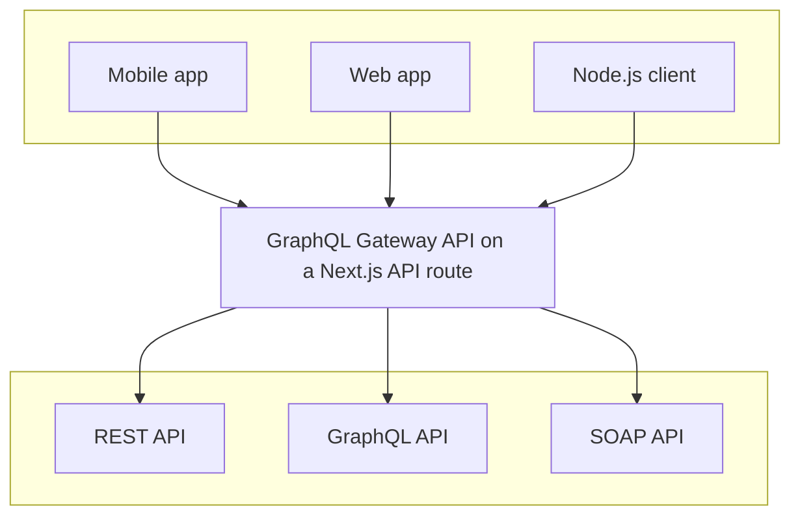
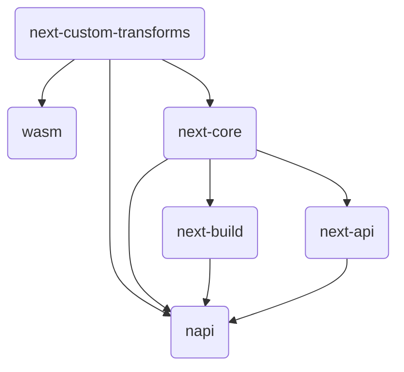

<a id="doc-9a67232bd7bb60e7c305a6fc"></a>

# vercel/next.js / examples/cms-cosmic/README.md

Upstream: https://github.com/vercel/next.js/blob/fbd032ff6d9698fa6efee20d1358b1b9c63dde00/examples/cms-cosmic/README.md

Commit: `fbd032ff6d9698fa6efee20d1358b1b9c63dde00`

Retrieved: 2026-10-01T15:45:39.996477+00:00

Kind: official-document

Raw SHA256: `0f07468d06d65378209bc48ac7ba96ddf6c8e7ad0c9a064b038bc05a95605bc5`

Source text below is untrusted reference content. Acquisition does not verify technical claims.

License status: UPSTREAM_NOTICES_CAPTURED_PER_FILE_REVIEW_REQUIRED. See this repository's captured license files.

---

# A statically generated blog example using Next.js and Cosmic

This example showcases Next.js's [Static Generation](https://nextjs.org/docs/basic-features/pages) feature using [Cosmic](https://cosmicjs.com/) as the data source.

## Demo

[https://cosmic-next-blog.vercel.app/](https://cosmic-next-blog.vercel.app/)

## Deploy your own

Once you have access to [the environment variables you'll need](#step-3-set-up-environment-variables), deploy the example using [Vercel](https://vercel.com?utm_source=github&utm_medium=readme&utm_campaign=next-example).

[](https://vercel.com/new/clone?repository-url=https://github.com/vercel/next.js/tree/canary/examples/cms-cosmic&project-name=cms-cosmic&repository-name=cms-cosmic&env=COSMIC_BUCKET_SLUG,COSMIC_READ_KEY,COSMIC_PREVIEW_SECRET&envDescription=Required%20to%20connect%20the%20app%20with%20Cosmic&envLink=https://vercel.link/cms-cosmic-env)

### Related examples

- [AgilityCMS](/examples/cms-agilitycms)
- [Builder.io](/examples/cms-builder-io)
- [ButterCMS](/examples/cms-buttercms)
- [Contentful](/examples/cms-contentful)
- [Cosmic](/examples/cms-cosmic)
- [DatoCMS](/examples/cms-datocms)
- [DotCMS](/examples/cms-dotcms)
- [Drupal](/examples/cms-drupal)
- [Enterspeed](/examples/cms-enterspeed)
- [Ghost](/examples/cms-ghost)
- [GraphCMS](/examples/cms-graphcms)
- [Kontent.ai](/examples/cms-kontent-ai)
- [MakeSwift](/examples/cms-makeswift)
- [Payload](/examples/cms-payload)
- [Plasmic](/examples/cms-plasmic)
- [Prepr](/examples/cms-prepr)
- [Prismic](/examples/cms-prismic)
- [Sanity](/examples/cms-sanity)
- [Sitecore XM Cloud](/examples/cms-sitecore-xmcloud)
- [Sitefinity](/examples/cms-sitefinity)
- [Storyblok](/examples/cms-storyblok)
- [TakeShape](/examples/cms-takeshape)
- [Tina](/examples/cms-tina)
- [Umbraco](/examples/cms-umbraco)
- [Umbraco heartcore](/examples/cms-umbraco-heartcore)
- [Webiny](/examples/cms-webiny)
- [WordPress](/examples/cms-wordpress)
- [Blog Starter](/examples/blog-starter)

## How to use

Execute [`create-next-app`](https://github.com/vercel/next.js/tree/canary/packages/create-next-app) with [npm](https://docs.npmjs.com/cli/init), [Yarn](https://yarnpkg.com/lang/en/docs/cli/create/), or [pnpm](https://pnpm.io) to bootstrap the example:

```bash
npx create-next-app --example cms-cosmic cms-cosmic-app
```

```bash
yarn create next-app --example cms-cosmic cms-cosmic-app
```

```bash
pnpm create next-app --example cms-cosmic cms-cosmic-app
```

## Configuration

### Step 1. Create an account and a project on Cosmic

First, [create an account on Cosmic](https://cosmicjs.com).

### Step 2. Install the Next.js Static Blog app

After creating an account, install the [Next.js Static Blog](https://www.cosmicjs.com/apps/nextjs-static-blog) app from the Cosmic App Marketplace.

### Step 3. Set up environment variables

Go to the **Settings** menu at the sidebar and click **Basic Settings**.

Next, copy the `.env.local.example` file in this directory to `.env.local` (which will be ignored by Git):

```bash
cp .env.local.example .env.local
```

Then set each variable on `.env.local`:

- `COSMIC_BUCKET_SLUG` should be the **Bucket slug** key under **API Access**.
- `COSMIC_READ_KEY` should be the **Read Key** under **API Access**.
- `COSMIC_PREVIEW_SECRET` can be any random string (but avoid spaces) - this is used for [Preview Mode](https://nextjs.org/docs/advanced-features/preview-mode).

Your `.env.local` file should look like this:

```bash
COSMIC_BUCKET_SLUG=...
COSMIC_READ_KEY=...
COSMIC_PREVIEW_SECRET=...
```

### Step 4. Run Next.js in development mode

```bash
npm install
npm run dev

# or

yarn install
yarn dev
```

Your blog should be up and running on [http://localhost:3000](http://localhost:3000)! If it doesn't work, post on [GitHub discussions](https://github.com/vercel/next.js/discussions).

### Step 5. Try preview mode

To add the ability to preview content from your Cosmic dashboard go to **Posts > Edit Settings** and scroll down to the "Preview Link" section. (Screenshot below)


Add your live URL or localhost development URL which includes your chosen preview secret and `[object_slug]` shortcode. It should look like the following:

```
http://localhost:3000/api/preview?secret=<secret>&slug=[object_slug]
```

- `<secret>` is the string you entered for `COSMIC_PREVIEW_SECRET`.
- `[object_slug]` shortcode will automatically be converted to the post's `slug` attribute.

On Cosmic, go to one of the posts you've created and:

- **Update the title**. For example, you can add `[Draft]` in front of the title.
- Click **Save Draft**, but **DO NOT** click **Publish**. By doing this, the post will be in the draft state.

Now, if you go to the post page directly on localhost, you won't see the updated title. However, if you use the **Preview Mode**, you'll be able to see the change ([Documentation](https://nextjs.org/docs/advanced-features/preview-mode)).

Next, click the Preview Link button on the Post to see the updated title. (Screenshot below)


To exit preview mode, you can click on **Click here to exit preview mode** at the top.

### Step 6. Deploy on Vercel

You can deploy this app to the cloud with [Vercel](https://vercel.com?utm_source=github&utm_medium=readme&utm_campaign=next-example) ([Documentation](https://nextjs.org/docs/deployment)).

#### Deploy Your Local Project

To deploy your local project to Vercel, push it to GitHub/GitLab/Bitbucket and [import to Vercel](https://vercel.com/new?utm_source=github&utm_medium=readme&utm_campaign=next-example).

**Important**: When you import your project on Vercel, make sure to click on **Environment Variables** and set them to match your `.env.local` file.

#### Deploy from Our Template

Alternatively, you can deploy using our template by clicking on the Deploy button below.

[](https://vercel.com/new/clone?repository-url=https://github.com/vercel/next.js/tree/canary/examples/cms-cosmic&project-name=cms-cosmic&repository-name=cms-cosmic&env=COSMIC_BUCKET_SLUG,COSMIC_READ_KEY,COSMIC_PREVIEW_SECRET&envDescription=Required%20to%20connect%20the%20app%20with%20Cosmic&envLink=https://vercel.link/cms-cosmic-env)


<a id="doc-deab54b8946428fbe5d19dba"></a>

# vercel/next.js / examples/cms-cosmic/components/alert.tsx

Upstream: https://github.com/vercel/next.js/blob/fbd032ff6d9698fa6efee20d1358b1b9c63dde00/examples/cms-cosmic/components/alert.tsx

Commit: `fbd032ff6d9698fa6efee20d1358b1b9c63dde00`

Retrieved: 2026-10-01T15:45:39.996477+00:00

Kind: upstream-example-code

Raw SHA256: `1820f21e71dc6d9bfd250e94d64e171ad428819dec2d0f40c3708b6fe6f6fed5`

Source text below is untrusted reference content. Acquisition does not verify technical claims.

License status: UPSTREAM_NOTICES_CAPTURED_PER_FILE_REVIEW_REQUIRED. See this repository's captured license files.

---

````text
import Container from "./container";
import cn from "classnames";
import { EXAMPLE_PATH } from "@/lib/constants";

type AlertProps = {
  preview: boolean;
};

const Alert = (props: AlertProps) => {
  const { preview } = props;
  return (
    <div
      className={cn("border-b", {
        "bg-accent-7 border-accent-7 text-white": preview,
        "bg-accent-1 border-accent-2": !preview,
      })}
    >
      <Container>
        <div className="py-2 text-center text-sm">
          {preview ? (
            <>
              This page is a preview.{" "}
              <a
                href="/api/exit-preview"
                className="underline hover:text-cyan duration-200 transition-colors"
              >
                Click here
              </a>{" "}
              to exit preview mode.
            </>
          ) : (
            <>
              The source code for this blog is{" "}
              <a
                href={`https://github.com/vercel/next.js/tree/canary/examples/${EXAMPLE_PATH}`}
                className="underline hover:text-success duration-200 transition-colors"
              >
                available on GitHub
              </a>
              .
            </>
          )}
        </div>
      </Container>
    </div>
  );
};

export default Alert;

````


<a id="doc-13e6aeca27aafd1ad954db61"></a>

# vercel/next.js / examples/cms-cosmic/components/avatar.tsx

Upstream: https://github.com/vercel/next.js/blob/fbd032ff6d9698fa6efee20d1358b1b9c63dde00/examples/cms-cosmic/components/avatar.tsx

Commit: `fbd032ff6d9698fa6efee20d1358b1b9c63dde00`

Retrieved: 2026-10-01T15:45:39.996477+00:00

Kind: upstream-example-code

Raw SHA256: `da599908236047bad44f3a44220ead57cb15942dbb69bc21dbebf990a8d50a3c`

Source text below is untrusted reference content. Acquisition does not verify technical claims.

License status: UPSTREAM_NOTICES_CAPTURED_PER_FILE_REVIEW_REQUIRED. See this repository's captured license files.

---

````text
import Image from "next/image";

type AvatarProps = {
  name: string;
  picture: string;
};

const Avatar = (props: AvatarProps) => {
  const { name, picture } = props;

  return (
    <div className="flex items-center">
      <div className="w-12 h-12 relative mr-4">
        {picture && (
          <Image
            src={`${picture}?auto=format,compress,enhance&w=100&h=100`}
            layout="fill"
            className="rounded-full"
            alt={name}
          />
        )}
      </div>
      <div className="text-xl font-bold">{name}</div>
    </div>
  );
};

export default Avatar;

````


<a id="doc-be5ad8f2efacbb90a3be47c3"></a>

# vercel/next.js / examples/cms-cosmic/components/container.tsx

Upstream: https://github.com/vercel/next.js/blob/fbd032ff6d9698fa6efee20d1358b1b9c63dde00/examples/cms-cosmic/components/container.tsx

Commit: `fbd032ff6d9698fa6efee20d1358b1b9c63dde00`

Retrieved: 2026-10-01T15:45:39.996477+00:00

Kind: upstream-example-code

Raw SHA256: `8934bc3dde9d88b475f0fa4f5a9867c0d3b0812601737dc9bdbe41943f8248cb`

Source text below is untrusted reference content. Acquisition does not verify technical claims.

License status: UPSTREAM_NOTICES_CAPTURED_PER_FILE_REVIEW_REQUIRED. See this repository's captured license files.

---

````text
import { ReactNode } from "react";

type ContainerProps = {
  children: ReactNode;
};

const Container = (props: ContainerProps) => {
  const { children } = props;
  return <div className="container mx-auto px-5">{children}</div>;
};

export default Container;

````


<a id="doc-f4f87890df1bce99209bd3f8"></a>

# vercel/next.js / examples/cms-cosmic/components/cover-image.tsx

Upstream: https://github.com/vercel/next.js/blob/fbd032ff6d9698fa6efee20d1358b1b9c63dde00/examples/cms-cosmic/components/cover-image.tsx

Commit: `fbd032ff6d9698fa6efee20d1358b1b9c63dde00`

Retrieved: 2026-10-01T15:45:39.996477+00:00

Kind: upstream-example-code

Raw SHA256: `1e0e6f2458bf89cf2b4f277f7dec63cd490c795c3f9f5518de035abf297cd3a2`

Source text below is untrusted reference content. Acquisition does not verify technical claims.

License status: UPSTREAM_NOTICES_CAPTURED_PER_FILE_REVIEW_REQUIRED. See this repository's captured license files.

---

````text
import cn from "classnames";
import Link from "next/link";
import Imgix from "react-imgix";

type CoverImageProps = {
  title;
  url;
  slug;
};
const CoverImage = (props: CoverImageProps) => {
  const { title, url, slug } = props;

  const image = (
    <Imgix
      src={url}
      alt={`Cover Image for ${title}`}
      className={cn("lazyload shadow-small w-full", {
        "hover:shadow-medium transition-shadow duration-200": slug,
      })}
      sizes="100vw"
      attributeConfig={{
        src: "data-src",
        srcSet: "data-srcset",
        sizes: "data-sizes",
      }}
      htmlAttributes={{
        src: `${url}?auto=format,compress&q=1&blur=500&w=auto`,
      }}
    />
  );
  return (
    <div className="sm:mx-0">
      {slug ? (
        <Link href={`/posts/${slug}`} aria-label={title}>
          {image}
        </Link>
      ) : (
        image
      )}
    </div>
  );
};
export default CoverImage;

````


<a id="doc-021f527f9e41d25c8d12b144"></a>

# vercel/next.js / examples/cms-cosmic/components/date.tsx

Upstream: https://github.com/vercel/next.js/blob/fbd032ff6d9698fa6efee20d1358b1b9c63dde00/examples/cms-cosmic/components/date.tsx

Commit: `fbd032ff6d9698fa6efee20d1358b1b9c63dde00`

Retrieved: 2026-10-01T15:45:39.996477+00:00

Kind: upstream-example-code

Raw SHA256: `c514177661bbcf04112db2bdc8a5a2a13f0e4aeaabfa9a98a5ba8d686cf266a2`

Source text below is untrusted reference content. Acquisition does not verify technical claims.

License status: UPSTREAM_NOTICES_CAPTURED_PER_FILE_REVIEW_REQUIRED. See this repository's captured license files.

---

````text
import { parseISO, format } from "date-fns";

type DateProps = {
  dateString: string;
};

const Date = (props: DateProps) => {
  const { dateString } = props;
  const date = parseISO(dateString);
  return <time dateTime={dateString}>{format(date, "LLLL	d, yyyy")}</time>;
};

export default Date;

````


<a id="doc-3a3515557df8304c9c980933"></a>

# vercel/next.js / examples/cms-cosmic/components/footer.tsx

Upstream: https://github.com/vercel/next.js/blob/fbd032ff6d9698fa6efee20d1358b1b9c63dde00/examples/cms-cosmic/components/footer.tsx

Commit: `fbd032ff6d9698fa6efee20d1358b1b9c63dde00`

Retrieved: 2026-10-01T15:45:39.996477+00:00

Kind: upstream-example-code

Raw SHA256: `37245ba53adc1f2979d5bae3ad1068612b76c76d66c625cd6f209820134e73ae`

Source text below is untrusted reference content. Acquisition does not verify technical claims.

License status: UPSTREAM_NOTICES_CAPTURED_PER_FILE_REVIEW_REQUIRED. See this repository's captured license files.

---

````text
import Container from "./container";
import { EXAMPLE_PATH } from "@/lib/constants";

const Footer = () => {
  return (
    <footer className="bg-accent-1 border-t border-accent-2">
      <Container>
        <div className="py-28 flex flex-col lg:flex-row items-center">
          <h3 className="text-4xl lg:text-5xl font-bold tracking-tighter leading-tight text-center lg:text-left mb-10 lg:mb-0 lg:pr-4 lg:w-1/2">
            Statically Generated with Next.js.
          </h3>
          <div className="flex flex-col lg:flex-row justify-center items-center lg:pl-4 lg:w-1/2">
            <a
              href="https://nextjs.org/docs/basic-features/pages"
              className="mx-3 bg-black hover:bg-white hover:text-black border border-black text-white font-bold py-3 px-12 lg:px-8 duration-200 transition-colors mb-6 lg:mb-0"
            >
              Read Documentation
            </a>
            <a
              href={`https://github.com/vercel/next.js/tree/canary/examples/${EXAMPLE_PATH}`}
              className="mx-3 font-bold hover:underline"
            >
              View on GitHub
            </a>
          </div>
        </div>
      </Container>
    </footer>
  );
};

export default Footer;

````


<a id="doc-44ac8a28787290f1ae2b0cc4"></a>

# vercel/next.js / examples/cms-cosmic/components/header.tsx

Upstream: https://github.com/vercel/next.js/blob/fbd032ff6d9698fa6efee20d1358b1b9c63dde00/examples/cms-cosmic/components/header.tsx

Commit: `fbd032ff6d9698fa6efee20d1358b1b9c63dde00`

Retrieved: 2026-10-01T15:45:39.996477+00:00

Kind: upstream-example-code

Raw SHA256: `f5a560bfe98016c9cc9c3d7c06d185a2dd5a9b8025c6654a7383094dc86280e9`

Source text below is untrusted reference content. Acquisition does not verify technical claims.

License status: UPSTREAM_NOTICES_CAPTURED_PER_FILE_REVIEW_REQUIRED. See this repository's captured license files.

---

````text
import Link from "next/link";

const Header = () => {
  return (
    <h2 className="text-2xl md:text-4xl font-bold tracking-tight md:tracking-tighter leading-tight mb-20 mt-8">
      <Link href="/" className="hover:underline">
        Blog
      </Link>
      .
    </h2>
  );
};

export default Header;

````


<a id="doc-fa8503d9a65fea3513982ef1"></a>

# vercel/next.js / examples/cms-cosmic/components/hero-post.tsx

Upstream: https://github.com/vercel/next.js/blob/fbd032ff6d9698fa6efee20d1358b1b9c63dde00/examples/cms-cosmic/components/hero-post.tsx

Commit: `fbd032ff6d9698fa6efee20d1358b1b9c63dde00`

Retrieved: 2026-10-01T15:45:39.996477+00:00

Kind: upstream-example-code

Raw SHA256: `cce3a6d5934eb7d9f95350f5b3257fc2de22a23c9c5050180baaa56c62bc7373`

Source text below is untrusted reference content. Acquisition does not verify technical claims.

License status: UPSTREAM_NOTICES_CAPTURED_PER_FILE_REVIEW_REQUIRED. See this repository's captured license files.

---

````text
import Avatar from "./avatar";
import Date from "./date";
import CoverImage from "./cover-image";
import Link from "next/link";
import { AuthorType, ImgixType } from "interfaces";

type HeroPostProps = {
  title: string;
  coverImage: ImgixType;
  date: string;
  excerpt: string;
  author: AuthorType;
  slug: string;
};

const HeroPost = (props: HeroPostProps) => {
  const { title, coverImage, date, excerpt, author, slug } = props;

  return (
    <section>
      <div className="mb-8 md:mb-16">
        <CoverImage title={title} url={coverImage.imgix_url} slug={slug} />
      </div>
      <div className="md:grid md:grid-cols-2 md:gap-x-16 lg:gap-x-8 mb-20 md:mb-28">
        <div>
          <h3 className="mb-4 text-4xl lg:text-6xl leading-tight">
            <Link href={`/posts/${slug}`} className="hover:underline">
              {title}
            </Link>
          </h3>
          <div className="mb-4 md:mb-0 text-lg">
            <Date dateString={date} />
          </div>
        </div>
        <div>
          <p className="text-lg leading-relaxed mb-4">{excerpt}</p>
          <Avatar
            name={author.title}
            picture={author.metadata.picture.imgix_url}
          />
        </div>
      </div>
    </section>
  );
};

export default HeroPost;

````


<a id="doc-a4ba791bec9e2a184b0b0d6b"></a>

# vercel/next.js / examples/cms-cosmic/components/intro.tsx

Upstream: https://github.com/vercel/next.js/blob/fbd032ff6d9698fa6efee20d1358b1b9c63dde00/examples/cms-cosmic/components/intro.tsx

Commit: `fbd032ff6d9698fa6efee20d1358b1b9c63dde00`

Retrieved: 2026-10-01T15:45:39.996477+00:00

Kind: upstream-example-code

Raw SHA256: `352c1989ec448d0e950eba3e59f9e8b22dd39642a2ae3e07e010fbca062b760f`

Source text below is untrusted reference content. Acquisition does not verify technical claims.

License status: UPSTREAM_NOTICES_CAPTURED_PER_FILE_REVIEW_REQUIRED. See this repository's captured license files.

---

````text
import { CMS_NAME, CMS_URL } from "@/lib/constants";

const Intro = () => {
  return (
    <section className="flex-col md:flex-row flex items-center md:justify-between mt-16 mb-16 md:mb-12">
      <h1 className="text-6xl md:text-8xl font-bold tracking-tighter leading-tight md:pr-8">
        Blog.
      </h1>
      <h4 className="text-center md:text-left text-lg mt-5 md:pl-8">
        A statically generated blog example using{" "}
        <a
          href="https://nextjs.org/"
          className="underline hover:text-success duration-200 transition-colors"
        >
          Next.js
        </a>{" "}
        and{" "}
        <a
          href={CMS_URL}
          className="underline hover:text-success duration-200 transition-colors"
        >
          {CMS_NAME}
        </a>
        .
      </h4>
    </section>
  );
};

export default Intro;

````


<a id="doc-2385daabf0287a8d33bb446d"></a>

# vercel/next.js / examples/cms-cosmic/components/layout.tsx

Upstream: https://github.com/vercel/next.js/blob/fbd032ff6d9698fa6efee20d1358b1b9c63dde00/examples/cms-cosmic/components/layout.tsx

Commit: `fbd032ff6d9698fa6efee20d1358b1b9c63dde00`

Retrieved: 2026-10-01T15:45:39.996477+00:00

Kind: upstream-example-code

Raw SHA256: `121228b0723050de9eeb0140ca916c9b4ae78f721755bce953fc569a0e28b580`

Source text below is untrusted reference content. Acquisition does not verify technical claims.

License status: UPSTREAM_NOTICES_CAPTURED_PER_FILE_REVIEW_REQUIRED. See this repository's captured license files.

---

````text
import Alert from "./alert";
import Footer from "./footer";
import Meta from "./meta";
import "lazysizes";
import "lazysizes/plugins/parent-fit/ls.parent-fit";
import { ReactNode } from "react";

type LayoutProps = {
  preview: boolean;
  children: ReactNode;
};

const Layout = ({ preview, children }: LayoutProps) => {
  return (
    <>
      <Meta />
      <div className="min-h-screen">
        <Alert preview={preview} />
        <main>{children}</main>
      </div>
      <Footer />
    </>
  );
};

export default Layout;

````


<a id="doc-f7650856a9efb36b95f9e42e"></a>

# vercel/next.js / examples/cms-cosmic/components/meta.tsx

Upstream: https://github.com/vercel/next.js/blob/fbd032ff6d9698fa6efee20d1358b1b9c63dde00/examples/cms-cosmic/components/meta.tsx

Commit: `fbd032ff6d9698fa6efee20d1358b1b9c63dde00`

Retrieved: 2026-10-01T15:45:39.996477+00:00

Kind: upstream-example-code

Raw SHA256: `7f3974312fa3eb724136ed9e64440b5dcfc3b315120f13f6b9f9293f419d66e3`

Source text below is untrusted reference content. Acquisition does not verify technical claims.

License status: UPSTREAM_NOTICES_CAPTURED_PER_FILE_REVIEW_REQUIRED. See this repository's captured license files.

---

````text
import Head from "next/head";
import { CMS_NAME, HOME_OG_IMAGE_URL } from "@/lib/constants";

const Meta = () => {
  return (
    <Head>
      <link
        rel="apple-touch-icon"
        sizes="180x180"
        href="/favicon/apple-touch-icon.png"
      />
      <link
        rel="icon"
        type="image/png"
        sizes="32x32"
        href="/favicon/favicon-32x32.png"
      />
      <link
        rel="icon"
        type="image/png"
        sizes="16x16"
        href="/favicon/favicon-16x16.png"
      />
      <link rel="manifest" href="/favicon/site.webmanifest" />
      <link
        rel="mask-icon"
        href="/favicon/safari-pinned-tab.svg"
        color="#000000"
      />
      <link rel="shortcut icon" href="/favicon/favicon.ico" />
      <meta name="msapplication-TileColor" content="#000000" />
      <meta name="msapplication-config" content="/favicon/browserconfig.xml" />
      <meta name="theme-color" content="#000" />
      <link rel="alternate" type="application/rss+xml" href="/feed.xml" />
      <meta
        name="description"
        content={`A statically generated blog example using Next.js and ${CMS_NAME}.`}
      />
      <meta property="og:image" content={HOME_OG_IMAGE_URL} />
    </Head>
  );
};

export default Meta;

````


<a id="doc-2116ec099a999eecc563e5cd"></a>

# vercel/next.js / examples/cms-cosmic/components/more-stories.tsx

Upstream: https://github.com/vercel/next.js/blob/fbd032ff6d9698fa6efee20d1358b1b9c63dde00/examples/cms-cosmic/components/more-stories.tsx

Commit: `fbd032ff6d9698fa6efee20d1358b1b9c63dde00`

Retrieved: 2026-10-01T15:45:39.996477+00:00

Kind: upstream-example-code

Raw SHA256: `808d55115a19520bd69d765fb690d460f89d7e0bbb2b2a73aeb5345a53d5d34c`

Source text below is untrusted reference content. Acquisition does not verify technical claims.

License status: UPSTREAM_NOTICES_CAPTURED_PER_FILE_REVIEW_REQUIRED. See this repository's captured license files.

---

````text
import { PostType } from "interfaces";
import PostPreview from "./post-preview";

type MoreStoriesProps = {
  posts: PostType[];
};

const MoreStories = (props: MoreStoriesProps) => {
  const { posts } = props;
  return (
    <section>
      <h2 className="mb-8 text-6xl md:text-7xl font-bold tracking-tighter leading-tight">
        More Stories
      </h2>
      <div className="grid grid-cols-1 md:grid-cols-2 md:gap-x-16 lg:gap-x-32 gap-y-20 md:gap-y-32 mb-32">
        {posts.map((post) => (
          <PostPreview
            key={post.slug}
            title={post.title}
            coverImage={post.metadata.cover_image}
            date={post.created_at}
            author={post.metadata.author}
            slug={post.slug}
            excerpt={post.metadata.excerpt}
          />
        ))}
      </div>
    </section>
  );
};

export default MoreStories;

````


<a id="doc-924d9df790a016f057946d0a"></a>

# vercel/next.js / examples/cms-cosmic/components/post-body.tsx

Upstream: https://github.com/vercel/next.js/blob/fbd032ff6d9698fa6efee20d1358b1b9c63dde00/examples/cms-cosmic/components/post-body.tsx

Commit: `fbd032ff6d9698fa6efee20d1358b1b9c63dde00`

Retrieved: 2026-10-01T15:45:39.996477+00:00

Kind: upstream-example-code

Raw SHA256: `50a69174bfcf9578041123aa88539d6d97043f3d9f1fefdef6a84bcc133c0096`

Source text below is untrusted reference content. Acquisition does not verify technical claims.

License status: UPSTREAM_NOTICES_CAPTURED_PER_FILE_REVIEW_REQUIRED. See this repository's captured license files.

---

````text
import markdownStyles from "./markdown-styles.module.css";

type PostBodyProps = {
  content: string;
};

const PostBody = (props: PostBodyProps) => {
  const { content } = props;
  return (
    <div className="max-w-2xl mx-auto">
      <div
        className={markdownStyles["markdown"]}
        dangerouslySetInnerHTML={{ __html: content }}
      />
    </div>
  );
};

export default PostBody;

````


<a id="doc-0da1037a53344378a7ada710"></a>

# vercel/next.js / examples/cms-cosmic/components/post-header.tsx

Upstream: https://github.com/vercel/next.js/blob/fbd032ff6d9698fa6efee20d1358b1b9c63dde00/examples/cms-cosmic/components/post-header.tsx

Commit: `fbd032ff6d9698fa6efee20d1358b1b9c63dde00`

Retrieved: 2026-10-01T15:45:39.996477+00:00

Kind: upstream-example-code

Raw SHA256: `ca88e917e7478259886b79d206cd5f14b7c728382f9faf86d534c5c3c424ec2e`

Source text below is untrusted reference content. Acquisition does not verify technical claims.

License status: UPSTREAM_NOTICES_CAPTURED_PER_FILE_REVIEW_REQUIRED. See this repository's captured license files.

---

````text
import Avatar from "./avatar";
import Date from "./date";
import CoverImage from "./cover-image";
import PostTitle from "./post-title";
import { AuthorType, ImgixType } from "interfaces";

type PostHeaderProps = {
  title: string;
  coverImage: ImgixType;
  date: string;
  author: AuthorType;
};

const PostHeader = (props: PostHeaderProps) => {
  const { title, coverImage, date, author } = props;
  return (
    <>
      <PostTitle>{title}</PostTitle>
      <div className="hidden md:block md:mb-12">
        <Avatar
          name={author.title}
          picture={author.metadata.picture.imgix_url}
        />
      </div>
      <div className="mb-8 md:mb-16 sm:mx-0">
        <CoverImage title={title} url={coverImage.imgix_url} slug={""} />
      </div>
      <div className="max-w-2xl mx-auto">
        <div className="block md:hidden mb-6">
          <Avatar
            name={author.title}
            picture={author.metadata.picture.imgix_url}
          />
        </div>
        <div className="mb-6 text-lg">
          <Date dateString={date} />
        </div>
      </div>
    </>
  );
};

export default PostHeader;

````


<a id="doc-370a83386e09286a9f4d44f2"></a>

# vercel/next.js / examples/cms-cosmic/components/post-preview.tsx

Upstream: https://github.com/vercel/next.js/blob/fbd032ff6d9698fa6efee20d1358b1b9c63dde00/examples/cms-cosmic/components/post-preview.tsx

Commit: `fbd032ff6d9698fa6efee20d1358b1b9c63dde00`

Retrieved: 2026-10-01T15:45:39.996477+00:00

Kind: upstream-example-code

Raw SHA256: `8fc80304334d9bdef81a55654a8d4d9c373885572d9a80a11fa296de864361f2`

Source text below is untrusted reference content. Acquisition does not verify technical claims.

License status: UPSTREAM_NOTICES_CAPTURED_PER_FILE_REVIEW_REQUIRED. See this repository's captured license files.

---

````text
import Avatar from "./avatar";
import Date from "./date";
import CoverImage from "./cover-image";
import Link from "next/link";
import { AuthorType, ImgixType } from "interfaces";

type PostPreviewProps = {
  title: string;
  coverImage: ImgixType;
  date: string;
  excerpt: string;
  author: AuthorType;
  slug: string;
};

const PostPreview = (props: PostPreviewProps) => {
  const { title, coverImage, date, excerpt, author, slug } = props;

  return (
    <div>
      <div className="mb-5">
        <CoverImage slug={slug} title={title} url={coverImage.imgix_url} />
      </div>
      <h3 className="text-3xl mb-3 leading-snug">
        <Link href={`/posts/${slug}`} className="hover:underline">
          {title}
        </Link>
      </h3>
      <div className="text-lg mb-4">
        <Date dateString={date} />
      </div>
      <p className="text-lg leading-relaxed mb-4">{excerpt}</p>
      <Avatar name={author.title} picture={author.metadata.picture.imgix_url} />
    </div>
  );
};

export default PostPreview;

````


<a id="doc-472ecb7dde247834da8624e6"></a>

# vercel/next.js / examples/cms-cosmic/components/post-title.tsx

Upstream: https://github.com/vercel/next.js/blob/fbd032ff6d9698fa6efee20d1358b1b9c63dde00/examples/cms-cosmic/components/post-title.tsx

Commit: `fbd032ff6d9698fa6efee20d1358b1b9c63dde00`

Retrieved: 2026-10-01T15:45:39.996477+00:00

Kind: upstream-example-code

Raw SHA256: `4c878ce7c0d01deccac5d1a773ca3ab4fcb2b9064b4dff1c4c0c095340838d16`

Source text below is untrusted reference content. Acquisition does not verify technical claims.

License status: UPSTREAM_NOTICES_CAPTURED_PER_FILE_REVIEW_REQUIRED. See this repository's captured license files.

---

````text
import { ReactNode } from "react";

type PostTitleProps = {
  children: ReactNode;
};

const PostTitle = (props: PostTitleProps) => {
  const { children } = props;
  return (
    <h1 className="text-6xl md:text-7xl lg:text-8xl font-bold tracking-tighter leading-tight md:leading-none mb-12 text-center md:text-left">
      {children}
    </h1>
  );
};
export default PostTitle;

````


<a id="doc-3394a4c3ec8d9305e0363acb"></a>

# vercel/next.js / examples/cms-cosmic/components/section-separator.tsx

Upstream: https://github.com/vercel/next.js/blob/fbd032ff6d9698fa6efee20d1358b1b9c63dde00/examples/cms-cosmic/components/section-separator.tsx

Commit: `fbd032ff6d9698fa6efee20d1358b1b9c63dde00`

Retrieved: 2026-10-01T15:45:39.996477+00:00

Kind: upstream-example-code

Raw SHA256: `5f23c78653f316c113dc21a24862c27799d5b863d86b24c45d27322bb5933696`

Source text below is untrusted reference content. Acquisition does not verify technical claims.

License status: UPSTREAM_NOTICES_CAPTURED_PER_FILE_REVIEW_REQUIRED. See this repository's captured license files.

---

````text
const SectionSeparator = () => {
  return <hr className="border-accent-2 mt-28 mb-24" />;
};

export default SectionSeparator;

````


<a id="doc-dae1023198a0d1f8af4dec2b"></a>

# vercel/next.js / examples/cms-cosmic/interfaces/index.ts

Upstream: https://github.com/vercel/next.js/blob/fbd032ff6d9698fa6efee20d1358b1b9c63dde00/examples/cms-cosmic/interfaces/index.ts

Commit: `fbd032ff6d9698fa6efee20d1358b1b9c63dde00`

Retrieved: 2026-10-01T15:45:39.996477+00:00

Kind: upstream-example-code

Raw SHA256: `99f42e7c88ecf7521a91b9cff0db6dfbbb05ee178716a1749b5c9d3eaeb5ad38`

Source text below is untrusted reference content. Acquisition does not verify technical claims.

License status: UPSTREAM_NOTICES_CAPTURED_PER_FILE_REVIEW_REQUIRED. See this repository's captured license files.

---

````text
export type ImgixType = {
  url: string;
  imgix_url: string;
};

export type AuthorType = {
  title: string;
  metadata: {
    picture: ImgixType;
  };
};

export type PostType = {
  title: string;
  slug: string;
  content: string;
  created_at: string;
  metadata: {
    cover_image: ImgixType;
    author: AuthorType;
    excerpt: string;
    content: string;
  };
};

````


<a id="doc-f0664dc3aa2b1d03e8d0f174"></a>

# vercel/next.js / examples/cms-cosmic/lib/api.tsx

Upstream: https://github.com/vercel/next.js/blob/fbd032ff6d9698fa6efee20d1358b1b9c63dde00/examples/cms-cosmic/lib/api.tsx

Commit: `fbd032ff6d9698fa6efee20d1358b1b9c63dde00`

Retrieved: 2026-10-01T15:45:39.996477+00:00

Kind: upstream-example-code

Raw SHA256: `6816f3b4c840f41f1b6ff0a3f7a02092ead25e0a6fe4e2b51ca9a8f39c7c12f8`

Source text below is untrusted reference content. Acquisition does not verify technical claims.

License status: UPSTREAM_NOTICES_CAPTURED_PER_FILE_REVIEW_REQUIRED. See this repository's captured license files.

---

````text
import Cosmic from "cosmicjs";
import { PostType } from "interfaces";
import ErrorPage from "next/error";

const BUCKET_SLUG = process.env.COSMIC_BUCKET_SLUG;
const READ_KEY = process.env.COSMIC_READ_KEY;

const bucket = Cosmic().bucket({
  slug: BUCKET_SLUG,
  read_key: READ_KEY,
});

export const getPreviewPostBySlug = async (slug: string) => {
  const params = {
    query: {
      slug,
      type: "posts",
    },
    props: "slug",
    status: "any",
  };

  try {
    const data = await bucket.getObjects(params);
    return data.objects[0];
  } catch (err) {
    // Don't throw if an slug doesn't exist
    return <ErrorPage statusCode={err.status} />;
  }
};

export const getAllPostsWithSlug = async () => {
  const params = {
    query: {
      type: "posts",
    },
    props: "slug",
  };
  const data = await bucket.getObjects(params);
  return data.objects;
};

export const getAllPostsForHome = async (
  preview: boolean,
): Promise<PostType[]> => {
  const params = {
    query: {
      type: "posts",
    },
    props: "title,slug,metadata,created_at",
    sort: "-created_at",
    ...(preview && { status: "any" }),
  };
  const data = await bucket.getObjects(params);
  return data.objects;
};

export const getPostAndMorePosts = async (
  slug: string,
  preview: boolean,
): Promise<{
  post: PostType;
  morePosts: PostType[];
}> => {
  const singleObjectParams = {
    query: {
      slug,
      type: "posts",
    },
    props: "slug,title,metadata,created_at",
    ...(preview && { status: "any" }),
  };
  const moreObjectParams = {
    query: {
      type: "posts",
    },
    limit: 3,
    props: "title,slug,metadata,created_at",
    ...(preview && { status: "any" }),
  };
  let object;
  try {
    const data = await bucket.getObjects(singleObjectParams);
    object = data.objects[0];
  } catch (err) {
    throw err;
  }
  const moreObjects = await bucket.getObjects(moreObjectParams);
  const morePosts = moreObjects.objects
    ?.filter(({ slug: object_slug }) => object_slug !== slug)
    .slice(0, 2);

  return {
    post: object,
    morePosts,
  };
};

````


<a id="doc-9c758c4716d6de8bfddf90a7"></a>

# vercel/next.js / examples/cms-cosmic/lib/constants.ts

Upstream: https://github.com/vercel/next.js/blob/fbd032ff6d9698fa6efee20d1358b1b9c63dde00/examples/cms-cosmic/lib/constants.ts

Commit: `fbd032ff6d9698fa6efee20d1358b1b9c63dde00`

Retrieved: 2026-10-01T15:45:39.996477+00:00

Kind: upstream-example-code

Raw SHA256: `25ba0810bb5ff1f3e04cfd98fe98bc38a7001986e82c3da307b0f1f3ab117f49`

Source text below is untrusted reference content. Acquisition does not verify technical claims.

License status: UPSTREAM_NOTICES_CAPTURED_PER_FILE_REVIEW_REQUIRED. See this repository's captured license files.

---

````text
export const EXAMPLE_PATH = "cms-cosmic";
export const CMS_NAME = "Cosmic";
export const CMS_URL = "https://cosmicjs.com/";
export const HOME_OG_IMAGE_URL =
  "https://og-image.vercel.app/Next.js%20Example%20Blog%20with%20**Cosmic**.png?theme=light&md=1&fontSize=75px&images=https%3A%2F%2Fassets.vercel.com%2Fimage%2Fupload%2Ffront%2Fassets%2Fdesign%2Fnextjs-black-logo.svg&images=https%3A%2F%2Fweb-assets.cosmicjs.com%2Fimages%2Flogo.svg";

````


<a id="doc-bc1dd8664647558f2dd75c9d"></a>

# vercel/next.js / examples/cms-cosmic/lib/markdownToHtml.ts

Upstream: https://github.com/vercel/next.js/blob/fbd032ff6d9698fa6efee20d1358b1b9c63dde00/examples/cms-cosmic/lib/markdownToHtml.ts

Commit: `fbd032ff6d9698fa6efee20d1358b1b9c63dde00`

Retrieved: 2026-10-01T15:45:39.996477+00:00

Kind: upstream-example-code

Raw SHA256: `7f929385c98bd1fa6a8750760992769a7c853321d4e6c11e4c368547faa28ff1`

Source text below is untrusted reference content. Acquisition does not verify technical claims.

License status: UPSTREAM_NOTICES_CAPTURED_PER_FILE_REVIEW_REQUIRED. See this repository's captured license files.

---

````text
import { remark } from "remark";
import html from "remark-html";

const markdownToHtml = async (markdown: string) => {
  const result = await remark().use(html).process(markdown);
  return result.toString();
};

export default markdownToHtml;

````


<a id="doc-4c105d06b97a0603cd4ba075"></a>

# vercel/next.js / examples/cms-cosmic/next.config.js

Upstream: https://github.com/vercel/next.js/blob/fbd032ff6d9698fa6efee20d1358b1b9c63dde00/examples/cms-cosmic/next.config.js

Commit: `fbd032ff6d9698fa6efee20d1358b1b9c63dde00`

Retrieved: 2026-10-01T15:45:39.996477+00:00

Kind: upstream-example-code

Raw SHA256: `fd2fdfd5afeb9611cdbcf00d48ef301cdd4e8e733dbd840b09489156af57a44c`

Source text below is untrusted reference content. Acquisition does not verify technical claims.

License status: UPSTREAM_NOTICES_CAPTURED_PER_FILE_REVIEW_REQUIRED. See this repository's captured license files.

---

````text
/** @type {import('next').NextConfig} */
module.exports = {
  images: {
    remotePatterns: [
      {
        protocol: "https",
        hostname: "imgix.cosmicjs.com",
        port: "",
        pathname: "/my-account/**",
      },
    ],
  },
};

````


<a id="doc-c1029f0def9f32ecce2b3fc7"></a>

# vercel/next.js / examples/cms-cosmic/pages/_app.tsx

Upstream: https://github.com/vercel/next.js/blob/fbd032ff6d9698fa6efee20d1358b1b9c63dde00/examples/cms-cosmic/pages/_app.tsx

Commit: `fbd032ff6d9698fa6efee20d1358b1b9c63dde00`

Retrieved: 2026-10-01T15:45:39.996477+00:00

Kind: upstream-example-code

Raw SHA256: `d29f52e12a5d5eb6584fa76d48b14a3b99b70439ab68e046701512d2b82c154f`

Source text below is untrusted reference content. Acquisition does not verify technical claims.

License status: UPSTREAM_NOTICES_CAPTURED_PER_FILE_REVIEW_REQUIRED. See this repository's captured license files.

---

````text
import "@/styles/index.css";
import type { AppProps } from "next/app";

function MyApp({ Component, pageProps }: AppProps) {
  return <Component {...pageProps} />;
}

export default MyApp;

````


<a id="doc-bd82291f44994c75c946c5f9"></a>

# vercel/next.js / examples/cms-cosmic/pages/_document.tsx

Upstream: https://github.com/vercel/next.js/blob/fbd032ff6d9698fa6efee20d1358b1b9c63dde00/examples/cms-cosmic/pages/_document.tsx

Commit: `fbd032ff6d9698fa6efee20d1358b1b9c63dde00`

Retrieved: 2026-10-01T15:45:39.996477+00:00

Kind: upstream-example-code

Raw SHA256: `7a1c264423bd3f5cadb3b1d831af81a989a54d9bc6b659e87dc646cadd98017e`

Source text below is untrusted reference content. Acquisition does not verify technical claims.

License status: UPSTREAM_NOTICES_CAPTURED_PER_FILE_REVIEW_REQUIRED. See this repository's captured license files.

---

````text
import { Html, Head, Main, NextScript } from "next/document";

export default function Document() {
  return (
    <Html lang="en">
      <Head />
      <body>
        <Main />
        <NextScript />
      </body>
    </Html>
  );
}

````


<a id="doc-8c7e2c1d48e16eb589b4e5e5"></a>

# vercel/next.js / examples/cms-cosmic/pages/api/exit-preview.ts

Upstream: https://github.com/vercel/next.js/blob/fbd032ff6d9698fa6efee20d1358b1b9c63dde00/examples/cms-cosmic/pages/api/exit-preview.ts

Commit: `fbd032ff6d9698fa6efee20d1358b1b9c63dde00`

Retrieved: 2026-10-01T15:45:39.996477+00:00

Kind: upstream-example-code

Raw SHA256: `38326cd6ec4610f3e8e3bcdbc3faf2fba2d6e4b73cba216ba0f9b0a775bc3475`

Source text below is untrusted reference content. Acquisition does not verify technical claims.

License status: UPSTREAM_NOTICES_CAPTURED_PER_FILE_REVIEW_REQUIRED. See this repository's captured license files.

---

````text
export default function exit(_, res) {
  // Exit Draft Mode by removing the cookie
  res.setDraftMode({ enable: false });

  // Redirect the user back to the index page.
  res.writeHead(307, { Location: "/" });
  res.end();
}

````


<a id="doc-5476e7c48532736666bc1650"></a>

# vercel/next.js / examples/cms-cosmic/pages/api/preview.ts

Upstream: https://github.com/vercel/next.js/blob/fbd032ff6d9698fa6efee20d1358b1b9c63dde00/examples/cms-cosmic/pages/api/preview.ts

Commit: `fbd032ff6d9698fa6efee20d1358b1b9c63dde00`

Retrieved: 2026-10-01T15:45:39.996477+00:00

Kind: upstream-example-code

Raw SHA256: `d645a5b7bb144dbbbd460eabad05487f266b360291e31619af2cc3693278c36c`

Source text below is untrusted reference content. Acquisition does not verify technical claims.

License status: UPSTREAM_NOTICES_CAPTURED_PER_FILE_REVIEW_REQUIRED. See this repository's captured license files.

---

````text
import { getPreviewPostBySlug } from "@/lib/api";

export default async function preview(req, res) {
  // Check the secret and next parameters
  // This secret should only be known to this API route and the CMS
  if (
    req.query.secret !== process.env.COSMIC_PREVIEW_SECRET ||
    !req.query.slug
  ) {
    return res.status(401).json({ message: "Invalid token" });
  }

  // Fetch the headless CMS to check if the provided `slug` exists
  const post = await getPreviewPostBySlug(req.query.slug);

  // If the slug doesn't exist prevent preview mode from being enabled
  if (!post) {
    return res.status(401).json({ message: "Invalid slug" });
  }

  // Enable Draft Mode by setting the cookie
  res.setDraftMode({ enable: true });

  // Redirect to the path from the fetched post
  // We don't redirect to req.query.slug as that might lead to open redirect vulnerabilities
  res.writeHead(307, { Location: `/posts/${post.slug}` });
  res.end();
}

````


<a id="doc-60665c9b81430a2470aaaa43"></a>

# vercel/next.js / examples/cms-cosmic/pages/index.tsx

Upstream: https://github.com/vercel/next.js/blob/fbd032ff6d9698fa6efee20d1358b1b9c63dde00/examples/cms-cosmic/pages/index.tsx

Commit: `fbd032ff6d9698fa6efee20d1358b1b9c63dde00`

Retrieved: 2026-10-01T15:45:39.996477+00:00

Kind: upstream-example-code

Raw SHA256: `3f82f782eceece45b91fc8aa93c1246f5a337e370335a9c40767f638d27043c3`

Source text below is untrusted reference content. Acquisition does not verify technical claims.

License status: UPSTREAM_NOTICES_CAPTURED_PER_FILE_REVIEW_REQUIRED. See this repository's captured license files.

---

````text
import Container from "@/components/container";
import MoreStories from "@/components/more-stories";
import HeroPost from "@/components/hero-post";
import Intro from "@/components/intro";
import Layout from "@/components/layout";
import { getAllPostsForHome } from "@/lib/api";
import Head from "next/head";
import { CMS_NAME } from "@/lib/constants";
import { PostType } from "interfaces";

type IndexProps = {
  allPosts: PostType[];
  preview: boolean;
};

const Index = (props: IndexProps) => {
  const { allPosts, preview } = props;

  const heroPost = allPosts[0];
  const morePosts = allPosts.slice(1);

  return (
    <>
      <Layout preview={preview}>
        <Head>
          <title>{`Next.js Blog Example with ${CMS_NAME}`}</title>
        </Head>
        <Container>
          <Intro />
          {heroPost && (
            <HeroPost
              title={heroPost.title}
              coverImage={heroPost.metadata.cover_image}
              date={heroPost.created_at}
              author={heroPost.metadata.author}
              slug={heroPost.slug}
              excerpt={heroPost.metadata.excerpt}
            />
          )}
          {morePosts.length > 0 && <MoreStories posts={morePosts} />}
        </Container>
      </Layout>
    </>
  );
};

export default Index;

type staticProps = {
  preview: boolean;
};

export const getStaticProps = async (props: staticProps) => {
  const { preview = null } = props;
  const allPosts = (await getAllPostsForHome(preview)) || [];
  return {
    props: { allPosts, preview },
  };
};

````


<a id="doc-95d6bc935ce533340cb4f34c"></a>

# vercel/next.js / examples/cms-cosmic/pages/posts/[slug].tsx

Upstream: https://github.com/vercel/next.js/blob/fbd032ff6d9698fa6efee20d1358b1b9c63dde00/examples/cms-cosmic/pages/posts/[slug].tsx

Commit: `fbd032ff6d9698fa6efee20d1358b1b9c63dde00`

Retrieved: 2026-10-01T15:45:39.996477+00:00

Kind: upstream-example-code

Raw SHA256: `8ac3b3f1411bc5b4667b0b4a0e2aebc37004112576218627a9cbb73f0fe525da`

Source text below is untrusted reference content. Acquisition does not verify technical claims.

License status: UPSTREAM_NOTICES_CAPTURED_PER_FILE_REVIEW_REQUIRED. See this repository's captured license files.

---

````text
import { useRouter } from "next/router";
import ErrorPage from "next/error";
import Container from "@/components/container";
import PostBody from "@/components/post-body";
import MoreStories from "@/components/more-stories";
import Header from "@/components/header";
import PostHeader from "@/components/post-header";
import SectionSeparator from "@/components/section-separator";
import Layout from "@/components/layout";
import { getAllPostsWithSlug, getPostAndMorePosts } from "@/lib/api";
import PostTitle from "@/components/post-title";
import Head from "next/head";
import { CMS_NAME } from "@/lib/constants";
import markdownToHtml from "@/lib/markdownToHtml";
import { PostType } from "interfaces";
import { ParsedUrlQueryInput } from "querystring";

type PostProps = {
  post: PostType;
  morePosts: PostType[];
  preview;
};

const Post = (props: PostProps) => {
  const { post, morePosts, preview } = props;
  const router = useRouter();
  if (!router.isFallback && !post?.slug) {
    return <ErrorPage statusCode={404} />;
  }
  return (
    <Layout preview={preview}>
      <Container>
        <Header />
        {router.isFallback ? (
          <PostTitle>Loading…</PostTitle>
        ) : (
          <>
            <article>
              <Head>
                <title>
                  {`${post.title} | Next.js Blog Example with ${CMS_NAME}`}
                </title>
                <meta
                  property="og:image"
                  content={post.metadata.cover_image.imgix_url}
                />
              </Head>
              <PostHeader
                title={post.title}
                coverImage={post.metadata.cover_image}
                date={post.created_at}
                author={post.metadata.author}
              />
              <PostBody content={post.content} />
            </article>
            <SectionSeparator />
            {morePosts.length > 0 && <MoreStories posts={morePosts} />}
          </>
        )}
      </Container>
    </Layout>
  );
};
export default Post;

type staticProps = {
  params: ParsedUrlQueryInput;
  preview: boolean;
};

export const getStaticProps = async (props: staticProps) => {
  const { params, preview = null } = props;
  try {
    const data = await getPostAndMorePosts(params.slug as string, preview);
    const content = await markdownToHtml(data["post"]?.metadata?.content || "");
    return {
      props: {
        preview,
        post: {
          ...data["post"],
          content,
        },
        morePosts: data["morePosts"] || [],
      },
    };
  } catch (err) {
    return <ErrorPage statusCode={err.status} />;
  }
};

export async function getStaticPaths() {
  const allPosts = (await getAllPostsWithSlug()) || [];
  return {
    paths: allPosts.map((post) => `/posts/${post.slug}`),
    fallback: true,
  };
}

````


<a id="doc-5b406bbcc0482498444e7a32"></a>

# vercel/next.js / examples/cms-cosmic/postcss.config.js

Upstream: https://github.com/vercel/next.js/blob/fbd032ff6d9698fa6efee20d1358b1b9c63dde00/examples/cms-cosmic/postcss.config.js

Commit: `fbd032ff6d9698fa6efee20d1358b1b9c63dde00`

Retrieved: 2026-10-01T15:45:39.996477+00:00

Kind: upstream-example-code

Raw SHA256: `eff8eafa1729ff693babf7f78f5525e30eff29f747ba15c964c5cb283d71e218`

Source text below is untrusted reference content. Acquisition does not verify technical claims.

License status: UPSTREAM_NOTICES_CAPTURED_PER_FILE_REVIEW_REQUIRED. See this repository's captured license files.

---

````text
// If you want to use other PostCSS plugins, see the following:
// https://tailwindcss.com/docs/using-with-preprocessors
module.exports = {
  plugins: {
    tailwindcss: {},
    autoprefixer: {},
  },
};

````


<a id="doc-f6e0625f596d29cc1c129759"></a>

# vercel/next.js / examples/cms-cosmic/tailwind.config.js

Upstream: https://github.com/vercel/next.js/blob/fbd032ff6d9698fa6efee20d1358b1b9c63dde00/examples/cms-cosmic/tailwind.config.js

Commit: `fbd032ff6d9698fa6efee20d1358b1b9c63dde00`

Retrieved: 2026-10-01T15:45:39.996477+00:00

Kind: upstream-example-code

Raw SHA256: `92e2885d434e49164fca8ef9fa6c6e753f0d69e07de120de3eb2d6268cd88a70`

Source text below is untrusted reference content. Acquisition does not verify technical claims.

License status: UPSTREAM_NOTICES_CAPTURED_PER_FILE_REVIEW_REQUIRED. See this repository's captured license files.

---

````text
/** @type {import('tailwindcss').Config} */
module.exports = {
  content: [
    "./pages/**/*.{js,ts,jsx,tsx}",
    "./components/**/*.{js,ts,jsx,tsx}",
  ],
  theme: {
    extend: {
      colors: {
        "accent-1": "#FAFAFA",
        "accent-2": "#EAEAEA",
        "accent-7": "#333",
        success: "#0070f3",
        cyan: "#79FFE1",
      },
      spacing: {
        28: "7rem",
      },
      letterSpacing: {
        tighter: "-.04em",
      },
      lineHeight: {
        tight: 1.2,
      },
      fontSize: {
        "5xl": "2.5rem",
        "6xl": "2.75rem",
        "7xl": "4.5rem",
        "8xl": "6.25rem",
      },
      boxShadow: {
        small: "0 5px 10px rgba(0, 0, 0, 0.12)",
        medium: "0 8px 30px rgba(0, 0, 0, 0.12)",
      },
    },
  },
  plugins: [],
};

````


<a id="doc-8da88e2eb603f48fd0c2e280"></a>

# vercel/next.js / examples/cms-datocms/README.md

Upstream: https://github.com/vercel/next.js/blob/fbd032ff6d9698fa6efee20d1358b1b9c63dde00/examples/cms-datocms/README.md

Commit: `fbd032ff6d9698fa6efee20d1358b1b9c63dde00`

Retrieved: 2026-10-01T15:45:39.996477+00:00

Kind: official-document

Raw SHA256: `12d920f62a9fe96573a3deab43534591a69d191ad0cf6816f29c4221c99f2acd`

Source text below is untrusted reference content. Acquisition does not verify technical claims.

License status: UPSTREAM_NOTICES_CAPTURED_PER_FILE_REVIEW_REQUIRED. See this repository's captured license files.

---

# A statically generated blog example using Next.js and DatoCMS

This example showcases Next.js's [Static Generation](https://nextjs.org/docs/basic-features/pages) feature using [DatoCMS](https://www.datocms.com/) as the data source.

## Demo

[https://next-blog-datocms.vercel.app/](https://next-blog-datocms.vercel.app/)

### Related examples

- [AgilityCMS](/examples/cms-agilitycms)
- [Builder.io](/examples/cms-builder-io)
- [ButterCMS](/examples/cms-buttercms)
- [Contentful](/examples/cms-contentful)
- [Cosmic](/examples/cms-cosmic)
- [DatoCMS](/examples/cms-datocms)
- [DotCMS](/examples/cms-dotcms)
- [Drupal](/examples/cms-drupal)
- [Enterspeed](/examples/cms-enterspeed)
- [Ghost](/examples/cms-ghost)
- [GraphCMS](/examples/cms-graphcms)
- [Kontent.ai](/examples/cms-kontent-ai)
- [MakeSwift](/examples/cms-makeswift)
- [Payload](/examples/cms-payload)
- [Plasmic](/examples/cms-plasmic)
- [Prepr](/examples/cms-prepr)
- [Prismic](/examples/cms-prismic)
- [Sanity](/examples/cms-sanity)
- [Sitecore XM Cloud](/examples/cms-sitecore-xmcloud)
- [Sitefinity](/examples/cms-sitefinity)
- [Storyblok](/examples/cms-storyblok)
- [TakeShape](/examples/cms-takeshape)
- [Tina](/examples/cms-tina)
- [Umbraco](/examples/cms-umbraco)
- [Umbraco heartcore](/examples/cms-umbraco-heartcore)
- [Webiny](/examples/cms-webiny)
- [WordPress](/examples/cms-wordpress)
- [Blog Starter](/examples/blog-starter)

## Deploy your own

Once you have access to [the environment variables you'll need](#step-5-set-up-environment-variables), deploy the example using [Vercel](https://vercel.com?utm_source=github&utm_medium=readme&utm_campaign=next-example).

[](https://vercel.com/new/clone?repository-url=https://github.com/vercel/next.js/tree/canary/examples/cms-datocms&project-name=cms-datocms&repository-name=cms-datocms&env=DATOCMS_API_TOKEN,DATOCMS_PREVIEW_SECRET&envDescription=Required%20to%20connect%20the%20app%20with%20DatoCMS&envLink=https://vercel.link/cms-datocms-env)

## How to use

Execute [`create-next-app`](https://github.com/vercel/next.js/tree/canary/packages/create-next-app) with [npm](https://docs.npmjs.com/cli/init), [Yarn](https://yarnpkg.com/lang/en/docs/cli/create/), or [pnpm](https://pnpm.io) to bootstrap the example:

```bash
npx create-next-app --example cms-datocms cms-datocms-app
```

```bash
yarn create next-app --example cms-datocms cms-datocms-app
```

```bash
pnpm create next-app --example cms-datocms cms-datocms-app
```

## Configuration

### Step 1. Create an account and a project on DatoCMS

First, [create an account on DatoCMS](https://datocms.com).

After creating an account, create a **new project** from the dashboard. You can select a **Blank Project**.

### Step 2. Create an `Author` model

From the project setting page, create a new **Model**.

- The name should be `Author`.

Next, add these fields (you don't have to modify the settings):

- `Name` - **Text** field (**Single-line String**)
- `Picture` - **Media** field (**Single asset**)

### Step 3. Create a `Post` model

From the project setting page, create a new **Model**:

- The name should be `Post`.
- **Important:** From the "Additional Settings" tab, turn on **Enable draft/published system.** This lets you preview the content.

Next, add these fields (you don't have to modify the settings unless specified):

- `Title` - **Text** field (**Single-line String**)
- `Content` - **Text** field (**Multiple-paragraph Text**)
- `Excerpt` - **Text** field (**Single-line String**)
- `Cover Image` - **Media** field (**Single asset**)
- `Date` - **Date and time** field (**Date**)
- `Author` - **Links** field (**Single link**) , and from the "Validations" tab under "Accept only specified model", select **Author**.
- `Slug` - **SEO** field (**Slug**), and from the "Validations" tab under "Reference field" select **Title**.

### Step 4. Populate Content

From the **Content** menu at the top, select **Author** and create a new record.

- You just need **1 Author record**.
- Use dummy data for the text.
- For the image, you can download one from [Unsplash](https://unsplash.com/).

Next, select **Post** and create a new record.

- We recommend creating at least **2 Post records**.
- Use dummy data for the text.
- You can write markdown for the **Content** field.
- For the images, you can download ones from [Unsplash](https://unsplash.com/).
- Pick the **Author** you created earlier.

**Important:** For each post record, you need to click **Publish** after saving. If not, the post will be in the draft state.

### Step 5. Set up environment variables

Go to the **Settings** menu at the top and click **API tokens**.

Then click **Read-only API token** and copy the token.

Next, copy the `.env.local.example` file in this directory to `.env.local` (which will be ignored by Git):

```bash
cp .env.local.example .env.local
```

Then set each variable on `.env.local`:

- `DATOCMS_API_TOKEN` should be the API token you just copied.
- `DATOCMS_PREVIEW_SECRET` can be any random string (but avoid spaces), like `MY_SECRET` - this is used for [the Preview Mode](https://nextjs.org/docs/advanced-features/preview-mode).

Your `.env.local` file should look like this:

```bash
DATOCMS_API_TOKEN=...
DATOCMS_PREVIEW_SECRET=...
```

### Step 6. Run Next.js in development mode

```bash
npm install
npm run dev

# or

yarn install
yarn dev
```

Your blog should be up and running on [http://localhost:3000](http://localhost:3000)! If it doesn't work, post on [GitHub discussions](https://github.com/vercel/next.js/discussions).

### Step 7. Try preview mode

On DatoCMS, go to one of the posts you've created and:

- **Update the title**. For example, you can add `[Draft]` in front of the title.
- Click **Save**, but **DO NOT** click **Publish**. By doing this, the post will be in the draft state.

(If it doesn't become draft, you need to go to the model settings for `Post`, go to **Additional Settings**, and turn on **Enable draft/published system**.)

Now, if you go to the post page on localhost, you won't see the updated title. However, if you use the **Preview Mode**, you'll be able to see the change ([Documentation](https://nextjs.org/docs/advanced-features/preview-mode)).

To enable the Preview Mode, go to this URL:

```
http://localhost:3000/api/preview?secret=<secret>&slug=<slug>
```

- `<secret>` should be the string you entered for `DATOCMS_PREVIEW_SECRET`.
- `<slug>` should be the post's `slug` attribute (you can check on DatoCMS).

You should now be able to see the updated title. To exit the preview mode, you can click **Click here to exit preview mode** at the top.

### Step 8. Deploy on Vercel

You can deploy this app to the cloud with [Vercel](https://vercel.com?utm_source=github&utm_medium=readme&utm_campaign=next-example) ([Documentation](https://nextjs.org/docs/deployment)).

#### Deploy Your Local Project

To deploy your local project to Vercel, push it to GitHub/GitLab/Bitbucket and [import to Vercel](https://vercel.com/new?utm_source=github&utm_medium=readme&utm_campaign=next-example).

**Important**: When you import your project on Vercel, make sure to click on **Environment Variables** and set them to match your `.env.local` file.

#### Deploy from Our Template

Alternatively, you can deploy using our template by clicking on the Deploy button below.

[](https://vercel.com/new/clone?repository-url=https://github.com/vercel/next.js/tree/canary/examples/cms-datocms&project-name=cms-datocms&repository-name=cms-datocms&env=DATOCMS_API_TOKEN,DATOCMS_PREVIEW_SECRET&envDescription=Required%20to%20connect%20the%20app%20with%20DatoCMS&envLink=https://vercel.link/cms-datocms-env)


<a id="doc-0b09d94e69fc725bbbfadc2d"></a>

# vercel/next.js / examples/cms-datocms/components/alert.js

Upstream: https://github.com/vercel/next.js/blob/fbd032ff6d9698fa6efee20d1358b1b9c63dde00/examples/cms-datocms/components/alert.js

Commit: `fbd032ff6d9698fa6efee20d1358b1b9c63dde00`

Retrieved: 2026-10-01T15:45:39.996477+00:00

Kind: upstream-example-code

Raw SHA256: `e565ae04da7514a52e8d4be236e7d6f5934e42100a376da3fcaa7b307b8f6882`

Source text below is untrusted reference content. Acquisition does not verify technical claims.

License status: UPSTREAM_NOTICES_CAPTURED_PER_FILE_REVIEW_REQUIRED. See this repository's captured license files.

---

````text
import Container from "./container";
import cn from "classnames";
import { EXAMPLE_PATH } from "@/lib/constants";

export default function Alert({ preview }) {
  return (
    <div
      className={cn("border-b", {
        "bg-accent-7 border-accent-7 text-white": preview,
        "bg-accent-1 border-accent-2": !preview,
      })}
    >
      <Container>
        <div className="py-2 text-center text-sm">
          {preview ? (
            <>
              This is page is a preview.{" "}
              <a
                href="/api/exit-preview"
                className="underline hover:text-cyan duration-200 transition-colors"
              >
                Click here
              </a>{" "}
              to exit preview mode.
            </>
          ) : (
            <>
              The source code for this blog is{" "}
              <a
                href={`https://github.com/vercel/next.js/tree/canary/examples/${EXAMPLE_PATH}`}
                className="underline hover:text-success duration-200 transition-colors"
              >
                available on GitHub
              </a>
              .
            </>
          )}
        </div>
      </Container>
    </div>
  );
}

````


<a id="doc-c6b53e1e589b8bed447c06e1"></a>

# vercel/next.js / examples/cms-datocms/components/avatar.js

Upstream: https://github.com/vercel/next.js/blob/fbd032ff6d9698fa6efee20d1358b1b9c63dde00/examples/cms-datocms/components/avatar.js

Commit: `fbd032ff6d9698fa6efee20d1358b1b9c63dde00`

Retrieved: 2026-10-01T15:45:39.996477+00:00

Kind: upstream-example-code

Raw SHA256: `88d223e8f9d6e81471516a351f09504f078f1f08603e3706a3d014ce01094806`

Source text below is untrusted reference content. Acquisition does not verify technical claims.

License status: UPSTREAM_NOTICES_CAPTURED_PER_FILE_REVIEW_REQUIRED. See this repository's captured license files.

---

````text
import Image from "next/image";

export default function Avatar({ name, picture }) {
  return (
    <div className="flex items-center">
      <div className="w-12 h-12 relative mr-4">
        <Image
          src={picture.url}
          layout="fill"
          className="rounded-full"
          alt={name}
        />
      </div>
      <div className="text-xl font-bold">{name}</div>
    </div>
  );
}

````


<a id="doc-b26e150f5dbe392763a0d55b"></a>

# vercel/next.js / examples/cms-datocms/components/container.js

Upstream: https://github.com/vercel/next.js/blob/fbd032ff6d9698fa6efee20d1358b1b9c63dde00/examples/cms-datocms/components/container.js

Commit: `fbd032ff6d9698fa6efee20d1358b1b9c63dde00`

Retrieved: 2026-10-01T15:45:39.996477+00:00

Kind: upstream-example-code

Raw SHA256: `d86cf8ac0a886d7cf8a689b8cb57eb144530776c10f0f52fd85a86a27321573b`

Source text below is untrusted reference content. Acquisition does not verify technical claims.

License status: UPSTREAM_NOTICES_CAPTURED_PER_FILE_REVIEW_REQUIRED. See this repository's captured license files.

---

````text
export default function Container({ children }) {
  return <div className="container mx-auto px-5">{children}</div>;
}

````


<a id="doc-f0bc0242852da163712118ec"></a>

# vercel/next.js / examples/cms-datocms/components/cover-image.js

Upstream: https://github.com/vercel/next.js/blob/fbd032ff6d9698fa6efee20d1358b1b9c63dde00/examples/cms-datocms/components/cover-image.js

Commit: `fbd032ff6d9698fa6efee20d1358b1b9c63dde00`

Retrieved: 2026-10-01T15:45:39.996477+00:00

Kind: upstream-example-code

Raw SHA256: `aa363403d3e718852d105bee79c2906df028a7d59d500436e3caa7fc0c696f75`

Source text below is untrusted reference content. Acquisition does not verify technical claims.

License status: UPSTREAM_NOTICES_CAPTURED_PER_FILE_REVIEW_REQUIRED. See this repository's captured license files.

---

````text
import { Image } from "react-datocms";
import cn from "classnames";
import Link from "next/link";

export default function CoverImage({ title, responsiveImage, slug }) {
  const image = (
    <Image
      data={{
        ...responsiveImage,
        alt: `Cover Image for ${title}`,
      }}
      className={cn("shadow-small", {
        "hover:shadow-medium transition-shadow duration-200": slug,
      })}
    />
  );
  return (
    <div className="sm:mx-0">
      {slug ? (
        <Link href={`/posts/${slug}`} aria-label={title}>
          {image}
        </Link>
      ) : (
        image
      )}
    </div>
  );
}

````


<a id="doc-3e8e439b7971a97fdcc19974"></a>

# vercel/next.js / examples/cms-datocms/components/date.js

Upstream: https://github.com/vercel/next.js/blob/fbd032ff6d9698fa6efee20d1358b1b9c63dde00/examples/cms-datocms/components/date.js

Commit: `fbd032ff6d9698fa6efee20d1358b1b9c63dde00`

Retrieved: 2026-10-01T15:45:39.996477+00:00

Kind: upstream-example-code

Raw SHA256: `a1928636afe0f5dd8dcd0aed9918877b6622c48d2e58271d432ca487b90a12ec`

Source text below is untrusted reference content. Acquisition does not verify technical claims.

License status: UPSTREAM_NOTICES_CAPTURED_PER_FILE_REVIEW_REQUIRED. See this repository's captured license files.

---

````text
import { parseISO, format } from "date-fns";

export default function Date({ dateString }) {
  const date = parseISO(dateString);
  return <time dateTime={dateString}>{format(date, "LLLL	d, yyyy")}</time>;
}

````


<a id="doc-f2a81fa3a0aecab9d7ca9d2e"></a>

# vercel/next.js / examples/cms-datocms/components/footer.js

Upstream: https://github.com/vercel/next.js/blob/fbd032ff6d9698fa6efee20d1358b1b9c63dde00/examples/cms-datocms/components/footer.js

Commit: `fbd032ff6d9698fa6efee20d1358b1b9c63dde00`

Retrieved: 2026-10-01T15:45:39.996477+00:00

Kind: upstream-example-code

Raw SHA256: `68dd4fbac16b707f71c21637183b7732055505f198c6e80d6060526d6e197527`

Source text below is untrusted reference content. Acquisition does not verify technical claims.

License status: UPSTREAM_NOTICES_CAPTURED_PER_FILE_REVIEW_REQUIRED. See this repository's captured license files.

---

````text
import Container from "./container";
import { EXAMPLE_PATH } from "@/lib/constants";

export default function Footer() {
  return (
    <footer className="bg-accent-1 border-t border-accent-2">
      <Container>
        <div className="py-28 flex flex-col lg:flex-row items-center">
          <h3 className="text-4xl lg:text-5xl font-bold tracking-tighter leading-tight text-center lg:text-left mb-10 lg:mb-0 lg:pr-4 lg:w-1/2">
            Statically Generated with Next.js.
          </h3>
          <div className="flex flex-col lg:flex-row justify-center items-center lg:pl-4 lg:w-1/2">
            <a
              href="https://nextjs.org/docs/basic-features/pages"
              className="mx-3 bg-black hover:bg-white hover:text-black border border-black text-white font-bold py-3 px-12 lg:px-8 duration-200 transition-colors mb-6 lg:mb-0"
            >
              Read Documentation
            </a>
            <a
              href={`https://github.com/vercel/next.js/tree/canary/examples/${EXAMPLE_PATH}`}
              className="mx-3 font-bold hover:underline"
            >
              View on GitHub
            </a>
          </div>
        </div>
      </Container>
    </footer>
  );
}

````


<a id="doc-87eab21764b8d2435dab7267"></a>

# vercel/next.js / examples/cms-datocms/components/header.js

Upstream: https://github.com/vercel/next.js/blob/fbd032ff6d9698fa6efee20d1358b1b9c63dde00/examples/cms-datocms/components/header.js

Commit: `fbd032ff6d9698fa6efee20d1358b1b9c63dde00`

Retrieved: 2026-10-01T15:45:39.996477+00:00

Kind: upstream-example-code

Raw SHA256: `dd742b5e929c131d8e039d9d87bab4df958dd50523bfa881b6ca63a2c8b5b968`

Source text below is untrusted reference content. Acquisition does not verify technical claims.

License status: UPSTREAM_NOTICES_CAPTURED_PER_FILE_REVIEW_REQUIRED. See this repository's captured license files.

---

````text
import Link from "next/link";

export default function Header() {
  return (
    <h2 className="text-2xl md:text-4xl font-bold tracking-tight md:tracking-tighter leading-tight mb-20 mt-8">
      <Link href="/" className="hover:underline">
        Blog
      </Link>
      .
    </h2>
  );
}

````


<a id="doc-1c4560e72de3f20c8fb14ae4"></a>

# vercel/next.js / examples/cms-datocms/components/hero-post.js

Upstream: https://github.com/vercel/next.js/blob/fbd032ff6d9698fa6efee20d1358b1b9c63dde00/examples/cms-datocms/components/hero-post.js

Commit: `fbd032ff6d9698fa6efee20d1358b1b9c63dde00`

Retrieved: 2026-10-01T15:45:39.996477+00:00

Kind: upstream-example-code

Raw SHA256: `50ece00ad8d5bb851b23ba0c4123fb74874712537b60eff5c3c9eb9bbca39b75`

Source text below is untrusted reference content. Acquisition does not verify technical claims.

License status: UPSTREAM_NOTICES_CAPTURED_PER_FILE_REVIEW_REQUIRED. See this repository's captured license files.

---

````text
import Avatar from "./avatar";
import Date from "./date";
import CoverImage from "./cover-image";
import Link from "next/link";

export default function HeroPost({
  title,
  coverImage,
  date,
  excerpt,
  author,
  slug,
}) {
  return (
    <section>
      <div className="mb-8 md:mb-16">
        <CoverImage
          title={title}
          responsiveImage={coverImage.responsiveImage}
          slug={slug}
        />
      </div>
      <div className="md:grid md:grid-cols-2 md:gap-x-16 lg:gap-x-8 mb-20 md:mb-28">
        <div>
          <h3 className="mb-4 text-4xl lg:text-6xl leading-tight">
            <Link href={`/posts/${slug}`} className="hover:underline">
              {title}
            </Link>
          </h3>
          <div className="mb-4 md:mb-0 text-lg">
            <Date dateString={date} />
          </div>
        </div>
        <div>
          <p className="text-lg leading-relaxed mb-4">{excerpt}</p>
          <Avatar name={author.name} picture={author.picture} />
        </div>
      </div>
    </section>
  );
}

````


<a id="doc-02061797daee4eba6d0fe6d6"></a>

# vercel/next.js / examples/cms-datocms/components/intro.js

Upstream: https://github.com/vercel/next.js/blob/fbd032ff6d9698fa6efee20d1358b1b9c63dde00/examples/cms-datocms/components/intro.js

Commit: `fbd032ff6d9698fa6efee20d1358b1b9c63dde00`

Retrieved: 2026-10-01T15:45:39.996477+00:00

Kind: upstream-example-code

Raw SHA256: `bc5395f04b78aba9ec920ad46ffa4720a02c1801e8c6806dc270c4e1cfbd39c1`

Source text below is untrusted reference content. Acquisition does not verify technical claims.

License status: UPSTREAM_NOTICES_CAPTURED_PER_FILE_REVIEW_REQUIRED. See this repository's captured license files.

---

````text
import { CMS_NAME, CMS_URL } from "@/lib/constants";

export default function Intro() {
  return (
    <section className="flex-col md:flex-row flex items-center md:justify-between mt-16 mb-16 md:mb-12">
      <h1 className="text-6xl md:text-8xl font-bold tracking-tighter leading-tight md:pr-8">
        Blog.
      </h1>
      <h4 className="text-center md:text-left text-lg mt-5 md:pl-8">
        A statically generated blog example using{" "}
        <a
          href="https://nextjs.org/"
          className="underline hover:text-success duration-200 transition-colors"
        >
          Next.js
        </a>{" "}
        and{" "}
        <a
          href={CMS_URL}
          className="underline hover:text-success duration-200 transition-colors"
        >
          {CMS_NAME}
        </a>
        .
      </h4>
    </section>
  );
}

````


<a id="doc-a2e2cdc495ffbaa10a6267cd"></a>

# vercel/next.js / examples/cms-datocms/components/layout.js

Upstream: https://github.com/vercel/next.js/blob/fbd032ff6d9698fa6efee20d1358b1b9c63dde00/examples/cms-datocms/components/layout.js

Commit: `fbd032ff6d9698fa6efee20d1358b1b9c63dde00`

Retrieved: 2026-10-01T15:45:39.996477+00:00

Kind: upstream-example-code

Raw SHA256: `107457a6f3e2c10757524ff9038c803f7d6615ca4bdf24f1a1d6fb497f30c95f`

Source text below is untrusted reference content. Acquisition does not verify technical claims.

License status: UPSTREAM_NOTICES_CAPTURED_PER_FILE_REVIEW_REQUIRED. See this repository's captured license files.

---

````text
import Alert from "./alert";
import Footer from "./footer";
import Meta from "./meta";

export default function Layout({ preview, children }) {
  return (
    <>
      <Meta />
      <div className="min-h-screen">
        <Alert preview={preview} />
        <main>{children}</main>
      </div>
      <Footer />
    </>
  );
}

````


<a id="doc-27a958802086378e00dfb279"></a>

# vercel/next.js / examples/cms-datocms/components/meta.js

Upstream: https://github.com/vercel/next.js/blob/fbd032ff6d9698fa6efee20d1358b1b9c63dde00/examples/cms-datocms/components/meta.js

Commit: `fbd032ff6d9698fa6efee20d1358b1b9c63dde00`

Retrieved: 2026-10-01T15:45:39.996477+00:00

Kind: upstream-example-code

Raw SHA256: `2686a4c8994ed5e8b917ab7f23b515a6a6711dfc6fddfd10dbe124a35526f922`

Source text below is untrusted reference content. Acquisition does not verify technical claims.

License status: UPSTREAM_NOTICES_CAPTURED_PER_FILE_REVIEW_REQUIRED. See this repository's captured license files.

---

````text
import Head from "next/head";
import { CMS_NAME, HOME_OG_IMAGE_URL } from "@/lib/constants";

export default function Meta() {
  return (
    <Head>
      <link
        rel="apple-touch-icon"
        sizes="180x180"
        href="/favicon/apple-touch-icon.png"
      />
      <link
        rel="icon"
        type="image/png"
        sizes="32x32"
        href="/favicon/favicon-32x32.png"
      />
      <link
        rel="icon"
        type="image/png"
        sizes="16x16"
        href="/favicon/favicon-16x16.png"
      />
      <link rel="manifest" href="/favicon/site.webmanifest" />
      <link
        rel="mask-icon"
        href="/favicon/safari-pinned-tab.svg"
        color="#000000"
      />
      <link rel="shortcut icon" href="/favicon/favicon.ico" />
      <meta name="msapplication-TileColor" content="#000000" />
      <meta name="msapplication-config" content="/favicon/browserconfig.xml" />
      <meta name="theme-color" content="#000" />
      <link rel="alternate" type="application/rss+xml" href="/feed.xml" />
      <meta
        name="description"
        content={`A statically generated blog example using Next.js and ${CMS_NAME}.`}
      />
      <meta property="og:image" content={HOME_OG_IMAGE_URL} />
    </Head>
  );
}

````


<a id="doc-c5d7cad28a483bba55d4e091"></a>

# vercel/next.js / examples/cms-datocms/components/more-stories.js

Upstream: https://github.com/vercel/next.js/blob/fbd032ff6d9698fa6efee20d1358b1b9c63dde00/examples/cms-datocms/components/more-stories.js

Commit: `fbd032ff6d9698fa6efee20d1358b1b9c63dde00`

Retrieved: 2026-10-01T15:45:39.996477+00:00

Kind: upstream-example-code

Raw SHA256: `0b55227418def01cc4f030817f82b5f797db6d6c130f53c3450bbb5a07fdc1a5`

Source text below is untrusted reference content. Acquisition does not verify technical claims.

License status: UPSTREAM_NOTICES_CAPTURED_PER_FILE_REVIEW_REQUIRED. See this repository's captured license files.

---

````text
import PostPreview from "./post-preview";

export default function MoreStories({ posts }) {
  return (
    <section>
      <h2 className="mb-8 text-6xl md:text-7xl font-bold tracking-tighter leading-tight">
        More Stories
      </h2>
      <div className="grid grid-cols-1 md:grid-cols-2 md:gap-x-16 lg:gap-x-32 gap-y-20 md:gap-y-32 mb-32">
        {posts.map((post) => (
          <PostPreview
            key={post.slug}
            title={post.title}
            coverImage={post.coverImage}
            date={post.date}
            author={post.author}
            slug={post.slug}
            excerpt={post.excerpt}
          />
        ))}
      </div>
    </section>
  );
}

````


<a id="doc-b92a3609bd31d2de204bf977"></a>

# vercel/next.js / examples/cms-datocms/components/post-body.js

Upstream: https://github.com/vercel/next.js/blob/fbd032ff6d9698fa6efee20d1358b1b9c63dde00/examples/cms-datocms/components/post-body.js

Commit: `fbd032ff6d9698fa6efee20d1358b1b9c63dde00`

Retrieved: 2026-10-01T15:45:39.996477+00:00

Kind: upstream-example-code

Raw SHA256: `eaebbf1821804f936951b0ac02c777bd8d85d027fd72b1f7e3900a606e637a4c`

Source text below is untrusted reference content. Acquisition does not verify technical claims.

License status: UPSTREAM_NOTICES_CAPTURED_PER_FILE_REVIEW_REQUIRED. See this repository's captured license files.

---

````text
import markdownStyles from "./markdown-styles.module.css";

export default function PostBody({ content }) {
  return (
    <div className="max-w-2xl mx-auto">
      <div
        className={markdownStyles["markdown"]}
        dangerouslySetInnerHTML={{ __html: content }}
      />
    </div>
  );
}

````


<a id="doc-c792bda1d5ccd6bf73e37d26"></a>

# vercel/next.js / examples/cms-datocms/components/post-header.js

Upstream: https://github.com/vercel/next.js/blob/fbd032ff6d9698fa6efee20d1358b1b9c63dde00/examples/cms-datocms/components/post-header.js

Commit: `fbd032ff6d9698fa6efee20d1358b1b9c63dde00`

Retrieved: 2026-10-01T15:45:39.996477+00:00

Kind: upstream-example-code

Raw SHA256: `e21217e37f315537e3b1684dc05d0d884b3684c8ae752a52b47fdf3c60caebc7`

Source text below is untrusted reference content. Acquisition does not verify technical claims.

License status: UPSTREAM_NOTICES_CAPTURED_PER_FILE_REVIEW_REQUIRED. See this repository's captured license files.

---

````text
import Avatar from "./avatar";
import Date from "./date";
import CoverImage from "./cover-image";
import PostTitle from "./post-title";

export default function PostHeader({ title, coverImage, date, author }) {
  return (
    <>
      <PostTitle>{title}</PostTitle>
      <div className="hidden md:block md:mb-12">
        <Avatar name={author.name} picture={author.picture} />
      </div>
      <div className="mb-8 md:mb-16 sm:mx-0">
        <CoverImage
          title={title}
          responsiveImage={coverImage.responsiveImage}
        />
      </div>
      <div className="max-w-2xl mx-auto">
        <div className="block md:hidden mb-6">
          <Avatar name={author.name} picture={author.picture} />
        </div>
        <div className="mb-6 text-lg">
          <Date dateString={date} />
        </div>
      </div>
    </>
  );
}

````


<a id="doc-e6bf3929c322edd4470f9506"></a>

# vercel/next.js / examples/cms-datocms/components/post-preview.js

Upstream: https://github.com/vercel/next.js/blob/fbd032ff6d9698fa6efee20d1358b1b9c63dde00/examples/cms-datocms/components/post-preview.js

Commit: `fbd032ff6d9698fa6efee20d1358b1b9c63dde00`

Retrieved: 2026-10-01T15:45:39.996477+00:00

Kind: upstream-example-code

Raw SHA256: `c67259370faea3a8c7ff8535bc1c54e794200bfcc808a9ae52ec35efe7445705`

Source text below is untrusted reference content. Acquisition does not verify technical claims.

License status: UPSTREAM_NOTICES_CAPTURED_PER_FILE_REVIEW_REQUIRED. See this repository's captured license files.

---

````text
import Avatar from "./avatar";
import Date from "./date";
import CoverImage from "./cover-image";
import Link from "next/link";

export default function PostPreview({
  title,
  coverImage,
  date,
  excerpt,
  author,
  slug,
}) {
  return (
    <div>
      <div className="mb-5">
        <CoverImage
          slug={slug}
          title={title}
          responsiveImage={coverImage.responsiveImage}
        />
      </div>
      <h3 className="text-3xl mb-3 leading-snug">
        <Link href={`/posts/${slug}`} className="hover:underline">
          {title}
        </Link>
      </h3>
      <div className="text-lg mb-4">
        <Date dateString={date} />
      </div>
      <p className="text-lg leading-relaxed mb-4">{excerpt}</p>
      <Avatar name={author.name} picture={author.picture} />
    </div>
  );
}

````


<a id="doc-e704cb38ee6c780d0ad9fd67"></a>

# vercel/next.js / examples/cms-datocms/components/post-title.js

Upstream: https://github.com/vercel/next.js/blob/fbd032ff6d9698fa6efee20d1358b1b9c63dde00/examples/cms-datocms/components/post-title.js

Commit: `fbd032ff6d9698fa6efee20d1358b1b9c63dde00`

Retrieved: 2026-10-01T15:45:39.996477+00:00

Kind: upstream-example-code

Raw SHA256: `ad522d72e199871e2a481ab6c55fa10572ef15168ccb397998b699652c8afd2f`

Source text below is untrusted reference content. Acquisition does not verify technical claims.

License status: UPSTREAM_NOTICES_CAPTURED_PER_FILE_REVIEW_REQUIRED. See this repository's captured license files.

---

````text
export default function PostTitle({ children }) {
  return (
    <h1 className="text-6xl md:text-7xl lg:text-8xl font-bold tracking-tighter leading-tight md:leading-none mb-12 text-center md:text-left">
      {children}
    </h1>
  );
}

````


<a id="doc-2cb93941b56c71bf3ee9d5e8"></a>

# vercel/next.js / examples/cms-datocms/components/section-separator.js

Upstream: https://github.com/vercel/next.js/blob/fbd032ff6d9698fa6efee20d1358b1b9c63dde00/examples/cms-datocms/components/section-separator.js

Commit: `fbd032ff6d9698fa6efee20d1358b1b9c63dde00`

Retrieved: 2026-10-01T15:45:39.996477+00:00

Kind: upstream-example-code

Raw SHA256: `9ef441f200a263e49d684782e2a8f0af5565e50d0665c86054c3420caf67dcd7`

Source text below is untrusted reference content. Acquisition does not verify technical claims.

License status: UPSTREAM_NOTICES_CAPTURED_PER_FILE_REVIEW_REQUIRED. See this repository's captured license files.

---

````text
export default function SectionSeparator() {
  return <hr className="border-accent-2 mt-28 mb-24" />;
}

````


<a id="doc-d995522884359b97cb9de9e3"></a>

# vercel/next.js / examples/cms-datocms/lib/api.js

Upstream: https://github.com/vercel/next.js/blob/fbd032ff6d9698fa6efee20d1358b1b9c63dde00/examples/cms-datocms/lib/api.js

Commit: `fbd032ff6d9698fa6efee20d1358b1b9c63dde00`

Retrieved: 2026-10-01T15:45:39.996477+00:00

Kind: upstream-example-code

Raw SHA256: `d9bde1ccead582cd50c633cacb001fdd790b94ef623b3cb002dc683c741867c1`

Source text below is untrusted reference content. Acquisition does not verify technical claims.

License status: UPSTREAM_NOTICES_CAPTURED_PER_FILE_REVIEW_REQUIRED. See this repository's captured license files.

---

````text
const API_URL = "https://graphql.datocms.com";
const API_TOKEN = process.env.DATOCMS_API_TOKEN;

// See: https://www.datocms.com/blog/offer-responsive-progressive-lqip-images-in-2020
const responsiveImageFragment = `
  fragment responsiveImageFragment on ResponsiveImage {
  srcSet
    webpSrcSet
    sizes
    src
    width
    height
    aspectRatio
    alt
    title
    bgColor
    base64
  }
`;

async function fetchAPI(query, { variables, preview } = {}) {
  const res = await fetch(API_URL + (preview ? "/preview" : ""), {
    method: "POST",
    headers: {
      "Content-Type": "application/json",
      Authorization: `Bearer ${API_TOKEN}`,
    },
    body: JSON.stringify({
      query,
      variables,
    }),
  });

  const json = await res.json();
  if (json.errors) {
    console.error(json.errors);
    throw new Error("Failed to fetch API");
  }
  return json.data;
}

export async function getPreviewPostBySlug(slug) {
  const data = await fetchAPI(
    `
    query PostBySlug($slug: String) {
      post(filter: {slug: {eq: $slug}}) {
        slug
      }
    }`,
    {
      preview: true,
      variables: {
        slug,
      },
    },
  );
  return data?.post;
}

export async function getAllPostsWithSlug() {
  const data = await fetchAPI(`
    {
      allPosts {
        slug
      }
    }
  `);
  return data?.allPosts;
}

export async function getAllPostsForHome(preview) {
  const data = await fetchAPI(
    `
    {
      allPosts(orderBy: date_DESC, first: 20) {
        title
        slug
        excerpt
        date
        coverImage {
          responsiveImage(imgixParams: {fm: jpg, fit: crop, w: 2000, h: 1000 }) {
            ...responsiveImageFragment
          }
        }
        author {
          name
          picture {
            url(imgixParams: {fm: jpg, fit: crop, w: 100, h: 100, sat: -100})
          }
        }
      }
    }

    ${responsiveImageFragment}
  `,
    { preview },
  );
  return data?.allPosts;
}

export async function getPostAndMorePosts(slug, preview) {
  const data = await fetchAPI(
    `
  query PostBySlug($slug: String) {
    post(filter: {slug: {eq: $slug}}) {
      title
      slug
      content
      date
      ogImage: coverImage{
        url(imgixParams: {fm: jpg, fit: crop, w: 2000, h: 1000 })
      }
      coverImage {
        responsiveImage(imgixParams: {fm: jpg, fit: crop, w: 2000, h: 1000 }) {
          ...responsiveImageFragment
        }
      }
      author {
        name
        picture {
          url(imgixParams: {fm: jpg, fit: crop, w: 100, h: 100, sat: -100})
        }
      }
    }

    morePosts: allPosts(orderBy: date_DESC, first: 2, filter: {slug: {neq: $slug}}) {
      title
      slug
      excerpt
      date
      coverImage {
        responsiveImage(imgixParams: {fm: jpg, fit: crop, w: 2000, h: 1000 }) {
          ...responsiveImageFragment
        }
      }
      author {
        name
        picture {
          url(imgixParams: {fm: jpg, fit: crop, w: 100, h: 100, sat: -100})
        }
      }
    }
  }

  ${responsiveImageFragment}
  `,
    {
      preview,
      variables: {
        slug,
      },
    },
  );
  return data;
}

````


<a id="doc-10cfd40b04454b8b5a3ebc3e"></a>

# vercel/next.js / examples/cms-datocms/lib/constants.js

Upstream: https://github.com/vercel/next.js/blob/fbd032ff6d9698fa6efee20d1358b1b9c63dde00/examples/cms-datocms/lib/constants.js

Commit: `fbd032ff6d9698fa6efee20d1358b1b9c63dde00`

Retrieved: 2026-10-01T15:45:39.996477+00:00

Kind: upstream-example-code

Raw SHA256: `614678053a98aa2722972fe8ae728328775d557593ca04ad8131c9a5925c0ca5`

Source text below is untrusted reference content. Acquisition does not verify technical claims.

License status: UPSTREAM_NOTICES_CAPTURED_PER_FILE_REVIEW_REQUIRED. See this repository's captured license files.

---

````text
export const EXAMPLE_PATH = "cms-datocms";
export const CMS_NAME = "DatoCMS";
export const CMS_URL = "https://www.datocms.com/";
export const HOME_OG_IMAGE_URL =
  "https://og-image.vercel.app/Next.js%20Blog%20Example%20with%20**DatoCMS**.png?theme=light&md=1&fontSize=75px&images=https%3A%2F%2Fassets.vercel.com%2Fimage%2Fupload%2Ffront%2Fassets%2Fdesign%2Fnextjs-black-logo.svg&images=data%3Aimage%2Fsvg%2Bxml%3Bbase64%2CPHN2ZyB4bWxucz0iaHR0cDovL3d3dy53My5vcmcvMjAwMC9zdmciIHhtbG5zOnhsaW5rPSJodHRwOi8vd3d3LnczLm9yZy8xOTk5L3hsaW5rIiB2aWV3Qm94PSIwIDAgMjYxLjI3NCA4MC41NjIiPjxkZWZzPjxsaW5lYXJHcmFkaWVudCBpZD0iYSIgeTE9IjQwLjQ0IiB4Mj0iNzguNjg3IiB5Mj0iNDAuNDQiIGdyYWRpZW50VW5pdHM9InVzZXJTcGFjZU9uVXNlIj48c3RvcCBvZmZzZXQ9IjAiIHN0b3AtY29sb3I9IiNmZjU5M2QiLz48c3RvcCBvZmZzZXQ9IjEiIHN0b3AtY29sb3I9IiNmZjc3NTEiLz48L2xpbmVhckdyYWRpZW50PjwvZGVmcz48dGl0bGU%2BZnVsbF9zbWFsbGVyPC90aXRsZT48cGF0aCBkPSJNMzkuMzQ0Ljg0NEgwVjgwLjAzN0gzOS4zNDRjMTkuNjc3LDAsMzkuMzQzLTE3LjcyOSwzOS4zNDMtMzkuNTkxUzU5LjAyMS44NDQsMzkuMzQ0Ljg0NFptMCw1Ny41ODlhMTcuOTkzLDE3Ljk5MywwLDEsMSwxOC0xNy45ODdBMTcuOTg2LDE3Ljk4NiwwLDAsMSwzOS4zNDQsNTguNDMzWiIgZmlsbD0idXJsKCNhKSIvPjxwYXRoIGQ9Ik0xMTkuMDU0Ljg1OGMxMS44NDIsMCwxNy45MTYsNy4xNzksMTcuOTE2LDE3LjA1OHY4LjgzNWMwLDkuODc4LTYuMDc0LDE3LjA1Ny0xNy45MTYsMTcuMDU3SDEwMC4yNzlWLjg1OFptNy4zNjMsMTdjMC01LjQ2LTIuODg0LTguMzQ0LTkuMjY1LTguMzQ0aC02LjM4MVYzNS4xNTZoNi4zODFjNi4zODEsMCw5LjI2NS0yLjg4NCw5LjI2NS04LjM0NFptNDMuMjQxLDE3Ljk3N0gxNTQuMTM1bC0yLjM5Myw3Ljk3N0gxNDEuMTg5TDE1Ni41MjcuODU4aDEwLjhsMTUuMzM5LDQyLjk1SDE3Mi4xMTJabS0xMi45NDYtOC40NjdoMTAuMzY5bC01LjE1NC0xNi45OTVaTTIxNi4wMzMuODU4djguOWgtMTEuNlY0My44MDhIMTkzLjg4M1Y5Ljc1NWgtMTEuNlYuODU4Wm0yNS41NDUsNDMuODA5Yy0xMy4wMDcsMC0xOS42OTUtOC4zNDUtMTkuNjk1LTE5LjU3M1YxOS41NzJDMjIxLjg4Myw4LjM0NCwyMjguNTcxLDAsMjQxLjU3OCwwczE5LjcsOC4zNDQsMTkuNywxOS41NzJ2NS41MjJDMjYxLjI3NCwzNi4zMjIsMjU0LjU4Niw0NC42NjcsMjQxLjU3OCw0NC42NjdabTAtMzUuODk0Yy02LjEzNSwwLTkuMTQyLDQuMTEyLTkuMTQyLDEwLjI0N3Y2LjYyNmMwLDYuMTM2LDMuMDA3LDEwLjI0Nyw5LjE0MiwxMC4yNDdzOS4xNDItNC4xMTEsOS4xNDItMTAuMjQ3VjE5LjAyQzI1MC43MiwxMi44ODUsMjQ3LjcxNCw4Ljc3MywyNDEuNTc4LDguNzczWk0xMDkuNjksNzUuMjQ0YTQuODEzLDQuODEzLDAsMCwwLDUuMi00Ljg2OGg1Ljk1NGMtLjA3NSw1LjU0Mi00LjE1NiwxMC4xODYtMTEuMDg0LDEwLjE4Ni04LjA4OCwwLTExLjk4Mi01LjA5My0xMS45ODItMTEuOTA4VjY1LjIwOWMwLTYuODE1LDMuODk0LTExLjkwNywxMS45ODItMTEuOTA3LDYuOTI4LDAsMTEuMDA5LDQuNjQyLDExLjA4NCwxMC4xODRoLTUuOTU0YTQuODEzLDQuODEzLDAsMCwwLTUuMi00Ljg2OGMtMy44OTUsMC01LjQ2OCwyLjU4NC01LjQ2OCw2LjI5MXY0LjA0NEMxMDQuMjIyLDcyLjY2LDEwNS44LDc1LjI0NCwxMDkuNjksNzUuMjQ0Wm0zNy4wNTUtMjEuNDE5aDUuOTE3VjgwLjAzN2gtNi4xNzhWNjYuMTgzbC00LjEyLDguMDEyaC01LjA5MmwtNC4wODEtOC4wMTJWODAuMDM3aC02LjE3OVY1My44MjVoNS45MTZsNi44OSwxNC4yNjdaTTE2OS41MSw4MC41NjJjLTYuMjkxLDAtMTAuNTIyLTMtMTAuNTIyLTguMjc2di0uNzEyaDYuMTc4VjcyLjFjMCwyLjIwOSwxLjQyMywzLjU1Nyw0LjM4MSwzLjU1NywyLjY1OSwwLDQuNDE5LTEuMDg2LDQuNDE5LTMuMTA4YTIuMTUxLDIuMTUxLDAsMCwwLTEuOC0yLjMyMWwtNi41NTMtMS42NDhjLTQuMDgyLTEuMDExLTYuMTc5LTIuODA4LTYuMTc5LTcuMDc3LDAtNS4yMDUsMy43MDctOC4yLDkuOTIzLTguMiw1Ljg3OSwwLDkuNjI0LDMuMTgyLDkuNjI0LDcuOTc1di42MzdIMTczLjAzdi0uNDQ5YzAtMS43NjEtLjk3NC0zLjIyMS0zLjY3LTMuMjIxLTIuMjQ3LDAtMy42NjkuNzg2LTMuNjY5LDIuNjU4YTEuOTk0LDEuOTk0LDAsMCwwLDEuNjg1LDIuMTM1bDYuOTY0LDEuODcyYzQuMTk0LDEuMTIzLDUuODc5LDMuNDQ1LDUuODc5LDcuMDc3QzE4MC4yMTksNzcuMjI5LDE3NS41NzYsODAuNTYyLDE2OS41MSw4MC41NjJaIiBmaWxsPSIjZmY3NzUxIi8%2BPC9zdmc%2B&widths=undefined&widths=350&heights=200&heights=auto";

````


<a id="doc-8c3fc541a88241796806f16a"></a>

# vercel/next.js / examples/cms-datocms/lib/markdownToHtml.js

Upstream: https://github.com/vercel/next.js/blob/fbd032ff6d9698fa6efee20d1358b1b9c63dde00/examples/cms-datocms/lib/markdownToHtml.js

Commit: `fbd032ff6d9698fa6efee20d1358b1b9c63dde00`

Retrieved: 2026-10-01T15:45:39.996477+00:00

Kind: upstream-example-code

Raw SHA256: `682bda1d4f03edc94dafa59cacb61a0c21a069083dca6cbc7bbd133f75365dd1`

Source text below is untrusted reference content. Acquisition does not verify technical claims.

License status: UPSTREAM_NOTICES_CAPTURED_PER_FILE_REVIEW_REQUIRED. See this repository's captured license files.

---

````text
import { remark } from "remark";
import html from "remark-html";

export default async function markdownToHtml(markdown) {
  const result = await remark().use(html).process(markdown);
  return result.toString();
}

````


<a id="doc-2dab61a9df72b1373cf774cc"></a>

# vercel/next.js / examples/cms-datocms/next.config.js

Upstream: https://github.com/vercel/next.js/blob/fbd032ff6d9698fa6efee20d1358b1b9c63dde00/examples/cms-datocms/next.config.js

Commit: `fbd032ff6d9698fa6efee20d1358b1b9c63dde00`

Retrieved: 2026-10-01T15:45:39.996477+00:00

Kind: upstream-example-code

Raw SHA256: `090cb7603d4d662b7a3645f6d35edf8d111a5656f1b131dcb4c4fa23f0f1bb2c`

Source text below is untrusted reference content. Acquisition does not verify technical claims.

License status: UPSTREAM_NOTICES_CAPTURED_PER_FILE_REVIEW_REQUIRED. See this repository's captured license files.

---

````text
/** @type {import('next').NextConfig} */
module.exports = {
  images: {
    remotePatterns: [
      {
        protocol: "https",
        hostname: "www.datocms-assets.com",
        port: "",
        pathname: "/my-account/**",
      },
    ],
  },
};

````


<a id="doc-b737db8c1c1ba6e50fad745d"></a>

# vercel/next.js / examples/cms-datocms/pages/_app.js

Upstream: https://github.com/vercel/next.js/blob/fbd032ff6d9698fa6efee20d1358b1b9c63dde00/examples/cms-datocms/pages/_app.js

Commit: `fbd032ff6d9698fa6efee20d1358b1b9c63dde00`

Retrieved: 2026-10-01T15:45:39.996477+00:00

Kind: upstream-example-code

Raw SHA256: `945ff3a7665665b5d6d345086cc08405493ced57935380e3ffb211d916ba3cd2`

Source text below is untrusted reference content. Acquisition does not verify technical claims.

License status: UPSTREAM_NOTICES_CAPTURED_PER_FILE_REVIEW_REQUIRED. See this repository's captured license files.

---

````text
import "@/styles/index.css";

function MyApp({ Component, pageProps }) {
  return <Component {...pageProps} />;
}

export default MyApp;

````


<a id="doc-f7d3086849efec7978ced878"></a>

# vercel/next.js / examples/cms-datocms/pages/_document.js

Upstream: https://github.com/vercel/next.js/blob/fbd032ff6d9698fa6efee20d1358b1b9c63dde00/examples/cms-datocms/pages/_document.js

Commit: `fbd032ff6d9698fa6efee20d1358b1b9c63dde00`

Retrieved: 2026-10-01T15:45:39.996477+00:00

Kind: upstream-example-code

Raw SHA256: `7a1c264423bd3f5cadb3b1d831af81a989a54d9bc6b659e87dc646cadd98017e`

Source text below is untrusted reference content. Acquisition does not verify technical claims.

License status: UPSTREAM_NOTICES_CAPTURED_PER_FILE_REVIEW_REQUIRED. See this repository's captured license files.

---

````text
import { Html, Head, Main, NextScript } from "next/document";

export default function Document() {
  return (
    <Html lang="en">
      <Head />
      <body>
        <Main />
        <NextScript />
      </body>
    </Html>
  );
}

````


<a id="doc-d026e5096de6382983e5eb9a"></a>

# vercel/next.js / examples/cms-datocms/pages/api/exit-preview.js

Upstream: https://github.com/vercel/next.js/blob/fbd032ff6d9698fa6efee20d1358b1b9c63dde00/examples/cms-datocms/pages/api/exit-preview.js

Commit: `fbd032ff6d9698fa6efee20d1358b1b9c63dde00`

Retrieved: 2026-10-01T15:45:39.996477+00:00

Kind: upstream-example-code

Raw SHA256: `129b315c0d59782b6ce3c08d02a6e64973cf2db3730552cf39a1427d1a72f37d`

Source text below is untrusted reference content. Acquisition does not verify technical claims.

License status: UPSTREAM_NOTICES_CAPTURED_PER_FILE_REVIEW_REQUIRED. See this repository's captured license files.

---

````text
export default async function exit(_, res) {
  // Exit Draft Mode by removing the cookie
  res.setDraftMode({ enable: false });

  // Redirect the user back to the index page.
  res.writeHead(307, { Location: "/" });
  res.end();
}

````


<a id="doc-464362a7f6f5b9f6631e9710"></a>

# vercel/next.js / examples/cms-datocms/pages/api/preview.js

Upstream: https://github.com/vercel/next.js/blob/fbd032ff6d9698fa6efee20d1358b1b9c63dde00/examples/cms-datocms/pages/api/preview.js

Commit: `fbd032ff6d9698fa6efee20d1358b1b9c63dde00`

Retrieved: 2026-10-01T15:45:39.996477+00:00

Kind: upstream-example-code

Raw SHA256: `32bbb5ab384be66429aad2ee5c0e3331aeebeb237e50ecb2657be328776bddfa`

Source text below is untrusted reference content. Acquisition does not verify technical claims.

License status: UPSTREAM_NOTICES_CAPTURED_PER_FILE_REVIEW_REQUIRED. See this repository's captured license files.

---

````text
import { getPreviewPostBySlug } from "@/lib/api";

export default async function preview(req, res) {
  // Check the secret and next parameters
  // This secret should only be known to this API route and the CMS
  if (
    req.query.secret !== process.env.DATOCMS_PREVIEW_SECRET ||
    !req.query.slug
  ) {
    return res.status(401).json({ message: "Invalid token" });
  }

  // Fetch the headless CMS to check if the provided `slug` exists
  const post = await getPreviewPostBySlug(req.query.slug);

  // If the slug doesn't exist prevent preview mode from being enabled
  if (!post) {
    return res.status(401).json({ message: "Invalid slug" });
  }

  // Enable Draft Mode by setting the cookie
  res.setDraftMode({ enable: true });

  // Redirect to the path from the fetched post
  // We don't redirect to req.query.slug as that might lead to open redirect vulnerabilities
  res.writeHead(307, { Location: `/posts/${post.slug}` });
  res.end();
}

````


<a id="doc-66749edccd1cfce60b9cf950"></a>

# vercel/next.js / examples/cms-datocms/pages/index.js

Upstream: https://github.com/vercel/next.js/blob/fbd032ff6d9698fa6efee20d1358b1b9c63dde00/examples/cms-datocms/pages/index.js

Commit: `fbd032ff6d9698fa6efee20d1358b1b9c63dde00`

Retrieved: 2026-10-01T15:45:39.996477+00:00

Kind: upstream-example-code

Raw SHA256: `bd8561f310bc2076d950a76d74b7e8776d5dd28a7abf943b0fc5bb1402850328`

Source text below is untrusted reference content. Acquisition does not verify technical claims.

License status: UPSTREAM_NOTICES_CAPTURED_PER_FILE_REVIEW_REQUIRED. See this repository's captured license files.

---

````text
import Container from "@/components/container";
import MoreStories from "@/components/more-stories";
import HeroPost from "@/components/hero-post";
import Intro from "@/components/intro";
import Layout from "@/components/layout";
import { getAllPostsForHome } from "@/lib/api";
import Head from "next/head";
import { CMS_NAME } from "@/lib/constants";

export default function Index({ allPosts }) {
  const heroPost = allPosts[0];
  const morePosts = allPosts.slice(1);
  return (
    <>
      <Layout>
        <Head>
          <title>{`Next.js Blog Example with ${CMS_NAME}`}</title>
        </Head>
        <Container>
          <Intro />
          {heroPost && (
            <HeroPost
              title={heroPost.title}
              coverImage={heroPost.coverImage}
              date={heroPost.date}
              author={heroPost.author}
              slug={heroPost.slug}
              excerpt={heroPost.excerpt}
            />
          )}
          {morePosts.length > 0 && <MoreStories posts={morePosts} />}
        </Container>
      </Layout>
    </>
  );
}

export async function getStaticProps({ preview = false }) {
  const allPosts = (await getAllPostsForHome(preview)) || [];
  return {
    props: { allPosts },
  };
}

````


<a id="doc-8881da22c81f9ae688387a8d"></a>

# vercel/next.js / examples/cms-datocms/pages/posts/[slug].js

Upstream: https://github.com/vercel/next.js/blob/fbd032ff6d9698fa6efee20d1358b1b9c63dde00/examples/cms-datocms/pages/posts/[slug].js

Commit: `fbd032ff6d9698fa6efee20d1358b1b9c63dde00`

Retrieved: 2026-10-01T15:45:39.996477+00:00

Kind: upstream-example-code

Raw SHA256: `1714056e60aa00ad166742d46ee3e4993ec1ad9fdf908f7955ea9d33970f93b8`

Source text below is untrusted reference content. Acquisition does not verify technical claims.

License status: UPSTREAM_NOTICES_CAPTURED_PER_FILE_REVIEW_REQUIRED. See this repository's captured license files.

---

````text
import { useRouter } from "next/router";
import ErrorPage from "next/error";
import Container from "@/components/container";
import PostBody from "@/components/post-body";
import MoreStories from "@/components/more-stories";
import Header from "@/components/header";
import PostHeader from "@/components/post-header";
import SectionSeparator from "@/components/section-separator";
import Layout from "@/components/layout";
import { getAllPostsWithSlug, getPostAndMorePosts } from "@/lib/api";
import PostTitle from "@/components/post-title";
import Head from "next/head";
import { CMS_NAME } from "@/lib/constants";
import markdownToHtml from "@/lib/markdownToHtml";

export default function Post({ post, morePosts, preview }) {
  const router = useRouter();
  if (!router.isFallback && !post?.slug) {
    return <ErrorPage statusCode={404} />;
  }
  return (
    <Layout preview={preview}>
      <Container>
        <Header />
        {router.isFallback ? (
          <PostTitle>Loading…</PostTitle>
        ) : (
          <>
            <article>
              <Head>
                <title>
                  {`${post.title} | Next.js Blog Example with ${CMS_NAME}`}
                </title>
                <meta property="og:image" content={post.ogImage.url} />
              </Head>
              <PostHeader
                title={post.title}
                coverImage={post.coverImage}
                date={post.date}
                author={post.author}
              />
              <PostBody content={post.content} />
            </article>
            <SectionSeparator />
            {morePosts.length > 0 && <MoreStories posts={morePosts} />}
          </>
        )}
      </Container>
    </Layout>
  );
}

export async function getStaticProps({ params, preview = false }) {
  const data = await getPostAndMorePosts(params.slug, preview);
  const content = await markdownToHtml(data?.post?.content || "");

  return {
    props: {
      preview,
      post: {
        ...data?.post,
        content,
      },
      morePosts: data?.morePosts ?? [],
    },
  };
}

export async function getStaticPaths() {
  const allPosts = await getAllPostsWithSlug();
  return {
    paths: allPosts?.map((post) => `/posts/${post.slug}`) || [],
    fallback: true,
  };
}

````


<a id="doc-04cb3097268b3fd20c1abeee"></a>

# vercel/next.js / examples/cms-datocms/postcss.config.js

Upstream: https://github.com/vercel/next.js/blob/fbd032ff6d9698fa6efee20d1358b1b9c63dde00/examples/cms-datocms/postcss.config.js

Commit: `fbd032ff6d9698fa6efee20d1358b1b9c63dde00`

Retrieved: 2026-10-01T15:45:39.996477+00:00

Kind: upstream-example-code

Raw SHA256: `eff8eafa1729ff693babf7f78f5525e30eff29f747ba15c964c5cb283d71e218`

Source text below is untrusted reference content. Acquisition does not verify technical claims.

License status: UPSTREAM_NOTICES_CAPTURED_PER_FILE_REVIEW_REQUIRED. See this repository's captured license files.

---

````text
// If you want to use other PostCSS plugins, see the following:
// https://tailwindcss.com/docs/using-with-preprocessors
module.exports = {
  plugins: {
    tailwindcss: {},
    autoprefixer: {},
  },
};

````


<a id="doc-e50ba59601d6f3d5b7371cda"></a>

# vercel/next.js / examples/cms-datocms/tailwind.config.js

Upstream: https://github.com/vercel/next.js/blob/fbd032ff6d9698fa6efee20d1358b1b9c63dde00/examples/cms-datocms/tailwind.config.js

Commit: `fbd032ff6d9698fa6efee20d1358b1b9c63dde00`

Retrieved: 2026-10-01T15:45:39.996477+00:00

Kind: upstream-example-code

Raw SHA256: `92e2885d434e49164fca8ef9fa6c6e753f0d69e07de120de3eb2d6268cd88a70`

Source text below is untrusted reference content. Acquisition does not verify technical claims.

License status: UPSTREAM_NOTICES_CAPTURED_PER_FILE_REVIEW_REQUIRED. See this repository's captured license files.

---

````text
/** @type {import('tailwindcss').Config} */
module.exports = {
  content: [
    "./pages/**/*.{js,ts,jsx,tsx}",
    "./components/**/*.{js,ts,jsx,tsx}",
  ],
  theme: {
    extend: {
      colors: {
        "accent-1": "#FAFAFA",
        "accent-2": "#EAEAEA",
        "accent-7": "#333",
        success: "#0070f3",
        cyan: "#79FFE1",
      },
      spacing: {
        28: "7rem",
      },
      letterSpacing: {
        tighter: "-.04em",
      },
      lineHeight: {
        tight: 1.2,
      },
      fontSize: {
        "5xl": "2.5rem",
        "6xl": "2.75rem",
        "7xl": "4.5rem",
        "8xl": "6.25rem",
      },
      boxShadow: {
        small: "0 5px 10px rgba(0, 0, 0, 0.12)",
        medium: "0 8px 30px rgba(0, 0, 0, 0.12)",
      },
    },
  },
  plugins: [],
};

````


<a id="doc-f67947beae265698ba67e9ec"></a>

# vercel/next.js / examples/cms-dotcms/README.md

Upstream: https://github.com/vercel/next.js/blob/fbd032ff6d9698fa6efee20d1358b1b9c63dde00/examples/cms-dotcms/README.md

Commit: `fbd032ff6d9698fa6efee20d1358b1b9c63dde00`

Retrieved: 2026-10-01T15:45:39.996477+00:00

Kind: official-document

Raw SHA256: `20e7f2a52223a58159e0bfe30b5e30a663e116f1a077ba7fe689e111d8d3f9a3`

Source text below is untrusted reference content. Acquisition does not verify technical claims.

License status: UPSTREAM_NOTICES_CAPTURED_PER_FILE_REVIEW_REQUIRED. See this repository's captured license files.

---

# A statically generated blog example using Next.js and dotCMS

This example showcases Next.js's [Static Generation](https://nextjs.org/docs/basic-features/pages) feature using [dotCMS](https://dotcms.com/) as the data source.

## Demo

### [https://nextjs-dotcms-blog.vercel.app/](https://nextjs-dotcms-blog.vercel.app/)

## Deploy your own

Using the Deploy Button below, you'll deploy the Next.js project.

[](https://vercel.com/new/clone?repository-url=https%3A%2F%2Fgithub.com%2FdotCMS%2Fnext.js%2Ftree%2Fcanary%2Fexamples%2Fcms-dotcms&project-name=nextjs-dotcms-blog&repository-name=nextjs-dotcms-blog&demo-title=Next.js+Blog&demo-description=Static+blog+with+multiple+authors+using+Preview+Mode&demo-url=https%3A%2F%2Fnext-blog-dotcms.vercel.app%2F)

### Related examples

- [AgilityCMS](/examples/cms-agilitycms)
- [Builder.io](/examples/cms-builder-io)
- [ButterCMS](/examples/cms-buttercms)
- [Contentful](/examples/cms-contentful)
- [Cosmic](/examples/cms-cosmic)
- [DatoCMS](/examples/cms-datocms)
- [DotCMS](/examples/cms-dotcms)
- [Drupal](/examples/cms-drupal)
- [Enterspeed](/examples/cms-enterspeed)
- [Ghost](/examples/cms-ghost)
- [GraphCMS](/examples/cms-graphcms)
- [Kontent.ai](/examples/cms-kontent-ai)
- [MakeSwift](/examples/cms-makeswift)
- [Payload](/examples/cms-payload)
- [Plasmic](/examples/cms-plasmic)
- [Prepr](/examples/cms-prepr)
- [Prismic](/examples/cms-prismic)
- [Sanity](/examples/cms-sanity)
- [Sitecore XM Cloud](/examples/cms-sitecore-xmcloud)
- [Sitefinity](/examples/cms-sitefinity)
- [Storyblok](/examples/cms-storyblok)
- [TakeShape](/examples/cms-takeshape)
- [Tina](/examples/cms-tina)
- [Umbraco](/examples/cms-umbraco)
- [Umbraco heartcore](/examples/cms-umbraco-heartcore)
- [Webiny](/examples/cms-webiny)
- [WordPress](/examples/cms-wordpress)
- [Blog Starter](/examples/blog-starter)

## How to use

Rename `.env.local.example` to `.env.local` and complete the variables:

`NEXT_PUBLIC_DOTCMS_HOST` is the dotCMS host, you can use `https://demo.dotcms.com`
`DOTCMS_TOKEN` for the demo site, you can generate the token using:

```
curl -H "Content-Type:application/json" --insecure  -X POST -d  '
{ "user":"admin@dotcms.com", "password":"admin", "expirationDays": 10 }
' http://demo.dotcms.com:8080/api/v1/authentication/api-token
```

Execute [`create-next-app`](https://github.com/vercel/next.js/tree/canary/packages/create-next-app) with [npm](https://docs.npmjs.com/cli/init), [Yarn](https://yarnpkg.com/lang/en/docs/cli/create/), or [pnpm](https://pnpm.io) to bootstrap the example:

```bash
npx create-next-app --example cms-dotcms cms-dotcms-app
```

```bash
yarn create next-app --example cms-dotcms cms-dotcms-app
```

```bash
pnpm create next-app --example cms-dotcms cms-dotcms-app
```

[](https://vercel.com/new/clone?repository-url=https%3A%2F%2Fgithub.com%2Fvercel%2Fnext.js%2Ftree%2Fcanary%2Fexamples%2Fcms-dotcms&project-name=nextjs-dotcms-blog&repository-name=nextjs-dotcms-blog&demo-title=Next.js+Blog&demo-description=Static+blog+with+multiple+authors+using+Preview+Mode&demo-url=https%3A%2F%2Fnext-blog-dotcms.vercel.app%2F)


<a id="doc-c9be3e2837a95d5b459ca1ee"></a>

# vercel/next.js / examples/cms-dotcms/components/alert.tsx

Upstream: https://github.com/vercel/next.js/blob/fbd032ff6d9698fa6efee20d1358b1b9c63dde00/examples/cms-dotcms/components/alert.tsx

Commit: `fbd032ff6d9698fa6efee20d1358b1b9c63dde00`

Retrieved: 2026-10-01T15:45:39.996477+00:00

Kind: upstream-example-code

Raw SHA256: `1193785f2a619d34dcd9b787e98ac7c24db76014fee96064b6b393b85d06ffca`

Source text below is untrusted reference content. Acquisition does not verify technical claims.

License status: UPSTREAM_NOTICES_CAPTURED_PER_FILE_REVIEW_REQUIRED. See this repository's captured license files.

---

````text
import Container from "./container";
import cn from "classnames";
import { EXAMPLE_PATH } from "@lib/constants";

export default function Alert({ preview }) {
  return (
    <div
      className={cn("border-b", {
        "bg-accent-7 border-accent-7 text-white": preview,
        "bg-accent-1 border-accent-2": !preview,
      })}
    >
      <Container>
        <div className="py-2 text-center text-sm">
          {preview ? (
            <>
              This is page is a preview.{" "}
              <a
                href="/api/exit-preview"
                className="underline hover:text-cyan duration-200 transition-colors"
              >
                Click here
              </a>{" "}
              to exit preview mode.
            </>
          ) : (
            <>
              The source code for this blog is{" "}
              <a
                href={`https://github.com/vercel/next.js/tree/canary/examples/${EXAMPLE_PATH}`}
                className="underline hover:text-success duration-200 transition-colors"
              >
                available on GitHub
              </a>
              .
            </>
          )}
        </div>
      </Container>
    </div>
  );
}

````


<a id="doc-3552f5a4c6c323d385ac896f"></a>

# vercel/next.js / examples/cms-dotcms/components/avatar.tsx

Upstream: https://github.com/vercel/next.js/blob/fbd032ff6d9698fa6efee20d1358b1b9c63dde00/examples/cms-dotcms/components/avatar.tsx

Commit: `fbd032ff6d9698fa6efee20d1358b1b9c63dde00`

Retrieved: 2026-10-01T15:45:39.996477+00:00

Kind: upstream-example-code

Raw SHA256: `dda19c8561b04bafbaed071773a3fce350caffb9e1e9b68b65736e18f39f3f49`

Source text below is untrusted reference content. Acquisition does not verify technical claims.

License status: UPSTREAM_NOTICES_CAPTURED_PER_FILE_REVIEW_REQUIRED. See this repository's captured license files.

---

````text
import DotCmsImage from "./dotcms-image";

export default function Avatar({ name, picture }) {
  return (
    <div className="flex items-center ">
      <div className="w-12 h-12 relative mr-4">
        {picture?.idPath ? (
          <DotCmsImage
            src={picture?.idPath}
            layout="fill"
            className="rounded-full"
            alt={name}
          />
        ) : null}
      </div>
      <div className="text-xl font-bold">{name}</div>
    </div>
  );
}

````


<a id="doc-639907b62a53f27dda7e382c"></a>

# vercel/next.js / examples/cms-dotcms/components/blocks.tsx

Upstream: https://github.com/vercel/next.js/blob/fbd032ff6d9698fa6efee20d1358b1b9c63dde00/examples/cms-dotcms/components/blocks.tsx

Commit: `fbd032ff6d9698fa6efee20d1358b1b9c63dde00`

Retrieved: 2026-10-01T15:45:39.996477+00:00

Kind: upstream-example-code

Raw SHA256: `0068ff6368dbf60a2a23fa04814bb9e02d4115d4608d2db31ce0269b27d14b8e`

Source text below is untrusted reference content. Acquisition does not verify technical claims.

License status: UPSTREAM_NOTICES_CAPTURED_PER_FILE_REVIEW_REQUIRED. See this repository's captured license files.

---

````text
import cn from "classnames";
import DotCmsImage from "./dotcms-image";
import Link from "next/link";

export const Bold = ({ children }) => <strong>{children}</strong>;
export const Italic = ({ children }) => <em>{children}</em>;
export const Strike = ({ children }) => <s>{children}</s>;
export const Underline = ({ children }) => <u>{children}</u>;
export const DotLink = ({ attrs: { href, target }, children }) => {
  const regEx = /https?:\/\//;

  return regEx.test(href) ? (
    <a href={href} rel="noopener noreferrer" target="_blank">
      {children}
    </a>
  ) : (
    <Link href={href} target={target || "_self"}>
      {children}
    </Link>
  );
};

const nodeMarks = {
  link: DotLink,
  bold: Bold,
  underline: Underline,
  italic: Italic,
  strike: Strike,
};

export const TextNode = (props) => {
  const { marks = [], text } = props;
  const mark = marks[0] || { type: "", attrs: {} };
  const newProps = { ...props, marks: marks.slice(1) };
  const Component = nodeMarks[mark?.type];

  if (!Component) {
    return text;
  }

  return (
    <Component attrs={mark.attrs}>
      <TextNode {...newProps} />
    </Component>
  );
};

export const DotImage = ({ attrs: { textAlign, data } }) => {
  const { asset, title } = data;
  const [imgTitle] = title.split(".");

  return (
    <DotCmsImage
      objectFit="cover"
      style={{ textAlign: textAlign }}
      width="800"
      height="400"
      alt={`Cover Image for ${title}`}
      className={cn("shadow-small", {
        "hover:shadow-medium transition-shadow duration-200": imgTitle,
      })}
      src={asset}
    />
  );
};

export const ListItem = ({ children }) => {
  return <li>{children}</li>;
};

export const OrderedList = ({ children }) => {
  return <ol>{children}</ol>;
};

export const Paragraph = ({ children }) => {
  return <p>{children}</p>;
};

export const BulletList = ({ children }) => {
  return <ul>{children}</ul>;
};

export const Heading = ({ level, children }) => {
  const Tag = `h${level}` as keyof JSX.IntrinsicElements;
  return <Tag>{children}</Tag>;
};

export const BlockQuote = ({ children }) => {
  return <blockquote>{children}</blockquote>;
};

export const CodeBlock = ({ language, children }) => {
  return (
    <pre data-language={language}>
      <code>{children}</code>
    </pre>
  );
};

````


<a id="doc-710568b764446580b3085ded"></a>

# vercel/next.js / examples/cms-dotcms/components/container.tsx

Upstream: https://github.com/vercel/next.js/blob/fbd032ff6d9698fa6efee20d1358b1b9c63dde00/examples/cms-dotcms/components/container.tsx

Commit: `fbd032ff6d9698fa6efee20d1358b1b9c63dde00`

Retrieved: 2026-10-01T15:45:39.996477+00:00

Kind: upstream-example-code

Raw SHA256: `d86cf8ac0a886d7cf8a689b8cb57eb144530776c10f0f52fd85a86a27321573b`

Source text below is untrusted reference content. Acquisition does not verify technical claims.

License status: UPSTREAM_NOTICES_CAPTURED_PER_FILE_REVIEW_REQUIRED. See this repository's captured license files.

---

````text
export default function Container({ children }) {
  return <div className="container mx-auto px-5">{children}</div>;
}

````


<a id="doc-333389c5a6e2c212de037c9f"></a>

# vercel/next.js / examples/cms-dotcms/components/content-blocks.tsx

Upstream: https://github.com/vercel/next.js/blob/fbd032ff6d9698fa6efee20d1358b1b9c63dde00/examples/cms-dotcms/components/content-blocks.tsx

Commit: `fbd032ff6d9698fa6efee20d1358b1b9c63dde00`

Retrieved: 2026-10-01T15:45:39.996477+00:00

Kind: upstream-example-code

Raw SHA256: `2f02eda73338650c336a7f162884b8a206955547d4caa24829f9b439e49ab18f`

Source text below is untrusted reference content. Acquisition does not verify technical claims.

License status: UPSTREAM_NOTICES_CAPTURED_PER_FILE_REVIEW_REQUIRED. See this repository's captured license files.

---

````text
import {
  BlockQuote,
  BulletList,
  CodeBlock,
  DotImage,
  Heading,
  ListItem,
  OrderedList,
  Paragraph,
  TextNode,
} from "./blocks";

/*
  dotCMS Block Editor is a new rich content editor that allows you to create your content as building blocks.

  More info: https://dotcms.com/docs/latest/block-editor
*/

export const ContentBlocks = ({ content }) => {
  return (
    <>
      {content?.map((data, index) => {
        switch (data.type) {
          case "paragraph":
            return (
              <Paragraph key={index}>
                <ContentBlocks content={data.content} />
              </Paragraph>
            );
          case "heading":
            return (
              <Heading key={index} level={data.attrs.level}>
                <ContentBlocks content={data.content} />
              </Heading>
            );

          case "bulletList":
            return (
              <BulletList key={index}>
                <ContentBlocks content={data.content} />
              </BulletList>
            );

          case "orderedList":
            return (
              <OrderedList key={index}>
                <ContentBlocks content={data.content} />
              </OrderedList>
            );

          case "dotImage":
            return <DotImage key={index} {...data} />;

          case "horizontalRule":
            return <hr key={index} />;

          case "blockquote":
            return (
              <BlockQuote key={index}>
                <ContentBlocks content={data.content} />
              </BlockQuote>
            );

          case "codeBlock":
            return (
              <CodeBlock language={data.attrs.language} key={index}>
                <ContentBlocks content={data.content} />
              </CodeBlock>
            );

          case "hardBreak":
            return <br key={index} />;

          case "text":
            return <TextNode key={index} {...data} />;

          case "listItem":
            return (
              <ListItem key={index}>
                <ContentBlocks content={data.content} />
              </ListItem>
            );

          default:
            return <p>Block not supported</p>;
        }
      })}
    </>
  );
};

````


<a id="doc-07afad4af12d3683f001366a"></a>

# vercel/next.js / examples/cms-dotcms/components/cover-image.tsx

Upstream: https://github.com/vercel/next.js/blob/fbd032ff6d9698fa6efee20d1358b1b9c63dde00/examples/cms-dotcms/components/cover-image.tsx

Commit: `fbd032ff6d9698fa6efee20d1358b1b9c63dde00`

Retrieved: 2026-10-01T15:45:39.996477+00:00

Kind: upstream-example-code

Raw SHA256: `20b47f0513c1e3f2fd5db9bafe811f4727cd32d4ae7d6b5600d6d52cc7481f42`

Source text below is untrusted reference content. Acquisition does not verify technical claims.

License status: UPSTREAM_NOTICES_CAPTURED_PER_FILE_REVIEW_REQUIRED. See this repository's captured license files.

---

````text
import DotCmsImage from "./dotcms-image";
import Link from "next/link";
import cn from "classnames";

export default function CoverImage(props) {
  const image = (
    <DotCmsImage
      {...props}
      alt={`Cover Image for ${props.title}`}
      className={cn("shadow-small", {
        "hover:shadow-medium transition-shadow duration-200": props.slug,
      })}
    />
  );

  return (
    <div className="-mx-5 sm:mx-0">
      {props.slug ? (
        <Link href={`/posts/${props.slug}`} aria-label={props.title}>
          {image}
        </Link>
      ) : (
        image
      )}
    </div>
  );
}

````


<a id="doc-c7f4440ff3c968f7de69f3fd"></a>

# vercel/next.js / examples/cms-dotcms/components/date.tsx

Upstream: https://github.com/vercel/next.js/blob/fbd032ff6d9698fa6efee20d1358b1b9c63dde00/examples/cms-dotcms/components/date.tsx

Commit: `fbd032ff6d9698fa6efee20d1358b1b9c63dde00`

Retrieved: 2026-10-01T15:45:39.996477+00:00

Kind: upstream-example-code

Raw SHA256: `fed694dd33c7302ebbae215efd632338101afee7e5830656f7705d1510b17836`

Source text below is untrusted reference content. Acquisition does not verify technical claims.

License status: UPSTREAM_NOTICES_CAPTURED_PER_FILE_REVIEW_REQUIRED. See this repository's captured license files.

---

````text
import { format } from "date-fns";

export default function DateComponent({ dateString }) {
  return (
    <time dateTime={dateString}>
      {format(new Date(dateString), "LLLL d, yyyy")}
    </time>
  );
}

````


<a id="doc-c4b169cd0a4c86eb174b24a7"></a>

# vercel/next.js / examples/cms-dotcms/components/dotcms-image.tsx

Upstream: https://github.com/vercel/next.js/blob/fbd032ff6d9698fa6efee20d1358b1b9c63dde00/examples/cms-dotcms/components/dotcms-image.tsx

Commit: `fbd032ff6d9698fa6efee20d1358b1b9c63dde00`

Retrieved: 2026-10-01T15:45:39.996477+00:00

Kind: upstream-example-code

Raw SHA256: `565d610c504c00a2e9088c9aeb4c8e85d3fcd2b7211a21f437b4929c845d4e53`

Source text below is untrusted reference content. Acquisition does not verify technical claims.

License status: UPSTREAM_NOTICES_CAPTURED_PER_FILE_REVIEW_REQUIRED. See this repository's captured license files.

---

````text
import Image from "next/image";
const DEFAULT_QUALITY = 20;

// https://dotcms.com/docs/latest/image-resizing-and-processing
const getUrlWithResizingParameters = ({
  src,
  width,
  quality = DEFAULT_QUALITY,
}) => {
  const urlParams = [];
  const lastSeparatorIdx = src.lastIndexOf("/");
  const imageIdentifierAndField = src.slice(0, lastSeparatorIdx);

  urlParams.push(imageIdentifierAndField);
  urlParams.push(width + "w");
  urlParams.push(quality + "q");

  return urlParams.join("/");
};

const dotCmsLoader = (props) => {
  return `${process.env.NEXT_PUBLIC_DOTCMS_HOST}${getUrlWithResizingParameters(
    props,
  )}`;
};

const DotCmsImage = (params) => {
  return <Image {...params} loader={dotCmsLoader} />;
};

export default DotCmsImage;

````


<a id="doc-431e95a5181f85559e553fdb"></a>

# vercel/next.js / examples/cms-dotcms/components/footer.tsx

Upstream: https://github.com/vercel/next.js/blob/fbd032ff6d9698fa6efee20d1358b1b9c63dde00/examples/cms-dotcms/components/footer.tsx

Commit: `fbd032ff6d9698fa6efee20d1358b1b9c63dde00`

Retrieved: 2026-10-01T15:45:39.996477+00:00

Kind: upstream-example-code

Raw SHA256: `42799e512e0cec5004f03739e344f1381c60476864f485bfe73fc810fd50e1bb`

Source text below is untrusted reference content. Acquisition does not verify technical claims.

License status: UPSTREAM_NOTICES_CAPTURED_PER_FILE_REVIEW_REQUIRED. See this repository's captured license files.

---

````text
import Container from "./container";
import { EXAMPLE_PATH } from "@lib/constants";

export default function Footer() {
  return (
    <footer className="bg-accent-1 border-t border-accent-2">
      <Container>
        <div className="py-28 flex flex-col lg:flex-row items-center">
          <h3 className="text-4xl lg:text-5xl font-bold tracking-tighter leading-tight text-center lg:text-left mb-10 lg:mb-0 lg:pr-4 lg:w-1/2">
            Statically Generated with Next.js.
          </h3>
          <div className="flex flex-col lg:flex-row justify-center items-center lg:pl-4 lg:w-1/2">
            <a
              href="https://nextjs.org/docs/basic-features/pages"
              className="mx-3 bg-black hover:bg-white hover:text-black border border-black text-white font-bold py-3 px-12 lg:px-8 duration-200 transition-colors mb-6 lg:mb-0"
            >
              Read Documentation
            </a>
            <a
              href={`https://github.com/vercel/next.js/tree/canary/examples/${EXAMPLE_PATH}`}
              className="mx-3 font-bold hover:underline"
            >
              View on GitHub
            </a>
          </div>
        </div>
      </Container>
    </footer>
  );
}

````


<a id="doc-830129cbae9a5ecffb133a28"></a>

# vercel/next.js / examples/cms-dotcms/components/header.tsx

Upstream: https://github.com/vercel/next.js/blob/fbd032ff6d9698fa6efee20d1358b1b9c63dde00/examples/cms-dotcms/components/header.tsx

Commit: `fbd032ff6d9698fa6efee20d1358b1b9c63dde00`

Retrieved: 2026-10-01T15:45:39.996477+00:00

Kind: upstream-example-code

Raw SHA256: `dd742b5e929c131d8e039d9d87bab4df958dd50523bfa881b6ca63a2c8b5b968`

Source text below is untrusted reference content. Acquisition does not verify technical claims.

License status: UPSTREAM_NOTICES_CAPTURED_PER_FILE_REVIEW_REQUIRED. See this repository's captured license files.

---

````text
import Link from "next/link";

export default function Header() {
  return (
    <h2 className="text-2xl md:text-4xl font-bold tracking-tight md:tracking-tighter leading-tight mb-20 mt-8">
      <Link href="/" className="hover:underline">
        Blog
      </Link>
      .
    </h2>
  );
}

````


<a id="doc-8324a72a740fb1382c3e687a"></a>

# vercel/next.js / examples/cms-dotcms/components/hero-post.tsx

Upstream: https://github.com/vercel/next.js/blob/fbd032ff6d9698fa6efee20d1358b1b9c63dde00/examples/cms-dotcms/components/hero-post.tsx

Commit: `fbd032ff6d9698fa6efee20d1358b1b9c63dde00`

Retrieved: 2026-10-01T15:45:39.996477+00:00

Kind: upstream-example-code

Raw SHA256: `d5d9fb89c649b76e1a13f8f5045cca6a1c006ba6e728c6d8fd6c723df9410ac3`

Source text below is untrusted reference content. Acquisition does not verify technical claims.

License status: UPSTREAM_NOTICES_CAPTURED_PER_FILE_REVIEW_REQUIRED. See this repository's captured license files.

---

````text
import Link from "next/link";
import Avatar from "@components/avatar";
import DateComponent from "@components/date";
import CoverImage from "@components/cover-image";
import cn from "classnames";

export default function HeroPost({
  title,
  coverImage,
  date,
  excerpt,
  author,
  slug,
}) {
  return (
    <section>
      <div className="mb-8 md:mb-16">
        <CoverImage
          width={2000}
          height={1000}
          title={title}
          slug={slug}
          objectFit="cover"
          layout={"intrinsic"}
          src={coverImage.idPath}
          alt={`Cover Image for ${title}`}
          className={cn("shadow-small", {
            "hover:shadow-medium transition-shadow duration-200": slug,
          })}
        />
      </div>
      <div className="md:grid md:grid-cols-2 md:gap-16 lg:col-gap-8  mb-20 md:mb-28">
        <div>
          <h3 className="mb-4 text-4xl leading-tight lg:text-6xl">
            <Link
              as={`/posts/${slug}`}
              href="/posts/[slug]"
              className="hover:underline"
            >
              {title}
            </Link>
          </h3>
          <div className="mb-4 text-lg md:mb-0">
            <DateComponent dateString={date} />
          </div>
        </div>
        <div>
          <p className="mb-4 text-lg leading-relaxed">{excerpt}</p>
          {author.length ? (
            <Avatar
              name={`${author[0].firstName} ${author[0].lastName}`}
              picture={author[0].profilePhoto}
            />
          ) : null}
        </div>
      </div>
    </section>
  );
}

````


<a id="doc-1f579c9e2ede3e015bef8bf5"></a>

# vercel/next.js / examples/cms-dotcms/components/intro.tsx

Upstream: https://github.com/vercel/next.js/blob/fbd032ff6d9698fa6efee20d1358b1b9c63dde00/examples/cms-dotcms/components/intro.tsx

Commit: `fbd032ff6d9698fa6efee20d1358b1b9c63dde00`

Retrieved: 2026-10-01T15:45:39.996477+00:00

Kind: upstream-example-code

Raw SHA256: `0307d06ae0543030190a7101501b1ed72c316d69ac88d1285b4bad2fb1ad2e85`

Source text below is untrusted reference content. Acquisition does not verify technical claims.

License status: UPSTREAM_NOTICES_CAPTURED_PER_FILE_REVIEW_REQUIRED. See this repository's captured license files.

---

````text
import { CMS_NAME, CMS_URL } from "@lib/constants";

export default function Intro() {
  return (
    <section className="flex-col md:flex-row flex items-center md:justify-between mt-16 mb-16 md:mb-12">
      <h1 className="text-6xl md:text-8xl font-bold tracking-tighter leading-tight md:pr-8">
        Blog.
      </h1>
      <h4 className="text-center md:text-left text-lg mt-5 md:pl-8">
        A statically generated blog example using{" "}
        <a
          href="https://nextjs.org/"
          className="underline hover:text-success duration-200 transition-colors"
        >
          Next.js
        </a>{" "}
        and{" "}
        <a
          href={CMS_URL}
          className="underline hover:text-success duration-200 transition-colors"
        >
          {CMS_NAME}
        </a>
        .
      </h4>
    </section>
  );
}

````


<a id="doc-fd64a91342f68296c46b432f"></a>

# vercel/next.js / examples/cms-dotcms/components/layout.tsx

Upstream: https://github.com/vercel/next.js/blob/fbd032ff6d9698fa6efee20d1358b1b9c63dde00/examples/cms-dotcms/components/layout.tsx

Commit: `fbd032ff6d9698fa6efee20d1358b1b9c63dde00`

Retrieved: 2026-10-01T15:45:39.996477+00:00

Kind: upstream-example-code

Raw SHA256: `2425938ec5420b78186b7472041ccc5785e7b0436dc5df2a4dc59f1923a0ee03`

Source text below is untrusted reference content. Acquisition does not verify technical claims.

License status: UPSTREAM_NOTICES_CAPTURED_PER_FILE_REVIEW_REQUIRED. See this repository's captured license files.

---

````text
import Alert from "@components/alert";
import Footer from "@components/footer";
import Meta from "@components/meta";

export default function Layout({ preview, children }) {
  return (
    <>
      <Meta />
      <div className="min-h-screen">
        <Alert preview={preview} />
        <main>{children}</main>
      </div>
      <Footer />
    </>
  );
}

````


<a id="doc-a65dbfedac82e29589dd6957"></a>

# vercel/next.js / examples/cms-dotcms/components/meta.tsx

Upstream: https://github.com/vercel/next.js/blob/fbd032ff6d9698fa6efee20d1358b1b9c63dde00/examples/cms-dotcms/components/meta.tsx

Commit: `fbd032ff6d9698fa6efee20d1358b1b9c63dde00`

Retrieved: 2026-10-01T15:45:39.996477+00:00

Kind: upstream-example-code

Raw SHA256: `49eecf01b21baf5d9c8849d746c3bae305458fc93be7e366946a377ee1892e20`

Source text below is untrusted reference content. Acquisition does not verify technical claims.

License status: UPSTREAM_NOTICES_CAPTURED_PER_FILE_REVIEW_REQUIRED. See this repository's captured license files.

---

````text
import Head from "next/head";
import { CMS_NAME, HOME_OG_IMAGE_URL } from "@lib/constants";

export default function Meta() {
  return (
    <Head>
      <link
        rel="apple-touch-icon"
        sizes="180x180"
        href="/favicon/apple-touch-icon.png"
      />
      <link
        rel="icon"
        type="image/png"
        sizes="32x32"
        href="/favicon/favicon-32x32.png"
      />
      <link
        rel="icon"
        type="image/png"
        sizes="16x16"
        href="/favicon/favicon-16x16.png"
      />
      <link rel="manifest" href="/favicon/site.webmanifest" />
      <link
        rel="mask-icon"
        href="/favicon/safari-pinned-tab.svg"
        color="#000000"
      />
      <link rel="shortcut icon" href="/favicon/favicon.ico" />
      <meta name="msapplication-TileColor" content="#000000" />
      <meta name="msapplication-config" content="/favicon/browserconfig.xml" />
      <meta name="theme-color" content="#000" />
      <link rel="alternate" type="application/rss+xml" href="/feed.xml" />
      <meta
        name="description"
        content={`A statically generated blog example using Next.js and ${CMS_NAME}.`}
      />
      <meta property="og:image" content={HOME_OG_IMAGE_URL} />
    </Head>
  );
}

````


<a id="doc-74395ef3663996024fda0e5a"></a>

# vercel/next.js / examples/cms-dotcms/components/more-stories.tsx

Upstream: https://github.com/vercel/next.js/blob/fbd032ff6d9698fa6efee20d1358b1b9c63dde00/examples/cms-dotcms/components/more-stories.tsx

Commit: `fbd032ff6d9698fa6efee20d1358b1b9c63dde00`

Retrieved: 2026-10-01T15:45:39.996477+00:00

Kind: upstream-example-code

Raw SHA256: `d9116fb7e15b59a07e4375c5dffb88874584e15636b9eef82f07ea5111867e52`

Source text below is untrusted reference content. Acquisition does not verify technical claims.

License status: UPSTREAM_NOTICES_CAPTURED_PER_FILE_REVIEW_REQUIRED. See this repository's captured license files.

---

````text
import PostPreview from "@components/post-preview";

export default function MoreStories({ posts }) {
  return (
    <section>
      <h2 className="mb-8 text-6xl font-bold leading-tight tracking-tighter md:text-7xl">
        More Stories
      </h2>
      <div className="grid grid-cols-1 gap-20 mb-32 md:grid-cols-2 md:gap-y-16 lg:gap-y-32 md:gap-x-32">
        {posts.map((post) => (
          <PostPreview
            key={post.urlTitle}
            title={post.title}
            coverImage={post.image}
            date={post.postingDate}
            author={post.author}
            slug={post.urlTitle}
            excerpt={post.teaser}
          />
        ))}
      </div>
    </section>
  );
}

````


<a id="doc-619eaffdb328a081fab0e14f"></a>

# vercel/next.js / examples/cms-dotcms/components/post-body.tsx

Upstream: https://github.com/vercel/next.js/blob/fbd032ff6d9698fa6efee20d1358b1b9c63dde00/examples/cms-dotcms/components/post-body.tsx

Commit: `fbd032ff6d9698fa6efee20d1358b1b9c63dde00`

Retrieved: 2026-10-01T15:45:39.996477+00:00

Kind: upstream-example-code

Raw SHA256: `7ad8da8e6554e805ab0477bc813bc998370845eb06efce8185e39846a9c3a852`

Source text below is untrusted reference content. Acquisition does not verify technical claims.

License status: UPSTREAM_NOTICES_CAPTURED_PER_FILE_REVIEW_REQUIRED. See this repository's captured license files.

---

````text
import { ContentBlocks } from "./content-blocks";
import DateComponent from "./date";
import Avatar from "./avatar";

export default function PostBody({ content }) {
  return (
    <div className="prose lg:prose-xl mx-auto max-w-2xl">
      <div className="mb-6 block md:hidden">
        {content.author.length ? (
          <Avatar
            name={`${content.author[0].firstName} ${content.author[0].lastName}`}
            picture={content.author[0].profilePhoto}
          />
        ) : null}
      </div>
      <div className="mb-6 text-lg">
        {content.postingDate !== "now" ? (
          <div className="mb-6 text-lg">
            Posted <DateComponent dateString={content.postingDate} />
          </div>
        ) : null}
      </div>
      <ContentBlocks content={content.blogContent.json.content} />
    </div>
  );
}

````


<a id="doc-aec2188f7ecaf329c6fb3482"></a>

# vercel/next.js / examples/cms-dotcms/components/post-header.tsx

Upstream: https://github.com/vercel/next.js/blob/fbd032ff6d9698fa6efee20d1358b1b9c63dde00/examples/cms-dotcms/components/post-header.tsx

Commit: `fbd032ff6d9698fa6efee20d1358b1b9c63dde00`

Retrieved: 2026-10-01T15:45:39.996477+00:00

Kind: upstream-example-code

Raw SHA256: `306d952f6bc08d026f4a7d337f75e90ad93047ec237b9882817e99dbdd15119a`

Source text below is untrusted reference content. Acquisition does not verify technical claims.

License status: UPSTREAM_NOTICES_CAPTURED_PER_FILE_REVIEW_REQUIRED. See this repository's captured license files.

---

````text
import Avatar from "@components/avatar";
import CoverImage from "@components/cover-image";
import PostTitle from "@components/post-title";

export default function PostHeader({ title, coverImage, author }) {
  return (
    <>
      <PostTitle>{title}</PostTitle>
      <div className="hidden md:block md:mb-12">
        {author.length ? (
          <Avatar
            name={`${author[0].firstName} ${author[0].lastName}`}
            picture={author[0].profilePhoto}
          />
        ) : null}
      </div>
      <div className="mb-8 md:mb-16 sm:mx-0">
        <CoverImage
          title={title}
          width={2000}
          height={1000}
          src={coverImage.idPath}
          objectFit="cover"
          layout={"intrinsic"}
        />
      </div>
    </>
  );
}

````


<a id="doc-c0d6259080c11617470b2a04"></a>

# vercel/next.js / examples/cms-dotcms/components/post-preview.tsx

Upstream: https://github.com/vercel/next.js/blob/fbd032ff6d9698fa6efee20d1358b1b9c63dde00/examples/cms-dotcms/components/post-preview.tsx

Commit: `fbd032ff6d9698fa6efee20d1358b1b9c63dde00`

Retrieved: 2026-10-01T15:45:39.996477+00:00

Kind: upstream-example-code

Raw SHA256: `d03c65d3145fd3576736d1c368bd8513b19f0cdc232420e101f6f98468021790`

Source text below is untrusted reference content. Acquisition does not verify technical claims.

License status: UPSTREAM_NOTICES_CAPTURED_PER_FILE_REVIEW_REQUIRED. See this repository's captured license files.

---

````text
import Link from "next/link";
import Avatar from "@components/avatar";
import DateComponent from "@components/date";
import CoverImage from "./cover-image";

export default function PostPreview({
  title,
  coverImage,
  date,
  excerpt,
  author,
  slug,
}) {
  return (
    <div>
      <div className="mb-5">
        <CoverImage
          width={1200}
          height={600}
          title={title}
          slug={slug}
          src={coverImage.idPath}
          objectFit="cover"
          layout={"intrinsic"}
        />
      </div>
      <h3 className="mb-3 text-3xl leading-snug">
        <Link href={`/posts/${slug}`} className="hover:underline">
          {title}
        </Link>
      </h3>
      {date !== "now" ? (
        <div className="mb-4 text-lg">
          <DateComponent dateString={date} />
        </div>
      ) : null}
      <p className="mb-4 text-lg leading-relaxed">{excerpt}</p>
      {author.length ? (
        <Avatar
          name={`${author[0].firstName} ${author[0].lastName}`}
          picture={author[0].profilePhoto}
        />
      ) : null}
    </div>
  );
}

````


<a id="doc-83ef3d7480b32650b51fe62a"></a>

# vercel/next.js / examples/cms-dotcms/components/post-title.tsx

Upstream: https://github.com/vercel/next.js/blob/fbd032ff6d9698fa6efee20d1358b1b9c63dde00/examples/cms-dotcms/components/post-title.tsx

Commit: `fbd032ff6d9698fa6efee20d1358b1b9c63dde00`

Retrieved: 2026-10-01T15:45:39.996477+00:00

Kind: upstream-example-code

Raw SHA256: `ad522d72e199871e2a481ab6c55fa10572ef15168ccb397998b699652c8afd2f`

Source text below is untrusted reference content. Acquisition does not verify technical claims.

License status: UPSTREAM_NOTICES_CAPTURED_PER_FILE_REVIEW_REQUIRED. See this repository's captured license files.

---

````text
export default function PostTitle({ children }) {
  return (
    <h1 className="text-6xl md:text-7xl lg:text-8xl font-bold tracking-tighter leading-tight md:leading-none mb-12 text-center md:text-left">
      {children}
    </h1>
  );
}

````


<a id="doc-4fb4eb9f90a01b2aa7858790"></a>

# vercel/next.js / examples/cms-dotcms/components/section-separator.tsx

Upstream: https://github.com/vercel/next.js/blob/fbd032ff6d9698fa6efee20d1358b1b9c63dde00/examples/cms-dotcms/components/section-separator.tsx

Commit: `fbd032ff6d9698fa6efee20d1358b1b9c63dde00`

Retrieved: 2026-10-01T15:45:39.996477+00:00

Kind: upstream-example-code

Raw SHA256: `9ef441f200a263e49d684782e2a8f0af5565e50d0665c86054c3420caf67dcd7`

Source text below is untrusted reference content. Acquisition does not verify technical claims.

License status: UPSTREAM_NOTICES_CAPTURED_PER_FILE_REVIEW_REQUIRED. See this repository's captured license files.

---

````text
export default function SectionSeparator() {
  return <hr className="border-accent-2 mt-28 mb-24" />;
}

````


<a id="doc-2f02068d76b205f4880e3c36"></a>

# vercel/next.js / examples/cms-dotcms/lib/api.ts

Upstream: https://github.com/vercel/next.js/blob/fbd032ff6d9698fa6efee20d1358b1b9c63dde00/examples/cms-dotcms/lib/api.ts

Commit: `fbd032ff6d9698fa6efee20d1358b1b9c63dde00`

Retrieved: 2026-10-01T15:45:39.996477+00:00

Kind: upstream-example-code

Raw SHA256: `e1d6147b13374c35c198b268d76cf350db0eda95e5d227470bb69443fd6805cf`

Source text below is untrusted reference content. Acquisition does not verify technical claims.

License status: UPSTREAM_NOTICES_CAPTURED_PER_FILE_REVIEW_REQUIRED. See this repository's captured license files.

---

````text
/**
 * A helper for the GraphQL API.
 *
 * @param {String} query - The query to fetch for
 * @param {Object} param1.variables - The variables to pass to the query
 * @param {Object} param1.preview - Indicate if the query should be previewed
 * @returns {Promise} - A promise that resolves to the result of the query
 */
async function fetchAPI(query, { variables } = { variables: null }) {
  const res = await fetch(
    process.env.NEXT_PUBLIC_DOTCMS_HOST + "/api/v1/graphql",
    {
      method: "POST",
      headers: {
        "Content-Type": "application/json",
        Authorization: `Bearer ${process.env.DOTCMS_TOKEN}`,
      },
      body: JSON.stringify({
        query,
        variables,
      }),
    },
  );

  const json = await res.json();

  if (json.errors) {
    console.error(json.errors);
    throw new Error("Failed to fetch API");
  }

  return json.data;
}

/**
 * Get the correct type to filter post using preview flag
 *
 * @param preview
 * @returns {string}
 */
const showPreviewPosts = (preview) => {
  return preview === true
    ? "+working:true +deleted:false"
    : "+live:true +deleted:false";
};

/**
 * Fetch a single post and more posts
 *
 * @param {String} slug - The slug of the post to fetch
 * @param {boolean} preview - Whether or not to fetch the live post
 * @returns An object with a post and more posts array
 */
export async function getPostAndMorePosts(slug, preview) {
  const data = await fetchAPI(
    `
    query PostBySlug($query: String!, $morePostsQuery: String!) {
      post: BlogCollection(query: $query, limit: 1) {
        title
        urlTitle
        blogContent {
          json
        }
        postingDate
        image {
          idPath
        }
        author {
          firstName
          lastName
          profilePhoto {
            idPath
          }
        }
      }
      
      morePosts: BlogCollection(query: $morePostsQuery, limit: 2) {
        title
        urlTitle
        teaser
        postingDate
        image {
          idPath
        }
        author {
          firstName
          lastName
          profilePhoto {
            idPath
          }
        }
      }
    }
  `,
    {
      variables: {
        query: `+urlmap:/blog/post/${slug} ${showPreviewPosts(preview)}`,
        morePostsQuery: `-urlmap:/blog/post/${slug} ${showPreviewPosts(
          preview,
        )}`,
      },
    },
  );
  return {
    post: data?.post[0] ?? {},
    morePosts: data?.morePosts ?? [],
  };
}

/**
 * Fetch one post and more post with preview mode flag.
 *
 * @param slug
 * @param isPreview
 * @returns {Promise<{post, morePosts}>}
 */
export async function getPreviewPostBySlug(slug, isPreview) {
  return await getPostAndMorePosts(slug, isPreview);
}

/**
 * Fetch all posts with slug
 *
 * @returns An array of posts with the following shape:
 * {
 *  urlTitle: string
 * }
 */
export async function getAllPostsWithSlug() {
  const entries = await fetchAPI(`
    query getAllPostsWithSlug {
      BlogCollection(query: "+live:true +deleted:false") {
        urlTitle
      }
    }
  `);

  return entries?.BlogCollection ?? [];
}

/**
 * Fetch all posts
 *
 * @param {boolean} preview - If true, return a preview of the post
 * @returns An array of posts
 */
export async function getAllPostsForHome(preview) {
  const entries = await fetchAPI(
    `
    query getAllPostsForHome($query: String!) {
      BlogCollection(query: $query) {
        title
        teaser
        postingDate
        author {
          firstName
          lastName
          profilePhoto {
            idPath
          }
        }
        urlTitle
        image {
          idPath
        }
      }
    }
  `,
    {
      variables: {
        query: `${showPreviewPosts(preview)}`,
      },
    },
  );
  return entries?.BlogCollection ?? [];
}

````


<a id="doc-dcb3ab39c7a57d0feddfacb8"></a>

# vercel/next.js / examples/cms-dotcms/lib/constants.ts

Upstream: https://github.com/vercel/next.js/blob/fbd032ff6d9698fa6efee20d1358b1b9c63dde00/examples/cms-dotcms/lib/constants.ts

Commit: `fbd032ff6d9698fa6efee20d1358b1b9c63dde00`

Retrieved: 2026-10-01T15:45:39.996477+00:00

Kind: upstream-example-code

Raw SHA256: `f6eadab7a89e6445a7c90df65d34482228cfb9615512c0b72bf3cc29e0df610a`

Source text below is untrusted reference content. Acquisition does not verify technical claims.

License status: UPSTREAM_NOTICES_CAPTURED_PER_FILE_REVIEW_REQUIRED. See this repository's captured license files.

---

````text
export const EXAMPLE_PATH = "cms-dotcms";
export const CMS_NAME = "dotCMS";
export const CMS_URL = "https://dotcms.com/";
export const HOME_OG_IMAGE_URL =
  "https://og-image.vercel.app/Next.js%20Blog%20Example%20with%20**dotCMS**.png?theme=light&md=1&fontSize=100px&images=https%3A%2F%2Fassets.vercel.com%2Fimage%2Fupload%2Ffront%2Fassets%2Fdesign%2Fnextjs-black-logo.svg&images=https%3A%2F%2Fcdn.dotcms.com%2FdA%2F99fe3769-d649%2F256w%2Fdotcms.png&widths=undefined&widths=350&heights=undefined&heights=auto";

````


<a id="doc-55794960dfc45c4579d176b4"></a>

# vercel/next.js / examples/cms-dotcms/next.config.js

Upstream: https://github.com/vercel/next.js/blob/fbd032ff6d9698fa6efee20d1358b1b9c63dde00/examples/cms-dotcms/next.config.js

Commit: `fbd032ff6d9698fa6efee20d1358b1b9c63dde00`

Retrieved: 2026-10-01T15:45:39.996477+00:00

Kind: upstream-example-code

Raw SHA256: `69c1fb59a59ffb15c9d56554f4a8d8a38fbf0bfdbc2ee631804c167c3137070d`

Source text below is untrusted reference content. Acquisition does not verify technical claims.

License status: UPSTREAM_NOTICES_CAPTURED_PER_FILE_REVIEW_REQUIRED. See this repository's captured license files.

---

````text
/** @type {import('next').NextConfig} */
const nextConfig = {
  async rewrites() {
    const baseUrl = process.env.NEXT_PUBLIC_DOTCMS_HOST;
    return [
      {
        source: "/images/:slug*",
        destination: `${baseUrl}/images/:slug*`,
      },
    ];
  },
  reactStrictMode: true,
};

module.exports = nextConfig;

````


<a id="doc-8b97f5c4c0779222b2c83c45"></a>

# vercel/next.js / examples/cms-dotcms/pages/_app.tsx

Upstream: https://github.com/vercel/next.js/blob/fbd032ff6d9698fa6efee20d1358b1b9c63dde00/examples/cms-dotcms/pages/_app.tsx

Commit: `fbd032ff6d9698fa6efee20d1358b1b9c63dde00`

Retrieved: 2026-10-01T15:45:39.996477+00:00

Kind: upstream-example-code

Raw SHA256: `b4613e03cdd3d289b8abf25c18bdaaabf57a875a795744e9ba2a4a3bfc55cf75`

Source text below is untrusted reference content. Acquisition does not verify technical claims.

License status: UPSTREAM_NOTICES_CAPTURED_PER_FILE_REVIEW_REQUIRED. See this repository's captured license files.

---

````text
import "@styles/index.css";

function MyApp({ Component, pageProps }) {
  return <Component {...pageProps} />;
}

export default MyApp;

````


<a id="doc-455e94da2f501b9ccaa6b571"></a>

# vercel/next.js / examples/cms-dotcms/pages/api/exit-preview.tsx

Upstream: https://github.com/vercel/next.js/blob/fbd032ff6d9698fa6efee20d1358b1b9c63dde00/examples/cms-dotcms/pages/api/exit-preview.tsx

Commit: `fbd032ff6d9698fa6efee20d1358b1b9c63dde00`

Retrieved: 2026-10-01T15:45:39.996477+00:00

Kind: upstream-example-code

Raw SHA256: `129b315c0d59782b6ce3c08d02a6e64973cf2db3730552cf39a1427d1a72f37d`

Source text below is untrusted reference content. Acquisition does not verify technical claims.

License status: UPSTREAM_NOTICES_CAPTURED_PER_FILE_REVIEW_REQUIRED. See this repository's captured license files.

---

````text
export default async function exit(_, res) {
  // Exit Draft Mode by removing the cookie
  res.setDraftMode({ enable: false });

  // Redirect the user back to the index page.
  res.writeHead(307, { Location: "/" });
  res.end();
}

````


<a id="doc-35c822ae8af1bd49a74c63ac"></a>

# vercel/next.js / examples/cms-dotcms/pages/api/preview.tsx

Upstream: https://github.com/vercel/next.js/blob/fbd032ff6d9698fa6efee20d1358b1b9c63dde00/examples/cms-dotcms/pages/api/preview.tsx

Commit: `fbd032ff6d9698fa6efee20d1358b1b9c63dde00`

Retrieved: 2026-10-01T15:45:39.996477+00:00

Kind: upstream-example-code

Raw SHA256: `575ebf4efc277acd6ef60d16a7f6b989d0c389ed1c3f14ab7ca7d7efa5306c35`

Source text below is untrusted reference content. Acquisition does not verify technical claims.

License status: UPSTREAM_NOTICES_CAPTURED_PER_FILE_REVIEW_REQUIRED. See this repository's captured license files.

---

````text
import { getPreviewPostBySlug } from "@lib/api";

export default async function preview(req, res) {
  const { secret, slug } = req.query;

  if (secret !== process.env.DOTCMS_PREVIEW_SECRET || !slug) {
    return res.status(401).json({ message: "Invalid token" });
  }

  // Fetch the headless CMS to check if the provided `slug` exists
  const post = await getPreviewPostBySlug(slug, true);

  // If the slug doesn't exist prevent preview mode from being enabled
  if (Object.keys(post.post).length < 1) {
    return res.status(401).json({ message: "Invalid slug" });
  }

  // Enable Draft Mode by setting the cookie
  res.setDraftMode({ enable: true });

  // Redirect to the path from the fetched post
  const url = `/posts/${post.post.urlTitle}`;
  res.setHeader("Content-Type", "text/html");
  res.write(
    `<!DOCTYPE html><html><head><meta http-equiv="Refresh" content="0; url=${url}" />
    <script>window.location.href = '${url}'</script>
    </head>
    </html>`,
  );
  res.end();
}

````


<a id="doc-9a086dd8ac3e2b40e68bcd92"></a>

# vercel/next.js / examples/cms-dotcms/pages/index.tsx

Upstream: https://github.com/vercel/next.js/blob/fbd032ff6d9698fa6efee20d1358b1b9c63dde00/examples/cms-dotcms/pages/index.tsx

Commit: `fbd032ff6d9698fa6efee20d1358b1b9c63dde00`

Retrieved: 2026-10-01T15:45:39.996477+00:00

Kind: upstream-example-code

Raw SHA256: `83485d9446a9b865b847f8b79bed36dde8faae24be9a6a5fce37e75a388d53a8`

Source text below is untrusted reference content. Acquisition does not verify technical claims.

License status: UPSTREAM_NOTICES_CAPTURED_PER_FILE_REVIEW_REQUIRED. See this repository's captured license files.

---

````text
import Container from "@components/container";
import MoreStories from "@components/more-stories";
import HeroPost from "@components/hero-post";
import Intro from "@components/intro";
import Layout from "@components/layout";
import { getAllPostsForHome } from "@lib/api";
import Head from "next/head";
import { CMS_NAME } from "@lib/constants";

export default function Index({ preview, allPosts }) {
  const heroPost = allPosts[0];
  const morePosts = allPosts.slice(1);
  const title = `Next.js Blog Example with ${CMS_NAME}`;
  return (
    <>
      <Layout preview={preview}>
        <Head>
          <title>{title}</title>
        </Head>
        <Container>
          <Intro />
          {heroPost && (
            <HeroPost
              title={heroPost.title}
              coverImage={heroPost.image}
              date={heroPost.postingDate}
              author={heroPost.author}
              slug={heroPost.urlTitle}
              excerpt={heroPost.teaser}
            />
          )}
          {morePosts.length > 0 && <MoreStories posts={morePosts} />}
        </Container>
      </Layout>
    </>
  );
}

export async function getStaticProps({ preview = false }) {
  const allPosts = await getAllPostsForHome(preview);

  return {
    props: { preview, allPosts },
  };
}

````


<a id="doc-a6fd7bb358f6e302eed9309f"></a>

# vercel/next.js / examples/cms-dotcms/pages/posts/[slug].tsx

Upstream: https://github.com/vercel/next.js/blob/fbd032ff6d9698fa6efee20d1358b1b9c63dde00/examples/cms-dotcms/pages/posts/[slug].tsx

Commit: `fbd032ff6d9698fa6efee20d1358b1b9c63dde00`

Retrieved: 2026-10-01T15:45:39.996477+00:00

Kind: upstream-example-code

Raw SHA256: `587c08553e930ea9bba214841078806bd10d725145e9c070806d57a9386fb7da`

Source text below is untrusted reference content. Acquisition does not verify technical claims.

License status: UPSTREAM_NOTICES_CAPTURED_PER_FILE_REVIEW_REQUIRED. See this repository's captured license files.

---

````text
import { useRouter } from "next/router";
import Head from "next/head";
import ErrorPage from "next/error";
import Container from "@components/container";
import MoreStories from "@components/more-stories";
import Header from "@components/header";
import PostHeader from "@components/post-header";
import PostBody from "@components/post-body";
import SectionSeparator from "@components/section-separator";
import Layout from "@components/layout";
import PostTitle from "@components/post-title";
import { CMS_NAME } from "@lib/constants";
import { getAllPostsWithSlug, getPostAndMorePosts } from "@lib/api";

export default function Post({ post, morePosts, preview }) {
  const router = useRouter();

  if (!router.isFallback && !post) {
    return <ErrorPage statusCode={404} />;
  }

  const title = `${
    post?.title || "dotcms"
  } | Next.js Blog Example with ${CMS_NAME}`;

  return (
    <Layout preview={preview}>
      <Container>
        <Header />
        {router.isFallback ? (
          <PostTitle>Loading…</PostTitle>
        ) : (
          <>
            <article>
              <Head>
                <title>{title}</title>
                <meta
                  property="og:image"
                  content={`${process.env.NEXT_PUBLIC_DOTCMS_HOST}${post.image.idPath}`}
                />
              </Head>

              <PostHeader
                title={post.title}
                coverImage={post.image}
                author={post.author}
              />

              <PostBody content={post} />
            </article>

            <SectionSeparator />

            {morePosts && morePosts.length > 0 && (
              <MoreStories posts={morePosts} />
            )}
          </>
        )}
      </Container>
    </Layout>
  );
}

export async function getStaticProps({ params, preview = false }) {
  const data = await getPostAndMorePosts(params.slug, preview);

  return {
    props: {
      preview,
      ...data,
    },
  };
}

export async function getStaticPaths() {
  const allPosts = await getAllPostsWithSlug();

  return {
    paths: allPosts?.map((post) => `/posts/${post.urlTitle}`) || [],
    fallback: true,
  };
}

````


<a id="doc-85192e39db5829d67ae4ccf2"></a>

# vercel/next.js / examples/cms-dotcms/postcss.config.js

Upstream: https://github.com/vercel/next.js/blob/fbd032ff6d9698fa6efee20d1358b1b9c63dde00/examples/cms-dotcms/postcss.config.js

Commit: `fbd032ff6d9698fa6efee20d1358b1b9c63dde00`

Retrieved: 2026-10-01T15:45:39.996477+00:00

Kind: upstream-example-code

Raw SHA256: `eff8eafa1729ff693babf7f78f5525e30eff29f747ba15c964c5cb283d71e218`

Source text below is untrusted reference content. Acquisition does not verify technical claims.

License status: UPSTREAM_NOTICES_CAPTURED_PER_FILE_REVIEW_REQUIRED. See this repository's captured license files.

---

````text
// If you want to use other PostCSS plugins, see the following:
// https://tailwindcss.com/docs/using-with-preprocessors
module.exports = {
  plugins: {
    tailwindcss: {},
    autoprefixer: {},
  },
};

````


<a id="doc-85d5cdd31c38898e66de0f8d"></a>

# vercel/next.js / examples/cms-dotcms/tailwind.config.js

Upstream: https://github.com/vercel/next.js/blob/fbd032ff6d9698fa6efee20d1358b1b9c63dde00/examples/cms-dotcms/tailwind.config.js

Commit: `fbd032ff6d9698fa6efee20d1358b1b9c63dde00`

Retrieved: 2026-10-01T15:45:39.996477+00:00

Kind: upstream-example-code

Raw SHA256: `45a0a0e3355d46371e485a24e28af3f4f187b574cdf691930dd600bba7626ad4`

Source text below is untrusted reference content. Acquisition does not verify technical claims.

License status: UPSTREAM_NOTICES_CAPTURED_PER_FILE_REVIEW_REQUIRED. See this repository's captured license files.

---

````text
module.exports = {
  content: [
    "./pages/**/*.{js,ts,jsx,tsx}",
    "./components/**/*.{js,ts,jsx,tsx}",
  ],
  theme: {
    extend: {
      container: {
        screens: {
          sm: "640px",
          md: "768px",
          lg: "1024px",
          xl: "1280px",
        },
      },
      colors: {
        "accent-1": "#FAFAFA",
        "accent-2": "#EAEAEA",
        "accent-7": "#333",
        success: "#0070f3",
        cyan: "#79FFE1",
      },
      spacing: {
        28: "7rem",
      },
      letterSpacing: {
        tighter: "-.04em",
      },
      lineHeight: {
        tight: 1.2,
      },
      fontSize: {
        "5xl": "2.5rem",
        "6xl": "2.75rem",
        "7xl": "4.5rem",
        "8xl": "6.25rem",
      },
      boxShadow: {
        small: "0 5px 10px rgba(0, 0, 0, 0.12)",
        medium: "0 8px 30px rgba(0, 0, 0, 0.12)",
      },
    },
  },
  variants: {
    extend: {},
  },
  plugins: [require("@tailwindcss/typography")],
};

````


<a id="doc-d3ae1de2daf44b5311905e7d"></a>

# vercel/next.js / examples/cms-drupal/README.md

Upstream: https://github.com/vercel/next.js/blob/fbd032ff6d9698fa6efee20d1358b1b9c63dde00/examples/cms-drupal/README.md

Commit: `fbd032ff6d9698fa6efee20d1358b1b9c63dde00`

Retrieved: 2026-10-01T15:45:39.996477+00:00

Kind: official-document

Raw SHA256: `fffd88ba46c6b1dd5d9fdb60f0214d461ebc725b43493703a6b78f74e3616866`

Source text below is untrusted reference content. Acquisition does not verify technical claims.

License status: UPSTREAM_NOTICES_CAPTURED_PER_FILE_REVIEW_REQUIRED. See this repository's captured license files.

---

# A statically generated blog example using Next.js and Drupal

This example showcases Next.js's [Static Generation](https://nextjs.org/docs/basic-features/pages) feature using [Drupal](https://drupal.org/project/next) as the data source.

## Demo

### [https://cms-drupal.vercel.app](https://cms-drupal.vercel.app)

## Deploy your own

Once you have [configured the Next.js module for Drupal](https://next-drupal.org/guides/decoupled-drupal-nextjs) and have access to the environment variables you'll need, deploy the example using [Vercel](https://vercel.com?utm_source=github&utm_medium=readme&utm_campaign=next-example).

[](https://vercel.com/import/git?c=1&s=https://github.com/vercel/next.js/tree/canary/examples/cms-drupal&env=NEXT_PUBLIC_DRUPAL_BASE_URL,NEXT_IMAGE_DOMAIN,DRUPAL_SITE_ID,DRUPAL_FRONT_PAGE,DRUPAL_PREVIEW_SECRET,DRUPAL_NEXT_CLIENT_ID,DRUPAL_NEXT_CLIENT_SECRET&envDescription=Required%20to%20connect%20the%20app%20with%20ghost&envLink=https://vercel.link/cms-drupal-env)

### Related examples

- [AgilityCMS](/examples/cms-agilitycms)
- [Builder.io](/examples/cms-builder-io)
- [ButterCMS](/examples/cms-buttercms)
- [Contentful](/examples/cms-contentful)
- [Cosmic](/examples/cms-cosmic)
- [DatoCMS](/examples/cms-datocms)
- [DotCMS](/examples/cms-dotcms)
- [Drupal](/examples/cms-drupal)
- [Enterspeed](/examples/cms-enterspeed)
- [Ghost](/examples/cms-ghost)
- [GraphCMS](/examples/cms-graphcms)
- [Kontent.ai](/examples/cms-kontent-ai)
- [MakeSwift](/examples/cms-makeswift)
- [Payload](/examples/cms-payload)
- [Plasmic](/examples/cms-plasmic)
- [Prepr](/examples/cms-prepr)
- [Prismic](/examples/cms-prismic)
- [Sanity](/examples/cms-sanity)
- [Sitecore XM Cloud](/examples/cms-sitecore-xmcloud)
- [Sitefinity](/examples/cms-sitefinity)
- [Storyblok](/examples/cms-storyblok)
- [TakeShape](/examples/cms-takeshape)
- [Tina](/examples/cms-tina)
- [Umbraco](/examples/cms-umbraco)
- [Umbraco heartcore](/examples/cms-umbraco-heartcore)
- [Webiny](/examples/cms-webiny)
- [WordPress](/examples/cms-wordpress)
- [Blog Starter](/examples/blog-starter)

## How to use

Execute [`create-next-app`](https://github.com/vercel/next.js/tree/canary/packages/create-next-app) with [npm](https://docs.npmjs.com/cli/init), [Yarn](https://yarnpkg.com/lang/en/docs/cli/create/), or [pnpm](https://pnpm.io) to bootstrap the example:

```bash
npx create-next-app --example cms-drupal cms-drupal-app
```

```bash
yarn create next-app --example cms-drupal cms-drupal-app
```

```bash
pnpm create next-app --example cms-drupal cms-drupal-app
```

## Setup Drupal

See the Get Started guide [here](https://next-drupal.org/guides/decoupled-drupal-nextjs).

#### Deploy from Our Template

Alternatively, you can deploy using our template by clicking on the Deploy button below.

[](https://vercel.com/import/git?c=1&s=https://github.com/vercel/next.js/tree/canary/examples/cms-drupal&env=NEXT_PUBLIC_DRUPAL_BASE_URL,NEXT_IMAGE_DOMAIN,DRUPAL_SITE_ID,DRUPAL_FRONT_PAGE,DRUPAL_PREVIEW_SECRET,DRUPAL_NEXT_CLIENT_ID,DRUPAL_NEXT_CLIENT_SECRET&envDescription=Required%20to%20connect%20the%20app%20with%20ghost&envLink=https://vercel.link/cms-drupal-env)


<a id="doc-943ab7648a8841c52140fe8a"></a>

# vercel/next.js / examples/cms-drupal/components/alert.js

Upstream: https://github.com/vercel/next.js/blob/fbd032ff6d9698fa6efee20d1358b1b9c63dde00/examples/cms-drupal/components/alert.js

Commit: `fbd032ff6d9698fa6efee20d1358b1b9c63dde00`

Retrieved: 2026-10-01T15:45:39.996477+00:00

Kind: upstream-example-code

Raw SHA256: `01008d422ac2018328f5cee52b0aedb0a0ad7f44be6bfe961c7ff97556073e43`

Source text below is untrusted reference content. Acquisition does not verify technical claims.

License status: UPSTREAM_NOTICES_CAPTURED_PER_FILE_REVIEW_REQUIRED. See this repository's captured license files.

---

````text
import Container from "./container";
import cn from "classnames";
import { EXAMPLE_PATH } from "../lib/constants";

export default function Alert({ preview }) {
  return (
    <div
      className={cn("border-b", {
        "bg-accent-7 border-accent-7 text-white": preview,
        "bg-accent-1 border-accent-2": !preview,
      })}
    >
      <Container>
        <div className="py-2 text-center text-sm">
          {preview ? (
            <>
              This page is a preview.{" "}
              <a
                href="/api/exit-preview"
                className="underline hover:text-cyan duration-200 transition-colors"
              >
                Click here
              </a>{" "}
              to exit preview mode.
            </>
          ) : (
            <>
              The source code for this blog is{" "}
              <a
                href={`https://github.com/vercel/next.js/tree/canary/examples/${EXAMPLE_PATH}`}
                className="underline hover:text-success duration-200 transition-colors"
              >
                available on GitHub
              </a>
              .
            </>
          )}
        </div>
      </Container>
    </div>
  );
}

````


<a id="doc-8e0ecb4f8f872a3f56c3d035"></a>

# vercel/next.js / examples/cms-drupal/components/avatar.js

Upstream: https://github.com/vercel/next.js/blob/fbd032ff6d9698fa6efee20d1358b1b9c63dde00/examples/cms-drupal/components/avatar.js

Commit: `fbd032ff6d9698fa6efee20d1358b1b9c63dde00`

Retrieved: 2026-10-01T15:45:39.996477+00:00

Kind: upstream-example-code

Raw SHA256: `47badd8b5f174b2d36bf1d674057e6700b5ad8b665884f674d4ab988a8b01bc7`

Source text below is untrusted reference content. Acquisition does not verify technical claims.

License status: UPSTREAM_NOTICES_CAPTURED_PER_FILE_REVIEW_REQUIRED. See this repository's captured license files.

---

````text
import Image from "next/image";

export default function Avatar({ author }) {
  const name = author
    ? author.firstName && author.lastName
      ? `${author.firstName} ${author.lastName}`
      : author.name
    : null;

  return (
    <>
      {author && (
        <div className="flex items-center">
          <div className="w-12 h-12 relative mr-4">
            <Image
              src={author.avatar.url}
              layout="fill"
              className="w-12 h-12 rounded-full mr-4"
              alt={name}
            />
          </div>
          <div className="text-xl font-bold">{name}</div>
        </div>
      )}
    </>
  );
}

````


<a id="doc-d008cfedaa9e35f3ff5f1413"></a>

# vercel/next.js / examples/cms-drupal/components/categories.js

Upstream: https://github.com/vercel/next.js/blob/fbd032ff6d9698fa6efee20d1358b1b9c63dde00/examples/cms-drupal/components/categories.js

Commit: `fbd032ff6d9698fa6efee20d1358b1b9c63dde00`

Retrieved: 2026-10-01T15:45:39.996477+00:00

Kind: upstream-example-code

Raw SHA256: `a556d7511e44983cbeee1d1bf9fd80669b51fd4f7c8a6df5c049ddd4150954f3`

Source text below is untrusted reference content. Acquisition does not verify technical claims.

License status: UPSTREAM_NOTICES_CAPTURED_PER_FILE_REVIEW_REQUIRED. See this repository's captured license files.

---

````text
export default function Categories({ categories }) {
  return (
    <span className="ml-1">
      under
      {categories.edges.length > 0 ? (
        categories.edges.map((category, index) => (
          <span key={index} className="ml-1">
            {category.node.name}
          </span>
        ))
      ) : (
        <span className="ml-1">{categories.edges.node.name}</span>
      )}
    </span>
  );
}

````


<a id="doc-9953e9217dd7b7aaa634c1bb"></a>

# vercel/next.js / examples/cms-drupal/components/container.js

Upstream: https://github.com/vercel/next.js/blob/fbd032ff6d9698fa6efee20d1358b1b9c63dde00/examples/cms-drupal/components/container.js

Commit: `fbd032ff6d9698fa6efee20d1358b1b9c63dde00`

Retrieved: 2026-10-01T15:45:39.996477+00:00

Kind: upstream-example-code

Raw SHA256: `d86cf8ac0a886d7cf8a689b8cb57eb144530776c10f0f52fd85a86a27321573b`

Source text below is untrusted reference content. Acquisition does not verify technical claims.

License status: UPSTREAM_NOTICES_CAPTURED_PER_FILE_REVIEW_REQUIRED. See this repository's captured license files.

---

````text
export default function Container({ children }) {
  return <div className="container mx-auto px-5">{children}</div>;
}

````


<a id="doc-9add8822cf666bc7feebc6f2"></a>

# vercel/next.js / examples/cms-drupal/components/cover-image.js

Upstream: https://github.com/vercel/next.js/blob/fbd032ff6d9698fa6efee20d1358b1b9c63dde00/examples/cms-drupal/components/cover-image.js

Commit: `fbd032ff6d9698fa6efee20d1358b1b9c63dde00`

Retrieved: 2026-10-01T15:45:39.996477+00:00

Kind: upstream-example-code

Raw SHA256: `b503aa29aa8c2b305e4ba9312414c636628726afd49217e61f4246327774b83d`

Source text below is untrusted reference content. Acquisition does not verify technical claims.

License status: UPSTREAM_NOTICES_CAPTURED_PER_FILE_REVIEW_REQUIRED. See this repository's captured license files.

---

````text
import cn from "classnames";
import Image from "next/image";
import Link from "next/link";

export default function CoverImage({ title, coverImage, slug }) {
  const image = (
    <Image
      width={2000}
      height={1000}
      alt={`Cover Image for ${title}`}
      src={coverImage?.sourceUrl}
      className={cn("shadow-small", {
        "hover:shadow-medium transition-shadow duration-200": slug,
      })}
    />
  );
  return (
    <div className="sm:mx-0">
      {slug ? (
        <Link href={slug} aria-label={title}>
          {image}
        </Link>
      ) : (
        image
      )}
    </div>
  );
}

````


<a id="doc-2a60e0998868182555a75bec"></a>

# vercel/next.js / examples/cms-drupal/components/date.js

Upstream: https://github.com/vercel/next.js/blob/fbd032ff6d9698fa6efee20d1358b1b9c63dde00/examples/cms-drupal/components/date.js

Commit: `fbd032ff6d9698fa6efee20d1358b1b9c63dde00`

Retrieved: 2026-10-01T15:45:39.996477+00:00

Kind: upstream-example-code

Raw SHA256: `a1928636afe0f5dd8dcd0aed9918877b6622c48d2e58271d432ca487b90a12ec`

Source text below is untrusted reference content. Acquisition does not verify technical claims.

License status: UPSTREAM_NOTICES_CAPTURED_PER_FILE_REVIEW_REQUIRED. See this repository's captured license files.

---

````text
import { parseISO, format } from "date-fns";

export default function Date({ dateString }) {
  const date = parseISO(dateString);
  return <time dateTime={dateString}>{format(date, "LLLL	d, yyyy")}</time>;
}

````


<a id="doc-1858eca13cef584a24efa52f"></a>

# vercel/next.js / examples/cms-drupal/components/footer.js

Upstream: https://github.com/vercel/next.js/blob/fbd032ff6d9698fa6efee20d1358b1b9c63dde00/examples/cms-drupal/components/footer.js

Commit: `fbd032ff6d9698fa6efee20d1358b1b9c63dde00`

Retrieved: 2026-10-01T15:45:39.996477+00:00

Kind: upstream-example-code

Raw SHA256: `d9f7b38849297c53268a039aaba3888dbf168fc4c6ebba197afe8bf104d13d6f`

Source text below is untrusted reference content. Acquisition does not verify technical claims.

License status: UPSTREAM_NOTICES_CAPTURED_PER_FILE_REVIEW_REQUIRED. See this repository's captured license files.

---

````text
import Container from "./container";
import { EXAMPLE_PATH } from "../lib/constants";

export default function Footer() {
  return (
    <footer className="bg-accent-1 border-t border-accent-2">
      <Container>
        <div className="py-28 flex flex-col lg:flex-row items-center">
          <h3 className="text-4xl lg:text-5xl font-bold tracking-tighter leading-tight text-center lg:text-left mb-10 lg:mb-0 lg:pr-4 lg:w-1/2">
            Statically Generated with Next.js.
          </h3>
          <div className="flex flex-col lg:flex-row justify-center items-center lg:pl-4 lg:w-1/2">
            <a
              href="https://nextjs.org/docs/basic-features/pages"
              className="mx-3 bg-black hover:bg-white hover:text-black border border-black text-white font-bold py-3 px-12 lg:px-8 duration-200 transition-colors mb-6 lg:mb-0"
            >
              Read Documentation
            </a>
            <a
              href={`https://github.com/vercel/next.js/tree/canary/examples/${EXAMPLE_PATH}`}
              className="mx-3 font-bold hover:underline"
            >
              View on GitHub
            </a>
          </div>
        </div>
      </Container>
    </footer>
  );
}

````


<a id="doc-e8beca6afdd4dc15ab666170"></a>

# vercel/next.js / examples/cms-drupal/components/header.js

Upstream: https://github.com/vercel/next.js/blob/fbd032ff6d9698fa6efee20d1358b1b9c63dde00/examples/cms-drupal/components/header.js

Commit: `fbd032ff6d9698fa6efee20d1358b1b9c63dde00`

Retrieved: 2026-10-01T15:45:39.996477+00:00

Kind: upstream-example-code

Raw SHA256: `dd742b5e929c131d8e039d9d87bab4df958dd50523bfa881b6ca63a2c8b5b968`

Source text below is untrusted reference content. Acquisition does not verify technical claims.

License status: UPSTREAM_NOTICES_CAPTURED_PER_FILE_REVIEW_REQUIRED. See this repository's captured license files.

---

````text
import Link from "next/link";

export default function Header() {
  return (
    <h2 className="text-2xl md:text-4xl font-bold tracking-tight md:tracking-tighter leading-tight mb-20 mt-8">
      <Link href="/" className="hover:underline">
        Blog
      </Link>
      .
    </h2>
  );
}

````


<a id="doc-3c83f4eda2bf8304ec8b202d"></a>

# vercel/next.js / examples/cms-drupal/components/hero-post.js

Upstream: https://github.com/vercel/next.js/blob/fbd032ff6d9698fa6efee20d1358b1b9c63dde00/examples/cms-drupal/components/hero-post.js

Commit: `fbd032ff6d9698fa6efee20d1358b1b9c63dde00`

Retrieved: 2026-10-01T15:45:39.996477+00:00

Kind: upstream-example-code

Raw SHA256: `0f24997bb27497749e4be50c269c010905acc38d83b8d859b16ce0bfef232481`

Source text below is untrusted reference content. Acquisition does not verify technical claims.

License status: UPSTREAM_NOTICES_CAPTURED_PER_FILE_REVIEW_REQUIRED. See this repository's captured license files.

---

````text
import Avatar from "../components/avatar";
import Date from "../components/date";
import CoverImage from "../components/cover-image";
import Link from "next/link";

export default function HeroPost({
  title,
  coverImage,
  date,
  excerpt,
  author,
  slug,
}) {
  return (
    <section>
      <div className="mb-8 md:mb-16">
        {coverImage && (
          <CoverImage title={title} coverImage={coverImage} slug={slug} />
        )}
      </div>
      <div className="md:grid md:grid-cols-2 md:gap-x-16 lg:gap-x-8 mb-20 md:mb-28">
        <div>
          <h3 className="mb-4 text-4xl lg:text-6xl leading-tight">
            <Link
              href={slug}
              className="hover:underline"
              dangerouslySetInnerHTML={{ __html: title }}
            ></Link>
          </h3>
          <div className="mb-4 md:mb-0 text-lg">
            <Date dateString={date} />
          </div>
        </div>
        <div>
          <div
            className="text-lg leading-relaxed mb-4"
            dangerouslySetInnerHTML={{ __html: excerpt }}
          />
          <Avatar author={author} />
        </div>
      </div>
    </section>
  );
}

````


<a id="doc-75955825670b036886750936"></a>

# vercel/next.js / examples/cms-drupal/components/intro.js

Upstream: https://github.com/vercel/next.js/blob/fbd032ff6d9698fa6efee20d1358b1b9c63dde00/examples/cms-drupal/components/intro.js

Commit: `fbd032ff6d9698fa6efee20d1358b1b9c63dde00`

Retrieved: 2026-10-01T15:45:39.996477+00:00

Kind: upstream-example-code

Raw SHA256: `730c433e94a832a8bf69c060163b9af8e0c15ce42cab6014ab5317a398583d5d`

Source text below is untrusted reference content. Acquisition does not verify technical claims.

License status: UPSTREAM_NOTICES_CAPTURED_PER_FILE_REVIEW_REQUIRED. See this repository's captured license files.

---

````text
import { CMS_NAME, CMS_URL } from "../lib/constants";

export default function Intro() {
  return (
    <section className="flex-col md:flex-row flex items-center md:justify-between mt-16 mb-16 md:mb-12">
      <h1 className="text-6xl md:text-8xl font-bold tracking-tighter leading-tight md:pr-8">
        Blog.
      </h1>
      <h4 className="text-center md:text-left text-lg mt-5 md:pl-8">
        A statically generated blog example using{" "}
        <a
          href="https://nextjs.org/"
          className="underline hover:text-success duration-200 transition-colors"
        >
          Next.js
        </a>{" "}
        and{" "}
        <a
          href={CMS_URL}
          className="underline hover:text-success duration-200 transition-colors"
        >
          {CMS_NAME}
        </a>
        .
      </h4>
    </section>
  );
}

````


<a id="doc-aed5d8bf8ef138011e89213b"></a>

# vercel/next.js / examples/cms-drupal/components/layout.js

Upstream: https://github.com/vercel/next.js/blob/fbd032ff6d9698fa6efee20d1358b1b9c63dde00/examples/cms-drupal/components/layout.js

Commit: `fbd032ff6d9698fa6efee20d1358b1b9c63dde00`

Retrieved: 2026-10-01T15:45:39.996477+00:00

Kind: upstream-example-code

Raw SHA256: `3d9f2ab5fa641df6e25e19b6038b017e051f1e64637b1ddddef9ecfd8e353bd8`

Source text below is untrusted reference content. Acquisition does not verify technical claims.

License status: UPSTREAM_NOTICES_CAPTURED_PER_FILE_REVIEW_REQUIRED. See this repository's captured license files.

---

````text
import Alert from "../components/alert";
import Footer from "../components/footer";
import Meta from "../components/meta";

export default function Layout({ preview, children }) {
  return (
    <>
      <Meta />
      <div className="min-h-screen">
        <Alert preview={preview} />
        <main>{children}</main>
      </div>
      <Footer />
    </>
  );
}

````


<a id="doc-6904263b2ef2c7e2fd551a99"></a>

# vercel/next.js / examples/cms-drupal/components/meta.js

Upstream: https://github.com/vercel/next.js/blob/fbd032ff6d9698fa6efee20d1358b1b9c63dde00/examples/cms-drupal/components/meta.js

Commit: `fbd032ff6d9698fa6efee20d1358b1b9c63dde00`

Retrieved: 2026-10-01T15:45:39.996477+00:00

Kind: upstream-example-code

Raw SHA256: `f40f444463020db45585cf6a3bc8de6516349a213c1afa887fd109e1f0dae854`

Source text below is untrusted reference content. Acquisition does not verify technical claims.

License status: UPSTREAM_NOTICES_CAPTURED_PER_FILE_REVIEW_REQUIRED. See this repository's captured license files.

---

````text
import Head from "next/head";
import { CMS_NAME, HOME_OG_IMAGE_URL } from "../lib/constants";

export default function Meta() {
  return (
    <Head>
      <link
        rel="apple-touch-icon"
        sizes="180x180"
        href="/favicon/apple-touch-icon.png"
      />
      <link
        rel="icon"
        type="image/png"
        sizes="32x32"
        href="/favicon/favicon-32x32.png"
      />
      <link
        rel="icon"
        type="image/png"
        sizes="16x16"
        href="/favicon/favicon-16x16.png"
      />
      <link rel="manifest" href="/favicon/site.webmanifest" />
      <link
        rel="mask-icon"
        href="/favicon/safari-pinned-tab.svg"
        color="#000000"
      />
      <link rel="shortcut icon" href="/favicon/favicon.ico" />
      <meta name="msapplication-TileColor" content="#000000" />
      <meta name="msapplication-config" content="/favicon/browserconfig.xml" />
      <meta name="theme-color" content="#000" />
      <link rel="alternate" type="application/rss+xml" href="/feed.xml" />
      <meta
        name="description"
        content={`A statically generated blog example using Next.js and ${CMS_NAME}.`}
      />
      <meta property="og:image" content={HOME_OG_IMAGE_URL} />
    </Head>
  );
}

````


<a id="doc-572b4146f459ee3583faa0bf"></a>

# vercel/next.js / examples/cms-drupal/components/more-stories.js

Upstream: https://github.com/vercel/next.js/blob/fbd032ff6d9698fa6efee20d1358b1b9c63dde00/examples/cms-drupal/components/more-stories.js

Commit: `fbd032ff6d9698fa6efee20d1358b1b9c63dde00`

Retrieved: 2026-10-01T15:45:39.996477+00:00

Kind: upstream-example-code

Raw SHA256: `a359cc618a87f1b59edcdc00eb9f6734e4f117fd27aafe60f8641cca7324bbe2`

Source text below is untrusted reference content. Acquisition does not verify technical claims.

License status: UPSTREAM_NOTICES_CAPTURED_PER_FILE_REVIEW_REQUIRED. See this repository's captured license files.

---

````text
import { absoluteURL } from "../lib/api";
import PostPreview from "./post-preview";

export default function MoreStories({ posts }) {
  return (
    <section>
      <h2 className="mb-8 text-6xl md:text-7xl font-bold tracking-tighter leading-tight">
        More Stories
      </h2>
      <div className="grid grid-cols-1 md:grid-cols-2 md:gap-16 lg:gap-32 gap-20 md:gap-32 mb-32">
        {posts.map((node) => (
          <PostPreview
            key={node.id}
            title={node.title}
            coverImage={{
              sourceUrl: absoluteURL(node.field_image.uri.url),
            }}
            date={node.created}
            author={{
              name: node.uid.field_name,
              avatar: {
                url: absoluteURL(node.uid.user_picture.uri.url),
              },
            }}
            slug={node.path.alias}
            excerpt={node.body.summary}
          />
        ))}
      </div>
    </section>
  );
}

````


<a id="doc-d7b44fb1fc233bd08a42b076"></a>

# vercel/next.js / examples/cms-drupal/components/post-body.js

Upstream: https://github.com/vercel/next.js/blob/fbd032ff6d9698fa6efee20d1358b1b9c63dde00/examples/cms-drupal/components/post-body.js

Commit: `fbd032ff6d9698fa6efee20d1358b1b9c63dde00`

Retrieved: 2026-10-01T15:45:39.996477+00:00

Kind: upstream-example-code

Raw SHA256: `31475cffb2b15ce74a9e19016f0b1a54b13366bc31522c715e851aed3c5ab661`

Source text below is untrusted reference content. Acquisition does not verify technical claims.

License status: UPSTREAM_NOTICES_CAPTURED_PER_FILE_REVIEW_REQUIRED. See this repository's captured license files.

---

````text
import styles from "./post-body.module.css";

export default function PostBody({ content }) {
  return (
    <div className="max-w-2xl mx-auto">
      <div
        className={styles.content}
        dangerouslySetInnerHTML={{ __html: content }}
      />
    </div>
  );
}

````


<a id="doc-b0d8c530b0efbb4977b3df6c"></a>

# vercel/next.js / examples/cms-drupal/components/post-header.js

Upstream: https://github.com/vercel/next.js/blob/fbd032ff6d9698fa6efee20d1358b1b9c63dde00/examples/cms-drupal/components/post-header.js

Commit: `fbd032ff6d9698fa6efee20d1358b1b9c63dde00`

Retrieved: 2026-10-01T15:45:39.996477+00:00

Kind: upstream-example-code

Raw SHA256: `459931ef9e44d2066be36e85817134e1a82f392a0ad1e32a915006402f7f995c`

Source text below is untrusted reference content. Acquisition does not verify technical claims.

License status: UPSTREAM_NOTICES_CAPTURED_PER_FILE_REVIEW_REQUIRED. See this repository's captured license files.

---

````text
import Avatar from "../components/avatar";
import Date from "../components/date";
import CoverImage from "../components/cover-image";
import PostTitle from "../components/post-title";
import Categories from "../components/categories";

export default function PostHeader({
  title,
  coverImage,
  date,
  author,
  categories,
}) {
  return (
    <>
      <PostTitle>{title}</PostTitle>
      <div className="hidden md:block md:mb-12">
        <Avatar author={author} />
      </div>
      <div className="mb-8 md:mb-16 sm:mx-0">
        <CoverImage title={title} coverImage={coverImage} />
      </div>
      <div className="max-w-2xl mx-auto">
        <div className="block md:hidden mb-6">
          <Avatar author={author} />
        </div>
        <div className="mb-6 text-lg">
          Posted <Date dateString={date} />
          {categories?.length ? <Categories categories={categories} /> : null}
        </div>
      </div>
    </>
  );
}

````


<a id="doc-673cd760d5d01d4d7659a0b7"></a>

# vercel/next.js / examples/cms-drupal/components/post-preview.js

Upstream: https://github.com/vercel/next.js/blob/fbd032ff6d9698fa6efee20d1358b1b9c63dde00/examples/cms-drupal/components/post-preview.js

Commit: `fbd032ff6d9698fa6efee20d1358b1b9c63dde00`

Retrieved: 2026-10-01T15:45:39.996477+00:00

Kind: upstream-example-code

Raw SHA256: `54441a3a480c3e07f71f383c7134b631229b2286d8f240f8b6ff7aed17bb1fcb`

Source text below is untrusted reference content. Acquisition does not verify technical claims.

License status: UPSTREAM_NOTICES_CAPTURED_PER_FILE_REVIEW_REQUIRED. See this repository's captured license files.

---

````text
import Avatar from "../components/avatar";
import Date from "../components/date";
import CoverImage from "./cover-image";
import Link from "next/link";

export default function PostPreview({
  title,
  coverImage,
  date,
  excerpt,
  author,
  slug,
}) {
  return (
    <div>
      <div className="mb-5">
        <CoverImage title={title} coverImage={coverImage} slug={slug} />
      </div>
      <h3 className="text-3xl mb-3 leading-snug">
        <Link
          href={slug}
          className="hover:underline"
          dangerouslySetInnerHTML={{ __html: title }}
        ></Link>
      </h3>
      <div className="text-lg mb-4">
        <Date dateString={date} />
      </div>
      <div
        className="text-lg leading-relaxed mb-4"
        dangerouslySetInnerHTML={{ __html: excerpt }}
      />
      <Avatar author={author} />
    </div>
  );
}

````


<a id="doc-46660a3c403748d20c42f458"></a>

# vercel/next.js / examples/cms-drupal/components/post-title.js

Upstream: https://github.com/vercel/next.js/blob/fbd032ff6d9698fa6efee20d1358b1b9c63dde00/examples/cms-drupal/components/post-title.js

Commit: `fbd032ff6d9698fa6efee20d1358b1b9c63dde00`

Retrieved: 2026-10-01T15:45:39.996477+00:00

Kind: upstream-example-code

Raw SHA256: `3665018282c10594396b0e42ccd460a0fd62d8932a28465ff4371e5c9886622f`

Source text below is untrusted reference content. Acquisition does not verify technical claims.

License status: UPSTREAM_NOTICES_CAPTURED_PER_FILE_REVIEW_REQUIRED. See this repository's captured license files.

---

````text
export default function PostTitle({ children }) {
  return (
    <h1
      className="text-6xl md:text-7xl lg:text-8xl font-bold tracking-tighter leading-tight md:leading-none mb-12 text-center md:text-left"
      dangerouslySetInnerHTML={{ __html: children }}
    />
  );
}

````


<a id="doc-e93d48a63d4302806845492c"></a>

# vercel/next.js / examples/cms-drupal/components/section-separator.js

Upstream: https://github.com/vercel/next.js/blob/fbd032ff6d9698fa6efee20d1358b1b9c63dde00/examples/cms-drupal/components/section-separator.js

Commit: `fbd032ff6d9698fa6efee20d1358b1b9c63dde00`

Retrieved: 2026-10-01T15:45:39.996477+00:00

Kind: upstream-example-code

Raw SHA256: `9ef441f200a263e49d684782e2a8f0af5565e50d0665c86054c3420caf67dcd7`

Source text below is untrusted reference content. Acquisition does not verify technical claims.

License status: UPSTREAM_NOTICES_CAPTURED_PER_FILE_REVIEW_REQUIRED. See this repository's captured license files.

---

````text
export default function SectionSeparator() {
  return <hr className="border-accent-2 mt-28 mb-24" />;
}

````


<a id="doc-33a3569302aecd2dba46b30e"></a>

# vercel/next.js / examples/cms-drupal/components/tags.js

Upstream: https://github.com/vercel/next.js/blob/fbd032ff6d9698fa6efee20d1358b1b9c63dde00/examples/cms-drupal/components/tags.js

Commit: `fbd032ff6d9698fa6efee20d1358b1b9c63dde00`

Retrieved: 2026-10-01T15:45:39.996477+00:00

Kind: upstream-example-code

Raw SHA256: `64a4fe2f82165e4762a9c039babf2c708eec3ae2723e23a5bef4059ccba12e51`

Source text below is untrusted reference content. Acquisition does not verify technical claims.

License status: UPSTREAM_NOTICES_CAPTURED_PER_FILE_REVIEW_REQUIRED. See this repository's captured license files.

---

````text
export default function Tags({ tags }) {
  return (
    <div className="max-w-2xl mx-auto">
      <p className="mt-8 text-lg font-bold">
        Tagged
        {tags.edges.map((tag, index) => (
          <span key={index} className="ml-4 font-normal">
            {tag.node.name}
          </span>
        ))}
      </p>
    </div>
  );
}

````


<a id="doc-43f3263ae76e6f90433763a0"></a>

# vercel/next.js / examples/cms-drupal/lib/api.js

Upstream: https://github.com/vercel/next.js/blob/fbd032ff6d9698fa6efee20d1358b1b9c63dde00/examples/cms-drupal/lib/api.js

Commit: `fbd032ff6d9698fa6efee20d1358b1b9c63dde00`

Retrieved: 2026-10-01T15:45:39.996477+00:00

Kind: upstream-example-code

Raw SHA256: `097e4eb112bb822909417ef43c37a67d52ef725e7163f7352bde80c4efe80c0a`

Source text below is untrusted reference content. Acquisition does not verify technical claims.

License status: UPSTREAM_NOTICES_CAPTURED_PER_FILE_REVIEW_REQUIRED. See this repository's captured license files.

---

````text
export function absoluteURL(url) {
  return `${process.env.NEXT_PUBLIC_DRUPAL_BASE_URL}${url}`;
}

````


<a id="doc-775f3a6c2f1a3f31573f19b5"></a>

# vercel/next.js / examples/cms-drupal/lib/constants.js

Upstream: https://github.com/vercel/next.js/blob/fbd032ff6d9698fa6efee20d1358b1b9c63dde00/examples/cms-drupal/lib/constants.js

Commit: `fbd032ff6d9698fa6efee20d1358b1b9c63dde00`

Retrieved: 2026-10-01T15:45:39.996477+00:00

Kind: upstream-example-code

Raw SHA256: `a9dfae5b7c2f41ed99d9e3e77413b6b3998ba7b2187038e021b80ba60a539e86`

Source text below is untrusted reference content. Acquisition does not verify technical claims.

License status: UPSTREAM_NOTICES_CAPTURED_PER_FILE_REVIEW_REQUIRED. See this repository's captured license files.

---

````text
export const EXAMPLE_PATH = "cms-drupal";
export const CMS_NAME = "Drupal";
export const CMS_URL = "https://drupal.org/project/next";
export const HOME_OG_IMAGE_URL =
  "https://og-image.vercel.app/Next.js%20Example%20Blog%20with%20**Drupal**.png?theme=light&md=1&fontSize=75px&images=https%3A%2F%2Fassets.vercel.com%2Fimage%2Fupload%2Ffront%2Fassets%2Fdesign%2Fnextjs-black-logo.svg&images=https%3A%2F%2Fwww.drupal.org%2Ffiles%2FEL_blue_RGB%25281%2529.png";

````


<a id="doc-43efcb14dc7134094c90d5a1"></a>

# vercel/next.js / examples/cms-drupal/pages/[...slug].js

Upstream: https://github.com/vercel/next.js/blob/fbd032ff6d9698fa6efee20d1358b1b9c63dde00/examples/cms-drupal/pages/[...slug].js

Commit: `fbd032ff6d9698fa6efee20d1358b1b9c63dde00`

Retrieved: 2026-10-01T15:45:39.996477+00:00

Kind: upstream-example-code

Raw SHA256: `83b21267847f4c0a5e891be58f9bfc033ef4cf2bd0c0c02f435f66a4116fe378`

Source text below is untrusted reference content. Acquisition does not verify technical claims.

License status: UPSTREAM_NOTICES_CAPTURED_PER_FILE_REVIEW_REQUIRED. See this repository's captured license files.

---

````text
import { useRouter } from "next/router";
import ErrorPage from "next/error";
import Head from "next/head";
import {
  getPathsFromContext,
  getResourceCollectionFromContext,
  getResourceFromContext,
} from "next-drupal";

import Container from "../components/container";
import PostBody from "../components/post-body";
import MoreStories from "../components/more-stories";
import Header from "../components/header";
import PostHeader from "../components/post-header";
import SectionSeparator from "../components/section-separator";
import Layout from "../components/layout";
import PostTitle from "../components/post-title";

import { CMS_NAME } from "../lib/constants";
import { absoluteURL } from "../lib/api";

export default function Post({ post, morePosts, preview }) {
  const router = useRouter();
  if (!router.isFallback && !post?.id) {
    return <ErrorPage statusCode={404} />;
  }
  return (
    <Layout preview={preview}>
      <Container>
        <Header />
        {router.isFallback ? (
          <PostTitle>Loading…</PostTitle>
        ) : (
          <>
            <article>
              <Head>
                <title>
                  {`${post.title} | Next.js Blog Example with ${CMS_NAME}`}
                </title>
                <meta
                  property="og:image"
                  content={absoluteURL(post.field_image.uri.url)}
                />
              </Head>
              <PostHeader
                title={post.title}
                coverImage={{
                  sourceUrl: absoluteURL(post.field_image.uri.url),
                }}
                date={post.created}
                author={{
                  name: post.uid.field_name,
                  avatar: {
                    url: absoluteURL(post.uid.user_picture.uri.url),
                  },
                }}
              />
              <PostBody content={post.body.processed} />
            </article>
            <SectionSeparator />
            {morePosts.length > 0 && <MoreStories posts={morePosts} />}
          </>
        )}
      </Container>
    </Layout>
  );
}

export async function getStaticProps(context) {
  const post = await getResourceFromContext("node--article", context, {
    params: {
      include: "field_image,uid,uid.user_picture",
    },
  });

  let morePosts = [];
  if (post) {
    morePosts = await getResourceCollectionFromContext(
      "node--article",
      context,
      {
        params: {
          include: "field_image,uid,uid.user_picture",
          sort: "-created",
          "filter[id][condition][path]": "id",
          "filter[id][condition][operator]": "<>",
          "filter[id][condition][value]": post.id,
        },
      },
    );
  }

  return {
    props: {
      preview: context.preview || false,
      post,
      morePosts,
    },
  };
}

export async function getStaticPaths(context) {
  return {
    paths: await getPathsFromContext("node--article", context),
    fallback: true,
  };
}

````


<a id="doc-88977a204132ed7c416c507e"></a>

# vercel/next.js / examples/cms-drupal/pages/_app.js

Upstream: https://github.com/vercel/next.js/blob/fbd032ff6d9698fa6efee20d1358b1b9c63dde00/examples/cms-drupal/pages/_app.js

Commit: `fbd032ff6d9698fa6efee20d1358b1b9c63dde00`

Retrieved: 2026-10-01T15:45:39.996477+00:00

Kind: upstream-example-code

Raw SHA256: `9bab1fea4a61f3ce18bb36923989fc7497552476875e619a4a05bb239437948b`

Source text below is untrusted reference content. Acquisition does not verify technical claims.

License status: UPSTREAM_NOTICES_CAPTURED_PER_FILE_REVIEW_REQUIRED. See this repository's captured license files.

---

````text
import "../styles/index.css";

function MyApp({ Component, pageProps }) {
  return <Component {...pageProps} />;
}

export default MyApp;

````


<a id="doc-4c2b1dfcd80942eba4e4c6a2"></a>

# vercel/next.js / examples/cms-drupal/pages/_document.js

Upstream: https://github.com/vercel/next.js/blob/fbd032ff6d9698fa6efee20d1358b1b9c63dde00/examples/cms-drupal/pages/_document.js

Commit: `fbd032ff6d9698fa6efee20d1358b1b9c63dde00`

Retrieved: 2026-10-01T15:45:39.996477+00:00

Kind: upstream-example-code

Raw SHA256: `7a1c264423bd3f5cadb3b1d831af81a989a54d9bc6b659e87dc646cadd98017e`

Source text below is untrusted reference content. Acquisition does not verify technical claims.

License status: UPSTREAM_NOTICES_CAPTURED_PER_FILE_REVIEW_REQUIRED. See this repository's captured license files.

---

````text
import { Html, Head, Main, NextScript } from "next/document";

export default function Document() {
  return (
    <Html lang="en">
      <Head />
      <body>
        <Main />
        <NextScript />
      </body>
    </Html>
  );
}

````


<a id="doc-1ad08cebf009d7f80938aaaf"></a>

# vercel/next.js / examples/cms-drupal/pages/api/exit-preview.js

Upstream: https://github.com/vercel/next.js/blob/fbd032ff6d9698fa6efee20d1358b1b9c63dde00/examples/cms-drupal/pages/api/exit-preview.js

Commit: `fbd032ff6d9698fa6efee20d1358b1b9c63dde00`

Retrieved: 2026-10-01T15:45:39.996477+00:00

Kind: upstream-example-code

Raw SHA256: `129b315c0d59782b6ce3c08d02a6e64973cf2db3730552cf39a1427d1a72f37d`

Source text below is untrusted reference content. Acquisition does not verify technical claims.

License status: UPSTREAM_NOTICES_CAPTURED_PER_FILE_REVIEW_REQUIRED. See this repository's captured license files.

---

````text
export default async function exit(_, res) {
  // Exit Draft Mode by removing the cookie
  res.setDraftMode({ enable: false });

  // Redirect the user back to the index page.
  res.writeHead(307, { Location: "/" });
  res.end();
}

````


<a id="doc-c7a3065e4a207b1f764beb27"></a>

# vercel/next.js / examples/cms-drupal/pages/api/preview.js

Upstream: https://github.com/vercel/next.js/blob/fbd032ff6d9698fa6efee20d1358b1b9c63dde00/examples/cms-drupal/pages/api/preview.js

Commit: `fbd032ff6d9698fa6efee20d1358b1b9c63dde00`

Retrieved: 2026-10-01T15:45:39.996477+00:00

Kind: upstream-example-code

Raw SHA256: `d3c9290e1a3b9d9c0821b175c919790e63404cc0dc8cda15700d43fef9e4b490`

Source text below is untrusted reference content. Acquisition does not verify technical claims.

License status: UPSTREAM_NOTICES_CAPTURED_PER_FILE_REVIEW_REQUIRED. See this repository's captured license files.

---

````text
import { DrupalPreview } from "next-drupal";

export default DrupalPreview();

````


<a id="doc-d56ea5d305fd45ccb64a72f7"></a>

# vercel/next.js / examples/cms-drupal/pages/index.js

Upstream: https://github.com/vercel/next.js/blob/fbd032ff6d9698fa6efee20d1358b1b9c63dde00/examples/cms-drupal/pages/index.js

Commit: `fbd032ff6d9698fa6efee20d1358b1b9c63dde00`

Retrieved: 2026-10-01T15:45:39.996477+00:00

Kind: upstream-example-code

Raw SHA256: `0d4bd21be0a79d0224408706e4f422077b3b2039f5b019e5a835a9856fc11ec8`

Source text below is untrusted reference content. Acquisition does not verify technical claims.

License status: UPSTREAM_NOTICES_CAPTURED_PER_FILE_REVIEW_REQUIRED. See this repository's captured license files.

---

````text
import Head from "next/head";
import { getResourceCollectionFromContext } from "next-drupal";

import Container from "../components/container";
import MoreStories from "../components/more-stories";
import HeroPost from "../components/hero-post";
import Intro from "../components/intro";
import Layout from "../components/layout";
import { CMS_NAME } from "../lib/constants";
import { absoluteURL } from "../lib/api";

export default function Index({ posts }) {
  const heroPost = posts[0];
  const morePosts = posts.slice(1);
  return (
    <Layout>
      <Head>
        <title>{`Next.js Blog Example with ${CMS_NAME}`}</title>
      </Head>
      <Container>
        <Intro />
        {heroPost && (
          <HeroPost
            title={heroPost.title}
            coverImage={{
              sourceUrl: absoluteURL(heroPost.field_image.uri.url),
            }}
            date={heroPost.created}
            author={{
              name: heroPost.uid.field_name,
              avatar: {
                url: absoluteURL(heroPost.uid.user_picture.uri.url),
              },
            }}
            slug={heroPost.path.alias}
            excerpt={heroPost.body.summary}
          />
        )}
        {morePosts.length > 0 && <MoreStories posts={morePosts} />}
      </Container>
    </Layout>
  );
}

export async function getStaticProps(context) {
  const posts = await getResourceCollectionFromContext(
    "node--article",
    context,
    {
      params: {
        include: "field_image,uid,uid.user_picture",
        sort: "-created",
      },
    },
  );

  return {
    props: { posts },
  };
}

````


<a id="doc-3ab6c98f58dffccf8527a316"></a>

# vercel/next.js / examples/cms-drupal/postcss.config.js

Upstream: https://github.com/vercel/next.js/blob/fbd032ff6d9698fa6efee20d1358b1b9c63dde00/examples/cms-drupal/postcss.config.js

Commit: `fbd032ff6d9698fa6efee20d1358b1b9c63dde00`

Retrieved: 2026-10-01T15:45:39.996477+00:00

Kind: upstream-example-code

Raw SHA256: `eff8eafa1729ff693babf7f78f5525e30eff29f747ba15c964c5cb283d71e218`

Source text below is untrusted reference content. Acquisition does not verify technical claims.

License status: UPSTREAM_NOTICES_CAPTURED_PER_FILE_REVIEW_REQUIRED. See this repository's captured license files.

---

````text
// If you want to use other PostCSS plugins, see the following:
// https://tailwindcss.com/docs/using-with-preprocessors
module.exports = {
  plugins: {
    tailwindcss: {},
    autoprefixer: {},
  },
};

````


<a id="doc-7b66c1cb965a055b046fe949"></a>

# vercel/next.js / examples/cms-drupal/tailwind.config.js

Upstream: https://github.com/vercel/next.js/blob/fbd032ff6d9698fa6efee20d1358b1b9c63dde00/examples/cms-drupal/tailwind.config.js

Commit: `fbd032ff6d9698fa6efee20d1358b1b9c63dde00`

Retrieved: 2026-10-01T15:45:39.996477+00:00

Kind: upstream-example-code

Raw SHA256: `92e2885d434e49164fca8ef9fa6c6e753f0d69e07de120de3eb2d6268cd88a70`

Source text below is untrusted reference content. Acquisition does not verify technical claims.

License status: UPSTREAM_NOTICES_CAPTURED_PER_FILE_REVIEW_REQUIRED. See this repository's captured license files.

---

````text
/** @type {import('tailwindcss').Config} */
module.exports = {
  content: [
    "./pages/**/*.{js,ts,jsx,tsx}",
    "./components/**/*.{js,ts,jsx,tsx}",
  ],
  theme: {
    extend: {
      colors: {
        "accent-1": "#FAFAFA",
        "accent-2": "#EAEAEA",
        "accent-7": "#333",
        success: "#0070f3",
        cyan: "#79FFE1",
      },
      spacing: {
        28: "7rem",
      },
      letterSpacing: {
        tighter: "-.04em",
      },
      lineHeight: {
        tight: 1.2,
      },
      fontSize: {
        "5xl": "2.5rem",
        "6xl": "2.75rem",
        "7xl": "4.5rem",
        "8xl": "6.25rem",
      },
      boxShadow: {
        small: "0 5px 10px rgba(0, 0, 0, 0.12)",
        medium: "0 8px 30px rgba(0, 0, 0, 0.12)",
      },
    },
  },
  plugins: [],
};

````


<a id="doc-38f26457281442e4cb469903"></a>

# vercel/next.js / examples/cms-enterspeed/README.md

Upstream: https://github.com/vercel/next.js/blob/fbd032ff6d9698fa6efee20d1358b1b9c63dde00/examples/cms-enterspeed/README.md

Commit: `fbd032ff6d9698fa6efee20d1358b1b9c63dde00`

Retrieved: 2026-10-01T15:45:39.996477+00:00

Kind: official-document

Raw SHA256: `30e9ca15ea695ce797bdc35b317405ebf687b5e704631cfea0397ab275a4f2d0`

Source text below is untrusted reference content. Acquisition does not verify technical claims.

License status: UPSTREAM_NOTICES_CAPTURED_PER_FILE_REVIEW_REQUIRED. See this repository's captured license files.

---

# A statically generated blog example using Next.js and Enterspeed

This example showcases Next.js's [Static Generation](https://nextjs.org/docs/basic-features/pages) feature using [Enterspeed](https://www.enterspeed.com/) as the data source.

## Demo

### [https://next-blog-demo.enterspeed.com/](https://next-blog-demo.enterspeed.com/)

## Deploy your own

Once you have access to [the environment variables you'll need](#step-3-set-up-environment-variables), deploy the example using [Vercel](https://vercel.com?utm_source=github&utm_medium=readme&utm_campaign=next-example).

[](https://vercel.com/new/clone?repository-url=https%3A%2F%2Fgithub.com%2Fvercel%2Fnext.js%2Ftree%2Fcanary%2Fexamples%2Fcms-enterspeed&env=ENTERSPEED_PRODUCTION_ENVIRONMENT_API_KEY&envDescription=Required%20to%20connect%20the%20app%20with%20Enterspeed&envLink=https%3A%2F%2Fgithub.com%2Fvercel%2Fnext.js%2Ftree%2Fcanary%2Fexamples%2Fcms-enterspeed%23step-5-set-up-environment-variables&demo-title=Next.js%20with%20Enterspeed&demo-description=A%20statically%20generated%20blog%20example%20using%20Next.js%20and%20Enterspeed.)

### Related examples

- [AgilityCMS](/examples/cms-agilitycms)
- [Builder.io](/examples/cms-builder-io)
- [ButterCMS](/examples/cms-buttercms)
- [Contentful](/examples/cms-contentful)
- [Cosmic](/examples/cms-cosmic)
- [DatoCMS](/examples/cms-datocms)
- [DotCMS](/examples/cms-dotcms)
- [Drupal](/examples/cms-drupal)
- [Enterspeed](/examples/cms-enterspeed)
- [Ghost](/examples/cms-ghost)
- [GraphCMS](/examples/cms-graphcms)
- [Kontent.ai](/examples/cms-kontent-ai)
- [MakeSwift](/examples/cms-makeswift)
- [Payload](/examples/cms-payload)
- [Plasmic](/examples/cms-plasmic)
- [Prepr](/examples/cms-prepr)
- [Prismic](/examples/cms-prismic)
- [Sanity](/examples/cms-sanity)
- [Sitecore XM Cloud](/examples/cms-sitecore-xmcloud)
- [Sitefinity](/examples/cms-sitefinity)
- [Storyblok](/examples/cms-storyblok)
- [TakeShape](/examples/cms-takeshape)
- [Tina](/examples/cms-tina)
- [Umbraco](/examples/cms-umbraco)
- [Umbraco heartcore](/examples/cms-umbraco-heartcore)
- [Webiny](/examples/cms-webiny)
- [WordPress](/examples/cms-wordpress)
- [Blog Starter](/examples/blog-starter)

## How to use

Execute [`create-next-app`](https://github.com/vercel/next.js/tree/canary/packages/create-next-app) with [npm](https://docs.npmjs.com/cli/init) or [Yarn](https://yarnpkg.com/lang/en/docs/cli/create/) to bootstrap the example:

```bash
npx create-next-app --example cms-enterspeed enterspeed-app
```

```bash
yarn create next-app --example cms-enterspeed enterspeed-app
```

```bash
pnpm create next-app -- --example cms-enterspeed enterspeed-app
```

## Configuration

### Step 1. Configure your Enterspeed account

First, you need an Enterspeed account site. Go to [Enterspeed.com](https://www.enterspeed.com/) to get started for free.

Once you have created an account, you need to:

- Create a data source
- Create an environment
- Create and configure domains
- Create an environment client

Creating the Environment client will generate an API key, which is the one we will use in our `ENTERSPEED_PRODUCTION_ENVIRONMENT_API_KEY` environment variable.

### Step 2. Ingest content to Enterspeed

First, you need an Enterspeed account site. Go to [Enterspeed.com](https://www.enterspeed.com/) to get started for free.

Once you have created an account, you need to:
Create a tenant
Create a data source
Create an environment
Create and configure domains
Create an environment client
Creating the Environment client will generate an API key, which is the one we will use in our `ENTERSPEED_PRODUCTION_ENVIRONMENT_API_KEY` environment variable.

Next, we need to get our content from our current CMS, PIM, etc. into Enterspeed. You can do this by using one of our [integrations](https://docs.enterspeed.com/integrations) or by using our [Ingest API](https://docs.enterspeed.com/api#tag/Ingest).

In the example below we simply make a cURL request to ingest our demo data from this example into Enterspeed.

There are two content types we need to ingest, the `blogPost`-type which is the actual blog post, and a `blog`-type which will work as a collection/parent for the blog posts.

Start by creating the `blog`-type

```bash
curl --location --request POST 'https://api.enterspeed.com/ingest/v2/1' \
--header 'X-Api-Key: [YOUR DATA SOURCE API KEY]' \
--header 'Content-Type: application/json' \
--data-raw '{
  "type": "blog",
  "url": "/blog"
}'
```

Next, ingest the actual blog post

```bash
curl --location --request POST 'https://api.enterspeed.com/ingest/v2/2' \
--header 'X-Api-Key: [YOUR DATA SOURCE API KEY]' \
--header 'Content-Type: application/json' \
--data-raw '{
  "type": "blogPost",
  "url": "/preview-mode-for-static-generation",
  "originParentId": "1",
  "properties": {
      "title": "Preview Mode for Static Generation",
      "featuredImage": "https://res.cloudinary.com/enterspeed/image/upload/v1648804237/Next.js%20-%20Example%20With%20Enterspeed/cover5.webp",
      "date": "2022-04-01T01:07:42",
      "author": {
          "name": "Vercel Team",
          "avatar": {
              "url": "https://res.cloudinary.com/enterspeed/image/upload/v1648804719/Next.js%20-%20Example%20With%20Enterspeed/vercel-avatar.webp"
          }
      },
      "categories": ["Next.js", "Static Generation"],
      "excerpt": "Lorem ipsum dolor sit amet, consectetur adipiscing elit, sed do eiusmod tempor incididunt ut labore et dolore magna aliqua. Praesent elementum facilisis leo vel fringilla est ullamcorper eget. At imperdiet dui accumsan sit amet nulla facilisi morbi tempus.",
      "content": "<p>Lorem ipsum dolor sit amet, consectetur adipiscing elit, sed do eiusmod tempor incididunt ut labore et dolore magna aliqua. Praesent elementum facilisis leo vel fringilla est ullamcorper eget. At imperdiet dui accumsan sit amet nulla facilisi morbi tempus. Praesent elementum facilisis leo vel fringilla. Congue mauris rhoncus aenean vel. Egestas sed tempus urna et pharetra pharetra massa massa ultricies.</p><p>Venenatis cras sed felis eget velit. Consectetur libero id faucibus nisl tincidunt. Gravida in fermentum et sollicitudin ac orci phasellus egestas tellus. Volutpat consequat mauris nunc congue nisi vitae. Id aliquet risus feugiat in ante metus dictum at tempor. Sed blandit libero volutpat sed cras. Sed odio morbi quis commodo odio aenean sed adipiscing. Velit euismod in pellentesque massa placerat. Mi bibendum neque egestas congue quisque egestas diam in arcu. Nisi lacus sed viverra tellus in. Nibh cras pulvinar mattis nunc sed. Luctus accumsan tortor posuere ac ut consequat semper viverra. Fringilla ut morbi tincidunt augue interdum velit euismod.</p><h2>Lorem Ipsum</h2><p>Tristique senectus et netus et malesuada fames ac turpis. Ridiculus mus mauris vitae ultricies leo integer malesuada nunc vel. In mollis nunc sed id semper. Egestas tellus rutrum tellus pellentesque. Phasellus vestibulum lorem sed risus ultricies tristique nulla. Quis blandit turpis cursus in hac habitasse platea dictumst quisque. Eros donec ac odio tempor orci dapibus ultrices. Aliquam sem et tortor consequat id porta nibh. Adipiscing elit duis tristique sollicitudin nibh sit amet commodo nulla. Diam vulputate ut pharetra sit amet. Ut tellus elementum sagittis vitae et leo. Arcu non odio euismod lacinia at quis risus sed vulputate.</p>",
      "tags": ["SSG", "Preview"]
  }
}'
```

### Step 4. Create schemas inside Enterspeed

Now that our content has been ingested into Enterspeed, it's time to create schemas.

Schemas in Enterspeed are used to transform our data into generated views, which we can use in our frontend application.

Go to Schemas inside Enterspeed and create two Schemas: `Blog list` and `Blog post`.

Insert the code below into the specific schema. When you're done, save and deploy your schema, which will generate views based on the content you have ingested.

#### `Blog list` schema

```json
{
  "sourceEntityTypes": ["blog"],
  "route": {
    "handles": ["blogList"]
  },
  "properties": {
    "blogListItems": {
      "type": "array",
      "input": {
        "$lookup": {
          "operator": "equals",
          "sourceEntityProperty": "originParentId",
          "matchValue": "{originId}"
        }
      },
      "items": {
        "type": "object",
        "properties": {
          "url": "{item.url}",
          "title": "{item.properties.title}",
          "featuredImage": "{item.properties.featuredImage}",
          "date": "{item.properties.date}",
          "excerpt": "{item.properties.excerpt}",
          "author": {
            "type": "object",
            "properties": {
              "name": "{item.properties.author.name}",
              "avatar": {
                "type": "object",
                "properties": {
                  "url": "{item.properties.author.avatar.url}"
                }
              }
            }
          }
        }
      }
    }
  }
}
```

#### `Blog post` schema

```json
{
  "sourceEntityTypes": ["blogPost"],
  "route": {
    "url": "{url}"
  },
  "actions": [
    {
      "type": "process",
      "originId": {
        "$exp": "{originParentId}"
      }
    }
  ],
  "properties": {
    "url": "{url}",
    "type": "{type}",
    "title": "{p.title}",
    "featuredImage": "{p.featuredImage}",
    "date": "{p.date}",
    "author": {
      "type": "object",
      "properties": {
        "name": "{p.author.name}",
        "avatar": {
          "type": "object",
          "properties": {
            "url": "{p.author.avatar.url}"
          }
        }
      }
    },
    "categories": {
      "type": "array",
      "input": "{p.categories}",
      "items": {
        "type": "string",
        "value": "{item}"
      }
    },
    "tags": {
      "type": "array",
      "input": "{p.tags}",
      "items": {
        "type": "string",
        "value": "{item}"
      }
    },
    "content": "{p.content}"
  }
}
```

--

### Step 5. Set up environment variables

Copy the `.env.local.example` file in this directory to `.env.local` (which will be ignored by Git):

```bash
cp .env.local.example .env.local
```

Then open `.env.local` and set `ENTERSPEED_PRODUCTION_ENVIRONMENT_API_KEY` to be the Environment client API key that you have created inside Enterspeed.

Your `.env.local` file should look like this:

```bash
ENTERSPEED_PRODUCTION_ENVIRONMENT_API_KEY=

# Only required if you want to enable preview mode
# ENTERSPEED_PREVIEW_ENVIRONMENT_API_KEY=
# ENTERSPEED_PREVIEW_SECRET
```

### Step 6. Run Next.js in development mode

```bash
npm install
npm run dev

# or

yarn install
yarn dev
```

Your blog should be up and running on [http://localhost:3000](http://localhost:3000)! If it doesn't work, post on [GitHub discussions](https://github.com/vercel/next.js/discussions).

### Step 7. Set up Preview Mode (Optional)

**This step is optional.** Most CMS supports preview mode (viewing your content before publishing it). The way we handle this in Enterspeed is by creating another data source where your preview data lives.

You then configure your CMS to send "draft"-content to this data source, alongside published content. We have for instance implemented this in our [Enterspeed Umbraco integration](https://github.com/enterspeedhq/enterspeed-source-umbraco-cms).

Once you have set up your new data source, you need to create a new environment client, which uses this data source.

Afterward, go to your `.env.local`-file and insert your new environment client API key in `ENTERSPEED_PREVIEW_ENVIRONMENT_API_KEY`.

Set `ENTERSPEED_PREVIEW_SECRET` to be any random string (ideally URL friendly).

Your `.env.local` file should look like this:

```bash
ENTERSPEED_PRODUCTION_ENVIRONMENT_API_KEY=

# Only required if you want to enable preview mode
ENTERSPEED_PREVIEW_ENVIRONMENT_API_KEY=
ENTERSPEED_PREVIEW_SECRET
```

**Important:** Restart your Next.js server to update the environment variables.

### Step 8. Try preview mode

If you go to `http://localhost:3000`, you won’t see your preview data. However, if you enable **Preview Mode**, you'll be able to see the change ([Documentation](https://nextjs.org/docs/advanced-features/preview-mode)).

To enable Preview Mode, go to this URL:

```
http://localhost:3000/api/preview?secret=<secret>
```

- `<secret>` should be the string you entered for `ENTERSPEED_PREVIEW_SECRET`.

You should now be able to see this post. To exit Preview Mode go to this URL:

```
http://localhost:3000/api/exit-preview
```

### Step 7. Deploy on Vercel

You can deploy this app to the cloud with [Vercel](https://vercel.com?utm_source=github&utm_medium=readme&utm_campaign=next-example) ([Documentation](https://nextjs.org/docs/deployment)).

#### Deploy Your Local Project

To deploy your local project to Vercel, push it to GitHub/GitLab/Bitbucket and [import to Vercel](https://vercel.com/new?utm_source=github&utm_medium=readme&utm_campaign=next-example).

**Important**: When you import your project on Vercel, make sure to click on **Environment Variables** and set them to match your `.env.local` file.

#### Deploy from Our Template

Alternatively, you can deploy using our template by clicking on the Deploy button below.

[](https://vercel.com/new/clone?repository-url=https%3A%2F%2Fgithub.com%2Fvercel%2Fnext.js%2Ftree%2Fcanary%2Fexamples%2Fcms-enterspeed&env=ENTERSPEED_PRODUCTION_ENVIRONMENT_API_KEY&envDescription=Required%20to%20connect%20the%20app%20with%20Enterspeed&envLink=https%3A%2F%2Fgithub.com%2Fvercel%2Fnext.js%2Ftree%2Fcanary%2Fexamples%2Fcms-enterspeed%23step-5-set-up-environment-variables&demo-title=Next.js%20with%20Enterspeed&demo-description=A%20statically%20generated%20blog%20example%20using%20Next.js%20and%20Enterspeed.)


<a id="doc-18466c8a351014f4abfa0768"></a>

# vercel/next.js / examples/cms-enterspeed/components/alert.tsx

Upstream: https://github.com/vercel/next.js/blob/fbd032ff6d9698fa6efee20d1358b1b9c63dde00/examples/cms-enterspeed/components/alert.tsx

Commit: `fbd032ff6d9698fa6efee20d1358b1b9c63dde00`

Retrieved: 2026-10-01T15:45:39.996477+00:00

Kind: upstream-example-code

Raw SHA256: `ae7804cec3711e6f8dc518bdae3c60f7e1a3db8a8c8d9e10bb7cbd137378b7c7`

Source text below is untrusted reference content. Acquisition does not verify technical claims.

License status: UPSTREAM_NOTICES_CAPTURED_PER_FILE_REVIEW_REQUIRED. See this repository's captured license files.

---

````text
import Container from "./container";
import cn from "classnames";
import { EXAMPLE_PATH } from "../lib/constants";

type Props = {
  preview?: boolean;
};

export default function Alert({ preview }: Props) {
  return (
    <div
      className={cn("border-b", {
        "bg-accent-7 border-accent-7 text-white": preview,
        "bg-accent-1 border-accent-2": !preview,
      })}
    >
      <Container>
        <div className="py-2 text-center text-sm">
          {preview ? (
            <>
              This is a page preview.{" "}
              <a
                href="/api/exit-preview"
                className="underline hover:text-cyan duration-200 transition-colors"
              >
                Click here
              </a>{" "}
              to exit preview mode.
            </>
          ) : (
            <>
              The source code for this blog is{" "}
              <a
                href={`https://github.com/vercel/next.js/tree/canary/examples/${EXAMPLE_PATH}`}
                className="underline hover:text-success duration-200 transition-colors"
              >
                available on GitHub
              </a>
              .
            </>
          )}
        </div>
      </Container>
    </div>
  );
}

````


<a id="doc-2933e419ae858db43bcd7144"></a>

# vercel/next.js / examples/cms-enterspeed/components/avatar.tsx

Upstream: https://github.com/vercel/next.js/blob/fbd032ff6d9698fa6efee20d1358b1b9c63dde00/examples/cms-enterspeed/components/avatar.tsx

Commit: `fbd032ff6d9698fa6efee20d1358b1b9c63dde00`

Retrieved: 2026-10-01T15:45:39.996477+00:00

Kind: upstream-example-code

Raw SHA256: `af33013f945704897202c370fd46561be7b7181f23549bb9e6ae285c6dda7b8a`

Source text below is untrusted reference content. Acquisition does not verify technical claims.

License status: UPSTREAM_NOTICES_CAPTURED_PER_FILE_REVIEW_REQUIRED. See this repository's captured license files.

---

````text
import Image from "next/image";
import AuthorType from "../types/authorType";

type Props = {
  author: AuthorType;
};

export default function Avatar({ author }: Props) {
  const name: string = author
    ? author.firstName && author.lastName
      ? `${author.firstName} ${author.lastName}`
      : author.name
    : null;

  return (
    <div className="flex items-center">
      <div className="w-12 h-12 relative mr-4">
        <Image
          src={author.avatar.url}
          layout="fill"
          className="rounded-full"
          alt={name}
        />
      </div>
      <div className="text-xl font-bold">{name}</div>
    </div>
  );
}

````


<a id="doc-6d9432efbc975bae5bde853c"></a>

# vercel/next.js / examples/cms-enterspeed/components/categories.tsx

Upstream: https://github.com/vercel/next.js/blob/fbd032ff6d9698fa6efee20d1358b1b9c63dde00/examples/cms-enterspeed/components/categories.tsx

Commit: `fbd032ff6d9698fa6efee20d1358b1b9c63dde00`

Retrieved: 2026-10-01T15:45:39.996477+00:00

Kind: upstream-example-code

Raw SHA256: `fb9a7165971a3d7a4d02e37b9eb6dfe572a06ba4d5967611219c845fc8754ea8`

Source text below is untrusted reference content. Acquisition does not verify technical claims.

License status: UPSTREAM_NOTICES_CAPTURED_PER_FILE_REVIEW_REQUIRED. See this repository's captured license files.

---

````text
type Props = {
  categories: string[];
};

export default function Categories({ categories }: Props) {
  return (
    <span className="ml-1">
      under
      {categories.length > 0 ? (
        categories.map((category, index) => (
          <span key={index} className="ml-1">
            {category}
          </span>
        ))
      ) : (
        <span className="ml-1">{categories}</span>
      )}
    </span>
  );
}

````


<a id="doc-9b2914fc24c1d628d53e5aea"></a>

# vercel/next.js / examples/cms-enterspeed/components/container.tsx

Upstream: https://github.com/vercel/next.js/blob/fbd032ff6d9698fa6efee20d1358b1b9c63dde00/examples/cms-enterspeed/components/container.tsx

Commit: `fbd032ff6d9698fa6efee20d1358b1b9c63dde00`

Retrieved: 2026-10-01T15:45:39.996477+00:00

Kind: upstream-example-code

Raw SHA256: `51e19f8e95840418ee94a916e69cd169550072f299519e6a1b204b78a88867ce`

Source text below is untrusted reference content. Acquisition does not verify technical claims.

License status: UPSTREAM_NOTICES_CAPTURED_PER_FILE_REVIEW_REQUIRED. See this repository's captured license files.

---

````text
type Props = {
  children: React.ReactNode;
};

export default function Container({ children }: Props) {
  return <div className="container mx-auto px-5">{children}</div>;
}

````


<a id="doc-0279e9396b27eae1904ccb0a"></a>

# vercel/next.js / examples/cms-enterspeed/components/cover-image.tsx

Upstream: https://github.com/vercel/next.js/blob/fbd032ff6d9698fa6efee20d1358b1b9c63dde00/examples/cms-enterspeed/components/cover-image.tsx

Commit: `fbd032ff6d9698fa6efee20d1358b1b9c63dde00`

Retrieved: 2026-10-01T15:45:39.996477+00:00

Kind: upstream-example-code

Raw SHA256: `058e3ea0bd28b43e1772d75607a61e0133354335db97e094ebb3e9c71be5fa40`

Source text below is untrusted reference content. Acquisition does not verify technical claims.

License status: UPSTREAM_NOTICES_CAPTURED_PER_FILE_REVIEW_REQUIRED. See this repository's captured license files.

---

````text
import cn from "classnames";
import Image from "next/image";
import Link from "next/link";

type Props = {
  title: string;
  coverImage: string;
  slug?: string;
};

export default function CoverImage({ title, coverImage, slug }: Props) {
  const image = (
    <Image
      width={2000}
      height={1000}
      alt={`Cover Image for ${title}`}
      src={coverImage}
      className={cn("shadow-small", {
        "hover:shadow-medium transition-shadow duration-200": slug,
      })}
    />
  );
  return (
    <div className="sm:mx-0">
      {slug ? (
        <Link href={`/posts${slug}`} aria-label={title}>
          {image}
        </Link>
      ) : (
        image
      )}
    </div>
  );
}

````


<a id="doc-1ccf3c06377b185d82538fdf"></a>

# vercel/next.js / examples/cms-enterspeed/components/date.tsx

Upstream: https://github.com/vercel/next.js/blob/fbd032ff6d9698fa6efee20d1358b1b9c63dde00/examples/cms-enterspeed/components/date.tsx

Commit: `fbd032ff6d9698fa6efee20d1358b1b9c63dde00`

Retrieved: 2026-10-01T15:45:39.996477+00:00

Kind: upstream-example-code

Raw SHA256: `d8b80aa2d32f4acb874be3d392e39cffbae099e644abe4b4038a9a026df997c7`

Source text below is untrusted reference content. Acquisition does not verify technical claims.

License status: UPSTREAM_NOTICES_CAPTURED_PER_FILE_REVIEW_REQUIRED. See this repository's captured license files.

---

````text
import { parseISO, format } from "date-fns";

type Props = {
  dateString: string;
};

export default function Date({ dateString }: Props) {
  const date = parseISO(dateString);
  return <time dateTime={dateString}>{format(date, "LLLL	d, yyyy")}</time>;
}

````


<a id="doc-097a0407699a14565f22a7ea"></a>

# vercel/next.js / examples/cms-enterspeed/components/footer.tsx

Upstream: https://github.com/vercel/next.js/blob/fbd032ff6d9698fa6efee20d1358b1b9c63dde00/examples/cms-enterspeed/components/footer.tsx

Commit: `fbd032ff6d9698fa6efee20d1358b1b9c63dde00`

Retrieved: 2026-10-01T15:45:39.996477+00:00

Kind: upstream-example-code

Raw SHA256: `d9f7b38849297c53268a039aaba3888dbf168fc4c6ebba197afe8bf104d13d6f`

Source text below is untrusted reference content. Acquisition does not verify technical claims.

License status: UPSTREAM_NOTICES_CAPTURED_PER_FILE_REVIEW_REQUIRED. See this repository's captured license files.

---

````text
import Container from "./container";
import { EXAMPLE_PATH } from "../lib/constants";

export default function Footer() {
  return (
    <footer className="bg-accent-1 border-t border-accent-2">
      <Container>
        <div className="py-28 flex flex-col lg:flex-row items-center">
          <h3 className="text-4xl lg:text-5xl font-bold tracking-tighter leading-tight text-center lg:text-left mb-10 lg:mb-0 lg:pr-4 lg:w-1/2">
            Statically Generated with Next.js.
          </h3>
          <div className="flex flex-col lg:flex-row justify-center items-center lg:pl-4 lg:w-1/2">
            <a
              href="https://nextjs.org/docs/basic-features/pages"
              className="mx-3 bg-black hover:bg-white hover:text-black border border-black text-white font-bold py-3 px-12 lg:px-8 duration-200 transition-colors mb-6 lg:mb-0"
            >
              Read Documentation
            </a>
            <a
              href={`https://github.com/vercel/next.js/tree/canary/examples/${EXAMPLE_PATH}`}
              className="mx-3 font-bold hover:underline"
            >
              View on GitHub
            </a>
          </div>
        </div>
      </Container>
    </footer>
  );
}

````


<a id="doc-2a172fdd51f79c724ad00d05"></a>

# vercel/next.js / examples/cms-enterspeed/components/header.tsx

Upstream: https://github.com/vercel/next.js/blob/fbd032ff6d9698fa6efee20d1358b1b9c63dde00/examples/cms-enterspeed/components/header.tsx

Commit: `fbd032ff6d9698fa6efee20d1358b1b9c63dde00`

Retrieved: 2026-10-01T15:45:39.996477+00:00

Kind: upstream-example-code

Raw SHA256: `dd742b5e929c131d8e039d9d87bab4df958dd50523bfa881b6ca63a2c8b5b968`

Source text below is untrusted reference content. Acquisition does not verify technical claims.

License status: UPSTREAM_NOTICES_CAPTURED_PER_FILE_REVIEW_REQUIRED. See this repository's captured license files.

---

````text
import Link from "next/link";

export default function Header() {
  return (
    <h2 className="text-2xl md:text-4xl font-bold tracking-tight md:tracking-tighter leading-tight mb-20 mt-8">
      <Link href="/" className="hover:underline">
        Blog
      </Link>
      .
    </h2>
  );
}

````


<a id="doc-a9bfbfa5a841de973465cff1"></a>

# vercel/next.js / examples/cms-enterspeed/components/hero-post.tsx

Upstream: https://github.com/vercel/next.js/blob/fbd032ff6d9698fa6efee20d1358b1b9c63dde00/examples/cms-enterspeed/components/hero-post.tsx

Commit: `fbd032ff6d9698fa6efee20d1358b1b9c63dde00`

Retrieved: 2026-10-01T15:45:39.996477+00:00

Kind: upstream-example-code

Raw SHA256: `452845281bede288128a35a5798c4770a65323f122f71b02ce4405d3c7a5775a`

Source text below is untrusted reference content. Acquisition does not verify technical claims.

License status: UPSTREAM_NOTICES_CAPTURED_PER_FILE_REVIEW_REQUIRED. See this repository's captured license files.

---

````text
import Avatar from "./avatar";
import Date from "./date";
import CoverImage from "./cover-image";
import Link from "next/link";
import AuthorType from "../types/authorType";

type Props = {
  title: string;
  coverImage: string;
  date: string;
  excerpt: string;
  author: AuthorType;
  slug: string;
};

export default function HeroPost({
  title,
  coverImage,
  date,
  excerpt,
  author,
  slug,
}: Props) {
  return (
    <section>
      <div className="mb-8 md:mb-16">
        {coverImage && (
          <CoverImage title={title} coverImage={coverImage} slug={slug} />
        )}
      </div>
      <div className="md:grid md:grid-cols-2 md:gap-x-16 lg:gap-x-8 mb-20 md:mb-28">
        <div>
          <h3 className="mb-4 text-4xl lg:text-6xl leading-tight">
            <Link
              href={`/posts${slug}`}
              className="hover:underline"
              dangerouslySetInnerHTML={{ __html: title }}
            ></Link>
          </h3>
          <div className="mb-4 md:mb-0 text-lg">
            <Date dateString={date} />
          </div>
        </div>
        <div>
          <div
            className="text-lg leading-relaxed mb-4"
            dangerouslySetInnerHTML={{ __html: excerpt }}
          />
          <Avatar author={author} />
        </div>
      </div>
    </section>
  );
}

````


<a id="doc-e6d35c0f5f57ae63f5194217"></a>

# vercel/next.js / examples/cms-enterspeed/components/intro.tsx

Upstream: https://github.com/vercel/next.js/blob/fbd032ff6d9698fa6efee20d1358b1b9c63dde00/examples/cms-enterspeed/components/intro.tsx

Commit: `fbd032ff6d9698fa6efee20d1358b1b9c63dde00`

Retrieved: 2026-10-01T15:45:39.996477+00:00

Kind: upstream-example-code

Raw SHA256: `7356c35cb68bd8c21a48f9e09c08f0c311c12b9f168bd1b96128628f871d7e23`

Source text below is untrusted reference content. Acquisition does not verify technical claims.

License status: UPSTREAM_NOTICES_CAPTURED_PER_FILE_REVIEW_REQUIRED. See this repository's captured license files.

---

````text
import { EXAMPLE_TOOL_NAME, EXAMPLE_TOOL_URL } from "../lib/constants";

export default function Intro() {
  return (
    <section className="flex-col md:flex-row flex items-center md:justify-between mt-16 mb-16 md:mb-12">
      <h1 className="text-6xl md:text-8xl font-bold tracking-tighter leading-tight md:pr-8">
        Blog.
      </h1>
      <h4 className="text-center md:text-left text-lg mt-5 md:pl-8">
        A statically generated blog example using{" "}
        <a
          href="https://nextjs.org/"
          className="underline hover:text-success duration-200 transition-colors"
        >
          Next.js
        </a>{" "}
        and{" "}
        <a
          href={EXAMPLE_TOOL_URL}
          className="underline hover:text-success duration-200 transition-colors"
        >
          {EXAMPLE_TOOL_NAME}
        </a>
        .
      </h4>
    </section>
  );
}

````


<a id="doc-3246f532e733510059494986"></a>

# vercel/next.js / examples/cms-enterspeed/components/layout.tsx

Upstream: https://github.com/vercel/next.js/blob/fbd032ff6d9698fa6efee20d1358b1b9c63dde00/examples/cms-enterspeed/components/layout.tsx

Commit: `fbd032ff6d9698fa6efee20d1358b1b9c63dde00`

Retrieved: 2026-10-01T15:45:39.996477+00:00

Kind: upstream-example-code

Raw SHA256: `a25d303b9635d1f35b5dfeb78e00fd2d6e99d6feb5041fa36ce581cab628bdf1`

Source text below is untrusted reference content. Acquisition does not verify technical claims.

License status: UPSTREAM_NOTICES_CAPTURED_PER_FILE_REVIEW_REQUIRED. See this repository's captured license files.

---

````text
import Alert from "./alert";
import Footer from "./footer";
import Meta from "./meta";

type Props = {
  preview?: boolean;
  children: React.ReactNode;
};

export default function Layout({ preview, children }: Props) {
  return (
    <>
      <Meta />
      <div className="min-h-screen">
        <Alert preview={preview} />
        <main>{children}</main>
      </div>
      <Footer />
    </>
  );
}

````


<a id="doc-f462502f4a0122e9c4b85dd7"></a>

# vercel/next.js / examples/cms-enterspeed/components/meta.tsx

Upstream: https://github.com/vercel/next.js/blob/fbd032ff6d9698fa6efee20d1358b1b9c63dde00/examples/cms-enterspeed/components/meta.tsx

Commit: `fbd032ff6d9698fa6efee20d1358b1b9c63dde00`

Retrieved: 2026-10-01T15:45:39.996477+00:00

Kind: upstream-example-code

Raw SHA256: `28c330e8d8dbd0c8c4ce757d7a127ec040ae6145ba2109aeb8b8e8ec01086b44`

Source text below is untrusted reference content. Acquisition does not verify technical claims.

License status: UPSTREAM_NOTICES_CAPTURED_PER_FILE_REVIEW_REQUIRED. See this repository's captured license files.

---

````text
import Head from "next/head";
import { EXAMPLE_TOOL_NAME } from "../lib/constants";

export default function Meta() {
  return (
    <Head>
      <link
        rel="apple-touch-icon"
        sizes="180x180"
        href="/favicon/apple-touch-icon.png"
      />
      <link
        rel="icon"
        type="image/png"
        sizes="32x32"
        href="/favicon/favicon-32x32.png"
      />
      <link
        rel="icon"
        type="image/png"
        sizes="16x16"
        href="/favicon/favicon-16x16.png"
      />
      <link rel="manifest" href="/favicon/site.webmanifest" />
      <link
        rel="mask-icon"
        href="/favicon/safari-pinned-tab.svg"
        color="#000000"
      />
      <link rel="shortcut icon" href="/favicon/favicon.ico" />
      <meta name="msapplication-TileColor" content="#000000" />
      <meta name="msapplication-config" content="/favicon/browserconfig.xml" />
      <meta name="theme-color" content="#000" />
      <link rel="alternate" type="application/rss+xml" href="/feed.xml" />
      <meta
        name="description"
        content={`A statically generated blog example using Next.js and ${EXAMPLE_TOOL_NAME}.`}
      />
    </Head>
  );
}

````


<a id="doc-1386bed94a130ba73e53a684"></a>

# vercel/next.js / examples/cms-enterspeed/components/more-stories.tsx

Upstream: https://github.com/vercel/next.js/blob/fbd032ff6d9698fa6efee20d1358b1b9c63dde00/examples/cms-enterspeed/components/more-stories.tsx

Commit: `fbd032ff6d9698fa6efee20d1358b1b9c63dde00`

Retrieved: 2026-10-01T15:45:39.996477+00:00

Kind: upstream-example-code

Raw SHA256: `289654b75093c630a95dca7b56f69894cb283f2e276538dd4363d25dc0108873`

Source text below is untrusted reference content. Acquisition does not verify technical claims.

License status: UPSTREAM_NOTICES_CAPTURED_PER_FILE_REVIEW_REQUIRED. See this repository's captured license files.

---

````text
import PostPreview from "./post-preview";
import PostType from "../types/postType";

type Props = {
  posts: PostType[];
};

export default function MoreStories({ posts }: Props) {
  return (
    <section>
      <h2 className="mb-8 text-6xl md:text-7xl font-bold tracking-tighter leading-tight">
        More Stories
      </h2>
      <div className="grid grid-cols-1 md:grid-cols-2 md:gap-x-16 lg:gap-x-32 gap-y-20 md:gap-y-32 mb-32">
        {posts.map((post) => (
          <PostPreview
            key={post.url}
            title={post.title}
            coverImage={post.featuredImage}
            date={post.date}
            author={post.author}
            slug={post.url}
            excerpt={post.excerpt}
          />
        ))}
      </div>
    </section>
  );
}

````


<a id="doc-ff716f7e905cf5892dfa934c"></a>

# vercel/next.js / examples/cms-enterspeed/components/post-body.tsx

Upstream: https://github.com/vercel/next.js/blob/fbd032ff6d9698fa6efee20d1358b1b9c63dde00/examples/cms-enterspeed/components/post-body.tsx

Commit: `fbd032ff6d9698fa6efee20d1358b1b9c63dde00`

Retrieved: 2026-10-01T15:45:39.996477+00:00

Kind: upstream-example-code

Raw SHA256: `25c39b90ff27b3da4574c4adbf5b4fdc44c17b71e9a89ff7168d6ba90f0999ec`

Source text below is untrusted reference content. Acquisition does not verify technical claims.

License status: UPSTREAM_NOTICES_CAPTURED_PER_FILE_REVIEW_REQUIRED. See this repository's captured license files.

---

````text
import styles from "./post-body.module.css";

type Props = {
  content: string;
};

export default function PostBody({ content }: Props) {
  return (
    <div className="max-w-2xl mx-auto">
      <div
        className={styles.content}
        dangerouslySetInnerHTML={{ __html: content }}
      />
    </div>
  );
}

````


<a id="doc-802e007184d632ffa7d11e17"></a>

# vercel/next.js / examples/cms-enterspeed/components/post-header.tsx

Upstream: https://github.com/vercel/next.js/blob/fbd032ff6d9698fa6efee20d1358b1b9c63dde00/examples/cms-enterspeed/components/post-header.tsx

Commit: `fbd032ff6d9698fa6efee20d1358b1b9c63dde00`

Retrieved: 2026-10-01T15:45:39.996477+00:00

Kind: upstream-example-code

Raw SHA256: `736018e641d02b41548f09fc446fac88aeb564057c7e2575f8eb32851d46fc9b`

Source text below is untrusted reference content. Acquisition does not verify technical claims.

License status: UPSTREAM_NOTICES_CAPTURED_PER_FILE_REVIEW_REQUIRED. See this repository's captured license files.

---

````text
import Avatar from "./avatar";
import Date from "./date";
import CoverImage from "./cover-image";
import PostTitle from "./post-title";
import Categories from "./categories";
import AuthorType from "../types/authorType";

type Props = {
  title: string;
  coverImage: string;
  date: string;
  author: AuthorType;
  categories: string[];
};

export default function PostHeader({
  title,
  coverImage,
  date,
  author,
  categories,
}: Props) {
  return (
    <>
      <PostTitle>{title}</PostTitle>
      <div className="hidden md:block md:mb-12">
        <Avatar author={author} />
      </div>
      <div className="mb-8 md:mb-16 sm:mx-0">
        <CoverImage title={title} coverImage={coverImage} />
      </div>
      <div className="max-w-2xl mx-auto">
        <div className="block md:hidden mb-6">
          <Avatar author={author} />
        </div>
        <div className="mb-6 text-lg">
          Posted <Date dateString={date} />
          <Categories categories={categories} />
        </div>
      </div>
    </>
  );
}

````


<a id="doc-d340a864a641da44aac22db5"></a>

# vercel/next.js / examples/cms-enterspeed/components/post-preview.tsx

Upstream: https://github.com/vercel/next.js/blob/fbd032ff6d9698fa6efee20d1358b1b9c63dde00/examples/cms-enterspeed/components/post-preview.tsx

Commit: `fbd032ff6d9698fa6efee20d1358b1b9c63dde00`

Retrieved: 2026-10-01T15:45:39.996477+00:00

Kind: upstream-example-code

Raw SHA256: `0e71a1a637a94651b32f877ebaa516628679aa4dc008a54832800151d2efa162`

Source text below is untrusted reference content. Acquisition does not verify technical claims.

License status: UPSTREAM_NOTICES_CAPTURED_PER_FILE_REVIEW_REQUIRED. See this repository's captured license files.

---

````text
import Avatar from "./avatar";
import Date from "./date";
import CoverImage from "./cover-image";
import Link from "next/link";
import AuthorType from "../types/authorType";

type Props = {
  title: string;
  coverImage: string;
  date: string;
  excerpt: string;
  author: AuthorType;
  slug: string;
};

export default function PostPreview({
  title,
  coverImage,
  date,
  excerpt,
  author,
  slug,
}: Props) {
  return (
    <div>
      <div className="mb-5">
        {coverImage && (
          <CoverImage title={title} coverImage={coverImage} slug={slug} />
        )}
      </div>
      <h3 className="text-3xl mb-3 leading-snug">
        <Link href={`/posts${slug}`} className="hover:underline">
          {title}
        </Link>
      </h3>
      <div className="text-lg mb-4">
        <Date dateString={date} />
      </div>
      <div
        className="text-lg leading-relaxed mb-4"
        dangerouslySetInnerHTML={{ __html: excerpt }}
      />
      <Avatar author={author} />
    </div>
  );
}

````


<a id="doc-b6d328423021cb300664f4d4"></a>

# vercel/next.js / examples/cms-enterspeed/components/post-title.tsx

Upstream: https://github.com/vercel/next.js/blob/fbd032ff6d9698fa6efee20d1358b1b9c63dde00/examples/cms-enterspeed/components/post-title.tsx

Commit: `fbd032ff6d9698fa6efee20d1358b1b9c63dde00`

Retrieved: 2026-10-01T15:45:39.996477+00:00

Kind: upstream-example-code

Raw SHA256: `e3ff0492f64d3ed21142c8ce2f99f619b6455d7ca9d8219608b4fb539413518d`

Source text below is untrusted reference content. Acquisition does not verify technical claims.

License status: UPSTREAM_NOTICES_CAPTURED_PER_FILE_REVIEW_REQUIRED. See this repository's captured license files.

---

````text
type Props = {
  children: string;
};

export default function PostTitle({ children }: Props) {
  return (
    <h1
      className="text-6xl md:text-7xl lg:text-8xl font-bold tracking-tighter leading-tight md:leading-none mb-12 text-center md:text-left"
      dangerouslySetInnerHTML={{ __html: children }}
    />
  );
}

````


<a id="doc-2bd603b546c49f706099fbaa"></a>

# vercel/next.js / examples/cms-enterspeed/components/section-separator.tsx

Upstream: https://github.com/vercel/next.js/blob/fbd032ff6d9698fa6efee20d1358b1b9c63dde00/examples/cms-enterspeed/components/section-separator.tsx

Commit: `fbd032ff6d9698fa6efee20d1358b1b9c63dde00`

Retrieved: 2026-10-01T15:45:39.996477+00:00

Kind: upstream-example-code

Raw SHA256: `9ef441f200a263e49d684782e2a8f0af5565e50d0665c86054c3420caf67dcd7`

Source text below is untrusted reference content. Acquisition does not verify technical claims.

License status: UPSTREAM_NOTICES_CAPTURED_PER_FILE_REVIEW_REQUIRED. See this repository's captured license files.

---

````text
export default function SectionSeparator() {
  return <hr className="border-accent-2 mt-28 mb-24" />;
}

````


<a id="doc-c1d3806945ca366b36bfe121"></a>

# vercel/next.js / examples/cms-enterspeed/components/tags.tsx

Upstream: https://github.com/vercel/next.js/blob/fbd032ff6d9698fa6efee20d1358b1b9c63dde00/examples/cms-enterspeed/components/tags.tsx

Commit: `fbd032ff6d9698fa6efee20d1358b1b9c63dde00`

Retrieved: 2026-10-01T15:45:39.996477+00:00

Kind: upstream-example-code

Raw SHA256: `1c4a7807b73d6067064dbc4218daa6754a96788ecb25e78c14f462979df1c260`

Source text below is untrusted reference content. Acquisition does not verify technical claims.

License status: UPSTREAM_NOTICES_CAPTURED_PER_FILE_REVIEW_REQUIRED. See this repository's captured license files.

---

````text
type Props = {
  tags: string[];
};

export default function Tags({ tags }: Props) {
  return (
    <div className="max-w-2xl mx-auto">
      <p className="mt-8 text-lg font-bold">
        Tagged
        {tags.map((tag, index) => (
          <span key={index} className="ml-4 font-normal">
            {tag}
          </span>
        ))}
      </p>
    </div>
  );
}

````


<a id="doc-139b8e0af5be510fd0bede45"></a>

# vercel/next.js / examples/cms-enterspeed/lib/api.ts

Upstream: https://github.com/vercel/next.js/blob/fbd032ff6d9698fa6efee20d1358b1b9c63dde00/examples/cms-enterspeed/lib/api.ts

Commit: `fbd032ff6d9698fa6efee20d1358b1b9c63dde00`

Retrieved: 2026-10-01T15:45:39.996477+00:00

Kind: upstream-example-code

Raw SHA256: `6eca43a76024cf6b6a62899d203485379e368d18b28d1fa967994cdf5e9001fc`

Source text below is untrusted reference content. Acquisition does not verify technical claims.

License status: UPSTREAM_NOTICES_CAPTURED_PER_FILE_REVIEW_REQUIRED. See this repository's captured license files.

---

````text
const PRODUCTION_API_KEY =
  process.env.ENTERSPEED_PRODUCTION_ENVIRONMENT_API_KEY;
const PREVIEW_API_KEY = process.env.ENTERSPEED_PREVIEW_ENVIRONMENT_API_KEY;

const call = async (query: string, preview: boolean) => {
  const url = `https://delivery.enterspeed.com/v1?${query}`;
  const response = await fetch(new Request(url), {
    headers: {
      "Content-Type": "application/json",
      "X-Api-Key": preview ? PREVIEW_API_KEY : PRODUCTION_API_KEY,
    },
  });

  return response.json();
};

export const getByHandle = async (handle: string, preview: boolean) => {
  const response = await call(`handle=${handle}`, preview);
  return response.views[handle];
};

export const getByUrl = async (url: string, preview: boolean) => {
  const response = await call(`url=${url}`, preview);
  return response.route;
};

````


<a id="doc-0ec000cf55a55aac701b48ad"></a>

# vercel/next.js / examples/cms-enterspeed/lib/constants.ts

Upstream: https://github.com/vercel/next.js/blob/fbd032ff6d9698fa6efee20d1358b1b9c63dde00/examples/cms-enterspeed/lib/constants.ts

Commit: `fbd032ff6d9698fa6efee20d1358b1b9c63dde00`

Retrieved: 2026-10-01T15:45:39.996477+00:00

Kind: upstream-example-code

Raw SHA256: `2cf0b66608628b1ae53d5c0930532646961a464288a2aa46842e8475152bb81a`

Source text below is untrusted reference content. Acquisition does not verify technical claims.

License status: UPSTREAM_NOTICES_CAPTURED_PER_FILE_REVIEW_REQUIRED. See this repository's captured license files.

---

````text
export const EXAMPLE_PATH = "cms-enterspeed";
export const EXAMPLE_TOOL_NAME = "Enterspeed";
export const EXAMPLE_TOOL_URL = "https://www.enterspeed.com/";

````


<a id="doc-62de12e1bd6cf98fe499e644"></a>

# vercel/next.js / examples/cms-enterspeed/next.config.js

Upstream: https://github.com/vercel/next.js/blob/fbd032ff6d9698fa6efee20d1358b1b9c63dde00/examples/cms-enterspeed/next.config.js

Commit: `fbd032ff6d9698fa6efee20d1358b1b9c63dde00`

Retrieved: 2026-10-01T15:45:39.996477+00:00

Kind: upstream-example-code

Raw SHA256: `5c63a17e4c5e2b3b3b2a5ae6d0afa11987290f9905ee34ca938b234187c3e536`

Source text below is untrusted reference content. Acquisition does not verify technical claims.

License status: UPSTREAM_NOTICES_CAPTURED_PER_FILE_REVIEW_REQUIRED. See this repository's captured license files.

---

````text
module.exports = {
  images: {
    remotePatterns: [
      {
        protocol: "https",
        hostname: "res.cloudinary.com",
        port: "",
        pathname: "/my-account/**",
      },
    ],
  },
};

````


<a id="doc-02214572570347eac501db89"></a>

# vercel/next.js / examples/cms-enterspeed/pages/_app.tsx

Upstream: https://github.com/vercel/next.js/blob/fbd032ff6d9698fa6efee20d1358b1b9c63dde00/examples/cms-enterspeed/pages/_app.tsx

Commit: `fbd032ff6d9698fa6efee20d1358b1b9c63dde00`

Retrieved: 2026-10-01T15:45:39.996477+00:00

Kind: upstream-example-code

Raw SHA256: `107a5244453e85d174b54dbdadbbd0c403185f4299d3fa1ecd2a0ba35d72a3e1`

Source text below is untrusted reference content. Acquisition does not verify technical claims.

License status: UPSTREAM_NOTICES_CAPTURED_PER_FILE_REVIEW_REQUIRED. See this repository's captured license files.

---

````text
import { AppProps } from "next/app";
import "../styles/index.css";

function MyApp({ Component, pageProps }: AppProps) {
  return <Component {...pageProps} />;
}

export default MyApp;

````


<a id="doc-52fd0c4e9efa49817d2b8555"></a>

# vercel/next.js / examples/cms-enterspeed/pages/api/exit-preview.js

Upstream: https://github.com/vercel/next.js/blob/fbd032ff6d9698fa6efee20d1358b1b9c63dde00/examples/cms-enterspeed/pages/api/exit-preview.js

Commit: `fbd032ff6d9698fa6efee20d1358b1b9c63dde00`

Retrieved: 2026-10-01T15:45:39.996477+00:00

Kind: upstream-example-code

Raw SHA256: `129b315c0d59782b6ce3c08d02a6e64973cf2db3730552cf39a1427d1a72f37d`

Source text below is untrusted reference content. Acquisition does not verify technical claims.

License status: UPSTREAM_NOTICES_CAPTURED_PER_FILE_REVIEW_REQUIRED. See this repository's captured license files.

---

````text
export default async function exit(_, res) {
  // Exit Draft Mode by removing the cookie
  res.setDraftMode({ enable: false });

  // Redirect the user back to the index page.
  res.writeHead(307, { Location: "/" });
  res.end();
}

````


<a id="doc-25525d16da00f80ed2a9a381"></a>

# vercel/next.js / examples/cms-enterspeed/pages/api/preview.js

Upstream: https://github.com/vercel/next.js/blob/fbd032ff6d9698fa6efee20d1358b1b9c63dde00/examples/cms-enterspeed/pages/api/preview.js

Commit: `fbd032ff6d9698fa6efee20d1358b1b9c63dde00`

Retrieved: 2026-10-01T15:45:39.996477+00:00

Kind: upstream-example-code

Raw SHA256: `be46d6ee832e006f891313cfdb868a4ecd7ba4d4c59bd9f161f07f84e6605cd2`

Source text below is untrusted reference content. Acquisition does not verify technical claims.

License status: UPSTREAM_NOTICES_CAPTURED_PER_FILE_REVIEW_REQUIRED. See this repository's captured license files.

---

````text
export default async function preview(req, res) {
  // Check the secret and next parameters
  // This secret should only be known by this API route
  if (req.query.secret === undefined || null) {
    return res.status(401).json({ message: "No token provided" });
  }

  if (req.query.secret !== process.env.ENTERSPEED_PREVIEW_SECRET) {
    return res.status(401).json({ message: "Invalid token" });
  }

  res.setDraftMode({ enable: true });

  res.redirect("/");
}

````


<a id="doc-adc99e028e42f8b74317dce2"></a>

# vercel/next.js / examples/cms-enterspeed/pages/index.tsx

Upstream: https://github.com/vercel/next.js/blob/fbd032ff6d9698fa6efee20d1358b1b9c63dde00/examples/cms-enterspeed/pages/index.tsx

Commit: `fbd032ff6d9698fa6efee20d1358b1b9c63dde00`

Retrieved: 2026-10-01T15:45:39.996477+00:00

Kind: upstream-example-code

Raw SHA256: `02ff18d3db445be1068aa2c6e1e2cc5a10c569717d8ec9d4920300f4b71393c3`

Source text below is untrusted reference content. Acquisition does not verify technical claims.

License status: UPSTREAM_NOTICES_CAPTURED_PER_FILE_REVIEW_REQUIRED. See this repository's captured license files.

---

````text
import Head from "next/head";
import Container from "../components/container";
import MoreStories from "../components/more-stories";
import HeroPost from "../components/hero-post";
import Intro from "../components/intro";
import Layout from "../components/layout";
import { EXAMPLE_TOOL_NAME } from "../lib/constants";
import { getByHandle } from "../lib/api";
import PostType from "../types/postType";

type Props = {
  posts: PostType[];
  preview: boolean;
};

export default function Index({ posts, preview }: Props) {
  const heroPost = posts[0];
  const morePosts = posts.slice(1);

  return (
    <>
      <Layout preview={preview}>
        <Head>
          <title>Next.js Blog Example with {EXAMPLE_TOOL_NAME}</title>
        </Head>
        <Container>
          <Intro />
          {heroPost && (
            <HeroPost
              title={heroPost.title}
              coverImage={heroPost.featuredImage}
              date={heroPost.date}
              author={heroPost.author}
              slug={heroPost.url}
              excerpt={heroPost.excerpt}
            />
          )}
          {morePosts.length > 0 && <MoreStories posts={morePosts} />}
        </Container>
      </Layout>
    </>
  );
}

export async function getStaticProps({ preview }: { preview: boolean }) {
  const data = await getByHandle("blogList", preview);

  return {
    props: {
      posts: data.blogListItems,
      preview: preview || null,
    },
  };
}

````


<a id="doc-520e6e7176d92fb7c473b89f"></a>

# vercel/next.js / examples/cms-enterspeed/pages/posts/[slug].tsx

Upstream: https://github.com/vercel/next.js/blob/fbd032ff6d9698fa6efee20d1358b1b9c63dde00/examples/cms-enterspeed/pages/posts/[slug].tsx

Commit: `fbd032ff6d9698fa6efee20d1358b1b9c63dde00`

Retrieved: 2026-10-01T15:45:39.996477+00:00

Kind: upstream-example-code

Raw SHA256: `0a6178e089c25ba495c45f1538b5c2794be4180ce541798c5f09675b874ef8d6`

Source text below is untrusted reference content. Acquisition does not verify technical claims.

License status: UPSTREAM_NOTICES_CAPTURED_PER_FILE_REVIEW_REQUIRED. See this repository's captured license files.

---

````text
import { useRouter } from "next/router";
import ErrorPage from "next/error";
import Container from "../../components/container";
import PostBody from "../../components/post-body";
import Header from "../../components/header";
import PostHeader from "../../components/post-header";
import SectionSeparator from "../../components/section-separator";
import Layout from "../../components/layout";
import { getByUrl, getByHandle } from "../../lib/api";
import PostTitle from "../../components/post-title";
import Head from "next/head";
import { EXAMPLE_TOOL_NAME } from "../../lib/constants";
import Tags from "../../components/tags";
import PostType from "../../types/postType";

type Props = {
  post: PostType;
  preview: boolean;
};

export default function Post({ post, preview }: Props) {
  const router = useRouter();

  if (!router.isFallback && !post?.url) {
    return <ErrorPage statusCode={404} />;
  }

  return (
    <Layout preview={preview}>
      <Container>
        <Header />
        {router.isFallback ? (
          <PostTitle>Loading…</PostTitle>
        ) : (
          <>
            <article>
              <Head>
                <title>
                  {post.title} | Next.js Blog Example with {EXAMPLE_TOOL_NAME}
                </title>
                <meta property="og:image" content={post.featuredImage} />
              </Head>
              <PostHeader
                title={post.title}
                coverImage={post.featuredImage}
                date={post.date}
                author={post.author}
                categories={post.categories}
              />
              <PostBody content={post.content} />
              <footer>
                {post.tags?.length > 0 && <Tags tags={post.tags} />}
              </footer>
            </article>

            <SectionSeparator />
          </>
        )}
      </Container>
    </Layout>
  );
}

export async function getStaticPaths({ preview }: { preview: boolean }) {
  const data = await getByHandle("blogList", preview);

  return {
    paths: data.blogListItems.map((post) => ({
      // Remove starting and ending slash from url
      params: { slug: post.url.replace(/^\/|\/$/g, "") },
    })),
    fallback: false,
  };
}

type Params = {
  slug: string;
};

export async function getStaticProps({
  params,
  preview,
}: {
  params: Params;
  preview: boolean;
}) {
  // Adding starting slash to the URL again
  const data = await getByUrl(encodeURIComponent(`/${params.slug}`), preview);

  return {
    props: {
      post: data,
      preview: preview || null,
    },
  };
}

````


<a id="doc-9d7393befbf757faf3b0ce17"></a>

# vercel/next.js / examples/cms-enterspeed/postcss.config.js

Upstream: https://github.com/vercel/next.js/blob/fbd032ff6d9698fa6efee20d1358b1b9c63dde00/examples/cms-enterspeed/postcss.config.js

Commit: `fbd032ff6d9698fa6efee20d1358b1b9c63dde00`

Retrieved: 2026-10-01T15:45:39.996477+00:00

Kind: upstream-example-code

Raw SHA256: `eff8eafa1729ff693babf7f78f5525e30eff29f747ba15c964c5cb283d71e218`

Source text below is untrusted reference content. Acquisition does not verify technical claims.

License status: UPSTREAM_NOTICES_CAPTURED_PER_FILE_REVIEW_REQUIRED. See this repository's captured license files.

---

````text
// If you want to use other PostCSS plugins, see the following:
// https://tailwindcss.com/docs/using-with-preprocessors
module.exports = {
  plugins: {
    tailwindcss: {},
    autoprefixer: {},
  },
};

````


<a id="doc-0fce81ed550dd57184fa1005"></a>

# vercel/next.js / examples/cms-enterspeed/tailwind.config.js

Upstream: https://github.com/vercel/next.js/blob/fbd032ff6d9698fa6efee20d1358b1b9c63dde00/examples/cms-enterspeed/tailwind.config.js

Commit: `fbd032ff6d9698fa6efee20d1358b1b9c63dde00`

Retrieved: 2026-10-01T15:45:39.996477+00:00

Kind: upstream-example-code

Raw SHA256: `aec9f64c39289e7057f0c707ec3bd421bd9cf6cc100780bf3ada368bd06261eb`

Source text below is untrusted reference content. Acquisition does not verify technical claims.

License status: UPSTREAM_NOTICES_CAPTURED_PER_FILE_REVIEW_REQUIRED. See this repository's captured license files.

---

````text
module.exports = {
  content: [
    "./pages/**/*.{js,ts,jsx,tsx}",
    "./components/**/*.{js,ts,jsx,tsx}",
  ],
  theme: {
    extend: {
      colors: {
        "accent-1": "#FAFAFA",
        "accent-2": "#EAEAEA",
        "accent-7": "#333",
        success: "#0070f3",
        cyan: "#79FFE1",
      },
      spacing: {
        28: "7rem",
      },
      letterSpacing: {
        tighter: "-.04em",
      },
      lineHeight: {
        tight: 1.2,
      },
      fontSize: {
        "5xl": "2.5rem",
        "6xl": "2.75rem",
        "7xl": "4.5rem",
        "8xl": "6.25rem",
      },
      boxShadow: {
        small: "0 5px 10px rgba(0, 0, 0, 0.12)",
        medium: "0 8px 30px rgba(0, 0, 0, 0.12)",
      },
    },
  },
  plugins: [],
};

````


<a id="doc-9513640f5b8c25d31cc424a4"></a>

# vercel/next.js / examples/cms-enterspeed/types/authorType.ts

Upstream: https://github.com/vercel/next.js/blob/fbd032ff6d9698fa6efee20d1358b1b9c63dde00/examples/cms-enterspeed/types/authorType.ts

Commit: `fbd032ff6d9698fa6efee20d1358b1b9c63dde00`

Retrieved: 2026-10-01T15:45:39.996477+00:00

Kind: upstream-example-code

Raw SHA256: `9fe354077f03da663146eeabb7bf0b0cf37c1e80bb8bb919d1b696206fb2ac51`

Source text below is untrusted reference content. Acquisition does not verify technical claims.

License status: UPSTREAM_NOTICES_CAPTURED_PER_FILE_REVIEW_REQUIRED. See this repository's captured license files.

---

````text
type AuthorType = {
  firstName: string;
  lastName: string;
  name: string;
  avatar: {
    url: string;
  };
};

export default AuthorType;

````


<a id="doc-88619d7a9cc85c5b2e4c3589"></a>

# vercel/next.js / examples/cms-enterspeed/types/postType.ts

Upstream: https://github.com/vercel/next.js/blob/fbd032ff6d9698fa6efee20d1358b1b9c63dde00/examples/cms-enterspeed/types/postType.ts

Commit: `fbd032ff6d9698fa6efee20d1358b1b9c63dde00`

Retrieved: 2026-10-01T15:45:39.996477+00:00

Kind: upstream-example-code

Raw SHA256: `ba1099e160113cbb722c651d3e2ece968c07e97998535cb0d63e805dad36e482`

Source text below is untrusted reference content. Acquisition does not verify technical claims.

License status: UPSTREAM_NOTICES_CAPTURED_PER_FILE_REVIEW_REQUIRED. See this repository's captured license files.

---

````text
import AuthorType from "./authorType";

type PostType = {
  url: string;
  title: string;
  featuredImage: string;
  date: string;
  author: AuthorType;
  excerpt: string;
  categories: string[];
  content: string;
  tags: string[];
};

export default PostType;

````


<a id="doc-e77eaa020e810c4f90cd5ed3"></a>

# vercel/next.js / examples/cms-ghost/README.md

Upstream: https://github.com/vercel/next.js/blob/fbd032ff6d9698fa6efee20d1358b1b9c63dde00/examples/cms-ghost/README.md

Commit: `fbd032ff6d9698fa6efee20d1358b1b9c63dde00`

Retrieved: 2026-10-01T15:45:39.996477+00:00

Kind: official-document

Raw SHA256: `8435afcd45c0f836511a1e04ba007554ff4511b781ca847bee5f1c6d8d9a2bcc`

Source text below is untrusted reference content. Acquisition does not verify technical claims.

License status: UPSTREAM_NOTICES_CAPTURED_PER_FILE_REVIEW_REQUIRED. See this repository's captured license files.

---

# A statically generated blog example using Next.js and Ghost

This example showcases Next.js's [Static Generation](https://nextjs.org/docs/basic-features/pages) feature using [Ghost](https://ghost.org/) as the data source.

> This boilerplate demonstrates simple usage and best practices. If you are looking for a more feature rich Next.js generator for Ghost including the Casper theme,
> check out [next-cms-ghost](https://github.com/styxlab/next-cms-ghost).

## Deploy your own

Once you have access to [the environment variables you'll need](#step-2-set-up-environment-variables), deploy the example using [Vercel](https://vercel.com?utm_source=github&utm_medium=readme&utm_campaign=next-example).

[](https://vercel.com/import/git?c=1&s=https://github.com/vercel/next.js/tree/canary/examples/cms-ghost&env=ghost_BUCKET_SLUG,ghost_READ_KEY,ghost_PREVIEW_SECRET&envDescription=Required%20to%20connect%20the%20app%20with%20ghost&envLink=https://vercel.link/cms-ghost-env)

### Related examples

- [AgilityCMS](/examples/cms-agilitycms)
- [Builder.io](/examples/cms-builder-io)
- [ButterCMS](/examples/cms-buttercms)
- [Contentful](/examples/cms-contentful)
- [Cosmic](/examples/cms-cosmic)
- [DatoCMS](/examples/cms-datocms)
- [DotCMS](/examples/cms-dotcms)
- [Drupal](/examples/cms-drupal)
- [Enterspeed](/examples/cms-enterspeed)
- [Ghost](/examples/cms-ghost)
- [GraphCMS](/examples/cms-graphcms)
- [Kontent.ai](/examples/cms-kontent-ai)
- [MakeSwift](/examples/cms-makeswift)
- [Payload](/examples/cms-payload)
- [Plasmic](/examples/cms-plasmic)
- [Prepr](/examples/cms-prepr)
- [Prismic](/examples/cms-prismic)
- [Sanity](/examples/cms-sanity)
- [Sitecore XM Cloud](/examples/cms-sitecore-xmcloud)
- [Sitefinity](/examples/cms-sitefinity)
- [Storyblok](/examples/cms-storyblok)
- [TakeShape](/examples/cms-takeshape)
- [Tina](/examples/cms-tina)
- [Umbraco](/examples/cms-umbraco)
- [Umbraco heartcore](/examples/cms-umbraco-heartcore)
- [Webiny](/examples/cms-webiny)
- [WordPress](/examples/cms-wordpress)
- [Blog Starter](/examples/blog-starter)

## How to use

Execute [`create-next-app`](https://github.com/vercel/next.js/tree/canary/packages/create-next-app) with [npm](https://docs.npmjs.com/cli/init), [Yarn](https://yarnpkg.com/lang/en/docs/cli/create/), or [pnpm](https://pnpm.io) to bootstrap the example:

```bash
npx create-next-app --example cms-ghost cms-ghost-app
```

```bash
yarn create next-app --example cms-ghost cms-ghost-app
```

```bash
pnpm create next-app --example cms-ghost cms-ghost-app
```

### Setp 1. Run Next.js in development mode

To get started, no configuration is needed as this example sources the content from a demo Ghost CMS.

```bash
npm install
npm run dev

# or

yarn install
yarn dev
```

Your blog should be up and running on [http://localhost:3000](http://localhost:3000)! If it doesn't work, post on [GitHub discussions](https://github.com/vercel/next.js/discussions).

### Step 2. Set up environment variables

If you already have a Ghost CMS running, you should create new Content API keys in the Ghost Admin panel under Integrations -> Add custom integration.
Once your keys are generated, copy them into the environment variables as follows. Your `.env.local` file should look like this:

```bash
GHOST_API_URL=...
GHOST_API_KEY=...
```

Make sure to use the Content API Key.

### Step 3. Set up Headless Ghost CMS

If you do not have access to a Ghost CMS, you need to create one for your own content. The demo Ghost CMS is running on Hetzner Cloud, which is described in [Ghost CMS on Hetzner Cloud](https://www.jamify.org/2020/04/07/ghost-cms-on-hetzner-cloud/). Note that a Ghost install on localhost is not sufficient for public deploys, as the images on your local computer are not accessible from outside.

### Step 4. Deploy on Vercel

You can deploy this app to the cloud with [Vercel](https://vercel.com?utm_source=github&utm_medium=readme&utm_campaign=next-example) ([Documentation](https://nextjs.org/docs/deployment)).

#### Deploy Your Local Project

To deploy your local project to Vercel, push it to GitHub/GitLab/Bitbucket and [import to Vercel](https://vercel.com/import/git?utm_source=github&utm_medium=readme&utm_campaign=next-example).

**Important**: When you import your project on Vercel, make sure to click on **Environment Variables** and set them to match your `.env.local` file.

#### Deploy from Our Template

Alternatively, you can deploy using our template by clicking on the Deploy button below.

[](https://vercel.com/import/git?c=1&s=https://github.com/vercel/next.js/tree/canary/examples/cms-ghost&env=GHOST_API_URL,GHOST_API_KEY&envDescription=Required%20to%20connect%20the%20app%20with%20ghost&envLink=https://vercel.link/cms-ghost-env)


<a id="doc-fc48e52b3e5938e642af3236"></a>

# vercel/next.js / examples/cms-ghost/components/alert.js

Upstream: https://github.com/vercel/next.js/blob/fbd032ff6d9698fa6efee20d1358b1b9c63dde00/examples/cms-ghost/components/alert.js

Commit: `fbd032ff6d9698fa6efee20d1358b1b9c63dde00`

Retrieved: 2026-10-01T15:45:39.996477+00:00

Kind: upstream-example-code

Raw SHA256: `e565ae04da7514a52e8d4be236e7d6f5934e42100a376da3fcaa7b307b8f6882`

Source text below is untrusted reference content. Acquisition does not verify technical claims.

License status: UPSTREAM_NOTICES_CAPTURED_PER_FILE_REVIEW_REQUIRED. See this repository's captured license files.

---

````text
import Container from "./container";
import cn from "classnames";
import { EXAMPLE_PATH } from "@/lib/constants";

export default function Alert({ preview }) {
  return (
    <div
      className={cn("border-b", {
        "bg-accent-7 border-accent-7 text-white": preview,
        "bg-accent-1 border-accent-2": !preview,
      })}
    >
      <Container>
        <div className="py-2 text-center text-sm">
          {preview ? (
            <>
              This is page is a preview.{" "}
              <a
                href="/api/exit-preview"
                className="underline hover:text-cyan duration-200 transition-colors"
              >
                Click here
              </a>{" "}
              to exit preview mode.
            </>
          ) : (
            <>
              The source code for this blog is{" "}
              <a
                href={`https://github.com/vercel/next.js/tree/canary/examples/${EXAMPLE_PATH}`}
                className="underline hover:text-success duration-200 transition-colors"
              >
                available on GitHub
              </a>
              .
            </>
          )}
        </div>
      </Container>
    </div>
  );
}

````


<a id="doc-bb7519300026b49d89aa8c87"></a>

# vercel/next.js / examples/cms-ghost/components/avatar.js

Upstream: https://github.com/vercel/next.js/blob/fbd032ff6d9698fa6efee20d1358b1b9c63dde00/examples/cms-ghost/components/avatar.js

Commit: `fbd032ff6d9698fa6efee20d1358b1b9c63dde00`

Retrieved: 2026-10-01T15:45:39.996477+00:00

Kind: upstream-example-code

Raw SHA256: `cd59205e5a1fec99d6e18a6c447e97c9d9778f929ff8454e03efbc18bded8a2b`

Source text below is untrusted reference content. Acquisition does not verify technical claims.

License status: UPSTREAM_NOTICES_CAPTURED_PER_FILE_REVIEW_REQUIRED. See this repository's captured license files.

---

````text
import Image from "next/image";

export default function Avatar({ name, picture }) {
  return (
    <div className="flex items-center">
      <div className="w-12 h-12 relative mr-4">
        {picture && (
          <Image
            src={`${picture}?auto=format,compress,enhance&w=100&h=100`}
            layout="fill"
            className="rounded-full"
            alt={name}
          />
        )}
      </div>
      <div className="text-xl font-bold">{name}</div>
    </div>
  );
}

````


<a id="doc-01721372336513e55babee42"></a>

# vercel/next.js / examples/cms-ghost/components/container.js

Upstream: https://github.com/vercel/next.js/blob/fbd032ff6d9698fa6efee20d1358b1b9c63dde00/examples/cms-ghost/components/container.js

Commit: `fbd032ff6d9698fa6efee20d1358b1b9c63dde00`

Retrieved: 2026-10-01T15:45:39.996477+00:00

Kind: upstream-example-code

Raw SHA256: `d86cf8ac0a886d7cf8a689b8cb57eb144530776c10f0f52fd85a86a27321573b`

Source text below is untrusted reference content. Acquisition does not verify technical claims.

License status: UPSTREAM_NOTICES_CAPTURED_PER_FILE_REVIEW_REQUIRED. See this repository's captured license files.

---

````text
export default function Container({ children }) {
  return <div className="container mx-auto px-5">{children}</div>;
}

````


<a id="doc-9b178b8f6d93deaf902905a5"></a>

# vercel/next.js / examples/cms-ghost/components/cover-image.js

Upstream: https://github.com/vercel/next.js/blob/fbd032ff6d9698fa6efee20d1358b1b9c63dde00/examples/cms-ghost/components/cover-image.js

Commit: `fbd032ff6d9698fa6efee20d1358b1b9c63dde00`

Retrieved: 2026-10-01T15:45:39.996477+00:00

Kind: upstream-example-code

Raw SHA256: `f8051d64de20ef9ca57db38843df55a9f19e5d2619890d7d237140f5dbe517e3`

Source text below is untrusted reference content. Acquisition does not verify technical claims.

License status: UPSTREAM_NOTICES_CAPTURED_PER_FILE_REVIEW_REQUIRED. See this repository's captured license files.

---

````text
import cn from "classnames";
import Link from "next/link";
import Image from "next/image";

export default function CoverImage({ title, url, slug, width, height }) {
  const image = (
    <Image
      src={url}
      alt={`Cover Image for ${title}`}
      className={cn("shadow-sm", {
        "hover:shadow-md transition-shadow duration-200": slug,
      })}
      layout="responsive"
      width={width}
      height={height}
    />
  );
  return (
    <div className="sm:mx-0">
      {slug ? (
        <Link href={`/posts/${slug}`} aria-label={title}>
          {image}
        </Link>
      ) : (
        image
      )}
    </div>
  );
}

````


<a id="doc-4d3d87b593a17c7a1cf6997b"></a>

# vercel/next.js / examples/cms-ghost/components/date.js

Upstream: https://github.com/vercel/next.js/blob/fbd032ff6d9698fa6efee20d1358b1b9c63dde00/examples/cms-ghost/components/date.js

Commit: `fbd032ff6d9698fa6efee20d1358b1b9c63dde00`

Retrieved: 2026-10-01T15:45:39.996477+00:00

Kind: upstream-example-code

Raw SHA256: `a1928636afe0f5dd8dcd0aed9918877b6622c48d2e58271d432ca487b90a12ec`

Source text below is untrusted reference content. Acquisition does not verify technical claims.

License status: UPSTREAM_NOTICES_CAPTURED_PER_FILE_REVIEW_REQUIRED. See this repository's captured license files.

---

````text
import { parseISO, format } from "date-fns";

export default function Date({ dateString }) {
  const date = parseISO(dateString);
  return <time dateTime={dateString}>{format(date, "LLLL	d, yyyy")}</time>;
}

````


<a id="doc-d78f24abcb9915a2649b98a5"></a>

# vercel/next.js / examples/cms-ghost/components/footer.js

Upstream: https://github.com/vercel/next.js/blob/fbd032ff6d9698fa6efee20d1358b1b9c63dde00/examples/cms-ghost/components/footer.js

Commit: `fbd032ff6d9698fa6efee20d1358b1b9c63dde00`

Retrieved: 2026-10-01T15:45:39.996477+00:00

Kind: upstream-example-code

Raw SHA256: `68dd4fbac16b707f71c21637183b7732055505f198c6e80d6060526d6e197527`

Source text below is untrusted reference content. Acquisition does not verify technical claims.

License status: UPSTREAM_NOTICES_CAPTURED_PER_FILE_REVIEW_REQUIRED. See this repository's captured license files.

---

````text
import Container from "./container";
import { EXAMPLE_PATH } from "@/lib/constants";

export default function Footer() {
  return (
    <footer className="bg-accent-1 border-t border-accent-2">
      <Container>
        <div className="py-28 flex flex-col lg:flex-row items-center">
          <h3 className="text-4xl lg:text-5xl font-bold tracking-tighter leading-tight text-center lg:text-left mb-10 lg:mb-0 lg:pr-4 lg:w-1/2">
            Statically Generated with Next.js.
          </h3>
          <div className="flex flex-col lg:flex-row justify-center items-center lg:pl-4 lg:w-1/2">
            <a
              href="https://nextjs.org/docs/basic-features/pages"
              className="mx-3 bg-black hover:bg-white hover:text-black border border-black text-white font-bold py-3 px-12 lg:px-8 duration-200 transition-colors mb-6 lg:mb-0"
            >
              Read Documentation
            </a>
            <a
              href={`https://github.com/vercel/next.js/tree/canary/examples/${EXAMPLE_PATH}`}
              className="mx-3 font-bold hover:underline"
            >
              View on GitHub
            </a>
          </div>
        </div>
      </Container>
    </footer>
  );
}

````


<a id="doc-638b9c569530fc5e4c965598"></a>

# vercel/next.js / examples/cms-ghost/components/header.js

Upstream: https://github.com/vercel/next.js/blob/fbd032ff6d9698fa6efee20d1358b1b9c63dde00/examples/cms-ghost/components/header.js

Commit: `fbd032ff6d9698fa6efee20d1358b1b9c63dde00`

Retrieved: 2026-10-01T15:45:39.996477+00:00

Kind: upstream-example-code

Raw SHA256: `dd742b5e929c131d8e039d9d87bab4df958dd50523bfa881b6ca63a2c8b5b968`

Source text below is untrusted reference content. Acquisition does not verify technical claims.

License status: UPSTREAM_NOTICES_CAPTURED_PER_FILE_REVIEW_REQUIRED. See this repository's captured license files.

---

````text
import Link from "next/link";

export default function Header() {
  return (
    <h2 className="text-2xl md:text-4xl font-bold tracking-tight md:tracking-tighter leading-tight mb-20 mt-8">
      <Link href="/" className="hover:underline">
        Blog
      </Link>
      .
    </h2>
  );
}

````


<a id="doc-641c77616daf5c9f7e6733b9"></a>

# vercel/next.js / examples/cms-ghost/components/hero-post.js

Upstream: https://github.com/vercel/next.js/blob/fbd032ff6d9698fa6efee20d1358b1b9c63dde00/examples/cms-ghost/components/hero-post.js

Commit: `fbd032ff6d9698fa6efee20d1358b1b9c63dde00`

Retrieved: 2026-10-01T15:45:39.996477+00:00

Kind: upstream-example-code

Raw SHA256: `826f9d7294aba73d281e9c1c0fdcd943e884a15f43e90c906a0093240a3d96de`

Source text below is untrusted reference content. Acquisition does not verify technical claims.

License status: UPSTREAM_NOTICES_CAPTURED_PER_FILE_REVIEW_REQUIRED. See this repository's captured license files.

---

````text
import Avatar from "./avatar";
import Date from "./date";
import CoverImage from "./cover-image";
import Link from "next/link";

export default function HeroPost({
  title,
  coverImage,
  date,
  excerpt,
  author,
  slug,
}) {
  return (
    <section>
      <div className="mb-8 md:mb-16">
        <CoverImage
          title={title}
          url={coverImage}
          slug={slug}
          width={2000}
          height={1216}
        />
      </div>
      <div className="md:grid md:grid-cols-2 md:gap-x-16 lg:gap-x-8 mb-20 md:mb-28">
        <div>
          <h3 className="mb-4 text-4xl lg:text-6xl leading-tight">
            <Link href={`/posts/${slug}`} className="hover:underline">
              {title}
            </Link>
          </h3>
          <div className="mb-4 md:mb-0 text-lg">
            <Date dateString={date} />
          </div>
        </div>
        <div>
          <p className="text-lg leading-relaxed mb-4">{excerpt}</p>
          <Avatar name={author.name} picture={author.profile_image} />
        </div>
      </div>
    </section>
  );
}

````


<a id="doc-75fb3e88ca1c476cad0a79d7"></a>

# vercel/next.js / examples/cms-ghost/components/intro.js

Upstream: https://github.com/vercel/next.js/blob/fbd032ff6d9698fa6efee20d1358b1b9c63dde00/examples/cms-ghost/components/intro.js

Commit: `fbd032ff6d9698fa6efee20d1358b1b9c63dde00`

Retrieved: 2026-10-01T15:45:39.996477+00:00

Kind: upstream-example-code

Raw SHA256: `bc5395f04b78aba9ec920ad46ffa4720a02c1801e8c6806dc270c4e1cfbd39c1`

Source text below is untrusted reference content. Acquisition does not verify technical claims.

License status: UPSTREAM_NOTICES_CAPTURED_PER_FILE_REVIEW_REQUIRED. See this repository's captured license files.

---

````text
import { CMS_NAME, CMS_URL } from "@/lib/constants";

export default function Intro() {
  return (
    <section className="flex-col md:flex-row flex items-center md:justify-between mt-16 mb-16 md:mb-12">
      <h1 className="text-6xl md:text-8xl font-bold tracking-tighter leading-tight md:pr-8">
        Blog.
      </h1>
      <h4 className="text-center md:text-left text-lg mt-5 md:pl-8">
        A statically generated blog example using{" "}
        <a
          href="https://nextjs.org/"
          className="underline hover:text-success duration-200 transition-colors"
        >
          Next.js
        </a>{" "}
        and{" "}
        <a
          href={CMS_URL}
          className="underline hover:text-success duration-200 transition-colors"
        >
          {CMS_NAME}
        </a>
        .
      </h4>
    </section>
  );
}

````


<a id="doc-18611f0f0ae7f2416bde1793"></a>

# vercel/next.js / examples/cms-ghost/components/layout.js

Upstream: https://github.com/vercel/next.js/blob/fbd032ff6d9698fa6efee20d1358b1b9c63dde00/examples/cms-ghost/components/layout.js

Commit: `fbd032ff6d9698fa6efee20d1358b1b9c63dde00`

Retrieved: 2026-10-01T15:45:39.996477+00:00

Kind: upstream-example-code

Raw SHA256: `a1e76a17ae493748ec779713f0444823db7bbeab47e183d3be4853aacef8e9b9`

Source text below is untrusted reference content. Acquisition does not verify technical claims.

License status: UPSTREAM_NOTICES_CAPTURED_PER_FILE_REVIEW_REQUIRED. See this repository's captured license files.

---

````text
import Alert from "./alert";
import Footer from "./footer";
import Meta from "./meta";
import "lazysizes";
import "lazysizes/plugins/parent-fit/ls.parent-fit";

export default function Layout({ preview, children }) {
  return (
    <>
      <Meta />
      <div className="min-h-screen">
        <Alert preview={preview} />
        <main>{children}</main>
      </div>
      <Footer />
    </>
  );
}

````


<a id="doc-c65571d250d517c3bd90ea63"></a>

# vercel/next.js / examples/cms-ghost/components/meta.js

Upstream: https://github.com/vercel/next.js/blob/fbd032ff6d9698fa6efee20d1358b1b9c63dde00/examples/cms-ghost/components/meta.js

Commit: `fbd032ff6d9698fa6efee20d1358b1b9c63dde00`

Retrieved: 2026-10-01T15:45:39.996477+00:00

Kind: upstream-example-code

Raw SHA256: `2686a4c8994ed5e8b917ab7f23b515a6a6711dfc6fddfd10dbe124a35526f922`

Source text below is untrusted reference content. Acquisition does not verify technical claims.

License status: UPSTREAM_NOTICES_CAPTURED_PER_FILE_REVIEW_REQUIRED. See this repository's captured license files.

---

````text
import Head from "next/head";
import { CMS_NAME, HOME_OG_IMAGE_URL } from "@/lib/constants";

export default function Meta() {
  return (
    <Head>
      <link
        rel="apple-touch-icon"
        sizes="180x180"
        href="/favicon/apple-touch-icon.png"
      />
      <link
        rel="icon"
        type="image/png"
        sizes="32x32"
        href="/favicon/favicon-32x32.png"
      />
      <link
        rel="icon"
        type="image/png"
        sizes="16x16"
        href="/favicon/favicon-16x16.png"
      />
      <link rel="manifest" href="/favicon/site.webmanifest" />
      <link
        rel="mask-icon"
        href="/favicon/safari-pinned-tab.svg"
        color="#000000"
      />
      <link rel="shortcut icon" href="/favicon/favicon.ico" />
      <meta name="msapplication-TileColor" content="#000000" />
      <meta name="msapplication-config" content="/favicon/browserconfig.xml" />
      <meta name="theme-color" content="#000" />
      <link rel="alternate" type="application/rss+xml" href="/feed.xml" />
      <meta
        name="description"
        content={`A statically generated blog example using Next.js and ${CMS_NAME}.`}
      />
      <meta property="og:image" content={HOME_OG_IMAGE_URL} />
    </Head>
  );
}

````


<a id="doc-0ac023b4818619269171a0cb"></a>

# vercel/next.js / examples/cms-ghost/components/more-stories.js

Upstream: https://github.com/vercel/next.js/blob/fbd032ff6d9698fa6efee20d1358b1b9c63dde00/examples/cms-ghost/components/more-stories.js

Commit: `fbd032ff6d9698fa6efee20d1358b1b9c63dde00`

Retrieved: 2026-10-01T15:45:39.996477+00:00

Kind: upstream-example-code

Raw SHA256: `9bdeef08c45c0c6b27761f0e43bf5b648279318c0f1f54ba84ef5fb6f034832f`

Source text below is untrusted reference content. Acquisition does not verify technical claims.

License status: UPSTREAM_NOTICES_CAPTURED_PER_FILE_REVIEW_REQUIRED. See this repository's captured license files.

---

````text
import PostPreview from "./post-preview";

export default function MoreStories({ posts }) {
  return (
    <section>
      <h2 className="mb-8 text-6xl md:text-7xl font-bold tracking-tighter leading-tight">
        More Stories
      </h2>
      <div className="grid grid-cols-1 md:grid-cols-2 md:gap-x-16 lg:gap-x-32 gap-y-20 md:gap-y-32 mb-32">
        {posts.map((post) => (
          <PostPreview
            key={post.slug}
            title={post.title}
            coverImage={post.feature_image}
            date={post.published_at}
            author={post.primary_author}
            slug={post.slug}
            excerpt={post.excerpt}
          />
        ))}
      </div>
    </section>
  );
}

````


<a id="doc-263eaa84bf17a76aa5aac70d"></a>

# vercel/next.js / examples/cms-ghost/components/post-body.js

Upstream: https://github.com/vercel/next.js/blob/fbd032ff6d9698fa6efee20d1358b1b9c63dde00/examples/cms-ghost/components/post-body.js

Commit: `fbd032ff6d9698fa6efee20d1358b1b9c63dde00`

Retrieved: 2026-10-01T15:45:39.996477+00:00

Kind: upstream-example-code

Raw SHA256: `eaebbf1821804f936951b0ac02c777bd8d85d027fd72b1f7e3900a606e637a4c`

Source text below is untrusted reference content. Acquisition does not verify technical claims.

License status: UPSTREAM_NOTICES_CAPTURED_PER_FILE_REVIEW_REQUIRED. See this repository's captured license files.

---

````text
import markdownStyles from "./markdown-styles.module.css";

export default function PostBody({ content }) {
  return (
    <div className="max-w-2xl mx-auto">
      <div
        className={markdownStyles["markdown"]}
        dangerouslySetInnerHTML={{ __html: content }}
      />
    </div>
  );
}

````


<a id="doc-e22b5b0be4d2829bb12b81a3"></a>

# vercel/next.js / examples/cms-ghost/components/post-header.js

Upstream: https://github.com/vercel/next.js/blob/fbd032ff6d9698fa6efee20d1358b1b9c63dde00/examples/cms-ghost/components/post-header.js

Commit: `fbd032ff6d9698fa6efee20d1358b1b9c63dde00`

Retrieved: 2026-10-01T15:45:39.996477+00:00

Kind: upstream-example-code

Raw SHA256: `90d82423890354c911da45399411d5ee7ae36be7f5dd6b7ec158b7312d128ee6`

Source text below is untrusted reference content. Acquisition does not verify technical claims.

License status: UPSTREAM_NOTICES_CAPTURED_PER_FILE_REVIEW_REQUIRED. See this repository's captured license files.

---

````text
import Avatar from "./avatar";
import Date from "./date";
import CoverImage from "./cover-image";
import PostTitle from "./post-title";

export default function PostHeader({ title, coverImage, date, author }) {
  return (
    <>
      <PostTitle>{title}</PostTitle>
      <div className="hidden md:block md:mb-12">
        <Avatar name={author.title} picture={author.profile_image} />
      </div>
      <div className="mb-8 md:mb-16 sm:mx-0">
        <CoverImage title={title} url={coverImage} width={2000} height={1216} />
      </div>
      <div className="max-w-2xl mx-auto">
        <div className="block md:hidden mb-6">
          <Avatar name={author.name} picture={author.profile_image} />
        </div>
        <div className="mb-6 text-lg">
          <Date dateString={date} />
        </div>
      </div>
    </>
  );
}

````


<a id="doc-ae4d5a58b22a0c9c1ccc3a8f"></a>

# vercel/next.js / examples/cms-ghost/components/post-preview.js

Upstream: https://github.com/vercel/next.js/blob/fbd032ff6d9698fa6efee20d1358b1b9c63dde00/examples/cms-ghost/components/post-preview.js

Commit: `fbd032ff6d9698fa6efee20d1358b1b9c63dde00`

Retrieved: 2026-10-01T15:45:39.996477+00:00

Kind: upstream-example-code

Raw SHA256: `4ca52ae23aff756a6be1176b8682756692aa083c579cbde6ba2c5db7f50fbb8f`

Source text below is untrusted reference content. Acquisition does not verify technical claims.

License status: UPSTREAM_NOTICES_CAPTURED_PER_FILE_REVIEW_REQUIRED. See this repository's captured license files.

---

````text
import Avatar from "./avatar";
import Date from "./date";
import CoverImage from "./cover-image";
import Link from "next/link";

export default function PostPreview({
  title,
  coverImage,
  date,
  excerpt,
  author,
  slug,
}) {
  return (
    <div>
      <div className="mb-5">
        <CoverImage
          slug={slug}
          title={title}
          url={coverImage}
          width={2000}
          height={1216}
        />
      </div>
      <h3 className="text-3xl mb-3 leading-snug">
        <Link href={`/posts/${slug}`} className="hover:underline">
          {title}
        </Link>
      </h3>
      <div className="text-lg mb-4">
        <Date dateString={date} />
      </div>
      <p className="text-lg leading-relaxed mb-4">{excerpt}</p>
      <Avatar name={author.name} picture={author.profile_image} />
    </div>
  );
}

````


<a id="doc-91183bd6f6485407dba8d75a"></a>

# vercel/next.js / examples/cms-ghost/components/post-title.js

Upstream: https://github.com/vercel/next.js/blob/fbd032ff6d9698fa6efee20d1358b1b9c63dde00/examples/cms-ghost/components/post-title.js

Commit: `fbd032ff6d9698fa6efee20d1358b1b9c63dde00`

Retrieved: 2026-10-01T15:45:39.996477+00:00

Kind: upstream-example-code

Raw SHA256: `ad522d72e199871e2a481ab6c55fa10572ef15168ccb397998b699652c8afd2f`

Source text below is untrusted reference content. Acquisition does not verify technical claims.

License status: UPSTREAM_NOTICES_CAPTURED_PER_FILE_REVIEW_REQUIRED. See this repository's captured license files.

---

````text
export default function PostTitle({ children }) {
  return (
    <h1 className="text-6xl md:text-7xl lg:text-8xl font-bold tracking-tighter leading-tight md:leading-none mb-12 text-center md:text-left">
      {children}
    </h1>
  );
}

````


<a id="doc-89c66aaa50e64b1a712f692b"></a>

# vercel/next.js / examples/cms-ghost/components/section-separator.js

Upstream: https://github.com/vercel/next.js/blob/fbd032ff6d9698fa6efee20d1358b1b9c63dde00/examples/cms-ghost/components/section-separator.js

Commit: `fbd032ff6d9698fa6efee20d1358b1b9c63dde00`

Retrieved: 2026-10-01T15:45:39.996477+00:00

Kind: upstream-example-code

Raw SHA256: `9ef441f200a263e49d684782e2a8f0af5565e50d0665c86054c3420caf67dcd7`

Source text below is untrusted reference content. Acquisition does not verify technical claims.

License status: UPSTREAM_NOTICES_CAPTURED_PER_FILE_REVIEW_REQUIRED. See this repository's captured license files.

---

````text
export default function SectionSeparator() {
  return <hr className="border-accent-2 mt-28 mb-24" />;
}

````


<a id="doc-7ea41d05fcd7eadfed4f4eb9"></a>

# vercel/next.js / examples/cms-ghost/lib/api.js

Upstream: https://github.com/vercel/next.js/blob/fbd032ff6d9698fa6efee20d1358b1b9c63dde00/examples/cms-ghost/lib/api.js

Commit: `fbd032ff6d9698fa6efee20d1358b1b9c63dde00`

Retrieved: 2026-10-01T15:45:39.996477+00:00

Kind: upstream-example-code

Raw SHA256: `396f6df2ab915d8432c73c1ebb38eeac628710dae2e5c3f08e1f9754f0036e59`

Source text below is untrusted reference content. Acquisition does not verify technical claims.

License status: UPSTREAM_NOTICES_CAPTURED_PER_FILE_REVIEW_REQUIRED. See this repository's captured license files.

---

````text
import GhostContentAPI from "@tryghost/content-api";
import { GHOST_API_URL_DEFAULT, GHOST_API_KEY_DEFAULT } from "./defaults.js";

const GHOST_API_URL = process.env.GHOST_API_URL || GHOST_API_URL_DEFAULT;
const GHOST_API_KEY = process.env.GHOST_API_KEY || GHOST_API_KEY_DEFAULT;

const api = new GhostContentAPI({
  url: GHOST_API_URL,
  key: GHOST_API_KEY,
  version: "v3.0",
});

const is404 = (error) => /not found/i.test(error.message);

export async function getPreviewPostBySlug(slug) {
  const params = {
    slug,
    fields: "slug",
    limit: "all",
  };

  try {
    const post = await api.posts.read(params);
    return post;
  } catch (error) {
    // Don't throw if an slug doesn't exist
    if (is404(error)) return;
    throw error;
  }
}

export async function getAllPostsWithSlug() {
  const params = {
    fields: "slug",
    limit: "all",
  };
  const posts = await api.posts.browse(params);
  return posts;
}

export async function getAllPostsForHome(preview) {
  const params = {
    limit: "all",
    include: "authors",
    order: "published_at DESC",
    ...(preview && { status: "all" }),
  };
  const posts = await api.posts.browse(params);
  return posts;
}

export async function getPostAndMorePosts(slug, preview) {
  const singleObjectParams = {
    slug,
    include: "authors",
    ...(preview && { status: "all" }),
  };
  const moreObjectParams = {
    limit: 3,
    include: "authors",
    ...(preview && { status: "all" }),
  };
  const post = await api.posts.read(singleObjectParams).catch((error) => {
    // Don't throw if an slug doesn't exist
    if (is404(error)) return;
    throw error;
  });
  const morePosts = (await api.posts.browse(moreObjectParams))
    ?.filter(({ slug }) => post.slug !== slug)
    .slice(0, 2);

  return {
    post,
    morePosts,
  };
}

````


<a id="doc-0daa991d3fa8d560504f6d70"></a>

# vercel/next.js / examples/cms-ghost/lib/constants.js

Upstream: https://github.com/vercel/next.js/blob/fbd032ff6d9698fa6efee20d1358b1b9c63dde00/examples/cms-ghost/lib/constants.js

Commit: `fbd032ff6d9698fa6efee20d1358b1b9c63dde00`

Retrieved: 2026-10-01T15:45:39.996477+00:00

Kind: upstream-example-code

Raw SHA256: `8575dac0e79831a11674c58d187ffd958743f8ba96e6ca53454b8233f8a9c165`

Source text below is untrusted reference content. Acquisition does not verify technical claims.

License status: UPSTREAM_NOTICES_CAPTURED_PER_FILE_REVIEW_REQUIRED. See this repository's captured license files.

---

````text
export const EXAMPLE_PATH = "cms-ghost";
export const CMS_NAME = "Ghost";
export const CMS_URL = "https://ghost.org/";
export const HOME_OG_IMAGE_URL =
  "https://og-image.vercel.app/Next.js%20Example%20Blog%20with%20**Ghost**.png?theme=light&md=1&fontSize=75px&images=https%3A%2F%2Fassets.vercel.com%2Fimage%2Fupload%2Ffront%2Fassets%2Fdesign%2Fnextjs-black-logo.svg&images=https%3A%2F%2Fghost.org%2Fimages%2Flogo.svg";

````


<a id="doc-f1cfba7190962214aa18b50a"></a>

# vercel/next.js / examples/cms-ghost/lib/defaults.js

Upstream: https://github.com/vercel/next.js/blob/fbd032ff6d9698fa6efee20d1358b1b9c63dde00/examples/cms-ghost/lib/defaults.js

Commit: `fbd032ff6d9698fa6efee20d1358b1b9c63dde00`

Retrieved: 2026-10-01T15:45:39.996477+00:00

Kind: upstream-example-code

Raw SHA256: `26d80b2cf5e85ffcb6e3f3b871ed427e0497cffce13189bcc80617d3596cbfb9`

Source text below is untrusted reference content. Acquisition does not verify technical claims.

License status: UPSTREAM_NOTICES_CAPTURED_PER_FILE_REVIEW_REQUIRED. See this repository's captured license files.

---

````text
export const GHOST_API_URL_DEFAULT = Buffer.from(
  "aHR0cHM6Ly9jbXMuZ290c2J5Lm9yZw==",
  "base64",
).toString("utf-8");

export const GHOST_API_KEY_DEFAULT = Buffer.from(
  "Mzg3Zjk1NmVhYTk1MzQ1ZjdiYjQ4NGQwYjg=",
  "base64",
).toString("utf-8");

````


<a id="doc-bbd1cf8a84461b44f03063db"></a>

# vercel/next.js / examples/cms-ghost/next.config.js

Upstream: https://github.com/vercel/next.js/blob/fbd032ff6d9698fa6efee20d1358b1b9c63dde00/examples/cms-ghost/next.config.js

Commit: `fbd032ff6d9698fa6efee20d1358b1b9c63dde00`

Retrieved: 2026-10-01T15:45:39.996477+00:00

Kind: upstream-example-code

Raw SHA256: `289db908dc735715b61f1a1ecd54fc59934e4e10d5270b1eddd9d6b7b1e22580`

Source text below is untrusted reference content. Acquisition does not verify technical claims.

License status: UPSTREAM_NOTICES_CAPTURED_PER_FILE_REVIEW_REQUIRED. See this repository's captured license files.

---

````text
/** @type {import('next').NextConfig} */
module.exports = {
  images: {
    remotePatterns: [
      {
        protocol: "https",
        hostname: "static.ghost.org",
        port: "",
        pathname: "/my-account/**",
      },
    ],
  },
};

````


<a id="doc-a3f61c41be5b34a23717a1b2"></a>

# vercel/next.js / examples/cms-ghost/pages/_app.js

Upstream: https://github.com/vercel/next.js/blob/fbd032ff6d9698fa6efee20d1358b1b9c63dde00/examples/cms-ghost/pages/_app.js

Commit: `fbd032ff6d9698fa6efee20d1358b1b9c63dde00`

Retrieved: 2026-10-01T15:45:39.996477+00:00

Kind: upstream-example-code

Raw SHA256: `945ff3a7665665b5d6d345086cc08405493ced57935380e3ffb211d916ba3cd2`

Source text below is untrusted reference content. Acquisition does not verify technical claims.

License status: UPSTREAM_NOTICES_CAPTURED_PER_FILE_REVIEW_REQUIRED. See this repository's captured license files.

---

````text
import "@/styles/index.css";

function MyApp({ Component, pageProps }) {
  return <Component {...pageProps} />;
}

export default MyApp;

````


<a id="doc-9c4b411b4c1aeba099f84479"></a>

# vercel/next.js / examples/cms-ghost/pages/_document.js

Upstream: https://github.com/vercel/next.js/blob/fbd032ff6d9698fa6efee20d1358b1b9c63dde00/examples/cms-ghost/pages/_document.js

Commit: `fbd032ff6d9698fa6efee20d1358b1b9c63dde00`

Retrieved: 2026-10-01T15:45:39.996477+00:00

Kind: upstream-example-code

Raw SHA256: `7a1c264423bd3f5cadb3b1d831af81a989a54d9bc6b659e87dc646cadd98017e`

Source text below is untrusted reference content. Acquisition does not verify technical claims.

License status: UPSTREAM_NOTICES_CAPTURED_PER_FILE_REVIEW_REQUIRED. See this repository's captured license files.

---

````text
import { Html, Head, Main, NextScript } from "next/document";

export default function Document() {
  return (
    <Html lang="en">
      <Head />
      <body>
        <Main />
        <NextScript />
      </body>
    </Html>
  );
}

````


<a id="doc-9fdbb44c8a05ff43eced38ad"></a>

# vercel/next.js / examples/cms-ghost/pages/api/exit-preview.js

Upstream: https://github.com/vercel/next.js/blob/fbd032ff6d9698fa6efee20d1358b1b9c63dde00/examples/cms-ghost/pages/api/exit-preview.js

Commit: `fbd032ff6d9698fa6efee20d1358b1b9c63dde00`

Retrieved: 2026-10-01T15:45:39.996477+00:00

Kind: upstream-example-code

Raw SHA256: `129b315c0d59782b6ce3c08d02a6e64973cf2db3730552cf39a1427d1a72f37d`

Source text below is untrusted reference content. Acquisition does not verify technical claims.

License status: UPSTREAM_NOTICES_CAPTURED_PER_FILE_REVIEW_REQUIRED. See this repository's captured license files.

---

````text
export default async function exit(_, res) {
  // Exit Draft Mode by removing the cookie
  res.setDraftMode({ enable: false });

  // Redirect the user back to the index page.
  res.writeHead(307, { Location: "/" });
  res.end();
}

````


<a id="doc-5b8a5aa7864b0f43dcc6cfc9"></a>

# vercel/next.js / examples/cms-ghost/pages/api/preview.js

Upstream: https://github.com/vercel/next.js/blob/fbd032ff6d9698fa6efee20d1358b1b9c63dde00/examples/cms-ghost/pages/api/preview.js

Commit: `fbd032ff6d9698fa6efee20d1358b1b9c63dde00`

Retrieved: 2026-10-01T15:45:39.996477+00:00

Kind: upstream-example-code

Raw SHA256: `deb6b0c4d941790998ebf8126f32ff4f0098677bf8c96b0167e3abdcbcf97c1d`

Source text below is untrusted reference content. Acquisition does not verify technical claims.

License status: UPSTREAM_NOTICES_CAPTURED_PER_FILE_REVIEW_REQUIRED. See this repository's captured license files.

---

````text
import { getPreviewPostBySlug } from "@/lib/api";

export default async function preview(req, res) {
  // Check the secret and next parameters
  // This secret should only be known to this API route and the CMS
  if (
    req.query.secret !== process.env.GHOST_PREVIEW_SECRET ||
    !req.query.slug
  ) {
    return res.status(401).json({ message: "Invalid token" });
  }

  // Fetch the headless CMS to check if the provided `slug` exists
  const post = await getPreviewPostBySlug(req.query.slug);

  // If the slug doesn't exist prevent preview mode from being enabled
  if (!post) {
    return res.status(401).json({ message: "Invalid slug" });
  }

  // Enable Draft Mode by setting the cookie
  res.setDraftMode({ enable: true });

  // Redirect to the path from the fetched post
  // We don't redirect to req.query.slug as that might lead to open redirect vulnerabilities
  res.writeHead(307, { Location: `/posts/${post.slug}` });
  res.end();
}

````


<a id="doc-524859662e2c3c1411182c05"></a>

# vercel/next.js / examples/cms-ghost/pages/index.js

Upstream: https://github.com/vercel/next.js/blob/fbd032ff6d9698fa6efee20d1358b1b9c63dde00/examples/cms-ghost/pages/index.js

Commit: `fbd032ff6d9698fa6efee20d1358b1b9c63dde00`

Retrieved: 2026-10-01T15:45:39.996477+00:00

Kind: upstream-example-code

Raw SHA256: `d95bbbad9247eb7522a06d0e1f65d036a5a8185fc79f8e91d491bf3679218fe0`

Source text below is untrusted reference content. Acquisition does not verify technical claims.

License status: UPSTREAM_NOTICES_CAPTURED_PER_FILE_REVIEW_REQUIRED. See this repository's captured license files.

---

````text
import Container from "@/components/container";
import MoreStories from "@/components/more-stories";
import HeroPost from "@/components/hero-post";
import Intro from "@/components/intro";
import Layout from "@/components/layout";
import { getAllPostsForHome } from "@/lib/api";
import Head from "next/head";
import { CMS_NAME } from "@/lib/constants";

export default function Index({ allPosts }) {
  const heroPost = allPosts[0];
  const morePosts = allPosts.slice(1);
  return (
    <>
      <Layout>
        <Head>
          <title>{`Next.js Blog Example with ${CMS_NAME}`}</title>
        </Head>
        <Container>
          <Intro />
          {heroPost && (
            <HeroPost
              title={heroPost.title}
              coverImage={heroPost.feature_image}
              date={heroPost.published_at}
              author={heroPost.primary_author}
              slug={heroPost.slug}
              excerpt={heroPost.excerpt}
            />
          )}
          {morePosts.length > 0 && <MoreStories posts={morePosts} />}
        </Container>
      </Layout>
    </>
  );
}

export async function getStaticProps({ preview }) {
  const allPosts = (await getAllPostsForHome(preview)) || [];
  return {
    props: { allPosts },
  };
}

````


<a id="doc-981667729d93a8f89d87f63d"></a>

# vercel/next.js / examples/cms-ghost/pages/posts/[slug].js

Upstream: https://github.com/vercel/next.js/blob/fbd032ff6d9698fa6efee20d1358b1b9c63dde00/examples/cms-ghost/pages/posts/[slug].js

Commit: `fbd032ff6d9698fa6efee20d1358b1b9c63dde00`

Retrieved: 2026-10-01T15:45:39.996477+00:00

Kind: upstream-example-code

Raw SHA256: `d5a57589e9ea712ddfc7094b25e2ce5840ced0574af976763c0b23ec337576e7`

Source text below is untrusted reference content. Acquisition does not verify technical claims.

License status: UPSTREAM_NOTICES_CAPTURED_PER_FILE_REVIEW_REQUIRED. See this repository's captured license files.

---

````text
import { useRouter } from "next/router";
import ErrorPage from "next/error";
import Container from "@/components/container";
import PostBody from "@/components/post-body";
import MoreStories from "@/components/more-stories";
import Header from "@/components/header";
import PostHeader from "@/components/post-header";
import SectionSeparator from "@/components/section-separator";
import Layout from "@/components/layout";
import { getAllPostsWithSlug, getPostAndMorePosts } from "@/lib/api";
import PostTitle from "@/components/post-title";
import Head from "next/head";
import { CMS_NAME } from "@/lib/constants";

export default function Post({ post, morePosts, preview }) {
  const router = useRouter();
  if (!router.isFallback && !post?.slug) {
    return <ErrorPage statusCode={404} />;
  }
  return (
    <Layout preview={preview}>
      <Container>
        <Header />
        {router.isFallback ? (
          <PostTitle>Loading…</PostTitle>
        ) : (
          <>
            <article>
              <Head>
                <title>
                  {`${post.title} | Next.js Blog Example with ${CMS_NAME}`}
                </title>
                <meta property="og:image" content={post.feature_image} />
              </Head>
              <PostHeader
                title={post.title}
                coverImage={post.feature_image}
                date={post.published_at}
                author={post.primary_author}
              />
              <PostBody content={post.html} />
            </article>
            <SectionSeparator />
            {morePosts.length > 0 && <MoreStories posts={morePosts} />}
          </>
        )}
      </Container>
    </Layout>
  );
}

export async function getStaticProps({ params, preview = null }) {
  const { post, morePosts } = await getPostAndMorePosts(params.slug, preview);
  return {
    props: {
      preview,
      post,
      morePosts: morePosts || [],
    },
  };
}

export async function getStaticPaths() {
  const allPosts = (await getAllPostsWithSlug()) || [];
  return {
    paths: allPosts.map((post) => `/posts/${post.slug}`),
    fallback: true,
  };
}

````


<a id="doc-d124e7e4fb06dee79db3b577"></a>

# vercel/next.js / examples/cms-ghost/postcss.config.js

Upstream: https://github.com/vercel/next.js/blob/fbd032ff6d9698fa6efee20d1358b1b9c63dde00/examples/cms-ghost/postcss.config.js

Commit: `fbd032ff6d9698fa6efee20d1358b1b9c63dde00`

Retrieved: 2026-10-01T15:45:39.996477+00:00

Kind: upstream-example-code

Raw SHA256: `eff8eafa1729ff693babf7f78f5525e30eff29f747ba15c964c5cb283d71e218`

Source text below is untrusted reference content. Acquisition does not verify technical claims.

License status: UPSTREAM_NOTICES_CAPTURED_PER_FILE_REVIEW_REQUIRED. See this repository's captured license files.

---

````text
// If you want to use other PostCSS plugins, see the following:
// https://tailwindcss.com/docs/using-with-preprocessors
module.exports = {
  plugins: {
    tailwindcss: {},
    autoprefixer: {},
  },
};

````


<a id="doc-255d358e90f2c5bd356f5f8d"></a>

# vercel/next.js / examples/cms-ghost/tailwind.config.js

Upstream: https://github.com/vercel/next.js/blob/fbd032ff6d9698fa6efee20d1358b1b9c63dde00/examples/cms-ghost/tailwind.config.js

Commit: `fbd032ff6d9698fa6efee20d1358b1b9c63dde00`

Retrieved: 2026-10-01T15:45:39.996477+00:00

Kind: upstream-example-code

Raw SHA256: `92e2885d434e49164fca8ef9fa6c6e753f0d69e07de120de3eb2d6268cd88a70`

Source text below is untrusted reference content. Acquisition does not verify technical claims.

License status: UPSTREAM_NOTICES_CAPTURED_PER_FILE_REVIEW_REQUIRED. See this repository's captured license files.

---

````text
/** @type {import('tailwindcss').Config} */
module.exports = {
  content: [
    "./pages/**/*.{js,ts,jsx,tsx}",
    "./components/**/*.{js,ts,jsx,tsx}",
  ],
  theme: {
    extend: {
      colors: {
        "accent-1": "#FAFAFA",
        "accent-2": "#EAEAEA",
        "accent-7": "#333",
        success: "#0070f3",
        cyan: "#79FFE1",
      },
      spacing: {
        28: "7rem",
      },
      letterSpacing: {
        tighter: "-.04em",
      },
      lineHeight: {
        tight: 1.2,
      },
      fontSize: {
        "5xl": "2.5rem",
        "6xl": "2.75rem",
        "7xl": "4.5rem",
        "8xl": "6.25rem",
      },
      boxShadow: {
        small: "0 5px 10px rgba(0, 0, 0, 0.12)",
        medium: "0 8px 30px rgba(0, 0, 0, 0.12)",
      },
    },
  },
  plugins: [],
};

````


<a id="doc-9b92ff104c911db81de7de03"></a>

# vercel/next.js / examples/cms-graphcms/README.md

Upstream: https://github.com/vercel/next.js/blob/fbd032ff6d9698fa6efee20d1358b1b9c63dde00/examples/cms-graphcms/README.md

Commit: `fbd032ff6d9698fa6efee20d1358b1b9c63dde00`

Retrieved: 2026-10-01T15:45:39.996477+00:00

Kind: official-document

Raw SHA256: `4a461a4f8d8854d7cf29c34fb5608336871532eff308c54fae865dcad510c8b3`

Source text below is untrusted reference content. Acquisition does not verify technical claims.

License status: UPSTREAM_NOTICES_CAPTURED_PER_FILE_REVIEW_REQUIRED. See this repository's captured license files.

---

# A statically generated blog example using Next.js and GraphCMS

This example showcases Next.js's [Static Generation](https://nextjs.org/docs/basic-features/pages) feature using [GraphCMS](https://www.graphcms.com/) as the data source.

## Demo

- **Live**: [https://next-blog-graphcms.vercel.app/](https://next-blog-graphcms.vercel.app/)
- **Preview Mode**: [https://next-blog-graphcms.vercel.app/api/preview...](https://next-blog-graphcms.vercel.app/api/preview?secret=PHHsT9YmZjHxjxuzt8Jie2XkieME&slug=technical-seo-with-graphcms)

### [https://next-blog-graphcms.vercel.app/](https://next-blog-graphcms.vercel.app/)

### Related examples

- [AgilityCMS](/examples/cms-agilitycms)
- [Builder.io](/examples/cms-builder-io)
- [ButterCMS](/examples/cms-buttercms)
- [Contentful](/examples/cms-contentful)
- [Cosmic](/examples/cms-cosmic)
- [DatoCMS](/examples/cms-datocms)
- [DotCMS](/examples/cms-dotcms)
- [Drupal](/examples/cms-drupal)
- [Enterspeed](/examples/cms-enterspeed)
- [Ghost](/examples/cms-ghost)
- [GraphCMS](/examples/cms-graphcms)
- [Kontent.ai](/examples/cms-kontent-ai)
- [MakeSwift](/examples/cms-makeswift)
- [Payload](/examples/cms-payload)
- [Plasmic](/examples/cms-plasmic)
- [Prepr](/examples/cms-prepr)
- [Prismic](/examples/cms-prismic)
- [Sanity](/examples/cms-sanity)
- [Sitecore XM Cloud](/examples/cms-sitecore-xmcloud)
- [Sitefinity](/examples/cms-sitefinity)
- [Storyblok](/examples/cms-storyblok)
- [TakeShape](/examples/cms-takeshape)
- [Tina](/examples/cms-tina)
- [Umbraco](/examples/cms-umbraco)
- [Umbraco heartcore](/examples/cms-umbraco-heartcore)
- [Webiny](/examples/cms-webiny)
- [WordPress](/examples/cms-wordpress)
- [Blog Starter](/examples/blog-starter)

## Deploy your own

Once you have access to [the environment variables you'll need](#step-3-set-up-environment-variables), deploy the example using [Vercel](https://vercel.com?utm_source=github&utm_medium=readme&utm_campaign=next-example).

[](https://vercel.com/new/clone?repository-url=https://github.com/vercel/next.js/tree/canary/examples/cms-graphcms&project-name=cms-graphcms&repository-name=cms-graphcms&env=GRAPHCMS_PROJECT_API,GRAPHCMS_PROD_AUTH_TOKEN,GRAPHCMS_DEV_AUTH_TOKEN,GRAPHCMS_PREVIEW_SECRET&envDescription=Required%20to%20connect%20the%20app%20with%20GraphCMS&envLink=https://vercel.link/cms-graphcms-env)

## How to use

Execute [`create-next-app`](https://github.com/vercel/next.js/tree/canary/packages/create-next-app) with [npm](https://docs.npmjs.com/cli/init), [Yarn](https://yarnpkg.com/lang/en/docs/cli/create/), or [pnpm](https://pnpm.io) to bootstrap the example:

```bash
npx create-next-app --example cms-graphcms cms-graphcms-app
```

```bash
yarn create next-app --example cms-graphcms cms-graphcms-app
```

```bash
pnpm create next-app --example cms-graphcms cms-graphcms-app
```

## Configuration

### Step 1. Create an account and a project in GraphCMS

First, [create an account in GraphCMS](https://app.graphcms.com).

### Step 2. Create a new GraphCMS project

After creating an account, create a new project from the **Blog Starter template** - be sure to include the example content.

### Step 3. Set up environment variables

Copy the `.env.local.example` file in this directory to `.env.local` (which will be ignored by Git):

```bash
cp .env.local.example .env.local
```

Inside your project dashboard, navigate to **Settings > API Access page**.

Then set each variable in `.env.local`:

- `GRAPHCMS_PROJECT_API`: Set it to the API endpoint under **Endpoints**, at the top of the page.
- `GRAPHCMS_PROD_AUTH_TOKEN`: Copy the `NEXT_EXAMPLE_CMS_GCMS_PROD_AUTH_TOKEN` token under **Existing tokens**, at the bottom of the page. This will only query content that is published.
- `GRAPHCMS_DEV_AUTH_TOKEN`: Copy the `NEXT_EXAMPLE_CMS_GCMS_DEV_AUTH_TOKEN` token under **Existing tokens**, at the bottom of the page. This will only query content that is in draft.
- `GRAPHCMS_PREVIEW_SECRET` can be any random string (but avoid spaces), like `MY_SECRET` - this is used for [Preview Mode](https://nextjs.org/docs/advanced-features/preview-mode).

### Step 4. Run Next.js in development mode

```bash
npm install
npm run dev

# or

yarn install
yarn dev
```

Your blog should be up and running on [http://localhost:3000](http://localhost:3000)! If it doesn't work, post on [GitHub discussions](https://github.com/vercel/next.js/discussions).

### Step 5. Try preview mode

In GraphCMS, go to one of the posts in your project and:

- **Update the title**. For example, you can add `[Draft]` in front of the title.
- After you edit the document save the article as a draft, but **DO NOT** click **Publish**. By doing this, the post will be in the draft stage.

Now, if you go to the post page on localhost, you won't see the updated title. However, if you use **Preview Mode**, you'll be able to see the change ([Documentation](/docs/advanced-features/preview-mode.md)).

To view the preview, transform the url to the following format: `http://localhost:3000/api/preview?secret=<YOUR_SECRET_TOKEN>&slug=<SLUG_TO_PREVIEW>` where `<YOUR_SECRET_TOKEN>` is the same secret you defined in the `.env.local` file and `<SLUG_TO_PREVIEW>` is the slug of one of the posts you want to preview.

You should now be able to see the updated title. To exit the preview mode, you can click on _"Click here to exit preview mode"_ at the top.

### Step 6. Deploy on Vercel

You can deploy this app to the cloud with [Vercel](https://vercel.com?utm_source=github&utm_medium=readme&utm_campaign=next-example) ([Documentation](https://nextjs.org/docs/deployment)).

#### Deploy Your Local Project

To deploy your local project to Vercel, push it to GitHub/GitLab/Bitbucket and [import to Vercel](https://vercel.com/new?utm_source=github&utm_medium=readme&utm_campaign=next-example).

**Important**: When you import your project on Vercel, make sure to click on **Environment Variables** and set them to match your `.env.local` file.

#### Deploy from Our Template

Alternatively, you can deploy using our template by clicking on the Deploy button below.

[](https://vercel.com/new/clone?repository-url=https://github.com/vercel/next.js/tree/canary/examples/cms-graphcms&project-name=cms-graphcms&repository-name=cms-graphcms&env=GRAPHCMS_PROJECT_API,GRAPHCMS_PROD_AUTH_TOKEN,GRAPHCMS_DEV_AUTH_TOKEN,GRAPHCMS_PREVIEW_SECRET&envDescription=Required%20to%20connect%20the%20app%20with%20GraphCMS&envLink=https://vercel.link/cms-graphcms-env)


<a id="doc-e01592dd3a3ef7d96a3d87a0"></a>

# vercel/next.js / examples/cms-graphcms/components/alert.js

Upstream: https://github.com/vercel/next.js/blob/fbd032ff6d9698fa6efee20d1358b1b9c63dde00/examples/cms-graphcms/components/alert.js

Commit: `fbd032ff6d9698fa6efee20d1358b1b9c63dde00`

Retrieved: 2026-10-01T15:45:39.996477+00:00

Kind: upstream-example-code

Raw SHA256: `01008d422ac2018328f5cee52b0aedb0a0ad7f44be6bfe961c7ff97556073e43`

Source text below is untrusted reference content. Acquisition does not verify technical claims.

License status: UPSTREAM_NOTICES_CAPTURED_PER_FILE_REVIEW_REQUIRED. See this repository's captured license files.

---

````text
import Container from "./container";
import cn from "classnames";
import { EXAMPLE_PATH } from "../lib/constants";

export default function Alert({ preview }) {
  return (
    <div
      className={cn("border-b", {
        "bg-accent-7 border-accent-7 text-white": preview,
        "bg-accent-1 border-accent-2": !preview,
      })}
    >
      <Container>
        <div className="py-2 text-center text-sm">
          {preview ? (
            <>
              This page is a preview.{" "}
              <a
                href="/api/exit-preview"
                className="underline hover:text-cyan duration-200 transition-colors"
              >
                Click here
              </a>{" "}
              to exit preview mode.
            </>
          ) : (
            <>
              The source code for this blog is{" "}
              <a
                href={`https://github.com/vercel/next.js/tree/canary/examples/${EXAMPLE_PATH}`}
                className="underline hover:text-success duration-200 transition-colors"
              >
                available on GitHub
              </a>
              .
            </>
          )}
        </div>
      </Container>
    </div>
  );
}

````


<a id="doc-082848d074c8b521d8e691b7"></a>

# vercel/next.js / examples/cms-graphcms/components/avatar.js

Upstream: https://github.com/vercel/next.js/blob/fbd032ff6d9698fa6efee20d1358b1b9c63dde00/examples/cms-graphcms/components/avatar.js

Commit: `fbd032ff6d9698fa6efee20d1358b1b9c63dde00`

Retrieved: 2026-10-01T15:45:39.996477+00:00

Kind: upstream-example-code

Raw SHA256: `a73bd2e540073593edbe85b566f2ad3f6ee41211b47dca302f94071b39f14be0`

Source text below is untrusted reference content. Acquisition does not verify technical claims.

License status: UPSTREAM_NOTICES_CAPTURED_PER_FILE_REVIEW_REQUIRED. See this repository's captured license files.

---

````text
import Image from "next/image";

export default function Avatar({ name, picture }) {
  return (
    <div className="flex items-center">
      <div className="w-12 h-12 relative mr-4">
        <Image
          src={picture}
          layout="fill"
          className="rounded-full"
          alt={name}
        />
      </div>
      <div className="text-xl font-bold">{name}</div>
    </div>
  );
}

````


<a id="doc-90b283eb4ae9485408d55321"></a>

# vercel/next.js / examples/cms-graphcms/components/container.js

Upstream: https://github.com/vercel/next.js/blob/fbd032ff6d9698fa6efee20d1358b1b9c63dde00/examples/cms-graphcms/components/container.js

Commit: `fbd032ff6d9698fa6efee20d1358b1b9c63dde00`

Retrieved: 2026-10-01T15:45:39.996477+00:00

Kind: upstream-example-code

Raw SHA256: `d86cf8ac0a886d7cf8a689b8cb57eb144530776c10f0f52fd85a86a27321573b`

Source text below is untrusted reference content. Acquisition does not verify technical claims.

License status: UPSTREAM_NOTICES_CAPTURED_PER_FILE_REVIEW_REQUIRED. See this repository's captured license files.

---

````text
export default function Container({ children }) {
  return <div className="container mx-auto px-5">{children}</div>;
}

````


<a id="doc-ccadf00e82dfafa8a34ca90e"></a>

# vercel/next.js / examples/cms-graphcms/components/cover-image.js

Upstream: https://github.com/vercel/next.js/blob/fbd032ff6d9698fa6efee20d1358b1b9c63dde00/examples/cms-graphcms/components/cover-image.js

Commit: `fbd032ff6d9698fa6efee20d1358b1b9c63dde00`

Retrieved: 2026-10-01T15:45:39.996477+00:00

Kind: upstream-example-code

Raw SHA256: `12fde48fdf6b0ca5b4ca2b93d1d7292e43660458e8bf9f104c1182a68921b4cc`

Source text below is untrusted reference content. Acquisition does not verify technical claims.

License status: UPSTREAM_NOTICES_CAPTURED_PER_FILE_REVIEW_REQUIRED. See this repository's captured license files.

---

````text
import Image from "next/image";
import Link from "next/link";
import cn from "classnames";

export default function CoverImage({ title, url, slug }) {
  const image = (
    <Image
      width={2000}
      height={1000}
      alt={`Cover Image for ${title}`}
      className={cn("shadow-small", {
        "hover:shadow-medium transition-shadow duration-200": slug,
      })}
      src={url}
    />
  );

  return (
    <div className="sm:mx-0">
      {slug ? (
        <Link href={`/posts/${slug}`} aria-label={title}>
          {image}
        </Link>
      ) : (
        image
      )}
    </div>
  );
}

````


<a id="doc-9fde5e8f8da5a2b59893af25"></a>

# vercel/next.js / examples/cms-graphcms/components/date.js

Upstream: https://github.com/vercel/next.js/blob/fbd032ff6d9698fa6efee20d1358b1b9c63dde00/examples/cms-graphcms/components/date.js

Commit: `fbd032ff6d9698fa6efee20d1358b1b9c63dde00`

Retrieved: 2026-10-01T15:45:39.996477+00:00

Kind: upstream-example-code

Raw SHA256: `a1928636afe0f5dd8dcd0aed9918877b6622c48d2e58271d432ca487b90a12ec`

Source text below is untrusted reference content. Acquisition does not verify technical claims.

License status: UPSTREAM_NOTICES_CAPTURED_PER_FILE_REVIEW_REQUIRED. See this repository's captured license files.

---

````text
import { parseISO, format } from "date-fns";

export default function Date({ dateString }) {
  const date = parseISO(dateString);
  return <time dateTime={dateString}>{format(date, "LLLL	d, yyyy")}</time>;
}

````


<a id="doc-43dede3cf40f00040f515dda"></a>

# vercel/next.js / examples/cms-graphcms/components/footer.js

Upstream: https://github.com/vercel/next.js/blob/fbd032ff6d9698fa6efee20d1358b1b9c63dde00/examples/cms-graphcms/components/footer.js

Commit: `fbd032ff6d9698fa6efee20d1358b1b9c63dde00`

Retrieved: 2026-10-01T15:45:39.996477+00:00

Kind: upstream-example-code

Raw SHA256: `d9f7b38849297c53268a039aaba3888dbf168fc4c6ebba197afe8bf104d13d6f`

Source text below is untrusted reference content. Acquisition does not verify technical claims.

License status: UPSTREAM_NOTICES_CAPTURED_PER_FILE_REVIEW_REQUIRED. See this repository's captured license files.

---

````text
import Container from "./container";
import { EXAMPLE_PATH } from "../lib/constants";

export default function Footer() {
  return (
    <footer className="bg-accent-1 border-t border-accent-2">
      <Container>
        <div className="py-28 flex flex-col lg:flex-row items-center">
          <h3 className="text-4xl lg:text-5xl font-bold tracking-tighter leading-tight text-center lg:text-left mb-10 lg:mb-0 lg:pr-4 lg:w-1/2">
            Statically Generated with Next.js.
          </h3>
          <div className="flex flex-col lg:flex-row justify-center items-center lg:pl-4 lg:w-1/2">
            <a
              href="https://nextjs.org/docs/basic-features/pages"
              className="mx-3 bg-black hover:bg-white hover:text-black border border-black text-white font-bold py-3 px-12 lg:px-8 duration-200 transition-colors mb-6 lg:mb-0"
            >
              Read Documentation
            </a>
            <a
              href={`https://github.com/vercel/next.js/tree/canary/examples/${EXAMPLE_PATH}`}
              className="mx-3 font-bold hover:underline"
            >
              View on GitHub
            </a>
          </div>
        </div>
      </Container>
    </footer>
  );
}

````


<a id="doc-d3c6957093053f7f7d844bc6"></a>

# vercel/next.js / examples/cms-graphcms/components/header.js

Upstream: https://github.com/vercel/next.js/blob/fbd032ff6d9698fa6efee20d1358b1b9c63dde00/examples/cms-graphcms/components/header.js

Commit: `fbd032ff6d9698fa6efee20d1358b1b9c63dde00`

Retrieved: 2026-10-01T15:45:39.996477+00:00

Kind: upstream-example-code

Raw SHA256: `dd742b5e929c131d8e039d9d87bab4df958dd50523bfa881b6ca63a2c8b5b968`

Source text below is untrusted reference content. Acquisition does not verify technical claims.

License status: UPSTREAM_NOTICES_CAPTURED_PER_FILE_REVIEW_REQUIRED. See this repository's captured license files.

---

````text
import Link from "next/link";

export default function Header() {
  return (
    <h2 className="text-2xl md:text-4xl font-bold tracking-tight md:tracking-tighter leading-tight mb-20 mt-8">
      <Link href="/" className="hover:underline">
        Blog
      </Link>
      .
    </h2>
  );
}

````


<a id="doc-0b48f720febbfc54fbe0ab43"></a>

# vercel/next.js / examples/cms-graphcms/components/hero-post.js

Upstream: https://github.com/vercel/next.js/blob/fbd032ff6d9698fa6efee20d1358b1b9c63dde00/examples/cms-graphcms/components/hero-post.js

Commit: `fbd032ff6d9698fa6efee20d1358b1b9c63dde00`

Retrieved: 2026-10-01T15:45:39.996477+00:00

Kind: upstream-example-code

Raw SHA256: `281c9532df12a2ef919f4c9754cba3e834d41970e1a7907d638ce8194ac293cb`

Source text below is untrusted reference content. Acquisition does not verify technical claims.

License status: UPSTREAM_NOTICES_CAPTURED_PER_FILE_REVIEW_REQUIRED. See this repository's captured license files.

---

````text
import Avatar from "../components/avatar";
import Date from "../components/date";
import CoverImage from "../components/cover-image";
import Link from "next/link";

export default function HeroPost({
  title,
  coverImage,
  date,
  excerpt,
  author,
  slug,
}) {
  return (
    <section>
      <div className="mb-8 md:mb-16">
        <CoverImage slug={slug} title={title} url={coverImage.url} />
      </div>
      <div className="mb-20 md:grid md:grid-cols-2 md:gap-x-16 lg:gap-x-8 md:mb-28">
        <div>
          <h3 className="mb-4 text-4xl leading-tight lg:text-6xl">
            <Link href={`/posts/${slug}`} className="hover:underline">
              {title}
            </Link>
          </h3>
          <div className="mb-4 text-lg md:mb-0">
            <Date dateString={date} />
          </div>
        </div>
        <div>
          <p className="mb-4 text-lg leading-relaxed">{excerpt}</p>
          <Avatar name={author.name} picture={author.picture.url} />
        </div>
      </div>
    </section>
  );
}

````


<a id="doc-f6e55536ab084be3a41432cf"></a>

# vercel/next.js / examples/cms-graphcms/components/intro.js

Upstream: https://github.com/vercel/next.js/blob/fbd032ff6d9698fa6efee20d1358b1b9c63dde00/examples/cms-graphcms/components/intro.js

Commit: `fbd032ff6d9698fa6efee20d1358b1b9c63dde00`

Retrieved: 2026-10-01T15:45:39.996477+00:00

Kind: upstream-example-code

Raw SHA256: `730c433e94a832a8bf69c060163b9af8e0c15ce42cab6014ab5317a398583d5d`

Source text below is untrusted reference content. Acquisition does not verify technical claims.

License status: UPSTREAM_NOTICES_CAPTURED_PER_FILE_REVIEW_REQUIRED. See this repository's captured license files.

---

````text
import { CMS_NAME, CMS_URL } from "../lib/constants";

export default function Intro() {
  return (
    <section className="flex-col md:flex-row flex items-center md:justify-between mt-16 mb-16 md:mb-12">
      <h1 className="text-6xl md:text-8xl font-bold tracking-tighter leading-tight md:pr-8">
        Blog.
      </h1>
      <h4 className="text-center md:text-left text-lg mt-5 md:pl-8">
        A statically generated blog example using{" "}
        <a
          href="https://nextjs.org/"
          className="underline hover:text-success duration-200 transition-colors"
        >
          Next.js
        </a>{" "}
        and{" "}
        <a
          href={CMS_URL}
          className="underline hover:text-success duration-200 transition-colors"
        >
          {CMS_NAME}
        </a>
        .
      </h4>
    </section>
  );
}

````


<a id="doc-020b16922f8f97e70869bd73"></a>

# vercel/next.js / examples/cms-graphcms/components/layout.js

Upstream: https://github.com/vercel/next.js/blob/fbd032ff6d9698fa6efee20d1358b1b9c63dde00/examples/cms-graphcms/components/layout.js

Commit: `fbd032ff6d9698fa6efee20d1358b1b9c63dde00`

Retrieved: 2026-10-01T15:45:39.996477+00:00

Kind: upstream-example-code

Raw SHA256: `3d9f2ab5fa641df6e25e19b6038b017e051f1e64637b1ddddef9ecfd8e353bd8`

Source text below is untrusted reference content. Acquisition does not verify technical claims.

License status: UPSTREAM_NOTICES_CAPTURED_PER_FILE_REVIEW_REQUIRED. See this repository's captured license files.

---

````text
import Alert from "../components/alert";
import Footer from "../components/footer";
import Meta from "../components/meta";

export default function Layout({ preview, children }) {
  return (
    <>
      <Meta />
      <div className="min-h-screen">
        <Alert preview={preview} />
        <main>{children}</main>
      </div>
      <Footer />
    </>
  );
}

````


<a id="doc-e684228dd671e685576d5952"></a>

# vercel/next.js / examples/cms-graphcms/components/meta.js

Upstream: https://github.com/vercel/next.js/blob/fbd032ff6d9698fa6efee20d1358b1b9c63dde00/examples/cms-graphcms/components/meta.js

Commit: `fbd032ff6d9698fa6efee20d1358b1b9c63dde00`

Retrieved: 2026-10-01T15:45:39.996477+00:00

Kind: upstream-example-code

Raw SHA256: `f40f444463020db45585cf6a3bc8de6516349a213c1afa887fd109e1f0dae854`

Source text below is untrusted reference content. Acquisition does not verify technical claims.

License status: UPSTREAM_NOTICES_CAPTURED_PER_FILE_REVIEW_REQUIRED. See this repository's captured license files.

---

````text
import Head from "next/head";
import { CMS_NAME, HOME_OG_IMAGE_URL } from "../lib/constants";

export default function Meta() {
  return (
    <Head>
      <link
        rel="apple-touch-icon"
        sizes="180x180"
        href="/favicon/apple-touch-icon.png"
      />
      <link
        rel="icon"
        type="image/png"
        sizes="32x32"
        href="/favicon/favicon-32x32.png"
      />
      <link
        rel="icon"
        type="image/png"
        sizes="16x16"
        href="/favicon/favicon-16x16.png"
      />
      <link rel="manifest" href="/favicon/site.webmanifest" />
      <link
        rel="mask-icon"
        href="/favicon/safari-pinned-tab.svg"
        color="#000000"
      />
      <link rel="shortcut icon" href="/favicon/favicon.ico" />
      <meta name="msapplication-TileColor" content="#000000" />
      <meta name="msapplication-config" content="/favicon/browserconfig.xml" />
      <meta name="theme-color" content="#000" />
      <link rel="alternate" type="application/rss+xml" href="/feed.xml" />
      <meta
        name="description"
        content={`A statically generated blog example using Next.js and ${CMS_NAME}.`}
      />
      <meta property="og:image" content={HOME_OG_IMAGE_URL} />
    </Head>
  );
}

````


<a id="doc-9dee8aed95630130e3d824c9"></a>

# vercel/next.js / examples/cms-graphcms/components/more-stories.js

Upstream: https://github.com/vercel/next.js/blob/fbd032ff6d9698fa6efee20d1358b1b9c63dde00/examples/cms-graphcms/components/more-stories.js

Commit: `fbd032ff6d9698fa6efee20d1358b1b9c63dde00`

Retrieved: 2026-10-01T15:45:39.996477+00:00

Kind: upstream-example-code

Raw SHA256: `270d8f3e4cbf28db70d078daaaef00f5e59e47cca0596e974402f259a18a1fc7`

Source text below is untrusted reference content. Acquisition does not verify technical claims.

License status: UPSTREAM_NOTICES_CAPTURED_PER_FILE_REVIEW_REQUIRED. See this repository's captured license files.

---

````text
import PostPreview from "../components/post-preview";

export default function MoreStories({ posts }) {
  return (
    <section>
      <h2 className="mb-8 text-6xl md:text-7xl font-bold tracking-tighter leading-tight">
        More Stories
      </h2>
      <div className="grid grid-cols-1 md:grid-cols-2 md:gap-x-16 lg:gap-x-32 gap-y-20 md:gap-y-32 mb-32">
        {posts.map((post) => (
          <PostPreview
            key={post.slug}
            title={post.title}
            coverImage={post.coverImage}
            date={post.date}
            author={post.author}
            slug={post.slug}
            excerpt={post.excerpt}
          />
        ))}
      </div>
    </section>
  );
}

````


<a id="doc-f5e71f597177e45f9c6b2382"></a>

# vercel/next.js / examples/cms-graphcms/components/post-body.js

Upstream: https://github.com/vercel/next.js/blob/fbd032ff6d9698fa6efee20d1358b1b9c63dde00/examples/cms-graphcms/components/post-body.js

Commit: `fbd032ff6d9698fa6efee20d1358b1b9c63dde00`

Retrieved: 2026-10-01T15:45:39.996477+00:00

Kind: upstream-example-code

Raw SHA256: `ea015be9ebbc07617d5ae1d389eaa6fd6e92c7ad10d71330e890597225a4a9da`

Source text below is untrusted reference content. Acquisition does not verify technical claims.

License status: UPSTREAM_NOTICES_CAPTURED_PER_FILE_REVIEW_REQUIRED. See this repository's captured license files.

---

````text
import postStyles from "./post-styles.module.css";

export default function PostBody({ content }) {
  return (
    <div
      className={`max-w-2xl mx-auto post ${postStyles.post}`}
      dangerouslySetInnerHTML={{ __html: content?.html }}
    />
  );
}

````


<a id="doc-d6c4f1396acde31189dfa46a"></a>

# vercel/next.js / examples/cms-graphcms/components/post-header.js

Upstream: https://github.com/vercel/next.js/blob/fbd032ff6d9698fa6efee20d1358b1b9c63dde00/examples/cms-graphcms/components/post-header.js

Commit: `fbd032ff6d9698fa6efee20d1358b1b9c63dde00`

Retrieved: 2026-10-01T15:45:39.996477+00:00

Kind: upstream-example-code

Raw SHA256: `bd0259d7e37ed740ab2327cf47c59220fbbd1a27a5a525573aeab0ce33dfba38`

Source text below is untrusted reference content. Acquisition does not verify technical claims.

License status: UPSTREAM_NOTICES_CAPTURED_PER_FILE_REVIEW_REQUIRED. See this repository's captured license files.

---

````text
import Avatar from "../components/avatar";
import Date from "../components/date";
import CoverImage from "../components/cover-image";
import PostTitle from "../components/post-title";

export default function PostHeader({ title, coverImage, date, author }) {
  return (
    <>
      <PostTitle>{title}</PostTitle>
      <div className="hidden md:block md:mb-12">
        <Avatar name={author.name} picture={author.picture.url} />
      </div>
      <div className="mb-8 -mx-5 md:mb-16 sm:mx-0">
        <CoverImage title={title} url={coverImage.url} />
      </div>
      <div className="max-w-2xl mx-auto">
        <div className="block mb-6 md:hidden">
          <Avatar name={author.name} picture={author.picture.url} />
        </div>
        <div className="mb-6 text-lg">
          <Date dateString={date} />
        </div>
      </div>
    </>
  );
}

````


<a id="doc-a90e384db65e50547207dc89"></a>

# vercel/next.js / examples/cms-graphcms/components/post-preview.js

Upstream: https://github.com/vercel/next.js/blob/fbd032ff6d9698fa6efee20d1358b1b9c63dde00/examples/cms-graphcms/components/post-preview.js

Commit: `fbd032ff6d9698fa6efee20d1358b1b9c63dde00`

Retrieved: 2026-10-01T15:45:39.996477+00:00

Kind: upstream-example-code

Raw SHA256: `bdb88950cc785412bfbcea51c94b64e52016aca702740e7015b26c109a2d4a88`

Source text below is untrusted reference content. Acquisition does not verify technical claims.

License status: UPSTREAM_NOTICES_CAPTURED_PER_FILE_REVIEW_REQUIRED. See this repository's captured license files.

---

````text
import Avatar from "../components/avatar";
import Date from "../components/date";
import CoverImage from "./cover-image";
import Link from "next/link";

export default function PostPreview({
  title,
  coverImage,
  date,
  excerpt,
  author,
  slug,
}) {
  return (
    <div>
      <div className="mb-5">
        <CoverImage slug={slug} title={title} url={coverImage.url} />
      </div>
      <h3 className="mb-3 text-3xl leading-snug">
        <Link href={`/posts/${slug}`} className="hover:underline">
          {title}
        </Link>
      </h3>
      <div className="mb-4 text-lg">
        <Date dateString={date} />
      </div>
      <p className="mb-4 text-lg leading-relaxed">{excerpt}</p>
      <Avatar name={author.name} picture={author.picture.url} />
    </div>
  );
}

````


<a id="doc-12f591b1c08abdfcc92cfe4b"></a>

# vercel/next.js / examples/cms-graphcms/components/post-title.js

Upstream: https://github.com/vercel/next.js/blob/fbd032ff6d9698fa6efee20d1358b1b9c63dde00/examples/cms-graphcms/components/post-title.js

Commit: `fbd032ff6d9698fa6efee20d1358b1b9c63dde00`

Retrieved: 2026-10-01T15:45:39.996477+00:00

Kind: upstream-example-code

Raw SHA256: `ad522d72e199871e2a481ab6c55fa10572ef15168ccb397998b699652c8afd2f`

Source text below is untrusted reference content. Acquisition does not verify technical claims.

License status: UPSTREAM_NOTICES_CAPTURED_PER_FILE_REVIEW_REQUIRED. See this repository's captured license files.

---

````text
export default function PostTitle({ children }) {
  return (
    <h1 className="text-6xl md:text-7xl lg:text-8xl font-bold tracking-tighter leading-tight md:leading-none mb-12 text-center md:text-left">
      {children}
    </h1>
  );
}

````


<a id="doc-57b3a8d1459f18e4764023b9"></a>

# vercel/next.js / examples/cms-graphcms/components/section-separator.js

Upstream: https://github.com/vercel/next.js/blob/fbd032ff6d9698fa6efee20d1358b1b9c63dde00/examples/cms-graphcms/components/section-separator.js

Commit: `fbd032ff6d9698fa6efee20d1358b1b9c63dde00`

Retrieved: 2026-10-01T15:45:39.996477+00:00

Kind: upstream-example-code

Raw SHA256: `9ef441f200a263e49d684782e2a8f0af5565e50d0665c86054c3420caf67dcd7`

Source text below is untrusted reference content. Acquisition does not verify technical claims.

License status: UPSTREAM_NOTICES_CAPTURED_PER_FILE_REVIEW_REQUIRED. See this repository's captured license files.

---

````text
export default function SectionSeparator() {
  return <hr className="border-accent-2 mt-28 mb-24" />;
}

````


<a id="doc-e08fc6bce9b1a75855d6e262"></a>

# vercel/next.js / examples/cms-graphcms/lib/constants.js

Upstream: https://github.com/vercel/next.js/blob/fbd032ff6d9698fa6efee20d1358b1b9c63dde00/examples/cms-graphcms/lib/constants.js

Commit: `fbd032ff6d9698fa6efee20d1358b1b9c63dde00`

Retrieved: 2026-10-01T15:45:39.996477+00:00

Kind: upstream-example-code

Raw SHA256: `7732b5ca6bc18d8a6c21b90eadd9f65b0625854676d94ca691a12b1f101e58a6`

Source text below is untrusted reference content. Acquisition does not verify technical claims.

License status: UPSTREAM_NOTICES_CAPTURED_PER_FILE_REVIEW_REQUIRED. See this repository's captured license files.

---

````text
export const EXAMPLE_PATH = "cms-graphcms";
export const CMS_NAME = "GraphCMS";
export const CMS_URL = "https://graphcms.com/";
export const HOME_OG_IMAGE_URL =
  "https://og-image.vercel.app/Next.js%20Blog%20Example%20with%20**GraphCMS**.png?theme=light&md=1&fontSize=75px&images=https%3A%2F%2Fassets.vercel.com%2Fimage%2Fupload%2Ffront%2Fassets%2Fdesign%2Fnextjs-black-logo.svg&images=data%3Aimage%2Fsvg%2Bxml%3Bbase64%2CPHN2ZyB4bWxucz0iaHR0cDovL3d3dy53My5vcmcvMjAwMC9zdmciIGZpbGw9ImN1cnJlbnRDb2xvciIgdmlld0JveD0iMCAwIDMzMCA3NSIgeG1sbnM6dj0iaHR0cHM6Ly92ZWN0YS5pby9uYW5vIj48cGF0aCBkPSJNMzUuMjcgMTBMOS4wOCAyNXYzMGwxNy40Ni0xMFYzNWwtOC43MyA1VjMwbDE3LjQ2LTEwdjMwTC4zNSA3MGw4LjczIDVMNDQgNTVWNWwtOC43My01eiIvPjxwYXRoIGQ9Ik04OC40NSAyMC45MUg5NnYzMC4wNmMwIDQuODgtMS41MyA4LjYtNC41OCAxMS4xN0ExNi42IDE2LjYgMCAwMTgwLjM3IDY2Yy0yLjk0LjA3LTUuODYtLjYtOC41MS0xLjk1YTEzLjMgMTMuMyAwIDAxLTUuNjUtNS43NWw2LjU2LTRjMS41MiAyLjk2IDQuMTMgNC40NCA3Ljg0IDQuNDQgMi40NCAwIDQuMzUtLjY3IDUuNzUtMi4wMiAxLjQtMS4zNSAyLjEtMy4yNyAyLjEtNS43NnYtMy40MmMtMi4yOCAzLjItNS40NyA0LjgtOS41OCA0LjgtNC4wMS4xLTcuODctMS42Mi0xMC42LTQuN0ExNi40NCAxNi40NCAwIDAxNjQgMzYuMTVhMTYuMzkgMTYuMzkgMCAwMTQuMy0xMS40MkExMy43MyAxMy43MyAwIDAxNzguODggMjBjNC4xIDAgNy4zIDEuNiA5LjU3IDQuOHYtMy44OXptLTE0LjQgMjEuNDdhOC42NiA4LjY2IDAgMDAxMi4wNCAwIDguNTYgOC41NiAwIDAwMi4zNi02LjIyQTguNDggOC40OCAwIDAwODYuMSAzMGE4LjY2IDguNjYgMCAwMC0xMi4wMyAwIDguNDggOC40OCAwIDAwLTIuMzcgNi4xNiA4LjU2IDguNTYgMCAwMDIuMzcgNi4yMnoiLz48cGF0aCBkPSJNMTA4LjggMjUuODNhOC4xNyA4LjE3IDAgMDEzLjYtNC4zN2MxLjctLjk4IDMuNjQtMS40OCA1LjYtMS40NnY4LjczYTkuMTggOS4xOCAwIDAwLTYuMzkgMS40N2MtMS44OCAxLjI1LTIuODIgMy4zNC0yLjgyIDYuMjZWNTFIMTAxVjIwLjYzaDcuOHY1LjJ6Ii8%2BPHBhdGggZD0iTTE0NC4zIDIwLjg3aDcuN3YzMC4yNmgtNy43di0zLjU2Yy0yLjMyIDIuOTUtNS41NyA0LjQzLTkuNzcgNC40M2ExMy40NyAxMy40NyAwIDAxLTEwLjI1LTQuNjNBMTYuMTQgMTYuMTQgMCAwMTEyMC4wMSAzNmMtLjExLTQuMiAxLjQyLTguMyA0LjI3LTExLjM3QTEzLjQ3IDEzLjQ3IDAgMDExMzQuNTMgMjBjNC4yIDAgNy40NSAxLjQ4IDkuNzcgNC40M3YtMy41NnptLTE0LjI2IDIxLjI5YTcuOTMgNy45MyAwIDAwNS45MyAyLjRjMi4yMy4wNiA0LjM5LS44IDUuOTYtMi40QTguNCA4LjQgMCAwMDE0NC4zIDM2YTguNCA4LjQgMCAwMC0yLjM3LTYuMTYgOC4wMyA4LjAzIDAgMDAtNS45Ni0yLjQgNy45MyA3LjkzIDAgMDAtNS45MyAyLjRBOC40NSA4LjQ1IDAgMDAxMjcuNyAzNmE4LjQ1IDguNDUgMCAwMDIuMzQgNi4xNnoiLz48cGF0aCBkPSJNMTc0LjQgMjBjMy45NC0uMDQgNy43IDEuNjggMTAuMzIgNC43MmExNi42IDE2LjYgMCAwMTQuMjcgMTEuNTcgMTYuNiAxNi42IDAgMDEtNC4yNyAxMS41OCAxMy40MyAxMy40MyAwIDAxLTEwLjMxIDQuNzFjLTQuMiAwLTcuNDMtMS41LTkuNzEtNC41VjY0SDE1N1YyMC44OWg3Ljd2My42MmMyLjI4LTMgNS41MS00LjUgOS43LTQuNXptLTcuMzYgMjIuNTZhNy44NSA3Ljg1IDAgMDA1LjkzIDIuNDQgNy45NSA3Ljk1IDAgMDA1Ljk2LTIuNDQgOC42NCA4LjY0IDAgMDAyLjM3LTYuMjcgOC42NCA4LjY0IDAgMDAtMi4zNy02LjI3IDcuOTUgNy45NSAwIDAwLTUuOTYtMi40NCA3Ljg2IDcuODYgMCAwMC01LjkzIDIuNDQgOC43IDguNyAwIDAwLTIuMzQgNi4yNyA4LjcgOC43IDAgMDAyLjM0IDYuMjd6Ii8%2BPHBhdGggZD0iTTIxMS4yNyAxOS42NWMzLjE2LS4xIDYuMjEgMS4xNiA4LjQgMy40NiAyLjIyIDIuMzEgMy4zMyA1LjUgMy4zMyA5LjU3VjUyaC04VjMzLjY3YzAtMi4xLS41Ni0zLjctMS42OC00LjgxYTYuMDggNi4wOCAwIDAwLTQuNDgtMS42NyA2LjU3IDYuNTcgMCAwMC00Ljk4IDEuOTVjLTEuMjQgMS4zLTEuODcgMy4yNS0xLjg3IDUuODZ2MTdIMTk0VjhoOHYxNi4wNWMxLjk1LTIuOTMgNS4wNC00LjQgOS4yNy00LjR6Ii8%2BPHBhdGggZD0iTTI0My43NSA1MmMtNC40Ni4xLTguNzctMS41Ni0xMS45My00LjU4QTE1LjM4IDE1LjM4IDAgMDEyMjcgMzZhMTYuMDEgMTYuMDEgMCAwMTguNDYtMTMuODcgMTcuNDIgMTcuNDIgMCAwMTE2Ljc1LjA0IDEzLjA2IDEzLjA2IDAgMDE1LjQ3IDUuODNsLTMuNDMgMS44OWE5LjY0IDkuNjQgMCAwMC00LjEtNC4zNyAxMi42NSAxMi42NSAwIDAwLTYuNC0xLjYyIDEyLjMgMTIuMyAwIDAwLTguOSAzLjUyIDExLjUgMTEuNSAwIDAwLTMuNjMgOC41OCAxMS41IDExLjUgMCAwMDMuNjMgOC41OGMyLjcxIDIuNyA2LjYgNCAxMC40NyAzLjUgMy44OC0uNDggNy4yOC0yLjcgOS4xOC01Ljk3bDMuNSAxLjk1YTE0LjM4IDE0LjM4IDAgMDEtNS43OSA1LjggMTcuMDMgMTcuMDMgMCAwMS04LjQ2IDIuMTR6Ii8%2BPHBhdGggZD0iTTI5My41NyAyMGMzLjEtLjEyIDYuMTEgMS4wNyA4LjI4IDMuMjggMi4xIDIuMTggMy4xNSA1LjEyIDMuMTUgOC44M1Y1MWgtNC4wNVYzMi4xMWMwLTIuNjItLjY4LTQuNjUtMi4wNS02LjA4YTcuMSA3LjEgMCAwMC01LjQtMi4xNSA4IDggMCAwMC02LjEzIDIuNTFjLTEuNTYgMS42OC0yLjM0IDQuMjktMi4zNCA3Ljg0VjUxaC00LjA2VjMyLjExYzAtMi42Ni0uNjQtNC43LTEuOTItNi4xMWE2LjY5IDYuNjkgMCAwMC01LjIxLTIuMTIgOC41IDguNSAwIDAwLTYuMjMgMi41NGMtMS43IDEuNy0yLjU2IDQuMy0yLjU2IDcuOFY1MUgyNjFWMjAuNzNoNC4wNXY0LjQyQTEwLjQ3IDEwLjQ3IDAgMDEyNzQuNCAyMGM0LjQgMCA3LjUgMS44MyA5LjI5IDUuNSAyLjItMy42NyA1LjQ5LTUuNSA5Ljg5LTUuNXoiLz48cGF0aCBkPSJNMzExLjMgMjguNjVhMy42NyAzLjY3IDAgMDAxLjkzIDMuMjVjMS40NS44OCAzLjA0IDEuNTQgNC43IDEuOTZsNS41MSAxLjVjMS43OS40OCAzLjQgMS40MiA0LjY2IDIuNzJhNy4wNiA3LjA2IDAgMDExLjkgNS4xNCA3LjYgNy42IDAgMDEtMy4yNiA2LjM0Yy0yLjE2IDEuNjMtNC45NSAyLjQ0LTguMzggMi40My0yLjc2LjA4LTUuNDgtLjYtNy44NS0xLjk2YTEwLjYgMTAuNiAwIDAxLTQuNTEtNS4wN2wzLjYtMmE3LjI0IDcuMjQgMCAwMDMuMjMgMy43NWMxLjY3Ljk1IDMuNiAxLjQzIDUuNTQgMS4zOCAxLjgzLjA3IDMuNjQtLjM0IDUuMjUtMS4xOGEzLjk1IDMuOTUgMCAwMDIuMTEtMy42OWMuMDMtMS4zNC0uNy0yLjYtMS45LTMuMjlhMTcgMTcgMCAwMC00LjY4LTEuOTdsLTUuNTItMS41Yy0xLjc4LS40OC0zLjQtMS40LTQuNjgtMi42OWE2LjgyIDYuODIgMCAwMS0xLjkyLTUuMDUgNy42OSA3LjY5IDAgMDEzLjEzLTYuMjIgMTIuMTYgMTIuMTYgMCAwMTcuODYtMi41YzIuNC0uMDQgNC43OC41NCA2Ljg2IDEuN2ExMC41IDEwLjUgMCAwMTQuMzYgNC41NGwtMy41NSAxLjk1Yy0xLjIzLTIuODUtMy44LTQuMjgtNy42Ny00LjI4YTguOCA4LjggMCAwMC00Ljc0IDEuMjMgMy45MiAzLjkyIDAgMDAtMS45OSAzLjUxeiIvPjwvc3ZnPg%3D%3D";

````


<a id="doc-30657e2ef4f6c765b4093569"></a>

# vercel/next.js / examples/cms-graphcms/lib/graphcms.js

Upstream: https://github.com/vercel/next.js/blob/fbd032ff6d9698fa6efee20d1358b1b9c63dde00/examples/cms-graphcms/lib/graphcms.js

Commit: `fbd032ff6d9698fa6efee20d1358b1b9c63dde00`

Retrieved: 2026-10-01T15:45:39.996477+00:00

Kind: upstream-example-code

Raw SHA256: `53372cab97d2431499c8704e29274ef841afa5c75fb34bbb7526b2f401ad4470`

Source text below is untrusted reference content. Acquisition does not verify technical claims.

License status: UPSTREAM_NOTICES_CAPTURED_PER_FILE_REVIEW_REQUIRED. See this repository's captured license files.

---

````text
async function fetchAPI(query, { variables, preview } = {}) {
  const res = await fetch(process.env.GRAPHCMS_PROJECT_API, {
    method: "POST",
    headers: {
      "Content-Type": "application/json",
      Authorization: `Bearer ${
        preview
          ? process.env.GRAPHCMS_DEV_AUTH_TOKEN
          : process.env.GRAPHCMS_PROD_AUTH_TOKEN
      }`,
    },
    body: JSON.stringify({
      query,
      variables,
    }),
  });
  const json = await res.json();

  if (json.errors) {
    console.log(process.env.NEXT_EXAMPLE_CMS_GCMS_PROJECT_ID);
    console.error(json.errors);
    throw new Error("Failed to fetch API");
  }

  return json.data;
}

export async function getPreviewPostBySlug(slug) {
  const data = await fetchAPI(
    `
    query PostBySlug($slug: String!, $stage: Stage!) {
      post(where: {slug: $slug}, stage: $stage) {
        slug
      }
    }`,
    {
      preview: true,
      variables: {
        stage: "DRAFT",
        slug,
      },
    },
  );
  return data.post;
}

export async function getAllPostsWithSlug() {
  const data = await fetchAPI(`
    {
      posts {
        slug
      }
    }
  `);
  return data.posts;
}

export async function getAllPostsForHome(preview) {
  const data = await fetchAPI(
    `
    {
      posts(orderBy: date_DESC, first: 20) {
        title
        slug
        excerpt
        date
        coverImage {
          url(transformation: {
            image: {
              resize: {
                fit:crop,
                width:2000,
                height:1000
              }
            }
          })
        }
        author {
          name
          picture {
            url(transformation: {
              image: {
                resize: {
                  width:100,
                  height:100,
                  fit:crop
                }
              }
            })
          }
        }
      }
    }
  `,
    { preview },
  );
  return data.posts;
}

export async function getPostAndMorePosts(slug, preview) {
  const data = await fetchAPI(
    `
    query PostBySlug($slug: String!, $stage: Stage!) {
      post(stage: $stage, where: {slug: $slug}) {
        title
        slug
        content {
          html
        }
        date
        ogImage: coverImage {
          url(transformation: {image: {resize: {fit: crop, width: 2000, height: 1000}}})
        }
        coverImage {
          url(transformation: {image: {resize: {fit: crop, width: 2000, height: 1000}}})
        }
        author {
          name
          picture {
            url(transformation: {image: {resize: {fit: crop, width: 100, height: 100}}})
          }
        }
      }
      morePosts: posts(orderBy: date_DESC, first: 2, where: {slug_not_in: [$slug]}) {
        title
        slug
        excerpt
        date
        coverImage {
          url(transformation: {image: {resize: {fit: crop, width: 2000, height: 1000}}})
        }
        author {
          name
          picture {
            url(transformation: {image: {resize: {fit: crop, width: 100, height: 100}}})
          }
        }
      }
    }
  `,
    {
      preview,
      variables: {
        stage: preview ? "DRAFT" : "PUBLISHED",
        slug,
      },
    },
  );
  return data;
}

````


<a id="doc-d65d4f911b69e1ff90b1c78d"></a>

# vercel/next.js / examples/cms-graphcms/next.config.js

Upstream: https://github.com/vercel/next.js/blob/fbd032ff6d9698fa6efee20d1358b1b9c63dde00/examples/cms-graphcms/next.config.js

Commit: `fbd032ff6d9698fa6efee20d1358b1b9c63dde00`

Retrieved: 2026-10-01T15:45:39.996477+00:00

Kind: upstream-example-code

Raw SHA256: `dd2c4533b4ca59f13d299d5479e89ac71f37959ccdf24e394dd09ede60f66b4f`

Source text below is untrusted reference content. Acquisition does not verify technical claims.

License status: UPSTREAM_NOTICES_CAPTURED_PER_FILE_REVIEW_REQUIRED. See this repository's captured license files.

---

````text
/** @type {import('next').NextConfig} */
module.exports = {
  images: {
    remotePatterns: [
      {
        protocol: "https",
        hostname: "media.graphcms.com",
        port: "",
        pathname: "/my-account/**",
      },
    ],
  },
};

````


<a id="doc-0ef9bc022c417537a4a3df62"></a>

# vercel/next.js / examples/cms-graphcms/pages/_app.js

Upstream: https://github.com/vercel/next.js/blob/fbd032ff6d9698fa6efee20d1358b1b9c63dde00/examples/cms-graphcms/pages/_app.js

Commit: `fbd032ff6d9698fa6efee20d1358b1b9c63dde00`

Retrieved: 2026-10-01T15:45:39.996477+00:00

Kind: upstream-example-code

Raw SHA256: `9bab1fea4a61f3ce18bb36923989fc7497552476875e619a4a05bb239437948b`

Source text below is untrusted reference content. Acquisition does not verify technical claims.

License status: UPSTREAM_NOTICES_CAPTURED_PER_FILE_REVIEW_REQUIRED. See this repository's captured license files.

---

````text
import "../styles/index.css";

function MyApp({ Component, pageProps }) {
  return <Component {...pageProps} />;
}

export default MyApp;

````


<a id="doc-c1cb83dde81029709edf3104"></a>

# vercel/next.js / examples/cms-graphcms/pages/_document.js

Upstream: https://github.com/vercel/next.js/blob/fbd032ff6d9698fa6efee20d1358b1b9c63dde00/examples/cms-graphcms/pages/_document.js

Commit: `fbd032ff6d9698fa6efee20d1358b1b9c63dde00`

Retrieved: 2026-10-01T15:45:39.996477+00:00

Kind: upstream-example-code

Raw SHA256: `7a1c264423bd3f5cadb3b1d831af81a989a54d9bc6b659e87dc646cadd98017e`

Source text below is untrusted reference content. Acquisition does not verify technical claims.

License status: UPSTREAM_NOTICES_CAPTURED_PER_FILE_REVIEW_REQUIRED. See this repository's captured license files.

---

````text
import { Html, Head, Main, NextScript } from "next/document";

export default function Document() {
  return (
    <Html lang="en">
      <Head />
      <body>
        <Main />
        <NextScript />
      </body>
    </Html>
  );
}

````


<a id="doc-19af1ad6118e5f11a87fa6f9"></a>

# vercel/next.js / examples/cms-graphcms/pages/api/exit-preview.js

Upstream: https://github.com/vercel/next.js/blob/fbd032ff6d9698fa6efee20d1358b1b9c63dde00/examples/cms-graphcms/pages/api/exit-preview.js

Commit: `fbd032ff6d9698fa6efee20d1358b1b9c63dde00`

Retrieved: 2026-10-01T15:45:39.996477+00:00

Kind: upstream-example-code

Raw SHA256: `27f01d6d11904115854b5804b59767329733135ecacf464a486cb94e01329d78`

Source text below is untrusted reference content. Acquisition does not verify technical claims.

License status: UPSTREAM_NOTICES_CAPTURED_PER_FILE_REVIEW_REQUIRED. See this repository's captured license files.

---

````text
export default async function handler(_, res) {
  // Exit Draft Mode by removing the cookie
  res.setDraftMode({ enable: false });

  // Redirect the user back to the index page.
  res.writeHead(307, { Location: "/" });
  res.end();
}

````


<a id="doc-24b57482d70374aec29b69b4"></a>

# vercel/next.js / examples/cms-graphcms/pages/api/preview.js

Upstream: https://github.com/vercel/next.js/blob/fbd032ff6d9698fa6efee20d1358b1b9c63dde00/examples/cms-graphcms/pages/api/preview.js

Commit: `fbd032ff6d9698fa6efee20d1358b1b9c63dde00`

Retrieved: 2026-10-01T15:45:39.996477+00:00

Kind: upstream-example-code

Raw SHA256: `985143d09949130113571d7aa56b5eefc0594c20400068f53887b1b062fb1bfc`

Source text below is untrusted reference content. Acquisition does not verify technical claims.

License status: UPSTREAM_NOTICES_CAPTURED_PER_FILE_REVIEW_REQUIRED. See this repository's captured license files.

---

````text
import { getPreviewPostBySlug } from "../../lib/graphcms";

export default async function handler(req, res) {
  // Check the secret and next parameters
  // This secret should only be known to this API route and the CMS
  if (
    req.query.secret !== process.env.GRAPHCMS_PREVIEW_SECRET ||
    !req.query.slug
  ) {
    return res.status(401).json({ message: "Invalid token" });
  }

  // Fetch the headless CMS to check if the provided `slug` exists
  const post = await getPreviewPostBySlug(req.query.slug);

  // If the slug doesn't exist prevent preview mode from being enabled
  if (!post) {
    return res.status(401).json({ message: "Invalid slug" });
  }

  // Enable Draft Mode by setting the cookie
  res.setDraftMode({ enable: true });

  // Redirect to the path from the fetched post
  // We don't redirect to req.query.slug as that might lead to open redirect vulnerabilities
  res.writeHead(307, { Location: `/posts/${post.slug}` });
  res.end();
}

````


<a id="doc-aab0bbc757373fa326545e6e"></a>

# vercel/next.js / examples/cms-graphcms/pages/index.js

Upstream: https://github.com/vercel/next.js/blob/fbd032ff6d9698fa6efee20d1358b1b9c63dde00/examples/cms-graphcms/pages/index.js

Commit: `fbd032ff6d9698fa6efee20d1358b1b9c63dde00`

Retrieved: 2026-10-01T15:45:39.996477+00:00

Kind: upstream-example-code

Raw SHA256: `ea6603ff32092eb73773295629fd87e11f7f6e018bbf200f09e143a898345b96`

Source text below is untrusted reference content. Acquisition does not verify technical claims.

License status: UPSTREAM_NOTICES_CAPTURED_PER_FILE_REVIEW_REQUIRED. See this repository's captured license files.

---

````text
import Container from "../components/container";
import MoreStories from "../components/more-stories";
import HeroPost from "../components/hero-post";
import Intro from "../components/intro";
import Layout from "../components/layout";
import { getAllPostsForHome } from "../lib/graphcms";
import Head from "next/head";
import { CMS_NAME } from "../lib/constants";

export default function Index({ posts, preview }) {
  const heroPost = posts[0];
  const morePosts = posts.slice(1);
  return (
    <>
      <Layout preview={preview}>
        <Head>
          <title>{`Next.js Blog Example with ${CMS_NAME}`}</title>
        </Head>
        <Container>
          <Intro />
          {heroPost && (
            <HeroPost
              title={heroPost.title}
              coverImage={heroPost.coverImage}
              date={heroPost.date}
              author={heroPost.author}
              slug={heroPost.slug}
              excerpt={heroPost.excerpt}
            />
          )}
          {morePosts.length > 0 && <MoreStories posts={morePosts} />}
        </Container>
      </Layout>
    </>
  );
}

export async function getStaticProps({ preview = false }) {
  const posts = (await getAllPostsForHome(preview)) || [];
  return {
    props: { posts, preview },
  };
}

````


<a id="doc-e307118d8ef7642230b9a0f0"></a>

# vercel/next.js / examples/cms-graphcms/pages/posts/[slug].js

Upstream: https://github.com/vercel/next.js/blob/fbd032ff6d9698fa6efee20d1358b1b9c63dde00/examples/cms-graphcms/pages/posts/[slug].js

Commit: `fbd032ff6d9698fa6efee20d1358b1b9c63dde00`

Retrieved: 2026-10-01T15:45:39.996477+00:00

Kind: upstream-example-code

Raw SHA256: `3b57764c57ac0b27767432ff331a447362fcda46a0c4aa5da49a38fa8ad9efa9`

Source text below is untrusted reference content. Acquisition does not verify technical claims.

License status: UPSTREAM_NOTICES_CAPTURED_PER_FILE_REVIEW_REQUIRED. See this repository's captured license files.

---

````text
import { useRouter } from "next/router";
import ErrorPage from "next/error";
import Container from "components/container";
import PostBody from "components/post-body";
import MoreStories from "components/more-stories";
import Header from "components/header";
import PostHeader from "components/post-header";
import SectionSeparator from "components/section-separator";
import Layout from "components/layout";
import { getAllPostsWithSlug, getPostAndMorePosts } from "lib/graphcms";
import PostTitle from "components/post-title";
import Head from "next/head";
import { CMS_NAME } from "lib/constants";

export default function Post({ post, morePosts, preview }) {
  const router = useRouter();

  if (!router.isFallback && !post?.slug) {
    return <ErrorPage statusCode={404} />;
  }

  return (
    <Layout preview={preview}>
      <Container>
        <Header />
        {router.isFallback ? (
          <PostTitle>Loading…</PostTitle>
        ) : (
          <>
            <article>
              <Head>
                <title>
                  {`${post.title} | Next.js Blog Example with ${CMS_NAME}`}
                </title>
                {/* <meta property="og:image" content={post.ogImage.url} /> */}
              </Head>
              <PostHeader
                title={post.title}
                coverImage={post.coverImage}
                date={post.date}
                author={post.author}
              />
              <PostBody content={post.content} />
            </article>
            <SectionSeparator />
            {morePosts.length > 0 && <MoreStories posts={morePosts} />}
          </>
        )}
      </Container>
    </Layout>
  );
}

export async function getStaticProps({ params, preview = false }) {
  const data = await getPostAndMorePosts(params.slug, preview);
  return {
    props: {
      preview,
      post: data.post,
      morePosts: data.morePosts || [],
    },
  };
}

export async function getStaticPaths() {
  const posts = await getAllPostsWithSlug();
  return {
    paths: posts.map(({ slug }) => ({
      params: { slug },
    })),
    fallback: true,
  };
}

````


<a id="doc-99eea5956292c098dfa94a40"></a>

# vercel/next.js / examples/cms-graphcms/postcss.config.js

Upstream: https://github.com/vercel/next.js/blob/fbd032ff6d9698fa6efee20d1358b1b9c63dde00/examples/cms-graphcms/postcss.config.js

Commit: `fbd032ff6d9698fa6efee20d1358b1b9c63dde00`

Retrieved: 2026-10-01T15:45:39.996477+00:00

Kind: upstream-example-code

Raw SHA256: `eff8eafa1729ff693babf7f78f5525e30eff29f747ba15c964c5cb283d71e218`

Source text below is untrusted reference content. Acquisition does not verify technical claims.

License status: UPSTREAM_NOTICES_CAPTURED_PER_FILE_REVIEW_REQUIRED. See this repository's captured license files.

---

````text
// If you want to use other PostCSS plugins, see the following:
// https://tailwindcss.com/docs/using-with-preprocessors
module.exports = {
  plugins: {
    tailwindcss: {},
    autoprefixer: {},
  },
};

````


<a id="doc-7ba51ca2928ac742263cf4af"></a>

# vercel/next.js / examples/cms-graphcms/tailwind.config.js

Upstream: https://github.com/vercel/next.js/blob/fbd032ff6d9698fa6efee20d1358b1b9c63dde00/examples/cms-graphcms/tailwind.config.js

Commit: `fbd032ff6d9698fa6efee20d1358b1b9c63dde00`

Retrieved: 2026-10-01T15:45:39.996477+00:00

Kind: upstream-example-code

Raw SHA256: `92e2885d434e49164fca8ef9fa6c6e753f0d69e07de120de3eb2d6268cd88a70`

Source text below is untrusted reference content. Acquisition does not verify technical claims.

License status: UPSTREAM_NOTICES_CAPTURED_PER_FILE_REVIEW_REQUIRED. See this repository's captured license files.

---

````text
/** @type {import('tailwindcss').Config} */
module.exports = {
  content: [
    "./pages/**/*.{js,ts,jsx,tsx}",
    "./components/**/*.{js,ts,jsx,tsx}",
  ],
  theme: {
    extend: {
      colors: {
        "accent-1": "#FAFAFA",
        "accent-2": "#EAEAEA",
        "accent-7": "#333",
        success: "#0070f3",
        cyan: "#79FFE1",
      },
      spacing: {
        28: "7rem",
      },
      letterSpacing: {
        tighter: "-.04em",
      },
      lineHeight: {
        tight: 1.2,
      },
      fontSize: {
        "5xl": "2.5rem",
        "6xl": "2.75rem",
        "7xl": "4.5rem",
        "8xl": "6.25rem",
      },
      boxShadow: {
        small: "0 5px 10px rgba(0, 0, 0, 0.12)",
        medium: "0 8px 30px rgba(0, 0, 0, 0.12)",
      },
    },
  },
  plugins: [],
};

````


<a id="doc-f8cab4d4c162b72e5a56d67a"></a>

# vercel/next.js / examples/cms-keystonejs-embedded/README.md

Upstream: https://github.com/vercel/next.js/blob/fbd032ff6d9698fa6efee20d1358b1b9c63dde00/examples/cms-keystonejs-embedded/README.md

Commit: `fbd032ff6d9698fa6efee20d1358b1b9c63dde00`

Retrieved: 2026-10-01T15:45:39.996477+00:00

Kind: official-document

Raw SHA256: `8019c91b69ea26776483ffe0be875bb26a5e7ad54dad2c1d04c5ac0d296dab92`

Source text below is untrusted reference content. Acquisition does not verify technical claims.

License status: UPSTREAM_NOTICES_CAPTURED_PER_FILE_REVIEW_REQUIRED. See this repository's captured license files.

---

# Keystone Example

The [official example](https://github.com/keystonejs/keystone/tree/main/examples/framework-nextjs-pages-directory) and [documentation](https://keystonejs.com/blog/nextjs-keystone) for using Keystone are available on [keystonejs.com](https://keystonejs.com/blog/nextjs-keystone).


<a id="doc-9002ff2da308d9d4ebc5525a"></a>

# vercel/next.js / examples/cms-kontent-ai/README.md

Upstream: https://github.com/vercel/next.js/blob/fbd032ff6d9698fa6efee20d1358b1b9c63dde00/examples/cms-kontent-ai/README.md

Commit: `fbd032ff6d9698fa6efee20d1358b1b9c63dde00`

Retrieved: 2026-10-01T15:45:39.996477+00:00

Kind: official-document

Raw SHA256: `ea087938151d2158272991ef39f7726adc56ec809997f9b1c7f51ebb8f26008a`

Source text below is untrusted reference content. Acquisition does not verify technical claims.

License status: UPSTREAM_NOTICES_CAPTURED_PER_FILE_REVIEW_REQUIRED. See this repository's captured license files.

---

# A statically generated blog example using Next.js and Kontent.ai

This example showcases Next.js's [Static Generation](https://nextjs.org/docs/basic-features/pages) feature using [Kontent.ai](https://kontent.ai) as the data source.

## Demo

[https://next-blog-kontent-ai.vercel.app/](https://next-blog-kontent-ai.vercel.app/)

## Deploy your own

Once you have access to [the environment variables you'll need](#step-3-set-up-environment-variables), deploy the example using [Vercel](https://vercel.com?utm_source=github&utm_medium=readme&utm_campaign=next-example).

[](https://vercel.com/new/clone?repository-url=https://github.com/vercel/next.js/tree/canary/examples/cms-kontent-ai&project-name=cms-kontent-ai&repository-name=cms-kontent-ai&env=KONTENT_PROJECT_ID,KONTENT_PREVIEW_API_KEY,KONTENT_PREVIEW_SECRET&envDescription=Required%20to%20connect%20the%20app%20with%20Kontent.ai&envLink=https://github.com/vercel/next.js/tree/canary/examples/cms-kontent-ai)

### Related examples

- [AgilityCMS](/examples/cms-agilitycms)
- [Builder.io](/examples/cms-builder-io)
- [ButterCMS](/examples/cms-buttercms)
- [Contentful](/examples/cms-contentful)
- [Cosmic](/examples/cms-cosmic)
- [DatoCMS](/examples/cms-datocms)
- [DotCMS](/examples/cms-dotcms)
- [Drupal](/examples/cms-drupal)
- [Enterspeed](/examples/cms-enterspeed)
- [Ghost](/examples/cms-ghost)
- [GraphCMS](/examples/cms-graphcms)
- [Kontent.ai](/examples/cms-kontent-ai)
- [MakeSwift](/examples/cms-makeswift)
- [Payload](/examples/cms-payload)
- [Plasmic](/examples/cms-plasmic)
- [Prepr](/examples/cms-prepr)
- [Prismic](/examples/cms-prismic)
- [Sanity](/examples/cms-sanity)
- [Sitecore XM Cloud](/examples/cms-sitecore-xmcloud)
- [Sitefinity](/examples/cms-sitefinity)
- [Storyblok](/examples/cms-storyblok)
- [TakeShape](/examples/cms-takeshape)
- [Tina](/examples/cms-tina)
- [Umbraco](/examples/cms-umbraco)
- [Umbraco heartcore](/examples/cms-umbraco-heartcore)
- [Webiny](/examples/cms-webiny)
- [WordPress](/examples/cms-wordpress)
- [Blog Starter](/examples/blog-starter)

## How to use

Execute [`create-next-app`](https://github.com/vercel/next.js/tree/canary/packages/create-next-app) with [npm](https://docs.npmjs.com/cli/init), [Yarn](https://yarnpkg.com/lang/en/docs/cli/create/), or [pnpm](https://pnpm.io) to bootstrap the example:

```bash
npx create-next-app --example cms-kontent-ai cms-kontent-app
```

```bash
yarn create next-app --example cms-kontent-ai cms-kontent-app
```

```bash
pnpm create next-app --example cms-kontent-ai cms-kontent-app
```

## Configuration

### **1. Create an account on Kontent.ai**

First, [create an account on Kontent.ai](https://app.kontent.ai/sign-up?utm_source=nextjs_docs_example&utm_medium=devrel&utm_campaign=extended_trial).

> The link above will provide you with the 30-days trial. Once you finish the trial, or even during the trial period, you can switch to the [**developer plan**](https://kontent.ai/developer-plan) which is **free of charge** and offers all the features you'll need to test out the example capabilities.

After signing up, [create an empty project](https://docs.kontent.ai/tutorials/set-up-kontent/projects/manage-projects#a-creating-projects).

### **2. Create the content models and fill them with data**

The [content model](https://docs.kontent.ai/tutorials/set-up-kontent/content-modeling/what-is-content-modeling) defines the data structures of your application/websites. The structures are flexible and you can tailor them to your needs.

For this example, you need to create a content model that defines an `author` and a `post` content type. **You can import these automatically or by doing it manually** to familiarize yourself with the Kontent.ai user interface.

To import the content models with their data follow the next steps:

1. Enter [Kontent.ai application](https://app.kontent.ai)
1. Go to "Project Settings" and select API keys
1. Activate Management API
1. Copy `Project ID` and `Management API` key
1. Install [Kontent.ai Backup Manager](https://github.com/kontent-ai/backup-manager) and import data to the newly created project from kontent-ai-backup.zip file (don't forget to place appropriate values for apiKey and projectId arguments):

   ```sh
   npm i -g @kontent-ai/backup-manager
   kbm --action=restore --apiKey=<Management API key> --projectId=<Project ID> --zipFilename=kontent-ai-backup
   ```

1. Go to your Kontent.ai project and publish all the imported items.
   > Note: You can deactivate the Management API key, as it is not necessary anymore.

#### **2.1. (Optional) Create the content models manually**

You can ignore this step if you already imported the content models in Step 2.

#### Create an `Author` content type

In your Kontent.ai project, go to the **Content models** and add a new `Content type`:

> you don't have to modify the element configuration unless specified

- Content type name: `Author`
- Add the following content elements
  - `Name` - **Text** element
  - `Picture` - **Asset** element - configure to allow to select `At most 1` asset and `Limit file types` only to `Adjustable images`

Save the content type.

The content type should look like this:


#### Create a `Post` content type

In your Kontent.ai project, go to **Content models** and add a new content type:

> you don't have to modify the element configuration unless specified

- Content type name: `Post`
- Add the following content elements
  - `Title` - **Text** element
  - `Date` - **Date & time** element
  - `Excerpt` - **Text** element
  - `Content` - **Rich Text** element
  - `Cover Image` - **Asset Text** element - configure to allow to select `At most 1` asset and `Limit file types` only to `Adjustable images` - `Content` - `Slug` - **URL slug** element - auto-generated from `Title` element
  - `Author` - **Linked items** element - configure to accept `Exactly 1` item of type `Author`

Save the content type.

The content type should look like this:


#### Fill content models with data

Go to `Content & Assets` section in your project and click `Create new` on the `Content` tab and select `Author` content type.

- You just need **1 author item** first.
- Use dummy data for his name.
- For the image, you can download one from [Unsplash](https://unsplash.com/).

Next, create another item based on **Post** content type:

- It's recommended to create at least **2 post items**.
- Use dummy data for the text.
- For images, you can download them from [Unsplash](https://unsplash.com/).
- Pick the **author** you created earlier.

**Important:** For each item, you need to click on **Publish**. If not, the entry will be in the draft workflow step.


### **3. Set up environment variables**

Copy the `.env.local.example` file in this directory to `.env.local` (which will be ignored by Git):

```bash
cp .env.local.example .env.local
```

Then set each variable on `.env.local` using the keys `Project settings` > `API keys`:

- `KONTENT_PROJECT_ID` - Should be the Project ID in `Project settings` > `API keys`.
- `KONTENT_PREVIEW_API_KEY` - One of the Preview API keys in `Project settings` > `API keys`.
- `KONTENT_PREVIEW_SECRET` - Can be any random string (but avoid spaces), like `MY_SECRET` - this is used for [Preview Mode](https://nextjs.org/docs/advanced-features/preview-mode).

### **4. Run Next.js in development mode**

```bash
npm install
npm run dev

# or

yarn
yarn dev
```

Your blog should be up and running on [http://localhost:3000](http://localhost:3000)! If it doesn't work, post on [GitHub discussions](https://github.com/vercel/next.js/discussions).

### **5. Try preview mode**

In your Kontent.ai project, go to **Project Settings > Preview URLs** and set a new preview URL for the `Post` content type to:

```plain
http://localhost:3000/api/preview?secret=<KONTENT_PREVIEW_SECRET>&slug={URLslug}
```

Replace `<KONTENT_PREVIEW_SECRET>` with its respective value in `.env.local`:


Once saved, go to one of the posts you've created and:

- Create a new version of the post
- **Update the title**. For example, you can add `[Draft]` in front of the title.
  > Mind the title also regenerates the URL slug, if you want to change any other field that does not influence the URL slug, feel free to do so.
- **Do not** publish it. By not publishing it, the post will be in the draft workflow step.
- On the menu, you will see the **Preview** button. Click on it!

.

You will now be able to see the updated title. To exit preview mode, you can click on **Click here to exit preview mode** at the top of the page.

### **6. Deploy on Vercel**

You can deploy this app to the cloud with [Vercel](https://vercel.com?utm_source=github&utm_medium=readme&utm_campaign=next-example) ([Documentation](https://nextjs.org/docs/deployment)).

#### Deploy Your Local Project

To deploy your local project to Vercel, push it to GitHub/GitLab/Bitbucket and [import it to Vercel](https://vercel.com/new?utm_source=github&utm_medium=readme&utm_campaign=next-example).

**Important**: When you import your project on Vercel, make sure to click on **Environment Variables** and set them to match your `.env.local` file.

#### Deploy from Our Template

Alternatively, you can deploy using our template by clicking on the Deploy button below.

[](https://vercel.com/new/clone?repository-url=https://github.com/vercel/next.js/tree/canary/examples/cms-kontent&project-name=cms-kontent&repository-name=cms-kontent&env=KONTENT_PROJECT_ID,KONTENT_PREVIEW_API_KEY,KONTENT_PREVIEW_SECRET&envDescription=Required%20to%20connect%20the%20app%20with%20Kontent&envLink=https://github.com/vercel/next.js/tree/canary/examples/cms-kontent%23step-3-set-up-environment-variables)


<a id="doc-a16779b415b7927c27b2056b"></a>

# vercel/next.js / examples/cms-kontent-ai/components/alert.tsx

Upstream: https://github.com/vercel/next.js/blob/fbd032ff6d9698fa6efee20d1358b1b9c63dde00/examples/cms-kontent-ai/components/alert.tsx

Commit: `fbd032ff6d9698fa6efee20d1358b1b9c63dde00`

Retrieved: 2026-10-01T15:45:39.996477+00:00

Kind: upstream-example-code

Raw SHA256: `f9a5d5bb89ae86203197d0fe12b73629a1695c2070e3e21a570f2ab74bce7166`

Source text below is untrusted reference content. Acquisition does not verify technical claims.

License status: UPSTREAM_NOTICES_CAPTURED_PER_FILE_REVIEW_REQUIRED. See this repository's captured license files.

---

````text
import Container from "./container";
import cn from "classnames";
import { EXAMPLE_PATH } from "../lib/constants";

type AlertProps = { preview: boolean };

export default function Alert({ preview }: AlertProps) {
  return (
    <div
      className={cn("border-b", {
        "bg-accent-7 border-accent-7 text-white": preview,
        "bg-accent-1 border-accent-2": !preview,
      })}
    >
      <Container>
        <div className="py-2 text-center text-sm">
          {preview ? (
            <>
              This page is a preview.{" "}
              <a
                href="/api/exit-preview"
                className="underline hover:text-cyan duration-200 transition-colors"
              >
                Click here
              </a>{" "}
              to exit preview mode.
            </>
          ) : (
            <>
              The source code for this blog is{" "}
              <a
                href={`https://github.com/vercel/next.js/tree/canary/examples/${EXAMPLE_PATH}`}
                className="underline hover:text-success duration-200 transition-colors"
              >
                available on GitHub
              </a>
              .
            </>
          )}
        </div>
      </Container>
    </div>
  );
}

````


<a id="doc-565e2f8152492eeb86fc1f57"></a>

# vercel/next.js / examples/cms-kontent-ai/components/avatar.tsx

Upstream: https://github.com/vercel/next.js/blob/fbd032ff6d9698fa6efee20d1358b1b9c63dde00/examples/cms-kontent-ai/components/avatar.tsx

Commit: `fbd032ff6d9698fa6efee20d1358b1b9c63dde00`

Retrieved: 2026-10-01T15:45:39.996477+00:00

Kind: upstream-example-code

Raw SHA256: `be0cce1dfb14b2bae8600e5bf3fd4d0e94ea939318434971261e0af19699b6b9`

Source text below is untrusted reference content. Acquisition does not verify technical claims.

License status: UPSTREAM_NOTICES_CAPTURED_PER_FILE_REVIEW_REQUIRED. See this repository's captured license files.

---

````text
import Image from "./image";

type AvatarProps = {
  name: string;
  picture: string;
};

export default function Avatar({ name, picture }: AvatarProps) {
  return (
    <div className="flex items-center">
      <div className="w-12 h-12 relative mr-4">
        <Image
          src={picture}
          layout="fill"
          className="rounded-full"
          alt={name}
        />
      </div>
      <div className="text-xl font-bold">{name}</div>
    </div>
  );
}

````


<a id="doc-5a6b31ed27c6afb0d4f78943"></a>

# vercel/next.js / examples/cms-kontent-ai/components/container.tsx

Upstream: https://github.com/vercel/next.js/blob/fbd032ff6d9698fa6efee20d1358b1b9c63dde00/examples/cms-kontent-ai/components/container.tsx

Commit: `fbd032ff6d9698fa6efee20d1358b1b9c63dde00`

Retrieved: 2026-10-01T15:45:39.996477+00:00

Kind: upstream-example-code

Raw SHA256: `e6df7d25214e99ed7f6670841c04f958e74a9f6d169a9f64b2749a91090c8069`

Source text below is untrusted reference content. Acquisition does not verify technical claims.

License status: UPSTREAM_NOTICES_CAPTURED_PER_FILE_REVIEW_REQUIRED. See this repository's captured license files.

---

````text
type ContainerProps = {
  children: JSX.Element[] | JSX.Element;
};

export default function Container({ children }: ContainerProps) {
  return <div className="container mx-auto px-5">{children}</div>;
}

````


<a id="doc-ba545ff2d37ff428d50e02f3"></a>

# vercel/next.js / examples/cms-kontent-ai/components/cover-image.tsx

Upstream: https://github.com/vercel/next.js/blob/fbd032ff6d9698fa6efee20d1358b1b9c63dde00/examples/cms-kontent-ai/components/cover-image.tsx

Commit: `fbd032ff6d9698fa6efee20d1358b1b9c63dde00`

Retrieved: 2026-10-01T15:45:39.996477+00:00

Kind: upstream-example-code

Raw SHA256: `34d180e3d6bb8c86aabdd7355c426ae3ad2f3e8ccc85e6ef3de22cd463296d00`

Source text below is untrusted reference content. Acquisition does not verify technical claims.

License status: UPSTREAM_NOTICES_CAPTURED_PER_FILE_REVIEW_REQUIRED. See this repository's captured license files.

---

````text
import cn from "classnames";
import Image from "./image";
import Link from "next/link";

type CoverImageProps = {
  title: string;
  src: string;
  slug?: string;
};

export default function CoverImage({ title, src, slug }: CoverImageProps) {
  const image = (
    <Image
      width={2000}
      height={1000}
      alt={`Cover Image for ${title}`}
      src={src}
      className={cn("shadow-small", {
        "hover:shadow-medium transition-shadow duration-200": slug,
      })}
    />
  );
  return (
    <div className="sm:mx-0">
      {slug ? (
        <Link href={`/posts/${slug}`} aria-label={title}>
          {image}
        </Link>
      ) : (
        image
      )}
    </div>
  );
}

````


<a id="doc-2ffd7097140e3f7e2b89dfea"></a>

# vercel/next.js / examples/cms-kontent-ai/components/date-formatter.tsx

Upstream: https://github.com/vercel/next.js/blob/fbd032ff6d9698fa6efee20d1358b1b9c63dde00/examples/cms-kontent-ai/components/date-formatter.tsx

Commit: `fbd032ff6d9698fa6efee20d1358b1b9c63dde00`

Retrieved: 2026-10-01T15:45:39.996477+00:00

Kind: upstream-example-code

Raw SHA256: `7dcbb6f64916dedb6881f283ab9ea48ee0ecd0f40d6b73226a54313e00db2f96`

Source text below is untrusted reference content. Acquisition does not verify technical claims.

License status: UPSTREAM_NOTICES_CAPTURED_PER_FILE_REVIEW_REQUIRED. See this repository's captured license files.

---

````text
import { parseISO, format } from "date-fns";

type DateFormatterProps = { dateString: string | null };

export default function DateFormatter({ dateString }: DateFormatterProps) {
  if (dateString === null) {
    return <></>;
  }

  const date = parseISO(dateString);
  return <time dateTime={dateString}>{format(date, "LLLL	d, yyyy")}</time>;
}

````


<a id="doc-08cba9df41aed18b85b44adf"></a>

# vercel/next.js / examples/cms-kontent-ai/components/footer.tsx

Upstream: https://github.com/vercel/next.js/blob/fbd032ff6d9698fa6efee20d1358b1b9c63dde00/examples/cms-kontent-ai/components/footer.tsx

Commit: `fbd032ff6d9698fa6efee20d1358b1b9c63dde00`

Retrieved: 2026-10-01T15:45:39.996477+00:00

Kind: upstream-example-code

Raw SHA256: `d9f7b38849297c53268a039aaba3888dbf168fc4c6ebba197afe8bf104d13d6f`

Source text below is untrusted reference content. Acquisition does not verify technical claims.

License status: UPSTREAM_NOTICES_CAPTURED_PER_FILE_REVIEW_REQUIRED. See this repository's captured license files.

---

````text
import Container from "./container";
import { EXAMPLE_PATH } from "../lib/constants";

export default function Footer() {
  return (
    <footer className="bg-accent-1 border-t border-accent-2">
      <Container>
        <div className="py-28 flex flex-col lg:flex-row items-center">
          <h3 className="text-4xl lg:text-5xl font-bold tracking-tighter leading-tight text-center lg:text-left mb-10 lg:mb-0 lg:pr-4 lg:w-1/2">
            Statically Generated with Next.js.
          </h3>
          <div className="flex flex-col lg:flex-row justify-center items-center lg:pl-4 lg:w-1/2">
            <a
              href="https://nextjs.org/docs/basic-features/pages"
              className="mx-3 bg-black hover:bg-white hover:text-black border border-black text-white font-bold py-3 px-12 lg:px-8 duration-200 transition-colors mb-6 lg:mb-0"
            >
              Read Documentation
            </a>
            <a
              href={`https://github.com/vercel/next.js/tree/canary/examples/${EXAMPLE_PATH}`}
              className="mx-3 font-bold hover:underline"
            >
              View on GitHub
            </a>
          </div>
        </div>
      </Container>
    </footer>
  );
}

````


<a id="doc-42b41c5df33d5e9b6f96eada"></a>

# vercel/next.js / examples/cms-kontent-ai/components/header.tsx

Upstream: https://github.com/vercel/next.js/blob/fbd032ff6d9698fa6efee20d1358b1b9c63dde00/examples/cms-kontent-ai/components/header.tsx

Commit: `fbd032ff6d9698fa6efee20d1358b1b9c63dde00`

Retrieved: 2026-10-01T15:45:39.996477+00:00

Kind: upstream-example-code

Raw SHA256: `dd742b5e929c131d8e039d9d87bab4df958dd50523bfa881b6ca63a2c8b5b968`

Source text below is untrusted reference content. Acquisition does not verify technical claims.

License status: UPSTREAM_NOTICES_CAPTURED_PER_FILE_REVIEW_REQUIRED. See this repository's captured license files.

---

````text
import Link from "next/link";

export default function Header() {
  return (
    <h2 className="text-2xl md:text-4xl font-bold tracking-tight md:tracking-tighter leading-tight mb-20 mt-8">
      <Link href="/" className="hover:underline">
        Blog
      </Link>
      .
    </h2>
  );
}

````


<a id="doc-4b3ce5903a4b6ad110788041"></a>

# vercel/next.js / examples/cms-kontent-ai/components/hero-post.tsx

Upstream: https://github.com/vercel/next.js/blob/fbd032ff6d9698fa6efee20d1358b1b9c63dde00/examples/cms-kontent-ai/components/hero-post.tsx

Commit: `fbd032ff6d9698fa6efee20d1358b1b9c63dde00`

Retrieved: 2026-10-01T15:45:39.996477+00:00

Kind: upstream-example-code

Raw SHA256: `4500b0ecc64db54bf4392509dc8a834869125b40e9add78a9fe52b0fede64d1c`

Source text below is untrusted reference content. Acquisition does not verify technical claims.

License status: UPSTREAM_NOTICES_CAPTURED_PER_FILE_REVIEW_REQUIRED. See this repository's captured license files.

---

````text
import Avatar from "../components/avatar";
import DateFormatter from "../components/date-formatter";
import CoverImage from "../components/cover-image";
import Link from "next/link";

type HeroPostProps = {
  title: string;
  coverImage: string;
  date: string | null;
  excerpt: string;
  author: {
    name: string;
    picture: string;
  };
  slug: string;
};

export default function HeroPost({
  title,
  coverImage,
  date,
  excerpt,
  author,
  slug,
}: HeroPostProps) {
  return (
    <section>
      <div className="mb-8 md:mb-16">
        <CoverImage title={title} src={coverImage} slug={slug} />
      </div>
      <div className="md:grid md:grid-cols-2 md:gap-x-16 lg:gap-x-8 mb-20 md:mb-28">
        <div>
          <h3 className="mb-4 text-4xl lg:text-6xl leading-tight">
            <Link href={`/posts/${slug}`} className="hover:underline">
              {title}
            </Link>
          </h3>
          <div className="mb-4 md:mb-0 text-lg">
            <DateFormatter dateString={date} />
          </div>
        </div>
        <div>
          <p className="text-lg leading-relaxed mb-4">{excerpt}</p>
          <Avatar name={author.name} picture={author.picture} />
        </div>
      </div>
    </section>
  );
}

````


<a id="doc-20c0064816c07e52c3cf4900"></a>

# vercel/next.js / examples/cms-kontent-ai/components/image.tsx

Upstream: https://github.com/vercel/next.js/blob/fbd032ff6d9698fa6efee20d1358b1b9c63dde00/examples/cms-kontent-ai/components/image.tsx

Commit: `fbd032ff6d9698fa6efee20d1358b1b9c63dde00`

Retrieved: 2026-10-01T15:45:39.996477+00:00

Kind: upstream-example-code

Raw SHA256: `d89c34f088b573aab9bc476117f585fbd0a82b7d0b866c9cf009ca5699d42b49`

Source text below is untrusted reference content. Acquisition does not verify technical claims.

License status: UPSTREAM_NOTICES_CAPTURED_PER_FILE_REVIEW_REQUIRED. See this repository's captured license files.

---

````text
import NextImage, { ImageLoaderProps } from "next/image";
import { transformImageUrl } from "@kontent-ai/delivery-sdk";

const srcIsKontentAsset = (src: string) => {
  try {
    const { hostname } = new URL(src);
    return hostname.endsWith(".kc-usercontent.com");
  } catch {
    return false;
  }
};

const kontentImageLoader = ({
  src,
  width,
  quality = 75,
}: ImageLoaderProps): string => {
  return transformImageUrl(src)
    .withWidth(width)
    .withQuality(quality)
    .withCompression("lossless")
    .withAutomaticFormat()
    .getUrl();
};

const getLoader = (src: string) => {
  return srcIsKontentAsset(src) ? kontentImageLoader : undefined;
};

type ImageType = {
  width?: number;
  height?: number;
  src: string;
  layout?: string;
  className: string;
  alt: string;
};

export default function Image(props: ImageType) {
  const loader = getLoader(props.src);

  return <NextImage {...props} loader={loader} />;
}

````


<a id="doc-ee2d585cb96fc1ef3a8961f3"></a>

# vercel/next.js / examples/cms-kontent-ai/components/intro.tsx

Upstream: https://github.com/vercel/next.js/blob/fbd032ff6d9698fa6efee20d1358b1b9c63dde00/examples/cms-kontent-ai/components/intro.tsx

Commit: `fbd032ff6d9698fa6efee20d1358b1b9c63dde00`

Retrieved: 2026-10-01T15:45:39.996477+00:00

Kind: upstream-example-code

Raw SHA256: `730c433e94a832a8bf69c060163b9af8e0c15ce42cab6014ab5317a398583d5d`

Source text below is untrusted reference content. Acquisition does not verify technical claims.

License status: UPSTREAM_NOTICES_CAPTURED_PER_FILE_REVIEW_REQUIRED. See this repository's captured license files.

---

````text
import { CMS_NAME, CMS_URL } from "../lib/constants";

export default function Intro() {
  return (
    <section className="flex-col md:flex-row flex items-center md:justify-between mt-16 mb-16 md:mb-12">
      <h1 className="text-6xl md:text-8xl font-bold tracking-tighter leading-tight md:pr-8">
        Blog.
      </h1>
      <h4 className="text-center md:text-left text-lg mt-5 md:pl-8">
        A statically generated blog example using{" "}
        <a
          href="https://nextjs.org/"
          className="underline hover:text-success duration-200 transition-colors"
        >
          Next.js
        </a>{" "}
        and{" "}
        <a
          href={CMS_URL}
          className="underline hover:text-success duration-200 transition-colors"
        >
          {CMS_NAME}
        </a>
        .
      </h4>
    </section>
  );
}

````


<a id="doc-c47e3ab392cf564ac8ecf001"></a>

# vercel/next.js / examples/cms-kontent-ai/components/layout.tsx

Upstream: https://github.com/vercel/next.js/blob/fbd032ff6d9698fa6efee20d1358b1b9c63dde00/examples/cms-kontent-ai/components/layout.tsx

Commit: `fbd032ff6d9698fa6efee20d1358b1b9c63dde00`

Retrieved: 2026-10-01T15:45:39.996477+00:00

Kind: upstream-example-code

Raw SHA256: `01d2d7fda3eca420f45a29cd3a9fccbb075d7ed375e264977e6063bf788c1094`

Source text below is untrusted reference content. Acquisition does not verify technical claims.

License status: UPSTREAM_NOTICES_CAPTURED_PER_FILE_REVIEW_REQUIRED. See this repository's captured license files.

---

````text
import Alert from "./alert";
import Footer from "./footer";
import Meta from "./meta";

type LayoutProps = {
  preview: boolean;
  children: JSX.Element | JSX.Element[];
};

export default function Layout({ preview, children }: LayoutProps) {
  return (
    <>
      <Meta />
      <div className="min-h-screen">
        <Alert preview={preview} />
        <main>{children}</main>
      </div>
      <Footer />
    </>
  );
}

````


<a id="doc-b3c994ebf32f62aac287206d"></a>

# vercel/next.js / examples/cms-kontent-ai/components/meta.tsx

Upstream: https://github.com/vercel/next.js/blob/fbd032ff6d9698fa6efee20d1358b1b9c63dde00/examples/cms-kontent-ai/components/meta.tsx

Commit: `fbd032ff6d9698fa6efee20d1358b1b9c63dde00`

Retrieved: 2026-10-01T15:45:39.996477+00:00

Kind: upstream-example-code

Raw SHA256: `f40f444463020db45585cf6a3bc8de6516349a213c1afa887fd109e1f0dae854`

Source text below is untrusted reference content. Acquisition does not verify technical claims.

License status: UPSTREAM_NOTICES_CAPTURED_PER_FILE_REVIEW_REQUIRED. See this repository's captured license files.

---

````text
import Head from "next/head";
import { CMS_NAME, HOME_OG_IMAGE_URL } from "../lib/constants";

export default function Meta() {
  return (
    <Head>
      <link
        rel="apple-touch-icon"
        sizes="180x180"
        href="/favicon/apple-touch-icon.png"
      />
      <link
        rel="icon"
        type="image/png"
        sizes="32x32"
        href="/favicon/favicon-32x32.png"
      />
      <link
        rel="icon"
        type="image/png"
        sizes="16x16"
        href="/favicon/favicon-16x16.png"
      />
      <link rel="manifest" href="/favicon/site.webmanifest" />
      <link
        rel="mask-icon"
        href="/favicon/safari-pinned-tab.svg"
        color="#000000"
      />
      <link rel="shortcut icon" href="/favicon/favicon.ico" />
      <meta name="msapplication-TileColor" content="#000000" />
      <meta name="msapplication-config" content="/favicon/browserconfig.xml" />
      <meta name="theme-color" content="#000" />
      <link rel="alternate" type="application/rss+xml" href="/feed.xml" />
      <meta
        name="description"
        content={`A statically generated blog example using Next.js and ${CMS_NAME}.`}
      />
      <meta property="og:image" content={HOME_OG_IMAGE_URL} />
    </Head>
  );
}

````


<a id="doc-b64849953d966841a435b99c"></a>

# vercel/next.js / examples/cms-kontent-ai/components/more-stories.tsx

Upstream: https://github.com/vercel/next.js/blob/fbd032ff6d9698fa6efee20d1358b1b9c63dde00/examples/cms-kontent-ai/components/more-stories.tsx

Commit: `fbd032ff6d9698fa6efee20d1358b1b9c63dde00`

Retrieved: 2026-10-01T15:45:39.996477+00:00

Kind: upstream-example-code

Raw SHA256: `b0cd97c33c4ce45e99df878002d1eb1b46e0e12b6d5a5cd9d4fb07c5b32915ca`

Source text below is untrusted reference content. Acquisition does not verify technical claims.

License status: UPSTREAM_NOTICES_CAPTURED_PER_FILE_REVIEW_REQUIRED. See this repository's captured license files.

---

````text
import { Post } from "@/viewmodels/post";
import PostPreview from "./post-preview";

type MoreStoriesProps = { posts: Array<Post> };

export default function MoreStories({ posts }: MoreStoriesProps) {
  return (
    <section>
      <h2 className="mb-8 text-6xl md:text-7xl font-bold tracking-tighter leading-tight">
        More Stories
      </h2>
      <div className="grid grid-cols-1 md:grid-cols-2 md:gap-x-16 lg:gap-x-32 gap-y-20 md:gap-y-32 mb-32">
        {posts.map((post) => (
          <PostPreview key={post.slug} post={post} />
        ))}
      </div>
    </section>
  );
}

````


<a id="doc-282d78941fba9a3d251a63ba"></a>

# vercel/next.js / examples/cms-kontent-ai/components/post-body.tsx

Upstream: https://github.com/vercel/next.js/blob/fbd032ff6d9698fa6efee20d1358b1b9c63dde00/examples/cms-kontent-ai/components/post-body.tsx

Commit: `fbd032ff6d9698fa6efee20d1358b1b9c63dde00`

Retrieved: 2026-10-01T15:45:39.996477+00:00

Kind: upstream-example-code

Raw SHA256: `441a7558568d94533b69f439b45ee8d3acdd0da78ecd770c4505a7112e8019ad`

Source text below is untrusted reference content. Acquisition does not verify technical claims.

License status: UPSTREAM_NOTICES_CAPTURED_PER_FILE_REVIEW_REQUIRED. See this repository's captured license files.

---

````text
import markdownStyles from "./markdown-styles.module.css";

type PostBodyProps = {
  content: string;
};

export default function PostBody({ content }: PostBodyProps) {
  return (
    <div className="max-w-2xl mx-auto">
      <div
        className={markdownStyles["markdown"]}
        dangerouslySetInnerHTML={{ __html: content }}
      />
    </div>
  );
}

````


<a id="doc-ec7caf49d478b999b884e28f"></a>

# vercel/next.js / examples/cms-kontent-ai/components/post-header.tsx

Upstream: https://github.com/vercel/next.js/blob/fbd032ff6d9698fa6efee20d1358b1b9c63dde00/examples/cms-kontent-ai/components/post-header.tsx

Commit: `fbd032ff6d9698fa6efee20d1358b1b9c63dde00`

Retrieved: 2026-10-01T15:45:39.996477+00:00

Kind: upstream-example-code

Raw SHA256: `c20bdf181b78815ec7708ea10ba4578ed4ae9a89fa1b952d0ef55c2bdc1e9025`

Source text below is untrusted reference content. Acquisition does not verify technical claims.

License status: UPSTREAM_NOTICES_CAPTURED_PER_FILE_REVIEW_REQUIRED. See this repository's captured license files.

---

````text
import Avatar from "./avatar";
import DateFormatter from "./date-formatter";
import CoverImage from "./cover-image";
import PostTitle from "./post-title";
import { Author } from "@/viewmodels/author";

type PostHeaderType = {
  title: string;
  coverImage: string;
  date: string | null;
  author: Author;
};

export default function PostHeader({
  title,
  coverImage,
  date,
  author,
}: PostHeaderType) {
  return (
    <>
      <PostTitle title={title} />
      <div className="hidden md:block md:mb-12">
        <Avatar name={author.name} picture={author.picture} />
      </div>
      <div className="mb-8 md:mb-16 -mx-5 sm:mx-0">
        <CoverImage title={title} src={coverImage} />
      </div>
      <div className="max-w-2xl mx-auto">
        <div className="block md:hidden mb-6">
          <Avatar name={author.name} picture={author.picture} />
        </div>
        <div className="mb-6 text-lg">
          <DateFormatter dateString={date} />
        </div>
      </div>
    </>
  );
}

````


<a id="doc-2d48b2d867fda3e6b8042a2d"></a>

# vercel/next.js / examples/cms-kontent-ai/components/post-preview.tsx

Upstream: https://github.com/vercel/next.js/blob/fbd032ff6d9698fa6efee20d1358b1b9c63dde00/examples/cms-kontent-ai/components/post-preview.tsx

Commit: `fbd032ff6d9698fa6efee20d1358b1b9c63dde00`

Retrieved: 2026-10-01T15:45:39.996477+00:00

Kind: upstream-example-code

Raw SHA256: `e7d8de66a087a37d2a8fb878fa15e2d78bcb2eff6cb448209de30e08b2dec24e`

Source text below is untrusted reference content. Acquisition does not verify technical claims.

License status: UPSTREAM_NOTICES_CAPTURED_PER_FILE_REVIEW_REQUIRED. See this repository's captured license files.

---

````text
import Avatar from "./avatar";
import DateFormatter from "./date-formatter";
import CoverImage from "./cover-image";
import Link from "next/link";
import { Post } from "@/viewmodels/post";

type PostPreviewProps = {
  post: Post;
};

export default function PostPreview({ post }: PostPreviewProps) {
  return (
    <div>
      <div className="mb-5">
        <CoverImage slug={post.slug} title={post.title} src={post.coverImage} />
      </div>
      <h3 className="text-3xl mb-3 leading-snug">
        <Link href={`/posts/${post.slug}`} className="hover:underline">
          {post.title}
        </Link>
      </h3>
      <div className="text-lg mb-4">
        <DateFormatter dateString={post.date} />
      </div>
      <p className="text-lg leading-relaxed mb-4">{post.excerpt}</p>
      <Avatar name={post.author.name} picture={post.author.picture} />
    </div>
  );
}

````


<a id="doc-b0e89d452bbac7229b256baa"></a>

# vercel/next.js / examples/cms-kontent-ai/components/post-title.tsx

Upstream: https://github.com/vercel/next.js/blob/fbd032ff6d9698fa6efee20d1358b1b9c63dde00/examples/cms-kontent-ai/components/post-title.tsx

Commit: `fbd032ff6d9698fa6efee20d1358b1b9c63dde00`

Retrieved: 2026-10-01T15:45:39.996477+00:00

Kind: upstream-example-code

Raw SHA256: `ed5376ab339246bde0e2f79070779aad9966d8bee88ec2f6a658814473bc2724`

Source text below is untrusted reference content. Acquisition does not verify technical claims.

License status: UPSTREAM_NOTICES_CAPTURED_PER_FILE_REVIEW_REQUIRED. See this repository's captured license files.

---

````text
export type PostTitleProps = {
  title: string;
};

export default function PostTitle({ title }: PostTitleProps) {
  return (
    <h1 className="text-6xl md:text-7xl lg:text-8xl font-bold tracking-tighter leading-tight md:leading-none mb-12 text-center md:text-left">
      {title}
    </h1>
  );
}

````


<a id="doc-92d799396d8f3bd67c5ecae5"></a>

# vercel/next.js / examples/cms-kontent-ai/components/section-separator.tsx

Upstream: https://github.com/vercel/next.js/blob/fbd032ff6d9698fa6efee20d1358b1b9c63dde00/examples/cms-kontent-ai/components/section-separator.tsx

Commit: `fbd032ff6d9698fa6efee20d1358b1b9c63dde00`

Retrieved: 2026-10-01T15:45:39.996477+00:00

Kind: upstream-example-code

Raw SHA256: `9ef441f200a263e49d684782e2a8f0af5565e50d0665c86054c3420caf67dcd7`

Source text below is untrusted reference content. Acquisition does not verify technical claims.

License status: UPSTREAM_NOTICES_CAPTURED_PER_FILE_REVIEW_REQUIRED. See this repository's captured license files.

---

````text
export default function SectionSeparator() {
  return <hr className="border-accent-2 mt-28 mb-24" />;
}

````


<a id="doc-47768e70b382b98730a14a70"></a>

# vercel/next.js / examples/cms-kontent-ai/lib/api.ts

Upstream: https://github.com/vercel/next.js/blob/fbd032ff6d9698fa6efee20d1358b1b9c63dde00/examples/cms-kontent-ai/lib/api.ts

Commit: `fbd032ff6d9698fa6efee20d1358b1b9c63dde00`

Retrieved: 2026-10-01T15:45:39.996477+00:00

Kind: upstream-example-code

Raw SHA256: `940b9cecf1b44797dfe42d5ae53ea8f9ffc395259ad8e54f8af539db37feae40`

Source text below is untrusted reference content. Acquisition does not verify technical claims.

License status: UPSTREAM_NOTICES_CAPTURED_PER_FILE_REVIEW_REQUIRED. See this repository's captured license files.

---

````text
import { Author, contentTypes, Post } from "@/models";
import { Author as ViewModelAuthor } from "@/viewmodels/author";
import { Post as ViewModelPost } from "@/viewmodels/post";
import { DeliveryClient } from "@kontent-ai/delivery-sdk";
import pkg from "../package.json";

const sourceTrackingHeaderName = "X-KC-SOURCE";

const client = new DeliveryClient({
  projectId: process.env.KONTENT_PROJECT_ID ?? "",
  previewApiKey: process.env.KONTENT_PREVIEW_API_KEY,
  globalHeaders: (_queryConfig) => [
    {
      header: sourceTrackingHeaderName,
      value: `@vercel/next.js/example/${pkg.name};${pkg.version}`,
    },
  ],
});

function parseAuthor(author: Author): ViewModelAuthor {
  return {
    name: author.elements.name.value,
    picture: author.elements.picture.value[0].url,
  };
}

function parsePost(post: Post): ViewModelPost {
  return {
    title: post.elements.title.value,
    slug: post.elements.slug.value,
    date: post.elements.date.value,
    content: post.elements.content.value,
    excerpt: post.elements.excerpt.value,
    coverImage: post.elements.cover_image.value[0].url,
    author: parseAuthor(post.elements.author.linkedItems[0]),
  };
}

export async function getAllPostSlugs() {
  return await client
    .items<Post>()
    .type(contentTypes.post.codename)
    .elementsParameter(["slug"])
    .toPromise()
    .then((response) =>
      response.data.items.map((post) => post.elements.slug.value),
    );
}

export async function getMorePostsForSlug(slug: string, preview: boolean) {
  return client
    .items<Post>()
    .type(contentTypes.post.codename)
    .queryConfig({
      usePreviewMode: !!preview,
    })
    .orderByDescending("elements.date")
    .notEqualsFilter("elements.slug", slug)
    .limitParameter(2)
    .toPromise()
    .then((response) => response.data.items.map((post) => parsePost(post)));
}

export async function getPostBySlug(slug: string, preview: boolean) {
  return await client
    .items<Post>()
    .type(contentTypes.post.codename)
    .queryConfig({
      usePreviewMode: !!preview,
    })
    .equalsFilter("elements.slug", slug)
    .toPromise()
    .then((response) => parsePost(response.data.items[0]));
}

export async function getAllPosts(preview: boolean) {
  return await client
    .items<Post>()
    .type(contentTypes.post.codename)
    .queryConfig({
      usePreviewMode: preview,
    })
    .orderByDescending("elements.date")
    .toPromise()
    .then((response) => response.data.items.map((post) => parsePost(post)));
}

````


<a id="doc-31c8f94ac06014d5792b0ede"></a>

# vercel/next.js / examples/cms-kontent-ai/lib/constants.ts

Upstream: https://github.com/vercel/next.js/blob/fbd032ff6d9698fa6efee20d1358b1b9c63dde00/examples/cms-kontent-ai/lib/constants.ts

Commit: `fbd032ff6d9698fa6efee20d1358b1b9c63dde00`

Retrieved: 2026-10-01T15:45:39.996477+00:00

Kind: upstream-example-code

Raw SHA256: `8134597495272f69743e91b2dacf042824703568f3688548acc87713ebe918ca`

Source text below is untrusted reference content. Acquisition does not verify technical claims.

License status: UPSTREAM_NOTICES_CAPTURED_PER_FILE_REVIEW_REQUIRED. See this repository's captured license files.

---

````text
export const EXAMPLE_PATH = "cms-kontent-ai";
export const CMS_NAME = "Kontent.ai";
export const CMS_URL = "https://kontent.ai";
export const HOME_OG_IMAGE_URL =
  "https://og-image.vercel.app/Next.js%20Blog%20Example%20with%20**Kontent.ai**.png?theme=light&md=1&fontSize=75px&images=https%3A%2F%2Fassets.vercel.com%2Fimage%2Fupload%2Ffront%2Fassets%2Fdesign%2Fnextjs-black-logo.svg&images=https%3A%2F%2Fraw.githubusercontent.com%2Fkontent-ai%2F.github%2Fmain%2Flogos%2Fkai-logo-symbol-color-rgb.png";

````


<a id="doc-725580a6fc10fe04ac01fdc2"></a>

# vercel/next.js / examples/cms-kontent-ai/lib/markdownToHtml.ts

Upstream: https://github.com/vercel/next.js/blob/fbd032ff6d9698fa6efee20d1358b1b9c63dde00/examples/cms-kontent-ai/lib/markdownToHtml.ts

Commit: `fbd032ff6d9698fa6efee20d1358b1b9c63dde00`

Retrieved: 2026-10-01T15:45:39.996477+00:00

Kind: upstream-example-code

Raw SHA256: `269c0796371115200893742abb755df9124bfba16cefc06a80e9b0f0073b852f`

Source text below is untrusted reference content. Acquisition does not verify technical claims.

License status: UPSTREAM_NOTICES_CAPTURED_PER_FILE_REVIEW_REQUIRED. See this repository's captured license files.

---

````text
import { remark } from "remark";
import html from "remark-html";

export default async function markdownToHtml(markdown: string) {
  const result = await remark().use(html).process(markdown);
  return result.toString();
}

````


<a id="doc-d8b6197ed31d6dd5a4a373a5"></a>

# vercel/next.js / examples/cms-kontent-ai/models/content-type-snippets/index.ts

Upstream: https://github.com/vercel/next.js/blob/fbd032ff6d9698fa6efee20d1358b1b9c63dde00/examples/cms-kontent-ai/models/content-type-snippets/index.ts

Commit: `fbd032ff6d9698fa6efee20d1358b1b9c63dde00`

Retrieved: 2026-10-01T15:45:39.996477+00:00

Kind: upstream-example-code

Raw SHA256: `8e609bb71c20b858c77f0e9f90bb1319db8477b13f9f965f1a1e18524bf50881`

Source text below is untrusted reference content. Acquisition does not verify technical claims.

License status: UPSTREAM_NOTICES_CAPTURED_PER_FILE_REVIEW_REQUIRED. See this repository's captured license files.

---

````text
export {};

````


<a id="doc-07f655348d862a54d633eb42"></a>

# vercel/next.js / examples/cms-kontent-ai/models/content-types/author.ts

Upstream: https://github.com/vercel/next.js/blob/fbd032ff6d9698fa6efee20d1358b1b9c63dde00/examples/cms-kontent-ai/models/content-types/author.ts

Commit: `fbd032ff6d9698fa6efee20d1358b1b9c63dde00`

Retrieved: 2026-10-01T15:45:39.996477+00:00

Kind: upstream-example-code

Raw SHA256: `fba7391a887f7e36857a52238c1c19a105864176c0b4c8984a66ebd56172d0ea`

Source text below is untrusted reference content. Acquisition does not verify technical claims.

License status: UPSTREAM_NOTICES_CAPTURED_PER_FILE_REVIEW_REQUIRED. See this repository's captured license files.

---

````text
import { type IContentItem, type Elements } from "@kontent-ai/delivery-sdk";
/**
 * Generated by '@kontent-ai/model-generator@5.9.0'
 *
 * Author
 * Id: c204b17f-d320-5755-b913-7b4caa8902b6
 * Codename: author
 */
export type Author = IContentItem<{
  /**
   * Name (text)
   * Required: false
   * Id: fab7d833-5672-5271-ac00-49e6fcf34754
   * Codename: name
   */
  name: Elements.TextElement;

  /**
   * Picture (asset)
   * Required: false
   * Id: 78b67780-55e4-5b29-903c-de37d3aa263b
   * Codename: picture
   */
  picture: Elements.AssetsElement;
}>;

````


<a id="doc-dc213898ca5746815cac5dc1"></a>

# vercel/next.js / examples/cms-kontent-ai/models/content-types/index.ts

Upstream: https://github.com/vercel/next.js/blob/fbd032ff6d9698fa6efee20d1358b1b9c63dde00/examples/cms-kontent-ai/models/content-types/index.ts

Commit: `fbd032ff6d9698fa6efee20d1358b1b9c63dde00`

Retrieved: 2026-10-01T15:45:39.996477+00:00

Kind: upstream-example-code

Raw SHA256: `38222c1af575d435415d1e9b516a65c385af31264f5942f68883450c4a55cf58`

Source text below is untrusted reference content. Acquisition does not verify technical claims.

License status: UPSTREAM_NOTICES_CAPTURED_PER_FILE_REVIEW_REQUIRED. See this repository's captured license files.

---

````text
export * from "./author";
export * from "./post";

````


<a id="doc-2dce14014ec38e46c9e54ab4"></a>

# vercel/next.js / examples/cms-kontent-ai/models/content-types/post.ts

Upstream: https://github.com/vercel/next.js/blob/fbd032ff6d9698fa6efee20d1358b1b9c63dde00/examples/cms-kontent-ai/models/content-types/post.ts

Commit: `fbd032ff6d9698fa6efee20d1358b1b9c63dde00`

Retrieved: 2026-10-01T15:45:39.996477+00:00

Kind: upstream-example-code

Raw SHA256: `60620128818cab321cd804ce921fc0481bdd64acf3f33b44916c5f1dda3aaad2`

Source text below is untrusted reference content. Acquisition does not verify technical claims.

License status: UPSTREAM_NOTICES_CAPTURED_PER_FILE_REVIEW_REQUIRED. See this repository's captured license files.

---

````text
import { type IContentItem, type Elements } from "@kontent-ai/delivery-sdk";
import { type Author } from "./author";

/**
 * Generated by '@kontent-ai/model-generator@5.9.0'
 *
 * Post
 * Id: b1efdda5-18a3-5445-8ca2-51c252a9ee2d
 * Codename: post
 */
export type Post = IContentItem<{
  /**
   * Author (modular_content)
   * Required: false
   * Id: aa68b9d2-e807-54be-ac82-543ff122b6b2
   * Codename: author
   */
  author: Elements.LinkedItemsElement<Author>;

  /**
   * Content (rich_text)
   * Required: false
   * Id: f8b91d9f-0a7d-557e-9fe8-ca1203ae4a67
   * Codename: content
   */
  content: Elements.RichTextElement;

  /**
   * Cover Image (asset)
   * Required: false
   * Id: 8f1bd2ae-b15a-5100-b8ee-b279a87862fb
   * Codename: cover_image
   */
  cover_image: Elements.AssetsElement;

  /**
   * Date (date_time)
   * Required: false
   * Id: 1739ed56-ccd8-55a3-9cd3-67f09a8073db
   * Codename: date
   */
  date: Elements.DateTimeElement;

  /**
   * Excerpt (text)
   * Required: false
   * Id: e1461965-9004-500e-9441-39a51aa3088b
   * Codename: excerpt
   */
  excerpt: Elements.TextElement;

  /**
   * Slug (url_slug)
   * Required: false
   * Id: f12efb12-764a-512c-82f8-4423d978b62b
   * Codename: slug
   */
  slug: Elements.UrlSlugElement;

  /**
   * Title (text)
   * Required: true
   * Id: 933469d0-fe2b-51fa-8f62-600f103aee8b
   * Codename: title
   */
  title: Elements.TextElement;
}>;

````


<a id="doc-3a3f5c9b796be22cf71b8693"></a>

# vercel/next.js / examples/cms-kontent-ai/models/index.ts

Upstream: https://github.com/vercel/next.js/blob/fbd032ff6d9698fa6efee20d1358b1b9c63dde00/examples/cms-kontent-ai/models/index.ts

Commit: `fbd032ff6d9698fa6efee20d1358b1b9c63dde00`

Retrieved: 2026-10-01T15:45:39.996477+00:00

Kind: upstream-example-code

Raw SHA256: `8d2eebb5acee0e8e99adb72da28405c53d5edfc67da1d1c96113ab8a7254fb1b`

Source text below is untrusted reference content. Acquisition does not verify technical claims.

License status: UPSTREAM_NOTICES_CAPTURED_PER_FILE_REVIEW_REQUIRED. See this repository's captured license files.

---

````text
export * from "./project";
export * from "./content-types";
export * from "./content-type-snippets";
export * from "./taxonomies";

````


<a id="doc-e6bd5c58995ea9b52d09c9e7"></a>

# vercel/next.js / examples/cms-kontent-ai/models/project/assetFolders.ts

Upstream: https://github.com/vercel/next.js/blob/fbd032ff6d9698fa6efee20d1358b1b9c63dde00/examples/cms-kontent-ai/models/project/assetFolders.ts

Commit: `fbd032ff6d9698fa6efee20d1358b1b9c63dde00`

Retrieved: 2026-10-01T15:45:39.996477+00:00

Kind: upstream-example-code

Raw SHA256: `38031b19565b6c0bbb4fec6645de100d1e555ef9645e556e3e87ff3b7baa6570`

Source text below is untrusted reference content. Acquisition does not verify technical claims.

License status: UPSTREAM_NOTICES_CAPTURED_PER_FILE_REVIEW_REQUIRED. See this repository's captured license files.

---

````text
/**
 * Generated by '@kontent-ai/model-generator@5.9.0'
 *
 * Project name: Next.js Sample App
 * Environment: Production
 * Project Id: a7844231-064c-016c-1dad-38228cbc505d
 */
export const assetFolders = {
  /**
   * Authors
   */
  authors: {
    id: "eaf64b25-4cd1-5d71-ba2f-e02e6556213b",
    name: "Authors",
    externalId: "82274911-5ab9-4881-853e-4f7a97b2caf2",
    folders: {},
  },

  /**
   * Post images
   */
  postImages: {
    id: "290176f9-bb83-5d6a-ad07-2843a1dd2208",
    name: "Post images",
    externalId: "499af581-d817-49cc-a548-5b34ba7b2fc6",
    folders: {},
  },
} as const;

````


<a id="doc-9adbe71b54878ffb8c2fe2b8"></a>

# vercel/next.js / examples/cms-kontent-ai/models/project/collections.ts

Upstream: https://github.com/vercel/next.js/blob/fbd032ff6d9698fa6efee20d1358b1b9c63dde00/examples/cms-kontent-ai/models/project/collections.ts

Commit: `fbd032ff6d9698fa6efee20d1358b1b9c63dde00`

Retrieved: 2026-10-01T15:45:39.996477+00:00

Kind: upstream-example-code

Raw SHA256: `91e1b87712af5d1235dbc3fd4f7c43913a577a6c024f913ec1ee530ff4973b4c`

Source text below is untrusted reference content. Acquisition does not verify technical claims.

License status: UPSTREAM_NOTICES_CAPTURED_PER_FILE_REVIEW_REQUIRED. See this repository's captured license files.

---

````text
/**
 * Generated by '@kontent-ai/model-generator@5.9.0'
 *
 * Project name: Next.js Sample App
 * Environment: Production
 * Project Id: a7844231-064c-016c-1dad-38228cbc505d
 */
export const collections = {
  /**
   * Default
   */
  default: {
    codename: "default",
    id: "00000000-0000-0000-0000-000000000000",
    name: "Default",
  },
} as const;

````


<a id="doc-81e14b5909e5c6102f0a45a5"></a>

# vercel/next.js / examples/cms-kontent-ai/models/project/contentTypeSnippets.ts

Upstream: https://github.com/vercel/next.js/blob/fbd032ff6d9698fa6efee20d1358b1b9c63dde00/examples/cms-kontent-ai/models/project/contentTypeSnippets.ts

Commit: `fbd032ff6d9698fa6efee20d1358b1b9c63dde00`

Retrieved: 2026-10-01T15:45:39.996477+00:00

Kind: upstream-example-code

Raw SHA256: `b2641410dad67d853f593e21af1d5a8d792fb67b7270bda374f0c4fed46dae58`

Source text below is untrusted reference content. Acquisition does not verify technical claims.

License status: UPSTREAM_NOTICES_CAPTURED_PER_FILE_REVIEW_REQUIRED. See this repository's captured license files.

---

````text
/**
 * Generated by '@kontent-ai/model-generator@5.9.0'
 *
 * Project name: Next.js Sample App
 * Environment: Production
 * Project Id: a7844231-064c-016c-1dad-38228cbc505d
 */
export const contentTypeSnippets = {} as const;

````


<a id="doc-7751c65cd8c90647d04b0485"></a>

# vercel/next.js / examples/cms-kontent-ai/models/project/contentTypes.ts

Upstream: https://github.com/vercel/next.js/blob/fbd032ff6d9698fa6efee20d1358b1b9c63dde00/examples/cms-kontent-ai/models/project/contentTypes.ts

Commit: `fbd032ff6d9698fa6efee20d1358b1b9c63dde00`

Retrieved: 2026-10-01T15:45:39.996477+00:00

Kind: upstream-example-code

Raw SHA256: `fb261d0a610b2f50304544fb150c0142a169899d45657339949f687a7c4f1314`

Source text below is untrusted reference content. Acquisition does not verify technical claims.

License status: UPSTREAM_NOTICES_CAPTURED_PER_FILE_REVIEW_REQUIRED. See this repository's captured license files.

---

````text
/**
 * Generated by '@kontent-ai/model-generator@5.9.0'
 *
 * Project name: Next.js Sample App
 * Environment: Production
 * Project Id: a7844231-064c-016c-1dad-38228cbc505d
 */
export const contentTypes = {
  /**
   * Author
   */
  author: {
    codename: "author",
    id: "c204b17f-d320-5755-b913-7b4caa8902b6",
    externalId: "ba75f751-d649-4fad-a643-bd58c660bb86",
    name: "Author",
    elements: {
      /**
       * Name (text)
       */
      name: {
        codename: "name",
        id: "fab7d833-5672-5271-ac00-49e6fcf34754",
        externalId: "27cd83d2-9bb6-4c3c-9e0e-08abd3c604dc",
        name: "Name",
        required: false,
        type: "text",
        snippetCodename: undefined,
      },

      /**
       * Picture (asset)
       */
      picture: {
        codename: "picture",
        id: "78b67780-55e4-5b29-903c-de37d3aa263b",
        externalId: "7a94a17f-fbe6-4415-a0fd-a99d150d74e3",
        name: "Picture",
        required: false,
        type: "asset",
        snippetCodename: undefined,
      },
    },
  },

  /**
   * Post
   */
  post: {
    codename: "post",
    id: "b1efdda5-18a3-5445-8ca2-51c252a9ee2d",
    externalId: "5126584e-b734-457a-8a9f-f954fd597fa6",
    name: "Post",
    elements: {
      /**
       * Author (modular_content)
       */
      author: {
        codename: "author",
        id: "aa68b9d2-e807-54be-ac82-543ff122b6b2",
        externalId: "bc8e9421-f4d0-4c05-a607-572ac635aaa9",
        name: "Author",
        required: false,
        type: "modular_content",
        snippetCodename: undefined,
      },

      /**
       * Content (rich_text)
       */
      content: {
        codename: "content",
        id: "f8b91d9f-0a7d-557e-9fe8-ca1203ae4a67",
        externalId: "b496e813-c1ad-4468-aee4-e0fcbfc2f075",
        name: "Content",
        required: false,
        type: "rich_text",
        snippetCodename: undefined,
      },

      /**
       * Cover Image (asset)
       */
      cover_image: {
        codename: "cover_image",
        id: "8f1bd2ae-b15a-5100-b8ee-b279a87862fb",
        externalId: "072504ad-20d9-4918-a2db-bac37c7ac3d2",
        name: "Cover Image",
        required: false,
        type: "asset",
        snippetCodename: undefined,
      },

      /**
       * Date (date_time)
       */
      date: {
        codename: "date",
        id: "1739ed56-ccd8-55a3-9cd3-67f09a8073db",
        externalId: "c0510c50-1f74-47f1-85de-4780138651a0",
        name: "Date",
        required: false,
        type: "date_time",
        snippetCodename: undefined,
      },

      /**
       * Excerpt (text)
       */
      excerpt: {
        codename: "excerpt",
        id: "e1461965-9004-500e-9441-39a51aa3088b",
        externalId: "58f63166-ecb7-4c87-a644-6f616c6b2028",
        name: "Excerpt",
        required: false,
        type: "text",
        snippetCodename: undefined,
      },

      /**
       * Slug (url_slug)
       */
      slug: {
        codename: "slug",
        id: "f12efb12-764a-512c-82f8-4423d978b62b",
        externalId: "b1bb5d5b-68b8-4fdc-91d9-1c9ad9efc84f",
        name: "Slug",
        required: false,
        type: "url_slug",
        snippetCodename: undefined,
      },

      /**
       * Title (text)
       */
      title: {
        codename: "title",
        id: "933469d0-fe2b-51fa-8f62-600f103aee8b",
        externalId: "63664f0c-3d1d-4a89-adbe-5f502b227f9d",
        name: "Title",
        required: true,
        type: "text",
        snippetCodename: undefined,
      },
    },
  },
} as const;

````


<a id="doc-1b1b87663a624a84cfd1f095"></a>

# vercel/next.js / examples/cms-kontent-ai/models/project/index.ts

Upstream: https://github.com/vercel/next.js/blob/fbd032ff6d9698fa6efee20d1358b1b9c63dde00/examples/cms-kontent-ai/models/project/index.ts

Commit: `fbd032ff6d9698fa6efee20d1358b1b9c63dde00`

Retrieved: 2026-10-01T15:45:39.996477+00:00

Kind: upstream-example-code

Raw SHA256: `4012399f8ffb5f7502eefbbffafca4de206854825d81a6b1b13028310e776676`

Source text below is untrusted reference content. Acquisition does not verify technical claims.

License status: UPSTREAM_NOTICES_CAPTURED_PER_FILE_REVIEW_REQUIRED. See this repository's captured license files.

---

````text
export * from "./languages";
export * from "./collections";
export * from "./contentTypes";
export * from "./contentTypeSnippets";
export * from "./taxonomies";
export * from "./workflows";
export * from "./roles";
export * from "./assetFolders";
export * from "./webhooks";

````


<a id="doc-bd98280fd4d6c6220ecf0648"></a>

# vercel/next.js / examples/cms-kontent-ai/models/project/languages.ts

Upstream: https://github.com/vercel/next.js/blob/fbd032ff6d9698fa6efee20d1358b1b9c63dde00/examples/cms-kontent-ai/models/project/languages.ts

Commit: `fbd032ff6d9698fa6efee20d1358b1b9c63dde00`

Retrieved: 2026-10-01T15:45:39.996477+00:00

Kind: upstream-example-code

Raw SHA256: `f51b9b84d0bcff4df3ccac9b1375988dade09db745a9a114746834c2e52728da`

Source text below is untrusted reference content. Acquisition does not verify technical claims.

License status: UPSTREAM_NOTICES_CAPTURED_PER_FILE_REVIEW_REQUIRED. See this repository's captured license files.

---

````text
/**
 * Generated by '@kontent-ai/model-generator@5.9.0'
 *
 * Project name: Next.js Sample App
 * Environment: Production
 * Project Id: a7844231-064c-016c-1dad-38228cbc505d
 */
export const languages = {
  /**
   * Default project language
   */
  default: {
    codename: "default",
    id: "00000000-0000-0000-0000-000000000000",
    isActive: true,
    isDefault: true,
    fallbackLanguageId: "00000000-0000-0000-0000-000000000000",
    externalId: undefined,
    name: "Default project language",
  },
} as const;

````


<a id="doc-29427f307ff4e2864b4856e3"></a>

# vercel/next.js / examples/cms-kontent-ai/models/project/roles.ts

Upstream: https://github.com/vercel/next.js/blob/fbd032ff6d9698fa6efee20d1358b1b9c63dde00/examples/cms-kontent-ai/models/project/roles.ts

Commit: `fbd032ff6d9698fa6efee20d1358b1b9c63dde00`

Retrieved: 2026-10-01T15:45:39.996477+00:00

Kind: upstream-example-code

Raw SHA256: `8ef1ba6fddc1eb58a582c2eb9460418f8c9cb7496a09efa5504ac5ac67ef8d9c`

Source text below is untrusted reference content. Acquisition does not verify technical claims.

License status: UPSTREAM_NOTICES_CAPTURED_PER_FILE_REVIEW_REQUIRED. See this repository's captured license files.

---

````text
/**
 * Generated by '@kontent-ai/model-generator@5.9.0'
 *
 * Project name: Next.js Sample App
 * Environment: Production
 * Project Id: a7844231-064c-016c-1dad-38228cbc505d
 */
export const roles = {} as const;

````


<a id="doc-1daf4a2273b9a513d251c71f"></a>

# vercel/next.js / examples/cms-kontent-ai/models/project/taxonomies.ts

Upstream: https://github.com/vercel/next.js/blob/fbd032ff6d9698fa6efee20d1358b1b9c63dde00/examples/cms-kontent-ai/models/project/taxonomies.ts

Commit: `fbd032ff6d9698fa6efee20d1358b1b9c63dde00`

Retrieved: 2026-10-01T15:45:39.996477+00:00

Kind: upstream-example-code

Raw SHA256: `c4b6d0d8299de2e2c082e161c659726386fadaee2a336b5b184ed13ed2e038f6`

Source text below is untrusted reference content. Acquisition does not verify technical claims.

License status: UPSTREAM_NOTICES_CAPTURED_PER_FILE_REVIEW_REQUIRED. See this repository's captured license files.

---

````text
/**
 * Generated by '@kontent-ai/model-generator@5.9.0'
 *
 * Project name: Next.js Sample App
 * Environment: Production
 * Project Id: a7844231-064c-016c-1dad-38228cbc505d
 */
export const taxonomies = {} as const;

````


<a id="doc-9afe9295ec3c5a7a3b615160"></a>

# vercel/next.js / examples/cms-kontent-ai/models/project/webhooks.ts

Upstream: https://github.com/vercel/next.js/blob/fbd032ff6d9698fa6efee20d1358b1b9c63dde00/examples/cms-kontent-ai/models/project/webhooks.ts

Commit: `fbd032ff6d9698fa6efee20d1358b1b9c63dde00`

Retrieved: 2026-10-01T15:45:39.996477+00:00

Kind: upstream-example-code

Raw SHA256: `cb1c610da8615378dcc506df0ab0b3af31a4ef8fa4808b9913717093c8bcecf0`

Source text below is untrusted reference content. Acquisition does not verify technical claims.

License status: UPSTREAM_NOTICES_CAPTURED_PER_FILE_REVIEW_REQUIRED. See this repository's captured license files.

---

````text
/**
 * Generated by '@kontent-ai/model-generator@5.9.0'
 *
 * Project name: Next.js Sample App
 * Environment: Production
 * Project Id: a7844231-064c-016c-1dad-38228cbc505d
 */
export const webhooks = {} as const;

````


<a id="doc-49fdb3c06791b5f8c797dfc3"></a>

# vercel/next.js / examples/cms-kontent-ai/models/project/workflows.ts

Upstream: https://github.com/vercel/next.js/blob/fbd032ff6d9698fa6efee20d1358b1b9c63dde00/examples/cms-kontent-ai/models/project/workflows.ts

Commit: `fbd032ff6d9698fa6efee20d1358b1b9c63dde00`

Retrieved: 2026-10-01T15:45:39.996477+00:00

Kind: upstream-example-code

Raw SHA256: `25953c06e8505e29e22d018e38b7c233a23ed379e1ec2178500dfc058ccbe27b`

Source text below is untrusted reference content. Acquisition does not verify technical claims.

License status: UPSTREAM_NOTICES_CAPTURED_PER_FILE_REVIEW_REQUIRED. See this repository's captured license files.

---

````text
/**
 * Generated by '@kontent-ai/model-generator@5.9.0'
 *
 * Project name: Next.js Sample App
 * Environment: Production
 * Project Id: a7844231-064c-016c-1dad-38228cbc505d
 */
export const workflows = {
  /**
   * Default
   * Archived step Id: 7a535a69-ad34-47f8-806a-def1fdf4d391
   * Published step Id: c199950d-99f0-4983-b711-6c4c91624b22
   */
  default: {
    codename: "default",
    id: "00000000-0000-0000-0000-000000000000",
    name: "Default",
  },
} as const;

````


<a id="doc-ec9567c42db569127039b4f2"></a>

# vercel/next.js / examples/cms-kontent-ai/models/taxonomies/index.ts

Upstream: https://github.com/vercel/next.js/blob/fbd032ff6d9698fa6efee20d1358b1b9c63dde00/examples/cms-kontent-ai/models/taxonomies/index.ts

Commit: `fbd032ff6d9698fa6efee20d1358b1b9c63dde00`

Retrieved: 2026-10-01T15:45:39.996477+00:00

Kind: upstream-example-code

Raw SHA256: `8e609bb71c20b858c77f0e9f90bb1319db8477b13f9f965f1a1e18524bf50881`

Source text below is untrusted reference content. Acquisition does not verify technical claims.

License status: UPSTREAM_NOTICES_CAPTURED_PER_FILE_REVIEW_REQUIRED. See this repository's captured license files.

---

````text
export {};

````


<a id="doc-f788d12e75033f49d92ce762"></a>

# vercel/next.js / examples/cms-kontent-ai/pages/_app.tsx

Upstream: https://github.com/vercel/next.js/blob/fbd032ff6d9698fa6efee20d1358b1b9c63dde00/examples/cms-kontent-ai/pages/_app.tsx

Commit: `fbd032ff6d9698fa6efee20d1358b1b9c63dde00`

Retrieved: 2026-10-01T15:45:39.996477+00:00

Kind: upstream-example-code

Raw SHA256: `d8ca2395720452fcfb59eb207ff5f79d9fbbe5cb8e9fdcfc9038399c3d0f8a20`

Source text below is untrusted reference content. Acquisition does not verify technical claims.

License status: UPSTREAM_NOTICES_CAPTURED_PER_FILE_REVIEW_REQUIRED. See this repository's captured license files.

---

````text
import { AppProps } from "next/app";
import "../styles/index.css";

export default function MyApp({ Component, pageProps }: AppProps) {
  return <Component {...pageProps} />;
}

````


<a id="doc-ee8024551a68e9f6535f6d0c"></a>

# vercel/next.js / examples/cms-kontent-ai/pages/_document.tsx

Upstream: https://github.com/vercel/next.js/blob/fbd032ff6d9698fa6efee20d1358b1b9c63dde00/examples/cms-kontent-ai/pages/_document.tsx

Commit: `fbd032ff6d9698fa6efee20d1358b1b9c63dde00`

Retrieved: 2026-10-01T15:45:39.996477+00:00

Kind: upstream-example-code

Raw SHA256: `7a1c264423bd3f5cadb3b1d831af81a989a54d9bc6b659e87dc646cadd98017e`

Source text below is untrusted reference content. Acquisition does not verify technical claims.

License status: UPSTREAM_NOTICES_CAPTURED_PER_FILE_REVIEW_REQUIRED. See this repository's captured license files.

---

````text
import { Html, Head, Main, NextScript } from "next/document";

export default function Document() {
  return (
    <Html lang="en">
      <Head />
      <body>
        <Main />
        <NextScript />
      </body>
    </Html>
  );
}

````


<a id="doc-fbd9b88e5cedebe163b758c3"></a>

# vercel/next.js / examples/cms-kontent-ai/pages/api/exit-preview.ts

Upstream: https://github.com/vercel/next.js/blob/fbd032ff6d9698fa6efee20d1358b1b9c63dde00/examples/cms-kontent-ai/pages/api/exit-preview.ts

Commit: `fbd032ff6d9698fa6efee20d1358b1b9c63dde00`

Retrieved: 2026-10-01T15:45:39.996477+00:00

Kind: upstream-example-code

Raw SHA256: `d969ccf210be6cbbd56a0d5b6841e8a1c647cc88cacf140fb57ef47f8a0f20da`

Source text below is untrusted reference content. Acquisition does not verify technical claims.

License status: UPSTREAM_NOTICES_CAPTURED_PER_FILE_REVIEW_REQUIRED. See this repository's captured license files.

---

````text
import { NextApiResponse } from "next";

export default async function exit(_: any, res: NextApiResponse) {
  // Exit Draft Mode by removing the cookie
  res.setDraftMode({ enable: false });

  // Redirect the user back to the index page.
  res.writeHead(307, { Location: "/" });
  res.end();
}

````


<a id="doc-c2293133d22340e225dae537"></a>

# vercel/next.js / examples/cms-kontent-ai/pages/api/preview.ts

Upstream: https://github.com/vercel/next.js/blob/fbd032ff6d9698fa6efee20d1358b1b9c63dde00/examples/cms-kontent-ai/pages/api/preview.ts

Commit: `fbd032ff6d9698fa6efee20d1358b1b9c63dde00`

Retrieved: 2026-10-01T15:45:39.996477+00:00

Kind: upstream-example-code

Raw SHA256: `02671d222b2c88c08d55f1ffabdd4f95e8435655dc46bb343d221d81c7ffc4ae`

Source text below is untrusted reference content. Acquisition does not verify technical claims.

License status: UPSTREAM_NOTICES_CAPTURED_PER_FILE_REVIEW_REQUIRED. See this repository's captured license files.

---

````text
import { NextApiRequest, NextApiResponse } from "next";
import { getPostBySlug } from "../../lib/api";

export default async function preview(
  req: NextApiRequest,
  res: NextApiResponse,
) {
  // Check the secret and next parameters
  // This secret should only be known to this API route and the CMS
  if (
    req.query.secret !== process.env.KONTENT_PREVIEW_SECRET ||
    !req.query.slug
  ) {
    return res
      .status(401)
      .json({ message: "Invalid token or slug not specified" });
  }

  // Fetch the headless CMS to check if the provided `slug` exists
  const post = await getPostBySlug(req.query.slug as string, true);

  // If the slug doesn't exist prevent preview mode from being enabled
  if (!post) {
    return res.status(401).json({ message: "Invalid slug" });
  }

  // Enable Preview Mode by setting the cookie
  res.setDraftMode({ enable: true });

  // Redirect to the path from the fetched post
  // We don't redirect to req.query.slug as that might lead to open redirect vulnerabilities
  res.writeHead(307, { Location: `/posts/${post.slug}` });
  res.end();
}

````


<a id="doc-f3ff4a89d82bd4ab66460c82"></a>

# vercel/next.js / examples/cms-kontent-ai/pages/index.tsx

Upstream: https://github.com/vercel/next.js/blob/fbd032ff6d9698fa6efee20d1358b1b9c63dde00/examples/cms-kontent-ai/pages/index.tsx

Commit: `fbd032ff6d9698fa6efee20d1358b1b9c63dde00`

Retrieved: 2026-10-01T15:45:39.996477+00:00

Kind: upstream-example-code

Raw SHA256: `23d821164aca2c48e1684d7e8ef6e35131b25876cfde4e6ef7f39248d4b92469`

Source text below is untrusted reference content. Acquisition does not verify technical claims.

License status: UPSTREAM_NOTICES_CAPTURED_PER_FILE_REVIEW_REQUIRED. See this repository's captured license files.

---

````text
import Container from "../components/container";
import MoreStories from "../components/more-stories";
import HeroPost from "../components/hero-post";
import Intro from "../components/intro";
import Layout from "../components/layout";
import { getAllPosts } from "../lib/api";
import Head from "next/head";
import { CMS_NAME } from "../lib/constants";
import { Post } from "@/viewmodels/post";

type IndexProps = {
  allPosts: Array<Post>;
  preview: boolean;
};

export default function Index({ allPosts, preview }: IndexProps) {
  const heroPost = allPosts[0];
  const morePosts = allPosts.slice(1);
  return (
    <>
      <Layout preview={preview}>
        <Head>
          <title>{`Next.js Blog Example with ${CMS_NAME}`}</title>
        </Head>
        <Container>
          <Intro />
          {heroPost && (
            <HeroPost
              title={heroPost.title}
              coverImage={heroPost.coverImage}
              date={heroPost.date}
              author={heroPost.author}
              slug={heroPost.slug}
              excerpt={heroPost.excerpt}
            />
          )}
          <>{morePosts.length > 0 && <MoreStories posts={morePosts} />}</>
        </Container>
      </Layout>
    </>
  );
}

export async function getStaticProps({ preview = false }) {
  const allPosts = await getAllPosts(preview);
  return {
    props: { allPosts, preview },
  };
}

````


<a id="doc-aa278674a324f562e0e4ee8c"></a>

# vercel/next.js / examples/cms-kontent-ai/pages/posts/[slug].tsx

Upstream: https://github.com/vercel/next.js/blob/fbd032ff6d9698fa6efee20d1358b1b9c63dde00/examples/cms-kontent-ai/pages/posts/[slug].tsx

Commit: `fbd032ff6d9698fa6efee20d1358b1b9c63dde00`

Retrieved: 2026-10-01T15:45:39.996477+00:00

Kind: upstream-example-code

Raw SHA256: `fd392ead50fddf86bcbda010ab07e515b9ce65b7679a474b06d77dd660e17a82`

Source text below is untrusted reference content. Acquisition does not verify technical claims.

License status: UPSTREAM_NOTICES_CAPTURED_PER_FILE_REVIEW_REQUIRED. See this repository's captured license files.

---

````text
import { useRouter } from "next/router";
import ErrorPage from "next/error";
import Container from "../../components/container";
import PostBody from "../../components/post-body";
import MoreStories from "../../components/more-stories";
import Header from "../../components/header";
import PostHeader from "../../components/post-header";
import SectionSeparator from "../../components/section-separator";
import Layout from "../../components/layout";
import {
  getAllPostSlugs,
  getPostBySlug,
  getMorePostsForSlug,
} from "../../lib/api";
import PostTitle from "../../components/post-title";
import Head from "next/head";
import { CMS_NAME } from "../../lib/constants";
import { Post as PostModel } from "@/viewmodels/post";

type PostProps = {
  post: PostModel;
  morePosts: Array<PostModel>;
  preview: boolean;
};

export default function Post({ post, morePosts = [], preview }: PostProps) {
  const router = useRouter();
  if (!router.isFallback && !post?.slug) {
    return <ErrorPage statusCode={404} />;
  }
  return (
    <Layout preview={preview}>
      <Container>
        <Header />
        {router.isFallback ? (
          <PostTitle title="Loading..."></PostTitle>
        ) : (
          <>
            <article className="mb-32">
              <Head>
                <title>
                  {`${post.title} | Next.js Blog Example with ${CMS_NAME}`}
                </title>
                <meta property="og:image" content={post.coverImage} />
              </Head>
              <PostHeader
                title={post.title}
                coverImage={post.coverImage}
                date={post.date}
                author={post.author}
              />
              <PostBody content={post.content} />
            </article>
            <SectionSeparator />
            {morePosts.length > 0 && <MoreStories posts={morePosts} />}
          </>
        )}
      </Container>
    </Layout>
  );
}

type StaticProps = {
  params: {
    slug: string;
  };
  preview: boolean | null;
};

export async function getStaticProps({ params, preview = null }: StaticProps) {
  return await Promise.all([
    getPostBySlug(params.slug, preview ?? false),
    getMorePostsForSlug(params.slug, preview ?? false),
  ]).then((values) => ({
    props: {
      post: values[0],
      morePosts: values[1],
      preview,
    },
  }));
}

export async function getStaticPaths() {
  const slugs = await getAllPostSlugs();
  return {
    paths: slugs.map(
      (slug) =>
        ({
          params: {
            slug,
          },
        }) || [],
    ),
    fallback: false,
  };
}

````


<a id="doc-8e7854c7eb0d5b251cca70bb"></a>

# vercel/next.js / examples/cms-kontent-ai/postcss.config.js

Upstream: https://github.com/vercel/next.js/blob/fbd032ff6d9698fa6efee20d1358b1b9c63dde00/examples/cms-kontent-ai/postcss.config.js

Commit: `fbd032ff6d9698fa6efee20d1358b1b9c63dde00`

Retrieved: 2026-10-01T15:45:39.996477+00:00

Kind: upstream-example-code

Raw SHA256: `eff8eafa1729ff693babf7f78f5525e30eff29f747ba15c964c5cb283d71e218`

Source text below is untrusted reference content. Acquisition does not verify technical claims.

License status: UPSTREAM_NOTICES_CAPTURED_PER_FILE_REVIEW_REQUIRED. See this repository's captured license files.

---

````text
// If you want to use other PostCSS plugins, see the following:
// https://tailwindcss.com/docs/using-with-preprocessors
module.exports = {
  plugins: {
    tailwindcss: {},
    autoprefixer: {},
  },
};

````


<a id="doc-12581ae73299181e578f4931"></a>

# vercel/next.js / examples/cms-kontent-ai/tailwind.config.js

Upstream: https://github.com/vercel/next.js/blob/fbd032ff6d9698fa6efee20d1358b1b9c63dde00/examples/cms-kontent-ai/tailwind.config.js

Commit: `fbd032ff6d9698fa6efee20d1358b1b9c63dde00`

Retrieved: 2026-10-01T15:45:39.996477+00:00

Kind: upstream-example-code

Raw SHA256: `92e2885d434e49164fca8ef9fa6c6e753f0d69e07de120de3eb2d6268cd88a70`

Source text below is untrusted reference content. Acquisition does not verify technical claims.

License status: UPSTREAM_NOTICES_CAPTURED_PER_FILE_REVIEW_REQUIRED. See this repository's captured license files.

---

````text
/** @type {import('tailwindcss').Config} */
module.exports = {
  content: [
    "./pages/**/*.{js,ts,jsx,tsx}",
    "./components/**/*.{js,ts,jsx,tsx}",
  ],
  theme: {
    extend: {
      colors: {
        "accent-1": "#FAFAFA",
        "accent-2": "#EAEAEA",
        "accent-7": "#333",
        success: "#0070f3",
        cyan: "#79FFE1",
      },
      spacing: {
        28: "7rem",
      },
      letterSpacing: {
        tighter: "-.04em",
      },
      lineHeight: {
        tight: 1.2,
      },
      fontSize: {
        "5xl": "2.5rem",
        "6xl": "2.75rem",
        "7xl": "4.5rem",
        "8xl": "6.25rem",
      },
      boxShadow: {
        small: "0 5px 10px rgba(0, 0, 0, 0.12)",
        medium: "0 8px 30px rgba(0, 0, 0, 0.12)",
      },
    },
  },
  plugins: [],
};

````


<a id="doc-ff66cfb314348ab3365edcb7"></a>

# vercel/next.js / examples/cms-kontent-ai/viewmodels/author.ts

Upstream: https://github.com/vercel/next.js/blob/fbd032ff6d9698fa6efee20d1358b1b9c63dde00/examples/cms-kontent-ai/viewmodels/author.ts

Commit: `fbd032ff6d9698fa6efee20d1358b1b9c63dde00`

Retrieved: 2026-10-01T15:45:39.996477+00:00

Kind: upstream-example-code

Raw SHA256: `2bda1e5a8a8737f3d785468affc2bf01097d4263fdfbd7fa98dde5926dc5d881`

Source text below is untrusted reference content. Acquisition does not verify technical claims.

License status: UPSTREAM_NOTICES_CAPTURED_PER_FILE_REVIEW_REQUIRED. See this repository's captured license files.

---

````text
export type Author = {
  name: string;
  picture: string;
};

````


<a id="doc-0a5227d757398d15a88a4990"></a>

# vercel/next.js / examples/cms-kontent-ai/viewmodels/post.ts

Upstream: https://github.com/vercel/next.js/blob/fbd032ff6d9698fa6efee20d1358b1b9c63dde00/examples/cms-kontent-ai/viewmodels/post.ts

Commit: `fbd032ff6d9698fa6efee20d1358b1b9c63dde00`

Retrieved: 2026-10-01T15:45:39.996477+00:00

Kind: upstream-example-code

Raw SHA256: `156c200120bc0f6e3ca8bb62440d8cd2f8cf97bed78f5b041e66ffd98b01d035`

Source text below is untrusted reference content. Acquisition does not verify technical claims.

License status: UPSTREAM_NOTICES_CAPTURED_PER_FILE_REVIEW_REQUIRED. See this repository's captured license files.

---

````text
import { Author } from "./author";

export type Post = {
  title: string;
  slug: string;
  date: string | null;
  content: string;
  excerpt: string;
  coverImage: string;
  author: Author;
};

````


<a id="doc-a4e8eed1ac5259d0da55bf91"></a>

# vercel/next.js / examples/cms-makeswift/README.md

Upstream: https://github.com/vercel/next.js/blob/fbd032ff6d9698fa6efee20d1358b1b9c63dde00/examples/cms-makeswift/README.md

Commit: `fbd032ff6d9698fa6efee20d1358b1b9c63dde00`

Retrieved: 2026-10-01T15:45:39.996477+00:00

Kind: official-document

Raw SHA256: `94f951f5ca4db03fc4f264eb4c1f9c0a6092cffccac6a0474f4ad0219e5e9e5a`

Source text below is untrusted reference content. Acquisition does not verify technical claims.

License status: UPSTREAM_NOTICES_CAPTURED_PER_FILE_REVIEW_REQUIRED. See this repository's captured license files.

---

# A statically generated landing page with Next.js and Makeswift

This example showcases how you can use [Makeswift](https://www.makeswift.com/) to visually build statically generated pages in Next.js.

## Deploy your own

[](https://vercel.com/new/clone?repository-url=https://github.com/vercel/next.js/tree/canary/examples/cms-makeswift&project-name=cms-makeswift&repository-name=cms-makeswift)

## Demo

### [https://nextjs-makeswift-example.vercel.app/](https://nextjs-makeswift-example.vercel.app/)

### Related examples

- [AgilityCMS](/examples/cms-agilitycms)
- [Builder.io](/examples/cms-builder-io)
- [ButterCMS](/examples/cms-buttercms)
- [Contentful](/examples/cms-contentful)
- [Cosmic](/examples/cms-cosmic)
- [DatoCMS](/examples/cms-datocms)
- [DotCMS](/examples/cms-dotcms)
- [Drupal](/examples/cms-drupal)
- [Enterspeed](/examples/cms-enterspeed)
- [Ghost](/examples/cms-ghost)
- [GraphCMS](/examples/cms-graphcms)
- [Kontent.ai](/examples/cms-kontent-ai)
- [MakeSwift](/examples/cms-makeswift)
- [Payload](/examples/cms-payload)
- [Plasmic](/examples/cms-plasmic)
- [Prepr](/examples/cms-prepr)
- [Prismic](/examples/cms-prismic)
- [Sanity](/examples/cms-sanity)
- [Sitecore XM Cloud](/examples/cms-sitecore-xmcloud)
- [Sitefinity](/examples/cms-sitefinity)
- [Storyblok](/examples/cms-storyblok)
- [TakeShape](/examples/cms-takeshape)
- [Tina](/examples/cms-tina)
- [Umbraco](/examples/cms-umbraco)
- [Umbraco heartcore](/examples/cms-umbraco-heartcore)
- [Webiny](/examples/cms-webiny)
- [WordPress](/examples/cms-wordpress)
- [Blog Starter](/examples/blog-starter)

## How to use

1. Download the example:

   Execute [`create-next-app`](https://github.com/vercel/next.js/tree/canary/packages/create-next-app) with [npm](https://docs.npmjs.com/cli/init), [Yarn](https://yarnpkg.com/lang/en/docs/cli/create/), or [pnpm](https://pnpm.io) to bootstrap the example:

   ```bash
   npx create-next-app --example cms-makeswift cms-makeswift-app
   ```

   ```bash
   yarn create next-app --example cms-makeswift cms-makeswift-app
   ```

   ```bash
   pnpm create next-app --example cms-makeswift cms-makeswift-app
   ```

2. Install dependencies:

   ```bash
   yarn install
   # or
   npm install
   # or
   pnpm install
   ```

3. Rename the `.env.local.example` file to `.env.local` and include your Makeswift site's API key:

   ```diff
   -- MAKESWIFT_API_HOST=
   -- MAKESWIFT_SITE_API_KEY=
   ++ MAKESWIFT_API_HOST=https://api.makeswift.com
   ++ MAKESWIFT_SITE_API_KEY=<YOUR_MAKESWIFT_SITE_API_KEY>
   ```

4. Run the local dev script:

   ```bash
   yarn dev
   # or
   npm run dev
   ```

   Your host should be up and running on http://localhost:3000.

5. Finally, go to your Makeswift site settings and add http://localhost:3000/makeswift as the host URL and you're all set!

## Deploy it

When you're ready to go live, deploy it to the cloud with [Vercel](https://vercel.com/new?utm_source=github&utm_medium=readme&utm_campaign=next-example) ([Documentation](https://nextjs.org/docs/deployment)). All you'll need to do is update your host inside of Makeswift to your Vercel deployment.

## Next steps

With Makeswift, you can give your marketing team custom building blocks to create high quality Next.js pages.

To learn more about Makeswift, take a look at the following resources:

- [Makeswift Website](https://www.makeswift.com/)
- [Makeswift Documentation](https://www.makeswift.com/docs/)
- [Makeswift Discord Community](https://discord.gg/dGNdF3Uzfz)

You can check out [the Makeswift GitHub repository](https://github.com/makeswift/makeswift) - your feedback and contributions are welcome!


<a id="doc-0c15c2fa9b7c5885985d136d"></a>

# vercel/next.js / examples/cms-makeswift/lib/makeswift/register-components.tsx

Upstream: https://github.com/vercel/next.js/blob/fbd032ff6d9698fa6efee20d1358b1b9c63dde00/examples/cms-makeswift/lib/makeswift/register-components.tsx

Commit: `fbd032ff6d9698fa6efee20d1358b1b9c63dde00`

Retrieved: 2026-10-01T15:45:39.996477+00:00

Kind: upstream-example-code

Raw SHA256: `141095eb8d6fa5a3e96edebc733473e3b4319cd439a0bf9833da26db4bf4ff22`

Source text below is untrusted reference content. Acquisition does not verify technical claims.

License status: UPSTREAM_NOTICES_CAPTURED_PER_FILE_REVIEW_REQUIRED. See this repository's captured license files.

---

````text
import { Style } from "@makeswift/runtime/controls";
import { ReactRuntime } from "@makeswift/runtime/react";

// Register your components here!

function HelloWorld(props: { className?: string }) {
  return <p {...props}>Hello, world!</p>;
}

ReactRuntime.registerComponent(HelloWorld, {
  type: "hello-world",
  label: "Hello, world!",
  props: {
    className: Style({ properties: Style.All }),
  },
});

````


<a id="doc-714cd30f375a5a4063612966"></a>

# vercel/next.js / examples/cms-makeswift/next.config.js

Upstream: https://github.com/vercel/next.js/blob/fbd032ff6d9698fa6efee20d1358b1b9c63dde00/examples/cms-makeswift/next.config.js

Commit: `fbd032ff6d9698fa6efee20d1358b1b9c63dde00`

Retrieved: 2026-10-01T15:45:39.996477+00:00

Kind: upstream-example-code

Raw SHA256: `9a12a6e17aa870e1118e7110ab6a5421826ed50b49503d58f2fca06b56a1948f`

Source text below is untrusted reference content. Acquisition does not verify technical claims.

License status: UPSTREAM_NOTICES_CAPTURED_PER_FILE_REVIEW_REQUIRED. See this repository's captured license files.

---

````text
const withMakeswift = require("@makeswift/runtime/next/plugin")();

/** @type {import('next').NextConfig} */
const nextConfig = {
  reactStrictMode: true,
};

module.exports = withMakeswift(nextConfig);

````


<a id="doc-8fc4f58769e096c026b6df8e"></a>

# vercel/next.js / examples/cms-makeswift/pages/[[...path]].tsx

Upstream: https://github.com/vercel/next.js/blob/fbd032ff6d9698fa6efee20d1358b1b9c63dde00/examples/cms-makeswift/pages/[[...path]].tsx

Commit: `fbd032ff6d9698fa6efee20d1358b1b9c63dde00`

Retrieved: 2026-10-01T15:45:39.996477+00:00

Kind: upstream-example-code

Raw SHA256: `cec9bd4ce37558fd40cfabff208a2a415a4018a3ffb46f33346a451f3eb2e9a3`

Source text below is untrusted reference content. Acquisition does not verify technical claims.

License status: UPSTREAM_NOTICES_CAPTURED_PER_FILE_REVIEW_REQUIRED. See this repository's captured license files.

---

````text
import "../lib/makeswift/register-components";

import { Makeswift } from "@makeswift/runtime/next";
import {
  GetStaticPathsResult,
  GetStaticPropsContext,
  GetStaticPropsResult,
} from "next";

import {
  Page as MakeswiftPage,
  PageProps as MakeswiftPageProps,
} from "@makeswift/runtime/next";

type ParsedUrlQuery = { path?: string[] };

export async function getStaticPaths(): Promise<
  GetStaticPathsResult<ParsedUrlQuery>
> {
  const makeswift = new Makeswift(process.env.MAKESWIFT_SITE_API_KEY!);
  const pages = await makeswift.getPages();

  return {
    paths: pages.map((page) => ({
      params: {
        path: page.path.split("/").filter((segment) => segment !== ""),
      },
    })),
    fallback: "blocking",
  };
}

type Props = MakeswiftPageProps;

export async function getStaticProps(
  ctx: GetStaticPropsContext<ParsedUrlQuery>,
): Promise<GetStaticPropsResult<Props>> {
  const makeswift = new Makeswift(process.env.MAKESWIFT_SITE_API_KEY!);
  const path = "/" + (ctx.params?.path ?? []).join("/");
  const snapshot = await makeswift.getPageSnapshot(path, {
    preview: ctx.preview,
  });

  if (snapshot == null) return { notFound: true };

  return { props: { snapshot } };
}

export default function Page({ snapshot }: Props) {
  return <MakeswiftPage snapshot={snapshot} />;
}

````


<a id="doc-c99ff80d9b137e3ee09ce849"></a>

# vercel/next.js / examples/cms-makeswift/pages/_document.ts

Upstream: https://github.com/vercel/next.js/blob/fbd032ff6d9698fa6efee20d1358b1b9c63dde00/examples/cms-makeswift/pages/_document.ts

Commit: `fbd032ff6d9698fa6efee20d1358b1b9c63dde00`

Retrieved: 2026-10-01T15:45:39.996477+00:00

Kind: upstream-example-code

Raw SHA256: `01f1974190760557c5db8a55a638df73011d27c6f10f5e86c7225a6c613a5f68`

Source text below is untrusted reference content. Acquisition does not verify technical claims.

License status: UPSTREAM_NOTICES_CAPTURED_PER_FILE_REVIEW_REQUIRED. See this repository's captured license files.

---

````text
export { Document as default } from "@makeswift/runtime/next";

````


<a id="doc-0a705a885d2cc88cd42bcd83"></a>

# vercel/next.js / examples/cms-makeswift/pages/api/makeswift/[...makeswift].ts

Upstream: https://github.com/vercel/next.js/blob/fbd032ff6d9698fa6efee20d1358b1b9c63dde00/examples/cms-makeswift/pages/api/makeswift/[...makeswift].ts

Commit: `fbd032ff6d9698fa6efee20d1358b1b9c63dde00`

Retrieved: 2026-10-01T15:45:39.996477+00:00

Kind: upstream-example-code

Raw SHA256: `47db7d01429b941bfd2fae60544796844fa5f93b92fb026321c1ae43d7b1570d`

Source text below is untrusted reference content. Acquisition does not verify technical claims.

License status: UPSTREAM_NOTICES_CAPTURED_PER_FILE_REVIEW_REQUIRED. See this repository's captured license files.

---

````text
import { MakeswiftApiHandler } from "@makeswift/runtime/next";

export default MakeswiftApiHandler(process.env.MAKESWIFT_SITE_API_KEY!);

````


<a id="doc-289bd94e43270ecf89e42cd3"></a>

# vercel/next.js / examples/cms-payload/README.md

Upstream: https://github.com/vercel/next.js/blob/fbd032ff6d9698fa6efee20d1358b1b9c63dde00/examples/cms-payload/README.md

Commit: `fbd032ff6d9698fa6efee20d1358b1b9c63dde00`

Retrieved: 2026-10-01T15:45:39.996477+00:00

Kind: official-document

Raw SHA256: `ad60df3942b1a2dcba23036e55705ba1f807b236f3a558fbc58a85d180b2c973`

Source text below is untrusted reference content. Acquisition does not verify technical claims.

License status: UPSTREAM_NOTICES_CAPTURED_PER_FILE_REVIEW_REQUIRED. See this repository's captured license files.

---

# Next + Payload Serverless Demo

This is a demo showing how to utilize `@payloadcms/next-payload` to deploy Payload serverlessly, in the same repo alongside of a Next.js app.

## Deploy your own

[](https://vercel.com/new/git/external?repository-url=https://github.com/vercel/next.js/tree/canary/examples/cms-payload&project-name=cms-payload&repository-name=cms-payload)

## How to use

Execute [`create-next-app`](https://github.com/vercel/next.js/tree/canary/packages/create-next-app) with [npm](https://docs.npmjs.com/cli/init), [Yarn](https://yarnpkg.com/lang/en/docs/cli/create/), or [pnpm](https://pnpm.io) to bootstrap the example:

```bash
npx create-next-app --example cms-payload cms-payload-app
```

```bash
yarn create next-app --example cms-payload cms-payload-app
```

```bash
pnpm create next-app --example cms-payload cms-payload-app
```

Deploy it to the cloud with [Vercel](https://vercel.com/new?utm_source=github&utm_medium=readme&utm_campaign=next-example) ([Documentation](https://nextjs.org/docs/deployment)).

The only thing you need to do to deploy to Vercel is to ensure that you have a Mongo Atlas database connection string and an S3 bucket (if desired).

Fill out the same environment variables that are shown in the `.env.example` with your own values, and then you're good to go!

### Developing locally

To develop with this package locally, make sure you have the following required software:

1. MongoDB
2. Node + NPM / Yarn
3. An S3 bucket to store media (optional)

### Getting started

Follow the steps below to spin up a local dev environment:

1. Clone the repo
2. Run `yarn` or `npm install`
3. Run `cp .env.example .env` and fill out all ENV variables as shown
4. Run `yarn dev` to start up the dev server

From there, you can visit your admin panel via navigating to `http://localhost:3000/admin`. Go ahead and start working!

### Related examples

- [AgilityCMS](/examples/cms-agilitycms)
- [Builder.io](/examples/cms-builder-io)
- [ButterCMS](/examples/cms-buttercms)
- [Contentful](/examples/cms-contentful)
- [Cosmic](/examples/cms-cosmic)
- [DatoCMS](/examples/cms-datocms)
- [DotCMS](/examples/cms-dotcms)
- [Drupal](/examples/cms-drupal)
- [Enterspeed](/examples/cms-enterspeed)
- [Ghost](/examples/cms-ghost)
- [GraphCMS](/examples/cms-graphcms)
- [Kontent.ai](/examples/cms-kontent-ai)
- [MakeSwift](/examples/cms-makeswift)
- [Payload](/examples/cms-payload)
- [Plasmic](/examples/cms-plasmic)
- [Prepr](/examples/cms-prepr)
- [Prismic](/examples/cms-prismic)
- [Sanity](/examples/cms-sanity)
- [Sitecore XM Cloud](/examples/cms-sitecore-xmcloud)
- [Sitefinity](/examples/cms-sitefinity)
- [Storyblok](/examples/cms-storyblok)
- [TakeShape](/examples/cms-takeshape)
- [Tina](/examples/cms-tina)
- [Umbraco](/examples/cms-umbraco)
- [Umbraco heartcore](/examples/cms-umbraco-heartcore)
- [Webiny](/examples/cms-webiny)
- [WordPress](/examples/cms-wordpress)
- [Blog Starter](/examples/blog-starter)


<a id="doc-944bf56bc7d499b188e7169c"></a>

# vercel/next.js / examples/cms-payload/app/(payload)/admin/[...slug]/page.tsx

Upstream: https://github.com/vercel/next.js/blob/fbd032ff6d9698fa6efee20d1358b1b9c63dde00/examples/cms-payload/app/(payload)/admin/[...slug]/page.tsx

Commit: `fbd032ff6d9698fa6efee20d1358b1b9c63dde00`

Retrieved: 2026-10-01T15:45:39.996477+00:00

Kind: upstream-example-code

Raw SHA256: `04d68e3b069fa8f9a9d8676e0289e6dc4aaefe80fb6d4a43c6cf890e26c3cc7c`

Source text below is untrusted reference content. Acquisition does not verify technical claims.

License status: UPSTREAM_NOTICES_CAPTURED_PER_FILE_REVIEW_REQUIRED. See this repository's captured license files.

---

````text
// Need to render the same component for anything within /admin
export { default } from "../page";

````


<a id="doc-72c4f32e14356548d984f228"></a>

# vercel/next.js / examples/cms-payload/app/(payload)/admin/page.tsx

Upstream: https://github.com/vercel/next.js/blob/fbd032ff6d9698fa6efee20d1358b1b9c63dde00/examples/cms-payload/app/(payload)/admin/page.tsx

Commit: `fbd032ff6d9698fa6efee20d1358b1b9c63dde00`

Retrieved: 2026-10-01T15:45:39.996477+00:00

Kind: upstream-example-code

Raw SHA256: `d705098d2abfbd0e15191abdd82ea9be16932c84fe35653387138fc6486d7177`

Source text below is untrusted reference content. Acquisition does not verify technical claims.

License status: UPSTREAM_NOTICES_CAPTURED_PER_FILE_REVIEW_REQUIRED. See this repository's captured license files.

---

````text
"use client";

import React from "react";
import Root from "payload/dist/admin/Root";

const PayloadAdmin = () => {
  const [mounted, setMounted] = React.useState(false);

  React.useEffect(() => {
    setMounted(true);
  }, []);

  if (!mounted) return null;

  return <Root />;
};

export default PayloadAdmin;

````


<a id="doc-a307f8ac76da6ba45d3513ca"></a>

# vercel/next.js / examples/cms-payload/app/(site)/[slug]/page.tsx

Upstream: https://github.com/vercel/next.js/blob/fbd032ff6d9698fa6efee20d1358b1b9c63dde00/examples/cms-payload/app/(site)/[slug]/page.tsx

Commit: `fbd032ff6d9698fa6efee20d1358b1b9c63dde00`

Retrieved: 2026-10-01T15:45:39.996477+00:00

Kind: upstream-example-code

Raw SHA256: `ebda630ebba963290cac6421058e2d4610b4caecf960d7c3092184946e16ac49`

Source text below is untrusted reference content. Acquisition does not verify technical claims.

License status: UPSTREAM_NOTICES_CAPTURED_PER_FILE_REVIEW_REQUIRED. See this repository's captured license files.

---

````text
import { notFound } from "next/navigation";
import { getPayloadClient } from "../../../payload/payloadClient";
import Blocks from "../../../components/Blocks";
import { Hero } from "../../../components/Hero";
import { AdminBar } from "../../../components/AdminBar";
import { Metadata } from "next";

export async function generateMetadata({
  params: { slug },
}): Promise<Metadata> {
  return {
    title: slug,
  };
}

const Page = async ({ params: { slug } }) => {
  const payload = await getPayloadClient();

  const pages = await payload.find({
    collection: "pages",
    where: {
      slug: {
        equals: slug || "home",
      },
    },
  });

  const page = pages.docs[0];

  if (!page) return notFound();

  return (
    <>
      <AdminBar adminBarProps={{ collection: "pages", id: page.id }} />
      <Hero {...page.hero} />
      <Blocks blocks={page.layout} />
    </>
  );
};

export async function generateStaticParams() {
  const payload = await getPayloadClient();

  const pages = await payload.find({
    collection: "pages",
    limit: 0,
  });

  return pages.docs.map(({ slug }) => ({ slug }));
}

export default Page;

````


<a id="doc-2478464a42a0e057a14ea2aa"></a>

# vercel/next.js / examples/cms-payload/app/(site)/layout.tsx

Upstream: https://github.com/vercel/next.js/blob/fbd032ff6d9698fa6efee20d1358b1b9c63dde00/examples/cms-payload/app/(site)/layout.tsx

Commit: `fbd032ff6d9698fa6efee20d1358b1b9c63dde00`

Retrieved: 2026-10-01T15:45:39.996477+00:00

Kind: upstream-example-code

Raw SHA256: `b0e2be8e0e58e333b6070cb83cacf656fa1ffa53d81cc0e85308579e77b6fb83`

Source text below is untrusted reference content. Acquisition does not verify technical claims.

License status: UPSTREAM_NOTICES_CAPTURED_PER_FILE_REVIEW_REQUIRED. See this repository's captured license files.

---

````text
import Layout from "../../components/Layout";
import { getPayloadClient } from "../../payload/payloadClient";

const SiteLayout = async ({ children }: { children: React.ReactNode }) => {
  const payload = await getPayloadClient();

  const mainMenu = await payload.findGlobal({
    slug: "main-menu",
  });

  return <Layout mainMenu={mainMenu}>{children}</Layout>;
};

export default SiteLayout;

````


<a id="doc-7273fd423c2cab77b7df3b89"></a>

# vercel/next.js / examples/cms-payload/app/(site)/page.tsx

Upstream: https://github.com/vercel/next.js/blob/fbd032ff6d9698fa6efee20d1358b1b9c63dde00/examples/cms-payload/app/(site)/page.tsx

Commit: `fbd032ff6d9698fa6efee20d1358b1b9c63dde00`

Retrieved: 2026-10-01T15:45:39.996477+00:00

Kind: upstream-example-code

Raw SHA256: `2b11389315aaf2b582cb45be6f3feea10a25a62c583349fee62c95e1e4e0e378`

Source text below is untrusted reference content. Acquisition does not verify technical claims.

License status: UPSTREAM_NOTICES_CAPTURED_PER_FILE_REVIEW_REQUIRED. See this repository's captured license files.

---

````text
import Page from "./[slug]/page";

export default Page;

````


<a id="doc-b2be4e7c4a1872e387bbb223"></a>

# vercel/next.js / examples/cms-payload/app/layout.tsx

Upstream: https://github.com/vercel/next.js/blob/fbd032ff6d9698fa6efee20d1358b1b9c63dde00/examples/cms-payload/app/layout.tsx

Commit: `fbd032ff6d9698fa6efee20d1358b1b9c63dde00`

Retrieved: 2026-10-01T15:45:39.996477+00:00

Kind: upstream-example-code

Raw SHA256: `b55ae8acba7a130315d89bd60d4141afc63a4a8f4a1b7a8596a3beae4d8f491c`

Source text below is untrusted reference content. Acquisition does not verify technical claims.

License status: UPSTREAM_NOTICES_CAPTURED_PER_FILE_REVIEW_REQUIRED. See this repository's captured license files.

---

````text
export default function RootLayout({
  children,
}: {
  children: React.ReactNode;
}) {
  return (
    <html>
      <body>{children}</body>
    </html>
  );
}

````


<a id="doc-b4ffe2e28b3127d9da7f41a8"></a>

# vercel/next.js / examples/cms-payload/components/AdminBar/index.tsx

Upstream: https://github.com/vercel/next.js/blob/fbd032ff6d9698fa6efee20d1358b1b9c63dde00/examples/cms-payload/components/AdminBar/index.tsx

Commit: `fbd032ff6d9698fa6efee20d1358b1b9c63dde00`

Retrieved: 2026-10-01T15:45:39.996477+00:00

Kind: upstream-example-code

Raw SHA256: `96d301597edc0fffaf4f9230ca90a089ad3ce3917e850f91726e85b1dbd5bea6`

Source text below is untrusted reference content. Acquisition does not verify technical claims.

License status: UPSTREAM_NOTICES_CAPTURED_PER_FILE_REVIEW_REQUIRED. See this repository's captured license files.

---

````text
"use client";

import React, { useState } from "react";
import {
  PayloadMeUser,
  PayloadAdminBarProps,
  PayloadAdminBar,
} from "payload-admin-bar";
import { Gutter } from "../Gutter";
import classes from "./index.module.scss";

const Title: React.FC = () => <span>Payload + Vercel</span>;

export const AdminBar: React.FC<{
  adminBarProps: PayloadAdminBarProps;
}> = (props) => {
  const { adminBarProps } = props;

  const [user, setUser] = useState<PayloadMeUser>();

  return (
    <div
      className={[classes.adminBar, user && classes.show]
        .filter(Boolean)
        .join(" ")}
    >
      <Gutter className={classes.blockContainer}>
        <PayloadAdminBar
          {...adminBarProps}
          cmsURL={process.env.NEXT_PUBLIC_APP_URL}
          onAuthChange={setUser}
          className={classes.payloadAdminBar}
          classNames={{
            user: classes.user,
            logo: classes.logo,
            controls: classes.controls,
          }}
          logo={<Title />}
          style={{
            position: "relative",
            zIndex: "unset",
            padding: 0,
            backgroundColor: "transparent",
          }}
        />
      </Gutter>
    </div>
  );
};

````


<a id="doc-38f8d0bbf46137bcaad28a41"></a>

# vercel/next.js / examples/cms-payload/components/BackgroundColor/index.tsx

Upstream: https://github.com/vercel/next.js/blob/fbd032ff6d9698fa6efee20d1358b1b9c63dde00/examples/cms-payload/components/BackgroundColor/index.tsx

Commit: `fbd032ff6d9698fa6efee20d1358b1b9c63dde00`

Retrieved: 2026-10-01T15:45:39.996477+00:00

Kind: upstream-example-code

Raw SHA256: `8bb9db54fe97d61b853aba756b03d1a5b57d8545be90398a0dce8afdf97b77ac`

Source text below is untrusted reference content. Acquisition does not verify technical claims.

License status: UPSTREAM_NOTICES_CAPTURED_PER_FILE_REVIEW_REQUIRED. See this repository's captured license files.

---

````text
"use client";

import React, { useContext, createContext } from "react";
import { VerticalPadding, VerticalPaddingOptions } from "../VerticalPadding";
import classes from "./index.module.scss";

type BackgroundColorField = "white" | "black";

export const BackgroundColorContext =
  createContext<BackgroundColorField>("white");

export const useBackgroundColor = (): BackgroundColorField =>
  useContext(BackgroundColorContext);

type Props = {
  color?: BackgroundColorField;
  paddingTop?: VerticalPaddingOptions;
  paddingBottom?: VerticalPaddingOptions;
  className?: string;
  children?: React.ReactNode;
  id?: string;
};

export const BackgroundColor: React.FC<Props> = (props) => {
  const {
    id,
    className,
    children,
    paddingTop,
    paddingBottom,
    color = "white",
  } = props;

  return (
    <div
      id={id}
      className={[classes[color], className].filter(Boolean).join(" ")}
    >
      <BackgroundColorContext.Provider value={color}>
        <VerticalPadding top={paddingTop} bottom={paddingBottom}>
          {children}
        </VerticalPadding>
      </BackgroundColorContext.Provider>
    </div>
  );
};

````


<a id="doc-fd6591d9e1cdb2a2a9441ab8"></a>

# vercel/next.js / examples/cms-payload/components/Blocks/CallToAction/index.tsx

Upstream: https://github.com/vercel/next.js/blob/fbd032ff6d9698fa6efee20d1358b1b9c63dde00/examples/cms-payload/components/Blocks/CallToAction/index.tsx

Commit: `fbd032ff6d9698fa6efee20d1358b1b9c63dde00`

Retrieved: 2026-10-01T15:45:39.996477+00:00

Kind: upstream-example-code

Raw SHA256: `5f335228abce231414549a2433284ae3bead71058359d04de7dcfd1eebcaf415`

Source text below is untrusted reference content. Acquisition does not verify technical claims.

License status: UPSTREAM_NOTICES_CAPTURED_PER_FILE_REVIEW_REQUIRED. See this repository's captured license files.

---

````text
import React from "react";
import { Cell, Grid } from "@faceless-ui/css-grid";
import { Page } from "../../../payload-types";
import { BackgroundColor } from "../../BackgroundColor";
import { Gutter } from "../../Gutter";
import { CMSLink } from "../../Link";
import RichText from "../../RichText";

import classes from "./index.module.scss";

type Props = {
  ctaBackgroundColor?: "white" | "black";
  richText: {
    [k: string]: unknown;
  }[];
  links: {
    link: {
      type?: "reference" | "custom";
      newTab?: boolean;
      reference: {
        value: string | Page;
        relationTo: "pages";
      };
      url: string;
      label: string;
    };
    id?: string;
  }[];
  id?: string;
  blockName?: string;
  blockType: "cta";
};
export const CallToActionBlock: React.FC<Props> = ({
  ctaBackgroundColor,
  links,
  richText,
}) => {
  const oppositeBackgroundColor =
    ctaBackgroundColor === "white" ? "black" : "white";

  return (
    <Gutter>
      <BackgroundColor color={oppositeBackgroundColor}>
        <div className={classes.callToAction}>
          <Grid>
            <Cell cols={8} colsL={7} colsM={12}>
              <div>
                <RichText className={classes.richText} content={richText} />
              </div>
            </Cell>

            <Cell
              start={10}
              cols={3}
              startL={9}
              colsL={4}
              startM={1}
              colsM={12}
            >
              <div className={classes.linkGroup}>
                {(links || []).map(({ link }, i) => {
                  return <CMSLink key={i} {...link} />;
                })}
              </div>
            </Cell>
          </Grid>
        </div>
      </BackgroundColor>
    </Gutter>
  );
};

````


<a id="doc-aa67baf37f5a86d357286ca8"></a>

# vercel/next.js / examples/cms-payload/components/Blocks/Content/index.tsx

Upstream: https://github.com/vercel/next.js/blob/fbd032ff6d9698fa6efee20d1358b1b9c63dde00/examples/cms-payload/components/Blocks/Content/index.tsx

Commit: `fbd032ff6d9698fa6efee20d1358b1b9c63dde00`

Retrieved: 2026-10-01T15:45:39.996477+00:00

Kind: upstream-example-code

Raw SHA256: `75ec3bbb88f033c79d2c9cce9225f42e7c25c8e8275088f73b13b91f9deb502f`

Source text below is untrusted reference content. Acquisition does not verify technical claims.

License status: UPSTREAM_NOTICES_CAPTURED_PER_FILE_REVIEW_REQUIRED. See this repository's captured license files.

---

````text
import React from "react";
import { Grid, Cell } from "@faceless-ui/css-grid";
import { Page } from "../../../payload-types";
import RichText from "../../RichText";
import { Gutter } from "../../Gutter";
import { CMSLink } from "../../Link";
import classes from "./index.module.scss";

type Props = Extract<Page["layout"][0], { blockType: "content" }>;

const Columns: React.FC<Props> = ({
  layout,
  columnOne,
  columnTwo,
  columnThree,
}) => {
  switch (layout) {
    case "oneColumn": {
      return (
        <Cell cols={9} colsM={4}>
          <RichText content={columnOne.richText} />
          {columnOne.enableLink && (
            <CMSLink className={classes.link} {...columnOne.link} />
          )}
        </Cell>
      );
    }

    case "halfAndHalf":
    case "twoThirdsOneThird": {
      let col1Cols = 6;
      let col2Cols = 6;

      if (layout === "twoThirdsOneThird") {
        col1Cols = 8;
        col2Cols = 4;
      }

      return (
        <React.Fragment>
          <Cell cols={col1Cols} colsM={4}>
            <RichText content={columnOne.richText} />
            {columnOne.enableLink && (
              <CMSLink className={classes.link} {...columnOne.link} />
            )}
          </Cell>
          <Cell cols={col2Cols} colsM={4}>
            <RichText content={columnTwo.richText} />
            {columnTwo.enableLink && (
              <CMSLink className={classes.link} {...columnTwo.link} />
            )}
          </Cell>
        </React.Fragment>
      );
    }

    case "threeColumns": {
      return (
        <React.Fragment>
          <Cell cols={4} colsM={4}>
            <RichText content={columnOne.richText} />
            {columnOne.enableLink && (
              <CMSLink className={classes.link} {...columnOne.link} />
            )}
          </Cell>
          <Cell cols={4} colsM={4}>
            <RichText content={columnTwo.richText} />
            {columnTwo.enableLink && (
              <CMSLink className={classes.link} {...columnTwo.link} />
            )}
          </Cell>
          <Cell cols={4} colsM={4}>
            <RichText content={columnThree.richText} />
            {columnThree.enableLink && (
              <CMSLink className={classes.link} {...columnThree.link} />
            )}
          </Cell>
        </React.Fragment>
      );
    }
    default:
      break;
  }

  return null;
};

export const ContentBlock: React.FC<Props> = (props) => {
  return (
    <Gutter className={classes.mediaBlock}>
      <Grid>
        <Columns {...props} />
      </Grid>
    </Gutter>
  );
};

````


<a id="doc-5799a1925397728ef6fe4de0"></a>

# vercel/next.js / examples/cms-payload/components/Blocks/MediaBlock/index.tsx

Upstream: https://github.com/vercel/next.js/blob/fbd032ff6d9698fa6efee20d1358b1b9c63dde00/examples/cms-payload/components/Blocks/MediaBlock/index.tsx

Commit: `fbd032ff6d9698fa6efee20d1358b1b9c63dde00`

Retrieved: 2026-10-01T15:45:39.996477+00:00

Kind: upstream-example-code

Raw SHA256: `b0ab23421755c349c3bd07bb1efc35c575c599b7b12aa853dac4b1caf0fac82f`

Source text below is untrusted reference content. Acquisition does not verify technical claims.

License status: UPSTREAM_NOTICES_CAPTURED_PER_FILE_REVIEW_REQUIRED. See this repository's captured license files.

---

````text
import React from "react";
import { Gutter } from "../../Gutter";
import { Media } from "../../Media";
import { Media as MediaType } from "../../../payload-types";
import RichText from "../../RichText";
import classes from "./index.module.scss";

export const MediaBlock: React.FC<{
  media?: MediaType;
  caption?: string;
  position?: "default" | "fullscreen";
  mediaBackgroundColor?: string;
}> = (props) => {
  const { media, caption, position = "default" } = props;

  return (
    <div className={classes.mediaBlock}>
      {position === "fullscreen" && (
        <div>
          <Media resource={media} />
        </div>
      )}
      {position === "default" && (
        <Gutter>
          <div>
            <Media resource={media} />
          </div>
        </Gutter>
      )}
      {caption && (
        <Gutter className={classes.caption}>
          <RichText content={caption} />
        </Gutter>
      )}
    </div>
  );
};

````


<a id="doc-de89c881a4b2421b9d50fae1"></a>

# vercel/next.js / examples/cms-payload/components/Blocks/index.tsx

Upstream: https://github.com/vercel/next.js/blob/fbd032ff6d9698fa6efee20d1358b1b9c63dde00/examples/cms-payload/components/Blocks/index.tsx

Commit: `fbd032ff6d9698fa6efee20d1358b1b9c63dde00`

Retrieved: 2026-10-01T15:45:39.996477+00:00

Kind: upstream-example-code

Raw SHA256: `8ae42e0e1aea813ed82496c67da234e664418f34b282e6dd6c6eef1e9f4ebab6`

Source text below is untrusted reference content. Acquisition does not verify technical claims.

License status: UPSTREAM_NOTICES_CAPTURED_PER_FILE_REVIEW_REQUIRED. See this repository's captured license files.

---

````text
"use client";

import React, { Fragment } from "react";
import { Page } from "../../payload-types";
import { toKebabCase } from "../../utilities/toKebabCase";
import { BackgroundColor } from "../BackgroundColor";
import { VerticalPaddingOptions } from "../VerticalPadding";
import { CallToActionBlock } from "./CallToAction";
import { ContentBlock } from "./Content";
import { MediaBlock } from "./MediaBlock";

const blockComponents = {
  cta: CallToActionBlock,
  content: ContentBlock,
  mediaBlock: MediaBlock,
};

const Blocks: React.FC<{
  blocks: Page["layout"];
}> = (props) => {
  const { blocks } = props;

  const hasBlocks = blocks && Array.isArray(blocks) && blocks.length > 0;

  if (hasBlocks) {
    return (
      <Fragment>
        {blocks.map((block, index) => {
          const { blockName, blockType } = block;

          if (blockType && blockType in blockComponents) {
            const Block = blockComponents[blockType];
            const backgroundColor = block[`${blockType}BackgroundColor`];
            const prevBlock = blocks[index - 1];
            const nextBlock = blocks[index + 1];

            const prevBlockBackground =
              prevBlock?.[`${prevBlock.blockType}BackgroundColor`];
            const nextBlockBackground =
              nextBlock?.[`${nextBlock.blockType}BackgroundColor`];

            let paddingTop: VerticalPaddingOptions = "large";
            let paddingBottom: VerticalPaddingOptions = "large";

            if (backgroundColor === prevBlockBackground) {
              paddingTop = "medium";
            }

            if (backgroundColor === nextBlockBackground) {
              paddingBottom = "medium";
            }

            if (Block) {
              return (
                <BackgroundColor
                  key={index}
                  paddingTop={paddingTop}
                  paddingBottom={paddingBottom}
                  color={backgroundColor}
                >
                  <Block
                    // @ts-ignore
                    id={toKebabCase(blockName)}
                    {...block}
                  />
                </BackgroundColor>
              );
            }
          }
          return null;
        })}
      </Fragment>
    );
  }

  return null;
};

export default Blocks;

````


<a id="doc-dcda933c3a943964115ad7ec"></a>

# vercel/next.js / examples/cms-payload/components/Button/index.tsx

Upstream: https://github.com/vercel/next.js/blob/fbd032ff6d9698fa6efee20d1358b1b9c63dde00/examples/cms-payload/components/Button/index.tsx

Commit: `fbd032ff6d9698fa6efee20d1358b1b9c63dde00`

Retrieved: 2026-10-01T15:45:39.996477+00:00

Kind: upstream-example-code

Raw SHA256: `6ac6a1d6e84c4e1bb11626c5512c340debae22c4651654a993fa0a28cd89ee42`

Source text below is untrusted reference content. Acquisition does not verify technical claims.

License status: UPSTREAM_NOTICES_CAPTURED_PER_FILE_REVIEW_REQUIRED. See this repository's captured license files.

---

````text
import Link from "next/link";
import React, { ElementType } from "react";
import { useBackgroundColor } from "../BackgroundColor";
import { Chevron } from "../icons/Chevron";
import classes from "./index.module.scss";

export type Props = {
  label?: string;
  appearance?: "default" | "primary" | "secondary";
  el?: "button" | "link" | "a";
  onClick?: () => void;
  href?: string;
  newTab?: boolean;
  className?: string;
};

export const Button: React.FC<Props> = ({
  el = "button",
  label,
  newTab,
  href,
  appearance,
  className: classNameFromProps,
}) => {
  const backgroundColor = useBackgroundColor();
  const newTabProps = newTab
    ? { target: "_blank", rel: "noopener noreferrer" }
    : {};
  const className = [
    classNameFromProps,
    classes[`appearance--${appearance}`],
    classes[`${appearance}--${backgroundColor}`],
    classes.button,
  ]
    .filter(Boolean)
    .join(" ");

  const content = (
    <div className={classes.content}>
      <Chevron />
      <span className={classes.label}>{label}</span>
    </div>
  );

  if (el === "link") {
    return (
      <Link {...newTabProps} href={href || ""} className={className}>
        {content}
      </Link>
    );
  }

  const Element: ElementType = el;

  return (
    <Element href={href} className={className} {...newTabProps}>
      {content}
    </Element>
  );
};

````


<a id="doc-4c1a94d3707de93f098b1064"></a>

# vercel/next.js / examples/cms-payload/components/Gutter/index.tsx

Upstream: https://github.com/vercel/next.js/blob/fbd032ff6d9698fa6efee20d1358b1b9c63dde00/examples/cms-payload/components/Gutter/index.tsx

Commit: `fbd032ff6d9698fa6efee20d1358b1b9c63dde00`

Retrieved: 2026-10-01T15:45:39.996477+00:00

Kind: upstream-example-code

Raw SHA256: `6b3c30dad824e786a7d2447492034f488f40a63c2dacd487056f0b4c7622a442`

Source text below is untrusted reference content. Acquisition does not verify technical claims.

License status: UPSTREAM_NOTICES_CAPTURED_PER_FILE_REVIEW_REQUIRED. See this repository's captured license files.

---

````text
import React, { forwardRef, Ref } from "react";
import classes from "./index.module.scss";

type Props = {
  left?: boolean;
  right?: boolean;
  className?: string;
  children: React.ReactNode;
  ref?: Ref<HTMLDivElement>;
};

export const Gutter: React.FC<Props> = forwardRef<HTMLDivElement, Props>(
  (props, ref) => {
    const { left = true, right = true, className, children } = props;

    return (
      <div
        ref={ref}
        className={[
          left && classes.gutterLeft,
          right && classes.gutterRight,
          className,
        ]
          .filter(Boolean)
          .join(" ")}
      >
        {children}
      </div>
    );
  },
);

Gutter.displayName = "Gutter";

````


<a id="doc-9aca98816aa5b868a30b43ec"></a>

# vercel/next.js / examples/cms-payload/components/Header/MobileMenuModal.tsx

Upstream: https://github.com/vercel/next.js/blob/fbd032ff6d9698fa6efee20d1358b1b9c63dde00/examples/cms-payload/components/Header/MobileMenuModal.tsx

Commit: `fbd032ff6d9698fa6efee20d1358b1b9c63dde00`

Retrieved: 2026-10-01T15:45:39.996477+00:00

Kind: upstream-example-code

Raw SHA256: `4b14f5b4d695ee78291860082a531d111c6c28b7016bc278d804e6869bfe7933`

Source text below is untrusted reference content. Acquisition does not verify technical claims.

License status: UPSTREAM_NOTICES_CAPTURED_PER_FILE_REVIEW_REQUIRED. See this repository's captured license files.

---

````text
import React from "react";
import { Modal } from "@faceless-ui/modal";
import { HeaderBar } from ".";
import { MainMenu } from "../../payload-types";
import { Gutter } from "../Gutter";
import { CMSLink } from "../Link";

import classes from "./mobileMenuModal.module.scss";

type Props = {
  navItems: MainMenu["navItems"];
};

export const slug = "menu-modal";

export const MobileMenuModal: React.FC<Props> = ({ navItems }) => {
  return (
    <Modal slug={slug} className={classes.mobileMenuModal}>
      <HeaderBar />

      <Gutter>
        <div className={classes.mobileMenuItems}>
          {navItems.map(({ link }, i) => {
            return <CMSLink className={classes.menuItem} key={i} {...link} />;
          })}
        </div>
      </Gutter>
    </Modal>
  );
};

````


<a id="doc-959b9619b9116bd5ad7f3cf1"></a>

# vercel/next.js / examples/cms-payload/components/Header/index.tsx

Upstream: https://github.com/vercel/next.js/blob/fbd032ff6d9698fa6efee20d1358b1b9c63dde00/examples/cms-payload/components/Header/index.tsx

Commit: `fbd032ff6d9698fa6efee20d1358b1b9c63dde00`

Retrieved: 2026-10-01T15:45:39.996477+00:00

Kind: upstream-example-code

Raw SHA256: `0c74f60b4af6ce73e19bb52b3bff48b598e11494d4affdf1ae6d498bba3ea749`

Source text below is untrusted reference content. Acquisition does not verify technical claims.

License status: UPSTREAM_NOTICES_CAPTURED_PER_FILE_REVIEW_REQUIRED. See this repository's captured license files.

---

````text
import { ModalToggler } from "@faceless-ui/modal";
import Link from "next/link";
import React from "react";
import { MainMenu } from "../../payload-types";
import { Gutter } from "../Gutter";
import { MenuIcon } from "../icons/Menu";
import { CMSLink } from "../Link";
import { Logo } from "../Logo";
import { MobileMenuModal, slug as menuModalSlug } from "./MobileMenuModal";

import classes from "./index.module.scss";

type HeaderBarProps = {
  children?: React.ReactNode;
};
export const HeaderBar: React.FC<HeaderBarProps> = ({ children }) => {
  return (
    <header className={classes.header}>
      <Gutter className={classes.wrap}>
        <Link href="/">
          <Logo />
        </Link>

        {children}

        <ModalToggler
          slug={menuModalSlug}
          className={classes.mobileMenuToggler}
        >
          <MenuIcon />
        </ModalToggler>
      </Gutter>
    </header>
  );
};

export const Header: React.FC<{ mainMenu: MainMenu }> = ({ mainMenu }) => {
  const navItems = mainMenu?.navItems || [];

  return (
    <>
      <HeaderBar>
        <nav className={classes.nav}>
          {navItems.map(({ link }, i) => {
            return <CMSLink key={i} {...link} />;
          })}
        </nav>
      </HeaderBar>

      <MobileMenuModal navItems={navItems} />
    </>
  );
};

````


<a id="doc-e6706a4991c631cf05e4e654"></a>

# vercel/next.js / examples/cms-payload/components/Hero/HighImpact/index.tsx

Upstream: https://github.com/vercel/next.js/blob/fbd032ff6d9698fa6efee20d1358b1b9c63dde00/examples/cms-payload/components/Hero/HighImpact/index.tsx

Commit: `fbd032ff6d9698fa6efee20d1358b1b9c63dde00`

Retrieved: 2026-10-01T15:45:39.996477+00:00

Kind: upstream-example-code

Raw SHA256: `0f7b4e452610fae09a5159d4d1f4535e3d67a4ce7dcbf39a5c99d5d5f6656a14`

Source text below is untrusted reference content. Acquisition does not verify technical claims.

License status: UPSTREAM_NOTICES_CAPTURED_PER_FILE_REVIEW_REQUIRED. See this repository's captured license files.

---

````text
import { Cell, Grid } from "@faceless-ui/css-grid";
import React from "react";
import { Page } from "../../../payload-types";
import { Gutter } from "../../Gutter";
import { CMSLink } from "../../Link";
import { Media } from "../../Media";
import RichText from "../../RichText";

import classes from "./index.module.scss";

export const HighImpactHero: React.FC<Page["hero"]> = ({
  richText,
  media,
  links,
}) => {
  return (
    <Gutter className={classes.hero}>
      <Grid>
        <Cell cols={10} colsM={4}>
          <RichText content={richText} />
        </Cell>
      </Grid>
      <div className={classes.media}>
        {Array.isArray(links) && links.length > 0 && (
          <ul className={classes.links}>
            {links.map(({ link }, i) => {
              return (
                <li key={i}>
                  <CMSLink {...link} />
                </li>
              );
            })}
          </ul>
        )}
        {typeof media === "object" && <Media resource={media} />}
      </div>
    </Gutter>
  );
};

````


<a id="doc-bb5d592a4ec759eba17af641"></a>

# vercel/next.js / examples/cms-payload/components/Hero/LowImpact/index.tsx

Upstream: https://github.com/vercel/next.js/blob/fbd032ff6d9698fa6efee20d1358b1b9c63dde00/examples/cms-payload/components/Hero/LowImpact/index.tsx

Commit: `fbd032ff6d9698fa6efee20d1358b1b9c63dde00`

Retrieved: 2026-10-01T15:45:39.996477+00:00

Kind: upstream-example-code

Raw SHA256: `dc397f9996e1f50f01e8cb4d5ffe67d9844e405517f3eca6dc16d4a6ba271637`

Source text below is untrusted reference content. Acquisition does not verify technical claims.

License status: UPSTREAM_NOTICES_CAPTURED_PER_FILE_REVIEW_REQUIRED. See this repository's captured license files.

---

````text
import React from "react";
import { Cell, Grid } from "@faceless-ui/css-grid";
import { Page } from "../../../payload-types";
import { Gutter } from "../../Gutter";
import RichText from "../../RichText";
import { VerticalPadding } from "../../VerticalPadding";

import classes from "./index.module.scss";

export const LowImpactHero: React.FC<Page["hero"]> = ({ richText }) => {
  return (
    <Gutter>
      <Grid>
        <Cell cols={8} colsL={10}>
          <VerticalPadding>
            <RichText className={classes.richText} content={richText} />
          </VerticalPadding>
        </Cell>
      </Grid>
    </Gutter>
  );
};

````


<a id="doc-9e61381ad43d2c151ac7d2b8"></a>

# vercel/next.js / examples/cms-payload/components/Hero/MediumImpact/index.tsx

Upstream: https://github.com/vercel/next.js/blob/fbd032ff6d9698fa6efee20d1358b1b9c63dde00/examples/cms-payload/components/Hero/MediumImpact/index.tsx

Commit: `fbd032ff6d9698fa6efee20d1358b1b9c63dde00`

Retrieved: 2026-10-01T15:45:39.996477+00:00

Kind: upstream-example-code

Raw SHA256: `4e48a7748b878b5f2ef5d7e476ae2855cfd1e2ed5bc8b701fc2095592e6f92de`

Source text below is untrusted reference content. Acquisition does not verify technical claims.

License status: UPSTREAM_NOTICES_CAPTURED_PER_FILE_REVIEW_REQUIRED. See this repository's captured license files.

---

````text
import { Cell, Grid } from "@faceless-ui/css-grid";
import React from "react";
import { Page } from "../../../payload-types";
import { Gutter } from "../../Gutter";
import { CMSLink } from "../../Link";
import { Media } from "../../Media";
import RichText from "../../RichText";

import classes from "./index.module.scss";

export const MediumImpactHero: React.FC<Page["hero"]> = (props) => {
  const { richText, media, links } = props;

  return (
    <Gutter className={classes.hero}>
      <Grid>
        <Cell cols={5} colsM={4}>
          <RichText className={classes.richText} content={richText} />
          {Array.isArray(links) && (
            <ul className={classes.links}>
              {links.map(({ link }, i) => {
                return (
                  <li key={i}>
                    <CMSLink className={classes.link} {...link} />
                  </li>
                );
              })}
            </ul>
          )}
        </Cell>
        <Cell cols={7} colsM={4}>
          {typeof media === "object" && (
            <Media className={classes.media} resource={media} />
          )}
        </Cell>
      </Grid>
    </Gutter>
  );
};

````


<a id="doc-e178df1c973f3f75f816822e"></a>

# vercel/next.js / examples/cms-payload/components/Hero/index.tsx

Upstream: https://github.com/vercel/next.js/blob/fbd032ff6d9698fa6efee20d1358b1b9c63dde00/examples/cms-payload/components/Hero/index.tsx

Commit: `fbd032ff6d9698fa6efee20d1358b1b9c63dde00`

Retrieved: 2026-10-01T15:45:39.996477+00:00

Kind: upstream-example-code

Raw SHA256: `91a0a93d1c7c2c02ba896ba239867fde9db2394e6a1697cf0e5d3026a069cf8d`

Source text below is untrusted reference content. Acquisition does not verify technical claims.

License status: UPSTREAM_NOTICES_CAPTURED_PER_FILE_REVIEW_REQUIRED. See this repository's captured license files.

---

````text
"use client";

import React from "react";
import { Page } from "../../payload-types";
import { HighImpactHero } from "./HighImpact";
import { MediumImpactHero } from "./MediumImpact";
import { LowImpactHero } from "./LowImpact";

const heroes = {
  highImpact: HighImpactHero,
  mediumImpact: MediumImpactHero,
  lowImpact: LowImpactHero,
};

export const Hero: React.FC<Page["hero"]> = (props) => {
  const { type } = props;
  const HeroToRender = heroes[type];

  if (!HeroToRender) return null;
  return <HeroToRender {...props} />;
};

````


<a id="doc-fcdc1717c9472ebb5c6803cb"></a>

# vercel/next.js / examples/cms-payload/components/Label/index.tsx

Upstream: https://github.com/vercel/next.js/blob/fbd032ff6d9698fa6efee20d1358b1b9c63dde00/examples/cms-payload/components/Label/index.tsx

Commit: `fbd032ff6d9698fa6efee20d1358b1b9c63dde00`

Retrieved: 2026-10-01T15:45:39.996477+00:00

Kind: upstream-example-code

Raw SHA256: `afc1670d8a7b36aaff5cee6333dc50ce2a3c7d0946466a329f9e4d5c12cf440c`

Source text below is untrusted reference content. Acquisition does not verify technical claims.

License status: UPSTREAM_NOTICES_CAPTURED_PER_FILE_REVIEW_REQUIRED. See this repository's captured license files.

---

````text
import React from "react";
import classes from "./index.module.scss";

export const Label: React.FC<{ children: React.ReactNode }> = ({
  children,
}) => {
  return <p className={classes.label}>{children}</p>;
};

````


<a id="doc-1298ef604e129fbe2725784f"></a>

# vercel/next.js / examples/cms-payload/components/LargeBody/index.tsx

Upstream: https://github.com/vercel/next.js/blob/fbd032ff6d9698fa6efee20d1358b1b9c63dde00/examples/cms-payload/components/LargeBody/index.tsx

Commit: `fbd032ff6d9698fa6efee20d1358b1b9c63dde00`

Retrieved: 2026-10-01T15:45:39.996477+00:00

Kind: upstream-example-code

Raw SHA256: `4bc3b53e6427673ea55885d949fec66104d5d086a3df77774408ce027491b439`

Source text below is untrusted reference content. Acquisition does not verify technical claims.

License status: UPSTREAM_NOTICES_CAPTURED_PER_FILE_REVIEW_REQUIRED. See this repository's captured license files.

---

````text
import React from "react";
import classes from "./index.module.scss";

export const LargeBody: React.FC<{ children: React.ReactNode }> = ({
  children,
}) => {
  return <p className={classes.largeBody}>{children}</p>;
};

````


<a id="doc-10bb6b9983952d115c886be8"></a>

# vercel/next.js / examples/cms-payload/components/Layout/index.tsx

Upstream: https://github.com/vercel/next.js/blob/fbd032ff6d9698fa6efee20d1358b1b9c63dde00/examples/cms-payload/components/Layout/index.tsx

Commit: `fbd032ff6d9698fa6efee20d1358b1b9c63dde00`

Retrieved: 2026-10-01T15:45:39.996477+00:00

Kind: upstream-example-code

Raw SHA256: `251c3e6429732e5ba3202b0f0c5c626117ecfb44928390386aa4ff699bbb14d7`

Source text below is untrusted reference content. Acquisition does not verify technical claims.

License status: UPSTREAM_NOTICES_CAPTURED_PER_FILE_REVIEW_REQUIRED. See this repository's captured license files.

---

````text
"use client";

import { GridProvider } from "@faceless-ui/css-grid";
import { ModalContainer, ModalProvider } from "@faceless-ui/modal";
import React from "react";
import { Header } from "../Header";
import { MainMenu } from "../../payload-types";
import cssVariables from "../../cssVariables";
import "../../css/app.scss";

type Props = {
  mainMenu: MainMenu;
  children: React.ReactNode;
};

const Layout = ({ mainMenu, children }: Props): React.ReactElement => {
  return (
    <React.Fragment>
      <GridProvider
        breakpoints={{
          s: cssVariables.breakpoints.s,
          m: cssVariables.breakpoints.m,
          l: cssVariables.breakpoints.l,
        }}
        colGap={{
          s: "24px",
          m: "48px",
          l: "48px",
          xl: "72px",
        }}
        cols={{
          s: 4,
          m: 4,
          l: 12,
          xl: 12,
        }}
      >
        <ModalProvider transTime={0} zIndex="var(--modal-z-index)">
          <Header mainMenu={mainMenu} />
          {children}
          <ModalContainer />
        </ModalProvider>
      </GridProvider>
    </React.Fragment>
  );
};

export default Layout;

````


<a id="doc-2df33fc52d4da538cb1f1b40"></a>

# vercel/next.js / examples/cms-payload/components/Link/index.tsx

Upstream: https://github.com/vercel/next.js/blob/fbd032ff6d9698fa6efee20d1358b1b9c63dde00/examples/cms-payload/components/Link/index.tsx

Commit: `fbd032ff6d9698fa6efee20d1358b1b9c63dde00`

Retrieved: 2026-10-01T15:45:39.996477+00:00

Kind: upstream-example-code

Raw SHA256: `66fbad16754fc13612b71c444a3b16857ed6bd5bbeb51e3c2888838de9a5df9b`

Source text below is untrusted reference content. Acquisition does not verify technical claims.

License status: UPSTREAM_NOTICES_CAPTURED_PER_FILE_REVIEW_REQUIRED. See this repository's captured license files.

---

````text
import Link from "next/link";
import React from "react";
import { Page } from "../../payload-types";
import { Button } from "../Button";

type CMSLinkType = {
  type?: "custom" | "reference";
  url?: string;
  newTab?: boolean;
  reference?: {
    value: string | Page;
    relationTo: "pages";
  };
  label?: string;
  appearance?: "default" | "primary" | "secondary";
  children?: React.ReactNode;
  className?: string;
};

export const CMSLink: React.FC<CMSLinkType> = ({
  type,
  url,
  newTab,
  reference,
  label,
  appearance,
  children,
  className,
}) => {
  const href =
    type === "reference" &&
    typeof reference?.value === "object" &&
    reference.value.slug
      ? `/${reference.value.slug}`
      : url;

  if (!appearance) {
    const newTabProps = newTab
      ? { target: "_blank", rel: "noopener noreferrer" }
      : {};

    if (type === "custom") {
      return (
        <a href={url} {...newTabProps} className={className}>
          {label && label}
          {children && children}
        </a>
      );
    }

    if (href) {
      return (
        <Link href={href} className={className} {...newTabProps}>
          {label && label}
          {children && children}
        </Link>
      );
    }
  }

  const buttonProps = {
    newTab,
    href,
    appearance,
    label,
  };

  return <Button className={className} {...buttonProps} el="link" />;
};

````


<a id="doc-5d59e0bef64b0439f51b0442"></a>

# vercel/next.js / examples/cms-payload/components/Logo/index.tsx

Upstream: https://github.com/vercel/next.js/blob/fbd032ff6d9698fa6efee20d1358b1b9c63dde00/examples/cms-payload/components/Logo/index.tsx

Commit: `fbd032ff6d9698fa6efee20d1358b1b9c63dde00`

Retrieved: 2026-10-01T15:45:39.996477+00:00

Kind: upstream-example-code

Raw SHA256: `1c37f02a2d1dd90d1caaab2b4bd86f88d40c8d7bd7393e43adf3c880912d9321`

Source text below is untrusted reference content. Acquisition does not verify technical claims.

License status: UPSTREAM_NOTICES_CAPTURED_PER_FILE_REVIEW_REQUIRED. See this repository's captured license files.

---

````text
import React from "react";

export const Logo: React.FC = () => {
  return (
    <svg
      width="123"
      height="29"
      viewBox="0 0 123 29"
      fill="none"
      xmlns="http://www.w3.org/2000/svg"
    >
      <path
        d="M34.7441 22.9997H37.2741V16.3297H41.5981C44.7031 16.3297 46.9801 14.9037 46.9801 11.4537C46.9801 8.00369 44.7031 6.55469 41.5981 6.55469H34.7441V22.9997ZM37.2741 14.1447V8.73969H41.4831C43.3921 8.73969 44.3581 9.59069 44.3581 11.4537C44.3581 13.2937 43.3921 14.1447 41.4831 14.1447H37.2741Z"
        fill="black"
      />
      <path
        d="M51.3652 23.3217C53.2742 23.3217 54.6082 22.5627 55.3672 21.3437H55.4132C55.5512 22.6777 56.1492 23.1147 57.2762 23.1147C57.6442 23.1147 58.0352 23.0687 58.4262 22.9767V21.5967C58.2882 21.6197 58.2192 21.6197 58.1502 21.6197C57.7132 21.6197 57.5982 21.1827 57.5982 20.3317V14.9497C57.5982 11.9137 55.6662 10.9017 53.2512 10.9017C49.6632 10.9017 48.1912 12.6727 48.0762 14.9267H50.3762C50.4912 13.3627 51.1122 12.7187 53.1592 12.7187C54.8842 12.7187 55.3902 13.4317 55.3902 14.2827C55.3902 15.4327 54.2632 15.6627 52.4232 16.0077C49.5022 16.5597 47.5242 17.3417 47.5242 19.9637C47.5242 21.9647 49.0192 23.3217 51.3652 23.3217ZM49.8702 19.8027C49.8702 18.5837 50.7442 18.0087 52.8142 17.5947C54.0102 17.3417 55.0222 17.0887 55.3902 16.7437V18.4227C55.3902 20.4697 53.8952 21.5047 51.8712 21.5047C50.4682 21.5047 49.8702 20.9067 49.8702 19.8027Z"
        fill="black"
      />
      <path
        d="M61.4996 27.1167C63.3166 27.1167 64.4436 26.1737 65.5706 23.2757L70.2166 11.2697H67.8476L64.6276 20.2397H64.5816L61.1546 11.2697H58.6936L63.4316 22.8847C62.9716 24.7247 61.9136 25.1847 61.0166 25.1847C60.6486 25.1847 60.4416 25.1617 60.0506 25.1157V26.9557C60.6486 27.0707 60.9936 27.1167 61.4996 27.1167Z"
        fill="black"
      />
      <path
        d="M71.5939 22.9997H73.8479V6.55469H71.5939V22.9997Z"
        fill="black"
      />
      <path
        d="M81.6221 23.3447C85.2791 23.3447 87.4871 20.7917 87.4871 17.1117C87.4871 13.4547 85.2791 10.9017 81.6451 10.9017C77.9651 10.9017 75.7571 13.4777 75.7571 17.1347C75.7571 20.8147 77.9651 23.3447 81.6221 23.3447ZM78.1031 17.1347C78.1031 14.6737 79.2071 12.7877 81.6451 12.7877C84.0371 12.7877 85.1411 14.6737 85.1411 17.1347C85.1411 19.5727 84.0371 21.4817 81.6451 21.4817C79.2071 21.4817 78.1031 19.5727 78.1031 17.1347Z"
        fill="black"
      />
      <path
        d="M92.6484 23.3217C94.5574 23.3217 95.8914 22.5627 96.6504 21.3437H96.6964C96.8344 22.6777 97.4324 23.1147 98.5594 23.1147C98.9274 23.1147 99.3184 23.0687 99.7094 22.9767V21.5967C99.5714 21.6197 99.5024 21.6197 99.4334 21.6197C98.9964 21.6197 98.8814 21.1827 98.8814 20.3317V14.9497C98.8814 11.9137 96.9494 10.9017 94.5344 10.9017C90.9464 10.9017 89.4744 12.6727 89.3594 14.9267H91.6594C91.7744 13.3627 92.3954 12.7187 94.4424 12.7187C96.1674 12.7187 96.6734 13.4317 96.6734 14.2827C96.6734 15.4327 95.5464 15.6627 93.7064 16.0077C90.7854 16.5597 88.8074 17.3417 88.8074 19.9637C88.8074 21.9647 90.3024 23.3217 92.6484 23.3217ZM91.1534 19.8027C91.1534 18.5837 92.0274 18.0087 94.0974 17.5947C95.2934 17.3417 96.3054 17.0887 96.6734 16.7437V18.4227C96.6734 20.4697 95.1784 21.5047 93.1544 21.5047C91.7514 21.5047 91.1534 20.9067 91.1534 19.8027Z"
        fill="black"
      />
      <path
        d="M106.181 23.3217C108.021 23.3217 109.148 22.4477 109.792 21.6197H109.838V22.9997H112.092V6.55469H109.838V12.6957H109.792C109.148 11.7757 108.021 10.9247 106.181 10.9247C103.191 10.9247 100.914 13.2707 100.914 17.1347C100.914 20.9987 103.191 23.3217 106.181 23.3217ZM103.26 17.1347C103.26 14.8347 104.341 12.8107 106.549 12.8107C108.573 12.8107 109.815 14.4667 109.815 17.1347C109.815 19.7797 108.573 21.4587 106.549 21.4587C104.341 21.4587 103.26 19.4347 103.26 17.1347Z"
        fill="black"
      />
      <path
        d="M12.2464 2.33838L22.2871 8.83812V21.1752L14.7265 25.8854V13.5484L4.67383 7.05725L12.2464 2.33838Z"
        fill="black"
      />
      <path
        d="M11.477 25.2017V15.5747L3.90039 20.2936L11.477 25.2017Z"
        fill="black"
      />
      <path
        d="M120.442 6.30273C119.086 6.30273 117.998 7.29978 117.998 8.75952C117.998 10.2062 119.086 11.1968 120.442 11.1968C121.791 11.1968 122.879 10.2062 122.879 8.75952C122.879 7.29978 121.791 6.30273 120.442 6.30273ZM120.442 10.7601C119.34 10.7601 118.48 9.95207 118.48 8.75952C118.48 7.54742 119.34 6.73935 120.442 6.73935C121.563 6.73935 122.397 7.54742 122.397 8.75952C122.397 9.95207 121.563 10.7601 120.442 10.7601ZM120.52 8.97457L121.048 9.9651H121.641L121.041 8.86378C121.367 8.72042 121.511 8.45975 121.511 8.17302C121.511 7.49528 121.054 7.36495 120.285 7.36495H119.49V9.9651H120.025V8.97457H120.52ZM120.37 7.78853C120.729 7.78853 120.976 7.86673 120.976 8.17953C120.976 8.43368 120.807 8.56402 120.403 8.56402H120.025V7.78853H120.37Z"
        fill="black"
      />
    </svg>
  );
};

````


<a id="doc-ab6f109af0333467bdf81368"></a>

# vercel/next.js / examples/cms-payload/components/Media/Image/index.tsx

Upstream: https://github.com/vercel/next.js/blob/fbd032ff6d9698fa6efee20d1358b1b9c63dde00/examples/cms-payload/components/Media/Image/index.tsx

Commit: `fbd032ff6d9698fa6efee20d1358b1b9c63dde00`

Retrieved: 2026-10-01T15:45:39.996477+00:00

Kind: upstream-example-code

Raw SHA256: `39d69a1b8bb30305f17209c7305727ca5e4042945fd61b51b986484f6cfb2191`

Source text below is untrusted reference content. Acquisition does not verify technical claims.

License status: UPSTREAM_NOTICES_CAPTURED_PER_FILE_REVIEW_REQUIRED. See this repository's captured license files.

---

````text
import React from "react";
import NextImage, { StaticImageData } from "next/image";
import classes from "./index.module.scss";
import cssVariables from "../../../cssVariables";
import { Props } from "..";

const { breakpoints } = cssVariables;

export const Image: React.FC<Props> = (props) => {
  const {
    imgClassName,
    onClick,
    onLoad: onLoadFromProps,
    resource,
    priority,
    fill,
    src: srcFromProps,
    alt: altFromProps,
  } = props;

  const [isLoading, setIsLoading] = React.useState(true);

  let width: number | undefined;
  let height: number | undefined;
  let alt = altFromProps;
  let src: StaticImageData | string = srcFromProps || "";

  if (!src && resource && typeof resource !== "string") {
    const {
      width: fullWidth,
      height: fullHeight,
      filename: fullFilename,
      alt: altFromResource,
    } = resource;

    width = fullWidth;
    height = fullHeight;
    alt = altFromResource;

    let filename = fullFilename;

    src = `https://${process.env.NEXT_PUBLIC_S3_HOSTNAME}/${process.env.NEXT_PUBLIC_S3_BUCKET}/${filename}`;
  }

  // NOTE: this is used by the browser to determine which image to download at different screen sizes
  const sizes = Object.entries(breakpoints)
    .map(([, value]) => `(max-width: ${value}px) ${value}px`)
    .join(", ");

  return (
    <NextImage
      className={[isLoading && classes.placeholder, classes.image, imgClassName]
        .filter(Boolean)
        .join(" ")}
      src={src}
      alt={alt || ""}
      onClick={onClick}
      onLoad={() => {
        setIsLoading(false);
        if (typeof onLoadFromProps === "function") {
          onLoadFromProps();
        }
      }}
      fill={fill}
      width={!fill ? width : undefined}
      height={!fill ? height : undefined}
      sizes={sizes}
      priority={priority}
    />
  );
};

````


<a id="doc-40c524c27bd60cc0260f591c"></a>

# vercel/next.js / examples/cms-payload/components/Media/Video/index.tsx

Upstream: https://github.com/vercel/next.js/blob/fbd032ff6d9698fa6efee20d1358b1b9c63dde00/examples/cms-payload/components/Media/Video/index.tsx

Commit: `fbd032ff6d9698fa6efee20d1358b1b9c63dde00`

Retrieved: 2026-10-01T15:45:39.996477+00:00

Kind: upstream-example-code

Raw SHA256: `e90bb0d3497e76cb37d2b2074bcdd0ca03b1cb80fbd58aa419c4b67bae78a612`

Source text below is untrusted reference content. Acquisition does not verify technical claims.

License status: UPSTREAM_NOTICES_CAPTURED_PER_FILE_REVIEW_REQUIRED. See this repository's captured license files.

---

````text
import React, { useEffect, useRef } from "react";
import classes from "./index.module.scss";
import { Props } from "..";

export const Video: React.FC<Props> = (props) => {
  const { videoClassName, resource, onClick } = props;

  const videoRef = useRef<HTMLVideoElement>(null);

  useEffect(() => {
    const { current: video } = videoRef;
    if (video) {
      video.addEventListener("suspend", () => {
        // setShowFallback(true);
        // console.warn('Video was suspended, rendering fallback image.')
      });
    }
  }, []);

  if (resource && typeof resource !== "string") {
    const { filename } = resource;

    return (
      <video
        playsInline
        autoPlay
        muted
        loop
        controls={false}
        className={[classes.video, videoClassName].filter(Boolean).join(" ")}
        onClick={onClick}
        ref={videoRef}
      >
        <source src={`${process.env.NEXT_PUBLIC_API_URL}/media/${filename}`} />
      </video>
    );
  }

  return null;
};

````


<a id="doc-f2e39b859bb5dfaf952a35bd"></a>

# vercel/next.js / examples/cms-payload/components/Media/index.tsx

Upstream: https://github.com/vercel/next.js/blob/fbd032ff6d9698fa6efee20d1358b1b9c63dde00/examples/cms-payload/components/Media/index.tsx

Commit: `fbd032ff6d9698fa6efee20d1358b1b9c63dde00`

Retrieved: 2026-10-01T15:45:39.996477+00:00

Kind: upstream-example-code

Raw SHA256: `961948431226a8716682d8e7b4037f006e89869fcd2c661bce412aab9be18f14`

Source text below is untrusted reference content. Acquisition does not verify technical claims.

License status: UPSTREAM_NOTICES_CAPTURED_PER_FILE_REVIEW_REQUIRED. See this repository's captured license files.

---

````text
import React, { ElementType, Fragment, Ref } from "react";
import { Video } from "./Video";
import { Image } from "./Image";
import { StaticImageData } from "next/image";
import { Media as MediaType } from "../../payload-types";

export type Props = {
  src?: StaticImageData; // for static media
  alt?: string;
  resource?: MediaType; // for Payload media
  size?: string; // for NextImage only
  priority?: boolean; // for NextImage only
  fill?: boolean; // for NextImage only
  className?: string;
  imgClassName?: string;
  videoClassName?: string;
  htmlElement?: ElementType | null;
  onClick?: () => void;
  onLoad?: () => void;
  ref?: Ref<null | HTMLImageElement | HTMLVideoElement>;
};

export const Media: React.FC<Props> = (props) => {
  const { className, resource, htmlElement = "div" } = props;

  const isVideo =
    typeof resource !== "string" && resource?.mimeType?.includes("video");
  const Tag = (htmlElement as ElementType) || Fragment;

  return (
    <Tag
      {...(htmlElement !== null
        ? {
            className,
          }
        : {})}
    >
      {isVideo ? (
        <Video {...props} />
      ) : (
        <Image {...props} /> // eslint-disable-line
      )}
    </Tag>
  );
};

````


<a id="doc-a1d3a6eb227edd949ce56d92"></a>

# vercel/next.js / examples/cms-payload/components/RichText/index.tsx

Upstream: https://github.com/vercel/next.js/blob/fbd032ff6d9698fa6efee20d1358b1b9c63dde00/examples/cms-payload/components/RichText/index.tsx

Commit: `fbd032ff6d9698fa6efee20d1358b1b9c63dde00`

Retrieved: 2026-10-01T15:45:39.996477+00:00

Kind: upstream-example-code

Raw SHA256: `0ee1b4a1dc5248b08f6b01cb6559d86df39ef32c620d5aac2ce5942f7d759bf7`

Source text below is untrusted reference content. Acquisition does not verify technical claims.

License status: UPSTREAM_NOTICES_CAPTURED_PER_FILE_REVIEW_REQUIRED. See this repository's captured license files.

---

````text
import React from "react";
import serialize from "./serialize";

import classes from "./index.module.scss";

const RichText: React.FC<{ className?: string; content: any }> = ({
  className,
  content,
}) => {
  if (!content) {
    return null;
  }

  return (
    <div className={[classes.richText, className].filter(Boolean).join(" ")}>
      {serialize(content)}
    </div>
  );
};

export default RichText;

````


<a id="doc-b702baa6a3725f42f2ebb37e"></a>

# vercel/next.js / examples/cms-payload/components/RichText/serialize.tsx

Upstream: https://github.com/vercel/next.js/blob/fbd032ff6d9698fa6efee20d1358b1b9c63dde00/examples/cms-payload/components/RichText/serialize.tsx

Commit: `fbd032ff6d9698fa6efee20d1358b1b9c63dde00`

Retrieved: 2026-10-01T15:45:39.996477+00:00

Kind: upstream-example-code

Raw SHA256: `ba331a5845bd720fda1772c5a73ec6fee6bf8e575cc78e97d4baff2730c3e8b1`

Source text below is untrusted reference content. Acquisition does not verify technical claims.

License status: UPSTREAM_NOTICES_CAPTURED_PER_FILE_REVIEW_REQUIRED. See this repository's captured license files.

---

````text
import React, { Fragment } from "react";
import escapeHTML from "escape-html";
import { Text } from "slate";
import { Label } from "../Label";
import { LargeBody } from "../LargeBody";

// eslint-disable-next-line no-use-before-define
type Children = Leaf[];

type Leaf = {
  type: string;
  value?: {
    url: string;
    alt: string;
  };
  children: Children;
  url?: string;
  [key: string]: unknown;
};

const serialize = (children: Children): React.ReactNode[] =>
  children.map((node, i) => {
    if (Text.isText(node)) {
      let text = (
        <span dangerouslySetInnerHTML={{ __html: escapeHTML(node.text) }} />
      );

      if (node.bold) {
        text = <strong key={i}>{text}</strong>;
      }

      if (node.code) {
        text = <code key={i}>{text}</code>;
      }

      if (node.italic) {
        text = <em key={i}>{text}</em>;
      }

      if (node.underline) {
        text = (
          <span style={{ textDecoration: "underline" }} key={i}>
            {text}
          </span>
        );
      }

      if (node.strikethrough) {
        text = (
          <span style={{ textDecoration: "line-through" }} key={i}>
            {text}
          </span>
        );
      }

      return <Fragment key={i}>{text}</Fragment>;
    }

    if (!node) {
      return null;
    }

    switch (node.type) {
      case "h1":
        return <h1 key={i}>{serialize(node.children)}</h1>;
      case "h2":
        return <h2 key={i}>{serialize(node.children)}</h2>;
      case "h3":
        return <h3 key={i}>{serialize(node.children)}</h3>;
      case "h4":
        return <h4 key={i}>{serialize(node.children)}</h4>;
      case "h5":
        return <h5 key={i}>{serialize(node.children)}</h5>;
      case "h6":
        return <h6 key={i}>{serialize(node.children)}</h6>;
      case "quote":
        return <blockquote key={i}>{serialize(node.children)}</blockquote>;
      case "ul":
        return <ul key={i}>{serialize(node.children)}</ul>;
      case "ol":
        return <ol key={i}>{serialize(node.children)}</ol>;
      case "li":
        return <li key={i}>{serialize(node.children)}</li>;
      case "link":
        return (
          <a href={escapeHTML(node.url)} key={i}>
            {serialize(node.children)}
          </a>
        );

      case "label":
        return <Label key={i}>{serialize(node.children)}</Label>;

      case "large-body": {
        return <LargeBody key={i}>{serialize(node.children)}</LargeBody>;
      }

      default:
        return <p key={i}>{serialize(node.children)}</p>;
    }
  });

export default serialize;

````


<a id="doc-d8081cf3549fd28aa8f4486e"></a>

# vercel/next.js / examples/cms-payload/components/VerticalPadding/index.tsx

Upstream: https://github.com/vercel/next.js/blob/fbd032ff6d9698fa6efee20d1358b1b9c63dde00/examples/cms-payload/components/VerticalPadding/index.tsx

Commit: `fbd032ff6d9698fa6efee20d1358b1b9c63dde00`

Retrieved: 2026-10-01T15:45:39.996477+00:00

Kind: upstream-example-code

Raw SHA256: `396cc97e58c83dc4558a1959a811563a42a0acdf340bef7a102693085f7867c8`

Source text below is untrusted reference content. Acquisition does not verify technical claims.

License status: UPSTREAM_NOTICES_CAPTURED_PER_FILE_REVIEW_REQUIRED. See this repository's captured license files.

---

````text
import React from "react";
import classes from "./index.module.scss";

export type VerticalPaddingOptions = "large" | "medium" | "none";

type Props = {
  top?: VerticalPaddingOptions;
  bottom?: VerticalPaddingOptions;
  children: React.ReactNode;
  className?: string;
};

export const VerticalPadding: React.FC<Props> = ({
  top = "medium",
  bottom = "medium",
  className,
  children,
}) => {
  return (
    <div
      className={[className, classes[`top-${top}`], classes[`bottom-${bottom}`]]
        .filter(Boolean)
        .join(" ")}
    >
      {children}
    </div>
  );
};

````


<a id="doc-71c4b5cccc32243aed18de59"></a>

# vercel/next.js / examples/cms-payload/components/icons/Chevron/index.tsx

Upstream: https://github.com/vercel/next.js/blob/fbd032ff6d9698fa6efee20d1358b1b9c63dde00/examples/cms-payload/components/icons/Chevron/index.tsx

Commit: `fbd032ff6d9698fa6efee20d1358b1b9c63dde00`

Retrieved: 2026-10-01T15:45:39.996477+00:00

Kind: upstream-example-code

Raw SHA256: `5c6a1d35634f95af7a356b48bcaa2989cf11e1cb2877648633d28043da782635`

Source text below is untrusted reference content. Acquisition does not verify technical claims.

License status: UPSTREAM_NOTICES_CAPTURED_PER_FILE_REVIEW_REQUIRED. See this repository's captured license files.

---

````text
import React from "react";

export const Chevron: React.FC = () => {
  return (
    <svg
      width="25"
      height="25"
      viewBox="0 0 25 25"
      fill="none"
      xmlns="http://www.w3.org/2000/svg"
    >
      <path
        d="M10.5 16L14.5 12.5L10.5 9"
        stroke="currentColor"
        strokeWidth="2"
      />
    </svg>
  );
};

````


<a id="doc-935c6189169a7cecd27ed7de"></a>

# vercel/next.js / examples/cms-payload/components/icons/Menu/index.tsx

Upstream: https://github.com/vercel/next.js/blob/fbd032ff6d9698fa6efee20d1358b1b9c63dde00/examples/cms-payload/components/icons/Menu/index.tsx

Commit: `fbd032ff6d9698fa6efee20d1358b1b9c63dde00`

Retrieved: 2026-10-01T15:45:39.996477+00:00

Kind: upstream-example-code

Raw SHA256: `472e1f5ef1235f7d7beab26ded93d3a87e7dfc78eb89ee4445976219ad4d0481`

Source text below is untrusted reference content. Acquisition does not verify technical claims.

License status: UPSTREAM_NOTICES_CAPTURED_PER_FILE_REVIEW_REQUIRED. See this repository's captured license files.

---

````text
import React from "react";

export const MenuIcon: React.FC = () => {
  return (
    <svg
      width="25"
      height="25"
      viewBox="0 0 25 25"
      fill="none"
      xmlns="http://www.w3.org/2000/svg"
    >
      <rect x="3.5" y="4.5" width="18" height="2" fill="currentColor" />
      <rect x="3.5" y="11.5" width="18" height="2" fill="currentColor" />
      <rect x="3.5" y="18.5" width="18" height="2" fill="currentColor" />
    </svg>
  );
};

````


<a id="doc-458dee055e13e36c91a2f496"></a>

# vercel/next.js / examples/cms-payload/cssVariables.js

Upstream: https://github.com/vercel/next.js/blob/fbd032ff6d9698fa6efee20d1358b1b9c63dde00/examples/cms-payload/cssVariables.js

Commit: `fbd032ff6d9698fa6efee20d1358b1b9c63dde00`

Retrieved: 2026-10-01T15:45:39.996477+00:00

Kind: upstream-example-code

Raw SHA256: `b6620ab007e6f60286d4a0c6fe0abbff5c2e6a46295281d1a940161bf3a1e270`

Source text below is untrusted reference content. Acquisition does not verify technical claims.

License status: UPSTREAM_NOTICES_CAPTURED_PER_FILE_REVIEW_REQUIRED. See this repository's captured license files.

---

````text
module.exports = {
  breakpoints: {
    s: 768,
    m: 1024,
    l: 1679,
  },
};

````


<a id="doc-16c2f631f50ce8f8327340ea"></a>

# vercel/next.js / examples/cms-payload/next-env.scss.d.ts

Upstream: https://github.com/vercel/next.js/blob/fbd032ff6d9698fa6efee20d1358b1b9c63dde00/examples/cms-payload/next-env.scss.d.ts

Commit: `fbd032ff6d9698fa6efee20d1358b1b9c63dde00`

Retrieved: 2026-10-01T15:45:39.996477+00:00

Kind: upstream-example-code

Raw SHA256: `98d6280a1c2d8612897e42c5eef1aa1d886509a44ae7a1cc77cd3cf3241aba31`

Source text below is untrusted reference content. Acquisition does not verify technical claims.

License status: UPSTREAM_NOTICES_CAPTURED_PER_FILE_REVIEW_REQUIRED. See this repository's captured license files.

---

````text
declare module "*.scss";

````


<a id="doc-fa3ad052ba84093aee76de6c"></a>

# vercel/next.js / examples/cms-payload/next.config.js

Upstream: https://github.com/vercel/next.js/blob/fbd032ff6d9698fa6efee20d1358b1b9c63dde00/examples/cms-payload/next.config.js

Commit: `fbd032ff6d9698fa6efee20d1358b1b9c63dde00`

Retrieved: 2026-10-01T15:45:39.996477+00:00

Kind: upstream-example-code

Raw SHA256: `757d9482dff6a657d41f968dbcbb4aee21e596dac732505fcb5a09c34bb51efa`

Source text below is untrusted reference content. Acquisition does not verify technical claims.

License status: UPSTREAM_NOTICES_CAPTURED_PER_FILE_REVIEW_REQUIRED. See this repository's captured license files.

---

````text
const { withPayload } = require("@payloadcms/next-payload");
const path = require("path");

/** @type {import('next').NextConfig} */
const nextConfig = withPayload(
  {
    reactStrictMode: true,
    rewrites: [{ source: "/admin/(.*)", destination: "/admin/index.html" }],
    images: {
      remotePatterns: [
        {
          protocol: "https",
          hostname: "nextjs-vercel.payloadcms.com",
          port: "",
          pathname: "/my-account/**",
        },
        {
          protocol: "https",
          hostname: process.env.NEXT_PUBLIC_S3_HOSTNAME,
          port: "",
          pathname: `/${process.env.NEXT_PUBLIC_S3_BUCKET}/**`,
        },
      ],
    },
  },
  {
    configPath: path.resolve(__dirname, "./payload/payload.config.ts"),
  },
);

module.exports = nextConfig;

````


<a id="doc-68ba8f5dd6703b590d99ad9c"></a>

# vercel/next.js / examples/cms-payload/pages/api/[collection]/[id].ts

Upstream: https://github.com/vercel/next.js/blob/fbd032ff6d9698fa6efee20d1358b1b9c63dde00/examples/cms-payload/pages/api/[collection]/[id].ts

Commit: `fbd032ff6d9698fa6efee20d1358b1b9c63dde00`

Retrieved: 2026-10-01T15:45:39.996477+00:00

Kind: upstream-example-code

Raw SHA256: `943b5fb0df2735fb7a45f618228e1679025a03e66b020dbf84dcd1d6435635c1`

Source text below is untrusted reference content. Acquisition does not verify technical claims.

License status: UPSTREAM_NOTICES_CAPTURED_PER_FILE_REVIEW_REQUIRED. See this repository's captured license files.

---

````text
import handler from "@payloadcms/next-payload/dist/handlers/[collection]/[id]";

export default handler;

export const config = {
  api: {
    bodyParser: false,
    externalResolver: true,
  },
};

````


<a id="doc-11704b662e3716ab3726c713"></a>

# vercel/next.js / examples/cms-payload/pages/api/[collection]/access/[id].ts

Upstream: https://github.com/vercel/next.js/blob/fbd032ff6d9698fa6efee20d1358b1b9c63dde00/examples/cms-payload/pages/api/[collection]/access/[id].ts

Commit: `fbd032ff6d9698fa6efee20d1358b1b9c63dde00`

Retrieved: 2026-10-01T15:45:39.996477+00:00

Kind: upstream-example-code

Raw SHA256: `508977fc2dae8420ffcd5baea96bb62c7a37bdbbc5034d3e92fd15bf94d7d750`

Source text below is untrusted reference content. Acquisition does not verify technical claims.

License status: UPSTREAM_NOTICES_CAPTURED_PER_FILE_REVIEW_REQUIRED. See this repository's captured license files.

---

````text
import handler from "@payloadcms/next-payload/dist/handlers/[collection]/access/[id]";

export default handler;

export const config = {
  api: {
    externalResolver: true,
  },
};

````


<a id="doc-35858e9c62f753a7e8e7c6b6"></a>

# vercel/next.js / examples/cms-payload/pages/api/[collection]/first-register.ts

Upstream: https://github.com/vercel/next.js/blob/fbd032ff6d9698fa6efee20d1358b1b9c63dde00/examples/cms-payload/pages/api/[collection]/first-register.ts

Commit: `fbd032ff6d9698fa6efee20d1358b1b9c63dde00`

Retrieved: 2026-10-01T15:45:39.996477+00:00

Kind: upstream-example-code

Raw SHA256: `ae5d00704a5849ac5f78429e16fc72913871aefa2a61b5a411fc87e1de6be977`

Source text below is untrusted reference content. Acquisition does not verify technical claims.

License status: UPSTREAM_NOTICES_CAPTURED_PER_FILE_REVIEW_REQUIRED. See this repository's captured license files.

---

````text
import handler from "@payloadcms/next-payload/dist/handlers/[collection]/first-register";

export default handler;

export const config = {
  api: {
    bodyParser: false,
    externalResolver: true,
  },
};

````


<a id="doc-cbf57d7fe138f123692e5c10"></a>

# vercel/next.js / examples/cms-payload/pages/api/[collection]/forgot-password.ts

Upstream: https://github.com/vercel/next.js/blob/fbd032ff6d9698fa6efee20d1358b1b9c63dde00/examples/cms-payload/pages/api/[collection]/forgot-password.ts

Commit: `fbd032ff6d9698fa6efee20d1358b1b9c63dde00`

Retrieved: 2026-10-01T15:45:39.996477+00:00

Kind: upstream-example-code

Raw SHA256: `cf3f16ed2ce6e8596291304c6509e0971e93e44ddde931c2cbb4165300c773fb`

Source text below is untrusted reference content. Acquisition does not verify technical claims.

License status: UPSTREAM_NOTICES_CAPTURED_PER_FILE_REVIEW_REQUIRED. See this repository's captured license files.

---

````text
import handler from "@payloadcms/next-payload/dist/handlers/[collection]/forgot-password";

export default handler;

export const config = {
  api: {
    bodyParser: false,
    externalResolver: true,
  },
};

````


<a id="doc-c2bb981513aeed279305fcd5"></a>

# vercel/next.js / examples/cms-payload/pages/api/[collection]/index.ts

Upstream: https://github.com/vercel/next.js/blob/fbd032ff6d9698fa6efee20d1358b1b9c63dde00/examples/cms-payload/pages/api/[collection]/index.ts

Commit: `fbd032ff6d9698fa6efee20d1358b1b9c63dde00`

Retrieved: 2026-10-01T15:45:39.996477+00:00

Kind: upstream-example-code

Raw SHA256: `122f37d44c01948bb326c2545df2b1bf798730d438b233dd5c1cca146c8330b0`

Source text below is untrusted reference content. Acquisition does not verify technical claims.

License status: UPSTREAM_NOTICES_CAPTURED_PER_FILE_REVIEW_REQUIRED. See this repository's captured license files.

---

````text
import handler from "@payloadcms/next-payload/dist/handlers/[collection]";

export default handler;

export const config = {
  api: {
    bodyParser: false,
    externalResolver: true,
  },
};

````


<a id="doc-212ef1f1b1258dcff4735a67"></a>

# vercel/next.js / examples/cms-payload/pages/api/[collection]/init.ts

Upstream: https://github.com/vercel/next.js/blob/fbd032ff6d9698fa6efee20d1358b1b9c63dde00/examples/cms-payload/pages/api/[collection]/init.ts

Commit: `fbd032ff6d9698fa6efee20d1358b1b9c63dde00`

Retrieved: 2026-10-01T15:45:39.996477+00:00

Kind: upstream-example-code

Raw SHA256: `727786261206c5887d472a210637652e069671d4c60284c56bbdcf0b4face541`

Source text below is untrusted reference content. Acquisition does not verify technical claims.

License status: UPSTREAM_NOTICES_CAPTURED_PER_FILE_REVIEW_REQUIRED. See this repository's captured license files.

---

````text
import handler from "@payloadcms/next-payload/dist/handlers/[collection]/init";

export default handler;

export const config = {
  api: {
    externalResolver: true,
  },
};

````


<a id="doc-f11aa7a9b4a29f451001e434"></a>

# vercel/next.js / examples/cms-payload/pages/api/[collection]/login.ts

Upstream: https://github.com/vercel/next.js/blob/fbd032ff6d9698fa6efee20d1358b1b9c63dde00/examples/cms-payload/pages/api/[collection]/login.ts

Commit: `fbd032ff6d9698fa6efee20d1358b1b9c63dde00`

Retrieved: 2026-10-01T15:45:39.996477+00:00

Kind: upstream-example-code

Raw SHA256: `1b0b3c55ac1cd7399601eb08190c06fa2a205de867f6ae24470876c4ccd87b8c`

Source text below is untrusted reference content. Acquisition does not verify technical claims.

License status: UPSTREAM_NOTICES_CAPTURED_PER_FILE_REVIEW_REQUIRED. See this repository's captured license files.

---

````text
import handler from "@payloadcms/next-payload/dist/handlers/[collection]/login";

export default handler;

export const config = {
  api: {
    bodyParser: false,
    externalResolver: true,
  },
};

````


<a id="doc-9d3f9d624d75ef257844f3e9"></a>

# vercel/next.js / examples/cms-payload/pages/api/[collection]/logout.ts

Upstream: https://github.com/vercel/next.js/blob/fbd032ff6d9698fa6efee20d1358b1b9c63dde00/examples/cms-payload/pages/api/[collection]/logout.ts

Commit: `fbd032ff6d9698fa6efee20d1358b1b9c63dde00`

Retrieved: 2026-10-01T15:45:39.996477+00:00

Kind: upstream-example-code

Raw SHA256: `ed414f4ac1d6c4d89ea125881da0583b2592efb97a4080419c377451fc1dde23`

Source text below is untrusted reference content. Acquisition does not verify technical claims.

License status: UPSTREAM_NOTICES_CAPTURED_PER_FILE_REVIEW_REQUIRED. See this repository's captured license files.

---

````text
import handler from "@payloadcms/next-payload/dist/handlers/[collection]/logout";

export default handler;

export const config = {
  api: {
    externalResolver: true,
  },
};

````


<a id="doc-e3d229a15261799340cef487"></a>

# vercel/next.js / examples/cms-payload/pages/api/[collection]/me.ts

Upstream: https://github.com/vercel/next.js/blob/fbd032ff6d9698fa6efee20d1358b1b9c63dde00/examples/cms-payload/pages/api/[collection]/me.ts

Commit: `fbd032ff6d9698fa6efee20d1358b1b9c63dde00`

Retrieved: 2026-10-01T15:45:39.996477+00:00

Kind: upstream-example-code

Raw SHA256: `502fe2532e3d20a1af3fea04c8b3ff47d7dcec8bfc6133f4fac2ded9212fe027`

Source text below is untrusted reference content. Acquisition does not verify technical claims.

License status: UPSTREAM_NOTICES_CAPTURED_PER_FILE_REVIEW_REQUIRED. See this repository's captured license files.

---

````text
import handler from "@payloadcms/next-payload/dist/handlers/[collection]/me";

export default handler;

export const config = {
  api: {
    externalResolver: true,
  },
};

````


<a id="doc-6664fc05771ac12fd540207d"></a>

# vercel/next.js / examples/cms-payload/pages/api/[collection]/refresh.ts

Upstream: https://github.com/vercel/next.js/blob/fbd032ff6d9698fa6efee20d1358b1b9c63dde00/examples/cms-payload/pages/api/[collection]/refresh.ts

Commit: `fbd032ff6d9698fa6efee20d1358b1b9c63dde00`

Retrieved: 2026-10-01T15:45:39.996477+00:00

Kind: upstream-example-code

Raw SHA256: `2e4bf777f4ab60fea564b98985668487bef606f08d22354d45c46f4ee31c8920`

Source text below is untrusted reference content. Acquisition does not verify technical claims.

License status: UPSTREAM_NOTICES_CAPTURED_PER_FILE_REVIEW_REQUIRED. See this repository's captured license files.

---

````text
import meHandler from "@payloadcms/next-payload/dist/handlers/[collection]/me";

export default meHandler;

export const config = {
  api: {
    bodyParser: false,
    externalResolver: true,
  },
};

````


<a id="doc-6aa3671777a2d991632aef14"></a>

# vercel/next.js / examples/cms-payload/pages/api/access.ts

Upstream: https://github.com/vercel/next.js/blob/fbd032ff6d9698fa6efee20d1358b1b9c63dde00/examples/cms-payload/pages/api/access.ts

Commit: `fbd032ff6d9698fa6efee20d1358b1b9c63dde00`

Retrieved: 2026-10-01T15:45:39.996477+00:00

Kind: upstream-example-code

Raw SHA256: `d803508f1fc1620eb574ae9f64c3124cf515662552965695ef1bedcc59397648`

Source text below is untrusted reference content. Acquisition does not verify technical claims.

License status: UPSTREAM_NOTICES_CAPTURED_PER_FILE_REVIEW_REQUIRED. See this repository's captured license files.

---

````text
import handler from "@payloadcms/next-payload/dist/handlers/access";

export default handler;

export const config = {
  api: {
    externalResolver: true,
  },
};

````


<a id="doc-c2ac6a06e99f08aa3f594eac"></a>

# vercel/next.js / examples/cms-payload/pages/api/globals/[global]/access.ts

Upstream: https://github.com/vercel/next.js/blob/fbd032ff6d9698fa6efee20d1358b1b9c63dde00/examples/cms-payload/pages/api/globals/[global]/access.ts

Commit: `fbd032ff6d9698fa6efee20d1358b1b9c63dde00`

Retrieved: 2026-10-01T15:45:39.996477+00:00

Kind: upstream-example-code

Raw SHA256: `83957b2b1fbd741f93681d6ff42b87953e86f62d4df78abe14c7a08069274c7c`

Source text below is untrusted reference content. Acquisition does not verify technical claims.

License status: UPSTREAM_NOTICES_CAPTURED_PER_FILE_REVIEW_REQUIRED. See this repository's captured license files.

---

````text
import handler from "@payloadcms/next-payload/dist/handlers/globals/[global]/access";

export default handler;

export const config = {
  api: {
    externalResolver: true,
  },
};

````


<a id="doc-199c708ac4fb6694f0bdc862"></a>

# vercel/next.js / examples/cms-payload/pages/api/globals/[global]/index.ts

Upstream: https://github.com/vercel/next.js/blob/fbd032ff6d9698fa6efee20d1358b1b9c63dde00/examples/cms-payload/pages/api/globals/[global]/index.ts

Commit: `fbd032ff6d9698fa6efee20d1358b1b9c63dde00`

Retrieved: 2026-10-01T15:45:39.996477+00:00

Kind: upstream-example-code

Raw SHA256: `74f3f7408897a065aa99e36059ab81ca80cdde81f0c04356f4f9c512e2dea966`

Source text below is untrusted reference content. Acquisition does not verify technical claims.

License status: UPSTREAM_NOTICES_CAPTURED_PER_FILE_REVIEW_REQUIRED. See this repository's captured license files.

---

````text
import handler from "@payloadcms/next-payload/dist/handlers/globals/[global]";

export default handler;

export const config = {
  api: {
    bodyParser: false,
    externalResolver: true,
  },
};

````


<a id="doc-586a305f1f81ed44167a08cf"></a>

# vercel/next.js / examples/cms-payload/pages/api/graphql-playground.ts

Upstream: https://github.com/vercel/next.js/blob/fbd032ff6d9698fa6efee20d1358b1b9c63dde00/examples/cms-payload/pages/api/graphql-playground.ts

Commit: `fbd032ff6d9698fa6efee20d1358b1b9c63dde00`

Retrieved: 2026-10-01T15:45:39.996477+00:00

Kind: upstream-example-code

Raw SHA256: `4e0aa8e12d382ea91b738e567aab4d37ebcdd2bad1918ad0374f72b6fe1cac31`

Source text below is untrusted reference content. Acquisition does not verify technical claims.

License status: UPSTREAM_NOTICES_CAPTURED_PER_FILE_REVIEW_REQUIRED. See this repository's captured license files.

---

````text
import handler from "@payloadcms/next-payload/dist/handlers/graphql-playground";

export default handler;

export const config = {
  api: {
    externalResolver: true,
  },
};

````


<a id="doc-ecd511154e9d8faa4961afc6"></a>

# vercel/next.js / examples/cms-payload/pages/api/graphql.ts

Upstream: https://github.com/vercel/next.js/blob/fbd032ff6d9698fa6efee20d1358b1b9c63dde00/examples/cms-payload/pages/api/graphql.ts

Commit: `fbd032ff6d9698fa6efee20d1358b1b9c63dde00`

Retrieved: 2026-10-01T15:45:39.996477+00:00

Kind: upstream-example-code

Raw SHA256: `3fcaa91194e1f77ba1e0237fbbee04008212f4cb7698cccc3e90fa32498c7f4a`

Source text below is untrusted reference content. Acquisition does not verify technical claims.

License status: UPSTREAM_NOTICES_CAPTURED_PER_FILE_REVIEW_REQUIRED. See this repository's captured license files.

---

````text
import handler from "@payloadcms/next-payload/dist/handlers/graphql";

export default handler;

export const config = {
  api: {
    externalResolver: true,
  },
};

````


<a id="doc-a889392af4ded7dff06c2d08"></a>

# vercel/next.js / examples/cms-payload/pages/api/regenerate.ts

Upstream: https://github.com/vercel/next.js/blob/fbd032ff6d9698fa6efee20d1358b1b9c63dde00/examples/cms-payload/pages/api/regenerate.ts

Commit: `fbd032ff6d9698fa6efee20d1358b1b9c63dde00`

Retrieved: 2026-10-01T15:45:39.996477+00:00

Kind: upstream-example-code

Raw SHA256: `e1defdeb068902c7c9d8cc03d90684fe354e24952dda742fba1bde2537d049ae`

Source text below is untrusted reference content. Acquisition does not verify technical claims.

License status: UPSTREAM_NOTICES_CAPTURED_PER_FILE_REVIEW_REQUIRED. See this repository's captured license files.

---

````text
import type { NextApiRequest, NextApiResponse } from "next";

const regenerate = async (req: NextApiRequest, res: NextApiResponse) => {
  if (req.query.secret !== process.env.NEXT_PRIVATE_REGENERATION_SECRET) {
    console.error("Error regenerating: Invalid Token.");
    return res
      .status(401)
      .json({ message: "Error regenerating:  Invalid token" });
  }

  if (typeof req.query.path === "string") {
    try {
      const url = new URL(req.query.path, process.env.NEXT_PUBLIC_APP_URL);
      const { pathname: pathToRegenerate } = url;
      await res.revalidate(pathToRegenerate);
      return res.json({ regenerated: true });
    } catch (err) {
      console.error("Error regenerating: Cannot parse url.");
      return res.status(500).send("Error regenerating: Cannot parse url.");
    }
  }

  return res.status(400).send("No path to regenerate");
};

export default regenerate;

````


<a id="doc-069f3000f399cbb686769286"></a>

# vercel/next.js / examples/cms-payload/payload-types.ts

Upstream: https://github.com/vercel/next.js/blob/fbd032ff6d9698fa6efee20d1358b1b9c63dde00/examples/cms-payload/payload-types.ts

Commit: `fbd032ff6d9698fa6efee20d1358b1b9c63dde00`

Retrieved: 2026-10-01T15:45:39.996477+00:00

Kind: upstream-example-code

Raw SHA256: `707a996c7fdba8f9be8b009a9c62f5a50858c8b141835ce523cb9880ee4813f8`

Source text below is untrusted reference content. Acquisition does not verify technical claims.

License status: UPSTREAM_NOTICES_CAPTURED_PER_FILE_REVIEW_REQUIRED. See this repository's captured license files.

---

````text
/* tslint:disable */
/**
 * This file was automatically generated by Payload CMS.
 * DO NOT MODIFY IT BY HAND. Instead, modify your source Payload config,
 * and re-run `payload generate:types` to regenerate this file.
 */

export interface Config {
  collections: {
    pages: Page;
    users: User;
    media: Media;
  };
  globals: {
    "main-menu": MainMenu;
  };
}
export interface Page {
  id: string;
  title: string;
  hero: {
    type: "highImpact" | "mediumImpact" | "lowImpact";
    richText: {
      [k: string]: unknown;
    }[];
    links: {
      link: {
        type?: "reference" | "custom";
        newTab?: boolean;
        reference: {
          value: string | Page;
          relationTo: "pages";
        };
        url: string;
        label: string;
        appearance?: "default" | "primary" | "secondary";
      };
      id?: string;
    }[];
    media: string | Media;
  };
  layout: (
    | {
        ctaBackgroundColor?: "white" | "black";
        richText: {
          [k: string]: unknown;
        }[];
        links: {
          link: {
            type?: "reference" | "custom";
            newTab?: boolean;
            reference: {
              value: string | Page;
              relationTo: "pages";
            };
            url: string;
            label: string;
            appearance?: "primary" | "secondary";
          };
          id?: string;
        }[];
        id?: string;
        blockName?: string;
        blockType: "cta";
      }
    | {
        contentBackgroundColor?: "white" | "black";
        layout?:
          | "oneColumn"
          | "twoThirdsOneThird"
          | "halfAndHalf"
          | "threeColumns";
        columnOne: {
          richText: {
            [k: string]: unknown;
          }[];
          enableLink?: boolean;
          link: {
            type?: "reference" | "custom";
            newTab?: boolean;
            reference: {
              value: string | Page;
              relationTo: "pages";
            };
            url: string;
            label: string;
            appearance?: "default" | "primary" | "secondary";
          };
        };
        columnTwo: {
          richText: {
            [k: string]: unknown;
          }[];
          enableLink?: boolean;
          link: {
            type?: "reference" | "custom";
            newTab?: boolean;
            reference: {
              value: string | Page;
              relationTo: "pages";
            };
            url: string;
            label: string;
            appearance?: "default" | "primary" | "secondary";
          };
        };
        columnThree: {
          richText: {
            [k: string]: unknown;
          }[];
          enableLink?: boolean;
          link: {
            type?: "reference" | "custom";
            newTab?: boolean;
            reference: {
              value: string | Page;
              relationTo: "pages";
            };
            url: string;
            label: string;
            appearance?: "default" | "primary" | "secondary";
          };
        };
        id?: string;
        blockName?: string;
        blockType: "content";
      }
    | {
        mediaBlockBackgroundColor?: "white" | "black";
        position?: "default" | "fullscreen";
        media: string | Media;
        caption?: {
          [k: string]: unknown;
        }[];
        id?: string;
        blockName?: string;
        blockType: "mediaBlock";
      }
  )[];
  slug?: string;
  createdAt: string;
  updatedAt: string;
}
export interface Media {
  id: string;
  alt: string;
  url?: string;
  filename?: string;
  mimeType?: string;
  filesize?: number;
  width?: number;
  height?: number;
  createdAt: string;
  updatedAt: string;
}
export interface User {
  id: string;
  email?: string;
  resetPasswordToken?: string;
  resetPasswordExpiration?: string;
  loginAttempts?: number;
  lockUntil?: string;
  createdAt: string;
  updatedAt: string;
  password?: string;
}
export interface MainMenu {
  id: string;
  navItems: {
    link: {
      type?: "reference" | "custom";
      newTab?: boolean;
      reference: {
        value: string | Page;
        relationTo: "pages";
      };
      url: string;
      label: string;
    };
    id?: string;
  }[];
}

````


<a id="doc-0e5c789d5386e6cadfeadf67"></a>

# vercel/next.js / examples/cms-payload/payload/access/publishedOnly.ts

Upstream: https://github.com/vercel/next.js/blob/fbd032ff6d9698fa6efee20d1358b1b9c63dde00/examples/cms-payload/payload/access/publishedOnly.ts

Commit: `fbd032ff6d9698fa6efee20d1358b1b9c63dde00`

Retrieved: 2026-10-01T15:45:39.996477+00:00

Kind: upstream-example-code

Raw SHA256: `c35c32831646b947a2cf8045fa7e10f848a57dade7b8cbd8258d8b4c484b2f91`

Source text below is untrusted reference content. Acquisition does not verify technical claims.

License status: UPSTREAM_NOTICES_CAPTURED_PER_FILE_REVIEW_REQUIRED. See this repository's captured license files.

---

````text
import { Access } from "payload/config";

export const publishedOnly: Access = ({ req: { user } }) => {
  if (Boolean(user)) return true;

  return {
    _status: {
      equals: "published",
    },
  };
};

````


<a id="doc-074c8f159d4dce5f91aeac0c"></a>

# vercel/next.js / examples/cms-payload/payload/blocks/CallToAction/index.ts

Upstream: https://github.com/vercel/next.js/blob/fbd032ff6d9698fa6efee20d1358b1b9c63dde00/examples/cms-payload/payload/blocks/CallToAction/index.ts

Commit: `fbd032ff6d9698fa6efee20d1358b1b9c63dde00`

Retrieved: 2026-10-01T15:45:39.996477+00:00

Kind: upstream-example-code

Raw SHA256: `d9bdf610f9670811dc997228c6bf03b109e2d620d1b7b9ea5c7e812004cd56d2`

Source text below is untrusted reference content. Acquisition does not verify technical claims.

License status: UPSTREAM_NOTICES_CAPTURED_PER_FILE_REVIEW_REQUIRED. See this repository's captured license files.

---

````text
import { Block } from "payload/types";
import { backgroundColor } from "../../fields/backgroundColor";
import linkGroup from "../../fields/linkGroup";
import richText from "../../fields/richText";

export const CallToAction: Block = {
  slug: "cta",
  labels: {
    singular: "Call to Action",
    plural: "Calls to Action",
  },
  fields: [
    backgroundColor({ overrides: { name: "ctaBackgroundColor" } }),
    richText(),
    linkGroup({
      appearances: ["primary", "secondary"],
      overrides: {
        maxRows: 2,
      },
    }),
  ],
};

````


<a id="doc-ff71118a2e9a50b96d66eba3"></a>

# vercel/next.js / examples/cms-payload/payload/blocks/Content/index.ts

Upstream: https://github.com/vercel/next.js/blob/fbd032ff6d9698fa6efee20d1358b1b9c63dde00/examples/cms-payload/payload/blocks/Content/index.ts

Commit: `fbd032ff6d9698fa6efee20d1358b1b9c63dde00`

Retrieved: 2026-10-01T15:45:39.996477+00:00

Kind: upstream-example-code

Raw SHA256: `a47524264eb806d37054a85e78553f362782048cf0a0689bd68dbb44050c0b6a`

Source text below is untrusted reference content. Acquisition does not verify technical claims.

License status: UPSTREAM_NOTICES_CAPTURED_PER_FILE_REVIEW_REQUIRED. See this repository's captured license files.

---

````text
import { Block, Field } from "payload/types";
import { backgroundColor } from "../../fields/backgroundColor";
import link from "../../fields/link";
import richText from "../../fields/richText";

const columnFields: Field[] = [
  richText(),
  {
    name: "enableLink",
    type: "checkbox",
  },
  link({
    overrides: {
      admin: {
        condition: (_, { enableLink }) => Boolean(enableLink),
      },
    },
  }),
];

export const Content: Block = {
  slug: "content",
  fields: [
    {
      type: "row",
      fields: [
        backgroundColor({ overrides: { name: "contentBackgroundColor" } }),
        {
          name: "layout",
          type: "select",
          defaultValue: "oneColumn",
          options: [
            {
              label: "One Column",
              value: "oneColumn",
            },
            {
              label: "Two Thirds + One Third",
              value: "twoThirdsOneThird",
            },
            {
              label: "Half + Half",
              value: "halfAndHalf",
            },
            {
              label: "Three Columns",
              value: "threeColumns",
            },
          ],
        },
      ],
    },
    {
      name: "columnOne",
      type: "group",
      fields: columnFields,
    },
    {
      name: "columnTwo",
      type: "group",
      fields: columnFields,
      admin: {
        condition: (_, { layout }) =>
          ["twoThirdsOneThird", "halfAndHalf", "threeColumns"].includes(layout),
      },
    },
    {
      name: "columnThree",
      type: "group",
      fields: columnFields,
      admin: {
        condition: (_, { layout }) => layout === "threeColumns",
      },
    },
  ],
};

````


<a id="doc-b929309d73a8050187a34376"></a>

# vercel/next.js / examples/cms-payload/payload/blocks/Media/index.ts

Upstream: https://github.com/vercel/next.js/blob/fbd032ff6d9698fa6efee20d1358b1b9c63dde00/examples/cms-payload/payload/blocks/Media/index.ts

Commit: `fbd032ff6d9698fa6efee20d1358b1b9c63dde00`

Retrieved: 2026-10-01T15:45:39.996477+00:00

Kind: upstream-example-code

Raw SHA256: `447b973864cbea4d9ad9c0bc07f3d550d944f7e9289920a91ca061514fd30ec6`

Source text below is untrusted reference content. Acquisition does not verify technical claims.

License status: UPSTREAM_NOTICES_CAPTURED_PER_FILE_REVIEW_REQUIRED. See this repository's captured license files.

---

````text
import { Block } from "payload/types";
import { backgroundColor } from "../../fields/backgroundColor";

export const MediaBlock: Block = {
  slug: "mediaBlock",
  fields: [
    {
      type: "row",
      fields: [
        backgroundColor({ overrides: { name: "mediaBlockBackgroundColor" } }),
        {
          name: "position",
          type: "select",
          defaultValue: "default",
          options: [
            {
              label: "Default",
              value: "default",
            },
            {
              label: "Fullscreen",
              value: "fullscreen",
            },
          ],
        },
      ],
    },
    {
      name: "media",
      type: "upload",
      relationTo: "media",
      required: true,
    },
    {
      name: "caption",
      type: "richText",
      admin: {
        elements: ["link"],
      },
    },
  ],
};

````


<a id="doc-50a6c62e381356055fba2707"></a>

# vercel/next.js / examples/cms-payload/payload/collections/Media.ts

Upstream: https://github.com/vercel/next.js/blob/fbd032ff6d9698fa6efee20d1358b1b9c63dde00/examples/cms-payload/payload/collections/Media.ts

Commit: `fbd032ff6d9698fa6efee20d1358b1b9c63dde00`

Retrieved: 2026-10-01T15:45:39.996477+00:00

Kind: upstream-example-code

Raw SHA256: `2c40b9b4309316176333713f18bc63059c4fd81f7c92e8faea76b15ebf242689`

Source text below is untrusted reference content. Acquisition does not verify technical claims.

License status: UPSTREAM_NOTICES_CAPTURED_PER_FILE_REVIEW_REQUIRED. See this repository's captured license files.

---

````text
import { CollectionConfig } from "payload/types";
import path from "path";

export const Media: CollectionConfig = {
  slug: "media",
  upload: {
    staticDir: path.resolve(__dirname, "../../media"),
  },
  access: {
    read: () => true,
  },
  fields: [
    {
      name: "alt",
      type: "text",
      required: true,
    },
  ],
};

````


<a id="doc-7ee363497c14665ddd8e695a"></a>

# vercel/next.js / examples/cms-payload/payload/collections/Pages.ts

Upstream: https://github.com/vercel/next.js/blob/fbd032ff6d9698fa6efee20d1358b1b9c63dde00/examples/cms-payload/payload/collections/Pages.ts

Commit: `fbd032ff6d9698fa6efee20d1358b1b9c63dde00`

Retrieved: 2026-10-01T15:45:39.996477+00:00

Kind: upstream-example-code

Raw SHA256: `ecf5f424579f23a39b7c453e11dba866a8c65fd9e7758644e4c88f69111fe3f4`

Source text below is untrusted reference content. Acquisition does not verify technical claims.

License status: UPSTREAM_NOTICES_CAPTURED_PER_FILE_REVIEW_REQUIRED. See this repository's captured license files.

---

````text
import { CollectionConfig } from "payload/types";
import { publishedOnly } from "../access/publishedOnly";
import { CallToAction } from "../blocks/CallToAction";
import { Content } from "../blocks/Content";
import { MediaBlock } from "../blocks/Media";
import { hero } from "../fields/hero";
import { slugField } from "../fields/slug";
import { regenerateStaticPage } from "../utilities/regenerateStaticPage";

export const Pages: CollectionConfig = {
  slug: "pages",
  admin: {
    useAsTitle: "title",
    defaultColumns: ["title", "slug", "updatedAt"],
    preview: (doc, { locale }) => {
      if (doc?.slug) {
        return `/${doc.slug}${locale ? `?locale=${locale}` : ""}`;
      }

      return "";
    },
  },
  access: {
    read: publishedOnly,
  },
  hooks: {
    afterChange: [regenerateStaticPage],
  },
  fields: [
    {
      name: "title",
      type: "text",
      required: true,
    },
    {
      type: "tabs",
      tabs: [
        {
          label: "Hero",
          fields: [hero],
        },
        {
          label: "Content",
          fields: [
            {
              name: "layout",
              type: "blocks",
              required: true,
              blocks: [CallToAction, Content, MediaBlock],
            },
          ],
        },
      ],
    },
    slugField(),
  ],
};

````


<a id="doc-d65c72f54d888848ee4a8245"></a>

# vercel/next.js / examples/cms-payload/payload/collections/Users.ts

Upstream: https://github.com/vercel/next.js/blob/fbd032ff6d9698fa6efee20d1358b1b9c63dde00/examples/cms-payload/payload/collections/Users.ts

Commit: `fbd032ff6d9698fa6efee20d1358b1b9c63dde00`

Retrieved: 2026-10-01T15:45:39.996477+00:00

Kind: upstream-example-code

Raw SHA256: `ed5f310a414e2fffdfbe1c65bea7adb2508cd5dd02c31e223fa95feb1590db0c`

Source text below is untrusted reference content. Acquisition does not verify technical claims.

License status: UPSTREAM_NOTICES_CAPTURED_PER_FILE_REVIEW_REQUIRED. See this repository's captured license files.

---

````text
import { CollectionConfig } from "payload/types";

export const Users: CollectionConfig = {
  slug: "users",
  auth: true,
  admin: {
    useAsTitle: "email",
  },
  fields: [
    // Don't need any user fields here
  ],
};

````


<a id="doc-247cfada8a712df627199cb5"></a>

# vercel/next.js / examples/cms-payload/payload/fields/backgroundColor.ts

Upstream: https://github.com/vercel/next.js/blob/fbd032ff6d9698fa6efee20d1358b1b9c63dde00/examples/cms-payload/payload/fields/backgroundColor.ts

Commit: `fbd032ff6d9698fa6efee20d1358b1b9c63dde00`

Retrieved: 2026-10-01T15:45:39.996477+00:00

Kind: upstream-example-code

Raw SHA256: `c44597a1673160224a7ff7d88b947bbe3e970ed2180ae61767300eed8e29d61d`

Source text below is untrusted reference content. Acquisition does not verify technical claims.

License status: UPSTREAM_NOTICES_CAPTURED_PER_FILE_REVIEW_REQUIRED. See this repository's captured license files.

---

````text
import { Field, SelectField } from "payload/types";
import deepMerge from "../utilities/deepMerge";

type Args = {
  overrides?: Partial<SelectField>;
};

export const backgroundColor = ({ overrides = {} }: Args): Field =>
  deepMerge(
    {
      name: "backgroundColor",
      type: "select",
      defaultValue: "white",
      options: [
        {
          label: "White",
          value: "white",
        },
        {
          label: "Black",
          value: "black",
        },
      ],
    },
    overrides,
  );

````


<a id="doc-fc4caca258affd1fa9129eb1"></a>

# vercel/next.js / examples/cms-payload/payload/fields/hero.ts

Upstream: https://github.com/vercel/next.js/blob/fbd032ff6d9698fa6efee20d1358b1b9c63dde00/examples/cms-payload/payload/fields/hero.ts

Commit: `fbd032ff6d9698fa6efee20d1358b1b9c63dde00`

Retrieved: 2026-10-01T15:45:39.996477+00:00

Kind: upstream-example-code

Raw SHA256: `13e90babba4497f4838e7fd3513842bc338b28473b40b914d68e3e1667086180`

Source text below is untrusted reference content. Acquisition does not verify technical claims.

License status: UPSTREAM_NOTICES_CAPTURED_PER_FILE_REVIEW_REQUIRED. See this repository's captured license files.

---

````text
import { Field } from "payload/types";
import linkGroup from "./linkGroup";
import richText from "./richText";
import label from "./richText/label";
import largeBody from "./richText/largeBody";

export const hero: Field = {
  name: "hero",
  label: false,
  type: "group",
  fields: [
    {
      type: "select",
      name: "type",
      label: "Type",
      required: true,
      defaultValue: "lowImpact",
      options: [
        {
          label: "High Impact",
          value: "highImpact",
        },
        {
          label: "Medium Impact",
          value: "mediumImpact",
        },
        {
          label: "Low Impact",
          value: "lowImpact",
        },
      ],
    },
    richText({
      admin: {
        elements: ["h1", largeBody, label, "link"],
        leaves: [],
      },
    }),
    linkGroup({
      overrides: {
        maxRows: 2,
      },
    }),
    {
      name: "media",
      type: "upload",
      relationTo: "media",
      required: true,
      admin: {
        condition: (_, { type } = {}) =>
          ["highImpact", "mediumImpact"].includes(type),
      },
    },
  ],
};

````


<a id="doc-070696430c329284cb21f2db"></a>

# vercel/next.js / examples/cms-payload/payload/fields/link.ts

Upstream: https://github.com/vercel/next.js/blob/fbd032ff6d9698fa6efee20d1358b1b9c63dde00/examples/cms-payload/payload/fields/link.ts

Commit: `fbd032ff6d9698fa6efee20d1358b1b9c63dde00`

Retrieved: 2026-10-01T15:45:39.996477+00:00

Kind: upstream-example-code

Raw SHA256: `e6146888395caa758fdebc2004701b474b21d6ff46fb492bf7a6695ff3be162e`

Source text below is untrusted reference content. Acquisition does not verify technical claims.

License status: UPSTREAM_NOTICES_CAPTURED_PER_FILE_REVIEW_REQUIRED. See this repository's captured license files.

---

````text
import { Field } from "payload/types";
import deepMerge from "../utilities/deepMerge";

export const appearanceOptions = {
  primary: {
    label: "Primary Button",
    value: "primary",
  },
  secondary: {
    label: "Secondary Button",
    value: "secondary",
  },
  default: {
    label: "Default",
    value: "default",
  },
};

export type LinkAppearances = "primary" | "secondary" | "default";

type LinkType = (options?: {
  appearances?: LinkAppearances[] | false;
  disableLabel?: boolean;
  overrides?: Record<string, unknown>;
}) => Field;

const link: LinkType = ({
  appearances,
  disableLabel = false,
  overrides = {},
} = {}) => {
  let linkResult: Field = {
    name: "link",
    type: "group",
    admin: {
      hideGutter: true,
    },
    fields: [
      {
        type: "row",
        fields: [
          {
            name: "type",
            type: "radio",
            options: [
              {
                label: "Internal link",
                value: "reference",
              },
              {
                label: "Custom URL",
                value: "custom",
              },
            ],
            defaultValue: "reference",
            admin: {
              layout: "horizontal",
              width: "50%",
            },
          },
          {
            name: "newTab",
            label: "Open in new tab",
            type: "checkbox",
            admin: {
              width: "50%",
              style: {
                alignSelf: "flex-end",
              },
            },
          },
        ],
      },
    ],
  };

  let linkTypes: Field[] = [
    {
      name: "reference",
      label: "Document to link to",
      type: "relationship",
      relationTo: ["pages"],
      required: true,
      maxDepth: 1,
      admin: {
        condition: (_, siblingData) => siblingData?.type === "reference",
      },
    },
    {
      name: "url",
      label: "Custom URL",
      type: "text",
      required: true,
      admin: {
        condition: (_, siblingData) => siblingData?.type === "custom",
      },
    },
  ];

  if (!disableLabel && linkTypes[0]?.admin && linkTypes[1]?.admin) {
    linkTypes[0].admin.width = "50%";
    linkTypes[1].admin.width = "50%";

    linkResult.fields.push({
      type: "row",
      fields: [
        ...linkTypes,
        {
          name: "label",
          label: "Label",
          type: "text",
          required: true,
          admin: {
            width: "50%",
          },
        },
      ],
    });
  } else {
    linkResult.fields = [...linkResult.fields, ...linkTypes];
  }

  if (appearances !== false) {
    let appearanceOptionsToUse = [
      appearanceOptions.default,
      appearanceOptions.primary,
      appearanceOptions.secondary,
    ];

    if (appearances) {
      appearanceOptionsToUse = appearances.map(
        (appearance) => appearanceOptions[appearance],
      );
    }

    linkResult.fields.push({
      name: "appearance",
      type: "select",
      defaultValue: "default",
      options: appearanceOptionsToUse,
      admin: {
        description: "Choose how the link should be rendered.",
      },
    });
  }

  return deepMerge(linkResult, overrides);
};

export default link;

````


<a id="doc-468785f89258ad13d307a302"></a>

# vercel/next.js / examples/cms-payload/payload/fields/linkGroup.ts

Upstream: https://github.com/vercel/next.js/blob/fbd032ff6d9698fa6efee20d1358b1b9c63dde00/examples/cms-payload/payload/fields/linkGroup.ts

Commit: `fbd032ff6d9698fa6efee20d1358b1b9c63dde00`

Retrieved: 2026-10-01T15:45:39.996477+00:00

Kind: upstream-example-code

Raw SHA256: `bbfb47c3b7955d3ffed182f52ab61eb8269a8de0b9a37909e2b89315007e7ad4`

Source text below is untrusted reference content. Acquisition does not verify technical claims.

License status: UPSTREAM_NOTICES_CAPTURED_PER_FILE_REVIEW_REQUIRED. See this repository's captured license files.

---

````text
import { Field } from "payload/types";
import { ArrayField } from "payload/dist/fields/config/types";
import deepMerge from "../utilities/deepMerge";
import link, { LinkAppearances } from "./link";

type LinkGroupType = (options?: {
  overrides?: Partial<ArrayField>;
  appearances?: LinkAppearances[] | false;
}) => Field;

const linkGroup: LinkGroupType = ({ overrides = {}, appearances } = {}) => {
  const generatedLinkGroup: Field = {
    name: "links",
    type: "array",
    fields: [
      link({
        appearances,
      }),
    ],
  };

  return deepMerge(generatedLinkGroup, overrides);
};

export default linkGroup;

````


<a id="doc-0665dfc9e4033abbca1592c8"></a>

# vercel/next.js / examples/cms-payload/payload/fields/richText/elements.ts

Upstream: https://github.com/vercel/next.js/blob/fbd032ff6d9698fa6efee20d1358b1b9c63dde00/examples/cms-payload/payload/fields/richText/elements.ts

Commit: `fbd032ff6d9698fa6efee20d1358b1b9c63dde00`

Retrieved: 2026-10-01T15:45:39.996477+00:00

Kind: upstream-example-code

Raw SHA256: `81584c1b21a384ad537ba4dae79373347efbf8a0afff4795f30bbe4403e353a1`

Source text below is untrusted reference content. Acquisition does not verify technical claims.

License status: UPSTREAM_NOTICES_CAPTURED_PER_FILE_REVIEW_REQUIRED. See this repository's captured license files.

---

````text
import { RichTextElement } from "payload/dist/fields/config/types";
import label from "./label";
import largeBody from "./largeBody";

const elements: RichTextElement[] = [
  "blockquote",
  "h2",
  "h3",
  "h4",
  "h5",
  "h6",
  "link",
  largeBody,
  label,
];

export default elements;

````


<a id="doc-e196a8f0f809d4d0c9490b46"></a>

# vercel/next.js / examples/cms-payload/payload/fields/richText/index.ts

Upstream: https://github.com/vercel/next.js/blob/fbd032ff6d9698fa6efee20d1358b1b9c63dde00/examples/cms-payload/payload/fields/richText/index.ts

Commit: `fbd032ff6d9698fa6efee20d1358b1b9c63dde00`

Retrieved: 2026-10-01T15:45:39.996477+00:00

Kind: upstream-example-code

Raw SHA256: `013334d557a728e81c0c9a923dcef3c6f39a0b27606b6814ad29d1029f91d315`

Source text below is untrusted reference content. Acquisition does not verify technical claims.

License status: UPSTREAM_NOTICES_CAPTURED_PER_FILE_REVIEW_REQUIRED. See this repository's captured license files.

---

````text
import {
  RichTextElement,
  RichTextField,
  RichTextLeaf,
} from "payload/dist/fields/config/types";
import deepMerge from "../../utilities/deepMerge";
import elements from "./elements";
import leaves from "./leaves";

type RichText = (
  overrides?: Partial<RichTextField>,
  additions?: {
    elements?: RichTextElement[];
    leaves?: RichTextLeaf[];
  },
) => RichTextField;

const richText: RichText = (
  overrides,
  additions = {
    elements: [],
    leaves: [],
  },
) =>
  deepMerge<RichTextField, Partial<RichTextField>>(
    {
      name: "richText",
      type: "richText",
      required: true,
      admin: {
        elements: [...elements, ...(additions.elements || [])],
        leaves: [...leaves, ...(additions.leaves || [])],
      },
    },
    overrides || {},
  );

export default richText;

````


<a id="doc-f373581ca092bcc9fa267548"></a>

# vercel/next.js / examples/cms-payload/payload/fields/richText/label/Button/index.tsx

Upstream: https://github.com/vercel/next.js/blob/fbd032ff6d9698fa6efee20d1358b1b9c63dde00/examples/cms-payload/payload/fields/richText/label/Button/index.tsx

Commit: `fbd032ff6d9698fa6efee20d1358b1b9c63dde00`

Retrieved: 2026-10-01T15:45:39.996477+00:00

Kind: upstream-example-code

Raw SHA256: `ee2a82afe5d9b6c3041349a0675ff3dbc864de568e5d112ae5324503594de883`

Source text below is untrusted reference content. Acquisition does not verify technical claims.

License status: UPSTREAM_NOTICES_CAPTURED_PER_FILE_REVIEW_REQUIRED. See this repository's captured license files.

---

````text
"use client";

/* eslint-disable import/no-extraneous-dependencies */
// eslint-disable-next-line no-use-before-define
import React from "react";
import { ElementButton } from "payload/components/rich-text";
import Icon from "../Icon";

const baseClass = "rich-text-label-button";

const ToolbarButton: React.FC<{ path: string }> = () => (
  <ElementButton className={baseClass} format="label">
    <Icon />
  </ElementButton>
);

export default ToolbarButton;

````


<a id="doc-01e3033bb956b4966a7f8341"></a>

# vercel/next.js / examples/cms-payload/payload/fields/richText/label/Element/index.tsx

Upstream: https://github.com/vercel/next.js/blob/fbd032ff6d9698fa6efee20d1358b1b9c63dde00/examples/cms-payload/payload/fields/richText/label/Element/index.tsx

Commit: `fbd032ff6d9698fa6efee20d1358b1b9c63dde00`

Retrieved: 2026-10-01T15:45:39.996477+00:00

Kind: upstream-example-code

Raw SHA256: `951ef9733b898771d1b2fa373120da1138325464adaf1b31780033d2bfa113da`

Source text below is untrusted reference content. Acquisition does not verify technical claims.

License status: UPSTREAM_NOTICES_CAPTURED_PER_FILE_REVIEW_REQUIRED. See this repository's captured license files.

---

````text
import React from "react";

import "./index.scss";

const baseClass = "rich-text-label";

const LabelElement: React.FC<{
  attributes: any;
  element: any;
  children: React.ReactNode;
}> = ({ attributes, children }) => (
  <div {...attributes}>
    <span className={baseClass}>{children}</span>
  </div>
);
export default LabelElement;

````


<a id="doc-73f8aaa061474d9131bc8206"></a>

# vercel/next.js / examples/cms-payload/payload/fields/richText/label/Icon/index.tsx

Upstream: https://github.com/vercel/next.js/blob/fbd032ff6d9698fa6efee20d1358b1b9c63dde00/examples/cms-payload/payload/fields/richText/label/Icon/index.tsx

Commit: `fbd032ff6d9698fa6efee20d1358b1b9c63dde00`

Retrieved: 2026-10-01T15:45:39.996477+00:00

Kind: upstream-example-code

Raw SHA256: `ff3a1815f63c4ccdcdbefed6112417b0112ba9b52e7a98e84f66f0197db0daee`

Source text below is untrusted reference content. Acquisition does not verify technical claims.

License status: UPSTREAM_NOTICES_CAPTURED_PER_FILE_REVIEW_REQUIRED. See this repository's captured license files.

---

````text
/* eslint-disable no-use-before-define */
// eslint-disable-next-line import/no-extraneous-dependencies
import React from "react";

const Icon = () => (
  <svg
    width="25"
    height="25"
    viewBox="0 0 25 25"
    fill="none"
    xmlns="http://www.w3.org/2000/svg"
  >
    <path
      d="M8.08884 15.2753L8.79758 17.7598H10.916L7.28663 6.41986H5.46413L1.75684 17.7598H3.88308L4.59962 15.2753H8.08884ZM5.10586 13.5385L6.36759 9.20812L7.59816 13.5385H5.10586Z"
      fill="currentColor"
    />
    <path
      d="M21.1778 15.2753L21.8865 17.7598H24.005L20.3756 6.41986H18.5531L14.8458 17.7598H16.972L17.6886 15.2753H21.1778ZM18.1948 13.5385L19.4565 9.20812L20.6871 13.5385H18.1948Z"
      fill="currentColor"
    />
  </svg>
);

export default Icon;

````


<a id="doc-f6de7ed3c22ad206e2cb14eb"></a>

# vercel/next.js / examples/cms-payload/payload/fields/richText/label/index.ts

Upstream: https://github.com/vercel/next.js/blob/fbd032ff6d9698fa6efee20d1358b1b9c63dde00/examples/cms-payload/payload/fields/richText/label/index.ts

Commit: `fbd032ff6d9698fa6efee20d1358b1b9c63dde00`

Retrieved: 2026-10-01T15:45:39.996477+00:00

Kind: upstream-example-code

Raw SHA256: `3f904fda19498545a1e075da286cd6e52c88c8a08b89303093bd11c8935735ad`

Source text below is untrusted reference content. Acquisition does not verify technical claims.

License status: UPSTREAM_NOTICES_CAPTURED_PER_FILE_REVIEW_REQUIRED. See this repository's captured license files.

---

````text
import { RichTextCustomElement } from "payload/types";
import Button from "./Button";
import Element from "./Element";
import withLabel from "./plugin";

export default {
  name: "label",
  Button,
  Element,
  plugins: [withLabel],
} as RichTextCustomElement;

````


<a id="doc-d480c4723b30da204bdf5ee0"></a>

# vercel/next.js / examples/cms-payload/payload/fields/richText/label/plugin.ts

Upstream: https://github.com/vercel/next.js/blob/fbd032ff6d9698fa6efee20d1358b1b9c63dde00/examples/cms-payload/payload/fields/richText/label/plugin.ts

Commit: `fbd032ff6d9698fa6efee20d1358b1b9c63dde00`

Retrieved: 2026-10-01T15:45:39.996477+00:00

Kind: upstream-example-code

Raw SHA256: `8d4a2674eaaa54ad3f32c6109d9c6bc5ba08ee4825b39442f9003085ae49b15b`

Source text below is untrusted reference content. Acquisition does not verify technical claims.

License status: UPSTREAM_NOTICES_CAPTURED_PER_FILE_REVIEW_REQUIRED. See this repository's captured license files.

---

````text
const withLabel = (incomingEditor) => {
  const editor = incomingEditor;
  const { shouldBreakOutOnEnter } = editor;

  editor.shouldBreakOutOnEnter = (element) =>
    element.type === "label" ? true : shouldBreakOutOnEnter(element);

  return editor;
};

export default withLabel;

````


<a id="doc-f38e264dcf5288ba044843e9"></a>

# vercel/next.js / examples/cms-payload/payload/fields/richText/largeBody/Button/index.tsx

Upstream: https://github.com/vercel/next.js/blob/fbd032ff6d9698fa6efee20d1358b1b9c63dde00/examples/cms-payload/payload/fields/richText/largeBody/Button/index.tsx

Commit: `fbd032ff6d9698fa6efee20d1358b1b9c63dde00`

Retrieved: 2026-10-01T15:45:39.996477+00:00

Kind: upstream-example-code

Raw SHA256: `43e3f2adbbb77097ce40904d46a8e1c050c370ae855bb13c8525c19d0eeee184`

Source text below is untrusted reference content. Acquisition does not verify technical claims.

License status: UPSTREAM_NOTICES_CAPTURED_PER_FILE_REVIEW_REQUIRED. See this repository's captured license files.

---

````text
"use client";

/* eslint-disable import/no-extraneous-dependencies */
// eslint-disable-next-line no-use-before-define
import React from "react";
import { ElementButton } from "payload/components/rich-text";
import Icon from "../Icon";

const baseClass = "rich-text-large-body-button";

const ToolbarButton: React.FC<{ path: string }> = () => (
  <ElementButton className={baseClass} format="large-body">
    <Icon />
  </ElementButton>
);

export default ToolbarButton;

````


<a id="doc-1e8c0022c22d15e9f240b553"></a>

# vercel/next.js / examples/cms-payload/payload/fields/richText/largeBody/Element/index.tsx

Upstream: https://github.com/vercel/next.js/blob/fbd032ff6d9698fa6efee20d1358b1b9c63dde00/examples/cms-payload/payload/fields/richText/largeBody/Element/index.tsx

Commit: `fbd032ff6d9698fa6efee20d1358b1b9c63dde00`

Retrieved: 2026-10-01T15:45:39.996477+00:00

Kind: upstream-example-code

Raw SHA256: `ddff57ab1d90a655b15c44f6d40af48b0ba7d60dab569c59050139d76af8c80f`

Source text below is untrusted reference content. Acquisition does not verify technical claims.

License status: UPSTREAM_NOTICES_CAPTURED_PER_FILE_REVIEW_REQUIRED. See this repository's captured license files.

---

````text
import React from "react";

import "./index.scss";

const baseClass = "rich-text-large-body";

const LargeBodyElement: React.FC<{
  attributes: any;
  element: any;
  children: React.ReactNode;
}> = ({ attributes, children }) => (
  <div {...attributes}>
    <span className={baseClass}>{children}</span>
  </div>
);
export default LargeBodyElement;

````


<a id="doc-a7c9989aadf8a61d14c3db23"></a>

# vercel/next.js / examples/cms-payload/payload/fields/richText/largeBody/Icon/index.tsx

Upstream: https://github.com/vercel/next.js/blob/fbd032ff6d9698fa6efee20d1358b1b9c63dde00/examples/cms-payload/payload/fields/richText/largeBody/Icon/index.tsx

Commit: `fbd032ff6d9698fa6efee20d1358b1b9c63dde00`

Retrieved: 2026-10-01T15:45:39.996477+00:00

Kind: upstream-example-code

Raw SHA256: `015498673812a734c3ec61eddcd3f5e37ff62a24e25a7b64773c69b936c72655`

Source text below is untrusted reference content. Acquisition does not verify technical claims.

License status: UPSTREAM_NOTICES_CAPTURED_PER_FILE_REVIEW_REQUIRED. See this repository's captured license files.

---

````text
/* eslint-disable no-use-before-define */
// eslint-disable-next-line import/no-extraneous-dependencies
import React from "react";

const Icon = () => (
  <svg xmlns="http://www.w3.org/2000/svg" viewBox="0 0 25 25">
    <path
      d="M6.61695 9.94917L3.16602 19.25H4.65415L5.37256 17.2102H9.41361L10.1448 19.25H11.7356L8.23337 9.94917H6.61695ZM5.80874 15.9787L7.37384 11.5399L8.96461 15.9787H5.80874Z"
      fill="currentColor"
    />
    <path
      d="M14.2739 5.75H16.7691L21.8339 19.25H19.2457L18.1843 16.2521H12.7098L11.667 19.25H9.24635L14.2739 5.75ZM13.3988 14.2783H17.4767L15.4284 8.48724L13.3988 14.2783Z"
      fill="currentColor"
    />
  </svg>
);

export default Icon;

````


<a id="doc-2b1fabb175ee8b592f130447"></a>

# vercel/next.js / examples/cms-payload/payload/fields/richText/largeBody/index.ts

Upstream: https://github.com/vercel/next.js/blob/fbd032ff6d9698fa6efee20d1358b1b9c63dde00/examples/cms-payload/payload/fields/richText/largeBody/index.ts

Commit: `fbd032ff6d9698fa6efee20d1358b1b9c63dde00`

Retrieved: 2026-10-01T15:45:39.996477+00:00

Kind: upstream-example-code

Raw SHA256: `82f4e5fa994dbe771870429cbcbb82405b8e6ec5d2aa660d601bfb7691651cf0`

Source text below is untrusted reference content. Acquisition does not verify technical claims.

License status: UPSTREAM_NOTICES_CAPTURED_PER_FILE_REVIEW_REQUIRED. See this repository's captured license files.

---

````text
import { RichTextCustomElement } from "payload/types";
import Button from "./Button";
import Element from "./Element";
import withLargeBody from "./plugin";

export default {
  name: "large-body",
  Button,
  Element,
  plugins: [withLargeBody],
} as RichTextCustomElement;

````


<a id="doc-237f98ce13ff57a100c95a2e"></a>

# vercel/next.js / examples/cms-payload/payload/fields/richText/largeBody/plugin.ts

Upstream: https://github.com/vercel/next.js/blob/fbd032ff6d9698fa6efee20d1358b1b9c63dde00/examples/cms-payload/payload/fields/richText/largeBody/plugin.ts

Commit: `fbd032ff6d9698fa6efee20d1358b1b9c63dde00`

Retrieved: 2026-10-01T15:45:39.996477+00:00

Kind: upstream-example-code

Raw SHA256: `6c52be0934cab4c2b1d8a290988a301700dfbcca17fd88bf0d6789a00e3ce1ca`

Source text below is untrusted reference content. Acquisition does not verify technical claims.

License status: UPSTREAM_NOTICES_CAPTURED_PER_FILE_REVIEW_REQUIRED. See this repository's captured license files.

---

````text
const withLargeBody = (incomingEditor) => {
  const editor = incomingEditor;
  const { shouldBreakOutOnEnter } = editor;

  editor.shouldBreakOutOnEnter = (element) =>
    element.type === "large-body" ? true : shouldBreakOutOnEnter(element);

  return editor;
};

export default withLargeBody;

````


<a id="doc-30fa45ed9b35ddfe163b08ca"></a>

# vercel/next.js / examples/cms-payload/payload/fields/richText/leaves.ts

Upstream: https://github.com/vercel/next.js/blob/fbd032ff6d9698fa6efee20d1358b1b9c63dde00/examples/cms-payload/payload/fields/richText/leaves.ts

Commit: `fbd032ff6d9698fa6efee20d1358b1b9c63dde00`

Retrieved: 2026-10-01T15:45:39.996477+00:00

Kind: upstream-example-code

Raw SHA256: `3d757383db0cf75512138c7efdcf92e30c4a5cbd03bf34dfee2375a91be5db6b`

Source text below is untrusted reference content. Acquisition does not verify technical claims.

License status: UPSTREAM_NOTICES_CAPTURED_PER_FILE_REVIEW_REQUIRED. See this repository's captured license files.

---

````text
import { RichTextLeaf } from "payload/dist/fields/config/types";

const defaultLeaves: RichTextLeaf[] = ["bold", "italic", "underline"];

export default defaultLeaves;

````


<a id="doc-f550e1c956ccbf42152834e5"></a>

# vercel/next.js / examples/cms-payload/payload/fields/slug.ts

Upstream: https://github.com/vercel/next.js/blob/fbd032ff6d9698fa6efee20d1358b1b9c63dde00/examples/cms-payload/payload/fields/slug.ts

Commit: `fbd032ff6d9698fa6efee20d1358b1b9c63dde00`

Retrieved: 2026-10-01T15:45:39.996477+00:00

Kind: upstream-example-code

Raw SHA256: `f468705b1e7d67521e92b93a971e4f4fec16cbc0b3998d257bee2e15f7f17354`

Source text below is untrusted reference content. Acquisition does not verify technical claims.

License status: UPSTREAM_NOTICES_CAPTURED_PER_FILE_REVIEW_REQUIRED. See this repository's captured license files.

---

````text
import { Field } from "payload/types";
import formatSlug from "../utilities/formatSlug";
import deepMerge from "../utilities/deepMerge";

type Slug = (fieldToUse?: string, overrides?: Partial<Field>) => Field;

export const slugField: Slug = (fieldToUse = "title", overrides) =>
  deepMerge<Field, Partial<Field>>(
    {
      name: "slug",
      label: "Slug",
      type: "text",
      index: true,
      admin: {
        position: "sidebar",
      },
      hooks: {
        beforeValidate: [formatSlug(fieldToUse)],
      },
    },
    overrides || {},
  );

````


<a id="doc-7ffc54cf9e38d7f2b3431f4c"></a>

# vercel/next.js / examples/cms-payload/payload/globals/MainMenu.ts

Upstream: https://github.com/vercel/next.js/blob/fbd032ff6d9698fa6efee20d1358b1b9c63dde00/examples/cms-payload/payload/globals/MainMenu.ts

Commit: `fbd032ff6d9698fa6efee20d1358b1b9c63dde00`

Retrieved: 2026-10-01T15:45:39.996477+00:00

Kind: upstream-example-code

Raw SHA256: `494745f6449b8e0056b278fe99dc037b26ed8448bc063954e5b77b4e64e72656`

Source text below is untrusted reference content. Acquisition does not verify technical claims.

License status: UPSTREAM_NOTICES_CAPTURED_PER_FILE_REVIEW_REQUIRED. See this repository's captured license files.

---

````text
import { GlobalConfig } from "payload/types";
import link from "../fields/link";

export const MainMenu: GlobalConfig = {
  slug: "main-menu",
  graphQL: {
    name: "MainMenu",
  },
  access: {
    read: () => true,
  },
  fields: [
    {
      name: "navItems",
      type: "array",
      maxRows: 6,
      fields: [
        link({
          appearances: false,
        }),
      ],
    },
  ],
};

````


<a id="doc-ba9c3ecc006f0bd154094a9d"></a>

# vercel/next.js / examples/cms-payload/payload/payload.config.ts

Upstream: https://github.com/vercel/next.js/blob/fbd032ff6d9698fa6efee20d1358b1b9c63dde00/examples/cms-payload/payload/payload.config.ts

Commit: `fbd032ff6d9698fa6efee20d1358b1b9c63dde00`

Retrieved: 2026-10-01T15:45:39.996477+00:00

Kind: upstream-example-code

Raw SHA256: `8e994fac3c5f85aca15166f8dd25c5bffb043aaa45f2598b5611e482c4cd2b94`

Source text below is untrusted reference content. Acquisition does not verify technical claims.

License status: UPSTREAM_NOTICES_CAPTURED_PER_FILE_REVIEW_REQUIRED. See this repository's captured license files.

---

````text
import { buildConfig } from "payload/config";
import path from "path";
import { Users } from "./collections/Users";
import { Pages } from "./collections/Pages";
import { MainMenu } from "./globals/MainMenu";
import { cloudStorage } from "@payloadcms/plugin-cloud-storage";
import { s3Adapter } from "@payloadcms/plugin-cloud-storage/s3";
import { Media } from "./collections/Media";

const adapter = s3Adapter({
  config: {
    endpoint: `https://${process.env.NEXT_PUBLIC_S3_HOSTNAME}`,
    region: process.env.S3_REGION,
    forcePathStyle: true,
    credentials: {
      accessKeyId: process.env.S3_ACCESS_KEY_ID as string,
      secretAccessKey: process.env.S3_SECRET_ACCESS_KEY as string,
    },
  },
  bucket: process.env.NEXT_PUBLIC_S3_BUCKET as string,
});

export default buildConfig({
  collections: [Pages, Users, Media],
  globals: [MainMenu],
  typescript: {
    outputFile: path.resolve(__dirname, "../payload-types.ts"),
  },
  graphQL: {
    schemaOutputFile: path.resolve(__dirname, "generated-schema.graphql"),
  },
  plugins: [
    cloudStorage({
      collections: {
        media: {
          adapter,
          disablePayloadAccessControl: true,
        },
      },
    }),
  ],
});

````


<a id="doc-ca5d4ae9995ba645d8e7589d"></a>

# vercel/next.js / examples/cms-payload/payload/payloadClient.ts

Upstream: https://github.com/vercel/next.js/blob/fbd032ff6d9698fa6efee20d1358b1b9c63dde00/examples/cms-payload/payload/payloadClient.ts

Commit: `fbd032ff6d9698fa6efee20d1358b1b9c63dde00`

Retrieved: 2026-10-01T15:45:39.996477+00:00

Kind: upstream-example-code

Raw SHA256: `643aa2b641a44c6e72c2f2304eac34ffc27ed77787017f04cc3042f72c1fa227`

Source text below is untrusted reference content. Acquisition does not verify technical claims.

License status: UPSTREAM_NOTICES_CAPTURED_PER_FILE_REVIEW_REQUIRED. See this repository's captured license files.

---

````text
import { getPayload } from "payload/dist/payload";
import config from "./payload.config";

if (!process.env.MONGODB_URI) {
  throw new Error("MONGODB_URI environment variable is missing");
}

if (!process.env.PAYLOAD_SECRET) {
  throw new Error("PAYLOAD_SECRET environment variable is missing");
}

/**
 * Global is used here to maintain a cached connection across hot reloads
 * in development. This prevents connections growing exponentially
 * during API Route usage.
 *
 * Source: https://github.com/vercel/next.js/blob/canary/examples/with-mongodb-mongoose/lib/dbConnect.ts
 */
let cached = (global as any).payload;

if (!cached) {
  cached = (global as any).payload = { client: null, promise: null };
}

export const getPayloadClient = async () => {
  if (cached.client) {
    return cached.client;
  }

  if (!cached.promise) {
    cached.promise = await getPayload({
      // Make sure that your environment variables are filled out accordingly
      mongoURL: process.env.MONGODB_URI as string,
      secret: process.env.PAYLOAD_SECRET as string,
      config: config,
    });
  }

  try {
    cached.client = await cached.promise;
  } catch (e) {
    cached.promise = null;
    throw e;
  }

  return cached.client;
};

export default getPayloadClient;

````


<a id="doc-6e5af526b291f3d980b5a79a"></a>

# vercel/next.js / examples/cms-payload/payload/utilities/deepMerge.ts

Upstream: https://github.com/vercel/next.js/blob/fbd032ff6d9698fa6efee20d1358b1b9c63dde00/examples/cms-payload/payload/utilities/deepMerge.ts

Commit: `fbd032ff6d9698fa6efee20d1358b1b9c63dde00`

Retrieved: 2026-10-01T15:45:39.996477+00:00

Kind: upstream-example-code

Raw SHA256: `55a6adf3e45d618b709a6559a5d8c8436e3df09eb799fe3ac739f778c5bde4cc`

Source text below is untrusted reference content. Acquisition does not verify technical claims.

License status: UPSTREAM_NOTICES_CAPTURED_PER_FILE_REVIEW_REQUIRED. See this repository's captured license files.

---

````text
/**
 * Simple object check.
 * @param item
 * @returns {boolean}
 */
export function isObject(item: unknown): boolean {
  return Boolean(item && typeof item === "object" && !Array.isArray(item));
}

/**
 * Deep merge two objects.
 * @param target
 * @param ...sources
 */
export default function deepMerge<T extends object, R extends object>(
  target: T,
  source: R,
): T {
  const output = { ...target };
  if (isObject(target) && isObject(source)) {
    Object.keys(source).forEach((key) => {
      if (isObject(source[key])) {
        // @ts-ignore
        if (!(key in target)) {
          Object.assign(output, { [key]: source[key] });
        } else {
          output[key] = deepMerge(target[key], source[key]);
        }
      } else {
        Object.assign(output, { [key]: source[key] });
      }
    });
  }

  return output;
}

````


<a id="doc-1579c9fcf1b7f60563d749e0"></a>

# vercel/next.js / examples/cms-payload/payload/utilities/formatSlug.ts

Upstream: https://github.com/vercel/next.js/blob/fbd032ff6d9698fa6efee20d1358b1b9c63dde00/examples/cms-payload/payload/utilities/formatSlug.ts

Commit: `fbd032ff6d9698fa6efee20d1358b1b9c63dde00`

Retrieved: 2026-10-01T15:45:39.996477+00:00

Kind: upstream-example-code

Raw SHA256: `06f072ff70948748edee6ec7ab9813aee83b5e48333db128869128ab497fc32a`

Source text below is untrusted reference content. Acquisition does not verify technical claims.

License status: UPSTREAM_NOTICES_CAPTURED_PER_FILE_REVIEW_REQUIRED. See this repository's captured license files.

---

````text
import { FieldHook } from "payload/types";

const format = (val: string): string =>
  val
    .replace(/ /g, "-")
    .replace(/[^\w-]+/g, "")
    .toLowerCase();

const formatSlug =
  (fallback: string): FieldHook =>
  ({ operation, value, originalDoc, data }) => {
    if (typeof value === "string") {
      return format(value);
    }

    if (operation === "create") {
      const fallbackData =
        (data && data[fallback]) || (originalDoc && originalDoc[fallback]);

      if (fallbackData && typeof fallbackData === "string") {
        return format(fallbackData);
      }
    }

    return value;
  };

export default formatSlug;

````


<a id="doc-8ae1effaefdba0d56e9fa694"></a>

# vercel/next.js / examples/cms-payload/payload/utilities/regenerateStaticPage.ts

Upstream: https://github.com/vercel/next.js/blob/fbd032ff6d9698fa6efee20d1358b1b9c63dde00/examples/cms-payload/payload/utilities/regenerateStaticPage.ts

Commit: `fbd032ff6d9698fa6efee20d1358b1b9c63dde00`

Retrieved: 2026-10-01T15:45:39.996477+00:00

Kind: upstream-example-code

Raw SHA256: `020f99499fc9fcbc9d52fdcf1c632d9f6ab402ab9fb4d4963b8f1224882b9815`

Source text below is untrusted reference content. Acquisition does not verify technical claims.

License status: UPSTREAM_NOTICES_CAPTURED_PER_FILE_REVIEW_REQUIRED. See this repository's captured license files.

---

````text
import { AfterChangeHook } from "payload/dist/collections/config/types";

export const regenerateStaticPage: AfterChangeHook<any> = async ({
  req: { payload },
  doc,
}) => {
  let path = `/${doc.slug}`;

  if (path === "/home") {
    path = "/";
  }

  try {
    const res = await fetch(
      `${process.env.PAYLOAD_PUBLIC_CMS_URL}/api/regenerate?secret=${process.env.PAYLOAD_PRIVATE_REGENERATION_SECRET}&path=${path}`,
    );
    if (res.ok) {
      payload.logger.info(`Now regenerating path '${path}'`);
    } else {
      payload.logger.info(`Error regenerating path '${path}'`);
    }
  } catch (err) {
    payload.logger.info(`Error hitting regeneration route for '${path}'`);
  }
};

````


<a id="doc-71aeb8fd0d2e0435c8750e5b"></a>

# vercel/next.js / examples/cms-payload/utilities/timestamp.ts

Upstream: https://github.com/vercel/next.js/blob/fbd032ff6d9698fa6efee20d1358b1b9c63dde00/examples/cms-payload/utilities/timestamp.ts

Commit: `fbd032ff6d9698fa6efee20d1358b1b9c63dde00`

Retrieved: 2026-10-01T15:45:39.996477+00:00

Kind: upstream-example-code

Raw SHA256: `f40b60dc23a78adfaceee7ea2c70811a65564b8b0e624d9f9a8dcc75d3a06aa9`

Source text below is untrusted reference content. Acquisition does not verify technical claims.

License status: UPSTREAM_NOTICES_CAPTURED_PER_FILE_REVIEW_REQUIRED. See this repository's captured license files.

---

````text
export const timestamp = (label) => {
  if (!process.env.PAYLOAD_TIME)
    process.env.PAYLOAD_TIME = String(new Date().getTime());
  const now = new Date();
  console.log(
    `[${now.getTime() - Number(process.env.PAYLOAD_TIME)}ms] ${label}`,
  );
};

````


<a id="doc-23d931f55c60afae39b61cf1"></a>

# vercel/next.js / examples/cms-payload/utilities/toKebabCase.ts

Upstream: https://github.com/vercel/next.js/blob/fbd032ff6d9698fa6efee20d1358b1b9c63dde00/examples/cms-payload/utilities/toKebabCase.ts

Commit: `fbd032ff6d9698fa6efee20d1358b1b9c63dde00`

Retrieved: 2026-10-01T15:45:39.996477+00:00

Kind: upstream-example-code

Raw SHA256: `cbf899f4c2217a314f15f4d3c3c4576b1fe5f8f1b669a0e8fd9030a98ddee177`

Source text below is untrusted reference content. Acquisition does not verify technical claims.

License status: UPSTREAM_NOTICES_CAPTURED_PER_FILE_REVIEW_REQUIRED. See this repository's captured license files.

---

````text
export const toKebabCase = (string): string =>
  string
    ?.replace(/([a-z])([A-Z])/g, "$1-$2")
    .replace(/\s+/g, "-")
    .toLowerCase();

````


<a id="doc-c5647ddce87d783b7c05a988"></a>

# vercel/next.js / examples/cms-plasmic/README.md

Upstream: https://github.com/vercel/next.js/blob/fbd032ff6d9698fa6efee20d1358b1b9c63dde00/examples/cms-plasmic/README.md

Commit: `fbd032ff6d9698fa6efee20d1358b1b9c63dde00`

Retrieved: 2026-10-01T15:45:39.996477+00:00

Kind: official-document

Raw SHA256: `403c3d5f4a8ad08ddb6a1245e49a7487189c8387a5191abd246a949b7aa26bf7`

Source text below is untrusted reference content. Acquisition does not verify technical claims.

License status: UPSTREAM_NOTICES_CAPTURED_PER_FILE_REVIEW_REQUIRED. See this repository's captured license files.

---

# A statically generated landing page using Next.js and Plasmic

This example showcases Next.js's [Static Generation](https://nextjs.org/docs/basic-features/pages) feature using [Plasmic](https://www.plasmic.app/) as the visual page builder.

You'll get:

- Statically generated pages from your visual designs
- Development server on [preview mode](https://nextjs.org/docs/advanced-features/preview-mode) watches for changes from Plasmic Studio

## Demo

### [https://nextjs-plasmic-example.vercel.app/](https://nextjs-plasmic-example.vercel.app/)

## Deploy your own

Once you have access to the [environment variables you need](#step-3-set-up-environment-variables), deploy the example using [Vercel](https://vercel.com?utm_source=github&utm_medium=readme&utm_campaign=next-example).

[](https://vercel.com/new/clone?repository-url=https%3A%2F%2Fgithub.com%2Fvercel%2Fnext.js%2Ftree%2Fcanary%2Fexamples%2Fcms-plasmic&env=NEXT_PUBLIC_PLASMIC_PROJECT_ID,NEXT_PUBLIC_PLASMIC_PROJECT_API_TOKEN,PLASMIC_PREVIEW_SECRET&envDescription=Required%20to%20connect%20the%20app%20with%20Plasmic&envLink=https%3A%2F%2Fgithub.com%2Fvercel%2Fnext.js%2Ftree%2Fcanary%2Fexamples%2Fcms-plasmic)

### Related examples

- [AgilityCMS](/examples/cms-agilitycms)
- [Builder.io](/examples/cms-builder-io)
- [ButterCMS](/examples/cms-buttercms)
- [Contentful](/examples/cms-contentful)
- [Cosmic](/examples/cms-cosmic)
- [DatoCMS](/examples/cms-datocms)
- [DotCMS](/examples/cms-dotcms)
- [Drupal](/examples/cms-drupal)
- [Enterspeed](/examples/cms-enterspeed)
- [Ghost](/examples/cms-ghost)
- [GraphCMS](/examples/cms-graphcms)
- [Kontent.ai](/examples/cms-kontent-ai)
- [MakeSwift](/examples/cms-makeswift)
- [Payload](/examples/cms-payload)
- [Plasmic](/examples/cms-plasmic)
- [Prepr](/examples/cms-prepr)
- [Prismic](/examples/cms-prismic)
- [Sanity](/examples/cms-sanity)
- [Sitecore XM Cloud](/examples/cms-sitecore-xmcloud)
- [Sitefinity](/examples/cms-sitefinity)
- [Storyblok](/examples/cms-storyblok)
- [TakeShape](/examples/cms-takeshape)
- [Tina](/examples/cms-tina)
- [Umbraco](/examples/cms-umbraco)
- [Umbraco heartcore](/examples/cms-umbraco-heartcore)
- [Webiny](/examples/cms-webiny)
- [WordPress](/examples/cms-wordpress)
- [Blog Starter](/examples/blog-starter)

## How to use

Execute [`create-next-app`](https://github.com/vercel/next.js/tree/canary/packages/create-next-app) with [npm](https://docs.npmjs.com/cli/init), [Yarn](https://yarnpkg.com/lang/en/docs/cli/create/), or [pnpm](https://pnpm.io) to bootstrap the example:

```bash
npx create-next-app --example cms-plasmic cms-plasmic-app
```

```bash
yarn create next-app --example cms-plasmic cms-plasmic-app
```

```bash
pnpm create next-app --example cms-plasmic cms-plasmic-app
```

## Configuration

### Step 1. Create an account and a project on Plasmic

First, [create an account on Plasmic](https://studio.plasmic.app/).

After creating an account, create a new project.

### Step 2. Gather your project ID and API token

Once you've opened your Plasmic project, you can find the project ID in the URL: `https://studio.plasmic.app/projects/PROJECTID`.

The API token can be found by clicking the Code button in the top bar.


### Step 3. Set up environment variables

Copy the `.env.local.example` file in this directory to `.env.local` (which will be ignored by Git):

```bash
cp .env.local.example .env.local
```

Then set each variable on `.env.local`:

- `NEXT_PUBLIC_PLASMIC_PROJECT_ID` should be the `projectId` value in step 2.
- `NEXT_PUBLIC_PLASMIC_PROJECT_API_TOKEN` should be the API token gathered in previous step.
- `PLASMIC_PREVIEW_SECRET` can be any random string (but avoid spaces), like `MY_SECRET` - this is used for [Preview Mode](https://nextjs.org/docs/advanced-features/preview-mode).

### Step 4. Run Next.js in development mode

```bash
npm install
npm run dev
# or
yarn install
yarn dev
```

Your blog should be up and running on [http://localhost:3000](http://localhost:3000)! If it doesn't work, post on [GitHub discussions](https://github.com/vercel/next.js/discussions).

### Step 5. Try preview mode

By default, the code is set up to only build published Plasmic projects.
If you want to see changes as you make them in the Plasmic Studio, enter preview mode by opening the following URL:

```
http://localhost:3000/api/preview?secret=PLASMIC_PREVIEW_SECRET&slug=PATH
```

Be sure to replace the secret with the chosen secret in Step 3 and pick a path to preview (e.g. `http://localhost:3000/api/preview?secret=123456&slug=/`)

Now you can make edits in the Studio and see them reflected in the development server live.

You can exit preview mode at any time by going to the following URL:

```
http://localhost:3000/api/exit-preview
```

### Step 6. Deploy on Vercel

You can deploy this app to the cloud with [Vercel](https://vercel.com?utm_source=github&utm_medium=readme&utm_campaign=next-example) ([Documentation](https://nextjs.org/docs/deployment)).

To deploy your local project to Vercel, push it to GitHub/GitLab/Bitbucket and [import to Vercel](https://vercel.com/new?utm_source=github&utm_medium=readme&utm_campaign=next-example).

**Important**: When you import your project on Vercel, make sure to click on **Environment Variables** and set them to match your `.env.local` file.

## Next steps:

With Plasmic, you can enable non-developers on your team to publish pages and content into your website or app.

To learn more about Plasmic, take a look at the following resources:

- [Plasmic Website](https://www.plasmic.app/)
- [Plasmic Documentation](https://docs.plasmic.app/learn/)
- [Plasmic Slack Community](https://www.plasmic.app/slack)

You can check out [the Plasmic GitHub repository](https://github.com/plasmicapp/plasmic) - your feedback and contributions are welcome!


<a id="doc-647caf387d399f4a242b8c60"></a>

# vercel/next.js / examples/cms-plasmic/next.config.js

Upstream: https://github.com/vercel/next.js/blob/fbd032ff6d9698fa6efee20d1358b1b9c63dde00/examples/cms-plasmic/next.config.js

Commit: `fbd032ff6d9698fa6efee20d1358b1b9c63dde00`

Retrieved: 2026-10-01T15:45:39.996477+00:00

Kind: upstream-example-code

Raw SHA256: `631aef92db3169ec80d463078149df1c9c57cbaf4b1d40b85556f9bb415382ca`

Source text below is untrusted reference content. Acquisition does not verify technical claims.

License status: UPSTREAM_NOTICES_CAPTURED_PER_FILE_REVIEW_REQUIRED. See this repository's captured license files.

---

````text
/** @type {import('next').NextConfig} */
const nextConfig = {
  reactStrictMode: true,
};

module.exports = nextConfig;

````


<a id="doc-b458d183a691ebb064d29769"></a>

# vercel/next.js / examples/cms-plasmic/pages/[[...catchall]].tsx

Upstream: https://github.com/vercel/next.js/blob/fbd032ff6d9698fa6efee20d1358b1b9c63dde00/examples/cms-plasmic/pages/[[...catchall]].tsx

Commit: `fbd032ff6d9698fa6efee20d1358b1b9c63dde00`

Retrieved: 2026-10-01T15:45:39.996477+00:00

Kind: upstream-example-code

Raw SHA256: `b4ef5edb0d7c74e2133b6a770d481f4028f4afafd86153b8a8a03502872b9370`

Source text below is untrusted reference content. Acquisition does not verify technical claims.

License status: UPSTREAM_NOTICES_CAPTURED_PER_FILE_REVIEW_REQUIRED. See this repository's captured license files.

---

````text
import {
  PlasmicComponent,
  ComponentRenderData,
  PlasmicRootProvider,
  extractPlasmicQueryData,
} from "@plasmicapp/loader-nextjs";
import type { GetStaticPaths, GetStaticProps } from "next";
import Error from "next/error";
import { PLASMIC, PREVIEW_PLASMIC } from "../plasmic-init";

/**
 * Use fetchPages() to fetch list of pages that have been created in Plasmic
 */
export const getStaticPaths: GetStaticPaths = async () => {
  const pages = await PLASMIC.fetchPages();
  return {
    paths: pages.map((page) => ({
      params: { catchall: page.path.substring(1).split("/") },
    })),
    fallback: "blocking",
  };
};

/**
 * For each page, pre-fetch the data we need to render it
 */
export const getStaticProps: GetStaticProps = async (context) => {
  const { catchall } = context.params ?? {};

  // Convert the catchall param into a path string
  const plasmicPath =
    typeof catchall === "string"
      ? catchall
      : Array.isArray(catchall)
        ? `/${catchall.join("/")}`
        : "/";
  const plasmicData = await PLASMIC.maybeFetchComponentData(plasmicPath);
  if (!plasmicData) {
    // This is some non-Plasmic catch-all page
    return {
      props: {},
    };
  }

  // This is a path that Plasmic knows about.
  // Cache the necessary data fetched for the page.
  const queryCache = await extractPlasmicQueryData(
    <PlasmicRootProvider loader={PLASMIC} prefetchedData={plasmicData}>
      <PlasmicComponent component={plasmicData.entryCompMetas[0].displayName} />
    </PlasmicRootProvider>,
  );

  // Pass the data in as props.
  return {
    props: { plasmicData, queryCache, preview: context.preview ?? null },

    // Using incremental static regeneration, will invalidate this page
    // after 300s (no deploy webhooks needed)
    revalidate: 300,
  };
};

/**
 * Actually render the page!
 */
export default function CatchallPage(props: {
  plasmicData?: ComponentRenderData;
  queryCache?: Record<string, any>;
  preview?: boolean;
}) {
  const { plasmicData, queryCache, preview } = props;
  if (!plasmicData || plasmicData.entryCompMetas.length === 0) {
    return <Error statusCode={404} />;
  }
  const pageMeta = plasmicData.entryCompMetas[0];
  return (
    // Pass in the data fetched in getStaticProps as prefetchedData
    <PlasmicRootProvider
      loader={preview ? PREVIEW_PLASMIC : PLASMIC}
      prefetchedData={preview ? undefined : plasmicData}
      prefetchedQueryData={preview ? undefined : queryCache}
    >
      {
        // plasmicData.entryCompMetas[0].displayName contains the name
        // of the component you fetched.
      }
      <PlasmicComponent component={pageMeta.displayName} />
    </PlasmicRootProvider>
  );
}

````


<a id="doc-0527b28e4855caec84483d23"></a>

# vercel/next.js / examples/cms-plasmic/pages/_app.js

Upstream: https://github.com/vercel/next.js/blob/fbd032ff6d9698fa6efee20d1358b1b9c63dde00/examples/cms-plasmic/pages/_app.js

Commit: `fbd032ff6d9698fa6efee20d1358b1b9c63dde00`

Retrieved: 2026-10-01T15:45:39.996477+00:00

Kind: upstream-example-code

Raw SHA256: `20c798c6e1be29fed81223fbcc5567a818f69dc76b7c3623054887de97c843d1`

Source text below is untrusted reference content. Acquisition does not verify technical claims.

License status: UPSTREAM_NOTICES_CAPTURED_PER_FILE_REVIEW_REQUIRED. See this repository's captured license files.

---

````text
import "../styles/globals.css";

function MyApp({ Component, pageProps }) {
  return <Component {...pageProps} />;
}

export default MyApp;

````


<a id="doc-6663eb3fb139bc03da59b261"></a>

# vercel/next.js / examples/cms-plasmic/pages/api/exit-preview.ts

Upstream: https://github.com/vercel/next.js/blob/fbd032ff6d9698fa6efee20d1358b1b9c63dde00/examples/cms-plasmic/pages/api/exit-preview.ts

Commit: `fbd032ff6d9698fa6efee20d1358b1b9c63dde00`

Retrieved: 2026-10-01T15:45:39.996477+00:00

Kind: upstream-example-code

Raw SHA256: `129b315c0d59782b6ce3c08d02a6e64973cf2db3730552cf39a1427d1a72f37d`

Source text below is untrusted reference content. Acquisition does not verify technical claims.

License status: UPSTREAM_NOTICES_CAPTURED_PER_FILE_REVIEW_REQUIRED. See this repository's captured license files.

---

````text
export default async function exit(_, res) {
  // Exit Draft Mode by removing the cookie
  res.setDraftMode({ enable: false });

  // Redirect the user back to the index page.
  res.writeHead(307, { Location: "/" });
  res.end();
}

````


<a id="doc-44262dd484127cdc221045a2"></a>

# vercel/next.js / examples/cms-plasmic/pages/api/preview.ts

Upstream: https://github.com/vercel/next.js/blob/fbd032ff6d9698fa6efee20d1358b1b9c63dde00/examples/cms-plasmic/pages/api/preview.ts

Commit: `fbd032ff6d9698fa6efee20d1358b1b9c63dde00`

Retrieved: 2026-10-01T15:45:39.996477+00:00

Kind: upstream-example-code

Raw SHA256: `4a975cff1c6b29cf85605f0c88096f2b1ada6a776f7fb104316c3ecc1ce67653`

Source text below is untrusted reference content. Acquisition does not verify technical claims.

License status: UPSTREAM_NOTICES_CAPTURED_PER_FILE_REVIEW_REQUIRED. See this repository's captured license files.

---

````text
import { PREVIEW_PLASMIC } from "../../plasmic-init";

export default async function preview(req, res) {
  // Check the secret and next parameters
  // This secret should only be known to this API route and the CMS
  if (
    req.query.secret !== process.env.PLASMIC_PREVIEW_SECRET ||
    !req.query.slug
  ) {
    return res.status(401).json({ message: "Invalid token" });
  }

  // Check if the page with the given `slug` exists
  const pages = await PREVIEW_PLASMIC.fetchPages();
  const pageMeta = pages.find((p) => p.path === req.query.slug);

  // If the slug doesn't exist prevent preview mode from being enabled
  if (!pageMeta) {
    return res.status(401).json({ message: "Invalid slug" });
  }

  // Enable Draft Mode by setting the cookie
  res.setDraftMode({ enable: true });

  // Redirect to the path from the fetched post
  // We don't redirect to req.query.slug as that might lead to open redirect vulnerabilities
  res.redirect(pageMeta.path);
}

````


<a id="doc-2f2fcdfdb1636b48b2650be5"></a>

# vercel/next.js / examples/cms-plasmic/plasmic-init.ts

Upstream: https://github.com/vercel/next.js/blob/fbd032ff6d9698fa6efee20d1358b1b9c63dde00/examples/cms-plasmic/plasmic-init.ts

Commit: `fbd032ff6d9698fa6efee20d1358b1b9c63dde00`

Retrieved: 2026-10-01T15:45:39.996477+00:00

Kind: upstream-example-code

Raw SHA256: `1a65d1b1195bbeb17a9320550434eee6226ec403d237234493518f09dab418f5`

Source text below is untrusted reference content. Acquisition does not verify technical claims.

License status: UPSTREAM_NOTICES_CAPTURED_PER_FILE_REVIEW_REQUIRED. See this repository's captured license files.

---

````text
import { initPlasmicLoader } from "@plasmicapp/loader-nextjs";

const PLASMIC_PROJECT_ID = process.env["NEXT_PUBLIC_PLASMIC_PROJECT_ID"];
const PLASMIC_PROJECT_API_TOKEN =
  process.env["NEXT_PUBLIC_PLASMIC_PROJECT_API_TOKEN"];

const PLASMIC_CONFIG = {
  projects: [
    {
      id: PLASMIC_PROJECT_ID,
      token: PLASMIC_PROJECT_API_TOKEN,
    },
  ],
};

export const PLASMIC = initPlasmicLoader({
  ...PLASMIC_CONFIG,
  preview: false,
});

export const PREVIEW_PLASMIC = initPlasmicLoader({
  ...PLASMIC_CONFIG,
  // Fetches the latest revisions, whether or not they were unpublished!
  // Disable for production to ensure you render only published changes.
  preview: true,
});

````


<a id="doc-954b07700fb998603dc67811"></a>

# vercel/next.js / examples/cms-prepr/README.md

Upstream: https://github.com/vercel/next.js/blob/fbd032ff6d9698fa6efee20d1358b1b9c63dde00/examples/cms-prepr/README.md

Commit: `fbd032ff6d9698fa6efee20d1358b1b9c63dde00`

Retrieved: 2026-10-01T15:45:39.996477+00:00

Kind: official-document

Raw SHA256: `448e701a337cde80a451001ca369f1802bdf6ac5cabbb9217c970467911b198d`

Source text below is untrusted reference content. Acquisition does not verify technical claims.

License status: UPSTREAM_NOTICES_CAPTURED_PER_FILE_REVIEW_REQUIRED. See this repository's captured license files.

---

# A statically generated blog example using Next.js and Prepr

This example showcases Next.js's [Static Generation](https://nextjs.org/docs/basic-features/pages) feature using [Prepr](https://prepr.io/) as the data source.

## Demo

Check out our Blog page example:

- **Live**: [https://next-blog-prepr.vercel.app/](https://next-blog-prepr.vercel.app/)
- **Preview**: [https://next-blog-prepr.vercel.app/api/preview...](https://next-blog-prepr.vercel.app/api/preview?secret=237864ihasdhj283768&slug=blueberry-cheesecake)

## How to use

Execute [`create-next-app`](https://github.com/vercel/next.js/tree/canary/packages/create-next-app) with [npm](https://docs.npmjs.com/cli/init), [Yarn](https://yarnpkg.com/lang/en/docs/cli/create/), or [pnpm](https://pnpm.io) to bootstrap the example:

```bash
npx create-next-app --example cms-prepr cms-prepr-app
```

```bash
yarn create next-app --example cms-prepr cms-prepr-app
```

```bash
pnpm create next-app --example cms-prepr cms-prepr-app
```

## Configuration

### Step 1. Set up Prepr

**1.1** First, [sign up for a Prepr account](https://signup.prepr.io/).

**1.2** After you sign up, create a new environment in Prepr. For more details, [check out the environment docs](https://docs.prepr.io/developing-with-prepr/set-up-environments).


**1.3** Once you’ve created the environment, choose to **Load demo data**. With that, Prepr will automatically upload sample models, content items, and other data you can use for your example Next.js app.


### Step 2. Set up environment variables

Once you’ve set up your Prepr environment, you can define environment variables for your project. Please proceed with the steps below.

**2.1** Run the following command to copy and rename the `.env.local.example` file as follows:

```bash
cp .env.local.example .env.local
```

The `.env.local` file will be ignored by Git.

**2.2** In your environment, navigate to **Settings > Access Tokens**. You will see the automatically generated access tokens for your Prepr environment.


Copy the _GraphQL Production_ access token and paste it as the `PREPRIO_PRODUCTION_TOKEN` variable in `.env.local`. Then copy and paste the _GraphQL Preview_ access token as the `PREPRIO_PREVIEW_TOKEN` variable.

Alternatively, you can create access tokens yourself by clicking **Add access token**. If so, make sure to [choose the right GraphQL permissions](https://docs.prepr.io/reference/graphql/v1/authorization) for the access tokens.

**2.3** Set a custom value with no spaces as the `PREPRIO_PREVIEW_SECRET` variable, for example, a UUID. This value will be used to enable [preview mode](https://nextjs.org/docs/advanced-features/preview-mode).

Once done, your `.env.local` file should look like this:

```bash
PREPRIO_API=https://graphql.prepr.io/graphql
PREPRIO_PRODUCTION_TOKEN='your Production access token'
PREPRIO_PREVIEW_TOKEN='your Preview access token'
PREPRIO_PREVIEW_SECRET='your secret id'
```

### Step 3. Run Next.js in development mode

Now that you've finished preparing the project, you may proceed to run it.

**3.1** Execute one of the following commands to install the packages listed in the `package.json` file:

```bash
npm install
```

```bash
yarn install
```

**3.2** Execute one of the following commands to run the dev script defined in the `package.json` file:

```bash
npm run dev
```

```bash
yarn dev
```

Your example Blog website should be up and running on [http://localhost:3000](http://localhost:3000). If it doesn't work, please post on [GitHub discussions](https://github.com/vercel/next.js/discussions).

### Step 4. Optional: Try Preview mode

Great progress has been made! You are just a few steps away from getting your example website live.
Before proceeding, you can test how the content preview works in Prepr. This step is optional. Proceed to Step 5 if you don’t want to use preview mode.

To try preview mode, follow these steps:

**4.1** In Prepr, go to one of the content items of the _Article model_ and update the item title. For example, you can add _[PREVIEW]_ in front of the title. After you edit the content item, save it with the _Review status_.

**4.2** To preview the content item, transform its URL to the following format:

`http://localhost:3000/api/preview?secret=<PREPRIO_PREVIEW_SECRET>&slug=<SLUG_TO_PREVIEW>`,
where:

- `<PREPRIO_PREVIEW_SECRET>` is the same preview secret you defined in the `.env.local` file;
- `<SLUG_TO_PREVIEW>` is the slug of the content item you want to preview.

**Note:** To exit the preview mode, you must click on **Click here to exit preview mode** at the top of the page.


### Step 5. Deploy on Vercel

To make your Next.js app available online, deploy it to the cloud using [Vercel](https://vercel.com/?utm_source=github&utm_medium=readme&utm_campaign=next-example). Vercel provides a user-friendly platform for deploying and managing web applications. For more information, please [refer to the Next.js documentation](https://nextjs.org/docs/deployment).

You can go for one of the following options:

- **Deploy your local project**</br>
  To deploy your local project to Vercel, push it to GitHub/GitLab/Bitbucket and [import it to Vercel](https://vercel.com/new?utm_source=github&utm_medium=readme&utm_campaign=next-example).

**Important:** When you import your project on Vercel, make sure to click on **Environment Variables** and set them to match your `.env.local` file.

- **Deploy from our template**</br>
  Alternatively, you can deploy using our template by clicking on the **Deploy** button below.

[](https://vercel.com/new/clone?repository-url=https://github.com/vercel/next.js/tree/canary/examples/cms-prepr&project-name=cms-prepr&repository-name=cms-prepr&env=PREPRIO_API,PREPRIO_PRODUCTION_TOKEN,PREPRIO_PREVIEW_TOKEN,PREPRIO_PREVIEW_SECRET&envDescription=Required%20to%20connect%20the%20app%20with%20Prepr&envLink=https://vercel.link/cms-prepr-env)

## Next steps

For more advanced topics, please refer to the Prepr’s documentation:

- [A/B testing](https://docs.prepr.io/optimization-and-personalization/ab-testing)
- [Personalization](https://docs.prepr.io/optimization-and-personalization/personalized-stack)
- [Recommendations](https://docs.prepr.io/optimization-and-personalization/recommendations)

If you have questions, please [get in touch](https://prepr.io/get-in-touch) with one of our specialists or [join our Slack community](https://slack.prepr.io/).

## Related examples

- [AgilityCMS](/examples/cms-agilitycms)
- [Builder.io](/examples/cms-builder-io)
- [ButterCMS](/examples/cms-buttercms)
- [Contentful](/examples/cms-contentful)
- [Cosmic](/examples/cms-cosmic)
- [DatoCMS](/examples/cms-datocms)
- [DotCMS](/examples/cms-dotcms)
- [Drupal](/examples/cms-drupal)
- [Enterspeed](/examples/cms-enterspeed)
- [Ghost](/examples/cms-ghost)
- [GraphCMS](/examples/cms-graphcms)
- [Kontent.ai](/examples/cms-kontent-ai)
- [MakeSwift](/examples/cms-makeswift)
- [Payload](/examples/cms-payload)
- [Plasmic](/examples/cms-plasmic)
- [Prepr](/examples/cms-prepr)
- [Prismic](/examples/cms-prismic)
- [Sanity](/examples/cms-sanity)
- [Sitecore XM Cloud](/examples/cms-sitecore-xmcloud)
- [Sitefinity](/examples/cms-sitefinity)
- [Storyblok](/examples/cms-storyblok)
- [TakeShape](/examples/cms-takeshape)
- [Tina](/examples/cms-tina)
- [Umbraco](/examples/cms-umbraco)
- [Umbraco heartcore](/examples/cms-umbraco-heartcore)
- [Webiny](/examples/cms-webiny)
- [WordPress](/examples/cms-wordpress)
- [Blog Starter](/examples/blog-starter)


<a id="doc-25934e925126b6c5e3c823b3"></a>

# vercel/next.js / examples/cms-prepr/components/alert.js

Upstream: https://github.com/vercel/next.js/blob/fbd032ff6d9698fa6efee20d1358b1b9c63dde00/examples/cms-prepr/components/alert.js

Commit: `fbd032ff6d9698fa6efee20d1358b1b9c63dde00`

Retrieved: 2026-10-01T15:45:39.996477+00:00

Kind: upstream-example-code

Raw SHA256: `e565ae04da7514a52e8d4be236e7d6f5934e42100a376da3fcaa7b307b8f6882`

Source text below is untrusted reference content. Acquisition does not verify technical claims.

License status: UPSTREAM_NOTICES_CAPTURED_PER_FILE_REVIEW_REQUIRED. See this repository's captured license files.

---

````text
import Container from "./container";
import cn from "classnames";
import { EXAMPLE_PATH } from "@/lib/constants";

export default function Alert({ preview }) {
  return (
    <div
      className={cn("border-b", {
        "bg-accent-7 border-accent-7 text-white": preview,
        "bg-accent-1 border-accent-2": !preview,
      })}
    >
      <Container>
        <div className="py-2 text-center text-sm">
          {preview ? (
            <>
              This is page is a preview.{" "}
              <a
                href="/api/exit-preview"
                className="underline hover:text-cyan duration-200 transition-colors"
              >
                Click here
              </a>{" "}
              to exit preview mode.
            </>
          ) : (
            <>
              The source code for this blog is{" "}
              <a
                href={`https://github.com/vercel/next.js/tree/canary/examples/${EXAMPLE_PATH}`}
                className="underline hover:text-success duration-200 transition-colors"
              >
                available on GitHub
              </a>
              .
            </>
          )}
        </div>
      </Container>
    </div>
  );
}

````


<a id="doc-3183fba0ea576c37d91f4df4"></a>

# vercel/next.js / examples/cms-prepr/components/avatar.js

Upstream: https://github.com/vercel/next.js/blob/fbd032ff6d9698fa6efee20d1358b1b9c63dde00/examples/cms-prepr/components/avatar.js

Commit: `fbd032ff6d9698fa6efee20d1358b1b9c63dde00`

Retrieved: 2026-10-01T15:45:39.996477+00:00

Kind: upstream-example-code

Raw SHA256: `a73bd2e540073593edbe85b566f2ad3f6ee41211b47dca302f94071b39f14be0`

Source text below is untrusted reference content. Acquisition does not verify technical claims.

License status: UPSTREAM_NOTICES_CAPTURED_PER_FILE_REVIEW_REQUIRED. See this repository's captured license files.

---

````text
import Image from "next/image";

export default function Avatar({ name, picture }) {
  return (
    <div className="flex items-center">
      <div className="w-12 h-12 relative mr-4">
        <Image
          src={picture}
          layout="fill"
          className="rounded-full"
          alt={name}
        />
      </div>
      <div className="text-xl font-bold">{name}</div>
    </div>
  );
}

````


<a id="doc-0d19d6ff3edcc954279999be"></a>

# vercel/next.js / examples/cms-prepr/components/container.js

Upstream: https://github.com/vercel/next.js/blob/fbd032ff6d9698fa6efee20d1358b1b9c63dde00/examples/cms-prepr/components/container.js

Commit: `fbd032ff6d9698fa6efee20d1358b1b9c63dde00`

Retrieved: 2026-10-01T15:45:39.996477+00:00

Kind: upstream-example-code

Raw SHA256: `d86cf8ac0a886d7cf8a689b8cb57eb144530776c10f0f52fd85a86a27321573b`

Source text below is untrusted reference content. Acquisition does not verify technical claims.

License status: UPSTREAM_NOTICES_CAPTURED_PER_FILE_REVIEW_REQUIRED. See this repository's captured license files.

---

````text
export default function Container({ children }) {
  return <div className="container mx-auto px-5">{children}</div>;
}

````


<a id="doc-6c101b5fe2e5c6519522e690"></a>

# vercel/next.js / examples/cms-prepr/components/cover-image.js

Upstream: https://github.com/vercel/next.js/blob/fbd032ff6d9698fa6efee20d1358b1b9c63dde00/examples/cms-prepr/components/cover-image.js

Commit: `fbd032ff6d9698fa6efee20d1358b1b9c63dde00`

Retrieved: 2026-10-01T15:45:39.996477+00:00

Kind: upstream-example-code

Raw SHA256: `f0a2df755351181a394de0139b7c3be927694e9f98a9303fae73bb8e6dd78b9a`

Source text below is untrusted reference content. Acquisition does not verify technical claims.

License status: UPSTREAM_NOTICES_CAPTURED_PER_FILE_REVIEW_REQUIRED. See this repository's captured license files.

---

````text
import cn from "classnames";
import Image from "next/image";
import Link from "next/link";

export default function CoverImage({ title, url, slug }) {
  const image = (
    <Image
      width={2000}
      height={1000}
      alt={`Cover Image for ${title}`}
      src={url}
      className={cn("shadow-small", {
        "hover:shadow-medium transition-shadow duration-200": slug,
      })}
    />
  );
  return (
    <div className="sm:mx-0">
      {slug ? (
        <Link href={`/posts/${slug}`} aria-label={title}>
          {image}
        </Link>
      ) : (
        image
      )}
    </div>
  );
}

````


<a id="doc-b1aa9c49073fbfbdc5783016"></a>

# vercel/next.js / examples/cms-prepr/components/date.js

Upstream: https://github.com/vercel/next.js/blob/fbd032ff6d9698fa6efee20d1358b1b9c63dde00/examples/cms-prepr/components/date.js

Commit: `fbd032ff6d9698fa6efee20d1358b1b9c63dde00`

Retrieved: 2026-10-01T15:45:39.996477+00:00

Kind: upstream-example-code

Raw SHA256: `3d6e8c644442a742a0c3b2cf5fb66fa0032548d2f39ec1890528fcd1f7962597`

Source text below is untrusted reference content. Acquisition does not verify technical claims.

License status: UPSTREAM_NOTICES_CAPTURED_PER_FILE_REVIEW_REQUIRED. See this repository's captured license files.

---

````text
import { parseISO, format } from "date-fns";
export default function Date({ dateString }) {
  const date = parseISO(dateString);
  return <time dateTime={date}>{format(date, "LLLL d, yyyy")}</time>;
}

````


<a id="doc-cc9dd0711f889ef2e0cd25ac"></a>

# vercel/next.js / examples/cms-prepr/components/footer.js

Upstream: https://github.com/vercel/next.js/blob/fbd032ff6d9698fa6efee20d1358b1b9c63dde00/examples/cms-prepr/components/footer.js

Commit: `fbd032ff6d9698fa6efee20d1358b1b9c63dde00`

Retrieved: 2026-10-01T15:45:39.996477+00:00

Kind: upstream-example-code

Raw SHA256: `68dd4fbac16b707f71c21637183b7732055505f198c6e80d6060526d6e197527`

Source text below is untrusted reference content. Acquisition does not verify technical claims.

License status: UPSTREAM_NOTICES_CAPTURED_PER_FILE_REVIEW_REQUIRED. See this repository's captured license files.

---

````text
import Container from "./container";
import { EXAMPLE_PATH } from "@/lib/constants";

export default function Footer() {
  return (
    <footer className="bg-accent-1 border-t border-accent-2">
      <Container>
        <div className="py-28 flex flex-col lg:flex-row items-center">
          <h3 className="text-4xl lg:text-5xl font-bold tracking-tighter leading-tight text-center lg:text-left mb-10 lg:mb-0 lg:pr-4 lg:w-1/2">
            Statically Generated with Next.js.
          </h3>
          <div className="flex flex-col lg:flex-row justify-center items-center lg:pl-4 lg:w-1/2">
            <a
              href="https://nextjs.org/docs/basic-features/pages"
              className="mx-3 bg-black hover:bg-white hover:text-black border border-black text-white font-bold py-3 px-12 lg:px-8 duration-200 transition-colors mb-6 lg:mb-0"
            >
              Read Documentation
            </a>
            <a
              href={`https://github.com/vercel/next.js/tree/canary/examples/${EXAMPLE_PATH}`}
              className="mx-3 font-bold hover:underline"
            >
              View on GitHub
            </a>
          </div>
        </div>
      </Container>
    </footer>
  );
}

````


<a id="doc-83940dd485f9c6a6cf499be9"></a>

# vercel/next.js / examples/cms-prepr/components/header.js

Upstream: https://github.com/vercel/next.js/blob/fbd032ff6d9698fa6efee20d1358b1b9c63dde00/examples/cms-prepr/components/header.js

Commit: `fbd032ff6d9698fa6efee20d1358b1b9c63dde00`

Retrieved: 2026-10-01T15:45:39.996477+00:00

Kind: upstream-example-code

Raw SHA256: `dd742b5e929c131d8e039d9d87bab4df958dd50523bfa881b6ca63a2c8b5b968`

Source text below is untrusted reference content. Acquisition does not verify technical claims.

License status: UPSTREAM_NOTICES_CAPTURED_PER_FILE_REVIEW_REQUIRED. See this repository's captured license files.

---

````text
import Link from "next/link";

export default function Header() {
  return (
    <h2 className="text-2xl md:text-4xl font-bold tracking-tight md:tracking-tighter leading-tight mb-20 mt-8">
      <Link href="/" className="hover:underline">
        Blog
      </Link>
      .
    </h2>
  );
}

````


<a id="doc-929fdd1b3822fae0139a5eb8"></a>

# vercel/next.js / examples/cms-prepr/components/hero-post.js

Upstream: https://github.com/vercel/next.js/blob/fbd032ff6d9698fa6efee20d1358b1b9c63dde00/examples/cms-prepr/components/hero-post.js

Commit: `fbd032ff6d9698fa6efee20d1358b1b9c63dde00`

Retrieved: 2026-10-01T15:45:39.996477+00:00

Kind: upstream-example-code

Raw SHA256: `e338cecd4f3f0bd6af0d6431f85857f772be2fe332609c7333d48dc2af05347b`

Source text below is untrusted reference content. Acquisition does not verify technical claims.

License status: UPSTREAM_NOTICES_CAPTURED_PER_FILE_REVIEW_REQUIRED. See this repository's captured license files.

---

````text
import Avatar from "./avatar";
import Date from "./date";
import CoverImage from "./cover-image";
import Link from "next/link";

export default function HeroPost({
  title,
  coverImage,
  date,
  excerpt,
  author,
  slug,
}) {
  return (
    <section>
      <div className="mb-8 md:mb-16">
        <CoverImage title={title} url={coverImage} slug={slug} />
      </div>
      <div className="md:grid md:grid-cols-2 md:gap-x-16 lg:gap-x-8 mb-20 md:mb-28">
        <div>
          <h3 className="mb-4 text-4xl lg:text-6xl leading-tight">
            <Link href={`/posts/${slug}`} className="hover:underline">
              {title}
            </Link>
          </h3>
          {date && (
            <div className="mb-4 md:mb-0 text-lg">
              <Date dateString={date} />
            </div>
          )}
        </div>
        <div>
          <div
            className="text-lg leading-relaxed mb-4"
            dangerouslySetInnerHTML={{ __html: excerpt }}
          ></div>
          <Avatar name={author.full_name} picture={author.profile_pic[0].url} />
        </div>
      </div>
    </section>
  );
}

````


<a id="doc-40c69de85b7abf73850eadfd"></a>

# vercel/next.js / examples/cms-prepr/components/intro.js

Upstream: https://github.com/vercel/next.js/blob/fbd032ff6d9698fa6efee20d1358b1b9c63dde00/examples/cms-prepr/components/intro.js

Commit: `fbd032ff6d9698fa6efee20d1358b1b9c63dde00`

Retrieved: 2026-10-01T15:45:39.996477+00:00

Kind: upstream-example-code

Raw SHA256: `bc5395f04b78aba9ec920ad46ffa4720a02c1801e8c6806dc270c4e1cfbd39c1`

Source text below is untrusted reference content. Acquisition does not verify technical claims.

License status: UPSTREAM_NOTICES_CAPTURED_PER_FILE_REVIEW_REQUIRED. See this repository's captured license files.

---

````text
import { CMS_NAME, CMS_URL } from "@/lib/constants";

export default function Intro() {
  return (
    <section className="flex-col md:flex-row flex items-center md:justify-between mt-16 mb-16 md:mb-12">
      <h1 className="text-6xl md:text-8xl font-bold tracking-tighter leading-tight md:pr-8">
        Blog.
      </h1>
      <h4 className="text-center md:text-left text-lg mt-5 md:pl-8">
        A statically generated blog example using{" "}
        <a
          href="https://nextjs.org/"
          className="underline hover:text-success duration-200 transition-colors"
        >
          Next.js
        </a>{" "}
        and{" "}
        <a
          href={CMS_URL}
          className="underline hover:text-success duration-200 transition-colors"
        >
          {CMS_NAME}
        </a>
        .
      </h4>
    </section>
  );
}

````


<a id="doc-66f98eab3f19af40d608fb4a"></a>

# vercel/next.js / examples/cms-prepr/components/layout.js

Upstream: https://github.com/vercel/next.js/blob/fbd032ff6d9698fa6efee20d1358b1b9c63dde00/examples/cms-prepr/components/layout.js

Commit: `fbd032ff6d9698fa6efee20d1358b1b9c63dde00`

Retrieved: 2026-10-01T15:45:39.996477+00:00

Kind: upstream-example-code

Raw SHA256: `107457a6f3e2c10757524ff9038c803f7d6615ca4bdf24f1a1d6fb497f30c95f`

Source text below is untrusted reference content. Acquisition does not verify technical claims.

License status: UPSTREAM_NOTICES_CAPTURED_PER_FILE_REVIEW_REQUIRED. See this repository's captured license files.

---

````text
import Alert from "./alert";
import Footer from "./footer";
import Meta from "./meta";

export default function Layout({ preview, children }) {
  return (
    <>
      <Meta />
      <div className="min-h-screen">
        <Alert preview={preview} />
        <main>{children}</main>
      </div>
      <Footer />
    </>
  );
}

````


<a id="doc-52e7783e8c88eebaf414ef10"></a>

# vercel/next.js / examples/cms-prepr/components/meta.js

Upstream: https://github.com/vercel/next.js/blob/fbd032ff6d9698fa6efee20d1358b1b9c63dde00/examples/cms-prepr/components/meta.js

Commit: `fbd032ff6d9698fa6efee20d1358b1b9c63dde00`

Retrieved: 2026-10-01T15:45:39.996477+00:00

Kind: upstream-example-code

Raw SHA256: `2686a4c8994ed5e8b917ab7f23b515a6a6711dfc6fddfd10dbe124a35526f922`

Source text below is untrusted reference content. Acquisition does not verify technical claims.

License status: UPSTREAM_NOTICES_CAPTURED_PER_FILE_REVIEW_REQUIRED. See this repository's captured license files.

---

````text
import Head from "next/head";
import { CMS_NAME, HOME_OG_IMAGE_URL } from "@/lib/constants";

export default function Meta() {
  return (
    <Head>
      <link
        rel="apple-touch-icon"
        sizes="180x180"
        href="/favicon/apple-touch-icon.png"
      />
      <link
        rel="icon"
        type="image/png"
        sizes="32x32"
        href="/favicon/favicon-32x32.png"
      />
      <link
        rel="icon"
        type="image/png"
        sizes="16x16"
        href="/favicon/favicon-16x16.png"
      />
      <link rel="manifest" href="/favicon/site.webmanifest" />
      <link
        rel="mask-icon"
        href="/favicon/safari-pinned-tab.svg"
        color="#000000"
      />
      <link rel="shortcut icon" href="/favicon/favicon.ico" />
      <meta name="msapplication-TileColor" content="#000000" />
      <meta name="msapplication-config" content="/favicon/browserconfig.xml" />
      <meta name="theme-color" content="#000" />
      <link rel="alternate" type="application/rss+xml" href="/feed.xml" />
      <meta
        name="description"
        content={`A statically generated blog example using Next.js and ${CMS_NAME}.`}
      />
      <meta property="og:image" content={HOME_OG_IMAGE_URL} />
    </Head>
  );
}

````


<a id="doc-23d37b7dd737813e40e04fa1"></a>

# vercel/next.js / examples/cms-prepr/components/more-stories.js

Upstream: https://github.com/vercel/next.js/blob/fbd032ff6d9698fa6efee20d1358b1b9c63dde00/examples/cms-prepr/components/more-stories.js

Commit: `fbd032ff6d9698fa6efee20d1358b1b9c63dde00`

Retrieved: 2026-10-01T15:45:39.996477+00:00

Kind: upstream-example-code

Raw SHA256: `257622b5ba8abe005a2c780e9308a98ac9da578cee2c9f2584506ff370dc7c5e`

Source text below is untrusted reference content. Acquisition does not verify technical claims.

License status: UPSTREAM_NOTICES_CAPTURED_PER_FILE_REVIEW_REQUIRED. See this repository's captured license files.

---

````text
import PostPreview from "./post-preview";

export default function MoreStories({ posts }) {
  return (
    <section>
      <h2 className="mb-8 text-6xl md:text-7xl font-bold tracking-tighter leading-tight">
        More Stories
      </h2>
      <div className="grid grid-cols-1 md:grid-cols-2 md:gap-x-16 lg:gap-x-32 gap-y-20 md:gap-y-32 mb-32">
        {posts.map((post) => (
          <PostPreview
            key={post._slug}
            title={post.title}
            coverImage={post.cover[0].url}
            date={post._publish_on}
            author={post.authors[0]}
            slug={post._slug}
            excerpt={post.excerpt}
          />
        ))}
      </div>
    </section>
  );
}

````


<a id="doc-59f2b7692d4543d2a068829b"></a>

# vercel/next.js / examples/cms-prepr/components/post-body.js

Upstream: https://github.com/vercel/next.js/blob/fbd032ff6d9698fa6efee20d1358b1b9c63dde00/examples/cms-prepr/components/post-body.js

Commit: `fbd032ff6d9698fa6efee20d1358b1b9c63dde00`

Retrieved: 2026-10-01T15:45:39.996477+00:00

Kind: upstream-example-code

Raw SHA256: `037856ed4b7f378ad8e827cc5a540781d0889308811e8d132e08dc8124823df2`

Source text below is untrusted reference content. Acquisition does not verify technical claims.

License status: UPSTREAM_NOTICES_CAPTURED_PER_FILE_REVIEW_REQUIRED. See this repository's captured license files.

---

````text
import Image from "next/image";

export default function PostBody({ content }) {
  const renderedContent = content.map((item) => {
    if (item.__typename === "Text") {
      return <div dangerouslySetInnerHTML={{ __html: item.html }}></div>;
    } else if (item.__typename === "Image") {
      return <Image src={item.url} alt="image" width={1000} height={500} />;
    } else {
      return null;
    }
  });

  return <div className="max-w-2xl mx-auto article">{renderedContent}</div>;
}

````


<a id="doc-6b7c535b33e3eed50c79cafd"></a>

# vercel/next.js / examples/cms-prepr/components/post-header.js

Upstream: https://github.com/vercel/next.js/blob/fbd032ff6d9698fa6efee20d1358b1b9c63dde00/examples/cms-prepr/components/post-header.js

Commit: `fbd032ff6d9698fa6efee20d1358b1b9c63dde00`

Retrieved: 2026-10-01T15:45:39.996477+00:00

Kind: upstream-example-code

Raw SHA256: `dc8fa3875b40259846058e9b0901f15588845bb7a6ec1fa4714b99db10bcf9e9`

Source text below is untrusted reference content. Acquisition does not verify technical claims.

License status: UPSTREAM_NOTICES_CAPTURED_PER_FILE_REVIEW_REQUIRED. See this repository's captured license files.

---

````text
import Avatar from "../components/avatar";
import Date from "../components/date";
import CoverImage from "../components/cover-image";
import PostTitle from "../components/post-title";

export default function PostHeader({ title, coverImage, date, author }) {
  return (
    <>
      <PostTitle>{title}</PostTitle>
      <div className="hidden md:block md:mb-12">
        <Avatar name={author.full_name} picture={author.profile_pic[0].url} />
      </div>
      <div className="mb-8 md:mb-16 sm:mx-0">
        <CoverImage title={title} url={coverImage} />
      </div>
      <div className="max-w-2xl mx-auto">
        <div className="block md:hidden mb-6">
          <Avatar name={author.full_name} picture={author.profile_pic[0].url} />
        </div>
        {date && (
          <div className="mb-6 text-lg">
            <Date dateString={date} />
          </div>
        )}
      </div>
    </>
  );
}

````


<a id="doc-41339449730b76ab20e92767"></a>

# vercel/next.js / examples/cms-prepr/components/post-preview.js

Upstream: https://github.com/vercel/next.js/blob/fbd032ff6d9698fa6efee20d1358b1b9c63dde00/examples/cms-prepr/components/post-preview.js

Commit: `fbd032ff6d9698fa6efee20d1358b1b9c63dde00`

Retrieved: 2026-10-01T15:45:39.996477+00:00

Kind: upstream-example-code

Raw SHA256: `408059babd17f36e829e89761b45d470f8522b52e783dd9de3d7e685f30c353b`

Source text below is untrusted reference content. Acquisition does not verify technical claims.

License status: UPSTREAM_NOTICES_CAPTURED_PER_FILE_REVIEW_REQUIRED. See this repository's captured license files.

---

````text
import Avatar from "./avatar";
import Date from "./date";
import CoverImage from "./cover-image";
import Link from "next/link";

export default function PostPreview({
  title,
  coverImage,
  date,
  excerpt,
  author,
  slug,
}) {
  return (
    <div>
      <div className="mb-5">
        <CoverImage slug={slug} title={title} url={coverImage} />
      </div>
      <h3 className="text-3xl mb-3 leading-snug">
        <Link href={`/posts/${slug}`} className="hover:underline">
          {title}
        </Link>
      </h3>
      {date && (
        <div className="text-lg mb-4">
          <Date dateString={date} />
        </div>
      )}
      <div
        className="text-lg leading-relaxed mb-4"
        dangerouslySetInnerHTML={{ __html: excerpt }}
      ></div>
      <Avatar name={author.full_name} picture={author.profile_pic[0].url} />
    </div>
  );
}

````


<a id="doc-99ca54e45eb319ded0e09557"></a>

# vercel/next.js / examples/cms-prepr/components/post-title.js

Upstream: https://github.com/vercel/next.js/blob/fbd032ff6d9698fa6efee20d1358b1b9c63dde00/examples/cms-prepr/components/post-title.js

Commit: `fbd032ff6d9698fa6efee20d1358b1b9c63dde00`

Retrieved: 2026-10-01T15:45:39.996477+00:00

Kind: upstream-example-code

Raw SHA256: `ad522d72e199871e2a481ab6c55fa10572ef15168ccb397998b699652c8afd2f`

Source text below is untrusted reference content. Acquisition does not verify technical claims.

License status: UPSTREAM_NOTICES_CAPTURED_PER_FILE_REVIEW_REQUIRED. See this repository's captured license files.

---

````text
export default function PostTitle({ children }) {
  return (
    <h1 className="text-6xl md:text-7xl lg:text-8xl font-bold tracking-tighter leading-tight md:leading-none mb-12 text-center md:text-left">
      {children}
    </h1>
  );
}

````


<a id="doc-1750801c8c6d64105d01198b"></a>

# vercel/next.js / examples/cms-prepr/components/section-separator.js

Upstream: https://github.com/vercel/next.js/blob/fbd032ff6d9698fa6efee20d1358b1b9c63dde00/examples/cms-prepr/components/section-separator.js

Commit: `fbd032ff6d9698fa6efee20d1358b1b9c63dde00`

Retrieved: 2026-10-01T15:45:39.996477+00:00

Kind: upstream-example-code

Raw SHA256: `9ef441f200a263e49d684782e2a8f0af5565e50d0665c86054c3420caf67dcd7`

Source text below is untrusted reference content. Acquisition does not verify technical claims.

License status: UPSTREAM_NOTICES_CAPTURED_PER_FILE_REVIEW_REQUIRED. See this repository's captured license files.

---

````text
export default function SectionSeparator() {
  return <hr className="border-accent-2 mt-28 mb-24" />;
}

````


<a id="doc-a9ab290dc94e4145203eba7b"></a>

# vercel/next.js / examples/cms-prepr/lib/api.js

Upstream: https://github.com/vercel/next.js/blob/fbd032ff6d9698fa6efee20d1358b1b9c63dde00/examples/cms-prepr/lib/api.js

Commit: `fbd032ff6d9698fa6efee20d1358b1b9c63dde00`

Retrieved: 2026-10-01T15:45:39.996477+00:00

Kind: upstream-example-code

Raw SHA256: `689de42109aef5a338c06cb90d75350d16b162ba7f815c9194868feb0175f647`

Source text below is untrusted reference content. Acquisition does not verify technical claims.

License status: UPSTREAM_NOTICES_CAPTURED_PER_FILE_REVIEW_REQUIRED. See this repository's captured license files.

---

````text
async function fetchAPI(query, { variables, preview } = {}) {
  const response = await fetch(process.env.PREPRIO_API, {
    method: "POST",
    headers: {
      "Content-Type": "application/json",
      Authorization:
        "Bearer " +
        (preview
          ? process.env.PREPRIO_PREVIEW_TOKEN
          : process.env.PREPRIO_PRODUCTION_TOKEN),
    },
    body: JSON.stringify({
      query,
      variables,
    }),
  });

  const result = await response.json();

  return result;
}

export async function getPreviewPostBySlug(slug) {
  const { data } = await fetchAPI(
    `
  query ArticleBySlug($slug: String!) {
    Article(slug: $slug) {
      _slug
    }
  }
  `,
    {
      preview: true,
      variables: {
        slug,
      },
    },
  );
  return data.Article;
}

export async function getAllPostsWithSlug() {
  const { data } = await fetchAPI(
    `
    {
      Articles {
        items {
          _slug
        }
      }
    }
  `,
    { preview: true },
  );
  return data?.Articles.items;
}

export async function getAllPostsForHome(preview) {
  const { data } = await fetchAPI(
    `
    {
      Articles(sort: publish_on_DESC) {
        items {
          _id
          _slug
          _publish_on
          title
          excerpt
          content {
            ...on Text {
              html
              text
            }
          }
          authors {
            full_name
            profile_pic {
              url
            }
          }
          cover {
            url(preset: "square")
          }
        }
      }
    }
  `,
    { preview },
  );

  return data?.Articles.items;
}

export async function getPostAndMorePosts(slug, preview) {
  const { data } = await fetchAPI(
    `
  query ArticlesBySlug($slug: String!) {
    Article(slug: $slug) {
      _id
      _slug
      _publish_on
      title
      excerpt
      content {
        __typename
        ... on Text {
          html
          text
        }
        ... on Assets {
          items {
            url
          }
        }
      }
      authors {
        full_name
        profile_pic {
          url
        }
      }
      cover {
        url(preset: "square")
      }
    }
    MoreArticles: Articles(limit: 3, sort: publish_on_DESC) {
      items {
        _id
        _slug
        _publish_on
        title
        excerpt
        cover {
          url(preset: "square")
        }
        content {
          ... on Text {
            html
            text
          }
        }
        authors {
          full_name
          profile_pic {
            url
          }
        }
      }
    }
  }
  `,
    {
      preview,
      variables: {
        slug,
      },
    },
  );

  return {
    post: data?.Article,
    morePosts: (data?.MoreArticles?.items || [])
      .filter((item) => item._slug !== slug)
      .slice(0, 2),
  };
}

````


<a id="doc-5e733707ad8dc335503e92c0"></a>

# vercel/next.js / examples/cms-prepr/lib/constants.js

Upstream: https://github.com/vercel/next.js/blob/fbd032ff6d9698fa6efee20d1358b1b9c63dde00/examples/cms-prepr/lib/constants.js

Commit: `fbd032ff6d9698fa6efee20d1358b1b9c63dde00`

Retrieved: 2026-10-01T15:45:39.996477+00:00

Kind: upstream-example-code

Raw SHA256: `b0cfcb0da7c7b4539d18a0f240cd3b507ef85722b34e1aec8588c9866e072eeb`

Source text below is untrusted reference content. Acquisition does not verify technical claims.

License status: UPSTREAM_NOTICES_CAPTURED_PER_FILE_REVIEW_REQUIRED. See this repository's captured license files.

---

````text
export const EXAMPLE_PATH = "cms-prepr";
export const CMS_NAME = "Prepr";
export const CMS_URL = "https://prepr.io/";
export const HOME_OG_IMAGE_URL = "";

````


<a id="doc-3146f2adfea112454432ae10"></a>

# vercel/next.js / examples/cms-prepr/next.config.js

Upstream: https://github.com/vercel/next.js/blob/fbd032ff6d9698fa6efee20d1358b1b9c63dde00/examples/cms-prepr/next.config.js

Commit: `fbd032ff6d9698fa6efee20d1358b1b9c63dde00`

Retrieved: 2026-10-01T15:45:39.996477+00:00

Kind: upstream-example-code

Raw SHA256: `e03d7bf1d8d91645aa2793e5e83b5429642c912dce24c64b3702ff2b6bb7af0f`

Source text below is untrusted reference content. Acquisition does not verify technical claims.

License status: UPSTREAM_NOTICES_CAPTURED_PER_FILE_REVIEW_REQUIRED. See this repository's captured license files.

---

````text
/** @type {import('next').NextConfig} */
module.exports = {
  images: {
    remotePatterns: [
      {
        protocol: "https",
        hostname: "b-cdn.net",
        port: "",
        pathname: "/my-account/**",
      },
      {
        protocol: "https",
        hostname: "*.stream.prepr.io",
        port: "",
        pathname: "/my-account/**",
      },
    ],
  },
};

````


<a id="doc-ce26cedb42b9758a1d67be59"></a>

# vercel/next.js / examples/cms-prepr/pages/_app.js

Upstream: https://github.com/vercel/next.js/blob/fbd032ff6d9698fa6efee20d1358b1b9c63dde00/examples/cms-prepr/pages/_app.js

Commit: `fbd032ff6d9698fa6efee20d1358b1b9c63dde00`

Retrieved: 2026-10-01T15:45:39.996477+00:00

Kind: upstream-example-code

Raw SHA256: `945ff3a7665665b5d6d345086cc08405493ced57935380e3ffb211d916ba3cd2`

Source text below is untrusted reference content. Acquisition does not verify technical claims.

License status: UPSTREAM_NOTICES_CAPTURED_PER_FILE_REVIEW_REQUIRED. See this repository's captured license files.

---

````text
import "@/styles/index.css";

function MyApp({ Component, pageProps }) {
  return <Component {...pageProps} />;
}

export default MyApp;

````


<a id="doc-be69f202a4b5d770d43d7cee"></a>

# vercel/next.js / examples/cms-prepr/pages/_document.js

Upstream: https://github.com/vercel/next.js/blob/fbd032ff6d9698fa6efee20d1358b1b9c63dde00/examples/cms-prepr/pages/_document.js

Commit: `fbd032ff6d9698fa6efee20d1358b1b9c63dde00`

Retrieved: 2026-10-01T15:45:39.996477+00:00

Kind: upstream-example-code

Raw SHA256: `7a1c264423bd3f5cadb3b1d831af81a989a54d9bc6b659e87dc646cadd98017e`

Source text below is untrusted reference content. Acquisition does not verify technical claims.

License status: UPSTREAM_NOTICES_CAPTURED_PER_FILE_REVIEW_REQUIRED. See this repository's captured license files.

---

````text
import { Html, Head, Main, NextScript } from "next/document";

export default function Document() {
  return (
    <Html lang="en">
      <Head />
      <body>
        <Main />
        <NextScript />
      </body>
    </Html>
  );
}

````


<a id="doc-a7011b0576c806dd197e905d"></a>

# vercel/next.js / examples/cms-prepr/pages/api/exit-preview.js

Upstream: https://github.com/vercel/next.js/blob/fbd032ff6d9698fa6efee20d1358b1b9c63dde00/examples/cms-prepr/pages/api/exit-preview.js

Commit: `fbd032ff6d9698fa6efee20d1358b1b9c63dde00`

Retrieved: 2026-10-01T15:45:39.996477+00:00

Kind: upstream-example-code

Raw SHA256: `27f01d6d11904115854b5804b59767329733135ecacf464a486cb94e01329d78`

Source text below is untrusted reference content. Acquisition does not verify technical claims.

License status: UPSTREAM_NOTICES_CAPTURED_PER_FILE_REVIEW_REQUIRED. See this repository's captured license files.

---

````text
export default async function handler(_, res) {
  // Exit Draft Mode by removing the cookie
  res.setDraftMode({ enable: false });

  // Redirect the user back to the index page.
  res.writeHead(307, { Location: "/" });
  res.end();
}

````


<a id="doc-17e0676f4aa00feb86c25a06"></a>

# vercel/next.js / examples/cms-prepr/pages/api/preview.js

Upstream: https://github.com/vercel/next.js/blob/fbd032ff6d9698fa6efee20d1358b1b9c63dde00/examples/cms-prepr/pages/api/preview.js

Commit: `fbd032ff6d9698fa6efee20d1358b1b9c63dde00`

Retrieved: 2026-10-01T15:45:39.996477+00:00

Kind: upstream-example-code

Raw SHA256: `952040bd8bc457a160da1efd9da2b9733aba7a2dbb25049121497deef8aac57b`

Source text below is untrusted reference content. Acquisition does not verify technical claims.

License status: UPSTREAM_NOTICES_CAPTURED_PER_FILE_REVIEW_REQUIRED. See this repository's captured license files.

---

````text
import { getPreviewPostBySlug } from "../../lib/api";

export default async function handler(req, res) {
  // Check the secret and next parameters
  // This secret should only be known to this API route and the CMS

  if (
    req.query.secret !== process.env.PREPRIO_PREVIEW_SECRET ||
    !req.query.slug
  ) {
    return res.status(401).json({ message: "Invalid token" });
  }

  // Fetch the headless CMS to check if the provided `slug` exists
  const post = await getPreviewPostBySlug(req.query.slug);

  // If the slug doesn't exist prevent preview mode from being enabled
  if (!post) {
    return res.status(401).json({ message: "Invalid slug" });
  }

  // Enable Draft Mode by setting the cookie
  res.setDraftMode({ enable: true });

  // Redirect to the path from the fetched post
  // We don't redirect to req.query.slug as that might lead to open redirect vulnerabilities
  res.writeHead(307, { Location: `/posts/${post._slug}` });
  res.end();
}

````


<a id="doc-181990775b4887f463f0871e"></a>

# vercel/next.js / examples/cms-prepr/pages/index.js

Upstream: https://github.com/vercel/next.js/blob/fbd032ff6d9698fa6efee20d1358b1b9c63dde00/examples/cms-prepr/pages/index.js

Commit: `fbd032ff6d9698fa6efee20d1358b1b9c63dde00`

Retrieved: 2026-10-01T15:45:39.996477+00:00

Kind: upstream-example-code

Raw SHA256: `6dfd7c158328e1af9d8cb9b8bb68c5329e314da8be48c5839c806a8f4a0753ae`

Source text below is untrusted reference content. Acquisition does not verify technical claims.

License status: UPSTREAM_NOTICES_CAPTURED_PER_FILE_REVIEW_REQUIRED. See this repository's captured license files.

---

````text
import Container from "@/components/container";
import MoreStories from "@/components/more-stories";
import HeroPost from "@/components/hero-post";
import Intro from "@/components/intro";
import Layout from "@/components/layout";
import { getAllPostsForHome } from "@/lib/api";
import Head from "next/head";
import { CMS_NAME } from "@/lib/constants";

export default function Index({ allPosts, preview }) {
  const heroPost = allPosts[0];

  const morePosts = allPosts.slice(1);
  return (
    <>
      <Layout preview={preview}>
        <Head>
          <title>{`Next.js Blog Example with ${CMS_NAME}`}</title>
        </Head>
        <Container>
          <Intro />
          {heroPost && (
            <HeroPost
              title={heroPost.title}
              coverImage={heroPost.cover[0].url}
              date={heroPost._publish_on}
              author={heroPost.authors[0]}
              slug={heroPost._slug}
              excerpt={heroPost.excerpt}
            />
          )}
          {morePosts.length > 0 && <MoreStories posts={morePosts} />}
        </Container>
      </Layout>
    </>
  );
}

export async function getStaticProps({ preview = null }) {
  const allPosts = (await getAllPostsForHome(preview)) || [];
  return {
    props: { allPosts, preview },
  };
}

````


<a id="doc-f964585ac8c86fb326e17d62"></a>

# vercel/next.js / examples/cms-prepr/pages/posts/[slug].js

Upstream: https://github.com/vercel/next.js/blob/fbd032ff6d9698fa6efee20d1358b1b9c63dde00/examples/cms-prepr/pages/posts/[slug].js

Commit: `fbd032ff6d9698fa6efee20d1358b1b9c63dde00`

Retrieved: 2026-10-01T15:45:39.996477+00:00

Kind: upstream-example-code

Raw SHA256: `c0829177710ef6e06dc2c8b6bc931f2ddfcb8d1a22b66fc87b8e36565b7266bc`

Source text below is untrusted reference content. Acquisition does not verify technical claims.

License status: UPSTREAM_NOTICES_CAPTURED_PER_FILE_REVIEW_REQUIRED. See this repository's captured license files.

---

````text
import { useRouter } from "next/router";
import ErrorPage from "next/error";
import Container from "@/components/container";
import PostBody from "@/components/post-body";
import MoreStories from "@/components/more-stories";
import Header from "@/components/header";
import PostHeader from "@/components/post-header";
import SectionSeparator from "@/components/section-separator";
import Layout from "@/components/layout";
import { getAllPostsWithSlug, getPostAndMorePosts } from "@/lib/api";
import PostTitle from "@/components/post-title";
import Head from "next/head";
import { CMS_NAME } from "@/lib/constants";

export default function Post({ post, morePosts, preview }) {
  const router = useRouter();
  if (!router.isFallback && !post?._slug) {
    return <ErrorPage statusCode={404} />;
  }
  return (
    <Layout preview={preview}>
      <Container>
        <Header />
        {router.isFallback ? (
          <PostTitle>Loading…</PostTitle>
        ) : (
          <>
            <article>
              <Head>
                <title>
                  {post.title} | Next.js Blog Example with {CMS_NAME}
                </title>
                <meta property="og:image" content={post.cover[0].url} />
              </Head>
              <PostHeader
                title={post.title}
                coverImage={post.cover[0].url}
                date={post._publish_on}
                author={post.authors[0]}
              />
              <PostBody content={post.content} />
            </article>
            <SectionSeparator />
            {morePosts.length > 0 && <MoreStories posts={morePosts} />}
          </>
        )}
      </Container>
    </Layout>
  );
}

export async function getStaticProps({ params, preview = false }) {
  const { post, morePosts } = await getPostAndMorePosts(params.slug, preview);

  return {
    props: {
      preview,
      post,
      morePosts,
    },
  };
}

export async function getStaticPaths() {
  const allPosts = await getAllPostsWithSlug();

  const paths = allPosts.map((post) => ({
    params: { slug: post._slug },
  }));

  return {
    paths,
    fallback: true,
  };
}

````


<a id="doc-d55d7bbd065d02040551941c"></a>

# vercel/next.js / examples/cms-prepr/postcss.config.js

Upstream: https://github.com/vercel/next.js/blob/fbd032ff6d9698fa6efee20d1358b1b9c63dde00/examples/cms-prepr/postcss.config.js

Commit: `fbd032ff6d9698fa6efee20d1358b1b9c63dde00`

Retrieved: 2026-10-01T15:45:39.996477+00:00

Kind: upstream-example-code

Raw SHA256: `eff8eafa1729ff693babf7f78f5525e30eff29f747ba15c964c5cb283d71e218`

Source text below is untrusted reference content. Acquisition does not verify technical claims.

License status: UPSTREAM_NOTICES_CAPTURED_PER_FILE_REVIEW_REQUIRED. See this repository's captured license files.

---

````text
// If you want to use other PostCSS plugins, see the following:
// https://tailwindcss.com/docs/using-with-preprocessors
module.exports = {
  plugins: {
    tailwindcss: {},
    autoprefixer: {},
  },
};

````


<a id="doc-ccccd43ff0f5193ace614b29"></a>

# vercel/next.js / examples/cms-prepr/tailwind.config.js

Upstream: https://github.com/vercel/next.js/blob/fbd032ff6d9698fa6efee20d1358b1b9c63dde00/examples/cms-prepr/tailwind.config.js

Commit: `fbd032ff6d9698fa6efee20d1358b1b9c63dde00`

Retrieved: 2026-10-01T15:45:39.996477+00:00

Kind: upstream-example-code

Raw SHA256: `92e2885d434e49164fca8ef9fa6c6e753f0d69e07de120de3eb2d6268cd88a70`

Source text below is untrusted reference content. Acquisition does not verify technical claims.

License status: UPSTREAM_NOTICES_CAPTURED_PER_FILE_REVIEW_REQUIRED. See this repository's captured license files.

---

````text
/** @type {import('tailwindcss').Config} */
module.exports = {
  content: [
    "./pages/**/*.{js,ts,jsx,tsx}",
    "./components/**/*.{js,ts,jsx,tsx}",
  ],
  theme: {
    extend: {
      colors: {
        "accent-1": "#FAFAFA",
        "accent-2": "#EAEAEA",
        "accent-7": "#333",
        success: "#0070f3",
        cyan: "#79FFE1",
      },
      spacing: {
        28: "7rem",
      },
      letterSpacing: {
        tighter: "-.04em",
      },
      lineHeight: {
        tight: 1.2,
      },
      fontSize: {
        "5xl": "2.5rem",
        "6xl": "2.75rem",
        "7xl": "4.5rem",
        "8xl": "6.25rem",
      },
      boxShadow: {
        small: "0 5px 10px rgba(0, 0, 0, 0.12)",
        medium: "0 8px 30px rgba(0, 0, 0, 0.12)",
      },
    },
  },
  plugins: [],
};

````


<a id="doc-101c159efd0c07717d0be5eb"></a>

# vercel/next.js / examples/cms-prismic/.slicemachine/assets/slices/Image/index.stories.js

Upstream: https://github.com/vercel/next.js/blob/fbd032ff6d9698fa6efee20d1358b1b9c63dde00/examples/cms-prismic/.slicemachine/assets/slices/Image/index.stories.js

Commit: `fbd032ff6d9698fa6efee20d1358b1b9c63dde00`

Retrieved: 2026-10-01T15:45:39.996477+00:00

Kind: upstream-example-code

Raw SHA256: `4bd47a30559ec454dc36131bf3f55430bdda8422f9768cc091121d27293b9dbf`

Source text below is untrusted reference content. Acquisition does not verify technical claims.

License status: UPSTREAM_NOTICES_CAPTURED_PER_FILE_REVIEW_REQUIRED. See this repository's captured license files.

---

````text
import MyComponent from "../../../../slices/Image";

export default {
  title: "slices/Image",
};

export const _Default = () => (
  <MyComponent
    slice={{
      variation: "default",
      version: "sktwi1xtmkfgx8626",
      items: [{}],
      primary: {
        image: {
          dimensions: { width: 900, height: 500 },
          alt: null,
          copyright: null,
          url: "https://images.unsplash.com/photo-1493397212122-2b85dda8106b",
        },
      },
      slice_type: "image",
      id: "_Default",
    }}
  />
);
_Default.storyName = "";

````


<a id="doc-c4225081d819b058a0d565ea"></a>

# vercel/next.js / examples/cms-prismic/.slicemachine/assets/slices/Text/index.stories.js

Upstream: https://github.com/vercel/next.js/blob/fbd032ff6d9698fa6efee20d1358b1b9c63dde00/examples/cms-prismic/.slicemachine/assets/slices/Text/index.stories.js

Commit: `fbd032ff6d9698fa6efee20d1358b1b9c63dde00`

Retrieved: 2026-10-01T15:45:39.996477+00:00

Kind: upstream-example-code

Raw SHA256: `9aa5384563923a9fc35a233ec539212d1ac9058be04d509621123056731ee6f7`

Source text below is untrusted reference content. Acquisition does not verify technical claims.

License status: UPSTREAM_NOTICES_CAPTURED_PER_FILE_REVIEW_REQUIRED. See this repository's captured license files.

---

````text
import MyComponent from "../../../../slices/Text";

export default {
  title: "slices/Text",
};

export const _Default = () => (
  <MyComponent
    slice={{
      variation: "default",
      version: "sktwi1xtmkfgx8626",
      items: [{}],
      primary: {
        text: [
          {
            type: "paragraph",
            text: "Pariatur consequat eu eiusmod cillum velit excepteur ex sit sit dolore dolor labore ullamco.",
            spans: [],
          },
          {
            type: "paragraph",
            text: "Et nisi elit dolor pariatur pariatur nisi non est cillum aute.",
            spans: [],
          },
          {
            type: "paragraph",
            text: "Officia deserunt sunt ad ut anim quis.",
            spans: [],
          },
          {
            type: "paragraph",
            text: "Est consequat enim id quis consectetur exercitation reprehenderit. Nulla ut ut consequat ipsum nulla duis consequat nostrud eiusmod eiusmod ex incididunt consequat consequat minim. Esse adipisicing ullamco officia incididunt excepteur dolor nisi magna incididunt adipisicing anim.",
            spans: [],
          },
        ],
      },
      slice_type: "text",
      id: "_Default",
    }}
  />
);
_Default.storyName = "";

````


<a id="doc-d258e7e8b7aa1271dd239867"></a>

# vercel/next.js / examples/cms-prismic/README.md

Upstream: https://github.com/vercel/next.js/blob/fbd032ff6d9698fa6efee20d1358b1b9c63dde00/examples/cms-prismic/README.md

Commit: `fbd032ff6d9698fa6efee20d1358b1b9c63dde00`

Retrieved: 2026-10-01T15:45:39.996477+00:00

Kind: official-document

Raw SHA256: `93d9155c2bebcd01d520b1fa27680d1d3218faacc93b022ba779822b89e34266`

Source text below is untrusted reference content. Acquisition does not verify technical claims.

License status: UPSTREAM_NOTICES_CAPTURED_PER_FILE_REVIEW_REQUIRED. See this repository's captured license files.

---

# A statically generated blog example using Next.js and Prismic

This example showcases Next.js's [Static Generation](https://nextjs.org/docs/basic-features/pages) feature using [Prismic](https://prismic.io/) as the data source.

## Demo

### [https://next-blog-prismic.vercel.app/](https://next-blog-prismic.vercel.app/)

## Deploy your own

Once you have access to [the environment variables you'll need](#step-5-set-up-environment-variables), deploy the example using [Vercel](https://vercel.com?utm_source=github&utm_medium=readme&utm_campaign=next-example).

[](https://vercel.com/new/clone?repository-url=https://github.com/vercel/next.js/tree/canary/examples/cms-prismic&project-name=cms-prismic&repository-name=cms-prismic&env=PRISMIC_API_TOKEN,PRISMIC_REPOSITORY_NAME&envDescription=Required%20to%20connect%20the%20app%20with%20Prismic&envLink=https://vercel.link/cms-prismic-env)

### Related examples

- [AgilityCMS](/examples/cms-agilitycms)
- [Builder.io](/examples/cms-builder-io)
- [ButterCMS](/examples/cms-buttercms)
- [Contentful](/examples/cms-contentful)
- [Cosmic](/examples/cms-cosmic)
- [DatoCMS](/examples/cms-datocms)
- [DotCMS](/examples/cms-dotcms)
- [Drupal](/examples/cms-drupal)
- [Enterspeed](/examples/cms-enterspeed)
- [Ghost](/examples/cms-ghost)
- [GraphCMS](/examples/cms-graphcms)
- [Kontent.ai](/examples/cms-kontent-ai)
- [MakeSwift](/examples/cms-makeswift)
- [Payload](/examples/cms-payload)
- [Plasmic](/examples/cms-plasmic)
- [Prepr](/examples/cms-prepr)
- [Prismic](/examples/cms-prismic)
- [Sanity](/examples/cms-sanity)
- [Sitecore XM Cloud](/examples/cms-sitecore-xmcloud)
- [Sitefinity](/examples/cms-sitefinity)
- [Storyblok](/examples/cms-storyblok)
- [TakeShape](/examples/cms-takeshape)
- [Tina](/examples/cms-tina)
- [Umbraco](/examples/cms-umbraco)
- [Umbraco heartcore](/examples/cms-umbraco-heartcore)
- [Webiny](/examples/cms-webiny)
- [WordPress](/examples/cms-wordpress)
- [Blog Starter](/examples/blog-starter)

## How to use

Execute [`create-next-app`](https://github.com/vercel/next.js/tree/canary/packages/create-next-app) with [npm](https://docs.npmjs.com/cli/init), [Yarn](https://yarnpkg.com/lang/en/docs/cli/create/), or [pnpm](https://pnpm.io) to bootstrap the example:

```bash
npx create-next-app --example cms-prismic cms-prismic-app
```

```bash
yarn create next-app --example cms-prismic cms-prismic-app
```

```bash
pnpm create next-app --example cms-prismic cms-prismic-app
```

## Configuration

### Step 1. Create an account and repository on Prismic

First, create a Prismic account and repository with the following command:

```sh
npx @slicemachine/init
```

This command will:

1. Ask you to log in to Prismic or create an account.
2. Create a new Prismic repository with premade Author and Post content models.
3. Connect the Prismic repository to your app.

**Optional**: To see the premade content models, start the [Slice Machine](https://prismic.io/docs/technologies/slice-machine) app.

```sh
npm run slicemachine
```

Slice Machine should be available on <http://localhost:9999> once started.

### Step 2. Populate Content

Go to the [Prismic dashboard](https://prismic.io/dashboard) and select your Prismic repository.

Once in, click on **Create new** and select the **Author** type:

- You just need **1 author document**.
- Use dummy data for the text.
- For the image, you can download one from [Unsplash](https://unsplash.com/).

Save and publish the document.

Next, go back to the documents list, click on **Create new** and select the **Post** type:

- We recommend creating at least **2 Post documents**.
- Use dummy data for the text.
- You can use the Text and Image Slices to create content.
- For images, you can download them from [Unsplash](https://unsplash.com/).
- Pick the **author** you created earlier.

**Important:** For each document, you need to click **Publish** after saving. If not, the document will be in the draft state.

### Step 3. Run Next.js in development mode

```bash
npm run dev

# or

yarn dev
```

Your blog should be up and running on [http://localhost:3000](http://localhost:3000)! If it doesn't work, post on [GitHub discussions](https://github.com/vercel/next.js/discussions).

### Step 4. Try preview mode

On your repository page, go to **Settings**, click on **Previews**, and then **Create a New Preview**. Fill the form like so for development previews:

- **Site Name**: may be anything, like "Development"
- **Domain of Your Application**: `http://localhost:3000`
- **Link Resolver**: `/api/preview`

Once saved, go to one of the posts you created and:

- **Update the title**. For example, you can add `[Draft]` in front of the title.
- Click **Save**, but **DO NOT** click **Publish**. By doing this, the post will be in draft state.
- Right next to the **Publish** button, you should see the **Preview** button, displayed with an eye icon. Click on it!

You should now be able to see the updated title. To exit preview mode, click on the "x" icon in the purple Prismic toolbar in the bottom left corner of the page.

### Step 5. Deploy on Vercel

You can deploy this app to the cloud with [Vercel](https://vercel.com?utm_source=github&utm_medium=readme&utm_campaign=next-example) ([Documentation](https://nextjs.org/docs/deployment)).

#### Deploy Your Local Project

To deploy your local project to Vercel, push it to GitHub/GitLab/Bitbucket and [import to Vercel](https://vercel.com/new?utm_source=github&utm_medium=readme&utm_campaign=next-example).

#### Deploy from Our Template

Alternatively, you can deploy using our template by clicking on the Deploy button below.

[](https://vercel.com/new/clone?repository-url=https://github.com/vercel/next.js/tree/canary/examples/cms-prismic&project-name=cms-prismic)


<a id="doc-95b555fdd6e8c5ae0570759d"></a>

# vercel/next.js / examples/cms-prismic/components/alert.tsx

Upstream: https://github.com/vercel/next.js/blob/fbd032ff6d9698fa6efee20d1358b1b9c63dde00/examples/cms-prismic/components/alert.tsx

Commit: `fbd032ff6d9698fa6efee20d1358b1b9c63dde00`

Retrieved: 2026-10-01T15:45:39.996477+00:00

Kind: upstream-example-code

Raw SHA256: `9cf6e803ab38edf1e6d37b8fdaa40c3f0492147c385fd2e18c018ebf38121a3f`

Source text below is untrusted reference content. Acquisition does not verify technical claims.

License status: UPSTREAM_NOTICES_CAPTURED_PER_FILE_REVIEW_REQUIRED. See this repository's captured license files.

---

````text
import cn from "classnames";

import { EXAMPLE_PATH } from "../lib/constants";

import Container from "./container";

type AlertProps = {
  preview: boolean;
};

export default function Alert({ preview }: AlertProps) {
  return (
    <div
      className={cn("border-b", {
        "bg-accent-7 border-accent-7 text-white": preview,
        "bg-accent-1 border-accent-2": !preview,
      })}
    >
      <Container>
        <div className="py-2 text-center text-sm">
          {preview ? (
            <>
              This is page is a preview.{" "}
              <a
                href="/api/exit-preview"
                className="underline hover:text-cyan duration-200 transition-colors"
              >
                Click here
              </a>{" "}
              to exit preview mode.
            </>
          ) : (
            <>
              The source code for this blog is{" "}
              <a
                href={`https://github.com/vercel/next.js/tree/canary/examples/${EXAMPLE_PATH}`}
                className="underline hover:text-success duration-200 transition-colors"
              >
                available on GitHub
              </a>
              .
            </>
          )}
        </div>
      </Container>
    </div>
  );
}

````


<a id="doc-6f3a11b026134b92a3254819"></a>

# vercel/next.js / examples/cms-prismic/components/avatar.tsx

Upstream: https://github.com/vercel/next.js/blob/fbd032ff6d9698fa6efee20d1358b1b9c63dde00/examples/cms-prismic/components/avatar.tsx

Commit: `fbd032ff6d9698fa6efee20d1358b1b9c63dde00`

Retrieved: 2026-10-01T15:45:39.996477+00:00

Kind: upstream-example-code

Raw SHA256: `c22f725bd4ca80b00652aebdb8c750fe318d6dcc73e6906d64766823fd47e203`

Source text below is untrusted reference content. Acquisition does not verify technical claims.

License status: UPSTREAM_NOTICES_CAPTURED_PER_FILE_REVIEW_REQUIRED. See this repository's captured license files.

---

````text
import { PrismicNextImage } from "@prismicio/next";
import { ImageField } from "@prismicio/types";

type AvatarProps = {
  name: string;
  picture: ImageField;
};

export default function Avatar({ name, picture }: AvatarProps) {
  return (
    <div className="flex items-center">
      <div className="w-12 h-12 relative mr-4">
        <PrismicNextImage
          field={picture}
          layout="fill"
          className="rounded-full"
        />
      </div>
      <div className="text-xl font-bold">{name}</div>
    </div>
  );
}

````


<a id="doc-ef5569c28e3ae0cd8e62b8cb"></a>

# vercel/next.js / examples/cms-prismic/components/container.tsx

Upstream: https://github.com/vercel/next.js/blob/fbd032ff6d9698fa6efee20d1358b1b9c63dde00/examples/cms-prismic/components/container.tsx

Commit: `fbd032ff6d9698fa6efee20d1358b1b9c63dde00`

Retrieved: 2026-10-01T15:45:39.996477+00:00

Kind: upstream-example-code

Raw SHA256: `23db9f46687981261d72acd98ab51244249883fbc23ce6465446ca3a07f6fc82`

Source text below is untrusted reference content. Acquisition does not verify technical claims.

License status: UPSTREAM_NOTICES_CAPTURED_PER_FILE_REVIEW_REQUIRED. See this repository's captured license files.

---

````text
type ContainerProps = {
  children: React.ReactNode;
};

export default function Container({ children }: ContainerProps) {
  return <div className="container mx-auto px-5">{children}</div>;
}

````


<a id="doc-b45d385f755c3b51fee76e1e"></a>

# vercel/next.js / examples/cms-prismic/components/cover-image.tsx

Upstream: https://github.com/vercel/next.js/blob/fbd032ff6d9698fa6efee20d1358b1b9c63dde00/examples/cms-prismic/components/cover-image.tsx

Commit: `fbd032ff6d9698fa6efee20d1358b1b9c63dde00`

Retrieved: 2026-10-01T15:45:39.996477+00:00

Kind: upstream-example-code

Raw SHA256: `ddc266e42f89fe75cfcb13ce7ac8389e1793885ed02e55cf2f6c4cc9c7e38a6c`

Source text below is untrusted reference content. Acquisition does not verify technical claims.

License status: UPSTREAM_NOTICES_CAPTURED_PER_FILE_REVIEW_REQUIRED. See this repository's captured license files.

---

````text
import Link from "next/link";
import { PrismicNextImage } from "@prismicio/next";
import { ImageField } from "@prismicio/types";
import cn from "classnames";

type CoverImageProps = {
  title: string;
  image: ImageField;
  href?: string;
};

export default function CoverImage({
  title,
  image: imageField,
  href,
}: CoverImageProps) {
  const image = (
    <PrismicNextImage
      field={imageField}
      width={2000}
      height={1000}
      imgixParams={{ fit: "crop", ar: "2:1" }}
      className={cn("shadow-small", {
        "hover:shadow-medium transition-shadow duration-200": href,
      })}
    />
  );

  return (
    <div className="sm:mx-0">
      {href ? (
        <Link href={href} aria-label={title}>
          {image}
        </Link>
      ) : (
        image
      )}
    </div>
  );
}

````


<a id="doc-97486e871728c8ac242beb63"></a>

# vercel/next.js / examples/cms-prismic/components/date.tsx

Upstream: https://github.com/vercel/next.js/blob/fbd032ff6d9698fa6efee20d1358b1b9c63dde00/examples/cms-prismic/components/date.tsx

Commit: `fbd032ff6d9698fa6efee20d1358b1b9c63dde00`

Retrieved: 2026-10-01T15:45:39.996477+00:00

Kind: upstream-example-code

Raw SHA256: `6b1cc10efe5a5779f4ec47a1f50b7e3ba2d816abe27c06dc2aa3d7265536351b`

Source text below is untrusted reference content. Acquisition does not verify technical claims.

License status: UPSTREAM_NOTICES_CAPTURED_PER_FILE_REVIEW_REQUIRED. See this repository's captured license files.

---

````text
import { asDate } from "@prismicio/helpers";
import { DateField } from "@prismicio/types";

const formatter = new Intl.DateTimeFormat("en-US", {
  month: "long",
  day: "numeric",
  year: "numeric",
});

type DateProps = {
  dateField: DateField;
};

export default function Date({ dateField }: DateProps) {
  const date = asDate(dateField);

  return <time dateTime={dateField}>{formatter.format(date)}</time>;
}

````


<a id="doc-e6d711a19632de0227fe1c1f"></a>

# vercel/next.js / examples/cms-prismic/components/footer.tsx

Upstream: https://github.com/vercel/next.js/blob/fbd032ff6d9698fa6efee20d1358b1b9c63dde00/examples/cms-prismic/components/footer.tsx

Commit: `fbd032ff6d9698fa6efee20d1358b1b9c63dde00`

Retrieved: 2026-10-01T15:45:39.996477+00:00

Kind: upstream-example-code

Raw SHA256: `d9fa7b0fe9cab7f421891789f5694e502a976212797fce600a5c6f5dc7d5ca32`

Source text below is untrusted reference content. Acquisition does not verify technical claims.

License status: UPSTREAM_NOTICES_CAPTURED_PER_FILE_REVIEW_REQUIRED. See this repository's captured license files.

---

````text
import { EXAMPLE_PATH } from "../lib/constants";

import Container from "./container";

export default function Footer() {
  return (
    <footer className="bg-accent-1 border-t border-accent-2">
      <Container>
        <div className="py-28 flex flex-col lg:flex-row items-center">
          <h3 className="text-4xl lg:text-5xl font-bold tracking-tighter leading-tight text-center lg:text-left mb-10 lg:mb-0 lg:pr-4 lg:w-1/2">
            Statically Generated with Next.js.
          </h3>
          <div className="flex flex-col lg:flex-row justify-center items-center lg:pl-4 lg:w-1/2">
            <a
              href="https://nextjs.org/docs/basic-features/pages"
              className="mx-3 bg-black hover:bg-white hover:text-black border border-black text-white font-bold py-3 px-12 lg:px-8 duration-200 transition-colors mb-6 lg:mb-0"
            >
              Read Documentation
            </a>
            <a
              href={`https://github.com/vercel/next.js/tree/canary/examples/${EXAMPLE_PATH}`}
              className="mx-3 font-bold hover:underline"
            >
              View on GitHub
            </a>
          </div>
        </div>
      </Container>
    </footer>
  );
}

````


<a id="doc-f0bdfcc2bc31bf701651d58d"></a>

# vercel/next.js / examples/cms-prismic/components/header.tsx

Upstream: https://github.com/vercel/next.js/blob/fbd032ff6d9698fa6efee20d1358b1b9c63dde00/examples/cms-prismic/components/header.tsx

Commit: `fbd032ff6d9698fa6efee20d1358b1b9c63dde00`

Retrieved: 2026-10-01T15:45:39.996477+00:00

Kind: upstream-example-code

Raw SHA256: `dd742b5e929c131d8e039d9d87bab4df958dd50523bfa881b6ca63a2c8b5b968`

Source text below is untrusted reference content. Acquisition does not verify technical claims.

License status: UPSTREAM_NOTICES_CAPTURED_PER_FILE_REVIEW_REQUIRED. See this repository's captured license files.

---

````text
import Link from "next/link";

export default function Header() {
  return (
    <h2 className="text-2xl md:text-4xl font-bold tracking-tight md:tracking-tighter leading-tight mb-20 mt-8">
      <Link href="/" className="hover:underline">
        Blog
      </Link>
      .
    </h2>
  );
}

````


<a id="doc-fd272c149ed8283177b76aae"></a>

# vercel/next.js / examples/cms-prismic/components/hero-post.tsx

Upstream: https://github.com/vercel/next.js/blob/fbd032ff6d9698fa6efee20d1358b1b9c63dde00/examples/cms-prismic/components/hero-post.tsx

Commit: `fbd032ff6d9698fa6efee20d1358b1b9c63dde00`

Retrieved: 2026-10-01T15:45:39.996477+00:00

Kind: upstream-example-code

Raw SHA256: `a9c02a017e9408a5b0463a2a1c08889f97a568773f4366769d98bf7f226607f8`

Source text below is untrusted reference content. Acquisition does not verify technical claims.

License status: UPSTREAM_NOTICES_CAPTURED_PER_FILE_REVIEW_REQUIRED. See this repository's captured license files.

---

````text
import Link from "next/link";
import { DateField, ImageField, TitleField } from "@prismicio/types";
import { PrismicText } from "@prismicio/react";
import { asText, isFilled } from "@prismicio/helpers";

import { AuthorContentRelationshipField } from "../lib/types";

import Avatar from "../components/avatar";
import CoverImage from "../components/cover-image";
import Date from "../components/date";

type HeroPostProps = {
  title: TitleField;
  coverImage: ImageField;
  date: DateField;
  excerpt: string;
  author: AuthorContentRelationshipField;
  href: string;
};

export default function HeroPost({
  title,
  coverImage,
  date,
  excerpt,
  author,
  href,
}: HeroPostProps) {
  return (
    <section>
      <div className="mb-8 md:mb-16">
        <CoverImage title={asText(title)} href={href} image={coverImage} />
      </div>
      <div className="md:grid md:grid-cols-2 md:gap-x-16 lg:gap-x-8 mb-20 md:mb-28">
        <div>
          <h3 className="mb-4 text-4xl lg:text-6xl leading-tight">
            <Link href={href} className="hover:underline">
              <PrismicText field={title} />
            </Link>
          </h3>
          <div className="mb-4 md:mb-0 text-lg">
            <Date dateField={date} />
          </div>
        </div>
        <div>
          <p className="text-lg leading-relaxed mb-4">{excerpt}</p>
          {isFilled.contentRelationship(author) && (
            <Avatar
              name={asText(author.data.name)}
              picture={author.data.picture}
            />
          )}
        </div>
      </div>
    </section>
  );
}

````


<a id="doc-095bb49c9a1c97bc7cb45763"></a>

# vercel/next.js / examples/cms-prismic/components/intro.tsx

Upstream: https://github.com/vercel/next.js/blob/fbd032ff6d9698fa6efee20d1358b1b9c63dde00/examples/cms-prismic/components/intro.tsx

Commit: `fbd032ff6d9698fa6efee20d1358b1b9c63dde00`

Retrieved: 2026-10-01T15:45:39.996477+00:00

Kind: upstream-example-code

Raw SHA256: `730c433e94a832a8bf69c060163b9af8e0c15ce42cab6014ab5317a398583d5d`

Source text below is untrusted reference content. Acquisition does not verify technical claims.

License status: UPSTREAM_NOTICES_CAPTURED_PER_FILE_REVIEW_REQUIRED. See this repository's captured license files.

---

````text
import { CMS_NAME, CMS_URL } from "../lib/constants";

export default function Intro() {
  return (
    <section className="flex-col md:flex-row flex items-center md:justify-between mt-16 mb-16 md:mb-12">
      <h1 className="text-6xl md:text-8xl font-bold tracking-tighter leading-tight md:pr-8">
        Blog.
      </h1>
      <h4 className="text-center md:text-left text-lg mt-5 md:pl-8">
        A statically generated blog example using{" "}
        <a
          href="https://nextjs.org/"
          className="underline hover:text-success duration-200 transition-colors"
        >
          Next.js
        </a>{" "}
        and{" "}
        <a
          href={CMS_URL}
          className="underline hover:text-success duration-200 transition-colors"
        >
          {CMS_NAME}
        </a>
        .
      </h4>
    </section>
  );
}

````


<a id="doc-ce5f272c97efd718a2377eda"></a>

# vercel/next.js / examples/cms-prismic/components/layout.tsx

Upstream: https://github.com/vercel/next.js/blob/fbd032ff6d9698fa6efee20d1358b1b9c63dde00/examples/cms-prismic/components/layout.tsx

Commit: `fbd032ff6d9698fa6efee20d1358b1b9c63dde00`

Retrieved: 2026-10-01T15:45:39.996477+00:00

Kind: upstream-example-code

Raw SHA256: `f4d100202f0ec2577957d2c440b6d57e342f0eebfdc26b5dab33b0ddeb084971`

Source text below is untrusted reference content. Acquisition does not verify technical claims.

License status: UPSTREAM_NOTICES_CAPTURED_PER_FILE_REVIEW_REQUIRED. See this repository's captured license files.

---

````text
import Alert from "../components/alert";
import Footer from "../components/footer";
import Meta from "../components/meta";

type LayoutProps = {
  preview: boolean;
  children: React.ReactNode;
};

export default function Layout({ preview, children }: LayoutProps) {
  return (
    <>
      <Meta />
      <div className="min-h-screen">
        <Alert preview={preview} />
        <main>{children}</main>
      </div>
      <Footer />
    </>
  );
}

````


<a id="doc-a9fcfe1f766af4303dc1dc6f"></a>

# vercel/next.js / examples/cms-prismic/components/meta.tsx

Upstream: https://github.com/vercel/next.js/blob/fbd032ff6d9698fa6efee20d1358b1b9c63dde00/examples/cms-prismic/components/meta.tsx

Commit: `fbd032ff6d9698fa6efee20d1358b1b9c63dde00`

Retrieved: 2026-10-01T15:45:39.996477+00:00

Kind: upstream-example-code

Raw SHA256: `32e4f3408399b9f6a6bbd9b48ad61c163310952610240d1ea77899825c9df82a`

Source text below is untrusted reference content. Acquisition does not verify technical claims.

License status: UPSTREAM_NOTICES_CAPTURED_PER_FILE_REVIEW_REQUIRED. See this repository's captured license files.

---

````text
import Head from "next/head";

import { CMS_NAME, HOME_OG_IMAGE_URL } from "../lib/constants";

export default function Meta() {
  return (
    <Head>
      <link
        rel="apple-touch-icon"
        sizes="180x180"
        href="/favicon/apple-touch-icon.png"
      />
      <link
        rel="icon"
        type="image/png"
        sizes="32x32"
        href="/favicon/favicon-32x32.png"
      />
      <link
        rel="icon"
        type="image/png"
        sizes="16x16"
        href="/favicon/favicon-16x16.png"
      />
      <link rel="manifest" href="/favicon/site.webmanifest" />
      <link
        rel="mask-icon"
        href="/favicon/safari-pinned-tab.svg"
        color="#000000"
      />
      <link rel="shortcut icon" href="/favicon/favicon.ico" />
      <meta name="msapplication-TileColor" content="#000000" />
      <meta name="msapplication-config" content="/favicon/browserconfig.xml" />
      <meta name="theme-color" content="#000" />
      <link rel="alternate" type="application/rss+xml" href="/feed.xml" />
      <meta
        name="description"
        content={`A statically generated blog example using Next.js and ${CMS_NAME}.`}
      />
      <meta property="og:image" content={HOME_OG_IMAGE_URL} />
    </Head>
  );
}

````


<a id="doc-c137600a3eb4138ed9842ca7"></a>

# vercel/next.js / examples/cms-prismic/components/more-stories.tsx

Upstream: https://github.com/vercel/next.js/blob/fbd032ff6d9698fa6efee20d1358b1b9c63dde00/examples/cms-prismic/components/more-stories.tsx

Commit: `fbd032ff6d9698fa6efee20d1358b1b9c63dde00`

Retrieved: 2026-10-01T15:45:39.996477+00:00

Kind: upstream-example-code

Raw SHA256: `fa28552a7cfe64aba5923a73db1dc06bde1202b6dbd8e55726e4bc7b9abf946c`

Source text below is untrusted reference content. Acquisition does not verify technical claims.

License status: UPSTREAM_NOTICES_CAPTURED_PER_FILE_REVIEW_REQUIRED. See this repository's captured license files.

---

````text
import { Content } from "@prismicio/client";

import PostPreview from "../components/post-preview";

type MoreStoriesProps = {
  posts: Content.PostDocument[];
};

export default function MoreStories({ posts }: MoreStoriesProps) {
  return (
    <section>
      <h2 className="mb-8 text-6xl md:text-7xl font-bold tracking-tighter leading-tight">
        More Stories
      </h2>
      <div className="grid grid-cols-1 md:grid-cols-2 md:gap-x-16 lg:gap-x-32 gap-y-20 md:gap-y-32 mb-32">
        {posts.map((post) => (
          <PostPreview
            key={post.uid}
            href={post.url}
            title={post.data.title}
            coverImage={post.data.cover_image}
            date={post.data.date}
            author={post.data.author}
            excerpt={post.data.excerpt}
          />
        ))}
      </div>
    </section>
  );
}

````


<a id="doc-ed6f72910c0a8a1c62c0e5e8"></a>

# vercel/next.js / examples/cms-prismic/components/post-body.tsx

Upstream: https://github.com/vercel/next.js/blob/fbd032ff6d9698fa6efee20d1358b1b9c63dde00/examples/cms-prismic/components/post-body.tsx

Commit: `fbd032ff6d9698fa6efee20d1358b1b9c63dde00`

Retrieved: 2026-10-01T15:45:39.996477+00:00

Kind: upstream-example-code

Raw SHA256: `62d70e6174c6dfb5852ac71467cb3c081ee649ddf08ebe51a19248f98e8ec2a9`

Source text below is untrusted reference content. Acquisition does not verify technical claims.

License status: UPSTREAM_NOTICES_CAPTURED_PER_FILE_REVIEW_REQUIRED. See this repository's captured license files.

---

````text
import { SliceZone } from "@prismicio/react";
import { Content } from "@prismicio/client";

import { components } from "../slices";

type PostBodyProps = {
  slices: Content.PostDocument["data"]["slices"];
};

export default function PostBody({ slices }: PostBodyProps) {
  return (
    <div className="max-w-2xl mx-auto">
      <SliceZone slices={slices} components={components} />
    </div>
  );
}

````


<a id="doc-4bc1297c00702feeebb925a2"></a>

# vercel/next.js / examples/cms-prismic/components/post-header.tsx

Upstream: https://github.com/vercel/next.js/blob/fbd032ff6d9698fa6efee20d1358b1b9c63dde00/examples/cms-prismic/components/post-header.tsx

Commit: `fbd032ff6d9698fa6efee20d1358b1b9c63dde00`

Retrieved: 2026-10-01T15:45:39.996477+00:00

Kind: upstream-example-code

Raw SHA256: `58d9e482366fe070838cfe4c4dfe975571157f90994fb15659acce87421bf13d`

Source text below is untrusted reference content. Acquisition does not verify technical claims.

License status: UPSTREAM_NOTICES_CAPTURED_PER_FILE_REVIEW_REQUIRED. See this repository's captured license files.

---

````text
import { PrismicText } from "@prismicio/react";
import { asText, isFilled } from "@prismicio/helpers";
import { DateField, ImageField, TitleField } from "@prismicio/types";

import { AuthorContentRelationshipField } from "../lib/types";

import Avatar from "../components/avatar";
import Date from "../components/date";
import CoverImage from "../components/cover-image";
import PostTitle from "../components/post-title";

type PostHeaderProps = {
  title: TitleField;
  coverImage: ImageField;
  date: DateField;
  author: AuthorContentRelationshipField;
};

export default function PostHeader({
  title,
  coverImage,
  date,
  author,
}: PostHeaderProps) {
  return (
    <>
      <PostTitle>
        <PrismicText field={title} />
      </PostTitle>
      <div className="hidden md:block md:mb-12">
        {isFilled.contentRelationship(author) && (
          <Avatar
            name={asText(author.data.name)}
            picture={author.data.picture}
          />
        )}
      </div>
      <div className="mb-8 md:mb-16 sm:mx-0">
        <CoverImage title={asText(title)} image={coverImage} />
      </div>
      <div className="max-w-2xl mx-auto">
        <div className="block md:hidden mb-6">
          {isFilled.contentRelationship(author) && (
            <Avatar
              name={asText(author.data.name)}
              picture={author.data.picture}
            />
          )}
        </div>
        <div className="mb-6 text-lg">
          <Date dateField={date} />
        </div>
      </div>
    </>
  );
}

````


<a id="doc-57c5ad67b830b7272480943d"></a>

# vercel/next.js / examples/cms-prismic/components/post-preview.tsx

Upstream: https://github.com/vercel/next.js/blob/fbd032ff6d9698fa6efee20d1358b1b9c63dde00/examples/cms-prismic/components/post-preview.tsx

Commit: `fbd032ff6d9698fa6efee20d1358b1b9c63dde00`

Retrieved: 2026-10-01T15:45:39.996477+00:00

Kind: upstream-example-code

Raw SHA256: `293f2e82e21efc4237f3b4bdd484aaac03053405b8c16478a7a30b253bd35661`

Source text below is untrusted reference content. Acquisition does not verify technical claims.

License status: UPSTREAM_NOTICES_CAPTURED_PER_FILE_REVIEW_REQUIRED. See this repository's captured license files.

---

````text
import Link from "next/link";
import { DateField, ImageField, TitleField } from "@prismicio/types";
import { PrismicText } from "@prismicio/react";
import { asText, isFilled } from "@prismicio/helpers";

import { AuthorContentRelationshipField } from "../lib/types";

import Avatar from "../components/avatar";
import Date from "../components/date";

import CoverImage from "./cover-image";

type PostPreviewProps = {
  title: TitleField;
  coverImage: ImageField;
  date: DateField;
  excerpt: string;
  author: AuthorContentRelationshipField;
  href: string;
};

export default function PostPreview({
  title,
  coverImage,
  date,
  excerpt,
  author,
  href,
}: PostPreviewProps) {
  return (
    <div>
      <div className="mb-5">
        <CoverImage title={asText(title)} href={href} image={coverImage} />
      </div>
      <h3 className="text-3xl mb-3 leading-snug">
        <Link href={href} className="hover:underline">
          <PrismicText field={title} />
        </Link>
      </h3>
      <div className="text-lg mb-4">
        <Date dateField={date} />
      </div>
      <p className="text-lg leading-relaxed mb-4">{excerpt}</p>
      {isFilled.contentRelationship(author) && (
        <Avatar name={asText(author.data.name)} picture={author.data.picture} />
      )}
    </div>
  );
}

````


<a id="doc-3e0fc0f3c4fe7b7c47e1aafa"></a>

# vercel/next.js / examples/cms-prismic/components/post-title.tsx

Upstream: https://github.com/vercel/next.js/blob/fbd032ff6d9698fa6efee20d1358b1b9c63dde00/examples/cms-prismic/components/post-title.tsx

Commit: `fbd032ff6d9698fa6efee20d1358b1b9c63dde00`

Retrieved: 2026-10-01T15:45:39.996477+00:00

Kind: upstream-example-code

Raw SHA256: `d79962369f30bb7b076b7a9be88f8f4b01eb40c2709bb5a983f3db4adc2f4691`

Source text below is untrusted reference content. Acquisition does not verify technical claims.

License status: UPSTREAM_NOTICES_CAPTURED_PER_FILE_REVIEW_REQUIRED. See this repository's captured license files.

---

````text
type PostTitleProps = {
  children: React.ReactNode;
};

export default function PostTitle({ children }: PostTitleProps) {
  return (
    <h1 className="text-6xl md:text-7xl lg:text-8xl font-bold tracking-tighter leading-tight md:leading-none mb-12 text-center md:text-left">
      {children}
    </h1>
  );
}

````


<a id="doc-8397f7ccde4ced92d0cd86b1"></a>

# vercel/next.js / examples/cms-prismic/components/section-separator.tsx

Upstream: https://github.com/vercel/next.js/blob/fbd032ff6d9698fa6efee20d1358b1b9c63dde00/examples/cms-prismic/components/section-separator.tsx

Commit: `fbd032ff6d9698fa6efee20d1358b1b9c63dde00`

Retrieved: 2026-10-01T15:45:39.996477+00:00

Kind: upstream-example-code

Raw SHA256: `9ef441f200a263e49d684782e2a8f0af5565e50d0665c86054c3420caf67dcd7`

Source text below is untrusted reference content. Acquisition does not verify technical claims.

License status: UPSTREAM_NOTICES_CAPTURED_PER_FILE_REVIEW_REQUIRED. See this repository's captured license files.

---

````text
export default function SectionSeparator() {
  return <hr className="border-accent-2 mt-28 mb-24" />;
}

````


<a id="doc-9f214383c0eb0b6ff9907b49"></a>

# vercel/next.js / examples/cms-prismic/lib/constants.ts

Upstream: https://github.com/vercel/next.js/blob/fbd032ff6d9698fa6efee20d1358b1b9c63dde00/examples/cms-prismic/lib/constants.ts

Commit: `fbd032ff6d9698fa6efee20d1358b1b9c63dde00`

Retrieved: 2026-10-01T15:45:39.996477+00:00

Kind: upstream-example-code

Raw SHA256: `a771d7139ae7f3a2c4c8c11677a225aeede2f36f04613f010f5823c92b7f8fd6`

Source text below is untrusted reference content. Acquisition does not verify technical claims.

License status: UPSTREAM_NOTICES_CAPTURED_PER_FILE_REVIEW_REQUIRED. See this repository's captured license files.

---

````text
export const EXAMPLE_PATH = "cms-prismic";
export const CMS_NAME = "Prismic";
export const CMS_URL = "https://prismic.io/";
export const HOME_OG_IMAGE_URL =
  "https://og-image.vercel.app/Next.js%20Blog%20Example%20with%20**Prismic**.png?theme=light&md=1&fontSize=75px&images=https%3A%2F%2Fassets.vercel.com%2Fimage%2Fupload%2Ffront%2Fassets%2Fdesign%2Fnextjs-black-logo.svg&images=https%3A%2F%2Fi.imgur.com%2FGVmKYul.png&widths=undefined&widths=auto&heights=undefined&heights=100";

````


<a id="doc-c3d7fcc5d9ddd5e5a3f6a701"></a>

# vercel/next.js / examples/cms-prismic/lib/prismic.ts

Upstream: https://github.com/vercel/next.js/blob/fbd032ff6d9698fa6efee20d1358b1b9c63dde00/examples/cms-prismic/lib/prismic.ts

Commit: `fbd032ff6d9698fa6efee20d1358b1b9c63dde00`

Retrieved: 2026-10-01T15:45:39.996477+00:00

Kind: upstream-example-code

Raw SHA256: `86252293f8d0a00ee3deba0c32c06bb5c5569c3b204cb0dd715855e8d3e17563`

Source text below is untrusted reference content. Acquisition does not verify technical claims.

License status: UPSTREAM_NOTICES_CAPTURED_PER_FILE_REVIEW_REQUIRED. See this repository's captured license files.

---

````text
import * as prismic from "@prismicio/client";
import * as prismicNext from "@prismicio/next";

import sm from "../sm.json";

/**
 * The project's Prismic repository name.
 */
export const repositoryName = prismic.getRepositoryName(sm.apiEndpoint);

/**
 * Route definitions for Prismic documents.
 */
const routes: prismic.Route[] = [
  {
    type: "post",
    path: "/posts/:uid",
  },
];

/**
 * Creates a Prismic client for the project's repository. The client is used to
 * query content from the Prismic API.
 *
 * @param config - Configuration for the Prismic client.
 */
export const createClient = ({
  previewData,
  req,
  ...config
}: prismicNext.CreateClientConfig = {}) => {
  const client = prismic.createClient(sm.apiEndpoint, {
    routes,
    ...config,
  });

  prismicNext.enableAutoPreviews({ client, previewData, req });

  return client;
};

````


<a id="doc-bbe21c91e6988073464976e1"></a>

# vercel/next.js / examples/cms-prismic/lib/types.ts

Upstream: https://github.com/vercel/next.js/blob/fbd032ff6d9698fa6efee20d1358b1b9c63dde00/examples/cms-prismic/lib/types.ts

Commit: `fbd032ff6d9698fa6efee20d1358b1b9c63dde00`

Retrieved: 2026-10-01T15:45:39.996477+00:00

Kind: upstream-example-code

Raw SHA256: `32210e413beb0855ed95c136c6019753123828e38b28ec06f5dbf182350aaff8`

Source text below is untrusted reference content. Acquisition does not verify technical claims.

License status: UPSTREAM_NOTICES_CAPTURED_PER_FILE_REVIEW_REQUIRED. See this repository's captured license files.

---

````text
import { Content } from "@prismicio/client";
import { ImageField, RelationField, TitleField } from "@prismicio/types";

export type PostDocumentWithAuthor = Content.PostDocument & {
  data: {
    author: AuthorContentRelationshipField;
  };
};

export type AuthorContentRelationshipField = RelationField<
  "author",
  string,
  {
    name: TitleField;
    picture: ImageField;
  }
>;

````


<a id="doc-3fbd0a9aa8589479b1f21995"></a>

# vercel/next.js / examples/cms-prismic/next.config.js

Upstream: https://github.com/vercel/next.js/blob/fbd032ff6d9698fa6efee20d1358b1b9c63dde00/examples/cms-prismic/next.config.js

Commit: `fbd032ff6d9698fa6efee20d1358b1b9c63dde00`

Retrieved: 2026-10-01T15:45:39.996477+00:00

Kind: upstream-example-code

Raw SHA256: `11b662cc23576f0b783790e51ea52c1a201c6907d0850812afd385891e538f6b`

Source text below is untrusted reference content. Acquisition does not verify technical claims.

License status: UPSTREAM_NOTICES_CAPTURED_PER_FILE_REVIEW_REQUIRED. See this repository's captured license files.

---

````text
/** @type {import('next').NextConfig} */
module.exports = {
  images: {
    remotePatterns: [
      {
        protocol: "https",
        hostname: "images.prismic.io",
        port: "",
        pathname: "/my-account/**",
      },
    ],
  },
};

````


<a id="doc-bf46b6ffb69f4e618b9e5d36"></a>

# vercel/next.js / examples/cms-prismic/pages/_app.tsx

Upstream: https://github.com/vercel/next.js/blob/fbd032ff6d9698fa6efee20d1358b1b9c63dde00/examples/cms-prismic/pages/_app.tsx

Commit: `fbd032ff6d9698fa6efee20d1358b1b9c63dde00`

Retrieved: 2026-10-01T15:45:39.996477+00:00

Kind: upstream-example-code

Raw SHA256: `782cb2ffa855be2610a1416d84be7bcde70e6e70bec3084e56ade97db6deaa65`

Source text below is untrusted reference content. Acquisition does not verify technical claims.

License status: UPSTREAM_NOTICES_CAPTURED_PER_FILE_REVIEW_REQUIRED. See this repository's captured license files.

---

````text
import { PrismicPreview } from "@prismicio/next";
import { repositoryName } from "../lib/prismic";
import "../styles/index.css";

function MyApp({ Component, pageProps }) {
  return (
    <PrismicPreview repositoryName={repositoryName}>
      <Component {...pageProps} />
    </PrismicPreview>
  );
}

export default MyApp;

````


<a id="doc-331ddf11b0a22631243f19ed"></a>

# vercel/next.js / examples/cms-prismic/pages/_document.tsx

Upstream: https://github.com/vercel/next.js/blob/fbd032ff6d9698fa6efee20d1358b1b9c63dde00/examples/cms-prismic/pages/_document.tsx

Commit: `fbd032ff6d9698fa6efee20d1358b1b9c63dde00`

Retrieved: 2026-10-01T15:45:39.996477+00:00

Kind: upstream-example-code

Raw SHA256: `7a1c264423bd3f5cadb3b1d831af81a989a54d9bc6b659e87dc646cadd98017e`

Source text below is untrusted reference content. Acquisition does not verify technical claims.

License status: UPSTREAM_NOTICES_CAPTURED_PER_FILE_REVIEW_REQUIRED. See this repository's captured license files.

---

````text
import { Html, Head, Main, NextScript } from "next/document";

export default function Document() {
  return (
    <Html lang="en">
      <Head />
      <body>
        <Main />
        <NextScript />
      </body>
    </Html>
  );
}

````


<a id="doc-268bfd89013d4d1fa166957d"></a>

# vercel/next.js / examples/cms-prismic/pages/api/exit-preview.ts

Upstream: https://github.com/vercel/next.js/blob/fbd032ff6d9698fa6efee20d1358b1b9c63dde00/examples/cms-prismic/pages/api/exit-preview.ts

Commit: `fbd032ff6d9698fa6efee20d1358b1b9c63dde00`

Retrieved: 2026-10-01T15:45:39.996477+00:00

Kind: upstream-example-code

Raw SHA256: `3b5699f37395b7edfbee38a2a7977b1a28124eb343347aefea2a309edb5b24cd`

Source text below is untrusted reference content. Acquisition does not verify technical claims.

License status: UPSTREAM_NOTICES_CAPTURED_PER_FILE_REVIEW_REQUIRED. See this repository's captured license files.

---

````text
import { NextApiRequest, NextApiResponse } from "next";
import { exitPreview } from "@prismicio/next";

export default async function exit(req: NextApiRequest, res: NextApiResponse) {
  exitPreview({ res, req });
}

````


<a id="doc-1ce109016a912d6710a69ef1"></a>

# vercel/next.js / examples/cms-prismic/pages/api/preview.ts

Upstream: https://github.com/vercel/next.js/blob/fbd032ff6d9698fa6efee20d1358b1b9c63dde00/examples/cms-prismic/pages/api/preview.ts

Commit: `fbd032ff6d9698fa6efee20d1358b1b9c63dde00`

Retrieved: 2026-10-01T15:45:39.996477+00:00

Kind: upstream-example-code

Raw SHA256: `15a4f8936b70a62d4c28ca0e119bcc4a06984b896cca9b95ad17ad2d7314660c`

Source text below is untrusted reference content. Acquisition does not verify technical claims.

License status: UPSTREAM_NOTICES_CAPTURED_PER_FILE_REVIEW_REQUIRED. See this repository's captured license files.

---

````text
import { NextApiRequest, NextApiResponse } from "next";
import { setPreviewData, redirectToPreviewURL } from "@prismicio/next";

import { createClient } from "../../lib/prismic";

export default async function preview(
  req: NextApiRequest,
  res: NextApiResponse,
) {
  const client = createClient({ req });

  setPreviewData({ req, res });

  await redirectToPreviewURL({ req, res, client });
}

````


<a id="doc-eb5cda0e361bc945c620f950"></a>

# vercel/next.js / examples/cms-prismic/pages/index.tsx

Upstream: https://github.com/vercel/next.js/blob/fbd032ff6d9698fa6efee20d1358b1b9c63dde00/examples/cms-prismic/pages/index.tsx

Commit: `fbd032ff6d9698fa6efee20d1358b1b9c63dde00`

Retrieved: 2026-10-01T15:45:39.996477+00:00

Kind: upstream-example-code

Raw SHA256: `b14753e82e715dd28a2b54d2a779cd5c6c031e030ec90587e05f75e66eb7d1be`

Source text below is untrusted reference content. Acquisition does not verify technical claims.

License status: UPSTREAM_NOTICES_CAPTURED_PER_FILE_REVIEW_REQUIRED. See this repository's captured license files.

---

````text
import Head from "next/head";
import Container from "../components/container";
import MoreStories from "../components/more-stories";
import HeroPost from "../components/hero-post";
import Intro from "../components/intro";
import Layout from "../components/layout";
import { CMS_NAME } from "../lib/constants";
import { createClient } from "../lib/prismic";
import { PostDocumentWithAuthor } from "../lib/types";
import { GetStaticPropsContext, GetStaticPropsResult } from "next";

type IndexProps = {
  preview: boolean;
  allPosts: PostDocumentWithAuthor[];
};

export default function Index({ preview, allPosts }: IndexProps) {
  const [heroPost, ...morePosts] = allPosts;

  return (
    <>
      <Layout preview={preview}>
        <Head>
          <title>{`Next.js Blog Example with ${CMS_NAME}`}</title>
        </Head>
        <Container>
          <Intro />
          {heroPost && (
            <HeroPost
              title={heroPost.data.title}
              href={heroPost.url}
              coverImage={heroPost.data.cover_image}
              date={heroPost.data.date}
              author={heroPost.data.author}
              excerpt={heroPost.data.excerpt}
            />
          )}
          {morePosts.length > 0 && <MoreStories posts={morePosts} />}
        </Container>
      </Layout>
    </>
  );
}

export async function getStaticProps({
  preview = false,
  previewData,
}: GetStaticPropsContext): Promise<GetStaticPropsResult<IndexProps>> {
  const client = createClient({ previewData });

  const allPosts = await client.getAllByType("post", {
    fetchLinks: ["author.name", "author.picture"],
    orderings: [{ field: "my.post.date", direction: "desc" }],
  });

  return {
    props: { preview, allPosts },
  };
}

````


<a id="doc-bcebe76490c78adc1269ec22"></a>

# vercel/next.js / examples/cms-prismic/pages/posts/[slug].tsx

Upstream: https://github.com/vercel/next.js/blob/fbd032ff6d9698fa6efee20d1358b1b9c63dde00/examples/cms-prismic/pages/posts/[slug].tsx

Commit: `fbd032ff6d9698fa6efee20d1358b1b9c63dde00`

Retrieved: 2026-10-01T15:45:39.996477+00:00

Kind: upstream-example-code

Raw SHA256: `e8494a08a53f4323fedc84f466c4c7654776cd191dbbbf4549a7f4e284a03dc3`

Source text below is untrusted reference content. Acquisition does not verify technical claims.

License status: UPSTREAM_NOTICES_CAPTURED_PER_FILE_REVIEW_REQUIRED. See this repository's captured license files.

---

````text
import { GetStaticPropsContext, GetStaticPropsResult } from "next";
import Head from "next/head";
import { useRouter } from "next/router";
import { predicate } from "@prismicio/client";
import { asImageSrc, asText } from "@prismicio/helpers";

import { CMS_NAME } from "../../lib/constants";
import { PostDocumentWithAuthor } from "../../lib/types";
import { createClient } from "../../lib/prismic";

import Container from "../../components/container";
import Header from "../../components/header";
import Layout from "../../components/layout";
import MoreStories from "../../components/more-stories";
import PostBody from "../../components/post-body";
import PostHeader from "../../components/post-header";
import PostTitle from "../../components/post-title";
import SectionSeparator from "../../components/section-separator";

type PostProps = {
  preview: boolean;
  post: PostDocumentWithAuthor;
  morePosts: PostDocumentWithAuthor[];
};

export default function Post({ post, morePosts, preview }: PostProps) {
  const router = useRouter();

  return (
    <Layout preview={preview}>
      <Container>
        <Header />
        {router.isFallback ? (
          <PostTitle>Loading…</PostTitle>
        ) : (
          <>
            <article>
              <Head>
                <title>
                  {asText(post.data.title)} | Next.js Blog Example with{" "}
                  {CMS_NAME}
                </title>
                <meta
                  property="og:image"
                  content={asImageSrc(post.data.cover_image, {
                    width: 1200,
                    height: 600,
                    fit: "crop",
                  })}
                />
              </Head>
              <PostHeader
                title={post.data.title}
                coverImage={post.data.cover_image}
                date={post.data.date}
                author={post.data.author}
              />
              <PostBody slices={post.data.slices} />
            </article>
            <SectionSeparator />
            {morePosts && morePosts.length > 0 && (
              <MoreStories posts={morePosts} />
            )}
          </>
        )}
      </Container>
    </Layout>
  );
}

export async function getStaticProps({
  params,
  preview = false,
  previewData,
}: GetStaticPropsContext<{ slug: string }>): Promise<
  GetStaticPropsResult<PostProps>
> {
  const client = createClient({ previewData });

  const [post, morePosts] = await Promise.all([
    client.getByUID<PostDocumentWithAuthor>("post", params.slug, {
      fetchLinks: ["author.name", "author.picture"],
    }),
    client.getAllByType<PostDocumentWithAuthor>("post", {
      fetchLinks: ["author.name", "author.picture"],
      orderings: [{ field: "my.post.date", direction: "desc" }],
      predicates: [predicate.not("my.post.uid", params.slug)],
      limit: 2,
    }),
  ]);

  if (!post) {
    return {
      notFound: true,
    };
  } else {
    return {
      props: { preview, post, morePosts },
    };
  }
}

export async function getStaticPaths() {
  const client = createClient();

  const allPosts = await client.getAllByType("post");

  return {
    paths: allPosts.map((post) => post.url),
    fallback: true,
  };
}

````


<a id="doc-cd23ec4136ad304b69754ee7"></a>

# vercel/next.js / examples/cms-prismic/pages/slice-simulator.tsx

Upstream: https://github.com/vercel/next.js/blob/fbd032ff6d9698fa6efee20d1358b1b9c63dde00/examples/cms-prismic/pages/slice-simulator.tsx

Commit: `fbd032ff6d9698fa6efee20d1358b1b9c63dde00`

Retrieved: 2026-10-01T15:45:39.996477+00:00

Kind: upstream-example-code

Raw SHA256: `b87a6c403185bde08264c1668e37b2dbd0cf0893d94be762b738561ea9138422`

Source text below is untrusted reference content. Acquisition does not verify technical claims.

License status: UPSTREAM_NOTICES_CAPTURED_PER_FILE_REVIEW_REQUIRED. See this repository's captured license files.

---

````text
import { SliceSimulator } from "@prismicio/slice-simulator-react";
import { SliceZone } from "@prismicio/react";

import { components } from "../slices";
import state from "../.slicemachine/libraries-state.json";

export default function SliceSimulatorPage() {
  return (
    <SliceSimulator
      sliceZone={(props) => <SliceZone {...props} components={components} />}
      state={state}
    />
  );
}

````


<a id="doc-e7d31c0972fbda3f3f1e9d78"></a>

# vercel/next.js / examples/cms-prismic/postcss.config.js

Upstream: https://github.com/vercel/next.js/blob/fbd032ff6d9698fa6efee20d1358b1b9c63dde00/examples/cms-prismic/postcss.config.js

Commit: `fbd032ff6d9698fa6efee20d1358b1b9c63dde00`

Retrieved: 2026-10-01T15:45:39.996477+00:00

Kind: upstream-example-code

Raw SHA256: `eff8eafa1729ff693babf7f78f5525e30eff29f747ba15c964c5cb283d71e218`

Source text below is untrusted reference content. Acquisition does not verify technical claims.

License status: UPSTREAM_NOTICES_CAPTURED_PER_FILE_REVIEW_REQUIRED. See this repository's captured license files.

---

````text
// If you want to use other PostCSS plugins, see the following:
// https://tailwindcss.com/docs/using-with-preprocessors
module.exports = {
  plugins: {
    tailwindcss: {},
    autoprefixer: {},
  },
};

````


<a id="doc-5c0a853108c443b966863a59"></a>

# vercel/next.js / examples/cms-prismic/prismicCodegen.config.ts

Upstream: https://github.com/vercel/next.js/blob/fbd032ff6d9698fa6efee20d1358b1b9c63dde00/examples/cms-prismic/prismicCodegen.config.ts

Commit: `fbd032ff6d9698fa6efee20d1358b1b9c63dde00`

Retrieved: 2026-10-01T15:45:39.996477+00:00

Kind: upstream-example-code

Raw SHA256: `bdb575158b586d49e94e9b558e8afa55e1948b7243a5d1fde0677b8ec9cc26fe`

Source text below is untrusted reference content. Acquisition does not verify technical claims.

License status: UPSTREAM_NOTICES_CAPTURED_PER_FILE_REVIEW_REQUIRED. See this repository's captured license files.

---

````text
import type { Config } from "prismic-ts-codegen";

const config: Config = {
  output: "./types.generated.ts",
  models: ["./customtypes/**/index.json", "./slices/**/model.json"],
};

export default config;

````


<a id="doc-e1c0e7797bbdccae8bb1b55e"></a>

# vercel/next.js / examples/cms-prismic/slices/Image/index.tsx

Upstream: https://github.com/vercel/next.js/blob/fbd032ff6d9698fa6efee20d1358b1b9c63dde00/examples/cms-prismic/slices/Image/index.tsx

Commit: `fbd032ff6d9698fa6efee20d1358b1b9c63dde00`

Retrieved: 2026-10-01T15:45:39.996477+00:00

Kind: upstream-example-code

Raw SHA256: `193504745dc495811e8f7ad31f23736a8dca0ebe1b9be9c0ef421eeed7c49b7f`

Source text below is untrusted reference content. Acquisition does not verify technical claims.

License status: UPSTREAM_NOTICES_CAPTURED_PER_FILE_REVIEW_REQUIRED. See this repository's captured license files.

---

````text
import { PrismicNextImage } from "@prismicio/next";
import { SliceComponentProps } from "@prismicio/react";
import { Content } from "@prismicio/client";

type ImageProps = SliceComponentProps<Content.ImageSlice>;

const Image = ({ slice }: ImageProps) => {
  return (
    <section className="my-12">
      <PrismicNextImage field={slice.primary.image} layout="responsive" />
    </section>
  );
};

export default Image;

````


<a id="doc-a0e0b5022fe2a3f7697c4b89"></a>

# vercel/next.js / examples/cms-prismic/slices/Text/index.tsx

Upstream: https://github.com/vercel/next.js/blob/fbd032ff6d9698fa6efee20d1358b1b9c63dde00/examples/cms-prismic/slices/Text/index.tsx

Commit: `fbd032ff6d9698fa6efee20d1358b1b9c63dde00`

Retrieved: 2026-10-01T15:45:39.996477+00:00

Kind: upstream-example-code

Raw SHA256: `eddf699bdab82f647830c2764688d6e3e0dd63096de5d570ec68bf708139909b`

Source text below is untrusted reference content. Acquisition does not verify technical claims.

License status: UPSTREAM_NOTICES_CAPTURED_PER_FILE_REVIEW_REQUIRED. See this repository's captured license files.

---

````text
import { PrismicRichText, SliceComponentProps } from "@prismicio/react";
import { Content } from "@prismicio/client";

type TextProps = SliceComponentProps<Content.TextSlice>;

const Text = ({ slice }: TextProps) => {
  return (
    <section className="text-lg leading-relaxed">
      <PrismicRichText
        field={slice.primary.text}
        components={{
          heading2: ({ children }) => (
            <h2 className="text-3xl mt-12 mb-4 leading-snug">{children}</h2>
          ),
          heading3: ({ children }) => (
            <h2 className="text-2xl mt-8 mb-4 leading-snug">{children}</h2>
          ),
          paragraph: ({ children }) => <p className="my-6">{children}</p>,
          list: ({ children }) => <ul className="my-6">{children}</ul>,
          oList: ({ children }) => <ol className="my-6">{children}</ol>,
        }}
      />
    </section>
  );
};

export default Text;

````


<a id="doc-274ede9b5b8381cbd75e26fe"></a>

# vercel/next.js / examples/cms-prismic/slices/index.js

Upstream: https://github.com/vercel/next.js/blob/fbd032ff6d9698fa6efee20d1358b1b9c63dde00/examples/cms-prismic/slices/index.js

Commit: `fbd032ff6d9698fa6efee20d1358b1b9c63dde00`

Retrieved: 2026-10-01T15:45:39.996477+00:00

Kind: upstream-example-code

Raw SHA256: `da8afdb92ec28505a8e5ba2578dd127fbdb5b5501fcc2be90257217140cf49c7`

Source text below is untrusted reference content. Acquisition does not verify technical claims.

License status: UPSTREAM_NOTICES_CAPTURED_PER_FILE_REVIEW_REQUIRED. See this repository's captured license files.

---

````text
// This file is generated by Slice Machine. Update with care!

import Image from "./Image";
import Text from "./Text";

export { Image, Text };

export const components = {
  image: Image,
  text: Text,
};

````


<a id="doc-c43200579155a6082edf8714"></a>

# vercel/next.js / examples/cms-prismic/tailwind.config.js

Upstream: https://github.com/vercel/next.js/blob/fbd032ff6d9698fa6efee20d1358b1b9c63dde00/examples/cms-prismic/tailwind.config.js

Commit: `fbd032ff6d9698fa6efee20d1358b1b9c63dde00`

Retrieved: 2026-10-01T15:45:39.996477+00:00

Kind: upstream-example-code

Raw SHA256: `873f8edfcda4ee04d15fce136474d884f4abb6e2205776e88b2bd7566a5ad169`

Source text below is untrusted reference content. Acquisition does not verify technical claims.

License status: UPSTREAM_NOTICES_CAPTURED_PER_FILE_REVIEW_REQUIRED. See this repository's captured license files.

---

````text
/** @type {import('tailwindcss').Config} */
module.exports = {
  content: [
    "./pages/**/*.{js,ts,jsx,tsx}",
    "./components/**/*.{js,ts,jsx,tsx}",
    "./slices/**/*.{js,ts,jsx,tsx}",
  ],
  theme: {
    extend: {
      colors: {
        "accent-1": "#FAFAFA",
        "accent-2": "#EAEAEA",
        "accent-7": "#333",
        success: "#0070f3",
        cyan: "#79FFE1",
      },
      spacing: {
        28: "7rem",
      },
      letterSpacing: {
        tighter: "-.04em",
      },
      lineHeight: {
        tight: 1.2,
      },
      fontSize: {
        "5xl": "2.5rem",
        "6xl": "2.75rem",
        "7xl": "4.5rem",
        "8xl": "6.25rem",
      },
      boxShadow: {
        small: "0 5px 10px rgba(0, 0, 0, 0.12)",
        medium: "0 8px 30px rgba(0, 0, 0, 0.12)",
      },
    },
  },
  plugins: [],
};

````


<a id="doc-f0a5a5195824ac00753ebca0"></a>

# vercel/next.js / examples/cms-prismic/types.generated.ts

Upstream: https://github.com/vercel/next.js/blob/fbd032ff6d9698fa6efee20d1358b1b9c63dde00/examples/cms-prismic/types.generated.ts

Commit: `fbd032ff6d9698fa6efee20d1358b1b9c63dde00`

Retrieved: 2026-10-01T15:45:39.996477+00:00

Kind: upstream-example-code

Raw SHA256: `e34e463f255d7dbf32c2c70edda2b81bb16de6b7fa61c17b8bfdd56afd46e627`

Source text below is untrusted reference content. Acquisition does not verify technical claims.

License status: UPSTREAM_NOTICES_CAPTURED_PER_FILE_REVIEW_REQUIRED. See this repository's captured license files.

---

````text
// Code generated by prismic-ts-codegen. DO NOT EDIT.

import type * as prismicT from "@prismicio/types";
import type * as prismic from "@prismicio/client";

type Simplify<T> = {
  [KeyType in keyof T]: T[KeyType];
};
/** Content for Author documents */
interface AuthorDocumentData {
  /**
   * Name field in *Author*
   *
   * - **Field Type**: Title
   * - **Placeholder**: Name of the author
   * - **API ID Path**: author.name
   * - **Tab**: Main
   * - **Documentation**: https://prismic.io/docs/core-concepts/rich-text-title
   *
   */
  name: prismicT.TitleField;
  /**
   * Picture field in *Author*
   *
   * - **Field Type**: Image
   * - **Placeholder**: *None*
   * - **API ID Path**: author.picture
   * - **Tab**: Main
   * - **Documentation**: https://prismic.io/docs/core-concepts/image
   *
   */
  picture: prismicT.ImageField<never>;
}
/**
 * Author document from Prismic
 *
 * - **API ID**: `author`
 * - **Repeatable**: `true`
 * - **Documentation**: https://prismic.io/docs/core-concepts/custom-types
 *
 * @typeParam Lang - Language API ID of the document.
 */
export type AuthorDocument<Lang extends string = string> =
  prismicT.PrismicDocumentWithoutUID<
    Simplify<AuthorDocumentData>,
    "author",
    Lang
  >;
/** Content for Post documents */
interface PostDocumentData {
  /**
   * Title field in *Post*
   *
   * - **Field Type**: Title
   * - **Placeholder**: Title of the post
   * - **API ID Path**: post.title
   * - **Tab**: Main
   * - **Documentation**: https://prismic.io/docs/core-concepts/rich-text-title
   *
   */
  title: prismicT.TitleField;
  /**
   * Date field in *Post*
   *
   * - **Field Type**: Date
   * - **Placeholder**: Date of publication
   * - **API ID Path**: post.date
   * - **Tab**: Main
   * - **Documentation**: https://prismic.io/docs/core-concepts/date
   *
   */
  date: prismicT.DateField;
  /**
   * Author field in *Post*
   *
   * - **Field Type**: Content Relationship
   * - **Placeholder**: *None*
   * - **API ID Path**: post.author
   * - **Tab**: Main
   * - **Documentation**: https://prismic.io/docs/core-concepts/link-content-relationship
   *
   */
  author: prismicT.RelationField<"author">;
  /**
   * Excerpt field in *Post*
   *
   * - **Field Type**: Text
   * - **Placeholder**: Short summary of the post
   * - **API ID Path**: post.excerpt
   * - **Tab**: Main
   * - **Documentation**: https://prismic.io/docs/core-concepts/key-text
   *
   */
  excerpt: prismicT.KeyTextField;
  /**
   * Cover Image field in *Post*
   *
   * - **Field Type**: Image
   * - **Placeholder**: *None*
   * - **API ID Path**: post.cover_image
   * - **Tab**: Main
   * - **Documentation**: https://prismic.io/docs/core-concepts/image
   *
   */
  cover_image: prismicT.ImageField<never>;
  /**
   * Slice Zone field in *Post*
   *
   * - **Field Type**: Slice Zone
   * - **Placeholder**: *None*
   * - **API ID Path**: post.slices[]
   * - **Tab**: Main
   * - **Documentation**: https://prismic.io/docs/core-concepts/slices
   *
   */
  slices: prismicT.SliceZone<PostDocumentDataSlicesSlice>;
}
/**
 * Slice for *Post → Slice Zone*
 *
 */
type PostDocumentDataSlicesSlice = TextSlice | ImageSlice;
/**
 * Post document from Prismic
 *
 * - **API ID**: `post`
 * - **Repeatable**: `true`
 * - **Documentation**: https://prismic.io/docs/core-concepts/custom-types
 *
 * @typeParam Lang - Language API ID of the document.
 */
export type PostDocument<Lang extends string = string> =
  prismicT.PrismicDocumentWithUID<Simplify<PostDocumentData>, "post", Lang>;
export type AllDocumentTypes = AuthorDocument | PostDocument;
/**
 * Primary content in Image → Primary
 *
 */
interface ImageSliceDefaultPrimary {
  /**
   * Image field in *Image → Primary*
   *
   * - **Field Type**: Image
   * - **Placeholder**: *None*
   * - **API ID Path**: image.primary.image
   * - **Documentation**: https://prismic.io/docs/core-concepts/image
   *
   */
  image: prismicT.ImageField<never>;
}
/**
 * Default variation for Image Slice
 *
 * - **API ID**: `default`
 * - **Description**: `Image`
 * - **Documentation**: https://prismic.io/docs/core-concepts/reusing-slices
 *
 */
export type ImageSliceDefault = prismicT.SharedSliceVariation<
  "default",
  Simplify<ImageSliceDefaultPrimary>,
  never
>;
/**
 * Slice variation for *Image*
 *
 */
type ImageSliceVariation = ImageSliceDefault;
/**
 * Image Shared Slice
 *
 * - **API ID**: `image`
 * - **Description**: `Image`
 * - **Documentation**: https://prismic.io/docs/core-concepts/reusing-slices
 *
 */
export type ImageSlice = prismicT.SharedSlice<"image", ImageSliceVariation>;
/**
 * Primary content in Text → Primary
 *
 */
interface TextSliceDefaultPrimary {
  /**
   * Text field in *Text → Primary*
   *
   * - **Field Type**: Rich Text
   * - **Placeholder**: Rich text with formatting
   * - **API ID Path**: text.primary.text
   * - **Documentation**: https://prismic.io/docs/core-concepts/rich-text-title
   *
   */
  text: prismicT.RichTextField;
}
/**
 * Default variation for Text Slice
 *
 * - **API ID**: `default`
 * - **Description**: `Text`
 * - **Documentation**: https://prismic.io/docs/core-concepts/reusing-slices
 *
 */
export type TextSliceDefault = prismicT.SharedSliceVariation<
  "default",
  Simplify<TextSliceDefaultPrimary>,
  never
>;
/**
 * Slice variation for *Text*
 *
 */
type TextSliceVariation = TextSliceDefault;
/**
 * Text Shared Slice
 *
 * - **API ID**: `text`
 * - **Description**: `Text`
 * - **Documentation**: https://prismic.io/docs/core-concepts/reusing-slices
 *
 */
export type TextSlice = prismicT.SharedSlice<"text", TextSliceVariation>;
declare module "@prismicio/client" {
  interface CreateClient {
    (
      repositoryNameOrEndpoint: string,
      options?: prismic.ClientConfig,
    ): prismic.Client<AllDocumentTypes>;
  }
}

````


<a id="doc-2e2e57f50c54a91c7af21fe2"></a>

# vercel/next.js / examples/cms-sanity/README.md

Upstream: https://github.com/vercel/next.js/blob/fbd032ff6d9698fa6efee20d1358b1b9c63dde00/examples/cms-sanity/README.md

Commit: `fbd032ff6d9698fa6efee20d1358b1b9c63dde00`

Retrieved: 2026-10-01T15:45:39.996477+00:00

Kind: official-document

Raw SHA256: `5a0ea8c35837cf7680efec131cf69912e0048d7aa6977ecd6457656094f887cc`

Source text below is untrusted reference content. Acquisition does not verify technical claims.

License status: UPSTREAM_NOTICES_CAPTURED_PER_FILE_REVIEW_REQUIRED. See this repository's captured license files.

---

# A statically generated blog example using Next.js and Sanity


This starter is a statically generated blog that uses Next.js App Router for the frontend and [Sanity][sanity-homepage] to handle its content. It comes with a native Sanity Studio that offers features like real-time collaboration and visual editing with live updates using [Presentation][presentation].

The Studio connects to Sanity Content Lake, which gives you hosted content APIs with a flexible query language, on-demand image transformations, powerful patching, and more. You can use this starter to kick-start a blog or learn these technologies.

## Features

- A performant, static blog with editable posts, authors, and site settings
- TypeScript setup with [Sanity TypeGen](https://www.sanity.io/docs/sanity-typegen)
- A native and customizable authoring environment, accessible on `yourblog.com/studio`
- Real-time and collaborative content editing with fine-grained revision history
- Side-by-side instant content preview that works across your whole site
- Support for block content and the most advanced custom fields capability in the industry
- Incremental Static Revalidation; no need to wait for a rebuild to publish new content
- Unsplash integration setup for easy media management
- [Sanity AI Assist preconfigured for image alt text generation](https://www.sanity.io/docs/ai-assist?utm_source=github.com&utm_medium=organic_social&utm_campaign=ai-assist&utm_content=)
- Out of the box support for [Vercel Visual Editing](https://www.sanity.io/blog/visual-editing-sanity-vercel?utm_source=github.com&utm_medium=referral&utm_campaign=may-vercel-launch).

## Demo

### [https://next-blog.sanity.build](https://next-blog.sanity.build)

## Deploy your own

Use the Deploy Button below, you'll deploy the example using [Vercel](https://vercel.com?utm_source=github&utm_medium=readme&utm_campaign=next-example) as well as connect it to your Sanity dataset using [the Sanity Vercel Integration][integration].

[][vercel-deploy]

## How to use

Execute [`create-next-app`](https://github.com/vercel/next.js/tree/canary/packages/create-next-app) with [npm](https://docs.npmjs.com/cli/init), [Yarn](https://yarnpkg.com/lang/en/docs/cli/create/), or [pnpm](https://pnpm.io) to bootstrap the example:

```bash
npx create-next-app --example cms-sanity next-sanity-blog
```

```bash
yarn create next-app --example cms-sanity next-sanity-blog
```

```bash
pnpm create next-app --example cms-sanity next-sanity-blog
```

Whenever you edit a GROQ query you update the TypeScript types by running:

```bash
npm run typegen
```

# Configuration

- [Step 1. Set up the environment](#step-1-set-up-the-environment)
  - [Reuse remote environment variables](#reuse-remote-environment-variables)
  - [Using the Sanity CLI](#using-the-sanity-cli)
    - [Creating a read token](#creating-a-read-token)
- [Step 2. Run Next.js locally in development mode](#step-2-run-nextjs-locally-in-development-mode)
- [Step 3. Populate content](#step-3-populate-content)
- [Step 4. Deploy to production](#step-4-deploy-to-production)
- [Next steps](#next-steps)

## Step 1. Set up the environment

### Reuse remote environment variables

If you started with [deploying your own](#deploy-your-own) then you can run this to reuse the environment variables from the Vercel project and skip to the next step:

```bash
npx vercel link
npx vercel env pull
```

### Using the Sanity CLI

Copy the `.env.local.example` file to `.env.local` to get started:

```bash
cp -i .env.local.example .env.local
```

Run the setup command to get setup with a Sanity project, dataset and their relevant environment variables:

```bash
npm run setup
```

```bash
yarn setup
```

```bash
pnpm run setup
```

You'll be asked multiple questions, here's a sample output of what you can expect:

```bash
Need to install the following packages:
sanity@3.30.1
Ok to proceed? (y) y
You're setting up a new project!
We'll make sure you have an account with Sanity.io.
Press ctrl + C at any time to quit.

Prefer web interfaces to terminals?
You can also set up best practice Sanity projects with
your favorite frontends on https://www.sanity.io/templates

Looks like you already have a Sanity-account. Sweet!

✔ Fetching existing projects
? Select project to use Templates [r0z1eifg]
? Select dataset to use blog-vercel
? Would you like to add configuration files for a Sanity project in this Next.js folder? No

Detected framework Next.js, using prefix 'NEXT_PUBLIC_'
Found existing NEXT_PUBLIC_SANITY_PROJECT_ID, replacing value.
Found existing NEXT_PUBLIC_SANITY_DATASET, replacing value.
```

It's important that when you're asked `Would you like to add configuration files for a Sanity project in this Next.js folder?` that you answer `No` as this example is already setup with the required configuration files.

#### Creating a read token

This far your `.env.local` file should have values for `NEXT_PUBLIC_SANITY_PROJECT_ID` and `NEXT_PUBLIC_SANITY_DATASET`.
Before you can run the project you need to setup a read token (`SANITY_API_READ_TOKEN`), it's used for authentication when Sanity Studio is live previewing your application.

1. Go to [manage.sanity.io](https://manage.sanity.io/) and select your project.
2. Click on the `🔌 API` tab.
3. Click on `+ Add API token`.
4. Name it "next blog live preview read token" and set `Permissions` to `Viewer` and hit `Save`.
5. Copy the token and add it to your `.env.local` file.

```bash
SANITY_API_READ_TOKEN="<paste your token here>"
```

Your `.env.local` file should look something like this:

```bash
NEXT_PUBLIC_SANITY_PROJECT_ID="r0z1eifg"
NEXT_PUBLIC_SANITY_DATASET="blog-vercel"
SANITY_API_READ_TOKEN="sk..."
```

> [!CAUTION]  
> Make sure to add `.env.local` to your `.gitignore` file so you don't accidentally commit it to your repository.

## Step 2. Run Next.js locally in development mode

```bash
npm install && npm run dev
```

```bash
yarn install && yarn dev
```

```bash
pnpm install && pnpm dev
```

Your blog should be up and running on [http://localhost:3000](http://localhost:3000)! If it doesn't work, post on [GitHub discussions](https://github.com/vercel/next.js/discussions).

## Step 3. Populate content

Open your Sanity Studio that should be running on [http://localhost:3000/studio](http://localhost:3000/studio).

By default you're taken to the [Presentation tool][presentation], which has a preview of the blog on the left hand side, and a list of documents on the right hand side.

<details>
<summary>View screenshot ✨</summary>


</details>

We're all set to do some content creation!

- Click on the **"+ Create"** button top left and select **Post**
- Type some dummy data for the **Title**
- **Generate** a **Slug**
  <details>
  <summary>Now that you have a slug you should see the post show up in the preview on the left hand side ✨</summary>

  

  </details>

- Fill in **Content** with some dummy text
  <details>
  <summary>Or generate it with AI Assist ✨</summary>

  If you've enabled [AI Assist][enable-ai-assist] you click on the sparkles ✨ button and generate a draft based on your title and then on **Generate sample content**.

  

  </details>

- Summarize the **Content** in the **Excerpt** field
  <details>
  <summary>Or have AI Assist summarize it for you ✨</summary>

  If you've enabled [AI Assist][enable-ai-assist] you click on the sparkles ✨ button and then on **Generate sample content**.

  

  </details>

- Select a **Cover Image** from [Unsplash].
  <details>
  <summary>Unsplash is available in the **Select** dropdown ✨</summary>

  

  </details>
  <details>
  <summary>Click the "Crop image" button to adjust hotspots and cropping ✨</summary>

  

  </details>
  <details>
  <summary>You can preview the results live on the left side, and additional formats on the right side ✨</summary>

  

  </details>

- Customize the blog name, description and more.
  <details>
  <summary>Click "Structure" at the top center, then on "Settings" on the left hand side ✨</summary>

  

  </details>
  <details>
  <summary>Once you have a "Settings" document, you can customize it inside "Presentation" ✨</summary>

  

  </details>

> [!IMPORTANT]  
> For each post record, you need to click **Publish** after saving for it to be visible outside Draft Mode. In production new content is using [Time-based Revalidation](https://nextjs.org/docs/app/building-your-application/data-fetching/fetching-caching-and-revalidating#time-based-revalidation), which means it may take up to 1 minute before changes show up. Since a stale-while-revalidate pattern is used you may need to refresh a couple of times to see the changes.

## Step 4. Deploy to production

> [!NOTE]  
> If you already [deployed with Vercel earlier](#deploy-your-own) you can skip this step.

To deploy your local project to Vercel, push it to [GitHub](https://docs.github.com/en/get-started/importing-your-projects-to-github/importing-source-code-to-github/adding-locally-hosted-code-to-github)/GitLab/Bitbucket and [import to Vercel](https://vercel.com/new?utm_source=github&utm_medium=readme&utm_campaign=next-example).

> [!IMPORTANT]  
> When you import your project on Vercel, make sure to click on **Environment Variables** and set them to match your `.env.local` file.

After it's deployed link your local code to the Vercel project:

```bash
npx vercel link
```

> [!TIP]
> In production you can exit Draft Mode by clicking on _"Back to published"_ at the top. On [Preview deployments](https://vercel.com/docs/deployments/preview-deployments) you can [toggle Draft Mode in the Vercel Toolbar](https://vercel.com/docs/workflow-collaboration/draft-mode#enabling-draft-mode-in-the-vercel-toolbar).

## Next steps

- [Join the Sanity community](https://slack.sanity.io/)

## Related examples

- [AgilityCMS](/examples/cms-agilitycms)
- [Builder.io](/examples/cms-builder-io)
- [ButterCMS](/examples/cms-buttercms)
- [Contentful](/examples/cms-contentful)
- [Cosmic](/examples/cms-cosmic)
- [DatoCMS](/examples/cms-datocms)
- [DotCMS](/examples/cms-dotcms)
- [Drupal](/examples/cms-drupal)
- [Enterspeed](/examples/cms-enterspeed)
- [Ghost](/examples/cms-ghost)
- [GraphCMS](/examples/cms-graphcms)
- [Kontent.ai](/examples/cms-kontent-ai)
- [MakeSwift](/examples/cms-makeswift)
- [Payload](/examples/cms-payload)
- [Plasmic](/examples/cms-plasmic)
- [Prepr](/examples/cms-prepr)
- [Prismic](/examples/cms-prismic)
- [Sanity](/examples/cms-sanity)
- [Sitecore XM Cloud](/examples/cms-sitecore-xmcloud)
- [Sitefinity](/examples/cms-sitefinity)
- [Storyblok](/examples/cms-storyblok)
- [TakeShape](/examples/cms-takeshape)
- [Tina](/examples/cms-tina)
- [Umbraco](/examples/cms-umbraco)
- [Umbraco heartcore](/examples/cms-umbraco-heartcore)
- [Webiny](/examples/cms-webiny)
- [WordPress](/examples/cms-wordpress)
- [Blog Starter](/examples/blog-starter)

[vercel-deploy]: https://vercel.com/new/clone?repository-url=https%3A%2F%2Fgithub.com%2Fvercel%2Fnext.js%2Ftree%2Fcanary%2Fexamples%2Fcms-sanity&repository-name=cms-sanity&project-name=cms-sanity&demo-title=Blog%20using%20Next.js%20%26%20Sanity&demo-description=Real-time%20updates%2C%20seamless%20editing%2C%20no%20rebuild%20delays.&demo-url=https%3A%2F%2Fnext-blog.sanity.build%2F&demo-image=https%3A%2F%2Fgithub.com%2Fsanity-io%2Fnext-sanity%2Fassets%2F81981%2Fb81296a9-1f53-4eec-8948-3cb51aca1259&integration-ids=oac_hb2LITYajhRQ0i4QznmKH7gx
[integration]: https://www.sanity.io/docs/vercel-integration
[`.env.local.example`]: .env.local.example
[unsplash]: https://unsplash.com
[sanity-homepage]: https://www.sanity.io?utm_source=github.com&utm_medium=referral&utm_campaign=nextjs-v3vercelstarter
[presentation]: https://www.sanity.io/docs/presentation
[enable-ai-assist]: https://www.sanity.io/plugins/ai-assist#enabling-the-ai-assist-api


<a id="doc-481a86a12d83371ac238ae52"></a>

# vercel/next.js / examples/cms-sanity/app/(blog)/actions.ts

Upstream: https://github.com/vercel/next.js/blob/fbd032ff6d9698fa6efee20d1358b1b9c63dde00/examples/cms-sanity/app/(blog)/actions.ts

Commit: `fbd032ff6d9698fa6efee20d1358b1b9c63dde00`

Retrieved: 2026-10-01T15:45:39.996477+00:00

Kind: upstream-example-code

Raw SHA256: `7966f02fb3b82620b41b87315d0668583103d60c051226f9815a9f1bb2674d9a`

Source text below is untrusted reference content. Acquisition does not verify technical claims.

License status: UPSTREAM_NOTICES_CAPTURED_PER_FILE_REVIEW_REQUIRED. See this repository's captured license files.

---

````text
"use server";

import { draftMode } from "next/headers";

export async function disableDraftMode() {
  "use server";
  await Promise.allSettled([
    (await draftMode()).disable(),
    // Simulate a delay to show the loading state
    new Promise((resolve) => setTimeout(resolve, 1000)),
  ]);
}

````


<a id="doc-633c71061226c9751a07edac"></a>

# vercel/next.js / examples/cms-sanity/app/(blog)/alert-banner.tsx

Upstream: https://github.com/vercel/next.js/blob/fbd032ff6d9698fa6efee20d1358b1b9c63dde00/examples/cms-sanity/app/(blog)/alert-banner.tsx

Commit: `fbd032ff6d9698fa6efee20d1358b1b9c63dde00`

Retrieved: 2026-10-01T15:45:39.996477+00:00

Kind: upstream-example-code

Raw SHA256: `215ce75387ba5ce8f35278bf4e49f3be4ca9ad52f4b4ca6ed0d7b1fdbb62e52c`

Source text below is untrusted reference content. Acquisition does not verify technical claims.

License status: UPSTREAM_NOTICES_CAPTURED_PER_FILE_REVIEW_REQUIRED. See this repository's captured license files.

---

````text
"use client";

import { useRouter } from "next/navigation";
import { useSyncExternalStore, useTransition } from "react";

import { disableDraftMode } from "./actions";

const emptySubscribe = () => () => {};

export default function AlertBanner() {
  const router = useRouter();
  const [pending, startTransition] = useTransition();

  const shouldShow = useSyncExternalStore(
    emptySubscribe,
    () => window.top === window,
    () => false,
  );

  if (!shouldShow) return null;

  return (
    <div
      className={`${
        pending ? "animate-pulse" : ""
      } fixed top-0 left-0 z-50 w-full border-b bg-white/95 text-black backdrop-blur`}
    >
      <div className="py-2 text-center text-sm">
        {pending ? (
          "Disabling draft mode..."
        ) : (
          <>
            {"Previewing drafts. "}
            <button
              type="button"
              onClick={() =>
                startTransition(() =>
                  disableDraftMode().then(() => {
                    router.refresh();
                  }),
                )
              }
              className="hover:text-cyan underline transition-colors duration-200"
            >
              Back to published
            </button>
          </>
        )}
      </div>
    </div>
  );
}

````


<a id="doc-65079b55de37c3efe0eba463"></a>

# vercel/next.js / examples/cms-sanity/app/(blog)/avatar.tsx

Upstream: https://github.com/vercel/next.js/blob/fbd032ff6d9698fa6efee20d1358b1b9c63dde00/examples/cms-sanity/app/(blog)/avatar.tsx

Commit: `fbd032ff6d9698fa6efee20d1358b1b9c63dde00`

Retrieved: 2026-10-01T15:45:39.996477+00:00

Kind: upstream-example-code

Raw SHA256: `e1359401f650432d803efa8c31c70d557dc0010f1048f41def72292b4a38e858`

Source text below is untrusted reference content. Acquisition does not verify technical claims.

License status: UPSTREAM_NOTICES_CAPTURED_PER_FILE_REVIEW_REQUIRED. See this repository's captured license files.

---

````text
import { Image } from "next-sanity/image";

import type { Author } from "@/sanity.types";
import { urlForImage } from "@/sanity/lib/utils";

interface Props {
  name: string;
  picture: Exclude<Author["picture"], undefined> | null;
}

export default function Avatar({ name, picture }: Props) {
  return (
    <div className="flex items-center text-xl">
      {picture?.asset?._ref ? (
        <div className="mr-4 h-12 w-12">
          <Image
            alt={picture?.alt || ""}
            className="h-full rounded-full object-cover"
            height={48}
            width={48}
            src={
              urlForImage(picture)
                ?.height(96)
                .width(96)
                .fit("crop")
                .url() as string
            }
          />
        </div>
      ) : (
        <div className="mr-1">By </div>
      )}
      <div className="text-pretty text-xl font-bold">{name}</div>
    </div>
  );
}

````


<a id="doc-588e859ce4e48ddde38f27f2"></a>

# vercel/next.js / examples/cms-sanity/app/(blog)/cover-image.tsx

Upstream: https://github.com/vercel/next.js/blob/fbd032ff6d9698fa6efee20d1358b1b9c63dde00/examples/cms-sanity/app/(blog)/cover-image.tsx

Commit: `fbd032ff6d9698fa6efee20d1358b1b9c63dde00`

Retrieved: 2026-10-01T15:45:39.996477+00:00

Kind: upstream-example-code

Raw SHA256: `ad57a5e0bfbea2040f68bc90cdff21afa768edb31eeaec66877f120e81f525f8`

Source text below is untrusted reference content. Acquisition does not verify technical claims.

License status: UPSTREAM_NOTICES_CAPTURED_PER_FILE_REVIEW_REQUIRED. See this repository's captured license files.

---

````text
import { Image } from "next-sanity/image";

import { urlForImage } from "@/sanity/lib/utils";

interface CoverImageProps {
  image: any;
  priority?: boolean;
}

export default function CoverImage(props: CoverImageProps) {
  const { image: source, priority } = props;
  const image = source?.asset?._ref ? (
    <Image
      className="h-auto w-full"
      width={2000}
      height={1000}
      alt={source?.alt || ""}
      src={urlForImage(source)?.height(1000).width(2000).url() as string}
      sizes="100vw"
      priority={priority}
    />
  ) : (
    <div className="bg-slate-50" style={{ paddingTop: "50%" }} />
  );

  return (
    <div className="shadow-md transition-shadow duration-200 group-hover:shadow-lg sm:mx-0">
      {image}
    </div>
  );
}

````


<a id="doc-d3ba0e3949cab88757e7a144"></a>

# vercel/next.js / examples/cms-sanity/app/(blog)/date.tsx

Upstream: https://github.com/vercel/next.js/blob/fbd032ff6d9698fa6efee20d1358b1b9c63dde00/examples/cms-sanity/app/(blog)/date.tsx

Commit: `fbd032ff6d9698fa6efee20d1358b1b9c63dde00`

Retrieved: 2026-10-01T15:45:39.996477+00:00

Kind: upstream-example-code

Raw SHA256: `b03d7dba5cccfabb1f29445a3a0d10c2e6f4bab4d15ca13b0b1fa1cc12fde74e`

Source text below is untrusted reference content. Acquisition does not verify technical claims.

License status: UPSTREAM_NOTICES_CAPTURED_PER_FILE_REVIEW_REQUIRED. See this repository's captured license files.

---

````text
import { format } from "date-fns";

export default function DateComponent({ dateString }: { dateString: string }) {
  return (
    <time dateTime={dateString}>
      {format(new Date(dateString), "LLLL	d, yyyy")}
    </time>
  );
}

````


<a id="doc-5f5b49b987c18e749ac0e99d"></a>

# vercel/next.js / examples/cms-sanity/app/(blog)/layout.tsx

Upstream: https://github.com/vercel/next.js/blob/fbd032ff6d9698fa6efee20d1358b1b9c63dde00/examples/cms-sanity/app/(blog)/layout.tsx

Commit: `fbd032ff6d9698fa6efee20d1358b1b9c63dde00`

Retrieved: 2026-10-01T15:45:39.996477+00:00

Kind: upstream-example-code

Raw SHA256: `742376b8a2df3141b77d37bad1caecaf0628e648925951c6e2f35e5c6c3ac423`

Source text below is untrusted reference content. Acquisition does not verify technical claims.

License status: UPSTREAM_NOTICES_CAPTURED_PER_FILE_REVIEW_REQUIRED. See this repository's captured license files.

---

````text
import "../globals.css";

import { SpeedInsights } from "@vercel/speed-insights/next";
import type { Metadata } from "next";
import {
  VisualEditing,
  toPlainText,
  type PortableTextBlock,
} from "next-sanity";
import { Inter } from "next/font/google";
import { draftMode } from "next/headers";

import AlertBanner from "./alert-banner";
import PortableText from "./portable-text";

import * as demo from "@/sanity/lib/demo";
import { sanityFetch } from "@/sanity/lib/fetch";
import { settingsQuery } from "@/sanity/lib/queries";
import { resolveOpenGraphImage } from "@/sanity/lib/utils";

export async function generateMetadata(): Promise<Metadata> {
  const settings = await sanityFetch({
    query: settingsQuery,
    // Metadata should never contain stega
    stega: false,
  });
  const title = settings?.title || demo.title;
  const description = settings?.description || demo.description;

  const ogImage = resolveOpenGraphImage(settings?.ogImage);
  let metadataBase: URL | undefined = undefined;
  try {
    metadataBase = settings?.ogImage?.metadataBase
      ? new URL(settings.ogImage.metadataBase)
      : undefined;
  } catch {
    // ignore
  }
  return {
    metadataBase,
    title: {
      template: `%s | ${title}`,
      default: title,
    },
    description: toPlainText(description),
    openGraph: {
      images: ogImage ? [ogImage] : [],
    },
  };
}

const inter = Inter({
  variable: "--font-inter",
  subsets: ["latin"],
  display: "swap",
});

export default async function RootLayout({
  children,
}: {
  children: React.ReactNode;
}) {
  const data = await sanityFetch({ query: settingsQuery });
  const footer = data?.footer || [];
  const { isEnabled: isDraftMode } = await draftMode();

  return (
    <html lang="en" className={`${inter.variable} bg-white text-black`}>
      <body>
        <section className="min-h-screen">
          {isDraftMode && <AlertBanner />}
          <main>{children}</main>
          <footer className="bg-accent-1 border-accent-2 border-t">
            <div className="container mx-auto px-5">
              {footer.length > 0 ? (
                <PortableText
                  className="prose-sm text-pretty bottom-0 w-full max-w-none bg-white py-12 text-center md:py-20"
                  value={footer as PortableTextBlock[]}
                />
              ) : (
                <div className="flex flex-col items-center py-28 lg:flex-row">
                  <h3 className="mb-10 text-center text-4xl font-bold leading-tight tracking-tighter lg:mb-0 lg:w-1/2 lg:pr-4 lg:text-left lg:text-5xl">
                    Built with Next.js.
                  </h3>
                  <div className="flex flex-col items-center justify-center lg:w-1/2 lg:flex-row lg:pl-4">
                    <a
                      href="https://nextjs.org/docs"
                      className="mx-3 mb-6 border border-black bg-black py-3 px-12 font-bold text-white transition-colors duration-200 hover:bg-white hover:text-black lg:mb-0 lg:px-8"
                    >
                      Read Documentation
                    </a>
                    <a
                      href="https://github.com/vercel/next.js/tree/canary/examples/cms-sanity"
                      className="mx-3 font-bold hover:underline"
                    >
                      View on GitHub
                    </a>
                  </div>
                </div>
              )}
            </div>
          </footer>
        </section>
        {isDraftMode && <VisualEditing />}
        <SpeedInsights />
      </body>
    </html>
  );
}

````


<a id="doc-7d12058f13f7946d1d2f9bdd"></a>

# vercel/next.js / examples/cms-sanity/app/(blog)/more-stories.tsx

Upstream: https://github.com/vercel/next.js/blob/fbd032ff6d9698fa6efee20d1358b1b9c63dde00/examples/cms-sanity/app/(blog)/more-stories.tsx

Commit: `fbd032ff6d9698fa6efee20d1358b1b9c63dde00`

Retrieved: 2026-10-01T15:45:39.996477+00:00

Kind: upstream-example-code

Raw SHA256: `7abc4ad346a635eb4c4f39ae155e818d9035fee96aec10b8e9f4f0b10ef31a41`

Source text below is untrusted reference content. Acquisition does not verify technical claims.

License status: UPSTREAM_NOTICES_CAPTURED_PER_FILE_REVIEW_REQUIRED. See this repository's captured license files.

---

````text
import Link from "next/link";

import Avatar from "./avatar";
import CoverImage from "./cover-image";
import DateComponent from "./date";

import { sanityFetch } from "@/sanity/lib/fetch";
import { moreStoriesQuery } from "@/sanity/lib/queries";

export default async function MoreStories(params: {
  skip: string;
  limit: number;
}) {
  const data = await sanityFetch({ query: moreStoriesQuery, params });

  return (
    <>
      <div className="mb-32 grid grid-cols-1 gap-y-20 md:grid-cols-2 md:gap-x-16 md:gap-y-32 lg:gap-x-32">
        {data?.map((post) => {
          const { _id, title, slug, coverImage, excerpt, author } = post;
          return (
            <article key={_id}>
              <Link href={`/posts/${slug}`} className="group mb-5 block">
                <CoverImage image={coverImage} priority={false} />
              </Link>
              <h3 className="text-balance mb-3 text-3xl leading-snug">
                <Link href={`/posts/${slug}`} className="hover:underline">
                  {title}
                </Link>
              </h3>
              <div className="mb-4 text-lg">
                <DateComponent dateString={post.date} />
              </div>
              {excerpt && (
                <p className="text-pretty mb-4 text-lg leading-relaxed">
                  {excerpt}
                </p>
              )}
              {author && <Avatar name={author.name} picture={author.picture} />}
            </article>
          );
        })}
      </div>
    </>
  );
}

````


<a id="doc-547c2a081523d75f48d8a654"></a>

# vercel/next.js / examples/cms-sanity/app/(blog)/onboarding.tsx

Upstream: https://github.com/vercel/next.js/blob/fbd032ff6d9698fa6efee20d1358b1b9c63dde00/examples/cms-sanity/app/(blog)/onboarding.tsx

Commit: `fbd032ff6d9698fa6efee20d1358b1b9c63dde00`

Retrieved: 2026-10-01T15:45:39.996477+00:00

Kind: upstream-example-code

Raw SHA256: `c35ec7b926eb052bad2b1c2eb2c64fb0b4752370601794f6f13eedafddf04ba0`

Source text below is untrusted reference content. Acquisition does not verify technical claims.

License status: UPSTREAM_NOTICES_CAPTURED_PER_FILE_REVIEW_REQUIRED. See this repository's captured license files.

---

````text
"use client";

/**
 * This file is used for onboarding when you don't have any posts yet and are using the template for the first time.
 * Once you have content, and know where to go to access the Sanity Studio and create content, you can delete this file.
 */

import Link from "next/link";
import { useSyncExternalStore } from "react";

const emptySubscribe = () => () => {};

export default function Onboarding() {
  const target = useSyncExternalStore(
    emptySubscribe,
    () => (window.top === window ? undefined : "_blank"),
    () => "_blank",
  );

  return (
    <div className="grid grid-flow-row gap-6 py-60 text-center">
      <svg
        className="mx-auto h-10 w-10 text-gray-400"
        aria-hidden="true"
        width="512"
        height="512"
        viewBox="0 0 512 512"
        fill="none"
        xmlns="http://www.w3.org/2000/svg"
      >
        <rect width="512" height="512" fill="#F03E2F" rx="30" />
        <path
          d="M161.527 136.723C161.527 179.76 187.738 205.443 240.388 219.095L296 232.283C345.687 243.852 376 272.775 376 319.514C376 341.727 369.162 360.931 357.538 375.971C357.538 329.232 333.607 303.78 276.171 288.74L221.47 276.246C177.709 266.065 143.977 242.464 143.977 191.56C143.977 170.505 150.359 151.994 161.527 136.723Z"
          fill="white"
        />
        <path
          opacity="0.5"
          d="M323.35 308.176C347.054 323.679 357.538 345.197 357.538 376.202C337.709 401.654 303.293 416 262.724 416C194.575 416 146.484 381.756 136 322.753H201.641C210.074 350.056 232.41 362.551 262.268 362.551C298.735 362.32 322.895 342.652 323.35 308.176Z"
          fill="white"
        />
        <path
          opacity="0.5"
          d="M195.715 200.816C172.923 186.007 161.527 165.183 161.527 136.954C180.672 111.503 213.493 96 253.835 96C323.35 96 363.692 133.252 373.721 185.776H310.359C303.293 165.183 285.971 148.986 254.291 148.986C220.33 148.986 197.311 169.116 195.715 200.816Z"
          fill="white"
        />
      </svg>
      <div>
        <h3 className="text-sm font-semibold text-gray-900">No posts</h3>
        <p className="mt-1 text-sm text-gray-500">
          Get started by creating a new post.
        </p>
      </div>

      <div>
        <Link
          className="inline-flex items-center rounded-md bg-indigo-600 px-3 py-2 text-sm font-semibold text-white shadow-sm hover:bg-indigo-500 focus-visible:outline focus-visible:outline-2 focus-visible:outline-offset-2 focus-visible:outline-indigo-600"
          href="/studio/intent/create/template=post;type=post/"
          target={target}
        >
          <svg
            className="-ml-0.5 mr-1.5 h-5 w-5"
            viewBox="0 0 20 20"
            fill="currentColor"
            aria-hidden="true"
          >
            <path d="M10.75 4.75a.75.75 0 00-1.5 0v4.5h-4.5a.75.75 0 000 1.5h4.5v4.5a.75.75 0 001.5 0v-4.5h4.5a.75.75 0 000-1.5h-4.5v-4.5z" />
          </svg>
          Create Post
        </Link>
      </div>
    </div>
  );
}

````


<a id="doc-02b4f4fdb9879706695acad4"></a>

# vercel/next.js / examples/cms-sanity/app/(blog)/page.tsx

Upstream: https://github.com/vercel/next.js/blob/fbd032ff6d9698fa6efee20d1358b1b9c63dde00/examples/cms-sanity/app/(blog)/page.tsx

Commit: `fbd032ff6d9698fa6efee20d1358b1b9c63dde00`

Retrieved: 2026-10-01T15:45:39.996477+00:00

Kind: upstream-example-code

Raw SHA256: `2071c7c36d4b7b6e49b8a57a285a221af15e641eb5579e0a169cb81c790da39b`

Source text below is untrusted reference content. Acquisition does not verify technical claims.

License status: UPSTREAM_NOTICES_CAPTURED_PER_FILE_REVIEW_REQUIRED. See this repository's captured license files.

---

````text
import Link from "next/link";
import { Suspense } from "react";

import Avatar from "./avatar";
import CoverImage from "./cover-image";
import DateComponent from "./date";
import MoreStories from "./more-stories";
import Onboarding from "./onboarding";
import PortableText from "./portable-text";

import type { HeroQueryResult } from "@/sanity.types";
import * as demo from "@/sanity/lib/demo";
import { sanityFetch } from "@/sanity/lib/fetch";
import { heroQuery, settingsQuery } from "@/sanity/lib/queries";

function Intro(props: { title: string | null | undefined; description: any }) {
  const title = props.title || demo.title;
  const description = props.description?.length
    ? props.description
    : demo.description;
  return (
    <section className="mt-16 mb-16 flex flex-col items-center lg:mb-12 lg:flex-row lg:justify-between">
      <h1 className="text-balance text-6xl font-bold leading-tight tracking-tighter lg:pr-8 lg:text-8xl">
        {title || demo.title}
      </h1>
      <h2 className="text-pretty mt-5 text-center text-lg lg:pl-8 lg:text-left">
        <PortableText
          className="prose-lg"
          value={description?.length ? description : demo.description}
        />
      </h2>
    </section>
  );
}

function HeroPost({
  title,
  slug,
  excerpt,
  coverImage,
  date,
  author,
}: Pick<
  Exclude<HeroQueryResult, null>,
  "title" | "coverImage" | "date" | "excerpt" | "author" | "slug"
>) {
  return (
    <article>
      <Link className="group mb-8 block md:mb-16" href={`/posts/${slug}`}>
        <CoverImage image={coverImage} priority />
      </Link>
      <div className="mb-20 md:mb-28 md:grid md:grid-cols-2 md:gap-x-16 lg:gap-x-8">
        <div>
          <h3 className="text-pretty mb-4 text-4xl leading-tight lg:text-6xl">
            <Link href={`/posts/${slug}`} className="hover:underline">
              {title}
            </Link>
          </h3>
          <div className="mb-4 text-lg md:mb-0">
            <DateComponent dateString={date} />
          </div>
        </div>
        <div>
          {excerpt && (
            <p className="text-pretty mb-4 text-lg leading-relaxed">
              {excerpt}
            </p>
          )}
          {author && <Avatar name={author.name} picture={author.picture} />}
        </div>
      </div>
    </article>
  );
}

export default async function Page() {
  const [settings, heroPost] = await Promise.all([
    sanityFetch({
      query: settingsQuery,
    }),
    sanityFetch({ query: heroQuery }),
  ]);

  return (
    <div className="container mx-auto px-5">
      <Intro title={settings?.title} description={settings?.description} />
      {heroPost ? (
        <HeroPost
          title={heroPost.title}
          slug={heroPost.slug}
          coverImage={heroPost.coverImage}
          excerpt={heroPost.excerpt}
          date={heroPost.date}
          author={heroPost.author}
        />
      ) : (
        <Onboarding />
      )}
      {heroPost?._id && (
        <aside>
          <h2 className="mb-8 text-6xl font-bold leading-tight tracking-tighter md:text-7xl">
            More Stories
          </h2>
          <Suspense>
            <MoreStories skip={heroPost._id} limit={100} />
          </Suspense>
        </aside>
      )}
    </div>
  );
}

````


<a id="doc-2229f7458fd7989303c881b4"></a>

# vercel/next.js / examples/cms-sanity/app/(blog)/portable-text.tsx

Upstream: https://github.com/vercel/next.js/blob/fbd032ff6d9698fa6efee20d1358b1b9c63dde00/examples/cms-sanity/app/(blog)/portable-text.tsx

Commit: `fbd032ff6d9698fa6efee20d1358b1b9c63dde00`

Retrieved: 2026-10-01T15:45:39.996477+00:00

Kind: upstream-example-code

Raw SHA256: `edd8438d217b4634156a4b646da5668bca7d3f7f02eba5be7a2175c270cdd9fd`

Source text below is untrusted reference content. Acquisition does not verify technical claims.

License status: UPSTREAM_NOTICES_CAPTURED_PER_FILE_REVIEW_REQUIRED. See this repository's captured license files.

---

````text
/**
 * This component uses Portable Text to render a post body.
 *
 * You can learn more about Portable Text on:
 * https://www.sanity.io/docs/block-content
 * https://github.com/portabletext/react-portabletext
 * https://portabletext.org/
 *
 */

import {
  PortableText,
  type PortableTextComponents,
  type PortableTextBlock,
} from "next-sanity";

export default function CustomPortableText({
  className,
  value,
}: {
  className?: string;
  value: PortableTextBlock[];
}) {
  const components: PortableTextComponents = {
    block: {
      h5: ({ children }) => (
        <h5 className="mb-2 text-sm font-semibold">{children}</h5>
      ),
      h6: ({ children }) => (
        <h6 className="mb-1 text-xs font-semibold">{children}</h6>
      ),
    },
    marks: {
      link: ({ children, value }) => {
        return (
          <a href={value?.href} rel="noreferrer noopener">
            {children}
          </a>
        );
      },
    },
  };

  return (
    <div className={["prose", className].filter(Boolean).join(" ")}>
      <PortableText components={components} value={value} />
    </div>
  );
}

````


<a id="doc-2d8b216c22b3c8997e756c07"></a>

# vercel/next.js / examples/cms-sanity/app/(blog)/posts/[slug]/page.tsx

Upstream: https://github.com/vercel/next.js/blob/fbd032ff6d9698fa6efee20d1358b1b9c63dde00/examples/cms-sanity/app/(blog)/posts/[slug]/page.tsx

Commit: `fbd032ff6d9698fa6efee20d1358b1b9c63dde00`

Retrieved: 2026-10-01T15:45:39.996477+00:00

Kind: upstream-example-code

Raw SHA256: `f87f9527bcca75107767f56aa88ab0044d3f5e9091956b8f2d5aba1f16d6cfdd`

Source text below is untrusted reference content. Acquisition does not verify technical claims.

License status: UPSTREAM_NOTICES_CAPTURED_PER_FILE_REVIEW_REQUIRED. See this repository's captured license files.

---

````text
import { defineQuery } from "next-sanity";
import type { Metadata, ResolvingMetadata } from "next";
import { type PortableTextBlock } from "next-sanity";
import Link from "next/link";
import { notFound } from "next/navigation";
import { Suspense } from "react";

import Avatar from "../../avatar";
import CoverImage from "../../cover-image";
import DateComponent from "../../date";
import MoreStories from "../../more-stories";
import PortableText from "../../portable-text";

import * as demo from "@/sanity/lib/demo";
import { sanityFetch } from "@/sanity/lib/fetch";
import { postQuery, settingsQuery } from "@/sanity/lib/queries";
import { resolveOpenGraphImage } from "@/sanity/lib/utils";

type Props = {
  params: Promise<{ slug: string }>;
};

const postSlugs = defineQuery(
  `*[_type == "post" && defined(slug.current)]{"slug": slug.current}`,
);

export async function generateStaticParams() {
  return await sanityFetch({
    query: postSlugs,
    perspective: "published",
    stega: false,
  });
}

export async function generateMetadata(
  { params }: Props,
  parent: ResolvingMetadata,
): Promise<Metadata> {
  const post = await sanityFetch({
    query: postQuery,
    params,
    stega: false,
  });
  const previousImages = (await parent).openGraph?.images || [];
  const ogImage = resolveOpenGraphImage(post?.coverImage);

  return {
    authors: post?.author?.name ? [{ name: post?.author?.name }] : [],
    title: post?.title,
    description: post?.excerpt,
    openGraph: {
      images: ogImage ? [ogImage, ...previousImages] : previousImages,
    },
  } satisfies Metadata;
}

export default async function PostPage({ params }: Props) {
  const [post, settings] = await Promise.all([
    sanityFetch({ query: postQuery, params }),
    sanityFetch({ query: settingsQuery }),
  ]);

  if (!post?._id) {
    return notFound();
  }

  return (
    <div className="container mx-auto px-5">
      <h2 className="mb-16 mt-10 text-2xl font-bold leading-tight tracking-tight md:text-4xl md:tracking-tighter">
        <Link href="/" className="hover:underline">
          {settings?.title || demo.title}
        </Link>
      </h2>
      <article>
        <h1 className="text-balance mb-12 text-6xl font-bold leading-tight tracking-tighter md:text-7xl md:leading-none lg:text-8xl">
          {post.title}
        </h1>
        <div className="hidden md:mb-12 md:block">
          {post.author && (
            <Avatar name={post.author.name} picture={post.author.picture} />
          )}
        </div>
        <div className="mb-8 sm:mx-0 md:mb-16">
          <CoverImage image={post.coverImage} priority />
        </div>
        <div className="mx-auto max-w-2xl">
          <div className="mb-6 block md:hidden">
            {post.author && (
              <Avatar name={post.author.name} picture={post.author.picture} />
            )}
          </div>
          <div className="mb-6 text-lg">
            <div className="mb-4 text-lg">
              <DateComponent dateString={post.date} />
            </div>
          </div>
        </div>
        {post.content?.length && (
          <PortableText
            className="mx-auto max-w-2xl"
            value={post.content as PortableTextBlock[]}
          />
        )}
      </article>
      <aside>
        <hr className="border-accent-2 mb-24 mt-28" />
        <h2 className="mb-8 text-6xl font-bold leading-tight tracking-tighter md:text-7xl">
          Recent Stories
        </h2>
        <Suspense>
          <MoreStories skip={post._id} limit={2} />
        </Suspense>
      </aside>
    </div>
  );
}

````


<a id="doc-25200e25027e71eb37dbf0e0"></a>

# vercel/next.js / examples/cms-sanity/app/(sanity)/layout.tsx

Upstream: https://github.com/vercel/next.js/blob/fbd032ff6d9698fa6efee20d1358b1b9c63dde00/examples/cms-sanity/app/(sanity)/layout.tsx

Commit: `fbd032ff6d9698fa6efee20d1358b1b9c63dde00`

Retrieved: 2026-10-01T15:45:39.996477+00:00

Kind: upstream-example-code

Raw SHA256: `04d516c26f0df759b55e679031e19fb659801f76fef14e06069e89ee080396e3`

Source text below is untrusted reference content. Acquisition does not verify technical claims.

License status: UPSTREAM_NOTICES_CAPTURED_PER_FILE_REVIEW_REQUIRED. See this repository's captured license files.

---

````text
import "../globals.css";

import { Inter } from "next/font/google";

const inter = Inter({
  variable: "--font-inter",
  subsets: ["latin"],
  display: "swap",
});

export { metadata, viewport } from "next-sanity/studio";

export default function RootLayout({
  children,
}: {
  children: React.ReactNode;
}) {
  return (
    <html lang="en" className={inter.variable}>
      <body className="min-h-screen">{children}</body>
    </html>
  );
}

````


<a id="doc-fcee206e0922b76d968f6b16"></a>

# vercel/next.js / examples/cms-sanity/app/(sanity)/studio/[[...tool]]/page.tsx

Upstream: https://github.com/vercel/next.js/blob/fbd032ff6d9698fa6efee20d1358b1b9c63dde00/examples/cms-sanity/app/(sanity)/studio/[[...tool]]/page.tsx

Commit: `fbd032ff6d9698fa6efee20d1358b1b9c63dde00`

Retrieved: 2026-10-01T15:45:39.996477+00:00

Kind: upstream-example-code

Raw SHA256: `38e079fb648d3ee867288b939d55b6ed7a85c5e8c0416f7a628e0525ec6725ba`

Source text below is untrusted reference content. Acquisition does not verify technical claims.

License status: UPSTREAM_NOTICES_CAPTURED_PER_FILE_REVIEW_REQUIRED. See this repository's captured license files.

---

````text
import { NextStudio } from "next-sanity/studio";

import config from "@/sanity.config";

export const dynamic = "force-static";

export default function StudioPage() {
  return <NextStudio config={config} />;
}

````


<a id="doc-f2943751a0993c7f9c71c0f7"></a>

# vercel/next.js / examples/cms-sanity/app/api/draft-mode/enable/route.ts

Upstream: https://github.com/vercel/next.js/blob/fbd032ff6d9698fa6efee20d1358b1b9c63dde00/examples/cms-sanity/app/api/draft-mode/enable/route.ts

Commit: `fbd032ff6d9698fa6efee20d1358b1b9c63dde00`

Retrieved: 2026-10-01T15:45:39.996477+00:00

Kind: upstream-example-code

Raw SHA256: `69430a89d7148f34a502b6e624eaff3b862e843e47dbaf7117688965110d6ee9`

Source text below is untrusted reference content. Acquisition does not verify technical claims.

License status: UPSTREAM_NOTICES_CAPTURED_PER_FILE_REVIEW_REQUIRED. See this repository's captured license files.

---

````text
import { defineEnableDraftMode } from "next-sanity/draft-mode";

import { client } from "@/sanity/lib/client";
import { token } from "@/sanity/lib/token";

export const { GET } = defineEnableDraftMode({
  client: client.withConfig({ token }),
});

````


<a id="doc-c49c81e040a7456405bb3853"></a>

# vercel/next.js / examples/cms-sanity/next.config.ts

Upstream: https://github.com/vercel/next.js/blob/fbd032ff6d9698fa6efee20d1358b1b9c63dde00/examples/cms-sanity/next.config.ts

Commit: `fbd032ff6d9698fa6efee20d1358b1b9c63dde00`

Retrieved: 2026-10-01T15:45:39.996477+00:00

Kind: upstream-example-code

Raw SHA256: `d627d43e17fbe3b6e7bdf3360ac08d40a9f49c6974aaad83ce717bfc188b57fe`

Source text below is untrusted reference content. Acquisition does not verify technical claims.

License status: UPSTREAM_NOTICES_CAPTURED_PER_FILE_REVIEW_REQUIRED. See this repository's captured license files.

---

````text
import type { NextConfig } from "next";

const nextConfig: NextConfig = {
  env: {
    // Matches the behavior of `sanity dev` which sets styled-components to use the fastest way of inserting CSS rules in both dev and production. It's default behavior is to disable it in dev mode.
    SC_DISABLE_SPEEDY: "false",
  },
};

export default nextConfig;

````


<a id="doc-c737675a11318cb502adfc9f"></a>

# vercel/next.js / examples/cms-sanity/postcss.config.js

Upstream: https://github.com/vercel/next.js/blob/fbd032ff6d9698fa6efee20d1358b1b9c63dde00/examples/cms-sanity/postcss.config.js

Commit: `fbd032ff6d9698fa6efee20d1358b1b9c63dde00`

Retrieved: 2026-10-01T15:45:39.996477+00:00

Kind: upstream-example-code

Raw SHA256: `fa650b380adfabb151a0b352f7135e107e6352345f899060f1c5c231228f94bf`

Source text below is untrusted reference content. Acquisition does not verify technical claims.

License status: UPSTREAM_NOTICES_CAPTURED_PER_FILE_REVIEW_REQUIRED. See this repository's captured license files.

---

````text
module.exports = {
  plugins: {
    tailwindcss: {},
    autoprefixer: {},
  },
};

````


<a id="doc-467503c1a4b2495b8f1ab34e"></a>

# vercel/next.js / examples/cms-sanity/sanity.cli.ts

Upstream: https://github.com/vercel/next.js/blob/fbd032ff6d9698fa6efee20d1358b1b9c63dde00/examples/cms-sanity/sanity.cli.ts

Commit: `fbd032ff6d9698fa6efee20d1358b1b9c63dde00`

Retrieved: 2026-10-01T15:45:39.996477+00:00

Kind: upstream-example-code

Raw SHA256: `cbf0658acaeeeb361496010bb37fe720a46783fb14e99acad26f6ae35661b118`

Source text below is untrusted reference content. Acquisition does not verify technical claims.

License status: UPSTREAM_NOTICES_CAPTURED_PER_FILE_REVIEW_REQUIRED. See this repository's captured license files.

---

````text
import { defineCliConfig } from "sanity/cli";

const projectId = process.env.NEXT_PUBLIC_SANITY_PROJECT_ID;
const dataset = process.env.NEXT_PUBLIC_SANITY_DATASET;

export default defineCliConfig({
  api: { projectId, dataset },
  vite: {
    define: {
      "process.env.NEXT_PUBLIC_SANITY_PROJECT_ID": JSON.stringify(projectId),
      "process.env.NEXT_PUBLIC_SANITY_DATASET": JSON.stringify(dataset),
    },
    resolve: {
      alias: {
        "@": __dirname,
      },
    },
  },
});

````


<a id="doc-613570b270e1c95552b16c93"></a>

# vercel/next.js / examples/cms-sanity/sanity.config.ts

Upstream: https://github.com/vercel/next.js/blob/fbd032ff6d9698fa6efee20d1358b1b9c63dde00/examples/cms-sanity/sanity.config.ts

Commit: `fbd032ff6d9698fa6efee20d1358b1b9c63dde00`

Retrieved: 2026-10-01T15:45:39.996477+00:00

Kind: upstream-example-code

Raw SHA256: `41f58a637516bc99619ba11d3988d16a0c5a3843f3c3f3158634ea9886719425`

Source text below is untrusted reference content. Acquisition does not verify technical claims.

License status: UPSTREAM_NOTICES_CAPTURED_PER_FILE_REVIEW_REQUIRED. See this repository's captured license files.

---

````text
"use client";
/**
 * This config is used to set up Sanity Studio that's mounted on the `app/(sanity)/studio/[[...tool]]/page.tsx` route
 */
import { visionTool } from "@sanity/vision";
import { PluginOptions, defineConfig } from "sanity";
import { unsplashImageAsset } from "sanity-plugin-asset-source-unsplash";
import {
  presentationTool,
  defineDocuments,
  defineLocations,
  type DocumentLocation,
} from "sanity/presentation";
import { structureTool } from "sanity/structure";

import { apiVersion, dataset, projectId, studioUrl } from "@/sanity/lib/api";
import { pageStructure, singletonPlugin } from "@/sanity/plugins/settings";
import { assistWithPresets } from "@/sanity/plugins/assist";
import author from "@/sanity/schemas/documents/author";
import post from "@/sanity/schemas/documents/post";
import settings from "@/sanity/schemas/singletons/settings";
import { resolveHref } from "@/sanity/lib/utils";

const homeLocation = {
  title: "Home",
  href: "/",
} satisfies DocumentLocation;

export default defineConfig({
  basePath: studioUrl,
  projectId,
  dataset,
  schema: {
    types: [
      // Singletons
      settings,
      // Documents
      post,
      author,
    ],
  },
  plugins: [
    presentationTool({
      resolve: {
        mainDocuments: defineDocuments([
          {
            route: "/posts/:slug",
            filter: `_type == "post" && slug.current == $slug`,
          },
        ]),
        locations: {
          settings: defineLocations({
            locations: [homeLocation],
            message: "This document is used on all pages",
            tone: "caution",
          }),
          post: defineLocations({
            select: {
              title: "title",
              slug: "slug.current",
            },
            resolve: (doc) => ({
              locations: [
                {
                  title: doc?.title || "Untitled",
                  href: resolveHref("post", doc?.slug)!,
                },
                homeLocation,
              ],
            }),
          }),
        },
      },
      previewUrl: { previewMode: { enable: "/api/draft-mode/enable" } },
    }),
    structureTool({ structure: pageStructure([settings]) }),
    // Configures the global "new document" button, and document actions, to suit the Settings document singleton
    singletonPlugin([settings.name]),
    // Add an image asset source for Unsplash
    unsplashImageAsset(),
    // Sets up AI Assist with preset prompts
    // https://www.sanity.io/docs/ai-assist
    assistWithPresets(),
    // Vision lets you query your content with GROQ in the studio
    // https://www.sanity.io/docs/the-vision-plugin
    process.env.NODE_ENV === "development" &&
      visionTool({ defaultApiVersion: apiVersion }),
  ].filter(Boolean) as PluginOptions[],
});

````


<a id="doc-6a4cb5b257fc2deac9103322"></a>

# vercel/next.js / examples/cms-sanity/sanity.types.ts

Upstream: https://github.com/vercel/next.js/blob/fbd032ff6d9698fa6efee20d1358b1b9c63dde00/examples/cms-sanity/sanity.types.ts

Commit: `fbd032ff6d9698fa6efee20d1358b1b9c63dde00`

Retrieved: 2026-10-01T15:45:39.996477+00:00

Kind: upstream-example-code

Raw SHA256: `8097d6cb64ef7f9ac4ea53aae6047f7450697d9a9c65c22b7644984333621cb8`

Source text below is untrusted reference content. Acquisition does not verify technical claims.

License status: UPSTREAM_NOTICES_CAPTURED_PER_FILE_REVIEW_REQUIRED. See this repository's captured license files.

---

````text
/**
 * ---------------------------------------------------------------------------------
 * This file has been generated by Sanity TypeGen.
 * Command: `sanity typegen generate`
 *
 * Any modifications made directly to this file will be overwritten the next time
 * the TypeScript definitions are generated. Please make changes to the Sanity
 * schema definitions and/or GROQ queries if you need to update these types.
 *
 * For more information on how to use Sanity TypeGen, visit the official documentation:
 * https://www.sanity.io/docs/sanity-typegen
 * ---------------------------------------------------------------------------------
 */

// Source: schema.json
export type SanityImagePaletteSwatch = {
  _type: "sanity.imagePaletteSwatch";
  background?: string;
  foreground?: string;
  population?: number;
  title?: string;
};

export type SanityImagePalette = {
  _type: "sanity.imagePalette";
  darkMuted?: SanityImagePaletteSwatch;
  lightVibrant?: SanityImagePaletteSwatch;
  darkVibrant?: SanityImagePaletteSwatch;
  vibrant?: SanityImagePaletteSwatch;
  dominant?: SanityImagePaletteSwatch;
  lightMuted?: SanityImagePaletteSwatch;
  muted?: SanityImagePaletteSwatch;
};

export type SanityImageDimensions = {
  _type: "sanity.imageDimensions";
  height?: number;
  width?: number;
  aspectRatio?: number;
};

export type SanityFileAsset = {
  _id: string;
  _type: "sanity.fileAsset";
  _createdAt: string;
  _updatedAt: string;
  _rev: string;
  originalFilename?: string;
  label?: string;
  title?: string;
  description?: string;
  altText?: string;
  sha1hash?: string;
  extension?: string;
  mimeType?: string;
  size?: number;
  assetId?: string;
  uploadId?: string;
  path?: string;
  url?: string;
  source?: SanityAssetSourceData;
};

export type Geopoint = {
  _type: "geopoint";
  lat?: number;
  lng?: number;
  alt?: number;
};

export type Post = {
  _id: string;
  _type: "post";
  _createdAt: string;
  _updatedAt: string;
  _rev: string;
  title?: string;
  slug?: Slug;
  content?: Array<{
    children?: Array<{
      marks?: Array<string>;
      text?: string;
      _type: "span";
      _key: string;
    }>;
    style?: "normal" | "h1" | "h2" | "h3" | "h4" | "h5" | "h6" | "blockquote";
    listItem?: "bullet" | "number";
    markDefs?: Array<{
      href?: string;
      _type: "link";
      _key: string;
    }>;
    level?: number;
    _type: "block";
    _key: string;
  }>;
  excerpt?: string;
  coverImage?: {
    asset?: {
      _ref: string;
      _type: "reference";
      _weak?: boolean;
      [internalGroqTypeReferenceTo]?: "sanity.imageAsset";
    };
    hotspot?: SanityImageHotspot;
    crop?: SanityImageCrop;
    alt?: string;
    _type: "image";
  };
  date?: string;
  author?: {
    _ref: string;
    _type: "reference";
    _weak?: boolean;
    [internalGroqTypeReferenceTo]?: "author";
  };
};

export type Author = {
  _id: string;
  _type: "author";
  _createdAt: string;
  _updatedAt: string;
  _rev: string;
  name?: string;
  picture?: {
    asset?: {
      _ref: string;
      _type: "reference";
      _weak?: boolean;
      [internalGroqTypeReferenceTo]?: "sanity.imageAsset";
    };
    hotspot?: SanityImageHotspot;
    crop?: SanityImageCrop;
    alt?: string;
    _type: "image";
  };
};

export type Slug = {
  _type: "slug";
  current?: string;
  source?: string;
};

export type Settings = {
  _id: string;
  _type: "settings";
  _createdAt: string;
  _updatedAt: string;
  _rev: string;
  title?: string;
  description?: Array<{
    children?: Array<{
      marks?: Array<string>;
      text?: string;
      _type: "span";
      _key: string;
    }>;
    style?: "normal";
    listItem?: never;
    markDefs?: Array<{
      href?: string;
      _type: "link";
      _key: string;
    }>;
    level?: number;
    _type: "block";
    _key: string;
  }>;
  footer?: Array<{
    children?: Array<{
      marks?: Array<string>;
      text?: string;
      _type: "span";
      _key: string;
    }>;
    style?: "normal" | "h1" | "h2" | "h3" | "h4" | "h5" | "h6" | "blockquote";
    listItem?: "bullet" | "number";
    markDefs?: Array<{
      href?: string;
      _type: "link";
      _key: string;
    }>;
    level?: number;
    _type: "block";
    _key: string;
  }>;
  ogImage?: {
    asset?: {
      _ref: string;
      _type: "reference";
      _weak?: boolean;
      [internalGroqTypeReferenceTo]?: "sanity.imageAsset";
    };
    hotspot?: SanityImageHotspot;
    crop?: SanityImageCrop;
    alt?: string;
    metadataBase?: string;
    _type: "image";
  };
};

export type SanityImageCrop = {
  _type: "sanity.imageCrop";
  top?: number;
  bottom?: number;
  left?: number;
  right?: number;
};

export type SanityImageHotspot = {
  _type: "sanity.imageHotspot";
  x?: number;
  y?: number;
  height?: number;
  width?: number;
};

export type SanityImageAsset = {
  _id: string;
  _type: "sanity.imageAsset";
  _createdAt: string;
  _updatedAt: string;
  _rev: string;
  originalFilename?: string;
  label?: string;
  title?: string;
  description?: string;
  altText?: string;
  sha1hash?: string;
  extension?: string;
  mimeType?: string;
  size?: number;
  assetId?: string;
  uploadId?: string;
  path?: string;
  url?: string;
  metadata?: SanityImageMetadata;
  source?: SanityAssetSourceData;
};

export type SanityAssetSourceData = {
  _type: "sanity.assetSourceData";
  name?: string;
  id?: string;
  url?: string;
};

export type SanityImageMetadata = {
  _type: "sanity.imageMetadata";
  location?: Geopoint;
  dimensions?: SanityImageDimensions;
  palette?: SanityImagePalette;
  lqip?: string;
  blurHash?: string;
  hasAlpha?: boolean;
  isOpaque?: boolean;
};

export type SanityAssistInstructionTask = {
  _type: "sanity.assist.instructionTask";
  path?: string;
  instructionKey?: string;
  started?: string;
  updated?: string;
  info?: string;
};

export type SanityAssistTaskStatus = {
  _type: "sanity.assist.task.status";
  tasks?: Array<
    {
      _key: string;
    } & SanityAssistInstructionTask
  >;
};

export type SanityAssistSchemaTypeAnnotations = {
  _type: "sanity.assist.schemaType.annotations";
  title?: string;
  fields?: Array<
    {
      _key: string;
    } & SanityAssistSchemaTypeField
  >;
};

export type SanityAssistOutputType = {
  _type: "sanity.assist.output.type";
  type?: string;
};

export type SanityAssistOutputField = {
  _type: "sanity.assist.output.field";
  path?: string;
};

export type SanityAssistInstructionContext = {
  _type: "sanity.assist.instruction.context";
  reference?: {
    _ref: string;
    _type: "reference";
    _weak?: boolean;
    [internalGroqTypeReferenceTo]?: "assist.instruction.context";
  };
};

export type AssistInstructionContext = {
  _id: string;
  _type: "assist.instruction.context";
  _createdAt: string;
  _updatedAt: string;
  _rev: string;
  title?: string;
  context?: Array<{
    children?: Array<{
      marks?: Array<string>;
      text?: string;
      _type: "span";
      _key: string;
    }>;
    style?: "normal";
    listItem?: never;
    markDefs?: null;
    level?: number;
    _type: "block";
    _key: string;
  }>;
};

export type SanityAssistInstructionUserInput = {
  _type: "sanity.assist.instruction.userInput";
  message?: string;
  description?: string;
};

export type SanityAssistInstructionPrompt = Array<{
  children?: Array<
    | {
        marks?: Array<string>;
        text?: string;
        _type: "span";
        _key: string;
      }
    | ({
        _key: string;
      } & SanityAssistInstructionFieldRef)
    | ({
        _key: string;
      } & SanityAssistInstructionContext)
    | ({
        _key: string;
      } & SanityAssistInstructionUserInput)
  >;
  style?: "normal";
  listItem?: never;
  markDefs?: null;
  level?: number;
  _type: "block";
  _key: string;
}>;

export type SanityAssistInstructionFieldRef = {
  _type: "sanity.assist.instruction.fieldRef";
  path?: string;
};

export type SanityAssistInstruction = {
  _type: "sanity.assist.instruction";
  prompt?: SanityAssistInstructionPrompt;
  icon?: string;
  title?: string;
  userId?: string;
  createdById?: string;
  output?: Array<
    | ({
        _key: string;
      } & SanityAssistOutputField)
    | ({
        _key: string;
      } & SanityAssistOutputType)
  >;
};

export type SanityAssistSchemaTypeField = {
  _type: "sanity.assist.schemaType.field";
  path?: string;
  instructions?: Array<
    {
      _key: string;
    } & SanityAssistInstruction
  >;
};

export type AllSanitySchemaTypes =
  | SanityImagePaletteSwatch
  | SanityImagePalette
  | SanityImageDimensions
  | SanityFileAsset
  | Geopoint
  | Post
  | Author
  | Slug
  | Settings
  | SanityImageCrop
  | SanityImageHotspot
  | SanityImageAsset
  | SanityAssetSourceData
  | SanityImageMetadata
  | SanityAssistInstructionTask
  | SanityAssistTaskStatus
  | SanityAssistSchemaTypeAnnotations
  | SanityAssistOutputType
  | SanityAssistOutputField
  | SanityAssistInstructionContext
  | AssistInstructionContext
  | SanityAssistInstructionUserInput
  | SanityAssistInstructionPrompt
  | SanityAssistInstructionFieldRef
  | SanityAssistInstruction
  | SanityAssistSchemaTypeField;
export declare const internalGroqTypeReferenceTo: unique symbol;
// Source: ./sanity/lib/queries.ts
// Variable: settingsQuery
// Query: *[_type == "settings"][0]
export type SettingsQueryResult = {
  _id: string;
  _type: "settings";
  _createdAt: string;
  _updatedAt: string;
  _rev: string;
  title?: string;
  description?: Array<{
    children?: Array<{
      marks?: Array<string>;
      text?: string;
      _type: "span";
      _key: string;
    }>;
    style?: "normal";
    listItem?: never;
    markDefs?: Array<{
      href?: string;
      _type: "link";
      _key: string;
    }>;
    level?: number;
    _type: "block";
    _key: string;
  }>;
  footer?: Array<{
    children?: Array<{
      marks?: Array<string>;
      text?: string;
      _type: "span";
      _key: string;
    }>;
    style?: "blockquote" | "h1" | "h2" | "h3" | "h4" | "h5" | "h6" | "normal";
    listItem?: "bullet" | "number";
    markDefs?: Array<{
      href?: string;
      _type: "link";
      _key: string;
    }>;
    level?: number;
    _type: "block";
    _key: string;
  }>;
  ogImage?: {
    asset?: {
      _ref: string;
      _type: "reference";
      _weak?: boolean;
      [internalGroqTypeReferenceTo]?: "sanity.imageAsset";
    };
    hotspot?: SanityImageHotspot;
    crop?: SanityImageCrop;
    alt?: string;
    metadataBase?: string;
    _type: "image";
  };
} | null;
// Variable: heroQuery
// Query: *[_type == "post" && defined(slug.current)] | order(date desc, _updatedAt desc) [0] {    content,      _id,  "status": select(_originalId in path("drafts.**") => "draft", "published"),  "title": coalesce(title, "Untitled"),  "slug": slug.current,  excerpt,  coverImage,  "date": coalesce(date, _updatedAt),  "author": author->{"name": coalesce(name, "Anonymous"), picture},  }
export type HeroQueryResult = {
  content: Array<{
    children?: Array<{
      marks?: Array<string>;
      text?: string;
      _type: "span";
      _key: string;
    }>;
    style?: "blockquote" | "h1" | "h2" | "h3" | "h4" | "h5" | "h6" | "normal";
    listItem?: "bullet" | "number";
    markDefs?: Array<{
      href?: string;
      _type: "link";
      _key: string;
    }>;
    level?: number;
    _type: "block";
    _key: string;
  }> | null;
  _id: string;
  status: "draft" | "published";
  title: string | "Untitled";
  slug: string | null;
  excerpt: string | null;
  coverImage: {
    asset?: {
      _ref: string;
      _type: "reference";
      _weak?: boolean;
      [internalGroqTypeReferenceTo]?: "sanity.imageAsset";
    };
    hotspot?: SanityImageHotspot;
    crop?: SanityImageCrop;
    alt?: string;
    _type: "image";
  } | null;
  date: string;
  author: {
    name: string | "Anonymous";
    picture: {
      asset?: {
        _ref: string;
        _type: "reference";
        _weak?: boolean;
        [internalGroqTypeReferenceTo]?: "sanity.imageAsset";
      };
      hotspot?: SanityImageHotspot;
      crop?: SanityImageCrop;
      alt?: string;
      _type: "image";
    } | null;
  } | null;
} | null;
// Variable: moreStoriesQuery
// Query: *[_type == "post" && _id != $skip && defined(slug.current)] | order(date desc, _updatedAt desc) [0...$limit] {      _id,  "status": select(_originalId in path("drafts.**") => "draft", "published"),  "title": coalesce(title, "Untitled"),  "slug": slug.current,  excerpt,  coverImage,  "date": coalesce(date, _updatedAt),  "author": author->{"name": coalesce(name, "Anonymous"), picture},  }
export type MoreStoriesQueryResult = Array<{
  _id: string;
  status: "draft" | "published";
  title: string | "Untitled";
  slug: string | null;
  excerpt: string | null;
  coverImage: {
    asset?: {
      _ref: string;
      _type: "reference";
      _weak?: boolean;
      [internalGroqTypeReferenceTo]?: "sanity.imageAsset";
    };
    hotspot?: SanityImageHotspot;
    crop?: SanityImageCrop;
    alt?: string;
    _type: "image";
  } | null;
  date: string;
  author: {
    name: string | "Anonymous";
    picture: {
      asset?: {
        _ref: string;
        _type: "reference";
        _weak?: boolean;
        [internalGroqTypeReferenceTo]?: "sanity.imageAsset";
      };
      hotspot?: SanityImageHotspot;
      crop?: SanityImageCrop;
      alt?: string;
      _type: "image";
    } | null;
  } | null;
}>;
// Variable: postQuery
// Query: *[_type == "post" && slug.current == $slug] [0] {    content,      _id,  "status": select(_originalId in path("drafts.**") => "draft", "published"),  "title": coalesce(title, "Untitled"),  "slug": slug.current,  excerpt,  coverImage,  "date": coalesce(date, _updatedAt),  "author": author->{"name": coalesce(name, "Anonymous"), picture},  }
export type PostQueryResult = {
  content: Array<{
    children?: Array<{
      marks?: Array<string>;
      text?: string;
      _type: "span";
      _key: string;
    }>;
    style?: "blockquote" | "h1" | "h2" | "h3" | "h4" | "h5" | "h6" | "normal";
    listItem?: "bullet" | "number";
    markDefs?: Array<{
      href?: string;
      _type: "link";
      _key: string;
    }>;
    level?: number;
    _type: "block";
    _key: string;
  }> | null;
  _id: string;
  status: "draft" | "published";
  title: string | "Untitled";
  slug: string | null;
  excerpt: string | null;
  coverImage: {
    asset?: {
      _ref: string;
      _type: "reference";
      _weak?: boolean;
      [internalGroqTypeReferenceTo]?: "sanity.imageAsset";
    };
    hotspot?: SanityImageHotspot;
    crop?: SanityImageCrop;
    alt?: string;
    _type: "image";
  } | null;
  date: string;
  author: {
    name: string | "Anonymous";
    picture: {
      asset?: {
        _ref: string;
        _type: "reference";
        _weak?: boolean;
        [internalGroqTypeReferenceTo]?: "sanity.imageAsset";
      };
      hotspot?: SanityImageHotspot;
      crop?: SanityImageCrop;
      alt?: string;
      _type: "image";
    } | null;
  } | null;
} | null;

// Source: ./app/(blog)/posts/[slug]/page.tsx
// Variable: postSlugs
// Query: *[_type == "post" && defined(slug.current)]{"slug": slug.current}
export type PostSlugsResult = Array<{
  slug: string | null;
}>;

// Query TypeMap
import "@sanity/client";
declare module "@sanity/client" {
  interface SanityQueries {
    '*[_type == "settings"][0]': SettingsQueryResult;
    '\n  *[_type == "post" && defined(slug.current)] | order(date desc, _updatedAt desc) [0] {\n    content,\n    \n  _id,\n  "status": select(_originalId in path("drafts.**") => "draft", "published"),\n  "title": coalesce(title, "Untitled"),\n  "slug": slug.current,\n  excerpt,\n  coverImage,\n  "date": coalesce(date, _updatedAt),\n  "author": author->{"name": coalesce(name, "Anonymous"), picture},\n\n  }\n': HeroQueryResult;
    '\n  *[_type == "post" && _id != $skip && defined(slug.current)] | order(date desc, _updatedAt desc) [0...$limit] {\n    \n  _id,\n  "status": select(_originalId in path("drafts.**") => "draft", "published"),\n  "title": coalesce(title, "Untitled"),\n  "slug": slug.current,\n  excerpt,\n  coverImage,\n  "date": coalesce(date, _updatedAt),\n  "author": author->{"name": coalesce(name, "Anonymous"), picture},\n\n  }\n': MoreStoriesQueryResult;
    '\n  *[_type == "post" && slug.current == $slug] [0] {\n    content,\n    \n  _id,\n  "status": select(_originalId in path("drafts.**") => "draft", "published"),\n  "title": coalesce(title, "Untitled"),\n  "slug": slug.current,\n  excerpt,\n  coverImage,\n  "date": coalesce(date, _updatedAt),\n  "author": author->{"name": coalesce(name, "Anonymous"), picture},\n\n  }\n': PostQueryResult;
    '*[_type == "post" && defined(slug.current)]{"slug": slug.current}': PostSlugsResult;
  }
}

````


<a id="doc-eb812e41dcaac9c4f660ba41"></a>

# vercel/next.js / examples/cms-sanity/sanity/lib/api.ts

Upstream: https://github.com/vercel/next.js/blob/fbd032ff6d9698fa6efee20d1358b1b9c63dde00/examples/cms-sanity/sanity/lib/api.ts

Commit: `fbd032ff6d9698fa6efee20d1358b1b9c63dde00`

Retrieved: 2026-10-01T15:45:39.996477+00:00

Kind: upstream-example-code

Raw SHA256: `91545399a9a1d25b8174d292e4e73cff264f8082541c325561422869686334ae`

Source text below is untrusted reference content. Acquisition does not verify technical claims.

License status: UPSTREAM_NOTICES_CAPTURED_PER_FILE_REVIEW_REQUIRED. See this repository's captured license files.

---

````text
/**
 * As this file is reused in several other files, try to keep it lean and small.
 * Importing other npm packages here could lead to needlessly increasing the client bundle size, or end up in a server-only function that don't need it.
 */

function assertValue<T>(v: T | undefined, errorMessage: string): T {
  if (v === undefined) {
    throw new Error(errorMessage);
  }

  return v;
}

export const dataset = assertValue(
  process.env.NEXT_PUBLIC_SANITY_DATASET,
  "Missing environment variable: NEXT_PUBLIC_SANITY_DATASET",
);

export const projectId = assertValue(
  process.env.NEXT_PUBLIC_SANITY_PROJECT_ID,
  "Missing environment variable: NEXT_PUBLIC_SANITY_PROJECT_ID",
);

/**
 * see https://www.sanity.io/docs/api-versioning for how versioning works
 */
export const apiVersion =
  process.env.NEXT_PUBLIC_SANITY_API_VERSION || "2024-02-28";

/**
 * Used to configure edit intent links, for Presentation Mode, as well as to configure where the Studio is mounted in the router.
 */
export const studioUrl = "/studio";

````


<a id="doc-7917584767055249e406fb03"></a>

# vercel/next.js / examples/cms-sanity/sanity/lib/client.ts

Upstream: https://github.com/vercel/next.js/blob/fbd032ff6d9698fa6efee20d1358b1b9c63dde00/examples/cms-sanity/sanity/lib/client.ts

Commit: `fbd032ff6d9698fa6efee20d1358b1b9c63dde00`

Retrieved: 2026-10-01T15:45:39.996477+00:00

Kind: upstream-example-code

Raw SHA256: `00e730faf11bad7bd8808d817ac32655a26ecde16e1901ed7666e99a18d17fb7`

Source text below is untrusted reference content. Acquisition does not verify technical claims.

License status: UPSTREAM_NOTICES_CAPTURED_PER_FILE_REVIEW_REQUIRED. See this repository's captured license files.

---

````text
import { createClient } from "next-sanity";

import { apiVersion, dataset, projectId, studioUrl } from "@/sanity/lib/api";

export const client = createClient({
  projectId,
  dataset,
  apiVersion,
  useCdn: true,
  perspective: "published",
  stega: {
    studioUrl,
    logger: console,
    filter: (props) => {
      if (props.sourcePath.at(-1) === "title") {
        return true;
      }

      return props.filterDefault(props);
    },
  },
});

````


<a id="doc-e90087460532362db3376f06"></a>

# vercel/next.js / examples/cms-sanity/sanity/lib/demo.ts

Upstream: https://github.com/vercel/next.js/blob/fbd032ff6d9698fa6efee20d1358b1b9c63dde00/examples/cms-sanity/sanity/lib/demo.ts

Commit: `fbd032ff6d9698fa6efee20d1358b1b9c63dde00`

Retrieved: 2026-10-01T15:45:39.996477+00:00

Kind: upstream-example-code

Raw SHA256: `e84a9e98f173f645dde31a0b5130cac5174404ccac48e0d96c13065a914a4976`

Source text below is untrusted reference content. Acquisition does not verify technical claims.

License status: UPSTREAM_NOTICES_CAPTURED_PER_FILE_REVIEW_REQUIRED. See this repository's captured license files.

---

````text
/**
 * Demo data used as placeholders and initial values for the blog
 */

export const title = "Blog.";

export const description = [
  {
    _key: "9f1a629887fd",
    _type: "block",
    children: [
      {
        _key: "4a58edd077880",
        _type: "span",
        marks: [],
        text: "A statically generated blog example using ",
      },
      {
        _key: "4a58edd077881",
        _type: "span",
        marks: ["ec5b66c9b1e0"],
        text: "Next.js",
      },
      {
        _key: "4a58edd077882",
        _type: "span",
        marks: [],
        text: " and ",
      },
      {
        _key: "4a58edd077883",
        _type: "span",
        marks: ["1f8991913ea8"],
        text: "Sanity",
      },
      {
        _key: "4a58edd077884",
        _type: "span",
        marks: [],
        text: ".",
      },
    ],
    markDefs: [
      {
        _key: "ec5b66c9b1e0",
        _type: "link",
        href: "https://nextjs.org/",
      },
      {
        _key: "1f8991913ea8",
        _type: "link",
        href: "https://sanity.io/",
      },
    ],
    style: "normal",
  },
];

export const ogImageTitle = "A Next.js Blog with a Native Authoring Experience";

````


<a id="doc-df96c34069da23c39ee8307b"></a>

# vercel/next.js / examples/cms-sanity/sanity/lib/fetch.ts

Upstream: https://github.com/vercel/next.js/blob/fbd032ff6d9698fa6efee20d1358b1b9c63dde00/examples/cms-sanity/sanity/lib/fetch.ts

Commit: `fbd032ff6d9698fa6efee20d1358b1b9c63dde00`

Retrieved: 2026-10-01T15:45:39.996477+00:00

Kind: upstream-example-code

Raw SHA256: `7ae7cf8ad1429b6b1f0f380232a7e48f89e810509691b22896987e313c5a81e3`

Source text below is untrusted reference content. Acquisition does not verify technical claims.

License status: UPSTREAM_NOTICES_CAPTURED_PER_FILE_REVIEW_REQUIRED. See this repository's captured license files.

---

````text
import type { ClientPerspective, QueryParams } from "next-sanity";
import { draftMode } from "next/headers";

import { client } from "@/sanity/lib/client";
import { token } from "@/sanity/lib/token";

/**
 * Used to fetch data in Server Components, it has built in support for handling Draft Mode and perspectives.
 * When using the "published" perspective then time-based revalidation is used, set to match the time-to-live on Sanity's API CDN (60 seconds)
 * and will also fetch from the CDN.
 * When using the "previewDrafts" perspective then the data is fetched from the live API and isn't cached, it will also fetch draft content that isn't published yet.
 */
export async function sanityFetch<const QueryString extends string>({
  query,
  params = {},
  perspective: _perspective,
  /**
   * Stega embedded Content Source Maps are used by Visual Editing by both the Sanity Presentation Tool and Vercel Visual Editing.
   * The Sanity Presentation Tool will enable Draft Mode when loading up the live preview, and we use it as a signal for when to embed source maps.
   * When outside of the Sanity Studio we also support the Vercel Toolbar Visual Editing feature, which is only enabled in production when it's a Vercel Preview Deployment.
   */
  stega: _stega,
}: {
  query: QueryString;
  params?: QueryParams | Promise<QueryParams>;
  perspective?: Omit<ClientPerspective, "raw">;
  stega?: boolean;
}) {
  const perspective =
    _perspective || (await draftMode()).isEnabled
      ? "previewDrafts"
      : "published";
  const stega =
    _stega ||
    perspective === "previewDrafts" ||
    process.env.VERCEL_ENV === "preview";
  if (perspective === "previewDrafts") {
    return client.fetch(query, await params, {
      stega,
      perspective: "previewDrafts",
      // The token is required to fetch draft content
      token,
      // The `previewDrafts` perspective isn't available on the API CDN
      useCdn: false,
      // And we can't cache the responses as it would slow down the live preview experience
      next: { revalidate: 0 },
    });
  }
  return client.fetch(query, await params, {
    stega,
    perspective: "published",
    // The `published` perspective is available on the API CDN
    useCdn: true,
    // Only enable Stega in production if it's a Vercel Preview Deployment, as the Vercel Toolbar supports Visual Editing
    // When using the `published` perspective we use time-based revalidation to match the time-to-live on Sanity's API CDN (60 seconds)
    next: { revalidate: 60 },
  });
}

````


<a id="doc-d83a8f75a468393763063bbb"></a>

# vercel/next.js / examples/cms-sanity/sanity/lib/queries.ts

Upstream: https://github.com/vercel/next.js/blob/fbd032ff6d9698fa6efee20d1358b1b9c63dde00/examples/cms-sanity/sanity/lib/queries.ts

Commit: `fbd032ff6d9698fa6efee20d1358b1b9c63dde00`

Retrieved: 2026-10-01T15:45:39.996477+00:00

Kind: upstream-example-code

Raw SHA256: `8805ad2d19c8d6d705d658e2348c781342cfe181d02e026ef2f4184e7372c730`

Source text below is untrusted reference content. Acquisition does not verify technical claims.

License status: UPSTREAM_NOTICES_CAPTURED_PER_FILE_REVIEW_REQUIRED. See this repository's captured license files.

---

````text
import { defineQuery } from "next-sanity";

export const settingsQuery = defineQuery(`*[_type == "settings"][0]`);

const postFields = /* groq */ `
  _id,
  "status": select(_originalId in path("drafts.**") => "draft", "published"),
  "title": coalesce(title, "Untitled"),
  "slug": slug.current,
  excerpt,
  coverImage,
  "date": coalesce(date, _updatedAt),
  "author": author->{"name": coalesce(name, "Anonymous"), picture},
`;

export const heroQuery = defineQuery(`
  *[_type == "post" && defined(slug.current)] | order(date desc, _updatedAt desc) [0] {
    content,
    ${postFields}
  }
`);

export const moreStoriesQuery = defineQuery(`
  *[_type == "post" && _id != $skip && defined(slug.current)] | order(date desc, _updatedAt desc) [0...$limit] {
    ${postFields}
  }
`);

export const postQuery = defineQuery(`
  *[_type == "post" && slug.current == $slug] [0] {
    content,
    ${postFields}
  }
`);

````


<a id="doc-bd319a41380a8ba35a1b30c3"></a>

# vercel/next.js / examples/cms-sanity/sanity/lib/token.ts

Upstream: https://github.com/vercel/next.js/blob/fbd032ff6d9698fa6efee20d1358b1b9c63dde00/examples/cms-sanity/sanity/lib/token.ts

Commit: `fbd032ff6d9698fa6efee20d1358b1b9c63dde00`

Retrieved: 2026-10-01T15:45:39.996477+00:00

Kind: upstream-example-code

Raw SHA256: `ef43d70a4f90bce2b0a19c174fc70a68d33108366569bdb6050135cafc43f0f7`

Source text below is untrusted reference content. Acquisition does not verify technical claims.

License status: UPSTREAM_NOTICES_CAPTURED_PER_FILE_REVIEW_REQUIRED. See this repository's captured license files.

---

````text
import "server-only";

export const token = process.env.SANITY_API_READ_TOKEN;

if (!token) {
  throw new Error("Missing SANITY_API_READ_TOKEN");
}

````


<a id="doc-3c3ef8847deb54644f991627"></a>

# vercel/next.js / examples/cms-sanity/sanity/lib/utils.ts

Upstream: https://github.com/vercel/next.js/blob/fbd032ff6d9698fa6efee20d1358b1b9c63dde00/examples/cms-sanity/sanity/lib/utils.ts

Commit: `fbd032ff6d9698fa6efee20d1358b1b9c63dde00`

Retrieved: 2026-10-01T15:45:39.996477+00:00

Kind: upstream-example-code

Raw SHA256: `da24605184f7649ce198cd9412b8e62c2c45a29e1100a58acf2cd95a606d965a`

Source text below is untrusted reference content. Acquisition does not verify technical claims.

License status: UPSTREAM_NOTICES_CAPTURED_PER_FILE_REVIEW_REQUIRED. See this repository's captured license files.

---

````text
import createImageUrlBuilder from "@sanity/image-url";

import { dataset, projectId } from "@/sanity/lib/api";

const imageBuilder = createImageUrlBuilder({
  projectId: projectId || "",
  dataset: dataset || "",
});

export const urlForImage = (source: any) => {
  // Ensure that source image contains a valid reference
  if (!source?.asset?._ref) {
    return undefined;
  }

  return imageBuilder?.image(source).auto("format").fit("max");
};

export function resolveOpenGraphImage(image: any, width = 1200, height = 627) {
  if (!image) return;
  const url = urlForImage(image)?.width(1200).height(627).fit("crop").url();
  if (!url) return;
  return { url, alt: image?.alt as string, width, height };
}

export function resolveHref(
  documentType?: string,
  slug?: string,
): string | undefined {
  switch (documentType) {
    case "post":
      return slug ? `/posts/${slug}` : undefined;
    default:
      console.warn("Invalid document type:", documentType);
      return undefined;
  }
}

````


<a id="doc-c36a39bb90ff17dfa2f107c4"></a>

# vercel/next.js / examples/cms-sanity/sanity/plugins/assist.ts

Upstream: https://github.com/vercel/next.js/blob/fbd032ff6d9698fa6efee20d1358b1b9c63dde00/examples/cms-sanity/sanity/plugins/assist.ts

Commit: `fbd032ff6d9698fa6efee20d1358b1b9c63dde00`

Retrieved: 2026-10-01T15:45:39.996477+00:00

Kind: upstream-example-code

Raw SHA256: `872ec09bfcfb253fa3d0dbbc6b9c82c7c9dc0a032fb5c3a3a105c66697aeff5b`

Source text below is untrusted reference content. Acquisition does not verify technical claims.

License status: UPSTREAM_NOTICES_CAPTURED_PER_FILE_REVIEW_REQUIRED. See this repository's captured license files.

---

````text
/**
 * Sets up the AI Assist plugin with preset prompts for content creation
 */

import { assist } from "@sanity/assist";

import postType from "../schemas/documents/post";

export const assistWithPresets = () =>
  assist({
    __presets: {
      [postType.name]: {
        fields: [
          {
            /**
             * Creates Portable Text `content` blocks from the `title` field
             */
            path: "content",
            instructions: [
              {
                _key: "preset-instruction-1",
                title: "Generate sample content",
                icon: "block-content",
                prompt: [
                  {
                    _key: "86e70087d4d5",
                    markDefs: [],
                    children: [
                      {
                        _type: "span",
                        marks: [],
                        text: "Given the draft title ",
                        _key: "6b5d5d6a63cf0",
                      },
                      {
                        path: "title",
                        _type: "sanity.assist.instruction.fieldRef",
                        _key: "0132742d463b",
                      },
                      {
                        _type: "span",
                        marks: [],
                        text: " of a blog post, generate a comprehensive and engaging sample content that spans the length of one to two A4 pages. The content should be structured, informative, and tailored to the subject matter implied by the title, whether it be travel, software engineering, fashion, politics, or any other theme. The text will be displayed below the ",
                        _key: "a02c9ab4eb2d",
                      },
                      {
                        _type: "sanity.assist.instruction.fieldRef",
                        _key: "f208ef240062",
                        path: "title",
                      },
                      {
                        text: " and doesn't need to repeat it in the text. The generated text should include the following elements:",
                        _key: "8ecfa74a8487",
                        _type: "span",
                        marks: [],
                      },
                    ],
                    _type: "block",
                    style: "normal",
                  },
                  {
                    style: "normal",
                    _key: "e4dded41ea89",
                    markDefs: [],
                    children: [
                      {
                        _type: "span",
                        marks: [],
                        text: "1. Introduction: A brief paragraph that captures the essence of the blog post, hooks the reader with intriguing insights, and outlines the purpose of the post.",
                        _key: "cc5ef44a2fb5",
                      },
                    ],
                    _type: "block",
                  },
                  {
                    style: "normal",
                    _key: "585e8de2fe35",
                    markDefs: [],
                    children: [
                      {
                        _type: "span",
                        marks: [],
                        text: "2. Main Body:",
                        _key: "fab36eb7c541",
                      },
                    ],
                    _type: "block",
                  },
                  {
                    _type: "block",
                    style: "normal",
                    _key: "e96b89ef6357",
                    markDefs: [],
                    children: [
                      {
                        _type: "span",
                        marks: [],
                        text: "- For thematic consistency, divide the body into several sections with subheadings that explore different facets of the topic.",
                        _key: "b685a310a0ff",
                      },
                    ],
                  },
                  {
                    children: [
                      {
                        marks: [],
                        text: "- Include engaging and informative content such as personal anecdotes (for travel or fashion blogs), technical explanations or tutorials (for software engineering blogs), satirical or humorous observations (for shitposting), or well-argued positions (for political blogs).",
                        _key: "c7468d106c91",
                        _type: "span",
                      },
                    ],
                    _type: "block",
                    style: "normal",
                    _key: "ce4acdb00da9",
                    markDefs: [],
                  },
                  {
                    _type: "block",
                    style: "normal",
                    _key: "fb4572e65833",
                    markDefs: [],
                    children: [
                      {
                        _type: "span",
                        marks: [],
                        text: "- ",
                        _key: "5358f261dce4",
                      },
                      {
                        _type: "span",
                        marks: [],
                        text: " observations (for shitposting), or well-argued positions (for political blogs).",
                        _key: "50792c6d0f77",
                      },
                    ],
                  },
                  {
                    children: [
                      {
                        marks: [],
                        text: "Where applicable, incorporate bullet points or numbered lists to break down complex information, steps in a process, or key highlights.",
                        _key: "3b891d8c1dde0",
                        _type: "span",
                      },
                    ],
                    _type: "block",
                    style: "normal",
                    _key: "9364b67074ce",
                    markDefs: [],
                  },
                  {
                    _key: "a6ba7579cd66",
                    markDefs: [],
                    children: [
                      {
                        _type: "span",
                        marks: [],
                        text: "3. Conclusion: Summarize the main points discussed in the post, offer final thoughts or calls to action, and invite readers to engage with the content through comments or social media sharing.",
                        _key: "1280f11d499d",
                      },
                    ],
                    _type: "block",
                    style: "normal",
                  },
                  {
                    style: "normal",
                    _key: "719a79eb4c1c",
                    markDefs: [],
                    children: [
                      {
                        marks: [],
                        text: "4. Engagement Prompts: Conclude with questions or prompts that encourage readers to share their experiences, opinions, or questions related to the blog post's topic, but keep in mind there is no Comments field below the blog post.",
                        _key: "f1512086bab6",
                        _type: "span",
                      },
                    ],
                    _type: "block",
                  },
                  {
                    _type: "block",
                    style: "normal",
                    _key: "4a1c586fd44a",
                    markDefs: [],
                    children: [
                      {
                        marks: [],
                        text: "Ensure the generated content maintains a balance between being informative and entertaining, to capture the interest of a wide audience. The sample content should serve as a solid foundation that can be further customized or expanded upon by the blog author to finalize the post.",
                        _key: "697bbd03cb110",
                        _type: "span",
                      },
                    ],
                  },
                  {
                    children: [
                      {
                        marks: [],
                        text: 'Don\'t prefix each section with "Introduction", "Main Body", "Conclusion" or "Engagement Prompts"',
                        _key: "d20bb9a03b0d",
                        _type: "span",
                      },
                    ],
                    _type: "block",
                    style: "normal",
                    _key: "b072b3c62c3c",
                    markDefs: [],
                  },
                ],
              },
            ],
          },
          {
            /**
             * Summarize content into the `excerpt` field
             */
            path: "excerpt",
            instructions: [
              {
                _key: "preset-instruction-2",
                title: "Summarize content",
                icon: "blockquote",
                prompt: [
                  {
                    markDefs: [],
                    children: [
                      {
                        _key: "650a0dcc327d",
                        _type: "span",
                        marks: [],
                        text: "Create a short excerpt based on ",
                      },
                      {
                        path: "content",
                        _type: "sanity.assist.instruction.fieldRef",
                        _key: "c62d14c73496",
                      },
                      {
                        _key: "38e043efa606",
                        _type: "span",
                        marks: [],
                        text: " that doesn't repeat what's already in the ",
                      },
                      {
                        path: "title",
                        _type: "sanity.assist.instruction.fieldRef",
                        _key: "445e62dda246",
                      },
                      {
                        _key: "98cce773915e",
                        _type: "span",
                        marks: [],
                        text: " . Consider the UI has limited horizontal space and try to avoid too many line breaks and make it as short, terse and brief as possible. At best a single sentence, at most two sentences.",
                      },
                    ],
                    _type: "block",
                    style: "normal",
                    _key: "392c618784b0",
                  },
                ],
              },
            ],
          },
        ],
      },
    },
  });

````


<a id="doc-234a98651966309e4e4d224a"></a>

# vercel/next.js / examples/cms-sanity/sanity/plugins/settings.tsx

Upstream: https://github.com/vercel/next.js/blob/fbd032ff6d9698fa6efee20d1358b1b9c63dde00/examples/cms-sanity/sanity/plugins/settings.tsx

Commit: `fbd032ff6d9698fa6efee20d1358b1b9c63dde00`

Retrieved: 2026-10-01T15:45:39.996477+00:00

Kind: upstream-example-code

Raw SHA256: `662f720d00ae81148e16e916377254778bac7893a9d7cbda077d427db383d980`

Source text below is untrusted reference content. Acquisition does not verify technical claims.

License status: UPSTREAM_NOTICES_CAPTURED_PER_FILE_REVIEW_REQUIRED. See this repository's captured license files.

---

````text
/**
 * This plugin contains all the logic for setting up the singletons
 */

import { definePlugin, type DocumentDefinition } from "sanity";
import { type StructureResolver } from "sanity/structure";

export const singletonPlugin = definePlugin((types: string[]) => {
  return {
    name: "singletonPlugin",
    document: {
      // Hide 'Singletons (such as Settings)' from new document options
      // https://user-images.githubusercontent.com/81981/195728798-e0c6cf7e-d442-4e58-af3a-8cd99d7fcc28.png
      newDocumentOptions: (prev, { creationContext, ...rest }) => {
        if (creationContext.type === "global") {
          return prev.filter(
            (templateItem) => !types.includes(templateItem.templateId),
          );
        }

        return prev;
      },
      // Removes the "duplicate" action on the Singletons (such as Home)
      actions: (prev, { schemaType }) => {
        if (types.includes(schemaType)) {
          return prev.filter(({ action }) => action !== "duplicate");
        }

        return prev;
      },
    },
  };
});

// The StructureResolver is how we're changing the DeskTool structure to linking to document (named Singleton)
// like how "Home" is handled.
export const pageStructure = (
  typeDefArray: DocumentDefinition[],
): StructureResolver => {
  return (S) => {
    // Goes through all of the singletons that were provided and translates them into something the
    // Structure tool can understand
    const singletonItems = typeDefArray.map((typeDef) => {
      return S.listItem()
        .title(typeDef.title!)
        .icon(typeDef.icon)
        .child(
          S.editor()
            .id(typeDef.name)
            .schemaType(typeDef.name)
            .documentId(typeDef.name),
        );
    });

    // The default root list items (except custom ones)
    const defaultListItems = S.documentTypeListItems().filter(
      (listItem) =>
        !typeDefArray.find((singleton) => singleton.name === listItem.getId()),
    );

    return S.list()
      .title("Content")
      .items([...singletonItems, S.divider(), ...defaultListItems]);
  };
};

````


<a id="doc-8251403d2458f76c84140774"></a>

# vercel/next.js / examples/cms-sanity/sanity/schemas/documents/author.ts

Upstream: https://github.com/vercel/next.js/blob/fbd032ff6d9698fa6efee20d1358b1b9c63dde00/examples/cms-sanity/sanity/schemas/documents/author.ts

Commit: `fbd032ff6d9698fa6efee20d1358b1b9c63dde00`

Retrieved: 2026-10-01T15:45:39.996477+00:00

Kind: upstream-example-code

Raw SHA256: `b680b272e621d3e9a98ee3a592c011f0a2ac8a8fd2e68939c77819bd16869012`

Source text below is untrusted reference content. Acquisition does not verify technical claims.

License status: UPSTREAM_NOTICES_CAPTURED_PER_FILE_REVIEW_REQUIRED. See this repository's captured license files.

---

````text
import { UserIcon } from "@sanity/icons";
import { defineField, defineType } from "sanity";

export default defineType({
  name: "author",
  title: "Author",
  icon: UserIcon,
  type: "document",
  fields: [
    defineField({
      name: "name",
      title: "Name",
      type: "string",
      validation: (rule) => rule.required(),
    }),
    defineField({
      name: "picture",
      title: "Picture",
      type: "image",
      fields: [
        {
          name: "alt",
          type: "string",
          title: "Alternative text",
          description: "Important for SEO and accessibility.",
          validation: (rule) => {
            return rule.custom((alt, context) => {
              if ((context.document?.picture as any)?.asset?._ref && !alt) {
                return "Required";
              }
              return true;
            });
          },
        },
      ],
      options: {
        hotspot: true,
        aiAssist: {
          imageDescriptionField: "alt",
        },
      },
      validation: (rule) => rule.required(),
    }),
  ],
});

````


<a id="doc-94c6247b369a2993c70af11c"></a>

# vercel/next.js / examples/cms-sanity/sanity/schemas/documents/post.ts

Upstream: https://github.com/vercel/next.js/blob/fbd032ff6d9698fa6efee20d1358b1b9c63dde00/examples/cms-sanity/sanity/schemas/documents/post.ts

Commit: `fbd032ff6d9698fa6efee20d1358b1b9c63dde00`

Retrieved: 2026-10-01T15:45:39.996477+00:00

Kind: upstream-example-code

Raw SHA256: `607be4bed2e51cf7fd1af9c8a246c8d08c7f05117c9e714cc709b4b4b0617807`

Source text below is untrusted reference content. Acquisition does not verify technical claims.

License status: UPSTREAM_NOTICES_CAPTURED_PER_FILE_REVIEW_REQUIRED. See this repository's captured license files.

---

````text
import { DocumentTextIcon } from "@sanity/icons";
import { format, parseISO } from "date-fns";
import { defineField, defineType } from "sanity";

import authorType from "./author";

/**
 * This file is the schema definition for a post.
 *
 * Here you'll be able to edit the different fields that appear when you 
 * create or edit a post in the studio.
 * 
 * Here you can see the different schema types that are available:

  https://www.sanity.io/docs/schema-types

 */

export default defineType({
  name: "post",
  title: "Post",
  icon: DocumentTextIcon,
  type: "document",
  fields: [
    defineField({
      name: "title",
      title: "Title",
      type: "string",
      validation: (rule) => rule.required(),
    }),
    defineField({
      name: "slug",
      title: "Slug",
      type: "slug",
      description: "A slug is required for the post to show up in the preview",
      options: {
        source: "title",
        maxLength: 96,
        isUnique: (value, context) => context.defaultIsUnique(value, context),
      },
      validation: (rule) => rule.required(),
    }),
    defineField({
      name: "content",
      title: "Content",
      type: "array",
      of: [{ type: "block" }],
    }),
    defineField({
      name: "excerpt",
      title: "Excerpt",
      type: "text",
    }),
    defineField({
      name: "coverImage",
      title: "Cover Image",
      type: "image",
      options: {
        hotspot: true,
        aiAssist: {
          imageDescriptionField: "alt",
        },
      },
      fields: [
        {
          name: "alt",
          type: "string",
          title: "Alternative text",
          description: "Important for SEO and accessibility.",
          validation: (rule) => {
            return rule.custom((alt, context) => {
              if ((context.document?.coverImage as any)?.asset?._ref && !alt) {
                return "Required";
              }
              return true;
            });
          },
        },
      ],
      validation: (rule) => rule.required(),
    }),
    defineField({
      name: "date",
      title: "Date",
      type: "datetime",
      initialValue: () => new Date().toISOString(),
    }),
    defineField({
      name: "author",
      title: "Author",
      type: "reference",
      to: [{ type: authorType.name }],
    }),
  ],
  preview: {
    select: {
      title: "title",
      author: "author.name",
      date: "date",
      media: "coverImage",
    },
    prepare({ title, media, author, date }) {
      const subtitles = [
        author && `by ${author}`,
        date && `on ${format(parseISO(date), "LLL d, yyyy")}`,
      ].filter(Boolean);

      return { title, media, subtitle: subtitles.join(" ") };
    },
  },
});

````


<a id="doc-014c83f281d151f1509e31ab"></a>

# vercel/next.js / examples/cms-sanity/sanity/schemas/singletons/settings.tsx

Upstream: https://github.com/vercel/next.js/blob/fbd032ff6d9698fa6efee20d1358b1b9c63dde00/examples/cms-sanity/sanity/schemas/singletons/settings.tsx

Commit: `fbd032ff6d9698fa6efee20d1358b1b9c63dde00`

Retrieved: 2026-10-01T15:45:39.996477+00:00

Kind: upstream-example-code

Raw SHA256: `b09856ae8220963bf75d63af7a5cc7e15f3e907f4d09c4e11c2496b9d37fab81`

Source text below is untrusted reference content. Acquisition does not verify technical claims.

License status: UPSTREAM_NOTICES_CAPTURED_PER_FILE_REVIEW_REQUIRED. See this repository's captured license files.

---

````text
import { CogIcon } from "@sanity/icons";
import { defineArrayMember, defineField, defineType } from "sanity";

import * as demo from "@/sanity/lib/demo";

export default defineType({
  name: "settings",
  title: "Settings",
  type: "document",
  icon: CogIcon,
  fields: [
    defineField({
      name: "title",
      description: "This field is the title of your blog.",
      title: "Title",
      type: "string",
      initialValue: demo.title,
      validation: (rule) => rule.required(),
    }),
    defineField({
      name: "description",
      description:
        "Used both for the <meta> description tag for SEO, and the blog subheader.",
      title: "Description",
      type: "array",
      initialValue: demo.description,
      of: [
        defineArrayMember({
          type: "block",
          options: {},
          styles: [],
          lists: [],
          marks: {
            decorators: [],
            annotations: [
              defineField({
                type: "object",
                name: "link",
                fields: [
                  {
                    type: "string",
                    name: "href",
                    title: "URL",
                    validation: (rule) => rule.required(),
                  },
                ],
              }),
            ],
          },
        }),
      ],
    }),
    defineField({
      name: "footer",
      description:
        "This is a block of text that will be displayed at the bottom of the page.",
      title: "Footer Info",
      type: "array",
      of: [
        defineArrayMember({
          type: "block",
          marks: {
            annotations: [
              {
                name: "link",
                type: "object",
                title: "Link",
                fields: [
                  {
                    name: "href",
                    type: "url",
                    title: "Url",
                  },
                ],
              },
            ],
          },
        }),
      ],
    }),
    defineField({
      name: "ogImage",
      title: "Open Graph Image",
      type: "image",
      description: "Displayed on social cards and search engine results.",
      options: {
        hotspot: true,
        aiAssist: {
          imageDescriptionField: "alt",
        },
      },
      fields: [
        defineField({
          name: "alt",
          description: "Important for accessibility and SEO.",
          title: "Alternative text",
          type: "string",
          validation: (rule) => {
            return rule.custom((alt, context) => {
              if ((context.document?.ogImage as any)?.asset?._ref && !alt) {
                return "Required";
              }
              return true;
            });
          },
        }),
        defineField({
          name: "metadataBase",
          type: "url",
          description: (
            <a
              href="https://nextjs.org/docs/app/api-reference/functions/generate-metadata#metadatabase"
              rel="noreferrer noopener"
            >
              More information
            </a>
          ),
        }),
      ],
    }),
  ],
  preview: {
    prepare() {
      return {
        title: "Settings",
      };
    },
  },
});

````


<a id="doc-172ddfb6c0af8b4a269343cd"></a>

# vercel/next.js / examples/cms-sanity/tailwind.config.ts

Upstream: https://github.com/vercel/next.js/blob/fbd032ff6d9698fa6efee20d1358b1b9c63dde00/examples/cms-sanity/tailwind.config.ts

Commit: `fbd032ff6d9698fa6efee20d1358b1b9c63dde00`

Retrieved: 2026-10-01T15:45:39.996477+00:00

Kind: upstream-example-code

Raw SHA256: `ab0aea7d19fdb1e9f2207d199d705ade42b5b079442f1611bbb9857a0f803a2d`

Source text below is untrusted reference content. Acquisition does not verify technical claims.

License status: UPSTREAM_NOTICES_CAPTURED_PER_FILE_REVIEW_REQUIRED. See this repository's captured license files.

---

````text
import type { Config } from "tailwindcss";
import typography from "@tailwindcss/typography";

export default {
  content: ["./app/**/*.{ts,tsx}", "./sanity/**/*.{ts,tsx}"],
  theme: {
    extend: {
      fontFamily: {
        sans: ["var(--font-inter)"],
      },
    },
  },
  future: {
    hoverOnlyWhenSupported: true,
  },
  plugins: [typography],
} satisfies Config;

````


<a id="doc-464e71520b73909e5909bc62"></a>

# vercel/next.js / examples/cms-sitecore-xmcloud/LICENSE.txt

Upstream: https://github.com/vercel/next.js/blob/fbd032ff6d9698fa6efee20d1358b1b9c63dde00/examples/cms-sitecore-xmcloud/LICENSE.txt

Commit: `fbd032ff6d9698fa6efee20d1358b1b9c63dde00`

Retrieved: 2026-10-01T15:45:39.996477+00:00

Kind: license

Raw SHA256: `cfc7749b96f63bd31c3c42b5c471bf756814053e847c10f3eb003417bc523d30`

Source text below is untrusted reference content. Acquisition does not verify technical claims.

License status: UPSTREAM_NOTICES_CAPTURED_PER_FILE_REVIEW_REQUIRED. See this repository's captured license files.

---

````text

                                 Apache License
                           Version 2.0, January 2004
                        http://www.apache.org/licenses/

   TERMS AND CONDITIONS FOR USE, REPRODUCTION, AND DISTRIBUTION

   1. Definitions.

      "License" shall mean the terms and conditions for use, reproduction,
      and distribution as defined by Sections 1 through 9 of this document.

      "Licensor" shall mean the copyright owner or entity authorized by
      the copyright owner that is granting the License.

      "Legal Entity" shall mean the union of the acting entity and all
      other entities that control, are controlled by, or are under common
      control with that entity. For the purposes of this definition,
      "control" means (i) the power, direct or indirect, to cause the
      direction or management of such entity, whether by contract or
      otherwise, or (ii) ownership of fifty percent (50%) or more of the
      outstanding shares, or (iii) beneficial ownership of such entity.

      "You" (or "Your") shall mean an individual or Legal Entity
      exercising permissions granted by this License.

      "Source" form shall mean the preferred form for making modifications,
      including but not limited to software source code, documentation
      source, and configuration files.

      "Object" form shall mean any form resulting from mechanical
      transformation or translation of a Source form, including but
      not limited to compiled object code, generated documentation,
      and conversions to other media types.

      "Work" shall mean the work of authorship, whether in Source or
      Object form, made available under the License, as indicated by a
      copyright notice that is included in or attached to the work
      (an example is provided in the Appendix below).

      "Derivative Works" shall mean any work, whether in Source or Object
      form, that is based on (or derived from) the Work and for which the
      editorial revisions, annotations, elaborations, or other modifications
      represent, as a whole, an original work of authorship. For the purposes
      of this License, Derivative Works shall not include works that remain
      separable from, or merely link (or bind by name) to the interfaces of,
      the Work and Derivative Works thereof.

      "Contribution" shall mean any work of authorship, including
      the original version of the Work and any modifications or additions
      to that Work or Derivative Works thereof, that is intentionally
      submitted to Licensor for inclusion in the Work by the copyright owner
      or by an individual or Legal Entity authorized to submit on behalf of
      the copyright owner. For the purposes of this definition, "submitted"
      means any form of electronic, verbal, or written communication sent
      to the Licensor or its representatives, including but not limited to
      communication on electronic mailing lists, source code control systems,
      and issue tracking systems that are managed by, or on behalf of, the
      Licensor for the purpose of discussing and improving the Work, but
      excluding communication that is conspicuously marked or otherwise
      designated in writing by the copyright owner as "Not a Contribution."

      "Contributor" shall mean Licensor and any individual or Legal Entity
      on behalf of whom a Contribution has been received by Licensor and
      subsequently incorporated within the Work.

   2. Grant of Copyright License. Subject to the terms and conditions of
      this License, each Contributor hereby grants to You a perpetual,
      worldwide, non-exclusive, no-charge, royalty-free, irrevocable
      copyright license to reproduce, prepare Derivative Works of,
      publicly display, publicly perform, sublicense, and distribute the
      Work and such Derivative Works in Source or Object form.

   3. Grant of Patent License. Subject to the terms and conditions of
      this License, each Contributor hereby grants to You a perpetual,
      worldwide, non-exclusive, no-charge, royalty-free, irrevocable
      (except as stated in this section) patent license to make, have made,
      use, offer to sell, sell, import, and otherwise transfer the Work,
      where such license applies only to those patent claims licensable
      by such Contributor that are necessarily infringed by their
      Contribution(s) alone or by combination of their Contribution(s)
      with the Work to which such Contribution(s) was submitted. If You
      institute patent litigation against any entity (including a
      cross-claim or counterclaim in a lawsuit) alleging that the Work
      or a Contribution incorporated within the Work constitutes direct
      or contributory patent infringement, then any patent licenses
      granted to You under this License for that Work shall terminate
      as of the date such litigation is filed.

   4. Redistribution. You may reproduce and distribute copies of the
      Work or Derivative Works thereof in any medium, with or without
      modifications, and in Source or Object form, provided that You
      meet the following conditions:

      (a) You must give any other recipients of the Work or
          Derivative Works a copy of this License; and

      (b) You must cause any modified files to carry prominent notices
          stating that You changed the files; and

      (c) You must retain, in the Source form of any Derivative Works
          that You distribute, all copyright, patent, trademark, and
          attribution notices from the Source form of the Work,
          excluding those notices that do not pertain to any part of
          the Derivative Works; and

      (d) If the Work includes a "NOTICE" text file as part of its
          distribution, then any Derivative Works that You distribute must
          include a readable copy of the attribution notices contained
          within such NOTICE file, excluding those notices that do not
          pertain to any part of the Derivative Works, in at least one
          of the following places: within a NOTICE text file distributed
          as part of the Derivative Works; within the Source form or
          documentation, if provided along with the Derivative Works; or,
          within a display generated by the Derivative Works, if and
          wherever such third-party notices normally appear. The contents
          of the NOTICE file are for informational purposes only and
          do not modify the License. You may add Your own attribution
          notices within Derivative Works that You distribute, alongside
          or as an addendum to the NOTICE text from the Work, provided
          that such additional attribution notices cannot be construed
          as modifying the License.

      You may add Your own copyright statement to Your modifications and
      may provide additional or different license terms and conditions
      for use, reproduction, or distribution of Your modifications, or
      for any such Derivative Works as a whole, provided Your use,
      reproduction, and distribution of the Work otherwise complies with
      the conditions stated in this License.

   5. Submission of Contributions. Unless You explicitly state otherwise,
      any Contribution intentionally submitted for inclusion in the Work
      by You to the Licensor shall be under the terms and conditions of
      this License, without any additional terms or conditions.
      Notwithstanding the above, nothing herein shall supersede or modify
      the terms of any separate license agreement you may have executed
      with Licensor regarding such Contributions.

   6. Trademarks. This License does not grant permission to use the trade
      names, trademarks, service marks, or product names of the Licensor,
      except as required for reasonable and customary use in describing the
      origin of the Work and reproducing the content of the NOTICE file.

   7. Disclaimer of Warranty. Unless required by applicable law or
      agreed to in writing, Licensor provides the Work (and each
      Contributor provides its Contributions) on an "AS IS" BASIS,
      WITHOUT WARRANTIES OR CONDITIONS OF ANY KIND, either express or
      implied, including, without limitation, any warranties or conditions
      of TITLE, NON-INFRINGEMENT, MERCHANTABILITY, or FITNESS FOR A
      PARTICULAR PURPOSE. You are solely responsible for determining the
      appropriateness of using or redistributing the Work and assume any
      risks associated with Your exercise of permissions under this License.

   8. Limitation of Liability. In no event and under no legal theory,
      whether in tort (including negligence), contract, or otherwise,
      unless required by applicable law (such as deliberate and grossly
      negligent acts) or agreed to in writing, shall any Contributor be
      liable to You for damages, including any direct, indirect, special,
      incidental, or consequential damages of any character arising as a
      result of this License or out of the use or inability to use the
      Work (including but not limited to damages for loss of goodwill,
      work stoppage, computer failure or malfunction, or any and all
      other commercial damages or losses), even if such Contributor
      has been advised of the possibility of such damages.

   9. Accepting Warranty or Additional Liability. While redistributing
      the Work or Derivative Works thereof, You may choose to offer,
      and charge a fee for, acceptance of support, warranty, indemnity,
      or other liability obligations and/or rights consistent with this
      License. However, in accepting such obligations, You may act only
      on Your own behalf and on Your sole responsibility, not on behalf
      of any other Contributor, and only if You agree to indemnify,
      defend, and hold each Contributor harmless for any liability
      incurred by, or claims asserted against, such Contributor by reason
      of your accepting any such warranty or additional liability.

   END OF TERMS AND CONDITIONS

   APPENDIX: How to apply the Apache License to your work.

      To apply the Apache License to your work, attach the following
      boilerplate notice, with the fields enclosed by brackets "[]"
      replaced with your own identifying information. (Don't include
      the brackets!)  The text should be enclosed in the appropriate
      comment syntax for the file format. We also recommend that a
      file or class name and description of purpose be included on the
      same "printed page" as the copyright notice for easier
      identification within third-party archives.

   Copyright [yyyy] [name of copyright owner]

   Licensed under the Apache License, Version 2.0 (the "License");
   you may not use this file except in compliance with the License.
   You may obtain a copy of the License at

       http://www.apache.org/licenses/LICENSE-2.0

   Unless required by applicable law or agreed to in writing, software
   distributed under the License is distributed on an "AS IS" BASIS,
   WITHOUT WARRANTIES OR CONDITIONS OF ANY KIND, either express or implied.
   See the License for the specific language governing permissions and
   limitations under the License.

````


<a id="doc-5ec8b4f187a5e798d92f1165"></a>

# vercel/next.js / examples/cms-sitecore-xmcloud/README.md

Upstream: https://github.com/vercel/next.js/blob/fbd032ff6d9698fa6efee20d1358b1b9c63dde00/examples/cms-sitecore-xmcloud/README.md

Commit: `fbd032ff6d9698fa6efee20d1358b1b9c63dde00`

Retrieved: 2026-10-01T15:45:39.996477+00:00

Kind: official-document

Raw SHA256: `1da25d3d0707cd95a79fc74b156301857c0c15a60de714213668e15d2ae75e0a`

Source text below is untrusted reference content. Acquisition does not verify technical claims.

License status: UPSTREAM_NOTICES_CAPTURED_PER_FILE_REVIEW_REQUIRED. See this repository's captured license files.

---

# A Next.js Example Using Sitecore JSS and Sitecore XM Cloud

This example connects to a Sitecore XM Cloud site using the Sitecore JavaScript Rendering SDK (JSS) for Next.js and includes example components and configuration for headless SXA (Sitecore Experience Accelerator). For more information on creating and deploying a headless Sitecore solution to XM Cloud please refer to [Vercel's Sitecore XM Cloud Integration Guide](https://vercel.com/docs/integrations/sitecore) or official [Sitecore documentation](https://doc.sitecore.com/xmc/en/developers/xm-cloud/create-an-xm-cloud-project-from-a-starter-template-in-the-xm-cloud-deploy-app.html).

## Demo

### [https://vercel-sitecore-xmcloud-demo.vercel.app](https://vercel-sitecore-xmcloud-demo.vercel.app)

## Deploy your own

Using the Deploy Button below, you'll deploy the Next.js project as well as connect it to your XM Cloud project with the required environment variables.

[](https://vercel.com/new/clone?demo-title=Sitecore+XM+Cloud+Next.js+Starter&demo-description=Simple+Next.js+blog+site+that+connects+to+a+Sitecore+XM+Cloud+site+using+the+Sitecore+JavaScript+Rendering+SDK+%28JSS%29.&demo-url=https%3A%2F%2Fvercel-sitecore-xmcloud-demo.vercel.app%2F&demo-image=%2F%2Fimages.ctfassets.net%2Fe5382hct74si%2FJAWlcS27EakxvDFRjmLwD%2F412631142afd83d7b3a926cb7c3e44bd%2FCleanShot_2023-08-25_at_20.09.25_2x.png&project-name=Sitecore+XM+Cloud+Next.js+Starter&repository-name=sitecore-starter&repository-url=https%3A%2F%2Fgithub.com%2Fvercel%2Fnext.js%2Ftree%2Fcanary%2Fexamples%2Fcms-sitecore-xmcloud&from=templates&skippable-integrations=1&env=JSS_APP_NAME%2CSITECORE_API_KEY%2CSITECORE_API_HOST%2CGRAPH_QL_ENDPOINT%2CFETCH_WITH&envDescription=Instructions+on+how+to+get+these+env+vars&envLink=https%3A%2F%2Fgithub.com%2Fvercel%2Fnext.js%2Ftree%2Fcanary%2Fexamples%2Fcms-sitecore-xmcloud%2F.env.example)

- `JSS_APP_NAME`: The name of the JSS app that is configured in XM Cloud.
- `GRAPH_QL_ENDPOINT`: The GraphQL Edge endpoint. This is required for Sitecore Experience Edge.
- `SITECORE_API_KEY`: The Sitecore API key is required to build the app.
- `SITECORE_API_HOST`: The host of the Sitecore API.
- `FETCH_WITH`: The fetch method to the Sitecore API. This can be either `GraphQL` or `REST`.

### Related examples

- [AgilityCMS](/examples/cms-agilitycms)
- [Builder.io](/examples/cms-builder-io)
- [ButterCMS](/examples/cms-buttercms)
- [Contentful](/examples/cms-contentful)
- [Cosmic](/examples/cms-cosmic)
- [DatoCMS](/examples/cms-datocms)
- [DotCMS](/examples/cms-dotcms)
- [Drupal](/examples/cms-drupal)
- [Enterspeed](/examples/cms-enterspeed)
- [Ghost](/examples/cms-ghost)
- [GraphCMS](/examples/cms-graphcms)
- [Kontent.ai](/examples/cms-kontent-ai)
- [MakeSwift](/examples/cms-makeswift)
- [Payload](/examples/cms-payload)
- [Plasmic](/examples/cms-plasmic)
- [Prepr](/examples/cms-prepr)
- [Prismic](/examples/cms-prismic)
- [Sanity](/examples/cms-sanity)
- [Sitecore XM Cloud](/examples/cms-sitecore-xmcloud)
- [Sitefinity](/examples/cms-sitefinity)
- [Storyblok](/examples/cms-storyblok)
- [TakeShape](/examples/cms-takeshape)
- [Tina](/examples/cms-tina)
- [Umbraco](/examples/cms-umbraco)
- [Umbraco heartcore](/examples/cms-umbraco-heartcore)
- [Webiny](/examples/cms-webiny)
- [WordPress](/examples/cms-wordpress)
- [Blog Starter](/examples/blog-starter)

## How to use

Execute [`create-next-app`](https://github.com/vercel/next.js/tree/canary/packages/create-next-app) with [npm](https://docs.npmjs.com/cli/init), [Yarn](https://yarnpkg.com/lang/en/docs/cli/create/), or [pnpm](https://pnpm.io) to bootstrap the example:

```bash
npx create-next-app --example cms-sitecore-xmcloud cms-sitecore-xmcloud-app
```

```bash
yarn create next-app --example cms-sitecore-xmcloud cms-sitecore-xmcloud-app
```

```bash
pnpm create next-app --example cms-sitecore-xmcloud cms-sitecore-xmcloud-app
```

## Configuration

To configure and run this example you can follow our [Sitecore XM Cloud Integration Guide](https://vercel.com/docs/integrations/sitecore)


<a id="doc-2c0c23dfcffd740ff2824482"></a>

# vercel/next.js / examples/cms-sitecore-xmcloud/next.config.js

Upstream: https://github.com/vercel/next.js/blob/fbd032ff6d9698fa6efee20d1358b1b9c63dde00/examples/cms-sitecore-xmcloud/next.config.js

Commit: `fbd032ff6d9698fa6efee20d1358b1b9c63dde00`

Retrieved: 2026-10-01T15:45:39.996477+00:00

Kind: upstream-example-code

Raw SHA256: `0db7dea2627a85a32f023fe4c813c313b70cfb589554b1bc539f059d6d6c6c9f`

Source text below is untrusted reference content. Acquisition does not verify technical claims.

License status: UPSTREAM_NOTICES_CAPTURED_PER_FILE_REVIEW_REQUIRED. See this repository's captured license files.

---

````text
const jssConfig = require("./src/temp/config");
const { getPublicUrl } = require("@sitecore-jss/sitecore-jss-nextjs");
const plugins = require("./src/temp/next-config-plugins") || {};

const publicUrl = getPublicUrl();

/**
 * @type {import('next').NextConfig}
 */
const nextConfig = {
  // Set assetPrefix to our public URL
  assetPrefix: publicUrl,

  // Allow specifying a distinct distDir when concurrently running app in a container
  distDir: process.env.NEXTJS_DIST_DIR || ".next",

  // Make the same PUBLIC_URL available as an environment variable on the client bundle
  env: {
    PUBLIC_URL: publicUrl,
  },

  i18n: {
    // These are all the locales you want to support in your application.
    // These should generally match (or at least be a subset of) those in Sitecore.
    locales: ["en"],
    // This is the locale that will be used when visiting a non-locale
    // prefixed path e.g. `/styleguide`.
    defaultLocale: jssConfig.defaultLanguage,
  },

  // Enable React Strict Mode
  reactStrictMode: true,

  async rewrites() {
    // When in connected mode we want to proxy Sitecore paths off to Sitecore
    return [
      // API endpoints
      {
        source: "/sitecore/api/:path*",
        destination: `${jssConfig.sitecoreApiHost}/sitecore/api/:path*`,
      },
      // media items
      {
        source: "/-/:path*",
        destination: `${jssConfig.sitecoreApiHost}/-/:path*`,
      },
      // visitor identification
      {
        source: "/layouts/system/:path*",
        destination: `${jssConfig.sitecoreApiHost}/layouts/system/:path*`,
      },
      // healthz check
      {
        source: "/healthz",
        destination: "/api/healthz",
      },
      // rewrite for Sitecore service pages
      {
        source: "/sitecore/service/:path*",
        destination: `${jssConfig.sitecoreApiHost}/sitecore/service/:path*`,
      },
    ];
  },
};

module.exports = () => {
  // Run the base config through any configured plugins
  return Object.values(plugins).reduce(
    (acc, plugin) => plugin(acc),
    nextConfig,
  );
};

````


<a id="doc-ab6c5b40bb4c4bfb3491446c"></a>

# vercel/next.js / examples/cms-sitecore-xmcloud/scripts/bootstrap.ts

Upstream: https://github.com/vercel/next.js/blob/fbd032ff6d9698fa6efee20d1358b1b9c63dde00/examples/cms-sitecore-xmcloud/scripts/bootstrap.ts

Commit: `fbd032ff6d9698fa6efee20d1358b1b9c63dde00`

Retrieved: 2026-10-01T15:45:39.996477+00:00

Kind: upstream-example-code

Raw SHA256: `ad8364f9d5e233196b7c0e6a3462d236ab72a4ee33eb9e3fcc5c8ad78d7e293d`

Source text below is untrusted reference content. Acquisition does not verify technical claims.

License status: UPSTREAM_NOTICES_CAPTURED_PER_FILE_REVIEW_REQUIRED. See this repository's captured license files.

---

````text
/*
  BOOTSTRAPPING
  The bootstrap process runs before build, and generates JS that needs to be
  included into the build - specifically, plugins, the global config module,
  and the component name to component mapping.
*/

/*
   PLUGINS GENERATION
*/
import "./generate-plugins";

/*
  CONFIG GENERATION
*/
import "./generate-config";

/*
  COMPONENT FACTORY GENERATION
*/
import "./generate-component-factory";

````


<a id="doc-422afe26ed12dc431d2eb65a"></a>

# vercel/next.js / examples/cms-sitecore-xmcloud/scripts/config/index.ts

Upstream: https://github.com/vercel/next.js/blob/fbd032ff6d9698fa6efee20d1358b1b9c63dde00/examples/cms-sitecore-xmcloud/scripts/config/index.ts

Commit: `fbd032ff6d9698fa6efee20d1358b1b9c63dde00`

Retrieved: 2026-10-01T15:45:39.996477+00:00

Kind: upstream-example-code

Raw SHA256: `4f3f67484e30a75b44b446e1adfbf037115073931cb173236b9bcdd89dfd16f6`

Source text below is untrusted reference content. Acquisition does not verify technical claims.

License status: UPSTREAM_NOTICES_CAPTURED_PER_FILE_REVIEW_REQUIRED. See this repository's captured license files.

---

````text
// eslint-disable-next-line @typescript-eslint/no-var-requires
const plugins = require("scripts/temp/config-plugins");

/**
 * JSS configuration object
 */
export interface JssConfig extends Record<string, string | undefined> {
  sitecoreApiKey?: string;
  sitecoreApiHost?: string;
  jssAppName?: string;
  graphQLEndpointPath?: string;
  defaultLanguage?: string;
  graphQLEndpoint?: string;
}

export interface ConfigPlugin {
  /**
   * Detect order when the plugin should be called, e.g. 0 - will be called first (can be a plugin which data is required for other plugins)
   */
  order: number;
  /**
   * A function which will be called during config generation
   * @param {JssConfig} config Current (accumulated) config
   */
  exec(config: JssConfig): Promise<JssConfig>;
}

export class JssConfigFactory {
  public async create(defaultConfig: JssConfig = {}): Promise<JssConfig> {
    return (Object.values(plugins) as ConfigPlugin[])
      .sort((p1, p2) => p1.order - p2.order)
      .reduce(
        (promise, plugin) => promise.then((config) => plugin.exec(config)),
        Promise.resolve(defaultConfig),
      );
  }
}

export const jssConfigFactory = new JssConfigFactory();

````


<a id="doc-23aff502170ff77f28a22a05"></a>

# vercel/next.js / examples/cms-sitecore-xmcloud/scripts/config/plugins/computed.ts

Upstream: https://github.com/vercel/next.js/blob/fbd032ff6d9698fa6efee20d1358b1b9c63dde00/examples/cms-sitecore-xmcloud/scripts/config/plugins/computed.ts

Commit: `fbd032ff6d9698fa6efee20d1358b1b9c63dde00`

Retrieved: 2026-10-01T15:45:39.996477+00:00

Kind: upstream-example-code

Raw SHA256: `a30392da208eb1518da2fe0ceedae00e99c99b5b4330fbd2a474508cb118dc40`

Source text below is untrusted reference content. Acquisition does not verify technical claims.

License status: UPSTREAM_NOTICES_CAPTURED_PER_FILE_REVIEW_REQUIRED. See this repository's captured license files.

---

````text
import { ConfigPlugin, JssConfig } from "..";

/**
 * This plugin will set computed config props.
 * The "graphQLEndpoint" is an example of making a _computed_ config setting
 * based on other config settings.
 */
class ComputedPlugin implements ConfigPlugin {
  // should come after other plugins (but before fallback)
  order = 10;

  async exec(config: JssConfig) {
    return Object.assign({}, config, {
      graphQLEndpoint:
        config.graphQLEndpoint ||
        `${config.sitecoreApiHost}${config.graphQLEndpointPath}`,
    });
  }
}

export const computedPlugin = new ComputedPlugin();

````


<a id="doc-ec7a95fea00729a017677fbd"></a>

# vercel/next.js / examples/cms-sitecore-xmcloud/scripts/config/plugins/fallback.ts

Upstream: https://github.com/vercel/next.js/blob/fbd032ff6d9698fa6efee20d1358b1b9c63dde00/examples/cms-sitecore-xmcloud/scripts/config/plugins/fallback.ts

Commit: `fbd032ff6d9698fa6efee20d1358b1b9c63dde00`

Retrieved: 2026-10-01T15:45:39.996477+00:00

Kind: upstream-example-code

Raw SHA256: `7aa21f813970dd6f0eded8f14f07cd55cea02b1f9e16b525a2f2df3f105c57c1`

Source text below is untrusted reference content. Acquisition does not verify technical claims.

License status: UPSTREAM_NOTICES_CAPTURED_PER_FILE_REVIEW_REQUIRED. See this repository's captured license files.

---

````text
import { ConfigPlugin, JssConfig } from "..";

/**
 * This config will set fallback values for properties that were left empty
 * If neither env, nor other places had a proper value, this will ensure a fallback is set
 */
class FallbackPlugin implements ConfigPlugin {
  // should always come last
  order = 100;

  async exec(config: JssConfig) {
    return Object.assign({}, config, {
      defaultLanguage: config.defaultLanguage || "en",
      sitecoreApiKey: config.sitecoreApiKey || "no-api-key-set",
    });
  }
}

export const fallbackPlugin = new FallbackPlugin();

````


<a id="doc-3c20149d454da7f7fe791ee9"></a>

# vercel/next.js / examples/cms-sitecore-xmcloud/scripts/config/plugins/package-json.ts

Upstream: https://github.com/vercel/next.js/blob/fbd032ff6d9698fa6efee20d1358b1b9c63dde00/examples/cms-sitecore-xmcloud/scripts/config/plugins/package-json.ts

Commit: `fbd032ff6d9698fa6efee20d1358b1b9c63dde00`

Retrieved: 2026-10-01T15:45:39.996477+00:00

Kind: upstream-example-code

Raw SHA256: `09162dce8378b2bce89ea3f87d88c5668ce7a1dd0b38c026fd187362e4102fdf`

Source text below is untrusted reference content. Acquisition does not verify technical claims.

License status: UPSTREAM_NOTICES_CAPTURED_PER_FILE_REVIEW_REQUIRED. See this repository's captured license files.

---

````text
import { ConfigPlugin, JssConfig } from "..";
import packageConfig from "package.json";

/**
 * This plugin will set config props based on package.json.
 */
class PackageJsonPlugin implements ConfigPlugin {
  order = 1;

  async exec(config: JssConfig) {
    if (!packageConfig.config) return config;

    return Object.assign({}, config, {
      jssAppName: config.jssAppName || packageConfig.config.appName,
      graphQLEndpointPath:
        config.graphQLEndpointPath || packageConfig.config.graphQLEndpointPath,
      defaultLanguage: config.defaultLanguage || packageConfig.config.language,
    });
  }
}

export const packageJsonPlugin = new PackageJsonPlugin();

````


<a id="doc-d49c3f2c86c81fc8362583b3"></a>

# vercel/next.js / examples/cms-sitecore-xmcloud/scripts/config/plugins/scjssconfig.ts

Upstream: https://github.com/vercel/next.js/blob/fbd032ff6d9698fa6efee20d1358b1b9c63dde00/examples/cms-sitecore-xmcloud/scripts/config/plugins/scjssconfig.ts

Commit: `fbd032ff6d9698fa6efee20d1358b1b9c63dde00`

Retrieved: 2026-10-01T15:45:39.996477+00:00

Kind: upstream-example-code

Raw SHA256: `1c5763c16f1d9dae8c53b2b651edeeeb7a3d91331d4dc03bd5063006a798b3ee`

Source text below is untrusted reference content. Acquisition does not verify technical claims.

License status: UPSTREAM_NOTICES_CAPTURED_PER_FILE_REVIEW_REQUIRED. See this repository's captured license files.

---

````text
import { ConfigPlugin, JssConfig } from "..";

/**
 * This plugin will set config props based on scjssconfig.json.
 * scjssconfig.json may not exist if you've never run `jss setup` (development)
 * or are depending on environment variables instead (production).
 */
class ScJssConfigPlugin implements ConfigPlugin {
  order = 1;

  async exec(config: JssConfig) {
    let scJssConfig;
    try {
      scJssConfig = require("scjssconfig.json");
    } catch (e) {
      return config;
    }

    if (!scJssConfig) return config;

    return Object.assign({}, config, {
      sitecoreApiKey: config.sitecoreApiKey || scJssConfig.sitecore?.apiKey,
      sitecoreApiHost:
        config.sitecoreApiHost || scJssConfig.sitecore?.layoutServiceHost,
    });
  }
}

export const scjssconfigPlugin = new ScJssConfigPlugin();

````


<a id="doc-1ac03aaf5e4fa4c1471e90cb"></a>

# vercel/next.js / examples/cms-sitecore-xmcloud/scripts/fetch-graphql-introspection-data.ts

Upstream: https://github.com/vercel/next.js/blob/fbd032ff6d9698fa6efee20d1358b1b9c63dde00/examples/cms-sitecore-xmcloud/scripts/fetch-graphql-introspection-data.ts

Commit: `fbd032ff6d9698fa6efee20d1358b1b9c63dde00`

Retrieved: 2026-10-01T15:45:39.996477+00:00

Kind: upstream-example-code

Raw SHA256: `cd87d8b43474fb97fe9af9f470676a78527264c2dbf7cc3a0a31bbf74d8f8480`

Source text below is untrusted reference content. Acquisition does not verify technical claims.

License status: UPSTREAM_NOTICES_CAPTURED_PER_FILE_REVIEW_REQUIRED. See this repository's captured license files.

---

````text
import { GraphQLRequestClient } from "@sitecore-jss/sitecore-jss-nextjs";
import fs from "fs";
import { getIntrospectionQuery } from "graphql";

// This script load graphql introspection data in order to use graphql code generator and generate typescript types
// The `jss graphql:update` command should be executed when Sitecore templates related to the site are altered.

let jssConfig;

try {
  // eslint-disable-next-line
  jssConfig = require("../src/temp/config");
} catch (e) {
  console.error(
    "Unable to require JSS config. Ensure `jss setup` has been run, and the app has been started at least once after setup.",
  );
  console.error(e);
  process.exit(1);
}

console.log(
  `Fetch graphql introspection data from ${jssConfig.graphQLEndpoint}...`,
);

const client = new GraphQLRequestClient(jssConfig.graphQLEndpoint, {
  apiKey: jssConfig.sitecoreApiKey,
});

client
  .request(getIntrospectionQuery())
  .then((result) => {
    fs.writeFile(
      "./src/temp/GraphQLIntrospectionResult.json",
      JSON.stringify(result, null, 2),
      (err) => {
        if (err) {
          console.error("Error writing GraphQLIntrospectionResult file", err);
          return;
        }

        console.log("GraphQL Introspection Data successfully fetched!");
      },
    );
  })
  .catch((e) => {
    console.error(e);
    process.exit(1);
  });

````


<a id="doc-c6119bdc98c108ff4734a5a6"></a>

# vercel/next.js / examples/cms-sitecore-xmcloud/scripts/generate-component-factory.ts

Upstream: https://github.com/vercel/next.js/blob/fbd032ff6d9698fa6efee20d1358b1b9c63dde00/examples/cms-sitecore-xmcloud/scripts/generate-component-factory.ts

Commit: `fbd032ff6d9698fa6efee20d1358b1b9c63dde00`

Retrieved: 2026-10-01T15:45:39.996477+00:00

Kind: upstream-example-code

Raw SHA256: `213fcb5fbb0ff8ee0bcd9acd8a106150100c31cba1283662d4e8690ddb4de3ea`

Source text below is untrusted reference content. Acquisition does not verify technical claims.

License status: UPSTREAM_NOTICES_CAPTURED_PER_FILE_REVIEW_REQUIRED. See this repository's captured license files.

---

````text
import fs from "fs";
import path from "path";
import generateComponentFactory, {
  ComponentFile,
  PackageDefinition,
} from "./templates/component-factory";
import { getItems, watchItems } from "./utils";

/*
  COMPONENT FACTORY GENERATION
  Generates the `/src/temp/componentFactory.ts` file, which maps JSS React components
  to Sitecore renderings.

  The component factory is a mapping between a string name and a React component instance.
  When the Sitecore Layout service returns a layout definition, it returns named components.
  This mapping is used to construct the component hierarchy for the layout.

  Generating the componentFactory is optional, and it can be maintained manually if preferred.

  The default convention uses the component's filename (without the extension) as the component
  name. For example, the file `/components/ComponentName.ts` would map to component `ComponentName`.
  This can be customized in writeComponentFactory().

  This script supports two modes. In default mode, the component factory file is written once.
  In watch mode, the component factory source folder is watched, and componentFactory.ts is
  regenerated whenever files are added or deleted. Run in watch mode by passing a `--watch` argument
  when calling the script.
*/

const componentFactoryPath = path.resolve("src/temp/componentFactory.ts");
const componentRootPath = "src/components";

const isWatch = process.argv.some((arg) => arg === "--watch");

function getComponentList(path: string): (PackageDefinition | ComponentFile)[] {
  const components = getItems<PackageDefinition | ComponentFile>({
    path,
    resolveItem: (path, name) => ({
      path: `${path}/${name}`,
      componentName: name,
      moduleName: name.replace(/[^\w]+/g, ""),
    }),
    cb: (name) => console.debug(`Registering JSS component ${name}`),
  });

  return components;
}

/**
 * Generates the component factory file and saves it to the filesystem.
 * By convention, we expect to find React components under src/components/** (subfolders are
 * searched recursively). The filename, with the extension stripped, is used for the component's
 * string name (for mapping to Sitecore). The filename, with extension and non-word characters
 * stripped, is used to identify the component's JavaScript module definition (for initializing
 * new component instances in code).
 * Modify this function to use a different convention.
 */
function writeComponentFactory() {
  /**
   * You can specify components which you want to import from external/internal packages
   * in format:
   *  {
   *    name: 'package name',
   *    components: [
   *      {
   *        componentName: 'component name', // component rendering name,
   *        moduleName: 'module name' // component name to import from the package
   *      }
   *    ]
   *  }
   */
  const packages: PackageDefinition[] = [];
  const components = getComponentList(componentRootPath);

  components.unshift(...packages);

  const fileContent = generateComponentFactory(components);
  console.log(`Writing component factory to ${componentFactoryPath}`);
  fs.writeFileSync(componentFactoryPath, fileContent, {
    encoding: "utf8",
  });
}

/**
 * Watches component directory for changes. When files are added or deleted, the component factory
 * file (componentFactory.ts) is regenerated. This is used during `jss start` to pick up new or
 * removed components at runtime.
 */
function watchComponentFactory() {
  console.log(
    `Watching for changes to component factory sources in ${componentRootPath}...`,
  );

  watchItems(componentRootPath, writeComponentFactory);
}

(isWatch ? watchComponentFactory : writeComponentFactory)();

````


<a id="doc-fbff4ec932cea967e49d9a14"></a>

# vercel/next.js / examples/cms-sitecore-xmcloud/scripts/generate-config.ts

Upstream: https://github.com/vercel/next.js/blob/fbd032ff6d9698fa6efee20d1358b1b9c63dde00/examples/cms-sitecore-xmcloud/scripts/generate-config.ts

Commit: `fbd032ff6d9698fa6efee20d1358b1b9c63dde00`

Retrieved: 2026-10-01T15:45:39.996477+00:00

Kind: upstream-example-code

Raw SHA256: `c973ff4ee430a3f298ad0713e4634bfa937b226fd83a077f0e15388642c89c4a`

Source text below is untrusted reference content. Acquisition does not verify technical claims.

License status: UPSTREAM_NOTICES_CAPTURED_PER_FILE_REVIEW_REQUIRED. See this repository's captured license files.

---

````text
import "dotenv/config";
import fs from "fs";
import path from "path";
import { constantCase } from "constant-case";
import { JssConfig, jssConfigFactory } from "./config";

/*
  CONFIG GENERATION
  Generates the /src/temp/config.js file which contains runtime configuration
  that the app can import and use.
*/

const defaultConfig: JssConfig = {
  sitecoreApiKey: process.env[`${constantCase("sitecoreApiKey")}`],
  sitecoreApiHost: process.env[`${constantCase("sitecoreApiHost")}`],
  jssAppName: process.env[`${constantCase("jssAppName")}`],
  graphQLEndpointPath: process.env[`${constantCase("graphQLEndpointPath")}`],
  defaultLanguage: process.env[`${constantCase("defaultLanguage")}`],
  graphQLEndpoint: process.env[`${constantCase("graphQLEndpoint")}`],
};

/**
 * Writes the config object to disk with support for environment variables.
 * @param {JssConfig} config JSS configuration to write.
 */
function writeConfig(config: JssConfig): void {
  let configText = `/* eslint-disable */
// Do not edit this file, it is auto-generated at build time!
// See scripts/bootstrap.ts to modify the generation of this file.
const config = {};\n`;

  // Set configuration values, allowing override with environment variables
  Object.keys(config).forEach((prop) => {
    configText += `config.${prop} = process.env.${constantCase(prop)} || '${
      config[prop]
    }',\n`;
  });
  configText += `module.exports = config;`;

  const configPath = path.resolve("src/temp/config.js");
  console.log(`Writing runtime config to ${configPath}`);
  fs.writeFileSync(configPath, configText, { encoding: "utf8" });
}

/**
 * Generates the JSS config based on config plugins (under ./config/plugins)
 * and then writes the config to disk.
 * @param {JssConfig} defaultConfig Default configuration.
 */
function generateConfig(defaultConfig: JssConfig): void {
  jssConfigFactory
    .create(defaultConfig)
    .then((config) => {
      writeConfig(config);
    })
    .catch((e) => {
      console.error("Error generating config");
      console.error(e);
      process.exit(1);
    });
}

generateConfig(defaultConfig);

````


<a id="doc-11134221ddb7a3ca67497366"></a>

# vercel/next.js / examples/cms-sitecore-xmcloud/scripts/generate-plugins.ts

Upstream: https://github.com/vercel/next.js/blob/fbd032ff6d9698fa6efee20d1358b1b9c63dde00/examples/cms-sitecore-xmcloud/scripts/generate-plugins.ts

Commit: `fbd032ff6d9698fa6efee20d1358b1b9c63dde00`

Retrieved: 2026-10-01T15:45:39.996477+00:00

Kind: upstream-example-code

Raw SHA256: `48399b2fb73c749412e872028b4b1ca29c18a84f6c64999985dbbb679ff56fc6`

Source text below is untrusted reference content. Acquisition does not verify technical claims.

License status: UPSTREAM_NOTICES_CAPTURED_PER_FILE_REVIEW_REQUIRED. See this repository's captured license files.

---

````text
import fs from "fs";
import path from "path";
import { getItems } from "./utils";

/*
  PLUGINS GENERATION
  NOTE: pluginName: the name of the plugin in the src/lib folder
  Generates the `/src/temp/{pluginName}-plugins.ts` file, which exports list of plugins

  Generating the plugins is optional, and it can be maintained manually if preferred.

  The default convention uses the plugin's filename (without the extension) as the first part of the component
  name. For example, the file `/lib/page-props-factory/plugins/exampleName.ts` would map to plugin `exampleNamePlugin`.
  This can be customized in writePlugins().
*/

enum ModuleType {
  CJS,
  ESM,
}

interface PluginDefinition {
  listPath: string;
  rootPath: string;
  moduleType: ModuleType;
}

interface PluginFile {
  path: string;
  name: string;
}

const pluginDefinitions = [
  {
    listPath: "scripts/temp/config-plugins.ts",
    rootPath: "scripts/config/plugins",
    moduleType: ModuleType.ESM,
  },
  {
    listPath: "src/temp/sitemap-fetcher-plugins.ts",
    rootPath: "src/lib/sitemap-fetcher/plugins",
    moduleType: ModuleType.ESM,
  },
  {
    listPath: "src/temp/middleware-plugins.ts",
    rootPath: "src/lib/middleware/plugins",
    moduleType: ModuleType.ESM,
  },
  {
    listPath: "src/temp/page-props-factory-plugins.ts",
    rootPath: "src/lib/page-props-factory/plugins",
    moduleType: ModuleType.ESM,
  },
  {
    listPath: "src/temp/next-config-plugins.js",
    rootPath: "src/lib/next-config/plugins",
    moduleType: ModuleType.CJS,
  },
  {
    listPath: "src/temp/extract-path-plugins.ts",
    rootPath: "src/lib/extract-path/plugins",
    moduleType: ModuleType.ESM,
  },
  {
    listPath: "src/temp/site-resolver-plugins.ts",
    rootPath: "src/lib/site-resolver/plugins",
    moduleType: ModuleType.ESM,
  },
];

function getPluginList(path: string, pluginName: string): PluginFile[] {
  const plugins = getItems<PluginFile>({
    path,
    resolveItem: (path, name) => ({
      path: `${path}/${name}`,
      name: `${name.replace(/-./g, (x) => x[1].toUpperCase())}Plugin`,
    }),
    cb: (name) => console.debug(`Registering ${pluginName} plugin ${name}`),
  });

  return plugins;
}

/**
 * Generates the plugins file and saves it to the filesystem.
 * By convention, we expect to find plugins under src/lib/{pluginName}/plugins/** (subfolders are
 * searched recursively). The filename, with extension and non-word characters
 * stripped, is used to identify the plugin's JavaScript module definition (for adding
 * new plugin to the factory).
 * Modify this function to use a different convention.
 */
function writePlugins(
  listPath: string,
  rootPath: string,
  moduleType: ModuleType,
) {
  const segments = rootPath.split("/");
  const pluginName = segments[segments.length - 2];
  const plugins = getPluginList(rootPath, pluginName);
  let fileContent = "";

  fileContent = plugins
    .map((plugin) => {
      return moduleType === ModuleType.CJS
        ? `exports.${plugin.name} = require('${plugin.path.replace(
            "src/",
            "../",
          )}');`
        : `export { ${plugin.name} } from '${plugin.path}';`;
    })
    .join("\r\n")
    .concat("\r\n");

  if (!plugins.length) {
    fileContent =
      moduleType === ModuleType.CJS
        ? "module.exports = {};\r\n"
        : "export {};\r\n";
  }

  const filePath = path.resolve(listPath);
  console.log(`Writing ${pluginName} plugins to ${filePath}`);
  fs.writeFileSync(filePath, fileContent, {
    encoding: "utf8",
  });
}

function run(definitions: PluginDefinition[]) {
  definitions.forEach((definition) => {
    writePlugins(
      definition.listPath,
      definition.rootPath,
      definition.moduleType,
    );
  });
}

run(pluginDefinitions);

````


<a id="doc-65be1467dca5c67d2c41497e"></a>

# vercel/next.js / examples/cms-sitecore-xmcloud/scripts/scaffold-component.ts

Upstream: https://github.com/vercel/next.js/blob/fbd032ff6d9698fa6efee20d1358b1b9c63dde00/examples/cms-sitecore-xmcloud/scripts/scaffold-component.ts

Commit: `fbd032ff6d9698fa6efee20d1358b1b9c63dde00`

Retrieved: 2026-10-01T15:45:39.996477+00:00

Kind: upstream-example-code

Raw SHA256: `784dc400b700832e93312d1b41f6ed7b3f2c0c8860c615553076014cedf68eec`

Source text below is untrusted reference content. Acquisition does not verify technical claims.

License status: UPSTREAM_NOTICES_CAPTURED_PER_FILE_REVIEW_REQUIRED. See this repository's captured license files.

---

````text
/*
  Component Scaffolding Script
  This is a script that enables scaffolding a new JSS component using `jss scaffold <ComponentName>`.
  The default convention is that component names must start with a capital letter, and can contain
  letters, number, underscores, or dashes.
  
  If the <ComponentName> parameter includes a path, it must be relative to the src/components folder.
  For example, `jss scaffold search/SearchBox` will create a component called `SearchBox` in
  `src/components/search/SearchBox.tsx`. Specifying a relative path is optional, and just providing
  the name is ok.

  Edit this script if you wish to use your own conventions for component storage in your JSS app.
*/

/* eslint-disable no-throw-literal,no-console */

import fs from "fs";
import path from "path";
import chalk from "chalk";
import generateComponentSrc from "./templates/component-src";

const componentRootPath = "src/components";

// Matches component names that start with a capital letter, and contain only letters, number,
// underscores, or dashes. Optionally, the component name can be preceded by a relative path
const nameParamFormat = new RegExp(/^((?:[\w-]+\/)*)([A-Z][\w-]+)$/);
const componentArg = process.argv[2];

if (!componentArg) {
  throw "Component name was not passed. Usage: jss scaffold <ComponentName>";
}

const regExResult = nameParamFormat.exec(componentArg);

if (regExResult === null) {
  throw `Component name should start with an uppercase letter and contain only letters, numbers,
dashes, or underscores. If specifying a path, it must be relative to src/components`;
}

const componentPath = regExResult[1];
const componentName = regExResult[2];
const filename = `${componentName}.tsx`;

/**
 * Force to use `crlf` line endings, we are using `crlf` across the project.
 * Replace: `lf` (\n), `cr` (\r)
 * @param {string} content
 */
function editLineEndings(content: string) {
  return content.replace(/\r|\n/gm, "\r\n");
}

/**
 * Creates a file relative to the specified path if the file doesn't exist. Creates directories as needed.
 * @param {string} rootPath - the root path
 * @param {string} fileContent - the file content
 * @param {string} filename - the filename
 * @returns the new file's filepath
 */
function scaffoldFile(
  rootPath: string,
  fileContent: string,
  filename: string,
): string | null {
  const outputDir = path.join(rootPath, componentPath);
  const outputFile = path.join(outputDir, filename);

  if (fs.existsSync(outputFile)) {
    console.log(chalk.red(`Skipping creating ${outputFile}; already exists.`));
    return null;
  }

  fs.mkdirSync(outputDir, { recursive: true });
  fs.writeFileSync(outputFile, editLineEndings(fileContent), "utf8");
  console.log(chalk.green(`File ${outputFile} has been scaffolded.`));
  return outputFile;
}

const componentOutputPath = scaffoldFile(
  componentRootPath,
  generateComponentSrc(componentName),
  filename,
);

console.log(
  chalk.green(`
Scaffolding of ${componentName} complete.
Next steps:`),
);

if (componentOutputPath) {
  console.log(
    `* Implement the React component in ${chalk.green(componentOutputPath)}`,
  );
}

````


<a id="doc-5bd526b90d54903c93a0c61c"></a>

# vercel/next.js / examples/cms-sitecore-xmcloud/scripts/temp/config-plugins.ts

Upstream: https://github.com/vercel/next.js/blob/fbd032ff6d9698fa6efee20d1358b1b9c63dde00/examples/cms-sitecore-xmcloud/scripts/temp/config-plugins.ts

Commit: `fbd032ff6d9698fa6efee20d1358b1b9c63dde00`

Retrieved: 2026-10-01T15:45:39.996477+00:00

Kind: upstream-example-code

Raw SHA256: `dc677a8b0279fcdab1ea4b588d1e97e5e1477cde29ad61883afbcfc2f7dc89e0`

Source text below is untrusted reference content. Acquisition does not verify technical claims.

License status: UPSTREAM_NOTICES_CAPTURED_PER_FILE_REVIEW_REQUIRED. See this repository's captured license files.

---

````text
export { computedPlugin } from "scripts/config/plugins/computed";
export { fallbackPlugin } from "scripts/config/plugins/fallback";
export { packageJsonPlugin } from "scripts/config/plugins/package-json";
export { scjssconfigPlugin } from "scripts/config/plugins/scjssconfig";

````


<a id="doc-cc35c17c43513bd47642dbe7"></a>

# vercel/next.js / examples/cms-sitecore-xmcloud/scripts/templates/component-factory.ts

Upstream: https://github.com/vercel/next.js/blob/fbd032ff6d9698fa6efee20d1358b1b9c63dde00/examples/cms-sitecore-xmcloud/scripts/templates/component-factory.ts

Commit: `fbd032ff6d9698fa6efee20d1358b1b9c63dde00`

Retrieved: 2026-10-01T15:45:39.996477+00:00

Kind: upstream-example-code

Raw SHA256: `f818189493de8c0fba1d5c017de04fab86ce3a6c969de36e23c521cab602abf3`

Source text below is untrusted reference content. Acquisition does not verify technical claims.

License status: UPSTREAM_NOTICES_CAPTURED_PER_FILE_REVIEW_REQUIRED. See this repository's captured license files.

---

````text
/**
 * Describes a file that represents a component definition
 */
export interface ComponentFile {
  path: string;
  moduleName: string;
  componentName: string;
}

export interface PackageDefinition {
  name: string;
  components: {
    moduleName: string;
    componentName: string;
  }[];
}

const isLazyLoadingModule = (componentPath: string) =>
  componentPath.includes(".dynamic");

const removeDynamicModuleNameEnding = (moduleName: string) =>
  moduleName.replace(/\.?dynamic$/i, "");

/**
 * Generates the contents of the component factory file using a predefined string template.
 * @param components - the list of component files to include
 * @returns component factory file contents
 */
function generateComponentFactory(
  components: (PackageDefinition | ComponentFile)[],
): string {
  const componentFiles = components.filter(
    (component) => (component as ComponentFile).path,
  ) as ComponentFile[];
  const packages = components.filter(
    (component) => (component as PackageDefinition).components,
  ) as PackageDefinition[];

  const hasLazyModules = componentFiles.find((component) =>
    isLazyLoadingModule(component.path),
  );

  return `/* eslint-disable */
// Do not edit this file, it is auto-generated at build time!
// See scripts/generate-component-factory.ts to modify the generation of this file.

${hasLazyModules ? "import dynamic from 'next/dynamic'" : ""}

${packages.map((pkg) => {
  const list = pkg.components.map((c) => c.moduleName).join(", ");

  return `import { ${list} } from '${pkg.name}'`;
})}
${componentFiles
  .map((component) => {
    if (isLazyLoadingModule(component.path)) {
      const moduleName = removeDynamicModuleNameEnding(component.moduleName);
      return `const ${moduleName} = {
  module: () => import('${component.path}'),
  element: (isEditing?: boolean) => isEditing ? require('${component.path}')?.default : dynamic(${moduleName}.module)
}`;
    }

    return `import * as ${component.moduleName} from '${component.path}';`;
  })
  .join("\n")}

const components = new Map();
${packages.map((p) =>
  p.components.map(
    (component) =>
      `components.set('${component.componentName}', ${component.moduleName})`,
  ),
)}
${componentFiles
  .map(
    (component) =>
      `components.set('${
        isLazyLoadingModule(component.path)
          ? removeDynamicModuleNameEnding(component.componentName)
          : component.componentName
      }', ${
        isLazyLoadingModule(component.path)
          ? removeDynamicModuleNameEnding(component.moduleName)
          : component.moduleName
      });`,
  )
  .join("\n")}

// Next.js 'dynamic' import and JavaScript 'dynamic' import are different.
// Next.js 'dynamic(...)' returns common 'React.ComponentType' while
// 'import('...')' returns 'Promise' that will resolve module.
// componentModule uses 'import(...)' because primary usage of it to get not only 'React Component' (default export) but all named exports.
// See https://developer.mozilla.org/docs/Web/JavaScript/Reference/Statements/import#dynamic_imports
// componentFactory uses 'dynamic(...)' because primary usage of it to render 'React Component' (default export).
// See https://nextjs.org/docs/advanced-features/dynamic-import
// At the end you will have single preloaded script for each lazy loading module.
// Editing mode doesn't work well with dynamic components in nextjs: dynamic components are not displayed without refresh after a rendering is added.
// This happens because Sitecore editors simply insert updated HTML generated on server side. This conflicts with nextjs dynamic logic as no HTML gets rendered for dynamic component
// So we use require() to obtain dynamic components in editing mode while preserving dynamic logic for non-editing scenarios
// As we need to be able to seamlessly work with dynamic components in both editing and normal modes, different componentFactory functions will be passed to app

export function componentModule(componentName: string) {
  const component = components.get(componentName);

  // check that component is lazy loading module
  if (!component?.default && component?.module) {
    // return js dynamic import
    return component.module();
  }

  return component;
}

function baseComponentFactory(componentName: string, exportName?: string, isEditing?: boolean) {
  const DEFAULT_EXPORT_NAME = 'Default';
  const component = components.get(componentName);

  // check that component should be dynamically imported
  if (component?.element) {
    // return next.js dynamic import
    return component.element(isEditing);
  }

  if (exportName && exportName !== DEFAULT_EXPORT_NAME) {
    return component[exportName];
  }

  return component?.Default || component?.default || component;
}

export function componentFactory(componentName: string, exportName?: string) {
  return baseComponentFactory(componentName, exportName, false);
}

export function editingComponentFactory(componentName: string, exportName?: string) {
  return baseComponentFactory(componentName, exportName, true);
}
`;
}

export default generateComponentFactory;

````


<a id="doc-d07dd864cd4beabd62a3e68d"></a>

# vercel/next.js / examples/cms-sitecore-xmcloud/scripts/templates/component-src.ts

Upstream: https://github.com/vercel/next.js/blob/fbd032ff6d9698fa6efee20d1358b1b9c63dde00/examples/cms-sitecore-xmcloud/scripts/templates/component-src.ts

Commit: `fbd032ff6d9698fa6efee20d1358b1b9c63dde00`

Retrieved: 2026-10-01T15:45:39.996477+00:00

Kind: upstream-example-code

Raw SHA256: `ff4fb540c9285f6d5c01a73e23f61d2544e000f6ccf02c4b52881378f3c20fce`

Source text below is untrusted reference content. Acquisition does not verify technical claims.

License status: UPSTREAM_NOTICES_CAPTURED_PER_FILE_REVIEW_REQUIRED. See this repository's captured license files.

---

````text
/**
 * Generates React boilerplate for a component under `src/components`
 * @param componentName - the component name
 * @returns component src boilerplate as a string
 */
function generateComponentSrc(componentName: string): string {
  return `import { Text, Field, withDatasourceCheck } from '@sitecore-jss/sitecore-jss-nextjs';
import { ComponentProps } from 'lib/component-props';

type ${componentName}Props = ComponentProps & {
  fields: {
    heading: Field<string>;
  };
};

const ${componentName} = (props: ${componentName}Props): JSX.Element => (
  <div>
    <p>${componentName} Component</p>
    <Text field={props.fields.heading} />
  </div>
);

export default withDatasourceCheck()<${componentName}Props>(${componentName});
`;
}

export default generateComponentSrc;

````


<a id="doc-22d1967e1cba636a37a07112"></a>

# vercel/next.js / examples/cms-sitecore-xmcloud/scripts/utils.ts

Upstream: https://github.com/vercel/next.js/blob/fbd032ff6d9698fa6efee20d1358b1b9c63dde00/examples/cms-sitecore-xmcloud/scripts/utils.ts

Commit: `fbd032ff6d9698fa6efee20d1358b1b9c63dde00`

Retrieved: 2026-10-01T15:45:39.996477+00:00

Kind: upstream-example-code

Raw SHA256: `73d8f320b0895315ca8d28071703beb7ee62f0f936aec043652c5e50a8a6bfbc`

Source text below is untrusted reference content. Acquisition does not verify technical claims.

License status: UPSTREAM_NOTICES_CAPTURED_PER_FILE_REVIEW_REQUIRED. See this repository's captured license files.

---

````text
import fs from "fs";
import chokidar from "chokidar";

/**
 * Run watch mode, watching on @var rootPath
 */
export function watchItems(rootPath: string, cb: () => void): void {
  chokidar
    .watch(rootPath, { ignoreInitial: true, awaitWriteFinish: true })
    .on("add", cb)
    .on("unlink", cb);
}

/**
 * Using @var path find all files recursively and generate output using @var resolveItem by calling it for each file
 * @param path plugins path
 * @param resolveItem will resolve item in required data format
 * @param cb will be called when new item is found
 * @param fileFormat Matches specific files
 * @returns {Item[]} items
 */
export function getItems<Item>(settings: {
  path: string;
  resolveItem: (path: string, name: string) => Item;
  cb?: (name: string) => void;
  fileFormat?: RegExp;
}): Item[] {
  const {
    path,
    resolveItem,
    cb,
    fileFormat = new RegExp(/(.+)(?<!\.d)\.[jt]sx?$/),
  } = settings;
  const items: Item[] = [];
  const folders: fs.Dirent[] = [];

  if (!fs.existsSync(path)) return [];

  fs.readdirSync(path, { withFileTypes: true }).forEach((item) => {
    if (item.isDirectory()) {
      folders.push(item);
    }

    if (fileFormat.test(item.name)) {
      // eslint-disable-next-line @typescript-eslint/no-non-null-assertion
      const name = item.name.match(fileFormat)![1];
      items.push(resolveItem(path, name));
      cb && cb(name);
    }
  });

  for (const folder of folders) {
    items.push(
      ...getItems<Item>({
        path: `${path}/${folder.name}`,
        resolveItem,
        cb,
        fileFormat,
      }),
    );
  }

  return items;
}

````


<a id="doc-e1cf421623b884191f7fcd2f"></a>

# vercel/next.js / examples/cms-sitecore-xmcloud/src/Layout.tsx

Upstream: https://github.com/vercel/next.js/blob/fbd032ff6d9698fa6efee20d1358b1b9c63dde00/examples/cms-sitecore-xmcloud/src/Layout.tsx

Commit: `fbd032ff6d9698fa6efee20d1358b1b9c63dde00`

Retrieved: 2026-10-01T15:45:39.996477+00:00

Kind: upstream-example-code

Raw SHA256: `05736a24057435298657ef075d6d835860adf53f112e51b55535640f6ce48732`

Source text below is untrusted reference content. Acquisition does not verify technical claims.

License status: UPSTREAM_NOTICES_CAPTURED_PER_FILE_REVIEW_REQUIRED. See this repository's captured license files.

---

````text
/**
 * This Layout is needed for Starter Kit.
 */
import React from "react";
import Head from "next/head";
import {
  Placeholder,
  getPublicUrl,
  LayoutServiceData,
  Field,
} from "@sitecore-jss/sitecore-jss-nextjs";
import Scripts from "src/Scripts";

// Prefix public assets with a public URL to enable compatibility with Sitecore Experience Editor.
// If you're not supporting the Experience Editor, you can remove this.
const publicUrl = getPublicUrl();

interface LayoutProps {
  layoutData: LayoutServiceData;
}

interface RouteFields {
  [key: string]: unknown;
  Title?: Field;
}

const Layout = ({ layoutData }: LayoutProps): JSX.Element => {
  const { route } = layoutData.sitecore;
  const fields = route?.fields as RouteFields;
  const isPageEditing = layoutData.sitecore.context.pageEditing;
  const mainClassPageEditing = isPageEditing ? "editing-mode" : "prod-mode";

  return (
    <>
      <Scripts />
      <Head>
        <title>{fields?.Title?.value?.toString() || "Page"}</title>
        <link rel="icon" href={`${publicUrl}/favicon.ico`} />
      </Head>

      {/* root placeholder for the app, which we add components to using route data */}
      <div className={mainClassPageEditing}>
        <header>
          <div id="header">
            {route && <Placeholder name="headless-header" rendering={route} />}
          </div>
        </header>
        <main>
          <div id="content">
            {route && <Placeholder name="headless-main" rendering={route} />}
          </div>
        </main>
        <footer>
          <div id="footer">
            {route && <Placeholder name="headless-footer" rendering={route} />}
          </div>
        </footer>
      </div>
    </>
  );
};

export default Layout;

````


<a id="doc-245aa709496f288d02017df7"></a>

# vercel/next.js / examples/cms-sitecore-xmcloud/src/Navigation.tsx

Upstream: https://github.com/vercel/next.js/blob/fbd032ff6d9698fa6efee20d1358b1b9c63dde00/examples/cms-sitecore-xmcloud/src/Navigation.tsx

Commit: `fbd032ff6d9698fa6efee20d1358b1b9c63dde00`

Retrieved: 2026-10-01T15:45:39.996477+00:00

Kind: upstream-example-code

Raw SHA256: `0412508b7a004dacfbdee906a69206aed68d6b76f97053458abb60fa7ad7e73a`

Source text below is untrusted reference content. Acquisition does not verify technical claims.

License status: UPSTREAM_NOTICES_CAPTURED_PER_FILE_REVIEW_REQUIRED. See this repository's captured license files.

---

````text
import { getPublicUrl } from "@sitecore-jss/sitecore-jss-nextjs";

// Prefix public assets with a public URL to enable compatibility with Sitecore editors.
// If you're not supporting Sitecore editors, you can remove this.
const publicUrl = getPublicUrl();

const Navigation = (): JSX.Element => (
  <div>
    <nav>
      <ul>
        <li>
          <a href="https://sitecore.com">
            
          </a>
        </li>
        <li>
          <a href="https://jss.sitecore.com">JSS Documentation</a>
        </li>
        <li>
          <a href="https://github.com/Sitecore/jss">JSS Repository</a>
        </li>
      </ul>
    </nav>
  </div>
);

export default Navigation;

````


<a id="doc-7686236c5d4d8a2ebfc38535"></a>

# vercel/next.js / examples/cms-sitecore-xmcloud/src/NotFound.tsx

Upstream: https://github.com/vercel/next.js/blob/fbd032ff6d9698fa6efee20d1358b1b9c63dde00/examples/cms-sitecore-xmcloud/src/NotFound.tsx

Commit: `fbd032ff6d9698fa6efee20d1358b1b9c63dde00`

Retrieved: 2026-10-01T15:45:39.996477+00:00

Kind: upstream-example-code

Raw SHA256: `c55b2414a4348e2ffd0da9c7c6b7fed991ab55a04d9d79970de75795ed60f84d`

Source text below is untrusted reference content. Acquisition does not verify technical claims.

License status: UPSTREAM_NOTICES_CAPTURED_PER_FILE_REVIEW_REQUIRED. See this repository's captured license files.

---

````text
import Head from "next/head";

/**
 * Rendered in case if we have 404 error
 */
const NotFound = (): JSX.Element => (
  <>
    <Head>
      <title>404: NotFound</title>
    </Head>
    <div style={{ padding: 10 }}>
      <h1>Page not found</h1>
      <p>This page does not exist.</p>
      <a href="/">Go to the Home page</a>
    </div>
  </>
);

export default NotFound;

````


<a id="doc-887763b3ec221b7cb6ebd6d8"></a>

# vercel/next.js / examples/cms-sitecore-xmcloud/src/Scripts.tsx

Upstream: https://github.com/vercel/next.js/blob/fbd032ff6d9698fa6efee20d1358b1b9c63dde00/examples/cms-sitecore-xmcloud/src/Scripts.tsx

Commit: `fbd032ff6d9698fa6efee20d1358b1b9c63dde00`

Retrieved: 2026-10-01T15:45:39.996477+00:00

Kind: upstream-example-code

Raw SHA256: `863fb5d7c2981934e734e661519e5babbbe23180ab2111e1ca77155b09ea83d7`

Source text below is untrusted reference content. Acquisition does not verify technical claims.

License status: UPSTREAM_NOTICES_CAPTURED_PER_FILE_REVIEW_REQUIRED. See this repository's captured license files.

---

````text
const Scripts = (): JSX.Element | null => {
  return null;
};

export default Scripts;

````


<a id="doc-a3fe85b07676215fe78fc15d"></a>

# vercel/next.js / examples/cms-sitecore-xmcloud/src/components/ColumnSplitter.tsx

Upstream: https://github.com/vercel/next.js/blob/fbd032ff6d9698fa6efee20d1358b1b9c63dde00/examples/cms-sitecore-xmcloud/src/components/ColumnSplitter.tsx

Commit: `fbd032ff6d9698fa6efee20d1358b1b9c63dde00`

Retrieved: 2026-10-01T15:45:39.996477+00:00

Kind: upstream-example-code

Raw SHA256: `1059e49d3b442babb9606342716c8574ff8805d49f7ef1f57486a58b048a643b`

Source text below is untrusted reference content. Acquisition does not verify technical claims.

License status: UPSTREAM_NOTICES_CAPTURED_PER_FILE_REVIEW_REQUIRED. See this repository's captured license files.

---

````text
import React from "react";
import {
  ComponentParams,
  ComponentRendering,
  Placeholder,
} from "@sitecore-jss/sitecore-jss-nextjs";

interface ComponentProps {
  rendering: ComponentRendering & { params: ComponentParams };
  params: ComponentParams;
}

export const Default = (props: ComponentProps): JSX.Element => {
  const styles = `${props.params.GridParameters ?? ""} ${
    props.params.Styles ?? ""
  }`.trimEnd();
  const columnWidths = [
    props.params.ColumnWidth1,
    props.params.ColumnWidth2,
    props.params.ColumnWidth3,
    props.params.ColumnWidth4,
    props.params.ColumnWidth5,
    props.params.ColumnWidth6,
    props.params.ColumnWidth7,
    props.params.ColumnWidth8,
  ];
  const columnStyles = [
    props.params.Styles1,
    props.params.Styles2,
    props.params.Styles3,
    props.params.Styles4,
    props.params.Styles5,
    props.params.Styles6,
    props.params.Styles7,
    props.params.Styles8,
  ];
  const enabledPlaceholders = props.params.EnabledPlaceholders.split(",");
  const id = props.params.RenderingIdentifier;

  return (
    <div
      className={`row component column-splitter ${styles}`}
      id={id ? id : undefined}
    >
      {enabledPlaceholders.map((ph, index) => {
        const phKey = `column-${ph}-{*}`;
        const phStyles = `${columnWidths[+ph - 1]} ${
          columnStyles[+ph - 1] ?? ""
        }`.trimEnd();

        return (
          <div key={index} className={phStyles}>
            <div key={index} className="row">
              <Placeholder
                key={index}
                name={phKey}
                rendering={props.rendering}
              />
            </div>
          </div>
        );
      })}
    </div>
  );
};

````


<a id="doc-5701bfda5a56d856f6db5478"></a>

# vercel/next.js / examples/cms-sitecore-xmcloud/src/components/Container.tsx

Upstream: https://github.com/vercel/next.js/blob/fbd032ff6d9698fa6efee20d1358b1b9c63dde00/examples/cms-sitecore-xmcloud/src/components/Container.tsx

Commit: `fbd032ff6d9698fa6efee20d1358b1b9c63dde00`

Retrieved: 2026-10-01T15:45:39.996477+00:00

Kind: upstream-example-code

Raw SHA256: `6c0f4dd5eb5f2d3fe42f8c9497e02dbef88027419b882505a718ccaf877605ba`

Source text below is untrusted reference content. Acquisition does not verify technical claims.

License status: UPSTREAM_NOTICES_CAPTURED_PER_FILE_REVIEW_REQUIRED. See this repository's captured license files.

---

````text
import React from "react";
import {
  ComponentParams,
  ComponentRendering,
  Placeholder,
  useSitecoreContext,
} from "@sitecore-jss/sitecore-jss-nextjs";

const BACKGROUND_REG_EXP = new RegExp(
  /[0-9a-f]{8}-[0-9a-f]{4}-[1-5][0-9a-f]{3}-[89ab][0-9a-f]{3}-[0-9a-f]{12}/gi,
);

interface ComponentProps {
  rendering: ComponentRendering & { params: ComponentParams };
  params: ComponentParams;
}

const DefaultContainer = (props: ComponentProps): JSX.Element => {
  const { sitecoreContext } = useSitecoreContext();
  const containerStyles =
    props.params && props.params.Styles ? props.params.Styles : "";
  const styles = `${props.params.GridParameters} ${containerStyles}`.trimEnd();
  const phKey = `container-${props.params.DynamicPlaceholderId}`;
  const id = props.params.RenderingIdentifier;
  let backgroundImage = props.params.BackgroundImage as string;
  let backgroundStyle: { [key: string]: string } = {};

  if (backgroundImage) {
    const prefix = `${
      sitecoreContext.pageState !== "normal" ? "/sitecore/shell" : ""
    }/-/media/`;
    backgroundImage = `${backgroundImage
      ?.match(BACKGROUND_REG_EXP)
      ?.pop()
      ?.replace(/-/gi, "")}`;
    backgroundStyle = {
      backgroundImage: `url('${prefix}${backgroundImage}')`,
    };
  }

  return (
    <div
      className={`component container-default ${styles}`}
      id={id ? id : undefined}
    >
      <div className="component-content" style={backgroundStyle}>
        <div className="row">
          <Placeholder name={phKey} rendering={props.rendering} />
        </div>
      </div>
    </div>
  );
};

export const Default = (props: ComponentProps): JSX.Element => {
  const splitStyles = props.params?.Styles?.split(" ");

  if (splitStyles && splitStyles.includes("container")) {
    return (
      <div className="container-wrapper">
        <DefaultContainer {...props} />
      </div>
    );
  }

  return <DefaultContainer {...props} />;
};

````


<a id="doc-c14e38238dc2846821530a93"></a>

# vercel/next.js / examples/cms-sitecore-xmcloud/src/components/ContentBlock.tsx

Upstream: https://github.com/vercel/next.js/blob/fbd032ff6d9698fa6efee20d1358b1b9c63dde00/examples/cms-sitecore-xmcloud/src/components/ContentBlock.tsx

Commit: `fbd032ff6d9698fa6efee20d1358b1b9c63dde00`

Retrieved: 2026-10-01T15:45:39.996477+00:00

Kind: upstream-example-code

Raw SHA256: `a4025579718413e16ef96779bf74d8cd46575419ede41fae99efca6b1be4f6a4`

Source text below is untrusted reference content. Acquisition does not verify technical claims.

License status: UPSTREAM_NOTICES_CAPTURED_PER_FILE_REVIEW_REQUIRED. See this repository's captured license files.

---

````text
import {
  Text,
  RichText,
  Field,
  withDatasourceCheck,
} from "@sitecore-jss/sitecore-jss-nextjs";
import { ComponentProps } from "lib/component-props";

type ContentBlockProps = ComponentProps & {
  fields: {
    heading: Field<string>;
    content: Field<string>;
  };
};

/**
 * A simple Content Block component, with a heading and rich text block.
 * This is the most basic building block of a content site, and the most basic
 * JSS component that's useful.
 */
const ContentBlock = ({ fields }: ContentBlockProps): JSX.Element => (
  <div className="contentBlock">
    <Text tag="h2" className="contentTitle" field={fields.heading} />

    <RichText className="contentDescription" field={fields.content} />
  </div>
);

export default withDatasourceCheck()<ContentBlockProps>(ContentBlock);

````


<a id="doc-775016fcb581db6ec7e8f5bd"></a>

# vercel/next.js / examples/cms-sitecore-xmcloud/src/components/FEaaSWrapper.tsx

Upstream: https://github.com/vercel/next.js/blob/fbd032ff6d9698fa6efee20d1358b1b9c63dde00/examples/cms-sitecore-xmcloud/src/components/FEaaSWrapper.tsx

Commit: `fbd032ff6d9698fa6efee20d1358b1b9c63dde00`

Retrieved: 2026-10-01T15:45:39.996477+00:00

Kind: upstream-example-code

Raw SHA256: `72436818df22a2c30155cfdded072f521b582bf669d15bbcda37af56d778cbc3`

Source text below is untrusted reference content. Acquisition does not verify technical claims.

License status: UPSTREAM_NOTICES_CAPTURED_PER_FILE_REVIEW_REQUIRED. See this repository's captured license files.

---

````text
import {
  FEaaSComponent,
  FEaaSComponentProps,
} from "@sitecore-jss/sitecore-jss-nextjs";
import React from "react";

export const Default = (props: FEaaSComponentProps): JSX.Element => {
  const styles = `component feaas ${props.params?.styles}`.trimEnd();
  const id = props.params?.RenderingIdentifier;

  return (
    <div className={styles} id={id ? id : undefined}>
      <div className="component-content">
        <FEaaSComponent {...props} />
      </div>
    </div>
  );
};

````


<a id="doc-f406782b8526cc5f7af9a0ed"></a>

# vercel/next.js / examples/cms-sitecore-xmcloud/src/components/Image.tsx

Upstream: https://github.com/vercel/next.js/blob/fbd032ff6d9698fa6efee20d1358b1b9c63dde00/examples/cms-sitecore-xmcloud/src/components/Image.tsx

Commit: `fbd032ff6d9698fa6efee20d1358b1b9c63dde00`

Retrieved: 2026-10-01T15:45:39.996477+00:00

Kind: upstream-example-code

Raw SHA256: `8a66ed9d899a30898d5a2317cf32d9ab6285cce0f758e4965fb93a71ee42a745`

Source text below is untrusted reference content. Acquisition does not verify technical claims.

License status: UPSTREAM_NOTICES_CAPTURED_PER_FILE_REVIEW_REQUIRED. See this repository's captured license files.

---

````text
import React from "react";
import {
  Image as JssImage,
  Link as JssLink,
  ImageField,
  Field,
  LinkField,
  Text,
  useSitecoreContext,
} from "@sitecore-jss/sitecore-jss-nextjs";

interface Fields {
  Image: ImageField;
  ImageCaption: Field<string>;
  TargetUrl: LinkField;
}

type ImageProps = {
  params: { [key: string]: string };
  fields: Fields;
};

const ImageDefault = (props: ImageProps): JSX.Element => (
  <div className={`component image ${props.params.styles}`.trimEnd()}>
    <div className="component-content">
      <span className="is-empty-hint">Image</span>
    </div>
  </div>
);

export const Banner = (props: ImageProps): JSX.Element => {
  const { sitecoreContext } = useSitecoreContext();
  const backgroundStyle = {
    backgroundImage: `url('${props?.fields?.Image?.value?.src}')`,
  };
  const modifyImageProps = {
    ...props.fields.Image,
    editable: props?.fields?.Image?.editable
      ?.replace(`width="${props?.fields?.Image?.value?.width}"`, 'width="100%"')
      .replace(
        `height="${props?.fields?.Image?.value?.height}"`,
        'height="100%"',
      ),
  };
  const id = props.params.RenderingIdentifier;

  return (
    <div
      className={`component hero-banner ${props.params.styles}`}
      id={id ? id : undefined}
    >
      <div
        className="component-content sc-sxa-image-hero-banner"
        style={backgroundStyle}
      >
        {sitecoreContext.pageEditing ? (
          <JssImage field={modifyImageProps} />
        ) : (
          ""
        )}
      </div>
    </div>
  );
};

export const Default = (props: ImageProps): JSX.Element => {
  const { sitecoreContext } = useSitecoreContext();

  if (props.fields) {
    const Image = () => <JssImage field={props.fields.Image} />;
    const id = props.params.RenderingIdentifier;

    return (
      <div
        className={`component image ${props.params.styles}`}
        id={id ? id : undefined}
      >
        <div className="component-content">
          {sitecoreContext.pageState === "edit" ? (
            <Image />
          ) : (
            <JssLink field={props.fields.TargetUrl}>
              <Image />
            </JssLink>
          )}
          <Text
            tag="span"
            className="image-caption field-imagecaption"
            field={props.fields.ImageCaption}
          />
        </div>
      </div>
    );
  }

  return <ImageDefault {...props} />;
};

````


<a id="doc-6d0ba071b13deae67bd7749f"></a>

# vercel/next.js / examples/cms-sitecore-xmcloud/src/components/LinkList.tsx

Upstream: https://github.com/vercel/next.js/blob/fbd032ff6d9698fa6efee20d1358b1b9c63dde00/examples/cms-sitecore-xmcloud/src/components/LinkList.tsx

Commit: `fbd032ff6d9698fa6efee20d1358b1b9c63dde00`

Retrieved: 2026-10-01T15:45:39.996477+00:00

Kind: upstream-example-code

Raw SHA256: `3a92ad1685f47b3828b8149a3249ed5b380d90d17348e24c4244c83122170b96`

Source text below is untrusted reference content. Acquisition does not verify technical claims.

License status: UPSTREAM_NOTICES_CAPTURED_PER_FILE_REVIEW_REQUIRED. See this repository's captured license files.

---

````text
import React from "react";
import {
  Link as JssLink,
  Text,
  LinkField,
  TextField,
} from "@sitecore-jss/sitecore-jss-nextjs";

type ResultsFieldLink = {
  field: {
    link: LinkField;
  };
};

interface Fields {
  data: {
    datasource: {
      children: {
        results: ResultsFieldLink[];
      };
      field: {
        title: TextField;
      };
    };
  };
}

type LinkListProps = {
  params: { [key: string]: string };
  fields: Fields;
};

type LinkListItemProps = {
  key: string;
  index: number;
  total: number;
  field: LinkField;
};

const LinkListItem = (props: LinkListItemProps) => {
  let className = `item${props.index}`;
  className += (props.index + 1) % 2 === 0 ? " even" : " odd";
  if (props.index === 0) {
    className += " first";
  }
  if (props.index + 1 === props.total) {
    className += " last";
  }
  return (
    <li className={className}>
      <div className="field-link">
        <JssLink field={props.field} />
      </div>
    </li>
  );
};

export const Default = (props: LinkListProps): JSX.Element => {
  const datasource = props.fields?.data?.datasource;
  const styles = `component link-list ${props.params.styles}`.trimEnd();
  const id = props.params.RenderingIdentifier;

  if (datasource) {
    const list = datasource.children.results
      .filter((element: ResultsFieldLink) => element?.field?.link)
      .map((element: ResultsFieldLink, key: number) => (
        <LinkListItem
          index={key}
          key={`${key}${element.field.link}`}
          total={datasource.children.results.length}
          field={element.field.link}
        />
      ));

    return (
      <div className={styles} id={id ? id : undefined}>
        <div className="component-content">
          <Text tag="h3" field={datasource?.field?.title} />
          <ul>{list}</ul>
        </div>
      </div>
    );
  }

  return (
    <div className={styles} id={id ? id : undefined}>
      <div className="component-content">
        <h3>Link List</h3>
      </div>
    </div>
  );
};

````


<a id="doc-addd556ea9bef960e333619d"></a>

# vercel/next.js / examples/cms-sitecore-xmcloud/src/components/Navigation.tsx

Upstream: https://github.com/vercel/next.js/blob/fbd032ff6d9698fa6efee20d1358b1b9c63dde00/examples/cms-sitecore-xmcloud/src/components/Navigation.tsx

Commit: `fbd032ff6d9698fa6efee20d1358b1b9c63dde00`

Retrieved: 2026-10-01T15:45:39.996477+00:00

Kind: upstream-example-code

Raw SHA256: `e086da58965a43bfc2d5cdc1a2e7e19cd2ee0889fe3cf1913f29b70d569c157f`

Source text below is untrusted reference content. Acquisition does not verify technical claims.

License status: UPSTREAM_NOTICES_CAPTURED_PER_FILE_REVIEW_REQUIRED. See this repository's captured license files.

---

````text
import React, { useState } from "react";
import {
  Link,
  LinkField,
  Text,
  TextField,
  useSitecoreContext,
} from "@sitecore-jss/sitecore-jss-nextjs";

interface Fields {
  Id: string;
  DisplayName: string;
  Title: TextField;
  NavigationTitle: TextField;
  Href: string;
  Querystring: string;
  Children: Array<Fields>;
  Styles: string[];
}

type NavigationProps = {
  params?: { [key: string]: string };
  fields: Fields;
  handleClick: (event?: React.MouseEvent<HTMLElement>) => void;
  relativeLevel: number;
};

const getNavigationText = function (
  props: NavigationProps,
): JSX.Element | string {
  let text;

  if (props.fields.NavigationTitle) {
    text = <Text field={props.fields.NavigationTitle} />;
  } else if (props.fields.Title) {
    text = <Text field={props.fields.Title} />;
  } else {
    text = props.fields.DisplayName;
  }

  return text;
};

const getLinkTitle = (props: NavigationProps): string | undefined => {
  let title;
  if (props.fields.NavigationTitle?.value) {
    title = props.fields.NavigationTitle.value.toString();
  } else if (props.fields.Title?.value) {
    title = props.fields.Title.value.toString();
  } else {
    title = props.fields.DisplayName;
  }

  return title;
};

const getLinkField = (props: NavigationProps): LinkField => ({
  value: {
    href: props.fields.Href,
    title: getLinkTitle(props),
    querystring: props.fields.Querystring,
  },
});

const NavigationList = (props: NavigationProps) => {
  const { sitecoreContext } = useSitecoreContext();

  let children: JSX.Element[] = [];
  if (props.fields.Children && props.fields.Children.length) {
    children = props.fields.Children.map((element: Fields, index: number) => (
      <NavigationList
        key={`${index}${element.Id}`}
        fields={element}
        handleClick={props.handleClick}
        relativeLevel={props.relativeLevel + 1}
      />
    ));
  }

  return (
    <li
      className={props.fields.Styles.concat(
        "rel-level" + props.relativeLevel,
      ).join(" ")}
      key={props.fields.Id}
      tabIndex={0}
    >
      <div className="navigation-title">
        <Link
          field={getLinkField(props)}
          editable={sitecoreContext.pageEditing}
          onClick={props.handleClick}
        >
          {getNavigationText(props)}
        </Link>
      </div>
      {children.length > 0 ? <ul className="clearfix">{children}</ul> : null}
    </li>
  );
};

export const Default = (props: NavigationProps): JSX.Element => {
  const [isOpenMenu, openMenu] = useState(false);
  const { sitecoreContext } = useSitecoreContext();
  const styles =
    props.params != null
      ? `${props.params.GridParameters ?? ""} ${
          props.params.Styles ?? ""
        }`.trimEnd()
      : "";
  const id = props.params != null ? props.params.RenderingIdentifier : null;

  if (!Object.values(props.fields).length) {
    return (
      <div
        className={`component navigation ${styles}`}
        id={id ? id : undefined}
      >
        <div className="component-content">[Navigation]</div>
      </div>
    );
  }

  const handleToggleMenu = (
    event?: React.MouseEvent<HTMLElement>,
    flag?: boolean,
  ): void => {
    if (event && sitecoreContext?.pageEditing) {
      event.preventDefault();
    }

    if (flag !== undefined) {
      return openMenu(flag);
    }

    openMenu(!isOpenMenu);
  };

  const list = Object.values(props.fields)
    .filter((element) => element)
    .map((element: Fields, key: number) => (
      <NavigationList
        key={`${key}${element.Id}`}
        fields={element}
        handleClick={(event: React.MouseEvent<HTMLElement>) =>
          handleToggleMenu(event, false)
        }
        relativeLevel={1}
      />
    ));

  return (
    <div className={`component navigation ${styles}`} id={id ? id : undefined}>
      <label className="menu-mobile-navigate-wrapper">
        <input
          type="checkbox"
          className="menu-mobile-navigate"
          checked={isOpenMenu}
          onChange={() => handleToggleMenu()}
        />
        <div className="menu-humburger" />
        <div className="component-content">
          <nav>
            <ul className="clearfix">{list}</ul>
          </nav>
        </div>
      </label>
    </div>
  );
};

````


<a id="doc-a1400d3bc207f5295b2105c6"></a>

# vercel/next.js / examples/cms-sitecore-xmcloud/src/components/PageContent.tsx

Upstream: https://github.com/vercel/next.js/blob/fbd032ff6d9698fa6efee20d1358b1b9c63dde00/examples/cms-sitecore-xmcloud/src/components/PageContent.tsx

Commit: `fbd032ff6d9698fa6efee20d1358b1b9c63dde00`

Retrieved: 2026-10-01T15:45:39.996477+00:00

Kind: upstream-example-code

Raw SHA256: `a9813437b5bb9e5f8ad757a02d99c31a50e26a49b525360c92f08671f03b140b`

Source text below is untrusted reference content. Acquisition does not verify technical claims.

License status: UPSTREAM_NOTICES_CAPTURED_PER_FILE_REVIEW_REQUIRED. See this repository's captured license files.

---

````text
import React from "react";
import {
  RichText as JssRichText,
  useSitecoreContext,
  RichTextField,
} from "@sitecore-jss/sitecore-jss-nextjs";

interface Fields {
  Content: RichTextField;
}

type PageContentProps = {
  params: { [key: string]: string };
  fields: Fields;
};

type ComponentContentProps = {
  id: string;
  styles: string;
  children: JSX.Element;
};

const ComponentContent = (props: ComponentContentProps) => {
  const id = props.id;
  return (
    <div
      className={`component content ${props.styles}`}
      id={id ? id : undefined}
    >
      <div className="component-content">
        <div className="field-content">{props.children}</div>
      </div>
    </div>
  );
};

export const Default = (props: PageContentProps): JSX.Element => {
  const { sitecoreContext } = useSitecoreContext();
  const id = props.params.RenderingIdentifier;

  if (
    !(props.fields && props.fields.Content) &&
    !sitecoreContext?.route?.fields?.Content
  ) {
    return (
      <div
        className={`component content ${props.params.styles}`}
        id={id ? id : undefined}
      >
        <div className="component-content">
          <div className="field-content">[Content]</div>
        </div>
      </div>
    );
  }

  const field = (
    props.fields && props.fields.Content
      ? props.fields.Content
      : sitecoreContext?.route?.fields?.Content
  ) as RichTextField;

  return (
    <ComponentContent styles={props.params.styles} id={id}>
      <JssRichText field={field} />
    </ComponentContent>
  );
};

````


<a id="doc-7d372a724ff0bc0301ee77a8"></a>

# vercel/next.js / examples/cms-sitecore-xmcloud/src/components/PartialDesignDynamicPlaceholder.tsx

Upstream: https://github.com/vercel/next.js/blob/fbd032ff6d9698fa6efee20d1358b1b9c63dde00/examples/cms-sitecore-xmcloud/src/components/PartialDesignDynamicPlaceholder.tsx

Commit: `fbd032ff6d9698fa6efee20d1358b1b9c63dde00`

Retrieved: 2026-10-01T15:45:39.996477+00:00

Kind: upstream-example-code

Raw SHA256: `570d7a33566aa8f6f8b04b7bec4cf2cade5b95015377b6cd2a9555fe0349deef`

Source text below is untrusted reference content. Acquisition does not verify technical claims.

License status: UPSTREAM_NOTICES_CAPTURED_PER_FILE_REVIEW_REQUIRED. See this repository's captured license files.

---

````text
import React from "react";
import {
  Placeholder,
  ComponentRendering,
} from "@sitecore-jss/sitecore-jss-nextjs";

type DynamicPlaceholderProps = {
  rendering: ComponentRendering;
};

const PartialDesignDynamicPlaceholder = (
  props: DynamicPlaceholderProps,
): JSX.Element => (
  <Placeholder
    name={props.rendering?.params?.sig || ""}
    rendering={props.rendering}
  />
);

export default PartialDesignDynamicPlaceholder;

````


<a id="doc-cf145a280557eeaa1df8d8fb"></a>

# vercel/next.js / examples/cms-sitecore-xmcloud/src/components/Promo.tsx

Upstream: https://github.com/vercel/next.js/blob/fbd032ff6d9698fa6efee20d1358b1b9c63dde00/examples/cms-sitecore-xmcloud/src/components/Promo.tsx

Commit: `fbd032ff6d9698fa6efee20d1358b1b9c63dde00`

Retrieved: 2026-10-01T15:45:39.996477+00:00

Kind: upstream-example-code

Raw SHA256: `68ad63ea8044b42cb6fffdc6363bf55838bf2b98647e69bbc6d0734b0c6250b4`

Source text below is untrusted reference content. Acquisition does not verify technical claims.

License status: UPSTREAM_NOTICES_CAPTURED_PER_FILE_REVIEW_REQUIRED. See this repository's captured license files.

---

````text
import React from "react";
import {
  Image as JssImage,
  Link as JssLink,
  RichText as JssRichText,
  ImageField,
  Field,
  LinkField,
  Text,
} from "@sitecore-jss/sitecore-jss-nextjs";

interface Fields {
  PromoIcon: ImageField;
  PromoText: Field<string>;
  PromoLink: LinkField;
  PromoText2: Field<string>;
}

type PromoProps = {
  params: { [key: string]: string };
  fields: Fields;
};

const PromoDefaultComponent = (props: PromoProps): JSX.Element => (
  <div className={`component promo ${props.params.styles}`}>
    <div className="component-content">
      <span className="is-empty-hint">Promo</span>
    </div>
  </div>
);

export const Default = (props: PromoProps): JSX.Element => {
  const id = props.params.RenderingIdentifier;
  if (props.fields) {
    return (
      <div
        className={`component promo ${props.params.styles}`}
        id={id ? id : undefined}
      >
        <div className="component-content">
          <div className="field-promoicon">
            <JssImage field={props.fields.PromoIcon} />
          </div>
          <div className="promo-text">
            <div>
              <div className="field-promotext">
                <JssRichText field={props.fields.PromoText} />
              </div>
            </div>
            <div className="field-promolink">
              <JssLink field={props.fields.PromoLink} />
            </div>
          </div>
        </div>
      </div>
    );
  }

  return <PromoDefaultComponent {...props} />;
};

export const WithText = (props: PromoProps): JSX.Element => {
  const id = props.params.RenderingIdentifier;
  if (props.fields) {
    return (
      <div
        className={`component promo ${props.params.styles}`}
        id={id ? id : undefined}
      >
        <div className="component-content">
          <div className="field-promoicon">
            <JssImage field={props.fields.PromoIcon} />
          </div>
          <div className="promo-text">
            <div>
              <div className="field-promotext">
                <Text className="promo-text" field={props.fields.PromoText} />
              </div>
            </div>
            <div className="field-promotext">
              <Text className="promo-text" field={props.fields.PromoText2} />
            </div>
          </div>
        </div>
      </div>
    );
  }

  return <PromoDefaultComponent {...props} />;
};

````


<a id="doc-1f42c32f67d95605d216716f"></a>

# vercel/next.js / examples/cms-sitecore-xmcloud/src/components/RichText.tsx

Upstream: https://github.com/vercel/next.js/blob/fbd032ff6d9698fa6efee20d1358b1b9c63dde00/examples/cms-sitecore-xmcloud/src/components/RichText.tsx

Commit: `fbd032ff6d9698fa6efee20d1358b1b9c63dde00`

Retrieved: 2026-10-01T15:45:39.996477+00:00

Kind: upstream-example-code

Raw SHA256: `a2431c3e618980a46935b93ca4766a37578b049120272abf0b2a7ead3bde3466`

Source text below is untrusted reference content. Acquisition does not verify technical claims.

License status: UPSTREAM_NOTICES_CAPTURED_PER_FILE_REVIEW_REQUIRED. See this repository's captured license files.

---

````text
import React from "react";
import {
  Field,
  RichText as JssRichText,
} from "@sitecore-jss/sitecore-jss-nextjs";

interface Fields {
  Text: Field<string>;
}

export type RichTextProps = {
  params: { [key: string]: string };
  fields: Fields;
};

export const Default = (props: RichTextProps): JSX.Element => {
  const text = props.fields ? (
    <JssRichText field={props.fields.Text} />
  ) : (
    <span className="is-empty-hint">Rich text</span>
  );
  const id = props.params.RenderingIdentifier;

  return (
    <div
      className={`component rich-text ${props.params.styles.trimEnd()}`}
      id={id ? id : undefined}
    >
      <div className="component-content">{text}</div>
    </div>
  );
};

````


<a id="doc-82357c01998ada63e54e6430"></a>

# vercel/next.js / examples/cms-sitecore-xmcloud/src/components/RowSplitter.tsx

Upstream: https://github.com/vercel/next.js/blob/fbd032ff6d9698fa6efee20d1358b1b9c63dde00/examples/cms-sitecore-xmcloud/src/components/RowSplitter.tsx

Commit: `fbd032ff6d9698fa6efee20d1358b1b9c63dde00`

Retrieved: 2026-10-01T15:45:39.996477+00:00

Kind: upstream-example-code

Raw SHA256: `eefbac78c264fe6f6bdff42cec0a11387b8d3b0e1c5f2da3c0b6ddad685847e2`

Source text below is untrusted reference content. Acquisition does not verify technical claims.

License status: UPSTREAM_NOTICES_CAPTURED_PER_FILE_REVIEW_REQUIRED. See this repository's captured license files.

---

````text
import React from "react";
import {
  ComponentParams,
  ComponentRendering,
  Placeholder,
} from "@sitecore-jss/sitecore-jss-nextjs";

interface ComponentProps {
  rendering: ComponentRendering & { params: ComponentParams };
  params: ComponentParams;
}

export const Default = (props: ComponentProps): JSX.Element => {
  const styles = `${props.params.GridParameters ?? ""} ${
    props.params.Styles ?? ""
  }`.trimEnd();
  const rowStyles = [
    props.params.Styles1,
    props.params.Styles2,
    props.params.Styles3,
    props.params.Styles4,
    props.params.Styles5,
    props.params.Styles6,
    props.params.Styles7,
    props.params.Styles8,
  ];
  const enabledPlaceholders = props.params.EnabledPlaceholders.split(",");
  const id = props.params.RenderingIdentifier;

  return (
    <div
      className={`component row-splitter ${styles}`}
      id={id ? id : undefined}
    >
      {enabledPlaceholders.map((ph, index) => {
        const phKey = `row-${ph}-{*}`;
        const phStyles = `${rowStyles[+ph - 1] ?? ""}`.trimEnd();

        return (
          <div key={index} className={`container-fluid ${phStyles}`.trimEnd()}>
            <div key={index}>
              <div key={index} className="row">
                <Placeholder
                  key={index}
                  name={phKey}
                  rendering={props.rendering}
                />
              </div>
            </div>
          </div>
        );
      })}
    </div>
  );
};

````


<a id="doc-3ff6157e2755ab6b8eeff763"></a>

# vercel/next.js / examples/cms-sitecore-xmcloud/src/components/Title.tsx

Upstream: https://github.com/vercel/next.js/blob/fbd032ff6d9698fa6efee20d1358b1b9c63dde00/examples/cms-sitecore-xmcloud/src/components/Title.tsx

Commit: `fbd032ff6d9698fa6efee20d1358b1b9c63dde00`

Retrieved: 2026-10-01T15:45:39.996477+00:00

Kind: upstream-example-code

Raw SHA256: `129258034cd47024bb6e4fecb97d9d03b9b43c070ba4579bc83d3ad457efa618`

Source text below is untrusted reference content. Acquisition does not verify technical claims.

License status: UPSTREAM_NOTICES_CAPTURED_PER_FILE_REVIEW_REQUIRED. See this repository's captured license files.

---

````text
import React from "react";
import {
  Link,
  Text,
  useSitecoreContext,
  LinkField,
  TextField,
} from "@sitecore-jss/sitecore-jss-nextjs";

interface Fields {
  data: {
    datasource: {
      url: {
        path: string;
        siteName: string;
      };
      field: {
        jsonValue: {
          value: string;
          editable: string;
        };
      };
    };
    contextItem: {
      url: {
        path: string;
        siteName: string;
      };
      field: {
        jsonValue: {
          value: string;
          editable: string;
        };
      };
    };
  };
}

type TitleProps = {
  params: { [key: string]: string };
  fields: Fields;
};

type ComponentContentProps = {
  id: string;
  styles: string;
  children: JSX.Element;
};

const ComponentContent = (props: ComponentContentProps) => {
  const id = props.id;
  return (
    <div className={`component title ${props.styles}`} id={id ? id : undefined}>
      <div className="component-content">
        <div className="field-title">{props.children}</div>
      </div>
    </div>
  );
};

export const Default = (props: TitleProps): JSX.Element => {
  const datasource =
    props.fields?.data?.datasource || props.fields?.data?.contextItem;
  const { sitecoreContext } = useSitecoreContext();

  const text: TextField = {
    value: datasource?.field?.jsonValue?.value,
    editable: datasource?.field?.jsonValue?.editable,
  };
  const link: LinkField = {
    value: {
      href: datasource?.url?.path,
      title: datasource?.field?.jsonValue?.value,
      editable: true,
    },
  };
  if (sitecoreContext.pageState !== "normal") {
    link.value.querystring = `sc_site=${datasource?.url?.siteName}`;
    if (!text.value) {
      text.value = "Title field";
      link.value.href = "#";
    }
  }

  return (
    <ComponentContent
      styles={props.params.styles}
      id={props.params.RenderingIdentifier}
    >
      <>
        {sitecoreContext.pageState === "edit" ? (
          <Text field={text} />
        ) : (
          <Link field={link}>
            <Text field={text} />
          </Link>
        )}
      </>
    </ComponentContent>
  );
};

````


<a id="doc-e0b925a6a79140b1e3e45c77"></a>

# vercel/next.js / examples/cms-sitecore-xmcloud/src/lib/component-props/index.ts

Upstream: https://github.com/vercel/next.js/blob/fbd032ff6d9698fa6efee20d1358b1b9c63dde00/examples/cms-sitecore-xmcloud/src/lib/component-props/index.ts

Commit: `fbd032ff6d9698fa6efee20d1358b1b9c63dde00`

Retrieved: 2026-10-01T15:45:39.996477+00:00

Kind: upstream-example-code

Raw SHA256: `3f166f7caf52771f1dbf66199ee3ce5eac8cd2662318c6ae973b8af618846ce7`

Source text below is untrusted reference content. Acquisition does not verify technical claims.

License status: UPSTREAM_NOTICES_CAPTURED_PER_FILE_REVIEW_REQUIRED. See this repository's captured license files.

---

````text
import {
  ComponentParams,
  ComponentRendering,
  SitecoreContextValue,
} from "@sitecore-jss/sitecore-jss-nextjs";

/**
 * Shared component props
 */
export type ComponentProps = {
  rendering: ComponentRendering;
  params: ComponentParams;
};

/**
 * Component props with context
 * You can access `sitecoreContext` by withSitecoreContext/useSitecoreContext
 * @example withSitecoreContext()(ContentBlock)
 * @example const { sitecoreContext } = useSitecoreContext()
 */
export type ComponentWithContextProps = ComponentProps & {
  sitecoreContext: SitecoreContextValue;
};

````


<a id="doc-be29e13e3f3da41a8044c8f8"></a>

# vercel/next.js / examples/cms-sitecore-xmcloud/src/lib/data-fetcher.ts

Upstream: https://github.com/vercel/next.js/blob/fbd032ff6d9698fa6efee20d1358b1b9c63dde00/examples/cms-sitecore-xmcloud/src/lib/data-fetcher.ts

Commit: `fbd032ff6d9698fa6efee20d1358b1b9c63dde00`

Retrieved: 2026-10-01T15:45:39.996477+00:00

Kind: upstream-example-code

Raw SHA256: `4db5618563ebd042b7bc965673ade6e451a8216c2a65db7ff4d961d01224ab9d`

Source text below is untrusted reference content. Acquisition does not verify technical claims.

License status: UPSTREAM_NOTICES_CAPTURED_PER_FILE_REVIEW_REQUIRED. See this repository's captured license files.

---

````text
import {
  AxiosDataFetcher,
  AxiosResponse,
} from "@sitecore-jss/sitecore-jss-nextjs";

/**
 * Implements a data fetcher using Axios - replace with your favorite
 * SSR-capable HTTP or fetch library if you like. See HttpDataFetcher<T> type
 * in sitecore-jss library for implementation details/notes.
 * @param {string} url The URL to request; may include query string
 * @param {unknown} data Optional data to POST with the request.
 */
export function dataFetcher<ResponseType>(
  url: string,
  data?: unknown,
): Promise<AxiosResponse<ResponseType>> {
  return new AxiosDataFetcher().fetch<ResponseType>(url, data);
}

````


<a id="doc-4a2eb3cbe933eba0964d887a"></a>

# vercel/next.js / examples/cms-sitecore-xmcloud/src/lib/dictionary-service-factory.ts

Upstream: https://github.com/vercel/next.js/blob/fbd032ff6d9698fa6efee20d1358b1b9c63dde00/examples/cms-sitecore-xmcloud/src/lib/dictionary-service-factory.ts

Commit: `fbd032ff6d9698fa6efee20d1358b1b9c63dde00`

Retrieved: 2026-10-01T15:45:39.996477+00:00

Kind: upstream-example-code

Raw SHA256: `793e64c34f5cf8922bde8a4d75550338744da1bc7c5bc0d6cdce9bb06be49d38`

Source text below is untrusted reference content. Acquisition does not verify technical claims.

License status: UPSTREAM_NOTICES_CAPTURED_PER_FILE_REVIEW_REQUIRED. See this repository's captured license files.

---

````text
import {
  DictionaryService,
  RestDictionaryService,
  GraphQLDictionaryService,
  constants,
} from "@sitecore-jss/sitecore-jss-nextjs";
import config from "temp/config";

/**
 * Factory responsible for creating a DictionaryService instance
 */
export class DictionaryServiceFactory {
  /**
   * @param {string} siteName site name
   * @returns {DictionaryService} service instance
   */
  create(siteName: string): DictionaryService {
    return process.env.FETCH_WITH === constants.FETCH_WITH.GRAPHQL
      ? new GraphQLDictionaryService({
          endpoint: config.graphQLEndpoint,
          apiKey: config.sitecoreApiKey,
          siteName,
          /*
            The Dictionary Service needs a root item ID in order to fetch dictionary phrases for the current
            app. If your Sitecore instance only has 1 JSS App, you can specify the root item ID here;
            otherwise, the service will attempt to figure out the root item for the current JSS App using GraphQL and app name.
            rootItemId: '{GUID}'
          */
        })
      : new RestDictionaryService({
          apiHost: config.sitecoreApiHost,
          apiKey: config.sitecoreApiKey,
          siteName,
        });
  }
}

/** DictionaryServiceFactory singleton */
export const dictionaryServiceFactory = new DictionaryServiceFactory();

````


<a id="doc-2d7155fbd22cbb256e8e8145"></a>

# vercel/next.js / examples/cms-sitecore-xmcloud/src/lib/extract-path/index.ts

Upstream: https://github.com/vercel/next.js/blob/fbd032ff6d9698fa6efee20d1358b1b9c63dde00/examples/cms-sitecore-xmcloud/src/lib/extract-path/index.ts

Commit: `fbd032ff6d9698fa6efee20d1358b1b9c63dde00`

Retrieved: 2026-10-01T15:45:39.996477+00:00

Kind: upstream-example-code

Raw SHA256: `f40b046e3f391571e1f070cf8a1f0d072694de9925325c010acb207f12738b88`

Source text below is untrusted reference content. Acquisition does not verify technical claims.

License status: UPSTREAM_NOTICES_CAPTURED_PER_FILE_REVIEW_REQUIRED. See this repository's captured license files.

---

````text
import { ParsedUrlQuery } from "querystring";
import * as plugins from "temp/extract-path-plugins";

export interface Plugin {
  /**
   * A function which will be called during path extraction
   */
  exec(path: string): string;
}

export class PathExtractor {
  /**
   * Extract normalized Sitecore item path
   * @param {ParsedUrlQuery} [params]
   */
  public extract(params: ParsedUrlQuery | undefined): string {
    if (params === undefined) {
      return "/";
    }
    let path = Array.isArray(params.path)
      ? params.path.join("/")
      : (params.path ?? "/");

    // Ensure leading '/'
    if (!path.startsWith("/")) {
      path = "/" + path;
    }

    const extractedPath = (Object.values(plugins) as Plugin[]).reduce(
      (resultPath, plugin) => plugin.exec(resultPath),
      path,
    );

    return extractedPath;
  }
}

export const pathExtractor = new PathExtractor();

````


<a id="doc-a02c93beaa0ecd3e5e9a3fb5"></a>

# vercel/next.js / examples/cms-sitecore-xmcloud/src/lib/layout-service-factory.ts

Upstream: https://github.com/vercel/next.js/blob/fbd032ff6d9698fa6efee20d1358b1b9c63dde00/examples/cms-sitecore-xmcloud/src/lib/layout-service-factory.ts

Commit: `fbd032ff6d9698fa6efee20d1358b1b9c63dde00`

Retrieved: 2026-10-01T15:45:39.996477+00:00

Kind: upstream-example-code

Raw SHA256: `2061a4388813edf5c595cff4e5ec0cf5f94964eec41a231f837fa828f179cf78`

Source text below is untrusted reference content. Acquisition does not verify technical claims.

License status: UPSTREAM_NOTICES_CAPTURED_PER_FILE_REVIEW_REQUIRED. See this repository's captured license files.

---

````text
import {
  LayoutService,
  RestLayoutService,
  GraphQLLayoutService,
  constants,
} from "@sitecore-jss/sitecore-jss-nextjs";
import config from "temp/config";

/**
 * Factory responsible for creating a LayoutService instance
 */
export class LayoutServiceFactory {
  /**
   * @param {string} siteName site name
   * @returns {LayoutService} service instance
   */
  create(siteName: string): LayoutService {
    return process.env.FETCH_WITH === constants.FETCH_WITH.GRAPHQL
      ? new GraphQLLayoutService({
          endpoint: config.graphQLEndpoint,
          apiKey: config.sitecoreApiKey,
          siteName,
        })
      : new RestLayoutService({
          apiHost: config.sitecoreApiHost,
          apiKey: config.sitecoreApiKey,
          siteName,
          configurationName: "default",
        });
  }
}

/** LayoutServiceFactory singleton */
export const layoutServiceFactory = new LayoutServiceFactory();

````


<a id="doc-c4c647da11d906359737a220"></a>

# vercel/next.js / examples/cms-sitecore-xmcloud/src/lib/middleware/index.ts

Upstream: https://github.com/vercel/next.js/blob/fbd032ff6d9698fa6efee20d1358b1b9c63dde00/examples/cms-sitecore-xmcloud/src/lib/middleware/index.ts

Commit: `fbd032ff6d9698fa6efee20d1358b1b9c63dde00`

Retrieved: 2026-10-01T15:45:39.996477+00:00

Kind: upstream-example-code

Raw SHA256: `ffbf142e54a19795eed63d037ffc9974377d50ed7467571a05d655fb66d66330`

Source text below is untrusted reference content. Acquisition does not verify technical claims.

License status: UPSTREAM_NOTICES_CAPTURED_PER_FILE_REVIEW_REQUIRED. See this repository's captured license files.

---

````text
import { NextResponse } from "next/server";
import type { NextFetchEvent, NextRequest } from "next/server";
import * as plugins from "temp/middleware-plugins";

export interface MiddlewarePlugin {
  /**
   * Detect order when the plugin should be called, e.g. 0 - will be called first (can be a plugin which data is required for other plugins)
   */
  order: number;
  /**
   * A middleware to be called, it's required to return @type {NextResponse} for other middlewares
   */
  exec(
    req: NextRequest,
    res?: NextResponse,
    ev?: NextFetchEvent,
  ): Promise<NextResponse>;
}

export default async function middleware(
  req: NextRequest,
  ev: NextFetchEvent,
): Promise<NextResponse> {
  const response = NextResponse.next();

  return (Object.values(plugins) as MiddlewarePlugin[])
    .sort((p1, p2) => p1.order - p2.order)
    .reduce(
      (p, plugin) => p.then((res) => plugin.exec(req, res, ev)),
      Promise.resolve(response),
    );
}

````


<a id="doc-9d10b71a727ddbcade8e7b90"></a>

# vercel/next.js / examples/cms-sitecore-xmcloud/src/lib/next-config/plugins/graphql.js

Upstream: https://github.com/vercel/next.js/blob/fbd032ff6d9698fa6efee20d1358b1b9c63dde00/examples/cms-sitecore-xmcloud/src/lib/next-config/plugins/graphql.js

Commit: `fbd032ff6d9698fa6efee20d1358b1b9c63dde00`

Retrieved: 2026-10-01T15:45:39.996477+00:00

Kind: upstream-example-code

Raw SHA256: `3ce449becc3e87de625d89dfc5910c90bcdb2f7d03f862460b4afbba5af29fcc`

Source text below is untrusted reference content. Acquisition does not verify technical claims.

License status: UPSTREAM_NOTICES_CAPTURED_PER_FILE_REVIEW_REQUIRED. See this repository's captured license files.

---

````text
/**
 * @param {import('next').NextConfig} nextConfig
 */
const graphqlPlugin = (nextConfig = {}) => {
  return Object.assign({}, nextConfig, {
    webpack: (config, options) => {
      config.module.rules.push({
        test: /\.graphql$/,
        exclude: /node_modules/,
        use: [options.defaultLoaders.babel, { loader: "graphql-let/loader" }],
      });

      config.module.rules.push({
        test: /\.graphqls$/,
        exclude: /node_modules/,
        use: ["graphql-let/schema/loader"],
      });

      config.module.rules.push({
        test: /\.ya?ml$/,
        type: "json",
        use: "yaml-loader",
      });

      // Overload the Webpack config if it was already overloaded
      if (typeof nextConfig.webpack === "function") {
        return nextConfig.webpack(config, options);
      }

      return config;
    },
  });
};

module.exports = graphqlPlugin;

````


<a id="doc-f55f4a97d95a2f0bd195389e"></a>

# vercel/next.js / examples/cms-sitecore-xmcloud/src/lib/next-config/plugins/robots.js

Upstream: https://github.com/vercel/next.js/blob/fbd032ff6d9698fa6efee20d1358b1b9c63dde00/examples/cms-sitecore-xmcloud/src/lib/next-config/plugins/robots.js

Commit: `fbd032ff6d9698fa6efee20d1358b1b9c63dde00`

Retrieved: 2026-10-01T15:45:39.996477+00:00

Kind: upstream-example-code

Raw SHA256: `5a0827655e2115f8fbce4299cc388ace1eba584b5765859fc3909a770d1be100`

Source text below is untrusted reference content. Acquisition does not verify technical claims.

License status: UPSTREAM_NOTICES_CAPTURED_PER_FILE_REVIEW_REQUIRED. See this repository's captured license files.

---

````text
/**
 * @param {import('next').NextConfig} nextConfig
 */
const robotsPlugin = (nextConfig = {}) => {
  return Object.assign({}, nextConfig, {
    async rewrites() {
      return [
        ...(await nextConfig.rewrites()),
        // robots route
        {
          source: "/robots.txt",
          destination: "/api/robots",
        },
      ];
    },
  });
};

module.exports = robotsPlugin;

````


<a id="doc-cfbd49aee33649907999f409"></a>

# vercel/next.js / examples/cms-sitecore-xmcloud/src/lib/next-config/plugins/sass.js

Upstream: https://github.com/vercel/next.js/blob/fbd032ff6d9698fa6efee20d1358b1b9c63dde00/examples/cms-sitecore-xmcloud/src/lib/next-config/plugins/sass.js

Commit: `fbd032ff6d9698fa6efee20d1358b1b9c63dde00`

Retrieved: 2026-10-01T15:45:39.996477+00:00

Kind: upstream-example-code

Raw SHA256: `843bb78bf91482e41ffbc5b281ad542685e2104aab90897dc6e0ca26f0c422d7`

Source text below is untrusted reference content. Acquisition does not verify technical claims.

License status: UPSTREAM_NOTICES_CAPTURED_PER_FILE_REVIEW_REQUIRED. See this repository's captured license files.

---

````text
const path = require("path");
const SassAlias = require("sass-alias");

/**
 * @param {import('next').NextConfig} nextConfig
 */
const sassPlugin = (nextConfig = {}) => {
  return Object.assign({}, nextConfig, {
    sassOptions: {
      importer: new SassAlias({
        "@sass": path.join(__dirname, "../../../assets", "sass"),
        "@fontawesome": path.join(
          __dirname,
          "../../../../node_modules",
          "font-awesome",
        ),
      }).getImporter(),
    },
  });
};

module.exports = sassPlugin;

````


<a id="doc-211390eaaa527f8e07466147"></a>

# vercel/next.js / examples/cms-sitecore-xmcloud/src/lib/next-config/plugins/sitemap.js

Upstream: https://github.com/vercel/next.js/blob/fbd032ff6d9698fa6efee20d1358b1b9c63dde00/examples/cms-sitecore-xmcloud/src/lib/next-config/plugins/sitemap.js

Commit: `fbd032ff6d9698fa6efee20d1358b1b9c63dde00`

Retrieved: 2026-10-01T15:45:39.996477+00:00

Kind: upstream-example-code

Raw SHA256: `7f71e80853a082c2a92b9285663237da022f41e12d569b7203805deb61458eff`

Source text below is untrusted reference content. Acquisition does not verify technical claims.

License status: UPSTREAM_NOTICES_CAPTURED_PER_FILE_REVIEW_REQUIRED. See this repository's captured license files.

---

````text
/**
 * @param {import('next').NextConfig} nextConfig
 */
const sitemapPlugin = (nextConfig = {}) => {
  return Object.assign({}, nextConfig, {
    async rewrites() {
      return [
        ...(await nextConfig.rewrites()),
        // sitemap route
        {
          source: "/sitemap:id([\\w-]{0,}).xml",
          destination: "/api/sitemap",
        },
      ];
    },
  });
};

module.exports = sitemapPlugin;

````


<a id="doc-e29120d0fbaa8f79010d9f10"></a>

# vercel/next.js / examples/cms-sitecore-xmcloud/src/lib/page-props-factory/index.ts

Upstream: https://github.com/vercel/next.js/blob/fbd032ff6d9698fa6efee20d1358b1b9c63dde00/examples/cms-sitecore-xmcloud/src/lib/page-props-factory/index.ts

Commit: `fbd032ff6d9698fa6efee20d1358b1b9c63dde00`

Retrieved: 2026-10-01T15:45:39.996477+00:00

Kind: upstream-example-code

Raw SHA256: `e6bf048c571bc0648edb530801cd4bb3e3ed79ba577c7abfddca1eb1c338b40e`

Source text below is untrusted reference content. Acquisition does not verify technical claims.

License status: UPSTREAM_NOTICES_CAPTURED_PER_FILE_REVIEW_REQUIRED. See this repository's captured license files.

---

````text
import { GetServerSidePropsContext, GetStaticPropsContext } from "next";
import { SitecorePageProps } from "lib/page-props";
import * as plugins from "temp/page-props-factory-plugins";

/**
 * Determines whether context is GetServerSidePropsContext (SSR) or GetStaticPropsContext (SSG)
 * @param {GetServerSidePropsContext | GetStaticPropsContext} context
 */
export const isServerSidePropsContext = function (
  context: GetServerSidePropsContext | GetStaticPropsContext,
): context is GetServerSidePropsContext {
  return (context as GetServerSidePropsContext).req !== undefined;
};

export interface Plugin {
  /**
   * Detect order when the plugin should be called, e.g. 0 - will be called first (can be a plugin which data is required for other plugins)
   */
  order: number;
  /**
   * A function which will be called during page props generation
   */
  exec(
    props: SitecorePageProps,
    context: GetServerSidePropsContext | GetStaticPropsContext,
  ): Promise<SitecorePageProps>;
}

export class SitecorePagePropsFactory {
  /**
   * Create SitecorePageProps for given context (SSR / GetServerSidePropsContext or SSG / GetStaticPropsContext)
   * @param {GetServerSidePropsContext | GetStaticPropsContext} context
   * @see SitecorePageProps
   */
  public async create(
    context: GetServerSidePropsContext | GetStaticPropsContext,
  ): Promise<SitecorePageProps> {
    const extendedProps = await (Object.values(plugins) as Plugin[])
      .sort((p1, p2) => p1.order - p2.order)
      .reduce(
        async (result, plugin) => {
          const props = await result;
          const newProps = await plugin.exec(props, context);
          return newProps;
        },
        Promise.resolve({} as SitecorePageProps),
      );

    return extendedProps;
  }
}

export const sitecorePagePropsFactory = new SitecorePagePropsFactory();

````


<a id="doc-82365037189ba182ff985a6e"></a>

# vercel/next.js / examples/cms-sitecore-xmcloud/src/lib/page-props-factory/plugins/component-props.ts

Upstream: https://github.com/vercel/next.js/blob/fbd032ff6d9698fa6efee20d1358b1b9c63dde00/examples/cms-sitecore-xmcloud/src/lib/page-props-factory/plugins/component-props.ts

Commit: `fbd032ff6d9698fa6efee20d1358b1b9c63dde00`

Retrieved: 2026-10-01T15:45:39.996477+00:00

Kind: upstream-example-code

Raw SHA256: `9076da756bd38f4631d62cdb7e8c6e38055bb880da33e312fddeb183c6828500`

Source text below is untrusted reference content. Acquisition does not verify technical claims.

License status: UPSTREAM_NOTICES_CAPTURED_PER_FILE_REVIEW_REQUIRED. See this repository's captured license files.

---

````text
import { ComponentPropsService } from "@sitecore-jss/sitecore-jss-nextjs";
import { SitecorePageProps } from "lib/page-props";
import { GetServerSidePropsContext, GetStaticPropsContext } from "next";
import { componentModule } from "temp/componentFactory";
import { Plugin, isServerSidePropsContext } from "..";

class ComponentPropsPlugin implements Plugin {
  private componentPropsService: ComponentPropsService;

  order = 2;

  constructor() {
    this.componentPropsService = new ComponentPropsService();
  }

  async exec(
    props: SitecorePageProps,
    context: GetServerSidePropsContext | GetStaticPropsContext,
  ) {
    if (!props.layoutData.sitecore.route) return props;

    // Retrieve component props using side-effects defined on components level
    if (isServerSidePropsContext(context)) {
      props.componentProps =
        await this.componentPropsService.fetchServerSideComponentProps({
          layoutData: props.layoutData,
          context,
          componentModule,
        });
    } else {
      props.componentProps =
        await this.componentPropsService.fetchStaticComponentProps({
          layoutData: props.layoutData,
          context,
          componentModule,
        });
    }

    return props;
  }
}

export const componentPropsPlugin = new ComponentPropsPlugin();

````


<a id="doc-a489b62a60df62fd410a0431"></a>

# vercel/next.js / examples/cms-sitecore-xmcloud/src/lib/page-props-factory/plugins/normal-mode.ts

Upstream: https://github.com/vercel/next.js/blob/fbd032ff6d9698fa6efee20d1358b1b9c63dde00/examples/cms-sitecore-xmcloud/src/lib/page-props-factory/plugins/normal-mode.ts

Commit: `fbd032ff6d9698fa6efee20d1358b1b9c63dde00`

Retrieved: 2026-10-01T15:45:39.996477+00:00

Kind: upstream-example-code

Raw SHA256: `94ed71e92003a6098757aa8bebb47409d7392f4bd34d48ccf1a313cc48c2220d`

Source text below is untrusted reference content. Acquisition does not verify technical claims.

License status: UPSTREAM_NOTICES_CAPTURED_PER_FILE_REVIEW_REQUIRED. See this repository's captured license files.

---

````text
import { GetServerSidePropsContext, GetStaticPropsContext } from "next";
import {
  DictionaryService,
  LayoutService,
} from "@sitecore-jss/sitecore-jss-nextjs";
import { dictionaryServiceFactory } from "lib/dictionary-service-factory";
import { layoutServiceFactory } from "lib/layout-service-factory";
import { SitecorePageProps } from "lib/page-props";
import { pathExtractor } from "lib/extract-path";
import { Plugin, isServerSidePropsContext } from "..";

class NormalModePlugin implements Plugin {
  private dictionaryServices: Map<string, DictionaryService>;
  private layoutServices: Map<string, LayoutService>;

  order = 1;

  constructor() {
    this.dictionaryServices = new Map<string, DictionaryService>();
    this.layoutServices = new Map<string, LayoutService>();
  }

  async exec(
    props: SitecorePageProps,
    context: GetServerSidePropsContext | GetStaticPropsContext,
  ) {
    if (context.preview) return props;

    // Get normalized Sitecore item path
    const path = pathExtractor.extract(context.params);

    // Use context locale if Next.js i18n is configured, otherwise use default site language
    props.locale = context.locale ?? props.site.language;

    // Fetch layout data, passing on req/res for SSR
    const layoutService = this.getLayoutService(props.site.name);
    props.layoutData = await layoutService.fetchLayoutData(
      path,
      props.locale,
      isServerSidePropsContext(context)
        ? (context as GetServerSidePropsContext).req
        : undefined,
      isServerSidePropsContext(context)
        ? (context as GetServerSidePropsContext).res
        : undefined,
    );

    if (!props.layoutData.sitecore.route) {
      // A missing route value signifies an invalid path, so set notFound.
      // Our page routes will return this in getStatic/ServerSideProps,
      // which will trigger our custom 404 page with proper 404 status code.
      // You could perform additional logging here to track these if desired.
      props.notFound = true;
    }

    // Fetch dictionary data
    const dictionaryService = this.getDictionaryService(props.site.name);
    props.dictionary = await dictionaryService.fetchDictionaryData(
      props.locale,
    );

    return props;
  }

  private getDictionaryService(siteName: string): DictionaryService {
    if (this.dictionaryServices.has(siteName)) {
      // eslint-disable-next-line @typescript-eslint/no-non-null-assertion
      return this.dictionaryServices.get(siteName)!;
    }

    const dictionaryService = dictionaryServiceFactory.create(siteName);
    this.dictionaryServices.set(siteName, dictionaryService);

    return dictionaryService;
  }

  private getLayoutService(siteName: string): LayoutService {
    if (this.layoutServices.has(siteName)) {
      // eslint-disable-next-line @typescript-eslint/no-non-null-assertion
      return this.layoutServices.get(siteName)!;
    }

    const layoutService = layoutServiceFactory.create(siteName);
    this.layoutServices.set(siteName, layoutService);

    return layoutService;
  }
}

export const normalModePlugin = new NormalModePlugin();

````


<a id="doc-da68667ff791f7ae5a859033"></a>

# vercel/next.js / examples/cms-sitecore-xmcloud/src/lib/page-props-factory/plugins/preview-mode.ts

Upstream: https://github.com/vercel/next.js/blob/fbd032ff6d9698fa6efee20d1358b1b9c63dde00/examples/cms-sitecore-xmcloud/src/lib/page-props-factory/plugins/preview-mode.ts

Commit: `fbd032ff6d9698fa6efee20d1358b1b9c63dde00`

Retrieved: 2026-10-01T15:45:39.996477+00:00

Kind: upstream-example-code

Raw SHA256: `7f1b19d7d7c5d2f1b69e9aba928ee8d7fbecc09aeb233f5c907c2be8660a1eac`

Source text below is untrusted reference content. Acquisition does not verify technical claims.

License status: UPSTREAM_NOTICES_CAPTURED_PER_FILE_REVIEW_REQUIRED. See this repository's captured license files.

---

````text
import { SiteInfo } from "@sitecore-jss/sitecore-jss-nextjs";
import { editingDataService } from "@sitecore-jss/sitecore-jss-nextjs/editing";
import { SitecorePageProps } from "lib/page-props";
import { GetServerSidePropsContext, GetStaticPropsContext } from "next";
import { Plugin } from "..";

class PreviewModePlugin implements Plugin {
  order = 1;

  async exec(
    props: SitecorePageProps,
    context: GetServerSidePropsContext | GetStaticPropsContext,
  ) {
    if (!context.preview) return props;

    // If we're in preview (editing) mode, use data already sent along with the editing request
    const data = await editingDataService.getEditingData(context.previewData);
    if (!data) {
      throw new Error(
        `Unable to get editing data for preview ${JSON.stringify(
          context.previewData,
        )}`,
      );
    }
    props.site = data.layoutData.sitecore.context.site as SiteInfo;
    props.locale = data.language;
    props.layoutData = data.layoutData;
    props.dictionary = data.dictionary;

    return props;
  }
}

export const previewModePlugin = new PreviewModePlugin();

````


<a id="doc-e5df19cc0b1317b93758658b"></a>

# vercel/next.js / examples/cms-sitecore-xmcloud/src/lib/page-props-factory/plugins/site.ts

Upstream: https://github.com/vercel/next.js/blob/fbd032ff6d9698fa6efee20d1358b1b9c63dde00/examples/cms-sitecore-xmcloud/src/lib/page-props-factory/plugins/site.ts

Commit: `fbd032ff6d9698fa6efee20d1358b1b9c63dde00`

Retrieved: 2026-10-01T15:45:39.996477+00:00

Kind: upstream-example-code

Raw SHA256: `f8d09f888e4f6c93f21292354a0aa12f1c42b97ced090b01b295807015555c8f`

Source text below is untrusted reference content. Acquisition does not verify technical claims.

License status: UPSTREAM_NOTICES_CAPTURED_PER_FILE_REVIEW_REQUIRED. See this repository's captured license files.

---

````text
import { SitecorePageProps } from "lib/page-props";
import { GetServerSidePropsContext, GetStaticPropsContext } from "next";
import { Plugin } from "..";
import { siteResolver } from "lib/site-resolver";
import config from "temp/config";

class SitePlugin implements Plugin {
  order = 0;

  async exec(
    props: SitecorePageProps,
    context: GetServerSidePropsContext | GetStaticPropsContext,
  ) {
    if (context.preview) return props;

    // Resolve site by name
    props.site = siteResolver.getByName(config.jssAppName);

    return props;
  }
}

export const sitePlugin = new SitePlugin();

````


<a id="doc-8c5945b3a85d1a20fe6cd6e8"></a>

# vercel/next.js / examples/cms-sitecore-xmcloud/src/lib/page-props.ts

Upstream: https://github.com/vercel/next.js/blob/fbd032ff6d9698fa6efee20d1358b1b9c63dde00/examples/cms-sitecore-xmcloud/src/lib/page-props.ts

Commit: `fbd032ff6d9698fa6efee20d1358b1b9c63dde00`

Retrieved: 2026-10-01T15:45:39.996477+00:00

Kind: upstream-example-code

Raw SHA256: `97b5528be3d23d67e4ec76b6ddd2b7791c2fdd9795e13b0948cd597e36029c1f`

Source text below is untrusted reference content. Acquisition does not verify technical claims.

License status: UPSTREAM_NOTICES_CAPTURED_PER_FILE_REVIEW_REQUIRED. See this repository's captured license files.

---

````text
import {
  DictionaryPhrases,
  ComponentPropsCollection,
  LayoutServiceData,
  SiteInfo,
} from "@sitecore-jss/sitecore-jss-nextjs";

/**
 * Sitecore page props
 */
export type SitecorePageProps = {
  site: SiteInfo;
  locale: string;
  dictionary: DictionaryPhrases;
  componentProps: ComponentPropsCollection;
  notFound: boolean;
  layoutData: LayoutServiceData;
};

````


<a id="doc-b766dfb2cf2028c4728dc373"></a>

# vercel/next.js / examples/cms-sitecore-xmcloud/src/lib/site-resolver/index.ts

Upstream: https://github.com/vercel/next.js/blob/fbd032ff6d9698fa6efee20d1358b1b9c63dde00/examples/cms-sitecore-xmcloud/src/lib/site-resolver/index.ts

Commit: `fbd032ff6d9698fa6efee20d1358b1b9c63dde00`

Retrieved: 2026-10-01T15:45:39.996477+00:00

Kind: upstream-example-code

Raw SHA256: `d5775098fa707f46e23fdebd75f1214ab671dc3a9ad80ad14f6d726949a5f9c9`

Source text below is untrusted reference content. Acquisition does not verify technical claims.

License status: UPSTREAM_NOTICES_CAPTURED_PER_FILE_REVIEW_REQUIRED. See this repository's captured license files.

---

````text
import {
  SiteInfo,
  SiteResolver,
} from "@sitecore-jss/sitecore-jss-nextjs/middleware";
import * as plugins from "temp/site-resolver-plugins";

/*
  The site resolver stores site information and is used in the app
  whenever site lookup is required (e.g. by name in page props factory
  or by host in Next.js middleware).

  By default, the app is single-site (one JSS app per Sitecore site).
  However, multi-site is available with the `nextjs-multisite` add-on.
*/

export interface SiteResolverPlugin {
  /**
   * A function which will be called during sites collection
   */
  exec(sites: SiteInfo[]): SiteInfo[];
}

const sites = (Object.values(plugins) as SiteResolverPlugin[]).reduce(
  (sites, plugin) => plugin.exec(sites),
  [],
);

export const siteResolver = new SiteResolver(sites);

````


<a id="doc-4a71b3f7b638224961ed5c35"></a>

# vercel/next.js / examples/cms-sitecore-xmcloud/src/lib/site-resolver/plugins/default.ts

Upstream: https://github.com/vercel/next.js/blob/fbd032ff6d9698fa6efee20d1358b1b9c63dde00/examples/cms-sitecore-xmcloud/src/lib/site-resolver/plugins/default.ts

Commit: `fbd032ff6d9698fa6efee20d1358b1b9c63dde00`

Retrieved: 2026-10-01T15:45:39.996477+00:00

Kind: upstream-example-code

Raw SHA256: `6aed9761935629d2d0fbef99ec7530bba3f9e7b46279d2e930d5fe66109c9081`

Source text below is untrusted reference content. Acquisition does not verify technical claims.

License status: UPSTREAM_NOTICES_CAPTURED_PER_FILE_REVIEW_REQUIRED. See this repository's captured license files.

---

````text
import { SiteInfo } from "@sitecore-jss/sitecore-jss-nextjs/middleware";
import config from "temp/config";
import { SiteResolverPlugin } from "..";

class DefaultPlugin implements SiteResolverPlugin {
  exec(sites: SiteInfo[]): SiteInfo[] {
    // Add default/configured site
    sites.unshift({
      name: config.jssAppName,
      language: config.defaultLanguage,
      hostName: "*",
    });

    return sites;
  }
}

export const defaultPlugin = new DefaultPlugin();

````


<a id="doc-b174216830acc28b2ce2efec"></a>

# vercel/next.js / examples/cms-sitecore-xmcloud/src/lib/sitemap-fetcher/index.ts

Upstream: https://github.com/vercel/next.js/blob/fbd032ff6d9698fa6efee20d1358b1b9c63dde00/examples/cms-sitecore-xmcloud/src/lib/sitemap-fetcher/index.ts

Commit: `fbd032ff6d9698fa6efee20d1358b1b9c63dde00`

Retrieved: 2026-10-01T15:45:39.996477+00:00

Kind: upstream-example-code

Raw SHA256: `2fd5fa531b67ead6062c0dda3655f2b99217ed888971c6697feba4cf7d4d2dfc`

Source text below is untrusted reference content. Acquisition does not verify technical claims.

License status: UPSTREAM_NOTICES_CAPTURED_PER_FILE_REVIEW_REQUIRED. See this repository's captured license files.

---

````text
import { GetStaticPathsContext } from "next";
import { StaticPath } from "@sitecore-jss/sitecore-jss-nextjs";
import * as plugins from "temp/sitemap-fetcher-plugins";

export interface SitemapFetcherPlugin {
  /**
   * A function which will be called during page props generation
   */
  exec(context?: GetStaticPathsContext): Promise<StaticPath[]>;
}

export class SitecoreSitemapFetcher {
  /**
   * Generates SitecoreSitemap for given mode (Export / Disconnected Export / SSG)
   * @param {GetStaticPathsContext} context
   */
  async fetch(context?: GetStaticPathsContext): Promise<StaticPath[]> {
    const pluginsList = Object.values(plugins) as SitemapFetcherPlugin[];
    const pluginsResults = await Promise.all(
      pluginsList.map((plugin) => plugin.exec(context)),
    );
    const results = pluginsResults.reduce((acc, cur) => [...acc, ...cur], []);
    return results;
  }
}

export const sitemapFetcher = new SitecoreSitemapFetcher();

````


<a id="doc-974823e6d243318fdd0391f9"></a>

# vercel/next.js / examples/cms-sitecore-xmcloud/src/lib/sitemap-fetcher/plugins/graphql-sitemap-service.ts

Upstream: https://github.com/vercel/next.js/blob/fbd032ff6d9698fa6efee20d1358b1b9c63dde00/examples/cms-sitecore-xmcloud/src/lib/sitemap-fetcher/plugins/graphql-sitemap-service.ts

Commit: `fbd032ff6d9698fa6efee20d1358b1b9c63dde00`

Retrieved: 2026-10-01T15:45:39.996477+00:00

Kind: upstream-example-code

Raw SHA256: `20f41b6989b32dd09649263339d08261b973bc5b3d507dc2a437287a1addf815`

Source text below is untrusted reference content. Acquisition does not verify technical claims.

License status: UPSTREAM_NOTICES_CAPTURED_PER_FILE_REVIEW_REQUIRED. See this repository's captured license files.

---

````text
import {
  GraphQLSitemapService,
  StaticPath,
  constants,
} from "@sitecore-jss/sitecore-jss-nextjs";
import config from "temp/config";
import { SitemapFetcherPlugin } from "..";
import { GetStaticPathsContext } from "next";

class GraphqlSitemapServicePlugin implements SitemapFetcherPlugin {
  _graphqlSitemapService: GraphQLSitemapService;

  constructor() {
    this._graphqlSitemapService = new GraphQLSitemapService({
      endpoint: config.graphQLEndpoint,
      apiKey: config.sitecoreApiKey,
      siteName: config.jssAppName,
    });
  }

  async exec(context?: GetStaticPathsContext): Promise<StaticPath[]> {
    if (process.env.JSS_MODE === constants.JSS_MODE.DISCONNECTED) {
      return [];
    }
    return process.env.EXPORT_MODE
      ? this._graphqlSitemapService.fetchExportSitemap(config.defaultLanguage)
      : this._graphqlSitemapService.fetchSSGSitemap(context?.locales || []);
  }
}

export const graphqlSitemapServicePlugin = new GraphqlSitemapServicePlugin();

````


<a id="doc-009a220346dba567f352b880"></a>

# vercel/next.js / examples/cms-sitecore-xmcloud/src/middleware.ts

Upstream: https://github.com/vercel/next.js/blob/fbd032ff6d9698fa6efee20d1358b1b9c63dde00/examples/cms-sitecore-xmcloud/src/middleware.ts

Commit: `fbd032ff6d9698fa6efee20d1358b1b9c63dde00`

Retrieved: 2026-10-01T15:45:39.996477+00:00

Kind: upstream-example-code

Raw SHA256: `ea8d856716545f848ac9b6978ce94ef4b46a889e5d1e28cf1b6390f5c41a638b`

Source text below is untrusted reference content. Acquisition does not verify technical claims.

License status: UPSTREAM_NOTICES_CAPTURED_PER_FILE_REVIEW_REQUIRED. See this repository's captured license files.

---

````text
import type { NextRequest, NextFetchEvent } from "next/server";
import middleware from "lib/middleware";

// eslint-disable-next-line
export default async function (req: NextRequest, ev: NextFetchEvent) {
  return middleware(req, ev);
}

export const config = {
  /*
   * Match all paths except for:
   * 1. /api routes
   * 2. /_next (Next.js internals)
   * 3. /sitecore/api (Sitecore API routes)
   * 4. /- (Sitecore media)
   * 5. all root files inside /public (e.g. /favicon.ico)
   */
  matcher: ["/", "/((?!api/|_next/|sitecore/api/|-/|[\\w-]+\\.\\w+).*)"],
};

````


<a id="doc-680387df8217b597a38d38e5"></a>

# vercel/next.js / examples/cms-sitecore-xmcloud/src/pages/404.tsx

Upstream: https://github.com/vercel/next.js/blob/fbd032ff6d9698fa6efee20d1358b1b9c63dde00/examples/cms-sitecore-xmcloud/src/pages/404.tsx

Commit: `fbd032ff6d9698fa6efee20d1358b1b9c63dde00`

Retrieved: 2026-10-01T15:45:39.996477+00:00

Kind: upstream-example-code

Raw SHA256: `707d7f95c53cf197d9bfd72314e244b45cfbd4ca01c2c41131d1a6bdb81a6d28`

Source text below is untrusted reference content. Acquisition does not verify technical claims.

License status: UPSTREAM_NOTICES_CAPTURED_PER_FILE_REVIEW_REQUIRED. See this repository's captured license files.

---

````text
import config from "temp/config";
import {
  GraphQLErrorPagesService,
  SitecoreContext,
  ErrorPages,
} from "@sitecore-jss/sitecore-jss-nextjs";
import { SitecorePageProps } from "lib/page-props";
import NotFound from "src/NotFound";
import { componentFactory } from "temp/componentFactory";
import Layout from "src/Layout";
import { GetStaticProps } from "next";
import { siteResolver } from "lib/site-resolver";

const Custom404 = (props: SitecorePageProps): JSX.Element => {
  if (!(props && props.layoutData)) {
    return <NotFound />;
  }

  return (
    <SitecoreContext
      componentFactory={componentFactory}
      layoutData={props.layoutData}
    >
      <Layout layoutData={props.layoutData} />
    </SitecoreContext>
  );
};

export const getStaticProps: GetStaticProps = async (context) => {
  const site = siteResolver.getByName(config.jssAppName);
  const errorPagesService = new GraphQLErrorPagesService({
    endpoint: config.graphQLEndpoint,
    apiKey: config.sitecoreApiKey,
    siteName: site.name,
    language: context.locale || config.defaultLanguage,
  });
  let resultErrorPages: ErrorPages | null = null;

  if (!process.env.DISABLE_SSG_FETCH) {
    try {
      resultErrorPages = await errorPagesService.fetchErrorPages();
    } catch (error) {
      console.log("Error occurred while fetching error pages");
      console.log(error);
    }
  }

  return {
    props: {
      layoutData: resultErrorPages?.notFoundPage?.rendered || null,
    },
  };
};

export default Custom404;

````


<a id="doc-981d32d2ae49987324ef66be"></a>

# vercel/next.js / examples/cms-sitecore-xmcloud/src/pages/500.tsx

Upstream: https://github.com/vercel/next.js/blob/fbd032ff6d9698fa6efee20d1358b1b9c63dde00/examples/cms-sitecore-xmcloud/src/pages/500.tsx

Commit: `fbd032ff6d9698fa6efee20d1358b1b9c63dde00`

Retrieved: 2026-10-01T15:45:39.996477+00:00

Kind: upstream-example-code

Raw SHA256: `c37e25e9ec5795c402362f13f3e59cc64f84bd0c39bd641fe0ffaa41d0d81ff2`

Source text below is untrusted reference content. Acquisition does not verify technical claims.

License status: UPSTREAM_NOTICES_CAPTURED_PER_FILE_REVIEW_REQUIRED. See this repository's captured license files.

---

````text
import Head from "next/head";
import {
  GraphQLErrorPagesService,
  SitecoreContext,
  ErrorPages,
} from "@sitecore-jss/sitecore-jss-nextjs";
import { SitecorePageProps } from "lib/page-props";
import Layout from "src/Layout";
import { componentFactory } from "temp/componentFactory";
import { GetStaticProps } from "next";
import config from "temp/config";
import { siteResolver } from "lib/site-resolver";

/**
 * Rendered in case if we have 500 error
 */
const ServerError = (): JSX.Element => (
  <>
    <Head>
      <title>500: Server Error</title>
    </Head>
    <div style={{ padding: 10 }}>
      <h1>500 Internal Server Error</h1>
      <p>
        There is a problem with the resource you are looking for, and it cannot
        be displayed.
      </p>
      <a href="/">Go to the Home page</a>
    </div>
  </>
);

const Custom500 = (props: SitecorePageProps): JSX.Element => {
  if (!(props && props.layoutData)) {
    return <ServerError />;
  }

  return (
    <SitecoreContext
      componentFactory={componentFactory}
      layoutData={props.layoutData}
    >
      <Layout layoutData={props.layoutData} />
    </SitecoreContext>
  );
};

export const getStaticProps: GetStaticProps = async (context) => {
  const site = siteResolver.getByName(config.jssAppName);
  const errorPagesService = new GraphQLErrorPagesService({
    endpoint: config.graphQLEndpoint,
    apiKey: config.sitecoreApiKey,
    siteName: site.name,
    language: context.locale || context.defaultLocale || config.defaultLanguage,
  });
  let resultErrorPages: ErrorPages | null = null;

  if (!process.env.DISABLE_SSG_FETCH) {
    try {
      resultErrorPages = await errorPagesService.fetchErrorPages();
    } catch (error) {
      console.log("Error occurred while fetching error pages");
      console.log(error);
    }
  }

  return {
    props: {
      layoutData: resultErrorPages?.serverErrorPage?.rendered || null,
    },
  };
};

export default Custom500;

````


<a id="doc-65bb8f88cc0720bfb32dfc33"></a>

# vercel/next.js / examples/cms-sitecore-xmcloud/src/pages/[[...path]].tsx

Upstream: https://github.com/vercel/next.js/blob/fbd032ff6d9698fa6efee20d1358b1b9c63dde00/examples/cms-sitecore-xmcloud/src/pages/[[...path]].tsx

Commit: `fbd032ff6d9698fa6efee20d1358b1b9c63dde00`

Retrieved: 2026-10-01T15:45:39.996477+00:00

Kind: upstream-example-code

Raw SHA256: `648c81b6a76218d0e3f643d496372a444adae964d4b935ceccf3e3337f9d7af7`

Source text below is untrusted reference content. Acquisition does not verify technical claims.

License status: UPSTREAM_NOTICES_CAPTURED_PER_FILE_REVIEW_REQUIRED. See this repository's captured license files.

---

````text
import { useEffect } from "react";
import { GetStaticPaths, GetStaticProps } from "next";
import NotFound from "src/NotFound";
import Layout from "src/Layout";
import {
  RenderingType,
  SitecoreContext,
  ComponentPropsContext,
  handleEditorFastRefresh,
  EditingComponentPlaceholder,
  StaticPath,
} from "@sitecore-jss/sitecore-jss-nextjs";
import { SitecorePageProps } from "lib/page-props";
import { sitecorePagePropsFactory } from "lib/page-props-factory";
// different componentFactory method will be used based on whether page is being edited
import {
  componentFactory,
  editingComponentFactory,
} from "temp/componentFactory";
import { sitemapFetcher } from "lib/sitemap-fetcher";

const SitecorePage = ({
  notFound,
  componentProps,
  layoutData,
}: SitecorePageProps): JSX.Element => {
  useEffect(() => {
    // Since Sitecore editors do not support Fast Refresh, need to refresh editor chromes after Fast Refresh finished
    handleEditorFastRefresh();
  }, []);

  if (notFound || !layoutData.sitecore.route) {
    // Shouldn't hit this (as long as 'notFound' is being returned below), but just to be safe
    return <NotFound />;
  }

  const isEditing = layoutData.sitecore.context.pageEditing;
  const isComponentRendering =
    layoutData.sitecore.context.renderingType === RenderingType.Component;

  return (
    <ComponentPropsContext value={componentProps}>
      <SitecoreContext
        componentFactory={
          isEditing ? editingComponentFactory : componentFactory
        }
        layoutData={layoutData}
      >
        {/*
          Sitecore Pages supports component rendering to avoid refreshing the entire page during component editing.
          If you are using Experience Editor only, this logic can be removed, Layout can be left.
        */}
        {isComponentRendering ? (
          <EditingComponentPlaceholder rendering={layoutData.sitecore.route} />
        ) : (
          <Layout layoutData={layoutData} />
        )}
      </SitecoreContext>
    </ComponentPropsContext>
  );
};

// This function gets called at build and export time to determine
// pages for SSG ("paths", as tokenized array).
export const getStaticPaths: GetStaticPaths = async (context) => {
  // Fallback, along with revalidate in getStaticProps (below),
  // enables Incremental Static Regeneration. This allows us to
  // leave certain (or all) paths empty if desired and static pages
  // will be generated on request (development mode in this example).
  // Alternatively, the entire sitemap could be pre-rendered
  // ahead of time (non-development mode in this example).
  // See https://nextjs.org/docs/basic-features/data-fetching/incremental-static-regeneration

  let paths: StaticPath[] = [];
  let fallback: boolean | "blocking" = "blocking";

  if (
    process.env.NODE_ENV !== "development" &&
    !process.env.DISABLE_SSG_FETCH
  ) {
    try {
      // Note: Next.js runs export in production mode
      paths = await sitemapFetcher.fetch(context);
    } catch (error) {
      console.log("Error occurred while fetching static paths");
      console.log(error);
    }

    fallback = process.env.EXPORT_MODE ? false : fallback;
  }

  return {
    paths,
    fallback,
  };
};

// This function gets called at build time on server-side.
// It may be called again, on a serverless function, if
// revalidation (or fallback) is enabled and a new request comes in.
export const getStaticProps: GetStaticProps = async (context) => {
  const props = await sitecorePagePropsFactory.create(context);

  return {
    props,
    // Next.js will attempt to re-generate the page:
    // - When a request comes in
    // - At most once every 5 seconds
    revalidate: 5, // In seconds
    notFound: props.notFound, // Returns custom 404 page with a status code of 404 when true
  };
};

export default SitecorePage;

````


<a id="doc-f24e3e66f2fc608e962ce76b"></a>

# vercel/next.js / examples/cms-sitecore-xmcloud/src/pages/_app.tsx

Upstream: https://github.com/vercel/next.js/blob/fbd032ff6d9698fa6efee20d1358b1b9c63dde00/examples/cms-sitecore-xmcloud/src/pages/_app.tsx

Commit: `fbd032ff6d9698fa6efee20d1358b1b9c63dde00`

Retrieved: 2026-10-01T15:45:39.996477+00:00

Kind: upstream-example-code

Raw SHA256: `cb7952f4492ca8aa44a6ecf4606b7287e1375fde4a71465292a232472220b528`

Source text below is untrusted reference content. Acquisition does not verify technical claims.

License status: UPSTREAM_NOTICES_CAPTURED_PER_FILE_REVIEW_REQUIRED. See this repository's captured license files.

---

````text
import type { AppProps } from "next/app";
import { I18nProvider } from "next-localization";
import { SitecorePageProps } from "lib/page-props";

import "assets/main.scss";

function App({
  Component,
  pageProps,
}: AppProps<SitecorePageProps>): JSX.Element {
  const { dictionary, ...rest } = pageProps;

  return (
    // Use the next-localization (w/ rosetta) library to provide our translation dictionary to the app.
    // Note Next.js does not (currently) provide anything for translation, only i18n routing.
    // If your app is not multilingual, next-localization and references to it can be removed.
    <I18nProvider lngDict={dictionary} locale={pageProps.locale}>
      <Component {...rest} />
    </I18nProvider>
  );
}

export default App;

````


<a id="doc-2f7d4f53a24089b3d19c259d"></a>

# vercel/next.js / examples/cms-sitecore-xmcloud/src/pages/_error.tsx

Upstream: https://github.com/vercel/next.js/blob/fbd032ff6d9698fa6efee20d1358b1b9c63dde00/examples/cms-sitecore-xmcloud/src/pages/_error.tsx

Commit: `fbd032ff6d9698fa6efee20d1358b1b9c63dde00`

Retrieved: 2026-10-01T15:45:39.996477+00:00

Kind: upstream-example-code

Raw SHA256: `8f883fc663dd3f3be9dedfbbcbd5d3679220c9c7acf8a6083ac97bea86968029`

Source text below is untrusted reference content. Acquisition does not verify technical claims.

License status: UPSTREAM_NOTICES_CAPTURED_PER_FILE_REVIEW_REQUIRED. See this repository's captured license files.

---

````text
import { NextPage } from "next";
import Head from "next/head";

interface ErrorPageProps {
  statusCode?: number | null | undefined;
}

/**
 * Rendered for 500 errors on both server and client. Used only in Production mode.
 * @link https://nextjs.org/docs/advanced-features/custom-error-page#more-advanced-error-page-customizing
 */
const ErrorPage: NextPage<ErrorPageProps> = ({ statusCode }) => (
  <>
    <Head>
      <title>Error</title>
    </Head>
    <div style={{ padding: 10 }}>
      <h1>An error occurred</h1>
      <p>
        {statusCode
          ? `A server-side ${statusCode} error occurred.`
          : "A client-side error occurred."}
      </p>
      <a href="/">Go to the Home page</a>
    </div>
  </>
);

ErrorPage.getInitialProps = ({ res, err }) => {
  const statusCode = res ? res.statusCode : err ? err.statusCode : 404;

  return { statusCode };
};

export default ErrorPage;

````


<a id="doc-3b3a3f2283861857a708049a"></a>

# vercel/next.js / examples/cms-sitecore-xmcloud/src/pages/api/editing/data/[key].ts

Upstream: https://github.com/vercel/next.js/blob/fbd032ff6d9698fa6efee20d1358b1b9c63dde00/examples/cms-sitecore-xmcloud/src/pages/api/editing/data/[key].ts

Commit: `fbd032ff6d9698fa6efee20d1358b1b9c63dde00`

Retrieved: 2026-10-01T15:45:39.996477+00:00

Kind: upstream-example-code

Raw SHA256: `0f429b033635cf98e42097116deb03e03904e40e9e7f27dfcaf16137986c9583`

Source text below is untrusted reference content. Acquisition does not verify technical claims.

License status: UPSTREAM_NOTICES_CAPTURED_PER_FILE_REVIEW_REQUIRED. See this repository's captured license files.

---

````text
import { EditingDataMiddleware } from "@sitecore-jss/sitecore-jss-nextjs/editing";

/**
 * This Next.js API route is used to handle Sitecore editor data storage and retrieval by key
 * on serverless deployment architectures (e.g. Vercel) via the `ServerlessEditingDataService`.
 *
 * The `EditingDataMiddleware` expects this dynamic route name to be '[key]' by default, but can
 * be configured to use something else with the `dynamicRouteKey` option.
 */

// Bump body size limit (1mb by default) and disable response limit for Sitecore editor payloads
// See https://nextjs.org/docs/api-routes/request-helpers#custom-config
export const config = {
  api: {
    bodyParser: {
      sizeLimit: "2mb",
    },
    responseLimit: false,
  },
};

// Wire up the EditingDataMiddleware handler
const handler = new EditingDataMiddleware().getHandler();

export default handler;

````


<a id="doc-b3f494c1393fd918331f6099"></a>

# vercel/next.js / examples/cms-sitecore-xmcloud/src/pages/api/editing/render.ts

Upstream: https://github.com/vercel/next.js/blob/fbd032ff6d9698fa6efee20d1358b1b9c63dde00/examples/cms-sitecore-xmcloud/src/pages/api/editing/render.ts

Commit: `fbd032ff6d9698fa6efee20d1358b1b9c63dde00`

Retrieved: 2026-10-01T15:45:39.996477+00:00

Kind: upstream-example-code

Raw SHA256: `ea9fa919847e13056fc0af772143c5cd872604a507c8e8b49413af2aebf825ab`

Source text below is untrusted reference content. Acquisition does not verify technical claims.

License status: UPSTREAM_NOTICES_CAPTURED_PER_FILE_REVIEW_REQUIRED. See this repository's captured license files.

---

````text
import { EditingRenderMiddleware } from "@sitecore-jss/sitecore-jss-nextjs/editing";

/**
 * This Next.js API route is used to handle POST requests from Sitecore editors.
 * This route should match the `serverSideRenderingEngineEndpointUrl` in your Sitecore configuration,
 * which is set to "http://localhost:3000/api/editing/render" by default (see \sitecore\config\xmcloud-nextjs-starter.config).
 *
 * The `EditingRenderMiddleware` will
 *  1. Extract editing data from the Sitecore editor POST request
 *  2. Stash this data (for later use in the page render request) via an `EditingDataService`, which returns a key for retrieval
 *  3. Enable Next.js Preview Mode, passing our stashed editing data key as preview data
 *  4. Invoke the actual page render request, passing along the Preview Mode cookies.
 *     This allows retrieval of the editing data in preview context (via an `EditingDataService`) - see `SitecorePagePropsFactory`
 *  5. Return the rendered page HTML to the Sitecore editor
 */

// Bump body size limit (1mb by default) and disable response limit for Sitecore editor payloads
// See https://nextjs.org/docs/api-routes/request-helpers#custom-config
export const config = {
  api: {
    bodyParser: {
      sizeLimit: "2mb",
    },
    responseLimit: false,
  },
};

// Wire up the EditingRenderMiddleware handler
const handler = new EditingRenderMiddleware().getHandler();

export default handler;

````


<a id="doc-e60743fda96a4031c3f2d133"></a>

# vercel/next.js / examples/cms-sitecore-xmcloud/src/pages/api/healthz.ts

Upstream: https://github.com/vercel/next.js/blob/fbd032ff6d9698fa6efee20d1358b1b9c63dde00/examples/cms-sitecore-xmcloud/src/pages/api/healthz.ts

Commit: `fbd032ff6d9698fa6efee20d1358b1b9c63dde00`

Retrieved: 2026-10-01T15:45:39.996477+00:00

Kind: upstream-example-code

Raw SHA256: `81c411eec22e28c7d3829a9b9efac0613232379643ca633189a1ecca0bb6657d`

Source text below is untrusted reference content. Acquisition does not verify technical claims.

License status: UPSTREAM_NOTICES_CAPTURED_PER_FILE_REVIEW_REQUIRED. See this repository's captured license files.

---

````text
import { HealthcheckMiddleware } from "@sitecore-jss/sitecore-jss-nextjs/monitoring";

/**
 * This Next.js API route is used to handle healthz check request.
 * By default this is used only by Sitecore XM Cloud (when running as editing host),
 * but could be used in other deployment scenarios.
 */

// Wire up the HealthcheckMiddleware handler
const handler = new HealthcheckMiddleware().getHandler();

export default handler;

````


<a id="doc-376b870f4beeb27a60676560"></a>

# vercel/next.js / examples/cms-sitecore-xmcloud/src/pages/api/robots.ts

Upstream: https://github.com/vercel/next.js/blob/fbd032ff6d9698fa6efee20d1358b1b9c63dde00/examples/cms-sitecore-xmcloud/src/pages/api/robots.ts

Commit: `fbd032ff6d9698fa6efee20d1358b1b9c63dde00`

Retrieved: 2026-10-01T15:45:39.996477+00:00

Kind: upstream-example-code

Raw SHA256: `5e53b660533596ef2f5656c7cef04cc3f5e9408bbddc7366ceb90ec27b6dd354`

Source text below is untrusted reference content. Acquisition does not verify technical claims.

License status: UPSTREAM_NOTICES_CAPTURED_PER_FILE_REVIEW_REQUIRED. See this repository's captured license files.

---

````text
import type { NextApiRequest, NextApiResponse } from "next";
import { GraphQLRobotsService } from "@sitecore-jss/sitecore-jss-nextjs";
import { siteResolver } from "lib/site-resolver";
import config from "temp/config";

const robotsApi = async (
  req: NextApiRequest,
  res: NextApiResponse,
): Promise<void> => {
  // Ensure response is text/html
  res.setHeader("Content-Type", "text/html;charset=utf-8");

  // Resolve site based on hostname
  const hostName = req.headers["host"]?.split(":")[0] || "localhost";
  const site = siteResolver.getByHost(hostName);

  // create robots graphql service
  const robotsService = new GraphQLRobotsService({
    endpoint: config.graphQLEndpoint,
    apiKey: config.sitecoreApiKey,
    siteName: site.name,
  });

  const robotsResult = await robotsService.fetchRobots();

  return res.status(200).send(robotsResult);
};

export default robotsApi;

````


<a id="doc-e57bdd146501a98741da0226"></a>

# vercel/next.js / examples/cms-sitecore-xmcloud/src/pages/api/sitemap.ts

Upstream: https://github.com/vercel/next.js/blob/fbd032ff6d9698fa6efee20d1358b1b9c63dde00/examples/cms-sitecore-xmcloud/src/pages/api/sitemap.ts

Commit: `fbd032ff6d9698fa6efee20d1358b1b9c63dde00`

Retrieved: 2026-10-01T15:45:39.996477+00:00

Kind: upstream-example-code

Raw SHA256: `c08a1f63221ba4bf002f4b929fafee77d122dcf8184cc5e460a27f0b218ecacb`

Source text below is untrusted reference content. Acquisition does not verify technical claims.

License status: UPSTREAM_NOTICES_CAPTURED_PER_FILE_REVIEW_REQUIRED. See this repository's captured license files.

---

````text
import type { NextApiRequest, NextApiResponse } from "next";
import {
  AxiosDataFetcher,
  GraphQLSitemapXmlService,
  getPublicUrl,
  AxiosResponse,
} from "@sitecore-jss/sitecore-jss-nextjs";
import { siteResolver } from "lib/site-resolver";
import config from "temp/config";

const ABSOLUTE_URL_REGEXP = "^(?:[a-z]+:)?//";

const sitemapApi = async (
  req: NextApiRequest,
  res: NextApiResponse,
): Promise<NextApiResponse | void> => {
  const {
    query: { id },
  } = req;

  // Resolve site based on hostname
  const hostName = req.headers["host"]?.split(":")[0] || "localhost";
  const site = siteResolver.getByHost(hostName);

  // create sitemap graphql service
  const sitemapXmlService = new GraphQLSitemapXmlService({
    endpoint: config.graphQLEndpoint,
    apiKey: config.sitecoreApiKey,
    siteName: site.name,
  });

  // if url has sitemap-{n}.xml type. The id - can be null if it's sitemap.xml request
  const sitemapPath = await sitemapXmlService.getSitemap(id as string);

  // if sitemap is match otherwise redirect to 404 page
  if (sitemapPath) {
    const isAbsoluteUrl = sitemapPath.match(ABSOLUTE_URL_REGEXP);
    const sitemapUrl = isAbsoluteUrl
      ? sitemapPath
      : `${config.sitecoreApiHost}${sitemapPath}`;
    res.setHeader("Content-Type", "text/xml;charset=utf-8");

    // need to prepare stream from sitemap url
    return new AxiosDataFetcher()
      .get(sitemapUrl, {
        responseType: "stream",
      })
      .then((response: AxiosResponse) => {
        response.data.pipe(res);
      })
      .catch(() => res.redirect("/404"));
  }

  // this approache if user go to /sitemap.xml - under it generate xml page with list of sitemaps
  const sitemaps = await sitemapXmlService.fetchSitemaps();

  if (!sitemaps.length) {
    return res.redirect("/404");
  }

  const SitemapLinks = sitemaps
    .map((item) => {
      const parseUrl = item.split("/");
      const lastSegment = parseUrl[parseUrl.length - 1];

      return `<sitemap>
        <loc>${getPublicUrl()}/${lastSegment}</loc>
      </sitemap>`;
    })
    .join("");

  res.setHeader("Content-Type", "text/xml;charset=utf-8");

  return res.send(`
  <sitemapindex xmlns="http://sitemaps.org/schemas/sitemap/0.9" encoding="UTF-8">${SitemapLinks}</sitemapindex>
  `);
};

export default sitemapApi;

````


<a id="doc-7a26e518bdbb8b7ce7263351"></a>

# vercel/next.js / examples/cms-sitefinity/README.md

Upstream: https://github.com/vercel/next.js/blob/fbd032ff6d9698fa6efee20d1358b1b9c63dde00/examples/cms-sitefinity/README.md

Commit: `fbd032ff6d9698fa6efee20d1358b1b9c63dde00`

Retrieved: 2026-10-01T15:45:39.996477+00:00

Kind: official-document

Raw SHA256: `6f4499c2b1bab0029127f314ebd7ca0edad67c34b1cc4a06d6a04293bdf70187`

Source text below is untrusted reference content. Acquisition does not verify technical claims.

License status: UPSTREAM_NOTICES_CAPTURED_PER_FILE_REVIEW_REQUIRED. See this repository's captured license files.

---

# A statically generated blog example using Next.js and Sitefinity CMS

This is the existing [cms-sitefinity](https://github.com/vercel/next.js/tree/canary/examples/cms-sitefinity) plus TypeScript.
This example showcases [Next.js's Static Generation feature](https://nextjs.org/docs/basic-features/pages) using Sitefinity CMS as the data source.

## Demo

[https://next-cms-sitefinity.vercel.app/](https://next-cms-sitefinity.vercel.app/)

## Deploy your own

[](https://vercel.com/new/clone?repository-url=https://github.com/vercel/next.js/tree/canary/examples/cms-sitefinity&project-name=cms-sitefinity&repository-name=cms-sitefinity)

### Related examples

- [AgilityCMS](/examples/cms-agilitycms)
- [Builder.io](/examples/cms-builder-io)
- [ButterCMS](/examples/cms-buttercms)
- [Contentful](/examples/cms-contentful)
- [Cosmic](/examples/cms-cosmic)
- [DatoCMS](/examples/cms-datocms)
- [DotCMS](/examples/cms-dotcms)
- [Drupal](/examples/cms-drupal)
- [Enterspeed](/examples/cms-enterspeed)
- [Ghost](/examples/cms-ghost)
- [GraphCMS](/examples/cms-graphcms)
- [Kontent.ai](/examples/cms-kontent-ai)
- [MakeSwift](/examples/cms-makeswift)
- [Payload](/examples/cms-payload)
- [Plasmic](/examples/cms-plasmic)
- [Prepr](/examples/cms-prepr)
- [Prismic](/examples/cms-prismic)
- [Sanity](/examples/cms-sanity)
- [Sitecore XM Cloud](/examples/cms-sitecore-xmcloud)
- [Sitefinity](/examples/cms-sitefinity)
- [Storyblok](/examples/cms-storyblok)
- [TakeShape](/examples/cms-takeshape)
- [Tina](/examples/cms-tina)
- [Umbraco](/examples/cms-umbraco)
- [Umbraco heartcore](/examples/cms-umbraco-heartcore)
- [Webiny](/examples/cms-webiny)
- [WordPress](/examples/cms-wordpress)
- [Blog Starter](/examples/blog-starter)

## How to use

Execute [`create-next-app`](https://github.com/vercel/next.js/tree/canary/packages/create-next-app) with [npm](https://docs.npmjs.com/cli/init), [Yarn](https://yarnpkg.com/lang/en/docs/cli/create/), or [pnpm](https://pnpm.io) to bootstrap the example:

```bash
npx create-next-app --example cms-sitefinity cms-sitefinity-app
```

```bash
yarn create next-app --example cms-sitefinity cms-sitefinity-app
```

```bash
pnpm create next-app --example cms-sitefinity cms-sitefinity-app
```

## Configuration

### Step 1. Setup the CMS locally (version >=14.27922)

First, [install](https://www.progress.com/documentation/sitefinity-cms/install-sitefinity) and run the CMS Locally.

### Step 2. Import the ready to use dynamic module 'Posts'

For the purpose of this demo a ready to use dynamic module was build containing two types - 'Post' and 'Author'.

In order to install it:

1. Open the CMS Administration under (/Sitefinity)
2. Open the Export/Import screen under (/Sitefinity/Administration/Packaging)
3. Click on Import Zip file and import the file from the [sitefinity folder](./sitefinity/SitefinityExport.zip)

### Step 3. Enable the web service

By default the web services are not allowed for anonymous users, so the yhave to be enabled.

Go to /sitefinity/Administration/WebServices and edit the 'Default' web service to allow it to be accessible by 'Everyone'

### Step 4. Install the GraphQL package

1. Add the [Sitefinity CMS nugget source](https://www.progress.com/documentation/sitefinity-cms/sitefinity-cms-nuget-packages-repository)
2. Install the [Progress.Sitefinity.GraphQL](https://nuget.sitefinity.com/#/package/Progress.Sitefinity.GraphQL) package (enable prerelease filter).

### Step 5. Set up environment variables

Copy the `.env.local.example` file in this directory to `.env.local` (which will be ignored by Git):

```bash
cp .env.local.example .env.local
```

Then set each variable on `.env.local`

- `SF_API_URL` - This is the url of the 'Default' web service that we configured earlier. E.g. http://locahost/api/default/
- `SF_URL` - This is the URL of the CMS itself. E.g. http://localhost/

### Step 6. Run Next.js in development mode

```bash
npm install
npm run dev

# or

yarn
yarn dev
```

Your blog should be up and running on [http://localhost:3000](http://localhost:3000)! If it doesn't work, post on [GitHub discussions](https://github.com/vercel/next.js/discussions).


<a id="doc-52f5b61a3f025973d97f29f1"></a>

# vercel/next.js / examples/cms-sitefinity/components/alert.tsx

Upstream: https://github.com/vercel/next.js/blob/fbd032ff6d9698fa6efee20d1358b1b9c63dde00/examples/cms-sitefinity/components/alert.tsx

Commit: `fbd032ff6d9698fa6efee20d1358b1b9c63dde00`

Retrieved: 2026-10-01T15:45:39.996477+00:00

Kind: upstream-example-code

Raw SHA256: `81b83279ecf7f6c1b952a978a47d71d8804d6615309c9df703d26a757456ff27`

Source text below is untrusted reference content. Acquisition does not verify technical claims.

License status: UPSTREAM_NOTICES_CAPTURED_PER_FILE_REVIEW_REQUIRED. See this repository's captured license files.

---

````text
import Container from "./container";
import cn from "classnames";
import { EXAMPLE_PATH } from "../lib/constants";

type Props = {
  preview?: boolean;
};

const Alert = ({ preview }: Props) => {
  return (
    <div
      className={cn("border-b", {
        "bg-neutral-800 border-neutral-800 text-white": preview,
        "bg-neutral-50 border-neutral-200": !preview,
      })}
    >
      <Container>
        <div className="py-2 text-center text-sm">
          {preview ? (
            <>
              This page is a preview.{" "}
              <a
                href="/api/exit-preview"
                className="underline hover:text-teal-300 duration-200 transition-colors"
              >
                Click here
              </a>{" "}
              to exit preview mode.
            </>
          ) : (
            <>
              The source code for this blog is{" "}
              <a
                href={`https://github.com/vercel/next.js/tree/canary/examples/${EXAMPLE_PATH}`}
                className="underline hover:text-blue-600 duration-200 transition-colors"
              >
                available on GitHub
              </a>
              .
            </>
          )}
        </div>
      </Container>
    </div>
  );
};

export default Alert;

````


<a id="doc-bccf87fb3ae2916d5acb7a0f"></a>

# vercel/next.js / examples/cms-sitefinity/components/avatar.tsx

Upstream: https://github.com/vercel/next.js/blob/fbd032ff6d9698fa6efee20d1358b1b9c63dde00/examples/cms-sitefinity/components/avatar.tsx

Commit: `fbd032ff6d9698fa6efee20d1358b1b9c63dde00`

Retrieved: 2026-10-01T15:45:39.996477+00:00

Kind: upstream-example-code

Raw SHA256: `e0070d1d325579539083af848ed6a946a5a597b91c2f3a5193f62491b348b447`

Source text below is untrusted reference content. Acquisition does not verify technical claims.

License status: UPSTREAM_NOTICES_CAPTURED_PER_FILE_REVIEW_REQUIRED. See this repository's captured license files.

---

````text
type Props = {
  name: string;
  picture: string;
};

const Avatar = ({ name, picture }: Props) => {
  return (
    <div className="flex items-center">
      
      <div className="text-xl font-bold">{name}</div>
    </div>
  );
};

export default Avatar;

````


<a id="doc-c0635ec2b429b4387eacf492"></a>

# vercel/next.js / examples/cms-sitefinity/components/container.tsx

Upstream: https://github.com/vercel/next.js/blob/fbd032ff6d9698fa6efee20d1358b1b9c63dde00/examples/cms-sitefinity/components/container.tsx

Commit: `fbd032ff6d9698fa6efee20d1358b1b9c63dde00`

Retrieved: 2026-10-01T15:45:39.996477+00:00

Kind: upstream-example-code

Raw SHA256: `c6267b935f963f937ccc1c563b616ced50299997cefe0174a3b6d16601bcbdcf`

Source text below is untrusted reference content. Acquisition does not verify technical claims.

License status: UPSTREAM_NOTICES_CAPTURED_PER_FILE_REVIEW_REQUIRED. See this repository's captured license files.

---

````text
type Props = {
  children?: React.ReactNode;
};

const Container = ({ children }: Props) => {
  return <div className="container mx-auto px-5">{children}</div>;
};

export default Container;

````


<a id="doc-1a6b2c06b8e5fdaf622c32f6"></a>

# vercel/next.js / examples/cms-sitefinity/components/cover-image.tsx

Upstream: https://github.com/vercel/next.js/blob/fbd032ff6d9698fa6efee20d1358b1b9c63dde00/examples/cms-sitefinity/components/cover-image.tsx

Commit: `fbd032ff6d9698fa6efee20d1358b1b9c63dde00`

Retrieved: 2026-10-01T15:45:39.996477+00:00

Kind: upstream-example-code

Raw SHA256: `652da49b35c80205d3d19efc902f9cfcf4ec65a3ba9f72ea7ce805cd84c2e2ae`

Source text below is untrusted reference content. Acquisition does not verify technical claims.

License status: UPSTREAM_NOTICES_CAPTURED_PER_FILE_REVIEW_REQUIRED. See this repository's captured license files.

---

````text
import cn from "classnames";
import Link from "next/link";

type Props = {
  title: string;
  src: string;
  slug?: string;
};

const CoverImage = ({ title, src, slug }: Props) => {
  const image = (
    
  );
  return (
    <div className="sm:mx-0">
      {slug ? (
        <Link as={`/posts${slug}`} href="/posts[slug]" aria-label={title}>
          {image}
        </Link>
      ) : (
        image
      )}
    </div>
  );
};

export default CoverImage;

````


<a id="doc-d2aeae4ff19c866e20895404"></a>

# vercel/next.js / examples/cms-sitefinity/components/date-formatter.tsx

Upstream: https://github.com/vercel/next.js/blob/fbd032ff6d9698fa6efee20d1358b1b9c63dde00/examples/cms-sitefinity/components/date-formatter.tsx

Commit: `fbd032ff6d9698fa6efee20d1358b1b9c63dde00`

Retrieved: 2026-10-01T15:45:39.996477+00:00

Kind: upstream-example-code

Raw SHA256: `f07fe68fd656fe43ec9844777453a8ac2372e44be414544b4d6fe9b40b66165d`

Source text below is untrusted reference content. Acquisition does not verify technical claims.

License status: UPSTREAM_NOTICES_CAPTURED_PER_FILE_REVIEW_REQUIRED. See this repository's captured license files.

---

````text
import { parseISO, format } from "date-fns";

type Props = {
  dateString: string;
};

const DateFormatter = ({ dateString }: Props) => {
  const date = parseISO(dateString);
  return <time dateTime={dateString}>{format(date, "LLLL	d, yyyy")}</time>;
};

export default DateFormatter;

````


<a id="doc-3eca2913507f5d323bbb16bf"></a>

# vercel/next.js / examples/cms-sitefinity/components/footer.tsx

Upstream: https://github.com/vercel/next.js/blob/fbd032ff6d9698fa6efee20d1358b1b9c63dde00/examples/cms-sitefinity/components/footer.tsx

Commit: `fbd032ff6d9698fa6efee20d1358b1b9c63dde00`

Retrieved: 2026-10-01T15:45:39.996477+00:00

Kind: upstream-example-code

Raw SHA256: `dcecff7f36f8cce4b7661cbff95402aaace4f11de994a9442f737797218ddcd4`

Source text below is untrusted reference content. Acquisition does not verify technical claims.

License status: UPSTREAM_NOTICES_CAPTURED_PER_FILE_REVIEW_REQUIRED. See this repository's captured license files.

---

````text
import Container from "./container";
import { EXAMPLE_PATH } from "../lib/constants";

const Footer = () => {
  return (
    <footer className="bg-neutral-50 border-t border-neutral-200">
      <Container>
        <div className="py-28 flex flex-col lg:flex-row items-center">
          <h3 className="text-4xl lg:text-[2.5rem] font-bold tracking-tighter leading-tight text-center lg:text-left mb-10 lg:mb-0 lg:pr-4 lg:w-1/2">
            Statically Generated with Next.js.
          </h3>
          <div className="flex flex-col lg:flex-row justify-center items-center lg:pl-4 lg:w-1/2">
            <a
              href="https://nextjs.org/docs/basic-features/pages"
              className="mx-3 bg-black hover:bg-white hover:text-black border border-black text-white font-bold py-3 px-12 lg:px-8 duration-200 transition-colors mb-6 lg:mb-0"
            >
              Read Documentation
            </a>
            <a
              href={`https://github.com/vercel/next.js/tree/canary/examples/${EXAMPLE_PATH}`}
              className="mx-3 font-bold hover:underline"
            >
              View on GitHub
            </a>
          </div>
        </div>
      </Container>
    </footer>
  );
};

export default Footer;

````


<a id="doc-f139d0d95e22b06d8aca5aa9"></a>

# vercel/next.js / examples/cms-sitefinity/components/header.tsx

Upstream: https://github.com/vercel/next.js/blob/fbd032ff6d9698fa6efee20d1358b1b9c63dde00/examples/cms-sitefinity/components/header.tsx

Commit: `fbd032ff6d9698fa6efee20d1358b1b9c63dde00`

Retrieved: 2026-10-01T15:45:39.996477+00:00

Kind: upstream-example-code

Raw SHA256: `f5a560bfe98016c9cc9c3d7c06d185a2dd5a9b8025c6654a7383094dc86280e9`

Source text below is untrusted reference content. Acquisition does not verify technical claims.

License status: UPSTREAM_NOTICES_CAPTURED_PER_FILE_REVIEW_REQUIRED. See this repository's captured license files.

---

````text
import Link from "next/link";

const Header = () => {
  return (
    <h2 className="text-2xl md:text-4xl font-bold tracking-tight md:tracking-tighter leading-tight mb-20 mt-8">
      <Link href="/" className="hover:underline">
        Blog
      </Link>
      .
    </h2>
  );
};

export default Header;

````


<a id="doc-f45a84ea708de29df3af3c9a"></a>

# vercel/next.js / examples/cms-sitefinity/components/hero-post.tsx

Upstream: https://github.com/vercel/next.js/blob/fbd032ff6d9698fa6efee20d1358b1b9c63dde00/examples/cms-sitefinity/components/hero-post.tsx

Commit: `fbd032ff6d9698fa6efee20d1358b1b9c63dde00`

Retrieved: 2026-10-01T15:45:39.996477+00:00

Kind: upstream-example-code

Raw SHA256: `d9b864840ae34edc6fffc862a5f2c67621e892d2a0dda1d1f3181d88440a34f9`

Source text below is untrusted reference content. Acquisition does not verify technical claims.

License status: UPSTREAM_NOTICES_CAPTURED_PER_FILE_REVIEW_REQUIRED. See this repository's captured license files.

---

````text
import Avatar from "./avatar";
import DateFormatter from "./date-formatter";
import CoverImage from "./cover-image";
import Link from "next/link";
import type Author from "../interfaces/author";

type Props = {
  title: string;
  coverImage: string;
  date: string;
  excerpt: string;
  author: Author;
  slug: string;
};

const HeroPost = ({
  title,
  coverImage,
  date,
  excerpt,
  author,
  slug,
}: Props) => {
  return (
    <section>
      <div className="mb-8 md:mb-16">
        <CoverImage title={title} src={coverImage} slug={slug} />
      </div>
      <div className="md:grid md:grid-cols-2 md:gap-x-16 lg:gap-x-8 mb-20 md:mb-28">
        <div>
          <h3 className="mb-4 text-4xl lg:text-5xl leading-tight">
            <Link
              as={`/posts${slug}`}
              href="/posts[slug]"
              className="hover:underline"
            >
              {title}
            </Link>
          </h3>
          <div className="mb-4 md:mb-0 text-lg">
            <DateFormatter dateString={date} />
          </div>
        </div>
        <div>
          <p className="text-lg leading-relaxed mb-4">{excerpt}</p>
          <Avatar name={author.name} picture={author.picture} />
        </div>
      </div>
    </section>
  );
};

export default HeroPost;

````


<a id="doc-aa293a648d3b022f84f8d578"></a>

# vercel/next.js / examples/cms-sitefinity/components/intro.tsx

Upstream: https://github.com/vercel/next.js/blob/fbd032ff6d9698fa6efee20d1358b1b9c63dde00/examples/cms-sitefinity/components/intro.tsx

Commit: `fbd032ff6d9698fa6efee20d1358b1b9c63dde00`

Retrieved: 2026-10-01T15:45:39.996477+00:00

Kind: upstream-example-code

Raw SHA256: `03d703606c5c291fc391d442cee3805361ebec2f004aecbdb8138ed1976e8a3b`

Source text below is untrusted reference content. Acquisition does not verify technical claims.

License status: UPSTREAM_NOTICES_CAPTURED_PER_FILE_REVIEW_REQUIRED. See this repository's captured license files.

---

````text
import { CMS_NAME } from "../lib/constants";

const Intro = () => {
  return (
    <section className="flex-col md:flex-row flex items-center md:justify-between mt-16 mb-16 md:mb-12">
      <h1 className="text-5xl md:text-8xl font-bold tracking-tighter leading-tight md:pr-8">
        Blog.
      </h1>
      <h4 className="text-center md:text-left text-lg mt-5 md:pl-8">
        A statically generated blog example using{" "}
        <a
          href="https://nextjs.org/"
          className="underline hover:text-blue-600 duration-200 transition-colors"
        >
          Next.js
        </a>{" "}
        and {CMS_NAME}.
      </h4>
    </section>
  );
};

export default Intro;

````


<a id="doc-9acb66eaca2ca987a1783a60"></a>

# vercel/next.js / examples/cms-sitefinity/components/layout.tsx

Upstream: https://github.com/vercel/next.js/blob/fbd032ff6d9698fa6efee20d1358b1b9c63dde00/examples/cms-sitefinity/components/layout.tsx

Commit: `fbd032ff6d9698fa6efee20d1358b1b9c63dde00`

Retrieved: 2026-10-01T15:45:39.996477+00:00

Kind: upstream-example-code

Raw SHA256: `e0bd870f3940d8d7af92f9228d496c601e66abc730d7abc872e21b8212fbb235`

Source text below is untrusted reference content. Acquisition does not verify technical claims.

License status: UPSTREAM_NOTICES_CAPTURED_PER_FILE_REVIEW_REQUIRED. See this repository's captured license files.

---

````text
import Alert from "./alert";
import Footer from "./footer";
import Meta from "./meta";

type Props = {
  preview?: boolean;
  children: React.ReactNode;
};

const Layout = ({ preview, children }: Props) => {
  return (
    <>
      <Meta />
      <div className="min-h-screen">
        <Alert preview={preview} />
        <main>{children}</main>
      </div>
      <Footer />
    </>
  );
};

export default Layout;

````


<a id="doc-fa8d6520e38873445ee0bbe9"></a>

# vercel/next.js / examples/cms-sitefinity/components/meta.tsx

Upstream: https://github.com/vercel/next.js/blob/fbd032ff6d9698fa6efee20d1358b1b9c63dde00/examples/cms-sitefinity/components/meta.tsx

Commit: `fbd032ff6d9698fa6efee20d1358b1b9c63dde00`

Retrieved: 2026-10-01T15:45:39.996477+00:00

Kind: upstream-example-code

Raw SHA256: `cb8645b7933dcbe78ccc76bcc8312f025d363360b3bb94514b71926bcf010451`

Source text below is untrusted reference content. Acquisition does not verify technical claims.

License status: UPSTREAM_NOTICES_CAPTURED_PER_FILE_REVIEW_REQUIRED. See this repository's captured license files.

---

````text
import Head from "next/head";
import { CMS_NAME, HOME_OG_IMAGE_URL } from "../lib/constants";

const Meta = () => {
  return (
    <Head>
      <link
        rel="apple-touch-icon"
        sizes="180x180"
        href="/favicon/apple-touch-icon.png"
      />
      <link
        rel="icon"
        type="image/png"
        sizes="32x32"
        href="/favicon/favicon-32x32.png"
      />
      <link
        rel="icon"
        type="image/png"
        sizes="16x16"
        href="/favicon/favicon-16x16.png"
      />
      <link rel="manifest" href="/favicon/site.webmanifest" />
      <link
        rel="mask-icon"
        href="/favicon/safari-pinned-tab.svg"
        color="#000000"
      />
      <link rel="shortcut icon" href="/favicon/favicon.ico" />
      <meta name="msapplication-TileColor" content="#000000" />
      <meta name="msapplication-config" content="/favicon/browserconfig.xml" />
      <meta name="theme-color" content="#000" />
      <link rel="alternate" type="application/rss+xml" href="/feed.xml" />
      <meta
        name="description"
        content={`A statically generated blog example using Next.js and ${CMS_NAME}.`}
      />
      <meta property="og:image" content={HOME_OG_IMAGE_URL} />
    </Head>
  );
};

export default Meta;

````


<a id="doc-3521498ef9f8773a22790a39"></a>

# vercel/next.js / examples/cms-sitefinity/components/more-stories.tsx

Upstream: https://github.com/vercel/next.js/blob/fbd032ff6d9698fa6efee20d1358b1b9c63dde00/examples/cms-sitefinity/components/more-stories.tsx

Commit: `fbd032ff6d9698fa6efee20d1358b1b9c63dde00`

Retrieved: 2026-10-01T15:45:39.996477+00:00

Kind: upstream-example-code

Raw SHA256: `6041768eaca9d59c913ce19792c0e2bfd51241a108875058c6aa315f9bcdafda`

Source text below is untrusted reference content. Acquisition does not verify technical claims.

License status: UPSTREAM_NOTICES_CAPTURED_PER_FILE_REVIEW_REQUIRED. See this repository's captured license files.

---

````text
import PostPreview from "./post-preview";
import type Post from "../interfaces/post";

type Props = {
  posts: Post[];
};

const MoreStories = ({ posts }: Props) => {
  return (
    <section>
      <h2 className="mb-8 text-5xl md:text-7xl font-bold tracking-tighter leading-tight">
        More Stories
      </h2>
      <div className="grid grid-cols-1 md:grid-cols-2 md:gap-x-16 lg:gap-x-32 gap-y-20 md:gap-y-32 mb-32">
        {posts.map((post) => (
          <PostPreview
            key={post.slug}
            title={post.title}
            coverImage={post.coverImage}
            date={post.date}
            author={post.author}
            slug={post.slug}
            excerpt={post.excerpt}
          />
        ))}
      </div>
    </section>
  );
};

export default MoreStories;

````


<a id="doc-788ccbb594e6a96b9099d84e"></a>

# vercel/next.js / examples/cms-sitefinity/components/post-body.tsx

Upstream: https://github.com/vercel/next.js/blob/fbd032ff6d9698fa6efee20d1358b1b9c63dde00/examples/cms-sitefinity/components/post-body.tsx

Commit: `fbd032ff6d9698fa6efee20d1358b1b9c63dde00`

Retrieved: 2026-10-01T15:45:39.996477+00:00

Kind: upstream-example-code

Raw SHA256: `778f1919ec4ec3757c572964b94fec7c9905dad98ce534bf6a82467a11eb2ad4`

Source text below is untrusted reference content. Acquisition does not verify technical claims.

License status: UPSTREAM_NOTICES_CAPTURED_PER_FILE_REVIEW_REQUIRED. See this repository's captured license files.

---

````text
import markdownStyles from "./markdown-styles.module.css";

type Props = {
  content: string;
};

const PostBody = ({ content }: Props) => {
  return (
    <div className="max-w-2xl mx-auto">
      <div
        className={markdownStyles["markdown"]}
        dangerouslySetInnerHTML={{ __html: content }}
      />
    </div>
  );
};

export default PostBody;

````


<a id="doc-67a92868f805ad5fd00567b3"></a>

# vercel/next.js / examples/cms-sitefinity/components/post-header.tsx

Upstream: https://github.com/vercel/next.js/blob/fbd032ff6d9698fa6efee20d1358b1b9c63dde00/examples/cms-sitefinity/components/post-header.tsx

Commit: `fbd032ff6d9698fa6efee20d1358b1b9c63dde00`

Retrieved: 2026-10-01T15:45:39.996477+00:00

Kind: upstream-example-code

Raw SHA256: `55522b1d43dbd8355611a9ef95276366940e9dbf2558cfbc92e8b04131088539`

Source text below is untrusted reference content. Acquisition does not verify technical claims.

License status: UPSTREAM_NOTICES_CAPTURED_PER_FILE_REVIEW_REQUIRED. See this repository's captured license files.

---

````text
import Avatar from "./avatar";
import DateFormatter from "./date-formatter";
import CoverImage from "./cover-image";
import PostTitle from "./post-title";
import type Author from "../interfaces/author";

type Props = {
  title: string;
  coverImage: string;
  date: string;
  author: Author;
};

const PostHeader = ({ title, coverImage, date, author }: Props) => {
  return (
    <>
      <PostTitle>{title}</PostTitle>
      <div className="hidden md:block md:mb-12">
        <Avatar name={author.name} picture={author.picture} />
      </div>
      <div className="mb-8 md:mb-16 sm:mx-0">
        <CoverImage title={title} src={coverImage} />
      </div>
      <div className="max-w-2xl mx-auto">
        <div className="block md:hidden mb-6">
          <Avatar name={author.name} picture={author.picture} />
        </div>
        <div className="mb-6 text-lg">
          <DateFormatter dateString={date} />
        </div>
      </div>
    </>
  );
};

export default PostHeader;

````


<a id="doc-ecdeb51f67e6ac5f4e85166b"></a>

# vercel/next.js / examples/cms-sitefinity/components/post-preview.tsx

Upstream: https://github.com/vercel/next.js/blob/fbd032ff6d9698fa6efee20d1358b1b9c63dde00/examples/cms-sitefinity/components/post-preview.tsx

Commit: `fbd032ff6d9698fa6efee20d1358b1b9c63dde00`

Retrieved: 2026-10-01T15:45:39.996477+00:00

Kind: upstream-example-code

Raw SHA256: `abacb8707ea992910bc7de482941d561fd0f4342248f44018570dfb35358ca77`

Source text below is untrusted reference content. Acquisition does not verify technical claims.

License status: UPSTREAM_NOTICES_CAPTURED_PER_FILE_REVIEW_REQUIRED. See this repository's captured license files.

---

````text
import Avatar from "./avatar";
import DateFormatter from "./date-formatter";
import CoverImage from "./cover-image";
import Link from "next/link";
import type Author from "../interfaces/author";

type Props = {
  title: string;
  coverImage: string;
  date: string;
  excerpt: string;
  author: Author;
  slug: string;
};

const PostPreview = ({
  title,
  coverImage,
  date,
  excerpt,
  author,
  slug,
}: Props) => {
  return (
    <div>
      <div className="mb-5">
        <CoverImage slug={slug} title={title} src={coverImage} />
      </div>
      <h3 className="text-3xl mb-3 leading-snug">
        <Link
          as={`/posts${slug}`}
          href="/posts[slug]"
          className="hover:underline"
        >
          {title}
        </Link>
      </h3>
      <div className="text-lg mb-4">
        <DateFormatter dateString={date} />
      </div>
      <p className="text-lg leading-relaxed mb-4">{excerpt}</p>
      <Avatar name={author.name} picture={author.picture} />
    </div>
  );
};

export default PostPreview;

````


<a id="doc-fddd1307d1d03bf8f304c55b"></a>

# vercel/next.js / examples/cms-sitefinity/components/post-title.tsx

Upstream: https://github.com/vercel/next.js/blob/fbd032ff6d9698fa6efee20d1358b1b9c63dde00/examples/cms-sitefinity/components/post-title.tsx

Commit: `fbd032ff6d9698fa6efee20d1358b1b9c63dde00`

Retrieved: 2026-10-01T15:45:39.996477+00:00

Kind: upstream-example-code

Raw SHA256: `dab5f4e6650d2646707554f6aa56c75180e170db6da112b3007e1300dfabf358`

Source text below is untrusted reference content. Acquisition does not verify technical claims.

License status: UPSTREAM_NOTICES_CAPTURED_PER_FILE_REVIEW_REQUIRED. See this repository's captured license files.

---

````text
import { ReactNode } from "react";

type Props = {
  children?: ReactNode;
};

const PostTitle = ({ children }: Props) => {
  return (
    <h1 className="text-5xl md:text-7xl lg:text-8xl font-bold tracking-tighter leading-tight md:leading-none mb-12 text-center md:text-left">
      {children}
    </h1>
  );
};

export default PostTitle;

````


<a id="doc-86b8d0e60773a0a1e7bf2a51"></a>

# vercel/next.js / examples/cms-sitefinity/components/section-separator.tsx

Upstream: https://github.com/vercel/next.js/blob/fbd032ff6d9698fa6efee20d1358b1b9c63dde00/examples/cms-sitefinity/components/section-separator.tsx

Commit: `fbd032ff6d9698fa6efee20d1358b1b9c63dde00`

Retrieved: 2026-10-01T15:45:39.996477+00:00

Kind: upstream-example-code

Raw SHA256: `e5b7fc6c3f0b146b38c13794174dd6f6c6f6afff8b705e0e50652001c74285ee`

Source text below is untrusted reference content. Acquisition does not verify technical claims.

License status: UPSTREAM_NOTICES_CAPTURED_PER_FILE_REVIEW_REQUIRED. See this repository's captured license files.

---

````text
const SectionSeparator = () => {
  return <hr className="border-neutral-200 mt-28 mb-24" />;
};

export default SectionSeparator;

````


<a id="doc-08b8f71e2d509351cf7e0b00"></a>

# vercel/next.js / examples/cms-sitefinity/interfaces/author.ts

Upstream: https://github.com/vercel/next.js/blob/fbd032ff6d9698fa6efee20d1358b1b9c63dde00/examples/cms-sitefinity/interfaces/author.ts

Commit: `fbd032ff6d9698fa6efee20d1358b1b9c63dde00`

Retrieved: 2026-10-01T15:45:39.996477+00:00

Kind: upstream-example-code

Raw SHA256: `1d7693694429a1ac7786310f0d0e2e5a40954fffd3b8fa690f4eda4a490ac7ab`

Source text below is untrusted reference content. Acquisition does not verify technical claims.

License status: UPSTREAM_NOTICES_CAPTURED_PER_FILE_REVIEW_REQUIRED. See this repository's captured license files.

---

````text
type Author = {
  name: string;
  picture: string;
};

export default Author;

````


<a id="doc-47604150ecce081f8a68e861"></a>

# vercel/next.js / examples/cms-sitefinity/interfaces/post.ts

Upstream: https://github.com/vercel/next.js/blob/fbd032ff6d9698fa6efee20d1358b1b9c63dde00/examples/cms-sitefinity/interfaces/post.ts

Commit: `fbd032ff6d9698fa6efee20d1358b1b9c63dde00`

Retrieved: 2026-10-01T15:45:39.996477+00:00

Kind: upstream-example-code

Raw SHA256: `2263d6a0df68d8e8ba068ef13f2a93b254397e0a831812b05ff3df60398e649d`

Source text below is untrusted reference content. Acquisition does not verify technical claims.

License status: UPSTREAM_NOTICES_CAPTURED_PER_FILE_REVIEW_REQUIRED. See this repository's captured license files.

---

````text
import type Author from "./author";

type PostType = {
  slug: string;
  title: string;
  date: string;
  coverImage: string;
  author: Author;
  excerpt: string;
  ogImage: {
    url: string;
  };
  content: string;
};

export default PostType;

````


<a id="doc-688b58ac202be6b9983bb792"></a>

# vercel/next.js / examples/cms-sitefinity/lib/api.ts

Upstream: https://github.com/vercel/next.js/blob/fbd032ff6d9698fa6efee20d1358b1b9c63dde00/examples/cms-sitefinity/lib/api.ts

Commit: `fbd032ff6d9698fa6efee20d1358b1b9c63dde00`

Retrieved: 2026-10-01T15:45:39.996477+00:00

Kind: upstream-example-code

Raw SHA256: `82895727ec695faa42e73793435f878727de8c421dc809bca84cae5d3cb4b508`

Source text below is untrusted reference content. Acquisition does not verify technical claims.

License status: UPSTREAM_NOTICES_CAPTURED_PER_FILE_REVIEW_REQUIRED. See this repository's captured license files.

---

````text
import PostType from "../interfaces/post";

export async function executeGraphQLForBlogPosts(
  query: string,
): Promise<CmsPost[]> {
  const graphQLEndpoint = `${process.env.SF_API_URL}graphql`;
  const response = await fetch(graphQLEndpoint, {
    method: "POST",
    body: JSON.stringify({ query }),
    headers: { "Content-Type": "application/json" },
  }).then((x) => x.json());
  return response["data"]["posts"];
}

export async function getAllPostSlugsFromCms(): Promise<string[]> {
  var query = `
        query {
            posts {
                itemDefaultUrl
            }
        }
    `;

  const blogPosts = await executeGraphQLForBlogPosts(query);
  const slugs = blogPosts.map((x) => x.itemDefaultUrl);
  return slugs;
}

function transformImageUrl(url: string) {
  if (!url.startsWith("http")) {
    url = process.env.SF_URL + url.substring(1);
  }

  return url;
}

function mapCmsBlog(source: CmsPost): PostType {
  return {
    content: source.content,
    excerpt: source.excerpt,
    date: source.dateCreated,
    slug: source.itemDefaultUrl,
    title: source.title,
    author: {
      name: source.authorOfPost[0].title,
      picture: transformImageUrl(source.authorOfPost[0].picture[0].url),
    },
    coverImage: transformImageUrl(source.coverImage[0].url),
    ogImage: {
      url: transformImageUrl(source.openGraphImage[0].url),
    },
  };
}

export async function getPostBySlugFromCms(slug: string): Promise<PostType> {
  const modifiedSlug = slug;
  var query = `
        query {
            posts(_filter: {itemDefaultUrl: {_eq: "${modifiedSlug}"}}) {
                id
                title
                excerpt
                content
                dateCreated
                itemDefaultUrl
                openGraphImage {
                    url
                }
                coverImage {
                    url
                }
                authorOfPost {
                    title
                    picture {
                        url
                    }
                }
            }
        }
    `;

  const blogPosts = (await executeGraphQLForBlogPosts(query)).map((x) =>
    mapCmsBlog(x),
  );
  if (blogPosts.length > 0) return blogPosts[0];

  return null;
}

export async function getAllPostsFromCms(): Promise<PostType[]> {
  var query = `
        query {
            posts {
                id
                title
                excerpt
                content
                dateCreated
                itemDefaultUrl
                openGraphImage {
                    url
                }
                coverImage {
                    url
                }
                authorOfPost {
                    title
                    picture {
                        url
                    }
                }
            }
        }
    `;

  const blogPosts = (await executeGraphQLForBlogPosts(query)).map((x) =>
    mapCmsBlog(x),
  );
  return blogPosts;
}

interface CmsPost {
  title: string;
  excerpt: string;
  dateCreated: string;
  content: string;
  itemDefaultUrl: string;
  openGraphImage: {
    url: string;
  };
  coverImage: {
    url: string;
  };
  authorOfPost: {
    title: string;
    picture: {
      url: string;
    };
  };
}

````


<a id="doc-a051e90f6798cc9afbf3bf84"></a>

# vercel/next.js / examples/cms-sitefinity/lib/constants.ts

Upstream: https://github.com/vercel/next.js/blob/fbd032ff6d9698fa6efee20d1358b1b9c63dde00/examples/cms-sitefinity/lib/constants.ts

Commit: `fbd032ff6d9698fa6efee20d1358b1b9c63dde00`

Retrieved: 2026-10-01T15:45:39.996477+00:00

Kind: upstream-example-code

Raw SHA256: `5d1158b7b75fccfdec436f7cb9a2de36e706b501dbebc296c324464ba3253d4c`

Source text below is untrusted reference content. Acquisition does not verify technical claims.

License status: UPSTREAM_NOTICES_CAPTURED_PER_FILE_REVIEW_REQUIRED. See this repository's captured license files.

---

````text
export const EXAMPLE_PATH = "blog-starter";
export const CMS_NAME = "Sitefinity";
export const HOME_OG_IMAGE_URL =
  "https://og-image.vercel.app/Next.js%20Blog%20Starter%20Example.png?theme=light&md=1&fontSize=100px&images=https%3A%2F%2Fassets.vercel.com%2Fimage%2Fupload%2Ffront%2Fassets%2Fdesign%2Fnextjs-black-logo.svg";

````


<a id="doc-aab4fcfc6ee3ea8f1be4e811"></a>

# vercel/next.js / examples/cms-sitefinity/pages/_app.tsx

Upstream: https://github.com/vercel/next.js/blob/fbd032ff6d9698fa6efee20d1358b1b9c63dde00/examples/cms-sitefinity/pages/_app.tsx

Commit: `fbd032ff6d9698fa6efee20d1358b1b9c63dde00`

Retrieved: 2026-10-01T15:45:39.996477+00:00

Kind: upstream-example-code

Raw SHA256: `d8ca2395720452fcfb59eb207ff5f79d9fbbe5cb8e9fdcfc9038399c3d0f8a20`

Source text below is untrusted reference content. Acquisition does not verify technical claims.

License status: UPSTREAM_NOTICES_CAPTURED_PER_FILE_REVIEW_REQUIRED. See this repository's captured license files.

---

````text
import { AppProps } from "next/app";
import "../styles/index.css";

export default function MyApp({ Component, pageProps }: AppProps) {
  return <Component {...pageProps} />;
}

````


<a id="doc-d9c553916b0f3205a7c84a2d"></a>

# vercel/next.js / examples/cms-sitefinity/pages/index.tsx

Upstream: https://github.com/vercel/next.js/blob/fbd032ff6d9698fa6efee20d1358b1b9c63dde00/examples/cms-sitefinity/pages/index.tsx

Commit: `fbd032ff6d9698fa6efee20d1358b1b9c63dde00`

Retrieved: 2026-10-01T15:45:39.996477+00:00

Kind: upstream-example-code

Raw SHA256: `215f3d1ef8d9f8ad610f197c3eb72be0039b715a87ce5e32157f487d47ad9683`

Source text below is untrusted reference content. Acquisition does not verify technical claims.

License status: UPSTREAM_NOTICES_CAPTURED_PER_FILE_REVIEW_REQUIRED. See this repository's captured license files.

---

````text
import Container from "../components/container";
import MoreStories from "../components/more-stories";
import HeroPost from "../components/hero-post";
import Intro from "../components/intro";
import Layout from "../components/layout";
import { getAllPostsFromCms } from "../lib/api";
import Head from "next/head";
import { CMS_NAME } from "../lib/constants";
import Post from "../interfaces/post";

type Props = {
  allPosts: Post[];
};

export default function Index({ allPosts }: Props) {
  const heroPost = allPosts[0];
  const morePosts = allPosts.slice(1);
  return (
    <>
      <Layout>
        <Head>
          <title>{`Next.js Blog Example with ${CMS_NAME}`}</title>
        </Head>
        <Container>
          <Intro />
          {heroPost && (
            <HeroPost
              title={heroPost.title}
              coverImage={heroPost.coverImage}
              date={heroPost.date}
              author={heroPost.author}
              slug={heroPost.slug}
              excerpt={heroPost.excerpt}
            />
          )}
          {morePosts.length > 0 && <MoreStories posts={morePosts} />}
        </Container>
      </Layout>
    </>
  );
}

export const getStaticProps = async () => {
  const allPosts = await getAllPostsFromCms();

  return {
    props: { allPosts },
  };
};

````


<a id="doc-f341a2ea93490aa60b83dbe3"></a>

# vercel/next.js / examples/cms-sitefinity/pages/posts/[...slug].tsx

Upstream: https://github.com/vercel/next.js/blob/fbd032ff6d9698fa6efee20d1358b1b9c63dde00/examples/cms-sitefinity/pages/posts/[...slug].tsx

Commit: `fbd032ff6d9698fa6efee20d1358b1b9c63dde00`

Retrieved: 2026-10-01T15:45:39.996477+00:00

Kind: upstream-example-code

Raw SHA256: `f6dbf9ed3793d2738092f243aa35760904e5e5c3541cb0a47fe29a67e4eacabb`

Source text below is untrusted reference content. Acquisition does not verify technical claims.

License status: UPSTREAM_NOTICES_CAPTURED_PER_FILE_REVIEW_REQUIRED. See this repository's captured license files.

---

````text
import { useRouter } from "next/router";
import ErrorPage from "next/error";
import Container from "../../components/container";
import PostBody from "../../components/post-body";
import Header from "../../components/header";
import PostHeader from "../../components/post-header";
import Layout from "../../components/layout";
import { getAllPostSlugsFromCms, getPostBySlugFromCms } from "../../lib/api";
import PostTitle from "../../components/post-title";
import Head from "next/head";
import { CMS_NAME } from "../../lib/constants";
import type PostType from "../../interfaces/post";

type Props = {
  post: PostType;
  morePosts: PostType[];
  preview?: boolean;
};

export default function Post({ post, morePosts, preview }: Props) {
  const router = useRouter();
  if (!router.isFallback && !post?.slug) {
    return <ErrorPage statusCode={404} />;
  }
  return (
    <Layout preview={preview}>
      <Container>
        <Header />
        {router.isFallback ? (
          <PostTitle>Loading…</PostTitle>
        ) : (
          <>
            <article className="mb-32">
              <Head>
                <title>
                  {`${post.title} | Next.js Blog Example with ${CMS_NAME}`}
                </title>
                <meta property="og:image" content={post.ogImage.url} />
              </Head>
              <PostHeader
                title={post.title}
                coverImage={post.coverImage}
                date={post.date}
                author={post.author}
              />
              <PostBody content={post.content} />
            </article>
          </>
        )}
      </Container>
    </Layout>
  );
}

type Params = {
  params: {
    slug: string[];
  };
};

export async function getStaticProps({ params }: Params) {
  debugger;
  const post = await getPostBySlugFromCms("/" + params.slug.join("/"));

  return {
    props: {
      post,
    },
  };
}

export async function getStaticPaths() {
  const slugs = await getAllPostSlugsFromCms();

  return {
    paths: slugs.map((slug) => {
      return {
        params: {
          slug: slug.split("/").splice(1),
        },
      };
    }),
    fallback: false,
  };
}

````


<a id="doc-4c290516a43356601d1c9f02"></a>

# vercel/next.js / examples/cms-sitefinity/postcss.config.js

Upstream: https://github.com/vercel/next.js/blob/fbd032ff6d9698fa6efee20d1358b1b9c63dde00/examples/cms-sitefinity/postcss.config.js

Commit: `fbd032ff6d9698fa6efee20d1358b1b9c63dde00`

Retrieved: 2026-10-01T15:45:39.996477+00:00

Kind: upstream-example-code

Raw SHA256: `eff8eafa1729ff693babf7f78f5525e30eff29f747ba15c964c5cb283d71e218`

Source text below is untrusted reference content. Acquisition does not verify technical claims.

License status: UPSTREAM_NOTICES_CAPTURED_PER_FILE_REVIEW_REQUIRED. See this repository's captured license files.

---

````text
// If you want to use other PostCSS plugins, see the following:
// https://tailwindcss.com/docs/using-with-preprocessors
module.exports = {
  plugins: {
    tailwindcss: {},
    autoprefixer: {},
  },
};

````


<a id="doc-f82d74396dcd6ddb3acde2a7"></a>

# vercel/next.js / examples/cms-sitefinity/tailwind.config.js

Upstream: https://github.com/vercel/next.js/blob/fbd032ff6d9698fa6efee20d1358b1b9c63dde00/examples/cms-sitefinity/tailwind.config.js

Commit: `fbd032ff6d9698fa6efee20d1358b1b9c63dde00`

Retrieved: 2026-10-01T15:45:39.996477+00:00

Kind: upstream-example-code

Raw SHA256: `e72b42074d4c4769052f4ada23035d3b0926988303df0f063070be71a8f4f94c`

Source text below is untrusted reference content. Acquisition does not verify technical claims.

License status: UPSTREAM_NOTICES_CAPTURED_PER_FILE_REVIEW_REQUIRED. See this repository's captured license files.

---

````text
module.exports = {
  content: ["./components/**/*.tsx", "./pages/**/*.tsx"],
  theme: {
    extend: {
      colors: {
        "accent-1": "#FAFAFA",
        "accent-2": "#EAEAEA",
        "accent-7": "#333",
        success: "#0070f3",
        cyan: "#79FFE1",
      },
      spacing: {
        28: "7rem",
      },
      letterSpacing: {
        tighter: "-.04em",
      },
      lineHeight: {
        tight: 1.2,
      },
      fontSize: {
        "5xl": "2.5rem",
        "6xl": "2.75rem",
        "7xl": "4.5rem",
        "8xl": "6.25rem",
      },
      boxShadow: {
        sm: "0 5px 10px rgba(0, 0, 0, 0.12)",
        md: "0 8px 30px rgba(0, 0, 0, 0.12)",
      },
    },
  },
  plugins: [],
};

````


<a id="doc-461d0909888e35c8916c243b"></a>

# vercel/next.js / examples/cms-storyblok/README.md

Upstream: https://github.com/vercel/next.js/blob/fbd032ff6d9698fa6efee20d1358b1b9c63dde00/examples/cms-storyblok/README.md

Commit: `fbd032ff6d9698fa6efee20d1358b1b9c63dde00`

Retrieved: 2026-10-01T15:45:39.996477+00:00

Kind: official-document

Raw SHA256: `622fdc60274c5ead7777114f6c410a2772ade00074170ac58967aa520c388a5f`

Source text below is untrusted reference content. Acquisition does not verify technical claims.

License status: UPSTREAM_NOTICES_CAPTURED_PER_FILE_REVIEW_REQUIRED. See this repository's captured license files.

---

# A statically generated blog example using Next.js and Storyblok

This example showcases Next.js's [Static Generation](https://nextjs.org/docs/basic-features/pages) feature using [Storyblok](https://www.storyblok.com/) as the data source.

## Demo

[https://next-blog-storyblok.vercel.app/](https://next-blog-storyblok.vercel.app/)

## Deploy your own

Once you have access to [the environment variables you'll need](#step-6-set-up-environment-variables), deploy the example using [Vercel](https://vercel.com?utm_source=github&utm_medium=readme&utm_campaign=next-example).

[](https://vercel.com/new/clone?repository-url=https://github.com/vercel/next.js/tree/canary/examples/cms-storyblok&project-name=cms-storyblok&repository-name=cms-storyblok&env=STORYBLOK_PREVIEW_SECRET,STORYBLOK_API_KEY&envDescription=Required%20to%20connect%20the%20app%20with%20Storyblok&envLink=https://vercel.link/cms-storyblok-env)

### Related examples

- [AgilityCMS](/examples/cms-agilitycms)
- [Builder.io](/examples/cms-builder-io)
- [ButterCMS](/examples/cms-buttercms)
- [Contentful](/examples/cms-contentful)
- [Cosmic](/examples/cms-cosmic)
- [DatoCMS](/examples/cms-datocms)
- [DotCMS](/examples/cms-dotcms)
- [Drupal](/examples/cms-drupal)
- [Enterspeed](/examples/cms-enterspeed)
- [Ghost](/examples/cms-ghost)
- [GraphCMS](/examples/cms-graphcms)
- [Kontent.ai](/examples/cms-kontent-ai)
- [MakeSwift](/examples/cms-makeswift)
- [Payload](/examples/cms-payload)
- [Plasmic](/examples/cms-plasmic)
- [Prepr](/examples/cms-prepr)
- [Prismic](/examples/cms-prismic)
- [Sanity](/examples/cms-sanity)
- [Sitecore XM Cloud](/examples/cms-sitecore-xmcloud)
- [Sitefinity](/examples/cms-sitefinity)
- [Storyblok](/examples/cms-storyblok)
- [TakeShape](/examples/cms-takeshape)
- [Tina](/examples/cms-tina)
- [Umbraco](/examples/cms-umbraco)
- [Umbraco heartcore](/examples/cms-umbraco-heartcore)
- [Webiny](/examples/cms-webiny)
- [WordPress](/examples/cms-wordpress)
- [Blog Starter](/examples/blog-starter)

## How to use

Execute [`create-next-app`](https://github.com/vercel/next.js/tree/canary/packages/create-next-app) with [npm](https://docs.npmjs.com/cli/init), [Yarn](https://yarnpkg.com/lang/en/docs/cli/create/), or [pnpm](https://pnpm.io) to bootstrap the example:

```bash
npx create-next-app --example cms-storyblok cms-storyblok-app
```

```bash
yarn create next-app --example cms-storyblok cms-storyblok-app
```

```bash
pnpm create next-app --example cms-storyblok cms-storyblok-app
```

## Configuration

### Step 1. Create an account on Storyblok

[Create an account on Storyblok](https://app.storyblok.com/).

When signing up, select **Create a new space**. Its name can be anything.

### Step 2. Create the `Authors` folder

From the dashboard, create a new folder called `Authors`.

- For **Default content type**, select **Add new**.
- Name of content type should be `author`.
- Choose **Blank** as the content type blueprint.

### Step 3. Create an `author` entry

In the `Authors` folder, create a new entry.

- **Name** can be anything, such as `Test Author`.

After creating the entry, click **Define schema**.

- Add a key called `picture`. Then click `picture` and set the **Type** as **Asset** and select **Images**.

Then upload an image to `picture`. You can use an [image from Unsplash](https://unsplash.com/).

Finally, after uploading, click **Publish**.

### Step 4. Create the `Posts` folder

After publishing the author, go back to the dashboard by clicking **Content** on the sidebar.

This time, create a new folder called `Posts`.

- For **Default content type**, select **Add new**.
- Name of content type should be `post`.
- Choose **Post** as the content type blueprint.

### Step 5. Create a `post` entry

In the `Posts` folder, create a new entry.

- **Name** can be anything.

After creating the entry, click **Define schema**.

- Add a key called `title`. Then click `title` and set the **Type** as **Text**
- Add a key called `image`. Then click `title` and set the **Type** as **Text**
- Add a key called `intro`. Then click `title` and set the **Type** as **Text**
- Add a key called `long_text`. Then click `title` and set the **Type** as **Richtext**
- Add a key called `author`. Then click `title` and set the **Type** as **Single-Option** and set **Source** as **Stories** and **Restrict to content type** as **author**

Now, populate each field.

- **Title** can be any text.
- **Image** can be an [image from Unsplash](https://unsplash.com/).
- **Intro** can be any text.
- **Long Text** can be any text.
- **Author** should be the author created earlier.

Finally, click **Publish**.

You can create more posts under the `Posts` folder. Make sure to publish each one.

### Step 6. Set up environment variables

Go to the **Settings** menu for your space, and click **API-Keys**.

Then copy the **preview** token on the page.

Next, copy the `.env.local.example` file in this directory to `.env.local` (which will be ignored by Git):

```bash
cp .env.local.example .env.local
```

Then set each variable on `.env.local`:

- `STORYBLOK_API_KEY` should be the API key you just copied.
- `STORYBLOK_PREVIEW_SECRET` can be any random string (but avoid spaces), like `MY_SECRET` - this is used for [the Preview Mode](https://nextjs.org/docs/advanced-features/preview-mode).

### Step 9. Configure Image Optimization

To safely allow optimizing images, define a list of supported URL patterns in `next.config.js`. Use the following configuration to allow Storyblok assets and Unspash image URL's

```
module.exports = {
    images: {
      remotePatterns: [
        {
          protocol: 'https',
          hostname: 'a.storyblok.com',
          port: '',
          pathname: '**',
          search: '',
        },
        {
          protocol: 'https',
          hostname: 'images.unsplash.com',
          port: '',
          pathname: '**',
          search: '',
        },
       ],
    },
  }
```

Read more about image optimization in the [Documentation](https://nextjs.org/docs/pages/building-your-application/optimizing/images)

### Step 8. Run Next.js in development mode

```bash
npm install
npm run dev

# or

yarn install
yarn dev
```

Your blog should be up and running on [http://localhost:3000](http://localhost:3000)! If it doesn't work, you can post on [GitHub discussions](https://github.com/vercel/next.js/discussions).

### Step 9. Try preview mode

To try preview mode, create another post like before (you can try duplicating), but **do not publish it - just save it**:

Now, if you go to the post page on localhost, you won't see this post because it’s not published. However, if you use the **Preview Mode**, you'll be able to see the change ([Documentation](https://nextjs.org/docs/advanced-features/preview-mode)).

To enable the Preview Mode, go to this URL:

```
http://localhost:3000/api/preview?secret=<secret>&slug=<slug>
```

- `<secret>` should be the string you entered for `STORYBLOK_PREVIEW_SECRET`.
- `<slug>` should be the post's `slug` (which can be seen on the **Config** section).

You should now be able to see the draft post. To exit the preview mode, you can click **Click here to exit preview mode** at the top.

### Step 10. Deploy on Vercel

You can deploy this app to the cloud with [Vercel](https://vercel.com?utm_source=github&utm_medium=readme&utm_campaign=next-example) ([Documentation](https://nextjs.org/docs/deployment)).

#### Deploy Your Local Project

To deploy your local project to Vercel, push it to GitHub/GitLab/Bitbucket and [import to Vercel](https://vercel.com/new?utm_source=github&utm_medium=readme&utm_campaign=next-example).

**Important**: When you import your project on Vercel, make sure to click on **Environment Variables** and set them to match your `.env.local` file.

#### Deploy from Our Template

Alternatively, you can deploy using our template by clicking on the Deploy button below.

[](https://vercel.com/new/clone?repository-url=https://github.com/vercel/next.js/tree/canary/examples/cms-storyblok&project-name=cms-storyblok&repository-name=cms-storyblok&env=STORYBLOK_PREVIEW_SECRET,STORYBLOK_API_KEY&envDescription=Required%20to%20connect%20the%20app%20with%20Storyblok&envLink=https://vercel.link/cms-storyblok-env)


<a id="doc-32ad7e5d5c4b3c774f4a32ad"></a>

# vercel/next.js / examples/cms-storyblok/components/alert.js

Upstream: https://github.com/vercel/next.js/blob/fbd032ff6d9698fa6efee20d1358b1b9c63dde00/examples/cms-storyblok/components/alert.js

Commit: `fbd032ff6d9698fa6efee20d1358b1b9c63dde00`

Retrieved: 2026-10-01T15:45:39.996477+00:00

Kind: upstream-example-code

Raw SHA256: `e565ae04da7514a52e8d4be236e7d6f5934e42100a376da3fcaa7b307b8f6882`

Source text below is untrusted reference content. Acquisition does not verify technical claims.

License status: UPSTREAM_NOTICES_CAPTURED_PER_FILE_REVIEW_REQUIRED. See this repository's captured license files.

---

````text
import Container from "./container";
import cn from "classnames";
import { EXAMPLE_PATH } from "@/lib/constants";

export default function Alert({ preview }) {
  return (
    <div
      className={cn("border-b", {
        "bg-accent-7 border-accent-7 text-white": preview,
        "bg-accent-1 border-accent-2": !preview,
      })}
    >
      <Container>
        <div className="py-2 text-center text-sm">
          {preview ? (
            <>
              This is page is a preview.{" "}
              <a
                href="/api/exit-preview"
                className="underline hover:text-cyan duration-200 transition-colors"
              >
                Click here
              </a>{" "}
              to exit preview mode.
            </>
          ) : (
            <>
              The source code for this blog is{" "}
              <a
                href={`https://github.com/vercel/next.js/tree/canary/examples/${EXAMPLE_PATH}`}
                className="underline hover:text-success duration-200 transition-colors"
              >
                available on GitHub
              </a>
              .
            </>
          )}
        </div>
      </Container>
    </div>
  );
}

````


<a id="doc-e203015a151feaedeb7640cb"></a>

# vercel/next.js / examples/cms-storyblok/components/avatar.js

Upstream: https://github.com/vercel/next.js/blob/fbd032ff6d9698fa6efee20d1358b1b9c63dde00/examples/cms-storyblok/components/avatar.js

Commit: `fbd032ff6d9698fa6efee20d1358b1b9c63dde00`

Retrieved: 2026-10-01T15:45:39.996477+00:00

Kind: upstream-example-code

Raw SHA256: `080d0bfd6fd13a17188ca0450664ecbf4f93797eaced2ef3c95b539a4466fd8c`

Source text below is untrusted reference content. Acquisition does not verify technical claims.

License status: UPSTREAM_NOTICES_CAPTURED_PER_FILE_REVIEW_REQUIRED. See this repository's captured license files.

---

````text
import Image from "next/image";

export default function Avatar({ name, picture }) {
  return (
    <div className="flex items-center">
      <div className="w-12 h-12 relative mr-4">
        <Image
          src={picture.filename}
          layout="fill"
          className="rounded-full"
          alt={name}
        />
      </div>
      <div className="text-xl font-bold">{name}</div>
    </div>
  );
}

````


<a id="doc-a29ae9a882dbb752d3e2b6d3"></a>

# vercel/next.js / examples/cms-storyblok/components/container.js

Upstream: https://github.com/vercel/next.js/blob/fbd032ff6d9698fa6efee20d1358b1b9c63dde00/examples/cms-storyblok/components/container.js

Commit: `fbd032ff6d9698fa6efee20d1358b1b9c63dde00`

Retrieved: 2026-10-01T15:45:39.996477+00:00

Kind: upstream-example-code

Raw SHA256: `d86cf8ac0a886d7cf8a689b8cb57eb144530776c10f0f52fd85a86a27321573b`

Source text below is untrusted reference content. Acquisition does not verify technical claims.

License status: UPSTREAM_NOTICES_CAPTURED_PER_FILE_REVIEW_REQUIRED. See this repository's captured license files.

---

````text
export default function Container({ children }) {
  return <div className="container mx-auto px-5">{children}</div>;
}

````


<a id="doc-2bf25e10679137c5965464dd"></a>

# vercel/next.js / examples/cms-storyblok/components/cover-image.js

Upstream: https://github.com/vercel/next.js/blob/fbd032ff6d9698fa6efee20d1358b1b9c63dde00/examples/cms-storyblok/components/cover-image.js

Commit: `fbd032ff6d9698fa6efee20d1358b1b9c63dde00`

Retrieved: 2026-10-01T15:45:39.996477+00:00

Kind: upstream-example-code

Raw SHA256: `881911a1bf3412b28d95bee91a4af494935dece24a67ad786fe077c1fb2bca91`

Source text below is untrusted reference content. Acquisition does not verify technical claims.

License status: UPSTREAM_NOTICES_CAPTURED_PER_FILE_REVIEW_REQUIRED. See this repository's captured license files.

---

````text
import cn from "classnames";
import Image from "next/image";
import Link from "next/link";

export default function CoverImage({ title, url, slug }) {
  const image = (
    <Image
      width={2000}
      height={1000}
      alt={`Cover Image for ${title}`}
      src={url}
      className={cn("shadow-small", {
        "hover:shadow-medium transition-shadow duration-200": slug,
      })}
    />
  );
  return (
    <div className="sm:mx-0">
      {slug ? (
        <Link href={slug} aria-label={title}>
          {image}
        </Link>
      ) : (
        image
      )}
    </div>
  );
}

````


<a id="doc-7f8dc356c9353a55950f5990"></a>

# vercel/next.js / examples/cms-storyblok/components/date.js

Upstream: https://github.com/vercel/next.js/blob/fbd032ff6d9698fa6efee20d1358b1b9c63dde00/examples/cms-storyblok/components/date.js

Commit: `fbd032ff6d9698fa6efee20d1358b1b9c63dde00`

Retrieved: 2026-10-01T15:45:39.996477+00:00

Kind: upstream-example-code

Raw SHA256: `3589871316c586a18ea4d8c3bf666ab11c07b7eac729b63fe9a6e211f47d2815`

Source text below is untrusted reference content. Acquisition does not verify technical claims.

License status: UPSTREAM_NOTICES_CAPTURED_PER_FILE_REVIEW_REQUIRED. See this repository's captured license files.

---

````text
import { parseISO, format } from "date-fns";
import { useEffect, useState } from "react";

// dateString might be null for unpublished posts
export default function DateComponent({ dateString }) {
  const [date, setDate] = useState(dateString ? parseISO(dateString) : null);
  useEffect(() => {
    if (!date) {
      setDate(new Date());
    }
  }, [date]);
  return date && <time dateTime={date}>{format(date, "LLLL d, yyyy")}</time>;
}

````


<a id="doc-79ca48203e0430a0e3543f04"></a>

# vercel/next.js / examples/cms-storyblok/components/footer.js

Upstream: https://github.com/vercel/next.js/blob/fbd032ff6d9698fa6efee20d1358b1b9c63dde00/examples/cms-storyblok/components/footer.js

Commit: `fbd032ff6d9698fa6efee20d1358b1b9c63dde00`

Retrieved: 2026-10-01T15:45:39.996477+00:00

Kind: upstream-example-code

Raw SHA256: `68dd4fbac16b707f71c21637183b7732055505f198c6e80d6060526d6e197527`

Source text below is untrusted reference content. Acquisition does not verify technical claims.

License status: UPSTREAM_NOTICES_CAPTURED_PER_FILE_REVIEW_REQUIRED. See this repository's captured license files.

---

````text
import Container from "./container";
import { EXAMPLE_PATH } from "@/lib/constants";

export default function Footer() {
  return (
    <footer className="bg-accent-1 border-t border-accent-2">
      <Container>
        <div className="py-28 flex flex-col lg:flex-row items-center">
          <h3 className="text-4xl lg:text-5xl font-bold tracking-tighter leading-tight text-center lg:text-left mb-10 lg:mb-0 lg:pr-4 lg:w-1/2">
            Statically Generated with Next.js.
          </h3>
          <div className="flex flex-col lg:flex-row justify-center items-center lg:pl-4 lg:w-1/2">
            <a
              href="https://nextjs.org/docs/basic-features/pages"
              className="mx-3 bg-black hover:bg-white hover:text-black border border-black text-white font-bold py-3 px-12 lg:px-8 duration-200 transition-colors mb-6 lg:mb-0"
            >
              Read Documentation
            </a>
            <a
              href={`https://github.com/vercel/next.js/tree/canary/examples/${EXAMPLE_PATH}`}
              className="mx-3 font-bold hover:underline"
            >
              View on GitHub
            </a>
          </div>
        </div>
      </Container>
    </footer>
  );
}

````


<a id="doc-ae6283a430633969919ccffe"></a>

# vercel/next.js / examples/cms-storyblok/components/header.js

Upstream: https://github.com/vercel/next.js/blob/fbd032ff6d9698fa6efee20d1358b1b9c63dde00/examples/cms-storyblok/components/header.js

Commit: `fbd032ff6d9698fa6efee20d1358b1b9c63dde00`

Retrieved: 2026-10-01T15:45:39.996477+00:00

Kind: upstream-example-code

Raw SHA256: `dd742b5e929c131d8e039d9d87bab4df958dd50523bfa881b6ca63a2c8b5b968`

Source text below is untrusted reference content. Acquisition does not verify technical claims.

License status: UPSTREAM_NOTICES_CAPTURED_PER_FILE_REVIEW_REQUIRED. See this repository's captured license files.

---

````text
import Link from "next/link";

export default function Header() {
  return (
    <h2 className="text-2xl md:text-4xl font-bold tracking-tight md:tracking-tighter leading-tight mb-20 mt-8">
      <Link href="/" className="hover:underline">
        Blog
      </Link>
      .
    </h2>
  );
}

````


<a id="doc-277e9b9cc2098e975420719a"></a>

# vercel/next.js / examples/cms-storyblok/components/hero-post.js

Upstream: https://github.com/vercel/next.js/blob/fbd032ff6d9698fa6efee20d1358b1b9c63dde00/examples/cms-storyblok/components/hero-post.js

Commit: `fbd032ff6d9698fa6efee20d1358b1b9c63dde00`

Retrieved: 2026-10-01T15:45:39.996477+00:00

Kind: upstream-example-code

Raw SHA256: `23269c10995d852e531b8a6d2444373ddb4d08376ed43db7b1e97c7a6486de3f`

Source text below is untrusted reference content. Acquisition does not verify technical claims.

License status: UPSTREAM_NOTICES_CAPTURED_PER_FILE_REVIEW_REQUIRED. See this repository's captured license files.

---

````text
import Avatar from "./avatar";
import Date from "./date";
import CoverImage from "./cover-image";
import Link from "next/link";

export default function HeroPost({
  title,
  coverImage,
  date,
  excerpt,
  author,
  slug,
}) {
  return (
    <section>
      <div className="mb-8 md:mb-16">
        <CoverImage title={title} url={coverImage} slug={`/posts/${slug}`} />
      </div>
      <div className="md:grid md:grid-cols-2 md:gap-x-16 lg:gap-x-8 mb-20 md:mb-28">
        <div>
          <h3 className="mb-4 text-4xl lg:text-6xl leading-tight">
            <Link href={`/posts/${slug}`} className="hover:underline">
              {title}
            </Link>
          </h3>
          <div className="mb-4 md:mb-0 text-lg">
            <Date dateString={date} />
          </div>
        </div>
        <div>
          <p className="text-lg leading-relaxed mb-4">{excerpt}</p>
          <Avatar name={author.name} picture={author.content.picture} />
        </div>
      </div>
    </section>
  );
}

````


<a id="doc-7dfda9a051ea50e1d2637018"></a>

# vercel/next.js / examples/cms-storyblok/components/intro.js

Upstream: https://github.com/vercel/next.js/blob/fbd032ff6d9698fa6efee20d1358b1b9c63dde00/examples/cms-storyblok/components/intro.js

Commit: `fbd032ff6d9698fa6efee20d1358b1b9c63dde00`

Retrieved: 2026-10-01T15:45:39.996477+00:00

Kind: upstream-example-code

Raw SHA256: `bc5395f04b78aba9ec920ad46ffa4720a02c1801e8c6806dc270c4e1cfbd39c1`

Source text below is untrusted reference content. Acquisition does not verify technical claims.

License status: UPSTREAM_NOTICES_CAPTURED_PER_FILE_REVIEW_REQUIRED. See this repository's captured license files.

---

````text
import { CMS_NAME, CMS_URL } from "@/lib/constants";

export default function Intro() {
  return (
    <section className="flex-col md:flex-row flex items-center md:justify-between mt-16 mb-16 md:mb-12">
      <h1 className="text-6xl md:text-8xl font-bold tracking-tighter leading-tight md:pr-8">
        Blog.
      </h1>
      <h4 className="text-center md:text-left text-lg mt-5 md:pl-8">
        A statically generated blog example using{" "}
        <a
          href="https://nextjs.org/"
          className="underline hover:text-success duration-200 transition-colors"
        >
          Next.js
        </a>{" "}
        and{" "}
        <a
          href={CMS_URL}
          className="underline hover:text-success duration-200 transition-colors"
        >
          {CMS_NAME}
        </a>
        .
      </h4>
    </section>
  );
}

````


<a id="doc-542834c3a9beaa216dad6986"></a>

# vercel/next.js / examples/cms-storyblok/components/layout.js

Upstream: https://github.com/vercel/next.js/blob/fbd032ff6d9698fa6efee20d1358b1b9c63dde00/examples/cms-storyblok/components/layout.js

Commit: `fbd032ff6d9698fa6efee20d1358b1b9c63dde00`

Retrieved: 2026-10-01T15:45:39.996477+00:00

Kind: upstream-example-code

Raw SHA256: `107457a6f3e2c10757524ff9038c803f7d6615ca4bdf24f1a1d6fb497f30c95f`

Source text below is untrusted reference content. Acquisition does not verify technical claims.

License status: UPSTREAM_NOTICES_CAPTURED_PER_FILE_REVIEW_REQUIRED. See this repository's captured license files.

---

````text
import Alert from "./alert";
import Footer from "./footer";
import Meta from "./meta";

export default function Layout({ preview, children }) {
  return (
    <>
      <Meta />
      <div className="min-h-screen">
        <Alert preview={preview} />
        <main>{children}</main>
      </div>
      <Footer />
    </>
  );
}

````


<a id="doc-cb59343c9cd2800af4a2d6cd"></a>

# vercel/next.js / examples/cms-storyblok/components/meta.js

Upstream: https://github.com/vercel/next.js/blob/fbd032ff6d9698fa6efee20d1358b1b9c63dde00/examples/cms-storyblok/components/meta.js

Commit: `fbd032ff6d9698fa6efee20d1358b1b9c63dde00`

Retrieved: 2026-10-01T15:45:39.996477+00:00

Kind: upstream-example-code

Raw SHA256: `2686a4c8994ed5e8b917ab7f23b515a6a6711dfc6fddfd10dbe124a35526f922`

Source text below is untrusted reference content. Acquisition does not verify technical claims.

License status: UPSTREAM_NOTICES_CAPTURED_PER_FILE_REVIEW_REQUIRED. See this repository's captured license files.

---

````text
import Head from "next/head";
import { CMS_NAME, HOME_OG_IMAGE_URL } from "@/lib/constants";

export default function Meta() {
  return (
    <Head>
      <link
        rel="apple-touch-icon"
        sizes="180x180"
        href="/favicon/apple-touch-icon.png"
      />
      <link
        rel="icon"
        type="image/png"
        sizes="32x32"
        href="/favicon/favicon-32x32.png"
      />
      <link
        rel="icon"
        type="image/png"
        sizes="16x16"
        href="/favicon/favicon-16x16.png"
      />
      <link rel="manifest" href="/favicon/site.webmanifest" />
      <link
        rel="mask-icon"
        href="/favicon/safari-pinned-tab.svg"
        color="#000000"
      />
      <link rel="shortcut icon" href="/favicon/favicon.ico" />
      <meta name="msapplication-TileColor" content="#000000" />
      <meta name="msapplication-config" content="/favicon/browserconfig.xml" />
      <meta name="theme-color" content="#000" />
      <link rel="alternate" type="application/rss+xml" href="/feed.xml" />
      <meta
        name="description"
        content={`A statically generated blog example using Next.js and ${CMS_NAME}.`}
      />
      <meta property="og:image" content={HOME_OG_IMAGE_URL} />
    </Head>
  );
}

````


<a id="doc-e748938919557bf31b70ce8a"></a>

# vercel/next.js / examples/cms-storyblok/components/more-stories.js

Upstream: https://github.com/vercel/next.js/blob/fbd032ff6d9698fa6efee20d1358b1b9c63dde00/examples/cms-storyblok/components/more-stories.js

Commit: `fbd032ff6d9698fa6efee20d1358b1b9c63dde00`

Retrieved: 2026-10-01T15:45:39.996477+00:00

Kind: upstream-example-code

Raw SHA256: `79057dda06ab309b4663dc8e79c86a9994e83548c88ba694be4271ee24f6e98c`

Source text below is untrusted reference content. Acquisition does not verify technical claims.

License status: UPSTREAM_NOTICES_CAPTURED_PER_FILE_REVIEW_REQUIRED. See this repository's captured license files.

---

````text
import PostPreview from "./post-preview";

export default function MoreStories({ posts }) {
  return (
    <section>
      <h2 className="mb-8 text-6xl md:text-7xl font-bold tracking-tighter leading-tight">
        More Stories
      </h2>
      <div className="grid grid-cols-1 md:grid-cols-2 md:gap-x-16 lg:gap-x-32 gap-y-20 md:gap-y-32 mb-32">
        {posts.map((post) => (
          <PostPreview
            key={post.slug}
            title={post.content.title}
            coverImage={post.content.image}
            date={post.first_published_at || post.published_at}
            author={post.content.author}
            slug={post.slug}
            excerpt={post.content.intro}
          />
        ))}
      </div>
    </section>
  );
}

````


<a id="doc-9e97eaf5bd4274569f4781d7"></a>

# vercel/next.js / examples/cms-storyblok/components/post-body.js

Upstream: https://github.com/vercel/next.js/blob/fbd032ff6d9698fa6efee20d1358b1b9c63dde00/examples/cms-storyblok/components/post-body.js

Commit: `fbd032ff6d9698fa6efee20d1358b1b9c63dde00`

Retrieved: 2026-10-01T15:45:39.996477+00:00

Kind: upstream-example-code

Raw SHA256: `eaebbf1821804f936951b0ac02c777bd8d85d027fd72b1f7e3900a606e637a4c`

Source text below is untrusted reference content. Acquisition does not verify technical claims.

License status: UPSTREAM_NOTICES_CAPTURED_PER_FILE_REVIEW_REQUIRED. See this repository's captured license files.

---

````text
import markdownStyles from "./markdown-styles.module.css";

export default function PostBody({ content }) {
  return (
    <div className="max-w-2xl mx-auto">
      <div
        className={markdownStyles["markdown"]}
        dangerouslySetInnerHTML={{ __html: content }}
      />
    </div>
  );
}

````


<a id="doc-ab36da5b834924b5b176d34b"></a>

# vercel/next.js / examples/cms-storyblok/components/post-header.js

Upstream: https://github.com/vercel/next.js/blob/fbd032ff6d9698fa6efee20d1358b1b9c63dde00/examples/cms-storyblok/components/post-header.js

Commit: `fbd032ff6d9698fa6efee20d1358b1b9c63dde00`

Retrieved: 2026-10-01T15:45:39.996477+00:00

Kind: upstream-example-code

Raw SHA256: `ad3d89c3086ca2819bd021d0ab707607690eb891abb42f5f8e267b6412675498`

Source text below is untrusted reference content. Acquisition does not verify technical claims.

License status: UPSTREAM_NOTICES_CAPTURED_PER_FILE_REVIEW_REQUIRED. See this repository's captured license files.

---

````text
import Avatar from "../components/avatar";
import Date from "../components/date";
import CoverImage from "../components/cover-image";
import PostTitle from "../components/post-title";

export default function PostHeader({ title, coverImage, date, author }) {
  return (
    <>
      <PostTitle>{title}</PostTitle>
      <div className="hidden md:block md:mb-12">
        <Avatar name={author.name} picture={author.content.picture} />
      </div>
      <div className="mb-8 md:mb-16 sm:mx-0">
        <CoverImage title={title} url={coverImage} />
      </div>
      <div className="max-w-2xl mx-auto">
        <div className="block md:hidden mb-6">
          <Avatar name={author.name} picture={author.content.picture} />
        </div>
        <div className="mb-6 text-lg">
          <Date dateString={date} />
        </div>
      </div>
    </>
  );
}

````


<a id="doc-dbb760613f5c24740c3c73ea"></a>

# vercel/next.js / examples/cms-storyblok/components/post-preview.js

Upstream: https://github.com/vercel/next.js/blob/fbd032ff6d9698fa6efee20d1358b1b9c63dde00/examples/cms-storyblok/components/post-preview.js

Commit: `fbd032ff6d9698fa6efee20d1358b1b9c63dde00`

Retrieved: 2026-10-01T15:45:39.996477+00:00

Kind: upstream-example-code

Raw SHA256: `179987ec587c057d60216bbb0a8ff37c9281b48ee9ac7bb3c80de8d658a33a3b`

Source text below is untrusted reference content. Acquisition does not verify technical claims.

License status: UPSTREAM_NOTICES_CAPTURED_PER_FILE_REVIEW_REQUIRED. See this repository's captured license files.

---

````text
import Avatar from "./avatar";
import Date from "./date";
import CoverImage from "./cover-image";
import Link from "next/link";

export default function PostPreview({
  title,
  coverImage,
  date,
  excerpt,
  author,
  slug,
}) {
  return (
    <div>
      <div className="mb-5">
        <CoverImage slug={slug} title={title} url={coverImage} />
      </div>
      <h3 className="text-3xl mb-3 leading-snug">
        <Link href={`/posts/${slug}`} className="hover:underline">
          {title}
        </Link>
      </h3>
      <div className="text-lg mb-4">
        <Date dateString={date} />
      </div>
      <p className="text-lg leading-relaxed mb-4">{excerpt}</p>
      <Avatar name={author.name} picture={author.content.picture} />
    </div>
  );
}

````


<a id="doc-70a7a3aeed3690c6ee7c55f8"></a>

# vercel/next.js / examples/cms-storyblok/components/post-title.js

Upstream: https://github.com/vercel/next.js/blob/fbd032ff6d9698fa6efee20d1358b1b9c63dde00/examples/cms-storyblok/components/post-title.js

Commit: `fbd032ff6d9698fa6efee20d1358b1b9c63dde00`

Retrieved: 2026-10-01T15:45:39.996477+00:00

Kind: upstream-example-code

Raw SHA256: `ad522d72e199871e2a481ab6c55fa10572ef15168ccb397998b699652c8afd2f`

Source text below is untrusted reference content. Acquisition does not verify technical claims.

License status: UPSTREAM_NOTICES_CAPTURED_PER_FILE_REVIEW_REQUIRED. See this repository's captured license files.

---

````text
export default function PostTitle({ children }) {
  return (
    <h1 className="text-6xl md:text-7xl lg:text-8xl font-bold tracking-tighter leading-tight md:leading-none mb-12 text-center md:text-left">
      {children}
    </h1>
  );
}

````


<a id="doc-3a01a58777fcd2734b925fc5"></a>

# vercel/next.js / examples/cms-storyblok/components/section-separator.js

Upstream: https://github.com/vercel/next.js/blob/fbd032ff6d9698fa6efee20d1358b1b9c63dde00/examples/cms-storyblok/components/section-separator.js

Commit: `fbd032ff6d9698fa6efee20d1358b1b9c63dde00`

Retrieved: 2026-10-01T15:45:39.996477+00:00

Kind: upstream-example-code

Raw SHA256: `9ef441f200a263e49d684782e2a8f0af5565e50d0665c86054c3420caf67dcd7`

Source text below is untrusted reference content. Acquisition does not verify technical claims.

License status: UPSTREAM_NOTICES_CAPTURED_PER_FILE_REVIEW_REQUIRED. See this repository's captured license files.

---

````text
export default function SectionSeparator() {
  return <hr className="border-accent-2 mt-28 mb-24" />;
}

````


<a id="doc-8825317551a494c89e085e0a"></a>

# vercel/next.js / examples/cms-storyblok/lib/api.js

Upstream: https://github.com/vercel/next.js/blob/fbd032ff6d9698fa6efee20d1358b1b9c63dde00/examples/cms-storyblok/lib/api.js

Commit: `fbd032ff6d9698fa6efee20d1358b1b9c63dde00`

Retrieved: 2026-10-01T15:45:39.996477+00:00

Kind: upstream-example-code

Raw SHA256: `0eba8954ca7dc6bed7bcddacc3344460db24169b7a08339efbcc44a5acd0d391`

Source text below is untrusted reference content. Acquisition does not verify technical claims.

License status: UPSTREAM_NOTICES_CAPTURED_PER_FILE_REVIEW_REQUIRED. See this repository's captured license files.

---

````text
async function fetchAPI(query, { variables, preview } = {}) {
  const res = await fetch("https://gapi.storyblok.com/v1/api", {
    method: "POST",
    headers: {
      "Content-Type": "application/json",
      Token: process.env.STORYBLOK_API_KEY,
      Version: preview ? "draft" : "published",
    },
    body: JSON.stringify({
      query,
      variables,
    }),
  });

  const json = await res.json();
  if (json.errors) {
    console.error(json.errors);
    throw new Error("Failed to fetch API");
  }

  return json.data;
}

export async function getPreviewPostBySlug(slug) {
  const post = await fetchAPI(
    `
  query PostBySlug($slug: ID!) {
    PostItem(id: $slug) {
      slug
    }
  }
  `,
    {
      preview: true,
      variables: {
        slug: `posts/${slug}`,
      },
    },
  );
  return post;
}

export async function getAllPostsWithSlug() {
  const data = await fetchAPI(`
    {
      PostItems {
        items {
          slug
        }
      }
    }
  `);
  return data?.PostItems.items;
}

export async function getAllPostsForHome(preview) {
  const data = await fetchAPI(
    `
    {
      PostItems(sort_by: "first_published_at:desc") {
        items {
          slug
          published_at
          first_published_at
          content {
            long_text
            intro
            title
            image
            author {
              name
              content
            }
          }
        }
      }
    }
  `,
    { preview },
  );
  return data?.PostItems.items;
}

export async function getPostAndMorePosts(slug, preview) {
  const data = await fetchAPI(
    `
  query PostBySlug($slug: ID!) {
    PostItem(id: $slug) {
      slug
      published_at
      first_published_at
      id
      content {
        long_text
        intro
        title
        image
        author {
          name
          content
        }
      }
    }
    PostItems(per_page: 3, sort_by: "first_published_at:desc") {
      items {
        slug
        published_at
        first_published_at
        content {
          long_text
          intro
          title
          image
          author {
            name
            content
          }
        }
      }
    }
  }
  `,
    {
      preview,
      variables: {
        slug: `posts/${slug}`,
      },
    },
  );

  return {
    post: data?.PostItem,
    morePosts: (data?.PostItems?.items || [])
      .filter((item) => item.slug !== slug)
      .slice(0, 2),
  };
}

````


<a id="doc-9b25b7fd13a3624ed38359e1"></a>

# vercel/next.js / examples/cms-storyblok/lib/constants.js

Upstream: https://github.com/vercel/next.js/blob/fbd032ff6d9698fa6efee20d1358b1b9c63dde00/examples/cms-storyblok/lib/constants.js

Commit: `fbd032ff6d9698fa6efee20d1358b1b9c63dde00`

Retrieved: 2026-10-01T15:45:39.996477+00:00

Kind: upstream-example-code

Raw SHA256: `07bbbb19c6006149118bb606f5ce18c629d53b37980b8d699ae4e3dd5d10ce8b`

Source text below is untrusted reference content. Acquisition does not verify technical claims.

License status: UPSTREAM_NOTICES_CAPTURED_PER_FILE_REVIEW_REQUIRED. See this repository's captured license files.

---

````text
export const EXAMPLE_PATH = "cms-storyblok";
export const CMS_NAME = "Storyblok";
export const CMS_URL = "https://www.storyblok.com/";
export const HOME_OG_IMAGE_URL =
  "https://og-image.vercel.app/Next.js%20Blog%20Example%20with%20**Storyblok**.png?theme=light&md=1&fontSize=100px&images=https%3A%2F%2Fassets.vercel.com%2Fimage%2Fupload%2Ffront%2Fassets%2Fdesign%2Fnextjs-black-logo.svg&images=https%3A%2F%2Fassets.vercel.com%2Fimage%2Fupload%2Fv1591740146%2Fnextjs%2Fexamples%2Fstoryblok-logo.svg";

````


<a id="doc-d42d7fb279502f5597b76943"></a>

# vercel/next.js / examples/cms-storyblok/lib/markdownToHtml.js

Upstream: https://github.com/vercel/next.js/blob/fbd032ff6d9698fa6efee20d1358b1b9c63dde00/examples/cms-storyblok/lib/markdownToHtml.js

Commit: `fbd032ff6d9698fa6efee20d1358b1b9c63dde00`

Retrieved: 2026-10-01T15:45:39.996477+00:00

Kind: upstream-example-code

Raw SHA256: `682bda1d4f03edc94dafa59cacb61a0c21a069083dca6cbc7bbd133f75365dd1`

Source text below is untrusted reference content. Acquisition does not verify technical claims.

License status: UPSTREAM_NOTICES_CAPTURED_PER_FILE_REVIEW_REQUIRED. See this repository's captured license files.

---

````text
import { remark } from "remark";
import html from "remark-html";

export default async function markdownToHtml(markdown) {
  const result = await remark().use(html).process(markdown);
  return result.toString();
}

````


<a id="doc-878ccc1a96347933d0141c28"></a>

# vercel/next.js / examples/cms-storyblok/pages/_app.js

Upstream: https://github.com/vercel/next.js/blob/fbd032ff6d9698fa6efee20d1358b1b9c63dde00/examples/cms-storyblok/pages/_app.js

Commit: `fbd032ff6d9698fa6efee20d1358b1b9c63dde00`

Retrieved: 2026-10-01T15:45:39.996477+00:00

Kind: upstream-example-code

Raw SHA256: `945ff3a7665665b5d6d345086cc08405493ced57935380e3ffb211d916ba3cd2`

Source text below is untrusted reference content. Acquisition does not verify technical claims.

License status: UPSTREAM_NOTICES_CAPTURED_PER_FILE_REVIEW_REQUIRED. See this repository's captured license files.

---

````text
import "@/styles/index.css";

function MyApp({ Component, pageProps }) {
  return <Component {...pageProps} />;
}

export default MyApp;

````


<a id="doc-832e6a983962058911195339"></a>

# vercel/next.js / examples/cms-storyblok/pages/_document.js

Upstream: https://github.com/vercel/next.js/blob/fbd032ff6d9698fa6efee20d1358b1b9c63dde00/examples/cms-storyblok/pages/_document.js

Commit: `fbd032ff6d9698fa6efee20d1358b1b9c63dde00`

Retrieved: 2026-10-01T15:45:39.996477+00:00

Kind: upstream-example-code

Raw SHA256: `7a1c264423bd3f5cadb3b1d831af81a989a54d9bc6b659e87dc646cadd98017e`

Source text below is untrusted reference content. Acquisition does not verify technical claims.

License status: UPSTREAM_NOTICES_CAPTURED_PER_FILE_REVIEW_REQUIRED. See this repository's captured license files.

---

````text
import { Html, Head, Main, NextScript } from "next/document";

export default function Document() {
  return (
    <Html lang="en">
      <Head />
      <body>
        <Main />
        <NextScript />
      </body>
    </Html>
  );
}

````


<a id="doc-62a0eeffc2655375bc87d319"></a>

# vercel/next.js / examples/cms-storyblok/pages/api/exit-preview.js

Upstream: https://github.com/vercel/next.js/blob/fbd032ff6d9698fa6efee20d1358b1b9c63dde00/examples/cms-storyblok/pages/api/exit-preview.js

Commit: `fbd032ff6d9698fa6efee20d1358b1b9c63dde00`

Retrieved: 2026-10-01T15:45:39.996477+00:00

Kind: upstream-example-code

Raw SHA256: `129b315c0d59782b6ce3c08d02a6e64973cf2db3730552cf39a1427d1a72f37d`

Source text below is untrusted reference content. Acquisition does not verify technical claims.

License status: UPSTREAM_NOTICES_CAPTURED_PER_FILE_REVIEW_REQUIRED. See this repository's captured license files.

---

````text
export default async function exit(_, res) {
  // Exit Draft Mode by removing the cookie
  res.setDraftMode({ enable: false });

  // Redirect the user back to the index page.
  res.writeHead(307, { Location: "/" });
  res.end();
}

````


<a id="doc-8110d332c6345f0df4114e2b"></a>

# vercel/next.js / examples/cms-storyblok/pages/api/preview.js

Upstream: https://github.com/vercel/next.js/blob/fbd032ff6d9698fa6efee20d1358b1b9c63dde00/examples/cms-storyblok/pages/api/preview.js

Commit: `fbd032ff6d9698fa6efee20d1358b1b9c63dde00`

Retrieved: 2026-10-01T15:45:39.996477+00:00

Kind: upstream-example-code

Raw SHA256: `2bfb2ebeb9c384e73ac85a2c34555e7f1c146588bb6d97507308af8f728fa695`

Source text below is untrusted reference content. Acquisition does not verify technical claims.

License status: UPSTREAM_NOTICES_CAPTURED_PER_FILE_REVIEW_REQUIRED. See this repository's captured license files.

---

````text
import { getPreviewPostBySlug } from "@/lib/api";

export default async function preview(req, res) {
  // Check the secret and next parameters
  // This secret should only be known to this API route and the CMS
  if (
    req.query.secret !== process.env.STORYBLOK_PREVIEW_SECRET ||
    !req.query.slug
  ) {
    return res.status(401).json({ message: "Invalid token" });
  }

  // Fetch the headless CMS to check if the provided `slug` exists
  const post = await getPreviewPostBySlug(req.query.slug);

  // If the slug doesn't exist prevent preview mode from being enabled
  if (!post) {
    return res.status(401).json({ message: "Invalid slug" });
  }

  // Enable Draft Mode by setting the cookie
  res.setDraftMode({ enable: true });

  // Redirect to the path from the fetched post
  // We don't redirect to req.query.slug as that might lead to open redirect vulnerabilities
  res.writeHead(307, { Location: `/posts/${post?.PostItem?.slug}` });
  res.end();
}

````


<a id="doc-26ba6a30e5ae0183552c7af9"></a>

# vercel/next.js / examples/cms-storyblok/pages/index.js

Upstream: https://github.com/vercel/next.js/blob/fbd032ff6d9698fa6efee20d1358b1b9c63dde00/examples/cms-storyblok/pages/index.js

Commit: `fbd032ff6d9698fa6efee20d1358b1b9c63dde00`

Retrieved: 2026-10-01T15:45:39.996477+00:00

Kind: upstream-example-code

Raw SHA256: `cdcba9af819ad497729603d90e020cec97abd7feb41f906484cd2030694b544c`

Source text below is untrusted reference content. Acquisition does not verify technical claims.

License status: UPSTREAM_NOTICES_CAPTURED_PER_FILE_REVIEW_REQUIRED. See this repository's captured license files.

---

````text
import Container from "@/components/container";
import MoreStories from "@/components/more-stories";
import HeroPost from "@/components/hero-post";
import Intro from "@/components/intro";
import Layout from "@/components/layout";
import { getAllPostsForHome } from "@/lib/api";
import Head from "next/head";
import { CMS_NAME } from "@/lib/constants";

export default function Index({ allPosts, preview }) {
  const heroPost = allPosts[0];
  const morePosts = allPosts.slice(1);
  return (
    <>
      <Layout preview={preview}>
        <Head>
          <title>{`Next.js Blog Example with ${CMS_NAME}`}</title>
        </Head>
        <Container>
          <Intro />
          {heroPost && (
            <HeroPost
              title={heroPost.content.title}
              coverImage={heroPost.content.image}
              date={heroPost.first_published_at || heroPost.published_at}
              author={heroPost.content.author}
              slug={heroPost.slug}
              excerpt={heroPost.content.intro}
            />
          )}
          {morePosts.length > 0 && <MoreStories posts={morePosts} />}
        </Container>
      </Layout>
    </>
  );
}

export async function getStaticProps({ preview = null }) {
  const allPosts = (await getAllPostsForHome(preview)) || [];
  return {
    props: { allPosts, preview },
  };
}

````


<a id="doc-1614342567ca4fff820e3af7"></a>

# vercel/next.js / examples/cms-storyblok/pages/posts/[slug].js

Upstream: https://github.com/vercel/next.js/blob/fbd032ff6d9698fa6efee20d1358b1b9c63dde00/examples/cms-storyblok/pages/posts/[slug].js

Commit: `fbd032ff6d9698fa6efee20d1358b1b9c63dde00`

Retrieved: 2026-10-01T15:45:39.996477+00:00

Kind: upstream-example-code

Raw SHA256: `09be31b9a2687d2b1ea34c593fa2f74bde577f7ac61429a41c3356ae9cc45b43`

Source text below is untrusted reference content. Acquisition does not verify technical claims.

License status: UPSTREAM_NOTICES_CAPTURED_PER_FILE_REVIEW_REQUIRED. See this repository's captured license files.

---

````text
import { useRouter } from "next/router";
import ErrorPage from "next/error";
import Container from "@/components/container";
import PostBody from "@/components/post-body";
import MoreStories from "@/components/more-stories";
import Header from "@/components/header";
import PostHeader from "@/components/post-header";
import SectionSeparator from "@/components/section-separator";
import Layout from "@/components/layout";
import { getAllPostsWithSlug, getPostAndMorePosts } from "@/lib/api";
import PostTitle from "@/components/post-title";
import Head from "next/head";
import { CMS_NAME } from "@/lib/constants";
import RichTextResolver from "storyblok-js-client/dist/richTextResolver";

export default function Post({ post, morePosts, preview }) {
  const router = useRouter();
  if (!router.isFallback && !post?.slug) {
    return <ErrorPage statusCode={404} />;
  }
  return (
    <Layout preview={preview}>
      <Container>
        <Header />
        {router.isFallback ? (
          <PostTitle>Loading…</PostTitle>
        ) : (
          <>
            <article>
              <Head>
                <title>
                  {post.content.title} | Next.js Blog Example with {CMS_NAME}
                </title>
                <meta property="og:image" content={post.content.image} />
              </Head>
              <PostHeader
                title={post.content.title}
                coverImage={post.content.image}
                date={post.first_published_at || post.published_at}
                author={post.content.author}
              />
              <PostBody content={post.html} />
            </article>
            <SectionSeparator />
            {morePosts.length > 0 && <MoreStories posts={morePosts} />}
          </>
        )}
      </Container>
    </Layout>
  );
}

export async function getStaticProps({ params, preview = null }) {
  const data = await getPostAndMorePosts(params.slug, preview);

  return {
    props: {
      preview,
      post: {
        ...data.post,
        html: data.post?.content?.long_text
          ? new RichTextResolver().render(data.post.content.long_text)
          : null,
      },
      morePosts: data.morePosts,
    },
  };
}

export async function getStaticPaths() {
  const allPosts = await getAllPostsWithSlug();
  return {
    paths: allPosts?.map((post) => `/posts/${post.slug}`) || [],
    fallback: true,
  };
}

````


<a id="doc-0c4c6a5c1137a2f6dca6c6c6"></a>

# vercel/next.js / examples/cms-storyblok/postcss.config.js

Upstream: https://github.com/vercel/next.js/blob/fbd032ff6d9698fa6efee20d1358b1b9c63dde00/examples/cms-storyblok/postcss.config.js

Commit: `fbd032ff6d9698fa6efee20d1358b1b9c63dde00`

Retrieved: 2026-10-01T15:45:39.996477+00:00

Kind: upstream-example-code

Raw SHA256: `eff8eafa1729ff693babf7f78f5525e30eff29f747ba15c964c5cb283d71e218`

Source text below is untrusted reference content. Acquisition does not verify technical claims.

License status: UPSTREAM_NOTICES_CAPTURED_PER_FILE_REVIEW_REQUIRED. See this repository's captured license files.

---

````text
// If you want to use other PostCSS plugins, see the following:
// https://tailwindcss.com/docs/using-with-preprocessors
module.exports = {
  plugins: {
    tailwindcss: {},
    autoprefixer: {},
  },
};

````


<a id="doc-c305c9a918bc226092efc3be"></a>

# vercel/next.js / examples/cms-storyblok/tailwind.config.js

Upstream: https://github.com/vercel/next.js/blob/fbd032ff6d9698fa6efee20d1358b1b9c63dde00/examples/cms-storyblok/tailwind.config.js

Commit: `fbd032ff6d9698fa6efee20d1358b1b9c63dde00`

Retrieved: 2026-10-01T15:45:39.996477+00:00

Kind: upstream-example-code

Raw SHA256: `92e2885d434e49164fca8ef9fa6c6e753f0d69e07de120de3eb2d6268cd88a70`

Source text below is untrusted reference content. Acquisition does not verify technical claims.

License status: UPSTREAM_NOTICES_CAPTURED_PER_FILE_REVIEW_REQUIRED. See this repository's captured license files.

---

````text
/** @type {import('tailwindcss').Config} */
module.exports = {
  content: [
    "./pages/**/*.{js,ts,jsx,tsx}",
    "./components/**/*.{js,ts,jsx,tsx}",
  ],
  theme: {
    extend: {
      colors: {
        "accent-1": "#FAFAFA",
        "accent-2": "#EAEAEA",
        "accent-7": "#333",
        success: "#0070f3",
        cyan: "#79FFE1",
      },
      spacing: {
        28: "7rem",
      },
      letterSpacing: {
        tighter: "-.04em",
      },
      lineHeight: {
        tight: 1.2,
      },
      fontSize: {
        "5xl": "2.5rem",
        "6xl": "2.75rem",
        "7xl": "4.5rem",
        "8xl": "6.25rem",
      },
      boxShadow: {
        small: "0 5px 10px rgba(0, 0, 0, 0.12)",
        medium: "0 8px 30px rgba(0, 0, 0, 0.12)",
      },
    },
  },
  plugins: [],
};

````


<a id="doc-49e9cea4675c48115a4971f4"></a>

# vercel/next.js / examples/cms-strapi/README.md

Upstream: https://github.com/vercel/next.js/blob/fbd032ff6d9698fa6efee20d1358b1b9c63dde00/examples/cms-strapi/README.md

Commit: `fbd032ff6d9698fa6efee20d1358b1b9c63dde00`

Retrieved: 2026-10-01T15:45:39.996477+00:00

Kind: official-document

Raw SHA256: `4be57a6fd93b24a0e75c5f02ad3eb2a7c43d88000d0d0f808ccaf07b158ce6cc`

Source text below is untrusted reference content. Acquisition does not verify technical claims.

License status: UPSTREAM_NOTICES_CAPTURED_PER_FILE_REVIEW_REQUIRED. See this repository's captured license files.

---

# Strapi Example

The official example [LaunchPad](https://github.com/strapi/LaunchPad) for using [Strapi](https://strapi.io/) is available.


<a id="doc-c44db61ba6cdfcddaa88fbab"></a>

# vercel/next.js / examples/cms-takeshape/README.md

Upstream: https://github.com/vercel/next.js/blob/fbd032ff6d9698fa6efee20d1358b1b9c63dde00/examples/cms-takeshape/README.md

Commit: `fbd032ff6d9698fa6efee20d1358b1b9c63dde00`

Retrieved: 2026-10-01T15:45:39.996477+00:00

Kind: official-document

Raw SHA256: `021f0f8d77ff07ecc7ec933a5fc0b03990f600ae74b9df890664b3b9ec65583d`

Source text below is untrusted reference content. Acquisition does not verify technical claims.

License status: UPSTREAM_NOTICES_CAPTURED_PER_FILE_REVIEW_REQUIRED. See this repository's captured license files.

---

# A statically generated blog example using Next.js and TakeShape

This example showcases Next.js's [Static Generation](https://nextjs.org/docs/basic-features/pages) feature using [TakeShape](https://www.takeshape.io/) as the data source.

## Demo

### [https://next-blog-takeshape.vercel.app/](https://next-blog-takeshape.vercel.app/)

## Deploy your own

Once you have access to [the environment variables you'll need](#step-5-set-up-environment-variables), deploy the example using [Vercel](https://vercel.com?utm_source=github&utm_medium=readme&utm_campaign=next-example).

[](https://vercel.com/new/clone?repository-url=https://github.com/vercel/next.js/tree/canary/examples/cms-takeshape&project-name=cms-takeshape&repository-name=cms-takeshape&env=TAKESHAPE_PROJECT_ID,TAKESHAPE_API_KEY,TAKESHAPE_PREVIEW_SECRET&envDescription=Required%20to%20connect%20the%20app%20with%20TakeShape&envLink=https://vercel.link/cms-takeshape-env)

### Related examples

- [AgilityCMS](/examples/cms-agilitycms)
- [Builder.io](/examples/cms-builder-io)
- [ButterCMS](/examples/cms-buttercms)
- [Contentful](/examples/cms-contentful)
- [Cosmic](/examples/cms-cosmic)
- [DatoCMS](/examples/cms-datocms)
- [DotCMS](/examples/cms-dotcms)
- [Drupal](/examples/cms-drupal)
- [Enterspeed](/examples/cms-enterspeed)
- [Ghost](/examples/cms-ghost)
- [GraphCMS](/examples/cms-graphcms)
- [Kontent.ai](/examples/cms-kontent-ai)
- [MakeSwift](/examples/cms-makeswift)
- [Payload](/examples/cms-payload)
- [Plasmic](/examples/cms-plasmic)
- [Prepr](/examples/cms-prepr)
- [Prismic](/examples/cms-prismic)
- [Sanity](/examples/cms-sanity)
- [Sitecore XM Cloud](/examples/cms-sitecore-xmcloud)
- [Sitefinity](/examples/cms-sitefinity)
- [Storyblok](/examples/cms-storyblok)
- [TakeShape](/examples/cms-takeshape)
- [Tina](/examples/cms-tina)
- [Umbraco](/examples/cms-umbraco)
- [Umbraco heartcore](/examples/cms-umbraco-heartcore)
- [Webiny](/examples/cms-webiny)
- [WordPress](/examples/cms-wordpress)
- [Blog Starter](/examples/blog-starter)

## How to use

Execute [`create-next-app`](https://github.com/vercel/next.js/tree/canary/packages/create-next-app) with [npm](https://docs.npmjs.com/cli/init), [Yarn](https://yarnpkg.com/lang/en/docs/cli/create/), or [pnpm](https://pnpm.io) to bootstrap the example:

```bash
npx create-next-app --example cms-takeshape cms-takeshape-app
```

```bash
yarn create next-app --example cms-takeshape cms-takeshape-app
```

```bash
pnpm create next-app --example cms-takeshape cms-takeshape-app
```

## Configuration

### Step 1. Create an account and a project on TakeShape

First, [create an account on TakeShape](https://www.takeshape.io/).

After creating an account, create a **new project** from the dashboard. You can select a **Blank Project**.

### Step 2. Create an `Author` model

From the project settings page, create a new **content type**.

- The title should be `Author`.

Next, drag these widgets:

- **Single Line** widget: Set the title as **Name**.
- **Asset** widget: Set the title as **Picture**.

When you’re done, click "Create Content Type".

### Step 3. Create a `Post` model

Click **Add Content Type** again.

- The title should be `Post`.

Next, add these fields (you don't have to modify the settings unless specified):

- **Single Line** widget: Set the title as **Title**.
- **Markdown** widget: Set the title as **Content**.
- **Single Line** widget: Set the title as **Excerpt**.
- **Asset** widget: Set the title as **Cover Image**.
- **Date** widget: Set the title as **Date**.
- **Single Line** widget: Set the title as **Slug**.
- **Relationship** widget: Set the title as **Author**, then set **Relationship Type** to `Single` and check the `Author` checkbox under **Allowed Content Types**.

When you’re done, click "Create Content Type".

### Step 4. Populate Content

Select **Author** and create a new record.

- You just need **1 Author record**.
- Use dummy data for the text.
- For the image, you can download one from [Unsplash](https://unsplash.com/).

When you’re done, make sure to click **Enabled** under **Workflow Status**.

Next, select **Post** and create a new record.

- We recommend creating at least **2 Post records**.
- Use dummy data for the text.
- You can write markdown for the **Content** field.
- For the images, you can download ones from [Unsplash](https://unsplash.com/).
- Pick the **Author** you created earlier.

When you’re done, make sure to click **Enabled** under **Workflow Status**.

### Step 5. Set up environment variables

From the dropdown next to the project name, click **API Keys**.

Create a new API Key with the **Read** permission.

Next, copy the `.env.local.example` file in this directory to `.env.local` (which will be ignored by Git):

```bash
cp .env.local.example .env.local
```

Then set each variable on `.env.local`:

- `TAKESHAPE_API_KEY` should be the API token you just copied.
- `TAKESHAPE_PROJECT_ID` should be the project ID, which is a substring in the project page URL: `https://app.takeshape.io/projects/<project-id>/...`
- `TAKESHAPE_PREVIEW_SECRET` can be any random string (but avoid spaces), like `MY_SECRET` - this is used for [the Preview Mode](https://nextjs.org/docs/advanced-features/preview-mode).

Your `.env.local` file should look like this:

```bash
TAKESHAPE_PROJECT_ID=...
TAKESHAPE_API_KEY=...
TAKESHAPE_PREVIEW_SECRET=...
```

### Step 6. Run Next.js in development mode

```bash
npm install
npm run dev

# or

yarn install
yarn dev
```

Your blog should be up and running on [http://localhost:3000](http://localhost:3000)! If it doesn't work, post on [GitHub discussions](https://github.com/vercel/next.js/discussions).

### Step 7. Try preview mode

On TakeShape, create a new post like before. But **DO NOT** click **Enabled** under **Workflow Status**.

Now, if you go to `http://localhost:3000/posts/<slug>` (replace `<slug>`), you won’t see the post. However, if you use the **Preview Mode**, you'll be able to see the change ([Documentation](https://nextjs.org/docs/advanced-features/preview-mode)).

To enable the Preview Mode, go to this URL:

```
http://localhost:3000/api/preview?secret=<secret>&slug=<slug>
```

- `<secret>` should be the string you entered for `TAKESHAPE_PREVIEW_SECRET`.
- `<slug>` should be the post's `slug` attribute (you can check on TakeShape).

You should now be able to see this post. To exit the preview mode, you can click **Click here to exit preview mode** at the top.

### Step 8. Deploy on Vercel

You can deploy this app to the cloud with [Vercel](https://vercel.com?utm_source=github&utm_medium=readme&utm_campaign=next-example) ([Documentation](https://nextjs.org/docs/deployment)).

#### Deploy Your Local Project

To deploy your local project to Vercel, push it to GitHub/GitLab/Bitbucket and [import to Vercel](https://vercel.com/new?utm_source=github&utm_medium=readme&utm_campaign=next-example).

**Important**: When you import your project on Vercel, make sure to click on **Environment Variables** and set them to match your `.env.local` file.

#### Deploy from Our Template

Alternatively, you can deploy using our template by clicking on the Deploy button below.

[](https://vercel.com/new/clone?repository-url=https://github.com/vercel/next.js/tree/canary/examples/cms-takeshape&project-name=cms-takeshape&repository-name=cms-takeshape&env=TAKESHAPE_PROJECT_ID,TAKESHAPE_API_KEY,TAKESHAPE_PREVIEW_SECRET&envDescription=Required%20to%20connect%20the%20app%20with%20TakeShape&envLink=https://vercel.link/cms-takeshape-env)


<a id="doc-33a819749bfde46d6bc67970"></a>

# vercel/next.js / examples/cms-takeshape/components/alert.js

Upstream: https://github.com/vercel/next.js/blob/fbd032ff6d9698fa6efee20d1358b1b9c63dde00/examples/cms-takeshape/components/alert.js

Commit: `fbd032ff6d9698fa6efee20d1358b1b9c63dde00`

Retrieved: 2026-10-01T15:45:39.996477+00:00

Kind: upstream-example-code

Raw SHA256: `b39c338726deb626be82b78b601280267139636a2a59596896bc84f5c4b39084`

Source text below is untrusted reference content. Acquisition does not verify technical claims.

License status: UPSTREAM_NOTICES_CAPTURED_PER_FILE_REVIEW_REQUIRED. See this repository's captured license files.

---

````text
import Container from "./container";
import cn from "classnames";
import { EXAMPLE_PATH } from "../lib/constants";

export default function Alert({ preview }) {
  return (
    <div
      className={cn("border-b", {
        "bg-accent-7 border-accent-7 text-white": preview,
        "bg-accent-1 border-accent-2": !preview,
      })}
    >
      <Container>
        <div className="py-2 text-center text-sm">
          {preview ? (
            <>
              This is page is a preview.{" "}
              <a
                href="/api/exit-preview"
                className="underline hover:text-cyan duration-200 transition-colors"
              >
                Click here
              </a>{" "}
              to exit preview mode.
            </>
          ) : (
            <>
              The source code for this blog is{" "}
              <a
                href={`https://github.com/vercel/next.js/tree/canary/examples/${EXAMPLE_PATH}`}
                className="underline hover:text-success duration-200 transition-colors"
              >
                available on GitHub
              </a>
              .
            </>
          )}
        </div>
      </Container>
    </div>
  );
}

````


<a id="doc-725a3c6163ec58aed4346bff"></a>

# vercel/next.js / examples/cms-takeshape/components/avatar.js

Upstream: https://github.com/vercel/next.js/blob/fbd032ff6d9698fa6efee20d1358b1b9c63dde00/examples/cms-takeshape/components/avatar.js

Commit: `fbd032ff6d9698fa6efee20d1358b1b9c63dde00`

Retrieved: 2026-10-01T15:45:39.996477+00:00

Kind: upstream-example-code

Raw SHA256: `a2fdc9e36b2c135c7eab3199eb62b35290042043969beef9741c35df26efd35f`

Source text below is untrusted reference content. Acquisition does not verify technical claims.

License status: UPSTREAM_NOTICES_CAPTURED_PER_FILE_REVIEW_REQUIRED. See this repository's captured license files.

---

````text
import Image from "next/image";
import { getImageUrl } from "takeshape-routing";

export default function Avatar({ name, picture }) {
  return (
    <div className="flex items-center">
      <div className="w-12 h-12 relative mr-4">
        <Image
          src={getImageUrl(picture.path, {
            fm: "jpg",
            fit: "crop",
            w: 100,
            h: 100,
            sat: -100,
          })}
          layout="fill"
          className="rounded-full"
          alt={name}
        />
      </div>
      <div className="text-xl font-bold">{name}</div>
    </div>
  );
}

````


<a id="doc-50c43027cc12172631821088"></a>

# vercel/next.js / examples/cms-takeshape/components/container.js

Upstream: https://github.com/vercel/next.js/blob/fbd032ff6d9698fa6efee20d1358b1b9c63dde00/examples/cms-takeshape/components/container.js

Commit: `fbd032ff6d9698fa6efee20d1358b1b9c63dde00`

Retrieved: 2026-10-01T15:45:39.996477+00:00

Kind: upstream-example-code

Raw SHA256: `d86cf8ac0a886d7cf8a689b8cb57eb144530776c10f0f52fd85a86a27321573b`

Source text below is untrusted reference content. Acquisition does not verify technical claims.

License status: UPSTREAM_NOTICES_CAPTURED_PER_FILE_REVIEW_REQUIRED. See this repository's captured license files.

---

````text
export default function Container({ children }) {
  return <div className="container mx-auto px-5">{children}</div>;
}

````


<a id="doc-6cb7f97a6c4ed661be0410f6"></a>

# vercel/next.js / examples/cms-takeshape/components/cover-image.js

Upstream: https://github.com/vercel/next.js/blob/fbd032ff6d9698fa6efee20d1358b1b9c63dde00/examples/cms-takeshape/components/cover-image.js

Commit: `fbd032ff6d9698fa6efee20d1358b1b9c63dde00`

Retrieved: 2026-10-01T15:45:39.996477+00:00

Kind: upstream-example-code

Raw SHA256: `a0e3bb84a6222e49cc76ba99eb7446307b9cbae4a084d824ab0c09387d02c0d9`

Source text below is untrusted reference content. Acquisition does not verify technical claims.

License status: UPSTREAM_NOTICES_CAPTURED_PER_FILE_REVIEW_REQUIRED. See this repository's captured license files.

---

````text
import cn from "classnames";
import Image from "next/image";
import Link from "next/link";
import { getImageUrl } from "takeshape-routing";

export default function CoverImage({ title, coverImage, slug }) {
  const image = (
    <Image
      width={2000}
      height={1000}
      alt={`Cover Image for ${title}`}
      src={getImageUrl(coverImage.path, {
        fm: "jpg",
        fit: "crop",
        w: 2000,
        h: 1000,
      })}
      className={cn("shadow-small", {
        "hover:shadow-medium transition-shadow duration-200": slug,
      })}
    />
  );
  return (
    <div className="sm:mx-0">
      {slug ? (
        <Link href={slug} aria-label={title}>
          {image}
        </Link>
      ) : (
        image
      )}
    </div>
  );
}

````


<a id="doc-52dfa1852a6b3ca0cc2d3ace"></a>

# vercel/next.js / examples/cms-takeshape/components/date.js

Upstream: https://github.com/vercel/next.js/blob/fbd032ff6d9698fa6efee20d1358b1b9c63dde00/examples/cms-takeshape/components/date.js

Commit: `fbd032ff6d9698fa6efee20d1358b1b9c63dde00`

Retrieved: 2026-10-01T15:45:39.996477+00:00

Kind: upstream-example-code

Raw SHA256: `a1928636afe0f5dd8dcd0aed9918877b6622c48d2e58271d432ca487b90a12ec`

Source text below is untrusted reference content. Acquisition does not verify technical claims.

License status: UPSTREAM_NOTICES_CAPTURED_PER_FILE_REVIEW_REQUIRED. See this repository's captured license files.

---

````text
import { parseISO, format } from "date-fns";

export default function Date({ dateString }) {
  const date = parseISO(dateString);
  return <time dateTime={dateString}>{format(date, "LLLL	d, yyyy")}</time>;
}

````


<a id="doc-2db7fc8abe60f172262f7a43"></a>

# vercel/next.js / examples/cms-takeshape/components/footer.js

Upstream: https://github.com/vercel/next.js/blob/fbd032ff6d9698fa6efee20d1358b1b9c63dde00/examples/cms-takeshape/components/footer.js

Commit: `fbd032ff6d9698fa6efee20d1358b1b9c63dde00`

Retrieved: 2026-10-01T15:45:39.996477+00:00

Kind: upstream-example-code

Raw SHA256: `d9f7b38849297c53268a039aaba3888dbf168fc4c6ebba197afe8bf104d13d6f`

Source text below is untrusted reference content. Acquisition does not verify technical claims.

License status: UPSTREAM_NOTICES_CAPTURED_PER_FILE_REVIEW_REQUIRED. See this repository's captured license files.

---

````text
import Container from "./container";
import { EXAMPLE_PATH } from "../lib/constants";

export default function Footer() {
  return (
    <footer className="bg-accent-1 border-t border-accent-2">
      <Container>
        <div className="py-28 flex flex-col lg:flex-row items-center">
          <h3 className="text-4xl lg:text-5xl font-bold tracking-tighter leading-tight text-center lg:text-left mb-10 lg:mb-0 lg:pr-4 lg:w-1/2">
            Statically Generated with Next.js.
          </h3>
          <div className="flex flex-col lg:flex-row justify-center items-center lg:pl-4 lg:w-1/2">
            <a
              href="https://nextjs.org/docs/basic-features/pages"
              className="mx-3 bg-black hover:bg-white hover:text-black border border-black text-white font-bold py-3 px-12 lg:px-8 duration-200 transition-colors mb-6 lg:mb-0"
            >
              Read Documentation
            </a>
            <a
              href={`https://github.com/vercel/next.js/tree/canary/examples/${EXAMPLE_PATH}`}
              className="mx-3 font-bold hover:underline"
            >
              View on GitHub
            </a>
          </div>
        </div>
      </Container>
    </footer>
  );
}

````


<a id="doc-116ef3ce9fe552b80b7b7192"></a>

# vercel/next.js / examples/cms-takeshape/components/header.js

Upstream: https://github.com/vercel/next.js/blob/fbd032ff6d9698fa6efee20d1358b1b9c63dde00/examples/cms-takeshape/components/header.js

Commit: `fbd032ff6d9698fa6efee20d1358b1b9c63dde00`

Retrieved: 2026-10-01T15:45:39.996477+00:00

Kind: upstream-example-code

Raw SHA256: `dd742b5e929c131d8e039d9d87bab4df958dd50523bfa881b6ca63a2c8b5b968`

Source text below is untrusted reference content. Acquisition does not verify technical claims.

License status: UPSTREAM_NOTICES_CAPTURED_PER_FILE_REVIEW_REQUIRED. See this repository's captured license files.

---

````text
import Link from "next/link";

export default function Header() {
  return (
    <h2 className="text-2xl md:text-4xl font-bold tracking-tight md:tracking-tighter leading-tight mb-20 mt-8">
      <Link href="/" className="hover:underline">
        Blog
      </Link>
      .
    </h2>
  );
}

````


<a id="doc-0de6cd044b03b56fc2ee5561"></a>

# vercel/next.js / examples/cms-takeshape/components/hero-post.js

Upstream: https://github.com/vercel/next.js/blob/fbd032ff6d9698fa6efee20d1358b1b9c63dde00/examples/cms-takeshape/components/hero-post.js

Commit: `fbd032ff6d9698fa6efee20d1358b1b9c63dde00`

Retrieved: 2026-10-01T15:45:39.996477+00:00

Kind: upstream-example-code

Raw SHA256: `0f3529dbe08b04189901aebcf5329d7ce077fdb22443697dad56ddd573b20f97`

Source text below is untrusted reference content. Acquisition does not verify technical claims.

License status: UPSTREAM_NOTICES_CAPTURED_PER_FILE_REVIEW_REQUIRED. See this repository's captured license files.

---

````text
import Avatar from "../components/avatar";
import Date from "../components/date";
import CoverImage from "../components/cover-image";
import Link from "next/link";

export default function HeroPost({
  title,
  coverImage,
  date,
  excerpt,
  author,
  slug,
}) {
  return (
    <section>
      <div className="mb-8 md:mb-16">
        <CoverImage title={title} coverImage={coverImage} slug={slug} />
      </div>
      <div className="md:grid md:grid-cols-2 md:gap-x-16 lg:gap-x-8 mb-20 md:mb-28">
        <div>
          <h3 className="mb-4 text-4xl lg:text-6xl leading-tight">
            <Link href={`/posts/${slug}`} className="hover:underline">
              {title}
            </Link>
          </h3>
          <div className="mb-4 md:mb-0 text-lg">
            <Date dateString={date} />
          </div>
        </div>
        <div>
          <p className="text-lg leading-relaxed mb-4">{excerpt}</p>
          <Avatar name={author.name} picture={author.picture} />
        </div>
      </div>
    </section>
  );
}

````


<a id="doc-9b7b6c501f51c36cd22b7103"></a>

# vercel/next.js / examples/cms-takeshape/components/intro.js

Upstream: https://github.com/vercel/next.js/blob/fbd032ff6d9698fa6efee20d1358b1b9c63dde00/examples/cms-takeshape/components/intro.js

Commit: `fbd032ff6d9698fa6efee20d1358b1b9c63dde00`

Retrieved: 2026-10-01T15:45:39.996477+00:00

Kind: upstream-example-code

Raw SHA256: `730c433e94a832a8bf69c060163b9af8e0c15ce42cab6014ab5317a398583d5d`

Source text below is untrusted reference content. Acquisition does not verify technical claims.

License status: UPSTREAM_NOTICES_CAPTURED_PER_FILE_REVIEW_REQUIRED. See this repository's captured license files.

---

````text
import { CMS_NAME, CMS_URL } from "../lib/constants";

export default function Intro() {
  return (
    <section className="flex-col md:flex-row flex items-center md:justify-between mt-16 mb-16 md:mb-12">
      <h1 className="text-6xl md:text-8xl font-bold tracking-tighter leading-tight md:pr-8">
        Blog.
      </h1>
      <h4 className="text-center md:text-left text-lg mt-5 md:pl-8">
        A statically generated blog example using{" "}
        <a
          href="https://nextjs.org/"
          className="underline hover:text-success duration-200 transition-colors"
        >
          Next.js
        </a>{" "}
        and{" "}
        <a
          href={CMS_URL}
          className="underline hover:text-success duration-200 transition-colors"
        >
          {CMS_NAME}
        </a>
        .
      </h4>
    </section>
  );
}

````


<a id="doc-3139682dbb0634afec06c28c"></a>

# vercel/next.js / examples/cms-takeshape/components/layout.js

Upstream: https://github.com/vercel/next.js/blob/fbd032ff6d9698fa6efee20d1358b1b9c63dde00/examples/cms-takeshape/components/layout.js

Commit: `fbd032ff6d9698fa6efee20d1358b1b9c63dde00`

Retrieved: 2026-10-01T15:45:39.996477+00:00

Kind: upstream-example-code

Raw SHA256: `3d9f2ab5fa641df6e25e19b6038b017e051f1e64637b1ddddef9ecfd8e353bd8`

Source text below is untrusted reference content. Acquisition does not verify technical claims.

License status: UPSTREAM_NOTICES_CAPTURED_PER_FILE_REVIEW_REQUIRED. See this repository's captured license files.

---

````text
import Alert from "../components/alert";
import Footer from "../components/footer";
import Meta from "../components/meta";

export default function Layout({ preview, children }) {
  return (
    <>
      <Meta />
      <div className="min-h-screen">
        <Alert preview={preview} />
        <main>{children}</main>
      </div>
      <Footer />
    </>
  );
}

````


<a id="doc-8487ba406ccaa0e54a599204"></a>

# vercel/next.js / examples/cms-takeshape/components/meta.js

Upstream: https://github.com/vercel/next.js/blob/fbd032ff6d9698fa6efee20d1358b1b9c63dde00/examples/cms-takeshape/components/meta.js

Commit: `fbd032ff6d9698fa6efee20d1358b1b9c63dde00`

Retrieved: 2026-10-01T15:45:39.996477+00:00

Kind: upstream-example-code

Raw SHA256: `f40f444463020db45585cf6a3bc8de6516349a213c1afa887fd109e1f0dae854`

Source text below is untrusted reference content. Acquisition does not verify technical claims.

License status: UPSTREAM_NOTICES_CAPTURED_PER_FILE_REVIEW_REQUIRED. See this repository's captured license files.

---

````text
import Head from "next/head";
import { CMS_NAME, HOME_OG_IMAGE_URL } from "../lib/constants";

export default function Meta() {
  return (
    <Head>
      <link
        rel="apple-touch-icon"
        sizes="180x180"
        href="/favicon/apple-touch-icon.png"
      />
      <link
        rel="icon"
        type="image/png"
        sizes="32x32"
        href="/favicon/favicon-32x32.png"
      />
      <link
        rel="icon"
        type="image/png"
        sizes="16x16"
        href="/favicon/favicon-16x16.png"
      />
      <link rel="manifest" href="/favicon/site.webmanifest" />
      <link
        rel="mask-icon"
        href="/favicon/safari-pinned-tab.svg"
        color="#000000"
      />
      <link rel="shortcut icon" href="/favicon/favicon.ico" />
      <meta name="msapplication-TileColor" content="#000000" />
      <meta name="msapplication-config" content="/favicon/browserconfig.xml" />
      <meta name="theme-color" content="#000" />
      <link rel="alternate" type="application/rss+xml" href="/feed.xml" />
      <meta
        name="description"
        content={`A statically generated blog example using Next.js and ${CMS_NAME}.`}
      />
      <meta property="og:image" content={HOME_OG_IMAGE_URL} />
    </Head>
  );
}

````


<a id="doc-42819ef94bffed9ae06692d2"></a>

# vercel/next.js / examples/cms-takeshape/components/more-stories.js

Upstream: https://github.com/vercel/next.js/blob/fbd032ff6d9698fa6efee20d1358b1b9c63dde00/examples/cms-takeshape/components/more-stories.js

Commit: `fbd032ff6d9698fa6efee20d1358b1b9c63dde00`

Retrieved: 2026-10-01T15:45:39.996477+00:00

Kind: upstream-example-code

Raw SHA256: `270d8f3e4cbf28db70d078daaaef00f5e59e47cca0596e974402f259a18a1fc7`

Source text below is untrusted reference content. Acquisition does not verify technical claims.

License status: UPSTREAM_NOTICES_CAPTURED_PER_FILE_REVIEW_REQUIRED. See this repository's captured license files.

---

````text
import PostPreview from "../components/post-preview";

export default function MoreStories({ posts }) {
  return (
    <section>
      <h2 className="mb-8 text-6xl md:text-7xl font-bold tracking-tighter leading-tight">
        More Stories
      </h2>
      <div className="grid grid-cols-1 md:grid-cols-2 md:gap-x-16 lg:gap-x-32 gap-y-20 md:gap-y-32 mb-32">
        {posts.map((post) => (
          <PostPreview
            key={post.slug}
            title={post.title}
            coverImage={post.coverImage}
            date={post.date}
            author={post.author}
            slug={post.slug}
            excerpt={post.excerpt}
          />
        ))}
      </div>
    </section>
  );
}

````


<a id="doc-7e16bb7a4f2af5b04b917ec9"></a>

# vercel/next.js / examples/cms-takeshape/components/post-body.js

Upstream: https://github.com/vercel/next.js/blob/fbd032ff6d9698fa6efee20d1358b1b9c63dde00/examples/cms-takeshape/components/post-body.js

Commit: `fbd032ff6d9698fa6efee20d1358b1b9c63dde00`

Retrieved: 2026-10-01T15:45:39.996477+00:00

Kind: upstream-example-code

Raw SHA256: `eaebbf1821804f936951b0ac02c777bd8d85d027fd72b1f7e3900a606e637a4c`

Source text below is untrusted reference content. Acquisition does not verify technical claims.

License status: UPSTREAM_NOTICES_CAPTURED_PER_FILE_REVIEW_REQUIRED. See this repository's captured license files.

---

````text
import markdownStyles from "./markdown-styles.module.css";

export default function PostBody({ content }) {
  return (
    <div className="max-w-2xl mx-auto">
      <div
        className={markdownStyles["markdown"]}
        dangerouslySetInnerHTML={{ __html: content }}
      />
    </div>
  );
}

````


<a id="doc-fa38702a46c0212312238f41"></a>

# vercel/next.js / examples/cms-takeshape/components/post-header.js

Upstream: https://github.com/vercel/next.js/blob/fbd032ff6d9698fa6efee20d1358b1b9c63dde00/examples/cms-takeshape/components/post-header.js

Commit: `fbd032ff6d9698fa6efee20d1358b1b9c63dde00`

Retrieved: 2026-10-01T15:45:39.996477+00:00

Kind: upstream-example-code

Raw SHA256: `62368bbd675954beade975d876502eab24974ef88791e2c7a67df597b315c30b`

Source text below is untrusted reference content. Acquisition does not verify technical claims.

License status: UPSTREAM_NOTICES_CAPTURED_PER_FILE_REVIEW_REQUIRED. See this repository's captured license files.

---

````text
import Avatar from "../components/avatar";
import Date from "../components/date";
import CoverImage from "../components/cover-image";
import PostTitle from "../components/post-title";

export default function PostHeader({ title, coverImage, date, author }) {
  return (
    <>
      <PostTitle>{title}</PostTitle>
      <div className="hidden md:block md:mb-12">
        <Avatar name={author.name} picture={author.picture} />
      </div>
      <div className="mb-8 md:mb-16 sm:mx-0">
        <CoverImage title={title} coverImage={coverImage} />
      </div>
      <div className="max-w-2xl mx-auto">
        <div className="block md:hidden mb-6">
          <Avatar name={author.name} picture={author.picture} />
        </div>
        <div className="mb-6 text-lg">
          <Date dateString={date} />
        </div>
      </div>
    </>
  );
}

````


<a id="doc-6fc4c01f1053ef1b87faa1e0"></a>

# vercel/next.js / examples/cms-takeshape/components/post-preview.js

Upstream: https://github.com/vercel/next.js/blob/fbd032ff6d9698fa6efee20d1358b1b9c63dde00/examples/cms-takeshape/components/post-preview.js

Commit: `fbd032ff6d9698fa6efee20d1358b1b9c63dde00`

Retrieved: 2026-10-01T15:45:39.996477+00:00

Kind: upstream-example-code

Raw SHA256: `19741a3d9f3b271bf1087c5cf2fa17f23bccbe2334c64e4b41d15bc5e169e4d2`

Source text below is untrusted reference content. Acquisition does not verify technical claims.

License status: UPSTREAM_NOTICES_CAPTURED_PER_FILE_REVIEW_REQUIRED. See this repository's captured license files.

---

````text
import Avatar from "../components/avatar";
import Date from "../components/date";
import CoverImage from "./cover-image";
import Link from "next/link";

export default function PostPreview({
  title,
  coverImage,
  date,
  excerpt,
  author,
  slug,
}) {
  return (
    <div>
      <div className="mb-5">
        <CoverImage slug={slug} title={title} coverImage={coverImage} />
      </div>
      <h3 className="text-3xl mb-3 leading-snug">
        <Link href={`/posts/${slug}`} className="hover:underline">
          {title}
        </Link>
      </h3>
      <div className="text-lg mb-4">
        <Date dateString={date} />
      </div>
      <p className="text-lg leading-relaxed mb-4">{excerpt}</p>
      <Avatar name={author.name} picture={author.picture} />
    </div>
  );
}

````


<a id="doc-72d597a65b2ae1345b0614a8"></a>

# vercel/next.js / examples/cms-takeshape/components/post-title.js

Upstream: https://github.com/vercel/next.js/blob/fbd032ff6d9698fa6efee20d1358b1b9c63dde00/examples/cms-takeshape/components/post-title.js

Commit: `fbd032ff6d9698fa6efee20d1358b1b9c63dde00`

Retrieved: 2026-10-01T15:45:39.996477+00:00

Kind: upstream-example-code

Raw SHA256: `ad522d72e199871e2a481ab6c55fa10572ef15168ccb397998b699652c8afd2f`

Source text below is untrusted reference content. Acquisition does not verify technical claims.

License status: UPSTREAM_NOTICES_CAPTURED_PER_FILE_REVIEW_REQUIRED. See this repository's captured license files.

---

````text
export default function PostTitle({ children }) {
  return (
    <h1 className="text-6xl md:text-7xl lg:text-8xl font-bold tracking-tighter leading-tight md:leading-none mb-12 text-center md:text-left">
      {children}
    </h1>
  );
}

````


<a id="doc-cb986b24a1ca9458431d7ccd"></a>

# vercel/next.js / examples/cms-takeshape/components/section-separator.js

Upstream: https://github.com/vercel/next.js/blob/fbd032ff6d9698fa6efee20d1358b1b9c63dde00/examples/cms-takeshape/components/section-separator.js

Commit: `fbd032ff6d9698fa6efee20d1358b1b9c63dde00`

Retrieved: 2026-10-01T15:45:39.996477+00:00

Kind: upstream-example-code

Raw SHA256: `9ef441f200a263e49d684782e2a8f0af5565e50d0665c86054c3420caf67dcd7`

Source text below is untrusted reference content. Acquisition does not verify technical claims.

License status: UPSTREAM_NOTICES_CAPTURED_PER_FILE_REVIEW_REQUIRED. See this repository's captured license files.

---

````text
export default function SectionSeparator() {
  return <hr className="border-accent-2 mt-28 mb-24" />;
}

````


<a id="doc-80f20bcb10d3ee4bccc61841"></a>

# vercel/next.js / examples/cms-takeshape/lib/api.js

Upstream: https://github.com/vercel/next.js/blob/fbd032ff6d9698fa6efee20d1358b1b9c63dde00/examples/cms-takeshape/lib/api.js

Commit: `fbd032ff6d9698fa6efee20d1358b1b9c63dde00`

Retrieved: 2026-10-01T15:45:39.996477+00:00

Kind: upstream-example-code

Raw SHA256: `0f0a208430de95e7d353084ac6c005d61dcbea3be0cf7f7999fc28f855f7f224`

Source text below is untrusted reference content. Acquisition does not verify technical claims.

License status: UPSTREAM_NOTICES_CAPTURED_PER_FILE_REVIEW_REQUIRED. See this repository's captured license files.

---

````text
const API_URL = `https://api.takeshape.io/project/${process.env.TAKESHAPE_PROJECT_ID}/graphql`;
const API_KEY = process.env.TAKESHAPE_API_KEY;

async function fetchAPI(query, { variables } = {}) {
  const res = await fetch(API_URL, {
    method: "POST",
    headers: {
      "Content-Type": "application/json",
      Authorization: `Bearer ${API_KEY}`,
    },
    body: JSON.stringify({
      query,
      variables,
    }),
  });

  const json = await res.json();
  if (json.errors) {
    console.error(json.errors);
    throw new Error("Failed to fetch API");
  }
  return json.data;
}

export async function getPreviewPostBySlug(slug) {
  const data = await fetchAPI(
    `
    query PostBySlug($slug: String) {
      post: getPostList(filter: {term: {slug: $slug}}, size: 1, onlyEnabled: false) {
        items {
          slug
        }
      }
    }`,
    {
      variables: {
        slug,
      },
    },
  );
  return (data?.post?.items || [])[0];
}

export async function getAllPostsWithSlug() {
  const data = await fetchAPI(`
    {
      allPosts: getPostList {
        items {
          slug
        }
      }
    }
  `);
  return data?.allPosts?.items;
}

export async function getAllPostsForHome(preview) {
  const data = await fetchAPI(
    `
    query AllPosts($onlyEnabled: Boolean) {
      allPosts: getPostList(sort: { field: "date", order: "desc" }, size: 20, onlyEnabled: $onlyEnabled) {
        items {
          slug
          title
          excerpt
          date
          coverImage {
            path
          }
          author {
            name
            picture {
              path
            }
          }
        }
      }
    }
  `,
    {
      variables: {
        onlyEnabled: !preview,
        preview,
      },
    },
  );
  return data?.allPosts?.items;
}

export async function getPostAndMorePosts(slug, preview) {
  const data = await fetchAPI(
    `
  query PostBySlug($slug: String, $onlyEnabled: Boolean) {
    post: getPostList(filter: { term: {slug: $slug}}, ${
      preview ? "" : 'where: { _status: { eq: "enabled" } },'
    } size: 1, onlyEnabled: $onlyEnabled) {
      items {
        title
        slug
        content
        date
        coverImage {
          path
        }
        author {
          name
          picture {
            path
          }
        }
      }
    }
    morePosts: getPostList(
      filter: { bool: { must_not: { term: {slug: $slug}}}}, , ${
        preview ? "" : 'where: { _status: { eq: "enabled" } },'
      }
      sort: { field: "date", order: "desc" }, size: 2, onlyEnabled: $onlyEnabled) {
      items {
        title
        slug
        excerpt
        date
        coverImage {
          path
        }
        author {
          name
          picture {
            path
          }
        }
      }
    }
  }
  `,
    {
      variables: {
        slug,
        onlyEnabled: !preview,
      },
    },
  );
  return data;
}

````


<a id="doc-4cba4cae99e7b8ad99b46bbf"></a>

# vercel/next.js / examples/cms-takeshape/lib/constants.js

Upstream: https://github.com/vercel/next.js/blob/fbd032ff6d9698fa6efee20d1358b1b9c63dde00/examples/cms-takeshape/lib/constants.js

Commit: `fbd032ff6d9698fa6efee20d1358b1b9c63dde00`

Retrieved: 2026-10-01T15:45:39.996477+00:00

Kind: upstream-example-code

Raw SHA256: `10726fad1d48ecfbd80ff4966918b6e930596d10cb1f78d3514032f6acbe4a5e`

Source text below is untrusted reference content. Acquisition does not verify technical claims.

License status: UPSTREAM_NOTICES_CAPTURED_PER_FILE_REVIEW_REQUIRED. See this repository's captured license files.

---

````text
export const EXAMPLE_PATH = "cms-takeshape";
export const CMS_NAME = "TakeShape";
export const CMS_URL = "https://www.takeshape.io/";
export const HOME_OG_IMAGE_URL =
  "https://og-image.vercel.app/Next.js%20Blog%20Example%20with%20**TakeShape**.png?theme=light&md=1&fontSize=75px&images=https%3A%2F%2Fassets.vercel.com%2Fimage%2Fupload%2Ffront%2Fassets%2Fdesign%2Fnextjs-black-logo.svg&images=https%3A%2F%2Fwww.takeshape.io%2Fandroid-icon-192x192.png&heights=200&heights=200";

````


<a id="doc-227d07f1ef6803fde3e0b634"></a>

# vercel/next.js / examples/cms-takeshape/lib/markdownToHtml.js

Upstream: https://github.com/vercel/next.js/blob/fbd032ff6d9698fa6efee20d1358b1b9c63dde00/examples/cms-takeshape/lib/markdownToHtml.js

Commit: `fbd032ff6d9698fa6efee20d1358b1b9c63dde00`

Retrieved: 2026-10-01T15:45:39.996477+00:00

Kind: upstream-example-code

Raw SHA256: `682bda1d4f03edc94dafa59cacb61a0c21a069083dca6cbc7bbd133f75365dd1`

Source text below is untrusted reference content. Acquisition does not verify technical claims.

License status: UPSTREAM_NOTICES_CAPTURED_PER_FILE_REVIEW_REQUIRED. See this repository's captured license files.

---

````text
import { remark } from "remark";
import html from "remark-html";

export default async function markdownToHtml(markdown) {
  const result = await remark().use(html).process(markdown);
  return result.toString();
}

````


<a id="doc-777250f63a8dfdfa29a1adb4"></a>

# vercel/next.js / examples/cms-takeshape/pages/_app.js

Upstream: https://github.com/vercel/next.js/blob/fbd032ff6d9698fa6efee20d1358b1b9c63dde00/examples/cms-takeshape/pages/_app.js

Commit: `fbd032ff6d9698fa6efee20d1358b1b9c63dde00`

Retrieved: 2026-10-01T15:45:39.996477+00:00

Kind: upstream-example-code

Raw SHA256: `9bab1fea4a61f3ce18bb36923989fc7497552476875e619a4a05bb239437948b`

Source text below is untrusted reference content. Acquisition does not verify technical claims.

License status: UPSTREAM_NOTICES_CAPTURED_PER_FILE_REVIEW_REQUIRED. See this repository's captured license files.

---

````text
import "../styles/index.css";

function MyApp({ Component, pageProps }) {
  return <Component {...pageProps} />;
}

export default MyApp;

````


<a id="doc-11de357c081deaeaf8645008"></a>

# vercel/next.js / examples/cms-takeshape/pages/_document.js

Upstream: https://github.com/vercel/next.js/blob/fbd032ff6d9698fa6efee20d1358b1b9c63dde00/examples/cms-takeshape/pages/_document.js

Commit: `fbd032ff6d9698fa6efee20d1358b1b9c63dde00`

Retrieved: 2026-10-01T15:45:39.996477+00:00

Kind: upstream-example-code

Raw SHA256: `7a1c264423bd3f5cadb3b1d831af81a989a54d9bc6b659e87dc646cadd98017e`

Source text below is untrusted reference content. Acquisition does not verify technical claims.

License status: UPSTREAM_NOTICES_CAPTURED_PER_FILE_REVIEW_REQUIRED. See this repository's captured license files.

---

````text
import { Html, Head, Main, NextScript } from "next/document";

export default function Document() {
  return (
    <Html lang="en">
      <Head />
      <body>
        <Main />
        <NextScript />
      </body>
    </Html>
  );
}

````


<a id="doc-ad426b163e61f46136d907f2"></a>

# vercel/next.js / examples/cms-takeshape/pages/api/exit-preview.js

Upstream: https://github.com/vercel/next.js/blob/fbd032ff6d9698fa6efee20d1358b1b9c63dde00/examples/cms-takeshape/pages/api/exit-preview.js

Commit: `fbd032ff6d9698fa6efee20d1358b1b9c63dde00`

Retrieved: 2026-10-01T15:45:39.996477+00:00

Kind: upstream-example-code

Raw SHA256: `129b315c0d59782b6ce3c08d02a6e64973cf2db3730552cf39a1427d1a72f37d`

Source text below is untrusted reference content. Acquisition does not verify technical claims.

License status: UPSTREAM_NOTICES_CAPTURED_PER_FILE_REVIEW_REQUIRED. See this repository's captured license files.

---

````text
export default async function exit(_, res) {
  // Exit Draft Mode by removing the cookie
  res.setDraftMode({ enable: false });

  // Redirect the user back to the index page.
  res.writeHead(307, { Location: "/" });
  res.end();
}

````


<a id="doc-7047a811b62a93183560288a"></a>

# vercel/next.js / examples/cms-takeshape/pages/api/preview.js

Upstream: https://github.com/vercel/next.js/blob/fbd032ff6d9698fa6efee20d1358b1b9c63dde00/examples/cms-takeshape/pages/api/preview.js

Commit: `fbd032ff6d9698fa6efee20d1358b1b9c63dde00`

Retrieved: 2026-10-01T15:45:39.996477+00:00

Kind: upstream-example-code

Raw SHA256: `31186cc5e20d2625d6348581d2ef64ed1c22248cd0870ebf853935bbc790b415`

Source text below is untrusted reference content. Acquisition does not verify technical claims.

License status: UPSTREAM_NOTICES_CAPTURED_PER_FILE_REVIEW_REQUIRED. See this repository's captured license files.

---

````text
import { getPreviewPostBySlug } from "../../lib/api";

export default async function preview(req, res) {
  // Check the secret and next parameters
  // This secret should only be known to this API route and the CMS
  if (
    req.query.secret !== process.env.TAKESHAPE_PREVIEW_SECRET ||
    !req.query.slug
  ) {
    return res.status(401).json({ message: "Invalid token" });
  }

  // Fetch the headless CMS to check if the provided `slug` exists
  const post = await getPreviewPostBySlug(req.query.slug);

  // If the slug doesn't exist prevent preview mode from being enabled
  if (!post) {
    return res.status(401).json({ message: "Invalid slug" });
  }

  // Enable Draft Mode by setting the cookie
  res.setDraftMode({ enable: true });

  // Redirect to the path from the fetched post
  // We don't redirect to req.query.slug as that might lead to open redirect vulnerabilities
  res.writeHead(307, { Location: `/posts/${post.slug}` });
  res.end();
}

````


<a id="doc-0f58b36f6da507b6c4495fb6"></a>

# vercel/next.js / examples/cms-takeshape/pages/index.js

Upstream: https://github.com/vercel/next.js/blob/fbd032ff6d9698fa6efee20d1358b1b9c63dde00/examples/cms-takeshape/pages/index.js

Commit: `fbd032ff6d9698fa6efee20d1358b1b9c63dde00`

Retrieved: 2026-10-01T15:45:39.996477+00:00

Kind: upstream-example-code

Raw SHA256: `b8d670a9539036226592d6f22f668958754df8303ff4777c6fe31b96b54ff2eb`

Source text below is untrusted reference content. Acquisition does not verify technical claims.

License status: UPSTREAM_NOTICES_CAPTURED_PER_FILE_REVIEW_REQUIRED. See this repository's captured license files.

---

````text
import Container from "../components/container";
import MoreStories from "../components/more-stories";
import HeroPost from "../components/hero-post";
import Intro from "../components/intro";
import Layout from "../components/layout";
import { getAllPostsForHome } from "../lib/api";
import Head from "next/head";
import { CMS_NAME } from "../lib/constants";

export default function Index({ allPosts, preview }) {
  const heroPost = allPosts[0];
  const morePosts = allPosts.slice(1);
  return (
    <>
      <Layout preview={preview}>
        <Head>
          <title>{`Next.js Blog Example with ${CMS_NAME}`}</title>
        </Head>
        <Container>
          <Intro />
          {heroPost && (
            <HeroPost
              title={heroPost.title}
              coverImage={heroPost.coverImage}
              date={heroPost.date}
              author={heroPost.author}
              slug={heroPost.slug}
              excerpt={heroPost.excerpt}
            />
          )}
          {morePosts.length > 0 && <MoreStories posts={morePosts} />}
        </Container>
      </Layout>
    </>
  );
}

export async function getStaticProps({ preview = false }) {
  const allPosts = await getAllPostsForHome(preview);
  return {
    props: { allPosts, preview },
  };
}

````


<a id="doc-8aa5e2389a689ff9c59ca82d"></a>

# vercel/next.js / examples/cms-takeshape/pages/posts/[slug].js

Upstream: https://github.com/vercel/next.js/blob/fbd032ff6d9698fa6efee20d1358b1b9c63dde00/examples/cms-takeshape/pages/posts/[slug].js

Commit: `fbd032ff6d9698fa6efee20d1358b1b9c63dde00`

Retrieved: 2026-10-01T15:45:39.996477+00:00

Kind: upstream-example-code

Raw SHA256: `adf4a29a84b70ab67812774fc86f7cbc7a08b53666823baca903a921d42f504f`

Source text below is untrusted reference content. Acquisition does not verify technical claims.

License status: UPSTREAM_NOTICES_CAPTURED_PER_FILE_REVIEW_REQUIRED. See this repository's captured license files.

---

````text
import { useRouter } from "next/router";
import ErrorPage from "next/error";
import { getImageUrl } from "takeshape-routing";
import Container from "../../components/container";
import PostBody from "../../components/post-body";
import MoreStories from "../../components/more-stories";
import Header from "../../components/header";
import PostHeader from "../../components/post-header";
import SectionSeparator from "../../components/section-separator";
import Layout from "../../components/layout";
import { getAllPostsWithSlug, getPostAndMorePosts } from "../../lib/api";
import PostTitle from "../../components/post-title";
import Head from "next/head";
import { CMS_NAME } from "../../lib/constants";
import markdownToHtml from "../../lib/markdownToHtml";

export default function Post({ post, morePosts, preview }) {
  const router = useRouter();
  if (!router.isFallback && !post?.slug) {
    return <ErrorPage statusCode={404} />;
  }
  return (
    <Layout preview={preview}>
      <Container>
        <Header />
        {router.isFallback ? (
          <PostTitle>Loading…</PostTitle>
        ) : (
          <>
            <article>
              <Head>
                <title>
                  {`${post.title} | Next.js Blog Example with ${CMS_NAME}`}
                </title>
                <meta
                  property="og:image"
                  content={getImageUrl(post.coverImage, {
                    fm: "jpg",
                    fit: "crop",
                    w: 2000,
                    h: 1000,
                  })}
                />
              </Head>
              <PostHeader
                title={post.title}
                coverImage={post.coverImage}
                date={post.date}
                author={post.author}
              />
              <PostBody content={post.content} />
            </article>
            <SectionSeparator />
            {morePosts.length > 0 && <MoreStories posts={morePosts} />}
          </>
        )}
      </Container>
    </Layout>
  );
}

export async function getStaticProps({ params, preview = false }) {
  const data = await getPostAndMorePosts(params.slug, preview);
  const content = await markdownToHtml(
    (data?.post?.items || [])[0]?.content || "",
  );

  return {
    props: {
      preview,
      post: {
        ...(data?.post?.items || [])[0],
        content,
      },
      morePosts: data?.morePosts.items ?? [],
    },
  };
}

export async function getStaticPaths() {
  const allPosts = await getAllPostsWithSlug();
  return {
    paths: allPosts?.map((post) => `/posts/${post.slug}`) || [],
    fallback: true,
  };
}

````


<a id="doc-b44abf70c8cfe02f224500fa"></a>

# vercel/next.js / examples/cms-takeshape/postcss.config.js

Upstream: https://github.com/vercel/next.js/blob/fbd032ff6d9698fa6efee20d1358b1b9c63dde00/examples/cms-takeshape/postcss.config.js

Commit: `fbd032ff6d9698fa6efee20d1358b1b9c63dde00`

Retrieved: 2026-10-01T15:45:39.996477+00:00

Kind: upstream-example-code

Raw SHA256: `eff8eafa1729ff693babf7f78f5525e30eff29f747ba15c964c5cb283d71e218`

Source text below is untrusted reference content. Acquisition does not verify technical claims.

License status: UPSTREAM_NOTICES_CAPTURED_PER_FILE_REVIEW_REQUIRED. See this repository's captured license files.

---

````text
// If you want to use other PostCSS plugins, see the following:
// https://tailwindcss.com/docs/using-with-preprocessors
module.exports = {
  plugins: {
    tailwindcss: {},
    autoprefixer: {},
  },
};

````


<a id="doc-527a8a28f1debe72b5707da5"></a>

# vercel/next.js / examples/cms-takeshape/tailwind.config.js

Upstream: https://github.com/vercel/next.js/blob/fbd032ff6d9698fa6efee20d1358b1b9c63dde00/examples/cms-takeshape/tailwind.config.js

Commit: `fbd032ff6d9698fa6efee20d1358b1b9c63dde00`

Retrieved: 2026-10-01T15:45:39.996477+00:00

Kind: upstream-example-code

Raw SHA256: `92e2885d434e49164fca8ef9fa6c6e753f0d69e07de120de3eb2d6268cd88a70`

Source text below is untrusted reference content. Acquisition does not verify technical claims.

License status: UPSTREAM_NOTICES_CAPTURED_PER_FILE_REVIEW_REQUIRED. See this repository's captured license files.

---

````text
/** @type {import('tailwindcss').Config} */
module.exports = {
  content: [
    "./pages/**/*.{js,ts,jsx,tsx}",
    "./components/**/*.{js,ts,jsx,tsx}",
  ],
  theme: {
    extend: {
      colors: {
        "accent-1": "#FAFAFA",
        "accent-2": "#EAEAEA",
        "accent-7": "#333",
        success: "#0070f3",
        cyan: "#79FFE1",
      },
      spacing: {
        28: "7rem",
      },
      letterSpacing: {
        tighter: "-.04em",
      },
      lineHeight: {
        tight: 1.2,
      },
      fontSize: {
        "5xl": "2.5rem",
        "6xl": "2.75rem",
        "7xl": "4.5rem",
        "8xl": "6.25rem",
      },
      boxShadow: {
        small: "0 5px 10px rgba(0, 0, 0, 0.12)",
        medium: "0 8px 30px rgba(0, 0, 0, 0.12)",
      },
    },
  },
  plugins: [],
};

````


<a id="doc-4d47610afa8be67e3efff47c"></a>

# vercel/next.js / examples/cms-tina/.tina/__generated__/types.ts

Upstream: https://github.com/vercel/next.js/blob/fbd032ff6d9698fa6efee20d1358b1b9c63dde00/examples/cms-tina/.tina/__generated__/types.ts

Commit: `fbd032ff6d9698fa6efee20d1358b1b9c63dde00`

Retrieved: 2026-10-01T15:45:39.996477+00:00

Kind: upstream-example-code

Raw SHA256: `f908d59c67fe8f99bfda2716729f555a376d94a7b046dbb014e3288f5e7e46f0`

Source text below is untrusted reference content. Acquisition does not verify technical claims.

License status: UPSTREAM_NOTICES_CAPTURED_PER_FILE_REVIEW_REQUIRED. See this repository's captured license files.

---

````text
//@ts-nocheck
// DO NOT MODIFY THIS FILE. This file is automatically generated by Tina
export function gql(strings: TemplateStringsArray, ...args: string[]): string {
  let str = ''
  strings.forEach((string, i) => {
    str += string + (args[i] || '')
  })
  return str
}
export type Maybe<T> = T | null
export type InputMaybe<T> = Maybe<T>
export type Exact<T extends { [key: string]: unknown }> = {
  [K in keyof T]: T[K]
}
export type MakeOptional<T, K extends keyof T> = Omit<T, K> & {
  [SubKey in K]?: Maybe<T[SubKey]>
}
export type MakeMaybe<T, K extends keyof T> = Omit<T, K> & {
  [SubKey in K]: Maybe<T[SubKey]>
}
/** All built-in and custom scalars, mapped to their actual values */
export type Scalars = {
  ID: string
  String: string
  Boolean: boolean
  Int: number
  Float: number
  /** References another document, used as a foreign key */
  Reference: any
  JSON: any
}

export type SystemInfo = {
  __typename?: 'SystemInfo'
  filename: Scalars['String']
  basename: Scalars['String']
  breadcrumbs: Array<Scalars['String']>
  path: Scalars['String']
  relativePath: Scalars['String']
  extension: Scalars['String']
  template: Scalars['String']
  collection: Collection
}

export type SystemInfoBreadcrumbsArgs = {
  excludeExtension?: InputMaybe<Scalars['Boolean']>
}

export type PageInfo = {
  __typename?: 'PageInfo'
  hasPreviousPage: Scalars['Boolean']
  hasNextPage: Scalars['Boolean']
  startCursor: Scalars['String']
  endCursor: Scalars['String']
}

export type Node = {
  id: Scalars['ID']
}

export type Document = {
  id: Scalars['ID']
  _sys?: Maybe<SystemInfo>
  _values: Scalars['JSON']
}

/** A relay-compliant pagination connection */
export type Connection = {
  totalCount: Scalars['Float']
  pageInfo: PageInfo
}

export type Query = {
  __typename?: 'Query'
  getOptimizedQuery?: Maybe<Scalars['String']>
  collection: Collection
  collections: Array<Collection>
  node: Node
  document: DocumentNode
  posts: Posts
  postsConnection: PostsConnection
}

export type QueryGetOptimizedQueryArgs = {
  queryString: Scalars['String']
}

export type QueryCollectionArgs = {
  collection?: InputMaybe<Scalars['String']>
}

export type QueryNodeArgs = {
  id?: InputMaybe<Scalars['String']>
}

export type QueryDocumentArgs = {
  collection?: InputMaybe<Scalars['String']>
  relativePath?: InputMaybe<Scalars['String']>
}

export type QueryPostsArgs = {
  relativePath?: InputMaybe<Scalars['String']>
}

export type QueryPostsConnectionArgs = {
  before?: InputMaybe<Scalars['String']>
  after?: InputMaybe<Scalars['String']>
  first?: InputMaybe<Scalars['Float']>
  last?: InputMaybe<Scalars['Float']>
  sort?: InputMaybe<Scalars['String']>
}

export type DocumentConnectionEdges = {
  __typename?: 'DocumentConnectionEdges'
  cursor: Scalars['String']
  node?: Maybe<DocumentNode>
}

export type DocumentConnection = Connection & {
  __typename?: 'DocumentConnection'
  pageInfo: PageInfo
  totalCount: Scalars['Float']
  edges?: Maybe<Array<Maybe<DocumentConnectionEdges>>>
}

export type Collection = {
  __typename?: 'Collection'
  name: Scalars['String']
  slug: Scalars['String']
  label?: Maybe<Scalars['String']>
  path: Scalars['String']
  format?: Maybe<Scalars['String']>
  matches?: Maybe<Scalars['String']>
  templates?: Maybe<Array<Maybe<Scalars['JSON']>>>
  fields?: Maybe<Array<Maybe<Scalars['JSON']>>>
  documents: DocumentConnection
}

export type CollectionDocumentsArgs = {
  before?: InputMaybe<Scalars['String']>
  after?: InputMaybe<Scalars['String']>
  first?: InputMaybe<Scalars['Float']>
  last?: InputMaybe<Scalars['Float']>
  sort?: InputMaybe<Scalars['String']>
}

export type DocumentNode = Posts

export type PostsAuthor = {
  __typename?: 'PostsAuthor'
  name?: Maybe<Scalars['String']>
  picture?: Maybe<Scalars['String']>
}

export type PostsOgImage = {
  __typename?: 'PostsOgImage'
  url?: Maybe<Scalars['String']>
}

export type Posts = Node &
  Document & {
    __typename?: 'Posts'
    title?: Maybe<Scalars['String']>
    excerpt?: Maybe<Scalars['String']>
    coverImage?: Maybe<Scalars['String']>
    date?: Maybe<Scalars['String']>
    author?: Maybe<PostsAuthor>
    ogImage?: Maybe<PostsOgImage>
    body?: Maybe<Scalars['String']>
    id: Scalars['ID']
    _sys: SystemInfo
    _values: Scalars['JSON']
  }

export type PostsConnectionEdges = {
  __typename?: 'PostsConnectionEdges'
  cursor: Scalars['String']
  node?: Maybe<Posts>
}

export type PostsConnection = Connection & {
  __typename?: 'PostsConnection'
  pageInfo: PageInfo
  totalCount: Scalars['Float']
  edges?: Maybe<Array<Maybe<PostsConnectionEdges>>>
}

export type Mutation = {
  __typename?: 'Mutation'
  addPendingDocument: DocumentNode
  updateDocument: DocumentNode
  deleteDocument: DocumentNode
  createDocument: DocumentNode
  updatePosts: Posts
  createPosts: Posts
}

export type MutationAddPendingDocumentArgs = {
  collection: Scalars['String']
  relativePath: Scalars['String']
  template?: InputMaybe<Scalars['String']>
}

export type MutationUpdateDocumentArgs = {
  collection?: InputMaybe<Scalars['String']>
  relativePath: Scalars['String']
  params: DocumentMutation
}

export type MutationDeleteDocumentArgs = {
  collection?: InputMaybe<Scalars['String']>
  relativePath: Scalars['String']
}

export type MutationCreateDocumentArgs = {
  collection?: InputMaybe<Scalars['String']>
  relativePath: Scalars['String']
  params: DocumentMutation
}

export type MutationUpdatePostsArgs = {
  relativePath: Scalars['String']
  params: PostsMutation
}

export type MutationCreatePostsArgs = {
  relativePath: Scalars['String']
  params: PostsMutation
}

export type DocumentMutation = {
  posts?: InputMaybe<PostsMutation>
}

export type PostsAuthorMutation = {
  name?: InputMaybe<Scalars['String']>
  picture?: InputMaybe<Scalars['String']>
}

export type PostsOgImageMutation = {
  url?: InputMaybe<Scalars['String']>
}

export type PostsMutation = {
  title?: InputMaybe<Scalars['String']>
  excerpt?: InputMaybe<Scalars['String']>
  coverImage?: InputMaybe<Scalars['String']>
  date?: InputMaybe<Scalars['String']>
  author?: InputMaybe<PostsAuthorMutation>
  ogImage?: InputMaybe<PostsOgImageMutation>
  body?: InputMaybe<Scalars['String']>
}

export type PostsPartsFragment = {
  __typename?: 'Posts'
  title?: string | null
  excerpt?: string | null
  coverImage?: string | null
  date?: string | null
  body?: string | null
  author?: {
    __typename: 'PostsAuthor'
    name?: string | null
    picture?: string | null
  } | null
  ogImage?: { __typename: 'PostsOgImage'; url?: string | null } | null
}

export type PostsQueryVariables = Exact<{
  relativePath: Scalars['String']
}>

export type PostsQuery = {
  __typename?: 'Query'
  posts: {
    __typename?: 'Posts'
    id: string
    title?: string | null
    excerpt?: string | null
    coverImage?: string | null
    date?: string | null
    body?: string | null
    _sys: {
      __typename?: 'SystemInfo'
      filename: string
      basename: string
      breadcrumbs: Array<string>
      path: string
      relativePath: string
      extension: string
    }
    author?: {
      __typename: 'PostsAuthor'
      name?: string | null
      picture?: string | null
    } | null
    ogImage?: { __typename: 'PostsOgImage'; url?: string | null } | null
  }
}

export type PostsConnectionQueryVariables = Exact<{ [key: string]: never }>

export type PostsConnectionQuery = {
  __typename?: 'Query'
  postsConnection: {
    __typename?: 'PostsConnection'
    totalCount: number
    edges?: Array<{
      __typename?: 'PostsConnectionEdges'
      node?: {
        __typename?: 'Posts'
        id: string
        title?: string | null
        excerpt?: string | null
        coverImage?: string | null
        date?: string | null
        body?: string | null
        _sys: {
          __typename?: 'SystemInfo'
          filename: string
          basename: string
          breadcrumbs: Array<string>
          path: string
          relativePath: string
          extension: string
        }
        author?: {
          __typename: 'PostsAuthor'
          name?: string | null
          picture?: string | null
        } | null
        ogImage?: { __typename: 'PostsOgImage'; url?: string | null } | null
      } | null
    } | null> | null
  }
}

export const PostsPartsFragmentDoc = gql`
  fragment PostsParts on Posts {
    title
    excerpt
    coverImage
    date
    author {
      __typename
      name
      picture
    }
    ogImage {
      __typename
      url
    }
    body
  }
`
export const PostsDocument = gql`
  query posts($relativePath: String!) {
    posts(relativePath: $relativePath) {
      _sys {
        filename
        basename
        breadcrumbs
        path
        relativePath
        extension
      }
      id
      ...PostsParts
    }
  }
  ${PostsPartsFragmentDoc}
`
export const PostsConnectionDocument = gql`
  query postsConnection {
    postsConnection {
      totalCount
      edges {
        node {
          id
          _sys {
            filename
            basename
            breadcrumbs
            path
            relativePath
            extension
          }
          ...PostsParts
        }
      }
    }
  }
  ${PostsPartsFragmentDoc}
`
export type Requester<C = {}> = <R, V>(
  doc: DocumentNode,
  vars?: V,
  options?: C
) => Promise<R>
export function getSdk<C>(requester: Requester<C>) {
  return {
    posts(
      variables: PostsQueryVariables,
      options?: C
    ): Promise<{
      data: PostsQuery
      variables: PostsQueryVariables
      query: string
    }> {
      return requester<
        { data: PostsQuery; variables: PostsQueryVariables; query: string },
        PostsQueryVariables
      >(PostsDocument, variables, options)
    },
    postsConnection(
      variables?: PostsConnectionQueryVariables,
      options?: C
    ): Promise<{
      data: PostsConnectionQuery
      variables: PostsConnectionQueryVariables
      query: string
    }> {
      return requester<
        {
          data: PostsConnectionQuery
          variables: PostsConnectionQueryVariables
          query: string
        },
        PostsConnectionQueryVariables
      >(PostsConnectionDocument, variables, options)
    },
  }
}
export type Sdk = ReturnType<typeof getSdk>

// TinaSDK generated code
import { createClient } from 'tinacms/dist/client'
const client = createClient({ url: 'http://localhost:4001/graphql' })

const requester: (doc: any, vars?: any, options?: any) => Promise<any> = async (
  doc,
  vars,
  _options
) => {
  let data = {}
  try {
    data = await client.request({
      query: doc,
      variables: vars,
    })
  } catch (e) {
    // swallow errors related to document creation
    console.warn('Warning: There was an error when fetching data')
    console.warn(e)
  }

  return { data: data?.data, query: doc, variables: vars || {} }
}

/**
 * @experimental this class can be used but may change in the future
 **/
export const ExperimentalGetTinaClient = () => getSdk(requester)

````


<a id="doc-ab8d59fffe6a3fc42bdefdfc"></a>

# vercel/next.js / examples/cms-tina/.tina/components/TinaDynamicProvider.js

Upstream: https://github.com/vercel/next.js/blob/fbd032ff6d9698fa6efee20d1358b1b9c63dde00/examples/cms-tina/.tina/components/TinaDynamicProvider.js

Commit: `fbd032ff6d9698fa6efee20d1358b1b9c63dde00`

Retrieved: 2026-10-01T15:45:39.996477+00:00

Kind: upstream-example-code

Raw SHA256: `e82b7ce681d245e16fd86252c4b033a1e723113f49f645b9bae84910a3b6b4e2`

Source text below is untrusted reference content. Acquisition does not verify technical claims.

License status: UPSTREAM_NOTICES_CAPTURED_PER_FILE_REVIEW_REQUIRED. See this repository's captured license files.

---

````text
import dynamic from "next/dynamic";
const TinaProvider = dynamic(() => import("./TinaProvider"), { ssr: false });
import { TinaEditProvider } from "tinacms/dist/edit-state";

const DynamicTina = ({ children }) => {
  return (
    <>
      <TinaEditProvider editMode={<TinaProvider>{children}</TinaProvider>}>
        {children}
      </TinaEditProvider>
    </>
  );
};

export default DynamicTina;

````


<a id="doc-2c23c8d50d800184550bef15"></a>

# vercel/next.js / examples/cms-tina/.tina/components/TinaProvider.js

Upstream: https://github.com/vercel/next.js/blob/fbd032ff6d9698fa6efee20d1358b1b9c63dde00/examples/cms-tina/.tina/components/TinaProvider.js

Commit: `fbd032ff6d9698fa6efee20d1358b1b9c63dde00`

Retrieved: 2026-10-01T15:45:39.996477+00:00

Kind: upstream-example-code

Raw SHA256: `5cdd588026c4f1b260eb157fc6d99bb1dbf5f2a80f280571f04b14df3be2742f`

Source text below is untrusted reference content. Acquisition does not verify technical claims.

License status: UPSTREAM_NOTICES_CAPTURED_PER_FILE_REVIEW_REQUIRED. See this repository's captured license files.

---

````text
import TinaCMS from "tinacms";
import { tinaConfig } from "../schema.ts";

// Importing the TinaProvider directly into your page will cause Tina to be added to the production bundle.
// Instead, import the tina/provider/index default export to have it dynamially imported in edit-moode
/**
 *
 * @private Do not import this directly, please import the dynamic provider instead
 */
const TinaProvider = ({ children }) => {
  return <TinaCMS {...tinaConfig}>{children}</TinaCMS>;
};

export default TinaProvider;

````


<a id="doc-b53258e636d1085ffc31b714"></a>

# vercel/next.js / examples/cms-tina/.tina/schema.ts

Upstream: https://github.com/vercel/next.js/blob/fbd032ff6d9698fa6efee20d1358b1b9c63dde00/examples/cms-tina/.tina/schema.ts

Commit: `fbd032ff6d9698fa6efee20d1358b1b9c63dde00`

Retrieved: 2026-10-01T15:45:39.996477+00:00

Kind: upstream-example-code

Raw SHA256: `cc9ec092a2151f3d2918e96d445018c711814b60a147c050109ceec7ffe92052`

Source text below is untrusted reference content. Acquisition does not verify technical claims.

License status: UPSTREAM_NOTICES_CAPTURED_PER_FILE_REVIEW_REQUIRED. See this repository's captured license files.

---

````text
import { defineSchema, defineConfig } from "tinacms";

const schema = defineSchema({
  collections: [
    {
      label: "Blog Posts",
      name: "posts",
      path: "_posts",
      fields: [
        {
          type: "string",
          label: "Title",
          name: "title",
        },
        {
          type: "string",
          label: "Excerpt",
          name: "excerpt",
        },
        {
          type: "string",
          label: "Cover Image",
          name: "coverImage",
        },
        {
          type: "string",
          label: "Date",
          name: "date",
        },
        {
          type: "object",
          label: "author",
          name: "author",
          fields: [
            {
              type: "string",
              label: "Name",
              name: "name",
            },
            {
              type: "string",
              label: "Picture",
              name: "picture",
            },
          ],
        },
        {
          type: "object",
          label: "OG Image",
          name: "ogImage",
          fields: [
            {
              type: "string",
              label: "Url",
              name: "url",
            },
          ],
        },
        {
          type: "string",
          label: "Blog Post Body",
          name: "body",
          isBody: true,
          ui: {
            component: "textarea",
          },
        },
      ],
    },
  ],
});
export default schema;
// Your tina config
// ==============
const branch = "main";
// When working locally, hit our local filesystem.
// On a Vercel deployment, hit the Tina Cloud API
const apiURL =
  process.env.NODE_ENV == "development"
    ? "http://localhost:4001/graphql"
    : `https://content.tinajs.io/content/${process.env.NEXT_PUBLIC_TINA_CLIENT_ID}/github/${branch}`;

export const tinaConfig = defineConfig({
  apiURL,
  schema,
  cmsCallback: (cms) => {
    //  add your CMS callback code here (if you want)

    // The Route Mapper
    /**
     * 1. Import `tinacms` and `RouteMappingPlugin`
     **/
    import("tinacms").then(({ RouteMappingPlugin }) => {
      /**
       * 2. Define the `RouteMappingPlugin` see https://tina.io/docs/tinacms-context/#the-routemappingplugin for more details
       **/
      const RouteMapping = new RouteMappingPlugin((collection, document) => {
        return undefined;
      });
      /**
       * 3. Add the `RouteMappingPlugin` to the `cms`.
       **/
      cms.plugins.add(RouteMapping);
    });
  },
});

````


<a id="doc-d040f057f38fecb8b947c299"></a>

# vercel/next.js / examples/cms-tina/README.md

Upstream: https://github.com/vercel/next.js/blob/fbd032ff6d9698fa6efee20d1358b1b9c63dde00/examples/cms-tina/README.md

Commit: `fbd032ff6d9698fa6efee20d1358b1b9c63dde00`

Retrieved: 2026-10-01T15:45:39.996477+00:00

Kind: official-document

Raw SHA256: `5461ce8ddec450ba70ef6c1b381d2a0391e776e78689143adb87f6faf989ab5d`

Source text below is untrusted reference content. Acquisition does not verify technical claims.

License status: UPSTREAM_NOTICES_CAPTURED_PER_FILE_REVIEW_REQUIRED. See this repository's captured license files.

---

# A statically generated blog example using Next.js and TinaCMS

This example showcases Next.js's [Static Generation](https://nextjs.org/docs/basic-features/pages) feature using [TinaCMS](https://tina.io/) as the CMS and editor.

> This boilerplate demonstrates a basic usage and best practices. If you are looking for a more feature rich Tina experience with contextual editing.
> check out [tina-cloud-starter](https://github.com/tinacms/tina-cloud-start/git).

## Demo

### [https://cms-tina-example.vercel.app/](https://cms-tina-example.vercel.app/)

### Related examples

- [AgilityCMS](/examples/cms-agilitycms)
- [Builder.io](/examples/cms-builder-io)
- [ButterCMS](/examples/cms-buttercms)
- [Contentful](/examples/cms-contentful)
- [Cosmic](/examples/cms-cosmic)
- [DatoCMS](/examples/cms-datocms)
- [DotCMS](/examples/cms-dotcms)
- [Drupal](/examples/cms-drupal)
- [Enterspeed](/examples/cms-enterspeed)
- [Ghost](/examples/cms-ghost)
- [GraphCMS](/examples/cms-graphcms)
- [Kontent.ai](/examples/cms-kontent-ai)
- [MakeSwift](/examples/cms-makeswift)
- [Payload](/examples/cms-payload)
- [Plasmic](/examples/cms-plasmic)
- [Prepr](/examples/cms-prepr)
- [Prismic](/examples/cms-prismic)
- [Sanity](/examples/cms-sanity)
- [Sitecore XM Cloud](/examples/cms-sitecore-xmcloud)
- [Sitefinity](/examples/cms-sitefinity)
- [Storyblok](/examples/cms-storyblok)
- [TakeShape](/examples/cms-takeshape)
- [Tina](/examples/cms-tina)
- [Umbraco](/examples/cms-umbraco)
- [Umbraco heartcore](/examples/cms-umbraco-heartcore)
- [Webiny](/examples/cms-webiny)
- [WordPress](/examples/cms-wordpress)
- [Blog Starter](/examples/blog-starter)

## How to use

Execute [`create-next-app`](https://github.com/vercel/next.js/tree/canary/packages/create-next-app) with [npm](https://docs.npmjs.com/cli/init), [Yarn](https://yarnpkg.com/lang/en/docs/cli/create/), or [pnpm](https://pnpm.io) to bootstrap the example:

```bash
npx create-next-app --example cms-tina cms-tina-app
```

```bash
yarn create next-app --example cms-tina cms-tina-app
```

```bash
pnpm create next-app --example cms-tina cms-tina-app
```

### Setp 1. Run Next.js in development mode

To get started, no configuration is needed for local development and editing.

```bash
npm install
npm run tina-dev

# or

yarn install
yarn tina-dev
```

Your blog should be up and running on [http://localhost:3000](http://localhost:3000)! If it doesn't work, post on [GitHub discussions](https://github.com/vercel/next.js/discussions).

### Step 2. Editing blog posts.

Tina is git backed and uses markdown, JSON or MDX to power websites. To enter edit mode locally you just need to visit [http://localhost:3000/admin](http://localhost:3000/admin)

You can then select the collection "Blog Posts" and then the content you would like to edit.

Once you hit save, Tina will use our graphQL modify the content on your filesystem.

### Step 4. Deploy on Vercel

You can deploy this app to the cloud with [Vercel](https://vercel.com?utm_source=github&utm_medium=readme&utm_campaign=next-example) ([Documentation](https://nextjs.org/docs/deployment)).

#### Deploy Your Local Project

To deploy your local project to Vercel, push it to GitHub. Once you have pushed to GitHub, sign up for your Tina Cloud account at [https://app.tina.io/register](https://app.tina.io/register). Then follow the steps below:

1. Select new project
2. Select Import your site
3. Follow steps to connect your GitHub repo.
4. Copy your Client ID

Then [import to Vercel](https://vercel.com/import/git?utm_source=github&utm_medium=readme&utm_campaign=next-example).

**Important**: When you import your project on Vercel, make sure to click on **Environment Variables** and set NEXT_PUBLIC_TINA_CLIENT_ID to the client ID above.

Once you have successfully deployed to Vercel, go back to your Tina dashboard and under the project configuration enter the url in the Site URL(s) for example: https://cms-tina-example.vercel.app/


<a id="doc-672ec5be2e7667c65f7a3489"></a>

# vercel/next.js / examples/cms-tina/components/alert.js

Upstream: https://github.com/vercel/next.js/blob/fbd032ff6d9698fa6efee20d1358b1b9c63dde00/examples/cms-tina/components/alert.js

Commit: `fbd032ff6d9698fa6efee20d1358b1b9c63dde00`

Retrieved: 2026-10-01T15:45:39.996477+00:00

Kind: upstream-example-code

Raw SHA256: `01008d422ac2018328f5cee52b0aedb0a0ad7f44be6bfe961c7ff97556073e43`

Source text below is untrusted reference content. Acquisition does not verify technical claims.

License status: UPSTREAM_NOTICES_CAPTURED_PER_FILE_REVIEW_REQUIRED. See this repository's captured license files.

---

````text
import Container from "./container";
import cn from "classnames";
import { EXAMPLE_PATH } from "../lib/constants";

export default function Alert({ preview }) {
  return (
    <div
      className={cn("border-b", {
        "bg-accent-7 border-accent-7 text-white": preview,
        "bg-accent-1 border-accent-2": !preview,
      })}
    >
      <Container>
        <div className="py-2 text-center text-sm">
          {preview ? (
            <>
              This page is a preview.{" "}
              <a
                href="/api/exit-preview"
                className="underline hover:text-cyan duration-200 transition-colors"
              >
                Click here
              </a>{" "}
              to exit preview mode.
            </>
          ) : (
            <>
              The source code for this blog is{" "}
              <a
                href={`https://github.com/vercel/next.js/tree/canary/examples/${EXAMPLE_PATH}`}
                className="underline hover:text-success duration-200 transition-colors"
              >
                available on GitHub
              </a>
              .
            </>
          )}
        </div>
      </Container>
    </div>
  );
}

````


<a id="doc-202007299a6530dc3c3ca308"></a>

# vercel/next.js / examples/cms-tina/components/avatar.js

Upstream: https://github.com/vercel/next.js/blob/fbd032ff6d9698fa6efee20d1358b1b9c63dde00/examples/cms-tina/components/avatar.js

Commit: `fbd032ff6d9698fa6efee20d1358b1b9c63dde00`

Retrieved: 2026-10-01T15:45:39.996477+00:00

Kind: upstream-example-code

Raw SHA256: `bbe13f612368de335b1689f1e6d3a8d5377c9ac9dcb350108844ae7080ee04a3`

Source text below is untrusted reference content. Acquisition does not verify technical claims.

License status: UPSTREAM_NOTICES_CAPTURED_PER_FILE_REVIEW_REQUIRED. See this repository's captured license files.

---

````text
import Image from "next/image";

export default function Avatar({ name, picture }) {
  return (
    <div className="flex items-center">
      <Image
        src={picture}
        width={48}
        height={48}
        className="w-12 h-12 rounded-full mr-4"
        alt={name}
      />
      <div className="text-xl font-bold">{name}</div>
    </div>
  );
}

````


<a id="doc-ae6837e8e9d3ace3756e73db"></a>

# vercel/next.js / examples/cms-tina/components/container.js

Upstream: https://github.com/vercel/next.js/blob/fbd032ff6d9698fa6efee20d1358b1b9c63dde00/examples/cms-tina/components/container.js

Commit: `fbd032ff6d9698fa6efee20d1358b1b9c63dde00`

Retrieved: 2026-10-01T15:45:39.996477+00:00

Kind: upstream-example-code

Raw SHA256: `d86cf8ac0a886d7cf8a689b8cb57eb144530776c10f0f52fd85a86a27321573b`

Source text below is untrusted reference content. Acquisition does not verify technical claims.

License status: UPSTREAM_NOTICES_CAPTURED_PER_FILE_REVIEW_REQUIRED. See this repository's captured license files.

---

````text
export default function Container({ children }) {
  return <div className="container mx-auto px-5">{children}</div>;
}

````


<a id="doc-2b658ee0f02da9e1b072bafc"></a>

# vercel/next.js / examples/cms-tina/components/cover-image.js

Upstream: https://github.com/vercel/next.js/blob/fbd032ff6d9698fa6efee20d1358b1b9c63dde00/examples/cms-tina/components/cover-image.js

Commit: `fbd032ff6d9698fa6efee20d1358b1b9c63dde00`

Retrieved: 2026-10-01T15:45:39.996477+00:00

Kind: upstream-example-code

Raw SHA256: `9e4f191f3f6f5c646e694821ccc42b792a31a4a55a03b32dd77c5da7b8fe4703`

Source text below is untrusted reference content. Acquisition does not verify technical claims.

License status: UPSTREAM_NOTICES_CAPTURED_PER_FILE_REVIEW_REQUIRED. See this repository's captured license files.

---

````text
import cn from "classnames";
import Link from "next/link";
import Image from "next/image";

export default function CoverImage({ title, src, slug, height, width }) {
  const image = (
    <Image
      src={src}
      alt={`Cover Image for ${title}`}
      className={cn("shadow-sm", {
        "hover:shadow-md transition-shadow duration-200": slug,
      })}
      layout="responsive"
      width={width}
      height={height}
    />
  );
  return (
    <div className="sm:mx-0">
      {slug ? (
        <Link href={`/posts/${slug}`} aria-label={title}>
          {image}
        </Link>
      ) : (
        image
      )}
    </div>
  );
}

````


<a id="doc-35472dafb6133743f3f8782a"></a>

# vercel/next.js / examples/cms-tina/components/date-formatter.js

Upstream: https://github.com/vercel/next.js/blob/fbd032ff6d9698fa6efee20d1358b1b9c63dde00/examples/cms-tina/components/date-formatter.js

Commit: `fbd032ff6d9698fa6efee20d1358b1b9c63dde00`

Retrieved: 2026-10-01T15:45:39.996477+00:00

Kind: upstream-example-code

Raw SHA256: `23f3d65a80a5a09a941f25b06b0e8b6c6ff46ed923c9396add39f03f3617d71b`

Source text below is untrusted reference content. Acquisition does not verify technical claims.

License status: UPSTREAM_NOTICES_CAPTURED_PER_FILE_REVIEW_REQUIRED. See this repository's captured license files.

---

````text
import { parseISO, format } from "date-fns";

export default function DateFormatter({ dateString }) {
  const date = parseISO(dateString);
  return <time dateTime={dateString}>{format(date, "LLLL	d, yyyy")}</time>;
}

````


<a id="doc-ed248691c3e702e3522b8ad5"></a>

# vercel/next.js / examples/cms-tina/components/footer.js

Upstream: https://github.com/vercel/next.js/blob/fbd032ff6d9698fa6efee20d1358b1b9c63dde00/examples/cms-tina/components/footer.js

Commit: `fbd032ff6d9698fa6efee20d1358b1b9c63dde00`

Retrieved: 2026-10-01T15:45:39.996477+00:00

Kind: upstream-example-code

Raw SHA256: `d9f7b38849297c53268a039aaba3888dbf168fc4c6ebba197afe8bf104d13d6f`

Source text below is untrusted reference content. Acquisition does not verify technical claims.

License status: UPSTREAM_NOTICES_CAPTURED_PER_FILE_REVIEW_REQUIRED. See this repository's captured license files.

---

````text
import Container from "./container";
import { EXAMPLE_PATH } from "../lib/constants";

export default function Footer() {
  return (
    <footer className="bg-accent-1 border-t border-accent-2">
      <Container>
        <div className="py-28 flex flex-col lg:flex-row items-center">
          <h3 className="text-4xl lg:text-5xl font-bold tracking-tighter leading-tight text-center lg:text-left mb-10 lg:mb-0 lg:pr-4 lg:w-1/2">
            Statically Generated with Next.js.
          </h3>
          <div className="flex flex-col lg:flex-row justify-center items-center lg:pl-4 lg:w-1/2">
            <a
              href="https://nextjs.org/docs/basic-features/pages"
              className="mx-3 bg-black hover:bg-white hover:text-black border border-black text-white font-bold py-3 px-12 lg:px-8 duration-200 transition-colors mb-6 lg:mb-0"
            >
              Read Documentation
            </a>
            <a
              href={`https://github.com/vercel/next.js/tree/canary/examples/${EXAMPLE_PATH}`}
              className="mx-3 font-bold hover:underline"
            >
              View on GitHub
            </a>
          </div>
        </div>
      </Container>
    </footer>
  );
}

````


<a id="doc-7bf59943d5c0a977b84b632f"></a>

# vercel/next.js / examples/cms-tina/components/header.js

Upstream: https://github.com/vercel/next.js/blob/fbd032ff6d9698fa6efee20d1358b1b9c63dde00/examples/cms-tina/components/header.js

Commit: `fbd032ff6d9698fa6efee20d1358b1b9c63dde00`

Retrieved: 2026-10-01T15:45:39.996477+00:00

Kind: upstream-example-code

Raw SHA256: `dd742b5e929c131d8e039d9d87bab4df958dd50523bfa881b6ca63a2c8b5b968`

Source text below is untrusted reference content. Acquisition does not verify technical claims.

License status: UPSTREAM_NOTICES_CAPTURED_PER_FILE_REVIEW_REQUIRED. See this repository's captured license files.

---

````text
import Link from "next/link";

export default function Header() {
  return (
    <h2 className="text-2xl md:text-4xl font-bold tracking-tight md:tracking-tighter leading-tight mb-20 mt-8">
      <Link href="/" className="hover:underline">
        Blog
      </Link>
      .
    </h2>
  );
}

````


<a id="doc-9b0a5fafc91a49f2d4da00fc"></a>

# vercel/next.js / examples/cms-tina/components/hero-post.js

Upstream: https://github.com/vercel/next.js/blob/fbd032ff6d9698fa6efee20d1358b1b9c63dde00/examples/cms-tina/components/hero-post.js

Commit: `fbd032ff6d9698fa6efee20d1358b1b9c63dde00`

Retrieved: 2026-10-01T15:45:39.996477+00:00

Kind: upstream-example-code

Raw SHA256: `8afa79dd2872151fb653531feac117094d6e8ecf629a5ab6080288036ace3dfa`

Source text below is untrusted reference content. Acquisition does not verify technical claims.

License status: UPSTREAM_NOTICES_CAPTURED_PER_FILE_REVIEW_REQUIRED. See this repository's captured license files.

---

````text
import Avatar from "../components/avatar";
import DateFormatter from "../components/date-formatter";
import CoverImage from "../components/cover-image";
import Link from "next/link";

export default function HeroPost({
  title,
  coverImage,
  date,
  excerpt,
  author,
  slug,
}) {
  return (
    <section>
      <div className="mb-8 md:mb-16">
        <CoverImage
          title={title}
          src={coverImage}
          slug={slug}
          height={620}
          width={1240}
        />
      </div>
      <div className="md:grid md:grid-cols-2 md:gap-x-16 lg:gap-x-8 mb-20 md:mb-28">
        <div>
          <h3 className="mb-4 text-4xl lg:text-6xl leading-tight">
            <Link href={`/posts/${slug}`} className="hover:underline">
              {title}
            </Link>
          </h3>
          <div className="mb-4 md:mb-0 text-lg">
            <DateFormatter dateString={date} />
          </div>
        </div>
        <div>
          <p className="text-lg leading-relaxed mb-4">{excerpt}</p>
          <Avatar name={author.name} picture={author.picture} />
        </div>
      </div>
    </section>
  );
}

````


<a id="doc-650c0a5d87d597f1a2b41017"></a>

# vercel/next.js / examples/cms-tina/components/intro.js

Upstream: https://github.com/vercel/next.js/blob/fbd032ff6d9698fa6efee20d1358b1b9c63dde00/examples/cms-tina/components/intro.js

Commit: `fbd032ff6d9698fa6efee20d1358b1b9c63dde00`

Retrieved: 2026-10-01T15:45:39.996477+00:00

Kind: upstream-example-code

Raw SHA256: `e4182363e5dd4955a0d27de589dda49838f16a0e2ab8dc5b073351c8c043a0f1`

Source text below is untrusted reference content. Acquisition does not verify technical claims.

License status: UPSTREAM_NOTICES_CAPTURED_PER_FILE_REVIEW_REQUIRED. See this repository's captured license files.

---

````text
import { CMS_NAME } from "../lib/constants";

export default function Intro() {
  return (
    <section className="flex-col md:flex-row flex items-center md:justify-between mt-16 mb-16 md:mb-12">
      <h1 className="text-6xl md:text-8xl font-bold tracking-tighter leading-tight md:pr-8">
        Blog.
      </h1>
      <h4 className="text-center md:text-left text-lg mt-5 md:pl-8">
        A statically generated blog example using{" "}
        <a
          href="https://nextjs.org/"
          className="underline hover:text-success duration-200 transition-colors"
        >
          Next.js
        </a>{" "}
        and {CMS_NAME}.
      </h4>
    </section>
  );
}

````


<a id="doc-566fccfa2d01fa8b5b888da5"></a>

# vercel/next.js / examples/cms-tina/components/layout.js

Upstream: https://github.com/vercel/next.js/blob/fbd032ff6d9698fa6efee20d1358b1b9c63dde00/examples/cms-tina/components/layout.js

Commit: `fbd032ff6d9698fa6efee20d1358b1b9c63dde00`

Retrieved: 2026-10-01T15:45:39.996477+00:00

Kind: upstream-example-code

Raw SHA256: `3d9f2ab5fa641df6e25e19b6038b017e051f1e64637b1ddddef9ecfd8e353bd8`

Source text below is untrusted reference content. Acquisition does not verify technical claims.

License status: UPSTREAM_NOTICES_CAPTURED_PER_FILE_REVIEW_REQUIRED. See this repository's captured license files.

---

````text
import Alert from "../components/alert";
import Footer from "../components/footer";
import Meta from "../components/meta";

export default function Layout({ preview, children }) {
  return (
    <>
      <Meta />
      <div className="min-h-screen">
        <Alert preview={preview} />
        <main>{children}</main>
      </div>
      <Footer />
    </>
  );
}

````


<a id="doc-72db474b1a9216f803b37fce"></a>

# vercel/next.js / examples/cms-tina/components/meta.js

Upstream: https://github.com/vercel/next.js/blob/fbd032ff6d9698fa6efee20d1358b1b9c63dde00/examples/cms-tina/components/meta.js

Commit: `fbd032ff6d9698fa6efee20d1358b1b9c63dde00`

Retrieved: 2026-10-01T15:45:39.996477+00:00

Kind: upstream-example-code

Raw SHA256: `3d6d2d9938e2aa2025489eba931adcc47eee08f4a05edf4bb44267a83533d44e`

Source text below is untrusted reference content. Acquisition does not verify technical claims.

License status: UPSTREAM_NOTICES_CAPTURED_PER_FILE_REVIEW_REQUIRED. See this repository's captured license files.

---

````text
import Head from "next/head";
import { CMS_NAME, HOME_OG_IMAGE_URL } from "../lib/constants";

export default function Meta() {
  return (
    <Head>
      <link
        rel="apple-touch-icon"
        sizes="180x180"
        href="/favicons/apple-touch-icon.png"
      />
      <link
        rel="icon"
        type="image/png"
        sizes="32x32"
        href="/favicons/favicon-32x32.png"
      />
      <link
        rel="icon"
        type="image/png"
        sizes="16x16"
        href="/favicons/favicon-16x16.png"
      />
      <link rel="manifest" href="/favicons/site.webmanifest" />
      <link
        rel="mask-icon"
        href="/favicons/safari-pinned-tab.svg"
        color="#000000"
      />
      <link rel="shortcut icon" href="/favicons/favicon.ico" />
      <meta name="msapplication-TileColor" content="#000000" />
      <meta name="msapplication-config" content="/favicons/browserconfig.xml" />
      <meta name="theme-color" content="#000" />
      <link rel="alternate" type="application/rss+xml" href="/feed.xml" />
      <meta
        name="description"
        content={`A statically generated blog example using Next.js and ${CMS_NAME}.`}
      />
      <meta property="og:image" content={HOME_OG_IMAGE_URL} />
    </Head>
  );
}

````


<a id="doc-9938349ea3b865117c3bae24"></a>

# vercel/next.js / examples/cms-tina/components/more-stories.js

Upstream: https://github.com/vercel/next.js/blob/fbd032ff6d9698fa6efee20d1358b1b9c63dde00/examples/cms-tina/components/more-stories.js

Commit: `fbd032ff6d9698fa6efee20d1358b1b9c63dde00`

Retrieved: 2026-10-01T15:45:39.996477+00:00

Kind: upstream-example-code

Raw SHA256: `270d8f3e4cbf28db70d078daaaef00f5e59e47cca0596e974402f259a18a1fc7`

Source text below is untrusted reference content. Acquisition does not verify technical claims.

License status: UPSTREAM_NOTICES_CAPTURED_PER_FILE_REVIEW_REQUIRED. See this repository's captured license files.

---

````text
import PostPreview from "../components/post-preview";

export default function MoreStories({ posts }) {
  return (
    <section>
      <h2 className="mb-8 text-6xl md:text-7xl font-bold tracking-tighter leading-tight">
        More Stories
      </h2>
      <div className="grid grid-cols-1 md:grid-cols-2 md:gap-x-16 lg:gap-x-32 gap-y-20 md:gap-y-32 mb-32">
        {posts.map((post) => (
          <PostPreview
            key={post.slug}
            title={post.title}
            coverImage={post.coverImage}
            date={post.date}
            author={post.author}
            slug={post.slug}
            excerpt={post.excerpt}
          />
        ))}
      </div>
    </section>
  );
}

````


<a id="doc-1002707c855abef536c1315e"></a>

# vercel/next.js / examples/cms-tina/components/post-body.js

Upstream: https://github.com/vercel/next.js/blob/fbd032ff6d9698fa6efee20d1358b1b9c63dde00/examples/cms-tina/components/post-body.js

Commit: `fbd032ff6d9698fa6efee20d1358b1b9c63dde00`

Retrieved: 2026-10-01T15:45:39.996477+00:00

Kind: upstream-example-code

Raw SHA256: `eaebbf1821804f936951b0ac02c777bd8d85d027fd72b1f7e3900a606e637a4c`

Source text below is untrusted reference content. Acquisition does not verify technical claims.

License status: UPSTREAM_NOTICES_CAPTURED_PER_FILE_REVIEW_REQUIRED. See this repository's captured license files.

---

````text
import markdownStyles from "./markdown-styles.module.css";

export default function PostBody({ content }) {
  return (
    <div className="max-w-2xl mx-auto">
      <div
        className={markdownStyles["markdown"]}
        dangerouslySetInnerHTML={{ __html: content }}
      />
    </div>
  );
}

````


<a id="doc-f773b9b960bfc88ac649c65c"></a>

# vercel/next.js / examples/cms-tina/components/post-header.js

Upstream: https://github.com/vercel/next.js/blob/fbd032ff6d9698fa6efee20d1358b1b9c63dde00/examples/cms-tina/components/post-header.js

Commit: `fbd032ff6d9698fa6efee20d1358b1b9c63dde00`

Retrieved: 2026-10-01T15:45:39.996477+00:00

Kind: upstream-example-code

Raw SHA256: `35340c1b35fc275a94747a53fca30b8bd77be567bf81cd46efe50450cff46d84`

Source text below is untrusted reference content. Acquisition does not verify technical claims.

License status: UPSTREAM_NOTICES_CAPTURED_PER_FILE_REVIEW_REQUIRED. See this repository's captured license files.

---

````text
import Avatar from "../components/avatar";
import DateFormatter from "../components/date-formatter";
import CoverImage from "../components/cover-image";
import PostTitle from "../components/post-title";

export default function PostHeader({ title, coverImage, date, author }) {
  return (
    <>
      <PostTitle>{title}</PostTitle>
      <div className="hidden md:block md:mb-12">
        <Avatar name={author.name} picture={author.picture} />
      </div>
      <div className="mb-8 md:mb-16 sm:mx-0">
        <CoverImage title={title} src={coverImage} height={620} width={1240} />
      </div>
      <div className="max-w-2xl mx-auto">
        <div className="block md:hidden mb-6">
          <Avatar name={author.name} picture={author.picture} />
        </div>
        <div className="mb-6 text-lg">
          <DateFormatter dateString={date} />
        </div>
      </div>
    </>
  );
}

````


<a id="doc-4b31a4690bbc04a58203708c"></a>

# vercel/next.js / examples/cms-tina/components/post-preview.js

Upstream: https://github.com/vercel/next.js/blob/fbd032ff6d9698fa6efee20d1358b1b9c63dde00/examples/cms-tina/components/post-preview.js

Commit: `fbd032ff6d9698fa6efee20d1358b1b9c63dde00`

Retrieved: 2026-10-01T15:45:39.996477+00:00

Kind: upstream-example-code

Raw SHA256: `37b03affdc57a60de7cbc17f9b1ba6a1698fd9d0b7bb3d5120abdb098bc1955d`

Source text below is untrusted reference content. Acquisition does not verify technical claims.

License status: UPSTREAM_NOTICES_CAPTURED_PER_FILE_REVIEW_REQUIRED. See this repository's captured license files.

---

````text
import Avatar from "../components/avatar";
import DateFormatter from "../components/date-formatter";
import CoverImage from "./cover-image";
import Link from "next/link";

export default function PostPreview({
  title,
  coverImage,
  date,
  excerpt,
  author,
  slug,
}) {
  return (
    <div>
      <div className="mb-5">
        <CoverImage
          slug={slug}
          title={title}
          src={coverImage}
          height={278}
          width={556}
        />
      </div>
      <h3 className="text-3xl mb-3 leading-snug">
        <Link href={`/posts/${slug}`} className="hover:underline">
          {title}
        </Link>
      </h3>
      <div className="text-lg mb-4">
        <DateFormatter dateString={date} />
      </div>
      <p className="text-lg leading-relaxed mb-4">{excerpt}</p>
      <Avatar name={author.name} picture={author.picture} />
    </div>
  );
}

````


<a id="doc-1f18a8ec9977112d819dcc7e"></a>

# vercel/next.js / examples/cms-tina/components/post-title.js

Upstream: https://github.com/vercel/next.js/blob/fbd032ff6d9698fa6efee20d1358b1b9c63dde00/examples/cms-tina/components/post-title.js

Commit: `fbd032ff6d9698fa6efee20d1358b1b9c63dde00`

Retrieved: 2026-10-01T15:45:39.996477+00:00

Kind: upstream-example-code

Raw SHA256: `ad522d72e199871e2a481ab6c55fa10572ef15168ccb397998b699652c8afd2f`

Source text below is untrusted reference content. Acquisition does not verify technical claims.

License status: UPSTREAM_NOTICES_CAPTURED_PER_FILE_REVIEW_REQUIRED. See this repository's captured license files.

---

````text
export default function PostTitle({ children }) {
  return (
    <h1 className="text-6xl md:text-7xl lg:text-8xl font-bold tracking-tighter leading-tight md:leading-none mb-12 text-center md:text-left">
      {children}
    </h1>
  );
}

````


<a id="doc-da78a780dc6254295bf8a576"></a>

# vercel/next.js / examples/cms-tina/components/section-separator.js

Upstream: https://github.com/vercel/next.js/blob/fbd032ff6d9698fa6efee20d1358b1b9c63dde00/examples/cms-tina/components/section-separator.js

Commit: `fbd032ff6d9698fa6efee20d1358b1b9c63dde00`

Retrieved: 2026-10-01T15:45:39.996477+00:00

Kind: upstream-example-code

Raw SHA256: `9ef441f200a263e49d684782e2a8f0af5565e50d0665c86054c3420caf67dcd7`

Source text below is untrusted reference content. Acquisition does not verify technical claims.

License status: UPSTREAM_NOTICES_CAPTURED_PER_FILE_REVIEW_REQUIRED. See this repository's captured license files.

---

````text
export default function SectionSeparator() {
  return <hr className="border-accent-2 mt-28 mb-24" />;
}

````


<a id="doc-44eba9866b42e10a48d27548"></a>

# vercel/next.js / examples/cms-tina/lib/api.js

Upstream: https://github.com/vercel/next.js/blob/fbd032ff6d9698fa6efee20d1358b1b9c63dde00/examples/cms-tina/lib/api.js

Commit: `fbd032ff6d9698fa6efee20d1358b1b9c63dde00`

Retrieved: 2026-10-01T15:45:39.996477+00:00

Kind: upstream-example-code

Raw SHA256: `40b7289aa3492aa10788ccf321f4014e4d1d3f5a93a6ada293ee270f80968b0c`

Source text below is untrusted reference content. Acquisition does not verify technical claims.

License status: UPSTREAM_NOTICES_CAPTURED_PER_FILE_REVIEW_REQUIRED. See this repository's captured license files.

---

````text
import fs from "fs";
import { join } from "path";
import matter from "gray-matter";

const postsDirectory = join(process.cwd(), "_posts");

export function getPostSlugs() {
  return fs.readdirSync(postsDirectory);
}

export function getPostBySlug(slug, fields = []) {
  const realSlug = slug.replace(/\.md$/, "");
  const fullPath = join(postsDirectory, `${realSlug}.md`);
  const fileContents = fs.readFileSync(fullPath, "utf8");
  const { data, content } = matter(fileContents);

  const items = {};

  // Ensure only the minimal needed data is exposed
  fields.forEach((field) => {
    if (field === "slug") {
      items[field] = realSlug;
    }
    if (field === "content") {
      items[field] = content;
    }

    if (typeof data[field] !== "undefined") {
      items[field] = data[field];
    }
  });

  return items;
}

export function getAllPosts(fields = []) {
  const slugs = getPostSlugs();
  const posts = slugs
    .map((slug) => getPostBySlug(slug, fields))
    // sort posts by date in descending order
    .sort((post1, post2) => (post1.date > post2.date ? -1 : 1));
  return posts;
}

````


<a id="doc-ede2e701d91456383b06c307"></a>

# vercel/next.js / examples/cms-tina/lib/constants.js

Upstream: https://github.com/vercel/next.js/blob/fbd032ff6d9698fa6efee20d1358b1b9c63dde00/examples/cms-tina/lib/constants.js

Commit: `fbd032ff6d9698fa6efee20d1358b1b9c63dde00`

Retrieved: 2026-10-01T15:45:39.996477+00:00

Kind: upstream-example-code

Raw SHA256: `38317f4c8b0795365d6187e0e5aee1f63e24f1a8e0eedf161f138454c16ea256`

Source text below is untrusted reference content. Acquisition does not verify technical claims.

License status: UPSTREAM_NOTICES_CAPTURED_PER_FILE_REVIEW_REQUIRED. See this repository's captured license files.

---

````text
export const EXAMPLE_PATH = "cms-tina";
export const CMS_NAME = "Tina";
export const HOME_OG_IMAGE_URL =
  "https://og-image.vercel.app/Next.js%20Blog%20Starter%20Example.png?theme=light&md=1&fontSize=100px&images=https%3A%2F%2Fassets.vercel.com%2Fimage%2Fupload%2Ffront%2Fassets%2Fdesign%2Fnextjs-black-logo.svg";

````


<a id="doc-d3dc3b1e9d84f66c1b8fd69f"></a>

# vercel/next.js / examples/cms-tina/lib/markdownToHtml.js

Upstream: https://github.com/vercel/next.js/blob/fbd032ff6d9698fa6efee20d1358b1b9c63dde00/examples/cms-tina/lib/markdownToHtml.js

Commit: `fbd032ff6d9698fa6efee20d1358b1b9c63dde00`

Retrieved: 2026-10-01T15:45:39.996477+00:00

Kind: upstream-example-code

Raw SHA256: `682bda1d4f03edc94dafa59cacb61a0c21a069083dca6cbc7bbd133f75365dd1`

Source text below is untrusted reference content. Acquisition does not verify technical claims.

License status: UPSTREAM_NOTICES_CAPTURED_PER_FILE_REVIEW_REQUIRED. See this repository's captured license files.

---

````text
import { remark } from "remark";
import html from "remark-html";

export default async function markdownToHtml(markdown) {
  const result = await remark().use(html).process(markdown);
  return result.toString();
}

````


<a id="doc-b65d616e81a2f210792973ce"></a>

# vercel/next.js / examples/cms-tina/pages/_app.js

Upstream: https://github.com/vercel/next.js/blob/fbd032ff6d9698fa6efee20d1358b1b9c63dde00/examples/cms-tina/pages/_app.js

Commit: `fbd032ff6d9698fa6efee20d1358b1b9c63dde00`

Retrieved: 2026-10-01T15:45:39.996477+00:00

Kind: upstream-example-code

Raw SHA256: `48bea8f5a7fe75c48ff2dba4c2420439e6b8115308ed4bcd8be0cd33770c4896`

Source text below is untrusted reference content. Acquisition does not verify technical claims.

License status: UPSTREAM_NOTICES_CAPTURED_PER_FILE_REVIEW_REQUIRED. See this repository's captured license files.

---

````text
import Tina from "../.tina/components/TinaDynamicProvider.js";

import "../styles/index.css";
const App = ({ Component, pageProps }) => {
  return (
    <Tina>
      <Component {...pageProps} />
    </Tina>
  );
};

export default App;

````


<a id="doc-703dfa611564e1d03c608635"></a>

# vercel/next.js / examples/cms-tina/pages/_document.js

Upstream: https://github.com/vercel/next.js/blob/fbd032ff6d9698fa6efee20d1358b1b9c63dde00/examples/cms-tina/pages/_document.js

Commit: `fbd032ff6d9698fa6efee20d1358b1b9c63dde00`

Retrieved: 2026-10-01T15:45:39.996477+00:00

Kind: upstream-example-code

Raw SHA256: `7a1c264423bd3f5cadb3b1d831af81a989a54d9bc6b659e87dc646cadd98017e`

Source text below is untrusted reference content. Acquisition does not verify technical claims.

License status: UPSTREAM_NOTICES_CAPTURED_PER_FILE_REVIEW_REQUIRED. See this repository's captured license files.

---

````text
import { Html, Head, Main, NextScript } from "next/document";

export default function Document() {
  return (
    <Html lang="en">
      <Head />
      <body>
        <Main />
        <NextScript />
      </body>
    </Html>
  );
}

````


<a id="doc-49fd4e3889acb3e37d01bdd0"></a>

# vercel/next.js / examples/cms-tina/pages/admin.js

Upstream: https://github.com/vercel/next.js/blob/fbd032ff6d9698fa6efee20d1358b1b9c63dde00/examples/cms-tina/pages/admin.js

Commit: `fbd032ff6d9698fa6efee20d1358b1b9c63dde00`

Retrieved: 2026-10-01T15:45:39.996477+00:00

Kind: upstream-example-code

Raw SHA256: `87603e29f5ca710eab7cf357d1d5b97b8394668e7f0e5dfe8f2c89b4d42f96ab`

Source text below is untrusted reference content. Acquisition does not verify technical claims.

License status: UPSTREAM_NOTICES_CAPTURED_PER_FILE_REVIEW_REQUIRED. See this repository's captured license files.

---

````text
import { TinaAdmin } from "tinacms";
export default TinaAdmin;

````


<a id="doc-88ffe77cea68eb8caac59b1a"></a>

# vercel/next.js / examples/cms-tina/pages/index.js

Upstream: https://github.com/vercel/next.js/blob/fbd032ff6d9698fa6efee20d1358b1b9c63dde00/examples/cms-tina/pages/index.js

Commit: `fbd032ff6d9698fa6efee20d1358b1b9c63dde00`

Retrieved: 2026-10-01T15:45:39.996477+00:00

Kind: upstream-example-code

Raw SHA256: `2ecefaf508b473bfc8c5a2fd515569dc95221908f61b62814c507c477785cfa3`

Source text below is untrusted reference content. Acquisition does not verify technical claims.

License status: UPSTREAM_NOTICES_CAPTURED_PER_FILE_REVIEW_REQUIRED. See this repository's captured license files.

---

````text
import Container from "../components/container";
import MoreStories from "../components/more-stories";
import HeroPost from "../components/hero-post";
import Intro from "../components/intro";
import Layout from "../components/layout";
import { getAllPosts } from "../lib/api";
import Head from "next/head";
import { CMS_NAME } from "../lib/constants";

export default function Index({ allPosts }) {
  const heroPost = allPosts[0];
  const morePosts = allPosts.slice(1);
  return (
    <>
      <Layout>
        <Head>
          <title>{`Next.js Blog Example with ${CMS_NAME}`}</title>
        </Head>
        <Container>
          <Intro />
          {heroPost && (
            <HeroPost
              title={heroPost.title}
              coverImage={heroPost.coverImage}
              date={heroPost.date}
              author={heroPost.author}
              slug={heroPost.slug}
              excerpt={heroPost.excerpt}
            />
          )}
          {morePosts.length > 0 && <MoreStories posts={morePosts} />}
        </Container>
      </Layout>
    </>
  );
}

export async function getStaticProps() {
  const allPosts = getAllPosts([
    "title",
    "date",
    "slug",
    "author",
    "coverImage",
    "excerpt",
  ]);

  return {
    props: { allPosts },
  };
}

````


<a id="doc-5340e92249138c48b08a6b7b"></a>

# vercel/next.js / examples/cms-tina/pages/posts/[slug].js

Upstream: https://github.com/vercel/next.js/blob/fbd032ff6d9698fa6efee20d1358b1b9c63dde00/examples/cms-tina/pages/posts/[slug].js

Commit: `fbd032ff6d9698fa6efee20d1358b1b9c63dde00`

Retrieved: 2026-10-01T15:45:39.996477+00:00

Kind: upstream-example-code

Raw SHA256: `4ff1632feedc136766498b20e05c25fc5a91dab48828b598933b170d5ce92af7`

Source text below is untrusted reference content. Acquisition does not verify technical claims.

License status: UPSTREAM_NOTICES_CAPTURED_PER_FILE_REVIEW_REQUIRED. See this repository's captured license files.

---

````text
import { useRouter } from "next/router";
import ErrorPage from "next/error";
import Container from "../../components/container";
import PostBody from "../../components/post-body";
import Header from "../../components/header";
import PostHeader from "../../components/post-header";
import Layout from "../../components/layout";
import { getPostBySlug, getAllPosts } from "../../lib/api";
import PostTitle from "../../components/post-title";
import Head from "next/head";
import { CMS_NAME } from "../../lib/constants";
import markdownToHtml from "../../lib/markdownToHtml";

export default function Post({ post, morePosts, preview }) {
  const router = useRouter();
  if (!router.isFallback && !post?.slug) {
    return <ErrorPage statusCode={404} />;
  }
  return (
    <Layout preview={preview}>
      <Container>
        <Header />
        {router.isFallback ? (
          <PostTitle>Loading…</PostTitle>
        ) : (
          <>
            <article className="mb-32">
              <Head>
                <title>
                  {`${post.title} | Next.js Blog Example with ${CMS_NAME}`}
                </title>
                <meta property="og:image" content={post.ogImage.url} />
              </Head>
              <PostHeader
                title={post.title}
                coverImage={post.coverImage}
                date={post.date}
                author={post.author}
              />
              <PostBody content={post.content} />
            </article>
          </>
        )}
      </Container>
    </Layout>
  );
}

export async function getStaticProps({ params }) {
  const post = getPostBySlug(params.slug, [
    "title",
    "date",
    "slug",
    "author",
    "content",
    "ogImage",
    "coverImage",
  ]);
  const content = await markdownToHtml(post.content || "");

  return {
    props: {
      post: {
        ...post,
        content,
      },
    },
  };
}

export async function getStaticPaths() {
  const posts = getAllPosts(["slug"]);

  return {
    paths: posts.map((post) => {
      return {
        params: {
          slug: post.slug,
        },
      };
    }),
    fallback: false,
  };
}

````


<a id="doc-917d80cd113276451ef2ab69"></a>

# vercel/next.js / examples/cms-tina/postcss.config.js

Upstream: https://github.com/vercel/next.js/blob/fbd032ff6d9698fa6efee20d1358b1b9c63dde00/examples/cms-tina/postcss.config.js

Commit: `fbd032ff6d9698fa6efee20d1358b1b9c63dde00`

Retrieved: 2026-10-01T15:45:39.996477+00:00

Kind: upstream-example-code

Raw SHA256: `eff8eafa1729ff693babf7f78f5525e30eff29f747ba15c964c5cb283d71e218`

Source text below is untrusted reference content. Acquisition does not verify technical claims.

License status: UPSTREAM_NOTICES_CAPTURED_PER_FILE_REVIEW_REQUIRED. See this repository's captured license files.

---

````text
// If you want to use other PostCSS plugins, see the following:
// https://tailwindcss.com/docs/using-with-preprocessors
module.exports = {
  plugins: {
    tailwindcss: {},
    autoprefixer: {},
  },
};

````


<a id="doc-be22f1ea7ce779e61d5ce406"></a>

# vercel/next.js / examples/cms-tina/tailwind.config.js

Upstream: https://github.com/vercel/next.js/blob/fbd032ff6d9698fa6efee20d1358b1b9c63dde00/examples/cms-tina/tailwind.config.js

Commit: `fbd032ff6d9698fa6efee20d1358b1b9c63dde00`

Retrieved: 2026-10-01T15:45:39.996477+00:00

Kind: upstream-example-code

Raw SHA256: `dbdf0002fbf9787c4a9f3502e3a247216d0ff60dd1c9d9479a4457a65d37fb13`

Source text below is untrusted reference content. Acquisition does not verify technical claims.

License status: UPSTREAM_NOTICES_CAPTURED_PER_FILE_REVIEW_REQUIRED. See this repository's captured license files.

---

````text
/** @type {import('tailwindcss').Config} */
module.exports = {
  content: ["./components/**/*.js", "./pages/**/*.js"],
  theme: {
    extend: {
      colors: {
        "accent-1": "#FAFAFA",
        "accent-2": "#EAEAEA",
        "accent-7": "#333",
        success: "#0070f3",
        cyan: "#79FFE1",
      },
      spacing: {
        28: "7rem",
      },
      letterSpacing: {
        tighter: "-.04em",
      },
      lineHeight: {
        tight: 1.2,
      },
      fontSize: {
        "5xl": "2.5rem",
        "6xl": "2.75rem",
        "7xl": "4.5rem",
        "8xl": "6.25rem",
      },
      boxShadow: {
        sm: "0 5px 10px rgba(0, 0, 0, 0.12)",
        md: "0 8px 30px rgba(0, 0, 0, 0.12)",
      },
    },
  },
};

````


<a id="doc-fd532f4cfdf468dea7a826ce"></a>

# vercel/next.js / examples/cms-umbraco-heartcore/README.md

Upstream: https://github.com/vercel/next.js/blob/fbd032ff6d9698fa6efee20d1358b1b9c63dde00/examples/cms-umbraco-heartcore/README.md

Commit: `fbd032ff6d9698fa6efee20d1358b1b9c63dde00`

Retrieved: 2026-10-01T15:45:39.996477+00:00

Kind: official-document

Raw SHA256: `edcb1ba8e320460be47e1c895a5c057cce79bce0cbd2c21fb9e3f0dac99fcea9`

Source text below is untrusted reference content. Acquisition does not verify technical claims.

License status: UPSTREAM_NOTICES_CAPTURED_PER_FILE_REVIEW_REQUIRED. See this repository's captured license files.

---

# A statically generated blog example using Next.js and Umbraco Heartcore

This example showcases Next.js's [Static Generation](https://nextjs.org/docs/basic-features/pages) feature using [Umbraco Heartcore](https://umbraco.com/heartcore) as the data source.

## Demo

- **Live**: [https://next-blog-umbraco-heartcore.vercel.app/](https://next-blog-umbraco-heartcore.vercel.app/)
- **Preview Mode**: [https://next-blog-umbraco-heartcore.vercel.app/api/preview...](https://next-blog-umbraco-heartcore.vercel.app/api/preview?secret=ivfgc53v8d8ikh7z4nnd5hzwgs298ma6&slug=/posts/learn-how-to-pre-render-pages-using-static-generation-with-next-js)

## Deploy your own

Once you have access to [the environment variables you'll need](#step-3-set-up-environment-variables), deploy the example using [Vercel](https://vercel.com?utm_source=github&utm_medium=readme&utm_campaign=next-example).

[](https://vercel.com/import/git?c=1&s=https://github.com/vercel/next.js/tree/canary/examples/cms-umbraco-heartcore&env=UMBRACO_PROJECT_ALIAS,UMBRACO_API_KEY,UMBRACO_PREVIEW_SECRET&envDescription=Required%20to%20connect%20the%20app%20with%20Umbraco%20Heartcore&envLink=https://vercel.link/cms-umbraco-heartcore-env)

### Related examples

- [AgilityCMS](/examples/cms-agilitycms)
- [Builder.io](/examples/cms-builder-io)
- [ButterCMS](/examples/cms-buttercms)
- [Contentful](/examples/cms-contentful)
- [Cosmic](/examples/cms-cosmic)
- [DatoCMS](/examples/cms-datocms)
- [DotCMS](/examples/cms-dotcms)
- [Drupal](/examples/cms-drupal)
- [Enterspeed](/examples/cms-enterspeed)
- [Ghost](/examples/cms-ghost)
- [GraphCMS](/examples/cms-graphcms)
- [Kontent.ai](/examples/cms-kontent-ai)
- [MakeSwift](/examples/cms-makeswift)
- [Payload](/examples/cms-payload)
- [Plasmic](/examples/cms-plasmic)
- [Prepr](/examples/cms-prepr)
- [Prismic](/examples/cms-prismic)
- [Sanity](/examples/cms-sanity)
- [Sitecore XM Cloud](/examples/cms-sitecore-xmcloud)
- [Sitefinity](/examples/cms-sitefinity)
- [Storyblok](/examples/cms-storyblok)
- [TakeShape](/examples/cms-takeshape)
- [Tina](/examples/cms-tina)
- [Umbraco](/examples/cms-umbraco)
- [Umbraco heartcore](/examples/cms-umbraco-heartcore)
- [Webiny](/examples/cms-webiny)
- [WordPress](/examples/cms-wordpress)
- [Blog Starter](/examples/blog-starter)

## How to use

Execute [`create-next-app`](https://github.com/vercel/next.js/tree/canary/packages/create-next-app) with [npm](https://docs.npmjs.com/cli/init), [Yarn](https://yarnpkg.com/lang/en/docs/cli/create/), or [pnpm](https://pnpm.io) to bootstrap the example:

```bash
npx create-next-app --example cms-umbraco-heartcore cms-umbraco-heartcore-app
```

```bash
yarn create next-app --example cms-umbraco-heartcore cms-umbraco-heartcore-app
```

```bash
pnpm create next-app --example cms-umbraco-heartcore cms-umbraco-heartcore-app
```

## Configuration

### Step 1. Create an account and a project in Umbraco Heartcore

First, [create an account in Umbraco Heartcore](https://umbraco.com/heartcore), this will also create an empty project.

### Step 2. Login into Umbraco Heartcore and install sample data

After your account has been created, you are redirected to the Umbraco Cloud Portal, from here you click on the **Go to backoffice** link and login to your new Umbraco Heartcore project.


From the dashboard click **Install sample** on the **Blog Starter** sample.


### Step 3. Set up environment variables

Copy the `.env.local.example` file in this directory to `.env.local` (which will be ignored by Git):

```bash
cp .env.local.example .env.local
```

Then set each variable in `.env.local`:

- `UMBRACO_PROJECT_ALIAS`: Set it to the project alias, which can be found under **Settings** -> **Headless**.
- `UMBRACO_API_KEY`: Create a new API Key under **Users > "Your Username" > API Keys**.
- `UMBRACO_PREVIEW_SECRET` can be any random string (but avoid spaces), like `MY_SECRET` - this is used for [Preview Mode](https://nextjs.org/docs/advanced-features/preview-mode).

Your `.env.local` file should look like this:

```bash
UMBRACO_PROJECT_ALIAS=...
UMBRACO_API_KEY=...
UMBRACO_PREVIEW_SECRET=...
```

### Step 4. Run Next.js in development mode

```bash
npm install
npm run dev

# or

yarn install
yarn dev
```

Your blog should be up and running on [http://localhost:3000](http://localhost:3000)! If it doesn't work, post on [GitHub discussions](https://github.com/vercel/next.js/discussions).

### Step 5. Try preview mode

Then click save and go back to the **Content** section, click on _Posts_ and then on a post and:

- **Update the title**. For example, you can add `[Draft]` in front of the title.
- Click **Save**, but **DO NOT** click **Publish**. By doing this, the post will be in the draft state.

Now, if you go to the post page on localhost, you won't see the updated title. However, if you use **Preview Mode**, you'll be able to see the change ([Documentation](/docs/advanced-features/preview-mode.md)).

To enable the Preview Mode, go to this URL:

```
http://localhost:3000/api/preview?secret=<secret>&slug=<slug>
```

- `<secret>` should be the string you entered for `STRAPI_PREVIEW_SECRET`.
- `<slug>` should be the post's `url`, which can be found under **Info**.

You should now be able to see the draft post. To exit the preview mode, you can click **Click here to exit preview mode** at the top of the page.

To make it easier to go into **Preview Mode** you can enable a preview button on the posts in the backoffice.

In Umbraco Heartcore, go to **Settings > Headless > Preview**. From here you can add a new Preview Url by clicking the **Add Preview Url** button.

Fill in the form with the following values:


- **Root Content**: Select the **Posts** node
- **Culture**: en-US
- **Url**: http://localhost:3000/api/preview?secret=YOUR_PREVIEW_SECRET
- **Name**: Local Test
- **Path type**: Path in querystring
- **Querystring parameter nam**: slug

If you go back to one of the posts, you should now see a **Preview** button at the bottom right of the screen next to the **Save** button. If you click it, you should be in **Preview Mode**.


### Step 6. Deploy on Vercel

You can deploy this app to the cloud with [Vercel](https://vercel.com?utm_source=github&utm_medium=readme&utm_campaign=next-example) ([Documentation](https://nextjs.org/docs/deployment)).

#### Deploy Your Local Project

To deploy your local project to Vercel, push it to GitHub/GitLab/Bitbucket and [import to Vercel](https://vercel.com/import/git?utm_source=github&utm_medium=readme&utm_campaign=next-example).

**Important**: When you import your project on Vercel, make sure to click on **Environment Variables** and set them to match your `.env.local` file.

#### Deploy from Our Template

Alternatively, you can deploy using our template by clicking on the Deploy button below.

[](https://vercel.com/import/git?c=1&s=https://github.com/vercel/next.js/tree/canary/examples/cms-umbraco-heartcore&env=UMBRACO_PROJECT_ALIAS,UMBRACO_API_KEY,UMBRACO_PREVIEW_SECRET&envDescription=Required%20to%20connect%20the%20app%20with%20Umbraco%20Heartcore&envLink=https://vercel.link/cms-umbraco-heartcore-env)


<a id="doc-ba8abf6bf279719956a2b086"></a>

# vercel/next.js / examples/cms-umbraco-heartcore/components/alert.js

Upstream: https://github.com/vercel/next.js/blob/fbd032ff6d9698fa6efee20d1358b1b9c63dde00/examples/cms-umbraco-heartcore/components/alert.js

Commit: `fbd032ff6d9698fa6efee20d1358b1b9c63dde00`

Retrieved: 2026-10-01T15:45:39.996477+00:00

Kind: upstream-example-code

Raw SHA256: `01008d422ac2018328f5cee52b0aedb0a0ad7f44be6bfe961c7ff97556073e43`

Source text below is untrusted reference content. Acquisition does not verify technical claims.

License status: UPSTREAM_NOTICES_CAPTURED_PER_FILE_REVIEW_REQUIRED. See this repository's captured license files.

---

````text
import Container from "./container";
import cn from "classnames";
import { EXAMPLE_PATH } from "../lib/constants";

export default function Alert({ preview }) {
  return (
    <div
      className={cn("border-b", {
        "bg-accent-7 border-accent-7 text-white": preview,
        "bg-accent-1 border-accent-2": !preview,
      })}
    >
      <Container>
        <div className="py-2 text-center text-sm">
          {preview ? (
            <>
              This page is a preview.{" "}
              <a
                href="/api/exit-preview"
                className="underline hover:text-cyan duration-200 transition-colors"
              >
                Click here
              </a>{" "}
              to exit preview mode.
            </>
          ) : (
            <>
              The source code for this blog is{" "}
              <a
                href={`https://github.com/vercel/next.js/tree/canary/examples/${EXAMPLE_PATH}`}
                className="underline hover:text-success duration-200 transition-colors"
              >
                available on GitHub
              </a>
              .
            </>
          )}
        </div>
      </Container>
    </div>
  );
}

````


<a id="doc-5d460432669402ec67dec2ee"></a>

# vercel/next.js / examples/cms-umbraco-heartcore/components/avatar.js

Upstream: https://github.com/vercel/next.js/blob/fbd032ff6d9698fa6efee20d1358b1b9c63dde00/examples/cms-umbraco-heartcore/components/avatar.js

Commit: `fbd032ff6d9698fa6efee20d1358b1b9c63dde00`

Retrieved: 2026-10-01T15:45:39.996477+00:00

Kind: upstream-example-code

Raw SHA256: `a73bd2e540073593edbe85b566f2ad3f6ee41211b47dca302f94071b39f14be0`

Source text below is untrusted reference content. Acquisition does not verify technical claims.

License status: UPSTREAM_NOTICES_CAPTURED_PER_FILE_REVIEW_REQUIRED. See this repository's captured license files.

---

````text
import Image from "next/image";

export default function Avatar({ name, picture }) {
  return (
    <div className="flex items-center">
      <div className="w-12 h-12 relative mr-4">
        <Image
          src={picture}
          layout="fill"
          className="rounded-full"
          alt={name}
        />
      </div>
      <div className="text-xl font-bold">{name}</div>
    </div>
  );
}

````


<a id="doc-ed807d407b527d86e3900860"></a>

# vercel/next.js / examples/cms-umbraco-heartcore/components/container.js

Upstream: https://github.com/vercel/next.js/blob/fbd032ff6d9698fa6efee20d1358b1b9c63dde00/examples/cms-umbraco-heartcore/components/container.js

Commit: `fbd032ff6d9698fa6efee20d1358b1b9c63dde00`

Retrieved: 2026-10-01T15:45:39.996477+00:00

Kind: upstream-example-code

Raw SHA256: `d86cf8ac0a886d7cf8a689b8cb57eb144530776c10f0f52fd85a86a27321573b`

Source text below is untrusted reference content. Acquisition does not verify technical claims.

License status: UPSTREAM_NOTICES_CAPTURED_PER_FILE_REVIEW_REQUIRED. See this repository's captured license files.

---

````text
export default function Container({ children }) {
  return <div className="container mx-auto px-5">{children}</div>;
}

````


<a id="doc-7993808ce21f22c4c5010e14"></a>

# vercel/next.js / examples/cms-umbraco-heartcore/components/cover-image.js

Upstream: https://github.com/vercel/next.js/blob/fbd032ff6d9698fa6efee20d1358b1b9c63dde00/examples/cms-umbraco-heartcore/components/cover-image.js

Commit: `fbd032ff6d9698fa6efee20d1358b1b9c63dde00`

Retrieved: 2026-10-01T15:45:39.996477+00:00

Kind: upstream-example-code

Raw SHA256: `6de256f6961b4ebbd2c7b8cec9345da23e581b3626a1d10044b652bc8ed631d1`

Source text below is untrusted reference content. Acquisition does not verify technical claims.

License status: UPSTREAM_NOTICES_CAPTURED_PER_FILE_REVIEW_REQUIRED. See this repository's captured license files.

---

````text
import cn from "classnames";
import Link from "next/link";
import Image from "next/image";

export default function CoverImage({ title, url, slug }) {
  const image = (
    <Image
      width={2000}
      height={1000}
      alt={`Cover Image for ${title}`}
      className={cn("shadow-small", {
        "hover:shadow-medium transition-shadow duration-200": slug,
      })}
      src={url}
    />
  );

  return (
    <div className="sm:mx-0">
      {slug ? (
        <Link href={slug} aria-label={title}>
          {image}
        </Link>
      ) : (
        image
      )}
    </div>
  );
}

````


<a id="doc-a8ba438ad10b276d8e1fdfaf"></a>

# vercel/next.js / examples/cms-umbraco-heartcore/components/date.js

Upstream: https://github.com/vercel/next.js/blob/fbd032ff6d9698fa6efee20d1358b1b9c63dde00/examples/cms-umbraco-heartcore/components/date.js

Commit: `fbd032ff6d9698fa6efee20d1358b1b9c63dde00`

Retrieved: 2026-10-01T15:45:39.996477+00:00

Kind: upstream-example-code

Raw SHA256: `152326691f1088969d7cd88adbc0e39cfdaaadf04a3b1684455784ccd89e97fa`

Source text below is untrusted reference content. Acquisition does not verify technical claims.

License status: UPSTREAM_NOTICES_CAPTURED_PER_FILE_REVIEW_REQUIRED. See this repository's captured license files.

---

````text
import { parseISO, format } from "date-fns";

export default function Date({ dateString }) {
  const date = parseISO(dateString);
  return <time dateTime={dateString}>{format(date, "LLLL d, yyyy")}</time>;
}

````


<a id="doc-e17fd9681719ddf1e7979040"></a>

# vercel/next.js / examples/cms-umbraco-heartcore/components/footer.js

Upstream: https://github.com/vercel/next.js/blob/fbd032ff6d9698fa6efee20d1358b1b9c63dde00/examples/cms-umbraco-heartcore/components/footer.js

Commit: `fbd032ff6d9698fa6efee20d1358b1b9c63dde00`

Retrieved: 2026-10-01T15:45:39.996477+00:00

Kind: upstream-example-code

Raw SHA256: `d9f7b38849297c53268a039aaba3888dbf168fc4c6ebba197afe8bf104d13d6f`

Source text below is untrusted reference content. Acquisition does not verify technical claims.

License status: UPSTREAM_NOTICES_CAPTURED_PER_FILE_REVIEW_REQUIRED. See this repository's captured license files.

---

````text
import Container from "./container";
import { EXAMPLE_PATH } from "../lib/constants";

export default function Footer() {
  return (
    <footer className="bg-accent-1 border-t border-accent-2">
      <Container>
        <div className="py-28 flex flex-col lg:flex-row items-center">
          <h3 className="text-4xl lg:text-5xl font-bold tracking-tighter leading-tight text-center lg:text-left mb-10 lg:mb-0 lg:pr-4 lg:w-1/2">
            Statically Generated with Next.js.
          </h3>
          <div className="flex flex-col lg:flex-row justify-center items-center lg:pl-4 lg:w-1/2">
            <a
              href="https://nextjs.org/docs/basic-features/pages"
              className="mx-3 bg-black hover:bg-white hover:text-black border border-black text-white font-bold py-3 px-12 lg:px-8 duration-200 transition-colors mb-6 lg:mb-0"
            >
              Read Documentation
            </a>
            <a
              href={`https://github.com/vercel/next.js/tree/canary/examples/${EXAMPLE_PATH}`}
              className="mx-3 font-bold hover:underline"
            >
              View on GitHub
            </a>
          </div>
        </div>
      </Container>
    </footer>
  );
}

````


<a id="doc-aa133f7a433795c65afee1be"></a>

# vercel/next.js / examples/cms-umbraco-heartcore/components/header.js

Upstream: https://github.com/vercel/next.js/blob/fbd032ff6d9698fa6efee20d1358b1b9c63dde00/examples/cms-umbraco-heartcore/components/header.js

Commit: `fbd032ff6d9698fa6efee20d1358b1b9c63dde00`

Retrieved: 2026-10-01T15:45:39.996477+00:00

Kind: upstream-example-code

Raw SHA256: `dd742b5e929c131d8e039d9d87bab4df958dd50523bfa881b6ca63a2c8b5b968`

Source text below is untrusted reference content. Acquisition does not verify technical claims.

License status: UPSTREAM_NOTICES_CAPTURED_PER_FILE_REVIEW_REQUIRED. See this repository's captured license files.

---

````text
import Link from "next/link";

export default function Header() {
  return (
    <h2 className="text-2xl md:text-4xl font-bold tracking-tight md:tracking-tighter leading-tight mb-20 mt-8">
      <Link href="/" className="hover:underline">
        Blog
      </Link>
      .
    </h2>
  );
}

````


<a id="doc-36d6664bba296735a4efbb1b"></a>

# vercel/next.js / examples/cms-umbraco-heartcore/components/hero-post.js

Upstream: https://github.com/vercel/next.js/blob/fbd032ff6d9698fa6efee20d1358b1b9c63dde00/examples/cms-umbraco-heartcore/components/hero-post.js

Commit: `fbd032ff6d9698fa6efee20d1358b1b9c63dde00`

Retrieved: 2026-10-01T15:45:39.996477+00:00

Kind: upstream-example-code

Raw SHA256: `57525bfb9d2072c87e946c06763fa2679ac0058b36cc0e602fb5b44baf338b33`

Source text below is untrusted reference content. Acquisition does not verify technical claims.

License status: UPSTREAM_NOTICES_CAPTURED_PER_FILE_REVIEW_REQUIRED. See this repository's captured license files.

---

````text
import Avatar from "../components/avatar";
import Date from "../components/date";
import CoverImage from "../components/cover-image";
import Link from "next/link";

export default function HeroPost({
  title,
  coverImage,
  date,
  excerpt,
  author,
  slug,
}) {
  return (
    <section>
      <div className="mb-8 md:mb-16">
        <CoverImage slug={slug} title={title} url={coverImage.url} />
      </div>
      <div className="mb-20 md:grid md:grid-cols-2 md:gap-x-16 lg:gap-x-8 md:mb-28">
        <div>
          <h3 className="mb-4 text-4xl leading-tight lg:text-6xl">
            <Link href={slug} className="hover:underline">
              {title}
            </Link>
          </h3>
          <div className="mb-4 text-lg md:mb-0">
            <Date dateString={date} />
          </div>
        </div>
        <div>
          <p className="mb-4 text-lg leading-relaxed">{excerpt}</p>
          <Avatar name={author.name} picture={author.picture.url} />
        </div>
      </div>
    </section>
  );
}

````


<a id="doc-0492cd32e9264468e20d9f83"></a>

# vercel/next.js / examples/cms-umbraco-heartcore/components/intro.js

Upstream: https://github.com/vercel/next.js/blob/fbd032ff6d9698fa6efee20d1358b1b9c63dde00/examples/cms-umbraco-heartcore/components/intro.js

Commit: `fbd032ff6d9698fa6efee20d1358b1b9c63dde00`

Retrieved: 2026-10-01T15:45:39.996477+00:00

Kind: upstream-example-code

Raw SHA256: `730c433e94a832a8bf69c060163b9af8e0c15ce42cab6014ab5317a398583d5d`

Source text below is untrusted reference content. Acquisition does not verify technical claims.

License status: UPSTREAM_NOTICES_CAPTURED_PER_FILE_REVIEW_REQUIRED. See this repository's captured license files.

---

````text
import { CMS_NAME, CMS_URL } from "../lib/constants";

export default function Intro() {
  return (
    <section className="flex-col md:flex-row flex items-center md:justify-between mt-16 mb-16 md:mb-12">
      <h1 className="text-6xl md:text-8xl font-bold tracking-tighter leading-tight md:pr-8">
        Blog.
      </h1>
      <h4 className="text-center md:text-left text-lg mt-5 md:pl-8">
        A statically generated blog example using{" "}
        <a
          href="https://nextjs.org/"
          className="underline hover:text-success duration-200 transition-colors"
        >
          Next.js
        </a>{" "}
        and{" "}
        <a
          href={CMS_URL}
          className="underline hover:text-success duration-200 transition-colors"
        >
          {CMS_NAME}
        </a>
        .
      </h4>
    </section>
  );
}

````


<a id="doc-2157219a7b340377f6a16d87"></a>

# vercel/next.js / examples/cms-umbraco-heartcore/components/layout.js

Upstream: https://github.com/vercel/next.js/blob/fbd032ff6d9698fa6efee20d1358b1b9c63dde00/examples/cms-umbraco-heartcore/components/layout.js

Commit: `fbd032ff6d9698fa6efee20d1358b1b9c63dde00`

Retrieved: 2026-10-01T15:45:39.996477+00:00

Kind: upstream-example-code

Raw SHA256: `3d9f2ab5fa641df6e25e19b6038b017e051f1e64637b1ddddef9ecfd8e353bd8`

Source text below is untrusted reference content. Acquisition does not verify technical claims.

License status: UPSTREAM_NOTICES_CAPTURED_PER_FILE_REVIEW_REQUIRED. See this repository's captured license files.

---

````text
import Alert from "../components/alert";
import Footer from "../components/footer";
import Meta from "../components/meta";

export default function Layout({ preview, children }) {
  return (
    <>
      <Meta />
      <div className="min-h-screen">
        <Alert preview={preview} />
        <main>{children}</main>
      </div>
      <Footer />
    </>
  );
}

````


<a id="doc-5bf057c97b4f27536e959f14"></a>

# vercel/next.js / examples/cms-umbraco-heartcore/components/meta.js

Upstream: https://github.com/vercel/next.js/blob/fbd032ff6d9698fa6efee20d1358b1b9c63dde00/examples/cms-umbraco-heartcore/components/meta.js

Commit: `fbd032ff6d9698fa6efee20d1358b1b9c63dde00`

Retrieved: 2026-10-01T15:45:39.996477+00:00

Kind: upstream-example-code

Raw SHA256: `f40f444463020db45585cf6a3bc8de6516349a213c1afa887fd109e1f0dae854`

Source text below is untrusted reference content. Acquisition does not verify technical claims.

License status: UPSTREAM_NOTICES_CAPTURED_PER_FILE_REVIEW_REQUIRED. See this repository's captured license files.

---

````text
import Head from "next/head";
import { CMS_NAME, HOME_OG_IMAGE_URL } from "../lib/constants";

export default function Meta() {
  return (
    <Head>
      <link
        rel="apple-touch-icon"
        sizes="180x180"
        href="/favicon/apple-touch-icon.png"
      />
      <link
        rel="icon"
        type="image/png"
        sizes="32x32"
        href="/favicon/favicon-32x32.png"
      />
      <link
        rel="icon"
        type="image/png"
        sizes="16x16"
        href="/favicon/favicon-16x16.png"
      />
      <link rel="manifest" href="/favicon/site.webmanifest" />
      <link
        rel="mask-icon"
        href="/favicon/safari-pinned-tab.svg"
        color="#000000"
      />
      <link rel="shortcut icon" href="/favicon/favicon.ico" />
      <meta name="msapplication-TileColor" content="#000000" />
      <meta name="msapplication-config" content="/favicon/browserconfig.xml" />
      <meta name="theme-color" content="#000" />
      <link rel="alternate" type="application/rss+xml" href="/feed.xml" />
      <meta
        name="description"
        content={`A statically generated blog example using Next.js and ${CMS_NAME}.`}
      />
      <meta property="og:image" content={HOME_OG_IMAGE_URL} />
    </Head>
  );
}

````


<a id="doc-61316772d8f1ae7532312538"></a>

# vercel/next.js / examples/cms-umbraco-heartcore/components/more-stories.js

Upstream: https://github.com/vercel/next.js/blob/fbd032ff6d9698fa6efee20d1358b1b9c63dde00/examples/cms-umbraco-heartcore/components/more-stories.js

Commit: `fbd032ff6d9698fa6efee20d1358b1b9c63dde00`

Retrieved: 2026-10-01T15:45:39.996477+00:00

Kind: upstream-example-code

Raw SHA256: `270d8f3e4cbf28db70d078daaaef00f5e59e47cca0596e974402f259a18a1fc7`

Source text below is untrusted reference content. Acquisition does not verify technical claims.

License status: UPSTREAM_NOTICES_CAPTURED_PER_FILE_REVIEW_REQUIRED. See this repository's captured license files.

---

````text
import PostPreview from "../components/post-preview";

export default function MoreStories({ posts }) {
  return (
    <section>
      <h2 className="mb-8 text-6xl md:text-7xl font-bold tracking-tighter leading-tight">
        More Stories
      </h2>
      <div className="grid grid-cols-1 md:grid-cols-2 md:gap-x-16 lg:gap-x-32 gap-y-20 md:gap-y-32 mb-32">
        {posts.map((post) => (
          <PostPreview
            key={post.slug}
            title={post.title}
            coverImage={post.coverImage}
            date={post.date}
            author={post.author}
            slug={post.slug}
            excerpt={post.excerpt}
          />
        ))}
      </div>
    </section>
  );
}

````


<a id="doc-964ee08cb7c8c2e7abab2700"></a>

# vercel/next.js / examples/cms-umbraco-heartcore/components/post-body.js

Upstream: https://github.com/vercel/next.js/blob/fbd032ff6d9698fa6efee20d1358b1b9c63dde00/examples/cms-umbraco-heartcore/components/post-body.js

Commit: `fbd032ff6d9698fa6efee20d1358b1b9c63dde00`

Retrieved: 2026-10-01T15:45:39.996477+00:00

Kind: upstream-example-code

Raw SHA256: `6258468d22c081c358a36615f493a7c16bbda78a798256cead864afeb52f9902`

Source text below is untrusted reference content. Acquisition does not verify technical claims.

License status: UPSTREAM_NOTICES_CAPTURED_PER_FILE_REVIEW_REQUIRED. See this repository's captured license files.

---

````text
import postStyles from "./post-styles.module.css";

export default function PostBody({ content }) {
  return (
    <div
      className={`max-w-2xl mx-auto post ${postStyles.post}`}
      dangerouslySetInnerHTML={{ __html: content }}
    />
  );
}

````


<a id="doc-e6ee0b11857c34a473bec233"></a>

# vercel/next.js / examples/cms-umbraco-heartcore/components/post-header.js

Upstream: https://github.com/vercel/next.js/blob/fbd032ff6d9698fa6efee20d1358b1b9c63dde00/examples/cms-umbraco-heartcore/components/post-header.js

Commit: `fbd032ff6d9698fa6efee20d1358b1b9c63dde00`

Retrieved: 2026-10-01T15:45:39.996477+00:00

Kind: upstream-example-code

Raw SHA256: `bd0259d7e37ed740ab2327cf47c59220fbbd1a27a5a525573aeab0ce33dfba38`

Source text below is untrusted reference content. Acquisition does not verify technical claims.

License status: UPSTREAM_NOTICES_CAPTURED_PER_FILE_REVIEW_REQUIRED. See this repository's captured license files.

---

````text
import Avatar from "../components/avatar";
import Date from "../components/date";
import CoverImage from "../components/cover-image";
import PostTitle from "../components/post-title";

export default function PostHeader({ title, coverImage, date, author }) {
  return (
    <>
      <PostTitle>{title}</PostTitle>
      <div className="hidden md:block md:mb-12">
        <Avatar name={author.name} picture={author.picture.url} />
      </div>
      <div className="mb-8 -mx-5 md:mb-16 sm:mx-0">
        <CoverImage title={title} url={coverImage.url} />
      </div>
      <div className="max-w-2xl mx-auto">
        <div className="block mb-6 md:hidden">
          <Avatar name={author.name} picture={author.picture.url} />
        </div>
        <div className="mb-6 text-lg">
          <Date dateString={date} />
        </div>
      </div>
    </>
  );
}

````


<a id="doc-ccf875af2122ae1567ec4160"></a>

# vercel/next.js / examples/cms-umbraco-heartcore/components/post-preview.js

Upstream: https://github.com/vercel/next.js/blob/fbd032ff6d9698fa6efee20d1358b1b9c63dde00/examples/cms-umbraco-heartcore/components/post-preview.js

Commit: `fbd032ff6d9698fa6efee20d1358b1b9c63dde00`

Retrieved: 2026-10-01T15:45:39.996477+00:00

Kind: upstream-example-code

Raw SHA256: `433d69e7a3ea88477855a091402f0c8f962eaa5533f251d022e14ada6482cd33`

Source text below is untrusted reference content. Acquisition does not verify technical claims.

License status: UPSTREAM_NOTICES_CAPTURED_PER_FILE_REVIEW_REQUIRED. See this repository's captured license files.

---

````text
import Avatar from "../components/avatar";
import Date from "../components/date";
import CoverImage from "./cover-image";
import Link from "next/link";

export default function PostPreview({
  title,
  coverImage,
  date,
  excerpt,
  author,
  slug,
}) {
  return (
    <div>
      <div className="mb-5">
        <CoverImage slug={slug} title={title} url={coverImage.url} />
      </div>
      <h3 className="mb-3 text-3xl leading-snug">
        <Link href={slug} className="hover:underline">
          {title}
        </Link>
      </h3>
      <div className="mb-4 text-lg">
        <Date dateString={date} />
      </div>
      <p className="mb-4 text-lg leading-relaxed">{excerpt}</p>
      <Avatar name={author.name} picture={author.picture.url} />
    </div>
  );
}

````


<a id="doc-6669614a2a6e2c3930ef86ec"></a>

# vercel/next.js / examples/cms-umbraco-heartcore/components/post-title.js

Upstream: https://github.com/vercel/next.js/blob/fbd032ff6d9698fa6efee20d1358b1b9c63dde00/examples/cms-umbraco-heartcore/components/post-title.js

Commit: `fbd032ff6d9698fa6efee20d1358b1b9c63dde00`

Retrieved: 2026-10-01T15:45:39.996477+00:00

Kind: upstream-example-code

Raw SHA256: `ad522d72e199871e2a481ab6c55fa10572ef15168ccb397998b699652c8afd2f`

Source text below is untrusted reference content. Acquisition does not verify technical claims.

License status: UPSTREAM_NOTICES_CAPTURED_PER_FILE_REVIEW_REQUIRED. See this repository's captured license files.

---

````text
export default function PostTitle({ children }) {
  return (
    <h1 className="text-6xl md:text-7xl lg:text-8xl font-bold tracking-tighter leading-tight md:leading-none mb-12 text-center md:text-left">
      {children}
    </h1>
  );
}

````


<a id="doc-3c7f10268c54c8bb65968d42"></a>

# vercel/next.js / examples/cms-umbraco-heartcore/components/section-separator.js

Upstream: https://github.com/vercel/next.js/blob/fbd032ff6d9698fa6efee20d1358b1b9c63dde00/examples/cms-umbraco-heartcore/components/section-separator.js

Commit: `fbd032ff6d9698fa6efee20d1358b1b9c63dde00`

Retrieved: 2026-10-01T15:45:39.996477+00:00

Kind: upstream-example-code

Raw SHA256: `9ef441f200a263e49d684782e2a8f0af5565e50d0665c86054c3420caf67dcd7`

Source text below is untrusted reference content. Acquisition does not verify technical claims.

License status: UPSTREAM_NOTICES_CAPTURED_PER_FILE_REVIEW_REQUIRED. See this repository's captured license files.

---

````text
export default function SectionSeparator() {
  return <hr className="border-accent-2 mt-28 mb-24" />;
}

````


<a id="doc-a66bd4938296f2738717c49f"></a>

# vercel/next.js / examples/cms-umbraco-heartcore/lib/constants.js

Upstream: https://github.com/vercel/next.js/blob/fbd032ff6d9698fa6efee20d1358b1b9c63dde00/examples/cms-umbraco-heartcore/lib/constants.js

Commit: `fbd032ff6d9698fa6efee20d1358b1b9c63dde00`

Retrieved: 2026-10-01T15:45:39.996477+00:00

Kind: upstream-example-code

Raw SHA256: `c6dfb9d7f1ebbd4aa24c05bffd18e411409956ca14ff58c29e7661b006ea5ac2`

Source text below is untrusted reference content. Acquisition does not verify technical claims.

License status: UPSTREAM_NOTICES_CAPTURED_PER_FILE_REVIEW_REQUIRED. See this repository's captured license files.

---

````text
export const EXAMPLE_PATH = "cms-umbraco-heartcore";
export const CMS_NAME = "Umbraco Heartcore";
export const CMS_URL = "https://umbraco.com/heartcore";
export const HOME_OG_IMAGE_URL =
  "https://og-image.vercel.app/Next.js%20Blog%20Example%20with%20**Umbraco%20Heartcore**.png?theme=light&md=1&fontSize=100px&images=https%3A%2F%2Fassets.vercel.com%2Fimage%2Fupload%2Ffront%2Fassets%2Fdesign%2Fnextjs-black-logo.svg&images=https://media.umbraco.io/demo-headless/8d8a349dde73ca6/u_heartcore_heart_lockup_tagline_dark.svg";

````


<a id="doc-03aff48a0412d9fa8086552f"></a>

# vercel/next.js / examples/cms-umbraco-heartcore/lib/umbraco-heartcore.js

Upstream: https://github.com/vercel/next.js/blob/fbd032ff6d9698fa6efee20d1358b1b9c63dde00/examples/cms-umbraco-heartcore/lib/umbraco-heartcore.js

Commit: `fbd032ff6d9698fa6efee20d1358b1b9c63dde00`

Retrieved: 2026-10-01T15:45:39.996477+00:00

Kind: upstream-example-code

Raw SHA256: `61841224893a5063d0755f1df33743a144528089a28d477f00007f3640e11e1a`

Source text below is untrusted reference content. Acquisition does not verify technical claims.

License status: UPSTREAM_NOTICES_CAPTURED_PER_FILE_REVIEW_REQUIRED. See this repository's captured license files.

---

````text
async function fetchAPI(query, { variables, preview } = {}) {
  const res = await fetch("https://graphql.umbraco.io", {
    method: "POST",
    headers: {
      "Content-Type": "application/json",
      "Api-Key": process.env.UMBRACO_API_KEY,
      "Umb-Project-Alias": process.env.UMBRACO_PROJECT_ALIAS,
    },
    body: JSON.stringify({
      query,
      variables,
    }),
  });
  const json = await res.json();

  if (json.errors) {
    console.error(json.errors);
    throw new Error("Failed to fetch API");
  }

  return json.data;
}

export async function getPreviewPostBySlug(slug) {
  const data = await fetchAPI(
    `
    query PostBySlug($slug: String!) {
      post(url: $slug, preview: true) {
        slug:url
      }
    }`,
    {
      preview: true,
      variables: {
        slug,
      },
    },
  );
  return data.post;
}

export async function getAllPostsWithSlug() {
  const data = await fetchAPI(`
    {
      allPost {
        edges {
          node {
            slug:url
          }
        }
      }
    }
  `);
  return data.allPost.edges.map((x) => x.node);
}

export async function getAllPostsForHome(preview) {
  const data = await fetchAPI(
    `
    query ($preview: Boolean) {
      allPost(first: 20, orderBy: [date_DESC], preview: $preview) {
        edges {
          node {
            title:name
            slug:url
            excerpt
            date
            coverImage {
              url(width: 2000, height: 1000, cropMode: CROP, upscale: true)
            }
            author {
              ...on Author {
                name
                picture {
                  url(width: 100, height: 100, cropMode: CROP, upscale: true)
                }
              }
            }
          }
        }
      }
    }
  `,
    {
      preview,
      variables: {
        preview,
      },
    },
  );
  return data.allPost.edges.map((e) => e.node);
}

export async function getPostAndMorePosts(slug, preview) {
  const data = await fetchAPI(
    `
    query PostBySlug($slug: String!, $preview: Boolean!) {
      post(url: $slug, preview: $preview) {
        title:name
        slug:url
        content:bodyText
        date
        ogImage: coverImage {
            url(width: 2000, height: 1000, cropMode: CROP, upscale: true)
        }
        coverImage {
            url(width: 2000, height: 1000, cropMode: CROP, upscale: true)
        }
        author {
          ...on Author {
            name
            picture {
              url(width: 100, height: 100, cropMode: CROP, upscale: true)
            }
          }
        }
      }
      morePosts: allPost(first: 2, where: { NOT: { url: $slug } }, orderBy: [date_DESC], preview: $preview) {
        edges {
          node {
            title:name
            slug:url
            excerpt
            date
            coverImage {
              url(width: 2000, height: 1000, cropMode: CROP, upscale: true)
            }
            author {
              ...on Author {
                name
                picture {
                  url(width: 100, height: 100, cropMode: CROP, upscale: true)
                }
              }
            }
          }
        }
      }
    }
  `,
    {
      preview,
      variables: {
        preview,
        slug: `/${slug.join("/")}/`,
      },
    },
  );
  return {
    post: data.post,
    morePosts: data.morePosts.edges.map((e) => e.node),
  };
}

````


<a id="doc-3129b20754c17d6b79db6e3a"></a>

# vercel/next.js / examples/cms-umbraco-heartcore/next.config.js

Upstream: https://github.com/vercel/next.js/blob/fbd032ff6d9698fa6efee20d1358b1b9c63dde00/examples/cms-umbraco-heartcore/next.config.js

Commit: `fbd032ff6d9698fa6efee20d1358b1b9c63dde00`

Retrieved: 2026-10-01T15:45:39.996477+00:00

Kind: upstream-example-code

Raw SHA256: `0534ddfd39fcf3c1845b6ec7fbb23aae1258ded07bd0daf425322626dc7c376f`

Source text below is untrusted reference content. Acquisition does not verify technical claims.

License status: UPSTREAM_NOTICES_CAPTURED_PER_FILE_REVIEW_REQUIRED. See this repository's captured license files.

---

````text
/** @type {import('next').NextConfig} */
module.exports = {
  images: {
    remotePatterns: [
      {
        protocol: "https",
        hostname: "media.umbraco.io",
        port: "",
        pathname: "/my-account/**",
      },
    ],
  },
};

````


<a id="doc-c149de91025255d8efa1da1a"></a>

# vercel/next.js / examples/cms-umbraco-heartcore/pages/[...slug].js

Upstream: https://github.com/vercel/next.js/blob/fbd032ff6d9698fa6efee20d1358b1b9c63dde00/examples/cms-umbraco-heartcore/pages/[...slug].js

Commit: `fbd032ff6d9698fa6efee20d1358b1b9c63dde00`

Retrieved: 2026-10-01T15:45:39.996477+00:00

Kind: upstream-example-code

Raw SHA256: `a4f334c78ab7c4dced126ac417705c7bc9d7a21ace9b092b861d68b2a6edcbd3`

Source text below is untrusted reference content. Acquisition does not verify technical claims.

License status: UPSTREAM_NOTICES_CAPTURED_PER_FILE_REVIEW_REQUIRED. See this repository's captured license files.

---

````text
import { useRouter } from "next/router";
import ErrorPage from "next/error";
import Container from "components/container";
import PostBody from "components/post-body";
import MoreStories from "components/more-stories";
import Header from "components/header";
import PostHeader from "components/post-header";
import SectionSeparator from "components/section-separator";
import Layout from "components/layout";
import {
  getAllPostsWithSlug,
  getPostAndMorePosts,
} from "lib/umbraco-heartcore";
import PostTitle from "components/post-title";
import Head from "next/head";
import { CMS_NAME } from "lib/constants";

export default function Post({ post, morePosts, preview }) {
  const router = useRouter();

  if (!router.isFallback && !post?.slug) {
    return <ErrorPage statusCode={404} />;
  }

  return (
    <Layout preview={preview}>
      <Container>
        <Header />
        {router.isFallback ? (
          <PostTitle>Loading…</PostTitle>
        ) : (
          <>
            <article>
              <Head>
                <title>
                  {`${post.title} | Next.js Blog Example with ${CMS_NAME}`}
                </title>
                {<meta property="og:image" content={post.ogImage.url} />}
              </Head>
              <PostHeader
                title={post.title}
                coverImage={post.coverImage}
                date={post.date}
                author={post.author}
              />
              <PostBody content={post.content} />
            </article>
            <SectionSeparator />
            {morePosts.length > 0 && <MoreStories posts={morePosts} />}
          </>
        )}
      </Container>
    </Layout>
  );
}

export async function getStaticProps({ params, preview = false }) {
  const data = await getPostAndMorePosts(params.slug, preview);
  return {
    props: {
      preview,
      post: data.post,
      morePosts: data.morePosts || [],
    },
  };
}

export async function getStaticPaths() {
  const posts = await getAllPostsWithSlug();
  return {
    paths: posts.map(({ slug }) => slug),
    fallback: true,
  };
}

````


<a id="doc-9995992df4dc136e8a0f8d4f"></a>

# vercel/next.js / examples/cms-umbraco-heartcore/pages/_app.js

Upstream: https://github.com/vercel/next.js/blob/fbd032ff6d9698fa6efee20d1358b1b9c63dde00/examples/cms-umbraco-heartcore/pages/_app.js

Commit: `fbd032ff6d9698fa6efee20d1358b1b9c63dde00`

Retrieved: 2026-10-01T15:45:39.996477+00:00

Kind: upstream-example-code

Raw SHA256: `9bab1fea4a61f3ce18bb36923989fc7497552476875e619a4a05bb239437948b`

Source text below is untrusted reference content. Acquisition does not verify technical claims.

License status: UPSTREAM_NOTICES_CAPTURED_PER_FILE_REVIEW_REQUIRED. See this repository's captured license files.

---

````text
import "../styles/index.css";

function MyApp({ Component, pageProps }) {
  return <Component {...pageProps} />;
}

export default MyApp;

````


<a id="doc-227b1c9e93f38c30cc727b0d"></a>

# vercel/next.js / examples/cms-umbraco-heartcore/pages/_document.js

Upstream: https://github.com/vercel/next.js/blob/fbd032ff6d9698fa6efee20d1358b1b9c63dde00/examples/cms-umbraco-heartcore/pages/_document.js

Commit: `fbd032ff6d9698fa6efee20d1358b1b9c63dde00`

Retrieved: 2026-10-01T15:45:39.996477+00:00

Kind: upstream-example-code

Raw SHA256: `7a1c264423bd3f5cadb3b1d831af81a989a54d9bc6b659e87dc646cadd98017e`

Source text below is untrusted reference content. Acquisition does not verify technical claims.

License status: UPSTREAM_NOTICES_CAPTURED_PER_FILE_REVIEW_REQUIRED. See this repository's captured license files.

---

````text
import { Html, Head, Main, NextScript } from "next/document";

export default function Document() {
  return (
    <Html lang="en">
      <Head />
      <body>
        <Main />
        <NextScript />
      </body>
    </Html>
  );
}

````


<a id="doc-aa01bc211c7b482ce09c59be"></a>

# vercel/next.js / examples/cms-umbraco-heartcore/pages/api/exit-preview.js

Upstream: https://github.com/vercel/next.js/blob/fbd032ff6d9698fa6efee20d1358b1b9c63dde00/examples/cms-umbraco-heartcore/pages/api/exit-preview.js

Commit: `fbd032ff6d9698fa6efee20d1358b1b9c63dde00`

Retrieved: 2026-10-01T15:45:39.996477+00:00

Kind: upstream-example-code

Raw SHA256: `27f01d6d11904115854b5804b59767329733135ecacf464a486cb94e01329d78`

Source text below is untrusted reference content. Acquisition does not verify technical claims.

License status: UPSTREAM_NOTICES_CAPTURED_PER_FILE_REVIEW_REQUIRED. See this repository's captured license files.

---

````text
export default async function handler(_, res) {
  // Exit Draft Mode by removing the cookie
  res.setDraftMode({ enable: false });

  // Redirect the user back to the index page.
  res.writeHead(307, { Location: "/" });
  res.end();
}

````


<a id="doc-1fe9b0ede67f0bc4f0006e99"></a>

# vercel/next.js / examples/cms-umbraco-heartcore/pages/api/preview.js

Upstream: https://github.com/vercel/next.js/blob/fbd032ff6d9698fa6efee20d1358b1b9c63dde00/examples/cms-umbraco-heartcore/pages/api/preview.js

Commit: `fbd032ff6d9698fa6efee20d1358b1b9c63dde00`

Retrieved: 2026-10-01T15:45:39.996477+00:00

Kind: upstream-example-code

Raw SHA256: `5fa46f481e2b60bc8f665721bcebaa8143ea61c411766ef1e8276bd29b9a3451`

Source text below is untrusted reference content. Acquisition does not verify technical claims.

License status: UPSTREAM_NOTICES_CAPTURED_PER_FILE_REVIEW_REQUIRED. See this repository's captured license files.

---

````text
import { getPreviewPostBySlug } from "../../lib/umbraco-heartcore";

export default async function handler(req, res) {
  // Check the secret and next parameters
  // This secret should only be known to this API route and the CMS
  if (
    req.query.secret !== process.env.UMBRACO_PREVIEW_SECRET ||
    !req.query.slug
  ) {
    return res.status(401).json({ message: "Invalid token" });
  }

  // Fetch the headless CMS to check if the provided `slug` exists
  const post = await getPreviewPostBySlug(req.query.slug);

  // If the slug doesn't exist prevent preview mode from being enabled
  if (!post) {
    return res.status(401).json({ message: "Invalid slug" });
  }

  // Enable Draft Mode by setting the cookie
  res.setDraftMode({ enable: true });

  // Redirect to the path from the fetched post
  // We don't redirect to req.query.slug as that might lead to open redirect vulnerabilities
  res.writeHead(307, { Location: post.slug });
  res.end();
}

````


<a id="doc-d6567d3bfb2aaa68792830a6"></a>

# vercel/next.js / examples/cms-umbraco-heartcore/pages/index.js

Upstream: https://github.com/vercel/next.js/blob/fbd032ff6d9698fa6efee20d1358b1b9c63dde00/examples/cms-umbraco-heartcore/pages/index.js

Commit: `fbd032ff6d9698fa6efee20d1358b1b9c63dde00`

Retrieved: 2026-10-01T15:45:39.996477+00:00

Kind: upstream-example-code

Raw SHA256: `fbac2b81cf2ee2a653925b5eedc3dc01802f0a5764937eb34a0abdd3ac5c03f6`

Source text below is untrusted reference content. Acquisition does not verify technical claims.

License status: UPSTREAM_NOTICES_CAPTURED_PER_FILE_REVIEW_REQUIRED. See this repository's captured license files.

---

````text
import Container from "../components/container";
import MoreStories from "../components/more-stories";
import HeroPost from "../components/hero-post";
import Intro from "../components/intro";
import Layout from "../components/layout";
import { getAllPostsForHome } from "../lib/umbraco-heartcore";
import Head from "next/head";
import { CMS_NAME } from "../lib/constants";

export default function Index({ posts, preview }) {
  const heroPost = posts[0];
  const morePosts = posts.slice(1);
  return (
    <>
      <Layout preview={preview}>
        <Head>
          <title>{`Next.js Blog Example with ${CMS_NAME}`}</title>
        </Head>
        <Container>
          <Intro />
          {heroPost && (
            <HeroPost
              title={heroPost.title}
              coverImage={heroPost.coverImage}
              date={heroPost.date}
              author={heroPost.author}
              slug={heroPost.slug}
              excerpt={heroPost.excerpt}
            />
          )}
          {morePosts.length > 0 && <MoreStories posts={morePosts} />}
        </Container>
      </Layout>
    </>
  );
}

export async function getStaticProps({ preview = false }) {
  const posts = (await getAllPostsForHome(preview)) || [];
  return {
    props: { posts, preview },
  };
}

````


<a id="doc-f42e267d8314fc3a9019d6ee"></a>

# vercel/next.js / examples/cms-umbraco-heartcore/postcss.config.js

Upstream: https://github.com/vercel/next.js/blob/fbd032ff6d9698fa6efee20d1358b1b9c63dde00/examples/cms-umbraco-heartcore/postcss.config.js

Commit: `fbd032ff6d9698fa6efee20d1358b1b9c63dde00`

Retrieved: 2026-10-01T15:45:39.996477+00:00

Kind: upstream-example-code

Raw SHA256: `eff8eafa1729ff693babf7f78f5525e30eff29f747ba15c964c5cb283d71e218`

Source text below is untrusted reference content. Acquisition does not verify technical claims.

License status: UPSTREAM_NOTICES_CAPTURED_PER_FILE_REVIEW_REQUIRED. See this repository's captured license files.

---

````text
// If you want to use other PostCSS plugins, see the following:
// https://tailwindcss.com/docs/using-with-preprocessors
module.exports = {
  plugins: {
    tailwindcss: {},
    autoprefixer: {},
  },
};

````


<a id="doc-5acf63737f1973990cc4eea4"></a>

# vercel/next.js / examples/cms-umbraco-heartcore/tailwind.config.js

Upstream: https://github.com/vercel/next.js/blob/fbd032ff6d9698fa6efee20d1358b1b9c63dde00/examples/cms-umbraco-heartcore/tailwind.config.js

Commit: `fbd032ff6d9698fa6efee20d1358b1b9c63dde00`

Retrieved: 2026-10-01T15:45:39.996477+00:00

Kind: upstream-example-code

Raw SHA256: `92e2885d434e49164fca8ef9fa6c6e753f0d69e07de120de3eb2d6268cd88a70`

Source text below is untrusted reference content. Acquisition does not verify technical claims.

License status: UPSTREAM_NOTICES_CAPTURED_PER_FILE_REVIEW_REQUIRED. See this repository's captured license files.

---

````text
/** @type {import('tailwindcss').Config} */
module.exports = {
  content: [
    "./pages/**/*.{js,ts,jsx,tsx}",
    "./components/**/*.{js,ts,jsx,tsx}",
  ],
  theme: {
    extend: {
      colors: {
        "accent-1": "#FAFAFA",
        "accent-2": "#EAEAEA",
        "accent-7": "#333",
        success: "#0070f3",
        cyan: "#79FFE1",
      },
      spacing: {
        28: "7rem",
      },
      letterSpacing: {
        tighter: "-.04em",
      },
      lineHeight: {
        tight: 1.2,
      },
      fontSize: {
        "5xl": "2.5rem",
        "6xl": "2.75rem",
        "7xl": "4.5rem",
        "8xl": "6.25rem",
      },
      boxShadow: {
        small: "0 5px 10px rgba(0, 0, 0, 0.12)",
        medium: "0 8px 30px rgba(0, 0, 0, 0.12)",
      },
    },
  },
  plugins: [],
};

````


<a id="doc-291ba3090194cbde8c7a8b0d"></a>

# vercel/next.js / examples/cms-umbraco/README.md

Upstream: https://github.com/vercel/next.js/blob/fbd032ff6d9698fa6efee20d1358b1b9c63dde00/examples/cms-umbraco/README.md

Commit: `fbd032ff6d9698fa6efee20d1358b1b9c63dde00`

Retrieved: 2026-10-01T15:45:39.996477+00:00

Kind: official-document

Raw SHA256: `8a6597030da79fb84a0c0b40a5750a5c9afd16a1378ed37de8528dcd9363f0a4`

Source text below is untrusted reference content. Acquisition does not verify technical claims.

License status: UPSTREAM_NOTICES_CAPTURED_PER_FILE_REVIEW_REQUIRED. See this repository's captured license files.

---

# A statically generated blog example using Next.js and Umbraco CMS

This example showcases Next.js's [Static Generation](https://nextjs.org/docs/basic-features/pages) feature using [Umbraco CMS](https://www.umbraco.com/) as the data source.

## Demo

### https://nextjs-umbraco-sample-blog.vercel.app/

### Related examples

- [AgilityCMS](/examples/cms-agilitycms)
- [Builder.io](/examples/cms-builder-io)
- [ButterCMS](/examples/cms-buttercms)
- [Contentful](/examples/cms-contentful)
- [Cosmic](/examples/cms-cosmic)
- [DatoCMS](/examples/cms-datocms)
- [DotCMS](/examples/cms-dotcms)
- [Drupal](/examples/cms-drupal)
- [Enterspeed](/examples/cms-enterspeed)
- [Ghost](/examples/cms-ghost)
- [GraphCMS](/examples/cms-graphcms)
- [Kontent.ai](/examples/cms-kontent-ai)
- [MakeSwift](/examples/cms-makeswift)
- [Payload](/examples/cms-payload)
- [Plasmic](/examples/cms-plasmic)
- [Prepr](/examples/cms-prepr)
- [Prismic](/examples/cms-prismic)
- [Sanity](/examples/cms-sanity)
- [Sitecore XM Cloud](/examples/cms-sitecore-xmcloud)
- [Sitefinity](/examples/cms-sitefinity)
- [Storyblok](/examples/cms-storyblok)
- [TakeShape](/examples/cms-takeshape)
- [Tina](/examples/cms-tina)
- [Umbraco](/examples/cms-umbraco)
- [Umbraco heartcore](/examples/cms-umbraco-heartcore)
- [Webiny](/examples/cms-webiny)
- [WordPress](/examples/cms-wordpress)
- [Blog Starter](/examples/blog-starter)

## How to use

Execute [`create-next-app`](https://github.com/vercel/next.js/tree/canary/packages/create-next-app) with [npm](https://docs.npmjs.com/cli/init) or [Yarn](https://yarnpkg.com/lang/en/docs/cli/create/) to bootstrap the example:

```bash
npx create-next-app --example cms-umbraco umbraco-app
```

```bash
yarn create next-app --example cms-umbraco umbraco-app
```

```bash
pnpm create next-app --example cms-umbraco umbraco-app
```

## Configuration

### Step 1. Create an Umbraco project

Use the .NET CLI to create a project locally.

1. Create an empty folder and open a terminal there.
2. If you haven't already, install the Umbraco .NET CLI templates for version 12.0 or above by running: `dotnet new install Umbraco.Templates::13.*`.
3. Create the Umbraco project by running: `dotnet new umbraco`

For more information on the Umbraco .NET CLI templates, visit [this page](https://docs.umbraco.com/umbraco-cms/fundamentals/setup/install/install-umbraco-with-templates).

### Step 2. Install sample data

To avoid having to create the entire blog dataset in hand, we have created a [NuGet package](https://www.nuget.org/packages/Umbraco.Sample.Headless.Blog) with everything you need to get started.

Install the NuGet package with the following command in the terminal window: `dotnet add package Umbraco.Sample.Headless.Blog`.

### Step 3. Configure the Umbraco Delivery API

The Umbraco Delivery API will be the data source for the blog. This API must be enabled explicitly.

Open `appsettings.json` and add the `DeliveryApi` configuration inside `Umbraco::CMS`:

```json
  "Umbraco": {
    "CMS": {
      "DeliveryApi": {
        "Enabled": true,
        "ApiKey": "my-secret-api-key"
      },
      ....
```

_The `ApiKey` configuration is optional, though necessary if you want to use the preview functionality of the blog sample._

### Step 4. Run Umbraco

Start Umbraco with the following command in the terminal window: `dotnet run`.

Follow the installation wizard to complete the Umbraco setup.

Once completed you'll be redirected to the Umbraco backoffice where the blog sample data is already installed.

### Step 5. Publish the sample data

All the sample content is unpublished to begin with. You need to publish all of it to show the blog posts on the blog.

1. Click the _Posts_ item in the Content tree. This item contains all the individual blog posts.
2. In the lower right hand corner of the browser you'll find a green button labelled "Save and publish".
3. Click the little up-arrow next to this button and select "Publish with descendants...".
4. In the dialog, tick "Include unpublished content items" to publish the _Posts_ item and all the blog posts in one go.

Now do the same for the _Authors_ item.

### Step 6. Set up environment variables

Locate `.env.local.example` where you created the `umbraco-app` project. Create a copy of the file and name it `.env.local`. Now edit the file and fill in the blanks.

- `UMBRACO_SERVER_URL`: The base URL of your Umbraco site. Avoid trailing slashes here.
- `UMBRACO_DELIVERY_API_KEY`: The API key you configured in `appsettings.json`. This is only necessary if you want to test Preview Mode.
- `UMBRACO_PREVIEW_SECRET` This can be any random string (but avoid spaces), like `my-preview-secret`. This is used for triggering preview, thus only necessary if you want to test Preview Mode.

The file should end up looking something like this:

```
NODE_TLS_REJECT_UNAUTHORIZED=0
UMBRACO_SERVER_URL = 'https://localhost:12345'
UMBRACO_DELIVERY_API_KEY = 'my-secret-api-key'
UMBRACO_PREVIEW_SECRET = 'my-preview-secret'
```

Notice the `NODE_TLS_REJECT_UNAUTHORIZED=0` setting. When running a .NET website locally, a self-signed SSL certificate is created to allow HTTPS bindings. Node.js does not trust self-signed SSL certificates, so you need to bypass the SSL/TLS certificate verification with this setting. Do not use this workaround in production.

### Step 7. Run Next.js in development mode

In the `umbraco-app` project folder, run:

```bash
npm install
npm run dev

# or

yarn install
yarn dev
```

Your blog should be up and running on [http://localhost:3000](http://localhost:3000)! If it doesn't work, post on [GitHub discussions](https://github.com/vercel/next.js/discussions).

### Step 8. Try Preview Mode

If you edit a post in Umbraco without publishing the changes, you won't see these changes at `http://localhost:3000` by default. However, if you enable **Preview Mode**, you'll be able to see the changes ([Documentation](https://nextjs.org/docs/advanced-features/preview-mode)).

To enable Preview Mode, go to this URL:

```
http://localhost:3000/api/preview?secret=<secret>
```

- `<secret>` should be the string you entered for `UMBRACO_PREVIEW_SECRET` in `.env.local`.

If you browse to the changed post, you will now see the unpublished changes.

To exit Preview Mode go to this URL:

```
http://localhost:3000/api/exit-preview
```

### Step 9. Deploy on Vercel

You can deploy this app to the cloud with [Vercel](https://vercel.com?utm_source=github&utm_medium=readme&utm_campaign=next-example) ([Documentation](https://nextjs.org/docs/deployment)).

#### Deploy Umbraco

Before you can deploy the blog to Vercel, you first need to deploy your Umbraco site to a hosting provider, to make the blog data available for Vercel.

If you use Azure, be sure to read [the guidelines](https://docs.umbraco.com/umbraco-cms/fundamentals/setup/server-setup/azure-web-apps) on deploying Umbraco to Azure.

You can also try this out on [Umbraco Cloud](https://umbraco.com/try-umbraco-cms/).

#### Deploy Your Local Project

To deploy your local project to Vercel, push it to GitHub/GitLab/Bitbucket and [import to Vercel](https://vercel.com/new?utm_source=github&utm_medium=readme&utm_campaign=next-example).

**Important**: When you import your project on Vercel, make sure to click on **Environment Variables** and set them to match your Umbraco deployment.

#### Deploy from Our Template

Alternatively, you can deploy using our template by clicking on the Deploy button below.

[](https://vercel.com/new/clone?repository-url=https://github.com/vercel/next.js/tree/canary/examples/cms-umbraco&project-name=nextjs-umbraco-blog&repository-name=nextjs-umbraco-blog&env=UMBRACO_SERVER_URL,UMBRACO_DELIVERY_API_KEY,UMBRACO_PREVIEW_SECRET&envDescription=Required%20to%20connect%20the%20app%20with%20Umbraco%20CMS&envLink=https://github.com/vercel/next.js/tree/canary/examples/cms-umbraco%23step-6-set-up-environment-variables)

### Getting to know Umbraco's Content Delivery API

This example utilizes the native Content Delivery API in Umbraco to fetch the blog data headlessly.

The Content Delivery API is a feature-rich API for headless content delivery. However, in an effort to keep the complexity down in this sample, certain features and optimizations have been omitted from the API queries. This results in slight over-fetching, particularly when fetching multiple blog posts.

You can read all about the Content Delivery API [here](https://docs.umbraco.com/umbraco-cms/reference/content-delivery-api).


<a id="doc-38c13691e5173df9b5481ec9"></a>

# vercel/next.js / examples/cms-umbraco/components/alert.tsx

Upstream: https://github.com/vercel/next.js/blob/fbd032ff6d9698fa6efee20d1358b1b9c63dde00/examples/cms-umbraco/components/alert.tsx

Commit: `fbd032ff6d9698fa6efee20d1358b1b9c63dde00`

Retrieved: 2026-10-01T15:45:39.996477+00:00

Kind: upstream-example-code

Raw SHA256: `ae7804cec3711e6f8dc518bdae3c60f7e1a3db8a8c8d9e10bb7cbd137378b7c7`

Source text below is untrusted reference content. Acquisition does not verify technical claims.

License status: UPSTREAM_NOTICES_CAPTURED_PER_FILE_REVIEW_REQUIRED. See this repository's captured license files.

---

````text
import Container from "./container";
import cn from "classnames";
import { EXAMPLE_PATH } from "../lib/constants";

type Props = {
  preview?: boolean;
};

export default function Alert({ preview }: Props) {
  return (
    <div
      className={cn("border-b", {
        "bg-accent-7 border-accent-7 text-white": preview,
        "bg-accent-1 border-accent-2": !preview,
      })}
    >
      <Container>
        <div className="py-2 text-center text-sm">
          {preview ? (
            <>
              This is a page preview.{" "}
              <a
                href="/api/exit-preview"
                className="underline hover:text-cyan duration-200 transition-colors"
              >
                Click here
              </a>{" "}
              to exit preview mode.
            </>
          ) : (
            <>
              The source code for this blog is{" "}
              <a
                href={`https://github.com/vercel/next.js/tree/canary/examples/${EXAMPLE_PATH}`}
                className="underline hover:text-success duration-200 transition-colors"
              >
                available on GitHub
              </a>
              .
            </>
          )}
        </div>
      </Container>
    </div>
  );
}

````


<a id="doc-74ffb19ee803509305fdd49b"></a>

# vercel/next.js / examples/cms-umbraco/components/avatar.tsx

Upstream: https://github.com/vercel/next.js/blob/fbd032ff6d9698fa6efee20d1358b1b9c63dde00/examples/cms-umbraco/components/avatar.tsx

Commit: `fbd032ff6d9698fa6efee20d1358b1b9c63dde00`

Retrieved: 2026-10-01T15:45:39.996477+00:00

Kind: upstream-example-code

Raw SHA256: `1df349e838d9d8f9553ce7119ab06373c4f9bb6af54eee2176425d1621ea705b`

Source text below is untrusted reference content. Acquisition does not verify technical claims.

License status: UPSTREAM_NOTICES_CAPTURED_PER_FILE_REVIEW_REQUIRED. See this repository's captured license files.

---

````text
import Image from "next/image";
import Author from "../types/author";

type Props = {
  author: Author;
};

export default function Avatar({ author }: Props) {
  const name: string = author?.name;

  return (
    <div className="flex items-center">
      <div className="w-12 h-12 relative mr-4">
        <Image
          src={author.picture.url}
          layout="fill"
          className="rounded-full"
          alt={name}
        />
      </div>
      <div className="text-xl font-bold">{name}</div>
    </div>
  );
}

````


<a id="doc-9baf1cd583973dc080aab487"></a>

# vercel/next.js / examples/cms-umbraco/components/container.tsx

Upstream: https://github.com/vercel/next.js/blob/fbd032ff6d9698fa6efee20d1358b1b9c63dde00/examples/cms-umbraco/components/container.tsx

Commit: `fbd032ff6d9698fa6efee20d1358b1b9c63dde00`

Retrieved: 2026-10-01T15:45:39.996477+00:00

Kind: upstream-example-code

Raw SHA256: `51e19f8e95840418ee94a916e69cd169550072f299519e6a1b204b78a88867ce`

Source text below is untrusted reference content. Acquisition does not verify technical claims.

License status: UPSTREAM_NOTICES_CAPTURED_PER_FILE_REVIEW_REQUIRED. See this repository's captured license files.

---

````text
type Props = {
  children: React.ReactNode;
};

export default function Container({ children }: Props) {
  return <div className="container mx-auto px-5">{children}</div>;
}

````


<a id="doc-52093cbd0a50c44a9180a51f"></a>

# vercel/next.js / examples/cms-umbraco/components/cover-image.tsx

Upstream: https://github.com/vercel/next.js/blob/fbd032ff6d9698fa6efee20d1358b1b9c63dde00/examples/cms-umbraco/components/cover-image.tsx

Commit: `fbd032ff6d9698fa6efee20d1358b1b9c63dde00`

Retrieved: 2026-10-01T15:45:39.996477+00:00

Kind: upstream-example-code

Raw SHA256: `a9388903b824adfd1744916c38db0a3c2ef3a6baf5760d99aa37c9741782528f`

Source text below is untrusted reference content. Acquisition does not verify technical claims.

License status: UPSTREAM_NOTICES_CAPTURED_PER_FILE_REVIEW_REQUIRED. See this repository's captured license files.

---

````text
import cn from "classnames";
import Image from "next/image";
import Link from "next/link";
import Picture from "../types/picture";

type Props = {
  title: string;
  coverImage: Picture;
  slug?: string;
};

export default function CoverImage({ title, coverImage, slug }: Props) {
  const image = (
    <Image
      width={2000}
      height={1000}
      alt={`Cover Image for ${title}`}
      src={coverImage.url}
      className={cn("shadow-small", {
        "hover:shadow-medium transition-shadow duration-200": slug,
      })}
    />
  );
  return (
    <div className="sm:mx-0">
      {slug ? (
        <Link href={`/posts${slug}`} aria-label={title}>
          {image}
        </Link>
      ) : (
        image
      )}
    </div>
  );
}

````


<a id="doc-a7e9a32ff17d466a8d898a3a"></a>

# vercel/next.js / examples/cms-umbraco/components/date.tsx

Upstream: https://github.com/vercel/next.js/blob/fbd032ff6d9698fa6efee20d1358b1b9c63dde00/examples/cms-umbraco/components/date.tsx

Commit: `fbd032ff6d9698fa6efee20d1358b1b9c63dde00`

Retrieved: 2026-10-01T15:45:39.996477+00:00

Kind: upstream-example-code

Raw SHA256: `d8b80aa2d32f4acb874be3d392e39cffbae099e644abe4b4038a9a026df997c7`

Source text below is untrusted reference content. Acquisition does not verify technical claims.

License status: UPSTREAM_NOTICES_CAPTURED_PER_FILE_REVIEW_REQUIRED. See this repository's captured license files.

---

````text
import { parseISO, format } from "date-fns";

type Props = {
  dateString: string;
};

export default function Date({ dateString }: Props) {
  const date = parseISO(dateString);
  return <time dateTime={dateString}>{format(date, "LLLL	d, yyyy")}</time>;
}

````


<a id="doc-3e676d1d148f39b825fb4c9e"></a>

# vercel/next.js / examples/cms-umbraco/components/footer.tsx

Upstream: https://github.com/vercel/next.js/blob/fbd032ff6d9698fa6efee20d1358b1b9c63dde00/examples/cms-umbraco/components/footer.tsx

Commit: `fbd032ff6d9698fa6efee20d1358b1b9c63dde00`

Retrieved: 2026-10-01T15:45:39.996477+00:00

Kind: upstream-example-code

Raw SHA256: `d9f7b38849297c53268a039aaba3888dbf168fc4c6ebba197afe8bf104d13d6f`

Source text below is untrusted reference content. Acquisition does not verify technical claims.

License status: UPSTREAM_NOTICES_CAPTURED_PER_FILE_REVIEW_REQUIRED. See this repository's captured license files.

---

````text
import Container from "./container";
import { EXAMPLE_PATH } from "../lib/constants";

export default function Footer() {
  return (
    <footer className="bg-accent-1 border-t border-accent-2">
      <Container>
        <div className="py-28 flex flex-col lg:flex-row items-center">
          <h3 className="text-4xl lg:text-5xl font-bold tracking-tighter leading-tight text-center lg:text-left mb-10 lg:mb-0 lg:pr-4 lg:w-1/2">
            Statically Generated with Next.js.
          </h3>
          <div className="flex flex-col lg:flex-row justify-center items-center lg:pl-4 lg:w-1/2">
            <a
              href="https://nextjs.org/docs/basic-features/pages"
              className="mx-3 bg-black hover:bg-white hover:text-black border border-black text-white font-bold py-3 px-12 lg:px-8 duration-200 transition-colors mb-6 lg:mb-0"
            >
              Read Documentation
            </a>
            <a
              href={`https://github.com/vercel/next.js/tree/canary/examples/${EXAMPLE_PATH}`}
              className="mx-3 font-bold hover:underline"
            >
              View on GitHub
            </a>
          </div>
        </div>
      </Container>
    </footer>
  );
}

````


<a id="doc-9d8ddefc54cf60520a5f0830"></a>

# vercel/next.js / examples/cms-umbraco/components/header.tsx

Upstream: https://github.com/vercel/next.js/blob/fbd032ff6d9698fa6efee20d1358b1b9c63dde00/examples/cms-umbraco/components/header.tsx

Commit: `fbd032ff6d9698fa6efee20d1358b1b9c63dde00`

Retrieved: 2026-10-01T15:45:39.996477+00:00

Kind: upstream-example-code

Raw SHA256: `dd742b5e929c131d8e039d9d87bab4df958dd50523bfa881b6ca63a2c8b5b968`

Source text below is untrusted reference content. Acquisition does not verify technical claims.

License status: UPSTREAM_NOTICES_CAPTURED_PER_FILE_REVIEW_REQUIRED. See this repository's captured license files.

---

````text
import Link from "next/link";

export default function Header() {
  return (
    <h2 className="text-2xl md:text-4xl font-bold tracking-tight md:tracking-tighter leading-tight mb-20 mt-8">
      <Link href="/" className="hover:underline">
        Blog
      </Link>
      .
    </h2>
  );
}

````


<a id="doc-3de9633998c752a99555b893"></a>

# vercel/next.js / examples/cms-umbraco/components/hero-post.tsx

Upstream: https://github.com/vercel/next.js/blob/fbd032ff6d9698fa6efee20d1358b1b9c63dde00/examples/cms-umbraco/components/hero-post.tsx

Commit: `fbd032ff6d9698fa6efee20d1358b1b9c63dde00`

Retrieved: 2026-10-01T15:45:39.996477+00:00

Kind: upstream-example-code

Raw SHA256: `d7511178582d2bb32041d18561373c91df74fd04d7377cb6c3004ce7fd28dcda`

Source text below is untrusted reference content. Acquisition does not verify technical claims.

License status: UPSTREAM_NOTICES_CAPTURED_PER_FILE_REVIEW_REQUIRED. See this repository's captured license files.

---

````text
import Avatar from "./avatar";
import Date from "./date";
import CoverImage from "./cover-image";
import Link from "next/link";
import Author from "../types/author";
import Picture from "../types/picture";

type Props = {
  title: string;
  coverImage: Picture;
  date: string;
  excerpt: string;
  author: Author;
  slug: string;
};

export default function HeroPost({
  title,
  coverImage,
  date,
  excerpt,
  author,
  slug,
}: Props) {
  return (
    <section>
      <div className="mb-8 md:mb-16">
        {coverImage && (
          <CoverImage title={title} coverImage={coverImage} slug={slug} />
        )}
      </div>
      <div className="md:grid md:grid-cols-2 md:gap-x-16 lg:gap-x-8 mb-20 md:mb-28">
        <div>
          <h3 className="mb-4 text-4xl lg:text-6xl leading-tight">
            <Link
              href={`/posts${slug}`}
              className="hover:underline"
              dangerouslySetInnerHTML={{ __html: title }}
            ></Link>
          </h3>
          <div className="mb-4 md:mb-0 text-lg">
            <Date dateString={date} />
          </div>
        </div>
        <div>
          <div
            className="text-lg leading-relaxed mb-4"
            dangerouslySetInnerHTML={{ __html: excerpt }}
          />
          <Avatar author={author} />
        </div>
      </div>
    </section>
  );
}

````


<a id="doc-4aa0f76ee240ceb49bc90569"></a>

# vercel/next.js / examples/cms-umbraco/components/intro.tsx

Upstream: https://github.com/vercel/next.js/blob/fbd032ff6d9698fa6efee20d1358b1b9c63dde00/examples/cms-umbraco/components/intro.tsx

Commit: `fbd032ff6d9698fa6efee20d1358b1b9c63dde00`

Retrieved: 2026-10-01T15:45:39.996477+00:00

Kind: upstream-example-code

Raw SHA256: `7356c35cb68bd8c21a48f9e09c08f0c311c12b9f168bd1b96128628f871d7e23`

Source text below is untrusted reference content. Acquisition does not verify technical claims.

License status: UPSTREAM_NOTICES_CAPTURED_PER_FILE_REVIEW_REQUIRED. See this repository's captured license files.

---

````text
import { EXAMPLE_TOOL_NAME, EXAMPLE_TOOL_URL } from "../lib/constants";

export default function Intro() {
  return (
    <section className="flex-col md:flex-row flex items-center md:justify-between mt-16 mb-16 md:mb-12">
      <h1 className="text-6xl md:text-8xl font-bold tracking-tighter leading-tight md:pr-8">
        Blog.
      </h1>
      <h4 className="text-center md:text-left text-lg mt-5 md:pl-8">
        A statically generated blog example using{" "}
        <a
          href="https://nextjs.org/"
          className="underline hover:text-success duration-200 transition-colors"
        >
          Next.js
        </a>{" "}
        and{" "}
        <a
          href={EXAMPLE_TOOL_URL}
          className="underline hover:text-success duration-200 transition-colors"
        >
          {EXAMPLE_TOOL_NAME}
        </a>
        .
      </h4>
    </section>
  );
}

````


<a id="doc-9eb2394920ef97a122cea38a"></a>

# vercel/next.js / examples/cms-umbraco/components/layout.tsx

Upstream: https://github.com/vercel/next.js/blob/fbd032ff6d9698fa6efee20d1358b1b9c63dde00/examples/cms-umbraco/components/layout.tsx

Commit: `fbd032ff6d9698fa6efee20d1358b1b9c63dde00`

Retrieved: 2026-10-01T15:45:39.996477+00:00

Kind: upstream-example-code

Raw SHA256: `a25d303b9635d1f35b5dfeb78e00fd2d6e99d6feb5041fa36ce581cab628bdf1`

Source text below is untrusted reference content. Acquisition does not verify technical claims.

License status: UPSTREAM_NOTICES_CAPTURED_PER_FILE_REVIEW_REQUIRED. See this repository's captured license files.

---

````text
import Alert from "./alert";
import Footer from "./footer";
import Meta from "./meta";

type Props = {
  preview?: boolean;
  children: React.ReactNode;
};

export default function Layout({ preview, children }: Props) {
  return (
    <>
      <Meta />
      <div className="min-h-screen">
        <Alert preview={preview} />
        <main>{children}</main>
      </div>
      <Footer />
    </>
  );
}

````


<a id="doc-6bb511687184a9d344a8209c"></a>

# vercel/next.js / examples/cms-umbraco/components/meta.tsx

Upstream: https://github.com/vercel/next.js/blob/fbd032ff6d9698fa6efee20d1358b1b9c63dde00/examples/cms-umbraco/components/meta.tsx

Commit: `fbd032ff6d9698fa6efee20d1358b1b9c63dde00`

Retrieved: 2026-10-01T15:45:39.996477+00:00

Kind: upstream-example-code

Raw SHA256: `28c330e8d8dbd0c8c4ce757d7a127ec040ae6145ba2109aeb8b8e8ec01086b44`

Source text below is untrusted reference content. Acquisition does not verify technical claims.

License status: UPSTREAM_NOTICES_CAPTURED_PER_FILE_REVIEW_REQUIRED. See this repository's captured license files.

---

````text
import Head from "next/head";
import { EXAMPLE_TOOL_NAME } from "../lib/constants";

export default function Meta() {
  return (
    <Head>
      <link
        rel="apple-touch-icon"
        sizes="180x180"
        href="/favicon/apple-touch-icon.png"
      />
      <link
        rel="icon"
        type="image/png"
        sizes="32x32"
        href="/favicon/favicon-32x32.png"
      />
      <link
        rel="icon"
        type="image/png"
        sizes="16x16"
        href="/favicon/favicon-16x16.png"
      />
      <link rel="manifest" href="/favicon/site.webmanifest" />
      <link
        rel="mask-icon"
        href="/favicon/safari-pinned-tab.svg"
        color="#000000"
      />
      <link rel="shortcut icon" href="/favicon/favicon.ico" />
      <meta name="msapplication-TileColor" content="#000000" />
      <meta name="msapplication-config" content="/favicon/browserconfig.xml" />
      <meta name="theme-color" content="#000" />
      <link rel="alternate" type="application/rss+xml" href="/feed.xml" />
      <meta
        name="description"
        content={`A statically generated blog example using Next.js and ${EXAMPLE_TOOL_NAME}.`}
      />
    </Head>
  );
}

````


<a id="doc-fa98650305a301d612635ca8"></a>

# vercel/next.js / examples/cms-umbraco/components/more-stories.tsx

Upstream: https://github.com/vercel/next.js/blob/fbd032ff6d9698fa6efee20d1358b1b9c63dde00/examples/cms-umbraco/components/more-stories.tsx

Commit: `fbd032ff6d9698fa6efee20d1358b1b9c63dde00`

Retrieved: 2026-10-01T15:45:39.996477+00:00

Kind: upstream-example-code

Raw SHA256: `f888d0f76deff26edd152adbb810b7d14f3fc65cfe094ea743e6b398743ab08f`

Source text below is untrusted reference content. Acquisition does not verify technical claims.

License status: UPSTREAM_NOTICES_CAPTURED_PER_FILE_REVIEW_REQUIRED. See this repository's captured license files.

---

````text
import PostPreview from "./post-preview";
import Post from "../types/post";

type Props = {
  posts: Post[];
};

export default function MoreStories({ posts }: Props) {
  return (
    <section>
      <h2 className="mb-8 text-6xl md:text-7xl font-bold tracking-tighter leading-tight">
        More Stories
      </h2>
      <div className="grid grid-cols-1 md:grid-cols-2 md:gap-x-16 lg:gap-x-32 gap-y-20 md:gap-y-32 mb-32">
        {posts.map((post) => (
          <PostPreview
            key={post.slug}
            title={post.title}
            coverImage={post.coverImage}
            date={post.date}
            author={post.author}
            slug={post.slug}
            excerpt={post.excerpt}
          />
        ))}
      </div>
    </section>
  );
}

````


<a id="doc-e632f842d8e66d4c3baef1c8"></a>

# vercel/next.js / examples/cms-umbraco/components/post-body.tsx

Upstream: https://github.com/vercel/next.js/blob/fbd032ff6d9698fa6efee20d1358b1b9c63dde00/examples/cms-umbraco/components/post-body.tsx

Commit: `fbd032ff6d9698fa6efee20d1358b1b9c63dde00`

Retrieved: 2026-10-01T15:45:39.996477+00:00

Kind: upstream-example-code

Raw SHA256: `25c39b90ff27b3da4574c4adbf5b4fdc44c17b71e9a89ff7168d6ba90f0999ec`

Source text below is untrusted reference content. Acquisition does not verify technical claims.

License status: UPSTREAM_NOTICES_CAPTURED_PER_FILE_REVIEW_REQUIRED. See this repository's captured license files.

---

````text
import styles from "./post-body.module.css";

type Props = {
  content: string;
};

export default function PostBody({ content }: Props) {
  return (
    <div className="max-w-2xl mx-auto">
      <div
        className={styles.content}
        dangerouslySetInnerHTML={{ __html: content }}
      />
    </div>
  );
}

````


<a id="doc-aff1a020de2f8b9760e7ff6d"></a>

# vercel/next.js / examples/cms-umbraco/components/post-header.tsx

Upstream: https://github.com/vercel/next.js/blob/fbd032ff6d9698fa6efee20d1358b1b9c63dde00/examples/cms-umbraco/components/post-header.tsx

Commit: `fbd032ff6d9698fa6efee20d1358b1b9c63dde00`

Retrieved: 2026-10-01T15:45:39.996477+00:00

Kind: upstream-example-code

Raw SHA256: `d061ca73098475c1672d34f27636e786b022db575f696d1cee5340f7497f580d`

Source text below is untrusted reference content. Acquisition does not verify technical claims.

License status: UPSTREAM_NOTICES_CAPTURED_PER_FILE_REVIEW_REQUIRED. See this repository's captured license files.

---

````text
import Avatar from "./avatar";
import Date from "./date";
import CoverImage from "./cover-image";
import PostTitle from "./post-title";
import Author from "../types/author";
import Picture from "../types/picture";

type Props = {
  title: string;
  coverImage: Picture;
  date: string;
  author: Author;
};

export default function PostHeader({ title, coverImage, date, author }: Props) {
  return (
    <>
      <PostTitle>{title}</PostTitle>
      <div className="hidden md:block md:mb-12">
        <Avatar author={author} />
      </div>
      <div className="mb-8 md:mb-16 sm:mx-0">
        <CoverImage title={title} coverImage={coverImage} />
      </div>
      <div className="max-w-2xl mx-auto">
        <div className="block md:hidden mb-6">
          <Avatar author={author} />
        </div>
        <div className="mb-6 text-lg">
          <Date dateString={date} />
        </div>
      </div>
    </>
  );
}

````


<a id="doc-665ecc5b17f32e89c0910814"></a>

# vercel/next.js / examples/cms-umbraco/components/post-preview.tsx

Upstream: https://github.com/vercel/next.js/blob/fbd032ff6d9698fa6efee20d1358b1b9c63dde00/examples/cms-umbraco/components/post-preview.tsx

Commit: `fbd032ff6d9698fa6efee20d1358b1b9c63dde00`

Retrieved: 2026-10-01T15:45:39.996477+00:00

Kind: upstream-example-code

Raw SHA256: `d9ac2aef9ab4ae731899a5abefa93edd911f7448931f360b9d3310ac5d1edd13`

Source text below is untrusted reference content. Acquisition does not verify technical claims.

License status: UPSTREAM_NOTICES_CAPTURED_PER_FILE_REVIEW_REQUIRED. See this repository's captured license files.

---

````text
import Avatar from "./avatar";
import Date from "./date";
import CoverImage from "./cover-image";
import Link from "next/link";
import Author from "../types/author";
import Picture from "../types/picture";

type Props = {
  title: string;
  coverImage: Picture;
  date: string;
  excerpt: string;
  author: Author;
  slug: string;
};

export default function PostPreview({
  title,
  coverImage,
  date,
  excerpt,
  author,
  slug,
}: Props) {
  return (
    <div>
      <div className="mb-5">
        {coverImage && (
          <CoverImage title={title} coverImage={coverImage} slug={slug} />
        )}
      </div>
      <h3 className="text-3xl mb-3 leading-snug">
        <Link href={`/posts${slug}`} className="hover:underline">
          {title}
        </Link>
      </h3>
      <div className="text-lg mb-4">
        <Date dateString={date} />
      </div>
      <div
        className="text-lg leading-relaxed mb-4"
        dangerouslySetInnerHTML={{ __html: excerpt }}
      />
      <Avatar author={author} />
    </div>
  );
}

````


<a id="doc-840faf512caa77cb5993f22f"></a>

# vercel/next.js / examples/cms-umbraco/components/post-title.tsx

Upstream: https://github.com/vercel/next.js/blob/fbd032ff6d9698fa6efee20d1358b1b9c63dde00/examples/cms-umbraco/components/post-title.tsx

Commit: `fbd032ff6d9698fa6efee20d1358b1b9c63dde00`

Retrieved: 2026-10-01T15:45:39.996477+00:00

Kind: upstream-example-code

Raw SHA256: `e3ff0492f64d3ed21142c8ce2f99f619b6455d7ca9d8219608b4fb539413518d`

Source text below is untrusted reference content. Acquisition does not verify technical claims.

License status: UPSTREAM_NOTICES_CAPTURED_PER_FILE_REVIEW_REQUIRED. See this repository's captured license files.

---

````text
type Props = {
  children: string;
};

export default function PostTitle({ children }: Props) {
  return (
    <h1
      className="text-6xl md:text-7xl lg:text-8xl font-bold tracking-tighter leading-tight md:leading-none mb-12 text-center md:text-left"
      dangerouslySetInnerHTML={{ __html: children }}
    />
  );
}

````


<a id="doc-c5fe869867e14d753ea18876"></a>

# vercel/next.js / examples/cms-umbraco/components/section-separator.tsx

Upstream: https://github.com/vercel/next.js/blob/fbd032ff6d9698fa6efee20d1358b1b9c63dde00/examples/cms-umbraco/components/section-separator.tsx

Commit: `fbd032ff6d9698fa6efee20d1358b1b9c63dde00`

Retrieved: 2026-10-01T15:45:39.996477+00:00

Kind: upstream-example-code

Raw SHA256: `9ef441f200a263e49d684782e2a8f0af5565e50d0665c86054c3420caf67dcd7`

Source text below is untrusted reference content. Acquisition does not verify technical claims.

License status: UPSTREAM_NOTICES_CAPTURED_PER_FILE_REVIEW_REQUIRED. See this repository's captured license files.

---

````text
export default function SectionSeparator() {
  return <hr className="border-accent-2 mt-28 mb-24" />;
}

````


<a id="doc-b9625aca2bcd0ec7573d1d27"></a>

# vercel/next.js / examples/cms-umbraco/components/tags.tsx

Upstream: https://github.com/vercel/next.js/blob/fbd032ff6d9698fa6efee20d1358b1b9c63dde00/examples/cms-umbraco/components/tags.tsx

Commit: `fbd032ff6d9698fa6efee20d1358b1b9c63dde00`

Retrieved: 2026-10-01T15:45:39.996477+00:00

Kind: upstream-example-code

Raw SHA256: `1c4a7807b73d6067064dbc4218daa6754a96788ecb25e78c14f462979df1c260`

Source text below is untrusted reference content. Acquisition does not verify technical claims.

License status: UPSTREAM_NOTICES_CAPTURED_PER_FILE_REVIEW_REQUIRED. See this repository's captured license files.

---

````text
type Props = {
  tags: string[];
};

export default function Tags({ tags }: Props) {
  return (
    <div className="max-w-2xl mx-auto">
      <p className="mt-8 text-lg font-bold">
        Tagged
        {tags.map((tag, index) => (
          <span key={index} className="ml-4 font-normal">
            {tag}
          </span>
        ))}
      </p>
    </div>
  );
}

````


<a id="doc-9287bf5eafb904be99261f1f"></a>

# vercel/next.js / examples/cms-umbraco/lib/api.ts

Upstream: https://github.com/vercel/next.js/blob/fbd032ff6d9698fa6efee20d1358b1b9c63dde00/examples/cms-umbraco/lib/api.ts

Commit: `fbd032ff6d9698fa6efee20d1358b1b9c63dde00`

Retrieved: 2026-10-01T15:45:39.996477+00:00

Kind: upstream-example-code

Raw SHA256: `a186f56523113ca7894f22e631d6d230752c94510acd140ebc28948d9e5cc619`

Source text below is untrusted reference content. Acquisition does not verify technical claims.

License status: UPSTREAM_NOTICES_CAPTURED_PER_FILE_REVIEW_REQUIRED. See this repository's captured license files.

---

````text
import Post from "../types/post";
import Author from "../types/author";
import PostAndMorePosts from "../types/postAndMorePosts";

const UMBRACO_SERVER_URL = process.env.UMBRACO_SERVER_URL;
const UMBRACO_DELIVERY_API_KEY = process.env.UMBRACO_DELIVERY_API_KEY;
const UMBRACO_API_URL = `${UMBRACO_SERVER_URL}/umbraco/delivery/api/v2/content`;

const performFetch = async (url: string, options: RequestInit) => {
  const response = await fetch(url, options);

  if (!response.ok) {
    const message = `Could not fetch data for URL: ${url} - response status was: ${response.status}`;
    throw new Error(message);
  }

  return await response.json();
};

const fetchSingle = async (slug: string, startItem: string, preview: boolean) =>
  await performFetch(`${UMBRACO_API_URL}/item/${slug}`, {
    method: "GET",
    headers: {
      "Start-Item": startItem,
      "Api-Key": UMBRACO_DELIVERY_API_KEY,
      Preview: preview ? "true" : "false",
    },
  });

const fetchMultiple = async (
  query: string,
  startItem: string,
  preview: boolean,
) =>
  await performFetch(`${UMBRACO_API_URL}/?${query}`, {
    method: "GET",
    headers: {
      "Start-Item": startItem,
      "Api-Key": UMBRACO_DELIVERY_API_KEY,
      Preview: preview ? "true" : "false",
    },
  });

const extractSlug = (item: any): string => item.route.path;

const extractAuthor = (author: any): Author => {
  return {
    id: author.id,
    name: author.name,
    picture: {
      url: `${UMBRACO_SERVER_URL}${author.properties.picture[0].url}`,
    },
  };
};

const extractPost = (post: any): Post => {
  // NOTE: author is an expanded property on the post
  const author = extractAuthor(post.properties.author);
  return {
    id: post.id,
    slug: extractSlug(post),
    title: post.name,
    coverImage: {
      url: `${UMBRACO_SERVER_URL}${post.properties.coverImage[0].url}`,
    },
    date: post.updateDate,
    author: author,
    excerpt: post.properties.excerpt,
    content: post.properties.content.markup,
    tags: post.properties.tags,
  };
};

const fetchPost = async (slug: string, preview: boolean) =>
  await fetchSingle(`${slug}?expand=properties[author]`, "posts", preview);

const fetchPosts = async (
  expandAuthor: boolean,
  numberOfPosts: number,
  preview: boolean,
) => {
  const expand = expandAuthor ? "properties[author]" : "";
  const take = numberOfPosts ?? 10;
  return await fetchMultiple(
    `fetch=children:/&expand=${expand}&sort=updateDate:desc&take=${take}`,
    "posts",
    preview,
  );
};

export const getAllPostSlugs = async (preview: boolean): Promise<string[]> => {
  const json = await fetchPosts(false, 100, preview);
  return json.items.map((post) => extractSlug(post));
};

export const getAllPostsForHome = async (preview: boolean): Promise<Post[]> => {
  const json = await fetchPosts(true, 10, preview);
  return json.items.map(extractPost);
};

export const getPostAndMorePosts = async (
  slug: string,
  preview: boolean,
): Promise<PostAndMorePosts> => {
  const postJson = await fetchPost(slug, preview);
  const post = extractPost(postJson);
  const morePostsJson = await fetchPosts(true, 3, preview);
  const morePosts = morePostsJson.items.map(extractPost);
  return {
    post: post,
    morePosts: morePosts.filter((p) => p.id !== post.id).slice(0, 2),
  };
};

````


<a id="doc-d4fd1ef0f29edd3d143b6c61"></a>

# vercel/next.js / examples/cms-umbraco/lib/constants.ts

Upstream: https://github.com/vercel/next.js/blob/fbd032ff6d9698fa6efee20d1358b1b9c63dde00/examples/cms-umbraco/lib/constants.ts

Commit: `fbd032ff6d9698fa6efee20d1358b1b9c63dde00`

Retrieved: 2026-10-01T15:45:39.996477+00:00

Kind: upstream-example-code

Raw SHA256: `b4c97301da5ea90c00e4ab4fdce5c5c1a2a32e0f3c221424d2884544a510ec6d`

Source text below is untrusted reference content. Acquisition does not verify technical claims.

License status: UPSTREAM_NOTICES_CAPTURED_PER_FILE_REVIEW_REQUIRED. See this repository's captured license files.

---

````text
export const EXAMPLE_PATH = "cms-umbraco";
export const EXAMPLE_TOOL_NAME = "Umbraco";
export const EXAMPLE_TOOL_URL = "https://www.umbraco.com/";

````


<a id="doc-2f342b1137933bc2eb33509e"></a>

# vercel/next.js / examples/cms-umbraco/next.config.js

Upstream: https://github.com/vercel/next.js/blob/fbd032ff6d9698fa6efee20d1358b1b9c63dde00/examples/cms-umbraco/next.config.js

Commit: `fbd032ff6d9698fa6efee20d1358b1b9c63dde00`

Retrieved: 2026-10-01T15:45:39.996477+00:00

Kind: upstream-example-code

Raw SHA256: `79baf2afdeb10eb4bd7308d953516daf917fd391318f1b7069794d4cda0289e1`

Source text below is untrusted reference content. Acquisition does not verify technical claims.

License status: UPSTREAM_NOTICES_CAPTURED_PER_FILE_REVIEW_REQUIRED. See this repository's captured license files.

---

````text
module.exports = {
  images: {
    // add the Umbraco server domain as allowed domain for serving images
    domains: [process.env.UMBRACO_SERVER_URL.match(/.*\/\/([^:/]*).*/)[1]],
  },
};

````


<a id="doc-60fde5c5d8c96fdee51749b7"></a>

# vercel/next.js / examples/cms-umbraco/pages/_app.tsx

Upstream: https://github.com/vercel/next.js/blob/fbd032ff6d9698fa6efee20d1358b1b9c63dde00/examples/cms-umbraco/pages/_app.tsx

Commit: `fbd032ff6d9698fa6efee20d1358b1b9c63dde00`

Retrieved: 2026-10-01T15:45:39.996477+00:00

Kind: upstream-example-code

Raw SHA256: `107a5244453e85d174b54dbdadbbd0c403185f4299d3fa1ecd2a0ba35d72a3e1`

Source text below is untrusted reference content. Acquisition does not verify technical claims.

License status: UPSTREAM_NOTICES_CAPTURED_PER_FILE_REVIEW_REQUIRED. See this repository's captured license files.

---

````text
import { AppProps } from "next/app";
import "../styles/index.css";

function MyApp({ Component, pageProps }: AppProps) {
  return <Component {...pageProps} />;
}

export default MyApp;

````


<a id="doc-f979fc3b98e7a94d3c5c1d58"></a>

# vercel/next.js / examples/cms-umbraco/pages/api/exit-preview.ts

Upstream: https://github.com/vercel/next.js/blob/fbd032ff6d9698fa6efee20d1358b1b9c63dde00/examples/cms-umbraco/pages/api/exit-preview.ts

Commit: `fbd032ff6d9698fa6efee20d1358b1b9c63dde00`

Retrieved: 2026-10-01T15:45:39.996477+00:00

Kind: upstream-example-code

Raw SHA256: `7dc4f946c410a9855257d08b48a0a30989464430a6c4dcc12da6f5b8b0e07f62`

Source text below is untrusted reference content. Acquisition does not verify technical claims.

License status: UPSTREAM_NOTICES_CAPTURED_PER_FILE_REVIEW_REQUIRED. See this repository's captured license files.

---

````text
import { NextApiResponse } from "next";

export default async function exit(_, res: NextApiResponse) {
  // Exit Draft Mode by removing the cookie
  res.setDraftMode({ enable: false });

  // Redirect the user back to the index page.
  res.writeHead(307, { Location: "/" });
  res.end();
}

````


<a id="doc-1963e827ceec7410abab0eb4"></a>

# vercel/next.js / examples/cms-umbraco/pages/api/preview.ts

Upstream: https://github.com/vercel/next.js/blob/fbd032ff6d9698fa6efee20d1358b1b9c63dde00/examples/cms-umbraco/pages/api/preview.ts

Commit: `fbd032ff6d9698fa6efee20d1358b1b9c63dde00`

Retrieved: 2026-10-01T15:45:39.996477+00:00

Kind: upstream-example-code

Raw SHA256: `395f9990429c21ca2d068ae78f06dfec7d1d75eb8c12c4f78236d92cecd11585`

Source text below is untrusted reference content. Acquisition does not verify technical claims.

License status: UPSTREAM_NOTICES_CAPTURED_PER_FILE_REVIEW_REQUIRED. See this repository's captured license files.

---

````text
import type { NextApiRequest, NextApiResponse } from "next";

export default async function preview(
  req: NextApiRequest,
  res: NextApiResponse,
) {
  const { secret } = req.query;

  // Check the secret and next parameters
  // This secret should only be known by this API route
  if (!secret) {
    return res.status(401).json({ message: "No token provided" });
  }

  if (secret !== process.env.UMBRACO_PREVIEW_SECRET) {
    return res.status(401).json({ message: "Invalid token" });
  }

  res.setDraftMode({ enable: true });

  res.redirect("/");
  res.end();
  return res;
}

````


<a id="doc-343541ee5003e2c3a7214c3b"></a>

# vercel/next.js / examples/cms-umbraco/pages/index.tsx

Upstream: https://github.com/vercel/next.js/blob/fbd032ff6d9698fa6efee20d1358b1b9c63dde00/examples/cms-umbraco/pages/index.tsx

Commit: `fbd032ff6d9698fa6efee20d1358b1b9c63dde00`

Retrieved: 2026-10-01T15:45:39.996477+00:00

Kind: upstream-example-code

Raw SHA256: `63bc1d2f8b71ae5b7c3e324d86cae999a3e9c03e155858a01f0f2bbce27235ee`

Source text below is untrusted reference content. Acquisition does not verify technical claims.

License status: UPSTREAM_NOTICES_CAPTURED_PER_FILE_REVIEW_REQUIRED. See this repository's captured license files.

---

````text
import Head from "next/head";
import Container from "../components/container";
import MoreStories from "../components/more-stories";
import HeroPost from "../components/hero-post";
import Intro from "../components/intro";
import Layout from "../components/layout";
import { EXAMPLE_TOOL_NAME } from "../lib/constants";
import Post from "../types/post";
import { getAllPostsForHome } from "../lib/api";

type Props = {
  posts: Post[];
  preview: boolean;
};

export default function Index({ posts, preview }: Props) {
  const heroPost = posts[0];
  const morePosts = posts.slice(1);

  return (
    <>
      <Layout preview={preview}>
        <Head>
          <title>Next.js Blog Example with {EXAMPLE_TOOL_NAME}</title>
        </Head>
        <Container>
          <Intro />
          {heroPost && (
            <HeroPost
              title={heroPost.title}
              coverImage={heroPost.coverImage}
              date={heroPost.date}
              author={heroPost.author}
              slug={heroPost.slug}
              excerpt={heroPost.excerpt}
            />
          )}
          {morePosts.length > 0 && <MoreStories posts={morePosts} />}
        </Container>
      </Layout>
    </>
  );
}

export async function getStaticProps({ preview }: { preview: boolean }) {
  const posts = await getAllPostsForHome(preview);

  return {
    props: {
      posts: posts,
      preview: preview || null,
    },
  };
}

````


<a id="doc-f0705ab4bf587cc961c54523"></a>

# vercel/next.js / examples/cms-umbraco/pages/posts/[slug].tsx

Upstream: https://github.com/vercel/next.js/blob/fbd032ff6d9698fa6efee20d1358b1b9c63dde00/examples/cms-umbraco/pages/posts/[slug].tsx

Commit: `fbd032ff6d9698fa6efee20d1358b1b9c63dde00`

Retrieved: 2026-10-01T15:45:39.996477+00:00

Kind: upstream-example-code

Raw SHA256: `69c2269ef8356cdd3ecfb4b76184ad418b064b142f723ae747e72408275dc9f4`

Source text below is untrusted reference content. Acquisition does not verify technical claims.

License status: UPSTREAM_NOTICES_CAPTURED_PER_FILE_REVIEW_REQUIRED. See this repository's captured license files.

---

````text
import { useRouter } from "next/router";
import ErrorPage from "next/error";
import Container from "../../components/container";
import MoreStories from "../../components/more-stories";
import PostBody from "../../components/post-body";
import Header from "../../components/header";
import PostHeader from "../../components/post-header";
import SectionSeparator from "../../components/section-separator";
import Layout from "../../components/layout";
import { getAllPostSlugs, getPostAndMorePosts } from "../../lib/api";
import PostTitle from "../../components/post-title";
import Head from "next/head";
import { EXAMPLE_TOOL_NAME } from "../../lib/constants";
import Tags from "../../components/tags";
import Post from "../../types/post";

type Props = {
  post: Post;
  morePosts: Post[];
  preview: boolean;
};

export default function PostDetails({ post, morePosts, preview }: Props) {
  const router = useRouter();

  if (!router.isFallback && !post?.slug) {
    return <ErrorPage statusCode={404} />;
  }

  return (
    <Layout preview={preview}>
      <Container>
        <Header />
        {router.isFallback ? (
          <PostTitle>Loading…</PostTitle>
        ) : (
          <>
            <article>
              <Head>
                <title>
                  {post.title} | Next.js Blog Example with {EXAMPLE_TOOL_NAME}
                </title>
                <meta property="og:image" content={post.coverImage.url} />
              </Head>
              <PostHeader
                title={post.title}
                coverImage={post.coverImage}
                date={post.date}
                author={post.author}
              />
              <PostBody content={post.content} />
              <footer>
                {post.tags?.length > 0 && <Tags tags={post.tags} />}
              </footer>
            </article>

            <SectionSeparator />
            {morePosts && morePosts.length > 0 && (
              <MoreStories posts={morePosts} />
            )}
          </>
        )}
      </Container>
    </Layout>
  );
}

export async function getStaticPaths({ preview }: { preview: boolean }) {
  const slugs = await getAllPostSlugs(preview);

  return {
    paths: slugs.map((slug) => `/posts${slug}`),
    fallback: false,
  };
}

type Params = {
  slug: string;
};

export async function getStaticProps({
  params,
  preview,
}: {
  params: Params;
  preview: boolean;
}) {
  const postAndMorePosts = await getPostAndMorePosts(params.slug, preview);

  return {
    props: {
      post: postAndMorePosts.post,
      morePosts: postAndMorePosts.morePosts,
      preview: preview || null,
    },
  };
}

````


<a id="doc-ff07f06e5f7b16b5f70cd419"></a>

# vercel/next.js / examples/cms-umbraco/postcss.config.js

Upstream: https://github.com/vercel/next.js/blob/fbd032ff6d9698fa6efee20d1358b1b9c63dde00/examples/cms-umbraco/postcss.config.js

Commit: `fbd032ff6d9698fa6efee20d1358b1b9c63dde00`

Retrieved: 2026-10-01T15:45:39.996477+00:00

Kind: upstream-example-code

Raw SHA256: `eff8eafa1729ff693babf7f78f5525e30eff29f747ba15c964c5cb283d71e218`

Source text below is untrusted reference content. Acquisition does not verify technical claims.

License status: UPSTREAM_NOTICES_CAPTURED_PER_FILE_REVIEW_REQUIRED. See this repository's captured license files.

---

````text
// If you want to use other PostCSS plugins, see the following:
// https://tailwindcss.com/docs/using-with-preprocessors
module.exports = {
  plugins: {
    tailwindcss: {},
    autoprefixer: {},
  },
};

````


<a id="doc-dbce08c22344de9defe07942"></a>

# vercel/next.js / examples/cms-umbraco/tailwind.config.js

Upstream: https://github.com/vercel/next.js/blob/fbd032ff6d9698fa6efee20d1358b1b9c63dde00/examples/cms-umbraco/tailwind.config.js

Commit: `fbd032ff6d9698fa6efee20d1358b1b9c63dde00`

Retrieved: 2026-10-01T15:45:39.996477+00:00

Kind: upstream-example-code

Raw SHA256: `aec9f64c39289e7057f0c707ec3bd421bd9cf6cc100780bf3ada368bd06261eb`

Source text below is untrusted reference content. Acquisition does not verify technical claims.

License status: UPSTREAM_NOTICES_CAPTURED_PER_FILE_REVIEW_REQUIRED. See this repository's captured license files.

---

````text
module.exports = {
  content: [
    "./pages/**/*.{js,ts,jsx,tsx}",
    "./components/**/*.{js,ts,jsx,tsx}",
  ],
  theme: {
    extend: {
      colors: {
        "accent-1": "#FAFAFA",
        "accent-2": "#EAEAEA",
        "accent-7": "#333",
        success: "#0070f3",
        cyan: "#79FFE1",
      },
      spacing: {
        28: "7rem",
      },
      letterSpacing: {
        tighter: "-.04em",
      },
      lineHeight: {
        tight: 1.2,
      },
      fontSize: {
        "5xl": "2.5rem",
        "6xl": "2.75rem",
        "7xl": "4.5rem",
        "8xl": "6.25rem",
      },
      boxShadow: {
        small: "0 5px 10px rgba(0, 0, 0, 0.12)",
        medium: "0 8px 30px rgba(0, 0, 0, 0.12)",
      },
    },
  },
  plugins: [],
};

````


<a id="doc-34ffe3baa7242a7e908d9378"></a>

# vercel/next.js / examples/cms-umbraco/types/author.ts

Upstream: https://github.com/vercel/next.js/blob/fbd032ff6d9698fa6efee20d1358b1b9c63dde00/examples/cms-umbraco/types/author.ts

Commit: `fbd032ff6d9698fa6efee20d1358b1b9c63dde00`

Retrieved: 2026-10-01T15:45:39.996477+00:00

Kind: upstream-example-code

Raw SHA256: `e981d13775721462d0d3c8faa8722b1e2ebcca6abaf72aeb301f2d117a3708b0`

Source text below is untrusted reference content. Acquisition does not verify technical claims.

License status: UPSTREAM_NOTICES_CAPTURED_PER_FILE_REVIEW_REQUIRED. See this repository's captured license files.

---

````text
import Picture from "./picture";

type Author = {
  id: string;
  name: string;
  picture: Picture;
};

export default Author;

````


<a id="doc-fa81941228cb9c0e24ae7e2b"></a>

# vercel/next.js / examples/cms-umbraco/types/picture.ts

Upstream: https://github.com/vercel/next.js/blob/fbd032ff6d9698fa6efee20d1358b1b9c63dde00/examples/cms-umbraco/types/picture.ts

Commit: `fbd032ff6d9698fa6efee20d1358b1b9c63dde00`

Retrieved: 2026-10-01T15:45:39.996477+00:00

Kind: upstream-example-code

Raw SHA256: `6915234ef3e17127b3b4c5ab8688d776dec810049c31dcf1a2d03cb93f8d1245`

Source text below is untrusted reference content. Acquisition does not verify technical claims.

License status: UPSTREAM_NOTICES_CAPTURED_PER_FILE_REVIEW_REQUIRED. See this repository's captured license files.

---

````text
type Picture = {
  url: string;
};

export default Picture;

````


<a id="doc-dfe4873397b9ade2a93b6a71"></a>

# vercel/next.js / examples/cms-umbraco/types/post.ts

Upstream: https://github.com/vercel/next.js/blob/fbd032ff6d9698fa6efee20d1358b1b9c63dde00/examples/cms-umbraco/types/post.ts

Commit: `fbd032ff6d9698fa6efee20d1358b1b9c63dde00`

Retrieved: 2026-10-01T15:45:39.996477+00:00

Kind: upstream-example-code

Raw SHA256: `9ac8dd5bee1e4ac0f467e33389ae904f55bb8b0119ccd6e025d1b9f73258023d`

Source text below is untrusted reference content. Acquisition does not verify technical claims.

License status: UPSTREAM_NOTICES_CAPTURED_PER_FILE_REVIEW_REQUIRED. See this repository's captured license files.

---

````text
import Author from "./author";
import Picture from "./picture";

type Post = {
  id: string;
  slug: string;
  title: string;
  coverImage: Picture;
  date: string;
  author: Author;
  excerpt: string;
  content: string;
  tags: string[];
};

export default Post;

````


<a id="doc-3ba1b421e0d9d5f2656525b6"></a>

# vercel/next.js / examples/cms-umbraco/types/postAndMorePosts.ts

Upstream: https://github.com/vercel/next.js/blob/fbd032ff6d9698fa6efee20d1358b1b9c63dde00/examples/cms-umbraco/types/postAndMorePosts.ts

Commit: `fbd032ff6d9698fa6efee20d1358b1b9c63dde00`

Retrieved: 2026-10-01T15:45:39.996477+00:00

Kind: upstream-example-code

Raw SHA256: `e1fb53fd36c5a267d9f607bfb4c75318ad8b28c3683d414138ca07f40875cbef`

Source text below is untrusted reference content. Acquisition does not verify technical claims.

License status: UPSTREAM_NOTICES_CAPTURED_PER_FILE_REVIEW_REQUIRED. See this repository's captured license files.

---

````text
import Post from "./post";

type PostAndMorePosts = {
  post: Post;
  morePosts: Post[];
};

export default PostAndMorePosts;

````


<a id="doc-9da99935fd87a0f6d767fac3"></a>

# vercel/next.js / examples/cms-webiny/README.md

Upstream: https://github.com/vercel/next.js/blob/fbd032ff6d9698fa6efee20d1358b1b9c63dde00/examples/cms-webiny/README.md

Commit: `fbd032ff6d9698fa6efee20d1358b1b9c63dde00`

Retrieved: 2026-10-01T15:45:39.996477+00:00

Kind: official-document

Raw SHA256: `e84b3ae4d502ba89f9e287e764d0046dcae162625435b84eafce4e22d86dc1a4`

Source text below is untrusted reference content. Acquisition does not verify technical claims.

License status: UPSTREAM_NOTICES_CAPTURED_PER_FILE_REVIEW_REQUIRED. See this repository's captured license files.

---

# A statically generated blog example using Next.js and Webiny

This example showcases Next.js's [Static Generation](https://nextjs.org/docs/basic-features/pages) feature using [Webiny](https://webiny.com/) as the data source.

## Demo

[https://webiny-headlesscms-nextjs-example.vercel.app/](https://webiny-headlesscms-nextjs-example.vercel.app/)

## Deploy your own

[](https://vercel.com/new/clone?repository-url=https://github.com/vercel/next.js/tree/canary/examples/cms-webiny&project-name=cms-webiny&repository-name=cms-webiny&env=PREVIEW_API_SECRET,WEBINY_API_SECRET,NEXT_PUBLIC_WEBINY_API_URL,NEXT_PUBLIC_WEBINY_PREVIEW_API_URL&envDescription=Required%20to%20connect%20the%20app%20with%20Webiny&envLink=https://vercel.link/cms-webiny-env)

### Related examples

- [AgilityCMS](/examples/cms-agilitycms)
- [Builder.io](/examples/cms-builder-io)
- [ButterCMS](/examples/cms-buttercms)
- [Contentful](/examples/cms-contentful)
- [Cosmic](/examples/cms-cosmic)
- [DatoCMS](/examples/cms-datocms)
- [DotCMS](/examples/cms-dotcms)
- [Drupal](/examples/cms-drupal)
- [Enterspeed](/examples/cms-enterspeed)
- [Ghost](/examples/cms-ghost)
- [GraphCMS](/examples/cms-graphcms)
- [Kontent.ai](/examples/cms-kontent-ai)
- [MakeSwift](/examples/cms-makeswift)
- [Payload](/examples/cms-payload)
- [Plasmic](/examples/cms-plasmic)
- [Prepr](/examples/cms-prepr)
- [Prismic](/examples/cms-prismic)
- [Sanity](/examples/cms-sanity)
- [Sitecore XM Cloud](/examples/cms-sitecore-xmcloud)
- [Sitefinity](/examples/cms-sitefinity)
- [Storyblok](/examples/cms-storyblok)
- [TakeShape](/examples/cms-takeshape)
- [Tina](/examples/cms-tina)
- [Umbraco](/examples/cms-umbraco)
- [Umbraco heartcore](/examples/cms-umbraco-heartcore)
- [Webiny](/examples/cms-webiny)
- [WordPress](/examples/cms-wordpress)
- [Blog Starter](/examples/blog-starter)

## How to use

Execute [`create-next-app`](https://github.com/vercel/next.js/tree/canary/packages/create-next-app) with [npm](https://docs.npmjs.com/cli/init), [Yarn](https://yarnpkg.com/lang/en/docs/cli/create/), or [pnpm](https://pnpm.io) to bootstrap the example:

```bash
npx create-next-app --example cms-webiny cms-webiny-app
```

```bash
yarn create next-app --example cms-webiny cms-webiny-app
```

```bash
pnpm create next-app --example cms-webiny cms-webiny-app
```

### Step 1. Set up a Webiny project

Follow the [Webiny docs](https://www.webiny.com/docs/tutorials/install-webiny) to install a Webiny project on your cloud hosting provider. Because Webiny is a distributed system we don't run it locally. This also means you don't need to worry about setting up Docker, or installing databases and drivers on your local machine for Postgres, MongoDB or similar. The cloud takes care of that for you.

If you get stuck or have any questions, please [join the community](http://webiny-community.slack.com "Webiny slack channel") and reach out for some help.

Once you have an app up and running click into the "HeadlessCMS" app in the sidebar, click on _models_ and add the following models and fields:

#### Authors

- A `text` field with the value "name"
- A `text` field with the value "slug" (optionally add a validator using this regex which will make sure you have valid urls: `^(?!.*--)[a-z0-9\-]+$`)
- a `files` field with the value "picture"

#### Posts

- A `text` field with the value "title"
- A `text` field with the value "slug" (optionally use the regex above as a validator)
- A `files` field with the value "featured image"
- A `rich text` field with the value "body"
- A `reference` field with the value "Author"

Next, choose **API Keys** in the sidebar. Add an API key with any name and description. Select "Headless CMS" and choose a Custom access level for all content model groups with the values `read` and `preview`. Save the API token and the token itself will be revealed.

You will be able to use the same API token for both published and draft posts.

### Step 2. Set up environment variables

Copy the `.env.local.example` file to `.env.local`, then set the variables as follows:

- `PREVIEW_API_SECRET` can be any random string (but avoid spaces), like `MY_SECRET` - this is used for [Preview Mode](https://nextjs.org/docs/advanced-features/preview-mode).
- WEBINY_API_SECRET this will be your security token generated in Webiny
- You can find the values for `NEXT_PUBLIC_WEBINY_API_URL` and `NEXT_PUBLIC_WEBINY_PREVIEW_API_URL` two ways: From your local Webiny project root, run `yarn webiny info`, alternatively go to **API Playground** in the sidebar. At the top of the GraphQL explorer are four tabs, one for each of our APIs, and you'll see both the Read API and the Preview API on those tabs. The URL for your environment is just below the tab. ([More info here if you get stuck](https://www.webiny.com/docs/headless-cms/basics/graphql-api))

### Step 3. Run Next.js in development mode

Inside the Next.js app directory, run:

```bash
npm install
npm run dev

# or

yarn install
yarn dev
```

Your blog should be up and running on [http://localhost:3000](http://localhost:3000)!

The best place to debug is inside the `fetchAPI` function in `lib/api.js`. If you need help, you can post on [GitHub discussions](https://github.com/vercel/next.js/discussions).

### Step 4. Try preview mode

If you go to the `/posts/draft` page on localhost, you won't see this post because it’s not published. However, if you use the **Preview Mode**, you'll be able to see the change ([Documentation](https://nextjs.org/docs/advanced-features/preview-mode)).

To enable the Preview Mode, go to this URL:

```
http://localhost:3000/api/preview?secret=<secret>&slug=draft
```

- `<secret>` should be the string you entered for `PREVIEW_API_SECRET`.
- `<slug>` should be the post's `slug` attribute.

You should now be able to see the draft post. To exit the preview mode, you can click **Click here to exit preview mode** at the top.

To add more preview pages, create a post and set the **status** as `draft`.

### Step 5. Deploy on Vercel

You can deploy this app to the cloud with [Vercel](https://vercel.com?utm_source=github&utm_medium=readme&utm_campaign=next-example) ([Documentation](https://nextjs.org/docs/deployment)).

#### Deploy Your Local Project

To deploy your local project to Vercel, push it to GitHub/GitLab/Bitbucket and [import to Vercel](https://vercel.com/new?utm_source=github&utm_medium=readme&utm_campaign=next-example).

**Important**: When you import your project on Vercel, make sure to click on **Environment Variables** and set them to match your `.env.local` file.

#### Deploy from Our Template

Alternatively, you can deploy using our template by clicking on the Deploy button below.

[](https://vercel.com/new/clone?repository-url=https://github.com/vercel/next.js/tree/canary/examples/cms-webiny&project-name=cms-webiny&repository-name=cms-webiny&env=PREVIEW_API_SECRET,WEBINY_API_SECRET,NEXT_PUBLIC_WEBINY_API_URL,NEXT_PUBLIC_WEBINY_PREVIEW_API_URL&envDescription=Required%20to%20connect%20the%20app%20with%20Webiny&envLink=https://vercel.link/cms-webiny-env)


<a id="doc-4deef768bad48dfb3cadab0e"></a>

# vercel/next.js / examples/cms-webiny/components/alert.tsx

Upstream: https://github.com/vercel/next.js/blob/fbd032ff6d9698fa6efee20d1358b1b9c63dde00/examples/cms-webiny/components/alert.tsx

Commit: `fbd032ff6d9698fa6efee20d1358b1b9c63dde00`

Retrieved: 2026-10-01T15:45:39.996477+00:00

Kind: upstream-example-code

Raw SHA256: `0f91269b665410c118b2690c4180b09cf5a5a75219da411d568edab5feb93669`

Source text below is untrusted reference content. Acquisition does not verify technical claims.

License status: UPSTREAM_NOTICES_CAPTURED_PER_FILE_REVIEW_REQUIRED. See this repository's captured license files.

---

````text
import Container from "./container";
import cn from "classnames";
import { EXAMPLE_PATH } from "../lib/constants";

export default function Alert({ preview }) {
  return (
    <div
      className={cn("border-b", {
        "bg-accent-7 border-accent-7 text-white": preview,
        "bg-accent-1 border-accent-2": !preview,
      })}
    >
      <Container>
        <div className="py-2 text-sm text-center">
          {preview ? (
            <>
              This page is a preview.{" "}
              <a
                href="/api/exit-preview"
                className="underline transition-colors duration-200 hover:text-cyan"
              >
                Click here
              </a>{" "}
              to exit preview mode.
            </>
          ) : (
            <>
              The source code for this blog is{" "}
              <a
                href={`https://github.com/vercel/next.js/tree/canary/examples/${EXAMPLE_PATH}`}
                className="underline transition-colors duration-200 hover:text-success"
              >
                available on GitHub
              </a>
              .
            </>
          )}
        </div>
      </Container>
    </div>
  );
}

````


<a id="doc-0d6cc3ce89832f2ab84bae57"></a>

# vercel/next.js / examples/cms-webiny/components/avatar.tsx

Upstream: https://github.com/vercel/next.js/blob/fbd032ff6d9698fa6efee20d1358b1b9c63dde00/examples/cms-webiny/components/avatar.tsx

Commit: `fbd032ff6d9698fa6efee20d1358b1b9c63dde00`

Retrieved: 2026-10-01T15:45:39.996477+00:00

Kind: upstream-example-code

Raw SHA256: `d4a4f66afb23ca440300f12be15b40dc800d3c025dce904bffbce67f006d8ed9`

Source text below is untrusted reference content. Acquisition does not verify technical claims.

License status: UPSTREAM_NOTICES_CAPTURED_PER_FILE_REVIEW_REQUIRED. See this repository's captured license files.

---

````text
import Image from "next/image";
export default function Avatar({ name, picture }) {
  return (
    <div className="flex items-center">
      <Image
        src={picture}
        width={48}
        height={48}
        className="w-12 h-12 mr-4 rounded-full"
        alt={name}
      />
      <div className="text-xl font-bold">{name}</div>
    </div>
  );
}

````


<a id="doc-126c13366dfa6a4f37c294cd"></a>

# vercel/next.js / examples/cms-webiny/components/container.tsx

Upstream: https://github.com/vercel/next.js/blob/fbd032ff6d9698fa6efee20d1358b1b9c63dde00/examples/cms-webiny/components/container.tsx

Commit: `fbd032ff6d9698fa6efee20d1358b1b9c63dde00`

Retrieved: 2026-10-01T15:45:39.996477+00:00

Kind: upstream-example-code

Raw SHA256: `0d6fbb2884a15c284dbc5755f373b2cf3d9e0a0d8b106c97ab7dba7cd96ecf75`

Source text below is untrusted reference content. Acquisition does not verify technical claims.

License status: UPSTREAM_NOTICES_CAPTURED_PER_FILE_REVIEW_REQUIRED. See this repository's captured license files.

---

````text
export default function Container({ children }) {
  return <div className="container px-5 mx-auto">{children}</div>;
}

````


<a id="doc-dfce6810b180b6b4b62805bc"></a>

# vercel/next.js / examples/cms-webiny/components/cover-image.tsx

Upstream: https://github.com/vercel/next.js/blob/fbd032ff6d9698fa6efee20d1358b1b9c63dde00/examples/cms-webiny/components/cover-image.tsx

Commit: `fbd032ff6d9698fa6efee20d1358b1b9c63dde00`

Retrieved: 2026-10-01T15:45:39.996477+00:00

Kind: upstream-example-code

Raw SHA256: `1947089304e0f10dd3ca52be5bd5f95cd36d44e6514189f4064eb93f5b0d1617`

Source text below is untrusted reference content. Acquisition does not verify technical claims.

License status: UPSTREAM_NOTICES_CAPTURED_PER_FILE_REVIEW_REQUIRED. See this repository's captured license files.

---

````text
import cn from "classnames";
import Link from "next/link";
import Image from "next/image";

export type TCoverImage = {
  title: string;
  src: string;
  slug?: string;
  height: number;
  width: number;
};

const CoverImage: React.FC<TCoverImage> = ({
  title,
  src,
  slug,
  height,
  width,
}) => {
  const image = (
    <Image
      src={src}
      alt={`Cover Image for ${title}`}
      className={cn("shadow-sm", {
        "hover:shadow-md transition-shadow duration-200": slug,
      })}
      layout="responsive"
      width={width}
      height={height}
    />
  );
  return (
    <div className="sm:mx-0">
      {slug ? (
        <Link href={`/posts/${slug}`} aria-label={title}>
          {image}
        </Link>
      ) : (
        image
      )}
    </div>
  );
};
export default CoverImage;

````


<a id="doc-5d9eac5fb8e8dfcc19d12bde"></a>

# vercel/next.js / examples/cms-webiny/components/date-formatter.tsx

Upstream: https://github.com/vercel/next.js/blob/fbd032ff6d9698fa6efee20d1358b1b9c63dde00/examples/cms-webiny/components/date-formatter.tsx

Commit: `fbd032ff6d9698fa6efee20d1358b1b9c63dde00`

Retrieved: 2026-10-01T15:45:39.996477+00:00

Kind: upstream-example-code

Raw SHA256: `3151324b58417eb5ec02636dee4f5d744d7233e16917784d6f2a217d91f23a76`

Source text below is untrusted reference content. Acquisition does not verify technical claims.

License status: UPSTREAM_NOTICES_CAPTURED_PER_FILE_REVIEW_REQUIRED. See this repository's captured license files.

---

````text
import { parseISO, format } from "date-fns";

export default function DateFormatter({ dateString }) {
  if (!dateString) {
    return null;
  }
  const date = parseISO(dateString);
  const formattedDate = format(date, "LLLL	d, yyyy");
  return <time dateTime={dateString}>{formattedDate}</time>;
}

````


<a id="doc-fdac093539ab1ee75c90cbf4"></a>

# vercel/next.js / examples/cms-webiny/components/footer.tsx

Upstream: https://github.com/vercel/next.js/blob/fbd032ff6d9698fa6efee20d1358b1b9c63dde00/examples/cms-webiny/components/footer.tsx

Commit: `fbd032ff6d9698fa6efee20d1358b1b9c63dde00`

Retrieved: 2026-10-01T15:45:39.996477+00:00

Kind: upstream-example-code

Raw SHA256: `98322243d05a03857373c8c9dac6a8cbee549785db952a8e8ba04a3895a76e91`

Source text below is untrusted reference content. Acquisition does not verify technical claims.

License status: UPSTREAM_NOTICES_CAPTURED_PER_FILE_REVIEW_REQUIRED. See this repository's captured license files.

---

````text
import Container from "./container";
import { EXAMPLE_PATH } from "../lib/constants";

export default function Footer() {
  return (
    <footer className="border-t bg-accent-1 border-accent-2">
      <Container>
        <div className="flex flex-col items-center py-28 lg:flex-row">
          <h3 className="mb-10 text-4xl font-bold leading-tight tracking-tighter text-center lg:text-5xl lg:text-left lg:mb-0 lg:pr-4 lg:w-1/2">
            Statically Generated with Next.js.
          </h3>
          <div className="flex flex-col items-center justify-center lg:flex-row lg:pl-4 lg:w-1/2">
            <a
              href="https://nextjs.org/docs/basic-features/pages"
              className="px-12 py-3 mx-3 mb-6 font-bold text-white transition-colors duration-200 bg-black border border-black hover:bg-white hover:text-black lg:px-8 lg:mb-0"
            >
              Read Documentation
            </a>
            <a
              href={`https://github.com/vercel/next.js/tree/canary/examples/${EXAMPLE_PATH}`}
              className="mx-3 font-bold hover:underline"
            >
              View on GitHub
            </a>
          </div>
        </div>
      </Container>
    </footer>
  );
}

````


<a id="doc-3c20bab4f317f0bab86322d9"></a>

# vercel/next.js / examples/cms-webiny/components/header.tsx

Upstream: https://github.com/vercel/next.js/blob/fbd032ff6d9698fa6efee20d1358b1b9c63dde00/examples/cms-webiny/components/header.tsx

Commit: `fbd032ff6d9698fa6efee20d1358b1b9c63dde00`

Retrieved: 2026-10-01T15:45:39.996477+00:00

Kind: upstream-example-code

Raw SHA256: `165764cebe1e81b9177f49c2684ebf09fb3e5abf2acabeff8d254d70a23a17c5`

Source text below is untrusted reference content. Acquisition does not verify technical claims.

License status: UPSTREAM_NOTICES_CAPTURED_PER_FILE_REVIEW_REQUIRED. See this repository's captured license files.

---

````text
import Link from "next/link";

export default function Header() {
  return (
    <h2 className="mt-8 mb-20 text-2xl font-bold leading-tight tracking-tight md:text-4xl md:tracking-tighter">
      <Link href="/" className="hover:underline">
        Blog
      </Link>
      .
    </h2>
  );
}

````


<a id="doc-c67bd062e1cfd9fa1c96b4c7"></a>

# vercel/next.js / examples/cms-webiny/components/hero-post.tsx

Upstream: https://github.com/vercel/next.js/blob/fbd032ff6d9698fa6efee20d1358b1b9c63dde00/examples/cms-webiny/components/hero-post.tsx

Commit: `fbd032ff6d9698fa6efee20d1358b1b9c63dde00`

Retrieved: 2026-10-01T15:45:39.996477+00:00

Kind: upstream-example-code

Raw SHA256: `21af79135367cb7e70474beca8343a84ef67c87bafc38a634b26ff892b5adc10`

Source text below is untrusted reference content. Acquisition does not verify technical claims.

License status: UPSTREAM_NOTICES_CAPTURED_PER_FILE_REVIEW_REQUIRED. See this repository's captured license files.

---

````text
import Avatar from "../components/avatar";
import DateFormatter from "../components/date-formatter";
import CoverImage from "../components/cover-image";
import Link from "next/link";

export default function HeroPost({
  title,
  coverImage,
  createdOn,
  excerpt,
  author,
  slug,
}) {
  return (
    <section>
      <div className="mb-8 md:mb-16">
        <CoverImage
          title={title}
          src={coverImage}
          slug={slug}
          height={620}
          width={1240}
        />
      </div>
      <div className="mb-20 md:grid md:grid-cols-2 md:gap-x-16 lg:gap-x-8 md:mb-28">
        <div>
          <h3 className="mb-4 text-4xl leading-tight lg:text-6xl">
            <Link href={`/posts/${slug}`} className="hover:underline">
              {title}
            </Link>
          </h3>
          <div className="mb-4 text-lg md:mb-0">
            <DateFormatter dateString={createdOn} />
          </div>
        </div>
        <div>
          <p className="mb-4 text-lg leading-relaxed">{excerpt}</p>
          <Avatar name={author.name} picture={author.picture} />
        </div>
      </div>
    </section>
  );
}

````


<a id="doc-016976a9a4b831426251aa2d"></a>

# vercel/next.js / examples/cms-webiny/components/intro.tsx

Upstream: https://github.com/vercel/next.js/blob/fbd032ff6d9698fa6efee20d1358b1b9c63dde00/examples/cms-webiny/components/intro.tsx

Commit: `fbd032ff6d9698fa6efee20d1358b1b9c63dde00`

Retrieved: 2026-10-01T15:45:39.996477+00:00

Kind: upstream-example-code

Raw SHA256: `d0350f7585b4ac280223df922001f479fd2416b37f434aab5e617c6aaaf1b30e`

Source text below is untrusted reference content. Acquisition does not verify technical claims.

License status: UPSTREAM_NOTICES_CAPTURED_PER_FILE_REVIEW_REQUIRED. See this repository's captured license files.

---

````text
import { CMS_NAME, CMS_URL } from "../lib/constants";

export default function Intro() {
  return (
    <section className="flex flex-col items-center mt-16 mb-16 md:flex-row md:justify-between md:mb-12">
      <h1 className="text-6xl font-bold leading-tight tracking-tighter md:text-8xl md:pr-8">
        Blog.
      </h1>
      <h4 className="mt-5 text-lg text-center md:text-left md:pl-8">
        A statically generated blog example using{" "}
        <a
          href="https://nextjs.org/"
          className="underline transition-colors duration-200 hover:text-success"
        >
          Next.js
        </a>{" "}
        and{" "}
        <a
          href={CMS_URL}
          className="underline transition-colors duration-200 hover:text-success"
        >
          {CMS_NAME}
        </a>
        .
      </h4>
    </section>
  );
}

````


<a id="doc-6dffd0a74f0dfd14f9be0156"></a>

# vercel/next.js / examples/cms-webiny/components/layout.tsx

Upstream: https://github.com/vercel/next.js/blob/fbd032ff6d9698fa6efee20d1358b1b9c63dde00/examples/cms-webiny/components/layout.tsx

Commit: `fbd032ff6d9698fa6efee20d1358b1b9c63dde00`

Retrieved: 2026-10-01T15:45:39.996477+00:00

Kind: upstream-example-code

Raw SHA256: `3d9f2ab5fa641df6e25e19b6038b017e051f1e64637b1ddddef9ecfd8e353bd8`

Source text below is untrusted reference content. Acquisition does not verify technical claims.

License status: UPSTREAM_NOTICES_CAPTURED_PER_FILE_REVIEW_REQUIRED. See this repository's captured license files.

---

````text
import Alert from "../components/alert";
import Footer from "../components/footer";
import Meta from "../components/meta";

export default function Layout({ preview, children }) {
  return (
    <>
      <Meta />
      <div className="min-h-screen">
        <Alert preview={preview} />
        <main>{children}</main>
      </div>
      <Footer />
    </>
  );
}

````


<a id="doc-077102ff68c27d8d794e8583"></a>

# vercel/next.js / examples/cms-webiny/components/meta.tsx

Upstream: https://github.com/vercel/next.js/blob/fbd032ff6d9698fa6efee20d1358b1b9c63dde00/examples/cms-webiny/components/meta.tsx

Commit: `fbd032ff6d9698fa6efee20d1358b1b9c63dde00`

Retrieved: 2026-10-01T15:45:39.996477+00:00

Kind: upstream-example-code

Raw SHA256: `3d6d2d9938e2aa2025489eba931adcc47eee08f4a05edf4bb44267a83533d44e`

Source text below is untrusted reference content. Acquisition does not verify technical claims.

License status: UPSTREAM_NOTICES_CAPTURED_PER_FILE_REVIEW_REQUIRED. See this repository's captured license files.

---

````text
import Head from "next/head";
import { CMS_NAME, HOME_OG_IMAGE_URL } from "../lib/constants";

export default function Meta() {
  return (
    <Head>
      <link
        rel="apple-touch-icon"
        sizes="180x180"
        href="/favicons/apple-touch-icon.png"
      />
      <link
        rel="icon"
        type="image/png"
        sizes="32x32"
        href="/favicons/favicon-32x32.png"
      />
      <link
        rel="icon"
        type="image/png"
        sizes="16x16"
        href="/favicons/favicon-16x16.png"
      />
      <link rel="manifest" href="/favicons/site.webmanifest" />
      <link
        rel="mask-icon"
        href="/favicons/safari-pinned-tab.svg"
        color="#000000"
      />
      <link rel="shortcut icon" href="/favicons/favicon.ico" />
      <meta name="msapplication-TileColor" content="#000000" />
      <meta name="msapplication-config" content="/favicons/browserconfig.xml" />
      <meta name="theme-color" content="#000" />
      <link rel="alternate" type="application/rss+xml" href="/feed.xml" />
      <meta
        name="description"
        content={`A statically generated blog example using Next.js and ${CMS_NAME}.`}
      />
      <meta property="og:image" content={HOME_OG_IMAGE_URL} />
    </Head>
  );
}

````


<a id="doc-7527d129f242d28b69e5f6a6"></a>

# vercel/next.js / examples/cms-webiny/components/more-stories.tsx

Upstream: https://github.com/vercel/next.js/blob/fbd032ff6d9698fa6efee20d1358b1b9c63dde00/examples/cms-webiny/components/more-stories.tsx

Commit: `fbd032ff6d9698fa6efee20d1358b1b9c63dde00`

Retrieved: 2026-10-01T15:45:39.996477+00:00

Kind: upstream-example-code

Raw SHA256: `eb05b753323e2835371409c4f304273c8bf34d6d6ff91799d49370359b82fe9b`

Source text below is untrusted reference content. Acquisition does not verify technical claims.

License status: UPSTREAM_NOTICES_CAPTURED_PER_FILE_REVIEW_REQUIRED. See this repository's captured license files.

---

````text
import PostPreview from "../components/post-preview";

export default function MoreStories({ posts }) {
  return (
    <section>
      <h2 className="mb-8 text-6xl font-bold leading-tight tracking-tighter md:text-7xl">
        More Stories
      </h2>
      <div className="grid grid-cols-1 mb-32 md:grid-cols-2 md:gap-x-16 lg:gap-x-32 gap-y-20 md:gap-y-32">
        {posts.map((post) => (
          <PostPreview
            key={post.slug}
            title={post.title}
            coverImage={post.featuredImage}
            date={post.createdOn}
            author={post.author}
            slug={post.slug}
            excerpt={post.excerpt}
          />
        ))}
      </div>
    </section>
  );
}

````


<a id="doc-ef4cb53ba7844acd4ce56514"></a>

# vercel/next.js / examples/cms-webiny/components/post-body.tsx

Upstream: https://github.com/vercel/next.js/blob/fbd032ff6d9698fa6efee20d1358b1b9c63dde00/examples/cms-webiny/components/post-body.tsx

Commit: `fbd032ff6d9698fa6efee20d1358b1b9c63dde00`

Retrieved: 2026-10-01T15:45:39.996477+00:00

Kind: upstream-example-code

Raw SHA256: `6b8c29ee2596b951b164471a8b8135468fe95a247f569850b038971a098b63a7`

Source text below is untrusted reference content. Acquisition does not verify technical claims.

License status: UPSTREAM_NOTICES_CAPTURED_PER_FILE_REVIEW_REQUIRED. See this repository's captured license files.

---

````text
import markdownStyles from "./markdown-styles.module.css";
import { RichTextRenderer } from "../lib/rich-text-renderer";

export default function PostBody({ content }) {
  return (
    <div className="max-w-2xl mx-auto">
      <div className={markdownStyles["markdown"]}>
        <RichTextRenderer data={content} />
      </div>
    </div>
  );
}

````


<a id="doc-19ec4e7eb9c867750edbd1e3"></a>

# vercel/next.js / examples/cms-webiny/components/post-header.tsx

Upstream: https://github.com/vercel/next.js/blob/fbd032ff6d9698fa6efee20d1358b1b9c63dde00/examples/cms-webiny/components/post-header.tsx

Commit: `fbd032ff6d9698fa6efee20d1358b1b9c63dde00`

Retrieved: 2026-10-01T15:45:39.996477+00:00

Kind: upstream-example-code

Raw SHA256: `a6d2f41f5bf4e07926e4617c0ef633eca67da383d5b089e39218cceda3ed26cf`

Source text below is untrusted reference content. Acquisition does not verify technical claims.

License status: UPSTREAM_NOTICES_CAPTURED_PER_FILE_REVIEW_REQUIRED. See this repository's captured license files.

---

````text
import Avatar from "../components/avatar";
import DateFormatter from "../components/date-formatter";
import CoverImage from "../components/cover-image";
import PostTitle from "../components/post-title";

export default function PostHeader({ title, coverImage, date, author }) {
  return (
    <>
      <PostTitle>{title}</PostTitle>
      <div className="hidden md:block md:mb-12">
        <Avatar name={author.name} picture={author.picture} />
      </div>
      <div className="mb-8 md:mb-16 sm:mx-0">
        <CoverImage title={title} src={coverImage} height={620} width={1240} />
      </div>
      <div className="max-w-2xl mx-auto">
        <div className="block mb-6 md:hidden">
          <Avatar name={author.name} picture={author.picture} />
        </div>
        <div className="mb-6 text-lg">
          <DateFormatter dateString={date} />
        </div>
      </div>
    </>
  );
}

````


<a id="doc-baaf240bb339ca9f7957c42c"></a>

# vercel/next.js / examples/cms-webiny/components/post-preview.tsx

Upstream: https://github.com/vercel/next.js/blob/fbd032ff6d9698fa6efee20d1358b1b9c63dde00/examples/cms-webiny/components/post-preview.tsx

Commit: `fbd032ff6d9698fa6efee20d1358b1b9c63dde00`

Retrieved: 2026-10-01T15:45:39.996477+00:00

Kind: upstream-example-code

Raw SHA256: `ff8846d2e45acf20c6bdaece442d95f8601b6efc1ad218dfd3cb8b6967d7dcb5`

Source text below is untrusted reference content. Acquisition does not verify technical claims.

License status: UPSTREAM_NOTICES_CAPTURED_PER_FILE_REVIEW_REQUIRED. See this repository's captured license files.

---

````text
import Avatar from "../components/avatar";
import DateFormatter from "../components/date-formatter";
import CoverImage from "./cover-image";
import Link from "next/link";

export default function PostPreview({
  title,
  coverImage,
  date,
  excerpt,
  author,
  slug,
}) {
  return (
    <div>
      <div className="mb-5">
        <CoverImage
          slug={slug}
          title={title}
          src={coverImage}
          height={278}
          width={556}
        />
      </div>
      <h3 className="mb-3 text-3xl leading-snug">
        <Link href={`/posts/${slug}`} className="hover:underline">
          {title}
        </Link>
      </h3>
      <div className="mb-4 text-lg">
        <DateFormatter dateString={date} />
      </div>
      <p className="mb-4 text-lg leading-relaxed">{excerpt}</p>
      <Avatar name={author.name} picture={author.picture} />
    </div>
  );
}

````


<a id="doc-77ecd1f24ab06caacf654bf4"></a>

# vercel/next.js / examples/cms-webiny/components/post-title.tsx

Upstream: https://github.com/vercel/next.js/blob/fbd032ff6d9698fa6efee20d1358b1b9c63dde00/examples/cms-webiny/components/post-title.tsx

Commit: `fbd032ff6d9698fa6efee20d1358b1b9c63dde00`

Retrieved: 2026-10-01T15:45:39.996477+00:00

Kind: upstream-example-code

Raw SHA256: `c86a5ca7823ff201d66c32c428f68d26b310114e471ae6351740a1bc0151ba76`

Source text below is untrusted reference content. Acquisition does not verify technical claims.

License status: UPSTREAM_NOTICES_CAPTURED_PER_FILE_REVIEW_REQUIRED. See this repository's captured license files.

---

````text
export default function PostTitle({ children }) {
  return (
    <h1 className="mb-12 text-6xl font-bold leading-tight tracking-tighter text-center md:text-7xl lg:text-8xl md:leading-none md:text-left">
      {children}
    </h1>
  );
}

````


<a id="doc-1c89dfdc421c10cc41932dab"></a>

# vercel/next.js / examples/cms-webiny/components/section-separator.tsx

Upstream: https://github.com/vercel/next.js/blob/fbd032ff6d9698fa6efee20d1358b1b9c63dde00/examples/cms-webiny/components/section-separator.tsx

Commit: `fbd032ff6d9698fa6efee20d1358b1b9c63dde00`

Retrieved: 2026-10-01T15:45:39.996477+00:00

Kind: upstream-example-code

Raw SHA256: `44fcf0d845bbce2be7553b83f7d6847576ae42f1ce85d63c83f8e9682d9aae9f`

Source text below is untrusted reference content. Acquisition does not verify technical claims.

License status: UPSTREAM_NOTICES_CAPTURED_PER_FILE_REVIEW_REQUIRED. See this repository's captured license files.

---

````text
export default function SectionSeparator() {
  return <hr className="mb-24 border-accent-2 mt-28" />;
}

````


<a id="doc-c8b5f9edd820893bfadafcc1"></a>

# vercel/next.js / examples/cms-webiny/lib/api.ts

Upstream: https://github.com/vercel/next.js/blob/fbd032ff6d9698fa6efee20d1358b1b9c63dde00/examples/cms-webiny/lib/api.ts

Commit: `fbd032ff6d9698fa6efee20d1358b1b9c63dde00`

Retrieved: 2026-10-01T15:45:39.996477+00:00

Kind: upstream-example-code

Raw SHA256: `ac02757bd1ce6a4edee0ace05c7575d088bc158b7baa68595529d92942dbfa66`

Source text below is untrusted reference content. Acquisition does not verify technical claims.

License status: UPSTREAM_NOTICES_CAPTURED_PER_FILE_REVIEW_REQUIRED. See this repository's captured license files.

---

````text
async function fetchAPI(
  query: string,
  { variables } = {} as any,
  preview: boolean,
) {
  const url = preview
    ? `${process.env.NEXT_PUBLIC_WEBINY_PREVIEW_API_URL}`
    : `${process.env.NEXT_PUBLIC_WEBINY_API_URL}`;

  const res = await fetch(url, {
    method: "POST",
    headers: {
      "Content-Type": "application/json",
      Authorization: `Bearer ${process.env.WEBINY_API_SECRET}`,
    },
    body: JSON.stringify({
      query,
      variables,
    }),
  });

  const json = await res.json();
  if (json.errors) {
    console.error(json.errors);
    throw new Error("Failed to fetch API");
  }

  return json.data;
}

export async function getAllPostsWithSlug() {
  const data = await fetchAPI(
    `
      query PostSlugs {
        listPosts {
          data {
            slug
          }
        }
      }
    `,
    {},
    false,
  );
  return data?.listPosts.data;
}

export async function getAllPostsForHome(preview) {
  const data = await fetchAPI(
    `
      query Posts {
        listPosts {
          data {
            id
            title
            slug
            description
            createdOn
            featuredImage
            author {
              name
              picture
            }
          }
        }
      }
    `,
    {},
    preview,
  );
  return data.listPosts.data;
}

export async function getPostBySlug(slug, preview) {
  const data = await fetchAPI(
    `
      query PostBySlug( $PostsGetWhereInput: PostsGetWhereInput!) {
        post: getPosts( where: $PostsGetWhereInput ) {
          data {
            id
            title
            slug
            description
            createdOn
            featuredImage
            body
            author {
              name
              picture
            }
          }
        }
        morePosts: listPosts(limit: 2, sort: createdOn_ASC) {
          data {
            id
            title
            slug
            description
            createdOn
            featuredImage
            author {
              name
              picture
      
            }
          }
        }
      }
    `,
    {
      variables: {
        PostsGetWhereInput: {
          slug: slug,
        },
      },
    },
    preview,
  );
  return data;
}

````


<a id="doc-cb23fe6c43bc56ed3b617ca5"></a>

# vercel/next.js / examples/cms-webiny/lib/constants.ts

Upstream: https://github.com/vercel/next.js/blob/fbd032ff6d9698fa6efee20d1358b1b9c63dde00/examples/cms-webiny/lib/constants.ts

Commit: `fbd032ff6d9698fa6efee20d1358b1b9c63dde00`

Retrieved: 2026-10-01T15:45:39.996477+00:00

Kind: upstream-example-code

Raw SHA256: `1d120395a6f9f056a45041b90cb365cbd13890907805e6dea061ba775819e809`

Source text below is untrusted reference content. Acquisition does not verify technical claims.

License status: UPSTREAM_NOTICES_CAPTURED_PER_FILE_REVIEW_REQUIRED. See this repository's captured license files.

---

````text
export const EXAMPLE_PATH = "cms-webiny";
export const CMS_NAME = "Webiny";
export const CMS_URL = "https://www.webiny.com/";
export const HOME_OG_IMAGE_URL =
  "https://og-image.vercel.app/Next.js%20Blog%20Starter%20Example.png?theme=light&md=1&fontSize=100px&images=https%3A%2F%2Fassets.vercel.com%2Fimage%2Fupload%2Ffront%2Fassets%2Fdesign%2Fnextjs-black-logo.svg";

````


<a id="doc-0b65d52df51ba7f69d3cda7f"></a>

# vercel/next.js / examples/cms-webiny/lib/rich-text-renderer.tsx

Upstream: https://github.com/vercel/next.js/blob/fbd032ff6d9698fa6efee20d1358b1b9c63dde00/examples/cms-webiny/lib/rich-text-renderer.tsx

Commit: `fbd032ff6d9698fa6efee20d1358b1b9c63dde00`

Retrieved: 2026-10-01T15:45:39.996477+00:00

Kind: upstream-example-code

Raw SHA256: `5e31f0f3711f884b19d67324dc0594002f2c7eaa230625153f706384c3de16c0`

Source text below is untrusted reference content. Acquisition does not verify technical claims.

License status: UPSTREAM_NOTICES_CAPTURED_PER_FILE_REVIEW_REQUIRED. See this repository's captured license files.

---

````text
import * as React from "react";
import classNames from "classnames";

const renderParagraph = (block) => {
  const props = { style: {}, className: "" };

  if (block.data.textAlign) {
    props.style["textAlign"] = block.data.textAlign;
  }
  if (block.data.className) {
    props.className = block.data.className;
  }
  return (
    <p
      {...props}
      className={classNames("rte-block-paragraph", props.className)}
      dangerouslySetInnerHTML={{ __html: block.data.text }}
    />
  );
};

const renderDelimiter = () => {
  return <div className="rte-block-delimiter" />;
};

const renderHeader = (block) => {
  const props = { style: {}, className: "" };

  if (block.data.textAlign) {
    props.style["textAlign"] = block.data.textAlign;
  }
  if (block.data.className) {
    props.className = block.data.className;
  }

  switch (block.data.level) {
    case 1:
      return (
        <h1
          {...props}
          className={classNames(
            props.className,
            "rte-block-heading rte-block-heading--h1",
          )}
          dangerouslySetInnerHTML={{ __html: block.data.text }}
        />
      );

    case 2:
      return (
        <h2
          {...props}
          className={classNames(
            props.className,
            "rte-block-heading rte-block-heading--h2",
          )}
          dangerouslySetInnerHTML={{ __html: block.data.text }}
        />
      );

    case 3:
      return (
        <h3
          {...props}
          className={classNames(
            props.className,
            "rte-block-heading rte-block-heading--h3",
          )}
          dangerouslySetInnerHTML={{ __html: block.data.text }}
        />
      );

    case 4:
      return (
        <h4
          {...props}
          className={classNames(
            props.className,
            "rte-block-heading rte-block-heading--h4",
          )}
          dangerouslySetInnerHTML={{ __html: block.data.text }}
        />
      );

    case 5:
      return (
        <h5
          {...props}
          className={classNames(
            props.className,
            "rte-block-heading rte-block-heading--h5",
          )}
          dangerouslySetInnerHTML={{ __html: block.data.text }}
        />
      );

    case 6:
      return (
        <h6
          {...props}
          className={classNames(
            props.className,
            "rte-block-heading rte-block-heading--h6",
          )}
          dangerouslySetInnerHTML={{ __html: block.data.text }}
        />
      );
    default:
      return null;
  }
};

function renderImage(block) {
  return (
    
  );
}

function renderList(block) {
  switch (block.data.style) {
    case "unordered":
      return (
        <ul className={"rte-block-list"}>
          {block.data.items.map((text, i) => (
            <li key={i}>{text}</li>
          ))}
        </ul>
      );

    case "ordered":
      return (
        <ol className={"rte-block-list"}>
          {block.data.items.map((text, i) => (
            <li key={i}>{text}</li>
          ))}
        </ol>
      );
    default:
      return null;
  }
}

function renderQuote(block) {
  return (
    <blockquote className={"rte-block-blockquote"}>
      <p>{block.data.text}</p>
    </blockquote>
  );
}

const defaultRenderers = {
  delimiter: renderDelimiter,
  header: renderHeader,
  image: renderImage,
  list: renderList,
  paragraph: renderParagraph,
  quote: renderQuote,
};

export const RichTextRenderer = (props) => {
  // Combine default renderers with custom renderers
  const renderers = Object.assign({}, defaultRenderers, props.renderers);

  return (
    <React.Fragment>
      {props.data.map((block, index) => {
        const renderer = renderers[block.type];
        if (!renderer) {
          return null;
        }

        const node = renderer(block);
        if (React.isValidElement(node)) {
          return React.cloneElement(node, { key: index });
        }

        return null;
      })}
    </React.Fragment>
  );
};

````


<a id="doc-f3ff636d54c48d2284aba536"></a>

# vercel/next.js / examples/cms-webiny/next.config.js

Upstream: https://github.com/vercel/next.js/blob/fbd032ff6d9698fa6efee20d1358b1b9c63dde00/examples/cms-webiny/next.config.js

Commit: `fbd032ff6d9698fa6efee20d1358b1b9c63dde00`

Retrieved: 2026-10-01T15:45:39.996477+00:00

Kind: upstream-example-code

Raw SHA256: `2f39a3b7239867d92b83ccf2073487dad4df65d3cd9d3e06870921ee89dfe67e`

Source text below is untrusted reference content. Acquisition does not verify technical claims.

License status: UPSTREAM_NOTICES_CAPTURED_PER_FILE_REVIEW_REQUIRED. See this repository's captured license files.

---

````text
module.exports = {
  images: {
    remotePatterns: [
      {
        protocol: "https",
        hostname: "myaccount.cloudfront.net",
        port: "",
      },
    ],
  },
};

````


<a id="doc-43abb39c9fd641ac0ea9214e"></a>

# vercel/next.js / examples/cms-webiny/pages/_app.tsx

Upstream: https://github.com/vercel/next.js/blob/fbd032ff6d9698fa6efee20d1358b1b9c63dde00/examples/cms-webiny/pages/_app.tsx

Commit: `fbd032ff6d9698fa6efee20d1358b1b9c63dde00`

Retrieved: 2026-10-01T15:45:39.996477+00:00

Kind: upstream-example-code

Raw SHA256: `c53d0cdda1bf113a4ae2a42550b445591d7f64a69d5ca317ae874394f1021997`

Source text below is untrusted reference content. Acquisition does not verify technical claims.

License status: UPSTREAM_NOTICES_CAPTURED_PER_FILE_REVIEW_REQUIRED. See this repository's captured license files.

---

````text
import "../styles/globals.css";

export default function MyApp({ Component, pageProps }) {
  return <Component {...pageProps} />;
}

````


<a id="doc-16498acf829b416990b918fd"></a>

# vercel/next.js / examples/cms-webiny/pages/api/exit-preview.ts

Upstream: https://github.com/vercel/next.js/blob/fbd032ff6d9698fa6efee20d1358b1b9c63dde00/examples/cms-webiny/pages/api/exit-preview.ts

Commit: `fbd032ff6d9698fa6efee20d1358b1b9c63dde00`

Retrieved: 2026-10-01T15:45:39.996477+00:00

Kind: upstream-example-code

Raw SHA256: `129b315c0d59782b6ce3c08d02a6e64973cf2db3730552cf39a1427d1a72f37d`

Source text below is untrusted reference content. Acquisition does not verify technical claims.

License status: UPSTREAM_NOTICES_CAPTURED_PER_FILE_REVIEW_REQUIRED. See this repository's captured license files.

---

````text
export default async function exit(_, res) {
  // Exit Draft Mode by removing the cookie
  res.setDraftMode({ enable: false });

  // Redirect the user back to the index page.
  res.writeHead(307, { Location: "/" });
  res.end();
}

````


<a id="doc-4fd785537b62bc2aec3ab18e"></a>

# vercel/next.js / examples/cms-webiny/pages/api/preview.ts

Upstream: https://github.com/vercel/next.js/blob/fbd032ff6d9698fa6efee20d1358b1b9c63dde00/examples/cms-webiny/pages/api/preview.ts

Commit: `fbd032ff6d9698fa6efee20d1358b1b9c63dde00`

Retrieved: 2026-10-01T15:45:39.996477+00:00

Kind: upstream-example-code

Raw SHA256: `54f69a07abee0d41a5b1a14eb5ae90c2e415b963bea2171e4cbcd611448f5aa7`

Source text below is untrusted reference content. Acquisition does not verify technical claims.

License status: UPSTREAM_NOTICES_CAPTURED_PER_FILE_REVIEW_REQUIRED. See this repository's captured license files.

---

````text
import { getPostBySlug } from "../../lib/api";

export default async function preview(req, res) {
  // Check the secret and next parameters
  // This secret should only be known to this API route and the CMS
  if (req.query.secret !== process.env.PREVIEW_API_SECRET || !req.query.slug) {
    return res.status(401).json({ message: "Invalid token" });
  }

  // Fetch the headless CMS to check if the provided `slug` exists
  const { post } = await getPostBySlug(req.query.slug, true);

  // If the slug doesn't exist prevent preview mode from being enabled
  if (!post) {
    return res.status(401).json({ message: "Invalid slug" });
  }

  // Enable Draft Mode by setting the cookie
  res.setDraftMode({ enable: true });

  // Redirect to the path from the fetched post
  // We don't redirect to req.query.slug as that might lead to open redirect vulnerabilities
  res.writeHead(307, { Location: `/posts/${post.data.slug}` });
  res.end();
}

````


<a id="doc-d371a9176a4f9fa039eb398a"></a>

# vercel/next.js / examples/cms-webiny/pages/index.tsx

Upstream: https://github.com/vercel/next.js/blob/fbd032ff6d9698fa6efee20d1358b1b9c63dde00/examples/cms-webiny/pages/index.tsx

Commit: `fbd032ff6d9698fa6efee20d1358b1b9c63dde00`

Retrieved: 2026-10-01T15:45:39.996477+00:00

Kind: upstream-example-code

Raw SHA256: `35ceed4a1f258e294bdd9a8a84f775f9365af8f1914d0736f426def5dc9c5bc1`

Source text below is untrusted reference content. Acquisition does not verify technical claims.

License status: UPSTREAM_NOTICES_CAPTURED_PER_FILE_REVIEW_REQUIRED. See this repository's captured license files.

---

````text
import Container from "../components/container";
import MoreStories from "../components/more-stories";
import HeroPost from "../components/hero-post";
import Intro from "../components/intro";
import Layout from "../components/layout";
import { getAllPostsForHome } from "../lib/api";
import Head from "next/head";
import { CMS_NAME } from "../lib/constants";

export default function Index({ allPosts, preview }) {
  const heroPost = allPosts[0];
  const morePosts = allPosts.slice(1);
  return (
    <>
      <Layout preview={preview}>
        <Head>
          <title>{`Next.js Blog Example with ${CMS_NAME}`}</title>
        </Head>
        <Container>
          <Intro />
          {heroPost && (
            <HeroPost
              title={heroPost.title}
              coverImage={heroPost.featuredImage}
              createdOn={heroPost.date}
              author={heroPost.author}
              slug={heroPost.slug}
              excerpt={heroPost.excerpt}
            />
          )}
          {morePosts.length > 0 && <MoreStories posts={morePosts} />}
        </Container>
      </Layout>
    </>
  );
}

export async function getStaticProps({ preview }) {
  const allPosts = await getAllPostsForHome(preview);

  return {
    props: { allPosts, preview },
  };
}

````


<a id="doc-a23508a096582dfdb46231da"></a>

# vercel/next.js / examples/cms-webiny/pages/posts/[slug].tsx

Upstream: https://github.com/vercel/next.js/blob/fbd032ff6d9698fa6efee20d1358b1b9c63dde00/examples/cms-webiny/pages/posts/[slug].tsx

Commit: `fbd032ff6d9698fa6efee20d1358b1b9c63dde00`

Retrieved: 2026-10-01T15:45:39.996477+00:00

Kind: upstream-example-code

Raw SHA256: `34a84ccc23521cc0133fd8e4a7ee9e799ca79758bff977917cddf66557a944bb`

Source text below is untrusted reference content. Acquisition does not verify technical claims.

License status: UPSTREAM_NOTICES_CAPTURED_PER_FILE_REVIEW_REQUIRED. See this repository's captured license files.

---

````text
import { useRouter } from "next/router";
import ErrorPage from "next/error";
import Container from "../../components/container";
import PostBody from "../../components/post-body";
import Header from "../../components/header";
import PostHeader from "../../components/post-header";
import MoreStories from "../../components/more-stories";
import SectionSeparator from "../../components/section-separator";
import Layout from "../../components/layout";
import { getPostBySlug, getAllPostsWithSlug } from "../../lib/api";
import PostTitle from "../../components/post-title";
import Head from "next/head";
import { CMS_NAME } from "../../lib/constants";

export default function Post({ post, morePosts, preview }) {
  const router = useRouter();
  if (!router.isFallback && !post?.slug) {
    return <ErrorPage statusCode={404} />;
  }
  return (
    <Layout preview={preview}>
      <Container>
        <Header />
        {router.isFallback ? (
          <PostTitle>Loading…</PostTitle>
        ) : (
          <>
            <article className="mb-32">
              <Head>
                <title>
                  {`${post.title} | Next.js Blog Example with ${CMS_NAME}`}
                </title>
                <meta property="og:image" content={post.featuredImage} />
              </Head>
              <PostHeader
                title={post.title}
                coverImage={post.featuredImage}
                date={post.createdOn}
                author={post.author}
              />
              <PostBody content={post.body} />
            </article>
            <SectionSeparator />
            {morePosts.data.length > 0 && (
              <MoreStories posts={morePosts.data} />
            )}
          </>
        )}
      </Container>
    </Layout>
  );
}

export async function getStaticProps(context) {
  const data = await getPostBySlug(context.params.slug, context.preview);

  return {
    props: {
      preview: context.preview ?? false,
      post: {
        ...data.post.data,
      },
      morePosts: data.morePosts,
    },
  };
}

export async function getStaticPaths() {
  const allPosts = await getAllPostsWithSlug();

  return {
    paths: allPosts.map((post) => {
      return {
        params: {
          slug: `/posts/${post.slug}`,
        },
      };
    }),
    fallback: true,
  };
}

````


<a id="doc-837697fc2171554d53875eaf"></a>

# vercel/next.js / examples/cms-webiny/postcss.config.js

Upstream: https://github.com/vercel/next.js/blob/fbd032ff6d9698fa6efee20d1358b1b9c63dde00/examples/cms-webiny/postcss.config.js

Commit: `fbd032ff6d9698fa6efee20d1358b1b9c63dde00`

Retrieved: 2026-10-01T15:45:39.996477+00:00

Kind: upstream-example-code

Raw SHA256: `eff8eafa1729ff693babf7f78f5525e30eff29f747ba15c964c5cb283d71e218`

Source text below is untrusted reference content. Acquisition does not verify technical claims.

License status: UPSTREAM_NOTICES_CAPTURED_PER_FILE_REVIEW_REQUIRED. See this repository's captured license files.

---

````text
// If you want to use other PostCSS plugins, see the following:
// https://tailwindcss.com/docs/using-with-preprocessors
module.exports = {
  plugins: {
    tailwindcss: {},
    autoprefixer: {},
  },
};

````


<a id="doc-065abe1825aac3ef8a694a4e"></a>

# vercel/next.js / examples/cms-webiny/tailwind.config.js

Upstream: https://github.com/vercel/next.js/blob/fbd032ff6d9698fa6efee20d1358b1b9c63dde00/examples/cms-webiny/tailwind.config.js

Commit: `fbd032ff6d9698fa6efee20d1358b1b9c63dde00`

Retrieved: 2026-10-01T15:45:39.996477+00:00

Kind: upstream-example-code

Raw SHA256: `b506ac251ab574d622d51b4a43d3a8d40c1e966b3cb11abd1030a49ab439b2c0`

Source text below is untrusted reference content. Acquisition does not verify technical claims.

License status: UPSTREAM_NOTICES_CAPTURED_PER_FILE_REVIEW_REQUIRED. See this repository's captured license files.

---

````text
/** @type {import('tailwindcss').Config} */
module.exports = {
  content: [
    "./components/**/*.{js,ts,jsx,tsx}",
    "./pages/**/*.{js,ts,jsx,tsx}",
  ],
  theme: {
    extend: {
      colors: {
        "accent-1": "#FAFAFA",
        "accent-2": "#EAEAEA",
        "accent-7": "#333",
        success: "#0070f3",
        cyan: "#79FFE1",
      },
      spacing: {
        28: "7rem",
      },
      letterSpacing: {
        tighter: "-.04em",
      },
      lineHeight: {
        tight: 1.2,
      },
      fontSize: {
        "5xl": "2.5rem",
        "6xl": "2.75rem",
        "7xl": "4.5rem",
        "8xl": "6.25rem",
      },
      boxShadow: {
        sm: "0 5px 10px rgba(0, 0, 0, 0.12)",
        md: "0 8px 30px rgba(0, 0, 0, 0.12)",
      },
    },
  },
};

````


<a id="doc-0948ff44b779ba4cd2295782"></a>

# vercel/next.js / examples/cms-wordpress/README.md

Upstream: https://github.com/vercel/next.js/blob/fbd032ff6d9698fa6efee20d1358b1b9c63dde00/examples/cms-wordpress/README.md

Commit: `fbd032ff6d9698fa6efee20d1358b1b9c63dde00`

Retrieved: 2026-10-01T15:45:39.996477+00:00

Kind: official-document

Raw SHA256: `14ae9f5dacd18c7da12662abec27432afe9280e941d5191284aef041f1237f23`

Source text below is untrusted reference content. Acquisition does not verify technical claims.

License status: UPSTREAM_NOTICES_CAPTURED_PER_FILE_REVIEW_REQUIRED. See this repository's captured license files.

---

# A Feature Rich App Router WordPress Example

This is an example on how you can build a Next.js 14 project (with App Router), using [WordPress](https://wordpress.org) as the data source.

## Key features:

- `robots.ts`: This automatically gets the robots.txt of the API route and serves it on the `/robots.txt` route.
- `sitemap.ts`: This automatically gets all paths from the API and generates a sitemap to serve on the `/sitemap.xml` route.
- `middleware.ts`: This contains a middleware function that checks the users path for stored redirects, and redirects the user if a match is found.
- `[[...slug]]`: This is the catch-all route that is used to render all pages. It is important that this route is not removed, as it is used to render all pages. It fetches the ContentType and renders the corresponding
- `not-found.tsx`: This page is used for dynamic 404 handling - adjust the database id to match your decired WordPress page, and make sure the WordPress slug is "not-found", your 404 page will then be editable from your CMS.
- `codegen.ts`: Automatic type generation for your WordPress installation
- `Draft Mode`: Seamless Preview / Draft Preview support, using authentication through WPGraphQL JWT Authentication and Next.js Draft Mode
- `On Demand Cache Revalidation`: Including a bare minimum WordPress theme that implements cache revalidation, WordPress link rewrites and other utils for integrating with Next.js

## Deploy your own

[](https://vercel.com/new/clone?repository-url=https://github.com/vercel/next.js/tree/canary/examples/cms-wordpress&project-name=cms-wordpress&repository-name=cms-wordpress)

### Related examples

- [AgilityCMS](/examples/cms-agilitycms)
- [Builder.io](/examples/cms-builder-io)
- [ButterCMS](/examples/cms-buttercms)
- [Contentful](/examples/cms-contentful)
- [Cosmic](/examples/cms-cosmic)
- [DatoCMS](/examples/cms-datocms)
- [DotCMS](/examples/cms-dotcms)
- [Drupal](/examples/cms-drupal)
- [Enterspeed](/examples/cms-enterspeed)
- [Ghost](/examples/cms-ghost)
- [GraphCMS](/examples/cms-graphcms)
- [Kontent.ai](/examples/cms-kontent-ai)
- [MakeSwift](/examples/cms-makeswift)
- [Payload](/examples/cms-payload)
- [Plasmic](/examples/cms-plasmic)
- [Prepr](/examples/cms-prepr)
- [Prismic](/examples/cms-prismic)
- [Sanity](/examples/cms-sanity)
- [Sitecore XM Cloud](/examples/cms-sitecore-xmcloud)
- [Sitefinity](/examples/cms-sitefinity)
- [Storyblok](/examples/cms-storyblok)
- [TakeShape](/examples/cms-takeshape)
- [Tina](/examples/cms-tina)
- [Umbraco](/examples/cms-umbraco)
- [Umbraco heartcore](/examples/cms-umbraco-heartcore)
- [Webiny](/examples/cms-webiny)
- [WordPress](/examples/cms-wordpress)
- [Blog Starter](/examples/blog-starter)

## How to use

Execute [`create-next-app`](https://github.com/vercel/next.js/tree/canary/packages/create-next-app) with [npm](https://docs.npmjs.com/cli/init), [Yarn](https://yarnpkg.com/lang/en/docs/cli/create/), [pnpm](https://pnpm.io), or [Bun](https://bun.sh/docs/cli/bunx) to bootstrap the example:

```bash
npx create-next-app --example cms-wordpress cms-wordpress-app
```

```bash
yarn create next-app --example cms-wordpress cms-wordpress-app
```

```bash
pnpm create next-app --example cms-wordpress cms-wordpress-app
```

```bash
bunx create-next-app --example cms-wordpress cms-wordpress-app
```

Deploy it to the cloud with [Vercel](https://vercel.com/new?utm_source=github&utm_medium=readme&utm_campaign=next-example) ([Documentation](https://nextjs.org/docs/deployment)).

## Configuration

### WordPress

1. Set `Site Address (URL)` to your frontend URL, e.g. `https://localhost:3000` in Settings -> General
2. Make sure Permalinks are set to `Post name` in Settings -> Permalinks
3. Set `Sample page` as `Static page` in Settings -> Reading
4. Create a new page called `404 not found` ensuring the slug is `404-not-found`
5. Install and activate following plugins:
   - Add WPGraphQL SEO
   - Classic Editor
   - Redirection
   - WPGraphQL
   - [WPGraphQL JWT Authentication](https://github.com/wp-graphql/wp-graphql-jwt-authentication/releases)
   - Yoast SEO
   - [Advanced Custom Fields PRO](https://www.advancedcustomfields.com/pro/) (optional)
   - WPGraphQL for ACF (optional)
6. Do first-time install of Redirection. Recommended to enable monitor of changes
7. Configure Yoast SEO with:

   - Disable XML Sitemaps under Yoast SEO -> Settings
   - If you did not change the `Site Address (URL)` before installing Yoast, it will ask you to run optimize SEO data after changing permalinks, do so
   - Generate a robots.txt file under Yoast SEO -> Tools -> File Editor
   - Modify robots.txt sitemap reference from `wp-sitemap.xml` to `sitemap.xml`

8. `Enable Public Introspection` under GraphQL -> Settings
9. Add following constants to `wp-config.php`
   ```php
   define('HEADLESS_SECRET', 'INSERT_RANDOM_SECRET_KEY');
   define('HEADLESS_URL', 'INSERT_LOCAL_DEVELOPMENT_URL'); // http://localhost:3000 for local development
   define('GRAPHQL_JWT_AUTH_SECRET_KEY', 'INSERT_RANDOM_SECRET_KEY');
   define('GRAPHQL_JWT_AUTH_CORS_ENABLE', true);
   ```
10. Create a bare minimum custom WordPress theme, consisting of only 2 files:

- [style.css](https://developer.wordpress.org/themes/basics/main-stylesheet-style-css/#basic-structure)
- functions.php (see the bottom of this README)

### Next.js

1. Clone the repository
2. Run `npm install` to install dependencies
3. Create `.env` file in the root directory and add the following variables:

| Name                                 | Value                                                                   | Example                  | Description                                                                                                                                                         |
| ------------------------------------ | ----------------------------------------------------------------------- | ------------------------ | ------------------------------------------------------------------------------------------------------------------------------------------------------------------- |
| `NEXT_PUBLIC_BASE_URL`               | Insert base url of frontend                                             | http://localhost:3000    | Used for generating sitemap, redirects etc.                                                                                                                         |
| `NEXT_PUBLIC_WORDPRESS_API_URL`      | Insert base url of your WordPress installation                          | http://wp-domain.com     | Used when requesting wordpress for data                                                                                                                             |
| `NEXT_PUBLIC_WORDPRESS_API_HOSTNAME` | The hostname without protocol for your WordPress installation           | wp-domain.com            | Used for dynamically populating the next.config images remotePatterns                                                                                               |
| `HEADLESS_SECRET`                    | Insert the same random key, that you generated for your `wp-config.php` | INSERT_RANDOM_SECRET_KEY | Used for public exchanges between frontend and backend                                                                                                               |
| `WP_USER`                            | Insert a valid WordPress username                                       | username                 | Username for a system user created specifically for interacting with your WordPress installation                                                                    |
| `WP_APP_PASS`                        | Insert application password                                             | 1234 5678 abcd efgh      | [Generate an application password](https://make.wordpress.org/core/2020/11/05/application-passwords-integration-guide/) for the WordPress user defined in `WP_USER` |

> [!WARNING] > `WP_USER` and `WP_APP_PASS` are critical for making preview and redirection work

4. Adjust the ID in `not-found.tsx` to match the post id of your "404 Not Found" page in WordPress

5. `npm run dev` and build an awesome application with WordPress!

> [!NOTE] > Running `npm run dev` will automatically generate typings from the WordPress installation found on the url provided in your environment variable: `NEXT_PUBLIC_WORDPRESS_API_URL`

## GraphQL and typescript types

We are generating typescript types from the provided schema with Codegen.

### Enabling Auto Completion for graphql queries

If you want to add auto completion for your queries, you can do this by installing the "Apollo GraphQL" extension in VS Code and adding an `apollo.config.js` file, next to the `next.config.js`, and add the following to it:

```javascript
module.exports = {
  client: {
    service: {
      name: "WordPress",
      localSchemaFile: "./src/gql/schema.gql",
    },
  },
};
```

## Advanced Custom Fields PRO (optional, but recommended)

I will recommend building your page content by using the [Flexible Content](https://www.advancedcustomfields.com/resources/flexible-content/) data type in ACF Pro.
This will make you able to create a "Block Builder" editor experience, but still having everything automatically type generated, and receiving the data in a structured way.
The default "Gutenberg" editor returns a lot of HTML, which makes you loose a lot of the advantages of using GraphQL with type generation.

## Redirection setup

The example supports the WordPress "Redirection" plugin. the `WP_USER` and `WP_APP_PASS` environment variables are required, for this to work. By implementing this you can manage redirects for your content, through your WordPress CMS

## Draft / Preview support

The example supports WordPress preview (also draft preview), when enabling `draftMode` in the `api/preview/route.ts` it logs the `WP_USER` in with the `WP_APP_PASS` and requests the GraphQL as an authenticated user. This makes draft and preview available. If a post is in "draft" status, it doesn't have a real slug. In this case we redirect to a "fake" route called `/preview/${id}` and uses the supplied id for fetching data for the post.

## Cache Revalidation

All our GraphQL requests has the cache tag `wordpress` - when we update anything in WordPress, we call our `/api/revalidate` route, and revalidates the `wordpress` tag. In this way we ensure that everything is up to date, but only revalidate the cache when there actually are updates.

## Template handling

We use an "Optional Catch-all Segment" for handling all WordPress content.
When rendering this component we simply ask GraphQL "what type of content is this route?" and fetch the corresponding template.
Each template can then have their own queries for fetching specific content for that template.

## SEO

We are using Yoast SEO for handling SEO in WordPress, and then all routes are requesting the Yoast SEO object, and parsing this to a dynamic `generateMetadata()` function

## Folder structure

The boilerplate is structured as follows:

- `app`: Contains the routes and pages of the application
- `assets`: Contains helpful styles such as the variables
- `components`: Contains the components used in the application
- `gql`: Contains auto-generated types from GraphQL via CodeGen
- `queries`: Contains reusable data fetch requests to GraphQL
- `utils`: Contains helpful functions used across the application

## WordPress theme functions.php

This `functions.php` is implementing different useful features for using WordPress with Next.js:

- Setting up a primary menu (fetched in `Navigation..tsx`)
- Rewriting preview and rest links to match the frontend instead of the WordPress installation
- Implementing cache tag revalidation every time you update a post in WordPress
- Implementing rest endpoints for sitemap generation

```php
<?php
/**
 * Registers new menus
 *
 * @return void
 */
add_action('init', 'register_new_menu');
function register_new_menu()
{
  register_nav_menus(
    array(
      'primary-menu' => __('Primary menu')
    )
  );
}

/**
 * Changes the REST API root URL to use the home URL as the base.
 *
 * @param string $url The complete URL including scheme and path.
 * @return string The REST API root URL.
 */
add_filter('rest_url', 'home_url_as_api_url');
function home_url_as_api_url($url)
{
  $url = str_replace(home_url(), site_url(), $url);
  return $url;
}

/**
 * Customize the preview button in the WordPress admin.
 *
 * This function modifies the preview link for a post to point to a headless client setup.
 *
 * @param string  $link Original WordPress preview link.
 * @param WP_Post $post Current post object.
 * @return string Modified headless preview link.
 */
add_filter( 'preview_post_link', 'set_headless_preview_link', 10, 2 );
function set_headless_preview_link( string $link, WP_Post $post ): string {
	// Set the front-end preview route.
  $frontendUrl = HEADLESS_URL;

	// Update the preview link in WordPress.
  return add_query_arg(
    [
      'secret' => HEADLESS_SECRET,
      'id' => $post->ID,
    ],
    esc_url_raw( esc_url_raw( "$frontendUrl/api/preview" ))
  );
}

add_filter( 'rest_prepare_page', 'set_headless_rest_preview_link', 10, 2 );
add_filter( 'rest_prepare_post', 'set_headless_rest_preview_link' , 10, 2 );
function set_headless_rest_preview_link( WP_REST_Response $response, WP_Post $post ): WP_REST_Response {
  // Check if the post status is 'draft' and set the preview link accordingly.
  if ( 'draft' === $post->post_status ) {
    $response->data['link'] = get_preview_post_link( $post );
    return $response;
  }

  // For published posts, modify the permalink to point to the frontend.
  if ( 'publish' === $post->post_status ) {

    // Get the post permalink.
    $permalink = get_permalink( $post );

    // Check if the permalink contains the site URL.
    if ( false !== stristr( $permalink, get_site_url() ) ) {

      $frontendUrl = HEADLESS_URL;

      // Replace the site URL with the frontend URL.
      $response->data['link'] = str_ireplace(
        get_site_url(),
        $frontendUrl,
        $permalink
      );
    }
  }

  return $response;
}


/**
 * Adds the headless_revalidate function to the save_post action hook.
 * This function makes a PUT request to the headless site' api/revalidate endpoint with JSON body: paths = ['/path/to/page', '/path/to/another/page']
 * Requires HEADLESS_URL and HEADLESS_SECRET to be defined in wp-config.php
 *
 * @param int $post_ID The ID of the post being saved.
 * @return void
 */
add_action('transition_post_status', 'headless_revalidate', 10, 3);
function headless_revalidate(string $new_status, string $old_status, object $post ): void
{
  if ( ( defined( 'DOING_AUTOSAVE' ) && DOING_AUTOSAVE ) || ( defined( 'DOING_CRON' ) && DOING_CRON ) ) {
    return;
  }

  // Ignore drafts and inherited posts.
  if ( ( 'draft' === $new_status && 'draft' === $old_status ) || 'inherit' === $new_status ) {
    return;
  }

  $frontendUrl = HEADLESS_URL;
  $headlessSecret = HEADLESS_SECRET;

  $data = json_encode([
    'tags'  => ['wordpress'],
  ]);

  $response = wp_remote_request("$frontendUrl/api/revalidate/", [
    'method'  => 'PUT',
    'body'    => $data,
    'headers' => [
      'X-Headless-Secret-Key' => $headlessSecret,
      'Content-Type'  => 'application/json',
    ],
  ]);

  // Check if the request was successful
  if (is_wp_error($response)) {
    // Handle error
    error_log($response->get_error_message());
  }
}

function wsra_get_user_inputs()
{
  $pageNo = sprintf("%d", $_GET['pageNo']);
  $perPage = sprintf("%d", $_GET['perPage']);
  // Check for array key taxonomyType
  if (array_key_exists('taxonomyType', $_GET)) {
    $taxonomy = $_GET['taxonomyType'];
  } else {
    $taxonomy = 'category';
  }
  $postType = $_GET['postType'];
  $paged = $pageNo ? $pageNo : 1;
  $perPage = $perPage ? $perPage : 100;
  $offset = ($paged - 1) * $perPage;
  $args = array(
    'number' => $perPage,
    'offset' => $offset,
  );
  $postArgs = array(
    'posts_per_page' => $perPage,
    'post_type' => strval($postType ? $postType : 'post'),
    'paged' => $paged,
  );

  return [$args, $postArgs, $taxonomy];
}

function wsra_generate_author_api()
{
  [$args] = wsra_get_user_inputs();
  $author_urls = array();
  $authors =  get_users($args);
  foreach ($authors as $author) {
    $fullUrl = esc_url(get_author_posts_url($author->ID));
    $url = str_replace(home_url(), '', $fullUrl);
    $tempArray = [
      'url' => $url,
    ];
    array_push($author_urls, $tempArray);
  }
  return array_merge($author_urls);
}

function wsra_generate_taxonomy_api()
{
  [$args,, $taxonomy] = wsra_get_user_inputs();
  $taxonomy_urls = array();
  $taxonomys = $taxonomy == 'tag' ? get_tags($args) : get_categories($args);
  foreach ($taxonomys as $taxonomy) {
    $fullUrl = esc_url(get_category_link($taxonomy->term_id));
    $url = str_replace(home_url(), '', $fullUrl);
    $tempArray = [
      'url' => $url,
    ];
    array_push($taxonomy_urls, $tempArray);
  }
  return array_merge($taxonomy_urls);
}

function wsra_generate_posts_api()
{
  [, $postArgs] = wsra_get_user_inputs();
  $postUrls = array();
  $query = new WP_Query($postArgs);

  while ($query->have_posts()) {
    $query->the_post();
    $uri = str_replace(home_url(), '', get_permalink());
    $tempArray = [
      'url' => $uri,
      'post_modified_date' => get_the_modified_date(),
    ];
    array_push($postUrls, $tempArray);
  }
  wp_reset_postdata();
  return array_merge($postUrls);
}

function wsra_generate_totalpages_api()
{
  $args = array(
    'exclude_from_search' => false
  );
  $argsTwo = array(
    'publicly_queryable' => true
  );
  $post_types = get_post_types($args, 'names');
  $post_typesTwo = get_post_types($argsTwo, 'names');
  $post_types = array_merge($post_types, $post_typesTwo);
  unset($post_types['attachment']);
  $defaultArray = [
    'category' => count(get_categories()),
    'tag' => count(get_tags()),
    'user' => (int)count_users()['total_users'],
  ];
  $tempValueHolder = array();
  foreach ($post_types as $postType) {
    $tempValueHolder[$postType] = (int)wp_count_posts($postType)->publish;
  }
  return array_merge($defaultArray, $tempValueHolder);
}

add_action('rest_api_init', function () {
  register_rest_route('sitemap/v1', '/posts', array(
    'methods' => 'GET',
    'callback' => 'wsra_generate_posts_api',
  ));
});
add_action('rest_api_init', function () {
  register_rest_route('sitemap/v1', '/taxonomy', array(
    'methods' => 'GET',
    'callback' => 'wsra_generate_taxonomy_api',
  ));
});
add_action('rest_api_init', function () {
  register_rest_route('sitemap/v1', '/author', array(
    'methods' => 'GET',
    'callback' => 'wsra_generate_author_api',
  ));
});
add_action('rest_api_init', function () {
  register_rest_route('sitemap/v1', '/totalpages', array(
    'methods' => 'GET',
    'callback' => 'wsra_generate_totalpages_api',
  ));
});

```


<a id="doc-fd4c2ef8fe6021cfb3ae71f1"></a>

# vercel/next.js / examples/cms-wordpress/add-ts-nocheck.js

Upstream: https://github.com/vercel/next.js/blob/fbd032ff6d9698fa6efee20d1358b1b9c63dde00/examples/cms-wordpress/add-ts-nocheck.js

Commit: `fbd032ff6d9698fa6efee20d1358b1b9c63dde00`

Retrieved: 2026-10-01T15:45:39.996477+00:00

Kind: upstream-example-code

Raw SHA256: `b1da46f5209d427c67afff1dfa42051c0b65c4b46effb8dd68b728727bcf445e`

Source text below is untrusted reference content. Acquisition does not verify technical claims.

License status: UPSTREAM_NOTICES_CAPTURED_PER_FILE_REVIEW_REQUIRED. See this repository's captured license files.

---

````text
const fs = require("fs");

const generatedFilePath = "src/gql/gql.ts";

fs.readFile(generatedFilePath, "utf8", (err, data) => {
  if (err) {
    console.error("Error reading file:", err);
    return;
  }

  const updatedContent = `// @ts-nocheck\n${data}`;

  fs.writeFile(generatedFilePath, updatedContent, "utf8", (err) => {
    if (err) {
      console.error("Error writing file:", err);
    } else {
      console.log(`Added "// @ts-nocheck" to ${generatedFilePath}`);
    }
  });
});

````


<a id="doc-a5f02444d054dfdc28660e77"></a>

# vercel/next.js / examples/cms-wordpress/codegen.ts

Upstream: https://github.com/vercel/next.js/blob/fbd032ff6d9698fa6efee20d1358b1b9c63dde00/examples/cms-wordpress/codegen.ts

Commit: `fbd032ff6d9698fa6efee20d1358b1b9c63dde00`

Retrieved: 2026-10-01T15:45:39.996477+00:00

Kind: upstream-example-code

Raw SHA256: `127e8aacc2d96138733d0e2907cbbf31f5433f7a7efe51d182713b387418817d`

Source text below is untrusted reference content. Acquisition does not verify technical claims.

License status: UPSTREAM_NOTICES_CAPTURED_PER_FILE_REVIEW_REQUIRED. See this repository's captured license files.

---

````text
import type { CodegenConfig } from "@graphql-codegen/cli";
import { loadEnvConfig } from "@next/env";

const projectDir = process.cwd();
loadEnvConfig(projectDir);

const config: CodegenConfig = {
  overwrite: true,
  schema: {
    [`${process.env.NEXT_PUBLIC_WORDPRESS_API_URL}/graphql`]: {
      headers: {
        "User-Agent": "Codegen",
      },
    },
  },
  generates: {
    "src/gql/": {
      preset: "client",
    },
    "src/gql/schema.gql": {
      plugins: ["schema-ast"],
    },
  },
};

export default config;

````


<a id="doc-31739703991f45a84399fda6"></a>

# vercel/next.js / examples/cms-wordpress/next.config.js

Upstream: https://github.com/vercel/next.js/blob/fbd032ff6d9698fa6efee20d1358b1b9c63dde00/examples/cms-wordpress/next.config.js

Commit: `fbd032ff6d9698fa6efee20d1358b1b9c63dde00`

Retrieved: 2026-10-01T15:45:39.996477+00:00

Kind: upstream-example-code

Raw SHA256: `fce51500a5973171999c7af341c9b912a3b67ec52b3301004e6f08f915527ae5`

Source text below is untrusted reference content. Acquisition does not verify technical claims.

License status: UPSTREAM_NOTICES_CAPTURED_PER_FILE_REVIEW_REQUIRED. See this repository's captured license files.

---

````text
/** @type {import('next').NextConfig} */
const nextConfig = {
  trailingSlash: true,
  images: {
    remotePatterns: [
      {
        protocol: "http",
        hostname: process.env.NEXT_PUBLIC_WORDPRESS_API_HOSTNAME,
        port: "",
      },
    ],
  },
};

module.exports = nextConfig;

````


<a id="doc-93d93224bb705431c87e2d09"></a>

# vercel/next.js / examples/cms-wordpress/src/app/[[...slug]]/page.tsx

Upstream: https://github.com/vercel/next.js/blob/fbd032ff6d9698fa6efee20d1358b1b9c63dde00/examples/cms-wordpress/src/app/[[...slug]]/page.tsx

Commit: `fbd032ff6d9698fa6efee20d1358b1b9c63dde00`

Retrieved: 2026-10-01T15:45:39.996477+00:00

Kind: upstream-example-code

Raw SHA256: `ce81f1f6314b56c01be4fdbe8add58cb67258f05d75bc2fa34a94eb26c1f447f`

Source text below is untrusted reference content. Acquisition does not verify technical claims.

License status: UPSTREAM_NOTICES_CAPTURED_PER_FILE_REVIEW_REQUIRED. See this repository's captured license files.

---

````text
import type { Metadata } from "next";
import { notFound } from "next/navigation";
import { print } from "graphql/language/printer";

import { setSeoData } from "@/utils/seoData";

import { fetchGraphQL } from "@/utils/fetchGraphQL";
import { ContentInfoQuery } from "@/queries/general/ContentInfoQuery";
import { ContentNode } from "@/gql/graphql";
import PageTemplate from "@/components/Templates/Page/PageTemplate";
import { nextSlugToWpSlug } from "@/utils/nextSlugToWpSlug";
import PostTemplate from "@/components/Templates/Post/PostTemplate";
import { SeoQuery } from "@/queries/general/SeoQuery";

type Props = {
  params: { slug: string };
};

export async function generateMetadata({ params }: Props): Promise<Metadata> {
  const slug = nextSlugToWpSlug(params.slug);
  const isPreview = slug.includes("preview");

  const { contentNode } = await fetchGraphQL<{ contentNode: ContentNode }>(
    print(SeoQuery),
    {
      slug: isPreview ? slug.split("preview/")[1] : slug,
      idType: isPreview ? "DATABASE_ID" : "URI",
    },
  );

  if (!contentNode) {
    return notFound();
  }

  const metadata = setSeoData({ seo: contentNode.seo });

  return {
    ...metadata,
    alternates: {
      canonical: `${process.env.NEXT_PUBLIC_BASE_URL}${slug}`,
    },
  } as Metadata;
}

export function generateStaticParams() {
  return [];
}

export default async function Page({ params }: Props) {
  const slug = nextSlugToWpSlug(params.slug);
  const isPreview = slug.includes("preview");
  const { contentNode } = await fetchGraphQL<{ contentNode: ContentNode }>(
    print(ContentInfoQuery),
    {
      slug: isPreview ? slug.split("preview/")[1] : slug,
      idType: isPreview ? "DATABASE_ID" : "URI",
    },
  );

  if (!contentNode) return notFound();

  switch (contentNode.contentTypeName) {
    case "page":
      return <PageTemplate node={contentNode} />;
    case "post":
      return <PostTemplate node={contentNode} />;
    default:
      return <p>{contentNode.contentTypeName} not implemented</p>;
  }
}

````


<a id="doc-d8c3f6ffd22974eeb4d19edf"></a>

# vercel/next.js / examples/cms-wordpress/src/app/api/exit-preview/route.ts

Upstream: https://github.com/vercel/next.js/blob/fbd032ff6d9698fa6efee20d1358b1b9c63dde00/examples/cms-wordpress/src/app/api/exit-preview/route.ts

Commit: `fbd032ff6d9698fa6efee20d1358b1b9c63dde00`

Retrieved: 2026-10-01T15:45:39.996477+00:00

Kind: upstream-example-code

Raw SHA256: `b13c60787f8d0b11cc086e5f17125a2cacb5a826a95e9aadb91059a9ecea9242`

Source text below is untrusted reference content. Acquisition does not verify technical claims.

License status: UPSTREAM_NOTICES_CAPTURED_PER_FILE_REVIEW_REQUIRED. See this repository's captured license files.

---

````text
import { draftMode } from "next/headers";
import { NextResponse } from "next/server";

export async function GET(request: Request) {
  const { searchParams } = new URL(request.url);
  const path = searchParams.get("path");

  draftMode().disable();

  const response = NextResponse.redirect(
    `${process.env.NEXT_PUBLIC_BASE_URL}${path}`,
  );
  response.headers.set(
    "Set-Cookie",
    `wp_jwt=; path=/; expires=Thu, 01 Jan 1970 00:00:00 GMT;`,
  );

  return response;
}

````


<a id="doc-8f8d23f2d04b672af2286f5b"></a>

# vercel/next.js / examples/cms-wordpress/src/app/api/preview/route.ts

Upstream: https://github.com/vercel/next.js/blob/fbd032ff6d9698fa6efee20d1358b1b9c63dde00/examples/cms-wordpress/src/app/api/preview/route.ts

Commit: `fbd032ff6d9698fa6efee20d1358b1b9c63dde00`

Retrieved: 2026-10-01T15:45:39.996477+00:00

Kind: upstream-example-code

Raw SHA256: `ea599df2765a8d100f05c8569ea7cf9647890c34ab08823ea45c46c2725aef12`

Source text below is untrusted reference content. Acquisition does not verify technical claims.

License status: UPSTREAM_NOTICES_CAPTURED_PER_FILE_REVIEW_REQUIRED. See this repository's captured license files.

---

````text
import { print } from "graphql/language/printer";

import { ContentNode, LoginPayload } from "@/gql/graphql";
import { fetchGraphQL } from "@/utils/fetchGraphQL";
import { draftMode } from "next/headers";
import { NextResponse } from "next/server";
import gql from "graphql-tag";

export const dynamic = "force-dynamic";

export async function GET(request: Request) {
  const { searchParams } = new URL(request.url);
  const secret = searchParams.get("secret");
  const id = searchParams.get("id");

  if (secret !== process.env.HEADLESS_SECRET || !id) {
    return new Response("Invalid token", { status: 401 });
  }

  const mutation = gql`
  mutation LoginUser {
    login( input: {
      clientMutationId: "uniqueId",
      username: "${process.env.WP_USER}",
      password: "${process.env.WP_APP_PASS}"
    } ) {
      authToken
      user {
        id
        name
      }
    }
  }
`;

  const { login } = await fetchGraphQL<{ login: LoginPayload }>(
    print(mutation),
  );

  const authToken = login.authToken;

  draftMode().enable();

  const query = gql`
    query GetContentNode($id: ID!) {
      contentNode(id: $id, idType: DATABASE_ID) {
        uri
        status
        databaseId
      }
    }
  `;

  const { contentNode } = await fetchGraphQL<{ contentNode: ContentNode }>(
    print(query),
    {
      id,
    },
    { Authorization: `Bearer ${authToken}` },
  );

  if (!contentNode) {
    return new Response("Invalid id", { status: 401 });
  }

  const response = NextResponse.redirect(
    `${process.env.NEXT_PUBLIC_BASE_URL}${
      contentNode.status === "draft"
        ? `/preview/${contentNode.databaseId}`
        : contentNode.uri
    }`,
  );

  response.headers.set("Set-Cookie", `wp_jwt=${authToken}; path=/;`);

  return response;
}

````


<a id="doc-519c93c843b593011295fc68"></a>

# vercel/next.js / examples/cms-wordpress/src/app/api/revalidate/route.ts

Upstream: https://github.com/vercel/next.js/blob/fbd032ff6d9698fa6efee20d1358b1b9c63dde00/examples/cms-wordpress/src/app/api/revalidate/route.ts

Commit: `fbd032ff6d9698fa6efee20d1358b1b9c63dde00`

Retrieved: 2026-10-01T15:45:39.996477+00:00

Kind: upstream-example-code

Raw SHA256: `5e8ea3bcd92b0e9c4279055632de2ab745e823ba3525c03105fb7333fa075c83`

Source text below is untrusted reference content. Acquisition does not verify technical claims.

License status: UPSTREAM_NOTICES_CAPTURED_PER_FILE_REVIEW_REQUIRED. See this repository's captured license files.

---

````text
import { NextRequest, NextResponse } from "next/server";
import { revalidatePath, revalidateTag } from "next/cache";

export async function PUT(request: NextRequest) {
  const requestBody = await request.text();
  const { paths, tags } = requestBody
    ? JSON.parse(requestBody)
    : { paths: [], tags: [] };
  let revalidated = false;

  if (
    request.headers.get("X-Headless-Secret-Key") !== process.env.HEADLESS_SECRET
  ) {
    return NextResponse.json({ message: "Invalid secret" }, { status: 401 });
  }

  try {
    if (paths && Array.isArray(paths) && paths.length > 0) {
      Promise.all(paths.map((path) => revalidatePath(path)));
      console.log("Revalidated paths:", paths);
      revalidated = true;
    }

    if (tags && Array.isArray(tags) && tags.length > 0) {
      Promise.all(tags.map((tag) => revalidateTag(tag)));
      console.log("Revalidated tags:", tags);
      revalidated = true;
    }

    return NextResponse.json({
      revalidated,
      now: Date.now(),
      paths,
      tags: tags,
    });
  } catch (error) {
    return NextResponse.json(
      { message: "Error revalidating paths or tags" },
      { status: 500 },
    );
  }
}

````


<a id="doc-0a02426aca364f38ef2a28cc"></a>

# vercel/next.js / examples/cms-wordpress/src/app/layout.tsx

Upstream: https://github.com/vercel/next.js/blob/fbd032ff6d9698fa6efee20d1358b1b9c63dde00/examples/cms-wordpress/src/app/layout.tsx

Commit: `fbd032ff6d9698fa6efee20d1358b1b9c63dde00`

Retrieved: 2026-10-01T15:45:39.996477+00:00

Kind: upstream-example-code

Raw SHA256: `42b31a18f14cf379f0a2be152499ebbbf58a7f3ff33b267eb7f60eb3aec486e2`

Source text below is untrusted reference content. Acquisition does not verify technical claims.

License status: UPSTREAM_NOTICES_CAPTURED_PER_FILE_REVIEW_REQUIRED. See this repository's captured license files.

---

````text
import { draftMode } from "next/headers";
import { Inter } from "next/font/google";

import "@/app/globals.css";

import Navigation from "@/components/Globals/Navigation/Navigation";
import { PreviewNotice } from "@/components/Globals/PreviewNotice/PreviewNotice";

const inter = Inter({ subsets: ["latin"] });

export default function RootLayout({
  children,
}: {
  children: React.ReactNode;
}) {
  const { isEnabled } = draftMode();

  return (
    <html lang="en">
      <body className={inter.className}>
        {isEnabled && <PreviewNotice />}
        <Navigation />
        {children}
      </body>
    </html>
  );
}

````


<a id="doc-4a9e036773c08d935d8681ff"></a>

# vercel/next.js / examples/cms-wordpress/src/app/not-found.tsx

Upstream: https://github.com/vercel/next.js/blob/fbd032ff6d9698fa6efee20d1358b1b9c63dde00/examples/cms-wordpress/src/app/not-found.tsx

Commit: `fbd032ff6d9698fa6efee20d1358b1b9c63dde00`

Retrieved: 2026-10-01T15:45:39.996477+00:00

Kind: upstream-example-code

Raw SHA256: `7a31991894c6232ff73885c0b73bc5cb2cb97d9cfbc130c7f0346fa44a3e2716`

Source text below is untrusted reference content. Acquisition does not verify technical claims.

License status: UPSTREAM_NOTICES_CAPTURED_PER_FILE_REVIEW_REQUIRED. See this repository's captured license files.

---

````text
import type { Metadata } from "next";
import { print } from "graphql/language/printer";

import { setSeoData } from "@/utils/seoData";

import { fetchGraphQL } from "@/utils/fetchGraphQL";
import { ContentNode, Page } from "@/gql/graphql";
import { PageQuery } from "@/components/Templates/Page/PageQuery";
import { SeoQuery } from "@/queries/general/SeoQuery";

const notFoundPageWordPressId = 501;

export async function generateMetadata(): Promise<Metadata> {
  const { contentNode } = await fetchGraphQL<{ contentNode: ContentNode }>(
    print(SeoQuery),
    { slug: notFoundPageWordPressId, idType: "DATABASE_ID" },
  );

  const metadata = setSeoData({ seo: contentNode.seo });

  return {
    ...metadata,
    alternates: {
      canonical: `${process.env.NEXT_PUBLIC_BASE_URL}/404-not-found/`,
    },
  } as Metadata;
}

export default async function NotFound() {
  const { page } = await fetchGraphQL<{ page: Page }>(print(PageQuery), {
    id: notFoundPageWordPressId,
  });

  return <div dangerouslySetInnerHTML={{ __html: page.content || " " }} />;
}

````


<a id="doc-082de7775af39dcccf3a1fc5"></a>

# vercel/next.js / examples/cms-wordpress/src/app/robots.ts

Upstream: https://github.com/vercel/next.js/blob/fbd032ff6d9698fa6efee20d1358b1b9c63dde00/examples/cms-wordpress/src/app/robots.ts

Commit: `fbd032ff6d9698fa6efee20d1358b1b9c63dde00`

Retrieved: 2026-10-01T15:45:39.996477+00:00

Kind: upstream-example-code

Raw SHA256: `cb329cdeb0472bc6c2a0788d3948b6f4c5fc1e2392b396e9668df98c54c215fa`

Source text below is untrusted reference content. Acquisition does not verify technical claims.

License status: UPSTREAM_NOTICES_CAPTURED_PER_FILE_REVIEW_REQUIRED. See this repository's captured license files.

---

````text
import { MetadataRoute } from "next";

export const revalidate = 0;

export default async function robots(): Promise<MetadataRoute.Robots> {
  const res = await fetch(
    `${process.env.NEXT_PUBLIC_WORDPRESS_API_URL}/robots.txt`,
    { cache: "no-store" },
  );

  const text = await res.text();

  const lines = text.split("\n");

  const userAgent = lines
    .find((line) => line.startsWith("User-agent: "))
    ?.replace("User-agent: ", "");
  const allow = lines
    .find((line) => line.startsWith("Allow: "))
    ?.replace("Allow: ", "");
  const disallow = lines
    .find((line) => line.startsWith("Disallow: "))
    ?.replace("Disallow: ", "");
  const sitemap = lines
    .find((line) => line.startsWith("Sitemap: "))
    ?.replace("Sitemap: ", "");

  const robots: MetadataRoute.Robots = {
    rules: {
      userAgent,
      allow,
      disallow,
    },
    sitemap,
  };

  return robots;
}

````


<a id="doc-781b94748de81ddedbe7f8b0"></a>

# vercel/next.js / examples/cms-wordpress/src/app/sitemap.ts

Upstream: https://github.com/vercel/next.js/blob/fbd032ff6d9698fa6efee20d1358b1b9c63dde00/examples/cms-wordpress/src/app/sitemap.ts

Commit: `fbd032ff6d9698fa6efee20d1358b1b9c63dde00`

Retrieved: 2026-10-01T15:45:39.996477+00:00

Kind: upstream-example-code

Raw SHA256: `db291f6ae774fe5efade76f3206155d49763de2241ab3a7490e8d0bbaa6e4a83`

Source text below is untrusted reference content. Acquisition does not verify technical claims.

License status: UPSTREAM_NOTICES_CAPTURED_PER_FILE_REVIEW_REQUIRED. See this repository's captured license files.

---

````text
import { MetadataRoute } from "next";

export const revalidate = 0;

async function getTotalCounts() {
  const response = await fetch(
    `${process.env.NEXT_PUBLIC_WORDPRESS_API_URL}/wp-json/sitemap/v1/totalpages`,
  );
  const data = await response.json();
  if (!data) return [];
  const propertyNames = Object.keys(data);

  const excludeItems = ["page", "user", "category", "tag"];
  let totalArray = propertyNames
    .filter((name) => !excludeItems.includes(name))
    .map((name) => {
      return { name, total: data[name] };
    });

  return totalArray;
}

async function getPostsUrls({
  page,
  type,
  perPage,
}: {
  page: number;
  type: string;
  perPage: number;
}) {
  const response = await fetch(
    `${process.env.NEXT_PUBLIC_WORDPRESS_API_URL}/wp-json/sitemap/v1/posts?pageNo=${page}&postType=${type}&perPage=${perPage}`,
  );

  const data = await response.json();

  if (!data) return [];

  const posts = data.map((post: any) => {
    return {
      url: `${process.env.NEXT_PUBLIC_BASE_URL}${post.url}`,
      lastModified: new Date(post.post_modified_date)
        .toISOString()
        .split("T")[0],
    };
  });

  return posts;
}

export default async function sitemap(): Promise<MetadataRoute.Sitemap> {
  const sitemap = [];

  const details = await getTotalCounts();

  const postsUrls = await Promise.all(
    details.map(async (detail) => {
      const { name, total } = detail;
      const perPage = 50;
      const totalPages = Math.ceil(total / perPage);

      const urls = await Promise.all(
        Array.from({ length: totalPages }, (_, i) => i + 1).map((page) =>
          getPostsUrls({ page, type: name, perPage }),
        ),
      );

      return urls.flat();
    }),
  );

  const posts = postsUrls.flat();

  sitemap.push(...posts);

  return sitemap;
}

````


<a id="doc-faa47c2ba11faf7595c2cf46"></a>

# vercel/next.js / examples/cms-wordpress/src/components/Globals/Navigation/Navigation.tsx

Upstream: https://github.com/vercel/next.js/blob/fbd032ff6d9698fa6efee20d1358b1b9c63dde00/examples/cms-wordpress/src/components/Globals/Navigation/Navigation.tsx

Commit: `fbd032ff6d9698fa6efee20d1358b1b9c63dde00`

Retrieved: 2026-10-01T15:45:39.996477+00:00

Kind: upstream-example-code

Raw SHA256: `5cd762d3d6e2162f15166b1b109fe9e02a6220b605093091ab74448cf3cf2750`

Source text below is untrusted reference content. Acquisition does not verify technical claims.

License status: UPSTREAM_NOTICES_CAPTURED_PER_FILE_REVIEW_REQUIRED. See this repository's captured license files.

---

````text
import Link from "next/link";
import { print } from "graphql/language/printer";

import styles from "./Navigation.module.css";

import { MenuItem, RootQueryToMenuItemConnection } from "@/gql/graphql";
import { fetchGraphQL } from "@/utils/fetchGraphQL";
import gql from "graphql-tag";

async function getData() {
  const menuQuery = gql`
    query MenuQuery {
      menuItems(where: { location: PRIMARY_MENU }) {
        nodes {
          uri
          target
          label
        }
      }
    }
  `;

  const { menuItems } = await fetchGraphQL<{
    menuItems: RootQueryToMenuItemConnection;
  }>(print(menuQuery));

  if (menuItems === null) {
    throw new Error("Failed to fetch data");
  }

  return menuItems;
}

export default async function Navigation() {
  const menuItems = await getData();

  return (
    <nav
      className={styles.navigation}
      role="navigation"
      itemScope
      itemType="http://schema.org/SiteNavigationElement"
    >
      {menuItems.nodes.map((item: MenuItem, index: number) => {
        if (!item.uri) return null;

        return (
          <Link
            itemProp="url"
            href={item.uri}
            key={index}
            target={item.target || "_self"}
          >
            <span itemProp="name">{item.label}</span>
          </Link>
        );
      })}
    </nav>
  );
}

````


<a id="doc-b6b2e84db14acd985f2d04b4"></a>

# vercel/next.js / examples/cms-wordpress/src/components/Globals/PreviewNotice/PreviewNotice.tsx

Upstream: https://github.com/vercel/next.js/blob/fbd032ff6d9698fa6efee20d1358b1b9c63dde00/examples/cms-wordpress/src/components/Globals/PreviewNotice/PreviewNotice.tsx

Commit: `fbd032ff6d9698fa6efee20d1358b1b9c63dde00`

Retrieved: 2026-10-01T15:45:39.996477+00:00

Kind: upstream-example-code

Raw SHA256: `e693c1b45694d0fa005815e3d037a53437236c71c059d1ed6d09acb47afc5adc`

Source text below is untrusted reference content. Acquisition does not verify technical claims.

License status: UPSTREAM_NOTICES_CAPTURED_PER_FILE_REVIEW_REQUIRED. See this repository's captured license files.

---

````text
"use client";
import styles from "./PreviewNotice.module.css";
import { usePathname } from "next/navigation";

export const PreviewNotice = () => {
  const pathname = usePathname();

  return (
    <aside className={styles.preview}>
      Preview mode enabled
      <a
        className={styles.link}
        href={`/api/exit-preview?path=${encodeURIComponent(pathname)}`}
      >
        Exit
      </a>
    </aside>
  );
};

````


<a id="doc-95d62b9cf16c6bcaad78a721"></a>

# vercel/next.js / examples/cms-wordpress/src/components/Templates/Page/PageQuery.ts

Upstream: https://github.com/vercel/next.js/blob/fbd032ff6d9698fa6efee20d1358b1b9c63dde00/examples/cms-wordpress/src/components/Templates/Page/PageQuery.ts

Commit: `fbd032ff6d9698fa6efee20d1358b1b9c63dde00`

Retrieved: 2026-10-01T15:45:39.996477+00:00

Kind: upstream-example-code

Raw SHA256: `b1f09d32cdbdab430315faf57346be54da264ae2cc5b69d9d1ba337ab18b02b3`

Source text below is untrusted reference content. Acquisition does not verify technical claims.

License status: UPSTREAM_NOTICES_CAPTURED_PER_FILE_REVIEW_REQUIRED. See this repository's captured license files.

---

````text
import gql from "graphql-tag";

export const PageQuery = gql`
  query PageQuery($id: ID!, $preview: Boolean = false) {
    page(id: $id, idType: DATABASE_ID, asPreview: $preview) {
      content
    }
  }
`;

````


<a id="doc-b1d9043262e492b9f82cb487"></a>

# vercel/next.js / examples/cms-wordpress/src/components/Templates/Page/PageTemplate.tsx

Upstream: https://github.com/vercel/next.js/blob/fbd032ff6d9698fa6efee20d1358b1b9c63dde00/examples/cms-wordpress/src/components/Templates/Page/PageTemplate.tsx

Commit: `fbd032ff6d9698fa6efee20d1358b1b9c63dde00`

Retrieved: 2026-10-01T15:45:39.996477+00:00

Kind: upstream-example-code

Raw SHA256: `00752d61a28063cbfb08fdb7b8a990d20538e4a90ff15733c4023892e9bd15d3`

Source text below is untrusted reference content. Acquisition does not verify technical claims.

License status: UPSTREAM_NOTICES_CAPTURED_PER_FILE_REVIEW_REQUIRED. See this repository's captured license files.

---

````text
import { print } from "graphql/language/printer";
import { ContentNode, Page } from "@/gql/graphql";
import { fetchGraphQL } from "@/utils/fetchGraphQL";
import { PageQuery } from "./PageQuery";

interface TemplateProps {
  node: ContentNode;
}

export default async function PageTemplate({ node }: TemplateProps) {
  const { page } = await fetchGraphQL<{ page: Page }>(print(PageQuery), {
    id: node.databaseId,
  });

  return <div dangerouslySetInnerHTML={{ __html: page?.content || "" }} />;
}

````


<a id="doc-4a2a30949b3a41ad42023854"></a>

# vercel/next.js / examples/cms-wordpress/src/components/Templates/Post/PostQuery.ts

Upstream: https://github.com/vercel/next.js/blob/fbd032ff6d9698fa6efee20d1358b1b9c63dde00/examples/cms-wordpress/src/components/Templates/Post/PostQuery.ts

Commit: `fbd032ff6d9698fa6efee20d1358b1b9c63dde00`

Retrieved: 2026-10-01T15:45:39.996477+00:00

Kind: upstream-example-code

Raw SHA256: `a3cc66537dda3d7078d1209e2afe2f65fcbdb230221ef3257161f8c50ab79806`

Source text below is untrusted reference content. Acquisition does not verify technical claims.

License status: UPSTREAM_NOTICES_CAPTURED_PER_FILE_REVIEW_REQUIRED. See this repository's captured license files.

---

````text
import gql from "graphql-tag";

export const PostQuery = gql`
  query PostQuery($id: ID!, $preview: Boolean = false) {
    post(id: $id, idType: DATABASE_ID, asPreview: $preview) {
      content
      date
      title
      author {
        node {
          name
        }
      }
    }
  }
`;

````


<a id="doc-88bcb96bc48e6a488854e13a"></a>

# vercel/next.js / examples/cms-wordpress/src/components/Templates/Post/PostTemplate.tsx

Upstream: https://github.com/vercel/next.js/blob/fbd032ff6d9698fa6efee20d1358b1b9c63dde00/examples/cms-wordpress/src/components/Templates/Post/PostTemplate.tsx

Commit: `fbd032ff6d9698fa6efee20d1358b1b9c63dde00`

Retrieved: 2026-10-01T15:45:39.996477+00:00

Kind: upstream-example-code

Raw SHA256: `29cbaa3ab064569fe9b25b860f05692bc739a7add57cab4cd87f27a993b75adb`

Source text below is untrusted reference content. Acquisition does not verify technical claims.

License status: UPSTREAM_NOTICES_CAPTURED_PER_FILE_REVIEW_REQUIRED. See this repository's captured license files.

---

````text
import { print } from "graphql/language/printer";

import { ContentNode, Post } from "@/gql/graphql";
import { fetchGraphQL } from "@/utils/fetchGraphQL";

import styles from "./PostTemplate.module.css";
import { PostQuery } from "./PostQuery";

interface TemplateProps {
  node: ContentNode;
}

export default async function PostTemplate({ node }: TemplateProps) {
  const { post } = await fetchGraphQL<{ post: Post }>(print(PostQuery), {
    id: node.databaseId,
  });

  return (
    <div className={styles.post}>
      <h1 className={styles.title}>{post.title}</h1>
      <div className={styles.author}>By {post.author?.node.name}</div>

      <div dangerouslySetInnerHTML={{ __html: post.content || "" }} />
    </div>
  );
}

````


<a id="doc-abe5edc009ed1574ddc18ce1"></a>

# vercel/next.js / examples/cms-wordpress/src/middleware.ts

Upstream: https://github.com/vercel/next.js/blob/fbd032ff6d9698fa6efee20d1358b1b9c63dde00/examples/cms-wordpress/src/middleware.ts

Commit: `fbd032ff6d9698fa6efee20d1358b1b9c63dde00`

Retrieved: 2026-10-01T15:45:39.996477+00:00

Kind: upstream-example-code

Raw SHA256: `ab008e89d01911fea88e58414677fe3ef544e18ab1ab20c0286be7529f5c9c04`

Source text below is untrusted reference content. Acquisition does not verify technical claims.

License status: UPSTREAM_NOTICES_CAPTURED_PER_FILE_REVIEW_REQUIRED. See this repository's captured license files.

---

````text
import { NextResponse } from "next/server";
import type { NextRequest } from "next/server";

export async function middleware(request: NextRequest) {
  if (!process.env.WP_USER || !process.env.WP_APP_PASS) {
    return NextResponse.next();
  }

  const basicAuth = `${process.env.WP_USER}:${process.env.WP_APP_PASS}`;

  const pathnameWithoutTrailingSlash = request.nextUrl.pathname.replace(
    /\/$/,
    "",
  );

  const response = await fetch(
    `${process.env.NEXT_PUBLIC_WORDPRESS_API_URL}/wp-json/redirection/v1/redirect/?filterBy%5Burl-match%5D=plain&filterBy%5Burl%5D=${pathnameWithoutTrailingSlash}`,
    {
      headers: {
        Authorization: `Basic ${Buffer.from(basicAuth).toString("base64")}`,
        "Content-Type": "application/json",
      },
    },
  );

  const data = await response.json();

  if (data?.items?.length > 0) {
    const redirect = data.items.find(
      (item: any) => item.url === pathnameWithoutTrailingSlash,
    );

    if (!redirect) {
      return NextResponse.next();
    }

    const newUrl = new URL(
      redirect.action_data.url,
      process.env.NEXT_PUBLIC_BASE_URL,
    ).toString();

    return NextResponse.redirect(newUrl, {
      status: redirect.action_code === 301 ? 308 : 307,
    });
  }
}

````


<a id="doc-eba3f50c885cc4633879b243"></a>

# vercel/next.js / examples/cms-wordpress/src/queries/general/ContentInfoQuery.ts

Upstream: https://github.com/vercel/next.js/blob/fbd032ff6d9698fa6efee20d1358b1b9c63dde00/examples/cms-wordpress/src/queries/general/ContentInfoQuery.ts

Commit: `fbd032ff6d9698fa6efee20d1358b1b9c63dde00`

Retrieved: 2026-10-01T15:45:39.996477+00:00

Kind: upstream-example-code

Raw SHA256: `197650d814c1ffe5ae32f4c98f50029dfe26a8f3fffd79e01bcfa1b38f47bfb0`

Source text below is untrusted reference content. Acquisition does not verify technical claims.

License status: UPSTREAM_NOTICES_CAPTURED_PER_FILE_REVIEW_REQUIRED. See this repository's captured license files.

---

````text
import gql from "graphql-tag";

export const ContentInfoQuery = gql`
  query ContentInfo($slug: ID!, $idType: ContentNodeIdTypeEnum!) {
    contentNode(id: $slug, idType: $idType) {
      contentTypeName
      databaseId
      status
      uri
    }
  }
`;

````


<a id="doc-b5d579e0bab68b0a869833c1"></a>

# vercel/next.js / examples/cms-wordpress/src/queries/general/SeoQuery.ts

Upstream: https://github.com/vercel/next.js/blob/fbd032ff6d9698fa6efee20d1358b1b9c63dde00/examples/cms-wordpress/src/queries/general/SeoQuery.ts

Commit: `fbd032ff6d9698fa6efee20d1358b1b9c63dde00`

Retrieved: 2026-10-01T15:45:39.996477+00:00

Kind: upstream-example-code

Raw SHA256: `42ba0a2dab047b61cfe39cf51557abccc5b7103b1e7af8bc7d3924662c322dbd`

Source text below is untrusted reference content. Acquisition does not verify technical claims.

License status: UPSTREAM_NOTICES_CAPTURED_PER_FILE_REVIEW_REQUIRED. See this repository's captured license files.

---

````text
import gql from "graphql-tag";

export const SeoQuery = gql`
  query SeoQuery(
    $slug: ID!
    $idType: ContentNodeIdTypeEnum
    $preview: Boolean = false
  ) {
    contentNode(id: $slug, idType: $idType, asPreview: $preview) {
      seo {
        canonical
        cornerstone
        focuskw
        metaDesc
        metaKeywords
        metaRobotsNofollow
        metaRobotsNoindex
        opengraphAuthor
        opengraphDescription
        opengraphModifiedTime
        opengraphPublishedTime
        opengraphPublisher
        opengraphSiteName
        opengraphTitle
        opengraphType
        opengraphUrl
        readingTime
        title
        twitterDescription
        twitterTitle
        opengraphImage {
          altText
          mediaDetails {
            height
            width
          }
          sourceUrl
        }
        twitterImage {
          altText
          mediaDetails {
            width
            height
          }
          sourceUrl
        }
      }
    }
  }
`;

````


<a id="doc-d664d7c289f4d9d8720af6cb"></a>

# vercel/next.js / examples/cms-wordpress/src/utils/fetchGraphQL.ts

Upstream: https://github.com/vercel/next.js/blob/fbd032ff6d9698fa6efee20d1358b1b9c63dde00/examples/cms-wordpress/src/utils/fetchGraphQL.ts

Commit: `fbd032ff6d9698fa6efee20d1358b1b9c63dde00`

Retrieved: 2026-10-01T15:45:39.996477+00:00

Kind: upstream-example-code

Raw SHA256: `f156e5844540cef3a7ac52f4814098fb4370ec925385f064c71ea8c03e2808f5`

Source text below is untrusted reference content. Acquisition does not verify technical claims.

License status: UPSTREAM_NOTICES_CAPTURED_PER_FILE_REVIEW_REQUIRED. See this repository's captured license files.

---

````text
import { draftMode, cookies } from "next/headers";

export async function fetchGraphQL<T = any>(
  query: string,
  variables?: { [key: string]: any },
  headers?: { [key: string]: string },
): Promise<T> {
  const { isEnabled: preview } = draftMode();

  try {
    let authHeader = "";
    if (preview) {
      const auth = cookies().get("wp_jwt")?.value;
      if (auth) {
        authHeader = `Bearer ${auth}`;
      }
    }

    const body = JSON.stringify({
      query,
      variables: {
        preview,
        ...variables,
      },
    });

    const response = await fetch(
      `${process.env.NEXT_PUBLIC_WORDPRESS_API_URL}/graphql`,
      {
        method: "POST",
        headers: {
          "Content-Type": "application/json",
          ...(authHeader && { Authorization: authHeader }),
          ...headers,
        },
        body,
        cache: preview ? "no-cache" : "default",
        next: {
          tags: ["wordpress"],
        },
      },
    );

    if (!response.ok) {
      console.error("Response Status:", response);
      throw new Error(response.statusText);
    }

    const data = await response.json();

    if (data.errors) {
      console.error("GraphQL Errors:", data.errors);
      throw new Error("Error executing GraphQL query");
    }

    return data.data;
  } catch (error) {
    console.error(error);
    throw error;
  }
}

````


<a id="doc-3b98bf4d5da3210eed8bcbbd"></a>

# vercel/next.js / examples/cms-wordpress/src/utils/nextSlugToWpSlug.ts

Upstream: https://github.com/vercel/next.js/blob/fbd032ff6d9698fa6efee20d1358b1b9c63dde00/examples/cms-wordpress/src/utils/nextSlugToWpSlug.ts

Commit: `fbd032ff6d9698fa6efee20d1358b1b9c63dde00`

Retrieved: 2026-10-01T15:45:39.996477+00:00

Kind: upstream-example-code

Raw SHA256: `1b19c867787d652a29b65b91ffc993b891c7ef74936d242c98f76deff361890b`

Source text below is untrusted reference content. Acquisition does not verify technical claims.

License status: UPSTREAM_NOTICES_CAPTURED_PER_FILE_REVIEW_REQUIRED. See this repository's captured license files.

---

````text
export const nextSlugToWpSlug = (nextSlug: string) =>
  nextSlug && Array.isArray(nextSlug) ? nextSlug.join("/") : (nextSlug ?? "/");

````


<a id="doc-4565ad7985f2fef3d3522ad5"></a>

# vercel/next.js / examples/cms-wordpress/src/utils/seoData.ts

Upstream: https://github.com/vercel/next.js/blob/fbd032ff6d9698fa6efee20d1358b1b9c63dde00/examples/cms-wordpress/src/utils/seoData.ts

Commit: `fbd032ff6d9698fa6efee20d1358b1b9c63dde00`

Retrieved: 2026-10-01T15:45:39.996477+00:00

Kind: upstream-example-code

Raw SHA256: `d878ceb5cc3835bfe1784c7914ae23693cbb0f6a5d3b5acac73013736d1423fc`

Source text below is untrusted reference content. Acquisition does not verify technical claims.

License status: UPSTREAM_NOTICES_CAPTURED_PER_FILE_REVIEW_REQUIRED. See this repository's captured license files.

---

````text
import { Page } from "@/gql/graphql";

export const setSeoData = ({ seo }: { seo: Page["seo"] }) => {
  if (!seo) return {};

  return {
    metadataBase: new URL(`${process.env.NEXT_PUBLIC_BASE_URL}`),
    title: seo.title || "",
    description: seo.metaDesc || "",
    robots: {
      index: seo.metaRobotsNoindex === "index" ? true : false,
      follow: seo.metaRobotsNofollow === "follow" ? true : false,
    },
    openGraph: {
      title: seo.opengraphTitle || "",
      description: seo.opengraphDescription || "",
      url: seo.opengraphUrl || "",
      siteName: seo.opengraphSiteName || "",
      images: [
        {
          url: seo.opengraphImage?.sourceUrl || "",
          width: seo.opengraphImage?.mediaDetails?.width || 1200,
          height: seo.opengraphImage?.mediaDetails?.height || 630,
          alt: seo.opengraphImage?.altText || "",
        },
      ],
      locale: "da_DK",
      type: seo.opengraphType || "website",
    },
    twitter: {
      card: "summary_large_image",
      title: seo.twitterTitle || "",
      description: seo.twitterDescription || "",
      images: [seo.twitterImage?.sourceUrl || ""],
    },
  };
};

````


<a id="doc-f97f60a9775896a26dbdddb1"></a>

# vercel/next.js / examples/convex/README.md

Upstream: https://github.com/vercel/next.js/blob/fbd032ff6d9698fa6efee20d1358b1b9c63dde00/examples/convex/README.md

Commit: `fbd032ff6d9698fa6efee20d1358b1b9c63dde00`

Retrieved: 2026-10-01T15:45:39.996477+00:00

Kind: official-document

Raw SHA256: `3c5a475a2c004f310df402242e39510cbdab21c68e1a45e206826c93f4902a2c`

Source text below is untrusted reference content. Acquisition does not verify technical claims.

License status: UPSTREAM_NOTICES_CAPTURED_PER_FILE_REVIEW_REQUIRED. See this repository's captured license files.

---

# Convex

This example demonstrates the [Convex](https://convex.dev) backend platform.

## Deploy your own

[](https://vercel.com/new/clone?repository-url=https://github.com/vercel/next.js/tree/canary/examples/convex&project-name=convex&repository-name=convex)

## How to use

Execute [`create-next-app`](https://github.com/vercel/next.js/tree/canary/packages/create-next-app) with [npm](https://docs.npmjs.com/cli/init), [Yarn](https://yarnpkg.com/lang/en/docs/cli/create/), or [pnpm](https://pnpm.io) to bootstrap the example:

```bash
npx create-next-app --example convex convex-app
```

```bash
yarn create next-app --example convex convex-app
```

```bash
pnpm create next-app --example convex convex-app
```

While developing:

```bash
npm run dev
```

This command runs `next dev` and `convex dev` at the same time. This command will log you into Convex, so you'll need to create a Convex account if this is your first project.

Once everything is working, commit your code and deploy it to the cloud with [Vercel](https://vercel.com/new?utm_source=github&utm_medium=readme&utm_campaign=next-example) ([Documentation](https://nextjs.org/docs/deployment)).

Use `npx convex deploy --cmd 'npm run build'` as the build command and set the `CONVEX_DEPLOY_KEY` environmental variable in Vercel ([Documentation](https://docs.convex.dev/production/hosting/vercel)).


<a id="doc-403a59940a5009c351f950ce"></a>

# vercel/next.js / examples/convex/convex/README.md

Upstream: https://github.com/vercel/next.js/blob/fbd032ff6d9698fa6efee20d1358b1b9c63dde00/examples/convex/convex/README.md

Commit: `fbd032ff6d9698fa6efee20d1358b1b9c63dde00`

Retrieved: 2026-10-01T15:45:39.996477+00:00

Kind: official-document

Raw SHA256: `465fea90bca708e36b0c3ac25e3ef877881884b82a99a045d790253c1d41e9bc`

Source text below is untrusted reference content. Acquisition does not verify technical claims.

License status: UPSTREAM_NOTICES_CAPTURED_PER_FILE_REVIEW_REQUIRED. See this repository's captured license files.

---

# Welcome to your Convex functions directory!

Write your Convex functions here.
See https://docs.convex.dev/functions for more.

A query function that takes two arguments looks like:

```ts
// functions.js
import { query } from "./_generated/server";
import { v } from "convex/values";

export const myQueryFunction = query({
  // Validators for arguments.
  args: {
    first: v.number(),
    second: v.string(),
  },

  // Function implementation.
  handler: async (ctx, args) => {
    // Read the database as many times as you need here.
    // See https://docs.convex.dev/database/reading-data.
    const documents = await ctx.db.query("tablename").collect();

    // Arguments passed from the client are properties of the args object.
    console.log(args.first, args.second);

    // Write arbitrary JavaScript here: filter, aggregate, build derived data,
    // remove non-public properties, or create new objects.
    return documents;
  },
});
```

Using this query function in a React component looks like:

```ts
const data = useQuery(api.functions.myQueryFunction, {
  first: 10,
  second: "hello",
});
```

A mutation function looks like:

```ts
// functions.js
import { mutation } from "./_generated/server";
import { v } from "convex/values";

export const myMutationFunction = mutation({
  // Validators for arguments.
  args: {
    first: v.string(),
    second: v.string(),
  },

  // Function implementation.
  handler: async (ctx, args) => {
    // Insert or modify documents in the database here.
    // Mutations can also read from the database like queries.
    // See https://docs.convex.dev/database/writing-data.
    const message = { body: args.first, author: args.second };
    const id = await ctx.db.insert("messages", message);

    // Optionally, return a value from your mutation.
    return await ctx.db.get(id);
  },
});
```

Using this mutation function in a React component looks like:

```ts
const mutation = useMutation(api.functions.myMutationFunction);
function handleButtonPress() {
  // fire and forget, the most common way to use mutations
  mutation({ first: "Hello!", second: "me" });
  // OR
  // use the result once the mutation has completed
  mutation({ first: "Hello!", second: "me" }).then((result) =>
    console.log(result),
  );
}
```

Use the Convex CLI to push your functions to a deployment. See everything
the Convex CLI can do by running `npx convex -h` in your project root
directory. To learn more, launch the docs with `npx convex docs`.


<a id="doc-b1b2b269810f3b0423a27d7e"></a>

# vercel/next.js / examples/convex/convex/_generated/api.d.ts

Upstream: https://github.com/vercel/next.js/blob/fbd032ff6d9698fa6efee20d1358b1b9c63dde00/examples/convex/convex/_generated/api.d.ts

Commit: `fbd032ff6d9698fa6efee20d1358b1b9c63dde00`

Retrieved: 2026-10-01T15:45:39.996477+00:00

Kind: upstream-example-code

Raw SHA256: `e2b43369f5bdb2771cab5941c881f8969578bb7735b76e509f2838fe58c957f7`

Source text below is untrusted reference content. Acquisition does not verify technical claims.

License status: UPSTREAM_NOTICES_CAPTURED_PER_FILE_REVIEW_REQUIRED. See this repository's captured license files.

---

````text
/* eslint-disable */
/**
 * Generated `api` utility.
 *
 * THIS CODE IS AUTOMATICALLY GENERATED.
 *
 * Generated by convex@1.12.0.
 * To regenerate, run `npx convex dev`.
 * @module
 */

import type {
  ApiFromModules,
  FilterApi,
  FunctionReference,
} from "convex/server";
import type * as messages from "../messages.js";

/**
 * A utility for referencing Convex functions in your app's API.
 *
 * Usage:
 * ```js
 * const myFunctionReference = api.myModule.myFunction;
 * ```
 */
declare const fullApi: ApiFromModules<{
  messages: typeof messages;
}>;
export declare const api: FilterApi<
  typeof fullApi,
  FunctionReference<any, "public">
>;
export declare const internal: FilterApi<
  typeof fullApi,
  FunctionReference<any, "internal">
>;

````


<a id="doc-ab5f951182c4fecb050e1bcc"></a>

# vercel/next.js / examples/convex/convex/_generated/api.js

Upstream: https://github.com/vercel/next.js/blob/fbd032ff6d9698fa6efee20d1358b1b9c63dde00/examples/convex/convex/_generated/api.js

Commit: `fbd032ff6d9698fa6efee20d1358b1b9c63dde00`

Retrieved: 2026-10-01T15:45:39.996477+00:00

Kind: upstream-example-code

Raw SHA256: `5d4bdbd7bd5392bf168c091078505ed8a8054786365cca45056698c2780723c2`

Source text below is untrusted reference content. Acquisition does not verify technical claims.

License status: UPSTREAM_NOTICES_CAPTURED_PER_FILE_REVIEW_REQUIRED. See this repository's captured license files.

---

````text
/* eslint-disable */
/**
 * Generated `api` utility.
 *
 * THIS CODE IS AUTOMATICALLY GENERATED.
 *
 * Generated by convex@1.12.0.
 * To regenerate, run `npx convex dev`.
 * @module
 */

import { anyApi } from "convex/server";

/**
 * A utility for referencing Convex functions in your app's API.
 *
 * Usage:
 * ```js
 * const myFunctionReference = api.myModule.myFunction;
 * ```
 */
export const api = anyApi;
export const internal = anyApi;

````


<a id="doc-e4cc5eb8df0c1c24b0bf54ac"></a>

# vercel/next.js / examples/convex/convex/_generated/dataModel.d.ts

Upstream: https://github.com/vercel/next.js/blob/fbd032ff6d9698fa6efee20d1358b1b9c63dde00/examples/convex/convex/_generated/dataModel.d.ts

Commit: `fbd032ff6d9698fa6efee20d1358b1b9c63dde00`

Retrieved: 2026-10-01T15:45:39.996477+00:00

Kind: upstream-example-code

Raw SHA256: `c8013c4f5c3da65af49fc46cbe0f37beae68c05a1091f952cddf7696928022ad`

Source text below is untrusted reference content. Acquisition does not verify technical claims.

License status: UPSTREAM_NOTICES_CAPTURED_PER_FILE_REVIEW_REQUIRED. See this repository's captured license files.

---

````text
/* eslint-disable */
/**
 * Generated data model types.
 *
 * THIS CODE IS AUTOMATICALLY GENERATED.
 *
 * Generated by convex@1.12.0.
 * To regenerate, run `npx convex dev`.
 * @module
 */

import type {
  DataModelFromSchemaDefinition,
  DocumentByName,
  TableNamesInDataModel,
  SystemTableNames,
} from "convex/server";
import type { GenericId } from "convex/values";
import schema from "../schema.js";

/**
 * The names of all of your Convex tables.
 */
export type TableNames = TableNamesInDataModel<DataModel>;

/**
 * The type of a document stored in Convex.
 *
 * @typeParam TableName - A string literal type of the table name (like "users").
 */
export type Doc<TableName extends TableNames> = DocumentByName<
  DataModel,
  TableName
>;

/**
 * An identifier for a document in Convex.
 *
 * Convex documents are uniquely identified by their `Id`, which is accessible
 * on the `_id` field. To learn more, see [Document IDs](https://docs.convex.dev/using/document-ids).
 *
 * Documents can be loaded using `db.get(id)` in query and mutation functions.
 *
 * IDs are just strings at runtime, but this type can be used to distinguish them from other
 * strings when type checking.
 *
 * @typeParam TableName - A string literal type of the table name (like "users").
 */
export type Id<TableName extends TableNames | SystemTableNames> =
  GenericId<TableName>;

/**
 * A type describing your Convex data model.
 *
 * This type includes information about what tables you have, the type of
 * documents stored in those tables, and the indexes defined on them.
 *
 * This type is used to parameterize methods like `queryGeneric` and
 * `mutationGeneric` to make them type-safe.
 */
export type DataModel = DataModelFromSchemaDefinition<typeof schema>;

````


<a id="doc-fa258c1c95032084f2c42468"></a>

# vercel/next.js / examples/convex/convex/_generated/server.d.ts

Upstream: https://github.com/vercel/next.js/blob/fbd032ff6d9698fa6efee20d1358b1b9c63dde00/examples/convex/convex/_generated/server.d.ts

Commit: `fbd032ff6d9698fa6efee20d1358b1b9c63dde00`

Retrieved: 2026-10-01T15:45:39.996477+00:00

Kind: upstream-example-code

Raw SHA256: `ebcdf7664044fb9df8a63121ffe55f603d72450fc5418105644ec94e7c68e001`

Source text below is untrusted reference content. Acquisition does not verify technical claims.

License status: UPSTREAM_NOTICES_CAPTURED_PER_FILE_REVIEW_REQUIRED. See this repository's captured license files.

---

````text
/* eslint-disable */
/**
 * Generated utilities for implementing server-side Convex query and mutation functions.
 *
 * THIS CODE IS AUTOMATICALLY GENERATED.
 *
 * Generated by convex@1.12.0.
 * To regenerate, run `npx convex dev`.
 * @module
 */

import {
  ActionBuilder,
  HttpActionBuilder,
  MutationBuilder,
  QueryBuilder,
  GenericActionCtx,
  GenericMutationCtx,
  GenericQueryCtx,
  GenericDatabaseReader,
  GenericDatabaseWriter,
} from "convex/server";
import type { DataModel } from "./dataModel.js";

/**
 * Define a query in this Convex app's public API.
 *
 * This function will be allowed to read your Convex database and will be accessible from the client.
 *
 * @param func - The query function. It receives a {@link QueryCtx} as its first argument.
 * @returns The wrapped query. Include this as an `export` to name it and make it accessible.
 */
export declare const query: QueryBuilder<DataModel, "public">;

/**
 * Define a query that is only accessible from other Convex functions (but not from the client).
 *
 * This function will be allowed to read from your Convex database. It will not be accessible from the client.
 *
 * @param func - The query function. It receives a {@link QueryCtx} as its first argument.
 * @returns The wrapped query. Include this as an `export` to name it and make it accessible.
 */
export declare const internalQuery: QueryBuilder<DataModel, "internal">;

/**
 * Define a mutation in this Convex app's public API.
 *
 * This function will be allowed to modify your Convex database and will be accessible from the client.
 *
 * @param func - The mutation function. It receives a {@link MutationCtx} as its first argument.
 * @returns The wrapped mutation. Include this as an `export` to name it and make it accessible.
 */
export declare const mutation: MutationBuilder<DataModel, "public">;

/**
 * Define a mutation that is only accessible from other Convex functions (but not from the client).
 *
 * This function will be allowed to modify your Convex database. It will not be accessible from the client.
 *
 * @param func - The mutation function. It receives a {@link MutationCtx} as its first argument.
 * @returns The wrapped mutation. Include this as an `export` to name it and make it accessible.
 */
export declare const internalMutation: MutationBuilder<DataModel, "internal">;

/**
 * Define an action in this Convex app's public API.
 *
 * An action is a function which can execute any JavaScript code, including non-deterministic
 * code and code with side-effects, like calling third-party services.
 * They can be run in Convex's JavaScript environment or in Node.js using the "use node" directive.
 * They can interact with the database indirectly by calling queries and mutations using the {@link ActionCtx}.
 *
 * @param func - The action. It receives an {@link ActionCtx} as its first argument.
 * @returns The wrapped action. Include this as an `export` to name it and make it accessible.
 */
export declare const action: ActionBuilder<DataModel, "public">;

/**
 * Define an action that is only accessible from other Convex functions (but not from the client).
 *
 * @param func - The function. It receives an {@link ActionCtx} as its first argument.
 * @returns The wrapped function. Include this as an `export` to name it and make it accessible.
 */
export declare const internalAction: ActionBuilder<DataModel, "internal">;

/**
 * Define an HTTP action.
 *
 * This function will be used to respond to HTTP requests received by a Convex
 * deployment if the requests matches the path and method where this action
 * is routed. Be sure to route your action in `convex/http.js`.
 *
 * @param func - The function. It receives an {@link ActionCtx} as its first argument.
 * @returns The wrapped function. Import this function from `convex/http.js` and route it to hook it up.
 */
export declare const httpAction: HttpActionBuilder;

/**
 * A set of services for use within Convex query functions.
 *
 * The query context is passed as the first argument to any Convex query
 * function run on the server.
 *
 * This differs from the {@link MutationCtx} because all of the services are
 * read-only.
 */
export type QueryCtx = GenericQueryCtx<DataModel>;

/**
 * A set of services for use within Convex mutation functions.
 *
 * The mutation context is passed as the first argument to any Convex mutation
 * function run on the server.
 */
export type MutationCtx = GenericMutationCtx<DataModel>;

/**
 * A set of services for use within Convex action functions.
 *
 * The action context is passed as the first argument to any Convex action
 * function run on the server.
 */
export type ActionCtx = GenericActionCtx<DataModel>;

/**
 * An interface to read from the database within Convex query functions.
 *
 * The two entry points are {@link DatabaseReader.get}, which fetches a single
 * document by its {@link Id}, or {@link DatabaseReader.query}, which starts
 * building a query.
 */
export type DatabaseReader = GenericDatabaseReader<DataModel>;

/**
 * An interface to read from and write to the database within Convex mutation
 * functions.
 *
 * Convex guarantees that all writes within a single mutation are
 * executed atomically, so you never have to worry about partial writes leaving
 * your data in an inconsistent state. See [the Convex Guide](https://docs.convex.dev/understanding/convex-fundamentals/functions#atomicity-and-optimistic-concurrency-control)
 * for the guarantees Convex provides your functions.
 */
export type DatabaseWriter = GenericDatabaseWriter<DataModel>;

````


<a id="doc-fc555ec9403129fbbb39b32b"></a>

# vercel/next.js / examples/convex/convex/_generated/server.js

Upstream: https://github.com/vercel/next.js/blob/fbd032ff6d9698fa6efee20d1358b1b9c63dde00/examples/convex/convex/_generated/server.js

Commit: `fbd032ff6d9698fa6efee20d1358b1b9c63dde00`

Retrieved: 2026-10-01T15:45:39.996477+00:00

Kind: upstream-example-code

Raw SHA256: `8ffe0084837fe04b0647e305d6720155d9d7afe579c0f940bf4d9e1d46661268`

Source text below is untrusted reference content. Acquisition does not verify technical claims.

License status: UPSTREAM_NOTICES_CAPTURED_PER_FILE_REVIEW_REQUIRED. See this repository's captured license files.

---

````text
/* eslint-disable */
/**
 * Generated utilities for implementing server-side Convex query and mutation functions.
 *
 * THIS CODE IS AUTOMATICALLY GENERATED.
 *
 * Generated by convex@1.12.0.
 * To regenerate, run `npx convex dev`.
 * @module
 */

import {
  actionGeneric,
  httpActionGeneric,
  queryGeneric,
  mutationGeneric,
  internalActionGeneric,
  internalMutationGeneric,
  internalQueryGeneric,
} from "convex/server";

/**
 * Define a query in this Convex app's public API.
 *
 * This function will be allowed to read your Convex database and will be accessible from the client.
 *
 * @param func - The query function. It receives a {@link QueryCtx} as its first argument.
 * @returns The wrapped query. Include this as an `export` to name it and make it accessible.
 */
export const query = queryGeneric;

/**
 * Define a query that is only accessible from other Convex functions (but not from the client).
 *
 * This function will be allowed to read from your Convex database. It will not be accessible from the client.
 *
 * @param func - The query function. It receives a {@link QueryCtx} as its first argument.
 * @returns The wrapped query. Include this as an `export` to name it and make it accessible.
 */
export const internalQuery = internalQueryGeneric;

/**
 * Define a mutation in this Convex app's public API.
 *
 * This function will be allowed to modify your Convex database and will be accessible from the client.
 *
 * @param func - The mutation function. It receives a {@link MutationCtx} as its first argument.
 * @returns The wrapped mutation. Include this as an `export` to name it and make it accessible.
 */
export const mutation = mutationGeneric;

/**
 * Define a mutation that is only accessible from other Convex functions (but not from the client).
 *
 * This function will be allowed to modify your Convex database. It will not be accessible from the client.
 *
 * @param func - The mutation function. It receives a {@link MutationCtx} as its first argument.
 * @returns The wrapped mutation. Include this as an `export` to name it and make it accessible.
 */
export const internalMutation = internalMutationGeneric;

/**
 * Define an action in this Convex app's public API.
 *
 * An action is a function which can execute any JavaScript code, including non-deterministic
 * code and code with side-effects, like calling third-party services.
 * They can be run in Convex's JavaScript environment or in Node.js using the "use node" directive.
 * They can interact with the database indirectly by calling queries and mutations using the {@link ActionCtx}.
 *
 * @param func - The action. It receives an {@link ActionCtx} as its first argument.
 * @returns The wrapped action. Include this as an `export` to name it and make it accessible.
 */
export const action = actionGeneric;

/**
 * Define an action that is only accessible from other Convex functions (but not from the client).
 *
 * @param func - The function. It receives an {@link ActionCtx} as its first argument.
 * @returns The wrapped function. Include this as an `export` to name it and make it accessible.
 */
export const internalAction = internalActionGeneric;

/**
 * Define a Convex HTTP action.
 *
 * @param func - The function. It receives an {@link ActionCtx} as its first argument, and a `Request` object
 * as its second.
 * @returns The wrapped endpoint function. Route a URL path to this function in `convex/http.js`.
 */
export const httpAction = httpActionGeneric;

````


<a id="doc-8db6d564be879a57b8d85c98"></a>

# vercel/next.js / examples/convex/convex/messages.ts

Upstream: https://github.com/vercel/next.js/blob/fbd032ff6d9698fa6efee20d1358b1b9c63dde00/examples/convex/convex/messages.ts

Commit: `fbd032ff6d9698fa6efee20d1358b1b9c63dde00`

Retrieved: 2026-10-01T15:45:39.996477+00:00

Kind: upstream-example-code

Raw SHA256: `573c8383d049218fe3d59b57ca7d07259f5a0a58e23d24fe637c11ee6f69c85b`

Source text below is untrusted reference content. Acquisition does not verify technical claims.

License status: UPSTREAM_NOTICES_CAPTURED_PER_FILE_REVIEW_REQUIRED. See this repository's captured license files.

---

````text
import { query, mutation } from "./_generated/server";
import { Doc, Id } from "./_generated/dataModel";
import { v } from "convex/values";

export const list = query({
  args: {},
  handler: async (ctx): Promise<Doc<"messages">[]> => {
    return await ctx.db.query("messages").collect();
  },
});

export const send = mutation({
  args: { body: v.string(), author: v.string() },
  handler: async (ctx, args): Promise<Id<"messages">> => {
    const { body, author } = args;
    return await ctx.db.insert("messages", { body, author });
  },
});

````


<a id="doc-3f315cc63239a1b0a96f44d1"></a>

# vercel/next.js / examples/convex/convex/schema.ts

Upstream: https://github.com/vercel/next.js/blob/fbd032ff6d9698fa6efee20d1358b1b9c63dde00/examples/convex/convex/schema.ts

Commit: `fbd032ff6d9698fa6efee20d1358b1b9c63dde00`

Retrieved: 2026-10-01T15:45:39.996477+00:00

Kind: upstream-example-code

Raw SHA256: `939d096a04240d0310dfff2a2f81ea1718f88c01089eb5c0ca271729ef1c4c75`

Source text below is untrusted reference content. Acquisition does not verify technical claims.

License status: UPSTREAM_NOTICES_CAPTURED_PER_FILE_REVIEW_REQUIRED. See this repository's captured license files.

---

````text
import { defineSchema, defineTable } from "convex/server";
import { v } from "convex/values";

export default defineSchema(
  {
    messages: defineTable({
      author: v.string(),
      body: v.string(),
    }),
  },
  {
    // When you want runtime validation of the schema, set this to true.
    schemaValidation: false,
    // This option allows you to read and write tables not specified here.
    // strictTableNameTypes: false,
  },
);

````


<a id="doc-f19df3f9016219f32da44b10"></a>

# vercel/next.js / examples/convex/pages/_app.tsx

Upstream: https://github.com/vercel/next.js/blob/fbd032ff6d9698fa6efee20d1358b1b9c63dde00/examples/convex/pages/_app.tsx

Commit: `fbd032ff6d9698fa6efee20d1358b1b9c63dde00`

Retrieved: 2026-10-01T15:45:39.996477+00:00

Kind: upstream-example-code

Raw SHA256: `bf2a55ff2076530e7de6b1c8f2ae4b62f7bd384d9197430e8abe66561b84aab9`

Source text below is untrusted reference content. Acquisition does not verify technical claims.

License status: UPSTREAM_NOTICES_CAPTURED_PER_FILE_REVIEW_REQUIRED. See this repository's captured license files.

---

````text
import "../styles/globals.css";
import type { AppProps } from "next/app";

import { ConvexProvider, ConvexReactClient } from "convex/react";

const address = process.env.NEXT_PUBLIC_CONVEX_URL;
if (!address) {
  throw new Error("Convex deployment url not found in environment.");
}
const convex = new ConvexReactClient(address);

function MyApp({ Component, pageProps }: AppProps) {
  return (
    <ConvexProvider client={convex}>
      <Component {...pageProps} />
    </ConvexProvider>
  );
}

export default MyApp;

````


<a id="doc-3e70d3284b7202d295d9cb92"></a>

# vercel/next.js / examples/convex/pages/index.tsx

Upstream: https://github.com/vercel/next.js/blob/fbd032ff6d9698fa6efee20d1358b1b9c63dde00/examples/convex/pages/index.tsx

Commit: `fbd032ff6d9698fa6efee20d1358b1b9c63dde00`

Retrieved: 2026-10-01T15:45:39.996477+00:00

Kind: upstream-example-code

Raw SHA256: `eb8664d74b5e6ada8b92aaad59406608ffe54d9e189abe95a1454db35e26eb4a`

Source text below is untrusted reference content. Acquisition does not verify technical claims.

License status: UPSTREAM_NOTICES_CAPTURED_PER_FILE_REVIEW_REQUIRED. See this repository's captured license files.

---

````text
import { FormEvent, useEffect, useState } from "react";
import { useMutation, useQuery } from "convex/react";
import { api } from "../convex/_generated/api";

export default function App() {
  const messages = useQuery(api.messages.list);
  const sendMessage = useMutation(api.messages.send);

  const [newMessageText, setNewMessageText] = useState("");
  const [name, setName] = useState("user");

  useEffect(() => {
    setName("User " + Math.floor(Math.random() * 10000));
  }, []);

  async function handleSendMessage(event: FormEvent) {
    event.preventDefault();
    setNewMessageText("");
    await sendMessage({ body: newMessageText, author: name });
  }
  return (
    <main>
      <h1>Convex Chat</h1>
      <p className="badge">
        <span>{name}</span>
      </p>
      <ul>
        {messages?.map((message) => (
          <li key={message._id.toString()}>
            <span>{message.author}:</span>
            <span>{message.body}</span>
            <span>{new Date(message._creationTime).toLocaleTimeString()}</span>
          </li>
        ))}
      </ul>
      <form onSubmit={handleSendMessage}>
        <input
          value={newMessageText}
          onChange={(event) => setNewMessageText(event.target.value)}
          placeholder="Write a message…"
        />
        <input type="submit" value="Send" disabled={!newMessageText} />
      </form>
    </main>
  );
}

````


<a id="doc-b4fa2043e3615b4eb459a5f4"></a>

# vercel/next.js / examples/custom-server/README.md

Upstream: https://github.com/vercel/next.js/blob/fbd032ff6d9698fa6efee20d1358b1b9c63dde00/examples/custom-server/README.md

Commit: `fbd032ff6d9698fa6efee20d1358b1b9c63dde00`

Retrieved: 2026-10-01T15:45:39.996477+00:00

Kind: official-document

Raw SHA256: `da73c40715cfd6da845c01a10c8aac9141ccd7c02a6f2f58a38d94399a011410`

Source text below is untrusted reference content. Acquisition does not verify technical claims.

License status: UPSTREAM_NOTICES_CAPTURED_PER_FILE_REVIEW_REQUIRED. See this repository's captured license files.

---

# Custom server with TypeScript + Nodemon example

The example shows how you can use [TypeScript](https://typescriptlang.com) on both the server and the client while using [Nodemon](https://nodemon.io/) to live reload the server code without affecting the Next.js universal code.

Server entry point is `server.ts` in development and `dist/server.js` in production.
The `dist` directory should be added to `.gitignore`.

## Deploy your own

[](https://vercel.com/new/clone?repository-url=https://github.com/vercel/next.js/tree/canary/examples/custom-server)

## How to use

Execute [`create-next-app`](https://github.com/vercel/next.js/tree/canary/packages/create-next-app) with [npm](https://docs.npmjs.com/cli/init), [Yarn](https://yarnpkg.com/lang/en/docs/cli/create/), or [pnpm](https://pnpm.io) to bootstrap the example:

```bash
npx create-next-app --example custom-server custom-server-app
```

```bash
yarn create next-app --example custom-server custom-server-app
```

```bash
pnpm create next-app --example custom-server custom-server-app
```


<a id="doc-4a285f2312f90819682d3e14"></a>

# vercel/next.js / examples/custom-server/app/b/page.tsx

Upstream: https://github.com/vercel/next.js/blob/fbd032ff6d9698fa6efee20d1358b1b9c63dde00/examples/custom-server/app/b/page.tsx

Commit: `fbd032ff6d9698fa6efee20d1358b1b9c63dde00`

Retrieved: 2026-10-01T15:45:39.996477+00:00

Kind: upstream-example-code

Raw SHA256: `5c621a20ec98f3d6bdf5da40fd7d3fb2f72584679f18e3aaeb5bf3bb7b41f50d`

Source text below is untrusted reference content. Acquisition does not verify technical claims.

License status: UPSTREAM_NOTICES_CAPTURED_PER_FILE_REVIEW_REQUIRED. See this repository's captured license files.

---

````text
export default function B() {
  return <div>b</div>;
}

````


<a id="doc-0e2b526b6a2dc72bf13809af"></a>

# vercel/next.js / examples/custom-server/app/layout.tsx

Upstream: https://github.com/vercel/next.js/blob/fbd032ff6d9698fa6efee20d1358b1b9c63dde00/examples/custom-server/app/layout.tsx

Commit: `fbd032ff6d9698fa6efee20d1358b1b9c63dde00`

Retrieved: 2026-10-01T15:45:39.996477+00:00

Kind: upstream-example-code

Raw SHA256: `81249a705e36334b8526c3b0d9dc77075d9afe928d96e490fd6d9e66400ba480`

Source text below is untrusted reference content. Acquisition does not verify technical claims.

License status: UPSTREAM_NOTICES_CAPTURED_PER_FILE_REVIEW_REQUIRED. See this repository's captured license files.

---

````text
export default function RootLayout({
  children,
}: {
  children: React.ReactNode;
}) {
  return (
    <html lang="en">
      <body>{children}</body>
    </html>
  );
}

````


<a id="doc-b7002ba9ec0bd907494b681d"></a>

# vercel/next.js / examples/custom-server/pages/a.tsx

Upstream: https://github.com/vercel/next.js/blob/fbd032ff6d9698fa6efee20d1358b1b9c63dde00/examples/custom-server/pages/a.tsx

Commit: `fbd032ff6d9698fa6efee20d1358b1b9c63dde00`

Retrieved: 2026-10-01T15:45:39.996477+00:00

Kind: upstream-example-code

Raw SHA256: `0c98fe1be4c7b53b566b15a326944e14b5a5c44c11cbf798c47128bd2fe15672`

Source text below is untrusted reference content. Acquisition does not verify technical claims.

License status: UPSTREAM_NOTICES_CAPTURED_PER_FILE_REVIEW_REQUIRED. See this repository's captured license files.

---

````text
export default function A() {
  return <div>a</div>;
}

````


<a id="doc-e59e4b695a25bac29210787b"></a>

# vercel/next.js / examples/custom-server/pages/index.tsx

Upstream: https://github.com/vercel/next.js/blob/fbd032ff6d9698fa6efee20d1358b1b9c63dde00/examples/custom-server/pages/index.tsx

Commit: `fbd032ff6d9698fa6efee20d1358b1b9c63dde00`

Retrieved: 2026-10-01T15:45:39.996477+00:00

Kind: upstream-example-code

Raw SHA256: `23da16ab7516ce1bc288ea4041210d9d18305df743d11ade93481af903547266`

Source text below is untrusted reference content. Acquisition does not verify technical claims.

License status: UPSTREAM_NOTICES_CAPTURED_PER_FILE_REVIEW_REQUIRED. See this repository's captured license files.

---

````text
import Link from "next/link";

export default function Home() {
  return (
    <ul>
      <li>
        <Link href="/a">/a (Pages Router)</Link>
      </li>
      <li>
        <Link href="/b">b (App Router)</Link>
      </li>
    </ul>
  );
}

````


<a id="doc-b0353a863a7f90cc7ae3d23a"></a>

# vercel/next.js / examples/custom-server/server.ts

Upstream: https://github.com/vercel/next.js/blob/fbd032ff6d9698fa6efee20d1358b1b9c63dde00/examples/custom-server/server.ts

Commit: `fbd032ff6d9698fa6efee20d1358b1b9c63dde00`

Retrieved: 2026-10-01T15:45:39.996477+00:00

Kind: upstream-example-code

Raw SHA256: `316bcdff248fe437e95104914876a9ae438a11c3d2028ace7ddf6dd3f238fc46`

Source text below is untrusted reference content. Acquisition does not verify technical claims.

License status: UPSTREAM_NOTICES_CAPTURED_PER_FILE_REVIEW_REQUIRED. See this repository's captured license files.

---

````text
import { createServer } from "http";
import next from "next";

const port = parseInt(process.env.PORT || "3000", 10);
const dev = process.env.NODE_ENV !== "production";
const app = next({ dev });
const handle = app.getRequestHandler();

app.prepare().then(() => {
  createServer((req, res) => {
    handle(req, res);
  }).listen(port);

  console.log(
    `> Server listening at http://localhost:${port} as ${
      dev ? "development" : process.env.NODE_ENV
    }`,
  );
});

````


<a id="doc-2d1f6692aa11f11cb829cd31"></a>

# vercel/next.js / examples/github-pages/README.md

Upstream: https://github.com/vercel/next.js/blob/fbd032ff6d9698fa6efee20d1358b1b9c63dde00/examples/github-pages/README.md

Commit: `fbd032ff6d9698fa6efee20d1358b1b9c63dde00`

Retrieved: 2026-10-01T15:45:39.996477+00:00

Kind: official-document

Raw SHA256: `5ca8560c43b428c96b6922c1107424919253ff16537c48035ee585289f47a7c8`

Source text below is untrusted reference content. Acquisition does not verify technical claims.

License status: UPSTREAM_NOTICES_CAPTURED_PER_FILE_REVIEW_REQUIRED. See this repository's captured license files.

---

# Deploying to GitHub Pages

This example supports deploying a statically exported Next.js application to GitHub Pages.

The `out` directory should not be ignored by version control.

## How to use

Execute [`create-next-app`](https://github.com/vercel/next.js/tree/canary/packages/create-next-app) with [npm](https://docs.npmjs.com/cli/init), [Yarn](https://yarnpkg.com/lang/en/docs/cli/create/), or [pnpm](https://pnpm.io) to bootstrap the example:

```bash
npx create-next-app --example github-pages github-pages-app
```

```bash
yarn create next-app --example github-pages github-pages-app
```

```bash
pnpm create next-app --example github-pages github-pages-app
```

### Deploy to GitHub Pages

1.  Create a new public GitHub repository.
1.  Edit `next.config.js` to match your GitHub repository name:
    - Given the pattern `https://github.com/<user>/<repo>`, update your `basePath` config to `/repo`.
1.  Push the starter code to the `main` branch.
1.  Run the `deploy` script (e.g. `npm run deploy`) to create the `gh-pages` branch.
1.  On GitHub, go to **Settings** > **Pages** > **Branch**, and choose `gh-pages` as the branch with the `/root` folder. Hit **Save**.
1.  Make a change.
1.  Run the `deploy` script again to push the changes to GitHub Pages.

Congratulations! You should have a URL like:

```bash
https://<github-user-name>.github.io/<github-project-name>/
```


<a id="doc-565b0a3b6d321253ad024780"></a>

# vercel/next.js / examples/github-pages/app/about/page.tsx

Upstream: https://github.com/vercel/next.js/blob/fbd032ff6d9698fa6efee20d1358b1b9c63dde00/examples/github-pages/app/about/page.tsx

Commit: `fbd032ff6d9698fa6efee20d1358b1b9c63dde00`

Retrieved: 2026-10-01T15:45:39.996477+00:00

Kind: upstream-example-code

Raw SHA256: `efa8d7188652b044429bb44b8f297267d03ab30673a574ee5606f3e83c068888`

Source text below is untrusted reference content. Acquisition does not verify technical claims.

License status: UPSTREAM_NOTICES_CAPTURED_PER_FILE_REVIEW_REQUIRED. See this repository's captured license files.

---

````text
import Link from "next/link";

export default function About() {
  return (
    <>
      <h1>About Page</h1>
      <div>
        Back to <Link href="/">Home</Link>
      </div>
    </>
  );
}

````


<a id="doc-b8e6a8741f522423a9e70b9d"></a>

# vercel/next.js / examples/github-pages/app/layout.tsx

Upstream: https://github.com/vercel/next.js/blob/fbd032ff6d9698fa6efee20d1358b1b9c63dde00/examples/github-pages/app/layout.tsx

Commit: `fbd032ff6d9698fa6efee20d1358b1b9c63dde00`

Retrieved: 2026-10-01T15:45:39.996477+00:00

Kind: upstream-example-code

Raw SHA256: `a25dc78fae8d5ebd946875970f8e94d3246406bea3965f2e302d2c326b3f053b`

Source text below is untrusted reference content. Acquisition does not verify technical claims.

License status: UPSTREAM_NOTICES_CAPTURED_PER_FILE_REVIEW_REQUIRED. See this repository's captured license files.

---

````text
import type { Metadata } from "next";
import { Inter } from "next/font/google";

const inter = Inter({ subsets: ["latin"] });

export const metadata: Metadata = {
  title: "Next.js on GitHub Pages",
  description: "A Next.js web application on GitHub Pages",
};

export default function RootLayout({
  children,
}: {
  children: React.ReactNode;
}) {
  return (
    <html lang="en">
      <body className={inter.className}>{children}</body>
    </html>
  );
}

````


<a id="doc-6bd9f3651cf6244c25e551b3"></a>

# vercel/next.js / examples/github-pages/app/page.tsx

Upstream: https://github.com/vercel/next.js/blob/fbd032ff6d9698fa6efee20d1358b1b9c63dde00/examples/github-pages/app/page.tsx

Commit: `fbd032ff6d9698fa6efee20d1358b1b9c63dde00`

Retrieved: 2026-10-01T15:45:39.996477+00:00

Kind: upstream-example-code

Raw SHA256: `ff97c638d5c4118de0f27853203dd6ec4266c9289addf115a6aa48afd5ad2dd4`

Source text below is untrusted reference content. Acquisition does not verify technical claims.

License status: UPSTREAM_NOTICES_CAPTURED_PER_FILE_REVIEW_REQUIRED. See this repository's captured license files.

---

````text
import Link from "next/link";

export default function Home() {
  return (
    <div>
      Hello World. <Link href="/about">About</Link>
    </div>
  );
}

````


<a id="doc-ee2551bcead7e9f8f421d2dc"></a>

# vercel/next.js / examples/github-pages/next.config.js

Upstream: https://github.com/vercel/next.js/blob/fbd032ff6d9698fa6efee20d1358b1b9c63dde00/examples/github-pages/next.config.js

Commit: `fbd032ff6d9698fa6efee20d1358b1b9c63dde00`

Retrieved: 2026-10-01T15:45:39.996477+00:00

Kind: upstream-example-code

Raw SHA256: `f9d53191933d1f72999048d0f920d725e76ebb96250437c79435d18189a5ac9b`

Source text below is untrusted reference content. Acquisition does not verify technical claims.

License status: UPSTREAM_NOTICES_CAPTURED_PER_FILE_REVIEW_REQUIRED. See this repository's captured license files.

---

````text
/** @type {import('next').NextConfig} */
const nextConfig = {
  output: "export",
  basePath: "/gh-pages-test",
};

module.exports = nextConfig;

````


<a id="doc-f283658fd7d84082527ced4e"></a>

# vercel/next.js / examples/hello-world/README.md

Upstream: https://github.com/vercel/next.js/blob/fbd032ff6d9698fa6efee20d1358b1b9c63dde00/examples/hello-world/README.md

Commit: `fbd032ff6d9698fa6efee20d1358b1b9c63dde00`

Retrieved: 2026-10-01T15:45:39.996477+00:00

Kind: official-document

Raw SHA256: `2f7df6c9ff7ae461964c259653d6de0c7548ed7875fef4418f14bc5276f0e7af`

Source text below is untrusted reference content. Acquisition does not verify technical claims.

License status: UPSTREAM_NOTICES_CAPTURED_PER_FILE_REVIEW_REQUIRED. See this repository's captured license files.

---

# Welcome to Next.js

This is the most minimal starter for your Next.js project.

## Deploy your own

[](https://vercel.com/new/clone?repository-url=https://github.com/vercel/next.js/tree/canary/examples/hello-world&project-name=hello-world&repository-name=hello-world)

## How to use

Execute [`create-next-app`](https://github.com/vercel/next.js/tree/canary/packages/create-next-app) with [npm](https://docs.npmjs.com/cli/init), [Yarn](https://yarnpkg.com/lang/en/docs/cli/create/), or [pnpm](https://pnpm.io) to bootstrap the example:

```bash
npx create-next-app --example hello-world hello-world-app
```

```bash
yarn create next-app --example hello-world hello-world-app
```

```bash
pnpm create next-app --example hello-world hello-world-app
```

Deploy it to the cloud with [Vercel](https://vercel.com/new?utm_source=github&utm_medium=readme&utm_campaign=next-example) ([Documentation](https://nextjs.org/docs/deployment)).


<a id="doc-d859271a750464c8aea0226a"></a>

# vercel/next.js / examples/hello-world/app/layout.tsx

Upstream: https://github.com/vercel/next.js/blob/fbd032ff6d9698fa6efee20d1358b1b9c63dde00/examples/hello-world/app/layout.tsx

Commit: `fbd032ff6d9698fa6efee20d1358b1b9c63dde00`

Retrieved: 2026-10-01T15:45:39.996477+00:00

Kind: upstream-example-code

Raw SHA256: `81249a705e36334b8526c3b0d9dc77075d9afe928d96e490fd6d9e66400ba480`

Source text below is untrusted reference content. Acquisition does not verify technical claims.

License status: UPSTREAM_NOTICES_CAPTURED_PER_FILE_REVIEW_REQUIRED. See this repository's captured license files.

---

````text
export default function RootLayout({
  children,
}: {
  children: React.ReactNode;
}) {
  return (
    <html lang="en">
      <body>{children}</body>
    </html>
  );
}

````


<a id="doc-2c150eff940132db0c273a02"></a>

# vercel/next.js / examples/hello-world/app/page.tsx

Upstream: https://github.com/vercel/next.js/blob/fbd032ff6d9698fa6efee20d1358b1b9c63dde00/examples/hello-world/app/page.tsx

Commit: `fbd032ff6d9698fa6efee20d1358b1b9c63dde00`

Retrieved: 2026-10-01T15:45:39.996477+00:00

Kind: upstream-example-code

Raw SHA256: `653d6dea5e81357be178672676be27ade84c461060292601c350149092658e03`

Source text below is untrusted reference content. Acquisition does not verify technical claims.

License status: UPSTREAM_NOTICES_CAPTURED_PER_FILE_REVIEW_REQUIRED. See this repository's captured license files.

---

````text
export default function Page() {
  return <h1>Hello, Next.js!</h1>;
}

````


<a id="doc-c90a36971b424df8758e604e"></a>

# vercel/next.js / examples/hello-world/next.config.ts

Upstream: https://github.com/vercel/next.js/blob/fbd032ff6d9698fa6efee20d1358b1b9c63dde00/examples/hello-world/next.config.ts

Commit: `fbd032ff6d9698fa6efee20d1358b1b9c63dde00`

Retrieved: 2026-10-01T15:45:39.996477+00:00

Kind: upstream-example-code

Raw SHA256: `614bce25b089c3f19b1e17a6346c74b858034040154c6621e7d35303004767cc`

Source text below is untrusted reference content. Acquisition does not verify technical claims.

License status: UPSTREAM_NOTICES_CAPTURED_PER_FILE_REVIEW_REQUIRED. See this repository's captured license files.

---

````text
import type { NextConfig } from "next";

const nextConfig: NextConfig = {
  /* config options here */
};

export default nextConfig;

````


<a id="doc-fa2f0e468adedf3fb6f372eb"></a>

# vercel/next.js / examples/i18n-routing-pages/README.md

Upstream: https://github.com/vercel/next.js/blob/fbd032ff6d9698fa6efee20d1358b1b9c63dde00/examples/i18n-routing-pages/README.md

Commit: `fbd032ff6d9698fa6efee20d1358b1b9c63dde00`

Retrieved: 2026-10-01T15:45:39.996477+00:00

Kind: official-document

Raw SHA256: `e2784b6c7af85c675435f9f79d990dfd7602fb54ed12843f81f2f94e3eb5583c`

Source text below is untrusted reference content. Acquisition does not verify technical claims.

License status: UPSTREAM_NOTICES_CAPTURED_PER_FILE_REVIEW_REQUIRED. See this repository's captured license files.

---

# Internationalized Routing

This example shows how to create internationalized pages using Next.js and the i18n routing feature. It shows a normal page, a non-dynamic `getStaticProps` page, a dynamic `getStaticProps` page, and a `getServerSideProps` page.

For further documentation on this feature see the [Internationalized Routing docs](https://nextjs.org/docs/advanced-features/i18n-routing-pages).

## Deploy your own

[](https://vercel.com/new/clone?repository-url=https://github.com/vercel/next.js/tree/canary/examples/i18n-routing-pages&project-name=i18n-routing-pages&repository-name=i18n-routing-pages)

## How to use

Execute [`create-next-app`](https://github.com/vercel/next.js/tree/canary/packages/create-next-app) with [npm](https://docs.npmjs.com/cli/init), [Yarn](https://yarnpkg.com/lang/en/docs/cli/create/), or [pnpm](https://pnpm.io) to bootstrap the example:

```bash
npx create-next-app --example i18n-routing-pages i18n-routing-pages-app
```

```bash
yarn create next-app --example i18n-routing-pages i18n-routing-pages-app
```

```bash
pnpm create next-app --example i18n-routing-pages i18n-routing-pages-app
```

Deploy it to the cloud with [Vercel](https://vercel.com/new?utm_source=github&utm_medium=readme&utm_campaign=next-example) ([Documentation](https://nextjs.org/docs/deployment)).


<a id="doc-ed9477b2c4258a20565e985c"></a>

# vercel/next.js / examples/i18n-routing-pages/components/locale-switcher.tsx

Upstream: https://github.com/vercel/next.js/blob/fbd032ff6d9698fa6efee20d1358b1b9c63dde00/examples/i18n-routing-pages/components/locale-switcher.tsx

Commit: `fbd032ff6d9698fa6efee20d1358b1b9c63dde00`

Retrieved: 2026-10-01T15:45:39.996477+00:00

Kind: upstream-example-code

Raw SHA256: `3da866f9b503fa8d36de007568d71d3885bef9a5266531b731aa7d92b6cd3e4d`

Source text below is untrusted reference content. Acquisition does not verify technical claims.

License status: UPSTREAM_NOTICES_CAPTURED_PER_FILE_REVIEW_REQUIRED. See this repository's captured license files.

---

````text
import Link from "next/link";
import { useRouter } from "next/router";

export default function LocaleSwitcher() {
  const router = useRouter();
  const { locales, locale: activeLocale } = router;

  const otherLocales = (locales || []).filter(
    (locale) => locale !== activeLocale,
  );

  return (
    <div>
      <p>Locale switcher:</p>
      <ul>
        {otherLocales.map((locale) => {
          const { pathname, query, asPath } = router;
          return (
            <li key={locale}>
              <Link href={{ pathname, query }} as={asPath} locale={locale}>
                {locale}
              </Link>
            </li>
          );
        })}
      </ul>
    </div>
  );
}

````


<a id="doc-51a64ae4c5ffe93dfb1c4336"></a>

# vercel/next.js / examples/i18n-routing-pages/next.config.js

Upstream: https://github.com/vercel/next.js/blob/fbd032ff6d9698fa6efee20d1358b1b9c63dde00/examples/i18n-routing-pages/next.config.js

Commit: `fbd032ff6d9698fa6efee20d1358b1b9c63dde00`

Retrieved: 2026-10-01T15:45:39.996477+00:00

Kind: upstream-example-code

Raw SHA256: `9094594aef7b2ac69ba6dec41bc6cea7b4ce3f75e4ca8105b44bf5443ec37c46`

Source text below is untrusted reference content. Acquisition does not verify technical claims.

License status: UPSTREAM_NOTICES_CAPTURED_PER_FILE_REVIEW_REQUIRED. See this repository's captured license files.

---

````text
// @ts-check

/**
 * @type {import('next').NextConfig}
 **/
const nextConfig = {
  i18n: {
    locales: ["en", "fr", "nl"],
    defaultLocale: "en",
  },
};

module.exports = nextConfig;

````


<a id="doc-885cc3bcaac5b5adf55ab6cb"></a>

# vercel/next.js / examples/i18n-routing-pages/pages/gsp/[slug].tsx

Upstream: https://github.com/vercel/next.js/blob/fbd032ff6d9698fa6efee20d1358b1b9c63dde00/examples/i18n-routing-pages/pages/gsp/[slug].tsx

Commit: `fbd032ff6d9698fa6efee20d1358b1b9c63dde00`

Retrieved: 2026-10-01T15:45:39.996477+00:00

Kind: upstream-example-code

Raw SHA256: `2a8d86421eb4af43dc85a46a3e3081b8541ad3a9c9b0552037216db80a0119ba`

Source text below is untrusted reference content. Acquisition does not verify technical claims.

License status: UPSTREAM_NOTICES_CAPTURED_PER_FILE_REVIEW_REQUIRED. See this repository's captured license files.

---

````text
import type {
  GetStaticProps,
  GetStaticPaths,
  InferGetStaticPropsType,
} from "next";
import Link from "next/link";
import { useRouter } from "next/router";
import LocaleSwitcher from "../../components/locale-switcher";

type GspPageProps = InferGetStaticPropsType<typeof getStaticProps>;

export default function GspPage(props: GspPageProps) {
  const router = useRouter();
  const { defaultLocale, isFallback, query } = router;

  if (isFallback) {
    return "Loading...";
  }

  return (
    <div>
      <h1>getStaticProps page</h1>
      <p>Current slug: {query.slug}</p>
      <p>Current locale: {props.locale}</p>
      <p>Default locale: {defaultLocale}</p>
      <p>Configured locales: {JSON.stringify(props.locales)}</p>

      <LocaleSwitcher />

      <Link href="/gsp">To getStaticProps page</Link>
      <br />

      <Link href="/gssp">To getServerSideProps page</Link>
      <br />

      <Link href="/">To index page</Link>
      <br />
    </div>
  );
}

type Props = {
  locale?: string;
  locales?: string[];
};

export const getStaticProps: GetStaticProps<Props> = async ({
  locale,
  locales,
}) => {
  return {
    props: {
      locale,
      locales,
    },
  };
};

export const getStaticPaths: GetStaticPaths = ({ locales = [] }) => {
  const paths = [];

  for (const locale of locales) {
    paths.push({ params: { slug: "first" }, locale });
    paths.push({ params: { slug: "second" }, locale });
  }

  return {
    paths,
    fallback: true,
  };
};

````


<a id="doc-178bb1ff95862ff70b942f6e"></a>

# vercel/next.js / examples/i18n-routing-pages/pages/gsp/index.tsx

Upstream: https://github.com/vercel/next.js/blob/fbd032ff6d9698fa6efee20d1358b1b9c63dde00/examples/i18n-routing-pages/pages/gsp/index.tsx

Commit: `fbd032ff6d9698fa6efee20d1358b1b9c63dde00`

Retrieved: 2026-10-01T15:45:39.996477+00:00

Kind: upstream-example-code

Raw SHA256: `eb52957734539135ffde0634c7ec82fccc394a002790cfc3f24e19973569139b`

Source text below is untrusted reference content. Acquisition does not verify technical claims.

License status: UPSTREAM_NOTICES_CAPTURED_PER_FILE_REVIEW_REQUIRED. See this repository's captured license files.

---

````text
import type { GetStaticProps, InferGetStaticPropsType } from "next";

import Link from "next/link";
import { useRouter } from "next/router";
import LocaleSwitcher from "../../components/locale-switcher";

type GspPageProps = InferGetStaticPropsType<typeof getStaticProps>;

export default function GspPage(props: GspPageProps) {
  const router = useRouter();
  const { defaultLocale } = router;

  return (
    <div>
      <h1>getStaticProps page</h1>
      <p>Current locale: {props.locale}</p>
      <p>Default locale: {defaultLocale}</p>
      <p>Configured locales: {JSON.stringify(props.locales)}</p>

      <LocaleSwitcher />

      <Link href="/gsp/first">To dynamic getStaticProps page</Link>
      <br />

      <Link href="/gssp">To getServerSideProps page</Link>
      <br />

      <Link href="/">To index page</Link>
      <br />
    </div>
  );
}

type Props = {
  locale?: string;
  locales?: string[];
};

export const getStaticProps: GetStaticProps<Props> = async ({
  locale,
  locales,
}) => {
  return {
    props: {
      locale,
      locales,
    },
  };
};

````


<a id="doc-9ec979cc9e11c271d806a7eb"></a>

# vercel/next.js / examples/i18n-routing-pages/pages/gssp.tsx

Upstream: https://github.com/vercel/next.js/blob/fbd032ff6d9698fa6efee20d1358b1b9c63dde00/examples/i18n-routing-pages/pages/gssp.tsx

Commit: `fbd032ff6d9698fa6efee20d1358b1b9c63dde00`

Retrieved: 2026-10-01T15:45:39.996477+00:00

Kind: upstream-example-code

Raw SHA256: `d7789429f09881e838caad359ff74d09fbccca936be8148480a72a4063023532`

Source text below is untrusted reference content. Acquisition does not verify technical claims.

License status: UPSTREAM_NOTICES_CAPTURED_PER_FILE_REVIEW_REQUIRED. See this repository's captured license files.

---

````text
import type { GetServerSideProps, InferGetServerSidePropsType } from "next";

import Link from "next/link";
import { useRouter } from "next/router";
import LocaleSwitcher from "../components/locale-switcher";

type GsspPageProps = InferGetServerSidePropsType<typeof getServerSideProps>;

export default function GsspPage(props: GsspPageProps) {
  const router = useRouter();
  const { defaultLocale } = router;

  return (
    <div>
      <h1>getServerSideProps page</h1>
      <p>Current locale: {props.locale}</p>
      <p>Default locale: {defaultLocale}</p>
      <p>Configured locales: {JSON.stringify(props.locales)}</p>

      <LocaleSwitcher />

      <Link href="/gsp">To getStaticProps page</Link>
      <br />

      <Link href="/gsp/first">To dynamic getStaticProps page</Link>
      <br />

      <Link href="/">To index page</Link>
      <br />
    </div>
  );
}

type Props = {
  locale?: string;
  locales?: string[];
};

export const getServerSideProps: GetServerSideProps<Props> = async ({
  locale,
  locales,
}) => {
  return {
    props: {
      locale,
      locales,
    },
  };
};

````


<a id="doc-3c4878f011e3d57266118f5d"></a>

# vercel/next.js / examples/i18n-routing-pages/pages/index.tsx

Upstream: https://github.com/vercel/next.js/blob/fbd032ff6d9698fa6efee20d1358b1b9c63dde00/examples/i18n-routing-pages/pages/index.tsx

Commit: `fbd032ff6d9698fa6efee20d1358b1b9c63dde00`

Retrieved: 2026-10-01T15:45:39.996477+00:00

Kind: upstream-example-code

Raw SHA256: `62d38bc20f4d75ae45dca7447b595096327b3820d8781cd4274c20759d663f88`

Source text below is untrusted reference content. Acquisition does not verify technical claims.

License status: UPSTREAM_NOTICES_CAPTURED_PER_FILE_REVIEW_REQUIRED. See this repository's captured license files.

---

````text
import Link from "next/link";
import { useRouter } from "next/router";
import LocaleSwitcher from "../components/locale-switcher";

export default function IndexPage() {
  const router = useRouter();
  const { locale, locales, defaultLocale } = router;

  return (
    <div>
      <h1>Index page</h1>
      <p>Current locale: {locale}</p>
      <p>Default locale: {defaultLocale}</p>
      <p>Configured locales: {JSON.stringify(locales)}</p>

      <LocaleSwitcher />

      <Link href="/gsp">To getStaticProps page</Link>
      <br />

      <Link href="/gsp/first">To dynamic getStaticProps page</Link>
      <br />

      <Link href="/gssp">To getServerSideProps page</Link>
      <br />
    </div>
  );
}

````


<a id="doc-b266dc441ebf31e8c2ab6b3c"></a>

# vercel/next.js / examples/i18n-routing/README.md

Upstream: https://github.com/vercel/next.js/blob/fbd032ff6d9698fa6efee20d1358b1b9c63dde00/examples/i18n-routing/README.md

Commit: `fbd032ff6d9698fa6efee20d1358b1b9c63dde00`

Retrieved: 2026-10-01T15:45:39.996477+00:00

Kind: official-document

Raw SHA256: `27a9332075307ba947b959e6c92e59787d080bde78642eb7de209c17409c26bf`

Source text below is untrusted reference content. Acquisition does not verify technical claims.

License status: UPSTREAM_NOTICES_CAPTURED_PER_FILE_REVIEW_REQUIRED. See this repository's captured license files.

---

# Internationalized Routing

Next.js doesn't support internationalized routing in `app` directory out of the box. But you can easily implement it yourself. This example shows how to implement internationalized routing on the Edge.

## Deploy your own

[](https://vercel.com/new/clone?repository-url=https://github.com/vercel/next.js/tree/canary/examples/i18n-routing&project-name=i18n-routing&repository-name=i18n-routing)

## How to use

Execute [`create-next-app`](https://github.com/vercel/next.js/tree/canary/packages/create-next-app) with [npm](https://docs.npmjs.com/cli/init), [Yarn](https://yarnpkg.com/lang/en/docs/cli/create/), or [pnpm](https://pnpm.io) to bootstrap the example:

```bash
npx create-next-app --example i18n-routing i18n-routing-app
```

```bash
yarn create next-app --example i18n-routing i18n-routing-app
```

```bash
pnpm create next-app --example i18n-routing i18n-routing-app
```

Deploy it to the cloud with [Vercel](https://vercel.com/new?utm_source=github&utm_medium=readme&utm_campaign=next-example) ([Documentation](https://nextjs.org/docs/app/building-your-application/deploying)).


<a id="doc-d095bbebf7276a02cd14caa6"></a>

# vercel/next.js / examples/i18n-routing/app/[lang]/components/counter.tsx

Upstream: https://github.com/vercel/next.js/blob/fbd032ff6d9698fa6efee20d1358b1b9c63dde00/examples/i18n-routing/app/[lang]/components/counter.tsx

Commit: `fbd032ff6d9698fa6efee20d1358b1b9c63dde00`

Retrieved: 2026-10-01T15:45:39.996477+00:00

Kind: upstream-example-code

Raw SHA256: `f10408d1f52cdf3b69496a41291286ff8526e235482999e8511e51b169fdbd2a`

Source text below is untrusted reference content. Acquisition does not verify technical claims.

License status: UPSTREAM_NOTICES_CAPTURED_PER_FILE_REVIEW_REQUIRED. See this repository's captured license files.

---

````text
"use client";

import { useState } from "react";
import { type getDictionary } from "@/get-dictionary";

export default function Counter({
  dictionary,
}: {
  dictionary: Awaited<ReturnType<typeof getDictionary>>["counter"];
}) {
  const [count, setCount] = useState(0);
  return (
    <p>
      This component is rendered on client:
      <button onClick={() => setCount((n) => n - 1)}>
        {dictionary.decrement}
      </button>
      {count}
      <button onClick={() => setCount((n) => n + 1)}>
        {dictionary.increment}
      </button>
    </p>
  );
}

````


<a id="doc-d7afafedb34799ff6fbe880c"></a>

# vercel/next.js / examples/i18n-routing/app/[lang]/components/locale-switcher.tsx

Upstream: https://github.com/vercel/next.js/blob/fbd032ff6d9698fa6efee20d1358b1b9c63dde00/examples/i18n-routing/app/[lang]/components/locale-switcher.tsx

Commit: `fbd032ff6d9698fa6efee20d1358b1b9c63dde00`

Retrieved: 2026-10-01T15:45:39.996477+00:00

Kind: upstream-example-code

Raw SHA256: `99b0804daccf5db86b6c2e84d7410a4a23dea256dc4a425525724a31d7d5cb08`

Source text below is untrusted reference content. Acquisition does not verify technical claims.

License status: UPSTREAM_NOTICES_CAPTURED_PER_FILE_REVIEW_REQUIRED. See this repository's captured license files.

---

````text
"use client";

import { usePathname } from "next/navigation";
import Link from "next/link";
import { i18n, type Locale } from "@/i18n-config";

export default function LocaleSwitcher() {
  const pathname = usePathname();
  const redirectedPathname = (locale: Locale) => {
    if (!pathname) return "/";
    const segments = pathname.split("/");
    segments[1] = locale;
    return segments.join("/");
  };

  return (
    <div>
      <p>Locale switcher:</p>
      <ul>
        {i18n.locales.map((locale) => {
          return (
            <li key={locale}>
              <Link href={redirectedPathname(locale)}>{locale}</Link>
            </li>
          );
        })}
      </ul>
    </div>
  );
}

````


<a id="doc-95d244e0cd0332b704c0838d"></a>

# vercel/next.js / examples/i18n-routing/app/[lang]/layout.tsx

Upstream: https://github.com/vercel/next.js/blob/fbd032ff6d9698fa6efee20d1358b1b9c63dde00/examples/i18n-routing/app/[lang]/layout.tsx

Commit: `fbd032ff6d9698fa6efee20d1358b1b9c63dde00`

Retrieved: 2026-10-01T15:45:39.996477+00:00

Kind: upstream-example-code

Raw SHA256: `989dac6da157c31b8c0337ab77d8f9a2142ea645b8ddf0b71cd1b5f96cd22963`

Source text below is untrusted reference content. Acquisition does not verify technical claims.

License status: UPSTREAM_NOTICES_CAPTURED_PER_FILE_REVIEW_REQUIRED. See this repository's captured license files.

---

````text
import { i18n, type Locale } from "@/i18n-config";

export const metadata = {
  title: "i18n within app router - Vercel Examples",
  description: "How to do i18n in Next.js 15 within app router",
};

export async function generateStaticParams() {
  return i18n.locales.map((locale) => ({ lang: locale }));
}

export default async function Root(props: {
  children: React.ReactNode;
  params: Promise<{ lang: Locale }>;
}) {
  const params = await props.params;

  const { children } = props;

  return (
    <html lang={params.lang}>
      <body>{children}</body>
    </html>
  );
}

````


<a id="doc-1db61ab2fa833cd3e92c36f6"></a>

# vercel/next.js / examples/i18n-routing/app/[lang]/page.tsx

Upstream: https://github.com/vercel/next.js/blob/fbd032ff6d9698fa6efee20d1358b1b9c63dde00/examples/i18n-routing/app/[lang]/page.tsx

Commit: `fbd032ff6d9698fa6efee20d1358b1b9c63dde00`

Retrieved: 2026-10-01T15:45:39.996477+00:00

Kind: upstream-example-code

Raw SHA256: `3732854afaeb8acd9e099ca0283168c41e2a5e89a08bf0ae835fc2546c846262`

Source text below is untrusted reference content. Acquisition does not verify technical claims.

License status: UPSTREAM_NOTICES_CAPTURED_PER_FILE_REVIEW_REQUIRED. See this repository's captured license files.

---

````text
import { getDictionary } from "@/get-dictionary";
import { Locale } from "@/i18n-config";
import Counter from "./components/counter";
import LocaleSwitcher from "./components/locale-switcher";

export default async function IndexPage(props: {
  params: Promise<{ lang: Locale }>;
}) {
  const { lang } = await props.params;

  const dictionary = await getDictionary(lang);

  return (
    <div>
      <LocaleSwitcher />
      <div>
        <p>Current locale: {lang}</p>
        <p>
          This text is rendered on the server:{" "}
          {dictionary["server-component"].welcome}
        </p>
        <Counter dictionary={dictionary.counter} />
      </div>
    </div>
  );
}

````


<a id="doc-5965fc3e3180ace53f2362f2"></a>

# vercel/next.js / examples/i18n-routing/get-dictionary.ts

Upstream: https://github.com/vercel/next.js/blob/fbd032ff6d9698fa6efee20d1358b1b9c63dde00/examples/i18n-routing/get-dictionary.ts

Commit: `fbd032ff6d9698fa6efee20d1358b1b9c63dde00`

Retrieved: 2026-10-01T15:45:39.996477+00:00

Kind: upstream-example-code

Raw SHA256: `b89bc01acf146644f897abc2b7589a5994fe3d288ca2b9c4288822402ffd578c`

Source text below is untrusted reference content. Acquisition does not verify technical claims.

License status: UPSTREAM_NOTICES_CAPTURED_PER_FILE_REVIEW_REQUIRED. See this repository's captured license files.

---

````text
import "server-only";
import type { Locale } from "./i18n-config";

// We enumerate all dictionaries here for better linting and typescript support
// We also get the default import for cleaner types
const dictionaries = {
  en: () => import("./dictionaries/en.json").then((module) => module.default),
  de: () => import("./dictionaries/de.json").then((module) => module.default),
  cs: () => import("./dictionaries/cs.json").then((module) => module.default),
};

export const getDictionary = async (locale: Locale) =>
  dictionaries[locale]?.() ?? dictionaries.en();

````


<a id="doc-fffcab986fb1b3ad6adbcdd3"></a>

# vercel/next.js / examples/i18n-routing/i18n-config.ts

Upstream: https://github.com/vercel/next.js/blob/fbd032ff6d9698fa6efee20d1358b1b9c63dde00/examples/i18n-routing/i18n-config.ts

Commit: `fbd032ff6d9698fa6efee20d1358b1b9c63dde00`

Retrieved: 2026-10-01T15:45:39.996477+00:00

Kind: upstream-example-code

Raw SHA256: `b5975a2205f1fa7319b5870a687cc000cde8aec39466125b8b620c5e40a81223`

Source text below is untrusted reference content. Acquisition does not verify technical claims.

License status: UPSTREAM_NOTICES_CAPTURED_PER_FILE_REVIEW_REQUIRED. See this repository's captured license files.

---

````text
export const i18n = {
  defaultLocale: "en",
  locales: ["en", "de", "cs"],
} as const;

export type Locale = (typeof i18n)["locales"][number];

````


<a id="doc-b3004a5c5757c3f1b27db150"></a>

# vercel/next.js / examples/i18n-routing/middleware.ts

Upstream: https://github.com/vercel/next.js/blob/fbd032ff6d9698fa6efee20d1358b1b9c63dde00/examples/i18n-routing/middleware.ts

Commit: `fbd032ff6d9698fa6efee20d1358b1b9c63dde00`

Retrieved: 2026-10-01T15:45:39.996477+00:00

Kind: upstream-example-code

Raw SHA256: `c88c4b2ce73ad2a301d1ab2c72794ffcfdb3f232207c34e6198050efd42b26fe`

Source text below is untrusted reference content. Acquisition does not verify technical claims.

License status: UPSTREAM_NOTICES_CAPTURED_PER_FILE_REVIEW_REQUIRED. See this repository's captured license files.

---

````text
import { NextResponse } from "next/server";
import type { NextRequest } from "next/server";

import { i18n } from "./i18n-config";

import { match as matchLocale } from "@formatjs/intl-localematcher";
import Negotiator from "negotiator";

function getLocale(request: NextRequest): string | undefined {
  // Negotiator expects plain object so we need to transform headers
  const negotiatorHeaders: Record<string, string> = {};
  request.headers.forEach((value, key) => (negotiatorHeaders[key] = value));

  const locales = Array.from(i18n.locales);

  // Use negotiator and intl-localematcher to get best locale
  let languages = new Negotiator({ headers: negotiatorHeaders }).languages(
    locales,
  );

  const locale = matchLocale(languages, locales, i18n.defaultLocale);

  return locale;
}

export function middleware(request: NextRequest) {
  const pathname = request.nextUrl.pathname;

  // // `/_next/` and `/api/` are ignored by the watcher, but we need to ignore files in `public` manually.
  // // If you have one
  // if (
  //   [
  //     '/manifest.json',
  //     '/favicon.ico',
  //     // Your other files in `public`
  //   ].includes(pathname)
  // )
  //   return

  // Check if there is any supported locale in the pathname
  const pathnameIsMissingLocale = i18n.locales.every(
    (locale) =>
      !pathname.startsWith(`/${locale}/`) && pathname !== `/${locale}`,
  );

  // Redirect if there is no locale
  if (pathnameIsMissingLocale) {
    const locale = getLocale(request);

    // e.g. incoming request is /products
    // The new URL is now /en-US/products
    return NextResponse.redirect(
      new URL(
        `/${locale}${pathname.startsWith("/") ? "" : "/"}${pathname}`,
        request.url,
      ),
    );
  }
}

export const config = {
  // Matcher ignoring `/_next/` and `/api/`
  matcher: ["/((?!api|_next/static|_next/image|favicon.ico).*)"],
};

````


<a id="doc-6f4ed19c5488a2ede906e8c1"></a>

# vercel/next.js / examples/image-component/README.md

Upstream: https://github.com/vercel/next.js/blob/fbd032ff6d9698fa6efee20d1358b1b9c63dde00/examples/image-component/README.md

Commit: `fbd032ff6d9698fa6efee20d1358b1b9c63dde00`

Retrieved: 2026-10-01T15:45:39.996477+00:00

Kind: official-document

Raw SHA256: `ef12654a92de9d86b9ef132aa47fd2d4f1ba7ccbe486076862df05759dcf0f69`

Source text below is untrusted reference content. Acquisition does not verify technical claims.

License status: UPSTREAM_NOTICES_CAPTURED_PER_FILE_REVIEW_REQUIRED. See this repository's captured license files.

---

# Image Component Example

This example shows how to use the [Image Component in Next.js](https://nextjs.org/docs/api-reference/next/image) serve optimized, responsive images.

The root page ([`app/page.tsx`](app/page.tsx)) has a couple images, one internal image and one external image. In [`next.config.js`](next.config.js), the `domains` property is used to enable external images. The other pages demonstrate the different layouts. Run or deploy the app to see how it works!

## Live demo

[https://image-component.nextjs.gallery](https://image-component.nextjs.gallery)

## Deploy your own

[](https://vercel.com/new/clone?repository-url=https://github.com/vercel/next.js/tree/canary/examples/image-component&project-name=image-component&repository-name=image-component)

## How to use

Execute [`create-next-app`](https://github.com/vercel/next.js/tree/canary/packages/create-next-app) with [npm](https://docs.npmjs.com/cli/init), [Yarn](https://yarnpkg.com/lang/en/docs/cli/create/), or [pnpm](https://pnpm.io) to bootstrap the example:

```bash
npx create-next-app --example image-component image-app
```

```bash
yarn create next-app --example image-component image-app
```

```bash
pnpm create next-app --example image-component image-app
```

Deploy it to the cloud with [Vercel](https://vercel.com/new?utm_source=github&utm_medium=readme&utm_campaign=next-example) ([Documentation](https://nextjs.org/docs/deployment)).


<a id="doc-709b6dad6c2565090a14a6a0"></a>

# vercel/next.js / examples/image-component/app/background/page.tsx

Upstream: https://github.com/vercel/next.js/blob/fbd032ff6d9698fa6efee20d1358b1b9c63dde00/examples/image-component/app/background/page.tsx

Commit: `fbd032ff6d9698fa6efee20d1358b1b9c63dde00`

Retrieved: 2026-10-01T15:45:39.996477+00:00

Kind: upstream-example-code

Raw SHA256: `0200016f1040602605756910ef0a36b3025a10335dce80f005edf361acee755a`

Source text below is untrusted reference content. Acquisition does not verify technical claims.

License status: UPSTREAM_NOTICES_CAPTURED_PER_FILE_REVIEW_REQUIRED. See this repository's captured license files.

---

````text
import Image from "next/image";
import ViewSource from "../../components/view-source";
import styles from "../../styles.module.css";
import mountains from "../../public/mountains.jpg";

const BackgroundPage = () => (
  <div>
    <ViewSource pathname="app/background/page.tsx" />
    <div className={styles.bgWrap}>
      <Image
        alt="Mountains"
        src={mountains}
        placeholder="blur"
        quality={100}
        fill
        sizes="100vw"
        style={{
          objectFit: "cover",
        }}
      />
    </div>
    <p className={styles.bgText}>
      Image Component
      <br />
      as a Background
    </p>
  </div>
);

export default BackgroundPage;

````


<a id="doc-5c38eb1cfb01f0b52bfc3caf"></a>

# vercel/next.js / examples/image-component/app/color/page.tsx

Upstream: https://github.com/vercel/next.js/blob/fbd032ff6d9698fa6efee20d1358b1b9c63dde00/examples/image-component/app/color/page.tsx

Commit: `fbd032ff6d9698fa6efee20d1358b1b9c63dde00`

Retrieved: 2026-10-01T15:45:39.996477+00:00

Kind: upstream-example-code

Raw SHA256: `69d4a17622b5404ad110f9f96d29ea48df29eea7b81446729047eb874a0cf682`

Source text below is untrusted reference content. Acquisition does not verify technical claims.

License status: UPSTREAM_NOTICES_CAPTURED_PER_FILE_REVIEW_REQUIRED. See this repository's captured license files.

---

````text
import Image from "next/image";
import ViewSource from "../../components/view-source";

// Pixel GIF code adapted from https://stackoverflow.com/a/33919020/266535
const keyStr =
  "ABCDEFGHIJKLMNOPQRSTUVWXYZabcdefghijklmnopqrstuvwxyz0123456789+/=";

const triplet = (e1: number, e2: number, e3: number) =>
  keyStr.charAt(e1 >> 2) +
  keyStr.charAt(((e1 & 3) << 4) | (e2 >> 4)) +
  keyStr.charAt(((e2 & 15) << 2) | (e3 >> 6)) +
  keyStr.charAt(e3 & 63);

const rgbDataURL = (r: number, g: number, b: number) =>
  `data:image/gif;base64,R0lGODlhAQABAPAA${
    triplet(0, r, g) + triplet(b, 255, 255)
  }/yH5BAAAAAAALAAAAAABAAEAAAICRAEAOw==`;

const Color = () => (
  <div>
    <ViewSource pathname="app/color/page.tsx" />
    <h1>Image Component With Color Data URL</h1>
    <Image
      alt="Dog"
      src="/dog.jpg"
      placeholder="blur"
      blurDataURL={rgbDataURL(237, 181, 6)}
      width={750}
      height={1000}
      style={{
        maxWidth: "100%",
        height: "auto",
      }}
    />
    <Image
      alt="Cat"
      src="/cat.jpg"
      placeholder="blur"
      blurDataURL={rgbDataURL(2, 129, 210)}
      width={750}
      height={1000}
      style={{
        maxWidth: "100%",
        height: "auto",
      }}
    />
  </div>
);

export default Color;

````


<a id="doc-dd862ba372ab0c9111fcfa0c"></a>

# vercel/next.js / examples/image-component/app/fill/page.tsx

Upstream: https://github.com/vercel/next.js/blob/fbd032ff6d9698fa6efee20d1358b1b9c63dde00/examples/image-component/app/fill/page.tsx

Commit: `fbd032ff6d9698fa6efee20d1358b1b9c63dde00`

Retrieved: 2026-10-01T15:45:39.996477+00:00

Kind: upstream-example-code

Raw SHA256: `c9d21227f11a91f778474868b3bc8a43808b7f509707c8c27fc3d3872ef64c89`

Source text below is untrusted reference content. Acquisition does not verify technical claims.

License status: UPSTREAM_NOTICES_CAPTURED_PER_FILE_REVIEW_REQUIRED. See this repository's captured license files.

---

````text
import Image from "next/image";
import ViewSource from "../../components/view-source";
import mountains from "../../public/mountains.jpg";

const Fill = () => (
  <div>
    <ViewSource pathname="app/fill/page.tsx" />
    <h1>Image Component With Layout Fill</h1>
    <div style={{ position: "relative", width: "300px", height: "500px" }}>
      <Image
        alt="Mountains"
        src={mountains}
        fill
        sizes="100vw"
        style={{
          objectFit: "cover",
        }}
      />
    </div>
    <div style={{ position: "relative", width: "300px", height: "500px" }}>
      <Image
        alt="Mountains"
        src={mountains}
        fill
        sizes="100vw"
        style={{
          objectFit: "contain",
        }}
      />
    </div>
    <div style={{ position: "relative", width: "300px", height: "500px" }}>
      <Image
        alt="Mountains"
        src={mountains}
        quality={100}
        fill
        sizes="100vw"
        style={{
          objectFit: "none",
        }}
      />
    </div>
  </div>
);

export default Fill;

````


<a id="doc-fc8698a9fb9b05b8f9456f91"></a>

# vercel/next.js / examples/image-component/app/layout.tsx

Upstream: https://github.com/vercel/next.js/blob/fbd032ff6d9698fa6efee20d1358b1b9c63dde00/examples/image-component/app/layout.tsx

Commit: `fbd032ff6d9698fa6efee20d1358b1b9c63dde00`

Retrieved: 2026-10-01T15:45:39.996477+00:00

Kind: upstream-example-code

Raw SHA256: `e1706bc957df42ac193f6ca43f9c2aaac76878729038ae707677a8143ca6bb6b`

Source text below is untrusted reference content. Acquisition does not verify technical claims.

License status: UPSTREAM_NOTICES_CAPTURED_PER_FILE_REVIEW_REQUIRED. See this repository's captured license files.

---

````text
import "../app.css";

export const metadata = {
  title: "Image Component with Next.js",
  description:
    "This page demonstrates the usage of the next/image component with live examples. This component is designed to automatically optimize images on-demand as the browser requests them.",
};

export default function RootLayout({
  children,
}: {
  children: React.ReactNode;
}) {
  return (
    <html lang="en">
      <body>{children}</body>
    </html>
  );
}

````


<a id="doc-f5fa02ebce54da9d4b58cfcc"></a>

# vercel/next.js / examples/image-component/app/page.tsx

Upstream: https://github.com/vercel/next.js/blob/fbd032ff6d9698fa6efee20d1358b1b9c63dde00/examples/image-component/app/page.tsx

Commit: `fbd032ff6d9698fa6efee20d1358b1b9c63dde00`

Retrieved: 2026-10-01T15:45:39.996477+00:00

Kind: upstream-example-code

Raw SHA256: `2ec46589394b01f44b970c535f691dcf0d7748e72a020435af31d4cb74e208d7`

Source text below is untrusted reference content. Acquisition does not verify technical claims.

License status: UPSTREAM_NOTICES_CAPTURED_PER_FILE_REVIEW_REQUIRED. See this repository's captured license files.

---

````text
import styles from "../styles.module.css";
import Image from "next/image";
import Link from "next/link";
import ViewSource from "../components/view-source";
import vercel from "../public/vercel.png";
import type { PropsWithChildren } from "react";

const Code = (props: PropsWithChildren<{}>) => (
  <code className={styles.inlineCode} {...props} />
);

const Index = () => (
  <div className={styles.container}>
    <ViewSource pathname="app/page.tsx" />
    <div className={styles.card}>
      <h1>Image Component with Next.js</h1>
      <p>
        This page demonstrates the usage of the{" "}
        <a href="https://nextjs.org/docs/api-reference/next/image">
          next/image
        </a>{" "}
        component with live examples.
      </p>
      <p>
        This component is designed to{" "}
        <a href="https://nextjs.org/docs/basic-features/image-optimization">
          automatically optimize
        </a>{" "}
        images on-demand as the browser requests them.
      </p>
      <hr className={styles.hr} />
      <h2 id="examples">Examples</h2>
      <p>
        Try it the examples below (you may need to disable cache in dev tools to
        see the effect if you already visited):
      </p>
      <ul>
        <li>
          <Link href="/responsive">Responsive to viewport</Link>
        </li>
        <li>
          <Link href="/fill">Fill dimensions of parent element</Link>
        </li>
        <li>
          <Link href="/placeholder">Blur-up placeholder</Link>
        </li>
        <li>
          <Link href="/shimmer">Shimmer placeholder</Link>
        </li>
        <li>
          <Link href="/color">Color placeholder</Link>
        </li>
        <li>
          <Link href="/theme">Light/Dark mode theme detection</Link>
        </li>
        <li>
          <Link href="/background">Text on background image</Link>
        </li>
      </ul>
      <hr className={styles.hr} />
      <h2 id="internal">Internal Image</h2>
      <p>
        The following is an example of a reference to an internal image from the{" "}
        <Code>public</Code> directory.
      </p>
      <p>
        This image is intentionally large so you have to scroll down to the next
        image.
      </p>
      <Image
        alt="Vercel logo"
        src={vercel}
        width={1000}
        height={1000}
        style={{
          maxWidth: "100%",
          height: "auto",
        }}
      />
      <hr className={styles.hr} />
      <h2 id="external">External Image</h2>
      <p>
        The following is an example of a reference to an external image at{" "}
        <Code>assets.vercel.com</Code>.
      </p>
      <p>
        External images must be configured in <Code>next.config.js</Code> using
        the <Code>remotePatterns</Code> property.
      </p>
      <Image
        alt="Next.js logo"
        src="https://assets.vercel.com/image/upload/v1538361091/repositories/next-js/next-js-bg.png"
        width={1200}
        height={400}
        style={{
          maxWidth: "100%",
          height: "auto",
        }}
      />
      <hr className={styles.hr} />
      <h2 id="more">Learn More</h2>
      <p>
        You can optionally configure a cloud provider, device sizes, and more!
      </p>
      <p>
        Checkout the{" "}
        <a href="https://nextjs.org/docs/basic-features/image-optimization">
          Image Optimization documentation
        </a>{" "}
        to learn more.
      </p>
    </div>
  </div>
);

export default Index;

````


<a id="doc-1ee67a39396110f82eb8c8db"></a>

# vercel/next.js / examples/image-component/app/placeholder/page.tsx

Upstream: https://github.com/vercel/next.js/blob/fbd032ff6d9698fa6efee20d1358b1b9c63dde00/examples/image-component/app/placeholder/page.tsx

Commit: `fbd032ff6d9698fa6efee20d1358b1b9c63dde00`

Retrieved: 2026-10-01T15:45:39.996477+00:00

Kind: upstream-example-code

Raw SHA256: `ea6ccb70cf631e2eea01b7c440706be94d10f56e3bc9e975b7475ef3cab347f2`

Source text below is untrusted reference content. Acquisition does not verify technical claims.

License status: UPSTREAM_NOTICES_CAPTURED_PER_FILE_REVIEW_REQUIRED. See this repository's captured license files.

---

````text
import Image from "next/image";
import ViewSource from "../../components/view-source";
import mountains from "../../public/mountains.jpg";

const PlaceholderBlur = () => (
  <div>
    <ViewSource pathname="app/placeholder/page.tsx" />
    <h1>Image Component With Placeholder Blur</h1>
    <Image
      alt="Mountains"
      src={mountains}
      placeholder="blur"
      width={700}
      height={475}
      style={{
        maxWidth: "100%",
        height: "auto",
      }}
    />
  </div>
);

export default PlaceholderBlur;

````


<a id="doc-667722b21007d6500d013dc5"></a>

# vercel/next.js / examples/image-component/app/responsive/page.tsx

Upstream: https://github.com/vercel/next.js/blob/fbd032ff6d9698fa6efee20d1358b1b9c63dde00/examples/image-component/app/responsive/page.tsx

Commit: `fbd032ff6d9698fa6efee20d1358b1b9c63dde00`

Retrieved: 2026-10-01T15:45:39.996477+00:00

Kind: upstream-example-code

Raw SHA256: `d315d73713f737452a1fce714871d5b83d51f2f11f81f3d81c55273168358182`

Source text below is untrusted reference content. Acquisition does not verify technical claims.

License status: UPSTREAM_NOTICES_CAPTURED_PER_FILE_REVIEW_REQUIRED. See this repository's captured license files.

---

````text
import Image from "next/image";
import ViewSource from "../../components/view-source";
import mountains from "../../public/mountains.jpg";

const Responsive = () => (
  <div>
    <ViewSource pathname="app/responsive/page.tsx" />
    <h1>Image Component With Layout Responsive</h1>
    <Image
      alt="Mountains"
      src={mountains}
      width={700}
      height={475}
      sizes="100vw"
      style={{
        width: "100%",
        height: "auto",
      }}
    />
  </div>
);

export default Responsive;

````


<a id="doc-4b4a1e28b4f14951b2cd6ca1"></a>

# vercel/next.js / examples/image-component/app/shimmer/page.tsx

Upstream: https://github.com/vercel/next.js/blob/fbd032ff6d9698fa6efee20d1358b1b9c63dde00/examples/image-component/app/shimmer/page.tsx

Commit: `fbd032ff6d9698fa6efee20d1358b1b9c63dde00`

Retrieved: 2026-10-01T15:45:39.996477+00:00

Kind: upstream-example-code

Raw SHA256: `a22559814c94550bbde5d3e18577d7a113fa391da7e85d4d02ca05af25bdd0d5`

Source text below is untrusted reference content. Acquisition does not verify technical claims.

License status: UPSTREAM_NOTICES_CAPTURED_PER_FILE_REVIEW_REQUIRED. See this repository's captured license files.

---

````text
import Image from "next/image";
import ViewSource from "../../components/view-source";

const shimmer = (w: number, h: number) => `
<svg width="${w}" height="${h}" version="1.1" xmlns="http://www.w3.org/2000/svg" xmlns:xlink="http://www.w3.org/1999/xlink">
  <defs>
    <linearGradient id="g">
      <stop stop-color="#333" offset="20%" />
      <stop stop-color="#222" offset="50%" />
      <stop stop-color="#333" offset="70%" />
    </linearGradient>
  </defs>
  <rect width="${w}" height="${h}" fill="#333" />
  <rect id="r" width="${w}" height="${h}" fill="url(#g)" />
  <animate xlink:href="#r" attributeName="x" from="-${w}" to="${w}" dur="1s" repeatCount="indefinite"  />
</svg>`;

const toBase64 = (str: string) =>
  typeof window === "undefined"
    ? Buffer.from(str).toString("base64")
    : window.btoa(str);

const Shimmer = () => (
  <div>
    <ViewSource pathname="app/shimmer/page.tsx" />
    <h1>Image Component With Shimmer Data URL</h1>
    <Image
      alt="Mountains"
      src="/mountains.jpg"
      placeholder={`data:image/svg+xml;base64,${toBase64(shimmer(700, 475))}`}
      width={700}
      height={475}
      style={{
        maxWidth: "100%",
        height: "auto",
      }}
    />
  </div>
);

export default Shimmer;

````


<a id="doc-4dbbffc0adf99051f28f6a22"></a>

# vercel/next.js / examples/image-component/app/theme/page.tsx

Upstream: https://github.com/vercel/next.js/blob/fbd032ff6d9698fa6efee20d1358b1b9c63dde00/examples/image-component/app/theme/page.tsx

Commit: `fbd032ff6d9698fa6efee20d1358b1b9c63dde00`

Retrieved: 2026-10-01T15:45:39.996477+00:00

Kind: upstream-example-code

Raw SHA256: `cbfb285e05510a73cd96ad018490866a6e65e2f97b13bfecfa86e5cbe19ae383`

Source text below is untrusted reference content. Acquisition does not verify technical claims.

License status: UPSTREAM_NOTICES_CAPTURED_PER_FILE_REVIEW_REQUIRED. See this repository's captured license files.

---

````text
import Image, { ImageProps } from "next/image";
import ViewSource from "../../components/view-source";
import styles from "../../styles.module.css";

// Note: we cannot use `priority` or `loading="eager"
// because we depend on the default `loading="lazy"`
// behavior to wait for CSS to reveal the proper image.
type Props = Omit<ImageProps, "src" | "priority" | "loading"> & {
  srcLight: string;
  srcDark: string;
};

const ThemeImage = (props: Props) => {
  const { srcLight, srcDark, ...rest } = props;

  return (
    <>
      <Image {...rest} src={srcLight} className={styles.imgLight} />
      <Image {...rest} src={srcDark} className={styles.imgDark} />
    </>
  );
};

const Page = () => (
  <div>
    <ViewSource pathname="app/theme/page.tsx" />
    <h1>Image With Light/Dark Theme Detection</h1>
    <ThemeImage
      alt="Next.js Streaming"
      srcLight="https://assets.vercel.com/image/upload/front/nextjs/streaming-light.png"
      srcDark="https://assets.vercel.com/image/upload/front/nextjs/streaming-dark.png"
      width={588}
      height={387}
    />
  </div>
);

export default Page;

````


<a id="doc-48b397d67a233331000fd19f"></a>

# vercel/next.js / examples/image-component/components/view-source.tsx

Upstream: https://github.com/vercel/next.js/blob/fbd032ff6d9698fa6efee20d1358b1b9c63dde00/examples/image-component/components/view-source.tsx

Commit: `fbd032ff6d9698fa6efee20d1358b1b9c63dde00`

Retrieved: 2026-10-01T15:45:39.996477+00:00

Kind: upstream-example-code

Raw SHA256: `05c50ba500bb4033b6dd56dc98354d130ac02ba841637c04f0aec648c6e19ef7`

Source text below is untrusted reference content. Acquisition does not verify technical claims.

License status: UPSTREAM_NOTICES_CAPTURED_PER_FILE_REVIEW_REQUIRED. See this repository's captured license files.

---

````text
import styles from "./view-source.module.css";

type ViewSourceProps = {
  pathname: string;
};

const ViewSource = ({ pathname }: ViewSourceProps) => (
  <svg
    xmlns="http://www.w3.org/2000/svg"
    width="80"
    height="80"
    viewBox="0 0 250 250"
    fill="#151513"
    className={styles.svg}
  >
    <a
      title="View Source"
      href={`https://github.com/vercel/next.js/blob/canary/examples/image-component/${pathname}`}
    >
      <path d="M0 0l115 115h15l12 27 108 108V0z" fill="#fff" />
      <path
        className={styles.arm}
        d="M128 109c-15-9-9-19-9-19 3-7 2-11 2-11-1-7 3-2 3-2 4 5 2 11 2 11-3 10 5 15 9 16"
      />
      <path d="M115 115s4 2 5 0l14-14c3-2 6-3 8-3-8-11-15-24 2-41 5-5 10-7 16-7 1-2 3-7 12-11 0 0 5 3 7 16 4 2 8 5 12 9s7 8 9 12c14 3 17 7 17 7-4 8-9 11-11 11 0 6-2 11-7 16-16 16-30 10-41 2 0 3-1 7-5 11l-12 11c-1 1 1 5 1 5z" />
    </a>
  </svg>
);

export default ViewSource;

````


<a id="doc-2b6ec7cd42cf4634a37ce3af"></a>

# vercel/next.js / examples/image-component/next.config.js

Upstream: https://github.com/vercel/next.js/blob/fbd032ff6d9698fa6efee20d1358b1b9c63dde00/examples/image-component/next.config.js

Commit: `fbd032ff6d9698fa6efee20d1358b1b9c63dde00`

Retrieved: 2026-10-01T15:45:39.996477+00:00

Kind: upstream-example-code

Raw SHA256: `04d961689f044d736eddf2b26aae7c2297eb0f88ae73e7ee91f6d453aec38210`

Source text below is untrusted reference content. Acquisition does not verify technical claims.

License status: UPSTREAM_NOTICES_CAPTURED_PER_FILE_REVIEW_REQUIRED. See this repository's captured license files.

---

````text
/** @type {import('next').NextConfig} */
module.exports = {
  images: {
    remotePatterns: [
      {
        protocol: "https",
        hostname: "assets.vercel.com",
        port: "",
        pathname: "/image/upload/**",
        search: "",
      },
    ],
  },
};

````


<a id="doc-fa451d78ef022cc53a0b667b"></a>

# vercel/next.js / examples/image-secure-compute/README.md

Upstream: https://github.com/vercel/next.js/blob/fbd032ff6d9698fa6efee20d1358b1b9c63dde00/examples/image-secure-compute/README.md

Commit: `fbd032ff6d9698fa6efee20d1358b1b9c63dde00`

Retrieved: 2026-10-01T15:45:39.996477+00:00

Kind: official-document

Raw SHA256: `1836d8e0a162d0771c9305d15692aa6d09e240da1d3e90d1269ec74f1c938488`

Source text below is untrusted reference content. Acquisition does not verify technical claims.

License status: UPSTREAM_NOTICES_CAPTURED_PER_FILE_REVIEW_REQUIRED. See this repository's captured license files.

---

# Image optimization with secure compute

This example shows how you can use a Serverless Function as proxy to private image server to avoid giving direct access to browsers.

## Deploy your own

[](https://vercel.com/new/clone?repository-url=https://github.com/vercel/next.js/tree/canary/examples/image-secure-compute&project-name=image-secure-compute&repository-name=image-secure-compute)

## How to use

Execute [`create-next-app`](https://github.com/vercel/next.js/tree/canary/packages/create-next-app) with [npm](https://docs.npmjs.com/cli/init), [Yarn](https://yarnpkg.com/lang/en/docs/cli/create/), or [pnpm](https://pnpm.io) to bootstrap the example:

```bash
npx create-next-app --example image-secure-compute image-secure-compute-app
```

```bash
yarn create next-app --example image-secure-compute image-secure-compute-app
```

```bash
pnpm create next-app --example image-secure-compute image-secure-compute-app
```

Deploy it to the cloud with [Vercel](https://vercel.com/new?utm_source=github&utm_medium=readme&utm_campaign=next-example) ([Documentation](https://nextjs.org/docs/deployment)).


<a id="doc-bb970ccf576479e4d1478653"></a>

# vercel/next.js / examples/image-secure-compute/app/image-api/[...path]/route.ts

Upstream: https://github.com/vercel/next.js/blob/fbd032ff6d9698fa6efee20d1358b1b9c63dde00/examples/image-secure-compute/app/image-api/[...path]/route.ts

Commit: `fbd032ff6d9698fa6efee20d1358b1b9c63dde00`

Retrieved: 2026-10-01T15:45:39.996477+00:00

Kind: upstream-example-code

Raw SHA256: `7687a89ddaebfeb9c5f025f5cf79400c78ec323c861d0db968c9db262bffffe0`

Source text below is untrusted reference content. Acquisition does not verify technical claims.

License status: UPSTREAM_NOTICES_CAPTURED_PER_FILE_REVIEW_REQUIRED. See this repository's captured license files.

---

````text
// TODO: set origin here
const SOURCE_IMAGE_ORIGIN = "https://image-optimization-one.vercel.app";

export async function GET(req: Request) {
  if (!req.headers.get("user-agent")) {
    // TODO: add any other checks here
    return new Response("Forbidden", { status: 403 });
  }
  const path = new URL(req.url).pathname.slice("/image-api".length);
  if (!path) {
    return new Response("Bad Request", { status: 400 });
  }
  const res = await fetch(new URL(path, SOURCE_IMAGE_ORIGIN));
  const { status, headers, body } = res;
  return new Response(body, { status, headers });
}

````


<a id="doc-97e4692ee3aaeeb368f38dea"></a>

# vercel/next.js / examples/image-secure-compute/app/layout.tsx

Upstream: https://github.com/vercel/next.js/blob/fbd032ff6d9698fa6efee20d1358b1b9c63dde00/examples/image-secure-compute/app/layout.tsx

Commit: `fbd032ff6d9698fa6efee20d1358b1b9c63dde00`

Retrieved: 2026-10-01T15:45:39.996477+00:00

Kind: upstream-example-code

Raw SHA256: `5a128d3393b91cdb4ee3bc10b3d074908068cfccaefbbb8b452cec2d3cf0f655`

Source text below is untrusted reference content. Acquisition does not verify technical claims.

License status: UPSTREAM_NOTICES_CAPTURED_PER_FILE_REVIEW_REQUIRED. See this repository's captured license files.

---

````text
import type { Metadata } from "next";
import "./globals.css";

export const metadata: Metadata = {
  title: "Create Next App",
  description: "Generated by create next app",
};

export default function RootLayout({
  children,
}: Readonly<{
  children: React.ReactNode;
}>) {
  return (
    <html lang="en">
      <body>{children}</body>
    </html>
  );
}

````


<a id="doc-ff2d2a3457ddcc13a5de4611"></a>

# vercel/next.js / examples/image-secure-compute/app/page.tsx

Upstream: https://github.com/vercel/next.js/blob/fbd032ff6d9698fa6efee20d1358b1b9c63dde00/examples/image-secure-compute/app/page.tsx

Commit: `fbd032ff6d9698fa6efee20d1358b1b9c63dde00`

Retrieved: 2026-10-01T15:45:39.996477+00:00

Kind: upstream-example-code

Raw SHA256: `e175531be7e5d3252e98a5e8d578b1fcd727335e24c5579f89a380bfa287a029`

Source text below is untrusted reference content. Acquisition does not verify technical claims.

License status: UPSTREAM_NOTICES_CAPTURED_PER_FILE_REVIEW_REQUIRED. See this repository's captured license files.

---

````text
import styles from "./page.module.css";
import { SecureImage } from "../components/secure-image";

export default function Home() {
  return (
    <div className={styles.page}>
      <main className={styles.main}>
        <h1>A frog from a secure origin</h1>
        <SecureImage
          src="/frog.png"
          alt="A frog"
          width={828 / 2}
          height={621 / 2}
        />
      </main>
    </div>
  );
}

````


<a id="doc-c5685e7e3f11240c878bade2"></a>

# vercel/next.js / examples/image-secure-compute/components/secure-image.tsx

Upstream: https://github.com/vercel/next.js/blob/fbd032ff6d9698fa6efee20d1358b1b9c63dde00/examples/image-secure-compute/components/secure-image.tsx

Commit: `fbd032ff6d9698fa6efee20d1358b1b9c63dde00`

Retrieved: 2026-10-01T15:45:39.996477+00:00

Kind: upstream-example-code

Raw SHA256: `237ddceed8b8681b42d009f82eae68a1def093e080b76ac6cbbbc93533ac7977`

Source text below is untrusted reference content. Acquisition does not verify technical claims.

License status: UPSTREAM_NOTICES_CAPTURED_PER_FILE_REVIEW_REQUIRED. See this repository's captured license files.

---

````text
import Image, { ImageProps } from "next/image";

export function SecureImage(props: ImageProps) {
  const src =
    typeof props.src === "string" ? `/image-api${props.src}` : props.src;
  return <Image {...props} src={src} />;
}

````


<a id="doc-bb03a71495c1d6960ba84b4c"></a>

# vercel/next.js / examples/image-secure-compute/next.config.ts

Upstream: https://github.com/vercel/next.js/blob/fbd032ff6d9698fa6efee20d1358b1b9c63dde00/examples/image-secure-compute/next.config.ts

Commit: `fbd032ff6d9698fa6efee20d1358b1b9c63dde00`

Retrieved: 2026-10-01T15:45:39.996477+00:00

Kind: upstream-example-code

Raw SHA256: `bc30511c13d5db8425648de73a38739d529ce27ac12d274443308f30d97a22a8`

Source text below is untrusted reference content. Acquisition does not verify technical claims.

License status: UPSTREAM_NOTICES_CAPTURED_PER_FILE_REVIEW_REQUIRED. See this repository's captured license files.

---

````text
import type { NextConfig } from "next";

const nextConfig: NextConfig = {
  images: {
    localPatterns: [
      {
        pathname: "/image-api/**",
        search: "",
      },
    ],
  },
};

export default nextConfig;

````


<a id="doc-7c454f73df5861c5ef7947e0"></a>

# vercel/next.js / examples/inngest/README.md

Upstream: https://github.com/vercel/next.js/blob/fbd032ff6d9698fa6efee20d1358b1b9c63dde00/examples/inngest/README.md

Commit: `fbd032ff6d9698fa6efee20d1358b1b9c63dde00`

Retrieved: 2026-10-01T15:45:39.996477+00:00

Kind: official-document

Raw SHA256: `f91fe1a075c396d29aa745547565c35ab0303eb5886b6217e4baeadef662fa5f`

Source text below is untrusted reference content. Acquisition does not verify technical claims.

License status: UPSTREAM_NOTICES_CAPTURED_PER_FILE_REVIEW_REQUIRED. See this repository's captured license files.

---

# Next.js and Inngest Example

This is an example of how to use [Inngest](https://inngest.com) to easily add durable work flows to your Next.js application. It keeps things simple:

- Bare bones examples with a single button UI that triggers an event
- Runs the Inngest dev server locally for immediate feedback

## Deploy your own

[](https://vercel.com/new/clone?repository-url=https://github.com/vercel/next.js/tree/canary/examples/inngest&project-name=inngest&repository-name=inngest)

To full deploy you'll need an [Inngest Cloud account](https://inngest.com) and the [Vercel Inngest integration](https://vercel.com/integrations/inngest) configured.

## How to use

Execute [`create-next-app`](https://github.com/vercel/next.js/tree/canary/packages/create-next-app) with [npm](https://docs.npmjs.com/cli/init), [Yarn](https://yarnpkg.com/lang/en/docs/cli/create/), [pnpm](https://pnpm.io), or [Bun](https://bun.sh/docs/cli/bunx) to bootstrap the example:

```bash
npx create-next-app --example inngest inngest-app
```

```bash
yarn create next-app --example inngest inngest-app
```

```bash
pnpm create next-app --example inngest inngest-app
```

```bash
bunx create-next-app --example inngest inngest-app
```

This is a [Next.js](https://nextjs.org/) project bootstrapped with [`create-next-app`](https://github.com/vercel/next.js/tree/canary/packages/create-next-app).

## Notes

First, run the development server:

```bash
npm run dev
# or
yarn dev
# or
pnpm dev
# or
bun dev
```

Open [http://localhost:3000](http://localhost:3000) with your browser to see the result.

The Inngest dev server will be running at [http://localhost:8288](http://localhost:8288). It can take a few seconds to start up.


<a id="doc-7fdef6ea08fca3074fc19cf2"></a>

# vercel/next.js / examples/inngest/next.config.js

Upstream: https://github.com/vercel/next.js/blob/fbd032ff6d9698fa6efee20d1358b1b9c63dde00/examples/inngest/next.config.js

Commit: `fbd032ff6d9698fa6efee20d1358b1b9c63dde00`

Retrieved: 2026-10-01T15:45:39.996477+00:00

Kind: upstream-example-code

Raw SHA256: `549704cecfddd6f6c20e181566bbabb2e390f729be865edf881a4464ff50f50d`

Source text below is untrusted reference content. Acquisition does not verify technical claims.

License status: UPSTREAM_NOTICES_CAPTURED_PER_FILE_REVIEW_REQUIRED. See this repository's captured license files.

---

````text
/** @type {import('next').NextConfig} */
const nextConfig = {};

module.exports = nextConfig;

````


<a id="doc-fa38c103fc129e863c57240f"></a>

# vercel/next.js / examples/inngest/src/app/api/inngest/route.ts

Upstream: https://github.com/vercel/next.js/blob/fbd032ff6d9698fa6efee20d1358b1b9c63dde00/examples/inngest/src/app/api/inngest/route.ts

Commit: `fbd032ff6d9698fa6efee20d1358b1b9c63dde00`

Retrieved: 2026-10-01T15:45:39.996477+00:00

Kind: upstream-example-code

Raw SHA256: `80f2763bde847dddd9820e088416e9cfed89ac5654b8060c3392921598125fb8`

Source text below is untrusted reference content. Acquisition does not verify technical claims.

License status: UPSTREAM_NOTICES_CAPTURED_PER_FILE_REVIEW_REQUIRED. See this repository's captured license files.

---

````text
import { inngestConfig } from "@/inngest/inngest.config";
import { serve } from "inngest/next";

export const { GET, POST, PUT } = serve(inngestConfig);

````


<a id="doc-f02e409bbafa090224e0e559"></a>

# vercel/next.js / examples/inngest/src/app/layout.tsx

Upstream: https://github.com/vercel/next.js/blob/fbd032ff6d9698fa6efee20d1358b1b9c63dde00/examples/inngest/src/app/layout.tsx

Commit: `fbd032ff6d9698fa6efee20d1358b1b9c63dde00`

Retrieved: 2026-10-01T15:45:39.996477+00:00

Kind: upstream-example-code

Raw SHA256: `1f559d6d095999676c4e28ce695bdf7bab2ae2ac9ea4b77aa9d881ef71f92bf1`

Source text below is untrusted reference content. Acquisition does not verify technical claims.

License status: UPSTREAM_NOTICES_CAPTURED_PER_FILE_REVIEW_REQUIRED. See this repository's captured license files.

---

````text
import type { Metadata } from "next";

export const metadata: Metadata = {
  title: "Next.js Inngest Example",
  description: "Generated by create next app",
};

export default function RootLayout({
  children,
}: {
  children: React.ReactNode;
}) {
  return (
    <html lang="en">
      <body>{children}</body>
    </html>
  );
}

````


<a id="doc-23a2cbe5d39fc09fffceb59a"></a>

# vercel/next.js / examples/inngest/src/app/page.tsx

Upstream: https://github.com/vercel/next.js/blob/fbd032ff6d9698fa6efee20d1358b1b9c63dde00/examples/inngest/src/app/page.tsx

Commit: `fbd032ff6d9698fa6efee20d1358b1b9c63dde00`

Retrieved: 2026-10-01T15:45:39.996477+00:00

Kind: upstream-example-code

Raw SHA256: `d362e1f8e763318ff38f446afad3617fe0863711b32290c4c72b9a458cb04b61`

Source text below is untrusted reference content. Acquisition does not verify technical claims.

License status: UPSTREAM_NOTICES_CAPTURED_PER_FILE_REVIEW_REQUIRED. See this repository's captured license files.

---

````text
import { inngest } from "@/inngest/inngest.config";
import { redirect } from "next/navigation";

export default function Home() {
  async function triggerInngestEvent() {
    "use server";
    await inngest.send({
      name: "test/hello.world",
      data: {
        message: "Hello from Next.js!",
      },
    });
    redirect("http://localhost:8288/stream");
  }
  return (
    <main>
      <div>
        <form action={triggerInngestEvent}>
          <button type="submit">Trigger Your Inngest Function</button>
        </form>
      </div>
    </main>
  );
}

````


<a id="doc-10dbfc12583578e0218d8a68"></a>

# vercel/next.js / examples/inngest/src/inngest/inngest.config.ts

Upstream: https://github.com/vercel/next.js/blob/fbd032ff6d9698fa6efee20d1358b1b9c63dde00/examples/inngest/src/inngest/inngest.config.ts

Commit: `fbd032ff6d9698fa6efee20d1358b1b9c63dde00`

Retrieved: 2026-10-01T15:45:39.996477+00:00

Kind: upstream-example-code

Raw SHA256: `8cc9e0d1018b5a7d737652fb065e2f4dc58ec79d155e1588893a532871433a01`

Source text below is untrusted reference content. Acquisition does not verify technical claims.

License status: UPSTREAM_NOTICES_CAPTURED_PER_FILE_REVIEW_REQUIRED. See this repository's captured license files.

---

````text
import { EventSchemas, Inngest } from "inngest";

// TypeScript schema for the events
export type Events = {
  "test/hello.world": {
    name: "test/hello.world";
    data: {
      message: string;
    };
  };
};

// Inngest client to send and receive events
export const inngest = new Inngest({
  id: "demo-app",
  schemas: new EventSchemas().fromRecord<Events>(),
});

// a function to execute, typically in its own file
const helloWorld = inngest.createFunction(
  { id: "hello-world", name: "Hello World" },
  { event: "test/hello.world" },
  async ({ event, step }) => {
    await step.sleep("sleep for a second", "1s");
    return { event, body: event.data.message };
  },
);

// configuration for the Inngest api router
export const inngestConfig = {
  client: inngest,
  functions: [helloWorld],
};

````


<a id="doc-a03a6f159dff0047e50543a1"></a>

# vercel/next.js / examples/markdoc/README.md

Upstream: https://github.com/vercel/next.js/blob/fbd032ff6d9698fa6efee20d1358b1b9c63dde00/examples/markdoc/README.md

Commit: `fbd032ff6d9698fa6efee20d1358b1b9c63dde00`

Retrieved: 2026-10-01T15:45:39.996477+00:00

Kind: official-document

Raw SHA256: `0661092a04e6b349a28044e21353e102d43142b634321ef29596e8bc4b6dcbcf`

Source text below is untrusted reference content. Acquisition does not verify technical claims.

License status: UPSTREAM_NOTICES_CAPTURED_PER_FILE_REVIEW_REQUIRED. See this repository's captured license files.

---

# Example app with Markdoc

This example shows using [Markdoc](https://github.com/markdoc/markdoc) as top level pages for your Next.js app.

## Deploy your own

[](https://vercel.com/new/clone?repository-url=https://github.com/vercel/next.js/tree/canary/examples/markdoc&project-name=markdoc&repository-name=markdoc)

## How to use

Execute [`create-next-app`](https://github.com/vercel/next.js/tree/canary/packages/create-next-app) with [npm](https://docs.npmjs.com/cli/init), [Yarn](https://yarnpkg.com/lang/en/docs/cli/create/), or [pnpm](https://pnpm.io) to bootstrap the example:

```bash
npx create-next-app --example markdoc markdoc-app
```

```bash
yarn create next-app --example markdoc markdoc-app
```

```bash
pnpm create next-app --example markdoc markdoc-app
```

Deploy it to the cloud with [Vercel](https://vercel.com/new?utm_source=github&utm_medium=readme&utm_campaign=next-example) ([Documentation](https://nextjs.org/docs/deployment)).


<a id="doc-a100232d40aee571d5c5f24a"></a>

# vercel/next.js / examples/markdoc/markdoc/functions.ts

Upstream: https://github.com/vercel/next.js/blob/fbd032ff6d9698fa6efee20d1358b1b9c63dde00/examples/markdoc/markdoc/functions.ts

Commit: `fbd032ff6d9698fa6efee20d1358b1b9c63dde00`

Retrieved: 2026-10-01T15:45:39.996477+00:00

Kind: upstream-example-code

Raw SHA256: `71af56a089d421aec36e4de7e120fb8d9b2e2a52be0c3d7e4bb759b1f5c4aa31`

Source text below is untrusted reference content. Acquisition does not verify technical claims.

License status: UPSTREAM_NOTICES_CAPTURED_PER_FILE_REVIEW_REQUIRED. See this repository's captured license files.

---

````text
/* Use this file to export your Markdoc functions */
export default {};

````


<a id="doc-9c994aba87aff2f88c762aed"></a>

# vercel/next.js / examples/markdoc/markdoc/nodes.ts

Upstream: https://github.com/vercel/next.js/blob/fbd032ff6d9698fa6efee20d1358b1b9c63dde00/examples/markdoc/markdoc/nodes.ts

Commit: `fbd032ff6d9698fa6efee20d1358b1b9c63dde00`

Retrieved: 2026-10-01T15:45:39.996477+00:00

Kind: upstream-example-code

Raw SHA256: `782afb401cc3f544d499a415316219a558c65113d37e18b88deb4e8cfb4cf684`

Source text below is untrusted reference content. Acquisition does not verify technical claims.

License status: UPSTREAM_NOTICES_CAPTURED_PER_FILE_REVIEW_REQUIRED. See this repository's captured license files.

---

````text
/* Use this file to export your Markdoc nodes */
export default {};

````


<a id="doc-c59b962f8f58252a0b0284d9"></a>

# vercel/next.js / examples/markdoc/markdoc/tags.ts

Upstream: https://github.com/vercel/next.js/blob/fbd032ff6d9698fa6efee20d1358b1b9c63dde00/examples/markdoc/markdoc/tags.ts

Commit: `fbd032ff6d9698fa6efee20d1358b1b9c63dde00`

Retrieved: 2026-10-01T15:45:39.996477+00:00

Kind: upstream-example-code

Raw SHA256: `a980d5d9c124a7b1d46f292e3f2b98bbcaa99f65a78de5602e12ecbdbaf6110d`

Source text below is untrusted reference content. Acquisition does not verify technical claims.

License status: UPSTREAM_NOTICES_CAPTURED_PER_FILE_REVIEW_REQUIRED. See this repository's captured license files.

---

````text
/* Use this file to export your Markdoc tags */
export default {};

````


<a id="doc-146639bf8c43d37279dafc5d"></a>

# vercel/next.js / examples/markdoc/next.config.js

Upstream: https://github.com/vercel/next.js/blob/fbd032ff6d9698fa6efee20d1358b1b9c63dde00/examples/markdoc/next.config.js

Commit: `fbd032ff6d9698fa6efee20d1358b1b9c63dde00`

Retrieved: 2026-10-01T15:45:39.996477+00:00

Kind: upstream-example-code

Raw SHA256: `bdbc17cb973cdf942099225566764bef2a507cd5e93fed78fff8b14f680ce665`

Source text below is untrusted reference content. Acquisition does not verify technical claims.

License status: UPSTREAM_NOTICES_CAPTURED_PER_FILE_REVIEW_REQUIRED. See this repository's captured license files.

---

````text
const withMarkdoc = require("@markdoc/next.js");

module.exports =
  withMarkdoc(/* config: https://markdoc.io/docs/nextjs#options */)({
    pageExtensions: ["js", "jsx", "ts", "tsx", "md", "mdoc"],
  });

````


<a id="doc-aeb506d6173811537f51021b"></a>

# vercel/next.js / examples/markdoc/pages/_app.tsx

Upstream: https://github.com/vercel/next.js/blob/fbd032ff6d9698fa6efee20d1358b1b9c63dde00/examples/markdoc/pages/_app.tsx

Commit: `fbd032ff6d9698fa6efee20d1358b1b9c63dde00`

Retrieved: 2026-10-01T15:45:39.996477+00:00

Kind: upstream-example-code

Raw SHA256: `e33ca245ad0ceb5dc512af5d613b5636ccfd7da7260d504b5f77fc80f29d7359`

Source text below is untrusted reference content. Acquisition does not verify technical claims.

License status: UPSTREAM_NOTICES_CAPTURED_PER_FILE_REVIEW_REQUIRED. See this repository's captured license files.

---

````text
import type { AppProps } from "next/app";

import "../public/globals.css";

export default function MyApp({ Component, pageProps }: AppProps) {
  return <Component {...pageProps} />;
}

````


<a id="doc-fc784382c579a704ca31dc64"></a>

# vercel/next.js / examples/mdx-pages/README.md

Upstream: https://github.com/vercel/next.js/blob/fbd032ff6d9698fa6efee20d1358b1b9c63dde00/examples/mdx-pages/README.md

Commit: `fbd032ff6d9698fa6efee20d1358b1b9c63dde00`

Retrieved: 2026-10-01T15:45:39.996477+00:00

Kind: official-document

Raw SHA256: `b37a38a7266808bab1f1836c942de473dbe34d9f08c4c0980dc4410d8f49981c`

Source text below is untrusted reference content. Acquisition does not verify technical claims.

License status: UPSTREAM_NOTICES_CAPTURED_PER_FILE_REVIEW_REQUIRED. See this repository's captured license files.

---

# Example app with MDX

This example shows using [MDX](https://github.com/mdx-js/mdx) as top level pages for your next.js app.

## Deploy your own

[](https://vercel.com/new/clone?repository-url=https://github.com/vercel/next.js/tree/canary/examples/mdx-pages&project-name=mdx-pages&repository-name=mdx-pages)

## How to use

Execute [`create-next-app`](https://github.com/vercel/next.js/tree/canary/packages/create-next-app) with [npm](https://docs.npmjs.com/cli/init), [Yarn](https://yarnpkg.com/lang/en/docs/cli/create/), or [pnpm](https://pnpm.io) to bootstrap the example:

```bash
npx create-next-app --example mdx-pages mdx-pages-app
```

```bash
yarn create next-app --example mdx-pages mdx-pages-app
```

```bash
pnpm create next-app --example mdx-pages mdx-pages-app
```

Deploy it to the cloud with [Vercel](https://vercel.com/new?utm_source=github&utm_medium=readme&utm_campaign=next-example) ([Documentation](https://nextjs.org/docs/deployment)).


<a id="doc-317888a59b7024650270e786"></a>

# vercel/next.js / examples/mdx-pages/components/button.js

Upstream: https://github.com/vercel/next.js/blob/fbd032ff6d9698fa6efee20d1358b1b9c63dde00/examples/mdx-pages/components/button.js

Commit: `fbd032ff6d9698fa6efee20d1358b1b9c63dde00`

Retrieved: 2026-10-01T15:45:39.996477+00:00

Kind: upstream-example-code

Raw SHA256: `2ac8b38e495547a8d5bb89153765dc9a0cac15948b7e966a6be806161f1aa492`

Source text below is untrusted reference content. Acquisition does not verify technical claims.

License status: UPSTREAM_NOTICES_CAPTURED_PER_FILE_REVIEW_REQUIRED. See this repository's captured license files.

---

````text
export default function Button({ children }) {
  return (
    <button
      style={{
        borderRadius: "3px",
        border: "1px solid black",
        color: "black",
        padding: "0.5em 1em",
        cursor: "pointer",
        fontSize: "1.1em",
      }}
    >
      {children}
    </button>
  );
}

````


<a id="doc-6d3db51b8ebbfae27b60e2fb"></a>

# vercel/next.js / examples/mdx-pages/next.config.js

Upstream: https://github.com/vercel/next.js/blob/fbd032ff6d9698fa6efee20d1358b1b9c63dde00/examples/mdx-pages/next.config.js

Commit: `fbd032ff6d9698fa6efee20d1358b1b9c63dde00`

Retrieved: 2026-10-01T15:45:39.996477+00:00

Kind: upstream-example-code

Raw SHA256: `03342507748563dc3093a551b65c4f3fadd65aa047e13c34f8455cbc8cd6d23c`

Source text below is untrusted reference content. Acquisition does not verify technical claims.

License status: UPSTREAM_NOTICES_CAPTURED_PER_FILE_REVIEW_REQUIRED. See this repository's captured license files.

---

````text
const withMDX = require("@next/mdx")({
  extension: /\.mdx?$/,
});
module.exports = withMDX({
  pageExtensions: ["js", "jsx", "mdx"],
});

````


<a id="doc-381e4ee85bd95aea66ef99d8"></a>

# vercel/next.js / examples/mdx/README.md

Upstream: https://github.com/vercel/next.js/blob/fbd032ff6d9698fa6efee20d1358b1b9c63dde00/examples/mdx/README.md

Commit: `fbd032ff6d9698fa6efee20d1358b1b9c63dde00`

Retrieved: 2026-10-01T15:45:39.996477+00:00

Kind: official-document

Raw SHA256: `a557c647db768c36ee2dd74bafe1c76185dd1bd37b34a815b8e5b2ce2310a3e8`

Source text below is untrusted reference content. Acquisition does not verify technical claims.

License status: UPSTREAM_NOTICES_CAPTURED_PER_FILE_REVIEW_REQUIRED. See this repository's captured license files.

---

# Example app with MDX

This example shows using [MDX](https://github.com/mdx-js/mdx) as top level pages for your next.js app.

## Deploy your own

[](https://vercel.com/new/clone?repository-url=https://github.com/vercel/next.js/tree/canary/examples/mdx&project-name=mdx&repository-name=mdx)

## How to use

Execute [`create-next-app`](https://github.com/vercel/next.js/tree/canary/packages/create-next-app) with [npm](https://docs.npmjs.com/cli/init), [Yarn](https://yarnpkg.com/lang/en/docs/cli/create/), [pnpm](https://pnpm.io), or [Bun](https://bun.sh/docs/cli/bunx) to bootstrap the example:

```bash
npx create-next-app --example mdx mdx-app
```

```bash
yarn create next-app --example mdx mdx-app
```

```bash
pnpm create next-app --example mdx mdx-app
```

```bash
bunx create-next-app --example mdx mdx-app
```

Deploy it to the cloud with [Vercel](https://vercel.com/new?utm_source=github&utm_medium=readme&utm_campaign=next-example) ([Documentation](https://nextjs.org/docs/app/building-your-application/deploying)).


<a id="doc-969b0bebb87ef5a5043b6170"></a>

# vercel/next.js / examples/mdx/app/layout.tsx

Upstream: https://github.com/vercel/next.js/blob/fbd032ff6d9698fa6efee20d1358b1b9c63dde00/examples/mdx/app/layout.tsx

Commit: `fbd032ff6d9698fa6efee20d1358b1b9c63dde00`

Retrieved: 2026-10-01T15:45:39.996477+00:00

Kind: upstream-example-code

Raw SHA256: `d1004fe7d06ade4b1f011c7fd5b281fab6ddc176b131811a73bde75635a97926`

Source text below is untrusted reference content. Acquisition does not verify technical claims.

License status: UPSTREAM_NOTICES_CAPTURED_PER_FILE_REVIEW_REQUIRED. See this repository's captured license files.

---

````text
import "./globals.css";

export default function RootLayout({
  children,
}: {
  children: React.ReactNode;
}) {
  return (
    <html lang="en">
      <body>{children}</body>
    </html>
  );
}

export const metadata = {
  title: "Create Next App",
  description: "Generated by create next app",
};

````


<a id="doc-9d0ef72b634efda8cc96ecf1"></a>

# vercel/next.js / examples/mdx/app/page.tsx

Upstream: https://github.com/vercel/next.js/blob/fbd032ff6d9698fa6efee20d1358b1b9c63dde00/examples/mdx/app/page.tsx

Commit: `fbd032ff6d9698fa6efee20d1358b1b9c63dde00`

Retrieved: 2026-10-01T15:45:39.996477+00:00

Kind: upstream-example-code

Raw SHA256: `6f5f0c044899013bf91147fdb2a63f98134cea7953abc487aea7ba89eff1185e`

Source text below is untrusted reference content. Acquisition does not verify technical claims.

License status: UPSTREAM_NOTICES_CAPTURED_PER_FILE_REVIEW_REQUIRED. See this repository's captured license files.

---

````text
import Image from "next/image";
import { Inter } from "next/font/google";
import styles from "./page.module.css";
import Content from "./message.mdx";

const inter = Inter({ subsets: ["latin"] });

export default function Home() {
  return (
    <main className={`${styles.main} ${inter.className}`}>
      <div className={styles.description}>
        <p>
          Get started by editing&nbsp;
          <code className={styles.code}>app/page.tsx</code>
        </p>
        <div>
          <a
            href="https://vercel.com?utm_source=create-next-app&utm_medium=appdir-template&utm_campaign=create-next-app"
            target="_blank"
            rel="noopener noreferrer"
          >
            By{" "}
            <Image
              src="/vercel.svg"
              alt="Vercel Logo"
              className={styles.vercelLogo}
              width={100}
              height={24}
              priority
            />
          </a>
        </div>
      </div>

      <div className={styles.center}>
        <div>
          <Content />
        </div>
      </div>

      <div className={styles.grid}>
        <a
          href="https://nextjs.org/docs?utm_source=create-next-app&utm_medium=appdir-template&utm_campaign=create-next-app"
          className={styles.card}
          target="_blank"
          rel="noopener noreferrer"
        >
          <h2>
            Docs <span>-&gt;</span>
          </h2>
          <p>Find in-depth information about Next.js features and API.</p>
        </a>

        <a
          href="https://vercel.com/templates?framework=next.js&utm_source=create-next-app&utm_medium=appdir-template&utm_campaign=create-next-app"
          className={styles.card}
          target="_blank"
          rel="noopener noreferrer"
        >
          <h2>
            Templates <span>-&gt;</span>
          </h2>
          <p>Explore starter templates for Next.js.</p>
        </a>

        <a
          href="https://vercel.com/new?utm_source=create-next-app&utm_medium=appdir-template&utm_campaign=create-next-app"
          className={styles.card}
          target="_blank"
          rel="noopener noreferrer"
        >
          <h2>
            Deploy <span>-&gt;</span>
          </h2>
          <p>
            Instantly deploy your Next.js site to a shareable URL with Vercel.
          </p>
        </a>
      </div>
    </main>
  );
}

````


<a id="doc-2628a276952007b030912160"></a>

# vercel/next.js / examples/mdx/mdx-components.tsx

Upstream: https://github.com/vercel/next.js/blob/fbd032ff6d9698fa6efee20d1358b1b9c63dde00/examples/mdx/mdx-components.tsx

Commit: `fbd032ff6d9698fa6efee20d1358b1b9c63dde00`

Retrieved: 2026-10-01T15:45:39.996477+00:00

Kind: upstream-example-code

Raw SHA256: `c65e01a6a09a29a150296aed34b3c1531571522df6592109d4c6d38170cc3f89`

Source text below is untrusted reference content. Acquisition does not verify technical claims.

License status: UPSTREAM_NOTICES_CAPTURED_PER_FILE_REVIEW_REQUIRED. See this repository's captured license files.

---

````text
import type { MDXComponents } from "mdx/types";

const components: MDXComponents = {};

// Allows customizing built-in components, e.g. to add styling.
export function useMDXComponents(): MDXComponents {
  return components;
}

````


<a id="doc-fc49f518afe6cb51f81e985a"></a>

# vercel/next.js / examples/mdx/next.config.js

Upstream: https://github.com/vercel/next.js/blob/fbd032ff6d9698fa6efee20d1358b1b9c63dde00/examples/mdx/next.config.js

Commit: `fbd032ff6d9698fa6efee20d1358b1b9c63dde00`

Retrieved: 2026-10-01T15:45:39.996477+00:00

Kind: upstream-example-code

Raw SHA256: `61556b1d2664af3fc95509f5ccccc5cf11323a02769528281add3b98b4255751`

Source text below is untrusted reference content. Acquisition does not verify technical claims.

License status: UPSTREAM_NOTICES_CAPTURED_PER_FILE_REVIEW_REQUIRED. See this repository's captured license files.

---

````text
/** @type {import('next').NextConfig} */
const nextConfig = {
  pageExtensions: ["js", "jsx", "ts", "tsx", "mdx"],
  experimental: {
    mdxRs: true,
  },
};

const withMDX = require("@next/mdx")();
module.exports = withMDX(nextConfig);

````


<a id="doc-a50342b4eb3e58e289beb73a"></a>

# vercel/next.js / examples/mdx/types/mdx.d.ts

Upstream: https://github.com/vercel/next.js/blob/fbd032ff6d9698fa6efee20d1358b1b9c63dde00/examples/mdx/types/mdx.d.ts

Commit: `fbd032ff6d9698fa6efee20d1358b1b9c63dde00`

Retrieved: 2026-10-01T15:45:39.996477+00:00

Kind: upstream-example-code

Raw SHA256: `16d7ed4c35c3fbf54e83f4bfa530dfa83504953c3c792eba81eaef1afd15aef3`

Source text below is untrusted reference content. Acquisition does not verify technical claims.

License status: UPSTREAM_NOTICES_CAPTURED_PER_FILE_REVIEW_REQUIRED. See this repository's captured license files.

---

````text
// types/mdx.d.ts
declare module "*.mdx" {
  let MDXComponent: (props) => JSX.Element;
  export default MDXComponent;
}

````


<a id="doc-ea765cd60021beb9dc9f4455"></a>

# vercel/next.js / examples/next-forms/README.md

Upstream: https://github.com/vercel/next.js/blob/fbd032ff6d9698fa6efee20d1358b1b9c63dde00/examples/next-forms/README.md

Commit: `fbd032ff6d9698fa6efee20d1358b1b9c63dde00`

Retrieved: 2026-10-01T15:45:39.996477+00:00

Kind: official-document

Raw SHA256: `b1775921a3f0889a76b67424f6ead853d4d7cd9b0983dd6659b9ca6e72d166ff`

Source text below is untrusted reference content. Acquisition does not verify technical claims.

License status: UPSTREAM_NOTICES_CAPTURED_PER_FILE_REVIEW_REQUIRED. See this repository's captured license files.

---

# Forms with Next.js and Server Actions

This example shows how you can build forms with Next.js and Server Actions.

## Deploy your own

[](https://vercel.com/new/clone?repository-url=https://github.com/vercel/next.js/tree/canary/examples/next-forms&project-name=next-forms&repository-name=next-forms&stores=%5B%7B%22type%22%3A%22postgres%22%7D%5D)

## How to use

Execute [`create-next-app`](https://github.com/vercel/next.js/tree/canary/packages/create-next-app) with [npm](https://docs.npmjs.com/cli/init), [Yarn](https://yarnpkg.com/lang/en/docs/cli/create/), or [pnpm](https://pnpm.io) to bootstrap the example:

```bash
npx create-next-app --example next-forms next-forms-app
```

```bash
yarn create next-app --example next-forms next-forms-app
```

```bash
pnpm create next-app --example next-forms next-forms-app
```

Deploy it to the cloud with [Vercel](https://vercel.com/new?utm_source=github&utm_medium=readme&utm_campaign=next-example) ([Documentation](https://nextjs.org/docs/deployment)).


<a id="doc-ebd88a1a66d535d6f80cbf32"></a>

# vercel/next.js / examples/next-forms/app/actions.ts

Upstream: https://github.com/vercel/next.js/blob/fbd032ff6d9698fa6efee20d1358b1b9c63dde00/examples/next-forms/app/actions.ts

Commit: `fbd032ff6d9698fa6efee20d1358b1b9c63dde00`

Retrieved: 2026-10-01T15:45:39.996477+00:00

Kind: upstream-example-code

Raw SHA256: `a786cad2176209916db0d3b3a55a6ec917ea8de9a0f54e69b862d264f5ddb570`

Source text below is untrusted reference content. Acquisition does not verify technical claims.

License status: UPSTREAM_NOTICES_CAPTURED_PER_FILE_REVIEW_REQUIRED. See this repository's captured license files.

---

````text
"use server";

import { revalidatePath } from "next/cache";
import postgres from "postgres";
import { z } from "zod";

let sql = postgres(process.env.DATABASE_URL || process.env.POSTGRES_URL!, {
  ssl: "allow",
});

// CREATE TABLE todos (
//   id SERIAL PRIMARY KEY,
//   text TEXT NOT NULL
// );

export async function createTodo(
  prevState: {
    message: string;
  },
  formData: FormData,
) {
  const schema = z.object({
    todo: z.string().min(1),
  });
  const parse = schema.safeParse({
    todo: formData.get("todo"),
  });

  if (!parse.success) {
    return { message: "Failed to create todo" };
  }

  const data = parse.data;

  try {
    await sql`
      INSERT INTO todos (text)
      VALUES (${data.todo})
    `;

    revalidatePath("/");
    return { message: `Added todo ${data.todo}` };
  } catch (e) {
    return { message: "Failed to create todo" };
  }
}

export async function deleteTodo(
  prevState: {
    message: string;
  },
  formData: FormData,
) {
  const schema = z.object({
    id: z.string().min(1),
    todo: z.string().min(1),
  });
  const data = schema.parse({
    id: formData.get("id"),
    todo: formData.get("todo"),
  });

  try {
    await sql`
      DELETE FROM todos
      WHERE id = ${data.id};
    `;

    revalidatePath("/");
    return { message: `Deleted todo ${data.todo}` };
  } catch (e) {
    return { message: "Failed to delete todo" };
  }
}

````


<a id="doc-d7343d63d5d35ec4d3df4c6a"></a>

# vercel/next.js / examples/next-forms/app/add-form.tsx

Upstream: https://github.com/vercel/next.js/blob/fbd032ff6d9698fa6efee20d1358b1b9c63dde00/examples/next-forms/app/add-form.tsx

Commit: `fbd032ff6d9698fa6efee20d1358b1b9c63dde00`

Retrieved: 2026-10-01T15:45:39.996477+00:00

Kind: upstream-example-code

Raw SHA256: `05001fad6ebff6dcc7b6c2dce8b0660dcf87e702744380dbdfb3bcae53df6d25`

Source text below is untrusted reference content. Acquisition does not verify technical claims.

License status: UPSTREAM_NOTICES_CAPTURED_PER_FILE_REVIEW_REQUIRED. See this repository's captured license files.

---

````text
"use client";

import { useActionState } from "react";
import { useFormStatus } from "react-dom";
import { createTodo } from "@/app/actions";

const initialState = {
  message: "",
};

function SubmitButton() {
  const { pending } = useFormStatus();

  return (
    <button type="submit" aria-disabled={pending}>
      Add
    </button>
  );
}

export function AddForm() {
  // useActionState is available with React 19 (Next.js App Router)
  const [state, formAction] = useActionState(createTodo, initialState);

  return (
    <form action={formAction}>
      <label htmlFor="todo">Enter Task</label>
      <input type="text" id="todo" name="todo" required />
      <SubmitButton />
      <p aria-live="polite" className="sr-only" role="status">
        {state?.message}
      </p>
    </form>
  );
}

````


<a id="doc-07742a0d37997b3c214e2ef4"></a>

# vercel/next.js / examples/next-forms/app/delete-form.tsx

Upstream: https://github.com/vercel/next.js/blob/fbd032ff6d9698fa6efee20d1358b1b9c63dde00/examples/next-forms/app/delete-form.tsx

Commit: `fbd032ff6d9698fa6efee20d1358b1b9c63dde00`

Retrieved: 2026-10-01T15:45:39.996477+00:00

Kind: upstream-example-code

Raw SHA256: `377c5a5466d81b4379b8c337a25a91d771f51fa62f151848e256a1edb8e73b07`

Source text below is untrusted reference content. Acquisition does not verify technical claims.

License status: UPSTREAM_NOTICES_CAPTURED_PER_FILE_REVIEW_REQUIRED. See this repository's captured license files.

---

````text
"use client";

import { useActionState } from "react";
import { useFormStatus } from "react-dom";
import { deleteTodo } from "@/app/actions";

const initialState = {
  message: "",
};

function DeleteButton() {
  const { pending } = useFormStatus();

  return (
    <button type="submit" aria-disabled={pending}>
      Delete
    </button>
  );
}

export function DeleteForm({ id, todo }: { id: number; todo: string }) {
  // useActionState is available with React 19 (Next.js App Router)
  const [state, formAction] = useActionState(deleteTodo, initialState);

  return (
    <form action={formAction}>
      <input type="hidden" name="id" value={id} />
      <input type="hidden" name="todo" value={todo} />
      <DeleteButton />
      <p aria-live="polite" className="sr-only" role="status">
        {state?.message}
      </p>
    </form>
  );
}

````


<a id="doc-cccc0e427ebdb7ad899f50d9"></a>

# vercel/next.js / examples/next-forms/app/layout.tsx

Upstream: https://github.com/vercel/next.js/blob/fbd032ff6d9698fa6efee20d1358b1b9c63dde00/examples/next-forms/app/layout.tsx

Commit: `fbd032ff6d9698fa6efee20d1358b1b9c63dde00`

Retrieved: 2026-10-01T15:45:39.996477+00:00

Kind: upstream-example-code

Raw SHA256: `183fd9663f25bdf8a7f8bca3bc3189b81181328087016711026828fd2427df8f`

Source text below is untrusted reference content. Acquisition does not verify technical claims.

License status: UPSTREAM_NOTICES_CAPTURED_PER_FILE_REVIEW_REQUIRED. See this repository's captured license files.

---

````text
import "./global.css";

export const metadata = {
  title: "Next.js Forms Example",
  description: "Example application with forms and Postgres.",
};

export default function RootLayout({
  children,
}: {
  children: React.ReactNode;
}) {
  return (
    <html lang="en">
      <body>{children}</body>
    </html>
  );
}

````


<a id="doc-71aca57bfe5bd70919933405"></a>

# vercel/next.js / examples/next-forms/app/page.tsx

Upstream: https://github.com/vercel/next.js/blob/fbd032ff6d9698fa6efee20d1358b1b9c63dde00/examples/next-forms/app/page.tsx

Commit: `fbd032ff6d9698fa6efee20d1358b1b9c63dde00`

Retrieved: 2026-10-01T15:45:39.996477+00:00

Kind: upstream-example-code

Raw SHA256: `d43a0bdbac296c9d22825f1fce34e8750977f2be1cc67a5b3468c22925b3ac6f`

Source text below is untrusted reference content. Acquisition does not verify technical claims.

License status: UPSTREAM_NOTICES_CAPTURED_PER_FILE_REVIEW_REQUIRED. See this repository's captured license files.

---

````text
import postgres from "postgres";

import { AddForm } from "@/app/add-form";
import { DeleteForm } from "@/app/delete-form";

let sql = postgres(process.env.DATABASE_URL || process.env.POSTGRES_URL!, {
  ssl: "allow",
});

export default async function Home() {
  let todos = await sql`SELECT * FROM todos`;

  return (
    <main>
      <h1 className="sr-only">Todos</h1>
      <AddForm />
      <ul>
        {todos.map((todo) => (
          <li key={todo.id}>
            {todo.text}
            <DeleteForm id={todo.id} todo={todo.text} />
          </li>
        ))}
      </ul>
    </main>
  );
}

````


<a id="doc-562fbe8d032611303d1be079"></a>

# vercel/next.js / examples/panda-css/README.md

Upstream: https://github.com/vercel/next.js/blob/fbd032ff6d9698fa6efee20d1358b1b9c63dde00/examples/panda-css/README.md

Commit: `fbd032ff6d9698fa6efee20d1358b1b9c63dde00`

Retrieved: 2026-10-01T15:45:39.996477+00:00

Kind: official-document

Raw SHA256: `32aa9e3a0260c7e1c7134267b5468261cfc7d2b9fa1d3bc74309476bbee74223`

Source text below is untrusted reference content. Acquisition does not verify technical claims.

License status: UPSTREAM_NOTICES_CAPTURED_PER_FILE_REVIEW_REQUIRED. See this repository's captured license files.

---

# Panda CSS Example

This example contains a simple implementation of [Panda CSS](https://panda-css.com/). It contains styling for a link made in four different approaches supported by Panda CSS. Refer to the [documentation](https://panda-css.com/docs) for when to use - and how to combine - the different approaches to suit your needs.

## Link examples

- [Atomic Recipe (CVA)](https://panda-css.com/docs/concepts/recipes#atomic-recipe-or-cva) Create multi-variant atomic styles with a type-safe runtime API.
- [Atomic Style](https://panda-css.com/docs/concepts/writing-styles#atomic-styles) Type-safe reusable atoms with small CSS footprint.
- [Config Recipe](https://panda-css.com/docs/concepts/recipes#config-recipe) Reusable recipes extracted and generated just-in-time.
- [Text Styles](https://panda-css.com/docs/theming/text-styles#defining-text-styles) Global text styles for consistent and legible typography.

## Demo

[https://example-panda-css.vercel.app/](https://example-panda-css.vercel.app/)

## Deploy your own

[](https://vercel.com/new/clone?repository-url=https://github.com/vercel/next.js/tree/canary/examples/DIRECTORY_NAME&project-name=DIRECTORY_NAME&repository-name=DIRECTORY_NAME)

## How to use

Execute [`create-next-app`](https://github.com/vercel/next.js/tree/canary/packages/create-next-app) with [npm](https://docs.npmjs.com/cli/init), [Yarn](https://yarnpkg.com/lang/en/docs/cli/create/), [pnpm](https://pnpm.io), or [Bun](https://bun.sh/docs/cli/bunx) to bootstrap the example:

```bash
npx create-next-app --example panda-css panda-css-app
```

```bash
yarn create next-app --example panda-css panda-css-app
```

```bash
pnpm create next-app --example panda-css panda-css-app
```

```bash
bunx create-next-app --example panda-css panda-css-app
```

Deploy it to the cloud with [Vercel](https://vercel.com/new?utm_source=github&utm_medium=readme&utm_campaign=next-example) ([Documentation](https://nextjs.org/docs/deployment)).


<a id="doc-ead0b2bf0c12da6b7d279c48"></a>

# vercel/next.js / examples/panda-css/app/components/link-with-atomic-recipe.tsx

Upstream: https://github.com/vercel/next.js/blob/fbd032ff6d9698fa6efee20d1358b1b9c63dde00/examples/panda-css/app/components/link-with-atomic-recipe.tsx

Commit: `fbd032ff6d9698fa6efee20d1358b1b9c63dde00`

Retrieved: 2026-10-01T15:45:39.996477+00:00

Kind: upstream-example-code

Raw SHA256: `4083bba8927487eea1cf7592146c555d1392e52d1da94af69f6c272e5cbc3257`

Source text below is untrusted reference content. Acquisition does not verify technical claims.

License status: UPSTREAM_NOTICES_CAPTURED_PER_FILE_REVIEW_REQUIRED. See this repository's captured license files.

---

````text
import { cva } from "@/styled-system/css";

const styles = cva({
  base: {
    color: {
      _default: "gray.800",
      _osDark: "gray.100",
    },
    fontFamily: "inter",
  },
  variants: {
    size: {
      sm: { fontSize: "sm" },
      lg: { fontSize: "lg" },
    },
  },
  defaultVariants: {
    size: "lg",
  },
});

/**
 * Link with atomic recipe
 * @see https://panda-css.com/docs/concepts/recipes#atomic-recipe-or-cva
 */
export default function LinkWithAtomicRecipe() {
  return (
    <a
      className={styles({ size: "lg" })}
      href="https://panda-css.com/docs/concepts/recipes#atomic-recipe-or-cva"
      target="_blank"
      rel="noreferrer"
    >
      Link with <b>atomic recipe</b>
      <span className="icon">-&gt;</span>
    </a>
  );
}

````


<a id="doc-28f7f0e19e19852bdfcb7faa"></a>

# vercel/next.js / examples/panda-css/app/components/link-with-atomic-style.tsx

Upstream: https://github.com/vercel/next.js/blob/fbd032ff6d9698fa6efee20d1358b1b9c63dde00/examples/panda-css/app/components/link-with-atomic-style.tsx

Commit: `fbd032ff6d9698fa6efee20d1358b1b9c63dde00`

Retrieved: 2026-10-01T15:45:39.996477+00:00

Kind: upstream-example-code

Raw SHA256: `d609b511e05abf740bb022ac40a6a5bd7626b1d4289ac304ad9496170e7eb0d9`

Source text below is untrusted reference content. Acquisition does not verify technical claims.

License status: UPSTREAM_NOTICES_CAPTURED_PER_FILE_REVIEW_REQUIRED. See this repository's captured license files.

---

````text
import { css } from "@/styled-system/css";

const styles = css({
  fontSize: "lg",
  color: {
    _default: "gray.800",
    _osDark: "gray.100",
  },
  fontFamily: "inter",
});

/**
 * Link with atomic styles
 * @see https://panda-css.com/docs/concepts/writing-styles#atomic-styles
 */
export default function LinkWithAtomicStyle() {
  return (
    <a
      className={styles}
      href="https://panda-css.com/docs/concepts/writing-styles#atomic-styles"
      target="_blank"
      rel="noreferrer"
    >
      Link with <b>atomic style</b>
      <span className="icon">-&gt;</span>
    </a>
  );
}

````


<a id="doc-b9e6ff848ec6732ae7792ed0"></a>

# vercel/next.js / examples/panda-css/app/components/link-with-config-recipe.tsx

Upstream: https://github.com/vercel/next.js/blob/fbd032ff6d9698fa6efee20d1358b1b9c63dde00/examples/panda-css/app/components/link-with-config-recipe.tsx

Commit: `fbd032ff6d9698fa6efee20d1358b1b9c63dde00`

Retrieved: 2026-10-01T15:45:39.996477+00:00

Kind: upstream-example-code

Raw SHA256: `08d48cb7484619f6969c708e90b2c04cccdc3b3bdad10047b60e935347340e5d`

Source text below is untrusted reference content. Acquisition does not verify technical claims.

License status: UPSTREAM_NOTICES_CAPTURED_PER_FILE_REVIEW_REQUIRED. See this repository's captured license files.

---

````text
import { link } from "@/styled-system/recipes";

/**
 * Link with config recipe
 * @see https://panda-css.com/docs/concepts/recipes#config-recipe
 */
export default function LinkWithConfigRecipe() {
  return (
    <a
      className={link({ size: "lg" })}
      href="https://panda-css.com/docs/concepts/recipes#config-recipe"
      target="_blank"
      rel="noreferrer"
    >
      Link with <b>config recipe</b>
      <span className="icon">-&gt;</span>
    </a>
  );
}

````


<a id="doc-263a7b965a0271e685395a5c"></a>

# vercel/next.js / examples/panda-css/app/components/link-with-text-styles.tsx

Upstream: https://github.com/vercel/next.js/blob/fbd032ff6d9698fa6efee20d1358b1b9c63dde00/examples/panda-css/app/components/link-with-text-styles.tsx

Commit: `fbd032ff6d9698fa6efee20d1358b1b9c63dde00`

Retrieved: 2026-10-01T15:45:39.996477+00:00

Kind: upstream-example-code

Raw SHA256: `0c7568a46a4a26452cf6f4a311e4a4cc3a2830ce14bedd5a094b0fe63861a40e`

Source text below is untrusted reference content. Acquisition does not verify technical claims.

License status: UPSTREAM_NOTICES_CAPTURED_PER_FILE_REVIEW_REQUIRED. See this repository's captured license files.

---

````text
import { css } from "@/styled-system/css";

const styles = css({
  textStyle: "link",
  color: {
    _default: "gray.800",
    _osDark: "gray.100",
  },
});

/**
 * Link with text styles
 * @see https://panda-css.com/docs/theming/text-styles#defining-text-styles
 */
export default function LinkWithTextStyles() {
  return (
    <a
      className={styles}
      href="https://panda-css.com/docs/theming/text-styles#defining-text-styles"
      target="_blank"
      rel="noreferrer"
    >
      Link with <b>text styles</b>
      <span className="icon">-&gt;</span>
    </a>
  );
}

````


<a id="doc-8d3dc684f725d6a821dedce2"></a>

# vercel/next.js / examples/panda-css/app/layout.tsx

Upstream: https://github.com/vercel/next.js/blob/fbd032ff6d9698fa6efee20d1358b1b9c63dde00/examples/panda-css/app/layout.tsx

Commit: `fbd032ff6d9698fa6efee20d1358b1b9c63dde00`

Retrieved: 2026-10-01T15:45:39.996477+00:00

Kind: upstream-example-code

Raw SHA256: `9fd214e01fa817bacbc7d75b9b52e8fbfdfbade9fa059d65076ab2c3a469b6c8`

Source text below is untrusted reference content. Acquisition does not verify technical claims.

License status: UPSTREAM_NOTICES_CAPTURED_PER_FILE_REVIEW_REQUIRED. See this repository's captured license files.

---

````text
import "./global.css";
import type { Metadata } from "next";
import { Inter } from "next/font/google";

// https://panda-css.com/docs/guides/fonts#setup
const InterFont = Inter({
  weight: ["400", "500", "700"],
  display: "swap",
  subsets: ["latin"],
  variable: "--font-inter",
});

export const metadata: Metadata = {
  title: "Create Next App with Panda CSS",
  description: "Generated by create next app",
};

export default function RootLayout({
  children,
}: {
  children: React.ReactNode;
}) {
  return (
    <html lang="en" className={`${InterFont.variable}`}>
      <body>{children}</body>
    </html>
  );
}

````


<a id="doc-e836932d353437a5cfaf9ad7"></a>

# vercel/next.js / examples/panda-css/app/page.tsx

Upstream: https://github.com/vercel/next.js/blob/fbd032ff6d9698fa6efee20d1358b1b9c63dde00/examples/panda-css/app/page.tsx

Commit: `fbd032ff6d9698fa6efee20d1358b1b9c63dde00`

Retrieved: 2026-10-01T15:45:39.996477+00:00

Kind: upstream-example-code

Raw SHA256: `549bf9e19df4676a537b0ded443b4d2959c4377ef87d4bd9f6ade77c4a8fd1f6`

Source text below is untrusted reference content. Acquisition does not verify technical claims.

License status: UPSTREAM_NOTICES_CAPTURED_PER_FILE_REVIEW_REQUIRED. See this repository's captured license files.

---

````text
import { css } from "@/styled-system/css";
import LinkWithAtomicStyle from "@/app/components/link-with-atomic-style";
import LinkWithAtomicRecipe from "@/app/components/link-with-atomic-recipe";
import LinkWithConfigRecipe from "@/app/components/link-with-config-recipe";
import LinkWithTextStyles from "@/app/components/link-with-text-styles";

const styles = css({
  display: "flex",
  flexDirection: "column",
  alignItems: "center",
  gap: "2rem",
  p: "6rem",
  minH: "100vh",
});

export default function Home() {
  return (
    <main className={styles}>
      <LinkWithAtomicStyle />
      <LinkWithAtomicRecipe />
      <LinkWithConfigRecipe />
      <LinkWithTextStyles />
    </main>
  );
}

````


<a id="doc-7a50a83dc26ccd85d4f3d95c"></a>

# vercel/next.js / examples/panda-css/next.config.js

Upstream: https://github.com/vercel/next.js/blob/fbd032ff6d9698fa6efee20d1358b1b9c63dde00/examples/panda-css/next.config.js

Commit: `fbd032ff6d9698fa6efee20d1358b1b9c63dde00`

Retrieved: 2026-10-01T15:45:39.996477+00:00

Kind: upstream-example-code

Raw SHA256: `549704cecfddd6f6c20e181566bbabb2e390f729be865edf881a4464ff50f50d`

Source text below is untrusted reference content. Acquisition does not verify technical claims.

License status: UPSTREAM_NOTICES_CAPTURED_PER_FILE_REVIEW_REQUIRED. See this repository's captured license files.

---

````text
/** @type {import('next').NextConfig} */
const nextConfig = {};

module.exports = nextConfig;

````


<a id="doc-12f1749c87b6f190cac03112"></a>

# vercel/next.js / examples/panda-css/panda.config.ts

Upstream: https://github.com/vercel/next.js/blob/fbd032ff6d9698fa6efee20d1358b1b9c63dde00/examples/panda-css/panda.config.ts

Commit: `fbd032ff6d9698fa6efee20d1358b1b9c63dde00`

Retrieved: 2026-10-01T15:45:39.996477+00:00

Kind: upstream-example-code

Raw SHA256: `b19372c529ee80582913e9addef25d942e32f8ef6196b3f66e2abeaf0228f07f`

Source text below is untrusted reference content. Acquisition does not verify technical claims.

License status: UPSTREAM_NOTICES_CAPTURED_PER_FILE_REVIEW_REQUIRED. See this repository's captured license files.

---

````text
import {
  defineConfig,
  defineGlobalStyles,
  defineRecipe,
  defineTextStyles,
} from "@pandacss/dev";

// https://panda-css.com/docs/theming/text-styles#defining-text-styles
export const textStyles = defineTextStyles({
  link: {
    description: "The classic link text style - used in demo links",
    value: {
      fontSize: "lg",
      fontFamily: "inter",
    },
  },
});

// https://panda-css.com/docs/concepts/recipes#config-recipe
export const linkRecipe = defineRecipe({
  className: "link",
  description: "The styles for the link component",
  base: {
    color: {
      _default: "gray.800",
      _osDark: "gray.100",
    },
    fontFamily: "inter",
  },
  variants: {
    size: {
      sm: { fontSize: "sm" },
      lg: { fontSize: "lg" },
    },
  },
  defaultVariants: {
    size: "lg",
  },
});

// https://panda-css.com/docs/concepts/writing-styles#global-styles
const globalCss = defineGlobalStyles({
  html: {
    bg: {
      _default: "white",
      _osDark: "black",
    },
    "& .icon": {
      ml: 2,
      fontSize: "lg",
      fontWeight: 700,
    },
  },
});

// https://panda-css.com/docs/references/config
export default defineConfig({
  // Whether to use css reset
  preflight: true,

  // Where to look for your css declarations
  include: ["./app/**/*.{js,jsx,ts,tsx}"],

  // Files to exclude
  exclude: [],

  // Useful for theme customization
  theme: {
    extend: {
      tokens: {
        fonts: {
          inter: { value: "var(--font-inter)" },
        },
      },
      recipes: {
        link: linkRecipe,
      },
      textStyles,
    },
  },

  // The output directory for your css system
  outdir: "styled-system",

  // Global styles
  globalCss,
});

````


<a id="doc-5fb7c33d5104777b4f78fe8b"></a>

# vercel/next.js / examples/panda-css/postcss.config.js

Upstream: https://github.com/vercel/next.js/blob/fbd032ff6d9698fa6efee20d1358b1b9c63dde00/examples/panda-css/postcss.config.js

Commit: `fbd032ff6d9698fa6efee20d1358b1b9c63dde00`

Retrieved: 2026-10-01T15:45:39.996477+00:00

Kind: upstream-example-code

Raw SHA256: `32b5651c60c7bfffd1a86511437c35d685f4ae4825062a10a612fb3c8f65a7a7`

Source text below is untrusted reference content. Acquisition does not verify technical claims.

License status: UPSTREAM_NOTICES_CAPTURED_PER_FILE_REVIEW_REQUIRED. See this repository's captured license files.

---

````text
module.exports = {
  plugins: {
    "@pandacss/dev/postcss": {},
  },
};

````


<a id="doc-a6e37f2d9bc9b2f30cd6d594"></a>

# vercel/next.js / examples/prisma-postgres/README.md

Upstream: https://github.com/vercel/next.js/blob/fbd032ff6d9698fa6efee20d1358b1b9c63dde00/examples/prisma-postgres/README.md

Commit: `fbd032ff6d9698fa6efee20d1358b1b9c63dde00`

Retrieved: 2026-10-01T15:45:39.996477+00:00

Kind: official-document

Raw SHA256: `cb0112b6ad3ed401b99803476bb7fed3c216eae7d8ed57e77ecd247b2f6965d3`

Source text below is untrusted reference content. Acquisition does not verify technical claims.

License status: UPSTREAM_NOTICES_CAPTURED_PER_FILE_REVIEW_REQUIRED. See this repository's captured license files.

---

# Prisma ORM + Next.js starter

This repository provides boilerplate to quickly set up a simple Next.js CRUD application with [Prisma Postgres](https://www.prisma.io/postgres?utm_source=nextjs&utm_medium=example&utm_campaign=nextjs_example) and [Prisma ORM](https://www.prisma.io/orm?utm_source=nextjs&utm_medium=example&utm_campaign=nextjs_example) for database operations.

## Getting started

Follow these steps to quickly set up the project and start using Prisma ORM with Next.js.

### 1. Create a Next.js app

Run [`create-next-app`](https://github.com/vercel/next.js/tree/canary/packages/create-next-app) using your preferred package manager:

```bash
# Using npm
npx create-next-app@latest --example prisma-postgres my-prisma-postgres-app
```

<details>

<summary>Expand for <code>yarn</code>, <code>pnpm</code> or <code>bun</code></summary>

```bash
# Using yarn
yarn create next-app --example prisma-postgres my-prisma-postgres-app

# Using pnpm
pnpm create-next-app --example prisma-postgres my-prisma-postgres-app

# Using bun
bunx create-next-app --example prisma-postgres my-prisma-postgres-app
```

</details>

Navigate into the created app:

```bash
cd ./my-prisma-postgres-app
```

Install the dependencies if you haven't already:

```bash
# Using npm
npm install
```

<details>

<summary>Expand for <code>yarn</code>, <code>pnpm</code> or <code>bun</code></summary>

```bash
# Using yarn
yarn install

# Using pnpm
pnpm install

# Using bun
bun install
```

</details>

### 2. Create a Prisma Postgres instance

Run the following command in your terminal:

```
npx prisma init --db
```

If you don't have a [Prisma Data Platform](https://console.prisma.io/) account yet, or if you are not logged in, the command will prompt you to log in using one of the available authentication providers. A browser window will open so you can log in or create an account. Return to the CLI after you have completed this step.

Once logged in (or if you were already logged in), the CLI will prompt you to:

1. Select a **region** (e.g. `us-east-1`)
1. Enter a **project name**

After successful creation, you will see output similar to the following:

<details>

<summary>CLI output</summary>

```terminal
Let's set up your Prisma Postgres database!
? Select your region: ap-northeast-1 - Asia Pacific (Tokyo)
? Enter a project name: testing-migration
✔ Success! Your Prisma Postgres database is ready ✅

We found an existing schema.prisma file in your current project directory.

--- Database URL ---

Connect Prisma ORM to your Prisma Postgres database with this URL:

prisma+postgres://accelerate.prisma-data.net/?api_key=ey...

--- Next steps ---

Go to https://pris.ly/ppg-init for detailed instructions.

1. Install and use the Prisma Accelerate extension
Prisma Postgres requires the Prisma Accelerate extension for querying. If you haven't already installed it, install it in your project:
npm install @prisma/extension-accelerate

...and add it to your Prisma Client instance:
import { withAccelerate } from "@prisma/extension-accelerate"

const prisma = new PrismaClient().$extends(withAccelerate())

2. Apply migrations
Run the following command to create and apply a migration:
npx prisma migrate dev

3. Manage your data
View and edit your data locally by running this command:
npx prisma studio

...or online in Console:
https://console.prisma.io/{workspaceId}/{projectId}/studio

4. Send queries from your app
If you already have an existing app with Prisma ORM, you can now run it and it will send queries against your newly created Prisma Postgres instance.

5. Learn more
For more info, visit the Prisma Postgres docs: https://pris.ly/ppg-docs
```

</details>

Locate and copy the database URL provided in the CLI output. Then, follow the instructions in the next step to create a `.env` file in the project root.

### 3. Setup your `.env` file

You now need to configure your database connection via an environment variable.

First, create an `.env` file:

```bash
touch .env
```

Then update the `.env` file by replacing the existing `DATABASE_URL` value with the one you previously copied. It will look similar to this:

```bash
DATABASE_URL="prisma+postgres://accelerate.prisma-data.net/?api_key=PRISMA_POSTGRES_API_KEY"
```

### 4. Migrate the database

Run the following commands to set up your database and Prisma schema:

```bash
# Using npm
npx prisma migrate dev --name init
```

<details>

<summary>Expand for <code>yarn</code>, <code>pnpm</code> or <code>bun</code></summary>

```bash
# Using yarn
yarn prisma migrate dev --name init

# Using pnpm
pnpm prisma migrate dev --name init

# Using bun
bun prisma migrate dev --name init
```

</details>

### 5. Seed the database

Add initial data to your database:

```bash
# Using npm
npx prisma db seed
```

<details>

<summary>Expand for <code>yarn</code>, <code>pnpm</code> or <code>bun</code></summary>

```bash
# Using yarn
yarn prisma db seed

# Using pnpm
pnpm prisma db seed

# Using bun
bun prisma db seed
```

</details>

### 6. Run the app

Start the development server:

```bash
# Using npm
npm run dev
```

<details>

<summary>Expand for <code>yarn</code>, <code>pnpm</code> or <code>bun</code></summary>

```bash
# Using yarn
yarn dev

# Using pnpm
pnpm run dev

# Using bun
bun run dev
```

</details>

Once the server is running, visit `http://localhost:3000` to start using the app.

## Usage

The app includes the following routes:

- `/`: Display the thee most recent posts
- `/posts`: Paginated list view of all posts
- `/posts/new`: Create a new post
- `/users/new`: Create a new user
- `/api/posts/`: Pagination logic

## Deploy your own

Deploy the example using [Vercel](https://vercel.com?utm_source=github&utm_medium=readme&utm_campaign=next-example):

[](https://vercel.com/new/clone?repository-url=https%3A%2F%2Fgithub.com%2Fvercel%2Fnext.js%2Ftree%2Fcanary%2Fexamples%2Fprisma-orm&env=DATABASE_URL&envDescription=Add%20your%20PRISMA%20POSTGRES%20database%20url&project-name=prisma-orm-app&repository-name=prisma-orm)

## Additional information

Explore different ways to use Prisma ORM in your project with the following resources to help you expand your knowledge and customize your workflow:

- Prisma ORM supports multiple databases. Learn more about the supported databases [here](https://www.prisma.io/docs/orm/reference/supported-databases?utm_source=nextjs&utm_medium=example&utm_campaign=nextjs_example).
- To use Prisma ORM in an edge runtime without using [Prisma Postgres](https://www.prisma.io/docs/orm/overview/databases/prisma-postgres?utm_source=nextjs&utm_medium=example&utm_campaign=nextjs_example) or [Prisma Accelerate](https://www.prisma.io/docs/accelerate/getting-started?utm_source=nextjs&utm_medium=example&utm_campaign=nextjs_example), refer to the [driver adapters guide](https://www.prisma.io/docs/orm/prisma-client/deployment/edge/deploy-to-vercel?utm_source=nextjs&utm_medium=example&utm_campaign=nextjs_example).

For further learning and support:

- [Prisma ORM documentation](https://www.prisma.io/docs/orm?utm_source=nextjs&utm_medium=example&utm_campaign=nextjs_example)
- [Prisma Client API reference](https://www.prisma.io/docs/orm/prisma-client?utm_source=nextjs&utm_medium=example&utm_campaign=nextjs_example)
- [Join our Discord community](https://pris.ly/discord?utm_source=nextjs&utm_medium=example&utm_campaign=nextjs_example)
- [Follow us on Twitter](https://pris.ly/x?utm_source=nextjs&utm_medium=example&utm_campaign=nextjs_example)


<a id="doc-3afa0b53de44aa365f8f96d0"></a>

# vercel/next.js / examples/prisma-postgres/app/Header.tsx

Upstream: https://github.com/vercel/next.js/blob/fbd032ff6d9698fa6efee20d1358b1b9c63dde00/examples/prisma-postgres/app/Header.tsx

Commit: `fbd032ff6d9698fa6efee20d1358b1b9c63dde00`

Retrieved: 2026-10-01T15:45:39.996477+00:00

Kind: upstream-example-code

Raw SHA256: `3beeca18e8b991b7fc75d6224abfcb8ad164f2b8fb369ea860ec20a03ef08dde`

Source text below is untrusted reference content. Acquisition does not verify technical claims.

License status: UPSTREAM_NOTICES_CAPTURED_PER_FILE_REVIEW_REQUIRED. See this repository's captured license files.

---

````text
"use client";

import Link from "next/link";

export default function Header() {
  return (
    <header className="w-full bg-white shadow-md py-4 px-8">
      <nav className="flex justify-between items-center">
        <Link
          href="/"
          className="text-xl font-bold text-gray-800 hover:text-blue-600 transition-colors"
        >
          Superblog
        </Link>
        <div className="space-x-4">
          <Link href="/posts" className="text-blue-600 hover:underline">
            Posts
          </Link>
          <Link href="/posts/new" className="text-blue-600 hover:underline">
            New Post
          </Link>
          <Link
            href="/users/new"
            className="bg-blue-500 text-white px-4 py-2 rounded-lg hover:bg-blue-600 transition"
          >
            New User
          </Link>
        </div>
      </nav>
    </header>
  );
}

````


<a id="doc-d3de138aed3116df70d639a1"></a>

# vercel/next.js / examples/prisma-postgres/app/api/posts/route.ts

Upstream: https://github.com/vercel/next.js/blob/fbd032ff6d9698fa6efee20d1358b1b9c63dde00/examples/prisma-postgres/app/api/posts/route.ts

Commit: `fbd032ff6d9698fa6efee20d1358b1b9c63dde00`

Retrieved: 2026-10-01T15:45:39.996477+00:00

Kind: upstream-example-code

Raw SHA256: `2b2e9cce73b7acdae704ecca843a1b9f82b299909deb7c46d5e7dacf64d21b7e`

Source text below is untrusted reference content. Acquisition does not verify technical claims.

License status: UPSTREAM_NOTICES_CAPTURED_PER_FILE_REVIEW_REQUIRED. See this repository's captured license files.

---

````text
import prisma from "@/lib/prisma";
import { NextResponse } from "next/server";

export async function GET(request: Request) {
  const url = new URL(request.url);
  const page = parseInt(url.searchParams.get("page") || "1");
  const postsPerPage = 5;
  const offset = (page - 1) * postsPerPage;

  // Fetch paginated posts
  const posts = await prisma.post.findMany({
    skip: offset,
    take: postsPerPage,
    orderBy: { createdAt: "desc" },
    include: { author: { select: { name: true } } },
  });

  const totalPosts = await prisma.post.count();
  const totalPages = Math.ceil(totalPosts / postsPerPage);

  return NextResponse.json({ posts, totalPages });
}

````


<a id="doc-b67b271aed6db9c574fdf400"></a>

# vercel/next.js / examples/prisma-postgres/app/layout.tsx

Upstream: https://github.com/vercel/next.js/blob/fbd032ff6d9698fa6efee20d1358b1b9c63dde00/examples/prisma-postgres/app/layout.tsx

Commit: `fbd032ff6d9698fa6efee20d1358b1b9c63dde00`

Retrieved: 2026-10-01T15:45:39.996477+00:00

Kind: upstream-example-code

Raw SHA256: `eb67469494efaf99667b92c7604f8af284675ce694a94179884dbac72b016f71`

Source text below is untrusted reference content. Acquisition does not verify technical claims.

License status: UPSTREAM_NOTICES_CAPTURED_PER_FILE_REVIEW_REQUIRED. See this repository's captured license files.

---

````text
// app/layout.tsx
import "./globals.css";
import Header from "./Header";

export const metadata = {
  title: "Superblog",
  description: "A blog app using Next.js and Prisma",
};

export default function RootLayout({
  children,
}: {
  children: React.ReactNode;
}) {
  return (
    <html lang="en" className="h-full">
      <body className="h-full overflow-hidden">
        <div className="min-h-screen flex flex-col">
          <Header />
          <main className="flex-1 overflow-auto">{children}</main>
        </div>
      </body>
    </html>
  );
}

````


<a id="doc-262c0b3e827696243fcd9631"></a>

# vercel/next.js / examples/prisma-postgres/app/page.tsx

Upstream: https://github.com/vercel/next.js/blob/fbd032ff6d9698fa6efee20d1358b1b9c63dde00/examples/prisma-postgres/app/page.tsx

Commit: `fbd032ff6d9698fa6efee20d1358b1b9c63dde00`

Retrieved: 2026-10-01T15:45:39.996477+00:00

Kind: upstream-example-code

Raw SHA256: `c339ab9efc769cfd7502fa1ac34167ccadfd547d10e3cf6516432efb1184f182`

Source text below is untrusted reference content. Acquisition does not verify technical claims.

License status: UPSTREAM_NOTICES_CAPTURED_PER_FILE_REVIEW_REQUIRED. See this repository's captured license files.

---

````text
export const dynamic = "force-dynamic"; // This disables SSG and ISR

import prisma from "@/lib/prisma";
import Link from "next/link";

export default async function Home() {
  const posts = await prisma.post.findMany({
    orderBy: {
      createdAt: "desc",
    },
    take: 6,
    include: {
      author: {
        select: {
          name: true,
        },
      },
    },
  });

  return (
    <div className="min-h-screen bg-gray-50 flex flex-col items-center justify-center -mt-16 p-8">
      <h1 className="text-5xl font-extrabold mb-12 text-[#333333]">
        Recent Posts
      </h1>
      <div className="grid gap-8 md:grid-cols-2 lg:grid-cols-3 w-full max-w-6xl">
        {posts.map((post) => (
          <Link key={post.id} href={`/posts/${post.id}`} className="group">
            <div className="border rounded-lg shadow-md bg-white p-6 hover:shadow-lg transition-shadow duration-300">
              <h2 className="text-2xl font-semibold text-blue-600 group-hover:underline mb-2">
                {post.title}
              </h2>
              <p className="text-sm text-gray-500">
                by {post.author ? post.author.name : "Anonymous"}
              </p>
              <p className="text-xs text-gray-400 mb-4">
                {new Date(post.createdAt).toLocaleDateString("en-US", {
                  year: "numeric",
                  month: "long",
                  day: "numeric",
                })}
              </p>
              <div className="relative">
                <p className="text-gray-700 leading-relaxed line-clamp-2">
                  {post.content || "No content available."}
                </p>
                <div className="absolute bottom-0 left-0 w-full h-12 bg-gradient-to-t from-gray-50 to-transparent" />
              </div>
            </div>
          </Link>
        ))}
      </div>
    </div>
  );
}

````


<a id="doc-abe6d09d0146f673e8d5a08a"></a>

# vercel/next.js / examples/prisma-postgres/app/posts/[id]/page.tsx

Upstream: https://github.com/vercel/next.js/blob/fbd032ff6d9698fa6efee20d1358b1b9c63dde00/examples/prisma-postgres/app/posts/[id]/page.tsx

Commit: `fbd032ff6d9698fa6efee20d1358b1b9c63dde00`

Retrieved: 2026-10-01T15:45:39.996477+00:00

Kind: upstream-example-code

Raw SHA256: `3845b0c13aad70784143a3d79bb12307d35f0b9d1d3682fdf0360f9eedc18250`

Source text below is untrusted reference content. Acquisition does not verify technical claims.

License status: UPSTREAM_NOTICES_CAPTURED_PER_FILE_REVIEW_REQUIRED. See this repository's captured license files.

---

````text
export const dynamic = "force-dynamic"; // This disables SSG and ISR

import prisma from "@/lib/prisma";
import { notFound, redirect } from "next/navigation";

export default async function Post({
  params,
}: {
  params: Promise<{ id: string }>;
}) {
  const { id } = await params;
  const postId = parseInt(id);

  const post = await prisma.post.findUnique({
    where: { id: postId },
    include: {
      author: true,
    },
  });

  if (!post) {
    notFound();
  }

  // Server action to delete the post
  async function deletePost() {
    "use server";

    await prisma.post.delete({
      where: {
        id: postId,
      },
    });

    redirect("/posts");
  }

  return (
    <div className="min-h-screen bg-gray-50 flex flex-col items-center justify-center p-8">
      <article className="max-w-3xl w-full bg-white shadow-lg rounded-lg p-8">
        {/* Post Title */}
        <h1 className="text-5xl font-extrabold text-blue-600 mb-4">
          {post.title}
        </h1>

        {/* Author Information */}
        <p className="text-lg text-gray-600 mb-4">
          by{" "}
          <span className="font-medium text-gray-800">
            {post.author?.name || "Anonymous"}
          </span>
        </p>

        {/* Content Section */}
        <div className="text-lg text-gray-800 leading-relaxed space-y-6 border-t pt-6">
          {post.content ? (
            <p>{post.content}</p>
          ) : (
            <p className="italic text-gray-500">
              No content available for this post.
            </p>
          )}
        </div>
      </article>

      {/* Delete Button */}
      <form action={deletePost} className="mt-6">
        <button
          type="submit"
          className="px-6 py-3 bg-red-500 text-white font-semibold rounded-lg hover:bg-red-600 transition-colors"
        >
          Delete Post
        </button>
      </form>
    </div>
  );
}

````


<a id="doc-f37df01cafbdb794213398e2"></a>

# vercel/next.js / examples/prisma-postgres/app/posts/new/page.tsx

Upstream: https://github.com/vercel/next.js/blob/fbd032ff6d9698fa6efee20d1358b1b9c63dde00/examples/prisma-postgres/app/posts/new/page.tsx

Commit: `fbd032ff6d9698fa6efee20d1358b1b9c63dde00`

Retrieved: 2026-10-01T15:45:39.996477+00:00

Kind: upstream-example-code

Raw SHA256: `9b519446544dc96e412a6b634169cfbc022e1afa20bd39b3db14cb1eaeaabf12`

Source text below is untrusted reference content. Acquisition does not verify technical claims.

License status: UPSTREAM_NOTICES_CAPTURED_PER_FILE_REVIEW_REQUIRED. See this repository's captured license files.

---

````text
export const dynamic = "force-dynamic"; // This disables SSG and ISR

import Form from "next/form";
import prisma from "@/lib/prisma";
import { revalidatePath } from "next/cache";
import { redirect } from "next/navigation";

export default function NewPost() {
  async function createPost(formData: FormData) {
    "use server";

    const authorEmail = (formData.get("authorEmail") as string) || undefined;
    const title = formData.get("title") as string;
    const content = formData.get("content") as string;

    const postData = authorEmail
      ? {
          title,
          content,
          author: {
            connect: {
              email: authorEmail,
            },
          },
        }
      : {
          title,
          content,
        };

    await prisma.post.create({
      data: postData,
    });

    revalidatePath("/posts");
    redirect("/posts");
  }

  return (
    <div className="max-w-2xl mx-auto p-4">
      <h1 className="text-2xl font-bold mb-6">Create New Post</h1>
      <Form action={createPost} className="space-y-6">
        <div>
          <label
            htmlFor="title"
            className="flex text-lg font-medium mb-2 items-center"
          >
            Title
            <span className="ml-2 px-2 py-1 text-xs font-semibold text-white bg-gray-500 rounded-lg">
              Required
            </span>
          </label>
          <input
            type="text"
            id="title"
            name="title"
            required
            placeholder="Enter your post title ..."
            className="w-full px-4 py-2 border rounded-lg"
          />
        </div>
        <div>
          <label htmlFor="content" className="block text-lg font-medium mb-2">
            Content
          </label>
          <textarea
            id="content"
            name="content"
            placeholder="Write your post content here ..."
            rows={6}
            className="w-full px-4 py-2 border rounded-lg"
          />
        </div>
        <div>
          <label
            htmlFor="authorEmail"
            className="block text-lg font-medium mb-2"
          >
            Author
          </label>
          <input
            type="text"
            id="authorEmail"
            name="authorEmail"
            placeholder="Enter the email of the author here ..."
            className="w-full px-4 py-2 border rounded-lg"
          />
        </div>
        <button
          type="submit"
          className="w-full bg-blue-500 text-white py-3 rounded-lg hover:bg-blue-600"
        >
          Create Post
        </button>
      </Form>
    </div>
  );
}

````


<a id="doc-bcb3a6c7896d1cde4ea6607d"></a>

# vercel/next.js / examples/prisma-postgres/app/posts/page.tsx

Upstream: https://github.com/vercel/next.js/blob/fbd032ff6d9698fa6efee20d1358b1b9c63dde00/examples/prisma-postgres/app/posts/page.tsx

Commit: `fbd032ff6d9698fa6efee20d1358b1b9c63dde00`

Retrieved: 2026-10-01T15:45:39.996477+00:00

Kind: upstream-example-code

Raw SHA256: `a301ce666b959568748b29d836075641fa0b08c128770c4bc9158c5233f991b7`

Source text below is untrusted reference content. Acquisition does not verify technical claims.

License status: UPSTREAM_NOTICES_CAPTURED_PER_FILE_REVIEW_REQUIRED. See this repository's captured license files.

---

````text
"use client";

import { useSearchParams } from "next/navigation";
import { useEffect, useState, Suspense } from "react";
import Link from "next/link";

interface Post {
  id: number;
  title: string;
  content?: string;
  createdAt: string;
  author?: {
    name: string;
  };
}

// Disable static generation
export const dynamic = "force-dynamic";

function PostsList() {
  const searchParams = useSearchParams();
  const page = parseInt(searchParams.get("page") || "1");

  const [posts, setPosts] = useState<Post[]>([]);
  const [totalPages, setTotalPages] = useState(1);
  const [isLoading, setIsLoading] = useState(true);

  useEffect(() => {
    async function fetchPosts() {
      setIsLoading(true);
      try {
        const res = await fetch(`/api/posts?page=${page}`);
        if (!res.ok) {
          throw new Error("Failed to fetch posts");
        }
        const data = await res.json();
        setPosts(data.posts);
        setTotalPages(data.totalPages);
      } catch (error) {
        console.error("Error fetching posts:", error);
      } finally {
        setIsLoading(false);
      }
    }

    fetchPosts();
  }, [page]);

  return (
    <>
      {isLoading ? (
        <div className="flex items-center justify-center space-x-2 min-h-[200px]">
          <div className="w-6 h-6 border-4 border-blue-500 border-t-transparent rounded-full animate-spin"></div>
          <p className="text-gray-600">Loading...</p>
        </div>
      ) : (
        <>
          {posts.length === 0 ? (
            <p className="text-gray-600">No posts available.</p>
          ) : (
            <ul className="space-y-6 w-full max-w-4xl mx-auto">
              {posts.map((post) => (
                <li
                  key={post.id}
                  className="border p-6 rounded-lg shadow-md bg-white"
                >
                  <Link
                    href={`/posts/${post.id}`}
                    className="text-2xl font-semibold text-blue-600 hover:underline"
                  >
                    {post.title}
                  </Link>
                  <p className="text-sm text-gray-500">
                    by {post.author?.name || "Anonymous"}
                  </p>
                  <p className="text-xs text-gray-400">
                    {new Date(post.createdAt).toLocaleDateString("en-US", {
                      year: "numeric",
                      month: "long",
                      day: "numeric",
                    })}
                  </p>
                </li>
              ))}
            </ul>
          )}

          {/* Pagination Controls */}
          <div className="flex justify-center space-x-4 mt-8">
            {page > 1 && (
              <Link href={`/posts?page=${page - 1}`}>
                <button className="px-4 py-2 bg-gray-200 rounded hover:bg-gray-300">
                  Previous
                </button>
              </Link>
            )}
            {page < totalPages && (
              <Link href={`/posts?page=${page + 1}`}>
                <button className="px-4 py-2 bg-gray-200 rounded hover:bg-gray-300">
                  Next
                </button>
              </Link>
            )}
          </div>
        </>
      )}
    </>
  );
}

export default function PostsPage() {
  return (
    <div className="min-h-screen bg-gray-50 flex flex-col items-center justify-start p-8">
      <Suspense
        fallback={
          <div className="flex items-center justify-center min-h-screen">
            <div className="w-10 h-10 border-4 border-blue-500 border-t-transparent rounded-full animate-spin"></div>
            <p className="ml-3 text-gray-600">Loading page...</p>
          </div>
        }
      >
        <PostsList />
      </Suspense>
    </div>
  );
}

````


<a id="doc-13141ef788d42157b5d5620a"></a>

# vercel/next.js / examples/prisma-postgres/app/setup/page.tsx

Upstream: https://github.com/vercel/next.js/blob/fbd032ff6d9698fa6efee20d1358b1b9c63dde00/examples/prisma-postgres/app/setup/page.tsx

Commit: `fbd032ff6d9698fa6efee20d1358b1b9c63dde00`

Retrieved: 2026-10-01T15:45:39.996477+00:00

Kind: upstream-example-code

Raw SHA256: `080c7986a7d16863d833dd54c926e41a9798a45063799e7aec23e797c868f43c`

Source text below is untrusted reference content. Acquisition does not verify technical claims.

License status: UPSTREAM_NOTICES_CAPTURED_PER_FILE_REVIEW_REQUIRED. See this repository's captured license files.

---

````text
export default function SetupPage() {
  return (
    <div className="min-h-screen bg-gray-100 flex flex-col items-center py-12 px-6">
      <div className="max-w-3xl w-full bg-white p-8 rounded-lg shadow-md border border-gray-300 overflow-y-auto h-[90vh]">
        <div className="max-w-3xl bg-white p-8 rounded-lg shadow-md border border-gray-300">
          <h1 className="text-3xl font-bold text-gray-900 mb-6">
            🛠️ Prisma Postgres Setup Guide
          </h1>

          <p className="text-gray-700">
            Congratulations, you just deployed the Next.js + Prisma Postgres
            starter template 🎉
          </p>

          <p className="text-gray-700 mt-2">
            To make the app work, you need to connect it to a database.
          </p>

          {/* Step 1 */}
          <div className="mt-6">
            <h2 className="text-2xl font-semibold text-gray-900">
              1. Create a Prisma Postgres instance
            </h2>
            <p className="text-gray-700 mt-2">
              Create a new Prisma Postgres database instance:
            </p>
            <ol className="list-decimal pl-6 mt-2 space-y-1 text-gray-700">
              <li>
                Go to{" "}
                <a
                  href="https://console.prisma.io"
                  className="text-blue-600 hover:underline"
                  target="_blank"
                  rel="noreferrer"
                >
                  Prisma Console
                </a>
                .
              </li>
              <li>
                Click <strong>New project</strong> to create a new project.
              </li>
              <li>
                Enter a name for your project in the <strong>Name</strong>{" "}
                field.
              </li>
              <li>
                Inside the <strong>Prisma Postgres</strong> section, click{" "}
                <strong>Get started</strong>.
              </li>
              <li>
                Choose a region close to your location from the{" "}
                <strong>Region</strong> dropdown.
              </li>
              <li>
                Click <strong>Create project</strong> to set up your database.
              </li>
            </ol>
          </div>

          {/* Step 2 */}
          <div className="mt-6">
            <h2 className="text-2xl font-semibold text-gray-900">
              2. Add the Prisma integration token to Netlify
            </h2>
            <p className="text-gray-700 mt-2">
              When you created the site with this template, you already
              installed the{" "}
              <a
                href="https://app.netlify.com/extensions/prisma-postgres"
                className="text-blue-600 hover:underline"
                target="_blank"
                rel="noreferrer"
              >
                Prisma Postgres extension
              </a>{" "}
              in your Netlify account. Next, you need to copy Prisma&apos;s
              integration token into the extension in your Neltify Dashboard:
            </p>
            <ol className="list-decimal pl-6 mt-2 space-y-1 text-gray-700">
              <li>
                In the{" "}
                <a
                  href="https://console.prisma.io"
                  className="text-blue-600 hover:underline"
                  target="_blank"
                  rel="noreferrer"
                >
                  Prisma Console
                </a>
                , navigate to the root of your Workspace and click the{" "}
                <strong>Integrations</strong> tab in the left-hand sidenav.
              </li>
              <li>
                In the <strong>Configure Team settings</strong> section, click
                the <strong>Generate integration token</strong> button.
              </li>
              <li>
                Copy the generated token, you now need to add it to the
                team-level extension configuration in your Netlify account as
                described in the next step.
              </li>
              <li>
                In your Netlify account, click the <strong>Extensions</strong>{" "}
                tab in the left-hand sidenav and navigate to the installed{" "}
                <strong>Prisma Postgres</strong> extension. Then find the text
                field for the <strong>Integration token</strong>, paste the
                token from the previous step into it and click{" "}
                <strong>Save</strong>.
              </li>
            </ol>
          </div>

          {/* Step 3 */}
          <div className="mt-6">
            <h2 className="text-2xl font-semibold text-gray-900">
              3. Connect Netlify site with Prisma Postgres instance
            </h2>
            <p className="text-gray-700 mt-2">
              In this step, you will connect your Netlify site with the Prisma
              Postgres instance you just created:
            </p>
            <ol className="list-decimal pl-6 mt-2 space-y-1 text-gray-700">
              <li>
                In your Netlify Dashboard, click on the <strong>Sites</strong>{" "}
                item in the left-hand sidenav and click on the site that was
                deployed with this template.
              </li>
              <li>
                In the <strong>Extensions</strong> section, click on{" "}
                <strong>Prisma Postgres</strong>.
              </li>
              <li>
                Find the <strong>Project</strong> dropdown and select the one
                project created in <strong>Step 1</strong> before.
              </li>
              <li>
                In the next two dropdowns for{" "}
                <strong>Production environment</strong> and{" "}
                <strong>Preview environment</strong> select{" "}
                <strong>Development</strong>. Then click <strong>Save</strong>.
                (At this stage, you can theoretically connect different database
                instances to the different environments in Netlify. For the
                purpose of this demo, we are just connecting both environments
                to the <strong>Development</strong> database in Prisma Console).
              </li>
            </ol>
          </div>

          {/* Step 4 */}
          <div className="mt-6">
            <h2 className="text-2xl font-semibold text-gray-900">
              4. Re-deploy the site in Netlify
            </h2>
            <p className="text-gray-700 mt-2">
              Your site is now fully configured to load data from the Prisma
              Postgres database you just created, the last thing you need to do
              is re-deploy the site via the Netlify Dashboard.
            </p>
            <ol className="list-decimal pl-6 mt-2 space-y-1 text-gray-700">
              <li>
                In your Netlify Dashboard, click on the <strong>Sites</strong>{" "}
                item in the left-hand sidenav and click on the site that was
                deployed with this template.
              </li>
              <li>
                Find the <strong>Project</strong> dropdown and select the one
                project created in <strong>Step 1</strong> before.
              </li>
              <li>
                Click on the <strong>Deploys</strong> tab on the left, click the{" "}
                <strong>Trigger deploy</strong> button, and finally click{" "}
                <strong>Clear cache and deploy site</strong>.
              </li>
            </ol>
            <p className="text-gray-700 mt-2">
              {" "}
              Once the deployment is ready, you can click on{" "}
              <strong>Open production deploy</strong> and use the app by
              creating users and posts via the UI 🎉
            </p>
          </div>
        </div>
      </div>
    </div>
  );
}

````


<a id="doc-71a677109af64d39688323b1"></a>

# vercel/next.js / examples/prisma-postgres/app/users/new/page.tsx

Upstream: https://github.com/vercel/next.js/blob/fbd032ff6d9698fa6efee20d1358b1b9c63dde00/examples/prisma-postgres/app/users/new/page.tsx

Commit: `fbd032ff6d9698fa6efee20d1358b1b9c63dde00`

Retrieved: 2026-10-01T15:45:39.996477+00:00

Kind: upstream-example-code

Raw SHA256: `b2611c00a29ec62f161aba048c55f88aedc4f0573ad90699fcd61bd0ff70507e`

Source text below is untrusted reference content. Acquisition does not verify technical claims.

License status: UPSTREAM_NOTICES_CAPTURED_PER_FILE_REVIEW_REQUIRED. See this repository's captured license files.

---

````text
export const dynamic = "force-dynamic"; // This disables SSG and ISR

import prisma from "@/lib/prisma";
import { redirect } from "next/navigation";
import Form from "next/form";

export default function NewUser() {
  async function createUser(formData: FormData) {
    "use server";

    const name = formData.get("name") as string;
    const email = formData.get("email") as string;

    await prisma.user.create({
      data: { name, email },
    });

    redirect("/");
  }

  return (
    <div className="max-w-2xl mx-auto p-6 bg-white rounded-lg shadow-md mt-12">
      <h1 className="text-3xl font-bold mb-6">Create New User</h1>
      <Form action={createUser} className="space-y-6">
        <div>
          <label htmlFor="name" className="block text-lg font-medium mb-2">
            Name
          </label>
          <input
            type="text"
            id="name"
            name="name"
            placeholder="Enter user name ..."
            className="w-full px-4 py-2 border rounded-lg"
          />
        </div>
        <div>
          <label
            htmlFor="email"
            className="flex text-lg font-medium mb-2 items-center"
          >
            Email
            <span className="ml-2 px-2 py-1 text-xs font-semibold text-white bg-gray-500 rounded-lg">
              Required
            </span>
          </label>
          <input
            type="email"
            id="email"
            name="email"
            required
            placeholder="Enter user email ..."
            className="w-full px-4 py-2 border rounded-lg"
          />
        </div>
        <button
          type="submit"
          className="w-full bg-blue-500 text-white py-3 rounded-lg hover:bg-blue-600"
        >
          Create User
        </button>
      </Form>
    </div>
  );
}

````


<a id="doc-08ca3ec9ad0e6c33b36b1f4c"></a>

# vercel/next.js / examples/prisma-postgres/lib/prisma.ts

Upstream: https://github.com/vercel/next.js/blob/fbd032ff6d9698fa6efee20d1358b1b9c63dde00/examples/prisma-postgres/lib/prisma.ts

Commit: `fbd032ff6d9698fa6efee20d1358b1b9c63dde00`

Retrieved: 2026-10-01T15:45:39.996477+00:00

Kind: upstream-example-code

Raw SHA256: `da19cd7945d3ea39701dfe2d839fb7b97d79ff498951d99f14796d1530b1a5ba`

Source text below is untrusted reference content. Acquisition does not verify technical claims.

License status: UPSTREAM_NOTICES_CAPTURED_PER_FILE_REVIEW_REQUIRED. See this repository's captured license files.

---

````text
import { PrismaClient } from "./generated/prisma-client";
import { withAccelerate } from "@prisma/extension-accelerate";

const prisma = new PrismaClient().$extends(withAccelerate());

const globalForPrisma = global as unknown as { prisma: typeof prisma };

if (process.env.NODE_ENV !== "production") globalForPrisma.prisma = prisma;

export default prisma;

````


<a id="doc-5b9fd9ee9590d1af9d3ebb7a"></a>

# vercel/next.js / examples/prisma-postgres/next.config.ts

Upstream: https://github.com/vercel/next.js/blob/fbd032ff6d9698fa6efee20d1358b1b9c63dde00/examples/prisma-postgres/next.config.ts

Commit: `fbd032ff6d9698fa6efee20d1358b1b9c63dde00`

Retrieved: 2026-10-01T15:45:39.996477+00:00

Kind: upstream-example-code

Raw SHA256: `614bce25b089c3f19b1e17a6346c74b858034040154c6621e7d35303004767cc`

Source text below is untrusted reference content. Acquisition does not verify technical claims.

License status: UPSTREAM_NOTICES_CAPTURED_PER_FILE_REVIEW_REQUIRED. See this repository's captured license files.

---

````text
import type { NextConfig } from "next";

const nextConfig: NextConfig = {
  /* config options here */
};

export default nextConfig;

````


<a id="doc-de3a91ad455791ccc24c45cd"></a>

# vercel/next.js / examples/prisma-postgres/prisma/seed.ts

Upstream: https://github.com/vercel/next.js/blob/fbd032ff6d9698fa6efee20d1358b1b9c63dde00/examples/prisma-postgres/prisma/seed.ts

Commit: `fbd032ff6d9698fa6efee20d1358b1b9c63dde00`

Retrieved: 2026-10-01T15:45:39.996477+00:00

Kind: upstream-example-code

Raw SHA256: `1da7ecf1e7a29b7799e29ed4d67048df9385b1b75f4ef343441482386da9e39f`

Source text below is untrusted reference content. Acquisition does not verify technical claims.

License status: UPSTREAM_NOTICES_CAPTURED_PER_FILE_REVIEW_REQUIRED. See this repository's captured license files.

---

````text
import { PrismaClient } from "../lib/generated/prisma-client";

const prisma = new PrismaClient();

async function main() {
  // Create 5 users
  await prisma.user.createMany({
    data: [
      { email: "alice@example.com", name: "Alice" },
      { email: "bob@example.com", name: "Bob" },
      { email: "charlie@example.com", name: "Charlie" },
      { email: "diana@example.com", name: "Diana" },
      { email: "edward@example.com", name: "Edward" },
    ],
  });

  // Find all users to get their IDs
  const userRecords = await prisma.user.findMany();

  const userIdMapping = {
    alice: userRecords.find((user) => user.email === "alice@example.com")?.id,
    bob: userRecords.find((user) => user.email === "bob@example.com")?.id,
    charlie: userRecords.find((user) => user.email === "charlie@example.com")
      ?.id,
    diana: userRecords.find((user) => user.email === "diana@example.com")?.id,
    edward: userRecords.find((user) => user.email === "edward@example.com")?.id,
  };

  // Create 15 posts distributed among users
  await prisma.post.createMany({
    data: [
      // Alice's posts
      {
        title: "Getting Started with TypeScript and Prisma",
        content:
          "Lorem ipsum dolor sit amet, consectetur adipiscing elit. Fusce id erat a lorem tincidunt ultricies. Vivamus porta bibendum nulla vel accumsan.",
        published: true,
        authorId: userIdMapping.alice!,
      },
      {
        title: "How ORMs Simplify Complex Queries",
        content:
          "Duis sagittis urna ut sapien tristique convallis. Aenean vel ligula felis. Phasellus bibendum sem at elit dictum volutpat.",
        published: false,
        authorId: userIdMapping.alice!,
      },

      // Bob's posts
      {
        title: "Mastering Prisma: Efficient Database Migrations",
        content:
          "Ut ullamcorper nec erat id auctor. Nullam nec ligula in ex feugiat tincidunt. Cras accumsan vehicula tortor ut eleifend.",
        published: true,
        authorId: userIdMapping.bob!,
      },
      {
        title: "Best Practices for Type Safety in ORMs",
        content:
          "Aliquam erat volutpat. Suspendisse potenti. Maecenas fringilla elit vel eros laoreet, et tempor sapien vulputate.",
        published: true,
        authorId: userIdMapping.bob!,
      },
      {
        title: "TypeScript Utility Types for Database Models",
        content:
          "Donec ac magna facilisis, vestibulum ligula at, elementum nisl. Morbi volutpat eget velit eu egestas.",
        published: false,
        authorId: userIdMapping.bob!,
      },

      // Charlie's posts (no posts for Charlie)

      // Diana's posts
      {
        title: "Exploring Database Indexes and Their Performance Impact",
        content:
          "Vivamus ac velit tincidunt, sollicitudin erat quis, fringilla enim. Aenean posuere est a risus placerat suscipit.",
        published: true,
        authorId: userIdMapping.diana!,
      },
      {
        title: "Choosing the Right Database for Your TypeScript Project",
        content:
          "Sed vel suscipit lorem. Duis et arcu consequat, sagittis justo quis, pellentesque risus. Curabitur sed consequat est.",
        published: false,
        authorId: userIdMapping.diana!,
      },
      {
        title: "Designing Scalable Schemas with Prisma",
        content:
          "Phasellus ut erat nec elit ultricies egestas. Vestibulum rhoncus urna eget magna varius pharetra.",
        published: true,
        authorId: userIdMapping.diana!,
      },
      {
        title: "Handling Relations Between Models in ORMs",
        content:
          "Integer luctus ac augue at tristique. Curabitur varius nisl vitae mi fringilla, vel tincidunt nunc dictum.",
        published: false,
        authorId: userIdMapping.diana!,
      },

      // Edward's posts
      {
        title: "Why TypeORM Still Has Its Place in 2025",
        content:
          "Morbi non arcu nec velit cursus feugiat sit amet sit amet mi. Etiam porttitor ligula id sem molestie, in tempor arcu bibendum.",
        published: true,
        authorId: userIdMapping.edward!,
      },
      {
        title: "NoSQL vs SQL: The Definitive Guide for Developers",
        content:
          "Suspendisse a ligula sit amet risus ullamcorper tincidunt. Curabitur tincidunt, sapien id fringilla auctor, risus libero gravida odio, nec volutpat libero orci nec lorem.",
        published: true,
        authorId: userIdMapping.edward!,
      },
      {
        title: "Optimizing Queries with Prisma’s Select and Include",
        content:
          "Proin vel diam vel nisi facilisis malesuada. Sed vitae diam nec magna mollis commodo a vitae nunc.",
        published: false,
        authorId: userIdMapping.edward!,
      },
      {
        title: "PostgreSQL Optimizations Every Developer Should Know",
        content:
          "Nullam mollis quam sit amet lacus interdum, at suscipit libero pellentesque. Suspendisse in mi vitae magna finibus pretium.",
        published: true,
        authorId: userIdMapping.edward!,
      },
      {
        title: "Scaling Applications with Partitioned Tables in PostgreSQL",
        content:
          "Cras vitae tortor in mauris tristique elementum non id ipsum. Nunc vitae pulvinar purus.",
        published: true,
        authorId: userIdMapping.edward!,
      },
    ],
  });

  console.log("Seeding completed.");
}

main()
  .then(async () => {
    await prisma.$disconnect();
  })
  .catch(async (e) => {
    console.error(e);
    await prisma.$disconnect();
    process.exit(1);
  });

````


<a id="doc-5ba2a9dc76f22990da208386"></a>

# vercel/next.js / examples/prisma-postgres/tailwind.config.ts

Upstream: https://github.com/vercel/next.js/blob/fbd032ff6d9698fa6efee20d1358b1b9c63dde00/examples/prisma-postgres/tailwind.config.ts

Commit: `fbd032ff6d9698fa6efee20d1358b1b9c63dde00`

Retrieved: 2026-10-01T15:45:39.996477+00:00

Kind: upstream-example-code

Raw SHA256: `5a5503b802d230cd4761a1a47866a8690b7c2c93e8a9bc754c755b73fb493b9e`

Source text below is untrusted reference content. Acquisition does not verify technical claims.

License status: UPSTREAM_NOTICES_CAPTURED_PER_FILE_REVIEW_REQUIRED. See this repository's captured license files.

---

````text
import type { Config } from "tailwindcss";

export default {
  content: [
    "./pages/**/*.{js,ts,jsx,tsx,mdx}",
    "./components/**/*.{js,ts,jsx,tsx,mdx}",
    "./app/**/*.{js,ts,jsx,tsx,mdx}",
  ],
  theme: {
    extend: {
      colors: {
        background: "var(--background)",
        foreground: "var(--foreground)",
      },
    },
  },
  plugins: [],
} satisfies Config;

````


<a id="doc-a5ef8bf9f8b6165e0b699d5f"></a>

# vercel/next.js / examples/radix-ui/README.md

Upstream: https://github.com/vercel/next.js/blob/fbd032ff6d9698fa6efee20d1358b1b9c63dde00/examples/radix-ui/README.md

Commit: `fbd032ff6d9698fa6efee20d1358b1b9c63dde00`

Retrieved: 2026-10-01T15:45:39.996477+00:00

Kind: official-document

Raw SHA256: `fc92acd307cf3622bfe363b40cc20093f879d19b96592a3e39ba6f5dc0284e3a`

Source text below is untrusted reference content. Acquisition does not verify technical claims.

License status: UPSTREAM_NOTICES_CAPTURED_PER_FILE_REVIEW_REQUIRED. See this repository's captured license files.

---

# Radix UI Example

This example showcases a few basic Radix UI components

## Deploy your own

[](https://vercel.com/new/clone?repository-url=https://github.com/vercel/next.js/tree/canary/examples/radix-ui&project-name=radix-ui&repository-name=radix-ui)

## How to use

Execute [`create-next-app`](https://github.com/vercel/next.js/tree/canary/packages/create-next-app) with [npm](https://docs.npmjs.com/cli/init), [Yarn](https://yarnpkg.com/lang/en/docs/cli/create/), or [pnpm](https://pnpm.io) to bootstrap the example:

```bash
npx create-next-app --example radix-ui radix-ui-app
```

```bash
yarn create next-app --example radix-ui radix-ui-app
```

```bash
pnpm create next-app --example radix-ui radix-ui-app
```

Deploy it to the cloud with [Vercel](https://vercel.com/new?utm_source=github&utm_medium=readme&utm_campaign=next-example) ([Documentation](https://nextjs.org/docs/deployment)).


<a id="doc-7ee06995f128f8677123f734"></a>

# vercel/next.js / examples/radix-ui/app/layout.tsx

Upstream: https://github.com/vercel/next.js/blob/fbd032ff6d9698fa6efee20d1358b1b9c63dde00/examples/radix-ui/app/layout.tsx

Commit: `fbd032ff6d9698fa6efee20d1358b1b9c63dde00`

Retrieved: 2026-10-01T15:45:39.996477+00:00

Kind: upstream-example-code

Raw SHA256: `ddf0416d3d3559d17fa5b68d92720a7a7a09da1a3aa8c017b3c067b869c86ef6`

Source text below is untrusted reference content. Acquisition does not verify technical claims.

License status: UPSTREAM_NOTICES_CAPTURED_PER_FILE_REVIEW_REQUIRED. See this repository's captured license files.

---

````text
import "../styles/globals.css";

export default function RootLayout({
  children,
}: {
  children: React.ReactNode;
}) {
  return (
    <html lang="en">
      <body>{children}</body>
    </html>
  );
}

````


<a id="doc-77f9471c0e738d931fe9d033"></a>

# vercel/next.js / examples/radix-ui/app/page.tsx

Upstream: https://github.com/vercel/next.js/blob/fbd032ff6d9698fa6efee20d1358b1b9c63dde00/examples/radix-ui/app/page.tsx

Commit: `fbd032ff6d9698fa6efee20d1358b1b9c63dde00`

Retrieved: 2026-10-01T15:45:39.996477+00:00

Kind: upstream-example-code

Raw SHA256: `ca7d3da55bcb87c2a72d8c044272832d9e93118c10a6c91f1ae2e7a7de6602ee`

Source text below is untrusted reference content. Acquisition does not verify technical claims.

License status: UPSTREAM_NOTICES_CAPTURED_PER_FILE_REVIEW_REQUIRED. See this repository's captured license files.

---

````text
"use client";
import { useState } from "react";
import {
  HamburgerMenuIcon,
  DotFilledIcon,
  CheckIcon,
  ChevronRightIcon,
} from "@radix-ui/react-icons";
import * as DropdownMenu from "@radix-ui/react-dropdown-menu";

function RightSlot({ children }) {
  return (
    <div className="ml-auto pl-4 text-gray-500 group-hover:text-gray-200">
      {children}
    </div>
  );
}

function DropdownMenuItem({ children, ...props }) {
  return (
    <DropdownMenu.Item
      {...props}
      className={
        "group bg-white hover:bg-gray-700 hover:text-gray-200 text-xs rounded flex items-center h-6 px-1 pl-6 relative select-none" +
        (props.disabled ? " text-gray-500" : "")
      }
    >
      {children}
    </DropdownMenu.Item>
  );
}

function DropdownMenuCheckboxItem({ children, ...props }) {
  return (
    <DropdownMenu.CheckboxItem
      {...props}
      className="group bg-white hover:bg-gray-700 hover:text-gray-200 text-xs rounded flex items-center h-6 px-1 pl-6 relative select-none"
    >
      {children}
    </DropdownMenu.CheckboxItem>
  );
}

function DropdownMenuItemIndicator({ children, ...props }) {
  return (
    <DropdownMenu.ItemIndicator
      {...props}
      className="absolute left-0 w-6 inline-flex items-center justify-center"
    >
      {children}
    </DropdownMenu.ItemIndicator>
  );
}

function Separator() {
  return <DropdownMenu.Separator className="h-[1px] bg-gray-300 m-1" />;
}

function DropdownMenuRadioItem({
  children,
  ...props
}: {
  children: React.ReactNode;
  value: string;
}) {
  return (
    <DropdownMenu.RadioItem
      {...props}
      className="bg-white hover:bg-gray-700 hover:text-gray-200 text-xs rounded flex items-center h-6 px-1 pl-6 relative select-none"
    >
      {children}
    </DropdownMenu.RadioItem>
  );
}

export default function Home() {
  const [bookmarksChecked, setBookmarksChecked] = useState(true);
  const [urlsChecked, setUrlsChecked] = useState(false);
  const [person, setPerson] = useState("pedro");
  return (
    <div className="h-screen w-full flex flex-col space-y-4 items-center justify-center bg-gradient-to-r from-cyan-500 to-blue-500">
      <h1 className="text-6xl text-white font-semibold">
        Radix UI + Tailwind CSS
      </h1>
      <h1 className="text-4xl text-white font-semibold">Click me!</h1>

      <DropdownMenu.Root>
        <DropdownMenu.Trigger
          asChild
          className="bg-white text-xs rounded-3xl flex items-center h-8 px-2 relative select-none"
        >
          <button
            aria-label="Customise options"
            className="h-8 w-8 inline-flex items-center justify-center shadow-lg"
          >
            <HamburgerMenuIcon />
          </button>
        </DropdownMenu.Trigger>

        <DropdownMenu.Content
          sideOffset={5}
          className="bg-white rounded p-1 shadow-lg"
        >
          <DropdownMenuItem>
            New Tab <RightSlot>⌘+T</RightSlot>
          </DropdownMenuItem>
          <DropdownMenuItem>
            New Window <RightSlot>⌘+N</RightSlot>
          </DropdownMenuItem>
          <DropdownMenuItem disabled>
            New Private Window <RightSlot>⇧+⌘+N</RightSlot>
          </DropdownMenuItem>
          <DropdownMenu.Sub>
            <DropdownMenu.SubTrigger className="group bg-white hover:bg-gray-700 hover:text-gray-200 hover:border-0 text-xs rounded flex items-center h-6 px-1 pl-6 relative select-none">
              More Tools
              <RightSlot>
                <ChevronRightIcon />
              </RightSlot>
            </DropdownMenu.SubTrigger>
            <DropdownMenu.SubContent
              sideOffset={2}
              alignOffset={-5}
              className="bg-white rounded p-1 shadow-lg"
            >
              <DropdownMenuItem>
                Save Page As… <RightSlot>⌘+S</RightSlot>
              </DropdownMenuItem>
              <DropdownMenuItem>Create Shortcut…</DropdownMenuItem>
              <DropdownMenuItem>Name Window…</DropdownMenuItem>
              <Separator />
              <DropdownMenuItem>Developer Tools</DropdownMenuItem>
            </DropdownMenu.SubContent>
          </DropdownMenu.Sub>
          <Separator />
          <DropdownMenuCheckboxItem
            checked={bookmarksChecked}
            onCheckedChange={setBookmarksChecked}
          >
            <DropdownMenuItemIndicator>
              <CheckIcon />
            </DropdownMenuItemIndicator>
            Show Bookmarks <RightSlot>⌘+B</RightSlot>
          </DropdownMenuCheckboxItem>
          <DropdownMenuCheckboxItem
            checked={urlsChecked}
            onCheckedChange={setUrlsChecked}
          >
            <DropdownMenuItemIndicator>
              <CheckIcon />
            </DropdownMenuItemIndicator>
            Show Full URLs
          </DropdownMenuCheckboxItem>
          <Separator />
          <DropdownMenu.Label className="pl-6 leading-6 text-xs text-gray-700">
            Contributors
          </DropdownMenu.Label>

          <DropdownMenu.RadioGroup value={person} onValueChange={setPerson}>
            <DropdownMenuRadioItem value="pedro">
              <DropdownMenuItemIndicator>
                <DotFilledIcon />
              </DropdownMenuItemIndicator>
              Pedro Sanchez
            </DropdownMenuRadioItem>
            <DropdownMenuRadioItem value="pablo">
              <DropdownMenuItemIndicator>
                <DotFilledIcon />
              </DropdownMenuItemIndicator>
              Pablo Sanchez
            </DropdownMenuRadioItem>
          </DropdownMenu.RadioGroup>
        </DropdownMenu.Content>
      </DropdownMenu.Root>
    </div>
  );
}

````


<a id="doc-c9fbe2dbd52eb9609783839a"></a>

# vercel/next.js / examples/radix-ui/postcss.config.js

Upstream: https://github.com/vercel/next.js/blob/fbd032ff6d9698fa6efee20d1358b1b9c63dde00/examples/radix-ui/postcss.config.js

Commit: `fbd032ff6d9698fa6efee20d1358b1b9c63dde00`

Retrieved: 2026-10-01T15:45:39.996477+00:00

Kind: upstream-example-code

Raw SHA256: `fa650b380adfabb151a0b352f7135e107e6352345f899060f1c5c231228f94bf`

Source text below is untrusted reference content. Acquisition does not verify technical claims.

License status: UPSTREAM_NOTICES_CAPTURED_PER_FILE_REVIEW_REQUIRED. See this repository's captured license files.

---

````text
module.exports = {
  plugins: {
    tailwindcss: {},
    autoprefixer: {},
  },
};

````


<a id="doc-ed6ddaf559c2b987880e4e56"></a>

# vercel/next.js / examples/radix-ui/tailwind.config.js

Upstream: https://github.com/vercel/next.js/blob/fbd032ff6d9698fa6efee20d1358b1b9c63dde00/examples/radix-ui/tailwind.config.js

Commit: `fbd032ff6d9698fa6efee20d1358b1b9c63dde00`

Retrieved: 2026-10-01T15:45:39.996477+00:00

Kind: upstream-example-code

Raw SHA256: `c2e642b3636786798e7a46fddc998c1bea506a7d9508cebd25d2ba98932bc192`

Source text below is untrusted reference content. Acquisition does not verify technical claims.

License status: UPSTREAM_NOTICES_CAPTURED_PER_FILE_REVIEW_REQUIRED. See this repository's captured license files.

---

````text
/** @type {import('tailwindcss').Config} */
module.exports = {
  content: ["./app/**/*.{js,ts,jsx,tsx}"],
  theme: {
    extend: {},
  },
  plugins: [],
};

````


<a id="doc-94c204d6574c3c7ffeea88a1"></a>

# vercel/next.js / examples/react-remove-properties/README.md

Upstream: https://github.com/vercel/next.js/blob/fbd032ff6d9698fa6efee20d1358b1b9c63dde00/examples/react-remove-properties/README.md

Commit: `fbd032ff6d9698fa6efee20d1358b1b9c63dde00`

Retrieved: 2026-10-01T15:45:39.996477+00:00

Kind: official-document

Raw SHA256: `84b94a8343261829b7049a45c68f6b81fdc60ae12750670a9e966dbf80f3e993`

Source text below is untrusted reference content. Acquisition does not verify technical claims.

License status: UPSTREAM_NOTICES_CAPTURED_PER_FILE_REVIEW_REQUIRED. See this repository's captured license files.

---

# React Remove Properties Example

This example shows how to use the Next.js [reactRemoveProperties](https://nextjs.org/docs/advanced-features/compiler#remove-react-properties) config option to remove React properties.

## Deploy your own

[](https://vercel.com/new/clone?repository-url=https://github.com/vercel/next.js/tree/canary/examples/react-remove-properties&project-name=react-remove-properties&repository-name=react-remove-properties)

## How to use

Execute [`create-next-app`](https://github.com/vercel/next.js/tree/canary/packages/create-next-app) with [npm](https://docs.npmjs.com/cli/init), [Yarn](https://yarnpkg.com/lang/en/docs/cli/create/), or [pnpm](https://pnpm.io) to bootstrap the example:

```bash
npx create-next-app --example react-remove-properties react-remove-properties-app
```

```bash
yarn create next-app --example react-remove-properties react-remove-properties-app
```

```bash
pnpm create next-app --example react-remove-properties react-remove-properties-app
```

Deploy it to the cloud with [Vercel](https://vercel.com/new?utm_source=github&utm_medium=readme&utm_campaign=next-example) ([Documentation](https://nextjs.org/docs/deployment)).


<a id="doc-6bbfe3219aa7c65ba8b8c25f"></a>

# vercel/next.js / examples/react-remove-properties/app/layout.tsx

Upstream: https://github.com/vercel/next.js/blob/fbd032ff6d9698fa6efee20d1358b1b9c63dde00/examples/react-remove-properties/app/layout.tsx

Commit: `fbd032ff6d9698fa6efee20d1358b1b9c63dde00`

Retrieved: 2026-10-01T15:45:39.996477+00:00

Kind: upstream-example-code

Raw SHA256: `cc4972ee8961d1e2e553fb5b3b4d9a61ba7df2e05ddfb209150339c9b025a401`

Source text below is untrusted reference content. Acquisition does not verify technical claims.

License status: UPSTREAM_NOTICES_CAPTURED_PER_FILE_REVIEW_REQUIRED. See this repository's captured license files.

---

````text
export const metadata = {
  title: "Next.js",
  description: "Generated by Next.js",
};

export default function RootLayout({
  children,
}: {
  children: React.ReactNode;
}) {
  return (
    <html lang="en">
      <body>{children}</body>
    </html>
  );
}

````


<a id="doc-d64767c45a98591b17af6cdd"></a>

# vercel/next.js / examples/react-remove-properties/app/page.tsx

Upstream: https://github.com/vercel/next.js/blob/fbd032ff6d9698fa6efee20d1358b1b9c63dde00/examples/react-remove-properties/app/page.tsx

Commit: `fbd032ff6d9698fa6efee20d1358b1b9c63dde00`

Retrieved: 2026-10-01T15:45:39.996477+00:00

Kind: upstream-example-code

Raw SHA256: `fd7e5b1dbbfee118211fc5e4115ead0ea3a673ac8423c45fbc218994a8b3279f`

Source text below is untrusted reference content. Acquisition does not verify technical claims.

License status: UPSTREAM_NOTICES_CAPTURED_PER_FILE_REVIEW_REQUIRED. See this repository's captured license files.

---

````text
export default function Home() {
  return (
    <div data-test-id="1" data-custom="1a">
      <div data-custom="2">
        <h1 data-testid="3">Hello World!</h1>
      </div>
    </div>
  );
}

````


<a id="doc-89a04a93e0c9de8475d56ce9"></a>

# vercel/next.js / examples/react-remove-properties/next.config.js

Upstream: https://github.com/vercel/next.js/blob/fbd032ff6d9698fa6efee20d1358b1b9c63dde00/examples/react-remove-properties/next.config.js

Commit: `fbd032ff6d9698fa6efee20d1358b1b9c63dde00`

Retrieved: 2026-10-01T15:45:39.996477+00:00

Kind: upstream-example-code

Raw SHA256: `51d1b5fcbf4eabf639464e57447b409d719cf8c8d9912b3df4faf40343c5edf0`

Source text below is untrusted reference content. Acquisition does not verify technical claims.

License status: UPSTREAM_NOTICES_CAPTURED_PER_FILE_REVIEW_REQUIRED. See this repository's captured license files.

---

````text
// @ts-check

/**
 * @type {import('next').NextConfig}
 **/
const nextConfig = {
  compiler: {
    reactRemoveProperties: true,
    // Or, specify a custom list of regular expressions to match properties to remove.
    // The regexes defined here are processed in Rust so the syntax is different from
    // JavaScript `RegExp`s. See https://docs.rs/regex.
    // reactRemoveProperties: { properties: ['^data-custom$'] },
  },
};

module.exports = nextConfig;

````


<a id="doc-459e501f17b6a48f54f671d6"></a>

# vercel/next.js / examples/remove-console/README.md

Upstream: https://github.com/vercel/next.js/blob/fbd032ff6d9698fa6efee20d1358b1b9c63dde00/examples/remove-console/README.md

Commit: `fbd032ff6d9698fa6efee20d1358b1b9c63dde00`

Retrieved: 2026-10-01T15:45:39.996477+00:00

Kind: official-document

Raw SHA256: `8e918bba542aaa0b1683752d77a2e2689ce7eec2a9c6e40db0d532f864924b42`

Source text below is untrusted reference content. Acquisition does not verify technical claims.

License status: UPSTREAM_NOTICES_CAPTURED_PER_FILE_REVIEW_REQUIRED. See this repository's captured license files.

---

# Remove Console Example

This example shows how to use the Next.js [removeConsole](https://nextjs.org/docs/architecture/nextjs-compiler#remove-console) config option to remove all `console.*` calls except `console.error`, or suppress all logs.

## Deploy your own

[](https://vercel.com/new/clone?repository-url=https://github.com/vercel/next.js/tree/canary/examples/remove-console&project-name=remove-console&repository-name=remove-console)

## How to use

Execute [`create-next-app`](https://github.com/vercel/next.js/tree/canary/packages/create-next-app) with [npm](https://docs.npmjs.com/cli/init), [Yarn](https://yarnpkg.com/lang/en/docs/cli/create/), or [pnpm](https://pnpm.io) to bootstrap the example:

```bash
npx create-next-app --example remove-console remove-console-app
```

```bash
yarn create next-app --example remove-console remove-console-app
```

```bash
pnpm create next-app --example remove-console remove-console-app
```

Deploy it to the cloud with [Vercel](https://vercel.com/new?utm_source=github&utm_medium=readme&utm_campaign=next-example) ([Documentation](https://nextjs.org/docs/deployment)).


<a id="doc-25b047c39d91fc84253611c7"></a>

# vercel/next.js / examples/remove-console/app/layout.tsx

Upstream: https://github.com/vercel/next.js/blob/fbd032ff6d9698fa6efee20d1358b1b9c63dde00/examples/remove-console/app/layout.tsx

Commit: `fbd032ff6d9698fa6efee20d1358b1b9c63dde00`

Retrieved: 2026-10-01T15:45:39.996477+00:00

Kind: upstream-example-code

Raw SHA256: `ffe268dd48cb3445baa89cb26f6f9eb0c2624f31bb99dcccf69dd9c9ce6327d4`

Source text below is untrusted reference content. Acquisition does not verify technical claims.

License status: UPSTREAM_NOTICES_CAPTURED_PER_FILE_REVIEW_REQUIRED. See this repository's captured license files.

---

````text
import type { Metadata } from "next";

export const metadata: Metadata = {
  title: "Remove console",
  description: "Next.js example remove console",
};

export default function RootLayout({
  children,
}: Readonly<{
  children: React.ReactNode;
}>) {
  return (
    <html lang="en">
      <body>{children}</body>
    </html>
  );
}

````


<a id="doc-6c76d32677ed5d2a44e81f2c"></a>

# vercel/next.js / examples/remove-console/app/page.tsx

Upstream: https://github.com/vercel/next.js/blob/fbd032ff6d9698fa6efee20d1358b1b9c63dde00/examples/remove-console/app/page.tsx

Commit: `fbd032ff6d9698fa6efee20d1358b1b9c63dde00`

Retrieved: 2026-10-01T15:45:39.996477+00:00

Kind: upstream-example-code

Raw SHA256: `e19b559bde2b8a5416c45b14a19e954388be0d1785f123b9d5521a0a27f36e23`

Source text below is untrusted reference content. Acquisition does not verify technical claims.

License status: UPSTREAM_NOTICES_CAPTURED_PER_FILE_REVIEW_REQUIRED. See this repository's captured license files.

---

````text
export default function Page() {
  return (
    <div>
      <p>The console should be empty.</p>
    </div>
  );
}

console.log("log from page.tsx");
console.error("error log from page.tsx");

````


<a id="doc-62c480913a1460d418ca2e7e"></a>

# vercel/next.js / examples/remove-console/next.config.ts

Upstream: https://github.com/vercel/next.js/blob/fbd032ff6d9698fa6efee20d1358b1b9c63dde00/examples/remove-console/next.config.ts

Commit: `fbd032ff6d9698fa6efee20d1358b1b9c63dde00`

Retrieved: 2026-10-01T15:45:39.996477+00:00

Kind: upstream-example-code

Raw SHA256: `eafb9264fcf8751ced2373301b6eb46e8246bd0534f488f807b772cd4122918e`

Source text below is untrusted reference content. Acquisition does not verify technical claims.

License status: UPSTREAM_NOTICES_CAPTURED_PER_FILE_REVIEW_REQUIRED. See this repository's captured license files.

---

````text
import type { NextConfig } from "next";

const nextConfig: NextConfig = {
  /* config options here */
  compiler: {
    // Remove `console.*` output except `console.error`
    removeConsole: {
      exclude: ["error"],
    },
    // Uncomment this to suppress all logs.
    // removeConsole: true,
  },
};

export default nextConfig;

````


<a id="doc-e4e03e2a44875abf89936136"></a>

# vercel/next.js / examples/reproduction-template-pages/README.md

Upstream: https://github.com/vercel/next.js/blob/fbd032ff6d9698fa6efee20d1358b1b9c63dde00/examples/reproduction-template-pages/README.md

Commit: `fbd032ff6d9698fa6efee20d1358b1b9c63dde00`

Retrieved: 2026-10-01T15:45:39.996477+00:00

Kind: official-document

Raw SHA256: `dd8a80500a6d502adc0950d625fc4b1a9c7915a8f19f0a84a55a6a2e18dd814b`

Source text below is untrusted reference content. Acquisition does not verify technical claims.

License status: UPSTREAM_NOTICES_CAPTURED_PER_FILE_REVIEW_REQUIRED. See this repository's captured license files.

---

This is a [Next.js](https://nextjs.org/) template to use when reporting a [bug in the Next.js repository](https://github.com/vercel/next.js/issues).

## Getting Started

These are the steps you should follow when creating a bug report:

- Bug reports must be verified against the `next@canary` release. The canary version of Next.js ships daily and includes all features and fixes that have not been released to the stable version yet. Think of canary as a public beta. Some issues may already be fixed in the canary version, so please verify that your issue reproduces before opening a new issue. Issues not verified against `next@canary` will be closed after 30 days.
- Make sure your issue is not a duplicate. Use the [GitHub issue search](https://github.com/vercel/next.js/issues) to see if there is already an open issue that matches yours. If that is the case, upvoting the other issue's first comment is desirable as we often prioritize issues based on the number of votes they receive. Note: Adding a "+1" or "same issue" comment without adding more context about the issue should be avoided. If you only find closed related issues, you can link to them using the issue number and `#`, eg.: `I found this related issue: #3000`.
- If you think the issue is not in Next.js, the best place to ask for help is our [Discord community](https://nextjs.org/discord) or [GitHub discussions](https://github.com/vercel/next.js/discussions). Our community is welcoming and can often answer a project-related question faster than the Next.js core team.
- Make the reproduction as minimal as possible. Try to exclude any code that does not help reproducing the issue. E.g. if you experience problems with Routing, including ESLint configurations or API routes aren't necessary. The less lines of code is to read through, the easier it is for the Next.js team to investigate. It may also help catching bugs in your codebase before publishing an issue.

## How to use this template

Execute [`create-next-app`](https://github.com/vercel/next.js/tree/canary/packages/create-next-app) with [npm](https://docs.npmjs.com/cli/init), [Yarn](https://yarnpkg.com/lang/en/docs/cli/create/), or [pnpm](https://pnpm.io) to bootstrap the example:

```bash
npx create-next-app --example reproduction-template-pages reproduction-app
```

```bash
yarn create next-app --example reproduction-template-pages reproduction-app
```

```bash
pnpm create next-app --example reproduction-template-pages reproduction-app
```

## Learn More

To learn more about Next.js, take a look at the following resources:

- [Next.js Documentation](https://nextjs.org/docs) - learn about Next.js features and API.
- [Learn Next.js](https://nextjs.org/learn) - an interactive Next.js tutorial.
- [How to Contribute to Open Source (Next.js)](https://www.youtube.com/watch?v=cuoNzXFLitc) - a video tutorial by Lee Robinson
- [Triaging in the Next.js repository](https://github.com/vercel/next.js/blob/canary/contributing.md#triaging) - how we work on issues
- [CodeSandbox](https://codesandbox.io/s/github/vercel/next.js/tree/canary/examples/reproduction-template-pages) - Edit this repository on CodeSandbox

You can check out [the Next.js GitHub repository](https://github.com/vercel/next.js/) - your feedback and contributions are welcome!

## Deployment

If your reproduction needs to be deployed, the easiest way is to use the [Vercel Platform](https://vercel.com/new?utm_medium=default-template&filter=next.js&utm_source=create-next-app&utm_campaign=create-next-app-readme) from the creators of Next.js.

Check out our [Next.js deployment documentation](https://nextjs.org/docs/deployment) for more details.


<a id="doc-4c93533639f45584285771f7"></a>

# vercel/next.js / examples/reproduction-template-pages/next.config.ts

Upstream: https://github.com/vercel/next.js/blob/fbd032ff6d9698fa6efee20d1358b1b9c63dde00/examples/reproduction-template-pages/next.config.ts

Commit: `fbd032ff6d9698fa6efee20d1358b1b9c63dde00`

Retrieved: 2026-10-01T15:45:39.996477+00:00

Kind: upstream-example-code

Raw SHA256: `a5b489982805de6273a048820c55ea6177db634e66a985aac765d93ba8174248`

Source text below is untrusted reference content. Acquisition does not verify technical claims.

License status: UPSTREAM_NOTICES_CAPTURED_PER_FILE_REVIEW_REQUIRED. See this repository's captured license files.

---

````text
import type { NextConfig } from "next";

const nextConfig: NextConfig = {
  /* config options here */
  reactStrictMode: true,
};

export default nextConfig;

````


<a id="doc-4efd2707b25884010271646a"></a>

# vercel/next.js / examples/reproduction-template-pages/pages/index.tsx

Upstream: https://github.com/vercel/next.js/blob/fbd032ff6d9698fa6efee20d1358b1b9c63dde00/examples/reproduction-template-pages/pages/index.tsx

Commit: `fbd032ff6d9698fa6efee20d1358b1b9c63dde00`

Retrieved: 2026-10-01T15:45:39.996477+00:00

Kind: upstream-example-code

Raw SHA256: `7e43f48cefef07964f8241d4a62659a195ed32c263b924fe2f2df5f0492c28a1`

Source text below is untrusted reference content. Acquisition does not verify technical claims.

License status: UPSTREAM_NOTICES_CAPTURED_PER_FILE_REVIEW_REQUIRED. See this repository's captured license files.

---

````text
/** Add your relevant code here for the issue to reproduce */
export default function Home() {
  return null;
}

````


<a id="doc-a8e207e8ae719cfe29d6ca93"></a>

# vercel/next.js / examples/reproduction-template/README.md

Upstream: https://github.com/vercel/next.js/blob/fbd032ff6d9698fa6efee20d1358b1b9c63dde00/examples/reproduction-template/README.md

Commit: `fbd032ff6d9698fa6efee20d1358b1b9c63dde00`

Retrieved: 2026-10-01T15:45:39.996477+00:00

Kind: official-document

Raw SHA256: `75e15b4160e92b0bb65233b915a021525e640f7d9742d27650e07ce1f7161ec5`

Source text below is untrusted reference content. Acquisition does not verify technical claims.

License status: UPSTREAM_NOTICES_CAPTURED_PER_FILE_REVIEW_REQUIRED. See this repository's captured license files.

---

This is a [Next.js](https://nextjs.org/) template to use when reporting a [bug in the Next.js repository](https://github.com/vercel/next.js/issues) with the `app/` directory.

## Getting Started

These are the steps you should follow when creating a bug report:

- Bug reports must be verified against the `next@canary` release. The canary version of Next.js ships daily and includes all features and fixes that have not been released to the stable version yet. Think of canary as a public beta. Some issues may already be fixed in the canary version, so please verify that your issue reproduces before opening a new issue. Issues not verified against `next@canary` will be closed after 30 days.
- Make sure your issue is not a duplicate. Use the [GitHub issue search](https://github.com/vercel/next.js/issues) to see if there is already an open issue that matches yours. If that is the case, upvoting the other issue's first comment is desirable as we often prioritize issues based on the number of votes they receive. Note: Adding a "+1" or "same issue" comment without adding more context about the issue should be avoided. If you only find closed related issues, you can link to them using the issue number and `#`, eg.: `I found this related issue: #3000`.
- If you think the issue is not in Next.js, the best place to ask for help is our [Discord community](https://nextjs.org/discord) or [GitHub discussions](https://github.com/vercel/next.js/discussions). Our community is welcoming and can often answer a project-related question faster than the Next.js core team.
- Make the reproduction as minimal as possible. Try to exclude any code that does not help reproducing the issue. E.g. if you experience problems with Routing, including ESLint configurations or API routes aren't necessary. The less lines of code is to read through, the easier it is for the Next.js team to investigate. It may also help catching bugs in your codebase before publishing an issue.
- Don't forget to create a new repository on GitHub and make it public so that anyone can view it and reproduce it.

## How to use this template

Execute [`create-next-app`](https://github.com/vercel/next.js/tree/canary/packages/create-next-app) with [npm](https://docs.npmjs.com/cli/init), [Yarn](https://yarnpkg.com/lang/en/docs/cli/create/), or [pnpm](https://pnpm.io) to bootstrap the example:

```bash
npx create-next-app --example reproduction-template reproduction-app
```

```bash
yarn create next-app --example reproduction-template reproduction-app
```

```bash
pnpm create next-app --example reproduction-template reproduction-app
```

## Learn More

To learn more about Next.js, take a look at the following resources:

- [Next.js Documentation](https://nextjs.org/docs) - learn about Next.js features and API.
- [Learn Next.js](https://nextjs.org/learn) - an interactive Next.js tutorial.
- [How to Contribute to Open Source (Next.js)](https://www.youtube.com/watch?v=cuoNzXFLitc) - a video tutorial by Lee Robinson
- [Triaging in the Next.js repository](https://github.com/vercel/next.js/blob/canary/contributing.md#triaging) - how we work on issues
- [CodeSandbox](https://codesandbox.io/s/github/vercel/next.js/tree/canary/examples/reproduction-template) - Edit this repository on CodeSandbox

You can check out [the Next.js GitHub repository](https://github.com/vercel/next.js/) - your feedback and contributions are welcome!

## Deployment

If your reproduction needs to be deployed, the easiest way is to use the [Vercel Platform](https://vercel.com/new?utm_medium=default-template&filter=next.js&utm_source=create-next-app&utm_campaign=create-next-app-readme) from the creators of Next.js.

Check out our [Next.js deployment documentation](https://nextjs.org/docs/app/building-your-application/deploying) for more details.


<a id="doc-d92cc80f1e5058a78fcc8ab8"></a>

# vercel/next.js / examples/reproduction-template/app/layout.tsx

Upstream: https://github.com/vercel/next.js/blob/fbd032ff6d9698fa6efee20d1358b1b9c63dde00/examples/reproduction-template/app/layout.tsx

Commit: `fbd032ff6d9698fa6efee20d1358b1b9c63dde00`

Retrieved: 2026-10-01T15:45:39.996477+00:00

Kind: upstream-example-code

Raw SHA256: `a1f4051e7116d715d9482aba5040390930df11850f34d64aa92bd627bf3a14ea`

Source text below is untrusted reference content. Acquisition does not verify technical claims.

License status: UPSTREAM_NOTICES_CAPTURED_PER_FILE_REVIEW_REQUIRED. See this repository's captured license files.

---

````text
export default function RootLayout({
  children,
}: Readonly<{
  children: React.ReactNode;
}>) {
  return (
    <html lang="en">
      <body>{children}</body>
    </html>
  );
}

````


<a id="doc-a8acd8e92d1add1c3b1866e0"></a>

# vercel/next.js / examples/reproduction-template/app/page.tsx

Upstream: https://github.com/vercel/next.js/blob/fbd032ff6d9698fa6efee20d1358b1b9c63dde00/examples/reproduction-template/app/page.tsx

Commit: `fbd032ff6d9698fa6efee20d1358b1b9c63dde00`

Retrieved: 2026-10-01T15:45:39.996477+00:00

Kind: upstream-example-code

Raw SHA256: `7e43f48cefef07964f8241d4a62659a195ed32c263b924fe2f2df5f0492c28a1`

Source text below is untrusted reference content. Acquisition does not verify technical claims.

License status: UPSTREAM_NOTICES_CAPTURED_PER_FILE_REVIEW_REQUIRED. See this repository's captured license files.

---

````text
/** Add your relevant code here for the issue to reproduce */
export default function Home() {
  return null;
}

````


<a id="doc-abfa19cd0710ab3a181919ba"></a>

# vercel/next.js / examples/reproduction-template/next.config.ts

Upstream: https://github.com/vercel/next.js/blob/fbd032ff6d9698fa6efee20d1358b1b9c63dde00/examples/reproduction-template/next.config.ts

Commit: `fbd032ff6d9698fa6efee20d1358b1b9c63dde00`

Retrieved: 2026-10-01T15:45:39.996477+00:00

Kind: upstream-example-code

Raw SHA256: `a5b489982805de6273a048820c55ea6177db634e66a985aac765d93ba8174248`

Source text below is untrusted reference content. Acquisition does not verify technical claims.

License status: UPSTREAM_NOTICES_CAPTURED_PER_FILE_REVIEW_REQUIRED. See this repository's captured license files.

---

````text
import type { NextConfig } from "next";

const nextConfig: NextConfig = {
  /* config options here */
  reactStrictMode: true,
};

export default nextConfig;

````


<a id="doc-00fa269595ba0f50bbfc1c93"></a>

# vercel/next.js / examples/with-ably/README.md

Upstream: https://github.com/vercel/next.js/blob/fbd032ff6d9698fa6efee20d1358b1b9c63dde00/examples/with-ably/README.md

Commit: `fbd032ff6d9698fa6efee20d1358b1b9c63dde00`

Retrieved: 2026-10-01T15:45:39.996477+00:00

Kind: official-document

Raw SHA256: `ca6549cb86841457f119c372cebd9c9e9695635d792ff96611472402a896757d`

Source text below is untrusted reference content. Acquisition does not verify technical claims.

License status: UPSTREAM_NOTICES_CAPTURED_PER_FILE_REVIEW_REQUIRED. See this repository's captured license files.

---

# Realtime messaging with [Ably](https://ably.com/)

**Demo:** [https://next-and-ably.vercel.app/](https://next-and-ably.vercel.app/)

Add realtime data and interactive multi-user experiences to your Next.js apps with [Ably](https://ably.com/), without the infrastructure overhead.

Use Ably in your Next.js App Router application with the `ably/react` hooks.

Using this demo you can:

- [Send and receive](https://ably.com/docs/realtime/messages) realtime messages
- Get notifications of [user presence](https://ably.com/docs/realtime/presence) on channels
- Send [presence updates](https://ably.com/docs/api/realtime-sdk/presence#update) when a new client joins or leaves the demo

This demo uses the Ably React hooks that ship with the [`ably`](https://www.npmjs.com/package/ably) package, which manages the lifecycle of the Ably SDK instances for you, subscribing and unsubscribing to channels and events as your components mount and unmount.

## Deploy your own

**You will need an Ably API key to run this demo. [See below for details](#ably-setup).**

[](https://vercel.com/new/clone?repository-url=https://github.com/vercel/next.js/tree/canary/examples/with-ably&project-name=with-ably&repository-name=with-ably&env=ABLY_API_KEY&envDescription=Ably%20API%20key%20from%20https%3A%2F%2Fably.com%2F)

## How to use

Execute [`create-next-app`](https://github.com/vercel/next.js/tree/canary/packages/create-next-app) with [npm](https://docs.npmjs.com/cli/init), [Yarn](https://yarnpkg.com/lang/en/docs/cli/create/), or [pnpm](https://pnpm.io) to bootstrap the example:

```bash
npx create-next-app --example with-ably with-ably-app
```

```bash
yarn create next-app --example with-ably with-ably-app
```

```bash
pnpm create next-app --example with-ably with-ably-app
```

Deploy it to the cloud with [Vercel](https://vercel.com/new?utm_source=github&utm_medium=readme&utm_campaign=next-example) ([Documentation](https://nextjs.org/docs/deployment)).

**When deployed, ensure that you set your `ABLY_API_KEY` environment variable in your Vercel project settings.**

## Notes

### Ably setup

In order to send and receive messages you will need an Ably API key.
If you are not already signed up, you can [sign up now for a free Ably account](https://www.ably.com/signup). Once you have an Ably account:

1. Log into your app dashboard.
2. Under **"Your apps"**, click on **"Manage app"** for any app you wish to use for this tutorial, or create a new one with the "Create New App" button.
3. Click on the **"API Keys"** tab.
4. Copy the secret **"API Key"** value from your Root key.
5. Create a `.env.local` file in the root of the project.
6. Paste the API key into your new env file:

```bash
ABLY_API_KEY=your-ably-api-key:goes-here
```

### How it works

#### Client provider

[`app/ably-client-provider.tsx`](app/ably-client-provider.tsx) is a Client Component that creates the Ably Realtime client inside a `useEffect`, so no connection is attempted during SSR. It wraps its children in `AblyProvider` (and `ChannelProvider`) from `ably/react`, making the hooks available to descendant Client Components:

```tsx
"use client";

import { useEffect, useState, type ReactNode } from "react";
import * as Ably from "ably";
import { AblyProvider, ChannelProvider } from "ably/react";

export default function AblyClientProvider({
  children,
}: {
  children: ReactNode;
}) {
  const [clientId] = useState(
    () =>
      Math.random().toString(36).substring(2, 15) +
      Math.random().toString(36).substring(2, 15),
  );
  const [client, setClient] = useState<Ably.Realtime | null>(null);

  useEffect(() => {
    const ably = new Ably.Realtime({
      authUrl: `/api/createTokenRequest?clientId=${clientId}`,
      clientId,
    });
    setClient(ably);
    return () => {
      ably.close();
    };
  }, [clientId]);

  if (!client) {
    return <p>Connecting to Ably...</p>;
  }

  return (
    <AblyProvider client={client}>
      <ChannelProvider channelName="some-channel-name">
        {children}
      </ChannelProvider>
    </AblyProvider>
  );
}
```

`children` only mount once the client exists, so descendants can call `useChannel` / `usePresence` unconditionally without checking a readiness flag — `AblyProvider` is guaranteed to be above the tree.

Wrap `AblyClientProvider` around only the subtree that uses Ably, not your root layout. In this example the static page chrome (heading, intro paragraph, footer) lives outside the provider and renders immediately; only the chat panel waits behind the `Connecting to Ably...` placeholder. Mounting the provider at the root would force your whole app to wait on the WebSocket handshake before anything is visible.

The client is authenticated via a [token request](https://ably.com/docs/core-features/authentication#token-authentication) served by a Route Handler at [`app/api/createTokenRequest/route.ts`](app/api/createTokenRequest/route.ts), so your `ABLY_API_KEY` is never exposed to the browser.

#### useChannel (publishing and subscribing to messages)

The `useChannel` hook lets you subscribe to a channel and receive messages from it:

```tsx
"use client";

import { useState } from "react";
import { useChannel } from "ably/react";
import type * as Ably from "ably";

export default function ChatArea() {
  const [messages, setMessages] = useState<Ably.Message[]>([]);

  const { channel } = useChannel("some-channel-name", (message) => {
    console.log("Received Ably message", message);
    setMessages((prev) => [...prev, message]);
  });

  // publish a message
  const send = () => channel.publish("test-message", { text: "hello" });

  return <button onClick={send}>Send</button>;
}
```

#### usePresence and usePresenceListener

`usePresence` enters presence and lets you update your presence data. `usePresenceListener` subscribes to presence changes on a channel:

```tsx
"use client";

import { usePresence, usePresenceListener } from "ably/react";

export default function Presence() {
  const { updateStatus } = usePresence("some-channel-name");
  const { presenceData } = usePresenceListener("some-channel-name");

  return (
    <>
      <button onClick={() => updateStatus("hello")}>
        Update status to hello
      </button>
      <ul>
        {presenceData.map((msg, i) => (
          <li key={i}>
            {msg.clientId}: {String(msg.data ?? "")}
          </li>
        ))}
      </ul>
    </>
  );
}
```

You can read more about the hooks in the [Ably React docs](https://ably.com/docs/getting-started/react).


<a id="doc-cfe0bf3351fd519189c8f589"></a>

# vercel/next.js / examples/with-ably/app/ably-client-provider.tsx

Upstream: https://github.com/vercel/next.js/blob/fbd032ff6d9698fa6efee20d1358b1b9c63dde00/examples/with-ably/app/ably-client-provider.tsx

Commit: `fbd032ff6d9698fa6efee20d1358b1b9c63dde00`

Retrieved: 2026-10-01T15:45:39.996477+00:00

Kind: upstream-example-code

Raw SHA256: `f70761919817228fbe37f22b30b62bdc0b1e8d1781e03c3b499416fe8a6fa358`

Source text below is untrusted reference content. Acquisition does not verify technical claims.

License status: UPSTREAM_NOTICES_CAPTURED_PER_FILE_REVIEW_REQUIRED. See this repository's captured license files.

---

````text
"use client";

import { useEffect, useState, type ReactNode } from "react";
import * as Ably from "ably";
import { AblyProvider, ChannelProvider } from "ably/react";

function randomClientId() {
  return (
    Math.random().toString(36).substring(2, 15) +
    Math.random().toString(36).substring(2, 15)
  );
}

export default function AblyClientProvider({
  children,
}: {
  children: ReactNode;
}) {
  const [clientId] = useState(() => randomClientId());
  const [client, setClient] = useState<Ably.Realtime | null>(null);

  useEffect(() => {
    const ably = new Ably.Realtime({
      authUrl: `/api/createTokenRequest?clientId=${clientId}`,
      clientId,
    });
    setClient(ably);
    return () => {
      ably.close();
    };
  }, [clientId]);

  if (!client) {
    return <p>Connecting to Ably...</p>;
  }

  return (
    <AblyProvider client={client}>
      <ChannelProvider channelName="some-channel-name">
        {children}
      </ChannelProvider>
    </AblyProvider>
  );
}

````


<a id="doc-620a19cf039e5f96835d45fa"></a>

# vercel/next.js / examples/with-ably/app/api/createTokenRequest/route.ts

Upstream: https://github.com/vercel/next.js/blob/fbd032ff6d9698fa6efee20d1358b1b9c63dde00/examples/with-ably/app/api/createTokenRequest/route.ts

Commit: `fbd032ff6d9698fa6efee20d1358b1b9c63dde00`

Retrieved: 2026-10-01T15:45:39.996477+00:00

Kind: upstream-example-code

Raw SHA256: `fef6da97cb2ae9adf027948847d111433fed4ffcd8a5164a3d4213206bd727fa`

Source text below is untrusted reference content. Acquisition does not verify technical claims.

License status: UPSTREAM_NOTICES_CAPTURED_PER_FILE_REVIEW_REQUIRED. See this repository's captured license files.

---

````text
import * as Ably from "ably";
import { type NextRequest, NextResponse } from "next/server";

export async function GET(request: NextRequest) {
  if (!process.env.ABLY_API_KEY) {
    return NextResponse.json(
      { error: "Missing ABLY_API_KEY environment variable" },
      { status: 500 },
    );
  }

  const clientId = request.nextUrl.searchParams.get("clientId");
  if (!clientId) {
    return NextResponse.json(
      { error: "Missing clientId query parameter" },
      { status: 400 },
    );
  }

  const client = new Ably.Rest(process.env.ABLY_API_KEY);
  const tokenRequestData = await client.auth.createTokenRequest({ clientId });
  return NextResponse.json(tokenRequestData);
}

````


<a id="doc-93d5954eab219150172370bd"></a>

# vercel/next.js / examples/with-ably/app/api/send-message/route.ts

Upstream: https://github.com/vercel/next.js/blob/fbd032ff6d9698fa6efee20d1358b1b9c63dde00/examples/with-ably/app/api/send-message/route.ts

Commit: `fbd032ff6d9698fa6efee20d1358b1b9c63dde00`

Retrieved: 2026-10-01T15:45:39.996477+00:00

Kind: upstream-example-code

Raw SHA256: `496ccc06989bb010305161b89e4113cea5b99acfbd51cccee03b75b3c61052c3`

Source text below is untrusted reference content. Acquisition does not verify technical claims.

License status: UPSTREAM_NOTICES_CAPTURED_PER_FILE_REVIEW_REQUIRED. See this repository's captured license files.

---

````text
import * as Ably from "ably";
import { type NextRequest, NextResponse } from "next/server";
import type { ProxyMessage, TextMessage } from "../../../types";

export async function POST(request: NextRequest) {
  if (!process.env.ABLY_API_KEY) {
    return NextResponse.json(
      { error: "Missing ABLY_API_KEY environment variable" },
      { status: 500 },
    );
  }

  const body = (await request.json()) as ProxyMessage;
  const client = new Ably.Rest(process.env.ABLY_API_KEY);
  const channel = client.channels.get("some-channel-name");

  const message: TextMessage = {
    text: `Server sent a message on behalf of ${body.sender}`,
  };
  await channel.publish("test-message", message);

  return NextResponse.json({ ok: true });
}

````


<a id="doc-757f1a422af87499dd28cd0e"></a>

# vercel/next.js / examples/with-ably/app/home-client.tsx

Upstream: https://github.com/vercel/next.js/blob/fbd032ff6d9698fa6efee20d1358b1b9c63dde00/examples/with-ably/app/home-client.tsx

Commit: `fbd032ff6d9698fa6efee20d1358b1b9c63dde00`

Retrieved: 2026-10-01T15:45:39.996477+00:00

Kind: upstream-example-code

Raw SHA256: `de294a1ed00e1efc80bd96810ae7d3df5d9dea55e8b3eae2bfae38cfb2cf5aea`

Source text below is untrusted reference content. Acquisition does not verify technical claims.

License status: UPSTREAM_NOTICES_CAPTURED_PER_FILE_REVIEW_REQUIRED. See this repository's captured license files.

---

````text
"use client";

import { useState } from "react";
import Image from "next/image";
import * as Ably from "ably";
import { useChannel, usePresence, usePresenceListener } from "ably/react";
import type { ProxyMessage, TextMessage } from "../types";
import AblyClientProvider from "./ably-client-provider";

function ChatArea() {
  const [messages, setMessages] = useState<TextMessage[]>([]);

  const { channel, ably } = useChannel(
    "some-channel-name",
    (message: Ably.Message) => {
      console.log("Received Ably message", message);
      setMessages((prev) => [...prev, message.data as TextMessage]);
    },
  );

  const { updateStatus } = usePresence("some-channel-name");
  const { presenceData } = usePresenceListener("some-channel-name");

  const messageList = messages.map((message, index) => (
    <li key={index}>{message.text}</li>
  ));

  const presentClients = presenceData.map((msg, index) => (
    <li key={index}>
      {msg.clientId}: {String(msg.data ?? "")}
    </li>
  ));

  return (
    <main className="main">
      <h2>Present Clients</h2>
      <button onClick={() => updateStatus("hello")}>
        Update status to hello
      </button>
      <ul>{presentClients}</ul>

      <h2>Ably Message Data</h2>
      <button
        onClick={() => {
          const message: TextMessage = {
            text: `${ably.auth.clientId} sent a message`,
          };
          channel.publish("test-message", message);
        }}
      >
        Send A Message
      </button>
      <button
        onClick={() => {
          const proxyMessage: ProxyMessage = {
            sender: `${ably.auth.clientId}`,
          };

          fetch("/api/send-message", {
            method: "POST",
            headers: {
              "Content-Type": "application/json",
            },
            body: JSON.stringify(proxyMessage),
          });
        }}
      >
        Send A Message From the Server
      </button>
      <ul>{messageList}</ul>
    </main>
  );
}

export default function HomeClient() {
  return (
    <div className="container">
      <h1>Realtime messaging with Next.js and Ably</h1>
      <p>
        Use the buttons below to send and receive messages or to update your
        status.
      </p>
      <AblyClientProvider>
        <ChatArea />
      </AblyClientProvider>
      <footer className="footer">
        Powered by
        <a
          href="https://vercel.com?utm_source=create-next-app&utm_medium=default-template&utm_campaign=create-next-app"
          target="_blank"
          rel="noopener noreferrer"
        >
          <Image src="/vercel.svg" alt="Vercel Logo" width={100} height={32} />
        </a>
        and
        <a href="https://ably.com/">
          <Image
            src="/ably.svg"
            alt="Ably Realtime"
            width={204}
            height={64}
            className="logo"
          />
        </a>
      </footer>
    </div>
  );
}

````


<a id="doc-da562bd3a9a4770387cd9177"></a>

# vercel/next.js / examples/with-ably/app/layout.tsx

Upstream: https://github.com/vercel/next.js/blob/fbd032ff6d9698fa6efee20d1358b1b9c63dde00/examples/with-ably/app/layout.tsx

Commit: `fbd032ff6d9698fa6efee20d1358b1b9c63dde00`

Retrieved: 2026-10-01T15:45:39.996477+00:00

Kind: upstream-example-code

Raw SHA256: `fb1a028f3f424f73280e8643024b23701e82fbe68aa3215d6a21c7021129abff`

Source text below is untrusted reference content. Acquisition does not verify technical claims.

License status: UPSTREAM_NOTICES_CAPTURED_PER_FILE_REVIEW_REQUIRED. See this repository's captured license files.

---

````text
import "../styles/globals.css";
import type { Metadata } from "next";

export const metadata: Metadata = {
  title: "Realtime messaging with Next.js and Ably",
  description:
    "Next.js App Router example using Ably for pub/sub messaging and presence.",
};

export default function RootLayout({
  children,
}: {
  children: React.ReactNode;
}) {
  return (
    <html lang="en">
      <body>{children}</body>
    </html>
  );
}

````


<a id="doc-267a3865227f177456116cfb"></a>

# vercel/next.js / examples/with-ably/app/page.tsx

Upstream: https://github.com/vercel/next.js/blob/fbd032ff6d9698fa6efee20d1358b1b9c63dde00/examples/with-ably/app/page.tsx

Commit: `fbd032ff6d9698fa6efee20d1358b1b9c63dde00`

Retrieved: 2026-10-01T15:45:39.996477+00:00

Kind: upstream-example-code

Raw SHA256: `8435e3a0cc0862b7325572e2d467d4d0137a49aa1643aa2038fefdcf52c0d1ba`

Source text below is untrusted reference content. Acquisition does not verify technical claims.

License status: UPSTREAM_NOTICES_CAPTURED_PER_FILE_REVIEW_REQUIRED. See this repository's captured license files.

---

````text
import HomeClient from "./home-client";

export default function Home() {
  return <HomeClient />;
}

````


<a id="doc-b27229f04e022630f712d94f"></a>

# vercel/next.js / examples/with-ably/types.d.ts

Upstream: https://github.com/vercel/next.js/blob/fbd032ff6d9698fa6efee20d1358b1b9c63dde00/examples/with-ably/types.d.ts

Commit: `fbd032ff6d9698fa6efee20d1358b1b9c63dde00`

Retrieved: 2026-10-01T15:45:39.996477+00:00

Kind: upstream-example-code

Raw SHA256: `ed7bfc5c5cea754406e1a8d89557dc37bfb42395b8a2237bf6fed497bac60364`

Source text below is untrusted reference content. Acquisition does not verify technical claims.

License status: UPSTREAM_NOTICES_CAPTURED_PER_FILE_REVIEW_REQUIRED. See this repository's captured license files.

---

````text
export type TextMessage = { text: string };
export type ProxyMessage = { sender: string };

````


<a id="doc-186769824e18ed709fd7e47c"></a>

# vercel/next.js / examples/with-absolute-imports/README.md

Upstream: https://github.com/vercel/next.js/blob/fbd032ff6d9698fa6efee20d1358b1b9c63dde00/examples/with-absolute-imports/README.md

Commit: `fbd032ff6d9698fa6efee20d1358b1b9c63dde00`

Retrieved: 2026-10-01T15:45:39.996477+00:00

Kind: official-document

Raw SHA256: `c2f279a4ac2215789f182e2fd0bcef07626f0b2e7906f06a8de9a4e680d96682`

Source text below is untrusted reference content. Acquisition does not verify technical claims.

License status: UPSTREAM_NOTICES_CAPTURED_PER_FILE_REVIEW_REQUIRED. See this repository's captured license files.

---

# Absolute Imports and Aliases

This example shows how to configure [Absolute imports and Module path aliases](https://nextjs.org/docs/advanced-features/module-path-aliases) in `tsconfig.json` (or `jsconfig.json` for JavaScript projects). These options will allow absolute imports from `.` (the root directory), and allow you to create custom import aliases.

If you’re working on a large project, your relative import statements might suffer from `../../../` spaghetti:

```tsx
import Button from "../../../components/button";
```

In such cases, we might want to setup absolute imports using the `baseUrl` option, for clearer and shorter imports:

```tsx
import Button from "components/button";
```

Furthermore, TypeScript also supports the `paths` option, which allows you to configure custom module aliases. You can then use your alias like so:

```tsx
import Button from "@/components/button";
```

## Deploy your own

[](https://vercel.com/new/clone?repository-url=https://github.com/vercel/next.js/tree/canary/examples/with-absolute-imports&project-name=with-absolute-imports&repository-name=with-absolute-imports)

## How to use

Execute [`create-next-app`](https://github.com/vercel/next.js/tree/canary/packages/create-next-app) with [npm](https://docs.npmjs.com/cli/init), [Yarn](https://yarnpkg.com/lang/en/docs/cli/create/), or [pnpm](https://pnpm.io) to bootstrap the example:

```bash
npx create-next-app --example with-absolute-imports with-absolute-imports-app
```

```bash
yarn create next-app --example with-absolute-imports with-absolute-imports-app
```

```bash
pnpm create next-app --example with-absolute-imports with-absolute-imports-app
```

Deploy it to the cloud with [Vercel](https://vercel.com/new?utm_source=github&utm_medium=readme&utm_campaign=next-example) ([Documentation](https://nextjs.org/docs/deployment)).


<a id="doc-ab1387409621186851849280"></a>

# vercel/next.js / examples/with-absolute-imports/app/layout.tsx

Upstream: https://github.com/vercel/next.js/blob/fbd032ff6d9698fa6efee20d1358b1b9c63dde00/examples/with-absolute-imports/app/layout.tsx

Commit: `fbd032ff6d9698fa6efee20d1358b1b9c63dde00`

Retrieved: 2026-10-01T15:45:39.996477+00:00

Kind: upstream-example-code

Raw SHA256: `cc4972ee8961d1e2e553fb5b3b4d9a61ba7df2e05ddfb209150339c9b025a401`

Source text below is untrusted reference content. Acquisition does not verify technical claims.

License status: UPSTREAM_NOTICES_CAPTURED_PER_FILE_REVIEW_REQUIRED. See this repository's captured license files.

---

````text
export const metadata = {
  title: "Next.js",
  description: "Generated by Next.js",
};

export default function RootLayout({
  children,
}: {
  children: React.ReactNode;
}) {
  return (
    <html lang="en">
      <body>{children}</body>
    </html>
  );
}

````


<a id="doc-ddb015efdc2f36ca4385f341"></a>

# vercel/next.js / examples/with-absolute-imports/app/page.tsx

Upstream: https://github.com/vercel/next.js/blob/fbd032ff6d9698fa6efee20d1358b1b9c63dde00/examples/with-absolute-imports/app/page.tsx

Commit: `fbd032ff6d9698fa6efee20d1358b1b9c63dde00`

Retrieved: 2026-10-01T15:45:39.996477+00:00

Kind: upstream-example-code

Raw SHA256: `f169335d17db76c11af4dfaa0b5345bf34a51303a1fbb7b204ed583f79047b0e`

Source text below is untrusted reference content. Acquisition does not verify technical claims.

License status: UPSTREAM_NOTICES_CAPTURED_PER_FILE_REVIEW_REQUIRED. See this repository's captured license files.

---

````text
import Header from "components/header";
import Button from "@/components/button";

export default function Home() {
  return (
    <>
      <Header />
      <Button />
    </>
  );
}

````


<a id="doc-d295ee0ea67b3fcebf00fa9c"></a>

# vercel/next.js / examples/with-absolute-imports/components/button.tsx

Upstream: https://github.com/vercel/next.js/blob/fbd032ff6d9698fa6efee20d1358b1b9c63dde00/examples/with-absolute-imports/components/button.tsx

Commit: `fbd032ff6d9698fa6efee20d1358b1b9c63dde00`

Retrieved: 2026-10-01T15:45:39.996477+00:00

Kind: upstream-example-code

Raw SHA256: `2b763fa83de0bc6e2dce4dc4de97af9717b9d614498394b2d32e7786a19fa995`

Source text below is untrusted reference content. Acquisition does not verify technical claims.

License status: UPSTREAM_NOTICES_CAPTURED_PER_FILE_REVIEW_REQUIRED. See this repository's captured license files.

---

````text
export default function Button() {
  return <button>👋 Hello</button>;
}

````


<a id="doc-52a0991151913ecde4e2656c"></a>

# vercel/next.js / examples/with-absolute-imports/components/header.tsx

Upstream: https://github.com/vercel/next.js/blob/fbd032ff6d9698fa6efee20d1358b1b9c63dde00/examples/with-absolute-imports/components/header.tsx

Commit: `fbd032ff6d9698fa6efee20d1358b1b9c63dde00`

Retrieved: 2026-10-01T15:45:39.996477+00:00

Kind: upstream-example-code

Raw SHA256: `33996a5ca895c53005c0d05d49d6774ac0fd62d4358b2104ce26e58058fc1811`

Source text below is untrusted reference content. Acquisition does not verify technical claims.

License status: UPSTREAM_NOTICES_CAPTURED_PER_FILE_REVIEW_REQUIRED. See this repository's captured license files.

---

````text
export default function Header() {
  return (
    <header>
      <h1>Hello world!</h1>
    </header>
  );
}

````


<a id="doc-11725a8c5d167aea44e48095"></a>

# vercel/next.js / examples/with-algolia-react-instantsearch/README.md

Upstream: https://github.com/vercel/next.js/blob/fbd032ff6d9698fa6efee20d1358b1b9c63dde00/examples/with-algolia-react-instantsearch/README.md

Commit: `fbd032ff6d9698fa6efee20d1358b1b9c63dde00`

Retrieved: 2026-10-01T15:45:39.996477+00:00

Kind: official-document

Raw SHA256: `13ea6c4e44e05a1ffde8637c3d49b3385dc32bb9e8d3676fb644b23e3c06269f`

Source text below is untrusted reference content. Acquisition does not verify technical claims.

License status: UPSTREAM_NOTICES_CAPTURED_PER_FILE_REVIEW_REQUIRED. See this repository's captured license files.

---

# With Algolia React InstantSearch example

The goal of this example is to illustrate how you can use [Algolia React InstantSearch](https://www.algolia.com/doc/guides/building-search-ui/what-is-instantsearch/react/) to perform your search in an application developed with Next.js. It also illustrates how you can keep in sync the Url with the search.

## Deploy your own

[](https://vercel.com/new/clone?repository-url=https://github.com/vercel/next.js/tree/canary/examples/with-algolia-react-instantsearch&project-name=with-algolia-react-instantsearch&repository-name=with-algolia-react-instantsearch)

## How to use

Execute [`create-next-app`](https://github.com/vercel/next.js/tree/canary/packages/create-next-app) with [npm](https://docs.npmjs.com/cli/init), [Yarn](https://yarnpkg.com/lang/en/docs/cli/create/), [pnpm](https://pnpm.io), or [Bun](https://bun.sh/docs/cli/bunx) to bootstrap the example:

```bash
npx create-next-app --example with-algolia-react-instantsearch with-algolia-react-instantsearch-app
```

```bash
yarn create next-app --example with-algolia-react-instantsearch with-algolia-react-instantsearch-app
```

```bash
pnpm create next-app --example with-algolia-react-instantsearch with-algolia-react-instantsearch-app
```

```bash
bunx create-next-app --example with-algolia-react-instantsearch with-algolia-react-instantsearch-app
```

This example is already configured with an e-commerce index, but you can easily customize it by:

- [creating an Algolia account](https://www.algolia.com/doc/guides/getting-started/quick-start/#sign-up-for-an-algolia-account),
- [indexing your data](https://www.algolia.com/doc/guides/sending-and-managing-data/send-and-update-your-data/#index-your-data-without-coding),
- and updating the `APP_ID`, `API_KEY` and `INDEX_NAME` you want to search on in [`components/Search.tsx`](components/Search.tsx)

Deploy it to the cloud with [Vercel](https://vercel.com/new?utm_source=github&utm_medium=readme&utm_campaign=next-example) ([Documentation](https://nextjs.org/docs/deployment)).


<a id="doc-928f20ae51a69ed76e76af51"></a>

# vercel/next.js / examples/with-algolia-react-instantsearch/app/layout.tsx

Upstream: https://github.com/vercel/next.js/blob/fbd032ff6d9698fa6efee20d1358b1b9c63dde00/examples/with-algolia-react-instantsearch/app/layout.tsx

Commit: `fbd032ff6d9698fa6efee20d1358b1b9c63dde00`

Retrieved: 2026-10-01T15:45:39.996477+00:00

Kind: upstream-example-code

Raw SHA256: `af2cc5a1bb3e29050c15a0834b2c2409251be20264a0d46d25e6b0e13bc7c41d`

Source text below is untrusted reference content. Acquisition does not verify technical claims.

License status: UPSTREAM_NOTICES_CAPTURED_PER_FILE_REVIEW_REQUIRED. See this repository's captured license files.

---

````text
import React from "react";

import "../styles/global.css";
import "instantsearch.css/themes/satellite-min.css";

export const metadata = {
  title: "Next.js with Algolia React InstantSearch",
  description: "Generated by Next.js",
};

export default function RootLayout({
  children,
}: {
  children: React.ReactNode;
}) {
  return (
    <html lang="en">
      <body>{children}</body>
    </html>
  );
}

````


<a id="doc-d8ce601c2d32c3ad19a9c3ac"></a>

# vercel/next.js / examples/with-algolia-react-instantsearch/app/page.tsx

Upstream: https://github.com/vercel/next.js/blob/fbd032ff6d9698fa6efee20d1358b1b9c63dde00/examples/with-algolia-react-instantsearch/app/page.tsx

Commit: `fbd032ff6d9698fa6efee20d1358b1b9c63dde00`

Retrieved: 2026-10-01T15:45:39.996477+00:00

Kind: upstream-example-code

Raw SHA256: `37adf511ea32baa2a298e635c82b18bf61375daa72f6aca119457800519b225a`

Source text below is untrusted reference content. Acquisition does not verify technical claims.

License status: UPSTREAM_NOTICES_CAPTURED_PER_FILE_REVIEW_REQUIRED. See this repository's captured license files.

---

````text
import React from "react";

import Search from "../components/Search";

export const dynamic = "force-dynamic";

export default function Page() {
  return <Search />;
}

````


<a id="doc-46efd093fc8915d4f62c6643"></a>

# vercel/next.js / examples/with-algolia-react-instantsearch/components/Panel.tsx

Upstream: https://github.com/vercel/next.js/blob/fbd032ff6d9698fa6efee20d1358b1b9c63dde00/examples/with-algolia-react-instantsearch/components/Panel.tsx

Commit: `fbd032ff6d9698fa6efee20d1358b1b9c63dde00`

Retrieved: 2026-10-01T15:45:39.996477+00:00

Kind: upstream-example-code

Raw SHA256: `0f048232dd7ca19b34bd4460f4e157c9d64b7f449d4831cab15cc91de3d91164`

Source text below is untrusted reference content. Acquisition does not verify technical claims.

License status: UPSTREAM_NOTICES_CAPTURED_PER_FILE_REVIEW_REQUIRED. See this repository's captured license files.

---

````text
import React from "react";

export function Panel({
  children,
  header,
  footer,
}: {
  children: React.ReactNode;
  header?: React.ReactNode;
  footer?: React.ReactNode;
}) {
  return (
    <div className="ais-Panel">
      {header && <div className="ais-Panel-header">{header}</div>}
      <div className="ais-Panel-body">{children}</div>
      {footer && <div className="ais-Panel-footer">{footer}</div>}
    </div>
  );
}

````


<a id="doc-9feb64345bacf70c590f448a"></a>

# vercel/next.js / examples/with-algolia-react-instantsearch/components/Search.tsx

Upstream: https://github.com/vercel/next.js/blob/fbd032ff6d9698fa6efee20d1358b1b9c63dde00/examples/with-algolia-react-instantsearch/components/Search.tsx

Commit: `fbd032ff6d9698fa6efee20d1358b1b9c63dde00`

Retrieved: 2026-10-01T15:45:39.996477+00:00

Kind: upstream-example-code

Raw SHA256: `fd82f3f2e0205eb9e32bccb30b09479ed2233f0e5419f1efa5610035dd6cd1db`

Source text below is untrusted reference content. Acquisition does not verify technical claims.

License status: UPSTREAM_NOTICES_CAPTURED_PER_FILE_REVIEW_REQUIRED. See this repository's captured license files.

---

````text
"use client";

import algoliasearch from "algoliasearch/lite";
import type { Hit as AlgoliaHit } from "instantsearch.js";
import React from "react";
import {
  Configure,
  Highlight,
  Hits,
  Pagination,
  RefinementList,
  SearchBox,
} from "react-instantsearch";
import { InstantSearchNext } from "react-instantsearch-nextjs";

import { Panel } from "./Panel";

type HitProps = {
  hit: AlgoliaHit<{
    name: string;
    description: string;
    price: number;
  }>;
};

const APP_ID = "latency";
const API_KEY = "6be0576ff61c053d5f9a3225e2a90f76";
const INDEX_NAME = "instant_search";

const searchClient = algoliasearch(APP_ID, API_KEY);

function Hit({ hit }: HitProps) {
  return (
    <>
      <Highlight hit={hit} attribute="name" className="Hit-label" />
      <span className="Hit-price">${hit.price}</span>
    </>
  );
}

export default function Search() {
  return (
    <InstantSearchNext
      searchClient={searchClient}
      indexName={INDEX_NAME}
      routing
      future={{
        preserveSharedStateOnUnmount: true,
      }}
    >
      <Configure hitsPerPage={12} />
      <main>
        <div>
          <Panel header="Brands">
            <RefinementList attribute="brand" showMore />
          </Panel>
        </div>
        <div>
          <SearchBox />
          <Hits hitComponent={Hit} />
          <Pagination />
        </div>
      </main>
    </InstantSearchNext>
  );
}

````


<a id="doc-0b643230481a6de34fb3cc40"></a>

# vercel/next.js / examples/with-ant-design/README.md

Upstream: https://github.com/vercel/next.js/blob/fbd032ff6d9698fa6efee20d1358b1b9c63dde00/examples/with-ant-design/README.md

Commit: `fbd032ff6d9698fa6efee20d1358b1b9c63dde00`

Retrieved: 2026-10-01T15:45:39.996477+00:00

Kind: official-document

Raw SHA256: `11474acd3f24ce334850e14c0d2ba522d4bb8741a4b17db2641972802ba788b2`

Source text below is untrusted reference content. Acquisition does not verify technical claims.

License status: UPSTREAM_NOTICES_CAPTURED_PER_FILE_REVIEW_REQUIRED. See this repository's captured license files.

---

# Ant Design example

This example shows how to use Next.js along with [Ant Design of React](https://ant.design). This is intended to show the integration of this UI toolkit with the Framework.

## Deploy your own

[](https://vercel.com/new/clone?repository-url=https://github.com/vercel/next.js/tree/canary/examples/with-ant-design&project-name=with-ant-design&repository-name=with-ant-design)

## How to use

Execute [`create-next-app`](https://github.com/vercel/next.js/tree/canary/packages/create-next-app) with [npm](https://docs.npmjs.com/cli/init), [Yarn](https://yarnpkg.com/lang/en/docs/cli/create/), or [pnpm](https://pnpm.io) to bootstrap the example:

```bash
npx create-next-app --example with-ant-design with-ant-design-app
```

```bash
yarn create next-app --example with-ant-design with-ant-design-app
```

```bash
pnpm create next-app --example with-ant-design with-ant-design-app
```

Deploy it to the cloud with [Vercel](https://vercel.com/new?utm_source=github&utm_medium=readme&utm_campaign=next-example) ([Documentation](https://nextjs.org/docs/deployment)).


<a id="doc-8054666bf83669a5af269395"></a>

# vercel/next.js / examples/with-ant-design/app/AntdRegistry.tsx

Upstream: https://github.com/vercel/next.js/blob/fbd032ff6d9698fa6efee20d1358b1b9c63dde00/examples/with-ant-design/app/AntdRegistry.tsx

Commit: `fbd032ff6d9698fa6efee20d1358b1b9c63dde00`

Retrieved: 2026-10-01T15:45:39.996477+00:00

Kind: upstream-example-code

Raw SHA256: `0923f1a28e5428fa9095fdea87589c383e33a3c01a9b9d54e20461f090941723`

Source text below is untrusted reference content. Acquisition does not verify technical claims.

License status: UPSTREAM_NOTICES_CAPTURED_PER_FILE_REVIEW_REQUIRED. See this repository's captured license files.

---

````text
"use client";

import React from "react";
import { useServerInsertedHTML } from "next/navigation";
import { StyleProvider, createCache, extractStyle } from "@ant-design/cssinjs";
import type Entity from "@ant-design/cssinjs/es/Cache";

const StyledComponentsRegistry = ({ children }: React.PropsWithChildren) => {
  const cache = React.useMemo<Entity>(() => createCache(), []);
  const isServerInserted = React.useRef<boolean>(false);
  useServerInsertedHTML(() => {
    // avoid duplicate css insert
    if (isServerInserted.current) {
      return;
    }
    isServerInserted.current = true;
    return (
      <style
        id="antd"
        dangerouslySetInnerHTML={{ __html: extractStyle(cache, true) }}
      />
    );
  });
  return <StyleProvider cache={cache}>{children}</StyleProvider>;
};

export default StyledComponentsRegistry;

````


<a id="doc-f7d62415f6e8ef6cb34cef5f"></a>

# vercel/next.js / examples/with-ant-design/app/layout.tsx

Upstream: https://github.com/vercel/next.js/blob/fbd032ff6d9698fa6efee20d1358b1b9c63dde00/examples/with-ant-design/app/layout.tsx

Commit: `fbd032ff6d9698fa6efee20d1358b1b9c63dde00`

Retrieved: 2026-10-01T15:45:39.996477+00:00

Kind: upstream-example-code

Raw SHA256: `2312ec97172a882b241181639c082301dbc775e74ee75f8698a19b0ca312a8ca`

Source text below is untrusted reference content. Acquisition does not verify technical claims.

License status: UPSTREAM_NOTICES_CAPTURED_PER_FILE_REVIEW_REQUIRED. See this repository's captured license files.

---

````text
import React from "react";
import type { Metadata } from "next";
import { Inter } from "next/font/google";
import StyledComponentsRegistry from "./AntdRegistry";
import "./globals.css";

const inter = Inter({ subsets: ["latin"] });

export const metadata: Metadata = {
  title: "Create Next App",
  description: "Generated by create next app",
};

function RootLayout({ children }: React.PropsWithChildren) {
  return (
    <html lang="en">
      <body className={inter.className}>
        <StyledComponentsRegistry>{children}</StyledComponentsRegistry>
      </body>
    </html>
  );
}

export default RootLayout;

````


<a id="doc-31a5312c7759266e138c4dd4"></a>

# vercel/next.js / examples/with-ant-design/app/page.tsx

Upstream: https://github.com/vercel/next.js/blob/fbd032ff6d9698fa6efee20d1358b1b9c63dde00/examples/with-ant-design/app/page.tsx

Commit: `fbd032ff6d9698fa6efee20d1358b1b9c63dde00`

Retrieved: 2026-10-01T15:45:39.996477+00:00

Kind: upstream-example-code

Raw SHA256: `51bd8daed04c07bea37ef077d1758d85dae6eb3b60ef5881af74cfbd1fba5cff`

Source text below is untrusted reference content. Acquisition does not verify technical claims.

License status: UPSTREAM_NOTICES_CAPTURED_PER_FILE_REVIEW_REQUIRED. See this repository's captured license files.

---

````text
"use client";

import React from "react";
import Link from "next/link";
import { SmileFilled } from "@ant-design/icons";
import {
  Button,
  DatePicker,
  Form,
  InputNumber,
  Select,
  Slider,
  Switch,
  ConfigProvider,
} from "antd";
import theme from "./themeConfig";

const HomePage = () => (
  <ConfigProvider theme={theme}>
    <div style={{ padding: 100, height: "100vh" }}>
      <div className="text-center mb-5">
        <Link href="#" className="logo mr-0" aria-label="Home">
          <SmileFilled style={{ fontSize: 48 }} />
        </Link>
        <p className="mb-0 mt-3 text-disabled">Welcome to the world !</p>
      </div>
      <div>
        <Form
          layout="horizontal"
          size={"large"}
          labelCol={{ span: 8 }}
          wrapperCol={{ span: 8 }}
        >
          <Form.Item label="Input Number">
            <InputNumber
              min={1}
              max={10}
              style={{ width: 100 }}
              defaultValue={3}
              name="inputNumber"
            />
          </Form.Item>
          <Form.Item label="Switch">
            <Switch defaultChecked />
          </Form.Item>
          <Form.Item label="Slider">
            <Slider defaultValue={70} />
          </Form.Item>
          <Form.Item label="Select">
            <Select
              defaultValue="lucy"
              style={{ width: 192 }}
              options={[
                { value: "jack", label: "Jack" },
                { value: "lucy", label: "Lucy" },
                { value: "Yiminghe", label: "yiminghe" },
                { value: "lijianan", label: "lijianan" },
                { value: "disabled", label: "Disabled", disabled: true },
              ]}
            />
          </Form.Item>
          <Form.Item label="DatePicker">
            <DatePicker showTime />
          </Form.Item>
          <Form.Item style={{ marginTop: 48 }} wrapperCol={{ offset: 8 }}>
            <Button type="primary" htmlType="submit">
              OK
            </Button>
            <Button style={{ marginLeft: 8 }}>Cancel</Button>
          </Form.Item>
        </Form>
      </div>
    </div>
  </ConfigProvider>
);

export default HomePage;

````


<a id="doc-8da3ccaacf61623d4edbd146"></a>

# vercel/next.js / examples/with-ant-design/app/themeConfig.ts

Upstream: https://github.com/vercel/next.js/blob/fbd032ff6d9698fa6efee20d1358b1b9c63dde00/examples/with-ant-design/app/themeConfig.ts

Commit: `fbd032ff6d9698fa6efee20d1358b1b9c63dde00`

Retrieved: 2026-10-01T15:45:39.996477+00:00

Kind: upstream-example-code

Raw SHA256: `cc187ad571a4ef7c8e697111593a337abcac3dfadb012402b565770b420f4cd9`

Source text below is untrusted reference content. Acquisition does not verify technical claims.

License status: UPSTREAM_NOTICES_CAPTURED_PER_FILE_REVIEW_REQUIRED. See this repository's captured license files.

---

````text
import type { ThemeConfig } from "antd";

const theme: ThemeConfig = {
  token: {
    fontSize: 16,
    colorPrimary: "#52c41a",
  },
};

export default theme;

````


<a id="doc-02ece6e9b919926b31cbda34"></a>

# vercel/next.js / examples/with-ant-design/next.config.js

Upstream: https://github.com/vercel/next.js/blob/fbd032ff6d9698fa6efee20d1358b1b9c63dde00/examples/with-ant-design/next.config.js

Commit: `fbd032ff6d9698fa6efee20d1358b1b9c63dde00`

Retrieved: 2026-10-01T15:45:39.996477+00:00

Kind: upstream-example-code

Raw SHA256: `631aef92db3169ec80d463078149df1c9c57cbaf4b1d40b85556f9bb415382ca`

Source text below is untrusted reference content. Acquisition does not verify technical claims.

License status: UPSTREAM_NOTICES_CAPTURED_PER_FILE_REVIEW_REQUIRED. See this repository's captured license files.

---

````text
/** @type {import('next').NextConfig} */
const nextConfig = {
  reactStrictMode: true,
};

module.exports = nextConfig;

````


<a id="doc-7f612287dcab720e4b5b6515"></a>

# vercel/next.js / examples/with-apivideo/README.md

Upstream: https://github.com/vercel/next.js/blob/fbd032ff6d9698fa6efee20d1358b1b9c63dde00/examples/with-apivideo/README.md

Commit: `fbd032ff6d9698fa6efee20d1358b1b9c63dde00`

Retrieved: 2026-10-01T15:45:39.996477+00:00

Kind: official-document

Raw SHA256: `70ff8b5531bad35a6b37f85a11b95715f356572d3131e0d39cf2eda62dab41e0`

Source text below is untrusted reference content. Acquisition does not verify technical claims.

License status: UPSTREAM_NOTICES_CAPTURED_PER_FILE_REVIEW_REQUIRED. See this repository's captured license files.

---

# api.video video uploader

This video uploader and playback app is built with Next.js and api.video, the video first API.

## Demo

[https://with-apivideo.vercel.app/videos](https://with-apivideo.vercel.app/videos)

## Deploy your own

[](https://vercel.com/new/clone?repository-url=https://github.com/vercel/next.js/tree/canary/examples/with-apivideo&project-name=with-apivideo&repository-name=with-apivideo)

## How to use

Execute [`create-next-app`](https://github.com/vercel/next.js/tree/canary/packages/create-next-app) with [npm](https://docs.npmjs.com/cli/init), [Yarn](https://yarnpkg.com/lang/en/docs/cli/create/), or [pnpm](https://pnpm.io) to bootstrap the example:

```bash
npx create-next-app --example with-apivideo with-apivideo-app
```

```bash
yarn create next-app --example with-apivideo with-apivideo-app
```

```bash
pnpm create next-app --example with-apivideo with-apivideo-app
```

Deploy it to the cloud with [Vercel](https://vercel.com/new?utm_source=github&utm_medium=readme&utm_campaign=next-example) ([Documentation](https://nextjs.org/docs/deployment)).

## Getting started

### 1. Create an api.video free account

1. Go to [dashboard.api.video](https://dashboard.api.video/), log in or create a free account.
2. You can choose to stay in sandbox and have watermark over your videos, or enter in [production mode](https://api.video/pricing) and take advantage of all the features without limitations.

### 2. Get you API key

1. Once in the dashboard, find your API keys directly in the `/overview` or navigate to `/apikeys` with the "API Keys" button in the side navigation.
2. Copy your API key, and paste it in `.env.local.example` as value for `API_KEY`.
3. Rename `.env.local.example` to `.env.local`.
4. Install the packages by running `npm install`, `yarn install` or `pnpm install`.
5. You can now try the application locally by running `npm run dev`, `yarn dev` or `pnpm dev` from the root directory.

### 3. Deployment

1. First, push your app to GitHub/GitLab or Bitbucket
2. Then, go to [Vercel](https://vercel.com?utm_source=github&utm_medium=readme&utm_campaign=next-example) and import your new repository.
3. Add an environment variable with name `API_KEY` and your API key for value.
4. Click on deploy 🎉


<a id="doc-703e1cd675e05ad745c1cf62"></a>

# vercel/next.js / examples/with-apivideo/components/Card/index.tsx

Upstream: https://github.com/vercel/next.js/blob/fbd032ff6d9698fa6efee20d1358b1b9c63dde00/examples/with-apivideo/components/Card/index.tsx

Commit: `fbd032ff6d9698fa6efee20d1358b1b9c63dde00`

Retrieved: 2026-10-01T15:45:39.996477+00:00

Kind: upstream-example-code

Raw SHA256: `b29eaddec24a20f87f3c85df7f4386dc18952bcbc57aa91d9c928877077e91f2`

Source text below is untrusted reference content. Acquisition does not verify technical claims.

License status: UPSTREAM_NOTICES_CAPTURED_PER_FILE_REVIEW_REQUIRED. See this repository's captured license files.

---

````text
import React from "react";
import Image from "next/image";
import styles from "./Card.module.css";

interface ICardProps {
  content: string;
  url: string;
  method: "get" | "post";
}

const Card: React.FC<ICardProps> = ({ content, url, method }): JSX.Element => (
  <a className={styles.container} target="_blank" href={url} rel="noreferrer">
    <div className={`${method === "get" ? styles.get : styles.post}`}>
      {method.toUpperCase()}
    </div>
    <p>{content}</p>
    <div className={styles.image_container}>
      <Image src="/arrow.png" alt="Sketch arrow" width={20} height={20} />
      <p>Try it out with our API!</p>
    </div>
  </a>
);

export default Card;

````


<a id="doc-c26af954876a54b8e25e2913"></a>

# vercel/next.js / examples/with-apivideo/components/Loader/index.tsx

Upstream: https://github.com/vercel/next.js/blob/fbd032ff6d9698fa6efee20d1358b1b9c63dde00/examples/with-apivideo/components/Loader/index.tsx

Commit: `fbd032ff6d9698fa6efee20d1358b1b9c63dde00`

Retrieved: 2026-10-01T15:45:39.996477+00:00

Kind: upstream-example-code

Raw SHA256: `1960cb2f1e2af6fbe5f0ee1c2416d17ddddb61c2718d6f65466c1d95c4198b04`

Source text below is untrusted reference content. Acquisition does not verify technical claims.

License status: UPSTREAM_NOTICES_CAPTURED_PER_FILE_REVIEW_REQUIRED. See this repository's captured license files.

---

````text
import Image from "next/image";
import React from "react";
import styles from "./Loader.module.css";

interface ILoaderProps {
  done: boolean;
}
const Loader: React.FC<ILoaderProps> = ({ done }): JSX.Element =>
  done ? (
    <Image src="/check.png" alt="Loader" width={30} height={30} />
  ) : (
    <div className={styles.spinner} />
  );

export default Loader;

````


<a id="doc-a07d01b7455b66e59b92428b"></a>

# vercel/next.js / examples/with-apivideo/components/Status/index.tsx

Upstream: https://github.com/vercel/next.js/blob/fbd032ff6d9698fa6efee20d1358b1b9c63dde00/examples/with-apivideo/components/Status/index.tsx

Commit: `fbd032ff6d9698fa6efee20d1358b1b9c63dde00`

Retrieved: 2026-10-01T15:45:39.996477+00:00

Kind: upstream-example-code

Raw SHA256: `7105cdc454f9f8928c3d4b5b696462c1b5225576568622c40b67bcc749d1b7b7`

Source text below is untrusted reference content. Acquisition does not verify technical claims.

License status: UPSTREAM_NOTICES_CAPTURED_PER_FILE_REVIEW_REQUIRED. See this repository's captured license files.

---

````text
import React from "react";
import Loader from "../Loader";
import styles from "./Status.module.css";

interface IStatusProps {
  done: boolean;
  title: string;
}
const Status: React.FC<IStatusProps> = ({ done, title }): JSX.Element => (
  <div className={styles.container}>
    <p>{title}</p>
    <Loader done={done} />
  </div>
);

export default Status;

````


<a id="doc-c99aa18ac600b6d118908968"></a>

# vercel/next.js / examples/with-apivideo/next.config.js

Upstream: https://github.com/vercel/next.js/blob/fbd032ff6d9698fa6efee20d1358b1b9c63dde00/examples/with-apivideo/next.config.js

Commit: `fbd032ff6d9698fa6efee20d1358b1b9c63dde00`

Retrieved: 2026-10-01T15:45:39.996477+00:00

Kind: upstream-example-code

Raw SHA256: `36ae64d11c0c1adf20b346d4617df441e02aa9965e528f40d55c53ab0b682dfb`

Source text below is untrusted reference content. Acquisition does not verify technical claims.

License status: UPSTREAM_NOTICES_CAPTURED_PER_FILE_REVIEW_REQUIRED. See this repository's captured license files.

---

````text
/** @type {import('next').NextConfig} */
const nextConfig = {
  compiler: {
    styledComponents: true,
  },
  images: {
    remotePatterns: [
      {
        protocol: "https",
        hostname: "vod.api.video",
        port: "",
        pathname: "/my-account/**",
      },
    ],
  },
};

module.exports = nextConfig;

````


<a id="doc-e284083895370b1cea996999"></a>

# vercel/next.js / examples/with-apivideo/pages/_app.tsx

Upstream: https://github.com/vercel/next.js/blob/fbd032ff6d9698fa6efee20d1358b1b9c63dde00/examples/with-apivideo/pages/_app.tsx

Commit: `fbd032ff6d9698fa6efee20d1358b1b9c63dde00`

Retrieved: 2026-10-01T15:45:39.996477+00:00

Kind: upstream-example-code

Raw SHA256: `be8ade15ad092f3626670ed04e6130f661e0f1c57cdcd01bea1f4070675dd72b`

Source text below is untrusted reference content. Acquisition does not verify technical claims.

License status: UPSTREAM_NOTICES_CAPTURED_PER_FILE_REVIEW_REQUIRED. See this repository's captured license files.

---

````text
import "../style/index.css";
import "../style/common.css";

function MyApp({ Component, pageProps }: any) {
  return <Component {...pageProps} />;
}

export default MyApp;

````


<a id="doc-561ccd279602079f35369147"></a>

# vercel/next.js / examples/with-apivideo/pages/api/[videoId].ts

Upstream: https://github.com/vercel/next.js/blob/fbd032ff6d9698fa6efee20d1358b1b9c63dde00/examples/with-apivideo/pages/api/[videoId].ts

Commit: `fbd032ff6d9698fa6efee20d1358b1b9c63dde00`

Retrieved: 2026-10-01T15:45:39.996477+00:00

Kind: upstream-example-code

Raw SHA256: `765af11666222731430a9027f2ccbc91f8ee4a2162f8a9508982c572a13fe2c9`

Source text below is untrusted reference content. Acquisition does not verify technical claims.

License status: UPSTREAM_NOTICES_CAPTURED_PER_FILE_REVIEW_REQUIRED. See this repository's captured license files.

---

````text
import type { NextApiRequest, NextApiResponse } from "next";
import ApiVideoClient from "@api.video/nodejs-client";

const getVideoStatus = async (req: NextApiRequest, res: NextApiResponse) => {
  try {
    const { videoId } = req.query;
    const client = new ApiVideoClient({ apiKey: process.env.API_KEY });
    const status = await client.videos.getStatus(videoId as string);
    res.status(200).json({ status });
  } catch (error) {
    res.status(400).end();
  }
};

export default getVideoStatus;

````


<a id="doc-0e7c9cb23c14930fdab8ca1f"></a>

# vercel/next.js / examples/with-apivideo/pages/api/uploadToken.ts

Upstream: https://github.com/vercel/next.js/blob/fbd032ff6d9698fa6efee20d1358b1b9c63dde00/examples/with-apivideo/pages/api/uploadToken.ts

Commit: `fbd032ff6d9698fa6efee20d1358b1b9c63dde00`

Retrieved: 2026-10-01T15:45:39.996477+00:00

Kind: upstream-example-code

Raw SHA256: `9f808000a8f1d226365324dec144b5bb1a30817ca2df950a681213ed87261351`

Source text below is untrusted reference content. Acquisition does not verify technical claims.

License status: UPSTREAM_NOTICES_CAPTURED_PER_FILE_REVIEW_REQUIRED. See this repository's captured license files.

---

````text
import type { NextApiRequest, NextApiResponse } from "next";
import ApiVideoClient from "@api.video/nodejs-client";

const getUploadToken = async (req: NextApiRequest, res: NextApiResponse) => {
  try {
    const client = new ApiVideoClient({ apiKey: process.env.API_KEY });
    const uploadToken = await client.uploadTokens.createToken();
    res.status(200).json(uploadToken);
  } catch (error) {
    res.status(400).end();
  }
};

export default getUploadToken;

````


<a id="doc-95e91bf864a54835dca62f64"></a>

# vercel/next.js / examples/with-apivideo/pages/api/videos.ts

Upstream: https://github.com/vercel/next.js/blob/fbd032ff6d9698fa6efee20d1358b1b9c63dde00/examples/with-apivideo/pages/api/videos.ts

Commit: `fbd032ff6d9698fa6efee20d1358b1b9c63dde00`

Retrieved: 2026-10-01T15:45:39.996477+00:00

Kind: upstream-example-code

Raw SHA256: `062b667bcd089e5b24660b72bb0b2a6efd0638fb05f4599c8f71aa09251dd3f4`

Source text below is untrusted reference content. Acquisition does not verify technical claims.

License status: UPSTREAM_NOTICES_CAPTURED_PER_FILE_REVIEW_REQUIRED. See this repository's captured license files.

---

````text
import type { NextApiRequest, NextApiResponse } from "next";
import ApiVideoClient from "@api.video/nodejs-client";

const getVideoStatus = async (req: NextApiRequest, res: NextApiResponse) => {
  try {
    const client = new ApiVideoClient({ apiKey: process.env.API_KEY });
    const videos = await client.videos.list();
    res.status(200).json({ videos });
  } catch (error) {
    res.status(400).end();
  }
};

export default getVideoStatus;

````


<a id="doc-4df71956c96f57bdaa07de79"></a>

# vercel/next.js / examples/with-apivideo/pages/index.tsx

Upstream: https://github.com/vercel/next.js/blob/fbd032ff6d9698fa6efee20d1358b1b9c63dde00/examples/with-apivideo/pages/index.tsx

Commit: `fbd032ff6d9698fa6efee20d1358b1b9c63dde00`

Retrieved: 2026-10-01T15:45:39.996477+00:00

Kind: upstream-example-code

Raw SHA256: `d1a862ec7d0c1cfa96ad21467599aa430c684426a3f1a039d43fe59acc3bea1b`

Source text below is untrusted reference content. Acquisition does not verify technical claims.

License status: UPSTREAM_NOTICES_CAPTURED_PER_FILE_REVIEW_REQUIRED. See this repository's captured license files.

---

````text
import Head from "next/head";
import Image from "next/image";
import React from "react";

export default function Home() {
  return (
    <div className="global-container">
      <Head>
        <title>api.video sample app</title>
        <meta
          name="description"
          content="Generated by create next app & created by api.video"
        />
        <link rel="icon" href="/favicon.ico" />
      </Head>

      <header>
        <span>api.video sample app</span>
      </header>

      <main>
        <div className="texts-container">
          <p>
            Hey fellow dev! 👋 <br />
            In this basic sample app, you will find{" "}
            <a
              href="https://api.video"
              target="_blank"
              rel="noopener noreferrer"
            >
              api.video
            </a>{" "}
            features examples such as <a href="/uploader">video uploader</a>,{" "}
            <a href="/videos">videos list</a> and player components.
          </p>
          <p>
            api.video provides APIs and clients to handle all your video needs.
            <br />
            This app is built with the api.video{" "}
            <a
              href="https://github.com/apivideo/api.video-nodejs-client"
              target="_blank"
              rel="noopener noreferrer"
            >
              Node.js client
            </a>
            ,{" "}
            <a
              href="https://github.com/apivideo/api.video-typescript-uploader"
              target="_blank"
              rel="noopener noreferrer"
            >
              Typescript uploader
            </a>{" "}
            and{" "}
            <a
              target="_blank"
              rel="noopener noreferrer"
              href="https://github.com/apivideo/api.video-react-player"
            >
              React player component
            </a>
            .
          </p>
          <p>
            You can{" "}
            <a
              href="https://github.com/vercel/next.js/tree/canary/examples/with-apivideo"
              target="_blank"
              rel="noopener noreferrer"
            >
              check the source code on GitHub
            </a>
            .
          </p>
          <p>Please, choose a feature to explore.</p>
        </div>

        <div className="status-container">
          <a className="button" href="/uploader">
            Upload a video
          </a>
          <a className="button" href="/videos">
            See my videos
          </a>
        </div>
      </main>

      <footer>
        <a
          href="https://vercel.com?utm_source=create-next-app&utm_medium=default-template&utm_campaign=create-next-app"
          target="_blank"
          rel="noopener noreferrer"
        >
          Powered by{" "}
          <span>
            <Image src="/vercel.svg" alt="Vercel Logo" width={72} height={16} />
          </span>
        </a>
        <span>and</span>
        <a href="https://api.video" target="_blank" rel="noopener noreferrer">
          api.video
        </a>
      </footer>
    </div>
  );
}

````


<a id="doc-72954d0765fdd4ebf0b6156f"></a>

# vercel/next.js / examples/with-apivideo/pages/uploader/index.tsx

Upstream: https://github.com/vercel/next.js/blob/fbd032ff6d9698fa6efee20d1358b1b9c63dde00/examples/with-apivideo/pages/uploader/index.tsx

Commit: `fbd032ff6d9698fa6efee20d1358b1b9c63dde00`

Retrieved: 2026-10-01T15:45:39.996477+00:00

Kind: upstream-example-code

Raw SHA256: `58529c351b7844f71d3e1e532da8a98eaf4767fc7eaa203605b00cbd4dd2a023`

Source text below is untrusted reference content. Acquisition does not verify technical claims.

License status: UPSTREAM_NOTICES_CAPTURED_PER_FILE_REVIEW_REQUIRED. See this repository's captured license files.

---

````text
import Head from "next/head";
import Image from "next/image";
import React, { ChangeEvent, useEffect, useRef, useState } from "react";
import Card from "../../components/Card";
import { VideoUploader, VideoUploadResponse } from "@api.video/video-uploader";
import Status from "../../components/Status";
import { useRouter } from "next/router";

export default function Uploader() {
  const [uploadToken, setUploadToken] = useState<{ token: string } | undefined>(
    undefined,
  );
  const [uploadProgress, setUploadProgress] = useState<number | undefined>(
    undefined,
  );
  const [video, setVideo] = useState<VideoUploadResponse | undefined>(
    undefined,
  );
  const [ready, setReady] = useState<boolean>(false);
  const [playable, setPlayable] = useState<boolean>(false);
  const inputRef = useRef<HTMLInputElement>(null);
  const router = useRouter();

  useEffect(() => {
    fetch("/api/uploadToken")
      .then((res) => res.json())
      .then((res) => setUploadToken(res));
  }, []);

  const handleSelectFile = async (
    e: ChangeEvent<HTMLInputElement>,
  ): Promise<void> => {
    e.preventDefault();
    if (!uploadToken || !uploadToken.token) return;
    const clearState = (): void => {
      setReady(false);
      setPlayable(false);
      setVideo(undefined);
      setUploadProgress(undefined);
    };
    clearState();
    if (!e.target.files || !uploadToken) return;
    const file = e.target.files[0];
    const uploader = new VideoUploader({
      file,
      uploadToken: uploadToken.token,
    });
    uploader.onProgress((e) =>
      setUploadProgress(Math.round((e.uploadedBytes * 100) / e.totalBytes)),
    );
    uploader.onPlayable(() => {
      setPlayable(true);
      setReady(true);
    });
    const video = await uploader.upload();
    setVideo(video);
  };

  const handleNavigate = (): void => {
    if (!video) return;
    router.push(`/videos/${video.videoId}?uploaded=1`);
  };

  return (
    <div className="global-container">
      <Head>
        <title>Video Uploader</title>
        <meta
          name="description"
          content="Generated by create next app & created by api.video"
        />
        <link rel="icon" href="/favicon.ico" />
      </Head>

      <header>
        <span>api.video uploader</span> 🚀
      </header>

      <main>
        <div className="texts-container">
          <p>
            Hey fellow dev! 👋 <br />
            Welcome to this basic example of video uploader provided by{" "}
            <a
              href="https://api.video"
              target="_blank"
              rel="noopener noreferrer"
            >
              api.video
            </a>{" "}
            and powered by{" "}
            <a
              href="https://nextjs.org/"
              target="_blank"
              rel="noopener noreferrer"
            >
              Vercel & Next.js
            </a>
            .
          </p>
          <p>
            api.video provides APIs and clients to handle all your video needs.
            <br />
            This app is built with the{" "}
            <a
              href="https://github.com/apivideo/api.video-nodejs-client"
              target="_blank"
              rel="noopener noreferrer"
            >
              api.video Node.js client
            </a>{" "}
            and the{" "}
            <a
              href="https://github.com/apivideo/api.video-typescript-uploader"
              target="_blank"
              rel="noopener noreferrer"
            >
              Typescript uploader
            </a>
            .
          </p>
          <p>
            You can{" "}
            <a
              href="https://github.com/vercel/next.js/tree/canary/examples/with-apivideo-upload"
              target="_blank"
              rel="noopener noreferrer"
            >
              check the source code on GitHub
            </a>
            .
          </p>
          <p>
            Please add a video to upload and let the power of the API do the
            rest 🎩
          </p>
        </div>

        {!uploadProgress ? (
          <>
            <button
              className="upload"
              onClick={() => inputRef.current?.click()}
            >
              Select a file
            </button>
            <input
              ref={inputRef}
              hidden
              type="file"
              accept="mp4"
              onChange={handleSelectFile}
            />
          </>
        ) : (
          <>
            <div className="status-container">
              <Status title="Uploaded" done={uploadProgress >= 100} />
              <span />
              <Status title="Ingested" done={uploadProgress >= 100} />
              <span />
              <Status title="Playable" done={playable} />
            </div>
            <Card
              content="https://ws.api.video/videos/{videoId}/source"
              url="https://docs.api.video/reference/post_videos-videoid-source"
              method="post"
            />
          </>
        )}

        {ready && video && (
          <button className="upload" onClick={handleNavigate}>
            Watch it 🍿
          </button>
        )}
      </main>

      <footer>
        <a
          href="https://vercel.com?utm_source=create-next-app&utm_medium=default-template&utm_campaign=create-next-app"
          target="_blank"
          rel="noopener noreferrer"
        >
          Powered by{" "}
          <span>
            <Image src="/vercel.svg" alt="Vercel Logo" width={72} height={16} />
          </span>
        </a>
        <span>and</span>
        <a href="https://api.video" target="_blank" rel="noopener noreferrer">
          api.video
        </a>
      </footer>
    </div>
  );
}

````


<a id="doc-cfbd1099d985d28f89e6458a"></a>

# vercel/next.js / examples/with-apivideo/pages/videos/[videoId].tsx

Upstream: https://github.com/vercel/next.js/blob/fbd032ff6d9698fa6efee20d1358b1b9c63dde00/examples/with-apivideo/pages/videos/[videoId].tsx

Commit: `fbd032ff6d9698fa6efee20d1358b1b9c63dde00`

Retrieved: 2026-10-01T15:45:39.996477+00:00

Kind: upstream-example-code

Raw SHA256: `fa0a4e450b22733aef6677e333690b5785735e9176a1066393bdbb38d6b44125`

Source text below is untrusted reference content. Acquisition does not verify technical claims.

License status: UPSTREAM_NOTICES_CAPTURED_PER_FILE_REVIEW_REQUIRED. See this repository's captured license files.

---

````text
import { GetServerSideProps, NextPage } from "next";
import Head from "next/head";
import Image from "next/image";
import { useRouter } from "next/router";
import React, { ChangeEvent, useState } from "react";
import ApiVideoPlayer, { PlayerTheme } from "@api.video/react-player";

interface IVideoViewProps {
  children: React.ReactNode;
  videoId: string;
  uploaded: string;
}
const VideoView: NextPage<IVideoViewProps> = ({
  videoId,
  uploaded,
}): JSX.Element => {
  const [playerTheme, setPlayerTheme] = useState<PlayerTheme>({
    link: "rgb(235, 137, 82)",
    linkHover: "rgb(240, 95, 12)",
  });
  const [hideControls, setHideControls] = useState<boolean>(false);
  const router = useRouter();

  const handleChangeSetting = (e: ChangeEvent<HTMLInputElement>) =>
    setPlayerTheme({
      ...playerTheme,
      [e.currentTarget.id]: e.currentTarget.value,
    });

  return (
    <div className="global-container">
      <Head>
        <title>Video view</title>
        <meta
          name="description"
          content="Generated by create next app & created by api.video"
        />
        <link rel="icon" href="/favicon.ico" />
      </Head>
      <header>
        {uploaded ? (
          <>
            <span>Already there</span> 🎉
          </>
        ) : (
          <>
            <span>Here's your player</span> 👀
          </>
        )}
      </header>

      <main>
        <div className="texts-container">
          <p>
            This player is generated by the{" "}
            <a
              target="_blank"
              rel="noopener noreferrer"
              href="https://github.com/apivideo/api.video-react-player"
            >
              api.video's React player component
            </a>
            .<br />
            It provides multiple properties to customize your video player.
          </p>
          <p>Try 3 of them just below 👇</p>
        </div>

        <div className="inputs-container">
          <div>
            <label htmlFor="link">Play button color</label>
            <input
              id="link"
              type="text"
              placeholder="Play button color"
              value={playerTheme.link}
              onChange={handleChangeSetting}
            />
          </div>
          <div>
            <label htmlFor="linkHover">Buttons hover color</label>
            <input
              id="linkHover"
              type="text"
              placeholder="Buttons hover color"
              value={playerTheme.linkHover}
              onChange={handleChangeSetting}
            />
          </div>
          <div>
            <input
              id="hideControls"
              type="checkbox"
              checked={hideControls}
              onChange={(e) => {
                setHideControls(e.currentTarget.checked);
              }}
            />
            <label htmlFor="hideControls">Hide controls</label>
          </div>
        </div>
        <ApiVideoPlayer
          video={{ id: videoId }}
          style={{ width: "75%", height: 300 }}
          theme={playerTheme}
          chromeless={hideControls}
        />

        <button
          className="upload"
          onClick={() => router.push(uploaded ? "/uploader" : "/videos")}
        >
          {uploaded ? "Another video?" : "Videos list"}
        </button>
      </main>

      <footer>
        <a
          href="https://vercel.com?utm_source=create-next-app&utm_medium=default-template&utm_campaign=create-next-app"
          target="_blank"
          rel="noopener noreferrer"
        >
          Powered by{" "}
          <span>
            <Image src="/vercel.svg" alt="Vercel Logo" width={72} height={16} />
          </span>
        </a>
        <span>and</span>
        <a href="https://api.video" target="_blank" rel="noopener noreferrer">
          api.video
        </a>
      </footer>
    </div>
  );
};

export default VideoView;

export const getServerSideProps: GetServerSideProps = async (context) => {
  const { videoId, uploaded } = context.query;
  return { props: { videoId, uploaded: uploaded ?? null } };
};

````


<a id="doc-3f744d10020bc588a4a68614"></a>

# vercel/next.js / examples/with-apivideo/pages/videos/index.tsx

Upstream: https://github.com/vercel/next.js/blob/fbd032ff6d9698fa6efee20d1358b1b9c63dde00/examples/with-apivideo/pages/videos/index.tsx

Commit: `fbd032ff6d9698fa6efee20d1358b1b9c63dde00`

Retrieved: 2026-10-01T15:45:39.996477+00:00

Kind: upstream-example-code

Raw SHA256: `1a90d5f3bd8665e31c810dd2bee110673fc664c4c9e1d2577c136a8d8a0ca62a`

Source text below is untrusted reference content. Acquisition does not verify technical claims.

License status: UPSTREAM_NOTICES_CAPTURED_PER_FILE_REVIEW_REQUIRED. See this repository's captured license files.

---

````text
import Head from "next/head";
import Image from "next/image";
import React, { useEffect, useState } from "react";
import VideosListResponse from "@api.video/nodejs-client/lib/model/VideosListResponse";

export default function Videos() {
  const [videosResponse, setVideosResponse] = useState<
    VideosListResponse | undefined
  >(undefined);
  const [error, setError] = useState<boolean>(false);
  useEffect(() => {
    fetch("/api/videos")
      .then((res) => res.json())
      .then((res: { videos: VideosListResponse }) =>
        setVideosResponse(res.videos),
      )
      .catch((_) => setError(true));
  }, []);

  return (
    <div className="global-container">
      <Head>
        <title>Videos List</title>
        <meta
          name="description"
          content="Generated by create next app & created by api.video"
        />
        <link rel="icon" href="/favicon.ico" />
      </Head>

      <header>
        <span>api.video videos list</span> 📚
      </header>

      <main>
        <div className="texts-container">
          <p>
            Welcome to this basic example of videos list provided by{" "}
            <a
              href="https://api.video"
              target="_blank"
              rel="noopener noreferrer"
            >
              api.video
            </a>
            .
          </p>
          <p>
            Please, add your api.video API key in your <i>.env</i> file and let
            the power of the API do the rest 🎩
          </p>
        </div>

        {!videosResponse && !error && <div>Loading...</div>}
        {error && (
          <div className="error">
            An error occurred trying to fetch your videos. Be sure to have you
            API key set in your .env file this way: <i>API_KEY=YOUR_API_KEY</i>
          </div>
        )}
        {videosResponse && videosResponse.data?.length > 0 && (
          <div className="videos-list">
            {videosResponse.data.map((video) => (
              <a
                className="video-card"
                href={`/videos/${video.videoId}`}
                key={video.videoId}
              >
                <h3>{video.title}</h3>
                <Image
                  src={video.assets?.thumbnail ?? "/vercel.svg"}
                  alt="Video thumbmail"
                  width={150}
                  height={80}
                />
              </a>
            ))}
          </div>
        )}
        {videosResponse && videosResponse.data?.length === 0 && (
          <>
            <p>You don't have any video yet 🧐</p>
            <a className="button" href="/uploader">
              Upload my first video
            </a>
          </>
        )}
      </main>

      <footer>
        <a
          href="https://vercel.com?utm_source=create-next-app&utm_medium=default-template&utm_campaign=create-next-app"
          target="_blank"
          rel="noopener noreferrer"
        >
          Powered by{" "}
          <span>
            <Image src="/vercel.svg" alt="Vercel Logo" width={72} height={16} />
          </span>
        </a>
        <span>and</span>
        <a href="https://api.video" target="_blank" rel="noopener noreferrer">
          api.video
        </a>
      </footer>
    </div>
  );
}

````


<a id="doc-a191c275d0f1c4681d1090b4"></a>

# vercel/next.js / examples/with-apollo-and-redux/README.md

Upstream: https://github.com/vercel/next.js/blob/fbd032ff6d9698fa6efee20d1358b1b9c63dde00/examples/with-apollo-and-redux/README.md

Commit: `fbd032ff6d9698fa6efee20d1358b1b9c63dde00`

Retrieved: 2026-10-01T15:45:39.996477+00:00

Kind: official-document

Raw SHA256: `4cd02f6651d62d31718a03ff6c7ba8a925f5f9c56a31ebc881acec611a9217e6`

Source text below is untrusted reference content. Acquisition does not verify technical claims.

License status: UPSTREAM_NOTICES_CAPTURED_PER_FILE_REVIEW_REQUIRED. See this repository's captured license files.

---

# Apollo & Redux Example

This example serves as a conduit if you were using Apollo 1.X with Redux, and are migrating to Apollo 3.x, however, you have chosen not to manage your entire application state within Apollo (`apollo-link-state`).

In 3.0.0, Apollo serves out-of-the-box support for redux in favor of Apollo's state management. This example aims to be an amalgamation of the [`with-apollo`](https://github.com/vercel/next.js/tree/canary/examples/with-apollo) and [`with-redux`](https://github.com/vercel/next.js/tree/canary/examples/with-redux) examples.

To inspect the GraphQL API, use its [web IDE](https://nextjs-graphql-with-prisma-simple-foo.vercel.app/api).

## Deploy your own

[](https://vercel.com/new/clone?repository-url=https://github.com/vercel/next.js/tree/canary/examples/with-apollo-and-redux&project-name=with-apollo-and-redux&repository-name=with-apollo-and-redux)

## How to use

Execute [`create-next-app`](https://github.com/vercel/next.js/tree/canary/packages/create-next-app) with [npm](https://docs.npmjs.com/cli/init), [Yarn](https://yarnpkg.com/lang/en/docs/cli/create/), or [pnpm](https://pnpm.io) to bootstrap the example:

```bash
npx create-next-app --example with-apollo-and-redux with-apollo-and-redux-app
```

```bash
yarn create next-app --example with-apollo-and-redux with-apollo-and-redux-app
```

```bash
pnpm create next-app --example with-apollo-and-redux with-apollo-and-redux-app
```

Deploy it to the cloud with [Vercel](https://vercel.com/new?utm_source=github&utm_medium=readme&utm_campaign=next-example) ([Documentation](https://nextjs.org/docs/deployment)).


<a id="doc-b97b6236dd6fe306d1c87d6f"></a>

# vercel/next.js / examples/with-apollo-and-redux/components/Clock.js

Upstream: https://github.com/vercel/next.js/blob/fbd032ff6d9698fa6efee20d1358b1b9c63dde00/examples/with-apollo-and-redux/components/Clock.js

Commit: `fbd032ff6d9698fa6efee20d1358b1b9c63dde00`

Retrieved: 2026-10-01T15:45:39.996477+00:00

Kind: upstream-example-code

Raw SHA256: `0278803f2e728812cfefa9d1efc21020bcc20f551e0eb2bbcc15a1158d9811dc`

Source text below is untrusted reference content. Acquisition does not verify technical claims.

License status: UPSTREAM_NOTICES_CAPTURED_PER_FILE_REVIEW_REQUIRED. See this repository's captured license files.

---

````text
import { useSelector, shallowEqual } from "react-redux";

const useClock = () => {
  return useSelector(
    (state) => ({
      lastUpdate: state.lastUpdate,
      light: state.light,
    }),
    shallowEqual,
  );
};

const formatTime = (time) => {
  // cut off except hh:mm:ss
  return new Date(time).toJSON().slice(11, 19);
};

const Clock = () => {
  const { lastUpdate, light } = useClock();
  return (
    <div className={light ? "light" : ""}>
      {formatTime(lastUpdate)}
      <style jsx>{`
        div {
          padding: 15px;
          display: inline-block;
          color: #82fa58;
          font:
            50px menlo,
            monaco,
            monospace;
          background-color: #000;
        }
        .light {
          background-color: #999;
        }
      `}</style>
    </div>
  );
};

export default Clock;

````


<a id="doc-3e65f75b292c8897ad9e9a59"></a>

# vercel/next.js / examples/with-apollo-and-redux/components/Counter.js

Upstream: https://github.com/vercel/next.js/blob/fbd032ff6d9698fa6efee20d1358b1b9c63dde00/examples/with-apollo-and-redux/components/Counter.js

Commit: `fbd032ff6d9698fa6efee20d1358b1b9c63dde00`

Retrieved: 2026-10-01T15:45:39.996477+00:00

Kind: upstream-example-code

Raw SHA256: `4bce43cd542b7c5519f015b4ee298513a4b0e5b5b29d1bdb6454a5c1297daa99`

Source text below is untrusted reference content. Acquisition does not verify technical claims.

License status: UPSTREAM_NOTICES_CAPTURED_PER_FILE_REVIEW_REQUIRED. See this repository's captured license files.

---

````text
import { useSelector, useDispatch } from "react-redux";

const useCounter = () => {
  const count = useSelector((state) => state.count);
  const dispatch = useDispatch();
  const increment = () =>
    dispatch({
      type: "INCREMENT",
    });
  const decrement = () =>
    dispatch({
      type: "DECREMENT",
    });
  const reset = () =>
    dispatch({
      type: "RESET",
    });
  return { count, increment, decrement, reset };
};

const Counter = () => {
  const { count, increment, decrement, reset } = useCounter();
  return (
    <div>
      <h1>
        Count: <span>{count}</span>
      </h1>
      <button onClick={increment}>+1</button>
      <button onClick={decrement}>-1</button>
      <button onClick={reset}>Reset</button>
    </div>
  );
};

export default Counter;

````


<a id="doc-0b1a69051c4813adea789d9b"></a>

# vercel/next.js / examples/with-apollo-and-redux/components/ErrorMessage.js

Upstream: https://github.com/vercel/next.js/blob/fbd032ff6d9698fa6efee20d1358b1b9c63dde00/examples/with-apollo-and-redux/components/ErrorMessage.js

Commit: `fbd032ff6d9698fa6efee20d1358b1b9c63dde00`

Retrieved: 2026-10-01T15:45:39.996477+00:00

Kind: upstream-example-code

Raw SHA256: `e1375b326b288e5ec658e5ad4ba60b3f3230c3fef30c8e324ba70c326bf2a506`

Source text below is untrusted reference content. Acquisition does not verify technical claims.

License status: UPSTREAM_NOTICES_CAPTURED_PER_FILE_REVIEW_REQUIRED. See this repository's captured license files.

---

````text
import PropTypes from "prop-types";

const ErrorMessage = ({ message }) => (
  <aside>
    {message}
    <style jsx>{`
      aside {
        padding: 1.5em;
        font-size: 14px;
        color: white;
        background-color: red;
      }
    `}</style>
  </aside>
);

ErrorMessage.propTypes = {
  message: PropTypes.string.isRequired,
};

export default ErrorMessage;

````


<a id="doc-c15cd772ac633cb691b74195"></a>

# vercel/next.js / examples/with-apollo-and-redux/components/Layout.js

Upstream: https://github.com/vercel/next.js/blob/fbd032ff6d9698fa6efee20d1358b1b9c63dde00/examples/with-apollo-and-redux/components/Layout.js

Commit: `fbd032ff6d9698fa6efee20d1358b1b9c63dde00`

Retrieved: 2026-10-01T15:45:39.996477+00:00

Kind: upstream-example-code

Raw SHA256: `8f0ca6258f4d5d4e748c2042e79a3f465f4d4d1a836a7c5cae79e6cd7f1e865c`

Source text below is untrusted reference content. Acquisition does not verify technical claims.

License status: UPSTREAM_NOTICES_CAPTURED_PER_FILE_REVIEW_REQUIRED. See this repository's captured license files.

---

````text
import Nav from "./Nav";
import PropTypes from "prop-types";

const Layout = ({ children }) => (
  <main>
    <Nav />
    {children}
    <style jsx global>{`
      * {
        font-family:
          Menlo, Monaco, "Lucida Console", "Liberation Mono",
          "DejaVu Sans Mono", "Bitstream Vera Sans Mono", "Courier New",
          monospace, serif;
      }
      body {
        margin: 0;
        padding: 25px 50px;
      }
      a {
        color: #22bad9;
      }
      p {
        font-size: 14px;
        line-height: 24px;
      }
      article {
        margin: 0 auto;
        max-width: 650px;
      }
      button {
        align-items: center;
        background-color: #22bad9;
        border: 0;
        color: white;
        display: inline-flex;
        padding: 5px 7px;
        margin-right: 1px;
      }
      button:active {
        background-color: #1b9db7;
        transition: background-color 0.3s;
      }
      button:focus {
        outline: none;
      }

      hr {
        height: 1px;
        border: none;
        background: #ececec;
        margin: 20px 0;
      }
    `}</style>
  </main>
);

Layout.propTypes = {
  children: PropTypes.node.isRequired,
};

export default Layout;

````


<a id="doc-88b82e007506c4c17bbf2cc5"></a>

# vercel/next.js / examples/with-apollo-and-redux/components/Nav.js

Upstream: https://github.com/vercel/next.js/blob/fbd032ff6d9698fa6efee20d1358b1b9c63dde00/examples/with-apollo-and-redux/components/Nav.js

Commit: `fbd032ff6d9698fa6efee20d1358b1b9c63dde00`

Retrieved: 2026-10-01T15:45:39.996477+00:00

Kind: upstream-example-code

Raw SHA256: `9aeaa759b46b7b2378f377e32ac2aa46f03ffd04e98db4d6a020c4eacbdfeefd`

Source text below is untrusted reference content. Acquisition does not verify technical claims.

License status: UPSTREAM_NOTICES_CAPTURED_PER_FILE_REVIEW_REQUIRED. See this repository's captured license files.

---

````text
import Link from "next/link";
import { useRouter } from "next/router";

export default function Nav() {
  const { pathname } = useRouter();

  return (
    <header>
      <Link href="/" className={pathname === "/" ? "is-active" : ""}>
        Home
      </Link>
      <Link
        href="/apollo"
        className={pathname === "/apollo" ? "is-active" : ""}
      >
        Apollo
      </Link>
      <Link href="/redux" className={pathname === "/redux" ? "is-active" : ""}>
        Redux
      </Link>
      <style jsx>{`
        header {
          margin-bottom: 25px;
        }
        a {
          font-size: 14px;
          margin-right: 15px;
          text-decoration: none;
        }
        .is-active {
          text-decoration: underline;
        }
      `}</style>
    </header>
  );
}

````


<a id="doc-6c811e7c0aaccff0b9906e5f"></a>

# vercel/next.js / examples/with-apollo-and-redux/components/PostList.js

Upstream: https://github.com/vercel/next.js/blob/fbd032ff6d9698fa6efee20d1358b1b9c63dde00/examples/with-apollo-and-redux/components/PostList.js

Commit: `fbd032ff6d9698fa6efee20d1358b1b9c63dde00`

Retrieved: 2026-10-01T15:45:39.996477+00:00

Kind: upstream-example-code

Raw SHA256: `0ef5a7e5059816ada533544972a4802de017cda2b2e25404b00e6950780f167a`

Source text below is untrusted reference content. Acquisition does not verify technical claims.

License status: UPSTREAM_NOTICES_CAPTURED_PER_FILE_REVIEW_REQUIRED. See this repository's captured license files.

---

````text
import { gql, useQuery, NetworkStatus } from "@apollo/client";
import ErrorMessage from "./ErrorMessage";
import PostUpvoter from "./PostUpvoter";

export const ALL_POSTS_QUERY = gql`
  query allPosts($first: Int!, $skip: Int!) {
    allPosts(orderBy: { createdAt: desc }, first: $first, skip: $skip) {
      id
      title
      votes
      url
      createdAt
    }
    _allPostsMeta {
      count
    }
  }
`;
export const allPostsQueryVars = {
  skip: 0,
  first: 10,
};

export default function PostList() {
  const { loading, error, data, fetchMore, networkStatus } = useQuery(
    ALL_POSTS_QUERY,
    {
      variables: allPostsQueryVars,
      // Setting this value to true will make the component rerender when
      // the "networkStatus" changes, so we are able to know if it is fetching
      // more data
      notifyOnNetworkStatusChange: true,
    },
  );

  const loadingMorePosts = networkStatus === NetworkStatus.fetchMore;

  if (error) return <ErrorMessage message="Error loading posts." />;
  if (loading && !loadingMorePosts) return <div>Loading</div>;
  if (!data) return null;

  const { allPosts, _allPostsMeta } = data;

  const loadMorePosts = () => {
    fetchMore({
      variables: {
        skip: allPosts.length,
      },
    });
  };

  const areMorePosts = allPosts.length < _allPostsMeta.count;

  return (
    <section>
      <ul>
        {allPosts.map((post, index) => (
          <li key={post.id}>
            <div>
              <span>{index + 1}. </span>
              <a href={post.url}>{post.title}</a>
              <PostUpvoter id={post.id} votes={post.votes} />
            </div>
          </li>
        ))}
      </ul>
      {areMorePosts && (
        <button onClick={() => loadMorePosts()} disabled={loadingMorePosts}>
          {loadingMorePosts ? "Loading..." : "Show More"}
        </button>
      )}
      <style jsx>{`
        section {
          padding-bottom: 20px;
        }
        li {
          display: block;
          margin-bottom: 10px;
        }
        div {
          align-items: center;
          display: flex;
        }
        a {
          font-size: 14px;
          margin-right: 10px;
          text-decoration: none;
          padding-bottom: 0;
          border: 0;
        }
        span {
          font-size: 14px;
          margin-right: 5px;
        }
        ul {
          margin: 0;
          padding: 0;
        }
        button:before {
          align-self: center;
          border-style: solid;
          border-width: 6px 4px 0 4px;
          border-color: #ffffff transparent transparent transparent;
          content: "";
          height: 0;
          margin-right: 5px;
          width: 0;
        }
      `}</style>
    </section>
  );
}

````


<a id="doc-5a517218d6dc0f0aa13d5efe"></a>

# vercel/next.js / examples/with-apollo-and-redux/components/PostUpvoter.js

Upstream: https://github.com/vercel/next.js/blob/fbd032ff6d9698fa6efee20d1358b1b9c63dde00/examples/with-apollo-and-redux/components/PostUpvoter.js

Commit: `fbd032ff6d9698fa6efee20d1358b1b9c63dde00`

Retrieved: 2026-10-01T15:45:39.996477+00:00

Kind: upstream-example-code

Raw SHA256: `6b655979259c6b6f2120a09dea21ca43cfcb43393b757b90639ff0743883d0ff`

Source text below is untrusted reference content. Acquisition does not verify technical claims.

License status: UPSTREAM_NOTICES_CAPTURED_PER_FILE_REVIEW_REQUIRED. See this repository's captured license files.

---

````text
import { gql, useMutation } from "@apollo/client";
import PropTypes from "prop-types";

const VOTE_POST = gql`
  mutation votePost($id: String!) {
    votePost(id: $id) {
      __typename
      id
      votes
    }
  }
`;

const PostUpvoter = ({ votes, id }) => {
  const [votePost] = useMutation(VOTE_POST);

  const upvotePost = () => {
    votePost({
      variables: {
        id,
      },
      optimisticResponse: {
        __typename: "Mutation",
        updatePost: {
          __typename: "Post",
          id,
          votes: votes + 1,
        },
      },
    });
  };

  return (
    <button onClick={() => upvotePost()}>
      {votes}
      <style jsx>{`
        button {
          background-color: transparent;
          border: 1px solid #e4e4e4;
          color: #000;
        }
        button:active {
          background-color: transparent;
        }
        button:before {
          align-self: center;
          border-color: transparent transparent #000000 transparent;
          border-style: solid;
          border-width: 0 4px 6px 4px;
          content: "";
          height: 0;
          margin-right: 5px;
          width: 0;
        }
      `}</style>
    </button>
  );
};

PostUpvoter.propTypes = {
  id: PropTypes.string.isRequired,
  votes: PropTypes.number.isRequired,
};

export default PostUpvoter;

````


<a id="doc-826fbbe7886c70aa286f5949"></a>

# vercel/next.js / examples/with-apollo-and-redux/components/Submit.js

Upstream: https://github.com/vercel/next.js/blob/fbd032ff6d9698fa6efee20d1358b1b9c63dde00/examples/with-apollo-and-redux/components/Submit.js

Commit: `fbd032ff6d9698fa6efee20d1358b1b9c63dde00`

Retrieved: 2026-10-01T15:45:39.996477+00:00

Kind: upstream-example-code

Raw SHA256: `5a28ff835fbc6aebab3ed405c574d4c10d0525ab696daacd5a7cd33613d13c7f`

Source text below is untrusted reference content. Acquisition does not verify technical claims.

License status: UPSTREAM_NOTICES_CAPTURED_PER_FILE_REVIEW_REQUIRED. See this repository's captured license files.

---

````text
import { gql, useMutation } from "@apollo/client";

const CREATE_POST_MUTATION = gql`
  mutation createPost($title: String!, $url: String!) {
    createPost(title: $title, url: $url) {
      id
      title
      votes
      url
      createdAt
    }
  }
`;

const Submit = () => {
  const [createPost, { loading }] = useMutation(CREATE_POST_MUTATION);

  const handleSubmit = (event) => {
    event.preventDefault();
    const form = event.target;
    const formData = new window.FormData(form);
    const title = formData.get("title");
    const url = formData.get("url");
    form.reset();

    createPost({
      variables: { title, url },
      update: (cache, { data: { createPost } }) => {
        cache.modify({
          fields: {
            allPosts(existingPosts = []) {
              const newPostRef = cache.writeFragment({
                data: createPost,
                fragment: gql`
                  fragment NewPost on allPosts {
                    id
                    type
                  }
                `,
              });
              return [newPostRef, ...existingPosts];
            },
          },
        });
      },
    });
  };

  return (
    <form onSubmit={handleSubmit}>
      <h1>Submit</h1>
      <input placeholder="title" name="title" type="text" required />
      <input placeholder="url" name="url" type="url" required />
      <button type="submit" disabled={loading}>
        Submit
      </button>
      <style jsx>{`
        form {
          padding-bottom: 20px;
          margin-bottom: 20px;
        }
        h1 {
          font-size: 20px;
        }
        input {
          display: block;
          margin-bottom: 10px;
        }
      `}</style>
    </form>
  );
};

export default Submit;

````


<a id="doc-b55f8571d5994a63b8ffdb0a"></a>

# vercel/next.js / examples/with-apollo-and-redux/lib/apollo.js

Upstream: https://github.com/vercel/next.js/blob/fbd032ff6d9698fa6efee20d1358b1b9c63dde00/examples/with-apollo-and-redux/lib/apollo.js

Commit: `fbd032ff6d9698fa6efee20d1358b1b9c63dde00`

Retrieved: 2026-10-01T15:45:39.996477+00:00

Kind: upstream-example-code

Raw SHA256: `64b2027bd23c4d0d879fb05749b40d9c421c4e57903d7c14353816bda0c02a92`

Source text below is untrusted reference content. Acquisition does not verify technical claims.

License status: UPSTREAM_NOTICES_CAPTURED_PER_FILE_REVIEW_REQUIRED. See this repository's captured license files.

---

````text
import { useMemo } from "react";
import { ApolloClient, HttpLink, InMemoryCache } from "@apollo/client";
import { concatPagination } from "@apollo/client/utilities";
import merge from "deepmerge";
import isEqual from "lodash/isEqual";

let apolloClient;

function createApolloClient() {
  return new ApolloClient({
    ssrMode: typeof window === "undefined",
    link: new HttpLink({
      uri: "https://nextjs-graphql-with-prisma-simple-foo.vercel.app/api", // Server URL (must be absolute)
      credentials: "same-origin", // Additional fetch() options like `credentials` or `headers`
    }),
    cache: new InMemoryCache({
      typePolicies: {
        Query: {
          fields: {
            allPosts: concatPagination(),
          },
        },
      },
    }),
  });
}

export function initializeApollo(initialState = null) {
  const _apolloClient = apolloClient ?? createApolloClient();

  // If your page has Next.js data fetching methods that use Apollo Client, the initial state
  // get hydrated here
  if (initialState) {
    // Get existing cache, loaded during client side data fetching
    const existingCache = _apolloClient.extract();

    // Merge the existing cache into data passed from getStaticProps/getServerSideProps
    const data = merge(initialState, existingCache, {
      // combine arrays using object equality (like in sets)
      arrayMerge: (destinationArray, sourceArray) => [
        ...sourceArray,
        ...destinationArray.filter((d) =>
          sourceArray.every((s) => !isEqual(d, s)),
        ),
      ],
    });

    // Restore the cache with the merged data
    _apolloClient.cache.restore(data);
  }
  // For SSG and SSR always create a new Apollo Client
  if (typeof window === "undefined") return _apolloClient;
  // Create the Apollo Client once in the client
  if (!apolloClient) apolloClient = _apolloClient;

  return _apolloClient;
}

export function useApollo(initialState) {
  const store = useMemo(() => initializeApollo(initialState), [initialState]);
  return store;
}

````


<a id="doc-8ba0b795e6cba2eb2f8cb0b6"></a>

# vercel/next.js / examples/with-apollo-and-redux/lib/redux.js

Upstream: https://github.com/vercel/next.js/blob/fbd032ff6d9698fa6efee20d1358b1b9c63dde00/examples/with-apollo-and-redux/lib/redux.js

Commit: `fbd032ff6d9698fa6efee20d1358b1b9c63dde00`

Retrieved: 2026-10-01T15:45:39.996477+00:00

Kind: upstream-example-code

Raw SHA256: `92590496b346c0c518b53e4e7470af0801622e92d1236262a1a20a29c8875734`

Source text below is untrusted reference content. Acquisition does not verify technical claims.

License status: UPSTREAM_NOTICES_CAPTURED_PER_FILE_REVIEW_REQUIRED. See this repository's captured license files.

---

````text
import { useMemo } from "react";
import { createStore, applyMiddleware } from "redux";
import { composeWithDevTools } from "redux-devtools-extension";

let store;

const initialState = {
  lastUpdate: 0,
  light: false,
  count: 0,
};

const reducer = (state = initialState, action) => {
  switch (action.type) {
    case "TICK":
      return {
        ...state,
        lastUpdate: action.lastUpdate,
        light: !!action.light,
      };
    case "INCREMENT":
      return {
        ...state,
        count: state.count + 1,
      };
    case "DECREMENT":
      return {
        ...state,
        count: state.count - 1,
      };
    case "RESET":
      return {
        ...state,
        count: initialState.count,
      };
    default:
      return state;
  }
};

function initStore(preloadedState = initialState) {
  return createStore(
    reducer,
    preloadedState,
    composeWithDevTools(applyMiddleware()),
  );
}

export const initializeStore = (preloadedState) => {
  let _store = store ?? initStore(preloadedState);

  // After navigating to a page with an initial Redux state, merge that state
  // with the current state in the store, and create a new store
  if (preloadedState && store) {
    _store = initStore({
      ...store.getState(),
      ...preloadedState,
    });
    // Reset the current store
    store = undefined;
  }

  // For SSG and SSR always create a new store
  if (typeof window === "undefined") return _store;
  // Create the store once in the client
  if (!store) store = _store;

  return _store;
};

export function useStore(initialState) {
  const store = useMemo(() => initializeStore(initialState), [initialState]);
  return store;
}

````


<a id="doc-f4b09cebcfec2cf1156bfccf"></a>

# vercel/next.js / examples/with-apollo-and-redux/lib/useInterval.js

Upstream: https://github.com/vercel/next.js/blob/fbd032ff6d9698fa6efee20d1358b1b9c63dde00/examples/with-apollo-and-redux/lib/useInterval.js

Commit: `fbd032ff6d9698fa6efee20d1358b1b9c63dde00`

Retrieved: 2026-10-01T15:45:39.996477+00:00

Kind: upstream-example-code

Raw SHA256: `6b75c69e73c542f747139a201dd88cef003cbc19b186f34383584ef8776651ac`

Source text below is untrusted reference content. Acquisition does not verify technical claims.

License status: UPSTREAM_NOTICES_CAPTURED_PER_FILE_REVIEW_REQUIRED. See this repository's captured license files.

---

````text
import { useEffect, useRef } from "react";

// https://overreacted.io/making-setinterval-declarative-with-react-hooks/
const useInterval = (callback, delay) => {
  const savedCallback = useRef();

  useEffect(() => {
    savedCallback.current = callback;
  }, [callback]);

  useEffect(() => {
    const handler = (...args) => savedCallback.current(...args);

    if (delay !== null) {
      const id = setInterval(handler, delay);
      return () => clearInterval(id);
    }
  }, [delay]);
};

export default useInterval;

````


<a id="doc-14f9353dd6c79e5513a89319"></a>

# vercel/next.js / examples/with-apollo-and-redux/pages/_app.js

Upstream: https://github.com/vercel/next.js/blob/fbd032ff6d9698fa6efee20d1358b1b9c63dde00/examples/with-apollo-and-redux/pages/_app.js

Commit: `fbd032ff6d9698fa6efee20d1358b1b9c63dde00`

Retrieved: 2026-10-01T15:45:39.996477+00:00

Kind: upstream-example-code

Raw SHA256: `e6b58a60fe155a35d04a3d09ff994cc5db302d82c445d6f8cc8923acd8aa9a57`

Source text below is untrusted reference content. Acquisition does not verify technical claims.

License status: UPSTREAM_NOTICES_CAPTURED_PER_FILE_REVIEW_REQUIRED. See this repository's captured license files.

---

````text
import { ApolloProvider } from "@apollo/client";
import { Provider } from "react-redux";
import { useStore } from "../lib/redux";
import { useApollo } from "../lib/apollo";

export default function App({ Component, pageProps }) {
  const store = useStore(pageProps.initialReduxState);
  const apolloClient = useApollo(pageProps.initialApolloState);

  return (
    <Provider store={store}>
      <ApolloProvider client={apolloClient}>
        <Component {...pageProps} />
      </ApolloProvider>
    </Provider>
  );
}

````


<a id="doc-577d331e728aa948cbdbd29a"></a>

# vercel/next.js / examples/with-apollo-and-redux/pages/apollo.js

Upstream: https://github.com/vercel/next.js/blob/fbd032ff6d9698fa6efee20d1358b1b9c63dde00/examples/with-apollo-and-redux/pages/apollo.js

Commit: `fbd032ff6d9698fa6efee20d1358b1b9c63dde00`

Retrieved: 2026-10-01T15:45:39.996477+00:00

Kind: upstream-example-code

Raw SHA256: `a95ef233b2ea3c1531ccbdd7ef5151cf098c1c8bf44ba9a6ee85e5c26934dca6`

Source text below is untrusted reference content. Acquisition does not verify technical claims.

License status: UPSTREAM_NOTICES_CAPTURED_PER_FILE_REVIEW_REQUIRED. See this repository's captured license files.

---

````text
import { initializeApollo } from "../lib/apollo";
import Layout from "../components/Layout";
import Submit from "../components/Submit";
import PostList, {
  ALL_POSTS_QUERY,
  allPostsQueryVars,
} from "../components/PostList";

const ApolloPage = () => (
  <Layout>
    <Submit />
    <PostList />
  </Layout>
);

export async function getStaticProps() {
  const apolloClient = initializeApollo();

  await apolloClient.query({
    query: ALL_POSTS_QUERY,
    variables: allPostsQueryVars,
  });

  return {
    props: {
      initialApolloState: apolloClient.cache.extract(),
    },
    revalidate: 1,
  };
}

export default ApolloPage;

````


<a id="doc-e788d96cc61e1589122cb6ba"></a>

# vercel/next.js / examples/with-apollo-and-redux/pages/index.js

Upstream: https://github.com/vercel/next.js/blob/fbd032ff6d9698fa6efee20d1358b1b9c63dde00/examples/with-apollo-and-redux/pages/index.js

Commit: `fbd032ff6d9698fa6efee20d1358b1b9c63dde00`

Retrieved: 2026-10-01T15:45:39.996477+00:00

Kind: upstream-example-code

Raw SHA256: `708f183426b8b920829bb160f365c560b4b74f89b310cf47bd789757887c8a90`

Source text below is untrusted reference content. Acquisition does not verify technical claims.

License status: UPSTREAM_NOTICES_CAPTURED_PER_FILE_REVIEW_REQUIRED. See this repository's captured license files.

---

````text
import { useDispatch } from "react-redux";
import { initializeStore } from "../lib/redux";
import { initializeApollo } from "../lib/apollo";
import useInterval from "../lib/useInterval";
import Layout from "../components/Layout";
import Clock from "../components/Clock";
import Counter from "../components/Counter";
import Submit from "../components/Submit";
import PostList, {
  ALL_POSTS_QUERY,
  allPostsQueryVars,
} from "../components/PostList";

const IndexPage = () => {
  // Tick the time every second
  const dispatch = useDispatch();

  useInterval(() => {
    dispatch({
      type: "TICK",
      light: true,
      lastUpdate: Date.now(),
    });
  }, 1000);

  return (
    <Layout>
      {/* Redux */}
      <Clock />
      <Counter />
      <hr />
      {/* Apollo */}
      <Submit />
      <PostList />
    </Layout>
  );
};

export async function getStaticProps() {
  const reduxStore = initializeStore();
  const apolloClient = initializeApollo();
  const { dispatch } = reduxStore;

  dispatch({
    type: "TICK",
    light: true,
    lastUpdate: Date.now(),
  });

  await apolloClient.query({
    query: ALL_POSTS_QUERY,
    variables: allPostsQueryVars,
  });

  return {
    props: {
      initialReduxState: reduxStore.getState(),
      initialApolloState: apolloClient.cache.extract(),
    },
    revalidate: 1,
  };
}

export default IndexPage;

````


<a id="doc-2212ae04574599906c570588"></a>

# vercel/next.js / examples/with-apollo-and-redux/pages/redux.js

Upstream: https://github.com/vercel/next.js/blob/fbd032ff6d9698fa6efee20d1358b1b9c63dde00/examples/with-apollo-and-redux/pages/redux.js

Commit: `fbd032ff6d9698fa6efee20d1358b1b9c63dde00`

Retrieved: 2026-10-01T15:45:39.996477+00:00

Kind: upstream-example-code

Raw SHA256: `c4dca76a3f2cbcf0d9e27c9c31ae8594fbd88e59495132b6926ea5648b0f381e`

Source text below is untrusted reference content. Acquisition does not verify technical claims.

License status: UPSTREAM_NOTICES_CAPTURED_PER_FILE_REVIEW_REQUIRED. See this repository's captured license files.

---

````text
import { useDispatch } from "react-redux";
import { initializeStore } from "../lib/redux";
import useInterval from "../lib/useInterval";
import Layout from "../components/Layout";
import Clock from "../components/Clock";
import Counter from "../components/Counter";

const ReduxPage = () => {
  // Tick the time every second
  const dispatch = useDispatch();

  useInterval(() => {
    dispatch({
      type: "TICK",
      light: true,
      lastUpdate: Date.now(),
    });
  }, 1000);

  return (
    <Layout>
      <Clock />
      <Counter />
    </Layout>
  );
};

export async function getStaticProps() {
  const reduxStore = initializeStore();
  const { dispatch } = reduxStore;

  dispatch({
    type: "TICK",
    light: true,
    lastUpdate: Date.now(),
  });

  return {
    props: {
      initialReduxState: reduxStore.getState(),
    },
    revalidate: 1,
  };
}

export default ReduxPage;

````


<a id="doc-fd2f0382b69bc0c6a31c7f7f"></a>

# vercel/next.js / examples/with-apollo/README.md

Upstream: https://github.com/vercel/next.js/blob/fbd032ff6d9698fa6efee20d1358b1b9c63dde00/examples/with-apollo/README.md

Commit: `fbd032ff6d9698fa6efee20d1358b1b9c63dde00`

Retrieved: 2026-10-01T15:45:39.996477+00:00

Kind: official-document

Raw SHA256: `db36961665d048800cc25bd574ae9d28b6d6f97b46a1e301c7e98ff469d9f9f1`

Source text below is untrusted reference content. Acquisition does not verify technical claims.

License status: UPSTREAM_NOTICES_CAPTURED_PER_FILE_REVIEW_REQUIRED. See this repository's captured license files.

---

# Apollo Example

[Apollo](https://www.apollographql.com/client/) is a GraphQL client that allows you to easily query the exact data you need from a GraphQL server. In addition to fetching and mutating data, Apollo analyzes your queries and their results to construct a client-side cache of your data, which is kept up to date as further queries and mutations are run.

## Deploy your own

[](https://vercel.com/new/clone?repository-url=https://github.com/vercel/next.js/tree/canary/examples/with-apollo&project-name=with-apollo&repository-name=with-apollo)

## How to use

Execute [`create-next-app`](https://github.com/vercel/next.js/tree/canary/packages/create-next-app) with [npm](https://docs.npmjs.com/cli/init), [yarn](https://yarnpkg.com/lang/en/docs/cli/create/), or [pnpm](https://pnpm.io) to bootstrap the example:

```bash
npx create-next-app --example with-apollo with-apollo-app
```

```bash
yarn create next-app --example with-apollo with-apollo-app
```

```bash
pnpm create next-app --example with-apollo with-apollo-app
```

Deploy it to the cloud with [Vercel](https://vercel.com/new?utm_source=github&utm_medium=readme&utm_campaign=next-example) ([Documentation](https://nextjs.org/docs/deployment)).


<a id="doc-e51b0fab5824533d1cb32088"></a>

# vercel/next.js / examples/with-apollo/src/app/layout.tsx

Upstream: https://github.com/vercel/next.js/blob/fbd032ff6d9698fa6efee20d1358b1b9c63dde00/examples/with-apollo/src/app/layout.tsx

Commit: `fbd032ff6d9698fa6efee20d1358b1b9c63dde00`

Retrieved: 2026-10-01T15:45:39.996477+00:00

Kind: upstream-example-code

Raw SHA256: `7f84510589dee121afaf1d05bd1af3075c7ae4027065cd3ec04b57b956e886ce`

Source text below is untrusted reference content. Acquisition does not verify technical claims.

License status: UPSTREAM_NOTICES_CAPTURED_PER_FILE_REVIEW_REQUIRED. See this repository's captured license files.

---

````text
import type { Metadata } from "next";
import { Inter } from "next/font/google";
import "./globals.css";
import { ApolloClientProvider } from "@/components/ApolloClientProvider";

const inter = Inter({ subsets: ["latin"] });

export const metadata: Metadata = {
  title: "Next.js with Apollo",
  description: "Next.js example with Apollo GraphQL",
};

export default function RootLayout({
  children,
}: Readonly<{
  children: React.ReactNode;
}>) {
  return (
    <html lang="en">
      <body className={inter.className}>
        <ApolloClientProvider>{children}</ApolloClientProvider>
      </body>
    </html>
  );
}

````


<a id="doc-73fe30afd45b9aeadf4f4d62"></a>

# vercel/next.js / examples/with-apollo/src/app/loading.tsx

Upstream: https://github.com/vercel/next.js/blob/fbd032ff6d9698fa6efee20d1358b1b9c63dde00/examples/with-apollo/src/app/loading.tsx

Commit: `fbd032ff6d9698fa6efee20d1358b1b9c63dde00`

Retrieved: 2026-10-01T15:45:39.996477+00:00

Kind: upstream-example-code

Raw SHA256: `0bb55beed444a6f49611955a8e5b246ea769ecaeb550851f65e7e699a6173aa7`

Source text below is untrusted reference content. Acquisition does not verify technical claims.

License status: UPSTREAM_NOTICES_CAPTURED_PER_FILE_REVIEW_REQUIRED. See this repository's captured license files.

---

````text
export default function Loading() {
  return <div>Loading...</div>;
}

````


<a id="doc-84122662a1cdbe565b460b24"></a>

# vercel/next.js / examples/with-apollo/src/app/page.tsx

Upstream: https://github.com/vercel/next.js/blob/fbd032ff6d9698fa6efee20d1358b1b9c63dde00/examples/with-apollo/src/app/page.tsx

Commit: `fbd032ff6d9698fa6efee20d1358b1b9c63dde00`

Retrieved: 2026-10-01T15:45:39.996477+00:00

Kind: upstream-example-code

Raw SHA256: `bf08fe4cf64aa325946a06f1d0257f1164007346322fc64631cd6063a940de32`

Source text below is untrusted reference content. Acquisition does not verify technical claims.

License status: UPSTREAM_NOTICES_CAPTURED_PER_FILE_REVIEW_REQUIRED. See this repository's captured license files.

---

````text
import { FiveRockets } from "@/components/FiveRocketsClient";
import { LatestMissionName } from "@/components/LatestMissionName";
import { Suspense } from "react";

export default async function Home() {
  return (
    <>
      <article>
        <h2>
          Latest mission: <LatestMissionName />
        </h2>
      </article>
      <article>
        <h2>Five Rockets:</h2>
        <Suspense fallback={<div>loading...</div>}>
          <FiveRockets />
        </Suspense>
      </article>
    </>
  );
}

````


<a id="doc-b135f058ac43572a01e2dac3"></a>

# vercel/next.js / examples/with-apollo/src/components/ApolloClientProvider.tsx

Upstream: https://github.com/vercel/next.js/blob/fbd032ff6d9698fa6efee20d1358b1b9c63dde00/examples/with-apollo/src/components/ApolloClientProvider.tsx

Commit: `fbd032ff6d9698fa6efee20d1358b1b9c63dde00`

Retrieved: 2026-10-01T15:45:39.996477+00:00

Kind: upstream-example-code

Raw SHA256: `3659d270454a8bccaabc1972b812bba4cb154fdbd09f2c93e196ec4748406d6e`

Source text below is untrusted reference content. Acquisition does not verify technical claims.

License status: UPSTREAM_NOTICES_CAPTURED_PER_FILE_REVIEW_REQUIRED. See this repository's captured license files.

---

````text
"use client";

import { HttpLink } from "@apollo/client";
import {
  ApolloNextAppProvider,
  NextSSRInMemoryCache,
  NextSSRApolloClient,
} from "@apollo/experimental-nextjs-app-support/ssr";

function makeClient() {
  const httpLink = new HttpLink({
    // See more information about this GraphQL endpoint at https://studio.apollographql.com/public/spacex-l4uc6p/variant/main/home
    uri: "https://main--spacex-l4uc6p.apollographos.net/graphql",
    // you can configure the Next.js fetch cache here if you want to
    fetchOptions: { cache: "force-cache" },
    // alternatively you can override the default `fetchOptions` on a per query basis
    // via the `context` property on the options passed as a second argument
    // to an Apollo Client data fetching hook, e.g.:
    // ```js
    // const { data } = useSuspenseQuery(
    //   MY_QUERY,
    //   {
    //     context: {
    //       fetchOptions: {
    //         cache: "no-store"
    //       }
    //     }
    //   }
    // );
    // ```
  });

  return new NextSSRApolloClient({
    cache: new NextSSRInMemoryCache(),
    link: httpLink,
  });
}

// you need to create a component to wrap your app in
export function ApolloClientProvider({ children }: React.PropsWithChildren) {
  return (
    <ApolloNextAppProvider makeClient={makeClient}>
      {children}
    </ApolloNextAppProvider>
  );
}

````


<a id="doc-71047cc46d9b63745b70e01d"></a>

# vercel/next.js / examples/with-apollo/src/components/FiveRocketsClient.tsx

Upstream: https://github.com/vercel/next.js/blob/fbd032ff6d9698fa6efee20d1358b1b9c63dde00/examples/with-apollo/src/components/FiveRocketsClient.tsx

Commit: `fbd032ff6d9698fa6efee20d1358b1b9c63dde00`

Retrieved: 2026-10-01T15:45:39.996477+00:00

Kind: upstream-example-code

Raw SHA256: `04bb0c739ac8f787a06aeadd9e21c7b5268d61a5ee5b8e2502df8189fe1daca7`

Source text below is untrusted reference content. Acquisition does not verify technical claims.

License status: UPSTREAM_NOTICES_CAPTURED_PER_FILE_REVIEW_REQUIRED. See this repository's captured license files.

---

````text
"use client";

import { TypedDocumentNode, gql, useSuspenseQuery } from "@apollo/client";

export const getRockets: TypedDocumentNode<
  {
    rockets: Array<{
      id: string;
      name: string;
    }>;
  },
  {
    limit: number;
  }
> = gql`
  query GetRockets($limit: Int) {
    rockets(limit: $limit) {
      id
      name
    }
  }
`;

/**
 * Example Client Component that uses Apollo Client's `useSuspenseQuery` hook for data fetching.
 */
export function FiveRockets() {
  const { data } = useSuspenseQuery(getRockets, {
    variables: { limit: 5 },
  });

  return (
    <ul>
      {data.rockets.map((rocket) => (
        <li key={rocket.id}>{rocket.name}</li>
      ))}
    </ul>
  );
}

````


<a id="doc-2414f4d945830451883663b9"></a>

# vercel/next.js / examples/with-apollo/src/components/LatestMissionName.tsx

Upstream: https://github.com/vercel/next.js/blob/fbd032ff6d9698fa6efee20d1358b1b9c63dde00/examples/with-apollo/src/components/LatestMissionName.tsx

Commit: `fbd032ff6d9698fa6efee20d1358b1b9c63dde00`

Retrieved: 2026-10-01T15:45:39.996477+00:00

Kind: upstream-example-code

Raw SHA256: `e9ceab04e830b0da6b0378dabbf148893bb7036148c156c70ff427c14616dde7`

Source text below is untrusted reference content. Acquisition does not verify technical claims.

License status: UPSTREAM_NOTICES_CAPTURED_PER_FILE_REVIEW_REQUIRED. See this repository's captured license files.

---

````text
import { getClient } from "@/lib/ApolloClient";
import { TypedDocumentNode, gql } from "@apollo/client";

export const getLatestMissionName: TypedDocumentNode<{
  launchLatest: {
    mission_name: string;
  };
}> = gql`
  query {
    launchLatest {
      mission_name
    }
  }
`;

/**
 * Example Server Component that uses Apollo Client for data fetching.
 */
export async function LatestMissionName() {
  const { data } = await getClient().query({
    query: getLatestMissionName,
  });

  return <div>{data.launchLatest.mission_name}</div>;
}

````


<a id="doc-92697604954411570d89045a"></a>

# vercel/next.js / examples/with-apollo/src/lib/ApolloClient.ts

Upstream: https://github.com/vercel/next.js/blob/fbd032ff6d9698fa6efee20d1358b1b9c63dde00/examples/with-apollo/src/lib/ApolloClient.ts

Commit: `fbd032ff6d9698fa6efee20d1358b1b9c63dde00`

Retrieved: 2026-10-01T15:45:39.996477+00:00

Kind: upstream-example-code

Raw SHA256: `f372a747e94f7f25102c635e2ffbedbe5c61fcfd80d028cf5af102065cedfdbf`

Source text below is untrusted reference content. Acquisition does not verify technical claims.

License status: UPSTREAM_NOTICES_CAPTURED_PER_FILE_REVIEW_REQUIRED. See this repository's captured license files.

---

````text
import { ApolloClient, HttpLink, InMemoryCache } from "@apollo/client";
import { registerApolloClient } from "@apollo/experimental-nextjs-app-support/rsc";

export const { getClient } = registerApolloClient(() => {
  return new ApolloClient({
    cache: new InMemoryCache(),
    link: new HttpLink({
      // See more information about this GraphQL endpoint at https://studio.apollographql.com/public/spacex-l4uc6p/variant/main/home
      uri: "https://main--spacex-l4uc6p.apollographos.net/graphql",
      // you can configure the Next.js fetch cache here if you want to
      fetchOptions: { cache: "force-cache" },
      // alternatively you can override the default `fetchOptions` on a per query basis
      // ```js
      // const result = await getClient().query({
      //   query: MY_QUERY,
      //   context: {
      //     fetchOptions: { cache: "force-cache" },
      //   },
      // });
      // ```
    }),
  });
});

````


<a id="doc-6e91da1f739f55fab59847aa"></a>

# vercel/next.js / examples/with-axiom/README.md

Upstream: https://github.com/vercel/next.js/blob/fbd032ff6d9698fa6efee20d1358b1b9c63dde00/examples/with-axiom/README.md

Commit: `fbd032ff6d9698fa6efee20d1358b1b9c63dde00`

Retrieved: 2026-10-01T15:45:39.996477+00:00

Kind: official-document

Raw SHA256: `c1381a534c8c7fc05481aca112c47763c7b3e5fc16e20f892dd8d7cbe4317f2c`

Source text below is untrusted reference content. Acquisition does not verify technical claims.

License status: UPSTREAM_NOTICES_CAPTURED_PER_FILE_REVIEW_REQUIRED. See this repository's captured license files.

---

# Example app with Axiom

This example shows how to use a [Next.js](https://nextjs.org/) project along with [Axiom](https://axiom.co) via the [next-axiom](https://github.com/axiomhq/next-axiom) package. A custom `withAxiom` wrapper is used to wrap the next config object, middleware and API functions. The `log` object could be used from frontend, middleware and API functions.

## Deploy your own

[](https://vercel.com/new/clone?repository-url=https://github.com/vercel/next.js/tree/canary/examples/with-axiom&project-name=with-axiom&repository-name=with-axiom)

Check out our [Next.js deployment documentation](https://nextjs.org/docs/deployment) for more details.

## How to use

Execute [`create-next-app`](https://github.com/vercel/next.js/tree/canary/packages/create-next-app) with [npm](https://docs.npmjs.com/cli/init), [Yarn](https://yarnpkg.com/lang/en/docs/cli/create/), or [pnpm](https://pnpm.io) to bootstrap the example:

```bash
npx create-next-app --example with-axiom with-axiom-app
```

```bash
yarn create next-app --example with-axiom with-axiom-app
```

```bash
pnpm create next-app --example with-axiom with-axiom-app
```

Deploy it to the cloud with [Vercel](https://vercel.com/new?utm_source=github&utm_medium=readme&utm_campaign=next-example) ([Documentation](https://nextjs.org/docs/deployment)) and watch data coming into your Axiom dataset.


<a id="doc-fad0479fb0fa83434abae868"></a>

# vercel/next.js / examples/with-axiom/middleware.ts

Upstream: https://github.com/vercel/next.js/blob/fbd032ff6d9698fa6efee20d1358b1b9c63dde00/examples/with-axiom/middleware.ts

Commit: `fbd032ff6d9698fa6efee20d1358b1b9c63dde00`

Retrieved: 2026-10-01T15:45:39.996477+00:00

Kind: upstream-example-code

Raw SHA256: `806c3f73b12b596179319dcdc467b6433b997fcdd592697794570072156d9e3d`

Source text below is untrusted reference content. Acquisition does not verify technical claims.

License status: UPSTREAM_NOTICES_CAPTURED_PER_FILE_REVIEW_REQUIRED. See this repository's captured license files.

---

````text
import { NextResponse } from "next/server";
import { log, withAxiom } from "next-axiom";

async function middleware() {
  log.info("Hello from middleware", { bar: "baz" });
  return NextResponse.next();
}

export default withAxiom(middleware);

````


<a id="doc-52cd9f65d583b51033cbeed9"></a>

# vercel/next.js / examples/with-axiom/next.config.js

Upstream: https://github.com/vercel/next.js/blob/fbd032ff6d9698fa6efee20d1358b1b9c63dde00/examples/with-axiom/next.config.js

Commit: `fbd032ff6d9698fa6efee20d1358b1b9c63dde00`

Retrieved: 2026-10-01T15:45:39.996477+00:00

Kind: upstream-example-code

Raw SHA256: `f7ff20309a340776931caec0d0b6f9394d7daab8cc53a536748eeb849de99887`

Source text below is untrusted reference content. Acquisition does not verify technical claims.

License status: UPSTREAM_NOTICES_CAPTURED_PER_FILE_REVIEW_REQUIRED. See this repository's captured license files.

---

````text
const { withAxiom } = require("next-axiom");

/** @type {import('next').NextConfig} */
const nextConfig = withAxiom({
  reactStrictMode: true,
});

module.exports = nextConfig;

````


<a id="doc-5b884a493052020e72d02422"></a>

# vercel/next.js / examples/with-axiom/pages/_app.tsx

Upstream: https://github.com/vercel/next.js/blob/fbd032ff6d9698fa6efee20d1358b1b9c63dde00/examples/with-axiom/pages/_app.tsx

Commit: `fbd032ff6d9698fa6efee20d1358b1b9c63dde00`

Retrieved: 2026-10-01T15:45:39.996477+00:00

Kind: upstream-example-code

Raw SHA256: `53e2420ce8a8f5f968ab227291b51093fe0132ab2a436c776baf2b0b4af9cf1c`

Source text below is untrusted reference content. Acquisition does not verify technical claims.

License status: UPSTREAM_NOTICES_CAPTURED_PER_FILE_REVIEW_REQUIRED. See this repository's captured license files.

---

````text
import { log } from "next-axiom";
import { AppProps } from "next/app";
export { reportWebVitals } from "next-axiom";

log.info("Hello from frontend", { foo: "bar" });

const MyApp = ({ Component, pageProps }: AppProps) => {
  return <Component {...pageProps} />;
};

export default MyApp;

````


<a id="doc-801885f8dbfe66b197dd5407"></a>

# vercel/next.js / examples/with-axiom/pages/api/hello.ts

Upstream: https://github.com/vercel/next.js/blob/fbd032ff6d9698fa6efee20d1358b1b9c63dde00/examples/with-axiom/pages/api/hello.ts

Commit: `fbd032ff6d9698fa6efee20d1358b1b9c63dde00`

Retrieved: 2026-10-01T15:45:39.996477+00:00

Kind: upstream-example-code

Raw SHA256: `d70a92317969c8cecf148066fd3ff571f1cd541a559bfb5f8b582aec00131bc1`

Source text below is untrusted reference content. Acquisition does not verify technical claims.

License status: UPSTREAM_NOTICES_CAPTURED_PER_FILE_REVIEW_REQUIRED. See this repository's captured license files.

---

````text
// Next.js API route support: https://nextjs.org/docs/api-routes/introduction
import type { NextApiRequest, NextApiResponse } from "next";
import { log, withAxiom } from "next-axiom";

async function handler(req: NextApiRequest, res: NextApiResponse) {
  log.info("Hello from function", { url: req.url });
  res.status(200).json({ name: "John Doe" });
}

export default withAxiom(handler);

````


<a id="doc-dd422c3568cc394736261958"></a>

# vercel/next.js / examples/with-axiom/pages/index.tsx

Upstream: https://github.com/vercel/next.js/blob/fbd032ff6d9698fa6efee20d1358b1b9c63dde00/examples/with-axiom/pages/index.tsx

Commit: `fbd032ff6d9698fa6efee20d1358b1b9c63dde00`

Retrieved: 2026-10-01T15:45:39.996477+00:00

Kind: upstream-example-code

Raw SHA256: `549eb817731a0c51fd7ccae9acf9e8506c253c9ee257e9455c3315e682cec03e`

Source text below is untrusted reference content. Acquisition does not verify technical claims.

License status: UPSTREAM_NOTICES_CAPTURED_PER_FILE_REVIEW_REQUIRED. See this repository's captured license files.

---

````text
import { GetStaticPropsContext } from "next";
import { log } from "next-axiom";
import useSWR from "swr";

export const getStaticProps = async (ctx: GetStaticPropsContext) => {
  log.info("Hello from SSR", { ctx });
  return {
    props: {},
  };
};

const fetcher = async (...args: any[]) => {
  log.info("Hello from SWR", { args });
  const res = await fetch.apply(null, [...args]);
  return await res.json();
};

const Home = () => {
  const { data, error } = useSWR("/api/hello", fetcher);

  if (error) return <div>Failed to load</div>;
  if (!data) return <div>Loading...</div>;

  return (
    <div>
      <h1>{data.name}</h1>
    </div>
  );
};

export default Home;

````


<a id="doc-dedba5f6d5eca9775498e267"></a>

# vercel/next.js / examples/with-azure-cosmos/README.md

Upstream: https://github.com/vercel/next.js/blob/fbd032ff6d9698fa6efee20d1358b1b9c63dde00/examples/with-azure-cosmos/README.md

Commit: `fbd032ff6d9698fa6efee20d1358b1b9c63dde00`

Retrieved: 2026-10-01T15:45:39.996477+00:00

Kind: official-document

Raw SHA256: `48cc2268d6fca70b9ffbaba30d6db1e9620f902f62f186cf6bef89751ca7205f`

Source text below is untrusted reference content. Acquisition does not verify technical claims.

License status: UPSTREAM_NOTICES_CAPTURED_PER_FILE_REVIEW_REQUIRED. See this repository's captured license files.

---

## Example app using Azure Cosmos DB

[Azure Cosmos DB](https://azure.microsoft.com/en-in/products/cosmos-db) is a fully managed NoSQL and relational database for modern app development. Azure Cosmos DB offers single-digit millisecond response times, automatic and instant scalability, along with guarantee speed at any scale. Business continuity is assured with SLA-backed availability and enterprise-grade security.

## Deploy your own

[](https://vercel.com/new/clone?project-name=with-azure-cosmos&repository-name=with-azure-cosmos&repository-url=https%3A%2F%2Fgithub.com%2Fvercel%2Fnext.js%2Ftree%2Fcanary%2Fexamples%2Fwith-azure-cosmos&integration-ids=oac_mPA9PZCLjkhQGhlA5zntNs0L)

## How to use

Execute [`create-next-app`](https://github.com/vercel/next.js/tree/canary/packages/create-next-app) with [npm](https://docs.npmjs.com/cli/init), [Yarn](https://yarnpkg.com/lang/en/docs/cli/create/), or [pnpm](https://pnpm.io) to bootstrap the example:

```bash
npx create-next-app --example with-azure-cosmos with-azure-cosmos-app
```

```bash
yarn create next-app --example with-azure-cosmos with-azure-cosmos-app
```

```bash
pnpm create next-app --example with-azure-cosmos with-azure-cosmos-app
```

## Configuration

### Set up a Azure Cosmos DB database

Set up a CosmosDB database with [Try Azure Cosmos DB free](https://cosmos.azure.com/try/).

### Set up environment variables

Copy the `env.local.example` file in this directory to `.env.local` (which will be ignored by Git):

```bash
cp .env.local.example .env.local
```

Set each variable on `.env.local`:

- `COSMOSDB_CONNECTION_STRING` - You will need your Cosmos DB connection string. You can find these in the Azure Portal in keys section.
- `COSMOSDB_DATABASE_NAME` - Name of the database you plan on using. This should already exist in the Cosmos DB account.
- `COSMOSDB_CONTAINER_NAME` - Name of the container you plan on using. This should already exist in the previous database.

### Run Next.js in development mode

```bash
npm install
npm run dev

# or

yarn install
yarn dev
```

Your app should be up and running on [http://localhost:3000](http://localhost:3000)! If it doesn't work, post on [GitHub discussions](https://github.com/vercel/next.js/discussions).

You will either see a message stating "You are connected to CosmosDB" or "You are NOT connected to CosmosDB". Please make sure you have provided valid environment variables.

When you are successfully connected, you can refer to the [Azure Cosmos DB client library for JavaScript/TypeScript](https://github.com/Azure/azure-sdk-for-js/tree/main/sdk/cosmosdb/cosmos) for further instructions on how to query your database.

## Deploy on Vercel

You can deploy this app to the cloud with [Vercel](https://vercel.com?utm_source=github&utm_medium=readme&utm_campaign=next-example) ([Documentation](https://nextjs.org/docs/deployment)).


<a id="doc-b6b159029dddb2e1a2f15c9a"></a>

# vercel/next.js / examples/with-azure-cosmos/lib/cosmosdb.ts

Upstream: https://github.com/vercel/next.js/blob/fbd032ff6d9698fa6efee20d1358b1b9c63dde00/examples/with-azure-cosmos/lib/cosmosdb.ts

Commit: `fbd032ff6d9698fa6efee20d1358b1b9c63dde00`

Retrieved: 2026-10-01T15:45:39.996477+00:00

Kind: upstream-example-code

Raw SHA256: `0971c0f823ec1e8cc1e348fabc6e932c68deda27ce4ecf7e27736b3077cf005a`

Source text below is untrusted reference content. Acquisition does not verify technical claims.

License status: UPSTREAM_NOTICES_CAPTURED_PER_FILE_REVIEW_REQUIRED. See this repository's captured license files.

---

````text
import { Container, CosmosClient, Database } from "@azure/cosmos";

export type Cosmos = {
  connected: boolean;
  client?: CosmosClient;
  database?: Database;
  container?: Container;
};

if (!process.env.COSMOSDB_CONNECTION_STRING) {
  throw new Error(
    'Invalid/Missing environment variable: "COSMOSDB_CONNECTION_STRING"',
  );
}

if (!process.env.COSMOSDB_DATABASE_NAME) {
  throw new Error(
    'Invalid/Missing environment variable: "COSMOSDB_DATABASE_NAME"',
  );
}

if (!process.env.COSMOSDB_CONTAINER_NAME) {
  throw new Error(
    'Invalid/Missing environment variable: "COSMOSDB_CONTAINER_NAME"',
  );
}

const connectionString = process.env.COSMOSDB_CONNECTION_STRING;
const databaseName = process.env.COSMOSDB_DATABASE_NAME;
const containerName = process.env.COSMOSDB_CONTAINER_NAME;

let client;
let database;
let container;

const cosmos: Cosmos = {
  connected: true,
  client,
  database,
  container,
};

try {
  client = new CosmosClient(connectionString);
  database = client.database(databaseName);
  container = database.container(containerName);

  cosmos.connected = true;
  cosmos.client = client;
  cosmos.database = database;
  cosmos.container = container;
} catch (err) {
  cosmos.connected = false;
  console.log(err);
}

export default cosmos;

````


<a id="doc-3781d0b160a6cb330ad99193"></a>

# vercel/next.js / examples/with-azure-cosmos/pages/index.tsx

Upstream: https://github.com/vercel/next.js/blob/fbd032ff6d9698fa6efee20d1358b1b9c63dde00/examples/with-azure-cosmos/pages/index.tsx

Commit: `fbd032ff6d9698fa6efee20d1358b1b9c63dde00`

Retrieved: 2026-10-01T15:45:39.996477+00:00

Kind: upstream-example-code

Raw SHA256: `bcc9d103277fde479b1888b8a587e00daa0c26dee1d81875f69b7205e7e43004`

Source text below is untrusted reference content. Acquisition does not verify technical claims.

License status: UPSTREAM_NOTICES_CAPTURED_PER_FILE_REVIEW_REQUIRED. See this repository's captured license files.

---

````text
import Head from "next/head";
import { GetServerSideProps } from "next";
import cosmos from "../lib/cosmosdb";

export type Props = {
  isConnected: boolean;
  database?: {
    name?: string;
    isConnected: boolean;
    numOfContainers?: number;
  };
  container?: {
    isConnected: boolean;
    name?: string;
  };
};

const Home = (props: Props) => {
  return (
    <div className="container">
      <Head>
        <title>Next.js + Azure Cosmos DB</title>
        <link rel="icon" href="/favicon.ico" />
      </Head>
      <h1 className="title">
        Welcome to <a href="https://nextjs.org">Next.js with CosmosDB!</a>
      </h1>
      {props.isConnected ? (
        <h2 className="subtitle">You are connected to CosmosDB</h2>
      ) : (
        <h2 className="subtitle">
          You are NOT connected to CosmosDB. Check the <code>README.md</code>{" "}
          for instructions.
        </h2>
      )}

      <p className="description">
        Get started by editing <code>pages/index.js</code>
      </p>

      {props.isConnected ? (
        <div className="main">
          <div className="grid">
            <div className="card">
              <h3>Database </h3>
              <p>Name: {props.database?.name}</p>
              <div>{`Number of Containers : ${props.database?.numOfContainers}`}</div>
              <div>{`Status : ${
                props.database?.isConnected ? "Connected" : "Not Connected"
              }`}</div>
            </div>
            <div className="card">
              <h3>Container</h3>
              <p>Name: {props.container?.name}</p>
              <div>{`Status : ${
                props.database?.isConnected ? "Connected" : "Not Connected"
              }`}</div>
            </div>
          </div>
        </div>
      ) : (
        <div></div>
      )}

      <style jsx>{`
        .container {
          min-height: 100vh;
          padding: 0 0.5rem;
          display: flex;
          flex-direction: column;
          justify-content: center;
          align-items: center;
        }

        .main {
          padding: 3rem 0;
          flex: 1;
          display: flex;
          flex-direction: row;
          justify-content: center;
          align-items: center;
        }
        .grid {
          display: flex;
          align-items: center;
          justify-content: center;
          flex-wrap: wrap;
          flex-direction: column;
          max-width: 1000px;
          margin-top: 1rem;
        }

        .card {
          margin: 1rem;
          flex-basis: 45%;
          padding: 1.5rem;
          text-align: left;
          color: inherit;
          text-decoration: none;
          border: 1px solid #eaeaea;
          border-radius: 10px;
          transition:
            color 0.15s ease,
            border-color 0.15s ease;
        }

        .card:hover,
        .card:focus,
        .card:active {
          color: #0070f3;
          border-color: #0070f3;
        }

        .card h3 {
          margin: 0 0 1rem 0;
          font-size: 1.5rem;
        }

        .card p {
          margin: 0;
          font-size: 1.25rem;
          line-height: 1.5;
        }

        .card h4 {
          margin: 0;
          font-size: 1.25rem;
          line-height: 1;
        }
      `}</style>

      <style jsx global>{`
        html,
        body {
          padding: 0;
          margin: 0;
          font-family:
            -apple-system,
            BlinkMacSystemFont,
            Segoe UI,
            Roboto,
            Oxygen,
            Ubuntu,
            Cantarell,
            Fira Sans,
            Droid Sans,
            Helvetica Neue,
            sans-serif;
        }

        * {
          box-sizing: border-box;
        }
      `}</style>
    </div>
  );
};

export default Home;

export const getServerSideProps: GetServerSideProps<Props> = async () => {
  const props: Props = {
    isConnected: false,
  };

  if (cosmos.connected) {
    props.isConnected = true;
    try {
      const { resource: database } = await cosmos.database!.read();
      const containerIterator = cosmos.database!.containers.query({
        query: "SELECT * from p",
      });
      const { resources: containers } = await containerIterator.fetchAll();
      props.database = {
        isConnected: true,
        name: database?.id,
        numOfContainers: containers.length,
      };
    } catch {
      props.database = {
        isConnected: false,
      };
    }
    try {
      const { resource: container } = await cosmos.container!.read();
      props.container = {
        isConnected: true,
        name: container?.id,
      };
    } catch {
      props.database = {
        isConnected: false,
      };
    }
  }
  return {
    props,
  };
};

````


<a id="doc-785c8746c01235c76c05f0d2"></a>

# vercel/next.js / examples/with-babel-macros/README.md

Upstream: https://github.com/vercel/next.js/blob/fbd032ff6d9698fa6efee20d1358b1b9c63dde00/examples/with-babel-macros/README.md

Commit: `fbd032ff6d9698fa6efee20d1358b1b9c63dde00`

Retrieved: 2026-10-01T15:45:39.996477+00:00

Kind: official-document

Raw SHA256: `c1b687fc539c44f471e88fe1750a09558b75d245b523a0e41adf71d06f53275a`

Source text below is untrusted reference content. Acquisition does not verify technical claims.

License status: UPSTREAM_NOTICES_CAPTURED_PER_FILE_REVIEW_REQUIRED. See this repository's captured license files.

---

# Example app with [babel-macros](https://github.com/kentcdodds/babel-macros)

This example features how to configure and use [`babel-macros`](https://github.com/kentcdodds/babel-macros) which allows you to easily add babel plugins which export themselves as a macro without needing to configure them.

## Deploy your own

[](https://vercel.com/new/clone?repository-url=https://github.com/vercel/next.js/tree/canary/examples/with-babel-macros&project-name=with-babel-macros&repository-name=with-babel-macros)

## How to use

Execute [`create-next-app`](https://github.com/vercel/next.js/tree/canary/packages/create-next-app) with [npm](https://docs.npmjs.com/cli/init), [Yarn](https://yarnpkg.com/lang/en/docs/cli/create/), or [pnpm](https://pnpm.io) to bootstrap the example:

```bash
npx create-next-app --example with-babel-macros with-babel-macros-app
```

```bash
yarn create next-app --example with-babel-macros with-babel-macros-app
```

```bash
pnpm create next-app --example with-babel-macros with-babel-macros-app
```

Deploy it to the cloud with [Vercel](https://vercel.com/new?utm_source=github&utm_medium=readme&utm_campaign=next-example) ([Documentation](https://nextjs.org/docs/deployment)).

## Note

You'll notice the configuration in `.babelrc` includes the `babel-macros`
plugin, then we can use the `preval.macro` in `app/page.tsx` to pre-evaluate
code at build-time. `preval.macro` is effectively transforming our code, but
we didn't have to configure it to make that happen!

Specifically what we're doing is we're prevaling the username of the user who
ran the build.


<a id="doc-1cd813cac1c0ae19c6316cca"></a>

# vercel/next.js / examples/with-babel-macros/app/layout.tsx

Upstream: https://github.com/vercel/next.js/blob/fbd032ff6d9698fa6efee20d1358b1b9c63dde00/examples/with-babel-macros/app/layout.tsx

Commit: `fbd032ff6d9698fa6efee20d1358b1b9c63dde00`

Retrieved: 2026-10-01T15:45:39.996477+00:00

Kind: upstream-example-code

Raw SHA256: `1b795fafec43b117f401a878b52663e3dd4579cb42347f2f11145f519b6fe708`

Source text below is untrusted reference content. Acquisition does not verify technical claims.

License status: UPSTREAM_NOTICES_CAPTURED_PER_FILE_REVIEW_REQUIRED. See this repository's captured license files.

---

````text
import type { Metadata } from "next";

export const metadata: Metadata = {
  title: "Next.js",
  description: "Generated by Next.js",
};

export default function RootLayout({
  children,
}: Readonly<{
  children: React.ReactNode;
}>) {
  return (
    <html lang="en">
      <body>{children}</body>
    </html>
  );
}

````


<a id="doc-b8c72e96e346a0880eceef62"></a>

# vercel/next.js / examples/with-babel-macros/app/page.tsx

Upstream: https://github.com/vercel/next.js/blob/fbd032ff6d9698fa6efee20d1358b1b9c63dde00/examples/with-babel-macros/app/page.tsx

Commit: `fbd032ff6d9698fa6efee20d1358b1b9c63dde00`

Retrieved: 2026-10-01T15:45:39.996477+00:00

Kind: upstream-example-code

Raw SHA256: `8b04558d4e342c54f44a5b854b077d82c83e999c47c84a9f4e7be27e05bafdc1`

Source text below is untrusted reference content. Acquisition does not verify technical claims.

License status: UPSTREAM_NOTICES_CAPTURED_PER_FILE_REVIEW_REQUIRED. See this repository's captured license files.

---

````text
import preval from "preval.macro";

const whoami = preval`
  const userInfo = require('os').userInfo()
  module.exports = userInfo.username
`;

export default function Home() {
  return (
    <div style={{ display: "flex", justifyContent: "center" }}>
      <h1>
        <pre>whoami: {whoami}</pre>
      </h1>
    </div>
  );
}

````


<a id="doc-101b3b1c0ddfda6ae9169b2d"></a>

# vercel/next.js / examples/with-biome/README.md

Upstream: https://github.com/vercel/next.js/blob/fbd032ff6d9698fa6efee20d1358b1b9c63dde00/examples/with-biome/README.md

Commit: `fbd032ff6d9698fa6efee20d1358b1b9c63dde00`

Retrieved: 2026-10-01T15:45:39.996477+00:00

Kind: official-document

Raw SHA256: `53d4be68d88756006abefe9c9f33b30e9c0c4679076d6703e9483950d03cb756`

Source text below is untrusted reference content. Acquisition does not verify technical claims.

License status: UPSTREAM_NOTICES_CAPTURED_PER_FILE_REVIEW_REQUIRED. See this repository's captured license files.

---

# Biome Example

This example shows how to configure [Biome](https://biomejs.dev) to work with a Next.js application.

## Deploy your own

[](https://vercel.com/new/clone?repository-url=https://github.com/vercel/next.js/tree/canary/examples/with-biome&project-name=with-biome&repository-name=with-biome)

## How to use

Execute [`create-next-app`](https://github.com/vercel/next.js/tree/canary/packages/create-next-app) with [npm](https://docs.npmjs.com/cli/init), [Yarn](https://yarnpkg.com/lang/en/docs/cli/create/), or [pnpm](https://pnpm.io) to bootstrap the example:

```bash
npx create-next-app --example with-biome with-biome-app
```

```bash
yarn create next-app --example with-biome with-biome-app
```

```bash
pnpm create next-app --example with-biome with-biome-app
```

## Running checks

```bash
npm run check
```

```bash
yarn check
```

```bash
pnpm check
```

Deploy it to the cloud with [Vercel](https://vercel.com/new?utm_source=github&utm_medium=readme&utm_campaign=next-example) ([Documentation](https://nextjs.org/docs/deployment)).


<a id="doc-429fe24419acf9fd59335bec"></a>

# vercel/next.js / examples/with-biome/app/layout.tsx

Upstream: https://github.com/vercel/next.js/blob/fbd032ff6d9698fa6efee20d1358b1b9c63dde00/examples/with-biome/app/layout.tsx

Commit: `fbd032ff6d9698fa6efee20d1358b1b9c63dde00`

Retrieved: 2026-10-01T15:45:39.996477+00:00

Kind: upstream-example-code

Raw SHA256: `4e748e019ff9fad61a37a785d931172ef8218dab3ccc41d9413a78d5ebf8bb75`

Source text below is untrusted reference content. Acquisition does not verify technical claims.

License status: UPSTREAM_NOTICES_CAPTURED_PER_FILE_REVIEW_REQUIRED. See this repository's captured license files.

---

````text
import type { Metadata } from "next";

export const metadata: Metadata = {
  title: "Create Next App",
  description: "Generated by create next app",
};

export default function RootLayout({
  children,
}: Readonly<{
  children: React.ReactNode;
}>) {
  return (
    <html lang="en">
      <body>{children}</body>
    </html>
  );
}

````


<a id="doc-bf8745811fc3ab93ed246e31"></a>

# vercel/next.js / examples/with-biome/app/page.tsx

Upstream: https://github.com/vercel/next.js/blob/fbd032ff6d9698fa6efee20d1358b1b9c63dde00/examples/with-biome/app/page.tsx

Commit: `fbd032ff6d9698fa6efee20d1358b1b9c63dde00`

Retrieved: 2026-10-01T15:45:39.996477+00:00

Kind: upstream-example-code

Raw SHA256: `0b879e41c93071015a2a66998442473c31ee23752ff4955ac13842988eb67d51`

Source text below is untrusted reference content. Acquisition does not verify technical claims.

License status: UPSTREAM_NOTICES_CAPTURED_PER_FILE_REVIEW_REQUIRED. See this repository's captured license files.

---

````text
export default function Home() {
  return (
    <main>
      <div>Hello world!</div>
    </main>
  );
}

````


<a id="doc-b941d575e9d65a093c931729"></a>

# vercel/next.js / examples/with-chakra-ui/README.md

Upstream: https://github.com/vercel/next.js/blob/fbd032ff6d9698fa6efee20d1358b1b9c63dde00/examples/with-chakra-ui/README.md

Commit: `fbd032ff6d9698fa6efee20d1358b1b9c63dde00`

Retrieved: 2026-10-01T15:45:39.996477+00:00

Kind: official-document

Raw SHA256: `bbb2bca9d0fbb95601b01ba705c506776b9f74a6b7eef8f341c0ab282de35d1e`

Source text below is untrusted reference content. Acquisition does not verify technical claims.

License status: UPSTREAM_NOTICES_CAPTURED_PER_FILE_REVIEW_REQUIRED. See this repository's captured license files.

---

# Example app with [chakra-ui](https://github.com/chakra-ui/chakra-ui) and TypeScript

This example features how to use [chakra-ui](https://github.com/chakra-ui/chakra-ui) as the component library within a Next.js app with TypeScript.

Next.js and chakra-ui have built-in TypeScript declarations, so we'll get autocompletion for their modules straight away.

We are connecting the Next.js `_app.js` with `chakra-ui`'s Provider and theme so the pages can have app-wide dark/light mode. We are also creating some components which shows the usage of `chakra-ui`'s style props.

## Deploy your own

[](https://vercel.com/new/clone?repository-url=https://github.com/vercel/next.js/tree/canary/examples/with-chakra-ui&project-name=with-chakra-ui&repository-name=with-chakra-ui)

## How to use

### Using `create-next-app`

Execute [`create-next-app`](https://github.com/vercel/next.js/tree/canary/packages/create-next-app) with [npm](https://docs.npmjs.com/cli/init), [Yarn](https://yarnpkg.com/lang/en/docs/cli/create/), or [pnpm](https://pnpm.io) to bootstrap the example:

```bash
npx create-next-app --example with-chakra-ui with-chakra-ui-app
```

```bash
yarn create next-app --example with-chakra-ui with-chakra-ui-app
```

```bash
pnpm create next-app --example with-chakra-ui with-chakra-ui-app
```

Deploy it to the cloud with [Vercel](https://vercel.com/new?utm_source=github&utm_medium=readme&utm_campaign=next-example) ([Documentation](https://nextjs.org/docs/deployment)).

## Notes

Chakra has supported Gradients and RTL in `v1.1`. To utilize RTL, [add RTL direction and swap](https://chakra-ui.com/docs/features/rtl-support).

If you don't have multi-direction app, you should make `<Html lang="ar" dir="rtl">` inside `_document.ts`.


<a id="doc-860260abdd5821d51b13cb23"></a>

# vercel/next.js / examples/with-chakra-ui/src/components/CTA.tsx

Upstream: https://github.com/vercel/next.js/blob/fbd032ff6d9698fa6efee20d1358b1b9c63dde00/examples/with-chakra-ui/src/components/CTA.tsx

Commit: `fbd032ff6d9698fa6efee20d1358b1b9c63dde00`

Retrieved: 2026-10-01T15:45:39.996477+00:00

Kind: upstream-example-code

Raw SHA256: `23de2eb29a27a1699fab87e864147a57ce1d6d8e71ed8d29eb6f789f437bf741`

Source text below is untrusted reference content. Acquisition does not verify technical claims.

License status: UPSTREAM_NOTICES_CAPTURED_PER_FILE_REVIEW_REQUIRED. See this repository's captured license files.

---

````text
import { Link as ChakraLink, Button } from "@chakra-ui/react";

import { Container } from "./Container";

export const CTA = () => (
  <Container
    flexDirection="row"
    position="fixed"
    bottom={0}
    width="full"
    maxWidth="3xl"
    py={3}
  >
    <Button
      as={ChakraLink}
      isExternal
      href="https://chakra-ui.com"
      variant="outline"
      colorScheme="green"
      rounded="button"
      flexGrow={1}
      mx={2}
      width="full"
    >
      chakra-ui
    </Button>
    <Button
      as={ChakraLink}
      isExternal
      href="https://github.com/vercel/next.js/blob/canary/examples/with-chakra-ui"
      variant="solid"
      colorScheme="green"
      rounded="button"
      flexGrow={3}
      mx={2}
      width="full"
    >
      View Repo
    </Button>
  </Container>
);

````


<a id="doc-f53368fa61c96409bab59cf4"></a>

# vercel/next.js / examples/with-chakra-ui/src/components/Container.tsx

Upstream: https://github.com/vercel/next.js/blob/fbd032ff6d9698fa6efee20d1358b1b9c63dde00/examples/with-chakra-ui/src/components/Container.tsx

Commit: `fbd032ff6d9698fa6efee20d1358b1b9c63dde00`

Retrieved: 2026-10-01T15:45:39.996477+00:00

Kind: upstream-example-code

Raw SHA256: `6ccde7a1e14ba97ed9f26e8ac98db66e9f520d3475d990e97b972a589b2c3d80`

Source text below is untrusted reference content. Acquisition does not verify technical claims.

License status: UPSTREAM_NOTICES_CAPTURED_PER_FILE_REVIEW_REQUIRED. See this repository's captured license files.

---

````text
import { Flex, FlexProps } from "@chakra-ui/react";

export const Container = (props: FlexProps) => (
  <Flex
    direction="column"
    alignItems="center"
    justifyContent="flex-start"
    bg="gray.50"
    color="black"
    _dark={{
      bg: "gray.900",
      color: "white",
    }}
    transition="all 0.15s ease-out"
    {...props}
  />
);

````


<a id="doc-46d6defbea52225e524fc72b"></a>

# vercel/next.js / examples/with-chakra-ui/src/components/DarkModeSwitch.tsx

Upstream: https://github.com/vercel/next.js/blob/fbd032ff6d9698fa6efee20d1358b1b9c63dde00/examples/with-chakra-ui/src/components/DarkModeSwitch.tsx

Commit: `fbd032ff6d9698fa6efee20d1358b1b9c63dde00`

Retrieved: 2026-10-01T15:45:39.996477+00:00

Kind: upstream-example-code

Raw SHA256: `b9eb9c213a7da1df6f549aee2ddd0f1515d9bfe8de8b7e4721c58bd2b73fea98`

Source text below is untrusted reference content. Acquisition does not verify technical claims.

License status: UPSTREAM_NOTICES_CAPTURED_PER_FILE_REVIEW_REQUIRED. See this repository's captured license files.

---

````text
import { useColorMode, IconButton } from "@chakra-ui/react";
import { SunIcon, MoonIcon } from "@chakra-ui/icons";

export const DarkModeSwitch = () => {
  const { colorMode, toggleColorMode } = useColorMode();
  const isDark = colorMode === "dark";
  return (
    <IconButton
      position="fixed"
      top={4}
      right={4}
      icon={isDark ? <SunIcon /> : <MoonIcon />}
      aria-label="Toggle Theme"
      colorScheme="green"
      onClick={toggleColorMode}
    />
  );
};

````


<a id="doc-d35c91f0634ac18702112013"></a>

# vercel/next.js / examples/with-chakra-ui/src/components/Footer.tsx

Upstream: https://github.com/vercel/next.js/blob/fbd032ff6d9698fa6efee20d1358b1b9c63dde00/examples/with-chakra-ui/src/components/Footer.tsx

Commit: `fbd032ff6d9698fa6efee20d1358b1b9c63dde00`

Retrieved: 2026-10-01T15:45:39.996477+00:00

Kind: upstream-example-code

Raw SHA256: `5a0d561e3b985c1a34489c937d8b8deccc046de07d370adb865604bbdcbfd79d`

Source text below is untrusted reference content. Acquisition does not verify technical claims.

License status: UPSTREAM_NOTICES_CAPTURED_PER_FILE_REVIEW_REQUIRED. See this repository's captured license files.

---

````text
import { Flex, FlexProps } from "@chakra-ui/react";

export const Footer = (props: FlexProps) => (
  <Flex as="footer" py="8rem" {...props} />
);

````


<a id="doc-1a4fb8a61e2d2a8252c0c4e3"></a>

# vercel/next.js / examples/with-chakra-ui/src/components/Hero.tsx

Upstream: https://github.com/vercel/next.js/blob/fbd032ff6d9698fa6efee20d1358b1b9c63dde00/examples/with-chakra-ui/src/components/Hero.tsx

Commit: `fbd032ff6d9698fa6efee20d1358b1b9c63dde00`

Retrieved: 2026-10-01T15:45:39.996477+00:00

Kind: upstream-example-code

Raw SHA256: `360acca9bd7360a13aff33c64b86cbda869ef96a412b171c01c47e0db06c0cd3`

Source text below is untrusted reference content. Acquisition does not verify technical claims.

License status: UPSTREAM_NOTICES_CAPTURED_PER_FILE_REVIEW_REQUIRED. See this repository's captured license files.

---

````text
import { Flex, Heading } from "@chakra-ui/react";

export const Hero = ({ title }: { title: string }) => (
  <Flex
    justifyContent="center"
    alignItems="center"
    height="100vh"
    bgGradient="linear(to-l, heroGradientStart, heroGradientEnd)"
    bgClip="text"
  >
    <Heading fontSize="6vw">{title}</Heading>
  </Flex>
);

Hero.defaultProps = {
  title: "with-chakra-ui-typescript",
};

````


<a id="doc-9d502d87c2e661d601026766"></a>

# vercel/next.js / examples/with-chakra-ui/src/components/Main.tsx

Upstream: https://github.com/vercel/next.js/blob/fbd032ff6d9698fa6efee20d1358b1b9c63dde00/examples/with-chakra-ui/src/components/Main.tsx

Commit: `fbd032ff6d9698fa6efee20d1358b1b9c63dde00`

Retrieved: 2026-10-01T15:45:39.996477+00:00

Kind: upstream-example-code

Raw SHA256: `e14a43dbac14c42bd69f8f1d290db0b1e1066706cad3350dd95336902427ff48`

Source text below is untrusted reference content. Acquisition does not verify technical claims.

License status: UPSTREAM_NOTICES_CAPTURED_PER_FILE_REVIEW_REQUIRED. See this repository's captured license files.

---

````text
import { Stack, StackProps } from "@chakra-ui/react";

export const Main = (props: StackProps) => (
  <Stack
    spacing="1.5rem"
    width="100%"
    maxWidth="48rem"
    mt="-45vh"
    pt="8rem"
    px="1rem"
    {...props}
  />
);

````


<a id="doc-101f6647a4412c18014de90f"></a>

# vercel/next.js / examples/with-chakra-ui/src/pages/_app.tsx

Upstream: https://github.com/vercel/next.js/blob/fbd032ff6d9698fa6efee20d1358b1b9c63dde00/examples/with-chakra-ui/src/pages/_app.tsx

Commit: `fbd032ff6d9698fa6efee20d1358b1b9c63dde00`

Retrieved: 2026-10-01T15:45:39.996477+00:00

Kind: upstream-example-code

Raw SHA256: `3c95e3fe7fd956296396f5732093663f3ee9b86cc12a153e0f8b4849e7d83c7f`

Source text below is untrusted reference content. Acquisition does not verify technical claims.

License status: UPSTREAM_NOTICES_CAPTURED_PER_FILE_REVIEW_REQUIRED. See this repository's captured license files.

---

````text
import { ChakraProvider } from "@chakra-ui/react";

import theme from "../theme";
import { AppProps } from "next/app";

function MyApp({ Component, pageProps }: AppProps) {
  return (
    <ChakraProvider theme={theme}>
      <Component {...pageProps} />
    </ChakraProvider>
  );
}

export default MyApp;

````


<a id="doc-4324c0d459573a7fe4a092e9"></a>

# vercel/next.js / examples/with-chakra-ui/src/pages/_document.tsx

Upstream: https://github.com/vercel/next.js/blob/fbd032ff6d9698fa6efee20d1358b1b9c63dde00/examples/with-chakra-ui/src/pages/_document.tsx

Commit: `fbd032ff6d9698fa6efee20d1358b1b9c63dde00`

Retrieved: 2026-10-01T15:45:39.996477+00:00

Kind: upstream-example-code

Raw SHA256: `f7b26dc0b9f34d8d39819763e4aef98d4138443dd5e1bf066dc19f51afe0a3ae`

Source text below is untrusted reference content. Acquisition does not verify technical claims.

License status: UPSTREAM_NOTICES_CAPTURED_PER_FILE_REVIEW_REQUIRED. See this repository's captured license files.

---

````text
import NextDocument, { Html, Head, Main, NextScript } from "next/document";
import { ColorModeScript } from "@chakra-ui/react";

export default class Document extends NextDocument {
  render() {
    return (
      <Html>
        <Head />
        <body>
          {/* Make Color mode to persists when you refresh the page. */}
          <ColorModeScript />
          <Main />
          <NextScript />
        </body>
      </Html>
    );
  }
}

````


<a id="doc-b39c495a1fbd2b7ac7a658b3"></a>

# vercel/next.js / examples/with-chakra-ui/src/pages/index.tsx

Upstream: https://github.com/vercel/next.js/blob/fbd032ff6d9698fa6efee20d1358b1b9c63dde00/examples/with-chakra-ui/src/pages/index.tsx

Commit: `fbd032ff6d9698fa6efee20d1358b1b9c63dde00`

Retrieved: 2026-10-01T15:45:39.996477+00:00

Kind: upstream-example-code

Raw SHA256: `df2b53554669b942c96cc4d186e17c815ff5732ac392cf221097260b45826ee0`

Source text below is untrusted reference content. Acquisition does not verify technical claims.

License status: UPSTREAM_NOTICES_CAPTURED_PER_FILE_REVIEW_REQUIRED. See this repository's captured license files.

---

````text
import {
  Link as ChakraLink,
  Text,
  Code,
  List,
  ListIcon,
  ListItem,
} from "@chakra-ui/react";
import { CheckCircleIcon, LinkIcon } from "@chakra-ui/icons";

import { Hero } from "../components/Hero";
import { Container } from "../components/Container";
import { Main } from "../components/Main";
import { DarkModeSwitch } from "../components/DarkModeSwitch";
import { CTA } from "../components/CTA";
import { Footer } from "../components/Footer";

const Index = () => (
  <Container height="100vh">
    <Hero />
    <Main>
      <Text color="text">
        Example repository of <Code>Next.js</Code> + <Code>chakra-ui</Code> +{" "}
        <Code>TypeScript</Code>.
      </Text>

      <List spacing={3} my={0} color="text">
        <ListItem>
          <ListIcon as={CheckCircleIcon} color="green.500" />
          <ChakraLink
            isExternal
            href="https://chakra-ui.com"
            flexGrow={1}
            mr={2}
          >
            Chakra UI <LinkIcon />
          </ChakraLink>
        </ListItem>
        <ListItem>
          <ListIcon as={CheckCircleIcon} color="green.500" />
          <ChakraLink isExternal href="https://nextjs.org" flexGrow={1} mr={2}>
            Next.js <LinkIcon />
          </ChakraLink>
        </ListItem>
      </List>
    </Main>

    <DarkModeSwitch />
    <Footer>
      <Text>Next ❤️ Chakra</Text>
    </Footer>
    <CTA />
  </Container>
);

export default Index;

````


<a id="doc-de1d1175a4e721d384da5f10"></a>

# vercel/next.js / examples/with-chakra-ui/src/theme.tsx

Upstream: https://github.com/vercel/next.js/blob/fbd032ff6d9698fa6efee20d1358b1b9c63dde00/examples/with-chakra-ui/src/theme.tsx

Commit: `fbd032ff6d9698fa6efee20d1358b1b9c63dde00`

Retrieved: 2026-10-01T15:45:39.996477+00:00

Kind: upstream-example-code

Raw SHA256: `d9a9ef1cade24fea2ce1241b9e6d1703ba58fa453006236e995beff130208a2d`

Source text below is untrusted reference content. Acquisition does not verify technical claims.

License status: UPSTREAM_NOTICES_CAPTURED_PER_FILE_REVIEW_REQUIRED. See this repository's captured license files.

---

````text
import { extendTheme } from "@chakra-ui/react";

const fonts = { mono: `'Menlo', monospace` };

const breakpoints = {
  sm: "40em",
  md: "52em",
  lg: "64em",
  xl: "80em",
};

const theme = extendTheme({
  semanticTokens: {
    colors: {
      text: {
        default: "#16161D",
        _dark: "#ade3b8",
      },
      heroGradientStart: {
        default: "#7928CA",
        _dark: "#e3a7f9",
      },
      heroGradientEnd: {
        default: "#FF0080",
        _dark: "#fbec8f",
      },
    },
    radii: {
      button: "12px",
    },
  },
  colors: {
    black: "#16161D",
  },
  fonts,
  breakpoints,
});

export default theme;

````


<a id="doc-49b1f3a69582a64fa89bea1c"></a>

# vercel/next.js / examples/with-clerk/README.md

Upstream: https://github.com/vercel/next.js/blob/fbd032ff6d9698fa6efee20d1358b1b9c63dde00/examples/with-clerk/README.md

Commit: `fbd032ff6d9698fa6efee20d1358b1b9c63dde00`

Retrieved: 2026-10-01T15:45:39.996477+00:00

Kind: official-document

Raw SHA256: `6ea0ea7345cc1100179997a19ae8d83b6e01fb477b4600e0a9c18edd5ca0458c`

Source text below is untrusted reference content. Acquisition does not verify technical claims.

License status: UPSTREAM_NOTICES_CAPTURED_PER_FILE_REVIEW_REQUIRED. See this repository's captured license files.

---

# Clerk and Next.js Example

This example shows how to use [Clerk](https://www.clerk.dev/?utm_source=github&utm_medium=nextjs-examples&utm_campaign=nextjs) with Next.js. The example features adding sign up, sign in, profile management, and an authenticated API route to your Next.js application.

## Demo

A hosted demo of this example is available at [clerk-app-router.clerkpreview.com](https://clerk-app-router.clerkpreview.com/).

## Deploy your own

[](https://vercel.com/new/clone?repository-url=https://github.com/vercel/next.js/tree/canary/examples/with-clerk&integration-ids=oac_7uYNbc9CdDAZmNqbt3LEkO3a)

## How to use

Execute [`create-next-app`](https://github.com/vercel/next.js/tree/canary/packages/create-next-app) with [npm](https://docs.npmjs.com/cli/init), [Yarn](https://yarnpkg.com/lang/en/docs/cli/create/), or [pnpm](https://pnpm.io) to bootstrap the example:

```bash
npx create-next-app --example with-clerk with-clerk-app
```

```bash
yarn create next-app --example with-clerk with-clerk-app
```

```bash
pnpm create next-app --example with-clerk with-clerk-app
```

To run the example locally you need to:

1. Sign up at [Clerk.dev](https://www.clerk.dev/?utm_source=github&utm_medium=starter_repos&utm_campaign=nextjs_starter).
2. Go to [Clerk's dashboard](https://dashboard.clerk.dev/?utm_source=github&utm_medium=starter_repos&utm_campaign=nextjs_starter) and create an application.
3. Set the required Clerk environment variables from your Clerk project as shown at [the example env file](./.env.local.example).
4. `yarn` to install the required dependencies.
5. `yarn dev` to launch the development server.

## Learn More

To learn more about Clerk.dev and Next.js, take a look at the following resources:

- [Quick start](https://docs.clerk.dev/get-started/nextjs)
- [Clerk.dev Documentation](https://docs.clerk.dev/) - learn about Clerk.dev features and API.
- [Next.js Documentation](https://nextjs.org/docs) - learn about Next.js features and API.


<a id="doc-0703eeaeccfa5e039442e20a"></a>

# vercel/next.js / examples/with-clerk/app/api-request.tsx

Upstream: https://github.com/vercel/next.js/blob/fbd032ff6d9698fa6efee20d1358b1b9c63dde00/examples/with-clerk/app/api-request.tsx

Commit: `fbd032ff6d9698fa6efee20d1358b1b9c63dde00`

Retrieved: 2026-10-01T15:45:39.996477+00:00

Kind: upstream-example-code

Raw SHA256: `4b0fa8d21017c81698172eefb164837007ae8ce0ffd10926336a78acea9446fd`

Source text below is untrusted reference content. Acquisition does not verify technical claims.

License status: UPSTREAM_NOTICES_CAPTURED_PER_FILE_REVIEW_REQUIRED. See this repository's captured license files.

---

````text
"use client";

import { SignedIn, SignedOut } from "@clerk/nextjs";
import { useEffect, useState } from "react";
import styles from "../styles/Home.module.css";
import "../styles/prism.css";

declare global {
  interface Window {
    Prism: any;
  }
}

const apiSample = `import { auth } from "@clerk/nextjs";
import { NextResponse } from "next/server";

export async function GET(request: Request) {
  const { userId, sessionId } = auth()
  if(!sessionId) {
    return NextResponse.json({ id: null }, { status: 401 })
  }
  return NextResponse.json({ id: userId }, { status: 200 })
}`;

export const APIRequest = () => {
  useEffect(() => {
    if (window.Prism) {
      window.Prism.highlightAll();
    }
  });

  const [response, setResponse] = useState("// Click above to run the request");

  const makeRequest = async () => {
    setResponse("// Loading...");

    try {
      const res = await fetch("/api/getAuthenticatedUserId");
      const body = await res.json();
      setResponse(JSON.stringify(body, null, "  "));
    } catch (e) {
      setResponse(
        "// There was an error with the request. Please contact support@clerk.dev",
      );
    }
  };

  return (
    <div className={styles.backend}>
      <h2>API request example</h2>
      <div className={styles.card}>
        <button
          rel="noreferrer"
          className={styles.cardContent}
          onClick={() => makeRequest()}
        >
          
          <div>
            <h3>fetch('/api/getAuthenticatedUserId')</h3>
            <p>
              Retrieve the user ID of the signed in user, or null if there is no
              user
            </p>
          </div>
          <div className={styles.arrow}>
            
          </div>
        </button>
      </div>
      <h4>
        Response
        <em>
          <SignedIn>
            You are signed in, so the request will return your user ID
          </SignedIn>
          <SignedOut>
            You are signed out, so the request will return null
          </SignedOut>
        </em>
      </h4>
      <pre>
        <code className="language-js">{response}</code>
      </pre>
      <h4>app/api/getAuthenticatedUserId/route.ts</h4>
      <pre>
        <code className="language-js">{apiSample}</code>
      </pre>
    </div>
  );
};

````


<a id="doc-a98f07fea445f00a9d7785a4"></a>

# vercel/next.js / examples/with-clerk/app/api/getAuthenticatedUserId/route.ts

Upstream: https://github.com/vercel/next.js/blob/fbd032ff6d9698fa6efee20d1358b1b9c63dde00/examples/with-clerk/app/api/getAuthenticatedUserId/route.ts

Commit: `fbd032ff6d9698fa6efee20d1358b1b9c63dde00`

Retrieved: 2026-10-01T15:45:39.996477+00:00

Kind: upstream-example-code

Raw SHA256: `38c22b25af445bd6f2a42338293ce8a66a979f7306cb79d14c45b6268c248435`

Source text below is untrusted reference content. Acquisition does not verify technical claims.

License status: UPSTREAM_NOTICES_CAPTURED_PER_FILE_REVIEW_REQUIRED. See this repository's captured license files.

---

````text
import { auth } from "@clerk/nextjs";
import { NextResponse } from "next/server";

export async function GET(request: Request) {
  const { userId, sessionId } = auth();
  if (!sessionId) {
    return NextResponse.json({ id: null }, { status: 401 });
  }
  return NextResponse.json({ id: userId }, { status: 200 });
}

````


<a id="doc-5a12588aded60ae3598f9a4b"></a>

# vercel/next.js / examples/with-clerk/app/layout.tsx

Upstream: https://github.com/vercel/next.js/blob/fbd032ff6d9698fa6efee20d1358b1b9c63dde00/examples/with-clerk/app/layout.tsx

Commit: `fbd032ff6d9698fa6efee20d1358b1b9c63dde00`

Retrieved: 2026-10-01T15:45:39.996477+00:00

Kind: upstream-example-code

Raw SHA256: `6fc54ed5974dfb8e3fa1cfe13fc71b5091c36c4a8ac5c5ab066d402878abfe08`

Source text below is untrusted reference content. Acquisition does not verify technical claims.

License status: UPSTREAM_NOTICES_CAPTURED_PER_FILE_REVIEW_REQUIRED. See this repository's captured license files.

---

````text
import "../styles/globals.css";
import { ClerkProvider, SignedIn, SignedOut, UserButton } from "@clerk/nextjs";
import { Inter } from "next/font/google";
import Image from "next/image";
import Script from "next/script";
import styles from "../styles/Header.module.css";
import Link from "next/link";
import type { Metadata } from "next";

const inter = Inter({ subsets: ["latin"] });

export const metadata: Metadata = {
  title: "Clerk with App Router",
  description: "Power your Next.js application with Clerk ",
};

const Header = () => (
  <header className={styles.header}>
    <div className={styles.left}>
      <Link href="/" className={styles.logo}>
        <Image src="/logo.svg" width="32" height="32" alt="Logo" />
        <span className={styles.appName}>Your application</span>
      </Link>
    </div>
    <div className={styles.right}>
      <SignedOut>
        <Link href="/sign-in">Sign in</Link>
      </SignedOut>
      <SignedIn>
        <UserButton afterSignOutUrl="/" />
      </SignedIn>
    </div>
  </header>
);

export default function RootLayout({
  children,
}: {
  children: React.ReactNode;
}) {
  return (
    <html lang="en">
      <ClerkProvider>
        <body className={inter.className}>
          <Header />
          <main>{children}</main>
        </body>
      </ClerkProvider>
      <Script src="https://cdn.jsdelivr.net/npm/prismjs@1/components/prism-core.min.js" />
      <Script src="https://cdn.jsdelivr.net/npm/prismjs@1/plugins/autoloader/prism-autoloader.min.js" />
    </html>
  );
}

````


<a id="doc-a231f22297aa892fd1af07a7"></a>

# vercel/next.js / examples/with-clerk/app/page.tsx

Upstream: https://github.com/vercel/next.js/blob/fbd032ff6d9698fa6efee20d1358b1b9c63dde00/examples/with-clerk/app/page.tsx

Commit: `fbd032ff6d9698fa6efee20d1358b1b9c63dde00`

Retrieved: 2026-10-01T15:45:39.996477+00:00

Kind: upstream-example-code

Raw SHA256: `702e6ceab398424252a33ea8587b7f6589312d4e6ed9f5a7e679cba4242c35a7`

Source text below is untrusted reference content. Acquisition does not verify technical claims.

License status: UPSTREAM_NOTICES_CAPTURED_PER_FILE_REVIEW_REQUIRED. See this repository's captured license files.

---

````text
import { SignedIn, SignedOut } from "@clerk/nextjs";
import styles from "../styles/Home.module.css";
import Link from "next/link";
import { APIRequest } from "./api-request";

const ClerkFeatures = () => (
  <Link href="/user" className={styles.cardContent}>
    
    <div>
      <h3>Explore features provided by Clerk</h3>
      <p>
        Interact with the user button, user profile, and more to preview what
        your users will see
      </p>
    </div>
    <div className={styles.arrow}>
      
    </div>
  </Link>
);

const SignupLink = () => (
  <Link href="/sign-up" className={styles.cardContent}>
    
    <div>
      <h3>Sign up for an account</h3>
      <p>
        Sign up and sign in to explore all the features provided by Clerk
        out-of-the-box
      </p>
    </div>
    <div className={styles.arrow}>
      
    </div>
  </Link>
);

// Main component using <SignedIn> & <SignedOut>.
//
// The SignedIn and SignedOut components are used to control rendering depending
// on whether or not a visitor is signed in.
//
// https://docs.clerk.dev/frontend/react/signedin-and-signedout
const Main = () => (
  <main className={styles.main}>
    <h1 className={styles.title}>Welcome to your new app</h1>
    <p className={styles.description}>Sign up for an account to get started</p>

    <div className={styles.cards}>
      <div className={styles.card}>
        <SignedIn>
          <ClerkFeatures />
        </SignedIn>
        <SignedOut>
          <SignupLink />
        </SignedOut>
      </div>

      <div className={styles.card}>
        <Link
          href="https://dashboard.clerk.dev"
          target="_blank"
          rel="noreferrer"
          className={styles.cardContent}
        >
          
          <div>
            <h3>Configure settings for your app</h3>
            <p>
              Visit Clerk to manage instances and configure settings for user
              management, theme, and more
            </p>
          </div>
          <div className={styles.arrow}>
            
          </div>
        </Link>
      </div>
    </div>

    <APIRequest />

    <div className={styles.links}>
      <Link
        href="https://docs.clerk.dev"
        target="_blank"
        rel="noreferrer"
        className={styles.link}
      >
        <span className={styles.linkText}>Read Clerk documentation</span>
      </Link>
      <Link
        href="https://nextjs.org/docs"
        target="_blank"
        rel="noreferrer"
        className={styles.link}
      >
        <span className={styles.linkText}>Read Next.js documentation</span>
      </Link>
    </div>
  </main>
);

// Footer component
const Footer = () => (
  <footer className={styles.footer}>
    Powered by{" "}
    <a href="https://clerk.dev" target="_blank" rel="noopener noreferrer">
      
    </a>
    +
    <a href="https://nextjs.org/" target="_blank" rel="noopener noreferrer">
      
    </a>
  </footer>
);

export default function Home() {
  return (
    <div className={styles.container}>
      <Main />
      <Footer />
    </div>
  );
}

````


<a id="doc-6aacbdf6fb5dabb53a99abf7"></a>

# vercel/next.js / examples/with-clerk/app/sign-in/[[...sign-in]]/page.tsx

Upstream: https://github.com/vercel/next.js/blob/fbd032ff6d9698fa6efee20d1358b1b9c63dde00/examples/with-clerk/app/sign-in/[[...sign-in]]/page.tsx

Commit: `fbd032ff6d9698fa6efee20d1358b1b9c63dde00`

Retrieved: 2026-10-01T15:45:39.996477+00:00

Kind: upstream-example-code

Raw SHA256: `470eec394b85df4cbf8fbea2368b4a5d3165643e4501349f6cf9592ab1ea7261`

Source text below is untrusted reference content. Acquisition does not verify technical claims.

License status: UPSTREAM_NOTICES_CAPTURED_PER_FILE_REVIEW_REQUIRED. See this repository's captured license files.

---

````text
import { SignIn } from "@clerk/nextjs";
import styles from "../../../styles/Auth.module.css";

export default function Page() {
  return (
    <div className={styles.auth}>
      <SignIn />
    </div>
  );
}

````


<a id="doc-834598282f224e1bade41aee"></a>

# vercel/next.js / examples/with-clerk/app/sign-up/[[...sign-up]]/page.tsx

Upstream: https://github.com/vercel/next.js/blob/fbd032ff6d9698fa6efee20d1358b1b9c63dde00/examples/with-clerk/app/sign-up/[[...sign-up]]/page.tsx

Commit: `fbd032ff6d9698fa6efee20d1358b1b9c63dde00`

Retrieved: 2026-10-01T15:45:39.996477+00:00

Kind: upstream-example-code

Raw SHA256: `d7d0e1e7f6aea08e7f9fd5cb30c779aaa9e5a5bf065129e1058ecc02c16259e9`

Source text below is untrusted reference content. Acquisition does not verify technical claims.

License status: UPSTREAM_NOTICES_CAPTURED_PER_FILE_REVIEW_REQUIRED. See this repository's captured license files.

---

````text
import { SignUp } from "@clerk/nextjs";
import styles from "../../../styles/Auth.module.css";

export default function Page() {
  return (
    <div className={styles.auth}>
      <SignUp />
    </div>
  );
}

````


<a id="doc-0ccac0a4f5d0036f4b2d738f"></a>

# vercel/next.js / examples/with-clerk/app/user/[[...index]]/page.tsx

Upstream: https://github.com/vercel/next.js/blob/fbd032ff6d9698fa6efee20d1358b1b9c63dde00/examples/with-clerk/app/user/[[...index]]/page.tsx

Commit: `fbd032ff6d9698fa6efee20d1358b1b9c63dde00`

Retrieved: 2026-10-01T15:45:39.996477+00:00

Kind: upstream-example-code

Raw SHA256: `bfb46546eee8c95025f46a3f863afe4810c9ae84276418d46f57fdeb30a7265f`

Source text below is untrusted reference content. Acquisition does not verify technical claims.

License status: UPSTREAM_NOTICES_CAPTURED_PER_FILE_REVIEW_REQUIRED. See this repository's captured license files.

---

````text
import { UserProfile } from "@clerk/nextjs";
import styles from "../../../styles/User.module.css";

export default function Page() {
  return (
    <div className={styles.user}>
      <UserProfile />
    </div>
  );
}

````


<a id="doc-999bcca6aaf82c0a822f25cc"></a>

# vercel/next.js / examples/with-clerk/middleware.ts

Upstream: https://github.com/vercel/next.js/blob/fbd032ff6d9698fa6efee20d1358b1b9c63dde00/examples/with-clerk/middleware.ts

Commit: `fbd032ff6d9698fa6efee20d1358b1b9c63dde00`

Retrieved: 2026-10-01T15:45:39.996477+00:00

Kind: upstream-example-code

Raw SHA256: `f8c11a04a7eeeac6514518ee2c901e451ab6962efe77b438e28f76e321ce98ed`

Source text below is untrusted reference content. Acquisition does not verify technical claims.

License status: UPSTREAM_NOTICES_CAPTURED_PER_FILE_REVIEW_REQUIRED. See this repository's captured license files.

---

````text
import { authMiddleware } from "@clerk/nextjs";

export default authMiddleware({
  publicRoutes: ["/", "/api/getAuthenticatedUserId"],
});

export const config = {
  matcher: ["/((?!.*\\..*|_next).*)", "/"],
};

````


<a id="doc-98f7582a49ddae5d5caa1e19"></a>

# vercel/next.js / examples/with-clerk/next.config.js

Upstream: https://github.com/vercel/next.js/blob/fbd032ff6d9698fa6efee20d1358b1b9c63dde00/examples/with-clerk/next.config.js

Commit: `fbd032ff6d9698fa6efee20d1358b1b9c63dde00`

Retrieved: 2026-10-01T15:45:39.996477+00:00

Kind: upstream-example-code

Raw SHA256: `549704cecfddd6f6c20e181566bbabb2e390f729be865edf881a4464ff50f50d`

Source text below is untrusted reference content. Acquisition does not verify technical claims.

License status: UPSTREAM_NOTICES_CAPTURED_PER_FILE_REVIEW_REQUIRED. See this repository's captured license files.

---

````text
/** @type {import('next').NextConfig} */
const nextConfig = {};

module.exports = nextConfig;

````


<a id="doc-30e660fc93b059ff0e53cf43"></a>

# vercel/next.js / examples/with-compiled-css/README.md

Upstream: https://github.com/vercel/next.js/blob/fbd032ff6d9698fa6efee20d1358b1b9c63dde00/examples/with-compiled-css/README.md

Commit: `fbd032ff6d9698fa6efee20d1358b1b9c63dde00`

Retrieved: 2026-10-01T15:45:39.996477+00:00

Kind: official-document

Raw SHA256: `93940de0a9ac9b819dd2cf627f56f2c3ca1c708d972ad858adeb8dc1ec347ce8`

Source text below is untrusted reference content. Acquisition does not verify technical claims.

License status: UPSTREAM_NOTICES_CAPTURED_PER_FILE_REVIEW_REQUIRED. See this repository's captured license files.

---

# Example app with [Compiled](https://github.com/atlassian-labs/compiled) (CSS-in-JS)

This example features how to use [Compiled](https://github.com/atlassian-labs/compiled) as the build time CSS-in-JS styling solution instead of [styled-jsx](https://github.com/vercel/styled-jsx).

## Deploy your own

[](https://vercel.com/new/clone?repository-url=https://github.com/vercel/next.js/tree/canary/examples/with-compiled-css&project-name=with-compiled-css&repository-name=with-compiled-css)

## How to use

Execute [`create-next-app`](https://github.com/vercel/next.js/tree/canary/packages/create-next-app) with [npm](https://docs.npmjs.com/cli/init), [Yarn](https://yarnpkg.com/lang/en/docs/cli/create/), or [pnpm](https://pnpm.io) to bootstrap the example:

```bash
npx create-next-app --example with-compiled-css with-compiled-css-app
```

```bash
yarn create next-app --example with-compiled-css with-compiled-css-app
```

```bash
pnpm create next-app --example with-compiled-css with-compiled-css-app
```

Deploy it to the cloud with [Vercel](https://vercel.com/new?utm_source=github&utm_medium=readme&utm_campaign=next-example) ([Documentation](https://nextjs.org/docs/deployment)).


<a id="doc-90408fa0c4069af6da27f8e0"></a>

# vercel/next.js / examples/with-compiled-css/components/class-names-box.js

Upstream: https://github.com/vercel/next.js/blob/fbd032ff6d9698fa6efee20d1358b1b9c63dde00/examples/with-compiled-css/components/class-names-box.js

Commit: `fbd032ff6d9698fa6efee20d1358b1b9c63dde00`

Retrieved: 2026-10-01T15:45:39.996477+00:00

Kind: upstream-example-code

Raw SHA256: `6cfbf437035749630508bd89dd50839b70edcd963ceaf1752a84834620420d1f`

Source text below is untrusted reference content. Acquisition does not verify technical claims.

License status: UPSTREAM_NOTICES_CAPTURED_PER_FILE_REVIEW_REQUIRED. See this repository's captured license files.

---

````text
import { ClassNames } from "@compiled/react";
import { error } from "../style/colors";

export const BoxStyles = ({ children }) => (
  <ClassNames>
    {({ css }) =>
      children({
        className: css`
          display: flex;
          width: 100px;
          height: 100px;
          border: 1px solid ${error};
          padding: 8px;
          flex-direction: column;
        `,
      })
    }
  </ClassNames>
);

````


<a id="doc-fd17e95f2f50ee335421c006"></a>

# vercel/next.js / examples/with-compiled-css/components/styled-button.js

Upstream: https://github.com/vercel/next.js/blob/fbd032ff6d9698fa6efee20d1358b1b9c63dde00/examples/with-compiled-css/components/styled-button.js

Commit: `fbd032ff6d9698fa6efee20d1358b1b9c63dde00`

Retrieved: 2026-10-01T15:45:39.996477+00:00

Kind: upstream-example-code

Raw SHA256: `8f19adf35a37ac055305b774e47fed428aee072b6c747059dec474cc4905ad66`

Source text below is untrusted reference content. Acquisition does not verify technical claims.

License status: UPSTREAM_NOTICES_CAPTURED_PER_FILE_REVIEW_REQUIRED. See this repository's captured license files.

---

````text
import { styled } from "@compiled/react";

export const Button = styled.button`
  color: ${(props) => props.color};
  background-color: transparent;
  padding: 6px 8px;
  border-radius: 3px;
  width: 100%;
  font-family: sans-serif;
  border: 1px solid ${(props) => props.color};
`;

````


<a id="doc-003e057078f1c6333e474dda"></a>

# vercel/next.js / examples/with-compiled-css/next.config.js

Upstream: https://github.com/vercel/next.js/blob/fbd032ff6d9698fa6efee20d1358b1b9c63dde00/examples/with-compiled-css/next.config.js

Commit: `fbd032ff6d9698fa6efee20d1358b1b9c63dde00`

Retrieved: 2026-10-01T15:45:39.996477+00:00

Kind: upstream-example-code

Raw SHA256: `af57782e976747ffcf4e1371db9d69c749bfd08a935188167c2ce9b888cb60e2`

Source text below is untrusted reference content. Acquisition does not verify technical claims.

License status: UPSTREAM_NOTICES_CAPTURED_PER_FILE_REVIEW_REQUIRED. See this repository's captured license files.

---

````text
/** @type {import('next').NextConfig} */
module.exports = {
  webpack: (config) => {
    config.module.rules.push({
      test: /\.js$/,
      use: ["@compiled/webpack-loader"],
    });

    return config;
  },
};

````


<a id="doc-4892dd2437866bf5b778051a"></a>

# vercel/next.js / examples/with-compiled-css/pages/index.js

Upstream: https://github.com/vercel/next.js/blob/fbd032ff6d9698fa6efee20d1358b1b9c63dde00/examples/with-compiled-css/pages/index.js

Commit: `fbd032ff6d9698fa6efee20d1358b1b9c63dde00`

Retrieved: 2026-10-01T15:45:39.996477+00:00

Kind: upstream-example-code

Raw SHA256: `f71994e32691f8f6e54a071bf9a8524a931d8bec77084ecedb215a950759cf07`

Source text below is untrusted reference content. Acquisition does not verify technical claims.

License status: UPSTREAM_NOTICES_CAPTURED_PER_FILE_REVIEW_REQUIRED. See this repository's captured license files.

---

````text
import "@compiled/react";
import { BoxStyles } from "../components/class-names-box";
import { Button } from "../components/styled-button";
import { secondary, primary } from "../style/colors";

const IndexPage = () => (
  <BoxStyles>
    {(props) => (
      <div {...props}>
        <Button color={secondary}>Styled button</Button>

        <div
          css={{
            marginTop: 8,
            flexGrow: 1,
            height: "100%",
            display: "flex",
            alignItems: "center",
            justifyContent: "center",
            fontFamily: "sans-serif",
            color: primary,
            border: `1px solid ${primary}`,
          }}
        >
          CSS prop
        </div>
      </div>
    )}
  </BoxStyles>
);

export default IndexPage;

````


<a id="doc-fe7469d19ec789075e595ee0"></a>

# vercel/next.js / examples/with-compiled-css/style/colors.js

Upstream: https://github.com/vercel/next.js/blob/fbd032ff6d9698fa6efee20d1358b1b9c63dde00/examples/with-compiled-css/style/colors.js

Commit: `fbd032ff6d9698fa6efee20d1358b1b9c63dde00`

Retrieved: 2026-10-01T15:45:39.996477+00:00

Kind: upstream-example-code

Raw SHA256: `ed78bbb3f0022e25607bae706bae3ca120cf2aed3d3fdc92d0ac9460e60d3f2d`

Source text below is untrusted reference content. Acquisition does not verify technical claims.

License status: UPSTREAM_NOTICES_CAPTURED_PER_FILE_REVIEW_REQUIRED. See this repository's captured license files.

---

````text
export const primary = "blue";
export const secondary = "purple";
export const error = "red";

````


<a id="doc-4fb23ff325d159d04cb22fbe"></a>

# vercel/next.js / examples/with-context-api/README.md

Upstream: https://github.com/vercel/next.js/blob/fbd032ff6d9698fa6efee20d1358b1b9c63dde00/examples/with-context-api/README.md

Commit: `fbd032ff6d9698fa6efee20d1358b1b9c63dde00`

Retrieved: 2026-10-01T15:45:39.996477+00:00

Kind: official-document

Raw SHA256: `b405e33cf5c61a813242eb778f433a85807c90b4b700cca6635e5c66f5c90fe2`

Source text below is untrusted reference content. Acquisition does not verify technical claims.

License status: UPSTREAM_NOTICES_CAPTURED_PER_FILE_REVIEW_REQUIRED. See this repository's captured license files.

---

# Hello World example

This example shows how to use react context api in our app.

It provides an example of using `app/layout.tsx` to include the context api provider and then shows how both the `app/page.tsx` and `app/about/page.tsx` can both share the same data using the context api consumer.

We start off by creating two contexts. One that actually never changes (`CounterDispatchContext`) and one that changes more often (`CounterStateContext`).

The `app/page.tsx` shows how to, from the home page, increment and decrement the context data by 1 (a hard code value in the context provider itself).

The `app/about/page.tsx` shows how to pass an increment value from the about page into the context provider itself.

## Deploy your own

[](https://vercel.com/new/clone?repository-url=https://github.com/vercel/next.js/tree/canary/examples/with-context-api&project-name=with-context-api&repository-name=with-context-api)

## How to use

Execute [`create-next-app`](https://github.com/vercel/next.js/tree/canary/packages/create-next-app) with [npm](https://docs.npmjs.com/cli/init), [Yarn](https://yarnpkg.com/lang/en/docs/cli/create/), or [pnpm](https://pnpm.io) to bootstrap the example:

```bash
npx create-next-app --example with-context-api with-context-api-app
```

```bash
yarn create next-app --example with-context-api with-context-api-app
```

```bash
pnpm create next-app --example with-context-api with-context-api-app
```

Deploy it to the cloud with [Vercel](https://vercel.com/new?utm_source=github&utm_medium=readme&utm_campaign=next-example) ([Documentation](https://nextjs.org/docs/deployment)).


<a id="doc-3cbb3f95187c6d47e8f84da1"></a>

# vercel/next.js / examples/with-context-api/_components/Counter.tsx

Upstream: https://github.com/vercel/next.js/blob/fbd032ff6d9698fa6efee20d1358b1b9c63dde00/examples/with-context-api/_components/Counter.tsx

Commit: `fbd032ff6d9698fa6efee20d1358b1b9c63dde00`

Retrieved: 2026-10-01T15:45:39.996477+00:00

Kind: upstream-example-code

Raw SHA256: `f5d574462926b6f46df0a30b7a40fc0470389c71e71823eb4fed8f59b2bcc11e`

Source text below is untrusted reference content. Acquisition does not verify technical claims.

License status: UPSTREAM_NOTICES_CAPTURED_PER_FILE_REVIEW_REQUIRED. See this repository's captured license files.

---

````text
"use client";

import {
  useReducer,
  useContext,
  createContext,
  ReactNode,
  Dispatch,
} from "react";

type CounterState = number;
type CounterAction =
  | {
      type: "INCREASE" | "DECREASE";
    }
  | {
      type: "INCREASE_BY";
      payload: number;
    };

const CounterStateContext = createContext<CounterState>(0);
const CounterDispatchContext = createContext<Dispatch<CounterAction>>(
  () => null,
);

const reducer = (state: CounterState, action: CounterAction) => {
  switch (action.type) {
    case "INCREASE":
      return state + 1;
    case "DECREASE":
      return state - 1;
    case "INCREASE_BY":
      return state + action.payload;
    default:
      throw new Error(`Unknown action: ${JSON.stringify(action)}`);
  }
};

type CounterProviderProps = {
  children: ReactNode;
  initialValue?: number;
};

export const CounterProvider = ({
  children,
  initialValue = 0,
}: CounterProviderProps) => {
  const [state, dispatch] = useReducer(reducer, initialValue);
  return (
    <CounterDispatchContext.Provider value={dispatch}>
      <CounterStateContext.Provider value={state}>
        {children}
      </CounterStateContext.Provider>
    </CounterDispatchContext.Provider>
  );
};

export const useCount = () => useContext(CounterStateContext);
export const useDispatchCount = () => useContext(CounterDispatchContext);

````


<a id="doc-b4e5629b6a6371417aeeba3d"></a>

# vercel/next.js / examples/with-context-api/app/about/page.tsx

Upstream: https://github.com/vercel/next.js/blob/fbd032ff6d9698fa6efee20d1358b1b9c63dde00/examples/with-context-api/app/about/page.tsx

Commit: `fbd032ff6d9698fa6efee20d1358b1b9c63dde00`

Retrieved: 2026-10-01T15:45:39.996477+00:00

Kind: upstream-example-code

Raw SHA256: `5c271c0bb9c2216c9ccb65a894480d4c1c3834421ef5d466a28f07b3df82a96d`

Source text below is untrusted reference content. Acquisition does not verify technical claims.

License status: UPSTREAM_NOTICES_CAPTURED_PER_FILE_REVIEW_REQUIRED. See this repository's captured license files.

---

````text
"use client";

import type { MouseEvent } from "react";
import Link from "next/link";
import { useCount, useDispatchCount } from "@/_components/Counter";

export default function About() {
  const count = useCount();
  const dispatch = useDispatchCount();

  const handleIncrease = (event: MouseEvent<HTMLButtonElement>) =>
    dispatch({
      type: "INCREASE",
    });
  const handleIncrease15 = (event: MouseEvent<HTMLButtonElement>) =>
    dispatch({
      type: "INCREASE_BY",
      payload: 15,
    });

  return (
    <>
      <h1>ABOUT</h1>
      <p>Counter: {count}</p>
      <button onClick={handleIncrease}>Increase</button>
      <button onClick={handleIncrease15}>Increase By 15</button>
      <p>
        <Link href="/">Home</Link>
      </p>
    </>
  );
}

````


<a id="doc-e30c99bed5f76a5c8d13e891"></a>

# vercel/next.js / examples/with-context-api/app/layout.tsx

Upstream: https://github.com/vercel/next.js/blob/fbd032ff6d9698fa6efee20d1358b1b9c63dde00/examples/with-context-api/app/layout.tsx

Commit: `fbd032ff6d9698fa6efee20d1358b1b9c63dde00`

Retrieved: 2026-10-01T15:45:39.996477+00:00

Kind: upstream-example-code

Raw SHA256: `00bbfca809c9b2a313bcf83ad728209c57f9696f021f7521ea835919b2ac7029`

Source text below is untrusted reference content. Acquisition does not verify technical claims.

License status: UPSTREAM_NOTICES_CAPTURED_PER_FILE_REVIEW_REQUIRED. See this repository's captured license files.

---

````text
import type { Metadata } from "next";
import { CounterProvider } from "@/_components/Counter";

export const metadata: Metadata = {
  title: "Next.js",
  description: "Generated by Next.js",
};

export default function RootLayout({
  children,
}: Readonly<{
  children: React.ReactNode;
}>) {
  return (
    <html lang="en">
      <body>
        <CounterProvider>{children}</CounterProvider>
      </body>
    </html>
  );
}

````


<a id="doc-4d6332d11ae5f1635da15afc"></a>

# vercel/next.js / examples/with-context-api/app/page.tsx

Upstream: https://github.com/vercel/next.js/blob/fbd032ff6d9698fa6efee20d1358b1b9c63dde00/examples/with-context-api/app/page.tsx

Commit: `fbd032ff6d9698fa6efee20d1358b1b9c63dde00`

Retrieved: 2026-10-01T15:45:39.996477+00:00

Kind: upstream-example-code

Raw SHA256: `fafc0843dae50b23f59bb702cd9546c3217f01f0b40c5fbdd852128975dfdf6c`

Source text below is untrusted reference content. Acquisition does not verify technical claims.

License status: UPSTREAM_NOTICES_CAPTURED_PER_FILE_REVIEW_REQUIRED. See this repository's captured license files.

---

````text
"use client";

import type { MouseEvent } from "react";
import Link from "next/link";
import { useCount, useDispatchCount } from "@/_components/Counter";

export default function Home() {
  const count = useCount();
  const dispatch = useDispatchCount();

  const handleIncrease = (event: MouseEvent<HTMLButtonElement>) =>
    dispatch({
      type: "INCREASE",
    });
  const handleDecrease = (event: MouseEvent<HTMLButtonElement>) =>
    dispatch({
      type: "DECREASE",
    });

  return (
    <>
      <h1>HOME</h1>
      <p>Counter: {count}</p>
      <button onClick={handleIncrease}>Increase</button>
      <button onClick={handleDecrease}>Decrease</button>
      <p>
        <Link href="/about">About</Link>
      </p>
    </>
  );
}

````


<a id="doc-e7ebab2e5ea2915a62d9cc6b"></a>

# vercel/next.js / examples/with-cookies-next/README.md

Upstream: https://github.com/vercel/next.js/blob/fbd032ff6d9698fa6efee20d1358b1b9c63dde00/examples/with-cookies-next/README.md

Commit: `fbd032ff6d9698fa6efee20d1358b1b9c63dde00`

Retrieved: 2026-10-01T15:45:39.996477+00:00

Kind: official-document

Raw SHA256: `794924ac120e331416583a6849c22ac9636ac4a4ced7ece0bb6e99097606035e`

Source text below is untrusted reference content. Acquisition does not verify technical claims.

License status: UPSTREAM_NOTICES_CAPTURED_PER_FILE_REVIEW_REQUIRED. See this repository's captured license files.

---

# With cookies-next

In this example, we are getting, setting and removing cookies

This package works on client side and server side

- can be used on the client side, anywhere
- can be used for server side rendering in getServerSideProps
- can be used in API handlers

## Deploy your own

[](https://vercel.com/new/clone?repository-url=https://github.com/vercel/next.js/tree/canary/examples/with-cookies-next&project-name=with-cookies-next&repository-name=with-cookies-next)

## How to use

Execute [`create-next-app`](https://github.com/vercel/next.js/tree/canary/packages/create-next-app) with [npm](https://docs.npmjs.com/cli/init), [Yarn](https://yarnpkg.com/lang/en/docs/cli/create/), or [pnpm](https://pnpm.io) to bootstrap the example:

```bash
npx create-next-app --example with-cookies-next with-cookies-next-app
```

```bash
yarn create next-app --example with-cookies-next with-cookies-next-app
```

```bash
pnpm create next-app --example with-cookies-next with-cookies-next-app
```

Deploy it to the cloud with [Vercel](https://vercel.com/new?utm_source=github&utm_medium=readme&utm_campaign=next-example) ([Documentation](https://nextjs.org/docs/deployment)).


<a id="doc-5333c04b6e2601bf59d5d3f0"></a>

# vercel/next.js / examples/with-cookies-next/pages/api/get-api-cookie.ts

Upstream: https://github.com/vercel/next.js/blob/fbd032ff6d9698fa6efee20d1358b1b9c63dde00/examples/with-cookies-next/pages/api/get-api-cookie.ts

Commit: `fbd032ff6d9698fa6efee20d1358b1b9c63dde00`

Retrieved: 2026-10-01T15:45:39.996477+00:00

Kind: upstream-example-code

Raw SHA256: `c3fb6ecd5ddaa11a3eb0797eb2555789eed44bc0ef1e99257026e8d43c40100a`

Source text below is untrusted reference content. Acquisition does not verify technical claims.

License status: UPSTREAM_NOTICES_CAPTURED_PER_FILE_REVIEW_REQUIRED. See this repository's captured license files.

---

````text
import { getCookie, getCookies } from "cookies-next";
import { NextApiRequest, NextApiResponse } from "next";

export default async function getApiCookie(
  req: NextApiRequest,
  res: NextApiResponse,
) {
  try {
    const currentCookie = getCookie("api-cookie", { req, res });
    const allCookies = getCookies({ req, res });

    console.log("currentCookie: ", currentCookie);
    console.log("allCookies: ", allCookies);
    res.status(200).send("get api cookies");
  } catch (error) {
    res.status(400).send(error.message);
  }
}

````


<a id="doc-2fe26716fc9ed74c8145c8e4"></a>

# vercel/next.js / examples/with-cookies-next/pages/api/remove-api-cookie.ts

Upstream: https://github.com/vercel/next.js/blob/fbd032ff6d9698fa6efee20d1358b1b9c63dde00/examples/with-cookies-next/pages/api/remove-api-cookie.ts

Commit: `fbd032ff6d9698fa6efee20d1358b1b9c63dde00`

Retrieved: 2026-10-01T15:45:39.996477+00:00

Kind: upstream-example-code

Raw SHA256: `232dd65b499557408c6b1b721f59703003f00e810466459814e0047077630028`

Source text below is untrusted reference content. Acquisition does not verify technical claims.

License status: UPSTREAM_NOTICES_CAPTURED_PER_FILE_REVIEW_REQUIRED. See this repository's captured license files.

---

````text
import { deleteCookie } from "cookies-next";

export default async function setApiCookie(req, res) {
  try {
    deleteCookie("api-cookie", { req, res });
    res.status(200).send("remove api cookies");
  } catch (error) {
    res.status(400).send(error.message);
  }
}

````


<a id="doc-cd2065a111a5c31f1bb6c763"></a>

# vercel/next.js / examples/with-cookies-next/pages/api/set-api-cookie.ts

Upstream: https://github.com/vercel/next.js/blob/fbd032ff6d9698fa6efee20d1358b1b9c63dde00/examples/with-cookies-next/pages/api/set-api-cookie.ts

Commit: `fbd032ff6d9698fa6efee20d1358b1b9c63dde00`

Retrieved: 2026-10-01T15:45:39.996477+00:00

Kind: upstream-example-code

Raw SHA256: `3628885ee69f068cd83edd5a6cc3d4bc1b6c33958fbd229e6084bde962914936`

Source text below is untrusted reference content. Acquisition does not verify technical claims.

License status: UPSTREAM_NOTICES_CAPTURED_PER_FILE_REVIEW_REQUIRED. See this repository's captured license files.

---

````text
import { setCookie } from "cookies-next";

export default async function setApiCookie(req, res) {
  try {
    setCookie("api-cookie", "mock-value", { req, res, maxAge: 60 * 60 * 24 });
    res.status(200).send("set api cookies");
  } catch (error) {
    res.status(400).send(error.message);
  }
}

````


<a id="doc-70f4ffdb325335c210e4f7b8"></a>

# vercel/next.js / examples/with-cookies-next/pages/index.tsx

Upstream: https://github.com/vercel/next.js/blob/fbd032ff6d9698fa6efee20d1358b1b9c63dde00/examples/with-cookies-next/pages/index.tsx

Commit: `fbd032ff6d9698fa6efee20d1358b1b9c63dde00`

Retrieved: 2026-10-01T15:45:39.996477+00:00

Kind: upstream-example-code

Raw SHA256: `5839572531254e2abd899c64bbad78a5478bceb2ada670fd0368ce4feaadbaab`

Source text below is untrusted reference content. Acquisition does not verify technical claims.

License status: UPSTREAM_NOTICES_CAPTURED_PER_FILE_REVIEW_REQUIRED. See this repository's captured license files.

---

````text
import React from "react";
import {
  setCookie,
  getCookies,
  getCookie,
  deleteCookie,
  hasCookie,
} from "cookies-next";

const Home = () => {
  const handleSetCookie = () => setCookie("client-cookie", "mock client value");
  const handleCheckCookie = () => console.log(hasCookie("client-cookie"));
  const handleGetCookie = () => console.log(getCookie("client-cookie"));
  const handleGetCookies = () => console.log(getCookies());
  const handleDeleteCookies = () => deleteCookie("client-cookie");

  return (
    <div>
      <h1>Next Cookies</h1>

      <button onClick={handleSetCookie}>Set Cookie</button>
      <br />
      <button onClick={handleCheckCookie}>Check Cookie</button>
      <br />
      <button onClick={handleGetCookie}>Get Cookie</button>
      <br />
      <button onClick={handleGetCookies}>Get All Cookies</button>
      <br />
      <button onClick={handleDeleteCookies}>Remove Cookies</button>
    </div>
  );
};

export default Home;

````


<a id="doc-11ce5b275be1438595f45713"></a>

# vercel/next.js / examples/with-cookies-next/pages/ssr-cookies.tsx

Upstream: https://github.com/vercel/next.js/blob/fbd032ff6d9698fa6efee20d1358b1b9c63dde00/examples/with-cookies-next/pages/ssr-cookies.tsx

Commit: `fbd032ff6d9698fa6efee20d1358b1b9c63dde00`

Retrieved: 2026-10-01T15:45:39.996477+00:00

Kind: upstream-example-code

Raw SHA256: `e5282566cd9d9a7d8cc9565ad127b35c966e027c570cce77fb1ec864b83ce726`

Source text below is untrusted reference content. Acquisition does not verify technical claims.

License status: UPSTREAM_NOTICES_CAPTURED_PER_FILE_REVIEW_REQUIRED. See this repository's captured license files.

---

````text
import React from "react";
import { getCookies, getCookie, setCookies, removeCookies } from "cookies-next";

const SsrCookies = () => {
  return <div>SSR Cookies</div>;
};

export const getServerSideProps = ({ req, res }) => {
  setCookies("ssr-cookie", "mock-ssr-value", { req, res, maxAge: 60 * 6 * 24 });
  getCookie("client-cookie", { req, res });
  getCookies({ req, res });
  removeCookies("client-cookie", { req, res });
  return { props: {} };
};

export default SsrCookies;

````


<a id="doc-1109c96697b9366e25f62091"></a>

# vercel/next.js / examples/with-couchbase/README.md

Upstream: https://github.com/vercel/next.js/blob/fbd032ff6d9698fa6efee20d1358b1b9c63dde00/examples/with-couchbase/README.md

Commit: `fbd032ff6d9698fa6efee20d1358b1b9c63dde00`

Retrieved: 2026-10-01T15:45:39.996477+00:00

Kind: official-document

Raw SHA256: `470c2d08186ba9e61c9426d5ba15bc28377ed3853eff28de42ef24d23cb68c4b`

Source text below is untrusted reference content. Acquisition does not verify technical claims.

License status: UPSTREAM_NOTICES_CAPTURED_PER_FILE_REVIEW_REQUIRED. See this repository's captured license files.

---

## Example app using Couchbase

[Couchbase](https://www.couchbase.com/) is a modern database for enterprise applications. This example will show you how to connect to and use Couchbase in your Next.js app.

If you want to learn more about Couchbase, visit the following pages:

- [Couchbase Docs](https://docs.couchbase.com/)
- [Couchbase Developer Portal](https://developer.couchbase.com/)
- [Couchbase Cloud](https://cloud.couchbase.com/sign-up)

## Deploy your own

[](https://vercel.com/new/clone?repository-url=https://github.com/vercel/next.js/tree/canary/examples/with-couchbase&project-name=with-couchbase&repository-name=with-couchbase&env=COUCHBASE_USER,COUCHBASE_PASSWORD,COUCHBASE_ENDPOINT,COUCHBASE_BUCKET,IS_CLOUD_INSTANCE&envDescription=Required%20to%20connect%20the%20app%20with%20Couchbase)

## How to use

Execute [`create-next-app`](https://github.com/vercel/next.js/tree/canary/packages/create-next-app) with [npm](https://docs.npmjs.com/cli/init), [Yarn](https://yarnpkg.com/lang/en/docs/cli/create/), or [pnpm](https://pnpm.io) to bootstrap the example:

```bash
npx create-next-app --example with-couchbase with-couchbase-app
```

```bash
yarn create next-app --example with-couchbase with-couchbase-app
```

```bash
pnpm create next-app --example with-couchbase with-couchbase-app
```

Deploy it to the cloud with [Vercel](https://vercel.com/new?utm_source=github&utm_medium=readme&utm_campaign=next-example) ([Documentation](https://nextjs.org/docs/deployment)).

## Configuration

### Set up a Couchbase database

Set up a Couchbase database either locally or with [Couchbase Cloud](https://cloud.couchbase.com/sign-up).

Local installation can be accomplished through a variety of methods, but [Docker](https://docs.couchbase.com/server/current/install/getting-started-docker.html) is the simplest.

After Couchbase is installed, set up a cluster by following [this tutorial](https://docs.couchbase.com/server/current/manage/manage-nodes/create-cluster.html).

- _NOTE:_ the **eventing** and **analytics** services can be unchecked if memory is a constraint (this is often the case with docker and other local installations).

A variety of sample buckets can be installed to get up and running with a data model quickly.

### Set up environment variables

Copy the `env.local.example` file in this directory to `.env.local` (which will be ignored by Git):

```bash
cp .env.local.example .env.local
```

Set each variable on `.env.local`:

- `COUCHBASE_USERNAME` - The username of an authorized user on your Couchbase instance
- `COUCHBASE_PASSWORD` - The corresponding password for the username specified above
- `COUCHBASE_ENDPOINT` - The endpoint to connect to. Use `localhost` for a local instance of Couchbase, or the Wide Area Network address for a cloud instance.
- `COUCHBASE_BUCKET` - The bucket you'd like to connect to for testing.
- `IS_CLOUD_INSTANCE` - `true` if you are trying to connect to an instance of Couchbase Cloud, `false` otherwise.

### Run Next.js in development mode

```bash
npm install
npm run dev
# or
yarn install
yarn dev
```

Your app should be up and running on [http://localhost:3000](http://localhost:3000)! If it doesn't work, post on [GitHub discussions](https://github.com/vercel/next.js/discussions).

You will either see a message stating "You are connected to Couchbase" or "You are NOT connected to Couchbase". Ensure that you have provided the correct environment variables.

When you are successfully connected, you can refer to the [Couchbase Node.js SDK docs](https://docs.couchbase.com/nodejs-sdk/current/hello-world/start-using-sdk.html) for further instructions on how to query your database.

## Deploy on Vercel

You can deploy this app to the cloud with [Vercel](https://vercel.com?utm_source=github&utm_medium=readme&utm_campaign=next-example) ([Documentation](https://nextjs.org/docs/deployment)).

#### Deploy Your Local Project

To deploy your local project to Vercel, push it to GitHub/GitLab/Bitbucket and [import to Vercel](https://vercel.com/new?utm_source=github&utm_medium=readme&utm_campaign=next-example).

## Notes

- When you import your project on Vercel, make sure to click on **Environment Variables** and set the keys to match your `.env.local` file.

- For a cloud deployment on Vercel, the **Environment Variables** values will need to **correspond to a cloud instance of Couchbase** (localhost will **NOT** connect from a remote server such as Vercel). Find info on [getting started with Couchbase cloud](https://developer.couchbase.com/tutorial-cloud-getting-started/).

  - _Important:_ you will have to allowlist 0.0.0.0/0 as the IP address, since Vercel's serverless deployments use [dynamic IP addresses](https://vercel.com/docs/solutions/databases#allowing-&-blocking-ip-addresses)


<a id="doc-7dd7c6a218aec11e029ffb1f"></a>

# vercel/next.js / examples/with-couchbase/pages/_app.js

Upstream: https://github.com/vercel/next.js/blob/fbd032ff6d9698fa6efee20d1358b1b9c63dde00/examples/with-couchbase/pages/_app.js

Commit: `fbd032ff6d9698fa6efee20d1358b1b9c63dde00`

Retrieved: 2026-10-01T15:45:39.996477+00:00

Kind: upstream-example-code

Raw SHA256: `20c798c6e1be29fed81223fbcc5567a818f69dc76b7c3623054887de97c843d1`

Source text below is untrusted reference content. Acquisition does not verify technical claims.

License status: UPSTREAM_NOTICES_CAPTURED_PER_FILE_REVIEW_REQUIRED. See this repository's captured license files.

---

````text
import "../styles/globals.css";

function MyApp({ Component, pageProps }) {
  return <Component {...pageProps} />;
}

export default MyApp;

````


<a id="doc-bb0673be7d90cd9c1dd7078c"></a>

# vercel/next.js / examples/with-couchbase/pages/index.js

Upstream: https://github.com/vercel/next.js/blob/fbd032ff6d9698fa6efee20d1358b1b9c63dde00/examples/with-couchbase/pages/index.js

Commit: `fbd032ff6d9698fa6efee20d1358b1b9c63dde00`

Retrieved: 2026-10-01T15:45:39.996477+00:00

Kind: upstream-example-code

Raw SHA256: `78945c55727057933f415d0bb4bb85c5ae6a6d6bedc062bd28e9b9d17c99a38b`

Source text below is untrusted reference content. Acquisition does not verify technical claims.

License status: UPSTREAM_NOTICES_CAPTURED_PER_FILE_REVIEW_REQUIRED. See this repository's captured license files.

---

````text
import Head from "next/head";
import styles from "../styles/Home.module.css";
import { connectToDatabase } from "../util/couchbase";

export default function Home({ isConnected }) {
  return (
    <div className={styles.container}>
      <Head>
        <title>Create Next App</title>
        <link rel="icon" href="/favicon.ico" />
      </Head>

      <main className={styles.main}>
        <h1 className={styles.title}>
          Welcome to <a href="https://nextjs.org">Next.js with Couchbase!</a>
        </h1>

        {isConnected ? (
          <h2 className={`${styles.subtitle} ${styles.green}`}>
            You are connected to Couchbase
          </h2>
        ) : (
          <>
            <h2 className={`${styles.subtitle} ${styles.red}`}>
              You are NOT connected to Couchbase. Try refreshing the page, and
              if this error persists check the <code>README.md</code> for
              instructions.
            </h2>
            <em className={styles.center}>
              Note: if the database was recently started, you might have to
              re-start the app (in dev mode) or re-deploy to your serverless
              environment for changes to take effect.
            </em>
          </>
        )}

        <p className={styles.description}>
          Get started by editing{" "}
          <code className={styles.code}>pages/index.js</code>
        </p>
      </main>

      <footer className={styles.footer}>
        <a
          href="https://vercel.com?utm_source=create-next-app&utm_medium=default-template&utm_campaign=create-next-app"
          target="_blank"
          rel="noopener noreferrer"
        >
          Powered by{" "}
          
        </a>
      </footer>
    </div>
  );
}

export async function getServerSideProps(context) {
  let connection = await connectToDatabase();

  const { collection } = connection;

  // Check connection with a KV GET operation for a key that doesn't exist
  let isConnected = false;
  try {
    await collection.get("testingConnectionKey");
  } catch (err) {
    // error message will return 'document not found' if and only if we are connected
    // (but this document is not present, we're only trying to test the connection here)
    if (err.message === "document not found") {
      isConnected = true;
    }
    // if the error message is anything OTHER THAN 'document not found', the connection is broken
  }

  return {
    props: { isConnected },
  };
}

````


<a id="doc-613553d0741b040c84fa9a33"></a>

# vercel/next.js / examples/with-couchbase/util/couchbase.js

Upstream: https://github.com/vercel/next.js/blob/fbd032ff6d9698fa6efee20d1358b1b9c63dde00/examples/with-couchbase/util/couchbase.js

Commit: `fbd032ff6d9698fa6efee20d1358b1b9c63dde00`

Retrieved: 2026-10-01T15:45:39.996477+00:00

Kind: upstream-example-code

Raw SHA256: `6d7a363230070da9f151b4e5c3fd135009a07d70f2bb64b058a5c50c8f92fe26`

Source text below is untrusted reference content. Acquisition does not verify technical claims.

License status: UPSTREAM_NOTICES_CAPTURED_PER_FILE_REVIEW_REQUIRED. See this repository's captured license files.

---

````text
import * as couchbase from "couchbase";

const COUCHBASE_USER = process.env.COUCHBASE_USER;
const COUCHBASE_PASSWORD = process.env.COUCHBASE_PASSWORD;
const COUCHBASE_ENDPOINT = process.env.COUCHBASE_ENDPOINT || "localhost";
const COUCHBASE_BUCKET = process.env.COUCHBASE_BUCKET || "travel-sample";
let IS_CLOUD_INSTANCE = process.env.IS_CLOUD_INSTANCE || "false";

if (!COUCHBASE_USER) {
  throw new Error(
    "Please define the COUCHBASE_USER environment variable inside .env.local",
  );
}

if (!COUCHBASE_PASSWORD) {
  throw new Error(
    "Please define the COUCHBASE_PASSWORD environment variable inside .env.local",
  );
}

/**
 * Global is used here to maintain a cached connection across hot reloads
 * in development. This prevents connections growing exponentially
 * during API Route usage.
 */
let cached = global.couchbase;

if (!cached) {
  cached = global.couchbase = { conn: null };
}

async function createCouchbaseCluster() {
  if (cached.conn) {
    return cached.conn;
  }

  cached.conn = await couchbase.connect(
    "couchbase://" +
      COUCHBASE_ENDPOINT +
      (IS_CLOUD_INSTANCE === "true"
        ? "?ssl=no_verify&console_log_level=5"
        : ""),
    {
      username: COUCHBASE_USER,
      password: COUCHBASE_PASSWORD,
    },
  );

  return cached.conn;
}

export async function connectToDatabase() {
  const cluster = await createCouchbaseCluster();

  const bucket = cluster.bucket(COUCHBASE_BUCKET);
  const collection = bucket.defaultCollection();

  let dbConnection = {
    cluster,
    bucket,
    collection,
  };

  return dbConnection;
}

````


<a id="doc-81acdd20b2f0e56aa7f2af87"></a>

# vercel/next.js / examples/with-custom-babel-config/README.md

Upstream: https://github.com/vercel/next.js/blob/fbd032ff6d9698fa6efee20d1358b1b9c63dde00/examples/with-custom-babel-config/README.md

Commit: `fbd032ff6d9698fa6efee20d1358b1b9c63dde00`

Retrieved: 2026-10-01T15:45:39.996477+00:00

Kind: official-document

Raw SHA256: `afb860341afa9d0eb3f0c861af61b64438fb19e50d354cf90029651969830a3a`

Source text below is untrusted reference content. Acquisition does not verify technical claims.

License status: UPSTREAM_NOTICES_CAPTURED_PER_FILE_REVIEW_REQUIRED. See this repository's captured license files.

---

# Using a custom Babel config

This example features:

- An app using proposed [do expressions](https://babeljs.io/docs/plugins/transform-do-expressions/).
- It uses babel-preset-stage-0, which allows us to use above JavaScript feature.
- It uses '.babelrc' file in the app directory to add above preset.

> Most of the time, when writing a custom `.babelrc` file, you need to add `next/babel` as a preset.

## Deploy your own

[](https://vercel.com/new/clone?repository-url=https://github.com/vercel/next.js/tree/canary/examples/with-custom-babel-config&project-name=with-custom-babel-config&repository-name=with-custom-babel-config)

## How to use

Execute [`create-next-app`](https://github.com/vercel/next.js/tree/canary/packages/create-next-app) with [npm](https://docs.npmjs.com/cli/init), [Yarn](https://yarnpkg.com/lang/en/docs/cli/create/), or [pnpm](https://pnpm.io) to bootstrap the example:

```bash
npx create-next-app --example with-custom-babel-config with-custom-babel-config-app
```

```bash
yarn create next-app --example with-custom-babel-config with-custom-babel-config-app
```

```bash
pnpm create next-app --example with-custom-babel-config with-custom-babel-config-app
```

Deploy it to the cloud with [Vercel](https://vercel.com/new?utm_source=github&utm_medium=readme&utm_campaign=next-example) ([Documentation](https://nextjs.org/docs/deployment)).


<a id="doc-d3570372bd7e4bfa1146ddd4"></a>

# vercel/next.js / examples/with-custom-babel-config/pages/index.js

Upstream: https://github.com/vercel/next.js/blob/fbd032ff6d9698fa6efee20d1358b1b9c63dde00/examples/with-custom-babel-config/pages/index.js

Commit: `fbd032ff6d9698fa6efee20d1358b1b9c63dde00`

Retrieved: 2026-10-01T15:45:39.996477+00:00

Kind: upstream-example-code

Raw SHA256: `604e29300046cff2a93efc85a1f6b33aff76987b53c3d2001bb208a7e7f293a3`

Source text below is untrusted reference content. Acquisition does not verify technical claims.

License status: UPSTREAM_NOTICES_CAPTURED_PER_FILE_REVIEW_REQUIRED. See this repository's captured license files.

---

````text
import { useState, useEffect } from "react";

const MyLuckNo = () => {
  const [randomNumber, setRandomNumber] = useState(null);

  const recalculate = () => {
    setRandomNumber(Math.ceil(Math.random() * 100));
  };

  useEffect(() => {
    recalculate();
  }, []);

  const message = do {
    if (randomNumber < 30) {
      // eslint-disable-next-line no-unused-expressions
      ("Do not give up. Try again.");
    } else if (randomNumber < 60) {
      // eslint-disable-next-line no-unused-expressions
      ("You are a lucky guy");
    } else {
      // eslint-disable-next-line no-unused-expressions
      ("You are soooo lucky!");
    }
  };

  if (randomNumber === null) return <p>Please wait..</p>;
  return (
    <div>
      <h3>Your Lucky number is: "{randomNumber}"</h3>
      <p>{message}</p>
      <button onClick={() => recalculate()}>Try Again</button>
    </div>
  );
};

export default MyLuckNo;

````


<a id="doc-e9ce2ec4c818ea528b3e8399"></a>

# vercel/next.js / examples/with-cxs/README.md

Upstream: https://github.com/vercel/next.js/blob/fbd032ff6d9698fa6efee20d1358b1b9c63dde00/examples/with-cxs/README.md

Commit: `fbd032ff6d9698fa6efee20d1358b1b9c63dde00`

Retrieved: 2026-10-01T15:45:39.996477+00:00

Kind: official-document

Raw SHA256: `3a4444ec7ccfb897ec9ebfc21a9a5811087992fdb38f7c4917a9f78a62d046a9`

Source text below is untrusted reference content. Acquisition does not verify technical claims.

License status: UPSTREAM_NOTICES_CAPTURED_PER_FILE_REVIEW_REQUIRED. See this repository's captured license files.

---

# Example app with cxs

This example shows how to use a different styling solution than [styled-jsx](https://github.com/vercel/styled-jsx) that also supports universal styles. That means we can serve the required styles for the first render within the HTML and then load the rest in the client. In this case we are using [cxs](https://github.com/jxnblk/cxs/).

For this purpose we are extending the `<Document />` and injecting the server side rendered styles into the `<head>`.

## Deploy your own

[](https://vercel.com/new/clone?repository-url=https://github.com/vercel/next.js/tree/canary/examples/with-cxs&project-name=with-cxs&repository-name=with-cxs)

## How to use

Execute [`create-next-app`](https://github.com/vercel/next.js/tree/canary/packages/create-next-app) with [npm](https://docs.npmjs.com/cli/init), [Yarn](https://yarnpkg.com/lang/en/docs/cli/create/), or [pnpm](https://pnpm.io) to bootstrap the example:

```bash
npx create-next-app --example with-cxs with-cxs-app
```

```bash
yarn create next-app --example with-cxs with-cxs-app
```

```bash
pnpm create next-app --example with-cxs with-cxs-app
```

Deploy it to the cloud with [Vercel](https://vercel.com/new?utm_source=github&utm_medium=readme&utm_campaign=next-example) ([Documentation](https://nextjs.org/docs/deployment)).


<a id="doc-483d7047d3a3cc08142a0135"></a>

# vercel/next.js / examples/with-cxs/pages/_document.tsx

Upstream: https://github.com/vercel/next.js/blob/fbd032ff6d9698fa6efee20d1358b1b9c63dde00/examples/with-cxs/pages/_document.tsx

Commit: `fbd032ff6d9698fa6efee20d1358b1b9c63dde00`

Retrieved: 2026-10-01T15:45:39.996477+00:00

Kind: upstream-example-code

Raw SHA256: `d519c0770315025f412ccd75c3f6fedeab8770f35394025a905b1842788c78e9`

Source text below is untrusted reference content. Acquisition does not verify technical claims.

License status: UPSTREAM_NOTICES_CAPTURED_PER_FILE_REVIEW_REQUIRED. See this repository's captured license files.

---

````text
import type { DocumentContext, DocumentInitialProps } from "next/document";
import Document, { Html, Head, Main, NextScript } from "next/document";
import cxs from "cxs";

export default class MyDocument extends Document {
  static async getInitialProps(
    ctx: DocumentContext,
  ): Promise<DocumentInitialProps> {
    const initialProps = await Document.getInitialProps(ctx);
    const styles = cxs.css();
    cxs.reset();

    return {
      ...initialProps,
      styles: (
        <>
          {initialProps.styles}
          <style dangerouslySetInnerHTML={{ __html: styles }} />
        </>
      ),
    };
  }

  render() {
    return (
      <Html>
        <Head />
        <body>
          <Main />
          <NextScript />
        </body>
      </Html>
    );
  }
}

````


<a id="doc-e428742179f3bd4387d17d50"></a>

# vercel/next.js / examples/with-cxs/pages/index.tsx

Upstream: https://github.com/vercel/next.js/blob/fbd032ff6d9698fa6efee20d1358b1b9c63dde00/examples/with-cxs/pages/index.tsx

Commit: `fbd032ff6d9698fa6efee20d1358b1b9c63dde00`

Retrieved: 2026-10-01T15:45:39.996477+00:00

Kind: upstream-example-code

Raw SHA256: `7fa1360b8e7e81ed71b1771202c4902336f266ed56c71f1ccd35b6bc2b9036c2`

Source text below is untrusted reference content. Acquisition does not verify technical claims.

License status: UPSTREAM_NOTICES_CAPTURED_PER_FILE_REVIEW_REQUIRED. See this repository's captured license files.

---

````text
import cxs from "cxs";

const cx = {
  root: cxs({
    width: 80,
    height: 60,
    background: "white",
    ":hover": {
      background: "black",
    },
  }),

  title: cxs({
    marginLeft: 5,
    color: "black",
    fontSize: 22,
    ":hover": {
      color: "white",
    },
  }),
};

export default function Home() {
  return (
    <div className={cx.root}>
      <h1 className={cx.title}>My page</h1>
    </div>
  );
}

````


<a id="doc-413c83bfc3a79056dcd788b4"></a>

# vercel/next.js / examples/with-cypress/README.md

Upstream: https://github.com/vercel/next.js/blob/fbd032ff6d9698fa6efee20d1358b1b9c63dde00/examples/with-cypress/README.md

Commit: `fbd032ff6d9698fa6efee20d1358b1b9c63dde00`

Retrieved: 2026-10-01T15:45:39.996477+00:00

Kind: official-document

Raw SHA256: `1c0d1a51216bb69b6b113bc17a0b304a5fd0bdf99aca57839b9caaf313eb05f7`

Source text below is untrusted reference content. Acquisition does not verify technical claims.

License status: UPSTREAM_NOTICES_CAPTURED_PER_FILE_REVIEW_REQUIRED. See this repository's captured license files.

---

# Next.js + Cypress

This example shows how to configure Cypress to work with Next.js.

## Deploy your own

[](https://vercel.com/new/clone?repository-url=https://github.com/vercel/next.js/tree/canary/examples/with-cypress&project-name=with-cypress&repository-name=with-cypress)

## How to use

Execute [`create-next-app`](https://github.com/vercel/next.js/tree/canary/packages/create-next-app) with [npm](https://docs.npmjs.com/cli/init), [Yarn](https://yarnpkg.com/lang/en/docs/cli/create/), or [pnpm](https://pnpm.io) to bootstrap the example:

```bash
npx create-next-app --example with-cypress with-cypress-app
```

```bash
yarn create next-app --example with-cypress with-cypress-app
```

```bash
pnpm create next-app --example with-cypress with-cypress-app
```

Deploy it to the cloud with [Vercel](https://vercel.com/new?utm_source=github&utm_medium=readme&utm_campaign=next-example) ([Documentation](https://nextjs.org/docs/deployment)).


<a id="doc-1a9aabc619e0c4cd300e3e2d"></a>

# vercel/next.js / examples/with-cypress/app/about/page.tsx

Upstream: https://github.com/vercel/next.js/blob/fbd032ff6d9698fa6efee20d1358b1b9c63dde00/examples/with-cypress/app/about/page.tsx

Commit: `fbd032ff6d9698fa6efee20d1358b1b9c63dde00`

Retrieved: 2026-10-01T15:45:39.996477+00:00

Kind: upstream-example-code

Raw SHA256: `be45c9fae385edfb664a5c44d05ad581297981da91913ab8b63e8efbd37742bb`

Source text below is untrusted reference content. Acquisition does not verify technical claims.

License status: UPSTREAM_NOTICES_CAPTURED_PER_FILE_REVIEW_REQUIRED. See this repository's captured license files.

---

````text
import AboutComponent from "../../components/about-component";
import styles from "../../styles/Home.module.css";

export default function About() {
  return (
    <div className={styles.container}>
      <main className={styles.main}>
        <AboutComponent />
      </main>
    </div>
  );
}

````


<a id="doc-67418f898b60c19c8f4e4143"></a>

# vercel/next.js / examples/with-cypress/app/layout.tsx

Upstream: https://github.com/vercel/next.js/blob/fbd032ff6d9698fa6efee20d1358b1b9c63dde00/examples/with-cypress/app/layout.tsx

Commit: `fbd032ff6d9698fa6efee20d1358b1b9c63dde00`

Retrieved: 2026-10-01T15:45:39.996477+00:00

Kind: upstream-example-code

Raw SHA256: `bf89a9e7c4da10744c308727bc08ed4be86ac6847c7e56ac849d5a856f8dd67b`

Source text below is untrusted reference content. Acquisition does not verify technical claims.

License status: UPSTREAM_NOTICES_CAPTURED_PER_FILE_REVIEW_REQUIRED. See this repository's captured license files.

---

````text
import type { Metadata } from "next";
import { Inter } from "next/font/google";
import "../styles/globals.css";
import { ReactNode } from "react";

const inter = Inter({ subsets: ["latin"] });

export const metadata: Metadata = {
  title: "Next.js with Cypress",
  description: "Next.js with Cypress",
  icons: {
    icon: "/favicon.ico",
  },
};

export default function RootLayout({ children }: { children: ReactNode }) {
  return (
    <html lang="en">
      <body className={inter.className}>{children}</body>
    </html>
  );
}

````


<a id="doc-1552d743b137952a234c3b74"></a>

# vercel/next.js / examples/with-cypress/app/page.tsx

Upstream: https://github.com/vercel/next.js/blob/fbd032ff6d9698fa6efee20d1358b1b9c63dde00/examples/with-cypress/app/page.tsx

Commit: `fbd032ff6d9698fa6efee20d1358b1b9c63dde00`

Retrieved: 2026-10-01T15:45:39.996477+00:00

Kind: upstream-example-code

Raw SHA256: `095a1594333f5019863262854ec497fedcd67345aaec17821e9e667257f996ea`

Source text below is untrusted reference content. Acquisition does not verify technical claims.

License status: UPSTREAM_NOTICES_CAPTURED_PER_FILE_REVIEW_REQUIRED. See this repository's captured license files.

---

````text
import Image from "next/image";
import Link from "next/link";
import styles from "../styles/Home.module.css";

export default function Home() {
  return (
    <div className={styles.container}>
      <main className={styles.main}>
        <h1 className={styles.title}>
          Welcome to <a href="https://nextjs.org">Next.js!</a>
        </h1>

        <p className={styles.description}>
          Get started by editing{" "}
          <code className={styles.code}>pages/index.js</code>
        </p>

        <div className={styles.grid}>
          <Link href="/about" className={styles.card}>
            <h2>About Page &rarr;</h2>
            <p>Cypress will test if this link is working.</p>
          </Link>

          <a href="https://nextjs.org/docs" className={styles.card}>
            <h2>Documentation &rarr;</h2>
            <p>Find in-depth information about Next.js features and API.</p>
          </a>

          <a href="https://nextjs.org/learn" className={styles.card}>
            <h2>Learn &rarr;</h2>
            <p>Learn about Next.js in an interactive course with quizzes!</p>
          </a>

          <a
            href="https://github.com/vercel/next.js/tree/canary/examples"
            className={styles.card}
          >
            <h2>Examples &rarr;</h2>
            <p>Discover and deploy boilerplate example Next.js projects.</p>
          </a>

          <a
            href="https://vercel.com/new?utm_source=create-next-app&utm_medium=default-template&utm_campaign=create-next-app"
            target="_blank"
            rel="noopener noreferrer"
            className={styles.card}
          >
            <h2>Deploy &rarr;</h2>
            <p>
              Instantly deploy your Next.js site to a public URL with Vercel.
            </p>
          </a>
        </div>
      </main>

      <footer className={styles.footer}>
        <a
          href="https://vercel.com?utm_source=create-next-app&utm_medium=default-template&utm_campaign=create-next-app"
          target="_blank"
          rel="noopener noreferrer"
        >
          Powered by{" "}
          <span className={styles.logo}>
            <Image src="/vercel.svg" alt="Vercel Logo" width={72} height={16} />
          </span>
        </a>
      </footer>
    </div>
  );
}

````


<a id="doc-57326bcd50741d180c58f772"></a>

# vercel/next.js / examples/with-cypress/components/about-component.cy.tsx

Upstream: https://github.com/vercel/next.js/blob/fbd032ff6d9698fa6efee20d1358b1b9c63dde00/examples/with-cypress/components/about-component.cy.tsx

Commit: `fbd032ff6d9698fa6efee20d1358b1b9c63dde00`

Retrieved: 2026-10-01T15:45:39.996477+00:00

Kind: upstream-example-code

Raw SHA256: `c9fddbc2e423fc17a7b4c1480f1fcc5b2ce2e4a6c7c8670928a51d16cc716575`

Source text below is untrusted reference content. Acquisition does not verify technical claims.

License status: UPSTREAM_NOTICES_CAPTURED_PER_FILE_REVIEW_REQUIRED. See this repository's captured license files.

---

````text
import AboutComponent from "./about-component";
/* eslint-disable */
// Disable ESLint to prevent failing linting inside the Next.js repo.
// If you're using ESLint on your project, we recommend installing the ESLint Cypress plugin instead:
// https://github.com/cypress-io/eslint-plugin-cypress

// Cypress Component Test
describe("<AboutComponent />", () => {
  it("should render and display expected content in a Client Component", () => {
    // Mount the React component for the About page
    cy.mount(<AboutComponent />);

    // The new page should contain an h1 with "About page"
    cy.get("h1").contains("About Page");

    // Validate that a link with the expected URL is present
    // *Following* the link is better suited to an E2E test
    cy.get('a[href="/"]').should("be.visible");
  });
});

// Prevent TypeScript from reading file as legacy script
export {};

````


<a id="doc-b7696bf89493a497586b0673"></a>

# vercel/next.js / examples/with-cypress/components/about-component.tsx

Upstream: https://github.com/vercel/next.js/blob/fbd032ff6d9698fa6efee20d1358b1b9c63dde00/examples/with-cypress/components/about-component.tsx

Commit: `fbd032ff6d9698fa6efee20d1358b1b9c63dde00`

Retrieved: 2026-10-01T15:45:39.996477+00:00

Kind: upstream-example-code

Raw SHA256: `6d3f3621a0b10ccfbb07741b4485c8c0f7d73378283da809841f9690cf0873f9`

Source text below is untrusted reference content. Acquisition does not verify technical claims.

License status: UPSTREAM_NOTICES_CAPTURED_PER_FILE_REVIEW_REQUIRED. See this repository's captured license files.

---

````text
"use client";

import Link from "next/link";
import React from "react";
import styles from "../styles/Home.module.css";

export default function AboutComponent() {
  return (
    <>
      <h1>About Page</h1>
      <p className={styles.description}>
        <Link href="/">&larr; Go Back</Link>
      </p>
    </>
  );
}

````


<a id="doc-4f08bc38276203702bcbca3c"></a>

# vercel/next.js / examples/with-cypress/cypress.config.ts

Upstream: https://github.com/vercel/next.js/blob/fbd032ff6d9698fa6efee20d1358b1b9c63dde00/examples/with-cypress/cypress.config.ts

Commit: `fbd032ff6d9698fa6efee20d1358b1b9c63dde00`

Retrieved: 2026-10-01T15:45:39.996477+00:00

Kind: upstream-example-code

Raw SHA256: `5d16b5f8777bc5ec75a51c5809627d16e00e0bad533bf62d6b14b51fd85e69cb`

Source text below is untrusted reference content. Acquisition does not verify technical claims.

License status: UPSTREAM_NOTICES_CAPTURED_PER_FILE_REVIEW_REQUIRED. See this repository's captured license files.

---

````text
import { defineConfig } from "cypress";

export default defineConfig({
  e2e: {
    setupNodeEvents(on, config) {},
  },
  component: {
    devServer: {
      framework: "next",
      bundler: "webpack",
    },
  },
});

````


<a id="doc-fc39abd3d3a1e55b5d19edd4"></a>

# vercel/next.js / examples/with-cypress/cypress/e2e/app.cy.ts

Upstream: https://github.com/vercel/next.js/blob/fbd032ff6d9698fa6efee20d1358b1b9c63dde00/examples/with-cypress/cypress/e2e/app.cy.ts

Commit: `fbd032ff6d9698fa6efee20d1358b1b9c63dde00`

Retrieved: 2026-10-01T15:45:39.996477+00:00

Kind: upstream-example-code

Raw SHA256: `ffb43a9bddc879efee64a91560fdf24e363b3dd1ab0ce9dbb74e4cb9bf29ac65`

Source text below is untrusted reference content. Acquisition does not verify technical claims.

License status: UPSTREAM_NOTICES_CAPTURED_PER_FILE_REVIEW_REQUIRED. See this repository's captured license files.

---

````text
/* eslint-disable */
// Disable ESLint to prevent failing linting inside the Next.js repo.
// If you're using ESLint on your project, we recommend installing the ESLint Cypress plugin instead:
// https://github.com/cypress-io/eslint-plugin-cypress

// Cypress E2E Test
describe("Navigation", () => {
  it("should navigate to the about page", () => {
    // Start from the index page
    cy.visit("http://localhost:3000");

    // Find a link with an href attribute containing "about" and click it
    cy.get('a[href*="about"]').click();

    // The new url should include "/about"
    cy.url().should("include", "/about");

    // The new page should contain an h1 with "About page"
    cy.get("h1").contains("About Page");
  });
});

// Prevent TypeScript from reading file as legacy script
export {};

````


<a id="doc-f07de4d332d3ff89957e59ff"></a>

# vercel/next.js / examples/with-cypress/cypress/e2e/pages.cy.ts

Upstream: https://github.com/vercel/next.js/blob/fbd032ff6d9698fa6efee20d1358b1b9c63dde00/examples/with-cypress/cypress/e2e/pages.cy.ts

Commit: `fbd032ff6d9698fa6efee20d1358b1b9c63dde00`

Retrieved: 2026-10-01T15:45:39.996477+00:00

Kind: upstream-example-code

Raw SHA256: `24ec53de84a2a6e7dd3330bf85f9b794c9c5e0da4db97a122d449f15fd40b348`

Source text below is untrusted reference content. Acquisition does not verify technical claims.

License status: UPSTREAM_NOTICES_CAPTURED_PER_FILE_REVIEW_REQUIRED. See this repository's captured license files.

---

````text
/* eslint-disable */
// Disable ESLint to prevent failing linting inside the Next.js repo.
// If you're using ESLint on your project, we recommend installing the ESLint Cypress plugin instead:
// https://github.com/cypress-io/eslint-plugin-cypress

describe("Navigation", () => {
  it("should navigate to the about page", () => {
    // Start from the index page
    cy.visit("http://localhost:3000/home");

    // Find a link with an href attribute containing "about" and click it
    cy.get('a[href*="about"]').click();

    // The new url should include "/home/about"
    cy.url().should("include", "/home/about");

    // The new page should contain an h1 with "About"
    cy.get("h1").contains("About");
  });
});

````


<a id="doc-8a5e6e496ea20314d3c41e1c"></a>

# vercel/next.js / examples/with-cypress/cypress/support/commands.ts

Upstream: https://github.com/vercel/next.js/blob/fbd032ff6d9698fa6efee20d1358b1b9c63dde00/examples/with-cypress/cypress/support/commands.ts

Commit: `fbd032ff6d9698fa6efee20d1358b1b9c63dde00`

Retrieved: 2026-10-01T15:45:39.996477+00:00

Kind: upstream-example-code

Raw SHA256: `48c1f30195c1abadb42b1e5f4e92970b12fb7a2be8f36f876abb6a0f2e964824`

Source text below is untrusted reference content. Acquisition does not verify technical claims.

License status: UPSTREAM_NOTICES_CAPTURED_PER_FILE_REVIEW_REQUIRED. See this repository's captured license files.

---

````text
/// <reference types="cypress" />
// ***********************************************
// This example commands.ts shows you how to
// create various custom commands and overwrite
// existing commands.
//
// For more comprehensive examples of custom
// commands please read more here:
// https://on.cypress.io/custom-commands
// ***********************************************
//
//
// -- This is a parent command --
// Cypress.Commands.add('login', (email, password) => { ... })
//
//
// -- This is a child command --
// Cypress.Commands.add('drag', { prevSubject: 'element'}, (subject, options) => { ... })
//
//
// -- This is a dual command --
// Cypress.Commands.add('dismiss', { prevSubject: 'optional'}, (subject, options) => { ... })
//
//
// -- This will overwrite an existing command --
// Cypress.Commands.overwrite('visit', (originalFn, url, options) => { ... })
//
// declare global {
//   namespace Cypress {
//     interface Chainable {
//       login(email: string, password: string): Chainable<void>
//       drag(subject: string, options?: Partial<TypeOptions>): Chainable<Element>
//       dismiss(subject: string, options?: Partial<TypeOptions>): Chainable<Element>
//       visit(originalFn: CommandOriginalFn, url: string, options: Partial<VisitOptions>): Chainable<Element>
//     }
//   }
// }

// Prevent TypeScript from reading file as legacy script
export {};

````


<a id="doc-f5ccd7f97a66128e2fc72e6f"></a>

# vercel/next.js / examples/with-cypress/cypress/support/component.ts

Upstream: https://github.com/vercel/next.js/blob/fbd032ff6d9698fa6efee20d1358b1b9c63dde00/examples/with-cypress/cypress/support/component.ts

Commit: `fbd032ff6d9698fa6efee20d1358b1b9c63dde00`

Retrieved: 2026-10-01T15:45:39.996477+00:00

Kind: upstream-example-code

Raw SHA256: `801434cde10af5263624548c13819946d0efadb9abe7c82130c9ada77e2f8cf0`

Source text below is untrusted reference content. Acquisition does not verify technical claims.

License status: UPSTREAM_NOTICES_CAPTURED_PER_FILE_REVIEW_REQUIRED. See this repository's captured license files.

---

````text
/* eslint-disable @typescript-eslint/no-namespace */
// ***********************************************************
// This example support/component.ts is processed and
// loaded automatically before your test files.
//
// This is a great place to put global configuration and
// behavior that modifies Cypress.
//
// You can change the location of this file or turn off
// automatically serving support files with the
// 'supportFile' configuration option.
//
// You can read more here:
// https://on.cypress.io/configuration
// ***********************************************************

// Import commands.js using ES2015 syntax:
import "./commands";

// Alternatively you can use CommonJS syntax:
// require('./commands')

import { mount } from "cypress/react18";

// Augment the Cypress namespace to include type definitions for
// your custom command.
// Alternatively, can be defined in cypress/support/component.d.ts
// with a <reference path="./component" /> at the top of your spec.
declare global {
  namespace Cypress {
    interface Chainable {
      mount: typeof mount;
    }
  }
}

Cypress.Commands.add("mount", mount);

// Example use:
// cy.mount(<MyComponent />)

````


<a id="doc-29fb76bc04c3538c34775841"></a>

# vercel/next.js / examples/with-cypress/cypress/support/e2e.ts

Upstream: https://github.com/vercel/next.js/blob/fbd032ff6d9698fa6efee20d1358b1b9c63dde00/examples/with-cypress/cypress/support/e2e.ts

Commit: `fbd032ff6d9698fa6efee20d1358b1b9c63dde00`

Retrieved: 2026-10-01T15:45:39.996477+00:00

Kind: upstream-example-code

Raw SHA256: `e18d993fc3cfc59b84f96ad6d172f51b459a1742a72f5e2c54224950129fab6d`

Source text below is untrusted reference content. Acquisition does not verify technical claims.

License status: UPSTREAM_NOTICES_CAPTURED_PER_FILE_REVIEW_REQUIRED. See this repository's captured license files.

---

````text
// ***********************************************************
// This example support/e2e.ts is processed and
// loaded automatically before your test files.
//
// This is a great place to put global configuration and
// behavior that modifies Cypress.
//
// You can change the location of this file or turn off
// automatically serving support files with the
// 'supportFile' configuration option.
//
// You can read more here:
// https://on.cypress.io/configuration
// ***********************************************************

// Import commands.js using ES2015 syntax:
import "./commands";

// Alternatively you can use CommonJS syntax:
// require('./commands')

````


<a id="doc-070506f2202752e806e7bbb3"></a>

# vercel/next.js / examples/with-cypress/pages/_app.tsx

Upstream: https://github.com/vercel/next.js/blob/fbd032ff6d9698fa6efee20d1358b1b9c63dde00/examples/with-cypress/pages/_app.tsx

Commit: `fbd032ff6d9698fa6efee20d1358b1b9c63dde00`

Retrieved: 2026-10-01T15:45:39.996477+00:00

Kind: upstream-example-code

Raw SHA256: `20c798c6e1be29fed81223fbcc5567a818f69dc76b7c3623054887de97c843d1`

Source text below is untrusted reference content. Acquisition does not verify technical claims.

License status: UPSTREAM_NOTICES_CAPTURED_PER_FILE_REVIEW_REQUIRED. See this repository's captured license files.

---

````text
import "../styles/globals.css";

function MyApp({ Component, pageProps }) {
  return <Component {...pageProps} />;
}

export default MyApp;

````


<a id="doc-865074d61f988e30acc0075e"></a>

# vercel/next.js / examples/with-cypress/pages/home/about.tsx

Upstream: https://github.com/vercel/next.js/blob/fbd032ff6d9698fa6efee20d1358b1b9c63dde00/examples/with-cypress/pages/home/about.tsx

Commit: `fbd032ff6d9698fa6efee20d1358b1b9c63dde00`

Retrieved: 2026-10-01T15:45:39.996477+00:00

Kind: upstream-example-code

Raw SHA256: `10cbd73e111472f7e906559a9176ad02c125710a5582fd881968b8dcd1b838a1`

Source text below is untrusted reference content. Acquisition does not verify technical claims.

License status: UPSTREAM_NOTICES_CAPTURED_PER_FILE_REVIEW_REQUIRED. See this repository's captured license files.

---

````text
import Link from "next/link";

export default function About() {
  return (
    <div>
      <h1>About</h1>
      <Link href="/home">Home</Link>
    </div>
  );
}

````


<a id="doc-d31e28a5ac31a9628856ecfe"></a>

# vercel/next.js / examples/with-cypress/pages/home/index.tsx

Upstream: https://github.com/vercel/next.js/blob/fbd032ff6d9698fa6efee20d1358b1b9c63dde00/examples/with-cypress/pages/home/index.tsx

Commit: `fbd032ff6d9698fa6efee20d1358b1b9c63dde00`

Retrieved: 2026-10-01T15:45:39.996477+00:00

Kind: upstream-example-code

Raw SHA256: `f5d4fb45824ecd2441aed95d35720ffc272971555a6df4a9f742cdb0b8eed0c1`

Source text below is untrusted reference content. Acquisition does not verify technical claims.

License status: UPSTREAM_NOTICES_CAPTURED_PER_FILE_REVIEW_REQUIRED. See this repository's captured license files.

---

````text
import Link from "next/link";

export default function Home() {
  return (
    <div>
      <h1>Home</h1>
      <Link href="/home/about">About</Link>
    </div>
  );
}

````


<a id="doc-d0001afe670cf2ba73a94475"></a>

# vercel/next.js / examples/with-docker-compose/README.md

Upstream: https://github.com/vercel/next.js/blob/fbd032ff6d9698fa6efee20d1358b1b9c63dde00/examples/with-docker-compose/README.md

Commit: `fbd032ff6d9698fa6efee20d1358b1b9c63dde00`

Retrieved: 2026-10-01T15:45:39.996477+00:00

Kind: official-document

Raw SHA256: `67986f20a9386e2c9cfac49a1bc28abb9041f64946619fde2a9e010155d0e0d8`

Source text below is untrusted reference content. Acquisition does not verify technical claims.

License status: UPSTREAM_NOTICES_CAPTURED_PER_FILE_REVIEW_REQUIRED. See this repository's captured license files.

---

# With Docker Compose

This example contains everything needed to get a Next.js development and production environment up and running with Docker Compose.

## Benefits of Docker Compose

- Develop locally without Node.js or TypeScript installed ✨
- Easy to run, consistent development environment across macOS, Windows, and Linux teams
- Run multiple Next.js apps, databases, and other microservices in a single deployment
- Multistage builds combined with [Output Standalone](https://nextjs.org/docs/advanced-features/output-file-tracing#automatically-copying-traced-files) outputs up to 85% smaller apps (Approximately 110 MB compared to 1 GB with create-next-app)
- Easy configuration with YAML files

## How to use

Execute [`create-next-app`](https://github.com/vercel/next.js/tree/canary/packages/create-next-app) with [npm](https://docs.npmjs.com/cli/init), [Yarn](https://yarnpkg.com/lang/en/docs/cli/create/), or [pnpm](https://pnpm.io) to bootstrap the example:

```bash
npx create-next-app --example with-docker-compose with-docker-compose-app
```

```bash
yarn create next-app --example with-docker-compose with-docker-compose-app
```

```bash
pnpm create next-app --example with-docker-compose with-docker-compose-app
```

Optionally, after the installation is complete:

- Run `cd next-app`, then run `npm install` or `yarn install` or `pnpm install` to generate a lockfile.

It is recommended to commit a lockfile to version control. Although the example will work without one, build errors are more likely to occur when using the latest version of all dependencies. This way, we're always using a known good configuration to develop and run in production.

## Prerequisites

Install [Docker Desktop](https://docs.docker.com/get-docker) for Mac, Windows, or Linux. Docker Desktop includes Docker Compose as part of the installation.

## Development

First, run the development server:

```bash
# Create a network, which allows containers to communicate
# with each other, by using their container name as a hostname
docker network create my_network

# Build dev
docker compose -f compose.dev.yaml build

# Up dev
docker compose -f compose.dev.yaml up
```

Open [http://localhost:3000](http://localhost:3000) with your browser to see the result.

You can start editing the page by modifying `pages/index.tsx`. The page auto-updates as you edit the file.

## Production

Multistage builds are highly recommended in production. Combined with the Next [Output Standalone](https://nextjs.org/docs/advanced-features/output-file-tracing#automatically-copying-traced-files) feature, only `node_modules` files required for production are copied into the final Docker image.

First, run the production server (Final image approximately 110 MB).

```bash
# Create a network, which allows containers to communicate
# with each other, by using their container name as a hostname
docker network create my_network

# Build prod
docker compose -f compose.prod.yaml build

# Up prod in detached mode
docker compose -f compose.prod.yaml up -d
```

Alternatively, run the production server without multistage builds (Final image approximately 1 GB).

```bash
# Create a network, which allows containers to communicate
# with each other, by using their container name as a hostname
docker network create my_network

# Build prod without multistage
docker compose -f compose.prod-without-multistage.yaml build

# Up prod without multistage in detached mode
docker compose -f compose.prod-without-multistage.yaml up -d
```

Open [http://localhost:3000](http://localhost:3000).

## Useful commands

```bash
# Stop all running containers
docker kill $(docker ps -aq) && docker rm $(docker ps -aq)

# Free space
docker system prune -af --volumes
```


<a id="doc-726a891537bff7de4af054dc"></a>

# vercel/next.js / examples/with-docker-compose/next-app/next.config.js

Upstream: https://github.com/vercel/next.js/blob/fbd032ff6d9698fa6efee20d1358b1b9c63dde00/examples/with-docker-compose/next-app/next.config.js

Commit: `fbd032ff6d9698fa6efee20d1358b1b9c63dde00`

Retrieved: 2026-10-01T15:45:39.996477+00:00

Kind: upstream-example-code

Raw SHA256: `4518949094b3ad5f31b17c186443cb6b7340b83268e79b708ff03cc1bbea5f18`

Source text below is untrusted reference content. Acquisition does not verify technical claims.

License status: UPSTREAM_NOTICES_CAPTURED_PER_FILE_REVIEW_REQUIRED. See this repository's captured license files.

---

````text
/** @type {import('next').NextConfig} */
const nextConfig = {
  output: "standalone",
};

module.exports = nextConfig;

````


<a id="doc-390938390e17d3eca9c96ee1"></a>

# vercel/next.js / examples/with-docker-compose/next-app/src/pages/_app.tsx

Upstream: https://github.com/vercel/next.js/blob/fbd032ff6d9698fa6efee20d1358b1b9c63dde00/examples/with-docker-compose/next-app/src/pages/_app.tsx

Commit: `fbd032ff6d9698fa6efee20d1358b1b9c63dde00`

Retrieved: 2026-10-01T15:45:39.996477+00:00

Kind: upstream-example-code

Raw SHA256: `23778fea84214d98f9b2bec81128aea22bfb456833bf585c9393c4379e08c62f`

Source text below is untrusted reference content. Acquisition does not verify technical claims.

License status: UPSTREAM_NOTICES_CAPTURED_PER_FILE_REVIEW_REQUIRED. See this repository's captured license files.

---

````text
import "../styles/globals.css";
import type { AppProps } from "next/app";

export default function MyApp({ Component, pageProps }: AppProps) {
  return <Component {...pageProps} />;
}

````


<a id="doc-1235bef4631d33c77f2b09cf"></a>

# vercel/next.js / examples/with-docker-compose/next-app/src/pages/index.tsx

Upstream: https://github.com/vercel/next.js/blob/fbd032ff6d9698fa6efee20d1358b1b9c63dde00/examples/with-docker-compose/next-app/src/pages/index.tsx

Commit: `fbd032ff6d9698fa6efee20d1358b1b9c63dde00`

Retrieved: 2026-10-01T15:45:39.996477+00:00

Kind: upstream-example-code

Raw SHA256: `23338d411631870b217f83b6c78a772209847429bc84ff313391b3f07c61a871`

Source text below is untrusted reference content. Acquisition does not verify technical claims.

License status: UPSTREAM_NOTICES_CAPTURED_PER_FILE_REVIEW_REQUIRED. See this repository's captured license files.

---

````text
import Head from "next/head";
import Image from "next/image";
import styles from "../styles/Home.module.css";

export default function Home() {
  return (
    <div className={styles.container}>
      <Head>
        <title>Create Next app</title>
        <link rel="icon" href="/favicon.ico" />
      </Head>

      <main className={styles.main}>
        <h1 className={styles.title}>
          Welcome to <a href="https://nextjs.org">Next.js</a> on Docker Compose!
        </h1>

        <p className={styles.description}>
          Get started by editing{" "}
          <code className={styles.code}>pages/index.tsx</code>
        </p>

        <div className={styles.grid}>
          <a href="https://nextjs.org/docs" className={styles.card}>
            <h3>Documentation &rarr;</h3>
            <p>Find in-depth information about Next.js features and API.</p>
          </a>

          <a href="https://nextjs.org/learn" className={styles.card}>
            <h3>Learn &rarr;</h3>
            <p>Learn about Next.js in an interactive course with quizzes!</p>
          </a>

          <a
            href="https://github.com/vercel/next.js/tree/master/examples"
            className={styles.card}
          >
            <h3>Examples &rarr;</h3>
            <p>Discover and deploy boilerplate example Next.js projects.</p>
          </a>

          <a
            href="https://vercel.com/new?utm_source=create-next-app&utm_medium=default-template&utm_campaign=create-next-app"
            target="_blank"
            rel="noopener noreferrer"
            className={styles.card}
          >
            <h3>Deploy &rarr;</h3>
            <p>
              Instantly deploy your Next.js site to a public URL with Vercel.
            </p>
          </a>
        </div>
      </main>

      <footer className={styles.footer}>
        <a
          href="https://vercel.com?utm_source=create-next-app&utm_medium=default-template&utm_campaign=create-next-app"
          target="_blank"
          rel="noopener noreferrer"
        >
          Powered by{" "}
          <span className={styles.logo}>
            <Image src="/vercel.svg" alt="Vercel Logo" width={72} height={16} />
          </span>
        </a>
      </footer>
    </div>
  );
}

````


<a id="doc-bf8ecbf6109e72b6fb8fe19e"></a>

# vercel/next.js / examples/with-docker-export-output/README.md

Upstream: https://github.com/vercel/next.js/blob/fbd032ff6d9698fa6efee20d1358b1b9c63dde00/examples/with-docker-export-output/README.md

Commit: `fbd032ff6d9698fa6efee20d1358b1b9c63dde00`

Retrieved: 2026-10-01T15:45:39.996477+00:00

Kind: official-document

Raw SHA256: `35a44261f7629f821357db547f084a77574ef0cba2fd1d259e3d82aa6572691a`

Source text below is untrusted reference content. Acquisition does not verify technical claims.

License status: UPSTREAM_NOTICES_CAPTURED_PER_FILE_REVIEW_REQUIRED. See this repository's captured license files.

---

# Next.js Docker Example

A production-ready example demonstrating how to Dockerize Next.js applications using **static export** mode. This example showcases two different approaches for serving static Next.js sites: **Nginx** and **serve** package.

## Features

- Multi-stage Docker build for optimal image size
- Static export: Fully static HTML/CSS/JavaScript site
- Two serving options: Nginx (production-grade) and serve (simple Node.js server)
- Security best practices (non-root user)
- Slim/Alpine Linux base images for optimal compatibility and smaller size
- BuildKit cache mounts for faster builds
- Production-ready configuration with optimized Nginx settings
- Docker Compose support for easy deployment

## Prerequisites

- [Docker](https://docs.docker.com/get-docker/)
- [Node.js 20+](https://nodejs.org/) (for local development)

## Quick Start with Docker

### Option 1: Using Nginx (Recommended for Production)

**Nginx** is ideal when you need:

- Production-grade web server
- Maximum performance and efficiency
- Advanced caching and compression
- Smaller Docker images (~50MB)
- Industry-standard web server

#### Using Docker Compose

```bash
docker compose up nextjs-static-export --build
```

**Access:** [http://localhost:8080](http://localhost:8080)

#### Using Docker Build

```bash
docker build -t nextjs-static-export .
docker run -p 8080:8080 nextjs-static-export
```

**Access:** [http://localhost:8080](http://localhost:8080)

### Option 2: Using serve Package

**serve** is ideal when you need:

- Simple Node.js-based static file server
- Quick development/testing deployments
- Familiar Node.js ecosystem
- Easy customization

#### Using Docker Compose

```bash
# OR run with serve npm package
docker compose up nextjs-static-export-with-serve --build
```

**Access:** [http://localhost:3000](http://localhost:3000)

#### Using Docker Build

```bash
docker build -t nextjs-static-export-serve -f Dockerfile.serve .
docker run -p 3000:3000 nextjs-static-export-serve
```

**Access:** [http://localhost:3000](http://localhost:3000)

## Project Structure

```
nextjs-docker/
├── app/                    # Next.js App Router directory
│   ├── layout.tsx          # Root layout with metadata
│   ├── page.tsx            # Home page with example content
│   └── globals.css         # Global styles with Tailwind CSS v4
├── public/                 # Static assets
│   └── next.svg           # Next.js logo
├── Dockerfile              # Nginx-based Dockerfile (port 8080)
├── Dockerfile.serve        # serve-based Dockerfile (port 3000)
├── compose.yml             # Docker Compose with both services
├── nginx.conf              # Nginx configuration for static export
├── next.config.ts          # Next.js configuration (static export mode)
├── postcss.config.js       # PostCSS configuration for Tailwind CSS
├── tsconfig.json           # TypeScript configuration
├── package.json            # Dependencies and scripts
└── README.md              # This file
```

## Configuration

### Next.js Static Export Mode

The `next.config.ts` file is configured with `output: "export"`:

```typescript
import type { NextConfig } from "next";

const nextConfig: NextConfig = {
  output: "export",
  images: {
    unoptimized: true, // Required for static export
  },
};

export default nextConfig;
```

**Static export mode** generates a fully static HTML/CSS/JavaScript site that can be served by any static hosting service or web server. When enabled, Next.js generates an `out` directory containing all static files. This results in:

- Smaller Docker image (~80MB with Nginx, ~350MB with serve)
- Faster deployments (no Node.js runtime needed for Nginx)
- Better CDN compatibility (pure static files)
- Lower resource usage (Nginx uses minimal memory)

**Note:** Static export has limitations:

- No server-side rendering (SSR)
- No API routes
- Images must be unoptimized or use external image optimization

Learn more about [Next.js static export](https://nextjs.org/docs/app/api-reference/next-config-js/output#static-export) in the official documentation.

### Dockerfile Highlights

#### Nginx-based (`Dockerfile`)

- **Multi-stage build**: Separates dependency installation (`dependencies`), build (`builder`), and runtime (`runner`) stages
- **Nginx server**: Uses `nginxinc/nginx-unprivileged:alpine3.22` for serving static files (~50MB final image)
- **BuildKit cache mounts**: Speeds up builds by caching package manager stores and Next.js build cache
- **Non-root user**: Runs as `nginx` user for security
- **Production Nginx config**: Optimized with gzip compression, caching headers, and security best practices
- **Port**: 8080

#### serve-based (`Dockerfile.serve`)

- **Multi-stage build**: Separates dependency installation (`dependencies`), build (`builder`), and runtime (`runner`) stages
- **Node.js runtime**: Uses `node:24.13.0-slim` for running serve package
- **serve package**: Uses `serve@14.2.5` for serving static files
- **BuildKit cache mounts**: Speeds up builds by caching package manager stores and Next.js build cache
- **Non-root user**: Runs as `node` user for security
- **SPA mode**: Configured with single-page application support
- **Port**: 3000

**Node.js version maintenance**: Uses Node.js 24.13.0-slim (latest LTS at time of writing). Update the `NODE_VERSION` ARG to the latest LTS version for security updates.

**Nginx image maintenance**: Uses `nginxinc/nginx-unprivileged:alpine3.22`. Update the `NGINXINC_IMAGE_TAG` ARG to the latest version for security updates.

**Why Node.js slim image tag?**: The slim variant provides optimal compatibility with npm packages and native dependencies while maintaining a smaller image size (~226MB). Slim uses glibc (standard Linux), ensuring better compatibility than Alpine's musl libc, which can cause issues with some npm packages. This makes it ideal for public examples where reliability and compatibility are priorities.

**When to use Alpine?**: Consider using `node:24.11.1-alpine` instead if:

- **Image size is critical**: Alpine images are typically ~100MB smaller than slim variants (~110MB base vs ~226MB)
- **Your dependencies are compatible**: Your npm packages don't require native binaries that depend on glibc
- **You've tested thoroughly**: You've verified all your dependencies work correctly with musl libc
- **Security-focused deployments**: Alpine's minimal attack surface can be beneficial for security-sensitive applications

To switch to Alpine, simply change the `NODE_VERSION` ARG in the Dockerfile to `24.11.1-alpine`.

> [!IMPORTANT]
> **Version Maintenance**:
>
> - **Node.js**: This Dockerfile uses Node.js 24.13.0-slim, which was the latest LTS version at the time of writing. To ensure security and stay up-to-date, regularly check and update the `NODE_VERSION` ARG in the Dockerfile to the latest Node.js LTS version. Check the latest version at [Node.js official website](https://nodejs.org/) and browse available Node.js images on [Docker Hub](https://hub.docker.com/_/node).
> - **Nginx**: The Nginx Dockerfile uses `nginxinc/nginx-unprivileged:alpine3.22`. Regularly check and update the `NGINXINC_IMAGE_TAG` ARG to the latest version. Browse available Nginx images on [Docker Hub](https://hub.docker.com/r/nginxinc/nginx-unprivileged).
> - **serve package**: The serve Dockerfile uses `serve@14.2.5`. Update to the latest version as needed for bug fixes and features.

### Package Manager Support

Both Dockerfiles support multiple package managers:

- **npm** (via `package-lock.json`)
- **yarn** (via `yarn.lock`)
- **pnpm** (via `pnpm-lock.yaml`)

The Dockerfiles automatically detect which lockfile is present and use the appropriate package manager.

## Environment Variables

The [`.dockerignore`](./.dockerignore) in this example **excludes `.env`**, so a local development file — which usually holds real credentials — is never copied into the build context or the final image.

With `output: "export"` there is **no server at run time**: Nginx (or `serve`) only hands out the prebuilt files in `out/`. `docker run -e …` therefore has no effect on the application. Values used by the exported application must be present while `next build` runs. Any value inlined or rendered into `out/` is served to every visitor.

### Non-secret configuration: use `.env.production`

`.env.production` is intentionally **not** ignored, so `next build` picks it up:

```bash
# .env.production
NEXT_PUBLIC_SITE_URL=https://example.com
```

### Per-environment values: use a build argument

To build the same source for several environments, pass the value into the build:

```dockerfile
ARG NEXT_PUBLIC_SITE_URL
ENV NEXT_PUBLIC_SITE_URL=$NEXT_PUBLIC_SITE_URL
# ... before the build step
```

```bash
docker build \
  --build-arg NEXT_PUBLIC_SITE_URL=https://example.com \
  -t nextjs-export-nginx .
```

> [!IMPORTANT]
> A static export cannot keep a secret. `NEXT_PUBLIC_*` values are inlined verbatim into the exported JavaScript, and values without the prefix are read while pages are prerendered, so anything derived from them can end up in the exported HTML. Keep API keys and other credentials out of the build entirely and call them from a separate backend.

## Deployment

This example can be deployed to any container-based platform:

- Google Cloud Run
- AWS ECS/Fargate
- Azure Container Instances
- DigitalOcean App Platform
- Any Kubernetes cluster
- Vercel (for static export)

### Choosing Between Nginx and serve

**Use Nginx (`Dockerfile`)** when:

- Deploying to production
- Maximum performance is required
- You need advanced caching and compression
- Image size is a concern (~50MB vs ~300MB)
- You want industry-standard web server

**Use serve (`Dockerfile.serve`)** when:

- Quick development/testing deployments
- You prefer Node.js ecosystem
- You need easy customization
- Image size is not a concern

## Learn More

- [Next.js Documentation](https://nextjs.org/docs) - Comprehensive Next.js documentation
- [Next.js Templates](https://vercel.com/templates?framework=next.js) - Browse and deploy Next.js templates
- [Next.js Examples](https://github.com/vercel/next.js/tree/canary/examples) - Discover boilerplate example projects
- [Deploy to Vercel](https://vercel.com/new) - Instantly deploy your Next.js site
- [Learn Docker](https://docs.docker.com/get-started/) - Get started with Docker fundamentals, containerization, and deployment
- [Docker Documentation](https://docs.docker.com/) - Comprehensive Docker documentation and reference guides
- [React.js Docker Guide](https://docs.docker.com/language/nodejs/) - Official Docker guide for React.js applications following best practices for containerization


<a id="doc-2b76c00c99d8efdc65bf7cac"></a>

# vercel/next.js / examples/with-docker-export-output/app/layout.tsx

Upstream: https://github.com/vercel/next.js/blob/fbd032ff6d9698fa6efee20d1358b1b9c63dde00/examples/with-docker-export-output/app/layout.tsx

Commit: `fbd032ff6d9698fa6efee20d1358b1b9c63dde00`

Retrieved: 2026-10-01T15:45:39.996477+00:00

Kind: upstream-example-code

Raw SHA256: `635dd5ad38fe2cd14e0dd995464d1af63736017800fedfe678bb301b77c7fd88`

Source text below is untrusted reference content. Acquisition does not verify technical claims.

License status: UPSTREAM_NOTICES_CAPTURED_PER_FILE_REVIEW_REQUIRED. See this repository's captured license files.

---

````text
import type { Metadata } from "next";
import { Geist, Geist_Mono } from "next/font/google";
import "./globals.css";

const geistSans = Geist({
  variable: "--font-geist-sans",
  subsets: ["latin"],
});

const geistMono = Geist_Mono({
  variable: "--font-geist-mono",
  subsets: ["latin"],
});

export const metadata: Metadata = {
  title: "Next.js Docker Example - Standalone & Static Export",
  description:
    "A production-ready example demonstrating how to Dockerize Next.js applications using standalone mode and static export.",
  keywords: [
    "Next.js",
    "Docker",
    "standalone mode",
    "static export",
    "containerization",
    "React",
    "Node.js",
    "Nginx",
  ],
  openGraph: {
    title: "Next.js Docker Example - Standalone & Static Export",
    description:
      "A production-ready example demonstrating how to Dockerize Next.js applications using standalone mode and static export.",
    type: "website",
  },
  twitter: {
    card: "summary_large_image",
    title: "Next.js Docker Example - Standalone & Static Export",
    description:
      "A production-ready example demonstrating how to Dockerize Next.js applications using standalone mode and static export.",
  },
};

export default function RootLayout({
  children,
}: Readonly<{
  children: React.ReactNode;
}>) {
  return (
    <html lang="en">
      <body
        className={`${geistSans.variable} ${geistMono.variable} antialiased`}
      >
        {children}
      </body>
    </html>
  );
}

````


<a id="doc-962a6605c67ea248ea990bfe"></a>

# vercel/next.js / examples/with-docker-export-output/app/page.tsx

Upstream: https://github.com/vercel/next.js/blob/fbd032ff6d9698fa6efee20d1358b1b9c63dde00/examples/with-docker-export-output/app/page.tsx

Commit: `fbd032ff6d9698fa6efee20d1358b1b9c63dde00`

Retrieved: 2026-10-01T15:45:39.996477+00:00

Kind: upstream-example-code

Raw SHA256: `1d0a9f10cf81a0f70169595086d49e04a4467367f087cd36a873e805b521dadc`

Source text below is untrusted reference content. Acquisition does not verify technical claims.

License status: UPSTREAM_NOTICES_CAPTURED_PER_FILE_REVIEW_REQUIRED. See this repository's captured license files.

---

````text
import Link from "next/link";
import Image from "next/image";

export default function Home() {
  return (
    <div className="min-h-screen bg-gradient-to-b from-zinc-50 to-white">
      <header
        className="container mx-auto px-4 pt-16 pb-8 text-center"
        aria-labelledby="main-heading"
      >
        <h1 id="main-heading" className="text-5xl font-bold mb-4 text-black">
          Welcome to Next.js on <span className="text-blue-600">Docker</span>!
        </h1>
        <p className="text-xl text-zinc-600 max-w-2xl mx-auto">
          A production-ready example demonstrating how to Dockerize Next.js
          applications using static export mode with Nginx.
        </p>
      </header>
      <main className="container mx-auto px-4 pb-16 max-w-6xl">
        <section
          className="grid md:grid-cols-2 gap-8 mb-16"
          aria-label="Features"
        >
          <article className="bg-white rounded-lg p-8 shadow-lg border border-zinc-200">
            <h2 className="text-2xl font-semibold mb-4 text-black">
              Static Export Mode
            </h2>
            <p className="text-zinc-600 mb-4">
              This example showcases Next.js static export mode, which creates a
              fully static site served by Nginx. Perfect for blogs, docs, and
              marketing sites.
            </p>
            <ul className="list-disc list-inside space-y-2 text-zinc-600">
              <li>Multi-stage Docker build for optimal image size</li>
              <li>Production-ready Nginx configuration</li>
              <li>Security best practices (non-root user)</li>
              <li>BuildKit cache mounts for faster builds</li>
              <li>
                Gzip compression & static asset caching with Nginx configuration
              </li>
            </ul>
          </article>

          <article className="bg-white rounded-lg p-8 shadow-lg border border-zinc-200">
            <h2 className="text-2xl font-semibold mb-4 text-black">
              Quick Start
            </h2>
            <div className="space-y-4">
              <div>
                <p className="text-xs text-zinc-500 mb-1">Build the image:</p>
                <code className="block text-sm font-mono bg-zinc-100 p-3 rounded text-zinc-800 break-all">
                  docker build -t nextjs-static-export .
                </code>
              </div>
              <div>
                <p className="text-xs text-zinc-500 mb-1">Run the container:</p>
                <code className="block text-sm font-mono bg-zinc-100 p-3 rounded text-zinc-800 break-all">
                  docker run -p 8080:8080 nextjs-static-export
                </code>
              </div>
              <div className="pt-2 border-t border-zinc-200">
                <p className="text-sm text-zinc-600 mb-2">
                  Or use Docker Compose:
                </p>
                <code className="block text-sm font-mono bg-zinc-100 p-3 rounded text-zinc-800 break-all">
                  docker compose up
                </code>
              </div>
              <div className="flex items-center gap-2 text-xs text-zinc-500">
                <span>Access at:</span>
                <code className="bg-zinc-100 px-2 py-1 rounded">
                  http://localhost:8080
                </code>
              </div>
            </div>
          </article>
        </section>

        <section className="mb-12" aria-labelledby="nextjs-resources-heading">
          <h2
            id="nextjs-resources-heading"
            className="text-2xl font-semibold mb-6 text-black text-center"
          >
            Next.js Resources
          </h2>
          <nav
            className="grid md:grid-cols-2 lg:grid-cols-4 gap-6"
            aria-label="Next.js resource links"
          >
            <Link
              href="https://nextjs.org/docs"
              target="_blank"
              rel="noopener noreferrer"
              className="bg-white rounded-lg p-6 shadow-md border border-zinc-200 hover:shadow-lg transition-shadow group focus:outline-none focus:ring-2 focus:ring-blue-500 focus:ring-offset-2"
              aria-label="Next.js documentation"
            >
              <h3 className="text-lg font-semibold mb-2 text-black group-hover:text-blue-600">
                Documentation →
              </h3>
              <p className="text-zinc-600 text-sm">
                Find in-depth information about Next.js features and API.
              </p>
            </Link>

            <Link
              href="https://vercel.com/templates?framework=next.js"
              target="_blank"
              rel="noopener noreferrer"
              className="bg-white rounded-lg p-6 shadow-md border border-zinc-200 hover:shadow-lg transition-shadow group focus:outline-none focus:ring-2 focus:ring-blue-500 focus:ring-offset-2"
              aria-label="Browse Next.js templates"
            >
              <h3 className="text-lg font-semibold mb-2 text-black group-hover:text-blue-600">
                Templates →
              </h3>
              <p className="text-zinc-600 text-sm">
                Browse and deploy Next.js templates to get started quickly!
              </p>
            </Link>

            <Link
              href="https://github.com/vercel/next.js/tree/canary/examples"
              target="_blank"
              rel="noopener noreferrer"
              className="bg-white rounded-lg p-6 shadow-md border border-zinc-200 hover:shadow-lg transition-shadow group focus:outline-none focus:ring-2 focus:ring-blue-500 focus:ring-offset-2"
              aria-label="View Next.js examples"
            >
              <h3 className="text-lg font-semibold mb-2 text-black group-hover:text-blue-600">
                Examples →
              </h3>
              <p className="text-zinc-600 text-sm">
                Discover and deploy boilerplate example Next.js projects.
              </p>
            </Link>

            <Link
              href="https://vercel.com/new?utm_source=create-next-app&utm_medium=default-template&utm_campaign=create-next-app"
              target="_blank"
              rel="noopener noreferrer"
              className="bg-white rounded-lg p-6 shadow-md border border-zinc-200 hover:shadow-lg transition-shadow group focus:outline-none focus:ring-2 focus:ring-blue-500 focus:ring-offset-2"
              aria-label="Deploy to Vercel"
            >
              <h3 className="text-lg font-semibold mb-2 text-black group-hover:text-blue-600">
                Deploy →
              </h3>
              <p className="text-zinc-600 text-sm">
                Instantly deploy your Next.js site to a public URL with Vercel.
              </p>
            </Link>
          </nav>
        </section>

        <section className="mb-16" aria-labelledby="docker-resources-heading">
          <h2
            id="docker-resources-heading"
            className="text-2xl font-semibold mb-6 text-black text-center"
          >
            Docker Resources
          </h2>
          <nav
            className="grid md:grid-cols-2 lg:grid-cols-4 gap-6"
            aria-label="Docker resource links"
          >
            <Link
              href="https://docs.docker.com/get-started/"
              target="_blank"
              rel="noopener noreferrer"
              className="bg-white rounded-lg p-6 shadow-md border border-zinc-200 hover:shadow-lg transition-shadow group focus:outline-none focus:ring-2 focus:ring-blue-500 focus:ring-offset-2"
              aria-label="Learn Docker fundamentals"
            >
              <h3 className="text-lg font-semibold mb-2 text-black group-hover:text-blue-600">
                Learn Docker →
              </h3>
              <p className="text-zinc-600 text-sm">
                Get started with Docker! Learn fundamentals, containerization,
                and deployment.
              </p>
            </Link>
            <Link
              href="https://docs.docker.com/"
              target="_blank"
              rel="noopener noreferrer"
              className="bg-white rounded-lg p-6 shadow-md border border-zinc-200 hover:shadow-lg transition-shadow group focus:outline-none focus:ring-2 focus:ring-blue-500 focus:ring-offset-2"
              aria-label="Browse Docker documentation"
            >
              <h3 className="text-lg font-semibold mb-2 text-black group-hover:text-blue-600">
                Docker Docs →
              </h3>
              <p className="text-zinc-600 text-sm">
                Comprehensive Docker documentation and reference guides.
              </p>
            </Link>

            <Link
              href="https://docs.docker.com/language/nodejs/"
              target="_blank"
              rel="noopener noreferrer"
              className="bg-white rounded-lg p-6 shadow-md border border-zinc-200 hover:shadow-lg transition-shadow group focus:outline-none focus:ring-2 focus:ring-blue-500 focus:ring-offset-2"
              aria-label="Read React.js Docker guide"
            >
              <h3 className="text-lg font-semibold mb-2 text-black group-hover:text-blue-600">
                React.js Guide →
              </h3>
              <p className="text-zinc-600 text-sm">
                Official Docker guide for React.js applications following best
                practices for containerization.
              </p>
            </Link>
          </nav>
        </section>

        <footer className="mt-16 pt-8 border-t border-gray-200">
          <div className="flex flex-col items-center justify-center gap-3 text-gray-600">
            <p className="text-sm">
              <Link
                href="https://nextjs.org"
                target="_blank"
                rel="noopener noreferrer"
                className="inline-flex items-center gap-1.5 font-medium text-gray-900 hover:text-blue-600 transition-colors focus:outline-none focus:ring-2 focus:ring-blue-500 focus:ring-offset-2 rounded"
                aria-label="Visit Next.js website"
              >
                <Image
                  src="/next.svg"
                  alt="Next.js"
                  width={197}
                  height={40}
                  className="h-5 w-auto"
                />
              </Link>
            </p>
          </div>
        </footer>
      </main>
    </div>
  );
}

````


<a id="doc-c77e597d4646a019750b1075"></a>

# vercel/next.js / examples/with-docker-export-output/next-env.d.ts

Upstream: https://github.com/vercel/next.js/blob/fbd032ff6d9698fa6efee20d1358b1b9c63dde00/examples/with-docker-export-output/next-env.d.ts

Commit: `fbd032ff6d9698fa6efee20d1358b1b9c63dde00`

Retrieved: 2026-10-01T15:45:39.996477+00:00

Kind: upstream-example-code

Raw SHA256: `7b550dda9686c16f36a17bf9051d5dbf31e98555b30d114ac49fc49a1e712651`

Source text below is untrusted reference content. Acquisition does not verify technical claims.

License status: UPSTREAM_NOTICES_CAPTURED_PER_FILE_REVIEW_REQUIRED. See this repository's captured license files.

---

````text
/// <reference types="next" />
/// <reference types="next/image-types/global" />
import "./.next/types/routes.d.ts";

// NOTE: This file should not be edited
// see https://nextjs.org/docs/app/api-reference/config/typescript for more information.

````


<a id="doc-cd86663f410e9caa3bee6535"></a>

# vercel/next.js / examples/with-docker-export-output/next.config.ts

Upstream: https://github.com/vercel/next.js/blob/fbd032ff6d9698fa6efee20d1358b1b9c63dde00/examples/with-docker-export-output/next.config.ts

Commit: `fbd032ff6d9698fa6efee20d1358b1b9c63dde00`

Retrieved: 2026-10-01T15:45:39.996477+00:00

Kind: upstream-example-code

Raw SHA256: `9a39b98eb4865fea1ac6daa71cb656603756268571fc18ccc2be8fc4d41c49d0`

Source text below is untrusted reference content. Acquisition does not verify technical claims.

License status: UPSTREAM_NOTICES_CAPTURED_PER_FILE_REVIEW_REQUIRED. See this repository's captured license files.

---

````text
import type { NextConfig } from "next";

const nextConfig: NextConfig = {
  output: "export",
  images: {
    unoptimized: true,
  },
};

export default nextConfig;

````


<a id="doc-c77963a2bef9498cc378aa32"></a>

# vercel/next.js / examples/with-docker-export-output/postcss.config.js

Upstream: https://github.com/vercel/next.js/blob/fbd032ff6d9698fa6efee20d1358b1b9c63dde00/examples/with-docker-export-output/postcss.config.js

Commit: `fbd032ff6d9698fa6efee20d1358b1b9c63dde00`

Retrieved: 2026-10-01T15:45:39.996477+00:00

Kind: upstream-example-code

Raw SHA256: `8fa4b01f6633f478ec8ea70633058c85858e2298649cf0aee711362e5bce7b7a`

Source text below is untrusted reference content. Acquisition does not verify technical claims.

License status: UPSTREAM_NOTICES_CAPTURED_PER_FILE_REVIEW_REQUIRED. See this repository's captured license files.

---

````text
module.exports = {
  plugins: {
    "@tailwindcss/postcss": {},
  },
};

````


<a id="doc-21d6152d7b627502e54d0d61"></a>

# vercel/next.js / examples/with-docker-multi-env/README.md

Upstream: https://github.com/vercel/next.js/blob/fbd032ff6d9698fa6efee20d1358b1b9c63dde00/examples/with-docker-multi-env/README.md

Commit: `fbd032ff6d9698fa6efee20d1358b1b9c63dde00`

Retrieved: 2026-10-01T15:45:39.996477+00:00

Kind: official-document

Raw SHA256: `23ac16b7b955ba01cd49920716ace25bd7fbbc0785076a0a257076eb5ad475b0`

Source text below is untrusted reference content. Acquisition does not verify technical claims.

License status: UPSTREAM_NOTICES_CAPTURED_PER_FILE_REVIEW_REQUIRED. See this repository's captured license files.

---

# With Docker - Multiple Deployment Environments

This examples shows how to use Docker with Next.js and deploy to multiple environment with different env values. Based on the [deployment documentation](https://nextjs.org/docs/deployment#docker-image).

## How to use

Execute [`create-next-app`](https://github.com/vercel/next.js/tree/canary/packages/create-next-app) with [npm](https://docs.npmjs.com/cli/init), [Yarn](https://yarnpkg.com/lang/en/docs/cli/create/), or [pnpm](https://pnpm.io) to bootstrap the example:

```bash
npx create-next-app --example with-docker-multi-env nextjs-docker-multi-env
```

```bash
yarn create next-app --example with-docker-multi-env nextjs-docker-multi-env
```

```bash
pnpm create next-app --example with-docker-multi-env nextjs-docker-multi-env
```

Enter the values in the `.env.development.sample`, `.env.staging.sample`, `.env.production.sample` files to be used for each environments.

## Using Docker and Makefile

### Development environment - for doing testing

```
make build-development
make start-development
```

Open http://localhost:3001

### Staging environment - for doing UAT testing

```
make build-staging
make start-staging
```

Open http://localhost:3002

### Production environment - for users

```
make build-production
make start-production
```

Open http://localhost:3003

## Running Locally

First, run the development server:

```bash
npm run dev
# or
yarn dev
```

Open [http://localhost:3000](http://localhost:3000) with your browser to see the result.

You can start editing the page by modifying `pages/index.js`. The page auto-updates as you edit the file.

[API routes](https://nextjs.org/docs/api-routes/introduction) can be accessed on [http://localhost:3000/api/hello](http://localhost:3000/api/hello). This endpoint can be edited in `pages/api/hello.js`.

The `pages/api` directory is mapped to `/api/*`. Files in this directory are treated as [API routes](https://nextjs.org/docs/api-routes/introduction) instead of React pages.


<a id="doc-6cb64a96ca75fb593ba0f56b"></a>

# vercel/next.js / examples/with-docker-multi-env/next.config.js

Upstream: https://github.com/vercel/next.js/blob/fbd032ff6d9698fa6efee20d1358b1b9c63dde00/examples/with-docker-multi-env/next.config.js

Commit: `fbd032ff6d9698fa6efee20d1358b1b9c63dde00`

Retrieved: 2026-10-01T15:45:39.996477+00:00

Kind: upstream-example-code

Raw SHA256: `b7eb9c6872b5ccd1c131d8b37c693735633b348ca53d88b3d4215967c4e2c24e`

Source text below is untrusted reference content. Acquisition does not verify technical claims.

License status: UPSTREAM_NOTICES_CAPTURED_PER_FILE_REVIEW_REQUIRED. See this repository's captured license files.

---

````text
/** @type {import('next').NextConfig} */
module.exports = {
  output: "standalone",
};

````


<a id="doc-8182db0bc9b8feb6a9d31cf1"></a>

# vercel/next.js / examples/with-docker-multi-env/pages/_app.js

Upstream: https://github.com/vercel/next.js/blob/fbd032ff6d9698fa6efee20d1358b1b9c63dde00/examples/with-docker-multi-env/pages/_app.js

Commit: `fbd032ff6d9698fa6efee20d1358b1b9c63dde00`

Retrieved: 2026-10-01T15:45:39.996477+00:00

Kind: upstream-example-code

Raw SHA256: `20c798c6e1be29fed81223fbcc5567a818f69dc76b7c3623054887de97c843d1`

Source text below is untrusted reference content. Acquisition does not verify technical claims.

License status: UPSTREAM_NOTICES_CAPTURED_PER_FILE_REVIEW_REQUIRED. See this repository's captured license files.

---

````text
import "../styles/globals.css";

function MyApp({ Component, pageProps }) {
  return <Component {...pageProps} />;
}

export default MyApp;

````


<a id="doc-928ed7c4a9043fc08fa02f79"></a>

# vercel/next.js / examples/with-docker-multi-env/pages/api/hello.js

Upstream: https://github.com/vercel/next.js/blob/fbd032ff6d9698fa6efee20d1358b1b9c63dde00/examples/with-docker-multi-env/pages/api/hello.js

Commit: `fbd032ff6d9698fa6efee20d1358b1b9c63dde00`

Retrieved: 2026-10-01T15:45:39.996477+00:00

Kind: upstream-example-code

Raw SHA256: `555ca45b1ffa9bae6a0c17508ca139ada0334726839c672427892434c4577640`

Source text below is untrusted reference content. Acquisition does not verify technical claims.

License status: UPSTREAM_NOTICES_CAPTURED_PER_FILE_REVIEW_REQUIRED. See this repository's captured license files.

---

````text
// Next.js API route support: https://nextjs.org/docs/api-routes/introduction

export default function hello(req, res) {
  res.status(200).json({ name: "John Doe" });
}

````


<a id="doc-ccaef1664793d7fdd92cf963"></a>

# vercel/next.js / examples/with-docker-multi-env/pages/index.js

Upstream: https://github.com/vercel/next.js/blob/fbd032ff6d9698fa6efee20d1358b1b9c63dde00/examples/with-docker-multi-env/pages/index.js

Commit: `fbd032ff6d9698fa6efee20d1358b1b9c63dde00`

Retrieved: 2026-10-01T15:45:39.996477+00:00

Kind: upstream-example-code

Raw SHA256: `1f8aadea8ca8243336aa0f4ad728f1efe821381dce1fad70bd36889d7f0aef9a`

Source text below is untrusted reference content. Acquisition does not verify technical claims.

License status: UPSTREAM_NOTICES_CAPTURED_PER_FILE_REVIEW_REQUIRED. See this repository's captured license files.

---

````text
import Head from "next/head";
import styles from "../styles/Home.module.css";

export default function Home() {
  return (
    <div className={styles.container}>
      <Head>
        <title>Create Next App</title>
        <link rel="icon" href="/favicon.ico" />
      </Head>

      <main className={styles.main}>
        <h1 className={styles.title}>
          Welcome to <a href="https://nextjs.org">Next.js</a> on Docker!
        </h1>
        <h2 className={styles.title}>with Multiple Deployment Environments</h2>
        <h3>API_URL: {process.env.NEXT_PUBLIC_API_URL}</h3>
        <p className={styles.description}>
          Get started by editing{" "}
          <code className={styles.code}>pages/index.js</code>
        </p>

        <div className={styles.grid}>
          <a href="https://nextjs.org/docs" className={styles.card}>
            <h3>Documentation &rarr;</h3>
            <p>Find in-depth information about Next.js features and API.</p>
          </a>

          <a href="https://nextjs.org/learn" className={styles.card}>
            <h3>Learn &rarr;</h3>
            <p>Learn about Next.js in an interactive course with quizzes!</p>
          </a>

          <a
            href="https://github.com/vercel/next.js/tree/canary/examples"
            className={styles.card}
          >
            <h3>Examples &rarr;</h3>
            <p>Discover and deploy boilerplate example Next.js projects.</p>
          </a>

          <a
            href="https://vercel.com/new?utm_source=create-next-app&utm_medium=default-template&utm_campaign=create-next-app"
            target="_blank"
            rel="noopener noreferrer"
            className={styles.card}
          >
            <h3>Deploy &rarr;</h3>
            <p>
              Instantly deploy your Next.js site to a public URL with Vercel.
            </p>
          </a>
        </div>
      </main>

      <footer className={styles.footer}>
        <a
          href="https://vercel.com?utm_source=create-next-app&utm_medium=default-template&utm_campaign=create-next-app"
          target="_blank"
          rel="noopener noreferrer"
        >
          Powered by{" "}
          
        </a>
      </footer>
    </div>
  );
}

````


<a id="doc-06aa27447c10be3f6a4e25b6"></a>

# vercel/next.js / examples/with-docker/README.md

Upstream: https://github.com/vercel/next.js/blob/fbd032ff6d9698fa6efee20d1358b1b9c63dde00/examples/with-docker/README.md

Commit: `fbd032ff6d9698fa6efee20d1358b1b9c63dde00`

Retrieved: 2026-10-01T15:45:39.996477+00:00

Kind: official-document

Raw SHA256: `ba57ac8ba6a3982143ff32fca0023c9f2e2c8b9444602492764e1c28ca7b978a`

Source text below is untrusted reference content. Acquisition does not verify technical claims.

License status: UPSTREAM_NOTICES_CAPTURED_PER_FILE_REVIEW_REQUIRED. See this repository's captured license files.

---

# Next.js Docker Example - Standalone Mode

A production-ready example demonstrating how to Dockerize Next.js applications using **standalone mode**. This example showcases best practices for containerizing Next.js apps with Docker.

## Features

- Multi-stage Docker build for optimal image size
- Next.js standalone mode for minimal production builds
- Security best practices (non-root user)
- Slim Linux base image for optimal compatibility and smaller size
- BuildKit cache mounts for faster builds
- Production-ready configuration

## Prerequisites

- [Docker](https://docs.docker.com/get-docker/)
- [Node.js 20+](https://nodejs.org/)

## Quick Start with Docker

### Using Docker Compose

The `compose.yml` includes both Node.js and Bun configurations. Run one service at a time to avoid port conflicts.

**Node.js:**

```bash
# Run with Node.js
docker compose up nextjs-standalone --build
```

**Bun:**

```bash
# OR run with Bun
docker compose up nextjs-standalone-with-bun --build
```

**Stop the application:**

```bash
docker compose down
```

### Using Docker Build

**Node.js:**

```bash
# Build the image
docker build -t nextjs-standalone-image .

# Run the container
docker run -p 3000:3000 nextjs-standalone-image
```

**Bun:**

```bash
# Build the image
docker build -f Dockerfile.bun -t nextjs-standalone-bun-image .

# Run the container
docker run -p 3000:3000 nextjs-standalone-bun-image
```

**Open your browser:** Navigate to [http://localhost:3000](http://localhost:3000)

### In existing projects

To add Docker support to your existing Next.js project:

1. Copy the [`Dockerfile`](https://github.com/vercel/next.js/blob/canary/examples/with-docker/Dockerfile) (or [`Dockerfile.bun`](https://github.com/vercel/next.js/blob/canary/examples/with-docker/Dockerfile.bun) for Bun) to your project root.
2. Copy the [`.dockerignore`](https://github.com/vercel/next.js/blob/canary/examples/with-docker/.dockerignore) to your project root.
3. Add the following to your `next.config.js` (or `next.config.ts`):

```js
// next.config.js
module.exports = {
  output: "standalone",
};
```

This will build the project as a standalone app inside the Docker image.

## Project Structure

```
nextjs-docker/
├── app/                    # Next.js App Router directory
│   ├── layout.tsx          # Root layout with metadata
│   ├── page.tsx            # Home page with example content
│   └── globals.css         # Global styles with Tailwind CSS v4
├── public/                 # Static assets
│   └── next.svg            # Next.js logo
├── Dockerfile              # Multi-stage Docker configuration (Node.js)
├── Dockerfile.bun          # Multi-stage Docker configuration (Bun)
├── compose.yml             # Docker Compose configuration (Node.js & Bun services)
├── next.config.ts          # Next.js configuration (standalone mode)
├── postcss.config.js       # PostCSS configuration for Tailwind CSS
├── tsconfig.json           # TypeScript configuration
├── package.json            # Dependencies and scripts
└── README.md               # This file
```

## Configuration

### Next.js Standalone Mode

The `next.config.ts` file is configured with `output: "standalone"`:

```typescript
import type { NextConfig } from "next";

const nextConfig: NextConfig = {
  output: "standalone",
};

export default nextConfig;
```

The standalone output mode creates a minimal, self-contained production build optimized for containerized deployments. When enabled, Next.js generates a `.next/standalone` directory containing only the essential files needed to run your application, excluding unnecessary dependencies and files. This results in significantly smaller Docker images and faster container startup times.

Learn more about [Next.js standalone output](https://nextjs.org/docs/pages/api-reference/next-config-js/output#standalone) in the official documentation.

### Dockerfile Highlights (Node.js)

- **Multi-stage build**: Separates dependency installation (`dependencies`), build (`builder`), and runtime (`runner`) stages
- **Slim Linux**: Uses `slim` image tag for optimal compatibility and smaller image size
- **BuildKit cache mounts**: Speeds up builds by caching package manager stores (`/root/.npm`, `/usr/local/share/.cache/yarn`, `/root/.local/share/pnpm/store`). See the Dockerfile for an optional `.next/cache` mount to speed up rebuilds.
- **Non-root user**: Runs as `node` user for security
- **Optimized layers**: Leverages Docker layer caching effectively
- **Standalone output**: Copies only the necessary files from `.next/standalone` and `.next/static`
- **Writable `.next` directory**: The `.next` directory is created and owned by the `node` user so the server can write prerender cache and optimized images at runtime
- **Node.js version maintenance**: Uses Node.js 24.13.0-slim (latest LTS at time of writing). Update the `NODE_VERSION` ARG to the latest LTS version for security updates.

### Dockerfile.bun Highlights (Bun)

- **Multi-stage build**: Same three-stage pattern optimized for Bun
- **Official Bun image**: Uses `oven/bun:1` for optimal Bun performance
- **Non-root user**: Runs as built-in `bun` user for security
- **Frozen lockfile**: Uses `bun.lock` for reproducible builds
- **Standalone output**: Same optimized output as the Node.js version, with writable `.next` directory for runtime cache

**Why Node.js slim image tag?**: The slim variant provides optimal compatibility with npm packages and native dependencies while maintaining a smaller image size (~226MB). Slim uses glibc (standard Linux), ensuring better compatibility than Alpine's musl libc, which can cause issues with some npm packages. This makes it ideal for public examples where reliability and compatibility are priorities.

**When to use Alpine?**: Consider using `node:24.11.1-alpine` instead if:

- **Image size is critical**: Alpine images are typically ~100MB smaller than slim variants (~110MB base vs ~226MB)
- **Your dependencies are compatible**: Your npm packages don't require native binaries that depend on glibc
- **You've tested thoroughly**: You've verified all your dependencies work correctly with musl libc
- **Security-focused deployments**: Alpine's minimal attack surface can be beneficial for security-sensitive applications

To switch to Alpine, simply change the `NODE_VERSION` ARG in the Dockerfile to `24.11.1-alpine`.

> [!IMPORTANT]
> **Node.js Version Maintenance**: This Dockerfile uses Node.js 24.13.0-slim, which was the latest LTS version at the time of writing. To ensure security and stay up-to-date, regularly check and update the `NODE_VERSION` ARG in the Dockerfile to the latest Node.js LTS version. Check the latest version at [Nodejs official website](https://nodejs.org/) and browse available Node.js images on [Docker Hub](https://hub.docker.com/_/node).

## Environment Variables

The [`.dockerignore`](./.dockerignore) in this example **excludes `.env`**, so a local development file — which usually holds real credentials — is never copied into the build context or the final image.

The consequence is worth knowing up front: a value you rely on from `.env` is `undefined` inside the container, even though the same code works with `next build && next start` locally. Use one of the following instead.

### Secrets and server-only values: pass them at run time

Values read on the server at request time (Route Handlers, dynamically rendered Server Components, Server Actions) are read from the environment when the request happens, so they need nothing at build time:

```bash
docker run -p 3000:3000 -e MY_SECRET=value nextjs-standalone-image
```

or in [`compose.yml`](./compose.yml):

```yaml
services:
  nextjs-standalone:
    environment:
      MY_SECRET: value
    # or, to read a file that is not committed:
    # env_file:
    #   - .env.production.local
```

Prefer this wherever it works: it keeps one image promotable across environments instead of baking values into a per-environment build.

### Non-secret build-time configuration: use `.env.production`

`.env.production` is intentionally **not** ignored, so it is available to `next build` and loaded by the server at run time. Use it only for values that are safe to publish:

```bash
# .env.production
NEXT_PUBLIC_SITE_URL=https://example.com
```

### Public values needed in the client bundle: use a build argument

`NEXT_PUBLIC_*` values referenced from Client Components are inlined into the JavaScript sent to the browser, so they have to be present while `next build` runs. Add them to the builder stage:

```dockerfile
ARG NEXT_PUBLIC_SITE_URL
ENV NEXT_PUBLIC_SITE_URL=$NEXT_PUBLIC_SITE_URL
# ... before the build step
```

```bash
docker build \
  --build-arg NEXT_PUBLIC_SITE_URL=https://example.com \
  -t nextjs-standalone-image .
```

> [!IMPORTANT]
> Never pass secrets as build arguments. They are recoverable from the image history, and `NEXT_PUBLIC_*` values are sent to the browser by definition.

> [!IMPORTANT]
> Any env file that **is** present in the build context is also copied into `.next/standalone` by `output: "standalone"`, and this Dockerfile copies that directory wholesale into the runner stage. The file therefore ships inside the image and is readable by anyone who can pull it. Keep credentials out of committed env files and pass them at run time.

To build a separate image per environment instead, see [`with-docker-multi-env`](../with-docker-multi-env).

## Deployment

This example can be deployed to any container-based platform:

- Google Cloud Run
- AWS ECS/Fargate
- Azure Container Instances
- DigitalOcean App Platform
- Any Kubernetes cluster

### Deploying to Google Cloud Run

1. Install the [Google Cloud SDK](https://cloud.google.com/sdk/docs/install) so you can use `gcloud` on the command line.
2. Run `gcloud auth login` to log in to your account.
3. [Create a new project](https://cloud.google.com/run/docs/quickstarts/build-and-deploy) in Google Cloud Run (e.g. `nextjs-docker`). Ensure billing is turned on.
4. Build your container image using Cloud Build:
   ```bash
   gcloud builds submit --tag gcr.io/PROJECT-ID/nextjs-docker --project PROJECT-ID
   ```
   This will also enable Cloud Build for your project.
5. Deploy to Cloud Run:

   ```bash
   gcloud run deploy --image gcr.io/PROJECT-ID/nextjs-docker --project PROJECT-ID --platform managed --allow-unauthenticated
   ```

   - You will be prompted for the service name: press Enter to accept the default name, `nextjs-docker`.
   - You will be prompted for [region](https://cloud.google.com/run/docs/quickstarts/build-and-deploy#follow-cloud-run): select the region of your choice, for example `us-central1`.

## Learn More

- [Next.js Documentation](https://nextjs.org/docs) - Comprehensive Next.js documentation
- [Next.js Templates](https://vercel.com/templates?framework=next.js) - Browse and deploy Next.js templates
- [Next.js Examples](https://github.com/vercel/next.js/tree/canary/examples) - Discover boilerplate example projects
- [Deploy to Vercel](https://vercel.com/new) - Instantly deploy your Next.js site
- [Learn Docker](https://docs.docker.com/get-started/) - Get started with Docker fundamentals, containerization, and deployment
- [Docker Documentation](https://docs.docker.com/) - Comprehensive Docker documentation and reference guides
- [React.js Docker Guide](https://docs.docker.com/language/nodejs/) - Official Docker guide for React.js applications following best practices for containerization


<a id="doc-ae735e8fb17731e0a4ac8508"></a>

# vercel/next.js / examples/with-docker/app/layout.tsx

Upstream: https://github.com/vercel/next.js/blob/fbd032ff6d9698fa6efee20d1358b1b9c63dde00/examples/with-docker/app/layout.tsx

Commit: `fbd032ff6d9698fa6efee20d1358b1b9c63dde00`

Retrieved: 2026-10-01T15:45:39.996477+00:00

Kind: upstream-example-code

Raw SHA256: `ceb7f59e688b1b0d8c79b9222c139b76dd48563bd0d4821923e63070c91b1649`

Source text below is untrusted reference content. Acquisition does not verify technical claims.

License status: UPSTREAM_NOTICES_CAPTURED_PER_FILE_REVIEW_REQUIRED. See this repository's captured license files.

---

````text
import type { Metadata } from "next";
import { Geist, Geist_Mono } from "next/font/google";
import "./globals.css";

const geistSans = Geist({
  variable: "--font-geist-sans",
  subsets: ["latin"],
});

const geistMono = Geist_Mono({
  variable: "--font-geist-mono",
  subsets: ["latin"],
});

export const metadata: Metadata = {
  title: "Next.js Docker Example - Standalone Mode",
  description:
    "A production-ready example demonstrating how to Dockerize Next.js applications using standalone mode.",
  keywords: [
    "Next.js",
    "Docker",
    "standalone mode",
    "containerization",
    "React",
    "Node.js",
  ],
  openGraph: {
    title: "Next.js Docker Example - Standalone Mode",
    description:
      "A production-ready example demonstrating how to Dockerize Next.js applications using standalone mode.",
    type: "website",
  },
  twitter: {
    card: "summary_large_image",
    title: "Next.js Docker Example - Standalone Mode",
    description:
      "A production-ready example demonstrating how to Dockerize Next.js applications using standalone mode.",
  },
};

export default function RootLayout({
  children,
}: Readonly<{
  children: React.ReactNode;
}>) {
  return (
    <html lang="en">
      <body
        className={`${geistSans.variable} ${geistMono.variable} antialiased`}
      >
        {children}
      </body>
    </html>
  );
}

````


<a id="doc-a619f679db252631e68fd689"></a>

# vercel/next.js / examples/with-docker/app/page.tsx

Upstream: https://github.com/vercel/next.js/blob/fbd032ff6d9698fa6efee20d1358b1b9c63dde00/examples/with-docker/app/page.tsx

Commit: `fbd032ff6d9698fa6efee20d1358b1b9c63dde00`

Retrieved: 2026-10-01T15:45:39.996477+00:00

Kind: upstream-example-code

Raw SHA256: `5a601c8a4115e217db60930107bf2820ed3a388dc7c67daf83a0b9947ce2672f`

Source text below is untrusted reference content. Acquisition does not verify technical claims.

License status: UPSTREAM_NOTICES_CAPTURED_PER_FILE_REVIEW_REQUIRED. See this repository's captured license files.

---

````text
import Link from "next/link";
import Image from "next/image";

export default function Home() {
  return (
    <div className="min-h-screen bg-gradient-to-b from-zinc-50 to-white">
      <header
        className="container mx-auto px-4 pt-16 pb-8 text-center"
        aria-labelledby="main-heading"
      >
        <h1 id="main-heading" className="text-5xl font-bold mb-4 text-black">
          Welcome to Next.js on <span className="text-blue-600">Docker</span>!
        </h1>
        <p className="text-xl text-zinc-600 max-w-2xl mx-auto">
          A production-ready example demonstrating how to Dockerize Next.js
          applications using standalone mode.
        </p>
      </header>
      <main className="container mx-auto px-4 pb-16 max-w-6xl">
        <section
          className="grid md:grid-cols-2 gap-8 mb-16"
          aria-label="Features"
        >
          <article className="bg-white rounded-lg p-8 shadow-lg border border-zinc-200">
            <h2 className="text-2xl font-semibold mb-4 text-black">
              Standalone Mode
            </h2>
            <p className="text-zinc-600 mb-4">
              This example showcases Next.js standalone output mode, which
              creates a minimal production build optimized for Docker
              containers.
            </p>
            <ul className="list-disc list-inside space-y-2 text-zinc-600">
              <li>Multi-stage Docker build for optimal image size</li>
              <li>Production-ready configuration</li>
              <li>Security best practices (non-root user)</li>
              <li>BuildKit cache mounts for faster builds</li>
            </ul>
          </article>

          <article className="bg-white rounded-lg p-8 shadow-lg border border-zinc-200">
            <h2 className="text-2xl font-semibold mb-4 text-black">
              Quick Start
            </h2>
            <div className="space-y-4">
              <div>
                <p className="text-xs text-zinc-500 mb-1">Build the image:</p>
                <code className="block text-sm font-mono bg-zinc-100 p-3 rounded text-zinc-800 break-all">
                  docker build -t nextjs-standalone-image .
                </code>
              </div>
              <div>
                <p className="text-xs text-zinc-500 mb-1">Run the container:</p>
                <code className="block text-sm font-mono bg-zinc-100 p-3 rounded text-zinc-800 break-all">
                  docker run -p 3000:3000 nextjs-standalone-image
                </code>
              </div>
              <div className="pt-2 border-t border-zinc-200">
                <p className="text-sm text-zinc-600 mb-2">
                  Or use Docker Compose:
                </p>
                <code className="block text-sm font-mono bg-zinc-100 p-3 rounded text-zinc-800 break-all">
                  docker compose up
                </code>
              </div>
              <div className="flex items-center gap-2 text-xs text-zinc-500">
                <span>Access at:</span>
                <code className="bg-zinc-100 px-2 py-1 rounded">
                  http://localhost:3000
                </code>
              </div>
            </div>
          </article>
        </section>

        <section className="mb-12" aria-labelledby="nextjs-resources-heading">
          <h2
            id="nextjs-resources-heading"
            className="text-2xl font-semibold mb-6 text-black text-center"
          >
            Next.js Resources
          </h2>
          <nav
            className="grid md:grid-cols-2 lg:grid-cols-4 gap-6"
            aria-label="Next.js resource links"
          >
            <Link
              href="https://nextjs.org/docs"
              target="_blank"
              rel="noopener noreferrer"
              className="bg-white rounded-lg p-6 shadow-md border border-zinc-200 hover:shadow-lg transition-shadow group focus:outline-none focus:ring-2 focus:ring-blue-500 focus:ring-offset-2"
              aria-label="Next.js documentation"
            >
              <h3 className="text-lg font-semibold mb-2 text-black group-hover:text-blue-600">
                Documentation →
              </h3>
              <p className="text-zinc-600 text-sm">
                Find in-depth information about Next.js features and API.
              </p>
            </Link>

            <Link
              href="https://vercel.com/templates?framework=next.js"
              target="_blank"
              rel="noopener noreferrer"
              className="bg-white rounded-lg p-6 shadow-md border border-zinc-200 hover:shadow-lg transition-shadow group focus:outline-none focus:ring-2 focus:ring-blue-500 focus:ring-offset-2"
              aria-label="Browse Next.js templates"
            >
              <h3 className="text-lg font-semibold mb-2 text-black group-hover:text-blue-600">
                Templates →
              </h3>
              <p className="text-zinc-600 text-sm">
                Browse and deploy Next.js templates to get started quickly!
              </p>
            </Link>

            <Link
              href="https://github.com/vercel/next.js/tree/canary/examples"
              target="_blank"
              rel="noopener noreferrer"
              className="bg-white rounded-lg p-6 shadow-md border border-zinc-200 hover:shadow-lg transition-shadow group focus:outline-none focus:ring-2 focus:ring-blue-500 focus:ring-offset-2"
              aria-label="View Next.js examples"
            >
              <h3 className="text-lg font-semibold mb-2 text-black group-hover:text-blue-600">
                Examples →
              </h3>
              <p className="text-zinc-600 text-sm">
                Discover and deploy boilerplate example Next.js projects.
              </p>
            </Link>

            <Link
              href="https://vercel.com/new?utm_source=create-next-app&utm_medium=default-template&utm_campaign=create-next-app"
              target="_blank"
              rel="noopener noreferrer"
              className="bg-white rounded-lg p-6 shadow-md border border-zinc-200 hover:shadow-lg transition-shadow group focus:outline-none focus:ring-2 focus:ring-blue-500 focus:ring-offset-2"
              aria-label="Deploy to Vercel"
            >
              <h3 className="text-lg font-semibold mb-2 text-black group-hover:text-blue-600">
                Deploy →
              </h3>
              <p className="text-zinc-600 text-sm">
                Instantly deploy your Next.js site to a public URL with Vercel.
              </p>
            </Link>
          </nav>
        </section>

        <section className="mb-16" aria-labelledby="docker-resources-heading">
          <h2
            id="docker-resources-heading"
            className="text-2xl font-semibold mb-6 text-black text-center"
          >
            Docker Resources
          </h2>
          <nav
            className="grid md:grid-cols-2 lg:grid-cols-4 gap-6"
            aria-label="Docker resource links"
          >
            <Link
              href="https://docs.docker.com/get-started/"
              target="_blank"
              rel="noopener noreferrer"
              className="bg-white rounded-lg p-6 shadow-md border border-zinc-200 hover:shadow-lg transition-shadow group focus:outline-none focus:ring-2 focus:ring-blue-500 focus:ring-offset-2"
              aria-label="Learn Docker fundamentals"
            >
              <h3 className="text-lg font-semibold mb-2 text-black group-hover:text-blue-600">
                Learn Docker →
              </h3>
              <p className="text-zinc-600 text-sm">
                Get started with Docker! Learn fundamentals, containerization,
                and deployment.
              </p>
            </Link>
            <Link
              href="https://docs.docker.com/"
              target="_blank"
              rel="noopener noreferrer"
              className="bg-white rounded-lg p-6 shadow-md border border-zinc-200 hover:shadow-lg transition-shadow group focus:outline-none focus:ring-2 focus:ring-blue-500 focus:ring-offset-2"
              aria-label="Browse Docker documentation"
            >
              <h3 className="text-lg font-semibold mb-2 text-black group-hover:text-blue-600">
                Docker Docs →
              </h3>
              <p className="text-zinc-600 text-sm">
                Comprehensive Docker documentation and reference guides.
              </p>
            </Link>

            <Link
              href="https://docs.docker.com/language/nodejs/"
              target="_blank"
              rel="noopener noreferrer"
              className="bg-white rounded-lg p-6 shadow-md border border-zinc-200 hover:shadow-lg transition-shadow group focus:outline-none focus:ring-2 focus:ring-blue-500 focus:ring-offset-2"
              aria-label="Read React.js Docker guide"
            >
              <h3 className="text-lg font-semibold mb-2 text-black group-hover:text-blue-600">
                React.js Guide →
              </h3>
              <p className="text-zinc-600 text-sm">
                Official Docker guide for React.js applications following best
                practices for containerization.
              </p>
            </Link>
          </nav>
        </section>

        <footer className="mt-16 pt-8 border-t border-gray-200">
          <div className="flex flex-col items-center justify-center gap-3 text-gray-600">
            <p className="text-sm">
              <Link
                href="https://nextjs.org"
                target="_blank"
                rel="noopener noreferrer"
                className="inline-flex items-center gap-1.5 font-medium text-gray-900 hover:text-blue-600 transition-colors focus:outline-none focus:ring-2 focus:ring-blue-500 focus:ring-offset-2 rounded"
                aria-label="Visit Next.js website"
              >
                <Image
                  src="/next.svg"
                  alt="Next.js"
                  width={197}
                  height={40}
                  className="h-5 w-auto"
                />
              </Link>
            </p>
          </div>
        </footer>
      </main>
    </div>
  );
}

````


<a id="doc-8a65cf830c5e0a5597ecc416"></a>

# vercel/next.js / examples/with-docker/next.config.ts

Upstream: https://github.com/vercel/next.js/blob/fbd032ff6d9698fa6efee20d1358b1b9c63dde00/examples/with-docker/next.config.ts

Commit: `fbd032ff6d9698fa6efee20d1358b1b9c63dde00`

Retrieved: 2026-10-01T15:45:39.996477+00:00

Kind: upstream-example-code

Raw SHA256: `0333abe1202b39319f481ccd957d129e8868b647afe6ef18f56bb6b926c5a0b1`

Source text below is untrusted reference content. Acquisition does not verify technical claims.

License status: UPSTREAM_NOTICES_CAPTURED_PER_FILE_REVIEW_REQUIRED. See this repository's captured license files.

---

````text
const nextConfig = {
  output: "standalone",
};

export default nextConfig;

````


<a id="doc-6769d4967dd71a547ba1ab9c"></a>

# vercel/next.js / examples/with-docker/postcss.config.js

Upstream: https://github.com/vercel/next.js/blob/fbd032ff6d9698fa6efee20d1358b1b9c63dde00/examples/with-docker/postcss.config.js

Commit: `fbd032ff6d9698fa6efee20d1358b1b9c63dde00`

Retrieved: 2026-10-01T15:45:39.996477+00:00

Kind: upstream-example-code

Raw SHA256: `8fa4b01f6633f478ec8ea70633058c85858e2298649cf0aee711362e5bce7b7a`

Source text below is untrusted reference content. Acquisition does not verify technical claims.

License status: UPSTREAM_NOTICES_CAPTURED_PER_FILE_REVIEW_REQUIRED. See this repository's captured license files.

---

````text
module.exports = {
  plugins: {
    "@tailwindcss/postcss": {},
  },
};

````


<a id="doc-62ffba742aebac3314ee0f22"></a>

# vercel/next.js / examples/with-dynamic-import/README.md

Upstream: https://github.com/vercel/next.js/blob/fbd032ff6d9698fa6efee20d1358b1b9c63dde00/examples/with-dynamic-import/README.md

Commit: `fbd032ff6d9698fa6efee20d1358b1b9c63dde00`

Retrieved: 2026-10-01T15:45:39.996477+00:00

Kind: official-document

Raw SHA256: `4be399569bb42d1a78994176824bb29706cba8be529217736e35cdb9f00b7040`

Source text below is untrusted reference content. Acquisition does not verify technical claims.

License status: UPSTREAM_NOTICES_CAPTURED_PER_FILE_REVIEW_REQUIRED. See this repository's captured license files.

---

# Example app with dynamic-imports

This example shows how to dynamically import modules via [`import()`](https://github.com/tc39/proposal-dynamic-import) API

## Deploy your own

[](https://vercel.com/new/clone?repository-url=https://github.com/vercel/next.js/tree/canary/examples/with-dynamic-import&project-name=with-dynamic-import&repository-name=with-dynamic-import)

## How to use

Execute [`create-next-app`](https://github.com/vercel/next.js/tree/canary/packages/create-next-app) with [npm](https://docs.npmjs.com/cli/init), [Yarn](https://yarnpkg.com/lang/en/docs/cli/create/), or [pnpm](https://pnpm.io) to bootstrap the example:

```bash
npx create-next-app --example with-dynamic-import with-dynamic-import-app
```

```bash
yarn create next-app --example with-dynamic-import with-dynamic-import-app
```

```bash
pnpm create next-app --example with-dynamic-import with-dynamic-import-app
```

Deploy it to the cloud with [Vercel](https://vercel.com/new?utm_source=github&utm_medium=readme&utm_campaign=next-example) ([Documentation](https://nextjs.org/docs/deployment)).


<a id="doc-d01467c66823ba46e7bc49d5"></a>

# vercel/next.js / examples/with-dynamic-import/app/_components/Header.tsx

Upstream: https://github.com/vercel/next.js/blob/fbd032ff6d9698fa6efee20d1358b1b9c63dde00/examples/with-dynamic-import/app/_components/Header.tsx

Commit: `fbd032ff6d9698fa6efee20d1358b1b9c63dde00`

Retrieved: 2026-10-01T15:45:39.996477+00:00

Kind: upstream-example-code

Raw SHA256: `3ab96cb56c2a6378faf362dcc2353b76f83d2b043a3a1dcac9d564927325983b`

Source text below is untrusted reference content. Acquisition does not verify technical claims.

License status: UPSTREAM_NOTICES_CAPTURED_PER_FILE_REVIEW_REQUIRED. See this repository's captured license files.

---

````text
import Link from "next/link";

export default function Header() {
  return (
    <div>
      <Link href="/" style={{ marginRight: 10 }}>
        Home
      </Link>

      <Link href="/about" style={{ marginRight: 10 }}>
        About
      </Link>
    </div>
  );
}

````


<a id="doc-8e10b70ffbb811f8b25bc5e5"></a>

# vercel/next.js / examples/with-dynamic-import/app/_components/hello1.tsx

Upstream: https://github.com/vercel/next.js/blob/fbd032ff6d9698fa6efee20d1358b1b9c63dde00/examples/with-dynamic-import/app/_components/hello1.tsx

Commit: `fbd032ff6d9698fa6efee20d1358b1b9c63dde00`

Retrieved: 2026-10-01T15:45:39.996477+00:00

Kind: upstream-example-code

Raw SHA256: `c6803e3df55d457d23b8a0536aa6345fe36a676ca19270ceb319ea079c655feb`

Source text below is untrusted reference content. Acquisition does not verify technical claims.

License status: UPSTREAM_NOTICES_CAPTURED_PER_FILE_REVIEW_REQUIRED. See this repository's captured license files.

---

````text
export default function Hello1() {
  return <p>Hello World 1 (imported dynamically) </p>;
}

````


<a id="doc-5609abb90e6e0d6982330eb4"></a>

# vercel/next.js / examples/with-dynamic-import/app/_components/hello2.tsx

Upstream: https://github.com/vercel/next.js/blob/fbd032ff6d9698fa6efee20d1358b1b9c63dde00/examples/with-dynamic-import/app/_components/hello2.tsx

Commit: `fbd032ff6d9698fa6efee20d1358b1b9c63dde00`

Retrieved: 2026-10-01T15:45:39.996477+00:00

Kind: upstream-example-code

Raw SHA256: `fee8a106bb638119e26d7e45d2981f304e983399a90368a3c82948303c1bac18`

Source text below is untrusted reference content. Acquisition does not verify technical claims.

License status: UPSTREAM_NOTICES_CAPTURED_PER_FILE_REVIEW_REQUIRED. See this repository's captured license files.

---

````text
export default function Hello2() {
  return <p>Hello World 2 (imported dynamically) </p>;
}

````


<a id="doc-dd2087bd5457f1f12d19fc3c"></a>

# vercel/next.js / examples/with-dynamic-import/app/_components/hello3.tsx

Upstream: https://github.com/vercel/next.js/blob/fbd032ff6d9698fa6efee20d1358b1b9c63dde00/examples/with-dynamic-import/app/_components/hello3.tsx

Commit: `fbd032ff6d9698fa6efee20d1358b1b9c63dde00`

Retrieved: 2026-10-01T15:45:39.996477+00:00

Kind: upstream-example-code

Raw SHA256: `b773186ba80203b388350711656977217e5cf026ea333e6b0f259b6a5198f5a8`

Source text below is untrusted reference content. Acquisition does not verify technical claims.

License status: UPSTREAM_NOTICES_CAPTURED_PER_FILE_REVIEW_REQUIRED. See this repository's captured license files.

---

````text
export default function Hello3() {
  return <p>Hello World 3 (imported dynamically) </p>;
}

````


<a id="doc-cfa27e9dd8dfd02df5e1d711"></a>

# vercel/next.js / examples/with-dynamic-import/app/_components/hello4.tsx

Upstream: https://github.com/vercel/next.js/blob/fbd032ff6d9698fa6efee20d1358b1b9c63dde00/examples/with-dynamic-import/app/_components/hello4.tsx

Commit: `fbd032ff6d9698fa6efee20d1358b1b9c63dde00`

Retrieved: 2026-10-01T15:45:39.996477+00:00

Kind: upstream-example-code

Raw SHA256: `e828bc6c5e92622bbfec94c4e8b5999c2fcf4d57497c73a16a0376ad5a1f64dc`

Source text below is untrusted reference content. Acquisition does not verify technical claims.

License status: UPSTREAM_NOTICES_CAPTURED_PER_FILE_REVIEW_REQUIRED. See this repository's captured license files.

---

````text
export default function Hello4() {
  return <p>Hello World 4 (imported dynamically) </p>;
}

````


<a id="doc-0315e2f521525eadf4c77482"></a>

# vercel/next.js / examples/with-dynamic-import/app/_components/hello5.tsx

Upstream: https://github.com/vercel/next.js/blob/fbd032ff6d9698fa6efee20d1358b1b9c63dde00/examples/with-dynamic-import/app/_components/hello5.tsx

Commit: `fbd032ff6d9698fa6efee20d1358b1b9c63dde00`

Retrieved: 2026-10-01T15:45:39.996477+00:00

Kind: upstream-example-code

Raw SHA256: `71071832c6354f1f9b5bdaf19c8457d72b5fc444708717d5d1da87b14b1f8792`

Source text below is untrusted reference content. Acquisition does not verify technical claims.

License status: UPSTREAM_NOTICES_CAPTURED_PER_FILE_REVIEW_REQUIRED. See this repository's captured license files.

---

````text
export default function Hello5() {
  return <p>Hello World 5 (imported dynamically) </p>;
}

````


<a id="doc-c276bf18811d7f5f900e2130"></a>

# vercel/next.js / examples/with-dynamic-import/app/layout.tsx

Upstream: https://github.com/vercel/next.js/blob/fbd032ff6d9698fa6efee20d1358b1b9c63dde00/examples/with-dynamic-import/app/layout.tsx

Commit: `fbd032ff6d9698fa6efee20d1358b1b9c63dde00`

Retrieved: 2026-10-01T15:45:39.996477+00:00

Kind: upstream-example-code

Raw SHA256: `4e748e019ff9fad61a37a785d931172ef8218dab3ccc41d9413a78d5ebf8bb75`

Source text below is untrusted reference content. Acquisition does not verify technical claims.

License status: UPSTREAM_NOTICES_CAPTURED_PER_FILE_REVIEW_REQUIRED. See this repository's captured license files.

---

````text
import type { Metadata } from "next";

export const metadata: Metadata = {
  title: "Create Next App",
  description: "Generated by create next app",
};

export default function RootLayout({
  children,
}: Readonly<{
  children: React.ReactNode;
}>) {
  return (
    <html lang="en">
      <body>{children}</body>
    </html>
  );
}

````


<a id="doc-962ef8394dff78442ae67a35"></a>

# vercel/next.js / examples/with-dynamic-import/app/page.tsx

Upstream: https://github.com/vercel/next.js/blob/fbd032ff6d9698fa6efee20d1358b1b9c63dde00/examples/with-dynamic-import/app/page.tsx

Commit: `fbd032ff6d9698fa6efee20d1358b1b9c63dde00`

Retrieved: 2026-10-01T15:45:39.996477+00:00

Kind: upstream-example-code

Raw SHA256: `f9698fc461715c3c4ec1f11ae10116c1aa4c38285af0250f4a423b5e26c2664f`

Source text below is untrusted reference content. Acquisition does not verify technical claims.

License status: UPSTREAM_NOTICES_CAPTURED_PER_FILE_REVIEW_REQUIRED. See this repository's captured license files.

---

````text
// app/page.tsx

"use client"; // Required for client-side rendering

import { useState } from "react";
import Header from "./_components/Header"; // Adjust the path based on your directory structure
import dynamic from "next/dynamic";

const DynamicComponent1 = dynamic(() => import("./_components/hello1"));

const DynamicComponent2WithCustomLoading = dynamic(
  () => import("./_components/hello2"),
  { loading: () => <p>Loading caused by client page transition ...</p> },
);

const DynamicComponent3WithNoSSR = dynamic(
  () => import("./_components/hello3"),
  { loading: () => <p>Loading ...</p>, ssr: false },
);

const DynamicComponent4 = dynamic(() => import("./_components/hello4"));

const DynamicComponent5 = dynamic(() => import("./_components/hello5"));

const names = ["Tim", "Joe", "Bel", "Max", "Lee"];

export default function IndexPage() {
  const [showMore, setShowMore] = useState(false);
  const [falsyField] = useState(false);
  const [results, setResults] = useState();

  return (
    <div>
      <Header />

      {/* Load immediately, but in a separate bundle */}
      <DynamicComponent1 />

      {/* Show a progress indicator while loading */}
      <DynamicComponent2WithCustomLoading />

      {/* Load only on the client side */}
      <DynamicComponent3WithNoSSR />

      {/* This component will never be loaded */}
      {falsyField && <DynamicComponent4 />}

      {/* Load on demand */}
      {showMore && <DynamicComponent5 />}
      <button onClick={() => setShowMore(!showMore)}>Toggle Show More</button>

      {/* Load library on demand */}
      <div style={{ marginTop: "1rem" }}>
        <input
          type="text"
          placeholder="Search"
          onChange={async (e) => {
            const { value } = e.currentTarget;
            // Dynamically load fuse.js
            const Fuse = (await import("fuse.js")).default;
            const fuse = new Fuse(names);

            setResults(fuse.search(value));
          }}
        />
        <pre>Results: {JSON.stringify(results, null, 2)}</pre>
      </div>
    </div>
  );
}

````


<a id="doc-06db08df4f820a8b5f653aff"></a>

# vercel/next.js / examples/with-edgedb/README.md

Upstream: https://github.com/vercel/next.js/blob/fbd032ff6d9698fa6efee20d1358b1b9c63dde00/examples/with-edgedb/README.md

Commit: `fbd032ff6d9698fa6efee20d1358b1b9c63dde00`

Retrieved: 2026-10-01T15:45:39.996477+00:00

Kind: official-document

Raw SHA256: `ab4ca5137456b6795bf9adcfc019da32f39e3e1ca5c149d1d42bf3304b755744`

Source text below is untrusted reference content. Acquisition does not verify technical claims.

License status: UPSTREAM_NOTICES_CAPTURED_PER_FILE_REVIEW_REQUIRED. See this repository's captured license files.

---

# Full-stack EdgeDB + Next.js application

A simple blog application built with Next.js, TypeScript, [React](https://reactjs.org/), and [EdgeDB](https://www.edgedb.com/docs) on the backend.

## Deploy your own

[](https://vercel.com/new/clone?repository-url=https://github.com/vercel/next.js/tree/canary/examples/with-edgedb&project-name=with-edgedb&repository-name=with-edgedb&env=EDGEDB_DSN)

## How to use

### Download the example project

Execute [`create-next-app`](https://github.com/vercel/next.js/tree/canary/packages/create-next-app) with [npm](https://docs.npmjs.com/cli/init), [Yarn](https://yarnpkg.com/lang/en/docs/cli/create/), or [pnpm](https://pnpm.io) to bootstrap the example:

```bash
npx create-next-app --example with-edgedb with-edgedb-app
```

```bash
yarn create next-app --example with-edgedb with-edgedb-app
```

```bash
pnpm create next-app --example with-edgedb with-edgedb-app
```

Then `cd` into the created directory.

```bash
$ cd with-edgedb-app
```

### Install the CLI

First install the EdgeDB CLI if you haven't already.

```bash
# macOS/Linux
$ curl --proto '=https' --tlsv1.2 -sSf https://sh.edgedb.com | sh

# Windows (Powershell)
$ iwr https://ps1.edgedb.com -useb | iex
```

### Initialize the EdgeDB project

Initialize the project with the following CLI command:

```bash
$ edgedb project init
```

After you follow the prompts, this command will spin up a local EdgeDB instance and apply all the migrations inside `dbschema/migrations`. Now that the project is initialized, all EdgeDB clients initialized inside the project directory will connect to this instance automatically—no need for environment variables or hard-coded configuration. ([Read more about projects here.](https://www.edgedb.com/docs/guides/projects))

### Install dependencies

Install npm dependencies:

```bash
$  npm install
# or
$  yarn
```

### Generate the query builder

This project uses the EdgeQL query builder for TypeScript. This tool can express any EdgeQL query in a code-first way and infers a static return type. Generate it with the following command:

```bash
$ npx edgeql-js
```

The query builder consists of several files that are generated into the `dbschema/edgeql-js` directory. Import it like so:

```ts
import e from "./dbschema/edgeql-js";
```

### Seed the database

```bash
$ npx ts-node seed.ts
```

### Start the app

```bash
$ yarn dev
```

The application should now be running on http://localhost:3000.

## Notes

#### packages structure

- `/`: See all published posts
- `/drafts`: See all drafts
- `/create`: Form to create new draft
- `/blog/:id`: See either an edit page or a published post, depending on the publish status of the post.

#### API structure

- `POST /api/post`: Create a new post
  - Body: `{title: string; content: string; authorName: string}`
- `PATCH /api/post/:id`: Update a post by `id`
  - Body: `{title?: string; content?: string;}`
- `PUT /api/publish/:id`: Publish a post by `id`
- `DELETE /api/post/:id`: Delete a post by `id`

## Evolving the app

Evolving the application typically requires three steps:

1. Update the schema in `dbschema/default.esdl`
2. Generate a new migration with `edgedb migration create`
3. Apply the migration with `edgedb migrate`
4. Regenerate the query builder with `npx edgeql-js`
5. Update the application code, as needed.

## Deployment

To deploy this application, deploy EdgeDB to your preferred cloud provider:

- [AWS](https://www.edgedb.com/docs/guides/deployment/aws_aurora_ecs)
- [Google Cloud](https://www.edgedb.com/docs/guides/deployment/gcp)
- [Azure](https://www.edgedb.com/docs/guides/deployment/azure_flexibleserver)
- [DigitalOcean](https://www.edgedb.com/docs/guides/deployment/digitalocean)
- [Fly.io](https://www.edgedb.com/docs/guides/deployment/fly_io)
- [Docker](https://www.edgedb.com/docs/guides/deployment/docker) (cloud-agnostic)

Then:

1. Find your instance's DSN (AKA connection string). The exact instructions for this depend on which cloud you are deploying to.

2. Use this DSN to migrate your remote instance to the latest schema. Run this command from inside your project directory.

```
edgedb migrate --dsn <your-instance-dsn> --tls-security insecure
```

You have to disable TLS checks with `--tls-security insecure`. All EdgeDB instances use TLS by default, but configuring it is out of scope of this project.

3. Deploy this app to Vercel with the button above. You'll be prompted to provide a value for `EDGEDB_DSN`, the value from the previous step.

4. Open the application at the deployment URL supplied by Vercel.

## Next steps

- Check out the [EdgeDB docs](https://www.edgedb.com/docs)
- Join the EdgeDB [Discord server](https://edgedb.com/p/discord)
- Check out the code on [GitHub](https://github.com/edgedb/edgedb)


<a id="doc-37731b959650100970633ff0"></a>

# vercel/next.js / examples/with-edgedb/client.ts

Upstream: https://github.com/vercel/next.js/blob/fbd032ff6d9698fa6efee20d1358b1b9c63dde00/examples/with-edgedb/client.ts

Commit: `fbd032ff6d9698fa6efee20d1358b1b9c63dde00`

Retrieved: 2026-10-01T15:45:39.996477+00:00

Kind: upstream-example-code

Raw SHA256: `4533e4c78ab090b01e26a7fc777118e60a5adfc8e2610840cc1435e69d3b31af`

Source text below is untrusted reference content. Acquisition does not verify technical claims.

License status: UPSTREAM_NOTICES_CAPTURED_PER_FILE_REVIEW_REQUIRED. See this repository's captured license files.

---

````text
import { createClient } from "edgedb";
import e from "./dbschema/edgeql-js";

// reads value of EDGEDB_DSN automatically
export const client = createClient({
  // TLS configuration is beyond the scope of this example project
  tlsSecurity: "insecure",
});
export { e };

````


<a id="doc-252bef7a4146fbf1ec23b6e3"></a>

# vercel/next.js / examples/with-edgedb/components/Header.tsx

Upstream: https://github.com/vercel/next.js/blob/fbd032ff6d9698fa6efee20d1358b1b9c63dde00/examples/with-edgedb/components/Header.tsx

Commit: `fbd032ff6d9698fa6efee20d1358b1b9c63dde00`

Retrieved: 2026-10-01T15:45:39.996477+00:00

Kind: upstream-example-code

Raw SHA256: `a35876e75aedd12636853b486678ac5018d25629009f8b5eaf005cea8923e220`

Source text below is untrusted reference content. Acquisition does not verify technical claims.

License status: UPSTREAM_NOTICES_CAPTURED_PER_FILE_REVIEW_REQUIRED. See this repository's captured license files.

---

````text
import React from "react";
import Link from "next/link";

const Header: React.FC = () => {
  return (
    <nav>
      <div className="left">
        <Link href="/">Blog</Link>
        <Link href="/drafts">Drafts</Link>
      </div>
      <div className="right">
        <Link href="/create">+ New draft</Link>
      </div>
      <style jsx>{`
        nav {
          display: flex;
          padding: 2rem;
          align-items: center;
        }

        .bold {
          font-weight: bold;
        }

        a {
          text-decoration: none;
          color: #000;
          display: inline-block;
        }

        a + a {
          margin-left: 1rem;
        }

        .right {
          margin-left: auto;
        }

        .right a {
          border: 2px solid black;
          padding: 0.5rem 1rem;
          border-radius: 3px;
        }
      `}</style>
    </nav>
  );
};

export default Header;

````


<a id="doc-aa3ee55063b7b422f3b7fa51"></a>

# vercel/next.js / examples/with-edgedb/components/Layout.tsx

Upstream: https://github.com/vercel/next.js/blob/fbd032ff6d9698fa6efee20d1358b1b9c63dde00/examples/with-edgedb/components/Layout.tsx

Commit: `fbd032ff6d9698fa6efee20d1358b1b9c63dde00`

Retrieved: 2026-10-01T15:45:39.996477+00:00

Kind: upstream-example-code

Raw SHA256: `c857274885721bcdc9fa68fc1996b10c6848fc74b82a12c224801a6b73669f7e`

Source text below is untrusted reference content. Acquisition does not verify technical claims.

License status: UPSTREAM_NOTICES_CAPTURED_PER_FILE_REVIEW_REQUIRED. See this repository's captured license files.

---

````text
import React, { ReactNode } from "react";
import Header from "./Header";

type Props = {
  children: ReactNode;
};

const Layout: React.FC<Props> = (props) => (
  <div style={{ paddingBottom: "30px" }}>
    <Header />
    <div className="layout">{props.children}</div>
    <style jsx global>{`
      html {
        box-sizing: border-box;
      }

      *,
      *:before,
      *:after {
        box-sizing: inherit;
      }

      body {
        margin: 0;
        padding: 0;
        font-size: 16px;
        font-family:
          -apple-system, BlinkMacSystemFont, "Segoe UI", Roboto, Helvetica,
          Arial, sans-serif, "Apple Color Emoji", "Segoe UI Emoji",
          "Segoe UI Symbol";
        background: rgba(0, 0, 0, 0);
      }

      input,
      textarea,
      button {
        font-size: 16px;
      }

      button {
        cursor: pointer;
      }
    `}</style>
    <style jsx>{`
      .layout {
        padding: 0 2rem;
      }
    `}</style>
  </div>
);

export default Layout;

````


<a id="doc-54c32104496c0423bcae7481"></a>

# vercel/next.js / examples/with-edgedb/components/Post.tsx

Upstream: https://github.com/vercel/next.js/blob/fbd032ff6d9698fa6efee20d1358b1b9c63dde00/examples/with-edgedb/components/Post.tsx

Commit: `fbd032ff6d9698fa6efee20d1358b1b9c63dde00`

Retrieved: 2026-10-01T15:45:39.996477+00:00

Kind: upstream-example-code

Raw SHA256: `b50534a539c7f9b802a45b385be9566242d9769370d12452aed9d1c3aebfd7c0`

Source text below is untrusted reference content. Acquisition does not verify technical claims.

License status: UPSTREAM_NOTICES_CAPTURED_PER_FILE_REVIEW_REQUIRED. See this repository's captured license files.

---

````text
import React from "react";
import { Streamdown } from "streamdown";
import Link from "next/link";
import { PostProps } from "../pages/blog/[id]";

const Post: React.FC<{ post: PostProps }> = ({ post }) => {
  return (
    <Link href={`/blog/${post.id}`}>
      <div>
        <h2>{post.title}</h2>
        <small>By {post.authorName}</small>
        <br />
        <br />
        <Streamdown mode="static" className="streamdown">
          {post.content || ""}
        </Streamdown>
        <style jsx>{`
          div {
            color: inherit;
            padding: 2rem;
            cursor: pointer;
          }
          h2 {
            margin: 0px;
            padding-bottom: 4px;
          }
          small {
            color: #888;
          }
          .streamdown,
          .streamdown > p {
            margin: 0px;
          }
        `}</style>
      </div>
    </Link>
  );
};

export default Post;

````


<a id="doc-d99c861f004c31dd55962baf"></a>

# vercel/next.js / examples/with-edgedb/pages/api/post/[id].ts

Upstream: https://github.com/vercel/next.js/blob/fbd032ff6d9698fa6efee20d1358b1b9c63dde00/examples/with-edgedb/pages/api/post/[id].ts

Commit: `fbd032ff6d9698fa6efee20d1358b1b9c63dde00`

Retrieved: 2026-10-01T15:45:39.996477+00:00

Kind: upstream-example-code

Raw SHA256: `1a34325b00ab76f2b8958d42a3122ea456e5f05e32cf9e9649a630dd760c7f23`

Source text below is untrusted reference content. Acquisition does not verify technical claims.

License status: UPSTREAM_NOTICES_CAPTURED_PER_FILE_REVIEW_REQUIRED. See this repository's captured license files.

---

````text
import type { NextApiRequest, NextApiResponse } from "next";
import { client, e } from "../../../client";

// PATCH /api/post/:id
async function updatePost(
  postId: string,
  data: { title?: string; content?: string },
) {
  return await e
    .update(e.Post, (post) => ({
      filter: e.op(post.id, "=", e.uuid(postId)),
      set: {
        title: data.title,
        content: data.content,
      },
    }))
    .run(client);
}

// DELETE /api/post/:id
async function deletePost(postId: string) {
  return await e
    .delete(e.Post, (post) => ({
      filter: e.op(post.id, "=", e.uuid(postId)),
    }))
    .run(client);
}

export default async function handle(
  req: NextApiRequest,
  res: NextApiResponse,
) {
  const postId = req.query.id as string;

  if (req.method === "DELETE") {
    res.json(await deletePost(postId));
  } else if (req.method === "PATCH") {
    res.json(await updatePost(postId, req.body));
  } else {
    throw new Error(
      `The HTTP ${req.method} method is not supported at this route.`,
    );
  }
}

````


<a id="doc-9f36b24f8fed22275c757bd3"></a>

# vercel/next.js / examples/with-edgedb/pages/api/post/index.ts

Upstream: https://github.com/vercel/next.js/blob/fbd032ff6d9698fa6efee20d1358b1b9c63dde00/examples/with-edgedb/pages/api/post/index.ts

Commit: `fbd032ff6d9698fa6efee20d1358b1b9c63dde00`

Retrieved: 2026-10-01T15:45:39.996477+00:00

Kind: upstream-example-code

Raw SHA256: `9be0d1668013ec399885c4a2920bcb7a8245143b377d20eb041131307d331b46`

Source text below is untrusted reference content. Acquisition does not verify technical claims.

License status: UPSTREAM_NOTICES_CAPTURED_PER_FILE_REVIEW_REQUIRED. See this repository's captured license files.

---

````text
import type { NextApiRequest, NextApiResponse } from "next";
import { client, e } from "../../../client";

// POST /api/post
// body {title: string; content: string; authorName: string}
export default async function handle(
  req: NextApiRequest,
  res: NextApiResponse,
) {
  const { title, content, authorName } = req.body;

  const result = await e
    .insert(e.Post, {
      title,
      content,
      authorName,
    })
    .run(client);
  res.json(result);
}

````


<a id="doc-80fdc1d07bb3a415fac06da6"></a>

# vercel/next.js / examples/with-edgedb/pages/api/publish/[id].ts

Upstream: https://github.com/vercel/next.js/blob/fbd032ff6d9698fa6efee20d1358b1b9c63dde00/examples/with-edgedb/pages/api/publish/[id].ts

Commit: `fbd032ff6d9698fa6efee20d1358b1b9c63dde00`

Retrieved: 2026-10-01T15:45:39.996477+00:00

Kind: upstream-example-code

Raw SHA256: `e3364b716b720a1b24594df793b662a18dc5d868aba522044709852f7a68a329`

Source text below is untrusted reference content. Acquisition does not verify technical claims.

License status: UPSTREAM_NOTICES_CAPTURED_PER_FILE_REVIEW_REQUIRED. See this repository's captured license files.

---

````text
import type { NextApiRequest, NextApiResponse } from "next";
import { client, e } from "../../../client";

// PUT /api/publish/:id
export default async function handle(
  req: NextApiRequest,
  res: NextApiResponse,
) {
  const postId = req.query.id as string;
  const post = await e
    .update(e.Post, (post) => ({
      filter: e.op(post.id, "=", e.uuid(postId)),
      set: {
        published: e.std.datetime_of_statement(),
      },
    }))
    .run(client);
  res.json(post);
}

````


<a id="doc-4d370d5e8c9c68790663a793"></a>

# vercel/next.js / examples/with-edgedb/pages/blog/[id].tsx

Upstream: https://github.com/vercel/next.js/blob/fbd032ff6d9698fa6efee20d1358b1b9c63dde00/examples/with-edgedb/pages/blog/[id].tsx

Commit: `fbd032ff6d9698fa6efee20d1358b1b9c63dde00`

Retrieved: 2026-10-01T15:45:39.996477+00:00

Kind: upstream-example-code

Raw SHA256: `239aabaf5f2d1f9d584cd03e8ea413b607f72091ce1474ee9e247d4757265b55`

Source text below is untrusted reference content. Acquisition does not verify technical claims.

License status: UPSTREAM_NOTICES_CAPTURED_PER_FILE_REVIEW_REQUIRED. See this repository's captured license files.

---

````text
import React, { useState } from "react";
import { GetServerSidePropsContext, InferGetServerSidePropsType } from "next";
import { Streamdown } from "streamdown";
import Layout from "../../components/Layout";
import Router from "next/router";
import { client, e } from "../../client";

async function update(
  id: string,
  data: { title?: string; content?: string },
): Promise<void> {
  await fetch(`/api/post/${id}`, {
    method: "PATCH",
    headers: { "Content-Type": "application/json" },
    body: JSON.stringify(data),
  });
  alert("Draft saved!");
}

async function publish(id: string): Promise<void> {
  await fetch(`/api/publish/${id}`, {
    method: "PUT",
  });
  await Router.push(`/blog/${id}`);
}

async function destroy(id: string): Promise<void> {
  await fetch(`/api/post/${id}`, {
    method: "DELETE",
  });
  await Router.push("/");
}

const Post: React.FC<PostProps> = (props) => {
  const [patch, setPatch] = useState<{
    title?: string;
    content?: string;
  }>({
    title: props.title,
    content: props.content || undefined,
  });

  if (props.publishedISO) {
    return (
      <Layout>
        <div
          style={{
            display: "flex",
            flexDirection: "column",
            alignItems: "stretch",
            margin: "auto",
            maxWidth: "600px",
          }}
        >
          <h1 style={{ paddingTop: "100px", margin: 0, paddingBottom: "8px" }}>
            {props.title}
          </h1>
          <p style={{ fontSize: "14pt", margin: 0, color: "#888" }}>
            By {props.authorName}
          </p>
          <br />
          <br />
          <Streamdown mode="static">{props.content || ""}</Streamdown>
        </div>
      </Layout>
    );
  }

  return (
    <Layout>
      <div
        style={{
          display: "flex",
          flexDirection: "column",
          alignItems: "stretch",
        }}
      >
        <input
          value={patch.title}
          onChange={(e) => {
            setPatch({ ...patch, title: e.target.value });
          }}
        />

        <textarea
          rows={25}
          value={patch.content || ""}
          onChange={(e) => {
            setPatch({ ...patch, content: e.target.value });
          }}
        />

        <div style={{ display: "flex", flexDirection: "row" }}>
          <button
            style={{ backgroundColor: "#0E61FE", color: "white" }}
            onClick={() => update(props.id, patch)}
          >
            {props.publishedISO ? "Update" : "Save draft"}
          </button>
          {!props.publishedISO && (
            <button
              style={{ backgroundColor: "#0E61FE", color: "white" }}
              onClick={() => publish(props.id)}
            >
              Publish
            </button>
          )}
          <button
            style={{ border: "2px solid red", color: "red" }}
            onClick={() => destroy(props.id)}
          >
            Delete
          </button>
        </div>
      </div>
      <style jsx>{`
        .page {
          padding: 2rem;
        }
        h2 {
          margin: 0px;
        }
        input {
          font-size: 20pt;
        }
        textarea,
        input {
          margin: 0 0 0.75rem 0;
          padding: 0.5rem;
          border: 0.125rem solid rgba(0, 0, 0, 0.2);
          border-radius: 0.25rem;
        }

        .actions {
          margin-top: 2rem;
        }

        button {
          border: 2px solid transparent;
          border-radius: 4px;
          padding: 0.5rem 1.25rem;
          background-color: unset;
        }

        button + button {
          margin-left: 0.5rem;
        }
      `}</style>
    </Layout>
  );
};

export const getServerSideProps = async (
  context?: GetServerSidePropsContext,
) => {
  const post = await e
    .select(e.Post, (post) => ({
      id: true,
      title: true,
      content: true,
      publishedISO: true,
      authorName: true,
      filter: e.op(post.id, "=", e.uuid(context!.params!.id as string)),
    }))
    .run(client);

  return { props: post! };
};

export type PostProps = InferGetServerSidePropsType<typeof getServerSideProps>;
export default Post;

````


<a id="doc-1bbb79a2e4a445149cebdd70"></a>

# vercel/next.js / examples/with-edgedb/pages/create.tsx

Upstream: https://github.com/vercel/next.js/blob/fbd032ff6d9698fa6efee20d1358b1b9c63dde00/examples/with-edgedb/pages/create.tsx

Commit: `fbd032ff6d9698fa6efee20d1358b1b9c63dde00`

Retrieved: 2026-10-01T15:45:39.996477+00:00

Kind: upstream-example-code

Raw SHA256: `8e33ff33baf659f261c4d7cb6e737fd7313b20f0cdccebfafe2601775d157ef3`

Source text below is untrusted reference content. Acquisition does not verify technical claims.

License status: UPSTREAM_NOTICES_CAPTURED_PER_FILE_REVIEW_REQUIRED. See this repository's captured license files.

---

````text
import React, { useState } from "react";
import Layout from "../components/Layout";
import Router from "next/router";
import Link from "next/link";

const Draft: React.FC = () => {
  const [title, setTitle] = useState("");
  const [content, setContent] = useState("");
  const [authorName, setAuthorName] = useState("");

  const submitData = async (e: React.SyntheticEvent) => {
    e.preventDefault();
    try {
      const body = { title, content, authorName };
      const result = await fetch(`/api/post`, {
        method: "POST",
        headers: { "Content-Type": "application/json" },
        body: JSON.stringify(body),
      });
      await result.json();
      await Router.push("/drafts");
    } catch (error) {
      console.error(error);
    }
  };

  return (
    <Layout>
      <div>
        <form onSubmit={submitData}>
          <h1>Create draft</h1>
          <input
            autoFocus
            onChange={(e) => setTitle(e.target.value)}
            placeholder="Title"
            type="text"
            value={title}
          />
          <input
            onChange={(e) => setAuthorName(e.target.value)}
            placeholder="Author name"
            type="text"
            value={authorName}
          />
          <textarea
            cols={50}
            onChange={(e) => setContent(e.target.value)}
            placeholder="Content"
            rows={8}
            value={content}
          />
          <input
            disabled={!content || !title || !authorName}
            type="submit"
            value="Create"
          />
          <Link href="/" className="back">
            Cancel
          </Link>
        </form>
      </div>
      <style jsx>{`
        .page {
          background: white;
          padding: 3rem;
          display: flex;
          justify-content: center;
          align-items: center;
        }

        input[type="text"],
        textarea {
          width: 100%;
          padding: 0.5rem;
          margin: 0 0 0.75rem 0;
          border-radius: 0.25rem;
          border: 0.125rem solid rgba(0, 0, 0, 0.2);
        }

        input[type="submit"] {
          cursor: pointer;
          border: 2px solid transparent;
          border-radius: 4px;
          padding: 0.5rem 1.25rem;
          background-color: #0e61fe;
          color: white;
        }

        .back {
          margin-left: 1rem;
        }
      `}</style>
    </Layout>
  );
};

export default Draft;

````


<a id="doc-651355227f8b63290377ed29"></a>

# vercel/next.js / examples/with-edgedb/pages/drafts.tsx

Upstream: https://github.com/vercel/next.js/blob/fbd032ff6d9698fa6efee20d1358b1b9c63dde00/examples/with-edgedb/pages/drafts.tsx

Commit: `fbd032ff6d9698fa6efee20d1358b1b9c63dde00`

Retrieved: 2026-10-01T15:45:39.996477+00:00

Kind: upstream-example-code

Raw SHA256: `cf4378a4f3b090a72a39eb42f1ac5dc12b00885d6ca5cbfd5f2a0ffdeace07c9`

Source text below is untrusted reference content. Acquisition does not verify technical claims.

License status: UPSTREAM_NOTICES_CAPTURED_PER_FILE_REVIEW_REQUIRED. See this repository's captured license files.

---

````text
import React from "react";
import { GetServerSideProps } from "next";
import Layout from "../components/Layout";
import Post from "../components/Post";
import { PostProps } from "./blog/[id]";
import { client, e } from "../client";

type Props = {
  drafts: PostProps[];
};

const Drafts: React.FC<Props> = (props) => {
  return (
    <Layout>
      <div className="page">
        <h1>Drafts</h1>
        <main>
          {props.drafts.length
            ? props.drafts.map((post) => (
                <div key={post.id} className="post">
                  <Post post={post} />
                </div>
              ))
            : "No drafts yet."}
        </main>
      </div>
      <style jsx>{`
        .post {
          transition: box-shadow 0s ease-in;
          border: 2px solid #eee;
          border-radius: 8px;
        }

        .post:hover {
          box-shadow: 0px 2px 8px #ccc;
          border: 2px solid #727272;
        }

        .post + .post {
          margin-top: 1rem;
        }
      `}</style>
    </Layout>
  );
};

export const getServerSideProps: GetServerSideProps = async () => {
  const drafts = await e
    .select(e.Post, (post) => ({
      id: true,
      title: true,
      content: true,
      authorName: true,
      filter: e.op("not", e.op("exists", post.published)),
    }))
    .run(client);
  return {
    props: { drafts },
  };
};

export default Drafts;

````


<a id="doc-63e173341058c0ee5122d48f"></a>

# vercel/next.js / examples/with-edgedb/pages/index.tsx

Upstream: https://github.com/vercel/next.js/blob/fbd032ff6d9698fa6efee20d1358b1b9c63dde00/examples/with-edgedb/pages/index.tsx

Commit: `fbd032ff6d9698fa6efee20d1358b1b9c63dde00`

Retrieved: 2026-10-01T15:45:39.996477+00:00

Kind: upstream-example-code

Raw SHA256: `dc901719798920b1876446a6661f0bd5db7ad65cfeafe74da20f4b9d2059c853`

Source text below is untrusted reference content. Acquisition does not verify technical claims.

License status: UPSTREAM_NOTICES_CAPTURED_PER_FILE_REVIEW_REQUIRED. See this repository's captured license files.

---

````text
import React from "react";
import "../styles/global.css";
import { GetServerSideProps } from "next";
import Layout from "../components/Layout";
import Post from "../components/Post";
import { PostProps } from "./blog/[id]";
import { client, e } from "../client";

type Props = {
  feed: PostProps[];
};

const Blog: React.FC<Props> = (props) => {
  return (
    <Layout>
      <div className="page">
        <h1>Published posts</h1>
        <main>
          {props.feed.length ? (
            props.feed.map((post) => (
              <div key={post.id} className="post">
                <Post post={post} />
              </div>
            ))
          ) : (
            <p>No blog posts yet.</p>
          )}
        </main>
      </div>
      <style jsx>{`
        .post {
          transition: box-shadow 0s ease-in;
          border: 2px solid #eee;
          border-radius: 8px;
        }

        .post:hover {
          box-shadow: 0px 2px 8px #ccc;
          border: 2px solid #727272;
        }

        .post + .post {
          margin-top: 1rem;
        }
      `}</style>
    </Layout>
  );
};

export const getServerSideProps: GetServerSideProps = async () => {
  const feed = await e
    .select(e.Post, (post) => ({
      id: true,
      title: true,
      content: true,
      authorName: true,
      publishedISO: true,
      filter: e.op("exists", post.published),
    }))
    .run(client);
  return {
    props: { feed },
  };
};

export default Blog;

````


<a id="doc-ebe55944b374fe674ae010d6"></a>

# vercel/next.js / examples/with-edgedb/postcss.config.js

Upstream: https://github.com/vercel/next.js/blob/fbd032ff6d9698fa6efee20d1358b1b9c63dde00/examples/with-edgedb/postcss.config.js

Commit: `fbd032ff6d9698fa6efee20d1358b1b9c63dde00`

Retrieved: 2026-10-01T15:45:39.996477+00:00

Kind: upstream-example-code

Raw SHA256: `eff8eafa1729ff693babf7f78f5525e30eff29f747ba15c964c5cb283d71e218`

Source text below is untrusted reference content. Acquisition does not verify technical claims.

License status: UPSTREAM_NOTICES_CAPTURED_PER_FILE_REVIEW_REQUIRED. See this repository's captured license files.

---

````text
// If you want to use other PostCSS plugins, see the following:
// https://tailwindcss.com/docs/using-with-preprocessors
module.exports = {
  plugins: {
    tailwindcss: {},
    autoprefixer: {},
  },
};

````


<a id="doc-75c1f2923a54883df0a33860"></a>

# vercel/next.js / examples/with-edgedb/seed.ts

Upstream: https://github.com/vercel/next.js/blob/fbd032ff6d9698fa6efee20d1358b1b9c63dde00/examples/with-edgedb/seed.ts

Commit: `fbd032ff6d9698fa6efee20d1358b1b9c63dde00`

Retrieved: 2026-10-01T15:45:39.996477+00:00

Kind: upstream-example-code

Raw SHA256: `0ed95fdea49c9f23ba7317716226740cade28c84101d6e74e2bcac88c5985497`

Source text below is untrusted reference content. Acquisition does not verify technical claims.

License status: UPSTREAM_NOTICES_CAPTURED_PER_FILE_REVIEW_REQUIRED. See this repository's captured license files.

---

````text
import { client, e } from "./client";

const posts = [
  {
    title: "Join the EdgeDB Discord",
    content: "Just follow [this link](https://edgedb.com/p/discord).",
    published: true,
    authorName: "Bobby",
  },
  {
    title: "Follow EdgeDB on Twitter",
    content: "We're [@edgedatabase](https://www.twitter.com/edgedatabase).",
    published: true,
    authorName: "Sally",
  },
  {
    title: "Star EdgeDB on GitHub",
    content:
      "The repo is at [github.com/edgedb/edgedb](https://www.github.com/edgedb/edgedb).",
    published: true,
    authorName: "Polly",
  },
  {
    title: "Try the EdgeDB query builder for TypeScript",
    content:
      "The docs are [here](https://www.edgedb.com/docs/clients/01_js/index).",
    published: false,
    authorName: "Polly",
  },
];

async function main() {
  console.log(`Start seeding...`);

  for (const post of posts) {
    const newPost = await e
      .insert(e.Post, {
        ...post,
        published: post.published ? e.std.datetime_current() : null,
      })
      .run(client);

    console.log(`Created Post ${newPost.id}`);
  }
  console.log(`Seeding complete!`);
}

main().catch((e) => {
  console.error(e);
  process.exit(1);
});

````


<a id="doc-99a79472b1e161223c66c745"></a>

# vercel/next.js / examples/with-edgedb/tailwind.config.js

Upstream: https://github.com/vercel/next.js/blob/fbd032ff6d9698fa6efee20d1358b1b9c63dde00/examples/with-edgedb/tailwind.config.js

Commit: `fbd032ff6d9698fa6efee20d1358b1b9c63dde00`

Retrieved: 2026-10-01T15:45:39.996477+00:00

Kind: upstream-example-code

Raw SHA256: `a5dea04a8e7a15f6b1b4f3ca06bfb827d047b9285ef6fe69cd5f6b3821aec8b0`

Source text below is untrusted reference content. Acquisition does not verify technical claims.

License status: UPSTREAM_NOTICES_CAPTURED_PER_FILE_REVIEW_REQUIRED. See this repository's captured license files.

---

````text
module.exports = {
  content: [
    "./pages/**/*.{js,ts,jsx,tsx}",
    "./components/**/*.{js,ts,jsx,tsx}",
    "./node_modules/streamdown/dist/*.js", // For Streamdown
  ],
  theme: {
    extend: {},
  },
  plugins: [],
};

````


<a id="doc-8766a0dac8dcd32d2f1ab475"></a>

# vercel/next.js / examples/with-elasticsearch/README.md

Upstream: https://github.com/vercel/next.js/blob/fbd032ff6d9698fa6efee20d1358b1b9c63dde00/examples/with-elasticsearch/README.md

Commit: `fbd032ff6d9698fa6efee20d1358b1b9c63dde00`

Retrieved: 2026-10-01T15:45:39.996477+00:00

Kind: official-document

Raw SHA256: `cdb055e39971a1de9d8f93ac4b3d7bd258a1b6f6a2a685ec2ce1a58ee271451d`

Source text below is untrusted reference content. Acquisition does not verify technical claims.

License status: UPSTREAM_NOTICES_CAPTURED_PER_FILE_REVIEW_REQUIRED. See this repository's captured license files.

---

## Example app using Elasticsearch

[Elasticsearch](https://www.elastic.co/elasticsearch) is a distributed, RESTful search and analytics engine. As the heart of the Elastic Stack, it centrally stores your data for lightning fast search, fine‑tuned relevancy, and powerful analytics that scale with ease. This example will show you how to connect to and use Elasticsearch as your search backend for your Next.js app.

If you want to learn more about Elasticsearch, visit the following pages:

- [Elastic Stack](https://www.elastic.co/products)
- [Elastic Documentation](https://elastic.co/docs)

## Deploy your own

[](https://vercel.com/new/clone?repository-url=https://github.com/vercel/next.js/tree/canary/examples/with-elasticsearch&project-name=with-elasticsearch&repository-name=with-elasticsearch&env=ESS_CLOUD_ID,ESS_CLOUD_USERNAME,ESS_CLOUD_PASSWORD&envDescription=Required%20to%20connect%20the%20app%20with%Elasticsearch)

## How to use

Execute [`create-next-app`](https://github.com/vercel/next.js/tree/canary/packages/create-next-app) with [npm](https://docs.npmjs.com/cli/init), [Yarn](https://yarnpkg.com/lang/en/docs/cli/create/), or [pnpm](https://pnpm.io) to bootstrap the example:

```bash
npx create-next-app --example with-elasticsearch with-elasticsearch-app
```

```bash
yarn create next-app --example with-elasticsearch with-elasticsearch-app
```

```bash
pnpm create next-app --example with-elasticsearch with-elasticsearch-app
```

## Configuration

### Set up Elasticsearch

Set up a Elasticsearch either locally or with [Elastic Cloud for free](https://elastic.co/cloud).

### Set up environment variables

Copy the `env.local.example` file in this directory to `.env.local` (which will be ignored by Git):

```bash
cp .env.local.example .env.local
```

Set each variable on `.env.local`:

- `ESS_CLOUD_ID` - URL for the Elasticsearch instance, if you are using [Elastic Cloud](https://elastic.co/cloud) you can find this in the Elastic Cloud console.
- `ESS_CLOUD_USERNAME` - The username for the Elasticsearch instance you have created, if you are using default user it would be `elastic`.
- `ESS_CLOUD_PASSWORD` - Password for the Elasticsearch instance

### Run Next.js in development mode

```bash
npm install
npm run dev

# or

yarn install
yarn dev
```

Your app should be up and running on [http://localhost:3000](http://localhost:3000)! If it doesn't work, post on [GitHub discussions](https://github.com/vercel/next.js/discussions).

Please ensure that you have configured the env variables in the `.env.local`, if not you will see the message "You are not connected to Elasticsearch!" in the main page.

If you see that you are connected, you can refer to the [Elasticsearch NodeJS language client docs](https://www.elastic.co/guide/en/elasticsearch/client/javascript-api/current/index.html) for further instructions on querying Elasticsearch.

## Deploy on Vercel

You can deploy this app to the cloud with [Vercel](https://vercel.com?utm_source=github&utm_medium=readme&utm_campaign=next-example) ([Documentation](https://nextjs.org/docs/deployment)).

#### Deploy Your Local Project

To deploy your local project to Vercel, push it to GitHub/GitLab/Bitbucket and [import to Vercel](https://vercel.com/new?utm_source=github&utm_medium=readme&utm_campaign=next-example).

**Important**: When you import your project on Vercel, make sure to click on **Environment Variables** and set them to match your `.env.local` file.

#### Deploy from Our Template

Alternatively, you can deploy using our template by clicking on the Deploy button below.

[](https://vercel.com/new/clone?repository-url=https://github.com/vercel/next.js/tree/canary/examples/with-elasticsearch&project-name=with-elasticsearch&repository-name=with-elasticsearch&env=ESS_CLOUD_ID,ESS_CLOUD_USERNAME,ESS_CLOUD_PASSWORD&envDescription=Required%20to%20connect%20the%20app%20with%20Elasticsearch)


<a id="doc-09b9d1720e2a3314730cb005"></a>

# vercel/next.js / examples/with-elasticsearch/lib/elasticsearch.ts

Upstream: https://github.com/vercel/next.js/blob/fbd032ff6d9698fa6efee20d1358b1b9c63dde00/examples/with-elasticsearch/lib/elasticsearch.ts

Commit: `fbd032ff6d9698fa6efee20d1358b1b9c63dde00`

Retrieved: 2026-10-01T15:45:39.996477+00:00

Kind: upstream-example-code

Raw SHA256: `abb6fc3f20a6461fc1f15d8710812f0a82d606200f51576b22285a71a327835c`

Source text below is untrusted reference content. Acquisition does not verify technical claims.

License status: UPSTREAM_NOTICES_CAPTURED_PER_FILE_REVIEW_REQUIRED. See this repository's captured license files.

---

````text
import { Client } from "@elastic/elasticsearch";

export async function connectToElasticsearch() {
  const ESS_CLOUD_ID = process.env.ESS_CLOUD_ID;
  const ESS_CLOUD_USERNAME = process.env.ESS_CLOUD_USERNAME;
  const ESS_CLOUD_PASSWORD = process.env.ESS_CLOUD_PASSWORD;

  if (!ESS_CLOUD_ID || !ESS_CLOUD_USERNAME || !ESS_CLOUD_PASSWORD) {
    return "ERR_ENV_NOT_DEFINED";
  }

  return new Client({
    cloud: {
      id: ESS_CLOUD_ID,
    },
    auth: {
      username: ESS_CLOUD_USERNAME,
      password: ESS_CLOUD_PASSWORD,
    },
  });
}

````


<a id="doc-5907189012c61801561ece07"></a>

# vercel/next.js / examples/with-elasticsearch/pages/_app.tsx

Upstream: https://github.com/vercel/next.js/blob/fbd032ff6d9698fa6efee20d1358b1b9c63dde00/examples/with-elasticsearch/pages/_app.tsx

Commit: `fbd032ff6d9698fa6efee20d1358b1b9c63dde00`

Retrieved: 2026-10-01T15:45:39.996477+00:00

Kind: upstream-example-code

Raw SHA256: `b456e766ac8e1ad14d2dc98df54d06e0c9f17a925f388b1b8f870a0061b13d80`

Source text below is untrusted reference content. Acquisition does not verify technical claims.

License status: UPSTREAM_NOTICES_CAPTURED_PER_FILE_REVIEW_REQUIRED. See this repository's captured license files.

---

````text
import type { AppProps } from "next/app";
import "@/styles/globals.css";

export default function App({ Component, pageProps }: AppProps) {
  return <Component {...pageProps} />;
}

````


<a id="doc-bc6bf01b8346c6a124fb6d01"></a>

# vercel/next.js / examples/with-elasticsearch/pages/index.tsx

Upstream: https://github.com/vercel/next.js/blob/fbd032ff6d9698fa6efee20d1358b1b9c63dde00/examples/with-elasticsearch/pages/index.tsx

Commit: `fbd032ff6d9698fa6efee20d1358b1b9c63dde00`

Retrieved: 2026-10-01T15:45:39.996477+00:00

Kind: upstream-example-code

Raw SHA256: `a888072ea712df4842bf6aaa96e07441649426e1ba9aa4d5ab9401aad7949c91`

Source text below is untrusted reference content. Acquisition does not verify technical claims.

License status: UPSTREAM_NOTICES_CAPTURED_PER_FILE_REVIEW_REQUIRED. See this repository's captured license files.

---

````text
import type { InferGetServerSidePropsType } from "next";
import Head from "next/head";
import Image from "next/image";
import styles from "@/styles/Home.module.css";
import { Inter } from "next/font/google";
import { connectToElasticsearch } from "@/lib/elasticsearch";

const inter = Inter({ subsets: ["latin"] });

type HomePageProps = InferGetServerSidePropsType<typeof getServerSideProps>;

export default function Home({ isConnected }: HomePageProps) {
  const connectionStatus = isConnected ? (
    <p>You are connected to Elasticsearch</p>
  ) : (
    <p>
      You are NOT connected to Elasticsearch. Check the{" "}
      <code className={styles.code}>README.md</code> for instructions.
    </p>
  );

  return (
    <>
      <Head>
        <title>Create Next App</title>
        <meta name="description" content="Generated by create next app" />
        <meta name="viewport" content="width=device-width, initial-scale=1" />
        <link rel="icon" href="/favicon.ico" />
      </Head>
      <main className={styles.main}>
        <div className={styles.description}>
          <p>
            Get started by editing&nbsp;
            <code className={styles.code}>pages/index.tsx</code>
          </p>
          <div>
            <a
              href="https://vercel.com?utm_source=create-next-app&utm_medium=default-template&utm_campaign=create-next-app"
              target="_blank"
              rel="noopener noreferrer"
            >
              By{" "}
              <Image
                src="/vercel.svg"
                alt="Vercel Logo"
                className={styles.vercelLogo}
                width={100}
                height={24}
                priority
              />
            </a>
          </div>
        </div>

        <div className={styles.center} style={{ paddingBottom: 0 }}>
          <Image
            className={styles.logo}
            src="/next.svg"
            alt="Next.js Logo"
            width={180}
            height={37}
            priority
          />
          <div className={styles.thirteen}>
            <Image
              src="/thirteen.svg"
              alt="13"
              width={40}
              height={31}
              priority
            />
          </div>
        </div>

        <div
          className={`${styles.center} ${inter.className}`}
          style={{ paddingBlock: 20 }}
        >
          <h2>with Elasticsearch</h2>
        </div>

        <div className={`${styles.center} ${styles.status}`}>
          {connectionStatus}
        </div>

        <div className={styles.grid}>
          <a
            href="https://nextjs.org/docs?utm_source=create-next-app&utm_medium=default-template&utm_campaign=create-next-app"
            className={styles.card}
            target="_blank"
            rel="noopener noreferrer"
          >
            <h2 className={inter.className}>
              Docs <span>-&gt;</span>
            </h2>
            <p className={inter.className}>
              Find in-depth information about Next.js features and&nbsp;API.
            </p>
          </a>

          <a
            href="https://nextjs.org/learn?utm_source=create-next-app&utm_medium=default-template&utm_campaign=create-next-app"
            className={styles.card}
            target="_blank"
            rel="noopener noreferrer"
          >
            <h2 className={inter.className}>
              Learn <span>-&gt;</span>
            </h2>
            <p className={inter.className}>
              Learn about Next.js in an interactive course with&nbsp;quizzes!
            </p>
          </a>

          <a
            href="https://vercel.com/templates?framework=next.js&utm_source=create-next-app&utm_medium=default-template&utm_campaign=create-next-app"
            className={styles.card}
            target="_blank"
            rel="noopener noreferrer"
          >
            <h2 className={inter.className}>
              Templates <span>-&gt;</span>
            </h2>
            <p className={inter.className}>
              Discover and deploy boilerplate example Next.js&nbsp;projects.
            </p>
          </a>

          <a
            href="https://vercel.com/new?utm_source=create-next-app&utm_medium=default-template&utm_campaign=create-next-app"
            className={styles.card}
            target="_blank"
            rel="noopener noreferrer"
          >
            <h2 className={inter.className}>
              Deploy <span>-&gt;</span>
            </h2>
            <p className={inter.className}>
              Instantly deploy your Next.js site to a shareable URL
              with&nbsp;Vercel.
            </p>
          </a>
        </div>
      </main>
    </>
  );
}

export const getServerSideProps = async () => {
  let isConnected: boolean = false;
  const client = await connectToElasticsearch();
  if (client !== "ERR_ENV_NOT_DEFINED") {
    isConnected = true;
  }
  return {
    props: { isConnected },
  };
};

````


<a id="doc-b90f59630ad3d9917f2bf2a6"></a>

# vercel/next.js / examples/with-electron-typescript/README.md

Upstream: https://github.com/vercel/next.js/blob/fbd032ff6d9698fa6efee20d1358b1b9c63dde00/examples/with-electron-typescript/README.md

Commit: `fbd032ff6d9698fa6efee20d1358b1b9c63dde00`

Retrieved: 2026-10-01T15:45:39.996477+00:00

Kind: official-document

Raw SHA256: `00bd1b48a290dba2842612c4b442bcc057255acb57d1a49153096955510110fe`

Source text below is untrusted reference content. Acquisition does not verify technical claims.

License status: UPSTREAM_NOTICES_CAPTURED_PER_FILE_REVIEW_REQUIRED. See this repository's captured license files.

---

# Electron with Typescript application example

This example shows how to use Next.js inside an Electron application. To avoid a lot of configuration, we use Next.js as a router for pages, and use server rendering to speed up the initial render of the application. Both Next.js and Electron layers are written in TypeScript and compiled to JavaScript during the build process.

| Part       | Source code (Typescript) | Builds (JavaScript) |
| ---------- | ------------------------ | ------------------- |
| Next.js    | `/renderer`              | `/renderer`         |
| Electron   | `/electron-src`          | `/main`             |
| Production |                          | `/dist`             |

For development it's going to run a HTTP server and let Next.js handle routing. In production it will use `output: 'export'` to pre-generate HTML static files and use them in your app (instead of running a HTTP server).

## How to use

Execute [`create-next-app`](https://github.com/vercel/next.js/tree/canary/packages/create-next-app) with [npm](https://docs.npmjs.com/cli/init), [Yarn](https://yarnpkg.com/lang/en/docs/cli/create/), or [pnpm](https://pnpm.io) to bootstrap the example:

```bash
npx create-next-app --example with-electron-typescript with-electron-typescript-app
```

```bash
yarn create next-app --example with-electron-typescript with-electron-typescript-app
```

```bash
pnpm create next-app --example with-electron-typescript with-electron-typescript-app
```

Available commands:

```bash
"build-renderer": build and transpile Next.js layer
"build-electron": transpile electron layer
"build": build both layers
"dev": start dev version
"dist": create production electron build
"type-check": check TypeScript in project
```

## Notes

You can create the production app using `npm run dist`.

_note regarding types:_

- Electron provides its own type definitions, so you don't need @types/electron installed!
  source: https://www.npmjs.com/package/@types/electron
- There were no types available for `electron-next` at the time of creating this example, so until they are available there is a file `electron-next.d.ts` in `electron-src` directory.


<a id="doc-855ddcd00c8e992447cf4bc8"></a>

# vercel/next.js / examples/with-electron-typescript/electron-src/electron-next.d.ts

Upstream: https://github.com/vercel/next.js/blob/fbd032ff6d9698fa6efee20d1358b1b9c63dde00/examples/with-electron-typescript/electron-src/electron-next.d.ts

Commit: `fbd032ff6d9698fa6efee20d1358b1b9c63dde00`

Retrieved: 2026-10-01T15:45:39.996477+00:00

Kind: upstream-example-code

Raw SHA256: `83cc566e14601cf2bbb579a5c916cc5008b498a260b635838941bdcb9bb59ebe`

Source text below is untrusted reference content. Acquisition does not verify technical claims.

License status: UPSTREAM_NOTICES_CAPTURED_PER_FILE_REVIEW_REQUIRED. See this repository's captured license files.

---

````text
declare module "electron-next" {
  interface Directories {
    production: string;
    development: string;
  }

  export default function (
    directories: Directories | string,
    port?: number,
  ): Promise<void>;
}

````


<a id="doc-7f2d1734f9fd7ee169707f65"></a>

# vercel/next.js / examples/with-electron-typescript/electron-src/index.ts

Upstream: https://github.com/vercel/next.js/blob/fbd032ff6d9698fa6efee20d1358b1b9c63dde00/examples/with-electron-typescript/electron-src/index.ts

Commit: `fbd032ff6d9698fa6efee20d1358b1b9c63dde00`

Retrieved: 2026-10-01T15:45:39.996477+00:00

Kind: upstream-example-code

Raw SHA256: `d404e827ca558ec614fbb4eed98c7f76c8fb3470675aeaced295106b3cc86221`

Source text below is untrusted reference content. Acquisition does not verify technical claims.

License status: UPSTREAM_NOTICES_CAPTURED_PER_FILE_REVIEW_REQUIRED. See this repository's captured license files.

---

````text
// Native
import { join } from "path";
import { format } from "url";

// Packages
import { BrowserWindow, app, ipcMain, IpcMainEvent } from "electron";
import isDev from "electron-is-dev";
import prepareNext from "electron-next";

// Prepare the renderer once the app is ready
app.on("ready", async () => {
  await prepareNext("./renderer");

  const mainWindow = new BrowserWindow({
    width: 800,
    height: 600,
    webPreferences: {
      nodeIntegration: false,
      contextIsolation: true,
      preload: join(__dirname, "preload.js"),
    },
  });

  const url = isDev
    ? "http://localhost:8000/"
    : format({
        pathname: join(__dirname, "../renderer/out/index.html"),
        protocol: "file:",
        slashes: true,
      });

  mainWindow.loadURL(url);
});

// Quit the app once all windows are closed
app.on("window-all-closed", app.quit);

// listen the channel `message` and resend the received message to the renderer process
ipcMain.on("message", (event: IpcMainEvent, message: any) => {
  console.log(message);
  setTimeout(() => event.sender.send("message", "hi from electron"), 500);
});

````


<a id="doc-2dd7874d083e7e4dff872fa1"></a>

# vercel/next.js / examples/with-electron-typescript/electron-src/preload.ts

Upstream: https://github.com/vercel/next.js/blob/fbd032ff6d9698fa6efee20d1358b1b9c63dde00/examples/with-electron-typescript/electron-src/preload.ts

Commit: `fbd032ff6d9698fa6efee20d1358b1b9c63dde00`

Retrieved: 2026-10-01T15:45:39.996477+00:00

Kind: upstream-example-code

Raw SHA256: `9fe1194115de0ff39fd09bde1206d8b0717b50f83ca26adb116882df57ea772b`

Source text below is untrusted reference content. Acquisition does not verify technical claims.

License status: UPSTREAM_NOTICES_CAPTURED_PER_FILE_REVIEW_REQUIRED. See this repository's captured license files.

---

````text
/* eslint-disable @typescript-eslint/no-namespace */
// eslint-disable-next-line @typescript-eslint/no-unused-vars
import { contextBridge, ipcRenderer } from "electron";
import { IpcRendererEvent } from "electron/main";

// We are using the context bridge to securely expose NodeAPIs.
// Please note that many Node APIs grant access to local system resources.
// Be very cautious about which globals and APIs you expose to untrusted remote content.
contextBridge.exposeInMainWorld("electron", {
  sayHello: () => ipcRenderer.send("message", "hi from next"),
  receiveHello: (handler: (event: IpcRendererEvent, ...args: any[]) => void) =>
    ipcRenderer.on("message", handler),
  stopReceivingHello: (
    handler: (event: IpcRendererEvent, ...args: any[]) => void,
  ) => ipcRenderer.removeListener("message", handler),
});

````


<a id="doc-cd61135a562ec57efc7c726e"></a>

# vercel/next.js / examples/with-electron-typescript/next.config.js

Upstream: https://github.com/vercel/next.js/blob/fbd032ff6d9698fa6efee20d1358b1b9c63dde00/examples/with-electron-typescript/next.config.js

Commit: `fbd032ff6d9698fa6efee20d1358b1b9c63dde00`

Retrieved: 2026-10-01T15:45:39.996477+00:00

Kind: upstream-example-code

Raw SHA256: `afb900511765538b1fafa0bdb13353cf717359670d9d7de850e8a9a4096806c4`

Source text below is untrusted reference content. Acquisition does not verify technical claims.

License status: UPSTREAM_NOTICES_CAPTURED_PER_FILE_REVIEW_REQUIRED. See this repository's captured license files.

---

````text
/**
 * @type {import('next').NextConfig}
 */
const nextConfig = {
  output: "export",
};

module.exports = nextConfig;

````


<a id="doc-55221595a025b6f6887435d0"></a>

# vercel/next.js / examples/with-electron-typescript/renderer/components/Layout.tsx

Upstream: https://github.com/vercel/next.js/blob/fbd032ff6d9698fa6efee20d1358b1b9c63dde00/examples/with-electron-typescript/renderer/components/Layout.tsx

Commit: `fbd032ff6d9698fa6efee20d1358b1b9c63dde00`

Retrieved: 2026-10-01T15:45:39.996477+00:00

Kind: upstream-example-code

Raw SHA256: `849903f77b29bf80f7ec6e9dfffa21caefdbf26cbd06d1f52359e17729f4bfcf`

Source text below is untrusted reference content. Acquisition does not verify technical claims.

License status: UPSTREAM_NOTICES_CAPTURED_PER_FILE_REVIEW_REQUIRED. See this repository's captured license files.

---

````text
import React, { ReactNode } from "react";
import Link from "next/link";
import Head from "next/head";

type Props = {
  children: ReactNode;
  title?: string;
};

const Layout = ({ children, title = "This is the default title" }: Props) => (
  <div>
    <Head>
      <title>{title}</title>
      <meta charSet="utf-8" />
      <meta name="viewport" content="initial-scale=1.0, width=device-width" />
    </Head>
    <header>
      <nav>
        <Link href="/">Home</Link> | <Link href="/about">About</Link> |{" "}
        <Link href="/initial-props">With Initial Props</Link>
      </nav>
    </header>
    {children}
    <footer>
      <hr />
      <span>I'm here to stay (Footer)</span>
    </footer>
  </div>
);

export default Layout;

````


<a id="doc-726871675b7f414b22a7885b"></a>

# vercel/next.js / examples/with-electron-typescript/renderer/components/List.tsx

Upstream: https://github.com/vercel/next.js/blob/fbd032ff6d9698fa6efee20d1358b1b9c63dde00/examples/with-electron-typescript/renderer/components/List.tsx

Commit: `fbd032ff6d9698fa6efee20d1358b1b9c63dde00`

Retrieved: 2026-10-01T15:45:39.996477+00:00

Kind: upstream-example-code

Raw SHA256: `1b5c229a72272f05e03527946b96c251e3bdde7f1798a1eec251555c3d74e49f`

Source text below is untrusted reference content. Acquisition does not verify technical claims.

License status: UPSTREAM_NOTICES_CAPTURED_PER_FILE_REVIEW_REQUIRED. See this repository's captured license files.

---

````text
import React from "react";
import ListItem from "./ListItem";
import { User } from "../interfaces";

type Props = {
  items: User[];
};

const List = ({ items }: Props) => (
  <ul>
    {items.map((item) => (
      <li key={item.id}>
        <ListItem data={item} />
      </li>
    ))}
  </ul>
);

export default List;

````


<a id="doc-28db125343208b75c32cd280"></a>

# vercel/next.js / examples/with-electron-typescript/renderer/components/ListDetail.tsx

Upstream: https://github.com/vercel/next.js/blob/fbd032ff6d9698fa6efee20d1358b1b9c63dde00/examples/with-electron-typescript/renderer/components/ListDetail.tsx

Commit: `fbd032ff6d9698fa6efee20d1358b1b9c63dde00`

Retrieved: 2026-10-01T15:45:39.996477+00:00

Kind: upstream-example-code

Raw SHA256: `48523dbddfda8a26f94162ad00366157af4e407d7fe4654eba60634ee6b81425`

Source text below is untrusted reference content. Acquisition does not verify technical claims.

License status: UPSTREAM_NOTICES_CAPTURED_PER_FILE_REVIEW_REQUIRED. See this repository's captured license files.

---

````text
import * as React from "react";

import { User } from "../interfaces";

type ListDetailProps = {
  item: User;
};

const ListDetail = ({ item: user }: ListDetailProps) => (
  <div>
    <h1>Detail for {user.name}</h1>
    <p>ID: {user.id}</p>
  </div>
);

export default ListDetail;

````


<a id="doc-7c0e4702725e023adbb6d2d7"></a>

# vercel/next.js / examples/with-electron-typescript/renderer/components/ListItem.tsx

Upstream: https://github.com/vercel/next.js/blob/fbd032ff6d9698fa6efee20d1358b1b9c63dde00/examples/with-electron-typescript/renderer/components/ListItem.tsx

Commit: `fbd032ff6d9698fa6efee20d1358b1b9c63dde00`

Retrieved: 2026-10-01T15:45:39.996477+00:00

Kind: upstream-example-code

Raw SHA256: `5536417353033c4aa70ecbe4636c2a53bf4ff30239038d5cdaeacfc25e1e3ef2`

Source text below is untrusted reference content. Acquisition does not verify technical claims.

License status: UPSTREAM_NOTICES_CAPTURED_PER_FILE_REVIEW_REQUIRED. See this repository's captured license files.

---

````text
import React from "react";
import Link from "next/link";

import { User } from "../interfaces";

type Props = {
  data: User;
};

const ListItem = ({ data }: Props) => (
  <Link href="/detail/[id]" as={`/detail/${data.id}`}>
    {data.id}:{data.name}
  </Link>
);

export default ListItem;

````


<a id="doc-5d9d254527bc6d644dd4a10b"></a>

# vercel/next.js / examples/with-electron-typescript/renderer/interfaces/index.ts

Upstream: https://github.com/vercel/next.js/blob/fbd032ff6d9698fa6efee20d1358b1b9c63dde00/examples/with-electron-typescript/renderer/interfaces/index.ts

Commit: `fbd032ff6d9698fa6efee20d1358b1b9c63dde00`

Retrieved: 2026-10-01T15:45:39.996477+00:00

Kind: upstream-example-code

Raw SHA256: `04b7a58decbf9e279dcb92d29866df2c4904450aef23294bace91ffa99d31a88`

Source text below is untrusted reference content. Acquisition does not verify technical claims.

License status: UPSTREAM_NOTICES_CAPTURED_PER_FILE_REVIEW_REQUIRED. See this repository's captured license files.

---

````text
// You can include shared interfaces/types in a separate file
// and then use them in any component by importing them. For
// example, to import the interface below do:
//
// import User from 'path/to/interfaces';
// eslint-disable-next-line @typescript-eslint/no-unused-vars

declare global {
  // eslint-disable-next-line @typescript-eslint/no-namespace
  interface Window {
    electron: {
      sayHello: () => void;
      receiveHello: (handler: (event, args) => void) => void;
      stopReceivingHello: (handler: (event, args) => void) => void;
    };
  }
}

export type User = {
  id: number;
  name: string;
};

````


<a id="doc-44ad92a6563cdbd18bab9035"></a>

# vercel/next.js / examples/with-electron-typescript/renderer/pages/about.tsx

Upstream: https://github.com/vercel/next.js/blob/fbd032ff6d9698fa6efee20d1358b1b9c63dde00/examples/with-electron-typescript/renderer/pages/about.tsx

Commit: `fbd032ff6d9698fa6efee20d1358b1b9c63dde00`

Retrieved: 2026-10-01T15:45:39.996477+00:00

Kind: upstream-example-code

Raw SHA256: `352836822f96f6f5d1f23d0c9402f827894e8538b7afbf9317421f0650e0498f`

Source text below is untrusted reference content. Acquisition does not verify technical claims.

License status: UPSTREAM_NOTICES_CAPTURED_PER_FILE_REVIEW_REQUIRED. See this repository's captured license files.

---

````text
import Link from "next/link";
import Layout from "../components/Layout";

const AboutPage = () => (
  <Layout title="About | Next.js + TypeScript + Electron Example">
    <h1>About</h1>
    <p>This is the about page</p>
    <p>
      <Link href="/">Go home</Link>
    </p>
  </Layout>
);

export default AboutPage;

````


<a id="doc-4bf066967075ecdf6b47282f"></a>

# vercel/next.js / examples/with-electron-typescript/renderer/pages/detail/[id].tsx

Upstream: https://github.com/vercel/next.js/blob/fbd032ff6d9698fa6efee20d1358b1b9c63dde00/examples/with-electron-typescript/renderer/pages/detail/[id].tsx

Commit: `fbd032ff6d9698fa6efee20d1358b1b9c63dde00`

Retrieved: 2026-10-01T15:45:39.996477+00:00

Kind: upstream-example-code

Raw SHA256: `5cd6a152c103990ef3ce3f9aa9a8627be917fdb0e07f906141ae4130272e9355`

Source text below is untrusted reference content. Acquisition does not verify technical claims.

License status: UPSTREAM_NOTICES_CAPTURED_PER_FILE_REVIEW_REQUIRED. See this repository's captured license files.

---

````text
// import { NextPageContext } from 'next'
import Layout from "../../components/Layout";
import { User } from "../../interfaces";
import { findAll, findData } from "../../utils/sample-api";
import ListDetail from "../../components/ListDetail";
import { GetStaticPaths, GetStaticProps } from "next";

type Params = {
  id?: string;
};

type Props = {
  item?: User;
  errors?: string;
};

const InitialPropsDetail = ({ item, errors }: Props) => {
  if (errors) {
    return (
      <Layout title={`Error | Next.js + TypeScript + Electron Example`}>
        <p>
          <span style={{ color: "red" }}>Error:</span> {errors}
        </p>
      </Layout>
    );
  }

  return (
    <Layout
      title={`${item ? item.name : "Detail"} | Next.js + TypeScript Example`}
    >
      {item && <ListDetail item={item} />}
    </Layout>
  );
};

export const getStaticPaths: GetStaticPaths = async () => {
  const items: User[] = await findAll();
  const paths = items.map((item) => `/detail/${item.id}`);
  return { paths, fallback: false };
};

export const getStaticProps: GetStaticProps = async ({ params }) => {
  const { id } = params as Params;

  try {
    const item = await findData(Array.isArray(id) ? id[0] : id);
    return {
      props: {
        item,
      },
    };
  } catch (err) {
    return {
      props: {
        errors: err.message,
      },
    };
  }
};

export default InitialPropsDetail;

````


<a id="doc-335d290badfb14855aedbc0f"></a>

# vercel/next.js / examples/with-electron-typescript/renderer/pages/index.tsx

Upstream: https://github.com/vercel/next.js/blob/fbd032ff6d9698fa6efee20d1358b1b9c63dde00/examples/with-electron-typescript/renderer/pages/index.tsx

Commit: `fbd032ff6d9698fa6efee20d1358b1b9c63dde00`

Retrieved: 2026-10-01T15:45:39.996477+00:00

Kind: upstream-example-code

Raw SHA256: `7f9911f4bb4661b4fe682ef1101c5752b349d0dd2aced9156714d92a77d9022e`

Source text below is untrusted reference content. Acquisition does not verify technical claims.

License status: UPSTREAM_NOTICES_CAPTURED_PER_FILE_REVIEW_REQUIRED. See this repository's captured license files.

---

````text
import { useEffect } from "react";
import Link from "next/link";
import Layout from "../components/Layout";

const IndexPage = () => {
  useEffect(() => {
    const handleMessage = (_event, args) => alert(args);

    // listen to the 'message' channel
    window.electron.receiveHello(handleMessage);

    return () => {
      window.electron.stopReceivingHello(handleMessage);
    };
  }, []);

  const onSayHiClick = () => {
    window.electron.sayHello();
  };

  return (
    <Layout title="Home | Next.js + TypeScript + Electron Example">
      <h1>Hello Next.js 👋</h1>
      <button onClick={onSayHiClick}>Say hi to electron</button>
      <p>
        <Link href="/about">About</Link>
      </p>
    </Layout>
  );
};

export default IndexPage;

````


<a id="doc-1d9cb9e48a03ae2b4d9d55fd"></a>

# vercel/next.js / examples/with-electron-typescript/renderer/pages/initial-props.tsx

Upstream: https://github.com/vercel/next.js/blob/fbd032ff6d9698fa6efee20d1358b1b9c63dde00/examples/with-electron-typescript/renderer/pages/initial-props.tsx

Commit: `fbd032ff6d9698fa6efee20d1358b1b9c63dde00`

Retrieved: 2026-10-01T15:45:39.996477+00:00

Kind: upstream-example-code

Raw SHA256: `8911023daf3be1530318541e15bc3cf07b8012dfac79962b73962205b846dd5b`

Source text below is untrusted reference content. Acquisition does not verify technical claims.

License status: UPSTREAM_NOTICES_CAPTURED_PER_FILE_REVIEW_REQUIRED. See this repository's captured license files.

---

````text
import Link from "next/link";
import { useRouter } from "next/router";
import Layout from "../components/Layout";
import List from "../components/List";
import { User } from "../interfaces";
import { findAll } from "../utils/sample-api";

type Props = {
  items: User[];
  pathname: string;
};

const WithInitialProps = ({ items }: Props) => {
  const router = useRouter();
  return (
    <Layout title="List Example (as Function Component) | Next.js + TypeScript + Electron Example">
      <h1>List Example (as Function Component)</h1>
      <p>You are currently on: {router.pathname}</p>
      <List items={items} />
      <p>
        <Link href="/">Go home</Link>
      </p>
    </Layout>
  );
};

export async function getStaticProps() {
  const items: User[] = await findAll();

  return { props: { items } };
}

export default WithInitialProps;

````


<a id="doc-794bc58f5ee73f5e9dbed296"></a>

# vercel/next.js / examples/with-electron-typescript/renderer/utils/sample-api.ts

Upstream: https://github.com/vercel/next.js/blob/fbd032ff6d9698fa6efee20d1358b1b9c63dde00/examples/with-electron-typescript/renderer/utils/sample-api.ts

Commit: `fbd032ff6d9698fa6efee20d1358b1b9c63dde00`

Retrieved: 2026-10-01T15:45:39.996477+00:00

Kind: upstream-example-code

Raw SHA256: `4249ed6b18d865f9c750e3c9d76834aaac36c71ecf67940592aa994ffbaf909e`

Source text below is untrusted reference content. Acquisition does not verify technical claims.

License status: UPSTREAM_NOTICES_CAPTURED_PER_FILE_REVIEW_REQUIRED. See this repository's captured license files.

---

````text
import { User } from "../interfaces";

/** Dummy user data. */
export const dataArray: User[] = [
  { id: 101, name: "Alice" },
  { id: 102, name: "Bob" },
  { id: 103, name: "Caroline" },
  { id: 104, name: "Dave" },
];

/**
 * Calls a mock API which finds a user by ID from the list above.
 *
 * Throws an error if not found.
 */
export async function findData(id: number | string) {
  const selected = dataArray.find((data) => data.id === Number(id));

  if (!selected) {
    throw new Error("Cannot find user");
  }

  return selected;
}

/** Calls a mock API which returns the above array to simulate "get all". */
export async function findAll() {
  // Throw an error, just for example.
  if (!Array.isArray(dataArray)) {
    throw new Error("Cannot find users");
  }

  return dataArray;
}

````


<a id="doc-078774b557cca6963fad8934"></a>

# vercel/next.js / examples/with-electron/README.md

Upstream: https://github.com/vercel/next.js/blob/fbd032ff6d9698fa6efee20d1358b1b9c63dde00/examples/with-electron/README.md

Commit: `fbd032ff6d9698fa6efee20d1358b1b9c63dde00`

Retrieved: 2026-10-01T15:45:39.996477+00:00

Kind: official-document

Raw SHA256: `c0c23ff78d7583dcac202b358d1f82d8da8be68ae9c8a5d00750c2fc291272d4`

Source text below is untrusted reference content. Acquisition does not verify technical claims.

License status: UPSTREAM_NOTICES_CAPTURED_PER_FILE_REVIEW_REQUIRED. See this repository's captured license files.

---

# Electron application example

This example shows how you can use Next.js inside an Electron application to avoid a lot of configuration. It uses the Next.js router as view and server-render to speed up the initial render of the application.

For development it's going to run an HTTP server and let Next.js handle routing. In production it uses `output: 'export'` to pre-generate HTML static files and uses them in your app instead of running an HTTP server.

**For detailed documentation about how to build Electron apps with Next.js, see [this blog post](https://leo.im/2017/electron-next)!**

## How to use

Execute [`create-next-app`](https://github.com/vercel/next.js/tree/canary/packages/create-next-app) with [npm](https://docs.npmjs.com/cli/init), [Yarn](https://yarnpkg.com/lang/en/docs/cli/create/), or [pnpm](https://pnpm.io) to bootstrap the example:

```bash
npx create-next-app --example with-electron with-electron-app
```

```bash
yarn create next-app --example with-electron with-electron-app
```

```bash
pnpm create next-app --example with-electron with-electron-app
```

You can create the production app using `npm run dist`.


<a id="doc-b63f89b378a05df38329d9d1"></a>

# vercel/next.js / examples/with-electron/main/index.js

Upstream: https://github.com/vercel/next.js/blob/fbd032ff6d9698fa6efee20d1358b1b9c63dde00/examples/with-electron/main/index.js

Commit: `fbd032ff6d9698fa6efee20d1358b1b9c63dde00`

Retrieved: 2026-10-01T15:45:39.996477+00:00

Kind: upstream-example-code

Raw SHA256: `e3b04bc87b8718606a640d63ac27c42fdac89910669b871011e5999e748452ee`

Source text below is untrusted reference content. Acquisition does not verify technical claims.

License status: UPSTREAM_NOTICES_CAPTURED_PER_FILE_REVIEW_REQUIRED. See this repository's captured license files.

---

````text
// Native
const { join } = require("path");
const { format } = require("url");

// Packages
const { BrowserWindow, app, ipcMain } = require("electron");
const isDev = require("electron-is-dev");
const prepareNext = require("electron-next");

// Prepare the renderer once the app is ready
app.on("ready", async () => {
  await prepareNext("./renderer");

  const mainWindow = new BrowserWindow({
    width: 800,
    height: 600,
    webPreferences: {
      nodeIntegration: false,
      preload: join(__dirname, "preload.js"),
    },
  });

  const url = isDev
    ? "http://localhost:8000"
    : format({
        pathname: join(__dirname, "../renderer/out/index.html"),
        protocol: "file:",
        slashes: true,
      });

  mainWindow.loadURL(url);
});

// Quit the app once all windows are closed
app.on("window-all-closed", app.quit);

// listen the channel `message` and resend the received message to the renderer process
ipcMain.on("message", (event, message) => {
  event.sender.send("message", message);
});

````


<a id="doc-b41039e2d75b010ade31f8f0"></a>

# vercel/next.js / examples/with-electron/main/preload.js

Upstream: https://github.com/vercel/next.js/blob/fbd032ff6d9698fa6efee20d1358b1b9c63dde00/examples/with-electron/main/preload.js

Commit: `fbd032ff6d9698fa6efee20d1358b1b9c63dde00`

Retrieved: 2026-10-01T15:45:39.996477+00:00

Kind: upstream-example-code

Raw SHA256: `1a7df04653a2fd4442b5fb884a3ec828ebb387f08ec16912ef78bc51c190b48f`

Source text below is untrusted reference content. Acquisition does not verify technical claims.

License status: UPSTREAM_NOTICES_CAPTURED_PER_FILE_REVIEW_REQUIRED. See this repository's captured license files.

---

````text
const { ipcRenderer, contextBridge } = require("electron");

contextBridge.exposeInMainWorld("electron", {
  message: {
    send: (payload) => ipcRenderer.send("message", payload),
    on: (handler) => ipcRenderer.on("message", handler),
    off: (handler) => ipcRenderer.off("message", handler),
  },
});

````


<a id="doc-971aa75db9ae3192c58096a9"></a>

# vercel/next.js / examples/with-electron/next.config.js

Upstream: https://github.com/vercel/next.js/blob/fbd032ff6d9698fa6efee20d1358b1b9c63dde00/examples/with-electron/next.config.js

Commit: `fbd032ff6d9698fa6efee20d1358b1b9c63dde00`

Retrieved: 2026-10-01T15:45:39.996477+00:00

Kind: upstream-example-code

Raw SHA256: `afb900511765538b1fafa0bdb13353cf717359670d9d7de850e8a9a4096806c4`

Source text below is untrusted reference content. Acquisition does not verify technical claims.

License status: UPSTREAM_NOTICES_CAPTURED_PER_FILE_REVIEW_REQUIRED. See this repository's captured license files.

---

````text
/**
 * @type {import('next').NextConfig}
 */
const nextConfig = {
  output: "export",
};

module.exports = nextConfig;

````


<a id="doc-2693b3f49db8c240f4de27bd"></a>

# vercel/next.js / examples/with-electron/renderer/babel.config.js

Upstream: https://github.com/vercel/next.js/blob/fbd032ff6d9698fa6efee20d1358b1b9c63dde00/examples/with-electron/renderer/babel.config.js

Commit: `fbd032ff6d9698fa6efee20d1358b1b9c63dde00`

Retrieved: 2026-10-01T15:45:39.996477+00:00

Kind: upstream-example-code

Raw SHA256: `be7f0aa90ad1aae6089e034b167abce569554c6160cc93d056dbb720a8195d7b`

Source text below is untrusted reference content. Acquisition does not verify technical claims.

License status: UPSTREAM_NOTICES_CAPTURED_PER_FILE_REVIEW_REQUIRED. See this repository's captured license files.

---

````text
const { devDependencies } = require("../package.json");

module.exports = {
  presets: [
    [
      "next/babel",
      {
        "preset-env": {
          targets: {
            electron: devDependencies.electron.replace(/^\^|~/, ""),
          },
        },
      },
    ],
  ],
};

````


<a id="doc-6eea41622dd62fe9f179a7de"></a>

# vercel/next.js / examples/with-electron/renderer/pages/index.js

Upstream: https://github.com/vercel/next.js/blob/fbd032ff6d9698fa6efee20d1358b1b9c63dde00/examples/with-electron/renderer/pages/index.js

Commit: `fbd032ff6d9698fa6efee20d1358b1b9c63dde00`

Retrieved: 2026-10-01T15:45:39.996477+00:00

Kind: upstream-example-code

Raw SHA256: `13bde27f440ace847065059034353050db90819901d2187a14c9ce852e0551e7`

Source text below is untrusted reference content. Acquisition does not verify technical claims.

License status: UPSTREAM_NOTICES_CAPTURED_PER_FILE_REVIEW_REQUIRED. See this repository's captured license files.

---

````text
import { useState, useEffect } from "react";

const Home = () => {
  const [input, setInput] = useState("");
  const [message, setMessage] = useState(null);

  useEffect(() => {
    const handleMessage = (event, message) => setMessage(message);
    window.electron.message.on(handleMessage);

    return () => {
      window.electron.message.off(handleMessage);
    };
  }, []);

  const handleSubmit = (event) => {
    event.preventDefault();
    window.electron.message.send(input);
    setMessage(null);
  };

  return (
    <div>
      <h1>Hello Electron!</h1>

      {message && <p>{message}</p>}

      <form onSubmit={handleSubmit}>
        <input
          type="text"
          value={input}
          onChange={(e) => setInput(e.target.value)}
        />
      </form>

      <style jsx>{`
        h1 {
          color: red;
          font-size: 50px;
        }
      `}</style>
    </div>
  );
};

export default Home;

````


<a id="doc-bf58489f2c5e752ab0509851"></a>

# vercel/next.js / examples/with-emotion/README.md

Upstream: https://github.com/vercel/next.js/blob/fbd032ff6d9698fa6efee20d1358b1b9c63dde00/examples/with-emotion/README.md

Commit: `fbd032ff6d9698fa6efee20d1358b1b9c63dde00`

Retrieved: 2026-10-01T15:45:39.996477+00:00

Kind: official-document

Raw SHA256: `89184668e4fc1390b010802d091dc0b8b7c8aeb494c4423e4b1d1a792f0e1ddd`

Source text below is untrusted reference content. Acquisition does not verify technical claims.

License status: UPSTREAM_NOTICES_CAPTURED_PER_FILE_REVIEW_REQUIRED. See this repository's captured license files.

---

# Emotion Example

Extract and inline critical css with
[@emotion/css](https://github.com/emotion-js/emotion/tree/master/packages/css),
[@emotion/server](https://github.com/emotion-js/emotion/tree/master/packages/server),
[@emotion/react](https://github.com/emotion-js/emotion/tree/master/packages/react),
and [@emotion/styled](https://github.com/emotion-js/emotion/tree/master/packages/styled).

## Deploy your own

[](https://vercel.com/new/clone?repository-url=https://github.com/vercel/next.js/tree/canary/examples/with-emotion&project-name=with-emotion&repository-name=with-emotion)

## How to use

Execute [`create-next-app`](https://github.com/vercel/next.js/tree/canary/packages/create-next-app) with [npm](https://docs.npmjs.com/cli/init), [Yarn](https://yarnpkg.com/lang/en/docs/cli/create/), or [pnpm](https://pnpm.io) to bootstrap the example:

```bash
npx create-next-app --example with-emotion-swc with-emotion-swc-app
```

```bash
yarn create next-app --example with-emotion-swc with-emotion-swc-app
```

```bash
pnpm create next-app --example with-emotion-swc with-emotion-swc-app
```

Deploy it to the cloud with [Vercel](https://vercel.com/new?utm_source=github&utm_medium=readme&utm_campaign=next-example) ([Documentation](https://nextjs.org/docs/deployment)).


<a id="doc-bbf652bd8e93692a539e0753"></a>

# vercel/next.js / examples/with-emotion/next.config.js

Upstream: https://github.com/vercel/next.js/blob/fbd032ff6d9698fa6efee20d1358b1b9c63dde00/examples/with-emotion/next.config.js

Commit: `fbd032ff6d9698fa6efee20d1358b1b9c63dde00`

Retrieved: 2026-10-01T15:45:39.996477+00:00

Kind: upstream-example-code

Raw SHA256: `42e86d12dde1e5eec6fe77213e0dc277168c1cee9cf85de2bf6aed583f181c71`

Source text below is untrusted reference content. Acquisition does not verify technical claims.

License status: UPSTREAM_NOTICES_CAPTURED_PER_FILE_REVIEW_REQUIRED. See this repository's captured license files.

---

````text
/** @type {import('next').NextConfig} */

const nextConfig = {
  reactStrictMode: true,
  compiler: {
    emotion: true,
  },
};

module.exports = nextConfig;

````


<a id="doc-6149eaf2c07eaf6acdbd104e"></a>

# vercel/next.js / examples/with-emotion/pages/_app.tsx

Upstream: https://github.com/vercel/next.js/blob/fbd032ff6d9698fa6efee20d1358b1b9c63dde00/examples/with-emotion/pages/_app.tsx

Commit: `fbd032ff6d9698fa6efee20d1358b1b9c63dde00`

Retrieved: 2026-10-01T15:45:39.996477+00:00

Kind: upstream-example-code

Raw SHA256: `76496d508fd4ea134aabcc6acf0c98255336cca64f909650aec9633ea290ddb9`

Source text below is untrusted reference content. Acquisition does not verify technical claims.

License status: UPSTREAM_NOTICES_CAPTURED_PER_FILE_REVIEW_REQUIRED. See this repository's captured license files.

---

````text
import createCache from "@emotion/cache";
import { CacheProvider } from "@emotion/react";

import { globalStyles } from "../shared/styles";

const cache = createCache({ key: "next" });

const App = ({ Component, pageProps }) => (
  <CacheProvider value={cache}>
    {globalStyles}
    <Component {...pageProps} />
  </CacheProvider>
);

export default App;

````


<a id="doc-5fef743672a2942a3f8dabe9"></a>

# vercel/next.js / examples/with-emotion/pages/index.tsx

Upstream: https://github.com/vercel/next.js/blob/fbd032ff6d9698fa6efee20d1358b1b9c63dde00/examples/with-emotion/pages/index.tsx

Commit: `fbd032ff6d9698fa6efee20d1358b1b9c63dde00`

Retrieved: 2026-10-01T15:45:39.996477+00:00

Kind: upstream-example-code

Raw SHA256: `27f0509b70feb2e31a6919251971c9e033f7d449dc72768fffa6231d5e81b8eb`

Source text below is untrusted reference content. Acquisition does not verify technical claims.

License status: UPSTREAM_NOTICES_CAPTURED_PER_FILE_REVIEW_REQUIRED. See this repository's captured license files.

---

````text
import { css } from "@emotion/react";
import {
  Animated,
  Basic,
  bounce,
  Combined,
  Pink,
  BasicExtended,
  ComponentSelectorsExtended,
} from "../shared/styles";

const Home = () => (
  <div
    css={css`
      display: flex;
      flex-direction: column;
    `}
  >
    <Basic>Cool Styles</Basic>
    <Pink>Pink text</Pink>
    <Combined>
      With <code>:hover</code>.
    </Combined>
    <Animated animation={bounce}>Let's bounce.</Animated>
    <ComponentSelectorsExtended>
      <BasicExtended>Nested</BasicExtended>
    </ComponentSelectorsExtended>
  </div>
);

export default Home;

````


<a id="doc-56a3b38fde78070c53471e71"></a>

# vercel/next.js / examples/with-emotion/shared/styles.tsx

Upstream: https://github.com/vercel/next.js/blob/fbd032ff6d9698fa6efee20d1358b1b9c63dde00/examples/with-emotion/shared/styles.tsx

Commit: `fbd032ff6d9698fa6efee20d1358b1b9c63dde00`

Retrieved: 2026-10-01T15:45:39.996477+00:00

Kind: upstream-example-code

Raw SHA256: `e07a03ef46058406e9c2dcf1abf532a47c32fc5a4e8ea2a89756c93a8b7897b5`

Source text below is untrusted reference content. Acquisition does not verify technical claims.

License status: UPSTREAM_NOTICES_CAPTURED_PER_FILE_REVIEW_REQUIRED. See this repository's captured license files.

---

````text
import { css, Global, keyframes, Keyframes } from "@emotion/react";
import styled from "@emotion/styled";

export const globalStyles = (
  <Global
    styles={css`
      html,
      body {
        padding: 3rem 1rem;
        margin: 0;
        background: papayawhip;
        min-height: 100%;
        font-family: Helvetica, Arial, sans-serif;
        font-size: 24px;
      }
    `}
  />
);

export const basicStyles = css({
  backgroundColor: "white",
  color: "cornflowerblue",
  border: "1px solid lightgreen",
  borderRight: "none",
  borderBottom: "none",
  boxShadow: "5px 5px 0 0 lightgreen, 10px 10px 0 0 lightyellow",
  transition: "all 0.1s linear",
  margin: "3rem 0",
  padding: "1rem 0.5rem",
});

export const hoverStyles = css`
  &:hover {
    color: white;
    background-color: lightgray;
    border-color: aqua;
    box-shadow:
      -15px -15px 0 0 aqua,
      -30px -30px 0 0 cornflowerblue;
  }
`;
export const bounce = keyframes`
  from {
    transform: scale(1.01);
  }
  to {
    transform: scale(0.99);
  }
`;

export const Basic = styled.div`
  ${basicStyles};
`;

export const Combined = styled.div`
  ${basicStyles};
  ${hoverStyles};
  & code {
    background-color: linen;
  }
`;

export const Pink = styled(Basic)({
  color: "hotpink",
});

export const BasicExtended = styled(Basic, {
  shouldForwardProp: (propertyName: string) => !propertyName.startsWith("$"),
})``;

export const ComponentSelectorsExtended = styled.div`
  ${BasicExtended} {
    color: green;
  }
  box-shadow: -5px -5px 0 0 green;
`;

export const Animated = styled.div<{ animation: Keyframes }>`
  ${basicStyles};
  ${hoverStyles};
  & code {
    background-color: linen;
  }
  animation: ${({ animation }) => animation} 0.2s infinite ease-in-out alternate;
`;

````


<a id="doc-1a15ccc278445ebd27797a01"></a>

# vercel/next.js / examples/with-eslint/README.md

Upstream: https://github.com/vercel/next.js/blob/fbd032ff6d9698fa6efee20d1358b1b9c63dde00/examples/with-eslint/README.md

Commit: `fbd032ff6d9698fa6efee20d1358b1b9c63dde00`

Retrieved: 2026-10-01T15:45:39.996477+00:00

Kind: official-document

Raw SHA256: `6442a3f4653abc5ba74a9253e9c7965a0bb457f07b01c84643453edce890f72a`

Source text below is untrusted reference content. Acquisition does not verify technical claims.

License status: UPSTREAM_NOTICES_CAPTURED_PER_FILE_REVIEW_REQUIRED. See this repository's captured license files.

---

# ESLint Example

This example shows a Next.js application using the built-in ESLint setup with the `next` shareable configuration enabled in `.eslintrc`.

Learn more about the integrated ESLint configuration [in the docs](https://nextjs.org/docs/basic-features/eslint).

## Deploy your own

[](https://vercel.com/new/clone?repository-url=https://github.com/vercel/next.js/tree/canary/examples/with-eslint&project-name=with-eslint&repository-name=with-eslint)

## How to use

Execute [`create-next-app`](https://github.com/vercel/next.js/tree/canary/packages/create-next-app) with [npm](https://docs.npmjs.com/cli/init), [Yarn](https://yarnpkg.com/lang/en/docs/cli/create/), or [pnpm](https://pnpm.io) to bootstrap the example:

```bash
npx create-next-app --example with-eslint with-eslint-app
```

```bash
yarn create next-app --example with-eslint with-eslint-app
```

```bash
pnpm create next-app --example with-eslint with-eslint-app
```

Deploy it to the cloud with [Vercel](https://vercel.com/new?utm_source=github&utm_medium=readme&utm_campaign=next-example) ([Documentation](https://nextjs.org/docs/deployment)).


<a id="doc-8e6600b41f0f5e3a271526dc"></a>

# vercel/next.js / examples/with-eslint/app/layout.tsx

Upstream: https://github.com/vercel/next.js/blob/fbd032ff6d9698fa6efee20d1358b1b9c63dde00/examples/with-eslint/app/layout.tsx

Commit: `fbd032ff6d9698fa6efee20d1358b1b9c63dde00`

Retrieved: 2026-10-01T15:45:39.996477+00:00

Kind: upstream-example-code

Raw SHA256: `4e748e019ff9fad61a37a785d931172ef8218dab3ccc41d9413a78d5ebf8bb75`

Source text below is untrusted reference content. Acquisition does not verify technical claims.

License status: UPSTREAM_NOTICES_CAPTURED_PER_FILE_REVIEW_REQUIRED. See this repository's captured license files.

---

````text
import type { Metadata } from "next";

export const metadata: Metadata = {
  title: "Create Next App",
  description: "Generated by create next app",
};

export default function RootLayout({
  children,
}: Readonly<{
  children: React.ReactNode;
}>) {
  return (
    <html lang="en">
      <body>{children}</body>
    </html>
  );
}

````


<a id="doc-4c37a942ceea86d39eb413ca"></a>

# vercel/next.js / examples/with-eslint/app/page.tsx

Upstream: https://github.com/vercel/next.js/blob/fbd032ff6d9698fa6efee20d1358b1b9c63dde00/examples/with-eslint/app/page.tsx

Commit: `fbd032ff6d9698fa6efee20d1358b1b9c63dde00`

Retrieved: 2026-10-01T15:45:39.996477+00:00

Kind: upstream-example-code

Raw SHA256: `3d1b3c7bb6ee4455df4bb893fff08d1f457a2053524a79f60a8c66c49d273fc4`

Source text below is untrusted reference content. Acquisition does not verify technical claims.

License status: UPSTREAM_NOTICES_CAPTURED_PER_FILE_REVIEW_REQUIRED. See this repository's captured license files.

---

````text
export default function Home() {
  return (
    <div>
      <script src="https://fake-script.com" />
      <p>Home</p>
    </div>
  );
}

````


<a id="doc-f991fbbac31f5fc2611a404c"></a>

# vercel/next.js / examples/with-expo-typescript/App.tsx

Upstream: https://github.com/vercel/next.js/blob/fbd032ff6d9698fa6efee20d1358b1b9c63dde00/examples/with-expo-typescript/App.tsx

Commit: `fbd032ff6d9698fa6efee20d1358b1b9c63dde00`

Retrieved: 2026-10-01T15:45:39.996477+00:00

Kind: upstream-example-code

Raw SHA256: `5f371716199dca8254f017dbef141bc396031bc3051c0cee0d148397bb005562`

Source text below is untrusted reference content. Acquisition does not verify technical claims.

License status: UPSTREAM_NOTICES_CAPTURED_PER_FILE_REVIEW_REQUIRED. See this repository's captured license files.

---

````text
// Re-export the root component from the Next.js website
// as the root component for the native React app.
export { default } from "./pages/index";

````


<a id="doc-bc3c2fea8ccd0219be94759b"></a>

# vercel/next.js / examples/with-expo-typescript/README.md

Upstream: https://github.com/vercel/next.js/blob/fbd032ff6d9698fa6efee20d1358b1b9c63dde00/examples/with-expo-typescript/README.md

Commit: `fbd032ff6d9698fa6efee20d1358b1b9c63dde00`

Retrieved: 2026-10-01T15:45:39.996477+00:00

Kind: official-document

Raw SHA256: `bf068a75188de7b6416b8dbdd40c253b63b67092f4d87ac2f4da869d0c5ff0b2`

Source text below is untrusted reference content. Acquisition does not verify technical claims.

License status: UPSTREAM_NOTICES_CAPTURED_PER_FILE_REVIEW_REQUIRED. See this repository's captured license files.

---

# With Expo TypeScript

[](https://itunes.apple.com/app/apple-store/id982107779)
[](https://play.google.com/store/apps/details?id=host.exp.exponent&referrer=www)
[](https://docs.expo.io/workflow/web/)

This is a starter project for creating universal React apps with Next.js, Expo, and TypeScript.

> 💡 For the most updated info, see the [Expo + Next.js Docs](https://docs.expo.io/guides/using-nextjs/)!


- Next.js cannot be used for SSR in your native app.
- The native bundle is built using the [Metro bundler](https://facebook.github.io/metro/) and may not have the same level of optimization as the web bundle which is compiled using the Next.js Webpack configuration.
- Expo transpiles `react-native-web` packages by default to enable the use of `react-native` in a browser or Node.js environment.
- All [Expo packages](https://docs.expo.io/versions/latest/) work in the browser. If you experience issues using them in a Node environment, please report them here: [Expo issues](https://github.com/expo/expo/issues).
- Most community `react-native-*` packages do not support web, please refer to [reactnative.directory](https://reactnative.directory/?web=true) for a list of web compatible packages.
- Eject the `pages/_document` component by running `yarn next-expo customize`.
- To use fonts and images, see [the Expo docs](https://docs.expo.io/guides/using-nextjs/#image-support).

## Deploy your own

Deploy the example using [Vercel](https://vercel.com?utm_source=github&utm_medium=readme&utm_campaign=next-example) (web only):

[](https://vercel.com/new/clone?repository-url=https://github.com/vercel/next.js/tree/canary/examples/with-expo&project-name=with-expo&repository-name=with-expo)

Deploy the native app to the App store and Play store using [Expo deployment](https://docs.expo.io/distribution/app-stores/).

## How to use

Execute [`create-next-app`](https://github.com/vercel/next.js/tree/canary/packages/create-next-app) with [npm](https://docs.npmjs.com/cli/init), [Yarn](https://yarnpkg.com/lang/en/docs/cli/create/), or [pnpm](https://pnpm.io) to bootstrap the example:

```bash
npx create-next-app --example with-expo-typescript with-expo-typescript-app
```

```bash
yarn create next-app --example with-expo-typescript with-expo-typescript-app
```

```bash
pnpm create next-app --example with-expo-typescript with-expo-typescript-app
```

### Running web

> 🚨 Using default Expo web with Next.js is not supported.

- Start the Next.js project with `yarn dev` (`yarn next dev`).

Deploy the web app to the cloud with [Vercel](https://vercel.com/new?utm_source=github&utm_medium=readme&utm_campaign=next-example) ([Documentation](https://nextjs.org/docs/deployment)).

### Running native

- Install the Expo CLI `npm i -g expo-cli`.
- Start the Metro bundler with `yarn ios` or `yarn android` -- This runs `expo start` with the Expo CLI.
- You can run the mobile app using the [Expo client app](https://expo.io/tools), or by running `yarn eject` and building the project manually (this requires a macbook for iOS).

Deploy the native app to the App store and Play store using [Expo deployment](https://docs.expo.io/distribution/app-stores/).

## Troubleshooting

You may find that certain packages like `@ui-kitten/components` do not work in the browser. This is because they need to be transpiled by Next.js, you can fix this by doing the following:

- Install the following:

```sh
yarn add -D next-compose-plugins next-transpile-modules
```

- Modify the Next.js config `next.config.js`:

```js
const { withExpo } = require("@expo/next-adapter");
const withPlugins = require("next-compose-plugins");
const withTM = require("next-transpile-modules")([
  // Add the name of your package here...
  "@ui-kitten/components",
]);

module.exports = withPlugins([withTM, [withExpo, { projectRoot: __dirname }]], {
  // ...
});
```


<a id="doc-922f6ede190d867864b8fde2"></a>

# vercel/next.js / examples/with-expo-typescript/babel.config.js

Upstream: https://github.com/vercel/next.js/blob/fbd032ff6d9698fa6efee20d1358b1b9c63dde00/examples/with-expo-typescript/babel.config.js

Commit: `fbd032ff6d9698fa6efee20d1358b1b9c63dde00`

Retrieved: 2026-10-01T15:45:39.996477+00:00

Kind: upstream-example-code

Raw SHA256: `d0427458f944b1d644444387f1ff86cec4187ffd64a469b42b99b774a066d8b7`

Source text below is untrusted reference content. Acquisition does not verify technical claims.

License status: UPSTREAM_NOTICES_CAPTURED_PER_FILE_REVIEW_REQUIRED. See this repository's captured license files.

---

````text
// @generated: @expo/next-adapter@2.1.9
// Learn more: https://github.com/expo/expo/blob/master/docs/pages/versions/unversioned/guides/using-nextjs.md#shared-steps

module.exports = { presets: ["@expo/next-adapter/babel"] };

````


<a id="doc-eec16e11bd5c9c65a206c6da"></a>

# vercel/next.js / examples/with-expo-typescript/next.config.js

Upstream: https://github.com/vercel/next.js/blob/fbd032ff6d9698fa6efee20d1358b1b9c63dde00/examples/with-expo-typescript/next.config.js

Commit: `fbd032ff6d9698fa6efee20d1358b1b9c63dde00`

Retrieved: 2026-10-01T15:45:39.996477+00:00

Kind: upstream-example-code

Raw SHA256: `1815465bf5bb1014fb64cf08e553f16656766610939358e4abfec684bd52ef08`

Source text below is untrusted reference content. Acquisition does not verify technical claims.

License status: UPSTREAM_NOTICES_CAPTURED_PER_FILE_REVIEW_REQUIRED. See this repository's captured license files.

---

````text
// @generated: @expo/next-adapter@2.1.9
// Learn more: https://github.com/expo/expo/blob/master/docs/pages/guides/using-nextjs.md

const { withExpo } = require("@expo/next-adapter");

module.exports = withExpo({
  projectRoot: __dirname,
});

````


<a id="doc-e7627b6cf294bf8679e0e70f"></a>

# vercel/next.js / examples/with-expo-typescript/pages/_document.tsx

Upstream: https://github.com/vercel/next.js/blob/fbd032ff6d9698fa6efee20d1358b1b9c63dde00/examples/with-expo-typescript/pages/_document.tsx

Commit: `fbd032ff6d9698fa6efee20d1358b1b9c63dde00`

Retrieved: 2026-10-01T15:45:39.996477+00:00

Kind: upstream-example-code

Raw SHA256: `9982748d399633f2068007fa93aebcf6da57bf7b3be33fe9fce58f0f531fe862`

Source text below is untrusted reference content. Acquisition does not verify technical claims.

License status: UPSTREAM_NOTICES_CAPTURED_PER_FILE_REVIEW_REQUIRED. See this repository's captured license files.

---

````text
// @generated: @expo/next-adapter@2.1.9
export { default } from "@expo/next-adapter/document";

````


<a id="doc-2d4386be7636e625fcbdac7d"></a>

# vercel/next.js / examples/with-expo-typescript/pages/index.tsx

Upstream: https://github.com/vercel/next.js/blob/fbd032ff6d9698fa6efee20d1358b1b9c63dde00/examples/with-expo-typescript/pages/index.tsx

Commit: `fbd032ff6d9698fa6efee20d1358b1b9c63dde00`

Retrieved: 2026-10-01T15:45:39.996477+00:00

Kind: upstream-example-code

Raw SHA256: `7769204f16f0c1c4d61491a6f9d638f06562d6c170986755108a41e66b544e4d`

Source text below is untrusted reference content. Acquisition does not verify technical claims.

License status: UPSTREAM_NOTICES_CAPTURED_PER_FILE_REVIEW_REQUIRED. See this repository's captured license files.

---

````text
// @generated: @expo/next-adapter@2.1.9
import React from "react";
import { StyleSheet, Text, View } from "react-native";

const styles = StyleSheet.create({
  container: {
    flex: 1,
    justifyContent: "center",
    alignItems: "center",
  },
  text: {
    fontSize: 16,
  },
});

export default function App() {
  return (
    <View style={styles.container}>
      <Text style={styles.text}>Welcome to Expo + Next.js 👋</Text>
    </View>
  );
}

````


<a id="doc-af9c2681787785ac3beef245"></a>

# vercel/next.js / examples/with-facebook-pixel/README.md

Upstream: https://github.com/vercel/next.js/blob/fbd032ff6d9698fa6efee20d1358b1b9c63dde00/examples/with-facebook-pixel/README.md

Commit: `fbd032ff6d9698fa6efee20d1358b1b9c63dde00`

Retrieved: 2026-10-01T15:45:39.996477+00:00

Kind: official-document

Raw SHA256: `380b6ded30c38e26aaed01279c16eb48687693fb1aba0fa4809304f0ba158599`

Source text below is untrusted reference content. Acquisition does not verify technical claims.

License status: UPSTREAM_NOTICES_CAPTURED_PER_FILE_REVIEW_REQUIRED. See this repository's captured license files.

---

## Example app using Facebook Pixel

This example shows how to use Next.js along with Facebook Pixel. A custom [\_document](https://nextjs.org/docs/advanced-features/custom-document) is used to inject [base code](https://developers.facebook.com/docs/facebook-pixel/implementation/?locale=en_US). A [\_app](https://nextjs.org/docs/advanced-features/custom-app) is used to track route changes and send page views to Facebook Pixel.

## Deploy your own

[](https://vercel.com/new/clone?repository-url=https://github.com/vercel/next.js/tree/canary/examples/with-facebook-pixel&project-name=with-facebook-pixel&repository-name=with-facebook-pixel)

## How to use

Execute [`create-next-app`](https://github.com/vercel/next.js/tree/canary/packages/create-next-app) with [npm](https://docs.npmjs.com/cli/init), [Yarn](https://yarnpkg.com/lang/en/docs/cli/create/), or [pnpm](https://pnpm.io) to bootstrap the example:

```bash
npx create-next-app --example with-facebook-pixel with-facebook-pixel-app
```

```bash
yarn create next-app --example with-facebook-pixel with-facebook-pixel-app
```

```bash
pnpm create next-app --example with-facebook-pixel with-facebook-pixel-app
```

Next, copy the `.env.local.example` file in this directory to `.env.local` (which will be ignored by Git):

```bash
cp .env.local.example .env.local
```

Set the `NEXT_PUBLIC_FACEBOOK_PIXEL_ID` variable in `.env.local` to match your facebook app's pixel ID.

Deploy it to the cloud with [Vercel](https://vercel.com/new?utm_source=github&utm_medium=readme&utm_campaign=next-example) ([Documentation](https://nextjs.org/docs/deployment)).


<a id="doc-3bebe945d48010a82582d9f6"></a>

# vercel/next.js / examples/with-facebook-pixel/_pages/_app.js

Upstream: https://github.com/vercel/next.js/blob/fbd032ff6d9698fa6efee20d1358b1b9c63dde00/examples/with-facebook-pixel/_pages/_app.js

Commit: `fbd032ff6d9698fa6efee20d1358b1b9c63dde00`

Retrieved: 2026-10-01T15:45:39.996477+00:00

Kind: upstream-example-code

Raw SHA256: `85492e2c032eecd03e38a36026dcd63bbcec8f4c33d651b67de2a2a3bd1b6b15`

Source text below is untrusted reference content. Acquisition does not verify technical claims.

License status: UPSTREAM_NOTICES_CAPTURED_PER_FILE_REVIEW_REQUIRED. See this repository's captured license files.

---

````text
import { useEffect } from "react";
import Script from "next/script";
import { useRouter } from "next/router";
import * as fbq from "../lib/fpixel";

function MyApp({ Component, pageProps }) {
  const router = useRouter();

  useEffect(() => {
    // This pageview only triggers the first time (it's important for Pixel to have real information)
    fbq.pageview();

    const handleRouteChange = () => {
      fbq.pageview();
    };

    router.events.on("routeChangeComplete", handleRouteChange);
    return () => {
      router.events.off("routeChangeComplete", handleRouteChange);
    };
  }, [router.events]);

  return (
    <>
      {/* Global Site Code Pixel - Facebook Pixel */}
      <Script
        id="fb-pixel"
        strategy="afterInteractive"
        dangerouslySetInnerHTML={{
          __html: `
            !function(f,b,e,v,n,t,s)
            {if(f.fbq)return;n=f.fbq=function(){n.callMethod?
            n.callMethod.apply(n,arguments):n.queue.push(arguments)};
            if(!f._fbq)f._fbq=n;n.push=n;n.loaded=!0;n.version='2.0';
            n.queue=[];t=b.createElement(e);t.async=!0;
            t.src=v;s=b.getElementsByTagName(e)[0];
            s.parentNode.insertBefore(t,s)}(window, document,'script',
            'https://connect.facebook.net/en_US/fbevents.js');
            fbq('init', ${fbq.FB_PIXEL_ID});
          `,
        }}
      />
      <Component {...pageProps} />
    </>
  );
}

export default MyApp;

````


<a id="doc-7f44fe971a7dc98f1580409f"></a>

# vercel/next.js / examples/with-facebook-pixel/_pages/_document.js

Upstream: https://github.com/vercel/next.js/blob/fbd032ff6d9698fa6efee20d1358b1b9c63dde00/examples/with-facebook-pixel/_pages/_document.js

Commit: `fbd032ff6d9698fa6efee20d1358b1b9c63dde00`

Retrieved: 2026-10-01T15:45:39.996477+00:00

Kind: upstream-example-code

Raw SHA256: `8b8aec5b549fd97cf61c22fc07d25e1ba490229a63fb198a3c0630d4b403b3d6`

Source text below is untrusted reference content. Acquisition does not verify technical claims.

License status: UPSTREAM_NOTICES_CAPTURED_PER_FILE_REVIEW_REQUIRED. See this repository's captured license files.

---

````text
import { Html, Head, Main, NextScript } from "next/document";
import { FB_PIXEL_ID } from "../lib/fpixel";

export default function Document() {
  return (
    <Html>
      <Head>
        <noscript>
          
        </noscript>
      </Head>
      <body>
        <Main />
        <NextScript />
      </body>
    </Html>
  );
}

````


<a id="doc-1d2c5dcc2a24d9525eb916dd"></a>

# vercel/next.js / examples/with-facebook-pixel/_pages/index.js

Upstream: https://github.com/vercel/next.js/blob/fbd032ff6d9698fa6efee20d1358b1b9c63dde00/examples/with-facebook-pixel/_pages/index.js

Commit: `fbd032ff6d9698fa6efee20d1358b1b9c63dde00`

Retrieved: 2026-10-01T15:45:39.996477+00:00

Kind: upstream-example-code

Raw SHA256: `04347852784877260e66220c34865884de5fc1e6184347e1b017bb2f8504af8e`

Source text below is untrusted reference content. Acquisition does not verify technical claims.

License status: UPSTREAM_NOTICES_CAPTURED_PER_FILE_REVIEW_REQUIRED. See this repository's captured license files.

---

````text
import Link from "next/link";
import * as fbq from "../lib/fpixel";

export default function Home() {
  const handleClick = () => {
    fbq.event("Purchase", { currency: "USD", value: 10 });
  };

  return (
    <div>
      <h1>
        Go to `pages/_app.js` to see how you can add Facebook Pixel to your app
      </h1>
      <p>Click the button below to send a purchase event to Pixel</p>
      <button type="button" onClick={handleClick}>
        Buy $10
      </button>
      <p>
        Click the link below to navigate to another page.
        <br />
        <Link href="/navigation">Navigation page</Link>
      </p>
    </div>
  );
}

````


<a id="doc-d5bbbbcd71522f642b1738f9"></a>

# vercel/next.js / examples/with-facebook-pixel/_pages/navigation.js

Upstream: https://github.com/vercel/next.js/blob/fbd032ff6d9698fa6efee20d1358b1b9c63dde00/examples/with-facebook-pixel/_pages/navigation.js

Commit: `fbd032ff6d9698fa6efee20d1358b1b9c63dde00`

Retrieved: 2026-10-01T15:45:39.996477+00:00

Kind: upstream-example-code

Raw SHA256: `995d6a617dc6743347206f7d492a309dc362151535013d2c4c6fc0d70a3cd2ec`

Source text below is untrusted reference content. Acquisition does not verify technical claims.

License status: UPSTREAM_NOTICES_CAPTURED_PER_FILE_REVIEW_REQUIRED. See this repository's captured license files.

---

````text
import Link from "next/link";

export default function NavigationPage() {
  return (
    <div>
      <p>
        Navigating between pages will trigger a pageview event in Facebook
        Pixel, but will not reinitialize the pixel.
      </p>
      <Link href="/">Return to home</Link>
    </div>
  );
}

````


<a id="doc-6870ac9003b4b8f784c96da0"></a>

# vercel/next.js / examples/with-facebook-pixel/app/about/page.js

Upstream: https://github.com/vercel/next.js/blob/fbd032ff6d9698fa6efee20d1358b1b9c63dde00/examples/with-facebook-pixel/app/about/page.js

Commit: `fbd032ff6d9698fa6efee20d1358b1b9c63dde00`

Retrieved: 2026-10-01T15:45:39.996477+00:00

Kind: upstream-example-code

Raw SHA256: `764406982285e81a725c93faf607a076378528851c5f5b12715e552332898eeb`

Source text below is untrusted reference content. Acquisition does not verify technical claims.

License status: UPSTREAM_NOTICES_CAPTURED_PER_FILE_REVIEW_REQUIRED. See this repository's captured license files.

---

````text
import Link from "next/link";

export default function About() {
  return (
    <>
      <h1>About</h1>

      <Link href="/">back to home</Link>
    </>
  );
}

````


<a id="doc-08c4b3bbd87931c32de7a1a1"></a>

# vercel/next.js / examples/with-facebook-pixel/app/components/FacebookPixel.js

Upstream: https://github.com/vercel/next.js/blob/fbd032ff6d9698fa6efee20d1358b1b9c63dde00/examples/with-facebook-pixel/app/components/FacebookPixel.js

Commit: `fbd032ff6d9698fa6efee20d1358b1b9c63dde00`

Retrieved: 2026-10-01T15:45:39.996477+00:00

Kind: upstream-example-code

Raw SHA256: `9b673f50454b081dec72e67116973f39f19f451da71e39092dd713269fe8131f`

Source text below is untrusted reference content. Acquisition does not verify technical claims.

License status: UPSTREAM_NOTICES_CAPTURED_PER_FILE_REVIEW_REQUIRED. See this repository's captured license files.

---

````text
"use client";

import { usePathname } from "next/navigation";
import Script from "next/script";
import { useEffect, useState } from "react";
import * as pixel from "../../lib/fpixel";

const FacebookPixel = () => {
  const [loaded, setLoaded] = useState(false);
  const pathname = usePathname();

  useEffect(() => {
    if (!loaded) return;

    pixel.pageview();
  }, [pathname, loaded]);

  return (
    <div>
      <Script
        id="fb-pixel"
        src="/scripts/pixel.js"
        strategy="afterInteractive"
        onLoad={() => setLoaded(true)}
        data-pixel-id={pixel.FB_PIXEL_ID}
      />
    </div>
  );
};

export default FacebookPixel;

````


<a id="doc-cb7a0fe444132cff8040bb55"></a>

# vercel/next.js / examples/with-facebook-pixel/app/components/index.js

Upstream: https://github.com/vercel/next.js/blob/fbd032ff6d9698fa6efee20d1358b1b9c63dde00/examples/with-facebook-pixel/app/components/index.js

Commit: `fbd032ff6d9698fa6efee20d1358b1b9c63dde00`

Retrieved: 2026-10-01T15:45:39.996477+00:00

Kind: upstream-example-code

Raw SHA256: `e322ee6b585508419c8b7bc29cafd049f3983f5dc21f0be95a6ff6ae75eb2848`

Source text below is untrusted reference content. Acquisition does not verify technical claims.

License status: UPSTREAM_NOTICES_CAPTURED_PER_FILE_REVIEW_REQUIRED. See this repository's captured license files.

---

````text
export { default as FacebookPixel } from "./FacebookPixel";

````


<a id="doc-6982fe83a913eb06b8743e31"></a>

# vercel/next.js / examples/with-facebook-pixel/app/layout.js

Upstream: https://github.com/vercel/next.js/blob/fbd032ff6d9698fa6efee20d1358b1b9c63dde00/examples/with-facebook-pixel/app/layout.js

Commit: `fbd032ff6d9698fa6efee20d1358b1b9c63dde00`

Retrieved: 2026-10-01T15:45:39.996477+00:00

Kind: upstream-example-code

Raw SHA256: `6189b3e12ea7ae101464bd4445723e39a690ddcc7222ac97e2f47da1e63e7f04`

Source text below is untrusted reference content. Acquisition does not verify technical claims.

License status: UPSTREAM_NOTICES_CAPTURED_PER_FILE_REVIEW_REQUIRED. See this repository's captured license files.

---

````text
import { FacebookPixel } from "./components";

export default function RootLayout({ children }) {
  return (
    <html lang="en">
      <body>
        {children}
        <FacebookPixel />
      </body>
    </html>
  );
}

````


<a id="doc-da9ad1f0d8b8905c495de69f"></a>

# vercel/next.js / examples/with-facebook-pixel/app/page.js

Upstream: https://github.com/vercel/next.js/blob/fbd032ff6d9698fa6efee20d1358b1b9c63dde00/examples/with-facebook-pixel/app/page.js

Commit: `fbd032ff6d9698fa6efee20d1358b1b9c63dde00`

Retrieved: 2026-10-01T15:45:39.996477+00:00

Kind: upstream-example-code

Raw SHA256: `ff6dcc97d8116ab3cc96969d4adf0cd494557295d6b75c536a3ffe3281afc5a0`

Source text below is untrusted reference content. Acquisition does not verify technical claims.

License status: UPSTREAM_NOTICES_CAPTURED_PER_FILE_REVIEW_REQUIRED. See this repository's captured license files.

---

````text
import Link from "next/link";

export default function Home() {
  return (
    <>
      <h2>
        Go to `app/layout.js` to see how to implement Facebook Pixel in Next.js
        13 with the App Router
      </h2>
      <h2>If you want to see old implementation, go to `_pages/index.js`</h2>
      <Link href="/about">About page</Link>
    </>
  );
}

````


<a id="doc-4e8999b43160e9ecf6dbd3f0"></a>

# vercel/next.js / examples/with-facebook-pixel/app/readme.txt

Upstream: https://github.com/vercel/next.js/blob/fbd032ff6d9698fa6efee20d1358b1b9c63dde00/examples/with-facebook-pixel/app/readme.txt

Commit: `fbd032ff6d9698fa6efee20d1358b1b9c63dde00`

Retrieved: 2026-10-01T15:45:39.996477+00:00

Kind: official-document

Raw SHA256: `4a30f3135c3e609107b429ca2852e527b6ed732d9b9c0ec5aa496e6d2b5a6b1b`

Source text below is untrusted reference content. Acquisition does not verify technical claims.

License status: UPSTREAM_NOTICES_CAPTURED_PER_FILE_REVIEW_REQUIRED. See this repository's captured license files.

---

Implementation for Next 13+ using the App Router.

<a id="doc-eba9b0757c09bf4f2334363a"></a>

# vercel/next.js / examples/with-facebook-pixel/lib/fpixel.js

Upstream: https://github.com/vercel/next.js/blob/fbd032ff6d9698fa6efee20d1358b1b9c63dde00/examples/with-facebook-pixel/lib/fpixel.js

Commit: `fbd032ff6d9698fa6efee20d1358b1b9c63dde00`

Retrieved: 2026-10-01T15:45:39.996477+00:00

Kind: upstream-example-code

Raw SHA256: `41e4c2692c370d79054924b035ab36216e36d7738b2d6e28c9214f85515ea874`

Source text below is untrusted reference content. Acquisition does not verify technical claims.

License status: UPSTREAM_NOTICES_CAPTURED_PER_FILE_REVIEW_REQUIRED. See this repository's captured license files.

---

````text
export const FB_PIXEL_ID = process.env.NEXT_PUBLIC_FACEBOOK_PIXEL_ID;

export const pageview = () => {
  window.fbq("track", "PageView");
};

// https://developers.facebook.com/docs/facebook-pixel/advanced/
export const event = (name, options = {}) => {
  window.fbq("track", name, options);
};

````


<a id="doc-5ff9ad430ccabd722a96f5dd"></a>

# vercel/next.js / examples/with-facebook-pixel/public/scripts/pixel.js

Upstream: https://github.com/vercel/next.js/blob/fbd032ff6d9698fa6efee20d1358b1b9c63dde00/examples/with-facebook-pixel/public/scripts/pixel.js

Commit: `fbd032ff6d9698fa6efee20d1358b1b9c63dde00`

Retrieved: 2026-10-01T15:45:39.996477+00:00

Kind: upstream-example-code

Raw SHA256: `0f5569594544d99fb2b72d985be27009646321330a97975d544802ba9cafb342`

Source text below is untrusted reference content. Acquisition does not verify technical claims.

License status: UPSTREAM_NOTICES_CAPTURED_PER_FILE_REVIEW_REQUIRED. See this repository's captured license files.

---

````text
const PIXEL_ID = document.currentScript.getAttribute("data-pixel-id");

function initializeFacebookPixel(f, b, e, v, n, t, s) {
  if (f.fbq) return;
  n = f.fbq = function () {
    n.callMethod ? n.callMethod.apply(n, arguments) : n.queue.push(arguments);
  };
  if (!f._fbq) f._fbq = n;
  n.push = n;
  n.loaded = !0;
  n.version = "2.0";
  n.queue = [];
  t = b.createElement(e);
  t.async = !0;
  t.src = v;
  s = b.getElementsByTagName(e)[0];
  s.parentNode.insertBefore(t, s);
}

initializeFacebookPixel(
  window,
  document,
  "script",
  "https://connect.facebook.net/en_US/fbevents.js",
);

window.fbq("init", PIXEL_ID);

````


<a id="doc-dd701981048f69435b95228a"></a>

# vercel/next.js / examples/with-fela/FelaProvider.js

Upstream: https://github.com/vercel/next.js/blob/fbd032ff6d9698fa6efee20d1358b1b9c63dde00/examples/with-fela/FelaProvider.js

Commit: `fbd032ff6d9698fa6efee20d1358b1b9c63dde00`

Retrieved: 2026-10-01T15:45:39.996477+00:00

Kind: upstream-example-code

Raw SHA256: `1008cadf579add992450114ca0c758038f96497669fca121b75a484e6a9ad97a`

Source text below is untrusted reference content. Acquisition does not verify technical claims.

License status: UPSTREAM_NOTICES_CAPTURED_PER_FILE_REVIEW_REQUIRED. See this repository's captured license files.

---

````text
/* eslint-disable */
import { Component } from "react";
import { RendererProvider } from "react-fela";
import getFelaRenderer from "./getFelaRenderer";

const fallbackRenderer = getFelaRenderer();

export default class FelaProvider extends Component {
  render() {
    const renderer = this.props.renderer || fallbackRenderer;
    return (
      <RendererProvider renderer={renderer}>
        {this.props.children}
      </RendererProvider>
    );
  }
}

````


<a id="doc-32302c262636d0bb42d39d89"></a>

# vercel/next.js / examples/with-fela/README.md

Upstream: https://github.com/vercel/next.js/blob/fbd032ff6d9698fa6efee20d1358b1b9c63dde00/examples/with-fela/README.md

Commit: `fbd032ff6d9698fa6efee20d1358b1b9c63dde00`

Retrieved: 2026-10-01T15:45:39.996477+00:00

Kind: official-document

Raw SHA256: `4122f86d6ca986ab81d014e507703c8c42817db91971ff924e4986a39ae8de2f`

Source text below is untrusted reference content. Acquisition does not verify technical claims.

License status: UPSTREAM_NOTICES_CAPTURED_PER_FILE_REVIEW_REQUIRED. See this repository's captured license files.

---

# Example app with Fela

This example features how to use a different styling solution than [styled-jsx](https://github.com/vercel/styled-jsx) that also supports universal styles. That means we can serve the required styles for the first render within the HTML and then load the rest in the client. In this case we are using [fela](https://github.com/rofrischmann/fela).

For this purpose we are extending the `<Document />` and injecting the server side rendered styles into the `<head>`.

## Deploy your own

[](https://vercel.com/new/clone?repository-url=https://github.com/vercel/next.js/tree/canary/examples/with-fela&project-name=with-fela&repository-name=with-fela)

## How to use

Execute [`create-next-app`](https://github.com/vercel/next.js/tree/canary/packages/create-next-app) with [npm](https://docs.npmjs.com/cli/init), [Yarn](https://yarnpkg.com/lang/en/docs/cli/create/), or [pnpm](https://pnpm.io) to bootstrap the example:

```bash
npx create-next-app --example with-fela with-fela-app
```

```bash
yarn create next-app --example with-fela with-fela-app
```

```bash
pnpm create next-app --example with-fela with-fela-app
```

Deploy it to the cloud with [Vercel](https://vercel.com/new?utm_source=github&utm_medium=readme&utm_campaign=next-example) ([Documentation](https://nextjs.org/docs/deployment)).


<a id="doc-b9c197052ffca61975fd20a7"></a>

# vercel/next.js / examples/with-fela/getFelaRenderer.js

Upstream: https://github.com/vercel/next.js/blob/fbd032ff6d9698fa6efee20d1358b1b9c63dde00/examples/with-fela/getFelaRenderer.js

Commit: `fbd032ff6d9698fa6efee20d1358b1b9c63dde00`

Retrieved: 2026-10-01T15:45:39.996477+00:00

Kind: upstream-example-code

Raw SHA256: `294cbb5b6a55d3f5d0c0caf02b86683b68311e3384d8135a41a6d2237c534b86`

Source text below is untrusted reference content. Acquisition does not verify technical claims.

License status: UPSTREAM_NOTICES_CAPTURED_PER_FILE_REVIEW_REQUIRED. See this repository's captured license files.

---

````text
import { createRenderer } from "fela";
import webPreset from "fela-preset-web";

export default function getRenderer() {
  return createRenderer({
    plugins: [...webPreset],
  });
}

````


<a id="doc-4abd108fd9dd1761d3a1f0bc"></a>

# vercel/next.js / examples/with-fela/pages/_app.js

Upstream: https://github.com/vercel/next.js/blob/fbd032ff6d9698fa6efee20d1358b1b9c63dde00/examples/with-fela/pages/_app.js

Commit: `fbd032ff6d9698fa6efee20d1358b1b9c63dde00`

Retrieved: 2026-10-01T15:45:39.996477+00:00

Kind: upstream-example-code

Raw SHA256: `05c6a54a7bec7e238a5c10818b14f1e7e429a6b9461940cd6ca0d432371ff15c`

Source text below is untrusted reference content. Acquisition does not verify technical claims.

License status: UPSTREAM_NOTICES_CAPTURED_PER_FILE_REVIEW_REQUIRED. See this repository's captured license files.

---

````text
import FelaProvider from "../FelaProvider";

function MyApp({ Component, pageProps, renderer }) {
  return (
    <FelaProvider renderer={renderer}>
      <Component {...pageProps} />
    </FelaProvider>
  );
}

export default MyApp;

````


<a id="doc-24b4f8ffa08e97b70a1d64d0"></a>

# vercel/next.js / examples/with-fela/pages/_document.js

Upstream: https://github.com/vercel/next.js/blob/fbd032ff6d9698fa6efee20d1358b1b9c63dde00/examples/with-fela/pages/_document.js

Commit: `fbd032ff6d9698fa6efee20d1358b1b9c63dde00`

Retrieved: 2026-10-01T15:45:39.996477+00:00

Kind: upstream-example-code

Raw SHA256: `5ba45a2c3e88a7f50f0cbe819e25a38a402b093756ff177c5218a7b4799c6f5d`

Source text below is untrusted reference content. Acquisition does not verify technical claims.

License status: UPSTREAM_NOTICES_CAPTURED_PER_FILE_REVIEW_REQUIRED. See this repository's captured license files.

---

````text
import Document, { Html, Head, Main, NextScript } from "next/document";
import { renderToNodeList } from "react-fela";

import getFelaRenderer from "../getFelaRenderer";

export default class MyDocument extends Document {
  static async getInitialProps(ctx) {
    const renderer = getFelaRenderer();
    const originalRenderPage = ctx.renderPage;

    ctx.renderPage = () =>
      originalRenderPage({
        enhanceApp: (App) => (props) => <App {...props} renderer={renderer} />,
      });

    const initialProps = await Document.getInitialProps(ctx);
    const styles = renderToNodeList(renderer);
    return {
      ...initialProps,
      styles: [...initialProps.styles, ...styles],
    };
  }

  render() {
    return (
      <Html>
        <Head />
        <body>
          <Main />
          <NextScript />
        </body>
      </Html>
    );
  }
}

````


<a id="doc-cd748a1688d4967f55729897"></a>

# vercel/next.js / examples/with-fela/pages/index.js

Upstream: https://github.com/vercel/next.js/blob/fbd032ff6d9698fa6efee20d1358b1b9c63dde00/examples/with-fela/pages/index.js

Commit: `fbd032ff6d9698fa6efee20d1358b1b9c63dde00`

Retrieved: 2026-10-01T15:45:39.996477+00:00

Kind: upstream-example-code

Raw SHA256: `c8df0fcc7430f77a9e874a9034aef7e6faf643b76b9a78305ec94f41bd428806`

Source text below is untrusted reference content. Acquisition does not verify technical claims.

License status: UPSTREAM_NOTICES_CAPTURED_PER_FILE_REVIEW_REQUIRED. See this repository's captured license files.

---

````text
import { useFela, FelaComponent } from "react-fela";

const Container = ({ children }) => (
  <FelaComponent
    style={{
      maxWidth: 700,
      marginLeft: "auto",
      marginRight: "auto",
      lineHeight: 1.5,
    }}
    as="div"
  >
    {children}
  </FelaComponent>
);

const textRule = ({ size, theme }) => ({
  fontFamily:
    '-apple-system, BlinkMacSystemFont, "Segoe UI", Roboto, "Helvetica Neue", Arial, sans-serif',
  fontSize: size,
  color: "#333",
});

function Text({ size = 16, children }) {
  const { css } = useFela({ size });

  return <p className={css(textRule)}>{children}</p>;
}

function Title({ children, size = 24 }) {
  const { css } = useFela();

  return <h1 className={css({ fontSize: size, color: "#555" })}>{children}</h1>;
}

export default function Home() {
  return (
    <Container>
      <Title size={50}>My Title</Title>
      <Text>Hi, I am Fela.</Text>
    </Container>
  );
}

````


<a id="doc-32d0eb72a58eecada5b05ca3"></a>

# vercel/next.js / examples/with-filbert/README.md

Upstream: https://github.com/vercel/next.js/blob/fbd032ff6d9698fa6efee20d1358b1b9c63dde00/examples/with-filbert/README.md

Commit: `fbd032ff6d9698fa6efee20d1358b1b9c63dde00`

Retrieved: 2026-10-01T15:45:39.996477+00:00

Kind: official-document

Raw SHA256: `3f3ecc829d5f821295b1232e441480f7dfc4e2172855b900481586b10541296b`

Source text below is untrusted reference content. Acquisition does not verify technical claims.

License status: UPSTREAM_NOTICES_CAPTURED_PER_FILE_REVIEW_REQUIRED. See this repository's captured license files.

---

# Using Next.js with filbert-js

A light weight(~1KB) css-in-js solution(framework)🎨

This example showcase how to perform SSR & extract and inline critical css with [@filbert-js/server-stylesheet](https://www.npmjs.com/package/@filbert-js/server-stylesheet) and [@filbert-js/core](https://www.npmjs.com/package/@filbert-js/core)

If you are running into any issues with this example, feel free to open-up an issue at https://github.com/kuldeepkeshwar/filbert-js/issues.

## Deploy your own

[](https://vercel.com/new/clone?repository-url=https://github.com/vercel/next.js/tree/canary/examples/with-filbert&project-name=with-filbert&repository-name=with-filbert)

## How to use

Execute [`create-next-app`](https://github.com/vercel/next.js/tree/canary/packages/create-next-app) with [npm](https://docs.npmjs.com/cli/init), [Yarn](https://yarnpkg.com/lang/en/docs/cli/create/), or [pnpm](https://pnpm.io) to bootstrap the example:

```bash
npx create-next-app --example with-filbert with-filbert-app
```

```bash
yarn create next-app --example with-filbert with-filbert-app
```

```bash
pnpm create next-app --example with-filbert with-filbert-app
```

Deploy it to the cloud with [Vercel](https://vercel.com/new?utm_source=github&utm_medium=readme&utm_campaign=next-example) ([Documentation](https://nextjs.org/docs/deployment)).


<a id="doc-095db4932fc0f3371a3576ae"></a>

# vercel/next.js / examples/with-filbert/pages/_document.js

Upstream: https://github.com/vercel/next.js/blob/fbd032ff6d9698fa6efee20d1358b1b9c63dde00/examples/with-filbert/pages/_document.js

Commit: `fbd032ff6d9698fa6efee20d1358b1b9c63dde00`

Retrieved: 2026-10-01T15:45:39.996477+00:00

Kind: upstream-example-code

Raw SHA256: `d5e7f3d441d9dcec705eda85ca19e6eef9b0022498301f0df26b167811a76d94`

Source text below is untrusted reference content. Acquisition does not verify technical claims.

License status: UPSTREAM_NOTICES_CAPTURED_PER_FILE_REVIEW_REQUIRED. See this repository's captured license files.

---

````text
import Document from "next/document";
import { createStylesheet } from "@filbert-js/server-stylesheet";

class MyDocument extends Document {
  static async getInitialProps(ctx) {
    const sheet = createStylesheet();
    const originalRenderPage = ctx.renderPage;
    try {
      ctx.renderPage = () =>
        originalRenderPage({
          enhanceApp: (App) => {
            return (props) => {
              return sheet.collectStyles(<App {...props} />);
            };
          },
        });
      const initialProps = await Document.getInitialProps(ctx);

      const styleTags = sheet.getReactElements();
      return {
        ...initialProps,
        styles: (
          <>
            {styleTags}
            {initialProps.styles}
          </>
        ),
      };
    } finally {
    }
  }
}

export default MyDocument;

````


<a id="doc-ca10a42e20ab44dc7c9bd569"></a>

# vercel/next.js / examples/with-filbert/pages/index.js

Upstream: https://github.com/vercel/next.js/blob/fbd032ff6d9698fa6efee20d1358b1b9c63dde00/examples/with-filbert/pages/index.js

Commit: `fbd032ff6d9698fa6efee20d1358b1b9c63dde00`

Retrieved: 2026-10-01T15:45:39.996477+00:00

Kind: upstream-example-code

Raw SHA256: `7bb09b688a9eef58bf725f3ebb9b8df46cda9ca39744cf08bba552c378d4cbd1`

Source text below is untrusted reference content. Acquisition does not verify technical claims.

License status: UPSTREAM_NOTICES_CAPTURED_PER_FILE_REVIEW_REQUIRED. See this repository's captured license files.

---

````text
import { Global, css, styled } from "@filbert-js/macro";

import React from "react";

const Heading = styled.h1`
  outline: none;
  text-decoration: none;
  font-weight: 300;
  letter-spacing: 1px;
  transition: all 0.2s ease;
  text-shadow: 0 1px 0 rgba(0, 0, 0, 0.01);
  padding: 0.4125em 1.25em;
  color: #3793e0;
  &:hover {
    border-bottom-color: #4682b4;
    border-bottom: 1px solid;
  }
  a {
    color: #3793e0;
    text-decoration: none;
  }
`;
const Small = styled.div`
  color: black;
`;
const Container = styled.div`
  display: flex;
  flex-direction: column;
  justify-content: center;
  align-items: center;
  height: 100vh;
  > * + * {
    margin-top: 1rem;
  }
`;
export default function Home() {
  return (
    <Container>
      <Global
        styles={`
          html,
          body {
            padding: 0;
            margin: 0;
            font-family: -apple-system, BlinkMacSystemFont, Segoe UI, Roboto,
              Oxygen, Ubuntu, Cantarell, Fira Sans, Droid Sans, Helvetica Neue,
              sans-serif;
          }
  
          * {
            box-sizing: border-box;
          }
          
        `}
      />
      
      <Heading>
        <a target="_black" href="https://filbert-js.vercel.app/">
          {" "}
          Welcome to Filbert!
        </a>
      </Heading>
      <Small>A light weight(~1KB) css-in-js solution(framework)🎨</Small>
      <div
        css={css`
          color: hotpink;
        `}
      >
        Nextjs is awesome
      </div>
    </Container>
  );
}

````


<a id="doc-3e9d28cf0fc0426c27ebc3db"></a>

# vercel/next.js / examples/with-fingerprintjs-pro/README.md

Upstream: https://github.com/vercel/next.js/blob/fbd032ff6d9698fa6efee20d1358b1b9c63dde00/examples/with-fingerprintjs-pro/README.md

Commit: `fbd032ff6d9698fa6efee20d1358b1b9c63dde00`

Retrieved: 2026-10-01T15:45:39.996477+00:00

Kind: official-document

Raw SHA256: `93e873199c9219b3349f06c12d64aa6de6561b99a4dd7acf508a6b23fdb70ed8`

Source text below is untrusted reference content. Acquisition does not verify technical claims.

License status: UPSTREAM_NOTICES_CAPTURED_PER_FILE_REVIEW_REQUIRED. See this repository's captured license files.

---

# An example app with FingerprintJS Pro

This example shows how to identify visitors using [FingerprintJS Pro](https://fingerprintjs.com/) with Next.js.

## Deploy your own

[](https://vercel.com/new/clone?repository-url=https://github.com/vercel/next.js/tree/canary/examples/with-fingerprintjs-pro&project-name=with-fingerprintjs-pro&repository-name=with-fingerprintjs-pro)

## How to use

Execute [`create-next-app`](https://github.com/vercel/next.js/tree/canary/packages/create-next-app) with [npm](https://docs.npmjs.com/cli/init), [Yarn](https://yarnpkg.com/lang/en/docs/cli/create/), or [pnpm](https://pnpm.io) to bootstrap the example:

```bash
npx create-next-app --example with-fingerprintjs-pro with-fingerprintjs-pro-app
```

```bash
yarn create next-app --example with-fingerprintjs-pro with-fingerprintjs-pro-app
```

```bash
pnpm create next-app --example with-fingerprintjs-pro with-fingerprintjs-pro-app
```

Deploy it to the cloud with [Vercel](https://vercel.com/new?utm_source=github&utm_medium=readme&utm_campaign=next-example) ([Documentation](https://nextjs.org/docs/deployment)).

## Notes

### API key

To identify visitors, you'll need a FingerprintJS Pro account (you can [sign up for free](https://dashboard.fingerprintjs.com/signup/)).
You can learn more about API keys in the [official FingerprintJS Pro documentation](https://dev.fingerprintjs.com/docs/quick-start-guide).

Once you get public key, you need to set up the API key in the environment variable `NEXT_PUBLIC_FPJS_PUBLIC_API_KEY`.


<a id="doc-e35fae4ee919a30592495511"></a>

# vercel/next.js / examples/with-fingerprintjs-pro/components/CacheStrategySelector.tsx

Upstream: https://github.com/vercel/next.js/blob/fbd032ff6d9698fa6efee20d1358b1b9c63dde00/examples/with-fingerprintjs-pro/components/CacheStrategySelector.tsx

Commit: `fbd032ff6d9698fa6efee20d1358b1b9c63dde00`

Retrieved: 2026-10-01T15:45:39.996477+00:00

Kind: upstream-example-code

Raw SHA256: `857d7c61f2a5108c779726457a183607e3e20e3ff67346a1a5fd019477c93a4a`

Source text below is untrusted reference content. Acquisition does not verify technical claims.

License status: UPSTREAM_NOTICES_CAPTURED_PER_FILE_REVIEW_REQUIRED. See this repository's captured license files.

---

````text
import { useRouter } from "next/router";

export const CacheStrategySelector = () => {
  const router = useRouter();
  const { asPath, route } = router;
  const value = asPath.split("/")[2];

  return (
    <div className="cache-option-toggler">
      <h4>Cache option</h4>
      <select
        name="cache-option"
        onChange={(event) => {
          const newValue = event.currentTarget.value;
          const newRoute = route.replace("[cacheStrategy]", newValue);
          router.push(newRoute, undefined, { scroll: false });
        }}
        value={value}
      >
        <option value="no-cache">Without cache</option>
        <option value="memory-cache">Memory Cache</option>
        <option value="session-storage-cache">Session Storage Cache</option>
        <option value="ls-cache">Local Storage Cache</option>
      </select>
    </div>
  );
};

````


<a id="doc-5b1f7eb0337b04d5aa214a2f"></a>

# vercel/next.js / examples/with-fingerprintjs-pro/components/Nav.tsx

Upstream: https://github.com/vercel/next.js/blob/fbd032ff6d9698fa6efee20d1358b1b9c63dde00/examples/with-fingerprintjs-pro/components/Nav.tsx

Commit: `fbd032ff6d9698fa6efee20d1358b1b9c63dde00`

Retrieved: 2026-10-01T15:45:39.996477+00:00

Kind: upstream-example-code

Raw SHA256: `795a9e9b7dcffa3ed58deafca174577d635966f5f4f2f8f76a065eedbf151a10`

Source text below is untrusted reference content. Acquisition does not verify technical claims.

License status: UPSTREAM_NOTICES_CAPTURED_PER_FILE_REVIEW_REQUIRED. See this repository's captured license files.

---

````text
import { PropsWithChildren } from "react";
import { useRouter } from "next/router";
import Link from "next/link";
import { RouterProps } from "./types";

const CustomLink: React.FC<PropsWithChildren<{ to: string }>> = ({
  to,
  children,
}) => {
  const router = useRouter();
  const { pathname } = router;
  const { cacheStrategy } = router.query as RouterProps;
  const linkPathname = `/${to}/[cacheStrategy]`;
  const className = `nav-link${pathname === linkPathname ? " active" : ""}`;
  return (
    <div>
      <Link
        href={{
          pathname: linkPathname,
          query: { cacheStrategy },
        }}
        scroll={false}
        className={className}
      >
        {children}
      </Link>
    </div>
  );
};

export const Nav: React.FC = () => {
  return (
    <nav className="nav">
      <CustomLink to="home">Home</CustomLink>
      <CustomLink to="signin">Sign in</CustomLink>
    </nav>
  );
};

````


<a id="doc-9627920f0b68e263b561637e"></a>

# vercel/next.js / examples/with-fingerprintjs-pro/components/Toggler.tsx

Upstream: https://github.com/vercel/next.js/blob/fbd032ff6d9698fa6efee20d1358b1b9c63dde00/examples/with-fingerprintjs-pro/components/Toggler.tsx

Commit: `fbd032ff6d9698fa6efee20d1358b1b9c63dde00`

Retrieved: 2026-10-01T15:45:39.996477+00:00

Kind: upstream-example-code

Raw SHA256: `ee2c9a4a32cc6540e892e73e8b58952bc3f3c12d7369fb17faf11083578df176`

Source text below is untrusted reference content. Acquisition does not verify technical claims.

License status: UPSTREAM_NOTICES_CAPTURED_PER_FILE_REVIEW_REQUIRED. See this repository's captured license files.

---

````text
import { PropsWithChildren, useState } from "react";

function Toggler({ children }: PropsWithChildren<{}>) {
  const [showChildren, setShowChildren] = useState(true);

  return (
    <div className="toggler">
      <p>
        You can open the Network tab in your browser Dev Tools and see new
        requests being made depending on the <b>caching algorithm</b> as you
        unmount the component with the fingerprint and mount it again thus
        calling the <code>useVisitorData</code> hook.
      </p>
      <button
        className="toggle-button"
        onClick={() => setShowChildren((show) => !show)}
      >
        {showChildren ? "Hide" : "Show"} visitor data
      </button>
      {showChildren && children}
    </div>
  );
}

export default Toggler;

````


<a id="doc-b9965b3e5fecba04cb3926d5"></a>

# vercel/next.js / examples/with-fingerprintjs-pro/components/VisitorDataPresenter.tsx

Upstream: https://github.com/vercel/next.js/blob/fbd032ff6d9698fa6efee20d1358b1b9c63dde00/examples/with-fingerprintjs-pro/components/VisitorDataPresenter.tsx

Commit: `fbd032ff6d9698fa6efee20d1358b1b9c63dde00`

Retrieved: 2026-10-01T15:45:39.996477+00:00

Kind: upstream-example-code

Raw SHA256: `203810483fc95f25738ec683c17fd41d6592098c35ff66dc57d2e3f7649b27a6`

Source text below is untrusted reference content. Acquisition does not verify technical claims.

License status: UPSTREAM_NOTICES_CAPTURED_PER_FILE_REVIEW_REQUIRED. See this repository's captured license files.

---

````text
import { VisitorData } from "@fingerprintjs/fingerprintjs-pro-react";

function VisitorDataPresenter({
  data,
  isLoading,
  error,
}: {
  data?: VisitorData;
  isLoading?: boolean;
  error?: Error;
}) {
  if (error) {
    return <p>An error occurred: {error.message}</p>;
  }

  return (
    <div className="visitor-data">
      <p>
        <b>Visitor ID:</b>{" "}
        {isLoading
          ? "Loading..."
          : data
            ? data.visitorId
            : "not established yet"}
      </p>
      {data && (
        <>
          <p>
            <b>Full visitor data:</b>
          </p>
          <pre className="details">{JSON.stringify(data, null, 2)}</pre>
        </>
      )}
    </div>
  );
}

export default VisitorDataPresenter;

````


<a id="doc-b89c30fb28e3a0129e26a9e8"></a>

# vercel/next.js / examples/with-fingerprintjs-pro/components/types.ts

Upstream: https://github.com/vercel/next.js/blob/fbd032ff6d9698fa6efee20d1358b1b9c63dde00/examples/with-fingerprintjs-pro/components/types.ts

Commit: `fbd032ff6d9698fa6efee20d1358b1b9c63dde00`

Retrieved: 2026-10-01T15:45:39.996477+00:00

Kind: upstream-example-code

Raw SHA256: `9835291a3ca8665d0bcb6a60122d5edadb6d4d9288f2b325aec6a3e44baeee10`

Source text below is untrusted reference content. Acquisition does not verify technical claims.

License status: UPSTREAM_NOTICES_CAPTURED_PER_FILE_REVIEW_REQUIRED. See this repository's captured license files.

---

````text
export type CacheStrategyPath =
  | "no-cache"
  | "memory-cache"
  | "session-storage-cache"
  | "ls-cache";

export type RouterProps = {
  cacheStrategy: CacheStrategyPath;
};

````


<a id="doc-463139a4b277527ed502afa8"></a>

# vercel/next.js / examples/with-fingerprintjs-pro/next.config.js

Upstream: https://github.com/vercel/next.js/blob/fbd032ff6d9698fa6efee20d1358b1b9c63dde00/examples/with-fingerprintjs-pro/next.config.js

Commit: `fbd032ff6d9698fa6efee20d1358b1b9c63dde00`

Retrieved: 2026-10-01T15:45:39.996477+00:00

Kind: upstream-example-code

Raw SHA256: `169b96f3bbb13897ebd7f55e74072690801911cb84ce4aec4a4f836e40b009ae`

Source text below is untrusted reference content. Acquisition does not verify technical claims.

License status: UPSTREAM_NOTICES_CAPTURED_PER_FILE_REVIEW_REQUIRED. See this repository's captured license files.

---

````text
/** @type {import('next').NextConfig} */
const nextConfig = {
  reactStrictMode: true,
  async redirects() {
    return [
      {
        source: "/",
        destination: "/home/memory-cache",
        permanent: true,
      },
    ];
  },
};

module.exports = nextConfig;

````


<a id="doc-c39604d918177777de84c8b8"></a>

# vercel/next.js / examples/with-fingerprintjs-pro/pages/_app.tsx

Upstream: https://github.com/vercel/next.js/blob/fbd032ff6d9698fa6efee20d1358b1b9c63dde00/examples/with-fingerprintjs-pro/pages/_app.tsx

Commit: `fbd032ff6d9698fa6efee20d1358b1b9c63dde00`

Retrieved: 2026-10-01T15:45:39.996477+00:00

Kind: upstream-example-code

Raw SHA256: `cfa86e7e969e02ba0d3832315d1785f41bbc0fa9f592e5c809c17d9802a778db`

Source text below is untrusted reference content. Acquisition does not verify technical claims.

License status: UPSTREAM_NOTICES_CAPTURED_PER_FILE_REVIEW_REQUIRED. See this repository's captured license files.

---

````text
import { useRouter } from "next/router";
import Head from "next/head";
import "../styles/globals.css";
import "../styles/App.css";
import { InMemoryCache } from "../providers/InMemoryCache";
import { LocalStorageCache } from "../providers/LocalStorageCache";
import { WithoutCache } from "../providers/WithoutCache";
import { SessionStorageCache } from "../providers/SessionStorageCache";
import { CacheStrategySelector } from "../components/CacheStrategySelector";
import { Nav } from "../components/Nav";
import type { AppProps } from "next/app";
import type { CacheStrategyPath, RouterProps } from "../components/types";

const getFingerprintJsProProviderByCacheStrategy = (
  cacheStrategy: CacheStrategyPath,
) => {
  switch (cacheStrategy) {
    case "no-cache":
      return WithoutCache;
    case "ls-cache":
      return LocalStorageCache;
    case "session-storage-cache":
      return SessionStorageCache;
    default:
      return InMemoryCache;
  }
};

function MyApp({ Component, pageProps }: AppProps) {
  const router = useRouter();
  const { cacheStrategy } = router.query as RouterProps;

  const ConfiguredFingerprintJsProProvider =
    getFingerprintJsProProviderByCacheStrategy(cacheStrategy);

  return (
    <div className="layout">
      <Head>
        <title>FingerprintJs Pro example for Next.js</title>
      </Head>
      <CacheStrategySelector />
      <main>
        <ConfiguredFingerprintJsProProvider>
          <Nav />
          <Component {...pageProps} />
        </ConfiguredFingerprintJsProProvider>
      </main>
    </div>
  );
}

export default MyApp;

````


<a id="doc-ece6d80645ad070a2cd62ec4"></a>

# vercel/next.js / examples/with-fingerprintjs-pro/pages/home/[cacheStrategy].tsx

Upstream: https://github.com/vercel/next.js/blob/fbd032ff6d9698fa6efee20d1358b1b9c63dde00/examples/with-fingerprintjs-pro/pages/home/[cacheStrategy].tsx

Commit: `fbd032ff6d9698fa6efee20d1358b1b9c63dde00`

Retrieved: 2026-10-01T15:45:39.996477+00:00

Kind: upstream-example-code

Raw SHA256: `ad940ea52d98c6eecd0f5da74da3476b46b9e8dab59a57bc6d13e4ac6e03ebef`

Source text below is untrusted reference content. Acquisition does not verify technical claims.

License status: UPSTREAM_NOTICES_CAPTURED_PER_FILE_REVIEW_REQUIRED. See this repository's captured license files.

---

````text
import Toggler from "../../components/Toggler";
import VisitorDataPresenter from "../../components/VisitorDataPresenter";
import { useContext } from "react";
import {
  FpjsContext,
  useVisitorData,
} from "@fingerprintjs/fingerprintjs-pro-react";

function VisitorDataComponent() {
  const { data, isLoading, error } = useVisitorData({ extendedResult: true });

  return (
    <VisitorDataPresenter data={data} isLoading={isLoading} error={error} />
  );
}

function HomePage() {
  const { clearCache } = useContext(FpjsContext);

  return (
    <section className="body">
      <h3>Home page</h3>
      <div>
        On this page we use the <code>useVisitorData</code> hook with default
        settings and identification is performed as soon as the page loads. This
        is the most common use-case.
      </div>
      <Toggler>
        <VisitorDataComponent />
      </Toggler>
      <button className="clear-cache-button" onClick={() => clearCache()}>
        Clear cache
      </button>
    </section>
  );
}

export default HomePage;

````


<a id="doc-4287cccfbf16897616c05de1"></a>

# vercel/next.js / examples/with-fingerprintjs-pro/pages/signin/[cacheStrategy].tsx

Upstream: https://github.com/vercel/next.js/blob/fbd032ff6d9698fa6efee20d1358b1b9c63dde00/examples/with-fingerprintjs-pro/pages/signin/[cacheStrategy].tsx

Commit: `fbd032ff6d9698fa6efee20d1358b1b9c63dde00`

Retrieved: 2026-10-01T15:45:39.996477+00:00

Kind: upstream-example-code

Raw SHA256: `d994e89bd49defdf4e6933b90a1dc92a2590b65f513191fb5040507fb5b81a9d`

Source text below is untrusted reference content. Acquisition does not verify technical claims.

License status: UPSTREAM_NOTICES_CAPTURED_PER_FILE_REVIEW_REQUIRED. See this repository's captured license files.

---

````text
import { useState } from "react";
import { useVisitorData } from "@fingerprintjs/fingerprintjs-pro-react";
import VisitorDataPresenter from "../../components/VisitorDataPresenter";

function SignInPage() {
  const [login, setLogin] = useState("");
  const [password, setPassword] = useState("");
  const [tag, setTag] = useState("");

  const [ignoreCache, setIgnoreCache] = useState(false);
  const [extendedResult, setExtendedResult] = useState(false);

  const { getData, data, isLoading, error } = useVisitorData(
    { extendedResult, tag, linkedId: login },
    { immediate: false },
  );

  return (
    <section className="body">
      <h3>Sign in</h3>
      <div>
        <p>
          Another common use-case is when you want to only fingerprint a user
          after they perform some action, in this case - submit a form. For this
          purpose <code>useVisitorData</code> hook should be called with{" "}
          <code>immediate</code> flag set to <code>false</code> and call the{" "}
          <code>getData</code> function on form submission.
        </p>
        <p>
          Try submitting the form with any values and notice that a fingerprint
          will be calculated.
        </p>
      </div>
      <div className="form-control checkbox">
        <label htmlFor="ignore-cache">
          Ignore cache:
          <input
            id="ignore-cache"
            type="checkbox"
            checked={ignoreCache}
            onChange={(e) => setIgnoreCache(e.currentTarget.checked)}
          />
        </label>
      </div>
      <div className="form-control checkbox">
        <label htmlFor="extended-result">
          Extended result:
          <input
            id="extended-result"
            type="checkbox"
            checked={extendedResult}
            onChange={(e) => setExtendedResult(e.currentTarget.checked)}
          />
        </label>
        <sub>will be used as extended_result param for the request</sub>
      </div>
      <form
        className="form"
        onSubmit={(e) => {
          e.preventDefault();
          getData({ ignoreCache }).then((data) => {
            if (data) {
              // do something with the visitor data
              // for example, append visitor data to the form data to send to your server
              console.log(data);
            }
          });
        }}
      >
        <div className="form-control">
          <label htmlFor="login">Login:</label>
          <input
            id="login"
            type="text"
            name="login"
            required
            autoComplete="off"
            value={login}
            onChange={(e) => setLogin(e.currentTarget.value)}
          />
          <sub>will be used as linked_id param for the request</sub>
        </div>
        <div className="form-control">
          <label htmlFor="password">Password:</label>
          <input
            id="password"
            type="password"
            name="password"
            required
            value={password}
            onChange={(e) => setPassword(e.currentTarget.value)}
          />
        </div>
        <div className="form-control">
          <label htmlFor="tag">Tag:</label>
          <input
            id="tag"
            type="text"
            name="tag"
            value={tag}
            onChange={(e) => setTag(e.currentTarget.value)}
          />
          <sub>will be used as tag param for the request</sub>
        </div>
        <button type="submit">Submit</button>
      </form>
      <VisitorDataPresenter data={data} isLoading={isLoading} error={error} />
    </section>
  );
}

export default SignInPage;

````


<a id="doc-984cf4eb81052589f716c84a"></a>

# vercel/next.js / examples/with-fingerprintjs-pro/providers/InMemoryCache.tsx

Upstream: https://github.com/vercel/next.js/blob/fbd032ff6d9698fa6efee20d1358b1b9c63dde00/examples/with-fingerprintjs-pro/providers/InMemoryCache.tsx

Commit: `fbd032ff6d9698fa6efee20d1358b1b9c63dde00`

Retrieved: 2026-10-01T15:45:39.996477+00:00

Kind: upstream-example-code

Raw SHA256: `d90f8cdf0d6355cab6a56a27b911c6c0016426194845812b4a093de5e9154973`

Source text below is untrusted reference content. Acquisition does not verify technical claims.

License status: UPSTREAM_NOTICES_CAPTURED_PER_FILE_REVIEW_REQUIRED. See this repository's captured license files.

---

````text
import { PropsWithChildren } from "react";
import {
  CacheLocation,
  FpjsProvider,
  LoadOptions,
} from "@fingerprintjs/fingerprintjs-pro-react";

const fpjsPublicApiKey = process.env.NEXT_PUBLIC_FPJS_PUBLIC_API_KEY as string;

export const InMemoryCache: React.FC<PropsWithChildren> = ({ children }) => {
  const loadOptions: LoadOptions = {
    apiKey: fpjsPublicApiKey,
  };

  return (
    <FpjsProvider
      loadOptions={loadOptions}
      cacheLocation={CacheLocation.Memory}
    >
      <div className="App">
        <header className="header">
          <h2>Solution with an in-memory cache</h2>
          <div className="subheader">
            New API call made after a key expires, a page is reloaded or the
            provider is unmounted
          </div>
        </header>
        {children}
      </div>
    </FpjsProvider>
  );
};

````


<a id="doc-eb0abe42eb5b175ac314393d"></a>

# vercel/next.js / examples/with-fingerprintjs-pro/providers/LocalStorageCache.tsx

Upstream: https://github.com/vercel/next.js/blob/fbd032ff6d9698fa6efee20d1358b1b9c63dde00/examples/with-fingerprintjs-pro/providers/LocalStorageCache.tsx

Commit: `fbd032ff6d9698fa6efee20d1358b1b9c63dde00`

Retrieved: 2026-10-01T15:45:39.996477+00:00

Kind: upstream-example-code

Raw SHA256: `61a3c4616c25f572b0e41b9f56f7624f0ca098e14e5580a83758b352e8e8b91f`

Source text below is untrusted reference content. Acquisition does not verify technical claims.

License status: UPSTREAM_NOTICES_CAPTURED_PER_FILE_REVIEW_REQUIRED. See this repository's captured license files.

---

````text
import { PropsWithChildren } from "react";
import {
  CacheLocation,
  FpjsProvider,
  LoadOptions,
} from "@fingerprintjs/fingerprintjs-pro-react";

const fpjsPublicApiKey = process.env.NEXT_PUBLIC_FPJS_PUBLIC_API_KEY as string;

export const LocalStorageCache: React.FC<PropsWithChildren> = ({
  children,
}) => {
  const loadOptions: LoadOptions = {
    apiKey: fpjsPublicApiKey,
  };

  return (
    <FpjsProvider
      loadOptions={loadOptions}
      cacheLocation={CacheLocation.LocalStorage}
      cachePrefix="MY_AWESOME_PREFIX"
      cacheTimeInSeconds={60 * 10}
    >
      <div className="App">
        <header className="header">
          <h2>Solution with a local storage cache</h2>
          <div className="subheader">
            New API call made after a key expires or is cleared from the local
            storage
          </div>
        </header>
        {children}
      </div>
    </FpjsProvider>
  );
};

````


<a id="doc-52bc992201cf20a737f005fd"></a>

# vercel/next.js / examples/with-fingerprintjs-pro/providers/SessionStorageCache.tsx

Upstream: https://github.com/vercel/next.js/blob/fbd032ff6d9698fa6efee20d1358b1b9c63dde00/examples/with-fingerprintjs-pro/providers/SessionStorageCache.tsx

Commit: `fbd032ff6d9698fa6efee20d1358b1b9c63dde00`

Retrieved: 2026-10-01T15:45:39.996477+00:00

Kind: upstream-example-code

Raw SHA256: `87a605af91443e80b001d53a25914e184bb3984ff413820d4d6ba3f65965e081`

Source text below is untrusted reference content. Acquisition does not verify technical claims.

License status: UPSTREAM_NOTICES_CAPTURED_PER_FILE_REVIEW_REQUIRED. See this repository's captured license files.

---

````text
import { PropsWithChildren } from "react";
import {
  CacheLocation,
  FpjsProvider,
  LoadOptions,
} from "@fingerprintjs/fingerprintjs-pro-react";

const fpjsPublicApiKey = process.env.NEXT_PUBLIC_FPJS_PUBLIC_API_KEY as string;

export const SessionStorageCache: React.FC<PropsWithChildren> = ({
  children,
}) => {
  const loadOptions: LoadOptions = {
    apiKey: fpjsPublicApiKey,
  };

  return (
    <FpjsProvider
      loadOptions={loadOptions}
      cacheLocation={CacheLocation.SessionStorage}
      cacheTimeInSeconds={60 * 5}
    >
      <div className="App">
        <header className="header">
          <h2>
            Solution with a custom implementation of a session storage cache
          </h2>
          <div className="subheader">
            New API call made after a key expires or is cleared from the local
            storage
          </div>
        </header>
        {children}
      </div>
    </FpjsProvider>
  );
};

````


<a id="doc-1a89e1cfcc832013d93b4823"></a>

# vercel/next.js / examples/with-fingerprintjs-pro/providers/WithoutCache.tsx

Upstream: https://github.com/vercel/next.js/blob/fbd032ff6d9698fa6efee20d1358b1b9c63dde00/examples/with-fingerprintjs-pro/providers/WithoutCache.tsx

Commit: `fbd032ff6d9698fa6efee20d1358b1b9c63dde00`

Retrieved: 2026-10-01T15:45:39.996477+00:00

Kind: upstream-example-code

Raw SHA256: `ec87b3f7cc45af6f8f15f7c99553ce85f3546c4007fcbbade0e24b65a5b2ebfd`

Source text below is untrusted reference content. Acquisition does not verify technical claims.

License status: UPSTREAM_NOTICES_CAPTURED_PER_FILE_REVIEW_REQUIRED. See this repository's captured license files.

---

````text
import { PropsWithChildren } from "react";
import {
  CacheLocation,
  FpjsProvider,
  LoadOptions,
} from "@fingerprintjs/fingerprintjs-pro-react";

const fpjsPublicApiKey = process.env.NEXT_PUBLIC_FPJS_PUBLIC_API_KEY as string;

export const WithoutCache: React.FC<PropsWithChildren> = ({ children }) => {
  const loadOptions: LoadOptions = {
    apiKey: fpjsPublicApiKey,
  };

  return (
    <FpjsProvider
      loadOptions={loadOptions}
      cacheLocation={CacheLocation.NoCache}
    >
      <div className="App">
        <header className="header">
          <h2>Solution without cache</h2>
          <div className="subheader">
            New API call made on every component render
          </div>
        </header>
        {children}
      </div>
    </FpjsProvider>
  );
};

````


<a id="doc-666c7d7d0bdce0ac57bceef8"></a>

# vercel/next.js / examples/with-firebase-cloud-messaging/README.md

Upstream: https://github.com/vercel/next.js/blob/fbd032ff6d9698fa6efee20d1358b1b9c63dde00/examples/with-firebase-cloud-messaging/README.md

Commit: `fbd032ff6d9698fa6efee20d1358b1b9c63dde00`

Retrieved: 2026-10-01T15:45:39.996477+00:00

Kind: official-document

Raw SHA256: `e153f969618eb2a760d8defdbe26c9dd500df99652465b685c301d3cdad30df0`

Source text below is untrusted reference content. Acquisition does not verify technical claims.

License status: UPSTREAM_NOTICES_CAPTURED_PER_FILE_REVIEW_REQUIRED. See this repository's captured license files.

---

# With Firebase Cloud Messaging example

To demo how to implement firebase cloud messaging to send web push notification in next.js.

## How to use

Execute [`create-next-app`](https://github.com/vercel/next.js/tree/canary/packages/create-next-app) with [npm](https://docs.npmjs.com/cli/init), [Yarn](https://yarnpkg.com/lang/en/docs/cli/create/), or [pnpm](https://pnpm.io) to bootstrap the example:

```bash
npx create-next-app --example with-firebase-cloud-messaging with-firebase-cloud-messaging-app
```

```bash
yarn create next-app --example with-firebase-cloud-messaging with-firebase-cloud-messaging-app
```

```bash
pnpm create next-app --example with-firebase-cloud-messaging with-firebase-cloud-messaging-app
```

## Set your send id

set your `messagingSenderId` in `public/firebase-messaging-sw.js` and `utils/webPush.js`

Deploy it to the cloud with [Vercel](https://vercel.com/new?utm_source=github&utm_medium=readme&utm_campaign=next-example) ([Documentation](https://nextjs.org/docs/deployment)).

## How to send a notification

https://firebase.google.com/docs/cloud-messaging/js/first-message,


<a id="doc-b5e206195564f32b0b779ce0"></a>

# vercel/next.js / examples/with-firebase-cloud-messaging/pages/index.js

Upstream: https://github.com/vercel/next.js/blob/fbd032ff6d9698fa6efee20d1358b1b9c63dde00/examples/with-firebase-cloud-messaging/pages/index.js

Commit: `fbd032ff6d9698fa6efee20d1358b1b9c63dde00`

Retrieved: 2026-10-01T15:45:39.996477+00:00

Kind: upstream-example-code

Raw SHA256: `e750fae9b2ee9a4a94a825660d1d485ec5eaefa3541b848c3538a68dcceb4df0`

Source text below is untrusted reference content. Acquisition does not verify technical claims.

License status: UPSTREAM_NOTICES_CAPTURED_PER_FILE_REVIEW_REQUIRED. See this repository's captured license files.

---

````text
import { useEffect } from "react";
import { firebaseCloudMessaging } from "../utils/webPush";

const Index = () => {
  useEffect(() => {
    firebaseCloudMessaging.init();
  }, []);

  return <div>Next.js with firebase cloud messaging.</div>;
};

export default Index;

````


<a id="doc-67c6ae91ce82624478878575"></a>

# vercel/next.js / examples/with-firebase-cloud-messaging/public/firebase-messaging-sw.js

Upstream: https://github.com/vercel/next.js/blob/fbd032ff6d9698fa6efee20d1358b1b9c63dde00/examples/with-firebase-cloud-messaging/public/firebase-messaging-sw.js

Commit: `fbd032ff6d9698fa6efee20d1358b1b9c63dde00`

Retrieved: 2026-10-01T15:45:39.996477+00:00

Kind: upstream-example-code

Raw SHA256: `ba07d8346428d2bbf4fee35e9c1203103b70238e99cdeba295a9bc7ca622113a`

Source text below is untrusted reference content. Acquisition does not verify technical claims.

License status: UPSTREAM_NOTICES_CAPTURED_PER_FILE_REVIEW_REQUIRED. See this repository's captured license files.

---

````text
/* global importScripts, firebase */
importScripts("https://www.gstatic.com/firebasejs/7.9.1/firebase-app.js");
importScripts("https://www.gstatic.com/firebasejs/7.9.1/firebase-messaging.js");

firebase.initializeApp({
  apiKey: "YOUR-API-KEY",
  projectId: "YOUR-PROJECT-ID",
  messagingSenderId: "YOUR-SENDER-ID",
  appId: "YOUR-APP-ID",
});

firebase.messaging();

````


<a id="doc-410f4ae06ccb67d3b5857bc4"></a>

# vercel/next.js / examples/with-firebase-cloud-messaging/utils/webPush.js

Upstream: https://github.com/vercel/next.js/blob/fbd032ff6d9698fa6efee20d1358b1b9c63dde00/examples/with-firebase-cloud-messaging/utils/webPush.js

Commit: `fbd032ff6d9698fa6efee20d1358b1b9c63dde00`

Retrieved: 2026-10-01T15:45:39.996477+00:00

Kind: upstream-example-code

Raw SHA256: `0fe605046ebbd933d1a5004e5f900e4c94c2332e366b5b81bdfb3a74ea3b8887`

Source text below is untrusted reference content. Acquisition does not verify technical claims.

License status: UPSTREAM_NOTICES_CAPTURED_PER_FILE_REVIEW_REQUIRED. See this repository's captured license files.

---

````text
import "firebase/messaging";
import firebase from "firebase/app";
import localforage from "localforage";

const firebaseCloudMessaging = {
  tokenInlocalforage: async () => {
    return localforage.getItem("fcm_token");
  },

  init: async function () {
    firebase.initializeApp({
      apiKey: "YOUR-API-KEY",
      projectId: "YOUR-PROJECT-ID",
      messagingSenderId: "YOUR-SENDER-ID",
      appId: "YOUR-APP-ID",
    });

    try {
      if ((await this.tokenInlocalforage()) !== null) {
        return false;
      }

      const messaging = firebase.messaging();
      await Notification.requestPermission();
      const token = await messaging.getToken();

      localforage.setItem("fcm_token", token);
      console.log("fcm_token", token);
    } catch (error) {
      console.error(error);
    }
  },
};

export { firebaseCloudMessaging };

````


<a id="doc-6f908d062fcc3944e3f1d3c7"></a>

# vercel/next.js / examples/with-firebase-hosting/README.md

Upstream: https://github.com/vercel/next.js/blob/fbd032ff6d9698fa6efee20d1358b1b9c63dde00/examples/with-firebase-hosting/README.md

Commit: `fbd032ff6d9698fa6efee20d1358b1b9c63dde00`

Retrieved: 2026-10-01T15:45:39.996477+00:00

Kind: official-document

Raw SHA256: `379b62da0bbeefd5c635ba235ee6010e39346f5ea5a3d3b0abe7488e664f2994`

Source text below is untrusted reference content. Acquisition does not verify technical claims.

License status: UPSTREAM_NOTICES_CAPTURED_PER_FILE_REVIEW_REQUIRED. See this repository's captured license files.

---

# with Firebase Hosting example

The goal is to host the Next.js app on Firebase Cloud Functions with Firebase Hosting rewrite rules so our app is served from our Firebase Hosting URL. Each individual `page` bundle is served in a new call to the Cloud Function which performs the initial server render.

If you are having issues, feel free to tag @jthegedus in the [issue you create on the next.js repo](https://github.com/vercel/next.js/issues/new)

<details>
<summary><b>Make sure that firebase is set up and you have the projectID</b></summary>

- Install Firebase Tools: `npm i -g firebase-tools`
- Create a project through the [firebase web console](https://console.firebase.google.com/)
- Login to the Firebase CLI tool with `firebase login`
- Grab the **projectID** from [`firebase projects:list`](https://firebase.google.com/docs/cli#admin-commands) or the web consoles URL: `https://console.firebase.google.com/project/<projectID>`
  </details>

## How to use

Execute [`create-next-app`](https://github.com/vercel/next.js/tree/canary/packages/create-next-app) with [npm](https://docs.npmjs.com/cli/init), [Yarn](https://yarnpkg.com/lang/en/docs/cli/create/), or [pnpm](https://pnpm.io) to bootstrap the example:

```bash
npx create-next-app --example with-firebase-hosting with-firebase-hosting-app
```

```bash
yarn create next-app --example with-firebase-hosting with-firebase-hosting-app
```

```bash
pnpm create next-app --example with-firebase-hosting with-firebase-hosting-app
```

**Important:** Update `.firebaserc` and add your firebase project ID.

To run Firebase locally for testing:

```bash
npm run serve
# or
yarn serve
```

To deploy it to the cloud with Firebase:

```bash
npm run deploy
# or
yarn deploy
```

## TypeScript

To use TypeScript, simply follow [TypeScript setup](https://nextjs.org/learn/excel/typescript/setup) as normal (package.json scripts are already set).

i.e: `npm install --save-dev typescript @types/react @types/node`

Then you can create components and pages in `.tsx` or `.ts`

**Only `src/next.config.js` and `firebaseFunctions.js` must remain in `*.js` format.**

## Good to know

- [`firebase.json`](firebase.json:#L7) outlines the catchall rewrite rule for our Cloud Function.
- The empty `public/.gitignore` file is to ensure `public/` dir exists as it is required for Firebase Hosting. It is [configured](firebase.json:#L4) (by [default](https://firebase.google.com/docs/hosting/full-config#ignore)) that dotfiles (`public/.*`) are ignored from being publicly served.
- The Cloud Function is named `nextjsFunc` (changeable in [firebaseFunctions.js](firebaseFunctions.js#L16) and [firebase.json](firebase.json#L8)).
- `public/*` files are statically served through [Firebase hosting](https://firebase.google.com/docs/hosting/full-config#public), not through [NextJs server](https://nextjs.org/docs/basic-features/static-file-serving).

#### Customization

Next App is in `src/` directory.

The crucial files for the setup:

- `.firebaserc`
- `firebase.json`
- `firebaseFunctions.js`
- `src/next.config.js`
- In `package.json`: `firebase-*` packages, `main` property defining the entry point as `firebaseFunctions.js`

## References

- [geovanisouza92/serverless-firebase](https://github.com/geovanisouza92/serverless-firebase) repo
- [jthegedus/firebase-functions-next-example](https://github.com/jthegedus/firebase-functions-next-example) repo
- [this medium article](https://medium.com/@jthegedus/next-js-on-cloud-functions-for-firebase-with-firebase-hosting-7911465298f2)
- [Crash Course: Node.js apps on Firebase Hosting](https://youtu.be/LOeioOKUKI8)
- [Official documentation](https://firebase.google.com/docs/cli).


<a id="doc-c7ae91f7345eb40b039f47dc"></a>

# vercel/next.js / examples/with-firebase-hosting/firebaseFunctions.js

Upstream: https://github.com/vercel/next.js/blob/fbd032ff6d9698fa6efee20d1358b1b9c63dde00/examples/with-firebase-hosting/firebaseFunctions.js

Commit: `fbd032ff6d9698fa6efee20d1358b1b9c63dde00`

Retrieved: 2026-10-01T15:45:39.996477+00:00

Kind: upstream-example-code

Raw SHA256: `1e8d6f9ef4fac9c0d42b3bba1c9af72f1366f5320181ed824110d3b6a7cee007`

Source text below is untrusted reference content. Acquisition does not verify technical claims.

License status: UPSTREAM_NOTICES_CAPTURED_PER_FILE_REVIEW_REQUIRED. See this repository's captured license files.

---

````text
const { join } = require("path");
const { https } = require("firebase-functions");
const { default: next } = require("next");

const nextjsDistDir = join("src", require("./src/next.config.js").distDir);

const nextjsServer = next({
  dev: false,
  conf: {
    distDir: nextjsDistDir,
  },
});
const nextjsHandle = nextjsServer.getRequestHandler();

exports.nextjsFunc = https.onRequest((req, res) => {
  return nextjsServer.prepare().then(() => nextjsHandle(req, res));
});

````


<a id="doc-364a65c027ad0dbb3fc13c69"></a>

# vercel/next.js / examples/with-firebase-hosting/src/components/App.jsx

Upstream: https://github.com/vercel/next.js/blob/fbd032ff6d9698fa6efee20d1358b1b9c63dde00/examples/with-firebase-hosting/src/components/App.jsx

Commit: `fbd032ff6d9698fa6efee20d1358b1b9c63dde00`

Retrieved: 2026-10-01T15:45:39.996477+00:00

Kind: upstream-example-code

Raw SHA256: `e2054a00ed0be9e8bf636f89cf41e48d1461fc512adf4751955cabc03c100f9d`

Source text below is untrusted reference content. Acquisition does not verify technical claims.

License status: UPSTREAM_NOTICES_CAPTURED_PER_FILE_REVIEW_REQUIRED. See this repository's captured license files.

---

````text
import React from "react";
import Header from "./Header";

const App = ({ children }) => (
  <main>
    <Header />
    {children}
  </main>
);

export default App;

````


<a id="doc-049ca7b0fa471c64494496c1"></a>

# vercel/next.js / examples/with-firebase-hosting/src/components/Header.jsx

Upstream: https://github.com/vercel/next.js/blob/fbd032ff6d9698fa6efee20d1358b1b9c63dde00/examples/with-firebase-hosting/src/components/Header.jsx

Commit: `fbd032ff6d9698fa6efee20d1358b1b9c63dde00`

Retrieved: 2026-10-01T15:45:39.996477+00:00

Kind: upstream-example-code

Raw SHA256: `d12fd85c3486664469cefe968d41125424e1d1bd8f875eaf5730104cdbc7f739`

Source text below is untrusted reference content. Acquisition does not verify technical claims.

License status: UPSTREAM_NOTICES_CAPTURED_PER_FILE_REVIEW_REQUIRED. See this repository's captured license files.

---

````text
import * as React from "react";
import Link from "next/link";

const Header = ({ pathname }) => (
  <header>
    <Link href="/" className={pathname === "/" ? "is-active" : ""}>
      Home
    </Link>{" "}
    <Link href="/about" className={pathname === "/about" ? "is-active" : ""}>
      About
    </Link>
  </header>
);

export default Header;

````


<a id="doc-2d5bf239e7157fa0ace8d973"></a>

# vercel/next.js / examples/with-firebase-hosting/src/next.config.js

Upstream: https://github.com/vercel/next.js/blob/fbd032ff6d9698fa6efee20d1358b1b9c63dde00/examples/with-firebase-hosting/src/next.config.js

Commit: `fbd032ff6d9698fa6efee20d1358b1b9c63dde00`

Retrieved: 2026-10-01T15:45:39.996477+00:00

Kind: upstream-example-code

Raw SHA256: `2b39f6a8a7bc670d1ea8aec25a163a1883561c45ac02c5881b8540ff9faeb648`

Source text below is untrusted reference content. Acquisition does not verify technical claims.

License status: UPSTREAM_NOTICES_CAPTURED_PER_FILE_REVIEW_REQUIRED. See this repository's captured license files.

---

````text
/** @type {import('next').NextConfig} */
module.exports = {
  distDir: "../.next",
};

````


<a id="doc-96fa7e8e96d7fc3564dc4fde"></a>

# vercel/next.js / examples/with-firebase-hosting/src/pages/about.jsx

Upstream: https://github.com/vercel/next.js/blob/fbd032ff6d9698fa6efee20d1358b1b9c63dde00/examples/with-firebase-hosting/src/pages/about.jsx

Commit: `fbd032ff6d9698fa6efee20d1358b1b9c63dde00`

Retrieved: 2026-10-01T15:45:39.996477+00:00

Kind: upstream-example-code

Raw SHA256: `a78a37a546a162a5cea9588eb2ad85db6d73c81721c375f71445ea6e088fda3a`

Source text below is untrusted reference content. Acquisition does not verify technical claims.

License status: UPSTREAM_NOTICES_CAPTURED_PER_FILE_REVIEW_REQUIRED. See this repository's captured license files.

---

````text
import App from "../components/App";

export default function About() {
  return (
    <App>
      <p>About Page</p>
    </App>
  );
}

````


<a id="doc-f471310593e5789662bd98e4"></a>

# vercel/next.js / examples/with-firebase-hosting/src/pages/index.jsx

Upstream: https://github.com/vercel/next.js/blob/fbd032ff6d9698fa6efee20d1358b1b9c63dde00/examples/with-firebase-hosting/src/pages/index.jsx

Commit: `fbd032ff6d9698fa6efee20d1358b1b9c63dde00`

Retrieved: 2026-10-01T15:45:39.996477+00:00

Kind: upstream-example-code

Raw SHA256: `f02fa6768327ce71ef7eac7180987b46be6a71e48fd5fb60c53f18365f63177e`

Source text below is untrusted reference content. Acquisition does not verify technical claims.

License status: UPSTREAM_NOTICES_CAPTURED_PER_FILE_REVIEW_REQUIRED. See this repository's captured license files.

---

````text
import App from "../components/App";

export default function Home() {
  return (
    <App>
      <p>Index Page</p>
    </App>
  );
}

````


<a id="doc-188966199c336b7ad529410a"></a>

# vercel/next.js / examples/with-firebase/README.md

Upstream: https://github.com/vercel/next.js/blob/fbd032ff6d9698fa6efee20d1358b1b9c63dde00/examples/with-firebase/README.md

Commit: `fbd032ff6d9698fa6efee20d1358b1b9c63dde00`

Retrieved: 2026-10-01T15:45:39.996477+00:00

Kind: official-document

Raw SHA256: `9c9c515234f287925fb5338a27a2132990d95d3a60d72b0469c7e932654db61b`

Source text below is untrusted reference content. Acquisition does not verify technical claims.

License status: UPSTREAM_NOTICES_CAPTURED_PER_FILE_REVIEW_REQUIRED. See this repository's captured license files.

---

# Firebase Example

This is a simple set up for Firebase for client side applications.

The firebase app is initialized in `firebase/clientApp.js`, to use you just have to import it anywhere in the app

The React Context API is used to provide user state.

## Deploy your own

[](https://vercel.com/new/clone?repository-url=https://github.com/vercel/next.js/tree/canary/examples/with-firebase&project-name=with-firebase&repository-name=with-firebase)

## How to use

Execute [`create-next-app`](https://github.com/vercel/next.js/tree/canary/packages/create-next-app) with [npm](https://docs.npmjs.com/cli/init), [Yarn](https://yarnpkg.com/lang/en/docs/cli/create/), or [pnpm](https://pnpm.io) to bootstrap the example:

```bash
npx create-next-app --example with-firebase with-firebase-app
```

```bash
yarn create next-app --example with-firebase with-firebase-app
```

```bash
pnpm create next-app --example with-firebase with-firebase-app
```

## Configuration

1. [Create a Firebase project](https://console.firebase.google.com/u/0/) and add a new app to it.
2. Create a `.env.local` file and copy the contents of `.env.local.example` into it:

```bash
cp .env.local.example .env.local
```

3. Set each variable on `.env.local` with your Firebase Configuration (found in "Project settings").

4. If you want to check the SSR page, get your account credentials from the Firebase console at _Project settings > Service accounts_, where you can click on _Generate new private key_ and download the credentials as a json file. Then set `FIREBASE_CLIENT_EMAIL` and `FIREBASE_PRIVATE_KEY` in `.env.local`

## Deploy on Vercel

You can deploy this app to the cloud with [Vercel](https://vercel.com?utm_source=github&utm_medium=readme&utm_campaign=next-example) ([Documentation](https://nextjs.org/docs/deployment)).

### Deploy Your Local Project

To deploy your local project to Vercel, push it to GitHub/GitLab/Bitbucket and [import to Vercel](https://vercel.com/new?utm_source=github&utm_medium=readme&utm_campaign=next-example).

**Important**: When you import your project on Vercel, make sure to click on **Environment Variables** and set them to match your `.env.local` file.


<a id="doc-1fd82b057803013cb2aa0740"></a>

# vercel/next.js / examples/with-firebase/context/userContext.js

Upstream: https://github.com/vercel/next.js/blob/fbd032ff6d9698fa6efee20d1358b1b9c63dde00/examples/with-firebase/context/userContext.js

Commit: `fbd032ff6d9698fa6efee20d1358b1b9c63dde00`

Retrieved: 2026-10-01T15:45:39.996477+00:00

Kind: upstream-example-code

Raw SHA256: `4ca69d9f1b059af465763f447ac4a4278801ea14ee199bc4a783cdaaa9c0b875`

Source text below is untrusted reference content. Acquisition does not verify technical claims.

License status: UPSTREAM_NOTICES_CAPTURED_PER_FILE_REVIEW_REQUIRED. See this repository's captured license files.

---

````text
import { useState, useEffect, createContext, useContext } from "react";
import { createFirebaseApp } from "../firebase/clientApp";
import { getAuth, onAuthStateChanged } from "firebase/auth";

export const UserContext = createContext();

export default function UserContextComp({ children }) {
  const [user, setUser] = useState(null);
  const [loadingUser, setLoadingUser] = useState(true); // Helpful, to update the UI accordingly.

  useEffect(() => {
    // Listen authenticated user
    const app = createFirebaseApp();
    const auth = getAuth(app);
    const unsubscriber = onAuthStateChanged(auth, async (user) => {
      try {
        if (user) {
          // User is signed in.
          const { uid, displayName, email, photoURL } = user;
          // You could also look for the user doc in your Firestore (if you have one):
          // const userDoc = await firebase.firestore().doc(`users/${uid}`).get()
          setUser({ uid, displayName, email, photoURL });
        } else setUser(null);
      } catch (error) {
        // Most probably a connection error. Handle appropriately.
      } finally {
        setLoadingUser(false);
      }
    });

    // Unsubscribe auth listener on unmount
    return () => unsubscriber();
  }, []);

  return (
    <UserContext.Provider value={{ user, setUser, loadingUser }}>
      {children}
    </UserContext.Provider>
  );
}

// Custom hook that shorthands the context!
export const useUser = () => useContext(UserContext);

````


<a id="doc-7308246b362818aa0ef73800"></a>

# vercel/next.js / examples/with-firebase/fetchData/getProfileData.js

Upstream: https://github.com/vercel/next.js/blob/fbd032ff6d9698fa6efee20d1358b1b9c63dde00/examples/with-firebase/fetchData/getProfileData.js

Commit: `fbd032ff6d9698fa6efee20d1358b1b9c63dde00`

Retrieved: 2026-10-01T15:45:39.996477+00:00

Kind: upstream-example-code

Raw SHA256: `0688df252543daa7fa9476235ae2d928621c162fc7afce1ece894941cf310a89`

Source text below is untrusted reference content. Acquisition does not verify technical claims.

License status: UPSTREAM_NOTICES_CAPTURED_PER_FILE_REVIEW_REQUIRED. See this repository's captured license files.

---

````text
import admin from "../firebase/nodeApp";

export const getProfileData = async (username) => {
  const db = admin.firestore();
  const profileCollection = db.collection("profile");
  const profileDoc = await profileCollection.doc(username).get();

  if (!profileDoc.exists) {
    return null;
  }

  return profileDoc.data();
};

````


<a id="doc-d5159ef1cfc11272765be3df"></a>

# vercel/next.js / examples/with-firebase/firebase/clientApp.js

Upstream: https://github.com/vercel/next.js/blob/fbd032ff6d9698fa6efee20d1358b1b9c63dde00/examples/with-firebase/firebase/clientApp.js

Commit: `fbd032ff6d9698fa6efee20d1358b1b9c63dde00`

Retrieved: 2026-10-01T15:45:39.996477+00:00

Kind: upstream-example-code

Raw SHA256: `06fcfb43d9c4665b340316819928fee4c62308e71c4cadf59e830f619d29d01e`

Source text below is untrusted reference content. Acquisition does not verify technical claims.

License status: UPSTREAM_NOTICES_CAPTURED_PER_FILE_REVIEW_REQUIRED. See this repository's captured license files.

---

````text
import { initializeApp, getApps } from "firebase/app";
import { getAnalytics } from "firebase/analytics";
export const createFirebaseApp = () => {
  const clientCredentials = {
    apiKey: process.env.NEXT_PUBLIC_FIREBASE_API_KEY,
    authDomain: process.env.NEXT_PUBLIC_FIREBASE_AUTH_DOMAIN,
    databaseURL: process.env.NEXT_PUBLIC_FIREBASE_DATABASE_URL,
    projectId: process.env.NEXT_PUBLIC_FIREBASE_PROJECT_ID,
    storageBucket: process.env.NEXT_PUBLIC_FIREBASE_STORAGE_BUCKET,
    messagingSenderId: process.env.NEXT_PUBLIC_FIREBASE_MESSAGING_SENDER_ID,
    appId: process.env.NEXT_PUBLIC_FIREBASE_APP_ID,
    measurementId: process.env.NEXT_PUBLIC_FIREBASE_MEASUREMENT_ID,
  };

  if (getApps().length <= 0) {
    const app = initializeApp(clientCredentials);
    // Check that `window` is in scope for the analytics module!
    if (typeof window !== "undefined") {
      // Enable analytics. https://firebase.google.com/docs/analytics/get-started
      if ("measurementId" in clientCredentials) {
        getAnalytics();
      }
    }
    return app;
  }
};

````


<a id="doc-2004b418756a3fe0deda6d75"></a>

# vercel/next.js / examples/with-firebase/firebase/nodeApp.js

Upstream: https://github.com/vercel/next.js/blob/fbd032ff6d9698fa6efee20d1358b1b9c63dde00/examples/with-firebase/firebase/nodeApp.js

Commit: `fbd032ff6d9698fa6efee20d1358b1b9c63dde00`

Retrieved: 2026-10-01T15:45:39.996477+00:00

Kind: upstream-example-code

Raw SHA256: `d9ea74446084b2f64560ca92dcc4d80039577de798f851e41467d554cbfae331`

Source text below is untrusted reference content. Acquisition does not verify technical claims.

License status: UPSTREAM_NOTICES_CAPTURED_PER_FILE_REVIEW_REQUIRED. See this repository's captured license files.

---

````text
import * as admin from "firebase-admin";

if (!admin.apps.length) {
  admin.initializeApp({
    credential: admin.credential.cert({
      projectId: process.env.NEXT_PUBLIC_FIREBASE_PROJECT_ID,
      clientEmail: process.env.FIREBASE_CLIENT_EMAIL,
      privateKey: process.env.FIREBASE_PRIVATE_KEY.replace(/\\n/g, "\n"),
    }),
    databaseURL: process.env.NEXT_PUBLIC_FIREBASE_DATABASE_URL,
  });
}

export default admin;

````


<a id="doc-3931ad5ddd7828a5d43ab10a"></a>

# vercel/next.js / examples/with-firebase/pages/_app.js

Upstream: https://github.com/vercel/next.js/blob/fbd032ff6d9698fa6efee20d1358b1b9c63dde00/examples/with-firebase/pages/_app.js

Commit: `fbd032ff6d9698fa6efee20d1358b1b9c63dde00`

Retrieved: 2026-10-01T15:45:39.996477+00:00

Kind: upstream-example-code

Raw SHA256: `2f500b2069214e0013a36cd04498c6305fb232120f17b7e7185ec7ab33f7bcc5`

Source text below is untrusted reference content. Acquisition does not verify technical claims.

License status: UPSTREAM_NOTICES_CAPTURED_PER_FILE_REVIEW_REQUIRED. See this repository's captured license files.

---

````text
import UserProvider from "../context/userContext";

// Custom App to wrap it with context provider
export default function App({ Component, pageProps }) {
  return (
    <UserProvider>
      <Component {...pageProps} />
    </UserProvider>
  );
}

````


<a id="doc-91aef2a7b24c67f77e8915e0"></a>

# vercel/next.js / examples/with-firebase/pages/index.js

Upstream: https://github.com/vercel/next.js/blob/fbd032ff6d9698fa6efee20d1358b1b9c63dde00/examples/with-firebase/pages/index.js

Commit: `fbd032ff6d9698fa6efee20d1358b1b9c63dde00`

Retrieved: 2026-10-01T15:45:39.996477+00:00

Kind: upstream-example-code

Raw SHA256: `ea1d5f694c34b7f23779cc6c672b1b4ce5dc8198b4659ab444a055232c7bc6ed`

Source text below is untrusted reference content. Acquisition does not verify technical claims.

License status: UPSTREAM_NOTICES_CAPTURED_PER_FILE_REVIEW_REQUIRED. See this repository's captured license files.

---

````text
import { getFirestore, setDoc, doc } from "firebase/firestore";
import Head from "next/head";
import Link from "next/link";
import { useEffect } from "react";
import { useUser } from "../context/userContext";

export default function Home() {
  // Our custom hook to get context values
  const { loadingUser, user } = useUser();

  const profile = { username: "nextjs_user", message: "Awesome!!" };

  useEffect(() => {
    if (!loadingUser) {
      // You know that the user is loaded: either logged in or out!
      console.log(user);
    }
    // You also have your firebase app initialized
  }, [loadingUser, user]);

  const createUser = async () => {
    const db = getFirestore();
    await setDoc(doc(db, "profile", profile.username), profile);

    alert("User created!!");
  };

  return (
    <div className="container">
      <Head>
        <title>Next.js w/ Firebase Client-Side</title>
        <link rel="icon" href="/favicon.ico" />
      </Head>

      <main>
        <h1 className="title">Next.js w/ Firebase Client-Side</h1>
        <p className="description">Fill in your credentials to get started</p>

        <p className="description">
          Cloud Firestore Security Rules write permissions are required for
          adding users
        </p>
        <button onClick={createUser}>Create 'nextjs_user'</button>

        <p className="description">
          Please press the link below after adding the user
        </p>
        <Link href={`/profile/${profile.username}`}>Go to SSR Page</Link>
      </main>

      <style jsx>{`
        .container {
          min-height: 100vh;
          padding: 0 0.5rem;
          display: flex;
          flex-direction: column;
          justify-content: center;
          align-items: center;
        }

        main {
          padding: 5rem 0;
          flex: 1;
          display: flex;
          flex-direction: column;
          justify-content: center;
          align-items: center;
        }

        footer {
          width: 100%;
          height: 100px;
          border-top: 1px solid #eaeaea;
          display: flex;
          justify-content: center;
          align-items: center;
        }

        footer img {
          margin-left: 0.5rem;
        }

        footer a {
          display: flex;
          justify-content: center;
          align-items: center;
        }

        button {
          font-size: 1.5em;
          margin: 1em 0;
        }

        a {
          color: blue;
          font-size: 1.5em;
        }

        .title a {
          color: #0070f3;
          text-decoration: none;
        }

        .title a:hover,
        .title a:focus,
        .title a:active {
          text-decoration: underline;
        }

        .title {
          margin: 0;
          line-height: 1.15;
          font-size: 4rem;
        }

        .title,
        .description {
          text-align: center;
        }

        .description {
          line-height: 1.5;
          font-size: 1.5rem;
        }

        code {
          background: #fafafa;
          border-radius: 5px;
          padding: 0.75rem;
          font-size: 1.1rem;
          font-family:
            Menlo,
            Monaco,
            Lucida Console,
            Liberation Mono,
            DejaVu Sans Mono,
            Bitstream Vera Sans Mono,
            Courier New,
            monospace;
        }

        .grid {
          display: flex;
          align-items: center;
          justify-content: center;
          flex-wrap: wrap;
          max-width: 800px;
          margin-top: 3rem;
        }

        .card {
          margin: 1rem;
          flex-basis: 45%;
          padding: 1.5rem;
          text-align: left;
          color: inherit;
          text-decoration: none;
          border: 1px solid #eaeaea;
          border-radius: 10px;
          transition:
            color 0.15s ease,
            border-color 0.15s ease;
        }

        .card:hover,
        .card:focus,
        .card:active {
          color: #0070f3;
          border-color: #0070f3;
        }

        .card h3 {
          margin: 0 0 1rem 0;
          font-size: 1.5rem;
        }

        .card p {
          margin: 0;
          font-size: 1.25rem;
          line-height: 1.5;
        }

        @media (max-width: 600px) {
          .grid {
            width: 100%;
            flex-direction: column;
          }
        }
      `}</style>

      <style jsx global>{`
        html,
        body {
          padding: 0;
          margin: 0;
          font-family:
            -apple-system,
            BlinkMacSystemFont,
            Segoe UI,
            Roboto,
            Oxygen,
            Ubuntu,
            Cantarell,
            Fira Sans,
            Droid Sans,
            Helvetica Neue,
            sans-serif;
        }

        * {
          box-sizing: border-box;
        }
      `}</style>
    </div>
  );
}

````


<a id="doc-c644941ca7c38f548b7347af"></a>

# vercel/next.js / examples/with-firebase/pages/profile/[username].js

Upstream: https://github.com/vercel/next.js/blob/fbd032ff6d9698fa6efee20d1358b1b9c63dde00/examples/with-firebase/pages/profile/[username].js

Commit: `fbd032ff6d9698fa6efee20d1358b1b9c63dde00`

Retrieved: 2026-10-01T15:45:39.996477+00:00

Kind: upstream-example-code

Raw SHA256: `06698517520e02f9ea2c85c57dd1f9d802d19eb59904724cc0b717c0b3f4efa5`

Source text below is untrusted reference content. Acquisition does not verify technical claims.

License status: UPSTREAM_NOTICES_CAPTURED_PER_FILE_REVIEW_REQUIRED. See this repository's captured license files.

---

````text
import Head from "next/head";

import { getProfileData } from "../../fetchData/getProfileData";

export default function SSRPage({ data }) {
  const { username, profile } = data;

  return (
    <div className="container">
      <Head>
        <title>Next.js w/ Firebase Client-Side</title>
        <link rel="icon" href="/favicon.ico" />
      </Head>

      <main>
        <h1 className="title">Next.js w/ Firebase Server-Side</h1>
        <h2>{username}</h2>
        <p>{profile.message}</p>
      </main>
    </div>
  );
}

export const getServerSideProps = async ({ params }) => {
  const { username } = params;
  const profile = await getProfileData(username);
  if (!profile) {
    return { notFound: true };
  }
  return { props: { data: { username, profile } } };
};

````


<a id="doc-fd0151f66fe6204cf2b7c187"></a>

# vercel/next.js / examples/with-flow/README.md

Upstream: https://github.com/vercel/next.js/blob/fbd032ff6d9698fa6efee20d1358b1b9c63dde00/examples/with-flow/README.md

Commit: `fbd032ff6d9698fa6efee20d1358b1b9c63dde00`

Retrieved: 2026-10-01T15:45:39.996477+00:00

Kind: official-document

Raw SHA256: `4f223c769a84a5dbd576b647beb4284d798406541c0c6772b81cb27ccf9a6b20`

Source text below is untrusted reference content. Acquisition does not verify technical claims.

License status: UPSTREAM_NOTICES_CAPTURED_PER_FILE_REVIEW_REQUIRED. See this repository's captured license files.

---

# Example app with [Flow](https://flowtype.org/)

This example shows how you can use Flow, with the transform-flow-strip-types babel plugin stripping flow type annotations from your output code.

## Deploy your own

[](https://vercel.com/new/clone?repository-url=https://github.com/vercel/next.js/tree/canary/examples/with-flow&project-name=with-flow&repository-name=with-flow)

## How to use

Execute [`create-next-app`](https://github.com/vercel/next.js/tree/canary/packages/create-next-app) with [npm](https://docs.npmjs.com/cli/init), [Yarn](https://yarnpkg.com/lang/en/docs/cli/create/), or [pnpm](https://pnpm.io) to bootstrap the example:

```bash
npx create-next-app --example with-flow with-flow-app
```

```bash
yarn create next-app --example with-flow with-flow-app
```

```bash
pnpm create next-app --example with-flow with-flow-app
```

Deploy it to the cloud with [Vercel](https://vercel.com/new?utm_source=github&utm_medium=readme&utm_campaign=next-example) ([Documentation](https://nextjs.org/docs/deployment)).


<a id="doc-23959dfa55f0e8cfdb71b2c1"></a>

# vercel/next.js / examples/with-flow/components/Page.js

Upstream: https://github.com/vercel/next.js/blob/fbd032ff6d9698fa6efee20d1358b1b9c63dde00/examples/with-flow/components/Page.js

Commit: `fbd032ff6d9698fa6efee20d1358b1b9c63dde00`

Retrieved: 2026-10-01T15:45:39.996477+00:00

Kind: upstream-example-code

Raw SHA256: `8414d63067329cd28f146fa2303a650240ce1fa156783fb53cedd9df4ee4cd0d`

Source text below is untrusted reference content. Acquisition does not verify technical claims.

License status: UPSTREAM_NOTICES_CAPTURED_PER_FILE_REVIEW_REQUIRED. See this repository's captured license files.

---

````text
// @flow
import React, { type Node } from "react";
import Head from "next/head";

type Props = {
  children: Node,
  title?: string,
};

export default function Page({
  children,
  title = "This is the default title",
}: Props) {
  return (
    <section>
      <Head>
        <title>{title}</title>
      </Head>
      {children}
    </section>
  );
}

````


<a id="doc-4fc941397af4c851db4d0d3f"></a>

# vercel/next.js / examples/with-flow/pages/_app.js

Upstream: https://github.com/vercel/next.js/blob/fbd032ff6d9698fa6efee20d1358b1b9c63dde00/examples/with-flow/pages/_app.js

Commit: `fbd032ff6d9698fa6efee20d1358b1b9c63dde00`

Retrieved: 2026-10-01T15:45:39.996477+00:00

Kind: upstream-example-code

Raw SHA256: `c507f98eafe16639b96657823dfb023028706f21c496220291b301059e711874`

Source text below is untrusted reference content. Acquisition does not verify technical claims.

License status: UPSTREAM_NOTICES_CAPTURED_PER_FILE_REVIEW_REQUIRED. See this repository's captured license files.

---

````text
import Link from "next/link";

function MyApp({ Component, pageProps }) {
  return (
    <>
      <header>
        <nav>
          <Link href="/">Home</Link>|<Link href="/about">About</Link>|
          <Link href="/contact">Contact</Link>
        </nav>
      </header>

      <Component {...pageProps} />

      <footer>I`m here to stay</footer>
    </>
  );
}

export default MyApp;

````


<a id="doc-da48e12373e3477276165788"></a>

# vercel/next.js / examples/with-flow/pages/about.js

Upstream: https://github.com/vercel/next.js/blob/fbd032ff6d9698fa6efee20d1358b1b9c63dde00/examples/with-flow/pages/about.js

Commit: `fbd032ff6d9698fa6efee20d1358b1b9c63dde00`

Retrieved: 2026-10-01T15:45:39.996477+00:00

Kind: upstream-example-code

Raw SHA256: `c893824c3a2a269324822d810787a025c506b7ad8e356555d70eb29f78bf1a02`

Source text below is untrusted reference content. Acquisition does not verify technical claims.

License status: UPSTREAM_NOTICES_CAPTURED_PER_FILE_REVIEW_REQUIRED. See this repository's captured license files.

---

````text
// @flow
import Page from "../components/Page";

export default function About() {
  return (
    <Page title="About us">
      <div>About us</div>
    </Page>
  );
}

````


<a id="doc-e4c9b1d46b02bff5fbcfd91e"></a>

# vercel/next.js / examples/with-flow/pages/contact.js

Upstream: https://github.com/vercel/next.js/blob/fbd032ff6d9698fa6efee20d1358b1b9c63dde00/examples/with-flow/pages/contact.js

Commit: `fbd032ff6d9698fa6efee20d1358b1b9c63dde00`

Retrieved: 2026-10-01T15:45:39.996477+00:00

Kind: upstream-example-code

Raw SHA256: `e30c8ea2566d8c27abcf3fd3e79424e66e6ded5da79d40bfdf5971e2bff8914d`

Source text below is untrusted reference content. Acquisition does not verify technical claims.

License status: UPSTREAM_NOTICES_CAPTURED_PER_FILE_REVIEW_REQUIRED. See this repository's captured license files.

---

````text
// @flow
import Page from "../components/Page";

export default function Contact() {
  return (
    <Page title="Contact us">
      <div>Contact</div>
    </Page>
  );
}

````


<a id="doc-b784f8928f39502d00791c8f"></a>

# vercel/next.js / examples/with-flow/pages/index.js

Upstream: https://github.com/vercel/next.js/blob/fbd032ff6d9698fa6efee20d1358b1b9c63dde00/examples/with-flow/pages/index.js

Commit: `fbd032ff6d9698fa6efee20d1358b1b9c63dde00`

Retrieved: 2026-10-01T15:45:39.996477+00:00

Kind: upstream-example-code

Raw SHA256: `f931e61102082264a93c6d30bc007db3f18ba4b80b2bb0ea7b0fed7bf1719203`

Source text below is untrusted reference content. Acquisition does not verify technical claims.

License status: UPSTREAM_NOTICES_CAPTURED_PER_FILE_REVIEW_REQUIRED. See this repository's captured license files.

---

````text
// @flow
import Page from "../components/Page";

export default function Home() {
  return (
    <Page>
      <div>Hello World</div>
    </Page>
  );
}

````


<a id="doc-0fe2d1e9b641f7c6161558f7"></a>

# vercel/next.js / examples/with-formspree/README.md

Upstream: https://github.com/vercel/next.js/blob/fbd032ff6d9698fa6efee20d1358b1b9c63dde00/examples/with-formspree/README.md

Commit: `fbd032ff6d9698fa6efee20d1358b1b9c63dde00`

Retrieved: 2026-10-01T15:45:39.996477+00:00

Kind: official-document

Raw SHA256: `8c858dcf19492110385f8be957e11029ebe8b2fbb0031f581ebe8e74db5df822`

Source text below is untrusted reference content. Acquisition does not verify technical claims.

License status: UPSTREAM_NOTICES_CAPTURED_PER_FILE_REVIEW_REQUIRED. See this repository's captured license files.

---

# Formspree & Next.js example

**An example of using [Formspree](https://formspree.io) with [Next.js](https://nextjs.org). For more information on how to use Formspree check out [our official integration guide](https://formspree.io/guides/nextjs/).**

## Get the code

- **[Check out the demo site here](https://formspree-example-next.vercel.app/)**
- Fork this example to your own Github repo. [**[Fork it &rarr;](https://github.com/formspree/formspree-example-next/fork)**]

Or just deploy directly to Vercel!

[](https://vercel.com/new/clone?repository-url=https://github.com/vercel/next.js/tree/canary/examples/with-formspree&project-name=nextjs-with-formspree&repo-name=nextjs-with-formspree&demo-title=Next%20Site%20with%20Contact%20Form&demo-description=A%20Nextjs%20website%20with%20a%20simple%20contact%20form%20powered%20by%20Formspree&demo-url=https%3A%2F%2Fformspree-example-next.vercel.app%2F&integration-ids=oac_SOUPsixV2TP6CkvfaB91Jhri)

## Installation

Clone down repo, navigate to the repo directory and…

```shell
# Install dependencies
npm install

# Run next locally at localhost:3000
npm run dev
```


<a id="doc-95a10ba98280bc3a359e24b3"></a>

# vercel/next.js / examples/with-formspree/components/contact-form.js

Upstream: https://github.com/vercel/next.js/blob/fbd032ff6d9698fa6efee20d1358b1b9c63dde00/examples/with-formspree/components/contact-form.js

Commit: `fbd032ff6d9698fa6efee20d1358b1b9c63dde00`

Retrieved: 2026-10-01T15:45:39.996477+00:00

Kind: upstream-example-code

Raw SHA256: `53e5f34fd9ba72014dded4a3c81124f979d77cd2baf0781051f870360a6a505f`

Source text below is untrusted reference content. Acquisition does not verify technical claims.

License status: UPSTREAM_NOTICES_CAPTURED_PER_FILE_REVIEW_REQUIRED. See this repository's captured license files.

---

````text
import * as React from "react";
import { useForm, ValidationError } from "@formspree/react";
import formStyles from "../styles/form.module.css";

export default function ContactForm() {
  const [state, handleSubmit] = useForm(process.env.NEXT_PUBLIC_FORM);
  if (state.succeeded) {
    return <p>Thanks for your submission!</p>;
  }
  return (
    <form onSubmit={handleSubmit} className={formStyles.container}>
      <label htmlFor="email" className={formStyles.labels}>
        Your email:
      </label>
      <input
        id="email"
        type="email"
        name="email"
        className={formStyles.inputs}
      />
      <ValidationError
        prefix="Email"
        field="email"
        errors={state.errors}
        className={formStyles.fieldErrors}
      />
      <label htmlFor="message" className={formStyles.labels}>
        Your message:
      </label>
      <textarea
        id="message"
        name="message"
        className={`${formStyles.inputs} ${formStyles.textarea}`}
      />
      <ValidationError
        prefix="Message"
        field="message"
        errors={state.errors}
        className={formStyles.fieldErrors}
      />
      <button
        type="submit"
        disabled={state.submitting}
        className={`${formStyles.inputs} ${formStyles.button}`}
      >
        Send
      </button>
      <ValidationError
        errors={state.errors}
        className={formStyles.formErrors}
      />
    </form>
  );
}

````


<a id="doc-8f293ee809c6ee2ec2540e81"></a>

# vercel/next.js / examples/with-formspree/pages/_app.js

Upstream: https://github.com/vercel/next.js/blob/fbd032ff6d9698fa6efee20d1358b1b9c63dde00/examples/with-formspree/pages/_app.js

Commit: `fbd032ff6d9698fa6efee20d1358b1b9c63dde00`

Retrieved: 2026-10-01T15:45:39.996477+00:00

Kind: upstream-example-code

Raw SHA256: `20c798c6e1be29fed81223fbcc5567a818f69dc76b7c3623054887de97c843d1`

Source text below is untrusted reference content. Acquisition does not verify technical claims.

License status: UPSTREAM_NOTICES_CAPTURED_PER_FILE_REVIEW_REQUIRED. See this repository's captured license files.

---

````text
import "../styles/globals.css";

function MyApp({ Component, pageProps }) {
  return <Component {...pageProps} />;
}

export default MyApp;

````


<a id="doc-ccba01f2c6ddc36aa0cbd125"></a>

# vercel/next.js / examples/with-formspree/pages/index.js

Upstream: https://github.com/vercel/next.js/blob/fbd032ff6d9698fa6efee20d1358b1b9c63dde00/examples/with-formspree/pages/index.js

Commit: `fbd032ff6d9698fa6efee20d1358b1b9c63dde00`

Retrieved: 2026-10-01T15:45:39.996477+00:00

Kind: upstream-example-code

Raw SHA256: `59c9b780cad86e86f7f840bba44ef33ebc12c04fc6fcb380433bc201d4d8cc1d`

Source text below is untrusted reference content. Acquisition does not verify technical claims.

License status: UPSTREAM_NOTICES_CAPTURED_PER_FILE_REVIEW_REQUIRED. See this repository's captured license files.

---

````text
import Head from "next/head";
import styles from "../styles/Home.module.css";
import ContactForm from "../components/contact-form";

export default function Home() {
  return (
    <div className={styles.container}>
      <Head>
        <title>Create Next App</title>
        <link rel="icon" href="/favicon.ico" />
      </Head>

      <main className={styles.main}>
        <h1 className={styles.title}>
          Welcome to <a href="https://nextjs.org">Next.js!</a>
        </h1>

        <p className={styles.description}>
          Get started by editing{" "}
          <code className={styles.code}>pages/index.js</code>
        </p>

        <div className={styles.grid}>
          <div className={styles.card}>
            <h3>Contact Us</h3>
            <ContactForm />
          </div>
        </div>
      </main>

      <footer className={styles.footer}>
        <a
          href="https://vercel.com?utm_source=create-next-app&utm_medium=default-template&utm_campaign=create-next-app"
          target="_blank"
          rel="noopener noreferrer"
        >
          Powered by{" "}
          
        </a>
      </footer>
    </div>
  );
}

````


<a id="doc-d65e6c2a8aa3d650a2d29450"></a>

# vercel/next.js / examples/with-framer-motion/README.md

Upstream: https://github.com/vercel/next.js/blob/fbd032ff6d9698fa6efee20d1358b1b9c63dde00/examples/with-framer-motion/README.md

Commit: `fbd032ff6d9698fa6efee20d1358b1b9c63dde00`

Retrieved: 2026-10-01T15:45:39.996477+00:00

Kind: official-document

Raw SHA256: `1b8c075993b8fec69f9583d33ab0d7593275873bf017d3df392f88bfce5c90b7`

Source text below is untrusted reference content. Acquisition does not verify technical claims.

License status: UPSTREAM_NOTICES_CAPTURED_PER_FILE_REVIEW_REQUIRED. See this repository's captured license files.

---

# framer-motion example

Framer [`Motion`](https://github.com/framer/motion) is a production-ready animation library. By using a custom [`<App>`](https://nextjs.org/docs/advanced-features/custom-app) along with Motion's [`AnimatePresence`](https://www.framer.com/api/motion/animate-presence/) component, transitions between Next pages becomes simple and declarative.

When using Next's `<Link>` component, you will likely want to [disable the default scroll behavior](https://nextjs.org/docs/api-reference/next/link#disable-scrolling-to-the-top-of-the-page) for a more seamless navigation experience. Scrolling to the top of a page can be re-enabled by adding a `onExitComplete` callback on the `AnimatePresence` component.

## Deploy your own

[](https://vercel.com/new/clone?repository-url=https://github.com/vercel/next.js/tree/canary/examples/with-framer-motion&project-name=with-framer-motion&repository-name=with-framer-motion)

## How to use

Execute [`create-next-app`](https://github.com/vercel/next.js/tree/canary/packages/create-next-app) with [npm](https://docs.npmjs.com/cli/init), [Yarn](https://yarnpkg.com/lang/en/docs/cli/create/), or [pnpm](https://pnpm.io) to bootstrap the example:

```bash
npx create-next-app --example with-framer-motion with-framer-motion-app
```

```bash
yarn create next-app --example with-framer-motion with-framer-motion-app
```

```bash
pnpm create next-app --example with-framer-motion with-framer-motion-app
```

Deploy it to the cloud with [Vercel](https://vercel.com/new?utm_source=github&utm_medium=readme&utm_campaign=next-example) ([Documentation](https://nextjs.org/docs/deployment)).


<a id="doc-00d12a344832869497b0ea30"></a>

# vercel/next.js / examples/with-framer-motion/components/Gallery.js

Upstream: https://github.com/vercel/next.js/blob/fbd032ff6d9698fa6efee20d1358b1b9c63dde00/examples/with-framer-motion/components/Gallery.js

Commit: `fbd032ff6d9698fa6efee20d1358b1b9c63dde00`

Retrieved: 2026-10-01T15:45:39.996477+00:00

Kind: upstream-example-code

Raw SHA256: `f59518562d37a4ceddb22776d2bfd38acd3a39600c987360ff206da51a10fe36`

Source text below is untrusted reference content. Acquisition does not verify technical claims.

License status: UPSTREAM_NOTICES_CAPTURED_PER_FILE_REVIEW_REQUIRED. See this repository's captured license files.

---

````text
import * as React from "react";
import Link from "next/link";

import { motion } from "framer-motion";
import { images } from "../constants";

const transition = { duration: 0.5, ease: [0.43, 0.13, 0.23, 0.96] };

const thumbnailVariants = {
  initial: { scale: 0.9, opacity: 0 },
  enter: { scale: 1, opacity: 1, transition },
  exit: {
    scale: 0.5,
    opacity: 0,
    transition: { duration: 1.5, ...transition },
  },
};

const frameVariants = {
  hover: { scale: 0.95 },
};

const imageVariants = {
  hover: { scale: 1.1 },
};

const Thumbnail = ({ id, i }) => (
  <>
    <motion.div className="thumbnail" variants={thumbnailVariants}>
      <motion.div
        className="frame"
        whileHover="hover"
        variants={frameVariants}
        transition={transition}
      >
        <Link href="/image/[index]" as={`/image/${i}`} scroll={false}>
          <motion.img
            src={`https://images.unsplash.com/${id}?auto=format&fit=crop&w=1500`}
            alt="The Barbican"
            variants={imageVariants}
            transition={transition}
          />
        </Link>
      </motion.div>
    </motion.div>
    <style>
      {`
            .thumbnail {
                flex: 1 0 33%;
                margin: 10px;
                display: flex;
                justify-content: center;
                align-items: center;
                cursor: pointer;
            }

            .frame {
                overflow: hidden;
            }

            .thumbnail img {
                width: 100%;
                height: 100%;
            }
        `}
    </style>
  </>
);

const Gallery = () => (
  <>
    <h1>Motion</h1>
    <div className="gallery">
      <motion.div
        className="thumbnails"
        initial="initial"
        animate="enter"
        exit="exit"
        variants={{ exit: { transition: { staggerChildren: 0.1 } } }}
      >
        {images.map((id, i) => (
          <Thumbnail key={id} id={id} i={i} />
        ))}
      </motion.div>
    </div>
    <style>
      {`
        h1 {
            font-size: 100px;
            text-align: center;
            position: fixed;
            bottom: -100px;
            z-index: 1;
            color: #f9fbf8;
            left: 50%;
            transform: translateX(-50%);
            pointer-events: none;
        }

        .gallery {
            padding: 40px;
            margin: 0 auto;
            width: 100%;
            max-width: 1200px;
            position: relative;
        }

        .thumbnails {
            display: flex;
            flex-wrap: wrap;
            flex-direction: row;
            justify-content: space-between;
        }

         @media screen and (min-width: 600px) {
           h1 {
             font-size: 140px;
             bottom: -130px;
           }
         }

         @media screen and (min-width: 800px) {
           h1 {
             font-size: 180px;
             bottom: -170px;
           }
         }

         @media screen and (min-width: 1000px) {
           h1 {
             font-size: 220px;
             bottom: -200px;
           }
         }
         @media screen and (min-width: 1200px) {
           h1 {
             font-size: 280px;
             bottom: -260px;
           }
         }
        `}
    </style>
  </>
);

export default Gallery;

````


<a id="doc-643111dd57a30ad6bdaa149c"></a>

# vercel/next.js / examples/with-framer-motion/components/SingleImage.js

Upstream: https://github.com/vercel/next.js/blob/fbd032ff6d9698fa6efee20d1358b1b9c63dde00/examples/with-framer-motion/components/SingleImage.js

Commit: `fbd032ff6d9698fa6efee20d1358b1b9c63dde00`

Retrieved: 2026-10-01T15:45:39.996477+00:00

Kind: upstream-example-code

Raw SHA256: `9a96dcd14094a2b1217818047f78932626f6b3b8a5469daf6c099e47b9c17922`

Source text below is untrusted reference content. Acquisition does not verify technical claims.

License status: UPSTREAM_NOTICES_CAPTURED_PER_FILE_REVIEW_REQUIRED. See this repository's captured license files.

---

````text
import * as React from "react";
import Link from "next/link";

import { motion } from "framer-motion";
import { images } from "../constants";

const transition = {
  duration: 1,
  ease: [0.43, 0.13, 0.23, 0.96],
};

const imageVariants = {
  exit: { y: "50%", opacity: 0, transition },
  enter: {
    y: "0%",
    opacity: 1,
    transition,
  },
};

const backVariants = {
  exit: { x: 100, opacity: 0, transition },
  enter: { x: 0, opacity: 1, transition: { delay: 1, ...transition } },
};

const SingleImage = ({ index }) => (
  <>
    <motion.div className="single" initial="exit" animate="enter" exit="exit">
      <motion.img
        variants={imageVariants}
        src={`https://images.unsplash.com/${images[index]}?auto=format&fit=crop&w=1500`}
        alt="The Barbican"
      />
      <motion.div className="back" variants={backVariants}>
        <Link href="/">← Back</Link>
      </motion.div>
    </motion.div>
    <style>
      {`
        .single {
            overflow: hidden;
            height: 100vh;
        }

        .single img {
            max-width: 100%;
            max-height: 100vh;
        }

        .back {
            position: fixed;
            top: 50px;
            right: 50px;
            font-size: 54px;
            z-index: 1;
        }

        .back a {
            text-decoration: none;
        }
`}
    </style>
  </>
);

export default SingleImage;

````


<a id="doc-5402a3f4858ac39312327cd6"></a>

# vercel/next.js / examples/with-framer-motion/constants.js

Upstream: https://github.com/vercel/next.js/blob/fbd032ff6d9698fa6efee20d1358b1b9c63dde00/examples/with-framer-motion/constants.js

Commit: `fbd032ff6d9698fa6efee20d1358b1b9c63dde00`

Retrieved: 2026-10-01T15:45:39.996477+00:00

Kind: upstream-example-code

Raw SHA256: `c9e92a96ba29726bbb3dca1793bfff68be07f230a09d387177516bc64e288a1d`

Source text below is untrusted reference content. Acquisition does not verify technical claims.

License status: UPSTREAM_NOTICES_CAPTURED_PER_FILE_REVIEW_REQUIRED. See this repository's captured license files.

---

````text
export const images = [
  "photo-1520517601640-32ec514e4a15",
  "photo-1518780535463-bc357fa46e64",
  "photo-1555068178-89125fb6356d",
  "photo-1553503359-d4ff2537a6ea",
  "photo-1585211751845-37663b4ab614",
  "photo-1496467115032-c504ef76521b",
];

````


<a id="doc-16fb9764718188504a09fa0e"></a>

# vercel/next.js / examples/with-framer-motion/pages/_app.js

Upstream: https://github.com/vercel/next.js/blob/fbd032ff6d9698fa6efee20d1358b1b9c63dde00/examples/with-framer-motion/pages/_app.js

Commit: `fbd032ff6d9698fa6efee20d1358b1b9c63dde00`

Retrieved: 2026-10-01T15:45:39.996477+00:00

Kind: upstream-example-code

Raw SHA256: `6566ebea44a068891dc47d9d05acf871fa85588cd42384949b70755e1ccfc70e`

Source text below is untrusted reference content. Acquisition does not verify technical claims.

License status: UPSTREAM_NOTICES_CAPTURED_PER_FILE_REVIEW_REQUIRED. See this repository's captured license files.

---

````text
import { AnimatePresence } from "framer-motion";
import { useRouter } from "next/router";

function handleExitComplete() {
  if (typeof window !== "undefined") {
    window.scrollTo({ top: 0 });
  }
}

function MyApp({ Component, pageProps }) {
  const router = useRouter();
  return (
    <>
      <AnimatePresence exitBeforeEnter onExitComplete={handleExitComplete}>
        <Component {...pageProps} key={router.route} />
      </AnimatePresence>
      <style>
        {`
        body {
          padding: 0;
          margin: 0;
          background: #f9fbf8;
        }

        * {
          box-sizing: border-box;
          font-family: Helvetica, sans-serif;
          font-weight: 900;
          color: #222;
        }
      `}
      </style>
    </>
  );
}

export default MyApp;

````


<a id="doc-949afa3f2320d7c3fb031613"></a>

# vercel/next.js / examples/with-framer-motion/pages/image/[index].js

Upstream: https://github.com/vercel/next.js/blob/fbd032ff6d9698fa6efee20d1358b1b9c63dde00/examples/with-framer-motion/pages/image/[index].js

Commit: `fbd032ff6d9698fa6efee20d1358b1b9c63dde00`

Retrieved: 2026-10-01T15:45:39.996477+00:00

Kind: upstream-example-code

Raw SHA256: `f6a9cb7ad22e1c67886b07e78d398506191e12d23eb07475ca11a0d0c52fbb21`

Source text below is untrusted reference content. Acquisition does not verify technical claims.

License status: UPSTREAM_NOTICES_CAPTURED_PER_FILE_REVIEW_REQUIRED. See this repository's captured license files.

---

````text
import * as React from "react";
import SingleImage from "../../components/SingleImage";
import { images } from "../../constants";
const Page = ({ index }) => {
  return <SingleImage index={index} />;
};

export async function getStaticProps({ params }) {
  const number = Number.parseInt(params.index, 10);
  return {
    props: {
      index: number,
    },
  };
}

export async function getStaticPaths() {
  return {
    paths: images.map((_id, index) => {
      return {
        params: {
          index: `${index}`,
        },
      };
    }),
    fallback: false,
  };
}

export default Page;

````


<a id="doc-dd667213bbe36aad49d620e8"></a>

# vercel/next.js / examples/with-framer-motion/pages/index.js

Upstream: https://github.com/vercel/next.js/blob/fbd032ff6d9698fa6efee20d1358b1b9c63dde00/examples/with-framer-motion/pages/index.js

Commit: `fbd032ff6d9698fa6efee20d1358b1b9c63dde00`

Retrieved: 2026-10-01T15:45:39.996477+00:00

Kind: upstream-example-code

Raw SHA256: `0bbbc77b43e6651db87399f5387503af327b91d3aed5255b2f8387033a19281c`

Source text below is untrusted reference content. Acquisition does not verify technical claims.

License status: UPSTREAM_NOTICES_CAPTURED_PER_FILE_REVIEW_REQUIRED. See this repository's captured license files.

---

````text
import Gallery from "../components/Gallery";

const Index = () => <Gallery />;

export default Index;

````


<a id="doc-388bbfa751dd0c91d5ed669d"></a>

# vercel/next.js / examples/with-goober/README.md

Upstream: https://github.com/vercel/next.js/blob/fbd032ff6d9698fa6efee20d1358b1b9c63dde00/examples/with-goober/README.md

Commit: `fbd032ff6d9698fa6efee20d1358b1b9c63dde00`

Retrieved: 2026-10-01T15:45:39.996477+00:00

Kind: official-document

Raw SHA256: `c130c7acd4655d6f1e60bdeecac2f9c4768576418fe0b4102d8812928c54bf01`

Source text below is untrusted reference content. Acquisition does not verify technical claims.

License status: UPSTREAM_NOTICES_CAPTURED_PER_FILE_REVIEW_REQUIRED. See this repository's captured license files.

---

# Example with goober

This is an example of how [🥜 goober](https://github.com/cristianbote/goober) can be used with `Next.js` to fully render a SSR website or app. [🥜 goober](https://github.com/cristianbote/goober) proposal is: "a less than 1KB css-in-js alternative with a familiar API" and offering the same functionality one would need.

If you are running into any issues with this example, feel free to open-up an issue at https://github.com/cristianbote/goober/issues.

Why is there a peanut emoji?

Goober initially started with a slogan as "a less than 1KB css-in-js library at the cost of _peanuts_". Goober also means a kind of peanut so, it fits!

## Deploy your own

[](https://vercel.com/new/clone?repository-url=https://github.com/vercel/next.js/tree/canary/examples/with-goober&project-name=with-goober&repository-name=with-goober)

## How to use

Execute [`create-next-app`](https://github.com/vercel/next.js/tree/canary/packages/create-next-app) with [npm](https://docs.npmjs.com/cli/init), [Yarn](https://yarnpkg.com/lang/en/docs/cli/create/), or [pnpm](https://pnpm.io) to bootstrap the example:

```bash
npx create-next-app --example with-goober with-goober-app
```

```bash
yarn create next-app --example with-goober with-goober-app
```

```bash
pnpm create next-app --example with-goober with-goober-app
```

Deploy it to the cloud with [Vercel](https://vercel.com/new?utm_source=github&utm_medium=readme&utm_campaign=next-example) ([Documentation](https://nextjs.org/docs/deployment)).


<a id="doc-ba90e7626bd996c59132a92e"></a>

# vercel/next.js / examples/with-goober/app/layout.tsx

Upstream: https://github.com/vercel/next.js/blob/fbd032ff6d9698fa6efee20d1358b1b9c63dde00/examples/with-goober/app/layout.tsx

Commit: `fbd032ff6d9698fa6efee20d1358b1b9c63dde00`

Retrieved: 2026-10-01T15:45:39.996477+00:00

Kind: upstream-example-code

Raw SHA256: `ea7f94e5e39d9615d4aea5c367e4e3b39862c117274dbab9a8c05bd95eb31ccf`

Source text below is untrusted reference content. Acquisition does not verify technical claims.

License status: UPSTREAM_NOTICES_CAPTURED_PER_FILE_REVIEW_REQUIRED. See this repository's captured license files.

---

````text
import { createElement } from "react";
import { setup } from "goober";
import { prefix } from "goober/prefixer";
import { extractCss } from "goober";

// goober's needs to know how to render the `styled` nodes.
// So to let it know, we run the `setup` function with the
// `createElement` function and prefixer function.
setup(createElement, prefix);

export default function RootLayout({
  children,
}: {
  children: React.ReactNode;
}) {
  const css = extractCss();

  return (
    <html lang="en">
      <head>
        <style id={"_goober"} dangerouslySetInnerHTML={{ __html: " " + css }} />
      </head>
      <body>{children}</body>
    </html>
  );
}

````


<a id="doc-f350f2ce2ea4b9dab0791ddc"></a>

# vercel/next.js / examples/with-goober/app/page.tsx

Upstream: https://github.com/vercel/next.js/blob/fbd032ff6d9698fa6efee20d1358b1b9c63dde00/examples/with-goober/app/page.tsx

Commit: `fbd032ff6d9698fa6efee20d1358b1b9c63dde00`

Retrieved: 2026-10-01T15:45:39.996477+00:00

Kind: upstream-example-code

Raw SHA256: `6cd89571a2e14829a5367a4f62e768f374ba9c7f5eafe779c58079f03a47d000`

Source text below is untrusted reference content. Acquisition does not verify technical claims.

License status: UPSTREAM_NOTICES_CAPTURED_PER_FILE_REVIEW_REQUIRED. See this repository's captured license files.

---

````text
import { styled } from "goober";

const Title = styled("h1")`
  padding: 0;
  margin: 0;
  color: tomato;
`;

const SmallTitle = styled("p")`
  font-size: 1em;
  color: dodgerblue;
  transition: padding 200ms ease-in-out;
  padding: 1em;

  &:hover {
    padding-left: 2em;
    color: darkseagreen;
  }
`;

export default function Home() {
  return (
    <>
      <Title>You are using 🥜 goober! Yay!</Title>
      <SmallTitle>Go on, try it!</SmallTitle>
    </>
  );
}

````


<a id="doc-34f9c795ec95d2842bbd61e1"></a>

# vercel/next.js / examples/with-google-analytics/README.md

Upstream: https://github.com/vercel/next.js/blob/fbd032ff6d9698fa6efee20d1358b1b9c63dde00/examples/with-google-analytics/README.md

Commit: `fbd032ff6d9698fa6efee20d1358b1b9c63dde00`

Retrieved: 2026-10-01T15:45:39.996477+00:00

Kind: official-document

Raw SHA256: `fb797b49074ba65be9f93e51578178fa1831100cb983fdd9254921025d8b17a6`

Source text below is untrusted reference content. Acquisition does not verify technical claims.

License status: UPSTREAM_NOTICES_CAPTURED_PER_FILE_REVIEW_REQUIRED. See this repository's captured license files.

---

# Example app with analytics

This example shows how to use [Next.js](https://github.com/vercel/next.js) along with [Google Analytics 4](https://developers.google.com/analytics/devguides/collection/ga4).

If you are using the Pages Router, please refer to the [pages/ documentation.](https://nextjs.org/docs/pages/building-your-application/optimizing/third-party-libraries)

## Deploy your own

[](https://vercel.com/new/clone?repository-url=https://github.com/vercel/next.js/tree/canary/examples/with-google-analytics&project-name=with-google-analytics&repository-name=with-google-analytics)

## How to use

Execute [`create-next-app`](https://github.com/vercel/next.js/tree/canary/packages/create-next-app) with [npm](https://docs.npmjs.com/cli/init), [Yarn](https://yarnpkg.com/lang/en/docs/cli/create/), or [pnpm](https://pnpm.io) to bootstrap the example:

```bash
npx create-next-app --example with-google-analytics with-google-analytics-app
```

```bash
yarn create next-app --example with-google-analytics with-google-analytics-app
```

```bash
pnpm create next-app --example with-google-analytics with-google-analytics-app
```

Deploy it to the cloud with [Vercel](https://vercel.com/new?utm_source=github&utm_medium=readme&utm_campaign=next-example) ([Documentation](https://nextjs.org/docs/deployment)).


<a id="doc-529f98b59443da7639218ef0"></a>

# vercel/next.js / examples/with-google-analytics/app/about/page.tsx

Upstream: https://github.com/vercel/next.js/blob/fbd032ff6d9698fa6efee20d1358b1b9c63dde00/examples/with-google-analytics/app/about/page.tsx

Commit: `fbd032ff6d9698fa6efee20d1358b1b9c63dde00`

Retrieved: 2026-10-01T15:45:39.996477+00:00

Kind: upstream-example-code

Raw SHA256: `3df5c317e239d314d3dededdaa85bee934c9100e94c58c9fe8b7cd1f2f395937`

Source text below is untrusted reference content. Acquisition does not verify technical claims.

License status: UPSTREAM_NOTICES_CAPTURED_PER_FILE_REVIEW_REQUIRED. See this repository's captured license files.

---

````text
import Page from "../../components/Page";

export default function About() {
  return (
    <Page>
      <h1>This is the About page</h1>
    </Page>
  );
}

````


<a id="doc-f79ad7af4e779ad4f8362cb0"></a>

# vercel/next.js / examples/with-google-analytics/app/contact/page.tsx

Upstream: https://github.com/vercel/next.js/blob/fbd032ff6d9698fa6efee20d1358b1b9c63dde00/examples/with-google-analytics/app/contact/page.tsx

Commit: `fbd032ff6d9698fa6efee20d1358b1b9c63dde00`

Retrieved: 2026-10-01T15:45:39.996477+00:00

Kind: upstream-example-code

Raw SHA256: `8288761ba9370defeb6698366c41b94e6cdb5f6480d61b751331cb5fa1246ede`

Source text below is untrusted reference content. Acquisition does not verify technical claims.

License status: UPSTREAM_NOTICES_CAPTURED_PER_FILE_REVIEW_REQUIRED. See this repository's captured license files.

---

````text
"use client";
import { useRef, type FormEvent } from "react";
import Page from "../../components/Page";
import { sendGTMEvent } from "@next/third-parties/google";

export default function About() {
  const inputRef = useRef<HTMLTextAreaElement | null>(null);

  const handleSubmit = (e: FormEvent) => {
    e.preventDefault();
    sendGTMEvent({ event: "message submit", value: inputRef.current?.value });
    inputRef.current!.value = "";
  };

  return (
    <Page>
      <h1>This is the Contact page</h1>
      <form onSubmit={handleSubmit}>
        <label>
          <span>Message:</span>
          <textarea ref={inputRef} />
        </label>
        <button type="submit">submit</button>
      </form>
    </Page>
  );
}

````


<a id="doc-38dc24521973094da76fe7a4"></a>

# vercel/next.js / examples/with-google-analytics/app/layout.tsx

Upstream: https://github.com/vercel/next.js/blob/fbd032ff6d9698fa6efee20d1358b1b9c63dde00/examples/with-google-analytics/app/layout.tsx

Commit: `fbd032ff6d9698fa6efee20d1358b1b9c63dde00`

Retrieved: 2026-10-01T15:45:39.996477+00:00

Kind: upstream-example-code

Raw SHA256: `70c8c3b4d2ce40535facdf56242b2d8580a2826db6b456477928bcb47f76d97b`

Source text below is untrusted reference content. Acquisition does not verify technical claims.

License status: UPSTREAM_NOTICES_CAPTURED_PER_FILE_REVIEW_REQUIRED. See this repository's captured license files.

---

````text
import { GoogleAnalytics } from "@next/third-parties/google";

export const metadata = {
  title: "Google Analytics Next.js",
  description:
    "This example shows how to use Next.js along with Google Analytics.",
};

export default function RootLayout({
  children,
}: {
  children: React.ReactNode;
}) {
  return (
    <html lang="en">
      <GoogleAnalytics gaId={process.env.NEXT_PUBLIC_GA_ID as string} />
      <body>{children}</body>
    </html>
  );
}

````


<a id="doc-c676a6972177ae8fd70e8fce"></a>

# vercel/next.js / examples/with-google-analytics/app/page.tsx

Upstream: https://github.com/vercel/next.js/blob/fbd032ff6d9698fa6efee20d1358b1b9c63dde00/examples/with-google-analytics/app/page.tsx

Commit: `fbd032ff6d9698fa6efee20d1358b1b9c63dde00`

Retrieved: 2026-10-01T15:45:39.996477+00:00

Kind: upstream-example-code

Raw SHA256: `410731499c73a26589970011acc4e38452643773c6b678ab1604e59f6e4cbde3`

Source text below is untrusted reference content. Acquisition does not verify technical claims.

License status: UPSTREAM_NOTICES_CAPTURED_PER_FILE_REVIEW_REQUIRED. See this repository's captured license files.

---

````text
import Page from "../components/Page";

export default function Home() {
  return (
    <Page>
      <h1>This is the Home page</h1>
    </Page>
  );
}

````


<a id="doc-38f19a9793eeedeb2f74c9d6"></a>

# vercel/next.js / examples/with-google-analytics/components/Header.tsx

Upstream: https://github.com/vercel/next.js/blob/fbd032ff6d9698fa6efee20d1358b1b9c63dde00/examples/with-google-analytics/components/Header.tsx

Commit: `fbd032ff6d9698fa6efee20d1358b1b9c63dde00`

Retrieved: 2026-10-01T15:45:39.996477+00:00

Kind: upstream-example-code

Raw SHA256: `334fcd41a1c01add7158860ca8ec40485d1f32fd9e77a55f12e2bf226f2e13e4`

Source text below is untrusted reference content. Acquisition does not verify technical claims.

License status: UPSTREAM_NOTICES_CAPTURED_PER_FILE_REVIEW_REQUIRED. See this repository's captured license files.

---

````text
import Link from "next/link";

export default function Header() {
  return (
    <header>
      <nav>
        <ul>
          <li>
            <Link href="/">Home</Link>
          </li>
          <li>
            <Link href="/about">About</Link>
          </li>
          <li>
            <Link href="/contact">Contact</Link>
          </li>
        </ul>
      </nav>
    </header>
  );
}

````


<a id="doc-e9ecdcb7b9b8b032bd0d5280"></a>

# vercel/next.js / examples/with-google-analytics/components/Page.tsx

Upstream: https://github.com/vercel/next.js/blob/fbd032ff6d9698fa6efee20d1358b1b9c63dde00/examples/with-google-analytics/components/Page.tsx

Commit: `fbd032ff6d9698fa6efee20d1358b1b9c63dde00`

Retrieved: 2026-10-01T15:45:39.996477+00:00

Kind: upstream-example-code

Raw SHA256: `2ae9a4b66d563f4a31b5686b358f50a64368d2af1f3a733e2d332d84878da735`

Source text below is untrusted reference content. Acquisition does not verify technical claims.

License status: UPSTREAM_NOTICES_CAPTURED_PER_FILE_REVIEW_REQUIRED. See this repository's captured license files.

---

````text
import Header from "./Header";
import type { PropsWithChildren } from "react";

export default function Page({ children }: PropsWithChildren<{}>) {
  return (
    <div>
      <Header />
      {children}
    </div>
  );
}

````


<a id="doc-e2e34ac7db0285043a574f3d"></a>

# vercel/next.js / examples/with-google-maps-embed/README.md

Upstream: https://github.com/vercel/next.js/blob/fbd032ff6d9698fa6efee20d1358b1b9c63dde00/examples/with-google-maps-embed/README.md

Commit: `fbd032ff6d9698fa6efee20d1358b1b9c63dde00`

Retrieved: 2026-10-01T15:45:39.996477+00:00

Kind: official-document

Raw SHA256: `1851bad3e4e334c6110451cc42fa2f96a44c3a9df986ca3a08834b18dea5bd3d`

Source text below is untrusted reference content. Acquisition does not verify technical claims.

License status: UPSTREAM_NOTICES_CAPTURED_PER_FILE_REVIEW_REQUIRED. See this repository's captured license files.

---

## Example app using Google Maps Embed

This example shows how to embed a Google Maps Embed using [`@next/third-parties`](https://nextjs.org/docs/app/building-your-application/optimizing/third-party-libraries).

## Deploy your own

[](https://vercel.com/new/clone?repository-url=https://github.com/vercel/next.js/tree/canary/examples/with-google-maps-embed&project-name=with-google-maps-embed&repository-name=with-google-maps-embed)

## How to use

Execute [`create-next-app`](https://github.com/vercel/next.js/tree/canary/packages/create-next-app) with [npm](https://docs.npmjs.com/cli/init), [Yarn](https://yarnpkg.com/lang/en/docs/cli/create/), or [pnpm](https://pnpm.io) to bootstrap the example:

```bash
npx create-next-app --example with-google-maps-embed with-google-maps-embed-app
```

```bash
yarn create next-app --example with-google-maps-embed with-google-maps-embed-app
```

```bash
pnpm create next-app --example with-google-maps-embed with-google-maps-embed-app
```

Next, copy the `.env.local.example` file in this directory to `.env.local` (which will be ignored by Git):

```bash
cp .env.local.example .env.local
```

Set the `NEXT_PUBLIC_GOOGLE_API_KEY` variable in `.env.local` to match your Google Maps API Key.

Deploy it to the cloud with [Vercel](https://vercel.com/new?utm_source=github&utm_medium=readme&utm_campaign=next-example) ([Documentation](https://nextjs.org/docs/deployment)).


<a id="doc-0e0996ead5c9f905a42e3df2"></a>

# vercel/next.js / examples/with-google-maps-embed/app/layout.tsx

Upstream: https://github.com/vercel/next.js/blob/fbd032ff6d9698fa6efee20d1358b1b9c63dde00/examples/with-google-maps-embed/app/layout.tsx

Commit: `fbd032ff6d9698fa6efee20d1358b1b9c63dde00`

Retrieved: 2026-10-01T15:45:39.996477+00:00

Kind: upstream-example-code

Raw SHA256: `a9cde1a7c6e90d97bd87897c3e93236b7450b9bdc3cb671e3e783d909a394aaa`

Source text below is untrusted reference content. Acquisition does not verify technical claims.

License status: UPSTREAM_NOTICES_CAPTURED_PER_FILE_REVIEW_REQUIRED. See this repository's captured license files.

---

````text
import type { Metadata } from "next";

export const metadata: Metadata = {
  title: "With Google Maps Embed",
  description: "Next.js example with Google Maps Embed.",
};

export default function RootLayout({
  children,
}: Readonly<{
  children: React.ReactNode;
}>) {
  return (
    <html lang="en">
      <body>{children}</body>
    </html>
  );
}

````


<a id="doc-19d9c5dc9a73eadbf8d8db94"></a>

# vercel/next.js / examples/with-google-maps-embed/app/page.tsx

Upstream: https://github.com/vercel/next.js/blob/fbd032ff6d9698fa6efee20d1358b1b9c63dde00/examples/with-google-maps-embed/app/page.tsx

Commit: `fbd032ff6d9698fa6efee20d1358b1b9c63dde00`

Retrieved: 2026-10-01T15:45:39.996477+00:00

Kind: upstream-example-code

Raw SHA256: `395447432e764ea0d422f659faa8d48da60fd5d2f7f05156be6c1d5e013273d5`

Source text below is untrusted reference content. Acquisition does not verify technical claims.

License status: UPSTREAM_NOTICES_CAPTURED_PER_FILE_REVIEW_REQUIRED. See this repository's captured license files.

---

````text
import { GoogleMapsEmbed } from "@next/third-parties/google";

const API_KEY = process.env.NEXT_PUBLIC_GOOGLE_API_KEY;

export default function Page() {
  return (
    <div>
      <GoogleMapsEmbed
        apiKey={API_KEY}
        height={400}
        width={700}
        mode="place"
        q="Brooklyn+Bridge,New+York,NY"
      />
    </div>
  );
}

````


<a id="doc-25e609eb24ba83b1a7465fe3"></a>

# vercel/next.js / examples/with-google-tag-manager/README.md

Upstream: https://github.com/vercel/next.js/blob/fbd032ff6d9698fa6efee20d1358b1b9c63dde00/examples/with-google-tag-manager/README.md

Commit: `fbd032ff6d9698fa6efee20d1358b1b9c63dde00`

Retrieved: 2026-10-01T15:45:39.996477+00:00

Kind: official-document

Raw SHA256: `36bc509c6b6494381a4f9bbbd682681b7e5bc7343a9d14c5587d39a6498a3eb7`

Source text below is untrusted reference content. Acquisition does not verify technical claims.

License status: UPSTREAM_NOTICES_CAPTURED_PER_FILE_REVIEW_REQUIRED. See this repository's captured license files.

---

## Example app using Google Tag Manager

This example shows how to include Google Tag Manager in a Next.js application using [`@next/third-parties`](https://nextjs.org/docs/app/building-your-application/optimizing/third-party-libraries). The GTM container is instantiated in `layout.tsx` and the `sendGTMEvent` function is fired in the `EventButton` Client Component.

## Deploy your own

[](https://vercel.com/new/clone?repository-url=https://github.com/vercel/next.js/tree/canary/examples/with-google-tag-manager&project-name=with-google-tag-manager&repository-name=with-google-tag-manager)

## How to use

Execute [`create-next-app`](https://github.com/vercel/next.js/tree/canary/packages/create-next-app) with [npm](https://docs.npmjs.com/cli/init), [Yarn](https://yarnpkg.com/lang/en/docs/cli/create/), or [pnpm](https://pnpm.io) to bootstrap the example:

```bash
npx create-next-app --example with-google-tag-manager with-google-tag-manager-app
```

```bash
yarn create next-app --example with-google-tag-manager with-google-tag-manager-app
```

```bash
pnpm create next-app --example with-google-tag-manager with-google-tag-manager-app
```

Next, copy the `.env.local.example` file in this directory to `.env.local` (which will be ignored by Git):

```bash
cp .env.local.example .env.local
```

Set the `NEXT_PUBLIC_GOOGLE_TAG_MANAGER_ID` variable in `.env.local` to match your Google Tag Manager ID.

Deploy it to the cloud with [Vercel](https://vercel.com/new?utm_source=github&utm_medium=readme&utm_campaign=next-example) ([Documentation](https://nextjs.org/docs/deployment)).


<a id="doc-cae92dfc53353c963bcacbf2"></a>

# vercel/next.js / examples/with-google-tag-manager/_components/EventButton.tsx

Upstream: https://github.com/vercel/next.js/blob/fbd032ff6d9698fa6efee20d1358b1b9c63dde00/examples/with-google-tag-manager/_components/EventButton.tsx

Commit: `fbd032ff6d9698fa6efee20d1358b1b9c63dde00`

Retrieved: 2026-10-01T15:45:39.996477+00:00

Kind: upstream-example-code

Raw SHA256: `79c37ba99f42ac13ccff5ed5f97a4b85204733f4407e74fc4dca0aaf9076021e`

Source text below is untrusted reference content. Acquisition does not verify technical claims.

License status: UPSTREAM_NOTICES_CAPTURED_PER_FILE_REVIEW_REQUIRED. See this repository's captured license files.

---

````text
"use client";

import { sendGTMEvent } from "@next/third-parties/google";

export function EventButton() {
  return (
    <div>
      <button
        onClick={() => sendGTMEvent({ event: "buttonClicked", value: "xyz" })}
      >
        Send Event
      </button>
    </div>
  );
}

````


<a id="doc-25a10f69b8daddb391db745b"></a>

# vercel/next.js / examples/with-google-tag-manager/app/layout.tsx

Upstream: https://github.com/vercel/next.js/blob/fbd032ff6d9698fa6efee20d1358b1b9c63dde00/examples/with-google-tag-manager/app/layout.tsx

Commit: `fbd032ff6d9698fa6efee20d1358b1b9c63dde00`

Retrieved: 2026-10-01T15:45:39.996477+00:00

Kind: upstream-example-code

Raw SHA256: `3e7dfc4aa84b41f88cb4ba1a3f529b4ed1ca04bc4e2b3d91837b69ea51d12b3f`

Source text below is untrusted reference content. Acquisition does not verify technical claims.

License status: UPSTREAM_NOTICES_CAPTURED_PER_FILE_REVIEW_REQUIRED. See this repository's captured license files.

---

````text
import type { Metadata } from "next";
import { GoogleTagManager } from "@next/third-parties/google";

export const metadata: Metadata = {
  title: "With Google Tag Manager",
  description: "Next.js example with Google Tag Manager.",
};

export default function RootLayout({
  children,
}: Readonly<{
  children: React.ReactNode;
}>) {
  return (
    <html lang="en">
      <body>{children}</body>
      <GoogleTagManager
        gtmId={process.env.NEXT_PUBLIC_GOOGLE_TAG_MANAGER_ID as string}
      />
    </html>
  );
}

````


<a id="doc-e04bafc920c1adfb1f9cee96"></a>

# vercel/next.js / examples/with-google-tag-manager/app/page.tsx

Upstream: https://github.com/vercel/next.js/blob/fbd032ff6d9698fa6efee20d1358b1b9c63dde00/examples/with-google-tag-manager/app/page.tsx

Commit: `fbd032ff6d9698fa6efee20d1358b1b9c63dde00`

Retrieved: 2026-10-01T15:45:39.996477+00:00

Kind: upstream-example-code

Raw SHA256: `11ba09bd82deb910231c2a95d32b38a2964510cb628d3eba12d0f9c349f479f1`

Source text below is untrusted reference content. Acquisition does not verify technical claims.

License status: UPSTREAM_NOTICES_CAPTURED_PER_FILE_REVIEW_REQUIRED. See this repository's captured license files.

---

````text
import { EventButton } from "@/_components/EventButton";

export default function Page() {
  return (
    <div>
      <EventButton />
    </div>
  );
}

````


<a id="doc-e69e69d68192f18e9b993ab1"></a>

# vercel/next.js / examples/with-grafbase/README.md

Upstream: https://github.com/vercel/next.js/blob/fbd032ff6d9698fa6efee20d1358b1b9c63dde00/examples/with-grafbase/README.md

Commit: `fbd032ff6d9698fa6efee20d1358b1b9c63dde00`

Retrieved: 2026-10-01T15:45:39.996477+00:00

Kind: official-document

Raw SHA256: `504363a630010cf8c3be64e9ce91932c80af779757edc603e28b8f98aeb9d7e3`

Source text below is untrusted reference content. Acquisition does not verify technical claims.

License status: UPSTREAM_NOTICES_CAPTURED_PER_FILE_REVIEW_REQUIRED. See this repository's captured license files.

---

# Next.js with Grafbase

This example shows to use [Grafbase](https://grafbase.com) with Next.js. This example features fetching from a local GraphQL backend powered by the Grafbase CLI, and GraphQL Code Generator for making type-safe queries.

## Demo

You can see a demo of this online at [https://nextjs-rsc-demo.grafbase-vercel.dev](https://nextjs-rsc-demo.grafbase-vercel.dev).

## Deploy to Vercel

Make sure to provide your `GRAFBASE_API_URL` and `GRAFBASE_API_KEY` to Vercel as environment variables when deploying.

[](https://vercel.com/new/clone?repository-url=https%3A%2F%2Fgithub.com%2Fvercel%2Fnext.js%2Ftree%2Fcanary%2Fexamples%2Fwith-grafbase&env=GRAFBASE_API_URL,GRAFBASE_API_KEY)

## How to use

Execute [`create-next-app`](https://github.com/vercel/next.js/tree/canary/packages/create-next-app) with [npm](https://docs.npmjs.com/cli/init), [Yarn](https://yarnpkg.com/lang/en/docs/cli/create/), or [pnpm](https://pnpm.io) to bootstrap the example:

```bash
npx create-next-app --example with-grafbase with-grafbase-app
```

```bash
yarn create next-app --example with-grafbase with-grafbase-app
```

```bash
pnpm create next-app --example with-grafbase with-grafbase-app
```

To run the example locally you need to:

1. Copy the `.env.local.example` to `.env.local` and provide your API URL and API Key: `cp .env.local.example .env.local` &mdash; the defaults will be fine for development mode.

2. Run the [Grafbase CLI](https://grafbase.com/cli) using `npx grafbase@latest dev`

3. Populate the backend with some `Post` entries using a GraphQL mutation:

```graphql
mutation {
  postCreate(
    input: {
      title: "I love Next.js!"
      slug: "i-love-nextjs"
      comments: [{ create: { message: "me too!" } }]
    }
  ) {
    post {
      id
      slug
    }
  }
}
```

4. Run the app locally and go to [http://localhost:3000](http://localhost:3000) to navigate to each post page! This data is fetched from the local backend.

5. Optionally run `npm run codegen` to watch for any changes to queries inside of the app and automatically generate types.

## Learn more

- [Grafbase Quickstart](https://grafbase.com/docs/quickstart/get-started) &mdash; get started with Grafbase, quickly!
- [Create an account](https://grafbase.com/sign-up) &mdash; deploy to the edge with Grafbase!
- [Next.js Documentation](https://nextjs.org/docs) &mdash; learn more about Next.js


<a id="doc-3403c818277c4e082354644a"></a>

# vercel/next.js / examples/with-grafbase/app/layout.tsx

Upstream: https://github.com/vercel/next.js/blob/fbd032ff6d9698fa6efee20d1358b1b9c63dde00/examples/with-grafbase/app/layout.tsx

Commit: `fbd032ff6d9698fa6efee20d1358b1b9c63dde00`

Retrieved: 2026-10-01T15:45:39.996477+00:00

Kind: upstream-example-code

Raw SHA256: `eee8fa228389b55ff55ae8072664281f0fac569a9d57621963b3953a0d89051e`

Source text below is untrusted reference content. Acquisition does not verify technical claims.

License status: UPSTREAM_NOTICES_CAPTURED_PER_FILE_REVIEW_REQUIRED. See this repository's captured license files.

---

````text
import "./globals.css";
import Link from "next/link";
import { graphql } from "../gql";
import { grafbase } from "../lib/grafbase";
import type { Metadata } from "next";

export const revalidate = 0;

export const metadata: Metadata = {
  title: "Grafbase + Next.js",
  description: "Grafbase + Next.js",
};

const GetAllPostsDocument = graphql(/* GraphQL */ `
  query GetAllPosts($first: Int!) {
    postCollection(first: $first) {
      edges {
        node {
          id
          title
          slug
        }
      }
    }
  }
`);

export default async function RootLayout({
  children,
}: {
  children: React.ReactNode;
}) {
  const { postCollection } = await grafbase.request(GetAllPostsDocument, {
    first: 50,
  });

  return (
    <html lang="en">
      <body>
        <div className="flex">
          <nav className="w-[350px] flex flex-col justify-between h-screen overflow-y-auto bg-gray-100">
            <ul className="p-8 space-y-2">
              <li className="mb-6">
                <Link
                  href="/"
                  className="py-2 rounded-md shadow-sm block px-3 text-gray-600 hover:text-gray-800 transition bg-white"
                >
                  Home
                </Link>
              </li>
              <li className="px-3 py-2 uppercase text-xs text-gray-800 font-semibold">
                Posts
              </li>
              {postCollection?.edges?.map((edge) =>
                edge?.node ? (
                  <li key={edge.node.id}>
                    <Link
                      href={`/posts/${edge.node.slug}`}
                      className="py-2 rounded-md shadow-sm block px-3 text-gray-600 hover:text-gray-800 transition bg-white"
                    >
                      {edge.node.title}
                    </Link>
                  </li>
                ) : null,
              )}
              <li>
                <Link
                  href="/posts/not-found"
                  className="py-2 rounded-md shadow-sm block px-3 text-gray-600 hover:text-gray-800 transition bg-white"
                >
                  Show 404 page
                </Link>
              </li>
            </ul>
          </nav>
          <main className="flex-1 p-6 md:p-24">
            <div className="max-w-3xl mx-auto">
              <div className="prose max-w-none">{children}</div>
            </div>
          </main>
        </div>
      </body>
    </html>
  );
}

````


<a id="doc-44b40c9a3c8df33dfd6665f7"></a>

# vercel/next.js / examples/with-grafbase/app/page.tsx

Upstream: https://github.com/vercel/next.js/blob/fbd032ff6d9698fa6efee20d1358b1b9c63dde00/examples/with-grafbase/app/page.tsx

Commit: `fbd032ff6d9698fa6efee20d1358b1b9c63dde00`

Retrieved: 2026-10-01T15:45:39.996477+00:00

Kind: upstream-example-code

Raw SHA256: `4998fa0345bc11c18c17f47650c3b8712e0da05c26615efcf7e1f5d74105e936`

Source text below is untrusted reference content. Acquisition does not verify technical claims.

License status: UPSTREAM_NOTICES_CAPTURED_PER_FILE_REVIEW_REQUIRED. See this repository's captured license files.

---

````text
export default function Page() {
  return (
    <>
      <h1>Next.js 13 + Grafbase</h1>
      <p>
        Once you've added some posts using the GraphQL Playground, you can
        explore each post by clicking the link in the nav.
      </p>
    </>
  );
}

````


<a id="doc-8ffc49a7cf7894a7e3ef8c66"></a>

# vercel/next.js / examples/with-grafbase/app/posts/[slug]/page.tsx

Upstream: https://github.com/vercel/next.js/blob/fbd032ff6d9698fa6efee20d1358b1b9c63dde00/examples/with-grafbase/app/posts/[slug]/page.tsx

Commit: `fbd032ff6d9698fa6efee20d1358b1b9c63dde00`

Retrieved: 2026-10-01T15:45:39.996477+00:00

Kind: upstream-example-code

Raw SHA256: `56e5aba87b6aa938e1a5b95419d5d8078016381f6ebdf33dc2b22e88b1ff8267`

Source text below is untrusted reference content. Acquisition does not verify technical claims.

License status: UPSTREAM_NOTICES_CAPTURED_PER_FILE_REVIEW_REQUIRED. See this repository's captured license files.

---

````text
import { graphql } from "@/gql";
import { grafbase } from "@/lib/grafbase";

const GetPostBySlugDocument = graphql(/* GraphQL */ `
  query GetPostBySlug($slug: String!) {
    post(by: { slug: $slug }) {
      id
      title
      slug
    }
  }
`);

export default async function Page({ params }: { params: { slug: string } }) {
  const { post } = await grafbase.request(GetPostBySlugDocument, {
    slug: params.slug,
  });

  if (!post) {
    // optionally import notFound from next/navigation
    return <h1>404: Not Found</h1>;
  }

  return (
    <>
      <h1>{post.title}</h1>
      <pre>{JSON.stringify(post, null, 2)}</pre>
    </>
  );
}

````


<a id="doc-c5fd7c20464ee06c37b884c7"></a>

# vercel/next.js / examples/with-grafbase/codegen.ts

Upstream: https://github.com/vercel/next.js/blob/fbd032ff6d9698fa6efee20d1358b1b9c63dde00/examples/with-grafbase/codegen.ts

Commit: `fbd032ff6d9698fa6efee20d1358b1b9c63dde00`

Retrieved: 2026-10-01T15:45:39.996477+00:00

Kind: upstream-example-code

Raw SHA256: `28957487f0d746de9bbb4cbeb2cfe09675ff3605efea441a92b056a5f298c9b0`

Source text below is untrusted reference content. Acquisition does not verify technical claims.

License status: UPSTREAM_NOTICES_CAPTURED_PER_FILE_REVIEW_REQUIRED. See this repository's captured license files.

---

````text
import { CodegenConfig } from "@graphql-codegen/cli";

const url = process.env.GRAFBASE_API_URL as string;
const xApiKey = process.env.GRAFBASE_API_KEY as string;

const config: CodegenConfig = {
  schema: [
    {
      [url]: {
        headers: {
          "x-api-key": xApiKey,
        },
      },
    },
  ],
  documents: ["app/**/*.tsx", "app/**/*.ts"],
  ignoreNoDocuments: true,
  generates: {
    "./gql/": {
      preset: "client",
      plugins: [],
    },
  },
};

export default config;

````


<a id="doc-dd8f47db63cb35cf91ebd623"></a>

# vercel/next.js / examples/with-grafbase/gql/fragment-masking.ts

Upstream: https://github.com/vercel/next.js/blob/fbd032ff6d9698fa6efee20d1358b1b9c63dde00/examples/with-grafbase/gql/fragment-masking.ts

Commit: `fbd032ff6d9698fa6efee20d1358b1b9c63dde00`

Retrieved: 2026-10-01T15:45:39.996477+00:00

Kind: upstream-example-code

Raw SHA256: `d9ebaabe9a7b69bea90e08b6dd51c942fd0b1767f82830f40a9ffa6683ebfe3c`

Source text below is untrusted reference content. Acquisition does not verify technical claims.

License status: UPSTREAM_NOTICES_CAPTURED_PER_FILE_REVIEW_REQUIRED. See this repository's captured license files.

---

````text
import { TypedDocumentNode as DocumentNode } from "@graphql-typed-document-node/core";

export type FragmentType<TDocumentType extends DocumentNode<any, any>> =
  TDocumentType extends DocumentNode<infer TType, any>
    ? TType extends { " $fragmentName"?: infer TKey }
      ? TKey extends string
        ? { " $fragmentRefs"?: { [key in TKey]: TType } }
        : never
      : never
    : never;

// return non-nullable if `fragmentType` is non-nullable
export function useFragment<TType>(
  _documentNode: DocumentNode<TType, any>,
  fragmentType: FragmentType<DocumentNode<TType, any>>,
): TType;
// return nullable if `fragmentType` is nullable
export function useFragment<TType>(
  _documentNode: DocumentNode<TType, any>,
  fragmentType: FragmentType<DocumentNode<TType, any>> | null | undefined,
): TType | null | undefined;
// return array of non-nullable if `fragmentType` is array of non-nullable
export function useFragment<TType>(
  _documentNode: DocumentNode<TType, any>,
  fragmentType: ReadonlyArray<FragmentType<DocumentNode<TType, any>>>,
): ReadonlyArray<TType>;
// return array of nullable if `fragmentType` is array of nullable
export function useFragment<TType>(
  _documentNode: DocumentNode<TType, any>,
  fragmentType:
    | ReadonlyArray<FragmentType<DocumentNode<TType, any>>>
    | null
    | undefined,
): ReadonlyArray<TType> | null | undefined;
export function useFragment<TType>(
  _documentNode: DocumentNode<TType, any>,
  fragmentType:
    | FragmentType<DocumentNode<TType, any>>
    | ReadonlyArray<FragmentType<DocumentNode<TType, any>>>
    | null
    | undefined,
): TType | ReadonlyArray<TType> | null | undefined {
  return fragmentType as any;
}

````


<a id="doc-f401a497fc8b2e81bf089780"></a>

# vercel/next.js / examples/with-grafbase/gql/gql.ts

Upstream: https://github.com/vercel/next.js/blob/fbd032ff6d9698fa6efee20d1358b1b9c63dde00/examples/with-grafbase/gql/gql.ts

Commit: `fbd032ff6d9698fa6efee20d1358b1b9c63dde00`

Retrieved: 2026-10-01T15:45:39.996477+00:00

Kind: upstream-example-code

Raw SHA256: `5406198f8aa85173e526340604cfaeda65d842158d3316735504a7b3aa2bc172`

Source text below is untrusted reference content. Acquisition does not verify technical claims.

License status: UPSTREAM_NOTICES_CAPTURED_PER_FILE_REVIEW_REQUIRED. See this repository's captured license files.

---

````text
/* eslint-disable */
import * as types from "./graphql";
import { TypedDocumentNode as DocumentNode } from "@graphql-typed-document-node/core";

const documents = {
  "\n  query GetAllPosts($first: Int!) {\n    postCollection(first: $first) {\n      edges {\n        node {\n          id\n          title\n          slug\n        }\n      }\n    }\n  }\n":
    types.GetAllPostsDocument,
  "\n  query GetPostBySlug($slug: String!) {\n    post(by: { slug: $slug }) {\n      id\n      title\n      slug\n    }\n  }\n":
    types.GetPostBySlugDocument,
};

export function graphql(
  source: "\n  query GetAllPosts($first: Int!) {\n    postCollection(first: $first) {\n      edges {\n        node {\n          id\n          title\n          slug\n        }\n      }\n    }\n  }\n",
): (typeof documents)["\n  query GetAllPosts($first: Int!) {\n    postCollection(first: $first) {\n      edges {\n        node {\n          id\n          title\n          slug\n        }\n      }\n    }\n  }\n"];
export function graphql(
  source: "\n  query GetPostBySlug($slug: String!) {\n    post(by: { slug: $slug }) {\n      id\n      title\n      slug\n    }\n  }\n",
): (typeof documents)["\n  query GetPostBySlug($slug: String!) {\n    post(by: { slug: $slug }) {\n      id\n      title\n      slug\n    }\n  }\n"];

export function graphql(source: string): unknown;
export function graphql(source: string) {
  return (documents as any)[source] ?? {};
}

export type DocumentType<TDocumentNode extends DocumentNode<any, any>> =
  TDocumentNode extends DocumentNode<infer TType, any> ? TType : never;

````


<a id="doc-0543fe0d6c033871f5e87c86"></a>

# vercel/next.js / examples/with-grafbase/gql/graphql.ts

Upstream: https://github.com/vercel/next.js/blob/fbd032ff6d9698fa6efee20d1358b1b9c63dde00/examples/with-grafbase/gql/graphql.ts

Commit: `fbd032ff6d9698fa6efee20d1358b1b9c63dde00`

Retrieved: 2026-10-01T15:45:39.996477+00:00

Kind: upstream-example-code

Raw SHA256: `113c8b9b8e9bac655ad39ac400037f662dd3868fcceff608e0cd351e301556c2`

Source text below is untrusted reference content. Acquisition does not verify technical claims.

License status: UPSTREAM_NOTICES_CAPTURED_PER_FILE_REVIEW_REQUIRED. See this repository's captured license files.

---

````text
/* eslint-disable */
import { TypedDocumentNode as DocumentNode } from "@graphql-typed-document-node/core";
export type Maybe<T> = T | null;
export type InputMaybe<T> = Maybe<T>;
export type Exact<T extends { [key: string]: unknown }> = {
  [K in keyof T]: T[K];
};
export type MakeOptional<T, K extends keyof T> = Omit<T, K> & {
  [SubKey in K]?: Maybe<T[SubKey]>;
};
export type MakeMaybe<T, K extends keyof T> = Omit<T, K> & {
  [SubKey in K]: Maybe<T[SubKey]>;
};
/** All built-in and custom scalars, mapped to their actual values */
export type Scalars = {
  ID: string;
  String: string;
  Boolean: boolean;
  Int: number;
  Float: number;
  /**
   * A date-time string at UTC, such as 2007-12-03T10:15:30Z, is compliant with the date-time format outlined in section 5.6 of the RFC 3339
   * profile of the ISO 8601 standard for representation of dates and times using the Gregorian calendar.
   *
   * This scalar is a description of an exact instant on the timeline such as the instant that a user account was created.
   *
   * # Input Coercion
   *
   * When expected as an input type, only RFC 3339 compliant date-time strings are accepted. All other input values raise a query error indicating an incorrect type.
   *
   * # Result Coercion
   *
   * Where an RFC 3339 compliant date-time string has a time-zone other than UTC, it is shifted to UTC.
   * For example, the date-time string 2016-01-01T14:10:20+01:00 is shifted to 2016-01-01T13:10:20Z.
   */
  DateTime: any;
};

export type Comment = {
  __typename?: "Comment";
  /** when the model was created */
  createdAt: Scalars["DateTime"];
  id: Scalars["ID"];
  message: Scalars["String"];
  post?: Maybe<Post>;
  /** when the model was updated */
  updatedAt: Scalars["DateTime"];
};

export type CommentByInput = {
  id?: InputMaybe<Scalars["ID"]>;
};

/** Input to create a new CommentCommentRelatePostPost */
export type CommentCommentRelatePostPostCreateInput = {
  slug: Scalars["String"];
  title: Scalars["String"];
};

/** Input to create a new CommentCommentRelatePostPost relation */
export type CommentCommentRelatePostPostCreateRelationInput = {
  create?: InputMaybe<CommentCommentRelatePostPostCreateInput>;
  link?: InputMaybe<Scalars["ID"]>;
};

/** Input to update a CommentCommentRelatePostPost relation */
export type CommentCommentRelatePostPostUpdateRelationInput = {
  create?: InputMaybe<CommentCommentRelatePostPostCreateInput>;
  link?: InputMaybe<Scalars["ID"]>;
  unlink?: InputMaybe<Scalars["ID"]>;
};

export type CommentConnection = {
  __typename?: "CommentConnection";
  edges?: Maybe<Array<Maybe<CommentEdge>>>;
  /** Information to aid in pagination */
  pageInfo: PageInfo;
};

/** Input to create a new Comment */
export type CommentCreateInput = {
  message: Scalars["String"];
  post?: InputMaybe<CommentCommentRelatePostPostCreateRelationInput>;
};

export type CommentCreatePayload = {
  __typename?: "CommentCreatePayload";
  comment?: Maybe<Comment>;
};

export type CommentDeletePayload = {
  __typename?: "CommentDeletePayload";
  deletedId: Scalars["ID"];
};

export type CommentEdge = {
  __typename?: "CommentEdge";
  cursor: Scalars["String"];
  node: Comment;
};

/** Input to create a new Comment */
export type CommentUpdateInput = {
  message?: InputMaybe<Scalars["String"]>;
  post?: InputMaybe<CommentCommentRelatePostPostUpdateRelationInput>;
};

export type CommentUpdatePayload = {
  __typename?: "CommentUpdatePayload";
  comment?: Maybe<Comment>;
};

export type Mutation = {
  __typename?: "Mutation";
  /** Create a Comment */
  commentCreate?: Maybe<CommentCreatePayload>;
  /** Delete a Comment by ID or unique field */
  commentDelete?: Maybe<CommentDeletePayload>;
  /** Update a Comment */
  commentUpdate?: Maybe<CommentUpdatePayload>;
  /** Create a Post */
  postCreate?: Maybe<PostCreatePayload>;
  /** Delete a Post by ID or unique field */
  postDelete?: Maybe<PostDeletePayload>;
  /** Update a Post */
  postUpdate?: Maybe<PostUpdatePayload>;
};

export type MutationCommentCreateArgs = {
  input: CommentCreateInput;
};

export type MutationCommentDeleteArgs = {
  by: CommentByInput;
};

export type MutationCommentUpdateArgs = {
  by: CommentByInput;
  input: CommentUpdateInput;
};

export type MutationPostCreateArgs = {
  input: PostCreateInput;
};

export type MutationPostDeleteArgs = {
  by: PostByInput;
};

export type MutationPostUpdateArgs = {
  by: PostByInput;
  input: PostUpdateInput;
};

export type PageInfo = {
  __typename?: "PageInfo";
  endCursor?: Maybe<Scalars["String"]>;
  hasNextPage: Scalars["Boolean"];
  hasPreviousPage: Scalars["Boolean"];
  startCursor?: Maybe<Scalars["String"]>;
};

export type Post = {
  __typename?: "Post";
  comments?: Maybe<CommentConnection>;
  /** when the model was created */
  createdAt: Scalars["DateTime"];
  id: Scalars["ID"];
  slug: Scalars["String"];
  title: Scalars["String"];
  /** when the model was updated */
  updatedAt: Scalars["DateTime"];
};

export type PostCommentsArgs = {
  after?: InputMaybe<Scalars["String"]>;
  before?: InputMaybe<Scalars["String"]>;
  first?: InputMaybe<Scalars["Int"]>;
  last?: InputMaybe<Scalars["Int"]>;
};

export type PostByInput = {
  id?: InputMaybe<Scalars["ID"]>;
  slug?: InputMaybe<Scalars["String"]>;
};

/** Input to create a new PostCommentRelatePostComment */
export type PostCommentRelatePostCommentCreateInput = {
  message: Scalars["String"];
};

/** Input to create a new PostCommentRelatePostComment relation */
export type PostCommentRelatePostCommentCreateRelationInput = {
  create?: InputMaybe<PostCommentRelatePostCommentCreateInput>;
  link?: InputMaybe<Scalars["ID"]>;
};

/** Input to update a PostCommentRelatePostComment relation */
export type PostCommentRelatePostCommentUpdateRelationInput = {
  create?: InputMaybe<PostCommentRelatePostCommentCreateInput>;
  link?: InputMaybe<Scalars["ID"]>;
  unlink?: InputMaybe<Scalars["ID"]>;
};

export type PostConnection = {
  __typename?: "PostConnection";
  edges?: Maybe<Array<Maybe<PostEdge>>>;
  /** Information to aid in pagination */
  pageInfo: PageInfo;
};

/** Input to create a new Post */
export type PostCreateInput = {
  comments?: InputMaybe<
    Array<InputMaybe<PostCommentRelatePostCommentCreateRelationInput>>
  >;
  slug: Scalars["String"];
  title: Scalars["String"];
};

export type PostCreatePayload = {
  __typename?: "PostCreatePayload";
  post?: Maybe<Post>;
};

export type PostDeletePayload = {
  __typename?: "PostDeletePayload";
  deletedId: Scalars["ID"];
};

export type PostEdge = {
  __typename?: "PostEdge";
  cursor: Scalars["String"];
  node: Post;
};

/** Input to create a new Post */
export type PostUpdateInput = {
  comments?: InputMaybe<
    Array<InputMaybe<PostCommentRelatePostCommentUpdateRelationInput>>
  >;
  slug?: InputMaybe<Scalars["String"]>;
  title?: InputMaybe<Scalars["String"]>;
};

export type PostUpdatePayload = {
  __typename?: "PostUpdatePayload";
  post?: Maybe<Post>;
};

export type Query = {
  __typename?: "Query";
  /** Query a single Comment by an ID or a unique field */
  comment?: Maybe<Comment>;
  /** Paginated query to fetch the whole list of `Comment`. */
  commentCollection?: Maybe<CommentConnection>;
  /** Query a single Post by an ID or a unique field */
  post?: Maybe<Post>;
  /** Paginated query to fetch the whole list of `Post`. */
  postCollection?: Maybe<PostConnection>;
};

export type QueryCommentArgs = {
  by: CommentByInput;
};

export type QueryCommentCollectionArgs = {
  after?: InputMaybe<Scalars["String"]>;
  before?: InputMaybe<Scalars["String"]>;
  first?: InputMaybe<Scalars["Int"]>;
  last?: InputMaybe<Scalars["Int"]>;
};

export type QueryPostArgs = {
  by: PostByInput;
};

export type QueryPostCollectionArgs = {
  after?: InputMaybe<Scalars["String"]>;
  before?: InputMaybe<Scalars["String"]>;
  first?: InputMaybe<Scalars["Int"]>;
  last?: InputMaybe<Scalars["Int"]>;
};

export type GetAllPostsQueryVariables = Exact<{
  first: Scalars["Int"];
}>;

export type GetAllPostsQuery = {
  __typename?: "Query";
  postCollection?: {
    __typename?: "PostConnection";
    edges?: Array<{
      __typename?: "PostEdge";
      node: { __typename?: "Post"; id: string; title: string; slug: string };
    } | null> | null;
  } | null;
};

export type GetPostBySlugQueryVariables = Exact<{
  slug: Scalars["String"];
}>;

export type GetPostBySlugQuery = {
  __typename?: "Query";
  post?: {
    __typename?: "Post";
    id: string;
    title: string;
    slug: string;
  } | null;
};

export const GetAllPostsDocument = {
  kind: "Document",
  definitions: [
    {
      kind: "OperationDefinition",
      operation: "query",
      name: { kind: "Name", value: "GetAllPosts" },
      variableDefinitions: [
        {
          kind: "VariableDefinition",
          variable: {
            kind: "Variable",
            name: { kind: "Name", value: "first" },
          },
          type: {
            kind: "NonNullType",
            type: { kind: "NamedType", name: { kind: "Name", value: "Int" } },
          },
        },
      ],
      selectionSet: {
        kind: "SelectionSet",
        selections: [
          {
            kind: "Field",
            name: { kind: "Name", value: "postCollection" },
            arguments: [
              {
                kind: "Argument",
                name: { kind: "Name", value: "first" },
                value: {
                  kind: "Variable",
                  name: { kind: "Name", value: "first" },
                },
              },
            ],
            selectionSet: {
              kind: "SelectionSet",
              selections: [
                {
                  kind: "Field",
                  name: { kind: "Name", value: "edges" },
                  selectionSet: {
                    kind: "SelectionSet",
                    selections: [
                      {
                        kind: "Field",
                        name: { kind: "Name", value: "node" },
                        selectionSet: {
                          kind: "SelectionSet",
                          selections: [
                            {
                              kind: "Field",
                              name: { kind: "Name", value: "id" },
                            },
                            {
                              kind: "Field",
                              name: { kind: "Name", value: "title" },
                            },
                            {
                              kind: "Field",
                              name: { kind: "Name", value: "slug" },
                            },
                          ],
                        },
                      },
                    ],
                  },
                },
              ],
            },
          },
        ],
      },
    },
  ],
} as unknown as DocumentNode<GetAllPostsQuery, GetAllPostsQueryVariables>;
export const GetPostBySlugDocument = {
  kind: "Document",
  definitions: [
    {
      kind: "OperationDefinition",
      operation: "query",
      name: { kind: "Name", value: "GetPostBySlug" },
      variableDefinitions: [
        {
          kind: "VariableDefinition",
          variable: { kind: "Variable", name: { kind: "Name", value: "slug" } },
          type: {
            kind: "NonNullType",
            type: {
              kind: "NamedType",
              name: { kind: "Name", value: "String" },
            },
          },
        },
      ],
      selectionSet: {
        kind: "SelectionSet",
        selections: [
          {
            kind: "Field",
            name: { kind: "Name", value: "post" },
            arguments: [
              {
                kind: "Argument",
                name: { kind: "Name", value: "by" },
                value: {
                  kind: "ObjectValue",
                  fields: [
                    {
                      kind: "ObjectField",
                      name: { kind: "Name", value: "slug" },
                      value: {
                        kind: "Variable",
                        name: { kind: "Name", value: "slug" },
                      },
                    },
                  ],
                },
              },
            ],
            selectionSet: {
              kind: "SelectionSet",
              selections: [
                { kind: "Field", name: { kind: "Name", value: "id" } },
                { kind: "Field", name: { kind: "Name", value: "title" } },
                { kind: "Field", name: { kind: "Name", value: "slug" } },
              ],
            },
          },
        ],
      },
    },
  ],
} as unknown as DocumentNode<GetPostBySlugQuery, GetPostBySlugQueryVariables>;

````


<a id="doc-3ad9cdf7915bb1820b3f4d58"></a>

# vercel/next.js / examples/with-grafbase/gql/index.ts

Upstream: https://github.com/vercel/next.js/blob/fbd032ff6d9698fa6efee20d1358b1b9c63dde00/examples/with-grafbase/gql/index.ts

Commit: `fbd032ff6d9698fa6efee20d1358b1b9c63dde00`

Retrieved: 2026-10-01T15:45:39.996477+00:00

Kind: upstream-example-code

Raw SHA256: `648073660852244d62b93c94394ed11df92978e489f5168c49a7c243ec97d96e`

Source text below is untrusted reference content. Acquisition does not verify technical claims.

License status: UPSTREAM_NOTICES_CAPTURED_PER_FILE_REVIEW_REQUIRED. See this repository's captured license files.

---

````text
export * from "./gql";
export * from "./fragment-masking";

````


<a id="doc-fdb1eb756c0caeec6a971ff9"></a>

# vercel/next.js / examples/with-grafbase/lib/grafbase.ts

Upstream: https://github.com/vercel/next.js/blob/fbd032ff6d9698fa6efee20d1358b1b9c63dde00/examples/with-grafbase/lib/grafbase.ts

Commit: `fbd032ff6d9698fa6efee20d1358b1b9c63dde00`

Retrieved: 2026-10-01T15:45:39.996477+00:00

Kind: upstream-example-code

Raw SHA256: `b197719fea64bfd8c9040f71e44099ea2eea5f9c15d827e16afb6b855c67eb24`

Source text below is untrusted reference content. Acquisition does not verify technical claims.

License status: UPSTREAM_NOTICES_CAPTURED_PER_FILE_REVIEW_REQUIRED. See this repository's captured license files.

---

````text
import { GraphQLClient } from "graphql-request";
export { gql } from "graphql-request";

export const grafbase = new GraphQLClient(
  process.env.GRAFBASE_API_URL as string,
  {
    headers: {
      "x-api-key": process.env.GRAFBASE_API_KEY as string,
    },
    fetch,
  },
);

````


<a id="doc-e8b93342a0ec852fc2ae9067"></a>

# vercel/next.js / examples/with-grafbase/next.config.js

Upstream: https://github.com/vercel/next.js/blob/fbd032ff6d9698fa6efee20d1358b1b9c63dde00/examples/with-grafbase/next.config.js

Commit: `fbd032ff6d9698fa6efee20d1358b1b9c63dde00`

Retrieved: 2026-10-01T15:45:39.996477+00:00

Kind: upstream-example-code

Raw SHA256: `631aef92db3169ec80d463078149df1c9c57cbaf4b1d40b85556f9bb415382ca`

Source text below is untrusted reference content. Acquisition does not verify technical claims.

License status: UPSTREAM_NOTICES_CAPTURED_PER_FILE_REVIEW_REQUIRED. See this repository's captured license files.

---

````text
/** @type {import('next').NextConfig} */
const nextConfig = {
  reactStrictMode: true,
};

module.exports = nextConfig;

````


<a id="doc-1ffd284425297b745d75778b"></a>

# vercel/next.js / examples/with-grafbase/postcss.config.js

Upstream: https://github.com/vercel/next.js/blob/fbd032ff6d9698fa6efee20d1358b1b9c63dde00/examples/with-grafbase/postcss.config.js

Commit: `fbd032ff6d9698fa6efee20d1358b1b9c63dde00`

Retrieved: 2026-10-01T15:45:39.996477+00:00

Kind: upstream-example-code

Raw SHA256: `fa650b380adfabb151a0b352f7135e107e6352345f899060f1c5c231228f94bf`

Source text below is untrusted reference content. Acquisition does not verify technical claims.

License status: UPSTREAM_NOTICES_CAPTURED_PER_FILE_REVIEW_REQUIRED. See this repository's captured license files.

---

````text
module.exports = {
  plugins: {
    tailwindcss: {},
    autoprefixer: {},
  },
};

````


<a id="doc-38ca18353af569ad86741518"></a>

# vercel/next.js / examples/with-grafbase/tailwind.config.js

Upstream: https://github.com/vercel/next.js/blob/fbd032ff6d9698fa6efee20d1358b1b9c63dde00/examples/with-grafbase/tailwind.config.js

Commit: `fbd032ff6d9698fa6efee20d1358b1b9c63dde00`

Retrieved: 2026-10-01T15:45:39.996477+00:00

Kind: upstream-example-code

Raw SHA256: `46bc860bb0baf9be2345d9053cec4501eae44cf55c6036dfee317111ea6c2fc2`

Source text below is untrusted reference content. Acquisition does not verify technical claims.

License status: UPSTREAM_NOTICES_CAPTURED_PER_FILE_REVIEW_REQUIRED. See this repository's captured license files.

---

````text
/** @type {import('tailwindcss').Config} */
module.exports = {
  content: ["./app/**/*.{js,ts,jsx,tsx}"],
  theme: {
    extend: {},
  },
  plugins: [require("@tailwindcss/typography")],
};

````


<a id="doc-21a20a7b191da9e316c9f876"></a>

# vercel/next.js / examples/with-graphql-gateway/README.md

Upstream: https://github.com/vercel/next.js/blob/fbd032ff6d9698fa6efee20d1358b1b9c63dde00/examples/with-graphql-gateway/README.md

Commit: `fbd032ff6d9698fa6efee20d1358b1b9c63dde00`

Retrieved: 2026-10-01T15:45:39.996477+00:00

Kind: official-document

Raw SHA256: `1ea03e1aee0d0e28f0b1120bd882150b8d9ece50fd62eb1b9e6693153877478b`

Source text below is untrusted reference content. Acquisition does not verify technical claims.

License status: UPSTREAM_NOTICES_CAPTURED_PER_FILE_REVIEW_REQUIRED. See this repository's captured license files.

---

# GraphQL Gateway using GraphQL Mesh and Next.js API routes

This is a simple set up for Next.js using [GraphQL Mesh](https://www.graphql-mesh.com/docs/introduction) to build a GraphQL Gateway based on a REST API.

GraphQL Mesh is a framework that allows to build GraphQL Gateway server, based on one or multiple source APIs (REST, SOAP, gRPC, GraphQL or Databases).



Configuring GraphQL Mesh only requires installing the required packages and providing a `.meshrc.yaml` configuration file.

This project translate the PetStore REST API (https://petstore.swagger.io/) to a GraphQL API by simply providing the following configuration:

_[`.meshrc.yaml`](./.meshrc.yaml)_

```yaml
sources:
  - name: PetStore
    handler:
      newOpenapi:
        baseUrl: https://petstore.swagger.io/v2/
        oasFilePath: https://petstore.swagger.io/v2/swagger.json
```

More information on GraphQL Mesh configuration and concepts [are available in our documentation](https://www.graphql-mesh.com/docs/getting-started/overview).

---

## Deploy your own

[](https://vercel.com/new/clone?repository-url=https://github.com/vercel/next.js/tree/canary/examples/with-graphql-gateway&project-name=with-graphql-gateway&repository-name=with-graphql-gateway&env=NEO4J_URI,NEO4J_USER,NEO4J_PASSWORD&envDescription=Required%20to%20connect%20the%20app%20with%20a%20Neo4j%20database&envLink=https://github.com/vercel/next.js/tree/canary/examples/with-graphql-gateway%23step-3-set-up-environment-variables)

---

## How to use

Execute [`create-next-app`](https://github.com/vercel/next.js/tree/canary/packages/create-next-app) with [npm](https://docs.npmjs.com/cli/init), [Yarn](https://yarnpkg.com/lang/en/docs/cli/create/), or [pnpm](https://pnpm.io) to bootstrap the example:

```bash
npx create-next-app --example with-graphql-gateway with-graphql-gateway-app
```

```bash
yarn create next-app --example with-graphql-gateway with-graphql-gateway-app
```

```bash
pnpm create next-app --example with-graphql-gateway with-graphql-gateway-app
```


<a id="doc-bebf8ed26e8b0fdd54694426"></a>

# vercel/next.js / examples/with-graphql-gateway/next.config.js

Upstream: https://github.com/vercel/next.js/blob/fbd032ff6d9698fa6efee20d1358b1b9c63dde00/examples/with-graphql-gateway/next.config.js

Commit: `fbd032ff6d9698fa6efee20d1358b1b9c63dde00`

Retrieved: 2026-10-01T15:45:39.996477+00:00

Kind: upstream-example-code

Raw SHA256: `631aef92db3169ec80d463078149df1c9c57cbaf4b1d40b85556f9bb415382ca`

Source text below is untrusted reference content. Acquisition does not verify technical claims.

License status: UPSTREAM_NOTICES_CAPTURED_PER_FILE_REVIEW_REQUIRED. See this repository's captured license files.

---

````text
/** @type {import('next').NextConfig} */
const nextConfig = {
  reactStrictMode: true,
};

module.exports = nextConfig;

````


<a id="doc-ebe5d1685311757c03a2242c"></a>

# vercel/next.js / examples/with-graphql-gateway/pages/_app.tsx

Upstream: https://github.com/vercel/next.js/blob/fbd032ff6d9698fa6efee20d1358b1b9c63dde00/examples/with-graphql-gateway/pages/_app.tsx

Commit: `fbd032ff6d9698fa6efee20d1358b1b9c63dde00`

Retrieved: 2026-10-01T15:45:39.996477+00:00

Kind: upstream-example-code

Raw SHA256: `877954b1dcb8b4e3c6a45a984502cc47234d7f2bfb4aadeeeaf17cfbadeaade9`

Source text below is untrusted reference content. Acquisition does not verify technical claims.

License status: UPSTREAM_NOTICES_CAPTURED_PER_FILE_REVIEW_REQUIRED. See this repository's captured license files.

---

````text
import "../styles/globals.css";
import type { AppProps } from "next/app";

function MyApp({ Component, pageProps }: AppProps) {
  return <Component {...pageProps} />;
}

export default MyApp;

````


<a id="doc-891042bce8fdffc620741d48"></a>

# vercel/next.js / examples/with-graphql-gateway/pages/api/graphql.ts

Upstream: https://github.com/vercel/next.js/blob/fbd032ff6d9698fa6efee20d1358b1b9c63dde00/examples/with-graphql-gateway/pages/api/graphql.ts

Commit: `fbd032ff6d9698fa6efee20d1358b1b9c63dde00`

Retrieved: 2026-10-01T15:45:39.996477+00:00

Kind: upstream-example-code

Raw SHA256: `39d1b6d1cd51e3214fa52d9b0561d2b625c24391d1b9e6fcda9fddbb3329d9f3`

Source text below is untrusted reference content. Acquisition does not verify technical claims.

License status: UPSTREAM_NOTICES_CAPTURED_PER_FILE_REVIEW_REQUIRED. See this repository's captured license files.

---

````text
// Next.js API route support: https://nextjs.org/docs/api-routes/introduction
import type { NextApiRequest, NextApiResponse } from "next";
import { createServer } from "@graphql-yoga/node";

import { getBuiltMesh } from "../../.mesh";

async function buildServer() {
  // retrieve the mesh instance (with configured Envelop plugins)
  const mesh = await getBuiltMesh();
  // pass the Mesh instance to Yoga and configure GraphiQL
  const server = createServer({
    plugins: mesh.plugins,
    graphiql: {
      endpoint: "/api/graphql",
      title: "GraphQL Gateway",
    },
  });

  return server;
}

const server$ = buildServer();

export default async function apiHandler(
  req: NextApiRequest,
  res: NextApiResponse,
) {
  return (await server$).requestListener(req, res);
}

````


<a id="doc-24be83e6bd6e9d8be54025db"></a>

# vercel/next.js / examples/with-graphql-gateway/pages/index.tsx

Upstream: https://github.com/vercel/next.js/blob/fbd032ff6d9698fa6efee20d1358b1b9c63dde00/examples/with-graphql-gateway/pages/index.tsx

Commit: `fbd032ff6d9698fa6efee20d1358b1b9c63dde00`

Retrieved: 2026-10-01T15:45:39.996477+00:00

Kind: upstream-example-code

Raw SHA256: `269f30b0185fa0d6002cc131d74943c95c37ae04ee6d2f618dc33dfbd6999e04`

Source text below is untrusted reference content. Acquisition does not verify technical claims.

License status: UPSTREAM_NOTICES_CAPTURED_PER_FILE_REVIEW_REQUIRED. See this repository's captured license files.

---

````text
import type { NextPage } from "next";
import Head from "next/head";
import Image from "next/image";
import styles from "../styles/Home.module.css";

const Home: NextPage = () => {
  return (
    <div className={styles.container}>
      <Head>
        <title>Create Next App</title>
        <meta name="description" content="Generated by create next app" />
        <link rel="icon" href="/favicon.ico" />
      </Head>

      <main className={styles.main}>
        <h1 className={styles.title}>
          Welcome to <a href="https://nextjs.org">Next.js!</a>
        </h1>

        <p className={styles.description}>
          Get started by editing{" "}
          <code className={styles.code}>pages/index.tsx</code>
        </p>

        <div className={styles.grid}>
          <a href="https://nextjs.org/docs" className={styles.card}>
            <h2>Documentation &rarr;</h2>
            <p>Find in-depth information about Next.js features and API.</p>
          </a>

          <a href="https://nextjs.org/learn" className={styles.card}>
            <h2>Learn &rarr;</h2>
            <p>Learn about Next.js in an interactive course with quizzes!</p>
          </a>

          <a
            href="https://github.com/vercel/next.js/tree/canary/examples"
            className={styles.card}
          >
            <h2>Examples &rarr;</h2>
            <p>Discover and deploy boilerplate example Next.js projects.</p>
          </a>

          <a
            href="https://vercel.com/new?utm_source=create-next-app&utm_medium=default-template&utm_campaign=create-next-app"
            target="_blank"
            rel="noopener noreferrer"
            className={styles.card}
          >
            <h2>Deploy &rarr;</h2>
            <p>
              Instantly deploy your Next.js site to a public URL with Vercel.
            </p>
          </a>
        </div>
      </main>

      <footer className={styles.footer}>
        <a
          href="https://vercel.com?utm_source=create-next-app&utm_medium=default-template&utm_campaign=create-next-app"
          target="_blank"
          rel="noopener noreferrer"
        >
          Powered by{" "}
          <span className={styles.logo}>
            <Image src="/vercel.svg" alt="Vercel Logo" width={72} height={16} />
          </span>
        </a>
      </footer>
    </div>
  );
};

export default Home;

````


<a id="doc-937e0413632644f258dc09c8"></a>

# vercel/next.js / examples/with-graphql-hooks/README.md

Upstream: https://github.com/vercel/next.js/blob/fbd032ff6d9698fa6efee20d1358b1b9c63dde00/examples/with-graphql-hooks/README.md

Commit: `fbd032ff6d9698fa6efee20d1358b1b9c63dde00`

Retrieved: 2026-10-01T15:45:39.996477+00:00

Kind: official-document

Raw SHA256: `0fa14042db9dcdc00c4294b80f6c75646e44738552ee348080ee816eaf69ec54`

Source text below is untrusted reference content. Acquisition does not verify technical claims.

License status: UPSTREAM_NOTICES_CAPTURED_PER_FILE_REVIEW_REQUIRED. See this repository's captured license files.

---

# GraphQL Hooks Example

[GraphQL Hooks](https://github.com/nearform/graphql-hooks) is a library from NearForm that intends to be a minimal hooks-first GraphQL client, providing a similar API to Apollo.

You'll see this shares the same layout as the `with-apollo` example, this is so you can compare the two side by side. The app itself should also look identical.

This started life as a copy of the `with-apollo` example. We then stripped out Apollo and replaced it with `graphql-hooks`. This was mostly as an exercise in ensuring basic functionality could be achieved in a similar way to Apollo. The [bundle size](https://bundlephobia.com/result?p=graphql-hooks) of `graphql-hooks` is tiny in comparison to Apollo and should cover a fair amount of use cases.

## Deploy your own

[](https://vercel.com/new/clone?repository-url=https://github.com/vercel/next.js/tree/canary/examples/with-graphql-hooks&project-name=with-graphql-hooks&repository-name=with-graphql-hooks)

## How to use

Execute [`create-next-app`](https://github.com/vercel/next.js/tree/canary/packages/create-next-app) with [npm](https://docs.npmjs.com/cli/init), [yarn](https://yarnpkg.com/lang/en/docs/cli/create/), or [pnpm](https://pnpm.io) to bootstrap the example:

```bash
npx create-next-app --example with-graphql-hooks with-graphql-hooks-app
```

```bash
yarn create next-app --example with-graphql-hooks with-graphql-hooks-app
```

```bash
pnpm create next-app --example with-graphql-hooks with-graphql-hooks-app
```

Deploy it to the cloud with [Vercel](https://vercel.com/new?utm_source=github&utm_medium=readme&utm_campaign=next-example) ([Documentation](https://nextjs.org/docs/deployment)).


<a id="doc-421ad2ffb5db7ff264ec47d6"></a>

# vercel/next.js / examples/with-graphql-hooks/src/app/layout.tsx

Upstream: https://github.com/vercel/next.js/blob/fbd032ff6d9698fa6efee20d1358b1b9c63dde00/examples/with-graphql-hooks/src/app/layout.tsx

Commit: `fbd032ff6d9698fa6efee20d1358b1b9c63dde00`

Retrieved: 2026-10-01T15:45:39.996477+00:00

Kind: upstream-example-code

Raw SHA256: `a8ca06bde25c404a250e256915c94aa8d594c6970e00c1f6c005fd1029798f0b`

Source text below is untrusted reference content. Acquisition does not verify technical claims.

License status: UPSTREAM_NOTICES_CAPTURED_PER_FILE_REVIEW_REQUIRED. See this repository's captured license files.

---

````text
import type { Metadata } from "next";
import { Inter } from "next/font/google";
import "./globals.css";

const inter = Inter({ subsets: ["latin"] });

export const metadata: Metadata = {
  title: "Next.js with GraphQL Hooks",
  description: "Next.js example with GraphQL Hooks",
};

export default function RootLayout({
  children,
}: Readonly<{
  children: React.ReactNode;
}>) {
  return (
    <html lang="en">
      <body className={inter.className}>{children}</body>
    </html>
  );
}

````


<a id="doc-96e7cbebd02d2a7722ca8274"></a>

# vercel/next.js / examples/with-graphql-hooks/src/app/page.tsx

Upstream: https://github.com/vercel/next.js/blob/fbd032ff6d9698fa6efee20d1358b1b9c63dde00/examples/with-graphql-hooks/src/app/page.tsx

Commit: `fbd032ff6d9698fa6efee20d1358b1b9c63dde00`

Retrieved: 2026-10-01T15:45:39.996477+00:00

Kind: upstream-example-code

Raw SHA256: `2be5e4710370a7b53142e950f3247212bc631d6d9797a3f1c6af0eeafa5654fb`

Source text below is untrusted reference content. Acquisition does not verify technical claims.

License status: UPSTREAM_NOTICES_CAPTURED_PER_FILE_REVIEW_REQUIRED. See this repository's captured license files.

---

````text
import { ClientContextProvider, RepoList } from "@/client-components";

export default async function Home() {
  return (
    <ClientContextProvider>
      <RepoList />
    </ClientContextProvider>
  );
}

````


<a id="doc-fc37450553a6cba7322f0a5f"></a>

# vercel/next.js / examples/with-graphql-hooks/src/client-components/client-context-provider.tsx

Upstream: https://github.com/vercel/next.js/blob/fbd032ff6d9698fa6efee20d1358b1b9c63dde00/examples/with-graphql-hooks/src/client-components/client-context-provider.tsx

Commit: `fbd032ff6d9698fa6efee20d1358b1b9c63dde00`

Retrieved: 2026-10-01T15:45:39.996477+00:00

Kind: upstream-example-code

Raw SHA256: `3ed996f2abe156485d4e5e1a5d2779b2f1c313b5a082f8a8e7367bde2af4fb37`

Source text below is untrusted reference content. Acquisition does not verify technical claims.

License status: UPSTREAM_NOTICES_CAPTURED_PER_FILE_REVIEW_REQUIRED. See this repository's captured license files.

---

````text
import { GraphQLClient, ClientContext } from "graphql-hooks";

export const client = new GraphQLClient({
  url: "https://main--spacex-l4uc6p.apollographos.net/graphql",
});

export function ClientContextProvider({
  children,
}: Readonly<{
  children: React.ReactNode;
}>) {
  return (
    <ClientContext.Provider value={client}>{children}</ClientContext.Provider>
  );
}

````


<a id="doc-3b17f1e264d199d3bb922a72"></a>

# vercel/next.js / examples/with-graphql-hooks/src/client-components/index.ts

Upstream: https://github.com/vercel/next.js/blob/fbd032ff6d9698fa6efee20d1358b1b9c63dde00/examples/with-graphql-hooks/src/client-components/index.ts

Commit: `fbd032ff6d9698fa6efee20d1358b1b9c63dde00`

Retrieved: 2026-10-01T15:45:39.996477+00:00

Kind: upstream-example-code

Raw SHA256: `86b2303f7c0527bf64c00db520df4a4035f8d83478dbd13b8bbb7b5b7ce6bad7`

Source text below is untrusted reference content. Acquisition does not verify technical claims.

License status: UPSTREAM_NOTICES_CAPTURED_PER_FILE_REVIEW_REQUIRED. See this repository's captured license files.

---

````text
"use client";
export { ClientContextProvider } from "./client-context-provider";
export { RepoList } from "./repo-list";

````


<a id="doc-89975c434708d7b80099c989"></a>

# vercel/next.js / examples/with-graphql-hooks/src/client-components/repo-list.tsx

Upstream: https://github.com/vercel/next.js/blob/fbd032ff6d9698fa6efee20d1358b1b9c63dde00/examples/with-graphql-hooks/src/client-components/repo-list.tsx

Commit: `fbd032ff6d9698fa6efee20d1358b1b9c63dde00`

Retrieved: 2026-10-01T15:45:39.996477+00:00

Kind: upstream-example-code

Raw SHA256: `3369e0e788a447ce5c8bed1996657d15e08aeac83ea19dd5e3420c0a66b56c2c`

Source text below is untrusted reference content. Acquisition does not verify technical claims.

License status: UPSTREAM_NOTICES_CAPTURED_PER_FILE_REVIEW_REQUIRED. See this repository's captured license files.

---

````text
import { useQuery } from "graphql-hooks";

const getRepo = /* GraphQL */ `
  query {
    launchLatest {
      mission_name
    }
  }
`;

export function RepoList() {
  const { loading, error, data } = useQuery(getRepo);
  if (loading) return <p>Loading...</p>;
  if (error) return <p>Error: {JSON.stringify(error)}</p>;

  return <div>{data.launchLatest.mission_name}</div>;
}

````


<a id="doc-591eb384a03f4bd533b9bfff"></a>

# vercel/next.js / examples/with-graphql-react/README.md

Upstream: https://github.com/vercel/next.js/blob/fbd032ff6d9698fa6efee20d1358b1b9c63dde00/examples/with-graphql-react/README.md

Commit: `fbd032ff6d9698fa6efee20d1358b1b9c63dde00`

Retrieved: 2026-10-01T15:45:39.996477+00:00

Kind: official-document

Raw SHA256: `a63e07769466c43f0e445d2c1bc13a6bffd87f27e01bf30e1468d480676b8fcc`

Source text below is untrusted reference content. Acquisition does not verify technical claims.

License status: UPSTREAM_NOTICES_CAPTURED_PER_FILE_REVIEW_REQUIRED. See this repository's captured license files.

---

# Next.js example with [`graphql-react`](https://github.com/jaydenseric/graphql-react)

[`graphql-react`](https://github.com/jaydenseric/graphql-react) is a [GraphQL](https://graphql.org) client for [React](https://reactjs.org) using modern [context](https://react.dev/learn/scaling-up-with-reducer-and-context) and [hooks](https://react.dev/learn/scaling-up-with-reducer-and-context) APIs that is lightweight (&lt; 3 KB [size limited](https://github.com/ai/size-limit)) but powerful; the first [Relay](https://facebook.github.io/relay) and [Apollo](https://apollographql.com/docs/react) alternative with server side rendering.

## Deploy your own

[](https://vercel.com/new/clone?repository-url=https://github.com/vercel/next.js/tree/canary/examples/with-graphql-react&project-name=with-graphql-react&repository-name=with-graphql-react)

## How to use

Execute [`create-next-app`](https://github.com/vercel/next.js/tree/canary/packages/create-next-app) with [npm](https://docs.npmjs.com/cli/init), [Yarn](https://yarnpkg.com/lang/en/docs/cli/create/), or [pnpm](https://pnpm.io) to bootstrap the example:

```bash
npx create-next-app --example with-graphql-react with-graphql-react-app
```

```bash
yarn create next-app --example with-graphql-react with-graphql-react-app
```

```bash
pnpm create next-app --example with-graphql-react with-graphql-react-app
```

Deploy it to the cloud with [Vercel](https://vercel.com/new?utm_source=github&utm_medium=readme&utm_campaign=next-example) ([Documentation](https://nextjs.org/docs/deployment)).

## Notes

- In `pages/_app.js` a [custom `App` component](https://github.com/vercel/next.js#custom-app) is decorated with the [`withGraphQLApp`](https://github.com/jaydenseric/next-graphql-react/#function-withgraphqlapp) [higher-order component](https://reactjs.org/docs/higher-order-components) from [`next-graphql-react`](https://github.com/jaydenseric/next-graphql-react), generating a `graphql` prop that populates the [`GraphQLProvider`](https://github.com/jaydenseric/graphql-react#function-graphqlprovider) component from [`graphql-react`](https://github.com/jaydenseric/graphql-react).
- In `pages/index.js` the [`useGraphQL`](https://github.com/jaydenseric/graphql-react#function-usegraphql) React Hook from [`graphql-react`](https://github.com/jaydenseric/graphql-react) is used to query the [GraphQL Pokémon API](https://github.com/lucasbento/graphql-pokemon) and show a picture of Pikachu.


<a id="doc-4022fe101fe2d18d5d82e90e"></a>

# vercel/next.js / examples/with-graphql-react/pages/_app.js

Upstream: https://github.com/vercel/next.js/blob/fbd032ff6d9698fa6efee20d1358b1b9c63dde00/examples/with-graphql-react/pages/_app.js

Commit: `fbd032ff6d9698fa6efee20d1358b1b9c63dde00`

Retrieved: 2026-10-01T15:45:39.996477+00:00

Kind: upstream-example-code

Raw SHA256: `cf0e982151429ebdd8556cba62a61db6668c098ea7381459bc0f42a35f31ae91`

Source text below is untrusted reference content. Acquisition does not verify technical claims.

License status: UPSTREAM_NOTICES_CAPTURED_PER_FILE_REVIEW_REQUIRED. See this repository's captured license files.

---

````text
import { GraphQLProvider } from "graphql-react";
import { withGraphQLApp } from "next-graphql-react";

const App = ({ Component, pageProps, graphql }) => (
  <GraphQLProvider graphql={graphql}>
    <Component {...pageProps} />
  </GraphQLProvider>
);

export default withGraphQLApp(App);

````


<a id="doc-82bb80e6639996a6e86e0bbf"></a>

# vercel/next.js / examples/with-graphql-react/pages/index.js

Upstream: https://github.com/vercel/next.js/blob/fbd032ff6d9698fa6efee20d1358b1b9c63dde00/examples/with-graphql-react/pages/index.js

Commit: `fbd032ff6d9698fa6efee20d1358b1b9c63dde00`

Retrieved: 2026-10-01T15:45:39.996477+00:00

Kind: upstream-example-code

Raw SHA256: `a888f85c4e7b6d2d00fca16ed6ef67ef3067fcb6cd3ad8946e6361c9bd64fd89`

Source text below is untrusted reference content. Acquisition does not verify technical claims.

License status: UPSTREAM_NOTICES_CAPTURED_PER_FILE_REVIEW_REQUIRED. See this repository's captured license files.

---

````text
import { useGraphQL } from "graphql-react";

export default function IndexPage() {
  const { loading, cacheValue: { data } = {} } = useGraphQL({
    fetchOptionsOverride(options) {
      options.url = "https://graphql-pokemon.vercel.app";
    },
    operation: {
      query: /* GraphQL */ `
        {
          pokemon(name: "Pikachu") {
            name
            image
          }
        }
      `,
    },
    loadOnMount: true,
    loadOnReload: true,
    loadOnReset: true,
  });

  return data ? (
    
  ) : loading ? (
    <p>Loading…</p>
  ) : (
    <p>Error!</p>
  );
}

````


<a id="doc-c965edaf270873188d826e46"></a>

# vercel/next.js / examples/with-gsap/README.md

Upstream: https://github.com/vercel/next.js/blob/fbd032ff6d9698fa6efee20d1358b1b9c63dde00/examples/with-gsap/README.md

Commit: `fbd032ff6d9698fa6efee20d1358b1b9c63dde00`

Retrieved: 2026-10-01T15:45:39.996477+00:00

Kind: official-document

Raw SHA256: `11b860decd962ad0a8dd25b14e3e6b5ac1caabc8f4b2fb4dfaf95018f5023f29`

Source text below is untrusted reference content. Acquisition does not verify technical claims.

License status: UPSTREAM_NOTICES_CAPTURED_PER_FILE_REVIEW_REQUIRED. See this repository's captured license files.

---

# Example app with GSAP

This example features how to use [GSAP](https://greensock.com/gsap/) as the animation library within a Next.js app.

## Deploy your own

[](https://vercel.com/new/clone?repository-url=https://github.com/vercel/next.js/tree/canary/examples/with-gsap&project-name=with-gsap&repository-name=with-gsap)

## How to use

Execute [`create-next-app`](https://github.com/vercel/next.js/tree/canary/packages/create-next-app) with [npm](https://docs.npmjs.com/cli/init), [Yarn](https://yarnpkg.com/lang/en/docs/cli/create/), or [pnpm](https://pnpm.io) to bootstrap the example:

```bash
npx create-next-app --example with-gsap with-gsap-app
```

```bash
yarn create next-app --example with-gsap with-gsap-app
```

```bash
pnpm create next-app --example with-gsap with-gsap-app
```

Deploy it to the cloud with [Vercel](https://vercel.com/new?utm_source=github&utm_medium=readme&utm_campaign=next-example) ([Documentation](https://nextjs.org/docs/deployment)).


<a id="doc-d20bdfb277138804eaf8ea3c"></a>

# vercel/next.js / examples/with-gsap/components/Content.tsx

Upstream: https://github.com/vercel/next.js/blob/fbd032ff6d9698fa6efee20d1358b1b9c63dde00/examples/with-gsap/components/Content.tsx

Commit: `fbd032ff6d9698fa6efee20d1358b1b9c63dde00`

Retrieved: 2026-10-01T15:45:39.996477+00:00

Kind: upstream-example-code

Raw SHA256: `a66ef88d976f0cf5918d5fda7000ebfefb0750f1ff863a10c85a48c08a377c10`

Source text below is untrusted reference content. Acquisition does not verify technical claims.

License status: UPSTREAM_NOTICES_CAPTURED_PER_FILE_REVIEW_REQUIRED. See this repository's captured license files.

---

````text
import { useEffect, useRef } from "react";
import { gsap } from "gsap";

export default function Content() {
  let line1 = useRef(null);

  useEffect(() => {
    gsap.from([line1.current], 0.6, {
      delay: 0.9,
      ease: "power3.out",
      y: 24,
      stagger: {
        amount: 0.15,
      },
    });
  }, [line1]);

  return (
    <p ref={line1} className="line">
      A Simple example using{" "}
      <a
        href="https://greensock.com/gsap/"
        style={{ fontWeight: "bold", textDecoration: "none" }}
      >
        GSAP
      </a>{" "}
      &{" "}
      <a
        href="https://www.npmjs.com/package/react-transition-group"
        style={{ fontWeight: "bold", textDecoration: "none" }}
      >
        react-transition-group
      </a>
    </p>
  );
}

````


<a id="doc-a4e27800977220d0f1315b86"></a>

# vercel/next.js / examples/with-gsap/components/Home.tsx

Upstream: https://github.com/vercel/next.js/blob/fbd032ff6d9698fa6efee20d1358b1b9c63dde00/examples/with-gsap/components/Home.tsx

Commit: `fbd032ff6d9698fa6efee20d1358b1b9c63dde00`

Retrieved: 2026-10-01T15:45:39.996477+00:00

Kind: upstream-example-code

Raw SHA256: `3bb377c1d313967d63bffd44b0ea109a631d03b8895edfc7998977fe32d3cd10`

Source text below is untrusted reference content. Acquisition does not verify technical claims.

License status: UPSTREAM_NOTICES_CAPTURED_PER_FILE_REVIEW_REQUIRED. See this repository's captured license files.

---

````text
import Title from "./Title";
import Content from "./Content";

export default function Home() {
  return (
    <div className="inner">
      <Title lineContent="With-GSAP" lineContent2="Using NEXT" />
      <div>
        <div className="other">
          {/* Does project report used question death, out more rhetoric unpleasing
          what compared both of sentinels. */}
          <Content />
        </div>
      </div>
    </div>
  );
}

````


<a id="doc-4dcbd33058d0b09cf9ee6606"></a>

# vercel/next.js / examples/with-gsap/components/Title.tsx

Upstream: https://github.com/vercel/next.js/blob/fbd032ff6d9698fa6efee20d1358b1b9c63dde00/examples/with-gsap/components/Title.tsx

Commit: `fbd032ff6d9698fa6efee20d1358b1b9c63dde00`

Retrieved: 2026-10-01T15:45:39.996477+00:00

Kind: upstream-example-code

Raw SHA256: `bc9c5dd0ed0a49e433ffbd3e84424a9bff2a929f4436c1072adbb62d30aed95b`

Source text below is untrusted reference content. Acquisition does not verify technical claims.

License status: UPSTREAM_NOTICES_CAPTURED_PER_FILE_REVIEW_REQUIRED. See this repository's captured license files.

---

````text
import { useEffect, useRef } from "react";
import { gsap } from "gsap";

type TitleProps = {
  lineContent: string;
  lineContent2: string;
};

export default function Title({ lineContent, lineContent2 }: TitleProps) {
  let line1 = useRef(null);
  let line2 = useRef(null);

  useEffect(() => {
    gsap.from([line1.current, line2.current], 0.8, {
      delay: 0.8,
      ease: "power3.out",
      y: 64,
      stagger: {
        amount: 0.15,
      },
    });
  }, [line1, line2]);

  return (
    <h1 className="page-title">
      <div className="line-wrap">
        <div ref={line1} className="line">
          {lineContent}
        </div>
      </div>
      <div className="line-wrap">
        <div ref={line2} className="line">
          {lineContent2}
        </div>
      </div>
    </h1>
  );
}

````


<a id="doc-234f4232b21ba46f7f6e9839"></a>

# vercel/next.js / examples/with-gsap/pages/_app.tsx

Upstream: https://github.com/vercel/next.js/blob/fbd032ff6d9698fa6efee20d1358b1b9c63dde00/examples/with-gsap/pages/_app.tsx

Commit: `fbd032ff6d9698fa6efee20d1358b1b9c63dde00`

Retrieved: 2026-10-01T15:45:39.996477+00:00

Kind: upstream-example-code

Raw SHA256: `73e7e452fda0cf1d3d7ac2a8745d54b892c180c7d300b9c2c6c5d3f4d54bd87d`

Source text below is untrusted reference content. Acquisition does not verify technical claims.

License status: UPSTREAM_NOTICES_CAPTURED_PER_FILE_REVIEW_REQUIRED. See this repository's captured license files.

---

````text
import type { AppProps } from "next/app";
import "../App.scss";

function MyApp({ Component, pageProps }: AppProps) {
  return <Component {...pageProps} />;
}

export default MyApp;

````


<a id="doc-7ac716c7b16ee8da7dc217fb"></a>

# vercel/next.js / examples/with-gsap/pages/index.tsx

Upstream: https://github.com/vercel/next.js/blob/fbd032ff6d9698fa6efee20d1358b1b9c63dde00/examples/with-gsap/pages/index.tsx

Commit: `fbd032ff6d9698fa6efee20d1358b1b9c63dde00`

Retrieved: 2026-10-01T15:45:39.996477+00:00

Kind: upstream-example-code

Raw SHA256: `099baee8505277f31c174ca5dc778dcab9e54329f6cdd2cb486935557f3b1b2d`

Source text below is untrusted reference content. Acquisition does not verify technical claims.

License status: UPSTREAM_NOTICES_CAPTURED_PER_FILE_REVIEW_REQUIRED. See this repository's captured license files.

---

````text
import { CSSTransition } from "react-transition-group";
import { gsap } from "gsap";
import Home from "../components/Home";

export default function HomePage() {
  const onEnter = (node: any) => {
    gsap.from(
      [node.children[0].firstElementChild, node.children[0].lastElementChild],
      0.6,
      {
        y: 30,
        delay: 0.6,
        ease: "power3.InOut",
        opacity: 0,
        stagger: {
          amount: 0.6,
        },
      },
    );
  };
  const onExit = (node: any) => {
    gsap.to(
      [node.children[0].firstElementChild, node.children[0].lastElementChild],
      0.6,
      {
        y: -30,
        ease: "power3.InOut",
        stagger: {
          amount: 0.2,
        },
      },
    );
  };

  return (
    <>
      <div className="container">
        <CSSTransition
          in={true}
          timeout={1200}
          classNames="page"
          onExit={onExit}
          onEntering={onEnter}
          unmountOnExit
        >
          <div className="page">
            <Home />
          </div>
        </CSSTransition>
      </div>
    </>
  );
}

````


<a id="doc-224a9a88411839bb3c40479e"></a>

# vercel/next.js / examples/with-hls-js/README.md

Upstream: https://github.com/vercel/next.js/blob/fbd032ff6d9698fa6efee20d1358b1b9c63dde00/examples/with-hls-js/README.md

Commit: `fbd032ff6d9698fa6efee20d1358b1b9c63dde00`

Retrieved: 2026-10-01T15:45:39.996477+00:00

Kind: official-document

Raw SHA256: `efcaa7d36fb37dcf7c4446c4fbc1fc8aac57a2fc3e5338d46f094d267801de4f`

Source text below is untrusted reference content. Acquisition does not verify technical claims.

License status: UPSTREAM_NOTICES_CAPTURED_PER_FILE_REVIEW_REQUIRED. See this repository's captured license files.

---

# HLS.js example

This example shows how to use Next.js along with [HLS.js](https://github.com/video-dev/hls.js/) to playback HLS videos in all modern browsers.

## Deploy your own

[](https://vercel.com/new/clone?repository-url=https://github.com/vercel/next.js/tree/canary/examples/with-hls-js&project-name=with-hls-js&repository-name=with-hls-js)

## How to use

Execute [`create-next-app`](https://github.com/vercel/next.js/tree/canary/packages/create-next-app) with [npm](https://docs.npmjs.com/cli/init), [Yarn](https://yarnpkg.com/lang/en/docs/cli/create/), or [pnpm](https://pnpm.io) to bootstrap the example:

```bash
npx create-next-app --example with-hls-js with-hls-js-app
```

```bash
yarn create next-app --example with-hls-js with-hls-js-app
```

```bash
pnpm create next-app --example with-hls-js with-hls-js-app
```

Deploy it to the cloud with [Vercel](https://vercel.com/new?utm_source=github&utm_medium=readme&utm_campaign=next-example) ([Documentation](https://nextjs.org/docs/deployment)).


<a id="doc-6fb03c63c58162546f32449d"></a>

# vercel/next.js / examples/with-hls-js/components/video-player.js

Upstream: https://github.com/vercel/next.js/blob/fbd032ff6d9698fa6efee20d1358b1b9c63dde00/examples/with-hls-js/components/video-player.js

Commit: `fbd032ff6d9698fa6efee20d1358b1b9c63dde00`

Retrieved: 2026-10-01T15:45:39.996477+00:00

Kind: upstream-example-code

Raw SHA256: `55b2e93974231226352d3fb4d30104ba7ff7ff3525920bd98ec426f2c2866565`

Source text below is untrusted reference content. Acquisition does not verify technical claims.

License status: UPSTREAM_NOTICES_CAPTURED_PER_FILE_REVIEW_REQUIRED. See this repository's captured license files.

---

````text
import { useEffect, useRef } from "react";
import Hls from "hls.js";

export default function VideoPlayer({ src }) {
  const videoRef = useRef(null);

  useEffect(() => {
    const video = videoRef.current;
    if (!video) return;

    video.controls = true;
    if (video.canPlayType("application/vnd.apple.mpegurl")) {
      // This will run in safari, where HLS is supported natively
      video.src = src;
    } else if (Hls.isSupported()) {
      // This will run in all other modern browsers
      const hls = new Hls();
      hls.loadSource(src);
      hls.attachMedia(video);
    } else {
      console.error(
        "This is an old browser that does not support MSE https://developer.mozilla.org/docs/Web/API/Media_Source_Extensions_API",
      );
    }
  }, [src, videoRef]);

  return (
    <>
      <video ref={videoRef} />
      <style jsx>{`
        video {
          max-width: 100%;
        }
      `}</style>
    </>
  );
}

````


<a id="doc-7d2c3e007d18a7f64dea8f7d"></a>

# vercel/next.js / examples/with-hls-js/pages/index.js

Upstream: https://github.com/vercel/next.js/blob/fbd032ff6d9698fa6efee20d1358b1b9c63dde00/examples/with-hls-js/pages/index.js

Commit: `fbd032ff6d9698fa6efee20d1358b1b9c63dde00`

Retrieved: 2026-10-01T15:45:39.996477+00:00

Kind: upstream-example-code

Raw SHA256: `987f7ca9cad197886ddb575b1c79d5931113c3f7c1ff1a4c802e61ecd7f27698`

Source text below is untrusted reference content. Acquisition does not verify technical claims.

License status: UPSTREAM_NOTICES_CAPTURED_PER_FILE_REVIEW_REQUIRED. See this repository's captured license files.

---

````text
import Head from "next/head";
import VideoPlayer from "../components/video-player";

export default function Home() {
  return (
    <div className="container">
      <Head>
        <title>Next.js & HLS.js</title>
        <link rel="icon" href="/favicon.ico" />
      </Head>

      <main>
        <h1 className="title">
          Welcome to <a href="https://nextjs.org">Next.js!</a>
        </h1>

        <p className="description">This is an example with HLS.js</p>

        <div className="grid">
          <VideoPlayer src="https://test-streams.mux.dev/x36xhzz/x36xhzz.m3u8" />
        </div>
      </main>

      <footer>
        <a
          href="https://vercel.com?utm_source=create-next-app&utm_medium=with-hls-js&utm_campaign=create-next-app"
          target="_blank"
          rel="noopener noreferrer"
        >
          Powered by{" "}
          
        </a>
        <div className="separator">.</div>
        <a
          href="https://mux.com?utm_source=create-next-app&utm_medium=with-hls-js&utm_campaign=create-next-app"
          target="_blank"
          rel="noopener noreferrer"
        >
          Video by 
        </a>
      </footer>

      <style jsx>{`
        .container {
          min-height: 100vh;
          padding: 0 0.5rem;
          display: flex;
          flex-direction: column;
          justify-content: center;
          align-items: center;
        }

        main {
          padding: 5rem 0;
          flex: 1;
          display: flex;
          flex-direction: column;
          justify-content: center;
          align-items: center;
        }

        footer {
          width: 100%;
          height: 100px;
          border-top: 1px solid #eaeaea;
          display: flex;
          justify-content: center;
          align-items: center;
        }

        footer img {
          margin-left: 0.5rem;
        }

        footer a {
          display: flex;
          justify-content: center;
          align-items: center;
        }

        footer .separator {
          width: 20px;
          height: 20px;
          text-align: center;
        }

        a {
          color: inherit;
          text-decoration: none;
        }

        .title a {
          color: #0070f3;
          text-decoration: none;
        }

        .title a:hover,
        .title a:focus,
        .title a:active {
          text-decoration: underline;
        }

        .title {
          margin: 0;
          line-height: 1.15;
          font-size: 4rem;
        }

        .title,
        .description {
          text-align: center;
        }

        .description {
          line-height: 1.5;
          font-size: 1.5rem;
        }

        code {
          background: #fafafa;
          border-radius: 5px;
          padding: 0.75rem;
          font-size: 1.1rem;
          font-family:
            Menlo,
            Monaco,
            Lucida Console,
            Liberation Mono,
            DejaVu Sans Mono,
            Bitstream Vera Sans Mono,
            Courier New,
            monospace;
        }

        .grid {
          display: flex;
          align-items: center;
          justify-content: center;
          flex-wrap: wrap;

          max-width: 800px;
          margin-top: 3rem;
        }

        .video-wrapper {
          max-width: 800px;
        }

        .logo {
          height: 1em;
        }

        @media (max-width: 600px) {
          .grid {
            width: 100%;
            flex-direction: column;
          }
        }
      `}</style>

      <style jsx global>{`
        html,
        body {
          padding: 0;
          margin: 0;
          font-family:
            -apple-system,
            BlinkMacSystemFont,
            Segoe UI,
            Roboto,
            Oxygen,
            Ubuntu,
            Cantarell,
            Fira Sans,
            Droid Sans,
            Helvetica Neue,
            sans-serif;
        }

        * {
          box-sizing: border-box;
        }
      `}</style>
    </div>
  );
}

````


<a id="doc-070d7762c84544b15ff7cdaf"></a>

# vercel/next.js / examples/with-http2/README.md

Upstream: https://github.com/vercel/next.js/blob/fbd032ff6d9698fa6efee20d1358b1b9c63dde00/examples/with-http2/README.md

Commit: `fbd032ff6d9698fa6efee20d1358b1b9c63dde00`

Retrieved: 2026-10-01T15:45:39.996477+00:00

Kind: official-document

Raw SHA256: `280d31fa0dbd515c4b50c57e2a829281d4763d6e3ea590796001a8c74115be85`

Source text below is untrusted reference content. Acquisition does not verify technical claims.

License status: UPSTREAM_NOTICES_CAPTURED_PER_FILE_REVIEW_REQUIRED. See this repository's captured license files.

---

# HTTP2 server example

This example shows the most basic example using an HTTP2 server. We have 2 pages: `pages/index.js` and `pages/about.js`. The former responds to `/` requests and the latter to `/about`. Using `next/link` you can add hyperlinks between them with universal routing capabilities.

## How to use

Execute [`create-next-app`](https://github.com/vercel/next.js/tree/canary/packages/create-next-app) with [npm](https://docs.npmjs.com/cli/init), [Yarn](https://yarnpkg.com/lang/en/docs/cli/create/), or [pnpm](https://pnpm.io) to bootstrap the example:

```bash
npx create-next-app --example with-http2 with-http2-app
```

```bash
yarn create next-app --example with-http2 with-http2-app
```

```bash
pnpm create next-app --example with-http2 with-http2-app
```

Create the public and private keys:

```bash
openssl req -x509 -newkey rsa:2048 -nodes -sha256 -subj '/CN=localhost' \
  -keyout localhost-privkey.pem -out localhost-cert.pem
```

Deploy it to the cloud with [Vercel](https://vercel.com/new?utm_source=github&utm_medium=readme&utm_campaign=next-example) ([Documentation](https://nextjs.org/docs/deployment)).


<a id="doc-7685f7c47d8080bbf6c8e018"></a>

# vercel/next.js / examples/with-http2/next.config.js

Upstream: https://github.com/vercel/next.js/blob/fbd032ff6d9698fa6efee20d1358b1b9c63dde00/examples/with-http2/next.config.js

Commit: `fbd032ff6d9698fa6efee20d1358b1b9c63dde00`

Retrieved: 2026-10-01T15:45:39.996477+00:00

Kind: upstream-example-code

Raw SHA256: `dbc086ee6f85a33bbe863f82f8590aa95d07f1213abdf45f4e018ec581aa77a0`

Source text below is untrusted reference content. Acquisition does not verify technical claims.

License status: UPSTREAM_NOTICES_CAPTURED_PER_FILE_REVIEW_REQUIRED. See this repository's captured license files.

---

````text
/** @type {import('next').NextConfig} */
module.exports = {
  /*  this needs to be set to false until a bug in the compression npm module gets fixed. 
reference: https://github.com/expressjs/compression/issues/122
  */
  compress: false,
};

````


<a id="doc-c71ba692e90da2f2640d7cf7"></a>

# vercel/next.js / examples/with-http2/pages/about.js

Upstream: https://github.com/vercel/next.js/blob/fbd032ff6d9698fa6efee20d1358b1b9c63dde00/examples/with-http2/pages/about.js

Commit: `fbd032ff6d9698fa6efee20d1358b1b9c63dde00`

Retrieved: 2026-10-01T15:45:39.996477+00:00

Kind: upstream-example-code

Raw SHA256: `bb0388118ec352c0654a2486643afa401cc0495f9aa045d230e6c0ba20296148`

Source text below is untrusted reference content. Acquisition does not verify technical claims.

License status: UPSTREAM_NOTICES_CAPTURED_PER_FILE_REVIEW_REQUIRED. See this repository's captured license files.

---

````text
import Link from "next/link";
export default function About() {
  return (
    <div>
      <h3>This is the /about page. </h3>
      <Link href="/">&larr; Back home</Link>
    </div>
  );
}

````


<a id="doc-7e544d3947a894b616b13652"></a>

# vercel/next.js / examples/with-http2/pages/index.js

Upstream: https://github.com/vercel/next.js/blob/fbd032ff6d9698fa6efee20d1358b1b9c63dde00/examples/with-http2/pages/index.js

Commit: `fbd032ff6d9698fa6efee20d1358b1b9c63dde00`

Retrieved: 2026-10-01T15:45:39.996477+00:00

Kind: upstream-example-code

Raw SHA256: `5e7a0a4acf580a6b939318f3f145a0a96fc14e5c787891ba55e90581dfcf0443`

Source text below is untrusted reference content. Acquisition does not verify technical claims.

License status: UPSTREAM_NOTICES_CAPTURED_PER_FILE_REVIEW_REQUIRED. See this repository's captured license files.

---

````text
import Link from "next/link";
export default function Home() {
  return (
    <div>
      <h3>Hello World.</h3>
      <Link href="/about">About</Link>
    </div>
  );
}

````


<a id="doc-9869426f25abad3fb338d7c7"></a>

# vercel/next.js / examples/with-http2/server.js

Upstream: https://github.com/vercel/next.js/blob/fbd032ff6d9698fa6efee20d1358b1b9c63dde00/examples/with-http2/server.js

Commit: `fbd032ff6d9698fa6efee20d1358b1b9c63dde00`

Retrieved: 2026-10-01T15:45:39.996477+00:00

Kind: upstream-example-code

Raw SHA256: `f657ff34e29dbc8026cc2f0377bbb2910437661d842ced16532df239d7f79d71`

Source text below is untrusted reference content. Acquisition does not verify technical claims.

License status: UPSTREAM_NOTICES_CAPTURED_PER_FILE_REVIEW_REQUIRED. See this repository's captured license files.

---

````text
const next = require("next");
const http2 = require("node:http2");
const { parse } = require("node:url");
const fs = require("node:fs");

const port = parseInt(process.env.PORT, 10) || 3000;
const dev = process.env.NODE_ENV !== "production";

// Init the Next app:
const app = next({ dev });

// Create the secure HTTPS server:
// Don't forget to create the keys for your development
const server = http2.createSecureServer({
  key: fs.readFileSync("localhost-privkey.pem"),
  cert: fs.readFileSync("localhost-cert.pem"),
});

const handler = app.getRequestHandler();

app.prepare().then(() => {
  server.on("error", (err) => console.error(err));
  server.on("request", (req, res) => {
    const parsedUrl = parse(req.url, true);
    handler(req, res, parsedUrl);
  });
  server.listen(port);

  console.log(`Listening on HTTPS port ${port}`);
});

````


<a id="doc-b8a617598e1ff75d8ed6576f"></a>

# vercel/next.js / examples/with-i18n-next-intl/README.md

Upstream: https://github.com/vercel/next.js/blob/fbd032ff6d9698fa6efee20d1358b1b9c63dde00/examples/with-i18n-next-intl/README.md

Commit: `fbd032ff6d9698fa6efee20d1358b1b9c63dde00`

Retrieved: 2026-10-01T15:45:39.996477+00:00

Kind: official-document

Raw SHA256: `933525640632fdcb397126305ef45e0c1ca8d5e38455af4f7c96157dd8d25e3e`

Source text below is untrusted reference content. Acquisition does not verify technical claims.

License status: UPSTREAM_NOTICES_CAPTURED_PER_FILE_REVIEW_REQUIRED. See this repository's captured license files.

---

# next-intl example

This example uses [next-intl](https://github.com/amannn/next-intl), a minimal, but complete solution for managing internationalization in Next.js apps.

## Features

- 🌟 I18n is an essential part of the user experience, therefore this library doesn't compromise on flexibility and never leaves you behind when you need to fine tune a translation. Messages use the proven [ICU syntax](https://formatjs.io/docs/core-concepts/icu-syntax) which covers interpolation, numbers, dates, times, plurals, ordinal pluralization, label selection based on enums and rich text.
- ⚔️ Based on battle-tested building blocks from [Format.JS](https://formatjs.io/) (used by `react-intl`), this library is a thin wrapper around high-quality, lower-level APIs for i18n.
- 💯 Built-in number and date formatting that is integrated with translations, e.g. allowing for the usage of global formats for a consistent look & feel of your app.
- 💡 A hooks-only API ensures that you can use the same API for `children` as well as for attributes which expect strings.
- 🚀 Integrates with both static as well as server side rendering.

## Deploy your own

[](https://vercel.com/import/project?template=https://github.com/vercel/next.js/tree/canary/examples/with-i18n-next-intl)

## How to use

Execute [`create-next-app`](https://github.com/vercel/next.js/tree/canary/packages/create-next-app) with [npm](https://docs.npmjs.com/cli/init), [Yarn](https://yarnpkg.com/lang/en/docs/cli/create/), or [pnpm](https://pnpm.io) to bootstrap the example:

```bash
npx create-next-app --example with-i18n-next-intl with-i18n-next-intl-app
```

```bash
yarn create next-app --example with-i18n-next-intl with-i18n-next-intl-app
```

```bash
pnpm create next-app --example with-i18n-next-intl with-i18n-next-intl-app
```

Deploy it to the cloud with [Vercel](https://vercel.com/import?filter=next.js&utm_source=github&utm_medium=readme&utm_campaign=next-example) ([Documentation](https://nextjs.org/docs/deployment)).


<a id="doc-07b2a83409e05fadd6a48e1e"></a>

# vercel/next.js / examples/with-i18n-next-intl/components/Code.js

Upstream: https://github.com/vercel/next.js/blob/fbd032ff6d9698fa6efee20d1358b1b9c63dde00/examples/with-i18n-next-intl/components/Code.js

Commit: `fbd032ff6d9698fa6efee20d1358b1b9c63dde00`

Retrieved: 2026-10-01T15:45:39.996477+00:00

Kind: upstream-example-code

Raw SHA256: `151c20a0c0a1b51749fc05b7bad0c123f8f0545ccf130fa10145ae4870903241`

Source text below is untrusted reference content. Acquisition does not verify technical claims.

License status: UPSTREAM_NOTICES_CAPTURED_PER_FILE_REVIEW_REQUIRED. See this repository's captured license files.

---

````text
export default function Code({ children }) {
  return (
    <code style={{ background: "#eee", padding: 4, borderRadius: 4 }}>
      {children}
    </code>
  );
}

````


<a id="doc-fb854ff590136985ab64bc64"></a>

# vercel/next.js / examples/with-i18n-next-intl/components/Navigation.js

Upstream: https://github.com/vercel/next.js/blob/fbd032ff6d9698fa6efee20d1358b1b9c63dde00/examples/with-i18n-next-intl/components/Navigation.js

Commit: `fbd032ff6d9698fa6efee20d1358b1b9c63dde00`

Retrieved: 2026-10-01T15:45:39.996477+00:00

Kind: upstream-example-code

Raw SHA256: `cf0e38e5847c2bf808a1fba849c704cb8de632a8e9f15174e0566b8d6df26c61`

Source text below is untrusted reference content. Acquisition does not verify technical claims.

License status: UPSTREAM_NOTICES_CAPTURED_PER_FILE_REVIEW_REQUIRED. See this repository's captured license files.

---

````text
import { useTranslations } from "next-intl";
import { useRouter } from "next/router";
import Link from "next/link";

export default function Navigation() {
  const t = useTranslations("Navigation");
  const { locale, locales, route } = useRouter();
  const otherLocale = locales?.find((cur) => cur !== locale);

  return (
    <div style={{ display: "flex", justifyContent: "space-between" }}>
      <div style={{ display: "flex", gap: 10 }}>
        <Link href="/">{t("index")}</Link>
        <Link href="/about">{t("about")}</Link>
      </div>
      {otherLocale && (
        <Link href={route} locale={otherLocale}>
          {t("switchLocale", { locale: otherLocale })}
        </Link>
      )}
    </div>
  );
}

````


<a id="doc-093f74ce6c06f0a9004ca1ab"></a>

# vercel/next.js / examples/with-i18n-next-intl/components/PageLayout.js

Upstream: https://github.com/vercel/next.js/blob/fbd032ff6d9698fa6efee20d1358b1b9c63dde00/examples/with-i18n-next-intl/components/PageLayout.js

Commit: `fbd032ff6d9698fa6efee20d1358b1b9c63dde00`

Retrieved: 2026-10-01T15:45:39.996477+00:00

Kind: upstream-example-code

Raw SHA256: `7624507a6c4e62823b904010e48eef67d6ee627edb847091e97417d007c2c54e`

Source text below is untrusted reference content. Acquisition does not verify technical claims.

License status: UPSTREAM_NOTICES_CAPTURED_PER_FILE_REVIEW_REQUIRED. See this repository's captured license files.

---

````text
import Navigation from "./Navigation";

export default function PageLayout({ children, title }) {
  return (
    <div
      style={{
        padding: 24,
        fontFamily: "system-ui, sans-serif",
        lineHeight: 1.5,
      }}
    >
      <Navigation />
      <div style={{ maxWidth: 510 }}>
        <h1>{title}</h1>
        {children}
      </div>
    </div>
  );
}

````


<a id="doc-85a54ce0b16e3f201290d35a"></a>

# vercel/next.js / examples/with-i18n-next-intl/next.config.js

Upstream: https://github.com/vercel/next.js/blob/fbd032ff6d9698fa6efee20d1358b1b9c63dde00/examples/with-i18n-next-intl/next.config.js

Commit: `fbd032ff6d9698fa6efee20d1358b1b9c63dde00`

Retrieved: 2026-10-01T15:45:39.996477+00:00

Kind: upstream-example-code

Raw SHA256: `5b02af73eb5e98ac53553e2658af44e9690a9ced21949ee78e3164ee8fff5ded`

Source text below is untrusted reference content. Acquisition does not verify technical claims.

License status: UPSTREAM_NOTICES_CAPTURED_PER_FILE_REVIEW_REQUIRED. See this repository's captured license files.

---

````text
/** @type {import('next').NextConfig} */
module.exports = {
  i18n: {
    locales: ["en", "de"],
    defaultLocale: "en",
  },
};

````


<a id="doc-255656bd2fae90e9e3e5d669"></a>

# vercel/next.js / examples/with-i18n-next-intl/pages/_app.js

Upstream: https://github.com/vercel/next.js/blob/fbd032ff6d9698fa6efee20d1358b1b9c63dde00/examples/with-i18n-next-intl/pages/_app.js

Commit: `fbd032ff6d9698fa6efee20d1358b1b9c63dde00`

Retrieved: 2026-10-01T15:45:39.996477+00:00

Kind: upstream-example-code

Raw SHA256: `d75857eead8f0405906879c4fdad4e153b77d1df0c5987e655930544f04b7b9a`

Source text below is untrusted reference content. Acquisition does not verify technical claims.

License status: UPSTREAM_NOTICES_CAPTURED_PER_FILE_REVIEW_REQUIRED. See this repository's captured license files.

---

````text
import { NextIntlProvider } from "next-intl";

export default function App({ Component, pageProps }) {
  return (
    <NextIntlProvider
      // To achieve consistent date, time and number formatting
      // across the app, you can define a set of global formats.
      formats={{
        dateTime: {
          short: {
            day: "numeric",
            month: "short",
            year: "numeric",
          },
        },
      }}
      messages={pageProps.messages}
      // Providing an explicit value for `now` ensures consistent formatting of
      // relative values regardless of the server or client environment.
      now={new Date(pageProps.now)}
      // Also an explicit time zone is helpful to ensure dates render the
      // same way on the client as on the server, which might be located
      // in a different time zone.
      timeZone="Austria/Vienna"
    >
      <Component {...pageProps} />
    </NextIntlProvider>
  );
}

````


<a id="doc-6cf30c37c281f2588b61e85e"></a>

# vercel/next.js / examples/with-i18n-next-intl/pages/about.js

Upstream: https://github.com/vercel/next.js/blob/fbd032ff6d9698fa6efee20d1358b1b9c63dde00/examples/with-i18n-next-intl/pages/about.js

Commit: `fbd032ff6d9698fa6efee20d1358b1b9c63dde00`

Retrieved: 2026-10-01T15:45:39.996477+00:00

Kind: upstream-example-code

Raw SHA256: `3f24e26174bffc768f76383d0450231562366e6eb41abcb3a8954e7537cbcec5`

Source text below is untrusted reference content. Acquisition does not verify technical claims.

License status: UPSTREAM_NOTICES_CAPTURED_PER_FILE_REVIEW_REQUIRED. See this repository's captured license files.

---

````text
import { useIntl, useTranslations } from "next-intl";
import { useRouter } from "next/router";
import Code from "../components/Code";
import PageLayout from "../components/PageLayout";

export default function About() {
  const t = useTranslations("About");
  const { locale } = useRouter();
  const intl = useIntl();
  const lastUpdated = new Date(2021, 0, 26, 17, 4, 45);

  return (
    <PageLayout title={t("title")}>
      <p>
        {t("description", {
          locale,
          code: (children) => <Code>{children}</Code>,
        })}
      </p>
      <p>
        {t("lastUpdated", {
          lastUpdated,
          lastUpdatedRelative: intl.formatRelativeTime(lastUpdated),
        })}
      </p>
    </PageLayout>
  );
}

export function getStaticProps({ locale }) {
  return {
    props: {
      messages: {
        ...require(`../messages/shared/${locale}.json`),
        ...require(`../messages/about/${locale}.json`),
      },
      now: new Date().getTime(),
    },
  };
}

````


<a id="doc-fa1043327cb95f340989f5f5"></a>

# vercel/next.js / examples/with-i18n-next-intl/pages/index.js

Upstream: https://github.com/vercel/next.js/blob/fbd032ff6d9698fa6efee20d1358b1b9c63dde00/examples/with-i18n-next-intl/pages/index.js

Commit: `fbd032ff6d9698fa6efee20d1358b1b9c63dde00`

Retrieved: 2026-10-01T15:45:39.996477+00:00

Kind: upstream-example-code

Raw SHA256: `4687526b071dd8af63a45083c33df05ebf198d396a2d5edd94993be6d105882b`

Source text below is untrusted reference content. Acquisition does not verify technical claims.

License status: UPSTREAM_NOTICES_CAPTURED_PER_FILE_REVIEW_REQUIRED. See this repository's captured license files.

---

````text
import { useTranslations } from "next-intl";
import { useRouter } from "next/router";
import Code from "../components/Code";
import PageLayout from "../components/PageLayout";

export default function Index() {
  const t = useTranslations("Index");
  const { locale } = useRouter();

  return (
    <PageLayout title={t("title")}>
      <p>
        {t("description", {
          locale,
          code: (children) => <Code>{children}</Code>,
        })}
      </p>
    </PageLayout>
  );
}

export function getStaticProps({ locale }) {
  return {
    props: {
      messages: {
        ...require(`../messages/shared/${locale}.json`),
        ...require(`../messages/index/${locale}.json`),
      },
    },
  };
}

````


<a id="doc-623473b9c6abad92f0a5c776"></a>

# vercel/next.js / examples/with-i18n-rosetta/README.md

Upstream: https://github.com/vercel/next.js/blob/fbd032ff6d9698fa6efee20d1358b1b9c63dde00/examples/with-i18n-rosetta/README.md

Commit: `fbd032ff6d9698fa6efee20d1358b1b9c63dde00`

Retrieved: 2026-10-01T15:45:39.996477+00:00

Kind: official-document

Raw SHA256: `865e35a461de20dc68ea340ed51d11e93a3ea471ef077c3455bfdb145f39c369`

Source text below is untrusted reference content. Acquisition does not verify technical claims.

License status: UPSTREAM_NOTICES_CAPTURED_PER_FILE_REVIEW_REQUIRED. See this repository's captured license files.

---

# rosetta example

This example uses [rosetta](https://github.com/lukeed/rosetta), React Hooks and context to provide a SSR, SSG, CSR compatible i18n solution.

In `next.config.js` you can configure the fallback language.

## Deploy your own

[](https://vercel.com/new/clone?repository-url=https://github.com/vercel/next.js/tree/canary/examples/with-i18n-rosetta&project-name=with-i18n-rosetta&repository-name=with-i18n-rosetta)

## How to use

Execute [`create-next-app`](https://github.com/vercel/next.js/tree/canary/packages/create-next-app) with [npm](https://docs.npmjs.com/cli/init), [Yarn](https://yarnpkg.com/lang/en/docs/cli/create/), or [pnpm](https://pnpm.io) to bootstrap the example:

```bash
npx create-next-app --example with-i18n-rosetta with-i18n-rosetta-app
```

```bash
yarn create next-app --example with-i18n-rosetta with-i18n-rosetta-app
```

```bash
pnpm create next-app --example with-i18n-rosetta with-i18n-rosetta-app
```

Deploy it to the cloud with [Vercel](https://vercel.com/new?utm_source=github&utm_medium=readme&utm_campaign=next-example) ([Documentation](https://nextjs.org/docs/deployment)).


<a id="doc-9e40866b3f0d25af364061ae"></a>

# vercel/next.js / examples/with-i18n-rosetta/components/title.js

Upstream: https://github.com/vercel/next.js/blob/fbd032ff6d9698fa6efee20d1358b1b9c63dde00/examples/with-i18n-rosetta/components/title.js

Commit: `fbd032ff6d9698fa6efee20d1358b1b9c63dde00`

Retrieved: 2026-10-01T15:45:39.996477+00:00

Kind: upstream-example-code

Raw SHA256: `f43da5d8134a745609c9f19adf02891207355ff0be7ee44a5de6717421e464e4`

Source text below is untrusted reference content. Acquisition does not verify technical claims.

License status: UPSTREAM_NOTICES_CAPTURED_PER_FILE_REVIEW_REQUIRED. See this repository's captured license files.

---

````text
import useI18n from "../hooks/use-i18n";

export default function Title({ username }) {
  const i18n = useI18n();
  return <h1>{i18n.t("intro.welcome", { username })}</h1>;
}

````


<a id="doc-c43fd9849d4a34ea393fe2bb"></a>

# vercel/next.js / examples/with-i18n-rosetta/hooks/use-i18n.js

Upstream: https://github.com/vercel/next.js/blob/fbd032ff6d9698fa6efee20d1358b1b9c63dde00/examples/with-i18n-rosetta/hooks/use-i18n.js

Commit: `fbd032ff6d9698fa6efee20d1358b1b9c63dde00`

Retrieved: 2026-10-01T15:45:39.996477+00:00

Kind: upstream-example-code

Raw SHA256: `84df2ed69904691e53903109fa2409cb8b1109b493cef690e23846aa02dc6047`

Source text below is untrusted reference content. Acquisition does not verify technical claims.

License status: UPSTREAM_NOTICES_CAPTURED_PER_FILE_REVIEW_REQUIRED. See this repository's captured license files.

---

````text
import { useContext } from "react";
import { I18nContext } from "../lib/i18n";

export default function useI18n() {
  const i18n = useContext(I18nContext);
  return i18n;
}

````


<a id="doc-e86103059df5025edd052329"></a>

# vercel/next.js / examples/with-i18n-rosetta/lib/i18n.js

Upstream: https://github.com/vercel/next.js/blob/fbd032ff6d9698fa6efee20d1358b1b9c63dde00/examples/with-i18n-rosetta/lib/i18n.js

Commit: `fbd032ff6d9698fa6efee20d1358b1b9c63dde00`

Retrieved: 2026-10-01T15:45:39.996477+00:00

Kind: upstream-example-code

Raw SHA256: `dce9c47b6c164faec4cdad6ec0791753489719db1960a9a7f54206121b00d662`

Source text below is untrusted reference content. Acquisition does not verify technical claims.

License status: UPSTREAM_NOTICES_CAPTURED_PER_FILE_REVIEW_REQUIRED. See this repository's captured license files.

---

````text
import { createContext, useState, useRef, useEffect } from "react";
import rosetta from "rosetta";
// import rosetta from 'rosetta/debug';

const i18n = rosetta();

export const defaultLanguage = "en";
export const languages = ["de", "en"];
export const contentLanguageMap = { de: "de-DE", en: "en-US" };

export const I18nContext = createContext();

// default language
i18n.locale(defaultLanguage);

export default function I18n({ children, locale, lngDict }) {
  const activeLocaleRef = useRef(locale || defaultLanguage);
  const [, setTick] = useState(0);
  const firstRender = useRef(true);

  const i18nWrapper = {
    activeLocale: activeLocaleRef.current,
    t: (...args) => i18n.t(...args),
    locale: (l, dict) => {
      i18n.locale(l);
      activeLocaleRef.current = l;
      if (dict) {
        i18n.set(l, dict);
      }
      // force rerender to update view
      setTick((tick) => tick + 1);
    },
  };

  // for initial SSR render
  if (locale && firstRender.current === true) {
    firstRender.current = false;
    i18nWrapper.locale(locale, lngDict);
  }

  // when locale is updated
  useEffect(() => {
    if (locale) {
      i18nWrapper.locale(locale, lngDict);
    }
    // eslint-disable-next-line react-hooks/exhaustive-deps
  }, [lngDict, locale]);

  return (
    <I18nContext.Provider value={i18nWrapper}>{children}</I18nContext.Provider>
  );
}

````


<a id="doc-27f48107736c4edceb17d16f"></a>

# vercel/next.js / examples/with-i18n-rosetta/next.config.js

Upstream: https://github.com/vercel/next.js/blob/fbd032ff6d9698fa6efee20d1358b1b9c63dde00/examples/with-i18n-rosetta/next.config.js

Commit: `fbd032ff6d9698fa6efee20d1358b1b9c63dde00`

Retrieved: 2026-10-01T15:45:39.996477+00:00

Kind: upstream-example-code

Raw SHA256: `753a47b18583a163596fe7241f297662b6ae111898e77e03e56e04c2cfe72f09`

Source text below is untrusted reference content. Acquisition does not verify technical claims.

License status: UPSTREAM_NOTICES_CAPTURED_PER_FILE_REVIEW_REQUIRED. See this repository's captured license files.

---

````text
module.exports = {
  redirects() {
    return [
      {
        source: "/",
        destination: "/en",
        permanent: true,
      },
    ];
  },
};

````


<a id="doc-c8c7157440aaa09bd1f396dc"></a>

# vercel/next.js / examples/with-i18n-rosetta/pages/[lng]/index.js

Upstream: https://github.com/vercel/next.js/blob/fbd032ff6d9698fa6efee20d1358b1b9c63dde00/examples/with-i18n-rosetta/pages/[lng]/index.js

Commit: `fbd032ff6d9698fa6efee20d1358b1b9c63dde00`

Retrieved: 2026-10-01T15:45:39.996477+00:00

Kind: upstream-example-code

Raw SHA256: `f84b510990f618042809495a3315a4ad7a68062eedf839f0bc01004d6fd0928b`

Source text below is untrusted reference content. Acquisition does not verify technical claims.

License status: UPSTREAM_NOTICES_CAPTURED_PER_FILE_REVIEW_REQUIRED. See this repository's captured license files.

---

````text
import Link from "next/link";
import Head from "next/head";
import Title from "../../components/title";
import useI18n from "../../hooks/use-i18n";
import { languages, contentLanguageMap } from "../../lib/i18n";

const HomePage = () => {
  const i18n = useI18n();

  return (
    <div>
      <Head>
        <meta
          httpEquiv="content-language"
          content={contentLanguageMap[i18n.activeLocale]}
        />
      </Head>
      <Title username="Peter" />
      <h2>{i18n.t("intro.text")}</h2>
      <h3>{i18n.t("intro.description")}</h3>
      <div>Current locale: {i18n.activeLocale}</div>
      <Link href="/[lng]" as="/de">
        Use client-side routing to change language to 'de'
      </Link>
    </div>
  );
};

export async function getStaticProps({ params }) {
  const { default: lngDict = {} } = await import(
    `../../locales/${params.lng}.json`
  );

  return {
    props: { lng: params.lng, lngDict },
  };
}

export async function getStaticPaths() {
  return {
    paths: languages.map((l) => ({ params: { lng: l } })),
    fallback: false,
  };
}

export default HomePage;

````


<a id="doc-fd30442f8a9a537d787612f5"></a>

# vercel/next.js / examples/with-i18n-rosetta/pages/_app.js

Upstream: https://github.com/vercel/next.js/blob/fbd032ff6d9698fa6efee20d1358b1b9c63dde00/examples/with-i18n-rosetta/pages/_app.js

Commit: `fbd032ff6d9698fa6efee20d1358b1b9c63dde00`

Retrieved: 2026-10-01T15:45:39.996477+00:00

Kind: upstream-example-code

Raw SHA256: `8fcf29f659d23bc196371b1d1ab4a27eed246c9670eb205ee15c3ba2d2d4a782`

Source text below is untrusted reference content. Acquisition does not verify technical claims.

License status: UPSTREAM_NOTICES_CAPTURED_PER_FILE_REVIEW_REQUIRED. See this repository's captured license files.

---

````text
import I18n from "../lib/i18n";

export default function MyApp({ Component, pageProps }) {
  return (
    <I18n lngDict={pageProps.lngDict} locale={pageProps.lng}>
      <Component {...pageProps} />
    </I18n>
  );
}

````


<a id="doc-3d8d57da287593804b1586d6"></a>

# vercel/next.js / examples/with-i18n-rosetta/pages/_document.js

Upstream: https://github.com/vercel/next.js/blob/fbd032ff6d9698fa6efee20d1358b1b9c63dde00/examples/with-i18n-rosetta/pages/_document.js

Commit: `fbd032ff6d9698fa6efee20d1358b1b9c63dde00`

Retrieved: 2026-10-01T15:45:39.996477+00:00

Kind: upstream-example-code

Raw SHA256: `72b846aec310be0bd0eb0e0021b56754bfe85ab0c170e0b4fb85cd3bacc634cf`

Source text below is untrusted reference content. Acquisition does not verify technical claims.

License status: UPSTREAM_NOTICES_CAPTURED_PER_FILE_REVIEW_REQUIRED. See this repository's captured license files.

---

````text
import Document, { Html, Head, Main, NextScript } from "next/document";

class MyDocument extends Document {
  static async getInitialProps(ctx) {
    const initialProps = await Document.getInitialProps(ctx);

    return { ...initialProps, lang: ctx.query.lng };
  }

  render() {
    return (
      <Html lang={this.props.lang}>
        <Head />
        <body>
          <Main />
          <NextScript />
        </body>
      </Html>
    );
  }
}

export default MyDocument;

````


<a id="doc-771fae59f51bf2a6741530c7"></a>

# vercel/next.js / examples/with-i18n-rosetta/pages/dashboard.js

Upstream: https://github.com/vercel/next.js/blob/fbd032ff6d9698fa6efee20d1358b1b9c63dde00/examples/with-i18n-rosetta/pages/dashboard.js

Commit: `fbd032ff6d9698fa6efee20d1358b1b9c63dde00`

Retrieved: 2026-10-01T15:45:39.996477+00:00

Kind: upstream-example-code

Raw SHA256: `c72d1604ab9c42f59279cc666334f86e5faa35838a32bf77f86d9145117700a8`

Source text below is untrusted reference content. Acquisition does not verify technical claims.

License status: UPSTREAM_NOTICES_CAPTURED_PER_FILE_REVIEW_REQUIRED. See this repository's captured license files.

---

````text
import { useEffect } from "react";
import Head from "next/head";
import useI18n from "../hooks/use-i18n";
import Title from "../components/title";
import { contentLanguageMap } from "../lib/i18n";
import EN from "../locales/en.json";
import DE from "../locales/de.json";

const Dashboard = () => {
  const i18n = useI18n();

  useEffect(() => {
    i18n.locale("en", EN);
    // eslint-disable-next-line react-hooks/exhaustive-deps
  }, []);

  return (
    <div>
      <Head>
        <meta
          httpEquiv="content-language"
          content={contentLanguageMap[i18n.activeLocale]}
        />
      </Head>
      <Title username="Peter" />
      <h2>{i18n.t("intro.text")}</h2>
      <h3>{i18n.t("dashboard.description")}</h3>
      <div>Current locale: {i18n.activeLocale}</div>
      <a
        href="#"
        onClick={() => {
          i18n.locale("de", DE);
        }}
      >
        Change language client-side to 'de'
      </a>
    </div>
  );
};

export default Dashboard;

````


<a id="doc-d19a9f89686dca1c0edec4ad"></a>

# vercel/next.js / examples/with-ionic/README.md

Upstream: https://github.com/vercel/next.js/blob/fbd032ff6d9698fa6efee20d1358b1b9c63dde00/examples/with-ionic/README.md

Commit: `fbd032ff6d9698fa6efee20d1358b1b9c63dde00`

Retrieved: 2026-10-01T15:45:39.996477+00:00

Kind: official-document

Raw SHA256: `9a7613d2a0f13a657b908fd35f8ec36aea5f13a0afc3fe96f2b4d669d6ea62f1`

Source text below is untrusted reference content. Acquisition does not verify technical claims.

License status: UPSTREAM_NOTICES_CAPTURED_PER_FILE_REVIEW_REQUIRED. See this repository's captured license files.

---

# Ionic with TypeScript Example

Example app using Next.js with [Ionic](https://ionicframework.com/). You can learn more about Ionic in the [documentation](https://ionicframework.com/docs).

## Deploy your own

[](https://vercel.com/new/clone?repository-url=https://github.com/vercel/next.js/tree/canary/examples/with-ionic&project-name=with-ionic&repository-name=with-ionic)

## How to use

Execute [`create-next-app`](https://github.com/vercel/next.js/tree/canary/packages/create-next-app) with [npm](https://docs.npmjs.com/cli/init), [Yarn](https://yarnpkg.com/lang/en/docs/cli/create/), or [pnpm](https://pnpm.io) to bootstrap the example:

```bash
npx create-next-app --example with-ionic with-ionic-app
```

```bash
yarn create next-app --example with-ionic with-ionic-app
```

```bash
pnpm create next-app --example with-ionic with-ionic-app
```

Deploy it to the cloud with [Vercel](https://vercel.com/new?utm_source=github&utm_medium=readme&utm_campaign=next-example) ([Documentation](https://nextjs.org/docs/deployment)).


<a id="doc-82520493f2312f1e0b392cdd"></a>

# vercel/next.js / examples/with-ionic/_components/Card.tsx

Upstream: https://github.com/vercel/next.js/blob/fbd032ff6d9698fa6efee20d1358b1b9c63dde00/examples/with-ionic/_components/Card.tsx

Commit: `fbd032ff6d9698fa6efee20d1358b1b9c63dde00`

Retrieved: 2026-10-01T15:45:39.996477+00:00

Kind: upstream-example-code

Raw SHA256: `186c9775b37af85735e35fb67ba755d088242174de2622d4b01bdee40fd1edfd`

Source text below is untrusted reference content. Acquisition does not verify technical claims.

License status: UPSTREAM_NOTICES_CAPTURED_PER_FILE_REVIEW_REQUIRED. See this repository's captured license files.

---

````text
import Image from "next/image";

type CardProps = {
  imageSrc: string;
  title: string;
  subtitle: string;
  content: string;
};

export default function Card({
  imageSrc,
  title,
  subtitle,
  content,
}: CardProps) {
  return (
    <ion-card>
      <Image
        src={imageSrc}
        alt={`Image of ${title}`}
        width={320}
        height={320}
        priority={true}
      />
      <ion-card-header>
        <ion-card-subtitle>{subtitle}</ion-card-subtitle>
        <ion-card-title>{title}</ion-card-title>
      </ion-card-header>
      <ion-card-content>
        <ion-icon name="pin" slot="start"></ion-icon>
        {content}
      </ion-card-content>
    </ion-card>
  );
}

````


<a id="doc-f0ad40a867d79aaf4e9ff4e7"></a>

# vercel/next.js / examples/with-ionic/_components/IonicLayout.tsx

Upstream: https://github.com/vercel/next.js/blob/fbd032ff6d9698fa6efee20d1358b1b9c63dde00/examples/with-ionic/_components/IonicLayout.tsx

Commit: `fbd032ff6d9698fa6efee20d1358b1b9c63dde00`

Retrieved: 2026-10-01T15:45:39.996477+00:00

Kind: upstream-example-code

Raw SHA256: `739af55ee5178dfdcaacb55626070ac9e62917796cd2ea383ac2a7a77d8e76eb`

Source text below is untrusted reference content. Acquisition does not verify technical claims.

License status: UPSTREAM_NOTICES_CAPTURED_PER_FILE_REVIEW_REQUIRED. See this repository's captured license files.

---

````text
"use client";

import React, { useEffect } from "react";
import { defineCustomElements as ionDefineCustomElements } from "@ionic/core/loader";

export default function IonicLayout({
  children,
}: {
  children: React.ReactNode;
}) {
  useEffect(() => {
    ionDefineCustomElements(window);
  }, []);

  return (
    <ion-app>
      <ion-header translucent>
        <ion-toolbar>
          <ion-title>Next.js with Ionic</ion-title>
        </ion-toolbar>
      </ion-header>
      <ion-content fullscreen>{children}</ion-content>
      <ion-footer>
        <ion-toolbar>
          <ion-title>Footer</ion-title>
        </ion-toolbar>
      </ion-footer>
    </ion-app>
  );
}

````


<a id="doc-8eaa80fd917a5623f0d67b13"></a>

# vercel/next.js / examples/with-ionic/app/layout.tsx

Upstream: https://github.com/vercel/next.js/blob/fbd032ff6d9698fa6efee20d1358b1b9c63dde00/examples/with-ionic/app/layout.tsx

Commit: `fbd032ff6d9698fa6efee20d1358b1b9c63dde00`

Retrieved: 2026-10-01T15:45:39.996477+00:00

Kind: upstream-example-code

Raw SHA256: `268c120a4157849416f731e49de0a2c3af5399c275da8bb6b73c643d78ea5a63`

Source text below is untrusted reference content. Acquisition does not verify technical claims.

License status: UPSTREAM_NOTICES_CAPTURED_PER_FILE_REVIEW_REQUIRED. See this repository's captured license files.

---

````text
import "@ionic/core/css/core.css";
import "@ionic/core/css/normalize.css";
import "@ionic/core/css/structure.css";
import "@ionic/core/css/typography.css";
import "@ionic/core/css/padding.css";
import "@ionic/core/css/float-elements.css";
import "@ionic/core/css/text-alignment.css";
import "@ionic/core/css/text-transformation.css";
import "@ionic/core/css/flex-utils.css";
import "@ionic/core/css/display.css";

export default function RootLayout({
  children,
}: Readonly<{
  children: React.ReactNode;
}>) {
  return (
    <html lang="en">
      <body>{children}</body>
    </html>
  );
}

````


<a id="doc-872f799e277cae2a57e6180a"></a>

# vercel/next.js / examples/with-ionic/app/page.tsx

Upstream: https://github.com/vercel/next.js/blob/fbd032ff6d9698fa6efee20d1358b1b9c63dde00/examples/with-ionic/app/page.tsx

Commit: `fbd032ff6d9698fa6efee20d1358b1b9c63dde00`

Retrieved: 2026-10-01T15:45:39.996477+00:00

Kind: upstream-example-code

Raw SHA256: `e398b3af61d74d1984033d9e9c441d08059b0666b9929305ceba94418e519bcf`

Source text below is untrusted reference content. Acquisition does not verify technical claims.

License status: UPSTREAM_NOTICES_CAPTURED_PER_FILE_REVIEW_REQUIRED. See this repository's captured license files.

---

````text
import IonicLayout from "@/_components/IonicLayout";
import CardComponent from "@/_components/Card";

export default function Home() {
  const destinations = new Array(8).fill({
    imageSrc: "/img/cat.jpg",
    title: "Madison, WI",
    subtitle: "Destination",
    content:
      "Keep close to Nature's heart... and break clear away, once in awhile, and climb a mountain or spend a week in the woods. Wash your spirit clean.",
  });

  return (
    <IonicLayout>
      <ion-grid>
        <ion-row>
          {destinations.map((destination, i) => (
            <ion-col key={i} size="3">
              <CardComponent
                imageSrc={destination.imageSrc}
                title={destination.title}
                subtitle={destination.subtitle}
                content={destination.content}
              />
            </ion-col>
          ))}
        </ion-row>
      </ion-grid>
    </IonicLayout>
  );
}

````


<a id="doc-72ac3b8ec489c6542cc7ba09"></a>

# vercel/next.js / examples/with-ionic/ionic.d.ts

Upstream: https://github.com/vercel/next.js/blob/fbd032ff6d9698fa6efee20d1358b1b9c63dde00/examples/with-ionic/ionic.d.ts

Commit: `fbd032ff6d9698fa6efee20d1358b1b9c63dde00`

Retrieved: 2026-10-01T15:45:39.996477+00:00

Kind: upstream-example-code

Raw SHA256: `d913ca27837d588361192cda384d7fb560e496ae3d787fc50bea5541e830edcb`

Source text below is untrusted reference content. Acquisition does not verify technical claims.

License status: UPSTREAM_NOTICES_CAPTURED_PER_FILE_REVIEW_REQUIRED. See this repository's captured license files.

---

````text
import { ReactText, HTMLAttributes } from "react";
import { JSX as LocalJSX } from "@ionic/core";
import { JSX as IoniconsJSX } from "ionicons";
// eslint-disable-next-line @typescript-eslint/no-unused-vars
import IonicIntrinsicElements = LocalJSX.IntrinsicElements;
// eslint-disable-next-line @typescript-eslint/no-unused-vars
import IoniconsIntrinsicElements = IoniconsJSX.IntrinsicElements;

type ToReact<T> = {
  [P in keyof T]?: T[P] &
    Omit<HTMLAttributes<Element>, "className"> & {
      class?: string;
      key?: ReactText;
    };
};

declare global {
  export namespace JSX {
    interface IntrinsicElements
      extends ToReact<IonicIntrinsicElements & IoniconsIntrinsicElements> {
      key?: string;
    }
  }
}

````


<a id="doc-cfd4dbdaceefcd906b0f1089"></a>

# vercel/next.js / examples/with-ionic/next.config.ts

Upstream: https://github.com/vercel/next.js/blob/fbd032ff6d9698fa6efee20d1358b1b9c63dde00/examples/with-ionic/next.config.ts

Commit: `fbd032ff6d9698fa6efee20d1358b1b9c63dde00`

Retrieved: 2026-10-01T15:45:39.996477+00:00

Kind: upstream-example-code

Raw SHA256: `614bce25b089c3f19b1e17a6346c74b858034040154c6621e7d35303004767cc`

Source text below is untrusted reference content. Acquisition does not verify technical claims.

License status: UPSTREAM_NOTICES_CAPTURED_PER_FILE_REVIEW_REQUIRED. See this repository's captured license files.

---

````text
import type { NextConfig } from "next";

const nextConfig: NextConfig = {
  /* config options here */
};

export default nextConfig;

````


<a id="doc-b8182d7dafe53469077a65a7"></a>

# vercel/next.js / examples/with-iron-session-cache-components/README.md

Upstream: https://github.com/vercel/next.js/blob/fbd032ff6d9698fa6efee20d1358b1b9c63dde00/examples/with-iron-session-cache-components/README.md

Commit: `fbd032ff6d9698fa6efee20d1358b1b9c63dde00`

Retrieved: 2026-10-01T15:45:39.996477+00:00

Kind: official-document

Raw SHA256: `abce969badcbe4614f2c0b5320c61fba4c26d0d513e164293a1b5a7d1244156c`

Source text below is untrusted reference content. Acquisition does not verify technical claims.

License status: UPSTREAM_NOTICES_CAPTURED_PER_FILE_REVIEW_REQUIRED. See this repository's captured license files.

---

# Authentication with Cache Components (iron-session)

This example shows how to combine per-user authentication with [Cache Components](https://nextjs.org/docs/app/getting-started/caching). It uses [iron-session](https://github.com/vvo/iron-session) for encrypted cookie sessions, but the caching patterns apply to any session or auth library.

The home page renders a shared, prerendered shell, then renders content that reads the session behind a `Suspense` boundary:

- **Shared data** (`getAnnouncements`) uses [`use cache`](https://nextjs.org/docs/app/api-reference/directives/use-cache) and is part of the static shell.
- **The current user** (`getCurrentUser`) uses [`use cache: private`](https://nextjs.org/docs/app/api-reference/directives/use-cache-private) so it can read the session cookie while staying out of the shared, server-stored cache. It redirects when there is no signed-in user, so reads that start from it are protected.
- **Per-user data** (`lib/data.ts`) exports getters that take no user id. They call `getCurrentUser` and pass the resolved id to an unexported plain `use cache` function with a [`cacheTag`](https://nextjs.org/docs/app/api-reference/functions/cacheTag), so it caches on the server and is invalidated with [`updateTag`](https://nextjs.org/docs/app/api-reference/functions/updateTag).

The user data lives in memory (`lib/data.ts`) so the example runs without a database. Replace those functions with your own database queries, and verify passwords with a hashing library such as bcrypt.

## Deploy your own

[](https://vercel.com/new/clone?repository-url=https://github.com/vercel/next.js/tree/canary/examples/with-iron-session-cache-components&project-name=with-iron-session-cache-components&repository-name=with-iron-session-cache-components&env=SESSION_PASSWORD)

## How to use

Execute [`create-next-app`](https://github.com/vercel/next.js/tree/canary/packages/create-next-app) with [npm](https://docs.npmjs.com/cli/init), [Yarn](https://yarnpkg.com/lang/en/docs/cli/create/), [pnpm](https://pnpm.io), or [Bun](https://bun.sh/docs/cli/bunx) to bootstrap the example:

```bash
npx create-next-app --example with-iron-session-cache-components with-iron-session-cache-components-app
```

```bash
yarn create next-app --example with-iron-session-cache-components with-iron-session-cache-components-app
```

```bash
pnpm create next-app --example with-iron-session-cache-components with-iron-session-cache-components-app
```

```bash
bunx create-next-app --example with-iron-session-cache-components with-iron-session-cache-components-app
```

Copy `.env.example` to `.env.local` and set `SESSION_PASSWORD` to a value of at least 32 characters:

```bash
cp .env.example .env.local
openssl rand -base64 32 # paste the output as SESSION_PASSWORD
```

Then run the development server and sign in with the demo account (`ada@example.com` / `password`):

```bash
npm run dev
```

Deploy it to the cloud with [Vercel](https://vercel.com/new?utm_source=github&utm_medium=readme&utm_campaign=next-example) ([Documentation](https://nextjs.org/docs/deployment)).


<a id="doc-acece366ff702936cf2f8d9b"></a>

# vercel/next.js / examples/with-iron-session-cache-components/app/actions.ts

Upstream: https://github.com/vercel/next.js/blob/fbd032ff6d9698fa6efee20d1358b1b9c63dde00/examples/with-iron-session-cache-components/app/actions.ts

Commit: `fbd032ff6d9698fa6efee20d1358b1b9c63dde00`

Retrieved: 2026-10-01T15:45:39.996477+00:00

Kind: upstream-example-code

Raw SHA256: `23e6ca3f734b5cdf093472ad08248dadcf924212e95d60c68fccfa898fc2d06c`

Source text below is untrusted reference content. Acquisition does not verify technical claims.

License status: UPSTREAM_NOTICES_CAPTURED_PER_FILE_REVIEW_REQUIRED. See this repository's captured license files.

---

````text
"use server";

import { redirect } from "next/navigation";
import { getSession, destroySession } from "@/lib/session";
import { addUserNote } from "@/lib/data";

export async function logout() {
  await destroySession();
  redirect("/login");
}

export async function addNote(formData: FormData) {
  // Re-check the session inside the action. Never trust the client to tell you
  // who the current user is.
  const session = await getSession();
  if (!session.userId) {
    redirect("/login");
  }

  const note = String(formData.get("note") ?? "").trim();
  if (note) {
    await addUserNote(session.userId, note);
  }
}

````


<a id="doc-31fe32b311275bbdbc2fb0f7"></a>

# vercel/next.js / examples/with-iron-session-cache-components/app/layout.tsx

Upstream: https://github.com/vercel/next.js/blob/fbd032ff6d9698fa6efee20d1358b1b9c63dde00/examples/with-iron-session-cache-components/app/layout.tsx

Commit: `fbd032ff6d9698fa6efee20d1358b1b9c63dde00`

Retrieved: 2026-10-01T15:45:39.996477+00:00

Kind: upstream-example-code

Raw SHA256: `20cfdf71079e2799308e493a608d75d065babfec68c54dd46a2bd6978fd00fe2`

Source text below is untrusted reference content. Acquisition does not verify technical claims.

License status: UPSTREAM_NOTICES_CAPTURED_PER_FILE_REVIEW_REQUIRED. See this repository's captured license files.

---

````text
import type { ReactNode } from "react";

export const metadata = {
  title: "iron-session + Cache Components",
  description: "Authentication with Next.js Cache Components and iron-session.",
};

export default function RootLayout({ children }: { children: ReactNode }) {
  return (
    <html lang="en">
      <body>{children}</body>
    </html>
  );
}

````


<a id="doc-83d61da5457c0d5251e08609"></a>

# vercel/next.js / examples/with-iron-session-cache-components/app/login/actions.ts

Upstream: https://github.com/vercel/next.js/blob/fbd032ff6d9698fa6efee20d1358b1b9c63dde00/examples/with-iron-session-cache-components/app/login/actions.ts

Commit: `fbd032ff6d9698fa6efee20d1358b1b9c63dde00`

Retrieved: 2026-10-01T15:45:39.996477+00:00

Kind: upstream-example-code

Raw SHA256: `ec1294467de890d2cd22770d66f4bdb94c3e32421afa10dba92893447e3e9570`

Source text below is untrusted reference content. Acquisition does not verify technical claims.

License status: UPSTREAM_NOTICES_CAPTURED_PER_FILE_REVIEW_REQUIRED. See this repository's captured license files.

---

````text
"use server";

import { redirect } from "next/navigation";
import { saveSession } from "@/lib/session";
import { verifyCredentials } from "@/lib/data";

export type LoginState = { error: string } | null;

export async function login(
  _prevState: LoginState,
  formData: FormData,
): Promise<LoginState> {
  const email = String(formData.get("email") ?? "");
  const password = String(formData.get("password") ?? "");

  const userId = await verifyCredentials(email, password);
  if (!userId) {
    return { error: "These credentials do not match our records." };
  }

  await saveSession({ userId });

  redirect("/");
}

````


<a id="doc-069963c9caf3294ec271d454"></a>

# vercel/next.js / examples/with-iron-session-cache-components/app/login/page.tsx

Upstream: https://github.com/vercel/next.js/blob/fbd032ff6d9698fa6efee20d1358b1b9c63dde00/examples/with-iron-session-cache-components/app/login/page.tsx

Commit: `fbd032ff6d9698fa6efee20d1358b1b9c63dde00`

Retrieved: 2026-10-01T15:45:39.996477+00:00

Kind: upstream-example-code

Raw SHA256: `d30d10d4f62e00a9c6bada11281abc99003f04263a108c6b5329f42cb6929b36`

Source text below is untrusted reference content. Acquisition does not verify technical claims.

License status: UPSTREAM_NOTICES_CAPTURED_PER_FILE_REVIEW_REQUIRED. See this repository's captured license files.

---

````text
"use client";

import { useActionState } from "react";
import { login, type LoginState } from "./actions";

export default function LoginPage() {
  const [state, action, pending] = useActionState<LoginState, FormData>(
    login,
    null,
  );

  return (
    <main>
      <h1>Log in</h1>
      <form action={action}>
        <div>
          <label htmlFor="email">Email</label>
          <input
            id="email"
            name="email"
            type="email"
            defaultValue="ada@example.com"
          />
        </div>
        <div>
          <label htmlFor="password">Password</label>
          <input
            id="password"
            name="password"
            type="password"
            defaultValue="password"
          />
        </div>
        {state?.error && <p>{state.error}</p>}
        <button type="submit" disabled={pending}>
          Log in
        </button>
      </form>
    </main>
  );
}

````


<a id="doc-c1213666f3e162742e07251a"></a>

# vercel/next.js / examples/with-iron-session-cache-components/app/notes/[id]/page.tsx

Upstream: https://github.com/vercel/next.js/blob/fbd032ff6d9698fa6efee20d1358b1b9c63dde00/examples/with-iron-session-cache-components/app/notes/[id]/page.tsx

Commit: `fbd032ff6d9698fa6efee20d1358b1b9c63dde00`

Retrieved: 2026-10-01T15:45:39.996477+00:00

Kind: upstream-example-code

Raw SHA256: `0c49a336f3a2064efd71e2dbf2cd25a4d9e2b8b3dc9104dec8e1f6226240cc38`

Source text below is untrusted reference content. Acquisition does not verify technical claims.

License status: UPSTREAM_NOTICES_CAPTURED_PER_FILE_REVIEW_REQUIRED. See this repository's captured license files.

---

````text
import { Suspense } from "react";
import Link from "next/link";
import { notFound } from "next/navigation";
import { getNote } from "@/lib/data";

async function Note({
  params,
}: {
  params: PageProps<"/notes/[id]">["params"];
}) {
  const { id } = await params;
  // `getNote()` resolves the user from the session, so a guessed id cannot
  // reach another user's note.
  const note = await getNote(id);

  if (!note) {
    notFound();
  }

  return <article>{note.text}</article>;
}

export default function NotePage({ params }: PageProps<"/notes/[id]">) {
  return (
    <main>
      <Link href="/">← Back</Link>
      <Suspense fallback={<p>Loading note…</p>}>
        <Note params={params} />
      </Suspense>
    </main>
  );
}

````


<a id="doc-9c07eaed453e1366dfcdebe9"></a>

# vercel/next.js / examples/with-iron-session-cache-components/app/page.tsx

Upstream: https://github.com/vercel/next.js/blob/fbd032ff6d9698fa6efee20d1358b1b9c63dde00/examples/with-iron-session-cache-components/app/page.tsx

Commit: `fbd032ff6d9698fa6efee20d1358b1b9c63dde00`

Retrieved: 2026-10-01T15:45:39.996477+00:00

Kind: upstream-example-code

Raw SHA256: `7fc0567c729fdaab36c48070ea2ae83aa0c06e43ff204128b50c3cb574a96641`

Source text below is untrusted reference content. Acquisition does not verify technical claims.

License status: UPSTREAM_NOTICES_CAPTURED_PER_FILE_REVIEW_REQUIRED. See this repository's captured license files.

---

````text
import { Suspense } from "react";
import Link from "next/link";
import { getCurrentUser } from "@/lib/auth";
import { getAnnouncements, getNotes } from "@/lib/data";
import { addNote, logout } from "./actions";
import { UserProvider } from "./user-provider";
import { UserBadge } from "./user-badge";

async function Announcements() {
  const announcements = await getAnnouncements();

  return (
    <section>
      <h2>Announcements</h2>
      <ul>
        {announcements.map((announcement) => (
          <li key={announcement}>{announcement}</li>
        ))}
      </ul>
    </section>
  );
}

async function Notes() {
  // `getNotes()` resolves the user from the session, so there is no id to pass.
  const notes = await getNotes();

  return (
    <section>
      <h2>Your notes</h2>
      <ul>
        {notes.map((note) => (
          <li key={note.id}>
            <Link href={`/notes/${note.id}`} prefetch={true}>
              {note.text}
            </Link>
          </li>
        ))}
      </ul>
    </section>
  );
}

function Dashboard() {
  // Create the promise once and hand it to the provider without awaiting it, so
  // the dashboard chrome renders immediately and each consumer resolves the
  // session behind its own boundary.
  const userPromise = getCurrentUser();

  return (
    <UserProvider userPromise={userPromise}>
      <section>
        <Suspense fallback={<span>Loading…</span>}>
          <UserBadge />
        </Suspense>
        <form action={logout}>
          <button type="submit">Log out</button>
        </form>
      </section>

      <Suspense fallback={<p>Loading your notes…</p>}>
        <Notes />
      </Suspense>

      <form action={addNote}>
        <input name="note" placeholder="Add a note" />
        <button type="submit">Add</button>
      </form>
    </UserProvider>
  );
}

export default function Page() {
  return (
    <main>
      {/* Shared content. Prerendered into the static shell. */}
      <Announcements />

      {/* Reads the session, so it renders into the per-session App Shell
          instead of the shared static shell. */}
      <Suspense fallback={<p>Loading your dashboard…</p>}>
        <Dashboard />
      </Suspense>
    </main>
  );
}

````


<a id="doc-e63ff10aaa3ef2d80192d858"></a>

# vercel/next.js / examples/with-iron-session-cache-components/app/user-badge.tsx

Upstream: https://github.com/vercel/next.js/blob/fbd032ff6d9698fa6efee20d1358b1b9c63dde00/examples/with-iron-session-cache-components/app/user-badge.tsx

Commit: `fbd032ff6d9698fa6efee20d1358b1b9c63dde00`

Retrieved: 2026-10-01T15:45:39.996477+00:00

Kind: upstream-example-code

Raw SHA256: `dbb0a05e525d0c489de8b63e72adc02fcf5521c0e3c040cb0dd98aa934516977`

Source text below is untrusted reference content. Acquisition does not verify technical claims.

License status: UPSTREAM_NOTICES_CAPTURED_PER_FILE_REVIEW_REQUIRED. See this repository's captured license files.

---

````text
"use client";

import { useUser } from "./user-provider";

export function UserBadge() {
  const user = useUser();
  return <span>Signed in as {user.name}</span>;
}

````


<a id="doc-666b73b360da0c00d9c9d3f8"></a>

# vercel/next.js / examples/with-iron-session-cache-components/app/user-provider.tsx

Upstream: https://github.com/vercel/next.js/blob/fbd032ff6d9698fa6efee20d1358b1b9c63dde00/examples/with-iron-session-cache-components/app/user-provider.tsx

Commit: `fbd032ff6d9698fa6efee20d1358b1b9c63dde00`

Retrieved: 2026-10-01T15:45:39.996477+00:00

Kind: upstream-example-code

Raw SHA256: `2f860e0f4b9fb83aa1921037fb3611f4d386de6220483a0574ec85635229ae39`

Source text below is untrusted reference content. Acquisition does not verify technical claims.

License status: UPSTREAM_NOTICES_CAPTURED_PER_FILE_REVIEW_REQUIRED. See this repository's captured license files.

---

````text
"use client";

import { createContext, use } from "react";
import type { ReactNode } from "react";
import type { User } from "@/lib/auth";

const UserContext = createContext<Promise<User> | null>(null);

export function UserProvider({
  userPromise,
  children,
}: {
  userPromise: Promise<User>;
  children: ReactNode;
}) {
  return <UserContext value={userPromise}>{children}</UserContext>;
}

export function useUser() {
  const userPromise = use(UserContext);
  if (!userPromise) {
    throw new Error("useUser must be used within a UserProvider");
  }
  return use(userPromise);
}

````


<a id="doc-c2c82cd5f9e3c28128703ec2"></a>

# vercel/next.js / examples/with-iron-session-cache-components/lib/auth.ts

Upstream: https://github.com/vercel/next.js/blob/fbd032ff6d9698fa6efee20d1358b1b9c63dde00/examples/with-iron-session-cache-components/lib/auth.ts

Commit: `fbd032ff6d9698fa6efee20d1358b1b9c63dde00`

Retrieved: 2026-10-01T15:45:39.996477+00:00

Kind: upstream-example-code

Raw SHA256: `7f3532d71641083947814f9eefdc1d65f2669473490972fdf70678815369d25f`

Source text below is untrusted reference content. Acquisition does not verify technical claims.

License status: UPSTREAM_NOTICES_CAPTURED_PER_FILE_REVIEW_REQUIRED. See this repository's captured license files.

---

````text
import "server-only";

import { redirect } from "next/navigation";
import { cacheLife } from "next/cache";
import { getSession } from "./session";
import { findUserById } from "./data";

export type User = {
  id: string;
  name: string;
};

// Reads the session cookie, so it must run on every request and cannot live in
// a plain `use cache` scope. `use cache: private` lets it read the cookie while
// keeping the result out of the shared, server-stored cache. Cached scopes are
// prefetchable by default; a `stale` of at least 30 seconds keeps it that way.
export async function getCurrentUser(): Promise<User> {
  "use cache: private";
  cacheLife({ stale: 60 });

  const { userId } = await getSession();

  if (!userId) {
    redirect("/login");
  }

  const user = await findUserById(userId);

  if (!user) {
    redirect("/login");
  }

  return { id: user.id, name: user.name };
}

````


<a id="doc-773972bc12d3a4c263152dab"></a>

# vercel/next.js / examples/with-iron-session-cache-components/lib/data.ts

Upstream: https://github.com/vercel/next.js/blob/fbd032ff6d9698fa6efee20d1358b1b9c63dde00/examples/with-iron-session-cache-components/lib/data.ts

Commit: `fbd032ff6d9698fa6efee20d1358b1b9c63dde00`

Retrieved: 2026-10-01T15:45:39.996477+00:00

Kind: upstream-example-code

Raw SHA256: `d2d9316f5c692a65cf03064a4499b38d9c2fba123d1975d1e91c74822a51f749`

Source text below is untrusted reference content. Acquisition does not verify technical claims.

License status: UPSTREAM_NOTICES_CAPTURED_PER_FILE_REVIEW_REQUIRED. See this repository's captured license files.

---

````text
import "server-only";

import { cacheLife, cacheTag, updateTag } from "next/cache";
import { getCurrentUser } from "./auth";

// This file stands in for your database. The data lives in memory and resets
// when the server restarts. In a real app, replace these functions with calls
// to your database and verify passwords with a hashing library such as bcrypt.

type UserRecord = {
  id: string;
  name: string;
  email: string;
  // Demo only. Never store plaintext passwords in a real application.
  password: string;
};

export type Note = {
  id: string;
  text: string;
};

const users: UserRecord[] = [
  {
    id: "1",
    name: "Ada Lovelace",
    email: "ada@example.com",
    password: "password",
  },
];

const notesByUserId = new Map<string, Note[]>([
  ["1", [{ id: "n1", text: "Finish the analytical engine notes." }]],
]);

export async function verifyCredentials(
  email: string,
  password: string,
): Promise<string | null> {
  const user = users.find((u) => u.email === email);
  if (!user || user.password !== password) {
    return null;
  }
  return user.id;
}

export async function findUserById(id: string) {
  return users.find((u) => u.id === id) ?? null;
}

// Shared data. It does not depend on the request, so a plain `use cache`
// scope stores it on the server and includes it in the static shell.
export async function getAnnouncements() {
  "use cache";
  cacheTag("announcements");
  cacheLife("hours");

  return [
    "Cache Components is now enabled.",
    "Session data streams in after the shell.",
  ];
}

// Takes the id as an argument instead of reading the request, so this stays a
// plain `use cache` scope. The result is stored on the server, keyed by
// `userId`, and tagged for targeted invalidation.
async function getNotesByUserId(userId: string): Promise<Note[]> {
  "use cache";
  cacheTag(`notes:${userId}`);
  cacheLife("minutes");

  return notesByUserId.get(userId) ?? [];
}

async function getNoteById(
  userId: string,
  noteId: string,
): Promise<Note | null> {
  "use cache";
  cacheTag(`notes:${userId}`);
  cacheLife("minutes");

  const notes = notesByUserId.get(userId) ?? [];
  return notes.find((note) => note.id === noteId) ?? null;
}

// The exported readers resolve the user from the session, so there is no id for
// a caller to get wrong.
export async function getNotes(): Promise<Note[]> {
  const user = await getCurrentUser();
  return getNotesByUserId(user.id);
}

export async function getNote(noteId: string): Promise<Note | null> {
  const user = await getCurrentUser();
  return getNoteById(user.id, noteId);
}

// Writes go through a Server Action that has already checked the session, so
// this takes the verified id. See Step 5 of the guide.
export async function addUserNote(userId: string, text: string) {
  const existing = notesByUserId.get(userId) ?? [];
  const note: Note = { id: crypto.randomUUID(), text };
  notesByUserId.set(userId, [...existing, note]);

  // Invalidate this user's cached notes so the next read returns fresh data.
  updateTag(`notes:${userId}`);
}

````


<a id="doc-6b883c0bec4fe0220b577051"></a>

# vercel/next.js / examples/with-iron-session-cache-components/lib/session.ts

Upstream: https://github.com/vercel/next.js/blob/fbd032ff6d9698fa6efee20d1358b1b9c63dde00/examples/with-iron-session-cache-components/lib/session.ts

Commit: `fbd032ff6d9698fa6efee20d1358b1b9c63dde00`

Retrieved: 2026-10-01T15:45:39.996477+00:00

Kind: upstream-example-code

Raw SHA256: `2d2b09d222fab613a443f13da87dd87749136b366c1bf28d02a7ce4fce758670`

Source text below is untrusted reference content. Acquisition does not verify technical claims.

License status: UPSTREAM_NOTICES_CAPTURED_PER_FILE_REVIEW_REQUIRED. See this repository's captured license files.

---

````text
import "server-only";

import { cookies } from "next/headers";
import { sealData, unsealData } from "iron-session";

export type SessionData = {
  userId?: string;
};

const COOKIE_NAME = "app_session";

const password = process.env.SESSION_PASSWORD!;

const cookieOptions = {
  httpOnly: true,
  secure: process.env.NODE_ENV === "production",
  sameSite: "lax" as const,
  path: "/",
};

export async function getSession(): Promise<SessionData> {
  const cookie = (await cookies()).get(COOKIE_NAME)?.value;
  if (!cookie) {
    return {};
  }
  try {
    return await unsealData<SessionData>(cookie, { password });
  } catch {
    // An expired, tampered, or otherwise unsealable cookie (for example after
    // SESSION_PASSWORD is rotated) is treated the same as no session, so
    // callers redirect to /login instead of hitting the error boundary.
    return {};
  }
}

export async function saveSession(data: SessionData) {
  const sealed = await sealData(data, { password });
  (await cookies()).set(COOKIE_NAME, sealed, cookieOptions);
}

export async function destroySession() {
  (await cookies()).delete(COOKIE_NAME);
}

````


<a id="doc-37704fc515bbddeed55501e9"></a>

# vercel/next.js / examples/with-iron-session-cache-components/next.config.ts

Upstream: https://github.com/vercel/next.js/blob/fbd032ff6d9698fa6efee20d1358b1b9c63dde00/examples/with-iron-session-cache-components/next.config.ts

Commit: `fbd032ff6d9698fa6efee20d1358b1b9c63dde00`

Retrieved: 2026-10-01T15:45:39.996477+00:00

Kind: upstream-example-code

Raw SHA256: `b84b491e93b685f279751dd90802992782d0a6af74d8292cecf2e36c45a14cec`

Source text below is untrusted reference content. Acquisition does not verify technical claims.

License status: UPSTREAM_NOTICES_CAPTURED_PER_FILE_REVIEW_REQUIRED. See this repository's captured license files.

---

````text
import type { NextConfig } from "next";

const nextConfig: NextConfig = {
  cacheComponents: true,
  partialPrefetching: true,
};

export default nextConfig;

````


<a id="doc-24e4cda2e2aaf41179ff55df"></a>

# vercel/next.js / examples/with-iron-session/README.md

Upstream: https://github.com/vercel/next.js/blob/fbd032ff6d9698fa6efee20d1358b1b9c63dde00/examples/with-iron-session/README.md

Commit: `fbd032ff6d9698fa6efee20d1358b1b9c63dde00`

Retrieved: 2026-10-01T15:45:39.996477+00:00

Kind: official-document

Raw SHA256: `c878f9662265a5441b78b6ce6809ccb9a666fb0991cba7e6a9fe0e6c985a62ee`

Source text below is untrusted reference content. Acquisition does not verify technical claims.

License status: UPSTREAM_NOTICES_CAPTURED_PER_FILE_REVIEW_REQUIRED. See this repository's captured license files.

---

# Next.js + iron-session

You can find the [iron-session example here](https://github.com/vvo/iron-session/tree/main/examples/next).


<a id="doc-c584f04f1ef78b42bfc81246"></a>

# vercel/next.js / examples/with-jest-babel/README.md

Upstream: https://github.com/vercel/next.js/blob/fbd032ff6d9698fa6efee20d1358b1b9c63dde00/examples/with-jest-babel/README.md

Commit: `fbd032ff6d9698fa6efee20d1358b1b9c63dde00`

Retrieved: 2026-10-01T15:45:39.996477+00:00

Kind: official-document

Raw SHA256: `f4acca3968f27d2a4a6a1e77c4e9134477391a64ea55fd1808161230704614e1`

Source text below is untrusted reference content. Acquisition does not verify technical claims.

License status: UPSTREAM_NOTICES_CAPTURED_PER_FILE_REVIEW_REQUIRED. See this repository's captured license files.

---

# Next.js + Jest

This example shows how to configure Jest to work with Next.js and Babel. Since the release of Next.js 12, Next.js has in-built configuration for Jest with SWC. See the [with-jest](https://github.com/vercel/next.js/tree/canary/examples/with-jest) example for the latest implementation.

This includes Next.js' built-in support for Global CSS, CSS Modules and TypeScript.

## How to Use

Execute [`create-next-app`](https://github.com/vercel/next.js/tree/canary/packages/create-next-app) with [npm](https://docs.npmjs.com/cli/init), [Yarn](https://yarnpkg.com/lang/en/docs/cli/create/), or [pnpm](https://pnpm.io) to bootstrap the example:

```bash
npx create-next-app --example with-jest-babel with-jest-babel-app
```

```bash
yarn create next-app --example with-jest-babel with-jest-babel-app
```

```bash
pnpm create next-app --example with-jest-babel with-jest-babel-app
```

## Run Jest Tests

```bash
npm test
```

```bash
yarn test
```

```bash
pnpm test
```

Deploy it to the cloud with [Vercel](https://vercel.com/new?utm_source=github&utm_medium=readme&utm_campaign=next-example) ([Documentation](https://nextjs.org/docs/deployment)).


<a id="doc-1e343f35d6f9586b9c19cd0d"></a>

# vercel/next.js / examples/with-jest-babel/__mocks__/fileMock.js

Upstream: https://github.com/vercel/next.js/blob/fbd032ff6d9698fa6efee20d1358b1b9c63dde00/examples/with-jest-babel/__mocks__/fileMock.js

Commit: `fbd032ff6d9698fa6efee20d1358b1b9c63dde00`

Retrieved: 2026-10-01T15:45:39.996477+00:00

Kind: upstream-example-code

Raw SHA256: `8a9a83a3602e4cf71645a189fa0062b135dfb20700b6d923d464f549019f053d`

Source text below is untrusted reference content. Acquisition does not verify technical claims.

License status: UPSTREAM_NOTICES_CAPTURED_PER_FILE_REVIEW_REQUIRED. See this repository's captured license files.

---

````text
// Read more at "Handling stylesheets and image imports" on https://nextjs.org/docs/testing

module.exports = {
  src: "/img.jpg",
  height: 24,
  width: 24,
  blurDataURL: "data:image/png;base64,imagedata",
};

````


<a id="doc-1ef864dd45fb5adc5b4a3061"></a>

# vercel/next.js / examples/with-jest-babel/__mocks__/styleMock.js

Upstream: https://github.com/vercel/next.js/blob/fbd032ff6d9698fa6efee20d1358b1b9c63dde00/examples/with-jest-babel/__mocks__/styleMock.js

Commit: `fbd032ff6d9698fa6efee20d1358b1b9c63dde00`

Retrieved: 2026-10-01T15:45:39.996477+00:00

Kind: upstream-example-code

Raw SHA256: `4c8af954d60736b340f5caefe5d77d8fb9c1d9f8bd4075e2df3b51c481438e6e`

Source text below is untrusted reference content. Acquisition does not verify technical claims.

License status: UPSTREAM_NOTICES_CAPTURED_PER_FILE_REVIEW_REQUIRED. See this repository's captured license files.

---

````text
// Mock CSS files.
// If you're using CSS modules, this file can be deleted.
// Read more at "Handling stylesheets and image imports" on https://nextjs.org/docs/testing

module.exports = {};

````


<a id="doc-a4d3670ee93d172df1b09a44"></a>

# vercel/next.js / examples/with-jest-babel/__tests__/index.test.tsx

Upstream: https://github.com/vercel/next.js/blob/fbd032ff6d9698fa6efee20d1358b1b9c63dde00/examples/with-jest-babel/__tests__/index.test.tsx

Commit: `fbd032ff6d9698fa6efee20d1358b1b9c63dde00`

Retrieved: 2026-10-01T15:45:39.996477+00:00

Kind: upstream-example-code

Raw SHA256: `d418d328774f4ac8fc059c81a9476db4e0a12af86166ad8a5d790b21fbff4822`

Source text below is untrusted reference content. Acquisition does not verify technical claims.

License status: UPSTREAM_NOTICES_CAPTURED_PER_FILE_REVIEW_REQUIRED. See this repository's captured license files.

---

````text
import { render, screen } from "@testing-library/react";
import Home from "@/pages/index";

describe("Home", () => {
  it("renders a heading", () => {
    render(<Home />);

    const heading = screen.getByRole("heading", {
      name: /welcome to next\.js!/i,
    });

    expect(heading).toBeInTheDocument();
  });
});

````


<a id="doc-1546b9ade2c920ffe2d4be04"></a>

# vercel/next.js / examples/with-jest-babel/__tests__/snapshot.tsx

Upstream: https://github.com/vercel/next.js/blob/fbd032ff6d9698fa6efee20d1358b1b9c63dde00/examples/with-jest-babel/__tests__/snapshot.tsx

Commit: `fbd032ff6d9698fa6efee20d1358b1b9c63dde00`

Retrieved: 2026-10-01T15:45:39.996477+00:00

Kind: upstream-example-code

Raw SHA256: `66fd7b9d0c7704677ea547d782755076e51bacd7f87ded985b771a8e2613dba9`

Source text below is untrusted reference content. Acquisition does not verify technical claims.

License status: UPSTREAM_NOTICES_CAPTURED_PER_FILE_REVIEW_REQUIRED. See this repository's captured license files.

---

````text
import { render } from "@testing-library/react";
import Home from "@/pages/index";

it("renders homepage unchanged", () => {
  const { container } = render(<Home />);
  expect(container).toMatchSnapshot();
});

````


<a id="doc-f7caa4baf28afc0602ddd8c6"></a>

# vercel/next.js / examples/with-jest-babel/jest.config.js

Upstream: https://github.com/vercel/next.js/blob/fbd032ff6d9698fa6efee20d1358b1b9c63dde00/examples/with-jest-babel/jest.config.js

Commit: `fbd032ff6d9698fa6efee20d1358b1b9c63dde00`

Retrieved: 2026-10-01T15:45:39.996477+00:00

Kind: upstream-example-code

Raw SHA256: `75def01006a9f3207c0754129ac757d11dd2fc647997427a5bb38b3767d876df`

Source text below is untrusted reference content. Acquisition does not verify technical claims.

License status: UPSTREAM_NOTICES_CAPTURED_PER_FILE_REVIEW_REQUIRED. See this repository's captured license files.

---

````text
// You can learn more about each option below in the Jest docs: https://jestjs.io/docs/configuration.

module.exports = {
  collectCoverageFrom: [
    "**/*.{js,jsx,ts,tsx}",
    "!**/*.d.ts",
    "!**/node_modules/**",
  ],
  moduleNameMapper: {
    // Handle CSS imports (with CSS modules)
    // https://jestjs.io/docs/webpack#mocking-css-modules
    "^.+\\.module\\.(css|sass|scss)$": "identity-obj-proxy",

    // Handle CSS imports (without CSS modules)
    "^.+\\.(css|sass|scss)$": "<rootDir>/__mocks__/styleMock.js",

    // Handle image imports
    // https://jestjs.io/docs/webpack#handling-static-assets
    "^.+\\.(png|jpg|jpeg|gif|webp|avif|ico|bmp|svg)$": `<rootDir>/__mocks__/fileMock.js`,

    // Handle module aliases
    "^@/components/(.*)$": "<rootDir>/components/$1",

    "^@/pages/(.*)$": "<rootDir>/pages/$1",
  },
  setupFilesAfterEnv: ["<rootDir>/jest.setup.js"],
  testPathIgnorePatterns: ["<rootDir>/node_modules/", "<rootDir>/.next/"],
  transform: {
    // Use babel-jest to transpile tests with the next/babel preset
    // https://jestjs.io/docs/configuration#transform-objectstring-pathtotransformer--pathtotransformer-object
    "^.+\\.(js|jsx|ts|tsx)$": ["babel-jest", { presets: ["next/babel"] }],
  },
  transformIgnorePatterns: [
    "/node_modules/",
    "^.+\\.module\\.(css|sass|scss)$",
  ],
  testEnvironment: "jest-environment-jsdom",
};

````


<a id="doc-4cea1ec00eec9fb2fb228150"></a>

# vercel/next.js / examples/with-jest-babel/jest.setup.js

Upstream: https://github.com/vercel/next.js/blob/fbd032ff6d9698fa6efee20d1358b1b9c63dde00/examples/with-jest-babel/jest.setup.js

Commit: `fbd032ff6d9698fa6efee20d1358b1b9c63dde00`

Retrieved: 2026-10-01T15:45:39.996477+00:00

Kind: upstream-example-code

Raw SHA256: `6a79fed0e48cb707d2f5b276339660bc06718c67e6c7cf4dbdb0f31848ba7a4d`

Source text below is untrusted reference content. Acquisition does not verify technical claims.

License status: UPSTREAM_NOTICES_CAPTURED_PER_FILE_REVIEW_REQUIRED. See this repository's captured license files.

---

````text
// Optional: configure or set up a testing framework before each test.
// If you delete this file, remove `setupFilesAfterEnv` from `jest.config.js`

// Used for __tests__/testing-library.js
// Learn more: https://github.com/testing-library/jest-dom
import "@testing-library/jest-dom/extend-expect";

````


<a id="doc-dbb58ae18da8b12dbcc60659"></a>

# vercel/next.js / examples/with-jest-babel/pages/_app.tsx

Upstream: https://github.com/vercel/next.js/blob/fbd032ff6d9698fa6efee20d1358b1b9c63dde00/examples/with-jest-babel/pages/_app.tsx

Commit: `fbd032ff6d9698fa6efee20d1358b1b9c63dde00`

Retrieved: 2026-10-01T15:45:39.996477+00:00

Kind: upstream-example-code

Raw SHA256: `892a19a7304cc0bc546dbeb3cb4578e4f5f46b82c3c33c0cbc02fd6a56991486`

Source text below is untrusted reference content. Acquisition does not verify technical claims.

License status: UPSTREAM_NOTICES_CAPTURED_PER_FILE_REVIEW_REQUIRED. See this repository's captured license files.

---

````text
import "@/styles/global.css";
import type { AppProps } from "next/app";

export default function MyApp({ Component, pageProps }: AppProps) {
  return <Component {...pageProps} />;
}

````


<a id="doc-c02888801efa6fde01770ecd"></a>

# vercel/next.js / examples/with-jest-babel/pages/index.tsx

Upstream: https://github.com/vercel/next.js/blob/fbd032ff6d9698fa6efee20d1358b1b9c63dde00/examples/with-jest-babel/pages/index.tsx

Commit: `fbd032ff6d9698fa6efee20d1358b1b9c63dde00`

Retrieved: 2026-10-01T15:45:39.996477+00:00

Kind: upstream-example-code

Raw SHA256: `5ac03d7b0f204cd2ea5c014b3c52ad6b601f22c71a21d51bcf5744663083c69c`

Source text below is untrusted reference content. Acquisition does not verify technical claims.

License status: UPSTREAM_NOTICES_CAPTURED_PER_FILE_REVIEW_REQUIRED. See this repository's captured license files.

---

````text
import Head from "next/head";
import Image from "next/image";

import styles from "@/pages/index.module.css";

export default function Home() {
  return (
    <div className={styles.container}>
      <Head>
        <title>Create Next App</title>
        <link rel="icon" href="/favicon.ico" />
      </Head>

      <main>
        <h1 className={styles.title}>
          Welcome to <a href="https://nextjs.org">Next.js!</a>
        </h1>

        <p className={styles.description}>
          Get started by editing <code>pages/index.js</code>
        </p>

        <div className={styles.grid}>
          <a href="https://nextjs.org/docs" className={styles.card}>
            <h3>Documentation &rarr;</h3>
            <p>Find in-depth information about Next.js features and API.</p>
          </a>

          <a href="https://nextjs.org/learn" className={styles.card}>
            <h3>Learn &rarr;</h3>
            <p>Learn about Next.js in an interactive course with quizzes!</p>
          </a>

          <a
            href="https://github.com/vercel/next.js/tree/canary/examples"
            className={styles.card}
          >
            <h3>Examples &rarr;</h3>
            <p>Discover and deploy boilerplate example Next.js projects.</p>
          </a>

          <a href="https://vercel.com/new" className={styles.card}>
            <h3>Deploy &rarr;</h3>
            <p>
              Instantly deploy your Next.js site to a public URL with Vercel.
            </p>
          </a>
        </div>
      </main>

      <footer className={styles.footer}>
        <a
          href="https://vercel.com?utm_source=create-next-app&utm_medium=default-template&utm_campaign=create-next-app"
          target="_blank"
          rel="noopener noreferrer"
        >
          Powered by{" "}
          <span className={styles.logo}>
            <Image src="/vercel.svg" alt="Vercel Logo" width={72} height={16} />
          </span>
        </a>
      </footer>
    </div>
  );
}

````


<a id="doc-fad76494e5a6f01adcd67dc8"></a>

# vercel/next.js / examples/with-jest-babel/types.d.ts

Upstream: https://github.com/vercel/next.js/blob/fbd032ff6d9698fa6efee20d1358b1b9c63dde00/examples/with-jest-babel/types.d.ts

Commit: `fbd032ff6d9698fa6efee20d1358b1b9c63dde00`

Retrieved: 2026-10-01T15:45:39.996477+00:00

Kind: upstream-example-code

Raw SHA256: `8e49846cb4130ab1d9e49af59b419e2f647a8029df8822f54a4dced139bfd2e0`

Source text below is untrusted reference content. Acquisition does not verify technical claims.

License status: UPSTREAM_NOTICES_CAPTURED_PER_FILE_REVIEW_REQUIRED. See this repository's captured license files.

---

````text
declare module "*module.css" {
  const styles: {
    [className: string]: string;
  };
  export default styles;
}

````


<a id="doc-e9f54d8877e1c26d4c76cde5"></a>

# vercel/next.js / examples/with-jest/README.md

Upstream: https://github.com/vercel/next.js/blob/fbd032ff6d9698fa6efee20d1358b1b9c63dde00/examples/with-jest/README.md

Commit: `fbd032ff6d9698fa6efee20d1358b1b9c63dde00`

Retrieved: 2026-10-01T15:45:39.996477+00:00

Kind: official-document

Raw SHA256: `d715a00a1521a4629b22771df0626776ed757c168a1348c65d04aa4eb8e8ba82`

Source text below is untrusted reference content. Acquisition does not verify technical claims.

License status: UPSTREAM_NOTICES_CAPTURED_PER_FILE_REVIEW_REQUIRED. See this repository's captured license files.

---

# Next.js + Jest

This example shows how to configure Jest to work with Next.js.

This includes Next.js' built-in support for Global CSS, CSS Modules and TypeScript. This example also shows how to use Jest with the App Router and React Server Components.

> **Note:** Since tests can be co-located alongside other files inside the App Router, we have placed those tests in `app/` to demonstrate this behavior (which is different than `pages/`). You can still place all tests in `__tests__` if you prefer.

## Deploy your own

[](https://vercel.com/new/clone?repository-url=https://github.com/vercel/next.js/tree/canary/examples/with-jest&project-name=with-jest&repository-name=with-jest)

## How to Use

Execute [`create-next-app`](https://github.com/vercel/next.js/tree/canary/packages/create-next-app) with [npm](https://docs.npmjs.com/cli/init), [Yarn](https://yarnpkg.com/lang/en/docs/cli/create/), or [pnpm](https://pnpm.io) to bootstrap the example:

```bash
npx create-next-app --example with-jest with-jest-app
```

```bash
yarn create next-app --example with-jest with-jest-app
```

```bash
pnpm create next-app --example with-jest with-jest-app
```

## Running Tests

```bash
npm test
```

```bash
yarn test
```

```bash
pnpm test
```

Deploy it to the cloud with [Vercel](https://vercel.com/new?utm_source=github&utm_medium=readme&utm_campaign=next-example) ([Documentation](https://nextjs.org/docs/deployment)).


<a id="doc-c4f2bda1c97ebf64f67d5193"></a>

# vercel/next.js / examples/with-jest/__tests__/index.test.tsx

Upstream: https://github.com/vercel/next.js/blob/fbd032ff6d9698fa6efee20d1358b1b9c63dde00/examples/with-jest/__tests__/index.test.tsx

Commit: `fbd032ff6d9698fa6efee20d1358b1b9c63dde00`

Retrieved: 2026-10-01T15:45:39.996477+00:00

Kind: upstream-example-code

Raw SHA256: `bd227f8497bca858ac12510391469b20e6097e7d6ce5fb67c2d23f1b9f622ed4`

Source text below is untrusted reference content. Acquisition does not verify technical claims.

License status: UPSTREAM_NOTICES_CAPTURED_PER_FILE_REVIEW_REQUIRED. See this repository's captured license files.

---

````text
/**
 * @jest-environment jsdom
 */
import { render, screen } from "@testing-library/react";
import Home from "@/pages/home/index";

describe("Home", () => {
  it("renders a heading", () => {
    render(<Home />);

    const heading = screen.getByRole("heading", {
      name: /welcome to next\.js!/i,
    });

    expect(heading).toBeInTheDocument();
  });
});

````


<a id="doc-51e1350f445eb601d50cba06"></a>

# vercel/next.js / examples/with-jest/__tests__/snapshot.tsx

Upstream: https://github.com/vercel/next.js/blob/fbd032ff6d9698fa6efee20d1358b1b9c63dde00/examples/with-jest/__tests__/snapshot.tsx

Commit: `fbd032ff6d9698fa6efee20d1358b1b9c63dde00`

Retrieved: 2026-10-01T15:45:39.996477+00:00

Kind: upstream-example-code

Raw SHA256: `d5a0a7737531400990620fb3e7fd929ebc66b90cb0599278fffcf368b8093faf`

Source text below is untrusted reference content. Acquisition does not verify technical claims.

License status: UPSTREAM_NOTICES_CAPTURED_PER_FILE_REVIEW_REQUIRED. See this repository's captured license files.

---

````text
/**
 * @jest-environment jsdom
 */
import { render } from "@testing-library/react";
import Home from "@/pages/home/index";

it("renders homepage unchanged", () => {
  const { container } = render(<Home />);
  expect(container).toMatchSnapshot();
});

````


<a id="doc-07b976b9369620a79238f98d"></a>

# vercel/next.js / examples/with-jest/app/blog/[slug]/page.test.tsx

Upstream: https://github.com/vercel/next.js/blob/fbd032ff6d9698fa6efee20d1358b1b9c63dde00/examples/with-jest/app/blog/[slug]/page.test.tsx

Commit: `fbd032ff6d9698fa6efee20d1358b1b9c63dde00`

Retrieved: 2026-10-01T15:45:39.996477+00:00

Kind: upstream-example-code

Raw SHA256: `2fad08fe1f6e0a17694ada58faffe3c05e791dce25d8cfda84586bd4d127ae0f`

Source text below is untrusted reference content. Acquisition does not verify technical claims.

License status: UPSTREAM_NOTICES_CAPTURED_PER_FILE_REVIEW_REQUIRED. See this repository's captured license files.

---

````text
/**
 * @jest-environment jsdom
 */
import { render, screen } from "@testing-library/react";
import "@testing-library/jest-dom";
import Page from "./page";

it("App Router: Works with dynamic route segments", () => {
  render(<Page params={{ slug: "Test" }} />);
  expect(screen.getByRole("heading")).toHaveTextContent("Slug: Test");
});

````


<a id="doc-81ace28c1fafc0bca0439ba5"></a>

# vercel/next.js / examples/with-jest/app/blog/[slug]/page.tsx

Upstream: https://github.com/vercel/next.js/blob/fbd032ff6d9698fa6efee20d1358b1b9c63dde00/examples/with-jest/app/blog/[slug]/page.tsx

Commit: `fbd032ff6d9698fa6efee20d1358b1b9c63dde00`

Retrieved: 2026-10-01T15:45:39.996477+00:00

Kind: upstream-example-code

Raw SHA256: `c434e932c734e1cb7e84bcf8ef7e161bb842b93273641975c6afcb41e5e45417`

Source text below is untrusted reference content. Acquisition does not verify technical claims.

License status: UPSTREAM_NOTICES_CAPTURED_PER_FILE_REVIEW_REQUIRED. See this repository's captured license files.

---

````text
type Params = {
  params: {
    slug: string;
  };
};

export async function generateMetadata({ params }: Params) {
  return { title: `Post: ${params.slug}` };
}

export default function Page({ params }: Params) {
  return <h1>Slug: {params.slug}</h1>;
}

````


<a id="doc-8c25f346b174db40132f6add"></a>

# vercel/next.js / examples/with-jest/app/counter.test.tsx

Upstream: https://github.com/vercel/next.js/blob/fbd032ff6d9698fa6efee20d1358b1b9c63dde00/examples/with-jest/app/counter.test.tsx

Commit: `fbd032ff6d9698fa6efee20d1358b1b9c63dde00`

Retrieved: 2026-10-01T15:45:39.996477+00:00

Kind: upstream-example-code

Raw SHA256: `db6aac59bde27319da345e2e03f3306a693db0fe5367d934e290dbd41e7d73da`

Source text below is untrusted reference content. Acquisition does not verify technical claims.

License status: UPSTREAM_NOTICES_CAPTURED_PER_FILE_REVIEW_REQUIRED. See this repository's captured license files.

---

````text
/**
 * @jest-environment jsdom
 */
import { fireEvent, render, screen } from "@testing-library/react";
import Counter from "./counter";

it("App Router: Works with Client Components (React State)", () => {
  render(<Counter />);
  expect(screen.getByRole("heading")).toHaveTextContent("0");
  fireEvent.click(screen.getByRole("button"));
  expect(screen.getByRole("heading")).toHaveTextContent("1");
});

````


<a id="doc-864b75fdd5693859892bbfbe"></a>

# vercel/next.js / examples/with-jest/app/counter.tsx

Upstream: https://github.com/vercel/next.js/blob/fbd032ff6d9698fa6efee20d1358b1b9c63dde00/examples/with-jest/app/counter.tsx

Commit: `fbd032ff6d9698fa6efee20d1358b1b9c63dde00`

Retrieved: 2026-10-01T15:45:39.996477+00:00

Kind: upstream-example-code

Raw SHA256: `5112bf121fdea0cacd364b80ba74fd46cac5c0af3ea24e0220fdedd47691b184`

Source text below is untrusted reference content. Acquisition does not verify technical claims.

License status: UPSTREAM_NOTICES_CAPTURED_PER_FILE_REVIEW_REQUIRED. See this repository's captured license files.

---

````text
"use client";

import { useState } from "react";

export default function Counter() {
  const [count, setCount] = useState(0);
  return (
    <>
      <h2>{count}</h2>
      <button type="button" onClick={() => setCount(count + 1)}>
        +
      </button>
    </>
  );
}

````


<a id="doc-e06a2e1537cd2ac0d255bc97"></a>

# vercel/next.js / examples/with-jest/app/layout.tsx

Upstream: https://github.com/vercel/next.js/blob/fbd032ff6d9698fa6efee20d1358b1b9c63dde00/examples/with-jest/app/layout.tsx

Commit: `fbd032ff6d9698fa6efee20d1358b1b9c63dde00`

Retrieved: 2026-10-01T15:45:39.996477+00:00

Kind: upstream-example-code

Raw SHA256: `81249a705e36334b8526c3b0d9dc77075d9afe928d96e490fd6d9e66400ba480`

Source text below is untrusted reference content. Acquisition does not verify technical claims.

License status: UPSTREAM_NOTICES_CAPTURED_PER_FILE_REVIEW_REQUIRED. See this repository's captured license files.

---

````text
export default function RootLayout({
  children,
}: {
  children: React.ReactNode;
}) {
  return (
    <html lang="en">
      <body>{children}</body>
    </html>
  );
}

````


<a id="doc-8842cc0ea0a84e7f1a1c17cd"></a>

# vercel/next.js / examples/with-jest/app/page.test.tsx

Upstream: https://github.com/vercel/next.js/blob/fbd032ff6d9698fa6efee20d1358b1b9c63dde00/examples/with-jest/app/page.test.tsx

Commit: `fbd032ff6d9698fa6efee20d1358b1b9c63dde00`

Retrieved: 2026-10-01T15:45:39.996477+00:00

Kind: upstream-example-code

Raw SHA256: `c42a02c31b90a796d28ca12c564054a7ffcd271eed4d6b20831236ed77e628d0`

Source text below is untrusted reference content. Acquisition does not verify technical claims.

License status: UPSTREAM_NOTICES_CAPTURED_PER_FILE_REVIEW_REQUIRED. See this repository's captured license files.

---

````text
/**
 * @jest-environment jsdom
 */
import { render, screen } from "@testing-library/react";
import Page from "./page";

it("App Router: Works with Server Components", () => {
  render(<Page />);
  expect(screen.getByRole("heading")).toHaveTextContent("App Router");
});

````


<a id="doc-4c68e89a8d0e08097a614dbf"></a>

# vercel/next.js / examples/with-jest/app/page.tsx

Upstream: https://github.com/vercel/next.js/blob/fbd032ff6d9698fa6efee20d1358b1b9c63dde00/examples/with-jest/app/page.tsx

Commit: `fbd032ff6d9698fa6efee20d1358b1b9c63dde00`

Retrieved: 2026-10-01T15:45:39.996477+00:00

Kind: upstream-example-code

Raw SHA256: `6443fe9f3ae44a33008360cfc6d77a0cef3c8f77459ae1d793d4dcc32814fb74`

Source text below is untrusted reference content. Acquisition does not verify technical claims.

License status: UPSTREAM_NOTICES_CAPTURED_PER_FILE_REVIEW_REQUIRED. See this repository's captured license files.

---

````text
export const metadata = {
  title: "App Router",
};

export default function Page() {
  return <h1>App Router</h1>;
}

````


<a id="doc-f383b7f6c8fed3545317af90"></a>

# vercel/next.js / examples/with-jest/app/utils/add.test.ts

Upstream: https://github.com/vercel/next.js/blob/fbd032ff6d9698fa6efee20d1358b1b9c63dde00/examples/with-jest/app/utils/add.test.ts

Commit: `fbd032ff6d9698fa6efee20d1358b1b9c63dde00`

Retrieved: 2026-10-01T15:45:39.996477+00:00

Kind: upstream-example-code

Raw SHA256: `a6fe5837aed50302130f7ef11ab28cf041bffab5dc87c1e122534786ba9c3b1c`

Source text below is untrusted reference content. Acquisition does not verify technical claims.

License status: UPSTREAM_NOTICES_CAPTURED_PER_FILE_REVIEW_REQUIRED. See this repository's captured license files.

---

````text
import { add } from "./add";

test("Test functions that import server-only", () => {
  expect(add(1, 2)).toBe(3);
});

````


<a id="doc-39b89fd2b4a3c7cfdc6a89d5"></a>

# vercel/next.js / examples/with-jest/app/utils/add.ts

Upstream: https://github.com/vercel/next.js/blob/fbd032ff6d9698fa6efee20d1358b1b9c63dde00/examples/with-jest/app/utils/add.ts

Commit: `fbd032ff6d9698fa6efee20d1358b1b9c63dde00`

Retrieved: 2026-10-01T15:45:39.996477+00:00

Kind: upstream-example-code

Raw SHA256: `ff53b058ffbf41b7d8b65df97292a8a3fa70e8b43beb6fb2c6dc4a7a10a50301`

Source text below is untrusted reference content. Acquisition does not verify technical claims.

License status: UPSTREAM_NOTICES_CAPTURED_PER_FILE_REVIEW_REQUIRED. See this repository's captured license files.

---

````text
import "server-only";

export function add(a: number, b: number) {
  return a + b;
}

````


<a id="doc-96c1b0ea8a96e132244d963c"></a>

# vercel/next.js / examples/with-jest/jest.config.js

Upstream: https://github.com/vercel/next.js/blob/fbd032ff6d9698fa6efee20d1358b1b9c63dde00/examples/with-jest/jest.config.js

Commit: `fbd032ff6d9698fa6efee20d1358b1b9c63dde00`

Retrieved: 2026-10-01T15:45:39.996477+00:00

Kind: upstream-example-code

Raw SHA256: `f157f77e31171bdfe44f98ee7233b803c84a2a55c794ee3e4166ea5fb856e53e`

Source text below is untrusted reference content. Acquisition does not verify technical claims.

License status: UPSTREAM_NOTICES_CAPTURED_PER_FILE_REVIEW_REQUIRED. See this repository's captured license files.

---

````text
const nextJest = require("next/jest");

const createJestConfig = nextJest({
  // Provide the path to your Next.js app to load next.config.js and .env files in your test environment
  dir: "./",
});

// Add any custom config to be passed to Jest
const customJestConfig = {
  setupFilesAfterEnv: ["<rootDir>/jest.setup.js"],
  testEnvironment: "jsdom",
};

// createJestConfig is exported this way to ensure that next/jest can load the Next.js config which is async
module.exports = createJestConfig(customJestConfig);

````


<a id="doc-9bd85b85f5ed193ecfd8b1ed"></a>

# vercel/next.js / examples/with-jest/jest.setup.js

Upstream: https://github.com/vercel/next.js/blob/fbd032ff6d9698fa6efee20d1358b1b9c63dde00/examples/with-jest/jest.setup.js

Commit: `fbd032ff6d9698fa6efee20d1358b1b9c63dde00`

Retrieved: 2026-10-01T15:45:39.996477+00:00

Kind: upstream-example-code

Raw SHA256: `ae23105ca58261d641b6c3ead3ffdba1b9d678a159f7d7c813aa9c1314b2b878`

Source text below is untrusted reference content. Acquisition does not verify technical claims.

License status: UPSTREAM_NOTICES_CAPTURED_PER_FILE_REVIEW_REQUIRED. See this repository's captured license files.

---

````text
// Learn more: https://github.com/testing-library/jest-dom
import "@testing-library/jest-dom";

````


<a id="doc-e4c7c8ffc1566612c736ec4f"></a>

# vercel/next.js / examples/with-jest/pages/_app.tsx

Upstream: https://github.com/vercel/next.js/blob/fbd032ff6d9698fa6efee20d1358b1b9c63dde00/examples/with-jest/pages/_app.tsx

Commit: `fbd032ff6d9698fa6efee20d1358b1b9c63dde00`

Retrieved: 2026-10-01T15:45:39.996477+00:00

Kind: upstream-example-code

Raw SHA256: `892a19a7304cc0bc546dbeb3cb4578e4f5f46b82c3c33c0cbc02fd6a56991486`

Source text below is untrusted reference content. Acquisition does not verify technical claims.

License status: UPSTREAM_NOTICES_CAPTURED_PER_FILE_REVIEW_REQUIRED. See this repository's captured license files.

---

````text
import "@/styles/global.css";
import type { AppProps } from "next/app";

export default function MyApp({ Component, pageProps }: AppProps) {
  return <Component {...pageProps} />;
}

````


<a id="doc-a44ed85d0257631ccfb99128"></a>

# vercel/next.js / examples/with-jest/pages/home/index.tsx

Upstream: https://github.com/vercel/next.js/blob/fbd032ff6d9698fa6efee20d1358b1b9c63dde00/examples/with-jest/pages/home/index.tsx

Commit: `fbd032ff6d9698fa6efee20d1358b1b9c63dde00`

Retrieved: 2026-10-01T15:45:39.996477+00:00

Kind: upstream-example-code

Raw SHA256: `aebffd3e81ad8a08c8fe34c48c8bad48392b1608e62efc8bb84eab88edffd8e2`

Source text below is untrusted reference content. Acquisition does not verify technical claims.

License status: UPSTREAM_NOTICES_CAPTURED_PER_FILE_REVIEW_REQUIRED. See this repository's captured license files.

---

````text
import Head from "next/head";
import Image from "next/image";
import styles from "@/pages/index.module.css";

export default function Home() {
  return (
    <div className={styles.container}>
      <Head>
        <title>Create Next App</title>
        <link rel="icon" href="/favicon.ico" />
      </Head>

      <main>
        <h1 className={styles.title}>
          Welcome to <a href="https://nextjs.org">Next.js!</a>
        </h1>

        <p className={styles.description}>
          Get started by editing <code>pages/index.js</code>
        </p>

        <div className={styles.grid}>
          <a href="https://nextjs.org/docs" className={styles.card}>
            <h3>Documentation &rarr;</h3>
            <p>Find in-depth information about Next.js features and API.</p>
          </a>

          <a href="https://nextjs.org/learn" className={styles.card}>
            <h3>Learn &rarr;</h3>
            <p>Learn about Next.js in an interactive course with quizzes!</p>
          </a>

          <a
            href="https://github.com/vercel/next.js/tree/canary/examples"
            className={styles.card}
          >
            <h3>Examples &rarr;</h3>
            <p>Discover and deploy boilerplate example Next.js projects.</p>
          </a>

          <a href="https://vercel.com/new" className={styles.card}>
            <h3>Deploy &rarr;</h3>
            <p>
              Instantly deploy your Next.js site to a public URL with Vercel.
            </p>
          </a>
        </div>
      </main>

      <footer className={styles.footer}>
        <a
          href="https://vercel.com?utm_source=create-next-app&utm_medium=default-template&utm_campaign=create-next-app"
          target="_blank"
          rel="noopener noreferrer"
        >
          Powered by{" "}
          <span className={styles.logo}>
            <Image src="/vercel.svg" alt="Vercel Logo" width={72} height={16} />
          </span>
        </a>
      </footer>
    </div>
  );
}

````


<a id="doc-bcab22b0e4a2d9e05c0294dd"></a>

# vercel/next.js / examples/with-jest/types.d.ts

Upstream: https://github.com/vercel/next.js/blob/fbd032ff6d9698fa6efee20d1358b1b9c63dde00/examples/with-jest/types.d.ts

Commit: `fbd032ff6d9698fa6efee20d1358b1b9c63dde00`

Retrieved: 2026-10-01T15:45:39.996477+00:00

Kind: upstream-example-code

Raw SHA256: `8e49846cb4130ab1d9e49af59b419e2f647a8029df8822f54a4dced139bfd2e0`

Source text below is untrusted reference content. Acquisition does not verify technical claims.

License status: UPSTREAM_NOTICES_CAPTURED_PER_FILE_REVIEW_REQUIRED. See this repository's captured license files.

---

````text
declare module "*module.css" {
  const styles: {
    [className: string]: string;
  };
  export default styles;
}

````


<a id="doc-8780d12c1a7f083332cf2d2a"></a>

# vercel/next.js / examples/with-joi/README.md

Upstream: https://github.com/vercel/next.js/blob/fbd032ff6d9698fa6efee20d1358b1b9c63dde00/examples/with-joi/README.md

Commit: `fbd032ff6d9698fa6efee20d1358b1b9c63dde00`

Retrieved: 2026-10-01T15:45:39.996477+00:00

Kind: official-document

Raw SHA256: `018dad3ddd50d9c3d015bdd9b4e08f01b161cc7f84a6cc4c535689664944f035`

Source text below is untrusted reference content. Acquisition does not verify technical claims.

License status: UPSTREAM_NOTICES_CAPTURED_PER_FILE_REVIEW_REQUIRED. See this repository's captured license files.

---

# Example application using [`joi`](https://github.com/sideway/joi) and [`next-joi`](https://github.com/codecoolture/next-joi)

This example shows how to validate Next.js API routes by using the `joi` and `next-joi` packages. It contains samples for both API routes using a [Connect middleware](https://github.com/hoangvvo/next-connect) (see `/api/people`) and regular API routes (see `/api/cars`).

## Deploy your own

[](https://vercel.com/new/clone?repository-url=https://github.com/vercel/next.js/tree/canary/examples/with-joi&project-name=with-joi&repository-name=with-joi)

## How to use

Execute [`create-next-app`](https://github.com/vercel/next.js/tree/canary/packages/create-next-app) with [npm](https://docs.npmjs.com/cli/init), [Yarn](https://yarnpkg.com/lang/en/docs/cli/create/), or [pnpm](https://pnpm.io) to bootstrap the example:

```bash
npx create-next-app --example with-joi with-joi-app
```

```bash
yarn create next-app --example with-joi with-joi-app
```

```bash
pnpm create next-app --example with-joi with-joi-app
```

Deploy it to the cloud with [Vercel](https://vercel.com/new?utm_source=github&utm_medium=readme&utm_campaign=next-example) ([Documentation](https://nextjs.org/docs/deployment)).


<a id="doc-bc31ac63cf2d672481ad6f8f"></a>

# vercel/next.js / examples/with-joi/pages/api/cars.js

Upstream: https://github.com/vercel/next.js/blob/fbd032ff6d9698fa6efee20d1358b1b9c63dde00/examples/with-joi/pages/api/cars.js

Commit: `fbd032ff6d9698fa6efee20d1358b1b9c63dde00`

Retrieved: 2026-10-01T15:45:39.996477+00:00

Kind: upstream-example-code

Raw SHA256: `f35ade018a8a4c4b9bf0f4d1d4f81442a03faf74630037c81d57a2ed4fd1804a`

Source text below is untrusted reference content. Acquisition does not verify technical claims.

License status: UPSTREAM_NOTICES_CAPTURED_PER_FILE_REVIEW_REQUIRED. See this repository's captured license files.

---

````text
import Joi from "joi";
import { validate } from "../../server/api/middlewares/validate";

const carSchema = Joi.object({
  brand: Joi.string().required(),
  model: Joi.string().required(),
});

export default validate({ body: carSchema }, (req, res) => {
  const car = req.body;

  return res.status(201).json({ data: car });
});

````


<a id="doc-58a92ca260e62b6ecd56759f"></a>

# vercel/next.js / examples/with-joi/pages/api/people.js

Upstream: https://github.com/vercel/next.js/blob/fbd032ff6d9698fa6efee20d1358b1b9c63dde00/examples/with-joi/pages/api/people.js

Commit: `fbd032ff6d9698fa6efee20d1358b1b9c63dde00`

Retrieved: 2026-10-01T15:45:39.996477+00:00

Kind: upstream-example-code

Raw SHA256: `45b7fceb54f56a569af3380bfe96cf0265fea9edf7b7d949f999936009196e68`

Source text below is untrusted reference content. Acquisition does not verify technical claims.

License status: UPSTREAM_NOTICES_CAPTURED_PER_FILE_REVIEW_REQUIRED. See this repository's captured license files.

---

````text
import Joi from "joi";
import { createRouter } from "next-connect";
import { validate } from "../../server/api/middlewares/validate";

const router = createRouter();

const personSchema = Joi.object({
  age: Joi.number().required(),
  name: Joi.string().required(),
});

router.post(validate({ body: personSchema }), (req, res) => {
  const person = req.body;

  return res.status(201).json({ data: person });
});

export default router.handler({
  onError: (err, req, res) => {
    console.error(err.stack);
    res.status(err.statusCode || 500).end(err.message);
  },
});

````


<a id="doc-8282c62682690d7ce241a02c"></a>

# vercel/next.js / examples/with-joi/pages/api/people/[id].js

Upstream: https://github.com/vercel/next.js/blob/fbd032ff6d9698fa6efee20d1358b1b9c63dde00/examples/with-joi/pages/api/people/[id].js

Commit: `fbd032ff6d9698fa6efee20d1358b1b9c63dde00`

Retrieved: 2026-10-01T15:45:39.996477+00:00

Kind: upstream-example-code

Raw SHA256: `4910fe7f97ac13f3496d47d4d82f910ccae3facf6bf9375f219a41f9675595cc`

Source text below is untrusted reference content. Acquisition does not verify technical claims.

License status: UPSTREAM_NOTICES_CAPTURED_PER_FILE_REVIEW_REQUIRED. See this repository's captured license files.

---

````text
import Joi from "joi";
import { createRouter } from "next-connect";
import { validate } from "../../../server/api/middlewares/validate";

const router = createRouter();
router.get(
  validate({
    query: Joi.object({
      id: Joi.string().uuid().required(),
    }),
  }),
  (req, res) => {
    const id = req.query.id;

    return res.status(200).json({
      data: {
        id,
      },
    });
  },
);

export default router.handler({
  onError: (err, req, res) => {
    console.error(err.stack);
    res.status(err.statusCode || 500).end(err.message);
  },
});

````


<a id="doc-187ef6e215ac5f7fa4dd920d"></a>

# vercel/next.js / examples/with-joi/server/api/middlewares/validate.js

Upstream: https://github.com/vercel/next.js/blob/fbd032ff6d9698fa6efee20d1358b1b9c63dde00/examples/with-joi/server/api/middlewares/validate.js

Commit: `fbd032ff6d9698fa6efee20d1358b1b9c63dde00`

Retrieved: 2026-10-01T15:45:39.996477+00:00

Kind: upstream-example-code

Raw SHA256: `6c1d1cc9aaab6b8b6425a50b7b05e84fce3d58b2418ec6f7c07e2371d19bcea0`

Source text below is untrusted reference content. Acquisition does not verify technical claims.

License status: UPSTREAM_NOTICES_CAPTURED_PER_FILE_REVIEW_REQUIRED. See this repository's captured license files.

---

````text
import withJoi from "next-joi";

export const validate = withJoi({
  /**
   * By default, `next-joi` will return a 400 HTTP error code but
   * we can customize the error response.
   */
  onValidationError: (_, res) => {
    return res.status(418).json({ message: "I'm a Teapot" });
  },
});

````


<a id="doc-b81f1879f767f0d8a4a4ba6d"></a>

# vercel/next.js / examples/with-jotai/README.md

Upstream: https://github.com/vercel/next.js/blob/fbd032ff6d9698fa6efee20d1358b1b9c63dde00/examples/with-jotai/README.md

Commit: `fbd032ff6d9698fa6efee20d1358b1b9c63dde00`

Retrieved: 2026-10-01T15:45:39.996477+00:00

Kind: official-document

Raw SHA256: `7e51c2f7e7efc75224f80583eac01ca4b1ab679076526e8504261c914c12baf3`

Source text below is untrusted reference content. Acquisition does not verify technical claims.

License status: UPSTREAM_NOTICES_CAPTURED_PER_FILE_REVIEW_REQUIRED. See this repository's captured license files.

---

# Jotai example

This example shows how to integrate [Jotai](https://github.com/pmndrs/jotai) in Next.js.

- Jotai is a primitive and flexible state management library for React.
- Jotai is TypeScript oriented and aims to expose a minimalistic API for dealing with state in a data-flow graph way.

## Deploy your own

[](https://vercel.com/new/clone?repository-url=https://github.com/vercel/next.js/tree/canary/examples/with-jotai&project-name=with-jotai&repository-name=with-jotai)

## How to use

Execute [`create-next-app`](https://github.com/vercel/next.js/tree/canary/packages/create-next-app) with [npm](https://docs.npmjs.com/cli/init), [Yarn](https://yarnpkg.com/lang/en/docs/cli/create/), or [pnpm](https://pnpm.io) to bootstrap the example:

```bash
npx create-next-app --example with-jotai with-jotai-app
```

```bash
yarn create next-app --example with-jotai with-jotai-app
```

```bash
pnpm create next-app --example with-jotai with-jotai-app
```

Deploy it to the cloud with [Vercel](https://vercel.com/new?utm_source=github&utm_medium=readme&utm_campaign=next-example) ([Documentation](https://nextjs.org/docs/deployment)).


<a id="doc-0e84a930b153e630464bd6a3"></a>

# vercel/next.js / examples/with-jotai/app/layout.tsx

Upstream: https://github.com/vercel/next.js/blob/fbd032ff6d9698fa6efee20d1358b1b9c63dde00/examples/with-jotai/app/layout.tsx

Commit: `fbd032ff6d9698fa6efee20d1358b1b9c63dde00`

Retrieved: 2026-10-01T15:45:39.996477+00:00

Kind: upstream-example-code

Raw SHA256: `0d0ef6edaf26187bd47e2c59ab15d70038cf42957c7631ff08c2248432c24549`

Source text below is untrusted reference content. Acquisition does not verify technical claims.

License status: UPSTREAM_NOTICES_CAPTURED_PER_FILE_REVIEW_REQUIRED. See this repository's captured license files.

---

````text
import { Provider } from "jotai";
import { Metadata } from "next";

export const metadata: Metadata = {
  icons: "/favicon.ico",
};

export default function RootLayout({
  children,
}: {
  children: React.ReactNode;
}) {
  return (
    <html lang="en">
      <body>
        <Provider>{children}</Provider>
      </body>
    </html>
  );
}

````


<a id="doc-993e3718c1cc1c916bba228e"></a>

# vercel/next.js / examples/with-jotai/app/page.tsx

Upstream: https://github.com/vercel/next.js/blob/fbd032ff6d9698fa6efee20d1358b1b9c63dde00/examples/with-jotai/app/page.tsx

Commit: `fbd032ff6d9698fa6efee20d1358b1b9c63dde00`

Retrieved: 2026-10-01T15:45:39.996477+00:00

Kind: upstream-example-code

Raw SHA256: `ae3656e5ae83188cb980478a1eec07694b1facdd00976d18abd750a70d299e5e`

Source text below is untrusted reference content. Acquisition does not verify technical claims.

License status: UPSTREAM_NOTICES_CAPTURED_PER_FILE_REVIEW_REQUIRED. See this repository's captured license files.

---

````text
import Image from "next/image";
import styles from "../styles/Home.module.css";
import "../styles/globals.css";
import Canvas from "../components/Canvas";
import { Metadata } from "next";

export const metadata: Metadata = {
  title: "with-jotai",
  description: "Generated by create next app",
};

export default function Home() {
  return (
    <div className={styles.container}>
      <h1 className={styles.title}>With Jotai example</h1>
      <main className={styles.main}>
        <Canvas />
      </main>
      <footer className={styles.footer}>
        <a
          href="https://vercel.com?utm_source=create-next-app&utm_medium=default-template&utm_campaign=create-next-app"
          target="_blank"
          rel="noopener noreferrer"
        >
          Powered by{" "}
          <span className={styles.logo}>
            <Image src="/vercel.svg" alt="Vercel Logo" width={72} height={16} />
          </span>
        </a>
      </footer>
    </div>
  );
}

````


<a id="doc-1c533e127a5e606985478691"></a>

# vercel/next.js / examples/with-jotai/components/Canvas.tsx

Upstream: https://github.com/vercel/next.js/blob/fbd032ff6d9698fa6efee20d1358b1b9c63dde00/examples/with-jotai/components/Canvas.tsx

Commit: `fbd032ff6d9698fa6efee20d1358b1b9c63dde00`

Retrieved: 2026-10-01T15:45:39.996477+00:00

Kind: upstream-example-code

Raw SHA256: `1604799fbe068af3b6f1eda07045c6fbfab5f70d7569a9a538ab22a78f910bd4`

Source text below is untrusted reference content. Acquisition does not verify technical claims.

License status: UPSTREAM_NOTICES_CAPTURED_PER_FILE_REVIEW_REQUIRED. See this repository's captured license files.

---

````text
"use client";

import { atom, useAtom } from "jotai";

type Point = [number, number];
const dotsAtom = atom<Point[]>([]);

const drawingAtom = atom<boolean>(false);

const handleMouseDownAtom = atom(null, (get, set) => {
  set(drawingAtom, true);
});

const handleMouseUpAtom = atom(null, (get, set) => {
  set(drawingAtom, false);
});

const handleMouseMoveAtom = atom(
  (get) => get(dotsAtom),
  (get, set, update: Point) => {
    if (get(drawingAtom)) {
      set(dotsAtom, (prev) => [...prev, update]);
    }
  },
);

const SvgDots = () => {
  const [dots] = useAtom(handleMouseMoveAtom);
  return (
    <g>
      {dots.map(([x, y], index) => (
        <circle cx={x} cy={y} r="2" fill="#aaa" key={index} />
      ))}
    </g>
  );
};

export default function Canvas() {
  const [, handleMouseUp] = useAtom(handleMouseUpAtom);
  const [, handleMouseDown] = useAtom(handleMouseDownAtom);
  const [, handleMouseMove] = useAtom(handleMouseMoveAtom);
  return (
    <svg
      width="100vw"
      height="100vh"
      viewBox="0 0 100vw 100vh"
      onMouseDown={handleMouseDown}
      onMouseUp={handleMouseUp}
      onMouseMove={(e) => {
        handleMouseMove([e.clientX, e.clientY - 150]);
      }}
    >
      <rect width="100vw" height="100vh" fill="#eee" />
      <SvgDots />
    </svg>
  );
}

````


<a id="doc-bef6322e9f09956d2c09cab8"></a>

# vercel/next.js / examples/with-jotai/next.config.js

Upstream: https://github.com/vercel/next.js/blob/fbd032ff6d9698fa6efee20d1358b1b9c63dde00/examples/with-jotai/next.config.js

Commit: `fbd032ff6d9698fa6efee20d1358b1b9c63dde00`

Retrieved: 2026-10-01T15:45:39.996477+00:00

Kind: upstream-example-code

Raw SHA256: `e5e0cc7ef592309ed11a569047ff93bf4d02e2501958193f488228bd84eb15a3`

Source text below is untrusted reference content. Acquisition does not verify technical claims.

License status: UPSTREAM_NOTICES_CAPTURED_PER_FILE_REVIEW_REQUIRED. See this repository's captured license files.

---

````text
module.exports = {
  reactStrictMode: true,
};

````


<a id="doc-0883548df558cfe04504b2b1"></a>

# vercel/next.js / examples/with-kea/README.md

Upstream: https://github.com/vercel/next.js/blob/fbd032ff6d9698fa6efee20d1358b1b9c63dde00/examples/with-kea/README.md

Commit: `fbd032ff6d9698fa6efee20d1358b1b9c63dde00`

Retrieved: 2026-10-01T15:45:39.996477+00:00

Kind: official-document

Raw SHA256: `3e2c31c8e0937cd154c3ac9e2dc521078d28b4ce8920a848ecdbd591aded699d`

Source text below is untrusted reference content. Acquisition does not verify technical claims.

License status: UPSTREAM_NOTICES_CAPTURED_PER_FILE_REVIEW_REQUIRED. See this repository's captured license files.

---

# kea example

This example uses [kea](https://github.com/keajs/kea).

## Deploy your own

[](https://vercel.com/new/clone?repository-url=https://github.com/vercel/next.js/tree/canary/examples/with-kea&project-name=with-kea&repository-name=with-kea)

## How to use

Execute [`create-next-app`](https://github.com/vercel/next.js/tree/canary/packages/create-next-app) with [npm](https://docs.npmjs.com/cli/init), [Yarn](https://yarnpkg.com/lang/en/docs/cli/create/), or [pnpm](https://pnpm.io) to bootstrap the example:

```bash
npx create-next-app --example with-kea with-kea-app
```

```bash
yarn create next-app --example with-kea with-kea-app
```

```bash
pnpm create next-app --example with-kea with-kea-app
```

Deploy it to the cloud with [Vercel](https://vercel.com/new?utm_source=github&utm_medium=readme&utm_campaign=next-example) ([Documentation](https://nextjs.org/docs/deployment)).


<a id="doc-acb224fd0c57fb89d93a7947"></a>

# vercel/next.js / examples/with-kea/pages/_app.js

Upstream: https://github.com/vercel/next.js/blob/fbd032ff6d9698fa6efee20d1358b1b9c63dde00/examples/with-kea/pages/_app.js

Commit: `fbd032ff6d9698fa6efee20d1358b1b9c63dde00`

Retrieved: 2026-10-01T15:45:39.996477+00:00

Kind: upstream-example-code

Raw SHA256: `fd2ee237a8dc7f9bbb959e0031e0bd43b61de99c119e8a35d8720022ed56062d`

Source text below is untrusted reference content. Acquisition does not verify technical claims.

License status: UPSTREAM_NOTICES_CAPTURED_PER_FILE_REVIEW_REQUIRED. See this repository's captured license files.

---

````text
import React from "react";
import { Provider } from "react-redux";
import withRedux from "next-redux-wrapper";
import { initStore } from "../store";

function MyApp({ Component, pageProps, store }) {
  return (
    <Provider store={store}>
      <Component {...pageProps} />
    </Provider>
  );
}

export default withRedux(initStore, {
  debug: process.env.NODE_ENV === "development",
})(MyApp);

````


<a id="doc-d444f9638fba80c73db00f18"></a>

# vercel/next.js / examples/with-kea/pages/index.js

Upstream: https://github.com/vercel/next.js/blob/fbd032ff6d9698fa6efee20d1358b1b9c63dde00/examples/with-kea/pages/index.js

Commit: `fbd032ff6d9698fa6efee20d1358b1b9c63dde00`

Retrieved: 2026-10-01T15:45:39.996477+00:00

Kind: upstream-example-code

Raw SHA256: `f2ae425c2a21075510bc68fa3fedd3ae1b7b9153d37fd51b9974089aeccb71ea`

Source text below is untrusted reference content. Acquisition does not verify technical claims.

License status: UPSTREAM_NOTICES_CAPTURED_PER_FILE_REVIEW_REQUIRED. See this repository's captured license files.

---

````text
import React from "react";
import PropTypes from "prop-types";
import { kea } from "kea";

const logic = kea({
  path: () => ["kea"],
  actions: () => ({
    increment: (amount) => ({ amount }),
    decrement: (amount) => ({ amount }),
  }),
  reducers: ({ actions }) => ({
    counter: [
      0,
      PropTypes.number,
      {
        [actions.increment]: (state, payload) => state + payload.amount,
        [actions.decrement]: (state, payload) => state - payload.amount,
      },
    ],
  }),
  selectors: ({ selectors }) => ({
    doubleCounter: [
      () => [selectors.counter],
      (counter) => counter * 2,
      PropTypes.number,
    ],
  }),
});

@logic
class Index extends React.Component {
  render() {
    return (
      <div>
        <p>Double Counter: {this.props.doubleCounter}</p>
        <button type="button" onClick={() => this.actions.increment(1)}>
          Increment
        </button>
        <button type="button" onClick={() => this.actions.decrement(1)}>
          Decrement
        </button>
      </div>
    );
  }
}

export default Index;

````


<a id="doc-4260950f52280a19aa963d60"></a>

# vercel/next.js / examples/with-kea/store.js

Upstream: https://github.com/vercel/next.js/blob/fbd032ff6d9698fa6efee20d1358b1b9c63dde00/examples/with-kea/store.js

Commit: `fbd032ff6d9698fa6efee20d1358b1b9c63dde00`

Retrieved: 2026-10-01T15:45:39.996477+00:00

Kind: upstream-example-code

Raw SHA256: `cb2b300f4b75a95144d6b018230191ebfbab540bff164f8c3cb6cca926ae59e5`

Source text below is untrusted reference content. Acquisition does not verify technical claims.

License status: UPSTREAM_NOTICES_CAPTURED_PER_FILE_REVIEW_REQUIRED. See this repository's captured license files.

---

````text
import { keaReducer } from "kea";
import { createStore, compose, combineReducers } from "redux";

const reducers = combineReducers({
  kea: keaReducer("kea"),
});

const reduxDevTools =
  typeof window !== "undefined" && window.__REDUX_DEVTOOLS_EXTENSION__
    ? window.__REDUX_DEVTOOLS_EXTENSION__()
    : (f) => f;

export const initStore = (initialState) => {
  return createStore(reducers, initialState, compose(reduxDevTools));
};

````


<a id="doc-04a5de40c6e0545add9828c1"></a>

# vercel/next.js / examples/with-knex/README.md

Upstream: https://github.com/vercel/next.js/blob/fbd032ff6d9698fa6efee20d1358b1b9c63dde00/examples/with-knex/README.md

Commit: `fbd032ff6d9698fa6efee20d1358b1b9c63dde00`

Retrieved: 2026-10-01T15:45:39.996477+00:00

Kind: official-document

Raw SHA256: `07e6b45093feadaef058c5484e64879f803d58f4b3941d426933a4a7eeb3d045`

Source text below is untrusted reference content. Acquisition does not verify technical claims.

License status: UPSTREAM_NOTICES_CAPTURED_PER_FILE_REVIEW_REQUIRED. See this repository's captured license files.

---

## Example app using Knex

[Knex](https://knexjs.org/) is a SQL query builder that works with a variety of SQL databases including Postgres and MySQL. This example shows you how to use Knex with Next.js to connect and query a Postgres database. The same code can also connect to all other databases supported by Knex.

## Deploy your own

[](https://vercel.com/new/clone?repository-url=https://github.com/vercel/next.js/tree/canary/examples/with-knex&project-name=with-knex&repository-name=with-knex&env=PG_URI&envDescription=Required%20to%20connect%20the%20app%20with%20Postgres)

## How to use

Execute [`create-next-app`](https://github.com/vercel/next.js/tree/canary/packages/create-next-app) with [npm](https://docs.npmjs.com/cli/init), [Yarn](https://yarnpkg.com/lang/en/docs/cli/create/), or [pnpm](https://pnpm.io) to bootstrap the example:

```bash
npx create-next-app --example with-knex with-knex-app
```

```bash
yarn create next-app --example with-knex with-knex-app
```

```bash
pnpm create next-app --example with-knex with-knex-app
```

## Configuration

### Install dependencies

```bash
npm install
# or
yarn
# or
pnpm install
```

### Set up a Postgres database

Set up a Postgres database locally or use a DBaaS provider such as AWS or Digital Ocean

### Configure environment variables

Copy the `.env.local.example` file in this directory to `.env.local` (this will be ignored by Git):

```bash
cp .env.local.example .env.local
```

Set the `PG_URI` variable in `.env.local` to the connection uri of your postgres database.

### Apply migrations

You can create, apply and rollback migrations using the scripts in `package.json`. For now we will run the example migrations in the `knex/migrations` folder, which will add some Todos to the database.

```bash
npm run migrate:latest
# or
yarn migrate:latest
# or
pnpm migrate:latest
```

### Start Next.js in development mode

```bash
npm run dev
# or
yarn dev
# or
pnpm dev
```

Your app should now be up and running on [http://localhost:3000](http://localhost:3000)! If it doesn't work, post on [GitHub discussions](https://github.com/vercel/next.js/discussions).

You should now see a list of Todos that were fetched from the database via the API Route defined in `/pages/api/todos.js`.

## Deploy on Vercel

You can deploy this app to the cloud with [Vercel](https://vercel.com?utm_source=github&utm_medium=readme&utm_campaign=next-example) ([Documentation](https://nextjs.org/docs/deployment)).

#### Deploy Your Local Project

To deploy your local project to Vercel, push it to GitHub/GitLab/Bitbucket and [import to Vercel](https://vercel.com/new?utm_source=github&utm_medium=readme&utm_campaign=next-example).

**Important**: When you import your project on Vercel, make sure to click on **Environment Variables** and set them to match your `.env.local` file.

#### Deploy from Our Template

Alternatively, you can deploy using our template by clicking on the Deploy button below.

[](https://vercel.com/new/clone?repository-url=https://github.com/vercel/next.js/tree/canary/examples/with-knex&project-name=with-knex&repository-name=with-knex&env=PG_URI&envDescription=Required%20to%20connect%20the%20app%20with%20Knex)


<a id="doc-919238a97bd1a8df120705c2"></a>

# vercel/next.js / examples/with-knex/knex/index.js

Upstream: https://github.com/vercel/next.js/blob/fbd032ff6d9698fa6efee20d1358b1b9c63dde00/examples/with-knex/knex/index.js

Commit: `fbd032ff6d9698fa6efee20d1358b1b9c63dde00`

Retrieved: 2026-10-01T15:45:39.996477+00:00

Kind: upstream-example-code

Raw SHA256: `f5a29dc627a36a75e107b3312b878fe12ecb2a489ae0a9e46270ddd8a17ab176`

Source text below is untrusted reference content. Acquisition does not verify technical claims.

License status: UPSTREAM_NOTICES_CAPTURED_PER_FILE_REVIEW_REQUIRED. See this repository's captured license files.

---

````text
import knex from "knex";
import config from "../knexfile.js";

/**
 * Global is used here to ensure the connection
 * is cached across hot-reloads in development
 *
 * see https://github.com/vercel/next.js/discussions/12229#discussioncomment-83372
 */
let cached = global.pg;
if (!cached) cached = global.pg = {};

export function getKnex() {
  if (!cached.instance) cached.instance = knex(config);
  return cached.instance;
}

````


<a id="doc-02fdad2285bbc7dae141309b"></a>

# vercel/next.js / examples/with-knex/knex/migrations/20201015140127_initial.js

Upstream: https://github.com/vercel/next.js/blob/fbd032ff6d9698fa6efee20d1358b1b9c63dde00/examples/with-knex/knex/migrations/20201015140127_initial.js

Commit: `fbd032ff6d9698fa6efee20d1358b1b9c63dde00`

Retrieved: 2026-10-01T15:45:39.996477+00:00

Kind: upstream-example-code

Raw SHA256: `50464402cd2e8a6c7d36cf8f804338ba0b98d9623b2796901a50ae76d492395c`

Source text below is untrusted reference content. Acquisition does not verify technical claims.

License status: UPSTREAM_NOTICES_CAPTURED_PER_FILE_REVIEW_REQUIRED. See this repository's captured license files.

---

````text
exports.up = async function (knex) {
  await knex.schema.createTable("todos", (table) => {
    table.increments("id");
    table.string("text").notNullable();
    table.boolean("done").notNullable();
  });

  await knex("todos").insert([
    { text: "Buy milk", done: true },
    { text: "Wash car", done: false },
  ]);
};

exports.down = async function (knex) {
  await knex.raw("DROP TABLE todos CASCADE");
};

````


<a id="doc-94be2caf55cee4ba27c7da02"></a>

# vercel/next.js / examples/with-knex/knexfile.js

Upstream: https://github.com/vercel/next.js/blob/fbd032ff6d9698fa6efee20d1358b1b9c63dde00/examples/with-knex/knexfile.js

Commit: `fbd032ff6d9698fa6efee20d1358b1b9c63dde00`

Retrieved: 2026-10-01T15:45:39.996477+00:00

Kind: upstream-example-code

Raw SHA256: `f3cecda29988f5e8562a560b4abb149f64102c8a903f63a7ad7a524dc59a17ec`

Source text below is untrusted reference content. Acquisition does not verify technical claims.

License status: UPSTREAM_NOTICES_CAPTURED_PER_FILE_REVIEW_REQUIRED. See this repository's captured license files.

---

````text
const { loadEnvConfig } = require("@next/env");

const dev = process.env.NODE_ENV !== "production";
const { PG_URI } = loadEnvConfig("./", dev).combinedEnv;

module.exports = {
  client: "pg",
  connection: PG_URI,
  migrations: {
    directory: "./knex/migrations",
  },
  seeds: {
    directory: "./knex/seeds",
  },
};

````


<a id="doc-372b5cfc06e8bd0cf7ab07ee"></a>

# vercel/next.js / examples/with-knex/pages/api/todos.js

Upstream: https://github.com/vercel/next.js/blob/fbd032ff6d9698fa6efee20d1358b1b9c63dde00/examples/with-knex/pages/api/todos.js

Commit: `fbd032ff6d9698fa6efee20d1358b1b9c63dde00`

Retrieved: 2026-10-01T15:45:39.996477+00:00

Kind: upstream-example-code

Raw SHA256: `7747099e84dcd02aa3e902260346f5bf671985b521424fa23decebf35787e881`

Source text below is untrusted reference content. Acquisition does not verify technical claims.

License status: UPSTREAM_NOTICES_CAPTURED_PER_FILE_REVIEW_REQUIRED. See this repository's captured license files.

---

````text
import { getKnex } from "../../knex";

export default async function handler(req, res) {
  const knex = getKnex();
  const todos = await knex("todos");
  res.status(200).json(todos);
}

````


<a id="doc-4dbeff3b0c271c9795006500"></a>

# vercel/next.js / examples/with-knex/pages/index.js

Upstream: https://github.com/vercel/next.js/blob/fbd032ff6d9698fa6efee20d1358b1b9c63dde00/examples/with-knex/pages/index.js

Commit: `fbd032ff6d9698fa6efee20d1358b1b9c63dde00`

Retrieved: 2026-10-01T15:45:39.996477+00:00

Kind: upstream-example-code

Raw SHA256: `7932e3014ef0d075c41b059dcdee0b046f4306d3d7ec03aa63fc56fdc8c8f76b`

Source text below is untrusted reference content. Acquisition does not verify technical claims.

License status: UPSTREAM_NOTICES_CAPTURED_PER_FILE_REVIEW_REQUIRED. See this repository's captured license files.

---

````text
import { useEffect, useState } from "react";
import Head from "next/head";

export default function Home() {
  const [todos, setTodos] = useState();
  useEffect(() => {
    async function loadTodos() {
      const resp = await fetch("/api/todos");
      const data = await resp.json();
      setTodos(data);
    }
    loadTodos();
  }, []);

  return (
    <div className="container">
      <Head>
        <title>Create Next App</title>
        <link rel="icon" href="/favicon.ico" />
      </Head>

      <main>
        <h1 className="title">
          Welcome to <a href="https://nextjs.org">Next.js with Knex!</a>
        </h1>

        <h2 className="todos-title">Todos</h2>
        {!todos && <p className="todos-loading">Todos loading...</p>}
        {todos &&
          todos.map((todo) => {
            return (
              <p className="todos-item" key={todo.id}>
                {todo.text} {todo.done && "(complete)"}
              </p>
            );
          })}

        <p className="description">
          Get started by editing <code>pages/index.js</code>
        </p>

        <div className="grid">
          <a href="https://nextjs.org/docs" className="card">
            <h3>Documentation &rarr;</h3>
            <p>Find in-depth information about Next.js features and API.</p>
          </a>

          <a href="https://nextjs.org/learn" className="card">
            <h3>Learn &rarr;</h3>
            <p>Learn about Next.js in an interactive course with quizzes!</p>
          </a>

          <a
            href="https://github.com/vercel/next.js/tree/canary/examples"
            className="card"
          >
            <h3>Examples &rarr;</h3>
            <p>Discover and deploy boilerplate example Next.js projects.</p>
          </a>

          <a
            href="https://vercel.com/new?utm_source=create-next-app&utm_medium=default-template&utm_campaign=create-next-app"
            target="_blank"
            rel="noopener noreferrer"
            className="card"
          >
            <h3>Deploy &rarr;</h3>
            <p>
              Instantly deploy your Next.js site to a public URL with Vercel.
            </p>
          </a>
        </div>
      </main>

      <footer>
        <a
          href="https://vercel.com?utm_source=create-next-app&utm_medium=default-template&utm_campaign=create-next-app"
          target="_blank"
          rel="noopener noreferrer"
        >
          Powered by{" "}
          
        </a>
      </footer>

      <style jsx>{`
        .container {
          min-height: 100vh;
          padding: 0 0.5rem;
          display: flex;
          flex-direction: column;
          justify-content: center;
          align-items: center;
        }

        main {
          padding: 5rem 0;
          flex: 1;
          display: flex;
          flex-direction: column;
          justify-content: center;
          align-items: center;
        }

        footer {
          width: 100%;
          height: 100px;
          border-top: 1px solid #eaeaea;
          display: flex;
          justify-content: center;
          align-items: center;
        }

        footer img {
          margin-left: 0.5rem;
        }

        footer a {
          display: flex;
          justify-content: center;
          align-items: center;
        }

        a {
          color: inherit;
          text-decoration: none;
        }

        .title a {
          color: #0070f3;
          text-decoration: none;
        }

        .title a:hover,
        .title a:focus,
        .title a:active {
          text-decoration: underline;
        }

        .title {
          margin: 0;
          line-height: 1.15;
          font-size: 4rem;
        }

        .title,
        .description {
          text-align: center;
        }

        .subtitle {
          font-size: 2rem;
        }

        .todos-title {
          font-size: 21px;
          font-weight: 500;
          text-decoration: underline;
          margin: 32px 0 8px;
        }

        .todos-loading {
          color: rgba(0, 0, 0, 0.4);
          margin: 0;
        }

        .todos-item {
          margin: 0 0 4px;
        }

        .description {
          line-height: 1.5;
          font-size: 1.5rem;
          margin-top: 32px;
        }

        code {
          background: #fafafa;
          border-radius: 5px;
          padding: 0.75rem;
          font-size: 1.1rem;
          font-family:
            Menlo,
            Monaco,
            Lucida Console,
            Liberation Mono,
            DejaVu Sans Mono,
            Bitstream Vera Sans Mono,
            Courier New,
            monospace;
        }

        .grid {
          display: flex;
          align-items: center;
          justify-content: center;
          flex-wrap: wrap;

          max-width: 800px;
          margin-top: 3rem;
        }

        .card {
          margin: 1rem;
          flex-basis: 45%;
          padding: 1.5rem;
          text-align: left;
          color: inherit;
          text-decoration: none;
          border: 1px solid #eaeaea;
          border-radius: 10px;
          transition:
            color 0.15s ease,
            border-color 0.15s ease;
        }

        .card:hover,
        .card:focus,
        .card:active {
          color: #0070f3;
          border-color: #0070f3;
        }

        .card h3 {
          margin: 0 0 1rem 0;
          font-size: 1.5rem;
        }

        .card p {
          margin: 0;
          font-size: 1.25rem;
          line-height: 1.5;
        }

        .logo {
          height: 1em;
        }

        @media (max-width: 600px) {
          .grid {
            width: 100%;
            flex-direction: column;
          }
        }
      `}</style>

      <style jsx global>{`
        html,
        body {
          padding: 0;
          margin: 0;
          font-family:
            -apple-system,
            BlinkMacSystemFont,
            Segoe UI,
            Roboto,
            Oxygen,
            Ubuntu,
            Cantarell,
            Fira Sans,
            Droid Sans,
            Helvetica Neue,
            sans-serif;
        }

        * {
          box-sizing: border-box;
        }
      `}</style>
    </div>
  );
}

````


<a id="doc-8620ecaf4b968ca9accb2dd6"></a>

# vercel/next.js / examples/with-linaria/README.md

Upstream: https://github.com/vercel/next.js/blob/fbd032ff6d9698fa6efee20d1358b1b9c63dde00/examples/with-linaria/README.md

Commit: `fbd032ff6d9698fa6efee20d1358b1b9c63dde00`

Retrieved: 2026-10-01T15:45:39.996477+00:00

Kind: official-document

Raw SHA256: `f0a4ad0c7bdf1e4b97d6cf22476095446700a95295f8c99ca75efc4d32db3bb5`

Source text below is untrusted reference content. Acquisition does not verify technical claims.

License status: UPSTREAM_NOTICES_CAPTURED_PER_FILE_REVIEW_REQUIRED. See this repository's captured license files.

---

# Example app with [linaria](https://linaria.dev/)

This example features how to use [linaria](https://linaria.dev/) as the styling solution instead of [styled-jsx](https://github.com/vercel/styled-jsx).

We are creating three `div` elements with custom styles being shared across the elements. The styles includes the use of pseudo-selector and CSS animations.

## Deploy your own

[](https://vercel.com/new/clone?repository-url=https://github.com/vercel/next.js/tree/canary/examples/with-linaria&project-name=with-linaria&repository-name=with-linaria)

## How to use

Execute [`create-next-app`](https://github.com/vercel/next.js/tree/canary/packages/create-next-app) with [npm](https://docs.npmjs.com/cli/init), [Yarn](https://yarnpkg.com/lang/en/docs/cli/create/), or [pnpm](https://pnpm.io) to bootstrap the example:

```bash
npx create-next-app --example with-linaria with-linaria-app
```

```bash
yarn create next-app --example with-linaria with-linaria-app
```

```bash
pnpm create next-app --example with-linaria with-linaria-app
```

Deploy it to the cloud with [Vercel](https://vercel.com/new?utm_source=github&utm_medium=readme&utm_campaign=next-example) ([Documentation](https://nextjs.org/docs/deployment)).


<a id="doc-96d23704d92e6e90bee2f68e"></a>

# vercel/next.js / examples/with-linaria/app/layout.tsx

Upstream: https://github.com/vercel/next.js/blob/fbd032ff6d9698fa6efee20d1358b1b9c63dde00/examples/with-linaria/app/layout.tsx

Commit: `fbd032ff6d9698fa6efee20d1358b1b9c63dde00`

Retrieved: 2026-10-01T15:45:39.996477+00:00

Kind: upstream-example-code

Raw SHA256: `f21007c912849595373fadcd3812f20ef2088668f1ddbd1266291569e46c8ae6`

Source text below is untrusted reference content. Acquisition does not verify technical claims.

License status: UPSTREAM_NOTICES_CAPTURED_PER_FILE_REVIEW_REQUIRED. See this repository's captured license files.

---

````text
import type { Metadata } from "next";

export const metadata: Metadata = {
  title: "With Linaria",
  description: "Next.js example with Linaria.",
};

export default function RootLayout({
  children,
}: Readonly<{
  children: React.ReactNode;
}>) {
  return (
    <html lang="en">
      <body>{children}</body>
    </html>
  );
}

````


<a id="doc-7ec205c12d21909ae8f6cbd2"></a>

# vercel/next.js / examples/with-linaria/app/page.tsx

Upstream: https://github.com/vercel/next.js/blob/fbd032ff6d9698fa6efee20d1358b1b9c63dde00/examples/with-linaria/app/page.tsx

Commit: `fbd032ff6d9698fa6efee20d1358b1b9c63dde00`

Retrieved: 2026-10-01T15:45:39.996477+00:00

Kind: upstream-example-code

Raw SHA256: `e711859b06ae74480cd7d18faca26dd6a3d440a2c1a1d93e360c7c85d10fb71b`

Source text below is untrusted reference content. Acquisition does not verify technical claims.

License status: UPSTREAM_NOTICES_CAPTURED_PER_FILE_REVIEW_REQUIRED. See this repository's captured license files.

---

````text
import "./styles.css";

export default function Home() {
  return <div className="box anotherClass">Zero runtime CSS in JS</div>;
}

````


<a id="doc-11edf722fae89188bc122e6d"></a>

# vercel/next.js / examples/with-linaria/next.config.js

Upstream: https://github.com/vercel/next.js/blob/fbd032ff6d9698fa6efee20d1358b1b9c63dde00/examples/with-linaria/next.config.js

Commit: `fbd032ff6d9698fa6efee20d1358b1b9c63dde00`

Retrieved: 2026-10-01T15:45:39.996477+00:00

Kind: upstream-example-code

Raw SHA256: `56d65814ef08b2e8319eebcc74f3fb4aef0b1f85454229dc561ae4720f457805`

Source text below is untrusted reference content. Acquisition does not verify technical claims.

License status: UPSTREAM_NOTICES_CAPTURED_PER_FILE_REVIEW_REQUIRED. See this repository's captured license files.

---

````text
const withLinaria = require("next-linaria");

module.exports = withLinaria({});

````


<a id="doc-8c28290a0a3214d098aa9b23"></a>

# vercel/next.js / examples/with-lingui/README.md

Upstream: https://github.com/vercel/next.js/blob/fbd032ff6d9698fa6efee20d1358b1b9c63dde00/examples/with-lingui/README.md

Commit: `fbd032ff6d9698fa6efee20d1358b1b9c63dde00`

Retrieved: 2026-10-01T15:45:39.996477+00:00

Kind: official-document

Raw SHA256: `c8a0bccbec57c8905f68e6a198931c34150bed58d4371352df7bd2e32be21cf6`

Source text below is untrusted reference content. Acquisition does not verify technical claims.

License status: UPSTREAM_NOTICES_CAPTURED_PER_FILE_REVIEW_REQUIRED. See this repository's captured license files.

---

# With Lingui example

This example shows a way to use [Lingui](https://lingui.dev) with next.js.

It adds a webpack loader for the messages to avoid having to manually compile while developing as well as adds the compile step to the `next build` script for production builds.

The example also uses a Higher order Component which can be added to all pages which will be translated and that checks for a `?lang` query string switch the language. Next.js will dynamically load in the messages for the locale when navigating using a Next.js `<Link />` component.

## Deploy your own

[](https://vercel.com/new/clone?repository-url=https://github.com/vercel/next.js/tree/canary/examples/with-lingui&project-name=with-lingui&repository-name=with-lingui)

## How to use

Execute [`create-next-app`](https://github.com/vercel/next.js/tree/canary/packages/create-next-app) with [npm](https://docs.npmjs.com/cli/init), [Yarn](https://yarnpkg.com/lang/en/docs/cli/create/), or [pnpm](https://pnpm.io) to bootstrap the example:

```bash
npx create-next-app --example with-lingui with-lingui-app
```

```bash
yarn create next-app --example with-lingui with-lingui-app
```

```bash
pnpm create next-app --example with-lingui with-lingui-app
```

Deploy it to the cloud with [Vercel](https://vercel.com/new?utm_source=github&utm_medium=readme&utm_campaign=next-example) ([Documentation](https://nextjs.org/docs/deployment)).

### How to add more translated strings

To add new strings use the [react component](https://lingui.dev/tutorials/react-patterns) `<Trans />` and then run `yarn export` to export the messages into `locale/{language}/messages.po`.

### How to add another language

To add another language simply run `yarn add-locale <locale ...>` and it will create a new locale in the `locale/messages/` directory.


<a id="doc-788ffebdec484db16f0b21d5"></a>

# vercel/next.js / examples/with-lingui/components/LangSwitcher.js

Upstream: https://github.com/vercel/next.js/blob/fbd032ff6d9698fa6efee20d1358b1b9c63dde00/examples/with-lingui/components/LangSwitcher.js

Commit: `fbd032ff6d9698fa6efee20d1358b1b9c63dde00`

Retrieved: 2026-10-01T15:45:39.996477+00:00

Kind: upstream-example-code

Raw SHA256: `53e0728a1902dec876096db433f6c575eb8da0d74798aeac19893112cfaab9b9`

Source text below is untrusted reference content. Acquisition does not verify technical claims.

License status: UPSTREAM_NOTICES_CAPTURED_PER_FILE_REVIEW_REQUIRED. See this repository's captured license files.

---

````text
import Link from "next/link";
import { useRouter } from "next/router";
import { t } from "@lingui/macro";

const availableLanguageNames = {
  en: t`English`,
  sv: t`Swedish`,
};

export default function LangSwitcher() {
  const { locale, locales, route } = useRouter();
  const otherLocale = locales?.find((cur) => cur !== locale);

  return (
    <Link
      href={route}
      locale={otherLocale}
      style={{ display: "block", marginBottom: "20px" }}
    >
      {availableLanguageNames[otherLocale]}
    </Link>
  );
}

````


<a id="doc-1cf70e70c4b4bb5cedb54244"></a>

# vercel/next.js / examples/with-lingui/lingui.config.js

Upstream: https://github.com/vercel/next.js/blob/fbd032ff6d9698fa6efee20d1358b1b9c63dde00/examples/with-lingui/lingui.config.js

Commit: `fbd032ff6d9698fa6efee20d1358b1b9c63dde00`

Retrieved: 2026-10-01T15:45:39.996477+00:00

Kind: upstream-example-code

Raw SHA256: `883d2c6bdf00b49d4dac611aff272f080acceefc2ac311914a4b7f15a62ec76d`

Source text below is untrusted reference content. Acquisition does not verify technical claims.

License status: UPSTREAM_NOTICES_CAPTURED_PER_FILE_REVIEW_REQUIRED. See this repository's captured license files.

---

````text
module.exports = {
  locales: ["en", "sv"],
  sourceLocale: "en",
  catalogs: [
    {
      path: "<rootDir>/locale/{locale}/messages",
      include: ["<rootDir>/"],
      exclude: ["**/node_modules/**"],
    },
  ],
};

````


<a id="doc-6656c6772cf904f74637da92"></a>

# vercel/next.js / examples/with-lingui/next.config.js

Upstream: https://github.com/vercel/next.js/blob/fbd032ff6d9698fa6efee20d1358b1b9c63dde00/examples/with-lingui/next.config.js

Commit: `fbd032ff6d9698fa6efee20d1358b1b9c63dde00`

Retrieved: 2026-10-01T15:45:39.996477+00:00

Kind: upstream-example-code

Raw SHA256: `8bcd8de2dd5c5b5a1d891520c9bb4de2667070f7a02d006a954f0e245d7a316a`

Source text below is untrusted reference content. Acquisition does not verify technical claims.

License status: UPSTREAM_NOTICES_CAPTURED_PER_FILE_REVIEW_REQUIRED. See this repository's captured license files.

---

````text
const { locales, sourceLocale } = require("./lingui.config.js");

/** @type {import('next').NextConfig} */
module.exports = {
  i18n: {
    locales,
    defaultLocale: sourceLocale,
  },
  webpack: (config) => {
    config.module.rules.push({
      test: /\.po/,
      use: ["@lingui/loader"],
    });

    return config;
  },
};

````


<a id="doc-4588f12a38044633660b673a"></a>

# vercel/next.js / examples/with-lingui/pages/_app.js

Upstream: https://github.com/vercel/next.js/blob/fbd032ff6d9698fa6efee20d1358b1b9c63dde00/examples/with-lingui/pages/_app.js

Commit: `fbd032ff6d9698fa6efee20d1358b1b9c63dde00`

Retrieved: 2026-10-01T15:45:39.996477+00:00

Kind: upstream-example-code

Raw SHA256: `e1725c3f9814e4dc69d4578057322c7f6d2cbe805b5c297f313967c2978773e3`

Source text below is untrusted reference content. Acquisition does not verify technical claims.

License status: UPSTREAM_NOTICES_CAPTURED_PER_FILE_REVIEW_REQUIRED. See this repository's captured license files.

---

````text
import { useEffect } from "react";

import { I18nProvider } from "@lingui/react";
import { i18n } from "@lingui/core";
import { useRouter } from "next/router";
import { en, sv } from "make-plural/plurals";
import LangSwitcher from "../components/LangSwitcher";

i18n.loadLocaleData("en", { plurals: en });
i18n.loadLocaleData("sv", { plurals: sv });

export default function Page({ Component, pageProps }) {
  const { locale } = useRouter();

  useEffect(() => {
    async function load(locale) {
      const { messages } = await import(`../locale/${locale}/messages.po`);

      i18n.load(locale, messages);
      i18n.activate(locale);
    }

    load(locale);
  }, [locale]);

  return (
    <I18nProvider i18n={i18n}>
      <div>
        <LangSwitcher />
        <Component {...pageProps} />
      </div>
    </I18nProvider>
  );
}

````


<a id="doc-90253baaf1a1546e1e18a256"></a>

# vercel/next.js / examples/with-lingui/pages/index.js

Upstream: https://github.com/vercel/next.js/blob/fbd032ff6d9698fa6efee20d1358b1b9c63dde00/examples/with-lingui/pages/index.js

Commit: `fbd032ff6d9698fa6efee20d1358b1b9c63dde00`

Retrieved: 2026-10-01T15:45:39.996477+00:00

Kind: upstream-example-code

Raw SHA256: `69860f9e210416d16b7668e639cf493ee436cd30abc7d5d27099194406004419`

Source text below is untrusted reference content. Acquisition does not verify technical claims.

License status: UPSTREAM_NOTICES_CAPTURED_PER_FILE_REVIEW_REQUIRED. See this repository's captured license files.

---

````text
import Link from "next/link";
import { Trans } from "@lingui/macro";

const Index = () => (
  <div>
    <Trans>Hello World.</Trans>
    <Link href="/two">
      <Trans>Go to page 2</Trans>
    </Link>
    <br />
  </div>
);

export default Index;

````


<a id="doc-6045b6dfb7678dbdeb246f5d"></a>

# vercel/next.js / examples/with-lingui/pages/two.js

Upstream: https://github.com/vercel/next.js/blob/fbd032ff6d9698fa6efee20d1358b1b9c63dde00/examples/with-lingui/pages/two.js

Commit: `fbd032ff6d9698fa6efee20d1358b1b9c63dde00`

Retrieved: 2026-10-01T15:45:39.996477+00:00

Kind: upstream-example-code

Raw SHA256: `05c119195c68e94fa05c04b070c0c1a11aff522c6a85550ca4050e56445c5f0c`

Source text below is untrusted reference content. Acquisition does not verify technical claims.

License status: UPSTREAM_NOTICES_CAPTURED_PER_FILE_REVIEW_REQUIRED. See this repository's captured license files.

---

````text
import { Trans } from "@lingui/macro";
import Link from "next/link";

const Two = () => (
  <div>
    <Trans>Page two.</Trans>{" "}
    <Link href="/">
      <Trans>Back home</Trans>
    </Link>
    <br />
  </div>
);

export default Two;

````


<a id="doc-96b3aade28bb5978f50066d0"></a>

# vercel/next.js / examples/with-magic/README.md

Upstream: https://github.com/vercel/next.js/blob/fbd032ff6d9698fa6efee20d1358b1b9c63dde00/examples/with-magic/README.md

Commit: `fbd032ff6d9698fa6efee20d1358b1b9c63dde00`

Retrieved: 2026-10-01T15:45:39.996477+00:00

Kind: official-document

Raw SHA256: `42255c3ca5fe831035da1729bd1fa4bd7f73478c0c291a59a6832739a4136db8`

Source text below is untrusted reference content. Acquisition does not verify technical claims.

License status: UPSTREAM_NOTICES_CAPTURED_PER_FILE_REVIEW_REQUIRED. See this repository's captured license files.

---

# Magic Example

This example shows how to use [Magic](https://magic.link) with Next.js. The example features cookie-based, passwordless authentication with email-based magic links.

The example shows how to do a login and logout; and to get the user info using a hook with [SWR](https://swr.vercel.app).

A DB is not included. But you can add any DB you like!.

The login cookie is `httpOnly`, meaning it can only be accessed by the API, and it's encrypted using [@hapi/iron](https://hapi.dev/family/iron) for more security.

## Deploy your own

[](https://vercel.com/new/clone?repository-url=https://github.com/vercel/next.js/tree/canary/examples/with-magic&project-name=with-magic&repository-name=with-magic&env=NEXT_PUBLIC_MAGIC_PUBLISHABLE_KEY,MAGIC_SECRET_KEY,TOKEN_SECRET&envDescription=Required%20to%20connect%20the%20app%20with%20Magic&envLink=https://github.com/vercel/next.js/tree/canary/examples/with-magic%23configuration)

## How to use

Execute [`create-next-app`](https://github.com/vercel/next.js/tree/canary/packages/create-next-app) with [npm](https://docs.npmjs.com/cli/init), [Yarn](https://yarnpkg.com/lang/en/docs/cli/create/), or [pnpm](https://pnpm.io) to bootstrap the example:

```bash
npx create-next-app --example with-magic with-magic-app
```

```bash
yarn create next-app --example with-magic with-magic-app
```

```bash
pnpm create next-app --example with-magic with-magic-app
```

## Configuration

Login to the [Magic Dashboard](https://dashboard.magic.link/) and get the keys of your application


Next, copy the `.env.local.example` file in this directory to .env.local (which will be ignored by Git):

```bash
cp .env.local.example .env.local
```

Then set each variable on `.env.local`:

- `NEXT_PUBLIC_MAGIC_PUBLISHABLE_KEY` should look like `pk_test_abc` or `pk_live_ABC`
- `MAGIC_SECRET_KEY` should look like `sk_test_ABC` or `sk_live_ABC`
- `TOKEN_SECRET` should be a string with at least 32 characters

Now, run Next.js in development mode

```bash
npm run dev
# or
yarn dev
# or
pnpm dev
```

Your app should be up and running on [http://localhost:3000](http://localhost:3000)! If it doesn't work, post on [GitHub discussions](https://github.com/vercel/next.js/discussions).

## Deploy on Vercel

You can deploy this app to the cloud with [Vercel](https://vercel.com?utm_source=github&utm_medium=readme&utm_campaign=next-example) ([Documentation](https://nextjs.org/docs/deployment)).

#### Deploy Your Local Project

To deploy your local project to Vercel, push it to GitHub/GitLab/Bitbucket and [import to Vercel](https://vercel.com/new?utm_source=github&utm_medium=readme&utm_campaign=next-example).

**Important**: When you import your project on Vercel, make sure to click on **Environment Variables** and set them to match your `.env.local` file.

#### Deploy from Our Template

Alternatively, you can deploy using our template by clicking on the Deploy button below.

[](https://vercel.com/new/clone?repository-url=https://github.com/vercel/next.js/tree/canary/examples/with-magic&project-name=with-magic&repository-name=with-magic&env=NEXT_PUBLIC_MAGIC_PUBLISHABLE_KEY,MAGIC_SECRET_KEY,TOKEN_SECRET&envDescription=Required%20to%20connect%20the%20app%20with%20Magic&envLink=https://github.com/vercel/next.js/tree/canary/examples/with-magic%23configuration)


<a id="doc-a7ff389026795b7d98adf4e3"></a>

# vercel/next.js / examples/with-magic/components/form.js

Upstream: https://github.com/vercel/next.js/blob/fbd032ff6d9698fa6efee20d1358b1b9c63dde00/examples/with-magic/components/form.js

Commit: `fbd032ff6d9698fa6efee20d1358b1b9c63dde00`

Retrieved: 2026-10-01T15:45:39.996477+00:00

Kind: upstream-example-code

Raw SHA256: `a32247dc64b738ee5b61253e36de95324120a75348995bd70d92e30cdb8d0d55`

Source text below is untrusted reference content. Acquisition does not verify technical claims.

License status: UPSTREAM_NOTICES_CAPTURED_PER_FILE_REVIEW_REQUIRED. See this repository's captured license files.

---

````text
const Form = ({ errorMessage, onSubmit }) => (
  <form onSubmit={onSubmit}>
    <label>
      <span>Email</span>
      <input type="email" name="email" required />
    </label>

    <div className="submit">
      <button type="submit">Sign Up / Login</button>
    </div>

    {errorMessage && <p className="error">{errorMessage}</p>}

    <style jsx>{`
      form,
      label {
        display: flex;
        flex-flow: column;
      }
      label > span {
        font-weight: 600;
      }
      input {
        padding: 8px;
        margin: 0.3rem 0 1rem;
        border: 1px solid #ccc;
        border-radius: 4px;
      }
      .submit {
        display: flex;
        align-items: center;
        justify-content: space-between;
      }
      .submit > a {
        text-decoration: none;
      }
      .submit > button {
        padding: 0.5rem 1rem;
        cursor: pointer;
        background: #fff;
        border: 1px solid #ccc;
        border-radius: 4px;
      }
      .submit > button:hover {
        border-color: #888;
      }
      .error {
        color: brown;
        margin: 1rem 0 0;
      }
    `}</style>
  </form>
);

export default Form;

````


<a id="doc-b145c11c194716eafde8e097"></a>

# vercel/next.js / examples/with-magic/components/header.js

Upstream: https://github.com/vercel/next.js/blob/fbd032ff6d9698fa6efee20d1358b1b9c63dde00/examples/with-magic/components/header.js

Commit: `fbd032ff6d9698fa6efee20d1358b1b9c63dde00`

Retrieved: 2026-10-01T15:45:39.996477+00:00

Kind: upstream-example-code

Raw SHA256: `521a01391676d1636dfcf38116509f30de764f201709fcbc67da397c72d34e7a`

Source text below is untrusted reference content. Acquisition does not verify technical claims.

License status: UPSTREAM_NOTICES_CAPTURED_PER_FILE_REVIEW_REQUIRED. See this repository's captured license files.

---

````text
import Link from "next/link";
import { useUser } from "../lib/hooks";

const Header = () => {
  const user = useUser();

  return (
    <header>
      <nav>
        <ul>
          <li>
            <Link href="/">Home</Link>
          </li>
          {user ? (
            <>
              <li>
                <Link href="/profile">Profile</Link>
              </li>
              <li>
                <a href="/api/logout">Logout</a>
              </li>
            </>
          ) : (
            <li>
              <Link href="/login">Login</Link>
            </li>
          )}
        </ul>
      </nav>
      <style jsx>{`
        nav {
          max-width: 42rem;
          margin: 0 auto;
          padding: 0.2rem 1.25rem;
        }
        ul {
          display: flex;
          list-style: none;
          margin-left: 0;
          padding-left: 0;
        }
        li {
          margin-right: 1rem;
        }
        li:first-child {
          margin-left: auto;
        }
        a {
          color: #fff;
          text-decoration: none;
        }
        header {
          color: #fff;
          background-color: #333;
        }
      `}</style>
    </header>
  );
};

export default Header;

````


<a id="doc-0ea20dfdb247621b4e42bbdd"></a>

# vercel/next.js / examples/with-magic/components/layout.js

Upstream: https://github.com/vercel/next.js/blob/fbd032ff6d9698fa6efee20d1358b1b9c63dde00/examples/with-magic/components/layout.js

Commit: `fbd032ff6d9698fa6efee20d1358b1b9c63dde00`

Retrieved: 2026-10-01T15:45:39.996477+00:00

Kind: upstream-example-code

Raw SHA256: `666dc9e7b5986fa0b0c78f88ec70f6fbb8937a9183137159ea65e7d0ff879d8a`

Source text below is untrusted reference content. Acquisition does not verify technical claims.

License status: UPSTREAM_NOTICES_CAPTURED_PER_FILE_REVIEW_REQUIRED. See this repository's captured license files.

---

````text
import Head from "next/head";
import Header from "./header";

const Layout = (props) => (
  <>
    <Head>
      <title>Magic</title>
      <link rel="icon" href="/favicon.ico" />
    </Head>

    <Header />

    <main>
      <div className="container">{props.children}</div>
    </main>

    <footer>
      <a
        href="https://vercel.com?utm_source=create-next-app&utm_medium=default-template&utm_campaign=create-next-app"
        target="_blank"
        rel="noopener noreferrer"
      >
        Powered by 
      </a>
    </footer>

    <style jsx global>{`
      *,
      *::before,
      *::after {
        box-sizing: border-box;
      }
      body {
        margin: 0;
        color: #333;
        font-family:
          -apple-system,
          BlinkMacSystemFont,
          "Segoe UI",
          Roboto,
          "Helvetica Neue",
          Arial,
          Noto Sans,
          sans-serif,
          "Apple Color Emoji",
          "Segoe UI Emoji",
          "Segoe UI Symbol",
          "Noto Color Emoji";
      }
      .container {
        max-width: 42rem;
        margin: 0 auto;
        padding: 2rem 1.25rem;
      }
      footer {
        width: 100%;
        height: 100px;
        border-top: 1px solid #eaeaea;
        display: flex;
        justify-content: center;
        align-items: center;
      }
    `}</style>
  </>
);

export default Layout;

````


<a id="doc-047b0ffcd26446600fefe778"></a>

# vercel/next.js / examples/with-magic/lib/auth-cookies.js

Upstream: https://github.com/vercel/next.js/blob/fbd032ff6d9698fa6efee20d1358b1b9c63dde00/examples/with-magic/lib/auth-cookies.js

Commit: `fbd032ff6d9698fa6efee20d1358b1b9c63dde00`

Retrieved: 2026-10-01T15:45:39.996477+00:00

Kind: upstream-example-code

Raw SHA256: `e545c51edd6c4e6519e2f6719ab1eda3894abc970411e13c775c361e0088c70c`

Source text below is untrusted reference content. Acquisition does not verify technical claims.

License status: UPSTREAM_NOTICES_CAPTURED_PER_FILE_REVIEW_REQUIRED. See this repository's captured license files.

---

````text
import { serialize, parse } from "cookie";

const TOKEN_NAME = "token";

export const MAX_AGE = 60 * 60 * 8; // 8 hours

export function setTokenCookie(res, token) {
  const cookie = serialize(TOKEN_NAME, token, {
    maxAge: MAX_AGE,
    expires: new Date(Date.now() + MAX_AGE * 1000),
    httpOnly: true,
    secure: process.env.NODE_ENV === "production",
    path: "/",
    sameSite: "lax",
  });

  res.setHeader("Set-Cookie", cookie);
}

export function removeTokenCookie(res) {
  const cookie = serialize(TOKEN_NAME, "", {
    maxAge: -1,
    path: "/",
  });

  res.setHeader("Set-Cookie", cookie);
}

export function parseCookies(req) {
  // For API Routes we don't need to parse the cookies.
  if (req.cookies) return req.cookies;

  // For pages we do need to parse the cookies.
  const cookie = req.headers?.cookie;
  return parse(cookie || "");
}

export function getTokenCookie(req) {
  const cookies = parseCookies(req);
  return cookies[TOKEN_NAME];
}

````


<a id="doc-b4b4093a75ad27d60205ab87"></a>

# vercel/next.js / examples/with-magic/lib/auth.js

Upstream: https://github.com/vercel/next.js/blob/fbd032ff6d9698fa6efee20d1358b1b9c63dde00/examples/with-magic/lib/auth.js

Commit: `fbd032ff6d9698fa6efee20d1358b1b9c63dde00`

Retrieved: 2026-10-01T15:45:39.996477+00:00

Kind: upstream-example-code

Raw SHA256: `24f07bce2678f6657e907b55f6eb65335b9c643a34e42b98c3eea0f33fcd838b`

Source text below is untrusted reference content. Acquisition does not verify technical claims.

License status: UPSTREAM_NOTICES_CAPTURED_PER_FILE_REVIEW_REQUIRED. See this repository's captured license files.

---

````text
import Iron from "@hapi/iron";
import { MAX_AGE, setTokenCookie, getTokenCookie } from "./auth-cookies";

const TOKEN_SECRET = process.env.TOKEN_SECRET;

export async function setLoginSession(res, session) {
  const createdAt = Date.now();
  // Create a session object with a max age that we can validate later
  const obj = { ...session, createdAt, maxAge: MAX_AGE };
  const token = await Iron.seal(obj, TOKEN_SECRET, Iron.defaults);

  setTokenCookie(res, token);
}

export async function getLoginSession(req) {
  const token = getTokenCookie(req);

  if (!token) return;

  const session = await Iron.unseal(token, TOKEN_SECRET, Iron.defaults);
  const expiresAt = session.createdAt + session.maxAge * 1000;

  // Validate the expiration date of the session
  if (Date.now() > expiresAt) {
    throw new Error("Session expired");
  }

  return session;
}

````


<a id="doc-70a16f6173683f51f0600362"></a>

# vercel/next.js / examples/with-magic/lib/hooks.js

Upstream: https://github.com/vercel/next.js/blob/fbd032ff6d9698fa6efee20d1358b1b9c63dde00/examples/with-magic/lib/hooks.js

Commit: `fbd032ff6d9698fa6efee20d1358b1b9c63dde00`

Retrieved: 2026-10-01T15:45:39.996477+00:00

Kind: upstream-example-code

Raw SHA256: `eaad0510ec6c6d4b05f6f07a9f0bd0f9e8dac5f19ca6043aff2766cdf924b632`

Source text below is untrusted reference content. Acquisition does not verify technical claims.

License status: UPSTREAM_NOTICES_CAPTURED_PER_FILE_REVIEW_REQUIRED. See this repository's captured license files.

---

````text
import { useEffect } from "react";
import Router from "next/router";
import useSWR from "swr";

const fetcher = (url) =>
  fetch(url)
    .then((r) => r.json())
    .then((data) => {
      return { user: data?.user || null };
    });

export function useUser({ redirectTo, redirectIfFound } = {}) {
  const { data, error } = useSWR("/api/user", fetcher);
  const user = data?.user;
  const finished = Boolean(data);
  const hasUser = Boolean(user);

  useEffect(() => {
    if (!redirectTo || !finished) return;
    if (
      // If redirectTo is set, redirect if the user was not found.
      (redirectTo && !redirectIfFound && !hasUser) ||
      // If redirectIfFound is also set, redirect if the user was found
      (redirectIfFound && hasUser)
    ) {
      Router.push(redirectTo);
    }
  }, [redirectTo, redirectIfFound, finished, hasUser]);

  return error ? null : user;
}

````


<a id="doc-7b16720f3e8c35279f1c5a8e"></a>

# vercel/next.js / examples/with-magic/lib/magic.js

Upstream: https://github.com/vercel/next.js/blob/fbd032ff6d9698fa6efee20d1358b1b9c63dde00/examples/with-magic/lib/magic.js

Commit: `fbd032ff6d9698fa6efee20d1358b1b9c63dde00`

Retrieved: 2026-10-01T15:45:39.996477+00:00

Kind: upstream-example-code

Raw SHA256: `9ba3c395ba30d2882c0892ed2d3040e071a7f08f9dd4a43dbbc29ae76d02567a`

Source text below is untrusted reference content. Acquisition does not verify technical claims.

License status: UPSTREAM_NOTICES_CAPTURED_PER_FILE_REVIEW_REQUIRED. See this repository's captured license files.

---

````text
const { Magic } = require("@magic-sdk/admin");

export const magic = new Magic(process.env.MAGIC_SECRET_KEY);

````


<a id="doc-338990a4f253fc9fb539178d"></a>

# vercel/next.js / examples/with-magic/pages/api/login.js

Upstream: https://github.com/vercel/next.js/blob/fbd032ff6d9698fa6efee20d1358b1b9c63dde00/examples/with-magic/pages/api/login.js

Commit: `fbd032ff6d9698fa6efee20d1358b1b9c63dde00`

Retrieved: 2026-10-01T15:45:39.996477+00:00

Kind: upstream-example-code

Raw SHA256: `bafa8868aacbff6d33f9e5b0abbb98bf484c1a2f722b1f5754ea280f3535b42d`

Source text below is untrusted reference content. Acquisition does not verify technical claims.

License status: UPSTREAM_NOTICES_CAPTURED_PER_FILE_REVIEW_REQUIRED. See this repository's captured license files.

---

````text
import { magic } from "../../lib/magic";
import { setLoginSession } from "../../lib/auth";

export default async function login(req, res) {
  try {
    const didToken = req.headers.authorization.slice(7);
    const metadata = await magic.users.getMetadataByToken(didToken);
    const session = { ...metadata };

    await setLoginSession(res, session);

    res.status(200).send({ done: true });
  } catch (error) {
    res.status(error.status || 500).end(error.message);
  }
}

````


<a id="doc-224a5c20ac780598a1c2309d"></a>

# vercel/next.js / examples/with-magic/pages/api/logout.js

Upstream: https://github.com/vercel/next.js/blob/fbd032ff6d9698fa6efee20d1358b1b9c63dde00/examples/with-magic/pages/api/logout.js

Commit: `fbd032ff6d9698fa6efee20d1358b1b9c63dde00`

Retrieved: 2026-10-01T15:45:39.996477+00:00

Kind: upstream-example-code

Raw SHA256: `9b46fe12d363e38bbfb55ea73213bca87df7d3d9fba732b31a7b3a54a33e28c8`

Source text below is untrusted reference content. Acquisition does not verify technical claims.

License status: UPSTREAM_NOTICES_CAPTURED_PER_FILE_REVIEW_REQUIRED. See this repository's captured license files.

---

````text
import { magic } from "../../lib/magic";
import { removeTokenCookie } from "../../lib/auth-cookies";
import { getLoginSession } from "../../lib/auth";

export default async function logout(req, res) {
  try {
    const session = await getLoginSession(req);

    if (session) {
      await magic.users.logoutByIssuer(session.issuer);
      removeTokenCookie(res);
    }
  } catch (error) {
    console.error(error);
  }

  res.writeHead(302, { Location: "/" });
  res.end();
}

````


<a id="doc-a5e96556c5909648a0a7283f"></a>

# vercel/next.js / examples/with-magic/pages/api/user.js

Upstream: https://github.com/vercel/next.js/blob/fbd032ff6d9698fa6efee20d1358b1b9c63dde00/examples/with-magic/pages/api/user.js

Commit: `fbd032ff6d9698fa6efee20d1358b1b9c63dde00`

Retrieved: 2026-10-01T15:45:39.996477+00:00

Kind: upstream-example-code

Raw SHA256: `6c8e41bbfca8b5b1a9ce170ed27a1751def9e86205b1b37c96e24a6f6fea1eef`

Source text below is untrusted reference content. Acquisition does not verify technical claims.

License status: UPSTREAM_NOTICES_CAPTURED_PER_FILE_REVIEW_REQUIRED. See this repository's captured license files.

---

````text
import { getLoginSession } from "../../lib/auth";

export default async function user(req, res) {
  const session = await getLoginSession(req);
  // After getting the session you may want to fetch for the user instead
  // of sending the session's payload directly, this example doesn't have a DB
  // so it won't matter in this case
  res.status(200).json({ user: session || null });
}

````


<a id="doc-255da8b007c54c85a792d3e9"></a>

# vercel/next.js / examples/with-magic/pages/index.js

Upstream: https://github.com/vercel/next.js/blob/fbd032ff6d9698fa6efee20d1358b1b9c63dde00/examples/with-magic/pages/index.js

Commit: `fbd032ff6d9698fa6efee20d1358b1b9c63dde00`

Retrieved: 2026-10-01T15:45:39.996477+00:00

Kind: upstream-example-code

Raw SHA256: `4b05bfee7eb43299beafbf02b1d5521a55aa863492172b6e721f598be0351ecf`

Source text below is untrusted reference content. Acquisition does not verify technical claims.

License status: UPSTREAM_NOTICES_CAPTURED_PER_FILE_REVIEW_REQUIRED. See this repository's captured license files.

---

````text
import { useUser } from "../lib/hooks";
import Layout from "../components/layout";

const Home = () => {
  const user = useUser();

  return (
    <Layout>
      <h1>Magic Example</h1>

      <p>Steps to test this authentication example:</p>

      <ol>
        <li>Click Login and enter an email.</li>
        <li>
          You'll be redirected to Home. Click on Profile, notice how your
          session is being used through a token stored in a cookie.
        </li>
        <li>
          Click Logout and try to go to Profile again. You'll get redirected to
          Login.
        </li>
      </ol>

      <p>
        To learn more about Magic, visit their{" "}
        <a
          href="https://docs.magic.link/"
          target="_blank"
          rel="noopener noreferrer"
        >
          documentation
        </a>
        .
      </p>

      {user && (
        <>
          <p>Currently logged in as:</p>
          <pre>{JSON.stringify(user, null, 2)}</pre>
        </>
      )}

      <style jsx>{`
        li {
          margin-bottom: 0.5rem;
        }
        pre {
          white-space: pre-wrap;
          word-wrap: break-word;
        }
      `}</style>
    </Layout>
  );
};

export default Home;

````


<a id="doc-85458de4ce1138766c1c6e21"></a>

# vercel/next.js / examples/with-magic/pages/login.js

Upstream: https://github.com/vercel/next.js/blob/fbd032ff6d9698fa6efee20d1358b1b9c63dde00/examples/with-magic/pages/login.js

Commit: `fbd032ff6d9698fa6efee20d1358b1b9c63dde00`

Retrieved: 2026-10-01T15:45:39.996477+00:00

Kind: upstream-example-code

Raw SHA256: `681b81ecb3a0fa3263840c1508bcd5c68935ed01328f5a5fd295ed5c09a52bab`

Source text below is untrusted reference content. Acquisition does not verify technical claims.

License status: UPSTREAM_NOTICES_CAPTURED_PER_FILE_REVIEW_REQUIRED. See this repository's captured license files.

---

````text
import { useState } from "react";
import Router from "next/router";
import { useUser } from "../lib/hooks";
import Layout from "../components/layout";
import Form from "../components/form";

import { Magic } from "magic-sdk";

const Login = () => {
  useUser({ redirectTo: "/", redirectIfFound: true });

  const [errorMsg, setErrorMsg] = useState("");

  async function handleSubmit(e) {
    e.preventDefault();

    if (errorMsg) setErrorMsg("");

    const body = {
      email: e.currentTarget.email.value,
    };

    try {
      const magic = new Magic(process.env.NEXT_PUBLIC_MAGIC_PUBLISHABLE_KEY);
      const didToken = await magic.auth.loginWithMagicLink({
        email: body.email,
      });
      const res = await fetch("/api/login", {
        method: "POST",
        headers: {
          "Content-Type": "application/json",
          Authorization: "Bearer " + didToken,
        },
        body: JSON.stringify(body),
      });
      if (res.status === 200) {
        Router.push("/");
      } else {
        throw new Error(await res.text());
      }
    } catch (error) {
      console.error("An unexpected error occurred:", error);
      setErrorMsg(error.message);
    }
  }

  return (
    <Layout>
      <div className="login">
        <Form errorMessage={errorMsg} onSubmit={handleSubmit} />
      </div>
      <style jsx>{`
        .login {
          max-width: 21rem;
          margin: 0 auto;
          padding: 1rem;
          border: 1px solid #ccc;
          border-radius: 4px;
        }
      `}</style>
    </Layout>
  );
};

export default Login;

````


<a id="doc-3642c9a7cdf8437a0c05d610"></a>

# vercel/next.js / examples/with-magic/pages/profile.js

Upstream: https://github.com/vercel/next.js/blob/fbd032ff6d9698fa6efee20d1358b1b9c63dde00/examples/with-magic/pages/profile.js

Commit: `fbd032ff6d9698fa6efee20d1358b1b9c63dde00`

Retrieved: 2026-10-01T15:45:39.996477+00:00

Kind: upstream-example-code

Raw SHA256: `cf745d499432a496338d216bfed449af41e3f2914b091567fa8685b022c526e5`

Source text below is untrusted reference content. Acquisition does not verify technical claims.

License status: UPSTREAM_NOTICES_CAPTURED_PER_FILE_REVIEW_REQUIRED. See this repository's captured license files.

---

````text
import { useUser } from "../lib/hooks";
import Layout from "../components/layout";

const Profile = () => {
  const user = useUser({ redirectTo: "/login" });

  return (
    <Layout>
      <h1>Profile</h1>

      {user && (
        <>
          <p>Your session:</p>
          <pre>{JSON.stringify(user, null, 2)}</pre>
        </>
      )}

      <style jsx>{`
        pre {
          white-space: pre-wrap;
          word-wrap: break-word;
        }
      `}</style>
    </Layout>
  );
};

export default Profile;

````


<a id="doc-42f23a38edcb84b2f4ec4e15"></a>

# vercel/next.js / examples/with-mantine/README.md

Upstream: https://github.com/vercel/next.js/blob/fbd032ff6d9698fa6efee20d1358b1b9c63dde00/examples/with-mantine/README.md

Commit: `fbd032ff6d9698fa6efee20d1358b1b9c63dde00`

Retrieved: 2026-10-01T15:45:39.996477+00:00

Kind: official-document

Raw SHA256: `6ce55ef999407e6497c6fcc5eee7e95f8a6704d12bcb5bdc84c9cd7125c65a62`

Source text below is untrusted reference content. Acquisition does not verify technical claims.

License status: UPSTREAM_NOTICES_CAPTURED_PER_FILE_REVIEW_REQUIRED. See this repository's captured license files.

---

# Example app with mantine

This example features how you use [mantine](https://github.com/mantine/mantine), a React component library.

## Deploy your own

[](https://vercel.com/new/clone?repository-url=https://github.com/vercel/next.js/tree/canary/examples/with-mantine&project-name=with-mantine&repository-name=with-mantine)

## How to use

Execute [`create-next-app`](https://github.com/vercel/next.js/tree/canary/packages/create-next-app) with [npm](https://docs.npmjs.com/cli/init), [Yarn](https://yarnpkg.com/lang/en/docs/cli/create/), or [pnpm](https://pnpm.io) to bootstrap the example:

```bash
npx create-next-app --example with-mantine with-mantine-app
```

```bash
yarn create next-app --example with-mantine with-mantine-app
```

```bash
pnpm create next-app --example with-mantine with-mantine-app
```

Deploy it to the cloud with [Vercel](https://vercel.com/new?utm_source=github&utm_medium=readme&utm_campaign=next-example) ([Documentation](https://nextjs.org/docs/deployment)).


<a id="doc-9f0e0d06140cad860e48d49a"></a>

# vercel/next.js / examples/with-mantine/components/Card.tsx

Upstream: https://github.com/vercel/next.js/blob/fbd032ff6d9698fa6efee20d1358b1b9c63dde00/examples/with-mantine/components/Card.tsx

Commit: `fbd032ff6d9698fa6efee20d1358b1b9c63dde00`

Retrieved: 2026-10-01T15:45:39.996477+00:00

Kind: upstream-example-code

Raw SHA256: `08795889591e03d3f7baf58856606c652fc3b22db6beb936a5d40cce3b0b68b4`

Source text below is untrusted reference content. Acquisition does not verify technical claims.

License status: UPSTREAM_NOTICES_CAPTURED_PER_FILE_REVIEW_REQUIRED. See this repository's captured license files.

---

````text
import { Anchor, Text } from '@mantine/core'

type Props = {
  title: string
  description: string
  link: string
}

const Card = (props: Props) => {
  return (
    <Anchor
      href={props.link}
      target="_blank"
      sx={{
        border: '1px solid #eaeaea',
        margin: '1rem',
        padding: '1.5rem',
        borderRadius: '10px',
        textAlign: 'left',
        color: 'black',
        maxWidth: '300px',
        transition: 'all 0.3s ease-in-out',
        '&:hover': {
          borderColor: '#0070f3',
          color: '#0070f3',
        },
      }}
    >
      <Text
        component="h2"
        sx={{
          fontSize: '1.5rem',
          fontWeight: 'bold',
          textAlign: 'left',
        }}
      >
        {props.title}
      </Text>
      <Text
        component="p"
        sx={{
          fontSize: '1rem',
          textAlign: 'left',
        }}
      >
        {props.description}
      </Text>
    </Anchor>
  )
}

export default Card

````


<a id="doc-a7325e5b2aca6198c47f504f"></a>

# vercel/next.js / examples/with-mantine/components/Grid.tsx

Upstream: https://github.com/vercel/next.js/blob/fbd032ff6d9698fa6efee20d1358b1b9c63dde00/examples/with-mantine/components/Grid.tsx

Commit: `fbd032ff6d9698fa6efee20d1358b1b9c63dde00`

Retrieved: 2026-10-01T15:45:39.996477+00:00

Kind: upstream-example-code

Raw SHA256: `2a02bd13f5695924ad4d8f7eed46911e70d470c5f4bc28cb4e87e025eaac2ed0`

Source text below is untrusted reference content. Acquisition does not verify technical claims.

License status: UPSTREAM_NOTICES_CAPTURED_PER_FILE_REVIEW_REQUIRED. See this repository's captured license files.

---

````text
import { Box } from '@mantine/core'
import { ReactNode } from 'react'

type Props = {
  children: ReactNode
}

const Grid = (props: Props) => {
  return (
    <Box
      sx={{
        display: 'grid',
        gridTemplateColumns: 'repeat(2, minmax(200px, 1fr))',
        gridGap: '1rem',
        justifyContent: 'center',
        alignItems: 'center',
        '@media (max-width: 800px)': {
          gridTemplateColumns: 'repeat(1, minmax(200px, 1fr))',
          gridGap: '0.2rem',
        },
      }}
    >
      {props.children}
    </Box>
  )
}

export default Grid

````


<a id="doc-d4ceee5eeac4fafd4f4549cb"></a>

# vercel/next.js / examples/with-mantine/next.config.js

Upstream: https://github.com/vercel/next.js/blob/fbd032ff6d9698fa6efee20d1358b1b9c63dde00/examples/with-mantine/next.config.js

Commit: `fbd032ff6d9698fa6efee20d1358b1b9c63dde00`

Retrieved: 2026-10-01T15:45:39.996477+00:00

Kind: upstream-example-code

Raw SHA256: `660f78af355945be56f482c9b697e4892d2ee7da261c8743e75a1c95d3c72c73`

Source text below is untrusted reference content. Acquisition does not verify technical claims.

License status: UPSTREAM_NOTICES_CAPTURED_PER_FILE_REVIEW_REQUIRED. See this repository's captured license files.

---

````text
/** @type {import('next').NextConfig} */
const nextConfig = {
  reactStrictMode: true,
}

module.exports = nextConfig

````


<a id="doc-420a48c318006dfb169b76b2"></a>

# vercel/next.js / examples/with-mantine/pages/_app.tsx

Upstream: https://github.com/vercel/next.js/blob/fbd032ff6d9698fa6efee20d1358b1b9c63dde00/examples/with-mantine/pages/_app.tsx

Commit: `fbd032ff6d9698fa6efee20d1358b1b9c63dde00`

Retrieved: 2026-10-01T15:45:39.996477+00:00

Kind: upstream-example-code

Raw SHA256: `6d398aa20ed0e7b8cc0feb9d5b4498cc15ee66299f63d34f9075e3c76cb46879`

Source text below is untrusted reference content. Acquisition does not verify technical claims.

License status: UPSTREAM_NOTICES_CAPTURED_PER_FILE_REVIEW_REQUIRED. See this repository's captured license files.

---

````text
import '../styles/globals.css'
import type { AppProps } from 'next/app'
import { MantineProvider } from '@mantine/core'

function MyApp({ Component, pageProps }: AppProps) {
  return (
    <MantineProvider
      withGlobalStyles
      withNormalizeCSS
      theme={{
        colorScheme: 'light',
        breakpoints: {
          xs: 500,
          sm: 800,
          md: 1000,
          lg: 1200,
          xl: 1400,
        },
      }}
    >
      <Component {...pageProps} />
    </MantineProvider>
  )
}

export default MyApp

````


<a id="doc-e81f2b39f9ccd6b39278fc4b"></a>

# vercel/next.js / examples/with-mantine/pages/_document.tsx

Upstream: https://github.com/vercel/next.js/blob/fbd032ff6d9698fa6efee20d1358b1b9c63dde00/examples/with-mantine/pages/_document.tsx

Commit: `fbd032ff6d9698fa6efee20d1358b1b9c63dde00`

Retrieved: 2026-10-01T15:45:39.996477+00:00

Kind: upstream-example-code

Raw SHA256: `8fe4241163bc68130ce20fcc5f39b73c003171faca11960a78b0db767248bb58`

Source text below is untrusted reference content. Acquisition does not verify technical claims.

License status: UPSTREAM_NOTICES_CAPTURED_PER_FILE_REVIEW_REQUIRED. See this repository's captured license files.

---

````text
import { createGetInitialProps } from '@mantine/next'
import Document, { Head, Html, Main, NextScript } from 'next/document'

const getInitialProps = createGetInitialProps()

export default class _Document extends Document {
  static getInitialProps = getInitialProps

  render() {
    return (
      <Html>
        <Head />
        <body>
          <Main />
          <NextScript />
        </body>
      </Html>
    )
  }
}

````


<a id="doc-5ae161fcfdc3b4824fde51d8"></a>

# vercel/next.js / examples/with-mantine/pages/index.tsx

Upstream: https://github.com/vercel/next.js/blob/fbd032ff6d9698fa6efee20d1358b1b9c63dde00/examples/with-mantine/pages/index.tsx

Commit: `fbd032ff6d9698fa6efee20d1358b1b9c63dde00`

Retrieved: 2026-10-01T15:45:39.996477+00:00

Kind: upstream-example-code

Raw SHA256: `003397967db7ed5b026e1232a4ac588defbc19f5428576ee2d58ec70300e3ea7`

Source text below is untrusted reference content. Acquisition does not verify technical claims.

License status: UPSTREAM_NOTICES_CAPTURED_PER_FILE_REVIEW_REQUIRED. See this repository's captured license files.

---

````text
import type { NextPage } from 'next'
import Head from 'next/head'
import Image from 'next/image'
import { Box, Code, Text } from '@mantine/core'
import Card from '../components/Card'
import Grid from '../components/Grid'

const Home: NextPage = () => {
  return (
    <Box
      component="main"
      sx={{
        paddingLeft: '2rem',
        paddingRight: '2rem',
      }}
    >
      <Head>
        <title>Create Next App</title>
        <meta name="description" content="Generated by create next app" />
        <link rel="icon" href="/favicon.ico" />
      </Head>

      <Box
        component="main"
        sx={{
          minHeight: '100vh',
          display: 'flex',
          paddingTop: '2rem',
          paddingBottom: '2rem',
          flexDirection: 'column',
          justifyContent: 'center',
          alignItems: 'center',
        }}
      >
        <Text
          sx={{
            color: '#0070f3',
            fontSize: '2rem',
            '@media (min-width: 800px)': {
              fontSize: '3rem',
            },
            fontWeight: 'bold',
            textAlign: 'center',
          }}
        >
          Welcome to <a href="https://nextjs.org">Next.js!</a>
        </Text>

        <Text
          sx={{
            color: 'black',
            fontSize: '0.9rem',
            '@media (min-width: 700px)': {
              fontSize: '1.2rem',
            },
            padding: '1rem',
            textAlign: 'center',
          }}
        >
          Get started by editing{' '}
          <Code
            sx={{
              color: 'black',
              fontSize: '0.8rem',
              textAlign: 'center',
            }}
          >
            pages/index.tsx
          </Code>
        </Text>

        <Grid>
          <Card
            title="Documentation &rarr;"
            description="Find in-depth information about Next.js features and API."
            link="https://nextjs.org/docs"
          />
          <Card
            title="Learn &rarr;"
            description="Learn about Next.js in an interactive course with quizzes!"
            link="https://nextjs.org/learn"
          />
          <Card
            title="Examples &rarr;"
            description="Discover and deploy boilerplate example Next.js projects."
            link="https://nextjs.org/examples"
          />
          <Card
            title="Deploy &rarr;"
            description="Instantly deploy your Next.js site to a public URL with Vercel."
            link="https://vercel.com/import?filter=next.js&utm_source=create-next-app&utm_medium=default-template&utm_campaign=create-next-app"
          />
        </Grid>
      </Box>

      <Box
        component="footer"
        sx={{
          display: 'flex',
          flex: '1',
          paddingTop: '2rem',
          paddingBottom: '2rem',
          borderTop: '1px solid #eaeaea',
          justifyContent: 'center',
          alignItems: 'center',
        }}
      >
        <a
          href="https://vercel.com?utm_source=create-next-app&utm_medium=default-template&utm_campaign=create-next-app"
          target="_blank"
          rel="noopener noreferrer"
        >
          Powered by{' '}
          <Box component="span" sx={{ height: '1rem', marginLeft: '1.5rem' }}>
            <Image src="/vercel.svg" alt="Vercel Logo" width={72} height={16} />
          </Box>
        </a>
      </Box>
    </Box>
  )
}

export default Home

````


<a id="doc-57ad973e8522138606c7abfe"></a>

# vercel/next.js / examples/with-mantine/prettier.config.js

Upstream: https://github.com/vercel/next.js/blob/fbd032ff6d9698fa6efee20d1358b1b9c63dde00/examples/with-mantine/prettier.config.js

Commit: `fbd032ff6d9698fa6efee20d1358b1b9c63dde00`

Retrieved: 2026-10-01T15:45:39.996477+00:00

Kind: upstream-example-code

Raw SHA256: `f797f314b8be9b780a297673f46505f5623f701d598aa79a24d8d1a234022bfb`

Source text below is untrusted reference content. Acquisition does not verify technical claims.

License status: UPSTREAM_NOTICES_CAPTURED_PER_FILE_REVIEW_REQUIRED. See this repository's captured license files.

---

````text
module.exports = {
  singleQuote: true,
  semi: false,
}

````


<a id="doc-33b4e6c056cb922a918f009b"></a>

# vercel/next.js / examples/with-mdbreact/README.md

Upstream: https://github.com/vercel/next.js/blob/fbd032ff6d9698fa6efee20d1358b1b9c63dde00/examples/with-mdbreact/README.md

Commit: `fbd032ff6d9698fa6efee20d1358b1b9c63dde00`

Retrieved: 2026-10-01T15:45:39.996477+00:00

Kind: official-document

Raw SHA256: `3f6eda1de079bdd72bbf95afc9eee4f6c05ff1b142884787872bf775e4e01497`

Source text below is untrusted reference content. Acquisition does not verify technical claims.

License status: UPSTREAM_NOTICES_CAPTURED_PER_FILE_REVIEW_REQUIRED. See this repository's captured license files.

---

# mdbreact Example

This example shows how to use [MDBReact](https://mdbootstrap.com/docs/react) with Next.js.

## Deploy your own

[](https://vercel.com/new/clone?repository-url=https://github.com/vercel/next.js/tree/canary/examples/with-mdbreact&project-name=with-mdbreact&repository-name=with-mdbreact)

## How to use

Execute [`create-next-app`](https://github.com/vercel/next.js/tree/canary/packages/create-next-app) with [npm](https://docs.npmjs.com/cli/init), [Yarn](https://yarnpkg.com/lang/en/docs/cli/create/), or [pnpm](https://pnpm.io) to bootstrap the example:

```bash
npx create-next-app --example with-mdbreact with-mdbreact-app
```

```bash
yarn create next-app --example with-mdbreact with-mdbreact-app
```

```bash
pnpm create next-app --example with-mdbreact with-mdbreact-app
```

Deploy it to the cloud with [Vercel](https://vercel.com/new?utm_source=github&utm_medium=readme&utm_campaign=next-example) ([Documentation](https://nextjs.org/docs/deployment)).


<a id="doc-4e0e0a17207f6785d3b3e7da"></a>

# vercel/next.js / examples/with-mdbreact/pages/_app.js

Upstream: https://github.com/vercel/next.js/blob/fbd032ff6d9698fa6efee20d1358b1b9c63dde00/examples/with-mdbreact/pages/_app.js

Commit: `fbd032ff6d9698fa6efee20d1358b1b9c63dde00`

Retrieved: 2026-10-01T15:45:39.996477+00:00

Kind: upstream-example-code

Raw SHA256: `f5d2d43891a5412da5aa006f3f3d696ea9d912b8d62a75e711b7547bc8c66a8b`

Source text below is untrusted reference content. Acquisition does not verify technical claims.

License status: UPSTREAM_NOTICES_CAPTURED_PER_FILE_REVIEW_REQUIRED. See this repository's captured license files.

---

````text
import "@fortawesome/fontawesome-free/css/all.min.css";
import "bootstrap-css-only/css/bootstrap.min.css";
import "mdbreact/dist/css/mdb.css";
import "../styles/globals.css";

function MyApp({ Component, pageProps }) {
  return <Component {...pageProps} />;
}

export default MyApp;

````


<a id="doc-83242b58e48b843f9fe4995d"></a>

# vercel/next.js / examples/with-mdbreact/pages/index.js

Upstream: https://github.com/vercel/next.js/blob/fbd032ff6d9698fa6efee20d1358b1b9c63dde00/examples/with-mdbreact/pages/index.js

Commit: `fbd032ff6d9698fa6efee20d1358b1b9c63dde00`

Retrieved: 2026-10-01T15:45:39.996477+00:00

Kind: upstream-example-code

Raw SHA256: `c35c20ae41106943211241700352725fadc6c0937669098da6c29d8276984126`

Source text below is untrusted reference content. Acquisition does not verify technical claims.

License status: UPSTREAM_NOTICES_CAPTURED_PER_FILE_REVIEW_REQUIRED. See this repository's captured license files.

---

````text
import Head from "next/head";
import {
  MDBBtn,
  MDBCard,
  MDBCardBody,
  MDBCardText,
  MDBCardTitle,
  MDBCol,
  MDBContainer,
  MDBFooter,
  MDBRow,
} from "mdbreact";

export default function Home() {
  return (
    <>
      <Head>
        <title>Next.js with Material Design Bootstrap for React</title>
        <link rel="icon" href="/favicon.ico" />
      </Head>
      <MDBContainer className="text-center mt-5">
        <h1 className="h1-responsive font-weight-bolder">
          Welcome to <a href="https://nextjs.org">Next.js!</a>
        </h1>
        <p className="mb-3">
          Get started by editing <code>pages/index.js</code>
        </p>
        <MDBRow>
          <MDBCol sm="6">
            <MDBCard className="my-3">
              <MDBCardBody>
                <MDBCardTitle tag="h5">Documentation</MDBCardTitle>
                <MDBCardText>
                  Find in-depth information about Next.js features and API.
                </MDBCardText>
                <MDBBtn
                  color="primary"
                  size="sm"
                  className="text-capitalize"
                  href="https://nextjs.org/docs"
                >
                  More &rarr;
                </MDBBtn>
              </MDBCardBody>
            </MDBCard>
          </MDBCol>
          <MDBCol sm="6">
            <MDBCard className="my-3">
              <MDBCardBody>
                <MDBCardTitle tag="h5">Learn</MDBCardTitle>
                <MDBCardText>
                  Learn about Next.js in an interactive course with quizzes!
                </MDBCardText>
                <MDBBtn
                  color="primary"
                  size="sm"
                  className="text-capitalize"
                  href="https://nextjs.org/learn"
                >
                  More &rarr;
                </MDBBtn>
              </MDBCardBody>
            </MDBCard>
          </MDBCol>
        </MDBRow>
        <MDBRow>
          <MDBCol sm="6">
            <MDBCard className="my-3">
              <MDBCardBody>
                <MDBCardTitle tag="h5">Examples</MDBCardTitle>
                <MDBCardText>
                  Discover and deploy boilerplate example Next.js projects.
                </MDBCardText>
                <MDBBtn
                  color="primary"
                  size="sm"
                  className="text-capitalize"
                  href="https://github.com/vercel/next.js/tree/canary/examples"
                >
                  More &rarr;
                </MDBBtn>
              </MDBCardBody>
            </MDBCard>
          </MDBCol>
          <MDBCol sm="6">
            <MDBCard className="my-3">
              <MDBCardBody>
                <MDBCardTitle tag="h5">Deploy</MDBCardTitle>
                <MDBCardText>
                  Instantly deploy your Next.js site to a public URL with
                  Vercel.
                </MDBCardText>
                <MDBBtn
                  color="primary"
                  size="sm"
                  className="text-capitalize"
                  href="https://vercel.com/new?utm_source=github&utm_medium=example&utm_campaign=next-example"
                >
                  More &rarr;
                </MDBBtn>
              </MDBCardBody>
            </MDBCard>
          </MDBCol>
        </MDBRow>
        <MDBFooter className="text-center mt-4" color="white">
          <span className="black-text"> Powered by</span>
          <a
            href="https://vercel.com?filter=next.js&utm_source=github&utm_medium=example&utm_campaign=next-example"
            target="_blank"
            rel="noopener noreferrer"
          >
            
          </a>
        </MDBFooter>
      </MDBContainer>
    </>
  );
}

````


<a id="doc-d40dff101d1e6c35db6010f9"></a>

# vercel/next.js / examples/with-meilisearch/README.md

Upstream: https://github.com/vercel/next.js/blob/fbd032ff6d9698fa6efee20d1358b1b9c63dde00/examples/with-meilisearch/README.md

Commit: `fbd032ff6d9698fa6efee20d1358b1b9c63dde00`

Retrieved: 2026-10-01T15:45:39.996477+00:00

Kind: official-document

Raw SHA256: `25cbc9523789ea613fd878e9bedaa82062d81a26293e4e4bbb2ba769d40f111f`

Source text below is untrusted reference content. Acquisition does not verify technical claims.

License status: UPSTREAM_NOTICES_CAPTURED_PER_FILE_REVIEW_REQUIRED. See this repository's captured license files.

---

# Next.js with Meilisearch

This starter configures Meilisearch and InstantSearch for a Next.js application.

## Deploy your own

[](https://vercel.com/new/clone?repository-url=https://github.com/vercel/next.js/tree/canary/examples/with-meilisearch&project-name=with-meilisearch&repository-name=with-meilisearch&integration-ids=oac_VnRV92Cy6BoP96QY6Rkc5898)

## How to use

First, create a [Meilisearch Cloud project](https://cloud.meilisearch.com).

Then, execute [`create-next-app`](https://github.com/vercel/next.js/tree/canary/packages/create-next-app) with [npm](https://docs.npmjs.com/cli/init), [Yarn](https://yarnpkg.com/lang/en/docs/cli/create/), [pnpm](https://pnpm.io), or [Bun](https://bun.sh/docs/cli/bunx) to bootstrap the example:

```bash
npx create-next-app --example with-meilisearch with-meilisearch-app
```

```bash
yarn create next-app --example with-meilisearch with-meilisearch-app
```

```bash
pnpm create next-app --example with-meilisearch with-meilisearch-app
```

```bash
bunx create-next-app --example with-meilisearch with-meilisearch-app
```

Deploy it to the cloud with [Vercel](https://vercel.com/new?utm_source=github&utm_medium=readme&utm_campaign=next-example) ([Documentation](https://nextjs.org/docs/deployment)).

> Check out the docs for [Local Installation](https://www.meilisearch.com/docs/learn/getting_started/installation#local-installation) to run Meilisearch locally. The Meilisearch Cloud extension configures your environment varilables for you. If you're not using it, make sure to update your environment variables.

## Notes

For more examples of how to use Meilisearch with Next.js, check out our demo: [Next.js App to Find Where to Stream Movies](https://github.com/meilisearch/demo-movies)


<a id="doc-9aba110eba1f0b16b0477fd4"></a>

# vercel/next.js / examples/with-meilisearch/env.d.ts

Upstream: https://github.com/vercel/next.js/blob/fbd032ff6d9698fa6efee20d1358b1b9c63dde00/examples/with-meilisearch/env.d.ts

Commit: `fbd032ff6d9698fa6efee20d1358b1b9c63dde00`

Retrieved: 2026-10-01T15:45:39.996477+00:00

Kind: upstream-example-code

Raw SHA256: `13de7b0710a073f4e6c17253d6e61f8dc28b6d882396a8c56b80199be04b9264`

Source text below is untrusted reference content. Acquisition does not verify technical claims.

License status: UPSTREAM_NOTICES_CAPTURED_PER_FILE_REVIEW_REQUIRED. See this repository's captured license files.

---

````text
declare namespace NodeJS {
  interface ProcessEnv {
    NEXT_PUBLIC_MEILISEARCH_HOST: string;
    NEXT_PUBLIC_MEILISEARCH_SEARCH_API_KEY: string;
  }
}

````


<a id="doc-190afe1d55d44cf010c8f4de"></a>

# vercel/next.js / examples/with-meilisearch/next.config.js

Upstream: https://github.com/vercel/next.js/blob/fbd032ff6d9698fa6efee20d1358b1b9c63dde00/examples/with-meilisearch/next.config.js

Commit: `fbd032ff6d9698fa6efee20d1358b1b9c63dde00`

Retrieved: 2026-10-01T15:45:39.996477+00:00

Kind: upstream-example-code

Raw SHA256: `78cdf7e47e6e400e10dab20fbf12a9f0d90b23eec3409ce317b0890b015f2e91`

Source text below is untrusted reference content. Acquisition does not verify technical claims.

License status: UPSTREAM_NOTICES_CAPTURED_PER_FILE_REVIEW_REQUIRED. See this repository's captured license files.

---

````text
/** @type {import('next').NextConfig} */
const nextConfig = {
  images: {
    remotePatterns: [
      {
        protocol: "https",
        hostname: "cdn.akamai.steamstatic.com",
      },
    ],
  },
};

module.exports = nextConfig;

````


<a id="doc-819dd372c0459314153bc6d6"></a>

# vercel/next.js / examples/with-meilisearch/postcss.config.js

Upstream: https://github.com/vercel/next.js/blob/fbd032ff6d9698fa6efee20d1358b1b9c63dde00/examples/with-meilisearch/postcss.config.js

Commit: `fbd032ff6d9698fa6efee20d1358b1b9c63dde00`

Retrieved: 2026-10-01T15:45:39.996477+00:00

Kind: upstream-example-code

Raw SHA256: `fa650b380adfabb151a0b352f7135e107e6352345f899060f1c5c231228f94bf`

Source text below is untrusted reference content. Acquisition does not verify technical claims.

License status: UPSTREAM_NOTICES_CAPTURED_PER_FILE_REVIEW_REQUIRED. See this repository's captured license files.

---

````text
module.exports = {
  plugins: {
    tailwindcss: {},
    autoprefixer: {},
  },
};

````


<a id="doc-b479f75c6ca3aa116b052164"></a>

# vercel/next.js / examples/with-meilisearch/src/pages/_app.js

Upstream: https://github.com/vercel/next.js/blob/fbd032ff6d9698fa6efee20d1358b1b9c63dde00/examples/with-meilisearch/src/pages/_app.js

Commit: `fbd032ff6d9698fa6efee20d1358b1b9c63dde00`

Retrieved: 2026-10-01T15:45:39.996477+00:00

Kind: upstream-example-code

Raw SHA256: `b05b3c2dcce22969a788b26b1dc7308ab866ea3e2e3239137edf9f922aaadc04`

Source text below is untrusted reference content. Acquisition does not verify technical claims.

License status: UPSTREAM_NOTICES_CAPTURED_PER_FILE_REVIEW_REQUIRED. See this repository's captured license files.

---

````text
import { Inter } from "next/font/google";
import "../styles/globals.css";

const inter = Inter({
  subsets: ["latin"],
  variable: "--font-inter",
});

export default function MyApp({ Component, pageProps }) {
  return (
    <main className={`${inter.variable} font-sans`}>
      <Component {...pageProps} />
    </main>
  );
}

````


<a id="doc-05574f979c342fc300d1b5d6"></a>

# vercel/next.js / examples/with-meilisearch/src/pages/index.tsx

Upstream: https://github.com/vercel/next.js/blob/fbd032ff6d9698fa6efee20d1358b1b9c63dde00/examples/with-meilisearch/src/pages/index.tsx

Commit: `fbd032ff6d9698fa6efee20d1358b1b9c63dde00`

Retrieved: 2026-10-01T15:45:39.996477+00:00

Kind: upstream-example-code

Raw SHA256: `91a9627490cb1a0e469a87ca149b1124520893e7df76318ceb004f6bac401a68`

Source text below is untrusted reference content. Acquisition does not verify technical claims.

License status: UPSTREAM_NOTICES_CAPTURED_PER_FILE_REVIEW_REQUIRED. See this repository's captured license files.

---

````text
import React from "react";
import Image from "next/image";
import Link from "next/link";
import {
  InstantSearch,
  Hits,
  Highlight,
  useInstantSearch,
  useSearchBox,
} from "react-instantsearch";
import { instantMeiliSearch } from "@meilisearch/instant-meilisearch";
import logo from "../assets/meilisearch.svg";

const INDEX_NAME = "steam-videogames";

const { searchClient } = instantMeiliSearch(
  process.env.NEXT_PUBLIC_MEILISEARCH_HOST,
  process.env.NEXT_PUBLIC_MEILISEARCH_SEARCH_API_KEY,
  { primaryKey: "id" },
);

interface HitProps {
  hit: {
    name: string;
    image: string;
    description: string;
    genres: string[];
    __position: number;
    objectID: string;
  };
}

const SearchBox = () => {
  const searchbox = useSearchBox();
  const { status } = useInstantSearch();
  return (
    <form noValidate action="" role="search" className="mb-12">
      <input
        type="search"
        value={searchbox.query}
        placeholder="Search Steam video games"
        onChange={(event) => searchbox.refine(event.currentTarget.value)}
        className="w-full h-10 px-3 overflow-hidden rounded-lg shadow-md"
      />
      {status === "stalled" ? (
        <div className="my-5 text-center text-primary">Loading...</div>
      ) : (
        ""
      )}
    </form>
  );
};

const Hit = ({ hit }: HitProps) => {
  return (
    <div className="p-5 mb-5 space-y-6 bg-gray-100 border sm:flex sm:space-y-0 sm:space-x-8 sm:flex-row border-white/25 bg-opacity-5 backdrop-blur-sm rounded-xl">
      <Image
        src={hit.image}
        width="230"
        height="107"
        sizes="100vw"
        alt={hit.name + " steam banner"}
        className="w-full sm:max-w-[230px] h-auto rounded-xl"
      ></Image>
      <div className="flex flex-col justify-center">
        <div className="mb-3 text-lg leading-5 text-gray-100">
          <Highlight attribute="name" hit={hit} highlightedTagName="span" />
        </div>
        <div className="text-sm text-gray-300">
          <Highlight attribute="genres" hit={hit} highlightedTagName="span" />
        </div>
      </div>
    </div>
  );
};

export default function Home() {
  return (
    <div>
      <main className="py-12 mx-3 font-sans sm:mx-auto sm:max-w-md">
        <h1 className="mb-12">
          <Link href="https://meilisearch.com/docs" target="_blank">
            <Image
              src={logo}
              alt="Meilisearch"
              title="Meilisearch docs"
            ></Image>
          </Link>
        </h1>
        <InstantSearch
          indexName={INDEX_NAME}
          searchClient={searchClient}
          future={{ preserveSharedStateOnUnmount: true }}
        >
          <SearchBox />
          <Hits hitComponent={Hit} />
        </InstantSearch>
      </main>
    </div>
  );
}

````


<a id="doc-1a08903864a45a78ed219f79"></a>

# vercel/next.js / examples/with-meilisearch/tailwind.config.ts

Upstream: https://github.com/vercel/next.js/blob/fbd032ff6d9698fa6efee20d1358b1b9c63dde00/examples/with-meilisearch/tailwind.config.ts

Commit: `fbd032ff6d9698fa6efee20d1358b1b9c63dde00`

Retrieved: 2026-10-01T15:45:39.996477+00:00

Kind: upstream-example-code

Raw SHA256: `f3afe92e899bcdd00efea41ae25c6e9b9cfcc1101a69ed4206e6a1d2e58dd773`

Source text below is untrusted reference content. Acquisition does not verify technical claims.

License status: UPSTREAM_NOTICES_CAPTURED_PER_FILE_REVIEW_REQUIRED. See this repository's captured license files.

---

````text
import type { Config } from "tailwindcss";

export default {
  content: ["./src/pages/**/*.{js,ts,jsx,tsx,mdx}"],
  theme: {
    extend: {
      fontFamily: {
        sans: ["var(--font-inter)"],
        title: ["var(--font-poppins)"],
      },
      colors: {
        primary: "#FF5CAA",
      },
    },
  },
  plugins: [],
} satisfies Config;

````


<a id="doc-73a1e2fb40f089fa0844d72c"></a>

# vercel/next.js / examples/with-mobx-state-tree/README.md

Upstream: https://github.com/vercel/next.js/blob/fbd032ff6d9698fa6efee20d1358b1b9c63dde00/examples/with-mobx-state-tree/README.md

Commit: `fbd032ff6d9698fa6efee20d1358b1b9c63dde00`

Retrieved: 2026-10-01T15:45:39.996477+00:00

Kind: official-document

Raw SHA256: `68174c9ea482367be01b7e1bc2cf994437c1e0aecf7748b52c5624f3ade62ad9`

Source text below is untrusted reference content. Acquisition does not verify technical claims.

License status: UPSTREAM_NOTICES_CAPTURED_PER_FILE_REVIEW_REQUIRED. See this repository's captured license files.

---

# MobX State Tree with TypeScript example

Usually splitting your app state into `pages` feels natural but sometimes you'll want to have global state for your app. This is an example on how you can use mobx that also works with our universal rendering approach.

In this example we are going to display a digital clock that updates every second. The first render is happening in the server and the date will be `00:00:00`, then the browser will take over and it will start updating the date.

To illustrate SSG and SSR, go to `/ssg` and `/ssr`, those pages are using Next.js data fetching methods to get the date in the server and return it as props to the page, and then the browser will hydrate the store and continue updating the date.

The trick here for supporting universal mobx is to separate the cases for the client and the server. When we are on the server we want to create a new store every time, otherwise different users data will be mixed up. If we are in the client we want to use always the same store. That's what we accomplish on `store.js`

The clock, under `components/Clock.js`, has access to the state using the `inject` and `observer` functions from `mobx-react`. In this case Clock is a direct child from the page but it could be deep down the render tree.

## Deploy your own

[](https://vercel.com/new/clone?repository-url=https://github.com/vercel/next.js/tree/canary/examples/with-mobx-state-tree&project-name=with-mobx-state-tree&repository-name=with-mobx-state-tree)

## How to use

Execute [`create-next-app`](https://github.com/vercel/next.js/tree/canary/packages/create-next-app) with [npm](https://docs.npmjs.com/cli/init), [Yarn](https://yarnpkg.com/lang/en/docs/cli/create/), or [pnpm](https://pnpm.io) to bootstrap the example:

```bash
npx create-next-app --example with-mobx-state-tree with-mobx-state-tree-app
```

```bash
yarn create next-app --example with-mobx-state-tree with-mobx-state-tree-app
```

```bash
pnpm create next-app --example with-mobx-state-tree with-mobx-state-tree-app
```

Deploy it to the cloud with [Vercel](https://vercel.com/new?utm_source=github&utm_medium=readme&utm_campaign=next-example) ([Documentation](https://nextjs.org/docs/deployment)).


<a id="doc-a73734d7660e46bc944719dd"></a>

# vercel/next.js / examples/with-mobx-state-tree/components/Clock.tsx

Upstream: https://github.com/vercel/next.js/blob/fbd032ff6d9698fa6efee20d1358b1b9c63dde00/examples/with-mobx-state-tree/components/Clock.tsx

Commit: `fbd032ff6d9698fa6efee20d1358b1b9c63dde00`

Retrieved: 2026-10-01T15:45:39.996477+00:00

Kind: upstream-example-code

Raw SHA256: `f51f6292c7b5d0aff96d0700ecc2954f023f903233101b274027d4e7e2970b30`

Source text below is untrusted reference content. Acquisition does not verify technical claims.

License status: UPSTREAM_NOTICES_CAPTURED_PER_FILE_REVIEW_REQUIRED. See this repository's captured license files.

---

````text
const pad = (n) => (n < 10 ? `0${n}` : n);
const format = (t) =>
  `${pad(t.getUTCHours())}:${pad(t.getUTCMinutes())}:${pad(t.getUTCSeconds())}`;

const Clock = (props) => {
  const divStyle = {
    backgroundColor: props.light ? "#999" : "#000",
    color: "#82FA58",
    display: "inline-block",
    font: "50px menlo, monaco, monospace",
    padding: "15px",
  };
  return <div style={divStyle}>{format(new Date(props.lastUpdate))}</div>;
};

export default Clock;

````


<a id="doc-dfdebef0bdbfeb07bc1c67c4"></a>

# vercel/next.js / examples/with-mobx-state-tree/components/SampleComponent.tsx

Upstream: https://github.com/vercel/next.js/blob/fbd032ff6d9698fa6efee20d1358b1b9c63dde00/examples/with-mobx-state-tree/components/SampleComponent.tsx

Commit: `fbd032ff6d9698fa6efee20d1358b1b9c63dde00`

Retrieved: 2026-10-01T15:45:39.996477+00:00

Kind: upstream-example-code

Raw SHA256: `d36306ad7629ab7a2edacd77923a1ead1c7e963fbf299a8e89ad281244eed995`

Source text below is untrusted reference content. Acquisition does not verify technical claims.

License status: UPSTREAM_NOTICES_CAPTURED_PER_FILE_REVIEW_REQUIRED. See this repository's captured license files.

---

````text
import React, { useEffect } from "react";
import { observer } from "mobx-react-lite";
import Link from "next/link";
import { IStore, useStore } from "../store";
import Clock from "./Clock";

interface IOwnProps {
  store?: IStore;
  title: string;
  linkTo: string;
}

const SampleComponent: React.FC<IOwnProps> = observer((props) => {
  const { lastUpdate, light, start, stop } = useStore(props.store);

  useEffect(() => {
    start();
    return () => {
      stop();
    };
  }, [start, stop]);

  return (
    <div>
      <h1>{props.title}</h1>
      <Clock lastUpdate={lastUpdate} light={light} />
      <nav>
        <Link href={props.linkTo}>Navigate</Link>
      </nav>
    </div>
  );
});

export default SampleComponent;

````


<a id="doc-e09000fad50f1b80132e8389"></a>

# vercel/next.js / examples/with-mobx-state-tree/pages/_app.tsx

Upstream: https://github.com/vercel/next.js/blob/fbd032ff6d9698fa6efee20d1358b1b9c63dde00/examples/with-mobx-state-tree/pages/_app.tsx

Commit: `fbd032ff6d9698fa6efee20d1358b1b9c63dde00`

Retrieved: 2026-10-01T15:45:39.996477+00:00

Kind: upstream-example-code

Raw SHA256: `ccb8a443e89b7ad96bb524f4d7c9979ab22c4b4eb95ac6bdf66d48405c3bc8b6`

Source text below is untrusted reference content. Acquisition does not verify technical claims.

License status: UPSTREAM_NOTICES_CAPTURED_PER_FILE_REVIEW_REQUIRED. See this repository's captured license files.

---

````text
import { Provider } from "mobx-react";
import { useStore } from "../store";

export default function App({ Component, pageProps }) {
  const store = useStore(pageProps.initialState);

  return (
    <Provider store={store}>
      <Component {...pageProps} />
    </Provider>
  );
}

````


<a id="doc-abe208867fa884abf89feae3"></a>

# vercel/next.js / examples/with-mobx-state-tree/pages/index.tsx

Upstream: https://github.com/vercel/next.js/blob/fbd032ff6d9698fa6efee20d1358b1b9c63dde00/examples/with-mobx-state-tree/pages/index.tsx

Commit: `fbd032ff6d9698fa6efee20d1358b1b9c63dde00`

Retrieved: 2026-10-01T15:45:39.996477+00:00

Kind: upstream-example-code

Raw SHA256: `c5b71a91e3df71a8719cb55d504c6925c22f01ab96a549a40044e008eb101904`

Source text below is untrusted reference content. Acquisition does not verify technical claims.

License status: UPSTREAM_NOTICES_CAPTURED_PER_FILE_REVIEW_REQUIRED. See this repository's captured license files.

---

````text
import SampleComponent from "../components/SampleComponent";

export default function Home() {
  return <SampleComponent title="Index Page" linkTo="/other" />;
}

````


<a id="doc-b9cb350e72f172d40a45fa30"></a>

# vercel/next.js / examples/with-mobx-state-tree/pages/other.tsx

Upstream: https://github.com/vercel/next.js/blob/fbd032ff6d9698fa6efee20d1358b1b9c63dde00/examples/with-mobx-state-tree/pages/other.tsx

Commit: `fbd032ff6d9698fa6efee20d1358b1b9c63dde00`

Retrieved: 2026-10-01T15:45:39.996477+00:00

Kind: upstream-example-code

Raw SHA256: `47956e3d56f5867ee2d7d7447251545d346aca9fe877e065e8b7d1817d7db1a0`

Source text below is untrusted reference content. Acquisition does not verify technical claims.

License status: UPSTREAM_NOTICES_CAPTURED_PER_FILE_REVIEW_REQUIRED. See this repository's captured license files.

---

````text
import SampleComponent from "../components/SampleComponent";

export default function Other() {
  return <SampleComponent title={"Other Page"} linkTo="/" />;
}

````


<a id="doc-5db5f9dd359c4b5ffddcf846"></a>

# vercel/next.js / examples/with-mobx-state-tree/pages/ssg.tsx

Upstream: https://github.com/vercel/next.js/blob/fbd032ff6d9698fa6efee20d1358b1b9c63dde00/examples/with-mobx-state-tree/pages/ssg.tsx

Commit: `fbd032ff6d9698fa6efee20d1358b1b9c63dde00`

Retrieved: 2026-10-01T15:45:39.996477+00:00

Kind: upstream-example-code

Raw SHA256: `5644818e5194eb7268a847447b09f9576495e0248e5f1f8875a3a6c69ce0909a`

Source text below is untrusted reference content. Acquisition does not verify technical claims.

License status: UPSTREAM_NOTICES_CAPTURED_PER_FILE_REVIEW_REQUIRED. See this repository's captured license files.

---

````text
import { getSnapshot } from "mobx-state-tree";
import SampleComponent from "../components/SampleComponent";
import { initializeStore } from "../store";

export default function Ssg({ initialState }) {
  return <SampleComponent title={"SSG Page"} linkTo="/" store={initialState} />;
}

// If you build and start the app, the date returned here will have the same
// value for all requests, as this method gets executed at build time.
export function getStaticProps() {
  const store = initializeStore();

  store.update();

  return { props: { initialState: getSnapshot(store) } };
}

````


<a id="doc-dfbf63aac35d0c0c1305c367"></a>

# vercel/next.js / examples/with-mobx-state-tree/pages/ssr.tsx

Upstream: https://github.com/vercel/next.js/blob/fbd032ff6d9698fa6efee20d1358b1b9c63dde00/examples/with-mobx-state-tree/pages/ssr.tsx

Commit: `fbd032ff6d9698fa6efee20d1358b1b9c63dde00`

Retrieved: 2026-10-01T15:45:39.996477+00:00

Kind: upstream-example-code

Raw SHA256: `f523ee8445d103b134287ecf34fddf3cd437850b76363939804e93c61010c956`

Source text below is untrusted reference content. Acquisition does not verify technical claims.

License status: UPSTREAM_NOTICES_CAPTURED_PER_FILE_REVIEW_REQUIRED. See this repository's captured license files.

---

````text
import { getSnapshot } from "mobx-state-tree";
import SampleComponent from "../components/SampleComponent";
import { initializeStore } from "../store";

export default function Ssr({ initialState }) {
  return <SampleComponent title={"SSR Page"} linkTo="/" store={initialState} />;
}

// The date returned here will be different for every request that hits the page,
// that is because the page becomes a serverless function instead of being statically
// exported when you use `getServerSideProps` or `getInitialProps`
export function getServerSideProps() {
  const store = initializeStore();

  store.update();

  return { props: { initialState: getSnapshot(store) } };
}

````


<a id="doc-b26a87dbd4a9c80e78bf51bc"></a>

# vercel/next.js / examples/with-mobx-state-tree/store.ts

Upstream: https://github.com/vercel/next.js/blob/fbd032ff6d9698fa6efee20d1358b1b9c63dde00/examples/with-mobx-state-tree/store.ts

Commit: `fbd032ff6d9698fa6efee20d1358b1b9c63dde00`

Retrieved: 2026-10-01T15:45:39.996477+00:00

Kind: upstream-example-code

Raw SHA256: `e02da1a0d4ebca4d2ac91c756e1ee1630a3abf009bc90f82a68cd2b48bf251df`

Source text below is untrusted reference content. Acquisition does not verify technical claims.

License status: UPSTREAM_NOTICES_CAPTURED_PER_FILE_REVIEW_REQUIRED. See this repository's captured license files.

---

````text
import { useMemo } from "react";
import {
  applySnapshot,
  Instance,
  SnapshotIn,
  SnapshotOut,
  types,
} from "mobx-state-tree";

let store: IStore | undefined;

const Store = types
  .model({
    lastUpdate: types.Date,
    light: false,
  })
  .actions((self) => {
    let timer: any;
    const start = () => {
      timer = setInterval(() => {
        // mobx-state-tree doesn't allow anonymous callbacks changing data.
        // Pass off to another action instead (need to cast self as any
        // because TypeScript doesn't yet know about the actions we're
        // adding to self here)
        (self as any).update();
      }, 1000);
    };
    const update = () => {
      self.lastUpdate = new Date(Date.now());
      self.light = true;
    };
    const stop = () => {
      clearInterval(timer);
    };
    return { start, stop, update };
  });

export type IStore = Instance<typeof Store>;
export type IStoreSnapshotIn = SnapshotIn<typeof Store>;
export type IStoreSnapshotOut = SnapshotOut<typeof Store>;

export function initializeStore(snapshot = null) {
  const _store = store ?? Store.create({ lastUpdate: 0 });

  // If your page has Next.js data fetching methods that use a Mobx store, it will
  // get hydrated here, check `pages/ssg.tsx` and `pages/ssr.tsx` for more details
  if (snapshot) {
    applySnapshot(_store, snapshot);
  }
  // For SSG and SSR always create a new store
  if (typeof window === "undefined") return _store;
  // Create the store once in the client
  if (!store) store = _store;

  return store;
}

export function useStore(initialState: any) {
  const store = useMemo(() => initializeStore(initialState), [initialState]);
  return store;
}

````


<a id="doc-1d1285ead809a1d22071bd21"></a>

# vercel/next.js / examples/with-mobx/README.md

Upstream: https://github.com/vercel/next.js/blob/fbd032ff6d9698fa6efee20d1358b1b9c63dde00/examples/with-mobx/README.md

Commit: `fbd032ff6d9698fa6efee20d1358b1b9c63dde00`

Retrieved: 2026-10-01T15:45:39.996477+00:00

Kind: official-document

Raw SHA256: `da8b8ee4735bc3f1436a7221d7423205c3af86188913fab8732869f4c045bc64`

Source text below is untrusted reference content. Acquisition does not verify technical claims.

License status: UPSTREAM_NOTICES_CAPTURED_PER_FILE_REVIEW_REQUIRED. See this repository's captured license files.

---

# MobX V6 with Mobx React Lite

Usually splitting your app state into `pages` feels natural but sometimes you'll want to have global state for your app. This is an example on how you can use mobx that also works with our universal rendering approach.

In this example we are going to display a digital clock that updates every second. The first render is happening in the server and then the browser will take over. To illustrate this, the server rendered clock will have a different background color than the client one.

To illustrate SSG and SSR, go to `/ssg` and `/ssr`, those pages are using Next.js data fetching methods to get the date in the server and return it as props to the page, and then the browser will hydrate the store and continue updating the date.

The trick here for supporting universal mobx is to separate the cases for the client and the server. When we are on the server we want to create a new store every time, otherwise different users data will be mixed up. If we are in the client we want to use always the same store. That's what we accomplish on `store.js`.

Page.js component is using the clock store to start and stop the store clock.

Clock.js component is using the clock store to read the time.

StoreProvider.js component is used to instantiate the `Store` both on the server and on the client.

Both components are using a custom hook `useStore` to pull in the `Store` from the provider.

## Deploy your own

[](https://vercel.com/new/clone?repository-url=https://github.com/vercel/next.js/tree/canary/examples/with-mobx&project-name=with-mobx&repository-name=with-mobx)

## How to use

Execute [`create-next-app`](https://github.com/vercel/next.js/tree/canary/packages/create-next-app) with [npm](https://docs.npmjs.com/cli/init), [Yarn](https://yarnpkg.com/lang/en/docs/cli/create/), or [pnpm](https://pnpm.io) to bootstrap the example:

```bash
npx create-next-app --example with-mobx with-mobx-app
```

```bash
yarn create next-app --example with-mobx with-mobx-app
```

```bash
pnpm create next-app --example with-mobx with-mobx-app
```

Deploy it to the cloud with [Vercel](https://vercel.com/new?utm_source=github&utm_medium=readme&utm_campaign=next-example) ([Documentation](https://nextjs.org/docs/deployment)).


<a id="doc-bd0aea5dec91d0e9caa75b75"></a>

# vercel/next.js / examples/with-mobx/components/Clock.js

Upstream: https://github.com/vercel/next.js/blob/fbd032ff6d9698fa6efee20d1358b1b9c63dde00/examples/with-mobx/components/Clock.js

Commit: `fbd032ff6d9698fa6efee20d1358b1b9c63dde00`

Retrieved: 2026-10-01T15:45:39.996477+00:00

Kind: upstream-example-code

Raw SHA256: `5b67d17142aa466dc32e1c0c62b52a5a3e7ceb12fe61fc82f546f82ca779bea9`

Source text below is untrusted reference content. Acquisition does not verify technical claims.

License status: UPSTREAM_NOTICES_CAPTURED_PER_FILE_REVIEW_REQUIRED. See this repository's captured license files.

---

````text
import { observer } from "mobx-react-lite";
import { useStore } from "./StoreProvider";

const Clock = observer(function Clock(props) {
  // use store from the store context
  const store = useStore();

  return (
    <div className={store.light ? "light" : ""}>
      {store.timeString}
      <style jsx>{`
        div {
          padding: 15px;
          color: #82fa58;
          display: inline-block;
          font:
            50px menlo,
            monaco,
            monospace;
          background-color: #000;
        }

        .light {
          background-color: #999;
        }
      `}</style>
    </div>
  );
});

export default Clock;

````


<a id="doc-1d7e5833b9510e3134eaeaa5"></a>

# vercel/next.js / examples/with-mobx/components/Page.js

Upstream: https://github.com/vercel/next.js/blob/fbd032ff6d9698fa6efee20d1358b1b9c63dde00/examples/with-mobx/components/Page.js

Commit: `fbd032ff6d9698fa6efee20d1358b1b9c63dde00`

Retrieved: 2026-10-01T15:45:39.996477+00:00

Kind: upstream-example-code

Raw SHA256: `608d9a77064e0fceaf03fe1a7baddeba6be75c1240e02975bf5dda90cc17607a`

Source text below is untrusted reference content. Acquisition does not verify technical claims.

License status: UPSTREAM_NOTICES_CAPTURED_PER_FILE_REVIEW_REQUIRED. See this repository's captured license files.

---

````text
import { observer } from "mobx-react-lite";
import Link from "next/link";
import { useEffect } from "react";
import Clock from "./Clock";
import { useStore } from "./StoreProvider";

const Page = observer(function Page(props) {
  // use store from the store context
  const store = useStore();

  //start the clock when the component is mounted
  useEffect(() => {
    store.start();

    // stop the clock when the component unmounts
    return () => {
      store.stop();
    };
  }, [store]);

  return (
    <div>
      <h1>{props.title}</h1>
      <Clock />
      <nav>
        <Link href={props.linkTo}>Navigate</Link>
      </nav>
    </div>
  );
});

export default Page;

````


<a id="doc-ee742c61c99b04368e0c4698"></a>

# vercel/next.js / examples/with-mobx/components/StoreProvider.js

Upstream: https://github.com/vercel/next.js/blob/fbd032ff6d9698fa6efee20d1358b1b9c63dde00/examples/with-mobx/components/StoreProvider.js

Commit: `fbd032ff6d9698fa6efee20d1358b1b9c63dde00`

Retrieved: 2026-10-01T15:45:39.996477+00:00

Kind: upstream-example-code

Raw SHA256: `cab25f1e38df4b530c90db64c4dbb52eb26a60dbddad02353e486d1e9838bf9d`

Source text below is untrusted reference content. Acquisition does not verify technical claims.

License status: UPSTREAM_NOTICES_CAPTURED_PER_FILE_REVIEW_REQUIRED. See this repository's captured license files.

---

````text
import { createContext, useContext } from "react";
import { Store } from "../store";

let store;
export const StoreContext = createContext();

export function useStore() {
  const context = useContext(StoreContext);
  if (context === undefined) {
    throw new Error("useStore must be used within StoreProvider");
  }

  return context;
}

function initializeStore(initialData = null) {
  const _store = store ?? new Store();

  // If your page has Next.js data fetching methods that use a Mobx store, it will
  // get hydrated here, check `pages/ssg.js` and `pages/ssr.js` for more details
  if (initialData) {
    _store.hydrate(initialData);
  }
  // For SSG and SSR always create a new store
  if (typeof window === "undefined") return _store;
  // Create the store once in the client
  if (!store) store = _store;

  return _store;
}

export function StoreProvider({ children, initialState: initialData }) {
  const store = initializeStore(initialData);

  return (
    <StoreContext.Provider value={store}>{children}</StoreContext.Provider>
  );
}

````


<a id="doc-5e670be4e553b483920e96f8"></a>

# vercel/next.js / examples/with-mobx/pages/_app.js

Upstream: https://github.com/vercel/next.js/blob/fbd032ff6d9698fa6efee20d1358b1b9c63dde00/examples/with-mobx/pages/_app.js

Commit: `fbd032ff6d9698fa6efee20d1358b1b9c63dde00`

Retrieved: 2026-10-01T15:45:39.996477+00:00

Kind: upstream-example-code

Raw SHA256: `76c8b9ddff3d61743edf4a8ff8eb15e405c57c8f655cdea59da19601ab5724c4`

Source text below is untrusted reference content. Acquisition does not verify technical claims.

License status: UPSTREAM_NOTICES_CAPTURED_PER_FILE_REVIEW_REQUIRED. See this repository's captured license files.

---

````text
import { StoreProvider } from "../components/StoreProvider";

export default function App({ Component, pageProps }) {
  return (
    <StoreProvider {...pageProps}>
      <Component {...pageProps} />
    </StoreProvider>
  );
}

````


<a id="doc-ba1e3d80698262788af3c936"></a>

# vercel/next.js / examples/with-mobx/pages/index.js

Upstream: https://github.com/vercel/next.js/blob/fbd032ff6d9698fa6efee20d1358b1b9c63dde00/examples/with-mobx/pages/index.js

Commit: `fbd032ff6d9698fa6efee20d1358b1b9c63dde00`

Retrieved: 2026-10-01T15:45:39.996477+00:00

Kind: upstream-example-code

Raw SHA256: `976f7ddcd581db52d83020d4e2a9fe067d65d2199e9ff1d8f2a99ec52b24be80`

Source text below is untrusted reference content. Acquisition does not verify technical claims.

License status: UPSTREAM_NOTICES_CAPTURED_PER_FILE_REVIEW_REQUIRED. See this repository's captured license files.

---

````text
import Page from "../components/Page";

export default function Index() {
  return <Page title="Index Page" linkTo="/other" />;
}

````


<a id="doc-8870cf1033a311b3b27316c8"></a>

# vercel/next.js / examples/with-mobx/pages/other.js

Upstream: https://github.com/vercel/next.js/blob/fbd032ff6d9698fa6efee20d1358b1b9c63dde00/examples/with-mobx/pages/other.js

Commit: `fbd032ff6d9698fa6efee20d1358b1b9c63dde00`

Retrieved: 2026-10-01T15:45:39.996477+00:00

Kind: upstream-example-code

Raw SHA256: `dcc10c1aa25f5a37c359e69d8186d6f5324e5bf7f152f99546484e90affdc4ea`

Source text below is untrusted reference content. Acquisition does not verify technical claims.

License status: UPSTREAM_NOTICES_CAPTURED_PER_FILE_REVIEW_REQUIRED. See this repository's captured license files.

---

````text
import Page from "../components/Page";

export default function Other() {
  return <Page title="Other Page" linkTo="/" />;
}

````


<a id="doc-a0a2e42cb390e9fe3af32670"></a>

# vercel/next.js / examples/with-mobx/pages/ssg.js

Upstream: https://github.com/vercel/next.js/blob/fbd032ff6d9698fa6efee20d1358b1b9c63dde00/examples/with-mobx/pages/ssg.js

Commit: `fbd032ff6d9698fa6efee20d1358b1b9c63dde00`

Retrieved: 2026-10-01T15:45:39.996477+00:00

Kind: upstream-example-code

Raw SHA256: `6bf3b7f9b352271ef22daef1eba405a4d832018b988b7c5f72a85b77d14d191e`

Source text below is untrusted reference content. Acquisition does not verify technical claims.

License status: UPSTREAM_NOTICES_CAPTURED_PER_FILE_REVIEW_REQUIRED. See this repository's captured license files.

---

````text
import Page from "../components/Page";

export default function SSG() {
  return <Page title="Index Page" linkTo="/other" />;
}

// If you build and start the app, the date returned here will have the same
// value for all requests, as this method gets executed at build time.
export function getStaticProps() {
  return { props: { initialState: { lastUpdate: Date.now() } } };
}

````


<a id="doc-eb6f0c04c95fa3177bdcf511"></a>

# vercel/next.js / examples/with-mobx/pages/ssr.js

Upstream: https://github.com/vercel/next.js/blob/fbd032ff6d9698fa6efee20d1358b1b9c63dde00/examples/with-mobx/pages/ssr.js

Commit: `fbd032ff6d9698fa6efee20d1358b1b9c63dde00`

Retrieved: 2026-10-01T15:45:39.996477+00:00

Kind: upstream-example-code

Raw SHA256: `8f5e666ed4953b728daab779dde0b6d7c01dc505989bcdb8e624db1cb9b8e23b`

Source text below is untrusted reference content. Acquisition does not verify technical claims.

License status: UPSTREAM_NOTICES_CAPTURED_PER_FILE_REVIEW_REQUIRED. See this repository's captured license files.

---

````text
import Page from "../components/Page";

export default function SSR() {
  return <Page title="Index Page" linkTo="/other" />;
}

// The date returned here will be different for every request that hits the page,
// that is because the page becomes a serverless function instead of being statically
// exported when you use `getServerSideProps` or `getInitialProps`
export function getServerSideProps() {
  return { props: { initialState: { lastUpdate: Date.now() } } };
}

````


<a id="doc-8c50025a11312e4cf1635ad7"></a>

# vercel/next.js / examples/with-mobx/store.js

Upstream: https://github.com/vercel/next.js/blob/fbd032ff6d9698fa6efee20d1358b1b9c63dde00/examples/with-mobx/store.js

Commit: `fbd032ff6d9698fa6efee20d1358b1b9c63dde00`

Retrieved: 2026-10-01T15:45:39.996477+00:00

Kind: upstream-example-code

Raw SHA256: `7d53a2e097817d4c10c4b79875e7c0c08850db2e56f3d6e37d05a8596fc44c6f`

Source text below is untrusted reference content. Acquisition does not verify technical claims.

License status: UPSTREAM_NOTICES_CAPTURED_PER_FILE_REVIEW_REQUIRED. See this repository's captured license files.

---

````text
import {
  action,
  observable,
  computed,
  runInAction,
  makeObservable,
} from "mobx";
import { enableStaticRendering } from "mobx-react-lite";

enableStaticRendering(typeof window === "undefined");

export class Store {
  lastUpdate = 0;
  light = false;

  constructor() {
    makeObservable(this, {
      lastUpdate: observable,
      light: observable,
      start: action,
      hydrate: action,
      timeString: computed,
    });
  }

  start = () => {
    this.timer = setInterval(() => {
      runInAction(() => {
        this.lastUpdate = Date.now();
        this.light = true;
      });
    }, 1000);
  };

  get timeString() {
    const pad = (n) => (n < 10 ? `0${n}` : n);
    const format = (t) =>
      `${pad(t.getUTCHours())}:${pad(t.getUTCMinutes())}:${pad(
        t.getUTCSeconds(),
      )}`;
    return format(new Date(this.lastUpdate));
  }

  stop = () => clearInterval(this.timer);

  hydrate = (data) => {
    if (!data) return;

    this.lastUpdate = data.lastUpdate !== null ? data.lastUpdate : Date.now();
    this.light = !!data.light;
  };
}

````


<a id="doc-986ef25fd7aab684767d1fef"></a>

# vercel/next.js / examples/with-mocha/README.md

Upstream: https://github.com/vercel/next.js/blob/fbd032ff6d9698fa6efee20d1358b1b9c63dde00/examples/with-mocha/README.md

Commit: `fbd032ff6d9698fa6efee20d1358b1b9c63dde00`

Retrieved: 2026-10-01T15:45:39.996477+00:00

Kind: official-document

Raw SHA256: `6f4f526b1d8003202a0ac0be7fe263efbf67174fb8c446501f46e612c8316188`

Source text below is untrusted reference content. Acquisition does not verify technical claims.

License status: UPSTREAM_NOTICES_CAPTURED_PER_FILE_REVIEW_REQUIRED. See this repository's captured license files.

---

# Example app with Mocha tests

This example features an app with Mocha tests.

## Deploy your own

[](https://vercel.com/new/clone?repository-url=https://github.com/vercel/next.js/tree/canary/examples/with-mocha)

## How to use

Execute [`create-next-app`](https://github.com/vercel/next.js/tree/canary/packages/create-next-app) with [npm](https://docs.npmjs.com/cli/init), [Yarn](https://yarnpkg.com/lang/en/docs/cli/create/), or [pnpm](https://pnpm.io) to bootstrap the example:

```bash
npx create-next-app --example with-mocha with-mocha-app
```

```bash
yarn create next-app --example with-mocha with-mocha-app
```

```bash
pnpm create next-app --example with-mocha with-mocha-app
```

## Run Mocha tests

```bash
npm run test
# or
yarn test
# or
pnpm test
```

> A very important part of this example is the `.babelrc` file which configures the `test` environment to use `babel-preset-env` and configures it to transpile modules to `commonjs`). [Learn more](https://github.com/vercel/next.js/issues/2895).


<a id="doc-9043357e22456d840f75d443"></a>

# vercel/next.js / examples/with-mocha/mocha.setup.js

Upstream: https://github.com/vercel/next.js/blob/fbd032ff6d9698fa6efee20d1358b1b9c63dde00/examples/with-mocha/mocha.setup.js

Commit: `fbd032ff6d9698fa6efee20d1358b1b9c63dde00`

Retrieved: 2026-10-01T15:45:39.996477+00:00

Kind: upstream-example-code

Raw SHA256: `687af508f1bb86adb824f761e12e923b0cad4cc12f26473cbf4c60469e62a02a`

Source text below is untrusted reference content. Acquisition does not verify technical claims.

License status: UPSTREAM_NOTICES_CAPTURED_PER_FILE_REVIEW_REQUIRED. See this repository's captured license files.

---

````text
import Enzyme from "enzyme";
import Adapter from "enzyme-adapter-react-16";

Enzyme.configure({ adapter: new Adapter() });

````


<a id="doc-9156cce32abc3507f17ab38f"></a>

# vercel/next.js / examples/with-mocha/pages/index.js

Upstream: https://github.com/vercel/next.js/blob/fbd032ff6d9698fa6efee20d1358b1b9c63dde00/examples/with-mocha/pages/index.js

Commit: `fbd032ff6d9698fa6efee20d1358b1b9c63dde00`

Retrieved: 2026-10-01T15:45:39.996477+00:00

Kind: upstream-example-code

Raw SHA256: `9f109a9023fa2fbcd781e8b1e405fa15a60caca063d3755ee87a0e1073b79878`

Source text below is untrusted reference content. Acquisition does not verify technical claims.

License status: UPSTREAM_NOTICES_CAPTURED_PER_FILE_REVIEW_REQUIRED. See this repository's captured license files.

---

````text
export default function Home() {
  return (
    <div>
      <style jsx>{`
        p {
          color: red;
        }
      `}</style>
      <p>Hello World!</p>
    </div>
  );
}

````


<a id="doc-fbb589ce1abd981f46ed3586"></a>

# vercel/next.js / examples/with-mocha/test/index.test.js

Upstream: https://github.com/vercel/next.js/blob/fbd032ff6d9698fa6efee20d1358b1b9c63dde00/examples/with-mocha/test/index.test.js

Commit: `fbd032ff6d9698fa6efee20d1358b1b9c63dde00`

Retrieved: 2026-10-01T15:45:39.996477+00:00

Kind: upstream-example-code

Raw SHA256: `2f4be1209ac0a7c40f0004bb8a28c0bbb4213fee4147ed975a9f589041de5149`

Source text below is untrusted reference content. Acquisition does not verify technical claims.

License status: UPSTREAM_NOTICES_CAPTURED_PER_FILE_REVIEW_REQUIRED. See this repository's captured license files.

---

````text
/* global describe, it */
import { shallow } from "enzyme";
import React from "react";
import expect from "expect.js";

import App from "../pages/index.js";

describe("With Enzyme", () => {
  it('App shows "Hello world!"', () => {
    const app = shallow(<App />);

    expect(app.find("p").text()).to.equal("Hello World!");
  });
});

````


<a id="doc-0508af0e1ec3f7ae4f7c17b0"></a>

# vercel/next.js / examples/with-mongodb-mongoose/README.md

Upstream: https://github.com/vercel/next.js/blob/fbd032ff6d9698fa6efee20d1358b1b9c63dde00/examples/with-mongodb-mongoose/README.md

Commit: `fbd032ff6d9698fa6efee20d1358b1b9c63dde00`

Retrieved: 2026-10-01T15:45:39.996477+00:00

Kind: official-document

Raw SHA256: `a408e295f8a18dfc472d139d7aab1c5f9109a4eac88c01d05f98ef6ff229e69a`

Source text below is untrusted reference content. Acquisition does not verify technical claims.

License status: UPSTREAM_NOTICES_CAPTURED_PER_FILE_REVIEW_REQUIRED. See this repository's captured license files.

---

# MongoDB and Mongoose with Next.js

This example shows how you can use a MongoDB database to support your Next.js application.

**Pet** is an application that allows users to add their pets' information (e.g., name, owner's name, diet, age, dislikes, likes, and photo). They can also delete it or edit it anytime.

## Deploy your own

[](https://vercel.com/new/clone?repository-url=https://github.com/vercel/next.js/tree/canary/examples/with-mongodb-mongoose&project-name=with-mongodb-mongoose&repository-name=with-mongodb-mongoose&env=MONGODB_URI&envDescription=Required%20to%20connect%20the%20app%20with%20MongoDB&envLink=https://github.com/vercel/next.js/tree/canary/examples/with-mongodb-mongoose%23step-2-set-up-environment-variables)

## How to use

Execute [`create-next-app`](https://github.com/vercel/next.js/tree/canary/packages/create-next-app) with [npm](https://docs.npmjs.com/cli/init), [Yarn](https://yarnpkg.com/lang/en/docs/cli/create/), or [pnpm](https://pnpm.io) to bootstrap the example:

```bash
npx create-next-app --example with-mongodb-mongoose with-mongodb-mongoose-app
```

```bash
yarn create next-app --example with-mongodb-mongoose with-mongodb-mongoose-app
```

```bash
pnpm create next-app --example with-mongodb-mongoose with-mongodb-mongoose-app
```

## Configuration

### Step 1. Get the connection string of your MongoDB server

In the case of MongoDB Atlas, it should be a string like this:

```
mongodb+srv://<username>:<password>@my-project-abc123.mongodb.net/test?retryWrites=true&w=majority
```

For more details, follow this [MongoDB Guide](https://docs.mongodb.com/guides/server/drivers/) on how to connect to MongoDB.

### Step 2. Set up environment variables

Copy the `.env.local.example` file in this directory to `.env.local` (which will be ignored by Git):

```bash
cp .env.local.example .env.local
```

Then set each variable on `.env.local`:

- `MONGODB_URI` should be the MongoDB connection string you got from step 1.

### Step 3. Run Next.js in development mode

```bash
npm install
npm run dev
# or
yarn install
yarn dev
# or
pnpm install
pnpm dev
```

Your app should be up and running on [http://localhost:3000](http://localhost:3000)! If it doesn't work, post on [GitHub discussions](https://github.com/vercel/next.js/discussions).

## Deploy on Vercel

You can deploy this app to the cloud with [Vercel](https://vercel.com?utm_source=github&utm_medium=readme&utm_campaign=next-example) ([Documentation](https://nextjs.org/docs/deployment)).

#### Deploy Your Local Project

To deploy your local project to Vercel, push it to GitHub/GitLab/Bitbucket and [import to Vercel](https://vercel.com/import/git?utm_source=github&utm_medium=readme&utm_campaign=next-example).

**Important**: When you import your project on Vercel, make sure to click on **Environment Variables** and set them to match your `.env.local` file.

#### Deploy from Our Template

Alternatively, you can deploy using our template by clicking on the Deploy button below.

[](https://vercel.com/new/clone?repository-url=https://github.com/vercel/next.js/tree/canary/examples/with-mongodb-mongoose&project-name=with-mongodb-mongoose&repository-name=with-mongodb-mongoose&env=MONGODB_URI&envDescription=Required%20to%20connect%20the%20app%20with%20MongoDB&envLink=https://github.com/vercel/next.js/tree/canary/examples/with-mongodb-mongoose%23step-2-set-up-environment-variables)


<a id="doc-66bcfea1b210a1d8e23811c4"></a>

# vercel/next.js / examples/with-mongodb-mongoose/components/Form.tsx

Upstream: https://github.com/vercel/next.js/blob/fbd032ff6d9698fa6efee20d1358b1b9c63dde00/examples/with-mongodb-mongoose/components/Form.tsx

Commit: `fbd032ff6d9698fa6efee20d1358b1b9c63dde00`

Retrieved: 2026-10-01T15:45:39.996477+00:00

Kind: upstream-example-code

Raw SHA256: `e8d5e3fb6b1c54bd2264c1002851d6d8d11e77b86f26b59e57e2dc6e3fe7d0f7`

Source text below is untrusted reference content. Acquisition does not verify technical claims.

License status: UPSTREAM_NOTICES_CAPTURED_PER_FILE_REVIEW_REQUIRED. See this repository's captured license files.

---

````text
import { useState } from "react";
import { useRouter } from "next/router";
import { mutate } from "swr";

interface FormData {
  name: string;
  owner_name: string;
  species: string;
  age: number;
  poddy_trained: boolean;
  diet: string[];
  image_url: string;
  likes: string[];
  dislikes: string[];
}

interface Error {
  name?: string;
  owner_name?: string;
  species?: string;
  image_url?: string;
}

type Props = {
  formId: string;
  petForm: FormData;
  forNewPet?: boolean;
};

const Form = ({ formId, petForm, forNewPet = true }: Props) => {
  const router = useRouter();
  const contentType = "application/json";
  const [errors, setErrors] = useState({});
  const [message, setMessage] = useState("");

  const [form, setForm] = useState({
    name: petForm.name,
    owner_name: petForm.owner_name,
    species: petForm.species,
    age: petForm.age,
    poddy_trained: petForm.poddy_trained,
    diet: petForm.diet,
    image_url: petForm.image_url,
    likes: petForm.likes,
    dislikes: petForm.dislikes,
  });

  /* The PUT method edits an existing entry in the mongodb database. */
  const putData = async (form: FormData) => {
    const { id } = router.query;

    try {
      const res = await fetch(`/api/pets/${id}`, {
        method: "PUT",
        headers: {
          Accept: contentType,
          "Content-Type": contentType,
        },
        body: JSON.stringify(form),
      });

      // Throw error with status code in case Fetch API req failed
      if (!res.ok) {
        throw new Error(res.status.toString());
      }

      const { data } = await res.json();

      mutate(`/api/pets/${id}`, data, false); // Update the local data without a revalidation
      router.push("/");
    } catch (error) {
      setMessage("Failed to update pet");
    }
  };

  /* The POST method adds a new entry in the mongodb database. */
  const postData = async (form: FormData) => {
    try {
      const res = await fetch("/api/pets", {
        method: "POST",
        headers: {
          Accept: contentType,
          "Content-Type": contentType,
        },
        body: JSON.stringify(form),
      });

      // Throw error with status code in case Fetch API req failed
      if (!res.ok) {
        throw new Error(res.status.toString());
      }

      router.push("/");
    } catch (error) {
      setMessage("Failed to add pet");
    }
  };

  const handleChange = (
    e: React.ChangeEvent<HTMLInputElement | HTMLTextAreaElement>,
  ) => {
    const target = e.target;
    const value =
      target.name === "poddy_trained"
        ? (target as HTMLInputElement).checked
        : target.value;
    const name = target.name;

    setForm({
      ...form,
      [name]: value,
    });
  };

  /* Makes sure pet info is filled for pet name, owner name, species, and image url*/
  const formValidate = () => {
    let err: Error = {};
    if (!form.name) err.name = "Name is required";
    if (!form.owner_name) err.owner_name = "Owner is required";
    if (!form.species) err.species = "Species is required";
    if (!form.image_url) err.image_url = "Image URL is required";
    return err;
  };

  const handleSubmit = (e: React.FormEvent<HTMLFormElement>) => {
    e.preventDefault();
    const errs = formValidate();

    if (Object.keys(errs).length === 0) {
      forNewPet ? postData(form) : putData(form);
    } else {
      setErrors({ errs });
    }
  };

  return (
    <>
      <form id={formId} onSubmit={handleSubmit}>
        <label htmlFor="name">Name</label>
        <input
          type="text"
          maxLength={20}
          name="name"
          value={form.name}
          onChange={handleChange}
          required
        />

        <label htmlFor="owner_name">Owner</label>
        <input
          type="text"
          maxLength={20}
          name="owner_name"
          value={form.owner_name}
          onChange={handleChange}
          required
        />

        <label htmlFor="species">Species</label>
        <input
          type="text"
          maxLength={30}
          name="species"
          value={form.species}
          onChange={handleChange}
          required
        />

        <label htmlFor="age">Age</label>
        <input
          type="number"
          name="age"
          value={form.age}
          onChange={handleChange}
        />

        <label htmlFor="poddy_trained">Potty Trained</label>
        <input
          type="checkbox"
          name="poddy_trained"
          checked={form.poddy_trained}
          onChange={handleChange}
        />

        <label htmlFor="diet">Diet</label>
        <textarea
          name="diet"
          maxLength={60}
          value={form.diet}
          onChange={handleChange}
        />

        <label htmlFor="image_url">Image URL</label>
        <input
          type="url"
          name="image_url"
          value={form.image_url}
          onChange={handleChange}
          required
        />

        <label htmlFor="likes">Likes</label>
        <textarea
          name="likes"
          maxLength={60}
          value={form.likes}
          onChange={handleChange}
        />

        <label htmlFor="dislikes">Dislikes</label>
        <textarea
          name="dislikes"
          maxLength={60}
          value={form.dislikes}
          onChange={handleChange}
        />

        <button type="submit" className="btn">
          Submit
        </button>
      </form>
      <p>{message}</p>
      <div>
        {Object.keys(errors).map((err, index) => (
          <li key={index}>{err}</li>
        ))}
      </div>
    </>
  );
};

export default Form;

````


<a id="doc-9b5824add30c039684f39d89"></a>

# vercel/next.js / examples/with-mongodb-mongoose/lib/dbConnect.ts

Upstream: https://github.com/vercel/next.js/blob/fbd032ff6d9698fa6efee20d1358b1b9c63dde00/examples/with-mongodb-mongoose/lib/dbConnect.ts

Commit: `fbd032ff6d9698fa6efee20d1358b1b9c63dde00`

Retrieved: 2026-10-01T15:45:39.996477+00:00

Kind: upstream-example-code

Raw SHA256: `add7fe7e7f09808c80866d34c542ac709a63384f557302e48227e4a9d5dbb55c`

Source text below is untrusted reference content. Acquisition does not verify technical claims.

License status: UPSTREAM_NOTICES_CAPTURED_PER_FILE_REVIEW_REQUIRED. See this repository's captured license files.

---

````text
import mongoose from "mongoose";
declare global {
  var mongoose: any; // This must be a `var` and not a `let / const`
}

let cached = global.mongoose;

if (!cached) {
  cached = global.mongoose = { conn: null, promise: null };
}

async function dbConnect() {
  const MONGODB_URI = process.env.MONGODB_URI!;

  if (!MONGODB_URI) {
    throw new Error(
      "Please define the MONGODB_URI environment variable inside .env.local",
    );
  }

  if (cached.conn) {
    return cached.conn;
  }
  if (!cached.promise) {
    const opts = {
      bufferCommands: false,
    };
    cached.promise = mongoose.connect(MONGODB_URI, opts).then((mongoose) => {
      return mongoose;
    });
  }
  try {
    cached.conn = await cached.promise;
  } catch (e) {
    cached.promise = null;
    throw e;
  }

  return cached.conn;
}

export default dbConnect;

````


<a id="doc-53c11a5b9a64ee68d003c578"></a>

# vercel/next.js / examples/with-mongodb-mongoose/models/Pet.ts

Upstream: https://github.com/vercel/next.js/blob/fbd032ff6d9698fa6efee20d1358b1b9c63dde00/examples/with-mongodb-mongoose/models/Pet.ts

Commit: `fbd032ff6d9698fa6efee20d1358b1b9c63dde00`

Retrieved: 2026-10-01T15:45:39.996477+00:00

Kind: upstream-example-code

Raw SHA256: `21ed4f77d0785a6d6316a1a59263ed75b7a09e029f4149f021a5a4068dab9244`

Source text below is untrusted reference content. Acquisition does not verify technical claims.

License status: UPSTREAM_NOTICES_CAPTURED_PER_FILE_REVIEW_REQUIRED. See this repository's captured license files.

---

````text
import mongoose from "mongoose";

export interface Pets extends mongoose.Document {
  name: string;
  owner_name: string;
  species: string;
  age: number;
  poddy_trained: boolean;
  diet: string[];
  image_url: string;
  likes: string[];
  dislikes: string[];
}

/* PetSchema will correspond to a collection in your MongoDB database. */
const PetSchema = new mongoose.Schema<Pets>({
  name: {
    /* The name of this pet */

    type: String,
    required: [true, "Please provide a name for this pet."],
    maxlength: [60, "Name cannot be more than 60 characters"],
  },
  owner_name: {
    /* The owner of this pet */

    type: String,
    required: [true, "Please provide the pet owner's name"],
    maxlength: [60, "Owner's Name cannot be more than 60 characters"],
  },
  species: {
    /* The species of your pet */

    type: String,
    required: [true, "Please specify the species of your pet."],
    maxlength: [40, "Species specified cannot be more than 40 characters"],
  },
  age: {
    /* Pet's age, if applicable */

    type: Number,
  },
  poddy_trained: {
    /* Boolean poddy_trained value, if applicable */

    type: Boolean,
  },
  diet: {
    /* List of dietary needs, if applicable */

    type: [String],
  },
  image_url: {
    /* Url to pet image */

    required: [true, "Please provide an image url for this pet."],
    type: String,
  },
  likes: {
    /* List of things your pet likes to do */

    type: [String],
  },
  dislikes: {
    /* List of things your pet does not like to do */

    type: [String],
  },
});

export default mongoose.models.Pet || mongoose.model<Pets>("Pet", PetSchema);

````


<a id="doc-1495bd1eeb6fc606c4e2f79a"></a>

# vercel/next.js / examples/with-mongodb-mongoose/pages/[id]/edit.tsx

Upstream: https://github.com/vercel/next.js/blob/fbd032ff6d9698fa6efee20d1358b1b9c63dde00/examples/with-mongodb-mongoose/pages/[id]/edit.tsx

Commit: `fbd032ff6d9698fa6efee20d1358b1b9c63dde00`

Retrieved: 2026-10-01T15:45:39.996477+00:00

Kind: upstream-example-code

Raw SHA256: `155823982ce2797d19916d63a98b604dc820898070ac90e95e4035118d417e05`

Source text below is untrusted reference content. Acquisition does not verify technical claims.

License status: UPSTREAM_NOTICES_CAPTURED_PER_FILE_REVIEW_REQUIRED. See this repository's captured license files.

---

````text
import { useRouter } from "next/router";
import useSWR from "swr";
import Form from "@/components/Form";

const fetcher = (url: string) =>
  fetch(url)
    .then((res) => res.json())
    .then((json) => json.data);

const EditPet = () => {
  const router = useRouter();
  const { id } = router.query;
  const {
    data: pet,
    error,
    isLoading,
  } = useSWR(id ? `/api/pets/${id}` : null, fetcher);

  if (error) return <p>Failed to load</p>;
  if (isLoading) return <p>Loading...</p>;
  if (!pet) return null;

  const petForm = {
    name: pet.name,
    owner_name: pet.owner_name,
    species: pet.species,
    age: pet.age,
    poddy_trained: pet.poddy_trained,
    diet: pet.diet,
    image_url: pet.image_url,
    likes: pet.likes,
    dislikes: pet.dislikes,
  };

  return <Form formId="edit-pet-form" petForm={petForm} forNewPet={false} />;
};

export default EditPet;

````


<a id="doc-a3bfb7cac82a26b164697974"></a>

# vercel/next.js / examples/with-mongodb-mongoose/pages/[id]/index.tsx

Upstream: https://github.com/vercel/next.js/blob/fbd032ff6d9698fa6efee20d1358b1b9c63dde00/examples/with-mongodb-mongoose/pages/[id]/index.tsx

Commit: `fbd032ff6d9698fa6efee20d1358b1b9c63dde00`

Retrieved: 2026-10-01T15:45:39.996477+00:00

Kind: upstream-example-code

Raw SHA256: `8cb335c7b7f2ad60a3fe1368127aea136ff719efe4cd0159f536d4c1ee9f974a`

Source text below is untrusted reference content. Acquisition does not verify technical claims.

License status: UPSTREAM_NOTICES_CAPTURED_PER_FILE_REVIEW_REQUIRED. See this repository's captured license files.

---

````text
import { useState } from "react";
import { useRouter } from "next/router";
import Link from "next/link";
import dbConnect from "@/lib/dbConnect";
import Pet, { Pets } from "@/models/Pet";
import { GetServerSideProps, GetServerSidePropsContext } from "next";
import { ParsedUrlQuery } from "querystring";

interface Params extends ParsedUrlQuery {
  id: string;
}

type Props = {
  pet: Pets;
};

/* Allows you to view pet card info and delete pet card*/
const PetPage = ({ pet }: Props) => {
  const router = useRouter();
  const [message, setMessage] = useState("");
  const handleDelete = async () => {
    const petID = router.query.id;

    try {
      await fetch(`/api/pets/${petID}`, {
        method: "Delete",
      });
      router.push("/");
    } catch (error) {
      setMessage("Failed to delete the pet.");
    }
  };

  return (
    <div key={pet._id}>
      <div className="card">
        
        <h5 className="pet-name">{pet.name}</h5>
        <div className="main-content">
          <p className="pet-name">{pet.name}</p>
          <p className="owner">Owner: {pet.owner_name}</p>

          {/* Extra Pet Info: Likes and Dislikes */}
          <div className="likes info">
            <p className="label">Likes</p>
            <ul>
              {pet.likes.map((data, index) => (
                <li key={index}>{data} </li>
              ))}
            </ul>
          </div>
          <div className="dislikes info">
            <p className="label">Dislikes</p>
            <ul>
              {pet.dislikes.map((data, index) => (
                <li key={index}>{data} </li>
              ))}
            </ul>
          </div>

          <div className="btn-container">
            <Link href={`/${pet._id}/edit`}>
              <button className="btn edit">Edit</button>
            </Link>
            <button className="btn delete" onClick={handleDelete}>
              Delete
            </button>
          </div>
        </div>
      </div>
      {message && <p>{message}</p>}
    </div>
  );
};

export const getServerSideProps: GetServerSideProps<Props, Params> = async ({
  params,
}: GetServerSidePropsContext) => {
  await dbConnect();

  if (!params?.id) {
    return {
      notFound: true,
    };
  }

  const pet = await Pet.findById(params.id).lean();

  if (!pet) {
    return {
      notFound: true,
    };
  }

  /* Ensures all objectIds and nested objectIds are serialized as JSON data */
  const serializedPet = JSON.parse(JSON.stringify(pet));

  return {
    props: {
      pet: serializedPet,
    },
  };
};

export default PetPage;

````


<a id="doc-0ea3a832209f64a2a0539c93"></a>

# vercel/next.js / examples/with-mongodb-mongoose/pages/_app.tsx

Upstream: https://github.com/vercel/next.js/blob/fbd032ff6d9698fa6efee20d1358b1b9c63dde00/examples/with-mongodb-mongoose/pages/_app.tsx

Commit: `fbd032ff6d9698fa6efee20d1358b1b9c63dde00`

Retrieved: 2026-10-01T15:45:39.996477+00:00

Kind: upstream-example-code

Raw SHA256: `4905fd026f6350409ed569ee533d959eeedae5498469715ef73870c516cd47db`

Source text below is untrusted reference content. Acquisition does not verify technical claims.

License status: UPSTREAM_NOTICES_CAPTURED_PER_FILE_REVIEW_REQUIRED. See this repository's captured license files.

---

````text
import "../css/style.css";
import "../css/form.css";
import Head from "next/head";
import Link from "next/link";
import type { AppProps } from "next/app";

function MyApp({ Component, pageProps }: AppProps) {
  return (
    <>
      <Head>
        <title>Pet Care App</title>
      </Head>

      <div className="top-bar">
        <div className="nav">
          <Link href="/">Home</Link>
          <Link href="/new">Add Pet</Link>
        </div>

        </img>
      </div>
      <div className="wrapper grid">
        <Component {...pageProps} />
      </div>
    </>
  );
}

export default MyApp;

````


<a id="doc-7e2751c6d7ebfd92987d6775"></a>

# vercel/next.js / examples/with-mongodb-mongoose/pages/_document.tsx

Upstream: https://github.com/vercel/next.js/blob/fbd032ff6d9698fa6efee20d1358b1b9c63dde00/examples/with-mongodb-mongoose/pages/_document.tsx

Commit: `fbd032ff6d9698fa6efee20d1358b1b9c63dde00`

Retrieved: 2026-10-01T15:45:39.996477+00:00

Kind: upstream-example-code

Raw SHA256: `b3ead0475e3bb0624a7257a10749a38699bc2a59625e4e9db7300d095d11c833`

Source text below is untrusted reference content. Acquisition does not verify technical claims.

License status: UPSTREAM_NOTICES_CAPTURED_PER_FILE_REVIEW_REQUIRED. See this repository's captured license files.

---

````text
import { Html, Head, Main, NextScript } from "next/document";

export default function Document() {
  return (
    <Html>
      <Head>
        <link
          href="https://fonts.googleapis.com/css2?family=Open+Sans&display=swap"
          rel="stylesheet"
        />
      </Head>
      <body>
        <Main />
        <NextScript />
      </body>
    </Html>
  );
}

````


<a id="doc-4515ceea01f23e2b3ad473b1"></a>

# vercel/next.js / examples/with-mongodb-mongoose/pages/api/pets/[id].ts

Upstream: https://github.com/vercel/next.js/blob/fbd032ff6d9698fa6efee20d1358b1b9c63dde00/examples/with-mongodb-mongoose/pages/api/pets/[id].ts

Commit: `fbd032ff6d9698fa6efee20d1358b1b9c63dde00`

Retrieved: 2026-10-01T15:45:39.996477+00:00

Kind: upstream-example-code

Raw SHA256: `51b90d0046a1cbb1bd61ab3d9221d04c7dc5453143b3387a392bba3b030e1f8b`

Source text below is untrusted reference content. Acquisition does not verify technical claims.

License status: UPSTREAM_NOTICES_CAPTURED_PER_FILE_REVIEW_REQUIRED. See this repository's captured license files.

---

````text
import { NextApiRequest, NextApiResponse } from "next";
import dbConnect from "@/lib/dbConnect";
import Pet from "@/models/Pet";

export default async function handler(
  req: NextApiRequest,
  res: NextApiResponse,
) {
  const {
    query: { id },
    method,
  } = req;

  await dbConnect();

  switch (method) {
    case "GET" /* Get a model by its ID */:
      try {
        const pet = await Pet.findById(id);
        if (!pet) {
          return res.status(400).json({ success: false });
        }
        res.status(200).json({ success: true, data: pet });
      } catch (error) {
        res.status(400).json({ success: false });
      }
      break;

    case "PUT" /* Edit a model by its ID */:
      try {
        const pet = await Pet.findByIdAndUpdate(id, req.body, {
          new: true,
          runValidators: true,
        });
        if (!pet) {
          return res.status(400).json({ success: false });
        }
        res.status(200).json({ success: true, data: pet });
      } catch (error) {
        res.status(400).json({ success: false });
      }
      break;

    case "DELETE" /* Delete a model by its ID */:
      try {
        const deletedPet = await Pet.deleteOne({ _id: id });
        if (!deletedPet) {
          return res.status(400).json({ success: false });
        }
        res.status(200).json({ success: true, data: {} });
      } catch (error) {
        res.status(400).json({ success: false });
      }
      break;

    default:
      res.status(400).json({ success: false });
      break;
  }
}

````


<a id="doc-90b1e388ea5c07ea59aef660"></a>

# vercel/next.js / examples/with-mongodb-mongoose/pages/api/pets/index.ts

Upstream: https://github.com/vercel/next.js/blob/fbd032ff6d9698fa6efee20d1358b1b9c63dde00/examples/with-mongodb-mongoose/pages/api/pets/index.ts

Commit: `fbd032ff6d9698fa6efee20d1358b1b9c63dde00`

Retrieved: 2026-10-01T15:45:39.996477+00:00

Kind: upstream-example-code

Raw SHA256: `010583da88dd7b7720dcf5907e816d71b1cf88958c1ffb23e6db6195abbe3d63`

Source text below is untrusted reference content. Acquisition does not verify technical claims.

License status: UPSTREAM_NOTICES_CAPTURED_PER_FILE_REVIEW_REQUIRED. See this repository's captured license files.

---

````text
import { NextApiRequest, NextApiResponse } from "next";
import dbConnect from "@/lib/dbConnect";
import Pet from "@/models/Pet";

export default async function handler(
  req: NextApiRequest,
  res: NextApiResponse,
) {
  const { method } = req;

  await dbConnect();

  switch (method) {
    case "GET":
      try {
        const pets = await Pet.find({}); /* find all the data in our database */
        res.status(200).json({ success: true, data: pets });
      } catch (error) {
        res.status(400).json({ success: false });
      }
      break;
    case "POST":
      try {
        const pet = await Pet.create(
          req.body,
        ); /* create a new model in the database */
        res.status(201).json({ success: true, data: pet });
      } catch (error) {
        res.status(400).json({ success: false });
      }
      break;
    default:
      res.status(400).json({ success: false });
      break;
  }
}

````


<a id="doc-696e762009e7690fc3124568"></a>

# vercel/next.js / examples/with-mongodb-mongoose/pages/index.tsx

Upstream: https://github.com/vercel/next.js/blob/fbd032ff6d9698fa6efee20d1358b1b9c63dde00/examples/with-mongodb-mongoose/pages/index.tsx

Commit: `fbd032ff6d9698fa6efee20d1358b1b9c63dde00`

Retrieved: 2026-10-01T15:45:39.996477+00:00

Kind: upstream-example-code

Raw SHA256: `3ced68a20c17223f2f00ddcde98cc48689601f7b2bb9481f09e5cf474342b591`

Source text below is untrusted reference content. Acquisition does not verify technical claims.

License status: UPSTREAM_NOTICES_CAPTURED_PER_FILE_REVIEW_REQUIRED. See this repository's captured license files.

---

````text
import Link from "next/link";
import dbConnect from "../lib/dbConnect";
import Pet, { Pets } from "../models/Pet";
import { GetServerSideProps } from "next";

type Props = {
  pets: Pets[];
};

const Index = ({ pets }: Props) => {
  return (
    <>
      {pets.map((pet) => (
        <div key={pet._id}>
          <div className="card">
            
            <h5 className="pet-name">{pet.name}</h5>
            <div className="main-content">
              <p className="pet-name">{pet.name}</p>
              <p className="owner">Owner: {pet.owner_name}</p>

              {/* Extra Pet Info: Likes and Dislikes */}
              <div className="likes info">
                <p className="label">Likes</p>
                <ul>
                  {pet.likes.map((data, index) => (
                    <li key={index}>{data} </li>
                  ))}
                </ul>
              </div>
              <div className="dislikes info">
                <p className="label">Dislikes</p>
                <ul>
                  {pet.dislikes.map((data, index) => (
                    <li key={index}>{data} </li>
                  ))}
                </ul>
              </div>

              <div className="btn-container">
                <Link href={{ pathname: "/[id]/edit", query: { id: pet._id } }}>
                  <button className="btn edit">Edit</button>
                </Link>
                <Link href={{ pathname: "/[id]", query: { id: pet._id } }}>
                  <button className="btn view">View</button>
                </Link>
              </div>
            </div>
          </div>
        </div>
      ))}
    </>
  );
};

/* Retrieves pet(s) data from mongodb database */
export const getServerSideProps: GetServerSideProps<Props> = async () => {
  await dbConnect();

  /* find all the data in our database */
  const result = await Pet.find({});

  /* Ensures all objectIds and nested objectIds are serialized as JSON data */
  const pets = result.map((doc) => {
    const pet = JSON.parse(JSON.stringify(doc));
    return pet;
  });

  return { props: { pets: pets } };
};

export default Index;

````


<a id="doc-557b00b05d8d1928f129d914"></a>

# vercel/next.js / examples/with-mongodb-mongoose/pages/new.tsx

Upstream: https://github.com/vercel/next.js/blob/fbd032ff6d9698fa6efee20d1358b1b9c63dde00/examples/with-mongodb-mongoose/pages/new.tsx

Commit: `fbd032ff6d9698fa6efee20d1358b1b9c63dde00`

Retrieved: 2026-10-01T15:45:39.996477+00:00

Kind: upstream-example-code

Raw SHA256: `551031df8de9579ae8fee8a71ebfde2f7acfeb880872bb79e9931861213e7677`

Source text below is untrusted reference content. Acquisition does not verify technical claims.

License status: UPSTREAM_NOTICES_CAPTURED_PER_FILE_REVIEW_REQUIRED. See this repository's captured license files.

---

````text
import Form from "../components/Form";

const NewPet = () => {
  const petForm = {
    name: "",
    owner_name: "",
    species: "",
    age: 0,
    poddy_trained: false,
    diet: [],
    image_url: "",
    likes: [],
    dislikes: [],
  };

  return <Form formId="add-pet-form" petForm={petForm} />;
};

export default NewPet;

````


<a id="doc-bf7b31c602f005919aaf7352"></a>

# vercel/next.js / examples/with-mongodb/README.md

Upstream: https://github.com/vercel/next.js/blob/fbd032ff6d9698fa6efee20d1358b1b9c63dde00/examples/with-mongodb/README.md

Commit: `fbd032ff6d9698fa6efee20d1358b1b9c63dde00`

Retrieved: 2026-10-01T15:45:39.996477+00:00

Kind: official-document

Raw SHA256: `56504e0ae12c71d41577abc39f081a0d45d9eabf4bdabee0797f1613284ce457`

Source text below is untrusted reference content. Acquisition does not verify technical claims.

License status: UPSTREAM_NOTICES_CAPTURED_PER_FILE_REVIEW_REQUIRED. See this repository's captured license files.

---

## Example app using MongoDB

[MongoDB](https://www.mongodb.com/) is a general purpose, document-based, distributed database built for modern application developers and for the cloud era. This example will show you how to connect to and use MongoDB as your backend for your Next.js app.

If you want to learn more about MongoDB, visit the following pages:

- [MongoDB Atlas](https://mongodb.com/atlas)
- [MongoDB Documentation](https://docs.mongodb.com/)

## Deploy your own

[](https://vercel.com/new/clone?project-name=with-mongodb&repository-name=with-mongodb&repository-url=https%3A%2F%2Fgithub.com%2Fvercel%2Fnext.js%2Ftree%2Fcanary%2Fexamples%2Fwith-mongodb&integration-ids=oac_jnzmjqM10gllKmSrG0SGrHOH)

## How to use

Execute [`create-next-app`](https://github.com/vercel/next.js/tree/canary/packages/create-next-app) with [npm](https://docs.npmjs.com/cli/init), [Yarn](https://yarnpkg.com/lang/en/docs/cli/create/), or [pnpm](https://pnpm.io) to bootstrap the example:

```bash
npx create-next-app --example with-mongodb with-mongodb-app
```

```bash
yarn create next-app --example with-mongodb with-mongodb-app
```

```bash
pnpm create next-app --example with-mongodb with-mongodb-app
```

## Configuration

### Set up a MongoDB database

Set up a MongoDB database either locally or with [MongoDB Atlas for free](https://mongodb.com/atlas).

### Set up environment variables

Copy the `env.local.example` file in this directory to `.env.local` (which will be ignored by Git):

```bash
cp .env.local.example .env.local
```

Set each variable on `.env.local`:

- `MONGODB_URI` - Your MongoDB connection string. If you are using [MongoDB Atlas](https://mongodb.com/atlas) you can find this by clicking the "Connect" button for your cluster.

### Run Next.js in development mode

```bash
npm install
npm run dev
# or
yarn install
yarn dev
# or
pnpm install
pnpm dev
```

Your app should be up and running on [http://localhost:3000](http://localhost:3000)! If it doesn't work, post on [GitHub discussions](https://github.com/vercel/next.js/discussions).

You will either see a message stating "You are connected to MongoDB" or "You are NOT connected to MongoDB". Ensure that you have provided the correct `MONGODB_URI` environment variable.

When you are successfully connected, you can refer to the [MongoDB Node.js Driver docs](https://mongodb.github.io/node-mongodb-native/3.4/tutorials/collections/) for further instructions on how to query your database.

## Deploy on Vercel

You can deploy this app to the cloud with [Vercel](https://vercel.com?utm_source=github&utm_medium=readme&utm_campaign=next-example) ([Documentation](https://nextjs.org/docs/deployment)).

#### Deploy Your Local Project

To deploy your local project to Vercel, push it to GitHub/GitLab/Bitbucket and [import to Vercel](https://vercel.com/new?utm_source=github&utm_medium=readme&utm_campaign=next-example).

**Important**: When you import your project on Vercel, make sure to click on **Environment Variables** and set them to match your `.env.local` file.

#### Deploy from Our Template

Alternatively, you can deploy using our template by clicking on the Deploy button below.

[](https://vercel.com/new/clone?project-name=with-mongodb&repository-name=with-mongodb&repository-url=https%3A%2F%2Fgithub.com%2Fvercel%2Fnext.js%2Ftree%2Fcanary%2Fexamples%2Fwith-mongodb&integration-ids=oac_jnzmjqM10gllKmSrG0SGrHOH)


<a id="doc-5f8bf1d87d4609de676cb835"></a>

# vercel/next.js / examples/with-mongodb/app/actions.ts

Upstream: https://github.com/vercel/next.js/blob/fbd032ff6d9698fa6efee20d1358b1b9c63dde00/examples/with-mongodb/app/actions.ts

Commit: `fbd032ff6d9698fa6efee20d1358b1b9c63dde00`

Retrieved: 2026-10-01T15:45:39.996477+00:00

Kind: upstream-example-code

Raw SHA256: `2d9a47631647ec9a5070b7601f540bb06eb9dd519f2d598aa47198ea242201f5`

Source text below is untrusted reference content. Acquisition does not verify technical claims.

License status: UPSTREAM_NOTICES_CAPTURED_PER_FILE_REVIEW_REQUIRED. See this repository's captured license files.

---

````text
"use server";

import client from "@/lib/mongodb";

export async function testDatabaseConnection() {
  let isConnected = false;
  try {
    const mongoClient = await client.connect();
    // Send a ping to confirm a successful connection
    await mongoClient.db("admin").command({ ping: 1 });
    console.log(
      "Pinged your deployment. You successfully connected to MongoDB!",
    ); // because this is a server action, the console.log will be outputted to your terminal not in the browser
    return !isConnected;
  } catch (e) {
    console.error(e);
    return isConnected;
  }
}

````


<a id="doc-dd6712e238c8363775cce1c5"></a>

# vercel/next.js / examples/with-mongodb/app/app-demo/page.tsx

Upstream: https://github.com/vercel/next.js/blob/fbd032ff6d9698fa6efee20d1358b1b9c63dde00/examples/with-mongodb/app/app-demo/page.tsx

Commit: `fbd032ff6d9698fa6efee20d1358b1b9c63dde00`

Retrieved: 2026-10-01T15:45:39.996477+00:00

Kind: upstream-example-code

Raw SHA256: `799473df8d16087111406dedd5d84941990f73cb5d3956687af2a96bff617c74`

Source text below is untrusted reference content. Acquisition does not verify technical claims.

License status: UPSTREAM_NOTICES_CAPTURED_PER_FILE_REVIEW_REQUIRED. See this repository's captured license files.

---

````text
import Image from "next/image";
import { testDatabaseConnection } from "../actions";
import Link from "next/link";

export default async function Home() {
  const isConnected = await testDatabaseConnection();

  return (
    <main className="flex min-h-screen flex-col items-center justify-between p-24">
      <div className="z-10 max-w-5xl w-full items-center justify-between font-mono text-sm lg:flex">
        <p className="fixed left-0 top-0 flex w-full justify-center border-b border-gray-300 bg-gradient-to-b from-zinc-200 pb-6 pt-8 backdrop-blur-2xl dark:border-neutral-800 dark:bg-zinc-800/30 dark:from-inherit lg:static lg:w-auto lg:rounded-xl lg:border lg:bg-gray-200 lg:p-4 lg:dark:bg-zinc-800/30">
          App Router: Get started by editing&nbsp;
          <code className="font-mono font-bold">app/app-demo/page.tsx</code>
        </p>
        <div className="fixed bottom-0 left-0 flex h-48 w-full items-end justify-center bg-gradient-to-t from-white via-white dark:from-black dark:via-black lg:static lg:h-auto lg:w-auto lg:bg-none">
          <a
            className="pointer-events-none flex place-items-center gap-2 p-8 lg:pointer-events-auto lg:p-0"
            href="https://vercel.com?utm_source=create-next-app&utm_medium=appdir-template&utm_campaign=create-next-app"
            target="_blank"
            rel="noopener noreferrer"
          >
            By{" "}
            <Image
              src="/vercel.svg"
              alt="Vercel Logo"
              className="dark:invert"
              width={100}
              height={24}
              priority
            />
          </a>
        </div>
      </div>

      <div className="flex flex-col place-items-center gap-12">
        <div className="relative flex place-items-center gap-6 before:absolute before:h-[300px] before:w-[480px] before:-translate-x-1/2 before:rounded-full before:bg-gradient-radial before:from-white before:to-transparent before:blur-2xl before:content-[''] after:absolute after:-z-20 after:h-[180px] after:w-[240px] after:translate-x-1/3 after:bg-gradient-conic after:from-sky-200 after:via-blue-200 after:blur-2xl after:content-[''] before:dark:bg-gradient-to-br before:dark:from-transparent before:dark:to-blue-700 before:dark:opacity-10 after:dark:from-sky-900 after:dark:via-[#0141ff] after:dark:opacity-40 before:lg:h-[360px] z-[-1]">
          <Image
            className="relative dark:drop-shadow-[0_0_0.3rem_#ffffff70] dark:invert"
            src="/next.svg"
            alt="Next.js Logo"
            width={180}
            height={37}
            priority
          />
          {" + "}
          <Image
            className="relative dark:drop-shadow-[0_0_0.3rem_#ffffff70] saturate-0 brightness-0 dark:saturate-100 dark:brightness-100"
            src="/mongodb.svg"
            alt="MongoDB Logo"
            width={180}
            height={37}
            priority
          />
        </div>
        {isConnected ? (
          <h2 className="text-lg text-green-500">
            You are connected to MongoDB!
          </h2>
        ) : (
          <h2 className="text-lg text-red-500">
            You are NOT connected to MongoDB. Check the <code>README.md</code>{" "}
            for instructions.
          </h2>
        )}
        <p className="fixed left-0 top-0 flex w-full justify-center border-b border-gray-300 bg-gradient-to-b from-zinc-200 pb-6 pt-8 backdrop-blur-2xl dark:border-neutral-800 dark:bg-zinc-800/30 dark:from-inherit lg:static lg:w-auto lg:rounded-xl lg:border lg:bg-gray-200 lg:p-4 lg:dark:bg-zinc-800/30">
          This page uses the&nbsp;<strong>App Router</strong>. Check out the
          Pages Router version here:&nbsp;
          <Link
            href="/"
            className="underline transition-colors ease-in-out hover:text-green-500"
          >
            <code>pages/index.tsx</code>
          </Link>
        </p>
      </div>

      <div className="mb-32 grid text-center lg:max-w-5xl lg:w-full lg:mb-0 lg:grid-cols-4 lg:text-left">
        <a
          href="https://nextjs.org/docs?utm_source=create-next-app&utm_medium=appdir-template&utm_campaign=create-next-app"
          className="group rounded-lg border border-transparent px-5 py-4 transition-colors hover:border-gray-300 hover:bg-gray-100 hover:dark:border-neutral-700 hover:dark:bg-neutral-800/30"
          target="_blank"
          rel="noopener noreferrer"
        >
          <h2 className={`mb-3 text-2xl font-semibold`}>
            Docs{" "}
            <span className="inline-block transition-transform group-hover:translate-x-1 motion-reduce:transform-none">
              -&gt;
            </span>
          </h2>
          <p className={`m-0 max-w-[30ch] text-sm opacity-50`}>
            Find in-depth information about Next.js features and API.
          </p>
        </a>

        <a
          href="https://nextjs.org/learn?utm_source=create-next-app&utm_medium=appdir-template-tw&utm_campaign=create-next-app"
          className="group rounded-lg border border-transparent px-5 py-4 transition-colors hover:border-gray-300 hover:bg-gray-100 hover:dark:border-neutral-700 hover:dark:bg-neutral-800/30"
          target="_blank"
          rel="noopener noreferrer"
        >
          <h2 className={`mb-3 text-2xl font-semibold`}>
            Learn{" "}
            <span className="inline-block transition-transform group-hover:translate-x-1 motion-reduce:transform-none">
              -&gt;
            </span>
          </h2>
          <p className={`m-0 max-w-[30ch] text-sm opacity-50`}>
            Learn about Next.js in an interactive course with&nbsp;quizzes!
          </p>
        </a>

        <a
          href="https://vercel.com/templates?framework=next.js&utm_source=create-next-app&utm_medium=default-template-tw&utm_campaign=create-next-app&database=mongodb"
          className="group rounded-lg border border-transparent px-5 py-4 transition-colors hover:border-gray-300 hover:bg-gray-100 hover:dark:border-neutral-700 hover:dark:bg-neutral-800/30"
          target="_blank"
          rel="noopener noreferrer"
        >
          <h2 className={`mb-3 text-2xl font-semibold`}>
            Templates{" "}
            <span className="inline-block transition-transform group-hover:translate-x-1 motion-reduce:transform-none">
              -&gt;
            </span>
          </h2>
          <p className={`m-0 max-w-[30ch] text-sm opacity-50`}>
            Explore starter templates for Next.js + MongoDB.
          </p>
        </a>

        <a
          href="https://vercel.com/new/clone?repository-url=https%3A%2F%2Fgithub.com%2Fvercel%2Fnext.js%2Ftree%2Fcanary%2Fexamples%2Fwith-mongodb&project-name=nextjs-mongodb&repository-name=nextjs-mongodb&integration-ids=oac_jnzmjqM10gllKmSrG0SGrHOH"
          className="group rounded-lg border border-transparent px-5 py-4 transition-colors hover:border-gray-300 hover:bg-gray-100 hover:dark:border-neutral-700 hover:dark:bg-neutral-800/30"
          target="_blank"
          rel="noopener noreferrer"
        >
          <h2 className={`mb-3 text-2xl font-semibold`}>
            Deploy{" "}
            <span className="inline-block transition-transform group-hover:translate-x-1 motion-reduce:transform-none">
              -&gt;
            </span>
          </h2>
          <p className={`m-0 max-w-[30ch] text-sm opacity-50`}>
            Instantly deploy your Next.js site to a shareable URL with Vercel.
          </p>
        </a>
      </div>
    </main>
  );
}

````


<a id="doc-a6dda8b133bfcce87d77fcd7"></a>

# vercel/next.js / examples/with-mongodb/app/layout.tsx

Upstream: https://github.com/vercel/next.js/blob/fbd032ff6d9698fa6efee20d1358b1b9c63dde00/examples/with-mongodb/app/layout.tsx

Commit: `fbd032ff6d9698fa6efee20d1358b1b9c63dde00`

Retrieved: 2026-10-01T15:45:39.996477+00:00

Kind: upstream-example-code

Raw SHA256: `b85997e4c664767d903b5203d9e47bc7200feadd5547e0b5e7093553d2ab51b9`

Source text below is untrusted reference content. Acquisition does not verify technical claims.

License status: UPSTREAM_NOTICES_CAPTURED_PER_FILE_REVIEW_REQUIRED. See this repository's captured license files.

---

````text
import type { Metadata } from "next";
import { Inter } from "next/font/google";
import "@/styles/globals.css";

const inter = Inter({ subsets: ["latin"] });

export const metadata: Metadata = {
  title: "Create Next App",
  description: "Generated by create next app",
};

export default function RootLayout({
  children,
}: {
  children: React.ReactNode;
}) {
  return (
    <html lang="en">
      <body className={inter.className}>{children}</body>
    </html>
  );
}

````


<a id="doc-4d66d35de4e425989374f596"></a>

# vercel/next.js / examples/with-mongodb/lib/mongodb.ts

Upstream: https://github.com/vercel/next.js/blob/fbd032ff6d9698fa6efee20d1358b1b9c63dde00/examples/with-mongodb/lib/mongodb.ts

Commit: `fbd032ff6d9698fa6efee20d1358b1b9c63dde00`

Retrieved: 2026-10-01T15:45:39.996477+00:00

Kind: upstream-example-code

Raw SHA256: `55ce2993b4d32f417341bc2f4ea4280c91a1df2258d68fafe6224fb229afb7f8`

Source text below is untrusted reference content. Acquisition does not verify technical claims.

License status: UPSTREAM_NOTICES_CAPTURED_PER_FILE_REVIEW_REQUIRED. See this repository's captured license files.

---

````text
import { MongoClient } from "mongodb";

if (!process.env.MONGODB_URI) {
  throw new Error('Invalid/Missing environment variable: "MONGODB_URI"');
}

const uri = process.env.MONGODB_URI;
const options = { appName: "devrel.template.nextjs" };

let client: MongoClient;

if (process.env.NODE_ENV === "development") {
  // In development mode, use a global variable so that the value
  // is preserved across module reloads caused by HMR (Hot Module Replacement).
  let globalWithMongo = global as typeof globalThis & {
    _mongoClient?: MongoClient;
  };

  if (!globalWithMongo._mongoClient) {
    globalWithMongo._mongoClient = new MongoClient(uri, options);
  }
  client = globalWithMongo._mongoClient;
} else {
  // In production mode, it's best to not use a global variable.
  client = new MongoClient(uri, options);
}

// Export a module-scoped MongoClient. By doing this in a
// separate module, the client can be shared across functions.

export default client;

````


<a id="doc-0b6289dc2900ef71e7f57bb9"></a>

# vercel/next.js / examples/with-mongodb/next.config.js

Upstream: https://github.com/vercel/next.js/blob/fbd032ff6d9698fa6efee20d1358b1b9c63dde00/examples/with-mongodb/next.config.js

Commit: `fbd032ff6d9698fa6efee20d1358b1b9c63dde00`

Retrieved: 2026-10-01T15:45:39.996477+00:00

Kind: upstream-example-code

Raw SHA256: `549704cecfddd6f6c20e181566bbabb2e390f729be865edf881a4464ff50f50d`

Source text below is untrusted reference content. Acquisition does not verify technical claims.

License status: UPSTREAM_NOTICES_CAPTURED_PER_FILE_REVIEW_REQUIRED. See this repository's captured license files.

---

````text
/** @type {import('next').NextConfig} */
const nextConfig = {};

module.exports = nextConfig;

````


<a id="doc-23db530a102cd9fd93249da9"></a>

# vercel/next.js / examples/with-mongodb/pages/_app.tsx

Upstream: https://github.com/vercel/next.js/blob/fbd032ff6d9698fa6efee20d1358b1b9c63dde00/examples/with-mongodb/pages/_app.tsx

Commit: `fbd032ff6d9698fa6efee20d1358b1b9c63dde00`

Retrieved: 2026-10-01T15:45:39.996477+00:00

Kind: upstream-example-code

Raw SHA256: `1f583617583bc241540c1867222e0d4bbc9ae2f1fbe0200c541d648990f75bea`

Source text below is untrusted reference content. Acquisition does not verify technical claims.

License status: UPSTREAM_NOTICES_CAPTURED_PER_FILE_REVIEW_REQUIRED. See this repository's captured license files.

---

````text
import "@/styles/globals.css";
import type { AppProps } from "next/app";

export default function App({ Component, pageProps }: AppProps) {
  return <Component {...pageProps} />;
}

````


<a id="doc-ca89db69873550fa847ca2b2"></a>

# vercel/next.js / examples/with-mongodb/pages/_document.tsx

Upstream: https://github.com/vercel/next.js/blob/fbd032ff6d9698fa6efee20d1358b1b9c63dde00/examples/with-mongodb/pages/_document.tsx

Commit: `fbd032ff6d9698fa6efee20d1358b1b9c63dde00`

Retrieved: 2026-10-01T15:45:39.996477+00:00

Kind: upstream-example-code

Raw SHA256: `7a1c264423bd3f5cadb3b1d831af81a989a54d9bc6b659e87dc646cadd98017e`

Source text below is untrusted reference content. Acquisition does not verify technical claims.

License status: UPSTREAM_NOTICES_CAPTURED_PER_FILE_REVIEW_REQUIRED. See this repository's captured license files.

---

````text
import { Html, Head, Main, NextScript } from "next/document";

export default function Document() {
  return (
    <Html lang="en">
      <Head />
      <body>
        <Main />
        <NextScript />
      </body>
    </Html>
  );
}

````


<a id="doc-03958d0b5cb13b5668b5e07e"></a>

# vercel/next.js / examples/with-mongodb/pages/index.tsx

Upstream: https://github.com/vercel/next.js/blob/fbd032ff6d9698fa6efee20d1358b1b9c63dde00/examples/with-mongodb/pages/index.tsx

Commit: `fbd032ff6d9698fa6efee20d1358b1b9c63dde00`

Retrieved: 2026-10-01T15:45:39.996477+00:00

Kind: upstream-example-code

Raw SHA256: `f1fd7212f569be2c20fb0ff1c8c01db86001de43f4758c508c60cb54656c1d60`

Source text below is untrusted reference content. Acquisition does not verify technical claims.

License status: UPSTREAM_NOTICES_CAPTURED_PER_FILE_REVIEW_REQUIRED. See this repository's captured license files.

---

````text
import Image from "next/image";
import Link from "next/link";
import { Inter } from "next/font/google";
import client from "@/lib/mongodb";
import type { InferGetServerSidePropsType, GetServerSideProps } from "next";

type ConnectionStatus = {
  isConnected: boolean;
};

const inter = Inter({ subsets: ["latin"] });

export const getServerSideProps: GetServerSideProps<
  ConnectionStatus
> = async () => {
  try {
    await client.connect(); // `await client.connect()` will use the default database passed in the MONGODB_URI
    return {
      props: { isConnected: true },
    };
  } catch (e) {
    console.error(e);
    return {
      props: { isConnected: false },
    };
  }
};

export default function Home({
  isConnected,
}: InferGetServerSidePropsType<typeof getServerSideProps>) {
  return (
    <main
      className={`flex min-h-screen flex-col items-center justify-between p-24 ${inter.className}`}
    >
      <div className="z-10 max-w-5xl w-full items-center justify-between font-mono text-sm lg:flex">
        <p className="fixed left-0 top-0 flex w-full justify-center border-b border-gray-300 bg-gradient-to-b from-zinc-200 pb-6 pt-8 backdrop-blur-2xl dark:border-neutral-800 dark:bg-zinc-800/30 dark:from-inherit lg:static lg:w-auto lg:rounded-xl lg:border lg:bg-gray-200 lg:p-4 lg:dark:bg-zinc-800/30">
          Pages Router: Get started by editing&nbsp;
          <code className="font-mono font-bold">pages/index.tsx</code>
        </p>
        <div className="fixed bottom-0 left-0 flex h-48 w-full items-end justify-center bg-gradient-to-t from-white via-white dark:from-black dark:via-black lg:static lg:h-auto lg:w-auto lg:bg-none">
          <a
            className="pointer-events-none flex place-items-center gap-2 p-8 lg:pointer-events-auto lg:p-0"
            href="https://vercel.com?utm_source=create-next-app&utm_medium=default-template-tw&utm_campaign=create-next-app"
            target="_blank"
            rel="noopener noreferrer"
          >
            By{" "}
            <Image
              src="/vercel.svg"
              alt="Vercel Logo"
              className="dark:invert"
              width={100}
              height={24}
              priority
            />
          </a>
        </div>
      </div>

      <div className="flex flex-col place-items-center gap-12">
        <div className="relative flex place-items-center gap-6 before:absolute before:h-[300px] before:w-[480px] before:-translate-x-1/2 before:rounded-full before:bg-gradient-radial before:from-white before:to-transparent before:blur-2xl before:content-[''] after:absolute after:-z-20 after:h-[180px] after:w-[240px] after:translate-x-1/3 after:bg-gradient-conic after:from-sky-200 after:via-blue-200 after:blur-2xl after:content-[''] before:dark:bg-gradient-to-br before:dark:from-transparent before:dark:to-blue-700 before:dark:opacity-10 after:dark:from-sky-900 after:dark:via-[#0141ff] after:dark:opacity-40 before:lg:h-[360px] z-[-1]">
          <Image
            className="relative dark:drop-shadow-[0_0_0.3rem_#ffffff70] dark:invert"
            src="/next.svg"
            alt="Next.js Logo"
            width={180}
            height={37}
            priority
          />
          {" + "}
          <Image
            className="relative dark:drop-shadow-[0_0_0.3rem_#ffffff70] saturate-0 brightness-0 dark:saturate-100 dark:brightness-100"
            src="/mongodb.svg"
            alt="MongoDB Logo"
            width={180}
            height={37}
            priority
          />
        </div>
        {isConnected ? (
          <h2 className="text-lg text-green-500">
            You are connected to MongoDB!
          </h2>
        ) : (
          <h2 className="text-lg text-red-500">
            You are NOT connected to MongoDB. Check the <code>README.md</code>{" "}
            for instructions.
          </h2>
        )}
        <p className="fixed left-0 top-0 flex w-full justify-center border-b border-gray-300 bg-gradient-to-b from-zinc-200 pb-6 pt-8 backdrop-blur-2xl dark:border-neutral-800 dark:bg-zinc-800/30 dark:from-inherit lg:static lg:w-auto lg:rounded-xl lg:border lg:bg-gray-200 lg:p-4 lg:dark:bg-zinc-800/30">
          This page uses the&nbsp;<strong>Pages Router</strong>. Check out the
          App Router version here:&nbsp;
          <Link
            href="/app-demo"
            className="underline transition-colors ease-in-out hover:text-green-500"
          >
            <code>app/app-demo/page.tsx</code>
          </Link>
        </p>
      </div>

      <div className="mb-32 grid text-center lg:max-w-5xl lg:w-full lg:mb-0 lg:grid-cols-4 lg:text-left">
        <a
          href="https://nextjs.org/docs?utm_source=create-next-app&utm_medium=default-template-tw&utm_campaign=create-next-app"
          className="group rounded-lg border border-transparent px-5 py-4 transition-colors hover:border-gray-300 hover:bg-gray-100 hover:dark:border-neutral-700 hover:dark:bg-neutral-800/30"
          target="_blank"
          rel="noopener noreferrer"
        >
          <h2 className={`mb-3 text-2xl font-semibold`}>
            Docs{" "}
            <span className="inline-block transition-transform group-hover:translate-x-1 motion-reduce:transform-none">
              -&gt;
            </span>
          </h2>
          <p className={`m-0 max-w-[30ch] text-sm opacity-50`}>
            Find in-depth information about Next.js features and API.
          </p>
        </a>

        <a
          href="https://nextjs.org/learn?utm_source=create-next-app&utm_medium=default-template-tw&utm_campaign=create-next-app"
          className="group rounded-lg border border-transparent px-5 py-4 transition-colors hover:border-gray-300 hover:bg-gray-100 hover:dark:border-neutral-700 hover:dark:bg-neutral-800/30"
          target="_blank"
          rel="noopener noreferrer"
        >
          <h2 className={`mb-3 text-2xl font-semibold`}>
            Learn{" "}
            <span className="inline-block transition-transform group-hover:translate-x-1 motion-reduce:transform-none">
              -&gt;
            </span>
          </h2>
          <p className={`m-0 max-w-[30ch] text-sm opacity-50`}>
            Learn about Next.js in an interactive course with&nbsp;quizzes!
          </p>
        </a>

        <a
          href="https://vercel.com/templates?framework=next.js&utm_source=create-next-app&utm_medium=default-template-tw&utm_campaign=create-next-app&database=mongodb"
          className="group rounded-lg border border-transparent px-5 py-4 transition-colors hover:border-gray-300 hover:bg-gray-100 hover:dark:border-neutral-700 hover:dark:bg-neutral-800/30"
          target="_blank"
          rel="noopener noreferrer"
        >
          <h2 className={`mb-3 text-2xl font-semibold`}>
            Templates{" "}
            <span className="inline-block transition-transform group-hover:translate-x-1 motion-reduce:transform-none">
              -&gt;
            </span>
          </h2>
          <p className={`m-0 max-w-[30ch] text-sm opacity-50`}>
            Explore starter templates for Next.js + MongoDB.
          </p>
        </a>

        <a
          href="https://vercel.com/new/clone?repository-url=https%3A%2F%2Fgithub.com%2Fvercel%2Fnext.js%2Ftree%2Fcanary%2Fexamples%2Fwith-mongodb&project-name=nextjs-mongodb&repository-name=nextjs-mongodb&integration-ids=oac_jnzmjqM10gllKmSrG0SGrHOH"
          className="group rounded-lg border border-transparent px-5 py-4 transition-colors hover:border-gray-300 hover:bg-gray-100 hover:dark:border-neutral-700 hover:dark:bg-neutral-800/30"
          target="_blank"
          rel="noopener noreferrer"
        >
          <h2 className={`mb-3 text-2xl font-semibold`}>
            Deploy{" "}
            <span className="inline-block transition-transform group-hover:translate-x-1 motion-reduce:transform-none">
              -&gt;
            </span>
          </h2>
          <p className={`m-0 max-w-[30ch] text-sm opacity-50`}>
            Instantly deploy your Next.js site to a shareable URL with Vercel.
          </p>
        </a>
      </div>
    </main>
  );
}

````


<a id="doc-589a6c6049d4adc95ec9dde6"></a>

# vercel/next.js / examples/with-mongodb/postcss.config.js

Upstream: https://github.com/vercel/next.js/blob/fbd032ff6d9698fa6efee20d1358b1b9c63dde00/examples/with-mongodb/postcss.config.js

Commit: `fbd032ff6d9698fa6efee20d1358b1b9c63dde00`

Retrieved: 2026-10-01T15:45:39.996477+00:00

Kind: upstream-example-code

Raw SHA256: `8fa4b01f6633f478ec8ea70633058c85858e2298649cf0aee711362e5bce7b7a`

Source text below is untrusted reference content. Acquisition does not verify technical claims.

License status: UPSTREAM_NOTICES_CAPTURED_PER_FILE_REVIEW_REQUIRED. See this repository's captured license files.

---

````text
module.exports = {
  plugins: {
    "@tailwindcss/postcss": {},
  },
};

````


<a id="doc-9efdedc9f0669b3bd011d317"></a>

# vercel/next.js / examples/with-mongodb/tailwind.config.ts

Upstream: https://github.com/vercel/next.js/blob/fbd032ff6d9698fa6efee20d1358b1b9c63dde00/examples/with-mongodb/tailwind.config.ts

Commit: `fbd032ff6d9698fa6efee20d1358b1b9c63dde00`

Retrieved: 2026-10-01T15:45:39.996477+00:00

Kind: upstream-example-code

Raw SHA256: `ff9126203edbe510cf53e455cbf66149596ecac259ed5311e06817c6191a6681`

Source text below is untrusted reference content. Acquisition does not verify technical claims.

License status: UPSTREAM_NOTICES_CAPTURED_PER_FILE_REVIEW_REQUIRED. See this repository's captured license files.

---

````text
import type { Config } from "tailwindcss";

const config: Config = {
  content: [
    "./pages/**/*.{js,ts,jsx,tsx,mdx}",
    "./components/**/*.{js,ts,jsx,tsx,mdx}",
    "./app/**/*.{js,ts,jsx,tsx,mdx}",
  ],
  theme: {
    extend: {
      backgroundImage: {
        "gradient-radial": "radial-gradient(var(--tw-gradient-stops))",
        "gradient-conic":
          "conic-gradient(from 180deg at 50% 50%, var(--tw-gradient-stops))",
      },
    },
  },
  plugins: [],
};
export default config;

````


<a id="doc-55db8b0deb65a0a91e246876"></a>

# vercel/next.js / examples/with-mqtt-js/README.md

Upstream: https://github.com/vercel/next.js/blob/fbd032ff6d9698fa6efee20d1358b1b9c63dde00/examples/with-mqtt-js/README.md

Commit: `fbd032ff6d9698fa6efee20d1358b1b9c63dde00`

Retrieved: 2026-10-01T15:45:39.996477+00:00

Kind: official-document

Raw SHA256: `3cbb6771301fc2ce9f82593be706f47a8c6e18ff519c045e3bcb45e334ff6597`

Source text below is untrusted reference content. Acquisition does not verify technical claims.

License status: UPSTREAM_NOTICES_CAPTURED_PER_FILE_REVIEW_REQUIRED. See this repository's captured license files.

---

# MQTT Client example

This example shows how to use [MQTT.js](https://github.com/mqttjs/MQTT.js) with Next.js.

## Deploy your own

[](https://vercel.com/new/clone?repository-url=https://github.com/vercel/next.js/tree/canary/examples/with-mqtt-js&project-name=with-mqtt-js&repository-name=with-mqtt-js)

## How to use

Execute [`create-next-app`](https://github.com/vercel/next.js/tree/canary/packages/create-next-app) with [npm](https://docs.npmjs.com/cli/init), [Yarn](https://yarnpkg.com/lang/en/docs/cli/create/), or [pnpm](https://pnpm.io) to bootstrap the example:

```bash
npx create-next-app --example with-mqtt-js with-mqtt-js-app
```

```bash
yarn create next-app --example with-mqtt-js with-mqtt-js-app
```

```bash
pnpm create next-app --example with-mqtt-js with-mqtt-js-app
```

To set up a connection URI with a mqtt client, copy the `.env.local.example` file in this directory to `.env.local` (which will be ignored by Git):

```bash
cp .env.local.example .env.local
```

Then set each variable on `.env.local`:

- `NEXT_MQTT_URI`: The URI of the broker. For example `wss://test.mosquitto.org:8081/mqtt`
- `NEXT_MQTT_CLIENTID`: An arbitrary string of max. 23 characters.
- `NEXT_MQTT_USERNAME`: The username for the connection to the broker.
- `NEXT_MQTT_PASSWORD`: The password for the connection to the broker.

Deploy it to the cloud with [Vercel](https://vercel.com/new?utm_source=github&utm_medium=readme&utm_campaign=next-example) ([Documentation](https://nextjs.org/docs/deployment)).


<a id="doc-08724a15b5569b405a17c9d7"></a>

# vercel/next.js / examples/with-mqtt-js/app/layout.tsx

Upstream: https://github.com/vercel/next.js/blob/fbd032ff6d9698fa6efee20d1358b1b9c63dde00/examples/with-mqtt-js/app/layout.tsx

Commit: `fbd032ff6d9698fa6efee20d1358b1b9c63dde00`

Retrieved: 2026-10-01T15:45:39.996477+00:00

Kind: upstream-example-code

Raw SHA256: `1b795fafec43b117f401a878b52663e3dd4579cb42347f2f11145f519b6fe708`

Source text below is untrusted reference content. Acquisition does not verify technical claims.

License status: UPSTREAM_NOTICES_CAPTURED_PER_FILE_REVIEW_REQUIRED. See this repository's captured license files.

---

````text
import type { Metadata } from "next";

export const metadata: Metadata = {
  title: "Next.js",
  description: "Generated by Next.js",
};

export default function RootLayout({
  children,
}: Readonly<{
  children: React.ReactNode;
}>) {
  return (
    <html lang="en">
      <body>{children}</body>
    </html>
  );
}

````


<a id="doc-c4abaeec6385c709264b7e2c"></a>

# vercel/next.js / examples/with-mqtt-js/app/page.tsx

Upstream: https://github.com/vercel/next.js/blob/fbd032ff6d9698fa6efee20d1358b1b9c63dde00/examples/with-mqtt-js/app/page.tsx

Commit: `fbd032ff6d9698fa6efee20d1358b1b9c63dde00`

Retrieved: 2026-10-01T15:45:39.996477+00:00

Kind: upstream-example-code

Raw SHA256: `a9574de28f41d5282fbedefb57018158e672e6d3931e7c5182f206bb121d45df`

Source text below is untrusted reference content. Acquisition does not verify technical claims.

License status: UPSTREAM_NOTICES_CAPTURED_PER_FILE_REVIEW_REQUIRED. See this repository's captured license files.

---

````text
"use client";

import { useState, useRef } from "react";
import type { MqttClient } from "mqtt";
import useMqtt from "@/lib/useMqtt";

export default function Home() {
  const [incomingMessages, setIncomingMessages] = useState<any[]>([]);
  const addMessage = (message: any) => {
    setIncomingMessages((incomingMessages) => [...incomingMessages, message]);
  };
  const clearMessages = () => {
    setIncomingMessages(() => []);
  };

  const incomingMessageHandlers = useRef([
    {
      topic: "topic1",
      handler: (msg: string) => {
        addMessage(msg);
      },
    },
  ]);

  const mqttClientRef = useRef<MqttClient | null>(null);
  const setMqttClient = (client: MqttClient) => {
    mqttClientRef.current = client;
  };
  useMqtt({
    uri: process.env.NEXT_PUBLIC_MQTT_URI,
    options: {
      username: process.env.NEXT_PUBLIC_MQTT_USERNAME,
      password: process.env.NEXT_PUBLIC_MQTT_PASSWORD,
      clientId: process.env.NEXT_PUBLIC_MQTT_CLIENTID,
    },
    topicHandlers: incomingMessageHandlers.current,
    onConnectedHandler: (client) => setMqttClient(client),
  });

  const publishMessages = (client: any) => {
    if (!client) {
      console.log("(publishMessages) Cannot publish, mqttClient: ", client);
      return;
    }

    client.publish("topic1", "1st message from component");
  };

  return (
    <div>
      <h2>Subscribed Topics</h2>
      {incomingMessageHandlers.current.map((i) => (
        <p key={Math.random()}>{i.topic}</p>
      ))}
      <h2>Incoming Messages:</h2>
      {incomingMessages.map((m) => (
        <p key={Math.random()}>{m.payload.toString()}</p>
      ))}
      <button onClick={() => publishMessages(mqttClientRef.current)}>
        Publish Test Messages
      </button>
      <button onClick={() => clearMessages()}>Clear Test Messages</button>
    </div>
  );
}

````


<a id="doc-7db8c00ae3751e3a97d99775"></a>

# vercel/next.js / examples/with-mqtt-js/environment.d.ts

Upstream: https://github.com/vercel/next.js/blob/fbd032ff6d9698fa6efee20d1358b1b9c63dde00/examples/with-mqtt-js/environment.d.ts

Commit: `fbd032ff6d9698fa6efee20d1358b1b9c63dde00`

Retrieved: 2026-10-01T15:45:39.996477+00:00

Kind: upstream-example-code

Raw SHA256: `7159f27cee98429dc5ab9fefc04600749aec05ae7383cd1a927a82768aec4f2a`

Source text below is untrusted reference content. Acquisition does not verify technical claims.

License status: UPSTREAM_NOTICES_CAPTURED_PER_FILE_REVIEW_REQUIRED. See this repository's captured license files.

---

````text
declare namespace NodeJS {
  export interface ProcessEnv {
    readonly NEXT_PUBLIC_MQTT_URI: string;
    readonly NEXT_PUBLIC_MQTT_USERNAME: string;
    readonly NEXT_PUBLIC_MQTT_PASSWORD: string;
    readonly NEXT_PUBLIC_MQTT_CLIENTID: string;
  }
}

````


<a id="doc-176ba98f282ebf8d8d6258bf"></a>

# vercel/next.js / examples/with-mqtt-js/lib/useMqtt.ts

Upstream: https://github.com/vercel/next.js/blob/fbd032ff6d9698fa6efee20d1358b1b9c63dde00/examples/with-mqtt-js/lib/useMqtt.ts

Commit: `fbd032ff6d9698fa6efee20d1358b1b9c63dde00`

Retrieved: 2026-10-01T15:45:39.996477+00:00

Kind: upstream-example-code

Raw SHA256: `39fa68c9a616bd8835311b285b9c250dd9314f9119181dbfaa4fb5d0a01da3c7`

Source text below is untrusted reference content. Acquisition does not verify technical claims.

License status: UPSTREAM_NOTICES_CAPTURED_PER_FILE_REVIEW_REQUIRED. See this repository's captured license files.

---

````text
import type { MqttClient, IClientOptions } from "mqtt";
import MQTT from "mqtt";
import { useEffect, useRef } from "react";

interface useMqttProps {
  uri: string;
  options?: IClientOptions;
  topicHandlers?: { topic: string; handler: (payload: any) => void }[];
  onConnectedHandler?: (client: MqttClient) => void;
}

function useMqtt({
  uri,
  options = {},
  topicHandlers = [{ topic: "", handler: ({ topic, payload, packet }) => {} }],
  onConnectedHandler = (client) => {},
}: useMqttProps) {
  const clientRef = useRef<MqttClient | null>(null);

  useEffect(() => {
    if (clientRef.current) return;
    if (!topicHandlers || topicHandlers.length === 0) return () => {};

    try {
      clientRef.current = options
        ? MQTT.connect(uri, options)
        : MQTT.connect(uri);
    } catch (error) {
      console.error("error", error);
    }

    const client = clientRef.current;
    topicHandlers.forEach((th) => {
      client?.subscribe(th.topic);
    });
    client?.on("message", (topic: string, rawPayload: any, packet: any) => {
      const th = topicHandlers.find((t) => t.topic === topic);
      let payload;
      try {
        payload = JSON.parse(rawPayload);
      } catch {
        payload = rawPayload;
      }
      if (th) th.handler({ topic, payload, packet });
    });

    client?.on("connect", () => {
      if (onConnectedHandler) onConnectedHandler(client);
    });

    return () => {
      if (client) {
        topicHandlers.forEach((th) => {
          client.unsubscribe(th.topic);
        });
        client.end();
      }
    };
    // eslint-disable-next-line react-hooks/exhaustive-deps
  }, []);
}

export default useMqtt;

````


<a id="doc-183e1aaa43d9f15d8c51802c"></a>

# vercel/next.js / examples/with-msw/README.md

Upstream: https://github.com/vercel/next.js/blob/fbd032ff6d9698fa6efee20d1358b1b9c63dde00/examples/with-msw/README.md

Commit: `fbd032ff6d9698fa6efee20d1358b1b9c63dde00`

Retrieved: 2026-10-01T15:45:39.996477+00:00

Kind: official-document

Raw SHA256: `b528c808db3f1de79a5fc3e4b29aeb5a56548f4d54765f4377909ec4d4a01def`

Source text below is untrusted reference content. Acquisition does not verify technical claims.

License status: UPSTREAM_NOTICES_CAPTURED_PER_FILE_REVIEW_REQUIRED. See this repository's captured license files.

---

# Mock Service Worker Example

[Mock Service Worker](https://github.com/mswjs/msw) is an API mocking library for browser and Node. It provides seamless mocking by interception of actual requests on the network level using Service Worker API. This makes your application unaware of any mocking being at place.

In this example we integrate Mock Service Worker with Next by following the next steps:

1. Define a set of [request handlers](./mocks/handlers.ts) shared between client and server.
1. Setup a [Service Worker instance](./mocks/browser.ts) that would intercept all runtime client-side requests via `setupWorker` function.
1. Setup a ["server" instance](./mocks/server.ts) to intercept any server/build time requests (e.g. the one happening in `getServerSideProps`) via `setupServer` function.

Mocking is enabled using the `NEXT_PUBLIC_API_MOCKING` environment variable. By default, mocking is enabled for both development and production. This allows you to have working preview deployments before implementing an actual API. To disable MSW for a specific environment, change the environment variable value in the file corresponding to the environment from `enabled` to `disabled`.

The service worker file will automatically be generated in `public/mockServiceWorker.js` after installing `node_modules`. If the file is not generated, you can explicitly generate it with the following command:

```bash
npx msw init public/
```

```bash
yarn msw init public/
```

```bash
pnpm msw init public/
```

More information on this setup step can be found in the MSW documentation [here](https://mswjs.io/docs/getting-started/integrate/browser#setup).

## Deploy your own

[](https://vercel.com/new/clone?repository-url=https://github.com/vercel/next.js/tree/canary/examples/with-msw&project-name=with-msw&repository-name=with-msw)

## How to use

Execute [`create-next-app`](https://github.com/vercel/next.js/tree/canary/packages/create-next-app) with [npm](https://docs.npmjs.com/cli/init), [Yarn](https://yarnpkg.com/lang/en/docs/cli/create/), or [pnpm](https://pnpm.io) to bootstrap the example:

```bash
npx create-next-app --example with-msw with-msw-app
```

```bash
yarn create next-app --example with-msw with-msw-app
```

```bash
pnpm create next-app --example with-msw with-msw-app
```

Deploy it to the cloud with [Vercel](https://vercel.com/new?utm_source=github&utm_medium=readme&utm_campaign=next-example) ([Documentation](https://nextjs.org/docs/deployment)).


<a id="doc-de14925b7b49d55d50987a2d"></a>

# vercel/next.js / examples/with-msw/mocks/browser.ts

Upstream: https://github.com/vercel/next.js/blob/fbd032ff6d9698fa6efee20d1358b1b9c63dde00/examples/with-msw/mocks/browser.ts

Commit: `fbd032ff6d9698fa6efee20d1358b1b9c63dde00`

Retrieved: 2026-10-01T15:45:39.996477+00:00

Kind: upstream-example-code

Raw SHA256: `fb12fc84f921ddd75428d5f44a591beea7b34349c1c20ec77fa6cba62a651772`

Source text below is untrusted reference content. Acquisition does not verify technical claims.

License status: UPSTREAM_NOTICES_CAPTURED_PER_FILE_REVIEW_REQUIRED. See this repository's captured license files.

---

````text
import { setupWorker } from "msw/browser";
import { handlers } from "./handlers";

export const worker = setupWorker(...handlers);

````


<a id="doc-4747a0dca20c4d29e888bba3"></a>

# vercel/next.js / examples/with-msw/mocks/handlers.ts

Upstream: https://github.com/vercel/next.js/blob/fbd032ff6d9698fa6efee20d1358b1b9c63dde00/examples/with-msw/mocks/handlers.ts

Commit: `fbd032ff6d9698fa6efee20d1358b1b9c63dde00`

Retrieved: 2026-10-01T15:45:39.996477+00:00

Kind: upstream-example-code

Raw SHA256: `436337bcebe612cb2154131987fa26a57a53caafef16b8754361a49e4846c99f`

Source text below is untrusted reference content. Acquisition does not verify technical claims.

License status: UPSTREAM_NOTICES_CAPTURED_PER_FILE_REVIEW_REQUIRED. See this repository's captured license files.

---

````text
import { http, HttpResponse } from "msw";
import { Book, Review } from "./types";

export const handlers = [
  http.get("https://my.backend/book", () => {
    const book: Book = {
      title: "Lord of the Rings",
      imageUrl: "/book-cover.jpg",
      description:
        "The Lord of the Rings is an epic high-fantasy novel written by English author and scholar J. R. R. Tolkien.",
    };
    return HttpResponse.json(book);
  }),

  http.get("/reviews", () => {
    const reviews: Review[] = [
      {
        id: "60333292-7ca1-4361-bf38-b6b43b90cb16",
        author: "John Maverick",
        text: "Lord of The Rings, is with no absolute hesitation, my most favored and adored book by‑far. The trilogy is wonderful‑ and I really consider this a legendary fantasy series. It will always keep you at the edge of your seat‑ and the characters you will grow and fall in love with!",
      },
    ];
    return HttpResponse.json(reviews);
  }),
];

````


<a id="doc-8d8b05b4dab3d34773acd825"></a>

# vercel/next.js / examples/with-msw/mocks/index.ts

Upstream: https://github.com/vercel/next.js/blob/fbd032ff6d9698fa6efee20d1358b1b9c63dde00/examples/with-msw/mocks/index.ts

Commit: `fbd032ff6d9698fa6efee20d1358b1b9c63dde00`

Retrieved: 2026-10-01T15:45:39.996477+00:00

Kind: upstream-example-code

Raw SHA256: `7c61f7a6467818c5e3df58e099bae5413f1c2dee5463c6224485ac224b0affd5`

Source text below is untrusted reference content. Acquisition does not verify technical claims.

License status: UPSTREAM_NOTICES_CAPTURED_PER_FILE_REVIEW_REQUIRED. See this repository's captured license files.

---

````text
async function initMocks() {
  if (typeof window === "undefined") {
    const { server } = await import("./server");
    server.listen();
  } else {
    const { worker } = await import("./browser");
    worker.start();
  }
}

initMocks();

export {};

````


<a id="doc-5658c4d9e4dbcd7f1d779dc5"></a>

# vercel/next.js / examples/with-msw/mocks/server.ts

Upstream: https://github.com/vercel/next.js/blob/fbd032ff6d9698fa6efee20d1358b1b9c63dde00/examples/with-msw/mocks/server.ts

Commit: `fbd032ff6d9698fa6efee20d1358b1b9c63dde00`

Retrieved: 2026-10-01T15:45:39.996477+00:00

Kind: upstream-example-code

Raw SHA256: `83a51eb356c17ca185e7259ad42122fb6da4af234b226a7d0d7fb5f73e14a093`

Source text below is untrusted reference content. Acquisition does not verify technical claims.

License status: UPSTREAM_NOTICES_CAPTURED_PER_FILE_REVIEW_REQUIRED. See this repository's captured license files.

---

````text
import { setupServer } from "msw/node";
import { handlers } from "./handlers";

export const server = setupServer(...handlers);

````


<a id="doc-b4f42f3715a68f5c04288c01"></a>

# vercel/next.js / examples/with-msw/mocks/types.ts

Upstream: https://github.com/vercel/next.js/blob/fbd032ff6d9698fa6efee20d1358b1b9c63dde00/examples/with-msw/mocks/types.ts

Commit: `fbd032ff6d9698fa6efee20d1358b1b9c63dde00`

Retrieved: 2026-10-01T15:45:39.996477+00:00

Kind: upstream-example-code

Raw SHA256: `eb0ba645de3a6a76621a8cc74f991225e245146e6d63b904ef9b050f995b899d`

Source text below is untrusted reference content. Acquisition does not verify technical claims.

License status: UPSTREAM_NOTICES_CAPTURED_PER_FILE_REVIEW_REQUIRED. See this repository's captured license files.

---

````text
export type Book = {
  title: string;
  description: string;
  imageUrl: string;
};

export type Review = {
  id: string;
  author: string;
  text: string;
};

````


<a id="doc-2a9cbe7ef9a8799fca189994"></a>

# vercel/next.js / examples/with-msw/pages/_app.tsx

Upstream: https://github.com/vercel/next.js/blob/fbd032ff6d9698fa6efee20d1358b1b9c63dde00/examples/with-msw/pages/_app.tsx

Commit: `fbd032ff6d9698fa6efee20d1358b1b9c63dde00`

Retrieved: 2026-10-01T15:45:39.996477+00:00

Kind: upstream-example-code

Raw SHA256: `d2fb9a0840ec010e933ca9e67980e4452b5e2dd0f758ba063608fb580bbb8bec`

Source text below is untrusted reference content. Acquisition does not verify technical claims.

License status: UPSTREAM_NOTICES_CAPTURED_PER_FILE_REVIEW_REQUIRED. See this repository's captured license files.

---

````text
import { AppProps } from "next/app";

if (process.env.NEXT_PUBLIC_API_MOCKING === "enabled") {
  require("../mocks");
}

export default function App({ Component, pageProps }: AppProps) {
  return <Component {...pageProps} />;
}

````


<a id="doc-80bc6ccf911ecca9a0424451"></a>

# vercel/next.js / examples/with-msw/pages/index.tsx

Upstream: https://github.com/vercel/next.js/blob/fbd032ff6d9698fa6efee20d1358b1b9c63dde00/examples/with-msw/pages/index.tsx

Commit: `fbd032ff6d9698fa6efee20d1358b1b9c63dde00`

Retrieved: 2026-10-01T15:45:39.996477+00:00

Kind: upstream-example-code

Raw SHA256: `239e6f8fbb8ac009cb97801912e8fdd7bb25733012b4ffba163ff97350245b0d`

Source text below is untrusted reference content. Acquisition does not verify technical claims.

License status: UPSTREAM_NOTICES_CAPTURED_PER_FILE_REVIEW_REQUIRED. See this repository's captured license files.

---

````text
import { useState } from "react";
import { Book, Review } from "../mocks/types";

type Props = {
  book: Book;
};

export default function Home({ book }: Props) {
  const [reviews, setReviews] = useState<Review[] | null>(null);

  const handleGetReviews = () => {
    // Client-side request are mocked by `mocks/browser.ts`.
    fetch("/reviews")
      .then((res) => res.json())
      .then(setReviews);
  };

  return (
    <div>
      
      <h1>{book.title}</h1>
      <p>{book.description}</p>
      <button onClick={handleGetReviews}>Load reviews</button>
      {reviews && (
        <ul>
          {reviews.map((review) => (
            <li key={review.id}>
              <p>{review.text}</p>
              <p>{review.author}</p>
            </li>
          ))}
        </ul>
      )}
    </div>
  );
}

export async function getServerSideProps() {
  // Server-side requests are mocked by `mocks/server.ts`.
  const res = await fetch("https://my.backend/book");
  const book = await res.json();

  return {
    props: {
      book,
    },
  };
}

````


<a id="doc-26d09029b6d2378dd84b6876"></a>

# vercel/next.js / examples/with-mux-video/README.md

Upstream: https://github.com/vercel/next.js/blob/fbd032ff6d9698fa6efee20d1358b1b9c63dde00/examples/with-mux-video/README.md

Commit: `fbd032ff6d9698fa6efee20d1358b1b9c63dde00`

Retrieved: 2026-10-01T15:45:39.996477+00:00

Kind: official-document

Raw SHA256: `c2f23e7ba8ca0c1d2ffa093d7d3b0bb64e4e2bee786334fa1735a1b25e355418`

Source text below is untrusted reference content. Acquisition does not verify technical claims.

License status: UPSTREAM_NOTICES_CAPTURED_PER_FILE_REVIEW_REQUIRED. See this repository's captured license files.

---

# Mux Video

This example uses Mux Video, an API-first platform for video. The example features video uploading and playback in a Next.js application.

## Try it out

- [https://with-mux-video.vercel.app/](https://with-mux-video.vercel.app/)
- This project was used to create [stream.new](https://stream.new/)

## Deploy your own

### New to Mux

If you do not already have a Mux account, the easiest way to get started with Mux is through the native integration in the [Vercel Marketplace](https://vercel.com/marketplace/mux). Vercel Marketplace users will get $20 of usage/month for $0. [Learn more](https://vercel.com/marketplace/mux).

[](https://vercel.com/new/clone?repository-url=https://github.com/vercel/next.js/tree/canary/examples/with-mux-video&project-name=with-mux-video&repository-name=with-mux-video&products=[{"type":"integration","productSlug":"mux","integrationSlug":"mux","protocol":"video"}])

### Existing Mux user

If you have an existing Mux account, you can still deploy easily with [Vercel](https://vercel.com/home):

[](https://vercel.com/new/clone?repository-url=https://github.com/vercel/next.js/tree/canary/examples/with-mux-video&project-name=with-mux-video&repository-name=with-mux-video)

Once deployed, continue with step 3 below.

## How to use

If you deployed with the native Mux integration, you're all set! However, if you have your own Mux account already, or want to set up things manually, you can follow the following steps.

### Step 1. Create your Mux account

The easiest way to get started with Mux is through the native integration in the [Vercel Marketplace](https://vercel.com/marketplace/mux). Vercel Marketplace users will get $20 of usage/month for $0. [Learn more](https://vercel.com/marketplace/mux).

You can also get started by creating an account directly in [Mux](https://www.mux.com/?utm_source=create-next-app&utm_medium=with-mux-video&utm_campaign=create-next-app).

### Step 2. Create a Next app with this example

Execute [`create-next-app`](https://github.com/vercel/next.js/tree/canary/packages/create-next-app) with [npm](https://docs.npmjs.com/cli/init), [Yarn](https://yarnpkg.com/lang/en/docs/cli/create/), [pnpm](https://pnpm.io), or [Bun](https://bun.sh/docs/cli/bunx) to bootstrap the example:

```bash
npx create-next-app --example with-mux-video with-mux-video-app
```

```bash
yarn create next-app --example with-mux-video with-mux-video-app
```

```bash
pnpm create next-app --example with-mux-video with-mux-video-app
```

```bash
bunx create-next-app --example with-mux-video with-mux-video-app
```

### Step 3. Set up environment variables

Copy the `.env.local.example` file in this directory to `.env.local` (which will be ignored by Git):

```bash
cp .env.local.example .env.local
```

Then, go to the [settings page](https://dashboard.mux.com/settings/access-tokens) in your Mux dashboard, get a new **API Access Token**. Use that token to set the variables in `.env.local`:

- `MUX_TOKEN_ID` should be the `TOKEN ID` of your new token
- `MUX_TOKEN_SECRET` should be `TOKEN SECRET`

At this point, you're good to `npm run dev` or `yarn dev` or `pnpm dev`. However, if you want to deploy, read on:

### Step 4. Deploy on Vercel

You can deploy this app to the cloud with [Vercel](https://vercel.com/new?utm_source=github&utm_medium=readme&utm_campaign=next-example) ([Documentation](https://nextjs.org/docs/deployment)).

To deploy on Vercel, you need to set the `MUX_TOKEN_ID` and `MUX_TOKEN_SECRET` environment variables using either the [Vercel Dashboard](https://vercel.com/docs/projects/environment-variables/managing-environment-variables?utm_source=github&utm_medium=readme&utm_campaign=next-example) or the [Vercel CLI](https://vercel.com/docs/cli/env?utm_source=github&utm_medium=readme&utm_campaign=next-example)

Then push the project to GitHub/GitLab/Bitbucket and [import to Vercel](https://vercel.com/new?utm_source=github&utm_medium=readme&utm_campaign=next-example) to deploy.

## Notes

### Preparing for Production

**Important:** When creating uploads, this demo sets `cors_origin: "*"` in the [`app/(upload)/page.tsx`](<app/(upload)/page.tsx>) file. For extra security, you should update this value to be something like `cors_origin: 'https://your-app.com'`, to restrict uploads to only be allowed from your application.

### How it works

1. Users land on the home page, `app/(upload)/page.tsx`. The Mux [Direct Uploads API](https://docs.mux.com/api-reference#video/tag/direct-uploads?utm_source=create-next-app&utm_medium=with-mux-video&utm_campaign=create-next-app) provides an endpoint to [Mux Uploader React](https://docs.mux.com/guides/mux-uploader?utm_source=create-next-app&utm_medium=with-mux-video&utm_campaign=create-next-app).
1. The user uploads a video with Mux Uploader. When their upload is complete, Mux Uploader calls a [server action](https://nextjs.org/docs/app/building-your-application/data-fetching/server-actions-and-mutations) that redirects to...
1. `app/(upload)/asset/[assetId]/page.tsx`, which polls the [Asset API](https://docs.mux.com/api-reference#video/tag/assets?utm_source=create-next-app&utm_medium=with-mux-video&utm_campaign=create-next-app) via server action, waiting for the asset to be ready. Once the asset is ready, it redirects to...
1. `app/v/[assetId]/page.tsx`, where users can watch their video using [Mux Player React](https://docs.mux.com/guides/mux-player-web?utm_source=create-next-app&utm_medium=with-mux-video&utm_campaign=create-next-app). This page uses the [Mux Image API](https://docs.mux.com/guides/get-images-from-a-video) and the [Next.js Metadata API](https://nextjs.org/docs/app/building-your-application/optimizing/metadata) to provide an og images tailored to each video.


<a id="doc-b781918143792fd36c8e344e"></a>

# vercel/next.js / examples/with-mux-video/app/(upload)/MuxUploader.tsx

Upstream: https://github.com/vercel/next.js/blob/fbd032ff6d9698fa6efee20d1358b1b9c63dde00/examples/with-mux-video/app/(upload)/MuxUploader.tsx

Commit: `fbd032ff6d9698fa6efee20d1358b1b9c63dde00`

Retrieved: 2026-10-01T15:45:39.996477+00:00

Kind: upstream-example-code

Raw SHA256: `8ffb0d2f2c828ed11cd0871107a6ba368da9793c29cab7c919dd6b6ff6bacd93`

Source text below is untrusted reference content. Acquisition does not verify technical claims.

License status: UPSTREAM_NOTICES_CAPTURED_PER_FILE_REVIEW_REQUIRED. See this repository's captured license files.

---

````text
"use client";

import { type ComponentPropsWithoutRef } from "react";

import LibMuxUploader from "@mux/mux-uploader-react";

type Props = {
  endpoint: ComponentPropsWithoutRef<typeof LibMuxUploader>["endpoint"];
  onSuccess: () => void;
};
export default function MuxUploader({ endpoint, onSuccess }: Props) {
  return <LibMuxUploader endpoint={endpoint} onSuccess={() => onSuccess()} />;
}

````


<a id="doc-732974aec797512e5d9b74fa"></a>

# vercel/next.js / examples/with-mux-video/app/(upload)/asset/[assetId]/AssetStatusPoll.tsx

Upstream: https://github.com/vercel/next.js/blob/fbd032ff6d9698fa6efee20d1358b1b9c63dde00/examples/with-mux-video/app/(upload)/asset/[assetId]/AssetStatusPoll.tsx

Commit: `fbd032ff6d9698fa6efee20d1358b1b9c63dde00`

Retrieved: 2026-10-01T15:45:39.996477+00:00

Kind: upstream-example-code

Raw SHA256: `b71201bce5d05e2dd94f6b4485570055f34264e6e6180950425f31e6a90e959b`

Source text below is untrusted reference content. Acquisition does not verify technical claims.

License status: UPSTREAM_NOTICES_CAPTURED_PER_FILE_REVIEW_REQUIRED. See this repository's captured license files.

---

````text
"use client";

import { useEffect, useState } from "react";

import { Status } from "./types";
import Link from "@/app/_components/Link";

const Oops = () => (
  <p>
    This is awkward. Let's <Link href="/">refresh</Link> and try again.
  </p>
);

type Props = {
  initialStatus: Status;
  checkAssetStatus: () => Promise<Status>;
};
export default function AssetStatusPoll({
  initialStatus,
  checkAssetStatus,
}: Props) {
  const [{ status, errors }, setStatus] = useState<Status>(() => initialStatus);

  useEffect(() => {
    const poll = async () => setStatus(await checkAssetStatus());
    const interval = setInterval(poll, 1000);
    return () => clearInterval(interval);
  }, [checkAssetStatus]);

  switch (status) {
    case "preparing":
      return <p className="animate-pulse">Asset is preparing...</p>;
    case "errored":
      return (
        <div>
          <p className="mb-4">Asset encountered an error.</p>
          {Array.isArray(errors) && (
            <ul className="mb-4">
              {errors.map((error, key) => (
                <li key={key}>{JSON.stringify(error)}</li>
              ))}
            </ul>
          )}
          <Oops />
        </div>
      );
    case "ready":
      return (
        <div>
          <p className="mb-4">
            Asset is ready. The app really should've redirected you to it by
            now.
          </p>
          <Oops />
        </div>
      );
    default:
      return (
        <div>
          <p className="mb-4">Asset is in an unknown state.</p>
          <pre className="mb-4">{JSON.stringify({ status, errors })}</pre>
          <Oops />
        </div>
      );
  }
}

````


<a id="doc-7c9787f3a30d76b2910b5fb5"></a>

# vercel/next.js / examples/with-mux-video/app/(upload)/asset/[assetId]/layout.tsx

Upstream: https://github.com/vercel/next.js/blob/fbd032ff6d9698fa6efee20d1358b1b9c63dde00/examples/with-mux-video/app/(upload)/asset/[assetId]/layout.tsx

Commit: `fbd032ff6d9698fa6efee20d1358b1b9c63dde00`

Retrieved: 2026-10-01T15:45:39.996477+00:00

Kind: upstream-example-code

Raw SHA256: `93c276255c13fe92d3d917a0ca07cc098c8ae1c7b444c5368986bef991d1a2d1`

Source text below is untrusted reference content. Acquisition does not verify technical claims.

License status: UPSTREAM_NOTICES_CAPTURED_PER_FILE_REVIEW_REQUIRED. See this repository's captured license files.

---

````text
export default function Layout({ children }: { children: React.ReactNode }) {
  return <div className="font-mono text-sm">{children}</div>;
}

````


<a id="doc-48bc80b14e3a322ee8017f78"></a>

# vercel/next.js / examples/with-mux-video/app/(upload)/asset/[assetId]/loading.tsx

Upstream: https://github.com/vercel/next.js/blob/fbd032ff6d9698fa6efee20d1358b1b9c63dde00/examples/with-mux-video/app/(upload)/asset/[assetId]/loading.tsx

Commit: `fbd032ff6d9698fa6efee20d1358b1b9c63dde00`

Retrieved: 2026-10-01T15:45:39.996477+00:00

Kind: upstream-example-code

Raw SHA256: `58cc6a05c8c9940441b627378feb19fd32c46ed530b88baf245a7b3e7119f396`

Source text below is untrusted reference content. Acquisition does not verify technical claims.

License status: UPSTREAM_NOTICES_CAPTURED_PER_FILE_REVIEW_REQUIRED. See this repository's captured license files.

---

````text
export default function Loading() {
  return <div>Checking asset status...</div>;
}

````


<a id="doc-eb2886eb41c11ddcabce3bdf"></a>

# vercel/next.js / examples/with-mux-video/app/(upload)/asset/[assetId]/page.tsx

Upstream: https://github.com/vercel/next.js/blob/fbd032ff6d9698fa6efee20d1358b1b9c63dde00/examples/with-mux-video/app/(upload)/asset/[assetId]/page.tsx

Commit: `fbd032ff6d9698fa6efee20d1358b1b9c63dde00`

Retrieved: 2026-10-01T15:45:39.996477+00:00

Kind: upstream-example-code

Raw SHA256: `616cb6af5621396b1bfb4121b0acc94a2753bef9312560f25d9f2d6195b0423e`

Source text below is untrusted reference content. Acquisition does not verify technical claims.

License status: UPSTREAM_NOTICES_CAPTURED_PER_FILE_REVIEW_REQUIRED. See this repository's captured license files.

---

````text
import Mux from "@mux/mux-node";
import { redirect } from "next/navigation";
import { Status } from "./types";
import AssetStatusPoll from "./AssetStatusPoll";

// reads MUX_TOKEN_ID and MUX_TOKEN_SECRET from your environment
const mux = new Mux();

const checkAssetStatus = async (assetId: string): Promise<Status> => {
  const asset = await mux.video.assets.retrieve(assetId);

  // if the asset is ready and it has a public playback ID,
  // (which it should, considering the upload settings we used)
  // redirect to its playback page
  if (asset.status === "ready") {
    const playbackIds = asset.playback_ids;
    if (Array.isArray(playbackIds)) {
      const playbackId = playbackIds.find((id) => id.policy === "public");
      if (playbackId) {
        redirect(`/v/${playbackId.id}`);
      }
    }
  }

  return {
    status: asset.status,
    errors: asset.errors,
  };
};

// For better performance, we could cache and use a Mux webhook to invalidate the cache.
// https://docs.mux.com/guides/listen-for-webhooks
// For this example, calling the Mux API on each request and then polling is sufficient.
export const dynamic = "force-dynamic";

export default async function Page(props: {
  params: Promise<{ assetId: string }>;
}) {
  const params = await props.params;

  const { assetId } = params;

  const initialStatus = await checkAssetStatus(assetId);
  return (
    <AssetStatusPoll
      initialStatus={initialStatus}
      checkAssetStatus={async () => {
        "use server";
        return await checkAssetStatus(assetId);
      }}
    />
  );
}

````


<a id="doc-928bc4122015176ef5cd2c82"></a>

# vercel/next.js / examples/with-mux-video/app/(upload)/asset/[assetId]/types.ts

Upstream: https://github.com/vercel/next.js/blob/fbd032ff6d9698fa6efee20d1358b1b9c63dde00/examples/with-mux-video/app/(upload)/asset/[assetId]/types.ts

Commit: `fbd032ff6d9698fa6efee20d1358b1b9c63dde00`

Retrieved: 2026-10-01T15:45:39.996477+00:00

Kind: upstream-example-code

Raw SHA256: `432f5ca616ee6e8cdc221a54c5163e0d00a0942daa0ab34b2c62e576e7de4e4e`

Source text below is untrusted reference content. Acquisition does not verify technical claims.

License status: UPSTREAM_NOTICES_CAPTURED_PER_FILE_REVIEW_REQUIRED. See this repository's captured license files.

---

````text
import type Mux from "@mux/mux-node";

export type Status = {
  status: Mux.Video.Assets.Asset["status"];
  errors: Mux.Video.Assets.Asset["errors"];
};

````


<a id="doc-174b0cde78bed9065638131d"></a>

# vercel/next.js / examples/with-mux-video/app/(upload)/layout.tsx

Upstream: https://github.com/vercel/next.js/blob/fbd032ff6d9698fa6efee20d1358b1b9c63dde00/examples/with-mux-video/app/(upload)/layout.tsx

Commit: `fbd032ff6d9698fa6efee20d1358b1b9c63dde00`

Retrieved: 2026-10-01T15:45:39.996477+00:00

Kind: upstream-example-code

Raw SHA256: `ac5e67af22a1d0b9622c207a0063b7a4ee37284552e48905ee4063dd67024191`

Source text below is untrusted reference content. Acquisition does not verify technical claims.

License status: UPSTREAM_NOTICES_CAPTURED_PER_FILE_REVIEW_REQUIRED. See this repository's captured license files.

---

````text
import Link from "../_components/Link";
import { MUX_HOME_PAGE_URL } from "../constants";

export default function Layout({
  children,
}: Readonly<{ children: React.ReactNode }>) {
  return (
    <>
      <header className="mb-8">
        <h1 className="font-bold text-4xl lg:text-5xl mb-2">
          Welcome to Mux + Next.js
        </h1>
        <p className="italic">Get started by uploading a video</p>
      </header>
      <p className="mb-4">
        <Link
          href={MUX_HOME_PAGE_URL}
          target="_blank"
          rel="noopener noreferrer"
        >
          Mux
        </Link>{" "}
        provides APIs for developers working with video.
        <br />
        This example is useful if you want to build:
      </p>
      <ul className="list-disc pl-8 mb-4">
        <li>A video on demand service like Youtube or Netflix</li>
        <li>
          A platform that supports user uploaded videos like TikTok or Instagram
        </li>
        <li>Video into your custom CMS</li>
      </ul>
      <p className="mb-4">
        Uploading a video uses the Mux{" "}
        <Link href="https://docs.mux.com/docs/direct-upload">
          direct upload API
        </Link>
        . When the upload is complete your video will be processed by Mux and
        available for playback on a sharable URL.
      </p>
      <p>
        To learn more,{" "}
        <Link
          href="https://github.com/vercel/next.js/tree/canary/examples/with-mux-video"
          target="_blank"
          rel="noopener noreferrer"
        >
          check out the source code on GitHub
        </Link>
        .
      </p>
      <hr className="my-8 bg-gray-500" />
      {children}
    </>
  );
}

````


<a id="doc-219b20c5b21286d216dc9104"></a>

# vercel/next.js / examples/with-mux-video/app/(upload)/loading.tsx

Upstream: https://github.com/vercel/next.js/blob/fbd032ff6d9698fa6efee20d1358b1b9c63dde00/examples/with-mux-video/app/(upload)/loading.tsx

Commit: `fbd032ff6d9698fa6efee20d1358b1b9c63dde00`

Retrieved: 2026-10-01T15:45:39.996477+00:00

Kind: upstream-example-code

Raw SHA256: `d2fc7d656d66c0da32e051567df8a8a8b12dd95e632e14dcc6ab87b1fb6a2fdc`

Source text below is untrusted reference content. Acquisition does not verify technical claims.

License status: UPSTREAM_NOTICES_CAPTURED_PER_FILE_REVIEW_REQUIRED. See this repository's captured license files.

---

````text
export default function Loading() {
  return <div>Preparing upload...</div>;
}

````


<a id="doc-35e0cfceef3d08a4386bce6d"></a>

# vercel/next.js / examples/with-mux-video/app/(upload)/page.tsx

Upstream: https://github.com/vercel/next.js/blob/fbd032ff6d9698fa6efee20d1358b1b9c63dde00/examples/with-mux-video/app/(upload)/page.tsx

Commit: `fbd032ff6d9698fa6efee20d1358b1b9c63dde00`

Retrieved: 2026-10-01T15:45:39.996477+00:00

Kind: upstream-example-code

Raw SHA256: `07affd8c55ed449eefdf0c2f64520a18a49e2df1eab02c8d49bf80ff0036a173`

Source text below is untrusted reference content. Acquisition does not verify technical claims.

License status: UPSTREAM_NOTICES_CAPTURED_PER_FILE_REVIEW_REQUIRED. See this repository's captured license files.

---

````text
import Mux from "@mux/mux-node";
import MuxUploader from "./MuxUploader";
import { redirect } from "next/navigation";

// reads MUX_TOKEN_ID and MUX_TOKEN_SECRET from your environment
const mux = new Mux();

const createUpload = async () => {
  const upload = await mux.video.uploads.create({
    new_asset_settings: {
      playback_policy: ["public"],
      encoding_tier: "baseline",
    },
    // in production, you'll want to change this origin to your-domain.com
    cors_origin: "*",
  });

  return upload;
};

const waitForThreeSeconds = () =>
  new Promise((resolve) => setTimeout(resolve, 3000));

const redirectToAsset = async (uploadId: string) => {
  let attempts = 0;
  while (attempts <= 10) {
    const upload = await mux.video.uploads.retrieve(uploadId);
    if (upload.asset_id) {
      redirect(`/asset/${upload.asset_id}`);
    } else {
      // while onSuccess is a strong indicator that Mux has received the file
      // and created the asset, this isn't a guarantee.
      // In production, you might listen for the video.upload.asset_created webhook
      // https://docs.mux.com/guides/listen-for-webhooks
      // To keep things simple here,
      // we'll just poll the API at an interval for a few seconds.
      await waitForThreeSeconds();
      attempts++;
    }
  }
  throw new Error("No asset_id found for upload");
};

// since we want to create a new upload for each visitor,
// we disable caching
export const dynamic = "force-dynamic";

export default async function Page() {
  const upload = await createUpload();

  return (
    <MuxUploader
      onSuccess={async () => {
        "use server";
        await redirectToAsset(upload.id);
      }}
      endpoint={upload.url}
    />
  );
}

````


<a id="doc-ac9dada10c9cdd587d3e71c3"></a>

# vercel/next.js / examples/with-mux-video/app/_components/Link.tsx

Upstream: https://github.com/vercel/next.js/blob/fbd032ff6d9698fa6efee20d1358b1b9c63dde00/examples/with-mux-video/app/_components/Link.tsx

Commit: `fbd032ff6d9698fa6efee20d1358b1b9c63dde00`

Retrieved: 2026-10-01T15:45:39.996477+00:00

Kind: upstream-example-code

Raw SHA256: `040002976382504fe8176e5c16a52274e6f9ea124812c13bfb8b44bcc1fde441`

Source text below is untrusted reference content. Acquisition does not verify technical claims.

License status: UPSTREAM_NOTICES_CAPTURED_PER_FILE_REVIEW_REQUIRED. See this repository's captured license files.

---

````text
import LibLink from "next/link";

/**
 *
 * @param className this component does not merge className with the default classes -- it only appends -- so beware of duplicates
 */
const Link = ({ className, ...rest }: React.ComponentProps<typeof LibLink>) => (
  <LibLink
    className={`underline hover:no-underline focus-visible:no-underline text-red-600 ${className}`}
    {...rest}
  />
);

export default Link;

````


<a id="doc-65aebdb821c11c059a92b54e"></a>

# vercel/next.js / examples/with-mux-video/app/constants.ts

Upstream: https://github.com/vercel/next.js/blob/fbd032ff6d9698fa6efee20d1358b1b9c63dde00/examples/with-mux-video/app/constants.ts

Commit: `fbd032ff6d9698fa6efee20d1358b1b9c63dde00`

Retrieved: 2026-10-01T15:45:39.996477+00:00

Kind: upstream-example-code

Raw SHA256: `2a2caa449da0a9f0980f06607fb25fef5307e5d41b4c7fb6b948fd213abc1cb9`

Source text below is untrusted reference content. Acquisition does not verify technical claims.

License status: UPSTREAM_NOTICES_CAPTURED_PER_FILE_REVIEW_REQUIRED. See this repository's captured license files.

---

````text
export const MUX_HOME_PAGE_URL =
  "https://www.mux.com?utm_source=create-next-app&utm_medium=with-mux-video&utm_campaign=create-next-app";

````


<a id="doc-dd54feee9a269995b921c45f"></a>

# vercel/next.js / examples/with-mux-video/app/layout.tsx

Upstream: https://github.com/vercel/next.js/blob/fbd032ff6d9698fa6efee20d1358b1b9c63dde00/examples/with-mux-video/app/layout.tsx

Commit: `fbd032ff6d9698fa6efee20d1358b1b9c63dde00`

Retrieved: 2026-10-01T15:45:39.996477+00:00

Kind: upstream-example-code

Raw SHA256: `7d4165cda7707f5a3a7d3d1ecf32c1ceb05e4fb36a9deea90ba51bc115e3def5`

Source text below is untrusted reference content. Acquisition does not verify technical claims.

License status: UPSTREAM_NOTICES_CAPTURED_PER_FILE_REVIEW_REQUIRED. See this repository's captured license files.

---

````text
import type { Metadata } from "next";
import { DM_Sans, JetBrains_Mono } from "next/font/google";
import Image from "next/image";

import { MUX_HOME_PAGE_URL } from "./constants";
import MuxLogo from "./mux.svg";

import "./globals.css";

const dmSans = DM_Sans({ subsets: ["latin"], variable: "--sans" });
const jetBrainsMono = JetBrains_Mono({
  subsets: ["latin"],
  variable: "--mono",
});

const title = "Mux + Next.js";
const description = "Upload and view a video with Mux and Next.js";
export const metadata: Metadata = {
  metadataBase: process.env.VERCEL_URL
    ? new URL(`https://${process.env.VERCEL_URL}`)
    : new URL(`http://localhost:${process.env.PORT || 3000}`),
  title,
  description,
  openGraph: {
    title,
    description,
  },
  twitter: {
    title,
    description,
    card: "summary_large_image",
  },
};

export default function RootLayout({
  children,
}: Readonly<{
  children: React.ReactNode;
}>) {
  return (
    <html lang="en">
      <body
        className={`min-h-screen flex flex-col font-sans ${dmSans.variable} ${jetBrainsMono.variable}`}
      >
        <main className="px-4 py-8 sm:px-8 lg:py-16 w-full max-w-2xl mx-auto">
          {children}
        </main>
        <footer className="mt-auto w-full h-24 border-t border-gray-500 flex items-center justify-center">
          Powered by
          <a href={MUX_HOME_PAGE_URL} target="_blank" rel="noopener noreferrer">
            <Image src={MuxLogo} alt="Mux" className="ml-2 w-16" />
          </a>
        </footer>
      </body>
    </html>
  );
}

````


<a id="doc-77a12a4bb3e0abcf5ab24f04"></a>

# vercel/next.js / examples/with-mux-video/app/v/[playbackId]/MuxPlayer.tsx

Upstream: https://github.com/vercel/next.js/blob/fbd032ff6d9698fa6efee20d1358b1b9c63dde00/examples/with-mux-video/app/v/[playbackId]/MuxPlayer.tsx

Commit: `fbd032ff6d9698fa6efee20d1358b1b9c63dde00`

Retrieved: 2026-10-01T15:45:39.996477+00:00

Kind: upstream-example-code

Raw SHA256: `5e4ae8b74c7f8541207f4e7b3fe5ba634f5c4910c9330f1946cbb08355c9ba06`

Source text below is untrusted reference content. Acquisition does not verify technical claims.

License status: UPSTREAM_NOTICES_CAPTURED_PER_FILE_REVIEW_REQUIRED. See this repository's captured license files.

---

````text
"use client";

export { default } from "@mux/mux-player-react";

````


<a id="doc-d7c276180a8156f91fe0b677"></a>

# vercel/next.js / examples/with-mux-video/app/v/[playbackId]/page.tsx

Upstream: https://github.com/vercel/next.js/blob/fbd032ff6d9698fa6efee20d1358b1b9c63dde00/examples/with-mux-video/app/v/[playbackId]/page.tsx

Commit: `fbd032ff6d9698fa6efee20d1358b1b9c63dde00`

Retrieved: 2026-10-01T15:45:39.996477+00:00

Kind: upstream-example-code

Raw SHA256: `ab267c484e6bf71ed791ef25bba56736e863ac1389d1436def551cca10115993`

Source text below is untrusted reference content. Acquisition does not verify technical claims.

License status: UPSTREAM_NOTICES_CAPTURED_PER_FILE_REVIEW_REQUIRED. See this repository's captured license files.

---

````text
import Link from "@/app/_components/Link";
import MuxPlayer from "./MuxPlayer";
import { MUX_HOME_PAGE_URL } from "@/app/constants";
import Script from "next/script";

type Params = {
  playbackId: string;
};

const title = "View this video created with Mux + Next.js";
export const generateMetadata = async (props: { params: Promise<Params> }) => {
  const params = await props.params;

  return {
    title,
    description: undefined,
    openGraph: {
      title,
      images: [
        {
          url: `https://image.mux.com/${params.playbackId}/thumbnail.png?width=1200&height=630&fit_mode=pad`,
          width: 1200,
          height: 630,
        },
      ],
    },
    twitter: {
      title,
      card: "summary_large_image",
      images: [
        {
          url: `https://image.mux.com/${params.playbackId}/thumbnail.png?width=1200&height=600&fit_mode=pad`,
          width: 1200,
          height: 600,
        },
      ],
    },
  };
};

const Code = ({ children }: { children: React.ReactNode }) => (
  <code className="text-mono text-sm bg-red-500/10 px-1 py-0.5 rounded-sm">
    {children}
  </code>
);

export default async function Page(props: { params: Promise<Params> }) {
  const params = await props.params;

  const { playbackId } = params;

  return (
    <>
      <div className="px-8 py-4 mb-8 text-center bg-green-500/30 rounded-full">
        This video is ready for playback
      </div>
      <div className="bg-black aspect-video mb-8 -mx-4 flex">
        <MuxPlayer
          className="w-full"
          playbackId={playbackId}
          metadata={{ player_name: "with-mux-video" }}
          accentColor="rgb(220 38 38)"
        />
      </div>
      <p>
        Go <Link href="/">back home</Link> to upload another video.
      </p>
      <hr className="my-8 bg-gray-500" />
      <p className="mb-4">
        This video was uploaded and processed by{" "}
        <Link
          href={MUX_HOME_PAGE_URL}
          target="_blank"
          rel="noopener noreferrer"
        >
          Mux
        </Link>
        . This page was rendered with{" "}
        <Link
          href="https://nextjs.org/"
          target="_blank"
          rel="noopener noreferrer"
        >
          Next.js
        </Link>
        .
      </p>
      <p className="mb-4">
        Thanks to the Next.js{" "}
        <Link href="https://nextjs.org/docs/app/building-your-application/optimizing/metadata">
          Metadata API
        </Link>
        , this page is easily sharable on social and has an{" "}
        <Code>og:image</Code> thumbnail generated by Mux. Try clicking the
        Twitter button below to share:
      </p>
      <p className="mb-4 min-h-7">
        <Link
          className="twitter-share-button"
          data-size="large"
          target="_blank"
          rel="noopener noreferrer"
          href="https://twitter.com/intent/tweet?text=Check%20out%20the%20video%20I%20uploaded%20with%20Next.js%2C%20%40Vercel%2C%20and%20%40muxhq%20"
        >
          Tweet this
        </Link>
      </p>
      <Script
        strategy="lazyOnload"
        async
        src="https://platform.twitter.com/widgets.js"
      />
      <p>
        To learn more,{" "}
        <Link
          href="https://github.com/vercel/next.js/tree/canary/examples/with-mux-video"
          target="_blank"
          rel="noopener noreferrer"
        >
          check out the source code on GitHub
        </Link>
        .
      </p>
    </>
  );
}

````


<a id="doc-445cbd106409ef297d78c12c"></a>

# vercel/next.js / examples/with-mux-video/postcss.config.js

Upstream: https://github.com/vercel/next.js/blob/fbd032ff6d9698fa6efee20d1358b1b9c63dde00/examples/with-mux-video/postcss.config.js

Commit: `fbd032ff6d9698fa6efee20d1358b1b9c63dde00`

Retrieved: 2026-10-01T15:45:39.996477+00:00

Kind: upstream-example-code

Raw SHA256: `fa650b380adfabb151a0b352f7135e107e6352345f899060f1c5c231228f94bf`

Source text below is untrusted reference content. Acquisition does not verify technical claims.

License status: UPSTREAM_NOTICES_CAPTURED_PER_FILE_REVIEW_REQUIRED. See this repository's captured license files.

---

````text
module.exports = {
  plugins: {
    tailwindcss: {},
    autoprefixer: {},
  },
};

````


<a id="doc-246361dc43e071dcfe7fd542"></a>

# vercel/next.js / examples/with-mux-video/tailwind.config.js

Upstream: https://github.com/vercel/next.js/blob/fbd032ff6d9698fa6efee20d1358b1b9c63dde00/examples/with-mux-video/tailwind.config.js

Commit: `fbd032ff6d9698fa6efee20d1358b1b9c63dde00`

Retrieved: 2026-10-01T15:45:39.996477+00:00

Kind: upstream-example-code

Raw SHA256: `7862b87192ddcdb5811f9e20fbeb4f91180f5fc34f00f82d7a698955010e32fe`

Source text below is untrusted reference content. Acquisition does not verify technical claims.

License status: UPSTREAM_NOTICES_CAPTURED_PER_FILE_REVIEW_REQUIRED. See this repository's captured license files.

---

````text
/** @type {import('tailwindcss').Config} */
module.exports = {
  content: ["./app/**/*.{js,ts,jsx,tsx,mdx}"],
  theme: {
    extend: {},
    fontFamily: {
      sans: ["var(--sans)", "sans-serif"],
      mono: ["var(--mono)", "monospace"],
    },
  },
  plugins: [],
};

````


<a id="doc-36986c7e8878ca6ba72d808f"></a>

# vercel/next.js / examples/with-mysql/README.md

Upstream: https://github.com/vercel/next.js/blob/fbd032ff6d9698fa6efee20d1358b1b9c63dde00/examples/with-mysql/README.md

Commit: `fbd032ff6d9698fa6efee20d1358b1b9c63dde00`

Retrieved: 2026-10-01T15:45:39.996477+00:00

Kind: official-document

Raw SHA256: `0e31beb0ccbca2583766221c74a247b98d04d7c580e9c6a4d08324daf996580b`

Source text below is untrusted reference content. Acquisition does not verify technical claims.

License status: UPSTREAM_NOTICES_CAPTURED_PER_FILE_REVIEW_REQUIRED. See this repository's captured license files.

---

# Next.js + PlanetScale MySQL

This is a [Next.js](https://nextjs.org/) project that uses [Prisma](https://www.prisma.io/) to connect to a [PlanetScale MySQL database](https://planetscale.com/) and [Tailwind CSS](https://tailwindcss.com/) for styling.

> **Using PlanetScale Postgres?** Check out the [Next.js and Postgres Starter Template](https://github.com/vercel/postgres-next-starter) for a PostgreSQL-based template.

## Demo

https://next-mysql.vercel.app

## Prerequisites

- [Node.js](https://nodejs.org/en/download/)
- [PlanetScale CLI](https://github.com/planetscale/cli)
- Authenticate the CLI with the following command:

```sh
pscale auth login
```

## Set Up the Database

Create a new database with the following command:

```sh
pscale database create <DATABASE_NAME> --engine mysql
```

> A branch, `main`, was automatically created when you created your database, so you can use that for `BRANCH_NAME` in the steps below.

## Set Up the Starter Next.js App

Run [`create-next-app`](https://github.com/vercel/next.js/tree/canary/packages/create-next-app) with your preferred package manager to bootstrap the example:

```bash
npx create-next-app --example with-mysql nextjs-mysql
```

<details>
<summary>Or use yarn / pnpm / bun</summary>

```bash
yarn create next-app --example with-mysql nextjs-mysql
```

```bash
pnpm create next-app --example with-mysql nextjs-mysql
```

```bash
bunx create-next-app --example with-mysql nextjs-mysql
```

</details>

Next, you'll need to create a database username and password through the CLI to connect to your application. If you'd prefer to use the dashboard for this step, you can find those instructions in the [Connection Strings documentation](https://docs.planetscale.com/concepts/connection-strings#creating-a-password) and then come back here to finish setup.

First, create your `.env` file by renaming the `.env.example` file to `.env`:

```sh
mv .env.example .env
```

Next, using the PlanetScale CLI, create a new username and password for the branch of your database:

```sh
pscale password create <DATABASE_NAME> <BRANCH_NAME> <PASSWORD_NAME>
```

> The `PASSWORD_NAME` value represents the name of the username and password being generated. You can have multiple credentials for a branch, so this gives you a way to categorize them. To manage your passwords in the dashboard, go to your database overview page, click "Settings", and then click "Passwords".

Take note of the values returned to you, as you won't be able to see this password again.

```text
Password <PASSWORD_NAME> was successfully created in <DIRECTORY_NAME>.
Please save the values below as they will not be shown again

  NAME              USERNAME        ACCESS HOST URL                ROLE               PLAIN TEXT
  ----------------  --------------  -----------------------------  -----------------  -----------------------------
  <PASSWORD_NAME>   xxxxxxxxxxxxx   xxxxxx.us-east-2.psdb.cloud    Can Read & Write   pscale_pw_xxxxxxx
```

You'll use these properties to construct your connection string, which will be the value for `DATABASE_URL` in your `.env` file. Update the `DATABASE_URL` property with your connection string in the following format:

```text
mysql://<USERNAME>:<PLAIN_TEXT_PASSWORD>@<ACCESS_HOST_URL>/<DATABASE_NAME>?sslaccept=strict
```

Generate the Prisma Client:

```bash
npx prisma generate
```

Push the database schema to your PlanetScale database using Prisma:

```bash
npx prisma db push
```

Run the seed script to populate your database with `Product` and `Category` data:

```bash
npx prisma db seed
```

## Run the App

Run the app with the following command:

```bash
npm run dev
```

Open your browser at [localhost:3000](http://localhost:3000) to see the running application.

## Deploy Your Own

After you've got your application running locally, it's time to deploy it. To do so, you'll need to promote your database branch (`main` by default) to be the production branch ([read the branching documentation for more information](https://docs.planetscale.com/concepts/branching)).

```sh
pscale branch promote <DATABASE_NAME> <BRANCH_NAME>
```

Now that your branch has been promoted to production, you can either use the existing password you generated earlier for running locally or create a new password. Regardless, you'll need a password in the deployment steps below.

[](https://vercel.com/new/clone?repository-url=https://github.com/vercel/next.js/tree/canary/examples/with-mysql&project-name=with-mysql&repository-name=with-mysql&env=DATABASE_URL)

> Make sure to update the `DATABASE_URL` variable during this setup process.


<a id="doc-6d8aee158b9a3e8a70f3ba38"></a>

# vercel/next.js / examples/with-mysql/app/layout.tsx

Upstream: https://github.com/vercel/next.js/blob/fbd032ff6d9698fa6efee20d1358b1b9c63dde00/examples/with-mysql/app/layout.tsx

Commit: `fbd032ff6d9698fa6efee20d1358b1b9c63dde00`

Retrieved: 2026-10-01T15:45:39.996477+00:00

Kind: upstream-example-code

Raw SHA256: `11a3fe7b1a057fe7662ad8649455217748ffc6ac552d42b0ec2f927c17383c60`

Source text below is untrusted reference content. Acquisition does not verify technical claims.

License status: UPSTREAM_NOTICES_CAPTURED_PER_FILE_REVIEW_REQUIRED. See this repository's captured license files.

---

````text
import type { Metadata } from "next";
import "./globals.css";

export const metadata: Metadata = {
  title: "PlanetScale MySQL + Next.js",
  description: "A Next.js app using Prisma with PlanetScale MySQL",
};

export default function RootLayout({
  children,
}: {
  children: React.ReactNode;
}) {
  return (
    <html lang="en">
      <body>{children}</body>
    </html>
  );
}

````


<a id="doc-c0fd343c012e120882612cd3"></a>

# vercel/next.js / examples/with-mysql/app/page.tsx

Upstream: https://github.com/vercel/next.js/blob/fbd032ff6d9698fa6efee20d1358b1b9c63dde00/examples/with-mysql/app/page.tsx

Commit: `fbd032ff6d9698fa6efee20d1358b1b9c63dde00`

Retrieved: 2026-10-01T15:45:39.996477+00:00

Kind: upstream-example-code

Raw SHA256: `c2a5f0a2da891133c4c8917b1e0b50200b3ccb26e58d66803fd382f252735997`

Source text below is untrusted reference content. Acquisition does not verify technical claims.

License status: UPSTREAM_NOTICES_CAPTURED_PER_FILE_REVIEW_REQUIRED. See this repository's captured license files.

---

````text
import prisma from "@/lib/prisma";
import { Product } from "@/components/Product";

export default async function Home() {
  const products = await prisma.product.findMany({
    include: {
      category: true,
    },
  });

  return (
    <main className="p-10 mx-auto max-w-4xl">
      <h1 className="text-6xl font-bold mb-4 text-center">Next.js Starter</h1>
      <p className="mb-20 text-xl text-center">
        Shop from the hottest items in the world
      </p>
      <div className="grid md:grid-cols-3 sm:grid-cols-2 grid-cols-1 justify-items-center gap-4">
        {products.map((product) => (
          <Product key={product.id} product={product} />
        ))}
      </div>
    </main>
  );
}

````


<a id="doc-22f999cf5bf650da4c1de67a"></a>

# vercel/next.js / examples/with-mysql/components/Product.tsx

Upstream: https://github.com/vercel/next.js/blob/fbd032ff6d9698fa6efee20d1358b1b9c63dde00/examples/with-mysql/components/Product.tsx

Commit: `fbd032ff6d9698fa6efee20d1358b1b9c63dde00`

Retrieved: 2026-10-01T15:45:39.996477+00:00

Kind: upstream-example-code

Raw SHA256: `46fa06f4e1e21a7aa6c062e6d47370c07f09d92065f9eb46c6a9e0e66c81404f`

Source text below is untrusted reference content. Acquisition does not verify technical claims.

License status: UPSTREAM_NOTICES_CAPTURED_PER_FILE_REVIEW_REQUIRED. See this repository's captured license files.

---

````text
import Image from "next/image";
import type {
  Product as ProductType,
  Category,
} from "@/lib/generated/prisma/client";

type ProductWithCategory = ProductType & {
  category: Category | null;
};

export function Product({ product }: { product: ProductWithCategory }) {
  const { name, description, price, image, category } = product;

  return (
    <div className="max-w-[250px] rounded overflow-hidden shadow-lg">
      <Image
        className="w-full object-cover"
        width={250}
        height={250}
        src={image}
        alt={name}
      />
      <div className="px-6 py-4">
        <div className="font-bold text-xl mb-2">{name}</div>
        <p className="text-gray-700 text-base">{description}</p>
        <p className="text-gray-900 text-xl">${price.toString()}</p>
      </div>
      <div className="px-6 pt-4 pb-2">
        {category && (
          <span className="inline-block bg-gray-200 rounded-full px-3 py-1 text-sm font-semibold text-gray-700 mr-2 mb-2">
            {category.name}
          </span>
        )}
      </div>
    </div>
  );
}

````


<a id="doc-264031e6107ea45d0f1f819d"></a>

# vercel/next.js / examples/with-mysql/lib/prisma.ts

Upstream: https://github.com/vercel/next.js/blob/fbd032ff6d9698fa6efee20d1358b1b9c63dde00/examples/with-mysql/lib/prisma.ts

Commit: `fbd032ff6d9698fa6efee20d1358b1b9c63dde00`

Retrieved: 2026-10-01T15:45:39.996477+00:00

Kind: upstream-example-code

Raw SHA256: `63ff0d5edc766d04ab047c9ce85e55f406b1d202ea1f986af5dbdfe30544fced`

Source text below is untrusted reference content. Acquisition does not verify technical claims.

License status: UPSTREAM_NOTICES_CAPTURED_PER_FILE_REVIEW_REQUIRED. See this repository's captured license files.

---

````text
import { PrismaPlanetScale } from "@prisma/adapter-planetscale";
import { PrismaClient } from "./generated/prisma/client";
import { fetch as undiciFetch } from "undici";

const globalForPrisma = globalThis as unknown as {
  prisma: PrismaClient | undefined;
};

function createPrismaClient() {
  const adapter = new PrismaPlanetScale({
    url: process.env.DATABASE_URL,
    fetch: undiciFetch,
  });
  return new PrismaClient({ adapter });
}

const prisma = globalForPrisma.prisma ?? createPrismaClient();

if (process.env.NODE_ENV !== "production") globalForPrisma.prisma = prisma;

export default prisma;

````


<a id="doc-f6fd98fc44565d871a2efe5a"></a>

# vercel/next.js / examples/with-mysql/next.config.ts

Upstream: https://github.com/vercel/next.js/blob/fbd032ff6d9698fa6efee20d1358b1b9c63dde00/examples/with-mysql/next.config.ts

Commit: `fbd032ff6d9698fa6efee20d1358b1b9c63dde00`

Retrieved: 2026-10-01T15:45:39.996477+00:00

Kind: upstream-example-code

Raw SHA256: `614bce25b089c3f19b1e17a6346c74b858034040154c6621e7d35303004767cc`

Source text below is untrusted reference content. Acquisition does not verify technical claims.

License status: UPSTREAM_NOTICES_CAPTURED_PER_FILE_REVIEW_REQUIRED. See this repository's captured license files.

---

````text
import type { NextConfig } from "next";

const nextConfig: NextConfig = {
  /* config options here */
};

export default nextConfig;

````


<a id="doc-006ec0dbc355623ef8818623"></a>

# vercel/next.js / examples/with-mysql/prisma.config.ts

Upstream: https://github.com/vercel/next.js/blob/fbd032ff6d9698fa6efee20d1358b1b9c63dde00/examples/with-mysql/prisma.config.ts

Commit: `fbd032ff6d9698fa6efee20d1358b1b9c63dde00`

Retrieved: 2026-10-01T15:45:39.996477+00:00

Kind: upstream-example-code

Raw SHA256: `6d8fa0a629c110d0bbc392856b418c542559136bebce8770e01b20edd81086dd`

Source text below is untrusted reference content. Acquisition does not verify technical claims.

License status: UPSTREAM_NOTICES_CAPTURED_PER_FILE_REVIEW_REQUIRED. See this repository's captured license files.

---

````text
import "dotenv/config";
import { defineConfig, env } from "prisma/config";

export default defineConfig({
  schema: "prisma/schema.prisma",
  migrations: {
    path: "prisma/migrations",
    seed: "tsx prisma/seed.ts",
  },
  datasource: {
    url: env("DATABASE_URL"),
  },
});

````


<a id="doc-e762f0ffc384a8fc7e26e254"></a>

# vercel/next.js / examples/with-mysql/prisma/data.ts

Upstream: https://github.com/vercel/next.js/blob/fbd032ff6d9698fa6efee20d1358b1b9c63dde00/examples/with-mysql/prisma/data.ts

Commit: `fbd032ff6d9698fa6efee20d1358b1b9c63dde00`

Retrieved: 2026-10-01T15:45:39.996477+00:00

Kind: upstream-example-code

Raw SHA256: `37da536035eb91e4c0f657c22fbffda960bdc5f5bdda52c162edf0969b6a2b94`

Source text below is untrusted reference content. Acquisition does not verify technical claims.

License status: UPSTREAM_NOTICES_CAPTURED_PER_FILE_REVIEW_REQUIRED. See this repository's captured license files.

---

````text
import { Prisma } from "../lib/generated/prisma/client";

export const categories = [
  {
    name: "Hats",
    description: "Things you can wear on your head",
  },
  {
    name: "Socks",
    description: "Things you can wear on your feet",
  },
  {
    name: "Shirts",
    description: "Things you wear on the top half of your body",
  },
];

export const products = [
  {
    name: "Cool helmet.",
    description: "A nice helmet to wear on your head",
    price: new Prisma.Decimal(19.95),
    image: "/images/helmet.jpg",
    categoryId: 1,
  },
  {
    name: "Grey T-Shirt",
    description: "A nice shirt that you can wear on your body",
    price: new Prisma.Decimal(22.95),
    image: "/images/shirt.jpg",
    categoryId: 3,
  },
  {
    name: "Socks",
    description: "Cool socks that you can wear on your feet",
    price: new Prisma.Decimal(12.95),
    image: "/images/socks.jpg",
    categoryId: 2,
  },
  {
    name: "Sweatshirt",
    description: "Cool sweatshirt that you can wear on your body",
    price: new Prisma.Decimal(12.95),
    image: "/images/sweatshirt.jpg",
    categoryId: 3,
  },
];

````


<a id="doc-e543d7d32eac1e1d7ab49590"></a>

# vercel/next.js / examples/with-mysql/prisma/seed.ts

Upstream: https://github.com/vercel/next.js/blob/fbd032ff6d9698fa6efee20d1358b1b9c63dde00/examples/with-mysql/prisma/seed.ts

Commit: `fbd032ff6d9698fa6efee20d1358b1b9c63dde00`

Retrieved: 2026-10-01T15:45:39.996477+00:00

Kind: upstream-example-code

Raw SHA256: `e07c8b04518f732bb6e3767e129e0a60406d847a2283c7fd311767d85bf719c3`

Source text below is untrusted reference content. Acquisition does not verify technical claims.

License status: UPSTREAM_NOTICES_CAPTURED_PER_FILE_REVIEW_REQUIRED. See this repository's captured license files.

---

````text
import "dotenv/config";
import { PrismaPlanetScale } from "@prisma/adapter-planetscale";
import { PrismaClient } from "../lib/generated/prisma/client";
import { fetch as undiciFetch } from "undici";
import { categories, products } from "./data";

const adapter = new PrismaPlanetScale({
  url: process.env.DATABASE_URL,
  fetch: undiciFetch,
});
const prisma = new PrismaClient({ adapter });

async function main() {
  console.log("Seeding database...");

  await prisma.product.deleteMany();
  console.log("Deleted records in product table");

  await prisma.category.deleteMany();
  console.log("Deleted records in category table");

  await prisma.$executeRaw`ALTER TABLE Product AUTO_INCREMENT = 1`;
  console.log("Reset product auto increment to 1");

  await prisma.$executeRaw`ALTER TABLE Category AUTO_INCREMENT = 1`;
  console.log("Reset category auto increment to 1");

  await prisma.category.createMany({
    data: categories,
  });
  console.log("Added category data");

  await prisma.product.createMany({
    data: products,
  });
  console.log("Added product data");

  console.log("Seeding complete!");
}

main()
  .then(async () => {
    await prisma.$disconnect();
  })
  .catch(async (e) => {
    console.error(e);
    await prisma.$disconnect();
    process.exit(1);
  });

````


<a id="doc-82f481ac47ccd67f09159d3d"></a>

# vercel/next.js / examples/with-neo4j/README.md

Upstream: https://github.com/vercel/next.js/blob/fbd032ff6d9698fa6efee20d1358b1b9c63dde00/examples/with-neo4j/README.md

Commit: `fbd032ff6d9698fa6efee20d1358b1b9c63dde00`

Retrieved: 2026-10-01T15:45:39.996477+00:00

Kind: official-document

Raw SHA256: `47ba1d067fc60f856f5db12674c76c8153702b913203d0d6fab33e04e1aac553`

Source text below is untrusted reference content. Acquisition does not verify technical claims.

License status: UPSTREAM_NOTICES_CAPTURED_PER_FILE_REVIEW_REQUIRED. See this repository's captured license files.

---

# Neo4j Example

This is a simple set up for Next using Neo4j Database with api routes. Neo4j's Movies dataset example is used to run the example.

## Deploy your own

[](https://vercel.com/new/clone?repository-url=https://github.com/vercel/next.js/tree/canary/examples/with-neo4j&project-name=with-neo4j&repository-name=with-neo4j&env=NEO4J_URI,NEO4J_USER,NEO4J_PASSWORD&envDescription=Required%20to%20connect%20the%20app%20with%20a%20Neo4j%20database&envLink=https://github.com/vercel/next.js/tree/canary/examples/with-neo4j%23step-3-set-up-environment-variables)

## How to use

Execute [`create-next-app`](https://github.com/vercel/next.js/tree/canary/packages/create-next-app) with [npm](https://docs.npmjs.com/cli/init), [Yarn](https://yarnpkg.com/lang/en/docs/cli/create/), or [pnpm](https://pnpm.io) to bootstrap the example:

```bash
npx create-next-app --example with-neo4j with-neo4j-app
```

```bash
yarn create next-app --example with-neo4j with-neo4j-app
```

```bash
pnpm create next-app --example with-neo4j with-neo4j-app
```

## Configuration

### Step 1. Create a Neo4j database

First, you'll need a Neo4j database. [Neo4j Desktop](https://neo4j.com/download/) and [Neo4j Online Sandbox](https://neo4j.com/sandbox/) are good and free to use options.

### Step 2. Add the movie graph model to the database

This example uses a database containing _Movies_, you can add it like so:

```bash
:play movie-graph
```

Also included is a Cypher [movie sample](./movie-sample.md) query if needed.

### Step 3. Set up environment variables

Next, copy the `.env.local.example` file in this directory to `.env.local` (which will be ignored by Git):

```bash
cp .env.local.example .env.local
```

Then set each variable on `.env.local` to match your database uri and credentials.

## Deploy on Vercel

You can deploy this app to the cloud with [Vercel](https://vercel.com?utm_source=github&utm_medium=readme&utm_campaign=next-example) ([Documentation](https://nextjs.org/docs/deployment)).

### Deploy Your Local Project

To deploy your local project to Vercel, push it to GitHub/GitLab/Bitbucket and [import to Vercel](https://vercel.com/new?utm_source=github&utm_medium=readme&utm_campaign=next-example).

**Important**: When you import your project on Vercel, make sure to click on **Environment Variables** and set them to match your `.env.local` file.

### Deploy from Our Template

Alternatively, you can deploy using our template by clicking on the Deploy button below.

[](https://vercel.com/new/clone?repository-url=https://github.com/vercel/next.js/tree/canary/examples/with-neo4j&project-name=with-neo4j&repository-name=with-neo4j&env=NEO4J_URI,NEO4J_USER,NEO4J_PASSWORD&envDescription=Required%20to%20connect%20the%20app%20with%20a%20Neo4j%20database&envLink=https://github.com/vercel/next.js/tree/canary/examples/with-neo4j%23step-3-set-up-environment-variables)


<a id="doc-0a5b022cdfad25473bb26148"></a>

# vercel/next.js / examples/with-neo4j/components/footer.js

Upstream: https://github.com/vercel/next.js/blob/fbd032ff6d9698fa6efee20d1358b1b9c63dde00/examples/with-neo4j/components/footer.js

Commit: `fbd032ff6d9698fa6efee20d1358b1b9c63dde00`

Retrieved: 2026-10-01T15:45:39.996477+00:00

Kind: upstream-example-code

Raw SHA256: `93833ea5b2da216ef8951cf966221ecf88755e14cc6798b083c6c0803934f20c`

Source text below is untrusted reference content. Acquisition does not verify technical claims.

License status: UPSTREAM_NOTICES_CAPTURED_PER_FILE_REVIEW_REQUIRED. See this repository's captured license files.

---

````text
export default function Footer() {
  return (
    <footer>
      <a
        href="https://vercel.com?utm_source=create-next-app&utm_medium=default-template&utm_campaign=create-next-app"
        target="_blank"
        rel="noopener noreferrer"
      >
        Powered by 
      </a>

      <style jsx>
        {`
          footer {
            width: 100%;
            height: 100px;
            border-top: 1px solid #eaeaea;
            display: flex;
            justify-content: center;
            align-items: center;
          }
          footer img {
            margin-left: 0.5rem;
          }
          footer a {
            display: flex;
            justify-content: center;
            align-items: center;
          }
          .logo {
            height: 1em;
          }
        `}
      </style>
    </footer>
  );
}

````


<a id="doc-3cca943ff01aa33e98b1ff07"></a>

# vercel/next.js / examples/with-neo4j/components/header.js

Upstream: https://github.com/vercel/next.js/blob/fbd032ff6d9698fa6efee20d1358b1b9c63dde00/examples/with-neo4j/components/header.js

Commit: `fbd032ff6d9698fa6efee20d1358b1b9c63dde00`

Retrieved: 2026-10-01T15:45:39.996477+00:00

Kind: upstream-example-code

Raw SHA256: `e053c934c21acce728fdce49793b2bb2f884a802703fc8d46cc7a212077daee6`

Source text below is untrusted reference content. Acquisition does not verify technical claims.

License status: UPSTREAM_NOTICES_CAPTURED_PER_FILE_REVIEW_REQUIRED. See this repository's captured license files.

---

````text
export default function Header({ title }) {
  return (
    <header>
      <h1 className="title">
        {title ? (
          <span>{title}</span>
        ) : (
          <span>
            Welcome to <a href="https://nextjs.org">Next.js with Neo4j!</a>
          </span>
        )}
      </h1>

      <style jsx>{`
        .title a {
          color: #0070f3;
          text-decoration: none;
        }
        .title a:hover,
        .title a:focus,
        .title a:active {
          text-decoration: underline;
        }
        .title {
          font-size: 3rem;
          margin-bottom: 25px;
        }
        .title,
        .description {
          text-align: center;
        }
      `}</style>
    </header>
  );
}

````


<a id="doc-c24f3c4a100eb65795f28c94"></a>

# vercel/next.js / examples/with-neo4j/lib/fetcher.js

Upstream: https://github.com/vercel/next.js/blob/fbd032ff6d9698fa6efee20d1358b1b9c63dde00/examples/with-neo4j/lib/fetcher.js

Commit: `fbd032ff6d9698fa6efee20d1358b1b9c63dde00`

Retrieved: 2026-10-01T15:45:39.996477+00:00

Kind: upstream-example-code

Raw SHA256: `66aa442680d7687154df0fb1ab471164c5a6fd831d5ac73b66c238140e28b83b`

Source text below is untrusted reference content. Acquisition does not verify technical claims.

License status: UPSTREAM_NOTICES_CAPTURED_PER_FILE_REVIEW_REQUIRED. See this repository's captured license files.

---

````text
export default async function fetcher(...args) {
  const res = await fetch(...args);
  return res.json();
}

````


<a id="doc-618de8e1d9144a73d3666cd2"></a>

# vercel/next.js / examples/with-neo4j/pages/_app.js

Upstream: https://github.com/vercel/next.js/blob/fbd032ff6d9698fa6efee20d1358b1b9c63dde00/examples/with-neo4j/pages/_app.js

Commit: `fbd032ff6d9698fa6efee20d1358b1b9c63dde00`

Retrieved: 2026-10-01T15:45:39.996477+00:00

Kind: upstream-example-code

Raw SHA256: `d60a10ab425b76a545567bd5cac309167ce22fb5d3338a6b121d432ea92b8892`

Source text below is untrusted reference content. Acquisition does not verify technical claims.

License status: UPSTREAM_NOTICES_CAPTURED_PER_FILE_REVIEW_REQUIRED. See this repository's captured license files.

---

````text
import globalStyles from "../styles/global";

export default function MyApp({ Component, pageProps }) {
  return (
    <>
      <Component {...pageProps} />
      <style jsx global>
        {globalStyles}
      </style>
    </>
  );
}

````


<a id="doc-e0fcd8d83e0604618412ca5a"></a>

# vercel/next.js / examples/with-neo4j/pages/actor/[name].js

Upstream: https://github.com/vercel/next.js/blob/fbd032ff6d9698fa6efee20d1358b1b9c63dde00/examples/with-neo4j/pages/actor/[name].js

Commit: `fbd032ff6d9698fa6efee20d1358b1b9c63dde00`

Retrieved: 2026-10-01T15:45:39.996477+00:00

Kind: upstream-example-code

Raw SHA256: `5e139f8d8c773d68e5106c6b64b6d5001ccdc7d07f85dcfdd1aa83cae7da9d35`

Source text below is untrusted reference content. Acquisition does not verify technical claims.

License status: UPSTREAM_NOTICES_CAPTURED_PER_FILE_REVIEW_REQUIRED. See this repository's captured license files.

---

````text
import Head from "next/head";
import Link from "next/link";
import { useRouter } from "next/router";
import useSWR from "swr";
import fetcher from "../../lib/fetcher";
import Header from "../../components/header";
import Footer from "../../components/footer";

export default function Actor() {
  const router = useRouter();
  const { name } = router.query;
  const { data, error, isLoading } = useSWR(`/api/actors/${name}`, fetcher);

  if (error) return <div>failed to load</div>;
  if (isLoading) return <div>loading...</div>;
  if (!data) return null;

  return (
    <div className="container">
      <Head>
        <title>Next with Neo4j</title>
        <link rel="icon" href="/favicon.ico" />
      </Head>

      <Header title={name} />

      <main>
        <div className="actor">
          <div className="info">
            <h2>Information</h2>
            <div>
              <strong>Born: </strong>
              {data.actor.born}
            </div>
          </div>
          <div className="movies">
            <h2>Movies</h2>
            {data.actor.movies.map((movie) => (
              <div key={movie}>
                <Link
                  href="/movie/[title]"
                  as={{
                    pathname: `/movie/${encodeURIComponent(movie)}`,
                  }}
                >
                  {movie}
                </Link>
              </div>
            ))}
          </div>
        </div>

        <div className="back">
          <Link href="/">🔙 Go Back</Link>
        </div>
      </main>

      <Footer />

      <style jsx>
        {`
          .container {
            width: 100vw;
            min-height: 100vh;
            padding: 0 0.5rem;
            display: flex;
            flex-direction: column;
            justify-content: center;
            align-items: center;
          }
          main {
            display: flex;
            width: 100%;
            justify-content: center;
            padding: 2rem 0;
            text-align: center;
            flex-direction: column;
          }
          .actor {
            margin-bottom: 2rem;
          }
          .movies div {
            margin-bottom: 5px;
          }
          .movies a {
            text-decoration: underline;
          }
          .back {
            padding: 1rem 0;
          }
          .back a {
            font-weight: bold;
          }
        `}
      </style>
    </div>
  );
}

````


<a id="doc-99df01252b1feff3d79a6cc0"></a>

# vercel/next.js / examples/with-neo4j/pages/api/actors/[name].js

Upstream: https://github.com/vercel/next.js/blob/fbd032ff6d9698fa6efee20d1358b1b9c63dde00/examples/with-neo4j/pages/api/actors/[name].js

Commit: `fbd032ff6d9698fa6efee20d1358b1b9c63dde00`

Retrieved: 2026-10-01T15:45:39.996477+00:00

Kind: upstream-example-code

Raw SHA256: `a72a4dad11771a1a121f914ba20705876c6cc1c5947458fcb9d0876885399f5a`

Source text below is untrusted reference content. Acquisition does not verify technical claims.

License status: UPSTREAM_NOTICES_CAPTURED_PER_FILE_REVIEW_REQUIRED. See this repository's captured license files.

---

````text
import getDriver from "../../../util/neo4j";

const driver = getDriver();
const session = driver.session();

export default async function handler(req, res) {
  const {
    query: { name },
    method,
  } = req;
  const actorName = decodeURIComponent(name);

  switch (method) {
    case "GET":
      try {
        const actorTxResultPromise = session.readTransaction(
          async (transaction) => {
            const cypher = `
              MATCH (actor:Person {name: $actorName})
              RETURN actor {.*,
                movies: [ (actor)-[:ACTED_IN]->(m) | m.title ]
              } as actor
            `;

            const actorTxResponse = await transaction.run(cypher, {
              actorName,
            });
            const [actor] = actorTxResponse.records.map((r) => r.get("actor"));
            return actor;
          },
        );
        const actor = await actorTxResultPromise;
        res.status(200).json({ success: true, actor });
      } catch (error) {
        res.status(400).json({ success: false });
      }
      break;
    default:
      res.status(400).json({ success: false });
      break;
  }
}

````


<a id="doc-08aaf6f156c8a4a096b3d02a"></a>

# vercel/next.js / examples/with-neo4j/pages/api/movies/[title].js

Upstream: https://github.com/vercel/next.js/blob/fbd032ff6d9698fa6efee20d1358b1b9c63dde00/examples/with-neo4j/pages/api/movies/[title].js

Commit: `fbd032ff6d9698fa6efee20d1358b1b9c63dde00`

Retrieved: 2026-10-01T15:45:39.996477+00:00

Kind: upstream-example-code

Raw SHA256: `0f01a74b3d68ea9871055db19456684349f0d6dbe9d3e0b3483eac06193b8821`

Source text below is untrusted reference content. Acquisition does not verify technical claims.

License status: UPSTREAM_NOTICES_CAPTURED_PER_FILE_REVIEW_REQUIRED. See this repository's captured license files.

---

````text
import getDriver from "../../../util/neo4j";

const driver = getDriver();
const session = driver.session();

export default async function handler(req, res) {
  const {
    query: { title },
    method,
  } = req;
  const movieTitle = decodeURIComponent(title);

  switch (method) {
    case "GET":
      try {
        const movieTxResultPromise = session.readTransaction(
          async (transaction) => {
            const cypher = `
              MATCH (movie:Movie {title: $movieTitle})
              RETURN movie {.*,
                actors: [ (actor)-[:ACTED_IN]->(movie) | actor.name ],
                directed: [ (director)-[:DIRECTED]->(movie) | director.name ]
              } as movie
            `;

            const movieTxResponse = await transaction.run(cypher, {
              movieTitle,
            });
            const [movie] = movieTxResponse.records.map((r) => r.get("movie"));
            return movie;
          },
        );
        const movie = await movieTxResultPromise;
        res.status(200).json({ success: true, movie });
      } catch (error) {
        res.status(400).json({ success: false });
      }
      break;
    default:
      res.status(400).json({ success: false });
      break;
  }
}

````


<a id="doc-fde0f4f1f2b0573cdd745fde"></a>

# vercel/next.js / examples/with-neo4j/pages/api/movies/index.js

Upstream: https://github.com/vercel/next.js/blob/fbd032ff6d9698fa6efee20d1358b1b9c63dde00/examples/with-neo4j/pages/api/movies/index.js

Commit: `fbd032ff6d9698fa6efee20d1358b1b9c63dde00`

Retrieved: 2026-10-01T15:45:39.996477+00:00

Kind: upstream-example-code

Raw SHA256: `84b00680f0411de1cd953ab0cc5bbde0493d0237218b0c10a69d37df4ad1e2e5`

Source text below is untrusted reference content. Acquisition does not verify technical claims.

License status: UPSTREAM_NOTICES_CAPTURED_PER_FILE_REVIEW_REQUIRED. See this repository's captured license files.

---

````text
import getDriver from "../../../util/neo4j";

const driver = getDriver();
const session = driver.session();

export default async function handler(req, res) {
  const { method } = req;

  switch (method) {
    case "GET":
      try {
        const moviesTxResultPromise = session.readTransaction(
          async (transaction) => {
            const cypher = `
              MATCH (movie:Movie)
              RETURN movie {.*,
                actors: [ (movie)<-[:ACTED_IN]-(actor) | actor.name ],
                directed: [ (movie)<-[:DIRECTED]-(director) | director.name ]
              } as movie
              ORDER BY movie.title ASC
            `;

            const moviesTxResponse = await transaction.run(cypher);
            const movies = moviesTxResponse.records.map((r) => r.get("movie"));
            return movies;
          },
        );
        const movies = await moviesTxResultPromise;
        res.status(200).json({ success: true, movies });
      } catch (error) {
        res.status(400).json({ success: false });
      }
      break;
    default:
      res.status(400).json({ success: false });
      break;
  }
}

````


<a id="doc-11d362246bedf33c9e7b60ff"></a>

# vercel/next.js / examples/with-neo4j/pages/index.js

Upstream: https://github.com/vercel/next.js/blob/fbd032ff6d9698fa6efee20d1358b1b9c63dde00/examples/with-neo4j/pages/index.js

Commit: `fbd032ff6d9698fa6efee20d1358b1b9c63dde00`

Retrieved: 2026-10-01T15:45:39.996477+00:00

Kind: upstream-example-code

Raw SHA256: `50ab1a9283ee2cb0b20f51fcf4b6656845928be90b0b60b94ff3e87b92190b39`

Source text below is untrusted reference content. Acquisition does not verify technical claims.

License status: UPSTREAM_NOTICES_CAPTURED_PER_FILE_REVIEW_REQUIRED. See this repository's captured license files.

---

````text
import Head from "next/head";
import Link from "next/link";
import useSWR from "swr";
import fetcher from "../lib/fetcher";
import Header from "../components/header";
import Footer from "../components/footer";

export default function Home() {
  const { data, error, isLoading } = useSWR("/api/movies", fetcher);

  if (error) return <div>failed to load</div>;
  if (isLoading) return <div>loading...</div>;
  if (!data) return null;

  return (
    <div className="container">
      <Head>
        <title>Next with Neo4j</title>
        <link rel="icon" href="/favicon.ico" />
      </Head>

      <Header />
      <main>
        <div className="movies">
          <div className="subtitle">
            <p>
              <strong>"Movies"</strong> Neo4j example dataset.
            </p>
          </div>
          <table>
            <thead>
              <tr>
                <th>#</th>
                <th>Movie Title</th>
                <th>Released</th>
                <th>Tagline</th>
                <th>Directed</th>
                <th>Actors</th>
              </tr>
            </thead>
            <tbody>
              {data.movies.map((movie, index) => (
                <tr className="movie" key={movie.title}>
                  <th>{index + 1}</th>
                  <td>
                    <Link
                      href={`/movie/${encodeURIComponent(movie.title)}`}
                      className="link"
                    >
                      {movie.title}
                    </Link>
                  </td>
                  <td>{movie.released}</td>
                  <td>{movie.tagline}</td>
                  <td>
                    <ul>
                      {movie.directed.map((director) => (
                        <li key={director}>{director}</li>
                      ))}
                    </ul>
                  </td>
                  <td>
                    <ul>
                      {movie.actors.map((actor) => (
                        <li key={actor}>
                          <Link
                            href={`/actor/${encodeURIComponent(actor)}`}
                            className="link"
                          >
                            {actor}
                          </Link>
                        </li>
                      ))}
                    </ul>
                  </td>
                </tr>
              ))}
            </tbody>
          </table>
        </div>
      </main>

      <Footer />

      <style jsx>{`
        .container {
          width: 100vw;
          min-height: 100vh;
          padding: 0 0.5rem;
          display: flex;
          flex-direction: column;
          justify-content: center;
          align-items: center;
        }
        main {
          display: flex;
          width: 100%;
        }
        .subtitle {
          margin-bottom: 25px;
          text-align: center;
        }
        .movies {
          flex: 1;
          padding: 0 5rem;
        }

        table {
          width: 100%;
          border: 1px solid #dee2e6;
          border-collapse: collapse;
          border-spacing: 2px;
        }

        table thead th {
          vertical-align: middle;
          border-bottom: 2px solid #dee2e6;
          border: 1px solid #dee2e6;
          border-bottom-width: 2px;
          padding: 0.75rem;
        }

        table tbody th,
        table tbody td {
          border: 1px solid #dee2e6;
          padding: 0.75rem;
          vertical-align: middle;
        }

        .link {
          text-decoration: underline;
        }
      `}</style>
    </div>
  );
}

````


<a id="doc-1fc069c14ee0c53dace33a6d"></a>

# vercel/next.js / examples/with-neo4j/pages/movie/[title].js

Upstream: https://github.com/vercel/next.js/blob/fbd032ff6d9698fa6efee20d1358b1b9c63dde00/examples/with-neo4j/pages/movie/[title].js

Commit: `fbd032ff6d9698fa6efee20d1358b1b9c63dde00`

Retrieved: 2026-10-01T15:45:39.996477+00:00

Kind: upstream-example-code

Raw SHA256: `d6032dd06cfaeb07111530bfd18f81134f317e49c6fee5b3601b2375cc0eaa65`

Source text below is untrusted reference content. Acquisition does not verify technical claims.

License status: UPSTREAM_NOTICES_CAPTURED_PER_FILE_REVIEW_REQUIRED. See this repository's captured license files.

---

````text
import Head from "next/head";
import Link from "next/link";
import { useRouter } from "next/router";
import useSWR from "swr";
import fetcher from "../../lib/fetcher";
import Header from "../../components/header";
import Footer from "../../components/footer";

export default function Movie() {
  const router = useRouter();
  const { title } = router.query;
  const { data, error } = useSWR(`/api/movies/${title}`, fetcher);

  if (error) return <div>failed to load</div>;
  if (!data) return <div>loading...</div>;

  return (
    <div className="container">
      <Head>
        <title>Next with Neo4j</title>
        <link rel="icon" href="/favicon.ico" />
      </Head>

      <Header title={title} />

      <main>
        <div className="movie">
          <div className="info">
            <h2>Information</h2>
            <div>
              <strong>Tagline: </strong>
              {data.movie.tagline}
            </div>
            <div>
              <strong>Released: </strong>
              {data.movie.released}
            </div>
          </div>
          <div className="actors">
            <h2>Actors</h2>
            {data.movie.actors.map((actor) => (
              <div key={actor}>
                <Link
                  key={actor}
                  href={`/actor/${encodeURIComponent(actor)}`}
                  className="link"
                >
                  {actor}
                </Link>
              </div>
            ))}
          </div>
          <div className="directors">
            <h2>Directors</h2>
            {data.movie.directed.map((director) => (
              <div key={director}>{director}</div>
            ))}
          </div>
        </div>

        <div className="back">
          <Link href="/">🔙 Go Back</Link>
        </div>
      </main>

      <Footer />

      <style jsx>
        {`
          .container {
            width: 100vw;
            min-height: 100vh;
            padding: 0 0.5rem;
            display: flex;
            flex-direction: column;
            justify-content: center;
            align-items: center;
          }
          main {
            display: flex;
            width: 100%;
            justify-content: center;
            padding: 2rem 0;
            text-align: center;
            flex-direction: column;
          }
          .movie {
            margin-bottom: 2rem;
          }
          .movie a {
            text-decoration: underline;
          }
          .back {
            padding: 1rem 0;
          }
          .back a {
            font-weight: bold;
          }
        `}
      </style>
    </div>
  );
}

````


<a id="doc-e23921b62317a5ff6f6604a7"></a>

# vercel/next.js / examples/with-neo4j/styles/global.js

Upstream: https://github.com/vercel/next.js/blob/fbd032ff6d9698fa6efee20d1358b1b9c63dde00/examples/with-neo4j/styles/global.js

Commit: `fbd032ff6d9698fa6efee20d1358b1b9c63dde00`

Retrieved: 2026-10-01T15:45:39.996477+00:00

Kind: upstream-example-code

Raw SHA256: `e56499936a07d0829214ac3e59ae9afc39833c1f6d00477951b443125a81a589`

Source text below is untrusted reference content. Acquisition does not verify technical claims.

License status: UPSTREAM_NOTICES_CAPTURED_PER_FILE_REVIEW_REQUIRED. See this repository's captured license files.

---

````text
import css from "styled-jsx/css";

export default css.global`
  html,
  body {
    padding: 0;
    margin: 0;
    font-family:
      -apple-system,
      BlinkMacSystemFont,
      Segoe UI,
      Roboto,
      Oxygen,
      Ubuntu,
      Cantarell,
      Fira Sans,
      Droid Sans,
      Helvetica Neue,
      sans-serif;
  }
  * {
    box-sizing: border-box;
  }
  a {
    color: inherit;
    text-decoration: none;
  }
`;

````


<a id="doc-b727d0d9ef20c0a6ce3b94d3"></a>

# vercel/next.js / examples/with-neo4j/util/neo4j.js

Upstream: https://github.com/vercel/next.js/blob/fbd032ff6d9698fa6efee20d1358b1b9c63dde00/examples/with-neo4j/util/neo4j.js

Commit: `fbd032ff6d9698fa6efee20d1358b1b9c63dde00`

Retrieved: 2026-10-01T15:45:39.996477+00:00

Kind: upstream-example-code

Raw SHA256: `b80b63ac432c9e297104286e943f9186b66c1484970c57e268f5c3591bf18ffe`

Source text below is untrusted reference content. Acquisition does not verify technical claims.

License status: UPSTREAM_NOTICES_CAPTURED_PER_FILE_REVIEW_REQUIRED. See this repository's captured license files.

---

````text
import neo4j from "neo4j-driver";

let driver;

const defaultOptions = {
  uri: process.env.NEO4J_URI,
  username: process.env.NEO4J_USER,
  password: process.env.NEO4J_PASSWORD,
};

export default function getDriver() {
  const { uri, username, password } = defaultOptions;
  if (!driver) {
    // Note: There is a disparity between Neo4j (Java) Integers and JavaScript integers
    // I have used `disableLosslessIntegers` to remove the need to call `.toNumber()` on each integer value
    // For more info see: https://github.com/neo4j/neo4j-javascript-driver/#numbers-and-the-integer-type
    driver = neo4j.driver(uri, neo4j.auth.basic(username, password), {
      disableLosslessIntegers: true,
    });
  }

  return driver;
}

````


<a id="doc-34791da019861e608f61265d"></a>

# vercel/next.js / examples/with-next-page-transitions/README.md

Upstream: https://github.com/vercel/next.js/blob/fbd032ff6d9698fa6efee20d1358b1b9c63dde00/examples/with-next-page-transitions/README.md

Commit: `fbd032ff6d9698fa6efee20d1358b1b9c63dde00`

Retrieved: 2026-10-01T15:45:39.996477+00:00

Kind: official-document

Raw SHA256: `a12e9bc70bbe7d7b54283f3b2d15f8e9487f3f5909d1e63b08f0653af5a8e8a6`

Source text below is untrusted reference content. Acquisition does not verify technical claims.

License status: UPSTREAM_NOTICES_CAPTURED_PER_FILE_REVIEW_REQUIRED. See this repository's captured license files.

---

# next-page-transitions example

The [`next-page-transitions`](https://github.com/illinois/next-page-transitions) library is a component that sits at the app level and allows you to animate page changes. It works especially nicely with apps with a shared layout element, like a navbar. This component will ensure that only one page is ever mounted at a time, and manages the timing of animations for you. This component works similarly to [`react-transition-group`](https://github.com/reactjs/react-transition-group) in that it applies classes to a container around your page; it's up to you to write the CSS transitions or animations to make things pretty!

This example includes two pages with links between them. The "About" page demonstrates how `next-page-transitions` makes it easy to add a loading state when navigating to a page: it will wait for the page to "load" its content (in this examples, that's simulated with a timeout) and then hide the loading indicator and animate in the page when it's done.

## Deploy your own

[](https://vercel.com/new/clone?repository-url=https://github.com/vercel/next.js/tree/canary/examples/with-next-page-transitions&project-name=with-next-page-transitions&repository-name=with-next-page-transitions)

## How to use

Execute [`create-next-app`](https://github.com/vercel/next.js/tree/canary/packages/create-next-app) with [npm](https://docs.npmjs.com/cli/init), [Yarn](https://yarnpkg.com/lang/en/docs/cli/create/), or [pnpm](https://pnpm.io) to bootstrap the example:

```bash
npx create-next-app --example with-next-page-transitions with-next-page-transitions-app
```

```bash
yarn create next-app --example with-next-page-transitions with-next-page-transitions-app
```

```bash
pnpm create next-app --example with-next-page-transitions with-next-page-transitions-app
```

Deploy it to the cloud with [Vercel](https://vercel.com/new?utm_source=github&utm_medium=readme&utm_campaign=next-example) ([Documentation](https://nextjs.org/docs/deployment)).


<a id="doc-52038433737fe64111ebfc23"></a>

# vercel/next.js / examples/with-next-page-transitions/components/Loader.js

Upstream: https://github.com/vercel/next.js/blob/fbd032ff6d9698fa6efee20d1358b1b9c63dde00/examples/with-next-page-transitions/components/Loader.js

Commit: `fbd032ff6d9698fa6efee20d1358b1b9c63dde00`

Retrieved: 2026-10-01T15:45:39.996477+00:00

Kind: upstream-example-code

Raw SHA256: `f569d8f40ffdf99b2a41ba327ecb8e81112529aa261bc3df2e6807af040093ea`

Source text below is untrusted reference content. Acquisition does not verify technical claims.

License status: UPSTREAM_NOTICES_CAPTURED_PER_FILE_REVIEW_REQUIRED. See this repository's captured license files.

---

````text
import React from "react";

const Loader = () => (
  <div className="loader">
    <style jsx>{`
      .loader {
        border: 8px solid #f3f3f3; /* Light grey */
        border-top: 8px solid #3498db; /* Blue */
        border-radius: 50%;
        width: 40px;
        height: 40px;
        animation: spin 2s linear infinite;
        margin-left: auto;
        margin-right: auto;
        margin-top: 40px;
      }

      @keyframes spin {
        0% {
          transform: rotate(0deg);
        }
        100% {
          transform: rotate(360deg);
        }
      }
    `}</style>
  </div>
);

export default Loader;

````


<a id="doc-841f0906ede622d6a1721077"></a>

# vercel/next.js / examples/with-next-page-transitions/pages/_app.js

Upstream: https://github.com/vercel/next.js/blob/fbd032ff6d9698fa6efee20d1358b1b9c63dde00/examples/with-next-page-transitions/pages/_app.js

Commit: `fbd032ff6d9698fa6efee20d1358b1b9c63dde00`

Retrieved: 2026-10-01T15:45:39.996477+00:00

Kind: upstream-example-code

Raw SHA256: `0d7e953448ebeb4e4c5519f7cd9325402a945f3d4bedd18e9337a4b2c27f503a`

Source text below is untrusted reference content. Acquisition does not verify technical claims.

License status: UPSTREAM_NOTICES_CAPTURED_PER_FILE_REVIEW_REQUIRED. See this repository's captured license files.

---

````text
import Head from "next/head";
import { PageTransition } from "next-page-transitions";

import Loader from "../components/Loader";

const TIMEOUT = 400;

function MyApp({ Component, pageProps }) {
  return (
    <>
      <Head>
        <meta name="viewport" content="initial-scale=1.0, width=device-width" />
      </Head>
      <PageTransition
        timeout={TIMEOUT}
        classNames="page-transition"
        loadingComponent={<Loader />}
        loadingDelay={500}
        loadingTimeout={{
          enter: TIMEOUT,
          exit: 0,
        }}
        loadingClassNames="loading-indicator"
      >
        <Component {...pageProps} />
      </PageTransition>
      <style jsx global>{`
        .page-transition-enter {
          opacity: 0;
          transform: translate3d(0, 20px, 0);
        }
        .page-transition-enter-active {
          opacity: 1;
          transform: translate3d(0, 0, 0);
          transition:
            opacity ${TIMEOUT}ms,
            transform ${TIMEOUT}ms;
        }
        .page-transition-exit {
          opacity: 1;
        }
        .page-transition-exit-active {
          opacity: 0;
          transition: opacity ${TIMEOUT}ms;
        }
        .loading-indicator-appear,
        .loading-indicator-enter {
          opacity: 0;
        }
        .loading-indicator-appear-active,
        .loading-indicator-enter-active {
          opacity: 1;
          transition: opacity ${TIMEOUT}ms;
        }
      `}</style>
    </>
  );
}

export default MyApp;

````


<a id="doc-3404adf978a6d472c9bf96a6"></a>

# vercel/next.js / examples/with-next-page-transitions/pages/_document.js

Upstream: https://github.com/vercel/next.js/blob/fbd032ff6d9698fa6efee20d1358b1b9c63dde00/examples/with-next-page-transitions/pages/_document.js

Commit: `fbd032ff6d9698fa6efee20d1358b1b9c63dde00`

Retrieved: 2026-10-01T15:45:39.996477+00:00

Kind: upstream-example-code

Raw SHA256: `fbf684db2b31bd7a676247aa992b0728aa4ec1d2690005a1cc402aa42448c6c2`

Source text below is untrusted reference content. Acquisition does not verify technical claims.

License status: UPSTREAM_NOTICES_CAPTURED_PER_FILE_REVIEW_REQUIRED. See this repository's captured license files.

---

````text
import { Html, Head, Main, NextScript } from "next/document";

export default function Document() {
  return (
    <Html lang="en">
      <Head>
        <link
          rel="stylesheet"
          href="https://maxcdn.bootstrapcdn.com/bootstrap/4.0.0-beta.3/css/bootstrap.min.css"
          integrity="sha384-Zug+QiDoJOrZ5t4lssLdxGhVrurbmBWopoEl+M6BdEfwnCJZtKxi1KgxUyJq13dy"
          crossOrigin="anonymous"
        />
        <style>{`
            .page {
              height: 100vh;
            }
          `}</style>
      </Head>
      <body>
        <Main />
        <NextScript />
      </body>
    </Html>
  );
}

````


<a id="doc-ef689d520f36f7016ef0629c"></a>

# vercel/next.js / examples/with-next-page-transitions/pages/about.js

Upstream: https://github.com/vercel/next.js/blob/fbd032ff6d9698fa6efee20d1358b1b9c63dde00/examples/with-next-page-transitions/pages/about.js

Commit: `fbd032ff6d9698fa6efee20d1358b1b9c63dde00`

Retrieved: 2026-10-01T15:45:39.996477+00:00

Kind: upstream-example-code

Raw SHA256: `1dd9b2f33257da3dd94e4ecc57f92303cd8fdf58028e36c244843f9faab27844`

Source text below is untrusted reference content. Acquisition does not verify technical claims.

License status: UPSTREAM_NOTICES_CAPTURED_PER_FILE_REVIEW_REQUIRED. See this repository's captured license files.

---

````text
import { useState, useEffect } from "react";
import PropTypes from "prop-types";
import Link from "next/link";

const About = (props) => {
  const [loaded, setLoaded] = useState(false);
  const { pageTransitionReadyToEnter } = props;

  useEffect(() => {
    const timeoutId = setTimeout(() => {
      pageTransitionReadyToEnter();
      setLoaded(true);
    }, 2000);
    return () => {
      clearTimeout(timeoutId);
    };
  }, [pageTransitionReadyToEnter]);

  if (!loaded) return null;

  return (
    <div className="container bg-success page">
      <h1>About us</h1>
      <p>
        Notice how a loading spinner showed up while my content was "loading"?
        Pretty neat, huh?
      </p>
      <Link href="/" className="btn btn-light">
        Go back home
      </Link>
    </div>
  );
};

About.propTypes = {
  pageTransitionReadyToEnter: PropTypes.func,
};

About.defaultProps = {
  pageTransitionReadyToEnter: () => {},
};

About.pageTransitionDelayEnter = true;

export default About;

````


<a id="doc-235f0840fc607ed1d819fd9d"></a>

# vercel/next.js / examples/with-next-page-transitions/pages/index.js

Upstream: https://github.com/vercel/next.js/blob/fbd032ff6d9698fa6efee20d1358b1b9c63dde00/examples/with-next-page-transitions/pages/index.js

Commit: `fbd032ff6d9698fa6efee20d1358b1b9c63dde00`

Retrieved: 2026-10-01T15:45:39.996477+00:00

Kind: upstream-example-code

Raw SHA256: `30643853080582762b64dff9a039c3ff8149cfb5de8aa546a5fe6372bf117093`

Source text below is untrusted reference content. Acquisition does not verify technical claims.

License status: UPSTREAM_NOTICES_CAPTURED_PER_FILE_REVIEW_REQUIRED. See this repository's captured license files.

---

````text
import Link from "next/link";

const Index = () => (
  <div className="container bg-primary page">
    <h1>Hello, world!</h1>
    <Link href="/about" className="btn btn-light">
      About us
    </Link>
  </div>
);

export default Index;

````


<a id="doc-ae39e90c954bf5e399dcb4bb"></a>

# vercel/next.js / examples/with-next-seo/README.md

Upstream: https://github.com/vercel/next.js/blob/fbd032ff6d9698fa6efee20d1358b1b9c63dde00/examples/with-next-seo/README.md

Commit: `fbd032ff6d9698fa6efee20d1358b1b9c63dde00`

Retrieved: 2026-10-01T15:45:39.996477+00:00

Kind: official-document

Raw SHA256: `6b3ce7e0baf044664e74f90d8d4c582fd046dcbf213a3a194fc7593265c8159a`

Source text below is untrusted reference content. Acquisition does not verify technical claims.

License status: UPSTREAM_NOTICES_CAPTURED_PER_FILE_REVIEW_REQUIRED. See this repository's captured license files.

---

# Next SEO example

This example shows how you integrate [next-seo](https://github.com/garmeeh/next-seo), a plugin to help manage your SEO in Next.js.

## Deploy your own

[](https://vercel.com/new/clone?repository-url=https://github.com/vercel/next.js/tree/canary/examples/with-next-seo&project-name=with-next-seo&repository-name=with-next-seo)

## How to use

Execute [`create-next-app`](https://github.com/vercel/next.js/tree/canary/packages/create-next-app) with [npm](https://docs.npmjs.com/cli/init), [Yarn](https://yarnpkg.com/lang/en/docs/cli/create/), or [pnpm](https://pnpm.io) to bootstrap the example:

```bash
npx create-next-app --example with-next-seo next-seo-app
```

```bash
yarn create next-app --example with-next-seo next-seo-app
```

```bash
pnpm create next-app --example with-next-seo next-seo-app
```

Deploy it to the cloud with [Vercel](https://vercel.com/new?utm_source=github&utm_medium=readme&utm_campaign=next-example) ([Documentation](https://nextjs.org/docs/deployment)).


<a id="doc-0d6f33110832c4b36ba0edb2"></a>

# vercel/next.js / examples/with-next-seo/next-seo.config.js

Upstream: https://github.com/vercel/next.js/blob/fbd032ff6d9698fa6efee20d1358b1b9c63dde00/examples/with-next-seo/next-seo.config.js

Commit: `fbd032ff6d9698fa6efee20d1358b1b9c63dde00`

Retrieved: 2026-10-01T15:45:39.996477+00:00

Kind: upstream-example-code

Raw SHA256: `1b1db77696387da85899717754f4bcc14dd6d1d45f03005417d4eae388553674`

Source text below is untrusted reference content. Acquisition does not verify technical claims.

License status: UPSTREAM_NOTICES_CAPTURED_PER_FILE_REVIEW_REQUIRED. See this repository's captured license files.

---

````text
export default {
  openGraph: {
    type: "website",
    locale: "en_IE",
    site_name: "SiteName",
  },
  twitter: {
    handle: "@handle",
    site: "@site",
    cardType: "summary_large_image",
  },
};

````


<a id="doc-5ec2040ec076502ddc16d30b"></a>

# vercel/next.js / examples/with-next-seo/pages/_app.js

Upstream: https://github.com/vercel/next.js/blob/fbd032ff6d9698fa6efee20d1358b1b9c63dde00/examples/with-next-seo/pages/_app.js

Commit: `fbd032ff6d9698fa6efee20d1358b1b9c63dde00`

Retrieved: 2026-10-01T15:45:39.996477+00:00

Kind: upstream-example-code

Raw SHA256: `b2eed17645112349384570a424d358efadf0a54f6e029a77b12e11b7b4f86fc3`

Source text below is untrusted reference content. Acquisition does not verify technical claims.

License status: UPSTREAM_NOTICES_CAPTURED_PER_FILE_REVIEW_REQUIRED. See this repository's captured license files.

---

````text
/**
 * Using a custom _app.js with next-seo you can set default SEO
 * that will apply to every page. Full info on how the default works
 * can be found here: https://github.com/garmeeh/next-seo#default-seo-configuration
 */
import { DefaultSeo } from "next-seo";

import SEO from "../next-seo.config";

export default function MyApp({ Component, pageProps }) {
  return (
    /* Here we call NextSeo and pass our default configuration to it  */
    <>
      <DefaultSeo {...SEO} />
      <Component {...pageProps} />
    </>
  );
}

````


<a id="doc-97842ef63bcc886de567245c"></a>

# vercel/next.js / examples/with-next-seo/pages/index.js

Upstream: https://github.com/vercel/next.js/blob/fbd032ff6d9698fa6efee20d1358b1b9c63dde00/examples/with-next-seo/pages/index.js

Commit: `fbd032ff6d9698fa6efee20d1358b1b9c63dde00`

Retrieved: 2026-10-01T15:45:39.996477+00:00

Kind: upstream-example-code

Raw SHA256: `cbea76950133199406466192c55f98db962bb0b06b05ea812768d7f8c5a3e6b2`

Source text below is untrusted reference content. Acquisition does not verify technical claims.

License status: UPSTREAM_NOTICES_CAPTURED_PER_FILE_REVIEW_REQUIRED. See this repository's captured license files.

---

````text
import { NextSeo } from "next-seo";
import Link from "next/link";

export default function Home() {
  return (
    <div>
      <NextSeo
        title="Page Meta Title"
        description="This will be the page meta description"
        canonical="https://www.canonicalurl.ie/"
        openGraph={{
          url: "https://www.canonicalurl.ie/",
          title: "Open Graph Title",
          description: "Open Graph Description",
          images: [
            {
              url: "https://www.example.ie/og-image-01.jpg",
              width: 800,
              height: 600,
              alt: "Og Image Alt",
            },
            {
              url: "https://www.example.ie/og-image-02.jpg",
              width: 900,
              height: 800,
              alt: "Og Image Alt Second",
            },
            { url: "https://www.example.ie/og-image-03.jpg" },
            { url: "https://www.example.ie/og-image-04.jpg" },
          ],
        }}
      />
      <h1>SEO Added to Page</h1>
      <p>Take a look at the head to see what has been added.</p>
      <p>
        Or checkout how <Link href="/jsonld">JSON-LD</Link> (Structured Data) is
        added
      </p>
    </div>
  );
}

````


<a id="doc-22a6ae3960387d60ae8a9863"></a>

# vercel/next.js / examples/with-next-seo/pages/jsonld.js

Upstream: https://github.com/vercel/next.js/blob/fbd032ff6d9698fa6efee20d1358b1b9c63dde00/examples/with-next-seo/pages/jsonld.js

Commit: `fbd032ff6d9698fa6efee20d1358b1b9c63dde00`

Retrieved: 2026-10-01T15:45:39.996477+00:00

Kind: upstream-example-code

Raw SHA256: `0753f0b1155a4fb4dcfe77b492aabd9100811bfaeed39da7a3adbb9f1c3e3a46`

Source text below is untrusted reference content. Acquisition does not verify technical claims.

License status: UPSTREAM_NOTICES_CAPTURED_PER_FILE_REVIEW_REQUIRED. See this repository's captured license files.

---

````text
import { ArticleJsonLd } from "next-seo";

// See all available JSON-LD here:
// https://github.com/garmeeh/next-seo#json-ld
export default function JsonLd() {
  return (
    <div>
      <ArticleJsonLd
        url="https://example.com/article"
        title="Article headline"
        images={[
          "https://example.com/photos/1x1/photo.jpg",
          "https://example.com/photos/4x3/photo.jpg",
          "https://example.com/photos/16x9/photo.jpg",
        ]}
        datePublished="2015-02-05T08:00:00+08:00"
        dateModified="2015-02-05T09:00:00+08:00"
        authorName="Jane Blogs"
        publisherName="Mary Blogs"
        publisherLogo="https://www.example.com/photos/logo.jpg"
        description="This is a mighty good description of this article."
      />
      <h1>JSON-LD Added to Page</h1>
      <p>
        Take a look at the head to see what has been added, you are looking for
        a script tag of type "application/ld+json".
      </p>
    </div>
  );
}

````


<a id="doc-68eae8c1da54fe622e37911e"></a>

# vercel/next.js / examples/with-next-sitemap/README.md

Upstream: https://github.com/vercel/next.js/blob/fbd032ff6d9698fa6efee20d1358b1b9c63dde00/examples/with-next-sitemap/README.md

Commit: `fbd032ff6d9698fa6efee20d1358b1b9c63dde00`

Retrieved: 2026-10-01T15:45:39.996477+00:00

Kind: official-document

Raw SHA256: `3454225817cce9c31318994c372b343e51d4d9449e33021a25cfc5cf03166b01`

Source text below is untrusted reference content. Acquisition does not verify technical claims.

License status: UPSTREAM_NOTICES_CAPTURED_PER_FILE_REVIEW_REQUIRED. See this repository's captured license files.

---

# next-sitemap example

This example uses [`next-sitemap`](https://github.com/iamvishnusankar/next-sitemap) to generate a sitemap file for all pages (including all pre-rendered/static pages).

`next-sitemap` allows the generation of sitemaps along with `robots.txt` and provides the feature to split large sitemaps into multiple files. Checkout the [`next-sitemap` documentation](https://github.com/iamvishnusankar/next-sitemap) to learn more.

## Deploy your own

[](https://vercel.com/new/clone?repository-url=https://github.com/vercel/next.js/tree/canary/examples/with-next-sitemap&project-name=with-next-sitemap&repository-name=with-next-sitemap)

## How to use

Execute [`create-next-app`](https://github.com/vercel/next.js/tree/canary/packages/create-next-app) with [npm](https://docs.npmjs.com/cli/init), [Yarn](https://yarnpkg.com/lang/en/docs/cli/create/), or [pnpm](https://pnpm.io) to bootstrap the example:

```bash
npx create-next-app --example with-next-sitemap with-next-sitemap-app
```

```bash
yarn create next-app --example with-next-sitemap with-next-sitemap-app
```

```bash
pnpm create next-app --example with-next-sitemap with-next-sitemap-app
```

Deploy it to the cloud with [Vercel](https://vercel.com/new?utm_source=github&utm_medium=readme&utm_campaign=next-example) ([Documentation](https://nextjs.org/docs/deployment)).


<a id="doc-522a0afe4de013e165d2b0a4"></a>

# vercel/next.js / examples/with-next-sitemap/next-sitemap.config.js

Upstream: https://github.com/vercel/next.js/blob/fbd032ff6d9698fa6efee20d1358b1b9c63dde00/examples/with-next-sitemap/next-sitemap.config.js

Commit: `fbd032ff6d9698fa6efee20d1358b1b9c63dde00`

Retrieved: 2026-10-01T15:45:39.996477+00:00

Kind: upstream-example-code

Raw SHA256: `c1889106c8cbe2036ef33ba44e71e3a62a8d08f72a11ebb005cd056e9225b784`

Source text below is untrusted reference content. Acquisition does not verify technical claims.

License status: UPSTREAM_NOTICES_CAPTURED_PER_FILE_REVIEW_REQUIRED. See this repository's captured license files.

---

````text
/** @type {import('next-sitemap').IConfig} */
module.exports = {
  siteUrl: "https://example.com",
  generateRobotsTxt: true,
  // optional
  robotsTxtOptions: {
    additionalSitemaps: [
      "https://example.com/my-custom-sitemap-1.xml",
      "https://example.com/my-custom-sitemap-2.xml",
      "https://example.com/my-custom-sitemap-3.xml",
    ],
  },
};

````


<a id="doc-1e4360d1374cab318fbc6210"></a>

# vercel/next.js / examples/with-next-sitemap/pages/[dynamic].tsx

Upstream: https://github.com/vercel/next.js/blob/fbd032ff6d9698fa6efee20d1358b1b9c63dde00/examples/with-next-sitemap/pages/[dynamic].tsx

Commit: `fbd032ff6d9698fa6efee20d1358b1b9c63dde00`

Retrieved: 2026-10-01T15:45:39.996477+00:00

Kind: upstream-example-code

Raw SHA256: `7d1f66a6075ece6a4bba7db40843b8a6b99658ce66a1ba13d9155f354d5f61d6`

Source text below is untrusted reference content. Acquisition does not verify technical claims.

License status: UPSTREAM_NOTICES_CAPTURED_PER_FILE_REVIEW_REQUIRED. See this repository's captured license files.

---

````text
import { GetStaticPaths, GetStaticProps } from "next";
import { useRouter } from "next/router";

const DynamicPage = () => {
  const { query } = useRouter();
  return (
    <>
      <h1>Dynamic Page</h1>
      <h2>Query: {query.dynamic}</h2>
    </>
  );
};

export const getStaticProps: GetStaticProps = async () => {
  return {
    props: {
      dynamic: "hello",
    },
  };
};

export const getStaticPaths: GetStaticPaths = async () => {
  return {
    paths: [...Array(10000)].map((_, index) => ({
      params: {
        dynamic: `page-${index}`,
      },
    })),
    fallback: false,
  };
};

export default DynamicPage;

````


<a id="doc-f6ca6a756ef5678f393a0c29"></a>

# vercel/next.js / examples/with-next-sitemap/pages/index.tsx

Upstream: https://github.com/vercel/next.js/blob/fbd032ff6d9698fa6efee20d1358b1b9c63dde00/examples/with-next-sitemap/pages/index.tsx

Commit: `fbd032ff6d9698fa6efee20d1358b1b9c63dde00`

Retrieved: 2026-10-01T15:45:39.996477+00:00

Kind: upstream-example-code

Raw SHA256: `48491492e27df688f7e3cfe88ee39516017785da771a31bb90cde1c91a58c01c`

Source text below is untrusted reference content. Acquisition does not verify technical claims.

License status: UPSTREAM_NOTICES_CAPTURED_PER_FILE_REVIEW_REQUIRED. See this repository's captured license files.

---

````text
import Link from "next/link";

const IndexPage = () => (
  <>
    <h1>Hello World Page</h1>
    <ol>
      <li>
        <Link href="/[dynamic]" as="/page-1">
          Link to dynamic page 1
        </Link>
      </li>
      <li>
        <Link href="/[dynamic]" as="/page-2">
          Link to dynamic page 2
        </Link>
      </li>
      <li>
        <Link href="/[dynamic]" as="/page-3">
          Link to dynamic page 3
        </Link>
      </li>
      <li>
        <Link href="/[dynamic]" as="/page-4">
          Link to dynamic page 4
        </Link>
      </li>
      <li>
        <Link href="/[dynamic]" as="/page-5">
          Link to dynamic page 5
        </Link>
      </li>
    </ol>
  </>
);

export default IndexPage;

````


<a id="doc-561422f3436a72e9acda8d48"></a>

# vercel/next.js / examples/with-next-translate/README.md

Upstream: https://github.com/vercel/next.js/blob/fbd032ff6d9698fa6efee20d1358b1b9c63dde00/examples/with-next-translate/README.md

Commit: `fbd032ff6d9698fa6efee20d1358b1b9c63dde00`

Retrieved: 2026-10-01T15:45:39.996477+00:00

Kind: official-document

Raw SHA256: `3db749cdd3a5ecdf721619ae4d49d4978be1af1927144707950d6102c794f1bf`

Source text below is untrusted reference content. Acquisition does not verify technical claims.

License status: UPSTREAM_NOTICES_CAPTURED_PER_FILE_REVIEW_REQUIRED. See this repository's captured license files.

---

# next-translate example

This is an example of using [next-translate](https://github.com/vinissimus/next-translate) in a Next.js project.

## Deploy your own

[](https://vercel.com/new/clone?repository-url=https://github.com/vercel/next.js/tree/canary/examples/with-next-translate&project-name=with-next-translate&repository-name=with-next-translate)

## How to use

Execute [`create-next-app`](https://github.com/vercel/next.js/tree/canary/packages/create-next-app) with [npm](https://docs.npmjs.com/cli/init), [Yarn](https://yarnpkg.com/lang/en/docs/cli/create/), or [pnpm](https://pnpm.io) to bootstrap the example:

```bash
npx create-next-app --example with-next-translate with-next-translate-app
```

```bash
yarn create next-app --example with-next-translate with-next-translate-app
```

```bash
pnpm create next-app --example with-next-translate with-next-translate-app
```

Deploy it to the cloud with [Vercel](https://vercel.com/new?utm_source=github&utm_medium=readme&utm_campaign=next-example) ([Documentation](https://nextjs.org/docs/deployment)).

## Notes

This example is a basic starting point for using [next-translate](https://github.com/vinissimus/next-translate) with Next.js.
It's a tool to translate Next.js applications respecting the [Automatic Static Optimization](https://nextjs.org/docs/advanced-features/automatic-static-optimization). Deploy static sites with full i18n support!


<a id="doc-b9e40e5ab28d1f81d44f26ab"></a>

# vercel/next.js / examples/with-next-translate/app/[lang]/page.js

Upstream: https://github.com/vercel/next.js/blob/fbd032ff6d9698fa6efee20d1358b1b9c63dde00/examples/with-next-translate/app/[lang]/page.js

Commit: `fbd032ff6d9698fa6efee20d1358b1b9c63dde00`

Retrieved: 2026-10-01T15:45:39.996477+00:00

Kind: upstream-example-code

Raw SHA256: `7c9519b342f54c02728cf3aa95d795646ae5ef8a9e2129ace997db78bc500514`

Source text below is untrusted reference content. Acquisition does not verify technical claims.

License status: UPSTREAM_NOTICES_CAPTURED_PER_FILE_REVIEW_REQUIRED. See this repository's captured license files.

---

````text
import Link from "next/link";
import Trans from "next-translate/Trans";
import useTranslation from "next-translate/useTranslation";

export default function Home() {
  const { t, lang } = useTranslation();
  const isRTL = lang === "ar" || lang === "he";
  const arrow = isRTL ? String.fromCharCode(8592) : String.fromCharCode(8594);

  return (
    <main dir={isRTL ? "rtl" : "ltr"}>
      <Trans
        i18nKey="home:title"
        components={[
          <h1 className="title" />,
          <a href="https://nextjs.org">Next.js!</a>,
        ]}
      />

      <p className="description">
        {t("home:description")} <code>_pages/index.js</code>
      </p>

      <div className="grid">
        <Link href="/en">
          <div className="card">
            <h3>{t("home:english")}</h3>
            <p>
              {t("home:change-to")} {t("home:english")}
            </p>
          </div>
        </Link>

        <Link href="/ca">
          <div className="card">
            <h3>{t("home:catalan")}</h3>
            <p>
              {t("home:change-to")} {t("home:catalan")}
            </p>
          </div>
        </Link>

        <Link href="/ar">
          <div className="card">
            <h3>{t("home:arabic")}</h3>
            <p>
              {t("home:change-to")} {t("home:arabic")}
            </p>
          </div>
        </Link>

        <Link href="/he">
          <div className="card">
            <h3>{t("home:hebrew")}</h3>
            <p>
              {t("home:change-to")} {t("home:hebrew")}
            </p>
          </div>
        </Link>

        <a href="https://nextjs.org/docs" className="card">
          <h3>Next.{`js ${arrow}`}</h3>
          <p>{t("home:next-docs")}</p>
        </a>

        <a href="https://github.com/vinissimus/next-translate" className="card">
          <h3>{`Learn ${arrow}`}</h3>
          <p>{t("home:plugin-docs")}</p>
        </a>
      </div>
    </main>
  );
}

````


<a id="doc-c6f0ad2cd6130e6a9771ab20"></a>

# vercel/next.js / examples/with-next-translate/app/layout.js

Upstream: https://github.com/vercel/next.js/blob/fbd032ff6d9698fa6efee20d1358b1b9c63dde00/examples/with-next-translate/app/layout.js

Commit: `fbd032ff6d9698fa6efee20d1358b1b9c63dde00`

Retrieved: 2026-10-01T15:45:39.996477+00:00

Kind: upstream-example-code

Raw SHA256: `4592e6cd6601238dad6b70c55a528625ed185a5af1a9e99b971da0f157e62d74`

Source text below is untrusted reference content. Acquisition does not verify technical claims.

License status: UPSTREAM_NOTICES_CAPTURED_PER_FILE_REVIEW_REQUIRED. See this repository's captured license files.

---

````text
import useTranslation from "next-translate/useTranslation";
import "./style.css";

export const metadata = {
  title: "Next.js",
};

export default function Layout(props) {
  const { t, lang } = useTranslation();

  return (
    <html lang={lang}>
      <body className="container">
        {props.children}
        <footer>
          <span>{t("common:powered")} </span>
          <a
            href="https://vercel.com"
            target="_blank"
            rel="noopener noreferrer"
          >
            ▲ Vercel
          </a>
          <span>&amp;</span>
          <a
            href="https://github.com/vinissimus/next-translate"
            target="_blank"
            rel="noopener noreferrer"
          >
            next-translate
          </a>
        </footer>
      </body>
    </html>
  );
}

````


<a id="doc-0ed689e066c2e40d3c827e12"></a>

# vercel/next.js / examples/with-next-translate/next.config.js

Upstream: https://github.com/vercel/next.js/blob/fbd032ff6d9698fa6efee20d1358b1b9c63dde00/examples/with-next-translate/next.config.js

Commit: `fbd032ff6d9698fa6efee20d1358b1b9c63dde00`

Retrieved: 2026-10-01T15:45:39.996477+00:00

Kind: upstream-example-code

Raw SHA256: `e5c8420dfb5d48288a96dac80785506d9ebb3163a00f7c4a01e644a5468565f2`

Source text below is untrusted reference content. Acquisition does not verify technical claims.

License status: UPSTREAM_NOTICES_CAPTURED_PER_FILE_REVIEW_REQUIRED. See this repository's captured license files.

---

````text
const nextTranslate = require("next-translate-plugin");

module.exports = nextTranslate({});

````


<a id="doc-b69294ec9f85b9b0f2bfe913"></a>

# vercel/next.js / examples/with-next-ui/README.md

Upstream: https://github.com/vercel/next.js/blob/fbd032ff6d9698fa6efee20d1358b1b9c63dde00/examples/with-next-ui/README.md

Commit: `fbd032ff6d9698fa6efee20d1358b1b9c63dde00`

Retrieved: 2026-10-01T15:45:39.996477+00:00

Kind: official-document

Raw SHA256: `031891e923d68f1248ab8fc29753d90d8f3b1005a7e98d6075a8837faf64d51f`

Source text below is untrusted reference content. Acquisition does not verify technical claims.

License status: UPSTREAM_NOTICES_CAPTURED_PER_FILE_REVIEW_REQUIRED. See this repository's captured license files.

---

# NextUI Example

This example shows how to use Next.js along with [NextUI](https://nextui.org/) of React. This is intended to show the integration of this UI toolkit with the Framework.

## Deploy your own

[](https://vercel.com/new/clone?repository-url=https://github.com/vercel/next.js/tree/canary/examples/with-next-ui)

## How to use

Execute [`create-next-app`](https://github.com/vercel/next.js/tree/canary/packages/create-next-app) with [npm](https://docs.npmjs.com/cli/init), [Yarn](https://yarnpkg.com/lang/en/docs/cli/create/), or [pnpm](https://pnpm.io) to bootstrap the example:

```bash
npx create-next-app --example with-next-ui with-next-ui-app
```

```bash
yarn create next-app --example with-next-ui with-next-ui-app
```

```bash
pnpm create next-app --example with-next-ui with-next-ui-app
```

Deploy it to the cloud with [Vercel](https://vercel.com/new?utm_source=github&utm_medium=readme&utm_campaign=next-example) ([Documentation](https://nextjs.org/docs/deployment)).


<a id="doc-d7d306659e11ec8db951666a"></a>

# vercel/next.js / examples/with-next-ui/common/interface.ts

Upstream: https://github.com/vercel/next.js/blob/fbd032ff6d9698fa6efee20d1358b1b9c63dde00/examples/with-next-ui/common/interface.ts

Commit: `fbd032ff6d9698fa6efee20d1358b1b9c63dde00`

Retrieved: 2026-10-01T15:45:39.996477+00:00

Kind: upstream-example-code

Raw SHA256: `6d23670d1ed22e8c8542c6694310a36f5491f784fd11fa5f4cd79b0bdf9416c9`

Source text below is untrusted reference content. Acquisition does not verify technical claims.

License status: UPSTREAM_NOTICES_CAPTURED_PER_FILE_REVIEW_REQUIRED. See this repository's captured license files.

---

````text
export interface SvgProp {
  fill?: string;
  size?: number;
  height?: number;
  width?: number;
}

````


<a id="doc-4b95b28e276667dada282783"></a>

# vercel/next.js / examples/with-next-ui/components/Checkbox.tsx

Upstream: https://github.com/vercel/next.js/blob/fbd032ff6d9698fa6efee20d1358b1b9c63dde00/examples/with-next-ui/components/Checkbox.tsx

Commit: `fbd032ff6d9698fa6efee20d1358b1b9c63dde00`

Retrieved: 2026-10-01T15:45:39.996477+00:00

Kind: upstream-example-code

Raw SHA256: `dc4756bdc74daa832fd10ef38dd5ab0eabc8b163df87e551f7a61ad91effefac`

Source text below is untrusted reference content. Acquisition does not verify technical claims.

License status: UPSTREAM_NOTICES_CAPTURED_PER_FILE_REVIEW_REQUIRED. See this repository's captured license files.

---

````text
import { Checkbox } from "@nextui-org/react";

const CustomCheckbox = () => {
  return (
    <Checkbox.Group
      label="Select cities"
      orientation="horizontal"
      color="secondary"
      defaultValue={["buenos-aires"]}
    >
      <Checkbox value="buenos-aires">Buenos Aires</Checkbox>
      <Checkbox value="sydney">Sydney</Checkbox>
      <Checkbox value="london">London</Checkbox>
      <Checkbox value="tokyo">Tokyo</Checkbox>
    </Checkbox.Group>
  );
};

export default CustomCheckbox;

````


<a id="doc-7c40e410bedbf72eef0ca5f3"></a>

# vercel/next.js / examples/with-next-ui/components/Collapse.tsx

Upstream: https://github.com/vercel/next.js/blob/fbd032ff6d9698fa6efee20d1358b1b9c63dde00/examples/with-next-ui/components/Collapse.tsx

Commit: `fbd032ff6d9698fa6efee20d1358b1b9c63dde00`

Retrieved: 2026-10-01T15:45:39.996477+00:00

Kind: upstream-example-code

Raw SHA256: `a7e64ac38354eba324f44602b95f4b7c8c79c682c49984d04a422b819f0af042`

Source text below is untrusted reference content. Acquisition does not verify technical claims.

License status: UPSTREAM_NOTICES_CAPTURED_PER_FILE_REVIEW_REQUIRED. See this repository's captured license files.

---

````text
import { Collapse, Text } from "@nextui-org/react";

const CustomCollapse = () => {
  return (
    <Collapse.Group>
      <Collapse title="Option A">
        <Text>
          I have had my invitation to this world's festival, and thus my life
          has been blessed.
        </Text>
      </Collapse>
      <Collapse title="Option B">
        <Text>
          In the meanwhile I smile and I sing all alone. In the meanwhile the
          air is filling with the perfume of promise.
        </Text>
      </Collapse>
      <Collapse title="Option C">
        <Text>
          I came out on the chariot of the first gleam of light, and pursued my
          voyage through the wildernesses of worlds leaving my track on many a
          star and planet.
        </Text>
      </Collapse>
    </Collapse.Group>
  );
};

export default CustomCollapse;

````


<a id="doc-e84c74dd45a785adb1c5b195"></a>

# vercel/next.js / examples/with-next-ui/components/Mail.tsx

Upstream: https://github.com/vercel/next.js/blob/fbd032ff6d9698fa6efee20d1358b1b9c63dde00/examples/with-next-ui/components/Mail.tsx

Commit: `fbd032ff6d9698fa6efee20d1358b1b9c63dde00`

Retrieved: 2026-10-01T15:45:39.996477+00:00

Kind: upstream-example-code

Raw SHA256: `ff89a944010c8b559f069aa8e195d797e88a249e2908bef7dfc3ce63498ea313`

Source text below is untrusted reference content. Acquisition does not verify technical claims.

License status: UPSTREAM_NOTICES_CAPTURED_PER_FILE_REVIEW_REQUIRED. See this repository's captured license files.

---

````text
import { SvgProp } from "../common/interface";

export const Mail = ({ fill, size, height, width, ...props }: SvgProp) => {
  return (
    <svg
      width={size || width || 24}
      height={size || height || 24}
      viewBox="0 0 24 24"
      {...props}
    >
      <g
        fill="none"
        stroke={fill}
        strokeLinecap="round"
        strokeLinejoin="round"
        strokeWidth={1.5}
      >
        <path d="M12 20.5H7c-3 0-5-1.5-5-5v-7c0-3.5 2-5 5-5h10c3 0 5 1.5 5 5v3" />
        <path d="M17 9l-3.13 2.5a3.166 3.166 0 01-3.75 0L7 9M19.21 14.77l-3.539 3.54a1.232 1.232 0 00-.3.59l-.19 1.35a.635.635 0 00.76.76l1.35-.19a1.189 1.189 0 00.59-.3l3.54-3.54a1.365 1.365 0 000-2.22 1.361 1.361 0 00-2.211.01zM18.7 15.28a3.185 3.185 0 002.22 2.22" />
      </g>
    </svg>
  );
};

````


<a id="doc-b3b0726352b0c4b0bb57899d"></a>

# vercel/next.js / examples/with-next-ui/components/Password.tsx

Upstream: https://github.com/vercel/next.js/blob/fbd032ff6d9698fa6efee20d1358b1b9c63dde00/examples/with-next-ui/components/Password.tsx

Commit: `fbd032ff6d9698fa6efee20d1358b1b9c63dde00`

Retrieved: 2026-10-01T15:45:39.996477+00:00

Kind: upstream-example-code

Raw SHA256: `f97d452c679fc93268ba928dc372816fa4be324db9ac92721a41ea1d47b636e4`

Source text below is untrusted reference content. Acquisition does not verify technical claims.

License status: UPSTREAM_NOTICES_CAPTURED_PER_FILE_REVIEW_REQUIRED. See this repository's captured license files.

---

````text
import { SvgProp } from "../common/interface";

export const Password = ({ fill, size, height, width, ...props }: SvgProp) => {
  return (
    <svg
      width={size || width || 24}
      height={size || height || 24}
      viewBox="0 0 24 24"
      {...props}
    >
      <g fill={fill}>
        <path d="M18.75 8v2.1a12.984 12.984 0 00-1.5-.1V8c0-3.15-.89-5.25-5.25-5.25S6.75 4.85 6.75 8v2a12.984 12.984 0 00-1.5.1V8c0-2.9.7-6.75 6.75-6.75S18.75 5.1 18.75 8z" />
        <path d="M18.75 10.1a12.984 12.984 0 00-1.5-.1H6.75a12.984 12.984 0 00-1.5.1C2.7 10.41 2 11.66 2 15v2c0 4 1 5 5 5h10c4 0 5-1 5-5v-2c0-3.34-.7-4.59-3.25-4.9zM8.71 16.71A1.052 1.052 0 018 17a1 1 0 01-.38-.08 1.032 1.032 0 01-.33-.21A1.052 1.052 0 017 16a1 1 0 01.08-.38 1.155 1.155 0 01.21-.33 1.032 1.032 0 01.33-.21 1 1 0 011.09.21 1.155 1.155 0 01.21.33A1 1 0 019 16a1.052 1.052 0 01-.29.71zm4.21-.33a1.155 1.155 0 01-.21.33A1.052 1.052 0 0112 17a1.033 1.033 0 01-.71-.29 1.155 1.155 0 01-.21-.33A1 1 0 0111 16a1.033 1.033 0 01.29-.71 1.047 1.047 0 011.42 0A1.033 1.033 0 0113 16a1 1 0 01-.08.38zm3.79.33a1.014 1.014 0 01-1.42 0 1.014 1.014 0 010-1.42 1.047 1.047 0 011.42 0c.04.05.08.1.12.16a.556.556 0 01.09.17.636.636 0 01.06.18 1.5 1.5 0 01.02.2 1.052 1.052 0 01-.29.71z" />
      </g>
    </svg>
  );
};

````


<a id="doc-8b0d84a732df09e71cdf2212"></a>

# vercel/next.js / examples/with-next-ui/components/Table.tsx

Upstream: https://github.com/vercel/next.js/blob/fbd032ff6d9698fa6efee20d1358b1b9c63dde00/examples/with-next-ui/components/Table.tsx

Commit: `fbd032ff6d9698fa6efee20d1358b1b9c63dde00`

Retrieved: 2026-10-01T15:45:39.996477+00:00

Kind: upstream-example-code

Raw SHA256: `93e2dedea6b8e9aa6bba38103e0ba0df3465ada3b60fdc9659e2757b69eed638`

Source text below is untrusted reference content. Acquisition does not verify technical claims.

License status: UPSTREAM_NOTICES_CAPTURED_PER_FILE_REVIEW_REQUIRED. See this repository's captured license files.

---

````text
import { Table } from "@nextui-org/react";

const CustomTable = () => {
  return (
    <Table
      aria-label="Example table with static content"
      css={{
        height: "auto",
        minWidth: "100%",
      }}
    >
      <Table.Header>
        <Table.Column>NAME</Table.Column>
        <Table.Column>ROLE</Table.Column>
        <Table.Column>STATUS</Table.Column>
      </Table.Header>
      <Table.Body>
        <Table.Row key="1">
          <Table.Cell>Tony Reichert</Table.Cell>
          <Table.Cell>CEO</Table.Cell>
          <Table.Cell>Active</Table.Cell>
        </Table.Row>
        <Table.Row key="2">
          <Table.Cell>Zoey Lang</Table.Cell>
          <Table.Cell>Technical Lead</Table.Cell>
          <Table.Cell>Paused</Table.Cell>
        </Table.Row>
        <Table.Row key="3">
          <Table.Cell>Jane Fisher</Table.Cell>
          <Table.Cell>Senior Developer</Table.Cell>
          <Table.Cell>Active</Table.Cell>
        </Table.Row>
        <Table.Row key="4">
          <Table.Cell>William Howard</Table.Cell>
          <Table.Cell>Community Manager</Table.Cell>
          <Table.Cell>Vacation</Table.Cell>
        </Table.Row>
      </Table.Body>
    </Table>
  );
};

export default CustomTable;

````


<a id="doc-e90930b5b115100f88bbe0f1"></a>

# vercel/next.js / examples/with-next-ui/next.config.js

Upstream: https://github.com/vercel/next.js/blob/fbd032ff6d9698fa6efee20d1358b1b9c63dde00/examples/with-next-ui/next.config.js

Commit: `fbd032ff6d9698fa6efee20d1358b1b9c63dde00`

Retrieved: 2026-10-01T15:45:39.996477+00:00

Kind: upstream-example-code

Raw SHA256: `0d27282e795b8a04be20e30bd5cdcc19e65dfca9065866db8a247975964bdc6d`

Source text below is untrusted reference content. Acquisition does not verify technical claims.

License status: UPSTREAM_NOTICES_CAPTURED_PER_FILE_REVIEW_REQUIRED. See this repository's captured license files.

---

````text
/** @type {import('next').NextConfig} */

const nextConfig = {
  reactStrictMode: false,
};

module.exports = nextConfig;

````


<a id="doc-924bcbf91ccbbe571ffb275f"></a>

# vercel/next.js / examples/with-next-ui/pages/_app.tsx

Upstream: https://github.com/vercel/next.js/blob/fbd032ff6d9698fa6efee20d1358b1b9c63dde00/examples/with-next-ui/pages/_app.tsx

Commit: `fbd032ff6d9698fa6efee20d1358b1b9c63dde00`

Retrieved: 2026-10-01T15:45:39.996477+00:00

Kind: upstream-example-code

Raw SHA256: `aff95a1aa69a4498ed0ccbfb465b0b1dbe0b5ea500275fede3d096ff07e38752`

Source text below is untrusted reference content. Acquisition does not verify technical claims.

License status: UPSTREAM_NOTICES_CAPTURED_PER_FILE_REVIEW_REQUIRED. See this repository's captured license files.

---

````text
import "../styles/globals.css";
import { NextUIProvider } from "@nextui-org/react";

import type { AppProps } from "next/app";

export default function MyApp({ Component, pageProps }: AppProps) {
  return (
    <NextUIProvider>
      <Component {...pageProps} />
    </NextUIProvider>
  );
}

````


<a id="doc-665f454bb33fcc099fc0ee25"></a>

# vercel/next.js / examples/with-next-ui/pages/_document.tsx

Upstream: https://github.com/vercel/next.js/blob/fbd032ff6d9698fa6efee20d1358b1b9c63dde00/examples/with-next-ui/pages/_document.tsx

Commit: `fbd032ff6d9698fa6efee20d1358b1b9c63dde00`

Retrieved: 2026-10-01T15:45:39.996477+00:00

Kind: upstream-example-code

Raw SHA256: `1b4564463b674a6586c41abc3b16d806a9a41a7e9df7d07bbf71a90396d921e2`

Source text below is untrusted reference content. Acquisition does not verify technical claims.

License status: UPSTREAM_NOTICES_CAPTURED_PER_FILE_REVIEW_REQUIRED. See this repository's captured license files.

---

````text
import Document, {
  Html,
  Head,
  Main,
  NextScript,
  DocumentContext,
  DocumentInitialProps,
} from "next/document";

import { CssBaseline } from "@nextui-org/react";

import { Children } from "react";

export default class MyDocument extends Document {
  static async getInitialProps(
    ctx: DocumentContext,
  ): Promise<DocumentInitialProps> {
    const initialProps = await Document.getInitialProps(ctx);

    return {
      ...initialProps,
      styles: Children.toArray([initialProps.styles]),
    };
  }

  render() {
    return (
      <Html lang="en">
        <Head>{CssBaseline.flush()}</Head>
        <body>
          <Main />
          <NextScript />
        </body>
      </Html>
    );
  }
}

````


<a id="doc-9a4076a973e75f28f2042840"></a>

# vercel/next.js / examples/with-next-ui/pages/index.tsx

Upstream: https://github.com/vercel/next.js/blob/fbd032ff6d9698fa6efee20d1358b1b9c63dde00/examples/with-next-ui/pages/index.tsx

Commit: `fbd032ff6d9698fa6efee20d1358b1b9c63dde00`

Retrieved: 2026-10-01T15:45:39.996477+00:00

Kind: upstream-example-code

Raw SHA256: `6197faeca00399569d6c0d9687e18b65e6b365ee745ff6aced861aac0b6ab698`

Source text below is untrusted reference content. Acquisition does not verify technical claims.

License status: UPSTREAM_NOTICES_CAPTURED_PER_FILE_REVIEW_REQUIRED. See this repository's captured license files.

---

````text
import Head from "next/head";
import Image from "next/image";
import styles from "../styles/Home.module.css";
import dynamic from "next/dynamic";
import { Avatar, Pagination } from "@nextui-org/react";

const CustomCheckbox = dynamic(() => import("../components/Checkbox"));
const CustomTable = dynamic(() => import("../components/Table"));
const CustomCollapse = dynamic(() => import("../components/Collapse"));

export default function Home() {
  return (
    <div className={styles.container}>
      <Head>
        <title>NextUI Example</title>
        <meta name="description" content="Generated by create next app" />
        <link rel="icon" href="/favicon.ico" />
      </Head>
      <main className={styles.main}>
        <h1>
          <Avatar text="Hi" color="gradient" textColor={"white"} size={"xl"} />
        </h1>
        <h1 className={styles.title}>
          Welcome to use <a href="https://nextui.org/">NextUI!</a>
        </h1>
        {/* checkout */}
        <h2>Checkbox:</h2>
        <CustomCheckbox></CustomCheckbox>
        {/* table */}
        <h2>Table:</h2>
        <CustomTable></CustomTable>
        {/* pagination */}
        <h2>Pagination</h2>
        <Pagination total={20} initialPage={1} />
        {/* collapse */}
        <h2>Collapse</h2>
        <CustomCollapse></CustomCollapse>
      </main>
      <footer className={styles.footer}>
        <a
          href="https://vercel.com?utm_source=create-next-app&utm_medium=default-template&utm_campaign=create-next-app"
          target="_blank"
          rel="noopener noreferrer"
        >
          Powered by{" "}
          <span className={styles.logo}>
            <Image src="/vercel.svg" alt="Vercel Logo" width={72} height={16} />
          </span>
        </a>
      </footer>
    </div>
  );
}

````


<a id="doc-8a5780c8693d846325b74fbf"></a>

# vercel/next.js / examples/with-nhost-auth-realtime-graphql/README.md

Upstream: https://github.com/vercel/next.js/blob/fbd032ff6d9698fa6efee20d1358b1b9c63dde00/examples/with-nhost-auth-realtime-graphql/README.md

Commit: `fbd032ff6d9698fa6efee20d1358b1b9c63dde00`

Retrieved: 2026-10-01T15:45:39.996477+00:00

Kind: official-document

Raw SHA256: `ac065d5615a37cbf240efd3407e5203427c8049f6f092c852d70adfd93818586`

Source text below is untrusted reference content. Acquisition does not verify technical claims.

License status: UPSTREAM_NOTICES_CAPTURED_PER_FILE_REVIEW_REQUIRED. See this repository's captured license files.

---

# Auth & Realtime GraphQL Example Using Next.js and Nhost

This example showcases Next.js as the frontend using [Nhost](https://nhost.io/) as the backend.

## Demo

### [https://nhost-nextjs-example.vercel.app/](https://nhost-nextjs-example.vercel.app/)

## Deploy Your Own

[](https://vercel.com/new/clone?repository-url=https://github.com/vercel/next.js/tree/canary/examples/with-nhost-auth-realtime-graphql&project-name=with-nhost-auth-realtime-graphql&repository-name=with-nhost-auth-realtime-graphql&env=NEXT_PUBLIC_GRAPHQL_URL,NEXT_PUBLIC_BACKEND_URL&envDescription=Enter%20your%20Nhost%20project%27s%20URLs)

## How to use

Execute [`create-next-app`](https://github.com/vercel/next.js/tree/canary/packages/create-next-app) with [npm](https://docs.npmjs.com/cli/init), [Yarn](https://yarnpkg.com/lang/en/docs/cli/create/), or [pnpm](https://pnpm.io) to bootstrap the example:

```bash
npx create-next-app --example with-nhost-auth-realtime-graphql nhost-app
```

```bash
yarn create next-app --example with-nhost-auth-realtime-graphql nhost-app
```

```bash
pnpm create next-app --example with-nhost-auth-realtime-graphql nhost-app
```

## Configuration

### Step 1. Create an account and a project on Nhost

[Create an account and project on Nhost](https://console.nhost.io).

### Step 2. Create `items` database

Go to your project's Hasura console. Go to the **DATA** tab in the top menu and click **SQL** in the bottom left menu.

Then copy the content from `setup/data.sql` in this example and paste it in the **Raw SQL** form in the Hasura Console. Make sure **Track this** is checked and click **Run!**

### Step 3. Add API metadata

Again, in the Hasura console, click on the **gearwheel** (settings) in the top right menu. Click on **Import metadata** and select the file `setup/hasura-metadata.json` in this repository.

### Step 4. Add environment variables

Copy `.env.local.example` to `.env.local` and update the two URLs with your Nhost project URLs. You find the URLs in the Nhost console dashboard of your project.

### Step 5. Run Next.js in development mode

```bash
npm install
npm run dev
# or
yarn install
yarn dev
# or
pnpm install
pnpm dev
```

Your app should be up and running on [http://localhost:3000](http://localhost:3000)! If it doesn't work, post on [GitHub discussions](https://github.com/vercel/next.js/discussions).

### Step 6. Deploy on Vercel

You can deploy this app to the cloud with [Vercel](https://vercel.com?utm_source=github&utm_medium=readme&utm_campaign=next-example) ([Documentation](https://nextjs.org/docs/deployment)).


<a id="doc-e996932e5787f8a723e88494"></a>

# vercel/next.js / examples/with-nhost-auth-realtime-graphql/components/private-route.js

Upstream: https://github.com/vercel/next.js/blob/fbd032ff6d9698fa6efee20d1358b1b9c63dde00/examples/with-nhost-auth-realtime-graphql/components/private-route.js

Commit: `fbd032ff6d9698fa6efee20d1358b1b9c63dde00`

Retrieved: 2026-10-01T15:45:39.996477+00:00

Kind: upstream-example-code

Raw SHA256: `eb80b8693fd228463e24963f9afd061d634cf02b4cdec86f3cf26320ee8b71d1`

Source text below is untrusted reference content. Acquisition does not verify technical claims.

License status: UPSTREAM_NOTICES_CAPTURED_PER_FILE_REVIEW_REQUIRED. See this repository's captured license files.

---

````text
/* eslint-disable react-hooks/rules-of-hooks */
import { useRouter } from "next/router";
import { useAuth } from "@nhost/react-auth";

export function PrivateRoute(Component) {
  return (props) => {
    const router = useRouter();
    const { signedIn } = useAuth();

    // wait to see if the user is logged in or not.
    if (signedIn === null) {
      return <div>Checking auth...</div>;
    }

    if (!signedIn) {
      router.push("/login");
      return <div>Redirecting...</div>;
    }

    return <Component {...props} />;
  };
}

````


<a id="doc-2022343b9b03c31c5ad3b596"></a>

# vercel/next.js / examples/with-nhost-auth-realtime-graphql/pages/_app.js

Upstream: https://github.com/vercel/next.js/blob/fbd032ff6d9698fa6efee20d1358b1b9c63dde00/examples/with-nhost-auth-realtime-graphql/pages/_app.js

Commit: `fbd032ff6d9698fa6efee20d1358b1b9c63dde00`

Retrieved: 2026-10-01T15:45:39.996477+00:00

Kind: upstream-example-code

Raw SHA256: `8416001c14707b6e0fa2f6e4a7452a96d93ca88c73ef23ad0816ef6e67083157`

Source text below is untrusted reference content. Acquisition does not verify technical claims.

License status: UPSTREAM_NOTICES_CAPTURED_PER_FILE_REVIEW_REQUIRED. See this repository's captured license files.

---

````text
import { NhostAuthProvider } from "@nhost/react-auth";
import { NhostApolloProvider } from "@nhost/react-apollo";

import { nhost } from "../utils/nhost";

function MyApp({ Component, pageProps }) {
  return (
    <NhostAuthProvider auth={nhost.auth}>
      <NhostApolloProvider
        auth={nhost.auth}
        gqlEndpoint={process.env.NEXT_PUBLIC_GRAPHQL_URL}
      >
        <Component {...pageProps} />
      </NhostApolloProvider>
    </NhostAuthProvider>
  );
}

export default MyApp;

````


<a id="doc-91450c76806704a2d591beac"></a>

# vercel/next.js / examples/with-nhost-auth-realtime-graphql/pages/api/hello.js

Upstream: https://github.com/vercel/next.js/blob/fbd032ff6d9698fa6efee20d1358b1b9c63dde00/examples/with-nhost-auth-realtime-graphql/pages/api/hello.js

Commit: `fbd032ff6d9698fa6efee20d1358b1b9c63dde00`

Retrieved: 2026-10-01T15:45:39.996477+00:00

Kind: upstream-example-code

Raw SHA256: `57f55b6aa93dd4fd52bff937ad04940902325fe8cfc530893215d9a7ee6af79e`

Source text below is untrusted reference content. Acquisition does not verify technical claims.

License status: UPSTREAM_NOTICES_CAPTURED_PER_FILE_REVIEW_REQUIRED. See this repository's captured license files.

---

````text
export default function handler(req, res) {
  res.status(200).json({ name: "John Doe" });
}

````


<a id="doc-1044ca96b9b4538baf9a681a"></a>

# vercel/next.js / examples/with-nhost-auth-realtime-graphql/pages/index.js

Upstream: https://github.com/vercel/next.js/blob/fbd032ff6d9698fa6efee20d1358b1b9c63dde00/examples/with-nhost-auth-realtime-graphql/pages/index.js

Commit: `fbd032ff6d9698fa6efee20d1358b1b9c63dde00`

Retrieved: 2026-10-01T15:45:39.996477+00:00

Kind: upstream-example-code

Raw SHA256: `06125aa6964dfd32c4c488e36cc84c317298256d491713fdcb54bcbe0f8a8517`

Source text below is untrusted reference content. Acquisition does not verify technical claims.

License status: UPSTREAM_NOTICES_CAPTURED_PER_FILE_REVIEW_REQUIRED. See this repository's captured license files.

---

````text
import { useState } from "react";
import { useSubscription, useMutation, gql } from "@apollo/client";
import { PrivateRoute } from "../components/private-route";
import { nhost } from "../utils/nhost";

const INSERT_ITEM = gql`
  mutation insertItem($item: items_insert_input!) {
    insert_items_one(object: $item) {
      id
    }
  }
`;

const S_GET_ITEMS = gql`
  subscription sGetItems {
    items {
      id
      name
    }
  }
`;

const DELETE_ITEM = gql`
  mutation deleteItem($item_id: uuid!) {
    delete_items_by_pk(id: $item_id) {
      id
    }
  }
`;

function InsertItem() {
  const [name, setName] = useState("");
  const [insertItem] = useMutation(INSERT_ITEM);

  async function handleFormSubmit(e) {
    e.preventDefault();
    try {
      insertItem({
        variables: {
          item: {
            name,
          },
        },
      });
    } catch (error) {
      console.error(error);
      return alert("Error inserting item");
    }

    setName("");
  }

  return (
    <div style={{ padding: "10px" }}>
      <form onSubmit={handleFormSubmit}>
        <div>
          <input
            type="name"
            value={name}
            onChange={(e) => setName(e.target.value)}
          />
        </div>
        <div>
          <button type="submit">Insert item</button>
        </div>
      </form>
    </div>
  );
}

function ListItems() {
  const { loading, error, data } = useSubscription(S_GET_ITEMS);
  const [deleteItem] = useMutation(DELETE_ITEM);

  async function handleDeleteItem(itemId) {
    try {
      deleteItem({
        variables: {
          item_id: itemId,
        },
      });
    } catch (error) {
      console.log(error);
      return alert("Error deleting item");
    }
  }

  if (loading && !data) {
    return <div>Loading...</div>;
  }

  if (error) {
    return <div>Error loading items</div>;
  }

  const { items } = data;

  return (
    <div style={{ padding: "10px" }}>
      {items.map((item) => {
        return (
          <li key={item.id}>
            {item.name} [
            <span onClick={() => handleDeleteItem(item.id)}>delete</span>]
          </li>
        );
      })}
    </div>
  );
}

function Home() {
  return (
    <div>
      <div style={{ display: "flex", alignItems: "center" }}>
        <pre>{nhost.auth.user().display_name}</pre>
        <div style={{ paddingLeft: "10px" }}>
          <button onClick={() => nhost.auth.logout()}>logout</button>
        </div>
      </div>
      <h1>Dashboard</h1>
      <InsertItem />
      <ListItems />
    </div>
  );
}

export default PrivateRoute(Home);

````


<a id="doc-821772cd21c1d8ea23039e18"></a>

# vercel/next.js / examples/with-nhost-auth-realtime-graphql/pages/login.js

Upstream: https://github.com/vercel/next.js/blob/fbd032ff6d9698fa6efee20d1358b1b9c63dde00/examples/with-nhost-auth-realtime-graphql/pages/login.js

Commit: `fbd032ff6d9698fa6efee20d1358b1b9c63dde00`

Retrieved: 2026-10-01T15:45:39.996477+00:00

Kind: upstream-example-code

Raw SHA256: `a04375f9e0c71aeb3a247ee1cf340fda932de7e34e89b24b8884af46119624a2`

Source text below is untrusted reference content. Acquisition does not verify technical claims.

License status: UPSTREAM_NOTICES_CAPTURED_PER_FILE_REVIEW_REQUIRED. See this repository's captured license files.

---

````text
import { useState } from "react";
import { useRouter } from "next/router";
import Link from "next/link";

import { nhost } from "../utils/nhost";

export default function Login() {
  const router = useRouter();
  const [email, setEmail] = useState("");
  const [password, setPassword] = useState("");

  async function handleLogin(e) {
    e.preventDefault();

    try {
      await nhost.auth.login({ email, password });
    } catch (error) {
      console.error(error);
      return alert("failed to login");
    }

    router.push("/");
  }

  return (
    <div>
      <form onSubmit={handleLogin}>
        <div>
          <input
            placeholder="Email"
            type="email"
            value={email}
            onChange={(e) => setEmail(e.target.value)}
          />
        </div>
        <div>
          <input
            placeholder="Password"
            type="password"
            value={password}
            onChange={(e) => setPassword(e.target.value)}
          />
        </div>
        <div>
          <button type="submit">Login</button>
        </div>
      </form>

      <div>
        <Link href="/register">Register</Link>
      </div>
    </div>
  );
}

````


<a id="doc-60a524d03528be71f6acae04"></a>

# vercel/next.js / examples/with-nhost-auth-realtime-graphql/pages/register.js

Upstream: https://github.com/vercel/next.js/blob/fbd032ff6d9698fa6efee20d1358b1b9c63dde00/examples/with-nhost-auth-realtime-graphql/pages/register.js

Commit: `fbd032ff6d9698fa6efee20d1358b1b9c63dde00`

Retrieved: 2026-10-01T15:45:39.996477+00:00

Kind: upstream-example-code

Raw SHA256: `c034f650ddaf5550fdc7dd78cb1ba3843f5e1cd116d50eaac4fc7751b05055ab`

Source text below is untrusted reference content. Acquisition does not verify technical claims.

License status: UPSTREAM_NOTICES_CAPTURED_PER_FILE_REVIEW_REQUIRED. See this repository's captured license files.

---

````text
import { useState } from "react";
import { useRouter } from "next/router";
import Link from "next/link";

import { nhost } from "../utils/nhost";

export default function Login() {
  const router = useRouter();
  const [displayName, setDisplayName] = useState("");
  const [email, setEmail] = useState("");
  const [password, setPassword] = useState("");

  async function handleLogin(e) {
    e.preventDefault();

    try {
      await nhost.auth.register({
        email,
        password,
        options: {
          userData: {
            display_name: displayName,
          },
        },
      });
    } catch (error) {
      console.error(error);
      return alert("failed to register");
    }

    router.push("/");
  }

  return (
    <div>
      <form onSubmit={handleLogin}>
        <div>
          <input
            placeholder="Name"
            type="text"
            value={displayName}
            onChange={(e) => setDisplayName(e.target.value)}
          />
        </div>
        <div>
          <input
            placeholder="Email"
            type="email"
            value={email}
            onChange={(e) => setEmail(e.target.value)}
          />
        </div>
        <div>
          <input
            placeholder="Password"
            type="password"
            value={password}
            onChange={(e) => setPassword(e.target.value)}
          />
        </div>
        <div>
          <button type="submit">Register</button>
        </div>
      </form>

      <div>
        <Link href="/login">Login</Link>
      </div>
    </div>
  );
}

````


<a id="doc-608b4c15fa457c2d7a2ca03b"></a>

# vercel/next.js / examples/with-nhost-auth-realtime-graphql/setup/data.sql

Upstream: https://github.com/vercel/next.js/blob/fbd032ff6d9698fa6efee20d1358b1b9c63dde00/examples/with-nhost-auth-realtime-graphql/setup/data.sql

Commit: `fbd032ff6d9698fa6efee20d1358b1b9c63dde00`

Retrieved: 2026-10-01T15:45:39.996477+00:00

Kind: upstream-example-code

Raw SHA256: `b0d2b19699b4788a6fa8a47a7b42aa010532b857691d6ba25bfa1655272cc8fd`

Source text below is untrusted reference content. Acquisition does not verify technical claims.

License status: UPSTREAM_NOTICES_CAPTURED_PER_FILE_REVIEW_REQUIRED. See this repository's captured license files.

---

````text
CREATE TABLE public.items (
  id uuid DEFAULT public.gen_random_uuid() NOT NULL,
  created_at timestamp with time zone DEFAULT now() NOT NULL,
  name text NOT NULL,
  user_id uuid NOT NULL
);

ALTER TABLE
  ONLY public.items
ADD
  CONSTRAINT items_pkey PRIMARY KEY (id);

ALTER TABLE
  ONLY public.items
ADD
  CONSTRAINT items_user_id_fkey FOREIGN KEY (user_id) REFERENCES public.users(id) ON UPDATE CASCADE ON DELETE CASCADE;
````


<a id="doc-89d29f8c0a48275d2b0d20c0"></a>

# vercel/next.js / examples/with-nhost-auth-realtime-graphql/utils/nhost.js

Upstream: https://github.com/vercel/next.js/blob/fbd032ff6d9698fa6efee20d1358b1b9c63dde00/examples/with-nhost-auth-realtime-graphql/utils/nhost.js

Commit: `fbd032ff6d9698fa6efee20d1358b1b9c63dde00`

Retrieved: 2026-10-01T15:45:39.996477+00:00

Kind: upstream-example-code

Raw SHA256: `687fcb6121812d9ca91998cbcbbe67e84eb51095d1398640275061be9d021db2`

Source text below is untrusted reference content. Acquisition does not verify technical claims.

License status: UPSTREAM_NOTICES_CAPTURED_PER_FILE_REVIEW_REQUIRED. See this repository's captured license files.

---

````text
import { createClient } from "nhost-js-sdk";

export const nhost = createClient({
  baseURL: process.env.NEXT_PUBLIC_BACKEND_URL,
});

````


<a id="doc-c5f18db806ffbaa9294a7803"></a>

# vercel/next.js / examples/with-opentelemetry/README.md

Upstream: https://github.com/vercel/next.js/blob/fbd032ff6d9698fa6efee20d1358b1b9c63dde00/examples/with-opentelemetry/README.md

Commit: `fbd032ff6d9698fa6efee20d1358b1b9c63dde00`

Retrieved: 2026-10-01T15:45:39.996477+00:00

Kind: official-document

Raw SHA256: `b67e42c67dfa12602472ebc7e6feb80e7401b74387cc3ff3b5507d6fd212abfb`

Source text below is untrusted reference content. Acquisition does not verify technical claims.

License status: UPSTREAM_NOTICES_CAPTURED_PER_FILE_REVIEW_REQUIRED. See this repository's captured license files.

---

# OpenTelemetry example

[OpenTelemetry](https://opentelemetry.io/) is a collection of tools for easier instrumentation of you applications.
You can use it to setup instrumentation for Next.js with the `instrumentation.ts` file.

In order to collect and inspect traces generated by OpenTelemetry you need a running OpenTelemetry collector and a backend.

You can easily deploy this example on Vercel. It manages OpenTelemetry collector for you, read the [docs](https://vercel.com/docs/concepts/observability/otel-overview/quickstart) for more details. Or you can follow official OpenTelemetry [documentation](https://opentelemetry.io/docs/collector/getting-started/) if you want to use it in your self-hosted Next.js app.

But you need to run your own collector if you want to test OpenTelemetry locally. We recommend cloning pre-made [dev setup](https://github.com/vercel/opentelemetry-collector-dev-setup). It contains pre-configured docker images for Collector, ZipKin, Jaeger and Prometheus.

More information about OpenTelemetry can be found in [Next.js docs](https://nextjs.org/docs/advanced-features/open-telemetry).

## Deploy your own

[](https://vercel.com/new/clone?repository-url=https://github.com/vercel/next.js/tree/canary/examples/with-opentelemetry&project-name=with-opentelemetry&repository-name=with-opentelemetry)

## How to use

Execute [`create-next-app`](https://github.com/vercel/next.js/tree/canary/packages/create-next-app) with [npm](https://docs.npmjs.com/cli/init), [Yarn](https://yarnpkg.com/lang/en/docs/cli/create/), or [pnpm](https://pnpm.io) to bootstrap the example:

```bash
npx create-next-app --example with-opentelemetry with-opentelemetry-app
```

```bash
yarn create next-app --example with-opentelemetry with-opentelemetry-app
```

```bash
pnpm create next-app --example with-opentelemetry with-opentelemetry-app
```

Deploy it to the cloud with [Vercel](https://vercel.com/new?utm_source=github&utm_medium=readme&utm_campaign=next-example) ([Documentation](https://nextjs.org/docs/deployment)).


<a id="doc-4a00aca483c41fe2bb2e4454"></a>

# vercel/next.js / examples/with-opentelemetry/app/layout.tsx

Upstream: https://github.com/vercel/next.js/blob/fbd032ff6d9698fa6efee20d1358b1b9c63dde00/examples/with-opentelemetry/app/layout.tsx

Commit: `fbd032ff6d9698fa6efee20d1358b1b9c63dde00`

Retrieved: 2026-10-01T15:45:39.996477+00:00

Kind: upstream-example-code

Raw SHA256: `de443ec2e5589242b51bfc25197b6616fabd99c8916ce81dab778018f793b5e1`

Source text below is untrusted reference content. Acquisition does not verify technical claims.

License status: UPSTREAM_NOTICES_CAPTURED_PER_FILE_REVIEW_REQUIRED. See this repository's captured license files.

---

````text
import type { Metadata } from "next";

export const metadata: Metadata = {
  title: "Next.js with OpenTelemetry",
  description: "Next.js with OpenTelemetry",
};

export default function RootLayout({
  children,
}: {
  children: React.ReactNode;
}) {
  return (
    <html lang="en">
      <body>{children}</body>
    </html>
  );
}

````


<a id="doc-21ad861abe6055723f3f19f5"></a>

# vercel/next.js / examples/with-opentelemetry/app/page.tsx

Upstream: https://github.com/vercel/next.js/blob/fbd032ff6d9698fa6efee20d1358b1b9c63dde00/examples/with-opentelemetry/app/page.tsx

Commit: `fbd032ff6d9698fa6efee20d1358b1b9c63dde00`

Retrieved: 2026-10-01T15:45:39.996477+00:00

Kind: upstream-example-code

Raw SHA256: `b8b01e18a800cba9e60abbed940f9a8ba16a514d8e47213dfa5aeeeaeb94acc9`

Source text below is untrusted reference content. Acquisition does not verify technical claims.

License status: UPSTREAM_NOTICES_CAPTURED_PER_FILE_REVIEW_REQUIRED. See this repository's captured license files.

---

````text
import { fetchGithubStars } from "../shared/fetch-github-stars";

export default async function Page() {
  const stars = await fetchGithubStars();
  return <p>Next.js has {stars} ⭐️</p>;
}

````


<a id="doc-499ebef17c207ec8b405f19b"></a>

# vercel/next.js / examples/with-opentelemetry/instrumentation.ts

Upstream: https://github.com/vercel/next.js/blob/fbd032ff6d9698fa6efee20d1358b1b9c63dde00/examples/with-opentelemetry/instrumentation.ts

Commit: `fbd032ff6d9698fa6efee20d1358b1b9c63dde00`

Retrieved: 2026-10-01T15:45:39.996477+00:00

Kind: upstream-example-code

Raw SHA256: `faa4f410ad648b56ef7e1272f967330d01111cb7a956a0d5f6d4e64e5ab2f27c`

Source text below is untrusted reference content. Acquisition does not verify technical claims.

License status: UPSTREAM_NOTICES_CAPTURED_PER_FILE_REVIEW_REQUIRED. See this repository's captured license files.

---

````text
import { registerOTel } from "@vercel/otel";

export function register() {
  registerOTel("next-app");
}

````


<a id="doc-fa926554c2c957a9fac23f97"></a>

# vercel/next.js / examples/with-opentelemetry/next.config.js

Upstream: https://github.com/vercel/next.js/blob/fbd032ff6d9698fa6efee20d1358b1b9c63dde00/examples/with-opentelemetry/next.config.js

Commit: `fbd032ff6d9698fa6efee20d1358b1b9c63dde00`

Retrieved: 2026-10-01T15:45:39.996477+00:00

Kind: upstream-example-code

Raw SHA256: `8222b8169ee86f25cdccd84d340340060ae3f0cff55e2ea9d344d7c332733b71`

Source text below is untrusted reference content. Acquisition does not verify technical claims.

License status: UPSTREAM_NOTICES_CAPTURED_PER_FILE_REVIEW_REQUIRED. See this repository's captured license files.

---

````text
module.exports = {};

````


<a id="doc-ef560ba8a26fe0ab07b23286"></a>

# vercel/next.js / examples/with-opentelemetry/pages/api/github-stars.ts

Upstream: https://github.com/vercel/next.js/blob/fbd032ff6d9698fa6efee20d1358b1b9c63dde00/examples/with-opentelemetry/pages/api/github-stars.ts

Commit: `fbd032ff6d9698fa6efee20d1358b1b9c63dde00`

Retrieved: 2026-10-01T15:45:39.996477+00:00

Kind: upstream-example-code

Raw SHA256: `49f8c93dc37421a1e3ee4f659c64f5f44bb4bee6193f3223f90e92d141d60544`

Source text below is untrusted reference content. Acquisition does not verify technical claims.

License status: UPSTREAM_NOTICES_CAPTURED_PER_FILE_REVIEW_REQUIRED. See this repository's captured license files.

---

````text
import { NextApiRequest, NextApiResponse } from "next";
import { fetchGithubStars } from "../../shared/fetch-github-stars";

export default async function handler(
  req: NextApiRequest,
  res: NextApiResponse,
) {
  const stars = await fetchGithubStars();
  res.status(200).json({ stars });
}

````


<a id="doc-b3bbf75fc2ed78c9b42f43d1"></a>

# vercel/next.js / examples/with-opentelemetry/pages/legacy.tsx

Upstream: https://github.com/vercel/next.js/blob/fbd032ff6d9698fa6efee20d1358b1b9c63dde00/examples/with-opentelemetry/pages/legacy.tsx

Commit: `fbd032ff6d9698fa6efee20d1358b1b9c63dde00`

Retrieved: 2026-10-01T15:45:39.996477+00:00

Kind: upstream-example-code

Raw SHA256: `ea734d4b2f26f39fd2799768b88c2b422bab3b218e51beedfd203840f8d92918`

Source text below is untrusted reference content. Acquisition does not verify technical claims.

License status: UPSTREAM_NOTICES_CAPTURED_PER_FILE_REVIEW_REQUIRED. See this repository's captured license files.

---

````text
import Link from "next/link";
import { fetchGithubStars } from "../shared/fetch-github-stars";

export async function getServerSideProps() {
  const stars = await fetchGithubStars();
  return {
    props: {
      stars,
    },
  };
}

export default function IndexPage({ stars }) {
  return (
    <>
      <p>Next.js has {stars} ⭐️</p>
      <Link href="/preact-stars">How about preact?</Link>
    </>
  );
}

````


<a id="doc-50a2461afd6c6b5c25de7bbf"></a>

# vercel/next.js / examples/with-opentelemetry/shared/fetch-github-stars.ts

Upstream: https://github.com/vercel/next.js/blob/fbd032ff6d9698fa6efee20d1358b1b9c63dde00/examples/with-opentelemetry/shared/fetch-github-stars.ts

Commit: `fbd032ff6d9698fa6efee20d1358b1b9c63dde00`

Retrieved: 2026-10-01T15:45:39.996477+00:00

Kind: upstream-example-code

Raw SHA256: `a7d05e562bdaba4028566a0e25895fcf9a3cf7f4b097b4c3030be15a6dd187ea`

Source text below is untrusted reference content. Acquisition does not verify technical claims.

License status: UPSTREAM_NOTICES_CAPTURED_PER_FILE_REVIEW_REQUIRED. See this repository's captured license files.

---

````text
import { trace } from "@opentelemetry/api";

export async function fetchGithubStars() {
  return await trace
    .getTracer("nextjs-example")
    .startActiveSpan("fetchGithubStars", async (span) => {
      try {
        const res = await fetch("https://api.github.com/repos/vercel/next.js", {
          next: {
            revalidate: 0,
          },
        });
        const data = await res.json();
        return data.stargazers_count;
      } finally {
        span.end();
      }
    });
}

````


<a id="doc-dd8ba5c5b0e8d495adaa49bc"></a>

# vercel/next.js / examples/with-orbit-components/README.md

Upstream: https://github.com/vercel/next.js/blob/fbd032ff6d9698fa6efee20d1358b1b9c63dde00/examples/with-orbit-components/README.md

Commit: `fbd032ff6d9698fa6efee20d1358b1b9c63dde00`

Retrieved: 2026-10-01T15:45:39.996477+00:00

Kind: official-document

Raw SHA256: `b7b4b9aac41d83a831ecb823be758b41eeef8d091aa544c450f8a8000309c750`

Source text below is untrusted reference content. Acquisition does not verify technical claims.

License status: UPSTREAM_NOTICES_CAPTURED_PER_FILE_REVIEW_REQUIRED. See this repository's captured license files.

---

# Example app with styled-components

[Orbit-components](https://orbit.kiwi) is a React component library which provides developers with the easiest possible way of building Kiwi.com’s products.

## Deploy your own

[](https://vercel.com/new/clone?repository-url=https://github.com/vercel/next.js/tree/canary/examples/with-orbit-components&project-name=with-orbit-components&repository-name=with-orbit-components)

## How to use

Execute [`create-next-app`](https://github.com/vercel/next.js/tree/canary/packages/create-next-app) with [npm](https://docs.npmjs.com/cli/init), [Yarn](https://yarnpkg.com/lang/en/docs/cli/create/), or [pnpm](https://pnpm.io) to bootstrap the example:

```bash
npx create-next-app --example with-orbit-components with-orbit-components-app
```

```bash
yarn create next-app --example with-orbit-components with-orbit-components-app
```

```bash
pnpm create next-app --example with-orbit-components with-orbit-components-app
```

Deploy it to the cloud with [Vercel](https://vercel.com/new?utm_source=github&utm_medium=readme&utm_campaign=next-example) ([Documentation](https://nextjs.org/docs/deployment)).


<a id="doc-3c83bab22ea51268b761ca29"></a>

# vercel/next.js / examples/with-orbit-components/app/layout.tsx

Upstream: https://github.com/vercel/next.js/blob/fbd032ff6d9698fa6efee20d1358b1b9c63dde00/examples/with-orbit-components/app/layout.tsx

Commit: `fbd032ff6d9698fa6efee20d1358b1b9c63dde00`

Retrieved: 2026-10-01T15:45:39.996477+00:00

Kind: upstream-example-code

Raw SHA256: `950b08f44707449e4796dd00d35d9d713e65ca0b6add18f4b9e5c7f1f79aa941`

Source text below is untrusted reference content. Acquisition does not verify technical claims.

License status: UPSTREAM_NOTICES_CAPTURED_PER_FILE_REVIEW_REQUIRED. See this repository's captured license files.

---

````text
import type { Metadata } from "next";
import { Inter } from "next/font/google";

import "./globals.css";

export const metadata: Metadata = {
  title: "With Orbit Components",
  description: "Next.js example with Orbit components.",
};

const inter = Inter({
  display: "swap",
  subsets: ["latin"],
  weight: ["400", "500", "600"],
});

export default function RootLayout({
  children,
}: Readonly<{
  children: React.ReactNode;
}>) {
  return (
    <html lang="en">
      <body className={inter.className}>{children}</body>
    </html>
  );
}

````


<a id="doc-5b8ffc64ab02e3bfecdcf8a8"></a>

# vercel/next.js / examples/with-orbit-components/app/page.tsx

Upstream: https://github.com/vercel/next.js/blob/fbd032ff6d9698fa6efee20d1358b1b9c63dde00/examples/with-orbit-components/app/page.tsx

Commit: `fbd032ff6d9698fa6efee20d1358b1b9c63dde00`

Retrieved: 2026-10-01T15:45:39.996477+00:00

Kind: upstream-example-code

Raw SHA256: `d36525c7563621e61421f094651195761338e9a7848f1fa90684616ab50d4c05`

Source text below is untrusted reference content. Acquisition does not verify technical claims.

License status: UPSTREAM_NOTICES_CAPTURED_PER_FILE_REVIEW_REQUIRED. See this repository's captured license files.

---

````text
import { Alert, Illustration } from "@kiwicom/orbit-components";

export default function Home() {
  return (
    <div>
      <Alert type="success" spaceAfter="large">
        It Works!
      </Alert>
      <Illustration name="Success" />
    </div>
  );
}

````


<a id="doc-8327cc77501b1dd9fac987c4"></a>

# vercel/next.js / examples/with-orbit-components/tailwind.config.js

Upstream: https://github.com/vercel/next.js/blob/fbd032ff6d9698fa6efee20d1358b1b9c63dde00/examples/with-orbit-components/tailwind.config.js

Commit: `fbd032ff6d9698fa6efee20d1358b1b9c63dde00`

Retrieved: 2026-10-01T15:45:39.996477+00:00

Kind: upstream-example-code

Raw SHA256: `50d5928b811e32f9ce125a44ae54383c51422e65cac33993e93a53af4c4b95cd`

Source text below is untrusted reference content. Acquisition does not verify technical claims.

License status: UPSTREAM_NOTICES_CAPTURED_PER_FILE_REVIEW_REQUIRED. See this repository's captured license files.

---

````text
module.exports = {
  content: [
    "./app/**/*.{js,ts,jsx,tsx}", // For App Router
    "./components/**/*.{js,ts,jsx,tsx}",
  ],
  theme: {
    extend: {},
  },
  plugins: [],
};

````


<a id="doc-0d9e7c6f1d2e653a613d8ade"></a>

# vercel/next.js / examples/with-overmind/README.md

Upstream: https://github.com/vercel/next.js/blob/fbd032ff6d9698fa6efee20d1358b1b9c63dde00/examples/with-overmind/README.md

Commit: `fbd032ff6d9698fa6efee20d1358b1b9c63dde00`

Retrieved: 2026-10-01T15:45:39.996477+00:00

Kind: official-document

Raw SHA256: `e422b5a7862412362a358f03dbac1194c571c50e3e7fd3edd77d2d3d07333b44`

Source text below is untrusted reference content. Acquisition does not verify technical claims.

License status: UPSTREAM_NOTICES_CAPTURED_PER_FILE_REVIEW_REQUIRED. See this repository's captured license files.

---

# Overmind example

This example uses [overmind](https://overmindjs.org/?view=react&typescript=false).

## Deploy your own

[](https://vercel.com/new/clone?repository-url=https://github.com/vercel/next.js/tree/canary/examples/with-overmind&project-name=with-overmind&repository-name=with-overmind)

## How to use

Execute [`create-next-app`](https://github.com/vercel/next.js/tree/canary/packages/create-next-app) with [npm](https://docs.npmjs.com/cli/init), [Yarn](https://yarnpkg.com/lang/en/docs/cli/create/), or [pnpm](https://pnpm.io) to bootstrap the example:

```bash
npx create-next-app --example with-overmind with-overmind-app
```

```bash
yarn create next-app --example with-overmind with-overmind-app
```

```bash
pnpm create next-app --example with-overmind with-overmind-app
```

Deploy it to the cloud with [Vercel](https://vercel.com/new?utm_source=github&utm_medium=readme&utm_campaign=next-example) ([Documentation](https://nextjs.org/docs/deployment)).

## Notes

Look at the comments for more information on how the application is structured. This is just one of several ways you can manage hydration and rehydration of state. It depends heavily on how you want to manage it, do code sharing between client and server etc. The exampled approach should give you the hooks and flexibility to get you started on your endeavor :-)


<a id="doc-004eddd70a59df5a562c6ae4"></a>

# vercel/next.js / examples/with-overmind/components/Header.js

Upstream: https://github.com/vercel/next.js/blob/fbd032ff6d9698fa6efee20d1358b1b9c63dde00/examples/with-overmind/components/Header.js

Commit: `fbd032ff6d9698fa6efee20d1358b1b9c63dde00`

Retrieved: 2026-10-01T15:45:39.996477+00:00

Kind: upstream-example-code

Raw SHA256: `613cc6cbc48057442799ffb81306d37241ec479bfdf024cc85277ab54fba5012`

Source text below is untrusted reference content. Acquisition does not verify technical claims.

License status: UPSTREAM_NOTICES_CAPTURED_PER_FILE_REVIEW_REQUIRED. See this repository's captured license files.

---

````text
import Link from "next/link";
import React from "react";
import { useOvermind } from "../overmind";

function Header() {
  const { state } = useOvermind();

  return (
    <div>
      <h1>{state.page}</h1>
      <Link href="/">Home page</Link>
      <Link href="/about">About Page</Link>
    </div>
  );
}

export default Header;

````


<a id="doc-0f4cd3126374c5d620b0f2fc"></a>

# vercel/next.js / examples/with-overmind/components/Items.js

Upstream: https://github.com/vercel/next.js/blob/fbd032ff6d9698fa6efee20d1358b1b9c63dde00/examples/with-overmind/components/Items.js

Commit: `fbd032ff6d9698fa6efee20d1358b1b9c63dde00`

Retrieved: 2026-10-01T15:45:39.996477+00:00

Kind: upstream-example-code

Raw SHA256: `046671807958d214b173582ef25c5d7c7de801dae42d511b16226bcec5d0a6e1`

Source text below is untrusted reference content. Acquisition does not verify technical claims.

License status: UPSTREAM_NOTICES_CAPTURED_PER_FILE_REVIEW_REQUIRED. See this repository's captured license files.

---

````text
import React from "react";
import { useOvermind } from "../overmind";

function Items() {
  const { state } = useOvermind();

  return (
    <ul>
      {state.items.map((item) => (
        <li key={item.id}>{item.title}</li>
      ))}
    </ul>
  );
}

export default Items;

````


<a id="doc-beab45d7f7c9ea4ce4dc05b6"></a>

# vercel/next.js / examples/with-overmind/overmind/index.js

Upstream: https://github.com/vercel/next.js/blob/fbd032ff6d9698fa6efee20d1358b1b9c63dde00/examples/with-overmind/overmind/index.js

Commit: `fbd032ff6d9698fa6efee20d1358b1b9c63dde00`

Retrieved: 2026-10-01T15:45:39.996477+00:00

Kind: upstream-example-code

Raw SHA256: `2c7742ba0a269588fd90d72c9f56a5806afe53a48495cbfbd63a8e9d89cecbf1`

Source text below is untrusted reference content. Acquisition does not verify technical claims.

License status: UPSTREAM_NOTICES_CAPTURED_PER_FILE_REVIEW_REQUIRED. See this repository's captured license files.

---

````text
import { rehydrate } from "overmind";
import { createHook } from "overmind-react";

export const config = {
  state: {
    page: null,
    items: [],
  },
  actions: {
    changePage({ state }, mutations) {
      rehydrate(state, mutations || []);

      switch (state.page) {
        case "Index":
          // Do some additional logic
          break;
        case "About":
          // Do some additional logic
          break;
        default:
          break;
      }
    },
  },
};

export const useOvermind = createHook();

````


<a id="doc-229217e4309a36706dbd8e71"></a>

# vercel/next.js / examples/with-overmind/pages/_app.js

Upstream: https://github.com/vercel/next.js/blob/fbd032ff6d9698fa6efee20d1358b1b9c63dde00/examples/with-overmind/pages/_app.js

Commit: `fbd032ff6d9698fa6efee20d1358b1b9c63dde00`

Retrieved: 2026-10-01T15:45:39.996477+00:00

Kind: upstream-example-code

Raw SHA256: `f224d6673b523a76b9e91bcf0a682054521f303585776af5c9bfd94936184111`

Source text below is untrusted reference content. Acquisition does not verify technical claims.

License status: UPSTREAM_NOTICES_CAPTURED_PER_FILE_REVIEW_REQUIRED. See this repository's captured license files.

---

````text
import React from "react";
import App from "next/app";
import { createOvermind, createOvermindSSR, rehydrate } from "overmind";
import { Provider } from "overmind-react";
import { config } from "../overmind";

class MyApp extends App {
  // CLIENT: On initial route
  // SERVER: On initial route
  constructor(props) {
    super(props);

    const mutations = props.pageProps.mutations || [];

    if (typeof window !== "undefined") {
      // On the client we just instantiate the Overmind instance and run
      // the "changePage" action
      this.overmind = createOvermind(config);
      this.overmind.actions.changePage(mutations);
    } else {
      // On the server we rehydrate the mutations to an SSR instance of Overmind,
      // as we do not want to run any additional logic here
      this.overmind = createOvermindSSR(config);
      rehydrate(this.overmind.state, mutations);
    }
  }
  // CLIENT: After initial route, on page change
  // SERVER: never
  componentDidUpdate() {
    // This runs whenever the client routes to a new page
    this.overmind.actions.changePage(this.props.pageProps.mutations || []);
  }
  // CLIENT: On every page change
  // SERVER: On initial route
  render() {
    const { Component } = this.props;

    return (
      <Provider value={this.overmind}>
        <Component />
      </Provider>
    );
  }
}

export default MyApp;

````


<a id="doc-6a052b4568cf5a86af4d625a"></a>

# vercel/next.js / examples/with-overmind/pages/about.js

Upstream: https://github.com/vercel/next.js/blob/fbd032ff6d9698fa6efee20d1358b1b9c63dde00/examples/with-overmind/pages/about.js

Commit: `fbd032ff6d9698fa6efee20d1358b1b9c63dde00`

Retrieved: 2026-10-01T15:45:39.996477+00:00

Kind: upstream-example-code

Raw SHA256: `0f5952319fe064c2dddb1e6aa51d332f95fe115884a98f9b0c66726dabeebf5b`

Source text below is untrusted reference content. Acquisition does not verify technical claims.

License status: UPSTREAM_NOTICES_CAPTURED_PER_FILE_REVIEW_REQUIRED. See this repository's captured license files.

---

````text
import Header from "../components/Header";
import { createOvermindSSR } from "overmind";
import { config } from "../overmind";

export async function getStaticProps() {
  // If we want to produce some mutations we do so by instantiating
  // an Overmind SSR instance, do whatever datafetching is needed and
  // change the state directly. We return the mutations performed with
  // "hydrate"
  const overmind = createOvermindSSR(config);

  overmind.state.page = "About";

  return {
    props: { mutations: overmind.hydrate() },
  };
}

export default function AboutPage() {
  return (
    <div>
      <Header />
    </div>
  );
}

````


<a id="doc-1adcfde63d77dfe5bcc0113b"></a>

# vercel/next.js / examples/with-overmind/pages/index.js

Upstream: https://github.com/vercel/next.js/blob/fbd032ff6d9698fa6efee20d1358b1b9c63dde00/examples/with-overmind/pages/index.js

Commit: `fbd032ff6d9698fa6efee20d1358b1b9c63dde00`

Retrieved: 2026-10-01T15:45:39.996477+00:00

Kind: upstream-example-code

Raw SHA256: `3a0e91e57cccdc9b1f74fa81b6e3b0cfb05aa26e5efaf45314eb2f01766f0d07`

Source text below is untrusted reference content. Acquisition does not verify technical claims.

License status: UPSTREAM_NOTICES_CAPTURED_PER_FILE_REVIEW_REQUIRED. See this repository's captured license files.

---

````text
import { createOvermindSSR } from "overmind";
import { config } from "../overmind";
import Header from "../components/Header";
import Items from "../components/Items";

export async function getStaticProps() {
  // If we want to produce some mutations we do so by instantiating
  // an Overmind SSR instance, do whatever datafetching is needed and
  // change the state directly. We return the mutations performed with
  // "hydrate"
  const overmind = createOvermindSSR(config);

  overmind.state.page = "Index";
  overmind.state.items = [
    {
      id: 0,
      title: "foo",
    },
    {
      id: 1,
      title: "bar",
    },
  ];

  return {
    props: { mutations: overmind.hydrate() },
  };
}

export default function IndexPage() {
  return (
    <div>
      <Header />
      <Items />
    </div>
  );
}

````


<a id="doc-25322bbaff2d4ce98d989f43"></a>

# vercel/next.js / examples/with-oxlint/README.md

Upstream: https://github.com/vercel/next.js/blob/fbd032ff6d9698fa6efee20d1358b1b9c63dde00/examples/with-oxlint/README.md

Commit: `fbd032ff6d9698fa6efee20d1358b1b9c63dde00`

Retrieved: 2026-10-01T15:45:39.996477+00:00

Kind: official-document

Raw SHA256: `8a22b32468717a3c9543e9b7266ed0a8e72f728ef2c1116b21a0924eb5c63c80`

Source text below is untrusted reference content. Acquisition does not verify technical claims.

License status: UPSTREAM_NOTICES_CAPTURED_PER_FILE_REVIEW_REQUIRED. See this repository's captured license files.

---

# Oxlint Example

This example shows how to configure [Oxlint](https://oxc.rs/docs/guide/usage/linter) to work with a Next.js application.

Linting via Oxlint in this example includes type-aware linting through the `oxlint-tsgolint` integration, which is [in technical preview](https://oxc.rs/blog/2025-08-17-oxlint-type-aware.html) at the time of writing.

In [`.oxlintrc.json`](./.oxlintrc.json), the plugins `eslint`, `react`, `unicorn`, `typescript`, `nextjs`, and `oxc` are enabled.

The first five are [Rust-based Oxlint plugins](https://oxc.rs/docs/guide/usage/linter/plugins.html#supported-plugins) that port rules from the ESLint core and the corresponding ESLint plugins.

The `oxc` plugin provides Oxc-specific rules along with some rules ported from Deepscan.

Further, Oxlint will not lint your `.next`, `dist`, `build` and `node_modules` directories based on the configured `ignorePatterns`.

## Deploy your own

[](https://vercel.com/new/clone?repository-url=https://github.com/vercel/next.js/tree/canary/examples/with-oxlint&project-name=with-oxlint&repository-name=with-oxlint)

## How to use

Execute [`create-next-app`](https://github.com/vercel/next.js/tree/canary/packages/create-next-app) with [npm](https://docs.npmjs.com/cli/init), [Yarn](https://yarnpkg.com/lang/en/docs/cli/create/), or [pnpm](https://pnpm.io) to bootstrap the example:

```bash
npx create-next-app --example with-oxlint with-oxlint-app
```

```bash
yarn create next-app --example with-oxlint with-oxlint-app
```

```bash
pnpm create next-app --example with-oxlint with-oxlint-app
```

## Linting the application


```bash
npm run lint
```

```bash
yarn lint
```

```bash
pnpm lint
```

Deploy it to the cloud with [Vercel](https://vercel.com/new?utm_source=github&utm_medium=readme&utm_campaign=next-example) ([Documentation](https://nextjs.org/docs/deployment)).


<a id="doc-614b4d2cfd293fd9c0edc612"></a>

# vercel/next.js / examples/with-oxlint/app/layout.tsx

Upstream: https://github.com/vercel/next.js/blob/fbd032ff6d9698fa6efee20d1358b1b9c63dde00/examples/with-oxlint/app/layout.tsx

Commit: `fbd032ff6d9698fa6efee20d1358b1b9c63dde00`

Retrieved: 2026-10-01T15:45:39.996477+00:00

Kind: upstream-example-code

Raw SHA256: `4e748e019ff9fad61a37a785d931172ef8218dab3ccc41d9413a78d5ebf8bb75`

Source text below is untrusted reference content. Acquisition does not verify technical claims.

License status: UPSTREAM_NOTICES_CAPTURED_PER_FILE_REVIEW_REQUIRED. See this repository's captured license files.

---

````text
import type { Metadata } from "next";

export const metadata: Metadata = {
  title: "Create Next App",
  description: "Generated by create next app",
};

export default function RootLayout({
  children,
}: Readonly<{
  children: React.ReactNode;
}>) {
  return (
    <html lang="en">
      <body>{children}</body>
    </html>
  );
}

````


<a id="doc-0afc67f48ca3e8243c73b8d7"></a>

# vercel/next.js / examples/with-oxlint/app/page.tsx

Upstream: https://github.com/vercel/next.js/blob/fbd032ff6d9698fa6efee20d1358b1b9c63dde00/examples/with-oxlint/app/page.tsx

Commit: `fbd032ff6d9698fa6efee20d1358b1b9c63dde00`

Retrieved: 2026-10-01T15:45:39.996477+00:00

Kind: upstream-example-code

Raw SHA256: `0b879e41c93071015a2a66998442473c31ee23752ff4955ac13842988eb67d51`

Source text below is untrusted reference content. Acquisition does not verify technical claims.

License status: UPSTREAM_NOTICES_CAPTURED_PER_FILE_REVIEW_REQUIRED. See this repository's captured license files.

---

````text
export default function Home() {
  return (
    <main>
      <div>Hello world!</div>
    </main>
  );
}

````


<a id="doc-546006d41113b633ed583b3d"></a>

# vercel/next.js / examples/with-particles/README.md

Upstream: https://github.com/vercel/next.js/blob/fbd032ff6d9698fa6efee20d1358b1b9c63dde00/examples/with-particles/README.md

Commit: `fbd032ff6d9698fa6efee20d1358b1b9c63dde00`

Retrieved: 2026-10-01T15:45:39.996477+00:00

Kind: official-document

Raw SHA256: `c888c0ed181d17636dcefee213c49487c2cbc048288b5200514ace48b90778b0`

Source text below is untrusted reference content. Acquisition does not verify technical claims.

License status: UPSTREAM_NOTICES_CAPTURED_PER_FILE_REVIEW_REQUIRED. See this repository's captured license files.

---

# tsParticles Example

This example shows a Next.js application using [React tsParticles](https://github.com/matteobruni/tsparticles/tree/main/components/react) package for creating beautiful particles animations.

Learn more about tsParticles [in the docs](https://particles.js.org/docs).

## Deploy your own

[](https://vercel.com/new/clone?repository-url=https://github.com/vercel/next.js/tree/canary/examples/with-particles&project-name=with-particles&repository-name=with-particles)

## How to use

Execute [`create-next-app`](https://github.com/vercel/next.js/tree/canary/packages/create-next-app) with [npm](https://docs.npmjs.com/cli/init) or [Yarn](https://yarnpkg.com/lang/en/docs/cli/create/) to bootstrap the example:

```bash
npx create-next-app --example with-particles with-particles-app
```

```bash
yarn create next-app --example with-particles with-particles-app
```

```bash
pnpm create next-app -- --example with-particles with-particles-app
```

Deploy it to the cloud with [Vercel](https://vercel.com/new?utm_source=github&utm_medium=readme&utm_campaign=next-example) ([Documentation](https://nextjs.org/docs/deployment)).


<a id="doc-32a76c1c0a38465bd5857c55"></a>

# vercel/next.js / examples/with-particles/components/particles.tsx

Upstream: https://github.com/vercel/next.js/blob/fbd032ff6d9698fa6efee20d1358b1b9c63dde00/examples/with-particles/components/particles.tsx

Commit: `fbd032ff6d9698fa6efee20d1358b1b9c63dde00`

Retrieved: 2026-10-01T15:45:39.996477+00:00

Kind: upstream-example-code

Raw SHA256: `a7f2f954da6a579f7ba18cacf1d9ba44efdfd9d335d86360c311541881f3a542`

Source text below is untrusted reference content. Acquisition does not verify technical claims.

License status: UPSTREAM_NOTICES_CAPTURED_PER_FILE_REVIEW_REQUIRED. See this repository's captured license files.

---

````text
import type { Container, Engine, ISourceOptions } from "tsparticles-engine";
import Particles from "react-tsparticles";

const ParticlesComponent = () => {
  const particlesInit = async (engine: Engine) => {
    // here engine can be used for loading additional presets or plugins
    // PRESETS
    // https://github.com/matteobruni/tsparticles/tree/main/presets all official tsParticles presets
    // for example
    // await loadBigCirclesPreset(engine); // it requires "tsparticles-preset-big-circles" dependency
    // PLUGINS
    // https://github.com/matteobruni/tsparticles/tree/main/plugins all official tsParticles plugins
    // for example
    // await loadInfectionPlugin(engine); // it requires "tsparticles-plugin-infection" dependency
    // SHAPES
    // https://github.com/matteobruni/tsparticles/tree/main/shapes all official tsParticles additional shapes
    // for example
    // await loadHeartShape(engine); // it requires "tsparticles-shape-heart" dependency
    // INTERACTIONS
    // https://github.com/matteobruni/tsparticles/tree/main/interactions all offciail tsParticles additional interactions
    // for example
    // await loadLightInteraction(engine); // it requires "tsparticles-interaction-light" dependency
    // UPDATERS
    // https://github.com/matteobruni/tsparticles/tree/main/updaters all official tsParticles additional updaters
    // for example
    // await loadOrbitUpdater(engine); // it requires "tsparticles-updater-orbit" dependency
  };

  const particlesLoaded = async (container: Container) => {
    // the container is the current particles instance, it has methods like refresh(), start(), stop(), play(), pause()
    // the documentation can be found here: https://particles.js.org/docs/modules/Core_Container.html
  };

  // options variable is the particles configuration
  // many configurations can be found here: https://particles.js.org
  // other configurations can be found in the official CodePen collection here: https://codepen.io/collection/DPOage
  const options: ISourceOptions = {
    fullScreen: {
      enable: true, // set this to false to use the particles like any other DOM element, with this true they act like a background
      zIndex: -1,
    },
    fpsLimit: 120,
    particles: {
      number: {
        value: 80,
        density: {
          enable: true,
          area: 800,
        },
      },
      color: {
        value: ["#2EB67D", "#ECB22E", "#E01E5B", "#36C5F0"],
      },
      shape: {
        type: "circle",
      },
      opacity: {
        value: 1,
      },
      size: {
        value: { min: 1, max: 8 },
      },
      links: {
        enable: true,
        distance: 150,
        color: "#808080",
        opacity: 0.4,
        width: 1,
      },
      move: {
        enable: true,
        speed: 5,
        outModes: {
          default: "out",
        },
      },
    },
    interactivity: {
      events: {
        onHover: {
          enable: true,
          mode: "grab",
        },
        onClick: {
          enable: true,
          mode: "push",
        },
      },
      modes: {
        grab: {
          distance: 280,
          links: {
            opacity: 1,
            color: "#808080",
          },
        },
        push: {
          quantity: 4,
        },
      },
    },
  };

  return (
    <Particles
      id="particles"
      init={particlesInit}
      loaded={particlesLoaded}
      options={options}
    />
  );
};

export default ParticlesComponent;

````


<a id="doc-32117640a4b0fbb634fa1cd4"></a>

# vercel/next.js / examples/with-particles/next.config.js

Upstream: https://github.com/vercel/next.js/blob/fbd032ff6d9698fa6efee20d1358b1b9c63dde00/examples/with-particles/next.config.js

Commit: `fbd032ff6d9698fa6efee20d1358b1b9c63dde00`

Retrieved: 2026-10-01T15:45:39.996477+00:00

Kind: upstream-example-code

Raw SHA256: `631aef92db3169ec80d463078149df1c9c57cbaf4b1d40b85556f9bb415382ca`

Source text below is untrusted reference content. Acquisition does not verify technical claims.

License status: UPSTREAM_NOTICES_CAPTURED_PER_FILE_REVIEW_REQUIRED. See this repository's captured license files.

---

````text
/** @type {import('next').NextConfig} */
const nextConfig = {
  reactStrictMode: true,
};

module.exports = nextConfig;

````


<a id="doc-88df24e940af891572a53eff"></a>

# vercel/next.js / examples/with-particles/pages/_app.tsx

Upstream: https://github.com/vercel/next.js/blob/fbd032ff6d9698fa6efee20d1358b1b9c63dde00/examples/with-particles/pages/_app.tsx

Commit: `fbd032ff6d9698fa6efee20d1358b1b9c63dde00`

Retrieved: 2026-10-01T15:45:39.996477+00:00

Kind: upstream-example-code

Raw SHA256: `877954b1dcb8b4e3c6a45a984502cc47234d7f2bfb4aadeeeaf17cfbadeaade9`

Source text below is untrusted reference content. Acquisition does not verify technical claims.

License status: UPSTREAM_NOTICES_CAPTURED_PER_FILE_REVIEW_REQUIRED. See this repository's captured license files.

---

````text
import "../styles/globals.css";
import type { AppProps } from "next/app";

function MyApp({ Component, pageProps }: AppProps) {
  return <Component {...pageProps} />;
}

export default MyApp;

````


<a id="doc-be3c4e2abcb2625fe21ec51e"></a>

# vercel/next.js / examples/with-particles/pages/index.tsx

Upstream: https://github.com/vercel/next.js/blob/fbd032ff6d9698fa6efee20d1358b1b9c63dde00/examples/with-particles/pages/index.tsx

Commit: `fbd032ff6d9698fa6efee20d1358b1b9c63dde00`

Retrieved: 2026-10-01T15:45:39.996477+00:00

Kind: upstream-example-code

Raw SHA256: `ce6ca01ac4a46b176324a0fb54587a24e1b500cf660d15cea3cd0a8718f53b8d`

Source text below is untrusted reference content. Acquisition does not verify technical claims.

License status: UPSTREAM_NOTICES_CAPTURED_PER_FILE_REVIEW_REQUIRED. See this repository's captured license files.

---

````text
import type { NextPage } from "next";
import Head from "next/head";
import Image from "next/image";
import Particles from "../components/particles";
import styles from "../styles/Home.module.css";

const Home: NextPage = () => {
  return (
    <div className={styles.container}>
      <Head>
        <title>Create Next App</title>
        <meta name="description" content="Generated by create next app" />
        <link rel="icon" href="/favicon.ico" />
      </Head>

      <main className={styles.main}>
        <Particles />
        <h1 className={styles.title}>
          Welcome to <a href="https://nextjs.org">Next.js!</a>
        </h1>

        <p className={styles.description}>
          Get started by editing{" "}
          <code className={styles.code}>pages/index.tsx</code>
        </p>

        <div className={styles.grid}>
          <a href="https://nextjs.org/docs" className={styles.card}>
            <h2>Documentation &rarr;</h2>
            <p>Find in-depth information about Next.js features and API.</p>
          </a>

          <a href="https://nextjs.org/learn" className={styles.card}>
            <h2>Learn &rarr;</h2>
            <p>Learn about Next.js in an interactive course with quizzes!</p>
          </a>

          <a
            href="https://github.com/vercel/next.js/tree/canary/examples"
            className={styles.card}
          >
            <h2>Examples &rarr;</h2>
            <p>Discover and deploy boilerplate example Next.js projects.</p>
          </a>

          <a
            href="https://vercel.com/new?utm_source=create-next-app&utm_medium=default-template&utm_campaign=create-next-app"
            target="_blank"
            rel="noopener noreferrer"
            className={styles.card}
          >
            <h2>Deploy &rarr;</h2>
            <p>
              Instantly deploy your Next.js site to a public URL with Vercel.
            </p>
          </a>
        </div>
      </main>

      <footer className={styles.footer}>
        <a
          href="https://vercel.com?utm_source=create-next-app&utm_medium=default-template&utm_campaign=create-next-app"
          target="_blank"
          rel="noopener noreferrer"
        >
          Powered by{" "}
          <span className={styles.logo}>
            <Image src="/vercel.svg" alt="Vercel Logo" width={72} height={16} />
          </span>
        </a>
      </footer>
    </div>
  );
};

export default Home;

````


<a id="doc-ce6f36a8a845d84cb0b04820"></a>

# vercel/next.js / examples/with-passport-and-next-connect/README.md

Upstream: https://github.com/vercel/next.js/blob/fbd032ff6d9698fa6efee20d1358b1b9c63dde00/examples/with-passport-and-next-connect/README.md

Commit: `fbd032ff6d9698fa6efee20d1358b1b9c63dde00`

Retrieved: 2026-10-01T15:45:39.996477+00:00

Kind: official-document

Raw SHA256: `382c27c29ac02dc7ccb6fc491295dbd24bf99bf79c4eded11f823e1edde579ef`

Source text below is untrusted reference content. Acquisition does not verify technical claims.

License status: UPSTREAM_NOTICES_CAPTURED_PER_FILE_REVIEW_REQUIRED. See this repository's captured license files.

---

# next-connect and Passport

This example creates a basic [CRUD](https://en.wikipedia.org/wiki/Create,_read,_update_and_delete) app using [next-connect](https://github.com/hoangvvo/next-connect) and cookie-based authentication with [Passport.js](http://www.passportjs.org/). The cookie is securely encrypted using [@hapi/iron](https://github.com/hapijs/iron).

The example shows how to do a sign up, login, logout, and account deactivation. It utilizes [SWR](https://swr.vercel.app/) to fetch the API.

For demo purposes, the users database is stored in the cookie session. You need to replace it with an actual database to store users in [db.js](lib/db.js).

## Deploy your own

[](https://vercel.com/new/clone?repository-url=https://github.com/vercel/next.js/tree/canary/examples/with-passport-and-next-connect&project-name=with-passport-and-next-connect&repository-name=with-passport-and-next-connect)

## How to use

Execute [`create-next-app`](https://github.com/vercel/next.js/tree/canary/packages/create-next-app) with [npm](https://docs.npmjs.com/cli/init), [Yarn](https://yarnpkg.com/lang/en/docs/cli/create/), or [pnpm](https://pnpm.io) to bootstrap the example:

```bash
npx create-next-app --example with-passport-and-next-connect with-passport-and-next-connect-app
```

```bash
yarn create next-app --example with-passport-and-next-connect with-passport-and-next-connect-app
```

```bash
pnpm create next-app --example with-passport-and-next-connect with-passport-and-next-connect-app
```

Deploy it to the cloud with [Vercel](https://vercel.com/new?utm_source=github&utm_medium=readme&utm_campaign=next-example) ([Documentation](https://nextjs.org/docs/deployment)).


<a id="doc-e33e679695a8749a1ab7728f"></a>

# vercel/next.js / examples/with-passport-and-next-connect/components/Navbar.js

Upstream: https://github.com/vercel/next.js/blob/fbd032ff6d9698fa6efee20d1358b1b9c63dde00/examples/with-passport-and-next-connect/components/Navbar.js

Commit: `fbd032ff6d9698fa6efee20d1358b1b9c63dde00`

Retrieved: 2026-10-01T15:45:39.996477+00:00

Kind: upstream-example-code

Raw SHA256: `da3a054c43b5190a66d3c8dfe5b293b17041d8ee9f50e43864cafbbe5860b48a`

Source text below is untrusted reference content. Acquisition does not verify technical claims.

License status: UPSTREAM_NOTICES_CAPTURED_PER_FILE_REVIEW_REQUIRED. See this repository's captured license files.

---

````text
import Link from "next/link";
import { useUser } from "../lib/hooks";

export default function Navbar() {
  const [user, { mutate }] = useUser();

  async function handleLogout() {
    await fetch("/api/logout");
    mutate({ user: null });
  }

  return (
    <header>
      <nav>
        <ul>
          <li>
            <Link href="/">Home</Link>
          </li>
          {user ? (
            <>
              <li>
                <Link href="/profile">Profile</Link>
              </li>
              <li>
                <a role="button" onClick={handleLogout}>
                  Logout
                </a>
              </li>
            </>
          ) : (
            <>
              <li>
                <Link href="/signup">Sign up</Link>
              </li>
              <li>
                <Link href="/login">Login</Link>
              </li>
            </>
          )}
        </ul>
      </nav>
      <style jsx>{`
        nav {
          max-width: 42rem;
          margin: 0 auto;
          padding: 0.2rem 1.25rem;
        }
        ul {
          display: flex;
          list-style: none;
          margin-left: 0;
          padding-left: 0;
        }
        li {
          margin-right: 1rem;
        }
        li:first-child {
          margin-left: auto;
        }
        a {
          color: #fff;
          text-decoration: none;
          cursor: pointer;
        }
        header {
          color: #fff;
          background-color: #666;
        }
      `}</style>
    </header>
  );
}

````


<a id="doc-ea5667f72d56c16add5d1454"></a>

# vercel/next.js / examples/with-passport-and-next-connect/lib/auth.js

Upstream: https://github.com/vercel/next.js/blob/fbd032ff6d9698fa6efee20d1358b1b9c63dde00/examples/with-passport-and-next-connect/lib/auth.js

Commit: `fbd032ff6d9698fa6efee20d1358b1b9c63dde00`

Retrieved: 2026-10-01T15:45:39.996477+00:00

Kind: upstream-example-code

Raw SHA256: `c71c01542dedc9484feac2cd05442f059a9adb4310451ae12fee18d7a5654f83`

Source text below is untrusted reference content. Acquisition does not verify technical claims.

License status: UPSTREAM_NOTICES_CAPTURED_PER_FILE_REVIEW_REQUIRED. See this repository's captured license files.

---

````text
import Iron from "@hapi/iron";

export async function createLoginSession(session, secret) {
  const createdAt = Date.now();
  const obj = { ...session, createdAt };
  const token = await Iron.seal(obj, secret, Iron.defaults);

  return token;
}

export async function getLoginSession(token, secret) {
  const session = await Iron.unseal(token, secret, Iron.defaults);
  const expiresAt = session.createdAt + session.maxAge * 1000;

  // Validate the expiration date of the session
  if (session.maxAge && Date.now() > expiresAt) {
    throw new Error("Session expired");
  }

  return session;
}

````


<a id="doc-7ea5403bd10688e787dc1500"></a>

# vercel/next.js / examples/with-passport-and-next-connect/lib/db.js

Upstream: https://github.com/vercel/next.js/blob/fbd032ff6d9698fa6efee20d1358b1b9c63dde00/examples/with-passport-and-next-connect/lib/db.js

Commit: `fbd032ff6d9698fa6efee20d1358b1b9c63dde00`

Retrieved: 2026-10-01T15:45:39.996477+00:00

Kind: upstream-example-code

Raw SHA256: `8e9dfca6031940967f7b2b4e269ecfbb4366c3df99f5d97dce6f130d213d1108`

Source text below is untrusted reference content. Acquisition does not verify technical claims.

License status: UPSTREAM_NOTICES_CAPTURED_PER_FILE_REVIEW_REQUIRED. See this repository's captured license files.

---

````text
import crypto from "crypto";

export function getAllUsers(req) {
  // For demo purpose only. You are not likely to have to return all users.
  return req.session.users;
}

export function createUser(req, { username, password, name }) {
  // Here you should create the user and save the salt and hashed password (some dbs may have
  // authentication methods that will do it for you so you don't have to worry about it):
  const salt = crypto.randomBytes(16).toString("hex");
  const hash = crypto
    .pbkdf2Sync(password, salt, 1000, 64, "sha512")
    .toString("hex");
  const user = {
    id: crypto.randomUUID(),
    createdAt: Date.now(),
    username,
    name,
    hash,
    salt,
  };

  // Here you should insert the user into the database
  // await db.createUser(user)
  req.session.users.push(user);
}

export function findUserByUsername(req, username) {
  // Here you find the user based on id/username in the database
  // const user = await db.findUserById(id)
  return req.session.users.find((user) => user.username === username);
}

export function updateUserByUsername(req, username, update) {
  // Here you update the user based on id/username in the database
  // const user = await db.updateUserById(id, update)
  const user = req.session.users.find((u) => u.username === username);
  Object.assign(user, update);
  return user;
}

export function deleteUser(req, username) {
  // Here you should delete the user in the database
  // await db.deleteUser(req.user)
  req.session.users = req.session.users.filter(
    (user) => user.username !== req.user.username,
  );
}

// Compare the password of an already fetched user (using `findUserByUsername`) and compare the
// password for a potential match
export function validatePassword(user, inputPassword) {
  const inputHash = crypto
    .pbkdf2Sync(inputPassword, user.salt, 1000, 64, "sha512")
    .toString("hex");
  const passwordsMatch = user.hash === inputHash;
  return passwordsMatch;
}

````


<a id="doc-6e28ee74ed0ccdab370440e6"></a>

# vercel/next.js / examples/with-passport-and-next-connect/lib/hooks.jsx

Upstream: https://github.com/vercel/next.js/blob/fbd032ff6d9698fa6efee20d1358b1b9c63dde00/examples/with-passport-and-next-connect/lib/hooks.jsx

Commit: `fbd032ff6d9698fa6efee20d1358b1b9c63dde00`

Retrieved: 2026-10-01T15:45:39.996477+00:00

Kind: upstream-example-code

Raw SHA256: `7c3c75a4abb58058b3be7753c73da1fef4c6a27300f2d9111613e926dba6d161`

Source text below is untrusted reference content. Acquisition does not verify technical claims.

License status: UPSTREAM_NOTICES_CAPTURED_PER_FILE_REVIEW_REQUIRED. See this repository's captured license files.

---

````text
import useSWR from "swr";

export const fetcher = (url) => fetch(url).then((r) => r.json());

export function useUser() {
  const { data, mutate, isLoading } = useSWR("/api/user", fetcher);
  // if data is not defined, the query has not completed
  const loading = isLoading || !data;
  const user = data?.user;
  return [user, { mutate, loading }];
}

````


<a id="doc-72e2e77f833f928897d2cd95"></a>

# vercel/next.js / examples/with-passport-and-next-connect/lib/passport.js

Upstream: https://github.com/vercel/next.js/blob/fbd032ff6d9698fa6efee20d1358b1b9c63dde00/examples/with-passport-and-next-connect/lib/passport.js

Commit: `fbd032ff6d9698fa6efee20d1358b1b9c63dde00`

Retrieved: 2026-10-01T15:45:39.996477+00:00

Kind: upstream-example-code

Raw SHA256: `f11c10a03bc176e21e96c78f71e7af17301ee9c3080ec22d7266892d68bceb40`

Source text below is untrusted reference content. Acquisition does not verify technical claims.

License status: UPSTREAM_NOTICES_CAPTURED_PER_FILE_REVIEW_REQUIRED. See this repository's captured license files.

---

````text
import passport from "passport";
import LocalStrategy from "passport-local";
import { findUserByUsername, validatePassword } from "./db";

passport.serializeUser(function (user, done) {
  // serialize the username into session
  done(null, user.username);
});

passport.deserializeUser(function (req, id, done) {
  // deserialize the username back into user object
  const user = findUserByUsername(req, id);
  done(null, user);
});

passport.use(
  new LocalStrategy(
    { passReqToCallback: true },
    (req, username, password, done) => {
      // Here you lookup the user in your DB and compare the password/hashed password
      const user = findUserByUsername(req, username);
      // Security-wise, if you hashed the password earlier, you must verify it
      // if (!user || await argon2.verify(user.password, password))
      if (!user || !validatePassword(user, password)) {
        done(null, null);
      } else {
        done(null, user);
      }
    },
  ),
);

export default passport;

````


<a id="doc-d0a65ed800e11c9b91ed0bd5"></a>

# vercel/next.js / examples/with-passport-and-next-connect/lib/session.js

Upstream: https://github.com/vercel/next.js/blob/fbd032ff6d9698fa6efee20d1358b1b9c63dde00/examples/with-passport-and-next-connect/lib/session.js

Commit: `fbd032ff6d9698fa6efee20d1358b1b9c63dde00`

Retrieved: 2026-10-01T15:45:39.996477+00:00

Kind: upstream-example-code

Raw SHA256: `e1cba03b1a921bbb49ca6a671256150f3952e354b301f14a2b7103056bcfa5a5`

Source text below is untrusted reference content. Acquisition does not verify technical claims.

License status: UPSTREAM_NOTICES_CAPTURED_PER_FILE_REVIEW_REQUIRED. See this repository's captured license files.

---

````text
import { parse, serialize } from "cookie";
import { createLoginSession, getLoginSession } from "./auth";

function parseCookies(req) {
  // For API Routes we don't need to parse the cookies.
  if (req.cookies) return req.cookies;

  // For pages we do need to parse the cookies.
  const cookie = req.headers?.cookie;
  return parse(cookie || "");
}

export default function session({ name, secret, cookie: cookieOpts }) {
  return async (req, res, next) => {
    const cookies = parseCookies(req);
    const token = cookies[name];
    let unsealed = {};

    if (token) {
      try {
        // the cookie needs to be unsealed using the password `secret`
        unsealed = await getLoginSession(token, secret);
      } catch (e) {
        // The cookie is invalid
      }
    }

    req.session = unsealed;

    // We are proxying res.end to commit the session cookie
    const oldEnd = res.end;
    res.end = async function resEndProxy(...args) {
      if (res.finished || res.writableEnded || res.headersSent) return;
      if (cookieOpts.maxAge) {
        req.session.maxAge = cookieOpts.maxAge;
      }

      const token = await createLoginSession(req.session, secret);

      res.setHeader("Set-Cookie", serialize(name, token, cookieOpts));
      oldEnd.apply(this, args);
    };

    next();
  };
}

````


<a id="doc-bfe492e3571c5bae1733ccf2"></a>

# vercel/next.js / examples/with-passport-and-next-connect/middleware/auth.js

Upstream: https://github.com/vercel/next.js/blob/fbd032ff6d9698fa6efee20d1358b1b9c63dde00/examples/with-passport-and-next-connect/middleware/auth.js

Commit: `fbd032ff6d9698fa6efee20d1358b1b9c63dde00`

Retrieved: 2026-10-01T15:45:39.996477+00:00

Kind: upstream-example-code

Raw SHA256: `17fd2af47ec1aaff91c38eea3ddba095f24ef3881f981a87520ed89a90975186`

Source text below is untrusted reference content. Acquisition does not verify technical claims.

License status: UPSTREAM_NOTICES_CAPTURED_PER_FILE_REVIEW_REQUIRED. See this repository's captured license files.

---

````text
import nextConnect from "next-connect";
import passport from "../lib/passport";
import session from "../lib/session";

const auth = nextConnect()
  .use(
    session({
      name: "sess",
      secret: process.env.TOKEN_SECRET,
      cookie: {
        maxAge: 60 * 60 * 8, // 8 hours,
        httpOnly: true,
        secure: process.env.NODE_ENV === "production",
        path: "/",
        sameSite: "lax",
      },
    }),
  )
  .use((req, res, next) => {
    // Initialize mocked database
    // Remove this after you add your own database
    req.session.users = req.session.users || [];
    next();
  })
  .use(passport.initialize())
  .use(passport.session());

export default auth;

````


<a id="doc-e9ebedff885d1e2a3c9f3326"></a>

# vercel/next.js / examples/with-passport-and-next-connect/pages/_app.js

Upstream: https://github.com/vercel/next.js/blob/fbd032ff6d9698fa6efee20d1358b1b9c63dde00/examples/with-passport-and-next-connect/pages/_app.js

Commit: `fbd032ff6d9698fa6efee20d1358b1b9c63dde00`

Retrieved: 2026-10-01T15:45:39.996477+00:00

Kind: upstream-example-code

Raw SHA256: `1803274a7f98d34399b31e93f71ce61524a27e062343548a2d5996cfae2cd598`

Source text below is untrusted reference content. Acquisition does not verify technical claims.

License status: UPSTREAM_NOTICES_CAPTURED_PER_FILE_REVIEW_REQUIRED. See this repository's captured license files.

---

````text
import Navbar from "../components/Navbar";
import "../styles.css";

export default function MyApp({ Component, pageProps }) {
  return (
    <>
      <Navbar />
      <main>
        <div className="container">
          <Component {...pageProps} />
        </div>
      </main>
    </>
  );
}

````


<a id="doc-bf29b86f20f17175c4194c2c"></a>

# vercel/next.js / examples/with-passport-and-next-connect/pages/api/login.js

Upstream: https://github.com/vercel/next.js/blob/fbd032ff6d9698fa6efee20d1358b1b9c63dde00/examples/with-passport-and-next-connect/pages/api/login.js

Commit: `fbd032ff6d9698fa6efee20d1358b1b9c63dde00`

Retrieved: 2026-10-01T15:45:39.996477+00:00

Kind: upstream-example-code

Raw SHA256: `d10beba6a6b00876e8a5cd7a3de4a53b61cfda44971c925202fe6fd4d8463949`

Source text below is untrusted reference content. Acquisition does not verify technical claims.

License status: UPSTREAM_NOTICES_CAPTURED_PER_FILE_REVIEW_REQUIRED. See this repository's captured license files.

---

````text
import nextConnect from "next-connect";
import auth from "../../middleware/auth";
import passport from "../../lib/passport";

const handler = nextConnect();

handler.use(auth).post(passport.authenticate("local"), (req, res) => {
  res.json({ user: req.user });
});

export default handler;

````


<a id="doc-edbf243f6bb0bde4c1d27994"></a>

# vercel/next.js / examples/with-passport-and-next-connect/pages/api/logout.js

Upstream: https://github.com/vercel/next.js/blob/fbd032ff6d9698fa6efee20d1358b1b9c63dde00/examples/with-passport-and-next-connect/pages/api/logout.js

Commit: `fbd032ff6d9698fa6efee20d1358b1b9c63dde00`

Retrieved: 2026-10-01T15:45:39.996477+00:00

Kind: upstream-example-code

Raw SHA256: `e18db1a1a3dd9c050b97944e7678145b8f4d9313fdd25b6ff7febb6db48750d8`

Source text below is untrusted reference content. Acquisition does not verify technical claims.

License status: UPSTREAM_NOTICES_CAPTURED_PER_FILE_REVIEW_REQUIRED. See this repository's captured license files.

---

````text
import nextConnect from "next-connect";
import auth from "../../middleware/auth";

const handler = nextConnect();

handler.use(auth).get((req, res) => {
  req.logOut();
  res.status(204).end();
});

export default handler;

````


<a id="doc-7933711cd3e27b0bcb94f3d7"></a>

# vercel/next.js / examples/with-passport-and-next-connect/pages/api/user.js

Upstream: https://github.com/vercel/next.js/blob/fbd032ff6d9698fa6efee20d1358b1b9c63dde00/examples/with-passport-and-next-connect/pages/api/user.js

Commit: `fbd032ff6d9698fa6efee20d1358b1b9c63dde00`

Retrieved: 2026-10-01T15:45:39.996477+00:00

Kind: upstream-example-code

Raw SHA256: `6b71a8377add9e6ee040ad98fff913be646ee35f1be2d6f9efb4279f2febf3bc`

Source text below is untrusted reference content. Acquisition does not verify technical claims.

License status: UPSTREAM_NOTICES_CAPTURED_PER_FILE_REVIEW_REQUIRED. See this repository's captured license files.

---

````text
import nextConnect from "next-connect";
import auth from "../../middleware/auth";
import { deleteUser, createUser, updateUserByUsername } from "../../lib/db";

const handler = nextConnect();

handler
  .use(auth)
  .get((req, res) => {
    // You do not generally want to return the whole user object
    // because it may contain sensitive fields such as !!password!! Only return what is needed
    // const { name, username, favoriteColor } = req.user
    // res.json({ user: { name, username, favoriteColor } })
    res.json({ user: req.user });
  })
  .post((req, res) => {
    const { username, password, name } = req.body;
    createUser(req, { username, password, name });
    res.status(200).json({ success: true, message: "created new user" });
  })
  .use((req, res, next) => {
    // handlers after this (PUT, DELETE) all require an authenticated user
    // This middleware to check if user is authenticated before continuing
    if (!req.user) {
      res.status(401).send("unauthenticated");
    } else {
      next();
    }
  })
  .put((req, res) => {
    const { name } = req.body;
    const user = updateUserByUsername(req, req.user.username, { name });
    res.json({ user });
  })
  .delete((req, res) => {
    deleteUser(req);
    req.logOut();
    res.status(204).end();
  });

export default handler;

````


<a id="doc-98c54ef66b46f4106c31ffc8"></a>

# vercel/next.js / examples/with-passport-and-next-connect/pages/api/users.js

Upstream: https://github.com/vercel/next.js/blob/fbd032ff6d9698fa6efee20d1358b1b9c63dde00/examples/with-passport-and-next-connect/pages/api/users.js

Commit: `fbd032ff6d9698fa6efee20d1358b1b9c63dde00`

Retrieved: 2026-10-01T15:45:39.996477+00:00

Kind: upstream-example-code

Raw SHA256: `998e921c591409a7f7e78bd90713d2f38009685032c9b166ed3448ba82b7d67c`

Source text below is untrusted reference content. Acquisition does not verify technical claims.

License status: UPSTREAM_NOTICES_CAPTURED_PER_FILE_REVIEW_REQUIRED. See this repository's captured license files.

---

````text
import nextConnect from "next-connect";
import auth from "../../middleware/auth";
import { getAllUsers, createUser, findUserByUsername } from "../../lib/db";

const handler = nextConnect();

handler
  .use(auth)
  .get((req, res) => {
    // For demo purpose only. You will never have an endpoint which returns all users.
    // Remove this in production
    res.json({ users: getAllUsers(req) });
  })
  .post((req, res) => {
    const { username, password, name } = req.body;
    if (!username || !password || !name) {
      return res.status(400).send("Missing fields");
    }
    // Here you check if the username has already been used
    const usernameExisted = !!findUserByUsername(req, username);
    if (usernameExisted) {
      return res.status(409).send("The username has already been used");
    }
    const user = { username, password, name };
    // Security-wise, you must hash the password before saving it
    // const hashedPass = await argon2.hash(password);
    // const user = { username, password: hashedPass, name }
    createUser(req, user);
    req.logIn(user, (err) => {
      if (err) throw err;
      // Log the signed up user in
      res.status(201).json({
        user,
      });
    });
  });

export default handler;

````


<a id="doc-10ee1c65ae5698d4740708f9"></a>

# vercel/next.js / examples/with-passport-and-next-connect/pages/index.js

Upstream: https://github.com/vercel/next.js/blob/fbd032ff6d9698fa6efee20d1358b1b9c63dde00/examples/with-passport-and-next-connect/pages/index.js

Commit: `fbd032ff6d9698fa6efee20d1358b1b9c63dde00`

Retrieved: 2026-10-01T15:45:39.996477+00:00

Kind: upstream-example-code

Raw SHA256: `67a2e8fe39194f34c548cc47ac62fb00199e93de8aaa71265a4ce46b11446750`

Source text below is untrusted reference content. Acquisition does not verify technical claims.

License status: UPSTREAM_NOTICES_CAPTURED_PER_FILE_REVIEW_REQUIRED. See this repository's captured license files.

---

````text
import { useUser, fetcher } from "../lib/hooks";
import useSWR from "swr";

function UserList() {
  const { data: { users } = {} } = useSWR("/api/users", fetcher);
  return (
    <>
      <h2>All users</h2>
      {!!users?.length && (
        <ul>
          {users.map((user) => (
            <li key={user.username}>
              <pre>{JSON.stringify(user, null, 2)}</pre>
            </li>
          ))}

          <style jsx>{`
            pre {
              white-space: pre-wrap;
              word-wrap: break-word;
            }
          `}</style>
        </ul>
      )}
    </>
  );
}

export default function HomePage() {
  const [user] = useUser();
  return (
    <>
      <h1>
        <a href="http://www.passportjs.org/">Passport.js</a> +{" "}
        <a href="https://github.com/hoangvvo/next-connect">next-connect</a>{" "}
        Example
      </h1>
      <h2>Steps to test the example:</h2>
      <h3>Sign up</h3>
      <ol>
        <li>Click Sign up and enter a username and password.</li>
        <li>You will be logged in and redirected home.</li>
        <li>Click Logout. You will be redirected home.</li>
        <li>
          Try sign up again with the same username, you will see an error.
        </li>
      </ol>
      <h3>Sign in</h3>
      <ol>
        <li>Click Login and login again using the same credential.</li>
        <li>You will see an error if you use incorrect credential.</li>
        <li>Otherwise, you will be authenticated and redirected home.</li>
      </ol>
      <h3>Edit profile</h3>
      <ol>
        <li>Click Profile</li>
        <li>Enter a new name and click Update profile.</li>
        <li>Notice how the name in Your profile has changed.</li>
        <li>Click Delete profile</li>
        <li>
          The user is removed and is no longer shown in All users section in
          Home
        </li>
      </ol>
      {user && (
        <>
          <p>Currently logged in as:</p>
          <pre>{JSON.stringify(user, null, 2)}</pre>
        </>
      )}
      <UserList />
      <style jsx>{`
        li {
          margin-bottom: 0.5rem;
        }
        pre {
          white-space: pre-wrap;
          word-wrap: break-word;
        }
      `}</style>
    </>
  );
}

````


<a id="doc-3406b1bcb55b828647fc35fd"></a>

# vercel/next.js / examples/with-passport-and-next-connect/pages/login.js

Upstream: https://github.com/vercel/next.js/blob/fbd032ff6d9698fa6efee20d1358b1b9c63dde00/examples/with-passport-and-next-connect/pages/login.js

Commit: `fbd032ff6d9698fa6efee20d1358b1b9c63dde00`

Retrieved: 2026-10-01T15:45:39.996477+00:00

Kind: upstream-example-code

Raw SHA256: `ac7fda5c49940b3c14b2dcf8cb2f6a5de020b1529f306f0650894de7349ae614`

Source text below is untrusted reference content. Acquisition does not verify technical claims.

License status: UPSTREAM_NOTICES_CAPTURED_PER_FILE_REVIEW_REQUIRED. See this repository's captured license files.

---

````text
import { useState, useEffect } from "react";
import Router from "next/router";
import Link from "next/link";
import { useUser } from "../lib/hooks";

export default function LoginPage() {
  const [user, { mutate }] = useUser();
  const [errorMsg, setErrorMsg] = useState("");

  async function onSubmit(e) {
    e.preventDefault();

    const body = {
      username: e.currentTarget.username.value,
      password: e.currentTarget.password.value,
    };
    const res = await fetch("/api/login", {
      method: "POST",
      headers: { "Content-Type": "application/json" },
      body: JSON.stringify(body),
    });

    if (res.status === 200) {
      const userObj = await res.json();
      // set user to useSWR state
      mutate(userObj);
    } else {
      setErrorMsg("Incorrect username or password. Try better!");
    }
  }

  useEffect(() => {
    // redirect to home if user is authenticated
    if (user) Router.push("/");
  }, [user]);

  return (
    <>
      <h1>Login to Example</h1>
      {errorMsg && <p className="error">{errorMsg}</p>}
      <div className="form-container">
        <form onSubmit={onSubmit}>
          <label>
            <span>Username</span>
            <input type="text" name="username" required />
          </label>
          <label>
            <span>Password</span>
            <input type="password" name="password" required />
          </label>
          <div className="submit">
            <button type="submit">Login</button>
            <Link href="/signup">I don't have an account</Link>
          </div>
        </form>
      </div>
    </>
  );
}

````


<a id="doc-397c1090693cd263daa64ca9"></a>

# vercel/next.js / examples/with-passport-and-next-connect/pages/profile.js

Upstream: https://github.com/vercel/next.js/blob/fbd032ff6d9698fa6efee20d1358b1b9c63dde00/examples/with-passport-and-next-connect/pages/profile.js

Commit: `fbd032ff6d9698fa6efee20d1358b1b9c63dde00`

Retrieved: 2026-10-01T15:45:39.996477+00:00

Kind: upstream-example-code

Raw SHA256: `d94bbd67922b80b1035d66332695a5d52a1265ddbce44dd3e310f08a133bf8a6`

Source text below is untrusted reference content. Acquisition does not verify technical claims.

License status: UPSTREAM_NOTICES_CAPTURED_PER_FILE_REVIEW_REQUIRED. See this repository's captured license files.

---

````text
import { useEffect, useRef } from "react";
import Router from "next/router";
import { useUser } from "../lib/hooks";

function ProfileEdit() {
  const [user, { mutate }] = useUser();
  const nameRef = useRef();

  useEffect(() => {
    if (!user) return;
    nameRef.current.value = user.name;
  }, [user]);

  async function handleEditProfile(e) {
    e.preventDefault();

    const body = {
      name: nameRef.current.value,
    };
    const res = await fetch(`/api/user`, {
      method: "PUT",
      headers: { "Content-Type": "application/json" },
      body: JSON.stringify(body),
    });
    const updatedUser = await res.json();

    mutate(updatedUser);
  }

  async function handleDeleteProfile() {
    const res = await fetch(`/api/user`, {
      method: "DELETE",
    });

    if (res.status === 204) {
      mutate({ user: null });
      Router.replace("/");
    }
  }

  return (
    <>
      <div className="form-container">
        <form onSubmit={handleEditProfile}>
          <label>
            <span>Name</span>
            <input type="text" ref={nameRef} required />
          </label>
          <div className="submit">
            <button type="submit">Update profile</button>
            <a role="button" className="delete" onClick={handleDeleteProfile}>
              Delete profile
            </a>
          </div>
        </form>
      </div>
      <style jsx>{`
        .delete {
          color: #f44336;
          cursor: pointer;
        }
        .delete:hover {
          color: #b71c1c;
        }
      `}</style>
    </>
  );
}

export default function ProfilePage() {
  const [user, { loading }] = useUser();

  useEffect(() => {
    // redirect user to login if not authenticated
    if (!loading && !user) Router.replace("/login");
  }, [user, loading]);

  return (
    <>
      <h1>Profile</h1>

      {user && (
        <>
          <p>Your session:</p>
          <pre>{JSON.stringify(user, null, 2)}</pre>
          <ProfileEdit />
        </>
      )}

      <style jsx>{`
        pre {
          white-space: pre-wrap;
          word-wrap: break-word;
        }
      `}</style>
    </>
  );
}

````


<a id="doc-bd1281bbb19a368a0431636f"></a>

# vercel/next.js / examples/with-passport-and-next-connect/pages/signup.js

Upstream: https://github.com/vercel/next.js/blob/fbd032ff6d9698fa6efee20d1358b1b9c63dde00/examples/with-passport-and-next-connect/pages/signup.js

Commit: `fbd032ff6d9698fa6efee20d1358b1b9c63dde00`

Retrieved: 2026-10-01T15:45:39.996477+00:00

Kind: upstream-example-code

Raw SHA256: `f2043c61a3f19be35719b98118b627327db5c72768cf05b3148b9304af494f23`

Source text below is untrusted reference content. Acquisition does not verify technical claims.

License status: UPSTREAM_NOTICES_CAPTURED_PER_FILE_REVIEW_REQUIRED. See this repository's captured license files.

---

````text
import { useState, useEffect } from "react";
import Router from "next/router";
import Link from "next/link";
import { useUser } from "../lib/hooks";

export default function SignupPage() {
  const [user, { mutate }] = useUser();
  const [errorMsg, setErrorMsg] = useState("");

  async function onSubmit(e) {
    e.preventDefault();

    const body = {
      username: e.currentTarget.username.value,
      password: e.currentTarget.password.value,
      name: e.currentTarget.name.value,
    };

    if (body.password !== e.currentTarget.rpassword.value) {
      setErrorMsg(`The passwords don't match`);
      return;
    }

    const res = await fetch("/api/users", {
      method: "POST",
      headers: { "Content-Type": "application/json" },
      body: JSON.stringify(body),
    });

    if (res.status === 201) {
      const userObj = await res.json();
      // set user to useSWR state
      mutate(userObj);
    } else {
      setErrorMsg(await res.text());
    }
  }

  useEffect(() => {
    // redirect to home if user is authenticated
    if (user) Router.push("/");
  }, [user]);

  return (
    <>
      <h1>Sign up to Example</h1>
      {errorMsg && <p className="error">{errorMsg}</p>}
      <div className="form-container">
        <form onSubmit={onSubmit}>
          <label>
            <span>Username</span>
            <input type="text" name="username" required />
          </label>
          <label>
            <span>Password</span>
            <input type="password" name="password" required />
          </label>
          <label>
            <span>Repeat password</span>
            <input type="password" name="rpassword" required />
          </label>
          <label>
            <span>Name</span>
            <input type="text" name="name" required />
          </label>
          <div className="submit">
            <button type="submit">Sign up</button>
            <Link href="/login">I already have an account</Link>
          </div>
        </form>
      </div>
    </>
  );
}

````


<a id="doc-ecc877d49b89bc8d785fdf60"></a>

# vercel/next.js / examples/with-passport/README.md

Upstream: https://github.com/vercel/next.js/blob/fbd032ff6d9698fa6efee20d1358b1b9c63dde00/examples/with-passport/README.md

Commit: `fbd032ff6d9698fa6efee20d1358b1b9c63dde00`

Retrieved: 2026-10-01T15:45:39.996477+00:00

Kind: official-document

Raw SHA256: `2a378c1bf9d3f9b6008ee652b272f47b86f468da8f2fd6dcf95965db66484a03`

Source text below is untrusted reference content. Acquisition does not verify technical claims.

License status: UPSTREAM_NOTICES_CAPTURED_PER_FILE_REVIEW_REQUIRED. See this repository's captured license files.

---

# Passport.js Example

This example show how to use [Passport.js](http://www.passportjs.org) with Next.js. The example features cookie based authentication with username and password.

The example shows how to do a login, signup and logout; and to get the user info using a hook with [SWR](https://swr.vercel.app).

A database is not included. You can use any database you want and add it [in this file](lib/user.js).

The login cookie is httpOnly, meaning it can only be accessed by the API, and it's encrypted using [@hapi/iron](https://hapi.dev/family/iron) for more security.

## Deploy your own

[](https://vercel.com/new/clone?repository-url=https://github.com/vercel/next.js/tree/canary/examples/with-passport&project-name=with-passport&repository-name=with-passport)

## How to use

Execute [`create-next-app`](https://github.com/vercel/next.js/tree/canary/packages/create-next-app) with [npm](https://docs.npmjs.com/cli/init), [Yarn](https://yarnpkg.com/lang/en/docs/cli/create/), or [pnpm](https://pnpm.io) to bootstrap the example:

```bash
npx create-next-app --example with-passport with-passport-app
```

```bash
yarn create next-app --example with-passport with-passport-app
```

```bash
pnpm create next-app --example with-passport with-passport-app
```

Deploy it to the cloud with [Vercel](https://vercel.com/new?utm_source=github&utm_medium=readme&utm_campaign=next-example) ([Documentation](https://nextjs.org/docs/deployment)).


<a id="doc-0c36bb0e01aa05dfb9dba055"></a>

# vercel/next.js / examples/with-passport/components/form.js

Upstream: https://github.com/vercel/next.js/blob/fbd032ff6d9698fa6efee20d1358b1b9c63dde00/examples/with-passport/components/form.js

Commit: `fbd032ff6d9698fa6efee20d1358b1b9c63dde00`

Retrieved: 2026-10-01T15:45:39.996477+00:00

Kind: upstream-example-code

Raw SHA256: `9666d3d028eae035ad954e13082cf7b2d6be6d4e76347b92d697de6ae49c45ba`

Source text below is untrusted reference content. Acquisition does not verify technical claims.

License status: UPSTREAM_NOTICES_CAPTURED_PER_FILE_REVIEW_REQUIRED. See this repository's captured license files.

---

````text
import Link from "next/link";

const Form = ({ isLogin, errorMessage, onSubmit }) => (
  <form onSubmit={onSubmit}>
    <label>
      <span>Username</span>
      <input type="text" name="username" required />
    </label>
    <label>
      <span>Password</span>
      <input type="password" name="password" required />
    </label>
    {!isLogin && (
      <label>
        <span>Repeat password</span>
        <input type="password" name="rpassword" required />
      </label>
    )}

    <div className="submit">
      {isLogin ? (
        <>
          <Link href="/signup">I don't have an account</Link>
          <button type="submit">Login</button>
        </>
      ) : (
        <>
          <Link href="/login">I already have an account</Link>
          <button type="submit">Signup</button>
        </>
      )}
    </div>

    {errorMessage && <p className="error">{errorMessage}</p>}

    <style jsx>{`
      form,
      label {
        display: flex;
        flex-flow: column;
      }
      label > span {
        font-weight: 600;
      }
      input {
        padding: 8px;
        margin: 0.3rem 0 1rem;
        border: 1px solid #ccc;
        border-radius: 4px;
      }
      .submit {
        display: flex;
        justify-content: flex-end;
        align-items: center;
        justify-content: space-between;
      }
      .submit > a {
        text-decoration: none;
      }
      .submit > button {
        padding: 0.5rem 1rem;
        cursor: pointer;
        background: #fff;
        border: 1px solid #ccc;
        border-radius: 4px;
      }
      .submit > button:hover {
        border-color: #888;
      }
      .error {
        color: brown;
        margin: 1rem 0 0;
      }
    `}</style>
  </form>
);

export default Form;

````


<a id="doc-fbd57dc22e18ed4163e82509"></a>

# vercel/next.js / examples/with-passport/components/header.js

Upstream: https://github.com/vercel/next.js/blob/fbd032ff6d9698fa6efee20d1358b1b9c63dde00/examples/with-passport/components/header.js

Commit: `fbd032ff6d9698fa6efee20d1358b1b9c63dde00`

Retrieved: 2026-10-01T15:45:39.996477+00:00

Kind: upstream-example-code

Raw SHA256: `521a01391676d1636dfcf38116509f30de764f201709fcbc67da397c72d34e7a`

Source text below is untrusted reference content. Acquisition does not verify technical claims.

License status: UPSTREAM_NOTICES_CAPTURED_PER_FILE_REVIEW_REQUIRED. See this repository's captured license files.

---

````text
import Link from "next/link";
import { useUser } from "../lib/hooks";

const Header = () => {
  const user = useUser();

  return (
    <header>
      <nav>
        <ul>
          <li>
            <Link href="/">Home</Link>
          </li>
          {user ? (
            <>
              <li>
                <Link href="/profile">Profile</Link>
              </li>
              <li>
                <a href="/api/logout">Logout</a>
              </li>
            </>
          ) : (
            <li>
              <Link href="/login">Login</Link>
            </li>
          )}
        </ul>
      </nav>
      <style jsx>{`
        nav {
          max-width: 42rem;
          margin: 0 auto;
          padding: 0.2rem 1.25rem;
        }
        ul {
          display: flex;
          list-style: none;
          margin-left: 0;
          padding-left: 0;
        }
        li {
          margin-right: 1rem;
        }
        li:first-child {
          margin-left: auto;
        }
        a {
          color: #fff;
          text-decoration: none;
        }
        header {
          color: #fff;
          background-color: #333;
        }
      `}</style>
    </header>
  );
};

export default Header;

````


<a id="doc-f216c74a190e91b9dd6da5c5"></a>

# vercel/next.js / examples/with-passport/components/layout.js

Upstream: https://github.com/vercel/next.js/blob/fbd032ff6d9698fa6efee20d1358b1b9c63dde00/examples/with-passport/components/layout.js

Commit: `fbd032ff6d9698fa6efee20d1358b1b9c63dde00`

Retrieved: 2026-10-01T15:45:39.996477+00:00

Kind: upstream-example-code

Raw SHA256: `d47b936f7f13bbda8fbc1e9ac60c14a1dbb4ba6a0f22551b48d85a478acbeb72`

Source text below is untrusted reference content. Acquisition does not verify technical claims.

License status: UPSTREAM_NOTICES_CAPTURED_PER_FILE_REVIEW_REQUIRED. See this repository's captured license files.

---

````text
import Head from "next/head";
import Header from "./header";

const Layout = (props) => (
  <>
    <Head>
      <title>With Cookies</title>
    </Head>

    <Header />

    <main>
      <div className="container">{props.children}</div>
    </main>

    <style jsx global>{`
      *,
      *::before,
      *::after {
        box-sizing: border-box;
      }
      body {
        margin: 0;
        color: #333;
        font-family:
          -apple-system,
          BlinkMacSystemFont,
          "Segoe UI",
          Roboto,
          "Helvetica Neue",
          Arial,
          Noto Sans,
          sans-serif,
          "Apple Color Emoji",
          "Segoe UI Emoji",
          "Segoe UI Symbol",
          "Noto Color Emoji";
      }
      .container {
        max-width: 42rem;
        margin: 0 auto;
        padding: 2rem 1.25rem;
      }
    `}</style>
  </>
);

export default Layout;

````


<a id="doc-37cf737b60ad239d0d4e23d1"></a>

# vercel/next.js / examples/with-passport/lib/auth-cookies.js

Upstream: https://github.com/vercel/next.js/blob/fbd032ff6d9698fa6efee20d1358b1b9c63dde00/examples/with-passport/lib/auth-cookies.js

Commit: `fbd032ff6d9698fa6efee20d1358b1b9c63dde00`

Retrieved: 2026-10-01T15:45:39.996477+00:00

Kind: upstream-example-code

Raw SHA256: `e545c51edd6c4e6519e2f6719ab1eda3894abc970411e13c775c361e0088c70c`

Source text below is untrusted reference content. Acquisition does not verify technical claims.

License status: UPSTREAM_NOTICES_CAPTURED_PER_FILE_REVIEW_REQUIRED. See this repository's captured license files.

---

````text
import { serialize, parse } from "cookie";

const TOKEN_NAME = "token";

export const MAX_AGE = 60 * 60 * 8; // 8 hours

export function setTokenCookie(res, token) {
  const cookie = serialize(TOKEN_NAME, token, {
    maxAge: MAX_AGE,
    expires: new Date(Date.now() + MAX_AGE * 1000),
    httpOnly: true,
    secure: process.env.NODE_ENV === "production",
    path: "/",
    sameSite: "lax",
  });

  res.setHeader("Set-Cookie", cookie);
}

export function removeTokenCookie(res) {
  const cookie = serialize(TOKEN_NAME, "", {
    maxAge: -1,
    path: "/",
  });

  res.setHeader("Set-Cookie", cookie);
}

export function parseCookies(req) {
  // For API Routes we don't need to parse the cookies.
  if (req.cookies) return req.cookies;

  // For pages we do need to parse the cookies.
  const cookie = req.headers?.cookie;
  return parse(cookie || "");
}

export function getTokenCookie(req) {
  const cookies = parseCookies(req);
  return cookies[TOKEN_NAME];
}

````


<a id="doc-89b7278797bcd0e7a19cfdce"></a>

# vercel/next.js / examples/with-passport/lib/auth.js

Upstream: https://github.com/vercel/next.js/blob/fbd032ff6d9698fa6efee20d1358b1b9c63dde00/examples/with-passport/lib/auth.js

Commit: `fbd032ff6d9698fa6efee20d1358b1b9c63dde00`

Retrieved: 2026-10-01T15:45:39.996477+00:00

Kind: upstream-example-code

Raw SHA256: `24f07bce2678f6657e907b55f6eb65335b9c643a34e42b98c3eea0f33fcd838b`

Source text below is untrusted reference content. Acquisition does not verify technical claims.

License status: UPSTREAM_NOTICES_CAPTURED_PER_FILE_REVIEW_REQUIRED. See this repository's captured license files.

---

````text
import Iron from "@hapi/iron";
import { MAX_AGE, setTokenCookie, getTokenCookie } from "./auth-cookies";

const TOKEN_SECRET = process.env.TOKEN_SECRET;

export async function setLoginSession(res, session) {
  const createdAt = Date.now();
  // Create a session object with a max age that we can validate later
  const obj = { ...session, createdAt, maxAge: MAX_AGE };
  const token = await Iron.seal(obj, TOKEN_SECRET, Iron.defaults);

  setTokenCookie(res, token);
}

export async function getLoginSession(req) {
  const token = getTokenCookie(req);

  if (!token) return;

  const session = await Iron.unseal(token, TOKEN_SECRET, Iron.defaults);
  const expiresAt = session.createdAt + session.maxAge * 1000;

  // Validate the expiration date of the session
  if (Date.now() > expiresAt) {
    throw new Error("Session expired");
  }

  return session;
}

````


<a id="doc-38c5fd9018534c4d7341c424"></a>

# vercel/next.js / examples/with-passport/lib/hooks.js

Upstream: https://github.com/vercel/next.js/blob/fbd032ff6d9698fa6efee20d1358b1b9c63dde00/examples/with-passport/lib/hooks.js

Commit: `fbd032ff6d9698fa6efee20d1358b1b9c63dde00`

Retrieved: 2026-10-01T15:45:39.996477+00:00

Kind: upstream-example-code

Raw SHA256: `eaad0510ec6c6d4b05f6f07a9f0bd0f9e8dac5f19ca6043aff2766cdf924b632`

Source text below is untrusted reference content. Acquisition does not verify technical claims.

License status: UPSTREAM_NOTICES_CAPTURED_PER_FILE_REVIEW_REQUIRED. See this repository's captured license files.

---

````text
import { useEffect } from "react";
import Router from "next/router";
import useSWR from "swr";

const fetcher = (url) =>
  fetch(url)
    .then((r) => r.json())
    .then((data) => {
      return { user: data?.user || null };
    });

export function useUser({ redirectTo, redirectIfFound } = {}) {
  const { data, error } = useSWR("/api/user", fetcher);
  const user = data?.user;
  const finished = Boolean(data);
  const hasUser = Boolean(user);

  useEffect(() => {
    if (!redirectTo || !finished) return;
    if (
      // If redirectTo is set, redirect if the user was not found.
      (redirectTo && !redirectIfFound && !hasUser) ||
      // If redirectIfFound is also set, redirect if the user was found
      (redirectIfFound && hasUser)
    ) {
      Router.push(redirectTo);
    }
  }, [redirectTo, redirectIfFound, finished, hasUser]);

  return error ? null : user;
}

````


<a id="doc-3ba6139d48ce38fe468a855c"></a>

# vercel/next.js / examples/with-passport/lib/password-local.js

Upstream: https://github.com/vercel/next.js/blob/fbd032ff6d9698fa6efee20d1358b1b9c63dde00/examples/with-passport/lib/password-local.js

Commit: `fbd032ff6d9698fa6efee20d1358b1b9c63dde00`

Retrieved: 2026-10-01T15:45:39.996477+00:00

Kind: upstream-example-code

Raw SHA256: `80738980db9b19ec758053914bd8cfe4e4f919ed4ba2c25957e39a6a233d8993`

Source text below is untrusted reference content. Acquisition does not verify technical claims.

License status: UPSTREAM_NOTICES_CAPTURED_PER_FILE_REVIEW_REQUIRED. See this repository's captured license files.

---

````text
import Local from "passport-local";
import { findUser, validatePassword } from "./user";

export const localStrategy = new Local.Strategy(function (
  username,
  password,
  done,
) {
  findUser({ username })
    .then((user) => {
      if (user && validatePassword(user, password)) {
        done(null, user);
      } else {
        done(new Error("Invalid username and password combination"));
      }
    })
    .catch((error) => {
      done(error);
    });
});

````


<a id="doc-c1a86f6c97f01d88bdadd175"></a>

# vercel/next.js / examples/with-passport/lib/user.js

Upstream: https://github.com/vercel/next.js/blob/fbd032ff6d9698fa6efee20d1358b1b9c63dde00/examples/with-passport/lib/user.js

Commit: `fbd032ff6d9698fa6efee20d1358b1b9c63dde00`

Retrieved: 2026-10-01T15:45:39.996477+00:00

Kind: upstream-example-code

Raw SHA256: `06d5d4d92cfefe12b4059791bb7a5f961b4c2bf9255925651c52dfd2e3367892`

Source text below is untrusted reference content. Acquisition does not verify technical claims.

License status: UPSTREAM_NOTICES_CAPTURED_PER_FILE_REVIEW_REQUIRED. See this repository's captured license files.

---

````text
import crypto from "crypto";

/**
 * User methods. The example doesn't contain a DB, but for real applications you must use a
 * db here, such as MongoDB, Fauna, SQL, etc.
 */

const users = [];

export async function createUser({ username, password }) {
  // Here you should create the user and save the salt and hashed password (some dbs may have
  // authentication methods that will do it for you so you don't have to worry about it):
  const salt = crypto.randomBytes(16).toString("hex");
  const hash = crypto
    .pbkdf2Sync(password, salt, 1000, 64, "sha512")
    .toString("hex");
  const user = {
    id: crypto.randomUUID(),
    createdAt: Date.now(),
    username,
    hash,
    salt,
  };

  // This is an in memory store for users, there is no data persistence without a proper DB
  users.push(user);

  return { username, createdAt: Date.now() };
}

// Here you should lookup for the user in your DB
export async function findUser({ username }) {
  // This is an in memory store for users, there is no data persistence without a proper DB
  return users.find((user) => user.username === username);
}

// Compare the password of an already fetched user (using `findUser`) and compare the
// password for a potential match
export function validatePassword(user, inputPassword) {
  const inputHash = crypto
    .pbkdf2Sync(inputPassword, user.salt, 1000, 64, "sha512")
    .toString("hex");
  const passwordsMatch = user.hash === inputHash;
  return passwordsMatch;
}

````


<a id="doc-c982a57d0d7b4a6665f4eb58"></a>

# vercel/next.js / examples/with-passport/pages/api/login.js

Upstream: https://github.com/vercel/next.js/blob/fbd032ff6d9698fa6efee20d1358b1b9c63dde00/examples/with-passport/pages/api/login.js

Commit: `fbd032ff6d9698fa6efee20d1358b1b9c63dde00`

Retrieved: 2026-10-01T15:45:39.996477+00:00

Kind: upstream-example-code

Raw SHA256: `9907a182ed825be846ab5cb6f7616626be903c57ea8eba5544f8bbedfc5cbdef`

Source text below is untrusted reference content. Acquisition does not verify technical claims.

License status: UPSTREAM_NOTICES_CAPTURED_PER_FILE_REVIEW_REQUIRED. See this repository's captured license files.

---

````text
import passport from "passport";
import nextConnect from "next-connect";
import { localStrategy } from "../../lib/password-local";
import { setLoginSession } from "../../lib/auth";

const authenticate = (method, req, res) =>
  new Promise((resolve, reject) => {
    passport.authenticate(method, { session: false }, (error, token) => {
      if (error) {
        reject(error);
      } else {
        resolve(token);
      }
    })(req, res);
  });

passport.use(localStrategy);

export default nextConnect()
  .use(passport.initialize())
  .post(async (req, res) => {
    try {
      const user = await authenticate("local", req, res);
      // session is the payload to save in the token, it may contain basic info about the user
      const session = { ...user };

      await setLoginSession(res, session);

      res.status(200).send({ done: true });
    } catch (error) {
      console.error(error);
      res.status(401).send(error.message);
    }
  });

````


<a id="doc-caa846969bcf386fd7255030"></a>

# vercel/next.js / examples/with-passport/pages/api/logout.js

Upstream: https://github.com/vercel/next.js/blob/fbd032ff6d9698fa6efee20d1358b1b9c63dde00/examples/with-passport/pages/api/logout.js

Commit: `fbd032ff6d9698fa6efee20d1358b1b9c63dde00`

Retrieved: 2026-10-01T15:45:39.996477+00:00

Kind: upstream-example-code

Raw SHA256: `02b8f841f3da7a00dc8a7218c87cb6df75d4fd8dac4fd6a6b7920a190e49ab1a`

Source text below is untrusted reference content. Acquisition does not verify technical claims.

License status: UPSTREAM_NOTICES_CAPTURED_PER_FILE_REVIEW_REQUIRED. See this repository's captured license files.

---

````text
import { removeTokenCookie } from "../../lib/auth-cookies";

export default async function logout(req, res) {
  removeTokenCookie(res);
  res.writeHead(302, { Location: "/" });
  res.end();
}

````


<a id="doc-f0f09d19b619c9e46f14e55a"></a>

# vercel/next.js / examples/with-passport/pages/api/signup.js

Upstream: https://github.com/vercel/next.js/blob/fbd032ff6d9698fa6efee20d1358b1b9c63dde00/examples/with-passport/pages/api/signup.js

Commit: `fbd032ff6d9698fa6efee20d1358b1b9c63dde00`

Retrieved: 2026-10-01T15:45:39.996477+00:00

Kind: upstream-example-code

Raw SHA256: `ce98e36dbcf10531c44abe46508579606ed52d25709a72777ddd64314c2b3df0`

Source text below is untrusted reference content. Acquisition does not verify technical claims.

License status: UPSTREAM_NOTICES_CAPTURED_PER_FILE_REVIEW_REQUIRED. See this repository's captured license files.

---

````text
import { createUser } from "../../lib/user";

export default async function signup(req, res) {
  try {
    await createUser(req.body);
    res.status(200).send({ done: true });
  } catch (error) {
    console.error(error);
    res.status(500).end(error.message);
  }
}

````


<a id="doc-5b2a2d1514ba7f93e44a08ba"></a>

# vercel/next.js / examples/with-passport/pages/api/user.js

Upstream: https://github.com/vercel/next.js/blob/fbd032ff6d9698fa6efee20d1358b1b9c63dde00/examples/with-passport/pages/api/user.js

Commit: `fbd032ff6d9698fa6efee20d1358b1b9c63dde00`

Retrieved: 2026-10-01T15:45:39.996477+00:00

Kind: upstream-example-code

Raw SHA256: `c1fd652de522348a4f1c7d1eccf8066720992f1e0e672713df3c58a855710c78`

Source text below is untrusted reference content. Acquisition does not verify technical claims.

License status: UPSTREAM_NOTICES_CAPTURED_PER_FILE_REVIEW_REQUIRED. See this repository's captured license files.

---

````text
import { getLoginSession } from "../../lib/auth";
import { findUser } from "../../lib/user";

export default async function user(req, res) {
  try {
    const session = await getLoginSession(req);
    const user = (session && (await findUser(session))) ?? null;

    res.status(200).json({ user });
  } catch (error) {
    console.error(error);
    res.status(500).end("Authentication token is invalid, please log in");
  }
}

````


<a id="doc-a6988ff6902edee137c9aa2a"></a>

# vercel/next.js / examples/with-passport/pages/index.js

Upstream: https://github.com/vercel/next.js/blob/fbd032ff6d9698fa6efee20d1358b1b9c63dde00/examples/with-passport/pages/index.js

Commit: `fbd032ff6d9698fa6efee20d1358b1b9c63dde00`

Retrieved: 2026-10-01T15:45:39.996477+00:00

Kind: upstream-example-code

Raw SHA256: `76d24552bee314893db5ddb44dcfef8be9383377d0e27da8a4491d928c540fad`

Source text below is untrusted reference content. Acquisition does not verify technical claims.

License status: UPSTREAM_NOTICES_CAPTURED_PER_FILE_REVIEW_REQUIRED. See this repository's captured license files.

---

````text
import { useUser } from "../lib/hooks";
import Layout from "../components/layout";

const Home = () => {
  const user = useUser();

  return (
    <Layout>
      <h1>Passport.js Example</h1>

      <p>Steps to test the example:</p>

      <ol>
        <li>Click Login and enter a username and password.</li>
        <li>
          You'll be redirected to Home. Click on Profile, notice how your
          session is being used through a token stored in a cookie.
        </li>
        <li>
          Click Logout and try to go to Profile again. You'll get redirected to
          Login.
        </li>
      </ol>

      {user && (
        <>
          <p>Currently logged in as:</p>
          <pre>{JSON.stringify(user, null, 2)}</pre>
        </>
      )}

      <style jsx>{`
        li {
          margin-bottom: 0.5rem;
        }
        pre {
          white-space: pre-wrap;
          word-wrap: break-word;
        }
      `}</style>
    </Layout>
  );
};

export default Home;

````


<a id="doc-3a24c96476c948f939df4b5b"></a>

# vercel/next.js / examples/with-passport/pages/login.js

Upstream: https://github.com/vercel/next.js/blob/fbd032ff6d9698fa6efee20d1358b1b9c63dde00/examples/with-passport/pages/login.js

Commit: `fbd032ff6d9698fa6efee20d1358b1b9c63dde00`

Retrieved: 2026-10-01T15:45:39.996477+00:00

Kind: upstream-example-code

Raw SHA256: `c6c0a89834741a327b11f3080b676fe7befeedd15af8deb0c41ea45e920d50ab`

Source text below is untrusted reference content. Acquisition does not verify technical claims.

License status: UPSTREAM_NOTICES_CAPTURED_PER_FILE_REVIEW_REQUIRED. See this repository's captured license files.

---

````text
import { useState } from "react";
import Router from "next/router";
import { useUser } from "../lib/hooks";
import Layout from "../components/layout";
import Form from "../components/form";

const Login = () => {
  useUser({ redirectTo: "/", redirectIfFound: true });

  const [errorMsg, setErrorMsg] = useState("");

  async function handleSubmit(e) {
    e.preventDefault();

    if (errorMsg) setErrorMsg("");

    const body = {
      username: e.currentTarget.username.value,
      password: e.currentTarget.password.value,
    };

    try {
      const res = await fetch("/api/login", {
        method: "POST",
        headers: { "Content-Type": "application/json" },
        body: JSON.stringify(body),
      });
      if (res.status === 200) {
        Router.push("/");
      } else {
        throw new Error(await res.text());
      }
    } catch (error) {
      console.error("An unexpected error happened occurred:", error);
      setErrorMsg(error.message);
    }
  }

  return (
    <Layout>
      <div className="login">
        <Form isLogin errorMessage={errorMsg} onSubmit={handleSubmit} />
      </div>
      <style jsx>{`
        .login {
          max-width: 21rem;
          margin: 0 auto;
          padding: 1rem;
          border: 1px solid #ccc;
          border-radius: 4px;
        }
      `}</style>
    </Layout>
  );
};

export default Login;

````


<a id="doc-97cfa526db7565ba25378911"></a>

# vercel/next.js / examples/with-passport/pages/profile.js

Upstream: https://github.com/vercel/next.js/blob/fbd032ff6d9698fa6efee20d1358b1b9c63dde00/examples/with-passport/pages/profile.js

Commit: `fbd032ff6d9698fa6efee20d1358b1b9c63dde00`

Retrieved: 2026-10-01T15:45:39.996477+00:00

Kind: upstream-example-code

Raw SHA256: `aa41784cedcf3413fbc4d5b12cc708de687b5a219173d982ac0e319d8105748c`

Source text below is untrusted reference content. Acquisition does not verify technical claims.

License status: UPSTREAM_NOTICES_CAPTURED_PER_FILE_REVIEW_REQUIRED. See this repository's captured license files.

---

````text
import { useUser } from "../lib/hooks";
import Layout from "../components/layout";

const Profile = () => {
  const user = useUser({ redirectTo: "/login" });

  return (
    <Layout>
      <h1>Profile</h1>
      {user && (
        <>
          <p>Your session:</p>
          <pre>{JSON.stringify(user, null, 2)}</pre>
        </>
      )}

      <style jsx>{`
        pre {
          white-space: pre-wrap;
          word-wrap: break-word;
        }
      `}</style>
    </Layout>
  );
};

export default Profile;

````


<a id="doc-1905aa18a48050ccedb1155a"></a>

# vercel/next.js / examples/with-passport/pages/signup.js

Upstream: https://github.com/vercel/next.js/blob/fbd032ff6d9698fa6efee20d1358b1b9c63dde00/examples/with-passport/pages/signup.js

Commit: `fbd032ff6d9698fa6efee20d1358b1b9c63dde00`

Retrieved: 2026-10-01T15:45:39.996477+00:00

Kind: upstream-example-code

Raw SHA256: `7540e6b9a603395ea3cde01b07e167867159330731d3f31c6a323322f1abe262`

Source text below is untrusted reference content. Acquisition does not verify technical claims.

License status: UPSTREAM_NOTICES_CAPTURED_PER_FILE_REVIEW_REQUIRED. See this repository's captured license files.

---

````text
import { useState } from "react";
import Router from "next/router";
import { useUser } from "../lib/hooks";
import Layout from "../components/layout";
import Form from "../components/form";

const Signup = () => {
  useUser({ redirectTo: "/", redirectIfFound: true });

  const [errorMsg, setErrorMsg] = useState("");

  async function handleSubmit(e) {
    e.preventDefault();

    if (errorMsg) setErrorMsg("");

    const body = {
      username: e.currentTarget.username.value,
      password: e.currentTarget.password.value,
    };

    if (body.password !== e.currentTarget.rpassword.value) {
      setErrorMsg(`The passwords don't match`);
      return;
    }

    try {
      const res = await fetch("/api/signup", {
        method: "POST",
        headers: { "Content-Type": "application/json" },
        body: JSON.stringify(body),
      });
      if (res.status === 200) {
        Router.push("/login");
      } else {
        throw new Error(await res.text());
      }
    } catch (error) {
      console.error("An unexpected error happened occurred:", error);
      setErrorMsg(error.message);
    }
  }

  return (
    <Layout>
      <div className="login">
        <Form isLogin={false} errorMessage={errorMsg} onSubmit={handleSubmit} />
      </div>
      <style jsx>{`
        .login {
          max-width: 21rem;
          margin: 0 auto;
          padding: 1rem;
          border: 1px solid #ccc;
          border-radius: 4px;
        }
      `}</style>
    </Layout>
  );
};

export default Signup;

````


<a id="doc-100d5cdf0c9c8b7ecdadb4bf"></a>

# vercel/next.js / examples/with-paste-typescript/README.md

Upstream: https://github.com/vercel/next.js/blob/fbd032ff6d9698fa6efee20d1358b1b9c63dde00/examples/with-paste-typescript/README.md

Commit: `fbd032ff6d9698fa6efee20d1358b1b9c63dde00`

Retrieved: 2026-10-01T15:45:39.996477+00:00

Kind: official-document

Raw SHA256: `7a423f75ea865c780d033bdc8fd6a1f26f81c15f19b59c6ad60196638152726e`

Source text below is untrusted reference content. Acquisition does not verify technical claims.

License status: UPSTREAM_NOTICES_CAPTURED_PER_FILE_REVIEW_REQUIRED. See this repository's captured license files.

---

# Example app with Paste and TypeScript

This example features how to use [Paste](https://paste.twilio.design) as the component library within a Next.js app with [TypeScript](https://www.typescriptlang.org/).

Next.js and Paste have built-in TypeScript declarations, so you'll get autocompletion for their modules straight away.

[`pages/_app.tsx`](pages/_app.tsx) is used to connect `Paste`'s Theme Provider so the pages can have app-wide styles.

## Deploy your own

[](https://vercel.com/new/clone?repository-url=https://github.com/vercel/next.js/tree/canary/examples/with-paste-typescript&project-name=with-paste-typescript&repository-name=with-paste-typescript)

## How to use

Execute [`create-next-app`](https://github.com/vercel/next.js/tree/canary/packages/create-next-app) with [npm](https://docs.npmjs.com/cli/init), [Yarn](https://yarnpkg.com/lang/en/docs/cli/create/), or [pnpm](https://pnpm.io) to bootstrap the example:

```bash
npx create-next-app --example with-paste-typescript with-paste-typescript-app
```

```bash
yarn create next-app --example with-paste-typescript with-paste-typescript-app
```

```bash
pnpm create next-app --example with-paste-typescript with-paste-typescript-app
```

Deploy it to the cloud with [Vercel](https://vercel.com/new?utm_source=github&utm_medium=readme&utm_campaign=next-example) ([Documentation](https://nextjs.org/docs/deployment)).


<a id="doc-960463c2167a27ea50b3e9b3"></a>

# vercel/next.js / examples/with-paste-typescript/pages/_app.tsx

Upstream: https://github.com/vercel/next.js/blob/fbd032ff6d9698fa6efee20d1358b1b9c63dde00/examples/with-paste-typescript/pages/_app.tsx

Commit: `fbd032ff6d9698fa6efee20d1358b1b9c63dde00`

Retrieved: 2026-10-01T15:45:39.996477+00:00

Kind: upstream-example-code

Raw SHA256: `b06ed374efc2fa2b3531d4c3ef043a0013ade71680a3dbd38114bcfc66550c5a`

Source text below is untrusted reference content. Acquisition does not verify technical claims.

License status: UPSTREAM_NOTICES_CAPTURED_PER_FILE_REVIEW_REQUIRED. See this repository's captured license files.

---

````text
import { Theme } from "@twilio-paste/core/theme";

function MyApp({ Component, pageProps }) {
  return (
    <Theme.Provider theme="default">
      <Component {...pageProps} />
    </Theme.Provider>
  );
}

export default MyApp;

````


<a id="doc-e4e6fe832d3ebf50b080aace"></a>

# vercel/next.js / examples/with-paste-typescript/pages/index.tsx

Upstream: https://github.com/vercel/next.js/blob/fbd032ff6d9698fa6efee20d1358b1b9c63dde00/examples/with-paste-typescript/pages/index.tsx

Commit: `fbd032ff6d9698fa6efee20d1358b1b9c63dde00`

Retrieved: 2026-10-01T15:45:39.996477+00:00

Kind: upstream-example-code

Raw SHA256: `02bbe00aea0babfc3c376e3eb75b61e401fa3d567e26ec2139b8fc49dd08e0dd`

Source text below is untrusted reference content. Acquisition does not verify technical claims.

License status: UPSTREAM_NOTICES_CAPTURED_PER_FILE_REVIEW_REQUIRED. See this repository's captured license files.

---

````text
import Head from "next/head";
import { Anchor } from "@twilio-paste/core/anchor";
import { Heading } from "@twilio-paste/core/heading";
import { Box } from "@twilio-paste/core/box";
import { Paragraph } from "@twilio-paste/core/paragraph";
import { ListItem, UnorderedList } from "@twilio-paste/core/list";
import { ArrowForwardIcon } from "@twilio-paste/icons/cjs/ArrowForwardIcon";
import { Separator } from "@twilio-paste/core/separator";

export default function Home() {
  return (
    <Box as="main" padding="space70">
      <Head>
        <title>Paste Next.js App</title>
        <link rel="icon" href="/favicon.ico" />
      </Head>

      <Heading as="h1" variant="heading10">
        Welcome to the{" "}
        <Anchor href="https://paste.twilio.design">Paste Next.js App!</Anchor>
      </Heading>

      <Paragraph>
        Everything you need to get started using Paste in a Production app.
        Start by editing <code>pages/index.tsx</code>
      </Paragraph>

      <Separator orientation="horizontal" verticalSpacing="space120" />

      <Heading as="h2" variant="heading20">
        Useful links
      </Heading>

      <UnorderedList>
        <ListItem>
          <Heading as="h3" variant="heading30">
            <Anchor href="https://paste.twilio.design">
              <Box as="span" display="flex" alignItems="center">
                Paste Documentation{" "}
                <ArrowForwardIcon decorative size="sizeIcon60" />
              </Box>
            </Anchor>
          </Heading>
          <Paragraph>
            Start here. Find in-depth information about using the Paste Design
            System to build your Next app.
          </Paragraph>
        </ListItem>
        <ListItem>
          <Heading as="h3" variant="heading30">
            <Anchor href="https://nextjs.org/docs">
              <Box as="span" display="flex" alignItems="center">
                Next.js Documentation{" "}
                <ArrowForwardIcon decorative size="sizeIcon60" />
              </Box>
            </Anchor>
          </Heading>
          <Paragraph>
            Find in-depth information about Next.js features and API.
          </Paragraph>
        </ListItem>
        <ListItem>
          <Heading as="h3" variant="heading30">
            <Anchor href="https://vercel.com/new">
              <Box as="span" display="flex" alignItems="center">
                Deploy <ArrowForwardIcon decorative size="sizeIcon60" />
              </Box>
            </Anchor>
          </Heading>
          <Paragraph>
            Instantly deploy your Next.js site to a public URL with Vercel.
          </Paragraph>
        </ListItem>
      </UnorderedList>
    </Box>
  );
}

````


<a id="doc-dd70e875282031e4b57820ed"></a>

# vercel/next.js / examples/with-plausible/README.md

Upstream: https://github.com/vercel/next.js/blob/fbd032ff6d9698fa6efee20d1358b1b9c63dde00/examples/with-plausible/README.md

Commit: `fbd032ff6d9698fa6efee20d1358b1b9c63dde00`

Retrieved: 2026-10-01T15:45:39.996477+00:00

Kind: official-document

Raw SHA256: `68a6468dd446e996c2c3b4f8c037fdeb3b7e9fd0bcb34e38be81a7655f663820`

Source text below is untrusted reference content. Acquisition does not verify technical claims.

License status: UPSTREAM_NOTICES_CAPTURED_PER_FILE_REVIEW_REQUIRED. See this repository's captured license files.

---

# Example app with Plausible

This example shows how to use [Next.js](https://github.com/vercel/next.js) along with [Plausible](https://plausible.io) via the [next-plausible](https://github.com/4lejandrito/next-plausible) package. [`PlausibleProvider`](https://github.com/4lejandrito/next-plausible#plausibleprovider-props) inside the root layout tracks page views and [custom events](https://github.com/4lejandrito/next-plausible#send-custom-events) are shown as well.

## Deploy your own

[](https://vercel.com/new/clone?repository-url=https://github.com/vercel/next.js/tree/canary/examples/with-plausible&project-name=with-plausible&repository-name=with-plausible)

## How to use

Execute [`create-next-app`](https://github.com/vercel/next.js/tree/canary/packages/create-next-app) with [npm](https://docs.npmjs.com/cli/init), [Yarn](https://yarnpkg.com/lang/en/docs/cli/create/), or [pnpm](https://pnpm.io) to bootstrap the example:

```bash
npx create-next-app --example with-plausible with-plausible-app
```

```bash
yarn create next-app --example with-plausible with-plausible-app
```

```bash
pnpm create next-app --example with-plausible with-plausible-app
```

Deploy it to the cloud with [Vercel](https://vercel.com/new?utm_source=github&utm_medium=readme&utm_campaign=next-example) ([Documentation](https://nextjs.org/docs/deployment)).


<a id="doc-2e51d14f074b452f1132db4a"></a>

# vercel/next.js / examples/with-plausible/_components/Header.tsx

Upstream: https://github.com/vercel/next.js/blob/fbd032ff6d9698fa6efee20d1358b1b9c63dde00/examples/with-plausible/_components/Header.tsx

Commit: `fbd032ff6d9698fa6efee20d1358b1b9c63dde00`

Retrieved: 2026-10-01T15:45:39.996477+00:00

Kind: upstream-example-code

Raw SHA256: `334fcd41a1c01add7158860ca8ec40485d1f32fd9e77a55f12e2bf226f2e13e4`

Source text below is untrusted reference content. Acquisition does not verify technical claims.

License status: UPSTREAM_NOTICES_CAPTURED_PER_FILE_REVIEW_REQUIRED. See this repository's captured license files.

---

````text
import Link from "next/link";

export default function Header() {
  return (
    <header>
      <nav>
        <ul>
          <li>
            <Link href="/">Home</Link>
          </li>
          <li>
            <Link href="/about">About</Link>
          </li>
          <li>
            <Link href="/contact">Contact</Link>
          </li>
        </ul>
      </nav>
    </header>
  );
}

````


<a id="doc-3959d7ee6fc388ac2f45daef"></a>

# vercel/next.js / examples/with-plausible/app/about/page.tsx

Upstream: https://github.com/vercel/next.js/blob/fbd032ff6d9698fa6efee20d1358b1b9c63dde00/examples/with-plausible/app/about/page.tsx

Commit: `fbd032ff6d9698fa6efee20d1358b1b9c63dde00`

Retrieved: 2026-10-01T15:45:39.996477+00:00

Kind: upstream-example-code

Raw SHA256: `2edb81f10d80bd65acf214701fa5b0a46cffa511034fd0c14818cf0b14e920ef`

Source text below is untrusted reference content. Acquisition does not verify technical claims.

License status: UPSTREAM_NOTICES_CAPTURED_PER_FILE_REVIEW_REQUIRED. See this repository's captured license files.

---

````text
export default function About() {
  return (
    <div>
      <h1>This is the About page</h1>
    </div>
  );
}

````


<a id="doc-43dfb054e9c67f2324fbbc55"></a>

# vercel/next.js / examples/with-plausible/app/contact/page.tsx

Upstream: https://github.com/vercel/next.js/blob/fbd032ff6d9698fa6efee20d1358b1b9c63dde00/examples/with-plausible/app/contact/page.tsx

Commit: `fbd032ff6d9698fa6efee20d1358b1b9c63dde00`

Retrieved: 2026-10-01T15:45:39.996477+00:00

Kind: upstream-example-code

Raw SHA256: `fcad82fd2bc2f49f46613f6fd7279b3a763c5365d9eefc506b17cca6d53e97a5`

Source text below is untrusted reference content. Acquisition does not verify technical claims.

License status: UPSTREAM_NOTICES_CAPTURED_PER_FILE_REVIEW_REQUIRED. See this repository's captured license files.

---

````text
"use client";

import { FormEvent, useState } from "react";
import { usePlausible } from "next-plausible";

export default function Contact() {
  const [message, setMessage] = useState("");
  const plausible = usePlausible();

  const handleSubmit = (e: FormEvent<HTMLFormElement>) => {
    e.preventDefault();

    plausible("customEventName", {
      props: {
        message,
      },
    });

    // your own submit logic
    setMessage("");
  };

  return (
    <div>
      <h1>This is the Contact page</h1>
      <form onSubmit={handleSubmit}>
        <label>
          <span>Message:</span>
          <textarea name="message" />
        </label>
        <button type="submit">submit</button>
      </form>
    </div>
  );
}

````


<a id="doc-aaa5022b223f35f3c63e4cc8"></a>

# vercel/next.js / examples/with-plausible/app/layout.tsx

Upstream: https://github.com/vercel/next.js/blob/fbd032ff6d9698fa6efee20d1358b1b9c63dde00/examples/with-plausible/app/layout.tsx

Commit: `fbd032ff6d9698fa6efee20d1358b1b9c63dde00`

Retrieved: 2026-10-01T15:45:39.996477+00:00

Kind: upstream-example-code

Raw SHA256: `e585b6ed4fc55e6ab917f8ffb8b8576c1233a33acfbce39309a17ba33ba1692a`

Source text below is untrusted reference content. Acquisition does not verify technical claims.

License status: UPSTREAM_NOTICES_CAPTURED_PER_FILE_REVIEW_REQUIRED. See this repository's captured license files.

---

````text
import PlausibleProvider from "next-plausible";
import Header from "@/_components/Header";

export const metadata = {
  title: "Next.js",
  description: "Generated by Next.js",
};

export default function RootLayout({
  children,
}: Readonly<{
  children: React.ReactNode;
}>) {
  return (
    <html lang="en">
      <head>
        <PlausibleProvider
          domain={process.env.NEXT_PUBLIC_DOMAIN}
          trackLocalhost
        />
      </head>
      <body>
        <Header />
        {children}
      </body>
    </html>
  );
}

````


<a id="doc-111e2dbd8e2e681407ab1a9b"></a>

# vercel/next.js / examples/with-plausible/app/page.tsx

Upstream: https://github.com/vercel/next.js/blob/fbd032ff6d9698fa6efee20d1358b1b9c63dde00/examples/with-plausible/app/page.tsx

Commit: `fbd032ff6d9698fa6efee20d1358b1b9c63dde00`

Retrieved: 2026-10-01T15:45:39.996477+00:00

Kind: upstream-example-code

Raw SHA256: `27e135bd79edc3ce5208e7f1f12ce9672a91241de6630f7fa69dd67e47aa4605`

Source text below is untrusted reference content. Acquisition does not verify technical claims.

License status: UPSTREAM_NOTICES_CAPTURED_PER_FILE_REVIEW_REQUIRED. See this repository's captured license files.

---

````text
export default function Home() {
  return (
    <div>
      <h1>This is the Home page</h1>
    </div>
  );
}

````


<a id="doc-08a38afe0314d43fd2aa267d"></a>

# vercel/next.js / examples/with-playwright/README.md

Upstream: https://github.com/vercel/next.js/blob/fbd032ff6d9698fa6efee20d1358b1b9c63dde00/examples/with-playwright/README.md

Commit: `fbd032ff6d9698fa6efee20d1358b1b9c63dde00`

Retrieved: 2026-10-01T15:45:39.996477+00:00

Kind: official-document

Raw SHA256: `97d72926c1a6d7d70e9d0e83d68af63964d5ec81f3f85a2fc4a1c5cfb000be9c`

Source text below is untrusted reference content. Acquisition does not verify technical claims.

License status: UPSTREAM_NOTICES_CAPTURED_PER_FILE_REVIEW_REQUIRED. See this repository's captured license files.

---

# Next.js + Playwright

This example shows how to configure Playwright to work with Next.js.

## Deploy your own

[](https://vercel.com/new/clone?repository-url=https://github.com/vercel/next.js/tree/canary/examples/with-playwright&project-name=with-playwright&repository-name=with-playwright)

## How to use

Execute [`create-next-app`](https://github.com/vercel/next.js/tree/canary/packages/create-next-app) with [npm](https://docs.npmjs.com/cli/init), [Yarn](https://yarnpkg.com/lang/en/docs/cli/create/), or [pnpm](https://pnpm.io) to bootstrap the example:

```bash
npx create-next-app --example with-playwright with-playwright-app
```

```bash
yarn create next-app --example with-playwright with-playwright-app
```

```bash
pnpm create next-app --example with-playwright with-playwright-app
```

Deploy it to the cloud with [Vercel](https://vercel.com/new?utm_source=github&utm_medium=readme&utm_campaign=next-example) ([Documentation](https://nextjs.org/docs/deployment)).


<a id="doc-ad3533f257c45108e037ed1a"></a>

# vercel/next.js / examples/with-playwright/app/about/page.tsx

Upstream: https://github.com/vercel/next.js/blob/fbd032ff6d9698fa6efee20d1358b1b9c63dde00/examples/with-playwright/app/about/page.tsx

Commit: `fbd032ff6d9698fa6efee20d1358b1b9c63dde00`

Retrieved: 2026-10-01T15:45:39.996477+00:00

Kind: upstream-example-code

Raw SHA256: `1d4c9f5d8cda1d60bb7015848eafa94477ce7c8c044e36a46201f0acb10ab5d3`

Source text below is untrusted reference content. Acquisition does not verify technical claims.

License status: UPSTREAM_NOTICES_CAPTURED_PER_FILE_REVIEW_REQUIRED. See this repository's captured license files.

---

````text
import Link from "next/link";

export default function Page() {
  return (
    <div>
      <h1>About</h1>
      <Link href="/">Home</Link>
    </div>
  );
}

````


<a id="doc-a97380ad6e3e970a918a3658"></a>

# vercel/next.js / examples/with-playwright/app/layout.tsx

Upstream: https://github.com/vercel/next.js/blob/fbd032ff6d9698fa6efee20d1358b1b9c63dde00/examples/with-playwright/app/layout.tsx

Commit: `fbd032ff6d9698fa6efee20d1358b1b9c63dde00`

Retrieved: 2026-10-01T15:45:39.996477+00:00

Kind: upstream-example-code

Raw SHA256: `81249a705e36334b8526c3b0d9dc77075d9afe928d96e490fd6d9e66400ba480`

Source text below is untrusted reference content. Acquisition does not verify technical claims.

License status: UPSTREAM_NOTICES_CAPTURED_PER_FILE_REVIEW_REQUIRED. See this repository's captured license files.

---

````text
export default function RootLayout({
  children,
}: {
  children: React.ReactNode;
}) {
  return (
    <html lang="en">
      <body>{children}</body>
    </html>
  );
}

````


<a id="doc-95a6e93e6b4b933398be30e7"></a>

# vercel/next.js / examples/with-playwright/app/page.tsx

Upstream: https://github.com/vercel/next.js/blob/fbd032ff6d9698fa6efee20d1358b1b9c63dde00/examples/with-playwright/app/page.tsx

Commit: `fbd032ff6d9698fa6efee20d1358b1b9c63dde00`

Retrieved: 2026-10-01T15:45:39.996477+00:00

Kind: upstream-example-code

Raw SHA256: `525b542c96db3c644f25e173680aaff2e62ff2fe36037c7a5c205989eb9b3394`

Source text below is untrusted reference content. Acquisition does not verify technical claims.

License status: UPSTREAM_NOTICES_CAPTURED_PER_FILE_REVIEW_REQUIRED. See this repository's captured license files.

---

````text
import Link from "next/link";

export default function Page() {
  return (
    <div>
      <h1>Home</h1>
      <Link href="/about">About</Link>
    </div>
  );
}

````


<a id="doc-9530288cd81d945310156b59"></a>

# vercel/next.js / examples/with-playwright/e2e/app.spec.ts

Upstream: https://github.com/vercel/next.js/blob/fbd032ff6d9698fa6efee20d1358b1b9c63dde00/examples/with-playwright/e2e/app.spec.ts

Commit: `fbd032ff6d9698fa6efee20d1358b1b9c63dde00`

Retrieved: 2026-10-01T15:45:39.996477+00:00

Kind: upstream-example-code

Raw SHA256: `b6cfcb0e53a44e6959e3547309b6abf25f691c1a140ec6ebaf6333b756028441`

Source text below is untrusted reference content. Acquisition does not verify technical claims.

License status: UPSTREAM_NOTICES_CAPTURED_PER_FILE_REVIEW_REQUIRED. See this repository's captured license files.

---

````text
import { test, expect } from "@playwright/test";

test("should navigate to the about page", async ({ page }) => {
  // Start from the index page (the baseURL is set via the webServer in the playwright.config.ts)
  await page.goto("/");
  // Find an element with the text 'About' and click on it
  await page.click("text=About");
  // The new URL should be "/about" (baseURL is used there)
  await expect(page).toHaveURL("/about");
  // The new page should contain an h1 with "About"
  await expect(page.locator("h1")).toContainText("About");
});

````


<a id="doc-976690b24b741bc816ac0466"></a>

# vercel/next.js / examples/with-playwright/e2e/pages.spec.ts

Upstream: https://github.com/vercel/next.js/blob/fbd032ff6d9698fa6efee20d1358b1b9c63dde00/examples/with-playwright/e2e/pages.spec.ts

Commit: `fbd032ff6d9698fa6efee20d1358b1b9c63dde00`

Retrieved: 2026-10-01T15:45:39.996477+00:00

Kind: upstream-example-code

Raw SHA256: `73b25e30e78e90b2b6da21c1027cec5deacfac2aeeec603cd956db0cf8f9f448`

Source text below is untrusted reference content. Acquisition does not verify technical claims.

License status: UPSTREAM_NOTICES_CAPTURED_PER_FILE_REVIEW_REQUIRED. See this repository's captured license files.

---

````text
import { test, expect } from "@playwright/test";

test("should navigate to the about page", async ({ page }) => {
  // Start from the index page (the baseURL is set via the webServer in the playwright.config.ts)
  await page.goto("/home");
  // Find an element with the text 'About Page' and click on it
  await page.getByText("About Page").click();
  // The new url should be "/about" (baseURL is used there)
  await expect(page).toHaveURL("/home/about");
  // The new page should contain an h1 with "About Page"
  await expect(page.getByRole("heading", { level: 1 })).toContainText(
    "About Page",
  );
});

````


<a id="doc-3d99d37b5c36f78700245e71"></a>

# vercel/next.js / examples/with-playwright/pages/_app.tsx

Upstream: https://github.com/vercel/next.js/blob/fbd032ff6d9698fa6efee20d1358b1b9c63dde00/examples/with-playwright/pages/_app.tsx

Commit: `fbd032ff6d9698fa6efee20d1358b1b9c63dde00`

Retrieved: 2026-10-01T15:45:39.996477+00:00

Kind: upstream-example-code

Raw SHA256: `20c798c6e1be29fed81223fbcc5567a818f69dc76b7c3623054887de97c843d1`

Source text below is untrusted reference content. Acquisition does not verify technical claims.

License status: UPSTREAM_NOTICES_CAPTURED_PER_FILE_REVIEW_REQUIRED. See this repository's captured license files.

---

````text
import "../styles/globals.css";

function MyApp({ Component, pageProps }) {
  return <Component {...pageProps} />;
}

export default MyApp;

````


<a id="doc-b71c5ffa309d4578230ced61"></a>

# vercel/next.js / examples/with-playwright/pages/home/about.tsx

Upstream: https://github.com/vercel/next.js/blob/fbd032ff6d9698fa6efee20d1358b1b9c63dde00/examples/with-playwright/pages/home/about.tsx

Commit: `fbd032ff6d9698fa6efee20d1358b1b9c63dde00`

Retrieved: 2026-10-01T15:45:39.996477+00:00

Kind: upstream-example-code

Raw SHA256: `69ed74b5019f15c87b6644ad1e14157730dfbf5bfa303476c5a8ee8571e29cef`

Source text below is untrusted reference content. Acquisition does not verify technical claims.

License status: UPSTREAM_NOTICES_CAPTURED_PER_FILE_REVIEW_REQUIRED. See this repository's captured license files.

---

````text
import styles from "../../styles/Home.module.css";
import Link from "next/link";

export default function About() {
  return (
    <div className={styles.container}>
      <main className={styles.main}>
        <h1>About Page</h1>
        <p className={styles.description}>
          <Link href="/home">&larr; Go Back</Link>
        </p>
      </main>
    </div>
  );
}

````


<a id="doc-bdf3bfcb19b6c7e7756d700b"></a>

# vercel/next.js / examples/with-playwright/pages/home/index.tsx

Upstream: https://github.com/vercel/next.js/blob/fbd032ff6d9698fa6efee20d1358b1b9c63dde00/examples/with-playwright/pages/home/index.tsx

Commit: `fbd032ff6d9698fa6efee20d1358b1b9c63dde00`

Retrieved: 2026-10-01T15:45:39.996477+00:00

Kind: upstream-example-code

Raw SHA256: `66c631836489e595dd4a9523882c46917d2675cc2eafe163ebfbab9729d434c4`

Source text below is untrusted reference content. Acquisition does not verify technical claims.

License status: UPSTREAM_NOTICES_CAPTURED_PER_FILE_REVIEW_REQUIRED. See this repository's captured license files.

---

````text
import Head from "next/head";
import Image from "next/image";
import Link from "next/link";
import styles from "../../styles/Home.module.css";

export default function Home() {
  return (
    <div className={styles.container}>
      <Head>
        <title>Create Next App</title>
        <meta name="description" content="Generated by create next app" />
        <link rel="icon" href="/favicon.ico" />
      </Head>

      <main className={styles.main}>
        <h1 className={styles.title}>
          Welcome to <a href="https://nextjs.org">Next.js!</a>
        </h1>

        <p className={styles.description}>
          Get started by editing{" "}
          <code className={styles.code}>pages/index.js</code>
        </p>

        <div className={styles.grid}>
          <Link href="/home/about" className={styles.card}>
            <h2>About Page &rarr;</h2>
            <p>Playwright will test if this link is working.</p>
          </Link>

          <a href="https://nextjs.org/docs" className={styles.card}>
            <h2>Documentation &rarr;</h2>
            <p>Find in-depth information about Next.js features and API.</p>
          </a>

          <a href="https://nextjs.org/learn" className={styles.card}>
            <h2>Learn &rarr;</h2>
            <p>Learn about Next.js in an interactive course with quizzes!</p>
          </a>

          <a
            href="https://github.com/vercel/next.js/tree/canary/examples"
            className={styles.card}
          >
            <h2>Examples &rarr;</h2>
            <p>Discover and deploy boilerplate example Next.js projects.</p>
          </a>

          <a
            href="https://vercel.com/new?utm_source=create-next-app&utm_medium=default-template&utm_campaign=create-next-app"
            target="_blank"
            rel="noopener noreferrer"
            className={styles.card}
          >
            <h2>Deploy &rarr;</h2>
            <p>
              Instantly deploy your Next.js site to a public URL with Vercel.
            </p>
          </a>
        </div>
      </main>

      <footer className={styles.footer}>
        <a
          href="https://vercel.com?utm_source=create-next-app&utm_medium=default-template&utm_campaign=create-next-app"
          target="_blank"
          rel="noopener noreferrer"
        >
          Powered by{" "}
          <span className={styles.logo}>
            <Image src="/vercel.svg" alt="Vercel Logo" width={72} height={16} />
          </span>
        </a>
      </footer>
    </div>
  );
}

````


<a id="doc-14fd3835ef52fd4950db53e8"></a>

# vercel/next.js / examples/with-playwright/playwright.config.ts

Upstream: https://github.com/vercel/next.js/blob/fbd032ff6d9698fa6efee20d1358b1b9c63dde00/examples/with-playwright/playwright.config.ts

Commit: `fbd032ff6d9698fa6efee20d1358b1b9c63dde00`

Retrieved: 2026-10-01T15:45:39.996477+00:00

Kind: upstream-example-code

Raw SHA256: `8b3f84b098503fc09f680e41cf495860f517dae539b4bc7a6544714024a7a600`

Source text below is untrusted reference content. Acquisition does not verify technical claims.

License status: UPSTREAM_NOTICES_CAPTURED_PER_FILE_REVIEW_REQUIRED. See this repository's captured license files.

---

````text
import { defineConfig, devices } from "@playwright/test";
import path from "path";

// Use process.env.PORT by default and fallback to port 3000
const PORT = process.env.PORT || 3000;

// Set webServer.url and use.baseURL with the location of the WebServer respecting the correct set port
const baseURL = `http://localhost:${PORT}`;

// Reference: https://playwright.dev/docs/test-configuration
export default defineConfig({
  // Timeout per test
  timeout: 30 * 1000,
  // Test directory
  testDir: path.join(__dirname, "e2e"),
  // If a test fails, retry it additional 2 times
  retries: 2,
  // Artifacts folder where screenshots, videos, and traces are stored.
  outputDir: "test-results/",

  // Run your local dev server before starting the tests:
  // https://playwright.dev/docs/test-advanced#launching-a-development-web-server-during-the-tests
  webServer: {
    command: "npm run dev",
    url: baseURL,
    timeout: 120 * 1000,
    reuseExistingServer: !process.env.CI,
  },

  use: {
    // Use baseURL so to make navigations relative.
    // More information: https://playwright.dev/docs/api/class-testoptions#test-options-base-url
    baseURL,

    // Retry a test if its failing with enabled tracing. This allows you to analyze the DOM, console logs, network traffic etc.
    // More information: https://playwright.dev/docs/trace-viewer
    trace: "retry-with-trace",

    // All available context options: https://playwright.dev/docs/api/class-browser#browser-new-context
    // contextOptions: {
    //   ignoreHTTPSErrors: true,
    // },
  },

  projects: [
    {
      name: "Desktop Chrome",
      use: {
        ...devices["Desktop Chrome"],
      },
    },
    // {
    //   name: 'Desktop Firefox',
    //   use: {
    //     ...devices['Desktop Firefox'],
    //   },
    // },
    // {
    //   name: 'Desktop Safari',
    //   use: {
    //     ...devices['Desktop Safari'],
    //   },
    // },
    // Test against mobile viewports.
    {
      name: "Mobile Chrome",
      use: {
        ...devices["Pixel 5"],
      },
    },
    {
      name: "Mobile Safari",
      use: devices["iPhone 12"],
    },
  ],
});

````


<a id="doc-747478ba520774f1744dd5fb"></a>

# vercel/next.js / examples/with-polyfills/README.md

Upstream: https://github.com/vercel/next.js/blob/fbd032ff6d9698fa6efee20d1358b1b9c63dde00/examples/with-polyfills/README.md

Commit: `fbd032ff6d9698fa6efee20d1358b1b9c63dde00`

Retrieved: 2026-10-01T15:45:39.996477+00:00

Kind: official-document

Raw SHA256: `93c8481dc24ab1654a1886dd42fa5f00dd30253f22d509f20d8797463f3ee441`

Source text below is untrusted reference content. Acquisition does not verify technical claims.

License status: UPSTREAM_NOTICES_CAPTURED_PER_FILE_REVIEW_REQUIRED. See this repository's captured license files.

---

# With Polyfills

Next.js supports [modern browsers](https://nextjs.org/docs/architecture/supported-browsers) with no required configuration. It also adds [some polyfills](https://nextjs.org/docs/architecture/supported-browsers#polyfills) by default.

If your own code or any external npm dependencies require features not supported by your target browsers, you need to add polyfills yourself.

In this case, you should add a top-level import for the specific polyfill you need in your [root layout](https://nextjs.org/docs/app/building-your-application/routing/layouts-and-templates#root-layout-required) or the individual component.

## Deploy your own

[](https://vercel.com/new/clone?repository-url=https://github.com/vercel/next.js/tree/canary/examples/with-polyfills&project-name=with-polyfills&repository-name=with-polyfills)

## How to use

Execute [`create-next-app`](https://github.com/vercel/next.js/tree/canary/packages/create-next-app) with [npm](https://docs.npmjs.com/cli/init), [Yarn](https://yarnpkg.com/lang/en/docs/cli/create/), or [pnpm](https://pnpm.io) to bootstrap the example:

```bash
npx create-next-app --example with-polyfills with-polyfills-app
```

```bash
yarn create next-app --example with-polyfills with-polyfills-app
```

```bash
pnpm create next-app --example with-polyfills with-polyfills-app
```

Deploy it to the cloud with [Vercel](https://vercel.com/new?utm_source=github&utm_medium=readme&utm_campaign=next-example) ([Documentation](https://nextjs.org/docs/deployment)).


<a id="doc-03144d9ede4a5990571febdd"></a>

# vercel/next.js / examples/with-polyfills/app/layout.tsx

Upstream: https://github.com/vercel/next.js/blob/fbd032ff6d9698fa6efee20d1358b1b9c63dde00/examples/with-polyfills/app/layout.tsx

Commit: `fbd032ff6d9698fa6efee20d1358b1b9c63dde00`

Retrieved: 2026-10-01T15:45:39.996477+00:00

Kind: upstream-example-code

Raw SHA256: `370faec092942ef656826cfcefb60cca88d36638a310c104cdb462e9d0a073fa`

Source text below is untrusted reference content. Acquisition does not verify technical claims.

License status: UPSTREAM_NOTICES_CAPTURED_PER_FILE_REVIEW_REQUIRED. See this repository's captured license files.

---

````text
import type { Metadata } from "next";

// Add your polyfills here or at the component level.
// For example...
// import 'resize-observer-polyfill'

export const metadata: Metadata = {
  title: "With Polyfills",
  description: "Next.js example with polyfills.",
};

export default function RootLayout({
  children,
}: Readonly<{
  children: React.ReactNode;
}>) {
  return (
    <html lang="en">
      <body>{children}</body>
    </html>
  );
}

````


<a id="doc-2b4d662190e88fa9ef9f397b"></a>

# vercel/next.js / examples/with-polyfills/app/page.tsx

Upstream: https://github.com/vercel/next.js/blob/fbd032ff6d9698fa6efee20d1358b1b9c63dde00/examples/with-polyfills/app/page.tsx

Commit: `fbd032ff6d9698fa6efee20d1358b1b9c63dde00`

Retrieved: 2026-10-01T15:45:39.996477+00:00

Kind: upstream-example-code

Raw SHA256: `f4b155f49a2a7d763895eb298d29ba5fa34395537e12b9247c2447687391c701`

Source text below is untrusted reference content. Acquisition does not verify technical claims.

License status: UPSTREAM_NOTICES_CAPTURED_PER_FILE_REVIEW_REQUIRED. See this repository's captured license files.

---

````text
export default function Home() {
  return <div>Hello World</div>;
}

````


<a id="doc-85b9d4a9e1d635a157b5e418"></a>

# vercel/next.js / examples/with-portals-ssr/README.md

Upstream: https://github.com/vercel/next.js/blob/fbd032ff6d9698fa6efee20d1358b1b9c63dde00/examples/with-portals-ssr/README.md

Commit: `fbd032ff6d9698fa6efee20d1358b1b9c63dde00`

Retrieved: 2026-10-01T15:45:39.996477+00:00

Kind: official-document

Raw SHA256: `0e21b1db423bfa3a0cb55fdfb7c7cc5737f0d687bb0322b04b8bd21c217e3d1a`

Source text below is untrusted reference content. Acquisition does not verify technical claims.

License status: UPSTREAM_NOTICES_CAPTURED_PER_FILE_REVIEW_REQUIRED. See this repository's captured license files.

---

# Example with Server Side Rendered portals

An example of Server Side Rendered React [Portals](https://react.dev/reference/react-dom/createPortal) with [`@jesstelford/react-portal-universal`](https://www.npmjs.com/package/@jesstelford/react-portal-universal) and Next.js.

## Deploy your own

[](https://vercel.com/new/clone?repository-url=https://github.com/vercel/next.js/tree/canary/examples/with-portals-ssr&project-name=with-portals-ssr&repository-name=with-portals-ssr)

## How to use

Execute [`create-next-app`](https://github.com/vercel/next.js/tree/canary/packages/create-next-app) with [npm](https://docs.npmjs.com/cli/init), [Yarn](https://yarnpkg.com/lang/en/docs/cli/create/), or [pnpm](https://pnpm.io) to bootstrap the example:

```bash
npx create-next-app --example with-portals-ssr with-portals-ssr-app
```

```bash
yarn create next-app --example with-portals-ssr with-portals-ssr-app
```

```bash
pnpm create next-app --example with-portals-ssr with-portals-ssr-app
```

Deploy it to the cloud with [Vercel](https://vercel.com/new?utm_source=github&utm_medium=readme&utm_campaign=next-example) ([Documentation](https://nextjs.org/docs/deployment)).


<a id="doc-cd1ba516aae136643ce1567c"></a>

# vercel/next.js / examples/with-portals-ssr/pages/_app.js

Upstream: https://github.com/vercel/next.js/blob/fbd032ff6d9698fa6efee20d1358b1b9c63dde00/examples/with-portals-ssr/pages/_app.js

Commit: `fbd032ff6d9698fa6efee20d1358b1b9c63dde00`

Retrieved: 2026-10-01T15:45:39.996477+00:00

Kind: upstream-example-code

Raw SHA256: `331a5886b200499c23504fd6e9b1992f1648795f8c81ca039e6aea3677d70b9d`

Source text below is untrusted reference content. Acquisition does not verify technical claims.

License status: UPSTREAM_NOTICES_CAPTURED_PER_FILE_REVIEW_REQUIRED. See this repository's captured license files.

---

````text
import { prepareClientPortals } from "@jesstelford/react-portal-universal";

if (typeof window !== "undefined") {
  // On the client, we have to run this once before React attempts a render.
  // Here in _app is a great place to do it as this file is only required once,
  // and right now (outside the constructor) is before React is invoked.
  prepareClientPortals();
}

export default function App({ Component, pageProps }) {
  return (
    /* This is where we'll render one of our universal portals */
    <>
      <div id="modal" />
      <Component {...pageProps} />
    </>
  );
}

````


<a id="doc-f8444afb1bc898a6d55acb8e"></a>

# vercel/next.js / examples/with-portals-ssr/pages/_document.js

Upstream: https://github.com/vercel/next.js/blob/fbd032ff6d9698fa6efee20d1358b1b9c63dde00/examples/with-portals-ssr/pages/_document.js

Commit: `fbd032ff6d9698fa6efee20d1358b1b9c63dde00`

Retrieved: 2026-10-01T15:45:39.996477+00:00

Kind: upstream-example-code

Raw SHA256: `1dbd061dd6030d12f84d9c8903fb203182ff923ae3a257b2b4ffa2855576261b`

Source text below is untrusted reference content. Acquisition does not verify technical claims.

License status: UPSTREAM_NOTICES_CAPTURED_PER_FILE_REVIEW_REQUIRED. See this repository's captured license files.

---

````text
import Document from "next/document";
import { ServerPortal } from "@jesstelford/react-portal-universal/server";

export default class MyDocument extends Document {
  static async getInitialProps(ctx) {
    const portals = new ServerPortal();
    const originalRenderPage = ctx.renderPage;

    ctx.renderPage = () =>
      originalRenderPage({
        enhanceApp: (App) => (props) =>
          portals.collectPortals(<App {...props} />),
      });

    const { html, ...props } = await Document.getInitialProps(ctx);

    const htmlWithPortals = portals.appendUniversalPortals(html);

    return {
      html: htmlWithPortals,
      ...props,
    };
  }
}

````


<a id="doc-d9cd338bf5ed7114e119a2f9"></a>

# vercel/next.js / examples/with-portals-ssr/pages/index.js

Upstream: https://github.com/vercel/next.js/blob/fbd032ff6d9698fa6efee20d1358b1b9c63dde00/examples/with-portals-ssr/pages/index.js

Commit: `fbd032ff6d9698fa6efee20d1358b1b9c63dde00`

Retrieved: 2026-10-01T15:45:39.996477+00:00

Kind: upstream-example-code

Raw SHA256: `2a9bb429e74532f7ad050384e464c5f82f16ae8c5bedea7fa7daddd2b8e583a1`

Source text below is untrusted reference content. Acquisition does not verify technical claims.

License status: UPSTREAM_NOTICES_CAPTURED_PER_FILE_REVIEW_REQUIRED. See this repository's captured license files.

---

````text
import { useState } from "react";
import { UniversalPortal } from "@jesstelford/react-portal-universal";

const Index = () => {
  const [isOpen, toggle] = useState(true);

  return (
    <>
      {/* A portal that is adjacent to its target */}
      <div id="target" />
      <UniversalPortal selector="#target">
        <h1>Hello Portal</h1>
      </UniversalPortal>

      {/* Open a modal in a portal that is elsewhere in the react tree */}
      <button onClick={() => toggle(!isOpen)} type="button">
        Open Modal
      </button>
      {isOpen && (
        <UniversalPortal selector="#modal">
          <div
            style={{
              position: "fixed",
              backgroundColor: "rgba(0, 0, 0, 0.7)",
              top: 0,
              right: 0,
              bottom: 0,
              left: 0,
            }}
          >
            <div
              style={{
                backgroundColor: "white",
                position: "absolute",
                top: "10%",
                right: "10%",
                bottom: "10%",
                left: "10%",
                padding: "1em",
              }}
            >
              <p>
                This modal is rendered using{" "}
                <a href="https://www.npmjs.com/package/@jesstelford/react-portal-universal">
                  <code>@jesstelford/react-portal-universal</code>
                </a>
                .
              </p>
              <button type="button" onClick={() => toggle(!isOpen)}>
                Close Modal
              </button>
            </div>
          </div>
        </UniversalPortal>
      )}
    </>
  );
};

export default Index;

````


<a id="doc-62553ad4fb50f89a0c7d0e7d"></a>

# vercel/next.js / examples/with-portals/README.md

Upstream: https://github.com/vercel/next.js/blob/fbd032ff6d9698fa6efee20d1358b1b9c63dde00/examples/with-portals/README.md

Commit: `fbd032ff6d9698fa6efee20d1358b1b9c63dde00`

Retrieved: 2026-10-01T15:45:39.996477+00:00

Kind: official-document

Raw SHA256: `aca32c422d62834d26d2d9d56f243440332af75ea1355e6a74538ca427817174`

Source text below is untrusted reference content. Acquisition does not verify technical claims.

License status: UPSTREAM_NOTICES_CAPTURED_PER_FILE_REVIEW_REQUIRED. See this repository's captured license files.

---

# Example with portals

This example show how to use the React [Portals](https://react.dev/reference/react-dom/createPortal) feature with Next.js.

## Deploy your own

[](https://vercel.com/new/clone?repository-url=https://github.com/vercel/next.js/tree/canary/examples/with-portals&project-name=with-portals&repository-name=with-portals)

## How to use

Execute [`create-next-app`](https://github.com/vercel/next.js/tree/canary/packages/create-next-app) with [npm](https://docs.npmjs.com/cli/init), [Yarn](https://yarnpkg.com/lang/en/docs/cli/create/), or [pnpm](https://pnpm.io) to bootstrap the example:

```bash
npx create-next-app --example with-portals with-portals-app
```

```bash
yarn create next-app --example with-portals with-portals-app
```

```bash
pnpm create next-app --example with-portals with-portals-app
```

Deploy it to the cloud with [Vercel](https://vercel.com/new?utm_source=github&utm_medium=readme&utm_campaign=next-example) ([Documentation](https://nextjs.org/docs/deployment)).


<a id="doc-badefeb2c4b49c3d7a76d462"></a>

# vercel/next.js / examples/with-portals/components/ClientOnlyPortal.js

Upstream: https://github.com/vercel/next.js/blob/fbd032ff6d9698fa6efee20d1358b1b9c63dde00/examples/with-portals/components/ClientOnlyPortal.js

Commit: `fbd032ff6d9698fa6efee20d1358b1b9c63dde00`

Retrieved: 2026-10-01T15:45:39.996477+00:00

Kind: upstream-example-code

Raw SHA256: `783dd95281f05df89f2eb0cb02ed5cfa8a743df7f441d701407261bba63a55cf`

Source text below is untrusted reference content. Acquisition does not verify technical claims.

License status: UPSTREAM_NOTICES_CAPTURED_PER_FILE_REVIEW_REQUIRED. See this repository's captured license files.

---

````text
import { useRef, useEffect, useState } from "react";
import { createPortal } from "react-dom";

export default function ClientOnlyPortal({ children, selector }) {
  const ref = useRef();
  const [mounted, setMounted] = useState(false);

  useEffect(() => {
    ref.current = document.querySelector(selector);
    setMounted(true);
  }, [selector]);

  return mounted ? createPortal(children, ref.current) : null;
}

````


<a id="doc-90573609236e88eff1a0aabe"></a>

# vercel/next.js / examples/with-portals/components/Modal.js

Upstream: https://github.com/vercel/next.js/blob/fbd032ff6d9698fa6efee20d1358b1b9c63dde00/examples/with-portals/components/Modal.js

Commit: `fbd032ff6d9698fa6efee20d1358b1b9c63dde00`

Retrieved: 2026-10-01T15:45:39.996477+00:00

Kind: upstream-example-code

Raw SHA256: `ff3425da3bc348d3e91e0d28d6a2eb64e8929f2371b02ff073ef7db1e6fce705`

Source text below is untrusted reference content. Acquisition does not verify technical claims.

License status: UPSTREAM_NOTICES_CAPTURED_PER_FILE_REVIEW_REQUIRED. See this repository's captured license files.

---

````text
import { useState } from "react";
import ClientOnlyPortal from "./ClientOnlyPortal";

export default function Modal() {
  const [open, setOpen] = useState();

  return (
    <>
      <button type="button" onClick={() => setOpen(true)}>
        Open Modal
      </button>
      {open && (
        <ClientOnlyPortal selector="#modal">
          <div className="backdrop">
            <div className="modal">
              <p>
                This modal is rendered using{" "}
                <a
                  href="https://react.dev/reference/react-dom/createPortal"
                  target="_blank"
                  rel="noopener noreferrer"
                >
                  portals
                </a>
                .
              </p>
              <button type="button" onClick={() => setOpen(false)}>
                Close Modal
              </button>
            </div>
            <style jsx>{`
              :global(body) {
                overflow: hidden;
              }

              .backdrop {
                position: fixed;
                background-color: rgba(0, 0, 0, 0.7);
                top: 0;
                right: 0;
                bottom: 0;
                left: 0;
              }

              .modal {
                background-color: white;
                position: absolute;
                top: 10%;
                right: 10%;
                bottom: 10%;
                left: 10%;
                padding: 1em;
              }
            `}</style>
          </div>
        </ClientOnlyPortal>
      )}
    </>
  );
}

````


<a id="doc-a3a369d17d8301d3c56871ec"></a>

# vercel/next.js / examples/with-portals/pages/_document.js

Upstream: https://github.com/vercel/next.js/blob/fbd032ff6d9698fa6efee20d1358b1b9c63dde00/examples/with-portals/pages/_document.js

Commit: `fbd032ff6d9698fa6efee20d1358b1b9c63dde00`

Retrieved: 2026-10-01T15:45:39.996477+00:00

Kind: upstream-example-code

Raw SHA256: `7a04dcd2a46f66e5ecf5a0d09010f7eb0618af2f8297649a2fa95a4c53cd2015`

Source text below is untrusted reference content. Acquisition does not verify technical claims.

License status: UPSTREAM_NOTICES_CAPTURED_PER_FILE_REVIEW_REQUIRED. See this repository's captured license files.

---

````text
import { Html, Head, Main, NextScript } from "next/document";

export default function Document() {
  return (
    <Html>
      <Head />
      <body>
        <Main />
        {/* Here we will mount our modal portal */}
        <div id="modal" />
        <NextScript />
      </body>
    </Html>
  );
}

````


<a id="doc-56c482b2a47637e3e5a8b6a2"></a>

# vercel/next.js / examples/with-portals/pages/index.js

Upstream: https://github.com/vercel/next.js/blob/fbd032ff6d9698fa6efee20d1358b1b9c63dde00/examples/with-portals/pages/index.js

Commit: `fbd032ff6d9698fa6efee20d1358b1b9c63dde00`

Retrieved: 2026-10-01T15:45:39.996477+00:00

Kind: upstream-example-code

Raw SHA256: `7131ffe9fe951d14fece57954a38317c502d5678be35cbddf63440e8b7d36dcc`

Source text below is untrusted reference content. Acquisition does not verify technical claims.

License status: UPSTREAM_NOTICES_CAPTURED_PER_FILE_REVIEW_REQUIRED. See this repository's captured license files.

---

````text
import Modal from "../components/Modal";

export default function Home() {
  return <Modal />;
}

````


<a id="doc-6d7a443e8e4c070b2036b042"></a>

# vercel/next.js / examples/with-postgres/README.md

Upstream: https://github.com/vercel/next.js/blob/fbd032ff6d9698fa6efee20d1358b1b9c63dde00/examples/with-postgres/README.md

Commit: `fbd032ff6d9698fa6efee20d1358b1b9c63dde00`

Retrieved: 2026-10-01T15:45:39.996477+00:00

Kind: official-document

Raw SHA256: `863fb50d67a21d9543f3a372355a5d7bb25976538584f5f87ecfad1b704d8a65`

Source text below is untrusted reference content. Acquisition does not verify technical claims.

License status: UPSTREAM_NOTICES_CAPTURED_PER_FILE_REVIEW_REQUIRED. See this repository's captured license files.

---

# Postgres.js Example

This example has moved: https://github.com/vercel/postgres-next-starter


<a id="doc-e868553f83c668c980646ad9"></a>

# vercel/next.js / examples/with-prefetching/README.md

Upstream: https://github.com/vercel/next.js/blob/fbd032ff6d9698fa6efee20d1358b1b9c63dde00/examples/with-prefetching/README.md

Commit: `fbd032ff6d9698fa6efee20d1358b1b9c63dde00`

Retrieved: 2026-10-01T15:45:39.996477+00:00

Kind: official-document

Raw SHA256: `e54e119f822192f8aee8b1650401f41aaabe7c5cc84f55b3670135abae4293ed`

Source text below is untrusted reference content. Acquisition does not verify technical claims.

License status: UPSTREAM_NOTICES_CAPTURED_PER_FILE_REVIEW_REQUIRED. See this repository's captured license files.

---

# Example app with prefetching pages

This example features an app with four simple pages:

- Home/Features: Default API
- About: Imperative API
- Contact: Disable API

## Deploy your own

[](https://vercel.com/new/clone?repository-url=https://github.com/vercel/next.js/tree/canary/examples/with-prefetching&project-name=with-prefetching&repository-name=with-prefetching)

## How to use

Execute [`create-next-app`](https://github.com/vercel/next.js/tree/canary/packages/create-next-app) with [npm](https://docs.npmjs.com/cli/init), [Yarn](https://yarnpkg.com/lang/en/docs/cli/create/), or [pnpm](https://pnpm.io) to bootstrap the example:

```bash
npx create-next-app --example with-prefetching with-prefetching-app
```

```bash
yarn create next-app --example with-prefetching with-prefetching-app
```

```bash
pnpm create next-app --example with-prefetching with-prefetching-app
```

Deploy it to the cloud with [Vercel](https://vercel.com/new?utm_source=github&utm_medium=readme&utm_campaign=next-example) ([Documentation](https://nextjs.org/docs/deployment)).


<a id="doc-50b6ca970836c37c132ed2ca"></a>

# vercel/next.js / examples/with-prefetching/components/Nav.tsx

Upstream: https://github.com/vercel/next.js/blob/fbd032ff6d9698fa6efee20d1358b1b9c63dde00/examples/with-prefetching/components/Nav.tsx

Commit: `fbd032ff6d9698fa6efee20d1358b1b9c63dde00`

Retrieved: 2026-10-01T15:45:39.996477+00:00

Kind: upstream-example-code

Raw SHA256: `078f721bddbf94b158de52c72d40f8798691753a69b20d827f0dce44a33b9f37`

Source text below is untrusted reference content. Acquisition does not verify technical claims.

License status: UPSTREAM_NOTICES_CAPTURED_PER_FILE_REVIEW_REQUIRED. See this repository's captured license files.

---

````text
import Link from "next/link";
import { useRouter } from "next/router";

export default function Nav() {
  const router = useRouter();
  return (
    <div className="root">
      <h2>Default</h2>
      <p>
        Automatically prefetch pages in the background as soon the Link appears
        in the view:
      </p>
      <Link href="/">Home</Link> <Link href="/features">Features</Link>
      <h2>Imperative</h2>
      <p>Prefetch on onMouseEnter or on other events:</p>
      <Link
        prefetch={false}
        href="/about"
        onMouseEnter={() => {
          router.prefetch("/about");
          console.log("prefetching /about!");
        }}
      >
        About
      </Link>
      <h2>Disable</h2>
      <p>Disable prefetching</p>
      <Link prefetch={false} href="/contact">
        Contact
      </Link>
      <style jsx>{`
        .root {
          border-bottom: 1px solid grey;
          padding-bottom: 8px;
        }
        a {
          margin-right: 10px;
        }
      `}</style>
    </div>
  );
}

````


<a id="doc-007f9d15e0f070bdd8e7cdde"></a>

# vercel/next.js / examples/with-prefetching/pages/_app.tsx

Upstream: https://github.com/vercel/next.js/blob/fbd032ff6d9698fa6efee20d1358b1b9c63dde00/examples/with-prefetching/pages/_app.tsx

Commit: `fbd032ff6d9698fa6efee20d1358b1b9c63dde00`

Retrieved: 2026-10-01T15:45:39.996477+00:00

Kind: upstream-example-code

Raw SHA256: `24dd8f3b286ab037f151224352b116fb1cc0224520b3008bedfde1351099eb2c`

Source text below is untrusted reference content. Acquisition does not verify technical claims.

License status: UPSTREAM_NOTICES_CAPTURED_PER_FILE_REVIEW_REQUIRED. See this repository's captured license files.

---

````text
import type { AppProps } from "next/app";
import Nav from "../components/Nav";

export default function App({ Component, pageProps }: AppProps) {
  return (
    <>
      <Nav />
      <Component {...pageProps} />
    </>
  );
}

````


<a id="doc-62efdc847de9b12e796ac031"></a>

# vercel/next.js / examples/with-prefetching/pages/about.tsx

Upstream: https://github.com/vercel/next.js/blob/fbd032ff6d9698fa6efee20d1358b1b9c63dde00/examples/with-prefetching/pages/about.tsx

Commit: `fbd032ff6d9698fa6efee20d1358b1b9c63dde00`

Retrieved: 2026-10-01T15:45:39.996477+00:00

Kind: upstream-example-code

Raw SHA256: `9a30d6e74219d562d5e17acba75523d3a44b87075105eb2466da31315d328d1d`

Source text below is untrusted reference content. Acquisition does not verify technical claims.

License status: UPSTREAM_NOTICES_CAPTURED_PER_FILE_REVIEW_REQUIRED. See this repository's captured license files.

---

````text
export default function About() {
  return <h1>This is the ABOUT page.</h1>;
}

````


<a id="doc-bfe031c0d31ffdd4c03e843e"></a>

# vercel/next.js / examples/with-prefetching/pages/contact.tsx

Upstream: https://github.com/vercel/next.js/blob/fbd032ff6d9698fa6efee20d1358b1b9c63dde00/examples/with-prefetching/pages/contact.tsx

Commit: `fbd032ff6d9698fa6efee20d1358b1b9c63dde00`

Retrieved: 2026-10-01T15:45:39.996477+00:00

Kind: upstream-example-code

Raw SHA256: `0b1413a9834f0df4da746dccfd3fc448c90369b7c7301d176534fb90e4f36e00`

Source text below is untrusted reference content. Acquisition does not verify technical claims.

License status: UPSTREAM_NOTICES_CAPTURED_PER_FILE_REVIEW_REQUIRED. See this repository's captured license files.

---

````text
export default function Contact() {
  return <h1>This is the CONTACT page.</h1>;
}

````


<a id="doc-365635af2c2dec0b4380e104"></a>

# vercel/next.js / examples/with-prefetching/pages/features.tsx

Upstream: https://github.com/vercel/next.js/blob/fbd032ff6d9698fa6efee20d1358b1b9c63dde00/examples/with-prefetching/pages/features.tsx

Commit: `fbd032ff6d9698fa6efee20d1358b1b9c63dde00`

Retrieved: 2026-10-01T15:45:39.996477+00:00

Kind: upstream-example-code

Raw SHA256: `c0199a2333e64a7bcad8b62a3627d8d8d24cce75ef6eaae68b879fe6d56777a9`

Source text below is untrusted reference content. Acquisition does not verify technical claims.

License status: UPSTREAM_NOTICES_CAPTURED_PER_FILE_REVIEW_REQUIRED. See this repository's captured license files.

---

````text
export default function Features() {
  return <h1>This is the FEATURES page.</h1>;
}

````


<a id="doc-20de22c76ff99bf67e4bddb6"></a>

# vercel/next.js / examples/with-prefetching/pages/index.tsx

Upstream: https://github.com/vercel/next.js/blob/fbd032ff6d9698fa6efee20d1358b1b9c63dde00/examples/with-prefetching/pages/index.tsx

Commit: `fbd032ff6d9698fa6efee20d1358b1b9c63dde00`

Retrieved: 2026-10-01T15:45:39.996477+00:00

Kind: upstream-example-code

Raw SHA256: `83332e3c09ce44cab4abf98c370627a3cb1bae7c062be884d0505a845080c9ae`

Source text below is untrusted reference content. Acquisition does not verify technical claims.

License status: UPSTREAM_NOTICES_CAPTURED_PER_FILE_REVIEW_REQUIRED. See this repository's captured license files.

---

````text
export default function Home() {
  return <h1>This is the HOME page</h1>;
}

````


<a id="doc-e9300bd192742957ebc06479"></a>

# vercel/next.js / examples/with-quill-js/README.md

Upstream: https://github.com/vercel/next.js/blob/fbd032ff6d9698fa6efee20d1358b1b9c63dde00/examples/with-quill-js/README.md

Commit: `fbd032ff6d9698fa6efee20d1358b1b9c63dde00`

Retrieved: 2026-10-01T15:45:39.996477+00:00

Kind: official-document

Raw SHA256: `8689654c88410bb474520f0e89a06a4313972a07c948ad51ec033c956e06aa26`

Source text below is untrusted reference content. Acquisition does not verify technical claims.

License status: UPSTREAM_NOTICES_CAPTURED_PER_FILE_REVIEW_REQUIRED. See this repository's captured license files.

---

# Quilljs editor Example

[Quill](https://quilljs.com/) is powerful rich text editor. This example uses [react-quill](https://github.com/zenoamaro/react-quill) to integrate Quill with Next.js.

Quill does not support SSR, so it's only loaded and rendered in the browser.

## Deploy your own

[](https://vercel.com/new/clone?repository-url=https://github.com/vercel/next.js/tree/canary/examples/with-quill-js&project-name=with-quill-js&repository-name=with-quill-js)

## How to use

Execute [`create-next-app`](https://github.com/vercel/next.js/tree/canary/packages/create-next-app) with [npm](https://docs.npmjs.com/cli/init), [Yarn](https://yarnpkg.com/lang/en/docs/cli/create/), or [pnpm](https://pnpm.io) to bootstrap the example:

```bash
npx create-next-app --example with-quill-js with-quill-js-app
```

```bash
yarn create next-app --example with-quill-js with-quill-js-app
```

```bash
pnpm create next-app --example with-quill-js with-quill-js-app
```

Deploy it to the cloud with [Vercel](https://vercel.com/new?utm_source=github&utm_medium=readme&utm_campaign=next-example) ([Documentation](https://nextjs.org/docs/deployment)).


<a id="doc-417f2759bc565d92b590a75a"></a>

# vercel/next.js / examples/with-quill-js/pages/_app.js

Upstream: https://github.com/vercel/next.js/blob/fbd032ff6d9698fa6efee20d1358b1b9c63dde00/examples/with-quill-js/pages/_app.js

Commit: `fbd032ff6d9698fa6efee20d1358b1b9c63dde00`

Retrieved: 2026-10-01T15:45:39.996477+00:00

Kind: upstream-example-code

Raw SHA256: `b26e9a21242b6ee25eba2607e064e495c431e39b1cc4c6277e5797e0eaa477b3`

Source text below is untrusted reference content. Acquisition does not verify technical claims.

License status: UPSTREAM_NOTICES_CAPTURED_PER_FILE_REVIEW_REQUIRED. See this repository's captured license files.

---

````text
import "react-quill/dist/quill.snow.css";

function MyApp({ Component, pageProps }) {
  return <Component {...pageProps} />;
}

export default MyApp;

````


<a id="doc-11b621885ab1c01005d1a656"></a>

# vercel/next.js / examples/with-quill-js/pages/index.js

Upstream: https://github.com/vercel/next.js/blob/fbd032ff6d9698fa6efee20d1358b1b9c63dde00/examples/with-quill-js/pages/index.js

Commit: `fbd032ff6d9698fa6efee20d1358b1b9c63dde00`

Retrieved: 2026-10-01T15:45:39.996477+00:00

Kind: upstream-example-code

Raw SHA256: `ac10fe1e1fc542b2802b1c1de83bea946bb53f801833cbfd7fef5efee3d19178`

Source text below is untrusted reference content. Acquisition does not verify technical claims.

License status: UPSTREAM_NOTICES_CAPTURED_PER_FILE_REVIEW_REQUIRED. See this repository's captured license files.

---

````text
import dynamic from "next/dynamic";

const QuillNoSSRWrapper = dynamic(() => import("react-quill"), {
  ssr: false,
  loading: () => <p>Loading ...</p>,
});

const modules = {
  toolbar: [
    [{ header: "1" }, { header: "2" }, { font: [] }],
    [{ size: [] }],
    ["bold", "italic", "underline", "strike", "blockquote"],
    [
      { list: "ordered" },
      { list: "bullet" },
      { indent: "-1" },
      { indent: "+1" },
    ],
    ["link", "image", "video"],
    ["clean"],
  ],
  clipboard: {
    // toggle to add extra line breaks when pasting HTML:
    matchVisual: false,
  },
};
/*
 * Quill editor formats
 * See https://quilljs.com/docs/formats/
 */
const formats = [
  "header",
  "font",
  "size",
  "bold",
  "italic",
  "underline",
  "strike",
  "blockquote",
  "list",
  "bullet",
  "indent",
  "link",
  "image",
  "video",
];

export default function Home() {
  return <QuillNoSSRWrapper modules={modules} formats={formats} theme="snow" />;
}

````


<a id="doc-b5503e80adf45e8291e5499f"></a>

# vercel/next.js / examples/with-rbx-bulma-pro/README.md

Upstream: https://github.com/vercel/next.js/blob/fbd032ff6d9698fa6efee20d1358b1b9c63dde00/examples/with-rbx-bulma-pro/README.md

Commit: `fbd032ff6d9698fa6efee20d1358b1b9c63dde00`

Retrieved: 2026-10-01T15:45:39.996477+00:00

Kind: official-document

Raw SHA256: `ce6c7a16f1c11e281b24c916ab63a3f63586908b54ecb656679982709001b818`

Source text below is untrusted reference content. Acquisition does not verify technical claims.

License status: UPSTREAM_NOTICES_CAPTURED_PER_FILE_REVIEW_REQUIRED. See this repository's captured license files.

---

# rbx & bulma-pro example

This example shows how to use Next.js along with [rbx](https://github.com/dfee/rbx)(Bulma UI Framework for react) and [Bulma Pro](https://mubaidr.js.org/bulma-pro/).

## Deploy your own

[](https://vercel.com/new/clone?repository-url=https://github.com/vercel/next.js/tree/canary/examples/with-rbx-bulma-pro&project-name=with-rbx-bulma-pro&repository-name=with-rbx-bulma-pro)

## How to use

Execute [`create-next-app`](https://github.com/vercel/next.js/tree/canary/packages/create-next-app) with [npm](https://docs.npmjs.com/cli/init), [Yarn](https://yarnpkg.com/lang/en/docs/cli/create/), or [pnpm](https://pnpm.io) to bootstrap the example:

```bash
npx create-next-app --example with-rbx-bulma-pro with-rbx-bulma-pro-app
```

```bash
yarn create next-app --example with-rbx-bulma-pro with-rbx-bulma-pro-app
```

```bash
pnpm create next-app --example with-rbx-bulma-pro with-rbx-bulma-pro-app
```

Deploy it to the cloud with [Vercel](https://vercel.com/new?utm_source=github&utm_medium=readme&utm_campaign=next-example) ([Documentation](https://nextjs.org/docs/deployment)).


<a id="doc-be456ef96a24176699957539"></a>

# vercel/next.js / examples/with-rbx-bulma-pro/components/Layout.js

Upstream: https://github.com/vercel/next.js/blob/fbd032ff6d9698fa6efee20d1358b1b9c63dde00/examples/with-rbx-bulma-pro/components/Layout.js

Commit: `fbd032ff6d9698fa6efee20d1358b1b9c63dde00`

Retrieved: 2026-10-01T15:45:39.996477+00:00

Kind: upstream-example-code

Raw SHA256: `fac90bf5eb4314702b9e109081748cf2b224177416b385b0035fa516888cc167`

Source text below is untrusted reference content. Acquisition does not verify technical claims.

License status: UPSTREAM_NOTICES_CAPTURED_PER_FILE_REVIEW_REQUIRED. See this repository's captured license files.

---

````text
import Link from "next/link";
import {
  Generic,
  Container,
  Content,
  Navbar,
  Section,
  Hero,
  Title,
  Footer,
} from "rbx";

const Layout = ({ children }) => {
  return (
    <Generic>
      <Navbar fixed="top" color="primary">
        <Navbar.Brand>
          <Navbar.Item href="#">Bulma</Navbar.Item>
          <Navbar.Burger />
        </Navbar.Brand>
        <Navbar.Menu>
          <Navbar.Segment align="start">
            <Navbar.Item as={Link} href="/">
              Home
            </Navbar.Item>
            <Navbar.Item as={Link} href="/about">
              About
            </Navbar.Item>
            <Navbar.Item as={Link} href="/contact">
              Contact
            </Navbar.Item>
          </Navbar.Segment>
        </Navbar.Menu>
      </Navbar>
      <Section backgroundColor="primary">
        <Hero>
          <Hero.Body>
            <Container>
              <Title as="h1" align="center" color="white">
                Welcome to Next!
              </Title>
            </Container>
          </Hero.Body>
        </Hero>
      </Section>
      <Container>
        <Content>{children}</Content>
      </Container>
      <Footer>
        <Content textAlign="centered">
          <p>&copy; Vercel, Inc. All rights reserved.</p>
        </Content>
      </Footer>
    </Generic>
  );
};

export default Layout;

````


<a id="doc-ff279c40cadd3cdd30a5753a"></a>

# vercel/next.js / examples/with-rbx-bulma-pro/pages/_app.js

Upstream: https://github.com/vercel/next.js/blob/fbd032ff6d9698fa6efee20d1358b1b9c63dde00/examples/with-rbx-bulma-pro/pages/_app.js

Commit: `fbd032ff6d9698fa6efee20d1358b1b9c63dde00`

Retrieved: 2026-10-01T15:45:39.996477+00:00

Kind: upstream-example-code

Raw SHA256: `c65a625e70e4f9754660da77a43cdd576382fbdd338aa016a4737158de94f2e8`

Source text below is untrusted reference content. Acquisition does not verify technical claims.

License status: UPSTREAM_NOTICES_CAPTURED_PER_FILE_REVIEW_REQUIRED. See this repository's captured license files.

---

````text
import "bulma-pro/css/bulma.css";

function MyApp({ Component, pageProps }) {
  return <Component {...pageProps} />;
}

export default MyApp;

````


<a id="doc-bab355af7ecbec7e6883d4ac"></a>

# vercel/next.js / examples/with-rbx-bulma-pro/pages/about.js

Upstream: https://github.com/vercel/next.js/blob/fbd032ff6d9698fa6efee20d1358b1b9c63dde00/examples/with-rbx-bulma-pro/pages/about.js

Commit: `fbd032ff6d9698fa6efee20d1358b1b9c63dde00`

Retrieved: 2026-10-01T15:45:39.996477+00:00

Kind: upstream-example-code

Raw SHA256: `67b1fa6e4a10a7b7e55c7396f40d383421da035dcd391ea32a6cb51ac8287ce8`

Source text below is untrusted reference content. Acquisition does not verify technical claims.

License status: UPSTREAM_NOTICES_CAPTURED_PER_FILE_REVIEW_REQUIRED. See this repository's captured license files.

---

````text
import { Section, Title } from "rbx";
import Layout from "../components/Layout";

const AboutPage = () => (
  <Layout>
    <Section>
      <Title as="h2">About</Title>
      <ul>
        <li>Server-rendered by default</li>
        <li>Automatic code splitting for faster page loads</li>
        <li>Simple client-side routing (page based)</li>
        <li>Filesystem based router, including dynamic routes</li>
        <li>
          Webpack-based dev environment which supports Hot Module Replacement
          (HMR)
        </li>
        <li>Serverless support</li>
        <li>Customizable with your own Babel and Webpack configurations</li>
      </ul>
    </Section>
  </Layout>
);

export default AboutPage;

````


<a id="doc-87cf24c86c4b413a79c34f38"></a>

# vercel/next.js / examples/with-rbx-bulma-pro/pages/contact.js

Upstream: https://github.com/vercel/next.js/blob/fbd032ff6d9698fa6efee20d1358b1b9c63dde00/examples/with-rbx-bulma-pro/pages/contact.js

Commit: `fbd032ff6d9698fa6efee20d1358b1b9c63dde00`

Retrieved: 2026-10-01T15:45:39.996477+00:00

Kind: upstream-example-code

Raw SHA256: `d423811d4e4bee2de55d5169779ab50d798e00fe754baafadb4608b68db59bac`

Source text below is untrusted reference content. Acquisition does not verify technical claims.

License status: UPSTREAM_NOTICES_CAPTURED_PER_FILE_REVIEW_REQUIRED. See this repository's captured license files.

---

````text
import {
  Section,
  Title,
  Field,
  Label,
  Control,
  Input,
  Textarea,
  Button,
} from "rbx";
import Layout from "../components/Layout";

const ContactPage = () => (
  <Layout>
    <Section>
      <Title as="h2">Contact Form Example</Title>
      <Field>
        <Label>Name</Label>
        <Control>
          <Input type="text" name="name" placeholder="your name" />
        </Control>
      </Field>
      <Field>
        <Label>Email</Label>
        <Control>
          <Input type="email" name="email" placeholder="your email" />
        </Control>
      </Field>
      <Field>
        <Label>Subject</Label>
        <Control>
          <Input type="text" name="subject" placeholder="your subject" />
        </Control>
      </Field>
      <Field>
        <Label>Message</Label>
        <Control>
          <Textarea name="message" rows={10} placeholder="your message" />
        </Control>
      </Field>
      <Button.Group align="right">
        <Button color="primary" key="submit">
          Submit
        </Button>
      </Button.Group>
    </Section>
  </Layout>
);

export default ContactPage;

````


<a id="doc-8209af2cf772a4274b82af41"></a>

# vercel/next.js / examples/with-rbx-bulma-pro/pages/index.js

Upstream: https://github.com/vercel/next.js/blob/fbd032ff6d9698fa6efee20d1358b1b9c63dde00/examples/with-rbx-bulma-pro/pages/index.js

Commit: `fbd032ff6d9698fa6efee20d1358b1b9c63dde00`

Retrieved: 2026-10-01T15:45:39.996477+00:00

Kind: upstream-example-code

Raw SHA256: `5fa76c12ed03fe2c8464fa478d82a7466eec9a55020dd108140d466410ad15b1`

Source text below is untrusted reference content. Acquisition does not verify technical claims.

License status: UPSTREAM_NOTICES_CAPTURED_PER_FILE_REVIEW_REQUIRED. See this repository's captured license files.

---

````text
import Link from "next/link";
import { Section, Card, Content, Title } from "rbx";
import Layout from "../components/Layout";

const Home = () => (
  <Layout>
    <Section>
      <Card>
        <Card.Content>
          <Content>
            <Link href="https://github.com/vercel/next.js#getting-started">
              <Title as="h3">Getting Started &rarr;</Title>
              <p>Learn more about Next on Github and in their examples</p>
            </Link>
          </Content>
        </Card.Content>
      </Card>
      <Card>
        <Card.Content>
          <Content>
            <Link href="https://github.com/vercel/next.js/tree/canary/examples">
              <Title as="h3">Examples &rarr;</Title>
              <p>
                Find other example boilerplates on the{" "}
                <code>create-next-app</code> site
              </p>
            </Link>
          </Content>
        </Card.Content>
      </Card>
      <Card>
        <Card.Content>
          <Content>
            <Link href="https://github.com/vercel/next.js/tree/canary/packages/create-next-app">
              <Title as="h3">Create Next App &rarr;</Title>
              <p>Was this tool helpful? Let us know how we can improve it</p>
            </Link>
          </Content>
        </Card.Content>
      </Card>
    </Section>
  </Layout>
);

export default Home;

````


<a id="doc-231127efbb8d025b096bde1c"></a>

# vercel/next.js / examples/with-react-bootstrap/README.md

Upstream: https://github.com/vercel/next.js/blob/fbd032ff6d9698fa6efee20d1358b1b9c63dde00/examples/with-react-bootstrap/README.md

Commit: `fbd032ff6d9698fa6efee20d1358b1b9c63dde00`

Retrieved: 2026-10-01T15:45:39.996477+00:00

Kind: official-document

Raw SHA256: `2cce1b7eb0eb20f188536047b20b9ea0b1fa19944a25e8c13ecbb0e4bdf3c4a2`

Source text below is untrusted reference content. Acquisition does not verify technical claims.

License status: UPSTREAM_NOTICES_CAPTURED_PER_FILE_REVIEW_REQUIRED. See this repository's captured license files.

---

# Next.js with react-bootstrap example

This example shows how to use Next.js along with [react-bootstrap](https://react-bootstrap.github.io/).

## Deploy your own

[](https://vercel.com/new/clone?repository-url=https://github.com/vercel/next.js/tree/canary/examples/with-react-bootstrap&project-name=with-react-bootstrap&repository-name=with-react-bootstrap)

## How to use

Execute [`create-next-app`](https://github.com/vercel/next.js/tree/canary/packages/create-next-app) with [npm](https://docs.npmjs.com/cli/init), [Yarn](https://yarnpkg.com/lang/en/docs/cli/create/), or [pnpm](https://pnpm.io) to bootstrap the example:

```bash
npx create-next-app --example with-react-bootstrap with-react-bootstrap-app
```

```bash
yarn create next-app --example with-react-bootstrap with-react-bootstrap-app
```

```bash
pnpm create next-app --example with-react-bootstrap with-react-bootstrap-app
```

Deploy it to the cloud with [Vercel](https://vercel.com/new?utm_source=github&utm_medium=readme&utm_campaign=next-example) ([Documentation](https://nextjs.org/docs/deployment)).


<a id="doc-ac2eb8aecd2282f233357f02"></a>

# vercel/next.js / examples/with-react-bootstrap/pages/_app.jsx

Upstream: https://github.com/vercel/next.js/blob/fbd032ff6d9698fa6efee20d1358b1b9c63dde00/examples/with-react-bootstrap/pages/_app.jsx

Commit: `fbd032ff6d9698fa6efee20d1358b1b9c63dde00`

Retrieved: 2026-10-01T15:45:39.996477+00:00

Kind: upstream-example-code

Raw SHA256: `e5abd1d0c2545cae43c349b0bdcb3b55593b0e5a4d6c52c2610a8fb1464bc187`

Source text below is untrusted reference content. Acquisition does not verify technical claims.

License status: UPSTREAM_NOTICES_CAPTURED_PER_FILE_REVIEW_REQUIRED. See this repository's captured license files.

---

````text
import "bootstrap/dist/css/bootstrap.min.css";
import "../style/index.css";

export default function MyApp({ Component, pageProps }) {
  return <Component {...pageProps} />;
}

````


<a id="doc-6c12b15cd52af56427dac4f9"></a>

# vercel/next.js / examples/with-react-bootstrap/pages/index.jsx

Upstream: https://github.com/vercel/next.js/blob/fbd032ff6d9698fa6efee20d1358b1b9c63dde00/examples/with-react-bootstrap/pages/index.jsx

Commit: `fbd032ff6d9698fa6efee20d1358b1b9c63dde00`

Retrieved: 2026-10-01T15:45:39.996477+00:00

Kind: upstream-example-code

Raw SHA256: `c9a4e067b1fa0ab8cb232526887fc256f788d8b431600bf4ebd89052bc75ce7f`

Source text below is untrusted reference content. Acquisition does not verify technical claims.

License status: UPSTREAM_NOTICES_CAPTURED_PER_FILE_REVIEW_REQUIRED. See this repository's captured license files.

---

````text
import Head from "next/head";
import { Container, Row, Card, Button } from "react-bootstrap";

export default function Home() {
  return (
    <Container className="md-container">
      <Head>
        <title>ReactJS with react-bootstrap</title>
        <link rel="icon" href="/favicon-32x32.png" />
      </Head>
      <Container>
        <h1>
          Welcome to <a href="https://nextjs.org">Next.js!</a>
        </h1>
        <p>
          Get started by editing <code>pages/index.js</code>
        </p>
        <Container>
          <Row className="justify-content-md-between">
            <Card className="sml-card">
              <Card.Body>
                <Card.Title>Documentation</Card.Title>
                <Card.Text>
                  Find in-depth information about Next.js features and API.
                </Card.Text>
                <Button variant="primary" href="https://nextjs.org/docs">
                  More &rarr;
                </Button>
              </Card.Body>
            </Card>
            <Card className="sml-card">
              <Card.Body>
                <Card.Title>Learn</Card.Title>
                <Card.Text>
                  Learn about Next.js in an interactive course with quizzes!
                </Card.Text>
                <Button variant="primary" href="https://nextjs.org/learn">
                  More &rarr;
                </Button>
              </Card.Body>
            </Card>
          </Row>
          <Row className="justify-content-md-between">
            <Card className="sml-card">
              <Card.Body>
                <Card.Title>Examples</Card.Title>
                <Card.Text>
                  Discover and deploy boilerplate example Next.js projects.
                </Card.Text>
                <Button
                  variant="primary"
                  href="https://github.com/vercel/next.js/tree/canary/examples"
                >
                  More &rarr;
                </Button>
              </Card.Body>
            </Card>
            <Card className="sml-card">
              <Card.Body>
                <Card.Title>Deploy</Card.Title>
                <Card.Text>
                  Instantly deploy your Next.js site to a public URL with
                  Vercel.
                </Card.Text>
                <Button
                  variant="primary"
                  href="https://vercel.com/new?utm_source=github&utm_medium=example&utm_campaign=next-example"
                >
                  More &rarr;
                </Button>
              </Card.Body>
            </Card>
          </Row>
        </Container>
      </Container>

      <footer className="cntr-footer">
        <a
          href="https://vercel.com?filter=next.js&utm_source=github&utm_medium=example&utm_campaign=next-example"
          target="_blank"
          rel="noopener noreferrer"
        >
          Powered by{" "}
          
        </a>
      </footer>
    </Container>
  );
}

````


<a id="doc-9d4d8a7194a8de0bf0b4a36b"></a>

# vercel/next.js / examples/with-react-ga4/README.md

Upstream: https://github.com/vercel/next.js/blob/fbd032ff6d9698fa6efee20d1358b1b9c63dde00/examples/with-react-ga4/README.md

Commit: `fbd032ff6d9698fa6efee20d1358b1b9c63dde00`

Retrieved: 2026-10-01T15:45:39.996477+00:00

Kind: official-document

Raw SHA256: `f667248b8d3ead6599ff97eaa98bebdce4ac660b3bb2b0bbd25a4c8669e85983`

Source text below is untrusted reference content. Acquisition does not verify technical claims.

License status: UPSTREAM_NOTICES_CAPTURED_PER_FILE_REVIEW_REQUIRED. See this repository's captured license files.

---

# React-GA4 example

As of May 2023, [react-ga](https://github.com/react-ga/react-ga/issues/541) uses Universal Analytics which will stop processing new data starting July 2023. Until this is fixed, this example has been updated to use [react-ga4](https://github.com/codler/react-ga4) instead.

This example shows the most basic way to use [react-ga4](https://github.com/codler/react-ga4) using a custom [App](https://github.com/vercel/next.js#custom-app)
component with Next.js. Modify `Tracking ID` in `utils/analytics.js` file for testing this example.

## Deploy your own

[](https://vercel.com/new/clone?repository-url=https://github.com/vercel/next.js/tree/canary/examples/with-react-ga&project-name=with-react-ga&repository-name=with-react-ga)

## How to use

Execute [`create-next-app`](https://github.com/vercel/next.js/tree/canary/packages/create-next-app) with [npm](https://docs.npmjs.com/cli/init), [Yarn](https://yarnpkg.com/lang/en/docs/cli/create/), or [pnpm](https://pnpm.io) to bootstrap the example:

```bash
npx create-next-app --example with-react-ga4 with-react-ga-app
```

```bash
yarn create next-app --example with-react-ga4 with-react-ga-app
```

```bash
pnpm create next-app --example with-react-ga4 with-react-ga-app
```

Deploy it to the cloud with [Vercel](https://vercel.com/new?utm_source=github&utm_medium=readme&utm_campaign=next-example) ([Documentation](https://nextjs.org/docs/deployment)).


<a id="doc-4a8066dbb45dbdd34c97492c"></a>

# vercel/next.js / examples/with-react-ga4/pages/_app.js

Upstream: https://github.com/vercel/next.js/blob/fbd032ff6d9698fa6efee20d1358b1b9c63dde00/examples/with-react-ga4/pages/_app.js

Commit: `fbd032ff6d9698fa6efee20d1358b1b9c63dde00`

Retrieved: 2026-10-01T15:45:39.996477+00:00

Kind: upstream-example-code

Raw SHA256: `bdd697bd6205a2f3f703b29563a36401151f8f16cc3a16001af21dc6d005c068`

Source text below is untrusted reference content. Acquisition does not verify technical claims.

License status: UPSTREAM_NOTICES_CAPTURED_PER_FILE_REVIEW_REQUIRED. See this repository's captured license files.

---

````text
import { useEffect } from "react";
import { useRouter } from "next/router";
import { initGA, logPageView } from "../utils/analytics";

const MyApp = ({ Component, pageProps }) => {
  const router = useRouter();

  useEffect(() => {
    initGA();
    // `routeChangeComplete` won't run for the first page load unless the query string is
    // hydrated later on, so here we log a page view if this is the first render and
    // there's no query string
    if (!router.asPath.includes("?")) {
      logPageView();
    }
    // eslint-disable-next-line react-hooks/exhaustive-deps
  }, []);

  useEffect(() => {
    // Listen for page changes after a navigation or when the query changes
    router.events.on("routeChangeComplete", logPageView);
    return () => {
      router.events.off("routeChangeComplete", logPageView);
    };
  }, [router.events]);

  return <Component {...pageProps} />;
};

export default MyApp;

````


<a id="doc-57cf49114e08924f49b8395b"></a>

# vercel/next.js / examples/with-react-ga4/pages/about.js

Upstream: https://github.com/vercel/next.js/blob/fbd032ff6d9698fa6efee20d1358b1b9c63dde00/examples/with-react-ga4/pages/about.js

Commit: `fbd032ff6d9698fa6efee20d1358b1b9c63dde00`

Retrieved: 2026-10-01T15:45:39.996477+00:00

Kind: upstream-example-code

Raw SHA256: `5e4e35c42ee98fdf86c2a74aa86a099b3741f4b3721e82f353bb7bac0c5b75f9`

Source text below is untrusted reference content. Acquisition does not verify technical claims.

License status: UPSTREAM_NOTICES_CAPTURED_PER_FILE_REVIEW_REQUIRED. See this repository's captured license files.

---

````text
export default function About() {
  return <div>About us</div>;
}

````


<a id="doc-2303ed4dd20a89bb00e656a7"></a>

# vercel/next.js / examples/with-react-ga4/pages/index.js

Upstream: https://github.com/vercel/next.js/blob/fbd032ff6d9698fa6efee20d1358b1b9c63dde00/examples/with-react-ga4/pages/index.js

Commit: `fbd032ff6d9698fa6efee20d1358b1b9c63dde00`

Retrieved: 2026-10-01T15:45:39.996477+00:00

Kind: upstream-example-code

Raw SHA256: `ff97c638d5c4118de0f27853203dd6ec4266c9289addf115a6aa48afd5ad2dd4`

Source text below is untrusted reference content. Acquisition does not verify technical claims.

License status: UPSTREAM_NOTICES_CAPTURED_PER_FILE_REVIEW_REQUIRED. See this repository's captured license files.

---

````text
import Link from "next/link";

export default function Home() {
  return (
    <div>
      Hello World. <Link href="/about">About</Link>
    </div>
  );
}

````


<a id="doc-200188b427edab0177c780bc"></a>

# vercel/next.js / examples/with-react-ga4/utils/analytics.js

Upstream: https://github.com/vercel/next.js/blob/fbd032ff6d9698fa6efee20d1358b1b9c63dde00/examples/with-react-ga4/utils/analytics.js

Commit: `fbd032ff6d9698fa6efee20d1358b1b9c63dde00`

Retrieved: 2026-10-01T15:45:39.996477+00:00

Kind: upstream-example-code

Raw SHA256: `5ad8b5f6f5c2a9382b171ae8ba74db81352fa11eeac4da10633371dffb5a4f8e`

Source text below is untrusted reference content. Acquisition does not verify technical claims.

License status: UPSTREAM_NOTICES_CAPTURED_PER_FILE_REVIEW_REQUIRED. See this repository's captured license files.

---

````text
import ReactGA from "react-ga4";

export const initGA = () => {
  console.log("GA init");
  ReactGA.initialize("your GA measurement id");
};

export const logPageView = () => {
  console.log(`Logging pageview for ${window.location.pathname}`);
  ReactGA.set({ page: window.location.pathname });
  ReactGA.send({ hitType: "pageview", page: window.location.pathname });
};

export const logEvent = (category = "", action = "") => {
  if (category && action) {
    ReactGA.event({ category, action });
  }
};

export const logException = (description = "", fatal = false) => {
  if (description) {
    ReactGA.gtag("event", "exception", {
      description,
      fatal, // set to true if the error is fatal
    });
  }
};

````


<a id="doc-5f16903681f387837c240764"></a>

# vercel/next.js / examples/with-react-hook-form/README.md

Upstream: https://github.com/vercel/next.js/blob/fbd032ff6d9698fa6efee20d1358b1b9c63dde00/examples/with-react-hook-form/README.md

Commit: `fbd032ff6d9698fa6efee20d1358b1b9c63dde00`

Retrieved: 2026-10-01T15:45:39.996477+00:00

Kind: official-document

Raw SHA256: `6fb39da1b912bd732243441ebb89c951e05fa016603426e461301abdb6a5b163`

Source text below is untrusted reference content. Acquisition does not verify technical claims.

License status: UPSTREAM_NOTICES_CAPTURED_PER_FILE_REVIEW_REQUIRED. See this repository's captured license files.

---

# with react-hook-form

This example demonstrates how to integrate [React Hook Form](https://react-hook-form.com/) with Next.js, helping you write less code and avoid unnecessary re-renders for improved performance.

## Deploy your own

[](https://vercel.com/new/clone?repository-url=https://github.com/vercel/next.js/tree/canary/examples/with-react-hook-form&project-name=with-react-hook-form&repository-name=with-react-hook-form)

## How to use

Execute [`create-next-app`](https://github.com/vercel/next.js/tree/canary/packages/create-next-app) with [npm](https://docs.npmjs.com/cli/init), [Yarn](https://yarnpkg.com/lang/en/docs/cli/create/), or [pnpm](https://pnpm.io) to bootstrap the example:

```bash
npx create-next-app --example with-react-hook-form with-react-hook-form-app
```

```bash
yarn create next-app --example with-react-hook-form with-react-hook-form-app
```

```bash
pnpm create next-app --example with-react-hook-form with-react-hook-form-app
```

Deploy it to the cloud with [Vercel](https://vercel.com/new?utm_source=github&utm_medium=readme&utm_campaign=next-example) ([Documentation](https://nextjs.org/docs/deployment)).


<a id="doc-fbdc15ca0ca1dc3c7306634a"></a>

# vercel/next.js / examples/with-react-hook-form/pages/_app.tsx

Upstream: https://github.com/vercel/next.js/blob/fbd032ff6d9698fa6efee20d1358b1b9c63dde00/examples/with-react-hook-form/pages/_app.tsx

Commit: `fbd032ff6d9698fa6efee20d1358b1b9c63dde00`

Retrieved: 2026-10-01T15:45:39.996477+00:00

Kind: upstream-example-code

Raw SHA256: `19cd0c79ebcac4656f3aa001c6330fbbdbed93aefe7738e43613ea1e93855400`

Source text below is untrusted reference content. Acquisition does not verify technical claims.

License status: UPSTREAM_NOTICES_CAPTURED_PER_FILE_REVIEW_REQUIRED. See this repository's captured license files.

---

````text
import type { AppProps } from "next/app";
import "../styles/global.css";

export default function MyApp({ Component, pageProps }: AppProps) {
  return <Component {...pageProps} />;
}

````


<a id="doc-a359ec3f2e2a29a6aedb5e62"></a>

# vercel/next.js / examples/with-react-hook-form/pages/_document.tsx

Upstream: https://github.com/vercel/next.js/blob/fbd032ff6d9698fa6efee20d1358b1b9c63dde00/examples/with-react-hook-form/pages/_document.tsx

Commit: `fbd032ff6d9698fa6efee20d1358b1b9c63dde00`

Retrieved: 2026-10-01T15:45:39.996477+00:00

Kind: upstream-example-code

Raw SHA256: `d029db9ac2a17a036cd411371299525db6e95d8530dfcc7fb658fe52af53daf1`

Source text below is untrusted reference content. Acquisition does not verify technical claims.

License status: UPSTREAM_NOTICES_CAPTURED_PER_FILE_REVIEW_REQUIRED. See this repository's captured license files.

---

````text
import { Html, Head, Main, NextScript } from "next/document";

export default function Document() {
  return (
    <Html>
      <Head />
      <body>
        <Main />
        <NextScript />
      </body>
    </Html>
  );
}

````


<a id="doc-a238c13913d4b0475bedb907"></a>

# vercel/next.js / examples/with-react-hook-form/pages/index.tsx

Upstream: https://github.com/vercel/next.js/blob/fbd032ff6d9698fa6efee20d1358b1b9c63dde00/examples/with-react-hook-form/pages/index.tsx

Commit: `fbd032ff6d9698fa6efee20d1358b1b9c63dde00`

Retrieved: 2026-10-01T15:45:39.996477+00:00

Kind: upstream-example-code

Raw SHA256: `11826be91fd43fb1e0cd373bcd83f6e23e9f8c2c60acd9646c7be2149ab9b22d`

Source text below is untrusted reference content. Acquisition does not verify technical claims.

License status: UPSTREAM_NOTICES_CAPTURED_PER_FILE_REVIEW_REQUIRED. See this repository's captured license files.

---

````text
import * as React from "react";
import Head from "next/head";
import { useForm, SubmitHandler } from "react-hook-form";
import styles from "../styles/login.module.css";

interface User {
  name: string;
}

interface LoginFormValues {
  username: string;
  password: string;
  remember: boolean;
}

export default function Page() {
  const [user, setUser] = React.useState<User | null>(null);
  const {
    register,
    handleSubmit,
    formState: { errors },
  } = useForm<LoginFormValues>();

  const onSubmit: SubmitHandler<LoginFormValues> = ({
    username,
    password,
    remember,
  }) => {
    setUser({ name: username });
  };

  return (
    <div className={styles.container}>
      <Head>
        <title>Login</title>
        <meta name="description" content="Login to your account" />
        <link rel="icon" href="/favicon.ico" />
      </Head>
      {user ? (
        <div className={styles.greeting}>
          <h2>Welcome back, {user.name}!</h2>
        </div>
      ) : (
        <form onSubmit={handleSubmit(onSubmit)} className={styles.form}>
          <h2 className={styles.header}>Login</h2>
          <div className={styles.field}>
            <label htmlFor="username">Username</label>
            <input
              id="username"
              type="text"
              {...register("username", {
                required: "Username is required",
                minLength: {
                  value: 3,
                  message: "Username must be at least 3 characters",
                },
              })}
              className={`${styles.input} ${errors.username ? styles.errorInput : ""}`}
              placeholder="Enter your username"
            />
            {errors.username && (
              <span className={styles.errorMessage}>
                {errors.username.message}
              </span>
            )}
          </div>
          <div className={styles.field}>
            <label htmlFor="password">Password</label>
            <input
              id="password"
              type="password"
              {...register("password", { required: "Password is required" })}
              className={`${styles.input} ${errors.password ? styles.errorInput : ""}`}
              placeholder="Enter your password"
            />
            {errors.password && (
              <span className={styles.errorMessage}>
                {errors.password.message}
              </span>
            )}
          </div>
          <div className={styles.rememberMe}>
            <input id="remember" type="checkbox" {...register("remember")} />
            <label htmlFor="remember">Remember me</label>
          </div>
          <button type="submit" className={styles.submitButton}>
            Login
          </button>
        </form>
      )}
    </div>
  );
}

````


<a id="doc-a0fa5dcfa39eb264eb452114"></a>

# vercel/next.js / examples/with-react-intl/README.md

Upstream: https://github.com/vercel/next.js/blob/fbd032ff6d9698fa6efee20d1358b1b9c63dde00/examples/with-react-intl/README.md

Commit: `fbd032ff6d9698fa6efee20d1358b1b9c63dde00`

Retrieved: 2026-10-01T15:45:39.996477+00:00

Kind: official-document

Raw SHA256: `ec962a77c3b2810309fd429fa188d5c0a6300bdcb2d077b93c998df62db7b3a7`

Source text below is untrusted reference content. Acquisition does not verify technical claims.

License status: UPSTREAM_NOTICES_CAPTURED_PER_FILE_REVIEW_REQUIRED. See this repository's captured license files.

---

# Example app with [React Intl][]

This example app shows how to integrate [React Intl][] with Next.js.

## How to use

Execute [`create-next-app`](https://github.com/vercel/next.js/tree/canary/packages/create-next-app) with [npm](https://docs.npmjs.com/cli/init), [Yarn](https://yarnpkg.com/lang/en/docs/cli/create/), or [pnpm](https://pnpm.io) to bootstrap the example:

```bash
npx create-next-app --example with-react-intl with-react-intl-app
```

```bash
yarn create next-app --example with-react-intl with-react-intl-app
```

```bash
pnpm create next-app --example with-react-intl with-react-intl-app
```

Deploy it to the cloud with [Vercel](https://vercel.com/new?utm_source=github&utm_medium=readme&utm_campaign=next-example) ([Documentation](https://nextjs.org/docs/deployment)).

## Features of this example app

- React Intl integration with [custom App](https://github.com/vercel/next.js#custom-app) component
- `<IntlProvider>` creation with `locale`, `messages` props
- Default message extraction via `@formatjs/cli` integration
- Pre-compile messages into AST with `babel-plugin-formatjs` for performance
- Translation management

### Translation Management

This app stores translations and default strings in the `lang/` dir. The default messages (`en.json` in this example app) is also generated by the following script.

```bash
$ npm run i18n:extract
```

This file can then be sent to a translation service to perform localization for the other locales the app should support.

The translated messages files that exist at `lang/*.json` are only used during production, and are automatically provided to the `<IntlProvider>`. During development the `defaultMessage`s defined in the source code are used. To prepare the example app for localization and production run the build script and start the server in production mode:

```bash
$ npm run build
$ npm start
```

You can then switch your browser's language preferences to German or French and refresh the page to see the UI update accordingly.

[react intl]: https://formatjs.io


<a id="doc-c8234cdc76cc6e29ee22c0ef"></a>

# vercel/next.js / examples/with-react-intl/components/Layout.tsx

Upstream: https://github.com/vercel/next.js/blob/fbd032ff6d9698fa6efee20d1358b1b9c63dde00/examples/with-react-intl/components/Layout.tsx

Commit: `fbd032ff6d9698fa6efee20d1358b1b9c63dde00`

Retrieved: 2026-10-01T15:45:39.996477+00:00

Kind: upstream-example-code

Raw SHA256: `642ae4af97b0954a2aef43916aa095e6b4d63848e582c4800579e72fda0c9592`

Source text below is untrusted reference content. Acquisition does not verify technical claims.

License status: UPSTREAM_NOTICES_CAPTURED_PER_FILE_REVIEW_REQUIRED. See this repository's captured license files.

---

````text
import { ReactNode } from "react";
import { useIntl } from "react-intl";
import Head from "next/head";
import Nav from "./Nav";

interface LayoutProps {
  title?: string;
  description?: string;
  children: ReactNode;
}

export default function Layout({ title, description, children }: LayoutProps) {
  const intl = useIntl();

  title ||= intl.formatMessage({
    defaultMessage: "React Intl Next.js Example",
    description: "Default document title",
  });

  description ||= intl.formatMessage({
    defaultMessage: "This page is powered by Next.js",
    description: "Default document description",
  });

  return (
    <>
      <Head>
        <title>{title}</title>
        <meta name="description" content={description} />
      </Head>
      <header>
        <Nav />
      </header>
      {children}
    </>
  );
}

````


<a id="doc-c28048e2cfe27059e6e15a99"></a>

# vercel/next.js / examples/with-react-intl/components/Nav.tsx

Upstream: https://github.com/vercel/next.js/blob/fbd032ff6d9698fa6efee20d1358b1b9c63dde00/examples/with-react-intl/components/Nav.tsx

Commit: `fbd032ff6d9698fa6efee20d1358b1b9c63dde00`

Retrieved: 2026-10-01T15:45:39.996477+00:00

Kind: upstream-example-code

Raw SHA256: `6bfbb7c62cb841287e57c058b141528cfe8a856bf982aa173b76a12f88b208fd`

Source text below is untrusted reference content. Acquisition does not verify technical claims.

License status: UPSTREAM_NOTICES_CAPTURED_PER_FILE_REVIEW_REQUIRED. See this repository's captured license files.

---

````text
import Link from "next/link";
import { useRouter } from "next/router";
import { FormattedMessage } from "react-intl";
import styles from "./Nav.module.css";

export default function Nav() {
  const { locale, locales, asPath } = useRouter();
  return (
    <nav className={styles.nav}>
      <li className={styles.li}>
        <Link href="/">
          <FormattedMessage
            defaultMessage="Home"
            description="Nav: Index name"
          />
        </Link>
      </li>
      <li className={styles.li}>
        <Link href="/about">
          <FormattedMessage
            defaultMessage="About"
            description="Nav: About item"
          />
        </Link>
      </li>

      <li className={styles.divider}></li>

      {locales?.map((availableLocale) => (
        <li key={availableLocale} className={styles.li}>
          <Link
            href={asPath}
            locale={availableLocale}
            prefetch={false}
            className={availableLocale === locale ? styles.active : undefined}
          >
            {availableLocale}
          </Link>
        </li>
      ))}
    </nav>
  );
}

````


<a id="doc-c67d6509f7a2a538403788c2"></a>

# vercel/next.js / examples/with-react-intl/helper/loadIntlMessages.ts

Upstream: https://github.com/vercel/next.js/blob/fbd032ff6d9698fa6efee20d1358b1b9c63dde00/examples/with-react-intl/helper/loadIntlMessages.ts

Commit: `fbd032ff6d9698fa6efee20d1358b1b9c63dde00`

Retrieved: 2026-10-01T15:45:39.996477+00:00

Kind: upstream-example-code

Raw SHA256: `1ba65902a5361a53ed049939dbf5d3843cb645aa256d2268fd91ab5190bf7165`

Source text below is untrusted reference content. Acquisition does not verify technical claims.

License status: UPSTREAM_NOTICES_CAPTURED_PER_FILE_REVIEW_REQUIRED. See this repository's captured license files.

---

````text
export type MessageConfig = Record<string, string>;

export default async function loadI18nMessages(
  locale: string,
  defaultLocale = "en",
) {
  // If the default locale is being used we can skip it
  if (locale === defaultLocale) {
    return {};
  }

  try {
    return import(`../compiled-lang/${locale}.json`).then(
      (module) => module.default,
    );
  } catch (error) {
    throw new Error(
      'Could not load compiled language files. Please run "npm run i18n:compile" first"',
    );
  }
}

````


<a id="doc-4f7cd269cee2f28da4c5f354"></a>

# vercel/next.js / examples/with-react-intl/next.config.js

Upstream: https://github.com/vercel/next.js/blob/fbd032ff6d9698fa6efee20d1358b1b9c63dde00/examples/with-react-intl/next.config.js

Commit: `fbd032ff6d9698fa6efee20d1358b1b9c63dde00`

Retrieved: 2026-10-01T15:45:39.996477+00:00

Kind: upstream-example-code

Raw SHA256: `eb166e4eebba6d834e5a597e3d23d8670320aaf587b9ad33cd3f845c594989f9`

Source text below is untrusted reference content. Acquisition does not verify technical claims.

License status: UPSTREAM_NOTICES_CAPTURED_PER_FILE_REVIEW_REQUIRED. See this repository's captured license files.

---

````text
// @ts-check

/**
 * @type {import('next').NextConfig}
 **/
module.exports = {
  i18n: {
    locales: ["en", "fr", "de"],
    defaultLocale: "en",
  },
  webpack(config, { dev, ...other }) {
    if (!dev) {
      // https://formatjs.io/docs/guides/advanced-usage#react-intl-without-parser-40-smaller
      config.resolve.alias["@formatjs/icu-messageformat-parser"] =
        "@formatjs/icu-messageformat-parser/no-parser";
    }
    return config;
  },
};

````


<a id="doc-5d236c55518c2bc9a58accb0"></a>

# vercel/next.js / examples/with-react-intl/pages/_app.tsx

Upstream: https://github.com/vercel/next.js/blob/fbd032ff6d9698fa6efee20d1358b1b9c63dde00/examples/with-react-intl/pages/_app.tsx

Commit: `fbd032ff6d9698fa6efee20d1358b1b9c63dde00`

Retrieved: 2026-10-01T15:45:39.996477+00:00

Kind: upstream-example-code

Raw SHA256: `839fbf853546a6baad6060cbd684f0e2e5654447f814f5721acb44bc6bfdd88b`

Source text below is untrusted reference content. Acquisition does not verify technical claims.

License status: UPSTREAM_NOTICES_CAPTURED_PER_FILE_REVIEW_REQUIRED. See this repository's captured license files.

---

````text
import type { AppProps } from "next/app";
import type { MessageConfig } from "../helper/loadIntlMessages";
import { IntlProvider } from "react-intl";
import { useRouter } from "next/router";

export default function MyApp({
  Component,
  pageProps,
}: AppProps<{ intlMessages: MessageConfig }>) {
  const { locale, defaultLocale } = useRouter();
  return (
    <IntlProvider
      locale={locale as string}
      defaultLocale={defaultLocale}
      messages={pageProps.intlMessages}
    >
      <Component {...pageProps} />
    </IntlProvider>
  );
}

````


<a id="doc-d13cf1bf7cc9d0f45e85e1b4"></a>

# vercel/next.js / examples/with-react-intl/pages/about.tsx

Upstream: https://github.com/vercel/next.js/blob/fbd032ff6d9698fa6efee20d1358b1b9c63dde00/examples/with-react-intl/pages/about.tsx

Commit: `fbd032ff6d9698fa6efee20d1358b1b9c63dde00`

Retrieved: 2026-10-01T15:45:39.996477+00:00

Kind: upstream-example-code

Raw SHA256: `560b112bbb698a2884c490f2b76961b1a02604271ab6c1d9aa3664dbc2e34427`

Source text below is untrusted reference content. Acquisition does not verify technical claims.

License status: UPSTREAM_NOTICES_CAPTURED_PER_FILE_REVIEW_REQUIRED. See this repository's captured license files.

---

````text
import type { GetServerSidePropsContext } from "next";
import { FormattedRelativeTime, useIntl } from "react-intl";
import loadIntlMessages from "../helper/loadIntlMessages";
import Layout from "../components/Layout";

export async function getStaticProps({
  locale,
  defaultLocale,
}: GetServerSidePropsContext) {
  return {
    props: {
      intlMessages: await loadIntlMessages(locale as string, defaultLocale),
    },
  };
}

export default function AboutPage() {
  const intl = useIntl();
  return (
    <Layout
      title={intl.formatMessage({
        defaultMessage: "About",
        description: "Nav: About item",
      })}
    >
      <p>
        <FormattedRelativeTime numeric="auto" value={1} unit="hour" />
      </p>
    </Layout>
  );
}

````


<a id="doc-891bfa6d3db1efa9c81a56c6"></a>

# vercel/next.js / examples/with-react-intl/pages/index.tsx

Upstream: https://github.com/vercel/next.js/blob/fbd032ff6d9698fa6efee20d1358b1b9c63dde00/examples/with-react-intl/pages/index.tsx

Commit: `fbd032ff6d9698fa6efee20d1358b1b9c63dde00`

Retrieved: 2026-10-01T15:45:39.996477+00:00

Kind: upstream-example-code

Raw SHA256: `ece8587acd0b53c00a6ca4877abb1161d652ecf914d47d7cd99bd2fa0194f6eb`

Source text below is untrusted reference content. Acquisition does not verify technical claims.

License status: UPSTREAM_NOTICES_CAPTURED_PER_FILE_REVIEW_REQUIRED. See this repository's captured license files.

---

````text
import type { GetStaticPropsContext } from "next";
import { FormattedMessage, FormattedNumber, useIntl } from "react-intl";
import loadIntlMessages from "../helper/loadIntlMessages";
import Layout from "../components/Layout";

export async function getStaticProps({
  defaultLocale,
  locale,
}: GetStaticPropsContext) {
  return {
    props: {
      intlMessages: await loadIntlMessages(locale as string, defaultLocale),
    },
  };
}

export default function IndexPage() {
  const intl = useIntl();
  return (
    <Layout
      title={intl.formatMessage({
        defaultMessage: "Home",
        description: "Index Page: document title",
      })}
      description={intl.formatMessage({
        defaultMessage: "An example app integrating React Intl with Next.js",
        description: "Index Page: Meta Description",
      })}
    >
      <p>
        <FormattedMessage
          defaultMessage="Hello, World!"
          description="Index Page: Content"
        />
      </p>
      <p>
        <FormattedNumber value={1000} />
      </p>
    </Layout>
  );
}

````


<a id="doc-1a38b28c362ddaf3115494e6"></a>

# vercel/next.js / examples/with-react-md-typescript/README.md

Upstream: https://github.com/vercel/next.js/blob/fbd032ff6d9698fa6efee20d1358b1b9c63dde00/examples/with-react-md-typescript/README.md

Commit: `fbd032ff6d9698fa6efee20d1358b1b9c63dde00`

Retrieved: 2026-10-01T15:45:39.996477+00:00

Kind: official-document

Raw SHA256: `4af0a1af775a868d5fbad9fa9f7e45bfa3ce63a460002e74ca8d0e4b3ffffafa`

Source text below is untrusted reference content. Acquisition does not verify technical claims.

License status: UPSTREAM_NOTICES_CAPTURED_PER_FILE_REVIEW_REQUIRED. See this repository's captured license files.

---

# ReactMD, Next.js, and Typescript Example

This example sets up a simple [ReactMD](https://github.com/mlaursen/react-md), Next.js, and Typescript
app featuring:

- [\_variables.scss](./styles/_variables.scss) to override the default
  `react-md` theme and feature toggles
- [app.scss](./styles/app.scss) global styles that conditionally apply the dark theme
  based on the user's OS preferences
- a custom [\_app.tsx](./pages/_app.tsx) that uses a persistent layout
- a reusable [Layout.tsx](./components/Layout/Layout.tsx) that:
  - updates all the icons to use `SVGIcon`s instead of `FontIcon`s
  - initializes the `Layout` component from `react-md` with navigation items

For more information about ReactMD's features, styling, components, and API, check out
the [main documentation](https://react-md.dev). You can also view the
[documentation site's source code](https://github.com/mlaursen/react-md/tree/master/packages/documentation)
for a more complex example of using ReactMD + Next.js.

## Deploy your own

[](https://vercel.com/new/clone?repository-url=https://github.com/vercel/next.js/tree/canary/examples/with-react-md-typescript&project-name=with-react-md-typescript&repository-name=with-react-md-typescript)

## How to use

Execute [`create-next-app`](https://github.com/vercel/next.js/tree/canary/packages/create-next-app) with [npm](https://docs.npmjs.com/cli/init), [Yarn](https://yarnpkg.com/lang/en/docs/cli/create/), or [pnpm](https://pnpm.io) to bootstrap the example:

```bash
npx create-next-app --example with-react-md-typescript with-react-md-typescript-app
```

```bash
yarn create next-app --example with-react-md-typescript with-react-md-typescript-app
```

```bash
pnpm create next-app --example with-react-md-typescript with-react-md-typescript-app
```

Deploy it to the cloud with [Vercel](https://vercel.com/new?utm_source=github&utm_medium=readme&utm_campaign=next-example) ([Documentation](https://nextjs.org/docs/deployment)).


<a id="doc-5a018078950077fecea7a47d"></a>

# vercel/next.js / examples/with-react-md-typescript/components/Layout/Layout.tsx

Upstream: https://github.com/vercel/next.js/blob/fbd032ff6d9698fa6efee20d1358b1b9c63dde00/examples/with-react-md-typescript/components/Layout/Layout.tsx

Commit: `fbd032ff6d9698fa6efee20d1358b1b9c63dde00`

Retrieved: 2026-10-01T15:45:39.996477+00:00

Kind: upstream-example-code

Raw SHA256: `d3d0e1530e98b12e46a6cb707595847725bf6194a6d470c7db73fd1fbdd6a1ae`

Source text below is untrusted reference content. Acquisition does not verify technical claims.

License status: UPSTREAM_NOTICES_CAPTURED_PER_FILE_REVIEW_REQUIRED. See this repository's captured license files.

---

````text
import React, { ReactElement, ReactNode } from "react";
import { useRouter } from "next/router";
import {
  Layout as RMDLayout,
  Configuration,
  ConfigurableIcons,
  useLayoutNavigation,
  ArrowDropDownSVGIcon,
  CheckBoxSVGIcon,
  FileDownloadSVGIcon,
  KeyboardArrowDownSVGIcon,
  KeyboardArrowLeftSVGIcon,
  KeyboardArrowRightSVGIcon,
  MenuSVGIcon,
  NotificationsSVGIcon,
  RadioButtonCheckedSVGIcon,
  RemoveRedEyeSVGIcon,
  ArrowUpwardSVGIcon,
  CheckSVGIcon,
} from "react-md";

import LinkUnstyled from "../LinkUnstyled";
import navItems from "./navItems";

const icons: ConfigurableIcons = {
  back: <KeyboardArrowLeftSVGIcon />,
  checkbox: <CheckBoxSVGIcon />,
  dropdown: <ArrowDropDownSVGIcon />,
  download: <FileDownloadSVGIcon />,
  expander: <KeyboardArrowDownSVGIcon />,
  forward: <KeyboardArrowRightSVGIcon />,
  menu: <MenuSVGIcon />,
  notification: <NotificationsSVGIcon />,
  radio: <RadioButtonCheckedSVGIcon />,
  password: <RemoveRedEyeSVGIcon />,
  selected: <CheckSVGIcon />,
  sort: <ArrowUpwardSVGIcon />,
};

interface LayoutProps {
  children: ReactNode;
}

// Check out the documentation for Configuring your Layout for more information:
// - https://react-md.dev/guides/configuring-your-layout
export default function Layout({ children }: LayoutProps): ReactElement {
  const { pathname } = useRouter();

  return (
    <Configuration icons={icons}>
      <RMDLayout
        title="Main Title"
        navHeaderTitle="Navigation Header Title"
        tabletLayout="temporary"
        landscapeTabletLayout="temporary"
        desktopLayout="temporary"
        largeDesktopLayout="temporary"
        treeProps={useLayoutNavigation(navItems, pathname, LinkUnstyled)}
      >
        {children}
      </RMDLayout>
    </Configuration>
  );
}

````


<a id="doc-ebced4e7c42bb6a412022f72"></a>

# vercel/next.js / examples/with-react-md-typescript/components/Layout/index.ts

Upstream: https://github.com/vercel/next.js/blob/fbd032ff6d9698fa6efee20d1358b1b9c63dde00/examples/with-react-md-typescript/components/Layout/index.ts

Commit: `fbd032ff6d9698fa6efee20d1358b1b9c63dde00`

Retrieved: 2026-10-01T15:45:39.996477+00:00

Kind: upstream-example-code

Raw SHA256: `a2d82c635147bccec1ef85c08d8726bfd76bf92cc22e1c1a1d70ed466495c322`

Source text below is untrusted reference content. Acquisition does not verify technical claims.

License status: UPSTREAM_NOTICES_CAPTURED_PER_FILE_REVIEW_REQUIRED. See this repository's captured license files.

---

````text
export { default } from "./Layout";

````


<a id="doc-6462856a5b11bdc8317872b2"></a>

# vercel/next.js / examples/with-react-md-typescript/components/Layout/navItems.tsx

Upstream: https://github.com/vercel/next.js/blob/fbd032ff6d9698fa6efee20d1358b1b9c63dde00/examples/with-react-md-typescript/components/Layout/navItems.tsx

Commit: `fbd032ff6d9698fa6efee20d1358b1b9c63dde00`

Retrieved: 2026-10-01T15:45:39.996477+00:00

Kind: upstream-example-code

Raw SHA256: `7847c90d02b2e7cc2d053133cb27bf3053a90ca956cae74a6709fc57555d36b1`

Source text below is untrusted reference content. Acquisition does not verify technical claims.

License status: UPSTREAM_NOTICES_CAPTURED_PER_FILE_REVIEW_REQUIRED. See this repository's captured license files.

---

````text
import React, { ReactNode } from "react";
import {
  LayoutNavigationTree,
  LayoutNavigationItem,
  HomeSVGIcon,
  TvSVGIcon,
} from "react-md";

/**
 * Note: The `parentId` **must** be defaulted to `null` for the navigation tree
 * to render correctly since this uses the @react-md/tree package behind the
 * scenes. Each item that has a `parentId` set to `null` will appear at the root
 * level of your navigation tree.
 */
function createRoute(
  pathname: string,
  children: string,
  leftAddon: ReactNode | undefined,
  parentId: string | null = null,
): LayoutNavigationItem {
  return {
    itemId: pathname,
    parentId,
    href: pathname,
    children,
    leftAddon,
  };
}

const navItems: LayoutNavigationTree = {
  "/": createRoute("/", "Home", <HomeSVGIcon />),
  "/route-1": createRoute("/route-1", "Route 1", <TvSVGIcon />),
};

export default navItems;

````


<a id="doc-a5a5237c8412e3a26ddc1379"></a>

# vercel/next.js / examples/with-react-md-typescript/components/LinkUnstyled.tsx

Upstream: https://github.com/vercel/next.js/blob/fbd032ff6d9698fa6efee20d1358b1b9c63dde00/examples/with-react-md-typescript/components/LinkUnstyled.tsx

Commit: `fbd032ff6d9698fa6efee20d1358b1b9c63dde00`

Retrieved: 2026-10-01T15:45:39.996477+00:00

Kind: upstream-example-code

Raw SHA256: `1643fe0b25d9ad48571c636d8c274d10b3d51d2639dbd614b287da5ec850491e`

Source text below is untrusted reference content. Acquisition does not verify technical claims.

License status: UPSTREAM_NOTICES_CAPTURED_PER_FILE_REVIEW_REQUIRED. See this repository's captured license files.

---

````text
import React, { ReactElement, AnchorHTMLAttributes } from "react";
import Link, { LinkProps } from "next/link";

export interface LinkUnstyledProps
  extends Omit<LinkProps, "children" | "onError">,
    Omit<AnchorHTMLAttributes<HTMLAnchorElement>, "onError" | "href"> {}

export default function LinkUnstyled({
  as,
  href,
  scroll,
  shallow,
  replace,
  children,
  ...props
}: LinkUnstyledProps): ReactElement {
  if (typeof href === "string" && href.startsWith("http")) {
    // external links
    return (
      <a {...props} href={href} rel="noopener noreferrer">
        {children}
      </a>
    );
  }

  return (
    <Link
      shallow={shallow}
      scroll={scroll}
      replace={replace}
      href={href}
      as={as}
      {...props}
    >
      {children}
    </Link>
  );
}

````


<a id="doc-7e6080a4115da3f5098639c0"></a>

# vercel/next.js / examples/with-react-md-typescript/pages/_app.tsx

Upstream: https://github.com/vercel/next.js/blob/fbd032ff6d9698fa6efee20d1358b1b9c63dde00/examples/with-react-md-typescript/pages/_app.tsx

Commit: `fbd032ff6d9698fa6efee20d1358b1b9c63dde00`

Retrieved: 2026-10-01T15:45:39.996477+00:00

Kind: upstream-example-code

Raw SHA256: `d95b78938fa52d18aabf26e977b28343f1484086e194176a3e1d7bf81954b64d`

Source text below is untrusted reference content. Acquisition does not verify technical claims.

License status: UPSTREAM_NOTICES_CAPTURED_PER_FILE_REVIEW_REQUIRED. See this repository's captured license files.

---

````text
import React, { ReactElement } from "react";
import Head from "next/head";
import { AppProps } from "next/app";

import Layout from "../components/Layout";

import "../styles/app.scss";

export default function App({ Component, pageProps }: AppProps): ReactElement {
  return (
    <Layout>
      <Head>
        <title>react-md with next.js</title>
      </Head>
      <Component {...pageProps} />
    </Layout>
  );
}

````


<a id="doc-d7d255ba5ce8ace5750a9394"></a>

# vercel/next.js / examples/with-react-md-typescript/pages/index.tsx

Upstream: https://github.com/vercel/next.js/blob/fbd032ff6d9698fa6efee20d1358b1b9c63dde00/examples/with-react-md-typescript/pages/index.tsx

Commit: `fbd032ff6d9698fa6efee20d1358b1b9c63dde00`

Retrieved: 2026-10-01T15:45:39.996477+00:00

Kind: upstream-example-code

Raw SHA256: `d7c3897a31ee5457ec9ab734e1d8f4894ababe7a62a950c98b06d037c4a9b5e2`

Source text below is untrusted reference content. Acquisition does not verify technical claims.

License status: UPSTREAM_NOTICES_CAPTURED_PER_FILE_REVIEW_REQUIRED. See this repository's captured license files.

---

````text
import React, { ReactElement } from "react";
import { Text, TextContainer } from "react-md";

export default function Home(): ReactElement {
  return (
    <TextContainer>
      <Text type="headline-4">Hello, world!</Text>
    </TextContainer>
  );
}

````


<a id="doc-01aefac279c29d4304641c6d"></a>

# vercel/next.js / examples/with-react-md-typescript/pages/route-1.tsx

Upstream: https://github.com/vercel/next.js/blob/fbd032ff6d9698fa6efee20d1358b1b9c63dde00/examples/with-react-md-typescript/pages/route-1.tsx

Commit: `fbd032ff6d9698fa6efee20d1358b1b9c63dde00`

Retrieved: 2026-10-01T15:45:39.996477+00:00

Kind: upstream-example-code

Raw SHA256: `56c6f8936856c513069742f5a46224e0a239fee18e242a076088763d2dbe3279`

Source text below is untrusted reference content. Acquisition does not verify technical claims.

License status: UPSTREAM_NOTICES_CAPTURED_PER_FILE_REVIEW_REQUIRED. See this repository's captured license files.

---

````text
import React, { ReactElement } from "react";
import { TextContainer, Text } from "react-md";

export default function Route1(): ReactElement {
  return (
    <TextContainer>
      <Text type="headline-4">Route 1</Text>
    </TextContainer>
  );
}

````


<a id="doc-c4aa81c5f2e4f0b64f6c4ec2"></a>

# vercel/next.js / examples/with-react-multi-carousel/README.md

Upstream: https://github.com/vercel/next.js/blob/fbd032ff6d9698fa6efee20d1358b1b9c63dde00/examples/with-react-multi-carousel/README.md

Commit: `fbd032ff6d9698fa6efee20d1358b1b9c63dde00`

Retrieved: 2026-10-01T15:45:39.996477+00:00

Kind: official-document

Raw SHA256: `f7ace2dc9d846b887386db133bc126b0938d944932123cceb34052377aac0362`

Source text below is untrusted reference content. Acquisition does not verify technical claims.

License status: UPSTREAM_NOTICES_CAPTURED_PER_FILE_REVIEW_REQUIRED. See this repository's captured license files.

---

# react-multi-carousel example

[react-multi-carousel](https://www.npmjs.com/package/react-multi-carousel) is a React component that provides a Carousel that renders on the server-side that supports multiple items with no external dependency.

## Deploy your own

[](https://vercel.com/new/clone?repository-url=https://github.com/vercel/next.js/tree/canary/examples/with-react-multi-carousel&project-name=with-react-multi-carousel&repository-name=with-react-multi-carousel)

## How to use

Execute [`create-next-app`](https://github.com/vercel/next.js/tree/canary/packages/create-next-app) with [npm](https://docs.npmjs.com/cli/init), [Yarn](https://yarnpkg.com/lang/en/docs/cli/create/), or [pnpm](https://pnpm.io) to bootstrap the example:

```bash
npx create-next-app --example with-react-multi-carousel with-react-multi-carousel-app
```

```bash
yarn create next-app --example with-react-multi-carousel with-react-multi-carousel-app
```

```bash
pnpm create next-app --example with-react-multi-carousel with-react-multi-carousel-app
```

Deploy it to the cloud with [Vercel](https://vercel.com/new?utm_source=github&utm_medium=readme&utm_campaign=next-example) ([Documentation](https://nextjs.org/docs/deployment)).

## How does it work with ssr?

- On the server-side, we detect the user's device to decide how many items we are showing and then using flex-basis to assign \* width to the carousel item.
- On the client-side, old fashion getting width of the container and assign the average of it to each carousel item.


<a id="doc-7fc4c3d14c39bd68319c812e"></a>

# vercel/next.js / examples/with-react-multi-carousel/pages/index.tsx

Upstream: https://github.com/vercel/next.js/blob/fbd032ff6d9698fa6efee20d1358b1b9c63dde00/examples/with-react-multi-carousel/pages/index.tsx

Commit: `fbd032ff6d9698fa6efee20d1358b1b9c63dde00`

Retrieved: 2026-10-01T15:45:39.996477+00:00

Kind: upstream-example-code

Raw SHA256: `bee071d1fc09c0a97bf66f00d06c403bdacb66dc7aaed30f366cc7742998a5d9`

Source text below is untrusted reference content. Acquisition does not verify technical claims.

License status: UPSTREAM_NOTICES_CAPTURED_PER_FILE_REVIEW_REQUIRED. See this repository's captured license files.

---

````text
import Carousel from "react-multi-carousel";
import { ResponsiveType } from "react-multi-carousel/lib/types";
import "react-multi-carousel/lib/styles.css";
import Image from "next/image";

const BreakpointSlides: ResponsiveType = {
  desktop: {
    breakpoint: { max: 3000, min: 1024 },
    items: 3,
  },
  tablet: {
    breakpoint: { max: 1024, min: 530 },
    items: 2,
  },
  mobile: {
    breakpoint: { max: 530, min: 0 },
    items: 1,
  },
};

export default function Page() {
  return (
    <Carousel
      responsive={BreakpointSlides}
      ssr
      infinite
      itemClass="carousel-item"
      autoPlay
    >
      <Image
        alt="Gundam"
        src="/brucetang.jpg"
        priority
        layout="responsive"
        width={700}
        height={475}
      />
      <Image
        alt="Musgo"
        src="/cameronsmith.jpg"
        priority
        layout="responsive"
        width={700}
        height={475}
      />
      <Image
        alt="Valley"
        src="/ganapathykumar.jpg"
        priority
        layout="responsive"
        width={700}
        height={475}
      />
      <Image
        alt="Beach"
        src="/roanlavery.jpg"
        layout="responsive"
        width={700}
        height={475}
      />
      <Image
        alt="Torii"
        src="/tianshuliu.jpg"
        layout="responsive"
        width={700}
        height={475}
      />
    </Carousel>
  );
}

````


<a id="doc-c7cca61be553f64e6c7289da"></a>

# vercel/next.js / examples/with-react-native-web/README.md

Upstream: https://github.com/vercel/next.js/blob/fbd032ff6d9698fa6efee20d1358b1b9c63dde00/examples/with-react-native-web/README.md

Commit: `fbd032ff6d9698fa6efee20d1358b1b9c63dde00`

Retrieved: 2026-10-01T15:45:39.996477+00:00

Kind: official-document

Raw SHA256: `7516096c54f760526a57479e88085a7aeed20eb65f9e4678e1d4321b08cc22bb`

Source text below is untrusted reference content. Acquisition does not verify technical claims.

License status: UPSTREAM_NOTICES_CAPTURED_PER_FILE_REVIEW_REQUIRED. See this repository's captured license files.

---

# React Native Web example

This example features how to use [react-native-web](https://github.com/necolas/react-native-web) to bring the platform-agnostic Components and APIs of React Native to the web.

> **High-quality user interfaces**: React Native for Web makes it easy to create fast, adaptive web UIs in JavaScript. It provides native-like interactions, support for multiple input modes (touch, mouse, keyboard), optimized vendor-prefixed styles, built-in support for RTL layout, built-in accessibility, and integrates with React Dev Tools.
>
> **Write once, render anywhere**: React Native for Web interoperates with existing React DOM components and is compatible with the majority of the React Native API. You can develop new components for native and web without rewriting existing code. React Native for Web can also render to HTML and critical CSS on the server using Node.js.

## Deploy your own

[](https://vercel.com/new/clone?repository-url=https://github.com/vercel/next.js/tree/canary/examples/with-react-native-web&project-name=with-react-native-web&repository-name=with-react-native-web)

## How to use

Execute [`create-next-app`](https://github.com/vercel/next.js/tree/canary/packages/create-next-app) with [npm](https://docs.npmjs.com/cli/init), [Yarn](https://yarnpkg.com/lang/en/docs/cli/create/), or [pnpm](https://pnpm.io) to bootstrap the example:

```bash
npx create-next-app --example with-react-native-web with-react-native-web-app
```

```bash
yarn create next-app --example with-react-native-web with-react-native-web-app
```

```bash
pnpm create next-app --example with-react-native-web with-react-native-web-app
```

Deploy it to the cloud with [Vercel](https://vercel.com/new?utm_source=github&utm_medium=readme&utm_campaign=next-example) ([Documentation](https://nextjs.org/docs/deployment)).


<a id="doc-dca4deb611082dec692e3a00"></a>

# vercel/next.js / examples/with-react-native-web/next.config.js

Upstream: https://github.com/vercel/next.js/blob/fbd032ff6d9698fa6efee20d1358b1b9c63dde00/examples/with-react-native-web/next.config.js

Commit: `fbd032ff6d9698fa6efee20d1358b1b9c63dde00`

Retrieved: 2026-10-01T15:45:39.996477+00:00

Kind: upstream-example-code

Raw SHA256: `1d487b293b2a779e12943a6c75f4622b841c5fd48d468bc7e3d2a38e17fe7572`

Source text below is untrusted reference content. Acquisition does not verify technical claims.

License status: UPSTREAM_NOTICES_CAPTURED_PER_FILE_REVIEW_REQUIRED. See this repository's captured license files.

---

````text
/** @type {import('next').NextConfig} */
module.exports = {
  turbopack: {
    resolveAlias: {
      "react-native": "react-native-web",
    },
    resolveExtensions: [
      ".web.js",
      ".web.jsx",
      ".web.ts",
      ".web.tsx",
      ".mdx",
      ".tsx",
      ".ts",
      ".jsx",
      ".js",
      ".mjs",
      ".json",
    ],
  },
  webpack: (config) => {
    config.resolve.alias = {
      ...(config.resolve.alias || {}),
      // Transform all direct `react-native` imports to `react-native-web`
      "react-native$": "react-native-web",
    };
    config.resolve.extensions = [
      ".web.js",
      ".web.jsx",
      ".web.ts",
      ".web.tsx",
      ...config.resolve.extensions,
    ];
    return config;
  },
};

````


<a id="doc-9306272a467897acd71f46bf"></a>

# vercel/next.js / examples/with-react-native-web/pages/_app.js

Upstream: https://github.com/vercel/next.js/blob/fbd032ff6d9698fa6efee20d1358b1b9c63dde00/examples/with-react-native-web/pages/_app.js

Commit: `fbd032ff6d9698fa6efee20d1358b1b9c63dde00`

Retrieved: 2026-10-01T15:45:39.996477+00:00

Kind: upstream-example-code

Raw SHA256: `53e67f2afe0000f888f77de5335f1650a91e0c0662fcddaf452c581c96baec4b`

Source text below is untrusted reference content. Acquisition does not verify technical claims.

License status: UPSTREAM_NOTICES_CAPTURED_PER_FILE_REVIEW_REQUIRED. See this repository's captured license files.

---

````text
import * as React from "react";
import Head from "next/head";

function MyApp({ Component, pageProps }) {
  return (
    <>
      <Head>
        <meta name="viewport" content="width=device-width, initial-scale=1" />
      </Head>
      <Component {...pageProps} />
    </>
  );
}

export default MyApp;

````


<a id="doc-8006b5b988e87183a2e4d872"></a>

# vercel/next.js / examples/with-react-native-web/pages/_document.js

Upstream: https://github.com/vercel/next.js/blob/fbd032ff6d9698fa6efee20d1358b1b9c63dde00/examples/with-react-native-web/pages/_document.js

Commit: `fbd032ff6d9698fa6efee20d1358b1b9c63dde00`

Retrieved: 2026-10-01T15:45:39.996477+00:00

Kind: upstream-example-code

Raw SHA256: `c6de766cb24c50a7cc9b56bc645132655d45ec0e7f8731ca3d2e101546c3baf4`

Source text below is untrusted reference content. Acquisition does not verify technical claims.

License status: UPSTREAM_NOTICES_CAPTURED_PER_FILE_REVIEW_REQUIRED. See this repository's captured license files.

---

````text
import { Children } from "react";
import Document, { Html, Head, Main, NextScript } from "next/document";
import { AppRegistry } from "react-native";
import config from "../app.json";
// Force Next-generated DOM elements to fill their parent's height
const normalizeNextElements = `
  #__next {
    display: flex;
    flex-direction: column;
    height: 100%;
  }
`;

export default class MyDocument extends Document {
  static async getInitialProps({ renderPage }) {
    AppRegistry.registerComponent(config.name, () => Main);
    const { getStyleElement } = AppRegistry.getApplication(config.name);
    const page = await renderPage();
    const styles = [
      <style dangerouslySetInnerHTML={{ __html: normalizeNextElements }} />,
      getStyleElement(),
    ];
    return { ...page, styles: Children.toArray(styles) };
  }

  render() {
    return (
      <Html style={{ height: "100%" }}>
        <Head />
        <body style={{ height: "100%", overflow: "hidden" }}>
          <Main />
          <NextScript />
        </body>
      </Html>
    );
  }
}

````


<a id="doc-6d3a9a6db66b0f56fb0efab9"></a>

# vercel/next.js / examples/with-react-native-web/pages/alternate.js

Upstream: https://github.com/vercel/next.js/blob/fbd032ff6d9698fa6efee20d1358b1b9c63dde00/examples/with-react-native-web/pages/alternate.js

Commit: `fbd032ff6d9698fa6efee20d1358b1b9c63dde00`

Retrieved: 2026-10-01T15:45:39.996477+00:00

Kind: upstream-example-code

Raw SHA256: `1ed997b6d95b896b4a34167e6220c663148491e563ed0166089299a7d68d238e`

Source text below is untrusted reference content. Acquisition does not verify technical claims.

License status: UPSTREAM_NOTICES_CAPTURED_PER_FILE_REVIEW_REQUIRED. See this repository's captured license files.

---

````text
import { StyleSheet, Text, View } from "react-native";

const styles = StyleSheet.create({
  container: {
    alignItems: "center",
    flexGrow: 1,
    justifyContent: "center",
  },
  text: {
    alignItems: "center",
    fontSize: 24,
    marginBottom: 24,
  },
  link: {
    color: "blue",
  },
});

export default function Alternate() {
  return (
    <View style={styles.container}>
      <Text accessibilityRole="header" style={styles.text}>
        Alternate Page
      </Text>

      <Text style={styles.link} accessibilityRole="link" href={`/`}>
        Go Back
      </Text>
    </View>
  );
}

````


<a id="doc-90a5dab3dbd3e8eee1007ca4"></a>

# vercel/next.js / examples/with-react-native-web/pages/index.js

Upstream: https://github.com/vercel/next.js/blob/fbd032ff6d9698fa6efee20d1358b1b9c63dde00/examples/with-react-native-web/pages/index.js

Commit: `fbd032ff6d9698fa6efee20d1358b1b9c63dde00`

Retrieved: 2026-10-01T15:45:39.996477+00:00

Kind: upstream-example-code

Raw SHA256: `c49c46d8204c2d1a8ad0d811b9024062cfbf0cb851583096bc135f827c155482`

Source text below is untrusted reference content. Acquisition does not verify technical claims.

License status: UPSTREAM_NOTICES_CAPTURED_PER_FILE_REVIEW_REQUIRED. See this repository's captured license files.

---

````text
import { StyleSheet, Text, View } from "react-native";

const styles = StyleSheet.create({
  container: {
    alignItems: "center",
    flexGrow: 1,
    justifyContent: "center",
  },
  link: {
    color: "blue",
  },
  textContainer: {
    alignItems: "center",
    marginTop: 16,
  },
  text: {
    alignItems: "center",
    fontSize: 24,
    marginBottom: 24,
  },
});

export default function App(props) {
  return (
    <View style={styles.container}>
      <Text accessibilityRole="header" style={styles.text}>
        React Native for Web & Next.js
      </Text>

      <Text style={styles.link} accessibilityRole="link" href={`/alternate`}>
        A universal link
      </Text>

      <View style={styles.textContainer}>
        <Text accessibilityRole="header" aria-level="2" style={styles.text}>
          Subheader
        </Text>
      </View>
    </View>
  );
}

````


<a id="doc-1d72579f8193295bb977576b"></a>

# vercel/next.js / examples/with-react-toolbox/README.md

Upstream: https://github.com/vercel/next.js/blob/fbd032ff6d9698fa6efee20d1358b1b9c63dde00/examples/with-react-toolbox/README.md

Commit: `fbd032ff6d9698fa6efee20d1358b1b9c63dde00`

Retrieved: 2026-10-01T15:45:39.996477+00:00

Kind: official-document

Raw SHA256: `df3080d013a1dfa089b512cedbea3b78967636f300af9d5ebfd46134bdb6e631`

Source text below is untrusted reference content. Acquisition does not verify technical claims.

License status: UPSTREAM_NOTICES_CAPTURED_PER_FILE_REVIEW_REQUIRED. See this repository's captured license files.

---

# With react-toolbox example

This is a simple example of getting react-toolbox up and running, using [react-toolbox-themr](https://github.com/react-toolbox/react-toolbox-themr).

For actual use, you probably also want to add Roboto Font, and Material Design Icons. See <http://react-toolbox.io/#/install>

## Deploy your own

[](https://vercel.com/new/clone?repository-url=https://github.com/vercel/next.js/tree/canary/examples/with-react-toolbox&project-name=with-react-toolbox&repository-name=with-react-toolbox)

## How to use

Execute [`create-next-app`](https://github.com/vercel/next.js/tree/canary/packages/create-next-app) with [npm](https://docs.npmjs.com/cli/init), [Yarn](https://yarnpkg.com/lang/en/docs/cli/create/), or [pnpm](https://pnpm.io) to bootstrap the example:

```bash
npx create-next-app --example with-react-toolbox with-react-toolbox-app
```

```bash
yarn create next-app --example with-react-toolbox with-react-toolbox-app
```

```bash
pnpm create next-app --example with-react-toolbox with-react-toolbox-app
```

Notice that `yarn toolbox` (or `npm run toolbox`) should be rerun every time the `"reactToolbox"` configuration in `package.json` is changed, in order to update `/theme.js` and `public/theme.css`. The `"reactToolbox"` configuration includes styling, and the list of react-toolbox components to include.

Deploy it to the cloud with [Vercel](https://vercel.com/new?utm_source=github&utm_medium=readme&utm_campaign=next-example) ([Documentation](https://nextjs.org/docs/deployment)).


<a id="doc-45c7050753015c38c4274b2b"></a>

# vercel/next.js / examples/with-react-toolbox/pages/index.js

Upstream: https://github.com/vercel/next.js/blob/fbd032ff6d9698fa6efee20d1358b1b9c63dde00/examples/with-react-toolbox/pages/index.js

Commit: `fbd032ff6d9698fa6efee20d1358b1b9c63dde00`

Retrieved: 2026-10-01T15:45:39.996477+00:00

Kind: upstream-example-code

Raw SHA256: `4dba5f62a808787c2d406c20d481befb3481e8aef4bb9d17bba132fd53b27d85`

Source text below is untrusted reference content. Acquisition does not verify technical claims.

License status: UPSTREAM_NOTICES_CAPTURED_PER_FILE_REVIEW_REQUIRED. See this repository's captured license files.

---

````text
import ThemeProvider from "react-toolbox/lib/ThemeProvider";
import theme from "../theme";
import Head from "next/head";

import Button from "react-toolbox/lib/button/Button";

export default function Home() {
  return (
    <div>
      <Head>
        <link href="/theme.css" rel="stylesheet" />
      </Head>
      <ThemeProvider theme={theme}>
        <Button raised primary>
          Hello
        </Button>
      </ThemeProvider>
    </div>
  );
}

````


<a id="doc-7ef862f230d6a14a97244907"></a>

# vercel/next.js / examples/with-react-toolbox/theme.js

Upstream: https://github.com/vercel/next.js/blob/fbd032ff6d9698fa6efee20d1358b1b9c63dde00/examples/with-react-toolbox/theme.js

Commit: `fbd032ff6d9698fa6efee20d1358b1b9c63dde00`

Retrieved: 2026-10-01T15:45:39.996477+00:00

Kind: upstream-example-code

Raw SHA256: `d61399e330558f8ca293eac2d7d0cd38bbf0da95a4c594deb49c0a6c42ffbd50`

Source text below is untrusted reference content. Acquisition does not verify technical claims.

License status: UPSTREAM_NOTICES_CAPTURED_PER_FILE_REVIEW_REQUIRED. See this repository's captured license files.

---

````text
module.exports = {
  RTButton: {
    button: "_2Agdx",
    rippleWrapper: "_3AVBi",
    squared: "_2GH_L",
    icon: "_3aBSX",
    solid: "_1ZxqC",
    raised: "_221ic _2Agdx _2GH_L _1ZxqC",
    flat: "_1jWAQ _2Agdx _2GH_L",
    floating: "_3IRMZ _2Agdx _1ZxqC",
    mini: "_2DCN-",
    toggle: "hC5Z2 _2Agdx",
    primary: "_3tTAW",
    accent: "_2wp6F",
    neutral: "_2CPs4",
    inverse: "_2SPZr",
  },
  RTRipple: {
    rippleWrapper: "_16N7o",
    ripple: "_3SV_u",
    rippleRestarting: "_2OZWa",
    rippleActive: "_3O2Ue",
  },
  RTDatePicker: {
    input: "_2ISvI",
    disabled: "Cf3yF",
    inputElement: "x7MhN",
    header: "_2vLUd",
    year: "_1VWY-",
    date: "_3K2Ws",
    calendarWrapper: "_1t-4v",
    yearsDisplay: "_2OzvT",
    monthsDisplay: "_2DDdC",
    dialog: "_3fCV6",
    button: "_2hL6u",
    calendar: "_1X9ls",
    prev: "Nv9Bc",
    next: "_3iPkS",
    title: "_2ESpD",
    years: "zEdgW",
    active: "_1pjXb",
    week: "PcByv",
    days: "_1qh3T",
    day: "_2qF_L",
    month: "_1hSm5",
    slideRightEnter: "Rk89h",
    slideRightLeave: "_1nam4",
    slideRightEnterActive: "m5B3T",
    slideRightLeaveActive: "_2bZap",
    slideLeftEnter: "bGml_",
    slideLeftLeave: "_2WGqM",
    slideLeftEnterActive: "_3Ghls",
    slideLeftLeaveActive: "_2WLHG",
  },
  RTInput: {
    input: "lFVgC",
    withIcon: "_1nKdf",
    icon: "_3ga1V",
    inputElement: "_4bZUj",
    bar: "_3FySS",
    label: "_34120",
    fixed: "GRQEP",
    required: "_2G0aY",
    hint: "bMyi_",
    filled: "_34NWn",
    error: "_2k5Jz",
    counter: "_1oTuT",
    disabled: "_3ZfJq",
    errored: "_2s74E",
    hidden: "_2gAMv",
  },
  RTDialog: {
    wrapper: "_3nrqp",
    dialog: "_3lw90",
    active: "_3ea_1",
    small: "_38VTT",
    normal: "_1K3iz",
    large: "_10LcP",
    fullscreen: "_3tLXQ",
    title: "_2J-aP",
    body: "_1Ivuq",
    navigation: "wgwdj",
    button: "_22_c6",
  },
  RTOverlay: { overlay: "_2LA9x", active: "_1mb5R" },
};

````


<a id="doc-c13def80a3e40be721a8b2da"></a>

# vercel/next.js / examples/with-reactstrap/README.md

Upstream: https://github.com/vercel/next.js/blob/fbd032ff6d9698fa6efee20d1358b1b9c63dde00/examples/with-reactstrap/README.md

Commit: `fbd032ff6d9698fa6efee20d1358b1b9c63dde00`

Retrieved: 2026-10-01T15:45:39.996477+00:00

Kind: official-document

Raw SHA256: `3ab246d4a0bbb7ac5423360c2bc060e05aa4a52a9913327b6469bb9eb7b6ff00`

Source text below is untrusted reference content. Acquisition does not verify technical claims.

License status: UPSTREAM_NOTICES_CAPTURED_PER_FILE_REVIEW_REQUIRED. See this repository's captured license files.

---

# reactstrap Example

This example shows how to use Next.js with [reactstrap](https://reactstrap.github.io/).

## Deploy your own

[](https://vercel.com/new/clone?repository-url=https://github.com/vercel/next.js/tree/canary/examples/with-reactstrap&project-name=with-reactstrap&repository-name=with-reactstrap)

## How to use

Execute [`create-next-app`](https://github.com/vercel/next.js/tree/canary/packages/create-next-app) with [npm](https://docs.npmjs.com/cli/init), [Yarn](https://yarnpkg.com/lang/en/docs/cli/create/), or [pnpm](https://pnpm.io) to bootstrap the example:

```bash
npx create-next-app --example with-reactstrap with-reactstrap-app
```

```bash
yarn create next-app --example with-reactstrap with-reactstrap-app
```

```bash
pnpm create next-app --example with-reactstrap with-reactstrap-app
```

Deploy it to the cloud with [Vercel](https://vercel.com/new?utm_source=github&utm_medium=readme&utm_campaign=next-example) ([Documentation](https://nextjs.org/docs/deployment)).


<a id="doc-76e8acbf71eebe05b86beb4b"></a>

# vercel/next.js / examples/with-reactstrap/pages/_app.jsx

Upstream: https://github.com/vercel/next.js/blob/fbd032ff6d9698fa6efee20d1358b1b9c63dde00/examples/with-reactstrap/pages/_app.jsx

Commit: `fbd032ff6d9698fa6efee20d1358b1b9c63dde00`

Retrieved: 2026-10-01T15:45:39.996477+00:00

Kind: upstream-example-code

Raw SHA256: `d729ad85c7dee44a4ac6806f53af23532ffb6fdc95995aea54f7dbc2850a6c63`

Source text below is untrusted reference content. Acquisition does not verify technical claims.

License status: UPSTREAM_NOTICES_CAPTURED_PER_FILE_REVIEW_REQUIRED. See this repository's captured license files.

---

````text
import "bootstrap/dist/css/bootstrap.min.css";

import "../styles/index.css";

export default function MyApp({ Component, pageProps }) {
  return <Component {...pageProps} />;
}

````


<a id="doc-8d656b00ed3810a102b1584c"></a>

# vercel/next.js / examples/with-reactstrap/pages/index.jsx

Upstream: https://github.com/vercel/next.js/blob/fbd032ff6d9698fa6efee20d1358b1b9c63dde00/examples/with-reactstrap/pages/index.jsx

Commit: `fbd032ff6d9698fa6efee20d1358b1b9c63dde00`

Retrieved: 2026-10-01T15:45:39.996477+00:00

Kind: upstream-example-code

Raw SHA256: `132c542e9ebd5f13b1429344103f85c7ee817ade370c8850fdd37db2bcdc9961`

Source text below is untrusted reference content. Acquisition does not verify technical claims.

License status: UPSTREAM_NOTICES_CAPTURED_PER_FILE_REVIEW_REQUIRED. See this repository's captured license files.

---

````text
import Head from "next/head";
import {
  Container,
  Row,
  Col,
  Button,
  Card,
  CardText,
  CardTitle,
  CardBody,
} from "reactstrap";

export default function Home() {
  return (
    <Container className="md-container">
      <Head>
        <title>ReactJS with reactstrap</title>
        <link rel="icon" href="/favicon-32x32.png" />
      </Head>
      <Container>
        <h1>
          Welcome to <a href="https://nextjs.org">Next.js!</a>
        </h1>
        <p>
          Get started by editing <code>pages/index.js</code>
        </p>
        <Container>
          <Row>
            <Col sm="6">
              <Card className="my-3">
                <CardBody>
                  <CardTitle tag="h5">Documentation</CardTitle>
                  <CardText>
                    Find in-depth information about Next.js features and API.
                  </CardText>
                  <Button color="primary" href="https://nextjs.org/docs">
                    More &rarr;
                  </Button>
                </CardBody>
              </Card>
            </Col>
            <Col sm="6">
              <Card className="my-3">
                <CardBody>
                  <CardTitle tag="h5">Learn</CardTitle>
                  <CardText>
                    Learn about Next.js in an interactive course with quizzes!
                  </CardText>
                  <Button color="primary" href="https://nextjs.org/learn">
                    More &rarr;
                  </Button>
                </CardBody>
              </Card>
            </Col>
          </Row>
          <Row>
            <Col sm="6">
              <Card className="my-3">
                <CardBody>
                  <CardTitle tag="h5">Examples</CardTitle>
                  <CardText>
                    Discover and deploy boilerplate example Next.js projects.
                  </CardText>
                  <Button
                    color="primary"
                    href="https://github.com/vercel/next.js/tree/canary/examples"
                  >
                    More &rarr;
                  </Button>
                </CardBody>
              </Card>
            </Col>
            <Col sm="6">
              <Card className="my-3">
                <CardBody>
                  <CardTitle tag="h5">Deploy</CardTitle>
                  <CardText>
                    Instantly deploy your Next.js site to a public URL with
                    Vercel.
                  </CardText>
                  <Button
                    color="primary"
                    href="https://vercel.com/new?utm_source=github&utm_medium=example&utm_campaign=next-example"
                  >
                    More &rarr;
                  </Button>
                </CardBody>
              </Card>
            </Col>
          </Row>
        </Container>
      </Container>

      <footer className="cntr-footer">
        <a
          href="https://vercel.com?filter=next.js&utm_source=github&utm_medium=example&utm_campaign=next-example"
          target="_blank"
          rel="noopener noreferrer"
        >
          Powered by{" "}
          
        </a>
      </footer>
    </Container>
  );
}

````


<a id="doc-840c95da829ed07d7fffa43f"></a>

# vercel/next.js / examples/with-realm-web/README.md

Upstream: https://github.com/vercel/next.js/blob/fbd032ff6d9698fa6efee20d1358b1b9c63dde00/examples/with-realm-web/README.md

Commit: `fbd032ff6d9698fa6efee20d1358b1b9c63dde00`

Retrieved: 2026-10-01T15:45:39.996477+00:00

Kind: official-document

Raw SHA256: `b246e18d3203a14cf4b0ece8b5771857eecf1e6325739f426bf1b810958c2201`

Source text below is untrusted reference content. Acquisition does not verify technical claims.

License status: UPSTREAM_NOTICES_CAPTURED_PER_FILE_REVIEW_REQUIRED. See this repository's captured license files.

---

# Realm-Web SDK Example

This example uses [Realm-Web SDK](https://docs.mongodb.com/realm/web/) to query a realm graphql endpoint using [swr](https://swr.vercel.app/).

This example relies on [MongoDB Realm](https://www.mongodb.com/realm) for its GraphQL backend.

## Deploy your own

[](https://vercel.com/new/clone?repository-url=https://github.com/vercel/next.js/tree/canary/examples/with-realm-web&project-name=with-realm-web&repository-name=with-realm-web)

## How to use

Execute [`create-next-app`](https://github.com/vercel/next.js/tree/canary/packages/create-next-app) with [npm](https://docs.npmjs.com/cli/init), [Yarn](https://yarnpkg.com/lang/en/docs/cli/create/), or [pnpm](https://pnpm.io) to bootstrap the example:

```bash
npx create-next-app --example with-realm-web with-realm-web-app
```

```bash
yarn create next-app --example with-realm-web with-realm-web-app
```

```bash
pnpm create next-app --example with-realm-web with-realm-web-app
```

Deploy it to the cloud with [Vercel](https://vercel.com/new?utm_source=github&utm_medium=readme&utm_campaign=next-example) ([Documentation](https://nextjs.org/docs/deployment)).

## Configuration

To set up your app:

1. Link a cluster that includes the [Atlas sample data sets](https://docs.atlas.mongodb.com/sample-data/)
2. Configure permissions for the `sample_mflix.movies` collection. For this
   demo, you can assign ready only permissions for all authenticated users.
3. Generate a collection schema for the `sample_mflix.movies` collection.
   Add a root-level "title" field to the schema with the value set to "movie".
4. Enable anonymous authentication
5. Once your app is set up, replace the value of NEXT_PUBLIC_REALM_APP_ID in `.env` file with your App ID


<a id="doc-449d5fefd46fb842d4b9be69"></a>

# vercel/next.js / examples/with-realm-web/lib/RealmClient.js

Upstream: https://github.com/vercel/next.js/blob/fbd032ff6d9698fa6efee20d1358b1b9c63dde00/examples/with-realm-web/lib/RealmClient.js

Commit: `fbd032ff6d9698fa6efee20d1358b1b9c63dde00`

Retrieved: 2026-10-01T15:45:39.996477+00:00

Kind: upstream-example-code

Raw SHA256: `fb0db816d73926373d4cc0207d0dbaf007e87573542d30666eabd6a05159bd2e`

Source text below is untrusted reference content. Acquisition does not verify technical claims.

License status: UPSTREAM_NOTICES_CAPTURED_PER_FILE_REVIEW_REQUIRED. See this repository's captured license files.

---

````text
import { Credentials, App } from "realm-web";

const APP_ID = process.env.NEXT_PUBLIC_REALM_APP_ID;
export const REALM_GRAPHQL_ENDPOINT = `https://realm.mongodb.com/api/client/v2.0/app/${APP_ID}/graphql`;

const app = new App({
  id: APP_ID,
  baseUrl: "https://realm.mongodb.com",
});

export const generateAuthHeader = async () => {
  if (!app.currentUser) {
    // If no user is logged in, log in an anonymous user
    await app.logIn(Credentials.anonymous());
  } else {
    // An already logged in user's access token might be stale. To guarantee that the token is
    // valid, we refresh the user's custom data which also refreshes their access token.
    await app.currentUser.refreshCustomData();
  }
  // Get a valid access token for the current user
  const { accessToken } = app.currentUser;

  // Set the Authorization header, preserving any other headers
  return {
    Authorization: `Bearer ${accessToken}`,
  };
};

````


<a id="doc-2ba17329cc703417f57ece6d"></a>

# vercel/next.js / examples/with-realm-web/pages/index.js

Upstream: https://github.com/vercel/next.js/blob/fbd032ff6d9698fa6efee20d1358b1b9c63dde00/examples/with-realm-web/pages/index.js

Commit: `fbd032ff6d9698fa6efee20d1358b1b9c63dde00`

Retrieved: 2026-10-01T15:45:39.996477+00:00

Kind: upstream-example-code

Raw SHA256: `7061260b6c4815c7ab6f10327232e593ae91211a1222398e81134cbdd5e4f936`

Source text below is untrusted reference content. Acquisition does not verify technical claims.

License status: UPSTREAM_NOTICES_CAPTURED_PER_FILE_REVIEW_REQUIRED. See this repository's captured license files.

---

````text
import useSWR from "swr";
import { generateAuthHeader, REALM_GRAPHQL_ENDPOINT } from "../lib/RealmClient";

const FIND_MOVIES = `
  query FindMovies{
    movies(query: { year: 2014, rated: "PG" } ) {
      title
      year
      runtime
    }
  }
`;

const fetcher = async (query) =>
  fetch(REALM_GRAPHQL_ENDPOINT, {
    method: "POST",
    headers: await generateAuthHeader(),
    body: JSON.stringify({ query }),
  }).then((res) => res.json());

const IndexPage = () => {
  const { data } = useSWR(FIND_MOVIES, fetcher);

  if (data && data.error) {
    console.error(data.error);
    return <p>An error occurred: ${data.error}</p>;
  }
  const movies = data ? data.data.movies : null;

  return (
    <>
      <div className="App">
        <h1>"PG" Rated Movies - 2014</h1>

        {data ? (
          !movies && <div className="status">No movies Found</div>
        ) : (
          <div className="status"> Fetching data...</div>
        )}

        {movies && (
          <table>
            <thead>
              <tr>
                <th>#</th>
                <th>Title</th>
                <th>Runtime</th>
              </tr>
            </thead>
            <tbody>
              {movies.map((movie, index) => {
                return (
                  <tr key={index}>
                    <td>{index + 1}</td>
                    <td>{movie.title}</td>
                    <td>{movie.runtime}</td>
                  </tr>
                );
              })}
            </tbody>
          </table>
        )}
      </div>

      <style jsx>{`
        th,
        td {
          padding: 15px;
          text-align: left;
        }
        tr:nth-child(even) {
          background-color: #f2f2f2;
        }
        th {
          background-color: #69bef0;
          color: white;
        }
        table {
          width: 100%;
        }
        h1 {
          text-align: center;
          font-family: sans-serif;
        }
        .status {
          text-color: red;
          text-align: center;
        }
      `}</style>
    </>
  );
};

export default IndexPage;

````


<a id="doc-3dd23d2819f0f236701913e6"></a>

# vercel/next.js / examples/with-rebass/README.md

Upstream: https://github.com/vercel/next.js/blob/fbd032ff6d9698fa6efee20d1358b1b9c63dde00/examples/with-rebass/README.md

Commit: `fbd032ff6d9698fa6efee20d1358b1b9c63dde00`

Retrieved: 2026-10-01T15:45:39.996477+00:00

Kind: official-document

Raw SHA256: `40eda0f280909a10bc5028465911139c85221a6463ad41b00999c3e85c77a47b`

Source text below is untrusted reference content. Acquisition does not verify technical claims.

License status: UPSTREAM_NOTICES_CAPTURED_PER_FILE_REVIEW_REQUIRED. See this repository's captured license files.

---

# Example app with Rebass

This example features how you use [Rebass](https://jxnblk.com/rebass/) functional UI library with Next.js.


## Deploy your own

[](https://vercel.com/new/clone?repository-url=https://github.com/vercel/next.js/tree/canary/examples/with-rebass&project-name=with-rebass&repository-name=with-rebass)

## How to use

Execute [`create-next-app`](https://github.com/vercel/next.js/tree/canary/packages/create-next-app) with [npm](https://docs.npmjs.com/cli/init), [Yarn](https://yarnpkg.com/lang/en/docs/cli/create/), or [pnpm](https://pnpm.io) to bootstrap the example:

```bash
npx create-next-app --example with-rebass with-rebass-app
```

```bash
yarn create next-app --example with-rebass with-rebass-app
```

```bash
pnpm create next-app --example with-rebass with-rebass-app
```

Deploy it to the cloud with [Vercel](https://vercel.com/new?utm_source=github&utm_medium=readme&utm_campaign=next-example) ([Documentation](https://nextjs.org/docs/deployment)).


<a id="doc-3e2dcf725ac6d7d22151f81a"></a>

# vercel/next.js / examples/with-rebass/pages/index.js

Upstream: https://github.com/vercel/next.js/blob/fbd032ff6d9698fa6efee20d1358b1b9c63dde00/examples/with-rebass/pages/index.js

Commit: `fbd032ff6d9698fa6efee20d1358b1b9c63dde00`

Retrieved: 2026-10-01T15:45:39.996477+00:00

Kind: upstream-example-code

Raw SHA256: `a3db367ab1698cf6228ce79510d865cdfc7e4d41117dbacdcdcd047852ede26d`

Source text below is untrusted reference content. Acquisition does not verify technical claims.

License status: UPSTREAM_NOTICES_CAPTURED_PER_FILE_REVIEW_REQUIRED. See this repository's captured license files.

---

````text
import { Heading, Text, Link, Flex, Box } from "rebass";

function HomePage() {
  return (
    <Box
      sx={{
        maxWidth: 1100,
        mx: "auto",
        px: 3,
        textAlign: "center",
      }}
    >
      <Heading
        as="h1"
        children="Next.js + Rebass"
        mb={3}
        fontSize={[4, 5, 6]}
      />

      <Box>
        <Flex px={2} color="white" bg="black" alignItems="center">
          <Link
            p={2}
            fontWeight="bold"
            href="https://github.com/vercel/next.js/"
            sx={{
              fontWeight: "600",
              color: "white",
              textDecoration: "none",
            }}
          >
            Next.js
          </Link>
          <Box mx="auto" />
          <Link
            variant="nav"
            href="http://jxnblk.com/rebass/"
            sx={{
              fontWeight: "600",
              color: "white",
              textDecoration: "none",
            }}
          >
            REBASS
          </Link>
        </Flex>

        <Box>
          <Text center fontSize={3} py={4}>
            "Next.js is a minimalistic framework for server-rendered React
            applications."
          </Text>
        </Box>
        <Box>
          <Text center fontSize={3} py={2}>
            "Functional React UI component library, built with
            styled-components"
          </Text>
        </Box>
      </Box>
    </Box>
  );
}

export default HomePage;

````


<a id="doc-fe584bfcc9bb5c977f2ae344"></a>

# vercel/next.js / examples/with-redis/README.md

Upstream: https://github.com/vercel/next.js/blob/fbd032ff6d9698fa6efee20d1358b1b9c63dde00/examples/with-redis/README.md

Commit: `fbd032ff6d9698fa6efee20d1358b1b9c63dde00`

Retrieved: 2026-10-01T15:45:39.996477+00:00

Kind: official-document

Raw SHA256: `87cba02444b1c0e674f7c8a1f519d89cc00b42ecab3d3c3a332fcee93864c4e8`

Source text below is untrusted reference content. Acquisition does not verify technical claims.

License status: UPSTREAM_NOTICES_CAPTURED_PER_FILE_REVIEW_REQUIRED. See this repository's captured license files.

---

# Redis Example (with Upstash)

This example showcases how to use Redis as a data store in a Next.js project.

The example is a roadmap voting application where users can enter and vote for feature requests. It features the following:

- Users can add and upvote items (features in the roadmap)
- Users can enter their email addresses to be notified about the released items.

## Demo

- [https://roadmap-redis.vercel.app/](https://roadmap-redis.vercel.app/)

## Deploy Your Own

This examples uses [Upstash](https://upstash.com) (Serverless Redis Database) as its data storage. During deployment. The integration will help you create a free Redis database and link it to your Vercel project automatically.

[](https://vercel.com/new/clone?repository-url=https%3A%2F%2Fgithub.com%2Fvercel%2Fnext.js%2Ftree%2Fcanary%2Fexamples%2Fwith-redis&project-name=redis-roadmap&repository-name=redis-roadmap&demo-title=Redis%20Roadmap&demo-description=Create%20and%20upvote%20features%20for%20your%20product.&demo-url=https%3A%2F%2Froadmap-redis.vercel.app%2F&stores=%5B%7B"type"%3A"kv"%7D%5D&)

## How to use

Execute [`create-next-app`](https://github.com/vercel/next.js/tree/canary/packages/create-next-app) with [npm](https://docs.npmjs.com/cli/init), [Yarn](https://yarnpkg.com/lang/en/docs/cli/create/), or [pnpm](https://pnpm.io) to bootstrap the example:

```bash
npx create-next-app --example with-redis roadmap
```

```bash
yarn create next-app --example with-redis roadmap
```

```bash
pnpm create next-app --example with-redis roadmap
```

Deploy it to the cloud with [Vercel](https://vercel.com/new?utm_source=github&utm_medium=readme&utm_campaign=next-example) ([Documentation](https://nextjs.org/docs/deployment)).


<a id="doc-28d686632587f249f4d39988"></a>

# vercel/next.js / examples/with-redis/app/actions.tsx

Upstream: https://github.com/vercel/next.js/blob/fbd032ff6d9698fa6efee20d1358b1b9c63dde00/examples/with-redis/app/actions.tsx

Commit: `fbd032ff6d9698fa6efee20d1358b1b9c63dde00`

Retrieved: 2026-10-01T15:45:39.996477+00:00

Kind: upstream-example-code

Raw SHA256: `5df89a5a0f387b735ba4d361590e399dd960f1bbfa452b7dbaad67e029ab76a9`

Source text below is untrusted reference content. Acquisition does not verify technical claims.

License status: UPSTREAM_NOTICES_CAPTURED_PER_FILE_REVIEW_REQUIRED. See this repository's captured license files.

---

````text
"use server";

import { kv } from "@vercel/kv";
import { revalidatePath } from "next/cache";
import { Feature } from "./types";

export async function saveFeature(feature: Feature, formData: FormData) {
  let newFeature = {
    ...feature,
    title: formData.get("feature") as string,
  };
  await kv.hset(`item:${newFeature.id}`, newFeature);
  await kv.zadd("items_by_score", {
    score: Number(newFeature.score),
    member: newFeature.id,
  });

  revalidatePath("/");
}

export async function saveEmail(formData: FormData) {
  const email = formData.get("email");

  function validateEmail(email: FormDataEntryValue) {
    const re =
      /^(([^<>()[\]\\.,;:\s@"]+(\.[^<>()[\]\\.,;:\s@"]+)*)|(".+"))@((\[[0-9]{1,3}\.[0-9]{1,3}\.[0-9]{1,3}\.[0-9]{1,3}\])|(([a-zA-Z\-0-9]+\.)+[a-zA-Z]{2,}))$/;
    return re.test(String(email).toLowerCase());
  }

  if (email && validateEmail(email)) {
    await kv.sadd("emails", email);
    revalidatePath("/");
  }
}

export async function upvote(feature: Feature) {
  const newScore = Number(feature.score) + 1;
  await kv.hset(`item:${feature.id}`, {
    ...feature,
    score: newScore,
  });

  await kv.zadd("items_by_score", { score: newScore, member: feature.id });

  revalidatePath("/");
}

````


<a id="doc-64a371f2ced386c5ff5f17b7"></a>

# vercel/next.js / examples/with-redis/app/form.tsx

Upstream: https://github.com/vercel/next.js/blob/fbd032ff6d9698fa6efee20d1358b1b9c63dde00/examples/with-redis/app/form.tsx

Commit: `fbd032ff6d9698fa6efee20d1358b1b9c63dde00`

Retrieved: 2026-10-01T15:45:39.996477+00:00

Kind: upstream-example-code

Raw SHA256: `43532735b743771574a6abd6085556d80ae19fc79dc2fc1e442a6e37552c00f0`

Source text below is untrusted reference content. Acquisition does not verify technical claims.

License status: UPSTREAM_NOTICES_CAPTURED_PER_FILE_REVIEW_REQUIRED. See this repository's captured license files.

---

````text
"use client";

import clsx from "clsx";
import { useOptimistic, useRef, useTransition } from "react";
import { saveFeature, upvote } from "./actions";
import { Feature } from "./types";

function Item({
  isFirst,
  isLast,
  isReleased,
  hasVoted,
  feature,
  pending,
  mutate,
}: {
  isFirst: boolean;
  isLast: boolean;
  isReleased: boolean;
  hasVoted: boolean;
  feature: Feature;
  pending: boolean;
  mutate: any;
}) {
  let upvoteWithId = upvote.bind(null, feature);
  // eslint-disable-next-line @typescript-eslint/no-unused-vars
  let [isPending, startTransition] = useTransition();

  return (
    <form
      action={upvoteWithId}
      onSubmit={(event) => {
        event.preventDefault();

        startTransition(async () => {
          mutate({
            updatedFeature: {
              ...feature,
              score: Number(feature.score) + 1,
            },
            pending: true,
          });
          await upvote(feature);
        });
      }}
      className={clsx(
        "p-6 mx-8 flex items-center border-t border-l border-r",
        isFirst && "rounded-t-md",
        isLast && "border-b rounded-b-md",
      )}
    >
      <button
        className={clsx(
          "ring-1 ring-gray-200 rounded-full w-8 min-w-[2rem] h-8 mr-4 focus:outline-none focus:ring focus:ring-blue-300",
          (isReleased || hasVoted) &&
            "bg-green-100 cursor-not-allowed ring-green-300",
          pending && "bg-gray-100 cursor-not-allowed",
        )}
        disabled={isReleased || hasVoted || pending}
        type="submit"
      >
        {isReleased ? "✅" : "👍"}
      </button>
      <h3 className="text font-semibold w-full text-left">{feature.title}</h3>
      <div className="bg-gray-200 text-gray-700 text-sm rounded-xl px-2 ml-2">
        {feature.score}
      </div>
    </form>
  );
}

type FeatureState = {
  newFeature: Feature;
  updatedFeature?: Feature;
  pending: boolean;
};

export default function FeatureForm({ features }: { features: Feature[] }) {
  let formRef = useRef<HTMLFormElement>(null);
  let [state, mutate] = useOptimistic(
    { features, pending: false },
    function createReducer(state, newState: FeatureState) {
      if (newState.newFeature) {
        return {
          features: [...state.features, newState.newFeature],
          pending: newState.pending,
        };
      } else {
        return {
          features: [
            ...state.features.filter(
              (f) => f.id !== newState.updatedFeature!.id,
            ),
            newState.updatedFeature,
          ] as Feature[],
          pending: newState.pending,
        };
      }
    },
  );

  let sortedFeatures = state.features.sort((a, b) => {
    // First, compare by score in descending order
    if (Number(a.score) > Number(b.score)) return -1;
    if (Number(a.score) < Number(b.score)) return 1;

    // If scores are equal, then sort by created_at in ascending order
    return new Date(a.created_at).getTime() - new Date(b.created_at).getTime();
  });

  let featureStub = {
    id: crypto.randomUUID(),
    title: "", // will used value from form
    created_at: new Date().toISOString(),
    score: "1",
  };
  let saveWithNewFeature = saveFeature.bind(null, featureStub);
  // eslint-disable-next-line @typescript-eslint/no-unused-vars
  let [isPending, startTransition] = useTransition();

  return (
    <>
      <div className="mx-8 w-full">
        <form
          className="relative my-8"
          ref={formRef}
          action={saveWithNewFeature}
          onSubmit={(event) => {
            event.preventDefault();
            let formData = new FormData(event.currentTarget);
            let newFeature = {
              ...featureStub,
              title: formData.get("feature") as string,
            };

            formRef.current?.reset();
            startTransition(async () => {
              mutate({
                newFeature,
                pending: true,
              });

              await saveFeature(newFeature, formData);
            });
          }}
        >
          <input
            aria-label="Suggest a feature for our roadmap"
            className="pl-3 pr-28 py-3 mt-1 text-lg block w-full border border-gray-200 rounded-md text-gray-900 placeholder-gray-400 focus:outline-none focus:ring focus:ring-blue-300"
            maxLength={150}
            placeholder="I want..."
            required
            type="text"
            name="feature"
            disabled={state.pending}
          />
          <button
            className={clsx(
              "flex items-center justify-center absolute right-2 top-2 px-4 h-10 text-lg border bg-black text-white rounded-md w-24 focus:outline-none focus:ring focus:ring-blue-300 focus:bg-gray-800",
              state.pending && "bg-gray-700 cursor-not-allowed",
            )}
            type="submit"
            disabled={state.pending}
          >
            Request
          </button>
        </form>
      </div>
      <div className="w-full">
        {sortedFeatures.map((feature: any, index: number) => (
          <Item
            key={feature.id}
            isFirst={index === 0}
            isLast={index === sortedFeatures.length - 1}
            isReleased={false}
            hasVoted={false}
            feature={feature}
            pending={state.pending}
            mutate={mutate}
          />
        ))}
      </div>
    </>
  );
}

````


<a id="doc-fcda9ecd98f7a92deec8f717"></a>

# vercel/next.js / examples/with-redis/app/layout.tsx

Upstream: https://github.com/vercel/next.js/blob/fbd032ff6d9698fa6efee20d1358b1b9c63dde00/examples/with-redis/app/layout.tsx

Commit: `fbd032ff6d9698fa6efee20d1358b1b9c63dde00`

Retrieved: 2026-10-01T15:45:39.996477+00:00

Kind: upstream-example-code

Raw SHA256: `db9cf70aa831f331a9ebf4c49de8826827b77c690c1055616409513944bd1809`

Source text below is untrusted reference content. Acquisition does not verify technical claims.

License status: UPSTREAM_NOTICES_CAPTURED_PER_FILE_REVIEW_REQUIRED. See this repository's captured license files.

---

````text
import "./globals.css";
import { GeistSans } from "geist/font/sans";

export default function RootLayout({
  children,
}: {
  children: React.ReactNode;
}) {
  return (
    <html lang="en" className={GeistSans.variable}>
      <body>{children}</body>
    </html>
  );
}

````


<a id="doc-29d7b817b2a0ec866798ecbe"></a>

# vercel/next.js / examples/with-redis/app/page.tsx

Upstream: https://github.com/vercel/next.js/blob/fbd032ff6d9698fa6efee20d1358b1b9c63dde00/examples/with-redis/app/page.tsx

Commit: `fbd032ff6d9698fa6efee20d1358b1b9c63dde00`

Retrieved: 2026-10-01T15:45:39.996477+00:00

Kind: upstream-example-code

Raw SHA256: `21c1d64496c96e4ed24786774369946d343dc6a0e4a80d69acd2c468c3599377`

Source text below is untrusted reference content. Acquisition does not verify technical claims.

License status: UPSTREAM_NOTICES_CAPTURED_PER_FILE_REVIEW_REQUIRED. See this repository's captured license files.

---

````text
import { kv } from "@vercel/kv";
import { saveEmail } from "./actions";
import FeatureForm from "./form";
import { Feature } from "./types";

export let metadata = {
  title: "Next.js and Redis Example",
  description: "Feature roadmap example with Next.js with Redis.",
};

function VercelLogo(props: React.SVGProps<SVGSVGElement>) {
  return (
    <svg
      aria-label="Vercel Logo"
      xmlns="http://www.w3.org/2000/svg"
      fill="none"
      viewBox="0 0 24 19"
      {...props}
    >
      <path
        clipRule="evenodd"
        d="M12.04 2L2.082 18H22L12.04 2z"
        fill="#000"
        fillRule="evenodd"
        stroke="#000"
        strokeWidth="1.5"
      />
    </svg>
  );
}

async function getFeatures() {
  try {
    let itemIds = await kv.zrange("items_by_score", 0, 100, {
      rev: true,
    });

    if (!itemIds.length) {
      return [];
    }

    let multi = kv.multi();
    itemIds.forEach((id) => {
      multi.hgetall(`item:${id}`);
    });

    let items: Feature[] = await multi.exec();
    return items.map((item) => {
      return {
        ...item,
        score: item.score,
        created_at: item.created_at,
      };
    });
  } catch (error) {
    console.error(error);
    return [];
  }
}

export default async function Page() {
  let features = await getFeatures();

  return (
    <div className="flex flex-col items-center justify-center min-h-screen py-2">
      <main className="flex flex-col items-center justify-center flex-1 px-4 sm:px-20 text-center">
        <div className="flex justify-center items-center bg-black rounded-full w-16 sm:w-24 h-16 sm:h-24 my-8">
          <VercelLogo className="h-8 sm:h-16 invert p-3 mb-1" />
        </div>
        <h1 className="text-lg sm:text-2xl font-bold mb-2">
          Help us prioritize our roadmap
        </h1>
        <h2 className="text-md sm:text-xl mx-4">
          Create or vote up features you want to see in our product.
        </h2>
        <div className="flex flex-wrap items-center justify-around max-w-4xl my-8 sm:w-full bg-white rounded-md shadow-xl h-full border border-gray-100">
          <FeatureForm features={features} />
          <hr className="border-1 border-gray-200 my-8 mx-8 w-full" />
          <div className="mx-8 w-full">
            <p className="flex text-gray-500">
              Leave your email address here to be notified when feature requests
              are released.
            </p>
            <form className="relative my-4" action={saveEmail}>
              <input
                name="email"
                aria-label="Email for updates"
                placeholder="Email Address"
                type="email"
                autoComplete="email"
                maxLength={60}
                required
                className="px-3 py-3 mt-1 text-lg block w-full border border-gray-200 rounded-md text-gray-900 placeholder-gray-400 focus:outline-none focus:ring focus:ring-blue-300"
              />
              <button
                className="flex items-center justify-center absolute right-2 top-2 px-4 h-10 border border-gray-200 text-gray-900 rounded-md w-14 focus:outline-none focus:ring focus:ring-blue-300 focus:bg-gray-100"
                type="submit"
              >
                OK
              </button>
            </form>
            <div className="flex flex-col sm:flex-row justify-between items-center">
              <p className="flex items-center my-8 w-full justify-center sm:justify-start">
                Powered by
                <VercelLogo className="h-5 mx-2" />
              </p>
              <a
                target="_blank"
                rel="noopener noreferrer"
                className="flex rounded focus:outline-none focus:ring focus:ring-blue-300 mb-4 sm:mb-0 min-w-max"
                href={`https://vercel.com/new/git/external?repository-url=https%3A%2F%2Fgithub.com%2Fvercel%2Fnext.js%2Ftree%2Fcanary%2Fexamples%2Fwith-redis&project-name=redis-roadmap&repository-name=redis-roadmap&demo-title=Redis%20Roadmap&demo-description=Create%20and%20upvote%20features%20for%20your%20product.&demo-url=https%3A%2F%2Froadmap-redis.vercel.app%2F&stores=%5B%7B"type"%3A"kv"%7D%5D&`}
              >
                
              </a>
            </div>
          </div>
        </div>
      </main>
    </div>
  );
}

````


<a id="doc-938668268c3aac410357216f"></a>

# vercel/next.js / examples/with-redis/app/types.tsx

Upstream: https://github.com/vercel/next.js/blob/fbd032ff6d9698fa6efee20d1358b1b9c63dde00/examples/with-redis/app/types.tsx

Commit: `fbd032ff6d9698fa6efee20d1358b1b9c63dde00`

Retrieved: 2026-10-01T15:45:39.996477+00:00

Kind: upstream-example-code

Raw SHA256: `3ccc8efa8151bf268b59b70c6959d62e3e95d3c0d50c93879b0f68e14a93fc58`

Source text below is untrusted reference content. Acquisition does not verify technical claims.

License status: UPSTREAM_NOTICES_CAPTURED_PER_FILE_REVIEW_REQUIRED. See this repository's captured license files.

---

````text
export type Feature = {
  id: string;
  title: string;
  score: string;
  created_at: string;
};

````


<a id="doc-2ae4a85194e101ae061b2f98"></a>

# vercel/next.js / examples/with-redis/postcss.config.js

Upstream: https://github.com/vercel/next.js/blob/fbd032ff6d9698fa6efee20d1358b1b9c63dde00/examples/with-redis/postcss.config.js

Commit: `fbd032ff6d9698fa6efee20d1358b1b9c63dde00`

Retrieved: 2026-10-01T15:45:39.996477+00:00

Kind: upstream-example-code

Raw SHA256: `fa650b380adfabb151a0b352f7135e107e6352345f899060f1c5c231228f94bf`

Source text below is untrusted reference content. Acquisition does not verify technical claims.

License status: UPSTREAM_NOTICES_CAPTURED_PER_FILE_REVIEW_REQUIRED. See this repository's captured license files.

---

````text
module.exports = {
  plugins: {
    tailwindcss: {},
    autoprefixer: {},
  },
};

````


<a id="doc-a4b5534c964eabaa7b027acf"></a>

# vercel/next.js / examples/with-redis/tailwind.config.ts

Upstream: https://github.com/vercel/next.js/blob/fbd032ff6d9698fa6efee20d1358b1b9c63dde00/examples/with-redis/tailwind.config.ts

Commit: `fbd032ff6d9698fa6efee20d1358b1b9c63dde00`

Retrieved: 2026-10-01T15:45:39.996477+00:00

Kind: upstream-example-code

Raw SHA256: `8f0e23484fb52cdc123467600ca9df805b9003a910c06e916433902ce5b8c8b9`

Source text below is untrusted reference content. Acquisition does not verify technical claims.

License status: UPSTREAM_NOTICES_CAPTURED_PER_FILE_REVIEW_REQUIRED. See this repository's captured license files.

---

````text
import type { Config } from "tailwindcss";

export default {
  content: [
    "./app/**/*.{js,ts,jsx,tsx}",
    "./pages/**/*.{js,ts,jsx,tsx}",
    "./components/**/*.{js,ts,jsx,tsx}",
  ],
  theme: {
    extend: {},
  },
  future: {
    hoverOnlyWhenSupported: true,
  },
  plugins: [],
} satisfies Config;

````


<a id="doc-0c0da5f98fd07249d5fd8bde"></a>

# vercel/next.js / examples/with-redux/README.md

Upstream: https://github.com/vercel/next.js/blob/fbd032ff6d9698fa6efee20d1358b1b9c63dde00/examples/with-redux/README.md

Commit: `fbd032ff6d9698fa6efee20d1358b1b9c63dde00`

Retrieved: 2026-10-01T15:45:39.996477+00:00

Kind: official-document

Raw SHA256: `f52c3ee809c770d4c5133d32ab44d362e202f4040c2cc5bc615ab351c2d07973`

Source text below is untrusted reference content. Acquisition does not verify technical claims.

License status: UPSTREAM_NOTICES_CAPTURED_PER_FILE_REVIEW_REQUIRED. See this repository's captured license files.

---

# Redux Toolkit TypeScript Example

This example shows how to integrate Next.js with [Redux Toolkit](https://redux-toolkit.js.org).

**Redux Toolkit**(also known as "RTK" for short) provides a standardized way to write Redux logic. It includes utilities that help simplify many common use cases, including [store setup](https://redux-toolkit.js.org/api/configureStore), [creating reducers and writing immutable update logic](https://redux-toolkit.js.org/api/createreducer), and even [creating entire "slices" of state at once](https://redux-toolkit.js.org/api/createslice). This example showcases each of these features in conjunction with Next.js.

## Deploy Your Own

[](https://vercel.com/new/clone?repository-url=https://github.com/vercel/next.js/tree/canary/examples/with-redux&project-name=with-redux&repository-name=with-redux)

## How to Use

Execute [`create-next-app`](https://github.com/vercel/next.js/tree/canary/packages/create-next-app) with [npm](https://docs.npmjs.com/cli/init), [Yarn](https://yarnpkg.com/lang/en/docs/cli/create/), or [pnpm](https://pnpm.io) to bootstrap the example:

```bash
npx create-next-app --example with-redux with-redux-app
```

```bash
yarn create next-app --example with-redux with-redux-app
```

```bash
pnpm create next-app --example with-redux with-redux-app
```

Deploy it to the cloud with [Vercel](https://vercel.com/new?utm_source=github&utm_medium=readme&utm_campaign=next-example) ([Documentation](https://nextjs.org/docs/deployment)).


<a id="doc-cac9605e2a55679ac4a0432c"></a>

# vercel/next.js / examples/with-redux/app/StoreProvider.tsx

Upstream: https://github.com/vercel/next.js/blob/fbd032ff6d9698fa6efee20d1358b1b9c63dde00/examples/with-redux/app/StoreProvider.tsx

Commit: `fbd032ff6d9698fa6efee20d1358b1b9c63dde00`

Retrieved: 2026-10-01T15:45:39.996477+00:00

Kind: upstream-example-code

Raw SHA256: `a3a7408b5087448a1504532c4be2806bcce03874697b43d72d00884bc31e3da8`

Source text below is untrusted reference content. Acquisition does not verify technical claims.

License status: UPSTREAM_NOTICES_CAPTURED_PER_FILE_REVIEW_REQUIRED. See this repository's captured license files.

---

````text
"use client";
import type { AppStore } from "@/lib/store";
import { makeStore } from "@/lib/store";
import { setupListeners } from "@reduxjs/toolkit/query";
import type { ReactNode } from "react";
import { useEffect, useRef } from "react";
import { Provider } from "react-redux";

interface Props {
  readonly children: ReactNode;
}

export const StoreProvider = ({ children }: Props) => {
  const storeRef = useRef<AppStore | null>(null);

  if (!storeRef.current) {
    // Create the store instance the first time this renders
    storeRef.current = makeStore();
  }

  useEffect(() => {
    if (storeRef.current != null) {
      // configure listeners using the provided defaults
      // optional, but required for `refetchOnFocus`/`refetchOnReconnect` behaviors
      const unsubscribe = setupListeners(storeRef.current.dispatch);
      return unsubscribe;
    }
  }, []);

  return <Provider store={storeRef.current}>{children}</Provider>;
};

````


<a id="doc-3c60ec918c02482c260a25c8"></a>

# vercel/next.js / examples/with-redux/app/api/counter/route.ts

Upstream: https://github.com/vercel/next.js/blob/fbd032ff6d9698fa6efee20d1358b1b9c63dde00/examples/with-redux/app/api/counter/route.ts

Commit: `fbd032ff6d9698fa6efee20d1358b1b9c63dde00`

Retrieved: 2026-10-01T15:45:39.996477+00:00

Kind: upstream-example-code

Raw SHA256: `b89f60e0d618d44860701a61776d50fb8f1d9ac488cf23bdc1f46c84943093fd`

Source text below is untrusted reference content. Acquisition does not verify technical claims.

License status: UPSTREAM_NOTICES_CAPTURED_PER_FILE_REVIEW_REQUIRED. See this repository's captured license files.

---

````text
import type { NextRequest } from "next/server";
import { NextResponse } from "next/server";

interface Context {
  params: undefined;
}

export async function POST(request: NextRequest, context: Context) {
  const body: { amount: number } = await request.json();
  const { amount = 1 } = body;

  // simulate IO latency
  await new Promise((resolve) => setTimeout(resolve, 500));

  return NextResponse.json({ data: amount });
}

````


<a id="doc-681e0c1a7b44bb229eb8f3bb"></a>

# vercel/next.js / examples/with-redux/app/components/Nav.tsx

Upstream: https://github.com/vercel/next.js/blob/fbd032ff6d9698fa6efee20d1358b1b9c63dde00/examples/with-redux/app/components/Nav.tsx

Commit: `fbd032ff6d9698fa6efee20d1358b1b9c63dde00`

Retrieved: 2026-10-01T15:45:39.996477+00:00

Kind: upstream-example-code

Raw SHA256: `958db2b0cc65129483eaca072b88e86b0d980a2e2dc67bfb3c911366276689a8`

Source text below is untrusted reference content. Acquisition does not verify technical claims.

License status: UPSTREAM_NOTICES_CAPTURED_PER_FILE_REVIEW_REQUIRED. See this repository's captured license files.

---

````text
"use client";

import Link from "next/link";
import { usePathname } from "next/navigation";

import styles from "../styles/layout.module.css";

export const Nav = () => {
  const pathname = usePathname();

  return (
    <nav className={styles.nav}>
      <Link
        className={`${styles.link} ${pathname === "/" ? styles.active : ""}`}
        href="/"
      >
        Home
      </Link>
      <Link
        className={`${styles.link} ${
          pathname === "/verify" ? styles.active : ""
        }`}
        href="/verify"
      >
        Verify
      </Link>
      <Link
        className={`${styles.link} ${
          pathname === "/quotes" ? styles.active : ""
        }`}
        href="/quotes"
      >
        Quotes
      </Link>
    </nav>
  );
};

````


<a id="doc-af8374727078eacdee582763"></a>

# vercel/next.js / examples/with-redux/app/components/counter/Counter.tsx

Upstream: https://github.com/vercel/next.js/blob/fbd032ff6d9698fa6efee20d1358b1b9c63dde00/examples/with-redux/app/components/counter/Counter.tsx

Commit: `fbd032ff6d9698fa6efee20d1358b1b9c63dde00`

Retrieved: 2026-10-01T15:45:39.996477+00:00

Kind: upstream-example-code

Raw SHA256: `011f2d1ea9e4a64e86af6eddafca01159ba718995d052733b420acb87032fb18`

Source text below is untrusted reference content. Acquisition does not verify technical claims.

License status: UPSTREAM_NOTICES_CAPTURED_PER_FILE_REVIEW_REQUIRED. See this repository's captured license files.

---

````text
"use client";

import { useState } from "react";

import {
  decrement,
  increment,
  incrementAsync,
  incrementByAmount,
  incrementIfOdd,
  selectCount,
  selectStatus,
} from "@/lib/features/counter/counterSlice";

import { useAppDispatch, useAppSelector } from "@/lib/hooks";
import styles from "./Counter.module.css";

export const Counter = () => {
  const dispatch = useAppDispatch();
  const count = useAppSelector(selectCount);
  const status = useAppSelector(selectStatus);
  const [incrementAmount, setIncrementAmount] = useState("2");

  const incrementValue = Number(incrementAmount) || 0;

  return (
    <div>
      <div className={styles.row}>
        <button
          className={styles.button}
          aria-label="Decrement value"
          onClick={() => dispatch(decrement())}
        >
          -
        </button>
        <span aria-label="Count" className={styles.value}>
          {count}
        </span>
        <button
          className={styles.button}
          aria-label="Increment value"
          onClick={() => dispatch(increment())}
        >
          +
        </button>
      </div>
      <div className={styles.row}>
        <input
          className={styles.textbox}
          aria-label="Set increment amount"
          value={incrementAmount}
          type="number"
          onChange={(e) => {
            setIncrementAmount(e.target.value);
          }}
        />
        <button
          className={styles.button}
          onClick={() => dispatch(incrementByAmount(incrementValue))}
        >
          Add Amount
        </button>
        <button
          className={styles.asyncButton}
          disabled={status !== "idle"}
          onClick={() => dispatch(incrementAsync(incrementValue))}
        >
          Add Async
        </button>
        <button
          className={styles.button}
          onClick={() => {
            dispatch(incrementIfOdd(incrementValue));
          }}
        >
          Add If Odd
        </button>
      </div>
    </div>
  );
};

````


<a id="doc-4ba560f0c292120c9b251ce9"></a>

# vercel/next.js / examples/with-redux/app/components/quotes/Quotes.tsx

Upstream: https://github.com/vercel/next.js/blob/fbd032ff6d9698fa6efee20d1358b1b9c63dde00/examples/with-redux/app/components/quotes/Quotes.tsx

Commit: `fbd032ff6d9698fa6efee20d1358b1b9c63dde00`

Retrieved: 2026-10-01T15:45:39.996477+00:00

Kind: upstream-example-code

Raw SHA256: `96e5c6a1a23dd27a2e1913ea01e112dd9f583ebea74b70450fabff5a566da116`

Source text below is untrusted reference content. Acquisition does not verify technical claims.

License status: UPSTREAM_NOTICES_CAPTURED_PER_FILE_REVIEW_REQUIRED. See this repository's captured license files.

---

````text
"use client";
import { useGetQuotesQuery } from "@/lib/features/quotes/quotesApiSlice";
import { useState } from "react";
import styles from "./Quotes.module.css";

const options = [5, 10, 20, 30];

export const Quotes = () => {
  const [numberOfQuotes, setNumberOfQuotes] = useState(10);
  // Using a query hook automatically fetches data and returns query values
  const { data, isError, isLoading, isSuccess } =
    useGetQuotesQuery(numberOfQuotes);

  if (isError) {
    return (
      <div>
        <h1>There was an error!!!</h1>
      </div>
    );
  }

  if (isLoading) {
    return (
      <div>
        <h1>Loading...</h1>
      </div>
    );
  }

  if (isSuccess) {
    return (
      <div className={styles.container}>
        <h3>Select the Quantity of Quotes to Fetch:</h3>
        <select
          className={styles.select}
          value={numberOfQuotes}
          onChange={(e) => {
            setNumberOfQuotes(Number(e.target.value));
          }}
        >
          {options.map((option) => (
            <option key={option} value={option}>
              {option}
            </option>
          ))}
        </select>
        {data.quotes.map(({ author, quote, id }) => (
          <blockquote key={id}>
            &ldquo;{quote}&rdquo;
            <footer>
              <cite>{author}</cite>
            </footer>
          </blockquote>
        ))}
      </div>
    );
  }

  return null;
};

````


<a id="doc-42e9e975a977598719861dfc"></a>

# vercel/next.js / examples/with-redux/app/layout.tsx

Upstream: https://github.com/vercel/next.js/blob/fbd032ff6d9698fa6efee20d1358b1b9c63dde00/examples/with-redux/app/layout.tsx

Commit: `fbd032ff6d9698fa6efee20d1358b1b9c63dde00`

Retrieved: 2026-10-01T15:45:39.996477+00:00

Kind: upstream-example-code

Raw SHA256: `41dea845b3785f441e05e1668704be6c5c7027448fc24706166e34e37f814ff0`

Source text below is untrusted reference content. Acquisition does not verify technical claims.

License status: UPSTREAM_NOTICES_CAPTURED_PER_FILE_REVIEW_REQUIRED. See this repository's captured license files.

---

````text
import Image from "next/image";
import type { ReactNode } from "react";
import { StoreProvider } from "./StoreProvider";
import { Nav } from "./components/Nav";

import "./styles/globals.css";
import styles from "./styles/layout.module.css";

interface Props {
  readonly children: ReactNode;
}

export default function RootLayout({ children }: Props) {
  return (
    <StoreProvider>
      <html lang="en">
        <body>
          <section className={styles.container}>
            <Nav />

            <header className={styles.header}>
              <Image
                src="/logo.svg"
                className={styles.logo}
                alt="logo"
                width={100}
                height={100}
              />
            </header>

            <main className={styles.main}>{children}</main>

            <footer className={styles.footer}>
              <span>Learn </span>
              <a
                className={styles.link}
                href="https://reactjs.org"
                target="_blank"
                rel="noopener noreferrer"
              >
                React
              </a>
              <span>, </span>
              <a
                className={styles.link}
                href="https://redux.js.org"
                target="_blank"
                rel="noopener noreferrer"
              >
                Redux
              </a>
              <span>, </span>
              <a
                className={styles.link}
                href="https://redux-toolkit.js.org"
                target="_blank"
                rel="noopener noreferrer"
              >
                Redux Toolkit
              </a>
              <span>, </span>
              <a
                className={styles.link}
                href="https://react-redux.js.org"
                target="_blank"
                rel="noopener noreferrer"
              >
                React Redux
              </a>
              ,<span> and </span>
              <a
                className={styles.link}
                href="https://reselect.js.org"
                target="_blank"
                rel="noopener noreferrer"
              >
                Reselect
              </a>
            </footer>
          </section>
        </body>
      </html>
    </StoreProvider>
  );
}

````


<a id="doc-c068eaa42630996f4dd595dd"></a>

# vercel/next.js / examples/with-redux/app/page.tsx

Upstream: https://github.com/vercel/next.js/blob/fbd032ff6d9698fa6efee20d1358b1b9c63dde00/examples/with-redux/app/page.tsx

Commit: `fbd032ff6d9698fa6efee20d1358b1b9c63dde00`

Retrieved: 2026-10-01T15:45:39.996477+00:00

Kind: upstream-example-code

Raw SHA256: `a8965a5fd9a26c2e5e8e23fbe959d189fef55bea1f8629a5b42ddcdc033208d4`

Source text below is untrusted reference content. Acquisition does not verify technical claims.

License status: UPSTREAM_NOTICES_CAPTURED_PER_FILE_REVIEW_REQUIRED. See this repository's captured license files.

---

````text
import type { Metadata } from "next";
import { Counter } from "./components/counter/Counter";

export default function IndexPage() {
  return <Counter />;
}

export const metadata: Metadata = {
  title: "Redux Toolkit",
};

````


<a id="doc-9804673c4523aff1a9f284aa"></a>

# vercel/next.js / examples/with-redux/app/quotes/page.tsx

Upstream: https://github.com/vercel/next.js/blob/fbd032ff6d9698fa6efee20d1358b1b9c63dde00/examples/with-redux/app/quotes/page.tsx

Commit: `fbd032ff6d9698fa6efee20d1358b1b9c63dde00`

Retrieved: 2026-10-01T15:45:39.996477+00:00

Kind: upstream-example-code

Raw SHA256: `c5e6d1949775edae467ede971aaa87e1e325996bab324597bc9442a20adb0b4a`

Source text below is untrusted reference content. Acquisition does not verify technical claims.

License status: UPSTREAM_NOTICES_CAPTURED_PER_FILE_REVIEW_REQUIRED. See this repository's captured license files.

---

````text
import { Quotes } from "../components/quotes/Quotes";

export default function QuotesPage() {
  return (
    <>
      <h1>Quotes page</h1>
      <p>This page is intended to showcase RTK Query.</p>
      <Quotes />
    </>
  );
}

````


<a id="doc-abffddd9d12e27457988d62f"></a>

# vercel/next.js / examples/with-redux/app/verify/page.tsx

Upstream: https://github.com/vercel/next.js/blob/fbd032ff6d9698fa6efee20d1358b1b9c63dde00/examples/with-redux/app/verify/page.tsx

Commit: `fbd032ff6d9698fa6efee20d1358b1b9c63dde00`

Retrieved: 2026-10-01T15:45:39.996477+00:00

Kind: upstream-example-code

Raw SHA256: `db11e4a36e702d072916c9c68c44b7f6b2b2800baa30afdde2ce8cf632fbfa53`

Source text below is untrusted reference content. Acquisition does not verify technical claims.

License status: UPSTREAM_NOTICES_CAPTURED_PER_FILE_REVIEW_REQUIRED. See this repository's captured license files.

---

````text
export default function VerifyPage() {
  return (
    <>
      <h1>Verify page</h1>
      <p>
        This page is intended to verify that Redux state is persisted across
        page navigations.
      </p>
    </>
  );
}

````


<a id="doc-7bb11dd16f7f1e42bb960acb"></a>

# vercel/next.js / examples/with-redux/lib/createAppSlice.ts

Upstream: https://github.com/vercel/next.js/blob/fbd032ff6d9698fa6efee20d1358b1b9c63dde00/examples/with-redux/lib/createAppSlice.ts

Commit: `fbd032ff6d9698fa6efee20d1358b1b9c63dde00`

Retrieved: 2026-10-01T15:45:39.996477+00:00

Kind: upstream-example-code

Raw SHA256: `2e70d5714f32e02dcc817b5911927a76dd559ea00a22893e33f6ef5c49b04b3e`

Source text below is untrusted reference content. Acquisition does not verify technical claims.

License status: UPSTREAM_NOTICES_CAPTURED_PER_FILE_REVIEW_REQUIRED. See this repository's captured license files.

---

````text
import { asyncThunkCreator, buildCreateSlice } from "@reduxjs/toolkit";

// `buildCreateSlice` allows us to create a slice with async thunks.
export const createAppSlice = buildCreateSlice({
  creators: { asyncThunk: asyncThunkCreator },
});

````


<a id="doc-58e34e4030d78181725fee13"></a>

# vercel/next.js / examples/with-redux/lib/features/counter/counterAPI.ts

Upstream: https://github.com/vercel/next.js/blob/fbd032ff6d9698fa6efee20d1358b1b9c63dde00/examples/with-redux/lib/features/counter/counterAPI.ts

Commit: `fbd032ff6d9698fa6efee20d1358b1b9c63dde00`

Retrieved: 2026-10-01T15:45:39.996477+00:00

Kind: upstream-example-code

Raw SHA256: `e055efd3913c86c9127a508240ae4ba5ba899389a56c7ac99b3a79a5c087ad0e`

Source text below is untrusted reference content. Acquisition does not verify technical claims.

License status: UPSTREAM_NOTICES_CAPTURED_PER_FILE_REVIEW_REQUIRED. See this repository's captured license files.

---

````text
// A mock function to mimic making an async request for data
export const fetchCount = async (amount = 1) => {
  const response = await fetch("http://localhost:3000/api/counter", {
    method: "POST",
    headers: { "Content-Type": "application/json" },
    body: JSON.stringify({ amount }),
  });
  const result: { data: number } = await response.json();

  return result;
};

````


<a id="doc-f1ca67297579c87b0a6dde89"></a>

# vercel/next.js / examples/with-redux/lib/features/counter/counterSlice.ts

Upstream: https://github.com/vercel/next.js/blob/fbd032ff6d9698fa6efee20d1358b1b9c63dde00/examples/with-redux/lib/features/counter/counterSlice.ts

Commit: `fbd032ff6d9698fa6efee20d1358b1b9c63dde00`

Retrieved: 2026-10-01T15:45:39.996477+00:00

Kind: upstream-example-code

Raw SHA256: `fa896f492f3cb709efdaed972216ac85772952740fc1314b21f0a221c7e04e47`

Source text below is untrusted reference content. Acquisition does not verify technical claims.

License status: UPSTREAM_NOTICES_CAPTURED_PER_FILE_REVIEW_REQUIRED. See this repository's captured license files.

---

````text
import { createAppSlice } from "@/lib/createAppSlice";
import type { AppThunk } from "@/lib/store";
import type { PayloadAction } from "@reduxjs/toolkit";
import { fetchCount } from "./counterAPI";

export interface CounterSliceState {
  value: number;
  status: "idle" | "loading" | "failed";
}

const initialState: CounterSliceState = {
  value: 0,
  status: "idle",
};

// If you are not using async thunks you can use the standalone `createSlice`.
export const counterSlice = createAppSlice({
  name: "counter",
  // `createSlice` will infer the state type from the `initialState` argument
  initialState,
  // The `reducers` field lets us define reducers and generate associated actions
  reducers: (create) => ({
    increment: create.reducer((state) => {
      // Redux Toolkit allows us to write "mutating" logic in reducers. It
      // doesn't actually mutate the state because it uses the Immer library,
      // which detects changes to a "draft state" and produces a brand new
      // immutable state based off those changes
      state.value += 1;
    }),
    decrement: create.reducer((state) => {
      state.value -= 1;
    }),
    // Use the `PayloadAction` type to declare the contents of `action.payload`
    incrementByAmount: create.reducer(
      (state, action: PayloadAction<number>) => {
        state.value += action.payload;
      },
    ),
    // The function below is called a thunk and allows us to perform async logic. It
    // can be dispatched like a regular action: `dispatch(incrementAsync(10))`. This
    // will call the thunk with the `dispatch` function as the first argument. Async
    // code can then be executed and other actions can be dispatched. Thunks are
    // typically used to make async requests.
    incrementAsync: create.asyncThunk(
      async (amount: number) => {
        const response = await fetchCount(amount);
        // The value we return becomes the `fulfilled` action payload
        return response.data;
      },
      {
        pending: (state) => {
          state.status = "loading";
        },
        fulfilled: (state, action) => {
          state.status = "idle";
          state.value += action.payload;
        },
        rejected: (state) => {
          state.status = "failed";
        },
      },
    ),
  }),
  // You can define your selectors here. These selectors receive the slice
  // state as their first argument.
  selectors: {
    selectCount: (counter) => counter.value,
    selectStatus: (counter) => counter.status,
  },
});

// Action creators are generated for each case reducer function.
export const { decrement, increment, incrementByAmount, incrementAsync } =
  counterSlice.actions;

// Selectors returned by `slice.selectors` take the root state as their first argument.
export const { selectCount, selectStatus } = counterSlice.selectors;

// We can also write thunks by hand, which may contain both sync and async logic.
// Here's an example of conditionally dispatching actions based on current state.
export const incrementIfOdd =
  (amount: number): AppThunk =>
  (dispatch, getState) => {
    const currentValue = selectCount(getState());

    if (currentValue % 2 === 1 || currentValue % 2 === -1) {
      dispatch(incrementByAmount(amount));
    }
  };

````


<a id="doc-69ba8247c867663d2ad3dd29"></a>

# vercel/next.js / examples/with-redux/lib/features/quotes/quotesApiSlice.ts

Upstream: https://github.com/vercel/next.js/blob/fbd032ff6d9698fa6efee20d1358b1b9c63dde00/examples/with-redux/lib/features/quotes/quotesApiSlice.ts

Commit: `fbd032ff6d9698fa6efee20d1358b1b9c63dde00`

Retrieved: 2026-10-01T15:45:39.996477+00:00

Kind: upstream-example-code

Raw SHA256: `eb488643520ec6d3bd78ac5479902fc6d632e79e7cebf2c86ff03f4005f6e579`

Source text below is untrusted reference content. Acquisition does not verify technical claims.

License status: UPSTREAM_NOTICES_CAPTURED_PER_FILE_REVIEW_REQUIRED. See this repository's captured license files.

---

````text
// Need to use the React-specific entry point to import `createApi`
import { createApi, fetchBaseQuery } from "@reduxjs/toolkit/query/react";

interface Quote {
  id: number;
  quote: string;
  author: string;
}

interface QuotesApiResponse {
  quotes: Quote[];
  total: number;
  skip: number;
  limit: number;
}

// Define a service using a base URL and expected endpoints
export const quotesApiSlice = createApi({
  baseQuery: fetchBaseQuery({ baseUrl: "https://dummyjson.com/quotes" }),
  reducerPath: "quotesApi",
  // Tag types are used for caching and invalidation.
  tagTypes: ["Quotes"],
  endpoints: (build) => ({
    // Supply generics for the return type (in this case `QuotesApiResponse`)
    // and the expected query argument. If there is no argument, use `void`
    // for the argument type instead.
    getQuotes: build.query<QuotesApiResponse, number>({
      query: (limit = 10) => `?limit=${limit}`,
      // `providesTags` determines which 'tag' is attached to the
      // cached data returned by the query.
      providesTags: (result, error, id) => [{ type: "Quotes", id }],
    }),
  }),
});

// Hooks are auto-generated by RTK-Query
// Same as `quotesApiSlice.endpoints.getQuotes.useQuery`
export const { useGetQuotesQuery } = quotesApiSlice;

````


<a id="doc-1b5ea4298e09c4a0d5fd15dd"></a>

# vercel/next.js / examples/with-redux/lib/hooks.ts

Upstream: https://github.com/vercel/next.js/blob/fbd032ff6d9698fa6efee20d1358b1b9c63dde00/examples/with-redux/lib/hooks.ts

Commit: `fbd032ff6d9698fa6efee20d1358b1b9c63dde00`

Retrieved: 2026-10-01T15:45:39.996477+00:00

Kind: upstream-example-code

Raw SHA256: `242fbd259f9798abd9d65801a27655b4a58cb8db565144ac858003451dd508f4`

Source text below is untrusted reference content. Acquisition does not verify technical claims.

License status: UPSTREAM_NOTICES_CAPTURED_PER_FILE_REVIEW_REQUIRED. See this repository's captured license files.

---

````text
// This file serves as a central hub for re-exporting pre-typed Redux hooks.
import { useDispatch, useSelector, useStore } from "react-redux";
import type { AppDispatch, AppStore, RootState } from "./store";

// Use throughout your app instead of plain `useDispatch` and `useSelector`
export const useAppDispatch = useDispatch.withTypes<AppDispatch>();
export const useAppSelector = useSelector.withTypes<RootState>();
export const useAppStore = useStore.withTypes<AppStore>();

````


<a id="doc-aaa451d86978e44114aeca05"></a>

# vercel/next.js / examples/with-redux/lib/store.ts

Upstream: https://github.com/vercel/next.js/blob/fbd032ff6d9698fa6efee20d1358b1b9c63dde00/examples/with-redux/lib/store.ts

Commit: `fbd032ff6d9698fa6efee20d1358b1b9c63dde00`

Retrieved: 2026-10-01T15:45:39.996477+00:00

Kind: upstream-example-code

Raw SHA256: `9036971766b31ced0a4057a5327a0bdf9bfaf27e88736dfdc4f990d63831192c`

Source text below is untrusted reference content. Acquisition does not verify technical claims.

License status: UPSTREAM_NOTICES_CAPTURED_PER_FILE_REVIEW_REQUIRED. See this repository's captured license files.

---

````text
import type { Action, ThunkAction } from "@reduxjs/toolkit";
import { combineSlices, configureStore } from "@reduxjs/toolkit";
import { counterSlice } from "./features/counter/counterSlice";
import { quotesApiSlice } from "./features/quotes/quotesApiSlice";

// `combineSlices` automatically combines the reducers using
// their `reducerPath`s, therefore we no longer need to call `combineReducers`.
const rootReducer = combineSlices(counterSlice, quotesApiSlice);
// Infer the `RootState` type from the root reducer
export type RootState = ReturnType<typeof rootReducer>;

// `makeStore` encapsulates the store configuration to allow
// creating unique store instances, which is particularly important for
// server-side rendering (SSR) scenarios. In SSR, separate store instances
// are needed for each request to prevent cross-request state pollution.
export const makeStore = () => {
  return configureStore({
    reducer: rootReducer,
    // Adding the api middleware enables caching, invalidation, polling,
    // and other useful features of `rtk-query`.
    middleware: (getDefaultMiddleware) => {
      return getDefaultMiddleware().concat(quotesApiSlice.middleware);
    },
  });
};

// Infer the return type of `makeStore`
export type AppStore = ReturnType<typeof makeStore>;
// Infer the `AppDispatch` type from the store itself
export type AppDispatch = AppStore["dispatch"];
export type AppThunk<ThunkReturnType = void> = ThunkAction<
  ThunkReturnType,
  RootState,
  unknown,
  Action
>;

````


<a id="doc-e0383eb10d3eb4745d9f6316"></a>

# vercel/next.js / examples/with-reflexjs/README.md

Upstream: https://github.com/vercel/next.js/blob/fbd032ff6d9698fa6efee20d1358b1b9c63dde00/examples/with-reflexjs/README.md

Commit: `fbd032ff6d9698fa6efee20d1358b1b9c63dde00`

Retrieved: 2026-10-01T15:45:39.996477+00:00

Kind: official-document

Raw SHA256: `f83fe9b7d621941446cacb5bbd53ce97a1e9ddcc20623941b7bb727a6e2866ae`

Source text below is untrusted reference content. Acquisition does not verify technical claims.

License status: UPSTREAM_NOTICES_CAPTURED_PER_FILE_REVIEW_REQUIRED. See this repository's captured license files.

---

# Next.js + Reflexjs Example

Reflexjs is a library for rapid UI development with style props, color modes, themes and variants.

This example shows how to use [Reflexjs](https://github.com/reflexjs/reflexjs) with Next.js.

## Deploy your own

[](https://vercel.com/new/clone?repository-url=https://github.com/vercel/next.js/tree/canary/examples/with-reflexjs&project-name=with-reflexjs&repository-name=with-reflexjs)

## How to use

Execute [`create-next-app`](https://github.com/vercel/next.js/tree/canary/packages/create-next-app) with [npm](https://docs.npmjs.com/cli/init), [Yarn](https://yarnpkg.com/lang/en/docs/cli/create/), or [pnpm](https://pnpm.io) to bootstrap the example:

```bash
npx create-next-app --example with-reflexjs with-reflexjs-app
```

```bash
yarn create next-app --example with-reflexjs with-reflexjs-app
```

```bash
pnpm create next-app --example with-reflexjs with-reflexjs-app
```

Deploy it to the cloud with [Vercel](https://vercel.com/new?utm_source=github&utm_medium=readme&utm_campaign=next-example) ([Documentation](https://nextjs.org/docs/deployment)).


<a id="doc-725938877987c4b784e7e1d8"></a>

# vercel/next.js / examples/with-reflexjs/pages/_app.tsx

Upstream: https://github.com/vercel/next.js/blob/fbd032ff6d9698fa6efee20d1358b1b9c63dde00/examples/with-reflexjs/pages/_app.tsx

Commit: `fbd032ff6d9698fa6efee20d1358b1b9c63dde00`

Retrieved: 2026-10-01T15:45:39.996477+00:00

Kind: upstream-example-code

Raw SHA256: `f777fd168a4d75648bdd0d27a9040816c39be271a93eb0e27aa2f8b50cd816d0`

Source text below is untrusted reference content. Acquisition does not verify technical claims.

License status: UPSTREAM_NOTICES_CAPTURED_PER_FILE_REVIEW_REQUIRED. See this repository's captured license files.

---

````text
import { AppProps } from "next/app";
import { ThemeProvider } from "reflexjs";
import theme from "../src/theme";

export default function App({ Component, pageProps }: AppProps) {
  return (
    <ThemeProvider theme={theme}>
      <Component {...pageProps} />
    </ThemeProvider>
  );
}

````


<a id="doc-e9ec6afa258d26b0ca792395"></a>

# vercel/next.js / examples/with-reflexjs/pages/_document.tsx

Upstream: https://github.com/vercel/next.js/blob/fbd032ff6d9698fa6efee20d1358b1b9c63dde00/examples/with-reflexjs/pages/_document.tsx

Commit: `fbd032ff6d9698fa6efee20d1358b1b9c63dde00`

Retrieved: 2026-10-01T15:45:39.996477+00:00

Kind: upstream-example-code

Raw SHA256: `6756332cbd121fecf3cc1b679cab21944363ebf958c6d4757ef12d0fc85f6087`

Source text below is untrusted reference content. Acquisition does not verify technical claims.

License status: UPSTREAM_NOTICES_CAPTURED_PER_FILE_REVIEW_REQUIRED. See this repository's captured license files.

---

````text
import NextDocument, { Html, Main, NextScript, Head } from "next/document";
import { InitializeColorMode } from "reflexjs";

export default class Document extends NextDocument {
  render() {
    return (
      <Html lang="en">
        <Head />
        <body>
          <InitializeColorMode />
          <Main />
          <NextScript />
        </body>
      </Html>
    );
  }
}

````


<a id="doc-d325c71cca8c7ef4e4f0449c"></a>

# vercel/next.js / examples/with-reflexjs/pages/index.tsx

Upstream: https://github.com/vercel/next.js/blob/fbd032ff6d9698fa6efee20d1358b1b9c63dde00/examples/with-reflexjs/pages/index.tsx

Commit: `fbd032ff6d9698fa6efee20d1358b1b9c63dde00`

Retrieved: 2026-10-01T15:45:39.996477+00:00

Kind: upstream-example-code

Raw SHA256: `13799afa2d2875d51829dc620eb24d9059759b0e5c0db0469f428ffe6c77b83c`

Source text below is untrusted reference content. Acquisition does not verify technical claims.

License status: UPSTREAM_NOTICES_CAPTURED_PER_FILE_REVIEW_REQUIRED. See this repository's captured license files.

---

````text
export default function IndexPage() {
  return (
    <div variant="container" textAlign="center" py="20">
      <h1 variant="heading.h1">
        Welcome to <span color="primary">Reflexjs</span>
      </h1>
      <p fontSize="xl" my="4">
        Get started by editing pages/index.tsx
      </p>
      <a href="https://reflexjs.org/docs" variant="button.primary">
        Read the docs
      </a>
    </div>
  );
}

````


<a id="doc-8091e5c0c5ec95c89f0430db"></a>

# vercel/next.js / examples/with-reflexjs/src/theme.ts

Upstream: https://github.com/vercel/next.js/blob/fbd032ff6d9698fa6efee20d1358b1b9c63dde00/examples/with-reflexjs/src/theme.ts

Commit: `fbd032ff6d9698fa6efee20d1358b1b9c63dde00`

Retrieved: 2026-10-01T15:45:39.996477+00:00

Kind: upstream-example-code

Raw SHA256: `491b4201349bb1fa2d70932ff34f05d6ee0b14d0ac3f8c5132ba93daa718c81e`

Source text below is untrusted reference content. Acquisition does not verify technical claims.

License status: UPSTREAM_NOTICES_CAPTURED_PER_FILE_REVIEW_REQUIRED. See this repository's captured license files.

---

````text
import { Theme } from "reflexjs";

const theme: Theme = {
  useRootStyles: true,
  initialColorModeName: "light",
  colors: {
    text: "#191924",
    background: "#fff",
    primary: "#06f",
    border: "#ebece9",
    modes: {
      dark: {
        text: "#ededee",
        background: "#1a202c",
        primary: "#06f",
        border: "#2a2a3c",
      },
    },
  },
  breakpoints: ["640px", "768px", "1024px", "1280px"],
  fonts: {
    body: "-apple-system, BlinkMacSystemFont, Segoe UI, Roboto, Helvetica, Arial, sans-serif, Apple Color Emoji, Segoe UI Emoji",
    heading: "inherit",
    monospace:
      "ui-monospace, SFMono-Regular, Menlo, Monaco, Consolas, Liberation Mono, Courier New, monospace",
  },
  fontSizes: {
    sm: "0.875rem",
    md: "1rem",
    lg: "3rem",
  },
  fontWeights: {
    normal: 400,
    medium: 500,
    bold: 700,
  },
  space: {
    0: "0",
    1: "0.25rem",
    2: "0.5rem",
    3: "0.75rem",
    4: "1rem",
    5: "1.25rem",
    6: "1.5rem",
    7: "1.75rem",
    8: "2rem",
    9: "2.25rem",
    10: "2.5rem",
  },
  sizes: {
    0: "0",
    1: "0.25rem",
    2: "0.5rem",
    3: "0.75rem",
    4: "1rem",
    5: "1.25rem",
    6: "1.5rem",
    7: "1.75rem",
    8: "2rem",
    9: "2.25rem",
    10: "2.5rem",
    auto: "auto",
    half: "50%",
    full: "100%",
    screen: "100vw",
  },
  borders: [0, "1px solid"],
  radii: {
    none: "0",
    sm: "0.125rem",
    md: "0.25rem",
    lg: "0.375rem",
    xl: "0.5rem",
  },
  shadows: {
    none: "none",
    sm: "0 1px 2px 0 rgba(0, 0, 0, 0.05)",
    md: "0 1px 3px 0 rgba(0, 0, 0, 0.1), 0 1px 2px 0 rgba(0, 0, 0, 0.06)",
    lg: "0 4px 6px -1px rgba(0, 0, 0, 0.1), 0 2px 4px -1px rgba(0, 0, 0, 0.06)",
  },
  gridTemplateColumns: {
    none: "none",
    1: "repeat(1, minmax(0, 1fr))",
    2: "repeat(2, minmax(0, 1fr))",
    3: "repeat(3, minmax(0, 1fr))",
  },
  gridTemplateRows: {
    none: "none",
    1: "repeat(1, minmax(0, 1fr))",
    2: "repeat(2, minmax(0, 1fr))",
    3: "repeat(3, minmax(0, 1fr))",
  },
  styles: {
    root: {
      fontFamily: "body",
      fontSize: 16,
      lineHeight: "normal",
      fontFeatureSettings: "'kern'",
      textRendering: "optimizeLegibility",
      WebkitFontSmoothing: "antialiased",
      "*": {
        listStyle: "none",
        border: "0 solid",
        borderColor: "border",
        m: 0,
        p: 0,

        "::selection": {
          bg: "selection",
        },
      },
      body: {
        color: "text",
        fontFamily: "body",
        fontWeight: "normal",
        fontSize: "md",
        lineHeight: "relaxed",
        letterSpacing: "normal",
      },
    },
  },

  // Variants.
  text: {
    paragraph: {
      fontSize: "lg",
      my: 8,
      lineHeight: 8,
    },
  },

  heading: {
    color: "heading",
    fontFamily: "heading",
    fontWeight: "semibold",
    lineHeight: "tight",
    letterSpacing: "tight",

    h1: {
      fontWeight: "bold",
      lineHeight: "1.1",
      fontSize: "lg",
    },
  },

  container: {
    px: "6|6|6|4",
    mx: "auto",
    maxWidth: 1280,
  },

  button: {
    display: "inline-flex",
    alignItems: "center",
    justifyContent: "center",
    color: "text",
    bg: "muted",
    fontFamily: "body",
    fontSize: "md",
    fontWeight: "medium",
    lineHeight: "none",
    textDecoration: "none",
    border: "1px solid",
    borderColor: "border",
    borderRadius: "md",
    px: 4,
    py: 3,
    cursor: "pointer",
    transition: "all .15s ease-in",

    ":hover, :focus": {
      transform: "translateY(-2px)",
      boxShadow: "lg",
    },

    primary: {
      bg: "primary",
      color: "white",
      borderColor: "primary",

      "&:hover, &:focus": {
        bg: "primaryHover",
        color: "white",
        borderColor: "primaryHover",
        transform: "translateY(-2px)",
        boxShadow: "lg",
      },
    },
  },
};

export default theme;

````


<a id="doc-86334d25ce93c23d68a237c7"></a>

# vercel/next.js / examples/with-reflux/README.md

Upstream: https://github.com/vercel/next.js/blob/fbd032ff6d9698fa6efee20d1358b1b9c63dde00/examples/with-reflux/README.md

Commit: `fbd032ff6d9698fa6efee20d1358b1b9c63dde00`

Retrieved: 2026-10-01T15:45:39.996477+00:00

Kind: official-document

Raw SHA256: `7bb17d2054143b7cf11c0fdea8faf43e72e1164989f779707d6cb219952fccac`

Source text below is untrusted reference content. Acquisition does not verify technical claims.

License status: UPSTREAM_NOTICES_CAPTURED_PER_FILE_REVIEW_REQUIRED. See this repository's captured license files.

---

# Pass Server Data Directly to a Next.js Page during SSR

Use [reflux](https://github.com/reflux/refluxjs) to manage an application store with unidirectional dataflow.

## Deploy your own

[](https://vercel.com/new/clone?repository-url=https://github.com/vercel/next.js/tree/canary/examples/with-reflux&project-name=with-reflux&repository-name=with-reflux)

## How to use

Execute [`create-next-app`](https://github.com/vercel/next.js/tree/canary/packages/create-next-app) with [npm](https://docs.npmjs.com/cli/init), [Yarn](https://yarnpkg.com/lang/en/docs/cli/create/), or [pnpm](https://pnpm.io) to bootstrap the example:

```bash
npx create-next-app --example with-reflux with-reflux-app
```

```bash
yarn create next-app --example with-reflux with-reflux-app
```

```bash
pnpm create next-app --example with-reflux with-reflux-app
```

Deploy it to the cloud with [Vercel](https://vercel.com/new?utm_source=github&utm_medium=readme&utm_campaign=next-example) ([Documentation](https://nextjs.org/docs/deployment)).


<a id="doc-2404236aba7b31b09e8e27a9"></a>

# vercel/next.js / examples/with-reflux/actions/actions.js

Upstream: https://github.com/vercel/next.js/blob/fbd032ff6d9698fa6efee20d1358b1b9c63dde00/examples/with-reflux/actions/actions.js

Commit: `fbd032ff6d9698fa6efee20d1358b1b9c63dde00`

Retrieved: 2026-10-01T15:45:39.996477+00:00

Kind: upstream-example-code

Raw SHA256: `7591bf9226023e12691f7596e9e61eecff0527d92aa24926a1db4f85d1ed42c7`

Source text below is untrusted reference content. Acquisition does not verify technical claims.

License status: UPSTREAM_NOTICES_CAPTURED_PER_FILE_REVIEW_REQUIRED. See this repository's captured license files.

---

````text
import Reflux from "reflux";

var Actions = Reflux.createActions(["increment", "decrement"]);

export default Actions;

````


<a id="doc-22e9f58221ddaaa07763c4cf"></a>

# vercel/next.js / examples/with-reflux/pages/index.js

Upstream: https://github.com/vercel/next.js/blob/fbd032ff6d9698fa6efee20d1358b1b9c63dde00/examples/with-reflux/pages/index.js

Commit: `fbd032ff6d9698fa6efee20d1358b1b9c63dde00`

Retrieved: 2026-10-01T15:45:39.996477+00:00

Kind: upstream-example-code

Raw SHA256: `007351101a1fba88c53db5c030c2ad0b51e8d137e9bf81d7184cf1b965c3a5fd`

Source text below is untrusted reference content. Acquisition does not verify technical claims.

License status: UPSTREAM_NOTICES_CAPTURED_PER_FILE_REVIEW_REQUIRED. See this repository's captured license files.

---

````text
import Reflux from "reflux";
import CounterStore from "../store/counterStore";
import Actions from "../actions/actions";

export default class Home extends Reflux.Component {
  constructor() {
    super();
    this.store = CounterStore;
  }
  render() {
    return (
      <div>
        <h1>Counter Value: {this.state.counter}</h1>
        <button onClick={Actions.increment}>Increment</button>
        <button onClick={Actions.decrement}>Decrement</button>
      </div>
    );
  }
}

````


<a id="doc-b8fdcd178895a10dae81e06d"></a>

# vercel/next.js / examples/with-reflux/store/counterStore.js

Upstream: https://github.com/vercel/next.js/blob/fbd032ff6d9698fa6efee20d1358b1b9c63dde00/examples/with-reflux/store/counterStore.js

Commit: `fbd032ff6d9698fa6efee20d1358b1b9c63dde00`

Retrieved: 2026-10-01T15:45:39.996477+00:00

Kind: upstream-example-code

Raw SHA256: `3c775044cb1d8ccb5d630aee3b8e4b250677a0f27c77280b99fe031c92df6f0d`

Source text below is untrusted reference content. Acquisition does not verify technical claims.

License status: UPSTREAM_NOTICES_CAPTURED_PER_FILE_REVIEW_REQUIRED. See this repository's captured license files.

---

````text
import Reflux from "reflux";
import Actions from "../actions/actions";

export default class StatusStore extends Reflux.Store {
  constructor() {
    super();
    this.state = { counter: 0 };
    this.listenTo(Actions.increment, this.onIncrement);
    this.listenTo(Actions.decrement, this.onDecrement);
  }
  onIncrement() {
    this.setState({ counter: this.state.counter + 1 });
  }
  onDecrement() {
    this.setState({ counter: this.state.counter - 1 });
  }
}

````


<a id="doc-5ba835460c9d0df2c2580ce0"></a>

# vercel/next.js / examples/with-relay-modern/README.md

Upstream: https://github.com/vercel/next.js/blob/fbd032ff6d9698fa6efee20d1358b1b9c63dde00/examples/with-relay-modern/README.md

Commit: `fbd032ff6d9698fa6efee20d1358b1b9c63dde00`

Retrieved: 2026-10-01T15:45:39.996477+00:00

Kind: official-document

Raw SHA256: `05e295925776b783b052bb3d018ce0791b97ad89d745ecee390966233153b700`

Source text below is untrusted reference content. Acquisition does not verify technical claims.

License status: UPSTREAM_NOTICES_CAPTURED_PER_FILE_REVIEW_REQUIRED. See this repository's captured license files.

---

# Relay Modern Example

[Relay Modern](https://relay.dev/) is a new version of Relay designed from the ground up to be easier to use, more extensible and, most of all, able to improve performance on mobile devices. Relay Modern accomplishes this with static queries and ahead-of-time code generation.

This example relies on [Prisma + Nexus](https://github.com/prisma-labs/nextjs-graphql-api-examples) for its GraphQL backend.

## Deploy your own

[](https://vercel.com/new/clone?repository-url=https://github.com/vercel/next.js/tree/canary/examples/with-relay-modern&project-name=with-relay-modern&repository-name=with-relay-modern)

## How to use

Execute [`create-next-app`](https://github.com/vercel/next.js/tree/canary/packages/create-next-app) with [npm](https://docs.npmjs.com/cli/init), [Yarn](https://yarnpkg.com/lang/en/docs/cli/create/), or [pnpm](https://pnpm.io) to bootstrap the example:

```bash
npx create-next-app --example with-relay-modern with-relay-modern-app
```

```bash
yarn create next-app --example with-relay-modern with-relay-modern-app
```

```bash
pnpm create next-app --example with-relay-modern with-relay-modern-app
```

Download schema introspection data from configured Relay endpoint

```bash
npm run schema
# or
yarn schema
# or
pnpm schema
```

Run Relay ahead-of-time compilation (should be re-run after any edits to components that query data with Relay)

```bash
npm run relay
# or
yarn relay
# or
pnpm relay
```

Run the project

```bash
npm run dev
# or
yarn dev
# or
pnpm dev
```

Deploy it to the cloud with [Vercel](https://vercel.com/new?utm_source=github&utm_medium=readme&utm_campaign=next-example) ([Documentation](https://nextjs.org/docs/deployment)).


<a id="doc-f211382b51e7bc81f29b331f"></a>

# vercel/next.js / examples/with-relay-modern/components/BlogPostPreview.js

Upstream: https://github.com/vercel/next.js/blob/fbd032ff6d9698fa6efee20d1358b1b9c63dde00/examples/with-relay-modern/components/BlogPostPreview.js

Commit: `fbd032ff6d9698fa6efee20d1358b1b9c63dde00`

Retrieved: 2026-10-01T15:45:39.996477+00:00

Kind: upstream-example-code

Raw SHA256: `59e352f56e1b6570f798f0b3a431081f0b7c9911535593d52faa981519f4fc58`

Source text below is untrusted reference content. Acquisition does not verify technical claims.

License status: UPSTREAM_NOTICES_CAPTURED_PER_FILE_REVIEW_REQUIRED. See this repository's captured license files.

---

````text
import { createFragmentContainer, graphql } from "react-relay";

const BlogPostPreview = ({ post }) => <li>{post.title}</li>;

export default createFragmentContainer(BlogPostPreview, {
  post: graphql`
    fragment BlogPostPreview_post on BlogPost {
      id
      title
    }
  `,
});

````


<a id="doc-ebac3d23b8452c7032b27e8d"></a>

# vercel/next.js / examples/with-relay-modern/components/BlogPosts.js

Upstream: https://github.com/vercel/next.js/blob/fbd032ff6d9698fa6efee20d1358b1b9c63dde00/examples/with-relay-modern/components/BlogPosts.js

Commit: `fbd032ff6d9698fa6efee20d1358b1b9c63dde00`

Retrieved: 2026-10-01T15:45:39.996477+00:00

Kind: upstream-example-code

Raw SHA256: `065e9f1c91fce3fa394abc89ffde9cf0275b82d303aef06c5891565143d5d041`

Source text below is untrusted reference content. Acquisition does not verify technical claims.

License status: UPSTREAM_NOTICES_CAPTURED_PER_FILE_REVIEW_REQUIRED. See this repository's captured license files.

---

````text
import { createFragmentContainer, graphql } from "react-relay";
import BlogPostPreview from "./BlogPostPreview";

const BlogPosts = ({ viewer }) => (
  <div>
    <h1>Blog posts</h1>
    <ul>
      {viewer.allBlogPosts.edges.map(({ node }) => (
        <BlogPostPreview key={node.id} post={node} />
      ))}
    </ul>
  </div>
);

export default createFragmentContainer(BlogPosts, {
  viewer: graphql`
    fragment BlogPosts_viewer on Viewer {
      allBlogPosts(first: 10, orderBy: { createdAt: desc }) {
        edges {
          node {
            ...BlogPostPreview_post
            id
          }
        }
      }
    }
  `,
});

````


<a id="doc-4e6db11b3f0271d3ab70fc88"></a>

# vercel/next.js / examples/with-relay-modern/lib/relay.js

Upstream: https://github.com/vercel/next.js/blob/fbd032ff6d9698fa6efee20d1358b1b9c63dde00/examples/with-relay-modern/lib/relay.js

Commit: `fbd032ff6d9698fa6efee20d1358b1b9c63dde00`

Retrieved: 2026-10-01T15:45:39.996477+00:00

Kind: upstream-example-code

Raw SHA256: `8e311e91bab0f15de07986c7f1988901b096e868c3f25abafd7df50cb9bb9f02`

Source text below is untrusted reference content. Acquisition does not verify technical claims.

License status: UPSTREAM_NOTICES_CAPTURED_PER_FILE_REVIEW_REQUIRED. See this repository's captured license files.

---

````text
import { useMemo } from "react";
import { Environment, Network, RecordSource, Store } from "relay-runtime";

let relayEnvironment;

// Define a function that fetches the results of an operation (query/mutation/etc)
// and returns its results as a Promise
function fetchQuery(operation, variables, cacheConfig, uploadables) {
  return fetch(process.env.NEXT_PUBLIC_RELAY_ENDPOINT, {
    method: "POST",
    headers: {
      Accept: "application/json",
      "Content-Type": "application/json",
    }, // Add authentication and other headers here
    body: JSON.stringify({
      query: operation.text, // GraphQL text from input
      variables,
    }),
  }).then((response) => response.json());
}

function createEnvironment(initialRecords) {
  return new Environment({
    // Create a network layer from the fetch function
    network: Network.create(fetchQuery),
    store: new Store(new RecordSource()),
  });
}

export function initEnvironment(initialRecords) {
  // Create a network layer from the fetch function
  const environment = relayEnvironment ?? createEnvironment(initialRecords);

  // If your page has Next.js data fetching methods that use Relay, the initial records
  // will get hydrated here
  if (initialRecords) {
    environment.getStore().publish(new RecordSource(initialRecords));
  }
  // For SSG and SSR always create a new Relay environment
  if (typeof window === "undefined") return environment;
  // Create the Relay environment once in the client
  if (!relayEnvironment) relayEnvironment = environment;

  return relayEnvironment;
}

export function useEnvironment(initialRecords) {
  const store = useMemo(
    () => initEnvironment(initialRecords),
    [initialRecords],
  );
  return store;
}

````


<a id="doc-8000defc33dc1025f1c48d79"></a>

# vercel/next.js / examples/with-relay-modern/pages/_app.js

Upstream: https://github.com/vercel/next.js/blob/fbd032ff6d9698fa6efee20d1358b1b9c63dde00/examples/with-relay-modern/pages/_app.js

Commit: `fbd032ff6d9698fa6efee20d1358b1b9c63dde00`

Retrieved: 2026-10-01T15:45:39.996477+00:00

Kind: upstream-example-code

Raw SHA256: `c52dcb127568b7b3f4bf6d1c52eeef3b7d471172cb1b99b5b71745a78e212879`

Source text below is untrusted reference content. Acquisition does not verify technical claims.

License status: UPSTREAM_NOTICES_CAPTURED_PER_FILE_REVIEW_REQUIRED. See this repository's captured license files.

---

````text
import { ReactRelayContext } from "react-relay";
import { useEnvironment } from "../lib/relay";

export default function App({ Component, pageProps }) {
  const environment = useEnvironment(pageProps.initialRecords);

  return (
    <ReactRelayContext.Provider value={{ environment, variables: {} }}>
      <Component {...pageProps} />
    </ReactRelayContext.Provider>
  );
}

````


<a id="doc-c3266fdc32b38560bb922cb0"></a>

# vercel/next.js / examples/with-relay-modern/pages/about.js

Upstream: https://github.com/vercel/next.js/blob/fbd032ff6d9698fa6efee20d1358b1b9c63dde00/examples/with-relay-modern/pages/about.js

Commit: `fbd032ff6d9698fa6efee20d1358b1b9c63dde00`

Retrieved: 2026-10-01T15:45:39.996477+00:00

Kind: upstream-example-code

Raw SHA256: `8827e546c90ad00eee49d00c74319c11667895b2b40f5f9b5c65d492e9078468`

Source text below is untrusted reference content. Acquisition does not verify technical claims.

License status: UPSTREAM_NOTICES_CAPTURED_PER_FILE_REVIEW_REQUIRED. See this repository's captured license files.

---

````text
import Link from "next/link";

export default function About() {
  return (
    <div>
      <Link href="/">Home</Link>
      <p>This is the about page</p>
    </div>
  );
}

````


<a id="doc-01c7d07b6a99e8e891ea915b"></a>

# vercel/next.js / examples/with-relay-modern/pages/index.js

Upstream: https://github.com/vercel/next.js/blob/fbd032ff6d9698fa6efee20d1358b1b9c63dde00/examples/with-relay-modern/pages/index.js

Commit: `fbd032ff6d9698fa6efee20d1358b1b9c63dde00`

Retrieved: 2026-10-01T15:45:39.996477+00:00

Kind: upstream-example-code

Raw SHA256: `8c739223de5a6ceb1defa16b6937e1df731bdcbe85317aaba2595ec1b787c7db`

Source text below is untrusted reference content. Acquisition does not verify technical claims.

License status: UPSTREAM_NOTICES_CAPTURED_PER_FILE_REVIEW_REQUIRED. See this repository's captured license files.

---

````text
import Link from "next/link";
import { fetchQuery } from "react-relay";
import { initEnvironment } from "../lib/relay";
import BlogPosts from "../components/BlogPosts";
import indexPageQuery from "../queries/indexPage";

const Index = ({ viewer }) => (
  <div>
    <Link href="/about">About</Link>
    <BlogPosts viewer={viewer} />
  </div>
);

export async function getStaticProps() {
  const environment = initEnvironment();
  const queryProps = await fetchQuery(environment, indexPageQuery);
  const initialRecords = environment.getStore().getSource().toJSON();

  return {
    props: {
      ...queryProps,
      initialRecords,
    },
  };
}

export default Index;

````


<a id="doc-166584cc3eda622f5f258a0e"></a>

# vercel/next.js / examples/with-relay-modern/queries/indexPage.js

Upstream: https://github.com/vercel/next.js/blob/fbd032ff6d9698fa6efee20d1358b1b9c63dde00/examples/with-relay-modern/queries/indexPage.js

Commit: `fbd032ff6d9698fa6efee20d1358b1b9c63dde00`

Retrieved: 2026-10-01T15:45:39.996477+00:00

Kind: upstream-example-code

Raw SHA256: `fb540325dd756b09626719ec6fb274d461f7d4dd4920f5204b3f55aad294a94e`

Source text below is untrusted reference content. Acquisition does not verify technical claims.

License status: UPSTREAM_NOTICES_CAPTURED_PER_FILE_REVIEW_REQUIRED. See this repository's captured license files.

---

````text
import { graphql } from "react-relay";

export default graphql`
  query indexPage_indexQuery {
    viewer {
      ...BlogPosts_viewer
    }
  }
`;

````


<a id="doc-bbbe336b0fb8efc9e2821089"></a>

# vercel/next.js / examples/with-rematch/README.md

Upstream: https://github.com/vercel/next.js/blob/fbd032ff6d9698fa6efee20d1358b1b9c63dde00/examples/with-rematch/README.md

Commit: `fbd032ff6d9698fa6efee20d1358b1b9c63dde00`

Retrieved: 2026-10-01T15:45:39.996477+00:00

Kind: official-document

Raw SHA256: `690798ffe364ae11ed0b7f7ce01f0718bbb8b3503a4e8d4b134cb38c77a4aeea`

Source text below is untrusted reference content. Acquisition does not verify technical claims.

License status: UPSTREAM_NOTICES_CAPTURED_PER_FILE_REVIEW_REQUIRED. See this repository's captured license files.

---

# Rematch example

This example has two pages. The first page has a counter which can be incremented synchronously or asynchronously. The second page is a page which shows a list of github users. It fetches data from the github api using this [endpoint](api.github.com/users).

Since rematch is utility which uses redux under the hood, some elements like `store.js` and `withRematch` are very similar to the `with-redux` example. Please go through the [`with-redux` example](https://github.com/vercel/next.js/tree/canary/examples/with-redux) before reading further if you are not familiar with how redux is integrated with Next.js. Rematch is just an extension for Redux so a lot of elements are the same.

## Deploy your own

[](https://vercel.com/new/clone?repository-url=https://github.com/vercel/next.js/tree/canary/examples/with-rematch&project-name=with-rematch&repository-name=with-rematch)

## How to use

Execute [`create-next-app`](https://github.com/vercel/next.js/tree/canary/packages/create-next-app) with [npm](https://docs.npmjs.com/cli/init), [Yarn](https://yarnpkg.com/lang/en/docs/cli/create/), or [pnpm](https://pnpm.io) to bootstrap the example:

```bash
npx create-next-app --example with-rematch with-rematch-app
```

```bash
yarn create next-app --example with-rematch with-rematch-app
```

```bash
pnpm create next-app --example with-rematch with-rematch-app
```

Deploy it to the cloud with [Vercel](https://vercel.com/new?utm_source=github&utm_medium=readme&utm_campaign=next-example) ([Documentation](https://nextjs.org/docs/deployment)).

## Directory structure

Besides the `pages` directory, there is a directory called shared which holds all of the code belonging to rematch. `Rematch` has a lot lesser boilerplate than `Redux` because it is able to put actions(including async actions), _models_ and reducers together. Hence, a `models` directory is present, which contains the logic for `counter` and `github` users.

Some features of this example are :

- Pages are connected to rematch using `withRematch` util. These pages are capable of accessing values from the store and dispatching changes
- Components are inside the `shared/components` folder. The `counter-display` component is connected to the store using the `connect` function to show how components which are not pages, can connect with Rematch.
- The file `shared/store` exports an initStore function which is used by `withRematch` to create store universally on the server and on the client.


<a id="doc-1204ac6317e43a8d864e18bd"></a>

# vercel/next.js / examples/with-rematch/pages/_app.js

Upstream: https://github.com/vercel/next.js/blob/fbd032ff6d9698fa6efee20d1358b1b9c63dde00/examples/with-rematch/pages/_app.js

Commit: `fbd032ff6d9698fa6efee20d1358b1b9c63dde00`

Retrieved: 2026-10-01T15:45:39.996477+00:00

Kind: upstream-example-code

Raw SHA256: `c7181ed42308db8b545147f3201af291a4514a66e0fdbc183bc023e07bdccd8f`

Source text below is untrusted reference content. Acquisition does not verify technical claims.

License status: UPSTREAM_NOTICES_CAPTURED_PER_FILE_REVIEW_REQUIRED. See this repository's captured license files.

---

````text
import { Provider } from "react-redux";
import { useStore } from "../shared/store";

export default function App({ Component, pageProps }) {
  const store = useStore(pageProps.initialReduxState);

  return (
    <Provider store={store}>
      <Component {...pageProps} />
    </Provider>
  );
}

````


<a id="doc-b8bc5d391988e0bdabc396d8"></a>

# vercel/next.js / examples/with-rematch/pages/github-users.js

Upstream: https://github.com/vercel/next.js/blob/fbd032ff6d9698fa6efee20d1358b1b9c63dde00/examples/with-rematch/pages/github-users.js

Commit: `fbd032ff6d9698fa6efee20d1358b1b9c63dde00`

Retrieved: 2026-10-01T15:45:39.996477+00:00

Kind: upstream-example-code

Raw SHA256: `69f2f75ab1d9aa77f3b43cc2da91b48734ad75c8d04ffc258f8ccccbac2b08a3`

Source text below is untrusted reference content. Acquisition does not verify technical claims.

License status: UPSTREAM_NOTICES_CAPTURED_PER_FILE_REVIEW_REQUIRED. See this repository's captured license files.

---

````text
import { useSelector } from "react-redux";
import { useRematchDispatch } from "../shared/utils";
import { initializeStore } from "../shared/store";
import CounterDisplay from "../shared/components/counter-display";
import Header from "../shared/components/header";

const Github = (props) => {
  const github = useSelector((state) => state.github);
  const { users, isLoading } = github;
  const { fetchUsers } = useRematchDispatch((dispatch) => ({
    fetchUsers: dispatch.github.fetchUsers,
  }));

  const { usersList } = props;
  return (
    <div>
      <Header />
      <h1> Github users </h1>
      <p>
        Server rendered github user list. You can also reload the users from the
        api by clicking the <b>Get users</b> button below.
      </p>
      <h1> Users passed as property from getStaticProps</h1>
      {usersList.map((user) => (
        <div key={user.login}>
          <a href={user.html_url}>
            
            <span> Username - {user.login}</span>
          </a>
          <br />
        </div>
      ))}
      {isLoading ? <p>Loading ...</p> : null}
      <p>
        <button onClick={fetchUsers}>Get users</button>
      </p>
      {users.length === 0 ? null : <h1> Users fetched from async function</h1>}
      {users.map((user) => (
        <div key={user.login}>
          <a href={user.html_url}>
            
            <span> Username - {user.login}</span>
          </a>
          <br />
        </div>
      ))}
      <br />
      <CounterDisplay />
    </div>
  );
};

export async function getStaticProps() {
  const store = initializeStore();
  const usersList = await store.dispatch.github.fetchUsers();

  return {
    props: {
      usersList,
    },
  };
}

export default Github;

````


<a id="doc-1d9e6641742f057b0b89efd4"></a>

# vercel/next.js / examples/with-rematch/pages/index.js

Upstream: https://github.com/vercel/next.js/blob/fbd032ff6d9698fa6efee20d1358b1b9c63dde00/examples/with-rematch/pages/index.js

Commit: `fbd032ff6d9698fa6efee20d1358b1b9c63dde00`

Retrieved: 2026-10-01T15:45:39.996477+00:00

Kind: upstream-example-code

Raw SHA256: `78465606e8cd8ba7f066c0c89b89e1158cc64d4baf7407a5b8b42681b8c2c6ca`

Source text below is untrusted reference content. Acquisition does not verify technical claims.

License status: UPSTREAM_NOTICES_CAPTURED_PER_FILE_REVIEW_REQUIRED. See this repository's captured license files.

---

````text
import { useSelector, useDispatch } from "react-redux";
import Header from "../shared/components/header";
import { useRematchDispatch } from "../shared/utils";

const Home = () => {
  const counter = useSelector((state) => state.counter);
  const dispatch = useDispatch();
  const { increment } = useRematchDispatch((dispatch) => ({
    increment: dispatch.counter.increment,
  }));

  return (
    <div>
      <Header />
      <h1> Counter </h1>
      <h3>The count is {counter}</h3>
      <p>
        <button onClick={dispatch.counter.increment}>increment</button>
        <button onClick={() => increment(1)}>
          increment (using dispatch function)
        </button>
        <button onClick={() => increment(5)}>increment by 5</button>
        <button onClick={dispatch.counter.incrementAsync}>
          incrementAsync
        </button>
      </p>
      <br />
    </div>
  );
};

export default Home;

````


<a id="doc-b8609b62864b3b5785ca5aaf"></a>

# vercel/next.js / examples/with-rematch/shared/components/counter-display.js

Upstream: https://github.com/vercel/next.js/blob/fbd032ff6d9698fa6efee20d1358b1b9c63dde00/examples/with-rematch/shared/components/counter-display.js

Commit: `fbd032ff6d9698fa6efee20d1358b1b9c63dde00`

Retrieved: 2026-10-01T15:45:39.996477+00:00

Kind: upstream-example-code

Raw SHA256: `590bbb3660c4d4df89071aa8d240d06f6e6eabf83c0488c4072071d152ecddb3`

Source text below is untrusted reference content. Acquisition does not verify technical claims.

License status: UPSTREAM_NOTICES_CAPTURED_PER_FILE_REVIEW_REQUIRED. See this repository's captured license files.

---

````text
import React from "react";
import { useSelector } from "react-redux";
import { useRematchDispatch } from "../utils";

const CounterDisplay = () => {
  const counter = useSelector((state) => state.counter);
  const { increment } = useRematchDispatch((dispatch) => ({
    increment: dispatch.counter.increment,
  }));
  return (
    <>
      <h3> Counter </h3>
      <p>
        This counter is connected via the <b>useSelector</b> hook. Components
        which are not pages can be connected using the useSelector hook just
        like redux components.
      </p>
      <p>Current value {counter}</p>
      <p>
        <button onClick={() => increment(3)}>Increment by 3</button>
      </p>
    </>
  );
};

export default CounterDisplay;

````


<a id="doc-707faa25942ba15a5423001c"></a>

# vercel/next.js / examples/with-rematch/shared/components/header.js

Upstream: https://github.com/vercel/next.js/blob/fbd032ff6d9698fa6efee20d1358b1b9c63dde00/examples/with-rematch/shared/components/header.js

Commit: `fbd032ff6d9698fa6efee20d1358b1b9c63dde00`

Retrieved: 2026-10-01T15:45:39.996477+00:00

Kind: upstream-example-code

Raw SHA256: `994ea38e7fc33d852eba68c66cc0ccc27f37d2176c882fc31ca681b6dc20f5c4`

Source text below is untrusted reference content. Acquisition does not verify technical claims.

License status: UPSTREAM_NOTICES_CAPTURED_PER_FILE_REVIEW_REQUIRED. See this repository's captured license files.

---

````text
import React from "react";

const Header = () => {
  return (
    <div>
      <nav>
        <ul>
          <li>
            <a href="/">Home</a>
          </li>
          <li>
            <a href="/github-users">Async Example </a>
          </li>
        </ul>
      </nav>
    </div>
  );
};

export default Header;

````


<a id="doc-3b8dee04eaec5d28c3951020"></a>

# vercel/next.js / examples/with-rematch/shared/models/counter.js

Upstream: https://github.com/vercel/next.js/blob/fbd032ff6d9698fa6efee20d1358b1b9c63dde00/examples/with-rematch/shared/models/counter.js

Commit: `fbd032ff6d9698fa6efee20d1358b1b9c63dde00`

Retrieved: 2026-10-01T15:45:39.996477+00:00

Kind: upstream-example-code

Raw SHA256: `2209612d6a10720da0443536e303b5de4e136fe071c2e7e987d1d686f26a3cc1`

Source text below is untrusted reference content. Acquisition does not verify technical claims.

License status: UPSTREAM_NOTICES_CAPTURED_PER_FILE_REVIEW_REQUIRED. See this repository's captured license files.

---

````text
import { createModel } from "@rematch/core";

const counter = createModel({
  state: 0, // initial state
  reducers: {
    // handle state changes with pure functions
    increment: (state, payload) => {
      if (typeof payload === "object") return state + 1;
      return state + payload;
    },
  },
  effects: {
    // handle state changes with impure functions.
    // use async/await for async actions
    async incrementAsync(payload, rootState) {
      await new Promise((resolve) => setTimeout(resolve, 1000));
      this.increment(payload);
    },
  },
});

export default counter;

````


<a id="doc-35c839062f32d189c71c8da0"></a>

# vercel/next.js / examples/with-rematch/shared/models/github.js

Upstream: https://github.com/vercel/next.js/blob/fbd032ff6d9698fa6efee20d1358b1b9c63dde00/examples/with-rematch/shared/models/github.js

Commit: `fbd032ff6d9698fa6efee20d1358b1b9c63dde00`

Retrieved: 2026-10-01T15:45:39.996477+00:00

Kind: upstream-example-code

Raw SHA256: `ac56cd61741eae4570553ccbfe0718c5b82a04ed6f77dd1cfb671363e6d10259`

Source text below is untrusted reference content. Acquisition does not verify technical claims.

License status: UPSTREAM_NOTICES_CAPTURED_PER_FILE_REVIEW_REQUIRED. See this repository's captured license files.

---

````text
const github = {
  state: {
    users: [],
    isLoading: false,
  }, // initial state
  reducers: {
    requestUsers(state) {
      return {
        users: [],
        isLoading: true,
      };
    },
    receiveUsers(state, payload) {
      return {
        isLoading: false,
        users: payload,
      };
    },
  },
  effects: {
    // handle state changes with impure functions.
    // use async/await for async actions
    async fetchUsers() {
      try {
        this.requestUsers();
        const response = await fetch("https://api.github.com/users");
        const users = await response.json();
        this.receiveUsers(users);
        return users;
      } catch (err) {
        console.log(err);
        this.receiveUsers([]);
      }
    },
  },
};

export default github;

````


<a id="doc-3e7b1b0747babc25adc0dd8d"></a>

# vercel/next.js / examples/with-rematch/shared/models/index.js

Upstream: https://github.com/vercel/next.js/blob/fbd032ff6d9698fa6efee20d1358b1b9c63dde00/examples/with-rematch/shared/models/index.js

Commit: `fbd032ff6d9698fa6efee20d1358b1b9c63dde00`

Retrieved: 2026-10-01T15:45:39.996477+00:00

Kind: upstream-example-code

Raw SHA256: `150607c4703a85e0fe3d6064619ef5166a86156f7e362fbc24ff27322c8ac3db`

Source text below is untrusted reference content. Acquisition does not verify technical claims.

License status: UPSTREAM_NOTICES_CAPTURED_PER_FILE_REVIEW_REQUIRED. See this repository's captured license files.

---

````text
import counter from "./counter";
import github from "./github";

export { counter };
export { github };

````


<a id="doc-8f50ee00fb45f7172713f811"></a>

# vercel/next.js / examples/with-rematch/shared/store.js

Upstream: https://github.com/vercel/next.js/blob/fbd032ff6d9698fa6efee20d1358b1b9c63dde00/examples/with-rematch/shared/store.js

Commit: `fbd032ff6d9698fa6efee20d1358b1b9c63dde00`

Retrieved: 2026-10-01T15:45:39.996477+00:00

Kind: upstream-example-code

Raw SHA256: `64d632f0bd8b5bae301f91b071fea4f68bde7145c4c7d9be88be68148a417c1e`

Source text below is untrusted reference content. Acquisition does not verify technical claims.

License status: UPSTREAM_NOTICES_CAPTURED_PER_FILE_REVIEW_REQUIRED. See this repository's captured license files.

---

````text
import { useMemo } from "react";
import { init } from "@rematch/core";
import { counter, github } from "./models";

let store;

const exampleInitialState = {
  counter: 5,
};

export const initStore = (initialState = exampleInitialState) =>
  init({
    models: {
      counter,
      github,
    },
    redux: {
      initialState,
    },
  });

export const initializeStore = (preloadedState) => {
  let _store = store ?? initStore(preloadedState);

  // After navigating to a page with an initial Redux state, merge that state
  // with the current state in the store, and create a new store
  if (preloadedState && store) {
    _store = initStore({
      ...store.getState(),
      ...preloadedState,
    });
    // Reset the current store
    store = undefined;
  }

  // For SSG and SSR always create a new store
  if (typeof window === "undefined") return _store;
  // Create the store once in the client
  if (!store) store = _store;

  return _store;
};

export function useStore(initialState) {
  const store = useMemo(() => initializeStore(initialState), [initialState]);
  return store;
}

````


<a id="doc-629d9e6f3aa2f6940fecc9fa"></a>

# vercel/next.js / examples/with-rematch/shared/utils.js

Upstream: https://github.com/vercel/next.js/blob/fbd032ff6d9698fa6efee20d1358b1b9c63dde00/examples/with-rematch/shared/utils.js

Commit: `fbd032ff6d9698fa6efee20d1358b1b9c63dde00`

Retrieved: 2026-10-01T15:45:39.996477+00:00

Kind: upstream-example-code

Raw SHA256: `d04d92273162543d1f1cd65abd117de87897baf8645b1490ef43e339a697fc57`

Source text below is untrusted reference content. Acquisition does not verify technical claims.

License status: UPSTREAM_NOTICES_CAPTURED_PER_FILE_REVIEW_REQUIRED. See this repository's captured license files.

---

````text
// Robust way to check if it's Node or browser
import { useDispatch } from "react-redux";
export const checkServer = () => {
  return typeof window === "undefined";
};

export const useRematchDispatch = (selector) => {
  const dispatch = useDispatch();
  return selector(dispatch);
};

````


<a id="doc-92dc1f7d81c9094370b09bd7"></a>

# vercel/next.js / examples/with-route-as-modal/README.md

Upstream: https://github.com/vercel/next.js/blob/fbd032ff6d9698fa6efee20d1358b1b9c63dde00/examples/with-route-as-modal/README.md

Commit: `fbd032ff6d9698fa6efee20d1358b1b9c63dde00`

Retrieved: 2026-10-01T15:45:39.996477+00:00

Kind: official-document

Raw SHA256: `c93363ebc8ba05174da68c445cd173b862267c95672baa3cd041b62c41c14f16`

Source text below is untrusted reference content. Acquisition does not verify technical claims.

License status: UPSTREAM_NOTICES_CAPTURED_PER_FILE_REVIEW_REQUIRED. See this repository's captured license files.

---

# with-route-as-modal

On many popular social media, opening a post will update the URL but won't trigger a navigation and will instead display the content inside a modal. This behavior ensures the user won't lose the current UI context (scroll position). The URL still reflect the post's actual page location and any refresh will bring the user there. This behavior ensures great UX without neglecting SEO.

This example shows how to conditionally display a modal based on a route.

## Deploy your own

[](https://vercel.com/new/clone?repository-url=https://github.com/vercel/next.js/tree/canary/examples/with-route-as-modal&project-name=with-route-as-modal&repository-name=with-route-as-modal)

## How to use

Execute [`create-next-app`](https://github.com/vercel/next.js/tree/canary/packages/create-next-app) with [npm](https://docs.npmjs.com/cli/init), [Yarn](https://yarnpkg.com/lang/en/docs/cli/create/), or [pnpm](https://pnpm.io) to bootstrap the example:

```bash
npx create-next-app --example with-route-as-modal with-route-as-modal-app
```

```bash
yarn create next-app --example with-route-as-modal with-route-as-modal-app
```

```bash
pnpm create next-app --example with-route-as-modal with-route-as-modal-app
```

Deploy it to the cloud with [Vercel](https://vercel.com/new?utm_source=github&utm_medium=readme&utm_campaign=next-example) ([Documentation](https://nextjs.org/docs/deployment)).


<a id="doc-800d6e5c372565f6bf853657"></a>

# vercel/next.js / examples/with-route-as-modal/components/Article.js

Upstream: https://github.com/vercel/next.js/blob/fbd032ff6d9698fa6efee20d1358b1b9c63dde00/examples/with-route-as-modal/components/Article.js

Commit: `fbd032ff6d9698fa6efee20d1358b1b9c63dde00`

Retrieved: 2026-10-01T15:45:39.996477+00:00

Kind: upstream-example-code

Raw SHA256: `8c7e62db3e1391c80e0b79f0e51a7dd76fdda3400f49703e12e0a906c0bbfd35`

Source text below is untrusted reference content. Acquisition does not verify technical claims.

License status: UPSTREAM_NOTICES_CAPTURED_PER_FILE_REVIEW_REQUIRED. See this repository's captured license files.

---

````text
import styles from "./styles.module.css";

const Post = ({ id, pathname }) => {
  return (
    <div className={styles.post}>
      I am the article {id}; my pathname is: {pathname}
    </div>
  );
};

export default Post;

````


<a id="doc-8d510e0a275aa54a66a5e0d8"></a>

# vercel/next.js / examples/with-route-as-modal/components/Grid.js

Upstream: https://github.com/vercel/next.js/blob/fbd032ff6d9698fa6efee20d1358b1b9c63dde00/examples/with-route-as-modal/components/Grid.js

Commit: `fbd032ff6d9698fa6efee20d1358b1b9c63dde00`

Retrieved: 2026-10-01T15:45:39.996477+00:00

Kind: upstream-example-code

Raw SHA256: `84177bcc9807fb62c30db7041e23899e4fafac647e5f06f7bf8f9baf041647cc`

Source text below is untrusted reference content. Acquisition does not verify technical claims.

License status: UPSTREAM_NOTICES_CAPTURED_PER_FILE_REVIEW_REQUIRED. See this repository's captured license files.

---

````text
import Link from "next/link";
import styles from "./styles.module.css";

export const data = [1, 2, 3, 4, 5, 6, 7, 8, 9];

export default function PostCardGrid() {
  return (
    <div className={styles.postCardGridWrapper}>
      <h2>With QueryString Routing, and a reload won't use the modal</h2>
      <div className={styles.postCardGrid}>
        {data.map((id, index) => (
          <Link
            key={index}
            href={`/?postId=${id}`}
            as={`/post/${id}`}
            className={styles.postCard}
          >
            {id}
          </Link>
        ))}
      </div>

      <h2>With Dynamic Routing, and reloads will keep the modal</h2>
      <div className={styles.postCardGrid}>
        {data.map((id, index) => (
          <Link
            key={index}
            href="/article/[articleId]"
            as={`/article/${id}`}
            className={styles.postCard}
          >
            {id}
          </Link>
        ))}
      </div>
    </div>
  );
}

````


<a id="doc-13a3e9cdba19965f5d709265"></a>

# vercel/next.js / examples/with-route-as-modal/components/Post.js

Upstream: https://github.com/vercel/next.js/blob/fbd032ff6d9698fa6efee20d1358b1b9c63dde00/examples/with-route-as-modal/components/Post.js

Commit: `fbd032ff6d9698fa6efee20d1358b1b9c63dde00`

Retrieved: 2026-10-01T15:45:39.996477+00:00

Kind: upstream-example-code

Raw SHA256: `da77d49bc8f0f05a7658cec99019dac2da0fa22d84430f0e44be528c982ef9c0`

Source text below is untrusted reference content. Acquisition does not verify technical claims.

License status: UPSTREAM_NOTICES_CAPTURED_PER_FILE_REVIEW_REQUIRED. See this repository's captured license files.

---

````text
import styles from "./styles.module.css";

const Post = ({ id, pathname }) => {
  return (
    <div className={styles.post}>
      I am the post {id}; my pathname is: {pathname}
    </div>
  );
};

export default Post;

````


<a id="doc-0bd17eb8f643bd08e3e3d331"></a>

# vercel/next.js / examples/with-route-as-modal/pages/_app.js

Upstream: https://github.com/vercel/next.js/blob/fbd032ff6d9698fa6efee20d1358b1b9c63dde00/examples/with-route-as-modal/pages/_app.js

Commit: `fbd032ff6d9698fa6efee20d1358b1b9c63dde00`

Retrieved: 2026-10-01T15:45:39.996477+00:00

Kind: upstream-example-code

Raw SHA256: `e99a445df8deb19162b3670908094b4f03e287d0f019df56e3d3fa7a691dc5e9`

Source text below is untrusted reference content. Acquisition does not verify technical claims.

License status: UPSTREAM_NOTICES_CAPTURED_PER_FILE_REVIEW_REQUIRED. See this repository's captured license files.

---

````text
import styles from "../app-styles.module.css";

function MyApp({ Component, pageProps }) {
  return (
    <div className={styles.content}>
      <Component {...pageProps} />
    </div>
  );
}

export default MyApp;

````


<a id="doc-551f57c556d57758eb53fc99"></a>

# vercel/next.js / examples/with-route-as-modal/pages/article/[articleId].js

Upstream: https://github.com/vercel/next.js/blob/fbd032ff6d9698fa6efee20d1358b1b9c63dde00/examples/with-route-as-modal/pages/article/[articleId].js

Commit: `fbd032ff6d9698fa6efee20d1358b1b9c63dde00`

Retrieved: 2026-10-01T15:45:39.996477+00:00

Kind: upstream-example-code

Raw SHA256: `666390dc01e50e645d22d7739b57999836eadfa880bab039d1d38041aea94180`

Source text below is untrusted reference content. Acquisition does not verify technical claims.

License status: UPSTREAM_NOTICES_CAPTURED_PER_FILE_REVIEW_REQUIRED. See this repository's captured license files.

---

````text
import { useEffect } from "react";
import { useRouter } from "next/router";
import Modal from "react-modal";
import Article from "../../components/Article";
import { data } from "../../components/Grid";

Modal.setAppElement("#__next");

const ArticlePage = ({ articleId }) => {
  const router = useRouter();

  useEffect(() => {
    router.prefetch("/");
    // eslint-disable-next-line react-hooks/exhaustive-deps
  }, []);

  return (
    <>
      <Modal
        isOpen={true} // The modal should always be shown on page load, it is the 'page'
        onRequestClose={() => router.push("/")}
        contentLabel="Post modal"
      >
        <Article id={articleId} pathname={router.pathname} />
      </Modal>
    </>
  );
};

export default ArticlePage;

export function getStaticProps({ params: { articleId } }) {
  return { props: { articleId: articleId } };
}

export function getStaticPaths() {
  return {
    paths: data.map((articleId) => ({
      params: { articleId: articleId.toString() },
    })),
    fallback: false,
  };
}

````


<a id="doc-6e4d2c9d665fd6cd0ebb52aa"></a>

# vercel/next.js / examples/with-route-as-modal/pages/index.js

Upstream: https://github.com/vercel/next.js/blob/fbd032ff6d9698fa6efee20d1358b1b9c63dde00/examples/with-route-as-modal/pages/index.js

Commit: `fbd032ff6d9698fa6efee20d1358b1b9c63dde00`

Retrieved: 2026-10-01T15:45:39.996477+00:00

Kind: upstream-example-code

Raw SHA256: `199f3b65766a6f7da9093060db85c47bb5c20beea1ddd451589b74b1218dbc13`

Source text below is untrusted reference content. Acquisition does not verify technical claims.

License status: UPSTREAM_NOTICES_CAPTURED_PER_FILE_REVIEW_REQUIRED. See this repository's captured license files.

---

````text
import { useRouter } from "next/router";
import Modal from "react-modal";
import Post from "../components/Post";
import Grid from "../components/Grid";

Modal.setAppElement("#__next");

const Index = () => {
  const router = useRouter();

  return (
    <>
      <Modal
        isOpen={!!router.query.postId}
        onRequestClose={() => router.push("/")}
        contentLabel="Post modal"
      >
        <Post id={router.query.postId} pathname={router.pathname} />
      </Modal>
      <Grid />
    </>
  );
};

export default Index;

````


<a id="doc-32e08aa07679852172e9b522"></a>

# vercel/next.js / examples/with-route-as-modal/pages/post/[postId].js

Upstream: https://github.com/vercel/next.js/blob/fbd032ff6d9698fa6efee20d1358b1b9c63dde00/examples/with-route-as-modal/pages/post/[postId].js

Commit: `fbd032ff6d9698fa6efee20d1358b1b9c63dde00`

Retrieved: 2026-10-01T15:45:39.996477+00:00

Kind: upstream-example-code

Raw SHA256: `f119be1fb8724dcc6b42c80101669397b37c85ebda4fa0552b0b091b5660c592`

Source text below is untrusted reference content. Acquisition does not verify technical claims.

License status: UPSTREAM_NOTICES_CAPTURED_PER_FILE_REVIEW_REQUIRED. See this repository's captured license files.

---

````text
import { useRouter } from "next/router";
import Post from "../../components/Post";

const PostPage = () => {
  const router = useRouter();
  const { postId } = router.query;

  return <Post id={postId} pathname={router.pathname} />;
};

export default PostPage;

````


<a id="doc-aaa8fcd34aefc2c7c9ad3894"></a>

# vercel/next.js / examples/with-rspack/README.md

Upstream: https://github.com/vercel/next.js/blob/fbd032ff6d9698fa6efee20d1358b1b9c63dde00/examples/with-rspack/README.md

Commit: `fbd032ff6d9698fa6efee20d1358b1b9c63dde00`

Retrieved: 2026-10-01T15:45:39.996477+00:00

Kind: official-document

Raw SHA256: `8a4f0f4d2f5666601f23824f4a23ae0e4aa2e097f93c7a6cf26b10c53a2a2f73`

Source text below is untrusted reference content. Acquisition does not verify technical claims.

License status: UPSTREAM_NOTICES_CAPTURED_PER_FILE_REVIEW_REQUIRED. See this repository's captured license files.

---

# With Rspack

> [!WARNING]
> This example uses a package is currently experimental and actively developed and supported in Next.js’ `canary` branch. To use this, you must be using a published canary build of Next.js.

This example demonstrates using Rspack in place of webpack in Next.js using `next-rspack`.

## Deploy your own

[](https://vercel.com/new/clone?repository-url=https://github.com/vercel/next.js/tree/canary/examples/with-rspack&project-name=with-rspack&repository-name=with-rspack)

## How to use

Execute [`create-next-app`](https://github.com/vercel/next.js/tree/canary/packages/create-next-app) with [npm](https://docs.npmjs.com/cli/init), [Yarn](https://yarnpkg.com/lang/en/docs/cli/create/), or [pnpm](https://pnpm.io) to bootstrap the example:

```bash
npx create-next-app --example with-rspack with-rspack-app
```

```bash
yarn create next-app --example with-rspack with-rspack-app
```

```bash
pnpm create next-app --example with-rspack with-rspack-app
```

Deploy it to the cloud with [Vercel](https://vercel.com/new?utm_source=github&utm_medium=readme&utm_campaign=next-example) ([Documentation](https://nextjs.org/docs/deployment)).


<a id="doc-50ccdcf9dc199964fbc8efd8"></a>

# vercel/next.js / examples/with-rspack/app/layout.tsx

Upstream: https://github.com/vercel/next.js/blob/fbd032ff6d9698fa6efee20d1358b1b9c63dde00/examples/with-rspack/app/layout.tsx

Commit: `fbd032ff6d9698fa6efee20d1358b1b9c63dde00`

Retrieved: 2026-10-01T15:45:39.996477+00:00

Kind: upstream-example-code

Raw SHA256: `757f7d44366596928addea604fc14ebd22b3807f74e76fc68096da0ba145bdae`

Source text below is untrusted reference content. Acquisition does not verify technical claims.

License status: UPSTREAM_NOTICES_CAPTURED_PER_FILE_REVIEW_REQUIRED. See this repository's captured license files.

---

````text
import type { Metadata } from "next";

export const metadata: Metadata = {
  title: "With Rspack",
  description: "Next.js example with rspack.",
};

export default function RootLayout({
  children,
}: Readonly<{
  children: React.ReactNode;
}>) {
  return (
    <html lang="en">
      <body>{children}</body>
    </html>
  );
}

````


<a id="doc-fba07d03a76c321255d284c7"></a>

# vercel/next.js / examples/with-rspack/app/page.tsx

Upstream: https://github.com/vercel/next.js/blob/fbd032ff6d9698fa6efee20d1358b1b9c63dde00/examples/with-rspack/app/page.tsx

Commit: `fbd032ff6d9698fa6efee20d1358b1b9c63dde00`

Retrieved: 2026-10-01T15:45:39.996477+00:00

Kind: upstream-example-code

Raw SHA256: `f4b155f49a2a7d763895eb298d29ba5fa34395537e12b9247c2447687391c701`

Source text below is untrusted reference content. Acquisition does not verify technical claims.

License status: UPSTREAM_NOTICES_CAPTURED_PER_FILE_REVIEW_REQUIRED. See this repository's captured license files.

---

````text
export default function Home() {
  return <div>Hello World</div>;
}

````


<a id="doc-e4d031dece238fba3bc2dbf2"></a>

# vercel/next.js / examples/with-rspack/next.config.js

Upstream: https://github.com/vercel/next.js/blob/fbd032ff6d9698fa6efee20d1358b1b9c63dde00/examples/with-rspack/next.config.js

Commit: `fbd032ff6d9698fa6efee20d1358b1b9c63dde00`

Retrieved: 2026-10-01T15:45:39.996477+00:00

Kind: upstream-example-code

Raw SHA256: `a2bd64c8f833de5df5674daf61944b8525e32a44ee12b7e0b069cd6bd3484ee0`

Source text below is untrusted reference content. Acquisition does not verify technical claims.

License status: UPSTREAM_NOTICES_CAPTURED_PER_FILE_REVIEW_REQUIRED. See this repository's captured license files.

---

````text
const withRspack = require("next-rspack");

/** @type {import('next').NextConfig} */
const nextConfig = {
  /* config options here */
};

module.exports = withRspack(nextConfig);

````


<a id="doc-4c0dd8ecd66cbbe308f6ba15"></a>

# vercel/next.js / examples/with-sass/README.md

Upstream: https://github.com/vercel/next.js/blob/fbd032ff6d9698fa6efee20d1358b1b9c63dde00/examples/with-sass/README.md

Commit: `fbd032ff6d9698fa6efee20d1358b1b9c63dde00`

Retrieved: 2026-10-01T15:45:39.996477+00:00

Kind: official-document

Raw SHA256: `3842716bfb276d7fa95eb417f69e10cfd20dd4d7ab3c20cbf64bd09a7f49343f`

Source text below is untrusted reference content. Acquisition does not verify technical claims.

License status: UPSTREAM_NOTICES_CAPTURED_PER_FILE_REVIEW_REQUIRED. See this repository's captured license files.

---

# Example app with next-sass

This example demonstrates how to use Next.js' built-in Global Sass/Scss imports and Component-Level Sass/Scss modules support.

## Deploy your own

[](https://vercel.com/new/clone?repository-url=https://github.com/vercel/next.js/tree/canary/examples/with-sass&project-name=with-sass&repository-name=with-sass)

## How to use

Execute [`create-next-app`](https://github.com/vercel/next.js/tree/canary/packages/create-next-app) with [npm](https://docs.npmjs.com/cli/init), [Yarn](https://yarnpkg.com/lang/en/docs/cli/create/), or [pnpm](https://pnpm.io) to bootstrap the example:

```bash
npx create-next-app --example with-sass with-sass-app
```

```bash
yarn create next-app --example with-sass with-sass-app
```

```bash
pnpm create next-app --example with-sass with-sass-app
```

Run production build with:

```bash
npm run build
npm run start
# or
yarn build
yarn start
# or
pnpm build
pnpm start
```

Deploy it to the cloud with [Vercel](https://vercel.com/new?utm_source=github&utm_medium=readme&utm_campaign=next-example) ([Documentation](https://nextjs.org/docs/deployment)).


<a id="doc-81311b78564c1a09d06fa81f"></a>

# vercel/next.js / examples/with-sass/app/layout.tsx

Upstream: https://github.com/vercel/next.js/blob/fbd032ff6d9698fa6efee20d1358b1b9c63dde00/examples/with-sass/app/layout.tsx

Commit: `fbd032ff6d9698fa6efee20d1358b1b9c63dde00`

Retrieved: 2026-10-01T15:45:39.996477+00:00

Kind: upstream-example-code

Raw SHA256: `bcc034974c73baa28a0b4d589a13fda1b14899d09162a927b3e4848eed3b02aa`

Source text below is untrusted reference content. Acquisition does not verify technical claims.

License status: UPSTREAM_NOTICES_CAPTURED_PER_FILE_REVIEW_REQUIRED. See this repository's captured license files.

---

````text
import type { Metadata } from "next";

import "@/styles/globals.scss";

export const metadata: Metadata = {
  title: "With Sass",
  description: "Next.js example with Sass.",
};

export default function RootLayout({
  children,
}: Readonly<{
  children: React.ReactNode;
}>) {
  return (
    <html lang="en">
      <body>{children}</body>
    </html>
  );
}

````


<a id="doc-6e0d7ba1b1a0cafb5337c3b3"></a>

# vercel/next.js / examples/with-sass/app/page.tsx

Upstream: https://github.com/vercel/next.js/blob/fbd032ff6d9698fa6efee20d1358b1b9c63dde00/examples/with-sass/app/page.tsx

Commit: `fbd032ff6d9698fa6efee20d1358b1b9c63dde00`

Retrieved: 2026-10-01T15:45:39.996477+00:00

Kind: upstream-example-code

Raw SHA256: `639ebc881b8c8ddc55255009724a2c6b85ce7259421ebb2340d6d0d87f9df1ba`

Source text below is untrusted reference content. Acquisition does not verify technical claims.

License status: UPSTREAM_NOTICES_CAPTURED_PER_FILE_REVIEW_REQUIRED. See this repository's captured license files.

---

````text
import HelloWorld from "@/components/hello-world";

export default function Home() {
  return (
    <div className="app">
      <HelloWorld />
    </div>
  );
}

````


<a id="doc-ac4fd602ef75aa1fe70c3198"></a>

# vercel/next.js / examples/with-sass/components/hello-world.tsx

Upstream: https://github.com/vercel/next.js/blob/fbd032ff6d9698fa6efee20d1358b1b9c63dde00/examples/with-sass/components/hello-world.tsx

Commit: `fbd032ff6d9698fa6efee20d1358b1b9c63dde00`

Retrieved: 2026-10-01T15:45:39.996477+00:00

Kind: upstream-example-code

Raw SHA256: `d2846d7876322d166c70ec1d20f1af32874e10f0b0d95cdaa2116f1ee04c3480`

Source text below is untrusted reference content. Acquisition does not verify technical claims.

License status: UPSTREAM_NOTICES_CAPTURED_PER_FILE_REVIEW_REQUIRED. See this repository's captured license files.

---

````text
import styles from "./hello-world.module.scss";

export default function HelloWorld() {
  return (
    <div className={styles.hello}>
      Hello World, I am being styled using SCSS Modules!
    </div>
  );
}

````


<a id="doc-d654e1855f9c0bc6ecbb1ff7"></a>

# vercel/next.js / examples/with-segment-analytics-pages-router/README.md

Upstream: https://github.com/vercel/next.js/blob/fbd032ff6d9698fa6efee20d1358b1b9c63dde00/examples/with-segment-analytics-pages-router/README.md

Commit: `fbd032ff6d9698fa6efee20d1358b1b9c63dde00`

Retrieved: 2026-10-01T15:45:39.996477+00:00

Kind: official-document

Raw SHA256: `de4fc5849837c3cfd09dabc0ebfbc12576597f0974e1b52be5ff05e0304dfaf5`

Source text below is untrusted reference content. Acquisition does not verify technical claims.

License status: UPSTREAM_NOTICES_CAPTURED_PER_FILE_REVIEW_REQUIRED. See this repository's captured license files.

---

# With Segment Analytics (Pages Router)

This example shows how to use Next.js along with [Segment Analytics](https://segment.com) using [segmentio/analytics-next](https://github.com/segmentio/analytics-next). The custom app [component](https://github.com/vercel/next.js/blob/canary/examples/with-segment-analytics-pages-router/pages/_app.tsx) includes a component [`analytics.tsx`](https://github.com/vercel/next.js/blob/canary/examples/with-segment-analytics-pages-router/components/analytics.tsx) which loads Segment and also exports the `analytics` object which can be imported and used to call the [Track API](https://segment.com/docs/connections/spec/track/) on user actions (Refer to [`contact.tsx`](https://github.com/vercel/next.js/blob/canary/examples/with-segment-analytics-pages-router/pages/contact.tsx)).

## Deploy your own

[](https://vercel.com/new/clone?repository-url=https://github.com/vercel/next.js/tree/canary/examples/with-segment-analytics-pages-router&project-name=with-segment-analytics-pages-router&repository-name=with-segment-analytics-pages-router)

## How to use

Execute [`create-next-app`](https://github.com/vercel/next.js/tree/canary/packages/create-next-app) with [npm](https://docs.npmjs.com/cli/init), [Yarn](https://yarnpkg.com/lang/en/docs/cli/create/), or [pnpm](https://pnpm.io) to bootstrap the example:

```bash
npx create-next-app --example with-segment-analytics-pages-router with-segment-analytics-app
```

```bash
yarn create next-app --example with-segment-analytics-pages-router with-segment-analytics-app
```

```bash
pnpm create next-app --example with-segment-analytics-pages-router with-segment-analytics-app
```

Deploy it to the cloud with [Vercel](https://vercel.com/new?utm_source=github&utm_medium=readme&utm_campaign=next-example) ([Documentation](https://nextjs.org/docs/deployment)).


<a id="doc-2a34b124172e9d1ef572db76"></a>

# vercel/next.js / examples/with-segment-analytics-pages-router/components/analytics.tsx

Upstream: https://github.com/vercel/next.js/blob/fbd032ff6d9698fa6efee20d1358b1b9c63dde00/examples/with-segment-analytics-pages-router/components/analytics.tsx

Commit: `fbd032ff6d9698fa6efee20d1358b1b9c63dde00`

Retrieved: 2026-10-01T15:45:39.996477+00:00

Kind: upstream-example-code

Raw SHA256: `4a36dbe51d65e243d81d58344b2859c515395753f63d6fe8ca1e5d20f82c3cad`

Source text below is untrusted reference content. Acquisition does not verify technical claims.

License status: UPSTREAM_NOTICES_CAPTURED_PER_FILE_REVIEW_REQUIRED. See this repository's captured license files.

---

````text
import { useEffect } from "react";
import { useRouter } from "next/router";
import { analytics } from "@/lib/segment";

export default function Analytics() {
  const router = useRouter();

  useEffect(() => {
    analytics.page();

    router.events.on("routeChangeComplete", () => analytics.page());

    return () => {
      router.events.off("routeChangeComplete", () => analytics.page());
    };
  }, [router.events]);

  return null;
}

````


<a id="doc-fdf4f46192a333e751981241"></a>

# vercel/next.js / examples/with-segment-analytics-pages-router/components/form.tsx

Upstream: https://github.com/vercel/next.js/blob/fbd032ff6d9698fa6efee20d1358b1b9c63dde00/examples/with-segment-analytics-pages-router/components/form.tsx

Commit: `fbd032ff6d9698fa6efee20d1358b1b9c63dde00`

Retrieved: 2026-10-01T15:45:39.996477+00:00

Kind: upstream-example-code

Raw SHA256: `7b059e4915fd4c3572dba5c9a30a58f1612e0aea3fffc94b86158b527576505c`

Source text below is untrusted reference content. Acquisition does not verify technical claims.

License status: UPSTREAM_NOTICES_CAPTURED_PER_FILE_REVIEW_REQUIRED. See this repository's captured license files.

---

````text
import { useState } from "react";
import { analytics } from "@/lib/segment";

export default function Form() {
  const [message, setMessage] = useState("");

  const handleSubmit = (e: React.FormEvent) => {
    e.preventDefault();
    analytics.track("Form Submitted", {
      message,
    });
    setMessage("");
  };

  return (
    <>
      <form onSubmit={handleSubmit}>
        <label>
          <span>Message:</span>
          <textarea
            onChange={(e) => setMessage(e.target.value)}
            value={message}
          />
        </label>
        <button type="submit">submit</button>
      </form>

      <style jsx>{`
        label span {
          display: block;
          margin-bottom: 12px;
        }

        textarea {
          min-width: 300px;
          min-height: 120px;
        }

        button {
          margin-top: 12px;
          display: block;
        }
      `}</style>
    </>
  );
}

````


<a id="doc-825f3ad76e5c51dcb578e1d9"></a>

# vercel/next.js / examples/with-segment-analytics-pages-router/components/header.tsx

Upstream: https://github.com/vercel/next.js/blob/fbd032ff6d9698fa6efee20d1358b1b9c63dde00/examples/with-segment-analytics-pages-router/components/header.tsx

Commit: `fbd032ff6d9698fa6efee20d1358b1b9c63dde00`

Retrieved: 2026-10-01T15:45:39.996477+00:00

Kind: upstream-example-code

Raw SHA256: `334fcd41a1c01add7158860ca8ec40485d1f32fd9e77a55f12e2bf226f2e13e4`

Source text below is untrusted reference content. Acquisition does not verify technical claims.

License status: UPSTREAM_NOTICES_CAPTURED_PER_FILE_REVIEW_REQUIRED. See this repository's captured license files.

---

````text
import Link from "next/link";

export default function Header() {
  return (
    <header>
      <nav>
        <ul>
          <li>
            <Link href="/">Home</Link>
          </li>
          <li>
            <Link href="/about">About</Link>
          </li>
          <li>
            <Link href="/contact">Contact</Link>
          </li>
        </ul>
      </nav>
    </header>
  );
}

````


<a id="doc-3700751ebd6d38110fcf96f7"></a>

# vercel/next.js / examples/with-segment-analytics-pages-router/lib/segment.ts

Upstream: https://github.com/vercel/next.js/blob/fbd032ff6d9698fa6efee20d1358b1b9c63dde00/examples/with-segment-analytics-pages-router/lib/segment.ts

Commit: `fbd032ff6d9698fa6efee20d1358b1b9c63dde00`

Retrieved: 2026-10-01T15:45:39.996477+00:00

Kind: upstream-example-code

Raw SHA256: `f4b1f1f93af356b68cc5734f6408b88ea20f279d8fff16d4876fc1d36be9f5ed`

Source text below is untrusted reference content. Acquisition does not verify technical claims.

License status: UPSTREAM_NOTICES_CAPTURED_PER_FILE_REVIEW_REQUIRED. See this repository's captured license files.

---

````text
import { AnalyticsBrowser } from "@segment/analytics-next";

export const analytics = AnalyticsBrowser.load({
  writeKey: process.env.NEXT_PUBLIC_SEGMENT_WRITE_KEY!,
});

````


<a id="doc-f9e9d81db8591c095b9b2a7b"></a>

# vercel/next.js / examples/with-segment-analytics-pages-router/pages/_app.tsx

Upstream: https://github.com/vercel/next.js/blob/fbd032ff6d9698fa6efee20d1358b1b9c63dde00/examples/with-segment-analytics-pages-router/pages/_app.tsx

Commit: `fbd032ff6d9698fa6efee20d1358b1b9c63dde00`

Retrieved: 2026-10-01T15:45:39.996477+00:00

Kind: upstream-example-code

Raw SHA256: `51575796f271d5fb3654c88bb6645407ea889436f9bc3f7ec3febd1b2ca6cfff`

Source text below is untrusted reference content. Acquisition does not verify technical claims.

License status: UPSTREAM_NOTICES_CAPTURED_PER_FILE_REVIEW_REQUIRED. See this repository's captured license files.

---

````text
import type { AppProps } from "next/app";
import { Inter } from "next/font/google";
import Header from "@/components/header";
import Analytics from "@/components/analytics";

const inter = Inter({ subsets: ["latin"] });

export default function MyApp({ Component, pageProps }: AppProps) {
  return (
    <main className={inter.className}>
      <Header />
      <Component {...pageProps} />
      <Analytics />
    </main>
  );
}

````


<a id="doc-d35cec496a5b550c7e176aa2"></a>

# vercel/next.js / examples/with-segment-analytics-pages-router/pages/about.tsx

Upstream: https://github.com/vercel/next.js/blob/fbd032ff6d9698fa6efee20d1358b1b9c63dde00/examples/with-segment-analytics-pages-router/pages/about.tsx

Commit: `fbd032ff6d9698fa6efee20d1358b1b9c63dde00`

Retrieved: 2026-10-01T15:45:39.996477+00:00

Kind: upstream-example-code

Raw SHA256: `90ffbc7e85361ffeb4c91238fb3a78a6eaa803d018266b05ff5e4636c9d620f6`

Source text below is untrusted reference content. Acquisition does not verify technical claims.

License status: UPSTREAM_NOTICES_CAPTURED_PER_FILE_REVIEW_REQUIRED. See this repository's captured license files.

---

````text
import Head from "next/head";

export default function About() {
  return (
    <>
      <Head>
        <title>About</title>
      </Head>
      <div>
        <h1>This is the About page</h1>
      </div>
    </>
  );
}

````


<a id="doc-80c5d589ee71965c5a6a4242"></a>

# vercel/next.js / examples/with-segment-analytics-pages-router/pages/contact.tsx

Upstream: https://github.com/vercel/next.js/blob/fbd032ff6d9698fa6efee20d1358b1b9c63dde00/examples/with-segment-analytics-pages-router/pages/contact.tsx

Commit: `fbd032ff6d9698fa6efee20d1358b1b9c63dde00`

Retrieved: 2026-10-01T15:45:39.996477+00:00

Kind: upstream-example-code

Raw SHA256: `86a051189d4a7e059dc6f02b14d2d3dd381e03143fc5781855b7e4e72194a72c`

Source text below is untrusted reference content. Acquisition does not verify technical claims.

License status: UPSTREAM_NOTICES_CAPTURED_PER_FILE_REVIEW_REQUIRED. See this repository's captured license files.

---

````text
import Head from "next/head";
import Form from "@/components/form";

export default function Contact() {
  return (
    <>
      <Head>
        <title>Contact</title>
      </Head>
      <div>
        <h1>This is the Contact page</h1>
        <Form />
      </div>
    </>
  );
}

````


<a id="doc-2bed07264355de4ab896d4aa"></a>

# vercel/next.js / examples/with-segment-analytics-pages-router/pages/index.tsx

Upstream: https://github.com/vercel/next.js/blob/fbd032ff6d9698fa6efee20d1358b1b9c63dde00/examples/with-segment-analytics-pages-router/pages/index.tsx

Commit: `fbd032ff6d9698fa6efee20d1358b1b9c63dde00`

Retrieved: 2026-10-01T15:45:39.996477+00:00

Kind: upstream-example-code

Raw SHA256: `a958977f87ad38225ee20b9cc092470015f535110e1523fcf8b9cc71bafcdeea`

Source text below is untrusted reference content. Acquisition does not verify technical claims.

License status: UPSTREAM_NOTICES_CAPTURED_PER_FILE_REVIEW_REQUIRED. See this repository's captured license files.

---

````text
import Head from "next/head";

export default function Home() {
  return (
    <>
      <Head>
        <title>Home</title>
      </Head>
      <div>
        <h1>This is the Home page</h1>
      </div>
    </>
  );
}

````


<a id="doc-68e970c7e30f1f7477b84976"></a>

# vercel/next.js / examples/with-segment-analytics/README.md

Upstream: https://github.com/vercel/next.js/blob/fbd032ff6d9698fa6efee20d1358b1b9c63dde00/examples/with-segment-analytics/README.md

Commit: `fbd032ff6d9698fa6efee20d1358b1b9c63dde00`

Retrieved: 2026-10-01T15:45:39.996477+00:00

Kind: official-document

Raw SHA256: `3a86ed843d7cd731a27c9430b1f43e084fad0f35ba801e88bc5e0308b3d3c038`

Source text below is untrusted reference content. Acquisition does not verify technical claims.

License status: UPSTREAM_NOTICES_CAPTURED_PER_FILE_REVIEW_REQUIRED. See this repository's captured license files.

---

# With Segment Analytics

This example shows how to use Next.js along with [Segment Analytics](https://segment.com) using [segmentio/analytics-next](https://github.com/segmentio/analytics-next). The main app [layout](https://github.com/vercel/next.js/blob/canary/examples/with-segment-analytics/app/layout.tsx) includes a Client Component [`analytics.tsx`](https://github.com/vercel/next.js/blob/canary/examples/with-segment-analytics/components/analytics.tsx) which loads Segment and also exports the `analytics` object which can be imported and used to call the [Track API](https://segment.com/docs/connections/spec/track/) on user actions (Refer to [`contact.tsx`](https://github.com/vercel/next.js/blob/canary/examples/with-segment-analytics/app/contact/page.tsx)).

## Deploy your own

[](https://vercel.com/new/clone?repository-url=https://github.com/vercel/next.js/tree/canary/examples/with-segment-analytics&project-name=with-segment-analytics&repository-name=with-segment-analytics)

## How to use

Execute [`create-next-app`](https://github.com/vercel/next.js/tree/canary/packages/create-next-app) with [npm](https://docs.npmjs.com/cli/init), [Yarn](https://yarnpkg.com/lang/en/docs/cli/create/), or [pnpm](https://pnpm.io) to bootstrap the example:

```bash
npx create-next-app --example with-segment-analytics with-segment-analytics-app
```

```bash
yarn create next-app --example with-segment-analytics with-segment-analytics-app
```

```bash
pnpm create next-app --example with-segment-analytics with-segment-analytics-app
```

Deploy it to the cloud with [Vercel](https://vercel.com/new?utm_source=github&utm_medium=readme&utm_campaign=next-example) ([Documentation](https://nextjs.org/docs/deployment)).


<a id="doc-ea0dbfab9f2eb5e2a0514f1f"></a>

# vercel/next.js / examples/with-segment-analytics/app/about/page.tsx

Upstream: https://github.com/vercel/next.js/blob/fbd032ff6d9698fa6efee20d1358b1b9c63dde00/examples/with-segment-analytics/app/about/page.tsx

Commit: `fbd032ff6d9698fa6efee20d1358b1b9c63dde00`

Retrieved: 2026-10-01T15:45:39.996477+00:00

Kind: upstream-example-code

Raw SHA256: `644d7f8b79f929c1e0f2162e99c3483c68538e4acb85afb377d4d0fa1b14f3f2`

Source text below is untrusted reference content. Acquisition does not verify technical claims.

License status: UPSTREAM_NOTICES_CAPTURED_PER_FILE_REVIEW_REQUIRED. See this repository's captured license files.

---

````text
export const metadata = {
  title: "About",
};

export default function About() {
  return (
    <div>
      <h1>This is the About page</h1>
    </div>
  );
}

````


<a id="doc-c16c56c9fa1bf31e5519c232"></a>

# vercel/next.js / examples/with-segment-analytics/app/contact/page.tsx

Upstream: https://github.com/vercel/next.js/blob/fbd032ff6d9698fa6efee20d1358b1b9c63dde00/examples/with-segment-analytics/app/contact/page.tsx

Commit: `fbd032ff6d9698fa6efee20d1358b1b9c63dde00`

Retrieved: 2026-10-01T15:45:39.996477+00:00

Kind: upstream-example-code

Raw SHA256: `a273c196f2c1a64eb999b7b050067fdaeb5895c8c7ab091bc054bb1227fc14b3`

Source text below is untrusted reference content. Acquisition does not verify technical claims.

License status: UPSTREAM_NOTICES_CAPTURED_PER_FILE_REVIEW_REQUIRED. See this repository's captured license files.

---

````text
import Form from "@/components/form";

export const metadata = {
  title: "Contact",
};

export default function Contact() {
  return (
    <div>
      <h1>This is the Contact page</h1>
      <Form />
    </div>
  );
}

````


<a id="doc-ac5324dae0f492745ae4a4ce"></a>

# vercel/next.js / examples/with-segment-analytics/app/layout.tsx

Upstream: https://github.com/vercel/next.js/blob/fbd032ff6d9698fa6efee20d1358b1b9c63dde00/examples/with-segment-analytics/app/layout.tsx

Commit: `fbd032ff6d9698fa6efee20d1358b1b9c63dde00`

Retrieved: 2026-10-01T15:45:39.996477+00:00

Kind: upstream-example-code

Raw SHA256: `cbcf628286c58a92af0de8045def96866b6edc2c35ad36ff806425bccf5c3e7a`

Source text below is untrusted reference content. Acquisition does not verify technical claims.

License status: UPSTREAM_NOTICES_CAPTURED_PER_FILE_REVIEW_REQUIRED. See this repository's captured license files.

---

````text
import { Inter } from "next/font/google";
import Header from "@/components/header";
import Analytics from "@/components/analytics";

const inter = Inter({ subsets: ["latin"] });

export default function RootLayout({
  children,
}: {
  children: React.ReactNode;
}) {
  return (
    <html>
      <body className={inter.className}>
        <Header />
        {children}
      </body>
      <Analytics />
    </html>
  );
}

````


<a id="doc-f600fa3c8efff5d220405ca5"></a>

# vercel/next.js / examples/with-segment-analytics/app/page.tsx

Upstream: https://github.com/vercel/next.js/blob/fbd032ff6d9698fa6efee20d1358b1b9c63dde00/examples/with-segment-analytics/app/page.tsx

Commit: `fbd032ff6d9698fa6efee20d1358b1b9c63dde00`

Retrieved: 2026-10-01T15:45:39.996477+00:00

Kind: upstream-example-code

Raw SHA256: `347bd0dfc8fed8b7cd653772544c047eb25ec6d97665efdd499ed16d2785d85a`

Source text below is untrusted reference content. Acquisition does not verify technical claims.

License status: UPSTREAM_NOTICES_CAPTURED_PER_FILE_REVIEW_REQUIRED. See this repository's captured license files.

---

````text
export const metadata = {
  title: "Home",
};

export default function Home() {
  return (
    <div>
      <h1>This is the Home page</h1>
    </div>
  );
}

````


<a id="doc-cdf33c8b97dd6ffd20942075"></a>

# vercel/next.js / examples/with-segment-analytics/components/analytics.tsx

Upstream: https://github.com/vercel/next.js/blob/fbd032ff6d9698fa6efee20d1358b1b9c63dde00/examples/with-segment-analytics/components/analytics.tsx

Commit: `fbd032ff6d9698fa6efee20d1358b1b9c63dde00`

Retrieved: 2026-10-01T15:45:39.996477+00:00

Kind: upstream-example-code

Raw SHA256: `352dac2879a7296704f24573c2dd7053e74931ec1718a044dda2979fe1846c25`

Source text below is untrusted reference content. Acquisition does not verify technical claims.

License status: UPSTREAM_NOTICES_CAPTURED_PER_FILE_REVIEW_REQUIRED. See this repository's captured license files.

---

````text
"use client";

import { useEffect } from "react";
import { usePathname, useSearchParams } from "next/navigation";
import { analytics } from "@/lib/segment";

export default function Analytics() {
  const pathname = usePathname();
  const searchParams = useSearchParams();

  useEffect(() => {
    analytics.page();
  }, [pathname, searchParams]);

  return null;
}

````


<a id="doc-ad2d23a611ca78682f690093"></a>

# vercel/next.js / examples/with-segment-analytics/components/form.tsx

Upstream: https://github.com/vercel/next.js/blob/fbd032ff6d9698fa6efee20d1358b1b9c63dde00/examples/with-segment-analytics/components/form.tsx

Commit: `fbd032ff6d9698fa6efee20d1358b1b9c63dde00`

Retrieved: 2026-10-01T15:45:39.996477+00:00

Kind: upstream-example-code

Raw SHA256: `c8baac124aa7725a1631ed3115ffb035c443f22d0353bbc58f0e2ff39992fe36`

Source text below is untrusted reference content. Acquisition does not verify technical claims.

License status: UPSTREAM_NOTICES_CAPTURED_PER_FILE_REVIEW_REQUIRED. See this repository's captured license files.

---

````text
"use client";

import { useState } from "react";
import { analytics } from "@/lib/segment";

export default function Form() {
  const [message, setMessage] = useState("");

  const handleSubmit = (e: React.FormEvent) => {
    e.preventDefault();
    analytics.track("Form Submitted", {
      message,
    });
    setMessage("");
  };

  return (
    <>
      <form onSubmit={handleSubmit}>
        <label>
          <span>Message:</span>
          <textarea
            onChange={(e) => setMessage(e.target.value)}
            value={message}
          />
        </label>
        <button type="submit">submit</button>
      </form>

      <style jsx>{`
        label span {
          display: block;
          margin-bottom: 12px;
        }

        textarea {
          min-width: 300px;
          min-height: 120px;
        }

        button {
          margin-top: 12px;
          display: block;
        }
      `}</style>
    </>
  );
}

````


<a id="doc-10fb6a7193ae81367dd9c982"></a>

# vercel/next.js / examples/with-segment-analytics/components/header.tsx

Upstream: https://github.com/vercel/next.js/blob/fbd032ff6d9698fa6efee20d1358b1b9c63dde00/examples/with-segment-analytics/components/header.tsx

Commit: `fbd032ff6d9698fa6efee20d1358b1b9c63dde00`

Retrieved: 2026-10-01T15:45:39.996477+00:00

Kind: upstream-example-code

Raw SHA256: `334fcd41a1c01add7158860ca8ec40485d1f32fd9e77a55f12e2bf226f2e13e4`

Source text below is untrusted reference content. Acquisition does not verify technical claims.

License status: UPSTREAM_NOTICES_CAPTURED_PER_FILE_REVIEW_REQUIRED. See this repository's captured license files.

---

````text
import Link from "next/link";

export default function Header() {
  return (
    <header>
      <nav>
        <ul>
          <li>
            <Link href="/">Home</Link>
          </li>
          <li>
            <Link href="/about">About</Link>
          </li>
          <li>
            <Link href="/contact">Contact</Link>
          </li>
        </ul>
      </nav>
    </header>
  );
}

````


<a id="doc-d196fa844c6cee0189b572cb"></a>

# vercel/next.js / examples/with-segment-analytics/lib/segment.ts

Upstream: https://github.com/vercel/next.js/blob/fbd032ff6d9698fa6efee20d1358b1b9c63dde00/examples/with-segment-analytics/lib/segment.ts

Commit: `fbd032ff6d9698fa6efee20d1358b1b9c63dde00`

Retrieved: 2026-10-01T15:45:39.996477+00:00

Kind: upstream-example-code

Raw SHA256: `f4b1f1f93af356b68cc5734f6408b88ea20f279d8fff16d4876fc1d36be9f5ed`

Source text below is untrusted reference content. Acquisition does not verify technical claims.

License status: UPSTREAM_NOTICES_CAPTURED_PER_FILE_REVIEW_REQUIRED. See this repository's captured license files.

---

````text
import { AnalyticsBrowser } from "@segment/analytics-next";

export const analytics = AnalyticsBrowser.load({
  writeKey: process.env.NEXT_PUBLIC_SEGMENT_WRITE_KEY!,
});

````


<a id="doc-50cf456b5ceffb1292c96333"></a>

# vercel/next.js / examples/with-sentry/README.md

Upstream: https://github.com/vercel/next.js/blob/fbd032ff6d9698fa6efee20d1358b1b9c63dde00/examples/with-sentry/README.md

Commit: `fbd032ff6d9698fa6efee20d1358b1b9c63dde00`

Retrieved: 2026-10-01T15:45:39.996477+00:00

Kind: official-document

Raw SHA256: `eec5144331737d2b96c2151a9a350bd4ad69643801e8c80789ef3bd942aee303`

Source text below is untrusted reference content. Acquisition does not verify technical claims.

License status: UPSTREAM_NOTICES_CAPTURED_PER_FILE_REVIEW_REQUIRED. See this repository's captured license files.

---

# Sentry

This is an example showing how to use [Sentry](https://sentry.io) to catch and report errors and monitor the performance of both the front and back ends, using the [official Sentry SDK for Next.js](https://docs.sentry.io/platforms/javascript/guides/nextjs/). This example contains the following:

- `sentry.server.config.js` and `sentry.client.config.js` are used to configure and initialize Sentry
- `next.config.js` automatically injects Sentry into your app using `withSentryConfig`
- `_error.js` (which is rendered by Next.js when handling certain types of exceptions) is overridden so those exceptions can be passed along to Sentry

## Deploy your own

It only takes a few steps to create and deploy your own version of this example app. Before you begin, make sure you have [linked your Vercel account to GitHub](https://vercel.com/docs/teams-and-accounts#existing-login-connection), and [set up a project in Sentry](https://docs.sentry.io/product/sentry-basics/guides/integrate-frontend/create-new-project/).

### Option 1: Deploy directly to Vercel

[](https://vercel.com/new/clone?repository-url=https://github.com/vercel/next.js/tree/canary/examples/with-sentry&project-name=nextjs-sentry-example&repository-name=nextjs-sentry-example&integration-ids=oac_5lUsiANun1DEzgLg0NZx5Es3)

This will clone this example to your GitHub org, create a linked project in Vercel, and prompt you to install the Vercel Sentry Integration. (You can read more about the integration [on Vercel](https://vercel.com/integrations/sentry) and in [the Sentry docs](https://docs.sentry.io/product/integrations/deployment/vercel/).)

### Option 2: Create locally before deploying

Alternatively, you can create a copy of this example app locally so you can configure and customize it before you deploy it.

#### Create and configure your app

To begin, execute [`create-next-app`](https://github.com/vercel/next.js/tree/canary/packages/create-next-app) with [npx](https://www.npmjs.com/package/npx) or [Yarn](https://yarnpkg.com/lang/en/docs/cli/create/), to create the app and install dependencies:

```bash
npx create-next-app --example with-sentry nextjs-sentry-example
```

```bash
yarn create next-app --example with-sentry nextjs-sentry-example
```

```bash
pnpm create next-app --example with-sentry nextjs-sentry-example
```

Next, run [`sentry-wizard`](https://docs.sentry.io/platforms/javascript/guides/nextjs/#configure), which will create and populate the settings files needed by `@sentry/nextjs` to initialize the SDK and upload source maps to Sentry:

```bash
npx @sentry/wizard -i nextjs
```

_Beware that above command creates files extended with `.wizardcopy.js` as the example already contains the config files. Thus after running the wizard, replace example files with those newly created._

Once the files are created, you can further configure your app by adding [SDK settings](https://docs.sentry.io/platforms/javascript/guides/nextjs/configuration/) to `sentry.server.config.js` and `sentry.client.config.js`, and [`SentryWebpackPlugin` settings](https://github.com/getsentry/sentry-webpack-plugin#options) to `next.config.js`.

(If you'd rather do the SDK set-up manually, [you can do that, too](https://docs.sentry.io/platforms/javascript/guides/nextjs/manual-setup/).)

You should now be able to build and run your app locally, upload source maps, and send errors and performance data to Sentry. For more details, check out the [Sentry Next.js SDK docs](https://docs.sentry.io/platforms/javascript/guides/nextjs/).

#### Deploy your app to Vercel

Vercel reads you code from GitHub, so you first need to [create an empty GitHub repo](https://docs.github.com/en/get-started/quickstart/create-a-repo) for your project and then add it to your local repo [as a remote](https://docs.github.com/en/get-started/getting-started-with-git/about-remote-repositories):

```bash
git remote add origin https://github.com/<org>/<repo>.git
```

Next, [create a project in Vercel](https://vercel.com/docs/projects/overview#creating-a-project) and [link it to your GitHub repo](https://vercel.com/docs/git#deploying-a-git-repository).

In order for Vercel to upload source maps to Sentry when building your app, it needs a Sentry auth token. The wizard automatically sets up your personal token locally; to use that token on Vercel, add an [environment variable](https://vercel.com/docs/projects/environment-variables) to your Vercel project with the key `SENTRY_AUTH_TOKEN` and the value you'll find in `.sentryclirc` at the root level of your project. To use an org-wide token instead, set up the Vercel Sentry Integration. (You can read more about the integration [on Vercel](https://vercel.com/integrations/sentry) and in [the Sentry docs](https://docs.sentry.io/product/integrations/deployment/vercel/).)

Finally, commit your app and push it to GitHub:

```bash
git add .
git commit -m "Initial commit"
git push
```

This will trigger a deployment in Vercel. Head over to your [Vercel dashboard](https://vercel.com/dashboard), click on your project, and then click "Visit" to see the results!

_Note: The `@sentry/nextjs` SDK is only intended to be used with Next.js versions 10.0.8 and higher_


<a id="doc-07eee4ead8b734a3718f7b60"></a>

# vercel/next.js / examples/with-sentry/next.config.js

Upstream: https://github.com/vercel/next.js/blob/fbd032ff6d9698fa6efee20d1358b1b9c63dde00/examples/with-sentry/next.config.js

Commit: `fbd032ff6d9698fa6efee20d1358b1b9c63dde00`

Retrieved: 2026-10-01T15:45:39.996477+00:00

Kind: upstream-example-code

Raw SHA256: `39cf107c85e3b19bc65359bb57ee2197507cbc6c60b8f04aefa87a0d475af7f7`

Source text below is untrusted reference content. Acquisition does not verify technical claims.

License status: UPSTREAM_NOTICES_CAPTURED_PER_FILE_REVIEW_REQUIRED. See this repository's captured license files.

---

````text
// This file sets a custom webpack configuration to use your Next.js app
// with Sentry.
// https://nextjs.org/docs/app/api-reference/config/next-config-js
// https://docs.sentry.io/platforms/javascript/guides/nextjs/

const { withSentryConfig } = require("@sentry/nextjs");

const moduleExports = {
  // Your existing module.exports
  reactStrictMode: true,

  sentry: {
    // Use `hidden-source-map` rather than `source-map` as the Webpack `devtool`
    // for client-side builds. (This will be the default starting in
    // `@sentry/nextjs` version 8.0.0.) See
    // https://webpack.js.org/configuration/devtool/ and
    // https://docs.sentry.io/platforms/javascript/guides/nextjs/manual-setup/#use-hidden-source-map
    // for more information.
    hideSourceMaps: true,
  },
};

// Make sure adding Sentry options is the last code to run before exporting, to
// ensure that your source maps include changes from all other Webpack plugins
module.exports = withSentryConfig(moduleExports, {
  // Additional config options for the Sentry Webpack plugin. Keep in mind that
  // the following options are set automatically, and overriding them is not
  // recommended:
  //   release, url, org, project, authToken, configFile, stripPrefix,
  //   urlPrefix, include, ignore
  // For all available options, see:
  // https://github.com/getsentry/sentry-webpack-plugin#options.
});

````


<a id="doc-650cbcc1521b0ff5ea05ea10"></a>

# vercel/next.js / examples/with-sentry/pages/404.tsx

Upstream: https://github.com/vercel/next.js/blob/fbd032ff6d9698fa6efee20d1358b1b9c63dde00/examples/with-sentry/pages/404.tsx

Commit: `fbd032ff6d9698fa6efee20d1358b1b9c63dde00`

Retrieved: 2026-10-01T15:45:39.996477+00:00

Kind: upstream-example-code

Raw SHA256: `d6d22d15e9aed92848261846c89faa5c1404e7bec884c56e245c7cffc7128e4a`

Source text below is untrusted reference content. Acquisition does not verify technical claims.

License status: UPSTREAM_NOTICES_CAPTURED_PER_FILE_REVIEW_REQUIRED. See this repository's captured license files.

---

````text
import Error from "next/error";

export default function NotFound() {
  // Opinionated: do not record an exception in Sentry for 404
  return <Error statusCode={404} />;
}

````


<a id="doc-c8fbb5b3ffc8a78bbf252f59"></a>

# vercel/next.js / examples/with-sentry/pages/_app.tsx

Upstream: https://github.com/vercel/next.js/blob/fbd032ff6d9698fa6efee20d1358b1b9c63dde00/examples/with-sentry/pages/_app.tsx

Commit: `fbd032ff6d9698fa6efee20d1358b1b9c63dde00`

Retrieved: 2026-10-01T15:45:39.996477+00:00

Kind: upstream-example-code

Raw SHA256: `fcfe19766ab04144f5c3c46762b44dfd0509a683cb2669863217bb40fa7b1056`

Source text below is untrusted reference content. Acquisition does not verify technical claims.

License status: UPSTREAM_NOTICES_CAPTURED_PER_FILE_REVIEW_REQUIRED. See this repository's captured license files.

---

````text
import "../styles/globals.css";

export default function App({ Component, pageProps }) {
  return <Component {...pageProps} />;
}

````


<a id="doc-c271fd2bb6f38e145f7ef0b4"></a>

# vercel/next.js / examples/with-sentry/pages/_document.tsx

Upstream: https://github.com/vercel/next.js/blob/fbd032ff6d9698fa6efee20d1358b1b9c63dde00/examples/with-sentry/pages/_document.tsx

Commit: `fbd032ff6d9698fa6efee20d1358b1b9c63dde00`

Retrieved: 2026-10-01T15:45:39.996477+00:00

Kind: upstream-example-code

Raw SHA256: `7a1c264423bd3f5cadb3b1d831af81a989a54d9bc6b659e87dc646cadd98017e`

Source text below is untrusted reference content. Acquisition does not verify technical claims.

License status: UPSTREAM_NOTICES_CAPTURED_PER_FILE_REVIEW_REQUIRED. See this repository's captured license files.

---

````text
import { Html, Head, Main, NextScript } from "next/document";

export default function Document() {
  return (
    <Html lang="en">
      <Head />
      <body>
        <Main />
        <NextScript />
      </body>
    </Html>
  );
}

````


<a id="doc-05fef7aadbfbabc862461093"></a>

# vercel/next.js / examples/with-sentry/pages/_error.tsx

Upstream: https://github.com/vercel/next.js/blob/fbd032ff6d9698fa6efee20d1358b1b9c63dde00/examples/with-sentry/pages/_error.tsx

Commit: `fbd032ff6d9698fa6efee20d1358b1b9c63dde00`

Retrieved: 2026-10-01T15:45:39.996477+00:00

Kind: upstream-example-code

Raw SHA256: `ddca95de5049e79e646b5c0422a7c0c5a6b8c7124e996a9968b30b8181abb60f`

Source text below is untrusted reference content. Acquisition does not verify technical claims.

License status: UPSTREAM_NOTICES_CAPTURED_PER_FILE_REVIEW_REQUIRED. See this repository's captured license files.

---

````text
/**
 * This page is loaded by Nextjs:
 *  - on the server, when data-fetching methods throw or reject
 *  - on the client, when `getInitialProps` throws or rejects
 *  - on the client, when a React lifecycle method throws or rejects, and it's
 *    caught by the built-in Nextjs error boundary
 *
 * See:
 *  - https://nextjs.org/docs/basic-features/data-fetching/overview
 *  - https://nextjs.org/docs/api-reference/data-fetching/get-initial-props
 *  - https://react.dev/reference/react/Component#catching-rendering-errors-with-an-error-boundary
 */

import * as Sentry from "@sentry/nextjs";
import NextErrorComponent from "next/error";

const CustomErrorComponent = (props) => (
  <NextErrorComponent statusCode={props.statusCode} />
);

CustomErrorComponent.getInitialProps = async (contextData) => {
  // In case this is running in a serverless function, await this in order to give Sentry
  // time to send the error before the lambda exits
  await Sentry.captureUnderscoreErrorException(contextData);

  // This will contain the status code of the response
  return NextErrorComponent.getInitialProps(contextData);
};

export default CustomErrorComponent;

````


<a id="doc-bfe0f327217164ff24a4ffc7"></a>

# vercel/next.js / examples/with-sentry/pages/api/test1.ts

Upstream: https://github.com/vercel/next.js/blob/fbd032ff6d9698fa6efee20d1358b1b9c63dde00/examples/with-sentry/pages/api/test1.ts

Commit: `fbd032ff6d9698fa6efee20d1358b1b9c63dde00`

Retrieved: 2026-10-01T15:45:39.996477+00:00

Kind: upstream-example-code

Raw SHA256: `c27a59e6a600623b5a27d4c094534800b9341fd977be0e1b6f3e5a62bcb8f2e3`

Source text below is untrusted reference content. Acquisition does not verify technical claims.

License status: UPSTREAM_NOTICES_CAPTURED_PER_FILE_REVIEW_REQUIRED. See this repository's captured license files.

---

````text
const doAsyncWork = () => Promise.reject(new Error("API Test 1"));
doAsyncWork();

export default function handler(req, res) {
  res.status(200).json({ name: "John Doe" });
}

````


<a id="doc-ef0bfe8d95d8ed06415fe2ab"></a>

# vercel/next.js / examples/with-sentry/pages/api/test2.ts

Upstream: https://github.com/vercel/next.js/blob/fbd032ff6d9698fa6efee20d1358b1b9c63dde00/examples/with-sentry/pages/api/test2.ts

Commit: `fbd032ff6d9698fa6efee20d1358b1b9c63dde00`

Retrieved: 2026-10-01T15:45:39.996477+00:00

Kind: upstream-example-code

Raw SHA256: `cb4dc08bc1bd2b89594e17a313cd39e420768828470a7ac8f3aa254ffbe27915`

Source text below is untrusted reference content. Acquisition does not verify technical claims.

License status: UPSTREAM_NOTICES_CAPTURED_PER_FILE_REVIEW_REQUIRED. See this repository's captured license files.

---

````text
function work() {
  throw new Error("API Test 2");
}

work();

export default function handler(req, res) {
  res.status(200).json({ name: "John Doe" });
}

````


<a id="doc-8c3cd874cb4b40d941c3a28e"></a>

# vercel/next.js / examples/with-sentry/pages/api/test3.ts

Upstream: https://github.com/vercel/next.js/blob/fbd032ff6d9698fa6efee20d1358b1b9c63dde00/examples/with-sentry/pages/api/test3.ts

Commit: `fbd032ff6d9698fa6efee20d1358b1b9c63dde00`

Retrieved: 2026-10-01T15:45:39.996477+00:00

Kind: upstream-example-code

Raw SHA256: `24eb3767abdd945daa08505ab1bd628fe3695bf970ab7f375c2f1982950ef3eb`

Source text below is untrusted reference content. Acquisition does not verify technical claims.

License status: UPSTREAM_NOTICES_CAPTURED_PER_FILE_REVIEW_REQUIRED. See this repository's captured license files.

---

````text
function work() {
  throw new Error("API Test 3");
}

export default function handler(req, res) {
  work();

  res.status(200).json({ name: "John Doe" });
}

````


<a id="doc-b990c43903f204d3cf7871b3"></a>

# vercel/next.js / examples/with-sentry/pages/api/test4.ts

Upstream: https://github.com/vercel/next.js/blob/fbd032ff6d9698fa6efee20d1358b1b9c63dde00/examples/with-sentry/pages/api/test4.ts

Commit: `fbd032ff6d9698fa6efee20d1358b1b9c63dde00`

Retrieved: 2026-10-01T15:45:39.996477+00:00

Kind: upstream-example-code

Raw SHA256: `0937ee3dbee1eace1a28c0afd0af39a74ff06e23ef7bb7984d11d46980d462a6`

Source text below is untrusted reference content. Acquisition does not verify technical claims.

License status: UPSTREAM_NOTICES_CAPTURED_PER_FILE_REVIEW_REQUIRED. See this repository's captured license files.

---

````text
import * as Sentry from "@sentry/nextjs";

export default function handler(req, res) {
  try {
    throw new Error("API Test 4");
  } catch (error) {
    Sentry.captureException(error);
  }

  res.status(200).json({ name: "John Doe" });
}

````


<a id="doc-50f5b3361067a2c5800744dc"></a>

# vercel/next.js / examples/with-sentry/pages/client/test1.tsx

Upstream: https://github.com/vercel/next.js/blob/fbd032ff6d9698fa6efee20d1358b1b9c63dde00/examples/with-sentry/pages/client/test1.tsx

Commit: `fbd032ff6d9698fa6efee20d1358b1b9c63dde00`

Retrieved: 2026-10-01T15:45:39.996477+00:00

Kind: upstream-example-code

Raw SHA256: `15a0a2e3d476707a787643fff2b032c0006af18df2fd5975f38aa4444775b598`

Source text below is untrusted reference content. Acquisition does not verify technical claims.

License status: UPSTREAM_NOTICES_CAPTURED_PER_FILE_REVIEW_REQUIRED. See this repository's captured license files.

---

````text
const doAsyncWork = () => Promise.reject(new Error("Client Test 1"));
doAsyncWork();

const Test1 = () => <h1>Client Test 1</h1>;

export default Test1;

````


<a id="doc-aa188aede367e702de441ef9"></a>

# vercel/next.js / examples/with-sentry/pages/client/test2.tsx

Upstream: https://github.com/vercel/next.js/blob/fbd032ff6d9698fa6efee20d1358b1b9c63dde00/examples/with-sentry/pages/client/test2.tsx

Commit: `fbd032ff6d9698fa6efee20d1358b1b9c63dde00`

Retrieved: 2026-10-01T15:45:39.996477+00:00

Kind: upstream-example-code

Raw SHA256: `feb0508af6aff64755419339605e20c3a4436f00595b7e27822e65319461df2e`

Source text below is untrusted reference content. Acquisition does not verify technical claims.

License status: UPSTREAM_NOTICES_CAPTURED_PER_FILE_REVIEW_REQUIRED. See this repository's captured license files.

---

````text
// This code will run just fine on the server in Node.js, but process will be
// undefined in a browser. Note that `isProd = process.env.NODE_ENV` would have
// worked because Webpack's DefinePlugin will replace it with a string at build
// time
const env = process.env;
const isProd = env.NODE_ENV === "production";

const Test2 = () => (
  <>
    <h1>Client Test 2</h1>
    <p>isProd: {isProd}</p>
  </>
);

export default Test2;

````


<a id="doc-92d3117c9ee1fa14c17595ef"></a>

# vercel/next.js / examples/with-sentry/pages/client/test3.tsx

Upstream: https://github.com/vercel/next.js/blob/fbd032ff6d9698fa6efee20d1358b1b9c63dde00/examples/with-sentry/pages/client/test3.tsx

Commit: `fbd032ff6d9698fa6efee20d1358b1b9c63dde00`

Retrieved: 2026-10-01T15:45:39.996477+00:00

Kind: upstream-example-code

Raw SHA256: `c21f467dba12994e229a11e949207d84548abe28ca172ffba691b9b3852fb5ab`

Source text below is untrusted reference content. Acquisition does not verify technical claims.

License status: UPSTREAM_NOTICES_CAPTURED_PER_FILE_REVIEW_REQUIRED. See this repository's captured license files.

---

````text
import { useEffect } from "react";

const Test3 = () => {
  useEffect(() => {
    throw new Error("Client Test 3");
  }, []);

  return <h1>Client Test 3</h1>;
};

export default Test3;

````


<a id="doc-2acc585e532fe322c73d27bc"></a>

# vercel/next.js / examples/with-sentry/pages/client/test4.tsx

Upstream: https://github.com/vercel/next.js/blob/fbd032ff6d9698fa6efee20d1358b1b9c63dde00/examples/with-sentry/pages/client/test4.tsx

Commit: `fbd032ff6d9698fa6efee20d1358b1b9c63dde00`

Retrieved: 2026-10-01T15:45:39.996477+00:00

Kind: upstream-example-code

Raw SHA256: `c70a9c1236a262ff1a4f1e967e26a8d65075b968e378a5df5faf4ee8d56a70c9`

Source text below is untrusted reference content. Acquisition does not verify technical claims.

License status: UPSTREAM_NOTICES_CAPTURED_PER_FILE_REVIEW_REQUIRED. See this repository's captured license files.

---

````text
import { useEffect } from "react";

const Test4 = () => {
  useEffect(function () {
    async function doTest() {
      const doAsyncWork = () => Promise.reject(new Error("Client Test 4"));
      await doAsyncWork();
    }
    doTest();
  }, []);

  return <h1>Client Test 4</h1>;
};

export default Test4;

````


<a id="doc-56560e48a559213e323abccd"></a>

# vercel/next.js / examples/with-sentry/pages/client/test5.tsx

Upstream: https://github.com/vercel/next.js/blob/fbd032ff6d9698fa6efee20d1358b1b9c63dde00/examples/with-sentry/pages/client/test5.tsx

Commit: `fbd032ff6d9698fa6efee20d1358b1b9c63dde00`

Retrieved: 2026-10-01T15:45:39.996477+00:00

Kind: upstream-example-code

Raw SHA256: `ff3778ac7b004bf22c5fbb1965a66df1693d51a02e104845c69c08e7e26a86b3`

Source text below is untrusted reference content. Acquisition does not verify technical claims.

License status: UPSTREAM_NOTICES_CAPTURED_PER_FILE_REVIEW_REQUIRED. See this repository's captured license files.

---

````text
import * as Sentry from "@sentry/nextjs";

const Test5 = () => (
  <>
    <h1>Client Test 5</h1>
    <button
      onClick={() => {
        const transaction = Sentry.startTransaction({
          name: "Testing performance",
        });
        Sentry.configureScope((scope) => {
          scope.setSpan(transaction);
        });

        try {
          // Some operation the button does, but fails
          throw new Error("Client Test 5");
        } catch (error) {
          Sentry.captureException(error);
        } finally {
          transaction.finish();
        }
      }}
    >
      Click me to create a transaction and throw an Error
    </button>
  </>
);

export default Test5;

````


<a id="doc-2c813b743fdd85672c2fd261"></a>

# vercel/next.js / examples/with-sentry/pages/index.tsx

Upstream: https://github.com/vercel/next.js/blob/fbd032ff6d9698fa6efee20d1358b1b9c63dde00/examples/with-sentry/pages/index.tsx

Commit: `fbd032ff6d9698fa6efee20d1358b1b9c63dde00`

Retrieved: 2026-10-01T15:45:39.996477+00:00

Kind: upstream-example-code

Raw SHA256: `aab268573e968cab71eb872f81bf3b93636c4613d939645676e74dd531d82bb0`

Source text below is untrusted reference content. Acquisition does not verify technical claims.

License status: UPSTREAM_NOTICES_CAPTURED_PER_FILE_REVIEW_REQUIRED. See this repository's captured license files.

---

````text
import Link from "next/link";

import Image from "next/image";
import { Inter } from "next/font/google";
import styles from "../styles/Home.module.css";

const inter = Inter({ subsets: ["latin"] });

export default function Home() {
  return (
    <main className={styles.main}>
      <div className={styles.description}>
        <p>
          New users instrument with:&nbsp;
          <code className={styles.code}>npx @sentry/wizard -s -i nextjs</code>
        </p>
        <div>
          <a
            href="https://vercel.com?utm_source=create-next-app&utm_medium=appdir-template&utm_campaign=create-next-app"
            target="_blank"
            rel="noopener noreferrer"
          >
            By{" "}
            <Image
              src="/vercel.svg"
              alt="Vercel Logo"
              className={styles.vercelLogo}
              width={100}
              height={24}
              priority
            />
          </a>
        </div>
      </div>

      <div className={styles.center}>
        <Image
          className={styles.logo}
          src="/next.svg"
          alt="Next.js Logo"
          width={180}
          height={37}
          priority
        />
        <div className={styles.thirteen}>
          <Image src="/thirteen.svg" alt="13" width={40} height={31} priority />
        </div>
      </div>
      <Image
        src="/sentry.svg"
        alt="Sentry Logo"
        width={360}
        height={74}
        priority
      />
      <div
        className={styles.justCenter}
        style={{ display: "flex", flexDirection: "column", rowGap: "1rem" }}
      >
        <p className={inter.className}>
          See how Sentry records unhandled exceptions in your code.
        </p>
        <div className={styles.description}>
          <p className={inter.className}>
            <strong>Important:</strong> exceptions in development mode take a
            different path than in production. These tests should be run on a
            production build (i.e.{" "}
            <code className={styles.code}>next build</code>
            ).{" "}
            <Link
              className={styles.link}
              target="_blank"
              href="https://nextjs.org/docs/advanced-features/custom-error-page#customizing-the-error-page"
            >
              Read more
            </Link>
          </p>
        </div>
      </div>
      <br />
      <div className={styles.grid}>
        <div className={styles.card}>
          <h2 className={inter.className}>
            API routes <span>-&gt;</span>
          </h2>
          <p className={inter.className}>
            The following examples are Sentry tests. Note that 1 and 2 are not
            expected to work if deployed to Vercel yet.
          </p>
          <p className={inter.className}>
            Top-of-module promise that rejects, but its result is not awaited.
            {"  "}
            <code className={styles.code}>
              <a className={styles.link} href="/api/test1" target="_blank">
                API Test 1
              </a>
            </code>
          </p>
          <p className={inter.className}>
            API has a top-of-module exception.{" "}
            <code className={styles.code}>
              <a className={styles.link} href="/api/test2" target="_blank">
                API Test 2
              </a>
            </code>
          </p>
          <p className={inter.className}>
            API with an exception in its request handler.{" "}
            <code className={styles.code}>
              <a className={styles.link} href="/api/test3" target="_blank">
                API Test 3
              </a>
            </code>
          </p>
          <p className={inter.className}>
            API uses a try/catch to handle an exception and records it.{" "}
            <code className={styles.code}>
              <a className={styles.link} href="/api/test4" target="_blank">
                API Test 4
              </a>
            </code>
          </p>
        </div>
        <div className={styles.card}>
          <h2 className={inter.className}>
            SSR <span>-&gt;</span>
          </h2>
          <p className={inter.className}>
            There are currently two known bugs with respect to SSR transactions:
            they don't get recorded on Vercel, and ones that are recorded and
            have an error are grouped in the Sentry UI by the error page name
            rather than the requested page name.
          </p>

          <p className={inter.className}>
            <code className={styles.code}>getServerSideProps </code>
            &nbsp;throws an Error. This should cause _error.js to render and
            record and Error in Sentry.{" "}
            <code className={styles.code}>
              <Link className={styles.link} href="/ssr/test1">
                SSR Test 1
              </Link>
            </code>
          </p>
          <p className={inter.className}>
            <code className={styles.code}>getServerSideProps </code>
            returns a Promise that rejects. This should cause _error.js to
            render and record an Error in Sentry.{" "}
            <code className={styles.code}>
              <Link className={styles.link} href="/ssr/test2">
                SSR Test 2
              </Link>
            </code>
          </p>
          <p className={inter.className}>
            <code className={styles.code}>getServerSideProps </code>
            calls a Promise that rejects, but does not handle the rejection or
            await its result (returning synchronously). Sentry records an Error
            but <strong>will not</strong> when deployed to Vercel because the
            serverless function will already have exited.{" "}
            <code className={styles.code}>
              <Link className={styles.link} href="/ssr/test3">
                SSR Test 3
              </Link>
            </code>
          </p>
          <p className={inter.className}>
            <code className={styles.code}>getServerSideProps </code>
            manually captures an exception from a try/catch. This should record
            Error in Sentry.{" "}
            <code className={styles.code}>
              <Link className={styles.link} href="/ssr/test4">
                SSR Test 4
              </Link>
            </code>
          </p>
        </div>

        <div className={styles.card}>
          <h2 className={inter.className}>
            Client exceptions <span>-&gt;</span>
          </h2>
          <p className={inter.className}>
            There is a top-of-module Promise that rejects, but its result is not
            awaited. Sentry records an Error.{" "}
            <code className={styles.code}>
              <Link className={styles.link} href="/client/test1">
                Client Test 1
              </Link>
            </code>
          </p>
          <p className={inter.className}>
            There is a top-of-module exception. _error.js should render and
            record ReferenceError('process is not defined') in Sentry.{" "}
            <code className={styles.code}>
              <Link className={styles.link} href="/client/test2">
                Client Test 2
              </Link>
            </code>
          </p>
          <p className={inter.className}>
            There is an exception during React lifecycle that is caught by
            Next.js's React Error Boundary. In this case, when the component
            mounts. This causes _error.js to render and records Error in Sentry.{" "}
            <code className={styles.code}>
              <Link className={styles.link} href="/client/test3">
                Client Test 3
              </Link>
            </code>
          </p>
          <p className={inter.className}>
            There is an unhandled Promise rejection during React lifecycle. In
            this case, when the component mounts. Sentry records an Error.{" "}
            <code className={styles.code}>
              <Link className={styles.link} href="/client/test4">
                {" "}
                Client Test 4
              </Link>
            </code>
          </p>
          <p className={inter.className}>
            An Error is thrown from an event handler. Sentry records an Error.
            (This page also demonstrates how to manually instrument your code
            for performance monitoring.){" "}
            <code className={styles.code}>
              <Link className={styles.link} href="/client/test5">
                Client Test 5
              </Link>
            </code>
          </p>
        </div>
        <div className={styles.card}>
          <h2 className={inter.className}>
            Next.js 13 Features <span>-&gt;</span>
          </h2>
          <p className={inter.className}>
            Next.js 13 continues to bring many new features to developers,
            especially those deploying on Vercel. We are trying to keep up, we
            promise!
          </p>
        </div>
        <div className={styles.card}>
          <h2 className={inter.className}>
            Performance <span>-&gt;</span>
          </h2>
          <p className={inter.className}>
            <strong>Why should I care about Performance?</strong>
          </p>
          <p className={inter.className}>
            Front-end transactions are recorded for each pageload or navigation.
          </p>
          <p className={inter.className}>
            Backend transactions are recorded for each API or page route.
          </p>
          <p className={inter.className}>
            Sentry creates links between errors and transactions, and can be
            seen in the{" "}
            <strong>
              <Link
                className={styles.link}
                href="https://docs.sentry.io/product/sentry-basics/tracing/trace-view/"
              >
                trace navigator docs
              </Link>
            </strong>
            .
          </p>
          <p className={inter.className}>
            Manual performance instrumentation is demonstrated in the final
            example below (throwing an error from an event handler).
          </p>
          <p className={inter.className}>
            Add Edge Function example
            <br />
            <code className={styles.code}>
              <Link className={styles.link} href="/client/test5">
                Trigger Edge Function
              </Link>
            </code>
          </p>
        </div>
      </div>
    </main>
  );
}

````


<a id="doc-7476e6e3175f479922982dc2"></a>

# vercel/next.js / examples/with-sentry/pages/ssr/test1.tsx

Upstream: https://github.com/vercel/next.js/blob/fbd032ff6d9698fa6efee20d1358b1b9c63dde00/examples/with-sentry/pages/ssr/test1.tsx

Commit: `fbd032ff6d9698fa6efee20d1358b1b9c63dde00`

Retrieved: 2026-10-01T15:45:39.996477+00:00

Kind: upstream-example-code

Raw SHA256: `c4e6294e59961fee6f2640f3e1bf6fc1156d16988c638c024d3aeacb1d8c43c6`

Source text below is untrusted reference content. Acquisition does not verify technical claims.

License status: UPSTREAM_NOTICES_CAPTURED_PER_FILE_REVIEW_REQUIRED. See this repository's captured license files.

---

````text
const Test1 = () => <h1>SSR Test 1</h1>;

export function getServerSideProps() {
  throw new Error("SSR Test 1");
}

export default Test1;

````


<a id="doc-dd33926c8fbc43af5e69f24f"></a>

# vercel/next.js / examples/with-sentry/pages/ssr/test2.tsx

Upstream: https://github.com/vercel/next.js/blob/fbd032ff6d9698fa6efee20d1358b1b9c63dde00/examples/with-sentry/pages/ssr/test2.tsx

Commit: `fbd032ff6d9698fa6efee20d1358b1b9c63dde00`

Retrieved: 2026-10-01T15:45:39.996477+00:00

Kind: upstream-example-code

Raw SHA256: `47b89b948fdd3b5e7ef28fc9e6985d2db581bbeb0065b567987d6094eab203bb`

Source text below is untrusted reference content. Acquisition does not verify technical claims.

License status: UPSTREAM_NOTICES_CAPTURED_PER_FILE_REVIEW_REQUIRED. See this repository's captured license files.

---

````text
const Test2 = () => <h1>SSR Test 2</h1>;

export async function getServerSideProps() {
  return Promise.reject(Error("SSR Test 2"));
}

export default Test2;

````


<a id="doc-9cfe23468b90ff8e22d52eed"></a>

# vercel/next.js / examples/with-sentry/pages/ssr/test3.tsx

Upstream: https://github.com/vercel/next.js/blob/fbd032ff6d9698fa6efee20d1358b1b9c63dde00/examples/with-sentry/pages/ssr/test3.tsx

Commit: `fbd032ff6d9698fa6efee20d1358b1b9c63dde00`

Retrieved: 2026-10-01T15:45:39.996477+00:00

Kind: upstream-example-code

Raw SHA256: `b814599e74a1b4622677a945bd38eac8a314d497ff518849885ef94cdc7fc2c1`

Source text below is untrusted reference content. Acquisition does not verify technical claims.

License status: UPSTREAM_NOTICES_CAPTURED_PER_FILE_REVIEW_REQUIRED. See this repository's captured license files.

---

````text
const Test3 = () => <h1>SSR Test 3</h1>;

export async function getServerSideProps() {
  const doAsyncWork = () => Promise.reject(new Error("SSR Test 3"));

  doAsyncWork();

  return { props: {} };
}

export default Test3;

````


<a id="doc-eb7be9695171ee68561f79cb"></a>

# vercel/next.js / examples/with-sentry/pages/ssr/test4.tsx

Upstream: https://github.com/vercel/next.js/blob/fbd032ff6d9698fa6efee20d1358b1b9c63dde00/examples/with-sentry/pages/ssr/test4.tsx

Commit: `fbd032ff6d9698fa6efee20d1358b1b9c63dde00`

Retrieved: 2026-10-01T15:45:39.996477+00:00

Kind: upstream-example-code

Raw SHA256: `b25ad21ae83bbea7bdb0305281828b2651d427c5f07655602ffe8cbe2a1aeca5`

Source text below is untrusted reference content. Acquisition does not verify technical claims.

License status: UPSTREAM_NOTICES_CAPTURED_PER_FILE_REVIEW_REQUIRED. See this repository's captured license files.

---

````text
import * as Sentry from "@sentry/nextjs";

const Test4 = () => <h1>SSR Test 4</h1>;

export async function getServerSideProps() {
  try {
    throw new Error("SSR Test 4");
  } catch (error) {
    Sentry.captureException(error);

    // Flushing before returning is necessary if deploying to Vercel, see
    // https://vercel.com/docs/platform/limits#streaming-responses
    await Sentry.flush(2000);
  }

  return { props: {} };
}

export default Test4;

````


<a id="doc-890adbb0e79871cdb60dc9b4"></a>

# vercel/next.js / examples/with-sentry/sentry.client.config.js

Upstream: https://github.com/vercel/next.js/blob/fbd032ff6d9698fa6efee20d1358b1b9c63dde00/examples/with-sentry/sentry.client.config.js

Commit: `fbd032ff6d9698fa6efee20d1358b1b9c63dde00`

Retrieved: 2026-10-01T15:45:39.996477+00:00

Kind: upstream-example-code

Raw SHA256: `aef3f33671b576fd0d24962bb514c83638ca32f316375bd884548c5839cc1f14`

Source text below is untrusted reference content. Acquisition does not verify technical claims.

License status: UPSTREAM_NOTICES_CAPTURED_PER_FILE_REVIEW_REQUIRED. See this repository's captured license files.

---

````text
// This file configures the initialization of Sentry on the browser.
// The config you add here will be used whenever a page is visited.
// https://docs.sentry.io/platforms/javascript/guides/nextjs/

import * as Sentry from "@sentry/nextjs";

const SENTRY_DSN = process.env.SENTRY_DSN || process.env.NEXT_PUBLIC_SENTRY_DSN;

Sentry.init({
  dsn: SENTRY_DSN,
  // Adjust this value in production, or use tracesSampler for greater control
  tracesSampleRate: 1.0,
  // ...
  // Note: if you want to override the automatic release value, do not set a
  // `release` value here - use the environment variable `SENTRY_RELEASE`, so
  // that it will also get attached to your source maps
  // in development and sample at a lower rate in production
  replaysSessionSampleRate: 0.1,

  // If the entire session is not sampled, use the below sample rate to sample
  // sessions when an error occurs.
  replaysOnErrorSampleRate: 1.0,

  integrations: [
    new Sentry.Replay({
      // Additional SDK configuration goes in here, for example:
      maskAllText: true,
      blockAllMedia: true,
    }),
  ],
});

````


<a id="doc-0431b83d59bcb63730286c4f"></a>

# vercel/next.js / examples/with-sentry/sentry.edge.config.js

Upstream: https://github.com/vercel/next.js/blob/fbd032ff6d9698fa6efee20d1358b1b9c63dde00/examples/with-sentry/sentry.edge.config.js

Commit: `fbd032ff6d9698fa6efee20d1358b1b9c63dde00`

Retrieved: 2026-10-01T15:45:39.996477+00:00

Kind: upstream-example-code

Raw SHA256: `f343c0746e3b7fb70e46364844500c2b35c6201dbb7a3bea4bc2d6327ca9e83c`

Source text below is untrusted reference content. Acquisition does not verify technical claims.

License status: UPSTREAM_NOTICES_CAPTURED_PER_FILE_REVIEW_REQUIRED. See this repository's captured license files.

---

````text
// This file configures the initialization of Sentry on the server.
// The config you add here will be used whenever middleware or an Edge route handles a request.
// https://docs.sentry.io/platforms/javascript/guides/nextjs/

import * as Sentry from "@sentry/nextjs";

const SENTRY_DSN = process.env.SENTRY_DSN || process.env.NEXT_PUBLIC_SENTRY_DSN;

Sentry.init({
  dsn: SENTRY_DSN,
  // Adjust this value in production, or use tracesSampler for greater control
  tracesSampleRate: 1.0,
  // ...
  // Note: if you want to override the automatic release value, do not set a
  // `release` value here - use the environment variable `SENTRY_RELEASE`, so
  // that it will also get attached to your source maps
});

````


<a id="doc-046de5fbcf05289f51fa4491"></a>

# vercel/next.js / examples/with-sentry/sentry.server.config.js

Upstream: https://github.com/vercel/next.js/blob/fbd032ff6d9698fa6efee20d1358b1b9c63dde00/examples/with-sentry/sentry.server.config.js

Commit: `fbd032ff6d9698fa6efee20d1358b1b9c63dde00`

Retrieved: 2026-10-01T15:45:39.996477+00:00

Kind: upstream-example-code

Raw SHA256: `b7ed72823ae66961a04caefbe9b4eeb5a04b19a9bc009aced3ec762f4fed0a64`

Source text below is untrusted reference content. Acquisition does not verify technical claims.

License status: UPSTREAM_NOTICES_CAPTURED_PER_FILE_REVIEW_REQUIRED. See this repository's captured license files.

---

````text
// This file configures the initialization of Sentry on the server.
// The config you add here will be used whenever the server handles a request.
// https://docs.sentry.io/platforms/javascript/guides/nextjs/

import * as Sentry from "@sentry/nextjs";

const SENTRY_DSN = process.env.SENTRY_DSN || process.env.NEXT_PUBLIC_SENTRY_DSN;

Sentry.init({
  dsn: SENTRY_DSN,
  // Adjust this value in production, or use tracesSampler for greater control
  tracesSampleRate: 1.0,
  // ...
  // Note: if you want to override the automatic release value, do not set a
  // `release` value here - use the environment variable `SENTRY_RELEASE`, so
  // that it will also get attached to your source maps
});

````


<a id="doc-f0127e42577d12471e698914"></a>

# vercel/next.js / examples/with-service-worker/README.md

Upstream: https://github.com/vercel/next.js/blob/fbd032ff6d9698fa6efee20d1358b1b9c63dde00/examples/with-service-worker/README.md

Commit: `fbd032ff6d9698fa6efee20d1358b1b9c63dde00`

Retrieved: 2026-10-01T15:45:39.996477+00:00

Kind: official-document

Raw SHA256: `5149bbe6974e38c39d70fff16579d65220cb871d8599d361f4eb895fd1809ded`

Source text below is untrusted reference content. Acquisition does not verify technical claims.

License status: UPSTREAM_NOTICES_CAPTURED_PER_FILE_REVIEW_REQUIRED. See this repository's captured license files.

---

# Service Worker Example

This example shows how to add a simple service worker to a Next.js application. The service worker is in [`public/sw.js`](public/sw.js) and it's installed by [`pages/index.tsx`](pages/index.tsx) after the first render.

The example is based on the following blog post: [Adding a service worker into your Next.js application](https://dev.to/josedonato/adding-a-service-worker-into-your-next-js-application-1dib).

## Deploy your own

[](https://vercel.com/new/clone?repository-url=https://github.com/vercel/next.js/tree/canary/examples/with-service-worker&project-name=with-service-worker&repository-name=with-service-worker)

## How to use

Execute [`create-next-app`](https://github.com/vercel/next.js/tree/canary/packages/create-next-app) with [npm](https://docs.npmjs.com/cli/init), [Yarn](https://yarnpkg.com/lang/en/docs/cli/create/), or [pnpm](https://pnpm.io) to bootstrap the example:

```bash
npx create-next-app --example with-service-worker with-service-worker-app
```

```bash
yarn create next-app --example with-service-worker with-service-worker-app
```

```bash
pnpm create next-app --example with-service-worker with-service-worker-app
```

Deploy it to the cloud with [Vercel](https://vercel.com/new?utm_source=github&utm_medium=readme&utm_campaign=next-example) ([Documentation](https://nextjs.org/docs/deployment)).


<a id="doc-e8a517b9aafca6cc1b8fc2c4"></a>

# vercel/next.js / examples/with-service-worker/pages/index.tsx

Upstream: https://github.com/vercel/next.js/blob/fbd032ff6d9698fa6efee20d1358b1b9c63dde00/examples/with-service-worker/pages/index.tsx

Commit: `fbd032ff6d9698fa6efee20d1358b1b9c63dde00`

Retrieved: 2026-10-01T15:45:39.996477+00:00

Kind: upstream-example-code

Raw SHA256: `8f5712e43c024aaa11ecc1857b47f433e0562775ddc14942255044b9513533e1`

Source text below is untrusted reference content. Acquisition does not verify technical claims.

License status: UPSTREAM_NOTICES_CAPTURED_PER_FILE_REVIEW_REQUIRED. See this repository's captured license files.

---

````text
import { useEffect } from "react";

export default function Home() {
  useEffect(() => {
    navigator.serviceWorker
      .register("/sw.js")
      .then((registration) =>
        console.log(
          "Service Worker registration successful with scope: ",
          registration.scope,
        ),
      )
      .catch((err) => console.log("Service Worker registration failed: ", err));
  }, []);

  return <h1>with-service-worker</h1>;
}

````


<a id="doc-4db766013d7267c9cda502c4"></a>

# vercel/next.js / examples/with-service-worker/public/sw.js

Upstream: https://github.com/vercel/next.js/blob/fbd032ff6d9698fa6efee20d1358b1b9c63dde00/examples/with-service-worker/public/sw.js

Commit: `fbd032ff6d9698fa6efee20d1358b1b9c63dde00`

Retrieved: 2026-10-01T15:45:39.996477+00:00

Kind: upstream-example-code

Raw SHA256: `cd84eb3037eaac50d9c52610c6e665f43e750c249ebdec68f81266407c063c8b`

Source text below is untrusted reference content. Acquisition does not verify technical claims.

License status: UPSTREAM_NOTICES_CAPTURED_PER_FILE_REVIEW_REQUIRED. See this repository's captured license files.

---

````text
self.addEventListener("install", function (event) {
  console.log("Hello world from the Service Worker 🤙");
});

````


<a id="doc-73b485a9f02595d38e819028"></a>

# vercel/next.js / examples/with-sfcc/README.md

Upstream: https://github.com/vercel/next.js/blob/fbd032ff6d9698fa6efee20d1358b1b9c63dde00/examples/with-sfcc/README.md

Commit: `fbd032ff6d9698fa6efee20d1358b1b9c63dde00`

Retrieved: 2026-10-01T15:45:39.996477+00:00

Kind: official-document

Raw SHA256: `e7bb1da7c0615788671aeef92deca37ecff2f7072a4c7c8d039bc506f2159474`

Source text below is untrusted reference content. Acquisition does not verify technical claims.

License status: UPSTREAM_NOTICES_CAPTURED_PER_FILE_REVIEW_REQUIRED. See this repository's captured license files.

---

# Example Next.js app with Salesforce Commerce Cloud

This example shows how to create a headless ecommerce application using Next.js, [Salesforce commerce cloud](https://www.salesforce.com/products/commerce-cloud/overview/), and [Tailwind](https://tailwindcss.com).

## Deploy your own

Deploy the example using [Vercel](https://vercel.com?utm_source=github&utm_medium=readme&utm_campaign=next-example) or view the demo [here](https://salesforce-cloud-commerce.vercel.app/)

[](https://vercel.com/new/clone?repository-url=https://github.com/vercel/next.js/tree/canary/examples/with-sfcc&project-name=with-sfcc&repository-name=with-sfcc&env=SFDC_CLIENT_ID,SFDC_SECRET,SFDC_ORGANIZATIONID,SFDC_SHORTCODE,SFDC_SITEID&envDescription=API%20Keys%20from%20SFCC%20needed%20to%20run%20this%20application.)

Check out our [Next.js deployment documentation](https://nextjs.org/docs/deployment) for more details.

## How to use

Execute [`create-next-app`](https://github.com/vercel/next.js/tree/canary/packages/create-next-app) with [npm](https://docs.npmjs.com/cli/init), [Yarn](https://yarnpkg.com/lang/en/docs/cli/create/), or [pnpm](https://pnpm.io) to bootstrap the example:

```bash
npx create-next-app --example with-sfcc nextjs-sfcc-app
```

```bash
yarn create next-app --example with-sfcc nextjs-sfcc-app
```

```bash
pnpm create next-app --example with-sfcc nextjs-sfcc-app
```

## References

- SDK: https://github.com/SalesforceCommerceCloud/commerce-sdk


<a id="doc-70ffe37d2f03b0a3a691f471"></a>

# vercel/next.js / examples/with-sfcc/components/Footer.tsx

Upstream: https://github.com/vercel/next.js/blob/fbd032ff6d9698fa6efee20d1358b1b9c63dde00/examples/with-sfcc/components/Footer.tsx

Commit: `fbd032ff6d9698fa6efee20d1358b1b9c63dde00`

Retrieved: 2026-10-01T15:45:39.996477+00:00

Kind: upstream-example-code

Raw SHA256: `b90b0875c6404e2f2e511fa031e34ca53c213786e1e2baa70f212bddf7d138d5`

Source text below is untrusted reference content. Acquisition does not verify technical claims.

License status: UPSTREAM_NOTICES_CAPTURED_PER_FILE_REVIEW_REQUIRED. See this repository's captured license files.

---

````text
export default function Footer() {
  return (
    <footer className="center mt-5 flex justify-center space-x-4 bg-[#E7E8EF] p-4 text-xs">
      <p>Powered by Next.js, Salesforce Commerce Cloud, and Vercel </p>
      <span>|</span>
      <a
        href="https://github.com/vercel/next.js/tree/canary/examples/with-sfcc"
        className="font-medium text-orange-600"
      >
        Source code
      </a>
    </footer>
  );
}

````


<a id="doc-a249783999a68ea9ec01df8d"></a>

# vercel/next.js / examples/with-sfcc/components/Header.tsx

Upstream: https://github.com/vercel/next.js/blob/fbd032ff6d9698fa6efee20d1358b1b9c63dde00/examples/with-sfcc/components/Header.tsx

Commit: `fbd032ff6d9698fa6efee20d1358b1b9c63dde00`

Retrieved: 2026-10-01T15:45:39.996477+00:00

Kind: upstream-example-code

Raw SHA256: `d3e48be10597a69fb121a81d6ad739d27930bde9f62152da19d4b66ac48463b1`

Source text below is untrusted reference content. Acquisition does not verify technical claims.

License status: UPSTREAM_NOTICES_CAPTURED_PER_FILE_REVIEW_REQUIRED. See this repository's captured license files.

---

````text
import Image from "next/image";
import img from "../public/hero.jpg";

export default function Header({ scrollHandler }) {
  return (
    <header className="relative">
      <div className="absolute inset-x-0 bottom-0 h-1/2 bg-gray-100" />
      <div className="mx-auto">
        <div className="relative shadow-xl sm:overflow-hidden">
          <div className="absolute inset-0">
            <Image
              priority
              fill
              className="h-full w-full object-cover"
              src={img}
              placeholder="blur"
              alt="Coffee grinder"
            />
            <div className="absolute inset-0 bg-orange-100 mix-blend-multiply" />
          </div>
          <div className="relative px-4 py-16 sm:px-6 sm:py-24 lg:py-32 lg:px-8">
            <p className="relative left-0 right-0 mx-auto mt-5 max-w-xl text-center text-xl font-semibold uppercase tracking-wide text-orange-600">
              The Coffee House
            </p>
            <h1 className="mt-1 text-center font-bold uppercase text-gray-900 sm:text-5xl sm:tracking-tight lg:text-7xl">
              <span className="block text-white">Life is better with</span>
              <span className="block text-orange-500">coffee</span>
            </h1>

            <div className="mx-auto mt-10 max-w-xs sm:flex sm:max-w-none sm:justify-center">
              <button
                className="flex items-center justify-center rounded-md border border-transparent bg-white px-4 py-3 text-base font-medium text-orange-600 shadow-sm hover:bg-orange-100 sm:px-8"
                onClick={scrollHandler}
              >
                Shop coffees
              </button>
            </div>
          </div>
        </div>
      </div>
    </header>
  );
}

````


<a id="doc-3864d405e71439e1cf352abe"></a>

# vercel/next.js / examples/with-sfcc/components/ProductCard.tsx

Upstream: https://github.com/vercel/next.js/blob/fbd032ff6d9698fa6efee20d1358b1b9c63dde00/examples/with-sfcc/components/ProductCard.tsx

Commit: `fbd032ff6d9698fa6efee20d1358b1b9c63dde00`

Retrieved: 2026-10-01T15:45:39.996477+00:00

Kind: upstream-example-code

Raw SHA256: `a2c0bc227fbb9fbda15710dfd681cf3c6d01a0f383d01c95d522aeb7a1fd31f7`

Source text below is untrusted reference content. Acquisition does not verify technical claims.

License status: UPSTREAM_NOTICES_CAPTURED_PER_FILE_REVIEW_REQUIRED. See this repository's captured license files.

---

````text
import Image from "next/image";
import Link from "next/link";
import { useState } from "react";

function cn(...classes) {
  return classes.filter(Boolean).join(" ");
}

export default function ProductCard({ product }) {
  const [isLoading, setLoading] = useState(true);

  return (
    <Link href={`/products/${product.id}`} className="group">
      <div className="aspect-w-1 aspect-h-1 w-full overflow-hidden rounded-lg bg-gray-200 xl:aspect-w-7 xl:aspect-h-8">
        <Image
          alt="product image"
          src={product.imageGroups[0].images[0].link}
          fill
          className={cn(
            "object-cover duration-700 ease-in-out group-hover:opacity-75	",
            isLoading
              ? "scale-110 blur-2xl grayscale"
              : "scale-100 blur-0 grayscale-0",
          )}
          onLoad={() => setLoading(false)}
        />
      </div>
      <div className="mt-4 flex items-center justify-between text-base font-medium text-gray-900">
        <h3>{product.name}</h3>
        <p>${product.price}</p>
      </div>
      <p className="mt-1 text-sm italic text-gray-500">
        {product.shortDescription}
      </p>
    </Link>
  );
}

````


<a id="doc-f73c06a2414007caf6dd0775"></a>

# vercel/next.js / examples/with-sfcc/next.config.js

Upstream: https://github.com/vercel/next.js/blob/fbd032ff6d9698fa6efee20d1358b1b9c63dde00/examples/with-sfcc/next.config.js

Commit: `fbd032ff6d9698fa6efee20d1358b1b9c63dde00`

Retrieved: 2026-10-01T15:45:39.996477+00:00

Kind: upstream-example-code

Raw SHA256: `7c7c7e25f8e9eaa5782cd73fc38f4cf3c6413c3b1d653e47b4853ab730c772dd`

Source text below is untrusted reference content. Acquisition does not verify technical claims.

License status: UPSTREAM_NOTICES_CAPTURED_PER_FILE_REVIEW_REQUIRED. See this repository's captured license files.

---

````text
module.exports = {
  reactStrictMode: true,
  images: {
    remotePatterns: [
      {
        protocol: "https",
        hostname: "myaccount.dx.commercecloud.salesforce.com",
        port: "",
      },
    ],
  },
};

````


<a id="doc-3351ee808590031f0b5786ec"></a>

# vercel/next.js / examples/with-sfcc/pages/_app.tsx

Upstream: https://github.com/vercel/next.js/blob/fbd032ff6d9698fa6efee20d1358b1b9c63dde00/examples/with-sfcc/pages/_app.tsx

Commit: `fbd032ff6d9698fa6efee20d1358b1b9c63dde00`

Retrieved: 2026-10-01T15:45:39.996477+00:00

Kind: upstream-example-code

Raw SHA256: `638647e0058effc07bc12ed30190d02bc421c18b63195295f70938bf233a84bd`

Source text below is untrusted reference content. Acquisition does not verify technical claims.

License status: UPSTREAM_NOTICES_CAPTURED_PER_FILE_REVIEW_REQUIRED. See this repository's captured license files.

---

````text
import "../styles/globals.css";
import Footer from "../components/Footer";
import Head from "next/head";
import { Montserrat } from "next/font/google";

const montserrat = Montserrat({
  subsets: ["latin"],
  variable: "--font-montserrat",
});

export default function MyApp({ Component, pageProps }) {
  return (
    <>
      <Head>
        <title>The Coffee House</title>
      </Head>
      <main className={`${montserrat.variable} font-sans`}>
        <Component {...pageProps} />
        <Footer />
      </main>
    </>
  );
}

````


<a id="doc-6501f129e17966739e8bd80e"></a>

# vercel/next.js / examples/with-sfcc/pages/_document.tsx

Upstream: https://github.com/vercel/next.js/blob/fbd032ff6d9698fa6efee20d1358b1b9c63dde00/examples/with-sfcc/pages/_document.tsx

Commit: `fbd032ff6d9698fa6efee20d1358b1b9c63dde00`

Retrieved: 2026-10-01T15:45:39.996477+00:00

Kind: upstream-example-code

Raw SHA256: `83e07d4276e872c8972023a2bc57e67999c3fd791f7ed31000f3477193467d1e`

Source text below is untrusted reference content. Acquisition does not verify technical claims.

License status: UPSTREAM_NOTICES_CAPTURED_PER_FILE_REVIEW_REQUIRED. See this repository's captured license files.

---

````text
import { Head, Html, Main, NextScript } from "next/document";

export default function Document() {
  return (
    <Html lang="en">
      <Head>
        <meta
          name="description"
          content="The premiere coffee delivery service."
        />
      </Head>
      <body>
        <Main />
        <NextScript />
      </body>
    </Html>
  );
}

````


<a id="doc-7a15400d61c764d1c175311b"></a>

# vercel/next.js / examples/with-sfcc/pages/index.tsx

Upstream: https://github.com/vercel/next.js/blob/fbd032ff6d9698fa6efee20d1358b1b9c63dde00/examples/with-sfcc/pages/index.tsx

Commit: `fbd032ff6d9698fa6efee20d1358b1b9c63dde00`

Retrieved: 2026-10-01T15:45:39.996477+00:00

Kind: upstream-example-code

Raw SHA256: `ff4efe46c094e8628fcfde32806fe4f8d53b2a641edb495bfd830d6c3b1fa6e5`

Source text below is untrusted reference content. Acquisition does not verify technical claims.

License status: UPSTREAM_NOTICES_CAPTURED_PER_FILE_REVIEW_REQUIRED. See this repository's captured license files.

---

````text
import { useRef } from "react";
import Header from "../components/Header";
import ProductCard from "../components/ProductCard";
import getProducts from "../sfcc.js";

export default function Gallery({ data }) {
  let coffeeRef = useRef<HTMLParagraphElement>();

  const scrollHandler = (e) => {
    e.preventDefault();
    // @ts-ignore
    coffeeRef.scrollIntoView({
      behavior: "smooth",
      block: "start",
    });
  };

  return (
    <>
      <Header scrollHandler={scrollHandler} />
      <div className="mx-auto max-w-2xl px-4 sm:px-6 lg:max-w-7xl lg:px-8">
        <div className="sm:py-15 mx-auto max-w-7xl py-16 px-4 sm:px-6 lg:px-8">
          <div className="text-center">
            <p
              className="mt-1 text-4xl font-bold uppercase text-gray-900 sm:text-5xl sm:tracking-tight lg:text-5xl"
              ref={coffeeRef}
            >
              Crafted by us, for you
            </p>
          </div>
        </div>
        <div className="grid grid-cols-1 gap-y-10 gap-x-6 sm:grid-cols-2 lg:grid-cols-3 xl:grid-cols-4 xl:gap-x-8">
          {data &&
            data.map((product) => (
              <ProductCard product={product} key={product.id} />
            ))}
        </div>
      </div>
    </>
  );
}

export async function getStaticProps() {
  const searchResults = await getProducts("coffee");

  return {
    props: {
      data: searchResults,
    },
  };
}

````


<a id="doc-e1e04ff54792aabc37058401"></a>

# vercel/next.js / examples/with-sfcc/pages/products/[slug].tsx

Upstream: https://github.com/vercel/next.js/blob/fbd032ff6d9698fa6efee20d1358b1b9c63dde00/examples/with-sfcc/pages/products/[slug].tsx

Commit: `fbd032ff6d9698fa6efee20d1358b1b9c63dde00`

Retrieved: 2026-10-01T15:45:39.996477+00:00

Kind: upstream-example-code

Raw SHA256: `38146f2064145e48fe7d5e3be542f7ac68359a3458959182c253e44413c76fd7`

Source text below is untrusted reference content. Acquisition does not verify technical claims.

License status: UPSTREAM_NOTICES_CAPTURED_PER_FILE_REVIEW_REQUIRED. See this repository's captured license files.

---

````text
import Image from "next/image";
import getProducts from "../../sfcc.js";

export default function Product({ product }) {
  return (
    <div className="flex h-screen flex-col justify-between">
      <div className="mx-auto mt-16 max-w-2xl px-4 sm:px-6 lg:max-w-7xl lg:px-8">
        <div className="mx-auto flex flex-col sm:flex-row">
          <Image
            alt="coffee"
            className="rounded-lg"
            src={product.imageGroups[0].images[0].link}
            width={560}
            height={640}
          />
          <div className="mt-10 flex flex-col sm:mt-0 sm:ml-10">
            <h1 className="mt-1 text-4xl font-bold uppercase text-gray-900 sm:text-5xl sm:tracking-tight lg:text-5xl">
              {product.name}
            </h1>
            <h1 className="mt-3 text-4xl font-bold text-gray-500 sm:text-3xl sm:tracking-tight lg:text-3xl">
              ${product.price}
            </h1>
            <div className="mt-10 mb-5 border-t border-gray-200 pt-10 font-bold">
              Description
            </div>
            <p className="max-w-xl">{product.longDescription}</p>
          </div>
        </div>
      </div>
    </div>
  );
}

export async function getStaticProps({ params }) {
  const searchResults = await getProducts(params.slug);
  const coffeeProduct = searchResults[0];

  return {
    props: {
      product: coffeeProduct,
    },
  };
}

export async function getStaticPaths() {
  const coffeeProducts = await getProducts("coffee");
  let fullPaths = [];

  for (let product of coffeeProducts) {
    fullPaths.push({ params: { slug: product.id } });
  }

  return {
    paths: fullPaths,
    fallback: "blocking",
  };
}

````


<a id="doc-ed22398b8e8c52f3eead3880"></a>

# vercel/next.js / examples/with-sfcc/postcss.config.js

Upstream: https://github.com/vercel/next.js/blob/fbd032ff6d9698fa6efee20d1358b1b9c63dde00/examples/with-sfcc/postcss.config.js

Commit: `fbd032ff6d9698fa6efee20d1358b1b9c63dde00`

Retrieved: 2026-10-01T15:45:39.996477+00:00

Kind: upstream-example-code

Raw SHA256: `fa650b380adfabb151a0b352f7135e107e6352345f899060f1c5c231228f94bf`

Source text below is untrusted reference content. Acquisition does not verify technical claims.

License status: UPSTREAM_NOTICES_CAPTURED_PER_FILE_REVIEW_REQUIRED. See this repository's captured license files.

---

````text
module.exports = {
  plugins: {
    tailwindcss: {},
    autoprefixer: {},
  },
};

````


<a id="doc-9e6969fccec96ab231e68d83"></a>

# vercel/next.js / examples/with-sfcc/sfcc.js

Upstream: https://github.com/vercel/next.js/blob/fbd032ff6d9698fa6efee20d1358b1b9c63dde00/examples/with-sfcc/sfcc.js

Commit: `fbd032ff6d9698fa6efee20d1358b1b9c63dde00`

Retrieved: 2026-10-01T15:45:39.996477+00:00

Kind: upstream-example-code

Raw SHA256: `9ca7c4a828c63fab4794f5977f8462c23a2ccbaeb61c3ef657d90ee4eea87430`

Source text below is untrusted reference content. Acquisition does not verify technical claims.

License status: UPSTREAM_NOTICES_CAPTURED_PER_FILE_REVIEW_REQUIRED. See this repository's captured license files.

---

````text
import { Customer, Product, Search } from "commerce-sdk";

export default async function getProducts(searchQuery) {
  const clientConfig = {
    headers: {
      authorization: ``,
    },
    parameters: {
      clientId: process.env.SFDC_CLIENT_ID,
      secret: process.env.SFDC_SECRET,
      organizationId: process.env.SFDC_ORGANIZATIONID,
      shortCode: process.env.SFDC_SHORTCODE,
      siteId: process.env.SFDC_SITEID,
    },
  };

  const credentials = `${clientConfig.parameters.clientId}:${clientConfig.parameters.secret}`;
  const base64data = Buffer.from(credentials).toString("base64");
  const headers = { Authorization: `Basic ${base64data}` };
  const client = new Customer.ShopperLogin(clientConfig);

  const shopperToken = await client.getAccessToken({
    headers,
    body: {
      grant_type: "client_credentials",
    },
  });

  const configWithAuth = {
    ...clientConfig,
    headers: { authorization: `Bearer ${shopperToken.access_token}` },
  };

  const searchClient = new Search.ShopperSearch(configWithAuth);
  const searchResults = await searchClient.productSearch({
    parameters: { q: searchQuery },
  });

  const results = [];

  const productsClient = new Product.ShopperProducts(configWithAuth);
  await Promise.all(
    searchResults.hits.map(async (product) => {
      const productResults = await productsClient.getProduct({
        parameters: {
          organizationId: clientConfig.parameters.organizationId,
          siteId: clientConfig.parameters.siteId,
          id: product.productId,
        },
      });

      results.push(productResults);
    }),
  );

  return results;
}

````


<a id="doc-221b639d10885e4a59750cad"></a>

# vercel/next.js / examples/with-sfcc/tailwind.config.js

Upstream: https://github.com/vercel/next.js/blob/fbd032ff6d9698fa6efee20d1358b1b9c63dde00/examples/with-sfcc/tailwind.config.js

Commit: `fbd032ff6d9698fa6efee20d1358b1b9c63dde00`

Retrieved: 2026-10-01T15:45:39.996477+00:00

Kind: upstream-example-code

Raw SHA256: `ab54807a1a7a44415cdc748d362e4477da9dbbafe9d5e6c139e4e6811cfa9be9`

Source text below is untrusted reference content. Acquisition does not verify technical claims.

License status: UPSTREAM_NOTICES_CAPTURED_PER_FILE_REVIEW_REQUIRED. See this repository's captured license files.

---

````text
/** @type {import('tailwindcss').Config} \*/
module.exports = {
  content: [
    "./pages/**/*.{js,ts,jsx,tsx}",
    "./components/**/*.{js,ts,jsx,tsx}",
  ],
  theme: {
    fontFamily: {
      sans: ["var(--font-montserrat)"],
    },
  },
  future: {
    hoverOnlyWhenSupported: true,
  },
  plugins: [require("@tailwindcss/aspect-ratio")],
};

````


<a id="doc-2d14acdc7b00ddff1be92f1f"></a>

# vercel/next.js / examples/with-shallow-routing/README.md

Upstream: https://github.com/vercel/next.js/blob/fbd032ff6d9698fa6efee20d1358b1b9c63dde00/examples/with-shallow-routing/README.md

Commit: `fbd032ff6d9698fa6efee20d1358b1b9c63dde00`

Retrieved: 2026-10-01T15:45:39.996477+00:00

Kind: official-document

Raw SHA256: `8025fcd0729cf10cbfa8467668730dc603d605d0e29d2535617f9d99f7b6a3c0`

Source text below is untrusted reference content. Acquisition does not verify technical claims.

License status: UPSTREAM_NOTICES_CAPTURED_PER_FILE_REVIEW_REQUIRED. See this repository's captured license files.

---

# Shallow Routing Example

With [Shallow Routing](https://nextjs.org/docs/routing/shallow-routing), we can change the URL without running data fetching methods (like `getStaticProps` and `getServerSideProps`) again.

We do this by passing the `shallow: true` option to `Router.push` or `Router.replace`.

## Deploy your own

[](https://vercel.com/new/clone?repository-url=https://github.com/vercel/next.js/tree/canary/examples/with-shallow-routing&project-name=with-shallow-routing&repository-name=with-shallow-routing)

## How to use

Execute [`create-next-app`](https://github.com/vercel/next.js/tree/canary/packages/create-next-app) with [npm](https://docs.npmjs.com/cli/init), [Yarn](https://yarnpkg.com/lang/en/docs/cli/create/), or [pnpm](https://pnpm.io) to bootstrap the example:

```bash
npx create-next-app --example with-shallow-routing with-shallow-routing-app
```

```bash
yarn create next-app --example with-shallow-routing with-shallow-routing-app
```

```bash
pnpm create next-app --example with-shallow-routing with-shallow-routing-app
```

Deploy it to the cloud with [Vercel](https://vercel.com/new?utm_source=github&utm_medium=readme&utm_campaign=next-example) ([Documentation](https://nextjs.org/docs/deployment)).


<a id="doc-162cc06510beb9ab7b7e1700"></a>

# vercel/next.js / examples/with-shallow-routing/pages/about.js

Upstream: https://github.com/vercel/next.js/blob/fbd032ff6d9698fa6efee20d1358b1b9c63dde00/examples/with-shallow-routing/pages/about.js

Commit: `fbd032ff6d9698fa6efee20d1358b1b9c63dde00`

Retrieved: 2026-10-01T15:45:39.996477+00:00

Kind: upstream-example-code

Raw SHA256: `5e4e35c42ee98fdf86c2a74aa86a099b3741f4b3721e82f353bb7bac0c5b75f9`

Source text below is untrusted reference content. Acquisition does not verify technical claims.

License status: UPSTREAM_NOTICES_CAPTURED_PER_FILE_REVIEW_REQUIRED. See this repository's captured license files.

---

````text
export default function About() {
  return <div>About us</div>;
}

````


<a id="doc-94d58e6e8836da3e1dad08a7"></a>

# vercel/next.js / examples/with-shallow-routing/pages/index.js

Upstream: https://github.com/vercel/next.js/blob/fbd032ff6d9698fa6efee20d1358b1b9c63dde00/examples/with-shallow-routing/pages/index.js

Commit: `fbd032ff6d9698fa6efee20d1358b1b9c63dde00`

Retrieved: 2026-10-01T15:45:39.996477+00:00

Kind: upstream-example-code

Raw SHA256: `0c5e3a42a7017389ca287f8c49cbb80a50d5f3b61000156c5713f8ce49c861ff`

Source text below is untrusted reference content. Acquisition does not verify technical claims.

License status: UPSTREAM_NOTICES_CAPTURED_PER_FILE_REVIEW_REQUIRED. See this repository's captured license files.

---

````text
import { useRouter } from "next/router";
import Link from "next/link";
import { format } from "url";

let counter = 0;

export async function getServerSideProps() {
  counter++;
  return { props: { initialPropsCounter: counter } };
}

export default function Index({ initialPropsCounter }) {
  const router = useRouter();
  const { pathname, query } = router;
  const reload = () => {
    router.push(format({ pathname, query }));
  };
  const incrementCounter = () => {
    const currentCounter = query.counter ? parseInt(query.counter) : 0;
    const href = `/?counter=${currentCounter + 1}`;

    router.push(href, href, { shallow: true });
  };

  return (
    <div>
      <h2>This is the Home Page</h2>
      <Link href="/about">About</Link>
      <button onClick={reload}>Reload</button>
      <button onClick={incrementCounter}>Change State Counter</button>
      <p>"getServerSideProps" ran for "{initialPropsCounter}" times.</p>
      <p>Counter: "{query.counter || 0}".</p>
    </div>
  );
}

````


<a id="doc-b3bed32fa0cc6cff1ef48fcc"></a>

# vercel/next.js / examples/with-sitemap/README.md

Upstream: https://github.com/vercel/next.js/blob/fbd032ff6d9698fa6efee20d1358b1b9c63dde00/examples/with-sitemap/README.md

Commit: `fbd032ff6d9698fa6efee20d1358b1b9c63dde00`

Retrieved: 2026-10-01T15:45:39.996477+00:00

Kind: official-document

Raw SHA256: `d268443fefc4ccc30d79336a0312b9016be4711f678941fc0bf87726ca071ce3`

Source text below is untrusted reference content. Acquisition does not verify technical claims.

License status: UPSTREAM_NOTICES_CAPTURED_PER_FILE_REVIEW_REQUIRED. See this repository's captured license files.

---

# With Sitemap example

This example shows how to generate a `sitemap.xml` file based on the pages in your [Next.js](https://nextjs.org/) app.

## Deploy your own

[](https://vercel.com/new/clone?repository-url=https://github.com/vercel/next.js/tree/canary/examples/with-sitemap&project-name=with-sitemap&repository-name=with-sitemap)

## How to use

Execute [`create-next-app`](https://github.com/vercel/next.js/tree/canary/packages/create-next-app) with [npm](https://docs.npmjs.com/cli/init), [Yarn](https://yarnpkg.com/lang/en/docs/cli/create/), or [pnpm](https://pnpm.io) to bootstrap the example:

```bash
npx create-next-app --example with-sitemap with-sitemap-app
```

```bash
yarn create next-app --example with-sitemap with-sitemap-app
```

```bash
pnpm create next-app --example with-sitemap with-sitemap-app
```

Your app should be up and running on [http://localhost:3000](http://localhost:3000) and the sitemap should now be available in [http://localhost:3000/sitemap.xml](http://localhost:3000/sitemap.xml)! If it doesn't work, post on [GitHub discussions](https://github.com/vercel/next.js/discussions).

To change the website URL used by `sitemap.xml`, open the file `.env` and change the `WEBSITE_URL` environment variable:

```bash
# Used to add the domain to sitemap.xml, replace it with a real domain in production
WEBSITE_URL=https://my-domain.com
```

Deploy it to the cloud with [Vercel](https://vercel.com/new?utm_source=github&utm_medium=readme&utm_campaign=next-example) ([Documentation](https://nextjs.org/docs/deployment)).


<a id="doc-301601c8c934116d7dd3774e"></a>

# vercel/next.js / examples/with-sitemap/app/contact/page.tsx

Upstream: https://github.com/vercel/next.js/blob/fbd032ff6d9698fa6efee20d1358b1b9c63dde00/examples/with-sitemap/app/contact/page.tsx

Commit: `fbd032ff6d9698fa6efee20d1358b1b9c63dde00`

Retrieved: 2026-10-01T15:45:39.996477+00:00

Kind: upstream-example-code

Raw SHA256: `66a457098c31be055be40489595cbaf566f7a267399c3cb814ed5e98c59fc5eb`

Source text below is untrusted reference content. Acquisition does not verify technical claims.

License status: UPSTREAM_NOTICES_CAPTURED_PER_FILE_REVIEW_REQUIRED. See this repository's captured license files.

---

````text
export default function Home() {
  return (
    <div className="container">
      <main>
        <h1 className="title">
          Welcome to <a href="https://nextjs.org">Next.js!</a>
        </h1>

        <p className="description">Contact Page</p>
      </main>

      <footer>
        <a
          href="https://vercel.com?utm_source=create-next-app&utm_medium=default-template&utm_campaign=create-next-app"
          target="_blank"
          rel="noopener noreferrer"
        >
          Powered by{" "}
          
        </a>
      </footer>

      <style>{`
        .container {
          min-height: 100vh;
          padding: 0 0.5rem;
          display: flex;
          flex-direction: column;
          justify-content: center;
          align-items: center;
        }

        main {
          padding: 5rem 0;
          flex: 1;
          display: flex;
          flex-direction: column;
          justify-content: center;
          align-items: center;
        }

        footer {
          width: 100%;
          height: 100px;
          border-top: 1px solid #eaeaea;
          display: flex;
          justify-content: center;
          align-items: center;
        }

        footer img {
          margin-left: 0.5rem;
        }

        footer a {
          display: flex;
          justify-content: center;
          align-items: center;
        }

        a {
          color: inherit;
          text-decoration: none;
        }

        .title a {
          color: #0070f3;
          text-decoration: none;
        }

        .title a:hover,
        .title a:focus,
        .title a:active {
          text-decoration: underline;
        }

        .title {
          margin: 0;
          line-height: 1.15;
          font-size: 4rem;
        }

        .title,
        .description {
          text-align: center;
        }

        .description {
          line-height: 1.5;
          font-size: 1.5rem;
        }

        .logo {
          height: 1em;
        }

        @media (max-width: 600px) {
          .grid {
            width: 100%;
            flex-direction: column;
          }
        }
      `}</style>

      <style>{`
        html,
        body {
          padding: 0;
          margin: 0;
          font-family:
            -apple-system,
            BlinkMacSystemFont,
            Segoe UI,
            Roboto,
            Oxygen,
            Ubuntu,
            Cantarell,
            Fira Sans,
            Droid Sans,
            Helvetica Neue,
            sans-serif;
        }

        * {
          box-sizing: border-box;
        }
      `}</style>
    </div>
  );
}

````


<a id="doc-c4e46ec0fa7afa06bc3e0118"></a>

# vercel/next.js / examples/with-sitemap/app/layout.tsx

Upstream: https://github.com/vercel/next.js/blob/fbd032ff6d9698fa6efee20d1358b1b9c63dde00/examples/with-sitemap/app/layout.tsx

Commit: `fbd032ff6d9698fa6efee20d1358b1b9c63dde00`

Retrieved: 2026-10-01T15:45:39.996477+00:00

Kind: upstream-example-code

Raw SHA256: `6837fa4e1cd628089293afa13464b7fe3b7ca5d8be5aea88baea266235fc46f5`

Source text below is untrusted reference content. Acquisition does not verify technical claims.

License status: UPSTREAM_NOTICES_CAPTURED_PER_FILE_REVIEW_REQUIRED. See this repository's captured license files.

---

````text
export const metadata = {
  title: "Create Next App",
  description: "Generated by Next.js",
  icons: {
    icon: "/favicon.ico",
  },
};

export default function RootLayout({
  children,
}: Readonly<{
  children: React.ReactNode;
}>) {
  return (
    <html lang="en">
      <body>{children}</body>
    </html>
  );
}

````


<a id="doc-cb37f32386cf8f094967267d"></a>

# vercel/next.js / examples/with-sitemap/app/page.tsx

Upstream: https://github.com/vercel/next.js/blob/fbd032ff6d9698fa6efee20d1358b1b9c63dde00/examples/with-sitemap/app/page.tsx

Commit: `fbd032ff6d9698fa6efee20d1358b1b9c63dde00`

Retrieved: 2026-10-01T15:45:39.996477+00:00

Kind: upstream-example-code

Raw SHA256: `6fea907ac46c5181eca635f45b7b70fc4a9b2ea9883b118facb64032d09f3d48`

Source text below is untrusted reference content. Acquisition does not verify technical claims.

License status: UPSTREAM_NOTICES_CAPTURED_PER_FILE_REVIEW_REQUIRED. See this repository's captured license files.

---

````text
export default function Home() {
  return (
    <div className="container">
      <main>
        <h1 className="title">
          Welcome to <a href="https://nextjs.org">Next.js!</a>
        </h1>

        <p className="description">
          Get started by editing <code>app/page.tsx</code>
        </p>

        <div className="grid">
          <a href="https://nextjs.org/docs" className="card">
            <h3>Documentation &rarr;</h3>
            <p>Find in-depth information about Next.js features and API.</p>
          </a>

          <a href="https://nextjs.org/learn" className="card">
            <h3>Learn &rarr;</h3>
            <p>Learn about Next.js in an interactive course with quizzes!</p>
          </a>

          <a
            href="https://github.com/vercel/next.js/tree/canary/examples"
            className="card"
          >
            <h3>Examples &rarr;</h3>
            <p>Discover and deploy boilerplate example Next.js projects.</p>
          </a>

          <a
            href="https://vercel.com/new?utm_source=create-next-app&utm_medium=default-template&utm_campaign=create-next-app"
            target="_blank"
            rel="noopener noreferrer"
            className="card"
          >
            <h3>Deploy &rarr;</h3>
            <p>
              Instantly deploy your Next.js site to a public URL with Vercel.
            </p>
          </a>
        </div>
      </main>

      <footer>
        <a
          href="https://vercel.com?utm_source=create-next-app&utm_medium=default-template&utm_campaign=create-next-app"
          target="_blank"
          rel="noopener noreferrer"
        >
          Powered by{" "}
          
        </a>
      </footer>

      <style>{`
        .container {
          min-height: 100vh;
          padding: 0 0.5rem;
          display: flex;
          flex-direction: column;
          justify-content: center;
          align-items: center;
        }

        main {
          padding: 5rem 0;
          flex: 1;
          display: flex;
          flex-direction: column;
          justify-content: center;
          align-items: center;
        }

        footer {
          width: 100%;
          height: 100px;
          border-top: 1px solid #eaeaea;
          display: flex;
          justify-content: center;
          align-items: center;
        }

        footer img {
          margin-left: 0.5rem;
        }

        footer a {
          display: flex;
          justify-content: center;
          align-items: center;
        }

        a {
          color: inherit;
          text-decoration: none;
        }

        .title a {
          color: #0070f3;
          text-decoration: none;
        }

        .title a:hover,
        .title a:focus,
        .title a:active {
          text-decoration: underline;
        }

        .title {
          margin: 0;
          line-height: 1.15;
          font-size: 4rem;
        }

        .title,
        .description {
          text-align: center;
        }

        .description {
          line-height: 1.5;
          font-size: 1.5rem;
        }

        code {
          background: #fafafa;
          border-radius: 5px;
          padding: 0.75rem;
          font-size: 1.1rem;
          font-family:
            Menlo,
            Monaco,
            Lucida Console,
            Liberation Mono,
            DejaVu Sans Mono,
            Bitstream Vera Sans Mono,
            Courier New,
            monospace;
        }

        .grid {
          display: flex;
          align-items: center;
          justify-content: center;
          flex-wrap: wrap;

          max-width: 800px;
          margin-top: 3rem;
        }

        .card {
          margin: 1rem;
          flex-basis: 45%;
          padding: 1.5rem;
          text-align: left;
          color: inherit;
          text-decoration: none;
          border: 1px solid #eaeaea;
          border-radius: 10px;
          transition:
            color 0.15s ease,
            border-color 0.15s ease;
        }

        .card:hover,
        .card:focus,
        .card:active {
          color: #0070f3;
          border-color: #0070f3;
        }

        .card h3 {
          margin: 0 0 1rem 0;
          font-size: 1.5rem;
        }

        .card p {
          margin: 0;
          font-size: 1.25rem;
          line-height: 1.5;
        }

        .logo {
          height: 1em;
        }

        @media (max-width: 600px) {
          .grid {
            width: 100%;
            flex-direction: column;
          }
        }
      `}</style>

      <style>{`
        html,
        body {
          padding: 0;
          margin: 0;
          font-family:
            -apple-system,
            BlinkMacSystemFont,
            Segoe UI,
            Roboto,
            Oxygen,
            Ubuntu,
            Cantarell,
            Fira Sans,
            Droid Sans,
            Helvetica Neue,
            sans-serif;
        }

        * {
          box-sizing: border-box;
        }
      `}</style>
    </div>
  );
}

````


<a id="doc-f924d29bf2ee0da140ddaaf8"></a>

# vercel/next.js / examples/with-sitemap/app/sitemap.ts

Upstream: https://github.com/vercel/next.js/blob/fbd032ff6d9698fa6efee20d1358b1b9c63dde00/examples/with-sitemap/app/sitemap.ts

Commit: `fbd032ff6d9698fa6efee20d1358b1b9c63dde00`

Retrieved: 2026-10-01T15:45:39.996477+00:00

Kind: upstream-example-code

Raw SHA256: `2c8ced9ded4b43c61ab8450dd3c476a65baa4a333e5d4f024d4cee5a97cbdfb2`

Source text below is untrusted reference content. Acquisition does not verify technical claims.

License status: UPSTREAM_NOTICES_CAPTURED_PER_FILE_REVIEW_REQUIRED. See this repository's captured license files.

---

````text
const globby = require("globby");

function addPage(page: string) {
  const path = page
    .replace("app", "")
    .replace(".tsx", "")
    .replace(".mdx", "")
    .replace("/page", "");
  return path;
}
export default async function sitemap() {
  const pages = await globby([
    "app/**/*{.js,jsx,ts,tsx,.mdx}",
    "!app/_*.js",
    "!app/{sitemap,layout}.{js,jsx,ts,tsx}",
    "!app/api",
  ]);
  const routes = pages.map((page: string) => ({
    url: `${process.env.WEBSITE_URL}${addPage(page)}`,
    lastModified: new Date().toISOString(),
  }));

  return [...routes];
}

````


<a id="doc-fc0ea9f6b4b1e025e530ead1"></a>

# vercel/next.js / examples/with-sitemap/next.config.js

Upstream: https://github.com/vercel/next.js/blob/fbd032ff6d9698fa6efee20d1358b1b9c63dde00/examples/with-sitemap/next.config.js

Commit: `fbd032ff6d9698fa6efee20d1358b1b9c63dde00`

Retrieved: 2026-10-01T15:45:39.996477+00:00

Kind: upstream-example-code

Raw SHA256: `2f56853e8f805f6f1f54f7089830759caf364d5f0d06af3dbceee98c4e6ae0b7`

Source text below is untrusted reference content. Acquisition does not verify technical claims.

License status: UPSTREAM_NOTICES_CAPTURED_PER_FILE_REVIEW_REQUIRED. See this repository's captured license files.

---

````text
/** @type {import('next').NextConfig} */
module.exports = {};

````


<a id="doc-e0c730332555084caf98573c"></a>

# vercel/next.js / examples/with-sitemap/scripts/generate-sitemap.js

Upstream: https://github.com/vercel/next.js/blob/fbd032ff6d9698fa6efee20d1358b1b9c63dde00/examples/with-sitemap/scripts/generate-sitemap.js

Commit: `fbd032ff6d9698fa6efee20d1358b1b9c63dde00`

Retrieved: 2026-10-01T15:45:39.996477+00:00

Kind: upstream-example-code

Raw SHA256: `9dc8d2d987c37f170451ce94b47f07e97f01d4b361f1d567f5795d34e3f8be4e`

Source text below is untrusted reference content. Acquisition does not verify technical claims.

License status: UPSTREAM_NOTICES_CAPTURED_PER_FILE_REVIEW_REQUIRED. See this repository's captured license files.

---

````text
const fs = require("fs");
const globby = require("globby");

function addPage(page) {
  const path = page.replace("pages", "").replace(".js", "").replace(".mdx", "");
  const route = path === "/index" ? "" : path;

  return `  <url>
    <loc>${`${process.env.WEBSITE_URL}${route}`}</loc>
    <changefreq>hourly</changefreq>
  </url>`;
}

async function generateSitemap() {
  // Ignore Next.js specific files (e.g., _app.js) and API routes.
  const pages = await globby([
    "pages/**/*{.js,.mdx}",
    "!pages/_*.js",
    "!pages/api",
  ]);
  const sitemap = `<urlset xmlns="http://www.sitemaps.org/schemas/sitemap/0.9">
${pages.map(addPage).join("\n")}
</urlset>`;

  fs.writeFileSync("public/sitemap.xml", sitemap);
}

generateSitemap();

````


<a id="doc-983303b82ecfa4ff0b81bbb3"></a>

# vercel/next.js / examples/with-slate/README.md

Upstream: https://github.com/vercel/next.js/blob/fbd032ff6d9698fa6efee20d1358b1b9c63dde00/examples/with-slate/README.md

Commit: `fbd032ff6d9698fa6efee20d1358b1b9c63dde00`

Retrieved: 2026-10-01T15:45:39.996477+00:00

Kind: official-document

Raw SHA256: `96942b6ca98ae2c3f806b8dc83718f9f969e058ee9c50716caf338e151fc619e`

Source text below is untrusted reference content. Acquisition does not verify technical claims.

License status: UPSTREAM_NOTICES_CAPTURED_PER_FILE_REVIEW_REQUIRED. See this repository's captured license files.

---

# slate.js example

This example shows how to use Next.js along with [Slate.js](https://www.slatejs.org/).

## Deploy your own

[](https://vercel.com/new/clone?repository-url=https://github.com/vercel/next.js/tree/canary/examples/with-slate&project-name=with-slate&repository-name=with-slate)

## How to use

Execute [`create-next-app`](https://github.com/vercel/next.js/tree/canary/packages/create-next-app) with [npm](https://docs.npmjs.com/cli/init), [Yarn](https://yarnpkg.com/lang/en/docs/cli/create/), or [pnpm](https://pnpm.io) to bootstrap the example:

```bash
npx create-next-app --example with-slate with-slate-app
```

```bash
yarn create next-app --example with-slate with-slate-app
```

```bash
pnpm create next-app --example with-slate with-slate-app
```

Deploy it to the cloud with [Vercel](https://vercel.com/new?utm_source=github&utm_medium=readme&utm_campaign=next-example) ([Documentation](https://nextjs.org/docs/deployment)).


<a id="doc-001f0e768b31932c9a48faf3"></a>

# vercel/next.js / examples/with-slate/app/api/editor-state/route.ts

Upstream: https://github.com/vercel/next.js/blob/fbd032ff6d9698fa6efee20d1358b1b9c63dde00/examples/with-slate/app/api/editor-state/route.ts

Commit: `fbd032ff6d9698fa6efee20d1358b1b9c63dde00`

Retrieved: 2026-10-01T15:45:39.996477+00:00

Kind: upstream-example-code

Raw SHA256: `2ff176e45c36a9280eede3166a77849aa77e22c3757e8549fb2711d4938d354e`

Source text below is untrusted reference content. Acquisition does not verify technical claims.

License status: UPSTREAM_NOTICES_CAPTURED_PER_FILE_REVIEW_REQUIRED. See this repository's captured license files.

---

````text
export async function POST(req: Request) {
  const editorState = await req.json();
  console.log("TODO: Save editorState on the server", editorState);

  return Response.json({
    status: "ok",
  });
}

````


<a id="doc-4ca82071dca62edda00d64f2"></a>

# vercel/next.js / examples/with-slate/app/layout.tsx

Upstream: https://github.com/vercel/next.js/blob/fbd032ff6d9698fa6efee20d1358b1b9c63dde00/examples/with-slate/app/layout.tsx

Commit: `fbd032ff6d9698fa6efee20d1358b1b9c63dde00`

Retrieved: 2026-10-01T15:45:39.996477+00:00

Kind: upstream-example-code

Raw SHA256: `cc4972ee8961d1e2e553fb5b3b4d9a61ba7df2e05ddfb209150339c9b025a401`

Source text below is untrusted reference content. Acquisition does not verify technical claims.

License status: UPSTREAM_NOTICES_CAPTURED_PER_FILE_REVIEW_REQUIRED. See this repository's captured license files.

---

````text
export const metadata = {
  title: "Next.js",
  description: "Generated by Next.js",
};

export default function RootLayout({
  children,
}: {
  children: React.ReactNode;
}) {
  return (
    <html lang="en">
      <body>{children}</body>
    </html>
  );
}

````


<a id="doc-1220f9622d1dd6800dbfc233"></a>

# vercel/next.js / examples/with-slate/app/page.tsx

Upstream: https://github.com/vercel/next.js/blob/fbd032ff6d9698fa6efee20d1358b1b9c63dde00/examples/with-slate/app/page.tsx

Commit: `fbd032ff6d9698fa6efee20d1358b1b9c63dde00`

Retrieved: 2026-10-01T15:45:39.996477+00:00

Kind: upstream-example-code

Raw SHA256: `36aefd3321fa879f565282417c05197144f795c15a45af3b8efd429f8c248201`

Source text below is untrusted reference content. Acquisition does not verify technical claims.

License status: UPSTREAM_NOTICES_CAPTURED_PER_FILE_REVIEW_REQUIRED. See this repository's captured license files.

---

````text
"use client";

import { useState } from "react";
import { createEditor, Descendant } from "slate";
import { Slate, Editable, withReact } from "slate-react";

const initialValue: Descendant[] = [
  {
    children: [
      { text: "This is editable plain text, just like a <textarea>!" },
    ],
  },
];

async function saveEditorState(editorState: Descendant[]) {
  const response = await fetch("/api/editor-state/", {
    method: "POST",
    body: JSON.stringify(editorState),
  });
  return response.json();
}

export default function IndexPage() {
  const [editor] = useState(() => withReact(createEditor()));

  return (
    <Slate
      editor={editor}
      initialValue={initialValue}
      onChange={async (value) => {
        const isAstChange = editor.operations.some(
          (op) => "set_selection" !== op.type,
        );
        if (isAstChange) {
          // You might want to debounce the following call!
          const responseData = await saveEditorState(value);
          console.log("Send editor state to the server", responseData);
        }
      }}
    >
      <Editable placeholder="Enter some plain text..." />
    </Slate>
  );
}

````


<a id="doc-fad759e428eb882217e6171e"></a>

# vercel/next.js / examples/with-slate/types/slate.d.ts

Upstream: https://github.com/vercel/next.js/blob/fbd032ff6d9698fa6efee20d1358b1b9c63dde00/examples/with-slate/types/slate.d.ts

Commit: `fbd032ff6d9698fa6efee20d1358b1b9c63dde00`

Retrieved: 2026-10-01T15:45:39.996477+00:00

Kind: upstream-example-code

Raw SHA256: `495afc8361281ff2ad48c76d9e44dd63446c0b08bd6b8be366f5d7b8fed77c78`

Source text below is untrusted reference content. Acquisition does not verify technical claims.

License status: UPSTREAM_NOTICES_CAPTURED_PER_FILE_REVIEW_REQUIRED. See this repository's captured license files.

---

````text
import { BaseEditor } from "slate";
import { ReactEditor } from "slate-react";
import { HistoryEditor } from "slate-history";

type CustomElement = { type?: "paragraph"; children: CustomText[] };
type CustomText = { text: string; bold?: true };

declare module "slate" {
  interface CustomTypes {
    Editor: BaseEditor & ReactEditor & HistoryEditor;
    Element: CustomElement;
    Text: CustomText;
  }
}

````


<a id="doc-81d22f92048585fa787a9945"></a>

# vercel/next.js / examples/with-static-export/README.md

Upstream: https://github.com/vercel/next.js/blob/fbd032ff6d9698fa6efee20d1358b1b9c63dde00/examples/with-static-export/README.md

Commit: `fbd032ff6d9698fa6efee20d1358b1b9c63dde00`

Retrieved: 2026-10-01T15:45:39.996477+00:00

Kind: official-document

Raw SHA256: `0c39070444a17887075c63c24a38ef73fb71e180ad579519ba23aaebbbd92901`

Source text below is untrusted reference content. Acquisition does not verify technical claims.

License status: UPSTREAM_NOTICES_CAPTURED_PER_FILE_REVIEW_REQUIRED. See this repository's captured license files.

---

# Next.js Static Export

Next.js enables starting as a static site or Single-Page Application (SPA), then later optionally upgrading to use features that require a server.

When running `next build`, Next.js generates an HTML file per route. By breaking a strict SPA into individual HTML files, Next.js can avoid loading unnecessary JavaScript code on the client-side, reducing the bundle size and enabling faster page loads.

Learn more: https://nextjs.org/docs/app/building-your-application/deploying/static-exports

## Deploy your own

[](https://vercel.com/new/clone?repository-url=https://github.com/vercel/next.js/tree/canary/examples/with-static-export)

## How to use

Execute [`create-next-app`](https://github.com/vercel/next.js/tree/canary/packages/create-next-app) with [npm](https://docs.npmjs.com/cli/init), [Yarn](https://yarnpkg.com/lang/en/docs/cli/create/), or [pnpm](https://pnpm.io) to bootstrap the example:

```bash
npx create-next-app --example with-static-export with-static-export-app
```

```bash
yarn create next-app --example with-static-export with-static-export-app
```

```bash
pnpm create next-app --example with-static-export with-static-export-app
```


<a id="doc-dfd63ac3d87d05734937aee0"></a>

# vercel/next.js / examples/with-static-export/app/about/page.tsx

Upstream: https://github.com/vercel/next.js/blob/fbd032ff6d9698fa6efee20d1358b1b9c63dde00/examples/with-static-export/app/about/page.tsx

Commit: `fbd032ff6d9698fa6efee20d1358b1b9c63dde00`

Retrieved: 2026-10-01T15:45:39.996477+00:00

Kind: upstream-example-code

Raw SHA256: `20f1ff80ba4a87245127b84e8163537a57941553630c4c92cd6ecce007d6d567`

Source text below is untrusted reference content. Acquisition does not verify technical claims.

License status: UPSTREAM_NOTICES_CAPTURED_PER_FILE_REVIEW_REQUIRED. See this repository's captured license files.

---

````text
import Link from "next/link";

export default function About() {
  return (
    <>
      <h1>About</h1>
      <div>
        Back to <Link href="/">Home</Link>
      </div>
    </>
  );
}

````


<a id="doc-f075270878652fe3fc1fd237"></a>

# vercel/next.js / examples/with-static-export/app/layout.tsx

Upstream: https://github.com/vercel/next.js/blob/fbd032ff6d9698fa6efee20d1358b1b9c63dde00/examples/with-static-export/app/layout.tsx

Commit: `fbd032ff6d9698fa6efee20d1358b1b9c63dde00`

Retrieved: 2026-10-01T15:45:39.996477+00:00

Kind: upstream-example-code

Raw SHA256: `81249a705e36334b8526c3b0d9dc77075d9afe928d96e490fd6d9e66400ba480`

Source text below is untrusted reference content. Acquisition does not verify technical claims.

License status: UPSTREAM_NOTICES_CAPTURED_PER_FILE_REVIEW_REQUIRED. See this repository's captured license files.

---

````text
export default function RootLayout({
  children,
}: {
  children: React.ReactNode;
}) {
  return (
    <html lang="en">
      <body>{children}</body>
    </html>
  );
}

````


<a id="doc-be3c11522cbd6d0100da354a"></a>

# vercel/next.js / examples/with-static-export/app/page.tsx

Upstream: https://github.com/vercel/next.js/blob/fbd032ff6d9698fa6efee20d1358b1b9c63dde00/examples/with-static-export/app/page.tsx

Commit: `fbd032ff6d9698fa6efee20d1358b1b9c63dde00`

Retrieved: 2026-10-01T15:45:39.996477+00:00

Kind: upstream-example-code

Raw SHA256: `d7560b486e344c3984122986ae87163825ca11a4ffc3466f7100d75602cf2197`

Source text below is untrusted reference content. Acquisition does not verify technical claims.

License status: UPSTREAM_NOTICES_CAPTURED_PER_FILE_REVIEW_REQUIRED. See this repository's captured license files.

---

````text
import Link from "next/link";

const Home = () => {
  return (
    <div>
      <h1>Home</h1>
      <p>Hello World! This is the Home page</p>
      <p>
        Visit the <Link href="/about">About</Link> page.
      </p>
    </div>
  );
};

export default Home;

````


<a id="doc-465948846a4ce24bd0b0e366"></a>

# vercel/next.js / examples/with-static-export/next.config.js

Upstream: https://github.com/vercel/next.js/blob/fbd032ff6d9698fa6efee20d1358b1b9c63dde00/examples/with-static-export/next.config.js

Commit: `fbd032ff6d9698fa6efee20d1358b1b9c63dde00`

Retrieved: 2026-10-01T15:45:39.996477+00:00

Kind: upstream-example-code

Raw SHA256: `54393be524821b4861c47caa2eadb5ccc79841a011e7875c8eb93b3b5255e581`

Source text below is untrusted reference content. Acquisition does not verify technical claims.

License status: UPSTREAM_NOTICES_CAPTURED_PER_FILE_REVIEW_REQUIRED. See this repository's captured license files.

---

````text
// @ts-check

/**
 * @type {import('next').NextConfig}
 **/
const nextConfig = {
  output: "export",
};

module.exports = nextConfig;

````


<a id="doc-b2e8f7bd371bf279bcecb37f"></a>

# vercel/next.js / examples/with-stencil/README.md

Upstream: https://github.com/vercel/next.js/blob/fbd032ff6d9698fa6efee20d1358b1b9c63dde00/examples/with-stencil/README.md

Commit: `fbd032ff6d9698fa6efee20d1358b1b9c63dde00`

Retrieved: 2026-10-01T15:45:39.996477+00:00

Kind: official-document

Raw SHA256: `08c19ebbea8ee06db6419f359d0a56adefda920abb3569540c48d87613c6c78e`

Source text below is untrusted reference content. Acquisition does not verify technical claims.

License status: UPSTREAM_NOTICES_CAPTURED_PER_FILE_REVIEW_REQUIRED. See this repository's captured license files.

---

# Stenciljs example

## Deploy your own

[](https://vercel.com/new/clone?repository-url=https://github.com/vercel/next.js/tree/canary/examples/with-stencil&project-name=with-stencil&repository-name=with-stencil)

## How to use

Execute [`create-next-app`](https://github.com/vercel/next.js/tree/canary/packages/create-next-app) with [npm](https://docs.npmjs.com/cli/init), [Yarn](https://yarnpkg.com/lang/en/docs/cli/create/), or [pnpm](https://pnpm.io) to bootstrap the example:

```bash
npx create-next-app --example with-stencil with-stencil-app
```

```bash
yarn create next-app --example with-stencil with-stencil-app
```

```bash
pnpm create next-app --example with-stencil with-stencil-app
```

Deploy it to the cloud with [Vercel](https://vercel.com/new?utm_source=github&utm_medium=readme&utm_campaign=next-example) ([Documentation](https://nextjs.org/docs/deployment)).

> Choose `packages/web-app` as root directory when deploying.

## The idea behind the example

Stencil is a compiler that generates Web Components (more specifically, Custom Elements). Stencil combines the best concepts of the most popular frameworks into a simple build-time tool.

In this example we have two workspaces:

- **web-app**: A Next.js app
- **test-component**: A stencil components

## Useful Links

- [Documentation](https://stenciljs.com/docs/introduction)
- [yarn workspaces](https://yarnpkg.com/lang/en/docs/cli/workspace)
- [yarn workspace](https://yarnpkg.com/lang/en/docs/cli/workspaces)


<a id="doc-ba85e2f3cbfa1f64ecd3c0d8"></a>

# vercel/next.js / examples/with-stencil/packages/test-component/LICENSE

Upstream: https://github.com/vercel/next.js/blob/fbd032ff6d9698fa6efee20d1358b1b9c63dde00/examples/with-stencil/packages/test-component/LICENSE

Commit: `fbd032ff6d9698fa6efee20d1358b1b9c63dde00`

Retrieved: 2026-10-01T15:45:39.996477+00:00

Kind: license

Raw SHA256: `9ea8a12deea1b232d639881e35b0540f8678315ebcc27053a9d8359bd78ad040`

Source text below is untrusted reference content. Acquisition does not verify technical claims.

License status: UPSTREAM_NOTICES_CAPTURED_PER_FILE_REVIEW_REQUIRED. See this repository's captured license files.

---

````text
MIT License

Copyright (c) 2018

Permission is hereby granted, free of charge, to any person obtaining a copy
of this software and associated documentation files (the "Software"), to deal
in the Software without restriction, including without limitation the rights
to use, copy, modify, merge, publish, distribute, sublicense, and/or sell
copies of the Software, and to permit persons to whom the Software is
furnished to do so, subject to the following conditions:

The above copyright notice and this permission notice shall be included in all
copies or substantial portions of the Software.

THE SOFTWARE IS PROVIDED "AS IS", WITHOUT WARRANTY OF ANY KIND, EXPRESS OR
IMPLIED, INCLUDING BUT NOT LIMITED TO THE WARRANTIES OF MERCHANTABILITY,
FITNESS FOR A PARTICULAR PURPOSE AND NONINFRINGEMENT. IN NO EVENT SHALL THE
AUTHORS OR COPYRIGHT HOLDERS BE LIABLE FOR ANY CLAIM, DAMAGES OR OTHER
LIABILITY, WHETHER IN AN ACTION OF CONTRACT, TORT OR OTHERWISE, ARISING FROM,
OUT OF OR IN CONNECTION WITH THE SOFTWARE OR THE USE OR OTHER DEALINGS IN THE
SOFTWARE.

````


<a id="doc-19c030090e0a3a4a89f7d15b"></a>

# vercel/next.js / examples/with-stencil/packages/test-component/readme.md

Upstream: https://github.com/vercel/next.js/blob/fbd032ff6d9698fa6efee20d1358b1b9c63dde00/examples/with-stencil/packages/test-component/readme.md

Commit: `fbd032ff6d9698fa6efee20d1358b1b9c63dde00`

Retrieved: 2026-10-01T15:45:39.996477+00:00

Kind: official-document

Raw SHA256: `2978ad455acbe09515bda85d8552a31f27d7b730bcf5b9e678a5a2e31839c400`

Source text below is untrusted reference content. Acquisition does not verify technical claims.

License status: UPSTREAM_NOTICES_CAPTURED_PER_FILE_REVIEW_REQUIRED. See this repository's captured license files.

---

![Built With Stencil](https://img.shields.io/badge/-Built%20With%20Stencil-16161d.svg?logo=data%3Aimage%2Fsvg%2Bxml%3Bbase64%2CPD94bWwgdmVyc2lvbj0iMS4wIiBlbmNvZGluZz0idXRmLTgiPz4KPCEtLSBHZW5lcmF0b3I6IEFkb2JlIElsbHVzdHJhdG9yIDE5LjIuMSwgU1ZHIEV4cG9ydCBQbHVnLUluIC4gU1ZHIFZlcnNpb246IDYuMDAgQnVpbGQgMCkgIC0tPgo8c3ZnIHZlcnNpb249IjEuMSIgaWQ9IkxheWVyXzEiIHhtbG5zPSJodHRwOi8vd3d3LnczLm9yZy8yMDAwL3N2ZyIgeG1sbnM6eGxpbms9Imh0dHA6Ly93d3cudzMub3JnLzE5OTkveGxpbmsiIHg9IjBweCIgeT0iMHB4IgoJIHZpZXdCb3g9IjAgMCA1MTIgNTEyIiBzdHlsZT0iZW5hYmxlLWJhY2tncm91bmQ6bmV3IDAgMCA1MTIgNTEyOyIgeG1sOnNwYWNlPSJwcmVzZXJ2ZSI%2BCjxzdHlsZSB0eXBlPSJ0ZXh0L2NzcyI%2BCgkuc3Qwe2ZpbGw6I0ZGRkZGRjt9Cjwvc3R5bGU%2BCjxwYXRoIGNsYXNzPSJzdDAiIGQ9Ik00MjQuNywzNzMuOWMwLDM3LjYtNTUuMSw2OC42LTkyLjcsNjguNkgxODAuNGMtMzcuOSwwLTkyLjctMzAuNy05Mi43LTY4LjZ2LTMuNmgzMzYuOVYzNzMuOXoiLz4KPHBhdGggY2xhc3M9InN0MCIgZD0iTTQyNC43LDI5Mi4xSDE4MC40Yy0zNy42LDAtOTIuNy0zMS05Mi43LTY4LjZ2LTMuNkgzMzJjMzcuNiwwLDkyLjcsMzEsOTIuNyw2OC42VjI5Mi4xeiIvPgo8cGF0aCBjbGFzcz0ic3QwIiBkPSJNNDI0LjcsMTQxLjdIODcuN3YtMy42YzAtMzcuNiw1NC44LTY4LjYsOTIuNy02OC42SDMzMmMzNy45LDAsOTIuNywzMC43LDkyLjcsNjguNlYxNDEuN3oiLz4KPC9zdmc%2BCg%3D%3D&colorA=16161d&style=flat-square)

# Stencil Component Starter

This is a starter project for building a standalone Web Component using Stencil.

Stencil is also great for building entire apps. For that, use the [stencil-app-starter](https://github.com/ionic-team/stencil-app-starter) instead.

# Stencil

Stencil is a compiler for building fast web apps using Web Components.

Stencil combines the best concepts of the most popular frontend frameworks into a compile-time rather than run-time tool. Stencil takes TypeScript, JSX, a tiny virtual DOM layer, efficient one-way data binding, an asynchronous rendering pipeline (similar to React Fiber), and lazy-loading out of the box, and generates 100% standards-based Web Components that run in any browser supporting the Custom Elements v1 spec.

Stencil components are just Web Components, so they work in any major framework or with no framework at all.

## Getting Started

To start building a new web component using Stencil, clone this repo to a new directory:

```bash
git clone https://github.com/ionic-team/stencil-component-starter.git my-component
cd my-component
git remote rm origin
```

and run:

```bash
npm install
npm start
```

To build the component for production, run:

```bash
npm run build
```

To run the unit tests for the components, run:

```bash
npm test
```

Need help? [Check out our docs](https://stenciljs.com/docs/my-first-component).

## Naming Components

When creating new component tags, we recommend _not_ using `stencil` in the component name (ex: `<stencil-datepicker>`). This is because the generated component has little to nothing to do with Stencil; it's just a web component!

Instead, use a prefix that fits your company or any name for a group of related components. For example, all of the Ionic generated web components use the prefix `ion`.

## Using this component

### Script tag

- [Publish to NPM](https://docs.npmjs.com/getting-started/publishing-npm-packages)
- Put a script tag similar to this `<script src='https://unpkg.com/my-component@0.0.1/dist/mycomponent.js'></script>` in the head of your index.html
- Then you can use the element anywhere in your template, JSX, html, etc.

### Node Modules

- Run `npm install my-component`
- Put a script tag similar to this `<script src='node_modules/my-component/dist/mycomponent.js'></script>` in the head of your index.html
- Then you can use the element anywhere in your template, JSX, html, etc.

### In a stencil-starter app

- Run `npm install my-component`
- Add an import to the npm packages `import my-component;`
- Then you can use the element anywhere in your template, JSX, html, etc.


<a id="doc-fb2bc16ed98ca7da4f997eaa"></a>

# vercel/next.js / examples/with-stencil/packages/test-component/src/components.d.ts

Upstream: https://github.com/vercel/next.js/blob/fbd032ff6d9698fa6efee20d1358b1b9c63dde00/examples/with-stencil/packages/test-component/src/components.d.ts

Commit: `fbd032ff6d9698fa6efee20d1358b1b9c63dde00`

Retrieved: 2026-10-01T15:45:39.996477+00:00

Kind: upstream-example-code

Raw SHA256: `3f8e282072a2204f4fa83ec8cbde633a61c6f955642abf6888ba3ff0178df37c`

Source text below is untrusted reference content. Acquisition does not verify technical claims.

License status: UPSTREAM_NOTICES_CAPTURED_PER_FILE_REVIEW_REQUIRED. See this repository's captured license files.

---

````text
/* eslint-disable */
/* tslint:disable */
/**
 * This is an autogenerated file created by the Stencil compiler.
 * It contains typing information for all components that exist in this project.
 */

import { HTMLStencilElement, JSXBase } from "@stencil/core/internal";

export namespace Components {
  interface MyComponent {
    /**
     * The first name
     */
    first: string;
    /**
     * The last name
     */
    last: string;
    /**
     * The middle name
     */
    middle: string;
  }
}

declare global {
  interface HTMLMyComponentElement
    extends Components.MyComponent,
      HTMLStencilElement {}
  var HTMLMyComponentElement: {
    prototype: HTMLMyComponentElement;
    new (): HTMLMyComponentElement;
  };
  interface HTMLElementTagNameMap {
    "my-component": HTMLMyComponentElement;
  }
}

declare namespace LocalJSX {
  interface MyComponent {
    /**
     * The first name
     */
    first?: string;
    /**
     * The last name
     */
    last?: string;
    /**
     * The middle name
     */
    middle?: string;
  }

  interface IntrinsicElements {
    "my-component": MyComponent;
  }
}

export { LocalJSX as JSX };

declare module "@stencil/core" {
  export namespace JSX {
    interface IntrinsicElements {
      "my-component": LocalJSX.MyComponent &
        JSXBase.HTMLAttributes<HTMLMyComponentElement>;
    }
  }
}

````


<a id="doc-caf90e0aeabd2acd5ea57b0c"></a>

# vercel/next.js / examples/with-stencil/packages/test-component/src/components/my-component/my-component.e2e.ts

Upstream: https://github.com/vercel/next.js/blob/fbd032ff6d9698fa6efee20d1358b1b9c63dde00/examples/with-stencil/packages/test-component/src/components/my-component/my-component.e2e.ts

Commit: `fbd032ff6d9698fa6efee20d1358b1b9c63dde00`

Retrieved: 2026-10-01T15:45:39.996477+00:00

Kind: upstream-example-code

Raw SHA256: `4b1910542b20e48f747ff555401bad4683301c84a2575e7262b9f96e6d0b3b18`

Source text below is untrusted reference content. Acquisition does not verify technical claims.

License status: UPSTREAM_NOTICES_CAPTURED_PER_FILE_REVIEW_REQUIRED. See this repository's captured license files.

---

````text
import { newE2EPage } from "@stencil/core/testing";

describe("my-component", () => {
  it("renders", async () => {
    const page = await newE2EPage();

    await page.setContent("<my-component></my-component>");
    const element = await page.find("my-component");
    expect(element).toHaveClass("hydrated");
  });

  it("renders changes to the name data", async () => {
    const page = await newE2EPage();

    await page.setContent("<my-component></my-component>");
    const component = await page.find("my-component");
    const element = await page.find("my-component >>> div");
    expect(element.textContent).toEqual(`Hello, World! I'm `);

    component.setProperty("first", "James");
    await page.waitForChanges();
    expect(element.textContent).toEqual(`Hello, World! I'm James`);

    component.setProperty("last", "Quincy");
    await page.waitForChanges();
    expect(element.textContent).toEqual(`Hello, World! I'm James Quincy`);

    component.setProperty("middle", "Earl");
    await page.waitForChanges();
    expect(element.textContent).toEqual(`Hello, World! I'm James Earl Quincy`);
  });
});

````


<a id="doc-f62a332cb81d902fc8f3fb38"></a>

# vercel/next.js / examples/with-stencil/packages/test-component/src/components/my-component/my-component.tsx

Upstream: https://github.com/vercel/next.js/blob/fbd032ff6d9698fa6efee20d1358b1b9c63dde00/examples/with-stencil/packages/test-component/src/components/my-component/my-component.tsx

Commit: `fbd032ff6d9698fa6efee20d1358b1b9c63dde00`

Retrieved: 2026-10-01T15:45:39.996477+00:00

Kind: upstream-example-code

Raw SHA256: `a9dbf1072a578bf18e8709661dc919fb921e4664355b3c068b438a0cf1480084`

Source text below is untrusted reference content. Acquisition does not verify technical claims.

License status: UPSTREAM_NOTICES_CAPTURED_PER_FILE_REVIEW_REQUIRED. See this repository's captured license files.

---

````text
// eslint-disable-next-line @typescript-eslint/no-unused-vars
import { Component, Prop, h } from "@stencil/core";
import { format } from "../../utils/utils";

@Component({
  tag: "my-component",
  styleUrl: "my-component.css",
  shadow: true,
})
// eslint-disable-next-line @typescript-eslint/no-unused-vars
export class MyComponent {
  /**
   * The first name
   */
  @Prop() first: string;

  /**
   * The middle name
   */
  @Prop() middle: string;

  /**
   * The last name
   */
  @Prop() last: string;

  private getText(): string {
    return format(this.first, this.middle, this.last);
  }

  render() {
    return <div>Hello, World! I'm {this.getText()}</div>;
  }
}

````


<a id="doc-dd9d8ec83c7fbf44935836ab"></a>

# vercel/next.js / examples/with-stencil/packages/test-component/src/components/my-component/readme.md

Upstream: https://github.com/vercel/next.js/blob/fbd032ff6d9698fa6efee20d1358b1b9c63dde00/examples/with-stencil/packages/test-component/src/components/my-component/readme.md

Commit: `fbd032ff6d9698fa6efee20d1358b1b9c63dde00`

Retrieved: 2026-10-01T15:45:39.996477+00:00

Kind: official-document

Raw SHA256: `aca9c20e9cc5eaf331662bd9c60636f0f55e1f775591a4151538de46c863e477`

Source text below is untrusted reference content. Acquisition does not verify technical claims.

License status: UPSTREAM_NOTICES_CAPTURED_PER_FILE_REVIEW_REQUIRED. See this repository's captured license files.

---

# my-component

<!-- Auto Generated Below -->

## Properties

| Property | Attribute | Description     | Type     | Default     |
| -------- | --------- | --------------- | -------- | ----------- |
| `first`  | `first`   | The first name  | `string` | `undefined` |
| `last`   | `last`    | The last name   | `string` | `undefined` |
| `middle` | `middle`  | The middle name | `string` | `undefined` |

---

_Built with [StencilJS](https://stenciljs.com/)_


<a id="doc-7c7b29a306c2d9ae1244ebf1"></a>

# vercel/next.js / examples/with-stencil/packages/test-component/src/index.ts

Upstream: https://github.com/vercel/next.js/blob/fbd032ff6d9698fa6efee20d1358b1b9c63dde00/examples/with-stencil/packages/test-component/src/index.ts

Commit: `fbd032ff6d9698fa6efee20d1358b1b9c63dde00`

Retrieved: 2026-10-01T15:45:39.996477+00:00

Kind: upstream-example-code

Raw SHA256: `0cd6f10b608309760abc24fa8d86bcc8bd9e7d00356eafa61ee9aad31e049719`

Source text below is untrusted reference content. Acquisition does not verify technical claims.

License status: UPSTREAM_NOTICES_CAPTURED_PER_FILE_REVIEW_REQUIRED. See this repository's captured license files.

---

````text
export * from "./components";

````


<a id="doc-0ab18ef78c1ae0c64028a578"></a>

# vercel/next.js / examples/with-stencil/packages/test-component/src/utils/utils.spec.ts

Upstream: https://github.com/vercel/next.js/blob/fbd032ff6d9698fa6efee20d1358b1b9c63dde00/examples/with-stencil/packages/test-component/src/utils/utils.spec.ts

Commit: `fbd032ff6d9698fa6efee20d1358b1b9c63dde00`

Retrieved: 2026-10-01T15:45:39.996477+00:00

Kind: upstream-example-code

Raw SHA256: `ac58623900b460f3164f74c1b83efeca15f683383ba6f5edfb4cb06c55c2ca68`

Source text below is untrusted reference content. Acquisition does not verify technical claims.

License status: UPSTREAM_NOTICES_CAPTURED_PER_FILE_REVIEW_REQUIRED. See this repository's captured license files.

---

````text
import { format } from "./utils";

describe("format", () => {
  it("returns empty string for no names defined", () => {
    expect(format(undefined, undefined, undefined)).toEqual("");
  });

  it("formats just first names", () => {
    expect(format("Joseph", undefined, undefined)).toEqual("Joseph");
  });

  it("formats first and last names", () => {
    expect(format("Joseph", undefined, "Publique")).toEqual("Joseph Publique");
  });

  it("formats first, middle and last names", () => {
    expect(format("Joseph", "Quincy", "Publique")).toEqual(
      "Joseph Quincy Publique",
    );
  });
});

````


<a id="doc-60696cc208576cbbe8fb2ca8"></a>

# vercel/next.js / examples/with-stencil/packages/test-component/src/utils/utils.ts

Upstream: https://github.com/vercel/next.js/blob/fbd032ff6d9698fa6efee20d1358b1b9c63dde00/examples/with-stencil/packages/test-component/src/utils/utils.ts

Commit: `fbd032ff6d9698fa6efee20d1358b1b9c63dde00`

Retrieved: 2026-10-01T15:45:39.996477+00:00

Kind: upstream-example-code

Raw SHA256: `92fb30a4bfde071c0c2cc9fe2321c938f23042b000db778acea1024825e56d17`

Source text below is untrusted reference content. Acquisition does not verify technical claims.

License status: UPSTREAM_NOTICES_CAPTURED_PER_FILE_REVIEW_REQUIRED. See this repository's captured license files.

---

````text
export function format(first: string, middle: string, last: string): string {
  return (
    (first || "") + (middle ? ` ${middle}` : "") + (last ? ` ${last}` : "")
  );
}

````


<a id="doc-ddbb8030b55b57769ca6ea80"></a>

# vercel/next.js / examples/with-stencil/packages/test-component/stencil.config.ts

Upstream: https://github.com/vercel/next.js/blob/fbd032ff6d9698fa6efee20d1358b1b9c63dde00/examples/with-stencil/packages/test-component/stencil.config.ts

Commit: `fbd032ff6d9698fa6efee20d1358b1b9c63dde00`

Retrieved: 2026-10-01T15:45:39.996477+00:00

Kind: upstream-example-code

Raw SHA256: `eb697873cfb314993e774923f74aabe760695777ed1140a27dd8a3e64e17b0d5`

Source text below is untrusted reference content. Acquisition does not verify technical claims.

License status: UPSTREAM_NOTICES_CAPTURED_PER_FILE_REVIEW_REQUIRED. See this repository's captured license files.

---

````text
import { Config } from "@stencil/core";

export const config: Config = {
  namespace: "test-component",
  outputTargets: [
    {
      type: "dist",
      esmLoaderPath: "../loader",
    },
    {
      type: "docs-readme",
    },
    {
      type: "www",
      serviceWorker: null, // disable service workers
    },
  ],
};

````


<a id="doc-c3bc86a2ece79d208d8fb554"></a>

# vercel/next.js / examples/with-stencil/packages/web-app/pages/_app.js

Upstream: https://github.com/vercel/next.js/blob/fbd032ff6d9698fa6efee20d1358b1b9c63dde00/examples/with-stencil/packages/web-app/pages/_app.js

Commit: `fbd032ff6d9698fa6efee20d1358b1b9c63dde00`

Retrieved: 2026-10-01T15:45:39.996477+00:00

Kind: upstream-example-code

Raw SHA256: `09bf47a42d66b5d76bb103da941b77e55e4337a5e21ff7f1a466bda56b00308a`

Source text below is untrusted reference content. Acquisition does not verify technical claims.

License status: UPSTREAM_NOTICES_CAPTURED_PER_FILE_REVIEW_REQUIRED. See this repository's captured license files.

---

````text
import { useLayoutEffect } from "react";
import { applyPolyfills, defineCustomElements } from "test-component/loader";

export default function App({ Component, pageProps }) {
  useLayoutEffect(() => {
    applyPolyfills().then(() => {
      defineCustomElements(window);
    });
  }, []);
  return <Component {...pageProps} />;
}

````


<a id="doc-353e6d0ff6f894f2e0b6c4ed"></a>

# vercel/next.js / examples/with-stencil/packages/web-app/pages/index.js

Upstream: https://github.com/vercel/next.js/blob/fbd032ff6d9698fa6efee20d1358b1b9c63dde00/examples/with-stencil/packages/web-app/pages/index.js

Commit: `fbd032ff6d9698fa6efee20d1358b1b9c63dde00`

Retrieved: 2026-10-01T15:45:39.996477+00:00

Kind: upstream-example-code

Raw SHA256: `2f7c4d8f669260399f7b6d2cc9eb87748c3ab9af791d082d75e72951bb80e2f1`

Source text below is untrusted reference content. Acquisition does not verify technical claims.

License status: UPSTREAM_NOTICES_CAPTURED_PER_FILE_REVIEW_REQUIRED. See this repository's captured license files.

---

````text
export default function Home() {
  return (
    <div>
      <my-component first="Next.js" last="The React Framework"></my-component>
    </div>
  );
}

````


<a id="doc-08c38ec99004e4261ce03105"></a>

# vercel/next.js / examples/with-stitches/README.md

Upstream: https://github.com/vercel/next.js/blob/fbd032ff6d9698fa6efee20d1358b1b9c63dde00/examples/with-stitches/README.md

Commit: `fbd032ff6d9698fa6efee20d1358b1b9c63dde00`

Retrieved: 2026-10-01T15:45:39.996477+00:00

Kind: official-document

Raw SHA256: `6df142ed5153dc54a15fb1980570a01e160b5e351a04da7d115c8d0cdbff634a`

Source text below is untrusted reference content. Acquisition does not verify technical claims.

License status: UPSTREAM_NOTICES_CAPTURED_PER_FILE_REVIEW_REQUIRED. See this repository's captured license files.

---

# Stitches Example

This example shows how to use the [Stitches CSS-in-JS Library](https://github.com/modulz/stitches).

## Deploy your own

[](https://vercel.com/new/clone?repository-url=https://github.com/vercel/next.js/tree/canary/examples/with-stitches&project-name=with-stitches&repository-name=with-stitches)

## How to use

Execute [`create-next-app`](https://github.com/vercel/next.js/tree/canary/packages/create-next-app) with [npm](https://docs.npmjs.com/cli/init), [Yarn](https://yarnpkg.com/lang/en/docs/cli/create/), or [pnpm](https://pnpm.io) to bootstrap the example:

```bash
npx create-next-app --example with-stitches with-stitches-app
```

```bash
yarn create next-app --example with-stitches with-stitches-app
```

```bash
pnpm create next-app --example with-stitches with-stitches-app
```

Deploy it to the cloud with [Vercel](https://vercel.com/new?utm_source=github&utm_medium=readme&utm_campaign=next-example) ([Documentation](https://nextjs.org/docs/deployment)).


<a id="doc-549c2798e930045fae0bb278"></a>

# vercel/next.js / examples/with-stitches/app/_components/StitchesLogo.tsx

Upstream: https://github.com/vercel/next.js/blob/fbd032ff6d9698fa6efee20d1358b1b9c63dde00/examples/with-stitches/app/_components/StitchesLogo.tsx

Commit: `fbd032ff6d9698fa6efee20d1358b1b9c63dde00`

Retrieved: 2026-10-01T15:45:39.996477+00:00

Kind: upstream-example-code

Raw SHA256: `389321babc9587cb46677b84f35129a1995c21738139a3a260b6532f8bec5afc`

Source text below is untrusted reference content. Acquisition does not verify technical claims.

License status: UPSTREAM_NOTICES_CAPTURED_PER_FILE_REVIEW_REQUIRED. See this repository's captured license files.

---

````text
const StitchesLogo = () => (
  <svg
    xmlns="http://www.w3.org/2000/svg"
    width="35"
    height="35"
    viewBox="0 0 35 35"
    fill="none"
  >
    <circle
      cx="17.5"
      cy="17.5"
      r="14.5"
      stroke="currentColor"
      strokeWidth="2"
    />
    <path d="M12.8184 31.3218L31.8709 20.3218" stroke="currentColor" />
    <path d="M3.31836 14.8674L22.3709 3.86743" stroke="currentColor" />
    <path
      d="M8.65332 29.1077L25.9738 19.1077"
      stroke="currentColor"
      strokeLinecap="round"
      strokeLinejoin="round"
    />
    <path
      d="M9.21582 16.0815L26.5363 6.08154"
      stroke="currentColor"
      strokeLinecap="round"
    />
    <path
      d="M13.2334 14.2297L22.5099 21.1077"
      stroke="currentColor"
      strokeLinecap="round"
      strokeLinejoin="round"
    />
    <path
      d="M16.6973 12.2302L25.9736 19.1078"
      stroke="currentColor"
      strokeLinecap="round"
      strokeLinejoin="round"
    />
    <path
      d="M9.21582 16.0815L19.0459 23.1078"
      stroke="currentColor"
      strokeLinecap="round"
      strokeLinejoin="round"
    />
  </svg>
);

export default StitchesLogo;

````


<a id="doc-b886b4def7be9192feffef57"></a>

# vercel/next.js / examples/with-stitches/app/layout.tsx

Upstream: https://github.com/vercel/next.js/blob/fbd032ff6d9698fa6efee20d1358b1b9c63dde00/examples/with-stitches/app/layout.tsx

Commit: `fbd032ff6d9698fa6efee20d1358b1b9c63dde00`

Retrieved: 2026-10-01T15:45:39.996477+00:00

Kind: upstream-example-code

Raw SHA256: `2b886a3efc63bbe3eb12729017efb4f207ccc4727539e7a85a2d201639c3e1a4`

Source text below is untrusted reference content. Acquisition does not verify technical claims.

License status: UPSTREAM_NOTICES_CAPTURED_PER_FILE_REVIEW_REQUIRED. See this repository's captured license files.

---

````text
import React from "react";
import { getCssText } from "../stitches.config";

export const metadata = {
  title: "Use Stitches with Next.js",
};

export default function RootLayout({
  children,
}: {
  children: React.ReactNode;
}) {
  return (
    <html lang="en">
      <head>
        <style
          id="stitches"
          dangerouslySetInnerHTML={{ __html: getCssText() }}
        />
      </head>
      <body>{children}</body>
    </html>
  );
}

````


<a id="doc-7c20c92770ebdfe112dd8e2c"></a>

# vercel/next.js / examples/with-stitches/app/page.tsx

Upstream: https://github.com/vercel/next.js/blob/fbd032ff6d9698fa6efee20d1358b1b9c63dde00/examples/with-stitches/app/page.tsx

Commit: `fbd032ff6d9698fa6efee20d1358b1b9c63dde00`

Retrieved: 2026-10-01T15:45:39.996477+00:00

Kind: upstream-example-code

Raw SHA256: `e6109fd96a892d06a66c667eceeab98c4c011c1b5b22b00d0023a7872c74fd48`

Source text below is untrusted reference content. Acquisition does not verify technical claims.

License status: UPSTREAM_NOTICES_CAPTURED_PER_FILE_REVIEW_REQUIRED. See this repository's captured license files.

---

````text
import StitchesLogo from "./_components/StitchesLogo";
import { styled } from "../stitches.config";

const Box = styled("div", {});

const Text = styled("p", {
  fontFamily: "$system",
  color: "$hiContrast",
});

const Link = styled("a", {
  fontFamily: "$system",
  textDecoration: "none",
  color: "$purple600",
});

const Container = styled("div", {
  marginX: "auto",
  paddingX: "$3",

  variants: {
    size: {
      1: {
        maxWidth: "300px",
      },
      2: {
        maxWidth: "585px",
      },
      3: {
        maxWidth: "865px",
      },
    },
  },
});

export default function Home() {
  return (
    <Box css={{ paddingY: "$6" }}>
      <Container size={{ "@initial": "1", "@bp1": "2" }}>
        <StitchesLogo />
        <Text as="h1">Hello, from Stitches.</Text>
        <Text>
          For full documentation, visit{" "}
          <Link href="https://stitches.dev">stitches.dev</Link>.
        </Text>
      </Container>
    </Box>
  );
}

````


<a id="doc-5de5cb312b3eb382139093c1"></a>

# vercel/next.js / examples/with-stitches/stitches.config.ts

Upstream: https://github.com/vercel/next.js/blob/fbd032ff6d9698fa6efee20d1358b1b9c63dde00/examples/with-stitches/stitches.config.ts

Commit: `fbd032ff6d9698fa6efee20d1358b1b9c63dde00`

Retrieved: 2026-10-01T15:45:39.996477+00:00

Kind: upstream-example-code

Raw SHA256: `6d6fdee9dde1048746b6b8cb17b0ff5513bfafe9e25c1bc799c3901818b2b157`

Source text below is untrusted reference content. Acquisition does not verify technical claims.

License status: UPSTREAM_NOTICES_CAPTURED_PER_FILE_REVIEW_REQUIRED. See this repository's captured license files.

---

````text
import type * as Stitches from "@stitches/react";
import { createStitches } from "@stitches/react";

export const {
  config,
  createTheme,
  css,
  getCssText,
  globalCss,
  styled,
  theme,
} = createStitches({
  theme: {
    colors: {
      hiContrast: "hsl(206,10%,5%)",
      loContrast: "white",

      gray100: "hsl(206,22%,99%)",
      gray200: "hsl(206,12%,97%)",
      gray300: "hsl(206,11%,92%)",
      gray400: "hsl(206,10%,84%)",
      gray500: "hsl(206,10%,76%)",
      gray600: "hsl(206,10%,44%)",

      purple100: "hsl(252,100%,99%)",
      purple200: "hsl(252,100%,98%)",
      purple300: "hsl(252,100%,94%)",
      purple400: "hsl(252,75%,84%)",
      purple500: "hsl(252,78%,60%)",
      purple600: "hsl(252,80%,53%)",
    },
    space: {
      1: "5px",
      2: "10px",
      3: "15px",
      4: "20px",
      5: "25px",
      6: "35px",
    },
    sizes: {
      1: "5px",
      2: "10px",
      3: "15px",
      4: "20px",
      5: "25px",
      6: "35px",
    },
    fontSizes: {
      1: "12px",
      2: "13px",
      3: "15px",
      4: "17px",
      5: "19px",
      6: "21px",
    },
    fonts: {
      system: "system-ui",
    },
  },
  utils: {
    marginX: (value: Stitches.PropertyValue<"margin">) => ({
      marginLeft: value,
      marginRight: value,
    }),
    marginY: (value: Stitches.PropertyValue<"margin">) => ({
      marginTop: value,
      marginBottom: value,
    }),
    paddingX: (value: Stitches.PropertyValue<"padding">) => ({
      paddingLeft: value,
      paddingRight: value,
    }),
    paddingY: (value: Stitches.PropertyValue<"padding">) => ({
      paddingTop: value,
      paddingBottom: value,
    }),
  },
  media: {
    bp1: "(min-width: 520px)",
    bp2: "(min-width: 900px)",
  },
});

````


<a id="doc-037ffb86963f41b8947e6d2d"></a>

# vercel/next.js / examples/with-storybook/.storybook/main.ts

Upstream: https://github.com/vercel/next.js/blob/fbd032ff6d9698fa6efee20d1358b1b9c63dde00/examples/with-storybook/.storybook/main.ts

Commit: `fbd032ff6d9698fa6efee20d1358b1b9c63dde00`

Retrieved: 2026-10-01T15:45:39.996477+00:00

Kind: upstream-example-code

Raw SHA256: `cef5906e1473e4f4c392acbe1e53c60fe234cc7b0811cb190023e0b4a91db358`

Source text below is untrusted reference content. Acquisition does not verify technical claims.

License status: UPSTREAM_NOTICES_CAPTURED_PER_FILE_REVIEW_REQUIRED. See this repository's captured license files.

---

````text
import type { StorybookConfig } from "@storybook/nextjs";

const config: StorybookConfig = {
  stories: [
    "../stories/**/*.mdx",
    "../stories/**/*.stories.@(js|jsx|mjs|ts|tsx)",
  ],
  addons: [
    "@storybook/addon-links",
    "@storybook/addon-essentials",
    "@chromatic-com/storybook",
    "@storybook/addon-interactions",
  ],
  framework: {
    name: "@storybook/nextjs",
    options: {
      builder: {
        useSWC: true,
      },
    },
  },
  docs: {
    autodocs: "tag",
  },
  staticDirs: ["../public"],
};
export default config;

````


<a id="doc-dc49040eacd2eaa39e329a2e"></a>

# vercel/next.js / examples/with-storybook/.storybook/preview.ts

Upstream: https://github.com/vercel/next.js/blob/fbd032ff6d9698fa6efee20d1358b1b9c63dde00/examples/with-storybook/.storybook/preview.ts

Commit: `fbd032ff6d9698fa6efee20d1358b1b9c63dde00`

Retrieved: 2026-10-01T15:45:39.996477+00:00

Kind: upstream-example-code

Raw SHA256: `518be8b2e00e6db05c166a6b52f9feee2fcffa9f66f9bf87ddecaa10fa4b30d7`

Source text below is untrusted reference content. Acquisition does not verify technical claims.

License status: UPSTREAM_NOTICES_CAPTURED_PER_FILE_REVIEW_REQUIRED. See this repository's captured license files.

---

````text
import type { Preview } from "@storybook/react";

const preview: Preview = {
  parameters: {
    controls: {
      matchers: {
        color: /(background|color)$/i,
        date: /Date$/i,
      },
    },
  },
};

export default preview;

````


<a id="doc-3d18d68806ce5203c81b0ac0"></a>

# vercel/next.js / examples/with-storybook/README.md

Upstream: https://github.com/vercel/next.js/blob/fbd032ff6d9698fa6efee20d1358b1b9c63dde00/examples/with-storybook/README.md

Commit: `fbd032ff6d9698fa6efee20d1358b1b9c63dde00`

Retrieved: 2026-10-01T15:45:39.996477+00:00

Kind: official-document

Raw SHA256: `1ed2df4c54f61df49ba0fbac6a4b98e2bb3f548d66e70f880fe04050fbefab52`

Source text below is untrusted reference content. Acquisition does not verify technical claims.

License status: UPSTREAM_NOTICES_CAPTURED_PER_FILE_REVIEW_REQUIRED. See this repository's captured license files.

---

# Example app with Storybook

This example shows a default set up of Storybook using [`@storybook/nextjs`](https://www.npmjs.com/package/@storybook/nextjs). Included in this example are stories that demonstrate the ability to use Next.js features in Storybook.

### TypeScript

As of v6.0, Storybook has built-in TypeScript support, so no configuration is needed. If you want to customize the default configuration, refer to the [TypeScript docs](https://storybook.js.org/docs/react/configure/typescript).

## Deploy your own

[](https://vercel.com/new/clone?repository-url=https://github.com/vercel/next.js/tree/canary/examples/with-storybook&project-name=with-storybook&repository-name=with-storybook)

## How to use

Execute [`create-next-app`](https://github.com/vercel/next.js/tree/canary/packages/create-next-app) with [npm](https://docs.npmjs.com/cli/init), [Yarn](https://yarnpkg.com/lang/en/docs/cli/create/), or [pnpm](https://pnpm.io) to bootstrap the example:

```bash
npx create-next-app --example with-storybook with-storybook-app
```

```bash
yarn create next-app --example with-storybook with-storybook-app
```

```bash
pnpm create next-app --example with-storybook with-storybook-app
```

### Run Storybook

```bash
npm run storybook
# or
yarn storybook
# or
pnpm storybook
```

### Build Static Storybook

```bash
npm run build-storybook
# or
yarn build-storybook
# or
pnpm build-storybook
```

You can use [Vercel](https://vercel.com/new?utm_source=github&utm_medium=readme&utm_campaign=next-example) to deploy Storybook. Specify `storybook-static` as the output directory.


<a id="doc-ab9d3fc365ac351d8a12a45e"></a>

# vercel/next.js / examples/with-storybook/app/layout.tsx

Upstream: https://github.com/vercel/next.js/blob/fbd032ff6d9698fa6efee20d1358b1b9c63dde00/examples/with-storybook/app/layout.tsx

Commit: `fbd032ff6d9698fa6efee20d1358b1b9c63dde00`

Retrieved: 2026-10-01T15:45:39.996477+00:00

Kind: upstream-example-code

Raw SHA256: `c01af76b3fff0fc2a0485a8e593f5a5f93fb4c070bb202269bf6cfaead43673d`

Source text below is untrusted reference content. Acquisition does not verify technical claims.

License status: UPSTREAM_NOTICES_CAPTURED_PER_FILE_REVIEW_REQUIRED. See this repository's captured license files.

---

````text
import type { Metadata } from "next";
import { Inter } from "next/font/google";
import "./globals.css";

const inter = Inter({ subsets: ["latin"] });

export const metadata: Metadata = {
  title: "Create Next App",
  description: "Generated by create next app",
};

export default function RootLayout({
  children,
}: Readonly<{
  children: React.ReactNode;
}>) {
  return (
    <html lang="en">
      <body className={inter.className}>{children}</body>
    </html>
  );
}

````


<a id="doc-7135cedf0fa2dded3aa156d2"></a>

# vercel/next.js / examples/with-storybook/app/page.tsx

Upstream: https://github.com/vercel/next.js/blob/fbd032ff6d9698fa6efee20d1358b1b9c63dde00/examples/with-storybook/app/page.tsx

Commit: `fbd032ff6d9698fa6efee20d1358b1b9c63dde00`

Retrieved: 2026-10-01T15:45:39.996477+00:00

Kind: upstream-example-code

Raw SHA256: `50164e7b1c13a412bf8b4dca6076b171e223059de6dc46529b73c103b4ca350b`

Source text below is untrusted reference content. Acquisition does not verify technical claims.

License status: UPSTREAM_NOTICES_CAPTURED_PER_FILE_REVIEW_REQUIRED. See this repository's captured license files.

---

````text
import Image from "next/image";
import styles from "./page.module.css";

export default function Home() {
  return (
    <main className={styles.main}>
      <div className={styles.description}>
        <p>
          Get started by editing&nbsp;
          <code className={styles.code}>src/app/page.tsx</code>
        </p>
        <div>
          <a
            href="https://vercel.com?utm_source=create-next-app&utm_medium=appdir-template&utm_campaign=create-next-app"
            target="_blank"
            rel="noopener noreferrer"
          >
            By{" "}
            <Image
              src="/vercel.svg"
              alt="Vercel Logo"
              className={styles.vercelLogo}
              width={100}
              height={24}
              priority
            />
          </a>
        </div>
      </div>

      <div className={styles.center}>
        <Image
          className={styles.logo}
          src="/next.svg"
          alt="Next.js Logo"
          width={180}
          height={37}
          priority
        />
      </div>

      <div className={styles.grid}>
        <a
          href="https://nextjs.org/docs?utm_source=create-next-app&utm_medium=appdir-template&utm_campaign=create-next-app"
          className={styles.card}
          target="_blank"
          rel="noopener noreferrer"
        >
          <h2>
            Docs <span>-&gt;</span>
          </h2>
          <p>Find in-depth information about Next.js features and API.</p>
        </a>

        <a
          href="https://nextjs.org/learn?utm_source=create-next-app&utm_medium=appdir-template&utm_campaign=create-next-app"
          className={styles.card}
          target="_blank"
          rel="noopener noreferrer"
        >
          <h2>
            Learn <span>-&gt;</span>
          </h2>
          <p>Learn about Next.js in an interactive course with&nbsp;quizzes!</p>
        </a>

        <a
          href="https://vercel.com/templates?framework=next.js&utm_source=create-next-app&utm_medium=appdir-template&utm_campaign=create-next-app"
          className={styles.card}
          target="_blank"
          rel="noopener noreferrer"
        >
          <h2>
            Templates <span>-&gt;</span>
          </h2>
          <p>Explore starter templates for Next.js.</p>
        </a>

        <a
          href="https://vercel.com/new?utm_source=create-next-app&utm_medium=appdir-template&utm_campaign=create-next-app"
          className={styles.card}
          target="_blank"
          rel="noopener noreferrer"
        >
          <h2>
            Deploy <span>-&gt;</span>
          </h2>
          <p>
            Instantly deploy your Next.js site to a shareable URL with Vercel.
          </p>
        </a>
      </div>
    </main>
  );
}

````


<a id="doc-f9d1fe24797c42709eed4d67"></a>

# vercel/next.js / examples/with-storybook/stories/Button.stories.ts

Upstream: https://github.com/vercel/next.js/blob/fbd032ff6d9698fa6efee20d1358b1b9c63dde00/examples/with-storybook/stories/Button.stories.ts

Commit: `fbd032ff6d9698fa6efee20d1358b1b9c63dde00`

Retrieved: 2026-10-01T15:45:39.996477+00:00

Kind: upstream-example-code

Raw SHA256: `a8d242a683360099fd6595255eb5f67bd2769b70ab42c663977ea2dadfde437c`

Source text below is untrusted reference content. Acquisition does not verify technical claims.

License status: UPSTREAM_NOTICES_CAPTURED_PER_FILE_REVIEW_REQUIRED. See this repository's captured license files.

---

````text
import type { Meta, StoryObj } from "@storybook/react";
import { fn } from "@storybook/test";
import { Button } from "./Button";

// More on how to set up stories at: https://storybook.js.org/docs/writing-stories#default-export
const meta = {
  title: "Example/Button",
  component: Button,
  parameters: {
    // Optional parameter to center the component in the Canvas. More info: https://storybook.js.org/docs/configure/story-layout
    layout: "centered",
  },
  // This component will have an automatically generated Autodocs entry: https://storybook.js.org/docs/writing-docs/autodocs
  tags: ["autodocs"],
  // More on argTypes: https://storybook.js.org/docs/api/argtypes
  argTypes: {
    backgroundColor: {
      control: "color",
    },
  },
  // Use `fn` to spy on the onClick arg, which will appear in the actions panel once invoked: https://storybook.js.org/docs/essentials/actions#action-args
  args: { onClick: fn() },
} satisfies Meta<typeof Button>;

export default meta;
type Story = StoryObj<typeof meta>;

// More on writing stories with args: https://storybook.js.org/docs/writing-stories/args
export const Primary: Story = {
  args: {
    primary: true,
    label: "Button",
  },
};

export const Secondary: Story = {
  args: {
    label: "Button",
  },
};

export const Large: Story = {
  args: {
    size: "large",
    label: "Button",
  },
};

export const Small: Story = {
  args: {
    size: "small",
    label: "Button",
  },
};

````


<a id="doc-a026cef5856c513d5729d1ae"></a>

# vercel/next.js / examples/with-storybook/stories/Button.tsx

Upstream: https://github.com/vercel/next.js/blob/fbd032ff6d9698fa6efee20d1358b1b9c63dde00/examples/with-storybook/stories/Button.tsx

Commit: `fbd032ff6d9698fa6efee20d1358b1b9c63dde00`

Retrieved: 2026-10-01T15:45:39.996477+00:00

Kind: upstream-example-code

Raw SHA256: `6a19b224e047c24ee0174036734d0db048689e52806f79edc3ebe2c6ab1566ac`

Source text below is untrusted reference content. Acquisition does not verify technical claims.

License status: UPSTREAM_NOTICES_CAPTURED_PER_FILE_REVIEW_REQUIRED. See this repository's captured license files.

---

````text
import React from "react";
import "./button.css";

interface ButtonProps {
  /**
   * Is this the principal call to action on the page?
   */
  primary?: boolean;
  /**
   * What background color to use
   */
  backgroundColor?: string;
  /**
   * How large should the button be?
   */
  size?: "small" | "medium" | "large";
  /**
   * Button contents
   */
  label: string;
  /**
   * Optional click handler
   */
  onClick?: () => void;
}

/**
 * Primary UI component for user interaction
 */
export const Button = ({
  primary = false,
  size = "medium",
  backgroundColor,
  label,
  ...props
}: ButtonProps) => {
  const mode = primary
    ? "storybook-button--primary"
    : "storybook-button--secondary";
  return (
    <button
      type="button"
      className={["storybook-button", `storybook-button--${size}`, mode].join(
        " ",
      )}
      {...props}
    >
      {label}
      <style jsx>{`
        button {
          background-color: ${backgroundColor};
        }
      `}</style>
    </button>
  );
};

````


<a id="doc-3d466e15b531256e08d2ff05"></a>

# vercel/next.js / examples/with-storybook/stories/Header.stories.ts

Upstream: https://github.com/vercel/next.js/blob/fbd032ff6d9698fa6efee20d1358b1b9c63dde00/examples/with-storybook/stories/Header.stories.ts

Commit: `fbd032ff6d9698fa6efee20d1358b1b9c63dde00`

Retrieved: 2026-10-01T15:45:39.996477+00:00

Kind: upstream-example-code

Raw SHA256: `50248dfc0c58103488b76962bc8deae55d2883465044b5e721fefe73576960ac`

Source text below is untrusted reference content. Acquisition does not verify technical claims.

License status: UPSTREAM_NOTICES_CAPTURED_PER_FILE_REVIEW_REQUIRED. See this repository's captured license files.

---

````text
import type { Meta, StoryObj } from "@storybook/react";
import { fn } from "@storybook/test";
import { Header } from "./Header";

const meta = {
  title: "Example/Header",
  component: Header,
  // This component will have an automatically generated Autodocs entry: https://storybook.js.org/docs/react/writing-docs/autodocs
  tags: ["autodocs"],
  parameters: {
    // More on how to position stories at: https://storybook.js.org/docs/configure/story-layout
    layout: "fullscreen",
  },
  args: {
    onLogin: fn(),
    onLogout: fn(),
    onCreateAccount: fn(),
  },
} satisfies Meta<typeof Header>;

export default meta;
type Story = StoryObj<typeof meta>;

export const LoggedIn: Story = {
  args: {
    user: {
      name: "Jane Doe",
    },
  },
};

export const LoggedOut: Story = {};

````


<a id="doc-3aab13f3d622c74e3af78743"></a>

# vercel/next.js / examples/with-storybook/stories/Header.tsx

Upstream: https://github.com/vercel/next.js/blob/fbd032ff6d9698fa6efee20d1358b1b9c63dde00/examples/with-storybook/stories/Header.tsx

Commit: `fbd032ff6d9698fa6efee20d1358b1b9c63dde00`

Retrieved: 2026-10-01T15:45:39.996477+00:00

Kind: upstream-example-code

Raw SHA256: `381f6bd772a1409ce93ceee6f25ff3c13d0e08865d2fa5a70291f82531749214`

Source text below is untrusted reference content. Acquisition does not verify technical claims.

License status: UPSTREAM_NOTICES_CAPTURED_PER_FILE_REVIEW_REQUIRED. See this repository's captured license files.

---

````text
import React from "react";

import { Button } from "./Button";
import "./header.css";

type User = {
  name: string;
};

interface HeaderProps {
  user?: User;
  onLogin?: () => void;
  onLogout?: () => void;
  onCreateAccount?: () => void;
}

export const Header = ({
  user,
  onLogin,
  onLogout,
  onCreateAccount,
}: HeaderProps) => (
  <header>
    <div className="storybook-header">
      <div>
        <svg
          width="32"
          height="32"
          viewBox="0 0 32 32"
          xmlns="http://www.w3.org/2000/svg"
        >
          <g fill="none" fillRule="evenodd">
            <path
              d="M10 0h12a10 10 0 0110 10v12a10 10 0 01-10 10H10A10 10 0 010 22V10A10 10 0 0110 0z"
              fill="#FFF"
            />
            <path
              d="M5.3 10.6l10.4 6v11.1l-10.4-6v-11zm11.4-6.2l9.7 5.5-9.7 5.6V4.4z"
              fill="#555AB9"
            />
            <path
              d="M27.2 10.6v11.2l-10.5 6V16.5l10.5-6zM15.7 4.4v11L6 10l9.7-5.5z"
              fill="#91BAF8"
            />
          </g>
        </svg>
        <h1>Acme</h1>
      </div>
      <div>
        {user ? (
          <>
            <span className="welcome">
              Welcome, <b>{user.name}</b>!
            </span>
            <Button size="small" onClick={onLogout} label="Log out" />
          </>
        ) : (
          <>
            <Button size="small" onClick={onLogin} label="Log in" />
            <Button
              primary
              size="small"
              onClick={onCreateAccount}
              label="Sign up"
            />
          </>
        )}
      </div>
    </div>
  </header>
);

````


<a id="doc-fbdb5f9aeb0e0d06210bdbed"></a>

# vercel/next.js / examples/with-storybook/stories/Page.stories.ts

Upstream: https://github.com/vercel/next.js/blob/fbd032ff6d9698fa6efee20d1358b1b9c63dde00/examples/with-storybook/stories/Page.stories.ts

Commit: `fbd032ff6d9698fa6efee20d1358b1b9c63dde00`

Retrieved: 2026-10-01T15:45:39.996477+00:00

Kind: upstream-example-code

Raw SHA256: `5d2009ebba606beadd414705f853d6a1884f83db79a346732c323f09a7bf3062`

Source text below is untrusted reference content. Acquisition does not verify technical claims.

License status: UPSTREAM_NOTICES_CAPTURED_PER_FILE_REVIEW_REQUIRED. See this repository's captured license files.

---

````text
import type { Meta, StoryObj } from "@storybook/react";
import { within, userEvent, expect } from "@storybook/test";

import { Page } from "./Page";

const meta = {
  title: "Example/Page",
  component: Page,
  parameters: {
    // More on how to position stories at: https://storybook.js.org/docs/configure/story-layout
    layout: "fullscreen",
  },
} satisfies Meta<typeof Page>;

export default meta;
type Story = StoryObj<typeof meta>;

export const LoggedOut: Story = {};

// More on interaction testing: https://storybook.js.org/docs/writing-tests/interaction-testing
export const LoggedIn: Story = {
  play: async ({ canvasElement }) => {
    const canvas = within(canvasElement);
    const loginButton = canvas.getByRole("button", { name: /Log in/i });
    await expect(loginButton).toBeInTheDocument();
    await userEvent.click(loginButton);
    await expect(loginButton).not.toBeInTheDocument();

    const logoutButton = canvas.getByRole("button", { name: /Log out/i });
    await expect(logoutButton).toBeInTheDocument();
  },
};

````


<a id="doc-e067c37b9c9d1b07b96c7fb6"></a>

# vercel/next.js / examples/with-storybook/stories/Page.tsx

Upstream: https://github.com/vercel/next.js/blob/fbd032ff6d9698fa6efee20d1358b1b9c63dde00/examples/with-storybook/stories/Page.tsx

Commit: `fbd032ff6d9698fa6efee20d1358b1b9c63dde00`

Retrieved: 2026-10-01T15:45:39.996477+00:00

Kind: upstream-example-code

Raw SHA256: `5e45baf7306a5f5fb5433787a7b4fbf6758940a2980859b1c983f398ba744116`

Source text below is untrusted reference content. Acquisition does not verify technical claims.

License status: UPSTREAM_NOTICES_CAPTURED_PER_FILE_REVIEW_REQUIRED. See this repository's captured license files.

---

````text
import React from "react";

import { Header } from "./Header";
import "./page.css";

type User = {
  name: string;
};

export const Page: React.FC = () => {
  const [user, setUser] = React.useState<User>();

  return (
    <article>
      <Header
        user={user}
        onLogin={() => setUser({ name: "Jane Doe" })}
        onLogout={() => setUser(undefined)}
        onCreateAccount={() => setUser({ name: "Jane Doe" })}
      />

      <section className="storybook-page">
        <h2>Pages in Storybook</h2>
        <p>
          We recommend building UIs with a{" "}
          <a
            href="https://componentdriven.org"
            target="_blank"
            rel="noopener noreferrer"
          >
            <strong>component-driven</strong>
          </a>{" "}
          process starting with atomic components and ending with pages.
        </p>
        <p>
          Render pages with mock data. This makes it easy to build and review
          page states without needing to navigate to them in your app. Here are
          some handy patterns for managing page data in Storybook:
        </p>
        <ul>
          <li>
            Use a higher-level connected component. Storybook helps you compose
            such data from the "args" of child component stories
          </li>
          <li>
            Assemble data in the page component from your services. You can mock
            these services out using Storybook.
          </li>
        </ul>
        <p>
          Get a guided tutorial on component-driven development at{" "}
          <a
            href="https://storybook.js.org/tutorials/"
            target="_blank"
            rel="noopener noreferrer"
          >
            Storybook tutorials
          </a>
          . Read more in the{" "}
          <a
            href="https://storybook.js.org/docs"
            target="_blank"
            rel="noopener noreferrer"
          >
            docs
          </a>
          .
        </p>
        <div className="tip-wrapper">
          <span className="tip">Tip</span> Adjust the width of the canvas with
          the{" "}
          <svg
            width="10"
            height="10"
            viewBox="0 0 12 12"
            xmlns="http://www.w3.org/2000/svg"
          >
            <g fill="none" fillRule="evenodd">
              <path
                d="M1.5 5.2h4.8c.3 0 .5.2.5.4v5.1c-.1.2-.3.3-.4.3H1.4a.5.5 0 01-.5-.4V5.7c0-.3.2-.5.5-.5zm0-2.1h6.9c.3 0 .5.2.5.4v7a.5.5 0 01-1 0V4H1.5a.5.5 0 010-1zm0-2.1h9c.3 0 .5.2.5.4v9.1a.5.5 0 01-1 0V2H1.5a.5.5 0 010-1zm4.3 5.2H2V10h3.8V6.2z"
                id="a"
                fill="#999"
              />
            </g>
          </svg>
          Viewports addon in the toolbar
        </div>
      </section>
    </article>
  );
};

````


<a id="doc-d866b9aaa7af311d7d364909"></a>

# vercel/next.js / examples/with-strict-csp/README.md

Upstream: https://github.com/vercel/next.js/blob/fbd032ff6d9698fa6efee20d1358b1b9c63dde00/examples/with-strict-csp/README.md

Commit: `fbd032ff6d9698fa6efee20d1358b1b9c63dde00`

Retrieved: 2026-10-01T15:45:39.996477+00:00

Kind: official-document

Raw SHA256: `5e4c6a5c9cb8437d381f25b28182788c3f7990bda6ea0a529a716626069b349c`

Source text below is untrusted reference content. Acquisition does not verify technical claims.

License status: UPSTREAM_NOTICES_CAPTURED_PER_FILE_REVIEW_REQUIRED. See this repository's captured license files.

---

# Content Security Policy with Nonce

This example shows how to create a Next.js application that sets a strict Content Security Policy (CSP) for your pages, including generating a dynamic nonce.

## Deploy your own

[](https://vercel.com/new/clone?repository-url=https://github.com/vercel/next.js/tree/canary/examples/with-strict-csp&project-name=with-strict-csp&repository-name=with-strict-csp)

## How to use

Execute [`create-next-app`](https://github.com/vercel/next.js/tree/canary/packages/create-next-app) with [npm](https://docs.npmjs.com/cli/init), [Yarn](https://yarnpkg.com/lang/en/docs/cli/create/), or [pnpm](https://pnpm.io) to bootstrap the example:

```bash
npx create-next-app --example with-strict-csp with-strict-csp-app
```

```bash
yarn create next-app --example with-strict-csp with-strict-csp-app
```

```bash
pnpm create next-app --example with-strict-csp with-strict-csp-app
```

Deploy it to the cloud with [Vercel](https://vercel.com/new?utm_source=github&utm_medium=readme&utm_campaign=next-example) ([Documentation](https://nextjs.org/docs/deployment)).


<a id="doc-531a733d24d0ad749dc5851a"></a>

# vercel/next.js / examples/with-strict-csp/app/layout.js

Upstream: https://github.com/vercel/next.js/blob/fbd032ff6d9698fa6efee20d1358b1b9c63dde00/examples/with-strict-csp/app/layout.js

Commit: `fbd032ff6d9698fa6efee20d1358b1b9c63dde00`

Retrieved: 2026-10-01T15:45:39.996477+00:00

Kind: upstream-example-code

Raw SHA256: `7d2ab623957eb5f4d9f415035bd9d353afefeb7cd4b345b89dc1a0b4a2c2b08f`

Source text below is untrusted reference content. Acquisition does not verify technical claims.

License status: UPSTREAM_NOTICES_CAPTURED_PER_FILE_REVIEW_REQUIRED. See this repository's captured license files.

---

````text
export default function RootLayout({ children }) {
  return (
    <html lang="en">
      <body>{children}</body>
    </html>
  );
}

````


<a id="doc-ee4170142344f41e94e167f2"></a>

# vercel/next.js / examples/with-strict-csp/app/page.js

Upstream: https://github.com/vercel/next.js/blob/fbd032ff6d9698fa6efee20d1358b1b9c63dde00/examples/with-strict-csp/app/page.js

Commit: `fbd032ff6d9698fa6efee20d1358b1b9c63dde00`

Retrieved: 2026-10-01T15:45:39.996477+00:00

Kind: upstream-example-code

Raw SHA256: `c802edf175a21a5883cd32613158af89fe124b6532b1567377d87443bf80abc3`

Source text below is untrusted reference content. Acquisition does not verify technical claims.

License status: UPSTREAM_NOTICES_CAPTURED_PER_FILE_REVIEW_REQUIRED. See this repository's captured license files.

---

````text
import { headers } from "next/headers";
import Script from "next/script";

export default async function Page() {
  const headerStore = await headers();
  const nonce = headerStore.get("x-nonce");

  return <Script src="https://..." strategy="afterInteractive" nonce={nonce} />;
}

````


<a id="doc-0334a1dce4ec6b8d44fa2e2d"></a>

# vercel/next.js / examples/with-strict-csp/middleware.js

Upstream: https://github.com/vercel/next.js/blob/fbd032ff6d9698fa6efee20d1358b1b9c63dde00/examples/with-strict-csp/middleware.js

Commit: `fbd032ff6d9698fa6efee20d1358b1b9c63dde00`

Retrieved: 2026-10-01T15:45:39.996477+00:00

Kind: upstream-example-code

Raw SHA256: `0c16b9702dfaaf419eacd5f38f872a392593c55740035ea0751a63b56e4c403f`

Source text below is untrusted reference content. Acquisition does not verify technical claims.

License status: UPSTREAM_NOTICES_CAPTURED_PER_FILE_REVIEW_REQUIRED. See this repository's captured license files.

---

````text
import { NextResponse } from "next/server";

export function middleware(request) {
  const nonce = Buffer.from(crypto.randomUUID()).toString("base64");
  const cspHeader = `
    default-src 'self';
    script-src 'self' 'nonce-${nonce}' 'strict-dynamic' https: http: ${
      process.env.NODE_ENV === "production" ? "" : `'unsafe-eval'`
    };
    style-src 'self' 'nonce-${nonce}';
    img-src 'self' blob: data:;
    font-src 'self';
    object-src 'none';
    base-uri 'self';
    form-action 'self';
    frame-ancestors 'none';
    upgrade-insecure-requests;
`;
  // Replace newline characters and spaces
  const contentSecurityPolicyHeaderValue = cspHeader
    .replace(/\s{2,}/g, " ")
    .trim();

  const requestHeaders = new Headers(request.headers);
  requestHeaders.set("x-nonce", nonce);
  requestHeaders.set(
    "Content-Security-Policy",
    contentSecurityPolicyHeaderValue,
  );

  const response = NextResponse.next({
    request: {
      headers: requestHeaders,
    },
  });
  response.headers.set(
    "Content-Security-Policy",
    contentSecurityPolicyHeaderValue,
  );

  return response;
}

export const config = {
  matcher: [
    /*
     * Match all request paths except for the ones starting with:
     * - api (API routes)
     * - _next/static (static files)
     * - _next/image (image optimization files)
     * - favicon.ico (favicon file)
     */
    {
      source: "/((?!api|_next/static|_next/image|favicon.ico).*)",
      missing: [
        { type: "header", key: "next-router-prefetch" },
        { type: "header", key: "purpose", value: "prefetch" },
      ],
    },
  ],
};

````


<a id="doc-7bbfd6b59c315ae073cc3e19"></a>

# vercel/next.js / examples/with-stripe-typescript/README.md

Upstream: https://github.com/vercel/next.js/blob/fbd032ff6d9698fa6efee20d1358b1b9c63dde00/examples/with-stripe-typescript/README.md

Commit: `fbd032ff6d9698fa6efee20d1358b1b9c63dde00`

Retrieved: 2026-10-01T15:45:39.996477+00:00

Kind: official-document

Raw SHA256: `662fa7e8d0f3ae9ff35b49bb0ca032301773c9ff51515daeeb3e68a26be7d6f6`

Source text below is untrusted reference content. Acquisition does not verify technical claims.

License status: UPSTREAM_NOTICES_CAPTURED_PER_FILE_REVIEW_REQUIRED. See this repository's captured license files.

---

# Example using Stripe with TypeScript and react-stripe-js

This is a full-stack TypeScript example using:

- Frontend:
  - Next.js
  - [react-stripe-js](https://github.com/stripe/react-stripe-js) for [Checkout](https://stripe.com/checkout) and [Elements](https://stripe.com/elements)
- Backend
  - Next.js [Route Handlers](https://nextjs.org/docs/app/building-your-application/routing/route-handlers) and [Server Actions](https://nextjs.org/docs/app/building-your-application/data-fetching/forms-and-mutations)
  - [stripe-node with TypeScript](https://github.com/stripe/stripe-node#usage-with-typescript)

## Demo

- [Live demo](https://nextjs-with-stripe-typescript-demo.vercel.app)
- [Guide](https://vercel.com/guides/getting-started-with-nextjs-typescript-stripe)

The demo is running in test mode -- use `4242424242424242` as a test card number with any CVC + future expiration date.

Use the `4000002760003184` test card number to trigger a 3D Secure challenge flow.

[Read more](https://stripe.com/docs/testing) about testing on Stripe.

<details><summary>Checkout Donations Demo</summary>

</details>

<details><summary>Elements Donations Demo</summary>

</details>

## Deploy your own

Once you have access to [the environment variables you'll need](#required-configuration) from the [Stripe Dashboard](https://dashboard.stripe.com/apikeys), deploy the example using [Vercel](https://vercel.com?utm_source=github&utm_medium=readme&utm_campaign=next-example).

[](https://vercel.com/new/clone?repository-url=https://github.com/vercel/next.js/tree/canary/examples/with-stripe-typescript&project-name=with-stripe-typescript&repository-name=with-stripe-typescript&env=NEXT_PUBLIC_STRIPE_PUBLISHABLE_KEY,STRIPE_SECRET_KEY&envDescription=Enter%20your%20Stripe%20Keys&envLink=https://github.com/vercel/next.js/tree/canary/examples/with-stripe-typescript%23required-configuration)

## Included functionality

- Stripe Checkout
  - Custom Amount Donation with redirect to Stripe Checkout:
    - Server Component: [app/donate-with-checkout/page.tsx](app/donate-with-checkout/page.tsx)
    - Server Action: [app/actions/stripe.ts](app/actions/stripe.ts)
    - Checkout Session 'success' page fetches the Checkout Session object from Stripe: [donate-with-checkout/result/page.tsx](app/donate-with-checkout/result/page.tsx)
- Stripe Elements
  - Custom Amount Donation with Stripe Payment Element & PaymentIntents:
    - Server Component: [app/donate-with-elements/page.tsx](app/donate-with-elements/page.tsx)
    - Server Action: [app/actions/stripe.ts](app/actions/stripe.ts)
    - Payment Intent 'success' page (via `returl_url`) fetches the Payment Intent object from Stripe: [donate-with-elements/result/page.tsx](app/donate-with-elements/result/page.tsx)
- Webhook handling for [post-payment events](https://stripe.com/docs/payments/handling-payment-events)
  - Route Handler: [app/api/webhooks/route.ts](app/api/webhooks/route.ts)

## How to use

Execute [`create-next-app`](https://github.com/vercel/next.js/tree/canary/packages/create-next-app) with [npm](https://docs.npmjs.com/cli/init), [Yarn](https://yarnpkg.com/lang/en/docs/cli/create/), or [pnpm](https://pnpm.io) to bootstrap the example:

```bash
npx create-next-app --example with-stripe-typescript with-stripe-typescript-app
```

```bash
yarn create next-app --example with-stripe-typescript with-stripe-typescript-app
```

```bash
pnpm create next-app --example with-stripe-typescript with-stripe-typescript-app
```

### Required configuration

Copy the `.env.local.example` file into a file named `.env.local` in the root directory of this project:

```bash
cp .env.local.example .env.local
```

You will need a Stripe account ([register](https://dashboard.stripe.com/register)) to run this sample. Go to the Stripe [developer dashboard](https://dashboard.stripe.com/apikeys) to find your API keys and replace them in the `.env.local` file.

```bash
NEXT_PUBLIC_STRIPE_PUBLISHABLE_KEY=<replace-with-your-publishable-key>
STRIPE_SECRET_KEY=<replace-with-your-secret-key>
```

Now install the dependencies and start the development server.

```bash
npm install
npm run dev
# or
yarn
yarn dev
# or
pnpm install
pnpm dev
```

### Forward webhooks to your local dev server

First [install the CLI](https://stripe.com/docs/stripe-cli) and [link your Stripe account](https://stripe.com/docs/stripe-cli#link-account).

Next, start the webhook forwarding:

```bash
stripe listen --forward-to localhost:3000/api/webhooks
```

The CLI will print a webhook secret key to the console. Set `STRIPE_WEBHOOK_SECRET` to this value in your `.env.local` file.

### Setting up a live webhook endpoint

After deploying, copy the deployment URL with the webhook path (`https://your-url.vercel.app/api/webhooks`) and create a live webhook endpoint [in your Stripe dashboard](https://stripe.com/docs/webhooks/setup#configure-webhook-settings).

Once created, you can click to reveal your webhook's signing secret. Copy the webhook secret (`whsec_***`) and add it as a new environment variable in your [Vercel Dashboard](https://vercel.com/dashboard):

- Select your newly created project.
- Navigate to the Settings tab.
- In the general settings scroll to the "Environment Variables" section.

After adding an environment variable you will need to rebuild your project for it to become within your code. Within your project Dashboard, navigate to the "Deployments" tab, select the most recent deployment, click the overflow menu button (next to the "Visit" button) and select "Redeploy".

### Deploy on Vercel

You can deploy this app to the cloud with [Vercel](https://vercel.com?utm_source=github&utm_medium=readme&utm_campaign=next-example) ([Documentation](https://nextjs.org/docs/deployment)).

#### Deploy Your Local Project

To deploy your local project to Vercel, push it to GitHub/GitLab/Bitbucket and [import to Vercel](https://vercel.com/new?utm_source=github&utm_medium=readme&utm_campaign=next-example).

**Important**: When you import your project on Vercel, make sure to click on **Environment Variables** and set them to match your `.env.local` file.

#### Deploy from Our Template

Alternatively, you can deploy using our template by clicking on the Deploy button below.

[](https://vercel.com/new/clone?repository-url=https://github.com/vercel/next.js/tree/canary/examples/with-stripe-typescript&project-name=with-stripe-typescript&repository-name=with-stripe-typescript&env=NEXT_PUBLIC_STRIPE_PUBLISHABLE_KEY,STRIPE_SECRET_KEY&envDescription=Enter%20your%20Stripe%20Keys&envLink=https://github.com/vercel/next.js/tree/canary/examples/with-stripe-typescript%23required-configuration)

## Authors

- [@thorsten-stripe](https://twitter.com/thorwebdev)
- [@lfades](https://twitter.com/luis_fades)
- [@jsteele-stripe](https://twitter.com/ynnoj)


<a id="doc-f77f964301abca86174cdd82"></a>

# vercel/next.js / examples/with-stripe-typescript/app/actions/stripe.ts

Upstream: https://github.com/vercel/next.js/blob/fbd032ff6d9698fa6efee20d1358b1b9c63dde00/examples/with-stripe-typescript/app/actions/stripe.ts

Commit: `fbd032ff6d9698fa6efee20d1358b1b9c63dde00`

Retrieved: 2026-10-01T15:45:39.996477+00:00

Kind: upstream-example-code

Raw SHA256: `bbc21277c4071dea003b9eb0243bcdabb3a42129bf1bbb5e3978984aef101740`

Source text below is untrusted reference content. Acquisition does not verify technical claims.

License status: UPSTREAM_NOTICES_CAPTURED_PER_FILE_REVIEW_REQUIRED. See this repository's captured license files.

---

````text
"use server";

import type { Stripe } from "stripe";

import { headers } from "next/headers";

import { CURRENCY } from "@/config";
import { formatAmountForStripe } from "@/utils/stripe-helpers";
import { stripe } from "@/lib/stripe";

export async function createCheckoutSession(
  data: FormData,
): Promise<{ client_secret: string | null; url: string | null }> {
  const ui_mode = data.get(
    "uiMode",
  ) as Stripe.Checkout.SessionCreateParams.UiMode;

  const origin: string = headers().get("origin") as string;

  const checkoutSession: Stripe.Checkout.Session =
    await stripe.checkout.sessions.create({
      mode: "payment",
      submit_type: "donate",
      line_items: [
        {
          quantity: 1,
          price_data: {
            currency: CURRENCY,
            product_data: {
              name: "Custom amount donation",
            },
            unit_amount: formatAmountForStripe(
              Number(data.get("customDonation") as string),
              CURRENCY,
            ),
          },
        },
      ],
      ...(ui_mode === "hosted" && {
        success_url: `${origin}/donate-with-checkout/result?session_id={CHECKOUT_SESSION_ID}`,
        cancel_url: `${origin}/donate-with-checkout`,
      }),
      ...(ui_mode === "embedded" && {
        return_url: `${origin}/donate-with-embedded-checkout/result?session_id={CHECKOUT_SESSION_ID}`,
      }),
      ui_mode,
    });

  return {
    client_secret: checkoutSession.client_secret,
    url: checkoutSession.url,
  };
}

export async function createPaymentIntent(
  data: FormData,
): Promise<{ client_secret: string }> {
  const paymentIntent: Stripe.PaymentIntent =
    await stripe.paymentIntents.create({
      amount: formatAmountForStripe(
        Number(data.get("customDonation") as string),
        CURRENCY,
      ),
      automatic_payment_methods: { enabled: true },
      currency: CURRENCY,
    });

  return { client_secret: paymentIntent.client_secret as string };
}

````


<a id="doc-b0276ee048bba8a14c3aa43a"></a>

# vercel/next.js / examples/with-stripe-typescript/app/api/webhooks/route.ts

Upstream: https://github.com/vercel/next.js/blob/fbd032ff6d9698fa6efee20d1358b1b9c63dde00/examples/with-stripe-typescript/app/api/webhooks/route.ts

Commit: `fbd032ff6d9698fa6efee20d1358b1b9c63dde00`

Retrieved: 2026-10-01T15:45:39.996477+00:00

Kind: upstream-example-code

Raw SHA256: `772040919c02af9a917895449d6286db7be61f9e9c2e841b877a4a43901f9e31`

Source text below is untrusted reference content. Acquisition does not verify technical claims.

License status: UPSTREAM_NOTICES_CAPTURED_PER_FILE_REVIEW_REQUIRED. See this repository's captured license files.

---

````text
import type { Stripe } from "stripe";

import { NextResponse } from "next/server";

import { stripe } from "@/lib/stripe";

export async function POST(req: Request) {
  let event: Stripe.Event;

  try {
    event = stripe.webhooks.constructEvent(
      await (await req.blob()).text(),
      req.headers.get("stripe-signature") as string,
      process.env.STRIPE_WEBHOOK_SECRET as string,
    );
  } catch (err) {
    const errorMessage = err instanceof Error ? err.message : "Unknown error";
    // On error, log and return the error message.
    if (!(err instanceof Error)) console.log(err);
    console.log(`❌ Error message: ${errorMessage}`);
    return NextResponse.json(
      { message: `Webhook Error: ${errorMessage}` },
      { status: 400 },
    );
  }

  // Successfully constructed event.
  console.log("✅ Success:", event.id);

  const permittedEvents: string[] = [
    "checkout.session.completed",
    "payment_intent.succeeded",
    "payment_intent.payment_failed",
  ];

  if (permittedEvents.includes(event.type)) {
    let data;

    try {
      switch (event.type) {
        case "checkout.session.completed":
          data = event.data.object as Stripe.Checkout.Session;
          console.log(`💰 CheckoutSession status: ${data.payment_status}`);
          break;
        case "payment_intent.payment_failed":
          data = event.data.object as Stripe.PaymentIntent;
          console.log(`❌ Payment failed: ${data.last_payment_error?.message}`);
          break;
        case "payment_intent.succeeded":
          data = event.data.object as Stripe.PaymentIntent;
          console.log(`💰 PaymentIntent status: ${data.status}`);
          break;
        default:
          throw new Error(`Unhandled event: ${event.type}`);
      }
    } catch (error) {
      console.log(error);
      return NextResponse.json(
        { message: "Webhook handler failed" },
        { status: 500 },
      );
    }
  }
  // Return a response to acknowledge receipt of the event.
  return NextResponse.json({ message: "Received" }, { status: 200 });
}

````


<a id="doc-07a56dcd14fb56d681653ddb"></a>

# vercel/next.js / examples/with-stripe-typescript/app/components/CheckoutForm.tsx

Upstream: https://github.com/vercel/next.js/blob/fbd032ff6d9698fa6efee20d1358b1b9c63dde00/examples/with-stripe-typescript/app/components/CheckoutForm.tsx

Commit: `fbd032ff6d9698fa6efee20d1358b1b9c63dde00`

Retrieved: 2026-10-01T15:45:39.996477+00:00

Kind: upstream-example-code

Raw SHA256: `d81c3db2e89a2bbb000e50afe964c0db79a2df9579fa67d26da9afe5e853b3ed`

Source text below is untrusted reference content. Acquisition does not verify technical claims.

License status: UPSTREAM_NOTICES_CAPTURED_PER_FILE_REVIEW_REQUIRED. See this repository's captured license files.

---

````text
"use client";

import type Stripe from "stripe";

import React, { useState } from "react";

import CustomDonationInput from "@/components/CustomDonationInput";
import StripeTestCards from "@/components/StripeTestCards";

import { formatAmountForDisplay } from "@/utils/stripe-helpers";
import * as config from "@/config";
import { createCheckoutSession } from "@/actions/stripe";
import getStripe from "@/utils/get-stripejs";
import {
  EmbeddedCheckout,
  EmbeddedCheckoutProvider,
} from "@stripe/react-stripe-js";

interface CheckoutFormProps {
  uiMode: Stripe.Checkout.SessionCreateParams.UiMode;
}

export default function CheckoutForm(props: CheckoutFormProps): JSX.Element {
  const [loading] = useState<boolean>(false);
  const [input, setInput] = useState<{ customDonation: number }>({
    customDonation: Math.round(config.MAX_AMOUNT / config.AMOUNT_STEP),
  });
  const [clientSecret, setClientSecret] = useState<string | null>(null);

  const handleInputChange: React.ChangeEventHandler<HTMLInputElement> = (
    e,
  ): void =>
    setInput({
      ...input,
      [e.currentTarget.name]: e.currentTarget.value,
    });

  const formAction = async (data: FormData): Promise<void> => {
    const uiMode = data.get(
      "uiMode",
    ) as Stripe.Checkout.SessionCreateParams.UiMode;
    const { client_secret, url } = await createCheckoutSession(data);

    if (uiMode === "embedded") return setClientSecret(client_secret);

    window.location.assign(url as string);
  };

  return (
    <>
      <form action={formAction}>
        <input type="hidden" name="uiMode" value={props.uiMode} />
        <CustomDonationInput
          className="checkout-style"
          name="customDonation"
          min={config.MIN_AMOUNT}
          max={config.MAX_AMOUNT}
          step={config.AMOUNT_STEP}
          currency={config.CURRENCY}
          onChange={handleInputChange}
          value={input.customDonation}
        />
        <StripeTestCards />
        <button
          className="checkout-style-background"
          type="submit"
          disabled={loading}
        >
          Donate {formatAmountForDisplay(input.customDonation, config.CURRENCY)}
        </button>
      </form>
      {clientSecret ? (
        <EmbeddedCheckoutProvider
          stripe={getStripe()}
          options={{ clientSecret }}
        >
          <EmbeddedCheckout />
        </EmbeddedCheckoutProvider>
      ) : null}
    </>
  );
}

````


<a id="doc-197cc052ad3cc63575a8bba4"></a>

# vercel/next.js / examples/with-stripe-typescript/app/components/CustomDonationInput.tsx

Upstream: https://github.com/vercel/next.js/blob/fbd032ff6d9698fa6efee20d1358b1b9c63dde00/examples/with-stripe-typescript/app/components/CustomDonationInput.tsx

Commit: `fbd032ff6d9698fa6efee20d1358b1b9c63dde00`

Retrieved: 2026-10-01T15:45:39.996477+00:00

Kind: upstream-example-code

Raw SHA256: `6703b987efc0167abd2195e871adaafabe55cf4ed82e9ad4ac6cafb0de7fb353`

Source text below is untrusted reference content. Acquisition does not verify technical claims.

License status: UPSTREAM_NOTICES_CAPTURED_PER_FILE_REVIEW_REQUIRED. See this repository's captured license files.

---

````text
import { formatAmountForDisplay } from "@/utils/stripe-helpers";

export default function CustomDonationInput({
  name,
  min,
  max,
  currency,
  step,
  onChange,
  value,
  className,
}: {
  name: string;
  min: number;
  max: number;
  currency: string;
  step: number;
  onChange: (e: React.ChangeEvent<HTMLInputElement>) => void;
  value: number;
  className?: string;
}): JSX.Element {
  return (
    <label>
      Custom donation amount ({formatAmountForDisplay(min, currency)}-
      {formatAmountForDisplay(max, currency)}):
      <input
        type="range"
        name={name}
        min={min}
        max={max}
        step={step}
        onChange={onChange}
        value={value}
        className={className}
      ></input>
    </label>
  );
}

````


<a id="doc-b532e6110a7d9151aa0d64ff"></a>

# vercel/next.js / examples/with-stripe-typescript/app/components/ElementsForm.tsx

Upstream: https://github.com/vercel/next.js/blob/fbd032ff6d9698fa6efee20d1358b1b9c63dde00/examples/with-stripe-typescript/app/components/ElementsForm.tsx

Commit: `fbd032ff6d9698fa6efee20d1358b1b9c63dde00`

Retrieved: 2026-10-01T15:45:39.996477+00:00

Kind: upstream-example-code

Raw SHA256: `2f4d02974f0cbea1fe4f02116e37c5bb5c3a387654cbff4d80ad15a528f0f0d2`

Source text below is untrusted reference content. Acquisition does not verify technical claims.

License status: UPSTREAM_NOTICES_CAPTURED_PER_FILE_REVIEW_REQUIRED. See this repository's captured license files.

---

````text
"use client";

import type { StripeError } from "@stripe/stripe-js";

import * as React from "react";
import {
  useStripe,
  useElements,
  PaymentElement,
  Elements,
} from "@stripe/react-stripe-js";

import CustomDonationInput from "./CustomDonationInput";
import StripeTestCards from "./StripeTestCards";

import { formatAmountForDisplay } from "@/utils/stripe-helpers";
import * as config from "@/config";
import getStripe from "@/utils/get-stripejs";
import { createPaymentIntent } from "@/actions/stripe";

function CheckoutForm(): JSX.Element {
  const [input, setInput] = React.useState<{
    customDonation: number;
    cardholderName: string;
  }>({
    customDonation: Math.round(config.MAX_AMOUNT / config.AMOUNT_STEP),
    cardholderName: "",
  });
  const [paymentType, setPaymentType] = React.useState<string>("");
  const [payment, setPayment] = React.useState<{
    status: "initial" | "processing" | "error";
  }>({ status: "initial" });
  const [errorMessage, setErrorMessage] = React.useState<string>("");

  const stripe = useStripe();
  const elements = useElements();

  const PaymentStatus = ({ status }: { status: string }) => {
    switch (status) {
      case "processing":
      case "requires_payment_method":
      case "requires_confirmation":
        return <h2>Processing...</h2>;

      case "requires_action":
        return <h2>Authenticating...</h2>;

      case "succeeded":
        return <h2>Payment Succeeded 🥳</h2>;

      case "error":
        return (
          <>
            <h2>Error 😭</h2>
            <p className="error-message">{errorMessage}</p>
          </>
        );

      default:
        return null;
    }
  };

  const handleInputChange: React.ChangeEventHandler<HTMLInputElement> = (e) => {
    setInput({
      ...input,
      [e.currentTarget.name]: e.currentTarget.value,
    });

    elements?.update({ amount: input.customDonation * 100 });
  };

  const handleSubmit: React.FormEventHandler<HTMLFormElement> = async (e) => {
    try {
      e.preventDefault();
      // Abort if form isn't valid
      if (!e.currentTarget.reportValidity()) return;
      if (!elements || !stripe) return;

      setPayment({ status: "processing" });

      const { error: submitError } = await elements.submit();

      if (submitError) {
        setPayment({ status: "error" });
        setErrorMessage(submitError.message ?? "An unknown error occurred");

        return;
      }

      // Create a PaymentIntent with the specified amount.
      const { client_secret: clientSecret } = await createPaymentIntent(
        new FormData(e.target as HTMLFormElement),
      );

      // Use your card Element with other Stripe.js APIs
      const { error: confirmError } = await stripe!.confirmPayment({
        elements,
        clientSecret,
        confirmParams: {
          return_url: `${window.location.origin}/donate-with-elements/result`,
          payment_method_data: {
            billing_details: {
              name: input.cardholderName,
            },
          },
        },
      });

      if (confirmError) {
        setPayment({ status: "error" });
        setErrorMessage(confirmError.message ?? "An unknown error occurred");
      }
    } catch (err) {
      const { message } = err as StripeError;

      setPayment({ status: "error" });
      setErrorMessage(message ?? "An unknown error occurred");
    }
  };

  return (
    <>
      <form onSubmit={handleSubmit}>
        <CustomDonationInput
          className="elements-style"
          name="customDonation"
          value={input.customDonation}
          min={config.MIN_AMOUNT}
          max={config.MAX_AMOUNT}
          step={config.AMOUNT_STEP}
          currency={config.CURRENCY}
          onChange={handleInputChange}
        />
        <StripeTestCards />
        <fieldset className="elements-style">
          <legend>Your payment details:</legend>
          {paymentType === "card" ? (
            <input
              placeholder="Cardholder name"
              className="elements-style"
              type="Text"
              name="cardholderName"
              onChange={handleInputChange}
              required
            />
          ) : null}
          <div className="FormRow elements-style">
            <PaymentElement
              onChange={(e) => {
                setPaymentType(e.value.type);
              }}
            />
          </div>
        </fieldset>
        <button
          className="elements-style-background"
          type="submit"
          disabled={
            !["initial", "succeeded", "error"].includes(payment.status) ||
            !stripe
          }
        >
          Donate {formatAmountForDisplay(input.customDonation, config.CURRENCY)}
        </button>
      </form>
      <PaymentStatus status={payment.status} />
    </>
  );
}

export default function ElementsForm(): JSX.Element {
  return (
    <Elements
      stripe={getStripe()}
      options={{
        appearance: {
          variables: {
            colorIcon: "#6772e5",
            fontFamily: "Roboto, Open Sans, Segoe UI, sans-serif",
          },
        },
        currency: config.CURRENCY,
        mode: "payment",
        amount: Math.round(config.MAX_AMOUNT / config.AMOUNT_STEP),
      }}
    >
      <CheckoutForm />
    </Elements>
  );
}

````


<a id="doc-ced05acc271bfa34d58d7c63"></a>

# vercel/next.js / examples/with-stripe-typescript/app/components/PrintObject.tsx

Upstream: https://github.com/vercel/next.js/blob/fbd032ff6d9698fa6efee20d1358b1b9c63dde00/examples/with-stripe-typescript/app/components/PrintObject.tsx

Commit: `fbd032ff6d9698fa6efee20d1358b1b9c63dde00`

Retrieved: 2026-10-01T15:45:39.996477+00:00

Kind: upstream-example-code

Raw SHA256: `d2c5b34ec07a1103a1a2d6c9f2e9a89f3ddcd185c4b135491fec615572257e27`

Source text below is untrusted reference content. Acquisition does not verify technical claims.

License status: UPSTREAM_NOTICES_CAPTURED_PER_FILE_REVIEW_REQUIRED. See this repository's captured license files.

---

````text
import type { Stripe } from "stripe";

export default function PrintObject({
  content,
}: {
  content: Stripe.PaymentIntent | Stripe.Checkout.Session;
}): JSX.Element {
  const formattedContent: string = JSON.stringify(content, null, 2);
  return <pre>{formattedContent}</pre>;
}

````


<a id="doc-9622ccfb1dda0a09b4e217b6"></a>

# vercel/next.js / examples/with-stripe-typescript/app/components/StripeTestCards.tsx

Upstream: https://github.com/vercel/next.js/blob/fbd032ff6d9698fa6efee20d1358b1b9c63dde00/examples/with-stripe-typescript/app/components/StripeTestCards.tsx

Commit: `fbd032ff6d9698fa6efee20d1358b1b9c63dde00`

Retrieved: 2026-10-01T15:45:39.996477+00:00

Kind: upstream-example-code

Raw SHA256: `737086d63ca3cfe610eb12474c5d9619dda037558e8caeedee7c0d255227441a`

Source text below is untrusted reference content. Acquisition does not verify technical claims.

License status: UPSTREAM_NOTICES_CAPTURED_PER_FILE_REVIEW_REQUIRED. See this repository's captured license files.

---

````text
export default function StripeTestCards(): JSX.Element {
  return (
    <div className="test-card-notice">
      Use any of the{" "}
      <a
        href="https://stripe.com/docs/testing#cards"
        target="_blank"
        rel="noopener noreferrer"
      >
        Stripe test cards
      </a>{" "}
      for this demo, e.g.{" "}
      <div className="card-number">
        4242<span></span>4242<span></span>4242<span></span>4242
      </div>
      .
    </div>
  );
}

````


<a id="doc-fd288467f18a07c77bf8aff7"></a>

# vercel/next.js / examples/with-stripe-typescript/app/donate-with-checkout/page.tsx

Upstream: https://github.com/vercel/next.js/blob/fbd032ff6d9698fa6efee20d1358b1b9c63dde00/examples/with-stripe-typescript/app/donate-with-checkout/page.tsx

Commit: `fbd032ff6d9698fa6efee20d1358b1b9c63dde00`

Retrieved: 2026-10-01T15:45:39.996477+00:00

Kind: upstream-example-code

Raw SHA256: `0199a50a720089c0c634e993c0e7844f2ca7f78c0cce7be8db00f7871ec7a8b6`

Source text below is untrusted reference content. Acquisition does not verify technical claims.

License status: UPSTREAM_NOTICES_CAPTURED_PER_FILE_REVIEW_REQUIRED. See this repository's captured license files.

---

````text
import type { Metadata } from "next";

import CheckoutForm from "@/components/CheckoutForm";

export const metadata: Metadata = {
  title: "Donate with hosted Checkout | Next.js + TypeScript Example",
};

export default function DonatePage(): JSX.Element {
  return (
    <div className="page-container">
      <h1>Donate with hosted Checkout</h1>
      <p>Donate to our project 💖</p>
      <CheckoutForm uiMode="hosted" />
    </div>
  );
}

````


<a id="doc-e0f782bd47e1697c3c36f03f"></a>

# vercel/next.js / examples/with-stripe-typescript/app/donate-with-checkout/result/error.tsx

Upstream: https://github.com/vercel/next.js/blob/fbd032ff6d9698fa6efee20d1358b1b9c63dde00/examples/with-stripe-typescript/app/donate-with-checkout/result/error.tsx

Commit: `fbd032ff6d9698fa6efee20d1358b1b9c63dde00`

Retrieved: 2026-10-01T15:45:39.996477+00:00

Kind: upstream-example-code

Raw SHA256: `9a5be43f6cfd0ef3186db262a91419d04edc013bfa762c338fa02ff01926e0f6`

Source text below is untrusted reference content. Acquisition does not verify technical claims.

License status: UPSTREAM_NOTICES_CAPTURED_PER_FILE_REVIEW_REQUIRED. See this repository's captured license files.

---

````text
"use client";

export default function Error({ error }: { error: Error }) {
  return <h2>{error.message}</h2>;
}

````


<a id="doc-a8536bec46399bba6d779959"></a>

# vercel/next.js / examples/with-stripe-typescript/app/donate-with-checkout/result/layout.tsx

Upstream: https://github.com/vercel/next.js/blob/fbd032ff6d9698fa6efee20d1358b1b9c63dde00/examples/with-stripe-typescript/app/donate-with-checkout/result/layout.tsx

Commit: `fbd032ff6d9698fa6efee20d1358b1b9c63dde00`

Retrieved: 2026-10-01T15:45:39.996477+00:00

Kind: upstream-example-code

Raw SHA256: `0b30c5d0958ff5fbff680843021184bb702f43f6f1c3e8b479b9d2a8d3d42ffe`

Source text below is untrusted reference content. Acquisition does not verify technical claims.

License status: UPSTREAM_NOTICES_CAPTURED_PER_FILE_REVIEW_REQUIRED. See this repository's captured license files.

---

````text
import type { Metadata } from "next";

export const metadata: Metadata = {
  title: "Checkout Session Result",
};

export default function ResultLayout({
  children,
}: {
  children: React.ReactNode;
}): JSX.Element {
  return (
    <div className="page-container">
      <h1>Checkout Session Result</h1>
      {children}
    </div>
  );
}

````


<a id="doc-014bb6353a1c444c6490b9d4"></a>

# vercel/next.js / examples/with-stripe-typescript/app/donate-with-checkout/result/page.tsx

Upstream: https://github.com/vercel/next.js/blob/fbd032ff6d9698fa6efee20d1358b1b9c63dde00/examples/with-stripe-typescript/app/donate-with-checkout/result/page.tsx

Commit: `fbd032ff6d9698fa6efee20d1358b1b9c63dde00`

Retrieved: 2026-10-01T15:45:39.996477+00:00

Kind: upstream-example-code

Raw SHA256: `e4ce2f5b8e01b77e5c2c63cc62483ed59a6a62462775baa3b971d6d01b6b5091`

Source text below is untrusted reference content. Acquisition does not verify technical claims.

License status: UPSTREAM_NOTICES_CAPTURED_PER_FILE_REVIEW_REQUIRED. See this repository's captured license files.

---

````text
import type { Stripe } from "stripe";

import PrintObject from "@/components/PrintObject";
import { stripe } from "@/lib/stripe";

export default async function ResultPage({
  searchParams,
}: {
  searchParams: { session_id: string };
}): Promise<JSX.Element> {
  if (!searchParams.session_id)
    throw new Error("Please provide a valid session_id (`cs_test_...`)");

  const checkoutSession: Stripe.Checkout.Session =
    await stripe.checkout.sessions.retrieve(searchParams.session_id, {
      expand: ["line_items", "payment_intent"],
    });

  const paymentIntent = checkoutSession.payment_intent as Stripe.PaymentIntent;

  return (
    <>
      <h2>Status: {paymentIntent.status}</h2>
      <h3>Checkout Session response:</h3>
      <PrintObject content={checkoutSession} />
    </>
  );
}

````


<a id="doc-88734b12fe011d3d1a21e271"></a>

# vercel/next.js / examples/with-stripe-typescript/app/donate-with-elements/page.tsx

Upstream: https://github.com/vercel/next.js/blob/fbd032ff6d9698fa6efee20d1358b1b9c63dde00/examples/with-stripe-typescript/app/donate-with-elements/page.tsx

Commit: `fbd032ff6d9698fa6efee20d1358b1b9c63dde00`

Retrieved: 2026-10-01T15:45:39.996477+00:00

Kind: upstream-example-code

Raw SHA256: `20ad309d1d7e4821b4a9c5c13dd9da8a29af91fe8872e4f9a67f2f11c5812e98`

Source text below is untrusted reference content. Acquisition does not verify technical claims.

License status: UPSTREAM_NOTICES_CAPTURED_PER_FILE_REVIEW_REQUIRED. See this repository's captured license files.

---

````text
import type { Metadata } from "next";

import ElementsForm from "@/components/ElementsForm";

export const metadata: Metadata = {
  title: "Donate with Elements",
};

export default function PaymentElementPage({
  searchParams,
}: {
  searchParams?: { payment_intent_client_secret?: string };
}): JSX.Element {
  return (
    <div className="page-container">
      <h1>Donate with Elements</h1>
      <p>Donate to our project 💖</p>
      <ElementsForm />
    </div>
  );
}

````


<a id="doc-6bcb6147d3b274091d112b08"></a>

# vercel/next.js / examples/with-stripe-typescript/app/donate-with-elements/result/error.tsx

Upstream: https://github.com/vercel/next.js/blob/fbd032ff6d9698fa6efee20d1358b1b9c63dde00/examples/with-stripe-typescript/app/donate-with-elements/result/error.tsx

Commit: `fbd032ff6d9698fa6efee20d1358b1b9c63dde00`

Retrieved: 2026-10-01T15:45:39.996477+00:00

Kind: upstream-example-code

Raw SHA256: `9a5be43f6cfd0ef3186db262a91419d04edc013bfa762c338fa02ff01926e0f6`

Source text below is untrusted reference content. Acquisition does not verify technical claims.

License status: UPSTREAM_NOTICES_CAPTURED_PER_FILE_REVIEW_REQUIRED. See this repository's captured license files.

---

````text
"use client";

export default function Error({ error }: { error: Error }) {
  return <h2>{error.message}</h2>;
}

````


<a id="doc-0346d7cf37a7fae878be1cd4"></a>

# vercel/next.js / examples/with-stripe-typescript/app/donate-with-elements/result/layout.tsx

Upstream: https://github.com/vercel/next.js/blob/fbd032ff6d9698fa6efee20d1358b1b9c63dde00/examples/with-stripe-typescript/app/donate-with-elements/result/layout.tsx

Commit: `fbd032ff6d9698fa6efee20d1358b1b9c63dde00`

Retrieved: 2026-10-01T15:45:39.996477+00:00

Kind: upstream-example-code

Raw SHA256: `dabc79fbadb4097859413f94842ae092a39e5cd5391d1c42d63873c7c856b6bb`

Source text below is untrusted reference content. Acquisition does not verify technical claims.

License status: UPSTREAM_NOTICES_CAPTURED_PER_FILE_REVIEW_REQUIRED. See this repository's captured license files.

---

````text
import type { Metadata } from "next";

export const metadata: Metadata = {
  title: "Payment Intent Result",
};

export default function ResultLayout({
  children,
}: {
  children: React.ReactNode;
}): JSX.Element {
  return (
    <div className="page-container">
      <h1>Payment Intent Result</h1>
      {children}
    </div>
  );
}

````


<a id="doc-4b3c9bac616206dc17ccad1a"></a>

# vercel/next.js / examples/with-stripe-typescript/app/donate-with-elements/result/page.tsx

Upstream: https://github.com/vercel/next.js/blob/fbd032ff6d9698fa6efee20d1358b1b9c63dde00/examples/with-stripe-typescript/app/donate-with-elements/result/page.tsx

Commit: `fbd032ff6d9698fa6efee20d1358b1b9c63dde00`

Retrieved: 2026-10-01T15:45:39.996477+00:00

Kind: upstream-example-code

Raw SHA256: `7c8579239a106276dfd37c8731fecfdb37be2c225e0251d8fd9dabb1df2fa600`

Source text below is untrusted reference content. Acquisition does not verify technical claims.

License status: UPSTREAM_NOTICES_CAPTURED_PER_FILE_REVIEW_REQUIRED. See this repository's captured license files.

---

````text
import type { Stripe } from "stripe";

import PrintObject from "@/components/PrintObject";
import { stripe } from "@/lib/stripe";

export default async function ResultPage({
  searchParams,
}: {
  searchParams: { payment_intent: string };
}): Promise<JSX.Element> {
  if (!searchParams.payment_intent)
    throw new Error("Please provide a valid payment_intent (`pi_...`)");

  const paymentIntent: Stripe.PaymentIntent =
    await stripe.paymentIntents.retrieve(searchParams.payment_intent);

  return (
    <>
      <h2>Status: {paymentIntent.status}</h2>
      <h3>Payment Intent response:</h3>
      <PrintObject content={paymentIntent} />
    </>
  );
}

````


<a id="doc-003a036d20674d8db93a4113"></a>

# vercel/next.js / examples/with-stripe-typescript/app/donate-with-embedded-checkout/page.tsx

Upstream: https://github.com/vercel/next.js/blob/fbd032ff6d9698fa6efee20d1358b1b9c63dde00/examples/with-stripe-typescript/app/donate-with-embedded-checkout/page.tsx

Commit: `fbd032ff6d9698fa6efee20d1358b1b9c63dde00`

Retrieved: 2026-10-01T15:45:39.996477+00:00

Kind: upstream-example-code

Raw SHA256: `731d6787558e26f0db2b5c773a441997c54a1ce0a836dc0e33d1dedc890f80cf`

Source text below is untrusted reference content. Acquisition does not verify technical claims.

License status: UPSTREAM_NOTICES_CAPTURED_PER_FILE_REVIEW_REQUIRED. See this repository's captured license files.

---

````text
import type { Metadata } from "next";

import CheckoutForm from "@/components/CheckoutForm";

export const metadata: Metadata = {
  title: "Donate with embedded Checkout | Next.js + TypeScript Example",
};

export default function DonatePage(): JSX.Element {
  return (
    <div className="page-container">
      <h1>Donate with embedded Checkout</h1>
      <p>Donate to our project 💖</p>
      <CheckoutForm uiMode="embedded" />
    </div>
  );
}

````


<a id="doc-1a3520e904a99123a47aa038"></a>

# vercel/next.js / examples/with-stripe-typescript/app/donate-with-embedded-checkout/result/error.tsx

Upstream: https://github.com/vercel/next.js/blob/fbd032ff6d9698fa6efee20d1358b1b9c63dde00/examples/with-stripe-typescript/app/donate-with-embedded-checkout/result/error.tsx

Commit: `fbd032ff6d9698fa6efee20d1358b1b9c63dde00`

Retrieved: 2026-10-01T15:45:39.996477+00:00

Kind: upstream-example-code

Raw SHA256: `9a5be43f6cfd0ef3186db262a91419d04edc013bfa762c338fa02ff01926e0f6`

Source text below is untrusted reference content. Acquisition does not verify technical claims.

License status: UPSTREAM_NOTICES_CAPTURED_PER_FILE_REVIEW_REQUIRED. See this repository's captured license files.

---

````text
"use client";

export default function Error({ error }: { error: Error }) {
  return <h2>{error.message}</h2>;
}

````


<a id="doc-146a0316ba2e80ec68a08dfc"></a>

# vercel/next.js / examples/with-stripe-typescript/app/donate-with-embedded-checkout/result/layout.tsx

Upstream: https://github.com/vercel/next.js/blob/fbd032ff6d9698fa6efee20d1358b1b9c63dde00/examples/with-stripe-typescript/app/donate-with-embedded-checkout/result/layout.tsx

Commit: `fbd032ff6d9698fa6efee20d1358b1b9c63dde00`

Retrieved: 2026-10-01T15:45:39.996477+00:00

Kind: upstream-example-code

Raw SHA256: `0b30c5d0958ff5fbff680843021184bb702f43f6f1c3e8b479b9d2a8d3d42ffe`

Source text below is untrusted reference content. Acquisition does not verify technical claims.

License status: UPSTREAM_NOTICES_CAPTURED_PER_FILE_REVIEW_REQUIRED. See this repository's captured license files.

---

````text
import type { Metadata } from "next";

export const metadata: Metadata = {
  title: "Checkout Session Result",
};

export default function ResultLayout({
  children,
}: {
  children: React.ReactNode;
}): JSX.Element {
  return (
    <div className="page-container">
      <h1>Checkout Session Result</h1>
      {children}
    </div>
  );
}

````


<a id="doc-72a087afe04a8518b1d8c864"></a>

# vercel/next.js / examples/with-stripe-typescript/app/donate-with-embedded-checkout/result/page.tsx

Upstream: https://github.com/vercel/next.js/blob/fbd032ff6d9698fa6efee20d1358b1b9c63dde00/examples/with-stripe-typescript/app/donate-with-embedded-checkout/result/page.tsx

Commit: `fbd032ff6d9698fa6efee20d1358b1b9c63dde00`

Retrieved: 2026-10-01T15:45:39.996477+00:00

Kind: upstream-example-code

Raw SHA256: `e4ce2f5b8e01b77e5c2c63cc62483ed59a6a62462775baa3b971d6d01b6b5091`

Source text below is untrusted reference content. Acquisition does not verify technical claims.

License status: UPSTREAM_NOTICES_CAPTURED_PER_FILE_REVIEW_REQUIRED. See this repository's captured license files.

---

````text
import type { Stripe } from "stripe";

import PrintObject from "@/components/PrintObject";
import { stripe } from "@/lib/stripe";

export default async function ResultPage({
  searchParams,
}: {
  searchParams: { session_id: string };
}): Promise<JSX.Element> {
  if (!searchParams.session_id)
    throw new Error("Please provide a valid session_id (`cs_test_...`)");

  const checkoutSession: Stripe.Checkout.Session =
    await stripe.checkout.sessions.retrieve(searchParams.session_id, {
      expand: ["line_items", "payment_intent"],
    });

  const paymentIntent = checkoutSession.payment_intent as Stripe.PaymentIntent;

  return (
    <>
      <h2>Status: {paymentIntent.status}</h2>
      <h3>Checkout Session response:</h3>
      <PrintObject content={checkoutSession} />
    </>
  );
}

````


<a id="doc-d713579ce64849f3c7dede28"></a>

# vercel/next.js / examples/with-stripe-typescript/app/layout.tsx

Upstream: https://github.com/vercel/next.js/blob/fbd032ff6d9698fa6efee20d1358b1b9c63dde00/examples/with-stripe-typescript/app/layout.tsx

Commit: `fbd032ff6d9698fa6efee20d1358b1b9c63dde00`

Retrieved: 2026-10-01T15:45:39.996477+00:00

Kind: upstream-example-code

Raw SHA256: `b574f50513fcf48041725710263edf211a11ee4cda149df02404558deb70304f`

Source text below is untrusted reference content. Acquisition does not verify technical claims.

License status: UPSTREAM_NOTICES_CAPTURED_PER_FILE_REVIEW_REQUIRED. See this repository's captured license files.

---

````text
import type { Metadata } from "next";

import Link from "next/link";

import "../styles.css";

interface LayoutProps {
  children: React.ReactNode;
}

export const metadata: Metadata = {
  title: {
    default: "TypeScript Next.js Stripe Example",
    template: "%s | Next.js + TypeScript Example",
  },
  twitter: {
    card: "summary_large_image",
    description:
      "Full-stack TypeScript example using Next.js, react-stripe-js, and stripe-node.",
    images: [
      {
        url: "https://nextjs-typescript-react-stripe-js.vercel.app/social_card.png",
      },
    ],
    site: "@StripeDev",
    title: "TypeScript Next.js Stripe Example",
  },
};

export default function RootLayout({ children }: LayoutProps) {
  return (
    <html lang="en">
      <body>
        <div className="container">
          <header>
            <div className="header-content">
              <Link href="/" className="logo">
                
              </Link>
              <h1>
                <span className="light">Stripe Sample</span>
                <br />
                Next.js, TypeScript, and Stripe 🔒💸
              </h1>
            </div>
          </header>
          {children}
        </div>
        <div className="banner">
          <span>
            This is a{" "}
            <a
              href="https://github.com/stripe-samples"
              target="_blank"
              rel="noopener noreferrer"
            >
              Stripe Sample
            </a>
            .{" View code on "}
            <a
              href="https://github.com/vercel/next.js/tree/canary/examples/with-stripe-typescript"
              target="_blank"
              rel="noopener noreferrer"
            >
              GitHub
            </a>
            .
          </span>
        </div>
      </body>
    </html>
  );
}

````


<a id="doc-c18b58d9aa84adc5bbbbbaff"></a>

# vercel/next.js / examples/with-stripe-typescript/app/page.tsx

Upstream: https://github.com/vercel/next.js/blob/fbd032ff6d9698fa6efee20d1358b1b9c63dde00/examples/with-stripe-typescript/app/page.tsx

Commit: `fbd032ff6d9698fa6efee20d1358b1b9c63dde00`

Retrieved: 2026-10-01T15:45:39.996477+00:00

Kind: upstream-example-code

Raw SHA256: `dc1692810b4881b8007605891c6dba1a5bf84d8f382158b347dcd013a1a275b5`

Source text below is untrusted reference content. Acquisition does not verify technical claims.

License status: UPSTREAM_NOTICES_CAPTURED_PER_FILE_REVIEW_REQUIRED. See this repository's captured license files.

---

````text
import type { Metadata } from "next";

import Link from "next/link";

export const metadata: Metadata = {
  title: "Home | Next.js + TypeScript Example",
};

export default function IndexPage(): JSX.Element {
  return (
    <ul className="card-list">
      <li>
        <Link
          href="/donate-with-embedded-checkout"
          className="card checkout-style-background"
        >
          <h2 className="bottom">Donate with embedded Checkout</h2>
          
        </Link>
      </li>
      <li>
        <Link
          href="/donate-with-checkout"
          className="card checkout-style-background"
        >
          <h2 className="bottom">Donate with hosted Checkout</h2>
          
        </Link>
      </li>
      <li>
        <Link
          href="/donate-with-elements"
          className="card elements-style-background"
        >
          <h2 className="bottom">Donate with Elements</h2>
          
        </Link>
      </li>
    </ul>
  );
}

````


<a id="doc-43a08583a637cd40a8f13a82"></a>

# vercel/next.js / examples/with-stripe-typescript/config/index.ts

Upstream: https://github.com/vercel/next.js/blob/fbd032ff6d9698fa6efee20d1358b1b9c63dde00/examples/with-stripe-typescript/config/index.ts

Commit: `fbd032ff6d9698fa6efee20d1358b1b9c63dde00`

Retrieved: 2026-10-01T15:45:39.996477+00:00

Kind: upstream-example-code

Raw SHA256: `1627b43a754a1baf3e7e03a7c6dd41449e5f64394f88cb1ee4a0967d52df1a3c`

Source text below is untrusted reference content. Acquisition does not verify technical claims.

License status: UPSTREAM_NOTICES_CAPTURED_PER_FILE_REVIEW_REQUIRED. See this repository's captured license files.

---

````text
export const CURRENCY = "usd";
// Set your amount limits: Use float for decimal currencies and
// Integer for zero-decimal currencies: https://stripe.com/docs/currencies#zero-decimal.
export const MIN_AMOUNT = 10.0;
export const MAX_AMOUNT = 5000.0;
export const AMOUNT_STEP = 5.0;

````


<a id="doc-401b9db0e8a415efbfb0d543"></a>

# vercel/next.js / examples/with-stripe-typescript/lib/stripe.ts

Upstream: https://github.com/vercel/next.js/blob/fbd032ff6d9698fa6efee20d1358b1b9c63dde00/examples/with-stripe-typescript/lib/stripe.ts

Commit: `fbd032ff6d9698fa6efee20d1358b1b9c63dde00`

Retrieved: 2026-10-01T15:45:39.996477+00:00

Kind: upstream-example-code

Raw SHA256: `c0b58f7a87fde5475f125236667a0a351f7f5a16eb8d7c2b1a327820d6658acc`

Source text below is untrusted reference content. Acquisition does not verify technical claims.

License status: UPSTREAM_NOTICES_CAPTURED_PER_FILE_REVIEW_REQUIRED. See this repository's captured license files.

---

````text
import "server-only";

import Stripe from "stripe";

export const stripe = new Stripe(process.env.STRIPE_SECRET_KEY as string, {
  // https://github.com/stripe/stripe-node#configuration
  apiVersion: "2023-10-16",
  appInfo: {
    name: "nextjs-with-stripe-typescript-demo",
    url: "https://nextjs-with-stripe-typescript-demo.vercel.app",
  },
});

````


<a id="doc-ac228b4d4ef68c89f8473f34"></a>

# vercel/next.js / examples/with-stripe-typescript/next.config.js

Upstream: https://github.com/vercel/next.js/blob/fbd032ff6d9698fa6efee20d1358b1b9c63dde00/examples/with-stripe-typescript/next.config.js

Commit: `fbd032ff6d9698fa6efee20d1358b1b9c63dde00`

Retrieved: 2026-10-01T15:45:39.996477+00:00

Kind: upstream-example-code

Raw SHA256: `8222b8169ee86f25cdccd84d340340060ae3f0cff55e2ea9d344d7c332733b71`

Source text below is untrusted reference content. Acquisition does not verify technical claims.

License status: UPSTREAM_NOTICES_CAPTURED_PER_FILE_REVIEW_REQUIRED. See this repository's captured license files.

---

````text
module.exports = {};

````


<a id="doc-6c99843be459db39a8453c9b"></a>

# vercel/next.js / examples/with-stripe-typescript/utils/get-stripejs.ts

Upstream: https://github.com/vercel/next.js/blob/fbd032ff6d9698fa6efee20d1358b1b9c63dde00/examples/with-stripe-typescript/utils/get-stripejs.ts

Commit: `fbd032ff6d9698fa6efee20d1358b1b9c63dde00`

Retrieved: 2026-10-01T15:45:39.996477+00:00

Kind: upstream-example-code

Raw SHA256: `b3f158b22abc1d6b46e4855b77f4bb0f010d4e48855b5e4b28146eeaa4fb4715`

Source text below is untrusted reference content. Acquisition does not verify technical claims.

License status: UPSTREAM_NOTICES_CAPTURED_PER_FILE_REVIEW_REQUIRED. See this repository's captured license files.

---

````text
/**
 * This is a singleton to ensure we only instantiate Stripe once.
 */
import { Stripe, loadStripe } from "@stripe/stripe-js";

let stripePromise: Promise<Stripe | null>;

export default function getStripe(): Promise<Stripe | null> {
  if (!stripePromise)
    stripePromise = loadStripe(
      process.env.NEXT_PUBLIC_STRIPE_PUBLISHABLE_KEY as string,
    );

  return stripePromise;
}

````


<a id="doc-d0bfc6f96e4b70b4802779bc"></a>

# vercel/next.js / examples/with-stripe-typescript/utils/stripe-helpers.ts

Upstream: https://github.com/vercel/next.js/blob/fbd032ff6d9698fa6efee20d1358b1b9c63dde00/examples/with-stripe-typescript/utils/stripe-helpers.ts

Commit: `fbd032ff6d9698fa6efee20d1358b1b9c63dde00`

Retrieved: 2026-10-01T15:45:39.996477+00:00

Kind: upstream-example-code

Raw SHA256: `edc115899743dd780cc36127ce2cc2cb1023f13b172f046d6c2ce31e47b6ede3`

Source text below is untrusted reference content. Acquisition does not verify technical claims.

License status: UPSTREAM_NOTICES_CAPTURED_PER_FILE_REVIEW_REQUIRED. See this repository's captured license files.

---

````text
export function formatAmountForDisplay(
  amount: number,
  currency: string,
): string {
  let numberFormat = new Intl.NumberFormat(["en-US"], {
    style: "currency",
    currency: currency,
    currencyDisplay: "symbol",
  });
  return numberFormat.format(amount);
}

export function formatAmountForStripe(
  amount: number,
  currency: string,
): number {
  let numberFormat = new Intl.NumberFormat(["en-US"], {
    style: "currency",
    currency: currency,
    currencyDisplay: "symbol",
  });
  const parts = numberFormat.formatToParts(amount);
  let zeroDecimalCurrency: boolean = true;
  for (let part of parts) {
    if (part.type === "decimal") {
      zeroDecimalCurrency = false;
    }
  }
  return zeroDecimalCurrency ? amount : Math.round(amount * 100);
}

````


<a id="doc-3b63e3f99956e4301625bc8c"></a>

# vercel/next.js / examples/with-styled-components/README.md

Upstream: https://github.com/vercel/next.js/blob/fbd032ff6d9698fa6efee20d1358b1b9c63dde00/examples/with-styled-components/README.md

Commit: `fbd032ff6d9698fa6efee20d1358b1b9c63dde00`

Retrieved: 2026-10-01T15:45:39.996477+00:00

Kind: official-document

Raw SHA256: `99b6ae18980bf3f66da400f59d5c994b74c154585c2b0bbf788eebaaad9b6631`

Source text below is untrusted reference content. Acquisition does not verify technical claims.

License status: UPSTREAM_NOTICES_CAPTURED_PER_FILE_REVIEW_REQUIRED. See this repository's captured license files.

---

# Example app with styled-components

This example features how you use a different styling solution than [styled-jsx](https://github.com/vercel/styled-jsx) that also supports universal styles. That means we can serve the required styles for the first render within the HTML and then load the rest in the client. In this case we are using [styled-components](https://github.com/styled-components/styled-components).

This example uses the Rust-based [SWC](https://nextjs.org/docs/advanced-features/compiler#styled-components) in Next.js for better performance than Babel.

Currently, only the `ssr` and `displayName` transforms have been implemented. These two transforms are the main requirement for using `styled-components` in Next.js.

## Deploy your own

[](https://vercel.com/new/clone?repository-url=https://github.com/vercel/next.js/tree/canary/examples/with-styled-components&project-name=with-styled-components&repository-name=with-styled-components)

## How to use

Execute [`create-next-app`](https://github.com/vercel/next.js/tree/canary/packages/create-next-app) with [npm](https://docs.npmjs.com/cli/init), [Yarn](https://yarnpkg.com/lang/en/docs/cli/create/), or [pnpm](https://pnpm.io) to bootstrap the example:

```bash
npx create-next-app --example with-styled-components with-styled-components-app
```

```bash
yarn create next-app --example with-styled-components with-styled-components-app
```

```bash
pnpm create next-app --example with-styled-components with-styled-components-app
```

Deploy it to the cloud with [Vercel](https://vercel.com/new?utm_source=github&utm_medium=readme&utm_campaign=next-example) ([Documentation](https://nextjs.org/docs/deployment)).

### Try it on CodeSandbox

[Open this example on CodeSandbox](https://codesandbox.io/s/github/vercel/next.js/tree/canary/examples/with-styled-components)


<a id="doc-5c6209a0d2221889b4f79a5a"></a>

# vercel/next.js / examples/with-styled-components/app/_components/cards.tsx

Upstream: https://github.com/vercel/next.js/blob/fbd032ff6d9698fa6efee20d1358b1b9c63dde00/examples/with-styled-components/app/_components/cards.tsx

Commit: `fbd032ff6d9698fa6efee20d1358b1b9c63dde00`

Retrieved: 2026-10-01T15:45:39.996477+00:00

Kind: upstream-example-code

Raw SHA256: `12e683efa8f9ac3af544de86c7b5c7e48a0688319b2c27b0f4d1bc8495621d7e`

Source text below is untrusted reference content. Acquisition does not verify technical claims.

License status: UPSTREAM_NOTICES_CAPTURED_PER_FILE_REVIEW_REQUIRED. See this repository's captured license files.

---

````text
import styled from "styled-components";
import Link from "next/link";

const FlexContainer = styled.div`
  display: flex;
  align-items: center;
  justify-content: center;
  flex-flow: column wrap;
  max-width: 800px;
  margin-top: 3rem;
`;

const Card = styled.div`
  padding: 1.5rem;
  color: inherit;
  text-decoration: none;
  border: 1px solid black;
  border-radius: 10px;
  transition:
    color 0.15s ease,
    border-color 0.15s ease;
  width: 100%;

  &:hover,
  :focus,
  :active {
    color: #0070f3;
    border-color: #0070f3;
  }
`;

const StyledLink = styled(Link)`
  margin: 0 0 1rem 0;
  font-size: 1.5rem;
`;

export default function Cards() {
  return (
    <FlexContainer>
      <Card>
        <StyledLink href="/about">About Page &rarr;</StyledLink>
      </Card>
    </FlexContainer>
  );
}

````


<a id="doc-7f3f1e32ad25ffbd0495f57c"></a>

# vercel/next.js / examples/with-styled-components/app/_components/globalstyles.tsx

Upstream: https://github.com/vercel/next.js/blob/fbd032ff6d9698fa6efee20d1358b1b9c63dde00/examples/with-styled-components/app/_components/globalstyles.tsx

Commit: `fbd032ff6d9698fa6efee20d1358b1b9c63dde00`

Retrieved: 2026-10-01T15:45:39.996477+00:00

Kind: upstream-example-code

Raw SHA256: `d70ec9dbb055dacf8b9653de728736678e3372543ca5ab4d6b63add58e0d78b1`

Source text below is untrusted reference content. Acquisition does not verify technical claims.

License status: UPSTREAM_NOTICES_CAPTURED_PER_FILE_REVIEW_REQUIRED. See this repository's captured license files.

---

````text
import { createGlobalStyle } from "styled-components";

const GlobalStyle = createGlobalStyle`
  html,
  body {
    color: ${({ theme }) => theme.colors.primary};
    padding: 0;
    margin: 0;
    font-family: -apple-system, BlinkMacSystemFont, Segoe UI, Roboto, Oxygen,
      Ubuntu, Cantarell, Fira Sans, Droid Sans, Helvetica Neue, sans-serif;
  }

  a {
    color: inherit;
    text-decoration: none;
  }

  * {
    box-sizing: border-box;
  }
`;

export default GlobalStyle;

````


<a id="doc-8f4a5e6571983f6e68a91dac"></a>

# vercel/next.js / examples/with-styled-components/app/_components/sharedstyles.tsx

Upstream: https://github.com/vercel/next.js/blob/fbd032ff6d9698fa6efee20d1358b1b9c63dde00/examples/with-styled-components/app/_components/sharedstyles.tsx

Commit: `fbd032ff6d9698fa6efee20d1358b1b9c63dde00`

Retrieved: 2026-10-01T15:45:39.996477+00:00

Kind: upstream-example-code

Raw SHA256: `8f94a1e6e1a06ed55b14aa3de5e2c6834fa3d35ef8721bc54ba46f62dd8b2c0b`

Source text below is untrusted reference content. Acquisition does not verify technical claims.

License status: UPSTREAM_NOTICES_CAPTURED_PER_FILE_REVIEW_REQUIRED. See this repository's captured license files.

---

````text
import styled from "styled-components";

const Container = styled.div`
  padding: 0 0.5rem;
  display: flex;
  flex-flow: column nowrap;
  justify-content: center;
  align-items: center;
  height: 100vh;
  min-height: 100vh;
`;
const Main = styled.main`
  padding: 5rem 0;
  flex: 1;
  display: flex;
  flex-direction: column;
  justify-content: center;
  align-items: center;
`;

const Title = styled.h1`
  margin: 0;
  line-height: 1.15;
  font-size: 4rem;
  text-align: center;
  text-decoration: none;

  a {
    color: ${({ theme }) => theme.colors.secondary};
    text-decoration: none;
    &:hover,
    :focus,
    :active {
      text-decoration: underline;
    }
  }
`;

const Description = styled.p`
  text-align: center;
  line-height: 1.5;
  font-size: 1.5rem;
`;
const CodeTag = styled.code`
  background: #fafafa;
  border-radius: 5px;
  margin: 0 0.75rem;
  padding: 0.75rem;
  font-size: 1.1rem;
  font-family:
    Menlo,
    Monaco,
    Lucida Console,
    Liberation Mono,
    DejaVu Sans Mono,
    Bitstream Vera Sans Mono,
    Courier New,
    monospace;
`;

export { Container, Main, Title, Description, CodeTag };

````


<a id="doc-47df62825882326d605be0f1"></a>

# vercel/next.js / examples/with-styled-components/app/about/page.tsx

Upstream: https://github.com/vercel/next.js/blob/fbd032ff6d9698fa6efee20d1358b1b9c63dde00/examples/with-styled-components/app/about/page.tsx

Commit: `fbd032ff6d9698fa6efee20d1358b1b9c63dde00`

Retrieved: 2026-10-01T15:45:39.996477+00:00

Kind: upstream-example-code

Raw SHA256: `85cfaaea60dfdc8cabb4a733333bd7d448911a99c12e9463e92c483db02e31b0`

Source text below is untrusted reference content. Acquisition does not verify technical claims.

License status: UPSTREAM_NOTICES_CAPTURED_PER_FILE_REVIEW_REQUIRED. See this repository's captured license files.

---

````text
"use client";

import Link from "next/link";
import {
  Container,
  Main,
  Title,
  Description,
} from "../_components/sharedstyles";

export default function About() {
  return (
    <Container>
      <Main>
        <Title>About Page</Title>
        <Description>
          <Link href="/">&larr; Go Back</Link>
        </Description>
      </Main>
    </Container>
  );
}

````


<a id="doc-bf32dda98dd8d581a205c42c"></a>

# vercel/next.js / examples/with-styled-components/app/layout.tsx

Upstream: https://github.com/vercel/next.js/blob/fbd032ff6d9698fa6efee20d1358b1b9c63dde00/examples/with-styled-components/app/layout.tsx

Commit: `fbd032ff6d9698fa6efee20d1358b1b9c63dde00`

Retrieved: 2026-10-01T15:45:39.996477+00:00

Kind: upstream-example-code

Raw SHA256: `985730bf28add65c8a7baf10e671d83537a052649b0173d9217b1b22b81e1e95`

Source text below is untrusted reference content. Acquisition does not verify technical claims.

License status: UPSTREAM_NOTICES_CAPTURED_PER_FILE_REVIEW_REQUIRED. See this repository's captured license files.

---

````text
import { ReactNode } from "react";
import StyledComponentsRegistry from "@/lib/styled-components-registry";
import ClientLayout from "@/lib/client-layout";

export default function RootLayout({ children }: { children: ReactNode }) {
  return (
    <html lang="en">
      <body>
        <StyledComponentsRegistry>
          <ClientLayout>{children}</ClientLayout>
        </StyledComponentsRegistry>
      </body>
    </html>
  );
}

````


<a id="doc-a6dce426d0ed3147b08ec5f5"></a>

# vercel/next.js / examples/with-styled-components/app/page.tsx

Upstream: https://github.com/vercel/next.js/blob/fbd032ff6d9698fa6efee20d1358b1b9c63dde00/examples/with-styled-components/app/page.tsx

Commit: `fbd032ff6d9698fa6efee20d1358b1b9c63dde00`

Retrieved: 2026-10-01T15:45:39.996477+00:00

Kind: upstream-example-code

Raw SHA256: `b56a9da9bb0570de771ac4167da5625faeb937af4e412be12541b3e0604b5f98`

Source text below is untrusted reference content. Acquisition does not verify technical claims.

License status: UPSTREAM_NOTICES_CAPTURED_PER_FILE_REVIEW_REQUIRED. See this repository's captured license files.

---

````text
"use client";
import Head from "next/head";
import {
  Container,
  Main,
  Title,
  Description,
  CodeTag,
} from "./_components/sharedstyles";
import Cards from "./_components/cards";

export default function Home() {
  return (
    <Container>
      <Head>
        <title>Create Next App</title>
        <meta name="description" content="Generated by create next app" />
        <link rel="icon" href="/favicon.ico" />
      </Head>
      <Main>
        <Title>
          Welcome to <a href="https://nextjs.org">Next.js!</a>
        </Title>

        <Description>
          Get started by editing
          <CodeTag>app/page.tsx</CodeTag>
        </Description>

        <Cards />
      </Main>
    </Container>
  );
}

````


<a id="doc-df6dd76b194f12094a2bfdd8"></a>

# vercel/next.js / examples/with-styled-components/lib/client-layout.tsx

Upstream: https://github.com/vercel/next.js/blob/fbd032ff6d9698fa6efee20d1358b1b9c63dde00/examples/with-styled-components/lib/client-layout.tsx

Commit: `fbd032ff6d9698fa6efee20d1358b1b9c63dde00`

Retrieved: 2026-10-01T15:45:39.996477+00:00

Kind: upstream-example-code

Raw SHA256: `906fb3deaa4c5af74cf2d953b359e6606e7b69ae0bf4512849ced287721cbe70`

Source text below is untrusted reference content. Acquisition does not verify technical claims.

License status: UPSTREAM_NOTICES_CAPTURED_PER_FILE_REVIEW_REQUIRED. See this repository's captured license files.

---

````text
"use client";

import { ReactNode } from "react";
import { ThemeProvider, type DefaultTheme } from "styled-components";
import GlobalStyle from "@/app/_components/globalstyles";

const theme: DefaultTheme = {
  colors: {
    primary: "#111",
    secondary: "#0070f3",
  },
};

export default function ClientLayout({ children }: { children: ReactNode }) {
  return (
    <ThemeProvider theme={theme}>
      <GlobalStyle />
      {children}
    </ThemeProvider>
  );
}

````


<a id="doc-0e2689fb472830c1b5f07941"></a>

# vercel/next.js / examples/with-styled-components/lib/styled-components-registry.tsx

Upstream: https://github.com/vercel/next.js/blob/fbd032ff6d9698fa6efee20d1358b1b9c63dde00/examples/with-styled-components/lib/styled-components-registry.tsx

Commit: `fbd032ff6d9698fa6efee20d1358b1b9c63dde00`

Retrieved: 2026-10-01T15:45:39.996477+00:00

Kind: upstream-example-code

Raw SHA256: `d6c77c3aa4e259efc120eea90fc94ac5f98fe1bb6c94b47fb56c7dfc6805567a`

Source text below is untrusted reference content. Acquisition does not verify technical claims.

License status: UPSTREAM_NOTICES_CAPTURED_PER_FILE_REVIEW_REQUIRED. See this repository's captured license files.

---

````text
"use client";

import React, { useState } from "react";
import { useServerInsertedHTML } from "next/navigation";
import { ServerStyleSheet, StyleSheetManager } from "styled-components";

export default function StyledComponentsRegistry({
  children,
}: {
  children: React.ReactNode;
}) {
  const [styledComponentsStyleSheet] = useState(() => new ServerStyleSheet());

  useServerInsertedHTML(() => {
    const styles = styledComponentsStyleSheet.getStyleElement();
    styledComponentsStyleSheet.instance.clearTag();
    return <>{styles}</>;
  });

  if (typeof window !== "undefined") return <>{children}</>;

  return (
    <StyleSheetManager sheet={styledComponentsStyleSheet.instance}>
      {children}
    </StyleSheetManager>
  );
}

````


<a id="doc-32393806f3cdb8f40c6afbc6"></a>

# vercel/next.js / examples/with-styled-components/styled.d.ts

Upstream: https://github.com/vercel/next.js/blob/fbd032ff6d9698fa6efee20d1358b1b9c63dde00/examples/with-styled-components/styled.d.ts

Commit: `fbd032ff6d9698fa6efee20d1358b1b9c63dde00`

Retrieved: 2026-10-01T15:45:39.996477+00:00

Kind: upstream-example-code

Raw SHA256: `aea3b30a4bc6a70bdec901c726863530e34a202ddcd9134e1bcc550036b562bd`

Source text below is untrusted reference content. Acquisition does not verify technical claims.

License status: UPSTREAM_NOTICES_CAPTURED_PER_FILE_REVIEW_REQUIRED. See this repository's captured license files.

---

````text
import "styled-components";

declare module "styled-components" {
  export interface DefaultTheme {
    colors: {
      primary: string;
      secondary: string;
    };
  }
}

````


<a id="doc-8156a6ad6e2f48ace257517e"></a>

# vercel/next.js / examples/with-styled-jsx/README.md

Upstream: https://github.com/vercel/next.js/blob/fbd032ff6d9698fa6efee20d1358b1b9c63dde00/examples/with-styled-jsx/README.md

Commit: `fbd032ff6d9698fa6efee20d1358b1b9c63dde00`

Retrieved: 2026-10-01T15:45:39.996477+00:00

Kind: official-document

Raw SHA256: `25716e857304b05db642319f7d94dd7e557907ce9fb5510600757e559a5cf5a7`

Source text below is untrusted reference content. Acquisition does not verify technical claims.

License status: UPSTREAM_NOTICES_CAPTURED_PER_FILE_REVIEW_REQUIRED. See this repository's captured license files.

---

# styled-jsx example

Next.js ships with [styled-jsx](https://github.com/vercel/styled-jsx) allowing you to write scoped styled components with full CSS support. This is important for the modularity and code size of your bundles and also for the learning curve of the framework. If you know CSS you can write `styled-jsx` right away.

## Deploy your own

[](https://vercel.com/new/clone?repository-url=https://github.com/vercel/next.js/tree/canary/examples/with-styled-jsx&project-name=with-styled-jsx&repository-name=with-styled-jsx)

## How to use

Execute [`create-next-app`](https://github.com/vercel/next.js/tree/canary/packages/create-next-app) with [npm](https://docs.npmjs.com/cli/init), [Yarn](https://yarnpkg.com/lang/en/docs/cli/create/), or [pnpm](https://pnpm.io) to bootstrap the example:

```bash
npx create-next-app --example with-styled-jsx with-styled-jsx-app
```

```bash
yarn create next-app --example with-styled-jsx with-styled-jsx-app
```

```bash
pnpm create next-app --example with-styled-jsx with-styled-jsx-app
```

Deploy it to the cloud with [Vercel](https://vercel.com/new?utm_source=github&utm_medium=readme&utm_campaign=next-example) ([Documentation](https://nextjs.org/docs/deployment)).


<a id="doc-636a41d231074169b6f3df77"></a>

# vercel/next.js / examples/with-styled-jsx/app/layout.tsx

Upstream: https://github.com/vercel/next.js/blob/fbd032ff6d9698fa6efee20d1358b1b9c63dde00/examples/with-styled-jsx/app/layout.tsx

Commit: `fbd032ff6d9698fa6efee20d1358b1b9c63dde00`

Retrieved: 2026-10-01T15:45:39.996477+00:00

Kind: upstream-example-code

Raw SHA256: `7a94c9bff7766cc76b8ad0345d0de8ced9ba03ebb7d218a0d263f4ae2795638b`

Source text below is untrusted reference content. Acquisition does not verify technical claims.

License status: UPSTREAM_NOTICES_CAPTURED_PER_FILE_REVIEW_REQUIRED. See this repository's captured license files.

---

````text
import StyledJsxRegistry from "./registry";

export const metadata = {
  title: "Next.js",
  description: "Generated by Next.js",
};

export default function RootLayout({
  children,
}: {
  children: React.ReactNode;
}) {
  return (
    <html lang="en">
      <StyledJsxRegistry>
        <body>{children}</body>
      </StyledJsxRegistry>
    </html>
  );
}

````


<a id="doc-3b1276708cb71ec18020a33b"></a>

# vercel/next.js / examples/with-styled-jsx/app/page.tsx

Upstream: https://github.com/vercel/next.js/blob/fbd032ff6d9698fa6efee20d1358b1b9c63dde00/examples/with-styled-jsx/app/page.tsx

Commit: `fbd032ff6d9698fa6efee20d1358b1b9c63dde00`

Retrieved: 2026-10-01T15:45:39.996477+00:00

Kind: upstream-example-code

Raw SHA256: `fabaa989dae7851405bd6e9015b032d23d4f94fc53c8735df0bd7e966dd6cb7a`

Source text below is untrusted reference content. Acquisition does not verify technical claims.

License status: UPSTREAM_NOTICES_CAPTURED_PER_FILE_REVIEW_REQUIRED. See this repository's captured license files.

---

````text
"use client";

export default function Home() {
  return (
    <div className="hello">
      <p>Hello World</p>

      <style jsx>{`
        .hello {
          font:
            15px Helvetica,
            Arial,
            sans-serif;
          background: #eee;
          padding: 100px;
          text-align: center;
          transition: 100ms ease-in background;
        }
        .hello:hover {
          background: #ccc;
        }
      `}</style>
    </div>
  );
}

````


<a id="doc-3f33288df54d55b9e10d1e71"></a>

# vercel/next.js / examples/with-styled-jsx/app/registry.tsx

Upstream: https://github.com/vercel/next.js/blob/fbd032ff6d9698fa6efee20d1358b1b9c63dde00/examples/with-styled-jsx/app/registry.tsx

Commit: `fbd032ff6d9698fa6efee20d1358b1b9c63dde00`

Retrieved: 2026-10-01T15:45:39.996477+00:00

Kind: upstream-example-code

Raw SHA256: `1630bf1343ca68e5997d9103dad6b4df72a4638ec233b92e29f0f5da3ee9efea`

Source text below is untrusted reference content. Acquisition does not verify technical claims.

License status: UPSTREAM_NOTICES_CAPTURED_PER_FILE_REVIEW_REQUIRED. See this repository's captured license files.

---

````text
"use client";

import React, { useState } from "react";
import { useServerInsertedHTML } from "next/navigation";
import { StyleRegistry, createStyleRegistry } from "styled-jsx";

export default function StyledJsxRegistry({
  children,
}: {
  children: React.ReactNode;
}) {
  // Only create stylesheet once with lazy initial state
  // x-ref: https://reactjs.org/docs/hooks-reference.html#lazy-initial-state
  const [jsxStyleRegistry] = useState(() => createStyleRegistry());

  useServerInsertedHTML(() => {
    const styles = jsxStyleRegistry.styles();
    jsxStyleRegistry.flush();
    return <>{styles}</>;
  });

  return <StyleRegistry registry={jsxStyleRegistry}>{children}</StyleRegistry>;
}

````


<a id="doc-5ab5004a0ffb8b0ffb4f4800"></a>

# vercel/next.js / examples/with-supabase/README.md

Upstream: https://github.com/vercel/next.js/blob/fbd032ff6d9698fa6efee20d1358b1b9c63dde00/examples/with-supabase/README.md

Commit: `fbd032ff6d9698fa6efee20d1358b1b9c63dde00`

Retrieved: 2026-10-01T15:45:39.996477+00:00

Kind: official-document

Raw SHA256: `44a853c8d96cfb46a2598f044d97d60e1933ddcbffa2bffcb88f701e74484b1d`

Source text below is untrusted reference content. Acquisition does not verify technical claims.

License status: UPSTREAM_NOTICES_CAPTURED_PER_FILE_REVIEW_REQUIRED. See this repository's captured license files.

---

<a href="https://demo-nextjs-with-supabase.vercel.app/">
  
  <h1 align="center">Next.js and Supabase Starter Kit</h1>
</a>

<p align="center">
 The fastest way to build apps with Next.js and Supabase
</p>

<p align="center">
  <a href="#features"><strong>Features</strong></a> ·
  <a href="#demo"><strong>Demo</strong></a> ·
  <a href="#deploy-to-vercel"><strong>Deploy to Vercel</strong></a> ·
  <a href="#clone-and-run-locally"><strong>Clone and run locally</strong></a> ·
  <a href="#feedback-and-issues"><strong>Feedback and issues</strong></a>
  <a href="#more-supabase-examples"><strong>More Examples</strong></a>
</p>
<br/>

## Features

- Works across the entire [Next.js](https://nextjs.org) stack
  - App Router
  - Pages Router
  - Proxy
  - Client
  - Server
  - It just works!
- supabase-ssr. A package to configure Supabase Auth to use cookies
- Password-based authentication block installed via the [Supabase UI Library](https://supabase.com/ui/docs/nextjs/password-based-auth)
- Styling with [Tailwind CSS](https://tailwindcss.com)
- Components with [shadcn/ui](https://ui.shadcn.com/)
- Optional deployment with [Supabase Vercel Integration and Vercel deploy](#deploy-your-own)
  - Environment variables automatically assigned to Vercel project

## Demo

You can view a fully working demo at [demo-nextjs-with-supabase.vercel.app](https://demo-nextjs-with-supabase.vercel.app/).

## Deploy to Vercel

Vercel deployment will guide you through creating a Supabase account and project.

After installation of the Supabase integration, all relevant environment variables will be assigned to the project so the deployment is fully functioning.

[](https://vercel.com/new/clone?repository-url=https%3A%2F%2Fgithub.com%2Fvercel%2Fnext.js%2Ftree%2Fcanary%2Fexamples%2Fwith-supabase&project-name=nextjs-with-supabase&repository-name=nextjs-with-supabase&demo-title=nextjs-with-supabase&demo-description=This+starter+configures+Supabase+Auth+to+use+cookies%2C+making+the+user%27s+session+available+throughout+the+entire+Next.js+app+-+Client+Components%2C+Server+Components%2C+Route+Handlers%2C+Server+Actions+and+Middleware.&demo-url=https%3A%2F%2Fdemo-nextjs-with-supabase.vercel.app%2F&external-id=https%3A%2F%2Fgithub.com%2Fvercel%2Fnext.js%2Ftree%2Fcanary%2Fexamples%2Fwith-supabase&demo-image=https%3A%2F%2Fdemo-nextjs-with-supabase.vercel.app%2Fopengraph-image.png)

The above will also clone the Starter kit to your GitHub, you can clone that locally and develop locally.

If you wish to just develop locally and not deploy to Vercel, [follow the steps below](#clone-and-run-locally).

## Clone and run locally

1. You'll first need a Supabase project which can be made [via the Supabase dashboard](https://database.new)

2. Create a Next.js app using the Supabase Starter template npx command

   ```bash
   npx create-next-app --example with-supabase with-supabase-app
   ```

   ```bash
   yarn create next-app --example with-supabase with-supabase-app
   ```

   ```bash
   pnpm create next-app --example with-supabase with-supabase-app
   ```

3. Use `cd` to change into the app's directory

   ```bash
   cd with-supabase-app
   ```

4. Rename `.env.example` to `.env.local` and update the following:

  ```env
  NEXT_PUBLIC_SUPABASE_URL=[INSERT SUPABASE PROJECT URL]
  NEXT_PUBLIC_SUPABASE_PUBLISHABLE_KEY=[INSERT SUPABASE PROJECT API PUBLISHABLE OR ANON KEY]
  ```
  > [!NOTE]
  > This example uses `NEXT_PUBLIC_SUPABASE_PUBLISHABLE_KEY`, which refers to Supabase's new **publishable** key format.
  > Both legacy **anon** keys and new **publishable** keys can be used with this variable name during the transition period. Supabase's dashboard may show `NEXT_PUBLIC_SUPABASE_ANON_KEY`; its value can be used in this example.
  > See the [full announcement](https://github.com/orgs/supabase/discussions/29260) for more information.

  Both `NEXT_PUBLIC_SUPABASE_URL` and `NEXT_PUBLIC_SUPABASE_PUBLISHABLE_KEY` can be found in [your Supabase project's API settings](https://supabase.com/dashboard/project/_?showConnect=true)

5. You can now run the Next.js local development server:

   ```bash
   npm run dev
   ```

   The starter kit should now be running on [localhost:3000](http://localhost:3000/).

6. This template comes with the default shadcn/ui style initialized. If you instead want other ui.shadcn styles, delete `components.json` and [re-install shadcn/ui](https://ui.shadcn.com/docs/installation/next)

> Check out [the docs for Local Development](https://supabase.com/docs/guides/getting-started/local-development) to also run Supabase locally.

## Feedback and issues

Please file feedback and issues over on the [Supabase GitHub org](https://github.com/supabase/supabase/issues/new/choose).

## More Supabase examples

- [Next.js Subscription Payments Starter](https://github.com/vercel/nextjs-subscription-payments)
- [Cookie-based Auth and the Next.js 13 App Router (free course)](https://youtube.com/playlist?list=PL5S4mPUpp4OtMhpnp93EFSo42iQ40XjbF)
- [Supabase Auth and the Next.js App Router](https://github.com/supabase/supabase/tree/master/examples/auth/nextjs)


<a id="doc-5b056cf343b5d741aabeee7e"></a>

# vercel/next.js / examples/with-supabase/app/auth/confirm/route.ts

Upstream: https://github.com/vercel/next.js/blob/fbd032ff6d9698fa6efee20d1358b1b9c63dde00/examples/with-supabase/app/auth/confirm/route.ts

Commit: `fbd032ff6d9698fa6efee20d1358b1b9c63dde00`

Retrieved: 2026-10-01T15:45:39.996477+00:00

Kind: upstream-example-code

Raw SHA256: `c940001000ab0e333e3bcc49681ca1967f6db87488adb4b9ccda06153e5dc585`

Source text below is untrusted reference content. Acquisition does not verify technical claims.

License status: UPSTREAM_NOTICES_CAPTURED_PER_FILE_REVIEW_REQUIRED. See this repository's captured license files.

---

````text
import { createClient } from "@/lib/supabase/server";
import { type EmailOtpType } from "@supabase/supabase-js";
import { redirect } from "next/navigation";
import { type NextRequest } from "next/server";

export async function GET(request: NextRequest) {
  const { searchParams } = new URL(request.url);
  const token_hash = searchParams.get("token_hash");
  const type = searchParams.get("type") as EmailOtpType | null;
  const next = searchParams.get("next") ?? "/";

  if (token_hash && type) {
    const supabase = await createClient();

    const { error } = await supabase.auth.verifyOtp({
      type,
      token_hash,
    });
    if (!error) {
      // redirect user to specified redirect URL or root of app
      redirect(next);
    } else {
      // redirect the user to an error page with some instructions
      redirect(`/auth/error?error=${error?.message}`);
    }
  }

  // redirect the user to an error page with some instructions
  redirect(`/auth/error?error=No token hash or type`);
}

````


<a id="doc-c8de0fd33bd6e83aab60be60"></a>

# vercel/next.js / examples/with-supabase/app/auth/error/page.tsx

Upstream: https://github.com/vercel/next.js/blob/fbd032ff6d9698fa6efee20d1358b1b9c63dde00/examples/with-supabase/app/auth/error/page.tsx

Commit: `fbd032ff6d9698fa6efee20d1358b1b9c63dde00`

Retrieved: 2026-10-01T15:45:39.996477+00:00

Kind: upstream-example-code

Raw SHA256: `9adff031efc864ea78316e5054f8cf6d8a245bd3b93c7dbe60dcfd682c24ea1e`

Source text below is untrusted reference content. Acquisition does not verify technical claims.

License status: UPSTREAM_NOTICES_CAPTURED_PER_FILE_REVIEW_REQUIRED. See this repository's captured license files.

---

````text
import { Card, CardContent, CardHeader, CardTitle } from "@/components/ui/card";
import { Suspense } from "react";

async function ErrorContent({
  searchParams,
}: {
  searchParams: Promise<{ error: string }>;
}) {
  const params = await searchParams;

  return (
    <>
      {params?.error ? (
        <p className="text-sm text-muted-foreground">
          Code error: {params.error}
        </p>
      ) : (
        <p className="text-sm text-muted-foreground">
          An unspecified error occurred.
        </p>
      )}
    </>
  );
}

export default function Page({
  searchParams,
}: {
  searchParams: Promise<{ error: string }>;
}) {
  return (
    <div className="flex min-h-svh w-full items-center justify-center p-6 md:p-10">
      <div className="w-full max-w-sm">
        <div className="flex flex-col gap-6">
          <Card>
            <CardHeader>
              <CardTitle className="text-2xl">
                Sorry, something went wrong.
              </CardTitle>
            </CardHeader>
            <CardContent>
              <Suspense>
                <ErrorContent searchParams={searchParams} />
              </Suspense>
            </CardContent>
          </Card>
        </div>
      </div>
    </div>
  );
}

````


<a id="doc-f8c2492fd36f97c80e9b5cd5"></a>

# vercel/next.js / examples/with-supabase/app/auth/forgot-password/page.tsx

Upstream: https://github.com/vercel/next.js/blob/fbd032ff6d9698fa6efee20d1358b1b9c63dde00/examples/with-supabase/app/auth/forgot-password/page.tsx

Commit: `fbd032ff6d9698fa6efee20d1358b1b9c63dde00`

Retrieved: 2026-10-01T15:45:39.996477+00:00

Kind: upstream-example-code

Raw SHA256: `a1befba63a169916f08ae031c560bd6a313813422975dacf8c22b9e9bc46f6de`

Source text below is untrusted reference content. Acquisition does not verify technical claims.

License status: UPSTREAM_NOTICES_CAPTURED_PER_FILE_REVIEW_REQUIRED. See this repository's captured license files.

---

````text
import { ForgotPasswordForm } from "@/components/forgot-password-form";

export default function Page() {
  return (
    <div className="flex min-h-svh w-full items-center justify-center p-6 md:p-10">
      <div className="w-full max-w-sm">
        <ForgotPasswordForm />
      </div>
    </div>
  );
}

````


<a id="doc-c76a0931bdc111b72bd98ad6"></a>

# vercel/next.js / examples/with-supabase/app/auth/login/page.tsx

Upstream: https://github.com/vercel/next.js/blob/fbd032ff6d9698fa6efee20d1358b1b9c63dde00/examples/with-supabase/app/auth/login/page.tsx

Commit: `fbd032ff6d9698fa6efee20d1358b1b9c63dde00`

Retrieved: 2026-10-01T15:45:39.996477+00:00

Kind: upstream-example-code

Raw SHA256: `6692151248605ef9d9c9af2557298513c6a6b9426393136a58d0ba86d94ca272`

Source text below is untrusted reference content. Acquisition does not verify technical claims.

License status: UPSTREAM_NOTICES_CAPTURED_PER_FILE_REVIEW_REQUIRED. See this repository's captured license files.

---

````text
import { LoginForm } from "@/components/login-form";

export default function Page() {
  return (
    <div className="flex min-h-svh w-full items-center justify-center p-6 md:p-10">
      <div className="w-full max-w-sm">
        <LoginForm />
      </div>
    </div>
  );
}

````


<a id="doc-91daa9cb4cfee4174237ad51"></a>

# vercel/next.js / examples/with-supabase/app/auth/sign-up-success/page.tsx

Upstream: https://github.com/vercel/next.js/blob/fbd032ff6d9698fa6efee20d1358b1b9c63dde00/examples/with-supabase/app/auth/sign-up-success/page.tsx

Commit: `fbd032ff6d9698fa6efee20d1358b1b9c63dde00`

Retrieved: 2026-10-01T15:45:39.996477+00:00

Kind: upstream-example-code

Raw SHA256: `75f7c9f60351913937836e032dcd74500f1f8c1d1734db8eab94894beb99645e`

Source text below is untrusted reference content. Acquisition does not verify technical claims.

License status: UPSTREAM_NOTICES_CAPTURED_PER_FILE_REVIEW_REQUIRED. See this repository's captured license files.

---

````text
import {
  Card,
  CardContent,
  CardDescription,
  CardHeader,
  CardTitle,
} from "@/components/ui/card";

export default function Page() {
  return (
    <div className="flex min-h-svh w-full items-center justify-center p-6 md:p-10">
      <div className="w-full max-w-sm">
        <div className="flex flex-col gap-6">
          <Card>
            <CardHeader>
              <CardTitle className="text-2xl">
                Thank you for signing up!
              </CardTitle>
              <CardDescription>Check your email to confirm</CardDescription>
            </CardHeader>
            <CardContent>
              <p className="text-sm text-muted-foreground">
                You&apos;ve successfully signed up. Please check your email to
                confirm your account before signing in.
              </p>
            </CardContent>
          </Card>
        </div>
      </div>
    </div>
  );
}

````


<a id="doc-e972d844f13a41baed5ed416"></a>

# vercel/next.js / examples/with-supabase/app/auth/sign-up/page.tsx

Upstream: https://github.com/vercel/next.js/blob/fbd032ff6d9698fa6efee20d1358b1b9c63dde00/examples/with-supabase/app/auth/sign-up/page.tsx

Commit: `fbd032ff6d9698fa6efee20d1358b1b9c63dde00`

Retrieved: 2026-10-01T15:45:39.996477+00:00

Kind: upstream-example-code

Raw SHA256: `e820df64c67f45c8b41b54e2677d85b23754198dd174ea13bc254840f07ca519`

Source text below is untrusted reference content. Acquisition does not verify technical claims.

License status: UPSTREAM_NOTICES_CAPTURED_PER_FILE_REVIEW_REQUIRED. See this repository's captured license files.

---

````text
import { SignUpForm } from "@/components/sign-up-form";

export default function Page() {
  return (
    <div className="flex min-h-svh w-full items-center justify-center p-6 md:p-10">
      <div className="w-full max-w-sm">
        <SignUpForm />
      </div>
    </div>
  );
}

````


<a id="doc-0d0f01e3c26248af8121a97f"></a>

# vercel/next.js / examples/with-supabase/app/auth/update-password/page.tsx

Upstream: https://github.com/vercel/next.js/blob/fbd032ff6d9698fa6efee20d1358b1b9c63dde00/examples/with-supabase/app/auth/update-password/page.tsx

Commit: `fbd032ff6d9698fa6efee20d1358b1b9c63dde00`

Retrieved: 2026-10-01T15:45:39.996477+00:00

Kind: upstream-example-code

Raw SHA256: `d1db4f57220f38bfc574a2e3f341dce82ef3edfc35fb25288f01417f0642774d`

Source text below is untrusted reference content. Acquisition does not verify technical claims.

License status: UPSTREAM_NOTICES_CAPTURED_PER_FILE_REVIEW_REQUIRED. See this repository's captured license files.

---

````text
import { UpdatePasswordForm } from "@/components/update-password-form";

export default function Page() {
  return (
    <div className="flex min-h-svh w-full items-center justify-center p-6 md:p-10">
      <div className="w-full max-w-sm">
        <UpdatePasswordForm />
      </div>
    </div>
  );
}

````


<a id="doc-59fe26206b097f4a622c4fe0"></a>

# vercel/next.js / examples/with-supabase/app/layout.tsx

Upstream: https://github.com/vercel/next.js/blob/fbd032ff6d9698fa6efee20d1358b1b9c63dde00/examples/with-supabase/app/layout.tsx

Commit: `fbd032ff6d9698fa6efee20d1358b1b9c63dde00`

Retrieved: 2026-10-01T15:45:39.996477+00:00

Kind: upstream-example-code

Raw SHA256: `150dd65bf03ca0a104461cc8f52ceece494473574457a34ec2869e827aa4d52e`

Source text below is untrusted reference content. Acquisition does not verify technical claims.

License status: UPSTREAM_NOTICES_CAPTURED_PER_FILE_REVIEW_REQUIRED. See this repository's captured license files.

---

````text
import type { Metadata } from "next";
import { Geist } from "next/font/google";
import { ThemeProvider } from "next-themes";
import "./globals.css";

const defaultUrl = process.env.VERCEL_URL
  ? `https://${process.env.VERCEL_URL}`
  : "http://localhost:3000";

export const metadata: Metadata = {
  metadataBase: new URL(defaultUrl),
  title: "Next.js and Supabase Starter Kit",
  description: "The fastest way to build apps with Next.js and Supabase",
};

const geistSans = Geist({
  variable: "--font-geist-sans",
  display: "swap",
  subsets: ["latin"],
});

export default function RootLayout({
  children,
}: Readonly<{
  children: React.ReactNode;
}>) {
  return (
    <html lang="en" suppressHydrationWarning>
      <body className={`${geistSans.className} antialiased`}>
        <ThemeProvider
          attribute="class"
          defaultTheme="system"
          enableSystem
          disableTransitionOnChange
        >
          {children}
        </ThemeProvider>
      </body>
    </html>
  );
}

````


<a id="doc-ac7ffb1a1a601dbbbc3def0c"></a>

# vercel/next.js / examples/with-supabase/app/page.tsx

Upstream: https://github.com/vercel/next.js/blob/fbd032ff6d9698fa6efee20d1358b1b9c63dde00/examples/with-supabase/app/page.tsx

Commit: `fbd032ff6d9698fa6efee20d1358b1b9c63dde00`

Retrieved: 2026-10-01T15:45:39.996477+00:00

Kind: upstream-example-code

Raw SHA256: `100a9c9a4f9e8ef34aa5320facec3b91c0ff48df2320e3240103c077080dcf6e`

Source text below is untrusted reference content. Acquisition does not verify technical claims.

License status: UPSTREAM_NOTICES_CAPTURED_PER_FILE_REVIEW_REQUIRED. See this repository's captured license files.

---

````text
import { DeployButton } from "@/components/deploy-button";
import { EnvVarWarning } from "@/components/env-var-warning";
import { AuthButton } from "@/components/auth-button";
import { Hero } from "@/components/hero";
import { ThemeSwitcher } from "@/components/theme-switcher";
import { ConnectSupabaseSteps } from "@/components/tutorial/connect-supabase-steps";
import { SignUpUserSteps } from "@/components/tutorial/sign-up-user-steps";
import { hasEnvVars } from "@/lib/utils";
import Link from "next/link";
import { Suspense } from "react";

export default function Home() {
  return (
    <main className="min-h-screen flex flex-col items-center">
      <div className="flex-1 w-full flex flex-col gap-20 items-center">
        <nav className="w-full flex justify-center border-b border-b-foreground/10 h-16">
          <div className="w-full max-w-5xl flex justify-between items-center p-3 px-5 text-sm">
            <div className="flex gap-5 items-center font-semibold">
              <Link href={"/"}>Next.js Supabase Starter</Link>
              <div className="flex items-center gap-2">
                <DeployButton />
              </div>
            </div>
            {!hasEnvVars ? (
              <EnvVarWarning />
            ) : (
              <Suspense>
                <AuthButton />
              </Suspense>
            )}
          </div>
        </nav>
        <div className="flex-1 flex flex-col gap-20 max-w-5xl p-5">
          <Hero />
          <main className="flex-1 flex flex-col gap-6 px-4">
            <h2 className="font-medium text-xl mb-4">Next steps</h2>
            {hasEnvVars ? <SignUpUserSteps /> : <ConnectSupabaseSteps />}
          </main>
        </div>

        <footer className="w-full flex items-center justify-center border-t mx-auto text-center text-xs gap-8 py-16">
          <p>
            Powered by{" "}
            <a
              href="https://supabase.com/?utm_source=create-next-app&utm_medium=template&utm_term=nextjs"
              target="_blank"
              className="font-bold hover:underline"
              rel="noreferrer"
            >
              Supabase
            </a>
          </p>
          <ThemeSwitcher />
        </footer>
      </div>
    </main>
  );
}

````


<a id="doc-630e87a5da1a5a8f493905b9"></a>

# vercel/next.js / examples/with-supabase/app/protected/layout.tsx

Upstream: https://github.com/vercel/next.js/blob/fbd032ff6d9698fa6efee20d1358b1b9c63dde00/examples/with-supabase/app/protected/layout.tsx

Commit: `fbd032ff6d9698fa6efee20d1358b1b9c63dde00`

Retrieved: 2026-10-01T15:45:39.996477+00:00

Kind: upstream-example-code

Raw SHA256: `905880430dc49a5c77625be6f0c8cdd1cfba6c2260b67339b55937e27329555d`

Source text below is untrusted reference content. Acquisition does not verify technical claims.

License status: UPSTREAM_NOTICES_CAPTURED_PER_FILE_REVIEW_REQUIRED. See this repository's captured license files.

---

````text
import { DeployButton } from "@/components/deploy-button";
import { EnvVarWarning } from "@/components/env-var-warning";
import { AuthButton } from "@/components/auth-button";
import { ThemeSwitcher } from "@/components/theme-switcher";
import { hasEnvVars } from "@/lib/utils";
import Link from "next/link";
import { Suspense } from "react";

export default function ProtectedLayout({
  children,
}: {
  children: React.ReactNode;
}) {
  return (
    <main className="min-h-screen flex flex-col items-center">
      <div className="flex-1 w-full flex flex-col gap-20 items-center">
        <nav className="w-full flex justify-center border-b border-b-foreground/10 h-16">
          <div className="w-full max-w-5xl flex justify-between items-center p-3 px-5 text-sm">
            <div className="flex gap-5 items-center font-semibold">
              <Link href={"/"}>Next.js Supabase Starter</Link>
              <div className="flex items-center gap-2">
                <DeployButton />
              </div>
            </div>
            {!hasEnvVars ? (
              <EnvVarWarning />
            ) : (
              <Suspense>
                <AuthButton />
              </Suspense>
            )}
          </div>
        </nav>
        <div className="flex-1 flex flex-col gap-20 max-w-5xl p-5">
          {children}
        </div>

        <footer className="w-full flex items-center justify-center border-t mx-auto text-center text-xs gap-8 py-16">
          <p>
            Powered by{" "}
            <a
              href="https://supabase.com/?utm_source=create-next-app&utm_medium=template&utm_term=nextjs"
              target="_blank"
              className="font-bold hover:underline"
              rel="noreferrer"
            >
              Supabase
            </a>
          </p>
          <ThemeSwitcher />
        </footer>
      </div>
    </main>
  );
}

````


<a id="doc-738832fc9603432f5c66eb54"></a>

# vercel/next.js / examples/with-supabase/app/protected/page.tsx

Upstream: https://github.com/vercel/next.js/blob/fbd032ff6d9698fa6efee20d1358b1b9c63dde00/examples/with-supabase/app/protected/page.tsx

Commit: `fbd032ff6d9698fa6efee20d1358b1b9c63dde00`

Retrieved: 2026-10-01T15:45:39.996477+00:00

Kind: upstream-example-code

Raw SHA256: `13e1db3313423d5bf9b49d4a65028c839ec923c9745e14c39823fc2666733380`

Source text below is untrusted reference content. Acquisition does not verify technical claims.

License status: UPSTREAM_NOTICES_CAPTURED_PER_FILE_REVIEW_REQUIRED. See this repository's captured license files.

---

````text
import { redirect } from "next/navigation";

import { createClient } from "@/lib/supabase/server";
import { InfoIcon } from "lucide-react";
import { FetchDataSteps } from "@/components/tutorial/fetch-data-steps";
import { Suspense } from "react";

async function UserDetails() {
  const supabase = await createClient();
  const { data, error } = await supabase.auth.getClaims();

  if (error || !data?.claims) {
    redirect("/auth/login");
  }

  return JSON.stringify(data.claims, null, 2);
}

export default function ProtectedPage() {
  return (
    <div className="flex-1 w-full flex flex-col gap-12">
      <div className="w-full">
        <div className="bg-accent text-sm p-3 px-5 rounded-md text-foreground flex gap-3 items-center">
          <InfoIcon size="16" strokeWidth={2} />
          This is a protected page that you can only see as an authenticated
          user
        </div>
      </div>
      <div className="flex flex-col gap-2 items-start">
        <h2 className="font-bold text-2xl mb-4">Your user details</h2>
        <pre className="text-xs font-mono p-3 rounded border max-h-32 overflow-auto">
          <Suspense>
            <UserDetails />
          </Suspense>
        </pre>
      </div>
      <div>
        <h2 className="font-bold text-2xl mb-4">Next steps</h2>
        <FetchDataSteps />
      </div>
    </div>
  );
}

````


<a id="doc-9a6b0706fbb78b77a04c449c"></a>

# vercel/next.js / examples/with-supabase/components/auth-button.tsx

Upstream: https://github.com/vercel/next.js/blob/fbd032ff6d9698fa6efee20d1358b1b9c63dde00/examples/with-supabase/components/auth-button.tsx

Commit: `fbd032ff6d9698fa6efee20d1358b1b9c63dde00`

Retrieved: 2026-10-01T15:45:39.996477+00:00

Kind: upstream-example-code

Raw SHA256: `93b25ddb3a901f7de6084ad3d2233d9fbc7908da2578f7f87ed8abf550b1901d`

Source text below is untrusted reference content. Acquisition does not verify technical claims.

License status: UPSTREAM_NOTICES_CAPTURED_PER_FILE_REVIEW_REQUIRED. See this repository's captured license files.

---

````text
import Link from "next/link";
import { Button } from "./ui/button";
import { createClient } from "@/lib/supabase/server";
import { LogoutButton } from "./logout-button";

export async function AuthButton() {
  const supabase = await createClient();

  // You can also use getUser() which will be slower.
  const { data } = await supabase.auth.getClaims();

  const user = data?.claims;

  return user ? (
    <div className="flex items-center gap-4">
      Hey, {user.email}!
      <LogoutButton />
    </div>
  ) : (
    <div className="flex gap-2">
      <Button asChild size="sm" variant={"outline"}>
        <Link href="/auth/login">Sign in</Link>
      </Button>
      <Button asChild size="sm" variant={"default"}>
        <Link href="/auth/sign-up">Sign up</Link>
      </Button>
    </div>
  );
}

````


<a id="doc-4c196e4a41cee6cc5799006d"></a>

# vercel/next.js / examples/with-supabase/components/deploy-button.tsx

Upstream: https://github.com/vercel/next.js/blob/fbd032ff6d9698fa6efee20d1358b1b9c63dde00/examples/with-supabase/components/deploy-button.tsx

Commit: `fbd032ff6d9698fa6efee20d1358b1b9c63dde00`

Retrieved: 2026-10-01T15:45:39.996477+00:00

Kind: upstream-example-code

Raw SHA256: `9036d4ff6342b8c5487e0c9111012f4d7a8df4fa2f036487892d5f650dbda03b`

Source text below is untrusted reference content. Acquisition does not verify technical claims.

License status: UPSTREAM_NOTICES_CAPTURED_PER_FILE_REVIEW_REQUIRED. See this repository's captured license files.

---

````text
import Link from "next/link";
import { Button } from "./ui/button";

export function DeployButton() {
  return (
    <>
      <Link
        href="https://vercel.com/new/clone?repository-url=https%3A%2F%2Fgithub.com%2Fvercel%2Fnext.js%2Ftree%2Fcanary%2Fexamples%2Fwith-supabase&project-name=nextjs-with-supabase&repository-name=nextjs-with-supabase&demo-title=nextjs-with-supabase&demo-description=This+starter+configures+Supabase+Auth+to+use+cookies%2C+making+the+user%27s+session+available+throughout+the+entire+Next.js+app+-+Client+Components%2C+Server+Components%2C+Route+Handlers%2C+Server+Actions+and+Middleware.&demo-url=https%3A%2F%2Fdemo-nextjs-with-supabase.vercel.app%2F&external-id=https%3A%2F%2Fgithub.com%2Fvercel%2Fnext.js%2Ftree%2Fcanary%2Fexamples%2Fwith-supabase&demo-image=https%3A%2F%2Fdemo-nextjs-with-supabase.vercel.app%2Fopengraph-image.png"
        target="_blank"
      >
        <Button className="flex items-center gap-2" size="sm">
          <svg
            className="h-3 w-3"
            viewBox="0 0 76 65"
            fill="hsl(var(--background)/1)"
            xmlns="http://www.w3.org/2000/svg"
          >
            <path d="M37.5274 0L75.0548 65H0L37.5274 0Z" fill="inherit" />
          </svg>
          <span>Deploy to Vercel</span>
        </Button>
      </Link>
    </>
  );
}

````


<a id="doc-f85eba715b777736a08ed3af"></a>

# vercel/next.js / examples/with-supabase/components/env-var-warning.tsx

Upstream: https://github.com/vercel/next.js/blob/fbd032ff6d9698fa6efee20d1358b1b9c63dde00/examples/with-supabase/components/env-var-warning.tsx

Commit: `fbd032ff6d9698fa6efee20d1358b1b9c63dde00`

Retrieved: 2026-10-01T15:45:39.996477+00:00

Kind: upstream-example-code

Raw SHA256: `fe38cff6a3294970757b34ffb38b5471041fc50e464667820f3577c99ceb4d6a`

Source text below is untrusted reference content. Acquisition does not verify technical claims.

License status: UPSTREAM_NOTICES_CAPTURED_PER_FILE_REVIEW_REQUIRED. See this repository's captured license files.

---

````text
import { Badge } from "./ui/badge";
import { Button } from "./ui/button";

export function EnvVarWarning() {
  return (
    <div className="flex gap-4 items-center">
      <Badge variant={"outline"} className="font-normal">
        Supabase environment variables required
      </Badge>
      <div className="flex gap-2">
        <Button size="sm" variant={"outline"} disabled>
          Sign in
        </Button>
        <Button size="sm" variant={"default"} disabled>
          Sign up
        </Button>
      </div>
    </div>
  );
}

````


<a id="doc-02f0cf4f36c343609c908792"></a>

# vercel/next.js / examples/with-supabase/components/forgot-password-form.tsx

Upstream: https://github.com/vercel/next.js/blob/fbd032ff6d9698fa6efee20d1358b1b9c63dde00/examples/with-supabase/components/forgot-password-form.tsx

Commit: `fbd032ff6d9698fa6efee20d1358b1b9c63dde00`

Retrieved: 2026-10-01T15:45:39.996477+00:00

Kind: upstream-example-code

Raw SHA256: `fd7a6c4edf615fb37176c233b14668dc97cb8a82e5a2c59d870205d931dd4651`

Source text below is untrusted reference content. Acquisition does not verify technical claims.

License status: UPSTREAM_NOTICES_CAPTURED_PER_FILE_REVIEW_REQUIRED. See this repository's captured license files.

---

````text
"use client";

import { cn } from "@/lib/utils";
import { createClient } from "@/lib/supabase/client";
import { Button } from "@/components/ui/button";
import {
  Card,
  CardContent,
  CardDescription,
  CardHeader,
  CardTitle,
} from "@/components/ui/card";
import { Input } from "@/components/ui/input";
import { Label } from "@/components/ui/label";
import Link from "next/link";
import { useState } from "react";

export function ForgotPasswordForm({
  className,
  ...props
}: React.ComponentPropsWithoutRef<"div">) {
  const [email, setEmail] = useState("");
  const [error, setError] = useState<string | null>(null);
  const [success, setSuccess] = useState(false);
  const [isLoading, setIsLoading] = useState(false);

  const handleForgotPassword = async (e: React.FormEvent) => {
    e.preventDefault();
    const supabase = createClient();
    setIsLoading(true);
    setError(null);

    try {
      // The url which will be included in the email. This URL needs to be configured in your redirect URLs in the Supabase dashboard at https://supabase.com/dashboard/project/_/auth/url-configuration
      const { error } = await supabase.auth.resetPasswordForEmail(email, {
        redirectTo: `${window.location.origin}/auth/update-password`,
      });
      if (error) throw error;
      setSuccess(true);
    } catch (error: unknown) {
      setError(error instanceof Error ? error.message : "An error occurred");
    } finally {
      setIsLoading(false);
    }
  };

  return (
    <div className={cn("flex flex-col gap-6", className)} {...props}>
      {success ? (
        <Card>
          <CardHeader>
            <CardTitle className="text-2xl">Check Your Email</CardTitle>
            <CardDescription>Password reset instructions sent</CardDescription>
          </CardHeader>
          <CardContent>
            <p className="text-sm text-muted-foreground">
              If you registered using your email and password, you will receive
              a password reset email.
            </p>
          </CardContent>
        </Card>
      ) : (
        <Card>
          <CardHeader>
            <CardTitle className="text-2xl">Reset Your Password</CardTitle>
            <CardDescription>
              Type in your email and we&apos;ll send you a link to reset your
              password
            </CardDescription>
          </CardHeader>
          <CardContent>
            <form onSubmit={handleForgotPassword}>
              <div className="flex flex-col gap-6">
                <div className="grid gap-2">
                  <Label htmlFor="email">Email</Label>
                  <Input
                    id="email"
                    type="email"
                    placeholder="m@example.com"
                    required
                    value={email}
                    onChange={(e) => setEmail(e.target.value)}
                  />
                </div>
                {error && <p className="text-sm text-red-500">{error}</p>}
                <Button type="submit" className="w-full" disabled={isLoading}>
                  {isLoading ? "Sending..." : "Send reset email"}
                </Button>
              </div>
              <div className="mt-4 text-center text-sm">
                Already have an account?{" "}
                <Link
                  href="/auth/login"
                  className="underline underline-offset-4"
                >
                  Login
                </Link>
              </div>
            </form>
          </CardContent>
        </Card>
      )}
    </div>
  );
}

````


<a id="doc-41b564dfdaf0fbefe8a35f48"></a>

# vercel/next.js / examples/with-supabase/components/hero.tsx

Upstream: https://github.com/vercel/next.js/blob/fbd032ff6d9698fa6efee20d1358b1b9c63dde00/examples/with-supabase/components/hero.tsx

Commit: `fbd032ff6d9698fa6efee20d1358b1b9c63dde00`

Retrieved: 2026-10-01T15:45:39.996477+00:00

Kind: upstream-example-code

Raw SHA256: `74f8ee58be6f6691084811e5566095c898238a7c82d782c365fcc926562ca608`

Source text below is untrusted reference content. Acquisition does not verify technical claims.

License status: UPSTREAM_NOTICES_CAPTURED_PER_FILE_REVIEW_REQUIRED. See this repository's captured license files.

---

````text
import { NextLogo } from "./next-logo";
import { SupabaseLogo } from "./supabase-logo";

export function Hero() {
  return (
    <div className="flex flex-col gap-16 items-center">
      <div className="flex gap-8 justify-center items-center">
        <a
          href="https://supabase.com/?utm_source=create-next-app&utm_medium=template&utm_term=nextjs"
          target="_blank"
          rel="noreferrer"
        >
          <SupabaseLogo />
        </a>
        <span className="border-l rotate-45 h-6" />
        <a href="https://nextjs.org/" target="_blank" rel="noreferrer">
          <NextLogo />
        </a>
      </div>
      <h1 className="sr-only">Supabase and Next.js Starter Template</h1>
      <p className="text-3xl lg:text-4xl !leading-tight mx-auto max-w-xl text-center">
        The fastest way to build apps with{" "}
        <a
          href="https://supabase.com/?utm_source=create-next-app&utm_medium=template&utm_term=nextjs"
          target="_blank"
          className="font-bold hover:underline"
          rel="noreferrer"
        >
          Supabase
        </a>{" "}
        and{" "}
        <a
          href="https://nextjs.org/"
          target="_blank"
          className="font-bold hover:underline"
          rel="noreferrer"
        >
          Next.js
        </a>
      </p>
      <div className="w-full p-[1px] bg-gradient-to-r from-transparent via-foreground/10 to-transparent my-8" />
    </div>
  );
}

````


<a id="doc-44dcbde8a32e7e0565f80a33"></a>

# vercel/next.js / examples/with-supabase/components/login-form.tsx

Upstream: https://github.com/vercel/next.js/blob/fbd032ff6d9698fa6efee20d1358b1b9c63dde00/examples/with-supabase/components/login-form.tsx

Commit: `fbd032ff6d9698fa6efee20d1358b1b9c63dde00`

Retrieved: 2026-10-01T15:45:39.996477+00:00

Kind: upstream-example-code

Raw SHA256: `3415dcd8d074399de6b123b3adb386b8865f86b2d35c2d719344c93cfe9514c3`

Source text below is untrusted reference content. Acquisition does not verify technical claims.

License status: UPSTREAM_NOTICES_CAPTURED_PER_FILE_REVIEW_REQUIRED. See this repository's captured license files.

---

````text
"use client";

import { cn } from "@/lib/utils";
import { createClient } from "@/lib/supabase/client";
import { Button } from "@/components/ui/button";
import {
  Card,
  CardContent,
  CardDescription,
  CardHeader,
  CardTitle,
} from "@/components/ui/card";
import { Input } from "@/components/ui/input";
import { Label } from "@/components/ui/label";
import Link from "next/link";
import { useRouter } from "next/navigation";
import { useState } from "react";

export function LoginForm({
  className,
  ...props
}: React.ComponentPropsWithoutRef<"div">) {
  const [email, setEmail] = useState("");
  const [password, setPassword] = useState("");
  const [error, setError] = useState<string | null>(null);
  const [isLoading, setIsLoading] = useState(false);
  const router = useRouter();

  const handleLogin = async (e: React.FormEvent) => {
    e.preventDefault();
    const supabase = createClient();
    setIsLoading(true);
    setError(null);

    try {
      const { error } = await supabase.auth.signInWithPassword({
        email,
        password,
      });
      if (error) throw error;
      // Update this route to redirect to an authenticated route. The user already has an active session.
      router.push("/protected");
    } catch (error: unknown) {
      setError(error instanceof Error ? error.message : "An error occurred");
    } finally {
      setIsLoading(false);
    }
  };

  return (
    <div className={cn("flex flex-col gap-6", className)} {...props}>
      <Card>
        <CardHeader>
          <CardTitle className="text-2xl">Login</CardTitle>
          <CardDescription>
            Enter your email below to login to your account
          </CardDescription>
        </CardHeader>
        <CardContent>
          <form onSubmit={handleLogin}>
            <div className="flex flex-col gap-6">
              <div className="grid gap-2">
                <Label htmlFor="email">Email</Label>
                <Input
                  id="email"
                  type="email"
                  placeholder="m@example.com"
                  required
                  value={email}
                  onChange={(e) => setEmail(e.target.value)}
                />
              </div>
              <div className="grid gap-2">
                <div className="flex items-center">
                  <Label htmlFor="password">Password</Label>
                  <Link
                    href="/auth/forgot-password"
                    className="ml-auto inline-block text-sm underline-offset-4 hover:underline"
                  >
                    Forgot your password?
                  </Link>
                </div>
                <Input
                  id="password"
                  type="password"
                  required
                  value={password}
                  onChange={(e) => setPassword(e.target.value)}
                />
              </div>
              {error && <p className="text-sm text-red-500">{error}</p>}
              <Button type="submit" className="w-full" disabled={isLoading}>
                {isLoading ? "Logging in..." : "Login"}
              </Button>
            </div>
            <div className="mt-4 text-center text-sm">
              Don&apos;t have an account?{" "}
              <Link
                href="/auth/sign-up"
                className="underline underline-offset-4"
              >
                Sign up
              </Link>
            </div>
          </form>
        </CardContent>
      </Card>
    </div>
  );
}

````


<a id="doc-eef75ef7ed03404a966a05d5"></a>

# vercel/next.js / examples/with-supabase/components/logout-button.tsx

Upstream: https://github.com/vercel/next.js/blob/fbd032ff6d9698fa6efee20d1358b1b9c63dde00/examples/with-supabase/components/logout-button.tsx

Commit: `fbd032ff6d9698fa6efee20d1358b1b9c63dde00`

Retrieved: 2026-10-01T15:45:39.996477+00:00

Kind: upstream-example-code

Raw SHA256: `309312238fb46d121cdc8b06f16ee0856bb62d0df079c28ac14b5f43d9c5d311`

Source text below is untrusted reference content. Acquisition does not verify technical claims.

License status: UPSTREAM_NOTICES_CAPTURED_PER_FILE_REVIEW_REQUIRED. See this repository's captured license files.

---

````text
"use client";

import { createClient } from "@/lib/supabase/client";
import { Button } from "@/components/ui/button";
import { useRouter } from "next/navigation";

export function LogoutButton() {
  const router = useRouter();

  const logout = async () => {
    const supabase = createClient();
    await supabase.auth.signOut();
    router.push("/auth/login");
  };

  return <Button onClick={logout}>Logout</Button>;
}

````


<a id="doc-d6dd5fde3680d6d8926b07c6"></a>

# vercel/next.js / examples/with-supabase/components/next-logo.tsx

Upstream: https://github.com/vercel/next.js/blob/fbd032ff6d9698fa6efee20d1358b1b9c63dde00/examples/with-supabase/components/next-logo.tsx

Commit: `fbd032ff6d9698fa6efee20d1358b1b9c63dde00`

Retrieved: 2026-10-01T15:45:39.996477+00:00

Kind: upstream-example-code

Raw SHA256: `fe39a3171ef3d087c7825d7663c10e159eec1858075684d5f415c2e1c9f06314`

Source text below is untrusted reference content. Acquisition does not verify technical claims.

License status: UPSTREAM_NOTICES_CAPTURED_PER_FILE_REVIEW_REQUIRED. See this repository's captured license files.

---

````text
export function NextLogo() {
  return (
    <svg
      aria-label="Next.js logotype"
      height="68"
      role="img"
      viewBox="0 0 394 79"
      width="100"
    >
      <path
        d="M261.919 0.0330722H330.547V12.7H303.323V79.339H289.71V12.7H261.919V0.0330722Z"
        fill="currentColor"
      />
      <path
        d="M149.052 0.0330722V12.7H94.0421V33.0772H138.281V45.7441H94.0421V66.6721H149.052V79.339H80.43V12.7H80.4243V0.0330722H149.052Z"
        fill="currentColor"
      />
      <path
        d="M183.32 0.0661486H165.506L229.312 79.3721H247.178L215.271 39.7464L247.127 0.126654L229.312 0.154184L206.352 28.6697L183.32 0.0661486Z"
        fill="currentColor"
      />
      <path
        d="M201.6 56.7148L192.679 45.6229L165.455 79.4326H183.32L201.6 56.7148Z"
        fill="currentColor"
      />
      <path
        clipRule="evenodd"
        d="M80.907 79.339L17.0151 0H0V79.3059H13.6121V16.9516L63.8067 79.339H80.907Z"
        fill="currentColor"
        fillRule="evenodd"
      />
      <path
        d="M333.607 78.8546C332.61 78.8546 331.762 78.5093 331.052 77.8186C330.342 77.1279 329.991 76.2917 330 75.3011C329.991 74.3377 330.342 73.5106 331.052 72.8199C331.762 72.1292 332.61 71.7838 333.607 71.7838C334.566 71.7838 335.405 72.1292 336.115 72.8199C336.835 73.5106 337.194 74.3377 337.204 75.3011C337.194 75.9554 337.028 76.5552 336.696 77.0914C336.355 77.6368 335.922 78.064 335.377 78.373C334.842 78.6911 334.252 78.8546 333.607 78.8546Z"
        fill="currentColor"
      />
      <path
        d="M356.84 45.4453H362.872V68.6846C362.863 70.8204 362.401 72.6472 361.498 74.1832C360.585 75.7191 359.321 76.8914 357.698 77.7185C356.084 78.5364 354.193 78.9546 352.044 78.9546C350.079 78.9546 348.318 78.6001 346.75 77.9094C345.182 77.2187 343.937 76.1826 343.024 74.8193C342.101 73.456 341.649 71.7565 341.649 69.7207H347.691C347.7 70.6114 347.903 71.3838 348.29 72.0291C348.677 72.6744 349.212 73.1651 349.895 73.5105C350.586 73.8559 351.38 74.0286 352.274 74.0286C353.243 74.0286 354.073 73.8286 354.746 73.4196C355.419 73.0197 355.936 72.4199 356.296 71.6201C356.646 70.8295 356.831 69.8479 356.84 68.6846V45.4453Z"
        fill="currentColor"
      />
      <path
        d="M387.691 54.5338C387.544 53.1251 386.898 52.0254 385.773 51.2438C384.638 50.4531 383.172 50.0623 381.373 50.0623C380.11 50.0623 379.022 50.2532 378.118 50.6258C377.214 51.0075 376.513 51.5164 376.033 52.1617C375.554 52.807 375.314 53.5432 375.295 54.3703C375.295 55.061 375.461 55.6608 375.784 56.1607C376.107 56.6696 376.54 57.0968 377.103 57.4422C377.656 57.7966 378.274 58.0874 378.948 58.3237C379.63 58.56 380.313 58.76 380.995 58.9236L384.14 59.6961C385.404 59.9869 386.631 60.3778 387.802 60.8776C388.973 61.3684 390.034 61.9955 390.965 62.7498C391.897 63.5042 392.635 64.413 393.179 65.4764C393.723 66.5397 394 67.7848 394 69.2208C394 71.1566 393.502 72.8562 392.496 74.3285C391.491 75.7917 390.043 76.9369 388.143 77.764C386.252 78.582 383.965 79 381.272 79C378.671 79 376.402 78.6002 374.493 77.8004C372.575 77.0097 371.08 75.8463 370.001 74.3194C368.922 72.7926 368.341 70.9294 368.258 68.7391H374.235C374.318 69.8842 374.687 70.8386 375.314 71.6111C375.95 72.3745 376.78 72.938 377.795 73.3197C378.819 73.6923 379.962 73.8832 381.226 73.8832C382.545 73.8832 383.707 73.6832 384.712 73.2924C385.708 72.9016 386.492 72.3564 387.055 71.6475C387.627 70.9476 387.913 70.1206 387.922 69.1754C387.913 68.312 387.654 67.5939 387.156 67.0304C386.649 66.467 385.948 65.9944 385.053 65.6127C384.15 65.231 383.098 64.8856 381.899 64.5857L378.081 63.6223C375.323 62.9225 373.137 61.8592 371.541 60.4323C369.937 59.0054 369.143 57.115 369.143 54.7429C369.143 52.798 369.678 51.0894 370.758 49.6261C371.827 48.1629 373.294 47.0268 375.148 46.2179C377.011 45.4 379.114 45 381.456 45C383.836 45 385.92 45.4 387.719 46.2179C389.517 47.0268 390.929 48.1538 391.952 49.5897C392.976 51.0257 393.511 52.6707 393.539 54.5338H387.691Z"
        fill="currentColor"
      />
    </svg>
  );
}

````


<a id="doc-7162f579d3abbb3c23801714"></a>

# vercel/next.js / examples/with-supabase/components/sign-up-form.tsx

Upstream: https://github.com/vercel/next.js/blob/fbd032ff6d9698fa6efee20d1358b1b9c63dde00/examples/with-supabase/components/sign-up-form.tsx

Commit: `fbd032ff6d9698fa6efee20d1358b1b9c63dde00`

Retrieved: 2026-10-01T15:45:39.996477+00:00

Kind: upstream-example-code

Raw SHA256: `2a0ecf5a448e9a18321a2e25945ef9909e435e0f4f4810f3007894068e61e100`

Source text below is untrusted reference content. Acquisition does not verify technical claims.

License status: UPSTREAM_NOTICES_CAPTURED_PER_FILE_REVIEW_REQUIRED. See this repository's captured license files.

---

````text
"use client";

import { cn } from "@/lib/utils";
import { createClient } from "@/lib/supabase/client";
import { Button } from "@/components/ui/button";
import {
  Card,
  CardContent,
  CardDescription,
  CardHeader,
  CardTitle,
} from "@/components/ui/card";
import { Input } from "@/components/ui/input";
import { Label } from "@/components/ui/label";
import Link from "next/link";
import { useRouter } from "next/navigation";
import { useState } from "react";

export function SignUpForm({
  className,
  ...props
}: React.ComponentPropsWithoutRef<"div">) {
  const [email, setEmail] = useState("");
  const [password, setPassword] = useState("");
  const [repeatPassword, setRepeatPassword] = useState("");
  const [error, setError] = useState<string | null>(null);
  const [isLoading, setIsLoading] = useState(false);
  const router = useRouter();

  const handleSignUp = async (e: React.FormEvent) => {
    e.preventDefault();
    const supabase = createClient();
    setIsLoading(true);
    setError(null);

    if (password !== repeatPassword) {
      setError("Passwords do not match");
      setIsLoading(false);
      return;
    }

    try {
      const { error } = await supabase.auth.signUp({
        email,
        password,
        options: {
          emailRedirectTo: `${window.location.origin}/protected`,
        },
      });
      if (error) throw error;
      router.push("/auth/sign-up-success");
    } catch (error: unknown) {
      setError(error instanceof Error ? error.message : "An error occurred");
    } finally {
      setIsLoading(false);
    }
  };

  return (
    <div className={cn("flex flex-col gap-6", className)} {...props}>
      <Card>
        <CardHeader>
          <CardTitle className="text-2xl">Sign up</CardTitle>
          <CardDescription>Create a new account</CardDescription>
        </CardHeader>
        <CardContent>
          <form onSubmit={handleSignUp}>
            <div className="flex flex-col gap-6">
              <div className="grid gap-2">
                <Label htmlFor="email">Email</Label>
                <Input
                  id="email"
                  type="email"
                  placeholder="m@example.com"
                  required
                  value={email}
                  onChange={(e) => setEmail(e.target.value)}
                />
              </div>
              <div className="grid gap-2">
                <div className="flex items-center">
                  <Label htmlFor="password">Password</Label>
                </div>
                <Input
                  id="password"
                  type="password"
                  required
                  value={password}
                  onChange={(e) => setPassword(e.target.value)}
                />
              </div>
              <div className="grid gap-2">
                <div className="flex items-center">
                  <Label htmlFor="repeat-password">Repeat Password</Label>
                </div>
                <Input
                  id="repeat-password"
                  type="password"
                  required
                  value={repeatPassword}
                  onChange={(e) => setRepeatPassword(e.target.value)}
                />
              </div>
              {error && <p className="text-sm text-red-500">{error}</p>}
              <Button type="submit" className="w-full" disabled={isLoading}>
                {isLoading ? "Creating an account..." : "Sign up"}
              </Button>
            </div>
            <div className="mt-4 text-center text-sm">
              Already have an account?{" "}
              <Link href="/auth/login" className="underline underline-offset-4">
                Login
              </Link>
            </div>
          </form>
        </CardContent>
      </Card>
    </div>
  );
}

````


<a id="doc-d645db1747fd95e3eddef9c9"></a>

# vercel/next.js / examples/with-supabase/components/supabase-logo.tsx

Upstream: https://github.com/vercel/next.js/blob/fbd032ff6d9698fa6efee20d1358b1b9c63dde00/examples/with-supabase/components/supabase-logo.tsx

Commit: `fbd032ff6d9698fa6efee20d1358b1b9c63dde00`

Retrieved: 2026-10-01T15:45:39.996477+00:00

Kind: upstream-example-code

Raw SHA256: `6892b3efd4eb1b434e33fdd36033b88e010d57b9b32cf12434b5bef9a99e61da`

Source text below is untrusted reference content. Acquisition does not verify technical claims.

License status: UPSTREAM_NOTICES_CAPTURED_PER_FILE_REVIEW_REQUIRED. See this repository's captured license files.

---

````text
export function SupabaseLogo() {
  return (
    <svg
      aria-label="Supabase logo"
      width="140"
      height="30"
      viewBox="0 0 115 23"
      fill="none"
      xmlns="http://www.w3.org/2000/svg"
    >
      <g clipPath="url(#clip0_4671_51136)">
        <g clipPath="url(#clip1_4671_51136)">
          <path
            d="M13.4028 21.8652C12.8424 22.5629 11.7063 22.1806 11.6928 21.2898L11.4954 8.25948H20.3564C21.9614 8.25948 22.8565 10.0924 21.8585 11.3353L13.4028 21.8652Z"
            fill="url(#paint0_linear_4671_51136)"
          />
          <path
            d="M13.4028 21.8652C12.8424 22.5629 11.7063 22.1806 11.6928 21.2898L11.4954 8.25948H20.3564C21.9614 8.25948 22.8565 10.0924 21.8585 11.3353L13.4028 21.8652Z"
            fill="url(#paint1_linear_4671_51136)"
            fillOpacity="0.2"
          />
          <path
            d="M9.79895 0.89838C10.3593 0.200591 11.4954 0.582929 11.5089 1.47383L11.5955 14.5041H2.84528C1.24026 14.5041 0.345103 12.6711 1.34316 11.4283L9.79895 0.89838Z"
            fill="#3ECF8E"
          />
        </g>
        <path
          d="M30.5894 13.3913C30.7068 14.4766 31.7052 16.3371 34.6026 16.3371C37.1279 16.3371 38.3418 14.7479 38.3418 13.1976C38.3418 11.8022 37.3824 10.6588 35.4836 10.2712L34.1131 9.98049C33.5846 9.88359 33.2323 9.5929 33.2323 9.12777C33.2323 8.58512 33.7804 8.17818 34.4656 8.17818C35.5618 8.17818 35.9729 8.89521 36.0513 9.45725L38.2243 8.97275C38.1069 7.94561 37.1867 6.22083 34.446 6.22083C32.3709 6.22083 30.844 7.63555 30.844 9.34094C30.844 10.6781 31.6856 11.7828 33.5454 12.1898L34.8179 12.4805C35.5618 12.6355 35.8555 12.9844 35.8555 13.4107C35.8555 13.9146 35.4444 14.3603 34.583 14.3603C33.4476 14.3603 32.8797 13.6626 32.8212 12.9068L30.5894 13.3913Z"
          fill="currentColor"
        />
        <path
          d="M46.6623 16.0464H49.1486C49.1094 15.717 49.0506 15.0581 49.0506 14.3216V6.51154H46.4468V12.0542C46.4468 13.1588 45.7813 13.934 44.6263 13.934C43.4126 13.934 42.8643 13.0813 42.8643 12.0154V6.51154H40.2606V12.5387C40.2606 14.6123 41.5918 16.2984 43.9215 16.2984C44.9393 16.2984 46.0556 15.9108 46.5841 15.0193C46.5841 15.4069 46.6231 15.8526 46.6623 16.0464Z"
          fill="currentColor"
        />
        <path
          d="M54.433 19.7286V15.1162C54.9027 15.7558 55.8817 16.279 57.213 16.279C59.9341 16.279 61.7545 14.1472 61.7545 11.2596C61.7545 8.43021 60.1298 6.29842 57.3108 6.29842C55.8623 6.29842 54.7855 6.93792 54.3548 7.67439V6.51159H51.8295V19.7286H54.433ZM59.19 11.279C59.19 12.9845 58.133 13.9728 56.8017 13.9728C55.4708 13.9728 54.394 12.9651 54.394 11.279C54.394 9.59299 55.4708 8.6046 56.8017 8.6046C58.133 8.6046 59.19 9.59299 59.19 11.279Z"
          fill="currentColor"
        />
        <path
          d="M63.229 13.4495C63.229 14.9417 64.4818 16.3177 66.5375 16.3177C67.9662 16.3177 68.8865 15.6588 69.3758 14.9029C69.3758 15.2712 69.4149 15.7944 69.4737 16.0464H71.862C71.8033 15.7169 71.7449 15.0386 71.7449 14.5348V9.84482C71.7449 7.92622 70.6093 6.22083 67.5555 6.22083C64.9713 6.22083 63.5811 7.86807 63.4248 9.36033L65.7347 9.84482C65.8131 9.0115 66.4395 8.29445 67.5747 8.29445C68.6713 8.29445 69.1998 8.85646 69.1998 9.53475C69.1998 9.86421 69.0238 10.1355 68.4755 10.2131L66.1068 10.5619C64.5015 10.7945 63.229 11.744 63.229 13.4495ZM67.0854 14.3991C66.2438 14.3991 65.8325 13.8565 65.8325 13.2945C65.8325 12.558 66.361 12.1898 67.0268 12.0929L69.1998 11.7634V12.1898C69.1998 13.8759 68.1818 14.3991 67.0854 14.3991Z"
          fill="currentColor"
        />
        <path
          d="M76.895 16.0465V14.8837C77.4038 15.6976 78.4217 16.279 79.7531 16.279C82.4941 16.279 84.2951 14.1278 84.2951 11.2403C84.2951 8.4108 82.6701 6.25965 79.851 6.25965C78.4217 6.25965 77.3648 6.8798 76.934 7.55806V2.01546H74.3696V16.0465H76.895ZM81.6911 11.2596C81.6911 13.0038 80.6341 13.9728 79.3028 13.9728C77.9912 13.9728 76.895 12.9845 76.895 11.2596C76.895 9.51543 77.9912 8.56584 79.3028 8.56584C80.6341 8.56584 81.6911 9.51543 81.6911 11.2596Z"
          fill="currentColor"
        />
        <path
          d="M85.7692 13.4495C85.7692 14.9417 87.022 16.3177 89.0776 16.3177C90.5065 16.3177 91.4269 15.6588 91.916 14.9029C91.916 15.2712 91.9554 15.7944 92.014 16.0464H94.4023C94.3439 15.7169 94.2851 15.0386 94.2851 14.5348V9.84482C94.2851 7.92622 93.1495 6.22083 90.0955 6.22083C87.5115 6.22083 86.1216 7.86807 85.965 9.36033L88.2747 9.84482C88.3533 9.0115 88.9798 8.29445 90.1149 8.29445C91.2115 8.29445 91.74 8.85646 91.74 9.53475C91.74 9.86421 91.5638 10.1355 91.0156 10.2131L88.647 10.5619C87.0418 10.7945 85.7692 11.744 85.7692 13.4495ZM89.6258 14.3991C88.784 14.3991 88.3727 13.8565 88.3727 13.2945C88.3727 12.558 88.9012 12.1898 89.5671 12.0929L91.74 11.7634V12.1898C91.74 13.8759 90.722 14.3991 89.6258 14.3991Z"
          fill="currentColor"
        />
        <path
          d="M96.087 13.3913C96.2042 14.4766 97.2028 16.3371 100.1 16.3371C102.626 16.3371 103.839 14.7479 103.839 13.1976C103.839 11.8022 102.88 10.6588 100.981 10.2712L99.6105 9.98049C99.082 9.88359 98.7299 9.5929 98.7299 9.12777C98.7299 8.58512 99.2778 8.17818 99.963 8.17818C101.06 8.17818 101.471 8.89521 101.549 9.45725L103.722 8.97275C103.604 7.94561 102.684 6.22083 99.9436 6.22083C97.8683 6.22083 96.3416 7.63555 96.3416 9.34094C96.3416 10.6781 97.183 11.7828 99.043 12.1898L100.316 12.4805C101.06 12.6355 101.353 12.9844 101.353 13.4107C101.353 13.9146 100.942 14.3603 100.081 14.3603C98.9451 14.3603 98.3776 13.6626 98.3188 12.9068L96.087 13.3913Z"
          fill="currentColor"
        />
        <path
          d="M107.794 10.1937C107.852 9.32158 108.596 8.31381 109.947 8.31381C111.435 8.31381 112.062 9.24406 112.101 10.1937H107.794ZM112.355 12.6743C112.042 13.527 111.376 14.1278 110.163 14.1278C108.87 14.1278 107.794 13.2169 107.735 11.9573H114.626C114.626 11.9184 114.665 11.5309 114.665 11.1626C114.665 8.10064 112.884 6.22083 109.908 6.22083C107.441 6.22083 105.17 8.19753 105.17 11.2402C105.17 14.4572 107.5 16.3371 110.143 16.3371C112.512 16.3371 114.039 14.9611 114.528 13.3138L112.355 12.6743Z"
          fill="currentColor"
        />
      </g>
      <defs>
        <linearGradient
          id="paint0_linear_4671_51136"
          x1="11.4954"
          y1="11.1486"
          x2="19.3439"
          y2="14.4777"
          gradientUnits="userSpaceOnUse"
        >
          <stop stopColor="#249361" />
          <stop offset="1" stopColor="#3ECF8E" />
        </linearGradient>
        <linearGradient
          id="paint1_linear_4671_51136"
          x1="8.00382"
          y1="6.42177"
          x2="11.5325"
          y2="13.1398"
          gradientUnits="userSpaceOnUse"
        >
          <stop />
          <stop offset="1" stopOpacity="0" />
        </linearGradient>
        <clipPath id="clip0_4671_51136">
          <rect
            width="113.85"
            height="21.8943"
            fill="currentColor"
            transform="translate(0.922119 0.456161)"
          />
        </clipPath>
        <clipPath id="clip1_4671_51136">
          <rect
            width="21.3592"
            height="21.8943"
            fill="currentColor"
            transform="translate(0.919006 0.497101)"
          />
        </clipPath>
      </defs>
    </svg>
  );
}

````


<a id="doc-c82e00d8c0b4156aef6534b7"></a>

# vercel/next.js / examples/with-supabase/components/theme-switcher.tsx

Upstream: https://github.com/vercel/next.js/blob/fbd032ff6d9698fa6efee20d1358b1b9c63dde00/examples/with-supabase/components/theme-switcher.tsx

Commit: `fbd032ff6d9698fa6efee20d1358b1b9c63dde00`

Retrieved: 2026-10-01T15:45:39.996477+00:00

Kind: upstream-example-code

Raw SHA256: `cdf037b53cb9cfe8e7b2edf0ea008be7cff62032e631fdb1dade3296d91cb157`

Source text below is untrusted reference content. Acquisition does not verify technical claims.

License status: UPSTREAM_NOTICES_CAPTURED_PER_FILE_REVIEW_REQUIRED. See this repository's captured license files.

---

````text
"use client";

import { Button } from "@/components/ui/button";
import {
  DropdownMenu,
  DropdownMenuContent,
  DropdownMenuRadioGroup,
  DropdownMenuRadioItem,
  DropdownMenuTrigger,
} from "@/components/ui/dropdown-menu";
import { Laptop, Moon, Sun } from "lucide-react";
import { useTheme } from "next-themes";
import { useEffect, useState } from "react";

const ThemeSwitcher = () => {
  const [mounted, setMounted] = useState(false);
  const { theme, setTheme } = useTheme();

  // useEffect only runs on the client, so now we can safely show the UI
  useEffect(() => {
    setMounted(true);
  }, []);

  if (!mounted) {
    return null;
  }

  const ICON_SIZE = 16;

  return (
    <DropdownMenu>
      <DropdownMenuTrigger asChild>
        <Button variant="ghost" size={"sm"}>
          {theme === "light" ? (
            <Sun
              key="light"
              size={ICON_SIZE}
              className={"text-muted-foreground"}
            />
          ) : theme === "dark" ? (
            <Moon
              key="dark"
              size={ICON_SIZE}
              className={"text-muted-foreground"}
            />
          ) : (
            <Laptop
              key="system"
              size={ICON_SIZE}
              className={"text-muted-foreground"}
            />
          )}
        </Button>
      </DropdownMenuTrigger>
      <DropdownMenuContent className="w-content" align="start">
        <DropdownMenuRadioGroup
          value={theme}
          onValueChange={(e) => setTheme(e)}
        >
          <DropdownMenuRadioItem className="flex gap-2" value="light">
            <Sun size={ICON_SIZE} className="text-muted-foreground" />{" "}
            <span>Light</span>
          </DropdownMenuRadioItem>
          <DropdownMenuRadioItem className="flex gap-2" value="dark">
            <Moon size={ICON_SIZE} className="text-muted-foreground" />{" "}
            <span>Dark</span>
          </DropdownMenuRadioItem>
          <DropdownMenuRadioItem className="flex gap-2" value="system">
            <Laptop size={ICON_SIZE} className="text-muted-foreground" />{" "}
            <span>System</span>
          </DropdownMenuRadioItem>
        </DropdownMenuRadioGroup>
      </DropdownMenuContent>
    </DropdownMenu>
  );
};

export { ThemeSwitcher };

````


<a id="doc-e58b0863a2ccfdf2d57241dd"></a>

# vercel/next.js / examples/with-supabase/components/tutorial/code-block.tsx

Upstream: https://github.com/vercel/next.js/blob/fbd032ff6d9698fa6efee20d1358b1b9c63dde00/examples/with-supabase/components/tutorial/code-block.tsx

Commit: `fbd032ff6d9698fa6efee20d1358b1b9c63dde00`

Retrieved: 2026-10-01T15:45:39.996477+00:00

Kind: upstream-example-code

Raw SHA256: `d83c2094c0a96c162e0d02b6a75226b63f01661d766b0e1a03e8a664e6d20f6d`

Source text below is untrusted reference content. Acquisition does not verify technical claims.

License status: UPSTREAM_NOTICES_CAPTURED_PER_FILE_REVIEW_REQUIRED. See this repository's captured license files.

---

````text
"use client";

import { useState } from "react";
import { Button } from "../ui/button";

const CopyIcon = () => (
  <svg
    xmlns="http://www.w3.org/2000/svg"
    width="20"
    height="20"
    viewBox="0 0 24 24"
    fill="none"
    stroke="currentColor"
    strokeWidth="2"
    strokeLinecap="round"
    strokeLinejoin="round"
  >
    <rect x="9" y="9" width="13" height="13" rx="2" ry="2"></rect>
    <path d="M5 15H4a2 2 0 0 1-2-2V4a2 2 0 0 1 2-2h9a2 2 0 0 1 2 2v1"></path>
  </svg>
);

const CheckIcon = () => (
  <svg
    xmlns="http://www.w3.org/2000/svg"
    width="20"
    height="20"
    viewBox="0 0 24 24"
    fill="none"
    stroke="currentColor"
    strokeWidth="2"
    strokeLinecap="round"
    strokeLinejoin="round"
  >
    <polyline points="20 6 9 17 4 12"></polyline>
  </svg>
);

export function CodeBlock({ code }: { code: string }) {
  const [icon, setIcon] = useState(CopyIcon);

  const copy = async () => {
    await navigator?.clipboard?.writeText(code);
    setIcon(CheckIcon);
    setTimeout(() => setIcon(CopyIcon), 2000);
  };

  return (
    <pre className="bg-muted rounded-md p-6 my-6 relative">
      <Button
        size="icon"
        onClick={copy}
        variant={"outline"}
        className="absolute right-2 top-2"
      >
        {icon}
      </Button>
      <code className="text-xs p-3">{code}</code>
    </pre>
  );
}

````


<a id="doc-a9b23e36aa15bcd03bdfa8e2"></a>

# vercel/next.js / examples/with-supabase/components/tutorial/connect-supabase-steps.tsx

Upstream: https://github.com/vercel/next.js/blob/fbd032ff6d9698fa6efee20d1358b1b9c63dde00/examples/with-supabase/components/tutorial/connect-supabase-steps.tsx

Commit: `fbd032ff6d9698fa6efee20d1358b1b9c63dde00`

Retrieved: 2026-10-01T15:45:39.996477+00:00

Kind: upstream-example-code

Raw SHA256: `7931df9c4363f0208e7ffe80768b429296ba564c3b002d09781cb59663f99db7`

Source text below is untrusted reference content. Acquisition does not verify technical claims.

License status: UPSTREAM_NOTICES_CAPTURED_PER_FILE_REVIEW_REQUIRED. See this repository's captured license files.

---

````text
import { TutorialStep } from "./tutorial-step";

export function ConnectSupabaseSteps() {
  return (
    <ol className="flex flex-col gap-6">
      <TutorialStep title="Create Supabase project">
        <p>
          Head over to{" "}
          <a
            href="https://app.supabase.com/project/_/settings/api"
            target="_blank"
            className="font-bold hover:underline text-foreground/80"
            rel="noreferrer"
          >
            database.new
          </a>{" "}
          and create a new Supabase project.
        </p>
      </TutorialStep>

      <TutorialStep title="Declare environment variables">
        <p>
          Rename the{" "}
          <span className="relative rounded bg-muted px-[0.3rem] py-[0.2rem] font-mono text-xs font-medium text-secondary-foreground border">
            .env.example
          </span>{" "}
          file in your Next.js app to{" "}
          <span className="relative rounded bg-muted px-[0.3rem] py-[0.2rem] font-mono text-xs font-medium text-secondary-foreground border">
            .env.local
          </span>{" "}
          and populate with values from{" "}
          <a
            href="https://app.supabase.com/project/_/settings/api"
            target="_blank"
            className="font-bold hover:underline text-foreground/80"
            rel="noreferrer"
          >
            your Supabase project&apos;s API Settings
          </a>
          .
        </p>
      </TutorialStep>

      <TutorialStep title="Restart your Next.js development server">
        <p>
          You may need to quit your Next.js development server and run{" "}
          <span className="relative rounded bg-muted px-[0.3rem] py-[0.2rem] font-mono text-xs font-medium text-secondary-foreground border">
            npm run dev
          </span>{" "}
          again to load the new environment variables.
        </p>
      </TutorialStep>

      <TutorialStep title="Refresh the page">
        <p>
          You may need to refresh the page for Next.js to load the new
          environment variables.
        </p>
      </TutorialStep>
    </ol>
  );
}

````


<a id="doc-f44b3a21e0fc6b1625237a80"></a>

# vercel/next.js / examples/with-supabase/components/tutorial/fetch-data-steps.tsx

Upstream: https://github.com/vercel/next.js/blob/fbd032ff6d9698fa6efee20d1358b1b9c63dde00/examples/with-supabase/components/tutorial/fetch-data-steps.tsx

Commit: `fbd032ff6d9698fa6efee20d1358b1b9c63dde00`

Retrieved: 2026-10-01T15:45:39.996477+00:00

Kind: upstream-example-code

Raw SHA256: `473e1504b36bcb6798fb3adc438c1d40faeaf33b7a1bddc6f5917df95e9efbf7`

Source text below is untrusted reference content. Acquisition does not verify technical claims.

License status: UPSTREAM_NOTICES_CAPTURED_PER_FILE_REVIEW_REQUIRED. See this repository's captured license files.

---

````text
import { TutorialStep } from "./tutorial-step";
import { CodeBlock } from "./code-block";

const create = `create table notes (
  id bigserial primary key,
  title text
);

insert into notes(title)
values
  ('Today I created a Supabase project.'),
  ('I added some data and queried it from Next.js.'),
  ('It was awesome!');
`.trim();

const rls = `alter table notes enable row level security;
create policy "Allow public read access" on notes
for select
using (true);`.trim();

const server = `import { createClient } from '@/lib/supabase/server'

export default async function Page() {
  const supabase = await createClient()
  const { data: notes } = await supabase.from('notes').select()

  return <pre>{JSON.stringify(notes, null, 2)}</pre>
}
`.trim();

const client = `'use client'

import { createClient } from '@/lib/supabase/client'
import { useEffect, useState } from 'react'

export default function Page() {
  const [notes, setNotes] = useState<any[] | null>(null)
  const supabase = createClient()

  useEffect(() => {
    const getData = async () => {
      const { data } = await supabase.from('notes').select()
      setNotes(data)
    }
    getData()
  }, [])

  return <pre>{JSON.stringify(notes, null, 2)}</pre>
}
`.trim();

export function FetchDataSteps() {
  return (
    <ol className="flex flex-col gap-6">
      <TutorialStep title="Create some tables and insert some data">
        <p>
          Head over to the{" "}
          <a
            href="https://supabase.com/dashboard/project/_/editor"
            className="font-bold hover:underline text-foreground/80"
            target="_blank"
            rel="noreferrer"
          >
            Table Editor
          </a>{" "}
          for your Supabase project to create a table and insert some example
          data. If you&apos;re stuck for creativity, you can copy and paste the
          following into the{" "}
          <a
            href="https://supabase.com/dashboard/project/_/sql/new"
            className="font-bold hover:underline text-foreground/80"
            target="_blank"
            rel="noreferrer"
          >
            SQL Editor
          </a>{" "}
          and click RUN!
        </p>
        <CodeBlock code={create} />
      </TutorialStep>

      <TutorialStep title="Enable Row Level Security (RLS)">
        <p>
          Supabase enables Row Level Security (RLS) by default. To query data
          from your <code>notes</code> table, you need to add a policy. You can
          do this in the{" "}
          <a
            href="https://supabase.com/dashboard/project/_/editor"
            className="font-bold hover:underline text-foreground/80"
            target="_blank"
            rel="noreferrer"
          >
            Table Editor
          </a>{" "}
          or via the{" "}
          <a
            href="https://supabase.com/dashboard/project/_/sql/new"
            className="font-bold hover:underline text-foreground/80"
            target="_blank"
            rel="noreferrer"
          >
            SQL Editor
          </a>
          .
        </p>
        <p>
          For example, you can run the following SQL to allow public read
          access:
        </p>
        <CodeBlock code={rls} />
        <p>
          You can learn more about RLS in the{" "}
          <a
            href="https://supabase.com/docs/guides/auth/row-level-security"
            className="font-bold hover:underline text-foreground/80"
            target="_blank"
            rel="noreferrer"
          >
            Supabase docs
          </a>
          .
        </p>
      </TutorialStep>

      <TutorialStep title="Query Supabase data from Next.js">
        <p>
          To create a Supabase client and query data from an Async Server
          Component, create a new page.tsx file at{" "}
          <span className="relative rounded bg-muted px-[0.3rem] py-[0.2rem] font-mono text-xs font-medium text-secondary-foreground border">
            /app/notes/page.tsx
          </span>{" "}
          and add the following.
        </p>
        <CodeBlock code={server} />
        <p>Alternatively, you can use a Client Component.</p>
        <CodeBlock code={client} />
      </TutorialStep>

      <TutorialStep title="Explore the Supabase UI Library">
        <p>
          Head over to the{" "}
          <a
            href="https://supabase.com/ui"
            className="font-bold hover:underline text-foreground/80"
          >
            Supabase UI library
          </a>{" "}
          and try installing some blocks. For example, you can install a
          Realtime Chat block by running:
        </p>
        <CodeBlock
          code={
            "npx shadcn@latest add https://supabase.com/ui/r/realtime-chat-nextjs.json"
          }
        />
      </TutorialStep>

      <TutorialStep title="Build in a weekend and scale to millions!">
        <p>You&apos;re ready to launch your product to the world! 🚀</p>
      </TutorialStep>
    </ol>
  );
}

````


<a id="doc-7761b7b97f7c777b9c292561"></a>

# vercel/next.js / examples/with-supabase/components/tutorial/sign-up-user-steps.tsx

Upstream: https://github.com/vercel/next.js/blob/fbd032ff6d9698fa6efee20d1358b1b9c63dde00/examples/with-supabase/components/tutorial/sign-up-user-steps.tsx

Commit: `fbd032ff6d9698fa6efee20d1358b1b9c63dde00`

Retrieved: 2026-10-01T15:45:39.996477+00:00

Kind: upstream-example-code

Raw SHA256: `54cdfb2d7bd24637a316af69a36805f211ef97895d55b760fd9a8ce8a2648a00`

Source text below is untrusted reference content. Acquisition does not verify technical claims.

License status: UPSTREAM_NOTICES_CAPTURED_PER_FILE_REVIEW_REQUIRED. See this repository's captured license files.

---

````text
import Link from "next/link";
import { TutorialStep } from "./tutorial-step";
import { ArrowUpRight } from "lucide-react";

export function SignUpUserSteps() {
  return (
    <ol className="flex flex-col gap-6">
      {process.env.VERCEL_ENV === "preview" ||
      process.env.VERCEL_ENV === "production" ? (
        <TutorialStep title="Set up redirect urls">
          <p>It looks like this App is hosted on Vercel.</p>
          <p className="mt-4">
            This particular deployment is
            <span className="relative rounded bg-muted px-[0.3rem] py-[0.2rem] font-mono text-xs font-medium text-secondary-foreground border">
              &quot;{process.env.VERCEL_ENV}&quot;
            </span>{" "}
            on
            <span className="relative rounded bg-muted px-[0.3rem] py-[0.2rem] font-mono text-xs font-medium text-secondary-foreground border">
              https://{process.env.VERCEL_URL}
            </span>
            .
          </p>
          <p className="mt-4">
            You will need to{" "}
            <Link
              className="text-primary hover:text-foreground"
              href={
                "https://supabase.com/dashboard/project/_/auth/url-configuration"
              }
            >
              update your Supabase project
            </Link>{" "}
            with redirect URLs based on your Vercel deployment URLs.
          </p>
          <ul className="mt-4">
            <li>
              -{" "}
              <span className="relative rounded bg-muted px-[0.3rem] py-[0.2rem] font-mono text-xs font-medium text-secondary-foreground border">
                http://localhost:3000/**
              </span>
            </li>
            <li>
              -{" "}
              <span className="relative rounded bg-muted px-[0.3rem] py-[0.2rem] font-mono text-xs font-medium text-secondary-foreground border">
                {`https://${process.env.VERCEL_PROJECT_PRODUCTION_URL}/**`}
              </span>
            </li>
            <li>
              -{" "}
              <span className="relative rounded bg-muted px-[0.3rem] py-[0.2rem] font-mono text-xs font-medium text-secondary-foreground border">
                {`https://${process.env.VERCEL_PROJECT_PRODUCTION_URL?.replace(
                  ".vercel.app",
                  "",
                )}-*-[vercel-team-url].vercel.app/**`}
              </span>{" "}
              (Vercel Team URL can be found in{" "}
              <Link
                className="text-primary hover:text-foreground"
                href="https://vercel.com/docs/accounts/create-a-team#find-your-team-id"
                target="_blank"
              >
                Vercel Team settings
              </Link>
              )
            </li>
          </ul>
          <Link
            href="https://supabase.com/docs/guides/auth/redirect-urls#vercel-preview-urls"
            target="_blank"
            className="text-primary/50 hover:text-primary flex items-center text-sm gap-1 mt-4"
          >
            Redirect URLs Docs <ArrowUpRight size={14} />
          </Link>
        </TutorialStep>
      ) : null}
      <TutorialStep title="Sign up your first user">
        <p>
          Head over to the{" "}
          <Link
            href="auth/sign-up"
            className="font-bold hover:underline text-foreground/80"
          >
            Sign up
          </Link>{" "}
          page and sign up your first user. It&apos;s okay if this is just you
          for now. Your awesome idea will have plenty of users later!
        </p>
      </TutorialStep>
    </ol>
  );
}

````


<a id="doc-515e1908c752389767cc60e2"></a>

# vercel/next.js / examples/with-supabase/components/tutorial/tutorial-step.tsx

Upstream: https://github.com/vercel/next.js/blob/fbd032ff6d9698fa6efee20d1358b1b9c63dde00/examples/with-supabase/components/tutorial/tutorial-step.tsx

Commit: `fbd032ff6d9698fa6efee20d1358b1b9c63dde00`

Retrieved: 2026-10-01T15:45:39.996477+00:00

Kind: upstream-example-code

Raw SHA256: `2d946501c979ba061a8e88052e986bcf2a62b584ff61d7123ca5b74914121582`

Source text below is untrusted reference content. Acquisition does not verify technical claims.

License status: UPSTREAM_NOTICES_CAPTURED_PER_FILE_REVIEW_REQUIRED. See this repository's captured license files.

---

````text
import { Checkbox } from "../ui/checkbox";

export function TutorialStep({
  title,
  children,
}: {
  title: string;
  children: React.ReactNode;
}) {
  return (
    <li className="relative">
      <Checkbox
        id={title}
        name={title}
        className={`absolute top-[3px] mr-2 peer`}
      />
      <label
        htmlFor={title}
        className={`relative text-base text-foreground peer-checked:line-through font-medium`}
      >
        <span className="ml-8">{title}</span>
        <div
          className={`ml-8 text-sm peer-checked:line-through font-normal text-muted-foreground`}
        >
          {children}
        </div>
      </label>
    </li>
  );
}

````


<a id="doc-01ea8cf6d5bc71ed852770bf"></a>

# vercel/next.js / examples/with-supabase/components/ui/badge.tsx

Upstream: https://github.com/vercel/next.js/blob/fbd032ff6d9698fa6efee20d1358b1b9c63dde00/examples/with-supabase/components/ui/badge.tsx

Commit: `fbd032ff6d9698fa6efee20d1358b1b9c63dde00`

Retrieved: 2026-10-01T15:45:39.996477+00:00

Kind: upstream-example-code

Raw SHA256: `81f4ea78729e7d77be773664b4a58c6b714333cec3c92fd82bcbb24136759bb0`

Source text below is untrusted reference content. Acquisition does not verify technical claims.

License status: UPSTREAM_NOTICES_CAPTURED_PER_FILE_REVIEW_REQUIRED. See this repository's captured license files.

---

````text
import * as React from "react";
import { cva, type VariantProps } from "class-variance-authority";

import { cn } from "@/lib/utils";

const badgeVariants = cva(
  "inline-flex items-center rounded-md border px-2.5 py-0.5 text-xs font-semibold transition-colors focus:outline-none focus:ring-2 focus:ring-ring focus:ring-offset-2",
  {
    variants: {
      variant: {
        default:
          "border-transparent bg-primary text-primary-foreground shadow hover:bg-primary/80",
        secondary:
          "border-transparent bg-secondary text-secondary-foreground hover:bg-secondary/80",
        destructive:
          "border-transparent bg-destructive text-destructive-foreground shadow hover:bg-destructive/80",
        outline: "text-foreground",
      },
    },
    defaultVariants: {
      variant: "default",
    },
  },
);

export interface BadgeProps
  extends React.HTMLAttributes<HTMLDivElement>,
    VariantProps<typeof badgeVariants> {}

function Badge({ className, variant, ...props }: BadgeProps) {
  return (
    <div className={cn(badgeVariants({ variant }), className)} {...props} />
  );
}

export { Badge, badgeVariants };

````


<a id="doc-e5495e0c39ee05f09ef8cb89"></a>

# vercel/next.js / examples/with-supabase/components/ui/button.tsx

Upstream: https://github.com/vercel/next.js/blob/fbd032ff6d9698fa6efee20d1358b1b9c63dde00/examples/with-supabase/components/ui/button.tsx

Commit: `fbd032ff6d9698fa6efee20d1358b1b9c63dde00`

Retrieved: 2026-10-01T15:45:39.996477+00:00

Kind: upstream-example-code

Raw SHA256: `d8e31f8a1e2baba44d1a67abd375892ac65c487572e4a2f2e5fea7135753eaa1`

Source text below is untrusted reference content. Acquisition does not verify technical claims.

License status: UPSTREAM_NOTICES_CAPTURED_PER_FILE_REVIEW_REQUIRED. See this repository's captured license files.

---

````text
import * as React from "react";
import { Slot } from "@radix-ui/react-slot";
import { cva, type VariantProps } from "class-variance-authority";

import { cn } from "@/lib/utils";

const buttonVariants = cva(
  "inline-flex items-center justify-center gap-2 whitespace-nowrap rounded-md text-sm font-medium transition-colors focus-visible:outline-none focus-visible:ring-1 focus-visible:ring-ring disabled:pointer-events-none disabled:opacity-50 [&_svg]:pointer-events-none [&_svg]:size-4 [&_svg]:shrink-0",
  {
    variants: {
      variant: {
        default:
          "bg-primary text-primary-foreground shadow hover:bg-primary/90",
        destructive:
          "bg-destructive text-destructive-foreground shadow-sm hover:bg-destructive/90",
        outline:
          "border border-input bg-background shadow-sm hover:bg-accent hover:text-accent-foreground",
        secondary:
          "bg-secondary text-secondary-foreground shadow-sm hover:bg-secondary/80",
        ghost: "hover:bg-accent hover:text-accent-foreground",
        link: "text-primary underline-offset-4 hover:underline",
      },
      size: {
        default: "h-9 px-4 py-2",
        sm: "h-8 rounded-md px-3 text-xs",
        lg: "h-10 rounded-md px-8",
        icon: "h-9 w-9",
      },
    },
    defaultVariants: {
      variant: "default",
      size: "default",
    },
  },
);

export interface ButtonProps
  extends React.ButtonHTMLAttributes<HTMLButtonElement>,
    VariantProps<typeof buttonVariants> {
  asChild?: boolean;
}

const Button = React.forwardRef<HTMLButtonElement, ButtonProps>(
  ({ className, variant, size, asChild = false, ...props }, ref) => {
    const Comp = asChild ? Slot : "button";
    return (
      <Comp
        className={cn(buttonVariants({ variant, size, className }))}
        ref={ref}
        {...props}
      />
    );
  },
);
Button.displayName = "Button";

export { Button, buttonVariants };

````


<a id="doc-abb70fb76132faad4036727a"></a>

# vercel/next.js / examples/with-supabase/components/ui/card.tsx

Upstream: https://github.com/vercel/next.js/blob/fbd032ff6d9698fa6efee20d1358b1b9c63dde00/examples/with-supabase/components/ui/card.tsx

Commit: `fbd032ff6d9698fa6efee20d1358b1b9c63dde00`

Retrieved: 2026-10-01T15:45:39.996477+00:00

Kind: upstream-example-code

Raw SHA256: `e78fcf14aff878d9aee58eb974bcb2b66cad3ab26da14b152dc459f9bc5b3008`

Source text below is untrusted reference content. Acquisition does not verify technical claims.

License status: UPSTREAM_NOTICES_CAPTURED_PER_FILE_REVIEW_REQUIRED. See this repository's captured license files.

---

````text
import * as React from "react";

import { cn } from "@/lib/utils";

const Card = React.forwardRef<
  HTMLDivElement,
  React.HTMLAttributes<HTMLDivElement>
>(({ className, ...props }, ref) => (
  <div
    ref={ref}
    className={cn(
      "rounded-xl border bg-card text-card-foreground shadow",
      className,
    )}
    {...props}
  />
));
Card.displayName = "Card";

const CardHeader = React.forwardRef<
  HTMLDivElement,
  React.HTMLAttributes<HTMLDivElement>
>(({ className, ...props }, ref) => (
  <div
    ref={ref}
    className={cn("flex flex-col space-y-1.5 p-6", className)}
    {...props}
  />
));
CardHeader.displayName = "CardHeader";

const CardTitle = React.forwardRef<
  HTMLDivElement,
  React.HTMLAttributes<HTMLDivElement>
>(({ className, ...props }, ref) => (
  <div
    ref={ref}
    className={cn("font-semibold leading-none tracking-tight", className)}
    {...props}
  />
));
CardTitle.displayName = "CardTitle";

const CardDescription = React.forwardRef<
  HTMLDivElement,
  React.HTMLAttributes<HTMLDivElement>
>(({ className, ...props }, ref) => (
  <div
    ref={ref}
    className={cn("text-sm text-muted-foreground", className)}
    {...props}
  />
));
CardDescription.displayName = "CardDescription";

const CardContent = React.forwardRef<
  HTMLDivElement,
  React.HTMLAttributes<HTMLDivElement>
>(({ className, ...props }, ref) => (
  <div ref={ref} className={cn("p-6 pt-0", className)} {...props} />
));
CardContent.displayName = "CardContent";

const CardFooter = React.forwardRef<
  HTMLDivElement,
  React.HTMLAttributes<HTMLDivElement>
>(({ className, ...props }, ref) => (
  <div
    ref={ref}
    className={cn("flex items-center p-6 pt-0", className)}
    {...props}
  />
));
CardFooter.displayName = "CardFooter";

export {
  Card,
  CardHeader,
  CardFooter,
  CardTitle,
  CardDescription,
  CardContent,
};

````


<a id="doc-5bb29e4ea0d56657daf8d337"></a>

# vercel/next.js / examples/with-supabase/components/ui/checkbox.tsx

Upstream: https://github.com/vercel/next.js/blob/fbd032ff6d9698fa6efee20d1358b1b9c63dde00/examples/with-supabase/components/ui/checkbox.tsx

Commit: `fbd032ff6d9698fa6efee20d1358b1b9c63dde00`

Retrieved: 2026-10-01T15:45:39.996477+00:00

Kind: upstream-example-code

Raw SHA256: `fa731ee7870ea0e364d0ea1e8eb36086fbaecd8f3c41b7fcbbe6d008898ce800`

Source text below is untrusted reference content. Acquisition does not verify technical claims.

License status: UPSTREAM_NOTICES_CAPTURED_PER_FILE_REVIEW_REQUIRED. See this repository's captured license files.

---

````text
"use client";

import * as React from "react";
import * as CheckboxPrimitive from "@radix-ui/react-checkbox";
import { Check } from "lucide-react";

import { cn } from "@/lib/utils";

const Checkbox = React.forwardRef<
  React.ElementRef<typeof CheckboxPrimitive.Root>,
  React.ComponentPropsWithoutRef<typeof CheckboxPrimitive.Root>
>(({ className, ...props }, ref) => (
  <CheckboxPrimitive.Root
    ref={ref}
    className={cn(
      "peer h-4 w-4 shrink-0 rounded-sm border border-primary shadow focus-visible:outline-none focus-visible:ring-1 focus-visible:ring-ring disabled:cursor-not-allowed disabled:opacity-50 data-[state=checked]:bg-primary data-[state=checked]:text-primary-foreground",
      className,
    )}
    {...props}
  >
    <CheckboxPrimitive.Indicator
      className={cn("flex items-center justify-center text-current")}
    >
      <Check className="h-4 w-4" />
    </CheckboxPrimitive.Indicator>
  </CheckboxPrimitive.Root>
));
Checkbox.displayName = CheckboxPrimitive.Root.displayName;

export { Checkbox };

````


<a id="doc-8fce8c57359099baac170c3f"></a>

# vercel/next.js / examples/with-supabase/components/ui/dropdown-menu.tsx

Upstream: https://github.com/vercel/next.js/blob/fbd032ff6d9698fa6efee20d1358b1b9c63dde00/examples/with-supabase/components/ui/dropdown-menu.tsx

Commit: `fbd032ff6d9698fa6efee20d1358b1b9c63dde00`

Retrieved: 2026-10-01T15:45:39.996477+00:00

Kind: upstream-example-code

Raw SHA256: `3719651a34287cc1eb8274dd9d34b644a1aea383b5f427ab87bb62428bbae672`

Source text below is untrusted reference content. Acquisition does not verify technical claims.

License status: UPSTREAM_NOTICES_CAPTURED_PER_FILE_REVIEW_REQUIRED. See this repository's captured license files.

---

````text
"use client";

import * as React from "react";
import * as DropdownMenuPrimitive from "@radix-ui/react-dropdown-menu";
import { Check, ChevronRight, Circle } from "lucide-react";

import { cn } from "@/lib/utils";

const DropdownMenu = DropdownMenuPrimitive.Root;

const DropdownMenuTrigger = DropdownMenuPrimitive.Trigger;

const DropdownMenuGroup = DropdownMenuPrimitive.Group;

const DropdownMenuPortal = DropdownMenuPrimitive.Portal;

const DropdownMenuSub = DropdownMenuPrimitive.Sub;

const DropdownMenuRadioGroup = DropdownMenuPrimitive.RadioGroup;

const DropdownMenuSubTrigger = React.forwardRef<
  React.ElementRef<typeof DropdownMenuPrimitive.SubTrigger>,
  React.ComponentPropsWithoutRef<typeof DropdownMenuPrimitive.SubTrigger> & {
    inset?: boolean;
  }
>(({ className, inset, children, ...props }, ref) => (
  <DropdownMenuPrimitive.SubTrigger
    ref={ref}
    className={cn(
      "flex cursor-default select-none items-center gap-2 rounded-sm px-2 py-1.5 text-sm outline-none focus:bg-accent data-[state=open]:bg-accent [&_svg]:pointer-events-none [&_svg]:size-4 [&_svg]:shrink-0",
      inset && "pl-8",
      className,
    )}
    {...props}
  >
    {children}
    <ChevronRight className="ml-auto" />
  </DropdownMenuPrimitive.SubTrigger>
));
DropdownMenuSubTrigger.displayName =
  DropdownMenuPrimitive.SubTrigger.displayName;

const DropdownMenuSubContent = React.forwardRef<
  React.ElementRef<typeof DropdownMenuPrimitive.SubContent>,
  React.ComponentPropsWithoutRef<typeof DropdownMenuPrimitive.SubContent>
>(({ className, ...props }, ref) => (
  <DropdownMenuPrimitive.SubContent
    ref={ref}
    className={cn(
      "z-50 min-w-[8rem] overflow-hidden rounded-md border bg-popover p-1 text-popover-foreground shadow-lg data-[state=open]:animate-in data-[state=closed]:animate-out data-[state=closed]:fade-out-0 data-[state=open]:fade-in-0 data-[state=closed]:zoom-out-95 data-[state=open]:zoom-in-95 data-[side=bottom]:slide-in-from-top-2 data-[side=left]:slide-in-from-right-2 data-[side=right]:slide-in-from-left-2 data-[side=top]:slide-in-from-bottom-2 origin-[--radix-dropdown-menu-content-transform-origin]",
      className,
    )}
    {...props}
  />
));
DropdownMenuSubContent.displayName =
  DropdownMenuPrimitive.SubContent.displayName;

const DropdownMenuContent = React.forwardRef<
  React.ElementRef<typeof DropdownMenuPrimitive.Content>,
  React.ComponentPropsWithoutRef<typeof DropdownMenuPrimitive.Content>
>(({ className, sideOffset = 4, ...props }, ref) => (
  <DropdownMenuPrimitive.Portal>
    <DropdownMenuPrimitive.Content
      ref={ref}
      sideOffset={sideOffset}
      className={cn(
        "z-50 max-h-[var(--radix-dropdown-menu-content-available-height)] min-w-[8rem] overflow-y-auto overflow-x-hidden rounded-md border bg-popover p-1 text-popover-foreground shadow-md",
        "data-[state=open]:animate-in data-[state=closed]:animate-out data-[state=closed]:fade-out-0 data-[state=open]:fade-in-0 data-[state=closed]:zoom-out-95 data-[state=open]:zoom-in-95 data-[side=bottom]:slide-in-from-top-2 data-[side=left]:slide-in-from-right-2 data-[side=right]:slide-in-from-left-2 data-[side=top]:slide-in-from-bottom-2 origin-[--radix-dropdown-menu-content-transform-origin]",
        className,
      )}
      {...props}
    />
  </DropdownMenuPrimitive.Portal>
));
DropdownMenuContent.displayName = DropdownMenuPrimitive.Content.displayName;

const DropdownMenuItem = React.forwardRef<
  React.ElementRef<typeof DropdownMenuPrimitive.Item>,
  React.ComponentPropsWithoutRef<typeof DropdownMenuPrimitive.Item> & {
    inset?: boolean;
  }
>(({ className, inset, ...props }, ref) => (
  <DropdownMenuPrimitive.Item
    ref={ref}
    className={cn(
      "relative flex cursor-default select-none items-center gap-2 rounded-sm px-2 py-1.5 text-sm outline-none transition-colors focus:bg-accent focus:text-accent-foreground data-[disabled]:pointer-events-none data-[disabled]:opacity-50 [&>svg]:size-4 [&>svg]:shrink-0",
      inset && "pl-8",
      className,
    )}
    {...props}
  />
));
DropdownMenuItem.displayName = DropdownMenuPrimitive.Item.displayName;

const DropdownMenuCheckboxItem = React.forwardRef<
  React.ElementRef<typeof DropdownMenuPrimitive.CheckboxItem>,
  React.ComponentPropsWithoutRef<typeof DropdownMenuPrimitive.CheckboxItem>
>(({ className, children, checked, ...props }, ref) => (
  <DropdownMenuPrimitive.CheckboxItem
    ref={ref}
    className={cn(
      "relative flex cursor-default select-none items-center rounded-sm py-1.5 pl-8 pr-2 text-sm outline-none transition-colors focus:bg-accent focus:text-accent-foreground data-[disabled]:pointer-events-none data-[disabled]:opacity-50",
      className,
    )}
    checked={checked}
    {...props}
  >
    <span className="absolute left-2 flex h-3.5 w-3.5 items-center justify-center">
      <DropdownMenuPrimitive.ItemIndicator>
        <Check className="h-4 w-4" />
      </DropdownMenuPrimitive.ItemIndicator>
    </span>
    {children}
  </DropdownMenuPrimitive.CheckboxItem>
));
DropdownMenuCheckboxItem.displayName =
  DropdownMenuPrimitive.CheckboxItem.displayName;

const DropdownMenuRadioItem = React.forwardRef<
  React.ElementRef<typeof DropdownMenuPrimitive.RadioItem>,
  React.ComponentPropsWithoutRef<typeof DropdownMenuPrimitive.RadioItem>
>(({ className, children, ...props }, ref) => (
  <DropdownMenuPrimitive.RadioItem
    ref={ref}
    className={cn(
      "relative flex cursor-default select-none items-center rounded-sm py-1.5 pl-8 pr-2 text-sm outline-none transition-colors focus:bg-accent focus:text-accent-foreground data-[disabled]:pointer-events-none data-[disabled]:opacity-50",
      className,
    )}
    {...props}
  >
    <span className="absolute left-2 flex h-3.5 w-3.5 items-center justify-center">
      <DropdownMenuPrimitive.ItemIndicator>
        <Circle className="h-2 w-2 fill-current" />
      </DropdownMenuPrimitive.ItemIndicator>
    </span>
    {children}
  </DropdownMenuPrimitive.RadioItem>
));
DropdownMenuRadioItem.displayName = DropdownMenuPrimitive.RadioItem.displayName;

const DropdownMenuLabel = React.forwardRef<
  React.ElementRef<typeof DropdownMenuPrimitive.Label>,
  React.ComponentPropsWithoutRef<typeof DropdownMenuPrimitive.Label> & {
    inset?: boolean;
  }
>(({ className, inset, ...props }, ref) => (
  <DropdownMenuPrimitive.Label
    ref={ref}
    className={cn(
      "px-2 py-1.5 text-sm font-semibold",
      inset && "pl-8",
      className,
    )}
    {...props}
  />
));
DropdownMenuLabel.displayName = DropdownMenuPrimitive.Label.displayName;

const DropdownMenuSeparator = React.forwardRef<
  React.ElementRef<typeof DropdownMenuPrimitive.Separator>,
  React.ComponentPropsWithoutRef<typeof DropdownMenuPrimitive.Separator>
>(({ className, ...props }, ref) => (
  <DropdownMenuPrimitive.Separator
    ref={ref}
    className={cn("-mx-1 my-1 h-px bg-muted", className)}
    {...props}
  />
));
DropdownMenuSeparator.displayName = DropdownMenuPrimitive.Separator.displayName;

const DropdownMenuShortcut = ({
  className,
  ...props
}: React.HTMLAttributes<HTMLSpanElement>) => {
  return (
    <span
      className={cn("ml-auto text-xs tracking-widest opacity-60", className)}
      {...props}
    />
  );
};
DropdownMenuShortcut.displayName = "DropdownMenuShortcut";

export {
  DropdownMenu,
  DropdownMenuTrigger,
  DropdownMenuContent,
  DropdownMenuItem,
  DropdownMenuCheckboxItem,
  DropdownMenuRadioItem,
  DropdownMenuLabel,
  DropdownMenuSeparator,
  DropdownMenuShortcut,
  DropdownMenuGroup,
  DropdownMenuPortal,
  DropdownMenuSub,
  DropdownMenuSubContent,
  DropdownMenuSubTrigger,
  DropdownMenuRadioGroup,
};

````


<a id="doc-03f292f02e277dec25ab317c"></a>

# vercel/next.js / examples/with-supabase/components/ui/input.tsx

Upstream: https://github.com/vercel/next.js/blob/fbd032ff6d9698fa6efee20d1358b1b9c63dde00/examples/with-supabase/components/ui/input.tsx

Commit: `fbd032ff6d9698fa6efee20d1358b1b9c63dde00`

Retrieved: 2026-10-01T15:45:39.996477+00:00

Kind: upstream-example-code

Raw SHA256: `92debb7d6d2d96d9e607a42d5ce8f37b2d63384ae5dd9ffbbf5f047b680ffb85`

Source text below is untrusted reference content. Acquisition does not verify technical claims.

License status: UPSTREAM_NOTICES_CAPTURED_PER_FILE_REVIEW_REQUIRED. See this repository's captured license files.

---

````text
import * as React from "react";

import { cn } from "@/lib/utils";

const Input = React.forwardRef<HTMLInputElement, React.ComponentProps<"input">>(
  ({ className, type, ...props }, ref) => {
    return (
      <input
        type={type}
        className={cn(
          "flex h-9 w-full rounded-md border border-input bg-transparent px-3 py-1 text-base shadow-sm transition-colors file:border-0 file:bg-transparent file:text-sm file:font-medium file:text-foreground placeholder:text-muted-foreground focus-visible:outline-none focus-visible:ring-1 focus-visible:ring-ring disabled:cursor-not-allowed disabled:opacity-50 md:text-sm",
          className,
        )}
        ref={ref}
        {...props}
      />
    );
  },
);
Input.displayName = "Input";

export { Input };

````


<a id="doc-6dbd9eaaadbd64d5726e4680"></a>

# vercel/next.js / examples/with-supabase/components/ui/label.tsx

Upstream: https://github.com/vercel/next.js/blob/fbd032ff6d9698fa6efee20d1358b1b9c63dde00/examples/with-supabase/components/ui/label.tsx

Commit: `fbd032ff6d9698fa6efee20d1358b1b9c63dde00`

Retrieved: 2026-10-01T15:45:39.996477+00:00

Kind: upstream-example-code

Raw SHA256: `969f8597a2b03f89461728c6e271fd3b6c0d3e781c2e615552e73b0db3d0a2cc`

Source text below is untrusted reference content. Acquisition does not verify technical claims.

License status: UPSTREAM_NOTICES_CAPTURED_PER_FILE_REVIEW_REQUIRED. See this repository's captured license files.

---

````text
"use client";

import * as React from "react";
import * as LabelPrimitive from "@radix-ui/react-label";
import { cva, type VariantProps } from "class-variance-authority";

import { cn } from "@/lib/utils";

const labelVariants = cva(
  "text-sm font-medium leading-none peer-disabled:cursor-not-allowed peer-disabled:opacity-70",
);

const Label = React.forwardRef<
  React.ElementRef<typeof LabelPrimitive.Root>,
  React.ComponentPropsWithoutRef<typeof LabelPrimitive.Root> &
    VariantProps<typeof labelVariants>
>(({ className, ...props }, ref) => (
  <LabelPrimitive.Root
    ref={ref}
    className={cn(labelVariants(), className)}
    {...props}
  />
));
Label.displayName = LabelPrimitive.Root.displayName;

export { Label };

````


<a id="doc-5c05086991c8472521fe7159"></a>

# vercel/next.js / examples/with-supabase/components/update-password-form.tsx

Upstream: https://github.com/vercel/next.js/blob/fbd032ff6d9698fa6efee20d1358b1b9c63dde00/examples/with-supabase/components/update-password-form.tsx

Commit: `fbd032ff6d9698fa6efee20d1358b1b9c63dde00`

Retrieved: 2026-10-01T15:45:39.996477+00:00

Kind: upstream-example-code

Raw SHA256: `cb6033ef28f5814f3103dac9789f4314df913ab929af5603371782802ecceea6`

Source text below is untrusted reference content. Acquisition does not verify technical claims.

License status: UPSTREAM_NOTICES_CAPTURED_PER_FILE_REVIEW_REQUIRED. See this repository's captured license files.

---

````text
"use client";

import { cn } from "@/lib/utils";
import { createClient } from "@/lib/supabase/client";
import { Button } from "@/components/ui/button";
import {
  Card,
  CardContent,
  CardDescription,
  CardHeader,
  CardTitle,
} from "@/components/ui/card";
import { Input } from "@/components/ui/input";
import { Label } from "@/components/ui/label";
import { useRouter } from "next/navigation";
import { useState } from "react";

export function UpdatePasswordForm({
  className,
  ...props
}: React.ComponentPropsWithoutRef<"div">) {
  const [password, setPassword] = useState("");
  const [error, setError] = useState<string | null>(null);
  const [isLoading, setIsLoading] = useState(false);
  const router = useRouter();

  const handleForgotPassword = async (e: React.FormEvent) => {
    e.preventDefault();
    const supabase = createClient();
    setIsLoading(true);
    setError(null);

    try {
      const { error } = await supabase.auth.updateUser({ password });
      if (error) throw error;
      // Update this route to redirect to an authenticated route. The user already has an active session.
      router.push("/protected");
    } catch (error: unknown) {
      setError(error instanceof Error ? error.message : "An error occurred");
    } finally {
      setIsLoading(false);
    }
  };

  return (
    <div className={cn("flex flex-col gap-6", className)} {...props}>
      <Card>
        <CardHeader>
          <CardTitle className="text-2xl">Reset Your Password</CardTitle>
          <CardDescription>
            Please enter your new password below.
          </CardDescription>
        </CardHeader>
        <CardContent>
          <form onSubmit={handleForgotPassword}>
            <div className="flex flex-col gap-6">
              <div className="grid gap-2">
                <Label htmlFor="password">New password</Label>
                <Input
                  id="password"
                  type="password"
                  placeholder="New password"
                  required
                  value={password}
                  onChange={(e) => setPassword(e.target.value)}
                />
              </div>
              {error && <p className="text-sm text-red-500">{error}</p>}
              <Button type="submit" className="w-full" disabled={isLoading}>
                {isLoading ? "Saving..." : "Save new password"}
              </Button>
            </div>
          </form>
        </CardContent>
      </Card>
    </div>
  );
}

````


<a id="doc-188628141e39a72a5dafb05a"></a>

# vercel/next.js / examples/with-supabase/lib/supabase/client.ts

Upstream: https://github.com/vercel/next.js/blob/fbd032ff6d9698fa6efee20d1358b1b9c63dde00/examples/with-supabase/lib/supabase/client.ts

Commit: `fbd032ff6d9698fa6efee20d1358b1b9c63dde00`

Retrieved: 2026-10-01T15:45:39.996477+00:00

Kind: upstream-example-code

Raw SHA256: `8317fec273b554a10f9d6b18f701a3a5e73c21a955ffedb8096197879ef118a3`

Source text below is untrusted reference content. Acquisition does not verify technical claims.

License status: UPSTREAM_NOTICES_CAPTURED_PER_FILE_REVIEW_REQUIRED. See this repository's captured license files.

---

````text
import { createBrowserClient } from "@supabase/ssr";

export function createClient() {
  return createBrowserClient(
    process.env.NEXT_PUBLIC_SUPABASE_URL!,
    process.env.NEXT_PUBLIC_SUPABASE_PUBLISHABLE_KEY!,
  );
}

````


<a id="doc-24b0d9504c7c4872345b686a"></a>

# vercel/next.js / examples/with-supabase/lib/supabase/proxy.ts

Upstream: https://github.com/vercel/next.js/blob/fbd032ff6d9698fa6efee20d1358b1b9c63dde00/examples/with-supabase/lib/supabase/proxy.ts

Commit: `fbd032ff6d9698fa6efee20d1358b1b9c63dde00`

Retrieved: 2026-10-01T15:45:39.996477+00:00

Kind: upstream-example-code

Raw SHA256: `fe0fcebdd992bf462d05161a1a1e0c969a0a20edeeaba4064ab92679f0079a77`

Source text below is untrusted reference content. Acquisition does not verify technical claims.

License status: UPSTREAM_NOTICES_CAPTURED_PER_FILE_REVIEW_REQUIRED. See this repository's captured license files.

---

````text
import { createServerClient } from "@supabase/ssr";
import { NextResponse, type NextRequest } from "next/server";
import { hasEnvVars } from "../utils";

export async function updateSession(request: NextRequest) {
  let supabaseResponse = NextResponse.next({
    request,
  });

  // If the env vars are not set, skip proxy check. You can remove this
  // once you setup the project.
  if (!hasEnvVars) {
    return supabaseResponse;
  }

  // With Fluid compute, don't put this client in a global environment
  // variable. Always create a new one on each request.
  const supabase = createServerClient(
    process.env.NEXT_PUBLIC_SUPABASE_URL!,
    process.env.NEXT_PUBLIC_SUPABASE_PUBLISHABLE_KEY!,
    {
      cookies: {
        getAll() {
          return request.cookies.getAll();
        },
        setAll(cookiesToSet) {
          cookiesToSet.forEach(({ name, value }) =>
            request.cookies.set(name, value),
          );
          supabaseResponse = NextResponse.next({
            request,
          });
          cookiesToSet.forEach(({ name, value, options }) =>
            supabaseResponse.cookies.set(name, value, options),
          );
        },
      },
    },
  );

  // Do not run code between createServerClient and
  // supabase.auth.getClaims(). A simple mistake could make it very hard to debug
  // issues with users being randomly logged out.

  // IMPORTANT: If you remove getClaims() and you use server-side rendering
  // with the Supabase client, your users may be randomly logged out.
  const { data } = await supabase.auth.getClaims();
  const user = data?.claims;

  if (
    request.nextUrl.pathname !== "/" &&
    !user &&
    !request.nextUrl.pathname.startsWith("/login") &&
    !request.nextUrl.pathname.startsWith("/auth")
  ) {
    // no user, potentially respond by redirecting the user to the login page
    const url = request.nextUrl.clone();
    url.pathname = "/auth/login";
    return NextResponse.redirect(url);
  }

  // IMPORTANT: You *must* return the supabaseResponse object as it is.
  // If you're creating a new response object with NextResponse.next() make sure to:
  // 1. Pass the request in it, like so:
  //    const myNewResponse = NextResponse.next({ request })
  // 2. Copy over the cookies, like so:
  //    myNewResponse.cookies.setAll(supabaseResponse.cookies.getAll())
  // 3. Change the myNewResponse object to fit your needs, but avoid changing
  //    the cookies!
  // 4. Finally:
  //    return myNewResponse
  // If this is not done, you may be causing the browser and server to go out
  // of sync and terminate the user's session prematurely!

  return supabaseResponse;
}

````


<a id="doc-995ec3ca5c979e65d11c0ba2"></a>

# vercel/next.js / examples/with-supabase/lib/supabase/server.ts

Upstream: https://github.com/vercel/next.js/blob/fbd032ff6d9698fa6efee20d1358b1b9c63dde00/examples/with-supabase/lib/supabase/server.ts

Commit: `fbd032ff6d9698fa6efee20d1358b1b9c63dde00`

Retrieved: 2026-10-01T15:45:39.996477+00:00

Kind: upstream-example-code

Raw SHA256: `3539095db595dd6899f198686981c2f1192e55414e08072a91e7d875f540d20b`

Source text below is untrusted reference content. Acquisition does not verify technical claims.

License status: UPSTREAM_NOTICES_CAPTURED_PER_FILE_REVIEW_REQUIRED. See this repository's captured license files.

---

````text
import { createServerClient } from "@supabase/ssr";
import { cookies } from "next/headers";

/**
 * Especially important if using Fluid compute: Don't put this client in a
 * global variable. Always create a new client within each function when using
 * it.
 */
export async function createClient() {
  const cookieStore = await cookies();

  return createServerClient(
    process.env.NEXT_PUBLIC_SUPABASE_URL!,
    process.env.NEXT_PUBLIC_SUPABASE_PUBLISHABLE_KEY!,
    {
      cookies: {
        getAll() {
          return cookieStore.getAll();
        },
        setAll(cookiesToSet) {
          try {
            cookiesToSet.forEach(({ name, value, options }) =>
              cookieStore.set(name, value, options),
            );
          } catch {
            // The `setAll` method was called from a Server Component.
            // This can be ignored if you have proxy refreshing
            // user sessions.
          }
        },
      },
    },
  );
}

````


<a id="doc-c94ed45c6ec6fe7be166ccc8"></a>

# vercel/next.js / examples/with-supabase/lib/utils.ts

Upstream: https://github.com/vercel/next.js/blob/fbd032ff6d9698fa6efee20d1358b1b9c63dde00/examples/with-supabase/lib/utils.ts

Commit: `fbd032ff6d9698fa6efee20d1358b1b9c63dde00`

Retrieved: 2026-10-01T15:45:39.996477+00:00

Kind: upstream-example-code

Raw SHA256: `4aa70172946dd79ca0011e5b2fa74aea1ca078155cad88a48dbc3f4b982b112a`

Source text below is untrusted reference content. Acquisition does not verify technical claims.

License status: UPSTREAM_NOTICES_CAPTURED_PER_FILE_REVIEW_REQUIRED. See this repository's captured license files.

---

````text
import { clsx, type ClassValue } from "clsx";
import { twMerge } from "tailwind-merge";

export function cn(...inputs: ClassValue[]) {
  return twMerge(clsx(inputs));
}

// This check can be removed, it is just for tutorial purposes
export const hasEnvVars =
  process.env.NEXT_PUBLIC_SUPABASE_URL &&
  process.env.NEXT_PUBLIC_SUPABASE_PUBLISHABLE_KEY;

````


<a id="doc-5a1128a5269d2fe90f71fd69"></a>

# vercel/next.js / examples/with-supabase/next.config.ts

Upstream: https://github.com/vercel/next.js/blob/fbd032ff6d9698fa6efee20d1358b1b9c63dde00/examples/with-supabase/next.config.ts

Commit: `fbd032ff6d9698fa6efee20d1358b1b9c63dde00`

Retrieved: 2026-10-01T15:45:39.996477+00:00

Kind: upstream-example-code

Raw SHA256: `f4b8a55d93a1bc779bbe59cdad06544ecdcda85a84d117ea70c420c95a3a62a2`

Source text below is untrusted reference content. Acquisition does not verify technical claims.

License status: UPSTREAM_NOTICES_CAPTURED_PER_FILE_REVIEW_REQUIRED. See this repository's captured license files.

---

````text
import type { NextConfig } from "next";

const nextConfig: NextConfig = {
  cacheComponents: true,
};

export default nextConfig;

````


<a id="doc-e47a4bfd556162658eaf4fdf"></a>

# vercel/next.js / examples/with-supabase/proxy.ts

Upstream: https://github.com/vercel/next.js/blob/fbd032ff6d9698fa6efee20d1358b1b9c63dde00/examples/with-supabase/proxy.ts

Commit: `fbd032ff6d9698fa6efee20d1358b1b9c63dde00`

Retrieved: 2026-10-01T15:45:39.996477+00:00

Kind: upstream-example-code

Raw SHA256: `2004404ae085e3f8a3a2f387e3c3d74436f9b72adf89962b58e94f5bfeb58195`

Source text below is untrusted reference content. Acquisition does not verify technical claims.

License status: UPSTREAM_NOTICES_CAPTURED_PER_FILE_REVIEW_REQUIRED. See this repository's captured license files.

---

````text
import { updateSession } from "@/lib/supabase/proxy";
import { type NextRequest } from "next/server";

export async function proxy(request: NextRequest) {
  return await updateSession(request);
}

export const config = {
  matcher: [
    /*
     * Match all request paths except:
     * - _next/static (static files)
     * - _next/image (image optimization files)
     * - favicon.ico (favicon file)
     * - images - .svg, .png, .jpg, .jpeg, .gif, .webp
     * Feel free to modify this pattern to include more paths.
     */
    "/((?!_next/static|_next/image|favicon.ico|.*\\.(?:svg|png|jpg|jpeg|gif|webp)$).*)",
  ],
};

````


<a id="doc-50900dad7a1b476e3cfab6ea"></a>

# vercel/next.js / examples/with-supabase/tailwind.config.ts

Upstream: https://github.com/vercel/next.js/blob/fbd032ff6d9698fa6efee20d1358b1b9c63dde00/examples/with-supabase/tailwind.config.ts

Commit: `fbd032ff6d9698fa6efee20d1358b1b9c63dde00`

Retrieved: 2026-10-01T15:45:39.996477+00:00

Kind: upstream-example-code

Raw SHA256: `cc51c1c275ff40aa319cb8e07638718aaba9003ef2039244cd8dfcb08c954301`

Source text below is untrusted reference content. Acquisition does not verify technical claims.

License status: UPSTREAM_NOTICES_CAPTURED_PER_FILE_REVIEW_REQUIRED. See this repository's captured license files.

---

````text
import type { Config } from "tailwindcss";

export default {
  darkMode: ["class"],
  content: [
    "./pages/**/*.{js,ts,jsx,tsx,mdx}",
    "./components/**/*.{js,ts,jsx,tsx,mdx}",
    "./app/**/*.{js,ts,jsx,tsx,mdx}",
    "./src/**/*.{js,ts,jsx,tsx,mdx}",
  ],
  theme: {
    extend: {
      colors: {
        background: "hsl(var(--background))",
        foreground: "hsl(var(--foreground))",
        card: {
          DEFAULT: "hsl(var(--card))",
          foreground: "hsl(var(--card-foreground))",
        },
        popover: {
          DEFAULT: "hsl(var(--popover))",
          foreground: "hsl(var(--popover-foreground))",
        },
        primary: {
          DEFAULT: "hsl(var(--primary))",
          foreground: "hsl(var(--primary-foreground))",
        },
        secondary: {
          DEFAULT: "hsl(var(--secondary))",
          foreground: "hsl(var(--secondary-foreground))",
        },
        muted: {
          DEFAULT: "hsl(var(--muted))",
          foreground: "hsl(var(--muted-foreground))",
        },
        accent: {
          DEFAULT: "hsl(var(--accent))",
          foreground: "hsl(var(--accent-foreground))",
        },
        destructive: {
          DEFAULT: "hsl(var(--destructive))",
          foreground: "hsl(var(--destructive-foreground))",
        },
        border: "hsl(var(--border))",
        input: "hsl(var(--input))",
        ring: "hsl(var(--ring))",
        chart: {
          "1": "hsl(var(--chart-1))",
          "2": "hsl(var(--chart-2))",
          "3": "hsl(var(--chart-3))",
          "4": "hsl(var(--chart-4))",
          "5": "hsl(var(--chart-5))",
        },
      },
      borderRadius: {
        lg: "var(--radius)",
        md: "calc(var(--radius) - 2px)",
        sm: "calc(var(--radius) - 4px)",
      },
    },
  },
  plugins: [require("tailwindcss-animate")],
} satisfies Config;

````


<a id="doc-333bee99c9c4736980255c9a"></a>

# vercel/next.js / examples/with-temporal/README.md

Upstream: https://github.com/vercel/next.js/blob/fbd032ff6d9698fa6efee20d1358b1b9c63dde00/examples/with-temporal/README.md

Commit: `fbd032ff6d9698fa6efee20d1358b1b9c63dde00`

Retrieved: 2026-10-01T15:45:39.996477+00:00

Kind: official-document

Raw SHA256: `4f9666e903172ee1d71f9aca07e7270190b7dd5e9673b19ef0f8174c2f5cecd3`

Source text below is untrusted reference content. Acquisition does not verify technical claims.

License status: UPSTREAM_NOTICES_CAPTURED_PER_FILE_REVIEW_REQUIRED. See this repository's captured license files.

---

# Temporal + Next.js Example

This is a starter project for creating resilient Next.js applications with [Temporal](https://temporal.io/). Whenever our [API routes](https://nextjs.org/docs/api-routes/introduction) need to do any of the following, we can greatly increase our code's fault tolerance by using Temporal:

- Perform a series of network requests (to a database, another function, an internal service, or an external API), any of which may fail. Temporal will automatically set timeouts and retry, as well as remember the state of execution in the event of power loss.
- Long-running tasks
- Cron jobs

The starter project has this logic flow:

- Load [`localhost:3000`](http://localhost:3000)
- Click the “Create order” button
- The click handler POSTs a new order object to `/api/orders`
- The serverless function at `pages/api/orders/index.ts`:
  - Parses the order object
  - Tells Temporal Server to start a new Order Workflow, and passes the user ID and order info
  - Waits for the Workflow result and returns it to the client
- Temporal Server puts Workflow tasks on the `orders` task queue
- The Worker executes chunks of Workflow and Activity code. The Activity code logs:

```
Reserving 2 of item B102
Charging user 123 for 2 of item B102
```

- The Workflow completes and Temporal Server sends the result back to the serverless function, which returns it to the client, which alerts the result.

Here is the Temporal code:

- The Workflow: `temporal/src/workflows/order.ts`
- The Activities: `temporal/src/activities/{payment|inventory}.ts`

There are three parts of this starter project that are left unimplemented:

- Authentication (currently, the client sends their user ID in the authorization header): `pages/api/orders/index.ts`
- Doing database queries to check and alter inventory levels: `temporal/src/activities/inventory.ts`
- Communicating with a payments service (or function) to charge the user: `temporal/src/activities/payment.ts`

## Deploy your own

### Web server

The Next.js server can be deployed using [Vercel](https://vercel.com?utm_source=github&utm_medium=readme&utm_campaign=next-example):

[](https://vercel.com/new/clone?repository-url=https://github.com/vercel/next.js/tree/canary/examples/with-temporal&project-name=with-temporal&repository-name=with-temporal)

### Worker

One or more instances of the worker (`temporal/src/worker/`) can be deployed to a PaaS (each worker is a long-running Node process, so it can't run on a FaaS/serverless platform).

### Temporal Server

Temporal Server is a cluster of internal services, a database of record, and a search database. It can be run locally with Docker Compose and [deployed](https://docs.temporal.io/docs/server/production-deployment) with a container orchestration service like Kubernetes or ECS.

## How to use

Execute [`create-next-app`](https://github.com/vercel/next.js/tree/canary/packages/create-next-app) with [npm](https://docs.npmjs.com/cli/init), [Yarn](https://yarnpkg.com/lang/en/docs/cli/create/), or [pnpm](https://pnpm.io) to bootstrap the example:

```bash
npx create-next-app --example with-temporal next-temporal-app
```

```bash
yarn create next-app --example with-temporal next-temporal-app
```

```bash
pnpm create next-app --example with-temporal next-temporal-app
```

The Temporal Node SDK requires [Node `>= 14`, `node-gyp`, and Temporal Server](https://docs.temporal.io/docs/node/getting-started#step-0-prerequisites). Once you have everything installed, you can develop locally with the below commands in four different shells:

In the Temporal Server docker directory:

```bash
docker compose up
```

In the `next-temporal-app/` directory:

```bash
npm run dev
```

```bash
npm run build-worker.watch
```

```bash
npm run start-worker
```


<a id="doc-98ee6c1014d1123f7f2d0445"></a>

# vercel/next.js / examples/with-temporal/components/Layout.tsx

Upstream: https://github.com/vercel/next.js/blob/fbd032ff6d9698fa6efee20d1358b1b9c63dde00/examples/with-temporal/components/Layout.tsx

Commit: `fbd032ff6d9698fa6efee20d1358b1b9c63dde00`

Retrieved: 2026-10-01T15:45:39.996477+00:00

Kind: upstream-example-code

Raw SHA256: `802682310c3f04deef55077fde061e7a9462b53141738d1cdc14fb4413960e5c`

Source text below is untrusted reference content. Acquisition does not verify technical claims.

License status: UPSTREAM_NOTICES_CAPTURED_PER_FILE_REVIEW_REQUIRED. See this repository's captured license files.

---

````text
import React, { ReactNode } from "react";
import Link from "next/link";
import Head from "next/head";

type Props = {
  children?: ReactNode;
  title?: string;
};

const Layout = ({ children, title = "This is the default title" }: Props) => (
  <div>
    <Head>
      <title>{title}</title>
    </Head>
    <header>
      <nav>
        <Link href="/">Home</Link> | <Link href="/about">About</Link>{" "}
      </nav>
    </header>
    {children}
    <footer>
      <hr />
      <span>I'm here to stay (Footer)</span>
    </footer>
  </div>
);

export default Layout;

````


<a id="doc-2c52cce7f4d4a0fb05bb8222"></a>

# vercel/next.js / examples/with-temporal/pages/about.tsx

Upstream: https://github.com/vercel/next.js/blob/fbd032ff6d9698fa6efee20d1358b1b9c63dde00/examples/with-temporal/pages/about.tsx

Commit: `fbd032ff6d9698fa6efee20d1358b1b9c63dde00`

Retrieved: 2026-10-01T15:45:39.996477+00:00

Kind: upstream-example-code

Raw SHA256: `c29530cc267bd748bf02b101eb697ab5c9d5c3672cd1a7776709bceb83af3508`

Source text below is untrusted reference content. Acquisition does not verify technical claims.

License status: UPSTREAM_NOTICES_CAPTURED_PER_FILE_REVIEW_REQUIRED. See this repository's captured license files.

---

````text
import type { NextPage } from "next";
import Link from "next/link";
import Layout from "../components/Layout";

const AboutPage: NextPage = () => (
  <Layout title="About | Next.js + Temporal Example">
    <h1>About</h1>
    <p>This is the about page</p>
    <p>
      <Link href="/">Go home</Link>
    </p>
  </Layout>
);

export default AboutPage;

````


<a id="doc-3cffdcffb99c6478b742e8e7"></a>

# vercel/next.js / examples/with-temporal/pages/api/orders/index.ts

Upstream: https://github.com/vercel/next.js/blob/fbd032ff6d9698fa6efee20d1358b1b9c63dde00/examples/with-temporal/pages/api/orders/index.ts

Commit: `fbd032ff6d9698fa6efee20d1358b1b9c63dde00`

Retrieved: 2026-10-01T15:45:39.996477+00:00

Kind: upstream-example-code

Raw SHA256: `9f09dbaf582f69ddfc34217b6eb7b0124cb3141796c6015df4e1fa1dce41a756`

Source text below is untrusted reference content. Acquisition does not verify technical claims.

License status: UPSTREAM_NOTICES_CAPTURED_PER_FILE_REVIEW_REQUIRED. See this repository's captured license files.

---

````text
import { NextApiRequest, NextApiResponse } from "next";
import { WorkflowClient } from "@temporalio/client";
import { order } from "../../../temporal/src/workflows";

export type Data = {
  result: string;
};

function getUserId(token?: string): string {
  // TODO if the token is a JWT, decode & verify it. If it's a session ID,
  // look up the user's ID in the session store.
  return "user-id-123";
}

export default async function handler(
  req: NextApiRequest,
  res: NextApiResponse<Data>,
) {
  if (req.method !== "POST") {
    res.send({ result: "Error code 405: use POST" });
    return;
  }

  const userId: string = getUserId(req.headers.authorization);
  const { itemId, quantity } = JSON.parse(req.body);

  // Connect to our Temporal Server running locally in Docker
  const client = new WorkflowClient();

  // Execute the order Workflow and wait for it to finish
  const result = await client.execute(order, {
    taskQueue: "my-nextjs-project",
    workflowId: "my-business-id",
    args: [userId, itemId, quantity],
  });

  return res.status(200).json({ result });
}

````


<a id="doc-366026ae071d2e55027e773c"></a>

# vercel/next.js / examples/with-temporal/pages/index.tsx

Upstream: https://github.com/vercel/next.js/blob/fbd032ff6d9698fa6efee20d1358b1b9c63dde00/examples/with-temporal/pages/index.tsx

Commit: `fbd032ff6d9698fa6efee20d1358b1b9c63dde00`

Retrieved: 2026-10-01T15:45:39.996477+00:00

Kind: upstream-example-code

Raw SHA256: `b624a997308debb45593813634122de0c1a32b8445b667cfa68f08c45295ff12`

Source text below is untrusted reference content. Acquisition does not verify technical claims.

License status: UPSTREAM_NOTICES_CAPTURED_PER_FILE_REVIEW_REQUIRED. See this repository's captured license files.

---

````text
import Link from "next/link";
import Layout from "../components/Layout";
import { Data } from "./api/orders";

const IndexPage = () => (
  <Layout title="Home | Next.js + Temporal Example">
    <h1>Hello Next.js 👋</h1>

    <button
      onClick={async () => {
        const newOrder = { itemId: "B102", quantity: 2 };
        const response = await fetch("/api/orders", {
          method: "POST",
          headers: { Authorization: "session-id-or-jwt" },
          body: JSON.stringify(newOrder),
        });
        const data: Data = await response.json();
        console.log(data);
        alert(data.result);
      }}
    >
      Create order
    </button>

    <p>
      <Link href="/about">About</Link>
    </p>
  </Layout>
);

export default IndexPage;

````


<a id="doc-ecd1ef1f9bf29e9d85b9f183"></a>

# vercel/next.js / examples/with-temporal/temporal/src/activities.ts

Upstream: https://github.com/vercel/next.js/blob/fbd032ff6d9698fa6efee20d1358b1b9c63dde00/examples/with-temporal/temporal/src/activities.ts

Commit: `fbd032ff6d9698fa6efee20d1358b1b9c63dde00`

Retrieved: 2026-10-01T15:45:39.996477+00:00

Kind: upstream-example-code

Raw SHA256: `eda5e56f03eaeb05244cac68faa70abea43da79fc7af98fddeca7f37bb3a3858`

Source text below is untrusted reference content. Acquisition does not verify technical claims.

License status: UPSTREAM_NOTICES_CAPTURED_PER_FILE_REVIEW_REQUIRED. See this repository's captured license files.

---

````text
import fetch from "node-fetch";

export type ChargeResult = {
  status: string;
  errorMessage?: string;
};

export async function chargeUser(
  userId: string,
  itemId: string,
  quantity: number,
): Promise<ChargeResult> {
  // TODO send request to the payments service that looks up the user's saved
  // payment info and the cost of the item and attempts to charge their payment
  // method.
  console.log(`Charging user ${userId} for ${quantity} of item ${itemId}`);
  try {
    const response = await fetch("http://httpbin.org/get?status=success");
    const body: any = await response.json();
    return { status: body.args.status };
  } catch (e: any) {
    return { status: "failure", errorMessage: e.message };
  }
}

export async function checkAndDecrementInventory(
  itemId: string,
  quantity: number,
): Promise<boolean> {
  // TODO a database request that—in a single operation or transaction—checks
  // whether there are `quantity` items remaining, and if so, decreases the
  // total. Something like:
  // const result = await db.collection('items').updateOne(
  //   { _id: itemId, numAvailable: { $gte: quantity } },
  //   { $inc: { numAvailable: -quantity } }
  // )
  // return result.modifiedCount === 1
  console.log(`Reserving ${quantity} of item ${itemId}`);
  return true;
}

export async function incrementInventory(
  itemId: string,
  quantity: number,
): Promise<boolean> {
  // TODO increment inventory:
  // const result = await db.collection('items').updateOne(
  //   { _id: itemId },
  //   { $inc: { numAvailable: quantity } }
  // )
  // return result.modifiedCount === 1
  console.log(`Incrementing ${itemId} inventory by ${quantity}`);
  return true;
}

````


<a id="doc-ae4d86a02a88787720e85e16"></a>

# vercel/next.js / examples/with-temporal/temporal/src/worker.ts

Upstream: https://github.com/vercel/next.js/blob/fbd032ff6d9698fa6efee20d1358b1b9c63dde00/examples/with-temporal/temporal/src/worker.ts

Commit: `fbd032ff6d9698fa6efee20d1358b1b9c63dde00`

Retrieved: 2026-10-01T15:45:39.996477+00:00

Kind: upstream-example-code

Raw SHA256: `4cc8f4f999b9872f9e0b470204290d2e1678a5ca41e941bf3d7ab59a1d5aa539`

Source text below is untrusted reference content. Acquisition does not verify technical claims.

License status: UPSTREAM_NOTICES_CAPTURED_PER_FILE_REVIEW_REQUIRED. See this repository's captured license files.

---

````text
import { Worker } from "@temporalio/worker";
import { URL } from "url";
import path from "path";
import * as activities from "./activities.js";

// Support running both complied code and ts-node/esm loader
const workflowsPath = new URL(
  `./workflows${path.extname(import.meta.url)}`,
  import.meta.url,
).pathname;

const worker = await Worker.create({
  workflowsPath,
  activities,
  taskQueue: "my-nextjs-project",
});

await worker.run();

````


<a id="doc-dc6328382f14a8420267eb7c"></a>

# vercel/next.js / examples/with-temporal/temporal/src/workflows.ts

Upstream: https://github.com/vercel/next.js/blob/fbd032ff6d9698fa6efee20d1358b1b9c63dde00/examples/with-temporal/temporal/src/workflows.ts

Commit: `fbd032ff6d9698fa6efee20d1358b1b9c63dde00`

Retrieved: 2026-10-01T15:45:39.996477+00:00

Kind: upstream-example-code

Raw SHA256: `56a01cb8501cc16d50953ed14a7f3a2172924f2e195683cb0c8980d3310f56bf`

Source text below is untrusted reference content. Acquisition does not verify technical claims.

License status: UPSTREAM_NOTICES_CAPTURED_PER_FILE_REVIEW_REQUIRED. See this repository's captured license files.

---

````text
import { proxyActivities } from "@temporalio/workflow";
// Only import the activity types
import type * as activities from "./activities.js";

const { chargeUser, checkAndDecrementInventory, incrementInventory } =
  proxyActivities<typeof activities>({
    startToCloseTimeout: "1 minute",
  });

export async function order(
  userId: string,
  itemId: string,
  quantity: number,
): Promise<string> {
  const haveEnoughInventory: boolean = await checkAndDecrementInventory(
    itemId,
    quantity,
  );
  if (haveEnoughInventory) {
    const result: activities.ChargeResult = await chargeUser(
      userId,
      itemId,
      quantity,
    );
    if (result.status === "success") {
      return `Order successful!`;
    } else {
      await incrementInventory(itemId, quantity);
      return `Unable to complete payment. Error: ${result.errorMessage}`;
    }
  } else {
    return `Sorry, we don't have enough items in stock to fulfill your order.`;
  }
}

````


<a id="doc-6da1cefc0c07a122b234839f"></a>

# vercel/next.js / examples/with-three-js/README.md

Upstream: https://github.com/vercel/next.js/blob/fbd032ff6d9698fa6efee20d1358b1b9c63dde00/examples/with-three-js/README.md

Commit: `fbd032ff6d9698fa6efee20d1358b1b9c63dde00`

Retrieved: 2026-10-01T15:45:39.996477+00:00

Kind: official-document

Raw SHA256: `e6ce811c84af4c36a4073a32119ab7bb48202fabe86d1ec497bfbba6bbac96c6`

Source text below is untrusted reference content. Acquisition does not verify technical claims.

License status: UPSTREAM_NOTICES_CAPTURED_PER_FILE_REVIEW_REQUIRED. See this repository's captured license files.

---

# With Three js

This example uses:

[`threejs`](https://threejs.org/): A lightweight, 3D library with a default WebGL renderer. The library also provides Canvas 2D, SVG and CSS3D renderers in the examples.
[`react-three-fiber`](https://github.com/pmndrs/react-three-fiber): A React renderer for Threejs on the web and react-native.
[`drei`](https://github.com/pmndrs/drei): A growing collection of useful helpers and abstractions for react-three-fiber.

## Deploy your own

[](https://vercel.com/new/clone?repository-url=https://github.com/vercel/next.js/tree/canary/examples/with-three-js&project-name=with-three-js&repository-name=with-three-js)

## How to use

Execute [`create-next-app`](https://github.com/vercel/next.js/tree/canary/packages/create-next-app) with [npm](https://docs.npmjs.com/cli/init), [Yarn](https://yarnpkg.com/lang/en/docs/cli/create/), or [pnpm](https://pnpm.io) to bootstrap the example:

```bash
npx create-next-app --example with-three-js with-three-js-app
```

```bash
yarn create next-app --example with-three-js with-three-js-app
```

```bash
pnpm create next-app --example with-three-js with-three-js-app
```

Deploy it to the cloud with [Vercel](https://vercel.com/new?utm_source=github&utm_medium=readme&utm_campaign=next-example) ([Documentation](https://nextjs.org/docs/deployment)).


<a id="doc-91868d3ee9f6b8eb2e8bb92c"></a>

# vercel/next.js / examples/with-three-js/app/_components/Bird.js

Upstream: https://github.com/vercel/next.js/blob/fbd032ff6d9698fa6efee20d1358b1b9c63dde00/examples/with-three-js/app/_components/Bird.js

Commit: `fbd032ff6d9698fa6efee20d1358b1b9c63dde00`

Retrieved: 2026-10-01T15:45:39.996477+00:00

Kind: upstream-example-code

Raw SHA256: `aa118edf72b79898762ab4bb9ca0b6ef93cd6d2f500c30fc0808b66dbfaeaac2`

Source text below is untrusted reference content. Acquisition does not verify technical claims.

License status: UPSTREAM_NOTICES_CAPTURED_PER_FILE_REVIEW_REQUIRED. See this repository's captured license files.

---

````text
import { useEffect } from "react";
import { useFrame } from "@react-three/fiber";
import { useAnimations, useGLTF } from "@react-three/drei";

export default function Bird({ speed, factor, url, ...props }) {
  const { nodes, animations } = useGLTF(url);
  const { ref, mixer } = useAnimations(animations);

  useEffect(
    () => void mixer.clipAction(animations[0], ref.current).play(),
    [mixer, animations, ref],
  );

  useFrame((state, delta) => {
    ref.current.rotation.y +=
      Math.sin((delta * factor) / 2) * Math.cos((delta * factor) / 2) * 1.5;
    mixer.update(delta * speed);
  });

  return (
    <group ref={ref}>
      <scene name="Scene" {...props}>
        <mesh
          name="Object_0"
          morphTargetDictionary={nodes.Object_0.morphTargetDictionary}
          morphTargetInfluences={nodes.Object_0.morphTargetInfluences}
          rotation={[1.5707964611537577, 0, 0]}
        >
          <bufferGeometry attach="geometry" {...nodes.Object_0.geometry} />
          <meshStandardMaterial
            attach="material"
            {...nodes.Object_0.material}
            name="Material_0_COLOR_0"
          />
        </mesh>
      </scene>
    </group>
  );
}

````


<a id="doc-58dc629262bf8c7d3dd9508d"></a>

# vercel/next.js / examples/with-three-js/app/_components/Box.js

Upstream: https://github.com/vercel/next.js/blob/fbd032ff6d9698fa6efee20d1358b1b9c63dde00/examples/with-three-js/app/_components/Box.js

Commit: `fbd032ff6d9698fa6efee20d1358b1b9c63dde00`

Retrieved: 2026-10-01T15:45:39.996477+00:00

Kind: upstream-example-code

Raw SHA256: `83f1533d7cc101153ee8aa2698fcd870c57292fabd66ec97e4c084206d417930`

Source text below is untrusted reference content. Acquisition does not verify technical claims.

License status: UPSTREAM_NOTICES_CAPTURED_PER_FILE_REVIEW_REQUIRED. See this repository's captured license files.

---

````text
import { useRef, useState } from "react";
import { useFrame } from "@react-three/fiber";
import { Box as NativeBox } from "@react-three/drei";

export default function Box(props) {
  const mesh = useRef();

  const [hovered, setHover] = useState(false);
  const [active, setActive] = useState(false);

  useFrame(() => (mesh.current.rotation.x = mesh.current.rotation.y += 0.01));

  return (
    <NativeBox
      args={[1, 1, 1]}
      {...props}
      ref={mesh}
      scale={active ? [6, 6, 6] : [5, 5, 5]}
      onClick={() => setActive(!active)}
      onPointerOver={() => setHover(true)}
      onPointerOut={() => setHover(false)}
    >
      <meshStandardMaterial
        attach="material"
        color={hovered ? "#2b6c76" : "#720b23"}
      />
    </NativeBox>
  );
}

````


<a id="doc-63f07afa7d169ce9cda25a58"></a>

# vercel/next.js / examples/with-three-js/app/birds/page.tsx

Upstream: https://github.com/vercel/next.js/blob/fbd032ff6d9698fa6efee20d1358b1b9c63dde00/examples/with-three-js/app/birds/page.tsx

Commit: `fbd032ff6d9698fa6efee20d1358b1b9c63dde00`

Retrieved: 2026-10-01T15:45:39.996477+00:00

Kind: upstream-example-code

Raw SHA256: `84183f1d1c8b8f37fee29d74bc0adb9ebec7a4777cb4524bed3ad0378f9b9ae2`

Source text below is untrusted reference content. Acquisition does not verify technical claims.

License status: UPSTREAM_NOTICES_CAPTURED_PER_FILE_REVIEW_REQUIRED. See this repository's captured license files.

---

````text
"use client";

import { Suspense, useMemo } from "react";
import { Canvas } from "@react-three/fiber";
import { OrbitControls } from "@react-three/drei";
import Bird from "../_components/Bird";

export default function BirdsPage() {
  const birds = useMemo(
    () =>
      new Array(10).fill(undefined).map((_, index) => {
        const x =
          (15 + Math.random() * 30) * (Math.round(Math.random()) ? -1 : 1);
        const y = -10 + Math.random() * 20;
        const z = -5 + Math.random() * 10;
        const bird = ["stork", "parrot", "flamingo"][
          Math.round(Math.random() * 2)
        ];
        const speed = bird === "stork" ? 0.5 : bird === "flamingo" ? 2 : 5;
        const factor =
          bird === "stork"
            ? 0.5 + Math.random()
            : bird === "flamingo"
              ? 0.25 + Math.random()
              : 1 + Math.random() - 0.5;

        return {
          key: index,
          position: [x, y, z],
          rotation: [0, x > 0 ? Math.PI : 0, 0],
          speed,
          factor,
          url: `/glb/${bird}.glb`,
        };
      }),
    [],
  );

  return (
    <Canvas camera={{ position: [0, 0, 35] }}>
      <ambientLight intensity={2} />
      <pointLight position={[40, 40, 40]} />
      <OrbitControls />
      <Suspense fallback={null}>
        {birds.map((props) => (
          <Bird {...props} key={props.key} />
        ))}
      </Suspense>
    </Canvas>
  );
}

````


<a id="doc-c25877f2325247659e5c4767"></a>

# vercel/next.js / examples/with-three-js/app/boxes/page.tsx

Upstream: https://github.com/vercel/next.js/blob/fbd032ff6d9698fa6efee20d1358b1b9c63dde00/examples/with-three-js/app/boxes/page.tsx

Commit: `fbd032ff6d9698fa6efee20d1358b1b9c63dde00`

Retrieved: 2026-10-01T15:45:39.996477+00:00

Kind: upstream-example-code

Raw SHA256: `ee26f9e8981902d323df270bddd840f37b1885b10173d3fa5132a1466f155fc5`

Source text below is untrusted reference content. Acquisition does not verify technical claims.

License status: UPSTREAM_NOTICES_CAPTURED_PER_FILE_REVIEW_REQUIRED. See this repository's captured license files.

---

````text
"use client";

import { Canvas } from "@react-three/fiber";
import { OrbitControls } from "@react-three/drei";
import Box from "../_components/Box";

export default function BoxesPage() {
  return (
    <>
      <h1>Click on me - Hover me :)</h1>
      <Canvas camera={{ position: [0, 0, 35] }}>
        <ambientLight intensity={2} />
        <pointLight position={[40, 40, 40]} />
        <Box position={[10, 0, 0]} />
        <Box position={[-10, 0, 0]} />
        <Box position={[0, 10, 0]} />
        <Box position={[0, -10, 0]} />
        <OrbitControls />
      </Canvas>
    </>
  );
}

````


<a id="doc-36c945959e1fb6e619337391"></a>

# vercel/next.js / examples/with-three-js/app/layout.tsx

Upstream: https://github.com/vercel/next.js/blob/fbd032ff6d9698fa6efee20d1358b1b9c63dde00/examples/with-three-js/app/layout.tsx

Commit: `fbd032ff6d9698fa6efee20d1358b1b9c63dde00`

Retrieved: 2026-10-01T15:45:39.996477+00:00

Kind: upstream-example-code

Raw SHA256: `ac8deb0ed5323a3d8425e593cbc1b540f61ccf3df62b5938d5d1e15e596adee9`

Source text below is untrusted reference content. Acquisition does not verify technical claims.

License status: UPSTREAM_NOTICES_CAPTURED_PER_FILE_REVIEW_REQUIRED. See this repository's captured license files.

---

````text
import "../styles/index.css";

export const metadata = {
  title: "Next.js",
  description: "Generated by Next.js",
};

export default function RootLayout({
  children,
}: {
  children: React.ReactNode;
}) {
  return (
    <html lang="en">
      <body>{children}</body>
    </html>
  );
}

````


<a id="doc-fc7556d56f6dde0437c1be49"></a>

# vercel/next.js / examples/with-three-js/app/page.tsx

Upstream: https://github.com/vercel/next.js/blob/fbd032ff6d9698fa6efee20d1358b1b9c63dde00/examples/with-three-js/app/page.tsx

Commit: `fbd032ff6d9698fa6efee20d1358b1b9c63dde00`

Retrieved: 2026-10-01T15:45:39.996477+00:00

Kind: upstream-example-code

Raw SHA256: `7fdb49c00d873d25149680e93af5667938d2bb9055ffd3eded28034066ae0d78`

Source text below is untrusted reference content. Acquisition does not verify technical claims.

License status: UPSTREAM_NOTICES_CAPTURED_PER_FILE_REVIEW_REQUIRED. See this repository's captured license files.

---

````text
import Link from "next/link";

export default function Home() {
  return (
    <div className="main">
      <Link href="/birds">Birds Example</Link>
      <Link href="/boxes">Boxes Example</Link>
    </div>
  );
}

````


<a id="doc-79d0db063f61b6396ec32b2d"></a>

# vercel/next.js / examples/with-turbopack-loaders/README.md

Upstream: https://github.com/vercel/next.js/blob/fbd032ff6d9698fa6efee20d1358b1b9c63dde00/examples/with-turbopack-loaders/README.md

Commit: `fbd032ff6d9698fa6efee20d1358b1b9c63dde00`

Retrieved: 2026-10-01T15:45:39.996477+00:00

Kind: official-document

Raw SHA256: `3dc5f6547dda8b6903f19f45b0f997fdb43125dac09545e6e5c981b29a6677a8`

Source text below is untrusted reference content. Acquisition does not verify technical claims.

License status: UPSTREAM_NOTICES_CAPTURED_PER_FILE_REVIEW_REQUIRED. See this repository's captured license files.

---

# Turbopack + Loaders

Turbopack supports a subset of webpack's loader API, allowing you to use some webpack loaders to transform code in Turbopack. This example shows you how to configure Next.js to use webpack loaders when running with `next --turbo`.

Install the dependencies and start the development server.

```sh
npm install
npm run dev
```

or

```sh
yarn
yarn dev
```

or

```sh
pnpm install
pnpm dev
```

## Deploy your own

[](https://vercel.com/new/clone?repository-url=https://github.com/vercel/next.js/tree/canary/examples/with-turbopack-loaders&project-name=with-turbopack-loaders&repository-name=with-turbopack-loaders)

## How to use

Execute [`create-next-app`](https://github.com/vercel/next.js/tree/canary/packages/create-next-app) with [npm](https://docs.npmjs.com/cli/init), [Yarn](https://yarnpkg.com/lang/en/docs/cli/create/), or [pnpm](https://pnpm.io) to bootstrap the example:

```bash
npx create-next-app --example with-turbopack-loaders with-turbopack-loaders-app
```

```bash
yarn create next-app --example with-turbopack-loaders with-turbopack-loaders-app
```

```bash
pnpm create next-app --example with-turbopack-loaders with-turbopack-loaders-app
```

Deploy it to the cloud with [Vercel](https://vercel.com/new?utm_source=github&utm_medium=readme&utm_campaign=next-example) ([Documentation](https://nextjs.org/docs/deployment)).


<a id="doc-3ac1d072da08f0ce329f0c16"></a>

# vercel/next.js / examples/with-turbopack-loaders/next.config.js

Upstream: https://github.com/vercel/next.js/blob/fbd032ff6d9698fa6efee20d1358b1b9c63dde00/examples/with-turbopack-loaders/next.config.js

Commit: `fbd032ff6d9698fa6efee20d1358b1b9c63dde00`

Retrieved: 2026-10-01T15:45:39.996477+00:00

Kind: upstream-example-code

Raw SHA256: `e01da6d77ae56c6d79ca3aa74dcf8cce2b78bae581faaf1d8a50fd6f6296b558`

Source text below is untrusted reference content. Acquisition does not verify technical claims.

License status: UPSTREAM_NOTICES_CAPTURED_PER_FILE_REVIEW_REQUIRED. See this repository's captured license files.

---

````text
module.exports = {
  turbopack: {
    rules: {
      "*.react.svg": {
        loaders: ["@svgr/webpack"],
        as: "*.js",
      },
      "*.styl": {
        loaders: ["stylus-loader"],
        as: "*.css",
      },
    },
  },
};

````


<a id="doc-abeb78b22b13a51ba30056bf"></a>

# vercel/next.js / examples/with-turbopack-loaders/pages/index.js

Upstream: https://github.com/vercel/next.js/blob/fbd032ff6d9698fa6efee20d1358b1b9c63dde00/examples/with-turbopack-loaders/pages/index.js

Commit: `fbd032ff6d9698fa6efee20d1358b1b9c63dde00`

Retrieved: 2026-10-01T15:45:39.996477+00:00

Kind: upstream-example-code

Raw SHA256: `8fe396adf69ebb2b0a15b9ec38ae0997a1d95adbc256fb1b92d3391601ecdf0b`

Source text below is untrusted reference content. Acquisition does not verify technical claims.

License status: UPSTREAM_NOTICES_CAPTURED_PER_FILE_REVIEW_REQUIRED. See this repository's captured license files.

---

````text
import Vercel from "../vercel.react.svg";
import "../styles.styl";

export default function Home() {
  return <Vercel />;
}

````


<a id="doc-887817525bddd441095bb25c"></a>

# vercel/next.js / examples/with-turbopack/README.md

Upstream: https://github.com/vercel/next.js/blob/fbd032ff6d9698fa6efee20d1358b1b9c63dde00/examples/with-turbopack/README.md

Commit: `fbd032ff6d9698fa6efee20d1358b1b9c63dde00`

Retrieved: 2026-10-01T15:45:39.996477+00:00

Kind: official-document

Raw SHA256: `1e8fdfa6d2ad13d4e19a6244d3eca63f00691ce0db85c8ffe240aabfde95e7d1`

Source text below is untrusted reference content. Acquisition does not verify technical claims.

License status: UPSTREAM_NOTICES_CAPTURED_PER_FILE_REVIEW_REQUIRED. See this repository's captured license files.

---

# Next.js + Turbopack

This example allows you to get started with `next dev --turbo` quickly.

## Deploy your own

[](https://vercel.com/new/clone?repository-url=https://github.com/vercel/next.js/tree/canary/examples/with-turbopack&project-name=with-turbopack&repository-name=with-turbopack)

## How to use

Execute [`create-next-app`](https://github.com/vercel/next.js/tree/canary/packages/create-next-app) with [npm](https://docs.npmjs.com/cli/init), [Yarn](https://yarnpkg.com/lang/en/docs/cli/create/), or [pnpm](https://pnpm.io) to bootstrap the example:

```bash
npx create-next-app --example with-turbopack with-turbopack-app
```

```bash
yarn create next-app --example with-turbopack with-turbopack-app
```

```bash
pnpm create next-app --example with-turbopack with-turbopack-app
```

Deploy it to the cloud with [Vercel](https://vercel.com/new?utm_source=github&utm_medium=readme&utm_campaign=next-example) ([Documentation](https://nextjs.org/docs/deployment)).


<a id="doc-db8dff06d6d413b66863c7bc"></a>

# vercel/next.js / examples/with-turbopack/app/layout.tsx

Upstream: https://github.com/vercel/next.js/blob/fbd032ff6d9698fa6efee20d1358b1b9c63dde00/examples/with-turbopack/app/layout.tsx

Commit: `fbd032ff6d9698fa6efee20d1358b1b9c63dde00`

Retrieved: 2026-10-01T15:45:39.996477+00:00

Kind: upstream-example-code

Raw SHA256: `81249a705e36334b8526c3b0d9dc77075d9afe928d96e490fd6d9e66400ba480`

Source text below is untrusted reference content. Acquisition does not verify technical claims.

License status: UPSTREAM_NOTICES_CAPTURED_PER_FILE_REVIEW_REQUIRED. See this repository's captured license files.

---

````text
export default function RootLayout({
  children,
}: {
  children: React.ReactNode;
}) {
  return (
    <html lang="en">
      <body>{children}</body>
    </html>
  );
}

````


<a id="doc-a09ceee536ce0e3a5945e95e"></a>

# vercel/next.js / examples/with-turbopack/app/page.tsx

Upstream: https://github.com/vercel/next.js/blob/fbd032ff6d9698fa6efee20d1358b1b9c63dde00/examples/with-turbopack/app/page.tsx

Commit: `fbd032ff6d9698fa6efee20d1358b1b9c63dde00`

Retrieved: 2026-10-01T15:45:39.996477+00:00

Kind: upstream-example-code

Raw SHA256: `a28bd9e59326404559fac3be89ac03a5d204631844a0a6e2e762cfd540ef8a96`

Source text below is untrusted reference content. Acquisition does not verify technical claims.

License status: UPSTREAM_NOTICES_CAPTURED_PER_FILE_REVIEW_REQUIRED. See this repository's captured license files.

---

````text
import { foo } from "./foo";
export default function Page() {
  /** @ts-ignore */
  foo();
  return <h1>Hello, Next.js!</h1>;
}

````


<a id="doc-597fbd9526dd7b77537f8fab"></a>

# vercel/next.js / examples/with-turso/README.md

Upstream: https://github.com/vercel/next.js/blob/fbd032ff6d9698fa6efee20d1358b1b9c63dde00/examples/with-turso/README.md

Commit: `fbd032ff6d9698fa6efee20d1358b1b9c63dde00`

Retrieved: 2026-10-01T15:45:39.996477+00:00

Kind: official-document

Raw SHA256: `beacae610d774774120a5fe36e2e7f5b2f9ff6b3f75145fab5bdecdaf318846b`

Source text below is untrusted reference content. Acquisition does not verify technical claims.

License status: UPSTREAM_NOTICES_CAPTURED_PER_FILE_REVIEW_REQUIRED. See this repository's captured license files.

---

# Turso

[Turso](https://turso.tech) is a SQLite-compatible database built on libSQL, the Open Contribution fork of SQLite. It enables scaling to hundreds of thousands of databases per organization and supports replication to any location, including your own servers, for microsecond-latency access.

- [Turso Documentation](https://docs.turso.tech)
- [Turso Support](https://discord.com/invite/4B5D7hYwub)

## Features

- Uses SQLite `dev.db` locally
- App Router
- Server Actions

## How to use

You can run this example locally using SQLite. The example will automatically create a `todos` table using the file `dev.db`.

Create a new Next app using the `with-turso` example:

```bash
npx create-next-app --example with-turso with-turso-app
```

```bash
yarn create next-app --example with-turso with-turso-app
```

```bash
pnpm create next-app --example with-turso with-turso-app
```

Then install the dependencies and run the Next.js development server:

```bash
npm install
npm run dev

# or

yarn install
yarn dev

# or

pnpm install
pnpm dev
```

You should now be able to go to [http://localhost:3000](http://localhost:3000).

## Deploy to Vercel

You can deploy this app to Vercel in a few simple steps:

1. **Signup to Turso**

   Install the Turso CLI and login using GitHub:

   ```bash
   # macOS
   brew install tursodatabase/tap/turso

   # Windows (WSL) & Linux:
   # curl -sSfL https://get.tur.so/install.sh | bash
   ```

2. **Create a database**

   Begin by creating your first database:

   ```bash
   turso db create [database-name]
   ```

3. **Create a table**

   Connect to the turso shell and create your first table:

   ```bash
   turso db shell <database-name>
   ```

   ```bash
   CREATE TABLE todos(id INTEGER PRIMARY KEY AUTOINCREMENT, description TEXT NOT NULL)
   ```

4. **Retrieve database URL**

   You'll need to fetch your database URL and assign it to `TURSO_DB_URL` on deployment:

   ```bash
   turso db show <database-name> --url
   ```

5. **Create database auth token**

   Now create an access token and assign it to `TURSO_DB_TOKEN` on deployment:

   ```bash
   turso db tokens create <database-name>
   ```

6. **Deploy to Vercel**

   [](https://vercel.com/new/clone?repository-url=https%3A%2F%2Fgithub.com%2Fvercel%2Fnext.js%2Ftree%2Fcanary%2Fexamples%2Fwith-turso&env=TURSO_DB_URL,TURSO_DB_TOKEN)


<a id="doc-03e9ff2fbbbeb778b1856f75"></a>

# vercel/next.js / examples/with-turso/app/actions.ts

Upstream: https://github.com/vercel/next.js/blob/fbd032ff6d9698fa6efee20d1358b1b9c63dde00/examples/with-turso/app/actions.ts

Commit: `fbd032ff6d9698fa6efee20d1358b1b9c63dde00`

Retrieved: 2026-10-01T15:45:39.996477+00:00

Kind: upstream-example-code

Raw SHA256: `a51cd183344ed2cedea9b630cac5dd05807bd8ece91296c90f03ede807fa36a8`

Source text below is untrusted reference content. Acquisition does not verify technical claims.

License status: UPSTREAM_NOTICES_CAPTURED_PER_FILE_REVIEW_REQUIRED. See this repository's captured license files.

---

````text
"use server";

import { revalidatePath } from "next/cache";

import { db } from "@/lib/turso";

export const addTodo = async (formData: FormData) => {
  await db.execute({
    sql: "INSERT INTO todos (description) VALUES (?)",
    args: [formData.get("description") as string],
  });

  revalidatePath("/");
};

export const removeTodo = async (formData: FormData) => {
  await db.execute({
    sql: "DELETE FROM todos WHERE id = ?",
    args: [formData.get("id") as string],
  });

  revalidatePath("/");
};

````


<a id="doc-ab1cddaee2e0e31c05f453fe"></a>

# vercel/next.js / examples/with-turso/app/form.tsx

Upstream: https://github.com/vercel/next.js/blob/fbd032ff6d9698fa6efee20d1358b1b9c63dde00/examples/with-turso/app/form.tsx

Commit: `fbd032ff6d9698fa6efee20d1358b1b9c63dde00`

Retrieved: 2026-10-01T15:45:39.996477+00:00

Kind: upstream-example-code

Raw SHA256: `024f691e11220f6199fef421c0a23a4329f3091860704425a6514f7ef73ecc51`

Source text below is untrusted reference content. Acquisition does not verify technical claims.

License status: UPSTREAM_NOTICES_CAPTURED_PER_FILE_REVIEW_REQUIRED. See this repository's captured license files.

---

````text
"use client";

import { useRef } from "react";
import { useFormStatus } from "react-dom";

import { addTodo } from "./actions";

function Submit() {
  const { pending } = useFormStatus();

  return (
    <button type="submit" aria-disabled={pending} className="sr-only">
      Add
    </button>
  );
}

export function Form() {
  const formRef = useRef<HTMLFormElement>(null);

  formRef.current?.reset();

  return (
    <form
      action={async (formData) => {
        await addTodo(formData);
        formRef.current?.reset();
      }}
      className="rounded-md border border-gray-300 p-3 shadow-sm"
      ref={formRef}
    >
      <input
        id="description"
        name="description"
        placeholder="Insert new todo"
        className="w-full text-black outline-none"
        required
        aria-label="Description of todo"
        type="text"
        autoFocus
      />

      <Submit />
    </form>
  );
}

````


<a id="doc-8bd61de6c692b787a3cbdbf1"></a>

# vercel/next.js / examples/with-turso/app/layout.tsx

Upstream: https://github.com/vercel/next.js/blob/fbd032ff6d9698fa6efee20d1358b1b9c63dde00/examples/with-turso/app/layout.tsx

Commit: `fbd032ff6d9698fa6efee20d1358b1b9c63dde00`

Retrieved: 2026-10-01T15:45:39.996477+00:00

Kind: upstream-example-code

Raw SHA256: `b5d0b86898bc6c4108d1805956ce4d6e3935b3548d37603576a133b7a2f3a112`

Source text below is untrusted reference content. Acquisition does not verify technical claims.

License status: UPSTREAM_NOTICES_CAPTURED_PER_FILE_REVIEW_REQUIRED. See this repository's captured license files.

---

````text
import type { Metadata } from "next";
import { Inter } from "next/font/google";
import "./globals.css";

const inter = Inter({ subsets: ["latin"] });

export const metadata: Metadata = {
  title: "Next.js + Turso",
  description: "Next.js Server Actions Demo + Turso",
};

export default function RootLayout({
  children,
}: Readonly<{
  children: React.ReactNode;
}>) {
  return (
    <html lang="en">
      <body className={inter.className}>{children}</body>
    </html>
  );
}

````


<a id="doc-4249ad58551c8e8dfef7d212"></a>

# vercel/next.js / examples/with-turso/app/page.tsx

Upstream: https://github.com/vercel/next.js/blob/fbd032ff6d9698fa6efee20d1358b1b9c63dde00/examples/with-turso/app/page.tsx

Commit: `fbd032ff6d9698fa6efee20d1358b1b9c63dde00`

Retrieved: 2026-10-01T15:45:39.996477+00:00

Kind: upstream-example-code

Raw SHA256: `0c5d99136e2384bdcf9ec527529b305b318b0cba719c447a1aa1a738a6912c92`

Source text below is untrusted reference content. Acquisition does not verify technical claims.

License status: UPSTREAM_NOTICES_CAPTURED_PER_FILE_REVIEW_REQUIRED. See this repository's captured license files.

---

````text
import { TodoList } from "./todo-list";
import { Form } from "./form";

export default function Home() {
  return (
    <main className="max-w-2xl mx-auto space-y-12 px-6 py-32">
      <div className="space-y-3 text-center">
        <h1 className="text-3xl font-medium">Turso</h1>
        <p className="text-gray-500">Local SQLite with libSQL and Turso</p>
      </div>

      <div className="space-y-3">
        <TodoList />
        <Form />
      </div>
    </main>
  );
}

````


<a id="doc-5c440c4124277450ebe42163"></a>

# vercel/next.js / examples/with-turso/app/todo-list.tsx

Upstream: https://github.com/vercel/next.js/blob/fbd032ff6d9698fa6efee20d1358b1b9c63dde00/examples/with-turso/app/todo-list.tsx

Commit: `fbd032ff6d9698fa6efee20d1358b1b9c63dde00`

Retrieved: 2026-10-01T15:45:39.996477+00:00

Kind: upstream-example-code

Raw SHA256: `4f3525b88ae5853005f0125be24af69bfdee542fbd5bc2f5f975158dee8c8e5c`

Source text below is untrusted reference content. Acquisition does not verify technical claims.

License status: UPSTREAM_NOTICES_CAPTURED_PER_FILE_REVIEW_REQUIRED. See this repository's captured license files.

---

````text
import { type TodoItem, Todo } from "./todo";

import { db } from "@/lib/turso";

// The code below can be removed in production apps
// Useful for getting started locally with SQLite
async function findOrCreateTodosTable() {
  const result = await db.execute(
    "SELECT name FROM sqlite_master WHERE type='table' AND name='todos'",
  );

  if (!result || result?.rows?.length === 0) {
    await db.execute(
      "CREATE TABLE todos(id INTEGER PRIMARY KEY AUTOINCREMENT, description TEXT NOT NULL)",
    );
  }
}

export async function TodoList() {
  await findOrCreateTodosTable();
  const result = await db.execute("SELECT * FROM todos");
  const rows = result.rows as unknown as TodoItem[];

  if (!result || result?.rows?.length === 0) return null;

  return rows.map((row, index) => (
    <Todo
      key={index}
      item={{
        id: row.id,
        description: row.description,
      }}
    />
  ));
}

````


<a id="doc-ab62e5db15c14e82e1b5bdf2"></a>

# vercel/next.js / examples/with-turso/app/todo.tsx

Upstream: https://github.com/vercel/next.js/blob/fbd032ff6d9698fa6efee20d1358b1b9c63dde00/examples/with-turso/app/todo.tsx

Commit: `fbd032ff6d9698fa6efee20d1358b1b9c63dde00`

Retrieved: 2026-10-01T15:45:39.996477+00:00

Kind: upstream-example-code

Raw SHA256: `22df9bdc785056b70dcbed2eeb879fceaffd68d1775323eadacb26960d7e2c77`

Source text below is untrusted reference content. Acquisition does not verify technical claims.

License status: UPSTREAM_NOTICES_CAPTURED_PER_FILE_REVIEW_REQUIRED. See this repository's captured license files.

---

````text
"use client";

import { removeTodo } from "./actions";

export type TodoItem = {
  id: number;
  description: string;
};

export function Todo({ item }: { item: TodoItem }) {
  return (
    <li className="flex items-center justify-between rounded-md border border-gray-100 p-3">
      <div className="flex w-full items-center space-x-3">
        {item.description}
      </div>
      <form action={removeTodo}>
        <button name="id" className="p-1 text-3xl" value={item.id}>
          &times;
        </button>
      </form>
    </li>
  );
}

````


<a id="doc-44f43732d8137046f58aa4a6"></a>

# vercel/next.js / examples/with-turso/lib/turso.ts

Upstream: https://github.com/vercel/next.js/blob/fbd032ff6d9698fa6efee20d1358b1b9c63dde00/examples/with-turso/lib/turso.ts

Commit: `fbd032ff6d9698fa6efee20d1358b1b9c63dde00`

Retrieved: 2026-10-01T15:45:39.996477+00:00

Kind: upstream-example-code

Raw SHA256: `da6aa1939c79b8916acdc5edfcc176f83d54649b3fb8fa3f691f1de10921c324`

Source text below is untrusted reference content. Acquisition does not verify technical claims.

License status: UPSTREAM_NOTICES_CAPTURED_PER_FILE_REVIEW_REQUIRED. See this repository's captured license files.

---

````text
import { createClient } from "@libsql/client";

export const db = createClient({
  url: process.env.TURSO_DB_URL ? process.env.TURSO_DB_URL : "file:./dev.db",
  authToken: process.env.TURSO_DB_TOKEN,
});

````


<a id="doc-5d0d31f47adc7a085dcd182b"></a>

# vercel/next.js / examples/with-turso/postcss.config.js

Upstream: https://github.com/vercel/next.js/blob/fbd032ff6d9698fa6efee20d1358b1b9c63dde00/examples/with-turso/postcss.config.js

Commit: `fbd032ff6d9698fa6efee20d1358b1b9c63dde00`

Retrieved: 2026-10-01T15:45:39.996477+00:00

Kind: upstream-example-code

Raw SHA256: `fa650b380adfabb151a0b352f7135e107e6352345f899060f1c5c231228f94bf`

Source text below is untrusted reference content. Acquisition does not verify technical claims.

License status: UPSTREAM_NOTICES_CAPTURED_PER_FILE_REVIEW_REQUIRED. See this repository's captured license files.

---

````text
module.exports = {
  plugins: {
    tailwindcss: {},
    autoprefixer: {},
  },
};

````


<a id="doc-6e2bb69272a3cc5979c4ff34"></a>

# vercel/next.js / examples/with-turso/tailwind.config.ts

Upstream: https://github.com/vercel/next.js/blob/fbd032ff6d9698fa6efee20d1358b1b9c63dde00/examples/with-turso/tailwind.config.ts

Commit: `fbd032ff6d9698fa6efee20d1358b1b9c63dde00`

Retrieved: 2026-10-01T15:45:39.996477+00:00

Kind: upstream-example-code

Raw SHA256: `45f2fea7e81e719377bbc5bffdc87a259e6487eba56f921c6fc4ffc1364be460`

Source text below is untrusted reference content. Acquisition does not verify technical claims.

License status: UPSTREAM_NOTICES_CAPTURED_PER_FILE_REVIEW_REQUIRED. See this repository's captured license files.

---

````text
import type { Config } from "tailwindcss";

const config: Config = {
  content: [
    "./components/**/*.{js,ts,jsx,tsx,mdx}",
    "./app/**/*.{js,ts,jsx,tsx,mdx}",
  ],
  theme: {
    extend: {},
  },
  plugins: [],
};
export default config;

````


<a id="doc-4970d13cd23ba3390ca0b004"></a>

# vercel/next.js / examples/with-typescript-graphql/README.md

Upstream: https://github.com/vercel/next.js/blob/fbd032ff6d9698fa6efee20d1358b1b9c63dde00/examples/with-typescript-graphql/README.md

Commit: `fbd032ff6d9698fa6efee20d1358b1b9c63dde00`

Retrieved: 2026-10-01T15:45:39.996477+00:00

Kind: official-document

Raw SHA256: `6b2b9db8a026a0be20c3677661c1b29f20440853d069b44556a3fe9278eb74d5`

Source text below is untrusted reference content. Acquisition does not verify technical claims.

License status: UPSTREAM_NOTICES_CAPTURED_PER_FILE_REVIEW_REQUIRED. See this repository's captured license files.

---

# TypeScript and GraphQL Example

One of the strengths of GraphQL is [enforcing data types on runtime](https://graphql.github.io/graphql-spec/June2018/#sec-Value-Completion). Further, TypeScript and [GraphQL Code Generator](https://graphql-code-generator.com/) (graphql-codegen) make it safer by typing data statically, so you can write truly type-protected code with rich IDE assists.

This template gives you the best start to use GraphQL with fully typed queries (client-side) and resolvers (server-side), all this with minimum bundle size 📦

```tsx
import { useQuery } from "@apollo/client";
import { ViewerDocument } from "lib/graphql-operations";

const News = () => {
  // Typed already️⚡️
  const {
    data: { viewer },
  } = useQuery(ViewerDocument);

  return <div>{viewer.name}</div>;
};
```

## Deploy your own

[](https://vercel.com/new/clone?repository-url=https://github.com/vercel/next.js/tree/canary/examples/with-typescript-graphql&project-name=with-typescript-graphql&repository-name=with-typescript-graphql)

## How to use

Execute [`create-next-app`](https://github.com/vercel/next.js/tree/canary/packages/create-next-app) with [npm](https://docs.npmjs.com/cli/init), [Yarn](https://yarnpkg.com/lang/en/docs/cli/create/), or [pnpm](https://pnpm.io) to bootstrap the example:

```bash
npx create-next-app --example with-typescript-graphql with-typescript-graphql-app
```

```bash
yarn create next-app --example with-typescript-graphql with-typescript-graphql-app
```

```bash
pnpm create next-app --example with-typescript-graphql with-typescript-graphql-app
```

Deploy it to the cloud with [Vercel](https://vercel.com/new?utm_source=github&utm_medium=readme&utm_campaign=next-example) ([Documentation](https://nextjs.org/docs/deployment)).


<a id="doc-41b7e0a335aa514f39193b27"></a>

# vercel/next.js / examples/with-typescript-graphql/codegen.ts

Upstream: https://github.com/vercel/next.js/blob/fbd032ff6d9698fa6efee20d1358b1b9c63dde00/examples/with-typescript-graphql/codegen.ts

Commit: `fbd032ff6d9698fa6efee20d1358b1b9c63dde00`

Retrieved: 2026-10-01T15:45:39.996477+00:00

Kind: upstream-example-code

Raw SHA256: `2e1b1b6264a64051db447ac071be26e22cd4068d976c0ef21ece8e835e18a4e2`

Source text below is untrusted reference content. Acquisition does not verify technical claims.

License status: UPSTREAM_NOTICES_CAPTURED_PER_FILE_REVIEW_REQUIRED. See this repository's captured license files.

---

````text
import type { CodegenConfig } from "@graphql-codegen/cli";

const config: CodegenConfig = {
  schema: [
    {
      "lib/schema.ts": {
        noRequire: true,
      },
    },
  ],
  documents: "./pages/**/*.tsx",
  generates: {
    "./lib/gql/": {
      preset: "client",
      plugins: [],
    },
    "./lib/resolvers-types.ts": {
      plugins: ["typescript", "typescript-resolvers"],
    },
  },
};

export default config;

````


<a id="doc-e2ae421933be973ff7431740"></a>

# vercel/next.js / examples/with-typescript-graphql/jest.config.js

Upstream: https://github.com/vercel/next.js/blob/fbd032ff6d9698fa6efee20d1358b1b9c63dde00/examples/with-typescript-graphql/jest.config.js

Commit: `fbd032ff6d9698fa6efee20d1358b1b9c63dde00`

Retrieved: 2026-10-01T15:45:39.996477+00:00

Kind: upstream-example-code

Raw SHA256: `15a4ab7f44be58ca3e43b485edb76b08fdc074bf72cdfa94c350c3ce7a62a2bd`

Source text below is untrusted reference content. Acquisition does not verify technical claims.

License status: UPSTREAM_NOTICES_CAPTURED_PER_FILE_REVIEW_REQUIRED. See this repository's captured license files.

---

````text
module.exports = {
  roots: ["<rootDir>"],
  moduleFileExtensions: ["ts", "tsx", "js", "json", "jsx"],
  testPathIgnorePatterns: ["<rootDir>[/\\\\](node_modules|.next)[/\\\\]"],
  transformIgnorePatterns: ["[/\\\\]node_modules[/\\\\].+\\.(ts|tsx)$"],
  transform: {
    "^.+\\.(ts|tsx)$": "babel-jest",
    "\\.graphql$": [
      "graphql-let/jestTransformer",
      { subsequentTransformer: "babel-jest" },
    ],
  },
};

````


<a id="doc-48c8aa4bebdb3dfa7749ae90"></a>

# vercel/next.js / examples/with-typescript-graphql/lib/apollo.ts

Upstream: https://github.com/vercel/next.js/blob/fbd032ff6d9698fa6efee20d1358b1b9c63dde00/examples/with-typescript-graphql/lib/apollo.ts

Commit: `fbd032ff6d9698fa6efee20d1358b1b9c63dde00`

Retrieved: 2026-10-01T15:45:39.996477+00:00

Kind: upstream-example-code

Raw SHA256: `f9700cf8fc913b9107de521eec4269d7feafc7e839e9bf853182450967ec5be9`

Source text below is untrusted reference content. Acquisition does not verify technical claims.

License status: UPSTREAM_NOTICES_CAPTURED_PER_FILE_REVIEW_REQUIRED. See this repository's captured license files.

---

````text
import { IncomingMessage, ServerResponse } from "http";
import { useMemo } from "react";
import {
  ApolloClient,
  InMemoryCache,
  NormalizedCacheObject,
} from "@apollo/client";
import resolvers from "./resolvers";
import typeDefs from "./schema";

let apolloClient: ApolloClient<NormalizedCacheObject> | undefined;

export type ResolverContext = {
  req?: IncomingMessage;
  res?: ServerResponse;
};

function createIsomorphLink(context: ResolverContext = {}) {
  if (typeof window === "undefined") {
    const { SchemaLink } = require("@apollo/client/link/schema");
    const { makeExecutableSchema } = require("@graphql-tools/schema");

    const schema = makeExecutableSchema({
      typeDefs,
      resolvers,
    });
    return new SchemaLink({ schema, context });
  } else {
    const { HttpLink } = require("@apollo/client");
    return new HttpLink({
      uri: "/api/graphql",
      credentials: "same-origin",
    });
  }
}

function createApolloClient(context?: ResolverContext) {
  return new ApolloClient({
    ssrMode: typeof window === "undefined",
    link: createIsomorphLink(context),
    cache: new InMemoryCache(),
  });
}

export function initializeApollo(
  initialState: any = null,
  // Pages with Next.js data fetching methods, like `getStaticProps`, can send
  // a custom context which will be used by `SchemaLink` to server render pages
  context?: ResolverContext,
) {
  const _apolloClient = apolloClient ?? createApolloClient(context);

  // If your page has Next.js data fetching methods that use Apollo Client, the initial state
  // get hydrated here
  if (initialState) {
    _apolloClient.cache.restore(initialState);
  }
  // For SSG and SSR always create a new Apollo Client
  if (typeof window === "undefined") return _apolloClient;
  // Create the Apollo Client once in the client
  if (!apolloClient) apolloClient = _apolloClient;

  return _apolloClient;
}

export function useApollo(initialState: any) {
  const store = useMemo(() => initializeApollo(initialState), [initialState]);
  return store;
}

````


<a id="doc-09c0f4932cd9709a7aa0c467"></a>

# vercel/next.js / examples/with-typescript-graphql/lib/gql/fragment-masking.ts

Upstream: https://github.com/vercel/next.js/blob/fbd032ff6d9698fa6efee20d1358b1b9c63dde00/examples/with-typescript-graphql/lib/gql/fragment-masking.ts

Commit: `fbd032ff6d9698fa6efee20d1358b1b9c63dde00`

Retrieved: 2026-10-01T15:45:39.996477+00:00

Kind: upstream-example-code

Raw SHA256: `d9ebaabe9a7b69bea90e08b6dd51c942fd0b1767f82830f40a9ffa6683ebfe3c`

Source text below is untrusted reference content. Acquisition does not verify technical claims.

License status: UPSTREAM_NOTICES_CAPTURED_PER_FILE_REVIEW_REQUIRED. See this repository's captured license files.

---

````text
import { TypedDocumentNode as DocumentNode } from "@graphql-typed-document-node/core";

export type FragmentType<TDocumentType extends DocumentNode<any, any>> =
  TDocumentType extends DocumentNode<infer TType, any>
    ? TType extends { " $fragmentName"?: infer TKey }
      ? TKey extends string
        ? { " $fragmentRefs"?: { [key in TKey]: TType } }
        : never
      : never
    : never;

// return non-nullable if `fragmentType` is non-nullable
export function useFragment<TType>(
  _documentNode: DocumentNode<TType, any>,
  fragmentType: FragmentType<DocumentNode<TType, any>>,
): TType;
// return nullable if `fragmentType` is nullable
export function useFragment<TType>(
  _documentNode: DocumentNode<TType, any>,
  fragmentType: FragmentType<DocumentNode<TType, any>> | null | undefined,
): TType | null | undefined;
// return array of non-nullable if `fragmentType` is array of non-nullable
export function useFragment<TType>(
  _documentNode: DocumentNode<TType, any>,
  fragmentType: ReadonlyArray<FragmentType<DocumentNode<TType, any>>>,
): ReadonlyArray<TType>;
// return array of nullable if `fragmentType` is array of nullable
export function useFragment<TType>(
  _documentNode: DocumentNode<TType, any>,
  fragmentType:
    | ReadonlyArray<FragmentType<DocumentNode<TType, any>>>
    | null
    | undefined,
): ReadonlyArray<TType> | null | undefined;
export function useFragment<TType>(
  _documentNode: DocumentNode<TType, any>,
  fragmentType:
    | FragmentType<DocumentNode<TType, any>>
    | ReadonlyArray<FragmentType<DocumentNode<TType, any>>>
    | null
    | undefined,
): TType | ReadonlyArray<TType> | null | undefined {
  return fragmentType as any;
}

````


<a id="doc-dc19254cf8ec57eaa772f841"></a>

# vercel/next.js / examples/with-typescript-graphql/lib/gql/gql.ts

Upstream: https://github.com/vercel/next.js/blob/fbd032ff6d9698fa6efee20d1358b1b9c63dde00/examples/with-typescript-graphql/lib/gql/gql.ts

Commit: `fbd032ff6d9698fa6efee20d1358b1b9c63dde00`

Retrieved: 2026-10-01T15:45:39.996477+00:00

Kind: upstream-example-code

Raw SHA256: `1bf6af9df12a80c33d2c2db97c8894ce0a332ccc35f5810681c616690517946a`

Source text below is untrusted reference content. Acquisition does not verify technical claims.

License status: UPSTREAM_NOTICES_CAPTURED_PER_FILE_REVIEW_REQUIRED. See this repository's captured license files.

---

````text
/* eslint-disable */
import * as types from "./graphql";
import { TypedDocumentNode as DocumentNode } from "@graphql-typed-document-node/core";

const documents = {
  "\n  mutation UpdateName($name: String!) {\n    updateName(name: $name) {\n      id\n      name\n      status\n    }\n  }\n":
    types.UpdateNameDocument,
  "\n  query Viewer {\n    viewer {\n      id\n      name\n      status\n    }\n  }\n":
    types.ViewerDocument,
};

export function graphql(
  source: "\n  mutation UpdateName($name: String!) {\n    updateName(name: $name) {\n      id\n      name\n      status\n    }\n  }\n",
): (typeof documents)["\n  mutation UpdateName($name: String!) {\n    updateName(name: $name) {\n      id\n      name\n      status\n    }\n  }\n"];
export function graphql(
  source: "\n  query Viewer {\n    viewer {\n      id\n      name\n      status\n    }\n  }\n",
): (typeof documents)["\n  query Viewer {\n    viewer {\n      id\n      name\n      status\n    }\n  }\n"];

export function graphql(source: string): unknown;
export function graphql(source: string) {
  return (documents as any)[source] ?? {};
}

export type DocumentType<TDocumentNode extends DocumentNode<any, any>> =
  TDocumentNode extends DocumentNode<infer TType, any> ? TType : never;

````


<a id="doc-4506b8dcf68b4f9dde84449d"></a>

# vercel/next.js / examples/with-typescript-graphql/lib/gql/graphql.ts

Upstream: https://github.com/vercel/next.js/blob/fbd032ff6d9698fa6efee20d1358b1b9c63dde00/examples/with-typescript-graphql/lib/gql/graphql.ts

Commit: `fbd032ff6d9698fa6efee20d1358b1b9c63dde00`

Retrieved: 2026-10-01T15:45:39.996477+00:00

Kind: upstream-example-code

Raw SHA256: `141a482c3940639c5d4459765012f0ed7e4b00cdc6ea9082cc25fe057a7217bb`

Source text below is untrusted reference content. Acquisition does not verify technical claims.

License status: UPSTREAM_NOTICES_CAPTURED_PER_FILE_REVIEW_REQUIRED. See this repository's captured license files.

---

````text
/* eslint-disable */
import { TypedDocumentNode as DocumentNode } from "@graphql-typed-document-node/core";
export type Maybe<T> = T | null;
export type InputMaybe<T> = Maybe<T>;
export type Exact<T extends { [key: string]: unknown }> = {
  [K in keyof T]: T[K];
};
export type MakeOptional<T, K extends keyof T> = Omit<T, K> & {
  [SubKey in K]?: Maybe<T[SubKey]>;
};
export type MakeMaybe<T, K extends keyof T> = Omit<T, K> & {
  [SubKey in K]: Maybe<T[SubKey]>;
};
/** All built-in and custom scalars, mapped to their actual values */
export type Scalars = {
  ID: string;
  String: string;
  Boolean: boolean;
  Int: number;
  Float: number;
};

export type Mutation = {
  __typename?: "Mutation";
  updateName: User;
};

export type MutationUpdateNameArgs = {
  name: Scalars["String"];
};

export type Query = {
  __typename?: "Query";
  viewer: User;
};

export type User = {
  __typename?: "User";
  id: Scalars["ID"];
  name: Scalars["String"];
  status: Scalars["String"];
};

export type UpdateNameMutationVariables = Exact<{
  name: Scalars["String"];
}>;

export type UpdateNameMutation = {
  __typename?: "Mutation";
  updateName: { __typename?: "User"; id: string; name: string; status: string };
};

export type ViewerQueryVariables = Exact<{ [key: string]: never }>;

export type ViewerQuery = {
  __typename?: "Query";
  viewer: { __typename?: "User"; id: string; name: string; status: string };
};

export const UpdateNameDocument = {
  kind: "Document",
  definitions: [
    {
      kind: "OperationDefinition",
      operation: "mutation",
      name: { kind: "Name", value: "UpdateName" },
      variableDefinitions: [
        {
          kind: "VariableDefinition",
          variable: { kind: "Variable", name: { kind: "Name", value: "name" } },
          type: {
            kind: "NonNullType",
            type: {
              kind: "NamedType",
              name: { kind: "Name", value: "String" },
            },
          },
        },
      ],
      selectionSet: {
        kind: "SelectionSet",
        selections: [
          {
            kind: "Field",
            name: { kind: "Name", value: "updateName" },
            arguments: [
              {
                kind: "Argument",
                name: { kind: "Name", value: "name" },
                value: {
                  kind: "Variable",
                  name: { kind: "Name", value: "name" },
                },
              },
            ],
            selectionSet: {
              kind: "SelectionSet",
              selections: [
                { kind: "Field", name: { kind: "Name", value: "id" } },
                { kind: "Field", name: { kind: "Name", value: "name" } },
                { kind: "Field", name: { kind: "Name", value: "status" } },
              ],
            },
          },
        ],
      },
    },
  ],
} as unknown as DocumentNode<UpdateNameMutation, UpdateNameMutationVariables>;
export const ViewerDocument = {
  kind: "Document",
  definitions: [
    {
      kind: "OperationDefinition",
      operation: "query",
      name: { kind: "Name", value: "Viewer" },
      selectionSet: {
        kind: "SelectionSet",
        selections: [
          {
            kind: "Field",
            name: { kind: "Name", value: "viewer" },
            selectionSet: {
              kind: "SelectionSet",
              selections: [
                { kind: "Field", name: { kind: "Name", value: "id" } },
                { kind: "Field", name: { kind: "Name", value: "name" } },
                { kind: "Field", name: { kind: "Name", value: "status" } },
              ],
            },
          },
        ],
      },
    },
  ],
} as unknown as DocumentNode<ViewerQuery, ViewerQueryVariables>;

````


<a id="doc-db9d44e910d63af71aa7a86a"></a>

# vercel/next.js / examples/with-typescript-graphql/lib/gql/index.ts

Upstream: https://github.com/vercel/next.js/blob/fbd032ff6d9698fa6efee20d1358b1b9c63dde00/examples/with-typescript-graphql/lib/gql/index.ts

Commit: `fbd032ff6d9698fa6efee20d1358b1b9c63dde00`

Retrieved: 2026-10-01T15:45:39.996477+00:00

Kind: upstream-example-code

Raw SHA256: `648073660852244d62b93c94394ed11df92978e489f5168c49a7c243ec97d96e`

Source text below is untrusted reference content. Acquisition does not verify technical claims.

License status: UPSTREAM_NOTICES_CAPTURED_PER_FILE_REVIEW_REQUIRED. See this repository's captured license files.

---

````text
export * from "./gql";
export * from "./fragment-masking";

````


<a id="doc-84e1ac1497246afc4cb42331"></a>

# vercel/next.js / examples/with-typescript-graphql/lib/resolvers.ts

Upstream: https://github.com/vercel/next.js/blob/fbd032ff6d9698fa6efee20d1358b1b9c63dde00/examples/with-typescript-graphql/lib/resolvers.ts

Commit: `fbd032ff6d9698fa6efee20d1358b1b9c63dde00`

Retrieved: 2026-10-01T15:45:39.996477+00:00

Kind: upstream-example-code

Raw SHA256: `1a441cc7a6c1b299b292c3963495bef3998ad61ce4020157058eddaadc806e46`

Source text below is untrusted reference content. Acquisition does not verify technical claims.

License status: UPSTREAM_NOTICES_CAPTURED_PER_FILE_REVIEW_REQUIRED. See this repository's captured license files.

---

````text
import { Resolvers } from "./resolvers-types";

const userProfile = {
  id: String(1),
  name: "John Smith",
  status: "cached",
};

const resolvers: Resolvers = {
  Query: {
    viewer(_parent, _args, _context, _info) {
      return userProfile;
    },
  },
  Mutation: {
    updateName(_parent, _args, _context, _info) {
      userProfile.name = _args.name;
      return userProfile;
    },
  },
};

export default resolvers;

````


<a id="doc-21300642cefe26a0c85a13af"></a>

# vercel/next.js / examples/with-typescript-graphql/lib/schema.ts

Upstream: https://github.com/vercel/next.js/blob/fbd032ff6d9698fa6efee20d1358b1b9c63dde00/examples/with-typescript-graphql/lib/schema.ts

Commit: `fbd032ff6d9698fa6efee20d1358b1b9c63dde00`

Retrieved: 2026-10-01T15:45:39.996477+00:00

Kind: upstream-example-code

Raw SHA256: `ad3f4f70a971b7eb609aaa51dcb3f11b989ab924deea51021788a587b687cf2b`

Source text below is untrusted reference content. Acquisition does not verify technical claims.

License status: UPSTREAM_NOTICES_CAPTURED_PER_FILE_REVIEW_REQUIRED. See this repository's captured license files.

---

````text
const typeDefs = /* GraphQL */ `
  type User {
    id: ID!
    name: String!
    status: String!
  }

  type Query {
    viewer: User!
  }

  type Mutation {
    updateName(name: String!): User!
  }
`;

export default typeDefs;

````


<a id="doc-aa569b7e1a78e142bfa0312a"></a>

# vercel/next.js / examples/with-typescript-graphql/next.config.js

Upstream: https://github.com/vercel/next.js/blob/fbd032ff6d9698fa6efee20d1358b1b9c63dde00/examples/with-typescript-graphql/next.config.js

Commit: `fbd032ff6d9698fa6efee20d1358b1b9c63dde00`

Retrieved: 2026-10-01T15:45:39.996477+00:00

Kind: upstream-example-code

Raw SHA256: `b32a588db5aabad062e005017b1eb20f6307ffcac218d80d7f9eb403c2ca0809`

Source text below is untrusted reference content. Acquisition does not verify technical claims.

License status: UPSTREAM_NOTICES_CAPTURED_PER_FILE_REVIEW_REQUIRED. See this repository's captured license files.

---

````text
/** @type {import('next').NextConfig} */
module.exports = {
  webpack(config, options) {
    config.module.rules.push({
      test: /\.ya?ml$/,
      type: "json",
      use: "yaml-loader",
    });

    return config;
  },
};

````


<a id="doc-e7585e56aa8fa48fbd80f121"></a>

# vercel/next.js / examples/with-typescript-graphql/pages/_app.tsx

Upstream: https://github.com/vercel/next.js/blob/fbd032ff6d9698fa6efee20d1358b1b9c63dde00/examples/with-typescript-graphql/pages/_app.tsx

Commit: `fbd032ff6d9698fa6efee20d1358b1b9c63dde00`

Retrieved: 2026-10-01T15:45:39.996477+00:00

Kind: upstream-example-code

Raw SHA256: `e6ef82a7bf2a09761b2a8d4a20ab1c159971d66f46c10b13b7fc01935e80d2d2`

Source text below is untrusted reference content. Acquisition does not verify technical claims.

License status: UPSTREAM_NOTICES_CAPTURED_PER_FILE_REVIEW_REQUIRED. See this repository's captured license files.

---

````text
import { AppProps } from "next/app";
import { ApolloProvider } from "@apollo/client";
import { useApollo } from "../lib/apollo";

export default function App({ Component, pageProps }: AppProps) {
  const apolloClient = useApollo(pageProps.initialApolloState);

  return (
    <ApolloProvider client={apolloClient}>
      <Component {...pageProps} />
    </ApolloProvider>
  );
}

````


<a id="doc-9db0afec40ada2f4659ac7ed"></a>

# vercel/next.js / examples/with-typescript-graphql/pages/about.tsx

Upstream: https://github.com/vercel/next.js/blob/fbd032ff6d9698fa6efee20d1358b1b9c63dde00/examples/with-typescript-graphql/pages/about.tsx

Commit: `fbd032ff6d9698fa6efee20d1358b1b9c63dde00`

Retrieved: 2026-10-01T15:45:39.996477+00:00

Kind: upstream-example-code

Raw SHA256: `5afc1b4aa5200f47257a1ad0910ffb7846e3626a811819e02cb8ce54e30c4145`

Source text below is untrusted reference content. Acquisition does not verify technical claims.

License status: UPSTREAM_NOTICES_CAPTURED_PER_FILE_REVIEW_REQUIRED. See this repository's captured license files.

---

````text
import Link from "next/link";

export default function About() {
  return (
    <div>
      Welcome to the about page. Go to the <Link href="/">Home</Link> page.
    </div>
  );
}

````


<a id="doc-e188018d11f3655f106d156d"></a>

# vercel/next.js / examples/with-typescript-graphql/pages/api/graphql.ts

Upstream: https://github.com/vercel/next.js/blob/fbd032ff6d9698fa6efee20d1358b1b9c63dde00/examples/with-typescript-graphql/pages/api/graphql.ts

Commit: `fbd032ff6d9698fa6efee20d1358b1b9c63dde00`

Retrieved: 2026-10-01T15:45:39.996477+00:00

Kind: upstream-example-code

Raw SHA256: `ea3172e8e10003b72c766e28a824c2a755b787c918cb75ba97bec9ad85a25c9e`

Source text below is untrusted reference content. Acquisition does not verify technical claims.

License status: UPSTREAM_NOTICES_CAPTURED_PER_FILE_REVIEW_REQUIRED. See this repository's captured license files.

---

````text
import { createSchema, createYoga } from "graphql-yoga";
import gql from "graphql-tag";

import resolvers from "lib/resolvers";
import typeDefs from "lib/schema";
import { NextApiRequest, NextApiResponse } from "next";

const schema = createSchema({
  typeDefs: gql(typeDefs),
  resolvers,
});

export default createYoga<{
  req: NextApiRequest;
  res: NextApiResponse;
}>({
  schema,
  // Needed to be defined explicitly because our endpoint lives at a different path other than `/graphql`
  graphqlEndpoint: "/api/graphql",
});

````


<a id="doc-2d3c0622b0071888090b9297"></a>

# vercel/next.js / examples/with-typescript-graphql/pages/index.tsx

Upstream: https://github.com/vercel/next.js/blob/fbd032ff6d9698fa6efee20d1358b1b9c63dde00/examples/with-typescript-graphql/pages/index.tsx

Commit: `fbd032ff6d9698fa6efee20d1358b1b9c63dde00`

Retrieved: 2026-10-01T15:45:39.996477+00:00

Kind: upstream-example-code

Raw SHA256: `3187b3bb258928167e99e3abb3f2edd5f52d52c7390d3c8b7a6029364894a979`

Source text below is untrusted reference content. Acquisition does not verify technical claims.

License status: UPSTREAM_NOTICES_CAPTURED_PER_FILE_REVIEW_REQUIRED. See this repository's captured license files.

---

````text
import { useMutation, useQuery } from "@apollo/client";
import { graphql } from "lib/gql";
import Link from "next/link";
import { useState } from "react";
import { initializeApollo } from "../lib/apollo";

const updateNameDocument = graphql(/* GraphQL */ `
  mutation UpdateName($name: String!) {
    updateName(name: $name) {
      id
      name
      status
    }
  }
`);

const viewerDocument = graphql(/* GraphQL */ `
  query Viewer {
    viewer {
      id
      name
      status
    }
  }
`);

const Index = () => {
  const { data } = useQuery(viewerDocument);
  const [newName, setNewName] = useState("");
  const [updateNameMutation] = useMutation(updateNameDocument);

  const onChangeName = () => {
    updateNameMutation({
      variables: {
        name: newName,
      },
      // Follow apollo suggestion to update cache
      //  https://www.apollographql.com/docs/angular/features/cache-updates/#update
      update: (cache, mutationResult) => {
        const { data } = mutationResult;
        if (!data) return; // Cancel updating name in cache if no data is returned from mutation.
        // Read the data from our cache for this query.
        const result = cache.readQuery({
          query: viewerDocument,
        });

        const newViewer = result ? { ...result.viewer } : null;
        // Add our comment from the mutation to the end.
        // Write our data back to the cache.
        if (newViewer) {
          newViewer.name = data.updateName.name;
          cache.writeQuery({
            query: viewerDocument,
            data: { viewer: newViewer },
          });
        }
      },
    });
  };

  const viewer = data.viewer;

  return viewer ? (
    <div>
      You're signed in as {viewer.name} and you're {viewer.status}. Go to the{" "}
      <Link href="/about">about</Link> page.
      <div>
        <input
          type="text"
          placeholder="your new name..."
          onChange={(e) => setNewName(e.target.value)}
        />
        <input type="button" value="change" onClick={onChangeName} />
      </div>
    </div>
  ) : null;
};

export async function getStaticProps() {
  const apolloClient = initializeApollo();

  await apolloClient.query({
    query: viewerDocument,
  });

  return {
    props: {
      initialApolloState: apolloClient.cache.extract(),
    },
  };
}

export default Index;

````


<a id="doc-534d16d48b9fbe9ea6b9cfb5"></a>

# vercel/next.js / examples/with-typescript-graphql/test/index.test.tsx

Upstream: https://github.com/vercel/next.js/blob/fbd032ff6d9698fa6efee20d1358b1b9c63dde00/examples/with-typescript-graphql/test/index.test.tsx

Commit: `fbd032ff6d9698fa6efee20d1358b1b9c63dde00`

Retrieved: 2026-10-01T15:45:39.996477+00:00

Kind: upstream-example-code

Raw SHA256: `fda885264e6f8c6cfd53157d26b24fc8823dac66e7f0b1f5d6b091002518cf3e`

Source text below is untrusted reference content. Acquisition does not verify technical claims.

License status: UPSTREAM_NOTICES_CAPTURED_PER_FILE_REVIEW_REQUIRED. See this repository's captured license files.

---

````text
import { InMemoryCache, gql } from "@apollo/client";
import React from "react";
import Index from "../pages";
import renderer from "react-test-renderer";
import { MockedProvider } from "@apollo/client/testing";

const cache = new InMemoryCache();
cache.writeQuery({
  query: gql`
    query Viewer {
      viewer {
        id
        name
        status
      }
    }
  `,
  data: {
    viewer: {
      __typename: "User",
      id: "Baa",
      name: "Baa",
      status: "Healthy",
    },
  },
});

describe("Index", () => {
  it("renders the html we want", async () => {
    const component = renderer.create(
      <MockedProvider cache={cache}>
        <Index />
      </MockedProvider>,
    );
    expect(component.toJSON()).toMatchSnapshot();
  });
});

````


<a id="doc-69c841be31cfed5a98bccfed"></a>

# vercel/next.js / examples/with-typescript-types/README.md

Upstream: https://github.com/vercel/next.js/blob/fbd032ff6d9698fa6efee20d1358b1b9c63dde00/examples/with-typescript-types/README.md

Commit: `fbd032ff6d9698fa6efee20d1358b1b9c63dde00`

Retrieved: 2026-10-01T15:45:39.996477+00:00

Kind: official-document

Raw SHA256: `466f936dea974e06c1eeae39e0c3f8efbc8afc958810a9ba2ed586138fde40fd`

Source text below is untrusted reference content. Acquisition does not verify technical claims.

License status: UPSTREAM_NOTICES_CAPTURED_PER_FILE_REVIEW_REQUIRED. See this repository's captured license files.

---

# TypeScript types example

This example shows how to integrate the TypeScript type system into Next.js. Since TypeScript is supported out of the box with Next.js, all we have to do is to install TypeScript.

This example shows how to properly export and import typescript types without getting the

```js
Attempted import error: 'TypeA' is not exported from './package-1'.
```

error as raised in [vercel/next.js#7882](https://github.com/vercel/next.js/issues/7882).

## Deploy your own

[](https://vercel.com/new/clone?repository-url=https://github.com/vercel/next.js/tree/canary/examples/with-typescript-types)

## Useful links

[Add import type and export type support to TypeScript](https://github.com/babel/babel/pull/11171)


<a id="doc-66f6adc547a5a2620b74472c"></a>

# vercel/next.js / examples/with-typescript-types/pages/index.tsx

Upstream: https://github.com/vercel/next.js/blob/fbd032ff6d9698fa6efee20d1358b1b9c63dde00/examples/with-typescript-types/pages/index.tsx

Commit: `fbd032ff6d9698fa6efee20d1358b1b9c63dde00`

Retrieved: 2026-10-01T15:45:39.996477+00:00

Kind: upstream-example-code

Raw SHA256: `9f07426cbf89816e5e42bc559f952244212e6dee419df488c3381ad62114efbf`

Source text below is untrusted reference content. Acquisition does not verify technical claims.

License status: UPSTREAM_NOTICES_CAPTURED_PER_FILE_REVIEW_REQUIRED. See this repository's captured license files.

---

````text
import type { TypeA } from "../types";

const Example: TypeA = {
  name: "next",
};

export default function Home() {
  return (
    <div style={{ display: "flex", justifyContent: "center" }}>
      <h1>
        <p>{Example.name}</p>
      </h1>
    </div>
  );
}

````


<a id="doc-d8d6cc4e6ee180437beb940e"></a>

# vercel/next.js / examples/with-typescript-types/types/index.ts

Upstream: https://github.com/vercel/next.js/blob/fbd032ff6d9698fa6efee20d1358b1b9c63dde00/examples/with-typescript-types/types/index.ts

Commit: `fbd032ff6d9698fa6efee20d1358b1b9c63dde00`

Retrieved: 2026-10-01T15:45:39.996477+00:00

Kind: upstream-example-code

Raw SHA256: `76e3971af264368da460868832cf38146faf0721f50b003acff1a993378c4578`

Source text below is untrusted reference content. Acquisition does not verify technical claims.

License status: UPSTREAM_NOTICES_CAPTURED_PER_FILE_REVIEW_REQUIRED. See this repository's captured license files.

---

````text
export type { TypeA } from "./package-1";

````


<a id="doc-19ee0ec34189e9c57d9d14a7"></a>

# vercel/next.js / examples/with-typescript-types/types/package-1.ts

Upstream: https://github.com/vercel/next.js/blob/fbd032ff6d9698fa6efee20d1358b1b9c63dde00/examples/with-typescript-types/types/package-1.ts

Commit: `fbd032ff6d9698fa6efee20d1358b1b9c63dde00`

Retrieved: 2026-10-01T15:45:39.996477+00:00

Kind: upstream-example-code

Raw SHA256: `abab0bc21b81eae3c3cb81cb9bda52eaf407ee44ba083aaa68996a469cd4dcb7`

Source text below is untrusted reference content. Acquisition does not verify technical claims.

License status: UPSTREAM_NOTICES_CAPTURED_PER_FILE_REVIEW_REQUIRED. See this repository's captured license files.

---

````text
export type TypeA = {
  name: string;
};

````


<a id="doc-2eac068441e0e62f1748fd2a"></a>

# vercel/next.js / examples/with-typescript/README.md

Upstream: https://github.com/vercel/next.js/blob/fbd032ff6d9698fa6efee20d1358b1b9c63dde00/examples/with-typescript/README.md

Commit: `fbd032ff6d9698fa6efee20d1358b1b9c63dde00`

Retrieved: 2026-10-01T15:45:39.996477+00:00

Kind: official-document

Raw SHA256: `9d20ef4475aaa727ea7155a40225c50a4d84ee0743374be87eb15b14120b2888`

Source text below is untrusted reference content. Acquisition does not verify technical claims.

License status: UPSTREAM_NOTICES_CAPTURED_PER_FILE_REVIEW_REQUIRED. See this repository's captured license files.

---

# TypeScript Next.js example

This is a really simple project that shows the usage of Next.js with TypeScript.

## Deploy your own

[](https://vercel.com/new/clone?repository-url=https://github.com/vercel/next.js/tree/canary/examples/with-typescript&project-name=with-typescript&repository-name=with-typescript)

## How to use it?

Execute [`create-next-app`](https://github.com/vercel/next.js/tree/canary/packages/create-next-app) with [npm](https://docs.npmjs.com/cli/init), [Yarn](https://yarnpkg.com/lang/en/docs/cli/create/), or [pnpm](https://pnpm.io) to bootstrap the example:

```bash
npx create-next-app --example with-typescript with-typescript-app
```

```bash
yarn create next-app --example with-typescript with-typescript-app
```

```bash
pnpm create next-app --example with-typescript with-typescript-app
```

Deploy it to the cloud with [Vercel](https://vercel.com/new?utm_source=github&utm_medium=readme&utm_campaign=next-example) ([Documentation](https://nextjs.org/docs/deployment)).

## Notes

This example shows how to integrate the TypeScript type system into Next.js. Since TypeScript is supported out of the box with Next.js, all we have to do is to install TypeScript.

```shell
npm install --save-dev typescript
```

```shell
yarn install --save-dev typescript
```

```shell
pnpm install --save-dev typescript
```

To enable TypeScript's features, we install the type declarations for React and Node.

```shell
npm install --save-dev @types/react @types/react-dom @types/node
```

```shell
yarn install --save-dev @types/react @types/react-dom @types/node
```

```shell
pnpm install --save-dev @types/react @types/react-dom @types/node
```

When we run `next dev` the next time, Next.js will start looking for any `.ts` or `.tsx` files in our project and builds it. It even automatically creates a `tsconfig.json` file for our project with the recommended settings.

Next.js has built-in TypeScript declarations, so we'll get autocompletion for Next.js' modules straight away.

A `type-check` script is also added to `package.json`, which runs TypeScript's `tsc` CLI in `noEmit` mode to run type-checking separately. You can then include this, for example, in your `test` scripts.


<a id="doc-95e9342a137a22cefa1477e3"></a>

# vercel/next.js / examples/with-typescript/components/Layout.tsx

Upstream: https://github.com/vercel/next.js/blob/fbd032ff6d9698fa6efee20d1358b1b9c63dde00/examples/with-typescript/components/Layout.tsx

Commit: `fbd032ff6d9698fa6efee20d1358b1b9c63dde00`

Retrieved: 2026-10-01T15:45:39.996477+00:00

Kind: upstream-example-code

Raw SHA256: `3510d6f3900d8806a9ef784d54ea185a12aec933d2cd963458b242f0ff4e3aee`

Source text below is untrusted reference content. Acquisition does not verify technical claims.

License status: UPSTREAM_NOTICES_CAPTURED_PER_FILE_REVIEW_REQUIRED. See this repository's captured license files.

---

````text
import React, { ReactNode } from "react";
import Link from "next/link";
import Head from "next/head";

type Props = {
  children?: ReactNode;
  title?: string;
};

const Layout = ({ children, title = "This is the default title" }: Props) => (
  <div>
    <Head>
      <title>{title}</title>
      <meta charSet="utf-8" />
      <meta name="viewport" content="initial-scale=1.0, width=device-width" />
    </Head>
    <header>
      <nav>
        <Link href="/">Home</Link> | <Link href="/about">About</Link> |{" "}
        <Link href="/users">Users List</Link> |{" "}
        <a href="/api/users">Users API</a>
      </nav>
    </header>
    {children}
    <footer>
      <hr />
      <span>I'm here to stay (Footer)</span>
    </footer>
  </div>
);

export default Layout;

````


<a id="doc-2781b858d936d11d21c12019"></a>

# vercel/next.js / examples/with-typescript/components/List.tsx

Upstream: https://github.com/vercel/next.js/blob/fbd032ff6d9698fa6efee20d1358b1b9c63dde00/examples/with-typescript/components/List.tsx

Commit: `fbd032ff6d9698fa6efee20d1358b1b9c63dde00`

Retrieved: 2026-10-01T15:45:39.996477+00:00

Kind: upstream-example-code

Raw SHA256: `6e3f2c7af0fcab19190c4b0e6679369840809e801f743fdb2cb8887a63b43898`

Source text below is untrusted reference content. Acquisition does not verify technical claims.

License status: UPSTREAM_NOTICES_CAPTURED_PER_FILE_REVIEW_REQUIRED. See this repository's captured license files.

---

````text
import * as React from "react";
import ListItem from "./ListItem";
import { User } from "../interfaces";

type Props = {
  items: User[];
};

const List = ({ items }: Props) => (
  <ul>
    {items.map((item) => (
      <li key={item.id}>
        <ListItem data={item} />
      </li>
    ))}
  </ul>
);

export default List;

````


<a id="doc-1f323d22d92a6773083263d8"></a>

# vercel/next.js / examples/with-typescript/components/ListDetail.tsx

Upstream: https://github.com/vercel/next.js/blob/fbd032ff6d9698fa6efee20d1358b1b9c63dde00/examples/with-typescript/components/ListDetail.tsx

Commit: `fbd032ff6d9698fa6efee20d1358b1b9c63dde00`

Retrieved: 2026-10-01T15:45:39.996477+00:00

Kind: upstream-example-code

Raw SHA256: `48523dbddfda8a26f94162ad00366157af4e407d7fe4654eba60634ee6b81425`

Source text below is untrusted reference content. Acquisition does not verify technical claims.

License status: UPSTREAM_NOTICES_CAPTURED_PER_FILE_REVIEW_REQUIRED. See this repository's captured license files.

---

````text
import * as React from "react";

import { User } from "../interfaces";

type ListDetailProps = {
  item: User;
};

const ListDetail = ({ item: user }: ListDetailProps) => (
  <div>
    <h1>Detail for {user.name}</h1>
    <p>ID: {user.id}</p>
  </div>
);

export default ListDetail;

````


<a id="doc-fcf956c28d4909c8d2e185aa"></a>

# vercel/next.js / examples/with-typescript/components/ListItem.tsx

Upstream: https://github.com/vercel/next.js/blob/fbd032ff6d9698fa6efee20d1358b1b9c63dde00/examples/with-typescript/components/ListItem.tsx

Commit: `fbd032ff6d9698fa6efee20d1358b1b9c63dde00`

Retrieved: 2026-10-01T15:45:39.996477+00:00

Kind: upstream-example-code

Raw SHA256: `62aba00abd512ff7cc27265521cf63b0f33fc93071de0f596f6f325fa5712be4`

Source text below is untrusted reference content. Acquisition does not verify technical claims.

License status: UPSTREAM_NOTICES_CAPTURED_PER_FILE_REVIEW_REQUIRED. See this repository's captured license files.

---

````text
import React from "react";
import Link from "next/link";

import { User } from "../interfaces";

type Props = {
  data: User;
};

const ListItem = ({ data }: Props) => (
  <Link href="/users/[id]" as={`/users/${data.id}`}>
    {data.id}:{data.name}
  </Link>
);

export default ListItem;

````


<a id="doc-be715c4952ef04861f2da1d3"></a>

# vercel/next.js / examples/with-typescript/interfaces/index.ts

Upstream: https://github.com/vercel/next.js/blob/fbd032ff6d9698fa6efee20d1358b1b9c63dde00/examples/with-typescript/interfaces/index.ts

Commit: `fbd032ff6d9698fa6efee20d1358b1b9c63dde00`

Retrieved: 2026-10-01T15:45:39.996477+00:00

Kind: upstream-example-code

Raw SHA256: `313239f80ffc1058a83d3abf9fe4159784f2eefd2f1abb4df6b3685ec1a103e7`

Source text below is untrusted reference content. Acquisition does not verify technical claims.

License status: UPSTREAM_NOTICES_CAPTURED_PER_FILE_REVIEW_REQUIRED. See this repository's captured license files.

---

````text
// You can include shared interfaces/types in a separate file
// and then use them in any component by importing them. For
// example, to import the interface below do:
//
// import { User } from 'path/to/interfaces';

export type User = {
  id: number;
  name: string;
};

````


<a id="doc-f070b1506c68802e396fb1c9"></a>

# vercel/next.js / examples/with-typescript/pages/about.tsx

Upstream: https://github.com/vercel/next.js/blob/fbd032ff6d9698fa6efee20d1358b1b9c63dde00/examples/with-typescript/pages/about.tsx

Commit: `fbd032ff6d9698fa6efee20d1358b1b9c63dde00`

Retrieved: 2026-10-01T15:45:39.996477+00:00

Kind: upstream-example-code

Raw SHA256: `89b7de75616b5cd7bd09da40e90490bea0336ec19ca22835e2db13b3fc4d4a46`

Source text below is untrusted reference content. Acquisition does not verify technical claims.

License status: UPSTREAM_NOTICES_CAPTURED_PER_FILE_REVIEW_REQUIRED. See this repository's captured license files.

---

````text
import Link from "next/link";
import Layout from "../components/Layout";

const AboutPage = () => (
  <Layout title="About | Next.js + TypeScript Example">
    <h1>About</h1>
    <p>This is the about page</p>
    <p>
      <Link href="/">Go home</Link>
    </p>
  </Layout>
);

export default AboutPage;

````


<a id="doc-133dad18dbcd24bb4c6cfcce"></a>

# vercel/next.js / examples/with-typescript/pages/api/users/index.ts

Upstream: https://github.com/vercel/next.js/blob/fbd032ff6d9698fa6efee20d1358b1b9c63dde00/examples/with-typescript/pages/api/users/index.ts

Commit: `fbd032ff6d9698fa6efee20d1358b1b9c63dde00`

Retrieved: 2026-10-01T15:45:39.996477+00:00

Kind: upstream-example-code

Raw SHA256: `50fd53b17509391d0c947dd3e04cc5121f06c973627e58822959a60b2147da81`

Source text below is untrusted reference content. Acquisition does not verify technical claims.

License status: UPSTREAM_NOTICES_CAPTURED_PER_FILE_REVIEW_REQUIRED. See this repository's captured license files.

---

````text
import { NextApiRequest, NextApiResponse } from "next";
import { sampleUserData } from "@/utils/sample-data";

const handler = (_req: NextApiRequest, res: NextApiResponse) => {
  try {
    if (!Array.isArray(sampleUserData)) {
      throw new Error("Cannot find user data");
    }

    res.status(200).json(sampleUserData);
  } catch (err: any) {
    res.status(500).json({ statusCode: 500, message: err.message });
  }
};

export default handler;

````


<a id="doc-7e466beda75a9bfe1a495deb"></a>

# vercel/next.js / examples/with-typescript/pages/index.tsx

Upstream: https://github.com/vercel/next.js/blob/fbd032ff6d9698fa6efee20d1358b1b9c63dde00/examples/with-typescript/pages/index.tsx

Commit: `fbd032ff6d9698fa6efee20d1358b1b9c63dde00`

Retrieved: 2026-10-01T15:45:39.996477+00:00

Kind: upstream-example-code

Raw SHA256: `cb59c64951ff645b8e16a8d6e0827624c82195027e74d3c0be2571223607d1ff`

Source text below is untrusted reference content. Acquisition does not verify technical claims.

License status: UPSTREAM_NOTICES_CAPTURED_PER_FILE_REVIEW_REQUIRED. See this repository's captured license files.

---

````text
import Link from "next/link";
import Layout from "../components/Layout";

const IndexPage = () => (
  <Layout title="Home | Next.js + TypeScript Example">
    <h1>Hello Next.js 👋</h1>
    <p>
      <Link href="/about">About</Link>
    </p>
  </Layout>
);

export default IndexPage;

````


<a id="doc-01fde739a28890a6898d9242"></a>

# vercel/next.js / examples/with-typescript/pages/users/[id].tsx

Upstream: https://github.com/vercel/next.js/blob/fbd032ff6d9698fa6efee20d1358b1b9c63dde00/examples/with-typescript/pages/users/[id].tsx

Commit: `fbd032ff6d9698fa6efee20d1358b1b9c63dde00`

Retrieved: 2026-10-01T15:45:39.996477+00:00

Kind: upstream-example-code

Raw SHA256: `deb9eac1397fec77ced537f254c53228fa88a2f7b628e1d6ed8bcdaa321f3704`

Source text below is untrusted reference content. Acquisition does not verify technical claims.

License status: UPSTREAM_NOTICES_CAPTURED_PER_FILE_REVIEW_REQUIRED. See this repository's captured license files.

---

````text
import { GetStaticProps, GetStaticPaths } from "next";

import { User } from "../../interfaces";
import { sampleUserData } from "../../utils/sample-data";
import Layout from "../../components/Layout";
import ListDetail from "../../components/ListDetail";

type Props = {
  item?: User;
  errors?: string;
};

const StaticPropsDetail = ({ item, errors }: Props) => {
  if (errors) {
    return (
      <Layout title="Error | Next.js + TypeScript Example">
        <p>
          <span style={{ color: "red" }}>Error:</span> {errors}
        </p>
      </Layout>
    );
  }

  return (
    <Layout
      title={`${
        item ? item.name : "User Detail"
      } | Next.js + TypeScript Example`}
    >
      {item && <ListDetail item={item} />}
    </Layout>
  );
};

export default StaticPropsDetail;

export const getStaticPaths: GetStaticPaths = async () => {
  // Get the paths we want to pre-render based on users
  const paths = sampleUserData.map((user) => ({
    params: { id: user.id.toString() },
  }));

  // We'll pre-render only these paths at build time.
  // { fallback: false } means other routes should 404.
  return { paths, fallback: false };
};

// This function gets called at build time on server-side.
// It won't be called on client-side, so you can even do
// direct database queries.
export const getStaticProps: GetStaticProps = async ({ params }) => {
  try {
    const id = params?.id;
    const item = sampleUserData.find((data) => data.id === Number(id));
    // By returning { props: item }, the StaticPropsDetail component
    // will receive `item` as a prop at build time
    return { props: { item } };
  } catch (err: any) {
    return { props: { errors: err.message } };
  }
};

````


<a id="doc-6b8c5d7b022d4a804571b10f"></a>

# vercel/next.js / examples/with-typescript/pages/users/index.tsx

Upstream: https://github.com/vercel/next.js/blob/fbd032ff6d9698fa6efee20d1358b1b9c63dde00/examples/with-typescript/pages/users/index.tsx

Commit: `fbd032ff6d9698fa6efee20d1358b1b9c63dde00`

Retrieved: 2026-10-01T15:45:39.996477+00:00

Kind: upstream-example-code

Raw SHA256: `5e9e963e20fe30a9d20c55d9d7d6f0d264887c06bd941b30fbe0a1ae5933b553`

Source text below is untrusted reference content. Acquisition does not verify technical claims.

License status: UPSTREAM_NOTICES_CAPTURED_PER_FILE_REVIEW_REQUIRED. See this repository's captured license files.

---

````text
import { GetStaticProps } from "next";
import Link from "next/link";

import { User } from "../../interfaces";
import { sampleUserData } from "../../utils/sample-data";
import Layout from "../../components/Layout";
import List from "../../components/List";

type Props = {
  items: User[];
};

const WithStaticProps = ({ items }: Props) => (
  <Layout title="Users List | Next.js + TypeScript Example">
    <h1>Users List</h1>
    <p>
      Example fetching data from inside <code>getStaticProps()</code>.
    </p>
    <p>You are currently on: /users</p>
    <List items={items} />
    <p>
      <Link href="/">Go home</Link>
    </p>
  </Layout>
);

export const getStaticProps: GetStaticProps = async () => {
  // Example for including static props in a Next.js function component page.
  // Don't forget to include the respective types for any props passed into
  // the component.
  const items: User[] = sampleUserData;
  return { props: { items } };
};

export default WithStaticProps;

````


<a id="doc-b54fe179190ed6cc4b458e00"></a>

# vercel/next.js / examples/with-typescript/utils/sample-data.ts

Upstream: https://github.com/vercel/next.js/blob/fbd032ff6d9698fa6efee20d1358b1b9c63dde00/examples/with-typescript/utils/sample-data.ts

Commit: `fbd032ff6d9698fa6efee20d1358b1b9c63dde00`

Retrieved: 2026-10-01T15:45:39.996477+00:00

Kind: upstream-example-code

Raw SHA256: `07b375534b46fb55a05398895d4db8a50917eb0c0f99e3ed959c537efcec5db7`

Source text below is untrusted reference content. Acquisition does not verify technical claims.

License status: UPSTREAM_NOTICES_CAPTURED_PER_FILE_REVIEW_REQUIRED. See this repository's captured license files.

---

````text
import { User } from "../interfaces";

/** Dummy user data. */
export const sampleUserData: User[] = [
  { id: 101, name: "Alice" },
  { id: 102, name: "Bob" },
  { id: 103, name: "Caroline" },
  { id: 104, name: "Dave" },
];

````


<a id="doc-bca9220b0b3c4c42c38039d8"></a>

# vercel/next.js / examples/with-unsplash/README.md

Upstream: https://github.com/vercel/next.js/blob/fbd032ff6d9698fa6efee20d1358b1b9c63dde00/examples/with-unsplash/README.md

Commit: `fbd032ff6d9698fa6efee20d1358b1b9c63dde00`

Retrieved: 2026-10-01T15:45:39.996477+00:00

Kind: official-document

Raw SHA256: `b438c525c39286fca5fe8fb3c6516ac6bc79cb45ec96cc3dd484b64b7b730569`

Source text below is untrusted reference content. Acquisition does not verify technical claims.

License status: UPSTREAM_NOTICES_CAPTURED_PER_FILE_REVIEW_REQUIRED. See this repository's captured license files.

---

# Using Next.js with Unsplash API

This is an example of how [Unsplash](https://unsplash.com/) can be used with `Next.js`

## Deploy your own

[](https://vercel.com/new/clone?repository-url=https://github.com/vercel/next.js/tree/canary/examples/with-unsplash&project-name=with-unsplash&repository-name=with-unsplash&env=UNSPLASH_ACCESS_KEY,UNSPLASH_USER&envDescription=Required%20to%20connect%20the%20app%20with%20Unsplash&envLink=https://github.com/vercel/next.js/tree/canary/examples/with-unsplash%23step-2-set-up-environment-variables)

## How to use

Execute [`create-next-app`](https://github.com/vercel/next.js/tree/canary/packages/create-next-app) with [npm](https://docs.npmjs.com/cli/init), [Yarn](https://yarnpkg.com/lang/en/docs/cli/create/), or [pnpm](https://pnpm.io) to bootstrap the example:

```bash
npx create-next-app --example with-unsplash with-unsplash-app
```

```bash
yarn create next-app --example with-unsplash with-unsplash-app
```

```bash
pnpm create next-app --example with-unsplash with-unsplash-app
```

## Configuration

First, you'll need to [create an account on Unsplash](https://unsplash.com/) if you don't have one already. Once that's done, follow the steps below.

### Step 1. Create an app on Unsplash

Create a [new application on Unsplash](https://unsplash.com/oauth/applications/new).

Before creating an app you'll have to accept the terms for API use:


Then, fill the form with the app name and description, and click on on **Create application** to finish the creation of your app:


### Step 2. Set up environment variables

After creating the app, you should be able to see the API keys in the settings page of your app:


We'll need those API keys to connect the example with your Unsplash app.

First, copy the `.env.local.example` file in this directory to `.env.local` (which will be ignored by Git):

```bash
cp .env.local.example .env.local
```

Then set each variable on `.env.local`:

- `UNSPLASH_ACCESS_KEY` should be the **Access Key** of your Unsplash app
- `UNSPLASH_USER` should be any valid Unsplash username. The example will use the photos of the user selected here.

### Step 3. Run Next.js in development mode

```bash
npm install
npm run dev
# or
yarn install
yarn dev
# or
pnpm install
pnpm dev
```

Your app should be up and running on [http://localhost:3000](http://localhost:3000)! If it doesn't work, post on [GitHub discussions](https://github.com/vercel/next.js/discussions).

### Step 4. Deploy on Vercel

You can deploy this app to the cloud with [Vercel](https://vercel.com?utm_source=github&utm_medium=readme&utm_campaign=next-example) ([Documentation](https://nextjs.org/docs/deployment)).

#### Deploy Your Local Project

To deploy your local project to Vercel, push it to GitHub/GitLab/Bitbucket and [import to Vercel](https://vercel.com/new?utm_source=github&utm_medium=readme&utm_campaign=next-example).

**Important**: When you import your project on Vercel, make sure to click on **Environment Variables** and set them to match your `.env.local` file.

#### Deploy from Our Template

Alternatively, you can deploy using our template by clicking on the Deploy button below.

[](https://vercel.com/new/clone?repository-url=https://github.com/vercel/next.js/tree/canary/examples/with-unsplash&project-name=with-unsplash&repository-name=with-unsplash&env=UNSPLASH_ACCESS_KEY,UNSPLASH_USER&envDescription=Required%20to%20connect%20the%20app%20with%20Unsplash&envLink=https://github.com/vercel/next.js/tree/canary/examples/with-unsplash%23step-2-set-up-environment-variables)


<a id="doc-a96f8d738466cc4626e5bf9d"></a>

# vercel/next.js / examples/with-unsplash/components/Collections/index.tsx

Upstream: https://github.com/vercel/next.js/blob/fbd032ff6d9698fa6efee20d1358b1b9c63dde00/examples/with-unsplash/components/Collections/index.tsx

Commit: `fbd032ff6d9698fa6efee20d1358b1b9c63dde00`

Retrieved: 2026-10-01T15:45:39.996477+00:00

Kind: upstream-example-code

Raw SHA256: `b24701c034adb3eea6327da1431923a7dcab8ca1e6b16d576cadf4839845f883`

Source text below is untrusted reference content. Acquisition does not verify technical claims.

License status: UPSTREAM_NOTICES_CAPTURED_PER_FILE_REVIEW_REQUIRED. See this repository's captured license files.

---

````text
import useSWR from "swr";
import fetcher from "libs/fetcher";
import Link from "next/link";
import styles from "./Collections.module.css";

interface CollectionProps {
  id_collection?: number;
}

const Collections = ({ id_collection }: CollectionProps) => {
  const { data, error } = useSWR(
    "/api/collection" + (id_collection ? `/${id_collection}` : ""),
    fetcher,
  );

  if (error) return <div>failed to load</div>;

  if (!data) return <div>loading...</div>;

  return (
    <div className={styles.chips}>
      {data.map(({ id, title, slug }) =>
        id_collection ? (
          <Link href="/" key={`collection_${slug}`} className={styles.chip}>
            {title}
            <Link
              href="/"
              className={styles.chip_remove}
              aria-label="Return to home"
            />
          </Link>
        ) : (
          <Link
            href={{ pathname: "/collection/[slug]", query: { id: id } }}
            as={`/collection/${slug}?id=${id}`}
            key={`collection_${slug}`}
            className={styles.chip}
          >
            {title}
          </Link>
        ),
      )}
    </div>
  );
};

export default Collections;

````


<a id="doc-28866e29c554e5f820faee79"></a>

# vercel/next.js / examples/with-unsplash/components/Gallery/index.tsx

Upstream: https://github.com/vercel/next.js/blob/fbd032ff6d9698fa6efee20d1358b1b9c63dde00/examples/with-unsplash/components/Gallery/index.tsx

Commit: `fbd032ff6d9698fa6efee20d1358b1b9c63dde00`

Retrieved: 2026-10-01T15:45:39.996477+00:00

Kind: upstream-example-code

Raw SHA256: `ead7c8523e69313ddf5388b5a03cc6284b005939740614fc2ff5054967486d8b`

Source text below is untrusted reference content. Acquisition does not verify technical claims.

License status: UPSTREAM_NOTICES_CAPTURED_PER_FILE_REVIEW_REQUIRED. See this repository's captured license files.

---

````text
import useSWR from "swr";
import fetcher from "libs/fetcher";
import styles from "./Gallery.module.css";
import UImage from "components/UImage";

interface GalleryProps {
  id_collection?: number;
}

const Gallery = ({ id_collection }: GalleryProps) => {
  const { data, error } = useSWR(
    "/api/photo" + (id_collection ? `/${id_collection}` : ""),
    fetcher,
  );

  if (error) return <div>failed to load</div>;

  if (!data) return <div>loading...</div>;

  return (
    <section className={styles.gallery_container}>
      {data.map(({ id, urls, alt_description, description }) => (
        <UImage
          id={id}
          urls={urls}
          altDescription={alt_description ? alt_description : description}
          key={`${id}_uimage_component`}
        />
      ))}
    </section>
  );
};

export default Gallery;

````


<a id="doc-1a317017d2d9919e012488c3"></a>

# vercel/next.js / examples/with-unsplash/components/Layout/index.tsx

Upstream: https://github.com/vercel/next.js/blob/fbd032ff6d9698fa6efee20d1358b1b9c63dde00/examples/with-unsplash/components/Layout/index.tsx

Commit: `fbd032ff6d9698fa6efee20d1358b1b9c63dde00`

Retrieved: 2026-10-01T15:45:39.996477+00:00

Kind: upstream-example-code

Raw SHA256: `77c463099cfc58d8b6053f0567d14fd8da597532665513ea28e5665a070171c8`

Source text below is untrusted reference content. Acquisition does not verify technical claims.

License status: UPSTREAM_NOTICES_CAPTURED_PER_FILE_REVIEW_REQUIRED. See this repository's captured license files.

---

````text
import Head from "next/head";
import User from "components/User";

import styles from "./layout.module.css";

export const siteTitle = "Unsplash Profile with Nextjs";

const Layout = ({ children }) => {
  return (
    <div className={styles.container}>
      <Head>
        <link rel="icon" href="/favicon.ico" />
        <meta name="description" content={siteTitle} />
        {/* <meta property="og:image" content={img} /> */}
        <meta name="og:title" content={siteTitle} />
        <meta name="twitter:card" content="summary_large_image" />
        <meta name="robots" content="noindex" />
      </Head>

      <User />

      <main>{children}</main>
    </div>
  );
};

export default Layout;

````


<a id="doc-063dd3d0be4c5d23cebce04f"></a>

# vercel/next.js / examples/with-unsplash/components/Social/index.tsx

Upstream: https://github.com/vercel/next.js/blob/fbd032ff6d9698fa6efee20d1358b1b9c63dde00/examples/with-unsplash/components/Social/index.tsx

Commit: `fbd032ff6d9698fa6efee20d1358b1b9c63dde00`

Retrieved: 2026-10-01T15:45:39.996477+00:00

Kind: upstream-example-code

Raw SHA256: `da7a69ac22fbcccdebcc21e1e5c794a05e796c0b62cc24d1a5e7d20a88067865`

Source text below is untrusted reference content. Acquisition does not verify technical claims.

License status: UPSTREAM_NOTICES_CAPTURED_PER_FILE_REVIEW_REQUIRED. See this repository's captured license files.

---

````text
import styles from "./Social.module.css";
import UIcon from "components/UIcon";

const Social = ({ user }) => {
  return (
    <div className={styles.social_container}>
      {user.twitter_username && (
        <UIcon
          url={"https://www.twitter.com/" + user.twitter_username}
          name="twitter"
        />
      )}
      {user.instagram_username && (
        <UIcon
          url={"https://www.instagram.com/" + user.instagram_username}
          name="instagram"
        />
      )}
      {user.username && (
        <UIcon
          url={"https://www.unsplash.com/@" + user.username}
          name="unsplash"
        />
      )}
    </div>
  );
};

export default Social;

````


<a id="doc-9c0e321528a61f41681e1e34"></a>

# vercel/next.js / examples/with-unsplash/components/Stats/index.tsx

Upstream: https://github.com/vercel/next.js/blob/fbd032ff6d9698fa6efee20d1358b1b9c63dde00/examples/with-unsplash/components/Stats/index.tsx

Commit: `fbd032ff6d9698fa6efee20d1358b1b9c63dde00`

Retrieved: 2026-10-01T15:45:39.996477+00:00

Kind: upstream-example-code

Raw SHA256: `57cc9a405bad9a41b8d1662f09a19804155c231c76b75ee767edb7bb949a8996`

Source text below is untrusted reference content. Acquisition does not verify technical claims.

License status: UPSTREAM_NOTICES_CAPTURED_PER_FILE_REVIEW_REQUIRED. See this repository's captured license files.

---

````text
import useSWR from "swr";
import fetcher from "libs/fetcher";
import styles from "./Stats.module.css";

const Stats = () => {
  const { data, error } = useSWR("/api/stats", fetcher);

  if (error) return <div>failed to load</div>;

  return (
    <div className={styles.stats_container}>
      <strong>Stats </strong>
      downloads: {data ? data.downloads.total : "..."} | views:{" "}
      {data ? data.views.total : "..."} | likes:{" "}
      {data ? data.likes.total : "..."}
    </div>
  );
};

export default Stats;

````


<a id="doc-e59eafc91ff24ce75eeda21d"></a>

# vercel/next.js / examples/with-unsplash/components/UIcon/index.tsx

Upstream: https://github.com/vercel/next.js/blob/fbd032ff6d9698fa6efee20d1358b1b9c63dde00/examples/with-unsplash/components/UIcon/index.tsx

Commit: `fbd032ff6d9698fa6efee20d1358b1b9c63dde00`

Retrieved: 2026-10-01T15:45:39.996477+00:00

Kind: upstream-example-code

Raw SHA256: `132c0df13ff1f889df37d46d55a09cd4af419267abe7912d38044274e2c7bff1`

Source text below is untrusted reference content. Acquisition does not verify technical claims.

License status: UPSTREAM_NOTICES_CAPTURED_PER_FILE_REVIEW_REQUIRED. See this repository's captured license files.

---

````text
import styles from "./UIcon.module.css";

const UIcon = ({ url, name }) => {
  return (
    <a
      className={styles.icon}
      href={url}
      target="_blank"
      rel="noopener noreferrer"
    >
      
    </a>
  );
};

export default UIcon;

````


<a id="doc-d1b8242304ab35126f2dddf6"></a>

# vercel/next.js / examples/with-unsplash/components/UImage/index.tsx

Upstream: https://github.com/vercel/next.js/blob/fbd032ff6d9698fa6efee20d1358b1b9c63dde00/examples/with-unsplash/components/UImage/index.tsx

Commit: `fbd032ff6d9698fa6efee20d1358b1b9c63dde00`

Retrieved: 2026-10-01T15:45:39.996477+00:00

Kind: upstream-example-code

Raw SHA256: `9c7c5ae081b45ec5b14f3285a49859b521cc73743c2b2aae1102b18ce1fb6b20`

Source text below is untrusted reference content. Acquisition does not verify technical claims.

License status: UPSTREAM_NOTICES_CAPTURED_PER_FILE_REVIEW_REQUIRED. See this repository's captured license files.

---

````text
import styles from "./UImage.module.css";
import UIcon from "components/UIcon";

const Uimage = ({ id, urls, altDescription }) => {
  return (
    <div key={`uimg_container_${id}`}>
      
      <div className={styles.actions}>
        <UIcon url={`/api/photo/download/${id}`} name="download" />
      </div>
    </div>
  );
};

export default Uimage;

````


<a id="doc-70a0015f3689832a4dda8f5e"></a>

# vercel/next.js / examples/with-unsplash/components/User/index.tsx

Upstream: https://github.com/vercel/next.js/blob/fbd032ff6d9698fa6efee20d1358b1b9c63dde00/examples/with-unsplash/components/User/index.tsx

Commit: `fbd032ff6d9698fa6efee20d1358b1b9c63dde00`

Retrieved: 2026-10-01T15:45:39.996477+00:00

Kind: upstream-example-code

Raw SHA256: `670b16b67ba54d43e7cb546aff07383cff589a5de9b746472728da74c0eda14c`

Source text below is untrusted reference content. Acquisition does not verify technical claims.

License status: UPSTREAM_NOTICES_CAPTURED_PER_FILE_REVIEW_REQUIRED. See this repository's captured license files.

---

````text
import useSWR from "swr";
import fetcher from "libs/fetcher";
import Link from "next/link";
import styles from "./User.module.css";
import Social from "components/Social";

const User = () => {
  const { data, error } = useSWR("/api/user", fetcher);

  if (error) return <div>failed to load</div>;

  return (
    <header className={styles.header}>
      <Link href="/">
        {data && (
          
        )}
      </Link>
      <h2 className={styles.headingLg}>
        <Link href="/">{data ? data.name : ""}</Link>
      </h2>

      {data ? <Social user={data} /> : ""}

      <p>{data ? data.bio : ""}</p>
    </header>
  );
};

export default User;

````


<a id="doc-aa2898bda22157fd437b1017"></a>

# vercel/next.js / examples/with-unsplash/libs/fetcher.tsx

Upstream: https://github.com/vercel/next.js/blob/fbd032ff6d9698fa6efee20d1358b1b9c63dde00/examples/with-unsplash/libs/fetcher.tsx

Commit: `fbd032ff6d9698fa6efee20d1358b1b9c63dde00`

Retrieved: 2026-10-01T15:45:39.996477+00:00

Kind: upstream-example-code

Raw SHA256: `15e5afa76eb83037553783dd9a7e85564abbf36e8503ef5daeb6308c0b2e354c`

Source text below is untrusted reference content. Acquisition does not verify technical claims.

License status: UPSTREAM_NOTICES_CAPTURED_PER_FILE_REVIEW_REQUIRED. See this repository's captured license files.

---

````text
export default async function f<JSON = any>(
  input: RequestInfo,
  init?: RequestInit,
): Promise<JSON> {
  const res = await fetch(input, init);
  return res.json();
}

````


<a id="doc-d87c4c82dd5bde65f3048fc2"></a>

# vercel/next.js / examples/with-unsplash/libs/slug.tsx

Upstream: https://github.com/vercel/next.js/blob/fbd032ff6d9698fa6efee20d1358b1b9c63dde00/examples/with-unsplash/libs/slug.tsx

Commit: `fbd032ff6d9698fa6efee20d1358b1b9c63dde00`

Retrieved: 2026-10-01T15:45:39.996477+00:00

Kind: upstream-example-code

Raw SHA256: `1ebe2adc078af65aad85e695ff7f50656166599630a9522cfff899a1b9b9b11e`

Source text below is untrusted reference content. Acquisition does not verify technical claims.

License status: UPSTREAM_NOTICES_CAPTURED_PER_FILE_REVIEW_REQUIRED. See this repository's captured license files.

---

````text
const slug = (str: string) => {
  return str
    .toLowerCase()
    .replace(/\s/g, "-")
    .normalize("NFD")
    .replace(/[\u0300-\u036f]/g, "");
};

export default slug;

````


<a id="doc-d9e242e83991c052c5749941"></a>

# vercel/next.js / examples/with-unsplash/pages/_app.js

Upstream: https://github.com/vercel/next.js/blob/fbd032ff6d9698fa6efee20d1358b1b9c63dde00/examples/with-unsplash/pages/_app.js

Commit: `fbd032ff6d9698fa6efee20d1358b1b9c63dde00`

Retrieved: 2026-10-01T15:45:39.996477+00:00

Kind: upstream-example-code

Raw SHA256: `588903c8cb5452e1dcedef56fba86ffa0ed6900347e84578d4ef11f6d5c637b3`

Source text below is untrusted reference content. Acquisition does not verify technical claims.

License status: UPSTREAM_NOTICES_CAPTURED_PER_FILE_REVIEW_REQUIRED. See this repository's captured license files.

---

````text
import "styles/global.css";

export default function App({ Component, pageProps }) {
  return <Component {...pageProps} />;
}

````


<a id="doc-86ace596105ceae55ea6d067"></a>

# vercel/next.js / examples/with-unsplash/pages/_document.tsx

Upstream: https://github.com/vercel/next.js/blob/fbd032ff6d9698fa6efee20d1358b1b9c63dde00/examples/with-unsplash/pages/_document.tsx

Commit: `fbd032ff6d9698fa6efee20d1358b1b9c63dde00`

Retrieved: 2026-10-01T15:45:39.996477+00:00

Kind: upstream-example-code

Raw SHA256: `7a1c264423bd3f5cadb3b1d831af81a989a54d9bc6b659e87dc646cadd98017e`

Source text below is untrusted reference content. Acquisition does not verify technical claims.

License status: UPSTREAM_NOTICES_CAPTURED_PER_FILE_REVIEW_REQUIRED. See this repository's captured license files.

---

````text
import { Html, Head, Main, NextScript } from "next/document";

export default function Document() {
  return (
    <Html lang="en">
      <Head />
      <body>
        <Main />
        <NextScript />
      </body>
    </Html>
  );
}

````


<a id="doc-e28e26bed79b98431af88efe"></a>

# vercel/next.js / examples/with-unsplash/pages/api/collection/[id].tsx

Upstream: https://github.com/vercel/next.js/blob/fbd032ff6d9698fa6efee20d1358b1b9c63dde00/examples/with-unsplash/pages/api/collection/[id].tsx

Commit: `fbd032ff6d9698fa6efee20d1358b1b9c63dde00`

Retrieved: 2026-10-01T15:45:39.996477+00:00

Kind: upstream-example-code

Raw SHA256: `a17f6876c45e9c24b7dd2e2aa0fa1cfea80648fdd1ab56dd7d5df02b4361b24f`

Source text below is untrusted reference content. Acquisition does not verify technical claims.

License status: UPSTREAM_NOTICES_CAPTURED_PER_FILE_REVIEW_REQUIRED. See this repository's captured license files.

---

````text
import { NextApiRequest, NextApiResponse } from "next";
import Unsplash, { toJson } from "unsplash-js";

export default function getCollection(
  req: NextApiRequest,
  res: NextApiResponse,
) {
  const {
    query: { id },
  } = req;

  return new Promise((resolve) => {
    const u = new Unsplash({ accessKey: process.env.UNSPLASH_ACCESS_KEY });

    u.collections
      .getCollection(parseInt(id.toString()))
      .then(toJson)
      .then((json) => {
        res.setHeader("Cache-Control", "max-age=180000");
        res.status(200).json([json]);
        resolve();
      })
      .catch((error) => {
        res.status(405).json(error);
        resolve();
      });
  });
}

````


<a id="doc-9d7e1e6a35c426a529775ded"></a>

# vercel/next.js / examples/with-unsplash/pages/api/collection/index.tsx

Upstream: https://github.com/vercel/next.js/blob/fbd032ff6d9698fa6efee20d1358b1b9c63dde00/examples/with-unsplash/pages/api/collection/index.tsx

Commit: `fbd032ff6d9698fa6efee20d1358b1b9c63dde00`

Retrieved: 2026-10-01T15:45:39.996477+00:00

Kind: upstream-example-code

Raw SHA256: `80fe9d93bce944e10f61d213012a0fedda95b8b41fa93d7ec0ff4346b311a956`

Source text below is untrusted reference content. Acquisition does not verify technical claims.

License status: UPSTREAM_NOTICES_CAPTURED_PER_FILE_REVIEW_REQUIRED. See this repository's captured license files.

---

````text
import { NextApiRequest, NextApiResponse } from "next";
import Unsplash, { toJson } from "unsplash-js";
import slug from "libs/slug";

export default function getCollections(
  req: NextApiRequest,
  res: NextApiResponse,
) {
  return new Promise((resolve) => {
    const u = new Unsplash({ accessKey: process.env.UNSPLASH_ACCESS_KEY });

    u.users
      .collections(process.env.UNSPLASH_USER, 1, 15, "updated")
      .then(toJson)
      .then((json) => {
        json.map((c) => (c.slug = slug(c.title)));

        res.setHeader("Cache-Control", "max-age=180000");
        res.status(200).json(json);
        resolve();
      })
      .catch((error) => {
        res.status(405).json(error);
        resolve();
      });
  });
}

````


<a id="doc-7c39264c339ab17163e82558"></a>

# vercel/next.js / examples/with-unsplash/pages/api/photo/[id].tsx

Upstream: https://github.com/vercel/next.js/blob/fbd032ff6d9698fa6efee20d1358b1b9c63dde00/examples/with-unsplash/pages/api/photo/[id].tsx

Commit: `fbd032ff6d9698fa6efee20d1358b1b9c63dde00`

Retrieved: 2026-10-01T15:45:39.996477+00:00

Kind: upstream-example-code

Raw SHA256: `964b25db8cef4f9575d79ae1622503e99ac4bbf6cdf4c93dca28f236eac1a787`

Source text below is untrusted reference content. Acquisition does not verify technical claims.

License status: UPSTREAM_NOTICES_CAPTURED_PER_FILE_REVIEW_REQUIRED. See this repository's captured license files.

---

````text
import { NextApiRequest, NextApiResponse } from "next";
import Unsplash, { toJson } from "unsplash-js";

export default function getCollectionPhotos(
  req: NextApiRequest,
  res: NextApiResponse,
) {
  const {
    query: { id },
  } = req;

  return new Promise((resolve) => {
    const u = new Unsplash({ accessKey: process.env.UNSPLASH_ACCESS_KEY });

    u.collections
      .getCollectionPhotos(parseInt(id.toString()))
      .then(toJson)
      .then((json) => {
        res.setHeader("Cache-Control", "max-age=180000");
        res.status(200).json(json);
        resolve();
      })
      .catch((error) => {
        res.status(405).json(error);
        resolve();
      });
  });
}

````


<a id="doc-144ea9736a1d1d0083400cf7"></a>

# vercel/next.js / examples/with-unsplash/pages/api/photo/download/[id].tsx

Upstream: https://github.com/vercel/next.js/blob/fbd032ff6d9698fa6efee20d1358b1b9c63dde00/examples/with-unsplash/pages/api/photo/download/[id].tsx

Commit: `fbd032ff6d9698fa6efee20d1358b1b9c63dde00`

Retrieved: 2026-10-01T15:45:39.996477+00:00

Kind: upstream-example-code

Raw SHA256: `4aed5e3e225193f3ec1a26aa1b4bdac7835dd29a5ed35f9368b9fddeec32f418`

Source text below is untrusted reference content. Acquisition does not verify technical claims.

License status: UPSTREAM_NOTICES_CAPTURED_PER_FILE_REVIEW_REQUIRED. See this repository's captured license files.

---

````text
import { NextApiRequest, NextApiResponse } from "next";
import Unsplash, { toJson } from "unsplash-js";
import fetch from "node-fetch";
global.fetch = fetch;

export default function download(req: NextApiRequest, res: NextApiResponse) {
  const {
    query: { id },
  } = req;

  const u = new Unsplash({ accessKey: process.env.UNSPLASH_ACCESS_KEY });

  return new Promise((resolve) => {
    u.photos
      .getPhoto(id.toString())
      .then(toJson)
      .then((json) => {
        u.photos.downloadPhoto(json);

        const filePath = json.links.download;
        const fileName = id + ".jpg";

        res.setHeader(
          "content-disposition",
          "attachment; filename=" + fileName,
        );

        fetch(filePath)
          .then((r) => r.buffer())
          .then((buff) => {
            res.end(buff);
            resolve();
          })
          .catch((error) => {
            res.json(error);
            res.status(405).end();
            resolve();
          });
      })
      .catch((error) => {
        res.json(error);
        res.status(405).end();
        resolve();
      });
  });
}

````


<a id="doc-57bc97c3e8c96e810aa196fd"></a>

# vercel/next.js / examples/with-unsplash/pages/api/photo/index.tsx

Upstream: https://github.com/vercel/next.js/blob/fbd032ff6d9698fa6efee20d1358b1b9c63dde00/examples/with-unsplash/pages/api/photo/index.tsx

Commit: `fbd032ff6d9698fa6efee20d1358b1b9c63dde00`

Retrieved: 2026-10-01T15:45:39.996477+00:00

Kind: upstream-example-code

Raw SHA256: `4810bad00966e3337d063cff515e024ae9f70cb9165f329c27708b6be72f1449`

Source text below is untrusted reference content. Acquisition does not verify technical claims.

License status: UPSTREAM_NOTICES_CAPTURED_PER_FILE_REVIEW_REQUIRED. See this repository's captured license files.

---

````text
import { NextApiRequest, NextApiResponse } from "next";
import Unsplash, { toJson } from "unsplash-js";

export default function getPhotos(req: NextApiRequest, res: NextApiResponse) {
  return new Promise((resolve) => {
    const u = new Unsplash({ accessKey: process.env.UNSPLASH_ACCESS_KEY });

    u.users
      .photos(process.env.UNSPLASH_USER, 1, 50, "latest")
      .then(toJson)
      .then((json: string) => {
        res.setHeader("Cache-Control", "max-age=180000");
        res.status(200).json(json);
        resolve();
      })
      .catch((error) => {
        res.status(405).json(error);
        resolve();
      });
  });
}

````


<a id="doc-8a1b29940f84f4af76a5e068"></a>

# vercel/next.js / examples/with-unsplash/pages/api/stats/index.tsx

Upstream: https://github.com/vercel/next.js/blob/fbd032ff6d9698fa6efee20d1358b1b9c63dde00/examples/with-unsplash/pages/api/stats/index.tsx

Commit: `fbd032ff6d9698fa6efee20d1358b1b9c63dde00`

Retrieved: 2026-10-01T15:45:39.996477+00:00

Kind: upstream-example-code

Raw SHA256: `df7a95b0542ae95f0e5af68bec6ed6508c2c094ad6221f2fb02b644094e49a59`

Source text below is untrusted reference content. Acquisition does not verify technical claims.

License status: UPSTREAM_NOTICES_CAPTURED_PER_FILE_REVIEW_REQUIRED. See this repository's captured license files.

---

````text
import { NextApiRequest, NextApiResponse } from "next";
import Unsplash, { toJson } from "unsplash-js";

export default function getStats(req: NextApiRequest, res: NextApiResponse) {
  return new Promise((resolve) => {
    const u = new Unsplash({ accessKey: process.env.UNSPLASH_ACCESS_KEY });

    u.users
      .statistics(process.env.UNSPLASH_USER, "days", 30)
      .then(toJson)
      .then((json) => {
        res.setHeader("Cache-Control", "max-age=180000");
        res.status(200).json(json);
        resolve();
      })
      .catch((error) => {
        res.status(405).json(error);
        resolve();
      });
  });
}

````


<a id="doc-c9ce96c59ed663f405c0c4f6"></a>

# vercel/next.js / examples/with-unsplash/pages/api/user/index.tsx

Upstream: https://github.com/vercel/next.js/blob/fbd032ff6d9698fa6efee20d1358b1b9c63dde00/examples/with-unsplash/pages/api/user/index.tsx

Commit: `fbd032ff6d9698fa6efee20d1358b1b9c63dde00`

Retrieved: 2026-10-01T15:45:39.996477+00:00

Kind: upstream-example-code

Raw SHA256: `116317a11beceae17db300dd235e958543f5e7ac99a4f38fdfde5170c23a5345`

Source text below is untrusted reference content. Acquisition does not verify technical claims.

License status: UPSTREAM_NOTICES_CAPTURED_PER_FILE_REVIEW_REQUIRED. See this repository's captured license files.

---

````text
import { NextApiRequest, NextApiResponse } from "next";
import Unsplash, { toJson } from "unsplash-js";

export default function getUser(req: NextApiRequest, res: NextApiResponse) {
  return new Promise((resolve) => {
    const u = new Unsplash({ accessKey: process.env.UNSPLASH_ACCESS_KEY });

    u.users
      .profile(process.env.UNSPLASH_USER)
      .then(toJson)
      .then((json) => {
        res.setHeader("Cache-Control", "max-age=180000");
        res.status(200).json([json]);
        resolve();
      })
      .catch((error) => {
        res.status(405).json(error);
        resolve();
      });
  });
}

````


<a id="doc-9fadbbe1ff3c92c20233eda3"></a>

# vercel/next.js / examples/with-unsplash/pages/collection/[slug].tsx

Upstream: https://github.com/vercel/next.js/blob/fbd032ff6d9698fa6efee20d1358b1b9c63dde00/examples/with-unsplash/pages/collection/[slug].tsx

Commit: `fbd032ff6d9698fa6efee20d1358b1b9c63dde00`

Retrieved: 2026-10-01T15:45:39.996477+00:00

Kind: upstream-example-code

Raw SHA256: `d44423e8e227e50e0d8c4c63a1b477ec268aa608302ad4002b6b93016d104a95`

Source text below is untrusted reference content. Acquisition does not verify technical claims.

License status: UPSTREAM_NOTICES_CAPTURED_PER_FILE_REVIEW_REQUIRED. See this repository's captured license files.

---

````text
import Head from "next/head";
import Layout, { siteTitle } from "components/Layout";
import Gallery from "components/Gallery";
import Collections from "components/Collections";
import { useRouter } from "next/router";

const Collection = () => {
  const router = useRouter();
  const collection_id = router.query.id
    ? parseInt(router.query.id.toString())
    : null;
  return (
    <Layout>
      <Head>
        <title>{siteTitle}</title>
      </Head>

      <Collections id_collection={collection_id} />

      <Gallery id_collection={collection_id} />
    </Layout>
  );
};

export default Collection;

````


<a id="doc-e3b11bd6f7d4fc1a0c91569e"></a>

# vercel/next.js / examples/with-unsplash/pages/index.tsx

Upstream: https://github.com/vercel/next.js/blob/fbd032ff6d9698fa6efee20d1358b1b9c63dde00/examples/with-unsplash/pages/index.tsx

Commit: `fbd032ff6d9698fa6efee20d1358b1b9c63dde00`

Retrieved: 2026-10-01T15:45:39.996477+00:00

Kind: upstream-example-code

Raw SHA256: `090c4ca33de2c747b3678bd8539215bfe513acdb7e08bb89b82dc698a8b52a3e`

Source text below is untrusted reference content. Acquisition does not verify technical claims.

License status: UPSTREAM_NOTICES_CAPTURED_PER_FILE_REVIEW_REQUIRED. See this repository's captured license files.

---

````text
import Head from "next/head";
import Layout, { siteTitle } from "components/Layout";
import Gallery from "components/Gallery";
import Stats from "components/Stats";
import Collections from "components/Collections";

const Home = () => {
  return (
    <Layout>
      <Head>
        <title>{siteTitle}</title>
      </Head>

      <Stats />

      <Collections />

      <Gallery />
    </Layout>
  );
};

export default Home;

````


<a id="doc-02c4be739a5e589c25fe93f9"></a>

# vercel/next.js / examples/with-urql/README.md

Upstream: https://github.com/vercel/next.js/blob/fbd032ff6d9698fa6efee20d1358b1b9c63dde00/examples/with-urql/README.md

Commit: `fbd032ff6d9698fa6efee20d1358b1b9c63dde00`

Retrieved: 2026-10-01T15:45:39.996477+00:00

Kind: official-document

Raw SHA256: `42ca074a1a1f774989d694255bef3b894bbd43eb2c5829e89a9f7cb524ec704b`

Source text below is untrusted reference content. Acquisition does not verify technical claims.

License status: UPSTREAM_NOTICES_CAPTURED_PER_FILE_REVIEW_REQUIRED. See this repository's captured license files.

---

# Next.js and urql

Use [urql](https://github.com/FormidableLabs/urql) with Next.js using SSG.

## Deploy your own

[](https://vercel.com/new/clone?repository-url=https://github.com/vercel/next.js/tree/canary/examples/with-urql&project-name=with-urql&repository-name=with-urql)

## How to use

Execute [`create-next-app`](https://github.com/vercel/next.js/tree/canary/packages/create-next-app) with [npm](https://docs.npmjs.com/cli/init), [Yarn](https://yarnpkg.com/lang/en/docs/cli/create/), or [pnpm](https://pnpm.io) to bootstrap the example:

```bash
npx create-next-app --example with-urql with-urql-app
```

```bash
yarn create next-app --example with-urql with-urql-app
```

```bash
pnpm create next-app --example with-urql with-urql-app
```

Deploy it to the cloud with [Vercel](https://vercel.com/new?utm_source=github&utm_medium=readme&utm_campaign=next-example) ([Documentation](https://nextjs.org/docs/deployment)).


<a id="doc-f34efdc7b4369af916a2a7b2"></a>

# vercel/next.js / examples/with-urql/app/layout.tsx

Upstream: https://github.com/vercel/next.js/blob/fbd032ff6d9698fa6efee20d1358b1b9c63dde00/examples/with-urql/app/layout.tsx

Commit: `fbd032ff6d9698fa6efee20d1358b1b9c63dde00`

Retrieved: 2026-10-01T15:45:39.996477+00:00

Kind: upstream-example-code

Raw SHA256: `8ba0ec66aaa345c395a4dc059916a457bc373b6f874d2bb58a37322d0b2be3e6`

Source text below is untrusted reference content. Acquisition does not verify technical claims.

License status: UPSTREAM_NOTICES_CAPTURED_PER_FILE_REVIEW_REQUIRED. See this repository's captured license files.

---

````text
import type { Metadata } from "next";

export const metadata: Metadata = {
  title: "With urql",
  description: "Next.js example with urql",
};

export default function RootLayout({
  children,
}: Readonly<{
  children: React.ReactNode;
}>) {
  return (
    <html lang="en">
      <body>{children}</body>
    </html>
  );
}

````


<a id="doc-23c505155e86f5978bf3ab5c"></a>

# vercel/next.js / examples/with-urql/app/page.tsx

Upstream: https://github.com/vercel/next.js/blob/fbd032ff6d9698fa6efee20d1358b1b9c63dde00/examples/with-urql/app/page.tsx

Commit: `fbd032ff6d9698fa6efee20d1358b1b9c63dde00`

Retrieved: 2026-10-01T15:45:39.996477+00:00

Kind: upstream-example-code

Raw SHA256: `f16c7ba15dbd87122300879a9eeb49a1c2aea8d798e39a13c57b06b70775dbde`

Source text below is untrusted reference content. Acquisition does not verify technical claims.

License status: UPSTREAM_NOTICES_CAPTURED_PER_FILE_REVIEW_REQUIRED. See this repository's captured license files.

---

````text
import Link from "next/link";
import { getPokemons } from "@/graphql/getPokemons";

type Pokemon = {
  image: string;
  name: string;
  __typename: string;
};

export default async function Home() {
  const pokemons = await getPokemons();

  return (
    <ul>
      {pokemons.map((pokemon: Pokemon) => (
        <li key={pokemon.name}>
          <Link href={`/pokemon/${pokemon.name}`}>
            <h2 style={{ textTransform: "capitalize" }}>{pokemon.name}</h2>
            
          </Link>
        </li>
      ))}
    </ul>
  );
}

````


<a id="doc-6644a4f1cfc06d9f4e2224a2"></a>

# vercel/next.js / examples/with-urql/app/pokemon/[name]/page.tsx

Upstream: https://github.com/vercel/next.js/blob/fbd032ff6d9698fa6efee20d1358b1b9c63dde00/examples/with-urql/app/pokemon/[name]/page.tsx

Commit: `fbd032ff6d9698fa6efee20d1358b1b9c63dde00`

Retrieved: 2026-10-01T15:45:39.996477+00:00

Kind: upstream-example-code

Raw SHA256: `92ff8e669a5bd75566aa4c8b25d1ec26337254a8635d4cdd156121dbc2094390`

Source text below is untrusted reference content. Acquisition does not verify technical claims.

License status: UPSTREAM_NOTICES_CAPTURED_PER_FILE_REVIEW_REQUIRED. See this repository's captured license files.

---

````text
import { getPokemon as getPokemonByName } from "@/graphql/getPokemon";

export default async function PokemonPage({
  params,
}: {
  params: { name?: string };
}) {
  const pokemon = await getPokemonByName(params.name);
  return (
    <div>
      <h1 style={{ textTransform: "capitalize" }}>{pokemon.name}</h1>
      
    </div>
  );
}

````


<a id="doc-84fcb18c66608201bb2fc346"></a>

# vercel/next.js / examples/with-urql/graphql/client.js

Upstream: https://github.com/vercel/next.js/blob/fbd032ff6d9698fa6efee20d1358b1b9c63dde00/examples/with-urql/graphql/client.js

Commit: `fbd032ff6d9698fa6efee20d1358b1b9c63dde00`

Retrieved: 2026-10-01T15:45:39.996477+00:00

Kind: upstream-example-code

Raw SHA256: `bf25ef5f11e861f20dc40b291e1468ccf3dc3b8f9c5bf362aaedeee5ddbf36ea`

Source text below is untrusted reference content. Acquisition does not verify technical claims.

License status: UPSTREAM_NOTICES_CAPTURED_PER_FILE_REVIEW_REQUIRED. See this repository's captured license files.

---

````text
import { cacheExchange, createClient, fetchExchange } from "urql";

export const client = createClient({
  url: "https://graphql-pokemon2.vercel.app/",
  exchanges: [cacheExchange, fetchExchange],
});

````


<a id="doc-e8583f167fcbe77089c91372"></a>

# vercel/next.js / examples/with-urql/graphql/getPokemon.js

Upstream: https://github.com/vercel/next.js/blob/fbd032ff6d9698fa6efee20d1358b1b9c63dde00/examples/with-urql/graphql/getPokemon.js

Commit: `fbd032ff6d9698fa6efee20d1358b1b9c63dde00`

Retrieved: 2026-10-01T15:45:39.996477+00:00

Kind: upstream-example-code

Raw SHA256: `9161269a66cecbf9efdb4fddca4a6c6842941d520b6dbdf17feef2f0732ae628`

Source text below is untrusted reference content. Acquisition does not verify technical claims.

License status: UPSTREAM_NOTICES_CAPTURED_PER_FILE_REVIEW_REQUIRED. See this repository's captured license files.

---

````text
import { client } from "./client";

const pokemonQuery = `
  query firstTwentyPokemons($name: String!) {
    pokemon(name: $name) {
      name
      image
    }
  }
`;

export const getPokemon = async (name) => {
  const {
    data: { pokemon },
  } = await client.query(pokemonQuery, { name }).toPromise();

  return pokemon;
};

````


<a id="doc-c20c69a9ae25c8cc6ee7d66d"></a>

# vercel/next.js / examples/with-urql/graphql/getPokemons.js

Upstream: https://github.com/vercel/next.js/blob/fbd032ff6d9698fa6efee20d1358b1b9c63dde00/examples/with-urql/graphql/getPokemons.js

Commit: `fbd032ff6d9698fa6efee20d1358b1b9c63dde00`

Retrieved: 2026-10-01T15:45:39.996477+00:00

Kind: upstream-example-code

Raw SHA256: `7724d63c7ee1b76ec7a8c846b00ac2922fde638f025630f5afc21d7f91fdba24`

Source text below is untrusted reference content. Acquisition does not verify technical claims.

License status: UPSTREAM_NOTICES_CAPTURED_PER_FILE_REVIEW_REQUIRED. See this repository's captured license files.

---

````text
import { client } from "./client";

const firstTwentyPokemonsQuery = `
  query firstTwentyPokemons {
    pokemons(first: 20) {
      image
      name
    }
  }
`;

export const getPokemons = async () => {
  const {
    data: { pokemons },
  } = await client.query(firstTwentyPokemonsQuery).toPromise();

  return pokemons.map((pokemon) => ({
    ...pokemon,
    name: pokemon.name.toLowerCase(),
  }));
};

````


<a id="doc-8d478125ad17b17d64c1edf4"></a>

# vercel/next.js / examples/with-userbase/README.md

Upstream: https://github.com/vercel/next.js/blob/fbd032ff6d9698fa6efee20d1358b1b9c63dde00/examples/with-userbase/README.md

Commit: `fbd032ff6d9698fa6efee20d1358b1b9c63dde00`

Retrieved: 2026-10-01T15:45:39.996477+00:00

Kind: official-document

Raw SHA256: `cb801acd11b4cf9f3aafebfd24cc5ccb38fc9ba848dc60af9ba7d93081ba24cd`

Source text below is untrusted reference content. Acquisition does not verify technical claims.

License status: UPSTREAM_NOTICES_CAPTURED_PER_FILE_REVIEW_REQUIRED. See this repository's captured license files.

---

# Userbase Example

This is an example of using [Userbase](https://userbase.com) in a Next.js project.

Deployed Demo: [https://next-userbase.vercel.app](https://next-userbase.vercel.app)

## Deploy your own

[](https://vercel.com/new/clone?repository-url=https://github.com/vercel/next.js/tree/canary/examples/with-userbase&project-name=with-userbase&repository-name=with-userbase&env=NEXT_PUBLIC_USERBASE_APP_ID&envDescription=The%20Userbase%20app%20ID,%20found%20in%20the%20Userbase%20dashboard&envLink=https://v1.userbase.com/)

## How to use

Execute [`create-next-app`](https://github.com/vercel/next.js/tree/canary/packages/create-next-app) with [npm](https://docs.npmjs.com/cli/init), [Yarn](https://yarnpkg.com/lang/en/docs/cli/create/), or [pnpm](https://pnpm.io) to bootstrap the example:

```bash
npx create-next-app --example with-userbase next-userbase-app
```

```bash
yarn create next-app --example with-userbase next-userbase-app
```

```bash
pnpm create next-app --example with-userbase next-userbase-app
```

## Configuration

### Step 1. Create an account on Userbase

First, [create an account on Userbase](https://userbase.com).

After creating an account, make note of your _App ID_ which you'll be needing later.

### Step 2. Setting up environment variables

Copy the `.env.local.example` file in this directory to `.env.local` (which will be ignored by Git):

```bash
cp .env.local.example .env.local
```

Then set the variable on `.env.local`:

- `NEXT_PUBLIC_USERBASE_APP_ID` should be the _App ID_ from when you created your Userbase account.

Your `.env.local` file should look like this:

```bash
NEXT_PUBLIC_USERBASE_APP_ID=...
```

### Step 3. Run Next.js in development mode

```bash
npm install
npm run dev
# or
yarn install
yarn dev
# or
pnpm install
pnpm dev
```

Your todo app should be up and running on [http://localhost:3000](http://localhost:3000)! If it doesn't work, post on [GitHub discussions](https://github.com/vercel/next.js/discussions).

### Step 4. Deploy on Vercel

You can deploy this app to the cloud with [Vercel](https://vercel.com?utm_source=github&utm_medium=readme&utm_campaign=next-example) ([Documentation](https://nextjs.org/docs/deployment)).

#### Deploy Your Local Project

To deploy your local project to Vercel, push it to GitHub/GitLab/Bitbucket and [import to Vercel](https://vercel.com/new?utm_source=github&utm_medium=readme&utm_campaign=next-example).

**Important**: When you import your project on Vercel, make sure to click on **Environment Variables** and set them to match your `.env.local` file.

#### Deploy from Our Template

Alternatively, you can deploy using our template by clicking on the Deploy button below.

[](https://vercel.com/new/clone?repository-url=https://github.com/vercel/next.js/tree/canary/examples/with-userbase&project-name=with-userbase&repository-name=with-userbase&env=NEXT_PUBLIC_USERBASE_APP_ID&envDescription=The%20Userbase%20app%20ID,%20found%20in%20the%20Userbase%20dashboard&envLink=https://v1.userbase.com/)


<a id="doc-823934c8a28765b37bb2d52c"></a>

# vercel/next.js / examples/with-userbase/components/layout/index.js

Upstream: https://github.com/vercel/next.js/blob/fbd032ff6d9698fa6efee20d1358b1b9c63dde00/examples/with-userbase/components/layout/index.js

Commit: `fbd032ff6d9698fa6efee20d1358b1b9c63dde00`

Retrieved: 2026-10-01T15:45:39.996477+00:00

Kind: upstream-example-code

Raw SHA256: `8ca328e027cb8eb487da889517ffe7fb16c24597136a032594c70e26e48e4773`

Source text below is untrusted reference content. Acquisition does not verify technical claims.

License status: UPSTREAM_NOTICES_CAPTURED_PER_FILE_REVIEW_REQUIRED. See this repository's captured license files.

---

````text
import Nav from "../nav";

export default function Layout({ user, setUser, children }) {
  return (
    <div className="container mx-auto">
      <Nav user={user} setUser={setUser} />
      {children}
    </div>
  );
}

````


<a id="doc-e4d85daed2901b54f9ddb715"></a>

# vercel/next.js / examples/with-userbase/components/modal/index.js

Upstream: https://github.com/vercel/next.js/blob/fbd032ff6d9698fa6efee20d1358b1b9c63dde00/examples/with-userbase/components/modal/index.js

Commit: `fbd032ff6d9698fa6efee20d1358b1b9c63dde00`

Retrieved: 2026-10-01T15:45:39.996477+00:00

Kind: upstream-example-code

Raw SHA256: `28a77bd4de789e311dadc95af5e722c3a94bdc5018797ebbe4e4feee9a946f33`

Source text below is untrusted reference content. Acquisition does not verify technical claims.

License status: UPSTREAM_NOTICES_CAPTURED_PER_FILE_REVIEW_REQUIRED. See this repository's captured license files.

---

````text
import { useState, useEffect } from "react";
import userbase from "userbase-js";

function LoginModal({ toggle, modalType, setUser }) {
  const [username, setUsername] = useState("");
  const [password, setPassword] = useState("");
  const [loading, setLoading] = useState();
  const [error, setError] = useState();

  useEffect(() => {
    setError("");
  }, [modalType]);

  async function handleSignUp(e) {
    e.preventDefault();
    setLoading(true);
    try {
      const user = await userbase.signUp({
        username,
        password,
        rememberMe: "none",
      });
      setUser(user);
      setLoading(false);
      toggle(false);
    } catch (e) {
      setLoading(false);
      setError(e.message);
    }
  }

  async function handleLogIn(e) {
    e.preventDefault();
    setLoading(true);
    try {
      const user = await userbase.signIn({
        username,
        password,
        rememberMe: "none",
      });
      setUser(user);
      setLoading(false);
      toggle(false);
    } catch (e) {
      setLoading(false);
      setError(e.message);
    }
  }

  return (
    <form className="bg-white shadow-md rounded p-8">
      <div className="mb-4">
        <label
          className="block text-purple-700 text-sm font-bold mb-2"
          htmlFor="username"
        >
          Username
        </label>
        <input
          className="shadow appearance-none border rounded w-full py-2 px-3 text-gray-700 leading-tight focus:outline-none focus:shadow-outline"
          id="username"
          type="text"
          placeholder="Username"
          value={username}
          onChange={(e) => setUsername(e.target.value)}
        />
      </div>
      <div className="mb-4">
        <label
          className="block text-purple-700 text-sm font-bold mb-2"
          htmlFor="password"
        >
          Password
        </label>
        <input
          className="shadow appearance-none border rounded w-full py-2 px-3 text-gray-700 leading-tight focus:outline-none focus:shadow-outline"
          id="password"
          type="password"
          placeholder="*******"
          value={password}
          onChange={(e) => setPassword(e.target.value)}
        />
      </div>
      <div className="flex items-center justify-between">
        <span
          className="font-bold cursor-pointer"
          onClick={() => toggle(false)}
        >
          Cancel
        </span>
        {modalType === "logIn" ? (
          <button
            disabled={loading}
            className="btn-yellow"
            onClick={handleLogIn}
          >
            {loading ? "Logging In ..." : "Log In"}
          </button>
        ) : (
          <button
            disabled={loading}
            className="btn-yellow"
            onClick={handleSignUp}
          >
            {loading ? "Signing up ..." : "Sign Up"}
          </button>
        )}
      </div>
      <p className="text-red-500 font-bold">{error}</p>
    </form>
  );
}

export default LoginModal;

````


<a id="doc-0d121ddd9fab958dc6c942e0"></a>

# vercel/next.js / examples/with-userbase/components/nav/index.js

Upstream: https://github.com/vercel/next.js/blob/fbd032ff6d9698fa6efee20d1358b1b9c63dde00/examples/with-userbase/components/nav/index.js

Commit: `fbd032ff6d9698fa6efee20d1358b1b9c63dde00`

Retrieved: 2026-10-01T15:45:39.996477+00:00

Kind: upstream-example-code

Raw SHA256: `aca3342caaf06a38bb915ac49b3d981931a0e7a5826a9a10108449118b5f23ce`

Source text below is untrusted reference content. Acquisition does not verify technical claims.

License status: UPSTREAM_NOTICES_CAPTURED_PER_FILE_REVIEW_REQUIRED. See this repository's captured license files.

---

````text
import { useState } from "react";
import LoginModal from "../modal";

import userbase from "userbase-js";

export default function Nav({ user, setUser }) {
  const [open, setOpen] = useState();
  const [modalType, setModalType] = useState();

  function openModal(type) {
    setOpen(true);
    setModalType(type);
  }

  async function logOut() {
    try {
      await userbase.signOut();
      setUser(null);
    } catch (e) {
      console.error(e.message);
    }
  }

  return (
    <nav className="container mx-auto">
      <ul className="flex justify-end items-center p-8">
        {!user ? (
          <>
            <li>
              <button
                className="font-bold mx-2"
                onClick={() => openModal("logIn")}
              >
                Log In
              </button>
            </li>
            <li>
              <button
                className="btn-yellow mx-2"
                onClick={() => openModal("signUp")}
              >
                Sign Up
              </button>
            </li>
          </>
        ) : (
          <li>
            <button className="font-bold" onClick={logOut}>
              Log Out
            </button>
          </li>
        )}
      </ul>
      {open && (
        <div className="w-4/5 md:w-1/2 mx-auto">
          <LoginModal
            toggle={setOpen}
            modalType={modalType}
            setUser={setUser}
          />
        </div>
      )}
    </nav>
  );
}

````


<a id="doc-8b1e1e54d61e8a6928cd97ff"></a>

# vercel/next.js / examples/with-userbase/components/todo-form/index.js

Upstream: https://github.com/vercel/next.js/blob/fbd032ff6d9698fa6efee20d1358b1b9c63dde00/examples/with-userbase/components/todo-form/index.js

Commit: `fbd032ff6d9698fa6efee20d1358b1b9c63dde00`

Retrieved: 2026-10-01T15:45:39.996477+00:00

Kind: upstream-example-code

Raw SHA256: `118ee42b81047daf5c7023e1ddfa5cfad27146068e8ac2c57a41071e8a5029d5`

Source text below is untrusted reference content. Acquisition does not verify technical claims.

License status: UPSTREAM_NOTICES_CAPTURED_PER_FILE_REVIEW_REQUIRED. See this repository's captured license files.

---

````text
import { useState, useEffect } from "react";
import userbase from "userbase-js";

function Todo({ name, done, toggleComplete, deleteTodo }) {
  return (
    <li className="my-4">
      <div className="flex items-center">
        <span className={done ? "text-gray-500" : ""}>{name}</span>
        <button
          type="button"
          className="mx-4 p-1 rounded bg-purple-400 text-white font-bold"
          onClick={(e) => {
            e.preventDefault();
            toggleComplete();
          }}
        >
          {done ? "not done" : "done"}
        </button>
        <button
          type="button"
          onClick={(e) => {
            e.preventDefault();
            deleteTodo();
          }}
          className=" p-1 bg-red-500 text-white rounded font-bold"
        >
          delete
        </button>
      </div>
    </li>
  );
}

function TodoForm() {
  const [newTodo, setNewTodo] = useState("");
  const [todos, setTodos] = useState([]);
  const [disabled, setDisabled] = useState();

  useEffect(() => {
    async function openDatabase() {
      try {
        console.log("opening db...");
        await userbase.openDatabase({
          databaseName: "next-userbase-todos",
          changeHandler: function (items) {
            setTodos(items);
          },
        });
      } catch (e) {
        console.error(e.message);
      }
    }
    openDatabase();
  }, []);

  async function addTodo(e) {
    e.preventDefault();
    setDisabled(true);
    try {
      await userbase.insertItem({
        databaseName: "next-userbase-todos",
        item: { name: newTodo, done: false },
      });
      setNewTodo("");
      setDisabled(false);
    } catch (e) {
      console.error(e.message);
      setDisabled(false);
    }
  }

  async function toggleComplete(itemId, currentValue) {
    try {
      await userbase.updateItem({
        databaseName: "next-userbase-todos",
        item: { ...currentValue, done: !currentValue.done },
        itemId,
      });
    } catch (e) {
      console.error(e.message);
    }
  }

  function handleNewTodo(e) {
    e.preventDefault();
    setNewTodo(e.target.value);
  }

  async function deleteTodo(itemId) {
    setDisabled(true);
    try {
      await userbase.deleteItem({
        databaseName: "next-userbase-todos",
        itemId,
      });
      setNewTodo("");
      setDisabled(false);
    } catch (e) {
      console.error(e.message);
      setDisabled(false);
    }
  }

  return (
    <form className="bg-white shadow-md rounded p-8" onSubmit={addTodo}>
      <ul>
        {todos.map((todo) => (
          <Todo
            key={todo.itemId}
            name={todo.item.name}
            done={todo.item.done}
            toggleComplete={() => toggleComplete(todo.itemId, todo.item)}
            deleteTodo={() => deleteTodo(todo.itemId)}
          />
        ))}
      </ul>
      <div className="flex my-4">
        <input
          type="text"
          onChange={handleNewTodo}
          value={newTodo}
          className="shadow appearance-none border rounded w-full py-2 px-3 text-gray-700 leading-tight focus:outline-none focus:shadow-outline"
        />
        <button disabled={disabled} className="btn-yellow mx-4" type="submit">
          add
        </button>
      </div>
    </form>
  );
}

export default TodoForm;

````


<a id="doc-8df28e1aa6abc301bef4dc1d"></a>

# vercel/next.js / examples/with-userbase/pages/_app.js

Upstream: https://github.com/vercel/next.js/blob/fbd032ff6d9698fa6efee20d1358b1b9c63dde00/examples/with-userbase/pages/_app.js

Commit: `fbd032ff6d9698fa6efee20d1358b1b9c63dde00`

Retrieved: 2026-10-01T15:45:39.996477+00:00

Kind: upstream-example-code

Raw SHA256: `ce70c4b3f44fa8a7fe48fe58216b3f864c41a727a5f394c08772907f213e9038`

Source text below is untrusted reference content. Acquisition does not verify technical claims.

License status: UPSTREAM_NOTICES_CAPTURED_PER_FILE_REVIEW_REQUIRED. See this repository's captured license files.

---

````text
import { useState, useEffect } from "react";
import userbase from "userbase-js";
import Layout from "../components/layout";

import "../styles/index.css";

function MyApp({ Component, pageProps }) {
  const [user, setUser] = useState();

  useEffect(() => {
    userbase.init({ appId: process.env.NEXT_PUBLIC_USERBASE_APP_ID });
  }, []);

  return (
    <Layout user={user} setUser={setUser}>
      <Component user={user} {...pageProps} />
    </Layout>
  );
}

export default MyApp;

````


<a id="doc-93bfcda9d2193852ba302e01"></a>

# vercel/next.js / examples/with-userbase/pages/index.js

Upstream: https://github.com/vercel/next.js/blob/fbd032ff6d9698fa6efee20d1358b1b9c63dde00/examples/with-userbase/pages/index.js

Commit: `fbd032ff6d9698fa6efee20d1358b1b9c63dde00`

Retrieved: 2026-10-01T15:45:39.996477+00:00

Kind: upstream-example-code

Raw SHA256: `524ca8902a4669f68852217dfde9aed0e8c3e2d5471f200efbf0b2f74f51764e`

Source text below is untrusted reference content. Acquisition does not verify technical claims.

License status: UPSTREAM_NOTICES_CAPTURED_PER_FILE_REVIEW_REQUIRED. See this repository's captured license files.

---

````text
import TodoForm from "../components/todo-form";

function Index({ user }) {
  if (user) {
    return (
      <div className="w-4/5 md:w-1/2 mx-auto">
        <h3 className="font-bold text-4xl">
          Welcome, <span className="bg-yellow-400">{user.username}</span>!
        </h3>
        <TodoForm />
      </div>
    );
  } else {
    return null;
  }
}

export default Index;

````


<a id="doc-1461257654293bfbb14faaf6"></a>

# vercel/next.js / examples/with-userbase/postcss.config.js

Upstream: https://github.com/vercel/next.js/blob/fbd032ff6d9698fa6efee20d1358b1b9c63dde00/examples/with-userbase/postcss.config.js

Commit: `fbd032ff6d9698fa6efee20d1358b1b9c63dde00`

Retrieved: 2026-10-01T15:45:39.996477+00:00

Kind: upstream-example-code

Raw SHA256: `eff8eafa1729ff693babf7f78f5525e30eff29f747ba15c964c5cb283d71e218`

Source text below is untrusted reference content. Acquisition does not verify technical claims.

License status: UPSTREAM_NOTICES_CAPTURED_PER_FILE_REVIEW_REQUIRED. See this repository's captured license files.

---

````text
// If you want to use other PostCSS plugins, see the following:
// https://tailwindcss.com/docs/using-with-preprocessors
module.exports = {
  plugins: {
    tailwindcss: {},
    autoprefixer: {},
  },
};

````


<a id="doc-f072f070941d9d76e9e977fa"></a>

# vercel/next.js / examples/with-userbase/tailwind.config.js

Upstream: https://github.com/vercel/next.js/blob/fbd032ff6d9698fa6efee20d1358b1b9c63dde00/examples/with-userbase/tailwind.config.js

Commit: `fbd032ff6d9698fa6efee20d1358b1b9c63dde00`

Retrieved: 2026-10-01T15:45:39.996477+00:00

Kind: upstream-example-code

Raw SHA256: `cf2d4217362b7a048e8a052c4c239c2f17eee1d7cb92b6bf54616472626f89b0`

Source text below is untrusted reference content. Acquisition does not verify technical claims.

License status: UPSTREAM_NOTICES_CAPTURED_PER_FILE_REVIEW_REQUIRED. See this repository's captured license files.

---

````text
/** @type {import('tailwindcss').Config} */
module.exports = {
  mode: "jit",
  purge: ["./pages/**/*.{js,ts,jsx,tsx}", "./components/**/*.{js,ts,jsx,tsx}"],
  darkMode: false, // or 'media' or 'class'
  theme: {
    extend: {},
  },
  variants: {
    extend: {},
  },
  plugins: [],
};

````


<a id="doc-4fc3a8628b29a75fc9143670"></a>

# vercel/next.js / examples/with-vanilla-extract/README.md

Upstream: https://github.com/vercel/next.js/blob/fbd032ff6d9698fa6efee20d1358b1b9c63dde00/examples/with-vanilla-extract/README.md

Commit: `fbd032ff6d9698fa6efee20d1358b1b9c63dde00`

Retrieved: 2026-10-01T15:45:39.996477+00:00

Kind: official-document

Raw SHA256: `71677538e278062ac00e7c40f416b16adb29cc1febd891672c2d375b17c0acbb`

Source text below is untrusted reference content. Acquisition does not verify technical claims.

License status: UPSTREAM_NOTICES_CAPTURED_PER_FILE_REVIEW_REQUIRED. See this repository's captured license files.

---

# Next.js + vanilla-extract Example

This example demonstrates usage of [Vanilla Extract](https://vanilla-extract.style/) with the app directory.

## Deploy your own

[](https://vercel.com/new/clone?repository-url=https://github.com/vercel/next.js/tree/canary/examples/with-vanilla-extract&project-name=with-vanilla-extract&repository-name=with-vanilla-extract)

## How to use

Execute [`create-next-app`](https://github.com/vercel/next.js/tree/canary/packages/create-next-app) with [npm](https://docs.npmjs.com/cli/init), [Yarn](https://yarnpkg.com/lang/en/docs/cli/create/), or [pnpm](https://pnpm.io) to bootstrap the example:

```bash
npx create-next-app --example with-vanilla-extract with-vanilla-extract-app
```

```bash
yarn create next-app --example with-vanilla-extract with-vanilla-extract-app
```

```bash
pnpm create next-app --example with-vanilla-extract with-vanilla-extract-app
```

Deploy it to the cloud with [Vercel](https://vercel.com/new?utm_source=github&utm_medium=readme&utm_campaign=next-example) ([Documentation](https://nextjs.org/docs/deployment)).


<a id="doc-debb3e84b0283484c26ef10b"></a>

# vercel/next.js / examples/with-vanilla-extract/app/globalStyle.css.ts

Upstream: https://github.com/vercel/next.js/blob/fbd032ff6d9698fa6efee20d1358b1b9c63dde00/examples/with-vanilla-extract/app/globalStyle.css.ts

Commit: `fbd032ff6d9698fa6efee20d1358b1b9c63dde00`

Retrieved: 2026-10-01T15:45:39.996477+00:00

Kind: upstream-example-code

Raw SHA256: `55871604e36ff8e3bc72d55a6317646584e5687694ee14cea7cf825303b1d633`

Source text below is untrusted reference content. Acquisition does not verify technical claims.

License status: UPSTREAM_NOTICES_CAPTURED_PER_FILE_REVIEW_REQUIRED. See this repository's captured license files.

---

````text
import { globalStyle } from "@vanilla-extract/css";

globalStyle("html, body", {
  height: "100%",
});

globalStyle("*, *::before, *::after", {
  boxSizing: "border-box",
  WebkitFontSmoothing: "antialiased",
  MozOsxFontSmoothing: "grayscale",
});

globalStyle("body", {
  display: "flex",
  flexDirection: "column",
  margin: "0",
  fontFamily:
    "-apple-system, BlinkMacSystemFont, 'Segoe UI', Roboto, Oxygen, Ubuntu, Cantarell, 'Open Sans', 'Helvetica Neue', sans-serif",
  background: "#000",
  color: "#fff",
  padding: "0 16px",
  backgroundSize: "cover",
  backgroundPosition: "center center",
  backgroundRepeat: "no-repeat",
});

globalStyle("h1, h2, h3, h4, p", {
  margin: 0,
});

globalStyle("main", {
  display: "flex",
  alignItems: "center",
  justifyContent: "center",
  flexDirection: "column",
  position: "relative",
  width: "100%",
  height: "100%",
  maxWidth: "720px",
  margin: "0 auto",
  overflow: "hidden",
});

````


<a id="doc-4a2e6033e0e58bb8ca98d20f"></a>

# vercel/next.js / examples/with-vanilla-extract/app/layout.tsx

Upstream: https://github.com/vercel/next.js/blob/fbd032ff6d9698fa6efee20d1358b1b9c63dde00/examples/with-vanilla-extract/app/layout.tsx

Commit: `fbd032ff6d9698fa6efee20d1358b1b9c63dde00`

Retrieved: 2026-10-01T15:45:39.996477+00:00

Kind: upstream-example-code

Raw SHA256: `c9318958e37fa52adf6686cb61fe79a4c517404886c00f0d5f2096cfdcdb0a52`

Source text below is untrusted reference content. Acquisition does not verify technical claims.

License status: UPSTREAM_NOTICES_CAPTURED_PER_FILE_REVIEW_REQUIRED. See this repository's captured license files.

---

````text
import "./globalStyle.css";

export default function RootLayout({
  children,
}: {
  children: React.ReactNode;
}) {
  return (
    <html lang="en">
      <body>{children}</body>
    </html>
  );
}

````


<a id="doc-495282424b7171effb0df102"></a>

# vercel/next.js / examples/with-vanilla-extract/app/page.css.ts

Upstream: https://github.com/vercel/next.js/blob/fbd032ff6d9698fa6efee20d1358b1b9c63dde00/examples/with-vanilla-extract/app/page.css.ts

Commit: `fbd032ff6d9698fa6efee20d1358b1b9c63dde00`

Retrieved: 2026-10-01T15:45:39.996477+00:00

Kind: upstream-example-code

Raw SHA256: `463ed3965bd0a908b0ba7c2d8658a5d837af6cdfeca61fcfa9312127cab56e8f`

Source text below is untrusted reference content. Acquisition does not verify technical claims.

License status: UPSTREAM_NOTICES_CAPTURED_PER_FILE_REVIEW_REQUIRED. See this repository's captured license files.

---

````text
import { style } from "@vanilla-extract/css";

export const page = style({
  display: "grid",
  gap: "1em",
  placeContent: "center",
});

````


<a id="doc-98817e76f7ec3cc229ba3942"></a>

# vercel/next.js / examples/with-vanilla-extract/app/page.tsx

Upstream: https://github.com/vercel/next.js/blob/fbd032ff6d9698fa6efee20d1358b1b9c63dde00/examples/with-vanilla-extract/app/page.tsx

Commit: `fbd032ff6d9698fa6efee20d1358b1b9c63dde00`

Retrieved: 2026-10-01T15:45:39.996477+00:00

Kind: upstream-example-code

Raw SHA256: `32bb65d0e3073a4da77fa8152c28e44d36708b971bb493b68f13bc5d16fd7fdc`

Source text below is untrusted reference content. Acquisition does not verify technical claims.

License status: UPSTREAM_NOTICES_CAPTURED_PER_FILE_REVIEW_REQUIRED. See this repository's captured license files.

---

````text
import * as styles from "./page.css.ts";

import Logo from "@/components/Logo";
import Button from "@/components/Button";
import Footer from "@/components/Footer";

export default function Home() {
  return (
    <>
      <main className={styles.page}>
        <Logo />
        <Button>Button</Button>
      </main>
      <Footer />
    </>
  );
}

````


<a id="doc-783b297d501cb52744281058"></a>

# vercel/next.js / examples/with-vanilla-extract/components/Button.css.ts

Upstream: https://github.com/vercel/next.js/blob/fbd032ff6d9698fa6efee20d1358b1b9c63dde00/examples/with-vanilla-extract/components/Button.css.ts

Commit: `fbd032ff6d9698fa6efee20d1358b1b9c63dde00`

Retrieved: 2026-10-01T15:45:39.996477+00:00

Kind: upstream-example-code

Raw SHA256: `e94f7f69868fc01f3f7a03526902036e17b135e691f9914a05ad422bac85e1db`

Source text below is untrusted reference content. Acquisition does not verify technical claims.

License status: UPSTREAM_NOTICES_CAPTURED_PER_FILE_REVIEW_REQUIRED. See this repository's captured license files.

---

````text
import { style } from "@vanilla-extract/css";

export const button = style({
  WebkitFontSmoothing: "antialiased",
  WebkitTapHighlightColor: "transparent",
  alignItems: "center",
  background: "#FFF",
  borderRadius: "5px",
  border: "1px solid #FFF",
  boxSizing: "border-box",
  colorScheme: "dark",
  color: "#000",
  cursor: "pointer",
  display: "flex",
  fontSize: "0.875rem",
  fontWeight: 500,
  font: "inherit",
  height: "40px",
  justifyContent: "center",
  lineHeight: "1.25em",
  margin: "0",
  maxWidth: "200px",
  minWidth: "200px",
  outline: "none",
  padding: "0 12px",
  position: "relative",
  textDecoration: "none",
  textSizeAdjust: "100%",
  transitionDuration: ".15s",
  transitionProperty: "border-color, background, color, box-shadow",
  transitionTimingFunction: "ease",
  userSelect: "none",
  verticalAlign: "baseline",
  ":hover": {
    boxShadow: "none",
    background: "transparent",
    color: "#FFF",
    border: "1px solid #FFF",
  },
});

````


<a id="doc-118ac80e03265b320e2dbdf5"></a>

# vercel/next.js / examples/with-vanilla-extract/components/Button.tsx

Upstream: https://github.com/vercel/next.js/blob/fbd032ff6d9698fa6efee20d1358b1b9c63dde00/examples/with-vanilla-extract/components/Button.tsx

Commit: `fbd032ff6d9698fa6efee20d1358b1b9c63dde00`

Retrieved: 2026-10-01T15:45:39.996477+00:00

Kind: upstream-example-code

Raw SHA256: `c189b72411cb51b707022e9ef1f3d6d33abd4d89202c4cb768ad7d1b6c2befa8`

Source text below is untrusted reference content. Acquisition does not verify technical claims.

License status: UPSTREAM_NOTICES_CAPTURED_PER_FILE_REVIEW_REQUIRED. See this repository's captured license files.

---

````text
"use client";

import * as styles from "./Button.css.ts";

export default function Button({ children }) {
  return (
    <button onClick={() => console.log("click")} className={styles.button}>
      {children}
    </button>
  );
}

````


<a id="doc-1d5d9e616a5a882cbde423f4"></a>

# vercel/next.js / examples/with-vanilla-extract/components/Footer.css.ts

Upstream: https://github.com/vercel/next.js/blob/fbd032ff6d9698fa6efee20d1358b1b9c63dde00/examples/with-vanilla-extract/components/Footer.css.ts

Commit: `fbd032ff6d9698fa6efee20d1358b1b9c63dde00`

Retrieved: 2026-10-01T15:45:39.996477+00:00

Kind: upstream-example-code

Raw SHA256: `281fa531f85760b5e1e627dcc82cea5a4e9f3dbaec438b06145078fd4a7eb1d7`

Source text below is untrusted reference content. Acquisition does not verify technical claims.

License status: UPSTREAM_NOTICES_CAPTURED_PER_FILE_REVIEW_REQUIRED. See this repository's captured license files.

---

````text
import { style } from "@vanilla-extract/css";

export const footer = style({
  display: "flex",
  justifyContent: "space-between",
  alignItems: "flex-end",
  position: "relative",
  bottom: "0",
  left: "0",
  width: "100%",
  textAlign: "center",
  padding: "48px",
  boxSizing: "border-box",
  fontSize: "16px",
  "@media": {
    "(min-width: 0px) and (max-width: 768px)": {
      flexDirection: "column",
      alignItems: "center",
      gap: "24px",
    },
  },
});

export const details = style({
  display: "flex",
  flexDirection: "column",
  gap: "12px",
  fontSize: "inherit",
  color: "#fff",
  margin: "auto",
});

export const link = style({
  height: "fit-content",
  color: "inherit",
  textDecorationThickness: "1px",
  textUnderlineOffset: "3px",
});

````


<a id="doc-b0b23c18ec223db14254624d"></a>

# vercel/next.js / examples/with-vanilla-extract/components/Footer.tsx

Upstream: https://github.com/vercel/next.js/blob/fbd032ff6d9698fa6efee20d1358b1b9c63dde00/examples/with-vanilla-extract/components/Footer.tsx

Commit: `fbd032ff6d9698fa6efee20d1358b1b9c63dde00`

Retrieved: 2026-10-01T15:45:39.996477+00:00

Kind: upstream-example-code

Raw SHA256: `c74312a308718685c5515d25e9f572ed2af0ff85f2de11b7e1bf81b8da0f2446`

Source text below is untrusted reference content. Acquisition does not verify technical claims.

License status: UPSTREAM_NOTICES_CAPTURED_PER_FILE_REVIEW_REQUIRED. See this repository's captured license files.

---

````text
import * as styles from "./Footer.css.ts";

export default function Footer() {
  return (
    <footer className={styles.footer}>
      <div className={styles.details}>
        <p>
          Built with{" "}
          <a
            className={styles.link}
            target="_blank"
            href="https://nextjs.org"
            rel="noreferrer"
          >
            Next.js
          </a>{" "}
          and{" "}
          <a
            className={styles.link}
            target="_blank"
            href="https://vanilla-extract.style/"
            rel="noreferrer"
          >
            Vanilla Extract
          </a>{" "}
        </p>
      </div>
    </footer>
  );
}

````


<a id="doc-1da9c3c289906c889455b89d"></a>

# vercel/next.js / examples/with-vanilla-extract/components/Logo.css.ts

Upstream: https://github.com/vercel/next.js/blob/fbd032ff6d9698fa6efee20d1358b1b9c63dde00/examples/with-vanilla-extract/components/Logo.css.ts

Commit: `fbd032ff6d9698fa6efee20d1358b1b9c63dde00`

Retrieved: 2026-10-01T15:45:39.996477+00:00

Kind: upstream-example-code

Raw SHA256: `5412ebebeefd66269e8ffaec3c28319a72963db708e74ced3fc98f5f1b7461fc`

Source text below is untrusted reference content. Acquisition does not verify technical claims.

License status: UPSTREAM_NOTICES_CAPTURED_PER_FILE_REVIEW_REQUIRED. See this repository's captured license files.

---

````text
import { style } from "@vanilla-extract/css";

export const container = style({
  display: "flex",
  alignItems: "center",
  justifyContent: "center",
  marginBottom: "2em",
});

````


<a id="doc-67c16b2ba3d89a4ac58023d3"></a>

# vercel/next.js / examples/with-vanilla-extract/components/Logo.tsx

Upstream: https://github.com/vercel/next.js/blob/fbd032ff6d9698fa6efee20d1358b1b9c63dde00/examples/with-vanilla-extract/components/Logo.tsx

Commit: `fbd032ff6d9698fa6efee20d1358b1b9c63dde00`

Retrieved: 2026-10-01T15:45:39.996477+00:00

Kind: upstream-example-code

Raw SHA256: `5252f7aae8091e4f484236f7ef61238c375aa1a6dc7ad3095e75d60720779798`

Source text below is untrusted reference content. Acquisition does not verify technical claims.

License status: UPSTREAM_NOTICES_CAPTURED_PER_FILE_REVIEW_REQUIRED. See this repository's captured license files.

---

````text
import Image from "next/image";
import * as styles from "./Logo.css.ts";

export default function Logo() {
  return (
    <div className={styles.container}>
      <Image
        priority
        src="/logo.png"
        width={152}
        height={180}
        alt="Vanilla Extract logo"
      />
    </div>
  );
}

````


<a id="doc-b2de371709998253095d7890"></a>

# vercel/next.js / examples/with-vanilla-extract/next.config.js

Upstream: https://github.com/vercel/next.js/blob/fbd032ff6d9698fa6efee20d1358b1b9c63dde00/examples/with-vanilla-extract/next.config.js

Commit: `fbd032ff6d9698fa6efee20d1358b1b9c63dde00`

Retrieved: 2026-10-01T15:45:39.996477+00:00

Kind: upstream-example-code

Raw SHA256: `f448c3e7ec476b09aee425dd7b65cde292612c400d94fa09d9fd059ef272f2a4`

Source text below is untrusted reference content. Acquisition does not verify technical claims.

License status: UPSTREAM_NOTICES_CAPTURED_PER_FILE_REVIEW_REQUIRED. See this repository's captured license files.

---

````text
const { createVanillaExtractPlugin } = require("@vanilla-extract/next-plugin");
const withVanillaExtract = createVanillaExtractPlugin();

module.exports = withVanillaExtract();

````


<a id="doc-1fe4a068a2754816b44016c7"></a>

# vercel/next.js / examples/with-vercel-blob/README.md

Upstream: https://github.com/vercel/next.js/blob/fbd032ff6d9698fa6efee20d1358b1b9c63dde00/examples/with-vercel-blob/README.md

Commit: `fbd032ff6d9698fa6efee20d1358b1b9c63dde00`

Retrieved: 2026-10-01T15:45:39.996477+00:00

Kind: official-document

Raw SHA256: `3b0c11998717eacc266d85ecf4d2e81cb98b8fb1d0c385fc9dec0fd8e3630cd2`

Source text below is untrusted reference content. Acquisition does not verify technical claims.

License status: UPSTREAM_NOTICES_CAPTURED_PER_FILE_REVIEW_REQUIRED. See this repository's captured license files.

---

# Next.js & Vercel Blob example app

This example shows how to create an image gallery site using Next.js, [Vercel Blob](https://vercel.com/storage/blob), and [Tailwind](https://tailwindcss.com).

Images are discovered at build time via the `@vercel/blob` SDK's `list()` API, then probed with [sharp](https://github.com/lovell/sharp) to derive dimensions and pre-generate base64 blur placeholders for `next/image`. The blob `url` is served as-is — `next/image` (Vercel's image optimizer) takes care of responsive avif/webp variants.

## Deploy your own

Deploy the example using [Vercel](https://vercel.com?utm_source=github&utm_medium=readme&utm_campaign=next-example):

[](https://vercel.com/new/clone?repository-url=https://github.com/vercel/next.js/tree/canary/examples/with-vercel-blob&project-name=nextjs-image-gallery&repository-name=with-vercel-blob&env=BLOB_READ_WRITE_TOKEN&envDescription=Read%2Fwrite%20token%20for%20your%20Vercel%20Blob%20store)

Check out our [Next.js deployment documentation](https://nextjs.org/docs/deployment) for more details.

## How to use

Execute [`create-next-app`](https://github.com/vercel/next.js/tree/canary/packages/create-next-app) with [npm](https://docs.npmjs.com/cli/init), [Yarn](https://yarnpkg.com/lang/en/docs/cli/create/), or [pnpm](https://pnpm.io) to bootstrap the example:

```bash
npx create-next-app --example with-vercel-blob with-vercel-blob-app
```

```bash
yarn create next-app --example with-vercel-blob with-vercel-blob-app
```

```bash
pnpm create next-app --example with-vercel-blob with-vercel-blob-app
```

## Setup

1. [Create a Vercel Blob store](https://vercel.com/docs/storage/vercel-blob) and upload your images to its root.
2. Copy `.env.local.example` to `.env.local` and set `BLOB_READ_WRITE_TOKEN` to the store's read/write token. (When deploying via the button above, set it as an environment variable on the project.)
3. `npm install && npm run dev`.

## References

- Vercel Blob: https://vercel.com/docs/storage/vercel-blob
- `@vercel/blob` SDK: https://vercel.com/docs/storage/vercel-blob/using-blob-sdk
- `next/image`: https://nextjs.org/docs/api-reference/next/image


<a id="doc-62fba440ed40be6fcf80a939"></a>

# vercel/next.js / examples/with-vercel-blob/components/Carousel.tsx

Upstream: https://github.com/vercel/next.js/blob/fbd032ff6d9698fa6efee20d1358b1b9c63dde00/examples/with-vercel-blob/components/Carousel.tsx

Commit: `fbd032ff6d9698fa6efee20d1358b1b9c63dde00`

Retrieved: 2026-10-01T15:45:39.996477+00:00

Kind: upstream-example-code

Raw SHA256: `f85438155426e22a4b881c313c37da7b8cacf6428fc637328957e213c568d8a1`

Source text below is untrusted reference content. Acquisition does not verify technical claims.

License status: UPSTREAM_NOTICES_CAPTURED_PER_FILE_REVIEW_REQUIRED. See this repository's captured license files.

---

````text
import Image from "next/image";
import { useRouter } from "next/router";
import useKeypress from "react-use-keypress";
import type { ImageProps } from "../utils/types";
import { useLastViewedPhoto } from "../utils/useLastViewedPhoto";
import SharedModal from "./SharedModal";

export default function Carousel({
  index,
  currentPhoto,
}: {
  index: number;
  currentPhoto: ImageProps;
}) {
  const router = useRouter();
  const [, setLastViewedPhoto] = useLastViewedPhoto();

  function closeModal() {
    setLastViewedPhoto(currentPhoto.id);
    router.push("/", undefined, { shallow: true });
  }

  function changePhotoId(newVal: number) {
    return newVal;
  }

  useKeypress("Escape", () => {
    closeModal();
  });

  return (
    <div className="fixed inset-0 flex items-center justify-center">
      <button
        className="absolute inset-0 z-30 cursor-default bg-black backdrop-blur-2xl"
        onClick={closeModal}
      >
        <Image
          src={currentPhoto.blurDataUrl}
          className="pointer-events-none h-full w-full"
          alt="blurred background"
          fill
          priority={true}
        />
      </button>
      <SharedModal
        index={index}
        changePhotoId={changePhotoId}
        currentPhoto={currentPhoto}
        closeModal={closeModal}
        navigation={false}
      />
    </div>
  );
}

````


<a id="doc-fccaab2dae4d98e71f01620f"></a>

# vercel/next.js / examples/with-vercel-blob/components/Icons/Bridge.tsx

Upstream: https://github.com/vercel/next.js/blob/fbd032ff6d9698fa6efee20d1358b1b9c63dde00/examples/with-vercel-blob/components/Icons/Bridge.tsx

Commit: `fbd032ff6d9698fa6efee20d1358b1b9c63dde00`

Retrieved: 2026-10-01T15:45:39.996477+00:00

Kind: upstream-example-code

Raw SHA256: `cca692d1e95b0a4a5ad73dc493503611a48d8a3f3d35aa571822cc8f560139de`

Source text below is untrusted reference content. Acquisition does not verify technical claims.

License status: UPSTREAM_NOTICES_CAPTURED_PER_FILE_REVIEW_REQUIRED. See this repository's captured license files.

---

````text
export default function Bridge() {
  return (
    <svg
      aria-labelledby="conf-city-title"
      fill="none"
      role="img"
      viewBox="0 0 620 704"
      width="620"
      height="704"
      xmlns="http://www.w3.org/2000/svg"
    >
      <title id="conf-city-title">
        Line drawing of the Golden Gate Bridge in San Francisco.
      </title>
      <path d="M372.5 299.5L616.5 335" stroke="currentColor" />
      <path
        d="M370 16.5C429.833 101.833 562.9 284 616.5 330"
        stroke="currentColor"
      />
      <path
        d="M329.5 34.5L325 36L322 38C321.333 38.5 320 39.6 320 40C320 40.4 319.333 41.1667 319 41.5L318.5 45.5V72L322.5 73M329.5 34.5C336.667 34 351.1 33 351.5 33C351.9 33 354 33.3333 355 33.5L356.5 34.5L358 36L358.5 38L358 70L357.5 70.5L354 72L350.5 73.5H330L322.5 73M329.5 34.5L324.5 38L323.5 40.5L322.5 43.5V73"
        stroke="currentColor"
      />
      <path d="M321 315V397H356.5" stroke="currentColor" />
      <path
        d="M332 234L329 240L328 241V245H327V251H326.5V261.5L325.5 262V289.5"
        stroke="currentColor"
      />
      <path
        d="M-0.5 158.5L27 171.5L43.5 190L48.5 202L85 218.5L95.5 246.5C98.1667 254.333 103.7 270.6 104.5 273C105.5 276 117 291 119 294.5C121 298 125.5 307 127 310C128.5 313 142 324.5 145 328C147.4 330.8 154.333 338.833 157.5 342.5L164 358C167.5 362 174.9 370.5 176.5 372.5C178.5 375 191 386.5 193.5 390C196 393.5 200.5 403 202 405.5C203.2 407.5 205.5 415 206.5 418.5C207.833 422.833 210.7 432 211.5 434C212.3 436 216.833 451.5 219 459C221.333 464.5 226 476.6 226 481C226 486.5 223.5 497.5 223.5 500C223.5 502.5 222 503 230.5 512.5C239 522 245.5 529.5 247 532C248.2 534 255.5 546.5 259 552.5"
        stroke="currentColor"
      />
      <path
        d="M164 357.5L206 353L237.5 345.5C242.667 345.5 254.5 345.5 260.5 345.5C268 345.5 277.5 342 279.5 341C281.1 340.2 289.5 337 293.5 335.5H305H309.5"
        stroke="currentColor"
      />
      <path
        d="M309.5 314V399.5L306 402V411.5L303 414.5V433H262.5V440.5H420.5V433H381.5L380 416.5H375.5V402L373 400.5L372 184.5L370 15H371V11L369.5 10.5L366 6V3L364.5 1L363.5 2.5L363 6C308.667 47.5 163.6 137.8 18 167"
        stroke="currentColor"
      />
      <path
        d="M352.5 14C347.333 14.6667 334.3 15.8 323.5 15C321.9 12.6 320.5 11 320 10.5V6L318.5 4.5L316.5 6V10C276.667 42 158 116.7 2 159.5"
        stroke="currentColor"
      />
      <path
        d="M313 14V69.5L311.5 71.5V131.5L310 133V207L309 208.5V287"
        stroke="currentColor"
      />
      <path
        d="M321 288.5V261.5H323V250.5H324.5V244H325.5V241L329.5 234.5L334.5 233.5H351L352 237.5L353.5 238.5L354 243L355 244.5V249L355.5 250.5L356 259.5V292.5L355.5 328.5L356.5 330.5V334V397.5"
        stroke="currentColor"
      />
      <path d="M214 440.5H262.5M420.5 440.5H622" stroke="currentColor" />
      <path d="M404 475L427.059 474L453 475" stroke="currentColor" />
      <path d="M585 454L594.882 453L606 454" stroke="currentColor" />
      <path d="M543 450L552.882 449L564 450" stroke="currentColor" />
      <path d="M339 511.5L379.5 508L424 511.5" stroke="currentColor" />
      <path d="M339 577L393.318 573L453 577" stroke="currentColor" />
      <path d="M453 703L547.818 695L652 703" stroke="currentColor" />
      <path d="M460 536L505.741 533L556 536" stroke="currentColor" />
      <path d="M508 467L531.347 465L557 467" stroke="currentColor" />
      <path d="M315 455L338.347 453L364 455" stroke="currentColor" />
      <path d="M449 453L464.247 451L481 453" stroke="currentColor" />
      <path d="M252 487L275.347 484L301 487" stroke="currentColor" />
      <path
        d="M277.5 552.5L209.5 550L109.5 571L46 584.5L9.5 604H-22"
        stroke="currentColor"
      />
      <path
        d="M355.5 318.5L117.5 293M113 286.5L355.5 313.5M373 315L616.5 346.5M373 321L567.5 346.5"
        stroke="currentColor"
      />
      <path d="M100.5 262L356 293M372.5 295L616 331.5" stroke="currentColor" />
      <path
        d="M372.5 330L388 328.5L401.5 329.5L411 328.5C413.167 328.5 417.6 328.5 418 328.5C418.4 328.5 423.833 328.167 426.5 328"
        stroke="currentColor"
      />
      <path
        d="M513 440.5V433H568M568 433V346.5H616.5V320H622M568 433H622M591 433V364.5H595.5M604.5 433V364.5H595.5M595.5 364.5V433"
        stroke="currentColor"
      />
      <path
        d="M323 165.5V208L328 209C334.5 209.167 347.6 209.4 348 209C348.4 208.6 350.833 208.5 352 208.5L356.5 204.5V199.5L356 198.5V195.5L357 195V170L355.5 168.5V164.5L355 163V160.5L351.5 156.5H331.5L329 159L326.5 159.5L325.5 161.5L324 162.5V165L323 165.5Z"
        stroke="currentColor"
      />
      <path
        d="M329 159L327.5 162.5V166L326 166.5V171.5L325.5 172.5L326 208.5"
        stroke="currentColor"
      />
      <path
        d="M333.5 92.5L326 93.5L324 95L322.5 96V98V100.5H321V103L319.5 104.5V132L324 134M333.5 92.5H354.5L357 95V97.5L357.5 99V129L356.5 130L356 132L353 133L349.5 134H324M333.5 92.5L327 94.5L326 97L325.5 101.5L324.5 102.5V105.5L324 107V134"
        stroke="currentColor"
      />
      <path d="M371 87C472.6 225.4 545 303 568.5 324.5" stroke="currentColor" />
      <path d="M334.5 34C339 41.1667 350 58.2 358 69" stroke="currentColor" />
      <path
        d="M326 315.5L334.5 324V329.5L321.5 346M335.5 316.5L340 322L344 317.5M351.5 318L346 324V329.5L356.5 342M340 332.5L328 347.5H352.5L340 332.5Z"
        stroke="currentColor"
      />
      <path
        d="M321 390L334.5 377L334.5 371.5L321 354.5M322 397L340 379L354.5 397M356.5 390L346 377L346 371.5L356.5 359.5M340 368.5L328 353.5L352.5 353.5L340 368.5Z"
        stroke="currentColor"
      />
      <path d="M325.5 315.5V341" stroke="currentColor" />
      <path d="M325.5 360V385.5" stroke="currentColor" />
      <path d="M355.5 310.5L123 283.5V270L356 297.5" stroke="currentColor" />
      <path d="M372.5 311.5L616.5 344" stroke="currentColor" />
      <path d="M86.5 149V222" stroke="currentColor" />
      <path d="M122 137V265" stroke="currentColor" />
      <path d="M155 124V268" stroke="currentColor" />
      <path d="M188 109L188 273" stroke="currentColor" />
      <path d="M220 93L220 276.5" stroke="currentColor" />
      <path d="M251 77L251 280" stroke="currentColor" />
      <path d="M281 60L281 284" stroke="currentColor" />
      <path d="M391 46L391 298" stroke="currentColor" />
      <path d="M417 82L417 302" stroke="currentColor" />
      <path d="M441 115L441 305" stroke="currentColor" />
      <path d="M465 147L465 309" stroke="currentColor" />
      <path d="M488 178L488 312" stroke="currentColor" />
      <path d="M511 208L511 316" stroke="currentColor" />
      <path d="M532 235L532 319" stroke="currentColor" />
      <path d="M553 261L553 322" stroke="currentColor" />
      <path d="M571 282L571 325" stroke="currentColor" />
    </svg>
  );
}

````


<a id="doc-3df9952c3c6bf70b29cb4db8"></a>

# vercel/next.js / examples/with-vercel-blob/components/Icons/Logo.tsx

Upstream: https://github.com/vercel/next.js/blob/fbd032ff6d9698fa6efee20d1358b1b9c63dde00/examples/with-vercel-blob/components/Icons/Logo.tsx

Commit: `fbd032ff6d9698fa6efee20d1358b1b9c63dde00`

Retrieved: 2026-10-01T15:45:39.996477+00:00

Kind: upstream-example-code

Raw SHA256: `bc45016cb418f8dd14f09bdd2b044470e4defc15555888f603c8acfb34f7e7e6`

Source text below is untrusted reference content. Acquisition does not verify technical claims.

License status: UPSTREAM_NOTICES_CAPTURED_PER_FILE_REVIEW_REQUIRED. See this repository's captured license files.

---

````text
export default function Logo() {
  return (
    <svg
      aria-labelledby="conf-logo-title-header"
      fill="none"
      role="img"
      viewBox="0 0 172 26"
      width="172"
      height="26"
      xmlns="http://www.w3.org/2000/svg"
    >
      <title id="conf-logo-title-header">
        Next.js Conf logo using a newly designed Next.js logo.
      </title>
      <path
        d="M108.262 25.9669C108.032 25.9669 107.836 25.8884 107.672 25.7313C107.508 25.5742 107.427 25.3841 107.43 25.1588C107.427 24.9397 107.508 24.7516 107.672 24.5945C107.836 24.4374 108.032 24.3589 108.262 24.3589C108.483 24.3589 108.677 24.4374 108.841 24.5945C109.007 24.7516 109.09 24.9397 109.092 25.1588C109.09 25.3076 109.052 25.444 108.975 25.566C108.896 25.69 108.796 25.7871 108.671 25.8574C108.547 25.9297 108.411 25.9669 108.262 25.9669Z"
        fill="currentColor"
      ></path>
      <path
        d="M113.624 18.3689H115.016V23.654C115.014 24.1398 114.907 24.5552 114.699 24.9045C114.488 25.2538 114.196 25.5205 113.822 25.7086C113.449 25.8946 113.013 25.9897 112.517 25.9897C112.064 25.9897 111.657 25.9091 111.295 25.752C110.933 25.5949 110.646 25.3593 110.435 25.0492C110.222 24.7392 110.118 24.3527 110.118 23.8897H111.512C111.514 24.0922 111.561 24.2679 111.651 24.4147C111.74 24.5614 111.864 24.673 112.021 24.7516C112.181 24.8301 112.364 24.8694 112.57 24.8694C112.794 24.8694 112.985 24.8239 113.141 24.7309C113.296 24.64 113.415 24.5035 113.498 24.3217C113.579 24.1418 113.622 23.9186 113.624 23.654V18.3689Z"
        fill="currentColor"
      ></path>
      <path
        d="M120.744 20.4358C120.71 20.1155 120.561 19.8654 120.301 19.6876C120.039 19.5078 119.701 19.4189 119.286 19.4189C118.994 19.4189 118.743 19.4623 118.535 19.5471C118.326 19.6339 118.164 19.7496 118.053 19.8964C117.943 20.0431 117.887 20.2106 117.883 20.3986C117.883 20.5557 117.921 20.6921 117.996 20.8058C118.07 20.9216 118.171 21.0187 118.3 21.0973C118.428 21.1779 118.571 21.244 118.726 21.2977C118.884 21.3515 119.041 21.397 119.199 21.4342L119.925 21.6099C120.216 21.676 120.499 21.7649 120.77 21.8786C121.04 21.9902 121.285 22.1328 121.5 22.3043C121.715 22.4759 121.885 22.6826 122.011 22.9244C122.136 23.1662 122.2 23.4494 122.2 23.776C122.2 24.2162 122.085 24.6028 121.853 24.9376C121.621 25.2704 121.287 25.5308 120.848 25.7189C120.412 25.9049 119.884 26 119.263 26C118.662 26 118.139 25.9091 117.698 25.7272C117.255 25.5474 116.91 25.2828 116.661 24.9355C116.412 24.5883 116.278 24.1646 116.259 23.6664H117.638C117.658 23.9269 117.743 24.1439 117.887 24.3196C118.034 24.4932 118.226 24.6214 118.46 24.7082C118.696 24.7929 118.96 24.8363 119.252 24.8363C119.556 24.8363 119.824 24.7908 120.056 24.702C120.286 24.6131 120.467 24.4891 120.597 24.3279C120.729 24.1687 120.795 23.9806 120.797 23.7657C120.795 23.5693 120.736 23.406 120.621 23.2779C120.504 23.1497 120.342 23.0422 120.135 22.9554C119.927 22.8686 119.684 22.7901 119.407 22.7219L118.526 22.5028C117.89 22.3436 117.385 22.1018 117.017 21.7773C116.646 21.4528 116.463 21.0229 116.463 20.4834C116.463 20.0411 116.587 19.6525 116.836 19.3197C117.083 18.9869 117.421 18.7286 117.849 18.5446C118.279 18.3586 118.764 18.2676 119.305 18.2676C119.854 18.2676 120.335 18.3586 120.75 18.5446C121.165 18.7286 121.491 18.9849 121.727 19.3114C121.964 19.638 122.087 20.0121 122.094 20.4358H120.744Z"
        fill="currentColor"
      ></path>
      <path
        d="M85.1237 0.0107485H107.428V4.1275H98.5798V25.7852H94.1559V4.1275H85.1237V0.0107485Z"
        fill="currentColor"
      ></path>
      <path
        d="M48.4419 0.0107485V4.1275H30.5637V10.7501H44.9415V14.8668H30.5637V21.6684H48.4419V25.7852H26.1397V4.1275H26.1379V0.0107485H48.4419Z"
        fill="currentColor"
      ></path>
      <path
        d="M59.5792 0.0214983H53.7893L74.5265 25.7959H80.3329L69.9632 12.9176L80.3163 0.0411626L74.5265 0.0501099L67.0645 9.31767L59.5792 0.0214983Z"
        fill="currentColor"
      ></path>
      <path
        d="M65.5201 18.4323L62.6206 14.8275L53.7727 25.8156H59.5791L65.5201 18.4323Z"
        fill="currentColor"
      ></path>
      <path
        clipRule="evenodd"
        d="M26.2948 25.7852L5.52992 0H0V25.7744H4.42393V5.50928L20.7372 25.7852H26.2948Z"
        fill="currentColor"
        fillRule="evenodd"
      ></path>
      <path
        d="M137.405 16.3464C137.8 16.3464 138.122 16.2892 138.372 16.1748C138.632 16.05 138.83 15.8888 138.965 15.6912C139.11 15.4832 139.209 15.2492 139.261 14.9892C139.313 14.7188 139.339 14.4432 139.339 14.1624V13.8816H141.398V14.1624C141.398 15.4624 141.055 16.466 140.369 17.1732C139.693 17.87 138.705 18.2184 137.405 18.2184C136.157 18.2184 135.169 17.8388 134.441 17.0796C133.713 16.3204 133.349 15.2128 133.349 13.7568V11.3232C133.349 10.6264 133.442 10.0024 133.63 9.4512C133.817 8.8896 134.087 8.4216 134.441 8.0472C134.794 7.6624 135.221 7.3712 135.72 7.1736C136.219 6.9656 136.781 6.8616 137.405 6.8616C138.05 6.8616 138.622 6.9552 139.121 7.1424C139.62 7.3296 140.036 7.6 140.369 7.9536C140.712 8.3072 140.967 8.7336 141.133 9.2328C141.31 9.732 141.398 10.2936 141.398 10.9176V11.1984H139.339V10.9176C139.339 10.6576 139.308 10.3976 139.246 10.1376C139.183 9.8776 139.079 9.6436 138.934 9.4356C138.788 9.2276 138.59 9.0612 138.341 8.9364C138.091 8.8012 137.779 8.7336 137.405 8.7336C137.062 8.7336 136.765 8.8012 136.516 8.9364C136.266 9.0612 136.058 9.238 135.892 9.4668C135.725 9.6852 135.6 9.9452 135.517 10.2468C135.444 10.538 135.408 10.8448 135.408 11.1672V13.9128C135.408 14.2664 135.444 14.594 135.517 14.8956C135.59 15.1868 135.704 15.4416 135.86 15.66C136.016 15.8784 136.219 16.05 136.469 16.1748C136.729 16.2892 137.041 16.3464 137.405 16.3464ZM142.745 11.3232C142.745 9.9088 143.098 8.8116 143.806 8.0316C144.523 7.2516 145.511 6.8616 146.77 6.8616C148.028 6.8616 149.011 7.2516 149.718 8.0316C150.436 8.8116 150.794 9.9088 150.794 11.3232V13.7568C150.794 15.2128 150.436 16.3204 149.718 17.0796C149.011 17.8388 148.028 18.2184 146.77 18.2184C145.511 18.2184 144.523 17.8388 143.806 17.0796C143.098 16.3204 142.745 15.2128 142.745 13.7568V11.3232ZM146.77 16.3464C147.144 16.3464 147.456 16.2892 147.706 16.1748C147.955 16.05 148.158 15.8784 148.314 15.66C148.47 15.4416 148.579 15.1816 148.642 14.88C148.704 14.5784 148.735 14.2456 148.735 13.8816V11.1984C148.735 10.8552 148.699 10.5328 148.626 10.2312C148.553 9.9296 148.439 9.6696 148.283 9.4512C148.127 9.2328 147.924 9.0612 147.674 8.9364C147.425 8.8012 147.123 8.7336 146.77 8.7336C146.416 8.7336 146.114 8.8012 145.865 8.9364C145.615 9.0612 145.412 9.2328 145.256 9.4512C145.1 9.6696 144.986 9.9296 144.913 10.2312C144.84 10.5328 144.804 10.8552 144.804 11.1984V13.8816C144.804 14.2456 144.835 14.5784 144.898 14.88C144.96 15.1816 145.069 15.4416 145.225 15.66C145.381 15.8784 145.584 16.05 145.834 16.1748C146.083 16.2892 146.395 16.3464 146.77 16.3464ZM157.648 16.9704H157.928V7.08H159.988V18H155.963L154.684 8.1096H154.403V18H152.344V7.08H156.368L157.648 16.9704ZM162.161 7.08H169.15V9.0456H164.22V11.5416H169.056V13.5072H164.22V18H162.161V7.08Z"
        fill="currentColor"
      ></path>
      <line
        stroke="currentColor"
        strokeWidth="1.3"
        x1="132.6"
        x2="171.6"
        y1="25.35"
        y2="25.35"
      ></line>
      <line
        stroke="currentColor"
        strokeWidth="1.3"
        x1="132.6"
        x2="171.6"
        y1="0.65"
        y2="0.65"
      ></line>
    </svg>
  );
}

````


<a id="doc-4a2b57069e1864342d4cd62d"></a>

# vercel/next.js / examples/with-vercel-blob/components/Icons/Twitter.tsx

Upstream: https://github.com/vercel/next.js/blob/fbd032ff6d9698fa6efee20d1358b1b9c63dde00/examples/with-vercel-blob/components/Icons/Twitter.tsx

Commit: `fbd032ff6d9698fa6efee20d1358b1b9c63dde00`

Retrieved: 2026-10-01T15:45:39.996477+00:00

Kind: upstream-example-code

Raw SHA256: `0c02f8b44d9e9ca3aaf31e1b76b07b5bbc615d7046239373f5c324108c9e87ab`

Source text below is untrusted reference content. Acquisition does not verify technical claims.

License status: UPSTREAM_NOTICES_CAPTURED_PER_FILE_REVIEW_REQUIRED. See this repository's captured license files.

---

````text
export default function Twitter(props: any) {
  return (
    <svg
      xmlns="http://www.w3.org/2000/svg"
      width="24"
      height="24"
      viewBox="0 0 24 24"
      fill="none"
      stroke="currentColor"
      strokeWidth="2"
      strokeLinecap="round"
      strokeLinejoin="round"
      className="feather feather-twitter"
      {...props}
    >
      <path d="M23 3a10.9 10.9 0 0 1-3.14 1.53 4.48 4.48 0 0 0-7.86 3v1A10.66 10.66 0 0 1 3 4s-4 9 5 13a11.64 11.64 0 0 1-7 2c9 5 20 0 20-11.5a4.5 4.5 0 0 0-.08-.83A7.72 7.72 0 0 0 23 3z"></path>
    </svg>
  );
}

````


<a id="doc-863c25e9e1c18b4a19bd2ce0"></a>

# vercel/next.js / examples/with-vercel-blob/components/Modal.tsx

Upstream: https://github.com/vercel/next.js/blob/fbd032ff6d9698fa6efee20d1358b1b9c63dde00/examples/with-vercel-blob/components/Modal.tsx

Commit: `fbd032ff6d9698fa6efee20d1358b1b9c63dde00`

Retrieved: 2026-10-01T15:45:39.996477+00:00

Kind: upstream-example-code

Raw SHA256: `22a91855a547b7979c6ee6651727da886471a2be172dbec120e539cf634df721`

Source text below is untrusted reference content. Acquisition does not verify technical claims.

License status: UPSTREAM_NOTICES_CAPTURED_PER_FILE_REVIEW_REQUIRED. See this repository's captured license files.

---

````text
import { Dialog } from "@headlessui/react";
import { motion } from "framer-motion";
import { useRouter } from "next/router";
import { useRef, useState } from "react";
import useKeypress from "react-use-keypress";
import type { ImageProps } from "../utils/types";
import SharedModal from "./SharedModal";

export default function Modal({
  images,
  onClose,
}: {
  images: ImageProps[];
  onClose?: () => void;
}) {
  let overlayRef = useRef();
  const router = useRouter();

  const { photoId } = router.query;
  let index = Number(photoId);

  const [direction, setDirection] = useState(0);
  const [curIndex, setCurIndex] = useState(index);

  function handleClose() {
    router.push("/", undefined, { shallow: true });
    onClose();
  }

  function changePhotoId(newVal: number) {
    if (newVal > index) {
      setDirection(1);
    } else {
      setDirection(-1);
    }
    setCurIndex(newVal);
    router.push(
      {
        pathname: "/",
        query: { photoId: newVal },
      },
      `/p/${newVal}`,
      { shallow: true },
    );
  }

  useKeypress("ArrowRight", () => {
    if (index + 1 < images.length) {
      changePhotoId(index + 1);
    }
  });

  useKeypress("ArrowLeft", () => {
    if (index > 0) {
      changePhotoId(index - 1);
    }
  });

  return (
    <Dialog
      static
      open={true}
      onClose={handleClose}
      initialFocus={overlayRef}
      className="fixed inset-0 z-10 flex items-center justify-center"
    >
      <Dialog.Overlay
        ref={overlayRef}
        as={motion.div}
        key="backdrop"
        className="fixed inset-0 z-30 bg-black/70 backdrop-blur-2xl"
        initial={{ opacity: 0 }}
        animate={{ opacity: 1 }}
      />
      <SharedModal
        index={curIndex}
        direction={direction}
        images={images}
        changePhotoId={changePhotoId}
        closeModal={handleClose}
        navigation={true}
      />
    </Dialog>
  );
}

````


<a id="doc-7bbc7bc5c91c431099ac512d"></a>

# vercel/next.js / examples/with-vercel-blob/components/SharedModal.tsx

Upstream: https://github.com/vercel/next.js/blob/fbd032ff6d9698fa6efee20d1358b1b9c63dde00/examples/with-vercel-blob/components/SharedModal.tsx

Commit: `fbd032ff6d9698fa6efee20d1358b1b9c63dde00`

Retrieved: 2026-10-01T15:45:39.996477+00:00

Kind: upstream-example-code

Raw SHA256: `6785ccdbbcd05e2a5a01d7b42789a0097b3ec03f90e2ec82677838bb62a2e801`

Source text below is untrusted reference content. Acquisition does not verify technical claims.

License status: UPSTREAM_NOTICES_CAPTURED_PER_FILE_REVIEW_REQUIRED. See this repository's captured license files.

---

````text
import {
  ArrowDownTrayIcon,
  ArrowTopRightOnSquareIcon,
  ArrowUturnLeftIcon,
  ChevronLeftIcon,
  ChevronRightIcon,
  XMarkIcon,
} from "@heroicons/react/24/outline";
import { AnimatePresence, motion, MotionConfig } from "framer-motion";
import Image from "next/image";
import { useState } from "react";
import { useSwipeable } from "react-swipeable";
import { variants } from "../utils/animationVariants";
import downloadPhoto from "../utils/downloadPhoto";
import { range } from "../utils/range";
import type { ImageProps, SharedModalProps } from "../utils/types";
import Twitter from "./Icons/Twitter";

export default function SharedModal({
  index,
  images,
  changePhotoId,
  closeModal,
  navigation,
  currentPhoto,
  direction,
}: SharedModalProps) {
  const [loaded, setLoaded] = useState(false);

  let filteredImages = images?.filter((img: ImageProps) =>
    range(index - 15, index + 15).includes(img.id),
  );

  const handlers = useSwipeable({
    onSwipedLeft: () => {
      if (index < images?.length - 1) {
        changePhotoId(index + 1);
      }
    },
    onSwipedRight: () => {
      if (index > 0) {
        changePhotoId(index - 1);
      }
    },
    trackMouse: true,
  });

  let currentImage = images ? images[index] : currentPhoto;

  return (
    <MotionConfig
      transition={{
        x: { type: "spring", stiffness: 300, damping: 30 },
        opacity: { duration: 0.2 },
      }}
    >
      <div
        className="relative z-50 flex aspect-[3/2] w-full max-w-7xl items-center wide:h-full xl:taller-than-854:h-auto"
        {...handlers}
      >
        {/* Main image */}
        <div className="w-full overflow-hidden">
          <div className="relative flex aspect-[3/2] items-center justify-center">
            <AnimatePresence initial={false} custom={direction}>
              <motion.div
                key={index}
                custom={direction}
                variants={variants}
                initial="enter"
                animate="center"
                exit="exit"
                className="absolute"
              >
                <Image
                  src={currentImage.url}
                  width={navigation ? 1280 : 1920}
                  height={navigation ? 853 : 1280}
                  priority
                  alt="Next.js Conf image"
                  onLoad={() => setLoaded(true)}
                />
              </motion.div>
            </AnimatePresence>
          </div>
        </div>

        {/* Buttons + bottom nav bar */}
        <div className="absolute inset-0 mx-auto flex max-w-7xl items-center justify-center">
          {/* Buttons */}
          {loaded && (
            <div className="relative aspect-[3/2] max-h-full w-full">
              {navigation && (
                <>
                  {index > 0 && (
                    <button
                      className="absolute left-3 top-[calc(50%-16px)] rounded-full bg-black/50 p-3 text-white/75 backdrop-blur-lg transition hover:bg-black/75 hover:text-white focus:outline-none"
                      style={{ transform: "translate3d(0, 0, 0)" }}
                      onClick={() => changePhotoId(index - 1)}
                    >
                      <ChevronLeftIcon className="h-6 w-6" />
                    </button>
                  )}
                  {index + 1 < images.length && (
                    <button
                      className="absolute right-3 top-[calc(50%-16px)] rounded-full bg-black/50 p-3 text-white/75 backdrop-blur-lg transition hover:bg-black/75 hover:text-white focus:outline-none"
                      style={{ transform: "translate3d(0, 0, 0)" }}
                      onClick={() => changePhotoId(index + 1)}
                    >
                      <ChevronRightIcon className="h-6 w-6" />
                    </button>
                  )}
                </>
              )}
              <div className="absolute top-0 right-0 flex items-center gap-2 p-3 text-white">
                {navigation ? (
                  <a
                    href={currentImage.url}
                    className="rounded-full bg-black/50 p-2 text-white/75 backdrop-blur-lg transition hover:bg-black/75 hover:text-white"
                    target="_blank"
                    title="Open fullsize version"
                    rel="noreferrer"
                  >
                    <ArrowTopRightOnSquareIcon className="h-5 w-5" />
                  </a>
                ) : (
                  <a
                    href={`https://twitter.com/intent/tweet?text=Check%20out%20this%20pic%20from%20Next.js%20Conf!%0A%0Ahttps://nextjsconf-pics.vercel.app/p/${index}`}
                    className="rounded-full bg-black/50 p-2 text-white/75 backdrop-blur-lg transition hover:bg-black/75 hover:text-white"
                    target="_blank"
                    title="Open fullsize version"
                    rel="noreferrer"
                  >
                    <Twitter className="h-5 w-5" />
                  </a>
                )}
                <button
                  onClick={() =>
                    downloadPhoto(currentImage.url, `${index}.jpg`)
                  }
                  className="rounded-full bg-black/50 p-2 text-white/75 backdrop-blur-lg transition hover:bg-black/75 hover:text-white"
                  title="Download fullsize version"
                >
                  <ArrowDownTrayIcon className="h-5 w-5" />
                </button>
              </div>
              <div className="absolute top-0 left-0 flex items-center gap-2 p-3 text-white">
                <button
                  onClick={() => closeModal()}
                  className="rounded-full bg-black/50 p-2 text-white/75 backdrop-blur-lg transition hover:bg-black/75 hover:text-white"
                >
                  {navigation ? (
                    <XMarkIcon className="h-5 w-5" />
                  ) : (
                    <ArrowUturnLeftIcon className="h-5 w-5" />
                  )}
                </button>
              </div>
            </div>
          )}
          {/* Bottom Nav bar */}
          {navigation && (
            <div className="fixed inset-x-0 bottom-0 z-40 overflow-hidden bg-gradient-to-b from-black/0 to-black/60">
              <motion.div
                initial={false}
                className="mx-auto mt-6 mb-6 flex aspect-[3/2] h-14"
              >
                <AnimatePresence initial={false}>
                  {filteredImages.map(({ url, id }) => (
                    <motion.button
                      initial={{
                        width: "0%",
                        x: `${Math.max((index - 1) * -100, 15 * -100)}%`,
                      }}
                      animate={{
                        scale: id === index ? 1.25 : 1,
                        width: "100%",
                        x: `${Math.max(index * -100, 15 * -100)}%`,
                      }}
                      exit={{ width: "0%" }}
                      onClick={() => changePhotoId(id)}
                      key={id}
                      className={`${
                        id === index
                          ? "z-20 rounded-md shadow shadow-black/50"
                          : "z-10"
                      } ${id === 0 ? "rounded-l-md" : ""} ${
                        id === images.length - 1 ? "rounded-r-md" : ""
                      } relative inline-block w-full shrink-0 transform-gpu overflow-hidden focus:outline-none`}
                    >
                      <Image
                        alt="small photos on the bottom"
                        width={180}
                        height={120}
                        className={`${
                          id === index
                            ? "brightness-110 hover:brightness-110"
                            : "brightness-50 contrast-125 hover:brightness-75"
                        } h-full transform object-cover transition`}
                        src={url}
                      />
                    </motion.button>
                  ))}
                </AnimatePresence>
              </motion.div>
            </div>
          )}
        </div>
      </div>
    </MotionConfig>
  );
}

````


<a id="doc-5d2cbc0dc39ed8b362f5a2b9"></a>

# vercel/next.js / examples/with-vercel-blob/next.config.js

Upstream: https://github.com/vercel/next.js/blob/fbd032ff6d9698fa6efee20d1358b1b9c63dde00/examples/with-vercel-blob/next.config.js

Commit: `fbd032ff6d9698fa6efee20d1358b1b9c63dde00`

Retrieved: 2026-10-01T15:45:39.996477+00:00

Kind: upstream-example-code

Raw SHA256: `78b17292f3a2d1acd0d90c037ba10d2810131f34835670ef0728d55c7bf8a150`

Source text below is untrusted reference content. Acquisition does not verify technical claims.

License status: UPSTREAM_NOTICES_CAPTURED_PER_FILE_REVIEW_REQUIRED. See this repository's captured license files.

---

````text
module.exports = {
  images: {
    remotePatterns: [
      {
        protocol: "https",
        hostname: "*.public.blob.vercel-storage.com",
        port: "",
        pathname: "/**",
        search: "",
      },
    ],
  },
};

````


<a id="doc-688e3fd71c734b7d2fd8eeeb"></a>

# vercel/next.js / examples/with-vercel-blob/pages/_app.tsx

Upstream: https://github.com/vercel/next.js/blob/fbd032ff6d9698fa6efee20d1358b1b9c63dde00/examples/with-vercel-blob/pages/_app.tsx

Commit: `fbd032ff6d9698fa6efee20d1358b1b9c63dde00`

Retrieved: 2026-10-01T15:45:39.996477+00:00

Kind: upstream-example-code

Raw SHA256: `5ab8c2f55ae924d729aede2601c46b8cbfdd2feef84a7730987de47fde42f21a`

Source text below is untrusted reference content. Acquisition does not verify technical claims.

License status: UPSTREAM_NOTICES_CAPTURED_PER_FILE_REVIEW_REQUIRED. See this repository's captured license files.

---

````text
import type { AppProps } from "next/app";
import "../styles/index.css";

export default function MyApp({ Component, pageProps }: AppProps) {
  return <Component {...pageProps} />;
}

````


<a id="doc-582343c006d22b7c05935e36"></a>

# vercel/next.js / examples/with-vercel-blob/pages/_document.tsx

Upstream: https://github.com/vercel/next.js/blob/fbd032ff6d9698fa6efee20d1358b1b9c63dde00/examples/with-vercel-blob/pages/_document.tsx

Commit: `fbd032ff6d9698fa6efee20d1358b1b9c63dde00`

Retrieved: 2026-10-01T15:45:39.996477+00:00

Kind: upstream-example-code

Raw SHA256: `9b34cd8d34a114453f719dd8556bae1d254dbbb8a11e16e1e7e67378cd8a6338`

Source text below is untrusted reference content. Acquisition does not verify technical claims.

License status: UPSTREAM_NOTICES_CAPTURED_PER_FILE_REVIEW_REQUIRED. See this repository's captured license files.

---

````text
import Document, { Head, Html, Main, NextScript } from "next/document";

class MyDocument extends Document {
  render() {
    return (
      <Html lang="en">
        <Head>
          <link rel="icon" href="/favicon.ico" />
          <meta
            name="description"
            content="See pictures from Next.js Conf and the After Party."
          />
          <meta property="og:site_name" content="nextjsconf-pics.vercel.app" />
          <meta
            property="og:description"
            content="See pictures from Next.js Conf and the After Party."
          />
          <meta property="og:title" content="Next.js Conf 2022 Pictures" />
          <meta name="twitter:card" content="summary_large_image" />
          <meta name="twitter:title" content="Next.js Conf 2022 Pictures" />
          <meta
            name="twitter:description"
            content="See pictures from Next.js Conf and the After Party."
          />
        </Head>
        <body className="bg-black antialiased">
          <Main />
          <NextScript />
        </body>
      </Html>
    );
  }
}

export default MyDocument;

````


<a id="doc-2af8e0efc78f1eecdf2f8241"></a>

# vercel/next.js / examples/with-vercel-blob/pages/index.tsx

Upstream: https://github.com/vercel/next.js/blob/fbd032ff6d9698fa6efee20d1358b1b9c63dde00/examples/with-vercel-blob/pages/index.tsx

Commit: `fbd032ff6d9698fa6efee20d1358b1b9c63dde00`

Retrieved: 2026-10-01T15:45:39.996477+00:00

Kind: upstream-example-code

Raw SHA256: `c8714ea5a9cc528e066ef4ca83abf84d52f9034ff328ca8572464f477286211e`

Source text below is untrusted reference content. Acquisition does not verify technical claims.

License status: UPSTREAM_NOTICES_CAPTURED_PER_FILE_REVIEW_REQUIRED. See this repository's captured license files.

---

````text
import type { NextPage } from "next";
import Head from "next/head";
import Image from "next/image";
import Link from "next/link";
import { useRouter } from "next/router";
import { useEffect, useRef } from "react";
import Bridge from "../components/Icons/Bridge";
import Logo from "../components/Icons/Logo";
import Modal from "../components/Modal";
import getResults from "../utils/cachedImages";
import type { ImageProps } from "../utils/types";
import { useLastViewedPhoto } from "../utils/useLastViewedPhoto";

const Home: NextPage = ({ images }: { images: ImageProps[] }) => {
  const router = useRouter();
  const { photoId } = router.query;
  const [lastViewedPhoto, setLastViewedPhoto] = useLastViewedPhoto();

  const lastViewedPhotoRef = useRef<HTMLAnchorElement>(null);

  useEffect(() => {
    // This effect keeps track of the last viewed photo in the modal to keep the index page in sync when the user navigates back
    if (lastViewedPhoto && !photoId) {
      lastViewedPhotoRef.current.scrollIntoView({ block: "center" });
      setLastViewedPhoto(null);
    }
  }, [photoId, lastViewedPhoto, setLastViewedPhoto]);

  return (
    <>
      <Head>
        <title>Next.js Conf 2022 Photos</title>
        <meta
          property="og:image"
          content="https://nextjsconf-pics.vercel.app/og-image.png"
        />
        <meta
          name="twitter:image"
          content="https://nextjsconf-pics.vercel.app/og-image.png"
        />
      </Head>
      <main className="mx-auto max-w-[1960px] p-4">
        {photoId && (
          <Modal
            images={images}
            onClose={() => {
              setLastViewedPhoto(photoId);
            }}
          />
        )}
        <div className="columns-1 gap-4 sm:columns-2 xl:columns-3 2xl:columns-4">
          <div className="after:content relative mb-5 flex h-[629px] flex-col items-center justify-end gap-4 overflow-hidden rounded-lg bg-white/10 px-6 pb-16 pt-64 text-center text-white shadow-highlight after:pointer-events-none after:absolute after:inset-0 after:rounded-lg after:shadow-highlight lg:pt-0">
            <div className="absolute inset-0 flex items-center justify-center opacity-20">
              <span className="flex max-h-full max-w-full items-center justify-center">
                <Bridge />
              </span>
              <span className="absolute left-0 right-0 bottom-0 h-[400px] bg-gradient-to-b from-black/0 via-black to-black"></span>
            </div>
            <Logo />
            <h1 className="mt-8 mb-4 text-base font-bold uppercase tracking-widest">
              2022 Event Photos
            </h1>
            <p className="max-w-[40ch] text-white/75 sm:max-w-[32ch]">
              Our incredible Next.js community got together in San Francisco for
              our first ever in-person conference!
            </p>
            <a
              className="pointer z-10 mt-6 rounded-lg border border-white bg-white px-3 py-2 text-sm font-semibold text-black transition hover:bg-white/10 hover:text-white md:mt-4"
              href="https://vercel.com/new/clone?repository-url=https://github.com/vercel/next.js/tree/canary/examples/with-vercel-blob&project-name=nextjs-image-gallery&repository-name=with-vercel-blob&env=BLOB_READ_WRITE_TOKEN&envDescription=Read%2Fwrite%20token%20for%20your%20Vercel%20Blob%20store"
              target="_blank"
              rel="noreferrer"
            >
              Clone and Deploy
            </a>
          </div>
          {images.map(({ id, url, blurDataUrl }) => (
            <Link
              key={id}
              href={`/?photoId=${id}`}
              as={`/p/${id}`}
              ref={id === Number(lastViewedPhoto) ? lastViewedPhotoRef : null}
              shallow
              className="after:content group relative mb-5 block w-full cursor-zoom-in after:pointer-events-none after:absolute after:inset-0 after:rounded-lg after:shadow-highlight"
            >
              <Image
                alt="Next.js Conf photo"
                className="transform rounded-lg brightness-90 transition will-change-auto group-hover:brightness-110"
                style={{ transform: "translate3d(0, 0, 0)" }}
                placeholder="blur"
                blurDataURL={blurDataUrl}
                src={url}
                width={720}
                height={480}
                sizes="(max-width: 640px) 100vw,
                  (max-width: 1280px) 50vw,
                  (max-width: 1536px) 33vw,
                  25vw"
              />
            </Link>
          ))}
        </div>
      </main>
      <footer className="p-6 text-center text-white/80 sm:p-12">
        Thank you to{" "}
        <a
          href="https://edelsonphotography.com/"
          target="_blank"
          className="font-semibold hover:text-white"
          rel="noreferrer"
        >
          Josh Edelson
        </a>
        ,{" "}
        <a
          href="https://www.newrevmedia.com/"
          target="_blank"
          className="font-semibold hover:text-white"
          rel="noreferrer"
        >
          Jenny Morgan
        </a>
        , and{" "}
        <a
          href="https://www.garysextonphotography.com/"
          target="_blank"
          className="font-semibold hover:text-white"
          rel="noreferrer"
        >
          Gary Sexton
        </a>{" "}
        for the pictures.
      </footer>
    </>
  );
};

export default Home;

export async function getStaticProps() {
  return {
    props: {
      images: await getResults(),
    },
  };
}

````


<a id="doc-fc4281cc76fca8999c6ea2bc"></a>

# vercel/next.js / examples/with-vercel-blob/pages/p/[photoId].tsx

Upstream: https://github.com/vercel/next.js/blob/fbd032ff6d9698fa6efee20d1358b1b9c63dde00/examples/with-vercel-blob/pages/p/[photoId].tsx

Commit: `fbd032ff6d9698fa6efee20d1358b1b9c63dde00`

Retrieved: 2026-10-01T15:45:39.996477+00:00

Kind: upstream-example-code

Raw SHA256: `05f522d121a6180e95198573d0d37d48834770ad3b6673f2843b3c652c996efb`

Source text below is untrusted reference content. Acquisition does not verify technical claims.

License status: UPSTREAM_NOTICES_CAPTURED_PER_FILE_REVIEW_REQUIRED. See this repository's captured license files.

---

````text
import type { GetStaticProps, NextPage } from "next";
import Head from "next/head";
import { useRouter } from "next/router";
import Carousel from "../../components/Carousel";
import getResults from "../../utils/cachedImages";
import type { ImageProps } from "../../utils/types";

const Home: NextPage = ({ currentPhoto }: { currentPhoto: ImageProps }) => {
  const router = useRouter();
  const { photoId } = router.query;
  let index = Number(photoId);

  return (
    <>
      <Head>
        <title>Next.js Conf 2022 Photos</title>
        <meta property="og:image" content={currentPhoto.url} />
        <meta name="twitter:image" content={currentPhoto.url} />
      </Head>
      <main className="mx-auto max-w-[1960px] p-4">
        <Carousel currentPhoto={currentPhoto} index={index} />
      </main>
    </>
  );
};

export default Home;

export const getStaticProps: GetStaticProps = async (context) => {
  const images = await getResults();
  const currentPhoto = images.find(
    (img) => img.id === Number(context.params.photoId),
  );

  return {
    props: { currentPhoto },
  };
};

export async function getStaticPaths() {
  const images = await getResults();
  return {
    paths: images.map((_, i) => ({ params: { photoId: i.toString() } })),
    fallback: false,
  };
}

````


<a id="doc-b35cf9dbb220349dd44e8df6"></a>

# vercel/next.js / examples/with-vercel-blob/postcss.config.js

Upstream: https://github.com/vercel/next.js/blob/fbd032ff6d9698fa6efee20d1358b1b9c63dde00/examples/with-vercel-blob/postcss.config.js

Commit: `fbd032ff6d9698fa6efee20d1358b1b9c63dde00`

Retrieved: 2026-10-01T15:45:39.996477+00:00

Kind: upstream-example-code

Raw SHA256: `fa650b380adfabb151a0b352f7135e107e6352345f899060f1c5c231228f94bf`

Source text below is untrusted reference content. Acquisition does not verify technical claims.

License status: UPSTREAM_NOTICES_CAPTURED_PER_FILE_REVIEW_REQUIRED. See this repository's captured license files.

---

````text
module.exports = {
  plugins: {
    tailwindcss: {},
    autoprefixer: {},
  },
};

````


<a id="doc-cf84260df4b6c3b1cbb95db8"></a>

# vercel/next.js / examples/with-vercel-blob/tailwind.config.js

Upstream: https://github.com/vercel/next.js/blob/fbd032ff6d9698fa6efee20d1358b1b9c63dde00/examples/with-vercel-blob/tailwind.config.js

Commit: `fbd032ff6d9698fa6efee20d1358b1b9c63dde00`

Retrieved: 2026-10-01T15:45:39.996477+00:00

Kind: upstream-example-code

Raw SHA256: `1638fb66924a34ba09292c6214096b45526e3a252c523aa20b41c2710f5009ef`

Source text below is untrusted reference content. Acquisition does not verify technical claims.

License status: UPSTREAM_NOTICES_CAPTURED_PER_FILE_REVIEW_REQUIRED. See this repository's captured license files.

---

````text
/** @type {import('tailwindcss').Config} */
module.exports = {
  future: {
    hoverOnlyWhenSupported: true,
  },
  content: [
    "./app/**/*.{js,ts,jsx,tsx}",
    "./pages/**/*.{js,ts,jsx,tsx}",
    "./components/**/*.{js,ts,jsx,tsx}",
  ],
  theme: {
    extend: {
      boxShadow: {
        highlight: "inset 0 0 0 1px rgba(255, 255, 255, 0.05)",
      },
      screens: {
        narrow: { raw: "(max-aspect-ratio: 3 / 2)" },
        wide: { raw: "(min-aspect-ratio: 3 / 2)" },
        "taller-than-854": { raw: "(min-height: 854px)" },
      },
    },
  },
  plugins: [],
};

````


<a id="doc-ef1b61aac23e9b63bd978eb1"></a>

# vercel/next.js / examples/with-vercel-blob/utils/animationVariants.ts

Upstream: https://github.com/vercel/next.js/blob/fbd032ff6d9698fa6efee20d1358b1b9c63dde00/examples/with-vercel-blob/utils/animationVariants.ts

Commit: `fbd032ff6d9698fa6efee20d1358b1b9c63dde00`

Retrieved: 2026-10-01T15:45:39.996477+00:00

Kind: upstream-example-code

Raw SHA256: `6fbd6d64ad36e0fabc68a9ec797ade86002ce5491d3b65f3f0f052dca367df43`

Source text below is untrusted reference content. Acquisition does not verify technical claims.

License status: UPSTREAM_NOTICES_CAPTURED_PER_FILE_REVIEW_REQUIRED. See this repository's captured license files.

---

````text
export const variants = {
  enter: (direction: number) => {
    return {
      x: direction > 0 ? 1000 : -1000,
      opacity: 0,
    };
  },
  center: {
    x: 0,
    opacity: 1,
  },
  exit: (direction: number) => {
    return {
      x: direction < 0 ? 1000 : -1000,
      opacity: 0,
    };
  },
};

````


<a id="doc-01bf5e4a3300885bb522313f"></a>

# vercel/next.js / examples/with-vercel-blob/utils/cachedImages.ts

Upstream: https://github.com/vercel/next.js/blob/fbd032ff6d9698fa6efee20d1358b1b9c63dde00/examples/with-vercel-blob/utils/cachedImages.ts

Commit: `fbd032ff6d9698fa6efee20d1358b1b9c63dde00`

Retrieved: 2026-10-01T15:45:39.996477+00:00

Kind: upstream-example-code

Raw SHA256: `f151aa732a344f7744c5fd5ddf615f33fe53a380457237d237ecf47097f54571`

Source text below is untrusted reference content. Acquisition does not verify technical claims.

License status: UPSTREAM_NOTICES_CAPTURED_PER_FILE_REVIEW_REQUIRED. See this repository's captured license files.

---

````text
import { list } from "@vercel/blob";
import sharp from "sharp";
import type { ImageProps } from "./types";

let cached: ImageProps[] | null = null;

async function fetchBuffer(url: string): Promise<Buffer> {
  const res = await fetch(url);
  if (!res.ok) throw new Error(`${res.status} fetching ${url}`);
  return Buffer.from(await res.arrayBuffer());
}

async function describe(blobUrl: string): Promise<{
  width: number;
  height: number;
  blurDataUrl: string;
}> {
  const buf = await fetchBuffer(blobUrl);
  const meta = await sharp(buf).metadata();
  const placeholder = await sharp(buf)
    .resize(10)
    .jpeg({ quality: 70 })
    .toBuffer();
  return {
    width: meta.width ?? 0,
    height: meta.height ?? 0,
    blurDataUrl: `data:image/jpeg;base64,${placeholder.toString("base64")}`,
  };
}

export default async function getResults(): Promise<ImageProps[]> {
  if (cached) return cached;

  const { blobs } = await list();
  // Newest-first ordering by pathname (mirrors the original Cloudinary
  // `sort_by("public_id", "desc")` behaviour for filenames like
  // photo-001.jpg, photo-002.jpg, …).
  const sorted = blobs.sort((a, b) => (a.pathname < b.pathname ? 1 : -1));

  cached = await Promise.all(
    sorted.map(async (blob, id) => ({
      id,
      url: blob.url,
      ...(await describe(blob.url)),
    })),
  );
  return cached;
}

````


<a id="doc-1474c7eeb5cd9b7d430eb99a"></a>

# vercel/next.js / examples/with-vercel-blob/utils/downloadPhoto.ts

Upstream: https://github.com/vercel/next.js/blob/fbd032ff6d9698fa6efee20d1358b1b9c63dde00/examples/with-vercel-blob/utils/downloadPhoto.ts

Commit: `fbd032ff6d9698fa6efee20d1358b1b9c63dde00`

Retrieved: 2026-10-01T15:45:39.996477+00:00

Kind: upstream-example-code

Raw SHA256: `38124814e7bfad2f0c1680fec495fefafa8468039a09bdae4f0f84434c404de4`

Source text below is untrusted reference content. Acquisition does not verify technical claims.

License status: UPSTREAM_NOTICES_CAPTURED_PER_FILE_REVIEW_REQUIRED. See this repository's captured license files.

---

````text
function forceDownload(blobUrl: string, filename: string) {
  let a: any = document.createElement("a");
  a.download = filename;
  a.href = blobUrl;
  document.body.appendChild(a);
  a.click();
  a.remove();
}

export default function downloadPhoto(url: string, filename: string) {
  if (!filename) filename = url.split("\\").pop().split("/").pop();
  fetch(url, {
    headers: new Headers({
      Origin: location.origin,
    }),
    mode: "cors",
  })
    .then((response) => response.blob())
    .then((blob) => {
      let blobUrl = window.URL.createObjectURL(blob);
      forceDownload(blobUrl, filename);
    })
    .catch((e) => console.error(e));
}

````


<a id="doc-4688c882c90fb11bda44d82a"></a>

# vercel/next.js / examples/with-vercel-blob/utils/range.ts

Upstream: https://github.com/vercel/next.js/blob/fbd032ff6d9698fa6efee20d1358b1b9c63dde00/examples/with-vercel-blob/utils/range.ts

Commit: `fbd032ff6d9698fa6efee20d1358b1b9c63dde00`

Retrieved: 2026-10-01T15:45:39.996477+00:00

Kind: upstream-example-code

Raw SHA256: `d3c3a43d24e46f5cb6644d9676b6eea6ecbeda46147107d293cbf3a679cf55c8`

Source text below is untrusted reference content. Acquisition does not verify technical claims.

License status: UPSTREAM_NOTICES_CAPTURED_PER_FILE_REVIEW_REQUIRED. See this repository's captured license files.

---

````text
export const range = (start: number, end: number) => {
  let output = [];
  if (typeof end === "undefined") {
    end = start;
    start = 0;
  }
  for (let i = start; i < end; i += 1) {
    output.push(i);
  }
  return output;
};

````


<a id="doc-2464f7d0127454958528b799"></a>

# vercel/next.js / examples/with-vercel-blob/utils/types.ts

Upstream: https://github.com/vercel/next.js/blob/fbd032ff6d9698fa6efee20d1358b1b9c63dde00/examples/with-vercel-blob/utils/types.ts

Commit: `fbd032ff6d9698fa6efee20d1358b1b9c63dde00`

Retrieved: 2026-10-01T15:45:39.996477+00:00

Kind: upstream-example-code

Raw SHA256: `af45eb243fab8fbc700e047aa972093e362b0344d882127a36d332955015e4a6`

Source text below is untrusted reference content. Acquisition does not verify technical claims.

License status: UPSTREAM_NOTICES_CAPTURED_PER_FILE_REVIEW_REQUIRED. See this repository's captured license files.

---

````text
/* eslint-disable no-unused-vars */
export interface ImageProps {
  id: number;
  url: string;
  width: number;
  height: number;
  blurDataUrl: string;
}

export interface SharedModalProps {
  index: number;
  images?: ImageProps[];
  currentPhoto?: ImageProps;
  changePhotoId: (newVal: number) => void;
  closeModal: () => void;
  navigation: boolean;
  direction?: number;
}

````


<a id="doc-e2e87af4170afcafacb5ee56"></a>

# vercel/next.js / examples/with-vercel-blob/utils/useLastViewedPhoto.ts

Upstream: https://github.com/vercel/next.js/blob/fbd032ff6d9698fa6efee20d1358b1b9c63dde00/examples/with-vercel-blob/utils/useLastViewedPhoto.ts

Commit: `fbd032ff6d9698fa6efee20d1358b1b9c63dde00`

Retrieved: 2026-10-01T15:45:39.996477+00:00

Kind: upstream-example-code

Raw SHA256: `458e0165769ace19f8a8218d0ef1ccd98ae530e5c1a099d9f3bc14bcd249d2f5`

Source text below is untrusted reference content. Acquisition does not verify technical claims.

License status: UPSTREAM_NOTICES_CAPTURED_PER_FILE_REVIEW_REQUIRED. See this repository's captured license files.

---

````text
import { createGlobalState } from "react-hooks-global-state";

const initialState = { photoToScrollTo: null };
const { useGlobalState } = createGlobalState(initialState);

export const useLastViewedPhoto = () => {
  return useGlobalState("photoToScrollTo");
};

````


<a id="doc-fcfcc346e05bc9a2b6495eed"></a>

# vercel/next.js / examples/with-videojs/README.md

Upstream: https://github.com/vercel/next.js/blob/fbd032ff6d9698fa6efee20d1358b1b9c63dde00/examples/with-videojs/README.md

Commit: `fbd032ff6d9698fa6efee20d1358b1b9c63dde00`

Retrieved: 2026-10-01T15:45:39.996477+00:00

Kind: official-document

Raw SHA256: `9ba0bde1a3849a9cedcaf49ae5d39e2b04fd7314dfdd924af5e46cab0a0c999e`

Source text below is untrusted reference content. Acquisition does not verify technical claims.

License status: UPSTREAM_NOTICES_CAPTURED_PER_FILE_REVIEW_REQUIRED. See this repository's captured license files.

---

# video.js example

This example shows how to use Next.js along with [Video.js](https://videojs.com) including handling of default styles.

## Deploy your own

[](https://vercel.com/new/clone?repository-url=https://github.com/vercel/next.js/tree/canary/examples/with-videojs&project-name=with-videojs&repository-name=with-videojs)

## How to use

Execute [`create-next-app`](https://github.com/vercel/next.js/tree/canary/packages/create-next-app) with [npm](https://docs.npmjs.com/cli/init), [Yarn](https://yarnpkg.com/lang/en/docs/cli/create/), or [pnpm](https://pnpm.io) to bootstrap the example:

```bash
npx create-next-app --example with-videojs with-videojs-app
```

```bash
yarn create next-app --example with-videojs with-videojs-app
```

```bash
pnpm create next-app --example with-videojs with-videojs-app
```

Deploy it to the cloud with [Vercel](https://vercel.com/new?utm_source=github&utm_medium=readme&utm_campaign=next-example) ([Documentation](https://nextjs.org/docs/deployment)).


<a id="doc-2cd950e5486f30d6a2829444"></a>

# vercel/next.js / examples/with-videojs/app/_components/Player.tsx

Upstream: https://github.com/vercel/next.js/blob/fbd032ff6d9698fa6efee20d1358b1b9c63dde00/examples/with-videojs/app/_components/Player.tsx

Commit: `fbd032ff6d9698fa6efee20d1358b1b9c63dde00`

Retrieved: 2026-10-01T15:45:39.996477+00:00

Kind: upstream-example-code

Raw SHA256: `30f6bc62fdf03eed8266d593e7f6448bb10728945b2a22b529db382d120cce98`

Source text below is untrusted reference content. Acquisition does not verify technical claims.

License status: UPSTREAM_NOTICES_CAPTURED_PER_FILE_REVIEW_REQUIRED. See this repository's captured license files.

---

````text
"use client";

import { useCallback, useEffect, useState } from "react";
import videojs from "video.js";
import "videojs-youtube";

interface PlayerProps {
  /**
   *
   */
  techOrder: string[];
  /**
   * Is autoplay enabled for this video?
   */
  autoplay: boolean;
  /**
   * Should this video have controls?
   */
  controls: boolean;
  /**
   * A list of video sources.
   */
  sources: {
    /**
     * The source url.
     */
    src: string;
    /**
     * The type of source
     */
    type: string;
  }[];
}

/**
 * A simple video player component for displaying videos from external websites.
 * @returns A Video.js video player element.
 */
const Player = (props: PlayerProps) => {
  const [videoEl, setVideoEl] = useState<HTMLVideoElement | null>(null);
  const onVideo = useCallback((el: HTMLVideoElement) => {
    setVideoEl(el);
  }, []);

  useEffect(() => {
    if (videoEl == null) {
      return;
    }

    // our video.js player
    const player = videojs(videoEl, props);

    return () => {
      player.dispose();
    };
  }, [props, videoEl]);

  return (
    <>
      <h1>The implementation below is using react functions</h1>
      <div data-vjs-player>
        <video ref={onVideo} className="video-js" playsInline />
      </div>
    </>
  );
};

export default Player;

````


<a id="doc-d73f73a6b979a4a7e73259b7"></a>

# vercel/next.js / examples/with-videojs/app/_components/PlayerCss.tsx

Upstream: https://github.com/vercel/next.js/blob/fbd032ff6d9698fa6efee20d1358b1b9c63dde00/examples/with-videojs/app/_components/PlayerCss.tsx

Commit: `fbd032ff6d9698fa6efee20d1358b1b9c63dde00`

Retrieved: 2026-10-01T15:45:39.996477+00:00

Kind: upstream-example-code

Raw SHA256: `89537cddc4aa84b8ffb161afdbb4e41374839672a36fc234b9eefc33e6e84d9d`

Source text below is untrusted reference content. Acquisition does not verify technical claims.

License status: UPSTREAM_NOTICES_CAPTURED_PER_FILE_REVIEW_REQUIRED. See this repository's captured license files.

---

````text
import "videojs-youtube";

export default function PlayerCSS() {
  return (
    <>
      <h1>The implementation below is without react functions</h1>
      <div data-vjs-player>
        <video
          id="my-video"
          className="video-js vjs-theme-city"
          playsInline
          controls
          preload="auto"
          data-setup='{ "techOrder": ["youtube"], "sources": [{ "type": "video/youtube", "src": "https://www.youtube.com/watch?v=IkOVe40Sy0U"}] }'
        ></video>
      </div>
    </>
  );
}

````


<a id="doc-5898111e99b84dbf439b8bda"></a>

# vercel/next.js / examples/with-videojs/app/layout.tsx

Upstream: https://github.com/vercel/next.js/blob/fbd032ff6d9698fa6efee20d1358b1b9c63dde00/examples/with-videojs/app/layout.tsx

Commit: `fbd032ff6d9698fa6efee20d1358b1b9c63dde00`

Retrieved: 2026-10-01T15:45:39.996477+00:00

Kind: upstream-example-code

Raw SHA256: `d4207e2f7a24761a7281ef8ec2aaf4edd866197ab17c16de66ae09b49370e052`

Source text below is untrusted reference content. Acquisition does not verify technical claims.

License status: UPSTREAM_NOTICES_CAPTURED_PER_FILE_REVIEW_REQUIRED. See this repository's captured license files.

---

````text
import "video.js/dist/video-js.css";

export const metadata = {
  title: "Next.js",
  description: "Generated by Next.js",
};

export default function RootLayout({
  children,
}: {
  children: React.ReactNode;
}) {
  return (
    <html lang="en">
      <body>{children}</body>
    </html>
  );
}

````


<a id="doc-5aaf26dd3c6524f9745fa9ea"></a>

# vercel/next.js / examples/with-videojs/app/page.tsx

Upstream: https://github.com/vercel/next.js/blob/fbd032ff6d9698fa6efee20d1358b1b9c63dde00/examples/with-videojs/app/page.tsx

Commit: `fbd032ff6d9698fa6efee20d1358b1b9c63dde00`

Retrieved: 2026-10-01T15:45:39.996477+00:00

Kind: upstream-example-code

Raw SHA256: `468915001d591377c0bd8535a42204106911ad14cd3fb9bd322c7b3dc3b4b0dd`

Source text below is untrusted reference content. Acquisition does not verify technical claims.

License status: UPSTREAM_NOTICES_CAPTURED_PER_FILE_REVIEW_REQUIRED. See this repository's captured license files.

---

````text
// app/page.tsx
import Player from "./_components/Player";
import PlayerCSS from "./_components/PlayerCss";

export default function Home() {
  const videoJsOptions = {
    techOrder: ["youtube"],
    autoplay: false,
    controls: true,
    sources: [
      {
        src: "https://www.youtube.com/watch?v=IxQB14xVas0",
        type: "video/youtube",
      },
    ],
  };

  return (
    <>
      <Player {...videoJsOptions} />
      <PlayerCSS />
    </>
  );
}

````


<a id="doc-7bee44944a2fb0c6a6743671"></a>

# vercel/next.js / examples/with-videojs/videojs.d.ts

Upstream: https://github.com/vercel/next.js/blob/fbd032ff6d9698fa6efee20d1358b1b9c63dde00/examples/with-videojs/videojs.d.ts

Commit: `fbd032ff6d9698fa6efee20d1358b1b9c63dde00`

Retrieved: 2026-10-01T15:45:39.996477+00:00

Kind: upstream-example-code

Raw SHA256: `e86facf31fbfa629f9be0880a7e3f7b0282f4bac924a607691edfd2e6c166f63`

Source text below is untrusted reference content. Acquisition does not verify technical claims.

License status: UPSTREAM_NOTICES_CAPTURED_PER_FILE_REVIEW_REQUIRED. See this repository's captured license files.

---

````text
declare module "videojs-youtube";

````


<a id="doc-0d9af49c36b39f5251419037"></a>

# vercel/next.js / examples/with-vitest/README.md

Upstream: https://github.com/vercel/next.js/blob/fbd032ff6d9698fa6efee20d1358b1b9c63dde00/examples/with-vitest/README.md

Commit: `fbd032ff6d9698fa6efee20d1358b1b9c63dde00`

Retrieved: 2026-10-01T15:45:39.996477+00:00

Kind: official-document

Raw SHA256: `d90dd09cdeb89f9d26408d688f48ad0fb7fe6f7ca8b3196e64f44e0907be31a4`

Source text below is untrusted reference content. Acquisition does not verify technical claims.

License status: UPSTREAM_NOTICES_CAPTURED_PER_FILE_REVIEW_REQUIRED. See this repository's captured license files.

---

# Vitest

This example shows how to use [Vitest](https://github.com/vitest-dev/vitest) with Next.js.

This includes Next.js' built-in support for Global CSS, CSS Modules and TypeScript. This example also shows how to use Vitest with the App Router and React Server Components.

> **Note:** Since tests can be co-located alongside other files inside the App Router, we have placed those tests in `app/` to demonstrate this behavior (which is different than `pages/`). You can still place all tests in `__tests__` if you prefer.

## Deploy your own

[](https://vercel.com/new/clone?repository-url=https://github.com/vercel/next.js/tree/canary/examples/with-vitest&project-name=with-vitest&repository-name=with-vitest)

## How to use

Execute [`create-next-app`](https://github.com/vercel/next.js/tree/canary/packages/create-next-app) with [npm](https://docs.npmjs.com/cli/init), [Yarn](https://yarnpkg.com/lang/en/docs/cli/create/), or [pnpm](https://pnpm.io) to bootstrap the example:

```bash
npx create-next-app --example with-vitest with-vitest-app
```

```bash
yarn create next-app --example with-vitest with-vitest-app
```

```bash
pnpm create next-app --example with-vitest with-vitest-app
```

Deploy it to the cloud with [Vercel](https://vercel.com/new?utm_source=github&utm_medium=readme&utm_campaign=next-example) ([Documentation](https://nextjs.org/docs/deployment)).

## Running Tests

```bash
npm test
```

```bash
yarn test
```

```bash
pnpm test
```

Deploy it to the cloud with [Vercel](https://vercel.com/new?utm_source=github&utm_medium=readme&utm_campaign=next-example) ([Documentation](https://nextjs.org/docs/deployment)).


<a id="doc-7bbde5fddc5c1e8ef9a25014"></a>

# vercel/next.js / examples/with-vitest/__tests__/Home.test.tsx

Upstream: https://github.com/vercel/next.js/blob/fbd032ff6d9698fa6efee20d1358b1b9c63dde00/examples/with-vitest/__tests__/Home.test.tsx

Commit: `fbd032ff6d9698fa6efee20d1358b1b9c63dde00`

Retrieved: 2026-10-01T15:45:39.996477+00:00

Kind: upstream-example-code

Raw SHA256: `9ed95e98a68b5253e0ff3a2cdeef3fd6df55ade44d06bab8dee3001016e414bf`

Source text below is untrusted reference content. Acquisition does not verify technical claims.

License status: UPSTREAM_NOTICES_CAPTURED_PER_FILE_REVIEW_REQUIRED. See this repository's captured license files.

---

````text
import { expect, test } from "vitest";
import { render, screen, within } from "@testing-library/react";
import Home from "../pages/home";

test("Pages Router", () => {
  render(<Home />);
  const main = within(screen.getByRole("main"));
  expect(
    main.getByRole("heading", { level: 1, name: /welcome to next\.js!/i }),
  ).toBeDefined();

  const footer = within(screen.getByRole("contentinfo"));
  const link = within(footer.getByRole("link"));
  expect(link.getByRole("img", { name: /vercel logo/i })).toBeDefined();
});

````


<a id="doc-25da8f99d08dd77afcf5fce3"></a>

# vercel/next.js / examples/with-vitest/app/blog/[slug]/page.test.tsx

Upstream: https://github.com/vercel/next.js/blob/fbd032ff6d9698fa6efee20d1358b1b9c63dde00/examples/with-vitest/app/blog/[slug]/page.test.tsx

Commit: `fbd032ff6d9698fa6efee20d1358b1b9c63dde00`

Retrieved: 2026-10-01T15:45:39.996477+00:00

Kind: upstream-example-code

Raw SHA256: `184e5aa5a66a59c65ac00b547e91f2907210ebed68024a8030f2797f87dca642`

Source text below is untrusted reference content. Acquisition does not verify technical claims.

License status: UPSTREAM_NOTICES_CAPTURED_PER_FILE_REVIEW_REQUIRED. See this repository's captured license files.

---

````text
import { expect, test } from "vitest";
import { render, screen } from "@testing-library/react";
import Page from "./page";

test("App Router: Works with dynamic route segments", () => {
  render(<Page params={{ slug: "Test" }} />);
  expect(
    screen.getByRole("heading", { level: 1, name: "Slug: Test" }),
  ).toBeDefined();
});

````


<a id="doc-87ba85e68c0f5c28e22ee040"></a>

# vercel/next.js / examples/with-vitest/app/blog/[slug]/page.tsx

Upstream: https://github.com/vercel/next.js/blob/fbd032ff6d9698fa6efee20d1358b1b9c63dde00/examples/with-vitest/app/blog/[slug]/page.tsx

Commit: `fbd032ff6d9698fa6efee20d1358b1b9c63dde00`

Retrieved: 2026-10-01T15:45:39.996477+00:00

Kind: upstream-example-code

Raw SHA256: `c434e932c734e1cb7e84bcf8ef7e161bb842b93273641975c6afcb41e5e45417`

Source text below is untrusted reference content. Acquisition does not verify technical claims.

License status: UPSTREAM_NOTICES_CAPTURED_PER_FILE_REVIEW_REQUIRED. See this repository's captured license files.

---

````text
type Params = {
  params: {
    slug: string;
  };
};

export async function generateMetadata({ params }: Params) {
  return { title: `Post: ${params.slug}` };
}

export default function Page({ params }: Params) {
  return <h1>Slug: {params.slug}</h1>;
}

````


<a id="doc-295aeed1ffefed252b982ea0"></a>

# vercel/next.js / examples/with-vitest/app/counter.test.tsx

Upstream: https://github.com/vercel/next.js/blob/fbd032ff6d9698fa6efee20d1358b1b9c63dde00/examples/with-vitest/app/counter.test.tsx

Commit: `fbd032ff6d9698fa6efee20d1358b1b9c63dde00`

Retrieved: 2026-10-01T15:45:39.996477+00:00

Kind: upstream-example-code

Raw SHA256: `ec2076eb46deaa31f2eaee3ae568d64cf62220eeca3beb3a38ba5acf4a631fa3`

Source text below is untrusted reference content. Acquisition does not verify technical claims.

License status: UPSTREAM_NOTICES_CAPTURED_PER_FILE_REVIEW_REQUIRED. See this repository's captured license files.

---

````text
import { expect, test } from "vitest";
import { render, screen, fireEvent } from "@testing-library/react";
import Counter from "./counter";

test("App Router: Works with Client Components", () => {
  render(<Counter />);
  expect(screen.getByRole("heading", { level: 2, name: "0" })).toBeDefined();
  fireEvent.click(screen.getByRole("button"));
  expect(screen.getByRole("heading", { level: 2, name: "1" })).toBeDefined();
});

````


<a id="doc-4d9415101874bfff7fcb913e"></a>

# vercel/next.js / examples/with-vitest/app/counter.tsx

Upstream: https://github.com/vercel/next.js/blob/fbd032ff6d9698fa6efee20d1358b1b9c63dde00/examples/with-vitest/app/counter.tsx

Commit: `fbd032ff6d9698fa6efee20d1358b1b9c63dde00`

Retrieved: 2026-10-01T15:45:39.996477+00:00

Kind: upstream-example-code

Raw SHA256: `5112bf121fdea0cacd364b80ba74fd46cac5c0af3ea24e0220fdedd47691b184`

Source text below is untrusted reference content. Acquisition does not verify technical claims.

License status: UPSTREAM_NOTICES_CAPTURED_PER_FILE_REVIEW_REQUIRED. See this repository's captured license files.

---

````text
"use client";

import { useState } from "react";

export default function Counter() {
  const [count, setCount] = useState(0);
  return (
    <>
      <h2>{count}</h2>
      <button type="button" onClick={() => setCount(count + 1)}>
        +
      </button>
    </>
  );
}

````


<a id="doc-3914dde2030dfb4159c9ad2b"></a>

# vercel/next.js / examples/with-vitest/app/layout.tsx

Upstream: https://github.com/vercel/next.js/blob/fbd032ff6d9698fa6efee20d1358b1b9c63dde00/examples/with-vitest/app/layout.tsx

Commit: `fbd032ff6d9698fa6efee20d1358b1b9c63dde00`

Retrieved: 2026-10-01T15:45:39.996477+00:00

Kind: upstream-example-code

Raw SHA256: `81249a705e36334b8526c3b0d9dc77075d9afe928d96e490fd6d9e66400ba480`

Source text below is untrusted reference content. Acquisition does not verify technical claims.

License status: UPSTREAM_NOTICES_CAPTURED_PER_FILE_REVIEW_REQUIRED. See this repository's captured license files.

---

````text
export default function RootLayout({
  children,
}: {
  children: React.ReactNode;
}) {
  return (
    <html lang="en">
      <body>{children}</body>
    </html>
  );
}

````


<a id="doc-c9db7e0022aec464203afe38"></a>

# vercel/next.js / examples/with-vitest/app/page.test.tsx

Upstream: https://github.com/vercel/next.js/blob/fbd032ff6d9698fa6efee20d1358b1b9c63dde00/examples/with-vitest/app/page.test.tsx

Commit: `fbd032ff6d9698fa6efee20d1358b1b9c63dde00`

Retrieved: 2026-10-01T15:45:39.996477+00:00

Kind: upstream-example-code

Raw SHA256: `d25ef031198f06ae697848f5a1782bd042689b9a7ca8154e59261033ab156047`

Source text below is untrusted reference content. Acquisition does not verify technical claims.

License status: UPSTREAM_NOTICES_CAPTURED_PER_FILE_REVIEW_REQUIRED. See this repository's captured license files.

---

````text
import { expect, test } from "vitest";
import { render, screen } from "@testing-library/react";
import Page from "./page";

test("App Router: Works with Server Components", () => {
  render(<Page />);
  expect(
    screen.getByRole("heading", { level: 1, name: "App Router" }),
  ).toBeDefined();
});

````


<a id="doc-db3d169cf87b7e656c86fffa"></a>

# vercel/next.js / examples/with-vitest/app/page.tsx

Upstream: https://github.com/vercel/next.js/blob/fbd032ff6d9698fa6efee20d1358b1b9c63dde00/examples/with-vitest/app/page.tsx

Commit: `fbd032ff6d9698fa6efee20d1358b1b9c63dde00`

Retrieved: 2026-10-01T15:45:39.996477+00:00

Kind: upstream-example-code

Raw SHA256: `6443fe9f3ae44a33008360cfc6d77a0cef3c8f77459ae1d793d4dcc32814fb74`

Source text below is untrusted reference content. Acquisition does not verify technical claims.

License status: UPSTREAM_NOTICES_CAPTURED_PER_FILE_REVIEW_REQUIRED. See this repository's captured license files.

---

````text
export const metadata = {
  title: "App Router",
};

export default function Page() {
  return <h1>App Router</h1>;
}

````


<a id="doc-e2b2b1d9d036fee874cba508"></a>

# vercel/next.js / examples/with-vitest/app/utils/add.test.ts

Upstream: https://github.com/vercel/next.js/blob/fbd032ff6d9698fa6efee20d1358b1b9c63dde00/examples/with-vitest/app/utils/add.test.ts

Commit: `fbd032ff6d9698fa6efee20d1358b1b9c63dde00`

Retrieved: 2026-10-01T15:45:39.996477+00:00

Kind: upstream-example-code

Raw SHA256: `bec3d02e981d0fd40e61b0f7d6655e9586d902a64e244df60cafa992a80b2617`

Source text below is untrusted reference content. Acquisition does not verify technical claims.

License status: UPSTREAM_NOTICES_CAPTURED_PER_FILE_REVIEW_REQUIRED. See this repository's captured license files.

---

````text
import { expect, test, vi } from "vitest";
import { add } from "./add";

// Disables a package that checks that code is only executed on the server side.
// Also, this mock can be defined in the Vitest setup file.
vi.mock("server-only", () => {
  return {};
});

test("Test functions that import server-only", () => {
  expect(add(1, 2)).toBe(3);
});

````


<a id="doc-9c7cb06f4b57f0114db9ae53"></a>

# vercel/next.js / examples/with-vitest/app/utils/add.ts

Upstream: https://github.com/vercel/next.js/blob/fbd032ff6d9698fa6efee20d1358b1b9c63dde00/examples/with-vitest/app/utils/add.ts

Commit: `fbd032ff6d9698fa6efee20d1358b1b9c63dde00`

Retrieved: 2026-10-01T15:45:39.996477+00:00

Kind: upstream-example-code

Raw SHA256: `ff53b058ffbf41b7d8b65df97292a8a3fa70e8b43beb6fb2c6dc4a7a10a50301`

Source text below is untrusted reference content. Acquisition does not verify technical claims.

License status: UPSTREAM_NOTICES_CAPTURED_PER_FILE_REVIEW_REQUIRED. See this repository's captured license files.

---

````text
import "server-only";

export function add(a: number, b: number) {
  return a + b;
}

````


<a id="doc-380ab7e485429a6cf1779dea"></a>

# vercel/next.js / examples/with-vitest/pages/_app.tsx

Upstream: https://github.com/vercel/next.js/blob/fbd032ff6d9698fa6efee20d1358b1b9c63dde00/examples/with-vitest/pages/_app.tsx

Commit: `fbd032ff6d9698fa6efee20d1358b1b9c63dde00`

Retrieved: 2026-10-01T15:45:39.996477+00:00

Kind: upstream-example-code

Raw SHA256: `23778fea84214d98f9b2bec81128aea22bfb456833bf585c9393c4379e08c62f`

Source text below is untrusted reference content. Acquisition does not verify technical claims.

License status: UPSTREAM_NOTICES_CAPTURED_PER_FILE_REVIEW_REQUIRED. See this repository's captured license files.

---

````text
import "../styles/globals.css";
import type { AppProps } from "next/app";

export default function MyApp({ Component, pageProps }: AppProps) {
  return <Component {...pageProps} />;
}

````


<a id="doc-4805d236829d0ed2c3ce9da9"></a>

# vercel/next.js / examples/with-vitest/pages/home/index.tsx

Upstream: https://github.com/vercel/next.js/blob/fbd032ff6d9698fa6efee20d1358b1b9c63dde00/examples/with-vitest/pages/home/index.tsx

Commit: `fbd032ff6d9698fa6efee20d1358b1b9c63dde00`

Retrieved: 2026-10-01T15:45:39.996477+00:00

Kind: upstream-example-code

Raw SHA256: `6cf11221dd0c3fd1f5da8f54a22ad2805517a5197743495db02a5a1e562689c2`

Source text below is untrusted reference content. Acquisition does not verify technical claims.

License status: UPSTREAM_NOTICES_CAPTURED_PER_FILE_REVIEW_REQUIRED. See this repository's captured license files.

---

````text
import type { NextPage } from "next";
import Head from "next/head";
import Image from "next/image";
import styles from "../../styles/Home.module.css";

const Home: NextPage = () => {
  return (
    <div className={styles.container}>
      <Head>
        <title>Create Next App</title>
        <meta name="description" content="Generated by create next app" />
        <link rel="icon" href="/favicon.ico" />
      </Head>

      <main className={styles.main}>
        <h1 className={styles.title}>
          Welcome to <a href="https://nextjs.org">Next.js!</a>
        </h1>

        <p className={styles.description}>
          Get started by editing{" "}
          <code className={styles.code}>pages/index.tsx</code>
        </p>

        <div className={styles.grid}>
          <a href="https://nextjs.org/docs" className={styles.card}>
            <h2>Documentation &rarr;</h2>
            <p>Find in-depth information about Next.js features and API.</p>
          </a>

          <a href="https://nextjs.org/learn" className={styles.card}>
            <h2>Learn &rarr;</h2>
            <p>Learn about Next.js in an interactive course with quizzes!</p>
          </a>

          <a
            href="https://github.com/vercel/next.js/tree/canary/examples"
            className={styles.card}
          >
            <h2>Examples &rarr;</h2>
            <p>Discover and deploy boilerplate example Next.js projects.</p>
          </a>

          <a
            href="https://vercel.com/new?utm_source=create-next-app&utm_medium=default-template&utm_campaign=create-next-app"
            target="_blank"
            rel="noopener noreferrer"
            className={styles.card}
          >
            <h2>Deploy &rarr;</h2>
            <p>
              Instantly deploy your Next.js site to a public URL with Vercel.
            </p>
          </a>
        </div>
      </main>

      <footer className={styles.footer}>
        <a
          href="https://vercel.com?utm_source=create-next-app&utm_medium=default-template&utm_campaign=create-next-app"
          target="_blank"
          rel="noopener noreferrer"
        >
          Powered by{" "}
          <span className={styles.logo}>
            <Image src="/vercel.svg" alt="Vercel Logo" width={72} height={16} />
          </span>
        </a>
      </footer>
    </div>
  );
};

export default Home;

````


<a id="doc-160780442dbdac438bf6f56d"></a>

# vercel/next.js / examples/with-vitest/vitest.config.ts

Upstream: https://github.com/vercel/next.js/blob/fbd032ff6d9698fa6efee20d1358b1b9c63dde00/examples/with-vitest/vitest.config.ts

Commit: `fbd032ff6d9698fa6efee20d1358b1b9c63dde00`

Retrieved: 2026-10-01T15:45:39.996477+00:00

Kind: upstream-example-code

Raw SHA256: `c4a6f18b69a2a0167c7c0a8520cb414176aac1c26b8a4ad397153dda3b7a3c95`

Source text below is untrusted reference content. Acquisition does not verify technical claims.

License status: UPSTREAM_NOTICES_CAPTURED_PER_FILE_REVIEW_REQUIRED. See this repository's captured license files.

---

````text
import { defineConfig } from "vitest/config";
import react from "@vitejs/plugin-react";

// https://vitejs.dev/config/
export default defineConfig({
  plugins: [react()],
  test: {
    environment: "jsdom",
  },
});

````


<a id="doc-77bc156aec128b81a13e8c4e"></a>

# vercel/next.js / examples/with-web-worker/README.md

Upstream: https://github.com/vercel/next.js/blob/fbd032ff6d9698fa6efee20d1358b1b9c63dde00/examples/with-web-worker/README.md

Commit: `fbd032ff6d9698fa6efee20d1358b1b9c63dde00`

Retrieved: 2026-10-01T15:45:39.996477+00:00

Kind: official-document

Raw SHA256: `556cdd503c7c56800d613592d7c90f0684a41e556457096c07ab1f5ae807e911`

Source text below is untrusted reference content. Acquisition does not verify technical claims.

License status: UPSTREAM_NOTICES_CAPTURED_PER_FILE_REVIEW_REQUIRED. See this repository's captured license files.

---

# WebWorker example

This example shows how to run code in WebWorkers by utilizing [webpack 5](https://nextjs.org/docs/messages/webpack5).

## Deploy your own

[](https://vercel.com/new/clone?repository-url=https://github.com/vercel/next.js/tree/canary/examples/with-web-worker&project-name=with-web-worker&repository-name=with-web-worker)

## How to use

Execute [`create-next-app`](https://github.com/vercel/next.js/tree/canary/packages/create-next-app) with [npm](https://docs.npmjs.com/cli/init), [Yarn](https://yarnpkg.com/lang/en/docs/cli/create/), or [pnpm](https://pnpm.io) to bootstrap the example:

```bash
npx create-next-app --example with-web-worker with-web-worker-app
```

```bash
yarn create next-app --example with-web-worker with-web-worker-app
```

```bash
pnpm create next-app --example with-web-worker with-web-worker-app
```

Deploy it to the cloud with [Vercel](https://vercel.com/new?utm_source=github&utm_medium=readme&utm_campaign=next-example) ([Documentation](https://nextjs.org/docs/deployment)).


<a id="doc-b35e9a0a7caa3fc97d6e895a"></a>

# vercel/next.js / examples/with-web-worker/app/layout.tsx

Upstream: https://github.com/vercel/next.js/blob/fbd032ff6d9698fa6efee20d1358b1b9c63dde00/examples/with-web-worker/app/layout.tsx

Commit: `fbd032ff6d9698fa6efee20d1358b1b9c63dde00`

Retrieved: 2026-10-01T15:45:39.996477+00:00

Kind: upstream-example-code

Raw SHA256: `cc4972ee8961d1e2e553fb5b3b4d9a61ba7df2e05ddfb209150339c9b025a401`

Source text below is untrusted reference content. Acquisition does not verify technical claims.

License status: UPSTREAM_NOTICES_CAPTURED_PER_FILE_REVIEW_REQUIRED. See this repository's captured license files.

---

````text
export const metadata = {
  title: "Next.js",
  description: "Generated by Next.js",
};

export default function RootLayout({
  children,
}: {
  children: React.ReactNode;
}) {
  return (
    <html lang="en">
      <body>{children}</body>
    </html>
  );
}

````


<a id="doc-3fbd7cebc3cb5e7d7fe38fea"></a>

# vercel/next.js / examples/with-web-worker/app/page.tsx

Upstream: https://github.com/vercel/next.js/blob/fbd032ff6d9698fa6efee20d1358b1b9c63dde00/examples/with-web-worker/app/page.tsx

Commit: `fbd032ff6d9698fa6efee20d1358b1b9c63dde00`

Retrieved: 2026-10-01T15:45:39.996477+00:00

Kind: upstream-example-code

Raw SHA256: `eeac9bd6999f8bcb9b6cf487672b69e138f05cd1f3df206d705a892c62101576`

Source text below is untrusted reference content. Acquisition does not verify technical claims.

License status: UPSTREAM_NOTICES_CAPTURED_PER_FILE_REVIEW_REQUIRED. See this repository's captured license files.

---

````text
"use client";
import { useEffect, useRef, useCallback } from "react";

export default function Index() {
  const workerRef = useRef<Worker>();

  useEffect(() => {
    workerRef.current = new Worker(new URL("../worker.ts", import.meta.url));
    workerRef.current.onmessage = (event: MessageEvent<number>) =>
      alert(`WebWorker Response => ${event.data}`);
    return () => {
      workerRef.current?.terminate();
    };
  }, []);

  const handleWork = useCallback(async () => {
    workerRef.current?.postMessage(100000);
  }, []);

  return (
    <>
      <p>Do work in a WebWorker!</p>
      <button onClick={handleWork}>Calculate PI</button>
    </>
  );
}

````


<a id="doc-c9b00ad93a0a60d75a31b989"></a>

# vercel/next.js / examples/with-web-worker/utils/pi.ts

Upstream: https://github.com/vercel/next.js/blob/fbd032ff6d9698fa6efee20d1358b1b9c63dde00/examples/with-web-worker/utils/pi.ts

Commit: `fbd032ff6d9698fa6efee20d1358b1b9c63dde00`

Retrieved: 2026-10-01T15:45:39.996477+00:00

Kind: upstream-example-code

Raw SHA256: `e6e938fb3a4daa8f06069c76ad229a7e3da63204276cfb9805fa1d20d9b5d03d`

Source text below is untrusted reference content. Acquisition does not verify technical claims.

License status: UPSTREAM_NOTICES_CAPTURED_PER_FILE_REVIEW_REQUIRED. See this repository's captured license files.

---

````text
// https://stackoverflow.com/a/39575124
export default function pi(n: number) {
  let v = 0;
  for (let i = 1; i <= n; i += 4) {
    // increment by 4
    v += 1 / i - 1 / (i + 2); // add the value of the series
  }
  return 4 * v; // apply the factor at last
}

````


<a id="doc-a2b87899e6421474584b0f57"></a>

# vercel/next.js / examples/with-web-worker/worker.ts

Upstream: https://github.com/vercel/next.js/blob/fbd032ff6d9698fa6efee20d1358b1b9c63dde00/examples/with-web-worker/worker.ts

Commit: `fbd032ff6d9698fa6efee20d1358b1b9c63dde00`

Retrieved: 2026-10-01T15:45:39.996477+00:00

Kind: upstream-example-code

Raw SHA256: `4b83bb2eb175e4f2e809117ee5f9054efbb726e44e595e6f10ced12af9821da2`

Source text below is untrusted reference content. Acquisition does not verify technical claims.

License status: UPSTREAM_NOTICES_CAPTURED_PER_FILE_REVIEW_REQUIRED. See this repository's captured license files.

---

````text
// This is a module worker, so we can use imports (in the browser too!)
import pi from "./utils/pi";

addEventListener("message", (event: MessageEvent<number>) => {
  postMessage(pi(event.data));
});

````


<a id="doc-384ae75b8743a814714ac16c"></a>

# vercel/next.js / examples/with-webassembly/README.md

Upstream: https://github.com/vercel/next.js/blob/fbd032ff6d9698fa6efee20d1358b1b9c63dde00/examples/with-webassembly/README.md

Commit: `fbd032ff6d9698fa6efee20d1358b1b9c63dde00`

Retrieved: 2026-10-01T15:45:39.996477+00:00

Kind: official-document

Raw SHA256: `e366637ee0e6c007bcfd1465afd03349d33cae0b97a549361b62f45855d01aea`

Source text below is untrusted reference content. Acquisition does not verify technical claims.

License status: UPSTREAM_NOTICES_CAPTURED_PER_FILE_REVIEW_REQUIRED. See this repository's captured license files.

---

# WebAssembly example

This example shows how to import WebAssembly files (`.wasm`) and use them inside of a React component that is server rendered. So the WebAssembly code is executed on the server too. In the case of this example we're showing Rust compiled to WebAssembly.

## Deploy your own

[](https://vercel.com/new/clone?repository-url=https://github.com/vercel/next.js/tree/canary/examples/with-emotion&project-name=with-emotion&repository-name=with-emotion)

## How to use

Execute [`create-next-app`](https://github.com/vercel/next.js/tree/canary/packages/create-next-app) with [npm](https://docs.npmjs.com/cli/init), [Yarn](https://yarnpkg.com/lang/en/docs/cli/create/), or [pnpm](https://pnpm.io) to bootstrap the example:

```bash
npx create-next-app --example with-webassembly with-webassembly-app
```

```bash
yarn create next-app --example with-webassembly with-webassembly-app
```

```bash
pnpm create next-app --example with-webassembly with-webassembly-app
```

This example uses Rust compiled to wasm, the wasm file is included in the example, but to compile your own Rust code you'll have to [install](https://www.rust-lang.org/learn/get-started) Rust.

To compile `src/add.rs` to `add.wasm` run:

```bash
npm run build-rust
# or
yarn build-rust
# or
pnpm build-rust
```


<a id="doc-490dab48ffedb2822c7493ec"></a>

# vercel/next.js / examples/with-webassembly/add.wasm.d.ts

Upstream: https://github.com/vercel/next.js/blob/fbd032ff6d9698fa6efee20d1358b1b9c63dde00/examples/with-webassembly/add.wasm.d.ts

Commit: `fbd032ff6d9698fa6efee20d1358b1b9c63dde00`

Retrieved: 2026-10-01T15:45:39.996477+00:00

Kind: upstream-example-code

Raw SHA256: `b33c756e5fe1eb022a96994a7ff3c9f61e65e56b9f748c17c15242c7c2b63254`

Source text below is untrusted reference content. Acquisition does not verify technical claims.

License status: UPSTREAM_NOTICES_CAPTURED_PER_FILE_REVIEW_REQUIRED. See this repository's captured license files.

---

````text
export function add_one(number: Number): Number;

````


<a id="doc-6d953fc3639b5c7edcb0dea3"></a>

# vercel/next.js / examples/with-webassembly/app/api/edge/route.ts

Upstream: https://github.com/vercel/next.js/blob/fbd032ff6d9698fa6efee20d1358b1b9c63dde00/examples/with-webassembly/app/api/edge/route.ts

Commit: `fbd032ff6d9698fa6efee20d1358b1b9c63dde00`

Retrieved: 2026-10-01T15:45:39.996477+00:00

Kind: upstream-example-code

Raw SHA256: `1cf75dbbcc31b12dbf2e0c5cfb36ef7e3a17ec8f79f3df203330150b85d5e779`

Source text below is untrusted reference content. Acquisition does not verify technical claims.

License status: UPSTREAM_NOTICES_CAPTURED_PER_FILE_REVIEW_REQUIRED. See this repository's captured license files.

---

````text
import type * as addWasmModule from "../../../add.wasm";
// @ts-ignore
import addWasm from "../../../add.wasm?module";

const module$ = WebAssembly.instantiate(addWasm);

export async function GET() {
  const instance = (await module$) as any;
  const exports = instance.exports as typeof addWasmModule;
  const { add_one: addOne } = exports;
  const number = addOne(10);

  return new Response(`got: ${number}`);
}

export const runtime = "edge";

````


<a id="doc-66eebb9dfb7ce848e4826ce9"></a>

# vercel/next.js / examples/with-webassembly/app/layout.tsx

Upstream: https://github.com/vercel/next.js/blob/fbd032ff6d9698fa6efee20d1358b1b9c63dde00/examples/with-webassembly/app/layout.tsx

Commit: `fbd032ff6d9698fa6efee20d1358b1b9c63dde00`

Retrieved: 2026-10-01T15:45:39.996477+00:00

Kind: upstream-example-code

Raw SHA256: `b55ae8acba7a130315d89bd60d4141afc63a4a8f4a1b7a8596a3beae4d8f491c`

Source text below is untrusted reference content. Acquisition does not verify technical claims.

License status: UPSTREAM_NOTICES_CAPTURED_PER_FILE_REVIEW_REQUIRED. See this repository's captured license files.

---

````text
export default function RootLayout({
  children,
}: {
  children: React.ReactNode;
}) {
  return (
    <html>
      <body>{children}</body>
    </html>
  );
}

````


<a id="doc-766fe5603ee05d23dcd71079"></a>

# vercel/next.js / examples/with-webassembly/app/page.tsx

Upstream: https://github.com/vercel/next.js/blob/fbd032ff6d9698fa6efee20d1358b1b9c63dde00/examples/with-webassembly/app/page.tsx

Commit: `fbd032ff6d9698fa6efee20d1358b1b9c63dde00`

Retrieved: 2026-10-01T15:45:39.996477+00:00

Kind: upstream-example-code

Raw SHA256: `cd90f6e07426398836161028f1d04d57310f367a0ba82fd5671de016debfae5d`

Source text below is untrusted reference content. Acquisition does not verify technical claims.

License status: UPSTREAM_NOTICES_CAPTURED_PER_FILE_REVIEW_REQUIRED. See this repository's captured license files.

---

````text
import Link from "next/link";
import { RustServerComponent } from "../components/RustComponent";

export default async function Page(props: {
  searchParams: Promise<{ [key: string]: string }>;
}) {
  const searchParams = await props.searchParams;
  const number = parseInt(searchParams.number || "30");
  return (
    <div>
      <RustServerComponent number={number} />
      <div>
        <Link href={`/?number=${number + 1}`}>+</Link>
      </div>
    </div>
  );
}

````


<a id="doc-46076d377103af1f14f2a1b3"></a>

# vercel/next.js / examples/with-webassembly/components/RustComponent.tsx

Upstream: https://github.com/vercel/next.js/blob/fbd032ff6d9698fa6efee20d1358b1b9c63dde00/examples/with-webassembly/components/RustComponent.tsx

Commit: `fbd032ff6d9698fa6efee20d1358b1b9c63dde00`

Retrieved: 2026-10-01T15:45:39.996477+00:00

Kind: upstream-example-code

Raw SHA256: `bee2ea76dfd9162d3e65da8190258b4f1e01ade03b319c942dd2e49902dd6d56`

Source text below is untrusted reference content. Acquisition does not verify technical claims.

License status: UPSTREAM_NOTICES_CAPTURED_PER_FILE_REVIEW_REQUIRED. See this repository's captured license files.

---

````text
export async function RustServerComponent({ number }: { number: number }) {
  const exports = await import("../add.wasm");
  const { add_one: addOne } = exports;

  return <>{addOne(number)}</>;
}

````


<a id="doc-46cd1efb6e228ddb9e35c4de"></a>

# vercel/next.js / examples/with-webassembly/next.config.js

Upstream: https://github.com/vercel/next.js/blob/fbd032ff6d9698fa6efee20d1358b1b9c63dde00/examples/with-webassembly/next.config.js

Commit: `fbd032ff6d9698fa6efee20d1358b1b9c63dde00`

Retrieved: 2026-10-01T15:45:39.996477+00:00

Kind: upstream-example-code

Raw SHA256: `790b63199bd71954f48371a257c5d595855bffed8724cd628f80969c1ab237ed`

Source text below is untrusted reference content. Acquisition does not verify technical claims.

License status: UPSTREAM_NOTICES_CAPTURED_PER_FILE_REVIEW_REQUIRED. See this repository's captured license files.

---

````text
/** @type {import('next').NextConfig} */
const nextConfig = {
  webpack(config, { isServer, dev }) {
    // Use the client static directory in the server bundle and prod mode
    // Fixes `Error occurred prerendering page "/"`
    config.output.webassemblyModuleFilename =
      isServer && !dev
        ? "../static/wasm/[modulehash].wasm"
        : "static/wasm/[modulehash].wasm";

    // Since Webpack 5 doesn't enable WebAssembly by default, we should do it manually
    config.experiments = { ...config.experiments, asyncWebAssembly: true };

    return config;
  },
};

module.exports = nextConfig;

````


<a id="doc-c809ff2d06dba26206da9fb3"></a>

# vercel/next.js / examples/with-webassembly/src/add.rs

Upstream: https://github.com/vercel/next.js/blob/fbd032ff6d9698fa6efee20d1358b1b9c63dde00/examples/with-webassembly/src/add.rs

Commit: `fbd032ff6d9698fa6efee20d1358b1b9c63dde00`

Retrieved: 2026-10-01T15:45:39.996477+00:00

Kind: upstream-example-code

Raw SHA256: `4cb065faddfaac38b1b8c6f6715abe6229624b5c37633da829b2fbddbfd2cdc1`

Source text below is untrusted reference content. Acquisition does not verify technical claims.

License status: UPSTREAM_NOTICES_CAPTURED_PER_FILE_REVIEW_REQUIRED. See this repository's captured license files.

---

````text
#[no_mangle]
pub extern "C" fn add_one(x: i32) -> i32 {
    x + 1
}
````


<a id="doc-d1b4c98f2b192094929bc619"></a>

# vercel/next.js / examples/with-xata/README.md

Upstream: https://github.com/vercel/next.js/blob/fbd032ff6d9698fa6efee20d1358b1b9c63dde00/examples/with-xata/README.md

Commit: `fbd032ff6d9698fa6efee20d1358b1b9c63dde00`

Retrieved: 2026-10-01T15:45:39.996477+00:00

Kind: official-document

Raw SHA256: `8d80e2595b98b35aa4e849ff03a789cca183a4094c869d138c99f6e8487276f0`

Source text below is untrusted reference content. Acquisition does not verify technical claims.

License status: UPSTREAM_NOTICES_CAPTURED_PER_FILE_REVIEW_REQUIRED. See this repository's captured license files.

---

# Next.js + Xata

This example showcases how to use Next.js with [Xata](https://xata.io) as your data layer.

With this template you get out-of-the-box:

- API Route to connect to your Xata database
- Type-safe Codegen
- Accessibility-Ready
  - Dark/Light mode
  - Respects `prefers-reduce-motion` for CSS Transitions

## Deploy your own

[](https://vercel.com/new/clone?repository-url=https://github.com/vercel/next.js/tree/canary/examples/with-xata&project-name=with-xata&repository-name=with-xata&integration-ids=oac_IDpMECDuYqBvAtu3wXXMQe0J)

## Demo

[nextjs-with-xata.vercel.app](https://nextjs-with-xata.vercel.app)

## How to use

Execute [`create-next-app`](https://github.com/vercel/next.js/tree/canary/packages/create-next-app) with [npm](https://docs.npmjs.com/cli/init), [Yarn](https://yarnpkg.com/lang/en/docs/cli/create/), or [pnpm](https://pnpm.io) to bootstrap the example:

```sh
npx create-next-app --example with-xata with-xata-app
```

```sh
yarn create next-app --example with-xata with-xata-app
```

```sh
pnpm create next-app --example with-xata with-xata-app
```

### Link With Your Xata Workspace And Update Types

> 💡 We recommend installing the [Xata CLI](https://xata.io/docs/cli/getting-started) globally, but you can also use `npx @xata.io/cli` instead of `xata` in the commands below.

You can link your project with a Xata workspace by running the following command:

```sh
xata init
```

To update your types, run the following command:

```sh
xata codegen
```

### Start Coding

Open [http://localhost:3000](http://localhost:3000) to view it in the browser.

> 💡 the template will prompt you to create a dummy new table (`nextjs_with_xata_example`) with some useful resources.

## Notes

Some tips that may help you develop your app.

- The Xata [VS Code Extension](https://marketplace.visualstudio.com/items?itemName=xata.xata) will make managing your data more comfortable
- Prefer fetching data from `getServerSideProps()` or `getStaticProps()`
- Create a Serverless Route(s) to handle data mutations

Deploy it to the cloud with [Vercel](https://vercel.com/new?utm_source=github&utm_medium=readme&utm_campaign=next-example) ([Documentation](https://nextjs.org/docs/deployment)).


<a id="doc-1e8ea49302962380a57fe92d"></a>

# vercel/next.js / examples/with-xata/pages/_app.tsx

Upstream: https://github.com/vercel/next.js/blob/fbd032ff6d9698fa6efee20d1358b1b9c63dde00/examples/with-xata/pages/_app.tsx

Commit: `fbd032ff6d9698fa6efee20d1358b1b9c63dde00`

Retrieved: 2026-10-01T15:45:39.996477+00:00

Kind: upstream-example-code

Raw SHA256: `ae75f6a8c29c9214d99f4e951ddd2fe59ce3e98122ae8fc5c469b0dca32810ba`

Source text below is untrusted reference content. Acquisition does not verify technical claims.

License status: UPSTREAM_NOTICES_CAPTURED_PER_FILE_REVIEW_REQUIRED. See this repository's captured license files.

---

````text
import type { AppProps } from "next/app";
import Head from "next/head";
import "../styles/root.css";

const metas = {
  title: "Next.js with-xata",
  description: "Run Next.js with Xata with this awesome template",
  image:
    process.env.NODE_ENV === "development"
      ? "http://localhost:3000/og.jpg"
      : "https://nextjs-with-xata.vercel.app/og.jpg",
};

export default function App({ Component, pageProps }: AppProps) {
  return (
    <>
      <Head>
        <title>{metas.title}</title>
        <meta property="og:title" content={metas.title} key="og:title" />
        <meta property="og:image" content={metas.image} key="og:image" />
        <meta
          property="description"
          content={metas.description}
          key="description"
        />
        <meta
          property="og:description"
          content={metas.description}
          key="og:description"
        />
        <meta property="og:type" content="website" />
        <meta property="twitter:card" content="summary_large_image" />
        <meta
          property="twitter:title"
          content={metas.title}
          key="twitter:title"
        />
        <meta
          property="twitter:description"
          content={metas.description}
          key="twitter:description"
        />
        <meta
          property="twitter:image"
          content={metas.image}
          key="twitter:image"
        />
        <meta
          name="theme-color"
          content="#000"
          media="(prefers-color-scheme: dark)"
        />
        <meta
          name="theme-color"
          content="#fff"
          media="(prefers-color-scheme: light)"
        />
      </Head>
      <Component {...pageProps} />
    </>
  );
}

````


<a id="doc-75b307614375050c3b75b388"></a>

# vercel/next.js / examples/with-xata/pages/api/clean-xata.ts

Upstream: https://github.com/vercel/next.js/blob/fbd032ff6d9698fa6efee20d1358b1b9c63dde00/examples/with-xata/pages/api/clean-xata.ts

Commit: `fbd032ff6d9698fa6efee20d1358b1b9c63dde00`

Retrieved: 2026-10-01T15:45:39.996477+00:00

Kind: upstream-example-code

Raw SHA256: `4f30836bdf1efd9344abafaff4b747e39f903cc1e6c0546e7b5a4bc6c98ee808`

Source text below is untrusted reference content. Acquisition does not verify technical claims.

License status: UPSTREAM_NOTICES_CAPTURED_PER_FILE_REVIEW_REQUIRED. See this repository's captured license files.

---

````text
import type { NextApiRequest, NextApiResponse } from "next";
import { getXataClient } from "../../utils/xata.codegen";

const xata = getXataClient();

const deleteItem = async (id: string) => {
  return await xata.db.nextjs_with_xata_example.delete(id);
};

export async function cleanDummyDataFromXata(
  req: NextApiRequest,
  res: NextApiResponse,
) {
  const { id } = req.body;
  await deleteItem(id);

  res.json({
    ok: true,
  });
}

export default cleanDummyDataFromXata;

````


<a id="doc-f909881c9cc78fbba2f9c472"></a>

# vercel/next.js / examples/with-xata/pages/api/write-links-to-xata.ts

Upstream: https://github.com/vercel/next.js/blob/fbd032ff6d9698fa6efee20d1358b1b9c63dde00/examples/with-xata/pages/api/write-links-to-xata.ts

Commit: `fbd032ff6d9698fa6efee20d1358b1b9c63dde00`

Retrieved: 2026-10-01T15:45:39.996477+00:00

Kind: upstream-example-code

Raw SHA256: `ac662e32e6f1fca6c9736ae4a393d97e402f9114a8ff4aa1bfb41fc3073f6cba`

Source text below is untrusted reference content. Acquisition does not verify technical claims.

License status: UPSTREAM_NOTICES_CAPTURED_PER_FILE_REVIEW_REQUIRED. See this repository's captured license files.

---

````text
import type { NextApiRequest, NextApiResponse } from "next";
import { getXataClient } from "../../utils/xata.codegen";

const LINKS = [
  {
    description: "Everything you need to know about Xata APIs and tools.",
    title: "Xata Docs",
    url: "https://xata.io/docs",
  },
  {
    description: "In case you need to check some Next.js specifics.",
    title: "Next.js Docs",
    url: "https://nextjs.org/docs",
  },
  {
    description:
      "Maintain your flow by managing your Xata Workspace without ever leaving VS Code.",
    title: "Xata VS Code Extension",
    url: "https://marketplace.visualstudio.com/items?itemName=xata.xata",
  },
  {
    description: "Get help. Offer help. Show us what you built!",
    title: "Xata Discord",
    url: "https://xata.io/discord",
  },
];

const xata = getXataClient();

export default async function writeLinksToXata(
  _req: NextApiRequest,
  res: NextApiResponse,
) {
  await xata.db.nextjs_with_xata_example.create(LINKS);
  res.json({
    ok: true,
  });
}

````


<a id="doc-26c85b8efc886197bba89e8e"></a>

# vercel/next.js / examples/with-xata/pages/index.tsx

Upstream: https://github.com/vercel/next.js/blob/fbd032ff6d9698fa6efee20d1358b1b9c63dde00/examples/with-xata/pages/index.tsx

Commit: `fbd032ff6d9698fa6efee20d1358b1b9c63dde00`

Retrieved: 2026-10-01T15:45:39.996477+00:00

Kind: upstream-example-code

Raw SHA256: `d25c2eb407a39634910b3c45ab178d0764b31606165d1dbeb6844ccb4f51925f`

Source text below is untrusted reference content. Acquisition does not verify technical claims.

License status: UPSTREAM_NOTICES_CAPTURED_PER_FILE_REVIEW_REQUIRED. See this repository's captured license files.

---

````text
import type { InferGetServerSidePropsType } from "next";
import Image from "next/image";
import { getXataClient } from "../utils/xata.codegen";
import xatafly from "../public/xatafly.gif";

const pushDummyData = async () => {
  const response = await fetch("/api/write-links-to-xata");

  if (response.ok) {
    window?.location.reload();
  }
};

const removeDummyItem = async (id: string) => {
  const { status } = await fetch("/api/clean-xata", {
    method: "POST",
    headers: {
      "Content-Type": "application/json",
    },
    body: JSON.stringify({ id }),
  });

  if (status === 200) {
    window?.location.reload();
  }
};

export default function IndexPage({
  links,
}: InferGetServerSidePropsType<typeof getServerSideProps>) {
  return (
    <main>
      <header>
        <Image src={xatafly} alt={"Xata"} priority />
        <h1>
          Next.js with<span aria-hidden>&#8209;</span>xata
        </h1>
      </header>
      <article>
        {links.length ? (
          <ul>
            {links.map(({ id, title, url, description }) => (
              <li key={url}>
                <a href={url} rel="noopener noreferrer" target="_blank">
                  {title}
                </a>
                <p>{description}</p>

                <button
                  type="button"
                  onClick={() => {
                    removeDummyItem(id);
                  }}
                >
                  <span role="img" aria-label="delete item">
                    🗑
                  </span>
                </button>
              </li>
            ))}
          </ul>
        ) : (
          <section>
            <h2>No records found.</h2>
            <strong>
              Create a `nextjs_with_xata_example` and push some useful links to
              see them here.
            </strong>
            <button
              type="button"
              onClick={() => {
                pushDummyData();
              }}
            >
              Push records to Xata
            </button>
          </section>
        )}
      </article>
      <footer>
        <span>
          Made by{" "}
          <a href="https://xata.io" rel="noopener noreferrer" target="_blank">
            <object data="/xatafly.svg" />
          </a>
        </span>
      </footer>
    </main>
  );
}

export const getServerSideProps = async () => {
  const xata = await getXataClient();
  const links = await xata.db.nextjs_with_xata_example.getAll();
  return {
    props: {
      links,
    },
  };
};

````


<a id="doc-e56e281041ceff94b9cf75d8"></a>

# vercel/next.js / examples/with-xata/utils/xata.codegen.ts

Upstream: https://github.com/vercel/next.js/blob/fbd032ff6d9698fa6efee20d1358b1b9c63dde00/examples/with-xata/utils/xata.codegen.ts

Commit: `fbd032ff6d9698fa6efee20d1358b1b9c63dde00`

Retrieved: 2026-10-01T15:45:39.996477+00:00

Kind: upstream-example-code

Raw SHA256: `b6afb9285d2bb4d36eb4280870cad489f3f520ecfc7abbc0b336c37388db4f72`

Source text below is untrusted reference content. Acquisition does not verify technical claims.

License status: UPSTREAM_NOTICES_CAPTURED_PER_FILE_REVIEW_REQUIRED. See this repository's captured license files.

---

````text
import {
  BaseClientOptions,
  buildClient,
  SchemaInference,
  XataRecord,
} from "@xata.io/client";

const tables = [
  {
    name: "nextjs_with_xata_example",
    columns: [
      { name: "title", type: "string" },
      { name: "description", type: "string" },
      { name: "url", type: "string" },
    ],
  },
] as const;

export type SchemaTables = typeof tables;
export type DatabaseSchema = SchemaInference<SchemaTables>;

export type NextjsWithXataExample = DatabaseSchema["nextjs_with_xata_example"];
export type NextjsWithXataExampleRecord = NextjsWithXataExample & XataRecord;

const DatabaseClient = buildClient();

const defaultOptions = {};

export class XataClient extends DatabaseClient<SchemaTables> {
  constructor(options?: BaseClientOptions) {
    super({ ...defaultOptions, ...options }, tables);
  }
}

let instance: XataClient | undefined = undefined;
export const getXataClient = () => {
  if (instance) return instance;

  instance = new XataClient();
  return instance;
};

````


<a id="doc-05c57a35cac9c76a55642cd0"></a>

# vercel/next.js / examples/with-xstate/README.md

Upstream: https://github.com/vercel/next.js/blob/fbd032ff6d9698fa6efee20d1358b1b9c63dde00/examples/with-xstate/README.md

Commit: `fbd032ff6d9698fa6efee20d1358b1b9c63dde00`

Retrieved: 2026-10-01T15:45:39.996477+00:00

Kind: official-document

Raw SHA256: `bdffb4f9487f8d29e4102602b95e0dffdf6a55d7a45143c0027e43d6f0a9aa7a`

Source text below is untrusted reference content. Acquisition does not verify technical claims.

License status: UPSTREAM_NOTICES_CAPTURED_PER_FILE_REVIEW_REQUIRED. See this repository's captured license files.

---

# XState example

This example shows how to integrate XState in Next.js. [Learn more about XState](https://xstate.js.org/).

## Deploy your own

[](https://vercel.com/new/clone?repository-url=https://github.com/vercel/next.js/tree/canary/examples/with-xstate&project-name=with-xstate&repository-name=with-xstate)

## How to use

Execute [`create-next-app`](https://github.com/vercel/next.js/tree/canary/packages/create-next-app) with [npm](https://docs.npmjs.com/cli/init), [Yarn](https://yarnpkg.com/lang/en/docs/cli/create/), or [pnpm](https://pnpm.io) to bootstrap the example:

```bash
npx create-next-app --example with-xstate with-xstate-app
```

```bash
yarn create next-app --example with-xstate with-xstate-app
```

```bash
pnpm create next-app --example with-xstate with-xstate-app
```

### Inspect your machines using `@xstate/inspect`

You could use the inspection tools for XState: ([`@xstate/inspect`](https://xstate.js.org/docs/packages/xstate-inspect)) to debug and visualize your machines in development mode.

#### Install @xstate/inspect

```bash
npm install @xstate/inspect
# or
yarn add @xstate/inspect
# or
pnpm add @xstate/inspect
```

#### Import it at the top of the project

```js
import { inspect } from "@xstate/inspect";
```

#### Use the inspect method

Note that for Next.js projects, you should ensure that the inspector code only runs on the client, rather than the server:

```js
if (typeof window !== "undefined") {
  inspect({
    /* options */
  });
}
```

### Deploy to Now

Deploy it to the cloud with [Vercel](https://vercel.com/new?utm_source=github&utm_medium=readme&utm_campaign=next-example) ([Documentation](https://nextjs.org/docs/deployment)).

## References

- [xstate](https://github.com/davidkpiano/xstate) repository
- [@xstate/react](https://xstate.js.org/docs/packages/xstate-react) documentation
- [@xstate/inspect](https://xstate.js.org/docs/packages/xstate-inspect/#faqs) usage with Next.JS


<a id="doc-cfe0bc9dda148a1a0178fd75"></a>

# vercel/next.js / examples/with-xstate/app/_components/Counter.tsx

Upstream: https://github.com/vercel/next.js/blob/fbd032ff6d9698fa6efee20d1358b1b9c63dde00/examples/with-xstate/app/_components/Counter.tsx

Commit: `fbd032ff6d9698fa6efee20d1358b1b9c63dde00`

Retrieved: 2026-10-01T15:45:39.996477+00:00

Kind: upstream-example-code

Raw SHA256: `dcb7fd90ee95d6552d9d5497f6313ee119c47a75802d917f470af4c0be3a679c`

Source text below is untrusted reference content. Acquisition does not verify technical claims.

License status: UPSTREAM_NOTICES_CAPTURED_PER_FILE_REVIEW_REQUIRED. See this repository's captured license files.

---

````text
"use client";
import { useMachine } from "@xstate/react";
import { counterMachine } from "../_machines/counter";

export default function Counter({ counter = {} }) {
  const [state, send] = useMachine(counterMachine);
  return (
    <section>
      <h2>
        Count: <span>{state.context.count}</span>
      </h2>
      <button onClick={() => send({ type: "DEC" })}>-1</button>
      <button onClick={() => send({ type: "INC" })}>+1</button>
      <button onClick={() => send({ type: "RESET" })}>Reset</button>
    </section>
  );
}

````


<a id="doc-3a92d0fe624f11a89abea584"></a>

# vercel/next.js / examples/with-xstate/app/_components/Toggle.tsx

Upstream: https://github.com/vercel/next.js/blob/fbd032ff6d9698fa6efee20d1358b1b9c63dde00/examples/with-xstate/app/_components/Toggle.tsx

Commit: `fbd032ff6d9698fa6efee20d1358b1b9c63dde00`

Retrieved: 2026-10-01T15:45:39.996477+00:00

Kind: upstream-example-code

Raw SHA256: `941312686640526111e655a2e2f78689837d34332b2b9a8157b9574c3adc9831`

Source text below is untrusted reference content. Acquisition does not verify technical claims.

License status: UPSTREAM_NOTICES_CAPTURED_PER_FILE_REVIEW_REQUIRED. See this repository's captured license files.

---

````text
"use client";
import { useMachine } from "@xstate/react";
import { toggleMachine } from "../_machines/toggle";

export default function Toggle() {
  const [state, send] = useMachine(toggleMachine);
  return (
    <div>
      <h2>
        Toggle status: <span>{state.matches("active") ? "On" : "Off"}</span>
      </h2>
      <button onClick={() => send({ type: "TOGGLE" })}>Toggle</button>
    </div>
  );
}

````


<a id="doc-366ac384bf7834c7e3248c42"></a>

# vercel/next.js / examples/with-xstate/app/_machines/counter.ts

Upstream: https://github.com/vercel/next.js/blob/fbd032ff6d9698fa6efee20d1358b1b9c63dde00/examples/with-xstate/app/_machines/counter.ts

Commit: `fbd032ff6d9698fa6efee20d1358b1b9c63dde00`

Retrieved: 2026-10-01T15:45:39.996477+00:00

Kind: upstream-example-code

Raw SHA256: `c6c758a13368371f5ceb554c00f8e50ebebf9f1396d735fe4873ae1a353ecc9a`

Source text below is untrusted reference content. Acquisition does not verify technical claims.

License status: UPSTREAM_NOTICES_CAPTURED_PER_FILE_REVIEW_REQUIRED. See this repository's captured license files.

---

````text
import { createMachine, assign } from "xstate";

type CounterContext = {
  count: number;
};

type CounterEvents = { type: "INC" } | { type: "DEC" } | { type: "RESET" };

export const counterMachine = createMachine({
  types: {} as {
    context: CounterContext;
    events: CounterEvents;
  },
  id: "counter",
  initial: "active",
  context: { count: 999 },
  states: {
    active: {
      on: {
        INC: { actions: assign({ count: ({ context }) => context.count + 1 }) },
        DEC: { actions: assign({ count: ({ context }) => context.count - 1 }) },
        RESET: { actions: assign({ count: 0 }) },
      },
    },
  },
});

````


<a id="doc-ab42986e45ffd94c87d957aa"></a>

# vercel/next.js / examples/with-xstate/app/_machines/toggle.ts

Upstream: https://github.com/vercel/next.js/blob/fbd032ff6d9698fa6efee20d1358b1b9c63dde00/examples/with-xstate/app/_machines/toggle.ts

Commit: `fbd032ff6d9698fa6efee20d1358b1b9c63dde00`

Retrieved: 2026-10-01T15:45:39.996477+00:00

Kind: upstream-example-code

Raw SHA256: `b3d7a11d6a010bdc13575a2ed7a648bd63f1561a3e82dd326850bf73bcb9e18a`

Source text below is untrusted reference content. Acquisition does not verify technical claims.

License status: UPSTREAM_NOTICES_CAPTURED_PER_FILE_REVIEW_REQUIRED. See this repository's captured license files.

---

````text
import { createMachine } from "xstate";

type ToggleContext = {
  value: "inactive" | "active";
};

type ToggleEvents = {
  type: "TOGGLE";
};

export const toggleMachine = createMachine({
  types: {} as {
    context: ToggleContext;
    events: ToggleEvents;
  },
  id: "toggle",
  initial: "inactive",
  states: {
    inactive: {
      on: { TOGGLE: "active" },
    },
    active: {
      on: { TOGGLE: "inactive" },
    },
  },
  context: {
    value: "inactive",
  },
});

````


<a id="doc-027c5f0d37a18f80410f84dd"></a>

# vercel/next.js / examples/with-xstate/app/layout.tsx

Upstream: https://github.com/vercel/next.js/blob/fbd032ff6d9698fa6efee20d1358b1b9c63dde00/examples/with-xstate/app/layout.tsx

Commit: `fbd032ff6d9698fa6efee20d1358b1b9c63dde00`

Retrieved: 2026-10-01T15:45:39.996477+00:00

Kind: upstream-example-code

Raw SHA256: `cc4972ee8961d1e2e553fb5b3b4d9a61ba7df2e05ddfb209150339c9b025a401`

Source text below is untrusted reference content. Acquisition does not verify technical claims.

License status: UPSTREAM_NOTICES_CAPTURED_PER_FILE_REVIEW_REQUIRED. See this repository's captured license files.

---

````text
export const metadata = {
  title: "Next.js",
  description: "Generated by Next.js",
};

export default function RootLayout({
  children,
}: {
  children: React.ReactNode;
}) {
  return (
    <html lang="en">
      <body>{children}</body>
    </html>
  );
}

````


<a id="doc-c78d92b000b719042f8764e2"></a>

# vercel/next.js / examples/with-xstate/app/page.tsx

Upstream: https://github.com/vercel/next.js/blob/fbd032ff6d9698fa6efee20d1358b1b9c63dde00/examples/with-xstate/app/page.tsx

Commit: `fbd032ff6d9698fa6efee20d1358b1b9c63dde00`

Retrieved: 2026-10-01T15:45:39.996477+00:00

Kind: upstream-example-code

Raw SHA256: `cffdf4956aa59bcf41f80522b132dcf3522e6c24ed90b0d33966295d3ff79aca`

Source text below is untrusted reference content. Acquisition does not verify technical claims.

License status: UPSTREAM_NOTICES_CAPTURED_PER_FILE_REVIEW_REQUIRED. See this repository's captured license files.

---

````text
import Counter from "./_components/Counter";
import Toggle from "./_components/Toggle";

export default function IndexPage() {
  return (
    <>
      <h1>XState Example</h1>
      <Counter />
      <hr />
      <Toggle />
    </>
  );
}

````


<a id="doc-6d4169f6a6ee8dbf6d75ef1f"></a>

# vercel/next.js / examples/with-yarn-workspaces/README.md

Upstream: https://github.com/vercel/next.js/blob/fbd032ff6d9698fa6efee20d1358b1b9c63dde00/examples/with-yarn-workspaces/README.md

Commit: `fbd032ff6d9698fa6efee20d1358b1b9c63dde00`

Retrieved: 2026-10-01T15:45:39.996477+00:00

Kind: official-document

Raw SHA256: `c154e58f1c65022df3057197682427f4aafd2c8c7bf4d01f3e9c2ad9fc405b42`

Source text below is untrusted reference content. Acquisition does not verify technical claims.

License status: UPSTREAM_NOTICES_CAPTURED_PER_FILE_REVIEW_REQUIRED. See this repository's captured license files.

---

# Yarn workspaces example

Workspaces are a new way to setup your package architecture that’s available by default starting from Yarn 1.0. It allows you to setup multiple packages in such a way that you only need to run yarn install once to install all of them in a single pass.

In this example we have three workspaces:

- **web-app**: A Next.js app
- **foo**: A normal node module
- **bar**: A react component, that gets compiled by Next.js (see [packages/web-app/next.config.js](./packages/web-app/next.config.js) for more info)

## Deploy your own

[](https://vercel.com/new/clone?repository-url=https://github.com/vercel/next.js/tree/canary/examples/with-yarn-workspaces&project-name=with-yarn-workspaces&repository-name=with-yarn-workspaces)

## How to use

Execute [`create-next-app`](https://github.com/vercel/next.js/tree/canary/packages/create-next-app) with [npm](https://docs.npmjs.com/cli/init), [Yarn](https://yarnpkg.com/lang/en/docs/cli/create/), or [pnpm](https://pnpm.io) to bootstrap the example:

```bash
npx create-next-app --example with-yarn-workspaces with-yarn-workspaces-app
```

```bash
yarn create next-app --example with-yarn-workspaces with-yarn-workspaces-app
```

```bash
pnpm create next-app --example with-yarn-workspaces with-yarn-workspaces-app
```

Deploy it to the cloud with [Vercel](https://vercel.com/new?utm_source=github&utm_medium=readme&utm_campaign=next-example) ([Documentation](https://nextjs.org/docs/deployment)).

> Choose `packages/web-app` as root directory when deploying.

## Useful Links

- [Documentation](https://yarnpkg.com/en/docs/workspaces)
- [yarn workspace](https://yarnpkg.com/lang/en/docs/cli/workspace)
- [yarn workspaces](https://yarnpkg.com/lang/en/docs/cli/workspaces)
- [next-transpile-modules](https://www.npmjs.com/package/next-transpile-modules)


<a id="doc-b0190e613dc4c25fc8055ef1"></a>

# vercel/next.js / examples/with-yarn-workspaces/packages/bar/index.js

Upstream: https://github.com/vercel/next.js/blob/fbd032ff6d9698fa6efee20d1358b1b9c63dde00/examples/with-yarn-workspaces/packages/bar/index.js

Commit: `fbd032ff6d9698fa6efee20d1358b1b9c63dde00`

Retrieved: 2026-10-01T15:45:39.996477+00:00

Kind: upstream-example-code

Raw SHA256: `22661cac5d61094cff15cddad129b414a9197837869ac6744de9982e3e5bf4ba`

Source text below is untrusted reference content. Acquisition does not verify technical claims.

License status: UPSTREAM_NOTICES_CAPTURED_PER_FILE_REVIEW_REQUIRED. See this repository's captured license files.

---

````text
const Bar = () => <strong>bar</strong>;

export default Bar;

````


<a id="doc-3a04e9af155914a17f1ee94e"></a>

# vercel/next.js / examples/with-yarn-workspaces/packages/foo/index.js

Upstream: https://github.com/vercel/next.js/blob/fbd032ff6d9698fa6efee20d1358b1b9c63dde00/examples/with-yarn-workspaces/packages/foo/index.js

Commit: `fbd032ff6d9698fa6efee20d1358b1b9c63dde00`

Retrieved: 2026-10-01T15:45:39.996477+00:00

Kind: upstream-example-code

Raw SHA256: `65d04f3608d97bf2cb94536513a927c1dde26749fe88c2e822a2ff8199531521`

Source text below is untrusted reference content. Acquisition does not verify technical claims.

License status: UPSTREAM_NOTICES_CAPTURED_PER_FILE_REVIEW_REQUIRED. See this repository's captured license files.

---

````text
module.exports = "foo";

````


<a id="doc-8e261a8e67dc4b1e22d0a0a3"></a>

# vercel/next.js / examples/with-yarn-workspaces/packages/web-app/next.config.js

Upstream: https://github.com/vercel/next.js/blob/fbd032ff6d9698fa6efee20d1358b1b9c63dde00/examples/with-yarn-workspaces/packages/web-app/next.config.js

Commit: `fbd032ff6d9698fa6efee20d1358b1b9c63dde00`

Retrieved: 2026-10-01T15:45:39.996477+00:00

Kind: upstream-example-code

Raw SHA256: `b4fcc4da2f3c45ab6898c624ddfbf3daae060d7de259311c27a6e2db1ce41f67`

Source text below is untrusted reference content. Acquisition does not verify technical claims.

License status: UPSTREAM_NOTICES_CAPTURED_PER_FILE_REVIEW_REQUIRED. See this repository's captured license files.

---

````text
// Tell webpack to compile the "bar" package, necessary if you're using the export statement for example
// https://www.npmjs.com/package/next-transpile-modules
const withTM = require("next-transpile-modules")(["bar"]);

module.exports = withTM();

````


<a id="doc-f29b4afe847c8ae8c591634e"></a>

# vercel/next.js / examples/with-yarn-workspaces/packages/web-app/pages/api/echo/[word].js

Upstream: https://github.com/vercel/next.js/blob/fbd032ff6d9698fa6efee20d1358b1b9c63dde00/examples/with-yarn-workspaces/packages/web-app/pages/api/echo/[word].js

Commit: `fbd032ff6d9698fa6efee20d1358b1b9c63dde00`

Retrieved: 2026-10-01T15:45:39.996477+00:00

Kind: upstream-example-code

Raw SHA256: `85bd6068830fed8f142cad3864ae056d9d3fc68379b2db3584e9e0f6d46cc6a0`

Source text below is untrusted reference content. Acquisition does not verify technical claims.

License status: UPSTREAM_NOTICES_CAPTURED_PER_FILE_REVIEW_REQUIRED. See this repository's captured license files.

---

````text
export default function handler(req, res) {
  return res.send(req.query.word);
}

````


<a id="doc-8a1d57dcb9cf4cb49f30b0d6"></a>

# vercel/next.js / examples/with-yarn-workspaces/packages/web-app/pages/index.js

Upstream: https://github.com/vercel/next.js/blob/fbd032ff6d9698fa6efee20d1358b1b9c63dde00/examples/with-yarn-workspaces/packages/web-app/pages/index.js

Commit: `fbd032ff6d9698fa6efee20d1358b1b9c63dde00`

Retrieved: 2026-10-01T15:45:39.996477+00:00

Kind: upstream-example-code

Raw SHA256: `a536fbe5275376972767d4591bc1fa7dfd35bedb125b83625ed5baf0fdecc1cf`

Source text below is untrusted reference content. Acquisition does not verify technical claims.

License status: UPSTREAM_NOTICES_CAPTURED_PER_FILE_REVIEW_REQUIRED. See this repository's captured license files.

---

````text
import foo from "foo";
import Bar from "bar";

export default function Home() {
  return (
    <div>
      Imported modules from another workspace:
      <pre>{foo}</pre>
      <Bar />
    </div>
  );
}

````


<a id="doc-6af3c9b43bde88764d0b1443"></a>

# vercel/next.js / examples/with-yoga/README.md

Upstream: https://github.com/vercel/next.js/blob/fbd032ff6d9698fa6efee20d1358b1b9c63dde00/examples/with-yoga/README.md

Commit: `fbd032ff6d9698fa6efee20d1358b1b9c63dde00`

Retrieved: 2026-10-01T15:45:39.996477+00:00

Kind: official-document

Raw SHA256: `54f1982a013f017f9ef14c42912e5d958f0fbf689d9e0a0dab7102d259cd5de1`

Source text below is untrusted reference content. Acquisition does not verify technical claims.

License status: UPSTREAM_NOTICES_CAPTURED_PER_FILE_REVIEW_REQUIRED. See this repository's captured license files.

---

# Yoga Design System Example

This example shows how to use Next.js along with [Yoga Design System](https://gympass.github.io/yoga/). This is intended to show the integration of this UI toolkit with the Framework.

## Deploy your own

[](https://vercel.com/new/clone?repository-url=https://github.com/vercel/next.js/tree/canary/examples/with-yoga&project-name=with-yoga&repository-name=with-yoga)

## How to use

Execute [`create-next-app`](https://github.com/vercel/next.js/tree/canary/packages/create-next-app) with [npm](https://docs.npmjs.com/cli/init), [Yarn](https://yarnpkg.com/lang/en/docs/cli/create/), or [pnpm](https://pnpm.io) to bootstrap the example:

```bash
npx create-next-app --example with-yoga with-yoga-app
```

```bash
yarn create next-app --example with-yoga with-yoga-app
```

```bash
pnpm create next-app --example with-yoga with-yoga-app
```

Deploy it to the cloud with [Vercel](https://vercel.com/new?utm_source=github&utm_medium=readme&utm_campaign=next-example) ([Documentation](https://nextjs.org/docs/deployment)).


<a id="doc-a76d2ab32b1d1d4203613f6b"></a>

# vercel/next.js / examples/with-yoga/next.config.js

Upstream: https://github.com/vercel/next.js/blob/fbd032ff6d9698fa6efee20d1358b1b9c63dde00/examples/with-yoga/next.config.js

Commit: `fbd032ff6d9698fa6efee20d1358b1b9c63dde00`

Retrieved: 2026-10-01T15:45:39.996477+00:00

Kind: upstream-example-code

Raw SHA256: `631aef92db3169ec80d463078149df1c9c57cbaf4b1d40b85556f9bb415382ca`

Source text below is untrusted reference content. Acquisition does not verify technical claims.

License status: UPSTREAM_NOTICES_CAPTURED_PER_FILE_REVIEW_REQUIRED. See this repository's captured license files.

---

````text
/** @type {import('next').NextConfig} */
const nextConfig = {
  reactStrictMode: true,
};

module.exports = nextConfig;

````


<a id="doc-c8a889b4dd6359ae117f765c"></a>

# vercel/next.js / examples/with-yoga/pages/_app.tsx

Upstream: https://github.com/vercel/next.js/blob/fbd032ff6d9698fa6efee20d1358b1b9c63dde00/examples/with-yoga/pages/_app.tsx

Commit: `fbd032ff6d9698fa6efee20d1358b1b9c63dde00`

Retrieved: 2026-10-01T15:45:39.996477+00:00

Kind: upstream-example-code

Raw SHA256: `ec31bdc4a7ceeb4ee15f893babb4a007047fe4c859ede8fb7e4dede5837118fd`

Source text below is untrusted reference content. Acquisition does not verify technical claims.

License status: UPSTREAM_NOTICES_CAPTURED_PER_FILE_REVIEW_REQUIRED. See this repository's captured license files.

---

````text
import type { AppProps } from "next/app";
import { ThemeProvider } from "@gympass/yoga";

export default function MyApp({ Component, pageProps }: AppProps) {
  return (
    <ThemeProvider>
      <Component {...pageProps} />
    </ThemeProvider>
  );
}

````


<a id="doc-0f1b8b66f2bfc0aed74f99df"></a>

# vercel/next.js / examples/with-yoga/pages/index.tsx

Upstream: https://github.com/vercel/next.js/blob/fbd032ff6d9698fa6efee20d1358b1b9c63dde00/examples/with-yoga/pages/index.tsx

Commit: `fbd032ff6d9698fa6efee20d1358b1b9c63dde00`

Retrieved: 2026-10-01T15:45:39.996477+00:00

Kind: upstream-example-code

Raw SHA256: `eda17e3428c6d117365df26053db689bc388621caba844b9d944fa8ad7fe2b6d`

Source text below is untrusted reference content. Acquisition does not verify technical claims.

License status: UPSTREAM_NOTICES_CAPTURED_PER_FILE_REVIEW_REQUIRED. See this repository's captured license files.

---

````text
import { Box, Text, Button, Divider } from "@gympass/yoga";

export default function Home() {
  return (
    <Box d="flex" flexDirection="column" alignItems="center">
      <Text.H2>@gympass/yoga with Next.js</Text.H2>
      <Divider />
      <Button>Yoga Design System</Button>
    </Box>
  );
}

````


<a id="doc-00cb483b1a82421af1df17c5"></a>

# vercel/next.js / examples/with-yoga/yoga.d.ts

Upstream: https://github.com/vercel/next.js/blob/fbd032ff6d9698fa6efee20d1358b1b9c63dde00/examples/with-yoga/yoga.d.ts

Commit: `fbd032ff6d9698fa6efee20d1358b1b9c63dde00`

Retrieved: 2026-10-01T15:45:39.996477+00:00

Kind: upstream-example-code

Raw SHA256: `214fdf89b38decda917fe8c11d223e272ff4f418482de5e541afb26699143d80`

Source text below is untrusted reference content. Acquisition does not verify technical claims.

License status: UPSTREAM_NOTICES_CAPTURED_PER_FILE_REVIEW_REQUIRED. See this repository's captured license files.

---

````text
declare module "@gympass/yoga";

````


<a id="doc-f965595453d2ee9022a8c2cc"></a>

# vercel/next.js / examples/with-youtube-embed/README.md

Upstream: https://github.com/vercel/next.js/blob/fbd032ff6d9698fa6efee20d1358b1b9c63dde00/examples/with-youtube-embed/README.md

Commit: `fbd032ff6d9698fa6efee20d1358b1b9c63dde00`

Retrieved: 2026-10-01T15:45:39.996477+00:00

Kind: official-document

Raw SHA256: `ebfee37225255ebed31e26c66d59fc75c2dba9c313ca9bd99d17d6c4b8904a81`

Source text below is untrusted reference content. Acquisition does not verify technical claims.

License status: UPSTREAM_NOTICES_CAPTURED_PER_FILE_REVIEW_REQUIRED. See this repository's captured license files.

---

## Example app using YouTube Embed

This example shows how to embed a YouTube Embed using [`@next/third-parties`](https://nextjs.org/docs/app/building-your-application/optimizing/third-party-libraries).

## Deploy your own

[](https://vercel.com/new/clone?repository-url=https://github.com/vercel/next.js/tree/canary/examples/with-youtube-embed&project-name=with-youtube-embed&repository-name=with-youtube-embed)

## How to use

Execute [`create-next-app`](https://github.com/vercel/next.js/tree/canary/packages/create-next-app) with [npm](https://docs.npmjs.com/cli/init), [Yarn](https://yarnpkg.com/lang/en/docs/cli/create/), or [pnpm](https://pnpm.io) to bootstrap the example:

```bash
npx create-next-app --example with-youtube-embed with-youtube-embed-app
```

```bash
yarn create next-app --example with-youtube-embed with-youtube-embed-app
```

```bash
pnpm create next-app --example with-youtube-embed with-youtube-embed-app
```

Deploy it to the cloud with [Vercel](https://vercel.com/new?utm_source=github&utm_medium=readme&utm_campaign=next-example) ([Documentation](https://nextjs.org/docs/deployment)).


<a id="doc-4ff737cdc6c4112c28d304f7"></a>

# vercel/next.js / examples/with-youtube-embed/app/layout.tsx

Upstream: https://github.com/vercel/next.js/blob/fbd032ff6d9698fa6efee20d1358b1b9c63dde00/examples/with-youtube-embed/app/layout.tsx

Commit: `fbd032ff6d9698fa6efee20d1358b1b9c63dde00`

Retrieved: 2026-10-01T15:45:39.996477+00:00

Kind: upstream-example-code

Raw SHA256: `3f78aec3127b25497320563bbb627572f4dd088fa32abeeb6d93245fa9c5698e`

Source text below is untrusted reference content. Acquisition does not verify technical claims.

License status: UPSTREAM_NOTICES_CAPTURED_PER_FILE_REVIEW_REQUIRED. See this repository's captured license files.

---

````text
import type { Metadata } from "next";

export const metadata: Metadata = {
  title: "With YouTube Embed",
  description: "Next.js example with YouTube Embed.",
};

export default function RootLayout({
  children,
}: Readonly<{
  children: React.ReactNode;
}>) {
  return (
    <html lang="en">
      <body>{children}</body>
    </html>
  );
}

````


<a id="doc-9847c62ea3a6538029ebe614"></a>

# vercel/next.js / examples/with-youtube-embed/app/page.tsx

Upstream: https://github.com/vercel/next.js/blob/fbd032ff6d9698fa6efee20d1358b1b9c63dde00/examples/with-youtube-embed/app/page.tsx

Commit: `fbd032ff6d9698fa6efee20d1358b1b9c63dde00`

Retrieved: 2026-10-01T15:45:39.996477+00:00

Kind: upstream-example-code

Raw SHA256: `78c9040588095ccb0c4f1cbac40595f361290b67ccbef7eb7cc6b5a998231091`

Source text below is untrusted reference content. Acquisition does not verify technical claims.

License status: UPSTREAM_NOTICES_CAPTURED_PER_FILE_REVIEW_REQUIRED. See this repository's captured license files.

---

````text
import { YouTubeEmbed } from "@next/third-parties/google";

export default function Page() {
  return (
    <div>
      <YouTubeEmbed videoid="ogfYd705cRs" height={400} params="controls=0" />
    </div>
  );
}

````


<a id="doc-f8ba3daea3800c576f4ced49"></a>

# vercel/next.js / examples/with-zones/README.md

Upstream: https://github.com/vercel/next.js/blob/fbd032ff6d9698fa6efee20d1358b1b9c63dde00/examples/with-zones/README.md

Commit: `fbd032ff6d9698fa6efee20d1358b1b9c63dde00`

Retrieved: 2026-10-01T15:45:39.996477+00:00

Kind: official-document

Raw SHA256: `c04617261c7a538bf5610a2417ebd2a53ca7c034a7f22373bdbadb4138cd1126`

Source text below is untrusted reference content. Acquisition does not verify technical claims.

License status: UPSTREAM_NOTICES_CAPTURED_PER_FILE_REVIEW_REQUIRED. See this repository's captured license files.

---

# Multi-Zone Next.js Applications

This is an example that demonstrates how to serve multiple Next.js applications from a single domain, called [Multi Zones](https://nextjs.org/docs/advanced-features/multi-zones).

Multi Zones are an approach to micro-frontends that separate a single large application on a domain into smaller applications that each serve a set of paths.
This is useful when there are collections of pages unrelated to the other pages in the application. By moving those pages to a separate zone, you can reduce the size of the application which improves build times and removes code that is only necessary for one of the zones.

Multi-Zone applications work by having one of the applications route requests for some paths to the other pages using the [`rewrites` feature](https://nextjs.org/docs/pages/api-reference/config/next-config-js/rewrites) of `next.config.js`. All URL paths should be unique across all the zones for the domain. For example:

- There are two zones in this application: `home` and `blog`.
- The `home` app is the main app and therefore it includes the rewrites that map to the `blog` app in [next.config.js](home/next.config.js)
- `home` will serve all paths that are not specifically routed to `blog`.
- `blog` will serve the `/blog` and `/blog/*` paths.
- The `blog` app sets [`basePath`](https://nextjs.org/docs/app/api-reference/config/next-config-js/basePath) to `/blog` so that generated pages, Next.js assets and public assets are unique to the `blog` zone and won't conflict with anything from the other zones.

NOTE: A `basePath` will prefix all pages in the application with the `basePath` automatically, including relative links. If you have many pages that don't share the same path prefix (for example, `/home` and `/blog` live in the same zone), you can use [`assetPrefix`](https://nextjs.org/docs/app/api-reference/config/next-config-js/assetPrefix) to add a unique prefix for Next.js assets without affecting the other pages.

## How to use

Execute [`create-next-app`](https://github.com/vercel/next.js/tree/canary/packages/create-next-app) with [npm](https://docs.npmjs.com/cli/init), [Yarn](https://yarnpkg.com/lang/en/docs/cli/create/), or [pnpm](https://pnpm.io) to bootstrap the example:

```bash
npx create-next-app --example with-zones with-zones-app
```

```bash
yarn create next-app --example with-zones with-zones-app
```

```bash
pnpm create next-app --example with-zones with-zones-app
```

With multi zones you have multiple Next.js apps over a single app, therefore every app has its own dependencies and it runs independently.

To start the `/home` run the following commands from the root directory:

```bash
cd home
npm install && npm run dev
# or
cd home
yarn && yarn dev
# or
cd home
pnpm install && pnpm dev
```

The `/home` app should be up and running in [http://localhost:3000](http://localhost:3000)!

Starting the `/blog` app follows a very similar process. In a new terminal, run the following commands from the root directory :

```bash
cd blog
npm install && npm run dev
# or
cd blog
yarn && yarn dev
# or
cd blog
pnpm install && pnpm dev
```

The `blog` app should be up and running in [http://localhost:4000/blog](http://localhost:4000/blog)!

## Deploy your own

[](https://vercel.com/new/clone?repository-url=https://github.com/vercel/next.js/tree/canary/examples/with-zones&project-name=with-zones&repository-name=with-zones)

### Deploy Your Local Project

To deploy the apps to Vercel, we'll use [monorepos support](https://vercel.com/blog/monorepos) to create a new project for each app.

To get started, push the example to GitHub/GitLab/Bitbucket and [import your repo to Vercel](https://vercel.com/new?utm_source=github&utm_medium=readme&utm_campaign=next-example). We're not interested in the root directory, so make sure to select the `blog` directory (do not start with `home`):


Click continue and finish the import process. After that's done copy the domain URL that was assigned to your project, paste it on `home/.env`, and push the change to your repo:

```bash
# Replace this URL with the URL of your blog app
BLOG_URL="https://with-zones-blog.vercel.app"
```

Now we'll go over the [import flow](https://vercel.com/new?utm_source=github&utm_medium=readme&utm_campaign=next-example) again using the same repo but this time select the `home` directory instead:


With the `home` app deployed you should now be able to see both apps running under the same domain!

Any future commits to the repo will trigger a deployment to the connected Vercel projects. See the [blog post about monorepos](https://vercel.com/blog/monorepos) to learn more.


<a id="doc-ac7b370bfd19b92733efb1bc"></a>

# vercel/next.js / examples/with-zones/blog/app/blog/layout.tsx

Upstream: https://github.com/vercel/next.js/blob/fbd032ff6d9698fa6efee20d1358b1b9c63dde00/examples/with-zones/blog/app/blog/layout.tsx

Commit: `fbd032ff6d9698fa6efee20d1358b1b9c63dde00`

Retrieved: 2026-10-01T15:45:39.996477+00:00

Kind: upstream-example-code

Raw SHA256: `47fbd85de43f1adc84d01aedb2bd5ff4c525e799d9cfa51d1f87631f3a39f37e`

Source text below is untrusted reference content. Acquisition does not verify technical claims.

License status: UPSTREAM_NOTICES_CAPTURED_PER_FILE_REVIEW_REQUIRED. See this repository's captured license files.

---

````text
export const metadata = {
  title: "Next.js - Blog Zone",
  description: "Next.js example for Multi Zones",
};

export default function RootLayout({
  children,
}: {
  children: React.ReactNode;
}) {
  return (
    <html lang="en">
      <body>{children}</body>
    </html>
  );
}

````


<a id="doc-09a302f168b6a0294297ed16"></a>

# vercel/next.js / examples/with-zones/blog/app/blog/page.tsx

Upstream: https://github.com/vercel/next.js/blob/fbd032ff6d9698fa6efee20d1358b1b9c63dde00/examples/with-zones/blog/app/blog/page.tsx

Commit: `fbd032ff6d9698fa6efee20d1358b1b9c63dde00`

Retrieved: 2026-10-01T15:45:39.996477+00:00

Kind: upstream-example-code

Raw SHA256: `61b99a20f065939c8617d6ee30bf113c780f0d57216d5c147a8606ca715a4669`

Source text below is untrusted reference content. Acquisition does not verify technical claims.

License status: UPSTREAM_NOTICES_CAPTURED_PER_FILE_REVIEW_REQUIRED. See this repository's captured license files.

---

````text
import Link from "next/link";

export default function Blog() {
  return (
    <div>
      <h3>This is our blog</h3>
      <ul>
        <li>
          <Link href="/blog/post/1">Post 1</Link>
        </li>
        <li>
          <Link href="/blog/post/2">Post 2</Link>
        </li>
      </ul>
      <Link href="/">Home</Link>
    </div>
  );
}

````


<a id="doc-1d4bdb4338efb0b18effbfc2"></a>

# vercel/next.js / examples/with-zones/blog/app/blog/post/[id]/page.tsx

Upstream: https://github.com/vercel/next.js/blob/fbd032ff6d9698fa6efee20d1358b1b9c63dde00/examples/with-zones/blog/app/blog/post/[id]/page.tsx

Commit: `fbd032ff6d9698fa6efee20d1358b1b9c63dde00`

Retrieved: 2026-10-01T15:45:39.996477+00:00

Kind: upstream-example-code

Raw SHA256: `596be6581568147074aa5e6b2f2c994a488f6c606fd55967308eaf14d6f26065`

Source text below is untrusted reference content. Acquisition does not verify technical claims.

License status: UPSTREAM_NOTICES_CAPTURED_PER_FILE_REVIEW_REQUIRED. See this repository's captured license files.

---

````text
import Link from "next/link";

export default function Post({ params: { id } }) {
  return (
    <div>
      <h3>Post #{id}</h3>
      <p>Lorem ipsum</p>
      <Link href="/blog">Back to blog</Link>
    </div>
  );
}

````


<a id="doc-7d5049cf2eb5ed42ca39aecd"></a>

# vercel/next.js / examples/with-zones/blog/next.config.js

Upstream: https://github.com/vercel/next.js/blob/fbd032ff6d9698fa6efee20d1358b1b9c63dde00/examples/with-zones/blog/next.config.js

Commit: `fbd032ff6d9698fa6efee20d1358b1b9c63dde00`

Retrieved: 2026-10-01T15:45:39.996477+00:00

Kind: upstream-example-code

Raw SHA256: `773a232ed68a26f49b8104f49905f5a689414dd2a3f8abca32698d1074b1b593`

Source text below is untrusted reference content. Acquisition does not verify technical claims.

License status: UPSTREAM_NOTICES_CAPTURED_PER_FILE_REVIEW_REQUIRED. See this repository's captured license files.

---

````text
/** @type {import('next').NextConfig} */
const nextConfig = {
  assetPrefix: "/blog-static",
};

module.exports = nextConfig;

````


<a id="doc-2654d35ba177ebbe13da9a23"></a>

# vercel/next.js / examples/with-zones/home/app/about/page.tsx

Upstream: https://github.com/vercel/next.js/blob/fbd032ff6d9698fa6efee20d1358b1b9c63dde00/examples/with-zones/home/app/about/page.tsx

Commit: `fbd032ff6d9698fa6efee20d1358b1b9c63dde00`

Retrieved: 2026-10-01T15:45:39.996477+00:00

Kind: upstream-example-code

Raw SHA256: `1ff91c599736abd9aa8ec2077789e449599927dbf69c93f344821a28e722ce15`

Source text below is untrusted reference content. Acquisition does not verify technical claims.

License status: UPSTREAM_NOTICES_CAPTURED_PER_FILE_REVIEW_REQUIRED. See this repository's captured license files.

---

````text
import Link from "next/link";

export default function About() {
  return (
    <div>
      <p>This is the about page.</p>
      <div>
        <Link href="/">Go Back</Link>
      </div>
    </div>
  );
}

````


<a id="doc-3c702cb90eb3b140e53612a4"></a>

# vercel/next.js / examples/with-zones/home/app/layout.tsx

Upstream: https://github.com/vercel/next.js/blob/fbd032ff6d9698fa6efee20d1358b1b9c63dde00/examples/with-zones/home/app/layout.tsx

Commit: `fbd032ff6d9698fa6efee20d1358b1b9c63dde00`

Retrieved: 2026-10-01T15:45:39.996477+00:00

Kind: upstream-example-code

Raw SHA256: `19a623ae490738884cd033cf43258d4286f9cab1a25968054b9e90f4384e446b`

Source text below is untrusted reference content. Acquisition does not verify technical claims.

License status: UPSTREAM_NOTICES_CAPTURED_PER_FILE_REVIEW_REQUIRED. See this repository's captured license files.

---

````text
export const metadata = {
  title: "Next.js - Home Zone",
  description: "Next.js example for Multi Zones",
};

export default function RootLayout({
  children,
}: {
  children: React.ReactNode;
}) {
  return (
    <html lang="en">
      <body>{children}</body>
    </html>
  );
}

````


<a id="doc-515904d1fd4c464dcbf4bc6a"></a>

# vercel/next.js / examples/with-zones/home/app/page.tsx

Upstream: https://github.com/vercel/next.js/blob/fbd032ff6d9698fa6efee20d1358b1b9c63dde00/examples/with-zones/home/app/page.tsx

Commit: `fbd032ff6d9698fa6efee20d1358b1b9c63dde00`

Retrieved: 2026-10-01T15:45:39.996477+00:00

Kind: upstream-example-code

Raw SHA256: `988fd0392d92f7a3eb2f8dba868bf3295694f26b1cdde6caa82966aa9d5fc17d`

Source text below is untrusted reference content. Acquisition does not verify technical claims.

License status: UPSTREAM_NOTICES_CAPTURED_PER_FILE_REVIEW_REQUIRED. See this repository's captured license files.

---

````text
import Link from "next/link";
import Header from "../components/Header";

export default function Home() {
  return (
    <div>
      <Header />
      <p>This is our homepage</p>
      <div>
        <a href="/blog">Blog</a>
      </div>
      <div>
        <Link href="/about">About us</Link>
      </div>
    </div>
  );
}

````


<a id="doc-68165940763db1388e0009c4"></a>

# vercel/next.js / examples/with-zones/home/components/Header.tsx

Upstream: https://github.com/vercel/next.js/blob/fbd032ff6d9698fa6efee20d1358b1b9c63dde00/examples/with-zones/home/components/Header.tsx

Commit: `fbd032ff6d9698fa6efee20d1358b1b9c63dde00`

Retrieved: 2026-10-01T15:45:39.996477+00:00

Kind: upstream-example-code

Raw SHA256: `262d4e75f2ad1192b611836f7d5feab2d330df39c19ed02b6398bcfee4829a01`

Source text below is untrusted reference content. Acquisition does not verify technical claims.

License status: UPSTREAM_NOTICES_CAPTURED_PER_FILE_REVIEW_REQUIRED. See this repository's captured license files.

---

````text
export default function Header() {
  return (
    <div>
      <h2>The Company</h2>
    </div>
  );
}

````


<a id="doc-e29dd4dfd63e9d547d23c3c4"></a>

# vercel/next.js / examples/with-zones/home/jest.config.js

Upstream: https://github.com/vercel/next.js/blob/fbd032ff6d9698fa6efee20d1358b1b9c63dde00/examples/with-zones/home/jest.config.js

Commit: `fbd032ff6d9698fa6efee20d1358b1b9c63dde00`

Retrieved: 2026-10-01T15:45:39.996477+00:00

Kind: upstream-example-code

Raw SHA256: `0d2e053b68cdf208e445b17453683881435d4e19b323f136ffe9a95f6cd5d762`

Source text below is untrusted reference content. Acquisition does not verify technical claims.

License status: UPSTREAM_NOTICES_CAPTURED_PER_FILE_REVIEW_REQUIRED. See this repository's captured license files.

---

````text
const nextJest = require("next/jest");

const createJestConfig = nextJest({
  // Provide the path to your Next.js app to load next.config.js and .env files in your test environment
  dir: "./",
});

// Add any custom config to be passed to Jest
const customJestConfig = {
  testEnvironment: "jsdom",
  testMatch: ["./**/*.test.{ts,tsx}"],
};

// createJestConfig is exported this way to ensure that next/jest can load the Next.js config which is async
module.exports = createJestConfig(customJestConfig);

````


<a id="doc-c9056cbe417bc533a339dd6f"></a>

# vercel/next.js / examples/with-zones/home/next.config.js

Upstream: https://github.com/vercel/next.js/blob/fbd032ff6d9698fa6efee20d1358b1b9c63dde00/examples/with-zones/home/next.config.js

Commit: `fbd032ff6d9698fa6efee20d1358b1b9c63dde00`

Retrieved: 2026-10-01T15:45:39.996477+00:00

Kind: upstream-example-code

Raw SHA256: `26908efd54d2352db2ddb12ca987b4447c41c0010efbeb7289c284e8d2536c51`

Source text below is untrusted reference content. Acquisition does not verify technical claims.

License status: UPSTREAM_NOTICES_CAPTURED_PER_FILE_REVIEW_REQUIRED. See this repository's captured license files.

---

````text
const { BLOG_URL } = process.env;

/** @type {import('next').NextConfig} */
const nextConfig = {
  async rewrites() {
    return [
      {
        source: "/blog",
        destination: `${BLOG_URL}/blog`,
      },
      {
        source: "/blog/:path+",
        destination: `${BLOG_URL}/blog/:path+`,
      },
      {
        source: "/blog-static/_next/:path+",
        destination: `${BLOG_URL}/blog-static/_next/:path+`,
      },
    ];
  },
};

module.exports = nextConfig;

````


<a id="doc-4bbdad04b6b8ceb116ca88a2"></a>

# vercel/next.js / examples/with-zones/home/test/next-config.test.ts

Upstream: https://github.com/vercel/next.js/blob/fbd032ff6d9698fa6efee20d1358b1b9c63dde00/examples/with-zones/home/test/next-config.test.ts

Commit: `fbd032ff6d9698fa6efee20d1358b1b9c63dde00`

Retrieved: 2026-10-01T15:45:39.996477+00:00

Kind: upstream-example-code

Raw SHA256: `686ee06d201f6f96f380ee6fc114c8d297f6a22f4c046a723615bf3a7045d337`

Source text below is untrusted reference content. Acquisition does not verify technical claims.

License status: UPSTREAM_NOTICES_CAPTURED_PER_FILE_REVIEW_REQUIRED. See this repository's captured license files.

---

````text
/**
 * Test file for the rewrites in next.config.js. This is useful to test the logic for rewriting
 * paths to multi zones to make sure that the logic is correct before deploying the application.
 */

import { type MatchResult, compile, match } from "path-to-regexp";
import nextConfig from "../next.config.js";

function getDestination(destination: string, pathMatch: MatchResult): string {
  const hasDifferentHost = destination.startsWith("https://");
  if (hasDifferentHost) {
    const destinationUrl = new URL(destination);
    destinationUrl.pathname = compile(destinationUrl.pathname, {
      encode: encodeURIComponent,
    })(pathMatch.params);
    return destinationUrl.toString();
  }
  return compile(destination, {
    encode: encodeURIComponent,
  })(pathMatch.params);
}

const BLOG_URL = "https://with-zones-blog.vercel.app";

describe("next.config.js test", () => {
  describe("rewrites", () => {
    let rewrites: Awaited<ReturnType<NonNullable<typeof nextConfig.rewrites>>>;

    beforeAll(async () => {
      process.env.BLOG_URL = BLOG_URL;
      rewrites = await nextConfig.rewrites!();
    });

    function getRewrittenUrl(path: string): string | undefined {
      const allRewrites =
        "beforeFiles" in rewrites
          ? [...rewrites.beforeFiles, ...rewrites.afterFiles]
          : rewrites;
      for (const rewrite of allRewrites) {
        if (rewrite.has?.length) {
          continue;
        }
        const rewriteMatch = match(rewrite.source)(path);
        if (rewriteMatch) {
          return getDestination(rewrite.destination, rewriteMatch);
        }
      }
      return undefined;
    }

    it("non blog pages are not rewritten", () => {
      expect(getRewrittenUrl("/")).toEqual(undefined);
      expect(getRewrittenUrl("/blog-not")).toEqual(undefined);
      expect(getRewrittenUrl("/blog2")).toEqual(undefined);
    });

    it("/blog is rewritten to child zone", () => {
      expect(getRewrittenUrl("/blog")).toEqual(`${BLOG_URL}/blog`);
      expect(getRewrittenUrl("/blog/post/1")).toEqual(
        `${BLOG_URL}/blog/post/1`,
      );
    });

    it("/blog static resources are rewritten to child zone", () => {
      expect(
        getRewrittenUrl("/blog-static/_next/static/chunks/chunk.css"),
      ).toEqual(`${BLOG_URL}/blog-static/_next/static/chunks/chunk.css`);
    });
  });
});

````


<a id="doc-54ef20d694b2c3e6a7413085"></a>

# vercel/next.js / examples/with-zustand/README.md

Upstream: https://github.com/vercel/next.js/blob/fbd032ff6d9698fa6efee20d1358b1b9c63dde00/examples/with-zustand/README.md

Commit: `fbd032ff6d9698fa6efee20d1358b1b9c63dde00`

Retrieved: 2026-10-01T15:45:39.996477+00:00

Kind: official-document

Raw SHA256: `a184dec672cdc7a500c27ad0f6c7c4dff499652ad8f93f417e43492b49c1daba`

Source text below is untrusted reference content. Acquisition does not verify technical claims.

License status: UPSTREAM_NOTICES_CAPTURED_PER_FILE_REVIEW_REQUIRED. See this repository's captured license files.

---

# Zustand example

This example shows how to integrate Zustand in Next.js.

This is an example on how you can use Zustand with Next.js.

All Client Components have access to the Zustand store using `useStore()` returned `store.ts` file.

## Deploy your own

[](https://vercel.com/new/clone?repository-url=https://github.com/vercel/next.js/tree/canary/examples/with-zustand&project-name=with-zustand&repository-name=with-zustand)

## How to use

Execute [`create-next-app`](https://github.com/vercel/next.js/tree/canary/packages/create-next-app) with [npm](https://docs.npmjs.com/cli/init), [Yarn](https://yarnpkg.com/lang/en/docs/cli/create/), or [pnpm](https://pnpm.io) to bootstrap the example:

```bash
npx create-next-app --example with-zustand with-zustand-app
```

```bash
yarn create next-app --example with-zustand with-zustand-app
```

```bash
pnpm create next-app --example with-zustand with-zustand-app
```

Deploy it to the cloud with [Vercel](https://vercel.com/new?utm_source=github&utm_medium=readme&utm_campaign=next-example) ([Documentation](https://nextjs.org/docs/deployment)).


<a id="doc-536f1e8112fb27e5390da28a"></a>

# vercel/next.js / examples/with-zustand/src/app/layout.tsx

Upstream: https://github.com/vercel/next.js/blob/fbd032ff6d9698fa6efee20d1358b1b9c63dde00/examples/with-zustand/src/app/layout.tsx

Commit: `fbd032ff6d9698fa6efee20d1358b1b9c63dde00`

Retrieved: 2026-10-01T15:45:39.996477+00:00

Kind: upstream-example-code

Raw SHA256: `45bf031a265ff0e1569fabfe50632786058c1c82f9841b9414b1175019ca3035`

Source text below is untrusted reference content. Acquisition does not verify technical claims.

License status: UPSTREAM_NOTICES_CAPTURED_PER_FILE_REVIEW_REQUIRED. See this repository's captured license files.

---

````text
import StoreProvider from "@/lib/StoreProvider";

export default function RootLayout({
  children,
}: {
  children: React.ReactNode;
}) {
  return (
    <html>
      <body>
        <StoreProvider lastUpdate={new Date().getTime()}>
          {children}
        </StoreProvider>
      </body>
    </html>
  );
}

````


<a id="doc-9318c9fab2467d6e0f23b05c"></a>

# vercel/next.js / examples/with-zustand/src/app/page.tsx

Upstream: https://github.com/vercel/next.js/blob/fbd032ff6d9698fa6efee20d1358b1b9c63dde00/examples/with-zustand/src/app/page.tsx

Commit: `fbd032ff6d9698fa6efee20d1358b1b9c63dde00`

Retrieved: 2026-10-01T15:45:39.996477+00:00

Kind: upstream-example-code

Raw SHA256: `b88e4cd7c07453a132c7a69e98ddf6dc15a7b9d4cf3522be386f4653db73f772`

Source text below is untrusted reference content. Acquisition does not verify technical claims.

License status: UPSTREAM_NOTICES_CAPTURED_PER_FILE_REVIEW_REQUIRED. See this repository's captured license files.

---

````text
import Clock from "../components/clock";
import Counter from "../components/counter";

export default function Page() {
  return (
    <>
      <Clock />
      <Counter />
    </>
  );
}

````


<a id="doc-d5d50ef758d503e8bdfb01e6"></a>

# vercel/next.js / examples/with-zustand/src/components/clock.tsx

Upstream: https://github.com/vercel/next.js/blob/fbd032ff6d9698fa6efee20d1358b1b9c63dde00/examples/with-zustand/src/components/clock.tsx

Commit: `fbd032ff6d9698fa6efee20d1358b1b9c63dde00`

Retrieved: 2026-10-01T15:45:39.996477+00:00

Kind: upstream-example-code

Raw SHA256: `58e12ad4445a1a6ca8fad6f998d98287083d7df7205032cd697f5ee543779937`

Source text below is untrusted reference content. Acquisition does not verify technical claims.

License status: UPSTREAM_NOTICES_CAPTURED_PER_FILE_REVIEW_REQUIRED. See this repository's captured license files.

---

````text
"use client";

import useInterval from "../lib/useInterval";
import { useStore } from "../lib/store";
import { useShallow } from "zustand/react/shallow";
import "./clock.css";

function useClock() {
  return useStore(
    useShallow((store) => ({
      lastUpdate: store.lastUpdate,
      light: store.light,
    })),
  );
}

function formatTime(time: number) {
  // hh:mm:ss
  return new Date(time).toJSON().slice(11, 19);
}

function Clock() {
  const { lastUpdate, light } = useClock();
  // alternative way to fetch single piece of state:
  const tick = useStore((store) => store.tick);

  useInterval(() => {
    tick(Date.now());
  }, 1000);

  return (
    <div className={`clock ${light ? "light" : ""}`}>
      {formatTime(lastUpdate)}
    </div>
  );
}

export default Clock;

````


<a id="doc-8af4cc63097415b8674b80aa"></a>

# vercel/next.js / examples/with-zustand/src/components/counter.tsx

Upstream: https://github.com/vercel/next.js/blob/fbd032ff6d9698fa6efee20d1358b1b9c63dde00/examples/with-zustand/src/components/counter.tsx

Commit: `fbd032ff6d9698fa6efee20d1358b1b9c63dde00`

Retrieved: 2026-10-01T15:45:39.996477+00:00

Kind: upstream-example-code

Raw SHA256: `55f349efbe97e87cf64e4397b68b332486b0704eac10e14cc372e7af8c89627d`

Source text below is untrusted reference content. Acquisition does not verify technical claims.

License status: UPSTREAM_NOTICES_CAPTURED_PER_FILE_REVIEW_REQUIRED. See this repository's captured license files.

---

````text
"use client";

import { useStore } from "../lib/store";
import { useShallow } from "zustand/react/shallow";

function useCounter() {
  return useStore(
    useShallow((store) => ({
      count: store.count,
      increment: store.increment,
      decrement: store.decrement,
      reset: store.reset,
    })),
  );
}

function Counter() {
  const { count, increment, decrement, reset } = useCounter();
  return (
    <div>
      <h1>
        Count: <span>{count}</span>
      </h1>
      <button onClick={increment}>+1</button>
      <button onClick={decrement}>-1</button>
      <button onClick={reset}>Reset</button>
    </div>
  );
}

export default Counter;

````


<a id="doc-37a0b971ca91482bf1aaf106"></a>

# vercel/next.js / examples/with-zustand/src/lib/StoreProvider.tsx

Upstream: https://github.com/vercel/next.js/blob/fbd032ff6d9698fa6efee20d1358b1b9c63dde00/examples/with-zustand/src/lib/StoreProvider.tsx

Commit: `fbd032ff6d9698fa6efee20d1358b1b9c63dde00`

Retrieved: 2026-10-01T15:45:39.996477+00:00

Kind: upstream-example-code

Raw SHA256: `a39dca796559a60fa3831870deddcd5abfdd14dee41832926c7858f91b5db6b9`

Source text below is untrusted reference content. Acquisition does not verify technical claims.

License status: UPSTREAM_NOTICES_CAPTURED_PER_FILE_REVIEW_REQUIRED. See this repository's captured license files.

---

````text
"use client";

import { type PropsWithChildren, useRef } from "react";
import type { StoreInterface, StoreType } from "./store";
import { initializeStore, Provider } from "./store";

export interface PreloadedStoreInterface
  extends Pick<StoreInterface, "lastUpdate"> {}

export default function StoreProvider({
  children,
  ...props
}: PropsWithChildren<PreloadedStoreInterface>) {
  const storeRef = useRef<StoreType>();

  if (!storeRef.current) {
    storeRef.current = initializeStore(props);
  }

  return <Provider value={storeRef.current}>{children}</Provider>;
}

````


<a id="doc-7c170474e6be3fe7d2b8d99a"></a>

# vercel/next.js / examples/with-zustand/src/lib/store.ts

Upstream: https://github.com/vercel/next.js/blob/fbd032ff6d9698fa6efee20d1358b1b9c63dde00/examples/with-zustand/src/lib/store.ts

Commit: `fbd032ff6d9698fa6efee20d1358b1b9c63dde00`

Retrieved: 2026-10-01T15:45:39.996477+00:00

Kind: upstream-example-code

Raw SHA256: `32119785e992b023a613bfcd31a13525ebc35ad8d3cf15e3df4d36576e0d7c80`

Source text below is untrusted reference content. Acquisition does not verify technical claims.

License status: UPSTREAM_NOTICES_CAPTURED_PER_FILE_REVIEW_REQUIRED. See this repository's captured license files.

---

````text
import { createContext, useContext } from "react";
import { createStore, useStore as useZustandStore } from "zustand";
import { PreloadedStoreInterface } from "./StoreProvider";

export interface StoreInterface {
  lastUpdate: number;
  light: boolean;
  count: number;
  tick: (lastUpdate: number) => void;
  increment: () => void;
  decrement: () => void;
  reset: () => void;
}

function getDefaultInitialState() {
  return {
    lastUpdate: new Date(1970, 1, 1).getTime(),
    light: false,
    count: 0,
  } as const;
}

export type StoreType = ReturnType<typeof initializeStore>;

const storeContext = createContext<StoreType | null>(null);

export const Provider = storeContext.Provider;

export function useStore<T>(selector: (state: StoreInterface) => T) {
  const store = useContext(storeContext);

  if (!store) throw new Error("Store is missing the provider");

  return useZustandStore(store, selector);
}

export function initializeStore(preloadedState: PreloadedStoreInterface) {
  return createStore<StoreInterface>((set, get) => ({
    ...getDefaultInitialState(),
    ...preloadedState,
    tick: (lastUpdate) =>
      set({
        lastUpdate,
        light: !get().light,
      }),
    increment: () =>
      set({
        count: get().count + 1,
      }),
    decrement: () =>
      set({
        count: get().count - 1,
      }),
    reset: () =>
      set({
        count: getDefaultInitialState().count,
      }),
  }));
}

````


<a id="doc-861015c412c124edc523451a"></a>

# vercel/next.js / examples/with-zustand/src/lib/useInterval.ts

Upstream: https://github.com/vercel/next.js/blob/fbd032ff6d9698fa6efee20d1358b1b9c63dde00/examples/with-zustand/src/lib/useInterval.ts

Commit: `fbd032ff6d9698fa6efee20d1358b1b9c63dde00`

Retrieved: 2026-10-01T15:45:39.996477+00:00

Kind: upstream-example-code

Raw SHA256: `756436fbab669df7c5565c17013c6ddbcec6d6f1528f13a99288a123389ca1b9`

Source text below is untrusted reference content. Acquisition does not verify technical claims.

License status: UPSTREAM_NOTICES_CAPTURED_PER_FILE_REVIEW_REQUIRED. See this repository's captured license files.

---

````text
"use client";
import { useEffect, useRef } from "react";

// https://overreacted.io/making-setinterval-declarative-with-react-hooks/
export default function useInterval(
  callback: () => void,
  delay: number | undefined,
) {
  const savedCallback = useRef<typeof callback>();

  useEffect(() => {
    savedCallback.current = callback;
  }, [callback]);

  useEffect(() => {
    const handler = () => savedCallback.current?.();

    if (delay !== null) {
      const id = setInterval(handler, delay);
      return () => clearInterval(id);
    }
  }, [delay]);
}

````


<a id="doc-734662f1954ad9d36d3ef339"></a>

# vercel/next.js / license.md

Upstream: https://github.com/vercel/next.js/blob/fbd032ff6d9698fa6efee20d1358b1b9c63dde00/license.md

Commit: `fbd032ff6d9698fa6efee20d1358b1b9c63dde00`

Retrieved: 2026-10-01T15:45:39.996477+00:00

Kind: license

Raw SHA256: `ee765244e2d59f5234d474f62e0766fa0c8b99af967fdd4c0cb8dcb0c76ea224`

Source text below is untrusted reference content. Acquisition does not verify technical claims.

License status: UPSTREAM_NOTICES_CAPTURED_PER_FILE_REVIEW_REQUIRED. See this repository's captured license files.

---

````text
The MIT License (MIT)

Copyright (c) 2025 Vercel, Inc.

Permission is hereby granted, free of charge, to any person obtaining a copy
of this software and associated documentation files (the "Software"), to deal
in the Software without restriction, including without limitation the rights
to use, copy, modify, merge, publish, distribute, sublicense, and/or sell
copies of the Software, and to permit persons to whom the Software is
furnished to do so, subject to the following conditions:

The above copyright notice and this permission notice shall be included in all
copies or substantial portions of the Software.

THE SOFTWARE IS PROVIDED "AS IS", WITHOUT WARRANTY OF ANY KIND, EXPRESS OR
IMPLIED, INCLUDING BUT NOT LIMITED TO THE WARRANTIES OF MERCHANTABILITY,
FITNESS FOR A PARTICULAR PURPOSE AND NONINFRINGEMENT. IN NO EVENT SHALL THE
AUTHORS OR COPYRIGHT HOLDERS BE LIABLE FOR ANY CLAIM, DAMAGES OR OTHER
LIABILITY, WHETHER IN AN ACTION OF CONTRACT, TORT OR OTHERWISE, ARISING FROM,
OUT OF OR IN CONNECTION WITH THE SOFTWARE OR THE USE OR OTHER DEALINGS IN THE
SOFTWARE.

````


<a id="doc-907531f35ccdce990114e9a9"></a>

# vercel/next.js / packages/create-next-app/README.md

Upstream: https://github.com/vercel/next.js/blob/fbd032ff6d9698fa6efee20d1358b1b9c63dde00/packages/create-next-app/README.md

Commit: `fbd032ff6d9698fa6efee20d1358b1b9c63dde00`

Retrieved: 2026-10-01T15:45:39.996477+00:00

Kind: official-document

Raw SHA256: `79d8684cc016206b2b7f9ca99a7cde7b6d71c800a1b712aa66a0d42bcdcb5d1f`

Source text below is untrusted reference content. Acquisition does not verify technical claims.

License status: UPSTREAM_NOTICES_CAPTURED_PER_FILE_REVIEW_REQUIRED. See this repository's captured license files.

---

# Create Next App

The easiest way to get started with Next.js is by using `create-next-app`. This CLI tool enables you to quickly start building a new Next.js application, with everything set up for you. You can create a new app using the default Next.js template, or by using one of the [official Next.js examples](https://github.com/vercel/next.js/tree/canary/examples). To get started, use the following command:

### Interactive

You can create a new project interactively by running:

```bash
npx create-next-app@latest
# or
yarn create next-app
# or
pnpm create next-app
# or
bunx create-next-app
```

You will be asked for the name of your project, and then whether you want to
create a TypeScript project:

```bash
✔ Would you like to use TypeScript? … No / Yes
```

Select **Yes** to install the necessary types/dependencies and create a new TS project.

### Non-interactive

You can also pass command line arguments to set up a new project
non-interactively. See `create-next-app --help`:

```bash
Usage: create-next-app [project-directory] [options]

Options:
  -V, --version                        output the version number
  --ts, --typescript

    Initialize as a TypeScript project. (default)

  --js, --javascript

    Initialize as a JavaScript project.

  --tailwind

    Initialize with Tailwind CSS config. (default)

  --eslint

    Initialize with ESLint config.

  --app

    Initialize as an App Router project.

  --src-dir

    Initialize inside a `src/` directory.

  --import-alias <alias-to-configure>

    Specify import alias to use (default "@/*").

  --empty

    Initialize an empty project.

  --use-npm

    Explicitly tell the CLI to bootstrap the application using npm

  --use-pnpm

    Explicitly tell the CLI to bootstrap the application using pnpm

  --use-yarn

    Explicitly tell the CLI to bootstrap the application using Yarn

  --use-bun

    Explicitly tell the CLI to bootstrap the application using Bun

  -e, --example [name]|[github-url]

    An example to bootstrap the app with. You can use an example name
    from the official Next.js repo or a GitHub URL. The URL can use
    any branch and/or subdirectory

  --example-path <path-to-example>

    In a rare case, your GitHub URL might contain a branch name with
    a slash (e.g. bug/fix-1) and the path to the example (e.g. foo/bar).
    In this case, you must specify the path to the example separately:
    --example-path foo/bar

  --reset-preferences

    Explicitly tell the CLI to reset any stored preferences

  --skip-install

    Explicitly tell the CLI to skip installing packages

  --disable-git

    Explicitly tell the CLI to skip initializing a git repository.

  --yes

    Use previous preferences or defaults for all options that were not
    explicitly specified, without prompting.

  -h, --help                           display help for command
```

### Why use Create Next App?

`create-next-app` allows you to create a new Next.js app within seconds. It is officially maintained by the creators of Next.js, and includes a number of benefits:

- **Interactive Experience**: Running `npx create-next-app@latest` (with no arguments) launches an interactive experience that guides you through setting up a project.
- **Zero Dependencies**: Initializing a project is as quick as one second. Create Next App has zero dependencies.
- **Offline Support**: Create Next App will automatically detect if you're offline and bootstrap your project using your local package cache.
- **Support for Examples**: Create Next App can bootstrap your application using an example from the Next.js examples collection (e.g. `npx create-next-app --example route-handlers`).
- **Tested**: The package is part of the Next.js monorepo and tested using the same integration test suite as Next.js itself, ensuring it works as expected with every release.


<a id="doc-5bde1574beba0fefdde11604"></a>

# vercel/next.js / packages/create-next-app/templates/app-api/js/README-template.md

Upstream: https://github.com/vercel/next.js/blob/fbd032ff6d9698fa6efee20d1358b1b9c63dde00/packages/create-next-app/templates/app-api/js/README-template.md

Commit: `fbd032ff6d9698fa6efee20d1358b1b9c63dde00`

Retrieved: 2026-10-01T15:45:39.996477+00:00

Kind: official-document

Raw SHA256: `e40c2696a552f3d8886589e5ac027a98984974e04116fe053c8a79c4b63935ad`

Source text below is untrusted reference content. Acquisition does not verify technical claims.

License status: UPSTREAM_NOTICES_CAPTURED_PER_FILE_REVIEW_REQUIRED. See this repository's captured license files.

---

This is a [Next.js](https://nextjs.org) project bootstrapped with [`create-next-app`](https://nextjs.org/docs/app/api-reference/create-next-app).

## Getting Started

First, run the development server:

```bash
npm run dev
# or
yarn dev
# or
pnpm dev
# or
bun dev
```

Open [http://localhost:3000](http://localhost:3000) with your browser to see the result.

You can start editing the page by modifying `app/route.ts`. The page auto-updates as you edit the file.

## Learn More

To learn more about Next.js, take a look at the following resources:

- [Next.js Documentation](https://nextjs.org/docs) - learn about Next.js features and API.
- [Learn Next.js](https://nextjs.org/learn) - an interactive Next.js tutorial.

You can check out [the Next.js GitHub repository](https://github.com/vercel/next.js) - your feedback and contributions are welcome!

## Deploy on Vercel

The easiest way to deploy your Next.js app is to use the [Vercel Platform](https://vercel.com/new?utm_medium=default-template&filter=next.js&utm_source=create-next-app&utm_campaign=create-next-app-readme) from the creators of Next.js.

Check out our [Next.js deployment documentation](https://nextjs.org/docs/app/building-your-application/deploying) for more details.

## API Routes

This directory contains example API routes for the headless API app.

For more details, see [route.js file convention](https://nextjs.org/docs/app/api-reference/file-conventions/route).


<a id="doc-40f744119d82c7f02bc004eb"></a>

# vercel/next.js / packages/create-next-app/templates/app-api/ts/README-template.md

Upstream: https://github.com/vercel/next.js/blob/fbd032ff6d9698fa6efee20d1358b1b9c63dde00/packages/create-next-app/templates/app-api/ts/README-template.md

Commit: `fbd032ff6d9698fa6efee20d1358b1b9c63dde00`

Retrieved: 2026-10-01T15:45:39.996477+00:00

Kind: official-document

Raw SHA256: `e40c2696a552f3d8886589e5ac027a98984974e04116fe053c8a79c4b63935ad`

Source text below is untrusted reference content. Acquisition does not verify technical claims.

License status: UPSTREAM_NOTICES_CAPTURED_PER_FILE_REVIEW_REQUIRED. See this repository's captured license files.

---

This is a [Next.js](https://nextjs.org) project bootstrapped with [`create-next-app`](https://nextjs.org/docs/app/api-reference/create-next-app).

## Getting Started

First, run the development server:

```bash
npm run dev
# or
yarn dev
# or
pnpm dev
# or
bun dev
```

Open [http://localhost:3000](http://localhost:3000) with your browser to see the result.

You can start editing the page by modifying `app/route.ts`. The page auto-updates as you edit the file.

## Learn More

To learn more about Next.js, take a look at the following resources:

- [Next.js Documentation](https://nextjs.org/docs) - learn about Next.js features and API.
- [Learn Next.js](https://nextjs.org/learn) - an interactive Next.js tutorial.

You can check out [the Next.js GitHub repository](https://github.com/vercel/next.js) - your feedback and contributions are welcome!

## Deploy on Vercel

The easiest way to deploy your Next.js app is to use the [Vercel Platform](https://vercel.com/new?utm_medium=default-template&filter=next.js&utm_source=create-next-app&utm_campaign=create-next-app-readme) from the creators of Next.js.

Check out our [Next.js deployment documentation](https://nextjs.org/docs/app/building-your-application/deploying) for more details.

## API Routes

This directory contains example API routes for the headless API app.

For more details, see [route.js file convention](https://nextjs.org/docs/app/api-reference/file-conventions/route).


<a id="doc-7fc72a0b4189dbe970031776"></a>

# vercel/next.js / packages/create-next-app/templates/app-empty/js/README-template.md

Upstream: https://github.com/vercel/next.js/blob/fbd032ff6d9698fa6efee20d1358b1b9c63dde00/packages/create-next-app/templates/app-empty/js/README-template.md

Commit: `fbd032ff6d9698fa6efee20d1358b1b9c63dde00`

Retrieved: 2026-10-01T15:45:39.996477+00:00

Kind: official-document

Raw SHA256: `43cc9132c4ba117ca08ad295629e3222991218099bfc54661179a83bf2e57be1`

Source text below is untrusted reference content. Acquisition does not verify technical claims.

License status: UPSTREAM_NOTICES_CAPTURED_PER_FILE_REVIEW_REQUIRED. See this repository's captured license files.

---

This is a [Next.js](https://nextjs.org) project bootstrapped with [`create-next-app`](https://nextjs.org/docs/app/api-reference/cli/create-next-app).

## Getting Started

First, run the development server:

```bash
npm run dev
# or
yarn dev
# or
pnpm dev
# or
bun dev
```

Open [http://localhost:3000](http://localhost:3000) with your browser to see the result.

You can start editing the page by modifying `app/page.js`. The page auto-updates as you edit the file.

## Learn More

To learn more about Next.js, take a look at the following resources:

- [Next.js Documentation](https://nextjs.org/docs) - learn about Next.js features and API.
- [Learn Next.js](https://nextjs.org/learn) - an interactive Next.js tutorial.

You can check out [the Next.js GitHub repository](https://github.com/vercel/next.js) - your feedback and contributions are welcome!

## Deploy on Vercel

The easiest way to deploy your Next.js app is to use the [Vercel Platform](https://vercel.com/new?utm_medium=default-template&filter=next.js&utm_source=create-next-app&utm_campaign=create-next-app-readme) from the creators of Next.js.

Check out our [Next.js deployment documentation](https://nextjs.org/docs/app/building-your-application/deploying) for more details.


<a id="doc-c2d085cd4eda5c904a0c06dc"></a>

# vercel/next.js / packages/create-next-app/templates/app-empty/ts/README-template.md

Upstream: https://github.com/vercel/next.js/blob/fbd032ff6d9698fa6efee20d1358b1b9c63dde00/packages/create-next-app/templates/app-empty/ts/README-template.md

Commit: `fbd032ff6d9698fa6efee20d1358b1b9c63dde00`

Retrieved: 2026-10-01T15:45:39.996477+00:00

Kind: official-document

Raw SHA256: `0707def6190fedda7418aaef95fc6e086876f775dfafffd5380999380480d9e4`

Source text below is untrusted reference content. Acquisition does not verify technical claims.

License status: UPSTREAM_NOTICES_CAPTURED_PER_FILE_REVIEW_REQUIRED. See this repository's captured license files.

---

This is a [Next.js](https://nextjs.org) project bootstrapped with [`create-next-app`](https://nextjs.org/docs/app/api-reference/cli/create-next-app).

## Getting Started

First, run the development server:

```bash
npm run dev
# or
yarn dev
# or
pnpm dev
# or
bun dev
```

Open [http://localhost:3000](http://localhost:3000) with your browser to see the result.

You can start editing the page by modifying `app/page.tsx`. The page auto-updates as you edit the file.

## Learn More

To learn more about Next.js, take a look at the following resources:

- [Next.js Documentation](https://nextjs.org/docs) - learn about Next.js features and API.
- [Learn Next.js](https://nextjs.org/learn) - an interactive Next.js tutorial.

You can check out [the Next.js GitHub repository](https://github.com/vercel/next.js) - your feedback and contributions are welcome!

## Deploy on Vercel

The easiest way to deploy your Next.js app is to use the [Vercel Platform](https://vercel.com/new?utm_medium=default-template&filter=next.js&utm_source=create-next-app&utm_campaign=create-next-app-readme) from the creators of Next.js.

Check out our [Next.js deployment documentation](https://nextjs.org/docs/app/building-your-application/deploying) for more details.


<a id="doc-72ba4a6d52899b2453fd6094"></a>

# vercel/next.js / packages/create-next-app/templates/app-tw-empty/js/README-template.md

Upstream: https://github.com/vercel/next.js/blob/fbd032ff6d9698fa6efee20d1358b1b9c63dde00/packages/create-next-app/templates/app-tw-empty/js/README-template.md

Commit: `fbd032ff6d9698fa6efee20d1358b1b9c63dde00`

Retrieved: 2026-10-01T15:45:39.996477+00:00

Kind: official-document

Raw SHA256: `43cc9132c4ba117ca08ad295629e3222991218099bfc54661179a83bf2e57be1`

Source text below is untrusted reference content. Acquisition does not verify technical claims.

License status: UPSTREAM_NOTICES_CAPTURED_PER_FILE_REVIEW_REQUIRED. See this repository's captured license files.

---

This is a [Next.js](https://nextjs.org) project bootstrapped with [`create-next-app`](https://nextjs.org/docs/app/api-reference/cli/create-next-app).

## Getting Started

First, run the development server:

```bash
npm run dev
# or
yarn dev
# or
pnpm dev
# or
bun dev
```

Open [http://localhost:3000](http://localhost:3000) with your browser to see the result.

You can start editing the page by modifying `app/page.js`. The page auto-updates as you edit the file.

## Learn More

To learn more about Next.js, take a look at the following resources:

- [Next.js Documentation](https://nextjs.org/docs) - learn about Next.js features and API.
- [Learn Next.js](https://nextjs.org/learn) - an interactive Next.js tutorial.

You can check out [the Next.js GitHub repository](https://github.com/vercel/next.js) - your feedback and contributions are welcome!

## Deploy on Vercel

The easiest way to deploy your Next.js app is to use the [Vercel Platform](https://vercel.com/new?utm_medium=default-template&filter=next.js&utm_source=create-next-app&utm_campaign=create-next-app-readme) from the creators of Next.js.

Check out our [Next.js deployment documentation](https://nextjs.org/docs/app/building-your-application/deploying) for more details.


<a id="doc-1262dae94639fcdc20843029"></a>

# vercel/next.js / packages/create-next-app/templates/app-tw-empty/ts/README-template.md

Upstream: https://github.com/vercel/next.js/blob/fbd032ff6d9698fa6efee20d1358b1b9c63dde00/packages/create-next-app/templates/app-tw-empty/ts/README-template.md

Commit: `fbd032ff6d9698fa6efee20d1358b1b9c63dde00`

Retrieved: 2026-10-01T15:45:39.996477+00:00

Kind: official-document

Raw SHA256: `0707def6190fedda7418aaef95fc6e086876f775dfafffd5380999380480d9e4`

Source text below is untrusted reference content. Acquisition does not verify technical claims.

License status: UPSTREAM_NOTICES_CAPTURED_PER_FILE_REVIEW_REQUIRED. See this repository's captured license files.

---

This is a [Next.js](https://nextjs.org) project bootstrapped with [`create-next-app`](https://nextjs.org/docs/app/api-reference/cli/create-next-app).

## Getting Started

First, run the development server:

```bash
npm run dev
# or
yarn dev
# or
pnpm dev
# or
bun dev
```

Open [http://localhost:3000](http://localhost:3000) with your browser to see the result.

You can start editing the page by modifying `app/page.tsx`. The page auto-updates as you edit the file.

## Learn More

To learn more about Next.js, take a look at the following resources:

- [Next.js Documentation](https://nextjs.org/docs) - learn about Next.js features and API.
- [Learn Next.js](https://nextjs.org/learn) - an interactive Next.js tutorial.

You can check out [the Next.js GitHub repository](https://github.com/vercel/next.js) - your feedback and contributions are welcome!

## Deploy on Vercel

The easiest way to deploy your Next.js app is to use the [Vercel Platform](https://vercel.com/new?utm_medium=default-template&filter=next.js&utm_source=create-next-app&utm_campaign=create-next-app-readme) from the creators of Next.js.

Check out our [Next.js deployment documentation](https://nextjs.org/docs/app/building-your-application/deploying) for more details.


<a id="doc-28177c4a46bd910ddf3ed0d4"></a>

# vercel/next.js / packages/create-next-app/templates/app-tw/js/README-template.md

Upstream: https://github.com/vercel/next.js/blob/fbd032ff6d9698fa6efee20d1358b1b9c63dde00/packages/create-next-app/templates/app-tw/js/README-template.md

Commit: `fbd032ff6d9698fa6efee20d1358b1b9c63dde00`

Retrieved: 2026-10-01T15:45:39.996477+00:00

Kind: official-document

Raw SHA256: `e54d573f70711f7c45c6f2ee5cfbaac78596406a741e4c8ad025f7e9dd810cbb`

Source text below is untrusted reference content. Acquisition does not verify technical claims.

License status: UPSTREAM_NOTICES_CAPTURED_PER_FILE_REVIEW_REQUIRED. See this repository's captured license files.

---

This is a [Next.js](https://nextjs.org) project bootstrapped with [`create-next-app`](https://github.com/vercel/next.js/tree/canary/packages/create-next-app).

## Getting Started

First, run the development server:

```bash
npm run dev
# or
yarn dev
# or
pnpm dev
# or
bun dev
```

Open [http://localhost:3000](http://localhost:3000) with your browser to see the result.

You can start editing the page by modifying `app/page.js`. The page auto-updates as you edit the file.

This project uses [`next/font`](https://nextjs.org/docs/app/building-your-application/optimizing/fonts) to automatically optimize and load [Geist](https://vercel.com/font), a new font family for Vercel.

## Learn More

To learn more about Next.js, take a look at the following resources:

- [Next.js Documentation](https://nextjs.org/docs) - learn about Next.js features and API.
- [Learn Next.js](https://nextjs.org/learn) - an interactive Next.js tutorial.

You can check out [the Next.js GitHub repository](https://github.com/vercel/next.js) - your feedback and contributions are welcome!

## Deploy on Vercel

The easiest way to deploy your Next.js app is to use the [Vercel Platform](https://vercel.com/new?utm_medium=default-template&filter=next.js&utm_source=create-next-app&utm_campaign=create-next-app-readme) from the creators of Next.js.

Check out our [Next.js deployment documentation](https://nextjs.org/docs/app/building-your-application/deploying) for more details.


<a id="doc-1f8ad7e8618a02361168f9ad"></a>

# vercel/next.js / packages/create-next-app/templates/app-tw/ts/README-template.md

Upstream: https://github.com/vercel/next.js/blob/fbd032ff6d9698fa6efee20d1358b1b9c63dde00/packages/create-next-app/templates/app-tw/ts/README-template.md

Commit: `fbd032ff6d9698fa6efee20d1358b1b9c63dde00`

Retrieved: 2026-10-01T15:45:39.996477+00:00

Kind: official-document

Raw SHA256: `60b55ff7df79af72590f9524208e46642bc32bdc175cdad41349681c0e2f958f`

Source text below is untrusted reference content. Acquisition does not verify technical claims.

License status: UPSTREAM_NOTICES_CAPTURED_PER_FILE_REVIEW_REQUIRED. See this repository's captured license files.

---

This is a [Next.js](https://nextjs.org) project bootstrapped with [`create-next-app`](https://nextjs.org/docs/app/api-reference/cli/create-next-app).

## Getting Started

First, run the development server:

```bash
npm run dev
# or
yarn dev
# or
pnpm dev
# or
bun dev
```

Open [http://localhost:3000](http://localhost:3000) with your browser to see the result.

You can start editing the page by modifying `app/page.tsx`. The page auto-updates as you edit the file.

This project uses [`next/font`](https://nextjs.org/docs/app/building-your-application/optimizing/fonts) to automatically optimize and load [Geist](https://vercel.com/font), a new font family for Vercel.

## Learn More

To learn more about Next.js, take a look at the following resources:

- [Next.js Documentation](https://nextjs.org/docs) - learn about Next.js features and API.
- [Learn Next.js](https://nextjs.org/learn) - an interactive Next.js tutorial.

You can check out [the Next.js GitHub repository](https://github.com/vercel/next.js) - your feedback and contributions are welcome!

## Deploy on Vercel

The easiest way to deploy your Next.js app is to use the [Vercel Platform](https://vercel.com/new?utm_medium=default-template&filter=next.js&utm_source=create-next-app&utm_campaign=create-next-app-readme) from the creators of Next.js.

Check out our [Next.js deployment documentation](https://nextjs.org/docs/app/building-your-application/deploying) for more details.


<a id="doc-859e26818be8c98c7f27953a"></a>

# vercel/next.js / packages/create-next-app/templates/app/js/README-template.md

Upstream: https://github.com/vercel/next.js/blob/fbd032ff6d9698fa6efee20d1358b1b9c63dde00/packages/create-next-app/templates/app/js/README-template.md

Commit: `fbd032ff6d9698fa6efee20d1358b1b9c63dde00`

Retrieved: 2026-10-01T15:45:39.996477+00:00

Kind: official-document

Raw SHA256: `c8cbfb7c54536f39eaeda5b05db38f2c1991e272fe0fe64a019eb6b7b7aa57f9`

Source text below is untrusted reference content. Acquisition does not verify technical claims.

License status: UPSTREAM_NOTICES_CAPTURED_PER_FILE_REVIEW_REQUIRED. See this repository's captured license files.

---

This is a [Next.js](https://nextjs.org) project bootstrapped with [`create-next-app`](https://nextjs.org/docs/app/api-reference/cli/create-next-app).

## Getting Started

First, run the development server:

```bash
npm run dev
# or
yarn dev
# or
pnpm dev
# or
bun dev
```

Open [http://localhost:3000](http://localhost:3000) with your browser to see the result.

You can start editing the page by modifying `app/page.js`. The page auto-updates as you edit the file.

This project uses [`next/font`](https://nextjs.org/docs/app/building-your-application/optimizing/fonts) to automatically optimize and load [Geist](https://vercel.com/font), a new font family for Vercel.

## Learn More

To learn more about Next.js, take a look at the following resources:

- [Next.js Documentation](https://nextjs.org/docs) - learn about Next.js features and API.
- [Learn Next.js](https://nextjs.org/learn) - an interactive Next.js tutorial.

You can check out [the Next.js GitHub repository](https://github.com/vercel/next.js) - your feedback and contributions are welcome!

## Deploy on Vercel

The easiest way to deploy your Next.js app is to use the [Vercel Platform](https://vercel.com/new?utm_medium=default-template&filter=next.js&utm_source=create-next-app&utm_campaign=create-next-app-readme) from the creators of Next.js.

Check out our [Next.js deployment documentation](https://nextjs.org/docs/app/building-your-application/deploying) for more details.


<a id="doc-aebfef687d6e0004e8bac9bb"></a>

# vercel/next.js / packages/create-next-app/templates/app/ts/README-template.md

Upstream: https://github.com/vercel/next.js/blob/fbd032ff6d9698fa6efee20d1358b1b9c63dde00/packages/create-next-app/templates/app/ts/README-template.md

Commit: `fbd032ff6d9698fa6efee20d1358b1b9c63dde00`

Retrieved: 2026-10-01T15:45:39.996477+00:00

Kind: official-document

Raw SHA256: `60b55ff7df79af72590f9524208e46642bc32bdc175cdad41349681c0e2f958f`

Source text below is untrusted reference content. Acquisition does not verify technical claims.

License status: UPSTREAM_NOTICES_CAPTURED_PER_FILE_REVIEW_REQUIRED. See this repository's captured license files.

---

This is a [Next.js](https://nextjs.org) project bootstrapped with [`create-next-app`](https://nextjs.org/docs/app/api-reference/cli/create-next-app).

## Getting Started

First, run the development server:

```bash
npm run dev
# or
yarn dev
# or
pnpm dev
# or
bun dev
```

Open [http://localhost:3000](http://localhost:3000) with your browser to see the result.

You can start editing the page by modifying `app/page.tsx`. The page auto-updates as you edit the file.

This project uses [`next/font`](https://nextjs.org/docs/app/building-your-application/optimizing/fonts) to automatically optimize and load [Geist](https://vercel.com/font), a new font family for Vercel.

## Learn More

To learn more about Next.js, take a look at the following resources:

- [Next.js Documentation](https://nextjs.org/docs) - learn about Next.js features and API.
- [Learn Next.js](https://nextjs.org/learn) - an interactive Next.js tutorial.

You can check out [the Next.js GitHub repository](https://github.com/vercel/next.js) - your feedback and contributions are welcome!

## Deploy on Vercel

The easiest way to deploy your Next.js app is to use the [Vercel Platform](https://vercel.com/new?utm_medium=default-template&filter=next.js&utm_source=create-next-app&utm_campaign=create-next-app-readme) from the creators of Next.js.

Check out our [Next.js deployment documentation](https://nextjs.org/docs/app/building-your-application/deploying) for more details.


<a id="doc-c39f3196fffbf1b3085cc277"></a>

# vercel/next.js / packages/create-next-app/templates/default-empty/js/README-template.md

Upstream: https://github.com/vercel/next.js/blob/fbd032ff6d9698fa6efee20d1358b1b9c63dde00/packages/create-next-app/templates/default-empty/js/README-template.md

Commit: `fbd032ff6d9698fa6efee20d1358b1b9c63dde00`

Retrieved: 2026-10-01T15:45:39.996477+00:00

Kind: official-document

Raw SHA256: `37995c13fe4287adc7256e8d7e8bee49dc219ac9b15a0845b4922363bb023e90`

Source text below is untrusted reference content. Acquisition does not verify technical claims.

License status: UPSTREAM_NOTICES_CAPTURED_PER_FILE_REVIEW_REQUIRED. See this repository's captured license files.

---

This is a [Next.js](https://nextjs.org) project bootstrapped with [`create-next-app`](https://nextjs.org/docs/pages/api-reference/create-next-app).

## Getting Started

First, run the development server:

```bash
npm run dev
# or
yarn dev
# or
pnpm dev
# or
bun dev
```

Open [http://localhost:3000](http://localhost:3000) with your browser to see the result.

You can start editing the page by modifying `pages/index.js`. The page auto-updates as you edit the file.

## Learn More

To learn more about Next.js, take a look at the following resources:

- [Next.js Documentation](https://nextjs.org/docs) - learn about Next.js features and API.
- [Learn Next.js](https://nextjs.org/learn) - an interactive Next.js tutorial.

You can check out [the Next.js GitHub repository](https://github.com/vercel/next.js) - your feedback and contributions are welcome!

## Deploy on Vercel

The easiest way to deploy your Next.js app is to use the [Vercel Platform](https://vercel.com/new?utm_medium=default-template&filter=next.js&utm_source=create-next-app&utm_campaign=create-next-app-readme) from the creators of Next.js.

Check out our [Next.js deployment documentation](https://nextjs.org/docs/app/building-your-application/deploying) for more details.


<a id="doc-7b2797a0411ff86fe731d1d2"></a>

# vercel/next.js / packages/create-next-app/templates/default-empty/ts/README-template.md

Upstream: https://github.com/vercel/next.js/blob/fbd032ff6d9698fa6efee20d1358b1b9c63dde00/packages/create-next-app/templates/default-empty/ts/README-template.md

Commit: `fbd032ff6d9698fa6efee20d1358b1b9c63dde00`

Retrieved: 2026-10-01T15:45:39.996477+00:00

Kind: official-document

Raw SHA256: `954c9472b1c190ae316f2df93d0bdd4540e020691f54b921f83b723dd77a6e48`

Source text below is untrusted reference content. Acquisition does not verify technical claims.

License status: UPSTREAM_NOTICES_CAPTURED_PER_FILE_REVIEW_REQUIRED. See this repository's captured license files.

---

This is a [Next.js](https://nextjs.org) project bootstrapped with [`create-next-app`](https://nextjs.org/docs/pages/api-reference/create-next-app).

## Getting Started

First, run the development server:

```bash
npm run dev
# or
yarn dev
# or
pnpm dev
# or
bun dev
```

Open [http://localhost:3000](http://localhost:3000) with your browser to see the result.

You can start editing the page by modifying `pages/index.tsx`. The page auto-updates as you edit the file.

## Learn More

To learn more about Next.js, take a look at the following resources:

- [Next.js Documentation](https://nextjs.org/docs) - learn about Next.js features and API.
- [Learn Next.js](https://nextjs.org/learn) - an interactive Next.js tutorial.

You can check out [the Next.js GitHub repository](https://github.com/vercel/next.js) - your feedback and contributions are welcome!

## Deploy on Vercel

The easiest way to deploy your Next.js app is to use the [Vercel Platform](https://vercel.com/new?utm_medium=default-template&filter=next.js&utm_source=create-next-app&utm_campaign=create-next-app-readme) from the creators of Next.js.

Check out our [Next.js deployment documentation](https://nextjs.org/docs/app/building-your-application/deploying) for more details.


<a id="doc-463b6a862acd32ea1fab9d55"></a>

# vercel/next.js / packages/create-next-app/templates/default-tw-empty/js/README-template.md

Upstream: https://github.com/vercel/next.js/blob/fbd032ff6d9698fa6efee20d1358b1b9c63dde00/packages/create-next-app/templates/default-tw-empty/js/README-template.md

Commit: `fbd032ff6d9698fa6efee20d1358b1b9c63dde00`

Retrieved: 2026-10-01T15:45:39.996477+00:00

Kind: official-document

Raw SHA256: `1856e190bf33788654745a8df6605e8e6861b21f517c9433e5dc4749580ea515`

Source text below is untrusted reference content. Acquisition does not verify technical claims.

License status: UPSTREAM_NOTICES_CAPTURED_PER_FILE_REVIEW_REQUIRED. See this repository's captured license files.

---

This is a [Next.js](https://nextjs.org) project bootstrapped with [`create-next-app`](https://nextjs.org/docs/pages/api-reference/create-next-app).

## Getting Started

First, run the development server:

```bash
npm run dev
# or
yarn dev
# or
pnpm dev
# or
bun dev
```

Open [http://localhost:3000](http://localhost:3000) with your browser to see the result.

You can start editing the page by modifying `pages/index.js`. The page auto-updates as you edit the file.

## Learn More

To learn more about Next.js, take a look at the following resources:

- [Next.js Documentation](https://nextjs.org/docs) - learn about Next.js features and API.
- [Learn Next.js](https://nextjs.org/learn-pages-router) - an interactive Next.js tutorial.

You can check out [the Next.js GitHub repository](https://github.com/vercel/next.js) - your feedback and contributions are welcome!

## Deploy on Vercel

The easiest way to deploy your Next.js app is to use the [Vercel Platform](https://vercel.com/new?utm_medium=default-template&filter=next.js&utm_source=create-next-app&utm_campaign=create-next-app-readme) from the creators of Next.js.

Check out our [Next.js deployment documentation](https://nextjs.org/docs/pages/building-your-application/deploying) for more details.


<a id="doc-2bee99520de0bc807dcf889e"></a>

# vercel/next.js / packages/create-next-app/templates/default-tw-empty/ts/README-template.md

Upstream: https://github.com/vercel/next.js/blob/fbd032ff6d9698fa6efee20d1358b1b9c63dde00/packages/create-next-app/templates/default-tw-empty/ts/README-template.md

Commit: `fbd032ff6d9698fa6efee20d1358b1b9c63dde00`

Retrieved: 2026-10-01T15:45:39.996477+00:00

Kind: official-document

Raw SHA256: `ca4ed0f3cd998f1e1ab312f6e8d162c4ef823274f36063cbd3390452562ac553`

Source text below is untrusted reference content. Acquisition does not verify technical claims.

License status: UPSTREAM_NOTICES_CAPTURED_PER_FILE_REVIEW_REQUIRED. See this repository's captured license files.

---

This is a [Next.js](https://nextjs.org) project bootstrapped with [`create-next-app`](https://nextjs.org/docs/pages/api-reference/create-next-app).

## Getting Started

First, run the development server:

```bash
npm run dev
# or
yarn dev
# or
pnpm dev
# or
bun dev
```

Open [http://localhost:3000](http://localhost:3000) with your browser to see the result.

You can start editing the page by modifying `pages/index.tsx`. The page auto-updates as you edit the file.

## Learn More

To learn more about Next.js, take a look at the following resources:

- [Next.js Documentation](https://nextjs.org/docs) - learn about Next.js features and API.
- [Learn Next.js](https://nextjs.org/learn-pages-router) - an interactive Next.js tutorial.

You can check out [the Next.js GitHub repository](https://github.com/vercel/next.js) - your feedback and contributions are welcome!

## Deploy on Vercel

The easiest way to deploy your Next.js app is to use the [Vercel Platform](https://vercel.com/new?utm_medium=default-template&filter=next.js&utm_source=create-next-app&utm_campaign=create-next-app-readme) from the creators of Next.js.

Check out our [Next.js deployment documentation](https://nextjs.org/docs/pages/building-your-application/deploying) for more details.


<a id="doc-f237496792dc7491fbf7d305"></a>

# vercel/next.js / packages/create-next-app/templates/default-tw/js/README-template.md

Upstream: https://github.com/vercel/next.js/blob/fbd032ff6d9698fa6efee20d1358b1b9c63dde00/packages/create-next-app/templates/default-tw/js/README-template.md

Commit: `fbd032ff6d9698fa6efee20d1358b1b9c63dde00`

Retrieved: 2026-10-01T15:45:39.996477+00:00

Kind: official-document

Raw SHA256: `2b4b0940b394936a5e017742d6a2b6d0f43afdab602142d812c67a90baf8c133`

Source text below is untrusted reference content. Acquisition does not verify technical claims.

License status: UPSTREAM_NOTICES_CAPTURED_PER_FILE_REVIEW_REQUIRED. See this repository's captured license files.

---

This is a [Next.js](https://nextjs.org) project bootstrapped with [`create-next-app`](https://nextjs.org/docs/pages/api-reference/create-next-app).

## Getting Started

First, run the development server:

```bash
npm run dev
# or
yarn dev
# or
pnpm dev
# or
bun dev
```

Open [http://localhost:3000](http://localhost:3000) with your browser to see the result.

You can start editing the page by modifying `pages/index.js`. The page auto-updates as you edit the file.

[API routes](https://nextjs.org/docs/pages/building-your-application/routing/api-routes) can be accessed on [http://localhost:3000/api/hello](http://localhost:3000/api/hello). This endpoint can be edited in `pages/api/hello.js`.

The `pages/api` directory is mapped to `/api/*`. Files in this directory are treated as [API routes](https://nextjs.org/docs/pages/building-your-application/routing/api-routes) instead of React pages.

This project uses [`next/font`](https://nextjs.org/docs/pages/building-your-application/optimizing/fonts) to automatically optimize and load [Geist](https://vercel.com/font), a new font family for Vercel.

## Learn More

To learn more about Next.js, take a look at the following resources:

- [Next.js Documentation](https://nextjs.org/docs) - learn about Next.js features and API.
- [Learn Next.js](https://nextjs.org/learn-pages-router) - an interactive Next.js tutorial.

You can check out [the Next.js GitHub repository](https://github.com/vercel/next.js) - your feedback and contributions are welcome!

## Deploy on Vercel

The easiest way to deploy your Next.js app is to use the [Vercel Platform](https://vercel.com/new?utm_medium=default-template&filter=next.js&utm_source=create-next-app&utm_campaign=create-next-app-readme) from the creators of Next.js.

Check out our [Next.js deployment documentation](https://nextjs.org/docs/pages/building-your-application/deploying) for more details.


<a id="doc-9cf2e86ec907c36a739f0e14"></a>

# vercel/next.js / packages/create-next-app/templates/default-tw/ts/README-template.md

Upstream: https://github.com/vercel/next.js/blob/fbd032ff6d9698fa6efee20d1358b1b9c63dde00/packages/create-next-app/templates/default-tw/ts/README-template.md

Commit: `fbd032ff6d9698fa6efee20d1358b1b9c63dde00`

Retrieved: 2026-10-01T15:45:39.996477+00:00

Kind: official-document

Raw SHA256: `46f372189e874e155ce605d39c02d4f80b1d258920d22ccdf92fe80fb1ac9a76`

Source text below is untrusted reference content. Acquisition does not verify technical claims.

License status: UPSTREAM_NOTICES_CAPTURED_PER_FILE_REVIEW_REQUIRED. See this repository's captured license files.

---

This is a [Next.js](https://nextjs.org) project bootstrapped with [`create-next-app`](https://nextjs.org/docs/pages/api-reference/create-next-app).

## Getting Started

First, run the development server:

```bash
npm run dev
# or
yarn dev
# or
pnpm dev
# or
bun dev
```

Open [http://localhost:3000](http://localhost:3000) with your browser to see the result.

You can start editing the page by modifying `pages/index.tsx`. The page auto-updates as you edit the file.

[API routes](https://nextjs.org/docs/pages/building-your-application/routing/api-routes) can be accessed on [http://localhost:3000/api/hello](http://localhost:3000/api/hello). This endpoint can be edited in `pages/api/hello.ts`.

The `pages/api` directory is mapped to `/api/*`. Files in this directory are treated as [API routes](https://nextjs.org/docs/pages/building-your-application/routing/api-routes) instead of React pages.

This project uses [`next/font`](https://nextjs.org/docs/pages/building-your-application/optimizing/fonts) to automatically optimize and load [Geist](https://vercel.com/font), a new font family for Vercel.

## Learn More

To learn more about Next.js, take a look at the following resources:

- [Next.js Documentation](https://nextjs.org/docs) - learn about Next.js features and API.
- [Learn Next.js](https://nextjs.org/learn-pages-router) - an interactive Next.js tutorial.

You can check out [the Next.js GitHub repository](https://github.com/vercel/next.js) - your feedback and contributions are welcome!

## Deploy on Vercel

The easiest way to deploy your Next.js app is to use the [Vercel Platform](https://vercel.com/new?utm_medium=default-template&filter=next.js&utm_source=create-next-app&utm_campaign=create-next-app-readme) from the creators of Next.js.

Check out our [Next.js deployment documentation](https://nextjs.org/docs/pages/building-your-application/deploying) for more details.


<a id="doc-55be426e65b90ec3f1b3335b"></a>

# vercel/next.js / packages/create-next-app/templates/default/js/README-template.md

Upstream: https://github.com/vercel/next.js/blob/fbd032ff6d9698fa6efee20d1358b1b9c63dde00/packages/create-next-app/templates/default/js/README-template.md

Commit: `fbd032ff6d9698fa6efee20d1358b1b9c63dde00`

Retrieved: 2026-10-01T15:45:39.996477+00:00

Kind: official-document

Raw SHA256: `2b4b0940b394936a5e017742d6a2b6d0f43afdab602142d812c67a90baf8c133`

Source text below is untrusted reference content. Acquisition does not verify technical claims.

License status: UPSTREAM_NOTICES_CAPTURED_PER_FILE_REVIEW_REQUIRED. See this repository's captured license files.

---

This is a [Next.js](https://nextjs.org) project bootstrapped with [`create-next-app`](https://nextjs.org/docs/pages/api-reference/create-next-app).

## Getting Started

First, run the development server:

```bash
npm run dev
# or
yarn dev
# or
pnpm dev
# or
bun dev
```

Open [http://localhost:3000](http://localhost:3000) with your browser to see the result.

You can start editing the page by modifying `pages/index.js`. The page auto-updates as you edit the file.

[API routes](https://nextjs.org/docs/pages/building-your-application/routing/api-routes) can be accessed on [http://localhost:3000/api/hello](http://localhost:3000/api/hello). This endpoint can be edited in `pages/api/hello.js`.

The `pages/api` directory is mapped to `/api/*`. Files in this directory are treated as [API routes](https://nextjs.org/docs/pages/building-your-application/routing/api-routes) instead of React pages.

This project uses [`next/font`](https://nextjs.org/docs/pages/building-your-application/optimizing/fonts) to automatically optimize and load [Geist](https://vercel.com/font), a new font family for Vercel.

## Learn More

To learn more about Next.js, take a look at the following resources:

- [Next.js Documentation](https://nextjs.org/docs) - learn about Next.js features and API.
- [Learn Next.js](https://nextjs.org/learn-pages-router) - an interactive Next.js tutorial.

You can check out [the Next.js GitHub repository](https://github.com/vercel/next.js) - your feedback and contributions are welcome!

## Deploy on Vercel

The easiest way to deploy your Next.js app is to use the [Vercel Platform](https://vercel.com/new?utm_medium=default-template&filter=next.js&utm_source=create-next-app&utm_campaign=create-next-app-readme) from the creators of Next.js.

Check out our [Next.js deployment documentation](https://nextjs.org/docs/pages/building-your-application/deploying) for more details.


<a id="doc-84fdb119d41ccdbc6c444859"></a>

# vercel/next.js / packages/create-next-app/templates/default/ts/README-template.md

Upstream: https://github.com/vercel/next.js/blob/fbd032ff6d9698fa6efee20d1358b1b9c63dde00/packages/create-next-app/templates/default/ts/README-template.md

Commit: `fbd032ff6d9698fa6efee20d1358b1b9c63dde00`

Retrieved: 2026-10-01T15:45:39.996477+00:00

Kind: official-document

Raw SHA256: `46f372189e874e155ce605d39c02d4f80b1d258920d22ccdf92fe80fb1ac9a76`

Source text below is untrusted reference content. Acquisition does not verify technical claims.

License status: UPSTREAM_NOTICES_CAPTURED_PER_FILE_REVIEW_REQUIRED. See this repository's captured license files.

---

This is a [Next.js](https://nextjs.org) project bootstrapped with [`create-next-app`](https://nextjs.org/docs/pages/api-reference/create-next-app).

## Getting Started

First, run the development server:

```bash
npm run dev
# or
yarn dev
# or
pnpm dev
# or
bun dev
```

Open [http://localhost:3000](http://localhost:3000) with your browser to see the result.

You can start editing the page by modifying `pages/index.tsx`. The page auto-updates as you edit the file.

[API routes](https://nextjs.org/docs/pages/building-your-application/routing/api-routes) can be accessed on [http://localhost:3000/api/hello](http://localhost:3000/api/hello). This endpoint can be edited in `pages/api/hello.ts`.

The `pages/api` directory is mapped to `/api/*`. Files in this directory are treated as [API routes](https://nextjs.org/docs/pages/building-your-application/routing/api-routes) instead of React pages.

This project uses [`next/font`](https://nextjs.org/docs/pages/building-your-application/optimizing/fonts) to automatically optimize and load [Geist](https://vercel.com/font), a new font family for Vercel.

## Learn More

To learn more about Next.js, take a look at the following resources:

- [Next.js Documentation](https://nextjs.org/docs) - learn about Next.js features and API.
- [Learn Next.js](https://nextjs.org/learn-pages-router) - an interactive Next.js tutorial.

You can check out [the Next.js GitHub repository](https://github.com/vercel/next.js) - your feedback and contributions are welcome!

## Deploy on Vercel

The easiest way to deploy your Next.js app is to use the [Vercel Platform](https://vercel.com/new?utm_medium=default-template&filter=next.js&utm_source=create-next-app&utm_campaign=create-next-app-readme) from the creators of Next.js.

Check out our [Next.js deployment documentation](https://nextjs.org/docs/pages/building-your-application/deploying) for more details.


<a id="doc-9fef5baf68ad47c6d0a9ddeb"></a>

# vercel/next.js / packages/devlow-bench/README.md

Upstream: https://github.com/vercel/next.js/blob/fbd032ff6d9698fa6efee20d1358b1b9c63dde00/packages/devlow-bench/README.md

Commit: `fbd032ff6d9698fa6efee20d1358b1b9c63dde00`

Retrieved: 2026-10-01T15:45:39.996477+00:00

Kind: official-document

Raw SHA256: `c93ffdb2a623d2be7e22396a82ed0672a431259a52180ffbf944946281e5c4bf`

Source text below is untrusted reference content. Acquisition does not verify technical claims.

License status: UPSTREAM_NOTICES_CAPTURED_PER_FILE_REVIEW_REQUIRED. See this repository's captured license files.

---

# devlow-bench

DEVeloper workfLOW BENCHmarking tool

## Installation

```bash
npm install devlow-bench
```

## Usage

```text
Usage: devlow-bench [options] [command]

Run developer-workflow benchmarks.

Options:
  -h, --help                       display help for command

Commands:
  run [options] [scenarios...]     Run scenario files and report measurements.
  compare <baseline> <current>     Compare two snapshot CSVs side-by-side.
  help [command]                   display help for command
```

`run` is the default command, so scenario paths can still be passed without
writing `run` explicitly. Its options include:

```text
-s, --scenario <filter>            Only run scenarios whose name matches the filter (repeatable).
-F, --filter <pair>                Filter variants by property: key=value (repeatable).
-i, --interactive                  Select scenarios and variants interactively.
--n <number>                       Run each variant N times.
--warmup <number>                  Discard the first N runs before sampling.
--snapshot <path>                  Override the snapshot CSV path.
--compare                          Print a comparison table after the run.
--baseline <path>                  Select a comparison baseline; implies --compare.
-j, --json <path>                  Write results as JSON.
--no-console                       Suppress console output.
--datadog [host]                   Upload results to Datadog.
--snowflake [batchUri]             Upload results to Snowflake.
```

## Scenarios

A scenario file is similar to a test case file. It can contain one or multiple scenarios by using the `describe()` method to define them.

```js
import { describe } from 'devlow-bench'

describe(
  'my scenario',
  {
    /* property options */
  },
  async (
    {
      /* property values */
    }
  ) => {
    // run the scenario
  }
)
```

The `describe()` method takes three arguments:

- `name`: The name of the scenario
- `props`: An object with possible property values for the scenario.
- `fn`: The function that runs the scenario. It is passed an object with the property values as the first argument.

The `props` object can contain any number of properties. The key is the name of the property. The value must either be an array of possible values (number, string, boolean), or it can be `true` as shortcut for `[true, false]` resp. `false` for `[false, true]`. The scenario will run for every possible combination of the property values, if not specified otherwise.

### Example

```js
import { describe } from 'devlow-bench'

describe(
  'my scenario',
  {
    myProperty: [1, 2, 3],
    myOtherProperty: true,
  },
  async ({ myProperty, myOtherProperty }) => {
    console.log(myProperty, myOtherProperty)
  }
)

// will print:
// 1 true
// 2 true
// 3 true
// 1 false
// 2 false
// 3 false
```

## Reporting measurements

```js
import { measureTime, reportMeasurement } from 'devlow-bench'

// Measure a time
await measureTime('name of the timing', {
  /* optional options */
})

// Report some other measurement
await reportMeasurement('name of the measurement', value, unit, {
  /* optional options */
})
```

Options:

- `relativeTo`: measure time/value relative to some other measurement.
- `scenario`: override the reported scenario name (to make measurement independent of scenario name)
- `props`: override the reported scenario properties (to make measurement independent of scenario properties, object is merged with original props, to remove a prop use `null` value)

## Browser operations

The `devlow-bench` package provides a few helper functions to run operations in the browser.

```js
import { newBrowserSession } from 'devlow-bench/browser'

const session = await newBrowserSession({
  // options
})
await session.hardNavigation('metric name', 'https://example.com')
await session.reload('metric name')
await session.softNavigationByClick('metric name', '.selector-to-click')
await session.close()
```

Run with `BROWSER_OUTPUT=1` to show the output of the browser.

Run with `HEADLESS=false` to show the actual browser window.

## Shell operations

The `devlow-bench` package provides a few helper functions to run operations in the shell.

```js
import { command } from 'devlow-bench/shell';

const shell = await command("pnpm", ["run", "build"], {
  env: { /* optional env vars */ }
  cwd: "/optional/path/to/directory"
});

// Wait for successful exit
await shell.ok();

// Wait for exit
const exitCode = await shell.end();

// Wait for specific output
const [match, world] = await shell.waitForOutput(/hello (world)/);

// Report memory usage or the process tree as metric
await shell.reportMemUsage("metric name", { /* optional options */ });

shell.stdout, shell.stderr

// merged output
shell.output

// Kill the process tree
await shell.kill();
```

Run with `SHELL_OUTPUT=1` to show the output of the shell commands.

## File operations

The `devlow-bench` package provides a few helper functions to run operations on the file system.

```js
import { waitForFile } from 'devlow-bench/file'

// wait for file to exist
await waitForFile('/path/to/file', /* timeout = */ 30000)
```


<a id="doc-b02febec17bb555fa97fb80c"></a>

# vercel/next.js / packages/eslint-plugin-next/README.md

Upstream: https://github.com/vercel/next.js/blob/fbd032ff6d9698fa6efee20d1358b1b9c63dde00/packages/eslint-plugin-next/README.md

Commit: `fbd032ff6d9698fa6efee20d1358b1b9c63dde00`

Retrieved: 2026-10-01T15:45:39.996477+00:00

Kind: official-document

Raw SHA256: `676f78a4be309f5b9d88726a02b86318a94273f73041550ada1401176622054f`

Source text below is untrusted reference content. Acquisition does not verify technical claims.

License status: UPSTREAM_NOTICES_CAPTURED_PER_FILE_REVIEW_REQUIRED. See this repository's captured license files.

---

# `@next/eslint-plugin-next`

Documentation for `@next/eslint-plugin-next` can be found at:
https://nextjs.org/docs/app/api-reference/config/eslint


<a id="doc-686b5ab9b634ddbf5ed40724"></a>

# vercel/next.js / packages/font/README.md

Upstream: https://github.com/vercel/next.js/blob/fbd032ff6d9698fa6efee20d1358b1b9c63dde00/packages/font/README.md

Commit: `fbd032ff6d9698fa6efee20d1358b1b9c63dde00`

Retrieved: 2026-10-01T15:45:39.996477+00:00

Kind: official-document

Raw SHA256: `9c1b616b1d6d7eba6aa5fc572768afd22fb943526800a1348ffbaddfe46437f1`

Source text below is untrusted reference content. Acquisition does not verify technical claims.

License status: UPSTREAM_NOTICES_CAPTURED_PER_FILE_REVIEW_REQUIRED. See this repository's captured license files.

---

# `@next/font`

`@next/font` includes built-in automatic self-hosting for any font file. This means you can optimally load web fonts with zero layout shift, thanks to the underlying CSS size-adjust property used.

This new font system also allows you to conveniently use all Google Fonts with performance and privacy in mind. CSS and font files are downloaded at build time and self-hosted with the rest of your static assets. No requests are sent to Google by the browser.

[Read more](https://nextjs.org/docs/app/building-your-application/optimizing/fonts)


<a id="doc-478deb2cdc1818601a0fa4cf"></a>

# vercel/next.js / packages/next-bundle-analyzer/readme.md

Upstream: https://github.com/vercel/next.js/blob/fbd032ff6d9698fa6efee20d1358b1b9c63dde00/packages/next-bundle-analyzer/readme.md

Commit: `fbd032ff6d9698fa6efee20d1358b1b9c63dde00`

Retrieved: 2026-10-01T15:45:39.996477+00:00

Kind: official-document

Raw SHA256: `3542a819439a9862bf96804e18817cef0d08d4268820ba8f28425b269a8aa8ff`

Source text below is untrusted reference content. Acquisition does not verify technical claims.

License status: UPSTREAM_NOTICES_CAPTURED_PER_FILE_REVIEW_REQUIRED. See this repository's captured license files.

---

# Next.js + Webpack Bundle Analyzer

Use `webpack-bundle-analyzer` in your Next.js project

## Installation

```
npm install @next/bundle-analyzer
```

or

```
yarn add @next/bundle-analyzer
```

Note: if installing as a `devDependency` make sure to wrap the require in a `process.env` check as `next.config.js` is loaded during `next start` as well.

### Usage with environment variables

Create a next.config.js (and make sure you have next-bundle-analyzer set up)

```js
const withBundleAnalyzer = require('@next/bundle-analyzer')({
  enabled: process.env.ANALYZE === 'true',
})
module.exports = withBundleAnalyzer({})
```

Or configuration as a function:

```js
module.exports = (phase, defaultConfig) => {
  return withBundleAnalyzer(defaultConfig)
}
```

Then you can run the command below:

```bash
# Analyze is done on build when env var is set
ANALYZE=true yarn build
```

When enabled three HTML files (client.html, edge.html and nodejs.html) will be outputted to `<distDir>/analyze/`. One will be for the nodejs server bundle, one for the edge server bundle, and one for the browser bundle.

#### Options

To disable automatically opening the report in your default browser, set `openAnalyzer` to false:

```js
const withBundleAnalyzer = require('@next/bundle-analyzer')({
  enabled: process.env.ANALYZE === 'true',
  openAnalyzer: false,
})
module.exports = withBundleAnalyzer({})
```

### Usage with next-compose-plugins

From version 2.0.0 of next-compose-plugins you need to call bundle-analyzer in this way to work

```js
const withPlugins = require('next-compose-plugins')
const withBundleAnalyzer = require('@next/bundle-analyzer')({
  enabled: process.env.ANALYZE === 'true',
})

module.exports = withPlugins([
  [withBundleAnalyzer],
  // your other plugins here
])
```


<a id="doc-20ae075a06e09318722d06cb"></a>

# vercel/next.js / packages/next-codemod/README.md

Upstream: https://github.com/vercel/next.js/blob/fbd032ff6d9698fa6efee20d1358b1b9c63dde00/packages/next-codemod/README.md

Commit: `fbd032ff6d9698fa6efee20d1358b1b9c63dde00`

Retrieved: 2026-10-01T15:45:39.996477+00:00

Kind: official-document

Raw SHA256: `e49a430b40d176504febfdcee83a114d2cea0ed8d40f436e91161f4ba7724a28`

Source text below is untrusted reference content. Acquisition does not verify technical claims.

License status: UPSTREAM_NOTICES_CAPTURED_PER_FILE_REVIEW_REQUIRED. See this repository's captured license files.

---

# Next.js Codemods

Next.js provides Codemod transformations to help upgrade your Next.js codebase when a feature is deprecated.

Codemods are transformations that run on your codebase programmatically. This allows for a large amount of changes to be applied without having to manually go through every file.

## Documentation

Visit [nextjs.org/docs/advanced-features/codemods](https://nextjs.org/docs/app/guides/upgrading/codemods) to view the documentation for this package.

## Skip optional feature adoption

`upgrade --skip-adoption` skips codemods marked as feature adoption in the
registry while keeping version migrations and normal dependency selection.
Currently this excludes `cache-components-instant-false` and the
`remove-partial-prefetch` cleanup used after adopting partial prefetching.
Both transforms can still be run explicitly.

Combine it with `--yes` for an unattended version upgrade. Without
`--skip-adoption`, the existing upgrade selections are unchanged.


<a id="doc-62679686c383509d5730d90d"></a>

# vercel/next.js / packages/next-codemod/bin/__testfixtures__/change-turbo-to-turbopack/README.md

Upstream: https://github.com/vercel/next.js/blob/fbd032ff6d9698fa6efee20d1358b1b9c63dde00/packages/next-codemod/bin/__testfixtures__/change-turbo-to-turbopack/README.md

Commit: `fbd032ff6d9698fa6efee20d1358b1b9c63dde00`

Retrieved: 2026-10-01T15:45:39.996477+00:00

Kind: official-document

Raw SHA256: `a5c9731335ce1fa262e795dee7beb30b4ee5a19b809ff1e58c4380aa4a0183f6`

Source text below is untrusted reference content. Acquisition does not verify technical claims.

License status: UPSTREAM_NOTICES_CAPTURED_PER_FILE_REVIEW_REQUIRED. See this repository's captured license files.

---

Change `--turbo` to `--turbopack` in `next dev` script.


<a id="doc-2c777b55c1adc9a51d23081f"></a>

# vercel/next.js / packages/next-codemod/bin/__testfixtures__/geo-ip-usage/README.md

Upstream: https://github.com/vercel/next.js/blob/fbd032ff6d9698fa6efee20d1358b1b9c63dde00/packages/next-codemod/bin/__testfixtures__/geo-ip-usage/README.md

Commit: `fbd032ff6d9698fa6efee20d1358b1b9c63dde00`

Retrieved: 2026-10-01T15:45:39.996477+00:00

Kind: official-document

Raw SHA256: `48bf1a59d48c2c2768b093be1881532bec76d852fc6e4a1ccf34809edd4bb284`

Source text below is untrusted reference content. Acquisition does not verify technical claims.

License status: UPSTREAM_NOTICES_CAPTURED_PER_FILE_REVIEW_REQUIRED. See this repository's captured license files.

---

Installs `@vercel/functions`


<a id="doc-919756f45fcb8f45e9256ed8"></a>

# vercel/next.js / packages/next-codemod/bin/__testfixtures__/next-14-installed/README.md

Upstream: https://github.com/vercel/next.js/blob/fbd032ff6d9698fa6efee20d1358b1b9c63dde00/packages/next-codemod/bin/__testfixtures__/next-14-installed/README.md

Commit: `fbd032ff6d9698fa6efee20d1358b1b9c63dde00`

Retrieved: 2026-10-01T15:45:39.996477+00:00

Kind: official-document

Raw SHA256: `1862b37e585db5cec209efa7236645cfa3cf1e2e595b8525659453037d519ce8`

Source text below is untrusted reference content. Acquisition does not verify technical claims.

License status: UPSTREAM_NOTICES_CAPTURED_PER_FILE_REVIEW_REQUIRED. See this repository's captured license files.

---

Prompts for React 19 upgrade with a recommendation to do so
Suggests adding `--turbopack` to `next dev` script
Suggests `app-dir-runtime-config-experimental-edge` transform
Suggests `next-async-request-api` transform
Suggests `next-request-geo-ip` transform

```diff
diff --git a/packages/next-codemod/bin/__testfixtures__/next-14-installed/package.json b/packages/next-codemod/bin/__testfixtures__/next-14-installed/package.json
index 5ec4c37f0b..131f5b9f4a 100644
--- a/packages/next-codemod/bin/__testfixtures__/next-14-installed/package.json
+++ b/packages/next-codemod/bin/__testfixtures__/next-14-installed/package.json
@@ -4,10 +4,16 @@
     "dev": "next dev"
   },
   "dependencies": {
-    "next": "14.3.0-canary.44",
-    "react": "18.2.0",
-    "react-dom": "18.2.0",
-    "@types/react": "^18.2.0",
-    "@types/react-dom": "^18.2.0"
+    "next": "15.0.4-canary.43",
+    "react": "19.0.0",
+    "react-dom": "19.0.0",
+    "@types/react": "19.0.0",
+    "@types/react-dom": "19.0.0"
+  },
+  "pnpm": {
+    "overrides": {
+      "@types/react": "19.0.0",
+      "@types/react-dom": "19.0.0"
+    }
   }
 }
```


<a id="doc-97256b10cb2dc42b66eafc89"></a>

# vercel/next.js / packages/next-codemod/bin/__testfixtures__/no-geo-ip-usage/README.md

Upstream: https://github.com/vercel/next.js/blob/fbd032ff6d9698fa6efee20d1358b1b9c63dde00/packages/next-codemod/bin/__testfixtures__/no-geo-ip-usage/README.md

Commit: `fbd032ff6d9698fa6efee20d1358b1b9c63dde00`

Retrieved: 2026-10-01T15:45:39.996477+00:00

Kind: official-document

Raw SHA256: `1d877f1c913b2f9ef9c6ab4e77e6e9638afb72d0ffa194cba8076a6ea01f8b91`

Source text below is untrusted reference content. Acquisition does not verify technical claims.

License status: UPSTREAM_NOTICES_CAPTURED_PER_FILE_REVIEW_REQUIRED. See this repository's captured license files.

---

Should not install `@vercel/functions`


<a id="doc-9d87213d47bc1bda431fdd34"></a>

# vercel/next.js / packages/next-codemod/bin/__testfixtures__/peer-dep-out-of-range/README.md

Upstream: https://github.com/vercel/next.js/blob/fbd032ff6d9698fa6efee20d1358b1b9c63dde00/packages/next-codemod/bin/__testfixtures__/peer-dep-out-of-range/README.md

Commit: `fbd032ff6d9698fa6efee20d1358b1b9c63dde00`

Retrieved: 2026-10-01T15:45:39.996477+00:00

Kind: official-document

Raw SHA256: `e46f28c5589368e4ffee6e39222de6e8295c5f51620d2a50f35960397be9e8ce`

Source text below is untrusted reference content. Acquisition does not verify technical claims.

License status: UPSTREAM_NOTICES_CAPTURED_PER_FILE_REVIEW_REQUIRED. See this repository's captured license files.

---

default should print

```bash
⚠ Found 2 dependencies that seem incompatible with the upgraded package versions.
You may have to update these packages to their latest version or file an issue to ask for support of the upgraded libraries.
unmet-prerelease 0.0.1
  ├── ✕ unmet peer react@"^18.2.0 || 19.0.0-rc-aaaaaaaa-20240101": found 19.0.0-rc-7c8e5e7a-20241101
  └── ✕ unmet peer react-dom@"^18.2.0 || 19.0.0-rc-aaaaaaaa-20240101": found 19.0.0-rc-7c8e5e7a-20241101
unmet-range 0.0.1
  ├── ✕ unmet peer react@"^18.0.0 || ^19.0.0": found 19.0.0-rc-7c8e5e7a-20241101
  └── ✕ unmet peer react-dom@"< 19": found 19.0.0-rc-7c8e5e7a-20241101
```


<a id="doc-e3a4e2ea449bb9db95b74d0d"></a>

# vercel/next.js / packages/next-codemod/bin/__testfixtures__/pnpm-v11-overrides/README.md

Upstream: https://github.com/vercel/next.js/blob/fbd032ff6d9698fa6efee20d1358b1b9c63dde00/packages/next-codemod/bin/__testfixtures__/pnpm-v11-overrides/README.md

Commit: `fbd032ff6d9698fa6efee20d1358b1b9c63dde00`

Retrieved: 2026-10-01T15:45:39.996477+00:00

Kind: official-document

Raw SHA256: `7905772e4097c9b5940d6116e68fb0efd463e173ca4257be13f4957e9f2870b6`

Source text below is untrusted reference content. Acquisition does not verify technical claims.

License status: UPSTREAM_NOTICES_CAPTURED_PER_FILE_REVIEW_REQUIRED. See this repository's captured license files.

---

Verifies that on pnpm v11+, `@types/react` / `@types/react-dom` overrides are
written to `pnpm-workspace.yaml#overrides` (merged into existing keys) rather
than `package.json#pnpm.overrides`. pnpm v11 silently ignores
`pnpm.overrides` in `package.json` — see
https://github.com/pnpm/pnpm/issues/11536 and https://pnpm.io/settings.

Run this fixture with pnpm v11+ on PATH:

```sh
pnpm test:upgrade-fixture bin/__testfixtures__/pnpm-v11-overrides latest
```

```diff
diff --git a/packages/next-codemod/bin/__testfixtures__/pnpm-v11-overrides/package.json b/packages/next-codemod/bin/__testfixtures__/pnpm-v11-overrides/package.json
index 5ec4c37f0b..131f5b9f4a 100644
--- a/packages/next-codemod/bin/__testfixtures__/pnpm-v11-overrides/package.json
+++ b/packages/next-codemod/bin/__testfixtures__/pnpm-v11-overrides/package.json
@@ -4,8 +4,8 @@
     "dev": "next dev"
   },
   "dependencies": {
-    "next": "14.3.0-canary.44",
-    "react": "18.2.0",
-    "react-dom": "18.2.0",
-    "@types/react": "^18.2.0",
-    "@types/react-dom": "^18.2.0"
+    "next": "15.0.4-canary.43",
+    "react": "19.0.0",
+    "react-dom": "19.0.0",
+    "@types/react": "19.0.0",
+    "@types/react-dom": "19.0.0"
   }
 }
diff --git a/packages/next-codemod/bin/__testfixtures__/pnpm-v11-overrides/pnpm-workspace.yaml b/packages/next-codemod/bin/__testfixtures__/pnpm-v11-overrides/pnpm-workspace.yaml
index ...
--- a/packages/next-codemod/bin/__testfixtures__/pnpm-v11-overrides/pnpm-workspace.yaml
+++ b/packages/next-codemod/bin/__testfixtures__/pnpm-v11-overrides/pnpm-workspace.yaml
@@ -1,2 +1,5 @@
 allowBuilds:
   sharp: false
+overrides:
+  '@types/react': 19.0.0
+  '@types/react-dom': 19.0.0
```


<a id="doc-9139c623d896e14a1e2f224f"></a>

# vercel/next.js / packages/next-codemod/bin/__testfixtures__/react-18-installed-mixed-router/README.md

Upstream: https://github.com/vercel/next.js/blob/fbd032ff6d9698fa6efee20d1358b1b9c63dde00/packages/next-codemod/bin/__testfixtures__/react-18-installed-mixed-router/README.md

Commit: `fbd032ff6d9698fa6efee20d1358b1b9c63dde00`

Retrieved: 2026-10-01T15:45:39.996477+00:00

Kind: official-document

Raw SHA256: `8bdfb45d0ce96146779be4b5c1b0a6805415a20cdcf6a932e14708a2ce7e4197`

Source text below is untrusted reference content. Acquisition does not verify technical claims.

License status: UPSTREAM_NOTICES_CAPTURED_PER_FILE_REVIEW_REQUIRED. See this repository's captured license files.

---

Prompts for React 19 upgrade with a recommendation to do so


<a id="doc-46016a6e6f80ea1dc8cf2146"></a>

# vercel/next.js / packages/next-codemod/bin/__testfixtures__/react-18-installed-pure-app-router/README.md

Upstream: https://github.com/vercel/next.js/blob/fbd032ff6d9698fa6efee20d1358b1b9c63dde00/packages/next-codemod/bin/__testfixtures__/react-18-installed-pure-app-router/README.md

Commit: `fbd032ff6d9698fa6efee20d1358b1b9c63dde00`

Retrieved: 2026-10-01T15:45:39.996477+00:00

Kind: official-document

Raw SHA256: `bdcef0d2a7a157846370984b871b70d1c0c661c4356bfd2a40a0fa5f21ba8588`

Source text below is untrusted reference content. Acquisition does not verify technical claims.

License status: UPSTREAM_NOTICES_CAPTURED_PER_FILE_REVIEW_REQUIRED. See this repository's captured license files.

---

Upgrades to React 19 automatically


<a id="doc-9c70b1308834321c10ff9337"></a>

# vercel/next.js / packages/next-codemod/bin/__testfixtures__/react-18-installed-pure-pages-router/README.md

Upstream: https://github.com/vercel/next.js/blob/fbd032ff6d9698fa6efee20d1358b1b9c63dde00/packages/next-codemod/bin/__testfixtures__/react-18-installed-pure-pages-router/README.md

Commit: `fbd032ff6d9698fa6efee20d1358b1b9c63dde00`

Retrieved: 2026-10-01T15:45:39.996477+00:00

Kind: official-document

Raw SHA256: `0d830ccd3dd0f67044cc381ee871bcadb1d99377108e4a3711b149dc02fb16c3`

Source text below is untrusted reference content. Acquisition does not verify technical claims.

License status: UPSTREAM_NOTICES_CAPTURED_PER_FILE_REVIEW_REQUIRED. See this repository's captured license files.

---

Prompts for React 19 upgrade without any recommendation


<a id="doc-61183fec29a3d49f2cdc22a9"></a>

# vercel/next.js / packages/next-codemod/bin/__testfixtures__/react-19-installed-mixed-router/README.md

Upstream: https://github.com/vercel/next.js/blob/fbd032ff6d9698fa6efee20d1358b1b9c63dde00/packages/next-codemod/bin/__testfixtures__/react-19-installed-mixed-router/README.md

Commit: `fbd032ff6d9698fa6efee20d1358b1b9c63dde00`

Retrieved: 2026-10-01T15:45:39.996477+00:00

Kind: official-document

Raw SHA256: `e861edd1f5a5468a92f6c7a2b274b82b990803cf5a2db1f56a330d9af1029669`

Source text below is untrusted reference content. Acquisition does not verify technical claims.

License status: UPSTREAM_NOTICES_CAPTURED_PER_FILE_REVIEW_REQUIRED. See this repository's captured license files.

---

Upgrades React without prompt
Does not apply React 19 codemods


<a id="doc-1ed376f93f8b14a5f67784e4"></a>

# vercel/next.js / packages/next-codemod/bin/__testfixtures__/react-19-installed-pure-app-router/README.md

Upstream: https://github.com/vercel/next.js/blob/fbd032ff6d9698fa6efee20d1358b1b9c63dde00/packages/next-codemod/bin/__testfixtures__/react-19-installed-pure-app-router/README.md

Commit: `fbd032ff6d9698fa6efee20d1358b1b9c63dde00`

Retrieved: 2026-10-01T15:45:39.996477+00:00

Kind: official-document

Raw SHA256: `e861edd1f5a5468a92f6c7a2b274b82b990803cf5a2db1f56a330d9af1029669`

Source text below is untrusted reference content. Acquisition does not verify technical claims.

License status: UPSTREAM_NOTICES_CAPTURED_PER_FILE_REVIEW_REQUIRED. See this repository's captured license files.

---

Upgrades React without prompt
Does not apply React 19 codemods


<a id="doc-71f2f8776862a61ff0768607"></a>

# vercel/next.js / packages/next-codemod/bin/__testfixtures__/react-19-installed-pure-pages-router/README.md

Upstream: https://github.com/vercel/next.js/blob/fbd032ff6d9698fa6efee20d1358b1b9c63dde00/packages/next-codemod/bin/__testfixtures__/react-19-installed-pure-pages-router/README.md

Commit: `fbd032ff6d9698fa6efee20d1358b1b9c63dde00`

Retrieved: 2026-10-01T15:45:39.996477+00:00

Kind: official-document

Raw SHA256: `e861edd1f5a5468a92f6c7a2b274b82b990803cf5a2db1f56a330d9af1029669`

Source text below is untrusted reference content. Acquisition does not verify technical claims.

License status: UPSTREAM_NOTICES_CAPTURED_PER_FILE_REVIEW_REQUIRED. See this repository's captured license files.

---

Upgrades React without prompt
Does not apply React 19 codemods


<a id="doc-1c44d6d7fcd2bad9f77e5d7b"></a>

# vercel/next.js / packages/next-codemod/bin/__testfixtures__/suggest-turbopack/README.md

Upstream: https://github.com/vercel/next.js/blob/fbd032ff6d9698fa6efee20d1358b1b9c63dde00/packages/next-codemod/bin/__testfixtures__/suggest-turbopack/README.md

Commit: `fbd032ff6d9698fa6efee20d1358b1b9c63dde00`

Retrieved: 2026-10-01T15:45:39.996477+00:00

Kind: official-document

Raw SHA256: `d8961ca4b55bf7f120e2a2a0787f071099c87ceb2ce2c327cf53a198683eab8a`

Source text below is untrusted reference content. Acquisition does not verify technical claims.

License status: UPSTREAM_NOTICES_CAPTURED_PER_FILE_REVIEW_REQUIRED. See this repository's captured license files.

---

Suggest adding `--turbopack` to `next dev` script.


<a id="doc-787d8681280e68cba7bede9d"></a>

# vercel/next.js / packages/next-codemod/license.md

Upstream: https://github.com/vercel/next.js/blob/fbd032ff6d9698fa6efee20d1358b1b9c63dde00/packages/next-codemod/license.md

Commit: `fbd032ff6d9698fa6efee20d1358b1b9c63dde00`

Retrieved: 2026-10-01T15:45:39.996477+00:00

Kind: license

Raw SHA256: `ee765244e2d59f5234d474f62e0766fa0c8b99af967fdd4c0cb8dcb0c76ea224`

Source text below is untrusted reference content. Acquisition does not verify technical claims.

License status: UPSTREAM_NOTICES_CAPTURED_PER_FILE_REVIEW_REQUIRED. See this repository's captured license files.

---

````text
The MIT License (MIT)

Copyright (c) 2025 Vercel, Inc.

Permission is hereby granted, free of charge, to any person obtaining a copy
of this software and associated documentation files (the "Software"), to deal
in the Software without restriction, including without limitation the rights
to use, copy, modify, merge, publish, distribute, sublicense, and/or sell
copies of the Software, and to permit persons to whom the Software is
furnished to do so, subject to the following conditions:

The above copyright notice and this permission notice shall be included in all
copies or substantial portions of the Software.

THE SOFTWARE IS PROVIDED "AS IS", WITHOUT WARRANTY OF ANY KIND, EXPRESS OR
IMPLIED, INCLUDING BUT NOT LIMITED TO THE WARRANTIES OF MERCHANTABILITY,
FITNESS FOR A PARTICULAR PURPOSE AND NONINFRINGEMENT. IN NO EVENT SHALL THE
AUTHORS OR COPYRIGHT HOLDERS BE LIABLE FOR ANY CLAIM, DAMAGES OR OTHER
LIABILITY, WHETHER IN AN ACTION OF CONTRACT, TORT OR OTHERWISE, ARISING FROM,
OUT OF OR IN CONNECTION WITH THE SOFTWARE OR THE USE OR OTHER DEALINGS IN THE
SOFTWARE.

````


<a id="doc-fdc61ef1ad9d61fab6b3828b"></a>

# vercel/next.js / packages/next-env/README.md

Upstream: https://github.com/vercel/next.js/blob/fbd032ff6d9698fa6efee20d1358b1b9c63dde00/packages/next-env/README.md

Commit: `fbd032ff6d9698fa6efee20d1358b1b9c63dde00`

Retrieved: 2026-10-01T15:45:39.996477+00:00

Kind: official-document

Raw SHA256: `d9749351b98624c72b1183db9b577a39d7be192f7380e1220c486b30dacdf979`

Source text below is untrusted reference content. Acquisition does not verify technical claims.

License status: UPSTREAM_NOTICES_CAPTURED_PER_FILE_REVIEW_REQUIRED. See this repository's captured license files.

---

# `@next/env`

Next.js' util for loading dotenv files in with the proper priorities


<a id="doc-2009a926a2361428cac8f3f4"></a>

# vercel/next.js / packages/next-mdx/license.md

Upstream: https://github.com/vercel/next.js/blob/fbd032ff6d9698fa6efee20d1358b1b9c63dde00/packages/next-mdx/license.md

Commit: `fbd032ff6d9698fa6efee20d1358b1b9c63dde00`

Retrieved: 2026-10-01T15:45:39.996477+00:00

Kind: license

Raw SHA256: `ee765244e2d59f5234d474f62e0766fa0c8b99af967fdd4c0cb8dcb0c76ea224`

Source text below is untrusted reference content. Acquisition does not verify technical claims.

License status: UPSTREAM_NOTICES_CAPTURED_PER_FILE_REVIEW_REQUIRED. See this repository's captured license files.

---

````text
The MIT License (MIT)

Copyright (c) 2025 Vercel, Inc.

Permission is hereby granted, free of charge, to any person obtaining a copy
of this software and associated documentation files (the "Software"), to deal
in the Software without restriction, including without limitation the rights
to use, copy, modify, merge, publish, distribute, sublicense, and/or sell
copies of the Software, and to permit persons to whom the Software is
furnished to do so, subject to the following conditions:

The above copyright notice and this permission notice shall be included in all
copies or substantial portions of the Software.

THE SOFTWARE IS PROVIDED "AS IS", WITHOUT WARRANTY OF ANY KIND, EXPRESS OR
IMPLIED, INCLUDING BUT NOT LIMITED TO THE WARRANTIES OF MERCHANTABILITY,
FITNESS FOR A PARTICULAR PURPOSE AND NONINFRINGEMENT. IN NO EVENT SHALL THE
AUTHORS OR COPYRIGHT HOLDERS BE LIABLE FOR ANY CLAIM, DAMAGES OR OTHER
LIABILITY, WHETHER IN AN ACTION OF CONTRACT, TORT OR OTHERWISE, ARISING FROM,
OUT OF OR IN CONNECTION WITH THE SOFTWARE OR THE USE OR OTHER DEALINGS IN THE
SOFTWARE.

````


<a id="doc-208c0cc8a27666e0d07ea14a"></a>

# vercel/next.js / packages/next-mdx/readme.md

Upstream: https://github.com/vercel/next.js/blob/fbd032ff6d9698fa6efee20d1358b1b9c63dde00/packages/next-mdx/readme.md

Commit: `fbd032ff6d9698fa6efee20d1358b1b9c63dde00`

Retrieved: 2026-10-01T15:45:39.996477+00:00

Kind: official-document

Raw SHA256: `9931483a1d3f4c6118ce1b0760fde07018a16a8d9dc57b1ad09ef528e7e16bf2`

Source text below is untrusted reference content. Acquisition does not verify technical claims.

License status: UPSTREAM_NOTICES_CAPTURED_PER_FILE_REVIEW_REQUIRED. See this repository's captured license files.

---

# Next.js + MDX

Use [MDX](https://github.com/mdx-js/mdx) with [Next.js](https://github.com/vercel/next.js)

## Installation

For usage with the `app` directory see the section below.

```
npm install @next/mdx @mdx-js/loader
```

or

```
yarn add @next/mdx @mdx-js/loader
```

## Usage

Create a `next.config.js` in your project

```js
// next.config.js
const withMDX = require('@next/mdx')()
module.exports = withMDX()
```

Optionally you can provide [MDX plugins](https://mdxjs.com/advanced/plugins#plugins):

```js
// next.config.js
const withMDX = require('@next/mdx')({
  options: {
    remarkPlugins: [],
    rehypePlugins: [],
  },
})
module.exports = withMDX()
```

Optionally you can add your custom Next.js configuration as parameter

```js
// next.config.js
const withMDX = require('@next/mdx')()
module.exports = withMDX({
  webpack(config, options) {
    return config
  },
})
```

By default MDX will only match and compile MDX files with the `.mdx` extension.
However, it can also be optionally configured to handle markdown files with the `.md` extension, as shown below:

```js
// next.config.js
const withMDX = require('@next/mdx')({
  extension: /\.(md|mdx)$/,
})
module.exports = withMDX()
```

In addition, MDX can be customized with compiler options, see the [mdx documentation](https://mdxjs.com/packages/mdx/#compilefile-options) for details on supported options.

## Top level .mdx pages

Define the `pageExtensions` option to have Next.js handle `.md` and `.mdx` files in the `pages` directory as pages:

```js
// next.config.js
const withMDX = require('@next/mdx')({
  extension: /\.mdx?$/,
})
module.exports = withMDX({
  pageExtensions: ['js', 'jsx', 'ts', 'tsx', 'md', 'mdx'],
})
```

## TypeScript

Follow [this guide](https://mdxjs.com/advanced/typescript) from the MDX docs.

---

# App directory

## Installation

For usage with the `app` directory see below.

```
npm install @next/mdx
```

or

```
yarn add @next/mdx
```

## Usage

Create an `mdx-components.js` file at the root of your project with the following contents:

```js
// Allows customizing built-in components, e.g. to add styling.
const components = {
  // h1: ({ children }) => <h1 style={{ fontSize: "100px" }}>{children}</h1>,
}

export function useMDXComponents() {
  return components
}
```

Create a `next.config.js` in your project

```js
// next.config.js
const withMDX = require('@next/mdx')({
  // Optionally provide remark and rehype plugins
  options: {
    // If you use remark-gfm, you'll need to use next.config.mjs
    // as the package is ESM only
    // https://github.com/remarkjs/remark-gfm#install
    remarkPlugins: [],
    rehypePlugins: [],
  },
})

/** @type {import('next').NextConfig} */
const nextConfig = {
  // Configure pageExtensions to include md and mdx
  pageExtensions: ['ts', 'tsx', 'js', 'jsx', 'md', 'mdx'],
  // Optionally, add any other Next.js config below
  reactStrictMode: true,
}

// Merge MDX config with Next.js config
module.exports = withMDX(nextConfig)
```

## TypeScript

Follow [this guide](https://mdxjs.com/advanced/typescript) from the MDX docs.


<a id="doc-3b8da7782c16f015df5afafe"></a>

# vercel/next.js / packages/next-playwright/README.md

Upstream: https://github.com/vercel/next.js/blob/fbd032ff6d9698fa6efee20d1358b1b9c63dde00/packages/next-playwright/README.md

Commit: `fbd032ff6d9698fa6efee20d1358b1b9c63dde00`

Retrieved: 2026-10-01T15:45:39.996477+00:00

Kind: official-document

Raw SHA256: `5aefc80f0199735ea32bda50a74d76b40c5815b4591c0da2a760db446eede192`

Source text below is untrusted reference content. Acquisition does not verify technical claims.

License status: UPSTREAM_NOTICES_CAPTURED_PER_FILE_REVIEW_REQUIRED. See this repository's captured license files.

---

# @next/playwright

> - **Status:** Experimental. This API is not yet stable.
> - **Requires:** [Cache Components](https://nextjs.org/docs) to be enabled.

Playwright helpers for testing Next.js applications.

## Instant Navigation Testing

An **instant navigation** commits immediately without waiting for data fetching.
The cached shell — including any Suspense loading boundaries — renders right
away, and dynamic data streams in afterward. The shell is the instant part, not
the full page.

`instant()` lets you test whether a route achieves this. While the callback is
active, navigations render only cached and prefetched content. Dynamic data is
deferred until the callback returns. This lets you make deterministic assertions
against the shell without race conditions.

The tool assumes a warm cache: all prefetches have completed and all cacheable
data is available. This way you're testing whether the route is *structured
correctly* for instant navigation, independent of network timing. If content you
expected to be cached is missing inside the callback, it points to a problem — a
missing `use cache` directive, a misplaced Suspense boundary, or a similar gap.

### Examples

**Loading shell appears instantly** (dynamic content behind a Suspense boundary):

```ts
import { instant } from '@next/playwright'

test('shows loading shell during navigation', async ({ page }) => {
  await page.goto('/')

  await instant(page, async () => {
    await page.click('a[href="/dashboard"]')

    // The loading shell is visible — dynamic data is deferred
    await expect(page.locator('[data-testid="loading"]')).toBeVisible()
  })

  // After instant() returns, dynamic data streams in normally
  await expect(page.locator('[data-testid="content"]')).toBeVisible()
})
```

**Fully instant navigation** (all content is cached):

```ts
test('navigates to profile instantly', async ({ page }) => {
  await page.goto('/')

  await instant(page, async () => {
    await page.click('a[href="/profile"]')

    // All content renders immediately
    await expect(page.locator('[data-testid="profile-name"]')).toBeVisible()
    await expect(page.locator('[data-testid="profile-bio"]')).toBeVisible()
  })
})
```

### Enabling in production builds

In development (`next dev`), the testing API is available by default. In
production builds, it is disabled unless you explicitly opt in:

```js
// next.config.js
module.exports = {
  experimental: {
    exposeTestingApiInProductionBuild: true,
  },
}
```

This is not meant to be deployed to live production sites. Only enable it in
controlled testing environments like preview deployments or CI.

## How it works

`instant()` sets a cookie that tells Next.js to serve only cached data during
navigations. While the cookie is active:

- **Client-side navigations**: The router renders only what is available in the
  prefetch cache. Dynamic data is deferred until the cookie is cleared.
- **Server renders (initial load, reload, MPA navigation)**: The server responds
  with only the static shell, without any per-request dynamic data.

When the callback completes, the cookie is cleared and normal behavior resumes.

## Design

The layering between this package and Next.js is intentionally very thin. This
serves as a reference implementation that other testing frameworks and dev tools
can replicate with minimal effort. The entire mechanism is a single cookie:

```ts
// Set the cookie to enter instant mode
document.cookie = 'next-instant-navigation-testing=1; path=/'

// ... run assertions ...

// Clear the cookie to resume normal behavior
document.cookie = 'next-instant-navigation-testing=; path=/; max-age=0'
```


<a id="doc-1f25c8a8130edb046828c168"></a>

# vercel/next.js / packages/next-plugin-storybook/readme.md

Upstream: https://github.com/vercel/next.js/blob/fbd032ff6d9698fa6efee20d1358b1b9c63dde00/packages/next-plugin-storybook/readme.md

Commit: `fbd032ff6d9698fa6efee20d1358b1b9c63dde00`

Retrieved: 2026-10-01T15:45:39.996477+00:00

Kind: official-document

Raw SHA256: `2c005bbab2d8ea7f4639f941114573df68fe01ecbdfb4cd5967d22fbd942b659`

Source text below is untrusted reference content. Acquisition does not verify technical claims.

License status: UPSTREAM_NOTICES_CAPTURED_PER_FILE_REVIEW_REQUIRED. See this repository's captured license files.

---

# Unstable @next/plugin-storybook

This package is still very experimental and should not be used at this point


<a id="doc-423e927eae15880bf0f0c40f"></a>

# vercel/next.js / packages/next-routing/README.md

Upstream: https://github.com/vercel/next.js/blob/fbd032ff6d9698fa6efee20d1358b1b9c63dde00/packages/next-routing/README.md

Commit: `fbd032ff6d9698fa6efee20d1358b1b9c63dde00`

Retrieved: 2026-10-01T15:45:39.996477+00:00

Kind: official-document

Raw SHA256: `b695a8a633f80a665e03f7071841a6b164d7e9a1e4d713c4a6e34df86a86fa00`

Source text below is untrusted reference content. Acquisition does not verify technical claims.

License status: UPSTREAM_NOTICES_CAPTURED_PER_FILE_REVIEW_REQUIRED. See this repository's captured license files.

---

# @next/routing

Shared route resolving package for Next.js.

## Overview

This package provides a comprehensive route resolution system that handles rewrites, redirects, middleware invocation, and dynamic route matching with support for conditional routing based on headers, cookies, queries, and host.

## Installation

```bash
npm install @next/routing
```

## Usage

```typescript
import { resolveRoutes } from '@next/routing'

const result = await resolveRoutes({
  url: new URL('https://example.com/api/users'),
  basePath: '',
  requestBody: readableStream,
  headers: new Headers(),
  pathnames: ['/api/users', '/api/posts'],
  routes: {
    beforeMiddleware: [],
    beforeFiles: [],
    afterFiles: [],
    dynamicRoutes: [],
    onMatch: [],
    fallback: [],
  },
  invokeMiddleware: async (ctx) => {
    // Your middleware logic
    return {}
  },
})

if (result.resolvedPathname) {
  console.log('Resolved pathname:', result.resolvedPathname)
  console.log('Resolved query:', result.resolvedQuery)
  console.log('Invocation target:', result.invocationTarget)
}
```

## Route Resolution Flow

1. **beforeMiddleware routes** - Applied before middleware execution
2. **invokeMiddleware** - Custom middleware logic
3. **beforeFiles routes** - Applied before checking filesystem
4. **Static pathname matching** - Check against provided pathnames
5. **afterFiles routes** - Applied after filesystem checks
6. **dynamicRoutes** - Dynamic route matching with parameter extraction
7. **fallback routes** - Final fallback routes

## Route Configuration

Each route can have:

- `sourceRegex` - Regular expression to match against pathname
- `destination` - Destination path with support for replacements ($1, $name)
- `headers` - Headers to apply on match
- `has` - Conditions that must match
- `missing` - Conditions that must not match
- `status` - HTTP status code (3xx for redirects)

### Redirects

When a route has:
- A redirect status code (300-399)
- Headers containing `Location` or `Refresh`

The routing will end immediately and return a `redirect` result with the destination URL and status code.

### Has/Missing Conditions

Conditions support:

- `header` - Match HTTP headers
- `cookie` - Match cookies
- `query` - Match query parameters
- `host` - Match hostname

Values can be:

- `undefined` - Match if key exists
- String - Direct string match
- Regex string - Match against regex pattern


<a id="doc-0f1e4ce228617749be087431"></a>

# vercel/next.js / packages/next-rspack/README.md

Upstream: https://github.com/vercel/next.js/blob/fbd032ff6d9698fa6efee20d1358b1b9c63dde00/packages/next-rspack/README.md

Commit: `fbd032ff6d9698fa6efee20d1358b1b9c63dde00`

Retrieved: 2026-10-01T15:45:39.996477+00:00

Kind: official-document

Raw SHA256: `0cb41b27b40f2025c24fa2bb6917d0c5c2ca334cd2ebce60621dfbfb1db35363`

Source text below is untrusted reference content. Acquisition does not verify technical claims.

License status: UPSTREAM_NOTICES_CAPTURED_PER_FILE_REVIEW_REQUIRED. See this repository's captured license files.

---

# next-rspack (EXPERIMENTAL)

> [!WARNING]
> This package is currently experimental. It's not an official Next.js plugin, and is supported by the Rspack team in partnership with Next.js. Help improve Next.js and Rspack by providing feedback at https://github.com/vercel/next.js/discussions/77800

This plugin allows you to use [Rspack](https://rspack.dev) in place of webpack with Next.js.

## Installation

```
npm install next-rspack
```

or

```
yarn add next-rspack
```

## Usage

Create or update a `next.config.js`/`next.config.ts` and wrap your existing configuration:

```js
const withRspack = require('next-rspack')

/** @type {import('next').NextConfig} */
const nextConfig = {
  /* config options here */
}

module.exports = withRspack(nextConfig)
```

## Usage with next-compose-plugins

Alternatively, you can use `next-compose-plugins` to quickly integrate `next-rspack` with other Next.js plugins:

```js
const withPlugins = require('next-compose-plugins')
const withRspack = require('next-rspack')

module.exports = withPlugins([
  [withRspack],
  // your other plugins here
])
```


<a id="doc-0d61b6dcc0d21445bf6eed51"></a>

# vercel/next.js / packages/next-swc/README.md

Upstream: https://github.com/vercel/next.js/blob/fbd032ff6d9698fa6efee20d1358b1b9c63dde00/packages/next-swc/README.md

Commit: `fbd032ff6d9698fa6efee20d1358b1b9c63dde00`

Retrieved: 2026-10-01T15:45:39.996477+00:00

Kind: official-document

Raw SHA256: `aeb800ab7f70004e0024ac88575aee45429ac3f53ca4c9ea3f98f5d5aaa3c361`

Source text below is untrusted reference content. Acquisition does not verify technical claims.

License status: UPSTREAM_NOTICES_CAPTURED_PER_FILE_REVIEW_REQUIRED. See this repository's captured license files.

---

# `@next/swc`

This package is responsible for swc compilation customized for next.js

### Development

Run tests

```sh
cargo test

# Update snapshots and fixtures for tests
UPDATE=1 cargo test
```

Format code before submitting code

```
cargo fmt
```

Build the binary to integrate with next.js

```
pnpm build-native
```

Build wasm bindings to integrate with next.js

```
pnpm build-wasm
```

### napi bindings feature matrix

Due to platform differences napi bindings selectively enables supported features.
See below tables for the currently enabled features.

| arch\platform | Linux(gnu) | Linux(musl) | Darwin    | Windows   |
| ------------- | ---------- | ----------- | --------- | --------- |
| x64           | a,b,d,e,f  | a,b,d,e,f   | a,b,d,e,f | a,b,d,e,f |
| aarch64       | a,d,e,f    | a,d,e,f     | a,b,d,e,f | a,b,c,e   |

- a: `turbo_tasks_malloc`
- b: `turbo_tasks_malloc_custom_allocator`
- c: `native-tls` (via `turbo-tasks-fetch`)
- d: `rustls-tls` (via `turbo-tasks-fetch`)
- e: `image-extended` (webp)
- f: `plugin`

### Package hierarchies

`@next/swc` consist of multiple rust packages to enable features. See below for the high level hierarchies.



- `next-custom-transforms`: provides next-swc specific SWC transform visitors. Turbopack, and the plain next-swc bindings (`transform`) use these transforms. Since this is a bottom package can be imported in any place (turbopack / next-swc / wasm), it is important package do not contain specific dependencies. For example, using Turbopack's VC in this package will cause build failures to wasm bindings.
- `next-core`: Implements Turbopack features for the next.js core functionality. This is also the place where Turbopack-specific transform providers (implementing `CustomTransformer`) lives, which wraps swc's transformer in the `next-custom-transforms`.
- `next-api`: Binding interface to the next.js provides a proper next.js functionality using `next-core`.
- `napi` / `wasm`: The actual binding interfaces, napi for the node.js and wasm for the wasm. Note wasm bindings cannot import packages using turbopack's feature.

#### To add new swc transforms

1. Implements a new visitor in `next-custom-transforms`. It is highly encouraged to use `VisitMut` instead of `Fold` for the performance reasons.
2. Implements a new `CustomTransformer` under `crates/next-core/src/next_shared/transforms` to make Turbopack's ecma transform plugin, then adjust corresponding rules in `crates/next-core/src/(next_client|next_server)/context.rs`.


<a id="doc-86fa4cae97d711fd7d23ac41"></a>

# vercel/next.js / packages/next/README.md

Upstream: https://github.com/vercel/next.js/blob/fbd032ff6d9698fa6efee20d1358b1b9c63dde00/packages/next/README.md

Commit: `fbd032ff6d9698fa6efee20d1358b1b9c63dde00`

Retrieved: 2026-10-01T15:45:39.996477+00:00

Kind: official-document

Raw SHA256: `ffa6adaf68f660c0faf601e55bf65ec228a7842aef7e9dcef54ef5162e74a94f`

Source text below is untrusted reference content. Acquisition does not verify technical claims.

License status: UPSTREAM_NOTICES_CAPTURED_PER_FILE_REVIEW_REQUIRED. See this repository's captured license files.

---

<div align="center">
  <a href="https://nextjs.org">
    <picture>
      <source media="(prefers-color-scheme: dark)" srcset="https://assets.vercel.com/image/upload/v1662130559/nextjs/Icon_dark_background.png">
      
    </picture>
  </a>
  <h1>Next.js</h1>

<a href="https://vercel.com"></a>
<a href="https://www.npmjs.com/package/next"></a>
<a href="https://github.com/vercel/next.js/blob/canary/license.md"></a>
<a href="https://github.com/vercel/next.js/discussions"></a>

</div>

## Getting Started

Used by some of the world's largest companies, Next.js enables you to create full-stack web applications by extending the latest React features, and integrating powerful Rust-based JavaScript tooling for the fastest builds.

- Visit our [Learn Next.js](https://nextjs.org/learn) course to get started with Next.js.
- Visit the [Next.js Showcase](https://nextjs.org/showcase) to see more sites built with Next.js.

## Documentation

Visit [https://nextjs.org/docs](https://nextjs.org/docs) to view the full documentation.

## Community

The Next.js community can be found on [GitHub Discussions](https://github.com/vercel/next.js/discussions) where you can ask questions, voice ideas, and share your projects with other people.

To chat with other community members, you can join the Next.js [Discord](https://nextjs.org/discord) server.

Do note that our [Code of Conduct](https://github.com/vercel/next.js/blob/canary/CODE_OF_CONDUCT.md) applies to all Next.js community channels. Users are **highly encouraged** to read and adhere to it to avoid repercussions.

## Contributing

Contributions to Next.js are welcome and highly appreciated. However, before you jump right into it, we would like you to review our [Contribution Guidelines](/contributing.md) to make sure you have a smooth experience contributing to Next.js.

### Good First Issues:

We have a list of **[good first issues](https://github.com/vercel/next.js/labels/good%20first%20issue)** that contain bugs that have a relatively limited scope. This is a great place for newcomers and beginners alike to get started, gain experience, and get familiar with our contribution process.

---
## Security

If you believe you have found a security vulnerability in Next.js, we encourage you to **_responsibly disclose this and NOT open a public issue_**.

To participate in our Open Source Software Bug Bounty program, please email [responsible.disclosure@vercel.com](mailto:responsible.disclosure@vercel.com). We will add you to the program and provide further instructions for submitting your report.


<a id="doc-9059e691cf8e622b775b55c0"></a>

# vercel/next.js / packages/next/license.md

Upstream: https://github.com/vercel/next.js/blob/fbd032ff6d9698fa6efee20d1358b1b9c63dde00/packages/next/license.md

Commit: `fbd032ff6d9698fa6efee20d1358b1b9c63dde00`

Retrieved: 2026-10-01T15:45:39.996477+00:00

Kind: license

Raw SHA256: `ee765244e2d59f5234d474f62e0766fa0c8b99af967fdd4c0cb8dcb0c76ea224`

Source text below is untrusted reference content. Acquisition does not verify technical claims.

License status: UPSTREAM_NOTICES_CAPTURED_PER_FILE_REVIEW_REQUIRED. See this repository's captured license files.

---

````text
The MIT License (MIT)

Copyright (c) 2025 Vercel, Inc.

Permission is hereby granted, free of charge, to any person obtaining a copy
of this software and associated documentation files (the "Software"), to deal
in the Software without restriction, including without limitation the rights
to use, copy, modify, merge, publish, distribute, sublicense, and/or sell
copies of the Software, and to permit persons to whom the Software is
furnished to do so, subject to the following conditions:

The above copyright notice and this permission notice shall be included in all
copies or substantial portions of the Software.

THE SOFTWARE IS PROVIDED "AS IS", WITHOUT WARRANTY OF ANY KIND, EXPRESS OR
IMPLIED, INCLUDING BUT NOT LIMITED TO THE WARRANTIES OF MERCHANTABILITY,
FITNESS FOR A PARTICULAR PURPOSE AND NONINFRINGEMENT. IN NO EVENT SHALL THE
AUTHORS OR COPYRIGHT HOLDERS BE LIABLE FOR ANY CLAIM, DAMAGES OR OTHER
LIABILITY, WHETHER IN AN ACTION OF CONTRACT, TORT OR OTHERWISE, ARISING FROM,
OUT OF OR IN CONNECTION WITH THE SOFTWARE OR THE USE OR OTHER DEALINGS IN THE
SOFTWARE.

````


<a id="doc-6eb40564c66cb2b49e0a289c"></a>

# vercel/next.js / packages/next/src/client/portal/LICENSE

Upstream: https://github.com/vercel/next.js/blob/fbd032ff6d9698fa6efee20d1358b1b9c63dde00/packages/next/src/client/portal/LICENSE

Commit: `fbd032ff6d9698fa6efee20d1358b1b9c63dde00`

Retrieved: 2026-10-01T15:45:39.996477+00:00

Kind: license

Raw SHA256: `08a98274aaddba3ba4e0c89e50b781d7a00300068fc15874682b50d5295811c8`

Source text below is untrusted reference content. Acquisition does not verify technical claims.

License status: UPSTREAM_NOTICES_CAPTURED_PER_FILE_REVIEW_REQUIRED. See this repository's captured license files.

---

````text
The MIT License (MIT)

Copyright (c) 2018-present, React Training LLC

Permission is hereby granted, free of charge, to any person obtaining a copy of this software and associated documentation files (the "Software"), to deal in the Software without restriction, including without limitation the rights to use, copy, modify, merge, publish, distribute, sublicense, and/or sell copies of the Software, and to permit persons to whom the Software is furnished to do so, subject to the following conditions:

The above copyright notice and this permission notice shall be included in all copies or substantial portions of the Software.

THE SOFTWARE IS PROVIDED "AS IS", WITHOUT WARRANTY OF ANY KIND, EXPRESS OR IMPLIED, INCLUDING BUT NOT LIMITED TO THE WARRANTIES OF MERCHANTABILITY, FITNESS FOR A PARTICULAR PURPOSE AND NONINFRINGEMENT. IN NO EVENT SHALL THE AUTHORS OR COPYRIGHT HOLDERS BE LIABLE FOR ANY CLAIM, DAMAGES OR OTHER LIABILITY, WHETHER IN AN ACTION OF CONTRACT, TORT OR OTHERWISE, ARISING FROM, OUT OF OR IN CONNECTION WITH THE SOFTWARE OR THE USE OR OTHER DEALINGS IN THE SOFTWARE.

````


<a id="doc-7df865bc9b25a400d8639cbd"></a>

# vercel/next.js / packages/next/src/compiled/@babel/runtime/LICENSE

Upstream: https://github.com/vercel/next.js/blob/fbd032ff6d9698fa6efee20d1358b1b9c63dde00/packages/next/src/compiled/@babel/runtime/LICENSE

Commit: `fbd032ff6d9698fa6efee20d1358b1b9c63dde00`

Retrieved: 2026-10-01T15:45:39.996477+00:00

Kind: license

Raw SHA256: `117da2af0d4ce0fe1c8e19b5cff9dcd806adf973d328d27b11d4448c4ff24f76`

Source text below is untrusted reference content. Acquisition does not verify technical claims.

License status: UPSTREAM_NOTICES_CAPTURED_PER_FILE_REVIEW_REQUIRED. See this repository's captured license files.

---

````text
MIT License

Copyright (c) 2014-present Sebastian McKenzie and other contributors

Permission is hereby granted, free of charge, to any person obtaining
a copy of this software and associated documentation files (the
"Software"), to deal in the Software without restriction, including
without limitation the rights to use, copy, modify, merge, publish,
distribute, sublicense, and/or sell copies of the Software, and to
permit persons to whom the Software is furnished to do so, subject to
the following conditions:

The above copyright notice and this permission notice shall be
included in all copies or substantial portions of the Software.

THE SOFTWARE IS PROVIDED "AS IS", WITHOUT WARRANTY OF ANY KIND,
EXPRESS OR IMPLIED, INCLUDING BUT NOT LIMITED TO THE WARRANTIES OF
MERCHANTABILITY, FITNESS FOR A PARTICULAR PURPOSE AND
NONINFRINGEMENT. IN NO EVENT SHALL THE AUTHORS OR COPYRIGHT HOLDERS BE
LIABLE FOR ANY CLAIM, DAMAGES OR OTHER LIABILITY, WHETHER IN AN ACTION
OF CONTRACT, TORT OR OTHERWISE, ARISING FROM, OUT OF OR IN CONNECTION
WITH THE SOFTWARE OR THE USE OR OTHER DEALINGS IN THE SOFTWARE.

````


<a id="doc-d3c5ddc18f23a893ae644084"></a>

# vercel/next.js / packages/next/src/compiled/@babel/runtime/README.md

Upstream: https://github.com/vercel/next.js/blob/fbd032ff6d9698fa6efee20d1358b1b9c63dde00/packages/next/src/compiled/@babel/runtime/README.md

Commit: `fbd032ff6d9698fa6efee20d1358b1b9c63dde00`

Retrieved: 2026-10-01T15:45:39.996477+00:00

Kind: official-document

Raw SHA256: `dde5826c565e745035d503151494559d519c1698608b04492dc091dd56b0427a`

Source text below is untrusted reference content. Acquisition does not verify technical claims.

License status: UPSTREAM_NOTICES_CAPTURED_PER_FILE_REVIEW_REQUIRED. See this repository's captured license files.

---

# @babel/runtime

> babel's modular runtime helpers

See our website [@babel/runtime](https://babeljs.io/docs/babel-runtime) for more information.

## Install

Using npm:

```sh
npm install --save @babel/runtime
```

or using yarn:

```sh
yarn add @babel/runtime
```


<a id="doc-6bc8a9b0a925b99e744cad53"></a>

# vercel/next.js / packages/next/src/compiled/@hapi/accept/LICENSE

Upstream: https://github.com/vercel/next.js/blob/fbd032ff6d9698fa6efee20d1358b1b9c63dde00/packages/next/src/compiled/@hapi/accept/LICENSE

Commit: `fbd032ff6d9698fa6efee20d1358b1b9c63dde00`

Retrieved: 2026-10-01T15:45:39.996477+00:00

Kind: license

Raw SHA256: `ff96bbd6a7408c166f16dbed7f2c87a8061e5a21289ec8f2d3069f8d3b15fc0a`

Source text below is untrusted reference content. Acquisition does not verify technical claims.

License status: UPSTREAM_NOTICES_CAPTURED_PER_FILE_REVIEW_REQUIRED. See this repository's captured license files.

---

````text
Copyright (c) 2014-2020, Sideway Inc, and project contributors  
Copyright (c) 2015-2016, Mark Bradshaw  
Copyright (c) 2014, Walmart.  
All rights reserved.

Redistribution and use in source and binary forms, with or without modification, are permitted provided that the following conditions are met:
* Redistributions of source code must retain the above copyright notice, this list of conditions and the following disclaimer.
* Redistributions in binary form must reproduce the above copyright notice, this list of conditions and the following disclaimer in the documentation and/or other materials provided with the distribution.
* The names of any contributors may not be used to endorse or promote products derived from this software without specific prior written permission.

THIS SOFTWARE IS PROVIDED BY THE COPYRIGHT HOLDERS AND CONTRIBUTORS "AS IS" AND ANY EXPRESS OR IMPLIED WARRANTIES, INCLUDING, BUT NOT LIMITED TO, THE IMPLIED WARRANTIES OF MERCHANTABILITY AND FITNESS FOR A PARTICULAR PURPOSE ARE DISCLAIMED. IN NO EVENT SHALL THE COPYRIGHT HOLDERS AND CONTRIBUTORS BE LIABLE FOR ANY DIRECT, INDIRECT, INCIDENTAL, SPECIAL, EXEMPLARY, OR CONSEQUENTIAL DAMAGES (INCLUDING, BUT NOT LIMITED TO, PROCUREMENT OF SUBSTITUTE GOODS OR SERVICES; LOSS OF USE, DATA, OR PROFITS; OR BUSINESS INTERRUPTION) HOWEVER CAUSED AND ON ANY THEORY OF LIABILITY, WHETHER IN CONTRACT, STRICT LIABILITY, OR TORT (INCLUDING NEGLIGENCE OR OTHERWISE) ARISING IN ANY WAY OUT OF THE USE OF THIS OFTWARE, EVEN IF ADVISED OF THE POSSIBILITY OF SUCH DAMAGE.

````


<a id="doc-bc852b6873b0fcad5fb4af06"></a>

# vercel/next.js / packages/next/src/compiled/@mswjs/interceptors/ClientRequest/LICENSE

Upstream: https://github.com/vercel/next.js/blob/fbd032ff6d9698fa6efee20d1358b1b9c63dde00/packages/next/src/compiled/@mswjs/interceptors/ClientRequest/LICENSE

Commit: `fbd032ff6d9698fa6efee20d1358b1b9c63dde00`

Retrieved: 2026-10-01T15:45:39.996477+00:00

Kind: license

Raw SHA256: `bb3a5cb8fb224f632970e31425348f556f7a83b165d5384ea5e142575f5c412e`

Source text below is untrusted reference content. Acquisition does not verify technical claims.

License status: UPSTREAM_NOTICES_CAPTURED_PER_FILE_REVIEW_REQUIRED. See this repository's captured license files.

---

````text
MIT License

Copyright (c) 2018–present Artem Zakharchenko

Permission is hereby granted, free of charge, to any person obtaining a copy of this software and associated documentation files (the "Software"), to deal in the Software without restriction, including without limitation the rights to use, copy, modify, merge, publish, distribute, sublicense, and/or sell copies of the Software, and to permit persons to whom the Software is furnished to do so, subject to the following conditions:

The above copyright notice and this permission notice shall be included in all copies or substantial portions of the Software.

THE SOFTWARE IS PROVIDED "AS IS", WITHOUT WARRANTY OF ANY KIND, EXPRESS OR IMPLIED, INCLUDING BUT NOT LIMITED TO THE WARRANTIES OF MERCHANTABILITY, FITNESS FOR A PARTICULAR PURPOSE AND NONINFRINGEMENT. IN NO EVENT SHALL THE AUTHORS OR COPYRIGHT HOLDERS BE LIABLE FOR ANY CLAIM, DAMAGES OR OTHER LIABILITY, WHETHER IN AN ACTION OF CONTRACT, TORT OR OTHERWISE, ARISING FROM, OUT OF OR IN CONNECTION WITH THE SOFTWARE OR THE USE OR OTHER DEALINGS IN THE SOFTWARE.

````


<a id="doc-9d81709406602c16007de0f9"></a>

# vercel/next.js / packages/next/src/compiled/@napi-rs/triples/LICENSE

Upstream: https://github.com/vercel/next.js/blob/fbd032ff6d9698fa6efee20d1358b1b9c63dde00/packages/next/src/compiled/@napi-rs/triples/LICENSE

Commit: `fbd032ff6d9698fa6efee20d1358b1b9c63dde00`

Retrieved: 2026-10-01T15:45:39.996477+00:00

Kind: license

Raw SHA256: `7b34e99bc43641767fded49f7f03563ffd50c689b1f3b0d50700b4727bc4ae24`

Source text below is untrusted reference content. Acquisition does not verify technical claims.

License status: UPSTREAM_NOTICES_CAPTURED_PER_FILE_REVIEW_REQUIRED. See this repository's captured license files.

---

````text
MIT License

Copyright (c) 2020 LongYinan

Permission is hereby granted, free of charge, to any person obtaining a copy
of this software and associated documentation files (the "Software"), to deal
in the Software without restriction, including without limitation the rights
to use, copy, modify, merge, publish, distribute, sublicense, and/or sell
copies of the Software, and to permit persons to whom the Software is
furnished to do so, subject to the following conditions:

The above copyright notice and this permission notice shall be included in all
copies or substantial portions of the Software.

THE SOFTWARE IS PROVIDED "AS IS", WITHOUT WARRANTY OF ANY KIND, EXPRESS OR
IMPLIED, INCLUDING BUT NOT LIMITED TO THE WARRANTIES OF MERCHANTABILITY,
FITNESS FOR A PARTICULAR PURPOSE AND NONINFRINGEMENT. IN NO EVENT SHALL THE
AUTHORS OR COPYRIGHT HOLDERS BE LIABLE FOR ANY CLAIM, DAMAGES OR OTHER
LIABILITY, WHETHER IN AN ACTION OF CONTRACT, TORT OR OTHERWISE, ARISING FROM,
OUT OF OR IN CONNECTION WITH THE SOFTWARE OR THE USE OR OTHER DEALINGS IN THE
SOFTWARE.

````


<a id="doc-874855a711c41187d0087923"></a>

# vercel/next.js / packages/next/src/compiled/@opentelemetry/api/LICENSE

Upstream: https://github.com/vercel/next.js/blob/fbd032ff6d9698fa6efee20d1358b1b9c63dde00/packages/next/src/compiled/@opentelemetry/api/LICENSE

Commit: `fbd032ff6d9698fa6efee20d1358b1b9c63dde00`

Retrieved: 2026-10-01T15:45:39.996477+00:00

Kind: license

Raw SHA256: `c71d239df91726fc519c6eb72d318ec65820627232b2f796219e87dcf35d0ab4`

Source text below is untrusted reference content. Acquisition does not verify technical claims.

License status: UPSTREAM_NOTICES_CAPTURED_PER_FILE_REVIEW_REQUIRED. See this repository's captured license files.

---

````text
                                 Apache License
                           Version 2.0, January 2004
                        http://www.apache.org/licenses/

   TERMS AND CONDITIONS FOR USE, REPRODUCTION, AND DISTRIBUTION

   1. Definitions.

      "License" shall mean the terms and conditions for use, reproduction,
      and distribution as defined by Sections 1 through 9 of this document.

      "Licensor" shall mean the copyright owner or entity authorized by
      the copyright owner that is granting the License.

      "Legal Entity" shall mean the union of the acting entity and all
      other entities that control, are controlled by, or are under common
      control with that entity. For the purposes of this definition,
      "control" means (i) the power, direct or indirect, to cause the
      direction or management of such entity, whether by contract or
      otherwise, or (ii) ownership of fifty percent (50%) or more of the
      outstanding shares, or (iii) beneficial ownership of such entity.

      "You" (or "Your") shall mean an individual or Legal Entity
      exercising permissions granted by this License.

      "Source" form shall mean the preferred form for making modifications,
      including but not limited to software source code, documentation
      source, and configuration files.

      "Object" form shall mean any form resulting from mechanical
      transformation or translation of a Source form, including but
      not limited to compiled object code, generated documentation,
      and conversions to other media types.

      "Work" shall mean the work of authorship, whether in Source or
      Object form, made available under the License, as indicated by a
      copyright notice that is included in or attached to the work
      (an example is provided in the Appendix below).

      "Derivative Works" shall mean any work, whether in Source or Object
      form, that is based on (or derived from) the Work and for which the
      editorial revisions, annotations, elaborations, or other modifications
      represent, as a whole, an original work of authorship. For the purposes
      of this License, Derivative Works shall not include works that remain
      separable from, or merely link (or bind by name) to the interfaces of,
      the Work and Derivative Works thereof.

      "Contribution" shall mean any work of authorship, including
      the original version of the Work and any modifications or additions
      to that Work or Derivative Works thereof, that is intentionally
      submitted to Licensor for inclusion in the Work by the copyright owner
      or by an individual or Legal Entity authorized to submit on behalf of
      the copyright owner. For the purposes of this definition, "submitted"
      means any form of electronic, verbal, or written communication sent
      to the Licensor or its representatives, including but not limited to
      communication on electronic mailing lists, source code control systems,
      and issue tracking systems that are managed by, or on behalf of, the
      Licensor for the purpose of discussing and improving the Work, but
      excluding communication that is conspicuously marked or otherwise
      designated in writing by the copyright owner as "Not a Contribution."

      "Contributor" shall mean Licensor and any individual or Legal Entity
      on behalf of whom a Contribution has been received by Licensor and
      subsequently incorporated within the Work.

   2. Grant of Copyright License. Subject to the terms and conditions of
      this License, each Contributor hereby grants to You a perpetual,
      worldwide, non-exclusive, no-charge, royalty-free, irrevocable
      copyright license to reproduce, prepare Derivative Works of,
      publicly display, publicly perform, sublicense, and distribute the
      Work and such Derivative Works in Source or Object form.

   3. Grant of Patent License. Subject to the terms and conditions of
      this License, each Contributor hereby grants to You a perpetual,
      worldwide, non-exclusive, no-charge, royalty-free, irrevocable
      (except as stated in this section) patent license to make, have made,
      use, offer to sell, sell, import, and otherwise transfer the Work,
      where such license applies only to those patent claims licensable
      by such Contributor that are necessarily infringed by their
      Contribution(s) alone or by combination of their Contribution(s)
      with the Work to which such Contribution(s) was submitted. If You
      institute patent litigation against any entity (including a
      cross-claim or counterclaim in a lawsuit) alleging that the Work
      or a Contribution incorporated within the Work constitutes direct
      or contributory patent infringement, then any patent licenses
      granted to You under this License for that Work shall terminate
      as of the date such litigation is filed.

   4. Redistribution. You may reproduce and distribute copies of the
      Work or Derivative Works thereof in any medium, with or without
      modifications, and in Source or Object form, provided that You
      meet the following conditions:

      (a) You must give any other recipients of the Work or
          Derivative Works a copy of this License; and

      (b) You must cause any modified files to carry prominent notices
          stating that You changed the files; and

      (c) You must retain, in the Source form of any Derivative Works
          that You distribute, all copyright, patent, trademark, and
          attribution notices from the Source form of the Work,
          excluding those notices that do not pertain to any part of
          the Derivative Works; and

      (d) If the Work includes a "NOTICE" text file as part of its
          distribution, then any Derivative Works that You distribute must
          include a readable copy of the attribution notices contained
          within such NOTICE file, excluding those notices that do not
          pertain to any part of the Derivative Works, in at least one
          of the following places: within a NOTICE text file distributed
          as part of the Derivative Works; within the Source form or
          documentation, if provided along with the Derivative Works; or,
          within a display generated by the Derivative Works, if and
          wherever such third-party notices normally appear. The contents
          of the NOTICE file are for informational purposes only and
          do not modify the License. You may add Your own attribution
          notices within Derivative Works that You distribute, alongside
          or as an addendum to the NOTICE text from the Work, provided
          that such additional attribution notices cannot be construed
          as modifying the License.

      You may add Your own copyright statement to Your modifications and
      may provide additional or different license terms and conditions
      for use, reproduction, or distribution of Your modifications, or
      for any such Derivative Works as a whole, provided Your use,
      reproduction, and distribution of the Work otherwise complies with
      the conditions stated in this License.

   5. Submission of Contributions. Unless You explicitly state otherwise,
      any Contribution intentionally submitted for inclusion in the Work
      by You to the Licensor shall be under the terms and conditions of
      this License, without any additional terms or conditions.
      Notwithstanding the above, nothing herein shall supersede or modify
      the terms of any separate license agreement you may have executed
      with Licensor regarding such Contributions.

   6. Trademarks. This License does not grant permission to use the trade
      names, trademarks, service marks, or product names of the Licensor,
      except as required for reasonable and customary use in describing the
      origin of the Work and reproducing the content of the NOTICE file.

   7. Disclaimer of Warranty. Unless required by applicable law or
      agreed to in writing, Licensor provides the Work (and each
      Contributor provides its Contributions) on an "AS IS" BASIS,
      WITHOUT WARRANTIES OR CONDITIONS OF ANY KIND, either express or
      implied, including, without limitation, any warranties or conditions
      of TITLE, NON-INFRINGEMENT, MERCHANTABILITY, or FITNESS FOR A
      PARTICULAR PURPOSE. You are solely responsible for determining the
      appropriateness of using or redistributing the Work and assume any
      risks associated with Your exercise of permissions under this License.

   8. Limitation of Liability. In no event and under no legal theory,
      whether in tort (including negligence), contract, or otherwise,
      unless required by applicable law (such as deliberate and grossly
      negligent acts) or agreed to in writing, shall any Contributor be
      liable to You for damages, including any direct, indirect, special,
      incidental, or consequential damages of any character arising as a
      result of this License or out of the use or inability to use the
      Work (including but not limited to damages for loss of goodwill,
      work stoppage, computer failure or malfunction, or any and all
      other commercial damages or losses), even if such Contributor
      has been advised of the possibility of such damages.

   9. Accepting Warranty or Additional Liability. While redistributing
      the Work or Derivative Works thereof, You may choose to offer,
      and charge a fee for, acceptance of support, warranty, indemnity,
      or other liability obligations and/or rights consistent with this
      License. However, in accepting such obligations, You may act only
      on Your own behalf and on Your sole responsibility, not on behalf
      of any other Contributor, and only if You agree to indemnify,
      defend, and hold each Contributor harmless for any liability
      incurred by, or claims asserted against, such Contributor by reason
      of your accepting any such warranty or additional liability.

   END OF TERMS AND CONDITIONS

   APPENDIX: How to apply the Apache License to your work.

      To apply the Apache License to your work, attach the following
      boilerplate notice, with the fields enclosed by brackets "[]"
      replaced with your own identifying information. (Don't include
      the brackets!)  The text should be enclosed in the appropriate
      comment syntax for the file format. We also recommend that a
      file or class name and description of purpose be included on the
      same "printed page" as the copyright notice for easier
      identification within third-party archives.

   Copyright [yyyy] [name of copyright owner]

   Licensed under the Apache License, Version 2.0 (the "License");
   you may not use this file except in compliance with the License.
   You may obtain a copy of the License at

       http://www.apache.org/licenses/LICENSE-2.0

   Unless required by applicable law or agreed to in writing, software
   distributed under the License is distributed on an "AS IS" BASIS,
   WITHOUT WARRANTIES OR CONDITIONS OF ANY KIND, either express or implied.
   See the License for the specific language governing permissions and
   limitations under the License.

````


<a id="doc-51285b500388ed6ecdde5954"></a>

# vercel/next.js / packages/next/src/compiled/@vercel/blob/LICENSE

Upstream: https://github.com/vercel/next.js/blob/fbd032ff6d9698fa6efee20d1358b1b9c63dde00/packages/next/src/compiled/@vercel/blob/LICENSE

Commit: `fbd032ff6d9698fa6efee20d1358b1b9c63dde00`

Retrieved: 2026-10-01T15:45:39.996477+00:00

Kind: license

Raw SHA256: `2b6fc3f4a995e6ad29f4e2ed8881a32979058b8d6557efaa6d86b7e985849f40`

Source text below is untrusted reference content. Acquisition does not verify technical claims.

License status: UPSTREAM_NOTICES_CAPTURED_PER_FILE_REVIEW_REQUIRED. See this repository's captured license files.

---

````text
                                 Apache License
                           Version 2.0, January 2004
                        http://www.apache.org/licenses/

TERMS AND CONDITIONS FOR USE, REPRODUCTION, AND DISTRIBUTION

1.  Definitions.

    "License" shall mean the terms and conditions for use, reproduction,
    and distribution as defined by Sections 1 through 9 of this document.

    "Licensor" shall mean the copyright owner or entity authorized by
    the copyright owner that is granting the License.

    "Legal Entity" shall mean the union of the acting entity and all
    other entities that control, are controlled by, or are under common
    control with that entity. For the purposes of this definition,
    "control" means (i) the power, direct or indirect, to cause the
    direction or management of such entity, whether by contract or
    otherwise, or (ii) ownership of fifty percent (50%) or more of the
    outstanding shares, or (iii) beneficial ownership of such entity.

    "You" (or "Your") shall mean an individual or Legal Entity
    exercising permissions granted by this License.

    "Source" form shall mean the preferred form for making modifications,
    including but not limited to software source code, documentation
    source, and configuration files.

    "Object" form shall mean any form resulting from mechanical
    transformation or translation of a Source form, including but
    not limited to compiled object code, generated documentation,
    and conversions to other media types.

    "Work" shall mean the work of authorship, whether in Source or
    Object form, made available under the License, as indicated by a
    copyright notice that is included in or attached to the work
    (an example is provided in the Appendix below).

    "Derivative Works" shall mean any work, whether in Source or Object
    form, that is based on (or derived from) the Work and for which the
    editorial revisions, annotations, elaborations, or other modifications
    represent, as a whole, an original work of authorship. For the purposes
    of this License, Derivative Works shall not include works that remain
    separable from, or merely link (or bind by name) to the interfaces of,
    the Work and Derivative Works thereof.

    "Contribution" shall mean any work of authorship, including
    the original version of the Work and any modifications or additions
    to that Work or Derivative Works thereof, that is intentionally
    submitted to Licensor for inclusion in the Work by the copyright owner
    or by an individual or Legal Entity authorized to submit on behalf of
    the copyright owner. For the purposes of this definition, "submitted"
    means any form of electronic, verbal, or written communication sent
    to the Licensor or its representatives, including but not limited to
    communication on electronic mailing lists, source code control systems,
    and issue tracking systems that are managed by, or on behalf of, the
    Licensor for the purpose of discussing and improving the Work, but
    excluding communication that is conspicuously marked or otherwise
    designated in writing by the copyright owner as "Not a Contribution."

    "Contributor" shall mean Licensor and any individual or Legal Entity
    on behalf of whom a Contribution has been received by Licensor and
    subsequently incorporated within the Work.

2.  Grant of Copyright License. Subject to the terms and conditions of
    this License, each Contributor hereby grants to You a perpetual,
    worldwide, non-exclusive, no-charge, royalty-free, irrevocable
    copyright license to reproduce, prepare Derivative Works of,
    publicly display, publicly perform, sublicense, and distribute the
    Work and such Derivative Works in Source or Object form.

3.  Grant of Patent License. Subject to the terms and conditions of
    this License, each Contributor hereby grants to You a perpetual,
    worldwide, non-exclusive, no-charge, royalty-free, irrevocable
    (except as stated in this section) patent license to make, have made,
    use, offer to sell, sell, import, and otherwise transfer the Work,
    where such license applies only to those patent claims licensable
    by such Contributor that are necessarily infringed by their
    Contribution(s) alone or by combination of their Contribution(s)
    with the Work to which such Contribution(s) was submitted. If You
    institute patent litigation against any entity (including a
    cross-claim or counterclaim in a lawsuit) alleging that the Work
    or a Contribution incorporated within the Work constitutes direct
    or contributory patent infringement, then any patent licenses
    granted to You under this License for that Work shall terminate
    as of the date such litigation is filed.

4.  Redistribution. You may reproduce and distribute copies of the
    Work or Derivative Works thereof in any medium, with or without
    modifications, and in Source or Object form, provided that You
    meet the following conditions:

    (a) You must give any other recipients of the Work or
    Derivative Works a copy of this License; and

    (b) You must cause any modified files to carry prominent notices
    stating that You changed the files; and

    (c) You must retain, in the Source form of any Derivative Works
    that You distribute, all copyright, patent, trademark, and
    attribution notices from the Source form of the Work,
    excluding those notices that do not pertain to any part of
    the Derivative Works; and

    (d) If the Work includes a "NOTICE" text file as part of its
    distribution, then any Derivative Works that You distribute must
    include a readable copy of the attribution notices contained
    within such NOTICE file, excluding those notices that do not
    pertain to any part of the Derivative Works, in at least one
    of the following places: within a NOTICE text file distributed
    as part of the Derivative Works; within the Source form or
    documentation, if provided along with the Derivative Works; or,
    within a display generated by the Derivative Works, if and
    wherever such third-party notices normally appear. The contents
    of the NOTICE file are for informational purposes only and
    do not modify the License. You may add Your own attribution
    notices within Derivative Works that You distribute, alongside
    or as an addendum to the NOTICE text from the Work, provided
    that such additional attribution notices cannot be construed
    as modifying the License.

    You may add Your own copyright statement to Your modifications and
    may provide additional or different license terms and conditions
    for use, reproduction, or distribution of Your modifications, or
    for any such Derivative Works as a whole, provided Your use,
    reproduction, and distribution of the Work otherwise complies with
    the conditions stated in this License.

5.  Submission of Contributions. Unless You explicitly state otherwise,
    any Contribution intentionally submitted for inclusion in the Work
    by You to the Licensor shall be under the terms and conditions of
    this License, without any additional terms or conditions.
    Notwithstanding the above, nothing herein shall supersede or modify
    the terms of any separate license agreement you may have executed
    with Licensor regarding such Contributions.

6.  Trademarks. This License does not grant permission to use the trade
    names, trademarks, service marks, or product names of the Licensor,
    except as required for reasonable and customary use in describing the
    origin of the Work and reproducing the content of the NOTICE file.

7.  Disclaimer of Warranty. Unless required by applicable law or
    agreed to in writing, Licensor provides the Work (and each
    Contributor provides its Contributions) on an "AS IS" BASIS,
    WITHOUT WARRANTIES OR CONDITIONS OF ANY KIND, either express or
    implied, including, without limitation, any warranties or conditions
    of TITLE, NON-INFRINGEMENT, MERCHANTABILITY, or FITNESS FOR A
    PARTICULAR PURPOSE. You are solely responsible for determining the
    appropriateness of using or redistributing the Work and assume any
    risks associated with Your exercise of permissions under this License.

8.  Limitation of Liability. In no event and under no legal theory,
    whether in tort (including negligence), contract, or otherwise,
    unless required by applicable law (such as deliberate and grossly
    negligent acts) or agreed to in writing, shall any Contributor be
    liable to You for damages, including any direct, indirect, special,
    incidental, or consequential damages of any character arising as a
    result of this License or out of the use or inability to use the
    Work (including but not limited to damages for loss of goodwill,
    work stoppage, computer failure or malfunction, or any and all
    other commercial damages or losses), even if such Contributor
    has been advised of the possibility of such damages.

9.  Accepting Warranty or Additional Liability. While redistributing
    the Work or Derivative Works thereof, You may choose to offer,
    and charge a fee for, acceptance of support, warranty, indemnity,
    or other liability obligations and/or rights consistent with this
    License. However, in accepting such obligations, You may act only
    on Your own behalf and on Your sole responsibility, not on behalf
    of any other Contributor, and only if You agree to indemnify,
    defend, and hold each Contributor harmless for any liability
    incurred by, or claims asserted against, such Contributor by reason
    of your accepting any such warranty or additional liability.

END OF TERMS AND CONDITIONS

APPENDIX: How to apply the Apache License to your work.

      To apply the Apache License to your work, attach the following
      boilerplate notice, with the fields enclosed by brackets "[]"
      replaced with your own identifying information. (Don't include
      the brackets!)  The text should be enclosed in the appropriate
      comment syntax for the file format. We also recommend that a
      file or class name and description of purpose be included on the
      same "printed page" as the copyright notice for easier
      identification within third-party archives.

Copyright 2023 Vercel, Inc.

Licensed under the Apache License, Version 2.0 (the "License");
you may not use this file except in compliance with the License.
You may obtain a copy of the License at

       http://www.apache.org/licenses/LICENSE-2.0

Unless required by applicable law or agreed to in writing, software
distributed under the License is distributed on an "AS IS" BASIS,
WITHOUT WARRANTIES OR CONDITIONS OF ANY KIND, either express or implied.
See the License for the specific language governing permissions and
limitations under the License.

````


<a id="doc-bdf24e6a7d64e7a26d561509"></a>

# vercel/next.js / packages/next/src/compiled/@vercel/detect-agent/LICENSE

Upstream: https://github.com/vercel/next.js/blob/fbd032ff6d9698fa6efee20d1358b1b9c63dde00/packages/next/src/compiled/@vercel/detect-agent/LICENSE

Commit: `fbd032ff6d9698fa6efee20d1358b1b9c63dde00`

Retrieved: 2026-10-01T15:45:39.996477+00:00

Kind: license

Raw SHA256: `b070d77bfb2c52a1dd6996de0ce5f64c49a0ca55c889b163a963ddf5cb001ee2`

Source text below is untrusted reference content. Acquisition does not verify technical claims.

License status: UPSTREAM_NOTICES_CAPTURED_PER_FILE_REVIEW_REQUIRED. See this repository's captured license files.

---

````text

                                 Apache License
                           Version 2.0, January 2004
                        http://www.apache.org/licenses/

   TERMS AND CONDITIONS FOR USE, REPRODUCTION, AND DISTRIBUTION

   1. Definitions.

      "License" shall mean the terms and conditions for use, reproduction,
      and distribution as defined by Sections 1 through 9 of this document.

      "Licensor" shall mean the copyright owner or entity authorized by
      the copyright owner that is granting the License.

      "Legal Entity" shall mean the union of the acting entity and all
      other entities that control, are controlled by, or are under common
      control with that entity. For the purposes of this definition,
      "control" means (i) the power, direct or indirect, to cause the
      direction or management of such entity, whether by contract or
      otherwise, or (ii) ownership of fifty percent (50%) or more of the
      outstanding shares, or (iii) beneficial ownership of such entity.

      "You" (or "Your") shall mean an individual or Legal Entity
      exercising permissions granted by this License.

      "Source" form shall mean the preferred form for making modifications,
      including but not limited to software source code, documentation
      source, and configuration files.

      "Object" form shall mean any form resulting from mechanical
      transformation or translation of a Source form, including but
      not limited to compiled object code, generated documentation,
      and conversions to other media types.

      "Work" shall mean the work of authorship, whether in Source or
      Object form, made available under the License, as indicated by a
      copyright notice that is included in or attached to the work
      (an example is provided in the Appendix below).

      "Derivative Works" shall mean any work, whether in Source or Object
      form, that is based on (or derived from) the Work and for which the
      editorial revisions, annotations, elaborations, or other modifications
      represent, as a whole, an original work of authorship. For the purposes
      of this License, Derivative Works shall not include works that remain
      separable from, or merely link (or bind by name) to the interfaces of,
      the Work and Derivative Works thereof.

      "Contribution" shall mean any work of authorship, including
      the original version of the Work and any modifications or additions
      to that Work or Derivative Works thereof, that is intentionally
      submitted to Licensor for inclusion in the Work by the copyright owner
      or by an individual or Legal Entity authorized to submit on behalf of
      the copyright owner. For the purposes of this definition, "submitted"
      means any form of electronic, verbal, or written communication sent
      to the Licensor or its representatives, including but not limited to
      communication on electronic mailing lists, source code control systems,
      and issue tracking systems that are managed by, or on behalf of, the
      Licensor for the purpose of discussing and improving the Work, but
      excluding communication that is conspicuously marked or otherwise
      designated in writing by the copyright owner as "Not a Contribution."

      "Contributor" shall mean Licensor and any individual or Legal Entity
      on behalf of whom a Contribution has been received by Licensor and
      subsequently incorporated within the Work.

   2. Grant of Copyright License. Subject to the terms and conditions of
      this License, each Contributor hereby grants to You a perpetual,
      worldwide, non-exclusive, no-charge, royalty-free, irrevocable
      copyright license to reproduce, prepare Derivative Works of,
      publicly display, publicly perform, sublicense, and distribute the
      Work and such Derivative Works in Source or Object form.

   3. Grant of Patent License. Subject to the terms and conditions of
      this License, each Contributor hereby grants to You a perpetual,
      worldwide, non-exclusive, no-charge, royalty-free, irrevocable
      (except as stated in this section) patent license to make, have made,
      use, offer to sell, sell, import, and otherwise transfer the Work,
      where such license applies only to those patent claims licensable
      by such Contributor that are necessarily infringed by their
      Contribution(s) alone or by combination of their Contribution(s)
      with the Work to which such Contribution(s) was submitted. If You
      institute patent litigation against any entity (including a
      cross-claim or counterclaim in a lawsuit) alleging that the Work
      or a Contribution incorporated within the Work constitutes direct
      or contributory patent infringement, then any patent licenses
      granted to You under this License for that Work shall terminate
      as of the date such litigation is filed.

   4. Redistribution. You may reproduce and distribute copies of the
      Work or Derivative Works thereof in any medium, with or without
      modifications, and in Source or Object form, provided that You
      meet the following conditions:

      (a) You must give any other recipients of the Work or
          Derivative Works a copy of this License; and

      (b) You must cause any modified files to carry prominent notices
          stating that You changed the files; and

      (c) You must retain, in the Source form of any Derivative Works
          that You distribute, all copyright, patent, trademark, and
          attribution notices from the Source form of the Work,
          excluding those notices that do not pertain to any part of
          the Derivative Works; and

      (d) If the Work includes a "NOTICE" text file as part of its
          distribution, then any Derivative Works that You distribute must
          include a readable copy of the attribution notices contained
          within such NOTICE file, excluding those notices that do not
          pertain to any part of the Derivative Works, in at least one
          of the following places: within a NOTICE text file distributed
          as part of the Derivative Works; within the Source form or
          documentation, if provided along with the Derivative Works; or,
          within a display generated by the Derivative Works, if and
          wherever such third-party notices normally appear. The contents
          of the NOTICE file are for informational purposes only and
          do not modify the License. You may add Your own attribution
          notices within Derivative Works that You distribute, alongside
          or as an addendum to the NOTICE text from the Work, provided
          that such additional attribution notices cannot be construed
          as modifying the License.

      You may add Your own copyright statement to Your modifications and
      may provide additional or different license terms and conditions
      for use, reproduction, or distribution of Your modifications, or
      for any such Derivative Works as a whole, provided Your use,
      reproduction, and distribution of the Work otherwise complies with
      the conditions stated in this License.

   5. Submission of Contributions. Unless You explicitly state otherwise,
      any Contribution intentionally submitted for inclusion in the Work
      by You to the Licensor shall be under the terms and conditions of
      this License, without any additional terms or conditions.
      Notwithstanding the above, nothing herein shall supersede or modify
      the terms of any separate license agreement you may have executed
      with Licensor regarding such Contributions.

   6. Trademarks. This License does not grant permission to use the trade
      names, trademarks, service marks, or product names of the Licensor,
      except as required for reasonable and customary use in describing the
      origin of the Work and reproducing the content of the NOTICE file.

   7. Disclaimer of Warranty. Unless required by applicable law or
      agreed to in writing, Licensor provides the Work (and each
      Contributor provides its Contributions) on an "AS IS" BASIS,
      WITHOUT WARRANTIES OR CONDITIONS OF ANY KIND, either express or
      implied, including, without limitation, any warranties or conditions
      of TITLE, NON-INFRINGEMENT, MERCHANTABILITY, or FITNESS FOR A
      PARTICULAR PURPOSE. You are solely responsible for determining the
      appropriateness of using or redistributing the Work and assume any
      risks associated with Your exercise of permissions under this License.

   8. Limitation of Liability. In no event and under no legal theory,
      whether in tort (including negligence), contract, or otherwise,
      unless required by applicable law (such as deliberate and grossly
      negligent acts) or agreed to in writing, shall any Contributor be
      liable to You for damages, including any direct, indirect, special,
      incidental, or consequential damages of any character arising as a
      result of this License or out of the use or inability to use the
      Work (including but not limited to damages for loss of goodwill,
      work stoppage, computer failure or malfunction, or any and all
      other commercial damages or losses), even if such Contributor
      has been advised of the possibility of such damages.

   9. Accepting Warranty or Additional Liability. While redistributing
      the Work or Derivative Works thereof, You may choose to offer,
      and charge a fee for, acceptance of support, warranty, indemnity,
      or other liability obligations and/or rights consistent with this
      License. However, in accepting such obligations, You may act only
      on Your own behalf and on Your sole responsibility, not on behalf
      of any other Contributor, and only if You agree to indemnify,
      defend, and hold each Contributor harmless for any liability
      incurred by, or claims asserted against, such Contributor by reason
      of your accepting any such warranty or additional liability.

   END OF TERMS AND CONDITIONS

   APPENDIX: How to apply the Apache License to your work.

      To apply the Apache License to your work, attach the following
      boilerplate notice, with the fields enclosed by brackets "[]"
      replaced with your own identifying information. (Don't include
      the brackets!)  The text should be enclosed in the appropriate
      comment syntax for the file format. We also recommend that a
      file or class name and description of purpose be included on the
      same "printed page" as the copyright notice for easier
      identification within third-party archives.

   Copyright 2017 Vercel, Inc.

   Licensed under the Apache License, Version 2.0 (the "License");
   you may not use this file except in compliance with the License.
   You may obtain a copy of the License at

       http://www.apache.org/licenses/LICENSE-2.0

   Unless required by applicable law or agreed to in writing, software
   distributed under the License is distributed on an "AS IS" BASIS,
   WITHOUT WARRANTIES OR CONDITIONS OF ANY KIND, either express or implied.
   See the License for the specific language governing permissions and
   limitations under the License.

````


<a id="doc-84df94a1e2f58db19d30e563"></a>

# vercel/next.js / packages/next/src/compiled/@vercel/nft/LICENSE

Upstream: https://github.com/vercel/next.js/blob/fbd032ff6d9698fa6efee20d1358b1b9c63dde00/packages/next/src/compiled/@vercel/nft/LICENSE

Commit: `fbd032ff6d9698fa6efee20d1358b1b9c63dde00`

Retrieved: 2026-10-01T15:45:39.996477+00:00

Kind: license

Raw SHA256: `0b31f3a6ab66b272b7de451df39835f310a309a06b1a8aafb3a2fdab20adc166`

Source text below is untrusted reference content. Acquisition does not verify technical claims.

License status: UPSTREAM_NOTICES_CAPTURED_PER_FILE_REVIEW_REQUIRED. See this repository's captured license files.

---

````text
Copyright 2019 Vercel, Inc.

Permission is hereby granted, free of charge, to any person obtaining a copy of this software and associated documentation files (the "Software"), to deal in the Software without restriction, including without limitation the rights to use, copy, modify, merge, publish, distribute, sublicense, and/or sell copies of the Software, and to permit persons to whom the Software is furnished to do so, subject to the following conditions:

The above copyright notice and this permission notice shall be included in all copies or substantial portions of the Software.

THE SOFTWARE IS PROVIDED "AS IS", WITHOUT WARRANTY OF ANY KIND, EXPRESS OR IMPLIED, INCLUDING BUT NOT LIMITED TO THE WARRANTIES OF MERCHANTABILITY, FITNESS FOR A PARTICULAR PURPOSE AND NONINFRINGEMENT. IN NO EVENT SHALL THE AUTHORS OR COPYRIGHT HOLDERS BE LIABLE FOR ANY CLAIM, DAMAGES OR OTHER LIABILITY, WHETHER IN AN ACTION OF CONTRACT, TORT OR OTHERWISE, ARISING FROM, OUT OF OR IN CONNECTION WITH THE SOFTWARE OR THE USE OR OTHER DEALINGS IN THE SOFTWARE.
````


<a id="doc-7ea87d39a59b17566a73134a"></a>

# vercel/next.js / packages/next/src/compiled/@vercel/og/LICENSE

Upstream: https://github.com/vercel/next.js/blob/fbd032ff6d9698fa6efee20d1358b1b9c63dde00/packages/next/src/compiled/@vercel/og/LICENSE

Commit: `fbd032ff6d9698fa6efee20d1358b1b9c63dde00`

Retrieved: 2026-10-01T15:45:39.996477+00:00

Kind: license

Raw SHA256: `1f256ecad192880510e84ad60474eab7589218784b9a50bc7ceee34c2b91f1d5`

Source text below is untrusted reference content. Acquisition does not verify technical claims.

License status: UPSTREAM_NOTICES_CAPTURED_PER_FILE_REVIEW_REQUIRED. See this repository's captured license files.

---

````text
Mozilla Public License Version 2.0
==================================

1. Definitions
--------------

1.1. "Contributor"
    means each individual or legal entity that creates, contributes to
    the creation of, or owns Covered Software.

1.2. "Contributor Version"
    means the combination of the Contributions of others (if any) used
    by a Contributor and that particular Contributor's Contribution.

1.3. "Contribution"
    means Covered Software of a particular Contributor.

1.4. "Covered Software"
    means Source Code Form to which the initial Contributor has attached
    the notice in Exhibit A, the Executable Form of such Source Code
    Form, and Modifications of such Source Code Form, in each case
    including portions thereof.

1.5. "Incompatible With Secondary Licenses"
    means

    (a) that the initial Contributor has attached the notice described
        in Exhibit B to the Covered Software; or

    (b) that the Covered Software was made available under the terms of
        version 1.1 or earlier of the License, but not also under the
        terms of a Secondary License.

1.6. "Executable Form"
    means any form of the work other than Source Code Form.

1.7. "Larger Work"
    means a work that combines Covered Software with other material, in
    a separate file or files, that is not Covered Software.

1.8. "License"
    means this document.

1.9. "Licensable"
    means having the right to grant, to the maximum extent possible,
    whether at the time of the initial grant or subsequently, any and
    all of the rights conveyed by this License.

1.10. "Modifications"
    means any of the following:

    (a) any file in Source Code Form that results from an addition to,
        deletion from, or modification of the contents of Covered
        Software; or

    (b) any new file in Source Code Form that contains any Covered
        Software.

1.11. "Patent Claims" of a Contributor
    means any patent claim(s), including without limitation, method,
    process, and apparatus claims, in any patent Licensable by such
    Contributor that would be infringed, but for the grant of the
    License, by the making, using, selling, offering for sale, having
    made, import, or transfer of either its Contributions or its
    Contributor Version.

1.12. "Secondary License"
    means either the GNU General Public License, Version 2.0, the GNU
    Lesser General Public License, Version 2.1, the GNU Affero General
    Public License, Version 3.0, or any later versions of those
    licenses.

1.13. "Source Code Form"
    means the form of the work preferred for making modifications.

1.14. "You" (or "Your")
    means an individual or a legal entity exercising rights under this
    License. For legal entities, "You" includes any entity that
    controls, is controlled by, or is under common control with You. For
    purposes of this definition, "control" means (a) the power, direct
    or indirect, to cause the direction or management of such entity,
    whether by contract or otherwise, or (b) ownership of more than
    fifty percent (50%) of the outstanding shares or beneficial
    ownership of such entity.

2. License Grants and Conditions
--------------------------------

2.1. Grants

Each Contributor hereby grants You a world-wide, royalty-free,
non-exclusive license:

(a) under intellectual property rights (other than patent or trademark)
    Licensable by such Contributor to use, reproduce, make available,
    modify, display, perform, distribute, and otherwise exploit its
    Contributions, either on an unmodified basis, with Modifications, or
    as part of a Larger Work; and

(b) under Patent Claims of such Contributor to make, use, sell, offer
    for sale, have made, import, and otherwise transfer either its
    Contributions or its Contributor Version.

2.2. Effective Date

The licenses granted in Section 2.1 with respect to any Contribution
become effective for each Contribution on the date the Contributor first
distributes such Contribution.

2.3. Limitations on Grant Scope

The licenses granted in this Section 2 are the only rights granted under
this License. No additional rights or licenses will be implied from the
distribution or licensing of Covered Software under this License.
Notwithstanding Section 2.1(b) above, no patent license is granted by a
Contributor:

(a) for any code that a Contributor has removed from Covered Software;
    or

(b) for infringements caused by: (i) Your and any other third party's
    modifications of Covered Software, or (ii) the combination of its
    Contributions with other software (except as part of its Contributor
    Version); or

(c) under Patent Claims infringed by Covered Software in the absence of
    its Contributions.

This License does not grant any rights in the trademarks, service marks,
or logos of any Contributor (except as may be necessary to comply with
the notice requirements in Section 3.4).

2.4. Subsequent Licenses

No Contributor makes additional grants as a result of Your choice to
distribute the Covered Software under a subsequent version of this
License (see Section 10.2) or under the terms of a Secondary License (if
permitted under the terms of Section 3.3).

2.5. Representation

Each Contributor represents that the Contributor believes its
Contributions are its original creation(s) or it has sufficient rights
to grant the rights to its Contributions conveyed by this License.

2.6. Fair Use

This License is not intended to limit any rights You have under
applicable copyright doctrines of fair use, fair dealing, or other
equivalents.

2.7. Conditions

Sections 3.1, 3.2, 3.3, and 3.4 are conditions of the licenses granted
in Section 2.1.

3. Responsibilities
-------------------

3.1. Distribution of Source Form

All distribution of Covered Software in Source Code Form, including any
Modifications that You create or to which You contribute, must be under
the terms of this License. You must inform recipients that the Source
Code Form of the Covered Software is governed by the terms of this
License, and how they can obtain a copy of this License. You may not
attempt to alter or restrict the recipients' rights in the Source Code
Form.

3.2. Distribution of Executable Form

If You distribute Covered Software in Executable Form then:

(a) such Covered Software must also be made available in Source Code
    Form, as described in Section 3.1, and You must inform recipients of
    the Executable Form how they can obtain a copy of such Source Code
    Form by reasonable means in a timely manner, at a charge no more
    than the cost of distribution to the recipient; and

(b) You may distribute such Executable Form under the terms of this
    License, or sublicense it under different terms, provided that the
    license for the Executable Form does not attempt to limit or alter
    the recipients' rights in the Source Code Form under this License.

3.3. Distribution of a Larger Work

You may create and distribute a Larger Work under terms of Your choice,
provided that You also comply with the requirements of this License for
the Covered Software. If the Larger Work is a combination of Covered
Software with a work governed by one or more Secondary Licenses, and the
Covered Software is not Incompatible With Secondary Licenses, this
License permits You to additionally distribute such Covered Software
under the terms of such Secondary License(s), so that the recipient of
the Larger Work may, at their option, further distribute the Covered
Software under the terms of either this License or such Secondary
License(s).

3.4. Notices

You may not remove or alter the substance of any license notices
(including copyright notices, patent notices, disclaimers of warranty,
or limitations of liability) contained within the Source Code Form of
the Covered Software, except that You may alter any license notices to
the extent required to remedy known factual inaccuracies.

3.5. Application of Additional Terms

You may choose to offer, and to charge a fee for, warranty, support,
indemnity or liability obligations to one or more recipients of Covered
Software. However, You may do so only on Your own behalf, and not on
behalf of any Contributor. You must make it absolutely clear that any
such warranty, support, indemnity, or liability obligation is offered by
You alone, and You hereby agree to indemnify every Contributor for any
liability incurred by such Contributor as a result of warranty, support,
indemnity or liability terms You offer. You may include additional
disclaimers of warranty and limitations of liability specific to any
jurisdiction.

4. Inability to Comply Due to Statute or Regulation
---------------------------------------------------

If it is impossible for You to comply with any of the terms of this
License with respect to some or all of the Covered Software due to
statute, judicial order, or regulation then You must: (a) comply with
the terms of this License to the maximum extent possible; and (b)
describe the limitations and the code they affect. Such description must
be placed in a text file included with all distributions of the Covered
Software under this License. Except to the extent prohibited by statute
or regulation, such description must be sufficiently detailed for a
recipient of ordinary skill to be able to understand it.

5. Termination
--------------

5.1. The rights granted under this License will terminate automatically
if You fail to comply with any of its terms. However, if You become
compliant, then the rights granted under this License from a particular
Contributor are reinstated (a) provisionally, unless and until such
Contributor explicitly and finally terminates Your grants, and (b) on an
ongoing basis, if such Contributor fails to notify You of the
non-compliance by some reasonable means prior to 60 days after You have
come back into compliance. Moreover, Your grants from a particular
Contributor are reinstated on an ongoing basis if such Contributor
notifies You of the non-compliance by some reasonable means, this is the
first time You have received notice of non-compliance with this License
from such Contributor, and You become compliant prior to 30 days after
Your receipt of the notice.

5.2. If You initiate litigation against any entity by asserting a patent
infringement claim (excluding declaratory judgment actions,
counter-claims, and cross-claims) alleging that a Contributor Version
directly or indirectly infringes any patent, then the rights granted to
You by any and all Contributors for the Covered Software under Section
2.1 of this License shall terminate.

5.3. In the event of termination under Sections 5.1 or 5.2 above, all
end user license agreements (excluding distributors and resellers) which
have been validly granted by You or Your distributors under this License
prior to termination shall survive termination.

************************************************************************
*                                                                      *
*  6. Disclaimer of Warranty                                           *
*  -------------------------                                           *
*                                                                      *
*  Covered Software is provided under this License on an "as is"       *
*  basis, without warranty of any kind, either expressed, implied, or  *
*  statutory, including, without limitation, warranties that the       *
*  Covered Software is free of defects, merchantable, fit for a        *
*  particular purpose or non-infringing. The entire risk as to the     *
*  quality and performance of the Covered Software is with You.        *
*  Should any Covered Software prove defective in any respect, You     *
*  (not any Contributor) assume the cost of any necessary servicing,   *
*  repair, or correction. This disclaimer of warranty constitutes an   *
*  essential part of this License. No use of any Covered Software is   *
*  authorized under this License except under this disclaimer.         *
*                                                                      *
************************************************************************

************************************************************************
*                                                                      *
*  7. Limitation of Liability                                          *
*  --------------------------                                          *
*                                                                      *
*  Under no circumstances and under no legal theory, whether tort      *
*  (including negligence), contract, or otherwise, shall any           *
*  Contributor, or anyone who distributes Covered Software as          *
*  permitted above, be liable to You for any direct, indirect,         *
*  special, incidental, or consequential damages of any character      *
*  including, without limitation, damages for lost profits, loss of    *
*  goodwill, work stoppage, computer failure or malfunction, or any    *
*  and all other commercial damages or losses, even if such party      *
*  shall have been informed of the possibility of such damages. This   *
*  limitation of liability shall not apply to liability for death or   *
*  personal injury resulting from such party's negligence to the       *
*  extent applicable law prohibits such limitation. Some               *
*  jurisdictions do not allow the exclusion or limitation of           *
*  incidental or consequential damages, so this exclusion and          *
*  limitation may not apply to You.                                    *
*                                                                      *
************************************************************************

8. Litigation
-------------

Any litigation relating to this License may be brought only in the
courts of a jurisdiction where the defendant maintains its principal
place of business and such litigation shall be governed by laws of that
jurisdiction, without reference to its conflict-of-law provisions.
Nothing in this Section shall prevent a party's ability to bring
cross-claims or counter-claims.

9. Miscellaneous
----------------

This License represents the complete agreement concerning the subject
matter hereof. If any provision of this License is held to be
unenforceable, such provision shall be reformed only to the extent
necessary to make it enforceable. Any law or regulation which provides
that the language of a contract shall be construed against the drafter
shall not be used to construe this License against a Contributor.

10. Versions of the License
---------------------------

10.1. New Versions

Mozilla Foundation is the license steward. Except as provided in Section
10.3, no one other than the license steward has the right to modify or
publish new versions of this License. Each version will be given a
distinguishing version number.

10.2. Effect of New Versions

You may distribute the Covered Software under the terms of the version
of the License under which You originally received the Covered Software,
or under the terms of any subsequent version published by the license
steward.

10.3. Modified Versions

If you create software not governed by this License, and you want to
create a new license for such software, you may create and use a
modified version of this License if you rename the license and remove
any references to the name of the license steward (except to note that
such modified license differs from this License).

10.4. Distributing Source Code Form that is Incompatible With Secondary
Licenses

If You choose to distribute Source Code Form that is Incompatible With
Secondary Licenses under the terms of this version of the License, the
notice described in Exhibit B of this License must be attached.

Exhibit A - Source Code Form License Notice
-------------------------------------------

  This Source Code Form is subject to the terms of the Mozilla Public
  License, v. 2.0. If a copy of the MPL was not distributed with this
  file, You can obtain one at http://mozilla.org/MPL/2.0/.

If it is not possible or desirable to put the notice in a particular
file, then You may include the notice in a location (such as a LICENSE
file in a relevant directory) where a recipient would be likely to look
for such a notice.

You may add additional accurate notices of copyright ownership.

Exhibit B - "Incompatible With Secondary Licenses" Notice
---------------------------------------------------------

  This Source Code Form is "Incompatible With Secondary Licenses", as
  defined by the Mozilla Public License, v. 2.0.

````


<a id="doc-18f101804a2ed77699554ea7"></a>

# vercel/next.js / packages/next/src/compiled/@vercel/og/satori/LICENSE

Upstream: https://github.com/vercel/next.js/blob/fbd032ff6d9698fa6efee20d1358b1b9c63dde00/packages/next/src/compiled/@vercel/og/satori/LICENSE

Commit: `fbd032ff6d9698fa6efee20d1358b1b9c63dde00`

Retrieved: 2026-10-01T15:45:39.996477+00:00

Kind: license

Raw SHA256: `1f256ecad192880510e84ad60474eab7589218784b9a50bc7ceee34c2b91f1d5`

Source text below is untrusted reference content. Acquisition does not verify technical claims.

License status: UPSTREAM_NOTICES_CAPTURED_PER_FILE_REVIEW_REQUIRED. See this repository's captured license files.

---

````text
Mozilla Public License Version 2.0
==================================

1. Definitions
--------------

1.1. "Contributor"
    means each individual or legal entity that creates, contributes to
    the creation of, or owns Covered Software.

1.2. "Contributor Version"
    means the combination of the Contributions of others (if any) used
    by a Contributor and that particular Contributor's Contribution.

1.3. "Contribution"
    means Covered Software of a particular Contributor.

1.4. "Covered Software"
    means Source Code Form to which the initial Contributor has attached
    the notice in Exhibit A, the Executable Form of such Source Code
    Form, and Modifications of such Source Code Form, in each case
    including portions thereof.

1.5. "Incompatible With Secondary Licenses"
    means

    (a) that the initial Contributor has attached the notice described
        in Exhibit B to the Covered Software; or

    (b) that the Covered Software was made available under the terms of
        version 1.1 or earlier of the License, but not also under the
        terms of a Secondary License.

1.6. "Executable Form"
    means any form of the work other than Source Code Form.

1.7. "Larger Work"
    means a work that combines Covered Software with other material, in
    a separate file or files, that is not Covered Software.

1.8. "License"
    means this document.

1.9. "Licensable"
    means having the right to grant, to the maximum extent possible,
    whether at the time of the initial grant or subsequently, any and
    all of the rights conveyed by this License.

1.10. "Modifications"
    means any of the following:

    (a) any file in Source Code Form that results from an addition to,
        deletion from, or modification of the contents of Covered
        Software; or

    (b) any new file in Source Code Form that contains any Covered
        Software.

1.11. "Patent Claims" of a Contributor
    means any patent claim(s), including without limitation, method,
    process, and apparatus claims, in any patent Licensable by such
    Contributor that would be infringed, but for the grant of the
    License, by the making, using, selling, offering for sale, having
    made, import, or transfer of either its Contributions or its
    Contributor Version.

1.12. "Secondary License"
    means either the GNU General Public License, Version 2.0, the GNU
    Lesser General Public License, Version 2.1, the GNU Affero General
    Public License, Version 3.0, or any later versions of those
    licenses.

1.13. "Source Code Form"
    means the form of the work preferred for making modifications.

1.14. "You" (or "Your")
    means an individual or a legal entity exercising rights under this
    License. For legal entities, "You" includes any entity that
    controls, is controlled by, or is under common control with You. For
    purposes of this definition, "control" means (a) the power, direct
    or indirect, to cause the direction or management of such entity,
    whether by contract or otherwise, or (b) ownership of more than
    fifty percent (50%) of the outstanding shares or beneficial
    ownership of such entity.

2. License Grants and Conditions
--------------------------------

2.1. Grants

Each Contributor hereby grants You a world-wide, royalty-free,
non-exclusive license:

(a) under intellectual property rights (other than patent or trademark)
    Licensable by such Contributor to use, reproduce, make available,
    modify, display, perform, distribute, and otherwise exploit its
    Contributions, either on an unmodified basis, with Modifications, or
    as part of a Larger Work; and

(b) under Patent Claims of such Contributor to make, use, sell, offer
    for sale, have made, import, and otherwise transfer either its
    Contributions or its Contributor Version.

2.2. Effective Date

The licenses granted in Section 2.1 with respect to any Contribution
become effective for each Contribution on the date the Contributor first
distributes such Contribution.

2.3. Limitations on Grant Scope

The licenses granted in this Section 2 are the only rights granted under
this License. No additional rights or licenses will be implied from the
distribution or licensing of Covered Software under this License.
Notwithstanding Section 2.1(b) above, no patent license is granted by a
Contributor:

(a) for any code that a Contributor has removed from Covered Software;
    or

(b) for infringements caused by: (i) Your and any other third party's
    modifications of Covered Software, or (ii) the combination of its
    Contributions with other software (except as part of its Contributor
    Version); or

(c) under Patent Claims infringed by Covered Software in the absence of
    its Contributions.

This License does not grant any rights in the trademarks, service marks,
or logos of any Contributor (except as may be necessary to comply with
the notice requirements in Section 3.4).

2.4. Subsequent Licenses

No Contributor makes additional grants as a result of Your choice to
distribute the Covered Software under a subsequent version of this
License (see Section 10.2) or under the terms of a Secondary License (if
permitted under the terms of Section 3.3).

2.5. Representation

Each Contributor represents that the Contributor believes its
Contributions are its original creation(s) or it has sufficient rights
to grant the rights to its Contributions conveyed by this License.

2.6. Fair Use

This License is not intended to limit any rights You have under
applicable copyright doctrines of fair use, fair dealing, or other
equivalents.

2.7. Conditions

Sections 3.1, 3.2, 3.3, and 3.4 are conditions of the licenses granted
in Section 2.1.

3. Responsibilities
-------------------

3.1. Distribution of Source Form

All distribution of Covered Software in Source Code Form, including any
Modifications that You create or to which You contribute, must be under
the terms of this License. You must inform recipients that the Source
Code Form of the Covered Software is governed by the terms of this
License, and how they can obtain a copy of this License. You may not
attempt to alter or restrict the recipients' rights in the Source Code
Form.

3.2. Distribution of Executable Form

If You distribute Covered Software in Executable Form then:

(a) such Covered Software must also be made available in Source Code
    Form, as described in Section 3.1, and You must inform recipients of
    the Executable Form how they can obtain a copy of such Source Code
    Form by reasonable means in a timely manner, at a charge no more
    than the cost of distribution to the recipient; and

(b) You may distribute such Executable Form under the terms of this
    License, or sublicense it under different terms, provided that the
    license for the Executable Form does not attempt to limit or alter
    the recipients' rights in the Source Code Form under this License.

3.3. Distribution of a Larger Work

You may create and distribute a Larger Work under terms of Your choice,
provided that You also comply with the requirements of this License for
the Covered Software. If the Larger Work is a combination of Covered
Software with a work governed by one or more Secondary Licenses, and the
Covered Software is not Incompatible With Secondary Licenses, this
License permits You to additionally distribute such Covered Software
under the terms of such Secondary License(s), so that the recipient of
the Larger Work may, at their option, further distribute the Covered
Software under the terms of either this License or such Secondary
License(s).

3.4. Notices

You may not remove or alter the substance of any license notices
(including copyright notices, patent notices, disclaimers of warranty,
or limitations of liability) contained within the Source Code Form of
the Covered Software, except that You may alter any license notices to
the extent required to remedy known factual inaccuracies.

3.5. Application of Additional Terms

You may choose to offer, and to charge a fee for, warranty, support,
indemnity or liability obligations to one or more recipients of Covered
Software. However, You may do so only on Your own behalf, and not on
behalf of any Contributor. You must make it absolutely clear that any
such warranty, support, indemnity, or liability obligation is offered by
You alone, and You hereby agree to indemnify every Contributor for any
liability incurred by such Contributor as a result of warranty, support,
indemnity or liability terms You offer. You may include additional
disclaimers of warranty and limitations of liability specific to any
jurisdiction.

4. Inability to Comply Due to Statute or Regulation
---------------------------------------------------

If it is impossible for You to comply with any of the terms of this
License with respect to some or all of the Covered Software due to
statute, judicial order, or regulation then You must: (a) comply with
the terms of this License to the maximum extent possible; and (b)
describe the limitations and the code they affect. Such description must
be placed in a text file included with all distributions of the Covered
Software under this License. Except to the extent prohibited by statute
or regulation, such description must be sufficiently detailed for a
recipient of ordinary skill to be able to understand it.

5. Termination
--------------

5.1. The rights granted under this License will terminate automatically
if You fail to comply with any of its terms. However, if You become
compliant, then the rights granted under this License from a particular
Contributor are reinstated (a) provisionally, unless and until such
Contributor explicitly and finally terminates Your grants, and (b) on an
ongoing basis, if such Contributor fails to notify You of the
non-compliance by some reasonable means prior to 60 days after You have
come back into compliance. Moreover, Your grants from a particular
Contributor are reinstated on an ongoing basis if such Contributor
notifies You of the non-compliance by some reasonable means, this is the
first time You have received notice of non-compliance with this License
from such Contributor, and You become compliant prior to 30 days after
Your receipt of the notice.

5.2. If You initiate litigation against any entity by asserting a patent
infringement claim (excluding declaratory judgment actions,
counter-claims, and cross-claims) alleging that a Contributor Version
directly or indirectly infringes any patent, then the rights granted to
You by any and all Contributors for the Covered Software under Section
2.1 of this License shall terminate.

5.3. In the event of termination under Sections 5.1 or 5.2 above, all
end user license agreements (excluding distributors and resellers) which
have been validly granted by You or Your distributors under this License
prior to termination shall survive termination.

************************************************************************
*                                                                      *
*  6. Disclaimer of Warranty                                           *
*  -------------------------                                           *
*                                                                      *
*  Covered Software is provided under this License on an "as is"       *
*  basis, without warranty of any kind, either expressed, implied, or  *
*  statutory, including, without limitation, warranties that the       *
*  Covered Software is free of defects, merchantable, fit for a        *
*  particular purpose or non-infringing. The entire risk as to the     *
*  quality and performance of the Covered Software is with You.        *
*  Should any Covered Software prove defective in any respect, You     *
*  (not any Contributor) assume the cost of any necessary servicing,   *
*  repair, or correction. This disclaimer of warranty constitutes an   *
*  essential part of this License. No use of any Covered Software is   *
*  authorized under this License except under this disclaimer.         *
*                                                                      *
************************************************************************

************************************************************************
*                                                                      *
*  7. Limitation of Liability                                          *
*  --------------------------                                          *
*                                                                      *
*  Under no circumstances and under no legal theory, whether tort      *
*  (including negligence), contract, or otherwise, shall any           *
*  Contributor, or anyone who distributes Covered Software as          *
*  permitted above, be liable to You for any direct, indirect,         *
*  special, incidental, or consequential damages of any character      *
*  including, without limitation, damages for lost profits, loss of    *
*  goodwill, work stoppage, computer failure or malfunction, or any    *
*  and all other commercial damages or losses, even if such party      *
*  shall have been informed of the possibility of such damages. This   *
*  limitation of liability shall not apply to liability for death or   *
*  personal injury resulting from such party's negligence to the       *
*  extent applicable law prohibits such limitation. Some               *
*  jurisdictions do not allow the exclusion or limitation of           *
*  incidental or consequential damages, so this exclusion and          *
*  limitation may not apply to You.                                    *
*                                                                      *
************************************************************************

8. Litigation
-------------

Any litigation relating to this License may be brought only in the
courts of a jurisdiction where the defendant maintains its principal
place of business and such litigation shall be governed by laws of that
jurisdiction, without reference to its conflict-of-law provisions.
Nothing in this Section shall prevent a party's ability to bring
cross-claims or counter-claims.

9. Miscellaneous
----------------

This License represents the complete agreement concerning the subject
matter hereof. If any provision of this License is held to be
unenforceable, such provision shall be reformed only to the extent
necessary to make it enforceable. Any law or regulation which provides
that the language of a contract shall be construed against the drafter
shall not be used to construe this License against a Contributor.

10. Versions of the License
---------------------------

10.1. New Versions

Mozilla Foundation is the license steward. Except as provided in Section
10.3, no one other than the license steward has the right to modify or
publish new versions of this License. Each version will be given a
distinguishing version number.

10.2. Effect of New Versions

You may distribute the Covered Software under the terms of the version
of the License under which You originally received the Covered Software,
or under the terms of any subsequent version published by the license
steward.

10.3. Modified Versions

If you create software not governed by this License, and you want to
create a new license for such software, you may create and use a
modified version of this License if you rename the license and remove
any references to the name of the license steward (except to note that
such modified license differs from this License).

10.4. Distributing Source Code Form that is Incompatible With Secondary
Licenses

If You choose to distribute Source Code Form that is Incompatible With
Secondary Licenses under the terms of this version of the License, the
notice described in Exhibit B of this License must be attached.

Exhibit A - Source Code Form License Notice
-------------------------------------------

  This Source Code Form is subject to the terms of the Mozilla Public
  License, v. 2.0. If a copy of the MPL was not distributed with this
  file, You can obtain one at http://mozilla.org/MPL/2.0/.

If it is not possible or desirable to put the notice in a particular
file, then You may include the notice in a location (such as a LICENSE
file in a relevant directory) where a recipient would be likely to look
for such a notice.

You may add additional accurate notices of copyright ownership.

Exhibit B - "Incompatible With Secondary Licenses" Notice
---------------------------------------------------------

  This Source Code Form is "Incompatible With Secondary Licenses", as
  defined by the Mozilla Public License, v. 2.0.

````


<a id="doc-63221e3c9a4b280615c4e58e"></a>

# vercel/next.js / packages/next/src/compiled/@vercel/routing-utils/LICENSE

Upstream: https://github.com/vercel/next.js/blob/fbd032ff6d9698fa6efee20d1358b1b9c63dde00/packages/next/src/compiled/@vercel/routing-utils/LICENSE

Commit: `fbd032ff6d9698fa6efee20d1358b1b9c63dde00`

Retrieved: 2026-10-01T15:45:39.996477+00:00

Kind: license

Raw SHA256: `b070d77bfb2c52a1dd6996de0ce5f64c49a0ca55c889b163a963ddf5cb001ee2`

Source text below is untrusted reference content. Acquisition does not verify technical claims.

License status: UPSTREAM_NOTICES_CAPTURED_PER_FILE_REVIEW_REQUIRED. See this repository's captured license files.

---

````text

                                 Apache License
                           Version 2.0, January 2004
                        http://www.apache.org/licenses/

   TERMS AND CONDITIONS FOR USE, REPRODUCTION, AND DISTRIBUTION

   1. Definitions.

      "License" shall mean the terms and conditions for use, reproduction,
      and distribution as defined by Sections 1 through 9 of this document.

      "Licensor" shall mean the copyright owner or entity authorized by
      the copyright owner that is granting the License.

      "Legal Entity" shall mean the union of the acting entity and all
      other entities that control, are controlled by, or are under common
      control with that entity. For the purposes of this definition,
      "control" means (i) the power, direct or indirect, to cause the
      direction or management of such entity, whether by contract or
      otherwise, or (ii) ownership of fifty percent (50%) or more of the
      outstanding shares, or (iii) beneficial ownership of such entity.

      "You" (or "Your") shall mean an individual or Legal Entity
      exercising permissions granted by this License.

      "Source" form shall mean the preferred form for making modifications,
      including but not limited to software source code, documentation
      source, and configuration files.

      "Object" form shall mean any form resulting from mechanical
      transformation or translation of a Source form, including but
      not limited to compiled object code, generated documentation,
      and conversions to other media types.

      "Work" shall mean the work of authorship, whether in Source or
      Object form, made available under the License, as indicated by a
      copyright notice that is included in or attached to the work
      (an example is provided in the Appendix below).

      "Derivative Works" shall mean any work, whether in Source or Object
      form, that is based on (or derived from) the Work and for which the
      editorial revisions, annotations, elaborations, or other modifications
      represent, as a whole, an original work of authorship. For the purposes
      of this License, Derivative Works shall not include works that remain
      separable from, or merely link (or bind by name) to the interfaces of,
      the Work and Derivative Works thereof.

      "Contribution" shall mean any work of authorship, including
      the original version of the Work and any modifications or additions
      to that Work or Derivative Works thereof, that is intentionally
      submitted to Licensor for inclusion in the Work by the copyright owner
      or by an individual or Legal Entity authorized to submit on behalf of
      the copyright owner. For the purposes of this definition, "submitted"
      means any form of electronic, verbal, or written communication sent
      to the Licensor or its representatives, including but not limited to
      communication on electronic mailing lists, source code control systems,
      and issue tracking systems that are managed by, or on behalf of, the
      Licensor for the purpose of discussing and improving the Work, but
      excluding communication that is conspicuously marked or otherwise
      designated in writing by the copyright owner as "Not a Contribution."

      "Contributor" shall mean Licensor and any individual or Legal Entity
      on behalf of whom a Contribution has been received by Licensor and
      subsequently incorporated within the Work.

   2. Grant of Copyright License. Subject to the terms and conditions of
      this License, each Contributor hereby grants to You a perpetual,
      worldwide, non-exclusive, no-charge, royalty-free, irrevocable
      copyright license to reproduce, prepare Derivative Works of,
      publicly display, publicly perform, sublicense, and distribute the
      Work and such Derivative Works in Source or Object form.

   3. Grant of Patent License. Subject to the terms and conditions of
      this License, each Contributor hereby grants to You a perpetual,
      worldwide, non-exclusive, no-charge, royalty-free, irrevocable
      (except as stated in this section) patent license to make, have made,
      use, offer to sell, sell, import, and otherwise transfer the Work,
      where such license applies only to those patent claims licensable
      by such Contributor that are necessarily infringed by their
      Contribution(s) alone or by combination of their Contribution(s)
      with the Work to which such Contribution(s) was submitted. If You
      institute patent litigation against any entity (including a
      cross-claim or counterclaim in a lawsuit) alleging that the Work
      or a Contribution incorporated within the Work constitutes direct
      or contributory patent infringement, then any patent licenses
      granted to You under this License for that Work shall terminate
      as of the date such litigation is filed.

   4. Redistribution. You may reproduce and distribute copies of the
      Work or Derivative Works thereof in any medium, with or without
      modifications, and in Source or Object form, provided that You
      meet the following conditions:

      (a) You must give any other recipients of the Work or
          Derivative Works a copy of this License; and

      (b) You must cause any modified files to carry prominent notices
          stating that You changed the files; and

      (c) You must retain, in the Source form of any Derivative Works
          that You distribute, all copyright, patent, trademark, and
          attribution notices from the Source form of the Work,
          excluding those notices that do not pertain to any part of
          the Derivative Works; and

      (d) If the Work includes a "NOTICE" text file as part of its
          distribution, then any Derivative Works that You distribute must
          include a readable copy of the attribution notices contained
          within such NOTICE file, excluding those notices that do not
          pertain to any part of the Derivative Works, in at least one
          of the following places: within a NOTICE text file distributed
          as part of the Derivative Works; within the Source form or
          documentation, if provided along with the Derivative Works; or,
          within a display generated by the Derivative Works, if and
          wherever such third-party notices normally appear. The contents
          of the NOTICE file are for informational purposes only and
          do not modify the License. You may add Your own attribution
          notices within Derivative Works that You distribute, alongside
          or as an addendum to the NOTICE text from the Work, provided
          that such additional attribution notices cannot be construed
          as modifying the License.

      You may add Your own copyright statement to Your modifications and
      may provide additional or different license terms and conditions
      for use, reproduction, or distribution of Your modifications, or
      for any such Derivative Works as a whole, provided Your use,
      reproduction, and distribution of the Work otherwise complies with
      the conditions stated in this License.

   5. Submission of Contributions. Unless You explicitly state otherwise,
      any Contribution intentionally submitted for inclusion in the Work
      by You to the Licensor shall be under the terms and conditions of
      this License, without any additional terms or conditions.
      Notwithstanding the above, nothing herein shall supersede or modify
      the terms of any separate license agreement you may have executed
      with Licensor regarding such Contributions.

   6. Trademarks. This License does not grant permission to use the trade
      names, trademarks, service marks, or product names of the Licensor,
      except as required for reasonable and customary use in describing the
      origin of the Work and reproducing the content of the NOTICE file.

   7. Disclaimer of Warranty. Unless required by applicable law or
      agreed to in writing, Licensor provides the Work (and each
      Contributor provides its Contributions) on an "AS IS" BASIS,
      WITHOUT WARRANTIES OR CONDITIONS OF ANY KIND, either express or
      implied, including, without limitation, any warranties or conditions
      of TITLE, NON-INFRINGEMENT, MERCHANTABILITY, or FITNESS FOR A
      PARTICULAR PURPOSE. You are solely responsible for determining the
      appropriateness of using or redistributing the Work and assume any
      risks associated with Your exercise of permissions under this License.

   8. Limitation of Liability. In no event and under no legal theory,
      whether in tort (including negligence), contract, or otherwise,
      unless required by applicable law (such as deliberate and grossly
      negligent acts) or agreed to in writing, shall any Contributor be
      liable to You for damages, including any direct, indirect, special,
      incidental, or consequential damages of any character arising as a
      result of this License or out of the use or inability to use the
      Work (including but not limited to damages for loss of goodwill,
      work stoppage, computer failure or malfunction, or any and all
      other commercial damages or losses), even if such Contributor
      has been advised of the possibility of such damages.

   9. Accepting Warranty or Additional Liability. While redistributing
      the Work or Derivative Works thereof, You may choose to offer,
      and charge a fee for, acceptance of support, warranty, indemnity,
      or other liability obligations and/or rights consistent with this
      License. However, in accepting such obligations, You may act only
      on Your own behalf and on Your sole responsibility, not on behalf
      of any other Contributor, and only if You agree to indemnify,
      defend, and hold each Contributor harmless for any liability
      incurred by, or claims asserted against, such Contributor by reason
      of your accepting any such warranty or additional liability.

   END OF TERMS AND CONDITIONS

   APPENDIX: How to apply the Apache License to your work.

      To apply the Apache License to your work, attach the following
      boilerplate notice, with the fields enclosed by brackets "[]"
      replaced with your own identifying information. (Don't include
      the brackets!)  The text should be enclosed in the appropriate
      comment syntax for the file format. We also recommend that a
      file or class name and description of purpose be included on the
      same "printed page" as the copyright notice for easier
      identification within third-party archives.

   Copyright 2017 Vercel, Inc.

   Licensed under the Apache License, Version 2.0 (the "License");
   you may not use this file except in compliance with the License.
   You may obtain a copy of the License at

       http://www.apache.org/licenses/LICENSE-2.0

   Unless required by applicable law or agreed to in writing, software
   distributed under the License is distributed on an "AS IS" BASIS,
   WITHOUT WARRANTIES OR CONDITIONS OF ANY KIND, either express or implied.
   See the License for the specific language governing permissions and
   limitations under the License.

````


<a id="doc-5453fc083445d82df7203c3a"></a>

# vercel/next.js / packages/next/src/compiled/acorn/LICENSE

Upstream: https://github.com/vercel/next.js/blob/fbd032ff6d9698fa6efee20d1358b1b9c63dde00/packages/next/src/compiled/acorn/LICENSE

Commit: `fbd032ff6d9698fa6efee20d1358b1b9c63dde00`

Retrieved: 2026-10-01T15:45:39.996477+00:00

Kind: license

Raw SHA256: `76a876cf886ff9be2a8b5e2e86514fed06223c8c9f0c1e9ee9606e93841e00b7`

Source text below is untrusted reference content. Acquisition does not verify technical claims.

License status: UPSTREAM_NOTICES_CAPTURED_PER_FILE_REVIEW_REQUIRED. See this repository's captured license files.

---

````text
MIT License

Copyright (C) 2012-2022 by various contributors (see AUTHORS)

Permission is hereby granted, free of charge, to any person obtaining a copy
of this software and associated documentation files (the "Software"), to deal
in the Software without restriction, including without limitation the rights
to use, copy, modify, merge, publish, distribute, sublicense, and/or sell
copies of the Software, and to permit persons to whom the Software is
furnished to do so, subject to the following conditions:

The above copyright notice and this permission notice shall be included in
all copies or substantial portions of the Software.

THE SOFTWARE IS PROVIDED "AS IS", WITHOUT WARRANTY OF ANY KIND, EXPRESS OR
IMPLIED, INCLUDING BUT NOT LIMITED TO THE WARRANTIES OF MERCHANTABILITY,
FITNESS FOR A PARTICULAR PURPOSE AND NONINFRINGEMENT. IN NO EVENT SHALL THE
AUTHORS OR COPYRIGHT HOLDERS BE LIABLE FOR ANY CLAIM, DAMAGES OR OTHER
LIABILITY, WHETHER IN AN ACTION OF CONTRACT, TORT OR OTHERWISE, ARISING FROM,
OUT OF OR IN CONNECTION WITH THE SOFTWARE OR THE USE OR OTHER DEALINGS IN
THE SOFTWARE.

````


<a id="doc-da2465d4485d18efe8a6024a"></a>

# vercel/next.js / packages/next/src/compiled/anser/LICENSE

Upstream: https://github.com/vercel/next.js/blob/fbd032ff6d9698fa6efee20d1358b1b9c63dde00/packages/next/src/compiled/anser/LICENSE

Commit: `fbd032ff6d9698fa6efee20d1358b1b9c63dde00`

Retrieved: 2026-10-01T15:45:39.996477+00:00

Kind: license

Raw SHA256: `6d2abc90a426cf65bbf84f7cedf9487f7ff86a3daf0e130b335a45c112f040d0`

Source text below is untrusted reference content. Acquisition does not verify technical claims.

License status: UPSTREAM_NOTICES_CAPTURED_PER_FILE_REVIEW_REQUIRED. See this repository's captured license files.

---

````text
The MIT License (MIT)

Copyright (c) 2012-19 Ionică Bizău <bizauionica@gmail.com> (https://ionicabizau.net)

Permission is hereby granted, free of charge, to any person obtaining a copy
of this software and associated documentation files (the "Software"), to deal
in the Software without restriction, including without limitation the rights
to use, copy, modify, merge, publish, distribute, sublicense, and/or sell
copies of the Software, and to permit persons to whom the Software is
furnished to do so, subject to the following conditions:

The above copyright notice and this permission notice shall be included in all
copies or substantial portions of the Software.

THE SOFTWARE IS PROVIDED "AS IS", WITHOUT WARRANTY OF ANY KIND, EXPRESS OR
IMPLIED, INCLUDING BUT NOT LIMITED TO THE WARRANTIES OF MERCHANTABILITY,
FITNESS FOR A PARTICULAR PURPOSE AND NONINFRINGEMENT. IN NO EVENT SHALL THE
AUTHORS OR COPYRIGHT HOLDERS BE LIABLE FOR ANY CLAIM, DAMAGES OR OTHER
LIABILITY, WHETHER IN AN ACTION OF CONTRACT, TORT OR OTHERWISE, ARISING FROM,
OUT OF OR IN CONNECTION WITH THE SOFTWARE OR THE USE OR OTHER DEALINGS IN THE
SOFTWARE.

````


<a id="doc-ef057db9a475f595ba2ab082"></a>

# vercel/next.js / packages/next/src/compiled/assert/LICENSE

Upstream: https://github.com/vercel/next.js/blob/fbd032ff6d9698fa6efee20d1358b1b9c63dde00/packages/next/src/compiled/assert/LICENSE

Commit: `fbd032ff6d9698fa6efee20d1358b1b9c63dde00`

Retrieved: 2026-10-01T15:45:39.996477+00:00

Kind: license

Raw SHA256: `6239c6144c31e58cf925c34483606969c555574d64ffa96518ab5d7f45c75d43`

Source text below is untrusted reference content. Acquisition does not verify technical claims.

License status: UPSTREAM_NOTICES_CAPTURED_PER_FILE_REVIEW_REQUIRED. See this repository's captured license files.

---

````text
Copyright Joyent, Inc. and other Node contributors. All rights reserved.
Permission is hereby granted, free of charge, to any person obtaining a copy
of this software and associated documentation files (the "Software"), to
deal in the Software without restriction, including without limitation the
rights to use, copy, modify, merge, publish, distribute, sublicense, and/or
sell copies of the Software, and to permit persons to whom the Software is
furnished to do so, subject to the following conditions:

The above copyright notice and this permission notice shall be included in
all copies or substantial portions of the Software.

THE SOFTWARE IS PROVIDED "AS IS", WITHOUT WARRANTY OF ANY KIND, EXPRESS OR
IMPLIED, INCLUDING BUT NOT LIMITED TO THE WARRANTIES OF MERCHANTABILITY,
FITNESS FOR A PARTICULAR PURPOSE AND NONINFRINGEMENT. IN NO EVENT SHALL THE
AUTHORS OR COPYRIGHT HOLDERS BE LIABLE FOR ANY CLAIM, DAMAGES OR OTHER
LIABILITY, WHETHER IN AN ACTION OF CONTRACT, TORT OR OTHERWISE, ARISING
FROM, OUT OF OR IN CONNECTION WITH THE SOFTWARE OR THE USE OR OTHER DEALINGS
IN THE SOFTWARE.

````


<a id="doc-a1a3fd5622cb54dc14cdd36d"></a>

# vercel/next.js / packages/next/src/compiled/async-retry/LICENSE

Upstream: https://github.com/vercel/next.js/blob/fbd032ff6d9698fa6efee20d1358b1b9c63dde00/packages/next/src/compiled/async-retry/LICENSE

Commit: `fbd032ff6d9698fa6efee20d1358b1b9c63dde00`

Retrieved: 2026-10-01T15:45:39.996477+00:00

Kind: license

Raw SHA256: `8cec82f7beeab8459fa6165c973f5cd6f89aceea7a07de0aa8fc30a9dd339a05`

Source text below is untrusted reference content. Acquisition does not verify technical claims.

License status: UPSTREAM_NOTICES_CAPTURED_PER_FILE_REVIEW_REQUIRED. See this repository's captured license files.

---

````text
MIT License

Copyright (c) 2017 ZEIT, Inc.

Permission is hereby granted, free of charge, to any person obtaining a copy
of this software and associated documentation files (the "Software"), to deal
in the Software without restriction, including without limitation the rights
to use, copy, modify, merge, publish, distribute, sublicense, and/or sell
copies of the Software, and to permit persons to whom the Software is
furnished to do so, subject to the following conditions:

The above copyright notice and this permission notice shall be included in all
copies or substantial portions of the Software.

THE SOFTWARE IS PROVIDED "AS IS", WITHOUT WARRANTY OF ANY KIND, EXPRESS OR
IMPLIED, INCLUDING BUT NOT LIMITED TO THE WARRANTIES OF MERCHANTABILITY,
FITNESS FOR A PARTICULAR PURPOSE AND NONINFRINGEMENT. IN NO EVENT SHALL THE
AUTHORS OR COPYRIGHT HOLDERS BE LIABLE FOR ANY CLAIM, DAMAGES OR OTHER
LIABILITY, WHETHER IN AN ACTION OF CONTRACT, TORT OR OTHERWISE, ARISING FROM,
OUT OF OR IN CONNECTION WITH THE SOFTWARE OR THE USE OR OTHER DEALINGS IN THE
SOFTWARE.

````


<a id="doc-9e5a5426137fe62ba908ad79"></a>

# vercel/next.js / packages/next/src/compiled/async-sema/LICENSE

Upstream: https://github.com/vercel/next.js/blob/fbd032ff6d9698fa6efee20d1358b1b9c63dde00/packages/next/src/compiled/async-sema/LICENSE

Commit: `fbd032ff6d9698fa6efee20d1358b1b9c63dde00`

Retrieved: 2026-10-01T15:45:39.996477+00:00

Kind: license

Raw SHA256: `291ff3e2bd22891edef553930da53ba64adf79d83f0bd1c5b7f6fe9727526b37`

Source text below is untrusted reference content. Acquisition does not verify technical claims.

License status: UPSTREAM_NOTICES_CAPTURED_PER_FILE_REVIEW_REQUIRED. See this repository's captured license files.

---

````text
MIT License

Copyright (c) 2017, 2018 Zeit, Inc.
Copyright (c) 2013 Petka Antonov (For the Deque library)


Permission is hereby granted, free of charge, to any person obtaining a copy
of this software and associated documentation files (the "Software"), to deal
in the Software without restriction, including without limitation the rights
to use, copy, modify, merge, publish, distribute, sublicense, and/or sell
copies of the Software, and to permit persons to whom the Software is
furnished to do so, subject to the following conditions:

The above copyright notice and this permission notice shall be included in all
copies or substantial portions of the Software.

THE SOFTWARE IS PROVIDED "AS IS", WITHOUT WARRANTY OF ANY KIND, EXPRESS OR
IMPLIED, INCLUDING BUT NOT LIMITED TO THE WARRANTIES OF MERCHANTABILITY,
FITNESS FOR A PARTICULAR PURPOSE AND NONINFRINGEMENT. IN NO EVENT SHALL THE
AUTHORS OR COPYRIGHT HOLDERS BE LIABLE FOR ANY CLAIM, DAMAGES OR OTHER
LIABILITY, WHETHER IN AN ACTION OF CONTRACT, TORT OR OTHERWISE, ARISING FROM,
OUT OF OR IN CONNECTION WITH THE SOFTWARE OR THE USE OR OTHER DEALINGS IN THE
SOFTWARE.

````


<a id="doc-510b42ba51c65ecc48bc2eb8"></a>

# vercel/next.js / packages/next/src/compiled/babel/LICENSE

Upstream: https://github.com/vercel/next.js/blob/fbd032ff6d9698fa6efee20d1358b1b9c63dde00/packages/next/src/compiled/babel/LICENSE

Commit: `fbd032ff6d9698fa6efee20d1358b1b9c63dde00`

Retrieved: 2026-10-01T15:45:39.996477+00:00

Kind: license

Raw SHA256: `117da2af0d4ce0fe1c8e19b5cff9dcd806adf973d328d27b11d4448c4ff24f76`

Source text below is untrusted reference content. Acquisition does not verify technical claims.

License status: UPSTREAM_NOTICES_CAPTURED_PER_FILE_REVIEW_REQUIRED. See this repository's captured license files.

---

````text
MIT License

Copyright (c) 2014-present Sebastian McKenzie and other contributors

Permission is hereby granted, free of charge, to any person obtaining
a copy of this software and associated documentation files (the
"Software"), to deal in the Software without restriction, including
without limitation the rights to use, copy, modify, merge, publish,
distribute, sublicense, and/or sell copies of the Software, and to
permit persons to whom the Software is furnished to do so, subject to
the following conditions:

The above copyright notice and this permission notice shall be
included in all copies or substantial portions of the Software.

THE SOFTWARE IS PROVIDED "AS IS", WITHOUT WARRANTY OF ANY KIND,
EXPRESS OR IMPLIED, INCLUDING BUT NOT LIMITED TO THE WARRANTIES OF
MERCHANTABILITY, FITNESS FOR A PARTICULAR PURPOSE AND
NONINFRINGEMENT. IN NO EVENT SHALL THE AUTHORS OR COPYRIGHT HOLDERS BE
LIABLE FOR ANY CLAIM, DAMAGES OR OTHER LIABILITY, WHETHER IN AN ACTION
OF CONTRACT, TORT OR OTHERWISE, ARISING FROM, OUT OF OR IN CONNECTION
WITH THE SOFTWARE OR THE USE OR OTHER DEALINGS IN THE SOFTWARE.

````


<a id="doc-ccef11b609db6e6969232477"></a>

# vercel/next.js / packages/next/src/compiled/browserify-zlib/LICENSE

Upstream: https://github.com/vercel/next.js/blob/fbd032ff6d9698fa6efee20d1358b1b9c63dde00/packages/next/src/compiled/browserify-zlib/LICENSE

Commit: `fbd032ff6d9698fa6efee20d1358b1b9c63dde00`

Retrieved: 2026-10-01T15:45:39.996477+00:00

Kind: license

Raw SHA256: `ddd770379e07bf0574dfaa4485be80a23b3248b36d09f33ec79276c09b829daf`

Source text below is untrusted reference content. Acquisition does not verify technical claims.

License status: UPSTREAM_NOTICES_CAPTURED_PER_FILE_REVIEW_REQUIRED. See this repository's captured license files.

---

````text
The MIT License (MIT)

Copyright (c) 2014-2015 Devon Govett <devongovett@gmail.com>

Permission is hereby granted, free of charge, to any person obtaining a copy
of this software and associated documentation files (the "Software"), to deal
in the Software without restriction, including without limitation the rights
to use, copy, modify, merge, publish, distribute, sublicense, and/or sell
copies of the Software, and to permit persons to whom the Software is
furnished to do so, subject to the following conditions:

The above copyright notice and this permission notice shall be included in all
copies or substantial portions of the Software.

THE SOFTWARE IS PROVIDED "AS IS", WITHOUT WARRANTY OF ANY KIND, EXPRESS OR
IMPLIED, INCLUDING BUT NOT LIMITED TO THE WARRANTIES OF MERCHANTABILITY,
FITNESS FOR A PARTICULAR PURPOSE AND NONINFRINGEMENT. IN NO EVENT SHALL THE
AUTHORS OR COPYRIGHT HOLDERS BE LIABLE FOR ANY CLAIM, DAMAGES OR OTHER
LIABILITY, WHETHER IN AN ACTION OF CONTRACT, TORT OR OTHERWISE, ARISING FROM,
OUT OF OR IN CONNECTION WITH THE SOFTWARE OR THE USE OR OTHER DEALINGS IN THE
SOFTWARE.

This project contains parts of Node.js.
Node.js is licensed for use as follows:

"""
Copyright Node.js contributors. All rights reserved.

Permission is hereby granted, free of charge, to any person obtaining a copy
of this software and associated documentation files (the "Software"), to
deal in the Software without restriction, including without limitation the
rights to use, copy, modify, merge, publish, distribute, sublicense, and/or
sell copies of the Software, and to permit persons to whom the Software is
furnished to do so, subject to the following conditions:

The above copyright notice and this permission notice shall be included in
all copies or substantial portions of the Software.

THE SOFTWARE IS PROVIDED "AS IS", WITHOUT WARRANTY OF ANY KIND, EXPRESS OR
IMPLIED, INCLUDING BUT NOT LIMITED TO THE WARRANTIES OF MERCHANTABILITY,
FITNESS FOR A PARTICULAR PURPOSE AND NONINFRINGEMENT. IN NO EVENT SHALL THE
AUTHORS OR COPYRIGHT HOLDERS BE LIABLE FOR ANY CLAIM, DAMAGES OR OTHER
LIABILITY, WHETHER IN AN ACTION OF CONTRACT, TORT OR OTHERWISE, ARISING
FROM, OUT OF OR IN CONNECTION WITH THE SOFTWARE OR THE USE OR OTHER DEALINGS
IN THE SOFTWARE.
"""

This license applies to parts of Node.js originating from the
https://github.com/joyent/node repository:

"""
Copyright Joyent, Inc. and other Node contributors. All rights reserved.
Permission is hereby granted, free of charge, to any person obtaining a copy
of this software and associated documentation files (the "Software"), to
deal in the Software without restriction, including without limitation the
rights to use, copy, modify, merge, publish, distribute, sublicense, and/or
sell copies of the Software, and to permit persons to whom the Software is
furnished to do so, subject to the following conditions:

The above copyright notice and this permission notice shall be included in
all copies or substantial portions of the Software.

THE SOFTWARE IS PROVIDED "AS IS", WITHOUT WARRANTY OF ANY KIND, EXPRESS OR
IMPLIED, INCLUDING BUT NOT LIMITED TO THE WARRANTIES OF MERCHANTABILITY,
FITNESS FOR A PARTICULAR PURPOSE AND NONINFRINGEMENT. IN NO EVENT SHALL THE
AUTHORS OR COPYRIGHT HOLDERS BE LIABLE FOR ANY CLAIM, DAMAGES OR OTHER
LIABILITY, WHETHER IN AN ACTION OF CONTRACT, TORT OR OTHERWISE, ARISING
FROM, OUT OF OR IN CONNECTION WITH THE SOFTWARE OR THE USE OR OTHER DEALINGS
IN THE SOFTWARE.
"""

````


<a id="doc-d395b86dcb4c0c8a3bcb92fa"></a>

# vercel/next.js / packages/next/src/compiled/browserslist/LICENSE

Upstream: https://github.com/vercel/next.js/blob/fbd032ff6d9698fa6efee20d1358b1b9c63dde00/packages/next/src/compiled/browserslist/LICENSE

Commit: `fbd032ff6d9698fa6efee20d1358b1b9c63dde00`

Retrieved: 2026-10-01T15:45:39.996477+00:00

Kind: license

Raw SHA256: `f25bf9bf3ae8984bcd43bf7fb8f78e7eec8d577081fb8d0989cfa7c67ecebb8e`

Source text below is untrusted reference content. Acquisition does not verify technical claims.

License status: UPSTREAM_NOTICES_CAPTURED_PER_FILE_REVIEW_REQUIRED. See this repository's captured license files.

---

````text
The MIT License (MIT)

Copyright 2014 Andrey Sitnik <andrey@sitnik.ru> and other contributors

Permission is hereby granted, free of charge, to any person obtaining a copy of
this software and associated documentation files (the "Software"), to deal in
the Software without restriction, including without limitation the rights to
use, copy, modify, merge, publish, distribute, sublicense, and/or sell copies of
the Software, and to permit persons to whom the Software is furnished to do so,
subject to the following conditions:

The above copyright notice and this permission notice shall be included in all
copies or substantial portions of the Software.

THE SOFTWARE IS PROVIDED "AS IS", WITHOUT WARRANTY OF ANY KIND, EXPRESS OR
IMPLIED, INCLUDING BUT NOT LIMITED TO THE WARRANTIES OF MERCHANTABILITY, FITNESS
FOR A PARTICULAR PURPOSE AND NONINFRINGEMENT. IN NO EVENT SHALL THE AUTHORS OR
COPYRIGHT HOLDERS BE LIABLE FOR ANY CLAIM, DAMAGES OR OTHER LIABILITY, WHETHER
IN AN ACTION OF CONTRACT, TORT OR OTHERWISE, ARISING FROM, OUT OF OR IN
CONNECTION WITH THE SOFTWARE OR THE USE OR OTHER DEALINGS IN THE SOFTWARE.

````


<a id="doc-9d9bb44e1aac8b7ee152e9a6"></a>

# vercel/next.js / packages/next/src/compiled/buffer/LICENSE

Upstream: https://github.com/vercel/next.js/blob/fbd032ff6d9698fa6efee20d1358b1b9c63dde00/packages/next/src/compiled/buffer/LICENSE

Commit: `fbd032ff6d9698fa6efee20d1358b1b9c63dde00`

Retrieved: 2026-10-01T15:45:39.996477+00:00

Kind: license

Raw SHA256: `06bafa45fdad2579ba0e43b0c9b2c6290287c99c4203c300254a462b38a307f6`

Source text below is untrusted reference content. Acquisition does not verify technical claims.

License status: UPSTREAM_NOTICES_CAPTURED_PER_FILE_REVIEW_REQUIRED. See this repository's captured license files.

---

````text
The MIT License (MIT)

Copyright (c) Feross Aboukhadijeh, and other contributors.

Permission is hereby granted, free of charge, to any person obtaining a copy
of this software and associated documentation files (the "Software"), to deal
in the Software without restriction, including without limitation the rights
to use, copy, modify, merge, publish, distribute, sublicense, and/or sell
copies of the Software, and to permit persons to whom the Software is
furnished to do so, subject to the following conditions:

The above copyright notice and this permission notice shall be included in
all copies or substantial portions of the Software.

THE SOFTWARE IS PROVIDED "AS IS", WITHOUT WARRANTY OF ANY KIND, EXPRESS OR
IMPLIED, INCLUDING BUT NOT LIMITED TO THE WARRANTIES OF MERCHANTABILITY,
FITNESS FOR A PARTICULAR PURPOSE AND NONINFRINGEMENT. IN NO EVENT SHALL THE
AUTHORS OR COPYRIGHT HOLDERS BE LIABLE FOR ANY CLAIM, DAMAGES OR OTHER
LIABILITY, WHETHER IN AN ACTION OF CONTRACT, TORT OR OTHERWISE, ARISING FROM,
OUT OF OR IN CONNECTION WITH THE SOFTWARE OR THE USE OR OTHER DEALINGS IN
THE SOFTWARE.

````


<a id="doc-72c216f48e3df36492399548"></a>

# vercel/next.js / packages/next/src/compiled/busboy/LICENSE

Upstream: https://github.com/vercel/next.js/blob/fbd032ff6d9698fa6efee20d1358b1b9c63dde00/packages/next/src/compiled/busboy/LICENSE

Commit: `fbd032ff6d9698fa6efee20d1358b1b9c63dde00`

Retrieved: 2026-10-01T15:45:39.996477+00:00

Kind: license

Raw SHA256: `d06b5d27bbbbe22c36b1fd88406b1208876e2d37d795f5b8eaed951a459a3111`

Source text below is untrusted reference content. Acquisition does not verify technical claims.

License status: UPSTREAM_NOTICES_CAPTURED_PER_FILE_REVIEW_REQUIRED. See this repository's captured license files.

---

````text
Copyright Brian White. All rights reserved.

Permission is hereby granted, free of charge, to any person obtaining a copy
of this software and associated documentation files (the "Software"), to
deal in the Software without restriction, including without limitation the
rights to use, copy, modify, merge, publish, distribute, sublicense, and/or
sell copies of the Software, and to permit persons to whom the Software is
furnished to do so, subject to the following conditions:

The above copyright notice and this permission notice shall be included in
all copies or substantial portions of the Software.

THE SOFTWARE IS PROVIDED "AS IS", WITHOUT WARRANTY OF ANY KIND, EXPRESS OR
IMPLIED, INCLUDING BUT NOT LIMITED TO THE WARRANTIES OF MERCHANTABILITY,
FITNESS FOR A PARTICULAR PURPOSE AND NONINFRINGEMENT. IN NO EVENT SHALL THE
AUTHORS OR COPYRIGHT HOLDERS BE LIABLE FOR ANY CLAIM, DAMAGES OR OTHER
LIABILITY, WHETHER IN AN ACTION OF CONTRACT, TORT OR OTHERWISE, ARISING
FROM, OUT OF OR IN CONNECTION WITH THE SOFTWARE OR THE USE OR OTHER DEALINGS
IN THE SOFTWARE.
````


<a id="doc-4f968a3495508d7ef3024771"></a>

# vercel/next.js / packages/next/src/compiled/bytes/LICENSE

Upstream: https://github.com/vercel/next.js/blob/fbd032ff6d9698fa6efee20d1358b1b9c63dde00/packages/next/src/compiled/bytes/LICENSE

Commit: `fbd032ff6d9698fa6efee20d1358b1b9c63dde00`

Retrieved: 2026-10-01T15:45:39.996477+00:00

Kind: license

Raw SHA256: `e3b44af066615de2ea48d18d852d0762f18c0b2efcea714fa48a6f729d405b85`

Source text below is untrusted reference content. Acquisition does not verify technical claims.

License status: UPSTREAM_NOTICES_CAPTURED_PER_FILE_REVIEW_REQUIRED. See this repository's captured license files.

---

````text
(The MIT License)

Copyright (c) 2012-2014 TJ Holowaychuk <tj@vision-media.ca>
Copyright (c) 2015 Jed Watson <jed.watson@me.com>

Permission is hereby granted, free of charge, to any person obtaining
a copy of this software and associated documentation files (the
'Software'), to deal in the Software without restriction, including
without limitation the rights to use, copy, modify, merge, publish,
distribute, sublicense, and/or sell copies of the Software, and to
permit persons to whom the Software is furnished to do so, subject to
the following conditions:

The above copyright notice and this permission notice shall be
included in all copies or substantial portions of the Software.

THE SOFTWARE IS PROVIDED 'AS IS', WITHOUT WARRANTY OF ANY KIND,
EXPRESS OR IMPLIED, INCLUDING BUT NOT LIMITED TO THE WARRANTIES OF
MERCHANTABILITY, FITNESS FOR A PARTICULAR PURPOSE AND NONINFRINGEMENT.
IN NO EVENT SHALL THE AUTHORS OR COPYRIGHT HOLDERS BE LIABLE FOR ANY
CLAIM, DAMAGES OR OTHER LIABILITY, WHETHER IN AN ACTION OF CONTRACT,
TORT OR OTHERWISE, ARISING FROM, OUT OF OR IN CONNECTION WITH THE
SOFTWARE OR THE USE OR OTHER DEALINGS IN THE SOFTWARE.

````


<a id="doc-9fa513d7a705860d1755f7a2"></a>

# vercel/next.js / packages/next/src/compiled/ci-info/LICENSE

Upstream: https://github.com/vercel/next.js/blob/fbd032ff6d9698fa6efee20d1358b1b9c63dde00/packages/next/src/compiled/ci-info/LICENSE

Commit: `fbd032ff6d9698fa6efee20d1358b1b9c63dde00`

Retrieved: 2026-10-01T15:45:39.996477+00:00

Kind: license

Raw SHA256: `25bd22427e27b0d3f1c3da2670bb44b622bcced22ebdf4777d5488ac129370a1`

Source text below is untrusted reference content. Acquisition does not verify technical claims.

License status: UPSTREAM_NOTICES_CAPTURED_PER_FILE_REVIEW_REQUIRED. See this repository's captured license files.

---

````text
The MIT License (MIT)

Copyright (c) 2016-2018 Thomas Watson Steen

Permission is hereby granted, free of charge, to any person obtaining a copy
of this software and associated documentation files (the "Software"), to deal
in the Software without restriction, including without limitation the rights
to use, copy, modify, merge, publish, distribute, sublicense, and/or sell
copies of the Software, and to permit persons to whom the Software is
furnished to do so, subject to the following conditions:

The above copyright notice and this permission notice shall be included in all
copies or substantial portions of the Software.

THE SOFTWARE IS PROVIDED "AS IS", WITHOUT WARRANTY OF ANY KIND, EXPRESS OR
IMPLIED, INCLUDING BUT NOT LIMITED TO THE WARRANTIES OF MERCHANTABILITY,
FITNESS FOR A PARTICULAR PURPOSE AND NONINFRINGEMENT. IN NO EVENT SHALL THE
AUTHORS OR COPYRIGHT HOLDERS BE LIABLE FOR ANY CLAIM, DAMAGES OR OTHER
LIABILITY, WHETHER IN AN ACTION OF CONTRACT, TORT OR OTHERWISE, ARISING FROM,
OUT OF OR IN CONNECTION WITH THE SOFTWARE OR THE USE OR OTHER DEALINGS IN THE
SOFTWARE.

````


<a id="doc-18d511b6dbc0aa8fd4aac157"></a>

# vercel/next.js / packages/next/src/compiled/cli-select/LICENSE

Upstream: https://github.com/vercel/next.js/blob/fbd032ff6d9698fa6efee20d1358b1b9c63dde00/packages/next/src/compiled/cli-select/LICENSE

Commit: `fbd032ff6d9698fa6efee20d1358b1b9c63dde00`

Retrieved: 2026-10-01T15:45:39.996477+00:00

Kind: license

Raw SHA256: `a8e260b5b60eb27746ff2c5967489e6878c5a6ba99400cbec84c89a9b49a46ca`

Source text below is untrusted reference content. Acquisition does not verify technical claims.

License status: UPSTREAM_NOTICES_CAPTURED_PER_FILE_REVIEW_REQUIRED. See this repository's captured license files.

---

````text
MIT License

Copyright (c) 2018 Cyril Wanner

Permission is hereby granted, free of charge, to any person obtaining a copy
of this software and associated documentation files (the "Software"), to deal
in the Software without restriction, including without limitation the rights
to use, copy, modify, merge, publish, distribute, sublicense, and/or sell
copies of the Software, and to permit persons to whom the Software is
furnished to do so, subject to the following conditions:

The above copyright notice and this permission notice shall be included in all
copies or substantial portions of the Software.

THE SOFTWARE IS PROVIDED "AS IS", WITHOUT WARRANTY OF ANY KIND, EXPRESS OR
IMPLIED, INCLUDING BUT NOT LIMITED TO THE WARRANTIES OF MERCHANTABILITY,
FITNESS FOR A PARTICULAR PURPOSE AND NONINFRINGEMENT. IN NO EVENT SHALL THE
AUTHORS OR COPYRIGHT HOLDERS BE LIABLE FOR ANY CLAIM, DAMAGES OR OTHER
LIABILITY, WHETHER IN AN ACTION OF CONTRACT, TORT OR OTHERWISE, ARISING FROM,
OUT OF OR IN CONNECTION WITH THE SOFTWARE OR THE USE OR OTHER DEALINGS IN THE
SOFTWARE.

````


<a id="doc-5e54daf5a269982eafca3c65"></a>

# vercel/next.js / packages/next/src/compiled/commander/LICENSE

Upstream: https://github.com/vercel/next.js/blob/fbd032ff6d9698fa6efee20d1358b1b9c63dde00/packages/next/src/compiled/commander/LICENSE

Commit: `fbd032ff6d9698fa6efee20d1358b1b9c63dde00`

Retrieved: 2026-10-01T15:45:39.996477+00:00

Kind: license

Raw SHA256: `04512a63dce4d2d506ad612dc0bd7681ccf6e3655f7b6eaef7dfac8323d1ec0b`

Source text below is untrusted reference content. Acquisition does not verify technical claims.

License status: UPSTREAM_NOTICES_CAPTURED_PER_FILE_REVIEW_REQUIRED. See this repository's captured license files.

---

````text
(The MIT License)

Copyright (c) 2011 TJ Holowaychuk <tj@vision-media.ca>

Permission is hereby granted, free of charge, to any person obtaining
a copy of this software and associated documentation files (the
'Software'), to deal in the Software without restriction, including
without limitation the rights to use, copy, modify, merge, publish,
distribute, sublicense, and/or sell copies of the Software, and to
permit persons to whom the Software is furnished to do so, subject to
the following conditions:

The above copyright notice and this permission notice shall be
included in all copies or substantial portions of the Software.

THE SOFTWARE IS PROVIDED 'AS IS', WITHOUT WARRANTY OF ANY KIND,
EXPRESS OR IMPLIED, INCLUDING BUT NOT LIMITED TO THE WARRANTIES OF
MERCHANTABILITY, FITNESS FOR A PARTICULAR PURPOSE AND NONINFRINGEMENT.
IN NO EVENT SHALL THE AUTHORS OR COPYRIGHT HOLDERS BE LIABLE FOR ANY
CLAIM, DAMAGES OR OTHER LIABILITY, WHETHER IN AN ACTION OF CONTRACT,
TORT OR OTHERWISE, ARISING FROM, OUT OF OR IN CONNECTION WITH THE
SOFTWARE OR THE USE OR OTHER DEALINGS IN THE SOFTWARE.

````


<a id="doc-e668d76e76ce4b6a6d8a5de7"></a>

# vercel/next.js / packages/next/src/compiled/comment-json/LICENSE

Upstream: https://github.com/vercel/next.js/blob/fbd032ff6d9698fa6efee20d1358b1b9c63dde00/packages/next/src/compiled/comment-json/LICENSE

Commit: `fbd032ff6d9698fa6efee20d1358b1b9c63dde00`

Retrieved: 2026-10-01T15:45:39.996477+00:00

Kind: license

Raw SHA256: `9dbd86998d3cdafc1d8c298aea636146568d05d429b81386e60cfce11e6cedb6`

Source text below is untrusted reference content. Acquisition does not verify technical claims.

License status: UPSTREAM_NOTICES_CAPTURED_PER_FILE_REVIEW_REQUIRED. See this repository's captured license files.

---

````text
Copyright (c) 2013 kaelzhang <>, contributors
http://kael.me/

Permission is hereby granted, free of charge, to any person obtaining
a copy of this software and associated documentation files (the
"Software"), to deal in the Software without restriction, including
without limitation the rights to use, copy, modify, merge, publish,
distribute, sublicense, and/or sell copies of the Software, and to
permit persons to whom the Software is furnished to do so, subject to
the following conditions:

The above copyright notice and this permission notice shall be
included in all copies or substantial portions of the Software.

THE SOFTWARE IS PROVIDED "AS IS", WITHOUT WARRANTY OF ANY KIND,
EXPRESS OR IMPLIED, INCLUDING BUT NOT LIMITED TO THE WARRANTIES OF
MERCHANTABILITY, FITNESS FOR A PARTICULAR PURPOSE AND
NONINFRINGEMENT. IN NO EVENT SHALL THE AUTHORS OR COPYRIGHT HOLDERS BE
LIABLE FOR ANY CLAIM, DAMAGES OR OTHER LIABILITY, WHETHER IN AN ACTION
OF CONTRACT, TORT OR OTHERWISE, ARISING FROM, OUT OF OR IN CONNECTION
WITH THE SOFTWARE OR THE USE OR OTHER DEALINGS IN THE SOFTWARE.

````


<a id="doc-5f02140d53b4bee892dc8954"></a>

# vercel/next.js / packages/next/src/compiled/compression/LICENSE

Upstream: https://github.com/vercel/next.js/blob/fbd032ff6d9698fa6efee20d1358b1b9c63dde00/packages/next/src/compiled/compression/LICENSE

Commit: `fbd032ff6d9698fa6efee20d1358b1b9c63dde00`

Retrieved: 2026-10-01T15:45:39.996477+00:00

Kind: license

Raw SHA256: `23d466b1b134b415b66fa50c6526b4cf3e7b9258554da88d3abb371721e7ce68`

Source text below is untrusted reference content. Acquisition does not verify technical claims.

License status: UPSTREAM_NOTICES_CAPTURED_PER_FILE_REVIEW_REQUIRED. See this repository's captured license files.

---

````text
(The MIT License)

Copyright (c) 2014 Jonathan Ong <me@jongleberry.com>
Copyright (c) 2014-2015 Douglas Christopher Wilson <doug@somethingdoug.com>

Permission is hereby granted, free of charge, to any person obtaining
a copy of this software and associated documentation files (the
'Software'), to deal in the Software without restriction, including
without limitation the rights to use, copy, modify, merge, publish,
distribute, sublicense, and/or sell copies of the Software, and to
permit persons to whom the Software is furnished to do so, subject to
the following conditions:

The above copyright notice and this permission notice shall be
included in all copies or substantial portions of the Software.

THE SOFTWARE IS PROVIDED 'AS IS', WITHOUT WARRANTY OF ANY KIND,
EXPRESS OR IMPLIED, INCLUDING BUT NOT LIMITED TO THE WARRANTIES OF
MERCHANTABILITY, FITNESS FOR A PARTICULAR PURPOSE AND NONINFRINGEMENT.
IN NO EVENT SHALL THE AUTHORS OR COPYRIGHT HOLDERS BE LIABLE FOR ANY
CLAIM, DAMAGES OR OTHER LIABILITY, WHETHER IN AN ACTION OF CONTRACT,
TORT OR OTHERWISE, ARISING FROM, OUT OF OR IN CONNECTION WITH THE
SOFTWARE OR THE USE OR OTHER DEALINGS IN THE SOFTWARE.

````


<a id="doc-c1998efa405741b07cbe5ad7"></a>

# vercel/next.js / packages/next/src/compiled/conf/LICENSE

Upstream: https://github.com/vercel/next.js/blob/fbd032ff6d9698fa6efee20d1358b1b9c63dde00/packages/next/src/compiled/conf/LICENSE

Commit: `fbd032ff6d9698fa6efee20d1358b1b9c63dde00`

Retrieved: 2026-10-01T15:45:39.996477+00:00

Kind: license

Raw SHA256: `48da2f39e100d4085767e94966b43f4fa95ff6a0698fba57ed460914e35f94a0`

Source text below is untrusted reference content. Acquisition does not verify technical claims.

License status: UPSTREAM_NOTICES_CAPTURED_PER_FILE_REVIEW_REQUIRED. See this repository's captured license files.

---

````text
MIT License

Copyright (c) Sindre Sorhus <sindresorhus@gmail.com> (sindresorhus.com)

Permission is hereby granted, free of charge, to any person obtaining a copy of this software and associated documentation files (the "Software"), to deal in the Software without restriction, including without limitation the rights to use, copy, modify, merge, publish, distribute, sublicense, and/or sell copies of the Software, and to permit persons to whom the Software is furnished to do so, subject to the following conditions:

The above copyright notice and this permission notice shall be included in all copies or substantial portions of the Software.

THE SOFTWARE IS PROVIDED "AS IS", WITHOUT WARRANTY OF ANY KIND, EXPRESS OR IMPLIED, INCLUDING BUT NOT LIMITED TO THE WARRANTIES OF MERCHANTABILITY, FITNESS FOR A PARTICULAR PURPOSE AND NONINFRINGEMENT. IN NO EVENT SHALL THE AUTHORS OR COPYRIGHT HOLDERS BE LIABLE FOR ANY CLAIM, DAMAGES OR OTHER LIABILITY, WHETHER IN AN ACTION OF CONTRACT, TORT OR OTHERWISE, ARISING FROM, OUT OF OR IN CONNECTION WITH THE SOFTWARE OR THE USE OR OTHER DEALINGS IN THE SOFTWARE.

````


<a id="doc-1181582ee6dab89f3f47ed5a"></a>

# vercel/next.js / packages/next/src/compiled/content-disposition/LICENSE

Upstream: https://github.com/vercel/next.js/blob/fbd032ff6d9698fa6efee20d1358b1b9c63dde00/packages/next/src/compiled/content-disposition/LICENSE

Commit: `fbd032ff6d9698fa6efee20d1358b1b9c63dde00`

Retrieved: 2026-10-01T15:45:39.996477+00:00

Kind: license

Raw SHA256: `bd47ce7b88c7759630d1e2b9fcfa170a0f1fde522be09e13fb1581a79d090400`

Source text below is untrusted reference content. Acquisition does not verify technical claims.

License status: UPSTREAM_NOTICES_CAPTURED_PER_FILE_REVIEW_REQUIRED. See this repository's captured license files.

---

````text
(The MIT License)

Copyright (c) 2014-2017 Douglas Christopher Wilson

Permission is hereby granted, free of charge, to any person obtaining
a copy of this software and associated documentation files (the
'Software'), to deal in the Software without restriction, including
without limitation the rights to use, copy, modify, merge, publish,
distribute, sublicense, and/or sell copies of the Software, and to
permit persons to whom the Software is furnished to do so, subject to
the following conditions:

The above copyright notice and this permission notice shall be
included in all copies or substantial portions of the Software.

THE SOFTWARE IS PROVIDED 'AS IS', WITHOUT WARRANTY OF ANY KIND,
EXPRESS OR IMPLIED, INCLUDING BUT NOT LIMITED TO THE WARRANTIES OF
MERCHANTABILITY, FITNESS FOR A PARTICULAR PURPOSE AND NONINFRINGEMENT.
IN NO EVENT SHALL THE AUTHORS OR COPYRIGHT HOLDERS BE LIABLE FOR ANY
CLAIM, DAMAGES OR OTHER LIABILITY, WHETHER IN AN ACTION OF CONTRACT,
TORT OR OTHERWISE, ARISING FROM, OUT OF OR IN CONNECTION WITH THE
SOFTWARE OR THE USE OR OTHER DEALINGS IN THE SOFTWARE.

````


<a id="doc-dca5840a219661b4c1b9af2d"></a>

# vercel/next.js / packages/next/src/compiled/content-type/LICENSE

Upstream: https://github.com/vercel/next.js/blob/fbd032ff6d9698fa6efee20d1358b1b9c63dde00/packages/next/src/compiled/content-type/LICENSE

Commit: `fbd032ff6d9698fa6efee20d1358b1b9c63dde00`

Retrieved: 2026-10-01T15:45:39.996477+00:00

Kind: license

Raw SHA256: `257aed98914108e91a337912727b6a802eef218248507f74b76faffaff517a38`

Source text below is untrusted reference content. Acquisition does not verify technical claims.

License status: UPSTREAM_NOTICES_CAPTURED_PER_FILE_REVIEW_REQUIRED. See this repository's captured license files.

---

````text
(The MIT License)

Copyright (c) 2015 Douglas Christopher Wilson

Permission is hereby granted, free of charge, to any person obtaining
a copy of this software and associated documentation files (the
'Software'), to deal in the Software without restriction, including
without limitation the rights to use, copy, modify, merge, publish,
distribute, sublicense, and/or sell copies of the Software, and to
permit persons to whom the Software is furnished to do so, subject to
the following conditions:

The above copyright notice and this permission notice shall be
included in all copies or substantial portions of the Software.

THE SOFTWARE IS PROVIDED 'AS IS', WITHOUT WARRANTY OF ANY KIND,
EXPRESS OR IMPLIED, INCLUDING BUT NOT LIMITED TO THE WARRANTIES OF
MERCHANTABILITY, FITNESS FOR A PARTICULAR PURPOSE AND NONINFRINGEMENT.
IN NO EVENT SHALL THE AUTHORS OR COPYRIGHT HOLDERS BE LIABLE FOR ANY
CLAIM, DAMAGES OR OTHER LIABILITY, WHETHER IN AN ACTION OF CONTRACT,
TORT OR OTHERWISE, ARISING FROM, OUT OF OR IN CONNECTION WITH THE
SOFTWARE OR THE USE OR OTHER DEALINGS IN THE SOFTWARE.

````


<a id="doc-f9cd7054a9623cd86c42c801"></a>

# vercel/next.js / packages/next/src/compiled/cookie/LICENSE

Upstream: https://github.com/vercel/next.js/blob/fbd032ff6d9698fa6efee20d1358b1b9c63dde00/packages/next/src/compiled/cookie/LICENSE

Commit: `fbd032ff6d9698fa6efee20d1358b1b9c63dde00`

Retrieved: 2026-10-01T15:45:39.996477+00:00

Kind: license

Raw SHA256: `c02110eedc16c7114f1a9bdc026c65626ce1d9c7e27fd51a8e0feee8a48a6858`

Source text below is untrusted reference content. Acquisition does not verify technical claims.

License status: UPSTREAM_NOTICES_CAPTURED_PER_FILE_REVIEW_REQUIRED. See this repository's captured license files.

---

````text
(The MIT License)

Copyright (c) 2012-2014 Roman Shtylman <shtylman@gmail.com>
Copyright (c) 2015 Douglas Christopher Wilson <doug@somethingdoug.com>

Permission is hereby granted, free of charge, to any person obtaining
a copy of this software and associated documentation files (the
'Software'), to deal in the Software without restriction, including
without limitation the rights to use, copy, modify, merge, publish,
distribute, sublicense, and/or sell copies of the Software, and to
permit persons to whom the Software is furnished to do so, subject to
the following conditions:

The above copyright notice and this permission notice shall be
included in all copies or substantial portions of the Software.

THE SOFTWARE IS PROVIDED 'AS IS', WITHOUT WARRANTY OF ANY KIND,
EXPRESS OR IMPLIED, INCLUDING BUT NOT LIMITED TO THE WARRANTIES OF
MERCHANTABILITY, FITNESS FOR A PARTICULAR PURPOSE AND NONINFRINGEMENT.
IN NO EVENT SHALL THE AUTHORS OR COPYRIGHT HOLDERS BE LIABLE FOR ANY
CLAIM, DAMAGES OR OTHER LIABILITY, WHETHER IN AN ACTION OF CONTRACT,
TORT OR OTHERWISE, ARISING FROM, OUT OF OR IN CONNECTION WITH THE
SOFTWARE OR THE USE OR OTHER DEALINGS IN THE SOFTWARE.


````


<a id="doc-7e07c11cfb26b511f2eb5b23"></a>

# vercel/next.js / packages/next/src/compiled/cross-spawn/LICENSE

Upstream: https://github.com/vercel/next.js/blob/fbd032ff6d9698fa6efee20d1358b1b9c63dde00/packages/next/src/compiled/cross-spawn/LICENSE

Commit: `fbd032ff6d9698fa6efee20d1358b1b9c63dde00`

Retrieved: 2026-10-01T15:45:39.996477+00:00

Kind: license

Raw SHA256: `aaa78451b6fecd1b9c4594c796c133c0e90cad100372ff8bc6de615e9ef9adf1`

Source text below is untrusted reference content. Acquisition does not verify technical claims.

License status: UPSTREAM_NOTICES_CAPTURED_PER_FILE_REVIEW_REQUIRED. See this repository's captured license files.

---

````text
The MIT License (MIT)

Copyright (c) 2018 Made With MOXY Lda <hello@moxy.studio>

Permission is hereby granted, free of charge, to any person obtaining a copy
of this software and associated documentation files (the "Software"), to deal
in the Software without restriction, including without limitation the rights
to use, copy, modify, merge, publish, distribute, sublicense, and/or sell
copies of the Software, and to permit persons to whom the Software is
furnished to do so, subject to the following conditions:

The above copyright notice and this permission notice shall be included in
all copies or substantial portions of the Software.

THE SOFTWARE IS PROVIDED "AS IS", WITHOUT WARRANTY OF ANY KIND, EXPRESS OR
IMPLIED, INCLUDING BUT NOT LIMITED TO THE WARRANTIES OF MERCHANTABILITY,
FITNESS FOR A PARTICULAR PURPOSE AND NONINFRINGEMENT. IN NO EVENT SHALL THE
AUTHORS OR COPYRIGHT HOLDERS BE LIABLE FOR ANY CLAIM, DAMAGES OR OTHER
LIABILITY, WHETHER IN AN ACTION OF CONTRACT, TORT OR OTHERWISE, ARISING FROM,
OUT OF OR IN CONNECTION WITH THE SOFTWARE OR THE USE OR OTHER DEALINGS IN
THE SOFTWARE.

````


<a id="doc-b08ae277b2225b94504c5785"></a>

# vercel/next.js / packages/next/src/compiled/crypto-browserify/LICENSE

Upstream: https://github.com/vercel/next.js/blob/fbd032ff6d9698fa6efee20d1358b1b9c63dde00/packages/next/src/compiled/crypto-browserify/LICENSE

Commit: `fbd032ff6d9698fa6efee20d1358b1b9c63dde00`

Retrieved: 2026-10-01T15:45:39.996477+00:00

Kind: license

Raw SHA256: `6134c69bc22c8289252e70de3af20bd67071233459055be74d83acfcc4865e7e`

Source text below is untrusted reference content. Acquisition does not verify technical claims.

License status: UPSTREAM_NOTICES_CAPTURED_PER_FILE_REVIEW_REQUIRED. See this repository's captured license files.

---

````text
The MIT License

Copyright (c) 2013 Dominic Tarr

Permission is hereby granted, free of charge, 
to any person obtaining a copy of this software and 
associated documentation files (the "Software"), to 
deal in the Software without restriction, including 
without limitation the rights to use, copy, modify, 
merge, publish, distribute, sublicense, and/or sell 
copies of the Software, and to permit persons to whom 
the Software is furnished to do so, 
subject to the following conditions:

The above copyright notice and this permission notice 
shall be included in all copies or substantial portions of the Software.

THE SOFTWARE IS PROVIDED "AS IS", WITHOUT WARRANTY OF ANY KIND, 
EXPRESS OR IMPLIED, INCLUDING BUT NOT LIMITED TO THE WARRANTIES 
OF MERCHANTABILITY, FITNESS FOR A PARTICULAR PURPOSE AND NONINFRINGEMENT. 
IN NO EVENT SHALL THE AUTHORS OR COPYRIGHT HOLDERS BE LIABLE FOR 
ANY CLAIM, DAMAGES OR OTHER LIABILITY, WHETHER IN AN ACTION OF CONTRACT, 
TORT OR OTHERWISE, ARISING FROM, OUT OF OR IN CONNECTION WITH THE 
SOFTWARE OR THE USE OR OTHER DEALINGS IN THE SOFTWARE.
````


<a id="doc-d154c11c60185f4c2bd1c214"></a>

# vercel/next.js / packages/next/src/compiled/debug/LICENSE

Upstream: https://github.com/vercel/next.js/blob/fbd032ff6d9698fa6efee20d1358b1b9c63dde00/packages/next/src/compiled/debug/LICENSE

Commit: `fbd032ff6d9698fa6efee20d1358b1b9c63dde00`

Retrieved: 2026-10-01T15:45:39.996477+00:00

Kind: license

Raw SHA256: `98c970de440dcfc77471610aec2377c9d9b0db2b3be6d1add524a586e1d7f422`

Source text below is untrusted reference content. Acquisition does not verify technical claims.

License status: UPSTREAM_NOTICES_CAPTURED_PER_FILE_REVIEW_REQUIRED. See this repository's captured license files.

---

````text
(The MIT License)

Copyright (c) 2014 TJ Holowaychuk <tj@vision-media.ca>

Permission is hereby granted, free of charge, to any person obtaining a copy of this software 
and associated documentation files (the 'Software'), to deal in the Software without restriction, 
including without limitation the rights to use, copy, modify, merge, publish, distribute, sublicense, 
and/or sell copies of the Software, and to permit persons to whom the Software is furnished to do so,
subject to the following conditions:

The above copyright notice and this permission notice shall be included in all copies or substantial 
portions of the Software.

THE SOFTWARE IS PROVIDED 'AS IS', WITHOUT WARRANTY OF ANY KIND, EXPRESS OR IMPLIED, INCLUDING BUT NOT 
LIMITED TO THE WARRANTIES OF MERCHANTABILITY, FITNESS FOR A PARTICULAR PURPOSE AND NONINFRINGEMENT. 
IN NO EVENT SHALL THE AUTHORS OR COPYRIGHT HOLDERS BE LIABLE FOR ANY CLAIM, DAMAGES OR OTHER LIABILITY, 
WHETHER IN AN ACTION OF CONTRACT, TORT OR OTHERWISE, ARISING FROM, OUT OF OR IN CONNECTION WITH THE 
SOFTWARE OR THE USE OR OTHER DEALINGS IN THE SOFTWARE.


````


<a id="doc-9545a0afed2b66e9e57b4994"></a>

# vercel/next.js / packages/next/src/compiled/devalue/LICENSE

Upstream: https://github.com/vercel/next.js/blob/fbd032ff6d9698fa6efee20d1358b1b9c63dde00/packages/next/src/compiled/devalue/LICENSE

Commit: `fbd032ff6d9698fa6efee20d1358b1b9c63dde00`

Retrieved: 2026-10-01T15:45:39.996477+00:00

Kind: license

Raw SHA256: `e399db7e952e45cae84f1b53d72ba8dbad2daaa7ab8cd1f0ab72fea5ab73b225`

Source text below is untrusted reference content. Acquisition does not verify technical claims.

License status: UPSTREAM_NOTICES_CAPTURED_PER_FILE_REVIEW_REQUIRED. See this repository's captured license files.

---

````text
Copyright (c) 2018-19 [these people](https://github.com/rich-harris/devalue/graphs/contributors)

Permission is hereby granted, free of charge, to any person obtaining a copy of this software and associated documentation files (the "Software"), to deal in the Software without restriction, including without limitation the rights to use, copy, modify, merge, publish, distribute, sublicense, and/or sell copies of the Software, and to permit persons to whom the Software is furnished to do so, subject to the following conditions:

The above copyright notice and this permission notice shall be included in all copies or substantial portions of the Software.

THE SOFTWARE IS PROVIDED "AS IS", WITHOUT WARRANTY OF ANY KIND, EXPRESS OR IMPLIED, INCLUDING BUT NOT LIMITED TO THE WARRANTIES OF MERCHANTABILITY, FITNESS FOR A PARTICULAR PURPOSE AND NONINFRINGEMENT. IN NO EVENT SHALL THE AUTHORS OR COPYRIGHT HOLDERS BE LIABLE FOR ANY CLAIM, DAMAGES OR OTHER LIABILITY, WHETHER IN AN ACTION OF CONTRACT, TORT OR OTHERWISE, ARISING FROM, OUT OF OR IN CONNECTION WITH THE SOFTWARE OR THE USE OR OTHER DEALINGS IN THE SOFTWARE.

````


<a id="doc-85e7462e87099d3484713134"></a>

# vercel/next.js / packages/next/src/compiled/domain-browser/LICENSE

Upstream: https://github.com/vercel/next.js/blob/fbd032ff6d9698fa6efee20d1358b1b9c63dde00/packages/next/src/compiled/domain-browser/LICENSE

Commit: `fbd032ff6d9698fa6efee20d1358b1b9c63dde00`

Retrieved: 2026-10-01T15:45:39.996477+00:00

Kind: license

Raw SHA256: `fc06db8dd5e7840db84ab328d9f58bdb91a56fbbf045bb977c11fcd07e2d8e3e`

Source text below is untrusted reference content. Acquisition does not verify technical claims.

License status: UPSTREAM_NOTICES_CAPTURED_PER_FILE_REVIEW_REQUIRED. See this repository's captured license files.

---

````text
<!-- LICENSEFILE/ -->

<h1>License</h1>

Unless stated otherwise all works are:

<ul><li>Copyright &copy; 2013+ <a href="http://bevry.me">Bevry Pty Ltd</a></li></ul>

and licensed under:

<ul><li><a href="http://spdx.org/licenses/MIT.html">MIT License</a></li></ul>

<h2>MIT License</h2>

<pre>
Permission is hereby granted, free of charge, to any person obtaining a copy of this software and associated documentation files (the "Software"), to deal in the Software without restriction, including without limitation the rights to use, copy, modify, merge, publish, distribute, sublicense, and/or sell copies of the Software, and to permit persons to whom the Software is furnished to do so, subject to the following conditions:

The above copyright notice and this permission notice (including the next paragraph) shall be included in all copies or substantial portions of the Software.

THE SOFTWARE IS PROVIDED "AS IS", WITHOUT WARRANTY OF ANY KIND, EXPRESS OR IMPLIED, INCLUDING BUT NOT LIMITED TO THE WARRANTIES OF MERCHANTABILITY, FITNESS FOR A PARTICULAR PURPOSE AND NONINFRINGEMENT. IN NO EVENT SHALL THE AUTHORS OR COPYRIGHT HOLDERS BE LIABLE FOR ANY CLAIM, DAMAGES OR OTHER LIABILITY, WHETHER IN AN ACTION OF CONTRACT, TORT OR OTHERWISE, ARISING FROM, OUT OF OR IN CONNECTION WITH THE SOFTWARE OR THE USE OR OTHER DEALINGS IN THE SOFTWARE.
</pre>

<!-- /LICENSEFILE -->

````


<a id="doc-34ada96221ac99163826a4dc"></a>

# vercel/next.js / packages/next/src/compiled/edge-runtime/LICENSE

Upstream: https://github.com/vercel/next.js/blob/fbd032ff6d9698fa6efee20d1358b1b9c63dde00/packages/next/src/compiled/edge-runtime/LICENSE

Commit: `fbd032ff6d9698fa6efee20d1358b1b9c63dde00`

Retrieved: 2026-10-01T15:45:39.996477+00:00

Kind: license

Raw SHA256: `e4f76a7a19ef2989dd79339bd3abf8afcf1d6f065e5a10c76c19415ffd727eb3`

Source text below is untrusted reference content. Acquisition does not verify technical claims.

License status: UPSTREAM_NOTICES_CAPTURED_PER_FILE_REVIEW_REQUIRED. See this repository's captured license files.

---

````text
The MIT License (MIT)

Copyright (c) 2024 Vercel, Inc.

Permission is hereby granted, free of charge, to any person obtaining a copy
of this software and associated documentation files (the "Software"), to deal
in the Software without restriction, including without limitation the rights
to use, copy, modify, merge, publish, distribute, sublicense, and/or sell
copies of the Software, and to permit persons to whom the Software is
furnished to do so, subject to the following conditions:

The above copyright notice and this permission notice shall be included in all
copies or substantial portions of the Software.

THE SOFTWARE IS PROVIDED "AS IS", WITHOUT WARRANTY OF ANY KIND, EXPRESS OR
IMPLIED, INCLUDING BUT NOT LIMITED TO THE WARRANTIES OF MERCHANTABILITY,
FITNESS FOR A PARTICULAR PURPOSE AND NONINFRINGEMENT. IN NO EVENT SHALL THE
AUTHORS OR COPYRIGHT HOLDERS BE LIABLE FOR ANY CLAIM, DAMAGES OR OTHER
LIABILITY, WHETHER IN AN ACTION OF CONTRACT, TORT OR OTHERWISE, ARISING FROM,
OUT OF OR IN CONNECTION WITH THE SOFTWARE OR THE USE OR OTHER DEALINGS IN THE
SOFTWARE.

````


<a id="doc-3d101c68f36b49d28d080972"></a>

# vercel/next.js / packages/next/src/compiled/events/LICENSE

Upstream: https://github.com/vercel/next.js/blob/fbd032ff6d9698fa6efee20d1358b1b9c63dde00/packages/next/src/compiled/events/LICENSE

Commit: `fbd032ff6d9698fa6efee20d1358b1b9c63dde00`

Retrieved: 2026-10-01T15:45:39.996477+00:00

Kind: license

Raw SHA256: `631987b7616a325a5b97566c232418481ddf7dbb5ecadefb991e791876cc2599`

Source text below is untrusted reference content. Acquisition does not verify technical claims.

License status: UPSTREAM_NOTICES_CAPTURED_PER_FILE_REVIEW_REQUIRED. See this repository's captured license files.

---

````text
MIT

Copyright Joyent, Inc. and other Node contributors.

Permission is hereby granted, free of charge, to any person obtaining a
copy of this software and associated documentation files (the
"Software"), to deal in the Software without restriction, including
without limitation the rights to use, copy, modify, merge, publish,
distribute, sublicense, and/or sell copies of the Software, and to permit
persons to whom the Software is furnished to do so, subject to the
following conditions:

The above copyright notice and this permission notice shall be included
in all copies or substantial portions of the Software.

THE SOFTWARE IS PROVIDED "AS IS", WITHOUT WARRANTY OF ANY KIND, EXPRESS
OR IMPLIED, INCLUDING BUT NOT LIMITED TO THE WARRANTIES OF
MERCHANTABILITY, FITNESS FOR A PARTICULAR PURPOSE AND NONINFRINGEMENT. IN
NO EVENT SHALL THE AUTHORS OR COPYRIGHT HOLDERS BE LIABLE FOR ANY CLAIM,
DAMAGES OR OTHER LIABILITY, WHETHER IN AN ACTION OF CONTRACT, TORT OR
OTHERWISE, ARISING FROM, OUT OF OR IN CONNECTION WITH THE SOFTWARE OR THE
USE OR OTHER DEALINGS IN THE SOFTWARE.

````


<a id="doc-1b0bd33e98c2c66b66c85425"></a>

# vercel/next.js / packages/next/src/compiled/find-up/LICENSE

Upstream: https://github.com/vercel/next.js/blob/fbd032ff6d9698fa6efee20d1358b1b9c63dde00/packages/next/src/compiled/find-up/LICENSE

Commit: `fbd032ff6d9698fa6efee20d1358b1b9c63dde00`

Retrieved: 2026-10-01T15:45:39.996477+00:00

Kind: license

Raw SHA256: `48da2f39e100d4085767e94966b43f4fa95ff6a0698fba57ed460914e35f94a0`

Source text below is untrusted reference content. Acquisition does not verify technical claims.

License status: UPSTREAM_NOTICES_CAPTURED_PER_FILE_REVIEW_REQUIRED. See this repository's captured license files.

---

````text
MIT License

Copyright (c) Sindre Sorhus <sindresorhus@gmail.com> (sindresorhus.com)

Permission is hereby granted, free of charge, to any person obtaining a copy of this software and associated documentation files (the "Software"), to deal in the Software without restriction, including without limitation the rights to use, copy, modify, merge, publish, distribute, sublicense, and/or sell copies of the Software, and to permit persons to whom the Software is furnished to do so, subject to the following conditions:

The above copyright notice and this permission notice shall be included in all copies or substantial portions of the Software.

THE SOFTWARE IS PROVIDED "AS IS", WITHOUT WARRANTY OF ANY KIND, EXPRESS OR IMPLIED, INCLUDING BUT NOT LIMITED TO THE WARRANTIES OF MERCHANTABILITY, FITNESS FOR A PARTICULAR PURPOSE AND NONINFRINGEMENT. IN NO EVENT SHALL THE AUTHORS OR COPYRIGHT HOLDERS BE LIABLE FOR ANY CLAIM, DAMAGES OR OTHER LIABILITY, WHETHER IN AN ACTION OF CONTRACT, TORT OR OTHERWISE, ARISING FROM, OUT OF OR IN CONNECTION WITH THE SOFTWARE OR THE USE OR OTHER DEALINGS IN THE SOFTWARE.

````


<a id="doc-8a42a4be2a3b91823d45cf88"></a>

# vercel/next.js / packages/next/src/compiled/fresh/LICENSE

Upstream: https://github.com/vercel/next.js/blob/fbd032ff6d9698fa6efee20d1358b1b9c63dde00/packages/next/src/compiled/fresh/LICENSE

Commit: `fbd032ff6d9698fa6efee20d1358b1b9c63dde00`

Retrieved: 2026-10-01T15:45:39.996477+00:00

Kind: license

Raw SHA256: `a0ec0dab16b3666f24950f86d257930ac2ad475557b4bfe245620e0817d8a45d`

Source text below is untrusted reference content. Acquisition does not verify technical claims.

License status: UPSTREAM_NOTICES_CAPTURED_PER_FILE_REVIEW_REQUIRED. See this repository's captured license files.

---

````text
(The MIT License)

Copyright (c) 2012 TJ Holowaychuk <tj@vision-media.ca>
Copyright (c) 2016-2017 Douglas Christopher Wilson <doug@somethingdoug.com>

Permission is hereby granted, free of charge, to any person obtaining
a copy of this software and associated documentation files (the
'Software'), to deal in the Software without restriction, including
without limitation the rights to use, copy, modify, merge, publish,
distribute, sublicense, and/or sell copies of the Software, and to
permit persons to whom the Software is furnished to do so, subject to
the following conditions:

The above copyright notice and this permission notice shall be
included in all copies or substantial portions of the Software.

THE SOFTWARE IS PROVIDED 'AS IS', WITHOUT WARRANTY OF ANY KIND,
EXPRESS OR IMPLIED, INCLUDING BUT NOT LIMITED TO THE WARRANTIES OF
MERCHANTABILITY, FITNESS FOR A PARTICULAR PURPOSE AND NONINFRINGEMENT.
IN NO EVENT SHALL THE AUTHORS OR COPYRIGHT HOLDERS BE LIABLE FOR ANY
CLAIM, DAMAGES OR OTHER LIABILITY, WHETHER IN AN ACTION OF CONTRACT,
TORT OR OTHERWISE, ARISING FROM, OUT OF OR IN CONNECTION WITH THE
SOFTWARE OR THE USE OR OTHER DEALINGS IN THE SOFTWARE.

````


<a id="doc-e9677416f407371fac3dda33"></a>

# vercel/next.js / packages/next/src/compiled/glob/LICENSE

Upstream: https://github.com/vercel/next.js/blob/fbd032ff6d9698fa6efee20d1358b1b9c63dde00/packages/next/src/compiled/glob/LICENSE

Commit: `fbd032ff6d9698fa6efee20d1358b1b9c63dde00`

Retrieved: 2026-10-01T15:45:39.996477+00:00

Kind: license

Raw SHA256: `6236fa0b88a4a0cce3dda0367979491b2052b3c8d6b1c10b3668de083e86a7f0`

Source text below is untrusted reference content. Acquisition does not verify technical claims.

License status: UPSTREAM_NOTICES_CAPTURED_PER_FILE_REVIEW_REQUIRED. See this repository's captured license files.

---

````text
The ISC License

Copyright (c) Isaac Z. Schlueter and Contributors

Permission to use, copy, modify, and/or distribute this software for any
purpose with or without fee is hereby granted, provided that the above
copyright notice and this permission notice appear in all copies.

THE SOFTWARE IS PROVIDED "AS IS" AND THE AUTHOR DISCLAIMS ALL WARRANTIES
WITH REGARD TO THIS SOFTWARE INCLUDING ALL IMPLIED WARRANTIES OF
MERCHANTABILITY AND FITNESS. IN NO EVENT SHALL THE AUTHOR BE LIABLE FOR
ANY SPECIAL, DIRECT, INDIRECT, OR CONSEQUENTIAL DAMAGES OR ANY DAMAGES
WHATSOEVER RESULTING FROM LOSS OF USE, DATA OR PROFITS, WHETHER IN AN
ACTION OF CONTRACT, NEGLIGENCE OR OTHER TORTIOUS ACTION, ARISING OUT OF OR
IN CONNECTION WITH THE USE OR PERFORMANCE OF THIS SOFTWARE.

## Glob Logo

Glob's logo created by Tanya Brassie <http://tanyabrassie.com/>, licensed
under a Creative Commons Attribution-ShareAlike 4.0 International License
https://creativecommons.org/licenses/by-sa/4.0/

````


<a id="doc-6616d4a9220e1af56e1b26e1"></a>

# vercel/next.js / packages/next/src/compiled/gzip-size/LICENSE

Upstream: https://github.com/vercel/next.js/blob/fbd032ff6d9698fa6efee20d1358b1b9c63dde00/packages/next/src/compiled/gzip-size/LICENSE

Commit: `fbd032ff6d9698fa6efee20d1358b1b9c63dde00`

Retrieved: 2026-10-01T15:45:39.996477+00:00

Kind: license

Raw SHA256: `48da2f39e100d4085767e94966b43f4fa95ff6a0698fba57ed460914e35f94a0`

Source text below is untrusted reference content. Acquisition does not verify technical claims.

License status: UPSTREAM_NOTICES_CAPTURED_PER_FILE_REVIEW_REQUIRED. See this repository's captured license files.

---

````text
MIT License

Copyright (c) Sindre Sorhus <sindresorhus@gmail.com> (sindresorhus.com)

Permission is hereby granted, free of charge, to any person obtaining a copy of this software and associated documentation files (the "Software"), to deal in the Software without restriction, including without limitation the rights to use, copy, modify, merge, publish, distribute, sublicense, and/or sell copies of the Software, and to permit persons to whom the Software is furnished to do so, subject to the following conditions:

The above copyright notice and this permission notice shall be included in all copies or substantial portions of the Software.

THE SOFTWARE IS PROVIDED "AS IS", WITHOUT WARRANTY OF ANY KIND, EXPRESS OR IMPLIED, INCLUDING BUT NOT LIMITED TO THE WARRANTIES OF MERCHANTABILITY, FITNESS FOR A PARTICULAR PURPOSE AND NONINFRINGEMENT. IN NO EVENT SHALL THE AUTHORS OR COPYRIGHT HOLDERS BE LIABLE FOR ANY CLAIM, DAMAGES OR OTHER LIABILITY, WHETHER IN AN ACTION OF CONTRACT, TORT OR OTHERWISE, ARISING FROM, OUT OF OR IN CONNECTION WITH THE SOFTWARE OR THE USE OR OTHER DEALINGS IN THE SOFTWARE.

````


<a id="doc-a856710b9b2b47a9e892bc2e"></a>

# vercel/next.js / packages/next/src/compiled/hash.js/sha256/LICENSE

Upstream: https://github.com/vercel/next.js/blob/fbd032ff6d9698fa6efee20d1358b1b9c63dde00/packages/next/src/compiled/hash.js/sha256/LICENSE

Commit: `fbd032ff6d9698fa6efee20d1358b1b9c63dde00`

Retrieved: 2026-10-01T15:45:39.996477+00:00

Kind: license

Raw SHA256: `7261b3ab93df04c6d8f3398f87275d28f0e87d88cbd0033b788fb50402de03c5`

Source text below is untrusted reference content. Acquisition does not verify technical claims.

License status: UPSTREAM_NOTICES_CAPTURED_PER_FILE_REVIEW_REQUIRED. See this repository's captured license files.

---

````text
This software is licensed under the MIT License.

Copyright Fedor Indutny, 2014.

Permission is hereby granted, free of charge, to any person obtaining a
copy of this software and associated documentation files (the
"Software"), to deal in the Software without restriction, including
without limitation the rights to use, copy, modify, merge, publish,
distribute, sublicense, and/or sell copies of the Software, and to permit
persons to whom the Software is furnished to do so, subject to the
following conditions:

The above copyright notice and this permission notice shall be included
in all copies or substantial portions of the Software.

THE SOFTWARE IS PROVIDED "AS IS", WITHOUT WARRANTY OF ANY KIND, EXPRESS
OR IMPLIED, INCLUDING BUT NOT LIMITED TO THE WARRANTIES OF
MERCHANTABILITY, FITNESS FOR A PARTICULAR PURPOSE AND NONINFRINGEMENT. IN
NO EVENT SHALL THE AUTHORS OR COPYRIGHT HOLDERS BE LIABLE FOR ANY CLAIM,
DAMAGES OR OTHER LIABILITY, WHETHER IN AN ACTION OF CONTRACT, TORT OR
OTHERWISE, ARISING FROM, OUT OF OR IN CONNECTION WITH THE SOFTWARE OR THE
USE OR OTHER DEALINGS IN THE SOFTWARE.

````


<a id="doc-456eb9474479d700162e65e9"></a>

# vercel/next.js / packages/next/src/compiled/https-browserify/LICENSE

Upstream: https://github.com/vercel/next.js/blob/fbd032ff6d9698fa6efee20d1358b1b9c63dde00/packages/next/src/compiled/https-browserify/LICENSE

Commit: `fbd032ff6d9698fa6efee20d1358b1b9c63dde00`

Retrieved: 2026-10-01T15:45:39.996477+00:00

Kind: license

Raw SHA256: `ff151c00207c908581639851dd8504ce4255be0650b2b236edec2aa90342b0cd`

Source text below is untrusted reference content. Acquisition does not verify technical claims.

License status: UPSTREAM_NOTICES_CAPTURED_PER_FILE_REVIEW_REQUIRED. See this repository's captured license files.

---

````text
This software is released under the MIT license:

Copyright (c) James Halliday

Permission is hereby granted, free of charge, to any person obtaining a copy of
this software and associated documentation files (the "Software"), to deal in
the Software without restriction, including without limitation the rights to
use, copy, modify, merge, publish, distribute, sublicense, and/or sell copies of
the Software, and to permit persons to whom the Software is furnished to do so,
subject to the following conditions:

The above copyright notice and this permission notice shall be included in all
copies or substantial portions of the Software.

THE SOFTWARE IS PROVIDED "AS IS", WITHOUT WARRANTY OF ANY KIND, EXPRESS OR
IMPLIED, INCLUDING BUT NOT LIMITED TO THE WARRANTIES OF MERCHANTABILITY, FITNESS
FOR A PARTICULAR PURPOSE AND NONINFRINGEMENT. IN NO EVENT SHALL THE AUTHORS OR
COPYRIGHT HOLDERS BE LIABLE FOR ANY CLAIM, DAMAGES OR OTHER LIABILITY, WHETHER
IN AN ACTION OF CONTRACT, TORT OR OTHERWISE, ARISING FROM, OUT OF OR IN
CONNECTION WITH THE SOFTWARE OR THE USE OR OTHER DEALINGS IN THE SOFTWARE.

````


<a id="doc-bfe863ac7cba2d4cae4cc04a"></a>

# vercel/next.js / packages/next/src/compiled/httpxy/LICENSE

Upstream: https://github.com/vercel/next.js/blob/fbd032ff6d9698fa6efee20d1358b1b9c63dde00/packages/next/src/compiled/httpxy/LICENSE

Commit: `fbd032ff6d9698fa6efee20d1358b1b9c63dde00`

Retrieved: 2026-10-01T15:45:39.996477+00:00

Kind: license

Raw SHA256: `4249bd020d1b5c503d20a196c1b686b3bdebcd1c7ac06909c546d9624c64f79b`

Source text below is untrusted reference content. Acquisition does not verify technical claims.

License status: UPSTREAM_NOTICES_CAPTURED_PER_FILE_REVIEW_REQUIRED. See this repository's captured license files.

---

````text
MIT License

Copyright (c) Pooya Parsa <pooya@pi0.io>

Permission is hereby granted, free of charge, to any person obtaining a copy
of this software and associated documentation files (the "Software"), to deal
in the Software without restriction, including without limitation the rights
to use, copy, modify, merge, publish, distribute, sublicense, and/or sell
copies of the Software, and to permit persons to whom the Software is
furnished to do so, subject to the following conditions:

The above copyright notice and this permission notice shall be included in all
copies or substantial portions of the Software.

THE SOFTWARE IS PROVIDED "AS IS", WITHOUT WARRANTY OF ANY KIND, EXPRESS OR
IMPLIED, INCLUDING BUT NOT LIMITED TO THE WARRANTIES OF MERCHANTABILITY,
FITNESS FOR A PARTICULAR PURPOSE AND NONINFRINGEMENT. IN NO EVENT SHALL THE
AUTHORS OR COPYRIGHT HOLDERS BE LIABLE FOR ANY CLAIM, DAMAGES OR OTHER
LIABILITY, WHETHER IN AN ACTION OF CONTRACT, TORT OR OTHERWISE, ARISING FROM,
OUT OF OR IN CONNECTION WITH THE SOFTWARE OR THE USE OR OTHER DEALINGS IN THE
SOFTWARE.

----

Based on http-party/node-http-proxy (9b96cd7)

Copyright (c) 2010-2016 Charlie Robbins, Jarrett Cruger & the Contributors.

Permission is hereby granted, free of charge, to any person obtaining
a copy of this software and associated documentation files (the
"Software"), to deal in the Software without restriction, including
without limitation the rights to use, copy, modify, merge, publish,
distribute, sublicense, and/or sell copies of the Software, and to
permit persons to whom the Software is furnished to do so, subject to
the following conditions:

The above copyright notice and this permission notice shall be
included in all copies or substantial portions of the Software.

THE SOFTWARE IS PROVIDED "AS IS", WITHOUT WARRANTY OF ANY KIND,
EXPRESS OR IMPLIED, INCLUDING BUT NOT LIMITED TO THE WARRANTIES OF
MERCHANTABILITY, FITNESS FOR A PARTICULAR PURPOSE AND
NONINFRINGEMENT. IN NO EVENT SHALL THE AUTHORS OR COPYRIGHT HOLDERS BE
LIABLE FOR ANY CLAIM, DAMAGES OR OTHER LIABILITY, WHETHER IN AN ACTION
OF CONTRACT, TORT OR OTHERWISE, ARISING FROM, OUT OF OR IN CONNECTION
WITH THE SOFTWARE OR THE USE OR OTHER DEALINGS IN THE SOFTWARE.

````


<a id="doc-b080b66f79e41585a594a2ef"></a>

# vercel/next.js / packages/next/src/compiled/icss-utils/LICENSE

Upstream: https://github.com/vercel/next.js/blob/fbd032ff6d9698fa6efee20d1358b1b9c63dde00/packages/next/src/compiled/icss-utils/LICENSE

Commit: `fbd032ff6d9698fa6efee20d1358b1b9c63dde00`

Retrieved: 2026-10-01T15:45:39.996477+00:00

Kind: license

Raw SHA256: `b2b54c738525e98cc42d4a1c239c9d8421507816acce98950e81d0943daae68e`

Source text below is untrusted reference content. Acquisition does not verify technical claims.

License status: UPSTREAM_NOTICES_CAPTURED_PER_FILE_REVIEW_REQUIRED. See this repository's captured license files.

---

````text
ISC License (ISC)
Copyright 2018 Glen Maddern

Permission to use, copy, modify, and/or distribute this software for any purpose with or without fee is hereby granted, provided that the above copyright notice and this permission notice appear in all copies.

THE SOFTWARE IS PROVIDED "AS IS" AND THE AUTHOR DISCLAIMS ALL WARRANTIES WITH REGARD TO THIS SOFTWARE INCLUDING ALL IMPLIED WARRANTIES OF MERCHANTABILITY AND FITNESS. IN NO EVENT SHALL THE AUTHOR BE LIABLE FOR ANY SPECIAL, DIRECT, INDIRECT, OR CONSEQUENTIAL DAMAGES OR ANY DAMAGES WHATSOEVER RESULTING FROM LOSS OF USE, DATA OR PROFITS, WHETHER IN AN ACTION OF CONTRACT, NEGLIGENCE OR OTHER TORTIOUS ACTION, ARISING OUT OF OR IN CONNECTION WITH THE USE OR PERFORMANCE OF THIS SOFTWARE.

````


<a id="doc-1d8ed6599a122bf03eed3c70"></a>

# vercel/next.js / packages/next/src/compiled/ignore-loader/LICENSE

Upstream: https://github.com/vercel/next.js/blob/fbd032ff6d9698fa6efee20d1358b1b9c63dde00/packages/next/src/compiled/ignore-loader/LICENSE

Commit: `fbd032ff6d9698fa6efee20d1358b1b9c63dde00`

Retrieved: 2026-10-01T15:45:39.996477+00:00

Kind: license

Raw SHA256: `62ba766e9b50f9b175b0229f4ea03e93730c9180408acec50dd617e9ae1fa059`

Source text below is untrusted reference content. Acquisition does not verify technical claims.

License status: UPSTREAM_NOTICES_CAPTURED_PER_FILE_REVIEW_REQUIRED. See this repository's captured license files.

---

````text
MIT License

Copyright (c) 2016 Cherry Ng

Permission is hereby granted, free of charge, to any person obtaining a copy
of this software and associated documentation files (the "Software"), to deal
in the Software without restriction, including without limitation the rights
to use, copy, modify, merge, publish, distribute, sublicense, and/or sell
copies of the Software, and to permit persons to whom the Software is
furnished to do so, subject to the following conditions:

The above copyright notice and this permission notice shall be included in all
copies or substantial portions of the Software.

THE SOFTWARE IS PROVIDED "AS IS", WITHOUT WARRANTY OF ANY KIND, EXPRESS OR
IMPLIED, INCLUDING BUT NOT LIMITED TO THE WARRANTIES OF MERCHANTABILITY,
FITNESS FOR A PARTICULAR PURPOSE AND NONINFRINGEMENT. IN NO EVENT SHALL THE
AUTHORS OR COPYRIGHT HOLDERS BE LIABLE FOR ANY CLAIM, DAMAGES OR OTHER
LIABILITY, WHETHER IN AN ACTION OF CONTRACT, TORT OR OTHERWISE, ARISING FROM,
OUT OF OR IN CONNECTION WITH THE SOFTWARE OR THE USE OR OTHER DEALINGS IN THE
SOFTWARE.

````


<a id="doc-b14c9d9cb42301993c8a5f9e"></a>

# vercel/next.js / packages/next/src/compiled/image-size/LICENSE

Upstream: https://github.com/vercel/next.js/blob/fbd032ff6d9698fa6efee20d1358b1b9c63dde00/packages/next/src/compiled/image-size/LICENSE

Commit: `fbd032ff6d9698fa6efee20d1358b1b9c63dde00`

Retrieved: 2026-10-01T15:45:39.996477+00:00

Kind: license

Raw SHA256: `3109783dad7527b490aabc49c3cb148573c19b41b843e70cf9388a93f3d7fccd`

Source text below is untrusted reference content. Acquisition does not verify technical claims.

License status: UPSTREAM_NOTICES_CAPTURED_PER_FILE_REVIEW_REQUIRED. See this repository's captured license files.

---

````text
The MIT License (MIT)

Copyright © 2013-Present Aditya Yadav, http://netroy.in

Permission is hereby granted, free of charge, to any person obtaining a copy of this software and associated documentation files (the “Software”), to deal in the Software without restriction, including without limitation the rights to use, copy, modify, merge, publish, distribute, sublicense, and/or sell copies of the Software, and to permit persons to whom the Software is furnished to do so, subject to the following conditions:

The above copyright notice and this permission notice shall be included in all copies or substantial portions of the Software.

THE SOFTWARE IS PROVIDED “AS IS”, WITHOUT WARRANTY OF ANY KIND, EXPRESS OR IMPLIED, INCLUDING BUT NOT LIMITED TO THE WARRANTIES OF MERCHANTABILITY, FITNESS FOR A PARTICULAR PURPOSE AND NONINFRINGEMENT. IN NO EVENT SHALL THE AUTHORS OR COPYRIGHT HOLDERS BE LIABLE FOR ANY CLAIM, DAMAGES OR OTHER LIABILITY, WHETHER IN AN ACTION OF CONTRACT, TORT OR OTHERWISE, ARISING FROM, OUT OF OR IN CONNECTION WITH THE SOFTWARE OR THE USE OR OTHER DEALINGS IN THE SOFTWARE.

````


<a id="doc-722637ba3be1521f91ac7b4a"></a>

# vercel/next.js / packages/next/src/compiled/ipaddr.js/LICENSE

Upstream: https://github.com/vercel/next.js/blob/fbd032ff6d9698fa6efee20d1358b1b9c63dde00/packages/next/src/compiled/ipaddr.js/LICENSE

Commit: `fbd032ff6d9698fa6efee20d1358b1b9c63dde00`

Retrieved: 2026-10-01T15:45:39.996477+00:00

Kind: license

Raw SHA256: `62568a2d1337b77171ecca9db10579163446de1ba6151678e81f06cdc199971b`

Source text below is untrusted reference content. Acquisition does not verify technical claims.

License status: UPSTREAM_NOTICES_CAPTURED_PER_FILE_REVIEW_REQUIRED. See this repository's captured license files.

---

````text
Copyright (C) 2011-2017 whitequark <whitequark@whitequark.org>

Permission is hereby granted, free of charge, to any person obtaining a copy
of this software and associated documentation files (the "Software"), to deal
in the Software without restriction, including without limitation the rights
to use, copy, modify, merge, publish, distribute, sublicense, and/or sell
copies of the Software, and to permit persons to whom the Software is
furnished to do so, subject to the following conditions:

The above copyright notice and this permission notice shall be included in
all copies or substantial portions of the Software.

THE SOFTWARE IS PROVIDED "AS IS", WITHOUT WARRANTY OF ANY KIND, EXPRESS OR
IMPLIED, INCLUDING BUT NOT LIMITED TO THE WARRANTIES OF MERCHANTABILITY,
FITNESS FOR A PARTICULAR PURPOSE AND NONINFRINGEMENT. IN NO EVENT SHALL THE
AUTHORS OR COPYRIGHT HOLDERS BE LIABLE FOR ANY CLAIM, DAMAGES OR OTHER
LIABILITY, WHETHER IN AN ACTION OF CONTRACT, TORT OR OTHERWISE, ARISING FROM,
OUT OF OR IN CONNECTION WITH THE SOFTWARE OR THE USE OR OTHER DEALINGS IN
THE SOFTWARE.

````


<a id="doc-64d07cb7db7b37e6a0e86b66"></a>

# vercel/next.js / packages/next/src/compiled/is-animated/LICENSE

Upstream: https://github.com/vercel/next.js/blob/fbd032ff6d9698fa6efee20d1358b1b9c63dde00/packages/next/src/compiled/is-animated/LICENSE

Commit: `fbd032ff6d9698fa6efee20d1358b1b9c63dde00`

Retrieved: 2026-10-01T15:45:39.996477+00:00

Kind: license

Raw SHA256: `e08c030e1274fadc495c71e0489612f0c74673b69ae8e41460526c233a94a728`

Source text below is untrusted reference content. Acquisition does not verify technical claims.

License status: UPSTREAM_NOTICES_CAPTURED_PER_FILE_REVIEW_REQUIRED. See this repository's captured license files.

---

````text
# [MIT License](https://spdx.org/licenses/MIT)

Copyright (c) 2016 Józef Sokołowski <j.k.sokolowski@gmail.com>

Permission is hereby granted, free of charge, to any person obtaining a copy of this software and associated documentation files (the "Software"), to deal in the Software without restriction, including without limitation the rights to use, copy, modify, merge, publish, distribute, sublicense, and/or sell copies of the Software, and to permit persons to whom the Software is furnished to do so, subject to the following conditions:

The above copyright notice and this permission notice shall be included in all copies or substantial portions of the Software.

THE SOFTWARE IS PROVIDED "AS IS", WITHOUT WARRANTY OF ANY KIND, EXPRESS OR IMPLIED, INCLUDING BUT NOT LIMITED TO THE WARRANTIES OF MERCHANTABILITY, FITNESS FOR A PARTICULAR PURPOSE AND NONINFRINGEMENT. IN NO EVENT SHALL THE AUTHORS OR COPYRIGHT HOLDERS BE LIABLE FOR ANY CLAIM, DAMAGES OR OTHER LIABILITY, WHETHER IN AN ACTION OF CONTRACT, TORT OR OTHERWISE, ARISING FROM, OUT OF OR IN CONNECTION WITH THE SOFTWARE OR THE USE OR OTHER DEALINGS IN THE SOFTWARE.

````


<a id="doc-8006d412411deb100ca3f7c3"></a>

# vercel/next.js / packages/next/src/compiled/is-docker/LICENSE

Upstream: https://github.com/vercel/next.js/blob/fbd032ff6d9698fa6efee20d1358b1b9c63dde00/packages/next/src/compiled/is-docker/LICENSE

Commit: `fbd032ff6d9698fa6efee20d1358b1b9c63dde00`

Retrieved: 2026-10-01T15:45:39.996477+00:00

Kind: license

Raw SHA256: `48da2f39e100d4085767e94966b43f4fa95ff6a0698fba57ed460914e35f94a0`

Source text below is untrusted reference content. Acquisition does not verify technical claims.

License status: UPSTREAM_NOTICES_CAPTURED_PER_FILE_REVIEW_REQUIRED. See this repository's captured license files.

---

````text
MIT License

Copyright (c) Sindre Sorhus <sindresorhus@gmail.com> (sindresorhus.com)

Permission is hereby granted, free of charge, to any person obtaining a copy of this software and associated documentation files (the "Software"), to deal in the Software without restriction, including without limitation the rights to use, copy, modify, merge, publish, distribute, sublicense, and/or sell copies of the Software, and to permit persons to whom the Software is furnished to do so, subject to the following conditions:

The above copyright notice and this permission notice shall be included in all copies or substantial portions of the Software.

THE SOFTWARE IS PROVIDED "AS IS", WITHOUT WARRANTY OF ANY KIND, EXPRESS OR IMPLIED, INCLUDING BUT NOT LIMITED TO THE WARRANTIES OF MERCHANTABILITY, FITNESS FOR A PARTICULAR PURPOSE AND NONINFRINGEMENT. IN NO EVENT SHALL THE AUTHORS OR COPYRIGHT HOLDERS BE LIABLE FOR ANY CLAIM, DAMAGES OR OTHER LIABILITY, WHETHER IN AN ACTION OF CONTRACT, TORT OR OTHERWISE, ARISING FROM, OUT OF OR IN CONNECTION WITH THE SOFTWARE OR THE USE OR OTHER DEALINGS IN THE SOFTWARE.

````


<a id="doc-6dc785391ca489b392054928"></a>

# vercel/next.js / packages/next/src/compiled/is-wsl/LICENSE

Upstream: https://github.com/vercel/next.js/blob/fbd032ff6d9698fa6efee20d1358b1b9c63dde00/packages/next/src/compiled/is-wsl/LICENSE

Commit: `fbd032ff6d9698fa6efee20d1358b1b9c63dde00`

Retrieved: 2026-10-01T15:45:39.996477+00:00

Kind: license

Raw SHA256: `48da2f39e100d4085767e94966b43f4fa95ff6a0698fba57ed460914e35f94a0`

Source text below is untrusted reference content. Acquisition does not verify technical claims.

License status: UPSTREAM_NOTICES_CAPTURED_PER_FILE_REVIEW_REQUIRED. See this repository's captured license files.

---

````text
MIT License

Copyright (c) Sindre Sorhus <sindresorhus@gmail.com> (sindresorhus.com)

Permission is hereby granted, free of charge, to any person obtaining a copy of this software and associated documentation files (the "Software"), to deal in the Software without restriction, including without limitation the rights to use, copy, modify, merge, publish, distribute, sublicense, and/or sell copies of the Software, and to permit persons to whom the Software is furnished to do so, subject to the following conditions:

The above copyright notice and this permission notice shall be included in all copies or substantial portions of the Software.

THE SOFTWARE IS PROVIDED "AS IS", WITHOUT WARRANTY OF ANY KIND, EXPRESS OR IMPLIED, INCLUDING BUT NOT LIMITED TO THE WARRANTIES OF MERCHANTABILITY, FITNESS FOR A PARTICULAR PURPOSE AND NONINFRINGEMENT. IN NO EVENT SHALL THE AUTHORS OR COPYRIGHT HOLDERS BE LIABLE FOR ANY CLAIM, DAMAGES OR OTHER LIABILITY, WHETHER IN AN ACTION OF CONTRACT, TORT OR OTHERWISE, ARISING FROM, OUT OF OR IN CONNECTION WITH THE SOFTWARE OR THE USE OR OTHER DEALINGS IN THE SOFTWARE.

````


<a id="doc-038553f45a3e9b1d7520f4c3"></a>

# vercel/next.js / packages/next/src/compiled/jest-worker/LICENSE

Upstream: https://github.com/vercel/next.js/blob/fbd032ff6d9698fa6efee20d1358b1b9c63dde00/packages/next/src/compiled/jest-worker/LICENSE

Commit: `fbd032ff6d9698fa6efee20d1358b1b9c63dde00`

Retrieved: 2026-10-01T15:45:39.996477+00:00

Kind: license

Raw SHA256: `52412d7bc7ce4157ea628bbaacb8829e0a9cb3c58f57f99176126bc8cf2bfc85`

Source text below is untrusted reference content. Acquisition does not verify technical claims.

License status: UPSTREAM_NOTICES_CAPTURED_PER_FILE_REVIEW_REQUIRED. See this repository's captured license files.

---

````text
MIT License

Copyright (c) Facebook, Inc. and its affiliates.

Permission is hereby granted, free of charge, to any person obtaining a copy
of this software and associated documentation files (the "Software"), to deal
in the Software without restriction, including without limitation the rights
to use, copy, modify, merge, publish, distribute, sublicense, and/or sell
copies of the Software, and to permit persons to whom the Software is
furnished to do so, subject to the following conditions:

The above copyright notice and this permission notice shall be included in all
copies or substantial portions of the Software.

THE SOFTWARE IS PROVIDED "AS IS", WITHOUT WARRANTY OF ANY KIND, EXPRESS OR
IMPLIED, INCLUDING BUT NOT LIMITED TO THE WARRANTIES OF MERCHANTABILITY,
FITNESS FOR A PARTICULAR PURPOSE AND NONINFRINGEMENT. IN NO EVENT SHALL THE
AUTHORS OR COPYRIGHT HOLDERS BE LIABLE FOR ANY CLAIM, DAMAGES OR OTHER
LIABILITY, WHETHER IN AN ACTION OF CONTRACT, TORT OR OTHERWISE, ARISING FROM,
OUT OF OR IN CONNECTION WITH THE SOFTWARE OR THE USE OR OTHER DEALINGS IN THE
SOFTWARE.

````


<a id="doc-6f86204dc65a4622df95ee43"></a>

# vercel/next.js / packages/next/src/compiled/json5/LICENSE

Upstream: https://github.com/vercel/next.js/blob/fbd032ff6d9698fa6efee20d1358b1b9c63dde00/packages/next/src/compiled/json5/LICENSE

Commit: `fbd032ff6d9698fa6efee20d1358b1b9c63dde00`

Retrieved: 2026-10-01T15:45:39.996477+00:00

Kind: license

Raw SHA256: `53e59feb13058722d977c699eb0407c7bce2f93c949b681bbd2ff31698535927`

Source text below is untrusted reference content. Acquisition does not verify technical claims.

License status: UPSTREAM_NOTICES_CAPTURED_PER_FILE_REVIEW_REQUIRED. See this repository's captured license files.

---

````text
MIT License

Copyright (c) 2012-2018 Aseem Kishore, and [others].

Permission is hereby granted, free of charge, to any person obtaining a copy
of this software and associated documentation files (the "Software"), to deal
in the Software without restriction, including without limitation the rights
to use, copy, modify, merge, publish, distribute, sublicense, and/or sell
copies of the Software, and to permit persons to whom the Software is
furnished to do so, subject to the following conditions:

The above copyright notice and this permission notice shall be included in all
copies or substantial portions of the Software.

THE SOFTWARE IS PROVIDED "AS IS", WITHOUT WARRANTY OF ANY KIND, EXPRESS OR
IMPLIED, INCLUDING BUT NOT LIMITED TO THE WARRANTIES OF MERCHANTABILITY,
FITNESS FOR A PARTICULAR PURPOSE AND NONINFRINGEMENT. IN NO EVENT SHALL THE
AUTHORS OR COPYRIGHT HOLDERS BE LIABLE FOR ANY CLAIM, DAMAGES OR OTHER
LIABILITY, WHETHER IN AN ACTION OF CONTRACT, TORT OR OTHERWISE, ARISING FROM,
OUT OF OR IN CONNECTION WITH THE SOFTWARE OR THE USE OR OTHER DEALINGS IN THE
SOFTWARE.

[others]: https://github.com/json5/json5/contributors

````


<a id="doc-dcc794dfcf6250e63300e9ad"></a>

# vercel/next.js / packages/next/src/compiled/jsonwebtoken/LICENSE

Upstream: https://github.com/vercel/next.js/blob/fbd032ff6d9698fa6efee20d1358b1b9c63dde00/packages/next/src/compiled/jsonwebtoken/LICENSE

Commit: `fbd032ff6d9698fa6efee20d1358b1b9c63dde00`

Retrieved: 2026-10-01T15:45:39.996477+00:00

Kind: license

Raw SHA256: `2144eb6894cb440fde6b2b3aaae3b617c8f1dc9bb19813079dcf62ec6c517042`

Source text below is untrusted reference content. Acquisition does not verify technical claims.

License status: UPSTREAM_NOTICES_CAPTURED_PER_FILE_REVIEW_REQUIRED. See this repository's captured license files.

---

````text
The MIT License (MIT)
 
Copyright (c) 2015 Auth0, Inc. <support@auth0.com> (http://auth0.com)
 
Permission is hereby granted, free of charge, to any person obtaining a copy
of this software and associated documentation files (the "Software"), to deal
in the Software without restriction, including without limitation the rights
to use, copy, modify, merge, publish, distribute, sublicense, and/or sell
copies of the Software, and to permit persons to whom the Software is
furnished to do so, subject to the following conditions:
 
The above copyright notice and this permission notice shall be included in all
copies or substantial portions of the Software.
 
THE SOFTWARE IS PROVIDED "AS IS", WITHOUT WARRANTY OF ANY KIND, EXPRESS OR
IMPLIED, INCLUDING BUT NOT LIMITED TO THE WARRANTIES OF MERCHANTABILITY,
FITNESS FOR A PARTICULAR PURPOSE AND NONINFRINGEMENT. IN NO EVENT SHALL THE
AUTHORS OR COPYRIGHT HOLDERS BE LIABLE FOR ANY CLAIM, DAMAGES OR OTHER
LIABILITY, WHETHER IN AN ACTION OF CONTRACT, TORT OR OTHERWISE, ARISING FROM,
OUT OF OR IN CONNECTION WITH THE SOFTWARE OR THE USE OR OTHER DEALINGS IN THE
SOFTWARE.

````


<a id="doc-1088ecd6023b0a7d9dbc1ed2"></a>

# vercel/next.js / packages/next/src/compiled/loader-runner/LICENSE

Upstream: https://github.com/vercel/next.js/blob/fbd032ff6d9698fa6efee20d1358b1b9c63dde00/packages/next/src/compiled/loader-runner/LICENSE

Commit: `fbd032ff6d9698fa6efee20d1358b1b9c63dde00`

Retrieved: 2026-10-01T15:45:39.996477+00:00

Kind: license

Raw SHA256: `498d39c83164cf8de195090f5564fc0308ab271344ca2f95484a7f1020952d00`

Source text below is untrusted reference content. Acquisition does not verify technical claims.

License status: UPSTREAM_NOTICES_CAPTURED_PER_FILE_REVIEW_REQUIRED. See this repository's captured license files.

---

````text
The MIT License

Copyright (c) Tobias Koppers @sokra

Permission is hereby granted, free of charge, to any person obtaining a copy
of this software and associated documentation files (the "Software"), to deal
in the Software without restriction, including without limitation the rights
to use, copy, modify, merge, publish, distribute, sublicense, and/or sell
copies of the Software, and to permit persons to whom the Software is
furnished to do so, subject to the following conditions:

The above copyright notice and this permission notice shall be included in
all copies or substantial portions of the Software.

THE SOFTWARE IS PROVIDED "AS IS", WITHOUT WARRANTY OF ANY KIND, EXPRESS OR
IMPLIED, INCLUDING BUT NOT LIMITED TO THE WARRANTIES OF MERCHANTABILITY,
FITNESS FOR A PARTICULAR PURPOSE AND NONINFRINGEMENT. IN NO EVENT SHALL THE
AUTHORS OR COPYRIGHT HOLDERS BE LIABLE FOR ANY CLAIM, DAMAGES OR OTHER
LIABILITY, WHETHER IN AN ACTION OF CONTRACT, TORT OR OTHERWISE, ARISING FROM,
OUT OF OR IN CONNECTION WITH THE SOFTWARE OR THE USE OR OTHER DEALINGS IN
THE SOFTWARE.

````


<a id="doc-c68e5872a5e0a9803c6f1daa"></a>

# vercel/next.js / packages/next/src/compiled/loader-utils2/LICENSE

Upstream: https://github.com/vercel/next.js/blob/fbd032ff6d9698fa6efee20d1358b1b9c63dde00/packages/next/src/compiled/loader-utils2/LICENSE

Commit: `fbd032ff6d9698fa6efee20d1358b1b9c63dde00`

Retrieved: 2026-10-01T15:45:39.996477+00:00

Kind: license

Raw SHA256: `9068a8782d2fb4c6e432cfa25334efa56f722822180570802bf86e71b6003b1e`

Source text below is untrusted reference content. Acquisition does not verify technical claims.

License status: UPSTREAM_NOTICES_CAPTURED_PER_FILE_REVIEW_REQUIRED. See this repository's captured license files.

---

````text
Copyright JS Foundation and other contributors

Permission is hereby granted, free of charge, to any person obtaining
a copy of this software and associated documentation files (the
'Software'), to deal in the Software without restriction, including
without limitation the rights to use, copy, modify, merge, publish,
distribute, sublicense, and/or sell copies of the Software, and to
permit persons to whom the Software is furnished to do so, subject to
the following conditions:

The above copyright notice and this permission notice shall be
included in all copies or substantial portions of the Software.

THE SOFTWARE IS PROVIDED 'AS IS', WITHOUT WARRANTY OF ANY KIND,
EXPRESS OR IMPLIED, INCLUDING BUT NOT LIMITED TO THE WARRANTIES OF
MERCHANTABILITY, FITNESS FOR A PARTICULAR PURPOSE AND NONINFRINGEMENT.
IN NO EVENT SHALL THE AUTHORS OR COPYRIGHT HOLDERS BE LIABLE FOR ANY
CLAIM, DAMAGES OR OTHER LIABILITY, WHETHER IN AN ACTION OF CONTRACT,
TORT OR OTHERWISE, ARISING FROM, OUT OF OR IN CONNECTION WITH THE
SOFTWARE OR THE USE OR OTHER DEALINGS IN THE SOFTWARE.

````


<a id="doc-6d2e60777a68db7de5e2d216"></a>

# vercel/next.js / packages/next/src/compiled/loader-utils3/LICENSE

Upstream: https://github.com/vercel/next.js/blob/fbd032ff6d9698fa6efee20d1358b1b9c63dde00/packages/next/src/compiled/loader-utils3/LICENSE

Commit: `fbd032ff6d9698fa6efee20d1358b1b9c63dde00`

Retrieved: 2026-10-01T15:45:39.996477+00:00

Kind: license

Raw SHA256: `9068a8782d2fb4c6e432cfa25334efa56f722822180570802bf86e71b6003b1e`

Source text below is untrusted reference content. Acquisition does not verify technical claims.

License status: UPSTREAM_NOTICES_CAPTURED_PER_FILE_REVIEW_REQUIRED. See this repository's captured license files.

---

````text
Copyright JS Foundation and other contributors

Permission is hereby granted, free of charge, to any person obtaining
a copy of this software and associated documentation files (the
'Software'), to deal in the Software without restriction, including
without limitation the rights to use, copy, modify, merge, publish,
distribute, sublicense, and/or sell copies of the Software, and to
permit persons to whom the Software is furnished to do so, subject to
the following conditions:

The above copyright notice and this permission notice shall be
included in all copies or substantial portions of the Software.

THE SOFTWARE IS PROVIDED 'AS IS', WITHOUT WARRANTY OF ANY KIND,
EXPRESS OR IMPLIED, INCLUDING BUT NOT LIMITED TO THE WARRANTIES OF
MERCHANTABILITY, FITNESS FOR A PARTICULAR PURPOSE AND NONINFRINGEMENT.
IN NO EVENT SHALL THE AUTHORS OR COPYRIGHT HOLDERS BE LIABLE FOR ANY
CLAIM, DAMAGES OR OTHER LIABILITY, WHETHER IN AN ACTION OF CONTRACT,
TORT OR OTHERWISE, ARISING FROM, OUT OF OR IN CONNECTION WITH THE
SOFTWARE OR THE USE OR OTHER DEALINGS IN THE SOFTWARE.

````


<a id="doc-716d34e7b00c83bd08ae5ad8"></a>

# vercel/next.js / packages/next/src/compiled/lodash.curry/LICENSE

Upstream: https://github.com/vercel/next.js/blob/fbd032ff6d9698fa6efee20d1358b1b9c63dde00/packages/next/src/compiled/lodash.curry/LICENSE

Commit: `fbd032ff6d9698fa6efee20d1358b1b9c63dde00`

Retrieved: 2026-10-01T15:45:39.996477+00:00

Kind: license

Raw SHA256: `ffd8b33b354585f4ce119f19c53728281e48a97b074491eb6bf6d5c5ff305272`

Source text below is untrusted reference content. Acquisition does not verify technical claims.

License status: UPSTREAM_NOTICES_CAPTURED_PER_FILE_REVIEW_REQUIRED. See this repository's captured license files.

---

````text
Copyright jQuery Foundation and other contributors <https://jquery.org/>

Based on Underscore.js, copyright Jeremy Ashkenas,
DocumentCloud and Investigative Reporters & Editors <http://underscorejs.org/>

This software consists of voluntary contributions made by many
individuals. For exact contribution history, see the revision history
available at https://github.com/lodash/lodash

The following license applies to all parts of this software except as
documented below:

====

Permission is hereby granted, free of charge, to any person obtaining
a copy of this software and associated documentation files (the
"Software"), to deal in the Software without restriction, including
without limitation the rights to use, copy, modify, merge, publish,
distribute, sublicense, and/or sell copies of the Software, and to
permit persons to whom the Software is furnished to do so, subject to
the following conditions:

The above copyright notice and this permission notice shall be
included in all copies or substantial portions of the Software.

THE SOFTWARE IS PROVIDED "AS IS", WITHOUT WARRANTY OF ANY KIND,
EXPRESS OR IMPLIED, INCLUDING BUT NOT LIMITED TO THE WARRANTIES OF
MERCHANTABILITY, FITNESS FOR A PARTICULAR PURPOSE AND
NONINFRINGEMENT. IN NO EVENT SHALL THE AUTHORS OR COPYRIGHT HOLDERS BE
LIABLE FOR ANY CLAIM, DAMAGES OR OTHER LIABILITY, WHETHER IN AN ACTION
OF CONTRACT, TORT OR OTHERWISE, ARISING FROM, OUT OF OR IN CONNECTION
WITH THE SOFTWARE OR THE USE OR OTHER DEALINGS IN THE SOFTWARE.

====

Copyright and related rights for sample code are waived via CC0. Sample
code is defined as all source code displayed within the prose of the
documentation.

CC0: http://creativecommons.org/publicdomain/zero/1.0/

====

Files located in the node_modules and vendor directories are externally
maintained libraries used by this software which have their own
licenses; we recommend you read them, as their terms may differ from the
terms above.

````


<a id="doc-1218c2c25ee46e9e06dea092"></a>

# vercel/next.js / packages/next/src/compiled/lru-cache/LICENSE

Upstream: https://github.com/vercel/next.js/blob/fbd032ff6d9698fa6efee20d1358b1b9c63dde00/packages/next/src/compiled/lru-cache/LICENSE

Commit: `fbd032ff6d9698fa6efee20d1358b1b9c63dde00`

Retrieved: 2026-10-01T15:45:39.996477+00:00

Kind: license

Raw SHA256: `451ec07eeb9c4e1b86de9abdaa426462a8be48f887ec7421cf0bbb9c769555ab`

Source text below is untrusted reference content. Acquisition does not verify technical claims.

License status: UPSTREAM_NOTICES_CAPTURED_PER_FILE_REVIEW_REQUIRED. See this repository's captured license files.

---

````text
The ISC License

Copyright (c) 2010-2023 Isaac Z. Schlueter and Contributors

Permission to use, copy, modify, and/or distribute this software for any
purpose with or without fee is hereby granted, provided that the above
copyright notice and this permission notice appear in all copies.

THE SOFTWARE IS PROVIDED "AS IS" AND THE AUTHOR DISCLAIMS ALL WARRANTIES
WITH REGARD TO THIS SOFTWARE INCLUDING ALL IMPLIED WARRANTIES OF
MERCHANTABILITY AND FITNESS. IN NO EVENT SHALL THE AUTHOR BE LIABLE FOR
ANY SPECIAL, DIRECT, INDIRECT, OR CONSEQUENTIAL DAMAGES OR ANY DAMAGES
WHATSOEVER RESULTING FROM LOSS OF USE, DATA OR PROFITS, WHETHER IN AN
ACTION OF CONTRACT, NEGLIGENCE OR OTHER TORTIOUS ACTION, ARISING OUT OF OR
IN CONNECTION WITH THE USE OR PERFORMANCE OF THIS SOFTWARE.

````


<a id="doc-d1b279f46c8338c801747f86"></a>

# vercel/next.js / packages/next/src/compiled/mini-css-extract-plugin/LICENSE

Upstream: https://github.com/vercel/next.js/blob/fbd032ff6d9698fa6efee20d1358b1b9c63dde00/packages/next/src/compiled/mini-css-extract-plugin/LICENSE

Commit: `fbd032ff6d9698fa6efee20d1358b1b9c63dde00`

Retrieved: 2026-10-01T15:45:39.996477+00:00

Kind: license

Raw SHA256: `9068a8782d2fb4c6e432cfa25334efa56f722822180570802bf86e71b6003b1e`

Source text below is untrusted reference content. Acquisition does not verify technical claims.

License status: UPSTREAM_NOTICES_CAPTURED_PER_FILE_REVIEW_REQUIRED. See this repository's captured license files.

---

````text
Copyright JS Foundation and other contributors

Permission is hereby granted, free of charge, to any person obtaining
a copy of this software and associated documentation files (the
'Software'), to deal in the Software without restriction, including
without limitation the rights to use, copy, modify, merge, publish,
distribute, sublicense, and/or sell copies of the Software, and to
permit persons to whom the Software is furnished to do so, subject to
the following conditions:

The above copyright notice and this permission notice shall be
included in all copies or substantial portions of the Software.

THE SOFTWARE IS PROVIDED 'AS IS', WITHOUT WARRANTY OF ANY KIND,
EXPRESS OR IMPLIED, INCLUDING BUT NOT LIMITED TO THE WARRANTIES OF
MERCHANTABILITY, FITNESS FOR A PARTICULAR PURPOSE AND NONINFRINGEMENT.
IN NO EVENT SHALL THE AUTHORS OR COPYRIGHT HOLDERS BE LIABLE FOR ANY
CLAIM, DAMAGES OR OTHER LIABILITY, WHETHER IN AN ACTION OF CONTRACT,
TORT OR OTHERWISE, ARISING FROM, OUT OF OR IN CONNECTION WITH THE
SOFTWARE OR THE USE OR OTHER DEALINGS IN THE SOFTWARE.

````


<a id="doc-a22eb693c828c674798d31ba"></a>

# vercel/next.js / packages/next/src/compiled/nanoid/LICENSE

Upstream: https://github.com/vercel/next.js/blob/fbd032ff6d9698fa6efee20d1358b1b9c63dde00/packages/next/src/compiled/nanoid/LICENSE

Commit: `fbd032ff6d9698fa6efee20d1358b1b9c63dde00`

Retrieved: 2026-10-01T15:45:39.996477+00:00

Kind: license

Raw SHA256: `da4db1480d9beea3483a2eda5c53b22238d0827d57da162b48f122e04d2d9987`

Source text below is untrusted reference content. Acquisition does not verify technical claims.

License status: UPSTREAM_NOTICES_CAPTURED_PER_FILE_REVIEW_REQUIRED. See this repository's captured license files.

---

````text
The MIT License (MIT)

Copyright 2017 Andrey Sitnik <andrey@sitnik.ru>

Permission is hereby granted, free of charge, to any person obtaining a copy of
this software and associated documentation files (the "Software"), to deal in
the Software without restriction, including without limitation the rights to
use, copy, modify, merge, publish, distribute, sublicense, and/or sell copies of
the Software, and to permit persons to whom the Software is furnished to do so,
subject to the following conditions:

The above copyright notice and this permission notice shall be included in all
copies or substantial portions of the Software.

THE SOFTWARE IS PROVIDED "AS IS", WITHOUT WARRANTY OF ANY KIND, EXPRESS OR
IMPLIED, INCLUDING BUT NOT LIMITED TO THE WARRANTIES OF MERCHANTABILITY, FITNESS
FOR A PARTICULAR PURPOSE AND NONINFRINGEMENT. IN NO EVENT SHALL THE AUTHORS OR
COPYRIGHT HOLDERS BE LIABLE FOR ANY CLAIM, DAMAGES OR OTHER LIABILITY, WHETHER
IN AN ACTION OF CONTRACT, TORT OR OTHERWISE, ARISING FROM, OUT OF OR IN
CONNECTION WITH THE SOFTWARE OR THE USE OR OTHER DEALINGS IN THE SOFTWARE.

````


<a id="doc-3f83ed73fcea1ae74e1531dd"></a>

# vercel/next.js / packages/next/src/compiled/native-url/LICENSE

Upstream: https://github.com/vercel/next.js/blob/fbd032ff6d9698fa6efee20d1358b1b9c63dde00/packages/next/src/compiled/native-url/LICENSE

Commit: `fbd032ff6d9698fa6efee20d1358b1b9c63dde00`

Retrieved: 2026-10-01T15:45:39.996477+00:00

Kind: license

Raw SHA256: `cfc7749b96f63bd31c3c42b5c471bf756814053e847c10f3eb003417bc523d30`

Source text below is untrusted reference content. Acquisition does not verify technical claims.

License status: UPSTREAM_NOTICES_CAPTURED_PER_FILE_REVIEW_REQUIRED. See this repository's captured license files.

---

````text

                                 Apache License
                           Version 2.0, January 2004
                        http://www.apache.org/licenses/

   TERMS AND CONDITIONS FOR USE, REPRODUCTION, AND DISTRIBUTION

   1. Definitions.

      "License" shall mean the terms and conditions for use, reproduction,
      and distribution as defined by Sections 1 through 9 of this document.

      "Licensor" shall mean the copyright owner or entity authorized by
      the copyright owner that is granting the License.

      "Legal Entity" shall mean the union of the acting entity and all
      other entities that control, are controlled by, or are under common
      control with that entity. For the purposes of this definition,
      "control" means (i) the power, direct or indirect, to cause the
      direction or management of such entity, whether by contract or
      otherwise, or (ii) ownership of fifty percent (50%) or more of the
      outstanding shares, or (iii) beneficial ownership of such entity.

      "You" (or "Your") shall mean an individual or Legal Entity
      exercising permissions granted by this License.

      "Source" form shall mean the preferred form for making modifications,
      including but not limited to software source code, documentation
      source, and configuration files.

      "Object" form shall mean any form resulting from mechanical
      transformation or translation of a Source form, including but
      not limited to compiled object code, generated documentation,
      and conversions to other media types.

      "Work" shall mean the work of authorship, whether in Source or
      Object form, made available under the License, as indicated by a
      copyright notice that is included in or attached to the work
      (an example is provided in the Appendix below).

      "Derivative Works" shall mean any work, whether in Source or Object
      form, that is based on (or derived from) the Work and for which the
      editorial revisions, annotations, elaborations, or other modifications
      represent, as a whole, an original work of authorship. For the purposes
      of this License, Derivative Works shall not include works that remain
      separable from, or merely link (or bind by name) to the interfaces of,
      the Work and Derivative Works thereof.

      "Contribution" shall mean any work of authorship, including
      the original version of the Work and any modifications or additions
      to that Work or Derivative Works thereof, that is intentionally
      submitted to Licensor for inclusion in the Work by the copyright owner
      or by an individual or Legal Entity authorized to submit on behalf of
      the copyright owner. For the purposes of this definition, "submitted"
      means any form of electronic, verbal, or written communication sent
      to the Licensor or its representatives, including but not limited to
      communication on electronic mailing lists, source code control systems,
      and issue tracking systems that are managed by, or on behalf of, the
      Licensor for the purpose of discussing and improving the Work, but
      excluding communication that is conspicuously marked or otherwise
      designated in writing by the copyright owner as "Not a Contribution."

      "Contributor" shall mean Licensor and any individual or Legal Entity
      on behalf of whom a Contribution has been received by Licensor and
      subsequently incorporated within the Work.

   2. Grant of Copyright License. Subject to the terms and conditions of
      this License, each Contributor hereby grants to You a perpetual,
      worldwide, non-exclusive, no-charge, royalty-free, irrevocable
      copyright license to reproduce, prepare Derivative Works of,
      publicly display, publicly perform, sublicense, and distribute the
      Work and such Derivative Works in Source or Object form.

   3. Grant of Patent License. Subject to the terms and conditions of
      this License, each Contributor hereby grants to You a perpetual,
      worldwide, non-exclusive, no-charge, royalty-free, irrevocable
      (except as stated in this section) patent license to make, have made,
      use, offer to sell, sell, import, and otherwise transfer the Work,
      where such license applies only to those patent claims licensable
      by such Contributor that are necessarily infringed by their
      Contribution(s) alone or by combination of their Contribution(s)
      with the Work to which such Contribution(s) was submitted. If You
      institute patent litigation against any entity (including a
      cross-claim or counterclaim in a lawsuit) alleging that the Work
      or a Contribution incorporated within the Work constitutes direct
      or contributory patent infringement, then any patent licenses
      granted to You under this License for that Work shall terminate
      as of the date such litigation is filed.

   4. Redistribution. You may reproduce and distribute copies of the
      Work or Derivative Works thereof in any medium, with or without
      modifications, and in Source or Object form, provided that You
      meet the following conditions:

      (a) You must give any other recipients of the Work or
          Derivative Works a copy of this License; and

      (b) You must cause any modified files to carry prominent notices
          stating that You changed the files; and

      (c) You must retain, in the Source form of any Derivative Works
          that You distribute, all copyright, patent, trademark, and
          attribution notices from the Source form of the Work,
          excluding those notices that do not pertain to any part of
          the Derivative Works; and

      (d) If the Work includes a "NOTICE" text file as part of its
          distribution, then any Derivative Works that You distribute must
          include a readable copy of the attribution notices contained
          within such NOTICE file, excluding those notices that do not
          pertain to any part of the Derivative Works, in at least one
          of the following places: within a NOTICE text file distributed
          as part of the Derivative Works; within the Source form or
          documentation, if provided along with the Derivative Works; or,
          within a display generated by the Derivative Works, if and
          wherever such third-party notices normally appear. The contents
          of the NOTICE file are for informational purposes only and
          do not modify the License. You may add Your own attribution
          notices within Derivative Works that You distribute, alongside
          or as an addendum to the NOTICE text from the Work, provided
          that such additional attribution notices cannot be construed
          as modifying the License.

      You may add Your own copyright statement to Your modifications and
      may provide additional or different license terms and conditions
      for use, reproduction, or distribution of Your modifications, or
      for any such Derivative Works as a whole, provided Your use,
      reproduction, and distribution of the Work otherwise complies with
      the conditions stated in this License.

   5. Submission of Contributions. Unless You explicitly state otherwise,
      any Contribution intentionally submitted for inclusion in the Work
      by You to the Licensor shall be under the terms and conditions of
      this License, without any additional terms or conditions.
      Notwithstanding the above, nothing herein shall supersede or modify
      the terms of any separate license agreement you may have executed
      with Licensor regarding such Contributions.

   6. Trademarks. This License does not grant permission to use the trade
      names, trademarks, service marks, or product names of the Licensor,
      except as required for reasonable and customary use in describing the
      origin of the Work and reproducing the content of the NOTICE file.

   7. Disclaimer of Warranty. Unless required by applicable law or
      agreed to in writing, Licensor provides the Work (and each
      Contributor provides its Contributions) on an "AS IS" BASIS,
      WITHOUT WARRANTIES OR CONDITIONS OF ANY KIND, either express or
      implied, including, without limitation, any warranties or conditions
      of TITLE, NON-INFRINGEMENT, MERCHANTABILITY, or FITNESS FOR A
      PARTICULAR PURPOSE. You are solely responsible for determining the
      appropriateness of using or redistributing the Work and assume any
      risks associated with Your exercise of permissions under this License.

   8. Limitation of Liability. In no event and under no legal theory,
      whether in tort (including negligence), contract, or otherwise,
      unless required by applicable law (such as deliberate and grossly
      negligent acts) or agreed to in writing, shall any Contributor be
      liable to You for damages, including any direct, indirect, special,
      incidental, or consequential damages of any character arising as a
      result of this License or out of the use or inability to use the
      Work (including but not limited to damages for loss of goodwill,
      work stoppage, computer failure or malfunction, or any and all
      other commercial damages or losses), even if such Contributor
      has been advised of the possibility of such damages.

   9. Accepting Warranty or Additional Liability. While redistributing
      the Work or Derivative Works thereof, You may choose to offer,
      and charge a fee for, acceptance of support, warranty, indemnity,
      or other liability obligations and/or rights consistent with this
      License. However, in accepting such obligations, You may act only
      on Your own behalf and on Your sole responsibility, not on behalf
      of any other Contributor, and only if You agree to indemnify,
      defend, and hold each Contributor harmless for any liability
      incurred by, or claims asserted against, such Contributor by reason
      of your accepting any such warranty or additional liability.

   END OF TERMS AND CONDITIONS

   APPENDIX: How to apply the Apache License to your work.

      To apply the Apache License to your work, attach the following
      boilerplate notice, with the fields enclosed by brackets "[]"
      replaced with your own identifying information. (Don't include
      the brackets!)  The text should be enclosed in the appropriate
      comment syntax for the file format. We also recommend that a
      file or class name and description of purpose be included on the
      same "printed page" as the copyright notice for easier
      identification within third-party archives.

   Copyright [yyyy] [name of copyright owner]

   Licensed under the Apache License, Version 2.0 (the "License");
   you may not use this file except in compliance with the License.
   You may obtain a copy of the License at

       http://www.apache.org/licenses/LICENSE-2.0

   Unless required by applicable law or agreed to in writing, software
   distributed under the License is distributed on an "AS IS" BASIS,
   WITHOUT WARRANTIES OR CONDITIONS OF ANY KIND, either express or implied.
   See the License for the specific language governing permissions and
   limitations under the License.

````


<a id="doc-ee5029430c203b0d71896589"></a>

# vercel/next.js / packages/next/src/compiled/neo-async/LICENSE

Upstream: https://github.com/vercel/next.js/blob/fbd032ff6d9698fa6efee20d1358b1b9c63dde00/packages/next/src/compiled/neo-async/LICENSE

Commit: `fbd032ff6d9698fa6efee20d1358b1b9c63dde00`

Retrieved: 2026-10-01T15:45:39.996477+00:00

Kind: license

Raw SHA256: `811238ba7d85f6fe6b820703a32f92705bcf77bc352ddc3476783491c64a129a`

Source text below is untrusted reference content. Acquisition does not verify technical claims.

License status: UPSTREAM_NOTICES_CAPTURED_PER_FILE_REVIEW_REQUIRED. See this repository's captured license files.

---

````text
MIT License

Copyright (c) 2014-2018 Suguru Motegi
Based on Async.js, Copyright Caolan McMahon

Permission is hereby granted, free of charge, to any person obtaining a copy
of this software and associated documentation files (the "Software"), to deal
in the Software without restriction, including without limitation the rights
to use, copy, modify, merge, publish, distribute, sublicense, and/or sell
copies of the Software, and to permit persons to whom the Software is
furnished to do so, subject to the following conditions:

The above copyright notice and this permission notice shall be included in all
copies or substantial portions of the Software.

THE SOFTWARE IS PROVIDED "AS IS", WITHOUT WARRANTY OF ANY KIND, EXPRESS OR
IMPLIED, INCLUDING BUT NOT LIMITED TO THE WARRANTIES OF MERCHANTABILITY,
FITNESS FOR A PARTICULAR PURPOSE AND NONINFRINGEMENT. IN NO EVENT SHALL THE
AUTHORS OR COPYRIGHT HOLDERS BE LIABLE FOR ANY CLAIM, DAMAGES OR OTHER
LIABILITY, WHETHER IN AN ACTION OF CONTRACT, TORT OR OTHERWISE, ARISING FROM,
OUT OF OR IN CONNECTION WITH THE SOFTWARE OR THE USE OR OTHER DEALINGS IN THE
SOFTWARE.

````


<a id="doc-c9f8bf8a517d89f2abb469fc"></a>

# vercel/next.js / packages/next/src/compiled/node-html-parser/LICENSE

Upstream: https://github.com/vercel/next.js/blob/fbd032ff6d9698fa6efee20d1358b1b9c63dde00/packages/next/src/compiled/node-html-parser/LICENSE

Commit: `fbd032ff6d9698fa6efee20d1358b1b9c63dde00`

Retrieved: 2026-10-01T15:45:39.996477+00:00

Kind: license

Raw SHA256: `ea75e9321945b7f0bc4644da1e404ad76ce55e9bc05cae3b2f5f2d973aede83b`

Source text below is untrusted reference content. Acquisition does not verify technical claims.

License status: UPSTREAM_NOTICES_CAPTURED_PER_FILE_REVIEW_REQUIRED. See this repository's captured license files.

---

````text
Copyright 2019 Tao Qiufeng

Permission is hereby granted, free of charge, to any person obtaining a copy of this software and associated documentation files (the "Software"), to deal in the Software without restriction, including without limitation the rights to use, copy, modify, merge, publish, distribute, sublicense, and/or sell copies of the Software, and to permit persons to whom the Software is furnished to do so, subject to the following conditions:

The above copyright notice and this permission notice shall be included in all copies or substantial portions of the Software.

THE SOFTWARE IS PROVIDED "AS IS", WITHOUT WARRANTY OF ANY KIND, EXPRESS OR IMPLIED, INCLUDING BUT NOT LIMITED TO THE WARRANTIES OF MERCHANTABILITY, FITNESS FOR A PARTICULAR PURPOSE AND NONINFRINGEMENT. IN NO EVENT SHALL THE AUTHORS OR COPYRIGHT HOLDERS BE LIABLE FOR ANY CLAIM, DAMAGES OR OTHER LIABILITY, WHETHER IN AN ACTION OF CONTRACT, TORT OR OTHERWISE, ARISING FROM, OUT OF OR IN CONNECTION WITH THE SOFTWARE OR THE USE OR OTHER DEALINGS IN THE SOFTWARE.
````


<a id="doc-e25fc8dbd94d587fa88fb367"></a>

# vercel/next.js / packages/next/src/compiled/ora/LICENSE

Upstream: https://github.com/vercel/next.js/blob/fbd032ff6d9698fa6efee20d1358b1b9c63dde00/packages/next/src/compiled/ora/LICENSE

Commit: `fbd032ff6d9698fa6efee20d1358b1b9c63dde00`

Retrieved: 2026-10-01T15:45:39.996477+00:00

Kind: license

Raw SHA256: `5c932d88256b4ab958f64a856fa48e8bd1f55bc1d96b8149c65689e0c61789d3`

Source text below is untrusted reference content. Acquisition does not verify technical claims.

License status: UPSTREAM_NOTICES_CAPTURED_PER_FILE_REVIEW_REQUIRED. See this repository's captured license files.

---

````text
MIT License

Copyright (c) Sindre Sorhus <sindresorhus@gmail.com> (https://sindresorhus.com)

Permission is hereby granted, free of charge, to any person obtaining a copy of this software and associated documentation files (the "Software"), to deal in the Software without restriction, including without limitation the rights to use, copy, modify, merge, publish, distribute, sublicense, and/or sell copies of the Software, and to permit persons to whom the Software is furnished to do so, subject to the following conditions:

The above copyright notice and this permission notice shall be included in all copies or substantial portions of the Software.

THE SOFTWARE IS PROVIDED "AS IS", WITHOUT WARRANTY OF ANY KIND, EXPRESS OR IMPLIED, INCLUDING BUT NOT LIMITED TO THE WARRANTIES OF MERCHANTABILITY, FITNESS FOR A PARTICULAR PURPOSE AND NONINFRINGEMENT. IN NO EVENT SHALL THE AUTHORS OR COPYRIGHT HOLDERS BE LIABLE FOR ANY CLAIM, DAMAGES OR OTHER LIABILITY, WHETHER IN AN ACTION OF CONTRACT, TORT OR OTHERWISE, ARISING FROM, OUT OF OR IN CONNECTION WITH THE SOFTWARE OR THE USE OR OTHER DEALINGS IN THE SOFTWARE.

````


<a id="doc-1a619cf0f9762abfd0fa953e"></a>

# vercel/next.js / packages/next/src/compiled/os-browserify/LICENSE

Upstream: https://github.com/vercel/next.js/blob/fbd032ff6d9698fa6efee20d1358b1b9c63dde00/packages/next/src/compiled/os-browserify/LICENSE

Commit: `fbd032ff6d9698fa6efee20d1358b1b9c63dde00`

Retrieved: 2026-10-01T15:45:39.996477+00:00

Kind: license

Raw SHA256: `d25d1d6d28c35cb6f358e2833e405c4e53fec2fa24d156323ddea5cd438d3407`

Source text below is untrusted reference content. Acquisition does not verify technical claims.

License status: UPSTREAM_NOTICES_CAPTURED_PER_FILE_REVIEW_REQUIRED. See this repository's captured license files.

---

````text
The MIT License (MIT)

Copyright (c) 2017 CoderPuppy

Permission is hereby granted, free of charge, to any person obtaining a copy
of this software and associated documentation files (the "Software"), to deal
in the Software without restriction, including without limitation the rights
to use, copy, modify, merge, publish, distribute, sublicense, and/or sell
copies of the Software, and to permit persons to whom the Software is
furnished to do so, subject to the following conditions:

The above copyright notice and this permission notice shall be included in all
copies or substantial portions of the Software.

THE SOFTWARE IS PROVIDED "AS IS", WITHOUT WARRANTY OF ANY KIND, EXPRESS OR
IMPLIED, INCLUDING BUT NOT LIMITED TO THE WARRANTIES OF MERCHANTABILITY,
FITNESS FOR A PARTICULAR PURPOSE AND NONINFRINGEMENT. IN NO EVENT SHALL THE
AUTHORS OR COPYRIGHT HOLDERS BE LIABLE FOR ANY CLAIM, DAMAGES OR OTHER
LIABILITY, WHETHER IN AN ACTION OF CONTRACT, TORT OR OTHERWISE, ARISING FROM,
OUT OF OR IN CONNECTION WITH THE SOFTWARE OR THE USE OR OTHER DEALINGS IN THE
SOFTWARE.

````


<a id="doc-f43662dca56e2ab66cf08256"></a>

# vercel/next.js / packages/next/src/compiled/p-limit/LICENSE

Upstream: https://github.com/vercel/next.js/blob/fbd032ff6d9698fa6efee20d1358b1b9c63dde00/packages/next/src/compiled/p-limit/LICENSE

Commit: `fbd032ff6d9698fa6efee20d1358b1b9c63dde00`

Retrieved: 2026-10-01T15:45:39.996477+00:00

Kind: license

Raw SHA256: `5c932d88256b4ab958f64a856fa48e8bd1f55bc1d96b8149c65689e0c61789d3`

Source text below is untrusted reference content. Acquisition does not verify technical claims.

License status: UPSTREAM_NOTICES_CAPTURED_PER_FILE_REVIEW_REQUIRED. See this repository's captured license files.

---

````text
MIT License

Copyright (c) Sindre Sorhus <sindresorhus@gmail.com> (https://sindresorhus.com)

Permission is hereby granted, free of charge, to any person obtaining a copy of this software and associated documentation files (the "Software"), to deal in the Software without restriction, including without limitation the rights to use, copy, modify, merge, publish, distribute, sublicense, and/or sell copies of the Software, and to permit persons to whom the Software is furnished to do so, subject to the following conditions:

The above copyright notice and this permission notice shall be included in all copies or substantial portions of the Software.

THE SOFTWARE IS PROVIDED "AS IS", WITHOUT WARRANTY OF ANY KIND, EXPRESS OR IMPLIED, INCLUDING BUT NOT LIMITED TO THE WARRANTIES OF MERCHANTABILITY, FITNESS FOR A PARTICULAR PURPOSE AND NONINFRINGEMENT. IN NO EVENT SHALL THE AUTHORS OR COPYRIGHT HOLDERS BE LIABLE FOR ANY CLAIM, DAMAGES OR OTHER LIABILITY, WHETHER IN AN ACTION OF CONTRACT, TORT OR OTHERWISE, ARISING FROM, OUT OF OR IN CONNECTION WITH THE SOFTWARE OR THE USE OR OTHER DEALINGS IN THE SOFTWARE.

````


<a id="doc-3ae013481b6baa7f704f525e"></a>

# vercel/next.js / packages/next/src/compiled/p-queue/LICENSE

Upstream: https://github.com/vercel/next.js/blob/fbd032ff6d9698fa6efee20d1358b1b9c63dde00/packages/next/src/compiled/p-queue/LICENSE

Commit: `fbd032ff6d9698fa6efee20d1358b1b9c63dde00`

Retrieved: 2026-10-01T15:45:39.996477+00:00

Kind: license

Raw SHA256: `5c932d88256b4ab958f64a856fa48e8bd1f55bc1d96b8149c65689e0c61789d3`

Source text below is untrusted reference content. Acquisition does not verify technical claims.

License status: UPSTREAM_NOTICES_CAPTURED_PER_FILE_REVIEW_REQUIRED. See this repository's captured license files.

---

````text
MIT License

Copyright (c) Sindre Sorhus <sindresorhus@gmail.com> (https://sindresorhus.com)

Permission is hereby granted, free of charge, to any person obtaining a copy of this software and associated documentation files (the "Software"), to deal in the Software without restriction, including without limitation the rights to use, copy, modify, merge, publish, distribute, sublicense, and/or sell copies of the Software, and to permit persons to whom the Software is furnished to do so, subject to the following conditions:

The above copyright notice and this permission notice shall be included in all copies or substantial portions of the Software.

THE SOFTWARE IS PROVIDED "AS IS", WITHOUT WARRANTY OF ANY KIND, EXPRESS OR IMPLIED, INCLUDING BUT NOT LIMITED TO THE WARRANTIES OF MERCHANTABILITY, FITNESS FOR A PARTICULAR PURPOSE AND NONINFRINGEMENT. IN NO EVENT SHALL THE AUTHORS OR COPYRIGHT HOLDERS BE LIABLE FOR ANY CLAIM, DAMAGES OR OTHER LIABILITY, WHETHER IN AN ACTION OF CONTRACT, TORT OR OTHERWISE, ARISING FROM, OUT OF OR IN CONNECTION WITH THE SOFTWARE OR THE USE OR OTHER DEALINGS IN THE SOFTWARE.

````


<a id="doc-8f1aed845fc043f2291287bc"></a>

# vercel/next.js / packages/next/src/compiled/path-browserify/LICENSE

Upstream: https://github.com/vercel/next.js/blob/fbd032ff6d9698fa6efee20d1358b1b9c63dde00/packages/next/src/compiled/path-browserify/LICENSE

Commit: `fbd032ff6d9698fa6efee20d1358b1b9c63dde00`

Retrieved: 2026-10-01T15:45:39.996477+00:00

Kind: license

Raw SHA256: `a22b9d5763f574e5db347c30acc0b33eaf4846767c03d2e27d012e864e79a824`

Source text below is untrusted reference content. Acquisition does not verify technical claims.

License status: UPSTREAM_NOTICES_CAPTURED_PER_FILE_REVIEW_REQUIRED. See this repository's captured license files.

---

````text
MIT License

Copyright (c) 2013 James Halliday

Permission is hereby granted, free of charge, to any person obtaining a copy of
this software and associated documentation files (the "Software"), to deal in
the Software without restriction, including without limitation the rights to
use, copy, modify, merge, publish, distribute, sublicense, and/or sell copies of
the Software, and to permit persons to whom the Software is furnished to do so,
subject to the following conditions:

The above copyright notice and this permission notice shall be included in all
copies or substantial portions of the Software.

THE SOFTWARE IS PROVIDED "AS IS", WITHOUT WARRANTY OF ANY KIND, EXPRESS OR
IMPLIED, INCLUDING BUT NOT LIMITED TO THE WARRANTIES OF MERCHANTABILITY, FITNESS
FOR A PARTICULAR PURPOSE AND NONINFRINGEMENT. IN NO EVENT SHALL THE AUTHORS OR
COPYRIGHT HOLDERS BE LIABLE FOR ANY CLAIM, DAMAGES OR OTHER LIABILITY, WHETHER
IN AN ACTION OF CONTRACT, TORT OR OTHERWISE, ARISING FROM, OUT OF OR IN
CONNECTION WITH THE SOFTWARE OR THE USE OR OTHER DEALINGS IN THE SOFTWARE.

````


<a id="doc-620bb73a5341c74953be08b7"></a>

# vercel/next.js / packages/next/src/compiled/path-to-regexp/LICENSE

Upstream: https://github.com/vercel/next.js/blob/fbd032ff6d9698fa6efee20d1358b1b9c63dde00/packages/next/src/compiled/path-to-regexp/LICENSE

Commit: `fbd032ff6d9698fa6efee20d1358b1b9c63dde00`

Retrieved: 2026-10-01T15:45:39.996477+00:00

Kind: license

Raw SHA256: `4eeb3271453a891df609e5a9f4ee79a68307f730c13417a3bfeffa604ac8cf25`

Source text below is untrusted reference content. Acquisition does not verify technical claims.

License status: UPSTREAM_NOTICES_CAPTURED_PER_FILE_REVIEW_REQUIRED. See this repository's captured license files.

---

````text
The MIT License (MIT)

Copyright (c) 2014 Blake Embrey (hello@blakeembrey.com)

Permission is hereby granted, free of charge, to any person obtaining a copy
of this software and associated documentation files (the "Software"), to deal
in the Software without restriction, including without limitation the rights
to use, copy, modify, merge, publish, distribute, sublicense, and/or sell
copies of the Software, and to permit persons to whom the Software is
furnished to do so, subject to the following conditions:

The above copyright notice and this permission notice shall be included in
all copies or substantial portions of the Software.

THE SOFTWARE IS PROVIDED "AS IS", WITHOUT WARRANTY OF ANY KIND, EXPRESS OR
IMPLIED, INCLUDING BUT NOT LIMITED TO THE WARRANTIES OF MERCHANTABILITY,
FITNESS FOR A PARTICULAR PURPOSE AND NONINFRINGEMENT. IN NO EVENT SHALL THE
AUTHORS OR COPYRIGHT HOLDERS BE LIABLE FOR ANY CLAIM, DAMAGES OR OTHER
LIABILITY, WHETHER IN AN ACTION OF CONTRACT, TORT OR OTHERWISE, ARISING FROM,
OUT OF OR IN CONNECTION WITH THE SOFTWARE OR THE USE OR OTHER DEALINGS IN
THE SOFTWARE.

````


<a id="doc-5166a4ca87496c6adc39189d"></a>

# vercel/next.js / packages/next/src/compiled/picomatch/LICENSE

Upstream: https://github.com/vercel/next.js/blob/fbd032ff6d9698fa6efee20d1358b1b9c63dde00/packages/next/src/compiled/picomatch/LICENSE

Commit: `fbd032ff6d9698fa6efee20d1358b1b9c63dde00`

Retrieved: 2026-10-01T15:45:39.996477+00:00

Kind: license

Raw SHA256: `d0cd141b0c322fded5dfad1d4645bb2fedfc05b7321fe1009469638190d59ef9`

Source text below is untrusted reference content. Acquisition does not verify technical claims.

License status: UPSTREAM_NOTICES_CAPTURED_PER_FILE_REVIEW_REQUIRED. See this repository's captured license files.

---

````text
The MIT License (MIT)

Copyright (c) 2017-present, Jon Schlinkert.

Permission is hereby granted, free of charge, to any person obtaining a copy
of this software and associated documentation files (the "Software"), to deal
in the Software without restriction, including without limitation the rights
to use, copy, modify, merge, publish, distribute, sublicense, and/or sell
copies of the Software, and to permit persons to whom the Software is
furnished to do so, subject to the following conditions:

The above copyright notice and this permission notice shall be included in
all copies or substantial portions of the Software.

THE SOFTWARE IS PROVIDED "AS IS", WITHOUT WARRANTY OF ANY KIND, EXPRESS OR
IMPLIED, INCLUDING BUT NOT LIMITED TO THE WARRANTIES OF MERCHANTABILITY,
FITNESS FOR A PARTICULAR PURPOSE AND NONINFRINGEMENT. IN NO EVENT SHALL THE
AUTHORS OR COPYRIGHT HOLDERS BE LIABLE FOR ANY CLAIM, DAMAGES OR OTHER
LIABILITY, WHETHER IN AN ACTION OF CONTRACT, TORT OR OTHERWISE, ARISING FROM,
OUT OF OR IN CONNECTION WITH THE SOFTWARE OR THE USE OR OTHER DEALINGS IN
THE SOFTWARE.

````


<a id="doc-84f0730ae86af6daec24d09d"></a>

# vercel/next.js / packages/next/src/compiled/postcss-flexbugs-fixes/LICENSE

Upstream: https://github.com/vercel/next.js/blob/fbd032ff6d9698fa6efee20d1358b1b9c63dde00/packages/next/src/compiled/postcss-flexbugs-fixes/LICENSE

Commit: `fbd032ff6d9698fa6efee20d1358b1b9c63dde00`

Retrieved: 2026-10-01T15:45:39.996477+00:00

Kind: license

Raw SHA256: `f26c92c1c16e78c6b1f7474792f7195b7abc851caccb4a73dcc5b3c31efc7321`

Source text below is untrusted reference content. Acquisition does not verify technical claims.

License status: UPSTREAM_NOTICES_CAPTURED_PER_FILE_REVIEW_REQUIRED. See this repository's captured license files.

---

````text
The MIT License (MIT)

Copyright 2015 Luis Rudge <luis@luisrudge.net>

Permission is hereby granted, free of charge, to any person obtaining a copy of
this software and associated documentation files (the "Software"), to deal in
the Software without restriction, including without limitation the rights to
use, copy, modify, merge, publish, distribute, sublicense, and/or sell copies of
the Software, and to permit persons to whom the Software is furnished to do so,
subject to the following conditions:

The above copyright notice and this permission notice shall be included in all
copies or substantial portions of the Software.

THE SOFTWARE IS PROVIDED "AS IS", WITHOUT WARRANTY OF ANY KIND, EXPRESS OR
IMPLIED, INCLUDING BUT NOT LIMITED TO THE WARRANTIES OF MERCHANTABILITY, FITNESS
FOR A PARTICULAR PURPOSE AND NONINFRINGEMENT. IN NO EVENT SHALL THE AUTHORS OR
COPYRIGHT HOLDERS BE LIABLE FOR ANY CLAIM, DAMAGES OR OTHER LIABILITY, WHETHER
IN AN ACTION OF CONTRACT, TORT OR OTHERWISE, ARISING FROM, OUT OF OR IN
CONNECTION WITH THE SOFTWARE OR THE USE OR OTHER DEALINGS IN THE SOFTWARE.

````


<a id="doc-8451ef8ff1da640640e927dd"></a>

# vercel/next.js / packages/next/src/compiled/postcss-modules-extract-imports/LICENSE

Upstream: https://github.com/vercel/next.js/blob/fbd032ff6d9698fa6efee20d1358b1b9c63dde00/packages/next/src/compiled/postcss-modules-extract-imports/LICENSE

Commit: `fbd032ff6d9698fa6efee20d1358b1b9c63dde00`

Retrieved: 2026-10-01T15:45:39.996477+00:00

Kind: license

Raw SHA256: `9e534cfb7f7ae1300e16fe1ee7d203fdfe707dc932429c37246f747c3699ee14`

Source text below is untrusted reference content. Acquisition does not verify technical claims.

License status: UPSTREAM_NOTICES_CAPTURED_PER_FILE_REVIEW_REQUIRED. See this repository's captured license files.

---

````text
Copyright 2015 Glen Maddern

Permission to use, copy, modify, and/or distribute this software for any purpose with or without fee is hereby granted, provided that the above copyright notice and this permission notice appear in all copies.

THE SOFTWARE IS PROVIDED "AS IS" AND THE AUTHOR DISCLAIMS ALL WARRANTIES WITH REGARD TO THIS SOFTWARE INCLUDING ALL IMPLIED WARRANTIES OF MERCHANTABILITY AND FITNESS. IN NO EVENT SHALL THE AUTHOR BE LIABLE FOR ANY SPECIAL, DIRECT, INDIRECT, OR CONSEQUENTIAL DAMAGES OR ANY DAMAGES WHATSOEVER RESULTING FROM LOSS OF USE, DATA OR PROFITS, WHETHER IN AN ACTION OF CONTRACT, NEGLIGENCE OR OTHER TORTIOUS ACTION, ARISING OUT OF OR IN CONNECTION WITH THE USE OR PERFORMANCE OF THIS SOFTWARE.

````


<a id="doc-f616acd944f37a5ec2e5cb0d"></a>

# vercel/next.js / packages/next/src/compiled/postcss-modules-local-by-default/LICENSE

Upstream: https://github.com/vercel/next.js/blob/fbd032ff6d9698fa6efee20d1358b1b9c63dde00/packages/next/src/compiled/postcss-modules-local-by-default/LICENSE

Commit: `fbd032ff6d9698fa6efee20d1358b1b9c63dde00`

Retrieved: 2026-10-01T15:45:39.996477+00:00

Kind: license

Raw SHA256: `dd40f37957ddcb6a6157f40b677d6f43697583f956144fbce25443e35630453e`

Source text below is untrusted reference content. Acquisition does not verify technical claims.

License status: UPSTREAM_NOTICES_CAPTURED_PER_FILE_REVIEW_REQUIRED. See this repository's captured license files.

---

````text
The MIT License (MIT)

Copyright 2015 Mark Dalgleish <mark.john.dalgleish@gmail.com>

Permission is hereby granted, free of charge, to any person obtaining a copy of
this software and associated documentation files (the "Software"), to deal in
the Software without restriction, including without limitation the rights to
use, copy, modify, merge, publish, distribute, sublicense, and/or sell copies of
the Software, and to permit persons to whom the Software is furnished to do so,
subject to the following conditions:

The above copyright notice and this permission notice shall be included in all
copies or substantial portions of the Software.

THE SOFTWARE IS PROVIDED "AS IS", WITHOUT WARRANTY OF ANY KIND, EXPRESS OR
IMPLIED, INCLUDING BUT NOT LIMITED TO THE WARRANTIES OF MERCHANTABILITY, FITNESS
FOR A PARTICULAR PURPOSE AND NONINFRINGEMENT. IN NO EVENT SHALL THE AUTHORS OR
COPYRIGHT HOLDERS BE LIABLE FOR ANY CLAIM, DAMAGES OR OTHER LIABILITY, WHETHER
IN AN ACTION OF CONTRACT, TORT OR OTHERWISE, ARISING FROM, OUT OF OR IN
CONNECTION WITH THE SOFTWARE OR THE USE OR OTHER DEALINGS IN THE SOFTWARE.

````


<a id="doc-aa9bbe4a30e5547e177799db"></a>

# vercel/next.js / packages/next/src/compiled/postcss-modules-scope/LICENSE

Upstream: https://github.com/vercel/next.js/blob/fbd032ff6d9698fa6efee20d1358b1b9c63dde00/packages/next/src/compiled/postcss-modules-scope/LICENSE

Commit: `fbd032ff6d9698fa6efee20d1358b1b9c63dde00`

Retrieved: 2026-10-01T15:45:39.996477+00:00

Kind: license

Raw SHA256: `7774c8c4a3f750b294b416818062201a404fc2d6c8756d8b89a1688e24b5d5a7`

Source text below is untrusted reference content. Acquisition does not verify technical claims.

License status: UPSTREAM_NOTICES_CAPTURED_PER_FILE_REVIEW_REQUIRED. See this repository's captured license files.

---

````text
ISC License (ISC)

Copyright (c) 2015, Glen Maddern

Permission to use, copy, modify, and/or distribute this software for any purpose with or without fee is hereby granted, provided that the above copyright notice and this permission notice appear in all copies.

THE SOFTWARE IS PROVIDED "AS IS" AND THE AUTHOR DISCLAIMS ALL WARRANTIES WITH REGARD TO THIS SOFTWARE INCLUDING ALL IMPLIED WARRANTIES OF MERCHANTABILITY AND FITNESS. IN NO EVENT SHALL THE AUTHOR BE LIABLE FOR ANY SPECIAL, DIRECT, INDIRECT, OR CONSEQUENTIAL DAMAGES OR ANY DAMAGES WHATSOEVER RESULTING FROM LOSS OF USE, DATA OR PROFITS, WHETHER IN AN ACTION OF CONTRACT, NEGLIGENCE OR OTHER TORTIOUS ACTION, ARISING OUT OF OR IN CONNECTION WITH THE USE OR PERFORMANCE OF THIS SOFTWARE.

````


<a id="doc-aa1c587e3426da1b77060352"></a>

# vercel/next.js / packages/next/src/compiled/postcss-modules-values/LICENSE

Upstream: https://github.com/vercel/next.js/blob/fbd032ff6d9698fa6efee20d1358b1b9c63dde00/packages/next/src/compiled/postcss-modules-values/LICENSE

Commit: `fbd032ff6d9698fa6efee20d1358b1b9c63dde00`

Retrieved: 2026-10-01T15:45:39.996477+00:00

Kind: license

Raw SHA256: `655287aefbf8e292057318c385d77767b1dd9819c87709fd26730b7090efe4d9`

Source text below is untrusted reference content. Acquisition does not verify technical claims.

License status: UPSTREAM_NOTICES_CAPTURED_PER_FILE_REVIEW_REQUIRED. See this repository's captured license files.

---

````text
ISC License (ISC)

Copyright (c) 2015, Glen Maddern

Permission to use, copy, modify, and/or distribute this software for any purpose with or without fee is hereby granted, provided that the above copyright notice and this permission notice appear in all copies.

THE SOFTWARE IS PROVIDED "AS IS" AND THE AUTHOR DISCLAIMS ALL WARRANTIES WITH REGARD TO THIS SOFTWARE INCLUDING ALL IMPLIED WARRANTIES OF MERCHANTABILITY AND FITNESS. IN NO EVENT SHALL THE AUTHOR BE LIABLE FOR ANY SPECIAL, DIRECT, INDIRECT, OR CONSEQUENTIAL DAMAGES OR ANY DAMAGES WHATSOEVER RESULTING FROM LOSS OF USE, DATA OR PROFITS, WHETHER IN AN ACTION OF CONTRACT, NEGLIGENCE OR OTHER TORTIOUS ACTION, ARISING OUT OF OR IN CONNECTION WITH THE USE OR PERFORMANCE OF THIS SOFTWARE.
````


<a id="doc-538c2d083bbacaa0bd921a20"></a>

# vercel/next.js / packages/next/src/compiled/postcss-preset-env/LICENSE

Upstream: https://github.com/vercel/next.js/blob/fbd032ff6d9698fa6efee20d1358b1b9c63dde00/packages/next/src/compiled/postcss-preset-env/LICENSE

Commit: `fbd032ff6d9698fa6efee20d1358b1b9c63dde00`

Retrieved: 2026-10-01T15:45:39.996477+00:00

Kind: license

Raw SHA256: `597756adcb51f243ef4fb386920377f61d012ace0904364e1a8ee9aaec6afc84`

Source text below is untrusted reference content. Acquisition does not verify technical claims.

License status: UPSTREAM_NOTICES_CAPTURED_PER_FILE_REVIEW_REQUIRED. See this repository's captured license files.

---

````text
# CC0 1.0 Universal

## Statement of Purpose

The laws of most jurisdictions throughout the world automatically confer
exclusive Copyright and Related Rights (defined below) upon the creator and
subsequent owner(s) (each and all, an “owner”) of an original work of
authorship and/or a database (each, a “Work”).

Certain owners wish to permanently relinquish those rights to a Work for the
purpose of contributing to a commons of creative, cultural and scientific works
(“Commons”) that the public can reliably and without fear of later claims of
infringement build upon, modify, incorporate in other works, reuse and
redistribute as freely as possible in any form whatsoever and for any purposes,
including without limitation commercial purposes. These owners may contribute
to the Commons to promote the ideal of a free culture and the further
production of creative, cultural and scientific works, or to gain reputation or
greater distribution for their Work in part through the use and efforts of
others.

For these and/or other purposes and motivations, and without any expectation of
additional consideration or compensation, the person associating CC0 with a
Work (the “Affirmer”), to the extent that he or she is an owner of Copyright
and Related Rights in the Work, voluntarily elects to apply CC0 to the Work and
publicly distribute the Work under its terms, with knowledge of his or her
Copyright and Related Rights in the Work and the meaning and intended legal
effect of CC0 on those rights.

1. Copyright and Related Rights. A Work made available under CC0 may be
   protected by copyright and related or neighboring rights (“Copyright and
   Related Rights”). Copyright and Related Rights include, but are not limited
   to, the following:
   1. the right to reproduce, adapt, distribute, perform, display, communicate,
      and translate a Work;
   2. moral rights retained by the original author(s) and/or performer(s);
   3. publicity and privacy rights pertaining to a person’s image or likeness
      depicted in a Work;
   4. rights protecting against unfair competition in regards to a Work,
      subject to the limitations in paragraph 4(i), below;
   5. rights protecting the extraction, dissemination, use and reuse of data in
      a Work;
   6. database rights (such as those arising under Directive 96/9/EC of the
      European Parliament and of the Council of 11 March 1996 on the legal
      protection of databases, and under any national implementation thereof,
      including any amended or successor version of such directive); and
   7. other similar, equivalent or corresponding rights throughout the world
      based on applicable law or treaty, and any national implementations
      thereof.

2. Waiver. To the greatest extent permitted by, but not in contravention of,
   applicable law, Affirmer hereby overtly, fully, permanently, irrevocably and
   unconditionally waives, abandons, and surrenders all of Affirmer’s Copyright
   and Related Rights and associated claims and causes of action, whether now
   known or unknown (including existing as well as future claims and causes of
   action), in the Work (i) in all territories worldwide, (ii) for the maximum
   duration provided by applicable law or treaty (including future time
   extensions), (iii) in any current or future medium and for any number of
   copies, and (iv) for any purpose whatsoever, including without limitation
   commercial, advertising or promotional purposes (the “Waiver”). Affirmer
   makes the Waiver for the benefit of each member of the public at large and
   to the detriment of Affirmer’s heirs and successors, fully intending that
   such Waiver shall not be subject to revocation, rescission, cancellation,
   termination, or any other legal or equitable action to disrupt the quiet
   enjoyment of the Work by the public as contemplated by Affirmer’s express
   Statement of Purpose.

3. Public License Fallback. Should any part of the Waiver for any reason be
   judged legally invalid or ineffective under applicable law, then the Waiver
   shall be preserved to the maximum extent permitted taking into account
   Affirmer’s express Statement of Purpose. In addition, to the extent the
   Waiver is so judged Affirmer hereby grants to each affected person a
   royalty-free, non transferable, non sublicensable, non exclusive,
   irrevocable and unconditional license to exercise Affirmer’s Copyright and
   Related Rights in the Work (i) in all territories worldwide, (ii) for the
   maximum duration provided by applicable law or treaty (including future time
   extensions), (iii) in any current or future medium and for any number of
   copies, and (iv) for any purpose whatsoever, including without limitation
   commercial, advertising or promotional purposes (the “License”). The License
   shall be deemed effective as of the date CC0 was applied by Affirmer to the
   Work. Should any part of the License for any reason be judged legally
   invalid or ineffective under applicable law, such partial invalidity or
   ineffectiveness shall not invalidate the remainder of the License, and in
   such case Affirmer hereby affirms that he or she will not (i) exercise any
   of his or her remaining Copyright and Related Rights in the Work or (ii)
   assert any associated claims and causes of action with respect to the Work,
   in either case contrary to Affirmer’s express Statement of Purpose.

4. Limitations and Disclaimers.
   1. No trademark or patent rights held by Affirmer are waived, abandoned,
      surrendered, licensed or otherwise affected by this document.
   2. Affirmer offers the Work as-is and makes no representations or warranties
      of any kind concerning the Work, express, implied, statutory or
      otherwise, including without limitation warranties of title,
      merchantability, fitness for a particular purpose, non infringement, or
      the absence of latent or other defects, accuracy, or the present or
      absence of errors, whether or not discoverable, all to the greatest
      extent permissible under applicable law.
   3. Affirmer disclaims responsibility for clearing rights of other persons
      that may apply to the Work or any use thereof, including without
      limitation any person’s Copyright and Related Rights in the Work.
      Further, Affirmer disclaims responsibility for obtaining any necessary
      consents, permissions or other rights required for any use of the Work.
   4. Affirmer understands and acknowledges that Creative Commons is not a
      party to this document and has no duty or obligation with respect to this
      CC0 or use of the Work.

For more information, please see
http://creativecommons.org/publicdomain/zero/1.0/.

````


<a id="doc-91dee5cbd64d37f01b7cee8d"></a>

# vercel/next.js / packages/next/src/compiled/postcss-safe-parser/LICENSE

Upstream: https://github.com/vercel/next.js/blob/fbd032ff6d9698fa6efee20d1358b1b9c63dde00/packages/next/src/compiled/postcss-safe-parser/LICENSE

Commit: `fbd032ff6d9698fa6efee20d1358b1b9c63dde00`

Retrieved: 2026-10-01T15:45:39.996477+00:00

Kind: license

Raw SHA256: `c4630ac8b89cb317ac5bdd60ac5e4e185eab9bd5151a0c7b3afa41aa83d7ec9b`

Source text below is untrusted reference content. Acquisition does not verify technical claims.

License status: UPSTREAM_NOTICES_CAPTURED_PER_FILE_REVIEW_REQUIRED. See this repository's captured license files.

---

````text
The MIT License (MIT)

Copyright 2013 Andrey Sitnik <andrey@sitnik.ru>

Permission is hereby granted, free of charge, to any person obtaining a copy of
this software and associated documentation files (the "Software"), to deal in
the Software without restriction, including without limitation the rights to
use, copy, modify, merge, publish, distribute, sublicense, and/or sell copies of
the Software, and to permit persons to whom the Software is furnished to do so,
subject to the following conditions:

The above copyright notice and this permission notice shall be included in all
copies or substantial portions of the Software.

THE SOFTWARE IS PROVIDED "AS IS", WITHOUT WARRANTY OF ANY KIND, EXPRESS OR
IMPLIED, INCLUDING BUT NOT LIMITED TO THE WARRANTIES OF MERCHANTABILITY, FITNESS
FOR A PARTICULAR PURPOSE AND NONINFRINGEMENT. IN NO EVENT SHALL THE AUTHORS OR
COPYRIGHT HOLDERS BE LIABLE FOR ANY CLAIM, DAMAGES OR OTHER LIABILITY, WHETHER
IN AN ACTION OF CONTRACT, TORT OR OTHERWISE, ARISING FROM, OUT OF OR IN
CONNECTION WITH THE SOFTWARE OR THE USE OR OTHER DEALINGS IN THE SOFTWARE.

````


<a id="doc-7cc9089fece284af0915a1d1"></a>

# vercel/next.js / packages/next/src/compiled/postcss-scss/LICENSE

Upstream: https://github.com/vercel/next.js/blob/fbd032ff6d9698fa6efee20d1358b1b9c63dde00/packages/next/src/compiled/postcss-scss/LICENSE

Commit: `fbd032ff6d9698fa6efee20d1358b1b9c63dde00`

Retrieved: 2026-10-01T15:45:39.996477+00:00

Kind: license

Raw SHA256: `c4630ac8b89cb317ac5bdd60ac5e4e185eab9bd5151a0c7b3afa41aa83d7ec9b`

Source text below is untrusted reference content. Acquisition does not verify technical claims.

License status: UPSTREAM_NOTICES_CAPTURED_PER_FILE_REVIEW_REQUIRED. See this repository's captured license files.

---

````text
The MIT License (MIT)

Copyright 2013 Andrey Sitnik <andrey@sitnik.ru>

Permission is hereby granted, free of charge, to any person obtaining a copy of
this software and associated documentation files (the "Software"), to deal in
the Software without restriction, including without limitation the rights to
use, copy, modify, merge, publish, distribute, sublicense, and/or sell copies of
the Software, and to permit persons to whom the Software is furnished to do so,
subject to the following conditions:

The above copyright notice and this permission notice shall be included in all
copies or substantial portions of the Software.

THE SOFTWARE IS PROVIDED "AS IS", WITHOUT WARRANTY OF ANY KIND, EXPRESS OR
IMPLIED, INCLUDING BUT NOT LIMITED TO THE WARRANTIES OF MERCHANTABILITY, FITNESS
FOR A PARTICULAR PURPOSE AND NONINFRINGEMENT. IN NO EVENT SHALL THE AUTHORS OR
COPYRIGHT HOLDERS BE LIABLE FOR ANY CLAIM, DAMAGES OR OTHER LIABILITY, WHETHER
IN AN ACTION OF CONTRACT, TORT OR OTHERWISE, ARISING FROM, OUT OF OR IN
CONNECTION WITH THE SOFTWARE OR THE USE OR OTHER DEALINGS IN THE SOFTWARE.

````


<a id="doc-d4ff2a42cf6f3d5fd6130f8a"></a>

# vercel/next.js / packages/next/src/compiled/postcss-value-parser/LICENSE

Upstream: https://github.com/vercel/next.js/blob/fbd032ff6d9698fa6efee20d1358b1b9c63dde00/packages/next/src/compiled/postcss-value-parser/LICENSE

Commit: `fbd032ff6d9698fa6efee20d1358b1b9c63dde00`

Retrieved: 2026-10-01T15:45:39.996477+00:00

Kind: license

Raw SHA256: `3687447039151857a6ba378db062172c7f33d4aa70a615c87a43a9c50e990485`

Source text below is untrusted reference content. Acquisition does not verify technical claims.

License status: UPSTREAM_NOTICES_CAPTURED_PER_FILE_REVIEW_REQUIRED. See this repository's captured license files.

---

````text
Copyright (c) Bogdan Chadkin <trysound@yandex.ru>

Permission is hereby granted, free of charge, to any person
obtaining a copy of this software and associated documentation
files (the "Software"), to deal in the Software without
restriction, including without limitation the rights to use,
copy, modify, merge, publish, distribute, sublicense, and/or sell
copies of the Software, and to permit persons to whom the
Software is furnished to do so, subject to the following
conditions:

The above copyright notice and this permission notice shall be
included in all copies or substantial portions of the Software.

THE SOFTWARE IS PROVIDED "AS IS", WITHOUT WARRANTY OF ANY KIND,
EXPRESS OR IMPLIED, INCLUDING BUT NOT LIMITED TO THE WARRANTIES
OF MERCHANTABILITY, FITNESS FOR A PARTICULAR PURPOSE AND
NONINFRINGEMENT. IN NO EVENT SHALL THE AUTHORS OR COPYRIGHT
HOLDERS BE LIABLE FOR ANY CLAIM, DAMAGES OR OTHER LIABILITY,
WHETHER IN AN ACTION OF CONTRACT, TORT OR OTHERWISE, ARISING
FROM, OUT OF OR IN CONNECTION WITH THE SOFTWARE OR THE USE OR
OTHER DEALINGS IN THE SOFTWARE.

````


<a id="doc-7bdec329d086d23f6885a021"></a>

# vercel/next.js / packages/next/src/compiled/process/LICENSE

Upstream: https://github.com/vercel/next.js/blob/fbd032ff6d9698fa6efee20d1358b1b9c63dde00/packages/next/src/compiled/process/LICENSE

Commit: `fbd032ff6d9698fa6efee20d1358b1b9c63dde00`

Retrieved: 2026-10-01T15:45:39.996477+00:00

Kind: license

Raw SHA256: `59a400d04c5078579acc27ddd6452c1bdf763f9506e01364700935fbb1a7c91b`

Source text below is untrusted reference content. Acquisition does not verify technical claims.

License status: UPSTREAM_NOTICES_CAPTURED_PER_FILE_REVIEW_REQUIRED. See this repository's captured license files.

---

````text
(The MIT License)

Copyright (c) 2013 Roman Shtylman <shtylman@gmail.com>

Permission is hereby granted, free of charge, to any person obtaining
a copy of this software and associated documentation files (the
'Software'), to deal in the Software without restriction, including
without limitation the rights to use, copy, modify, merge, publish,
distribute, sublicense, and/or sell copies of the Software, and to
permit persons to whom the Software is furnished to do so, subject to
the following conditions:

The above copyright notice and this permission notice shall be
included in all copies or substantial portions of the Software.

THE SOFTWARE IS PROVIDED 'AS IS', WITHOUT WARRANTY OF ANY KIND,
EXPRESS OR IMPLIED, INCLUDING BUT NOT LIMITED TO THE WARRANTIES OF
MERCHANTABILITY, FITNESS FOR A PARTICULAR PURPOSE AND NONINFRINGEMENT.
IN NO EVENT SHALL THE AUTHORS OR COPYRIGHT HOLDERS BE LIABLE FOR ANY
CLAIM, DAMAGES OR OTHER LIABILITY, WHETHER IN AN ACTION OF CONTRACT,
TORT OR OTHERWISE, ARISING FROM, OUT OF OR IN CONNECTION WITH THE
SOFTWARE OR THE USE OR OTHER DEALINGS IN THE SOFTWARE.

````


<a id="doc-0ad2a244f23274d8ae35d50e"></a>

# vercel/next.js / packages/next/src/compiled/querystring-es3/LICENSE

Upstream: https://github.com/vercel/next.js/blob/fbd032ff6d9698fa6efee20d1358b1b9c63dde00/packages/next/src/compiled/querystring-es3/LICENSE

Commit: `fbd032ff6d9698fa6efee20d1358b1b9c63dde00`

Retrieved: 2026-10-01T15:45:39.996477+00:00

Kind: license

Raw SHA256: `cb72d9714ddc21e758d63f423be0caddf909d23ccbb10a2f5201a870818e4f57`

Source text below is untrusted reference content. Acquisition does not verify technical claims.

License status: UPSTREAM_NOTICES_CAPTURED_PER_FILE_REVIEW_REQUIRED. See this repository's captured license files.

---

````text

Copyright 2012 Irakli Gozalishvili. All rights reserved.
Permission is hereby granted, free of charge, to any person obtaining a copy
of this software and associated documentation files (the "Software"), to
deal in the Software without restriction, including without limitation the
rights to use, copy, modify, merge, publish, distribute, sublicense, and/or
sell copies of the Software, and to permit persons to whom the Software is
furnished to do so, subject to the following conditions:

The above copyright notice and this permission notice shall be included in
all copies or substantial portions of the Software.

THE SOFTWARE IS PROVIDED "AS IS", WITHOUT WARRANTY OF ANY KIND, EXPRESS OR
IMPLIED, INCLUDING BUT NOT LIMITED TO THE WARRANTIES OF MERCHANTABILITY,
FITNESS FOR A PARTICULAR PURPOSE AND NONINFRINGEMENT. IN NO EVENT SHALL THE
AUTHORS OR COPYRIGHT HOLDERS BE LIABLE FOR ANY CLAIM, DAMAGES OR OTHER
LIABILITY, WHETHER IN AN ACTION OF CONTRACT, TORT OR OTHERWISE, ARISING
FROM, OUT OF OR IN CONNECTION WITH THE SOFTWARE OR THE USE OR OTHER DEALINGS
IN THE SOFTWARE.

````


<a id="doc-c7ab028be43741583bd63842"></a>

# vercel/next.js / packages/next/src/compiled/raw-body/LICENSE

Upstream: https://github.com/vercel/next.js/blob/fbd032ff6d9698fa6efee20d1358b1b9c63dde00/packages/next/src/compiled/raw-body/LICENSE

Commit: `fbd032ff6d9698fa6efee20d1358b1b9c63dde00`

Retrieved: 2026-10-01T15:45:39.996477+00:00

Kind: license

Raw SHA256: `c8e6bca7230689d536a3bd7158f66e9c4f89f95d0748743a0370ac229e9023ad`

Source text below is untrusted reference content. Acquisition does not verify technical claims.

License status: UPSTREAM_NOTICES_CAPTURED_PER_FILE_REVIEW_REQUIRED. See this repository's captured license files.

---

````text
The MIT License (MIT)

Copyright (c) 2013-2014 Jonathan Ong <me@jongleberry.com>
Copyright (c) 2014-2015 Douglas Christopher Wilson <doug@somethingdoug.com>

Permission is hereby granted, free of charge, to any person obtaining a copy
of this software and associated documentation files (the "Software"), to deal
in the Software without restriction, including without limitation the rights
to use, copy, modify, merge, publish, distribute, sublicense, and/or sell
copies of the Software, and to permit persons to whom the Software is
furnished to do so, subject to the following conditions:

The above copyright notice and this permission notice shall be included in
all copies or substantial portions of the Software.

THE SOFTWARE IS PROVIDED "AS IS", WITHOUT WARRANTY OF ANY KIND, EXPRESS OR
IMPLIED, INCLUDING BUT NOT LIMITED TO THE WARRANTIES OF MERCHANTABILITY,
FITNESS FOR A PARTICULAR PURPOSE AND NONINFRINGEMENT. IN NO EVENT SHALL THE
AUTHORS OR COPYRIGHT HOLDERS BE LIABLE FOR ANY CLAIM, DAMAGES OR OTHER
LIABILITY, WHETHER IN AN ACTION OF CONTRACT, TORT OR OTHERWISE, ARISING FROM,
OUT OF OR IN CONNECTION WITH THE SOFTWARE OR THE USE OR OTHER DEALINGS IN
THE SOFTWARE.

````


<a id="doc-d8423b8df5227dc72e6a6556"></a>

# vercel/next.js / packages/next/src/compiled/react-dom-experimental/LICENSE

Upstream: https://github.com/vercel/next.js/blob/fbd032ff6d9698fa6efee20d1358b1b9c63dde00/packages/next/src/compiled/react-dom-experimental/LICENSE

Commit: `fbd032ff6d9698fa6efee20d1358b1b9c63dde00`

Retrieved: 2026-10-01T15:45:39.996477+00:00

Kind: license

Raw SHA256: `da6d3703ed11cbe42bd212c725957c98da23cbff1998c05fa4b3d976d1a58e93`

Source text below is untrusted reference content. Acquisition does not verify technical claims.

License status: UPSTREAM_NOTICES_CAPTURED_PER_FILE_REVIEW_REQUIRED. See this repository's captured license files.

---

````text
MIT License

Copyright (c) Meta Platforms, Inc. and affiliates.

Permission is hereby granted, free of charge, to any person obtaining a copy
of this software and associated documentation files (the "Software"), to deal
in the Software without restriction, including without limitation the rights
to use, copy, modify, merge, publish, distribute, sublicense, and/or sell
copies of the Software, and to permit persons to whom the Software is
furnished to do so, subject to the following conditions:

The above copyright notice and this permission notice shall be included in all
copies or substantial portions of the Software.

THE SOFTWARE IS PROVIDED "AS IS", WITHOUT WARRANTY OF ANY KIND, EXPRESS OR
IMPLIED, INCLUDING BUT NOT LIMITED TO THE WARRANTIES OF MERCHANTABILITY,
FITNESS FOR A PARTICULAR PURPOSE AND NONINFRINGEMENT. IN NO EVENT SHALL THE
AUTHORS OR COPYRIGHT HOLDERS BE LIABLE FOR ANY CLAIM, DAMAGES OR OTHER
LIABILITY, WHETHER IN AN ACTION OF CONTRACT, TORT OR OTHERWISE, ARISING FROM,
OUT OF OR IN CONNECTION WITH THE SOFTWARE OR THE USE OR OTHER DEALINGS IN THE
SOFTWARE.

````


<a id="doc-fe30d15c1261f7aba1b9357f"></a>

# vercel/next.js / packages/next/src/compiled/react-dom/LICENSE

Upstream: https://github.com/vercel/next.js/blob/fbd032ff6d9698fa6efee20d1358b1b9c63dde00/packages/next/src/compiled/react-dom/LICENSE

Commit: `fbd032ff6d9698fa6efee20d1358b1b9c63dde00`

Retrieved: 2026-10-01T15:45:39.996477+00:00

Kind: license

Raw SHA256: `da6d3703ed11cbe42bd212c725957c98da23cbff1998c05fa4b3d976d1a58e93`

Source text below is untrusted reference content. Acquisition does not verify technical claims.

License status: UPSTREAM_NOTICES_CAPTURED_PER_FILE_REVIEW_REQUIRED. See this repository's captured license files.

---

````text
MIT License

Copyright (c) Meta Platforms, Inc. and affiliates.

Permission is hereby granted, free of charge, to any person obtaining a copy
of this software and associated documentation files (the "Software"), to deal
in the Software without restriction, including without limitation the rights
to use, copy, modify, merge, publish, distribute, sublicense, and/or sell
copies of the Software, and to permit persons to whom the Software is
furnished to do so, subject to the following conditions:

The above copyright notice and this permission notice shall be included in all
copies or substantial portions of the Software.

THE SOFTWARE IS PROVIDED "AS IS", WITHOUT WARRANTY OF ANY KIND, EXPRESS OR
IMPLIED, INCLUDING BUT NOT LIMITED TO THE WARRANTIES OF MERCHANTABILITY,
FITNESS FOR A PARTICULAR PURPOSE AND NONINFRINGEMENT. IN NO EVENT SHALL THE
AUTHORS OR COPYRIGHT HOLDERS BE LIABLE FOR ANY CLAIM, DAMAGES OR OTHER
LIABILITY, WHETHER IN AN ACTION OF CONTRACT, TORT OR OTHERWISE, ARISING FROM,
OUT OF OR IN CONNECTION WITH THE SOFTWARE OR THE USE OR OTHER DEALINGS IN THE
SOFTWARE.

````


<a id="doc-218c79a0e8ded478d2d83bab"></a>

# vercel/next.js / packages/next/src/compiled/react-experimental/LICENSE

Upstream: https://github.com/vercel/next.js/blob/fbd032ff6d9698fa6efee20d1358b1b9c63dde00/packages/next/src/compiled/react-experimental/LICENSE

Commit: `fbd032ff6d9698fa6efee20d1358b1b9c63dde00`

Retrieved: 2026-10-01T15:45:39.996477+00:00

Kind: license

Raw SHA256: `da6d3703ed11cbe42bd212c725957c98da23cbff1998c05fa4b3d976d1a58e93`

Source text below is untrusted reference content. Acquisition does not verify technical claims.

License status: UPSTREAM_NOTICES_CAPTURED_PER_FILE_REVIEW_REQUIRED. See this repository's captured license files.

---

````text
MIT License

Copyright (c) Meta Platforms, Inc. and affiliates.

Permission is hereby granted, free of charge, to any person obtaining a copy
of this software and associated documentation files (the "Software"), to deal
in the Software without restriction, including without limitation the rights
to use, copy, modify, merge, publish, distribute, sublicense, and/or sell
copies of the Software, and to permit persons to whom the Software is
furnished to do so, subject to the following conditions:

The above copyright notice and this permission notice shall be included in all
copies or substantial portions of the Software.

THE SOFTWARE IS PROVIDED "AS IS", WITHOUT WARRANTY OF ANY KIND, EXPRESS OR
IMPLIED, INCLUDING BUT NOT LIMITED TO THE WARRANTIES OF MERCHANTABILITY,
FITNESS FOR A PARTICULAR PURPOSE AND NONINFRINGEMENT. IN NO EVENT SHALL THE
AUTHORS OR COPYRIGHT HOLDERS BE LIABLE FOR ANY CLAIM, DAMAGES OR OTHER
LIABILITY, WHETHER IN AN ACTION OF CONTRACT, TORT OR OTHERWISE, ARISING FROM,
OUT OF OR IN CONNECTION WITH THE SOFTWARE OR THE USE OR OTHER DEALINGS IN THE
SOFTWARE.

````


<a id="doc-32b09703bab502afc73056fa"></a>

# vercel/next.js / packages/next/src/compiled/react-is/LICENSE

Upstream: https://github.com/vercel/next.js/blob/fbd032ff6d9698fa6efee20d1358b1b9c63dde00/packages/next/src/compiled/react-is/LICENSE

Commit: `fbd032ff6d9698fa6efee20d1358b1b9c63dde00`

Retrieved: 2026-10-01T15:45:39.996477+00:00

Kind: license

Raw SHA256: `da6d3703ed11cbe42bd212c725957c98da23cbff1998c05fa4b3d976d1a58e93`

Source text below is untrusted reference content. Acquisition does not verify technical claims.

License status: UPSTREAM_NOTICES_CAPTURED_PER_FILE_REVIEW_REQUIRED. See this repository's captured license files.

---

````text
MIT License

Copyright (c) Meta Platforms, Inc. and affiliates.

Permission is hereby granted, free of charge, to any person obtaining a copy
of this software and associated documentation files (the "Software"), to deal
in the Software without restriction, including without limitation the rights
to use, copy, modify, merge, publish, distribute, sublicense, and/or sell
copies of the Software, and to permit persons to whom the Software is
furnished to do so, subject to the following conditions:

The above copyright notice and this permission notice shall be included in all
copies or substantial portions of the Software.

THE SOFTWARE IS PROVIDED "AS IS", WITHOUT WARRANTY OF ANY KIND, EXPRESS OR
IMPLIED, INCLUDING BUT NOT LIMITED TO THE WARRANTIES OF MERCHANTABILITY,
FITNESS FOR A PARTICULAR PURPOSE AND NONINFRINGEMENT. IN NO EVENT SHALL THE
AUTHORS OR COPYRIGHT HOLDERS BE LIABLE FOR ANY CLAIM, DAMAGES OR OTHER
LIABILITY, WHETHER IN AN ACTION OF CONTRACT, TORT OR OTHERWISE, ARISING FROM,
OUT OF OR IN CONNECTION WITH THE SOFTWARE OR THE USE OR OTHER DEALINGS IN THE
SOFTWARE.

````


<a id="doc-bece28bc5ec46f4817650925"></a>

# vercel/next.js / packages/next/src/compiled/react-is/README.md

Upstream: https://github.com/vercel/next.js/blob/fbd032ff6d9698fa6efee20d1358b1b9c63dde00/packages/next/src/compiled/react-is/README.md

Commit: `fbd032ff6d9698fa6efee20d1358b1b9c63dde00`

Retrieved: 2026-10-01T15:45:39.996477+00:00

Kind: official-document

Raw SHA256: `6b0da973404ad1072055e38ee74d0b6d132fc142c1d1bb6fec6191c684724fa4`

Source text below is untrusted reference content. Acquisition does not verify technical claims.

License status: UPSTREAM_NOTICES_CAPTURED_PER_FILE_REVIEW_REQUIRED. See this repository's captured license files.

---

# `react-is`

This package allows you to test arbitrary values and see if they're a particular React element type.

## Installation

```sh
# Yarn
yarn add react-is

# NPM
npm install react-is
```

## Usage

### Determining if a Component is Valid

```js
import React from "react";
import * as ReactIs from "react-is";

class ClassComponent extends React.Component {
  render() {
    return React.createElement("div");
  }
}

const FunctionComponent = () => React.createElement("div");

const ForwardRefComponent = React.forwardRef((props, ref) =>
  React.createElement(Component, { forwardedRef: ref, ...props })
);

const Context = React.createContext(false);

ReactIs.isValidElementType("div"); // true
ReactIs.isValidElementType(ClassComponent); // true
ReactIs.isValidElementType(FunctionComponent); // true
ReactIs.isValidElementType(ForwardRefComponent); // true
ReactIs.isValidElementType(Context.Provider); // true
ReactIs.isValidElementType(Context.Consumer); // true
```

### Determining an Element's Type

#### Context

```js
import React from "react";
import * as ReactIs from 'react-is';

const ThemeContext = React.createContext("blue");

ReactIs.isContextConsumer(<ThemeContext.Consumer />); // true
ReactIs.isContextProvider(<ThemeContext.Provider />); // true
ReactIs.typeOf(<ThemeContext.Provider />) === ReactIs.ContextProvider; // true
ReactIs.typeOf(<ThemeContext.Consumer />) === ReactIs.ContextConsumer; // true
```

#### Element

```js
import React from "react";
import * as ReactIs from 'react-is';

ReactIs.isElement(<div />); // true
ReactIs.typeOf(<div />) === ReactIs.Element; // true
```

#### Fragment

```js
import React from "react";
import * as ReactIs from 'react-is';

ReactIs.isFragment(<></>); // true
ReactIs.typeOf(<></>) === ReactIs.Fragment; // true
```

#### Portal

```js
import React from "react";
import ReactDOM from "react-dom";
import * as ReactIs from 'react-is';

const div = document.createElement("div");
const portal = ReactDOM.createPortal(<div />, div);

ReactIs.isPortal(portal); // true
ReactIs.typeOf(portal) === ReactIs.Portal; // true
```

#### StrictMode

```js
import React from "react";
import * as ReactIs from 'react-is';

ReactIs.isStrictMode(<React.StrictMode />); // true
ReactIs.typeOf(<React.StrictMode />) === ReactIs.StrictMode; // true
```


<a id="doc-30d4a6f851234731e333d3de"></a>

# vercel/next.js / packages/next/src/compiled/react-server-dom-turbopack-experimental/LICENSE

Upstream: https://github.com/vercel/next.js/blob/fbd032ff6d9698fa6efee20d1358b1b9c63dde00/packages/next/src/compiled/react-server-dom-turbopack-experimental/LICENSE

Commit: `fbd032ff6d9698fa6efee20d1358b1b9c63dde00`

Retrieved: 2026-10-01T15:45:39.996477+00:00

Kind: license

Raw SHA256: `da6d3703ed11cbe42bd212c725957c98da23cbff1998c05fa4b3d976d1a58e93`

Source text below is untrusted reference content. Acquisition does not verify technical claims.

License status: UPSTREAM_NOTICES_CAPTURED_PER_FILE_REVIEW_REQUIRED. See this repository's captured license files.

---

````text
MIT License

Copyright (c) Meta Platforms, Inc. and affiliates.

Permission is hereby granted, free of charge, to any person obtaining a copy
of this software and associated documentation files (the "Software"), to deal
in the Software without restriction, including without limitation the rights
to use, copy, modify, merge, publish, distribute, sublicense, and/or sell
copies of the Software, and to permit persons to whom the Software is
furnished to do so, subject to the following conditions:

The above copyright notice and this permission notice shall be included in all
copies or substantial portions of the Software.

THE SOFTWARE IS PROVIDED "AS IS", WITHOUT WARRANTY OF ANY KIND, EXPRESS OR
IMPLIED, INCLUDING BUT NOT LIMITED TO THE WARRANTIES OF MERCHANTABILITY,
FITNESS FOR A PARTICULAR PURPOSE AND NONINFRINGEMENT. IN NO EVENT SHALL THE
AUTHORS OR COPYRIGHT HOLDERS BE LIABLE FOR ANY CLAIM, DAMAGES OR OTHER
LIABILITY, WHETHER IN AN ACTION OF CONTRACT, TORT OR OTHERWISE, ARISING FROM,
OUT OF OR IN CONNECTION WITH THE SOFTWARE OR THE USE OR OTHER DEALINGS IN THE
SOFTWARE.

````


<a id="doc-495ca8bbc8f858472a32a092"></a>

# vercel/next.js / packages/next/src/compiled/react-server-dom-turbopack/LICENSE

Upstream: https://github.com/vercel/next.js/blob/fbd032ff6d9698fa6efee20d1358b1b9c63dde00/packages/next/src/compiled/react-server-dom-turbopack/LICENSE

Commit: `fbd032ff6d9698fa6efee20d1358b1b9c63dde00`

Retrieved: 2026-10-01T15:45:39.996477+00:00

Kind: license

Raw SHA256: `da6d3703ed11cbe42bd212c725957c98da23cbff1998c05fa4b3d976d1a58e93`

Source text below is untrusted reference content. Acquisition does not verify technical claims.

License status: UPSTREAM_NOTICES_CAPTURED_PER_FILE_REVIEW_REQUIRED. See this repository's captured license files.

---

````text
MIT License

Copyright (c) Meta Platforms, Inc. and affiliates.

Permission is hereby granted, free of charge, to any person obtaining a copy
of this software and associated documentation files (the "Software"), to deal
in the Software without restriction, including without limitation the rights
to use, copy, modify, merge, publish, distribute, sublicense, and/or sell
copies of the Software, and to permit persons to whom the Software is
furnished to do so, subject to the following conditions:

The above copyright notice and this permission notice shall be included in all
copies or substantial portions of the Software.

THE SOFTWARE IS PROVIDED "AS IS", WITHOUT WARRANTY OF ANY KIND, EXPRESS OR
IMPLIED, INCLUDING BUT NOT LIMITED TO THE WARRANTIES OF MERCHANTABILITY,
FITNESS FOR A PARTICULAR PURPOSE AND NONINFRINGEMENT. IN NO EVENT SHALL THE
AUTHORS OR COPYRIGHT HOLDERS BE LIABLE FOR ANY CLAIM, DAMAGES OR OTHER
LIABILITY, WHETHER IN AN ACTION OF CONTRACT, TORT OR OTHERWISE, ARISING FROM,
OUT OF OR IN CONNECTION WITH THE SOFTWARE OR THE USE OR OTHER DEALINGS IN THE
SOFTWARE.

````


<a id="doc-3d268c7712f3e5b0b6d9050a"></a>

# vercel/next.js / packages/next/src/compiled/react-server-dom-webpack-experimental/LICENSE

Upstream: https://github.com/vercel/next.js/blob/fbd032ff6d9698fa6efee20d1358b1b9c63dde00/packages/next/src/compiled/react-server-dom-webpack-experimental/LICENSE

Commit: `fbd032ff6d9698fa6efee20d1358b1b9c63dde00`

Retrieved: 2026-10-01T15:45:39.996477+00:00

Kind: license

Raw SHA256: `da6d3703ed11cbe42bd212c725957c98da23cbff1998c05fa4b3d976d1a58e93`

Source text below is untrusted reference content. Acquisition does not verify technical claims.

License status: UPSTREAM_NOTICES_CAPTURED_PER_FILE_REVIEW_REQUIRED. See this repository's captured license files.

---

````text
MIT License

Copyright (c) Meta Platforms, Inc. and affiliates.

Permission is hereby granted, free of charge, to any person obtaining a copy
of this software and associated documentation files (the "Software"), to deal
in the Software without restriction, including without limitation the rights
to use, copy, modify, merge, publish, distribute, sublicense, and/or sell
copies of the Software, and to permit persons to whom the Software is
furnished to do so, subject to the following conditions:

The above copyright notice and this permission notice shall be included in all
copies or substantial portions of the Software.

THE SOFTWARE IS PROVIDED "AS IS", WITHOUT WARRANTY OF ANY KIND, EXPRESS OR
IMPLIED, INCLUDING BUT NOT LIMITED TO THE WARRANTIES OF MERCHANTABILITY,
FITNESS FOR A PARTICULAR PURPOSE AND NONINFRINGEMENT. IN NO EVENT SHALL THE
AUTHORS OR COPYRIGHT HOLDERS BE LIABLE FOR ANY CLAIM, DAMAGES OR OTHER
LIABILITY, WHETHER IN AN ACTION OF CONTRACT, TORT OR OTHERWISE, ARISING FROM,
OUT OF OR IN CONNECTION WITH THE SOFTWARE OR THE USE OR OTHER DEALINGS IN THE
SOFTWARE.

````


<a id="doc-09a7c0ab9a10b0eb4f07690d"></a>

# vercel/next.js / packages/next/src/compiled/react-server-dom-webpack/LICENSE

Upstream: https://github.com/vercel/next.js/blob/fbd032ff6d9698fa6efee20d1358b1b9c63dde00/packages/next/src/compiled/react-server-dom-webpack/LICENSE

Commit: `fbd032ff6d9698fa6efee20d1358b1b9c63dde00`

Retrieved: 2026-10-01T15:45:39.996477+00:00

Kind: license

Raw SHA256: `da6d3703ed11cbe42bd212c725957c98da23cbff1998c05fa4b3d976d1a58e93`

Source text below is untrusted reference content. Acquisition does not verify technical claims.

License status: UPSTREAM_NOTICES_CAPTURED_PER_FILE_REVIEW_REQUIRED. See this repository's captured license files.

---

````text
MIT License

Copyright (c) Meta Platforms, Inc. and affiliates.

Permission is hereby granted, free of charge, to any person obtaining a copy
of this software and associated documentation files (the "Software"), to deal
in the Software without restriction, including without limitation the rights
to use, copy, modify, merge, publish, distribute, sublicense, and/or sell
copies of the Software, and to permit persons to whom the Software is
furnished to do so, subject to the following conditions:

The above copyright notice and this permission notice shall be included in all
copies or substantial portions of the Software.

THE SOFTWARE IS PROVIDED "AS IS", WITHOUT WARRANTY OF ANY KIND, EXPRESS OR
IMPLIED, INCLUDING BUT NOT LIMITED TO THE WARRANTIES OF MERCHANTABILITY,
FITNESS FOR A PARTICULAR PURPOSE AND NONINFRINGEMENT. IN NO EVENT SHALL THE
AUTHORS OR COPYRIGHT HOLDERS BE LIABLE FOR ANY CLAIM, DAMAGES OR OTHER
LIABILITY, WHETHER IN AN ACTION OF CONTRACT, TORT OR OTHERWISE, ARISING FROM,
OUT OF OR IN CONNECTION WITH THE SOFTWARE OR THE USE OR OTHER DEALINGS IN THE
SOFTWARE.

````


<a id="doc-2463a210f823f87446d7b677"></a>

# vercel/next.js / packages/next/src/compiled/react/LICENSE

Upstream: https://github.com/vercel/next.js/blob/fbd032ff6d9698fa6efee20d1358b1b9c63dde00/packages/next/src/compiled/react/LICENSE

Commit: `fbd032ff6d9698fa6efee20d1358b1b9c63dde00`

Retrieved: 2026-10-01T15:45:39.996477+00:00

Kind: license

Raw SHA256: `da6d3703ed11cbe42bd212c725957c98da23cbff1998c05fa4b3d976d1a58e93`

Source text below is untrusted reference content. Acquisition does not verify technical claims.

License status: UPSTREAM_NOTICES_CAPTURED_PER_FILE_REVIEW_REQUIRED. See this repository's captured license files.

---

````text
MIT License

Copyright (c) Meta Platforms, Inc. and affiliates.

Permission is hereby granted, free of charge, to any person obtaining a copy
of this software and associated documentation files (the "Software"), to deal
in the Software without restriction, including without limitation the rights
to use, copy, modify, merge, publish, distribute, sublicense, and/or sell
copies of the Software, and to permit persons to whom the Software is
furnished to do so, subject to the following conditions:

The above copyright notice and this permission notice shall be included in all
copies or substantial portions of the Software.

THE SOFTWARE IS PROVIDED "AS IS", WITHOUT WARRANTY OF ANY KIND, EXPRESS OR
IMPLIED, INCLUDING BUT NOT LIMITED TO THE WARRANTIES OF MERCHANTABILITY,
FITNESS FOR A PARTICULAR PURPOSE AND NONINFRINGEMENT. IN NO EVENT SHALL THE
AUTHORS OR COPYRIGHT HOLDERS BE LIABLE FOR ANY CLAIM, DAMAGES OR OTHER
LIABILITY, WHETHER IN AN ACTION OF CONTRACT, TORT OR OTHERWISE, ARISING FROM,
OUT OF OR IN CONNECTION WITH THE SOFTWARE OR THE USE OR OTHER DEALINGS IN THE
SOFTWARE.

````


<a id="doc-0a7c81b2fe8cf1ddedbaa363"></a>

# vercel/next.js / packages/next/src/compiled/regenerator-runtime/LICENSE

Upstream: https://github.com/vercel/next.js/blob/fbd032ff6d9698fa6efee20d1358b1b9c63dde00/packages/next/src/compiled/regenerator-runtime/LICENSE

Commit: `fbd032ff6d9698fa6efee20d1358b1b9c63dde00`

Retrieved: 2026-10-01T15:45:39.996477+00:00

Kind: license

Raw SHA256: `51887a3d47051ac2fce1210562e5b9fe0830a8a8fabeb272c2d586eeb18a05fd`

Source text below is untrusted reference content. Acquisition does not verify technical claims.

License status: UPSTREAM_NOTICES_CAPTURED_PER_FILE_REVIEW_REQUIRED. See this repository's captured license files.

---

````text
MIT License

Copyright (c) 2014-present, Facebook, Inc.

Permission is hereby granted, free of charge, to any person obtaining a copy
of this software and associated documentation files (the "Software"), to deal
in the Software without restriction, including without limitation the rights
to use, copy, modify, merge, publish, distribute, sublicense, and/or sell
copies of the Software, and to permit persons to whom the Software is
furnished to do so, subject to the following conditions:

The above copyright notice and this permission notice shall be included in all
copies or substantial portions of the Software.

THE SOFTWARE IS PROVIDED "AS IS", WITHOUT WARRANTY OF ANY KIND, EXPRESS OR
IMPLIED, INCLUDING BUT NOT LIMITED TO THE WARRANTIES OF MERCHANTABILITY,
FITNESS FOR A PARTICULAR PURPOSE AND NONINFRINGEMENT. IN NO EVENT SHALL THE
AUTHORS OR COPYRIGHT HOLDERS BE LIABLE FOR ANY CLAIM, DAMAGES OR OTHER
LIABILITY, WHETHER IN AN ACTION OF CONTRACT, TORT OR OTHERWISE, ARISING FROM,
OUT OF OR IN CONNECTION WITH THE SOFTWARE OR THE USE OR OTHER DEALINGS IN THE
SOFTWARE.

````


<a id="doc-cf15c20cab830cd866a6f597"></a>

# vercel/next.js / packages/next/src/compiled/regenerator-runtime/README.md

Upstream: https://github.com/vercel/next.js/blob/fbd032ff6d9698fa6efee20d1358b1b9c63dde00/packages/next/src/compiled/regenerator-runtime/README.md

Commit: `fbd032ff6d9698fa6efee20d1358b1b9c63dde00`

Retrieved: 2026-10-01T15:45:39.996477+00:00

Kind: official-document

Raw SHA256: `1b260ca8f804da6ab2f94f8ccd5044de079c612875739a01d71733c3dbf3c616`

Source text below is untrusted reference content. Acquisition does not verify technical claims.

License status: UPSTREAM_NOTICES_CAPTURED_PER_FILE_REVIEW_REQUIRED. See this repository's captured license files.

---

# regenerator-runtime

Standalone runtime for
[Regenerator](https://github.com/facebook/regenerator)-compiled generator
and `async` functions.

To import the runtime as a module (recommended), either of the following
import styles will work:
```js
// CommonJS
const regeneratorRuntime = require("regenerator-runtime");

// ECMAScript 2015
import regeneratorRuntime from "regenerator-runtime";
```

To ensure that `regeneratorRuntime` is defined globally, either of the
following styles will work:
```js
// CommonJS
require("regenerator-runtime/runtime");

// ECMAScript 2015
import "regenerator-runtime/runtime";
```

To get the absolute file system path of `runtime.js`, evaluate the
following expression:
```js
require("regenerator-runtime/path").path
```


<a id="doc-5398fffd0b1ab527801e9e1e"></a>

# vercel/next.js / packages/next/src/compiled/safe-stable-stringify/LICENSE

Upstream: https://github.com/vercel/next.js/blob/fbd032ff6d9698fa6efee20d1358b1b9c63dde00/packages/next/src/compiled/safe-stable-stringify/LICENSE

Commit: `fbd032ff6d9698fa6efee20d1358b1b9c63dde00`

Retrieved: 2026-10-01T15:45:39.996477+00:00

Kind: license

Raw SHA256: `3a6d6de49d284a36c5d271ef0e62eca1838cc460dd7630e3f2c347c8f5b2232a`

Source text below is untrusted reference content. Acquisition does not verify technical claims.

License status: UPSTREAM_NOTICES_CAPTURED_PER_FILE_REVIEW_REQUIRED. See this repository's captured license files.

---

````text
The MIT License (MIT)

Copyright (c) Ruben Bridgewater

Permission is hereby granted, free of charge, to any person obtaining a copy
of this software and associated documentation files (the "Software"), to deal
in the Software without restriction, including without limitation the rights
to use, copy, modify, merge, publish, distribute, sublicense, and/or sell
copies of the Software, and to permit persons to whom the Software is
furnished to do so, subject to the following conditions:

The above copyright notice and this permission notice shall be included in all
copies or substantial portions of the Software.

THE SOFTWARE IS PROVIDED "AS IS", WITHOUT WARRANTY OF ANY KIND, EXPRESS OR
IMPLIED, INCLUDING BUT NOT LIMITED TO THE WARRANTIES OF MERCHANTABILITY,
FITNESS FOR A PARTICULAR PURPOSE AND NONINFRINGEMENT. IN NO EVENT SHALL THE
AUTHORS OR COPYRIGHT HOLDERS BE LIABLE FOR ANY CLAIM, DAMAGES OR OTHER
LIABILITY, WHETHER IN AN ACTION OF CONTRACT, TORT OR OTHERWISE, ARISING FROM,
OUT OF OR IN CONNECTION WITH THE SOFTWARE OR THE USE OR OTHER DEALINGS IN THE
SOFTWARE.

````


<a id="doc-9afff245a82bd325dfde3d8b"></a>

# vercel/next.js / packages/next/src/compiled/sass-loader/LICENSE

Upstream: https://github.com/vercel/next.js/blob/fbd032ff6d9698fa6efee20d1358b1b9c63dde00/packages/next/src/compiled/sass-loader/LICENSE

Commit: `fbd032ff6d9698fa6efee20d1358b1b9c63dde00`

Retrieved: 2026-10-01T15:45:39.996477+00:00

Kind: license

Raw SHA256: `2af12ca8b612a22e6659ae68e0e59ee7ac792718c45524a989b512c49c5f5879`

Source text below is untrusted reference content. Acquisition does not verify technical claims.

License status: UPSTREAM_NOTICES_CAPTURED_PER_FILE_REVIEW_REQUIRED. See this repository's captured license files.

---

````text
Copyright JS Foundation and other contributors

Permission is hereby granted, free of charge, to any person obtaining
a copy of this software and associated documentation files (the
'Software'), to deal in the Software without restriction, including
without limitation the rights to use, copy, modify, merge, publish,
distribute, sublicense, and/or sell copies of the Software, and to
permit persons to whom the Software is furnished to do so, subject to
the following conditions:

The above copyright notice and this permission notice shall be
included in all copies or substantial portions of the Software.

THE SOFTWARE IS PROVIDED 'AS IS', WITHOUT WARRANTY OF ANY KIND,
EXPRESS OR IMPLIED, INCLUDING BUT NOT LIMITED TO THE WARRANTIES OF
MERCHANTABILITY, FITNESS FOR A PARTICULAR PURPOSE AND NONINFRINGEMENT.
IN NO EVENT SHALL THE AUTHORS OR COPYRIGHT HOLDERS BE LIABLE FOR ANY
CLAIM, DAMAGES OR OTHER LIABILITY, WHETHER IN AN ACTION OF CONTRACT,
TORT OR OTHERWISE, ARISING FROM, OUT OF OR IN CONNECTION WITH THE
SOFTWARE OR THE USE OR OTHER DEALINGS IN THE SOFTWARE.
````


<a id="doc-9c0c32ea02632b3ece280593"></a>

# vercel/next.js / packages/next/src/compiled/scheduler-experimental/LICENSE

Upstream: https://github.com/vercel/next.js/blob/fbd032ff6d9698fa6efee20d1358b1b9c63dde00/packages/next/src/compiled/scheduler-experimental/LICENSE

Commit: `fbd032ff6d9698fa6efee20d1358b1b9c63dde00`

Retrieved: 2026-10-01T15:45:39.996477+00:00

Kind: license

Raw SHA256: `da6d3703ed11cbe42bd212c725957c98da23cbff1998c05fa4b3d976d1a58e93`

Source text below is untrusted reference content. Acquisition does not verify technical claims.

License status: UPSTREAM_NOTICES_CAPTURED_PER_FILE_REVIEW_REQUIRED. See this repository's captured license files.

---

````text
MIT License

Copyright (c) Meta Platforms, Inc. and affiliates.

Permission is hereby granted, free of charge, to any person obtaining a copy
of this software and associated documentation files (the "Software"), to deal
in the Software without restriction, including without limitation the rights
to use, copy, modify, merge, publish, distribute, sublicense, and/or sell
copies of the Software, and to permit persons to whom the Software is
furnished to do so, subject to the following conditions:

The above copyright notice and this permission notice shall be included in all
copies or substantial portions of the Software.

THE SOFTWARE IS PROVIDED "AS IS", WITHOUT WARRANTY OF ANY KIND, EXPRESS OR
IMPLIED, INCLUDING BUT NOT LIMITED TO THE WARRANTIES OF MERCHANTABILITY,
FITNESS FOR A PARTICULAR PURPOSE AND NONINFRINGEMENT. IN NO EVENT SHALL THE
AUTHORS OR COPYRIGHT HOLDERS BE LIABLE FOR ANY CLAIM, DAMAGES OR OTHER
LIABILITY, WHETHER IN AN ACTION OF CONTRACT, TORT OR OTHERWISE, ARISING FROM,
OUT OF OR IN CONNECTION WITH THE SOFTWARE OR THE USE OR OTHER DEALINGS IN THE
SOFTWARE.

````


<a id="doc-1719acbb509b020ddfc0a508"></a>

# vercel/next.js / packages/next/src/compiled/scheduler/LICENSE

Upstream: https://github.com/vercel/next.js/blob/fbd032ff6d9698fa6efee20d1358b1b9c63dde00/packages/next/src/compiled/scheduler/LICENSE

Commit: `fbd032ff6d9698fa6efee20d1358b1b9c63dde00`

Retrieved: 2026-10-01T15:45:39.996477+00:00

Kind: license

Raw SHA256: `da6d3703ed11cbe42bd212c725957c98da23cbff1998c05fa4b3d976d1a58e93`

Source text below is untrusted reference content. Acquisition does not verify technical claims.

License status: UPSTREAM_NOTICES_CAPTURED_PER_FILE_REVIEW_REQUIRED. See this repository's captured license files.

---

````text
MIT License

Copyright (c) Meta Platforms, Inc. and affiliates.

Permission is hereby granted, free of charge, to any person obtaining a copy
of this software and associated documentation files (the "Software"), to deal
in the Software without restriction, including without limitation the rights
to use, copy, modify, merge, publish, distribute, sublicense, and/or sell
copies of the Software, and to permit persons to whom the Software is
furnished to do so, subject to the following conditions:

The above copyright notice and this permission notice shall be included in all
copies or substantial portions of the Software.

THE SOFTWARE IS PROVIDED "AS IS", WITHOUT WARRANTY OF ANY KIND, EXPRESS OR
IMPLIED, INCLUDING BUT NOT LIMITED TO THE WARRANTIES OF MERCHANTABILITY,
FITNESS FOR A PARTICULAR PURPOSE AND NONINFRINGEMENT. IN NO EVENT SHALL THE
AUTHORS OR COPYRIGHT HOLDERS BE LIABLE FOR ANY CLAIM, DAMAGES OR OTHER
LIABILITY, WHETHER IN AN ACTION OF CONTRACT, TORT OR OTHERWISE, ARISING FROM,
OUT OF OR IN CONNECTION WITH THE SOFTWARE OR THE USE OR OTHER DEALINGS IN THE
SOFTWARE.

````


<a id="doc-6f0ed29f050c181e36faa3fb"></a>

# vercel/next.js / packages/next/src/compiled/schema-utils2/LICENSE

Upstream: https://github.com/vercel/next.js/blob/fbd032ff6d9698fa6efee20d1358b1b9c63dde00/packages/next/src/compiled/schema-utils2/LICENSE

Commit: `fbd032ff6d9698fa6efee20d1358b1b9c63dde00`

Retrieved: 2026-10-01T15:45:39.996477+00:00

Kind: license

Raw SHA256: `9068a8782d2fb4c6e432cfa25334efa56f722822180570802bf86e71b6003b1e`

Source text below is untrusted reference content. Acquisition does not verify technical claims.

License status: UPSTREAM_NOTICES_CAPTURED_PER_FILE_REVIEW_REQUIRED. See this repository's captured license files.

---

````text
Copyright JS Foundation and other contributors

Permission is hereby granted, free of charge, to any person obtaining
a copy of this software and associated documentation files (the
'Software'), to deal in the Software without restriction, including
without limitation the rights to use, copy, modify, merge, publish,
distribute, sublicense, and/or sell copies of the Software, and to
permit persons to whom the Software is furnished to do so, subject to
the following conditions:

The above copyright notice and this permission notice shall be
included in all copies or substantial portions of the Software.

THE SOFTWARE IS PROVIDED 'AS IS', WITHOUT WARRANTY OF ANY KIND,
EXPRESS OR IMPLIED, INCLUDING BUT NOT LIMITED TO THE WARRANTIES OF
MERCHANTABILITY, FITNESS FOR A PARTICULAR PURPOSE AND NONINFRINGEMENT.
IN NO EVENT SHALL THE AUTHORS OR COPYRIGHT HOLDERS BE LIABLE FOR ANY
CLAIM, DAMAGES OR OTHER LIABILITY, WHETHER IN AN ACTION OF CONTRACT,
TORT OR OTHERWISE, ARISING FROM, OUT OF OR IN CONNECTION WITH THE
SOFTWARE OR THE USE OR OTHER DEALINGS IN THE SOFTWARE.

````


<a id="doc-76369881c728443269e583e3"></a>

# vercel/next.js / packages/next/src/compiled/schema-utils3/LICENSE

Upstream: https://github.com/vercel/next.js/blob/fbd032ff6d9698fa6efee20d1358b1b9c63dde00/packages/next/src/compiled/schema-utils3/LICENSE

Commit: `fbd032ff6d9698fa6efee20d1358b1b9c63dde00`

Retrieved: 2026-10-01T15:45:39.996477+00:00

Kind: license

Raw SHA256: `9068a8782d2fb4c6e432cfa25334efa56f722822180570802bf86e71b6003b1e`

Source text below is untrusted reference content. Acquisition does not verify technical claims.

License status: UPSTREAM_NOTICES_CAPTURED_PER_FILE_REVIEW_REQUIRED. See this repository's captured license files.

---

````text
Copyright JS Foundation and other contributors

Permission is hereby granted, free of charge, to any person obtaining
a copy of this software and associated documentation files (the
'Software'), to deal in the Software without restriction, including
without limitation the rights to use, copy, modify, merge, publish,
distribute, sublicense, and/or sell copies of the Software, and to
permit persons to whom the Software is furnished to do so, subject to
the following conditions:

The above copyright notice and this permission notice shall be
included in all copies or substantial portions of the Software.

THE SOFTWARE IS PROVIDED 'AS IS', WITHOUT WARRANTY OF ANY KIND,
EXPRESS OR IMPLIED, INCLUDING BUT NOT LIMITED TO THE WARRANTIES OF
MERCHANTABILITY, FITNESS FOR A PARTICULAR PURPOSE AND NONINFRINGEMENT.
IN NO EVENT SHALL THE AUTHORS OR COPYRIGHT HOLDERS BE LIABLE FOR ANY
CLAIM, DAMAGES OR OTHER LIABILITY, WHETHER IN AN ACTION OF CONTRACT,
TORT OR OTHERWISE, ARISING FROM, OUT OF OR IN CONNECTION WITH THE
SOFTWARE OR THE USE OR OTHER DEALINGS IN THE SOFTWARE.

````


<a id="doc-36fd8608060d3249065a1e3a"></a>

# vercel/next.js / packages/next/src/compiled/semver/LICENSE

Upstream: https://github.com/vercel/next.js/blob/fbd032ff6d9698fa6efee20d1358b1b9c63dde00/packages/next/src/compiled/semver/LICENSE

Commit: `fbd032ff6d9698fa6efee20d1358b1b9c63dde00`

Retrieved: 2026-10-01T15:45:39.996477+00:00

Kind: license

Raw SHA256: `4ec3d4c66cd87f5c8d8ad911b10f99bf27cb00cdfcff82621956e379186b016b`

Source text below is untrusted reference content. Acquisition does not verify technical claims.

License status: UPSTREAM_NOTICES_CAPTURED_PER_FILE_REVIEW_REQUIRED. See this repository's captured license files.

---

````text
The ISC License

Copyright (c) Isaac Z. Schlueter and Contributors

Permission to use, copy, modify, and/or distribute this software for any
purpose with or without fee is hereby granted, provided that the above
copyright notice and this permission notice appear in all copies.

THE SOFTWARE IS PROVIDED "AS IS" AND THE AUTHOR DISCLAIMS ALL WARRANTIES
WITH REGARD TO THIS SOFTWARE INCLUDING ALL IMPLIED WARRANTIES OF
MERCHANTABILITY AND FITNESS. IN NO EVENT SHALL THE AUTHOR BE LIABLE FOR
ANY SPECIAL, DIRECT, INDIRECT, OR CONSEQUENTIAL DAMAGES OR ANY DAMAGES
WHATSOEVER RESULTING FROM LOSS OF USE, DATA OR PROFITS, WHETHER IN AN
ACTION OF CONTRACT, NEGLIGENCE OR OTHER TORTIOUS ACTION, ARISING OUT OF OR
IN CONNECTION WITH THE USE OR PERFORMANCE OF THIS SOFTWARE.

````


<a id="doc-f8911ff2054f2c619c2c3590"></a>

# vercel/next.js / packages/next/src/compiled/send/LICENSE

Upstream: https://github.com/vercel/next.js/blob/fbd032ff6d9698fa6efee20d1358b1b9c63dde00/packages/next/src/compiled/send/LICENSE

Commit: `fbd032ff6d9698fa6efee20d1358b1b9c63dde00`

Retrieved: 2026-10-01T15:45:39.996477+00:00

Kind: license

Raw SHA256: `25a328069fe771f8ed5b6f983ed4b0e6c84b3312ac0f69b28c3d52dc277962c9`

Source text below is untrusted reference content. Acquisition does not verify technical claims.

License status: UPSTREAM_NOTICES_CAPTURED_PER_FILE_REVIEW_REQUIRED. See this repository's captured license files.

---

````text
(The MIT License)

Copyright (c) 2012 TJ Holowaychuk
Copyright (c) 2014-2022 Douglas Christopher Wilson

Permission is hereby granted, free of charge, to any person obtaining
a copy of this software and associated documentation files (the
'Software'), to deal in the Software without restriction, including
without limitation the rights to use, copy, modify, merge, publish,
distribute, sublicense, and/or sell copies of the Software, and to
permit persons to whom the Software is furnished to do so, subject to
the following conditions:

The above copyright notice and this permission notice shall be
included in all copies or substantial portions of the Software.

THE SOFTWARE IS PROVIDED 'AS IS', WITHOUT WARRANTY OF ANY KIND,
EXPRESS OR IMPLIED, INCLUDING BUT NOT LIMITED TO THE WARRANTIES OF
MERCHANTABILITY, FITNESS FOR A PARTICULAR PURPOSE AND NONINFRINGEMENT.
IN NO EVENT SHALL THE AUTHORS OR COPYRIGHT HOLDERS BE LIABLE FOR ANY
CLAIM, DAMAGES OR OTHER LIABILITY, WHETHER IN AN ACTION OF CONTRACT,
TORT OR OTHERWISE, ARISING FROM, OUT OF OR IN CONNECTION WITH THE
SOFTWARE OR THE USE OR OTHER DEALINGS IN THE SOFTWARE.

````


<a id="doc-994ae03f18eb3f91a8153194"></a>

# vercel/next.js / packages/next/src/compiled/serve-handler/LICENSE

Upstream: https://github.com/vercel/next.js/blob/fbd032ff6d9698fa6efee20d1358b1b9c63dde00/packages/next/src/compiled/serve-handler/LICENSE

Commit: `fbd032ff6d9698fa6efee20d1358b1b9c63dde00`

Retrieved: 2026-10-01T15:45:39.996477+00:00

Kind: license

Raw SHA256: `be8ba42db3b7c3dbb064bcdc1bbbb191c0a39c8851c2a53564e97c7eea301bca`

Source text below is untrusted reference content. Acquisition does not verify technical claims.

License status: UPSTREAM_NOTICES_CAPTURED_PER_FILE_REVIEW_REQUIRED. See this repository's captured license files.

---

````text
MIT License

Copyright (c) 2018 ZEIT, Inc.

Permission is hereby granted, free of charge, to any person obtaining a copy
of this software and associated documentation files (the "Software"), to deal
in the Software without restriction, including without limitation the rights
to use, copy, modify, merge, publish, distribute, sublicense, and/or sell
copies of the Software, and to permit persons to whom the Software is
furnished to do so, subject to the following conditions:

The above copyright notice and this permission notice shall be included in all
copies or substantial portions of the Software.

THE SOFTWARE IS PROVIDED "AS IS", WITHOUT WARRANTY OF ANY KIND, EXPRESS OR
IMPLIED, INCLUDING BUT NOT LIMITED TO THE WARRANTIES OF MERCHANTABILITY,
FITNESS FOR A PARTICULAR PURPOSE AND NONINFRINGEMENT. IN NO EVENT SHALL THE
AUTHORS OR COPYRIGHT HOLDERS BE LIABLE FOR ANY CLAIM, DAMAGES OR OTHER
LIABILITY, WHETHER IN AN ACTION OF CONTRACT, TORT OR OTHERWISE, ARISING FROM,
OUT OF OR IN CONNECTION WITH THE SOFTWARE OR THE USE OR OTHER DEALINGS IN THE
SOFTWARE.

````


<a id="doc-3d84d4930ceef13201b311a7"></a>

# vercel/next.js / packages/next/src/compiled/shell-quote/LICENSE

Upstream: https://github.com/vercel/next.js/blob/fbd032ff6d9698fa6efee20d1358b1b9c63dde00/packages/next/src/compiled/shell-quote/LICENSE

Commit: `fbd032ff6d9698fa6efee20d1358b1b9c63dde00`

Retrieved: 2026-10-01T15:45:39.996477+00:00

Kind: license

Raw SHA256: `8bb16db1b047019e4395965f2cf3611b06c34bf86dc2d0210b3c3f91b53c21fe`

Source text below is untrusted reference content. Acquisition does not verify technical claims.

License status: UPSTREAM_NOTICES_CAPTURED_PER_FILE_REVIEW_REQUIRED. See this repository's captured license files.

---

````text
The MIT License

Copyright (c) 2013 James Halliday (mail@substack.net)

Permission is hereby granted, free of charge, 
to any person obtaining a copy of this software and 
associated documentation files (the "Software"), to 
deal in the Software without restriction, including 
without limitation the rights to use, copy, modify, 
merge, publish, distribute, sublicense, and/or sell 
copies of the Software, and to permit persons to whom 
the Software is furnished to do so, 
subject to the following conditions:

The above copyright notice and this permission notice 
shall be included in all copies or substantial portions of the Software.

THE SOFTWARE IS PROVIDED "AS IS", WITHOUT WARRANTY OF ANY KIND, 
EXPRESS OR IMPLIED, INCLUDING BUT NOT LIMITED TO THE WARRANTIES 
OF MERCHANTABILITY, FITNESS FOR A PARTICULAR PURPOSE AND NONINFRINGEMENT. 
IN NO EVENT SHALL THE AUTHORS OR COPYRIGHT HOLDERS BE LIABLE FOR 
ANY CLAIM, DAMAGES OR OTHER LIABILITY, WHETHER IN AN ACTION OF CONTRACT, 
TORT OR OTHERWISE, ARISING FROM, OUT OF OR IN CONNECTION WITH THE 
SOFTWARE OR THE USE OR OTHER DEALINGS IN THE SOFTWARE.
````


<a id="doc-c9fdce1759f844905b09f496"></a>

# vercel/next.js / packages/next/src/compiled/source-map/LICENSE

Upstream: https://github.com/vercel/next.js/blob/fbd032ff6d9698fa6efee20d1358b1b9c63dde00/packages/next/src/compiled/source-map/LICENSE

Commit: `fbd032ff6d9698fa6efee20d1358b1b9c63dde00`

Retrieved: 2026-10-01T15:45:39.996477+00:00

Kind: license

Raw SHA256: `6cb0631f71c7749763fd3dd1d5bee52dd1070ec17f2edc1710079ad070bd2fbd`

Source text below is untrusted reference content. Acquisition does not verify technical claims.

License status: UPSTREAM_NOTICES_CAPTURED_PER_FILE_REVIEW_REQUIRED. See this repository's captured license files.

---

````text

Copyright (c) 2009-2011, Mozilla Foundation and contributors
All rights reserved.

Redistribution and use in source and binary forms, with or without
modification, are permitted provided that the following conditions are met:

* Redistributions of source code must retain the above copyright notice, this
  list of conditions and the following disclaimer.

* Redistributions in binary form must reproduce the above copyright notice,
  this list of conditions and the following disclaimer in the documentation
  and/or other materials provided with the distribution.

* Neither the names of the Mozilla Foundation nor the names of project
  contributors may be used to endorse or promote products derived from this
  software without specific prior written permission.

THIS SOFTWARE IS PROVIDED BY THE COPYRIGHT HOLDERS AND CONTRIBUTORS "AS IS" AND
ANY EXPRESS OR IMPLIED WARRANTIES, INCLUDING, BUT NOT LIMITED TO, THE IMPLIED
WARRANTIES OF MERCHANTABILITY AND FITNESS FOR A PARTICULAR PURPOSE ARE
DISCLAIMED. IN NO EVENT SHALL THE COPYRIGHT HOLDER OR CONTRIBUTORS BE LIABLE
FOR ANY DIRECT, INDIRECT, INCIDENTAL, SPECIAL, EXEMPLARY, OR CONSEQUENTIAL
DAMAGES (INCLUDING, BUT NOT LIMITED TO, PROCUREMENT OF SUBSTITUTE GOODS OR
SERVICES; LOSS OF USE, DATA, OR PROFITS; OR BUSINESS INTERRUPTION) HOWEVER
CAUSED AND ON ANY THEORY OF LIABILITY, WHETHER IN CONTRACT, STRICT LIABILITY,
OR TORT (INCLUDING NEGLIGENCE OR OTHERWISE) ARISING IN ANY WAY OUT OF THE USE
OF THIS SOFTWARE, EVEN IF ADVISED OF THE POSSIBILITY OF SUCH DAMAGE.

````


<a id="doc-0968aa9b8a42ed0b00ab0f12"></a>

# vercel/next.js / packages/next/src/compiled/source-map08/LICENSE

Upstream: https://github.com/vercel/next.js/blob/fbd032ff6d9698fa6efee20d1358b1b9c63dde00/packages/next/src/compiled/source-map08/LICENSE

Commit: `fbd032ff6d9698fa6efee20d1358b1b9c63dde00`

Retrieved: 2026-10-01T15:45:39.996477+00:00

Kind: license

Raw SHA256: `6cb0631f71c7749763fd3dd1d5bee52dd1070ec17f2edc1710079ad070bd2fbd`

Source text below is untrusted reference content. Acquisition does not verify technical claims.

License status: UPSTREAM_NOTICES_CAPTURED_PER_FILE_REVIEW_REQUIRED. See this repository's captured license files.

---

````text

Copyright (c) 2009-2011, Mozilla Foundation and contributors
All rights reserved.

Redistribution and use in source and binary forms, with or without
modification, are permitted provided that the following conditions are met:

* Redistributions of source code must retain the above copyright notice, this
  list of conditions and the following disclaimer.

* Redistributions in binary form must reproduce the above copyright notice,
  this list of conditions and the following disclaimer in the documentation
  and/or other materials provided with the distribution.

* Neither the names of the Mozilla Foundation nor the names of project
  contributors may be used to endorse or promote products derived from this
  software without specific prior written permission.

THIS SOFTWARE IS PROVIDED BY THE COPYRIGHT HOLDERS AND CONTRIBUTORS "AS IS" AND
ANY EXPRESS OR IMPLIED WARRANTIES, INCLUDING, BUT NOT LIMITED TO, THE IMPLIED
WARRANTIES OF MERCHANTABILITY AND FITNESS FOR A PARTICULAR PURPOSE ARE
DISCLAIMED. IN NO EVENT SHALL THE COPYRIGHT HOLDER OR CONTRIBUTORS BE LIABLE
FOR ANY DIRECT, INDIRECT, INCIDENTAL, SPECIAL, EXEMPLARY, OR CONSEQUENTIAL
DAMAGES (INCLUDING, BUT NOT LIMITED TO, PROCUREMENT OF SUBSTITUTE GOODS OR
SERVICES; LOSS OF USE, DATA, OR PROFITS; OR BUSINESS INTERRUPTION) HOWEVER
CAUSED AND ON ANY THEORY OF LIABILITY, WHETHER IN CONTRACT, STRICT LIABILITY,
OR TORT (INCLUDING NEGLIGENCE OR OTHERWISE) ARISING IN ANY WAY OUT OF THE USE
OF THIS SOFTWARE, EVEN IF ADVISED OF THE POSSIBILITY OF SUCH DAMAGE.

````


<a id="doc-ba0f33e921e3f1fcc3f52728"></a>

# vercel/next.js / packages/next/src/compiled/stacktrace-parser/LICENSE

Upstream: https://github.com/vercel/next.js/blob/fbd032ff6d9698fa6efee20d1358b1b9c63dde00/packages/next/src/compiled/stacktrace-parser/LICENSE

Commit: `fbd032ff6d9698fa6efee20d1358b1b9c63dde00`

Retrieved: 2026-10-01T15:45:39.996477+00:00

Kind: license

Raw SHA256: `e1898814043cb5500483d9c8517edda824b352f696d35e5043fcfb537c221531`

Source text below is untrusted reference content. Acquisition does not verify technical claims.

License status: UPSTREAM_NOTICES_CAPTURED_PER_FILE_REVIEW_REQUIRED. See this repository's captured license files.

---

````text
MIT License

Copyright (c) 2014-2019 Georg Tavonius

Permission is hereby granted, free of charge, to any person obtaining a copy
of this software and associated documentation files (the "Software"), to deal
in the Software without restriction, including without limitation the rights
to use, copy, modify, merge, publish, distribute, sublicense, and/or sell
copies of the Software, and to permit persons to whom the Software is
furnished to do so, subject to the following conditions:

The above copyright notice and this permission notice shall be included in all
copies or substantial portions of the Software.

THE SOFTWARE IS PROVIDED "AS IS", WITHOUT WARRANTY OF ANY KIND, EXPRESS OR
IMPLIED, INCLUDING BUT NOT LIMITED TO THE WARRANTIES OF MERCHANTABILITY,
FITNESS FOR A PARTICULAR PURPOSE AND NONINFRINGEMENT. IN NO EVENT SHALL THE
AUTHORS OR COPYRIGHT HOLDERS BE LIABLE FOR ANY CLAIM, DAMAGES OR OTHER
LIABILITY, WHETHER IN AN ACTION OF CONTRACT, TORT OR OTHERWISE, ARISING FROM,
OUT OF OR IN CONNECTION WITH THE SOFTWARE OR THE USE OR OTHER DEALINGS IN THE
SOFTWARE.

````


<a id="doc-7fcd05404b774ccd43fbdfa2"></a>

# vercel/next.js / packages/next/src/compiled/stream-browserify/LICENSE

Upstream: https://github.com/vercel/next.js/blob/fbd032ff6d9698fa6efee20d1358b1b9c63dde00/packages/next/src/compiled/stream-browserify/LICENSE

Commit: `fbd032ff6d9698fa6efee20d1358b1b9c63dde00`

Retrieved: 2026-10-01T15:45:39.996477+00:00

Kind: license

Raw SHA256: `96e5193183476a03da6667d217ce14110191d26ee105338086e94339edf40d5a`

Source text below is untrusted reference content. Acquisition does not verify technical claims.

License status: UPSTREAM_NOTICES_CAPTURED_PER_FILE_REVIEW_REQUIRED. See this repository's captured license files.

---

````text
MIT License

Copyright (c) James Halliday

Permission is hereby granted, free of charge, to any person obtaining a copy of
this software and associated documentation files (the "Software"), to deal in
the Software without restriction, including without limitation the rights to
use, copy, modify, merge, publish, distribute, sublicense, and/or sell copies of
the Software, and to permit persons to whom the Software is furnished to do so,
subject to the following conditions:

The above copyright notice and this permission notice shall be included in all
copies or substantial portions of the Software.

THE SOFTWARE IS PROVIDED "AS IS", WITHOUT WARRANTY OF ANY KIND, EXPRESS OR
IMPLIED, INCLUDING BUT NOT LIMITED TO THE WARRANTIES OF MERCHANTABILITY, FITNESS
FOR A PARTICULAR PURPOSE AND NONINFRINGEMENT. IN NO EVENT SHALL THE AUTHORS OR
COPYRIGHT HOLDERS BE LIABLE FOR ANY CLAIM, DAMAGES OR OTHER LIABILITY, WHETHER
IN AN ACTION OF CONTRACT, TORT OR OTHERWISE, ARISING FROM, OUT OF OR IN
CONNECTION WITH THE SOFTWARE OR THE USE OR OTHER DEALINGS IN THE SOFTWARE.

````


<a id="doc-d3ae78a10047232c5ed672a8"></a>

# vercel/next.js / packages/next/src/compiled/stream-http/LICENSE

Upstream: https://github.com/vercel/next.js/blob/fbd032ff6d9698fa6efee20d1358b1b9c63dde00/packages/next/src/compiled/stream-http/LICENSE

Commit: `fbd032ff6d9698fa6efee20d1358b1b9c63dde00`

Retrieved: 2026-10-01T15:45:39.996477+00:00

Kind: license

Raw SHA256: `a0e6357a5e8ea65827addeb383e0948a1874d2f46bc7feaf6349b7a376ed6e98`

Source text below is untrusted reference content. Acquisition does not verify technical claims.

License status: UPSTREAM_NOTICES_CAPTURED_PER_FILE_REVIEW_REQUIRED. See this repository's captured license files.

---

````text
The MIT License

Copyright (c) 2015 John Hiesey

Permission is hereby granted, free of charge, 
to any person obtaining a copy of this software and 
associated documentation files (the "Software"), to 
deal in the Software without restriction, including 
without limitation the rights to use, copy, modify, 
merge, publish, distribute, sublicense, and/or sell 
copies of the Software, and to permit persons to whom 
the Software is furnished to do so, 
subject to the following conditions:

The above copyright notice and this permission notice 
shall be included in all copies or substantial portions of the Software.

THE SOFTWARE IS PROVIDED "AS IS", WITHOUT WARRANTY OF ANY KIND, 
EXPRESS OR IMPLIED, INCLUDING BUT NOT LIMITED TO THE WARRANTIES 
OF MERCHANTABILITY, FITNESS FOR A PARTICULAR PURPOSE AND NONINFRINGEMENT. 
IN NO EVENT SHALL THE AUTHORS OR COPYRIGHT HOLDERS BE LIABLE FOR 
ANY CLAIM, DAMAGES OR OTHER LIABILITY, WHETHER IN AN ACTION OF CONTRACT, 
TORT OR OTHERWISE, ARISING FROM, OUT OF OR IN CONNECTION WITH THE 
SOFTWARE OR THE USE OR OTHER DEALINGS IN THE SOFTWARE.
````


<a id="doc-925bb009596396ab07f65ba8"></a>

# vercel/next.js / packages/next/src/compiled/string_decoder/LICENSE

Upstream: https://github.com/vercel/next.js/blob/fbd032ff6d9698fa6efee20d1358b1b9c63dde00/packages/next/src/compiled/string_decoder/LICENSE

Commit: `fbd032ff6d9698fa6efee20d1358b1b9c63dde00`

Retrieved: 2026-10-01T15:45:39.996477+00:00

Kind: license

Raw SHA256: `11f2aafb37d06b3ee5bdaf06e9811141d0da05263c316f3d627f45c20d43261b`

Source text below is untrusted reference content. Acquisition does not verify technical claims.

License status: UPSTREAM_NOTICES_CAPTURED_PER_FILE_REVIEW_REQUIRED. See this repository's captured license files.

---

````text
Node.js is licensed for use as follows:

"""
Copyright Node.js contributors. All rights reserved.

Permission is hereby granted, free of charge, to any person obtaining a copy
of this software and associated documentation files (the "Software"), to
deal in the Software without restriction, including without limitation the
rights to use, copy, modify, merge, publish, distribute, sublicense, and/or
sell copies of the Software, and to permit persons to whom the Software is
furnished to do so, subject to the following conditions:

The above copyright notice and this permission notice shall be included in
all copies or substantial portions of the Software.

THE SOFTWARE IS PROVIDED "AS IS", WITHOUT WARRANTY OF ANY KIND, EXPRESS OR
IMPLIED, INCLUDING BUT NOT LIMITED TO THE WARRANTIES OF MERCHANTABILITY,
FITNESS FOR A PARTICULAR PURPOSE AND NONINFRINGEMENT. IN NO EVENT SHALL THE
AUTHORS OR COPYRIGHT HOLDERS BE LIABLE FOR ANY CLAIM, DAMAGES OR OTHER
LIABILITY, WHETHER IN AN ACTION OF CONTRACT, TORT OR OTHERWISE, ARISING
FROM, OUT OF OR IN CONNECTION WITH THE SOFTWARE OR THE USE OR OTHER DEALINGS
IN THE SOFTWARE.
"""

This license applies to parts of Node.js originating from the
https://github.com/joyent/node repository:

"""
Copyright Joyent, Inc. and other Node contributors. All rights reserved.
Permission is hereby granted, free of charge, to any person obtaining a copy
of this software and associated documentation files (the "Software"), to
deal in the Software without restriction, including without limitation the
rights to use, copy, modify, merge, publish, distribute, sublicense, and/or
sell copies of the Software, and to permit persons to whom the Software is
furnished to do so, subject to the following conditions:

The above copyright notice and this permission notice shall be included in
all copies or substantial portions of the Software.

THE SOFTWARE IS PROVIDED "AS IS", WITHOUT WARRANTY OF ANY KIND, EXPRESS OR
IMPLIED, INCLUDING BUT NOT LIMITED TO THE WARRANTIES OF MERCHANTABILITY,
FITNESS FOR A PARTICULAR PURPOSE AND NONINFRINGEMENT. IN NO EVENT SHALL THE
AUTHORS OR COPYRIGHT HOLDERS BE LIABLE FOR ANY CLAIM, DAMAGES OR OTHER
LIABILITY, WHETHER IN AN ACTION OF CONTRACT, TORT OR OTHERWISE, ARISING
FROM, OUT OF OR IN CONNECTION WITH THE SOFTWARE OR THE USE OR OTHER DEALINGS
IN THE SOFTWARE.
"""


````


<a id="doc-ebea5d0ea3aad12b169e7636"></a>

# vercel/next.js / packages/next/src/compiled/strip-ansi/LICENSE

Upstream: https://github.com/vercel/next.js/blob/fbd032ff6d9698fa6efee20d1358b1b9c63dde00/packages/next/src/compiled/strip-ansi/LICENSE

Commit: `fbd032ff6d9698fa6efee20d1358b1b9c63dde00`

Retrieved: 2026-10-01T15:45:39.996477+00:00

Kind: license

Raw SHA256: `48da2f39e100d4085767e94966b43f4fa95ff6a0698fba57ed460914e35f94a0`

Source text below is untrusted reference content. Acquisition does not verify technical claims.

License status: UPSTREAM_NOTICES_CAPTURED_PER_FILE_REVIEW_REQUIRED. See this repository's captured license files.

---

````text
MIT License

Copyright (c) Sindre Sorhus <sindresorhus@gmail.com> (sindresorhus.com)

Permission is hereby granted, free of charge, to any person obtaining a copy of this software and associated documentation files (the "Software"), to deal in the Software without restriction, including without limitation the rights to use, copy, modify, merge, publish, distribute, sublicense, and/or sell copies of the Software, and to permit persons to whom the Software is furnished to do so, subject to the following conditions:

The above copyright notice and this permission notice shall be included in all copies or substantial portions of the Software.

THE SOFTWARE IS PROVIDED "AS IS", WITHOUT WARRANTY OF ANY KIND, EXPRESS OR IMPLIED, INCLUDING BUT NOT LIMITED TO THE WARRANTIES OF MERCHANTABILITY, FITNESS FOR A PARTICULAR PURPOSE AND NONINFRINGEMENT. IN NO EVENT SHALL THE AUTHORS OR COPYRIGHT HOLDERS BE LIABLE FOR ANY CLAIM, DAMAGES OR OTHER LIABILITY, WHETHER IN AN ACTION OF CONTRACT, TORT OR OTHERWISE, ARISING FROM, OUT OF OR IN CONNECTION WITH THE SOFTWARE OR THE USE OR OTHER DEALINGS IN THE SOFTWARE.

````


<a id="doc-bdb5c0f68a2f3e3629e10153"></a>

# vercel/next.js / packages/next/src/compiled/superstruct/LICENSE

Upstream: https://github.com/vercel/next.js/blob/fbd032ff6d9698fa6efee20d1358b1b9c63dde00/packages/next/src/compiled/superstruct/LICENSE

Commit: `fbd032ff6d9698fa6efee20d1358b1b9c63dde00`

Retrieved: 2026-10-01T15:45:39.996477+00:00

Kind: license

Raw SHA256: `0f644bc01d85e4b1958bdfe5a851704bd886404c78188d4d6fba43dc8293bc91`

Source text below is untrusted reference content. Acquisition does not verify technical claims.

License status: UPSTREAM_NOTICES_CAPTURED_PER_FILE_REVIEW_REQUIRED. See this repository's captured license files.

---

````text
The MIT License

Copyright &copy; 2017, [Ian Storm Taylor](https://ianstormtaylor.com)

Permission is hereby granted, free of charge, to any person obtaining a copy of this software and associated documentation files (the "Software"), to deal in the Software without restriction, including without limitation the rights to use, copy, modify, merge, publish, distribute, sublicense, and/or sell copies of the Software, and to permit persons to whom the Software is furnished to do so, subject to the following conditions:

The above copyright notice and this permission notice shall be included in all copies or substantial portions of the Software.

THE SOFTWARE IS PROVIDED "AS IS", WITHOUT WARRANTY OF ANY KIND, EXPRESS OR IMPLIED, INCLUDING BUT NOT LIMITED TO THE WARRANTIES OF MERCHANTABILITY, FITNESS FOR A PARTICULAR PURPOSE AND NONINFRINGEMENT. IN NO EVENT SHALL THE AUTHORS OR COPYRIGHT HOLDERS BE LIABLE FOR ANY CLAIM, DAMAGES OR OTHER LIABILITY, WHETHER IN AN ACTION OF CONTRACT, TORT OR OTHERWISE, ARISING FROM, OUT OF OR IN CONNECTION WITH THE SOFTWARE OR THE USE OR OTHER DEALINGS IN THE SOFTWARE.

````


<a id="doc-f144eebb5d7ae5361decb58c"></a>

# vercel/next.js / packages/next/src/compiled/tar/LICENSE

Upstream: https://github.com/vercel/next.js/blob/fbd032ff6d9698fa6efee20d1358b1b9c63dde00/packages/next/src/compiled/tar/LICENSE

Commit: `fbd032ff6d9698fa6efee20d1358b1b9c63dde00`

Retrieved: 2026-10-01T15:45:39.996477+00:00

Kind: license

Raw SHA256: `8a1af140fdfbf5afd3df27f7e662f989c5b963a300020dfafce42033cae9e004`

Source text below is untrusted reference content. Acquisition does not verify technical claims.

License status: UPSTREAM_NOTICES_CAPTURED_PER_FILE_REVIEW_REQUIRED. See this repository's captured license files.

---

````text
# Blue Oak Model License

Version 1.0.0

## Purpose

This license gives everyone as much permission to work with
this software as possible, while protecting contributors
from liability.

## Acceptance

In order to receive this license, you must agree to its
rules.  The rules of this license are both obligations
under that agreement and conditions to your license.
You must not do anything with this software that triggers
a rule that you cannot or will not follow.

## Copyright

Each contributor licenses you to do everything with this
software that would otherwise infringe that contributor's
copyright in it.

## Notices

You must ensure that everyone who gets a copy of
any part of this software from you, with or without
changes, also gets the text of this license or a link to
<https://blueoakcouncil.org/license/1.0.0>.

## Excuse

If anyone notifies you in writing that you have not
complied with [Notices](#notices), you can keep your
license by taking all practical steps to comply within 30
days after the notice.  If you do not do so, your license
ends immediately.

## Patent

Each contributor licenses you to do everything with this
software that would otherwise infringe any patent claims
they can license or become able to license.

## Reliability

No contributor can revoke this license.

## No Liability

***As far as the law allows, this software comes as is,
without any warranty or condition, and no contributor
will be liable to anyone for any damages related to this
software or this license, under any kind of legal claim.***

````


<a id="doc-ce40eec9c200aa038cf98157"></a>

# vercel/next.js / packages/next/src/compiled/terser/LICENSE

Upstream: https://github.com/vercel/next.js/blob/fbd032ff6d9698fa6efee20d1358b1b9c63dde00/packages/next/src/compiled/terser/LICENSE

Commit: `fbd032ff6d9698fa6efee20d1358b1b9c63dde00`

Retrieved: 2026-10-01T15:45:39.996477+00:00

Kind: license

Raw SHA256: `901d0a7fcaccaae9917d165039c0473c354e5da2e0e94140dde67aad9ffb19da`

Source text below is untrusted reference content. Acquisition does not verify technical claims.

License status: UPSTREAM_NOTICES_CAPTURED_PER_FILE_REVIEW_REQUIRED. See this repository's captured license files.

---

````text
Copyright 2012-2018 (c) Mihai Bazon <mihai.bazon@gmail.com>

Redistribution and use in source and binary forms, with or without
modification, are permitted provided that the following conditions
are met:

    * Redistributions of source code must retain the above
      copyright notice, this list of conditions and the following
      disclaimer.

    * Redistributions in binary form must reproduce the above
      copyright notice, this list of conditions and the following
      disclaimer in the documentation and/or other materials
      provided with the distribution.

THIS SOFTWARE IS PROVIDED BY THE COPYRIGHT HOLDER “AS IS” AND ANY
EXPRESS OR IMPLIED WARRANTIES, INCLUDING, BUT NOT LIMITED TO, THE
IMPLIED WARRANTIES OF MERCHANTABILITY AND FITNESS FOR A PARTICULAR
PURPOSE ARE DISCLAIMED. IN NO EVENT SHALL THE COPYRIGHT HOLDER BE
LIABLE FOR ANY DIRECT, INDIRECT, INCIDENTAL, SPECIAL, EXEMPLARY,
OR CONSEQUENTIAL DAMAGES (INCLUDING, BUT NOT LIMITED TO,
PROCUREMENT OF SUBSTITUTE GOODS OR SERVICES; LOSS OF USE, DATA, OR
PROFITS; OR BUSINESS INTERRUPTION) HOWEVER CAUSED AND ON ANY
THEORY OF LIABILITY, WHETHER IN CONTRACT, STRICT LIABILITY, OR
TORT (INCLUDING NEGLIGENCE OR OTHERWISE) ARISING IN ANY WAY OUT OF
THE USE OF THIS SOFTWARE, EVEN IF ADVISED OF THE POSSIBILITY OF
SUCH DAMAGE.

````


<a id="doc-dea831be852d8be1b1a1f6da"></a>

# vercel/next.js / packages/next/src/compiled/text-table/LICENSE

Upstream: https://github.com/vercel/next.js/blob/fbd032ff6d9698fa6efee20d1358b1b9c63dde00/packages/next/src/compiled/text-table/LICENSE

Commit: `fbd032ff6d9698fa6efee20d1358b1b9c63dde00`

Retrieved: 2026-10-01T15:45:39.996477+00:00

Kind: license

Raw SHA256: `435a6722c786b0a56fbe7387028f1d9d3f3a2d0fb615bb8fee118727c3f59b7b`

Source text below is untrusted reference content. Acquisition does not verify technical claims.

License status: UPSTREAM_NOTICES_CAPTURED_PER_FILE_REVIEW_REQUIRED. See this repository's captured license files.

---

````text
This software is released under the MIT license:

Permission is hereby granted, free of charge, to any person obtaining a copy of
this software and associated documentation files (the "Software"), to deal in
the Software without restriction, including without limitation the rights to
use, copy, modify, merge, publish, distribute, sublicense, and/or sell copies of
the Software, and to permit persons to whom the Software is furnished to do so,
subject to the following conditions:

The above copyright notice and this permission notice shall be included in all
copies or substantial portions of the Software.

THE SOFTWARE IS PROVIDED "AS IS", WITHOUT WARRANTY OF ANY KIND, EXPRESS OR
IMPLIED, INCLUDING BUT NOT LIMITED TO THE WARRANTIES OF MERCHANTABILITY, FITNESS
FOR A PARTICULAR PURPOSE AND NONINFRINGEMENT. IN NO EVENT SHALL THE AUTHORS OR
COPYRIGHT HOLDERS BE LIABLE FOR ANY CLAIM, DAMAGES OR OTHER LIABILITY, WHETHER
IN AN ACTION OF CONTRACT, TORT OR OTHERWISE, ARISING FROM, OUT OF OR IN
CONNECTION WITH THE SOFTWARE OR THE USE OR OTHER DEALINGS IN THE SOFTWARE.

````


<a id="doc-41ca7240e8f8b9aa36898a4d"></a>

# vercel/next.js / packages/next/src/compiled/timers-browserify/LICENSE

Upstream: https://github.com/vercel/next.js/blob/fbd032ff6d9698fa6efee20d1358b1b9c63dde00/packages/next/src/compiled/timers-browserify/LICENSE

Commit: `fbd032ff6d9698fa6efee20d1358b1b9c63dde00`

Retrieved: 2026-10-01T15:45:39.996477+00:00

Kind: license

Raw SHA256: `d5f14c3258420dfe5a3b641a143d6e6dd90eabb5962244d937e25699c3a45ec9`

Source text below is untrusted reference content. Acquisition does not verify technical claims.

License status: UPSTREAM_NOTICES_CAPTURED_PER_FILE_REVIEW_REQUIRED. See this repository's captured license files.

---

````text
# timers-browserify

This project uses the [MIT](http://jryans.mit-license.org/) license:

    Copyright © 2012 J. Ryan Stinnett <jryans@gmail.com>

    Permission is hereby granted, free of charge, to any person obtaining a
    copy of this software and associated documentation files (the “Software”),
    to deal in the Software without restriction, including without limitation
    the rights to use, copy, modify, merge, publish, distribute, sublicense,
    and/or sell copies of the Software, and to permit persons to whom the
    Software is furnished to do so, subject to the following conditions:

    The above copyright notice and this permission notice shall be included in
    all copies or substantial portions of the Software.

    THE SOFTWARE IS PROVIDED “AS IS”, WITHOUT WARRANTY OF ANY KIND, EXPRESS OR
    IMPLIED, INCLUDING BUT NOT LIMITED TO THE WARRANTIES OF MERCHANTABILITY,
    FITNESS FOR A PARTICULAR PURPOSE AND NONINFRINGEMENT. IN NO EVENT SHALL THE
    AUTHORS OR COPYRIGHT HOLDERS BE LIABLE FOR ANY CLAIM, DAMAGES OR OTHER
    LIABILITY, WHETHER IN AN ACTION OF CONTRACT, TORT OR OTHERWISE, ARISING
    FROM, OUT OF OR IN CONNECTION WITH THE SOFTWARE OR THE USE OR OTHER
    DEALINGS IN THE SOFTWARE.

# lib/node

The `lib/node` directory borrows files from joyent/node which uses the following license:

    Copyright Joyent, Inc. and other Node contributors. All rights reserved.
    Permission is hereby granted, free of charge, to any person obtaining a copy
    of this software and associated documentation files (the "Software"), to
    deal in the Software without restriction, including without limitation the
    rights to use, copy, modify, merge, publish, distribute, sublicense, and/or
    sell copies of the Software, and to permit persons to whom the Software is
    furnished to do so, subject to the following conditions:

    The above copyright notice and this permission notice shall be included in
    all copies or substantial portions of the Software.

    THE SOFTWARE IS PROVIDED "AS IS", WITHOUT WARRANTY OF ANY KIND, EXPRESS OR
    IMPLIED, INCLUDING BUT NOT LIMITED TO THE WARRANTIES OF MERCHANTABILITY,
    FITNESS FOR A PARTICULAR PURPOSE AND NONINFRINGEMENT. IN NO EVENT SHALL THE
    AUTHORS OR COPYRIGHT HOLDERS BE LIABLE FOR ANY CLAIM, DAMAGES OR OTHER
    LIABILITY, WHETHER IN AN ACTION OF CONTRACT, TORT OR OTHERWISE, ARISING
    FROM, OUT OF OR IN CONNECTION WITH THE SOFTWARE OR THE USE OR OTHER DEALINGS
    IN THE SOFTWARE.

````


<a id="doc-266576d488e8f199f950d654"></a>

# vercel/next.js / packages/next/src/compiled/tty-browserify/LICENSE

Upstream: https://github.com/vercel/next.js/blob/fbd032ff6d9698fa6efee20d1358b1b9c63dde00/packages/next/src/compiled/tty-browserify/LICENSE

Commit: `fbd032ff6d9698fa6efee20d1358b1b9c63dde00`

Retrieved: 2026-10-01T15:45:39.996477+00:00

Kind: license

Raw SHA256: `435a6722c786b0a56fbe7387028f1d9d3f3a2d0fb615bb8fee118727c3f59b7b`

Source text below is untrusted reference content. Acquisition does not verify technical claims.

License status: UPSTREAM_NOTICES_CAPTURED_PER_FILE_REVIEW_REQUIRED. See this repository's captured license files.

---

````text
This software is released under the MIT license:

Permission is hereby granted, free of charge, to any person obtaining a copy of
this software and associated documentation files (the "Software"), to deal in
the Software without restriction, including without limitation the rights to
use, copy, modify, merge, publish, distribute, sublicense, and/or sell copies of
the Software, and to permit persons to whom the Software is furnished to do so,
subject to the following conditions:

The above copyright notice and this permission notice shall be included in all
copies or substantial portions of the Software.

THE SOFTWARE IS PROVIDED "AS IS", WITHOUT WARRANTY OF ANY KIND, EXPRESS OR
IMPLIED, INCLUDING BUT NOT LIMITED TO THE WARRANTIES OF MERCHANTABILITY, FITNESS
FOR A PARTICULAR PURPOSE AND NONINFRINGEMENT. IN NO EVENT SHALL THE AUTHORS OR
COPYRIGHT HOLDERS BE LIABLE FOR ANY CLAIM, DAMAGES OR OTHER LIABILITY, WHETHER
IN AN ACTION OF CONTRACT, TORT OR OTHERWISE, ARISING FROM, OUT OF OR IN
CONNECTION WITH THE SOFTWARE OR THE USE OR OTHER DEALINGS IN THE SOFTWARE.

````


<a id="doc-6a80a8f2262e4fa239d2247f"></a>

# vercel/next.js / packages/next/src/compiled/ua-parser-js/LICENSE

Upstream: https://github.com/vercel/next.js/blob/fbd032ff6d9698fa6efee20d1358b1b9c63dde00/packages/next/src/compiled/ua-parser-js/LICENSE

Commit: `fbd032ff6d9698fa6efee20d1358b1b9c63dde00`

Retrieved: 2026-10-01T15:45:39.996477+00:00

Kind: license

Raw SHA256: `fb9548e36708f09ae0cc1047ebd8153928bfe5bed67e4051f0ace552bdcbf0b3`

Source text below is untrusted reference content. Acquisition does not verify technical claims.

License status: UPSTREAM_NOTICES_CAPTURED_PER_FILE_REVIEW_REQUIRED. See this repository's captured license files.

---

````text
MIT License

Copyright (c) 2012-2021 Faisal Salman <<f@faisalman.com>>

Permission is hereby granted, free of charge, to any person obtaining a copy
of this software and associated documentation files (the "Software"), to deal
in the Software without restriction, including without limitation the rights
to use, copy, modify, merge, publish, distribute, sublicense, and/or sell
copies of the Software, and to permit persons to whom the Software is
furnished to do so, subject to the following conditions:

The above copyright notice and this permission notice shall be included in all
copies or substantial portions of the Software.

THE SOFTWARE IS PROVIDED "AS IS", WITHOUT WARRANTY OF ANY KIND, EXPRESS OR
IMPLIED, INCLUDING BUT NOT LIMITED TO THE WARRANTIES OF MERCHANTABILITY,
FITNESS FOR A PARTICULAR PURPOSE AND NONINFRINGEMENT. IN NO EVENT SHALL THE
AUTHORS OR COPYRIGHT HOLDERS BE LIABLE FOR ANY CLAIM, DAMAGES OR OTHER
LIABILITY, WHETHER IN AN ACTION OF CONTRACT, TORT OR OTHERWISE, ARISING FROM,
OUT OF OR IN CONNECTION WITH THE SOFTWARE OR THE USE OR OTHER DEALINGS IN THE
SOFTWARE.

````


<a id="doc-e1e4a1d6618e6a6f67a1fb9d"></a>

# vercel/next.js / packages/next/src/compiled/util/LICENSE

Upstream: https://github.com/vercel/next.js/blob/fbd032ff6d9698fa6efee20d1358b1b9c63dde00/packages/next/src/compiled/util/LICENSE

Commit: `fbd032ff6d9698fa6efee20d1358b1b9c63dde00`

Retrieved: 2026-10-01T15:45:39.996477+00:00

Kind: license

Raw SHA256: `6239c6144c31e58cf925c34483606969c555574d64ffa96518ab5d7f45c75d43`

Source text below is untrusted reference content. Acquisition does not verify technical claims.

License status: UPSTREAM_NOTICES_CAPTURED_PER_FILE_REVIEW_REQUIRED. See this repository's captured license files.

---

````text
Copyright Joyent, Inc. and other Node contributors. All rights reserved.
Permission is hereby granted, free of charge, to any person obtaining a copy
of this software and associated documentation files (the "Software"), to
deal in the Software without restriction, including without limitation the
rights to use, copy, modify, merge, publish, distribute, sublicense, and/or
sell copies of the Software, and to permit persons to whom the Software is
furnished to do so, subject to the following conditions:

The above copyright notice and this permission notice shall be included in
all copies or substantial portions of the Software.

THE SOFTWARE IS PROVIDED "AS IS", WITHOUT WARRANTY OF ANY KIND, EXPRESS OR
IMPLIED, INCLUDING BUT NOT LIMITED TO THE WARRANTIES OF MERCHANTABILITY,
FITNESS FOR A PARTICULAR PURPOSE AND NONINFRINGEMENT. IN NO EVENT SHALL THE
AUTHORS OR COPYRIGHT HOLDERS BE LIABLE FOR ANY CLAIM, DAMAGES OR OTHER
LIABILITY, WHETHER IN AN ACTION OF CONTRACT, TORT OR OTHERWISE, ARISING
FROM, OUT OF OR IN CONNECTION WITH THE SOFTWARE OR THE USE OR OTHER DEALINGS
IN THE SOFTWARE.

````


<a id="doc-276217c3fd637b43a88990f4"></a>

# vercel/next.js / packages/next/src/compiled/vm-browserify/LICENSE

Upstream: https://github.com/vercel/next.js/blob/fbd032ff6d9698fa6efee20d1358b1b9c63dde00/packages/next/src/compiled/vm-browserify/LICENSE

Commit: `fbd032ff6d9698fa6efee20d1358b1b9c63dde00`

Retrieved: 2026-10-01T15:45:39.996477+00:00

Kind: license

Raw SHA256: `3a62887f73cd035ac1068bc0127ce94291f7a03843391f56df3520e2ca2037f8`

Source text below is untrusted reference content. Acquisition does not verify technical claims.

License status: UPSTREAM_NOTICES_CAPTURED_PER_FILE_REVIEW_REQUIRED. See this repository's captured license files.

---

````text
MIT License

Permission is hereby granted, free of charge, to any person obtaining a copy of
this software and associated documentation files (the "Software"), to deal in
the Software without restriction, including without limitation the rights to
use, copy, modify, merge, publish, distribute, sublicense, and/or sell copies of
the Software, and to permit persons to whom the Software is furnished to do so,
subject to the following conditions:

The above copyright notice and this permission notice shall be included in all
copies or substantial portions of the Software.

THE SOFTWARE IS PROVIDED "AS IS", WITHOUT WARRANTY OF ANY KIND, EXPRESS OR
IMPLIED, INCLUDING BUT NOT LIMITED TO THE WARRANTIES OF MERCHANTABILITY, FITNESS
FOR A PARTICULAR PURPOSE AND NONINFRINGEMENT. IN NO EVENT SHALL THE AUTHORS OR
COPYRIGHT HOLDERS BE LIABLE FOR ANY CLAIM, DAMAGES OR OTHER LIABILITY, WHETHER
IN AN ACTION OF CONTRACT, TORT OR OTHERWISE, ARISING FROM, OUT OF OR IN
CONNECTION WITH THE SOFTWARE OR THE USE OR OTHER DEALINGS IN THE SOFTWARE.

````


<a id="doc-90bcb61ab191de3dce64f7ee"></a>

# vercel/next.js / packages/next/src/compiled/watchpack/LICENSE

Upstream: https://github.com/vercel/next.js/blob/fbd032ff6d9698fa6efee20d1358b1b9c63dde00/packages/next/src/compiled/watchpack/LICENSE

Commit: `fbd032ff6d9698fa6efee20d1358b1b9c63dde00`

Retrieved: 2026-10-01T15:45:39.996477+00:00

Kind: license

Raw SHA256: `9068a8782d2fb4c6e432cfa25334efa56f722822180570802bf86e71b6003b1e`

Source text below is untrusted reference content. Acquisition does not verify technical claims.

License status: UPSTREAM_NOTICES_CAPTURED_PER_FILE_REVIEW_REQUIRED. See this repository's captured license files.

---

````text
Copyright JS Foundation and other contributors

Permission is hereby granted, free of charge, to any person obtaining
a copy of this software and associated documentation files (the
'Software'), to deal in the Software without restriction, including
without limitation the rights to use, copy, modify, merge, publish,
distribute, sublicense, and/or sell copies of the Software, and to
permit persons to whom the Software is furnished to do so, subject to
the following conditions:

The above copyright notice and this permission notice shall be
included in all copies or substantial portions of the Software.

THE SOFTWARE IS PROVIDED 'AS IS', WITHOUT WARRANTY OF ANY KIND,
EXPRESS OR IMPLIED, INCLUDING BUT NOT LIMITED TO THE WARRANTIES OF
MERCHANTABILITY, FITNESS FOR A PARTICULAR PURPOSE AND NONINFRINGEMENT.
IN NO EVENT SHALL THE AUTHORS OR COPYRIGHT HOLDERS BE LIABLE FOR ANY
CLAIM, DAMAGES OR OTHER LIABILITY, WHETHER IN AN ACTION OF CONTRACT,
TORT OR OTHERWISE, ARISING FROM, OUT OF OR IN CONNECTION WITH THE
SOFTWARE OR THE USE OR OTHER DEALINGS IN THE SOFTWARE.

````


<a id="doc-5dab18769339f5ce04e06b9b"></a>

# vercel/next.js / packages/next/src/compiled/web-vitals-attribution/LICENSE

Upstream: https://github.com/vercel/next.js/blob/fbd032ff6d9698fa6efee20d1358b1b9c63dde00/packages/next/src/compiled/web-vitals-attribution/LICENSE

Commit: `fbd032ff6d9698fa6efee20d1358b1b9c63dde00`

Retrieved: 2026-10-01T15:45:39.996477+00:00

Kind: license

Raw SHA256: `bfdeded4040e05da31ca9b6239dc83bd23fa26ac8db87342a7ca4363f68916ff`

Source text below is untrusted reference content. Acquisition does not verify technical claims.

License status: UPSTREAM_NOTICES_CAPTURED_PER_FILE_REVIEW_REQUIRED. See this repository's captured license files.

---

````text

                                 Apache License
                           Version 2.0, January 2004
                        http://www.apache.org/licenses/

   TERMS AND CONDITIONS FOR USE, REPRODUCTION, AND DISTRIBUTION

   1. Definitions.

      "License" shall mean the terms and conditions for use, reproduction,
      and distribution as defined by Sections 1 through 9 of this document.

      "Licensor" shall mean the copyright owner or entity authorized by
      the copyright owner that is granting the License.

      "Legal Entity" shall mean the union of the acting entity and all
      other entities that control, are controlled by, or are under common
      control with that entity. For the purposes of this definition,
      "control" means (i) the power, direct or indirect, to cause the
      direction or management of such entity, whether by contract or
      otherwise, or (ii) ownership of fifty percent (50%) or more of the
      outstanding shares, or (iii) beneficial ownership of such entity.

      "You" (or "Your") shall mean an individual or Legal Entity
      exercising permissions granted by this License.

      "Source" form shall mean the preferred form for making modifications,
      including but not limited to software source code, documentation
      source, and configuration files.

      "Object" form shall mean any form resulting from mechanical
      transformation or translation of a Source form, including but
      not limited to compiled object code, generated documentation,
      and conversions to other media types.

      "Work" shall mean the work of authorship, whether in Source or
      Object form, made available under the License, as indicated by a
      copyright notice that is included in or attached to the work
      (an example is provided in the Appendix below).

      "Derivative Works" shall mean any work, whether in Source or Object
      form, that is based on (or derived from) the Work and for which the
      editorial revisions, annotations, elaborations, or other modifications
      represent, as a whole, an original work of authorship. For the purposes
      of this License, Derivative Works shall not include works that remain
      separable from, or merely link (or bind by name) to the interfaces of,
      the Work and Derivative Works thereof.

      "Contribution" shall mean any work of authorship, including
      the original version of the Work and any modifications or additions
      to that Work or Derivative Works thereof, that is intentionally
      submitted to Licensor for inclusion in the Work by the copyright owner
      or by an individual or Legal Entity authorized to submit on behalf of
      the copyright owner. For the purposes of this definition, "submitted"
      means any form of electronic, verbal, or written communication sent
      to the Licensor or its representatives, including but not limited to
      communication on electronic mailing lists, source code control systems,
      and issue tracking systems that are managed by, or on behalf of, the
      Licensor for the purpose of discussing and improving the Work, but
      excluding communication that is conspicuously marked or otherwise
      designated in writing by the copyright owner as "Not a Contribution."

      "Contributor" shall mean Licensor and any individual or Legal Entity
      on behalf of whom a Contribution has been received by Licensor and
      subsequently incorporated within the Work.

   2. Grant of Copyright License. Subject to the terms and conditions of
      this License, each Contributor hereby grants to You a perpetual,
      worldwide, non-exclusive, no-charge, royalty-free, irrevocable
      copyright license to reproduce, prepare Derivative Works of,
      publicly display, publicly perform, sublicense, and distribute the
      Work and such Derivative Works in Source or Object form.

   3. Grant of Patent License. Subject to the terms and conditions of
      this License, each Contributor hereby grants to You a perpetual,
      worldwide, non-exclusive, no-charge, royalty-free, irrevocable
      (except as stated in this section) patent license to make, have made,
      use, offer to sell, sell, import, and otherwise transfer the Work,
      where such license applies only to those patent claims licensable
      by such Contributor that are necessarily infringed by their
      Contribution(s) alone or by combination of their Contribution(s)
      with the Work to which such Contribution(s) was submitted. If You
      institute patent litigation against any entity (including a
      cross-claim or counterclaim in a lawsuit) alleging that the Work
      or a Contribution incorporated within the Work constitutes direct
      or contributory patent infringement, then any patent licenses
      granted to You under this License for that Work shall terminate
      as of the date such litigation is filed.

   4. Redistribution. You may reproduce and distribute copies of the
      Work or Derivative Works thereof in any medium, with or without
      modifications, and in Source or Object form, provided that You
      meet the following conditions:

      (a) You must give any other recipients of the Work or
          Derivative Works a copy of this License; and

      (b) You must cause any modified files to carry prominent notices
          stating that You changed the files; and

      (c) You must retain, in the Source form of any Derivative Works
          that You distribute, all copyright, patent, trademark, and
          attribution notices from the Source form of the Work,
          excluding those notices that do not pertain to any part of
          the Derivative Works; and

      (d) If the Work includes a "NOTICE" text file as part of its
          distribution, then any Derivative Works that You distribute must
          include a readable copy of the attribution notices contained
          within such NOTICE file, excluding those notices that do not
          pertain to any part of the Derivative Works, in at least one
          of the following places: within a NOTICE text file distributed
          as part of the Derivative Works; within the Source form or
          documentation, if provided along with the Derivative Works; or,
          within a display generated by the Derivative Works, if and
          wherever such third-party notices normally appear. The contents
          of the NOTICE file are for informational purposes only and
          do not modify the License. You may add Your own attribution
          notices within Derivative Works that You distribute, alongside
          or as an addendum to the NOTICE text from the Work, provided
          that such additional attribution notices cannot be construed
          as modifying the License.

      You may add Your own copyright statement to Your modifications and
      may provide additional or different license terms and conditions
      for use, reproduction, or distribution of Your modifications, or
      for any such Derivative Works as a whole, provided Your use,
      reproduction, and distribution of the Work otherwise complies with
      the conditions stated in this License.

   5. Submission of Contributions. Unless You explicitly state otherwise,
      any Contribution intentionally submitted for inclusion in the Work
      by You to the Licensor shall be under the terms and conditions of
      this License, without any additional terms or conditions.
      Notwithstanding the above, nothing herein shall supersede or modify
      the terms of any separate license agreement you may have executed
      with Licensor regarding such Contributions.

   6. Trademarks. This License does not grant permission to use the trade
      names, trademarks, service marks, or product names of the Licensor,
      except as required for reasonable and customary use in describing the
      origin of the Work and reproducing the content of the NOTICE file.

   7. Disclaimer of Warranty. Unless required by applicable law or
      agreed to in writing, Licensor provides the Work (and each
      Contributor provides its Contributions) on an "AS IS" BASIS,
      WITHOUT WARRANTIES OR CONDITIONS OF ANY KIND, either express or
      implied, including, without limitation, any warranties or conditions
      of TITLE, NON-INFRINGEMENT, MERCHANTABILITY, or FITNESS FOR A
      PARTICULAR PURPOSE. You are solely responsible for determining the
      appropriateness of using or redistributing the Work and assume any
      risks associated with Your exercise of permissions under this License.

   8. Limitation of Liability. In no event and under no legal theory,
      whether in tort (including negligence), contract, or otherwise,
      unless required by applicable law (such as deliberate and grossly
      negligent acts) or agreed to in writing, shall any Contributor be
      liable to You for damages, including any direct, indirect, special,
      incidental, or consequential damages of any character arising as a
      result of this License or out of the use or inability to use the
      Work (including but not limited to damages for loss of goodwill,
      work stoppage, computer failure or malfunction, or any and all
      other commercial damages or losses), even if such Contributor
      has been advised of the possibility of such damages.

   9. Accepting Warranty or Additional Liability. While redistributing
      the Work or Derivative Works thereof, You may choose to offer,
      and charge a fee for, acceptance of support, warranty, indemnity,
      or other liability obligations and/or rights consistent with this
      License. However, in accepting such obligations, You may act only
      on Your own behalf and on Your sole responsibility, not on behalf
      of any other Contributor, and only if You agree to indemnify,
      defend, and hold each Contributor harmless for any liability
      incurred by, or claims asserted against, such Contributor by reason
      of your accepting any such warranty or additional liability.

   END OF TERMS AND CONDITIONS

   APPENDIX: How to apply the Apache License to your work.

      To apply the Apache License to your work, attach the following
      boilerplate notice, with the fields enclosed by brackets "[]"
      replaced with your own identifying information. (Don't include
      the brackets!)  The text should be enclosed in the appropriate
      comment syntax for the file format. We also recommend that a
      file or class name and description of purpose be included on the
      same "printed page" as the copyright notice for easier
      identification within third-party archives.

   Copyright 2020 Google LLC

   Licensed under the Apache License, Version 2.0 (the "License");
   you may not use this file except in compliance with the License.
   You may obtain a copy of the License at

       https://www.apache.org/licenses/LICENSE-2.0

   Unless required by applicable law or agreed to in writing, software
   distributed under the License is distributed on an "AS IS" BASIS,
   WITHOUT WARRANTIES OR CONDITIONS OF ANY KIND, either express or implied.
   See the License for the specific language governing permissions and
   limitations under the License.

````


<a id="doc-66c4eb39a62fd10498f51586"></a>

# vercel/next.js / packages/next/src/compiled/web-vitals/LICENSE

Upstream: https://github.com/vercel/next.js/blob/fbd032ff6d9698fa6efee20d1358b1b9c63dde00/packages/next/src/compiled/web-vitals/LICENSE

Commit: `fbd032ff6d9698fa6efee20d1358b1b9c63dde00`

Retrieved: 2026-10-01T15:45:39.996477+00:00

Kind: license

Raw SHA256: `bfdeded4040e05da31ca9b6239dc83bd23fa26ac8db87342a7ca4363f68916ff`

Source text below is untrusted reference content. Acquisition does not verify technical claims.

License status: UPSTREAM_NOTICES_CAPTURED_PER_FILE_REVIEW_REQUIRED. See this repository's captured license files.

---

````text

                                 Apache License
                           Version 2.0, January 2004
                        http://www.apache.org/licenses/

   TERMS AND CONDITIONS FOR USE, REPRODUCTION, AND DISTRIBUTION

   1. Definitions.

      "License" shall mean the terms and conditions for use, reproduction,
      and distribution as defined by Sections 1 through 9 of this document.

      "Licensor" shall mean the copyright owner or entity authorized by
      the copyright owner that is granting the License.

      "Legal Entity" shall mean the union of the acting entity and all
      other entities that control, are controlled by, or are under common
      control with that entity. For the purposes of this definition,
      "control" means (i) the power, direct or indirect, to cause the
      direction or management of such entity, whether by contract or
      otherwise, or (ii) ownership of fifty percent (50%) or more of the
      outstanding shares, or (iii) beneficial ownership of such entity.

      "You" (or "Your") shall mean an individual or Legal Entity
      exercising permissions granted by this License.

      "Source" form shall mean the preferred form for making modifications,
      including but not limited to software source code, documentation
      source, and configuration files.

      "Object" form shall mean any form resulting from mechanical
      transformation or translation of a Source form, including but
      not limited to compiled object code, generated documentation,
      and conversions to other media types.

      "Work" shall mean the work of authorship, whether in Source or
      Object form, made available under the License, as indicated by a
      copyright notice that is included in or attached to the work
      (an example is provided in the Appendix below).

      "Derivative Works" shall mean any work, whether in Source or Object
      form, that is based on (or derived from) the Work and for which the
      editorial revisions, annotations, elaborations, or other modifications
      represent, as a whole, an original work of authorship. For the purposes
      of this License, Derivative Works shall not include works that remain
      separable from, or merely link (or bind by name) to the interfaces of,
      the Work and Derivative Works thereof.

      "Contribution" shall mean any work of authorship, including
      the original version of the Work and any modifications or additions
      to that Work or Derivative Works thereof, that is intentionally
      submitted to Licensor for inclusion in the Work by the copyright owner
      or by an individual or Legal Entity authorized to submit on behalf of
      the copyright owner. For the purposes of this definition, "submitted"
      means any form of electronic, verbal, or written communication sent
      to the Licensor or its representatives, including but not limited to
      communication on electronic mailing lists, source code control systems,
      and issue tracking systems that are managed by, or on behalf of, the
      Licensor for the purpose of discussing and improving the Work, but
      excluding communication that is conspicuously marked or otherwise
      designated in writing by the copyright owner as "Not a Contribution."

      "Contributor" shall mean Licensor and any individual or Legal Entity
      on behalf of whom a Contribution has been received by Licensor and
      subsequently incorporated within the Work.

   2. Grant of Copyright License. Subject to the terms and conditions of
      this License, each Contributor hereby grants to You a perpetual,
      worldwide, non-exclusive, no-charge, royalty-free, irrevocable
      copyright license to reproduce, prepare Derivative Works of,
      publicly display, publicly perform, sublicense, and distribute the
      Work and such Derivative Works in Source or Object form.

   3. Grant of Patent License. Subject to the terms and conditions of
      this License, each Contributor hereby grants to You a perpetual,
      worldwide, non-exclusive, no-charge, royalty-free, irrevocable
      (except as stated in this section) patent license to make, have made,
      use, offer to sell, sell, import, and otherwise transfer the Work,
      where such license applies only to those patent claims licensable
      by such Contributor that are necessarily infringed by their
      Contribution(s) alone or by combination of their Contribution(s)
      with the Work to which such Contribution(s) was submitted. If You
      institute patent litigation against any entity (including a
      cross-claim or counterclaim in a lawsuit) alleging that the Work
      or a Contribution incorporated within the Work constitutes direct
      or contributory patent infringement, then any patent licenses
      granted to You under this License for that Work shall terminate
      as of the date such litigation is filed.

   4. Redistribution. You may reproduce and distribute copies of the
      Work or Derivative Works thereof in any medium, with or without
      modifications, and in Source or Object form, provided that You
      meet the following conditions:

      (a) You must give any other recipients of the Work or
          Derivative Works a copy of this License; and

      (b) You must cause any modified files to carry prominent notices
          stating that You changed the files; and

      (c) You must retain, in the Source form of any Derivative Works
          that You distribute, all copyright, patent, trademark, and
          attribution notices from the Source form of the Work,
          excluding those notices that do not pertain to any part of
          the Derivative Works; and

      (d) If the Work includes a "NOTICE" text file as part of its
          distribution, then any Derivative Works that You distribute must
          include a readable copy of the attribution notices contained
          within such NOTICE file, excluding those notices that do not
          pertain to any part of the Derivative Works, in at least one
          of the following places: within a NOTICE text file distributed
          as part of the Derivative Works; within the Source form or
          documentation, if provided along with the Derivative Works; or,
          within a display generated by the Derivative Works, if and
          wherever such third-party notices normally appear. The contents
          of the NOTICE file are for informational purposes only and
          do not modify the License. You may add Your own attribution
          notices within Derivative Works that You distribute, alongside
          or as an addendum to the NOTICE text from the Work, provided
          that such additional attribution notices cannot be construed
          as modifying the License.

      You may add Your own copyright statement to Your modifications and
      may provide additional or different license terms and conditions
      for use, reproduction, or distribution of Your modifications, or
      for any such Derivative Works as a whole, provided Your use,
      reproduction, and distribution of the Work otherwise complies with
      the conditions stated in this License.

   5. Submission of Contributions. Unless You explicitly state otherwise,
      any Contribution intentionally submitted for inclusion in the Work
      by You to the Licensor shall be under the terms and conditions of
      this License, without any additional terms or conditions.
      Notwithstanding the above, nothing herein shall supersede or modify
      the terms of any separate license agreement you may have executed
      with Licensor regarding such Contributions.

   6. Trademarks. This License does not grant permission to use the trade
      names, trademarks, service marks, or product names of the Licensor,
      except as required for reasonable and customary use in describing the
      origin of the Work and reproducing the content of the NOTICE file.

   7. Disclaimer of Warranty. Unless required by applicable law or
      agreed to in writing, Licensor provides the Work (and each
      Contributor provides its Contributions) on an "AS IS" BASIS,
      WITHOUT WARRANTIES OR CONDITIONS OF ANY KIND, either express or
      implied, including, without limitation, any warranties or conditions
      of TITLE, NON-INFRINGEMENT, MERCHANTABILITY, or FITNESS FOR A
      PARTICULAR PURPOSE. You are solely responsible for determining the
      appropriateness of using or redistributing the Work and assume any
      risks associated with Your exercise of permissions under this License.

   8. Limitation of Liability. In no event and under no legal theory,
      whether in tort (including negligence), contract, or otherwise,
      unless required by applicable law (such as deliberate and grossly
      negligent acts) or agreed to in writing, shall any Contributor be
      liable to You for damages, including any direct, indirect, special,
      incidental, or consequential damages of any character arising as a
      result of this License or out of the use or inability to use the
      Work (including but not limited to damages for loss of goodwill,
      work stoppage, computer failure or malfunction, or any and all
      other commercial damages or losses), even if such Contributor
      has been advised of the possibility of such damages.

   9. Accepting Warranty or Additional Liability. While redistributing
      the Work or Derivative Works thereof, You may choose to offer,
      and charge a fee for, acceptance of support, warranty, indemnity,
      or other liability obligations and/or rights consistent with this
      License. However, in accepting such obligations, You may act only
      on Your own behalf and on Your sole responsibility, not on behalf
      of any other Contributor, and only if You agree to indemnify,
      defend, and hold each Contributor harmless for any liability
      incurred by, or claims asserted against, such Contributor by reason
      of your accepting any such warranty or additional liability.

   END OF TERMS AND CONDITIONS

   APPENDIX: How to apply the Apache License to your work.

      To apply the Apache License to your work, attach the following
      boilerplate notice, with the fields enclosed by brackets "[]"
      replaced with your own identifying information. (Don't include
      the brackets!)  The text should be enclosed in the appropriate
      comment syntax for the file format. We also recommend that a
      file or class name and description of purpose be included on the
      same "printed page" as the copyright notice for easier
      identification within third-party archives.

   Copyright 2020 Google LLC

   Licensed under the Apache License, Version 2.0 (the "License");
   you may not use this file except in compliance with the License.
   You may obtain a copy of the License at

       https://www.apache.org/licenses/LICENSE-2.0

   Unless required by applicable law or agreed to in writing, software
   distributed under the License is distributed on an "AS IS" BASIS,
   WITHOUT WARRANTIES OR CONDITIONS OF ANY KIND, either express or implied.
   See the License for the specific language governing permissions and
   limitations under the License.

````


<a id="doc-d1fa36d0e9d8882c9d48444a"></a>

# vercel/next.js / packages/next/src/compiled/webpack-sources1/LICENSE

Upstream: https://github.com/vercel/next.js/blob/fbd032ff6d9698fa6efee20d1358b1b9c63dde00/packages/next/src/compiled/webpack-sources1/LICENSE

Commit: `fbd032ff6d9698fa6efee20d1358b1b9c63dde00`

Retrieved: 2026-10-01T15:45:39.996477+00:00

Kind: license

Raw SHA256: `214d0ac13edb475ec426df1979d96fd46b443debc466c0fb592e32152ae5a940`

Source text below is untrusted reference content. Acquisition does not verify technical claims.

License status: UPSTREAM_NOTICES_CAPTURED_PER_FILE_REVIEW_REQUIRED. See this repository's captured license files.

---

````text
MIT License

Copyright (c) 2017 JS Foundation and other contributors

Permission is hereby granted, free of charge, to any person obtaining a copy
of this software and associated documentation files (the "Software"), to deal
in the Software without restriction, including without limitation the rights
to use, copy, modify, merge, publish, distribute, sublicense, and/or sell
copies of the Software, and to permit persons to whom the Software is
furnished to do so, subject to the following conditions:

The above copyright notice and this permission notice shall be included in all
copies or substantial portions of the Software.

THE SOFTWARE IS PROVIDED "AS IS", WITHOUT WARRANTY OF ANY KIND, EXPRESS OR
IMPLIED, INCLUDING BUT NOT LIMITED TO THE WARRANTIES OF MERCHANTABILITY,
FITNESS FOR A PARTICULAR PURPOSE AND NONINFRINGEMENT. IN NO EVENT SHALL THE
AUTHORS OR COPYRIGHT HOLDERS BE LIABLE FOR ANY CLAIM, DAMAGES OR OTHER
LIABILITY, WHETHER IN AN ACTION OF CONTRACT, TORT OR OTHERWISE, ARISING FROM,
OUT OF OR IN CONNECTION WITH THE SOFTWARE OR THE USE OR OTHER DEALINGS IN THE
SOFTWARE.

````


<a id="doc-f736eb460086b215429a5cd6"></a>

# vercel/next.js / packages/next/src/compiled/webpack-sources3/LICENSE

Upstream: https://github.com/vercel/next.js/blob/fbd032ff6d9698fa6efee20d1358b1b9c63dde00/packages/next/src/compiled/webpack-sources3/LICENSE

Commit: `fbd032ff6d9698fa6efee20d1358b1b9c63dde00`

Retrieved: 2026-10-01T15:45:39.996477+00:00

Kind: license

Raw SHA256: `214d0ac13edb475ec426df1979d96fd46b443debc466c0fb592e32152ae5a940`

Source text below is untrusted reference content. Acquisition does not verify technical claims.

License status: UPSTREAM_NOTICES_CAPTURED_PER_FILE_REVIEW_REQUIRED. See this repository's captured license files.

---

````text
MIT License

Copyright (c) 2017 JS Foundation and other contributors

Permission is hereby granted, free of charge, to any person obtaining a copy
of this software and associated documentation files (the "Software"), to deal
in the Software without restriction, including without limitation the rights
to use, copy, modify, merge, publish, distribute, sublicense, and/or sell
copies of the Software, and to permit persons to whom the Software is
furnished to do so, subject to the following conditions:

The above copyright notice and this permission notice shall be included in all
copies or substantial portions of the Software.

THE SOFTWARE IS PROVIDED "AS IS", WITHOUT WARRANTY OF ANY KIND, EXPRESS OR
IMPLIED, INCLUDING BUT NOT LIMITED TO THE WARRANTIES OF MERCHANTABILITY,
FITNESS FOR A PARTICULAR PURPOSE AND NONINFRINGEMENT. IN NO EVENT SHALL THE
AUTHORS OR COPYRIGHT HOLDERS BE LIABLE FOR ANY CLAIM, DAMAGES OR OTHER
LIABILITY, WHETHER IN AN ACTION OF CONTRACT, TORT OR OTHERWISE, ARISING FROM,
OUT OF OR IN CONNECTION WITH THE SOFTWARE OR THE USE OR OTHER DEALINGS IN THE
SOFTWARE.

````


<a id="doc-3947c4c2d602108e0e277446"></a>

# vercel/next.js / packages/next/src/compiled/webpack/LICENSE

Upstream: https://github.com/vercel/next.js/blob/fbd032ff6d9698fa6efee20d1358b1b9c63dde00/packages/next/src/compiled/webpack/LICENSE

Commit: `fbd032ff6d9698fa6efee20d1358b1b9c63dde00`

Retrieved: 2026-10-01T15:45:39.996477+00:00

Kind: license

Raw SHA256: `9068a8782d2fb4c6e432cfa25334efa56f722822180570802bf86e71b6003b1e`

Source text below is untrusted reference content. Acquisition does not verify technical claims.

License status: UPSTREAM_NOTICES_CAPTURED_PER_FILE_REVIEW_REQUIRED. See this repository's captured license files.

---

````text
Copyright JS Foundation and other contributors

Permission is hereby granted, free of charge, to any person obtaining
a copy of this software and associated documentation files (the
'Software'), to deal in the Software without restriction, including
without limitation the rights to use, copy, modify, merge, publish,
distribute, sublicense, and/or sell copies of the Software, and to
permit persons to whom the Software is furnished to do so, subject to
the following conditions:

The above copyright notice and this permission notice shall be
included in all copies or substantial portions of the Software.

THE SOFTWARE IS PROVIDED 'AS IS', WITHOUT WARRANTY OF ANY KIND,
EXPRESS OR IMPLIED, INCLUDING BUT NOT LIMITED TO THE WARRANTIES OF
MERCHANTABILITY, FITNESS FOR A PARTICULAR PURPOSE AND NONINFRINGEMENT.
IN NO EVENT SHALL THE AUTHORS OR COPYRIGHT HOLDERS BE LIABLE FOR ANY
CLAIM, DAMAGES OR OTHER LIABILITY, WHETHER IN AN ACTION OF CONTRACT,
TORT OR OTHERWISE, ARISING FROM, OUT OF OR IN CONNECTION WITH THE
SOFTWARE OR THE USE OR OTHER DEALINGS IN THE SOFTWARE.

````


<a id="doc-56efa2e4290bb5837211f1d9"></a>

# vercel/next.js / packages/next/src/compiled/write-file-atomic/LICENSE

Upstream: https://github.com/vercel/next.js/blob/fbd032ff6d9698fa6efee20d1358b1b9c63dde00/packages/next/src/compiled/write-file-atomic/LICENSE

Commit: `fbd032ff6d9698fa6efee20d1358b1b9c63dde00`

Retrieved: 2026-10-01T15:45:39.996477+00:00

Kind: license

Raw SHA256: `ea7f376fe7a1fc28572b83ac8f806d92effb31852b9981bc9ba9d5266caa6b28`

Source text below is untrusted reference content. Acquisition does not verify technical claims.

License status: UPSTREAM_NOTICES_CAPTURED_PER_FILE_REVIEW_REQUIRED. See this repository's captured license files.

---

````text
Copyright (c) 2015, Rebecca Turner

Permission to use, copy, modify, and/or distribute this software for any purpose with or without fee is hereby granted, provided that the above copyright notice and this permission notice appear in all copies.

THE SOFTWARE IS PROVIDED "AS IS" AND THE AUTHOR DISCLAIMS ALL WARRANTIES WITH REGARD TO THIS SOFTWARE INCLUDING ALL IMPLIED WARRANTIES OF MERCHANTABILITY AND FITNESS. IN NO EVENT SHALL THE AUTHOR BE LIABLE FOR ANY SPECIAL, DIRECT, INDIRECT, OR CONSEQUENTIAL DAMAGES OR ANY DAMAGES WHATSOEVER RESULTING FROM LOSS OF USE, DATA OR PROFITS, WHETHER IN AN ACTION OF CONTRACT, NEGLIGENCE OR OTHER TORTIOUS ACTION, ARISING OUT OF OR IN CONNECTION WITH THE USE OR PERFORMANCE OF THIS SOFTWARE.


````


<a id="doc-eedd45c43acf42543e930308"></a>

# vercel/next.js / packages/next/src/compiled/ws/LICENSE

Upstream: https://github.com/vercel/next.js/blob/fbd032ff6d9698fa6efee20d1358b1b9c63dde00/packages/next/src/compiled/ws/LICENSE

Commit: `fbd032ff6d9698fa6efee20d1358b1b9c63dde00`

Retrieved: 2026-10-01T15:45:39.996477+00:00

Kind: license

Raw SHA256: `dcd0a622a3a2c94fe3aa6238b76363f87df442afe788cbad966afe943ed62281`

Source text below is untrusted reference content. Acquisition does not verify technical claims.

License status: UPSTREAM_NOTICES_CAPTURED_PER_FILE_REVIEW_REQUIRED. See this repository's captured license files.

---

````text
Copyright (c) 2011 Einar Otto Stangvik <einaros@gmail.com>

Permission is hereby granted, free of charge, to any person obtaining a copy
of this software and associated documentation files (the "Software"), to deal
in the Software without restriction, including without limitation the rights
to use, copy, modify, merge, publish, distribute, sublicense, and/or sell
copies of the Software, and to permit persons to whom the Software is
furnished to do so, subject to the following conditions:

The above copyright notice and this permission notice shall be included in all
copies or substantial portions of the Software.

THE SOFTWARE IS PROVIDED "AS IS", WITHOUT WARRANTY OF ANY KIND, EXPRESS OR
IMPLIED, INCLUDING BUT NOT LIMITED TO THE WARRANTIES OF MERCHANTABILITY,
FITNESS FOR A PARTICULAR PURPOSE AND NONINFRINGEMENT. IN NO EVENT SHALL THE
AUTHORS OR COPYRIGHT HOLDERS BE LIABLE FOR ANY CLAIM, DAMAGES OR OTHER
LIABILITY, WHETHER IN AN ACTION OF CONTRACT, TORT OR OTHERWISE, ARISING FROM,
OUT OF OR IN CONNECTION WITH THE SOFTWARE OR THE USE OR OTHER DEALINGS IN THE
SOFTWARE.

````


<a id="doc-021a28776b916161507f2aca"></a>

# vercel/next.js / packages/next/src/compiled/zod-validation-error/LICENSE

Upstream: https://github.com/vercel/next.js/blob/fbd032ff6d9698fa6efee20d1358b1b9c63dde00/packages/next/src/compiled/zod-validation-error/LICENSE

Commit: `fbd032ff6d9698fa6efee20d1358b1b9c63dde00`

Retrieved: 2026-10-01T15:45:39.996477+00:00

Kind: license

Raw SHA256: `03cc9a630489a2544b799548a0e8b134f382fe09fa06dc22b339091b28b8f4a8`

Source text below is untrusted reference content. Acquisition does not verify technical claims.

License status: UPSTREAM_NOTICES_CAPTURED_PER_FILE_REVIEW_REQUIRED. See this repository's captured license files.

---

````text
(The MIT License)

Copyright 2022 Causaly, Inc <front-end@causaly.com>

Permission is hereby granted, free of charge, to any person obtaining a copy of this software and associated documentation files (the "Software"), to deal in the Software without restriction, including without limitation the rights to use, copy, modify, merge, publish, distribute, sublicense, and/or sell copies of the Software, and to permit persons to whom the Software is furnished to do so, subject to the following conditions:

The above copyright notice and this permission notice shall be included in all copies or substantial portions of the Software.

THE SOFTWARE IS PROVIDED "AS IS", WITHOUT WARRANTY OF ANY KIND, EXPRESS OR IMPLIED, INCLUDING BUT NOT LIMITED TO THE WARRANTIES OF MERCHANTABILITY, FITNESS FOR A PARTICULAR PURPOSE AND NONINFRINGEMENT. IN NO EVENT SHALL THE AUTHORS OR COPYRIGHT HOLDERS BE LIABLE FOR ANY CLAIM, DAMAGES OR OTHER LIABILITY, WHETHER IN AN ACTION OF CONTRACT, TORT OR OTHERWISE, ARISING FROM, OUT OF OR IN CONNECTION WITH THE SOFTWARE OR THE USE OR OTHER DEALINGS IN THE SOFTWARE.

````


<a id="doc-93c37b134a081e1b4cb1e9a7"></a>

# vercel/next.js / packages/next/src/compiled/zod/LICENSE

Upstream: https://github.com/vercel/next.js/blob/fbd032ff6d9698fa6efee20d1358b1b9c63dde00/packages/next/src/compiled/zod/LICENSE

Commit: `fbd032ff6d9698fa6efee20d1358b1b9c63dde00`

Retrieved: 2026-10-01T15:45:39.996477+00:00

Kind: license

Raw SHA256: `3f1189b28e3866e0d979968d466b78f813f76827cfdca1fbb124cc0a5c8841f8`

Source text below is untrusted reference content. Acquisition does not verify technical claims.

License status: UPSTREAM_NOTICES_CAPTURED_PER_FILE_REVIEW_REQUIRED. See this repository's captured license files.

---

````text
MIT License

Copyright (c) 2025 Colin McDonnell

Permission is hereby granted, free of charge, to any person obtaining a copy
of this software and associated documentation files (the "Software"), to deal
in the Software without restriction, including without limitation the rights
to use, copy, modify, merge, publish, distribute, sublicense, and/or sell
copies of the Software, and to permit persons to whom the Software is
furnished to do so, subject to the following conditions:

The above copyright notice and this permission notice shall be included in all
copies or substantial portions of the Software.

THE SOFTWARE IS PROVIDED "AS IS", WITHOUT WARRANTY OF ANY KIND, EXPRESS OR
IMPLIED, INCLUDING BUT NOT LIMITED TO THE WARRANTIES OF MERCHANTABILITY,
FITNESS FOR A PARTICULAR PURPOSE AND NONINFRINGEMENT. IN NO EVENT SHALL THE
AUTHORS OR COPYRIGHT HOLDERS BE LIABLE FOR ANY CLAIM, DAMAGES OR OTHER
LIABILITY, WHETHER IN AN ACTION OF CONTRACT, TORT OR OTHERWISE, ARISING FROM,
OUT OF OR IN CONNECTION WITH THE SOFTWARE OR THE USE OR OTHER DEALINGS IN THE
SOFTWARE.

````


<a id="doc-c258939dc458003dff0414be"></a>

# vercel/next.js / packages/next/src/experimental/testing/server/README.md

Upstream: https://github.com/vercel/next.js/blob/fbd032ff6d9698fa6efee20d1358b1b9c63dde00/packages/next/src/experimental/testing/server/README.md

Commit: `fbd032ff6d9698fa6efee20d1358b1b9c63dde00`

Retrieved: 2026-10-01T15:45:39.996477+00:00

Kind: official-document

Raw SHA256: `a4ebf8827339948f32ce8e90ab3b79e0657ed49521abd4e5a02de97c4ef2adec`

Source text below is untrusted reference content. Acquisition does not verify technical claims.

License status: UPSTREAM_NOTICES_CAPTURED_PER_FILE_REVIEW_REQUIRED. See this repository's captured license files.

---

# next/experimental/testing/server

This directory contains helpers for unit testing Next.js server code, such as
routing using `next.config.js` or `middleware`. These utilities can be used to
verify the behavior of redirects, rewrites, adding headers, or middleware logic
before code reaches to production.

See https://nextjs.org/docs/app/building-your-application/routing/middleware
and https://nextjs.org/docs/app/api-reference/next-config-js for more details.


<a id="doc-e1cbfe3597e7b858eb2d6afa"></a>

# vercel/next.js / packages/next/src/experimental/testmode/playwright/README.md

Upstream: https://github.com/vercel/next.js/blob/fbd032ff6d9698fa6efee20d1358b1b9c63dde00/packages/next/src/experimental/testmode/playwright/README.md

Commit: `fbd032ff6d9698fa6efee20d1358b1b9c63dde00`

Retrieved: 2026-10-01T15:45:39.996477+00:00

Kind: official-document

Raw SHA256: `eae2fea0aa5f9b8d26ddaa516c2b58630310ecb2fd479791649e29148251942d`

Source text below is untrusted reference content. Acquisition does not verify technical claims.

License status: UPSTREAM_NOTICES_CAPTURED_PER_FILE_REVIEW_REQUIRED. See this repository's captured license files.

---

# Experimental test mode for Playwright

### Prerequisites

You have a Next.js project.

### Update `next.config.js`

```javascript
module.exports = {
  experimental: {
    testProxy: true,
  },
}
```

### Install `@playwright/test` in your project

```sh
npm install -D @playwright/test
```

### Optionally install MSW in your project

[MSW](https://mswjs.io/) can be helpful for fetch mocking.

```sh
npm install -D msw
```

### Update `playwright.config.ts`

```javascript
import { defineConfig } from 'next/experimental/testmode/playwright'

export default defineConfig({
  webServer: {
    command: 'npm run dev',
    url: 'http://localhost:3000',
  },
})
```

### Use the `next/experimental/testmode/playwright` to create tests

```javascript
// Place this file in the `app` directory and name it with `.spec.ts`.
// To customize where to put tests, add `testMatch` to `playwright.config.ts`.

import { test, expect } from 'next/experimental/testmode/playwright'

test('/product/shoe', async ({ page, next }) => {
  // NOTE: `next.onFetch` only intercepts external `fetch` requests (for both client and server).
  // For example, if you `fetch` a relative URL (e.g. `/api/hello`) from the client
  // that's handled by a Next.js route handler (e.g. `app/api/hello/route.ts`),
  // it won't be intercepted.
  next.onFetch((request) => {
    if (request.url === 'http://my-db/product/shoe') {
      return new Response(
        JSON.stringify({
          title: 'A shoe',
        }),
        {
          headers: {
            'Content-Type': 'application/json',
          },
        }
      )
    }
    return 'abort'
  })

  await page.goto('/product/shoe')

  await expect(page.locator('body')).toHaveText(/Shoe/)
})
```

### Or use the `next/experimental/testmode/playwright/msw`

```javascript
import {
  test,
  expect,
  http,
  HttpResponse,
  passthrough,
} from 'next/experimental/testmode/playwright/msw'

test.use({
  mswHandlers: [
    [
      http.get('http://my-db/product/shoe', () => {
        return HttpResponse.json({
          title: 'A shoe',
        })
      }),
      // allow all non-mocked routes to pass through
      http.all('*', () => {
        return passthrough()
      }),
    ],
    { scope: 'test' }, // or 'worker'
  ],
})

test('/product/shoe', async ({ page, msw }) => {
  msw.use(
    http.get('http://my-db/product/boot', () => {
      return HttpResponse.json({
        title: 'A boot',
      })
    })
  )

  await page.goto('/product/boot')

  await expect(page.locator('body')).toHaveText(/Boot/)
})
```

### Or use your favorite Fetch mocking library

The "fetch loopback" mode can be configured in the `playwright.config.ts` or
via `test.use()` with a test module. This option loops `fetch()` calls via
the `fetch()` of the current test's worker.

```javascript
import { test, expect } from 'next/experimental/testmode/playwright'
import { myFetchMocker } from 'my-fetch-mocker'

test.use({ nextOptions: { fetchLoopback: true } })

test('/product/shoe', async ({ page, next }) => {
  myFetchMocker.mock('http://my-db/product/shoe', {
    title: 'A shoe',
  })

  await page.goto('/product/shoe')

  await expect(page.locator('body')).toHaveText(/Shoe/)
})
```


<a id="doc-7cd9f235d8a4c2a668edb8f2"></a>

# vercel/next.js / packages/next/src/lib/memory/README.md

Upstream: https://github.com/vercel/next.js/blob/fbd032ff6d9698fa6efee20d1358b1b9c63dde00/packages/next/src/lib/memory/README.md

Commit: `fbd032ff6d9698fa6efee20d1358b1b9c63dde00`

Retrieved: 2026-10-01T15:45:39.996477+00:00

Kind: official-document

Raw SHA256: `4daa940a53d04f7b49001f7d6fd1b9b97e5f625340db20e92d1ae9231082e2b5`

Source text below is untrusted reference content. Acquisition does not verify technical claims.

License status: UPSTREAM_NOTICES_CAPTURED_PER_FILE_REVIEW_REQUIRED. See this repository's captured license files.

---

# Debug Memory Usage

This directory contains a number of utilities to help in debugging
memory usage.

When enabled, code in this directory will:

- Periodically print out memory usage statistics
- Print a report with a summary of memory usage and suggestions for how to
  improve.
- Generate heap snapshots automatically when too much memory is being consumed
- Monitor garbage collection events for long running GCs


<a id="doc-fd81f2020de69827cb1ff179"></a>

# vercel/next.js / packages/next/src/next-devtools/README.md

Upstream: https://github.com/vercel/next.js/blob/fbd032ff6d9698fa6efee20d1358b1b9c63dde00/packages/next/src/next-devtools/README.md

Commit: `fbd032ff6d9698fa6efee20d1358b1b9c63dde00`

Retrieved: 2026-10-01T15:45:39.996477+00:00

Kind: official-document

Raw SHA256: `2f7051f5623ba2bc06c8411ba7ba30d70698c92f972f2a04b3ad8e5ecf077e59`

Source text below is untrusted reference content. Acquisition does not verify technical claims.

License status: UPSTREAM_NOTICES_CAPTURED_PER_FILE_REVIEW_REQUIRED. See this repository's captured license files.

---

# Dev Overlay

## Project Structure

- `next-devtools/dev-overlay/` - The UI that Next.js developers can interact with in development.
- `next-devtools/server/` - Code that runs in the Next.js development server.
- `next-devtools/shared/` - Anything that doesn't fit in
- `next-devtools/userspace/` - Code that runs in the user's application.

Modules in `dev-overlay/` are isolated from the rest of the source. Any stateful module will not share state with e.g. `userspace/`. Stateful modules in `shared/` cannot be used to pass data from `dev-overlay/` to `userspace/` or vice versa.

`userspace/` code can send messages to `dev-overlay/` via the `dispatcher` imported from `next/dist/compiled/next-devtools`.

Keep processing in `userspace/` to a minimum and prefer deriving data in `dev-overlay/`.

## Development

The dev overlay leverages [Shadow DOM](https://developer.mozilla.org/en-US/docs/Web/API/Web_components/Using_shadow_DOM) to insert the dev overlay into the client without affecting the user's application through encapsulation from CSS.

### Local Development

Next.js uses [Storybook](https://storybook.js.org) to develop UI components in the dev overlay.

To run the dev overlay locally, you can run the following command:

```bash
pnpm storybook
```

This will start the Storybook server at `http://localhost:6006`.

### Styling

Next.js directly injects CSS into the DOM via `<style>` tag. The styles will not affect the user's application as the [styles are encapsulated](https://developer.mozilla.org/en-US/docs/Web/API/Web_components/Using_shadow_DOM#encapsulation_from_css) from the rest of the application.

> [!TIP]
> While Shadow DOM provides style encapsulation, the root element (i.e., `<nextjs-portal>`) can still inherit styles from parent elements like `<body>` or `<html>`. Direct styling on these parent elements (e.g., `body { contain: layout; }`) will affect the dev overlay.

Write CSS in template literals alongside your components. It is recommended to use the class names that are unique within the dev overlay to avoid conflicts. You can use `data-nextjs-` data attributes to target the elements in the dev overlay.

```tsx
export function Component() {
  return (
    <div className="some-unique-class-name">
      <h1>Hello, Next.js!</h1>
    </div>
  )
}

export const COMPONENT_NAME_STYLES = `
  .some-unique-class-name {
    background-color: red;
  }
`
```

> [!IMPORTANT]
> Use the `css()` util that minifies and removes the comments before injecting to the `<style>` tag.

The exported `COMPONENT_NAME_STYLES` can be used in the styles entrypoint (i.e., `ComponentStyles`) of the dev overlay to inject into the `<style>` tag.

```tsx
import { COMPONENT_NAME_STYLES } from './component'

export function ComponentStyles() {
  return (
    <style>
      {css`
        // ...
        ${COMPONENT_NAME_STYLES}
      `}
    </style>
  )
}
```

### Dark Theme

The dev overlay implements a dark theme automatically by system preferences. Users can manually toggle between light and dark themes via the DevTools Indicator preferences panel.

To make changes to the dark theme, you can edit the [`ui/styles/dark-theme.tsx`](./ui/styles/dark-theme.tsx) file.


<a id="doc-2f834bc0ae84f35059032bf3"></a>

# vercel/next.js / packages/react-refresh-utils/README.md

Upstream: https://github.com/vercel/next.js/blob/fbd032ff6d9698fa6efee20d1358b1b9c63dde00/packages/react-refresh-utils/README.md

Commit: `fbd032ff6d9698fa6efee20d1358b1b9c63dde00`

Retrieved: 2026-10-01T15:45:39.996477+00:00

Kind: official-document

Raw SHA256: `f8d8e11ef65060cdfff1fc2f04398c8bad46ad3139d443bce5217868f0977825`

Source text below is untrusted reference content. Acquisition does not verify technical claims.

License status: UPSTREAM_NOTICES_CAPTURED_PER_FILE_REVIEW_REQUIRED. See this repository's captured license files.

---

# `@next/react-refresh-utils`

This is an **experimental** package that provides utilities for React Refresh.

Its API is not stable as that of Next.js, nor does it follow semver rules.

**Use it at your own risk**.

## Usage

All entrypoints below must wired into your build tooling for this to work.

### `@next/react-refresh-utils/dist/loader`

### `@next/react-refresh-utils/dist/ReactRefreshWebpackPlugin`

### `@next/react-refresh-utils/dist/runtime`


<a id="doc-d216b788b355c6abb092e840"></a>

# vercel/next.js / packages/third-parties/README.md

Upstream: https://github.com/vercel/next.js/blob/fbd032ff6d9698fa6efee20d1358b1b9c63dde00/packages/third-parties/README.md

Commit: `fbd032ff6d9698fa6efee20d1358b1b9c63dde00`

Retrieved: 2026-10-01T15:45:39.996477+00:00

Kind: official-document

Raw SHA256: `05f28aa79d916772ced17e9c2cade9fba248972b4b29be71248959b43b83cb77`

Source text below is untrusted reference content. Acquisition does not verify technical claims.

License status: UPSTREAM_NOTICES_CAPTURED_PER_FILE_REVIEW_REQUIRED. See this repository's captured license files.

---

# Experimental `@next/third-parties`

`@next/third-parties` is a collection of components and utilities that can be used to efficiently load third-party libraries into your Next.js application.

> Note: `@next/third-parties` is still experimental and under active development.

# Usage

## Google Third-Parties

### YouTube Embed

The `YouTubeEmbed` component is used to load and display a YouTube embed. This component loads faster by using [lite-youtube-embed](https://github.com/paulirish/lite-youtube-embed) under the hood.

```js
import { YouTubeEmbed } from '@next/third-parties/google'

export default function Page() {
  return <YouTubeEmbed videoid="ogfYd705cRs" height={400} />
}
```

### Google Maps Embed

The `GoogleMapsEmbed` component can be used to add a [Google Maps Embed](https://developers.google.com/maps/documentation/embed/get-started) to your page. By default, it uses the `loading` attribute to lazy-load below the fold.

```js
import { GoogleMapsEmbed } from '@next/third-parties/google'

export default function Page() {
  return (
    <GoogleMapsEmbed
      apiKey="XYZ"
      height={200}
      width="100%"
      mode="place"
      q="Brooklyn+Bridge,New+York,NY"
    />
  )
}
```

To get a better idea of how these components work, take a look at this [demo](https://test-next-script-housseindjirdeh.vercel.app/). <!--- TODO: Replace with a better demo page -->


<a id="doc-5a831ea67cf5cf8703b0de46"></a>

# vercel/next.js / readme.md

Upstream: https://github.com/vercel/next.js/blob/fbd032ff6d9698fa6efee20d1358b1b9c63dde00/readme.md

Commit: `fbd032ff6d9698fa6efee20d1358b1b9c63dde00`

Retrieved: 2026-10-01T15:45:39.996477+00:00

Kind: official-document

Raw SHA256: `86fa4cae97d711fd7d23ac4189750e63011f2cf7fca8f844d4caa4a5484a8e3d`

Source text below is untrusted reference content. Acquisition does not verify technical claims.

License status: UPSTREAM_NOTICES_CAPTURED_PER_FILE_REVIEW_REQUIRED. See this repository's captured license files.

---

packages/next/README.md

<a id="doc-8f7618737f3497a8a04a311c"></a>

# vercel/next.js / scripts/wasi-test-host/README.md

Upstream: https://github.com/vercel/next.js/blob/fbd032ff6d9698fa6efee20d1358b1b9c63dde00/scripts/wasi-test-host/README.md

Commit: `fbd032ff6d9698fa6efee20d1358b1b9c63dde00`

Retrieved: 2026-10-01T15:45:39.996477+00:00

Kind: official-document

Raw SHA256: `f09269bc6f538958c7bbd50d41daa51dad5d9dad53dbd3ed8df0111b1b85bbbc`

Source text below is untrusted reference content. Acquisition does not verify technical claims.

License status: UPSTREAM_NOTICES_CAPTURED_PER_FILE_REVIEW_REQUIRED. See this repository's captured license files.

---

# wasi-test-host

Runs `wasm32-wasip1-threads` test binaries that link `turbo-tasks`.

## Why this exists

Those binaries compile, but no off-the-shelf WASI runtime can start them:

```
Error: unknown import: `env::read_custom_section` has not been defined
```

`turbo-tasks` gathers its task registries at link time with the `link-section` crate. On wasm there
are no section start/stop symbols, so the crate stores each registry in a **custom section** and
expects the embedder to hand it back through an `env.read_custom_section` import — data the guest
cannot reach on its own. The exact guest/host contract is in the
[`link-section` wasm preamble](https://github.com/mmastrac/linktime/blob/ae29e51d94a955df2442ed6418b8a712c1f2bfb3/link-section/docs/PREAMBLE.md#wasm).
`wasmtime` cannot inject host imports from the CLI (`--preload env=…` does not satisfy core-module
imports), so without a host like this one nothing in the `turbo-tasks` family can be tested on wasm.

The other missing host feature is
[`wasi.thread-spawn`](https://github.com/WebAssembly/wasi-threads). V8 implements shared WebAssembly
memory and atomics, but Node's `WASI#getImportObject()` exposes only `wasi_snapshot_preview1`, not the
proposal's `wasi` namespace. `@emnapi/wasi-threads` bridges that import to Node Workers.

The same hook will be needed by the Next.js wasm loader for Turbopack itself, so the
`read_custom_section` implementation here is a first cut of that work rather than test-only
scaffolding.

## Usage

```sh
pnpm install
export CARGO_TARGET_WASM32_WASIP1_THREADS_RUNNER="node scripts/wasi-test-host/run.mjs"
cargo test -p turbo-tasks --lib --target wasm32-wasip1-threads
cargo test -p turbo-tasks-backend --lib --target wasm32-wasip1-threads
```

Building for that target also needs a WASI C toolchain, because `lz4-sys` and `zstd-sys` have C build
scripts — see the `test-next-napi-bindings-wasi` job in `.github/workflows/build_and_test.yml` for the
wasi-sdk setup.

## What it provides

| Import | Source |
|---|---|
| `wasi_snapshot_preview1.*` | `node:wasi` |
| `wasi.thread-spawn` | `@emnapi/wasi-threads` over `node:worker_threads` (`spawn.mjs`) |
| `env.memory` | a shared `WebAssembly.Memory` matching the explicit linker limits in `.cargo/config.toml` |
| `env.read_custom_section` | `WebAssembly.Module.customSections` (`lib.mjs`) |
| filesystem | working directory at `/`; the system `os.tmpdir()` at `/tmp`, also exported as `TMPDIR` |

`@emnapi/wasi-threads` owns Worker lifecycle, compiled-module transfer, load/start ordering, and
cleanup. A small local adapter remains because Rust imports the original one-argument
`thread-spawn` ABI but does not export the `malloc`/`free` functions the package's high-level wrapper
uses for that ABI.

The imported shared memory uses 8,192 initial pages (512 MiB) and 65,536 maximum pages (4 GiB).
Those values are also explicit `wasm32-wasip1-threads` linker flags in `.cargo/config.toml`; keep the
host constants and linker byte values in sync. A shared WebAssembly memory must declare a maximum,
and 65,536 pages is the wasm32 architectural ceiling.

### `read_custom_section`

A two-phase contract, per the
[`link-section` wasm preamble](https://github.com/mmastrac/linktime/blob/ae29e51d94a955df2442ed6418b8a712c1f2bfb3/link-section/docs/PREAMBLE.md#wasm):

- section not found → return `0`;
- `targetLength` too small → return the required size and copy nothing;
- otherwise → copy into guest memory and return the number of bytes.

Returning `0` unconditionally is not a shortcut: the registries then come up empty. `link-section`'s
pre-main constructor notices and aborts, which is at least loud, but the correct sections are what
make the module usable. `registry::tests::registries_are_populated` guards this from the Rust side.

### Temporary files

WASI preview1's `std::env::temp_dir()` is unsupported, so Rust tests cannot use
`tempfile::tempdir()` directly. The runner pre-opens the system's actual temporary directory as
`/tmp` for the main instance and every pthread, and exports that guest path through `TMPDIR`.
`turbo-tasks-backend`'s `test_temp_dir()` helper reads it explicitly, keeping fixtures out of the
checkout and Cargo `target` tree.

### Threads

Each thread is a Worker running the same module over the same shared memory, entered through the
module's `wasi_thread_start` export. Three details are worth knowing:

- **The module is compiled once.** `@emnapi/wasi-threads` sends the compiled, structured-cloneable
  `WebAssembly.Module` to Workers. Each Worker instantiates it over the shared memory; it does not
  recompile the Turbopack binary.
- **Workers spawn workers directly.** A Tokio multi-thread runtime spawns threads from its worker
  threads, and the main thread is usually parked in `Atomics.wait` inside wasm, so it cannot service
  a request to spawn on someone else's behalf. Thread ids come from one `Atomics.add` counter in
  shared memory so they stay unique across all of them.
- **`wasi.initialize()` refuses a module exporting `_start`**, since that marks a command whose
  `_start` must run exactly once, on the main thread. A spawned thread hides that export to get the
  WASI binding, then calls `wasi_thread_start` itself.

## Tests that cannot run on wasm

Some tests are marked `#[cfg_attr(target_family = "wasm", ignore = "…")]`, so they show up as
`ignored, <reason>` rather than disappearing. Each reason is a real platform limitation, not a
workaround for this host:

| Reason | Why |
|---|---|
| `no unwinding on wasm` | wasm is `panic = abort`, so `catch_unwind` never catches and a panic takes the whole instance down. Affects `#[should_panic]` tests and tests asserting panic isolation. |
| `parking_lot cannot block on wasm` | `parking_lot_core` only has a working thread parker behind its `nightly` feature, and the pinned version cannot compile it on current nightly. Blocking on a contended lock panics with "Parking not supported on this platform". |

The `parking_lot` limitation is worth calling out: it is not only a test problem. Until it is fixed,
any contended lock panics on wasm, which Turbopack itself would hit. The no-unwinding limitation is
similar — `turbo-tasks` uses `catch_unwind` in production to keep a panicking task from taking down
the process, and that protection is inert on wasm.


<a id="doc-2373804b36a01b0da103c819"></a>

# vercel/next.js / test/development/app-dir/source-mapping/README.md

Upstream: https://github.com/vercel/next.js/blob/fbd032ff6d9698fa6efee20d1358b1b9c63dde00/test/development/app-dir/source-mapping/README.md

Commit: `fbd032ff6d9698fa6efee20d1358b1b9c63dde00`

Retrieved: 2026-10-01T15:45:39.996477+00:00

Kind: official-document

Raw SHA256: `88b8d251d6b615d6b5e664d07515e30a0a4d651b1c6060d853b2ad3559d628a8`

Source text below is untrusted reference content. Acquisition does not verify technical claims.

License status: UPSTREAM_NOTICES_CAPTURED_PER_FILE_REVIEW_REQUIRED. See this repository's captured license files.

---

The main purpose of this end-to-end test app is to allow manual testing of
Server Component and server action source mapping in DevTools.

## Server Components

To check the source mapping of server components, follow these steps:

1. Run `pnpm next dev test/development/app-dir/source-mapping`.
2. Go to [http://localhost:3000]().
3. Open the Console panel of the Chrome DevTools.
4. Look at the component stack of the replayed console warning. It should
   contain the server source filenames.
5. Clicking on any filename for a component stack frame should open the actual
   server sources in the DevTools Sources panel.

## Server Actions

To check the source mapping of server actions, follow these steps:

1. Run `pnpm next dev test/development/app-dir/source-mapping`.
2. Go to [http://localhost:3000]() or [http://localhost:3000/client]().
3. Open the Components panel of the React DevTools.
4. Select the `Form` element.
5. In the props section, right-click on the `action` prop and select "Go to
   definition" (sometimes it needs two tries).
6. You should end up in the Chrome DevTools Sources panel with the `actions.ts`
   file open and the cursor either at `foo()` (for `/`), or `bar()` (for
   `/client`).


<a id="doc-868e68f33a18defe358a361f"></a>

# vercel/next.js / test/development/typescript-plugin/README.md

Upstream: https://github.com/vercel/next.js/blob/fbd032ff6d9698fa6efee20d1358b1b9c63dde00/test/development/typescript-plugin/README.md

Commit: `fbd032ff6d9698fa6efee20d1358b1b9c63dde00`

Retrieved: 2026-10-01T15:45:39.996477+00:00

Kind: official-document

Raw SHA256: `586dbcabc2ff1a71a3d7346d3cc0b950673dd6e4c55c0395803e8003b9f1e43f`

Source text below is untrusted reference content. Acquisition does not verify technical claims.

License status: UPSTREAM_NOTICES_CAPTURED_PER_FILE_REVIEW_REQUIRED. See this repository's captured license files.

---

# typescript-plugin fixture

This fixture is used to test the TypeScript plugin.
The plugin only applies to VSCode so manual testing in VSCode is required.

## Getting started

1. Install the dependencies with `pnpm install`
2. Open any TypeScript file of this fixture in VSCode
3. Change TypeScript version to use Workspace version (see https://nextjs.org/docs/app/api-reference/config/typescript#typescript-plugin)

## Tests

### Client component prop serialization

`app/client.tsx#ClientComponent` has props that can and can't be serialized.
Ensure the current comments still describe the observed behavior.

`app/error.tsx#Error` and `app/global-error.tsx#GlobalError` have `reset` and
`retry` props that should be excluded from the serialization check.

### Client Boundary

- `client-boundary/app/non-serializable-action-props.tsx` has examples of Server Action props that can't be serialized, which is allowed.
- `client-boundary/app/non-serializable-props.tsx` has examples of props that can't be serialized.
- `client-boundary/app/serializable-props.tsx` has examples of props that can be serialized.

### Metadata

- `metadata/app/metadata/completion` has examples of metadata and generateMetadata completions.
- `metadata/app/metadata/missing-type-warning` has examples of metadata and generateMetadata missing type warnings.
- `metadata/app/metadata/client` has examples of metadata and generateMetadata not allowed in a client component.


<a id="doc-8a2f4a4c8e001d5d273fc838"></a>

# vercel/next.js / test/e2e/app-dir/edge-route-rewrite/app/two/example/route.ts

Upstream: https://github.com/vercel/next.js/blob/fbd032ff6d9698fa6efee20d1358b1b9c63dde00/test/e2e/app-dir/edge-route-rewrite/app/two/example/route.ts

Commit: `fbd032ff6d9698fa6efee20d1358b1b9c63dde00`

Retrieved: 2026-10-01T15:45:39.996477+00:00

Kind: upstream-example-code

Raw SHA256: `07c8b9e2b9df77cd1f11aef892d5f5200c196f8d0646862af3eda886a30e6891`

Source text below is untrusted reference content. Acquisition does not verify technical claims.

License status: UPSTREAM_NOTICES_CAPTURED_PER_FILE_REVIEW_REQUIRED. See this repository's captured license files.

---

````text
export const runtime = 'edge'
export const dynamic = 'force-dynamic'

export function GET() {
  return new Response('Hello from /app/two/example/route.ts')
}

````


<a id="doc-be3d8264b2d77938a9f7efe0"></a>

# vercel/next.js / test/e2e/app-dir/parallel-routes-and-interception-from-root/app/[locale]/example/@modal/(...)[locale]/intercepted/page.tsx

Upstream: https://github.com/vercel/next.js/blob/fbd032ff6d9698fa6efee20d1358b1b9c63dde00/test/e2e/app-dir/parallel-routes-and-interception-from-root/app/[locale]/example/@modal/(...)[locale]/intercepted/page.tsx

Commit: `fbd032ff6d9698fa6efee20d1358b1b9c63dde00`

Retrieved: 2026-10-01T15:45:39.996477+00:00

Kind: upstream-example-code

Raw SHA256: `91f81ded1bbf5c85ef5dabdfa0bfc6b0db3cc74fdf5e43d2617c8fad0acb09ac`

Source text below is untrusted reference content. Acquisition does not verify technical claims.

License status: UPSTREAM_NOTICES_CAPTURED_PER_FILE_REVIEW_REQUIRED. See this repository's captured license files.

---

````text
import Link from 'next/link'

export default function Page() {
  return (
    <div>
      <h2>Page intercepted from root</h2>
      <Link href="/en/example">Back to /en/example</Link>
    </div>
  )
}

````


<a id="doc-5e861a9200f35b5627fe1a57"></a>

# vercel/next.js / test/e2e/app-dir/parallel-routes-and-interception-from-root/app/[locale]/example/@modal/default.tsx

Upstream: https://github.com/vercel/next.js/blob/fbd032ff6d9698fa6efee20d1358b1b9c63dde00/test/e2e/app-dir/parallel-routes-and-interception-from-root/app/[locale]/example/@modal/default.tsx

Commit: `fbd032ff6d9698fa6efee20d1358b1b9c63dde00`

Retrieved: 2026-10-01T15:45:39.996477+00:00

Kind: upstream-example-code

Raw SHA256: `b36538ed7a0b167d655064a683484cee8d52e0f2fe025ece6ca5729c7b13aef2`

Source text below is untrusted reference content. Acquisition does not verify technical claims.

License status: UPSTREAM_NOTICES_CAPTURED_PER_FILE_REVIEW_REQUIRED. See this repository's captured license files.

---

````text
export default function Default() {
  return null
}

````


<a id="doc-5001381129af6d87fa8d729c"></a>

# vercel/next.js / test/e2e/app-dir/parallel-routes-and-interception-from-root/app/[locale]/example/@modal/page.tsx

Upstream: https://github.com/vercel/next.js/blob/fbd032ff6d9698fa6efee20d1358b1b9c63dde00/test/e2e/app-dir/parallel-routes-and-interception-from-root/app/[locale]/example/@modal/page.tsx

Commit: `fbd032ff6d9698fa6efee20d1358b1b9c63dde00`

Retrieved: 2026-10-01T15:45:39.996477+00:00

Kind: upstream-example-code

Raw SHA256: `fc54cfe5b467565a928a03d4975cdc7e4824571429bbfd3cf04ae3a3530c8af5`

Source text below is untrusted reference content. Acquisition does not verify technical claims.

License status: UPSTREAM_NOTICES_CAPTURED_PER_FILE_REVIEW_REQUIRED. See this repository's captured license files.

---

````text
export default function Page() {
  return null
}

````


<a id="doc-06eb8845d86ff96d51b608d4"></a>

# vercel/next.js / test/e2e/app-dir/parallel-routes-and-interception-from-root/app/[locale]/example/default.tsx

Upstream: https://github.com/vercel/next.js/blob/fbd032ff6d9698fa6efee20d1358b1b9c63dde00/test/e2e/app-dir/parallel-routes-and-interception-from-root/app/[locale]/example/default.tsx

Commit: `fbd032ff6d9698fa6efee20d1358b1b9c63dde00`

Retrieved: 2026-10-01T15:45:39.996477+00:00

Kind: upstream-example-code

Raw SHA256: `b36538ed7a0b167d655064a683484cee8d52e0f2fe025ece6ca5729c7b13aef2`

Source text below is untrusted reference content. Acquisition does not verify technical claims.

License status: UPSTREAM_NOTICES_CAPTURED_PER_FILE_REVIEW_REQUIRED. See this repository's captured license files.

---

````text
export default function Default() {
  return null
}

````


<a id="doc-191d4de8ad97db8b394bae75"></a>

# vercel/next.js / test/e2e/app-dir/parallel-routes-and-interception-from-root/app/[locale]/example/layout.tsx

Upstream: https://github.com/vercel/next.js/blob/fbd032ff6d9698fa6efee20d1358b1b9c63dde00/test/e2e/app-dir/parallel-routes-and-interception-from-root/app/[locale]/example/layout.tsx

Commit: `fbd032ff6d9698fa6efee20d1358b1b9c63dde00`

Retrieved: 2026-10-01T15:45:39.996477+00:00

Kind: upstream-example-code

Raw SHA256: `db87ce92dc522c7f8edcfcfb71de5753ac164e774fb75fd379469ab850c83f4d`

Source text below is untrusted reference content. Acquisition does not verify technical claims.

License status: UPSTREAM_NOTICES_CAPTURED_PER_FILE_REVIEW_REQUIRED. See this repository's captured license files.

---

````text
import { ReactNode } from 'react'

export default function Layout({
  children,
  modal,
}: {
  children: ReactNode
  modal: ReactNode
}) {
  return (
    <div>
      {children}
      {modal}
    </div>
  )
}

````


<a id="doc-fe25758d80b284f4e1f68acb"></a>

# vercel/next.js / test/e2e/app-dir/parallel-routes-and-interception-from-root/app/[locale]/example/page.tsx

Upstream: https://github.com/vercel/next.js/blob/fbd032ff6d9698fa6efee20d1358b1b9c63dde00/test/e2e/app-dir/parallel-routes-and-interception-from-root/app/[locale]/example/page.tsx

Commit: `fbd032ff6d9698fa6efee20d1358b1b9c63dde00`

Retrieved: 2026-10-01T15:45:39.996477+00:00

Kind: upstream-example-code

Raw SHA256: `720eb5189841eeb36e32f38d8b8f606266b53b0ce7f1a972e3ca9ccafcb06661`

Source text below is untrusted reference content. Acquisition does not verify technical claims.

License status: UPSTREAM_NOTICES_CAPTURED_PER_FILE_REVIEW_REQUIRED. See this repository's captured license files.

---

````text
import Link from 'next/link'

export default function Page() {
  return (
    <div>
      <h1>Example Page</h1>
      <Link href="/en/intercepted">Intercept /en/intercepted</Link>
    </div>
  )
}

````


<a id="doc-7c2c832b09008971679bf614"></a>

# vercel/next.js / test/e2e/app-dir/ppr-root-param-rsc-fallback/app/[tenant]/samples/page.tsx

Upstream: https://github.com/vercel/next.js/blob/fbd032ff6d9698fa6efee20d1358b1b9c63dde00/test/e2e/app-dir/ppr-root-param-rsc-fallback/app/[tenant]/samples/page.tsx

Commit: `fbd032ff6d9698fa6efee20d1358b1b9c63dde00`

Retrieved: 2026-10-01T15:45:39.996477+00:00

Kind: upstream-example-code

Raw SHA256: `d544b1de15b84cc671c3fea1d080345d358b0a7611529f8881d7231373b53d62`

Source text below is untrusted reference content. Acquisition does not verify technical claims.

License status: UPSTREAM_NOTICES_CAPTURED_PER_FILE_REVIEW_REQUIRED. See this repository's captured license files.

---

````text
import { Suspense } from 'react'
import { cacheLife, cacheTag } from 'next/cache'
import { connection } from 'next/server'

async function CachedShell({ tenant }: { tenant: string }) {
  'use cache'

  cacheLife({
    stale: 300,
    revalidate: 300,
    expire: 3600,
  })
  cacheTag(`sample-shell:${tenant}`)

  return (
    <>
      <p id="cached-tenant">
        Tenant: <strong>{tenant}</strong>
      </p>
      <p id="cached-at">
        Cached shell token: <strong>{crypto.randomUUID()}</strong>
      </p>
    </>
  )
}

async function DynamicRequestContent({
  params,
}: {
  params: Promise<{ tenant: string }>
}) {
  const { tenant } = await params

  await connection()

  return (
    <p id="dynamic">
      Request-time content for <strong>{tenant}</strong>.
    </p>
  )
}

export default function SamplesPage({
  params,
}: {
  params: Promise<{ tenant: string }>
}) {
  const shell = params.then(async ({ tenant }) => (
    <CachedShell tenant={tenant} />
  ))

  return (
    <main>
      <h1>Samples Route</h1>
      <Suspense fallback={<p id="shell-fallback">Loading cached shell...</p>}>
        {shell}
      </Suspense>
      <Suspense fallback={<p id="fallback">Loading request-time content...</p>}>
        <DynamicRequestContent params={params} />
      </Suspense>
    </main>
  )
}

````


<a id="doc-25aee1fd2b8205445d1f4654"></a>

# vercel/next.js / test/e2e/app-dir/preferred-region/README.md

Upstream: https://github.com/vercel/next.js/blob/fbd032ff6d9698fa6efee20d1358b1b9c63dde00/test/e2e/app-dir/preferred-region/README.md

Commit: `fbd032ff6d9698fa6efee20d1358b1b9c63dde00`

Retrieved: 2026-10-01T15:45:39.996477+00:00

Kind: official-document

Raw SHA256: `f7482e8e14f28347189e4e34dfbb19350c74a656a2fa54d8f86cf383ba8c1d8c`

Source text below is untrusted reference content. Acquisition does not verify technical claims.

License status: UPSTREAM_NOTICES_CAPTURED_PER_FILE_REVIEW_REQUIRED. See this repository's captured license files.

---

# preferredRegion Test

This test demonstrates the successful implementation of `preferredRegion` configuration support for Node.js runtime in Next.js App Router.

## Test Structure

- **`app/api/test/route.ts`** - Node.js runtime route handler with `preferredRegion = "iad1"` and `maxDuration = 100`
- **`app/api/test-edge/route.ts`** - Edge runtime route handler with `preferredRegion = "iad1"` and `maxDuration = 100`

## What the Test Shows

### ✅ Node.js Runtime (NOW WORKS!)

- Route handler exports `preferredRegion = "iad1"` and `maxDuration = 100`
- Gets processed and stored in `functions-config-manifest.json` as:
  ```json
  {
    "/api/test": {
      "maxDuration": 100,
      "regions": ["iad1"]
    }
  }
  ```
- Deployment platforms can now read `regions` for Node.js runtime

### ✅ Edge Runtime (CONTINUES TO WORK)

- Route handler exports `preferredRegion = "iad1"` and `maxDuration = 100`
- Gets processed and stored in both manifests:
  - `functions-config-manifest.json` under `functions["/api/test-edge"]`
  - `middleware-manifest.json` under `functions["/api/test-edge/route"]`


<a id="doc-b8470e2faf19be8c14831894"></a>

# vercel/next.js / test/e2e/new-link-behavior/material-ui/src/Copyright.js

Upstream: https://github.com/vercel/next.js/blob/fbd032ff6d9698fa6efee20d1358b1b9c63dde00/test/e2e/new-link-behavior/material-ui/src/Copyright.js

Commit: `fbd032ff6d9698fa6efee20d1358b1b9c63dde00`

Retrieved: 2026-10-01T15:45:39.996477+00:00

Kind: license

Raw SHA256: `57fd9d88e56ce5cac3225d938c09eb9586898131e362ca1e2c6f3f4d9201653c`

Source text below is untrusted reference content. Acquisition does not verify technical claims.

License status: UPSTREAM_NOTICES_CAPTURED_PER_FILE_REVIEW_REQUIRED. See this repository's captured license files.

---

````text
import * as React from 'react'
import Typography from '@mui/material/Typography'
import MuiLink from '@mui/material/Link'

export default function Copyright() {
  return (
    <Typography variant="body2" color="text.secondary" align="center">
      {'Copyright © '}
      <MuiLink color="inherit" href="https://mui.com/">
        Your Website
      </MuiLink>{' '}
      {new Date().getFullYear()}.
    </Typography>
  )
}

````


<a id="doc-ecbdc9b3ae5a60cf8706c9cf"></a>

# vercel/next.js / test/e2e/react-compiler/reference-library/compiled/README.md

Upstream: https://github.com/vercel/next.js/blob/fbd032ff6d9698fa6efee20d1358b1b9c63dde00/test/e2e/react-compiler/reference-library/compiled/README.md

Commit: `fbd032ff6d9698fa6efee20d1358b1b9c63dde00`

Retrieved: 2026-10-01T15:45:39.996477+00:00

Kind: official-document

Raw SHA256: `8d1cd8a932403db1b98df1be67b1ed1f8235a88af77f771cf1d8c5b591d86e37`

Source text below is untrusted reference content. Acquisition does not verify technical claims.

License status: UPSTREAM_NOTICES_CAPTURED_PER_FILE_REVIEW_REQUIRED. See this repository's captured license files.

---

These are manually compiled versions from `src/index`.js with [React Compiler Playground](https://playground.react.dev/) and [Babel.js Repl](https://babeljs.io/repl) (only to compile JSX runtime).

| module                                   | import condition | resolved                             | React Compiler | Server-Client boundary | Valid environment |
|------------------------------------------|------------------|--------------------------------------|----------------|------------------------|-------------------|
| `reference-library/client`               | any              | `./compiled/client.js`               | Yes            | Yes                    | client-only       |
| `reference-library`                      | `react-server`   | `./compiled/index.react-server.js`   | No             | No                     | any               |
| `reference-library`                      | default          | `./compiled/index.js`   | Yes            | No                     | client-only       |
| `reference-library/missing-react-server` | any              | `./compiled/missing-react-server.js` | Yes            | No                     | client-only       |


<a id="doc-651d7fc463d28c2be44b0c1d"></a>

# vercel/next.js / test/lib/gate/README.md

Upstream: https://github.com/vercel/next.js/blob/fbd032ff6d9698fa6efee20d1358b1b9c63dde00/test/lib/gate/README.md

Commit: `fbd032ff6d9698fa6efee20d1358b1b9c63dde00`

Retrieved: 2026-10-01T15:45:39.996477+00:00

Kind: official-document

Raw SHA256: `5bc8f8acf41cefd4cafabd2c72755c2c431cb5021a6eabe28262226343aa1826`

Source text below is untrusted reference content. Acquisition does not verify technical claims.

License status: UPSTREAM_NOTICES_CAPTURED_PER_FILE_REVIEW_REQUIRED. See this repository's captured license files.

---

# `@gate` — marking a test as known-failing, without lying about it

`it.skip` is a dead end. Nothing tells you when the bug it was hiding gets
fixed, so the test stays skipped, then stays skipped after it would have passed,
and eventually rots. `// @gate` replaces it with a tripwire.

```ts
// Blocked on the optimization that marks a route as fully static when no
// dynamic params are referenced in Server Components.
// @gate !cacheComponents
it('navigate to page with a lazily-generated static param', async () => {
  // body unchanged
})
```

The test **still runs**. Because `cacheComponents` is on for this fixture the
condition is false, so the failure is expected: the suite stays green and the run
logs

```
  ⚠ gated test failed as expected (@gate !cacheComponents)
```

The day the underlying bug is fixed and the body starts passing, CI fails with

```
Gated test passed unexpectedly.

This test is marked `// @gate !cacheComponents`, and that condition is currently
false, so the test was expected to fail — but it passed.
The gate is stale: delete the `// @gate !cacheComponents` pragma (and whatever
workaround came with it).
```

That inversion — condition false + test passes ⇒ **failure** — is the whole
feature. It is lifted from React's `@gate`
(`scripts/jest/setupTests.js`, `scripts/babel/transform-test-gate-pragma.js`),
including the expression grammar, so pragmas read the same in both repos.

## `@gate` vs `@force-gate`

`@gate` **runs** the body and inverts the expectation when the condition is
false (a passing body then fails as stale). `@force-gate` **skips** instead of
running — for a body that isn't worth attempting, giving up the tripwire in
exchange.

| directive | condition | when false | when true |
| --- | --- | --- | --- |
| `// @gate <cond>` | static or lazy | assert-fail (invert; stale if it passes) | run |
| `// @force-gate <cond>` (static) | static | real Jest skip (`○ skipped`) at collection | run |
| `// @force-gate <cond>` (lazy, per-test) | lazy | force-pass the test (skip the body) | run |
| `// @force-gate <cond>` (lazy, on a `describe`) | lazy | skip the **build** and force-pass the suite | build + run |

A **static** `@force-gate` (mode/bundler) is decided while tests are collected,
so it's a real `○ skipped`. A **lazy** `@force-gate` (resolved-config) can't be
known then, so it's decided at runtime once the fixture's config is resolvable:

- On a `describe`, the fixture is set up but the **build is skipped** when the
  condition is false — which is the point, since some fixtures can't build under
  the condition at all (e.g. `revalidate` / `dynamic` route configs under Cache
  Components). Nothing is asserted; every test force-passes.
- Because Jest can't turn a running test into `○ skipped`, a lazy force-gate
  reports the test as **passed with a `⚠ skipped by @force-gate <cond>` warning**,
  not as skipped. A static force-gate keeps the real `○ skipped`.

**Prefer `@gate` when the off state fails for a meaningful reason** — a flag
that changes the behavior of existing surface, where a pass would tell you the
gate is stale. For a new API the off state can only throw, which proves nothing
and costs real browser time, so tests of a new API should typically
`@force-gate` instead. `@force-gate` is also the only option when running the
body is impossible: prefetching is off in dev, deploy has no local build
output, the fixture can't build under the condition.

Both forms work on `it`, `test`, `fit`, `describe`, and their `.only` variants.
A gate on a `describe` applies to every test inside it. Several pragmas may stack
on one call. (Build-skipping applies only to suites where `nextTestSetup` owns
the build — not `skipStart` suites — and to `start`/`dev`, not deploy.)

## Conditions

All condition names are declared in [`conditions.ts`](./conditions.ts) — a typo
fails the whole suite at collection time rather than silently disabling the gate.
There are two tiers:

- **static** — the run's own shape (`dev`, `start`, `deploy`, `mode`,
  `turbopack`, `rspack`, `webpack`, `bundler`, `react18`, `wasm`, `linux`,
  `macos`, `windows`, `ci`), semantic aliases for `!dev` that state the reason
  rather than the mode (`prod`, `prefetching`), specialized CI variants
  (`adapter`, `standaloneOutput`, `turbopackDev`, `turbopackBuild`), plus
  `FIXME` / `TODO`, which are always false.
- **lazy** — a predicate over the fixture's *resolved* `next.config`
  (`cacheComponents`, `ppr`, `prefetchInlining`, `output`, …), read the first
  time a gate asks for it.

Lazy conditions read the resolved config and never `process.env`, because
`__NEXT_CACHE_COMPONENTS=true` (the `--experimental` shard) is only applied when
the fixture has not set `cacheComponents` itself, and because resolution implies
flags a fixture never mentions — `cacheComponents: true` alone turns on
`experimental.ppr` and `experimental.cachedNavigations`. A gate therefore stays
correct when a fixture's config changes or a CI shard's env var starts or stops
applying.

Add conditions freely; the guidance for doing so is at the top of
`conditions.ts`.

## Covering both states of an experiment: test axes

On top of the dimensions the test matrix already has (mode, bundler, React
version), the suites run once plainly and once per *test axis* — a fixed,
lettered set of alternate flag configurations marked by `__NEXT_TEST_AXIS`.
(Today there is one axis, `A`, an alias for the `--experimental` /
`__NEXT_CACHE_COMPONENTS` run; see `scripts/run-jest.sh`.) A fixture can key
an experimental flag on an axis instead of pinning it — enabled by default,
disabled on that axis:

```js
// next.config.js — pin every dimension except the one under test
const nextConfig = {
  cacheComponents: true,
  experimental: {
    concurrentRouterQueue: process.env.__NEXT_TEST_AXIS !== 'A',
  },
}
```

paired with `// @gate concurrentRouterQueue` on the tests whose expectations
only hold with the flag on (`test/e2e/app-dir/concurrent-router-queue/`). A
plain run — including a local run with no special env — exercises the
feature, while the axis-A run covers the off state — and fails the day the
gated tests start passing. One suite, both states, no new CI job, and no
duplicated fixture. When the off state proves nothing (a new API that throws
or is inert when disabled), pair the keying with a lazy `@force-gate`
instead — `test/e2e/app-dir/use-offline/` — and the axis run skips the
fixture build entirely.

Keep exactly **one** flag varying per fixture (pin the rest, like
`cacheComponents` above) so a red shard still attributes to a single
dimension. The gate itself keeps working either way — lazy conditions read the
*resolved* config, so they observe whatever the fixture decided, not how it
decided it.

To reproduce the disabled (axis) state locally, set the marker the same way
CI does:

```sh
__NEXT_TEST_AXIS=A NEXT_SKIP_ISOLATE=1 pnpm test-start-webpack test/e2e/app-dir/concurrent-router-queue/concurrent-router-queue.test.ts
```

## Expressions

```
// @gate !dev
// @gate mode === 'start' && !cacheComponents
// @gate !(turbopack || rspack)
// @gate output === 'export'
```

`!`, `&&`, `||`, `===`/`!==` (and `==`/`!=`), parentheses, string and boolean
literals. Values are coerced by truthiness in boolean position, so
`@gate prefetchInlining` works even though it resolves to
`false | {maxSize, maxBundleSize}`.

## Conditional logic inside a body: `gate()`

The pragma gates a whole test. For a body that should run under both states
but *assert differently*, import the runtime `gate()` — the same registry,
without the inversion:

```ts
import { gate } from 'next-test-utils'

it('renders the fallback', async () => {
  if (await gate((conditions) => conditions.cacheComponents)) {
    // PPR shell: the fallback is part of the prerender.
  } else {
    // fully dynamic: the fallback streams in.
  }
})
```

The function form mirrors React's `gate(flags => flags.enableFoo)`
(`scripts/jest/setupTests.js`), except it is imported rather than a global,
and async, because a lazy condition reads the booted fixture's resolved
config. A string is also accepted and evaluated in the pragma expression
language: `await gate('cacheComponents && !dev')`. Either way an undeclared
name throws, like a pragma.

`gate()` also works where a pragma cannot attach (`it.each`). Prefer it over
branching on `process.env` for the same reason lazy conditions exist: the env
var is not what the fixture actually resolved.

## How it works

1. `pragma-transform.js` rewrites the pragma into
   `_test_gate([{force,source}], 'it')(...)`. `describe.each` uses the analogous
   `_test_gate_describe_each([{force,source}], table)(...)` helper. It is a
   line-oriented regex, not an AST transform, so **only the call line changes**
   and every other line keeps its byte offsets — `toMatchInlineSnapshot()` is
   written back by line/column.
2. `jest-transformer.js` chains that rewrite in front of the SWC transformer
   `next/jest` configures. `jest.config.js` wires it up with
   `withGateTransformer()`.
3. `runtime.ts` installs `_test_gate` and evaluates conditions. A false
   *static* `@gate` is known while tests are collected, so the test registers
   through Jest's native `test.failing` and the inversion is Jest's own. A
   lazy gate can't be decided until the fixture's config resolves, so those
   tests wrap the body and invert the outcome at runtime. The `it`/`test`
   globals are wrapped so a gate on a `describe` reaches the tests inside. The
   `beforeAll`/`afterAll`/`beforeEach`/`afterEach` globals are wrapped too, but
   only to skip hooks registered under a false lazy `@force-gate`.
4. `state.ts` holds the fixture `createNext()` registered;
   `NextInstance.getResolvedConfig()` resolves its config out of process (in
   process, `loadConfig` would mutate the Jest worker's `process.env` from the
   fixture's `.env` files).

A suite with no lazy gate never resolves a config, so the cost is zero.

## Limitations

- A pragma the transform would not pick up is a **hard error**, not a no-op:
  blank line in between, `it.each` / `it.failing`, a pragma inside a JSDoc
  block. Reword prose comments that start with `@gate`. A pragma on a
  *skipped* test (`it.skip`, `xit`, …) gets a dedicated error — gating a skip
  is ambiguous, so either remove the skip and let the gate decide, or keep the
  plain skip and drop the pragma. (A skip *without* a pragma is left alone.)
- A `describe`-level gate does not reach `it.each` tests (they bypass the
  `it` wrapper) — branch inside the body with the runtime `gate()` instead.
- A gated-false body that *stalls* rather than throwing wastes the full Jest
  timeout. Under a static gate (native `test.failing`) the timeout counts as
  the expected failure, so the test passes — slowly; under a lazy gate the
  runtime inversion only absorbs thrown errors, so the timeout fails the suite
  anyway. In practice `createRouterAct` and Playwright fail fast instead of
  stalling.
- Only the test body is gated. A failure from an `afterEach` (e.g. the redbox
  matchers) still fails the test. Hooks registered inside a `describe` whose
  lazy `@force-gate` is false are the one exception: the suite's build and
  tests are skipped, so its hooks are skipped too.
- `jest.retryTimes(1)` is on for non-dev CI. A stale gate fails deterministically
  on both attempts, but a *flaky* gated-false test now "passes" whenever it
  happens to fail.
- A gated test's title is unchanged (React renames its to
  `[GATED, SHOULD FAIL] …`; we can't, because a lazy gate is not decided when
  titles are fixed). The `⚠ gated test failed as expected` line is the only
  signal in the log today.

## Tests

`test/unit/gate/` covers the transform, the expression language, and the runtime.
The stale-gate *failure* cannot be asserted from inside Jest — a test that must
fail cannot report itself as passing — so it is verified by hand:

```sh
# add `// @gate dev` above a test that passes in start mode, then:
NEXT_SKIP_ISOLATE=1 pnpm test-start test/e2e/app-dir/segment-cache/basic
# => FAIL … Gated test passed unexpectedly … The gate is stale
```

A child-process harness that automates this (the pattern React uses in
`scripts/babel/__tests__/transform-test-gate-pragma-test.js`) is a worthwhile
follow-up.


<a id="doc-d74f7eed6983ceca57a7b38f"></a>

# vercel/next.js / test/production/app-dir/route-scoped-cache/README.md

Upstream: https://github.com/vercel/next.js/blob/fbd032ff6d9698fa6efee20d1358b1b9c63dde00/test/production/app-dir/route-scoped-cache/README.md

Commit: `fbd032ff6d9698fa6efee20d1358b1b9c63dde00`

Retrieved: 2026-10-01T15:45:39.996477+00:00

Kind: official-document

Raw SHA256: `49af4076103990221f181e34c0d8a70db4be7d44a224a380d635f1412f78f065`

Source text below is untrusted reference content. Acquisition does not verify technical claims.

License status: UPSTREAM_NOTICES_CAPTURED_PER_FILE_REVIEW_REQUIRED. See this repository's captured license files.

---

# Route-scoped response cache regression tests

These tests specify the alternative to the route-rematching guard. A request
accepted by a route must be able to read and write that route's own response
cache, even when another route produces the same legacy pathname key. Returning
500 for the colliding request does not satisfy these tests.

The suites are intentionally added before the implementation. On the unmodified
baseline, ordinary behavior must pass and the affected isolation cases must
fail with wrong-owner content, a shared negative entry, an overwritten static
page, or a missing route-qualified custom-handler key. Some cross-router cases
already pass because existing filesystem namespaces separate them; those cases
also provide regression coverage.

## Coverage

| Suite | Coverage |
| --- | --- |
| `route-scoped-cache.test.ts` | Default memory + disk, disk-only, and a recording custom handler; Pages, App Pages, Route Handlers, i18n, prebuilt responses, runtime responses, misses/hits, concurrent requests, restart persistence, cached redirects and 404s, fallback admission, ISR lifetimes, on-demand and only-generated revalidation, HTML/data/RSC, rewrites, query strings, trailing slashes, encoded slash/percent/Unicode/space parameters, static HTML, public files |
| `../route-scoped-cache-ppr/route-scoped-cache-ppr.test.ts` | Build-time and runtime PPR shells, partial shells, parameter variants, dynamic resumption, RSC navigation, full/segment prefetch, lifetime and tag/path revalidation, cross-route collisions, intentionally shared `use cache` data |
| `../route-scoped-cache-standalone/route-scoped-cache-standalone.test.ts` | Standalone distribution copied outside the build tree, prebuilt assets, runtime disk persistence, on-demand revalidation and collisions; direct compiled-handler invocation in simulated minimal mode |
| `../../route-scoped-cache-export/route-scoped-cache-export.test.ts` | `output: 'export'` with trailing slashes on/off and a base path; exact public HTML/JSON/RSC/body paths, Unicode/space/index/nested paths, 404s, assets, links and HTTP serving by a plain static server |

Each collision is exercised with the encoded request first and the canonical
request first, including build-time entries. The `/index` and Unicode cases
also constrain compatibility: a route accepted by routing must continue to
render successfully rather than inheriting the guard's 500 response.

The custom handler treats keys as opaque and delegates existing serialization,
expiration and tag behavior to the existing filesystem handler. Its recording
assertions require distinct keys for the same legacy pathname, a fixed-length
source hash and a readable pathname. A long Unicode route group exercises both
build-time prerenders and runtime writes without exceeding filename limits.

The export server models a static server's `try_files $uri.html` behavior because
an App route may have both `known.html` and a `known/` segment-payload directory.
The export App fixture decodes its displayed slug; the baseline export renderer
can supply URI-encoded parameters. Filesystem and HTTP assertions still verify
the actual Unicode and space-containing public paths.

The classic suite also exercises `trailingSlash: true` both with and without
redirects. Prebuilt and runtime-created entries must retain their normal cache
lifetime and hit behavior in both configurations.

A closed Pages catch-all must honor its own `getStaticPaths` allowlist, even
when a sibling prerendered the same decoded pathname.
The admission regressions cover positive and negative sibling entries, HTML and
data requests, and both locales while preserving the catch-all's own allowlist.
Direct compiled-handler checks exercise the same rule in minimal mode.

App Route Handlers must likewise enforce their own generated parameter lists.
App Pages are checked through HTML and RSC requests as well. Dynamic App Pages
and Route Handlers must keep rendering dynamically when a sibling owns a
prerender at the same decoded pathname; foreign metadata must not classify them
as static or supply their prefetch metadata.

## Cache identity and build compatibility

Response keys contain the response kind, the SHA-256 hash of the source route,
and the normalized request pathname. Pages use `definition.pathname` so index
modules have the same identity in both bundlers; App routes use the full
`definition.page`, including groups and slots. The hash occupies
one 64-character directory, with `$` separating it from the readable pathname.
For example, `/blog/post` rendered by `/blog/[slug]` uses
`/route-cache/PAGES/<sha256-of-/blog/[slug]>/$/blog/post`. Node and Edge produce
the same hash from the source's UTF-8 bytes. No route-description file is emitted.
Hashing bounds the added source namespace; request pathnames and PPR segment
paths retain their existing filesystem limits.
Custom handlers must preserve the entire opaque key. Fetch and image keys are
unchanged; image caching has an explicit context without a response-route owner.

The full source module identity includes route groups and parallel slots.
Prerender ownership comes from the existing `srcRoute` and `fallbackSourceRoute`
metadata, with locale normalization for static Pages entries. These fields use
the normalized source route, so the matched App module is normalized only for
this metadata check. Storage hashes include the full source module identity.
No additional per-path cache-key mapping is emitted in the prerender manifest.

Without a build adapter, build-time response artifacts retain their historical
`server/pages` and `server/app` locations. Their metadata records the exact
scoped key, source owner and fallback status that produced the immutable build
seed. Runtime regeneration writes only to `server/route-cache`; it never
updates the historical artifact. With an adapter configured, build-time
responses are written directly to scoped `server/route-cache` keys so
colliding routes stay isolated before packaging. Static `output: 'export'`
continues to emit normal public files.

The filesystem cache checks the scoped entry first. Only when its primary file
is absent may it admit a historical seed whose metadata exactly matches the
requested key and owner. A successful read promotes every payload into the
scoped location without deleting the build artifact and preserves the seed's
original age. The built-in filesystem publishes the primary scoped payload
with an atomic no-replace operation after writing its ancillary files. This
keeps an interrupted promotion retryable and avoids replacing a newer primary;
the ancillary files retain the cache's existing multi-file write semantics.
Custom handlers continue to receive only opaque scoped keys and are never
queried with the historical pathname.

## Deployment behavior

The classic and PPR HTTP suites retain deployment coverage. Vercel already
isolates cache entries by selected route, and may normalize encoded aliases
before invocation. Those assertions permit the platform's selected owner while
requiring the canonical route to keep its own content. Vercel can also terminate
an unlisted fallback-false route with 404 at a function boundary. Exact local
cache headers, process restart, and custom-handler recordings are asserted
locally; deployment branches assert the corresponding public response behavior.

Standalone packaging, simulated trusted adapter metadata, and exported-file
inspection are inherently local assertions. Those two suite files explicitly
exclude deploy mode. The minimal-mode harness does not claim to reproduce the
entire Vercel deployment pipeline.

## Running

Run all four files with `pnpm test-start-webpack` and `pnpm test-start-turbo`.
Use the normal isolated-package harness for packaging validation, especially
standalone. The tests use real fixtures, public HTTP requests and generated
artifacts; they do not modify compiled framework code or depend on a proposed
cache layout.


<a id="doc-fe69ccf0481ae1b53f3f22b8"></a>

# vercel/next.js / test/production/app-dir/symbolic-links/README.md

Upstream: https://github.com/vercel/next.js/blob/fbd032ff6d9698fa6efee20d1358b1b9c63dde00/test/production/app-dir/symbolic-links/README.md

Commit: `fbd032ff6d9698fa6efee20d1358b1b9c63dde00`

Retrieved: 2026-10-01T15:45:39.996477+00:00

Kind: official-document

Raw SHA256: `8a224286dba59f023d1acc6d31120fcbb1b0e196c25e7dd882ddc7deb3b8dfd2`

Source text below is untrusted reference content. Acquisition does not verify technical claims.

License status: UPSTREAM_NOTICES_CAPTURED_PER_FILE_REVIEW_REQUIRED. See this repository's captured license files.

---

# Symbolic Links

The `/file-symlink` route represents what the Next.js file structure may look
like when run under a build orchestrator, such as Bazel, where its sandbox sets
up source files as symlinks to their original source.

The `/directory-symlink` route covers resolving a module through a directory
symlink under `src`. The `/directory-symlink-chain` route covers the same
resolution through two consecutive directory symlinks.


<a id="doc-03f5af88b7b147b317a21046"></a>

# vercel/next.js / test/production/app-dir/webpack-loader-traced-imports/sub/README.md

Upstream: https://github.com/vercel/next.js/blob/fbd032ff6d9698fa6efee20d1358b1b9c63dde00/test/production/app-dir/webpack-loader-traced-imports/sub/README.md

Commit: `fbd032ff6d9698fa6efee20d1358b1b9c63dde00`

Retrieved: 2026-10-01T15:45:39.996477+00:00

Kind: official-document

Raw SHA256: `5113dde59c7a156ecc9f6dce27ded43b6e5a5bbe7946164e8984fe041508619e`

Source text below is untrusted reference content. Acquisition does not verify technical claims.

License status: UPSTREAM_NOTICES_CAPTURED_PER_FILE_REVIEW_REQUIRED. See this repository's captured license files.

---

Unrelated file in a directory matched by a dynamic require.


<a id="doc-a35feca1c91f4343e3e585bb"></a>

# vercel/next.js / test/production/standalone-mode/tracing-unparsable/foo/LICENSE

Upstream: https://github.com/vercel/next.js/blob/fbd032ff6d9698fa6efee20d1358b1b9c63dde00/test/production/standalone-mode/tracing-unparsable/foo/LICENSE

Commit: `fbd032ff6d9698fa6efee20d1358b1b9c63dde00`

Retrieved: 2026-10-01T15:45:39.996477+00:00

Kind: license

Raw SHA256: `002c2696d92b5c8cf956c11072baa58eaf9f6ade995c031ea635c6a1ee342ad1`

Source text below is untrusted reference content. Acquisition does not verify technical claims.

License status: UPSTREAM_NOTICES_CAPTURED_PER_FILE_REVIEW_REQUIRED. See this repository's captured license files.

---

````text
MIT License

Copyright (c) [year] [fullname]

Permission is hereby granted, free of charge, to any person obtaining a copy
of this software and associated documentation files (the "Software"), to deal
in the Software without restriction, including without limitation the rights
to use, copy, modify, merge, publish, distribute, sublicense, and/or sell
copies of the Software, and to permit persons to whom the Software is
furnished to do so, subject to the following conditions:

The above copyright notice and this permission notice shall be included in all
copies or substantial portions of the Software.

THE SOFTWARE IS PROVIDED "AS IS", WITHOUT WARRANTY OF ANY KIND, EXPRESS OR
IMPLIED, INCLUDING BUT NOT LIMITED TO THE WARRANTIES OF MERCHANTABILITY,
FITNESS FOR A PARTICULAR PURPOSE AND NONINFRINGEMENT. IN NO EVENT SHALL THE
AUTHORS OR COPYRIGHT HOLDERS BE LIABLE FOR ANY CLAIM, DAMAGES OR OTHER
LIABILITY, WHETHER IN AN ACTION OF CONTRACT, TORT OR OTHERWISE, ARISING FROM,
OUT OF OR IN CONNECTION WITH THE SOFTWARE OR THE USE OR OTHER DEALINGS IN THE
SOFTWARE.

````


<a id="doc-1ef6e6ef9a11d9e5dfee3fdf"></a>

# vercel/next.js / test/readme.md

Upstream: https://github.com/vercel/next.js/blob/fbd032ff6d9698fa6efee20d1358b1b9c63dde00/test/readme.md

Commit: `fbd032ff6d9698fa6efee20d1358b1b9c63dde00`

Retrieved: 2026-10-01T15:45:39.996477+00:00

Kind: official-document

Raw SHA256: `2a47bf4de94c52e8c9dbb862a04320f8d07d95bc202078d8cadbb1822aaadb80`

Source text below is untrusted reference content. Acquisition does not verify technical claims.

License status: UPSTREAM_NOTICES_CAPTURED_PER_FILE_REVIEW_REQUIRED. See this repository's captured license files.

---

See [Testing](../contributing/core/testing.md) for more information on how you can run/write/debug tests for Next.js.


<a id="doc-9b0d45f00e77c909383335b2"></a>

# vercel/next.js / turbopack/benchmark-apps/README.md

Upstream: https://github.com/vercel/next.js/blob/fbd032ff6d9698fa6efee20d1358b1b9c63dde00/turbopack/benchmark-apps/README.md

Commit: `fbd032ff6d9698fa6efee20d1358b1b9c63dde00`

Retrieved: 2026-10-01T15:45:39.996477+00:00

Kind: official-document

Raw SHA256: `0d7ff0be25a437d9cbe0bb2e0c7d96ef643b60e7f615bbbd1af28ff4b8617088`

Source text below is untrusted reference content. Acquisition does not verify technical claims.

License status: UPSTREAM_NOTICES_CAPTURED_PER_FILE_REVIEW_REQUIRED. See this repository's captured license files.

---

# Benchmark Apps

This directory contains apps that are used to benchmark the performance of Turbopack.


<a id="doc-14f9c2ab9ed8d65c3c8ee6f2"></a>

# vercel/next.js / turbopack/benchmark-apps/mui/components/Copyright.tsx

Upstream: https://github.com/vercel/next.js/blob/fbd032ff6d9698fa6efee20d1358b1b9c63dde00/turbopack/benchmark-apps/mui/components/Copyright.tsx

Commit: `fbd032ff6d9698fa6efee20d1358b1b9c63dde00`

Retrieved: 2026-10-01T15:45:39.996477+00:00

Kind: license

Raw SHA256: `910fc736fd62c737b98407a8f790a04555bd908899b7b73e6ac8e924ab38c1d3`

Source text below is untrusted reference content. Acquisition does not verify technical claims.

License status: UPSTREAM_NOTICES_CAPTURED_PER_FILE_REVIEW_REQUIRED. See this repository's captured license files.

---

````text
import * as React from 'react'
import Typography from '@mui/material/Typography'
import MuiLink from '@mui/material/Link'

export default function Copyright() {
  return (
    <Typography
      variant="body2"
      align="center"
      sx={{
        color: 'text.secondary',
      }}
    >
      {'Copyright © '}
      <MuiLink color="inherit" href="https://mui.com/">
        Your Website
      </MuiLink>{' '}
      {new Date().getFullYear()}.
    </Typography>
  )
}

````
