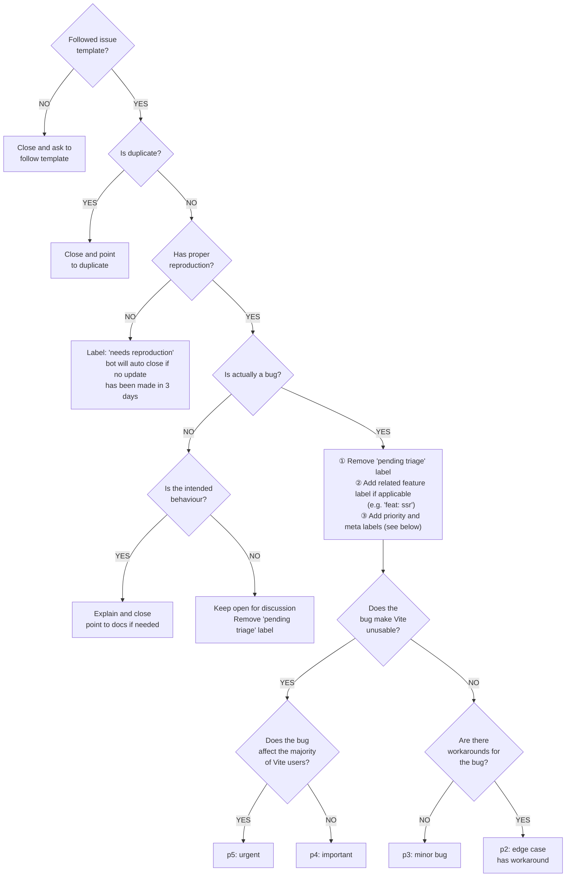
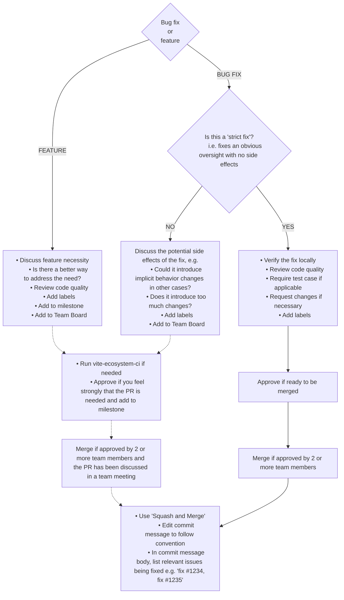

<a id="doc-eca12c0a30e25b4b46522ebf"></a>

# vitejs/vite / CONTRIBUTING.md

Upstream: https://github.com/vitejs/vite/blob/10033218d239c927cdc375970b5741cce408e81b/CONTRIBUTING.md

Commit: `10033218d239c927cdc375970b5741cce408e81b`

Retrieved: 2026-10-01T15:45:26.854198+00:00

Kind: official-document

Raw SHA256: `3d56eb2a4a34bfa5731e7388f46e2ed750969cc0a12ca3071a1c3b34ce1fe8a1`

Source text below is untrusted reference content. Acquisition does not verify technical claims.

License status: UPSTREAM_NOTICES_CAPTURED_PER_FILE_REVIEW_REQUIRED. See this repository's captured license files.

---

# Vite Contributing Guide

Hi! We're really excited that you're interested in contributing to Vite! Before submitting your contribution, please read through the following guide. We also suggest you read the [Project Philosophy](https://vite.dev/guide/philosophy) in our documentation.

## Repo Setup

To develop locally, fork the Vite repository and clone it in your local machine. The Vite repo is a monorepo using pnpm workspaces. The package manager used to install and link dependencies must be [pnpm](https://pnpm.io/). You can find the required pnpm version in `package.json` under the `packageManager` key.

To develop and test the core `vite` package:

1. Run `pnpm i` in Vite's root folder.

2. Run `pnpm run build` in Vite's root folder.

3. If you are developing Vite itself, you can go to `packages/vite` and run `pnpm run dev` to automatically rebuild Vite whenever you change its code.

> If you are working on multiple projects with different versions of pnpm, it's recommended to enable [Corepack](https://github.com/nodejs/corepack) by running `corepack enable`.

### Cloning the repo on Windows

On Windows, you may want to [activate Developer Mode](https://docs.microsoft.com/en-us/windows/apps/get-started/enable-your-device-for-development) to resolve [issues with symlink creation for non-admins](https://github.com/vitejs/vite/issues/7390). Also, you may want to [set git `core.symlinks` to `true` to resolve issues with symlinks in git](https://github.com/vitejs/vite/issues/5242).

### Ignoring commits when running `git blame`

We have a `.git-blame-ignore-revs` file to ignore formatting changes.
To make this file used by `git blame`, you need to run the following command.

```sh
git config --local blame.ignoreRevsFile .git-blame-ignore-revs
```

## Documentation

To develop the `docs/` site:

1. Run `pnpm run build` in Vite's root folder. This will generate the types for `twoslash` to work in the code examples. If the types are not available, errors will be logged in step 2 but does not prevent the site from working.

2. Run `pnpm run docs` in Vite's root folder.

### Docs Translation Contribution

To add a new language to the Vite docs, see [`vite-docs-template`](https://github.com/tony19/vite-docs-template/blob/main/.github/CONTRIBUTING.md).

## Notes on Dependencies

Vite aims to be lightweight, and this includes being aware of the number of npm dependencies and their size.

We use Rolldown to pre-bundle most dependencies before publishing! Therefore, most dependencies, even those used in runtime source code, should be added under `devDependencies` by default. This also creates the following constraints that we need to be aware of in the codebase.

### Usage of `require()`

In some cases, we intentionally lazy-require some dependencies to improve start-up performance. However, note that we cannot use simple `require('somedep')` calls since these are ignored in ESM files, so the dependency won't be included in the bundle, and the actual dependency won't even be there when published since they are in `devDependencies`.

Instead, use `(await import('somedep')).default`.

### Think Before Adding a Dependency

Most deps should be added to `devDependencies` even if they are needed at runtime. Some exceptions are:

- Type packages. Example: `@types/*`.
- Deps that cannot be properly bundled due to binary files. Example: `rolldown`, `lightningcss`.
- Deps that ship their own types that are used in Vite's own public types. Example: `rolldown`.

Avoid deps with large transitive dependencies that result in bloated size compared to the functionality it provides. For example, `http-proxy` itself is around 380kB in size, but `http-proxy-middleware` pulls in a ton of dependencies that make it 3MB(!) when a minimal custom middleware on top of `http-proxy` only requires a couple of lines of code.

### Ensure Type Support

Vite aims to be fully usable as a dependency in a TypeScript project (e.g. it should provide proper typings for VitePress), and also in `vite.config.ts`. This means technically a dependency whose types are exposed needs to be part of `dependencies` instead of `devDependencies`. However, this also means we won't be able to bundle it.

To get around this, we inline some of these dependencies' types in `packages/vite/src/types`. This way, we can still expose the typing but bundle the dependency's source code.

Use `pnpm run build-types-check` to check that the bundled types do not rely on types in `devDependencies`.

For types shared between client and node, they should be added into `packages/vite/types`. These types are not bundled and are published as is (though they are still considered internal).

## Think Before Adding Yet Another Option

We already have many config options, and we should avoid fixing an issue by adding yet another one. Before adding an option, consider whether the problem:

- is really worth addressing
- can be fixed with a smarter default
- has workaround using existing options
- can be addressed with a plugin instead

## Debugging

To use breakpoints and explore code execution, you can use the ["Run and Debug"](https://code.visualstudio.com/docs/editor/debugging) feature from VS Code.

1. Add a `debugger` statement where you want to stop the code execution.

2. Click the "Run and Debug" icon in the activity bar of the editor, which opens the [_Run and Debug view_](https://code.visualstudio.com/docs/editor/debugging#_run-and-debug-view).

3. Click the "JavaScript Debug Terminal" button in the _Run and Debug view_, which opens a terminal in VS Code.

4. From that terminal, go to `playground/xxx`, and run `pnpm run dev`.

5. The execution will stop at the `debugger` statement, and you can use the [Debug toolbar](https://code.visualstudio.com/docs/editor/debugging#_debug-actions) to continue, step over, and restart the process...

### Debugging Errors in Vitest Tests Using Playwright (Chromium)

Some errors are masked and hidden away because of the layers of abstraction and sandboxed nature added by Vitest, Playwright, and Chromium. In order to see what's actually going wrong and the contents of the devtools console in those instances, follow this setup:

1. Add an `afterAll` hook with a `debugger` statement to `playground/vitestSetup.ts`. This will pause execution before the tests quit and the Playwright browser instance exits.

2. Run the tests with the `debug-serve` script command, which will enable remote debugging: `pnpm run debug-serve resolve`.

3. Wait for inspector devtools to open in your browser and the debugger to attach.

4. In the sources panel in the right column, click the play button to resume execution, and allow the tests to run, which will open a Chromium instance.

5. Focusing the Chromium instance, you can open the browser devtools and inspect the console there to find the underlying problems.

6. To close everything, just stop the test process back in your terminal.

### Debug Logging

You can set the `--debug` option to turn on debugging logs (e.g. `vite --debug resolve`). To see all debug logs, you can set `vite --debug *`, but be warned that it will be quite noisy. You can run `grep -r "createDebugger('vite:" packages/vite/src/` to see a list of available debug scopes.

### Disabling Source Maps

Source maps for Vite's source code are enabled by default when Vite is placed outside `node_modules` so that you can easily debug it. When bundling Vite in watch mode, source maps will be generated.

However, this behavior may not be desirable when you are developing source map related features. In that case, you can disable source maps by setting the `DEBUG_DISABLE_SOURCE_MAP` environment variable to `1` when running Vite (e.g. `DEBUG_DISABLE_SOURCE_MAP=1 vite`). This environment variable can also be used to disable source map generation.

## Testing Vite against external packages

You may wish to test your locally modified copy of Vite against another package that is built with Vite. For pnpm, after building Vite, you can use [`overrides`](https://pnpm.io/settings#overrides) to do this. In pnpm v10.5+, `overrides` should be specified in the root `pnpm-workspace.yaml`, and you must list the package as a dependency in the root `package.json`:

```yaml
# pnpm-workspace.yaml
overrides:
  vite: link:../path/to/vite/packages/vite
```

And re-run `pnpm install` to link the package.

## Running Tests

### Integration Tests

Each package under `playground/` contains a `__tests__` directory. The tests are run using [Vitest](https://vitest.dev/) + [Playwright](https://playwright.dev/) with custom integrations to make writing tests simple. The detailed setup is inside `vitest.config.e2e.ts` and `playground/vitest*.ts` files.

Some playgrounds define variants to run the same app using different config setups. By convention, when running a test spec file in a nested folder in `__tests__`, the setup will try to use a config file named `vite.config-{folderName}.js` at the playground's root. You can see an example of variants in the [assets playground](https://github.com/vitejs/vite/tree/main/playground/assets).

Before running the tests, make sure that [Vite has been built](#repo-setup).

Each integration test can be run under either dev server mode or build mode.

- `pnpm test` by default runs every integration test in both serve and build mode, and also unit tests.

- `pnpm run test-serve` runs tests only under serve mode.

- `pnpm run test-build` runs tests only under build mode.

- `pnpm run test-serve-bundled` runs tests under serve mode with `experimental.bundledDev` force-enabled (no separate configs needed). Spec files that do not pass in this mode yet are listed in `bundledDevExclude` in `vitest.config.e2e.ts` — remove a file from that list once it passes. When only a few cases in a file fail, keep the file out of that list and mark those cases with `test.skipIf(isBundledDev)` (or `describe.skipIf(isBundledDev)`) using the `isBundledDev` flag from `~utils` — they still run in the normal serve and build modes.

`pnpm run test-serve [match]` or `pnpm run test-build [match]` runs tests in specific packages that match the given filter. e.g. `pnpm run test-serve assets` runs tests for both `playground/assets` and `playground/assets-sanitize` under serve mode. Note package matching is not available for the `pnpm test` script, which always runs all tests.

### Unit Tests

Other than tests under `playground/` for integration tests, packages might contain unit tests under their `__tests__` directory. Unit tests are powered by [Vitest](https://vitest.dev/). The detailed config is inside `vitest.config.ts` files.

- `pnpm run test-unit` runs unit tests under each package.

`pnpm run test-unit [match]` runs tests in specific packages that match the given filter.

### Test Env and Helpers

Inside playground tests, you can import the `page` object from `~utils`, which is a Playwright [`Page`](https://playwright.dev/docs/api/class-page) instance that has already navigated to the served page of the current playground. So, writing a test is as simple as:

```js
import { page } from '~utils'

test('should work', async () => {
  expect(await page.textContent('.foo')).toMatch('foo')
})
```

Some common test helpers (e.g. `testDir`, `isBuild`, or `editFile`) are also available in the utils. Source code is located at `playground/test-utils.ts`.

> [!NOTE]
> The dev server's file watcher runs in polling mode during tests. Polling (chokidar) only registers a file as changed when its size differs or its mtime strictly increases. On some platforms a quick in-place rewrite may not report an advanced mtime, so an edit that keeps the exact same byte length can be missed, and the expected HMR update or rebuild never fires (causing flaky timeouts). To enforce this, `editFile` throws if your replacement leaves the file's byte length unchanged; make the edit change the size (for example by adding a trailing space or an extra character that doesn't affect the test's semantics). If you trigger a watched change by some other means, make sure the edit changes the file's byte length.

Note: The test build environment uses a [different default set of Vite config](https://github.com/vitejs/vite/blob/v8.1.5/playground/vitestSetup.ts#L264-L268) to skip transpilation during tests to make it faster. This may produce a different result compared to the default production build.

### Extending the Test Suite

To add new tests, you should find a related playground to the fix or feature (or create a new one). As an example, static assets loading is tested in the [assets playground](https://github.com/vitejs/vite/tree/main/playground/assets). In this Vite app, there is a test for `?raw` imports with [a section defined in the `index.html` for it](https://github.com/vitejs/vite/blob/v8.1.5/playground/assets/index.html#L270-L271):

```html
<h2>?raw import</h2>
<code class="raw"></code>
```

This will be modified [with the result of a file import](https://github.com/vitejs/vite/blob/v8.1.5/playground/assets/index.html#L557-L558):

```js
import rawSvg from './nested/fragment.svg?raw'
text('.raw', rawSvg)
```

...where the `text` util is defined as:

```js
function text(el, text) {
  document.querySelector(el).textContent = text
}
```

In the [spec tests](https://github.com/vitejs/vite/blob/v8.1.5/playground/assets/__tests__/assets.spec.ts#L483-L485), the modifications to the DOM listed above are used to test this feature:

```js
test('?raw import', async () => {
  expect(await page.textContent('.raw')).toMatch('SVG')
})
```

### Note on Test Dependencies

In many test cases, we need to mock dependencies using `link:` and `file:` protocols. `pnpm` treats `link:` as symlinks and `file:` as hardlinks. To test dependencies as if they were copied into `node_modules`, use the `file:` protocol. Otherwise, use the `link:` protocol.

For a mock dependency, make sure you add a `@vitejs/test-` prefix to the package name. This will avoid possible issues like false-positive alerts.

## AI Policy

<!-- Adapted from https://github.com/nuxt/nuxt/blob/main/CONTRIBUTING.md#ai-assisted-contributions -->

We welcome the thoughtful use of AI tools when contributing to Vite, but ask all contributors to follow [two core principles](https://roe.dev/blog/using-ai-in-open-source):

1. **Never let an LLM speak for you** - all comments, issues, and PR descriptions should be written in your own words, reflecting your own understanding.
2. **Never let an LLM think for you** - only submit contributions you fully understand and can explain.

If we find that these principles were not followed, we may close the issue or pull request directly.

## Pull Request Guidelines

> [!NOTE]
> You do not need to ask for permission to work on an open issue. You can start investigating or open a PR directly. If someone else ships a fix first, you can still help by reviewing or validating the solution.

- Checkout a topic branch from a base branch (e.g. `main`), and merge back against that branch.

- If adding a new feature:
  - Add accompanying test case.
  - Provide a convincing reason to add this feature. Ideally, you should open a suggestion issue first, and have it approved before working on it.

- If fixing a bug:
  - If you are resolving a special issue, add `(fix #xxxx[,#xxxx])` (#xxxx is the issue id) in your PR title for a better release log (e.g. `fix: update entities encoding/decoding (fix #3899)`).
  - Provide a detailed description of the bug in the PR. Live demo preferred.
  - Add appropriate test coverage. If not applicable, explain in the PR description why tests are not included.

- If it's a chore:
  - For typos and comment changes, try to combine multiple of them into a single PR.
  - **Note that we discourage contributors from submitting code refactors that are largely stylistic.** Code refactors are only accepted if it improves performance, or objectively improves code quality (e.g. makes a related bug fix or feature implementation easier, and it is as a separate PR to improve git history).
    - The reason is that code readability is subjective. The maintainers of this project have chosen to write the code in its current style based on our preferences, and we do not want to spend time explaining our stylistic preferences. Contributors should just respect the established conventions when contributing code. Another aspect of it is that large scale stylistic changes result in massive diffs that touch multiple files, adding noise to the git history and makes tracing behavior changes across commits more cumbersome.

- It's OK to have multiple small commits as you work on the PR. GitHub can automatically squash them before merging.

- Make sure tests pass!

- No need to worry about code style as long as you have installed the dev dependencies. Modified files are automatically formatted with Oxfmt on commit (by invoking [Git Hooks](https://git-scm.com/docs/githooks) via [simple-git-hooks](https://github.com/toplenboren/simple-git-hooks)).

- PR title must follow the [commit message convention](./.github/commit-convention.md) so that changelogs can be automatically generated.

## Maintenance Guidelines

> The following section is mostly for maintainers who have commit access, but it's helpful to go through if you intend to make non-trivial contributions to the codebase.

### Issue Triaging Workflow



### Pull Request Review Workflow



### Release

All publishable packages in this repository use a pull-request-driven release flow. GitHub Actions prepares a release PR containing the version bump and changelog, and merging that PR triggers publishing.

#### Prepare a Release

1. Run the [Prepare Release](.github/workflows/prepare-release.yml) workflow from the `main` branch.
2. Enter the target branch. Use `main` for the current release line or a `v*` release branch (for example, `v8` or `v8.0`) for a patch release.
3. Select `vite`, `create-vite`, or `plugin-legacy`.
4. Select a `release` type. The default `next` creates the next patch for a stable version or advances an existing prerelease. Alternatively, select another supported release type or enter an exact `version`, which takes precedence over `release`.
5. Wait for the action to open a release PR against the target branch. The PR contains the selected package's version bump and changelog entry. A `create-vite` release also updates template Vite dependency versions when appropriate.

#### Review and Publish

1. Review the generated version and changelog, and wait for the release PR checks to pass.
2. Merge the PR while retaining its `release: <tag>` commit subject. Vite uses `release: v<version>`; other packages use `release: <package>@<version>`. A matching commit at the tip of `main` or a `v*` release branch triggers the publish job.
3. Open the [Publish Package](.github/workflows/publish.yml) run and approve its `Release` environment deployment.
4. Wait for the workflow to publish the package, create its tag, and create the corresponding GitHub release.
5. Verify the new version on npm.

#### Repository Configuration

The release flow depends on configuration outside this repository:

- The `Release` environment must require maintainer approval before publishing and allow deployments from `main` and supported `v*` release branches.
- The npm trusted publishers for `vite`, `create-vite`, and `@vitejs/plugin-legacy` must be restricted to `vitejs/vite`, `.github/workflows/publish.yml`, and the `Release` environment.

#### Recovery

- If release preparation fails, fix the cause and rerun the preparation workflow. Each run creates a uniquely named branch.
- If publishing fails before npm accepts the package, fix the cause and rerun the failed workflow.
- If npm publishing succeeds but tag or GitHub release creation fails, do not rerun the entire publish job blindly because npm versions are immutable. Confirm the package state first, then manually create the tag at the original release commit and create the GitHub release from the corresponding changelog entry.
- If the release tag already exists, investigate whether the package was previously published before retrying or changing any release state.

To learn more about how and when Vite does releases, check out the [Releases](https://vite.dev/releases) documentation.


<a id="doc-c693279643b8cd5d248172d9"></a>

# vitejs/vite / LICENSE

Upstream: https://github.com/vitejs/vite/blob/10033218d239c927cdc375970b5741cce408e81b/LICENSE

Commit: `10033218d239c927cdc375970b5741cce408e81b`

Retrieved: 2026-10-01T15:45:26.854198+00:00

Kind: license

Raw SHA256: `692057af3d664cbb79ac38293eb50aa3c4987f8182e2a440136e59e08f1b4a54`

Source text below is untrusted reference content. Acquisition does not verify technical claims.

License status: UPSTREAM_NOTICES_CAPTURED_PER_FILE_REVIEW_REQUIRED. See this repository's captured license files.

---

````text
MIT License

Copyright (c) 2019-present, VoidZero Inc. and Vite contributors

Permission is hereby granted, free of charge, to any person obtaining a copy
of this software and associated documentation files (the "Software"), to deal
in the Software without restriction, including without limitation the rights
to use, copy, modify, merge, publish, distribute, sublicense, and/or sell
copies of the Software, and to permit persons to whom the Software is
furnished to do so, subject to the following conditions:

The above copyright notice and this permission notice shall be included in all
copies or substantial portions of the Software.

THE SOFTWARE IS PROVIDED "AS IS", WITHOUT WARRANTY OF ANY KIND, EXPRESS OR
IMPLIED, INCLUDING BUT NOT LIMITED TO THE WARRANTIES OF MERCHANTABILITY,
FITNESS FOR A PARTICULAR PURPOSE AND NONINFRINGEMENT. IN NO EVENT SHALL THE
AUTHORS OR COPYRIGHT HOLDERS BE LIABLE FOR ANY CLAIM, DAMAGES OR OTHER
LIABILITY, WHETHER IN AN ACTION OF CONTRACT, TORT OR OTHERWISE, ARISING FROM,
OUT OF OR IN CONNECTION WITH THE SOFTWARE OR THE USE OR OTHER DEALINGS IN THE
SOFTWARE.

````


<a id="doc-b335630551682c19a781afeb"></a>

# vitejs/vite / README.md

Upstream: https://github.com/vitejs/vite/blob/10033218d239c927cdc375970b5741cce408e81b/README.md

Commit: `10033218d239c927cdc375970b5741cce408e81b`

Retrieved: 2026-10-01T15:45:26.854198+00:00

Kind: official-document

Raw SHA256: `588718673f32a3691b8e75b93fb4c2f8e8bc9a6dc0bf61794ba7b6c006594111`

Source text below is untrusted reference content. Acquisition does not verify technical claims.

License status: UPSTREAM_NOTICES_CAPTURED_PER_FILE_REVIEW_REQUIRED. See this repository's captured license files.

---

<p align="center">
  <br>
  <br>
  <a href="https://vite.dev" target="_blank" rel="noopener noreferrer">
    <picture>
      <source media="(prefers-color-scheme: dark)" srcset="https://vite.dev/vite-light.svg">
      <source media="(prefers-color-scheme: light)" srcset="https://vite.dev/vite-dark.svg">
      
    </picture>
  </a>
  <br>
  <br>
</p>
<br/>
<p align="center">
  <a href="https://npmjs.com/package/vite"></a>
  <a href="https://nodejs.org/en/about/previous-releases"></a>
  <a href="https://github.com/vitejs/vite/actions/workflows/ci.yml"></a>
  <a href="https://chat.vite.dev"></a>
</p>
<br/>

# Vite ⚡

> Next Generation Frontend Tooling

- 💡 Instant Server Start
- ⚡️ Lightning Fast HMR
- 🛠️ Rich Features
- 📦 Optimized Build
- 🔩 Universal Plugin Interface
- 🔑 Fully Typed APIs

Vite (French word for "quick", pronounced [`/viːt/`](https://cdn.jsdelivr.net/gh/vitejs/vite@main/docs/public/vite.mp3), like "veet") is a build tool that aims to provide a faster and leaner development experience for modern web projects. It consists of two major parts:

- A dev server that provides [rich feature enhancements](https://vite.dev/guide/features) over [native ES modules](https://developer.mozilla.org/en-US/docs/Web/JavaScript/Guide/Modules), for example extremely fast [Hot Module Replacement (HMR)](https://vite.dev/guide/features#hot-module-replacement).

- A build command that bundles your code with [Rolldown](https://rolldown.rs), pre-configured to output highly optimized static assets for production.

In addition, Vite is highly extensible via its [Plugin API](https://vite.dev/guide/api-plugin.html) and [JavaScript API](https://vite.dev/guide/api-javascript.html) with full typing support.

[Read the Docs to Learn More](https://vite.dev).

## Packages

| Package                                         | Version (click for changelogs)                                                                                                    |
| ----------------------------------------------- | :-------------------------------------------------------------------------------------------------------------------------------- |
| [vite](packages/vite)                           | [](packages/vite/CHANGELOG.md)                                    |
| [@vitejs/plugin-legacy](packages/plugin-legacy) | [](packages/plugin-legacy/CHANGELOG.md) |
| [create-vite](packages/create-vite)             | [](packages/create-vite/CHANGELOG.md)               |

## Contribution

See [Contributing Guide](CONTRIBUTING.md).

## License

[MIT](LICENSE).

## Sponsors

<p align="center">
  <a target="_blank" href="https://github.com/sponsors/vitejs">
    
  </a>
</p>


<a id="doc-91afc6898177816e204242e6"></a>

# vitejs/vite / docs/acknowledgements.md

Upstream: https://github.com/vitejs/vite/blob/10033218d239c927cdc375970b5741cce408e81b/docs/acknowledgements.md

Commit: `10033218d239c927cdc375970b5741cce408e81b`

Retrieved: 2026-10-01T15:45:26.854198+00:00

Kind: official-document

Raw SHA256: `935f829014063bb65988b4e513f274f0df66a30d75c2b4b79fedad2a5adb0475`

Source text below is untrusted reference content. Acquisition does not verify technical claims.

License status: UPSTREAM_NOTICES_CAPTURED_PER_FILE_REVIEW_REQUIRED. See this repository's captured license files.

---

---
title: Acknowledgements
description: Vite is built upon the shoulders of giants. Thank you to all the projects and contributors that make Vite possible.
---

<script setup>
import { computed } from 'vue'
import { data } from './_data/acknowledgements.data'
import { useSponsor } from './.vitepress/theme/composables/sponsor'
import VPSponsors from '@components/vitepress-default/VPSponsors.vue'

const sponsors = useSponsor()

function npmUrl(name) {
  return `https://www.npmjs.com/package/${name}`
}
</script>

# Acknowledgements

Vite is built upon the shoulders of giants. We would like to express our gratitude to all the projects, contributors, and sponsors that make Vite possible.

## Contributors

Vite is developed by an international team of contributors. See the [Team page](/team) to meet the core team members.

We also thank all the [contributors on GitHub](https://github.com/vitejs/vite/graphs/contributors) who have helped improve Vite through code contributions, bug reports, documentation, and documentation translation.

## Sponsors

Vite's development is supported by generous sponsors. You can support Vite through [GitHub Sponsors](https://github.com/sponsors/vitejs) or [Open Collective](https://opencollective.com/vite).

<div class="sponsors-container">
  <VPSponsors :data="sponsors ?? []" />
</div>

## Dependencies

Vite depends on these amazing open source projects:

### Notable Dependencies

<div class="deps-list notable">
  <div v-for="dep in data.notableDependencies" :key="dep.name" class="dep-item">
    <div class="dep-header">
      <a :href="npmUrl(dep.name)" target="_blank" rel="noopener"><code>{{ dep.name }}</code></a>
      <span class="dep-links">
        <a v-if="dep.repository" :href="dep.repository" target="_blank" rel="noopener" class="dep-link">Repo</a>
        <a v-if="dep.funding" :href="dep.funding" target="_blank" rel="noopener" class="dep-link sponsor">Sponsor</a>
      </span>
    </div>
    <p v-if="dep.author" class="dep-author">
      by <a v-if="dep.authorUrl" :href="dep.authorUrl" target="_blank" rel="noopener">{{ dep.author }}</a><template v-else>{{ dep.author }}</template>
    </p>
    <p v-if="dep.description">{{ dep.description }}</p>
  </div>
</div>

### Bundled Dependency Authors

<table class="authors-table">
  <thead>
    <tr>
      <th>Author</th>
      <th>Packages</th>
    </tr>
  </thead>
  <tbody>
    <tr v-for="author in data.authors" :key="author.name">
      <td>
        <a v-if="author.url" :href="author.url" target="_blank" rel="noopener">{{ author.name }}</a>
        <template v-else>{{ author.name }}</template>
        <a v-if="author.funding" :href="author.funding" target="_blank" rel="noopener" class="sponsor-link">Sponsor</a>
      </td>
      <td>
        <template v-for="(pkg, index) in author.packages" :key="pkg.name">
          <span class="pkg-item"><a :href="npmUrl(pkg.name)" target="_blank" rel="noopener"><code>{{ pkg.name }}</code></a><a v-if="pkg.funding" :href="pkg.funding" target="_blank" rel="noopener" class="sponsor-link">Sponsor</a></span><template v-if="index < author.packages.length - 1">, </template>
        </template>
      </td>
    </tr>
  </tbody>
</table>

::: tip For package authors
This section is automatically generated from the `author` and `funding` fields in each package's `package.json`. If you'd like to update how your package appears here, you can update these fields in your package.
:::

## Development Tools

Vite's development workflow is powered by these tools:

<div class="deps-list notable">
  <div v-for="dep in data.devTools" :key="dep.name" class="dep-item">
    <div class="dep-header">
      <a :href="npmUrl(dep.name)" target="_blank" rel="noopener"><code>{{ dep.name }}</code></a>
      <span class="dep-links">
        <a v-if="dep.repository" :href="dep.repository" target="_blank" rel="noopener" class="dep-link">Repo</a>
        <a v-if="dep.funding" :href="dep.funding" target="_blank" rel="noopener" class="dep-link sponsor">Sponsor</a>
      </span>
    </div>
    <p v-if="dep.author" class="dep-author">
      by <a v-if="dep.authorUrl" :href="dep.authorUrl" target="_blank" rel="noopener">{{ dep.author }}</a><template v-else>{{ dep.author }}</template>
    </p>
    <p v-if="dep.description">{{ dep.description }}</p>
  </div>
</div>

## Past Notable Dependencies

We also thank the maintainers of these projects that Vite used in previous versions:

<table>
  <thead>
    <tr>
      <th>Package</th>
      <th>Description</th>
      <th>Links</th>
    </tr>
  </thead>
  <tbody>
    <tr v-for="dep in data.pastNotableDependencies" :key="dep.name">
      <td><a :href="npmUrl(dep.name)" target="_blank" rel="noopener"><code>{{ dep.name }}</code></a></td>
      <td>{{ dep.description }}</td>
      <td><a :href="dep.repository" target="_blank" rel="noopener">Repo</a></td>
    </tr>
  </tbody>
</table>

<style scoped>
.deps-list {
  display: grid;
  gap: 1rem;
  margin: 1rem 0;
}

.deps-list.notable {
  grid-template-columns: repeat(auto-fill, minmax(280px, 1fr));
}

.dep-item {
  padding: 1rem;
  border: 1px solid var(--vp-c-divider);
  border-radius: 8px;
  background: var(--vp-c-bg-soft);
}

.dep-item .dep-header {
  display: flex;
  align-items: center;
  justify-content: space-between;
  gap: 0.5rem;
}

.dep-item a {
  color: var(--vp-c-brand-1);
  text-decoration: none;
}

.dep-item a:hover {
  text-decoration: underline;
}

.dep-item .dep-links {
  display: flex;
  gap: 0.5rem;
}

.dep-item .dep-link {
  font-size: 0.75rem;
  padding: 0.25rem 0.5rem;
  border-radius: 4px;
  background: var(--vp-c-default-soft);
}

.dep-item .dep-author {
  margin: 0.25rem 0 0;
  color: var(--vp-c-text-2);
  font-size: 0.8rem;
}

.dep-item .dep-link.sponsor {
  background: var(--vp-c-brand-soft);
}

.dep-item p {
  margin: 0.5rem 0 0;
  color: var(--vp-c-text-2);
  font-size: 0.875rem;
}

.authors-table .sponsor-link {
  margin-left: 0.5rem;
  font-size: 0.75rem;
  padding: 0.15rem 0.4rem;
  border-radius: 4px;
  background: var(--vp-c-brand-soft);
  color: var(--vp-c-brand-1);
  text-decoration: none;
}

.authors-table .sponsor-link:hover {
  text-decoration: underline;
}
</style>


<a id="doc-a06d91d981e119c7fa6c7a98"></a>

# vitejs/vite / docs/blog.md

Upstream: https://github.com/vitejs/vite/blob/10033218d239c927cdc375970b5741cce408e81b/docs/blog.md

Commit: `10033218d239c927cdc375970b5741cce408e81b`

Retrieved: 2026-10-01T15:45:26.854198+00:00

Kind: official-document

Raw SHA256: `0c6c4debd05c8d99c9b539254e0017fd1c0e772265f0993d4c2e2d59683e95d3`

Source text below is untrusted reference content. Acquisition does not verify technical claims.

License status: UPSTREAM_NOTICES_CAPTURED_PER_FILE_REVIEW_REQUIRED. See this repository's captured license files.

---

---
sidebar: false
editLink: false
outline: false
---

<script setup>
import BlogIndex from './.vitepress/theme/components/BlogIndex.vue'
</script>

# Latest From the Vite Blog

<BlogIndex/>


<a id="doc-98a70c7d6953a072d2226309"></a>

# vitejs/vite / docs/blog/announcing-vite2.md

Upstream: https://github.com/vitejs/vite/blob/10033218d239c927cdc375970b5741cce408e81b/docs/blog/announcing-vite2.md

Commit: `10033218d239c927cdc375970b5741cce408e81b`

Retrieved: 2026-10-01T15:45:26.854198+00:00

Kind: official-document

Raw SHA256: `f9d2217c2a2a97f24ce4902baa74264166d4bdcbff947124380cb01d14296674`

Source text below is untrusted reference content. Acquisition does not verify technical claims.

License status: UPSTREAM_NOTICES_CAPTURED_PER_FILE_REVIEW_REQUIRED. See this repository's captured license files.

---

---
title: Announcing Vite 2.0
author:
  - name: The Vite Team
sidebar: false
date: 2021-02-16
head:
  - - meta
    - property: og:type
      content: website
  - - meta
    - property: og:title
      content: Announcing Vite 2.0
  - - meta
    - property: og:url
      content: https://vite.dev/blog/announcing-vite2
  - - meta
    - property: og:description
      content: Vite 2 Release Announcement
---

# Announcing Vite 2.0

_February 16, 2021_ - Check out the [Vite 3.0 announcement](./announcing-vite3.md)

<p style="text-align:center">
  
</p>

Today we are excited to announce the official release of Vite 2.0!

Vite (French word for "fast", pronounced `/vit/`) is a new kind of build tool for frontend web development. Think a pre-configured dev server + bundler combo, but leaner and faster. It leverages browser's [native ES modules](https://developer.mozilla.org/en-US/docs/Web/JavaScript/Guide/Modules) support and tools written in compile-to-native languages like [esbuild](https://esbuild.github.io/) to deliver a snappy and modern development experience.

To get a sense of how fast Vite is, check out [this video comparison](https://twitter.com/amasad/status/1355379680275128321) of booting up a React application on Repl.it using Vite vs. `create-react-app` (CRA).

If you've never heard of Vite before and would love to learn more about it, check out [the rationale behind the project](https://vite.dev/guide/why.html). If you are interested in how Vite differs from other similar tools, check out the [comparisons](https://v5.vite.dev/guide/comparisons.html).

## What's New in 2.0

Since we decided to completely refactor the internals before 1.0 got out of RC, this is in fact the first stable release of Vite. That said, Vite 2.0 brings about many big improvements over its previous incarnation:

### Framework Agnostic Core

The original idea of Vite started as a [hacky prototype that serves Vue single-file components over native ESM](https://github.com/vuejs/vue-dev-server). Vite 1 was a continuation of that idea with HMR implemented on top.

Vite 2.0 takes what we learned along the way and is redesigned from scratch with a more robust internal architecture. It is now completely framework agnostic, and all framework-specific support is delegated to plugins. There are now [official templates for Vue, React, Preact, Lit Element](https://github.com/vitejs/vite/tree/main/packages/create-vite), and ongoing community efforts for Svelte integration.

### New Plugin Format and API

Inspired by [WMR](https://github.com/preactjs/wmr), the new plugin system extends Rollup's plugin interface and is [compatible with many Rollup plugins](https://vite-rollup-plugins.patak.dev/) out of the box. Plugins can use Rollup-compatible hooks, with additional Vite-specific hooks and properties to adjust Vite-only behavior (e.g. differentiating dev vs. build or custom handling of HMR).

The [programmatic API](https://vite.dev/guide/api-javascript.html) has also been greatly improved to facilitate higher level tools / frameworks built on top of Vite.

### esbuild Powered Dep Pre-Bundling

Since Vite is a native ESM dev server, it pre-bundles dependencies to reduce the number browser requests and handle CommonJS to ESM conversion. Previously Vite did this using Rollup, and in 2.0 it now uses `esbuild` which results in 10-100x faster dependency pre-bundling. As a reference, cold-booting a test app with heavy dependencies like React Material UI previously took 28 seconds on an M1-powered MacBook Pro and now takes ~1.5 seconds. Expect similar improvements if you are switching from a traditional bundler based setup.

### First-class CSS Support

Vite treats CSS as a first-class citizen of the module graph and supports the following out of the box:

- **Resolver enhancement**: `@import` and `url()` paths in CSS are enhanced with Vite's resolver to respect aliases and npm dependencies.
- **URL rebasing**: `url()` paths are automatically rebased regardless of where the file is imported from.
- **CSS code splitting**: a code-split JS chunk also emits a corresponding CSS file, which is automatically loaded in parallel with the JS chunk when requested.

### Server-Side Rendering (SSR) Support

Vite 2.0 ships with [experimental SSR support](https://vite.dev/guide/ssr.html). Vite provides APIs to efficiently load and update ESM-based source code in Node.js during development (almost like server-side HMR), and automatically externalizes CommonJS-compatible dependencies to improve development and SSR build speed. The production server can be completely decoupled from Vite, and the same setup can be easily adapted to perform pre-rendering / SSG.

Vite SSR is provided as a low-level feature and we are expecting to see higher level frameworks leveraging it under the hood.

### Opt-in Legacy Browser Support

Vite targets modern browsers with native ESM support by default, but you can also opt-in to support legacy browsers via the official [@vitejs/plugin-legacy](https://github.com/vitejs/vite/tree/main/packages/plugin-legacy). The plugin automatically generates dual modern/legacy bundles, and delivers the right bundle based on browser feature detection, ensuring more efficient code in modern browsers that support them.

## Give it a Try!

That was a lot of features, but getting started with Vite is simple! You can spin up a Vite-powered app literally in a minute, starting with the following command (make sure you have Node.js >=12):

```bash
npm init @vitejs/app
```

Then, check out [the guide](https://vite.dev/guide/) to see what Vite provides out of the box. You can also check out the source code on [GitHub](https://github.com/vitejs/vite), follow updates on [Twitter](https://twitter.com/vite_js), or join discussions with other Vite users on our [Discord chat server](https://chat.vite.dev).


<a id="doc-f8cf34e9c6339f480540c6ee"></a>

# vitejs/vite / docs/blog/announcing-vite3.md

Upstream: https://github.com/vitejs/vite/blob/10033218d239c927cdc375970b5741cce408e81b/docs/blog/announcing-vite3.md

Commit: `10033218d239c927cdc375970b5741cce408e81b`

Retrieved: 2026-10-01T15:45:26.854198+00:00

Kind: official-document

Raw SHA256: `60e2e415a301ac16228869081f827aa0b062d058b9ac22f5402dec0349e01029`

Source text below is untrusted reference content. Acquisition does not verify technical claims.

License status: UPSTREAM_NOTICES_CAPTURED_PER_FILE_REVIEW_REQUIRED. See this repository's captured license files.

---

---
title: Vite 3.0 is out!
author:
  name: The Vite Team
date: 2022-07-23
sidebar: false
head:
  - - meta
    - property: og:type
      content: website
  - - meta
    - property: og:title
      content: Announcing Vite 3
  - - meta
    - property: og:image
      content: https://vite.dev/og-image-announcing-vite3.webp
  - - meta
    - property: og:url
      content: https://vite.dev/blog/announcing-vite3
  - - meta
    - property: og:description
      content: Vite 3 Release Announcement
  - - meta
    - name: twitter:card
      content: summary_large_image
---

# Vite 3.0 is out!

_July 23, 2022_ - Check out the [Vite 4.0 announcement](./announcing-vite4.md)

In February last year, [Evan You](https://twitter.com/youyuxi) released Vite 2. Since then, its adoption has grown non-stop, reaching more than 1 million npm downloads per week. A sprawling ecosystem rapidly formed after the release. Vite is powering a renewed innovation race in Web frameworks. [Nuxt 3](https://v3.nuxtjs.org/) uses Vite by default. [SvelteKit](https://kit.svelte.dev/), [Astro](https://astro.build/), [Hydrogen](https://hydrogen.shopify.dev/), and [SolidStart](https://docs.solidjs.com/quick-start) are all built with Vite. [Laravel has now decided to use Vite by default](https://laravel.com/docs/9.x/vite). [Vite Ruby](https://vite-ruby.netlify.app/) shows how Vite can improve Rails DX. [Vitest](https://vitest.dev) is making strides as a Vite-native alternative to Jest. Vite is behind [Cypress](https://docs.cypress.io/guides/component-testing/writing-your-first-component-test) and [Playwright](https://playwright.dev/docs/test-components)'s new Component Testing features, Storybook has [Vite as an official builder](https://github.com/storybookjs/builder-vite). And [the list goes on](https://patak.cat/vite/ecosystem.html). Maintainers from most of these projects got involved in improving the Vite core itself, working closely with the Vite [team](https://vite.dev/team) and other contributors.


Today, 16 months from the v2 launch we are happy to announce the release of Vite 3. We decided to release a new Vite major at least every year to align with [Node.js's EOL](https://nodejs.org/en/about/releases/), and take the opportunity to review Vite's API regularly with a short migration path for projects in the ecosystem.

Quick links:

- [Docs](/)
- [Migration Guide](https://v3.vite.dev/guide/migration.html)
- [Changelog](https://github.com/vitejs/vite/blob/main/packages/vite/CHANGELOG.md#300-2022-07-13)

If you are new to Vite, we recommend reading the [Why Vite Guide](https://vite.dev/guide/why.html). Then check out [the Getting Started](https://vite.dev/guide/) and [Features guide](https://vite.dev/guide/features) to see what Vite provides out of the box. As usual, contributions are welcome at [GitHub](https://github.com/vitejs/vite). More than [600 collaborators](https://github.com/vitejs/vite/graphs/contributors) have helped improve Vite so far. Follow the updates on [Twitter](https://twitter.com/vite_js), or join discussions with other Vite users on our [Discord chat server](https://chat.vite.dev).

## New Documentation

Go to [vite.dev](https://vite.dev) to enjoy the new v3 docs. Vite is now using the new [VitePress](https://vitepress.vuejs.org) default theme, with a stunning dark mode between other features.

[](https://vite.dev)

Several projects in the ecosystem have already migrated to it (see [Vitest](https://vitest.dev), [vite-plugin-pwa](https://vite-plugin-pwa.netlify.app/), and [VitePress](https://vitepress.vuejs.org/) itself).

If you need to access the Vite 2 docs, they will remain online at [v2.vite.dev](https://v2.vite.dev). There is also a new [main.vite.dev](https://main.vite.dev) subdomain, where each commit to Vite’s main branch is auto deployed. This is useful when testing beta versions or contributing to the core’s development.

There is also now an official Spanish translation, that has been added to the previous Chinese and Japanese translations:

- [简体中文](https://cn.vite.dev/)
- [日本語](https://ja.vite.dev/)
- [Español](https://es.vite.dev/)

## Create Vite Starter Templates

[create-vite](/guide/#trying-vite-online) templates have been a great tool to quickly test Vite with your favorite framework. In Vite 3, all of the templates got a new theme in line with the new docs. Open them online and start playing with Vite 3 now:

<div class="stackblitz-links">
<a target="_blank" href="https://vite.new"></a>
<a target="_blank" href="https://vite.new/vue"></a>
<a target="_blank" href="https://vite.new/svelte"></a>
<a target="_blank" href="https://vite.new/react"></a>
<a target="_blank" href="https://vite.new/preact"></a>
<a target="_blank" href="https://vite.new/lit"></a>
</div>

<style>
.stackblitz-links {
  display: flex;
  width: 100%;
  justify-content: space-around;
  align-items: center;
}
@media screen and (max-width: 550px) {
  .stackblitz-links {
    display: grid;
    grid-template-columns: 1fr 1fr 1fr;
    width: 100%;
    gap: 2rem;
    padding-left: 3rem;
    padding-right: 3rem;
  }
}
.stackblitz-links > a {
  width: 70px;
  height: 70px;
  display: grid;
  align-items: center;
  justify-items: center;
}
.stackblitz-links > a:hover {
  filter: drop-shadow(0 0 0.5em #646cffaa);
}
</style>

The theme is now shared by all templates. This should help better convey the scope for these starters as minimal templates to get started with Vite. For more complete solutions including linting, testing setup, and other features, there are official Vite-powered templates for some frameworks like [create-vue](https://github.com/vuejs/create-vue) and [create-svelte](https://github.com/sveltejs/kit). There is a community-maintained list of templates at [Awesome Vite](https://github.com/vitejs/awesome-vite#templates).

## Dev Improvements

### Vite CLI

<pre style="background-color: var(--vp-code-block-bg);padding:2em;border-radius:8px;max-width:100%;overflow-x:auto;">
  <span style="color:lightgreen"><b>VITE</b></span> <span style="color:lightgreen">v3.0.0</span>  <span style="color:gray">ready in <b>320</b> ms</span>

  <span style="color:lightgreen"><b>➜</b></span>  <span style="color:white"><b>Local</b>:</span>   <span style="color:cyan">http://127.0.0.1:5173/</span>
  <span style="color:green"><b>➜</b></span>  <span style="color:gray"><b>Network</b>: use --host to expose</span>
</pre>

Apart from the CLI’s aesthetics improvements, you’ll notice that the default dev server port is now 5173 and the preview server listening at 4173. This change ensures Vite will avoid collisions with other tools.

### Improved WebSocket Connection Strategy

One of the pain points of Vite 2 was configuring the server when running behind a proxy. Vite 3 changes the default connection scheme so it works out of the box in most scenarios. All these setups are now tested as part of the Vite Ecosystem CI through [`vite-setup-catalogue`](https://github.com/sapphi-red/vite-setup-catalogue).

### Cold Start Improvements

Vite now avoids full reload during cold start when imports are injected by plugins while crawling the initial statically imported modules ([#8869](https://github.com/vitejs/vite/issues/8869)).

<details>
  <summary><b>Click to learn more</b></summary>

In Vite 2.9, both the scanner and optimizer were run in the background. In the best scenario, where the scanner would find every dependency, no reload was needed in cold start. But if the scanner missed a dependency, a new optimization phase and then a reload were needed. Vite was able to avoid some of these reloads in v2.9, as we detected if the new optimized chunks were compatible with the ones the browser had. But if there was a common dep, the sub-chunks could change and a reload was required to avoid duplicated state. In Vite 3, the optimized deps aren't handed to the browser until the crawling of static imports is done. A quick optimization phase is issued if there is a missing dep (for example, injected by a plugin), and only then, the bundled deps are sent. So, a page reload is no longer needed for these cases.

</details>


### import.meta.glob

`import.meta.glob` support was rewritten. Read about the new features in the [Glob Import Guide](/guide/features.html#glob-import):

[Multiple Patterns](/guide/features.html#multiple-patterns) can be passed as an array

```js
import.meta.glob(['./dir/*.js', './another/*.js'])
```

[Negative Patterns](/guide/features.html#negative-patterns) are now supported (prefixed with `!`) to ignore some specific files

```js
import.meta.glob(['./dir/*.js', '!**/bar.js'])
```

[Named Imports](/guide/features.html#named-imports) can be specified to improve tree-shaking

```js
import.meta.glob('./dir/*.js', { import: 'setup' })
```

[Custom Queries](/guide/features.html#custom-queries) can be passed to attach metadata

```js
import.meta.glob('./dir/*.js', { query: { custom: 'data' } })
```

[Eager Imports](/guide/features.html#glob-import) is now passed as a flag

```js
import.meta.glob('./dir/*.js', { eager: true })
```

### Aligning WASM Import with Future Standards

The WebAssembly import API has been revised to avoid collisions with future standards and to make it more flexible:

```js
import init from './example.wasm?init'

init().then((instance) => {
  instance.exports.test()
})
```

Learn more in the [WebAssembly guide](/guide/features.html#webassembly)

## Build Improvements

### ESM SSR Build by Default

Most SSR frameworks in the ecosystem were already using ESM builds. So, Vite 3 makes ESM the default format for SSR builds. This allows us to streamline previous [SSR externalization heuristics](https://vite.dev/guide/ssr.html#ssr-externals), externalizing dependencies by default.

### Improved Relative Base Support

Vite 3 now properly supports relative base (using `base: ''`), allowing built assets to be deployed to different bases without re-building. This is useful when the base isn't known at build time, for example when deploying to content-addressable networks like [IPFS](https://ipfs.io/).

## Experimental Features

### Built Asset Paths fine-grained Control (Experimental)

There are other deploy scenarios where this isn't enough. For example, if the generated hashed assets need to be deployed to a different CDN from the public files, then finer-grained control is required over path generation at build time. Vite 3 provides an experimental API to modify the built file paths. Check [Build Advanced Base Options](/guide/build.html#advanced-base-options) for more information.

### Esbuild Deps Optimization at Build Time (Experimental)

One of the main differences between dev and build time is how Vite handles dependencies. During build time, [`@rollup/plugin-commonjs`](https://github.com/rollup/plugins/tree/master/packages/commonjs) is used to allow importing CJS only dependencies (like React). When using the dev server, esbuild is used instead to pre-bundle and optimize dependencies, and an inline interop scheme is applied while transforming user code importing CJS deps. During the development of Vite 3, we introduced the changes needed to also allow the use of [esbuild to optimize dependencies during build time](https://v3.vite.dev/guide/migration.html#using-esbuild-deps-optimization-at-build-time). [`@rollup/plugin-commonjs`](https://github.com/rollup/plugins/tree/master/packages/commonjs) can then be avoided, making dev and build time work in the same way.

Given that Rollup v3 will be out in the next months, and we're going to follow up with another Vite major, we've decided to make this mode optional to reduce v3 scope and give Vite and the ecosystem more time to work out possible issues with the new CJS interop approach during build time. Frameworks may switch to using esbuild deps optimization during build time by default at their own pace before Vite 4.

### HMR Partial Accept (Experimental)

There is opt-in support for [HMR Partial Accept](https://github.com/vitejs/vite/pull/7324). This feature could unlock finer-grained HMR for framework components that export several bindings in the same module. You can learn more at [the discussion for this proposal](https://github.com/vitejs/vite/discussions/7309).

## Bundle Size Reduction

Vite cares about its publish and install footprint; a fast installation of a new app is a feature. Vite bundles most of its dependencies and tries to use modern lightweight alternatives where possible. Continuing with this ongoing goal, Vite 3 publish size is 30% smaller than v2.

|             | Publish Size | Install Size |
| ----------- | :----------: | :----------: |
| Vite 2.9.14 |    4.38MB    |    19.1MB    |
| Vite 3.0.0  |    3.05MB    |    17.8MB    |
| Reduction   |     -30%     |     -7%      |

In part, this reduction was possible by making some dependencies that most users weren't needing optional. First, [Terser](https://github.com/terser/terser) is no longer installed by default. This dependency was no longer needed since we already made esbuild the default minifier for both JS and CSS in Vite 2. If you use `build.minify: 'terser'`, you'll need to install it (`npm add -D terser`). We also moved [node-forge](https://github.com/digitalbazaar/forge) out of the monorepo, implementing support for automatic https certificate generation as a new plugin: [`@vitejs/plugin-basic-ssl`](https://v3.vite.dev/guide/migration.html#automatic-https-certificate-generation). Since this feature only creates untrusted certificates that are not added to the local store, it didn't justify the added size.

## Bug Fixing

A triaging marathon was spearheaded by [@bluwyoo](https://twitter.com/bluwyoo), [@sapphi_red](https://twitter.com/sapphi_red), that recently joined the Vite team. During the past three months, the Vite open issues were reduced from 770 to 400. And this dive was achieved while the newly open PRs were at an all-time high. At the same time, [@haoqunjiang](https://twitter.com/haoqunjiang) had also curated a comprehensive [overview of Vite issues](https://github.com/vitejs/vite/discussions/8232).

[](https://www.repotrends.com/vitejs/vite)

[](https://www.repotrends.com/vitejs/vite)

## Compatibility Notes

- Vite no longer supports Node.js 12 / 13 / 15, which reached its EOL. Node.js 14.18+ / 16+ is now required.
- Vite is now published as ESM, with a CJS proxy to the ESM entry for compatibility.
- The Modern Browser Baseline now targets browsers which support the [native ES Modules](https://caniuse.com/es6-module), [native ESM dynamic import](https://caniuse.com/es6-module-dynamic-import), and [`import.meta`](https://caniuse.com/mdn-javascript_operators_import_meta) features.
- JS file extensions in SSR and library mode now use a valid extension (`js`, `mjs`, or `cjs`) for output JS entries and chunks based on their format and the package type.

Learn more in the [Migration Guide](https://v3.vite.dev/guide/migration.html).

## Upgrades to Vite Core

While working towards Vite 3, we also improved the contributing experience for collaborators to [Vite Core](https://github.com/vitejs/vite).

- Unit and E2E tests have been migrated to [Vitest](https://vitest.dev), providing a faster and more stable DX. This move also works as dog fooding for an important infrastructure project in the ecosystem.
- VitePress build is now tested as part of CI.
- Vite upgraded to [pnpm 7](https://pnpm.io/), following the rest of the ecosystem.
- Playgrounds have been moved to [`/playgrounds`](https://github.com/vitejs/vite/tree/main/playground) out of packages directory.
- The packages and playgrounds are now `"type": "module"`.
- Plugins are now bundled using [unbuild](https://github.com/unjs/unbuild), and [plugin-vue-jsx](https://github.com/vitejs/vite-plugin-vue/tree/main/packages/plugin-vue-jsx) and [plugin-legacy](https://github.com/vitejs/vite/tree/main/packages/plugin-legacy) were moved to TypeScript.

## The Ecosystem is Ready for v3

We have worked closely with projects in the ecosystem to ensure that frameworks powered by Vite are ready for Vite 3. [vite-ecosystem-ci](https://github.com/vitejs/vite-ecosystem-ci) allows us to run the CI's from the leading players in the ecosystem against Vite's main branch and receive timely reports before introducing a regression. Today's release should soon be compatible with most projects using Vite.

## Acknowledgments

Vite 3 is the result of the aggregate effort of members of the [Vite Team](/team) working together with ecosystem project maintainers and other collaborators to Vite core.

We want to thank everyone who has implemented features, and fixes, given feedback, and have been involved in Vite 3:

- Vite team members [@youyuxi](https://twitter.com/youyuxi), [@patak_dev](https://twitter.com/patak_dev), [@antfu7](https://twitter.com/antfu7), [@bluwyoo](https://twitter.com/bluwyoo), [@sapphi_red](https://twitter.com/sapphi_red), [@haoqunjiang](https://twitter.com/haoqunjiang), [@poyoho](https://github.com/poyoho), [@Shini_92](https://twitter.com/Shini_92), and [@retropragma](https://twitter.com/retropragma).
- [@benmccann](https://github.com/benmccann), [@danielcroe](https://twitter.com/danielcroe), [@brillout](https://twitter.com/brillout), [@sheremet_va](https://twitter.com/sheremet_va), [@userquin](https://twitter.com/userquin), [@enzoinnocenzi](https://twitter.com/enzoinnocenzi), [@maximomussini](https://twitter.com/maximomussini), [@IanVanSchooten](https://twitter.com/IanVanSchooten), the [Astro team](https://astro.build/), and all other maintainers of frameworks and plugins in the ecosystem in that helped shape v3.
- [@dominikg](https://github.com/dominikg) for his work on vite-ecosystem-ci.
- [@ZoltanKochan](https://twitter.com/ZoltanKochan) for his work on [pnpm](https://pnpm.io/), and for his responsiveness when we needed support with it.
- [@rixo](https://github.com/rixo) for HMR Partial Accept support.
- [@KiaKing85](https://twitter.com/KiaKing85) for getting the theme ready for the Vite 3 release, and [@\_brc_dd](https://twitter.com/_brc_dd) for working on the VitePress internals.
- [@CodingWithCego](https://twitter.com/CodingWithCego) for the new Spanish translation, and [@ShenQingchuan](https://twitter.com/ShenQingchuan), [@hiro-lapis](https://github.com/hiro-lapis) and others in the Chinese and Japanese translations teams for keeping the translated docs up to date.

We also want to thank individuals and companies sponsoring the Vite team, and companies investing in Vite development: some of [@antfu7](https://twitter.com/antfu7)'s work on Vite and the ecosystem is part of his job at [Nuxt Labs](https://nuxtlabs.com/), and [StackBlitz](https://stackblitz.com/) hired [@patak_dev](https://twitter.com/patak_dev) to work full time on Vite.

## What's Next

We'll take the following months to ensure a smooth transition for all the projects built on top of Vite. So the first minors will be focused on continuing our triaging efforts with a focus on newly opened issues.

The Rollup team is [working on its next major](https://twitter.com/lukastaegert/status/1544186847399743488), to be released in the following months. Once the Rollup plugins ecosystem has time to update, we'll follow up with a new Vite major. This will give us another opportunity to introduce more significant changes this year, which we could take to stabilize some of the experimental features introduced in this release.

If you are interested in helping improve Vite, the best way to get on board is to help with triaging issues. Join [our Discord](https://chat.vite.dev) and look for the `#contributing` channel. Or get involved in our `#docs`, `#help` others, or create plugins. We are just getting started. There are many open ideas to keep improving Vite's DX.


<a id="doc-ec65f81760b8a21e28c8e21a"></a>

# vitejs/vite / docs/blog/announcing-vite4-3.md

Upstream: https://github.com/vitejs/vite/blob/10033218d239c927cdc375970b5741cce408e81b/docs/blog/announcing-vite4-3.md

Commit: `10033218d239c927cdc375970b5741cce408e81b`

Retrieved: 2026-10-01T15:45:26.854198+00:00

Kind: official-document

Raw SHA256: `8eb97acd5a6f91ed67e64746f777880556e303017a088e7224627d863f88e468`

Source text below is untrusted reference content. Acquisition does not verify technical claims.

License status: UPSTREAM_NOTICES_CAPTURED_PER_FILE_REVIEW_REQUIRED. See this repository's captured license files.

---

---
title: Vite 4.3 is out!
author:
  name: The Vite Team
date: 2023-04-20
sidebar: false
head:
  - - meta
    - property: og:type
      content: website
  - - meta
    - property: og:title
      content: Announcing Vite 4.3
  - - meta
    - property: og:image
      content: https://vite.dev/og-image-announcing-vite4-3.webp
  - - meta
    - property: og:url
      content: https://vite.dev/blog/announcing-vite4-3
  - - meta
    - property: og:description
      content: Vite 4.3 Release Announcement
  - - meta
    - name: twitter:card
      content: summary_large_image
---

# Vite 4.3 is out!

_April 20, 2023_


Quick links:

- Docs: [English](/), [简体中文](https://cn.vite.dev/), [日本語](https://ja.vite.dev/), [Español](https://es.vite.dev/), [Português](https://pt.vite.dev/)
- [Vite 4.3 Changelog](https://github.com/vitejs/vite/blob/main/packages/vite/CHANGELOG.md#430-2023-04-20)

## Performance Improvements

In this minor, we focused on improving the dev server performance. The resolve logic got streamlined, improving hot paths and implementing smarter caching for finding `package.json`, TS config files, and resolved URL in general.

You can read a detailed walkthrough of the performance work done in this blog post by one of Vite Contributors: [How we made Vite 4.3 faaaaster 🚀](https://sun0day.github.io/blog/vite/why-vite4_3-is-faster.html).

This sprint resulted in speed improvements across the board compared to Vite 4.2.

These are the performance improvements as measured by [sapphi-red/performance-compare](https://github.com/sapphi-red/performance-compare), which tests an app with 1000 React Components cold and warm dev server startup time as well as HMR times for a root and a leaf component:

| **Vite (babel)**   |  Vite 4.2 | Vite 4.3 | Improvement |
| :----------------- | --------: | -------: | ----------: |
| **dev cold start** | 17249.0ms | 5132.4ms |      -70.2% |
| **dev warm start** |  6027.8ms | 4536.1ms |      -24.7% |
| **Root HMR**       |    46.8ms |   26.7ms |      -42.9% |
| **Leaf HMR**       |    27.0ms |   12.9ms |      -52.2% |

| **Vite (swc)**     |  Vite 4.2 | Vite 4.3 | Improvement |
| :----------------- | --------: | -------: | ----------: |
| **dev cold start** | 13552.5ms | 3201.0ms |      -76.4% |
| **dev warm start** |  4625.5ms | 2834.4ms |      -38.7% |
| **Root HMR**       |    30.5ms |   24.0ms |      -21.3% |
| **Leaf HMR**       |    16.9ms |   10.0ms |      -40.8% |


You can read more information about the benchmark [here](https://gist.github.com/sapphi-red/25be97327ee64a3c1dce793444afdf6e). Specs and Versions for this performance run:

- CPU: Ryzen 9 5900X, Memory: DDR4-3600 32GB, SSD: WD Blue SN550 NVME SSD
- Windows 10 Pro 21H2 19044.2846
- Node.js 18.16.0
- Vite and React Plugin versions
  - Vite 4.2 (babel): Vite 4.2.1 + plugin-react 3.1.0
  - Vite 4.3 (babel): Vite 4.3.0 + plugin-react 4.0.0-beta.1
  - Vite 4.2 (swc): Vite 4.2.1 + plugin-react-swc 3.2.0
  - Vite 4.3 (swc): Vite 4.3.0 + plugin-react-swc 3.3.0

Early adopters have also reported seeing 1.5x-2x dev startup time improvement on real apps while testing the Vite 4.3 beta. We'd love to know the results for your apps.

## Profiling

We'll continue to work on Vite's performance. We're working on an official [Benchmark tool](https://github.com/vitejs/vite-benchmark) for Vite that let us get performance metrics for each Pull Request.

And [vite-plugin-inspect](https://github.com/antfu/vite-plugin-inspect) now has more performance-related features to help you identify which plugins or middlewares are the bottleneck for your applications.

Using `vite --profile` (and then pressing `p`) once the page loads will save a CPU profile of the dev server startup. You can open them in an app as [speedscope](https://www.speedscope.app/) to identify performance issues. And you can share your findings with the Vite Team in a [Discussion](https://github.com/vitejs/vite/discussions) or in [Vite's Discord](https://chat.vite.dev).

## Next Steps

We decided to do a single Vite Major this year aligning with the [EOL of Node.js 16](https://endoflife.date/nodejs) in September, dropping support for both Node.js 14 and 16 in it. If you would like to get involved, we started a [Vite 5 Discussion](https://github.com/vitejs/vite/discussions/12466) to gather early feedback.


<a id="doc-ed9406b3685db5c68626b739"></a>

# vitejs/vite / docs/blog/announcing-vite4.md

Upstream: https://github.com/vitejs/vite/blob/10033218d239c927cdc375970b5741cce408e81b/docs/blog/announcing-vite4.md

Commit: `10033218d239c927cdc375970b5741cce408e81b`

Retrieved: 2026-10-01T15:45:26.854198+00:00

Kind: official-document

Raw SHA256: `20db7a539c595db59f65f3fb992097c8b308f671b891fb940da32c27edfcfec4`

Source text below is untrusted reference content. Acquisition does not verify technical claims.

License status: UPSTREAM_NOTICES_CAPTURED_PER_FILE_REVIEW_REQUIRED. See this repository's captured license files.

---

---
title: Vite 4.0 is out!
author:
  name: The Vite Team
date: 2022-12-09
sidebar: false
head:
  - - meta
    - property: og:type
      content: website
  - - meta
    - property: og:title
      content: Announcing Vite 4
  - - meta
    - property: og:image
      content: https://vite.dev/og-image-announcing-vite4.webp
  - - meta
    - property: og:url
      content: https://vite.dev/blog/announcing-vite4
  - - meta
    - property: og:description
      content: Vite 4 Release Announcement
  - - meta
    - name: twitter:card
      content: summary_large_image
---

# Vite 4.0 is out!

_December 9, 2022_ - Check out the [Vite 5.0 announcement](./announcing-vite5.md)

Vite 3 [was released](./announcing-vite3.md) five months ago. npm downloads per week have gone from 1 million to 2.5 million since then. The ecosystem has matured too, and continues to grow. In this year's [Jamstack Conf survey](https://twitter.com/vite_js/status/1589665610119585793), usage among the community jumped from 14% to 32% while keeping a high 9.7 satisfaction score. We saw the stable releases of [Astro 1.0](https://astro.build/), [Nuxt 3](https://v3.nuxtjs.org/), and other Vite-powered frameworks that are innovating and collaborating: [SvelteKit](https://kit.svelte.dev/), [Solid Start](https://www.solidjs.com/blog/introducing-solidstart), [Qwik City](https://qwik.builder.io/qwikcity/overview/). Storybook announced first-class support for Vite as one of its main features for [Storybook 7.0](https://storybook.js.org/blog/first-class-vite-support-in-storybook/). Deno now [supports Vite](https://www.youtube.com/watch?v=Zjojo9wdvmY). [Vitest](https://vitest.dev) adoption is exploding, it will soon represent half of Vite's npm downloads. Nx is also investing in the ecosystem, and [officially supports Vite](https://nx.dev/packages/vite).

[](https://viteconf.org/2022/replay)

As a showcase of the growth Vite and related projects have experienced, the Vite ecosystem gathered on October 11th at [ViteConf 2022](https://viteconf.org/2022/replay). We saw representatives from the main web framework and tools tell stories of innovation and collaboration. And in a symbolic move, the Rollup team choose that exact day to release [Rollup 3](https://rollupjs.org).

Today, the Vite [team](https://vite.dev/team) with the help of our ecosystem partners, is happy to announce the release of Vite 4, powered during build time by Rollup 3. We've worked with the ecosystem to ensure a smooth upgrade path for this new major. Vite is now using [Rollup 3](https://github.com/vitejs/vite/issues/9870), which allowed us to simplify Vite's internal asset handling and has many improvements. See the [Rollup 3 release notes here](https://github.com/rollup/rollup/releases/tag/v3.0.0).


Quick links:

- [Docs](/)
- [Migration Guide](https://v4.vite.dev/guide/migration.html)
- [Changelog](https://github.com/vitejs/vite/blob/main/packages/vite/CHANGELOG.md#400-2022-12-09)

Docs in other languages:

- [简体中文](https://cn.vite.dev/)
- [日本語](https://ja.vite.dev/)
- [Español](https://es.vite.dev/)

If you recently started using Vite, we suggest reading the [Why Vite Guide](https://vite.dev/guide/why.html) and checking out [the Getting Started](https://vite.dev/guide/) and [Features guide](https://vite.dev/guide/features). If you want to get involved, contributions are welcome at [GitHub](https://github.com/vitejs/vite). Almost [700 collaborators](https://github.com/vitejs/vite/graphs/contributors) have contributed to Vite. Follow the updates on [Twitter](https://twitter.com/vite_js) and [Mastodon](https://webtoo.ls/@vite), or collaborate with others on our [Discord community](https://chat.vite.dev).

## Start playing with Vite 4

Use `pnpm create vite` to scaffold a Vite project with your preferred framework, or open a started template online to play with Vite 4 using [vite.new](https://vite.new).

You can also run `pnpm create vite-extra` to get access to templates from other frameworks and runtimes (Solid, Deno, SSR, and library starters). `create vite-extra` templates are also available when you run `create vite` under the `Others` option.

Note that Vite starter templates are intended to be used as a playground to test Vite with different frameworks. When building your next project, we recommend reaching out to the starters recommended by each framework. Some frameworks now redirect in `create vite` to their starters too (`create-vue` and `Nuxt 3` for Vue, and `SvelteKit` for Svelte).

## New React plugin using SWC during development

[SWC](https://swc.rs/) is now a mature replacement for [Babel](https://babeljs.io/), especially in the context of React projects. SWC's React Fast Refresh implementation is a lot faster than Babel, and for some projects, it is now a better alternative. From Vite 4, two plugins are available for React projects with different tradeoffs. We believe that both approaches are worth supporting at this point, and we'll continue to explore improvements to both plugins in the future.

### @vitejs/plugin-react

[@vitejs/plugin-react](https://github.com/vitejs/vite-plugin-react) is a plugin that uses esbuild and Babel, achieving fast HMR with a small package footprint and the flexibility of being able to use the Babel transform pipeline.

### @vitejs/plugin-react-swc (new)

[@vitejs/plugin-react-swc](https://github.com/vitejs/vite-plugin-react-swc) is a new plugin that uses esbuild during build, but replaces Babel with SWC during development. For big projects that don't require non-standard React extensions, cold start and Hot Module Replacement (HMR) can be significantly faster.

## Browser Compatibility

The modern browser build now targets `safari14` by default for wider ES2020 compatibility. This means that modern builds can now use [`BigInt`](https://developer.mozilla.org/en-US/docs/Web/JavaScript/Reference/Global_Objects/BigInt) and that the [nullish coalescing operator](https://developer.mozilla.org/en-US/docs/Web/JavaScript/Reference/Operators/Nullish_coalescing) isn't transpiled anymore. If you need to support older browsers, you can add [`@vitejs/plugin-legacy`](https://github.com/vitejs/vite/tree/main/packages/plugin-legacy) as usual.

## Importing CSS as a String

In Vite 3, importing the default export of a `.css` file could introduce a double loading of CSS.

```ts
import cssString from './global.css'
```

This double loading could occur since a `.css` file will be emitted and it's likely that the CSS string will also be used by the application code — for example, injected by the framework runtime. From Vite 4, the `.css` default export [has been deprecated](https://github.com/vitejs/vite/issues/11094). The `?inline` query suffix modifier needs to be used in this case, as that doesn't emit the imported `.css` styles.

```ts
import stuff from './global.css?inline'
```

Learn more in the [Migration Guide](https://v4.vite.dev/guide/migration.html).

## Environment Variables

Vite now uses `dotenv` 16 and `dotenv-expand` 9 (previously `dotenv` 14 and `dotenv-expand` 5). If you have a value including `#` or `` ` ``, you will need to wrap them with quotes.

```diff
-VITE_APP=ab#cd`ef
+VITE_APP="ab#cd`ef"
```

For more details, see the [`dotenv`](https://github.com/motdotla/dotenv/blob/master/CHANGELOG.md) and [`dotenv-expand` changelog](https://github.com/motdotla/dotenv-expand/blob/master/CHANGELOG.md).

## Other Features

- CLI Shortcuts (press `h` during dev to see them all) ([#11228](https://github.com/vitejs/vite/pull/11228))
- Support for patch-package when pre bundling dependencies ([#10286](https://github.com/vitejs/vite/issues/10286))
- Cleaner build logs output ([#10895](https://github.com/vitejs/vite/issues/10895)) and switch to `kB` to align with browser dev tools ([#10982](https://github.com/vitejs/vite/issues/10982))
- Improved error messages during SSR ([#11156](https://github.com/vitejs/vite/issues/11156))

## Reduced Package Size

Vite cares about its footprint, to speed up installation, especially in the use case of playgrounds for documentation and reproductions. And once more, this major brings improvements in Vite's package size. Vite 4 install size is 23% smaller compared to vite 3.2.5 (14.1 MB vs 18.3 MB).

## Upgrades to Vite Core

[Vite Core](https://github.com/vitejs/vite) and [vite-ecosystem-ci](https://github.com/vitejs/vite-ecosystem-ci) continue to evolve to provide a better experience to maintainers and collaborators and to ensure that Vite development scales to cope with the growth in the ecosystem.

### Framework plugins out of core

[`@vitejs/plugin-vue`](https://github.com/vitejs/vite-plugin-vue) and [`@vitejs/plugin-react`](https://github.com/vitejs/vite-plugin-react) have been part of Vite core monorepo since the first versions of Vite. This helped us to get a close feedback loop when making changes as we were getting both Core and the plugins tested and released together. With [vite-ecosystem-ci](https://github.com/vitejs/vite-ecosystem-ci) we can get this feedback with these plugins developed on independent repositories, so from Vite 4, [they have been moved out of the Vite core monorepo](https://github.com/vitejs/vite/pull/11158). This is meaningful for Vite's framework-agnostic story and will allow us to build independent teams to maintain each of the plugins. If you have bugs to report or features to request, please create issues on the new repositories moving forward: [`vitejs/vite-plugin-vue`](https://github.com/vitejs/vite-plugin-vue) and [`vitejs/vite-plugin-react`](https://github.com/vitejs/vite-plugin-react).

### vite-ecosystem-ci improvements

[vite-ecosystem-ci](https://github.com/vitejs/vite-ecosystem-ci) extends Vite's CI by providing on-demand status reports on the state of the CIs of [most major downstream projects](https://github.com/vitejs/vite-ecosystem-ci/tree/main/tests). We run vite-ecosystem-ci three times a week against Vite's main branch and receive timely reports before introducing a regression. Vite 4 will soon be compatible with most projects using Vite, which already prepared branches with the needed changes and will be releasing them in the next few days. We are also able to run vite-ecosystem-ci on-demand on PRs using `/ecosystem-ci run` in a comment, allowing us to know [the effect of changes](https://github.com/vitejs/vite/pull/11269#issuecomment-1343365064) before they hit main.

## Acknowledgments

Vite 4 wouldn't be possible without uncountable hours of work by Vite contributors, many of them maintainers of downstream projects and plugins, and the efforts of the [Vite Team](/team). All of us have worked together to improve Vite's DX once more, for every framework and app using it. We're grateful to be able to improve a common base for such a vibrant ecosystem.

We're also thankful to individuals and companies sponsoring the Vite team, and companies investing directly in Vite's future: [@antfu7](https://twitter.com/antfu7)'s work on Vite and the ecosystem is part of his job at [Nuxt Labs](https://nuxtlabs.com/), [Astro](https://astro.build) is funding [@bluwyoo](https://twitter.com/bluwyoo)'s Vite core work, and [StackBlitz](https://stackblitz.com/) hires [@patak_dev](https://twitter.com/patak_dev) to work full time on Vite.

## Next steps

Our immediate focus would be on triaging newly opened issues to avoid disruption by possible regressions. If you would like to get involved and help us improve Vite, we suggest starting with issues triaging. Join [our Discord](https://chat.vite.dev) and reach out on the `#contributing` channel. Polish our `#docs` story, and `#help` others. We need to continue to build a helpful and welcoming community for the next wave of users, as Vite's adoption continues to grow.

There are a lot of open fronts to keep improving the DX of everyone that has chosen Vite to power their frameworks and develop their apps. Onwards!


<a id="doc-56dc71307aa166d7984e5a84"></a>

# vitejs/vite / docs/blog/announcing-vite5-1.md

Upstream: https://github.com/vitejs/vite/blob/10033218d239c927cdc375970b5741cce408e81b/docs/blog/announcing-vite5-1.md

Commit: `10033218d239c927cdc375970b5741cce408e81b`

Retrieved: 2026-10-01T15:45:26.854198+00:00

Kind: official-document

Raw SHA256: `3b2ed60c854259e52ad244a4eb09478380de006fc1f30f327eead8abadb80c2e`

Source text below is untrusted reference content. Acquisition does not verify technical claims.

License status: UPSTREAM_NOTICES_CAPTURED_PER_FILE_REVIEW_REQUIRED. See this repository's captured license files.

---

---
title: Vite 5.1 is out!
author:
  name: The Vite Team
date: 2024-02-08
sidebar: false
head:
  - - meta
    - property: og:type
      content: website
  - - meta
    - property: og:title
      content: Announcing Vite 5.1
  - - meta
    - property: og:image
      content: https://vite.dev/og-image-announcing-vite5-1.webp
  - - meta
    - property: og:url
      content: https://vite.dev/blog/announcing-vite5-1
  - - meta
    - property: og:description
      content: Vite 5.1 Release Announcement
  - - meta
    - name: twitter:card
      content: summary_large_image
---

# Vite 5.1 is out!

_February 8, 2024_


Vite 5 [was released](./announcing-vite5.md) last November, and it represented another big leap for Vite and the ecosystem. A few weeks ago we celebrated 10 million weekly npm downloads and 900 contributors to the Vite repo. Today, we're excited to announce the release of Vite 5.1.

Quick links: [Docs](/), [Changelog](https://github.com/vitejs/vite/blob/main/packages/vite/CHANGELOG.md#510-2024-02-08)

Docs in other languages: [简体中文](https://cn.vite.dev/), [日本語](https://ja.vite.dev/), [Español](https://es.vite.dev/), [Português](https://pt.vite.dev/), [한국어](https://ko.vite.dev/), [Deutsch](https://de.vite.dev/)

Try Vite 5.1 online in StackBlitz: [vanilla](https://vite.new/vanilla-ts), [vue](https://vite.new/vue-ts), [react](https://vite.new/react-ts), [preact](https://vite.new/preact-ts), [lit](https://vite.new/lit-ts), [svelte](https://vite.new/svelte-ts), [solid](https://vite.new/solid-ts), [qwik](https://vite.new/qwik-ts).

If you're new to Vite, we suggest reading first the [Getting Started](/guide/) and [Features](/guide/features) guides.

To stay up to date, follow us on [X](https://x.com/vite_js) or [Mastodon](https://webtoo.ls/@vite).

## Vite Runtime API

Vite 5.1 adds experimental support for a new Vite Runtime API. It allows running any code by processing it with Vite plugins first. It is different from `server.ssrLoadModule` because the runtime implementation is decoupled from the server. This lets library and framework authors implement their own layer of communication between the server and the runtime. This new API is intended to replace Vite's current SSR primitives once it is stable.

The new API brings many benefits:

- Support for HMR during SSR.
- It is decoupled from the server, so there is no limit on how many clients can use a single server - every client has its own module cache (you can even communicate with it how you want - using message channel/fetch call/direct function call/websocket).
- It doesn't depend on any node/bun/deno built-in APIs, so it can run in any environment.
- It's easy to integrate with tools that have their own mechanism to run code (you can provide a runner to use `eval` instead of `new AsyncFunction` for example).

The initial idea [was proposed by Pooya Parsa](https://github.com/nuxt/vite/pull/201) and implemented by [Anthony Fu](https://github.com/antfu) as the [vite-node](https://www.npmjs.com/package/vite-node) package to [power Nuxt 3 Dev SSR](https://antfu.me/posts/dev-ssr-on-nuxt) and later also used as the base for [Vitest](https://vitest.dev). So the general idea of vite-node has been battle-tested for quite some time now. This is a new iteration of the API by [Vladimir Sheremet](https://github.com/sheremet-va), who had already re-implemented vite-node in Vitest and took the learnings to make the API even more powerful and flexible when adding it to Vite Core. The PR was one year in the makings, you can see the evolution and discussions with ecosystem maintainers [here](https://github.com/vitejs/vite/issues/12165).

::: info
The Vite Runtime API evolved into the Module Runner API, released in Vite 6 as part of the [Environment API](/guide/api-environment).
:::

## Features

### Improved support for `.css?url`

Import CSS files as URLs now works reliably and correctly. This was the last remaining hurdle in Remix's move to Vite. See ([#15259](https://github.com/vitejs/vite/issues/15259)).

### `build.assetsInlineLimit` now supports a callback

Users can now [provide a callback](/config/build-options.html#build-assetsinlinelimit) that returns a boolean to opt-in or opt-out of inlining for specific assets. If `undefined` is returned, the default logic applies. See ([#15366](https://github.com/vitejs/vite/issues/15366)).

### Improved HMR for circular import

In Vite 5.0, accepted modules within circular imports always triggered a full page reload even if they can be handled fine in the client. This is now relaxed to allow HMR to apply without a full page reload, but if any error happens during HMR, the page will be reloaded. See ([#15118](https://github.com/vitejs/vite/issues/15118)).

### Support `ssr.external: true` to externalize all SSR packages

Historically, Vite externalizes all packages except for linked packages. This new option can be used to force externalize all packages including linked packages too. This is handy in tests within monorepos where we want to emulate the usual case of all packages externalized, or when using `ssrLoadModule` to load an arbitrary file and we want to always external packages as we don't care about HMR. See ([#10939](https://github.com/vitejs/vite/issues/10939)).

### Expose `close` method in the preview server

The preview server now exposes a `close` method, which will properly teardown the server including all opened socket connections. See ([#15630](https://github.com/vitejs/vite/issues/15630)).

## Performance improvements

Vite keeps getting faster with each release, and Vite 5.1 is packed with performance improvements. We measured the loading time for 10K modules (25 level deep tree) using [vite-dev-server-perf](https://github.com/yyx990803/vite-dev-server-perf) for all minor versions from Vite 4.0. This is a good benchmark to measure the effect of Vite's bundle-less approach. Each module is a small TypeScript file with a counter and imports to other files in the tree, so this mostly measures the time it takes to do the requests as separate modules. In Vite 4.0, loading 10K modules took 8 seconds on a M1 MAX. We had a breakthrough in [Vite 4.3 where we focused on performance](./announcing-vite4-3.md), and we were able to load them in 6.35 seconds. In Vite 5.1, we managed to do another performance leap. Vite is now serving the 10K modules in 5.35 seconds.


The results of this benchmark run on Headless Puppeteer and are a good way to compare versions. They don't represent the time as experienced by users though. When running the same 10K modules in an Incognito window in Chrome, we have:

| 10K Modules           | Vite 5.0 | Vite 5.1 |
| --------------------- | :------: | :------: |
| Loading time          |  2892ms  |  2765ms  |
| Loading time (cached) |  2778ms  |  2477ms  |
| Full reload           |  2003ms  |  1878ms  |
| Full reload (cached)  |  1682ms  |  1604ms  |

### Run CSS preprocessors in threads

Vite now has opt-in support for running CSS preprocessors in threads. You can enable it using [`css.preprocessorMaxWorkers: true`](/config/shared-options.html#css-preprocessormaxworkers). For a Vuetify 2 project, dev startup time was reduced by 40% with this feature enabled. There is [performance comparison for others setups in the PR](https://github.com/vitejs/vite/pull/13584#issuecomment-1678827918). See ([#13584](https://github.com/vitejs/vite/issues/13584)). [Give Feedback](https://github.com/vitejs/vite/discussions/15835).

### New options to improve server cold starts

You can set `optimizeDeps.holdUntilCrawlEnd: false` to switch to a new strategy for deps optimization that may help in big projects. We're considering switching to this strategy by default in the future. [Give Feedback](https://github.com/vitejs/vite/discussions/15834). ([#15244](https://github.com/vitejs/vite/issues/15244))

### Faster resolving with cached checks

The `fs.cachedChecks` optimization is now enabled by default. In Windows, `tryFsResolve` was ~14x faster with it, and resolving ids overall got a ~5x speed up in the triangle benchmark. ([#15704](https://github.com/vitejs/vite/issues/15704))

### Internal performance improvements

The dev server had several incremental performance gains. A new middleware to short-circuit on 304 ([#15586](https://github.com/vitejs/vite/issues/15586)). We avoided `parseRequest` in hot paths ([#15617](https://github.com/vitejs/vite/issues/15617)). Rollup is now properly lazy loaded ([#15621](https://github.com/vitejs/vite/issues/15621))

## Deprecations

We continue to reduce Vite's API surface where possible to make the project maintainable long term.

### Deprecated `as` option in `import.meta.glob`

The standard moved to [Import Attributes](https://github.com/tc39/proposal-import-attributes), but we don't plan to replace `as` with a new option at this point. Instead, it is recommended that the user switches to `query`. See ([#14420](https://github.com/vitejs/vite/issues/14420)).

### Removed experimental build-time pre-bundling

Build-time pre-bundling, an experimental feature added in Vite 3, is removed. With Rollup 4 switching its parser to native, and Rolldown being worked on, both the performance and the dev-vs-build inconsistency story for this feature are no longer valid. We want to continue improving dev/build consistency, and have concluded that using Rolldown for "prebundling during dev" and "production builds" is the better bet moving forward. Rolldown may also implement caching in a way that is a lot more efficient during build than deps prebundling. See ([#15184](https://github.com/vitejs/vite/issues/15184)).

## Get Involved

We are grateful to the [900 contributors to Vite Core](https://github.com/vitejs/vite/graphs/contributors), and the maintainers of plugins, integrations, tools, and translations that keeps pushing the ecosystem forward. If you're enjoying Vite, we invite you to participate and help us. Check out our [Contributing Guide](https://github.com/vitejs/vite/blob/main/CONTRIBUTING.md), and jump into [triaging issues](https://github.com/vitejs/vite/issues), [reviewing PRs](https://github.com/vitejs/vite/pulls), answering questions at [GitHub Discussions](https://github.com/vitejs/vite/discussions) and helping others in the community in [Vite Land](https://chat.vite.dev).

## Acknowledgments

Vite 5.1 is possible thanks to our community of contributors, maintainers in the ecosystem, and the [Vite Team](/team). A shout out to the individuals and companies sponsoring Vite development. [StackBlitz](https://stackblitz.com/), [Nuxt Labs](https://nuxtlabs.com/), and [Astro](https://astro.build) for hiring Vite team members. And also to the sponsors on [Vite's GitHub Sponsors](https://github.com/sponsors/vitejs), [Vite's Open Collective](https://opencollective.com/vite), and [Evan You's GitHub Sponsors](https://github.com/sponsors/yyx990803).


<a id="doc-de7785f86d8aea5ca0143940"></a>

# vitejs/vite / docs/blog/announcing-vite5.md

Upstream: https://github.com/vitejs/vite/blob/10033218d239c927cdc375970b5741cce408e81b/docs/blog/announcing-vite5.md

Commit: `10033218d239c927cdc375970b5741cce408e81b`

Retrieved: 2026-10-01T15:45:26.854198+00:00

Kind: official-document

Raw SHA256: `3b5a18922eb1eebfbd4458ac87d336a570b6151e4b066cd4208aa08b0a982c41`

Source text below is untrusted reference content. Acquisition does not verify technical claims.

License status: UPSTREAM_NOTICES_CAPTURED_PER_FILE_REVIEW_REQUIRED. See this repository's captured license files.

---

---
title: Vite 5.0 is out!
author:
  name: The Vite Team
date: 2023-11-16
sidebar: false
head:
  - - meta
    - property: og:type
      content: website
  - - meta
    - property: og:title
      content: Announcing Vite 5
  - - meta
    - property: og:image
      content: https://vite.dev/og-image-announcing-vite5.webp
  - - meta
    - property: og:url
      content: https://vite.dev/blog/announcing-vite5
  - - meta
    - property: og:description
      content: Vite 5 Release Announcement
  - - meta
    - name: twitter:card
      content: summary_large_image
---

# Vite 5.0 is out!

_November 16, 2023_


Vite 4 [was released](./announcing-vite4.md) almost a year ago, and it served as a solid base for the ecosystem. npm downloads per week jumped from 2.5 million to 7.5 million, as projects keep building on a shared infrastructure. Frameworks continued to innovate, and on top of [Astro](https://astro.build/), [Nuxt](https://nuxt.com/), [SvelteKit](https://kit.svelte.dev/), [Solid Start](https://www.solidjs.com/blog/introducing-solidstart), [Qwik City](https://qwik.builder.io/qwikcity/overview/), between others, we saw new frameworks joining and making the ecosystem stronger. [RedwoodJS](https://redwoodjs.com/) and [Remix](https://remix.run/) switching to Vite paves the way for further adoption in the React ecosystem. [Vitest](https://vitest.dev) kept growing at an even faster pace than Vite. Its team has been hard at work and will soon [release Vitest 1.0](https://github.com/vitest-dev/vitest/issues/3596). The story of Vite when used with other tools such as [Storybook](https://storybook.js.org), [Nx](https://nx.dev), and [Playwright](https://playwright.dev) kept improving, and the same goes for environments, with Vite dev working both in [Deno](https://deno.com) and [Bun](https://bun.sh).

We had the second edition of [ViteConf](https://viteconf.org/23/replay) a month ago, hosted by [StackBlitz](https://stackblitz.com). Like last year, most of the projects in the ecosystem got together to share ideas and connect to keep expanding the commons. We're also seeing new pieces complement the meta-framework tool belt like [Volar](https://volarjs.dev/) and [Nitro](https://nitro.build/). The Rollup team released [Rollup 4](https://rollupjs.org) that same day, a tradition Lukas started last year.

Six months ago, Vite 4.3 [was released](./announcing-vite4.md). This release significantly improved the dev server performance. However, there is still ample room for improvement. At ViteConf, [Evan You unveiled Vite's long-term plan to work on Rolldown](https://www.youtube.com/watch?v=hrdwQHoAp0M), a Rust-port of Rollup with compatible APIs. Once it is ready, we intend to use it in Vite Core to take on the tasks of both Rollup and esbuild. This will mean a boost in build performance (and later on in dev performance too as we move perf-sensitive parts of Vite itself to Rust), and a big reduction of inconsistencies between dev and build. Rolldown is currently in early stages and the team is preparing to open source the codebase before the end of the year. Stay tuned!

Today, we mark another big milestone in Vite's path. The Vite [team](/team), [contributors](https://github.com/vitejs/vite/graphs/contributors), and ecosystem partners, are excited to announce the release of Vite 5. Vite is now using [Rollup 4](https://github.com/vitejs/vite/pull/14508), which already represents a big boost in build performance. And there are also new options to improve your dev server performance profile.

Vite 5 focuses on cleaning up the API (removing deprecated features) and streamlines several features closing long-standing issues, for example switching `define` to use proper AST replacements instead of regexes. We also continue to take steps to future-proof Vite (Node.js 18+ is now required, and [the CJS Node API has been deprecated](/guide/migration#deprecate-cjs-node-api)).

Quick links:

- [Docs](/)
- [Migration Guide](/guide/migration)
- [Changelog](https://github.com/vitejs/vite/blob/main/packages/vite/CHANGELOG.md#500-2023-11-16)

Docs in other languages:

- [简体中文](https://cn.vite.dev/)
- [日本語](https://ja.vite.dev/)
- [Español](https://es.vite.dev/)
- [Português](https://pt.vite.dev/)
- [한국어](https://ko.vite.dev/)
- [Deutsch](https://de.vite.dev/) (new translation!)

If you're new to Vite, we suggest reading first the [Getting Started](/guide/) and [Features](/guide/features) guides.

We appreciate the more than [850 contributors to Vite Core](https://github.com/vitejs/vite/graphs/contributors), and the maintainers and contributors of Vite plugins, integrations, tools, and translations that have helped us reach here. We encourage you to get involved and continue to improve Vite with us. You can learn more at our [Contributing Guide](https://github.com/vitejs/vite/blob/main/CONTRIBUTING.md). To get started, we recommend [triaging issues](https://github.com/vitejs/vite/issues), [reviewing PRs](https://github.com/vitejs/vite/pulls), sending failing tests PRs based on open issues, and helping others in [Discussions](https://github.com/vitejs/vite/discussions) and Vite Land's [help forum](https://discord.com/channels/804011606160703521/1019670660856942652). You'll learn a lot along the way and have a smooth path to further contributions to the project. If you have doubts, join us on our [Discord community](https://chat.vite.dev) and say hi on the [#contributing channel](https://discord.com/channels/804011606160703521/804439875226173480).

To stay up to date, follow us on [X](https://twitter.com/vite_js) or [Mastodon](https://webtoo.ls/@vite).

## Quick start with Vite 5

Use `pnpm create vite` to scaffold a Vite project with your preferred framework, or open a started template online to play with Vite 5 using [vite.new](https://vite.new). You can also run `pnpm create vite-extra` to get access to templates from other frameworks and runtimes (Solid, Deno, SSR, and library starters). `create vite-extra` templates are also available when you run `create vite` under the `Others` option.

Note that Vite starter templates are intended to be used as a playground to test Vite with different frameworks. When building your next project, we recommend reaching out to the starters recommended by each framework. Some frameworks now redirect in `create vite` to their starters too (`create-vue` and `Nuxt 3` for Vue, and `SvelteKit` for Svelte).

## Node.js Support

Vite no longer supports Node.js 14 / 16 / 17 / 19, which reached its EOL. Node.js 18 / 20+ is now required.

## Performance

On top of Rollup 4's build performance improvements, there is a new guide to help you identify and fix common performance issues at [https://vite.dev/guide/performance](/guide/performance).

Vite 5 also introduces [server.warmup](/guide/performance.html#warm-up-frequently-used-files), a new feature to improve startup time. It lets you define a list of modules that should be pre-transformed as soon as the server starts. When using [`--open` or `server.open`](/config/server-options.html#server-open), Vite will also automatically warm up the entry point of your app or the provided URL to open.

## Main Changes

- [Vite is now powered by Rollup 4](/guide/migration#rollup-4)
- [The CJS Node API has been deprecated](/guide/migration#deprecate-cjs-node-api)
- [Rework `define` and `import.meta.env.*` replacement strategy](/guide/migration#rework-define-and-import-meta-env-replacement-strategy)
- [SSR externalized modules value now matches production](/guide/migration#ssr-externalized-modules-value-now-matches-production)
- [`worker.plugins` is now a function](/guide/migration#worker-plugins-is-now-a-function)
- [Allow path containing `.` to fallback to index.html](/guide/migration#allow-path-containing-to-fallback-to-index-html)
- [Align dev and preview HTML serving behavior](https://v5.vite.dev/guide/migration#align-dev-and-preview-html-serving-behaviour)
- [Manifest files are now generated in `.vite` directory by default](/guide/migration#manifest-files-are-now-generated-in-vite-directory-by-default)
- [CLI shortcuts require an additional `Enter` press](/guide/migration#cli-shortcuts-require-an-additional-enter-press)
- [Update `experimentalDecorators` and `useDefineForClassFields` TypeScript behavior](https://v5.vite.dev/guide/migration#update-experimentaldecorators-and-usedefineforclassfields-typescript-behaviour)
- [Remove `--https` flag and `https: true`](/guide/migration#remove-https-flag-and-https-true)
- [Remove `resolvePackageEntry` and `resolvePackageData` APIs](/guide/migration#remove-resolvepackageentry-and-resolvepackagedata-apis)
- [Removes previously deprecated APIs](/guide/migration#removed-deprecated-apis)
- [Read more about advanced changes affecting plugin and tool authors](/guide/migration#advanced)

## Migrating to Vite 5

We have worked with ecosystem partners to ensure a smooth migration to this new major. Once again, [vite-ecosystem-ci](https://www.youtube.com/watch?v=7L4I4lDzO48) has been crucial to help us make bolder changes while avoiding regressions. We're thrilled to see other ecosystems adopt similar schemes to improve the collaboration between their projects and downstream maintainers.

For most projects, the update to Vite 5 should be straight forward. But we advise reviewing the [detailed Migration Guide](/guide/migration) before upgrading.

A low level breakdown with the full list of changes to Vite core can be found at the [Vite 5 Changelog](https://github.com/vitejs/vite/blob/main/packages/vite/CHANGELOG.md#500-2023-11-16).

## Acknowledgments

Vite 5 is the result of long hours of work by our community of contributors, downstream maintainers, plugins authors, and the [Vite Team](/team). A big shout out to [Bjorn Lu](https://twitter.com/bluwyoo) for leading the release process for this major.

We're also thankful to individuals and companies sponsoring Vite development. [StackBlitz](https://stackblitz.com/), [Nuxt Labs](https://nuxtlabs.com/), and [Astro](https://astro.build) continue to invest in Vite by hiring Vite team members. A shout out to sponsors on [Vite's GitHub Sponsors](https://github.com/sponsors/vitejs), [Vite's Open Collective](https://opencollective.com/vite), and [Evan You's GitHub Sponsors](https://github.com/sponsors/yyx990803). A special mention to [Remix](https://remix.run/) for becoming a Gold sponsor and contributing back after switching to Vite.


<a id="doc-24214777214655585cedbca9"></a>

# vitejs/vite / docs/blog/announcing-vite6.md

Upstream: https://github.com/vitejs/vite/blob/10033218d239c927cdc375970b5741cce408e81b/docs/blog/announcing-vite6.md

Commit: `10033218d239c927cdc375970b5741cce408e81b`

Retrieved: 2026-10-01T15:45:26.854198+00:00

Kind: official-document

Raw SHA256: `52dc60b10b623ec40ebdae7b8030e1750727fa695b1cc2de8f69b2d939db6c6f`

Source text below is untrusted reference content. Acquisition does not verify technical claims.

License status: UPSTREAM_NOTICES_CAPTURED_PER_FILE_REVIEW_REQUIRED. See this repository's captured license files.

---

---
title: Vite 6.0 is out!
author:
  name: The Vite Team
date: 2024-11-26
sidebar: false
head:
  - - meta
    - property: og:type
      content: website
  - - meta
    - property: og:title
      content: Announcing Vite 6
  - - meta
    - property: og:image
      content: https://vite.dev/og-image-announcing-vite6.webp
  - - meta
    - property: og:url
      content: https://vite.dev/blog/announcing-vite6
  - - meta
    - property: og:description
      content: Vite 6 Release Announcement
  - - meta
    - name: twitter:card
      content: summary_large_image
---

# Vite 6.0 is out!

_November 26, 2024_


Today, we're taking another big step in Vite's story. The Vite [team](/team), [contributors](https://github.com/vitejs/vite/graphs/contributors), and ecosystem partners are excited to announce the release of Vite 6.

It has been an eventful year. Vite adoption keeps growing, with npm downloads per week jumping from 7.5 million to 17 million since the release of Vite 5 a year ago. [Vitest](https://vitest.dev) is not only being favored more by users but is also starting to form an ecosystem of its own. For example, [Storybook](https://storybook.js.org) has new testing capabilities powered by Vitest.

New frameworks have also joined the Vite ecosystem, including [TanStack Start](https://tanstack.com/start), [One](https://onestack.dev/), [Ember](https://emberjs.com/), and others. Web frameworks are innovating at an increasingly faster pace. You can check out the improvements folks have been doing at [Astro](https://astro.build/), [Nuxt](https://nuxt.com/), [SvelteKit](https://kit.svelte.dev/), [Solid Start](https://www.solidjs.com/blog/introducing-solidstart), [Qwik City](https://qwik.builder.io/qwikcity/overview/), [RedwoodJS](https://redwoodjs.com/), [React Router](https://reactrouter.com/), and the list goes on.

Vite is used by OpenAI, Google, Apple, Microsoft, NASA, Shopify, Cloudflare, GitLab, Reddit, Linear, among many others. Two months ago, we started a list of [companies using Vite](https://github.com/vitejs/companies-using-vite). We're happy to see many developers sending us a PR to add their companies to the list. It's hard to believe how much the ecosystem we built together has grown since Vite gave its first steps.


## Speeding up the Vite ecosystem

Last month, the community gathered for the third edition of [ViteConf](https://viteconf.org/24/replay), hosted once more by [StackBlitz](https://stackblitz.com). It was the biggest Vite conference, with a broad representation of builders from the ecosystem. Among other announcements, Evan You announced [VoidZero](https://voidzero.dev/posts/announcing-voidzero-inc), a company dedicated to building an open-source, high-performance, and unified development toolchain for the JavaScript ecosystem. VoidZero is behind [Rolldown](https://rolldown.rs) and [Oxc](https://oxc.rs), and their team is making significant strides, getting them rapidly ready for being adopted by Vite. Watch Evan's keynote to learn more about the next steps for Vite's rust-powered future.

<YouTubeVideo videoId="EKvvptbTx6k?si=EZ-rFJn4pDW3tUvp" />

[Stackblitz](https://stackblitz.com) unveiled [bolt.new](https://bolt.new), a Remix app that combines Claude and WebContainers and lets you prompt, edit, run, and deploy full-stack apps. Nate Weiner announced [One](https://onestack.dev/), a new Vite-powered React framework for web and native. Storybook showcased their latest Vitest-powered [testing features](https://youtu.be/8t5wxrFpCQY?si=PYZoWKf-45goQYDt). And so much more. We encourage you to watch [all 43 talks](https://www.youtube.com/playlist?list=PLqGQbXn_GDmnObDzgjUF4Krsfl6OUKxtp). The speakers made a significant effort to share with us what each project has been up to.

Vite also got a refreshed landing page and a clean domain. You should update your URLs to point to the new [vite.dev](https://vite.dev) domain moving forward. The new design and implementation was done by VoidZero, by the same folks that made their website. Shoutout to [Vicente Rodriguez](https://bento.me/rmoon) and [Simon Le Marchant](https://marchantweb.com/).

## The next Vite major is here

Vite 6 is the most significant major release since Vite 2. We're eager to partner with the ecosystem to keep expanding our shared commons through new APIs and, as usual, a more polished base upon which to build.

Quick links:

- [Docs](/)
- Translations: [简体中文](https://cn.vite.dev/), [日本語](https://ja.vite.dev/), [Español](https://es.vite.dev/), [Português](https://pt.vite.dev/), [한국어](https://ko.vite.dev/), [Deutsch](https://de.vite.dev/)
- [Migration Guide](/guide/migration)
- [GitHub Changelog](https://github.com/vitejs/vite/blob/main/packages/vite/CHANGELOG.md#600-2024-11-26)

If you're new to Vite, we suggest reading the [Getting Started](/guide/) and [Features](/guide/features) guides first.

We want to thank the more than [1K contributors to Vite Core](https://github.com/vitejs/vite/graphs/contributors) and the maintainers and contributors of Vite plugins, integrations, tools, and translations that have helped us craft this new major. We invite you to get involved and help us improve Vite for the whole ecosystem. Learn more at our [Contributing Guide](https://github.com/vitejs/vite/blob/main/CONTRIBUTING.md).

To get started, we suggest helping [triage issues](https://github.com/vitejs/vite/issues), [review PRs](https://github.com/vitejs/vite/pulls), send failing tests PRs based on open issues, and support others in [Discussions](https://github.com/vitejs/vite/discussions) and Vite Land's [help forum](https://discord.com/channels/804011606160703521/1019670660856942652). If you'd like to talk to us, join our [Discord community](https://chat.vite.dev) and say hi on the [#contributing channel](https://discord.com/channels/804011606160703521/804439875226173480).

For the latest news about the Vite ecosystem and Vite core, follow us on [Bluesky](https://bsky.app/profile/vite.dev), [X](https://twitter.com/vite_js), or [Mastodon](https://webtoo.ls/@vite).

## Getting started with Vite 6

You can use `pnpm create vite` to quickly scaffold a Vite app with your preferred framework or play online with Vite 6 using [vite.new](https://vite.new). You can also run `pnpm create vite-extra` to get access to templates from other frameworks and runtimes (Solid, Deno, SSR, and library starters). `create vite-extra` templates are also available when you run `create vite` under the `Others` option.

The Vite starter templates are intended to be used as a playground to test Vite with different frameworks. When building your next project, you should reach out to the starter recommended by each framework. `create vite` also provides a shortcut to setup proper starters by some frameworks, like `create-vue`, `Nuxt 3`, `SvelteKit`, `Remix`, `Analog`, and `Angular`.

## Node.js Support

Vite 6 supports Node.js 18, 20, and 22+, similar to Vite 5. Node.js 21 support has been dropped. Vite drops Node.js support for older versions after their [EOL](https://endoflife.date/nodejs). The Node.js 18 EOL is at the end of April 2025, after which we may release a new major to bump the required Node.js version.

## Experimental Environment API

Vite is getting more flexible with the new Environment API. These new APIs will allow framework authors to offer a dev experience closer to production and for the Ecosystem to share new building blocks. Nothing changes if you're building a SPA; when you use Vite with a single client environment, everything works as before. And even for custom SSR apps, Vite 6 is backward compatible. The primary target audience for Environment API is framework authors.

For end users who are curious, [Sapphi](https://github.com/sapphi-red) wrote a great [Introduction to Environment API](https://green.sapphi.red/blog/increasing-vites-potential-with-the-environment-api) guide. It is a great place to start and understand why we're trying to make Vite even more flexible.

If you are a framework author or Vite plugin maintainer and would like to leverage the new APIs, you can learn more at the [Environment API Guides](https://main.vite.dev/guide/api-environment).

We want to thank everyone involved in defining and implementing the new APIs. The story begins with Vite 2 adopting the unbundled SSR dev scheme pioneered by [Rich Harris](https://github.com/Rich-Harris) and the [SvelteKit](https://svelte.dev/docs/kit) team. Vite's SSR transform then unlocked [Anthony Fu](https://github.com/antfu/) and [Pooya Parsa](https://github.com/pi0) to create vite-node and improve [Nuxt's Dev SSR story](https://antfu.me/posts/dev-ssr-on-nuxt). Anthony went to use vite-node to power [Vitest](https://vitest.dev), and [Vladimir Sheremet](https://github.com/sheremet-va) kept improving it as part of his work maintaining Vitest. At the beginning of 2023, Vladimir started working to upstream vite-node to Vite Core, and we released it as Runtime API in Vite 5.1 a year later. Feedback from ecosystem partners (special shout-out to the Cloudflare team) pushed us to do a more ambitious rework of Vite's environments. You can learn more about the story at [Patak's ViteConf 24 talk](https://www.youtube.com/watch?v=WImor3HDyqU?si=EZ-rFJn4pDW3tUvp).

Everyone on the Vite team participated in defining the new API, which was co-designed with feedback from many projects in the Ecosystem. Thanks to everyone involved! We encourage you to get involved if you're building a framework, plugin, or tool on top of Vite. The new APIs are experimental. We will work with the Ecosystem to review how the new APIs will be used and stabilize them for the next major. If you'd like to ask questions or give feedback, there is an [open GitHub discussion here](https://github.com/vitejs/vite/discussions/16358).

## Main Changes

- [Default value for `resolve.conditions`](/guide/migration#default-value-for-resolve-conditions)
- [JSON stringify](/guide/migration#json-stringify)
- [Extended support of asset references in HTML elements](/guide/migration#extended-support-of-asset-references-in-html-elements)
- [postcss-load-config](/guide/migration#postcss-load-config)
- [Sass now uses modern API by default](/guide/migration#sass-now-uses-modern-api-by-default)
- [Customize CSS output file name in library mode](/guide/migration#customize-css-output-file-name-in-library-mode)
- [And more changes that should only affect a few users](/guide/migration#advanced)

There is also a new [Breaking Changes](/changes/) page that lists all planned, considering, and past changes in Vite.

## Migrating to Vite 6

For most projects, the update to Vite 6 should be straightforward, but we advise reviewing the [detailed Migration Guide](/guide/migration) before upgrading.

The complete list of changes is at the [Vite 6 Changelog](https://github.com/vitejs/vite/blob/main/packages/vite/CHANGELOG.md#500-2024-11-26).

## Acknowledgments

Vite 6 results from long work hours by our community of contributors, downstream maintainers, plugin authors, and the [Vite Team](/team). We appreciate the individuals and companies sponsoring Vite development. Vite is brought to you by [VoidZero](https://voidzero.dev), in partnership with [StackBlitz](https://stackblitz.com/), [Nuxt Labs](https://nuxtlabs.com/), and [Astro](https://astro.build). A shout-out to sponsors on [Vite's GitHub Sponsors](https://github.com/sponsors/vitejs) and [Vite's Open Collective](https://opencollective.com/vite).


<a id="doc-30ed2542b88b4d6ac9bbad62"></a>

# vitejs/vite / docs/blog/announcing-vite7.md

Upstream: https://github.com/vitejs/vite/blob/10033218d239c927cdc375970b5741cce408e81b/docs/blog/announcing-vite7.md

Commit: `10033218d239c927cdc375970b5741cce408e81b`

Retrieved: 2026-10-01T15:45:26.854198+00:00

Kind: official-document

Raw SHA256: `3e4abe329a5e230fc4e63c46b2ace6aaca2bb1ea2e4cd08ded0ef2032bcfe3c7`

Source text below is untrusted reference content. Acquisition does not verify technical claims.

License status: UPSTREAM_NOTICES_CAPTURED_PER_FILE_REVIEW_REQUIRED. See this repository's captured license files.

---

---
title: Vite 7.0 is out!
author:
  name: The Vite Team
date: 2025-06-24
sidebar: false
head:
  - - meta
    - property: og:type
      content: website
  - - meta
    - property: og:title
      content: Announcing Vite 7
  - - meta
    - property: og:image
      content: https://vite.dev/og-image-announcing-vite7.webp
  - - meta
    - property: og:url
      content: https://vite.dev/blog/announcing-vite7
  - - meta
    - property: og:description
      content: Vite 7 Release Announcement
  - - meta
    - name: twitter:card
      content: summary_large_image
---

# Vite 7.0 is out!

_June 24, 2025_


We're happy to share the release of Vite 7! It has been 5 years since Evan You sent the first commit to the Vite repo, and nobody could have predicted how much the frontend ecosystem would change since then. Most modern frontend frameworks and tools are now working together, building on top of Vite's shared infrastructure. And they can innovate at a faster pace by sharing at a higher level. Vite is now being downloaded 31 million times a week, with a 14 million increase in the last seven months since the previous major release.

This year, we're making several big steps. To start with, [ViteConf](https://viteconf.org) is going to be in person! The Vite Ecosystem will gather in Amsterdam on October 9-10! Organized by [JSWorld](https://jsworldconference.com/) in partnership with [Bolt](https://bolt.new), [VoidZero](https://voidzero.dev), and the Vite Core Team! We had three incredible [ViteConf online editions](https://www.youtube.com/@viteconf/playlists), and we can't wait to meet in real life. Check out the speakers and get your ticket at the [ViteConf site](https://viteconf.org)!

And [VoidZero](https://voidzero.dev/posts/announcing-voidzero-inc) continues to make significant strides in its mission to build an open source unified development toolchain for the JavaScript ecosystem. Over the last year, the VoidZero team has been working on [Rolldown](https://rolldown.rs/), a Rust-based next-generation bundler, as part of a broader effort to modernize Vite's core. You can try out the Rolldown-powered Vite today by using the `rolldown-vite` package instead of the default `vite` package. It is a drop-in replacement, as Rolldown will become the default bundler for Vite in the future. Switching should reduce your build time, especially for larger projects. Read more at the [Rolldown-vite announcement blog post](https://voidzero.dev/posts/announcing-rolldown-vite) and our [migration guide](https://vite.dev/rolldown).

Through a partnership between VoidZero and [NuxtLabs](https://nuxtlabs.com/), Anthony Fu is working on creating Vite DevTools. They will offer deeper and more insightful debugging and analysis for all Vite-based projects and frameworks. You can read more on the [VoidZero and NuxtLabs join forces on Vite Devtools blog post](https://voidzero.dev/posts/voidzero-nuxtlabs-vite-devtools).

Quick links:

- [Docs](/)
- New Translation: [فارسی](https://fa.vite.dev/)
- Other Translations: [简体中文](https://cn.vite.dev/), [日本語](https://ja.vite.dev/), [Español](https://es.vite.dev/), [Português](https://pt.vite.dev/), [한국어](https://ko.vite.dev/), [Deutsch](https://de.vite.dev/)
- [Migration Guide](/guide/migration)
- [GitHub Changelog](https://github.com/vitejs/vite/blob/main/packages/vite/CHANGELOG.md)

Play online with Vite 7 using [vite.new](https://vite.new) or scaffold a Vite app locally with your preferred framework running `pnpm create vite`. Check out the [Getting Started Guide](/guide/) for more information.

We invite you to help us improve Vite (joining the more than [1.1K contributors to Vite Core](https://github.com/vitejs/vite/graphs/contributors)), our dependencies, or plugins and projects in the ecosystem. Learn more at our [Contributing Guide](https://github.com/vitejs/vite/blob/main/CONTRIBUTING.md). A good way to get started is by [triaging issues](https://github.com/vitejs/vite/issues), [reviewing PRs](https://github.com/vitejs/vite/pulls), sending tests PRs based on open issues, and supporting others in [Discussions](https://github.com/vitejs/vite/discussions) or Vite Land's [help forum](https://discord.com/channels/804011606160703521/1019670660856942652). If you have questions, join our [Discord community](https://chat.vite.dev) and talk to us in the [#contributing channel](https://discord.com/channels/804011606160703521/804439875226173480).

Stay updated and connect with others building on top of Vite by following us on [Bluesky](https://bsky.app/profile/vite.dev), [X](https://twitter.com/vite_js), or [Mastodon](https://webtoo.ls/@vite).

## Node.js Support

Vite now requires Node.js 20.19+, 22.12+. We have dropped Node.js 18, now that it has reached its [EOL](https://endoflife.date/nodejs) at the end of April 2025.

We require these new ranges so Node.js supports `require(esm)` without a flag. This allows us to distribute Vite 7.0 as ESM only without preventing the Vite JavaScript API from being required by CJS modules. Check out Anthony Fu's [Move on to ESM-only](https://antfu.me/posts/move-on-to-esm-only) for a detailed review of the current state of ESM in the ecosystem.

## Default Browser Target Changed to Baseline Widely Available

[Baseline](https://web-platform-dx.github.io/baseline/) gives us clear information about which web platform features work across their core browser set today. Baseline Widely Available indicates the feature is well-established and works across many devices and browser versions, being available across browsers for at least 30 months.

In Vite 7, the default browser target is changing from `'modules'` to a new default: `'baseline-widely-available'`. The set of browsers will be updated on each major to match the list of minimum browser versions compatible with Baseline Widely available features. The default browser value of `build.target` is changing in Vite 7.0:

- Chrome 87 → 107
- Edge 88 → 107
- Firefox 78 → 104
- Safari 14.0 → 16.0

This change adds predictability to the default browser target for future releases.

## Vitest

For Vitest users, Vite 7.0 is supported from Vitest 3.2. You can read more about how the Vitest team keeps improving Vite testing story in the [Vitest 3.2 release blog post](https://vitest.dev/blog/vitest-3-2.html).

## Environment API

Vite 6 was the most significant major release since Vite 2, adding new capabilities with the [new experimental Environment API](https://vite.dev/blog/announcing-vite6.html#experimental-environment-api). We are keeping the new APIs as experimental while the ecosystem reviews how the new APIs fit on their projects and provide feedback. If you're building on top of Vite, we encourage you to test the new APIs and reach out to us in the [open Feedback discussion here](https://github.com/vitejs/vite/discussions/16358).

In Vite 7, we added a new `buildApp` hook to let plugins coordinate the building of environments. Read more in the [Environment API for Frameworks guide](/guide/api-environment-frameworks.html#environments-during-build).

We want to thank the teams that have been testing the new APIs and helping us stabilize the new features. The Cloudflare team, for example, announced the 1.0 release of their Cloudflare Vite plugin, as well as official support for React Router v7. Their plugin shows the potential of Environment API for runtime providers. Learn more about their approach and future steps at ["Just use Vite”… with the Workers runtime](https://blog.cloudflare.com/introducing-the-cloudflare-vite-plugin/).

## Migrating to Vite 7

Vite 7 should be a smooth update from Vite 6. We're removing already deprecated features, like Sass legacy API support and the `splitVendorChunkPlugin` that shouldn't affect your projects. We still suggest you review the [detailed Migration Guide](/guide/migration) before upgrading.

The complete list of changes is at the [Vite 7 Changelog](https://github.com/vitejs/vite/blob/main/packages/vite/CHANGELOG.md).

## Acknowledgments

Vite 7 was crafted by the [Vite Team](/team) with the help of the wide community of contributors, downstream maintainers, plugin authors. A special shout-out to [sapphi-red](https://github.com/sapphi-red) for his remarkable work on `rolldown-vite` and this release. Vite is brought to you by [VoidZero](https://voidzero.dev), in partnership with [Bolt](https://bolt.new/) and [Nuxt Labs](https://nuxtlabs.com/). We also want to thank our sponsors on [Vite's GitHub Sponsors](https://github.com/sponsors/vitejs) and [Vite's Open Collective](https://opencollective.com/vite).


<a id="doc-3da451dcfe47ba16223520d0"></a>

# vitejs/vite / docs/blog/announcing-vite8-1.md

Upstream: https://github.com/vitejs/vite/blob/10033218d239c927cdc375970b5741cce408e81b/docs/blog/announcing-vite8-1.md

Commit: `10033218d239c927cdc375970b5741cce408e81b`

Retrieved: 2026-10-01T15:45:26.854198+00:00

Kind: official-document

Raw SHA256: `6332ed62ec37a6a5faff0ba1b16ca534194f60adc55f9dde23f442151d09f844`

Source text below is untrusted reference content. Acquisition does not verify technical claims.

License status: UPSTREAM_NOTICES_CAPTURED_PER_FILE_REVIEW_REQUIRED. See this repository's captured license files.

---

---
title: Vite 8.1 is out!
author:
  name: The Vite Team
date: 2026-06-23
sidebar: false
head:
  - - meta
    - property: og:type
      content: website
  - - meta
    - property: og:title
      content: Announcing Vite 8.1
  - - meta
    - property: og:image
      content: https://vite.dev/og-image-announcing-vite8-1.webp
  - - meta
    - property: og:url
      content: https://vite.dev/blog/announcing-vite8-1
  - - meta
    - property: og:description
      content: Vite 8.1 Release Announcement

  - - meta
    - name: twitter:card
      content: summary_large_image
---

# Vite 8.1 is out!

_June 23, 2026_


Vite 8 [was released](./announcing-vite8.md) in March with a single unified bundler powered by [Rolldown](https://rolldown.rs/), opening the door to further improvements. It is now seeing 41.6 million weekly downloads, almost reaching the total downloads of Vite 7. Alongside resolving upgrade regressions, we've been working on new features, and we're excited to announce the release of Vite 8.1.

Quick links:

- [Docs](/)
- Translations: [简体中文](https://cn.vite.dev/), [日本語](https://ja.vite.dev/), [Español](https://es.vite.dev/), [Português](https://pt.vite.dev/), [한국어](https://ko.vite.dev/), [Deutsch](https://de.vite.dev/), [فارسی](https://fa.vite.dev/)
- [GitHub Changelog](https://github.com/vitejs/vite/blob/main/packages/vite/CHANGELOG.md)

Play online with Vite 8.1 using [vite.new](https://vite.new) or scaffold a Vite app locally with your preferred framework running `pnpm create vite`. Check out the [Getting Started Guide](/guide/) for more information.

We invite you to help us improve Vite (joining the more than [1.2K contributors to Vite Core](https://github.com/vitejs/vite/graphs/contributors)), our dependencies, or plugins and projects in the ecosystem. Learn more at our [Contributing Guide](https://github.com/vitejs/vite/blob/main/CONTRIBUTING.md). A good way to get started is by [triaging issues](https://github.com/vitejs/vite/issues), [reviewing PRs](https://github.com/vitejs/vite/pulls), sending tests PRs based on open issues, and supporting others in [Discussions](https://github.com/vitejs/vite/discussions) or Vite Land's [help forum](https://discord.com/channels/804011606160703521/1019670660856942652). If you have questions, join our [Discord community](https://chat.vite.dev) and talk to us in the [#contributing channel](https://discord.com/channels/804011606160703521/804439875226173480).

Stay updated and connect with others building on top of Vite by following us on [Bluesky](https://bsky.app/profile/vite.dev), [X](https://twitter.com/vite_js), or [Mastodon](https://webtoo.ls/@vite).

## Features

### Experimental Bundled Dev Mode

Experimental support for bundled dev mode is now available. This was previously called as "Full Bundle Mode". This mode is to improve performance of huge applications that suffer from the number of modules.

In our initial testing with an app loading 10,000 React components, bundled dev mode achieved around 15x faster startup and 10x faster full page reloads compared to the unbundled dev server, while keeping HMR instant regardless of the application size. Early testing on real-world applications shows similar gains: the Linear team saw cold start rendering up to 3x faster, full reloads around 40% faster, and 10x fewer network requests.

::: details Why bundled dev mode?

Vite is known for its unbundled dev server approach, which is a main reason for Vite's speed and popularity when it was first introduced. This approach was initially an experiment to see just how far we could push the boundaries of development server performance without traditional bundling.

However, as projects scale in size and complexity, it has become clear that Vite's unbundled dev approach can degrade performance during development. Because each module is fetched separately, the browser must process a large number of requests, which increases startup and refresh overhead. This impact is especially noticeable in large applications and becomes more severe when developers are behind a network proxy, resulting in slower refresh times and a worse developer experience.

Bundled Dev Mode would allow serving bundled files not only in production but also during development, combining the best of both worlds:

- Fast startup times even for large applications
- Reduced network overhead on page refreshes
- Maintained efficient HMR on top of ESM output

:::

Currently, it focuses on the browser side and the basic plugins and the main features. If you are using a third party plugin, it may not work with this mode. If you are using a minor feature, it may not work as well. We are working on expanding the support and preparing a document that clarifies the changes that may be needed on the plugin side. See [the design document](https://github.com/vitejs/vite/discussions/22746) for more details about the roadmap.

To enable this mode, you can pass `--experimental-bundle` or add `experimental.bundledDev: true` to your `vite.config.js`:

```ts [vite.config.js]
import { defineConfig } from 'vite'

export default defineConfig({
  experimental: {
    bundledDev: true,
  },
})
```

Share your feedback in [the discussion](https://github.com/vitejs/vite/discussions/22747).

### Experimental Chunk Import Map

In the output bundle, the import statement of a chunk includes the hash of that chunk. This is to ensure the new chunk is loaded if the chunk content has changed. However, this also causes the hash of the chunk importing the changed chunk to change, cascading the change to all the chunks that import the changed chunk transitively.

```dot
digraph chunk_hash_cascade {
  rankdir=TB
  node [shape=box style="rounded,filled" fontname="Arial" fontsize=11 margin="0.25,0.12" fontcolor="${#3c3c43|#ffffff}" color="${#c2c2c4|#3c3f44}"]
  edge [color="${#67676c|#98989f}" fontname="Arial" fontsize=10 fontcolor="${#67676c|#98989f}"]
  bgcolor="transparent"

  utils [label="utils.[e5f6 → 88xx].js\ncontent edited" fillcolor="${#fcf4dc|#38301a}" color="${#e0a800|#d4a72c}"]
  page  [label="page.[c3d4 → 77yy].js\nre-hashed by cascade" fillcolor="${#fde8e8|#3a1f22}" color="${#d5393e|#f66f81}"]
  entry [label="entry.[a1b2 → 99zz].js\nre-hashed by cascade" fillcolor="${#fde8e8|#3a1f22}" color="${#d5393e|#f66f81}"]

  entry -> page  [label="  imports (embeds hash)\l" color="${#d5393e|#f66f81}" fontcolor="${#d5393e|#f66f81}"]
  page  -> utils [label="  imports (embeds hash)\l" color="${#d5393e|#f66f81}" fontcolor="${#d5393e|#f66f81}"]
}
```

The experimental chunk import map feature solves this problem utilizing import maps and improves the cache efficiency. This feature is built on top of [Rolldown's feature](https://rolldown.rs/reference/InputOptions.experimental#chunkimportmap), but adds the support for Vite specific features. Huge thanks to [Taisei Mima](https://github.com/bhbs) for their research and initial implementation of this feature!

Note that `experimental.renderBuiltUrl` currently does not work with this option.

See [the guide](/guide/features#chunk-import-map-optimization) and [the option docs](/config/build-options#build-chunkimportmap) for more details. Share your feedback in [the discussion](https://github.com/vitejs/vite/discussions/22703).

### Wasm ESM integration Support

[Wasm ESM integration proposal](https://github.com/WebAssembly/esm-integration/blob/main/proposals/esm-integration/README.md) is now supported in Vite. You can now import wasm files and use the exported functions directly:

```ts
import { add } from './add.wasm'

console.log(add(1, 2)) // 3
```

Huge thanks to [Menci](https://github.com/Menci) for their creation and maintenance of vite-plugin-wasm while the proposal was early stages and also for upstreaming the implementation to Vite core!

See [the guide](/guide/features#esm-integration) for more details.

### One step closer to use Lightning CSS by default

We have worked with the Lightning CSS team to add features that was supported by PostCSS but was lacking in Lightning CSS. Vite 8.1 now has these two features:

- Allow external CSS files imported in CSS files ([lightningcss#479](https://github.com/parcel-bundler/lightningcss/issues/479))
- Register file dependencies by plugins ([lightningcss#877](https://github.com/parcel-bundler/lightningcss/issues/877))

We are thinking of changing the default CSS preprocessor to Lightning CSS in the next major release. Please try it out by [`css.transformer: 'lightningcss'`](/config/shared-options#css-transformer) and share your feedback in [the discussion](https://github.com/vitejs/vite/discussions/13835).

### Case Insensitive Matching For `import.meta.glob`

`import.meta.glob` now supports `caseSensitive` option to match files case insensitively.

```ts
// matches ./dir/Module1.js
const modules = import.meta.glob('./dir/module*.js', {
  caseSensitive: false,
})
```

### Asset Discovery For Custom HTML Elements And Attributes

Previously, Vite would only discover assets for the elements and attributes that was pre-defined. Now, you can use the [`html.additionalAssetSources`](/config/shared-options#html-additionalassetsources) option to add more elements and attributes.

```html
<html-import src="./some/other/file.html"></html-import>

```

```ts [vite.config.js]
import { defineConfig } from 'vite'

export default defineConfig({
  html: {
    additionalAssetSources: {
      'html-import': {
        srcAttributes: ['src'],
      },
      img: {
        srcAttributes: ['data-src-dark', 'data-src-light'],
      },
    },
  },
})
```

## Other Changes

Check out the [Changelog](https://github.com/vitejs/vite/blob/v8.1.0/packages/vite/CHANGELOG.md) for other features and bug fixes.

## Acknowledgments

Vite 8.1 is possible thanks to our community of contributors, maintainers in the ecosystem, and the [Vite Team](/team). Vite is brought to you by [VoidZero](https://voidzero.dev), in partnership with [Bolt](https://bolt.new/) and [Nuxt Labs](https://nuxtlabs.com/). We also want to thank our sponsors on [Vite's GitHub Sponsors](https://github.com/sponsors/vitejs) and [Vite's Open Collective](https://opencollective.com/vite).


<a id="doc-03e9a1f20fa0f0687dfec3c9"></a>

# vitejs/vite / docs/blog/announcing-vite8-beta.md

Upstream: https://github.com/vitejs/vite/blob/10033218d239c927cdc375970b5741cce408e81b/docs/blog/announcing-vite8-beta.md

Commit: `10033218d239c927cdc375970b5741cce408e81b`

Retrieved: 2026-10-01T15:45:26.854198+00:00

Kind: official-document

Raw SHA256: `b3be617cc07ab72bb6ee58ad92efde45efbd0a427f2283d6d68c57f3df7c6150`

Source text below is untrusted reference content. Acquisition does not verify technical claims.

License status: UPSTREAM_NOTICES_CAPTURED_PER_FILE_REVIEW_REQUIRED. See this repository's captured license files.

---

---
title: 'Vite 8 Beta: The Rolldown-powered Vite'
author:
  name: The Vite Team
date: 2025-12-03
sidebar: false
head:
  - - meta
    - property: og:type
      content: website
  - - meta
    - property: og:title
      content: Announcing Vite 8 Beta
  - - meta
    - property: og:image
      content: https://vite.dev/og-image-announcing-vite8-beta.webp
  - - meta
    - property: og:url
      content: https://vite.dev/blog/announcing-vite8-beta
  - - meta
    - property: og:description
      content: Vite 8 Beta Release Announcement
  - - meta
    - name: twitter:card
      content: summary_large_image
---

# Vite 8 Beta: The Rolldown-powered Vite

_December 3, 2025_


TL;DR: The first beta of Vite 8, powered by [Rolldown](https://rolldown.rs/), is now available. Vite 8 ships significantly faster production builds and unlocks future improvement possibilities. You can try the new release by upgrading `vite` to version `8.0.0-beta.0` and reading the [migration guide](/guide/migration).

---

We're excited to release the first beta of Vite 8. This release unifies the underlying toolchain and brings better consistent behaviors, alongside significant build performance improvements. Vite now uses [Rolldown](https://rolldown.rs/) as its bundler, replacing the previous combination of esbuild and Rollup.

## A new bundler for the web

Vite previously relied on two bundlers to meet differing requirements for development and production builds:

1. esbuild for fast compilation during development
2. Rollup for bundling, chunking, and optimizing production builds

This approach lets Vite focus on developer experience and orchestration instead of reinventing parsing and bundling. However, maintaining two separate bundling pipelines introduced inconsistencies: separate transformation pipelines, different plugin systems and a growing amount of glue code to keep bundling behavior aligned between development and production.

To solve this, [VoidZero team](https://voidzero.dev) has built **Rolldown**, the next-generation bundler with the goal to be used in Vite. It is designed for:

- **Performance**: Rolldown is written in Rust and operates at native speed. It matches esbuild’s performance level and is [**10–30× faster than Rollup**](https://github.com/rolldown/benchmarks).
- **Compatibility**: Rolldown supports the same plugin API as Rollup and Vite. Most Vite plugins work out of the box with Vite 8.
- **More Features**: Rolldown unlocks more advanced features for Vite, including full bundle mode, more flexible chunk split control, module-level persistent cache, Module Federation, and more.

## Unifying the toolchain

The impact of Vite’s bundler swap goes beyond performance. Bundlers leverage parsers, resolvers, transformers, and minifiers. Rolldown uses Oxc, another project led by VoidZero, for these purposes.

**That makes Vite the entry point to an end-to-end toolchain maintained by the same team: The build tool (Vite), the bundler (Rolldown) and the compiler (Oxc).**

This alignment ensures behavior consistency across the stack, and allows us to rapidly adopt and align with new language specifications as JavaScript continues to evolve. It also unlocks a wide range of improvements that previously couldn’t be done by Vite alone. For example, we can leverage Oxc’s semantic analysis to perform better tree-shaking in Rolldown.

## How Vite migrated to Rolldown

The migration to a Rolldown-powered Vite is a foundational change. Therefore, our team took deliberate steps to implement it without sacrificing stability or ecosystem compatibility.

First, a separate `rolldown-vite` package was [released as a technical preview](https://voidzero.dev/posts/announcing-rolldown-vite). This allowed us to work with early adopters without affecting the stable version of Vite. Early adopters benefited from Rolldown’s performance gains while providing valuable feedback. Highlights:

- Linear's production build times were reduced from 46s to 6s
- Ramp reduced their build time by 57%
- Mercedes-Benz.io cut their build time down by up to 38%
- Beehiiv reduced their build time by 64%

Next, we set up a test suite for validating key Vite plugins against `rolldown-vite`. This CI job helped us catch regressions and compatibility issues early, especially for frameworks and meta-frameworks such as SvelteKit, react-router and Storybook.

Lastly, we built a compatibility layer to help migrate developers from Rollup and esbuild options to the corresponding Rolldown options.

As a result, there is a smooth migration path to Vite 8 for everyone.

## Migrating to Vite 8 Beta

Since Vite 8 touches the core build behavior, we focused on keeping the configuration API and plugin hooks unchanged. We created a [migration guide](/guide/migration) to help you upgrade.

There are two available upgrade paths:

1. **Direct Upgrade:** Update `vite` in `package.json` and run the usual dev and build commands.
2. **Gradual Migration:** Migrate from Vite 7 to the `rolldown-vite` package, and then to Vite 8. This allows you to identify incompatibilities or issues isolated to Rolldown without other changes to Vite. (Recommended for larger or complex projects)

> [!IMPORTANT]
> If you are relying on specific Rollup or esbuild options, you might need to make some adjustments to your Vite config. Please refer to the [migration guide](/guide/migration) for detailed instructions and examples.
> As with all non-stable, major releases, thorough testing is recommended after upgrading to ensure everything works as expected. Please make sure to report any [issues](https://github.com/vitejs/rolldown-vite/issues).

If you use a framework or tool that uses Vite as dependency, for example Astro, Nuxt, or Vitest, you have to override the `vite` dependency in your `package.json`, which works slightly different depending on your package manager:

:::code-group

```json [npm]
{
  "overrides": {
    "vite": "8.0.0-beta.0"
  }
}
```

```json [Yarn]
{
  "resolutions": {
    "vite": "8.0.0-beta.0"
  }
}
```

```json [pnpm]
{
  "pnpm": {
    "overrides": {
      "vite": "8.0.0-beta.0"
    }
  }
}
```

```json [Bun]
{
  "overrides": {
    "vite": "8.0.0-beta.0"
  }
}
```

:::

After adding these overrides, reinstall your dependencies and start your development server or build your project as usual.

## Additional Features in Vite 8

In addition to shipping with Rolldown, Vite 8 comes with:

- **Built-in tsconfig `paths` support:** Developers can enable it by setting [`resolve.tsconfigPaths`](/config/shared-options.md#resolve-tsconfigpaths) to `true`. This feature has a small performance cost and is not enabled by default.
- **`emitDecoratorMetadata` support:** Vite 8 now has built-in automatic support for TypeScript's [`emitDecoratorMetadata` option](https://www.typescriptlang.org/tsconfig/#emitDecoratorMetadata). See the [Features](/guide/features.md#emitdecoratormetadata) page for more details.

## Looking Ahead

Speed has always been a defining feature for Vite. The integration with Rolldown and, by extension, Oxc means JavaScript developers benefit from Rust’s speed. Upgrading to Vite 8 should result in performance gains simply from using Rust.

We are also excited to ship Vite’s Full Bundle Mode soon, which drastically improves Vite’s dev server speed for large projects. Preliminary results show 3× faster dev server startup, 40% faster full reloads, and 10× fewer network requests.

Another defining Vite feature is the plugin ecosystem. We want JavaScript developers to continue extending and customizing Vite in JavaScript, the language they’re familiar with, while benefiting from Rust’s performance gains. Our team is collaborating with VoidZero team to accelerate JavaScript plugin usage in these Rust-based systems.

Upcoming optimizations that are currently experimental:

- [**Raw AST transfer**](https://github.com/oxc-project/oxc/issues/2409). Allow JavaScript plugins to access the Rust-produced AST with minimal overhead.
- [**Native MagicString transforms**](https://rolldown.rs/in-depth/native-magic-string#native-magicstring). Simple custom transforms with logic in JavaScript but computation in Rust.

## **Connect with us**

If you've tried Vite 8 beta, then we'd love to hear your feedback! Please report any issues or share your experience:

- **Discord**: Join our [community server](https://chat.vite.dev/) for real-time discussions
- **GitHub**: Share feedback on [GitHub discussions](https://github.com/vitejs/vite/discussions)
- **Issues**: Report issues on the [rolldown-vite repository](https://github.com/vitejs/rolldown-vite/issues) for bugs and regressions
- **Wins**: Share your improved build times in the [rolldown-vite-perf-wins repository](https://github.com/vitejs/rolldown-vite-perf-wins)

We appreciate all reports and reproduction cases. They help guide us towards the release of a stable 8.0.0.


<a id="doc-4c6187faced566976b3956a4"></a>

# vitejs/vite / docs/blog/announcing-vite8.md

Upstream: https://github.com/vitejs/vite/blob/10033218d239c927cdc375970b5741cce408e81b/docs/blog/announcing-vite8.md

Commit: `10033218d239c927cdc375970b5741cce408e81b`

Retrieved: 2026-10-01T15:45:26.854198+00:00

Kind: official-document

Raw SHA256: `4ea4895543e362e2424a8e97e3f7742db100d754eef1e04cd0f0b02ac8569a2e`

Source text below is untrusted reference content. Acquisition does not verify technical claims.

License status: UPSTREAM_NOTICES_CAPTURED_PER_FILE_REVIEW_REQUIRED. See this repository's captured license files.

---

---
title: Vite 8.0 is out!
author:
  name: The Vite Team
date: 2026-03-12
sidebar: false
head:
  - - meta
    - property: og:type
      content: website
  - - meta
    - property: og:title
      content: Announcing Vite 8
  - - meta
    - property: og:image
      content: https://vite.dev/og-image-announcing-vite8.webp
  - - meta
    - property: og:url
      content: https://vite.dev/blog/announcing-vite8
  - - meta
    - property: og:description
      content: Vite 8 Release Announcement
  - - meta
    - name: twitter:card
      content: summary_large_image
---

# Vite 8.0 is out!

_March 12, 2026_


We're thrilled to announce the stable release of Vite 8! When Vite first launched, we made a pragmatic bet on two bundlers: esbuild for speed during development, and Rollup for optimized production builds. That bet served us well for years. We're very grateful to the Rollup and esbuild maintainers. Vite wouldn't have succeeded without them. Today, it resolves into one: Vite 8 ships with [Rolldown](https://rolldown.rs/) as its single, unified, Rust-based bundler, delivering up to 10-30x faster builds while maintaining full plugin compatibility. This is the most significant architectural change since Vite 2.

Vite is now being downloaded 65 million times a week, and the ecosystem continues to grow with every release. To help developers navigate the ever-expanding plugin landscape, we also launched [registry.vite.dev](https://registry.vite.dev), a searchable directory of plugins for Vite, Rolldown, and Rollup that collects plugin data from npm daily.

Quick links:

- [Docs](/)
- Translations: [简体中文](https://cn.vite.dev/), [日本語](https://ja.vite.dev/), [Español](https://es.vite.dev/), [Português](https://pt.vite.dev/), [한국어](https://ko.vite.dev/), [Deutsch](https://de.vite.dev/), [فارسی](https://fa.vite.dev/)
- [Migration Guide](/guide/migration)
- [GitHub Changelog](https://github.com/vitejs/vite/blob/main/packages/vite/CHANGELOG.md)

Play online with Vite 8 using [vite.new](https://vite.new) or scaffold a Vite app locally with your preferred framework running `pnpm create vite`. Check out the [Getting Started Guide](/guide/) for more information.

We invite you to help us improve Vite (joining the more than [1.2K contributors to Vite Core](https://github.com/vitejs/vite/graphs/contributors)), our dependencies, or plugins and projects in the ecosystem. Learn more at our [Contributing Guide](https://github.com/vitejs/vite/blob/main/CONTRIBUTING.md). A good way to get started is by [triaging issues](https://github.com/vitejs/vite/issues), [reviewing PRs](https://github.com/vitejs/vite/pulls), sending tests PRs based on open issues, and supporting others in [Discussions](https://github.com/vitejs/vite/discussions) or Vite Land's [help forum](https://discord.com/channels/804011606160703521/1019670660856942652). If you have questions, join our [Discord community](https://chat.vite.dev) and talk to us in the [#contributing channel](https://discord.com/channels/804011606160703521/804439875226173480).

Stay updated and connect with others building on top of Vite by following us on [Bluesky](https://bsky.app/profile/vite.dev), [X](https://twitter.com/vite_js), or [Mastodon](https://webtoo.ls/@vite).

## The Rolldown-Powered Vite

### The problem

Since its earliest versions, Vite relied on two separate bundlers to serve different needs. [esbuild](https://esbuild.github.io/) handled fast compilation during development (dependency pre-bundling and TypeScript/JSX transforms) that made the dev experience feel instant. [Rollup](https://rollupjs.org/) handled production bundling, chunking, and optimization, with its rich plugin API powering the entire Vite plugin ecosystem.

This dual-bundler approach served Vite well for years. It allowed us to focus on developer experience and orchestration rather than reinventing parsing and bundling from scratch. But it came with trade-offs. Two separate transformation pipelines meant two separate plugin systems, and an increasing amount of glue code needed to keep the two pipelines in sync. Edge cases around inconsistent module handling accumulated over time, and every alignment fix in one pipeline risked introducing differences in the other.

### The solution

[Rolldown](https://rolldown.rs/) is a Rust-based bundler built by the [VoidZero](https://voidzero.dev) team to address these challenges head-on. It was designed with three goals:

- **Performance:** Written in Rust, Rolldown operates at native speed. In benchmarks, it is [10-30x faster than Rollup](https://github.com/rolldown/benchmarks) matching esbuild's performance level.
- **Compatibility:** Rolldown supports the same plugin API as Rollup and Vite. Most existing Vite plugins work out of the box with Vite 8.
- **Advanced features:** A single unified bundler unlocks capabilities that were difficult or impossible with the dual-bundler setup, including full bundle mode, more flexible chunk splitting, module-level persistent caching, and Module Federation support.

### The journey to stable

The migration to Rolldown was deliberate and community-driven. First, a separate [`rolldown-vite`](https://voidzero.dev/posts/announcing-rolldown-vite) package was released as a technical preview, allowing early adopters to test Rolldown's integration without affecting the stable version of Vite. The feedback from those early adopters was invaluable. They pushed the integration through real-world codebases of every shape and size, surfacing edge cases and compatibility issues we could address before a wider release. We also set up a dedicated CI suite validating key Vite plugins and frameworks against the new bundler, catching regressions early and building confidence in the migration path.

In December 2025, we shipped the [Vite 8 beta](/blog/announcing-vite8-beta) with Rolldown fully integrated. During the beta period, Rolldown itself progressed from beta to a release candidate, with continuous improvements driven by the testing and feedback of the Vite community.

### Real-world performance

During the preview and beta phases of `rolldown-vite`, several companies reported measurable reductions in production build times:

- **Linear:** Production build times dropped from 46s to 6s
- **Ramp:** 57% build time reduction
- **Mercedes-Benz.io:** Up to 38% build time reduction
- **Beehiiv:** 64% build time reduction

For large projects, the impact can be especially noticeable, and we expect further improvements as Rolldown continues to evolve.

### A unified toolchain

With Vite 8, Vite becomes the entry point to an end-to-end toolchain with closely collaborating teams: the build tool (Vite), the bundler (Rolldown), and the compiler ([Oxc](https://oxc.rs/)). This alignment ensures consistent behavior across the entire stack, from parsing and resolving to transforming and minifying. It also means we can rapidly adopt new language specifications as JavaScript evolves. And by integrating deeply across layers, we can pursue optimizations that were previously out of reach, such as leveraging Oxc's semantic analysis for better tree-shaking in Rolldown.

### Thank you to the community

None of this would have been possible without the broader community. We want to extend our deep thanks to the framework teams ([SvelteKit](https://svelte.dev/docs/kit/introduction), [React Router](https://reactrouter.com/), [Storybook](https://storybook.js.org/), [Astro](https://astro.build/), [Nuxt](https://nuxt.com/), and many others) who tested `rolldown-vite` early, filed detailed bug reports, and worked with us to resolve compatibility issues. We are equally grateful to every developer who tried the beta, shared their build time improvements, and reported the rough edges that helped us polish this release. Your willingness to test the migration on real projects helped make the transition to Rolldown smoother and more reliable.

## Node.js Support

Vite 8 requires Node.js 20.19+, 22.12+, the same requirements as Vite 7. These ranges ensure Node.js supports `require(esm)` without a flag, allowing Vite to be distributed as ESM only.

## Additional Features

Beyond the Rolldown integration, Vite 8 includes several notable features:

- **Integrated Devtools:** Vite 8 ships [`devtools`](/config/shared-options#devtools) option to enable [Vite Devtools](https://devtools.vite.dev/), a developer tooling for debugging and analysis. Vite Devtools provide deeper insights into your Vite-powered projects directly from the dev server.

- **Built-in tsconfig `paths` support:** Developers can enable TypeScript path alias resolution by setting [`resolve.tsconfigPaths`](/config/shared-options.md#resolve-tsconfigpaths) to `true`. This has a small performance cost and is not enabled by default.

- **`emitDecoratorMetadata` support:** Vite 8 now has built-in automatic support for TypeScript's `emitDecoratorMetadata` option, removing the need for external plugins. See the [Features](/guide/features.md#emitdecoratormetadata) page for details.

- **Wasm SSR support:** [`.wasm?init` imports](/guide/features#webassembly) now work in SSR environments, expanding Vite's WebAssembly feature to server-side rendering.

- **Browser console forwarding:** Vite 8 can forward browser console logs and errors to the dev server terminal. This is especially useful when working with coding agents, as runtime client errors become visible in the CLI output. Enable it with [`server.forwardConsole`](/config/server-options.md#server-forwardconsole), which activates automatically when a coding agent is detected.

## `@vitejs/plugin-react` v6

Alongside Vite 8, we are releasing `@vitejs/plugin-react` v6. The plugin uses Oxc for React Refresh transform. Babel is no longer a dependency and the installation size is smaller.

For projects that need the [React Compiler](https://react.dev/learn/react-compiler), v6 provides a `reactCompilerPreset` helper that works with `@rolldown/plugin-babel`, giving you an explicit opt-in path without burdening the default setup.

See [the Release Notes](https://github.com/vitejs/vite-plugin-react/releases/tag/plugin-react%406.0.0) for more details.

Note that v5 still works with Vite 8, so you can upgrade the plugin after upgrading Vite.

## Looking Ahead

The Rolldown integration opens the door to improvements and optimizations. Here is what we are working on next:

- **Full Bundle Mode** (experimental): This mode bundles modules during development, similar to production builds. Preliminary results show 3x faster dev server startup, 40% faster full reloads, and 10x fewer network requests. This is especially impactful for large projects where the unbundled dev approach hits scaling limits.

- [**Raw AST transfer**](https://github.com/oxc-project/oxc/issues/2409): Allows JavaScript plugins to access the Rust-produced AST with minimal serialization overhead, bridging the performance gap between Rust internals and JS plugin code.

- [**Native MagicString transforms**](https://rolldown.rs/in-depth/native-magic-string#native-magicstring): Enables custom transforms where the logic lives in JavaScript but the string manipulation computation runs in Rust.

- **Stabilizing the Environment API**: We are working to make the Environment API stable. The ecosystem has started regular meetings to better collaborate together.

## Install Size

We want to be transparent about changes to Vite's install size. Vite 8 is approximately 15 MB larger than Vite 7 on its own. This comes from two main sources:

- **~10 MB from lightningcss**: Previously an optional peer dependency, lightningcss is now a normal dependency to provide better CSS minification out of the box.
- **~5 MB from Rolldown**: The Rolldown binary is larger than esbuild + Rollup mainly due to performance optimizations that favor speed over binary size.

We will continue monitoring and working to reduce install size as Rolldown matures.

## Migrating to Vite 8

For most projects, upgrading to Vite 8 should be a smooth process. We built a compatibility layer that auto-converts existing `esbuild` and `rollupOptions` configuration to their Rolldown and Oxc equivalents, so many projects will work without any config changes.

For larger or more complex projects, we recommend the gradual migration path: first switch from `vite` to the `rolldown-vite` package on Vite 7 to isolate any Rolldown-specific issues, then upgrade to Vite 8. This two-step approach makes it easy to identify whether any issues come from the bundler change or from other Vite 8 changes.

Please review the detailed [Migration Guide](/guide/migration) before upgrading. The complete list of changes is in the [Vite 8 Changelog](https://github.com/vitejs/vite/blob/main/packages/vite/CHANGELOG.md).

## Thank You, Rollup and esbuild

As Vite moves to Rolldown, we want to take a moment to express our deep gratitude to the two projects that made Vite possible.

Rollup has been Vite's production bundler since the very beginning. Its elegant plugin API design proved so well-conceived that Rolldown adopted it as its own, and Vite's entire plugin ecosystem exists because of the foundation Rollup laid. The quality and thoughtfulness of Rollup's architecture shaped how Vite thinks about extensibility. Thank you, [Rich Harris](https://github.com/Rich-Harris) for creating Rollup, and [Lukas Taegert-Atkinson](https://github.com/lukastaegert) and the Rollup team for maintaining and evolving it into something that has had such a lasting impact on the web tooling ecosystem.

esbuild powered Vite's remarkably fast development experience from its early days: dependency pre-bundling, TypeScript and JSX transforms that completed in milliseconds rather than hundreds. esbuild proved that build tools could be orders of magnitude faster, and its speed set the bar that inspired an entire generation of Rust and Go-based tooling. Thank you, [Evan Wallace](https://github.com/evanw), for showing all of us what was possible.

Without these two projects, Vite would not exist as it does today. Even as we move forward with Rolldown, the influence of Rollup and esbuild is deeply embedded in Vite's DNA, and we are grateful for everything they have given to the ecosystem. You can learn more about all the projects and people Vite depends on at our [Acknowledgements](/acknowledgements) page.

## Acknowledgments

Vite 8 was led by [sapphi-red](https://github.com/sapphi-red) and the [Vite Team](/team) with the help of the wide community of contributors, downstream maintainers, and plugin authors. We want to thank the [Rolldown team](https://rolldown.rs/team) for their close collaboration in making the Rolldown-powered Vite 8 possible. We are also especially grateful to everyone who participated in the `rolldown-vite` preview and the Vite 8 beta period. Your testing, bug reports, and feedback made the Rolldown migration possible and shaped this release into something we are proud of.

Vite is brought to you by [VoidZero](https://voidzero.dev), in partnership with [Bolt](https://bolt.new/) and [NuxtLabs](https://nuxtlabs.com/). We also want to thank our sponsors on [Vite's GitHub Sponsors](https://github.com/sponsors/vitejs) and [Vite's Open Collective](https://opencollective.com/vite).


<a id="doc-50cb8aa1a0b7690b2d46f388"></a>

# vitejs/vite / docs/blog/cloudflare-supports-vite.md

Upstream: https://github.com/vitejs/vite/blob/10033218d239c927cdc375970b5741cce408e81b/docs/blog/cloudflare-supports-vite.md

Commit: `10033218d239c927cdc375970b5741cce408e81b`

Retrieved: 2026-10-01T15:45:26.854198+00:00

Kind: official-document

Raw SHA256: `a4a23ddc1ff0d76aefec54daf618050d31d56a4b9743997d2f8ad7f10195a2cd`

Source text below is untrusted reference content. Acquisition does not verify technical claims.

License status: UPSTREAM_NOTICES_CAPTURED_PER_FILE_REVIEW_REQUIRED. See this repository's captured license files.

---

---
title: Cloudflare supports Vite's mission
author:
  name: The Vite Team
date: 2026-06-04
sidebar: false
head:
  - - meta
    - property: og:type
      content: website
  - - meta
    - property: og:title
      content: Cloudflare supports Vite's mission
  - - meta
    - property: og:image
      content: https://vite.dev/og-image-cloudflare-supports-vite.webp
  - - meta
    - property: og:url
      content: https://vite.dev/blog/cloudflare-supports-vite
  - - meta
    - property: og:description
      content: The VoidZero team is joining Cloudflare. Vite remains MIT, vendor-neutral and stewarded by the same wider team.
  - - meta
    - name: twitter:card
      content: summary_large_image
---

# Cloudflare supports Vite's mission

_June 4, 2026_


Today marks the start of a new stage for Vite. VoidZero is joining Cloudflare. You can read the full story from Evan You in [VoidZero's announcement](https://voidzero.dev/posts/voidzero-cloudflare). In [Cloudflare's blog post](https://blog.cloudflare.com/voidzero-joins-cloudflare/), they explain why they are investing in the Vite stack, which has now become part of the web's foundational infrastructure. Vite's team governance, mission, and philosophy aren't changing:

- Vite remains open source under the MIT license.
- Vite remains vendor-agnostic, applications built with vite are meant to run anywhere.
- Vite continues to be stewarded by the [Vite team](/team), which includes members employed by different organizations and independent members.
- [Vite's Open Collective](https://opencollective.com/vite) funds are managed by the Vite team and are used to fund independent core team members, dependencies, and other key projects in the ecosystem.
- The Vite team members employed by VoidZero are all joining Cloudflare and will continue to work on Vite.

As stated in the VoidZero and Cloudflare announcements, the same applies to [Vitest](https://vitest.dev/team.html), [Rolldown](https://rolldown.rs/team), [Oxc](https://oxc.rs/team.html), and [Vite+](https://viteplus.dev/team).

## Cloudflare's Vite Ecosystem Open Source Fund

Cloudflare is committed to helping Vite remain neutral and has also announced a new $1M open source fund for the Vite ecosystem. Alongside Vite's Open Collective (which stays managed by the Vite team), these funds will allow us to further improve Vite and its ecosystem, including:

- Fund more popular plugins and toolings in the ecosystem.
- Adopt a core team member stipend to support independent team members.
- Work closely with teams of the Vite stack, including Rolldown, Oxc, and Vite+.
- Work closely with the ecosystem maintainers from frameworks, plugins, and deployment platforms.
- Work with standard bodies and adopt new web platform features faster.
- Audit and release security issues more quickly.

Many of which we had already started working on, which will help accelerate the process.

## Thank You

We want to thank our current sponsors through [GitHub Sponsors](https://github.com/sponsors/vitejs) and [Open Collective](https://opencollective.com/vite), which remain invaluable to us. We'd also like to thank the teams from projects, ecosystem frameworks, and plugins whose collaboration helped Vite reach where it is today. And also to [the 1250+ contributors](https://github.com/vitejs/vite/graphs/contributors) to the Vite repo and the users who keep providing valuable feedback to improve Vite.

We talked about what's next in [Vite 8's announcement](/blog/announcing-vite8#looking-ahead). We have made good progress towards Full Bundle Mode and the new Ecosystem Sync Calls, that gathers members of different frameworks, deploy platforms, and plugins, have become a great motor for new ideas to further expand Vite's capabilities. We think we're on a good trajectory to stabilize Vite's Environment API on Vite 9. As Vite's story continues to unfold, we look forward to the long path ahead to keep building the web together.


<a id="doc-4ef508415c999a595d3a57bd"></a>

# vitejs/vite / docs/changes/hotupdate-hook.md

Upstream: https://github.com/vitejs/vite/blob/10033218d239c927cdc375970b5741cce408e81b/docs/changes/hotupdate-hook.md

Commit: `10033218d239c927cdc375970b5741cce408e81b`

Retrieved: 2026-10-01T15:45:26.854198+00:00

Kind: official-document

Raw SHA256: `b00e4ebb57da7e852c781e7e9fce8e2341a20bf0fa53bf85ebe4c7f18ec9857f`

Source text below is untrusted reference content. Acquisition does not verify technical claims.

License status: UPSTREAM_NOTICES_CAPTURED_PER_FILE_REVIEW_REQUIRED. See this repository's captured license files.

---

# HMR `hotUpdate` Plugin Hook

::: tip Feedback
Give us feedback at [Environment API feedback discussion](https://github.com/vitejs/vite/discussions/16358)
:::

We're planning to deprecate the `handleHotUpdate` plugin hook in favor of [`hotUpdate` hook](/guide/api-environment-plugins#the-hotupdate-hook) to be [Environment API](/guide/api-environment.md) aware, and handle additional watch events with `create` and `delete`.

Affected scope: `Vite Plugin Authors`

::: warning Future Deprecation
`hotUpdate` was first introduced in `v6.0`. The deprecation of `handleHotUpdate` is planned for a future major. We don't recommend moving away from `handleHotUpdate` yet. If you want to experiment and give us feedback, you can use the `future.removePluginHookHandleHotUpdate` to `"warn"` in your vite config.
:::

## Motivation

The [`handleHotUpdate` hook](/guide/api-plugin.md#handlehotupdate) allows to perform custom HMR update handling. A list of modules to be updated is passed in the `HmrContext`.

```ts
interface HmrContext {
  file: string
  timestamp: number
  modules: Array<ModuleNode>
  read: () => string | Promise<string>
  server: ViteDevServer
}
```

This hook is called once for all environments, and the passed modules have mixed information from the Client and SSR environments only. Once frameworks move to custom environments, a new hook that is called for each of them is needed.

The new `hotUpdate` hook works in the same way as `handleHotUpdate` but it is called for each environment and receives a new `HotUpdateOptions` instance:

```ts
interface HotUpdateOptions {
  type: 'create' | 'update' | 'delete'
  file: string
  timestamp: number
  modules: Array<EnvironmentModuleNode>
  read: () => string | Promise<string>
  server: ViteDevServer
}
```

The current dev environment can be accessed like in other Plugin hooks with `this.environment`. The `modules` list will now be module nodes from the current environment only. Each environment update can define different update strategies.

This hook is also now called for additional watch events and not only for `'update'`. Use `type` to differentiate between them.

## Migration Guide

Filter and narrow down the affected module list so that the HMR is more accurate.

```js
handleHotUpdate({ modules }) {
  return modules.filter(condition)
}

// Migrate to:

hotUpdate({ modules }) {
  return modules.filter(condition)
}
```

Return an empty array and perform a full reload:

```js
handleHotUpdate({ server, modules, timestamp }) {
  // Invalidate modules manually
  const invalidatedModules = new Set()
  for (const mod of modules) {
    server.moduleGraph.invalidateModule(
      mod,
      invalidatedModules,
      timestamp,
      true
    )
  }
  server.ws.send({ type: 'full-reload' })
  return []
}

// Migrate to:

hotUpdate({ modules, timestamp }) {
  // Invalidate modules manually
  const invalidatedModules = new Set()
  for (const mod of modules) {
    this.environment.moduleGraph.invalidateModule(
      mod,
      invalidatedModules,
      timestamp,
      true
    )
  }
  this.environment.hot.send({ type: 'full-reload' })
  return []
}
```

Return an empty array and perform complete custom HMR handling by sending custom events to the client:

```js
handleHotUpdate({ server }) {
  server.ws.send({
    type: 'custom',
    event: 'special-update',
    data: {}
  })
  return []
}

// Migrate to...

hotUpdate() {
  this.environment.hot.send({
    type: 'custom',
    event: 'special-update',
    data: {}
  })
  return []
}
```


<a id="doc-a0839b1dedac244ba144fc21"></a>

# vitejs/vite / docs/changes/index.md

Upstream: https://github.com/vitejs/vite/blob/10033218d239c927cdc375970b5741cce408e81b/docs/changes/index.md

Commit: `10033218d239c927cdc375970b5741cce408e81b`

Retrieved: 2026-10-01T15:45:26.854198+00:00

Kind: official-document

Raw SHA256: `ebfb34118d47505a2cd09f72712d5be8825bb4b13cc370c4671e7a899eb294a0`

Source text below is untrusted reference content. Acquisition does not verify technical claims.

License status: UPSTREAM_NOTICES_CAPTURED_PER_FILE_REVIEW_REQUIRED. See this repository's captured license files.

---

# Breaking Changes

List of breaking changes in Vite including API deprecations, removals, and changes. Most of the changes below can be opt-in using the [`future` option](/config/shared-options.html#future) in your Vite config.

## Planned

These changes are planned for the next major version of Vite. The deprecation or usage warnings will guide you where possible, and we're reaching out to framework, plugin authors, and users to apply these changes.

- [`this.environment` in Hooks](/changes/this-environment-in-hooks)
- [HMR `hotUpdate` Plugin Hook](/changes/hotupdate-hook)
- [SSR Using `ModuleRunner` API](/changes/ssr-using-modulerunner)

## Considering

These changes are being considered and are often experimental APIs that intend to improve upon current usage patterns. As not all changes are listed here, please check out the [Experimental Label in Vite GitHub Discussions](https://github.com/vitejs/vite/discussions/categories/feedback?discussions_q=label%3Aexperimental+category%3AFeedback) for the full list.

We don't recommend switching to these APIs yet. They are included in Vite to help us gather feedback. Please check these proposals and let us know how they work in your use case in each's linked GitHub Discussions.

- [Move to Per-environment APIs](/changes/per-environment-apis)
- [Shared Plugins During Build](/changes/shared-plugins-during-build)

## Past

The changes below have been done or reverted. They are no longer relevant in the current major version.

- _No past changes yet_


<a id="doc-7a91d9a1aa4aefdc8a437af5"></a>

# vitejs/vite / docs/changes/per-environment-apis.md

Upstream: https://github.com/vitejs/vite/blob/10033218d239c927cdc375970b5741cce408e81b/docs/changes/per-environment-apis.md

Commit: `10033218d239c927cdc375970b5741cce408e81b`

Retrieved: 2026-10-01T15:45:26.854198+00:00

Kind: official-document

Raw SHA256: `8a3ece80742bd3818e842ee4390699298e6e79df921635655c55240064caf8a3`

Source text below is untrusted reference content. Acquisition does not verify technical claims.

License status: UPSTREAM_NOTICES_CAPTURED_PER_FILE_REVIEW_REQUIRED. See this repository's captured license files.

---

# Move to Per-environment APIs

::: tip Feedback
Give us feedback at [Environment API feedback discussion](https://github.com/vitejs/vite/discussions/16358)
:::

Multiple APIs from `ViteDevServer` related to module graph and modules transforms have been moved to the `DevEnvironment` instances.

Affected scope: `Vite Plugin Authors`

::: warning Future Deprecation
The `Environment` instance was first introduced at `v6.0`. The deprecation of `server.moduleGraph` and other methods that are now in environments is planned for a future major. We don't recommend moving away from server methods yet. To identify your usage, set these in your vite config.

```ts
future: {
  removeServerModuleGraph: 'warn',
  removeServerReloadModule: 'warn',
  removeServerPluginContainer: 'warn',
  removeServerHot: 'warn',
  removeServerTransformRequest: 'warn',
  removeServerWarmupRequest: 'warn',
}
```

:::

## Motivation

In Vite v5 and before, a single Vite dev server always had two environments (`client` and `ssr`). The `server.moduleGraph` had mixed modules from both of these environments. Nodes were connected through `clientImportedModules` and `ssrImportedModules` lists (but a single `importers` list was maintained for each). A transformed module was represented by an `id` and a `ssr` boolean. This boolean needed to be passed to APIs, for example `server.moduleGraph.getModuleByUrl(url, ssr)` and `server.transformRequest(url, { ssr })`.

In Vite v6, it is now possible to create any number of custom environments (`client`, `ssr`, `edge`, etc). A single `ssr` boolean isn't enough anymore. Instead of changing the APIs to be of the form `server.transformRequest(url, { environment })`, we moved these methods to the environment instance allowing them to be called without a Vite dev server.

## Migration Guide

- `server.moduleGraph` -> [`environment.moduleGraph`](/guide/api-environment-instances#separate-module-graphs)
- `server.reloadModule(module)` -> `environment.reloadModule(module)`
- `server.pluginContainer` -> `environment.pluginContainer`
- `server.transformRequest(url, ssr)` -> `environment.transformRequest(url)`
- `server.warmupRequest(url, ssr)` -> `environment.warmupRequest(url)`
- `server.hot` -> `server.client.environment.hot`


<a id="doc-a2ce39d4a6527511973fc1b4"></a>

# vitejs/vite / docs/changes/shared-plugins-during-build.md

Upstream: https://github.com/vitejs/vite/blob/10033218d239c927cdc375970b5741cce408e81b/docs/changes/shared-plugins-during-build.md

Commit: `10033218d239c927cdc375970b5741cce408e81b`

Retrieved: 2026-10-01T15:45:26.854198+00:00

Kind: official-document

Raw SHA256: `b785bea5547b66d019067cee167789552bb5ff7df7a9017ac82f0ea05817e6d8`

Source text below is untrusted reference content. Acquisition does not verify technical claims.

License status: UPSTREAM_NOTICES_CAPTURED_PER_FILE_REVIEW_REQUIRED. See this repository's captured license files.

---

# Shared Plugins during Build

::: tip Feedback
Give us feedback at [Environment API feedback discussion](https://github.com/vitejs/vite/discussions/16358)
:::

See [Shared plugins during build](/guide/api-environment-plugins.md#shared-plugins-during-build).

Affected scope: `Vite Plugin Authors`

::: warning Future Default Change
`builder.sharedConfigBuild` was first introduced in `v6.0`. You can set it true to check how your plugins work with a shared config. We're looking for feedback about changing the default in a future major once the plugin ecosystem is ready.
:::

## Motivation

Align dev and build plugin pipelines.

## Migration Guide

To be able to share plugins across environments, plugin state must be keyed by the current environment. A plugin of the following form will count the number of transformed modules across all environments.

```js
function CountTransformedModulesPlugin() {
  let transformedModules
  return {
    name: 'count-transformed-modules',
    buildStart() {
      transformedModules = 0
    },
    transform(id) {
      transformedModules++
    },
    buildEnd() {
      console.log(transformedModules)
    },
  }
}
```

If we instead want to count the number of transformed modules for each environment, we need to keep a map:

```ts
function PerEnvironmentCountTransformedModulesPlugin() {
  const state = new Map<Environment, { count: number }>()
  return {
    name: 'count-transformed-modules',
    perEnvironmentStartEndDuringDev: true,
    buildStart() {
      state.set(this.environment, { count: 0 })
    },
    transform(id) {
      state.get(this.environment).count++
    },
    buildEnd() {
      console.log(this.environment.name, state.get(this.environment).count)
    },
  }
}
```

To simplify this pattern, Vite exports a `perEnvironmentState` helper:

```ts
function PerEnvironmentCountTransformedModulesPlugin() {
  const state = perEnvironmentState<{ count: number }>(() => ({ count: 0 }))
  return {
    name: 'count-transformed-modules',
    perEnvironmentStartEndDuringDev: true,
    buildStart() {
      state(this).count = 0
    },
    transform(id) {
      state(this).count++
    },
    buildEnd() {
      console.log(this.environment.name, state(this).count)
    },
  }
}
```


<a id="doc-5c02213d4415cfb8909d7c34"></a>

# vitejs/vite / docs/changes/ssr-using-modulerunner.md

Upstream: https://github.com/vitejs/vite/blob/10033218d239c927cdc375970b5741cce408e81b/docs/changes/ssr-using-modulerunner.md

Commit: `10033218d239c927cdc375970b5741cce408e81b`

Retrieved: 2026-10-01T15:45:26.854198+00:00

Kind: official-document

Raw SHA256: `e1efa94a92d5e3bdf9642a25f73ce55b19107dcd0d646b0708c06db7d494a62e`

Source text below is untrusted reference content. Acquisition does not verify technical claims.

License status: UPSTREAM_NOTICES_CAPTURED_PER_FILE_REVIEW_REQUIRED. See this repository's captured license files.

---

# SSR Using `ModuleRunner` API

::: tip Feedback
Give us feedback at [Environment API feedback discussion](https://github.com/vitejs/vite/discussions/16358)
:::

`server.ssrLoadModule` has been replaced by importing from a [Module Runner](/guide/api-environment-runtimes#modulerunner).

Affected scope: `Vite Plugin Authors`

::: warning Future Deprecation
`ModuleRunner` was first introduced in `v6.0`. The deprecation of `server.ssrLoadModule` is planned for a future major. To identify your usage, set `future.removeSsrLoadModule` to `"warn"` in your vite config.
:::

## Motivation

The `server.ssrLoadModule(url)` only allows importing modules in the `ssr` environment and can only execute the modules in the same process as the Vite dev server. For apps with custom environments, each is associated with a `ModuleRunner` that may be running in a separate thread or process. To import modules, we now have `moduleRunner.import(url)`.

## Migration Guide

Check out the [Environment API for Frameworks Guide](../guide/api-environment-frameworks.md).

`server.ssrFixStacktrace` and `server.ssrRewriteStacktrace` do not have to be called when using the Module Runner APIs. The stack traces will be updated unless `sourcemapInterceptor` is set to `false`.


<a id="doc-b31c62a315a69921e032a38f"></a>

# vitejs/vite / docs/changes/this-environment-in-hooks.md

Upstream: https://github.com/vitejs/vite/blob/10033218d239c927cdc375970b5741cce408e81b/docs/changes/this-environment-in-hooks.md

Commit: `10033218d239c927cdc375970b5741cce408e81b`

Retrieved: 2026-10-01T15:45:26.854198+00:00

Kind: official-document

Raw SHA256: `2e9a8533bb7972462c4e20d4d271b8745cd74b50112caf1aa89cfa9b71b7e125`

Source text below is untrusted reference content. Acquisition does not verify technical claims.

License status: UPSTREAM_NOTICES_CAPTURED_PER_FILE_REVIEW_REQUIRED. See this repository's captured license files.

---

# `this.environment` in Hooks

::: tip Feedback
Give us feedback at [Environment API feedback discussion](https://github.com/vitejs/vite/discussions/16358)
:::

Before Vite 6, only two environments were available: `client` and `ssr`. A single `options.ssr` plugin hook argument in `resolveId`, `load` and `transform` allowed plugin authors to differentiate between these two environments when processing modules in plugin hooks. In Vite 6, a Vite application can define any number of named environments as needed. We're introducing `this.environment` in the plugin context to interact with the environment of the current module in hooks.

Affected scope: `Vite Plugin Authors`

::: warning Future Deprecation
`this.environment` was introduced in `v6.0`. The deprecation of `options.ssr` is planned for a future major. At that point we'll start recommending migrating your plugins to use the new API. To identify your usage, set `future.removePluginHookSsrArgument` to `"warn"` in your vite config.
:::

## Motivation

`this.environment` not only allow the plugin hook implementation to know the current environment name, it also gives access to the environment config options, module graph information, and transform pipeline (`environment.config`, `environment.moduleGraph`, `environment.transformRequest()`). Having the environment instance available in the context allows plugin authors to avoid the dependency of the whole dev server (typically cached at startup through the `configureServer` hook).

## Migration Guide

For the existing plugin to do a quick migration, replace the `options.ssr` argument with `this.environment.config.consumer === 'server'` in the `resolveId`, `load` and `transform` hooks:

```ts
import { Plugin } from 'vite'

export function myPlugin(): Plugin {
  return {
    name: 'my-plugin',
    resolveId(id, importer, options) {
      const isSSR = options.ssr // [!code --]
      const isSSR = this.environment.config.consumer === 'server' // [!code ++]

      if (isSSR) {
        // SSR specific logic
      } else {
        // Client specific logic
      }
    },
  }
}
```

For a more robust long term implementation, the plugin hook should handle for [multiple environments](/guide/api-environment-plugins.html#accessing-the-current-environment-in-hooks) using fine-grained environment options instead of relying on the environment name.


<a id="doc-1fbe67e41f9795a9a441b242"></a>

# vitejs/vite / docs/config/build-options.md

Upstream: https://github.com/vitejs/vite/blob/10033218d239c927cdc375970b5741cce408e81b/docs/config/build-options.md

Commit: `10033218d239c927cdc375970b5741cce408e81b`

Retrieved: 2026-10-01T15:45:26.854198+00:00

Kind: official-document

Raw SHA256: `5e30ebe7cc8650a43f75faf4853fff5d09db2c15d6c5ab78b804e9cbb54577e6`

Source text below is untrusted reference content. Acquisition does not verify technical claims.

License status: UPSTREAM_NOTICES_CAPTURED_PER_FILE_REVIEW_REQUIRED. See this repository's captured license files.

---

# Build Options

Unless noted, the options in this section are only applied to build.

## build.target

- **Type:** `string | string[]`
- **Default:** `'baseline-widely-available'`
- **Related:** [Browser Compatibility](/guide/build#browser-compatibility)

Browser compatibility target for the final bundle. The default value is a Vite special value, `'baseline-widely-available'`, which targets the minimum browser versions compatible with [Baseline](https://web-platform-dx.github.io/baseline/) Widely Available as of a date fixed for each major release ([2026-01-01 for this major](https://web-platform-dx.github.io/supported-browsers/?widelyAvailableOnDate=2026-01-01)). Specifically, it is `['chrome111', 'edge111', 'firefox114', 'safari16.4', 'ios16.4']`.

Another special value is `'esnext'` - which assumes native dynamic imports support and will only perform minimal transpiling.

The transform is performed with Oxc Transformer and the value should be a valid [Oxc Transformer target option](https://oxc.rs/docs/guide/usage/transformer/lowering#target). Custom targets can either be an ES version (e.g. `es2015`), a browser with version (e.g. `chrome58`), or an array of multiple target strings.

Note the build will output a warning if the code contains features that cannot be safely transpiled by Oxc. See [Oxc docs](https://oxc.rs/docs/guide/usage/transformer/lowering#warnings) for more details.

## build.modulePreload

- **Type:** `boolean | { polyfill?: boolean, resolveDependencies?: ResolveModulePreloadDependenciesFn }`
- **Default:** `{ polyfill: true }`

By default, a [module preload polyfill](https://guybedford.com/es-module-preloading-integrity#modulepreload-polyfill) is automatically injected. The polyfill is auto injected into the proxy module of each `index.html` entry. If the build is configured to use a non-HTML custom entry via `build.rolldownOptions.input`, then it is necessary to manually import the polyfill in your custom entry:

```js
import 'vite/modulepreload-polyfill'
```

Note: the polyfill does **not** apply to [Library Mode](/guide/build#library-mode). If you need to support browsers without native dynamic import, you should probably avoid using it in your library.

The polyfill can be disabled using `{ polyfill: false }`.

The list of chunks to preload for each dynamic import is computed by Vite. By default, an absolute path including the `base` will be used when loading these dependencies. If the `base` is relative (`''` or `'./'`), `import.meta.url` is used at runtime to avoid absolute paths that depend on the final deployed base.

There is experimental support for fine grained control over the dependencies list and their paths using the `resolveDependencies` function. [Give Feedback](https://github.com/vitejs/vite/discussions/13841). It expects a function of type `ResolveModulePreloadDependenciesFn`:

```ts
type ResolveModulePreloadDependenciesFn = (
  url: string,
  deps: string[],
  context: {
    hostId: string
    hostType: 'html' | 'js'
  },
) => string[]
```

The `resolveDependencies` function will be called for each dynamic import with a list of the chunks it depends on, and it will also be called for each chunk imported in entry HTML files. A new dependencies array can be returned with these filtered or more dependencies injected, and their paths modified. The `deps` paths are relative to the `build.outDir`. The return value should be a relative path to the `build.outDir`.

```js twoslash
/** @type {import('vite').UserConfig} */
const config = {
  // prettier-ignore
  build: {
// ---cut-before---
modulePreload: {
  resolveDependencies: (filename, deps, { hostId, hostType }) => {
    return deps.filter(condition)
  },
},
// ---cut-after---
  },
}
```

The resolved dependency paths can be further modified using [`experimental.renderBuiltUrl`](../guide/build.md#advanced-base-options).

## build.polyfillModulePreload

- **Type:** `boolean`
- **Default:** `true`
- **Deprecated** use `build.modulePreload.polyfill` instead

Whether to automatically inject a [module preload polyfill](https://guybedford.com/es-module-preloading-integrity#modulepreload-polyfill).

## build.outDir

- **Type:** `string`
- **Default:** `dist`

Specify the output directory (relative to [project root](/guide/#index-html-and-project-root)).

## build.assetsDir

- **Type:** `string`
- **Default:** `assets`

Specify the directory to nest generated assets under (relative to `build.outDir`). This is not used in [Library Mode](/guide/build#library-mode).

## build.assetsInlineLimit

- **Type:** `number` | `((filePath: string, content: Buffer) => boolean | undefined)`
- **Default:** `4096` (4 KiB)

Imported or referenced assets that are smaller than this threshold will be inlined as base64 URLs to avoid extra http requests. Set to `0` to disable inlining altogether.

If a callback is passed, a boolean can be returned to opt-in or opt-out. If nothing is returned the default logic applies.

Git LFS placeholders are automatically excluded from inlining because they do not contain the content of the file they represent.

::: tip Note
If you specify `build.lib`, `build.assetsInlineLimit` will be ignored and assets will always be inlined, regardless of file size or being a Git LFS placeholder.
:::

## build.cssCodeSplit

- **Type:** `boolean`
- **Default:** `true`

Enable/disable CSS code splitting. When enabled, CSS imported in async JS chunks will be preserved as chunks and fetched together when the chunk is fetched.

If disabled, all CSS in the entire project will be extracted into a single CSS file.

::: tip Note
If you specify `build.lib`, `build.cssCodeSplit` will be `false` as default.
:::

## build.cssTarget

- **Type:** `string | string[]`
- **Default:** the same as [`build.target`](#build-target)

This option allows users to set a different browser target for CSS minification from the one used for JavaScript transpilation.

When `build.cssMinify` is `'lightningcss'` (the default), this option takes precedence over [`css.lightningcss.targets`](./shared-options.md#css-lightningcss) for the minification step.

It should only be used when you are targeting a non-mainstream browser.
One example is Android WeChat WebView, which supports most modern JavaScript features but not the [`#RGBA` hexadecimal color notation in CSS](https://developer.mozilla.org/en-US/docs/Web/CSS/color_value#rgb_colors).
In this case, you need to set `build.cssTarget` to `chrome61` to prevent Vite from transforming `rgba()` colors into `#RGBA` hexadecimal notations.

## build.cssMinify

- **Type:** `boolean | 'lightningcss' | 'esbuild'`
- **Default:** `'lightningcss'`, but `false` if [`build.minify`](#build-minify) is disabled for client build

This option allows users to override CSS minification specifically instead of defaulting to `build.minify`, so you can configure minification for JS and CSS separately. Vite uses [Lightning CSS](https://lightningcss.dev/minification.html) by default to minify CSS. It can be configured using [`css.lightningcss`](./shared-options.md#css-lightningcss). Set the option to `'esbuild'` to use esbuild instead.

esbuild must be installed when it is set to `'esbuild'`.

```sh
npm add -D esbuild
```

## build.sourcemap

- **Type:** `boolean | 'inline' | 'hidden'`
- **Default:** `false`

Generate production source maps. If `true`, a separate sourcemap file will be created. If `'inline'`, the sourcemap will be appended to the resulting output file as a data URI. `'hidden'` works like `true` except that the corresponding sourcemap comments in the bundled files are suppressed.

## build.chunkImportMap

- **Type:** `boolean`
- **Default:** `false`
- **Experimental**
- **Related:** [Chunk Import Map Optimization](/guide/features#chunk-import-map-optimization)

Whether to use import maps feature to optimize chunk caching efficiency.

Note that this option requires [`import.meta.resolve` support](https://caniuse.com/mdn-javascript_operators_import_meta_resolve). If you need to support older browsers, check out [`@vitejs/plugin-legacy`](https://github.com/vitejs/vite/tree/main/packages/plugin-legacy).

## build.rolldownOptions

- **Type:** [`RolldownOptions`](https://rolldown.rs/reference/)

Directly customize the underlying Rolldown bundle. This is the same as options that can be exported from a Rolldown config file and will be merged with Vite's internal Rolldown options. See [Rolldown options docs](https://rolldown.rs/reference/) for more details.

Vite overrides Rolldown's default for `preserveEntrySignatures`. When this option is not set, Vite uses `false` for regular client builds, `'strict'` for library builds, and `'allow-extension'` for SSR builds.

Instead of `build.rolldownOptions.input`, it is recommended to set the top-level [`input`](/config/shared-options#input) option, because it will be used in dev as well. If `build.rolldownOptions.input` is set, it overrides the top-level `input` option for build only.

## build.rollupOptions

- **Type:** `RolldownOptions`
- **Deprecated**

This option is an alias of `build.rolldownOptions` option. Use `build.rolldownOptions` option instead.

## build.dynamicImportVarsOptions

- **Type:** `{ include?: string | RegExp | (string | RegExp)[], exclude?: string | RegExp | (string | RegExp)[] }`
- **Related:** [Dynamic Import](/guide/features#dynamic-import)

Whether to transform dynamic imports with variables.

## build.lib

- **Type:** `{ entry?: string | string[] | { [entryAlias: string]: string }, name?: string, formats?: ('es' | 'cjs' | 'umd' | 'iife')[], fileName?: string | ((format: ModuleFormat, entryName: string) => string), cssFileName?: string }`
- **Related:** [Library Mode](/guide/build#library-mode)

Build as a library. `entry` defaults to the top-level [`input`](/config/shared-options#input) option, and one of them is required since the library cannot use HTML as entry. `name` is the exposed global variable and is required when `formats` includes `'umd'` or `'iife'`. Default `formats` are `['es', 'umd']`, or `['es', 'cjs']`, if multiple entries are used.

`fileName` is the name of the package file output, which defaults to the `"name"` in `package.json`. It can also be defined as a function taking the `format` and `entryName` as arguments, and returning the file name.

If your package imports CSS, `cssFileName` can be used to specify the name of the CSS file output. It defaults to the same value as `fileName` if it's set a string, otherwise it also falls back to the `"name"` in `package.json`.

```js twoslash [vite.config.js]
import { defineConfig } from 'vite'

export default defineConfig({
  build: {
    lib: {
      entry: ['src/main.js'],
      fileName: (format, entryName) => `my-lib-${entryName}.${format}.js`,
      cssFileName: 'my-lib-style',
    },
  },
})
```

## build.license

- **Type:** `boolean | { fileName?: string }`
- **Default:** `false`
- **Related:** [License](/guide/features#license)

When set to `true`, the build will generate a `.vite/license.md` file that includes all bundled dependencies' licenses.

If `fileName` is passed, it will be used as the license file name relative to the `outDir`. If it ends with `.json`, the raw JSON metadata will be generated instead and can be used for further processing. For example:

```json
[
  {
    "name": "dep-1",
    "version": "1.2.3",
    "identifier": "CC0-1.0",
    "text": "CC0 1.0 Universal\n\n..."
  },
  {
    "name": "dep-2",
    "version": "4.5.6",
    "identifier": "MIT",
    "text": "MIT License\n\n..."
  }
]
```

::: tip

If you'd like to reference the license file in the built code, you can use [`build.rolldownOptions.output.postBanner`](https://rolldown.rs/reference/OutputOptions.postBanner#postbanner) to inject a comment at the top of the files. For example:

```js twoslash [vite.config.js]
import { defineConfig } from 'vite'

export default defineConfig({
  build: {
    license: true,
    rolldownOptions: {
      output: {
        postBanner:
          '/* See licenses of bundled dependencies at https://example.com/license.md */',
      },
    },
  },
})
```

:::

## build.manifest

- **Type:** `boolean | string`
- **Default:** `false`
- **Related:** [Backend Integration](/guide/backend-integration)

Whether to generate a manifest file that contains a mapping of non-hashed asset filenames to their hashed versions, which can then be used by a server framework to render the correct asset links.

When the value is a string, it will be used as the manifest file path relative to `build.outDir`. When set to `true`, the path would be `.vite/manifest.json`.

If you are writing a plugin and need to inspect each output chunk or asset's related CSS and static assets during the build, you can also use [`viteMetadata` output bundle metadata API](/guide/api-plugin#output-bundle-metadata).

## build.ssrManifest

- **Type:** `boolean | string`
- **Default:** `false`
- **Related:** [Server-Side Rendering](/guide/ssr)

Whether to generate a SSR manifest file for determining style links and asset preload directives in production.

When the value is a string, it will be used as the manifest file path relative to `build.outDir`. When set to `true`, the path would be `.vite/ssr-manifest.json`.

## build.ssr

- **Type:** `boolean | string`
- **Default:** `false`
- **Related:** [Server-Side Rendering](/guide/ssr)

Produce SSR-oriented build. The value can be a string to directly specify the SSR entry, or `true`, which requires specifying the SSR entry via [`input`](/config/shared-options#input) or `build.rolldownOptions.input`.

## build.emitAssets

- **Type:** `boolean`
- **Default:** `false`

During non-client builds, static assets aren't emitted as it is assumed they would be emitted as part of the client build. This option allows frameworks to force emitting them in other environments build. It is responsibility of the framework to merge the assets with a post build step.

## build.ssrEmitAssets

- **Type:** `boolean`
- **Default:** `false`

During the SSR build, static assets aren't emitted as it is assumed they would be emitted as part of the client build. This option allows frameworks to force emitting them in both the client and SSR build. It is responsibility of the framework to merge the assets with a post build step. This option will be replaced by `build.emitAssets` once Environment API is stable.

## build.minify

- **Type:** `boolean | 'oxc' | 'terser' | 'esbuild'`
- **Default:** `'oxc'` for client build, `false` for SSR build

Set to `false` to disable minification, or specify the minifier to use. The default is [Oxc Minifier](https://oxc.rs/docs/guide/usage/minifier) which is 30 ~ 90x faster than terser and only 0.5 ~ 2% worse compression. [Benchmarks](https://github.com/privatenumber/minification-benchmarks)

`build.minify: 'esbuild'` is deprecated and will be removed in the future.

Note the `build.minify` option does not minify whitespaces when using the `'es'` format in lib mode, as it removes pure annotations and breaks tree-shaking.

esbuild or Terser must be installed when it is set to `'esbuild'` or `'terser'` respectively.

```sh
npm add -D esbuild
npm add -D terser
```

## build.terserOptions

- **Type:** `TerserOptions`

Additional [minify options](https://terser.org/docs/api-reference#minify-options) to pass on to Terser.

In addition, you can also pass a `maxWorkers: number` option to specify the max number of workers to spawn. Defaults to the number of CPUs minus 1.

## build.write

- **Type:** `boolean`
- **Default:** `true`

Set to `false` to disable writing the bundle to disk. This is mostly used in [programmatic `build()` calls](/guide/api-javascript#build) where further post processing of the bundle is needed before writing to disk.

## build.emptyOutDir

- **Type:** `boolean`
- **Default:** `true` if `outDir` is inside `root`

By default, Vite will empty the `outDir` on build if it is inside project root. It will emit a warning if `outDir` is outside of root to avoid accidentally removing important files. You can explicitly set this option to suppress the warning. This is also available via command line as `--emptyOutDir`.

## build.copyPublicDir

- **Type:** `boolean`
- **Default:** `true`

By default, Vite will copy files from the `publicDir` into the `outDir` on build. Set to `false` to disable this.

## build.reportCompressedSize

- **Type:** `boolean`
- **Default:** `true`

Enable/disable gzip-compressed size reporting. Compressing large output files can be slow, so disabling this may increase build performance for large projects.

## build.chunkSizeWarningLimit

- **Type:** `number`
- **Default:** `500`

Limit for chunk size warnings (in kB). It is compared against the uncompressed chunk size as the [JavaScript size itself is related to the execution time](https://v8.dev/blog/cost-of-javascript-2019).

## build.watch

- **Type:** [`WatcherOptions`](https://rolldown.rs/reference/InputOptions.watch)`| null`
- **Default:** `null`

Set to `{}` to enable Rolldown watcher. This is mostly used in cases that involve build-only plugins or integrations processes.

::: warning Using Vite on Windows Subsystem for Linux (WSL) 2

There are cases that file system watching does not work with WSL2.
See [`server.watch`](./server-options.md#server-watch) for more details.

:::


<a id="doc-3a622036c6755fcc3897e92e"></a>

# vitejs/vite / docs/config/dep-optimization-options.md

Upstream: https://github.com/vitejs/vite/blob/10033218d239c927cdc375970b5741cce408e81b/docs/config/dep-optimization-options.md

Commit: `10033218d239c927cdc375970b5741cce408e81b`

Retrieved: 2026-10-01T15:45:26.854198+00:00

Kind: official-document

Raw SHA256: `e9713345b023ae833a29aedce3ce05bd7560fa5f162746cf45696be735b66b3d`

Source text below is untrusted reference content. Acquisition does not verify technical claims.

License status: UPSTREAM_NOTICES_CAPTURED_PER_FILE_REVIEW_REQUIRED. See this repository's captured license files.

---

# Dep Optimization Options

- **Related:** [Dependency Pre-Bundling](/guide/dep-pre-bundling)

Unless noted, the options in this section are only applied to the dependency optimizer, which is only used in dev.

## optimizeDeps.entries <NonInheritBadge />

- **Type:** `string | string[]`

By default, Vite will crawl all your `.html` files to detect dependencies that need to be pre-bundled (ignoring `node_modules`, `build.outDir`, `__tests__` and `coverage`). If the top-level [`input`](/config/shared-options#input) or `build.rolldownOptions.input` is specified, Vite will crawl those entry points instead.

If neither of these fit your needs, you can specify custom entries using this option - the value should be a [`tinyglobby` pattern](https://superchupu.dev/tinyglobby/comparison) or array of patterns that are relative from Vite project root. This will overwrite default entries inference. Only `node_modules` and `build.outDir` folders will be ignored by default when `optimizeDeps.entries` is explicitly defined. If other folders need to be ignored, you can use an ignore pattern as part of the entries list, marked with an initial `!`. `node_modules` will not be ignored for patterns that explicitly include the string `node_modules`.

## optimizeDeps.exclude <NonInheritBadge />

- **Type:** `string[]`

Dependencies to exclude from pre-bundling.

:::warning CommonJS
CommonJS dependencies should not be excluded from optimization. If an ESM dependency is excluded from optimization, but has a nested CommonJS dependency, the CommonJS dependency should be added to `optimizeDeps.include`. Example:

```js twoslash
import { defineConfig } from 'vite'
// ---cut---
export default defineConfig({
  optimizeDeps: {
    include: ['esm-dep > cjs-dep'],
  },
})
```

:::

## optimizeDeps.include <NonInheritBadge />

- **Type:** `string[]`

By default, linked packages not inside `node_modules` are not pre-bundled. Use this option to force a linked package to be pre-bundled.

**Experimental:** If you're using a library with many deep imports, you can also specify a trailing glob pattern to pre-bundle all deep imports at once. This will avoid constantly pre-bundling whenever a new deep import is used. [Give Feedback](https://github.com/vitejs/vite/discussions/15833). For example:

```js twoslash
import { defineConfig } from 'vite'
// ---cut---
export default defineConfig({
  optimizeDeps: {
    include: ['my-lib/components/**/*.vue'],
  },
})
```

## optimizeDeps.rolldownOptions <NonInheritBadge />

- **Type:** <code>Omit<<a href="https://rolldown.rs/reference/Interface.RolldownOptions">RolldownOptions</a>, 'input' | 'logLevel' | 'output'> & { output?: Omit<<a href="https://rolldown.rs/reference/#:~:text=Output%20Options">RolldownOutputOptions</a>, 'format' | 'sourcemap' | 'dir' | 'banner'> }</code>

Options to pass to Rolldown during the dep scanning and optimization.

Certain options are omitted since changing them would not be compatible with Vite's dep optimization.

- `plugins` are merged with Vite's dep plugin

## optimizeDeps.esbuildOptions <NonInheritBadge />

- **Type:** <code>Omit<<a href="https://esbuild.github.io/api/#general-options">EsbuildBuildOptions</a>, 'bundle' | 'entryPoints' | 'external' | 'write' | 'watch' | 'outdir' | 'outfile' | 'outbase' | 'outExtension' | 'metafile'></code>
- **Deprecated**

This option is converted to `optimizeDeps.rolldownOptions` internally. Use `optimizeDeps.rolldownOptions` instead.

## optimizeDeps.force <NonInheritBadge />

- **Type:** `boolean`

Set to `true` to force dependency pre-bundling, ignoring previously cached optimized dependencies.

## optimizeDeps.noDiscovery <NonInheritBadge />

- **Type:** `boolean`
- **Default:** `false`

When set to `true`, automatic dependency discovery will be disabled and only dependencies listed in `optimizeDeps.include` will be optimized. CJS-only dependencies must be present in `optimizeDeps.include` during dev.

## optimizeDeps.holdUntilCrawlEnd <NonInheritBadge />

- **Experimental:** [Give Feedback](https://github.com/vitejs/vite/discussions/15834)
- **Type:** `boolean`
- **Default:** `true`

When enabled, it will hold the first optimized deps results until all static imports are crawled on cold start. This avoids the need for full-page reloads when new dependencies are discovered and they trigger the generation of new common chunks. If all dependencies are found by the scanner plus the explicitly defined ones in `include`, it is better to disable this option to let the browser process more requests in parallel.

## optimizeDeps.disabled <NonInheritBadge />

- **Deprecated**
- **Experimental:** [Give Feedback](https://github.com/vitejs/vite/discussions/13839)
- **Type:** `boolean | 'build' | 'dev'`
- **Default:** `'build'`

This option is deprecated. As of Vite 5.1, pre-bundling of dependencies during build have been removed. Setting `optimizeDeps.disabled` to `true` or `'dev'` disables the optimizer, and configured to `false` or `'build'` leaves the optimizer during dev enabled.

To disable the optimizer completely, use `optimizeDeps.noDiscovery: true` to disallow automatic discovery of dependencies and leave `optimizeDeps.include` undefined or empty.

:::warning
Optimizing dependencies during build time was an **experimental** feature. Projects trying out this strategy also removed `@rollup/plugin-commonjs` using `build.commonjsOptions: { include: [] }`. If you did so, a warning will guide you to re-enable it to support CJS only packages while bundling.
:::

## optimizeDeps.needsInterop <NonInheritBadge />

- **Experimental**
- **Type:** `string[]`

Forces ESM interop when importing these dependencies. Vite is able to properly detect when a dependency needs interop, so this option isn't generally needed. However, different combinations of dependencies could cause some of them to be prebundled differently. Adding these packages to `needsInterop` can speed up cold start by avoiding full-page reloads. You'll receive a warning if this is the case for one of your dependencies, suggesting to add the package name to this array in your config.


<a id="doc-f7d4a01431aa2057a8d0c4ff"></a>

# vitejs/vite / docs/config/index.md

Upstream: https://github.com/vitejs/vite/blob/10033218d239c927cdc375970b5741cce408e81b/docs/config/index.md

Commit: `10033218d239c927cdc375970b5741cce408e81b`

Retrieved: 2026-10-01T15:45:26.854198+00:00

Kind: official-document

Raw SHA256: `d2073afce24e4a376cd757e24a24e0d3ce7f3ccf5a2dab4b1ecaaed56f7ad7e3`

Source text below is untrusted reference content. Acquisition does not verify technical claims.

License status: UPSTREAM_NOTICES_CAPTURED_PER_FILE_REVIEW_REQUIRED. See this repository's captured license files.

---

---
title: Configuring Vite
---

# Configuring Vite

When running `vite` from the command line, Vite will automatically try to resolve a config file named `vite.config.js` inside [project root](/guide/#index-html-and-project-root) (other JS and TS extensions are also supported).

The most basic config file looks like this:

```js [vite.config.js]
export default {
  // config options
}
```

Note that to use ES modules syntax in the config file, it should be in a file detected as ESM by Node.js, e.g. `.mjs` or `.js` with `"type": "module"` in closest `package.json`.

You can also explicitly specify a config file to use with the `--config` CLI option (resolved relative to `cwd`):

```bash
vite --config my-config.js
```

<ScrimbaLink href="https://scrimba.com/intro-to-vite-c03p6pbbdq/~05jg?via=vite" title="Configuring Vite">Watch an interactive lesson on Scrimba</ScrimbaLink>

::: tip CONFIG LOADING
By default, Vite uses [Rolldown](https://rolldown.rs/) to bundle the config into a temporary file and load it. If you're using an environment that supports TypeScript (e.g. Node 22.18+), or if you're only writing plain JavaScript, you can specify `--configLoader native` to use the environment's native runtime to load the config file. `configLoader: 'native'` is planned to become the default in a future major version.
:::

## Config Intellisense

Since Vite ships with TypeScript typings, you can leverage your IDE's intellisense with JSDoc type hints:

```js
/** @type {import('vite').UserConfig} */
export default {
  // ...
}
```

Alternatively, you can use the `defineConfig` helper which should provide intellisense without the need for JSDoc annotations:

```js
import { defineConfig } from 'vite'

export default defineConfig({
  // ...
})
```

Vite also supports TypeScript config files. You can use `vite.config.ts` with the `defineConfig` helper function above, or with the `satisfies` operator:

```ts
import type { UserConfig } from 'vite'

export default {
  // ...
} satisfies UserConfig
```

## Conditional Config

If the config needs to conditionally determine options based on the command (`serve` or `build`), the [mode](/guide/env-and-mode#modes) being used, if it's an SSR build (`isSsrBuild`), or is previewing the build (`isPreview`), it can export a function instead:

```js twoslash
import { defineConfig } from 'vite'
// ---cut---
export default defineConfig(({ command, mode, isSsrBuild, isPreview }) => {
  if (command === 'serve') {
    return {
      // dev specific config
    }
  } else {
    // command === 'build'
    return {
      // build specific config
    }
  }
})
```

It is important to note that in Vite's API the `command` value is `serve` during dev (in the cli [`vite`](/guide/cli#vite), `vite dev`, and `vite serve` are aliases), and `build` when building for production ([`vite build`](/guide/cli#vite-build)).

`isSsrBuild` and `isPreview` are additional optional flags to differentiate the kind of `build` and `serve` commands respectively. Some tools that load the Vite config may not support these flags and will pass `undefined` instead. Hence, it's recommended to use explicit comparison against `true` and `false`.

## Async Config

If the config needs to call async functions, it can export an async function instead. And this async function can also be passed through `defineConfig` for improved intellisense support:

```js twoslash
import { defineConfig } from 'vite'
// ---cut---
export default defineConfig(async ({ command, mode }) => {
  const data = await asyncFunction()
  return {
    // vite config
  }
})
```

## Using Environment Variables in Config

Environment variables available while the config itself is being evaluated are only those that already exist in the current process environment (`process.env`). Vite deliberately defers loading any `.env*` files until _after_ the user config has been resolved because the set of files to load depends on config options like [`root`](/guide/#index-html-and-project-root) and [`envDir`](/config/shared-options.md#envdir), and also on the final `mode`.

This means: variables defined in `.env`, `.env.local`, `.env.[mode]`, or `.env.[mode].local` are **not** automatically injected into `process.env` while your `vite.config.*` is running. They _are_ automatically loaded later and exposed to application code via `import.meta.env` (with the default `VITE_` prefix filter) exactly as documented in [Env Variables and Modes](/guide/env-and-mode.html). So if you only need to pass values from `.env*` files to the app, you don't need to call anything in the config.

If, however, values from `.env*` files must influence the config itself (for example to set `server.port`, conditionally enable plugins, or compute `define` replacements), you can load them manually using the exported [`loadEnv`](/guide/api-javascript.html#loadenv) helper.

```js twoslash
import { defineConfig, loadEnv } from 'vite'

export default defineConfig(({ mode }) => {
  // Load env file based on `mode` in the current working directory.
  // Set the third parameter to '' to load all env regardless of the
  // `VITE_` prefix.
  const env = loadEnv(mode, process.cwd(), '')
  return {
    define: {
      // Provide an explicit app-level constant derived from an env var.
      __APP_ENV__: JSON.stringify(env.APP_ENV),
    },
    // Example: use an env var to set the dev server port conditionally.
    server: {
      port: env.APP_PORT ? Number(env.APP_PORT) : 5173,
    },
  }
})
```

## Debugging the Config File in VS Code

For the most reliable debugging experience, use the native config loader when starting Vite:

```bash
vite --configLoader native
```

The native loader executes the original config file directly, so breakpoints in the config file and in plugin hooks such as `transform` map to the original source. It requires a runtime that supports the syntax used by your config file, such as Node.js 22.18+ for TypeScript files.

When using `--configLoader bundle` (the current default, though `native` is planned to become the default in a future major version), Vite generates an inline source map and writes the bundled config to `node_modules/.vite-temp` before loading it. If you need to use the bundle loader, add the temporary directory for the JavaScript Debug Terminal in `.vscode/settings.json`:

```json
{
  "debug.javascript.terminalOptions": {
    "resolveSourceMapLocations": [
      "${workspaceFolder}/**",
      "!**/node_modules/**",
      "**/node_modules/.vite-temp/**"
    ]
  }
}
```

This setting only applies to the JavaScript Debug Terminal, it does not affect launch configurations started from the Run and Debug view. To support this for the Run and Debug view, add the temporary directory in `.vscode/launch.json`:

```json
{
  "version": "0.2.0",
  "configurations": [
    {
      "type": "node",
      "request": "launch",
      "name": "Vite",
      "runtimeExecutable": "npm",
      "runtimeArgs": ["exec", "vite", "--configLoader", "bundle"],
      "console": "integratedTerminal",
      "sourceMaps": true,
      "resolveSourceMapLocations": [
        "${workspaceFolder}/**",
        "!**/node_modules/**",
        "**/node_modules/.vite-temp/**"
      ]
    }
  ]
}
```


<a id="doc-3e2530046f547ea3707785d7"></a>

# vitejs/vite / docs/config/preview-options.md

Upstream: https://github.com/vitejs/vite/blob/10033218d239c927cdc375970b5741cce408e81b/docs/config/preview-options.md

Commit: `10033218d239c927cdc375970b5741cce408e81b`

Retrieved: 2026-10-01T15:45:26.854198+00:00

Kind: official-document

Raw SHA256: `a5f2ca329739bbb48e669ed3c2e2736afe699d77a89dc9bcf197a42cbfffa3a1`

Source text below is untrusted reference content. Acquisition does not verify technical claims.

License status: UPSTREAM_NOTICES_CAPTURED_PER_FILE_REVIEW_REQUIRED. See this repository's captured license files.

---

# Preview Options

Unless noted, the options in this section are only applied to preview.

## preview.host

- **Type:** `string | boolean`
- **Default:** [`server.host`](./server-options#server-host)

Specify which IP addresses the server should listen on.
Set this to `0.0.0.0` or `true` to listen on all addresses, including LAN and public addresses.

This can be set via the CLI using `--host 0.0.0.0` or `--host`.

::: tip NOTE

There are cases when other servers might respond instead of Vite.
See [`server.host`](./server-options#server-host) for more details.

:::

## preview.allowedHosts

- **Type:** `string[] | true`
- **Default:** [`server.allowedHosts`](./server-options#server-allowedhosts)

The hostnames that Vite is allowed to respond to.

See [`server.allowedHosts`](./server-options#server-allowedhosts) for more details.

## preview.port

- **Type:** `number`
- **Default:** `4173`

Specify server port. Note if the port is already being used, Vite will automatically try the next available port so this may not be the actual port the server ends up listening on.

**Example:**

```js
export default defineConfig({
  server: {
    port: 3030,
  },
  preview: {
    port: 8080,
  },
})
```

## preview.strictPort

- **Type:** `boolean`
- **Default:** [`server.strictPort`](./server-options#server-strictport)

Set to `true` to exit if port is already in use, instead of automatically trying the next available port.

## preview.https

- **Type:** `https.ServerOptions`
- **Default:** [`server.https`](./server-options#server-https)

Enable TLS + HTTP/2.

See [`server.https`](./server-options#server-https) for more details.

## preview.open

- **Type:** `boolean | string`
- **Default:** [`server.open`](./server-options#server-open)

Automatically open the app in the browser on server start. When the value is a string, it will be used as the URL's pathname. If you want to open the server in a specific browser you like, you can set the env `process.env.BROWSER` (e.g. `firefox`). You can also set `process.env.BROWSER_ARGS` to pass additional arguments (e.g. `--incognito`).

`BROWSER` and `BROWSER_ARGS` are also special environment variables you can set in the `.env` file to configure it. See [the `open` package](https://github.com/sindresorhus/open#app) for more details.

## preview.proxy

- **Type:** `Record<string, string | ProxyOptions>`
- **Default:** [`server.proxy`](./server-options#server-proxy)

Configure custom proxy rules for the preview server. Expects an object of `{ key: options }` pairs. If the key starts with `^`, it will be interpreted as a `RegExp`. The `configure` option can be used to access the proxy instance.

Uses [`http-proxy-3`](https://github.com/sagemathinc/http-proxy-3). Full options [here](https://github.com/sagemathinc/http-proxy-3#options).

## preview.cors

- **Type:** `boolean | CorsOptions`
- **Default:** [`server.cors`](./server-options#server-cors)

Configure CORS for the preview server.

See [`server.cors`](./server-options#server-cors) for more details.

## preview.headers

- **Type:** `OutgoingHttpHeaders`

Specify server response headers.


<a id="doc-8ff2c95ceb1f69cc253c7f80"></a>

# vitejs/vite / docs/config/server-options.md

Upstream: https://github.com/vitejs/vite/blob/10033218d239c927cdc375970b5741cce408e81b/docs/config/server-options.md

Commit: `10033218d239c927cdc375970b5741cce408e81b`

Retrieved: 2026-10-01T15:45:26.854198+00:00

Kind: official-document

Raw SHA256: `7105368fa565a16e1bb99e8c8f58372101c3a98a1cec9453749bd5fefc7f2e6c`

Source text below is untrusted reference content. Acquisition does not verify technical claims.

License status: UPSTREAM_NOTICES_CAPTURED_PER_FILE_REVIEW_REQUIRED. See this repository's captured license files.

---

# Server Options

Unless noted, the options in this section are only applied to dev.

## server.host

- **Type:** `string | boolean`
- **Default:** `'localhost'`

Specify which IP addresses the server should listen on.
Set this to `0.0.0.0` or `true` to listen on all addresses, including LAN and public addresses.

This can be set via the CLI using `--host 0.0.0.0` or `--host`.

::: tip NOTE

There are cases when other servers might respond instead of Vite.

The first case is when `localhost` is used. Node.js's [`dns.setDefaultResultOrder`](https://nodejs.org/docs/latest-v24.x/api/dns.html#dnssetdefaultresultorderorder) changes how DNS-resolved addresses are ordered, and browsers may use a different resolved address than the one Vite is listening to. Vite prints the resolved address when it differs.

The second case is when wildcard hosts (e.g. `0.0.0.0`) are used. This is because servers listening on non-wildcard hosts take priority over those listening on wildcard hosts.

:::

::: tip Accessing the server on WSL2 from your LAN

When running Vite on WSL2, it is not sufficient to set `host: true` to access the server from your LAN.
See [the WSL document](https://learn.microsoft.com/en-us/windows/wsl/networking#accessing-a-wsl-2-distribution-from-your-local-area-network-lan) for more details.

:::

## server.allowedHosts

- **Type:** `string[] | true`
- **Default:** `[]`

The hostnames that Vite is allowed to respond to.
`localhost` and domains under `.localhost` and all IP addresses are allowed by default.
When using HTTPS, this check is skipped.

If a string starts with `.`, it will allow that hostname without the `.` and all subdomains under the hostname. For example, `.example.com` will allow `example.com`, `foo.example.com`, and `foo.bar.example.com`. If set to `true`, the server is allowed to respond to requests for any hosts.

::: details What hosts are safe to be added?

Hosts that you have control over which IP addresses they resolve to are safe to add to the list of allowed hosts.

For example, if you own a domain `vite.dev`, you can add `vite.dev` and `.vite.dev` to the list. If you don't own that domain and you cannot trust the owner of that domain, you should not add it.

Especially, you should never add Top-Level Domains like `.com` to the list. This is because anyone can purchase a domain like `example.com` and control the IP address it resolves to.

:::

::: danger

Setting `server.allowedHosts` to `true` allows any website to send requests to your dev server through DNS rebinding attacks, allowing them to download your source code and content. We recommend always using an explicit list of allowed hosts. See [GHSA-vg6x-rcgg-rjx6](https://github.com/vitejs/vite/security/advisories/GHSA-vg6x-rcgg-rjx6) for more details.

:::

::: details Configure via environment variable
You can set the environment variable `__VITE_ADDITIONAL_SERVER_ALLOWED_HOSTS` to add additional allowed hosts. Use commas to separate multiple hosts (e.g., `host1.example.com,host2.example.com`).
:::

## server.port

- **Type:** `number`
- **Default:** `5173`

Specify server port. Note if the port is already being used, Vite will automatically try the next available port so this may not be the actual port the server ends up listening on.

## server.strictPort

- **Type:** `boolean`

Set to `true` to exit if port is already in use, instead of automatically trying the next available port.

## server.https

- **Type:** `https.ServerOptions`

Enable TLS + HTTP/2. The value is an [options object](https://nodejs.org/api/https.html#https_https_createserver_options_requestlistener) passed to `https.createServer()`.

A valid certificate is needed. For a basic setup, you can add [@vitejs/plugin-basic-ssl](https://github.com/vitejs/vite-plugin-basic-ssl) to the project plugins, which will automatically create and cache a self-signed certificate. But we recommend creating your own certificates.

## server.open

- **Type:** `boolean | string`

Automatically open the app in the browser on server start. When the value is a string, it will be used as the URL's pathname. If you want to open the server in a specific browser you like, you can set the env `process.env.BROWSER` (e.g. `firefox`). You can also set `process.env.BROWSER_ARGS` to pass additional arguments (e.g. `--incognito`).

`BROWSER` and `BROWSER_ARGS` are also special environment variables you can set in the `.env` file to configure it. See [the `open` package](https://github.com/sindresorhus/open#app) for more details.

**Example:**

```js
export default defineConfig({
  server: {
    open: '/docs/index.html',
  },
})
```

## server.proxy

- **Type:** `Record<string, string | ProxyOptions>`

Configure custom proxy rules for the dev server. Expects an object of `{ key: options }` pairs. Any requests whose request path starts with that key will be proxied to the specified target. If the key starts with `^`, it will be interpreted as a `RegExp`. The `configure` option can be used to access the proxy instance. If a request matches any of the configured proxy rules, the request won't be transformed by Vite.

Note that if you are using non-relative [`base`](/config/shared-options.md#base), you must prefix each key with that `base`.

Extends [`http-proxy-3`](https://github.com/sagemathinc/http-proxy-3#options). Additional options are [here](https://github.com/vitejs/vite/blob/main/packages/vite/src/node/server/middlewares/proxy.ts#L13).

In some cases, you might also want to configure the underlying dev server (e.g. to add custom middlewares to the internal [connect](https://github.com/senchalabs/connect) app). In order to do that, you need to write your own [plugin](/guide/using-plugins.html) and use [configureServer](/guide/api-plugin.html#configureserver) function.

**Example:**

```js
export default defineConfig({
  server: {
    proxy: {
      // string shorthand:
      // http://localhost:5173/foo
      //   -> http://localhost:4567/foo
      '/foo': 'http://localhost:4567',
      // with options:
      // http://localhost:5173/api/bar
      //   -> http://jsonplaceholder.typicode.com/bar
      '/api': {
        target: 'http://jsonplaceholder.typicode.com',
        changeOrigin: true,
        rewrite: (path) => path.replace(/^\/api/, ''),
      },
      // with RegExp:
      // http://localhost:5173/fallback/
      //   -> http://jsonplaceholder.typicode.com/
      '^/fallback/.*': {
        target: 'http://jsonplaceholder.typicode.com',
        changeOrigin: true,
        rewrite: (path) => path.replace(/^\/fallback/, ''),
      },
      // Using the proxy instance
      '/api': {
        target: 'http://jsonplaceholder.typicode.com',
        changeOrigin: true,
        configure: (proxy, options) => {
          // proxy will be an instance of 'http-proxy-3'
        },
      },
      // Proxying websockets or socket.io:
      // ws://localhost:5173/socket.io
      //   -> ws://localhost:5174/socket.io
      // Exercise caution using `rewriteWsOrigin` as it can leave the
      // proxying open to CSRF attacks.
      '/socket.io': {
        target: 'ws://localhost:5174',
        ws: true,
        rewriteWsOrigin: true,
      },
    },
  },
})
```

::: warning Origin check for WebSockets

Vite does not check the origin of WebSocket requests before proxying. The proxy target is expected to check the `Origin` header or other checks. Note that the `rewriteWsOrigin` option will rewrite the origin to the target origin and will cause the origin check to be bypassed.

:::

## server.cors

- **Type:** `boolean | CorsOptions`
- **Default:** `{ origin: /^https?:\/\/(?:(?:[^:]+\.)?localhost|127\.0\.0\.1|\[::1\])(?::\d+)?$/ }` (allows localhost, `127.0.0.1` and `::1`)

Configure CORS for the dev server. Pass an [options object](https://github.com/expressjs/cors#configuration-options) to fine tune the behavior or `true` to allow any origin.

::: danger

Setting `server.cors` to `true` allows any website to send requests to your dev server and download your source code and content. We recommend always using an explicit list of allowed origins.

:::

## server.headers

- **Type:** `OutgoingHttpHeaders`

Specify server response headers.

## server.hmr

- **Type:** `boolean | { overlay?: boolean }`

Disable or configure HMR behavior.

Set `server.hmr.overlay` to `false` to disable the server error overlay.

::: warning Deprecated Options

The WebSocket-related options (`protocol`, `host`, `port`, `path`, `clientPort`, `timeout`, `server`) are deprecated. Use [`server.ws`](#server-ws) instead. These options are automatically synced, so existing configurations will continue to work.

:::

## server.ws

- **Type:** `false | { protocol?: string, host?: string, port?: number, path?: string, timeout?: number, clientPort?: number, server?: Server }`

Configure WebSocket connection options. Set to `false` to disable the WebSocket connection entirely.

- `protocol` - WebSocket protocol (`ws` or `wss`)
- `host` - WebSocket server host
- `port` - WebSocket server port
- `path` - WebSocket path
- `clientPort` - Override the port on the client side, allowing you to serve the websocket on a different port than the client code looks for it on
- `timeout` - Connection timeout in milliseconds (default: 30000)
- `server` - Use a custom HTTP server for WebSocket connections

When `server.ws.server` is defined, Vite will process the WebSocket connection requests through the provided server. If not in middleware mode, Vite will attempt to process WebSocket connection requests through the existing server. This can be helpful when using self-signed certificates or when you want to expose Vite over a network on a single port.

```js
export default defineConfig({
  server: {
    ws: {
      protocol: 'wss',
      host: 'localhost',
      port: 3001,
    },
  },
})
```

Check out [`vite-setup-catalogue`](https://github.com/sapphi-red/vite-setup-catalogue) for some examples.

::: tip NOTE

With the default configuration, reverse proxies in front of Vite are expected to support proxying WebSocket. If the Vite HMR client fails to connect WebSocket, the client will fall back to connecting the WebSocket directly to the Vite HMR server bypassing the reverse proxies:

```
Direct websocket connection fallback. Check out https://vite.dev/config/server-options.html#server-ws to remove the previous connection error.
```

The error that appears in the Browser when the fallback happens can be ignored. To avoid the error by directly bypassing reverse proxies, you could either:

- configure the reverse proxy to proxy WebSocket too
- set [`server.strictPort = true`](#server-strictport) and set `server.ws.clientPort` to the same value with `server.port`
- set `server.ws.port` to a different value from [`server.port`](#server-port)

:::

## server.forwardConsole

- **Type:** `boolean | { unhandledErrors?: boolean, logLevels?: ('error' | 'warn' | 'info' | 'log' | 'debug')[] }`
- **Default:** auto (`true` when an AI coding agent is detected based on [`@vercel/detect-agent`](https://www.npmjs.com/package/@vercel/detect-agent), otherwise `false`)

Forward browser runtime events to the Vite server console during development.

- `true` enables forwarding unhandled errors and `console.error` / `console.warn` logs.
- `unhandledErrors` controls forwarding uncaught exceptions and unhandled promise rejections.
- `logLevels` controls which `console.*` calls are forwarded.

For example:

```js
export default defineConfig({
  server: {
    forwardConsole: {
      unhandledErrors: true,
      logLevels: ['warn', 'error'],
    },
  },
})
```

When unhandled errors are forwarded, they are logged in the server terminal with enhanced formatting, for example:

```log
1:18:38 AM [vite] (client) [Unhandled error] Error: this is test error
 > testError src/main.ts:20:8
     18|
     19| function testError() {
     20|   throw new Error('this is test error')
       |        ^
     21| }
     22|
 > HTMLButtonElement.<anonymous> src/main.ts:6:2
```

## server.warmup

- **Type:** `{ clientFiles?: string[], ssrFiles?: string[] }`
- **Related:** [Warm Up Frequently Used Files](/guide/performance.html#warm-up-frequently-used-files)

Warm up files to transform and cache the results in advance. This improves the initial page load during server starts and prevents transform waterfalls.

`clientFiles` are files that are used in the client only, while `ssrFiles` are files that are used in SSR only. They accept an array of file paths or [`tinyglobby` patterns](https://superchupu.dev/tinyglobby/comparison) relative to the `root`.

Make sure to only add files that are frequently used to not overload the Vite dev server on startup.

```js
export default defineConfig({
  server: {
    warmup: {
      clientFiles: ['./src/components/*.vue', './src/utils/big-utils.js'],
      ssrFiles: ['./src/server/modules/*.js'],
    },
  },
})
```

## server.watch

- **Type:** `object | null`

File system watcher options to pass on to [chokidar](https://github.com/paulmillr/chokidar/tree/3.6.0#api).

When bundled-dev mode is enabled, [Rolldown watch options](https://rolldown.rs/reference/InputOptions.watch) (for example, `usePolling`, `pollInterval`, `useDebounce`, `debounceDuration`, `include`, `exclude`) are also accepted. The chokidar-only options are still used by the chokidar watcher, which keeps watching files outside the module graph, such as config file dependencies and env files.

The Vite server watcher watches the `root` and skips the `.git/`, `node_modules/`, `test-results/`, and Vite's `cacheDir` and `build.outDir` directories by default. When updating a watched file, Vite will apply HMR and update the page only if needed.

If set to `null`, no files will be watched. [`server.watcher`](/guide/api-javascript.html#vitedevserver) will provide a compatible event emitter, but calling `add` or `unwatch` will have no effect.

::: warning Watching files in `node_modules`

It's currently not possible to watch files and packages in `node_modules`. For further progress and workarounds, you can follow [issue #8619](https://github.com/vitejs/vite/issues/8619).

:::

::: warning Using Vite on Windows Subsystem for Linux (WSL) 2

When running Vite on WSL2, file system watching does not work when a file is edited by Windows applications (non-WSL2 process). This is due to [a WSL2 limitation](https://github.com/microsoft/WSL/issues/4739). This also applies to running on Docker with a WSL2 backend.

To fix it, you could either:

- **Recommended**: Use WSL2 applications to edit your files.
  - It is also recommended to move the project folder outside of a Windows filesystem. Accessing Windows filesystem from WSL2 is slow. Removing that overhead will improve performance.
- Set `{ usePolling: true }`.
  - Note that [`usePolling` leads to high CPU utilization](https://github.com/paulmillr/chokidar/tree/3.6.0#performance).

:::

## server.middlewareMode

- **Type:** `boolean | { server: http.Server }`
- **Default:** `false`

Create Vite server in middleware mode.

If [proxy](./server-options#server-proxy) is setup for WebSocket, the `server` should be provided to bind the proxy correctly.

- **Related:** [appType](./shared-options#apptype), [SSR - Setting Up the Dev Server](/guide/ssr#setting-up-the-dev-server)

- **Example:**

```js twoslash
import express from 'express'
import { createServer as createViteServer } from 'vite'

async function createServer() {
  const app = express()

  // Create Vite server in middleware mode
  const vite = await createViteServer({
    server: { middlewareMode: true },
    // don't include Vite's default HTML handling middlewares
    appType: 'custom',
  })
  // Use vite's connect instance as middleware
  app.use(vite.middlewares)

  app.use('*', async (req, res) => {
    // Since `appType` is `'custom'`, should serve response here.
    // Note: if `appType` is `'spa'` or `'mpa'`, Vite includes middlewares
    // to handle HTML requests and 404s so user middlewares should be added
    // before Vite's middlewares to take effect instead
  })
}

createServer()
```

## server.fs.strict

- **Type:** `boolean`
- **Default:** `true` (enabled by default since Vite 2.7)

Restrict serving files outside of workspace root.

## server.fs.allow

- **Type:** `string[]`

Restrict files that could be served via `/@fs/`. When `server.fs.strict` is set to `true`, accessing files outside this directory list that aren't imported from an allowed file will result in a 403.

Both directories and files can be provided.

Vite will search for the root of the potential workspace and use it as default. A valid workspace met the following conditions, otherwise will fall back to the [project root](/guide/#index-html-and-project-root).

- contains `workspaces` field in `package.json`
- contains one of the following file
  - `lerna.json`
  - `pnpm-workspace.yaml`

Accepts a path to specify the custom workspace root. Could be a absolute path or a path relative to [project root](/guide/#index-html-and-project-root). For example:

```js
export default defineConfig({
  server: {
    fs: {
      // Allow serving files from one level up to the project root
      allow: ['..'],
    },
  },
})
```

When `server.fs.allow` is specified, the auto workspace root detection will be disabled. To extend the original behavior, a utility `searchForWorkspaceRoot` is exposed:

```js
import { defineConfig, searchForWorkspaceRoot } from 'vite'

export default defineConfig({
  server: {
    fs: {
      allow: [
        // search up for workspace root
        searchForWorkspaceRoot(process.cwd()),
        // your custom rules
        '/path/to/custom/allow_directory',
        '/path/to/custom/allow_file.demo',
      ],
    },
  },
})
```

## server.fs.deny

- **Type:** `string[]`
- **Default:** `['.env', '.env.*', '*.{crt,pem,key,p12,pfx,cer,der}', '.npmrc', '.yarnrc.yml', '**/.git/**']`

Blocklist for sensitive files being restricted to be served by Vite dev server. This will have higher priority than [`server.fs.allow`](#server-fs-allow). [picomatch patterns](https://github.com/micromatch/picomatch#globbing-features) are supported.

::: tip NOTE

This blocklist does not apply to [the public directory](/guide/assets.md#the-public-directory). All files in the public directory are served without any filtering, since they are copied directly to the output directory during build.

:::

::: tip NOTE

The deny filter is applied against the module id and the id with query parameters stripped. Since a plugin can read files from any files in its load hook (including resolving symlinks to denied paths), Vite cannot guarantee that a denied file is inaccessible through an alternative path. If you have an alternative path, include it in the deny list as well.

:::

## server.origin

- **Type:** `string`

Defines the origin of the generated asset URLs during development.

```js
export default defineConfig({
  server: {
    origin: 'http://127.0.0.1:8080',
  },
})
```

## server.sourcemapIgnoreList

- **Type:** `false | (sourcePath: string, sourcemapPath: string) => boolean`
- **Default:** `(sourcePath) => /(?:^|[\\/])node_modules(?:[\\/]|$)/.test(sourcePath)`

Whether or not to ignore source files in the server sourcemap, used to populate the [`x_google_ignoreList` source map extension](https://developer.chrome.com/articles/x-google-ignore-list/).

`server.sourcemapIgnoreList` is the equivalent of [`build.rolldownOptions.output.sourcemapIgnoreList`](https://rolldown.rs/reference/OutputOptions.sourcemapIgnoreList) for the dev server. A difference between the two config options is that the Rolldown function is called with a relative path for `sourcePath` while `server.sourcemapIgnoreList` is called with an absolute path. During dev, most modules have the map and the source in the same folder, so the relative path for `sourcePath` is the file name itself. In these cases, absolute paths make it convenient to be used instead.

By default, it excludes all paths that contain `node_modules` as a path segment. You can pass `false` to disable this behavior, or, for full control, a function that takes the source path and sourcemap path and returns whether to ignore the source path.

```js
export default defineConfig({
  server: {
    // This is the default value, and will add all files that have
    // node_modules as a path segment to the ignore list.
    sourcemapIgnoreList(sourcePath, sourcemapPath) {
      return /(?:^|[\\/])node_modules(?:[\\/]|$)/.test(sourcePath)
    },
  },
})
```

::: tip Note
[`server.sourcemapIgnoreList`](#server-sourcemapignorelist) and [`build.rolldownOptions.output.sourcemapIgnoreList`](https://rolldown.rs/reference/OutputOptions.sourcemapIgnoreList) need to be set independently. `server.sourcemapIgnoreList` is a server only config and doesn't get its default value from the defined Rolldown options.
:::


<a id="doc-383f1742681453dbe031bc12"></a>

# vitejs/vite / docs/config/shared-options.md

Upstream: https://github.com/vitejs/vite/blob/10033218d239c927cdc375970b5741cce408e81b/docs/config/shared-options.md

Commit: `10033218d239c927cdc375970b5741cce408e81b`

Retrieved: 2026-10-01T15:45:26.854198+00:00

Kind: official-document

Raw SHA256: `296f796b560de2cd0cb46eb298f113b383d4e3c7566b53256a6fcfe735429356`

Source text below is untrusted reference content. Acquisition does not verify technical claims.

License status: UPSTREAM_NOTICES_CAPTURED_PER_FILE_REVIEW_REQUIRED. See this repository's captured license files.

---

# Shared Options

Unless noted, the options in this section are applied to all dev, build, and preview.

## root

- **Type:** `string`
- **Default:** `process.cwd()`

Project root directory (where `index.html` is located). Can be an absolute path, or a path relative to the current working directory.

See [Project Root](/guide/#index-html-and-project-root) for more details.

## base

- **Type:** `string`
- **Default:** `/`
- **Related:** [`server.origin`](/config/server-options.md#server-origin)

Base public path when served in development or production. Valid values include:

- Absolute URL pathname, e.g. `/foo/`
- Full URL, e.g. `https://bar.com/foo/` (The origin part won't be used in development so the value is the same as `/foo/`)
- Empty string or `./` (for embedded deployment)

See [Public Base Path](/guide/build#public-base-path) for more details.

## mode

- **Type:** `string`
- **Default:** `'development'` for serve, `'production'` for build

Specifying this in config will override the default mode for **both serve and build**. This value can also be overridden via the command line `--mode` option.

See [Env Variables and Modes](/guide/env-and-mode) for more details.

## input <NonInheritBadge />

- **Type:** `string | string[] | { [entryAlias: string]: string }`

Entry points of your application, resolved relative to the project root. This works as the default value for [`build.rolldownOptions.input`](/config/build-options#build-rolldownoptions), [`build.lib.entry`](/config/build-options#build-lib), [`build.ssr`](/config/build-options#build-ssr) (if `true`), and [`optimizeDeps.entries`](/config/dep-optimization-options#optimizedeps-entries) when those are not set explicitly.

This is useful when your application does not use an `index.html` entry, so you only need to declare the entry once instead of repeating it across the options above.

```js twoslash [vite.config.js]
import { defineConfig } from 'vite'

export default defineConfig({
  input: 'src/main.ts',
})
```

## define

- **Type:** `Record<string, any>`

Define global constant replacements. Entries will be defined as globals during dev and statically replaced during build.

Vite uses [Oxc's define feature](https://oxc.rs/docs/guide/usage/transformer/global-variable-replacement#define) to perform replacements, so value expressions must be a string that contains a JSON-serializable value (null, boolean, number, string, array, or object) or a single identifier. For non-string values, Vite will automatically convert it to a string with `JSON.stringify`.

**Example:**

```js
export default defineConfig({
  define: {
    __APP_VERSION__: JSON.stringify('v1.0.0'),
    __API_URL__: 'window.__backend_api_url',
  },
})
```

::: tip NOTE
For TypeScript users, make sure to add the type declarations in the `vite-env.d.ts` file to get type checks and Intellisense.

Example:

```ts
// vite-env.d.ts
declare const __APP_VERSION__: string
```

:::

## plugins

- **Type:** `(Plugin | Plugin[] | Promise<Plugin | Plugin[]>)[]`

Array of plugins to use. Falsy plugins are ignored and arrays of plugins are flattened. If a promise is returned, it would be resolved before running. See [Plugin API](/guide/api-plugin) for more details on Vite plugins.

## publicDir

- **Type:** `string | false`
- **Default:** `"public"`

Directory to serve as plain static assets. Files in this directory are served at `/` during dev and copied to the root of `outDir` during build, and are always served or copied as-is without transform. The value can be either an absolute file system path or a path relative to project root.

Defining `publicDir` as `false` disables this feature.

See [The `public` Directory](/guide/assets#the-public-directory) for more details.

## cacheDir

- **Type:** `string`
- **Default:** `"node_modules/.vite"`

Directory to save cache files. Files in this directory are pre-bundled deps or some other cache files generated by vite, which can improve the performance. You can use `--force` flag or manually delete the directory to regenerate the cache files. The value can be either an absolute file system path or a path relative to project root. Default to `.vite` when no `package.json` is detected.

## resolve.alias

- **Type:**
  `Record<string, string> | Array<{ find: string | RegExp, replacement: string }>`

Defines aliases used to replace values in `import` or `require` statements. This works similar to [`@rollup/plugin-alias`](https://github.com/rollup/plugins/tree/master/packages/alias).

The order of the entries is important, in that the first defined rules are applied first.

When aliasing to file system paths, always use absolute paths. Relative alias values will be used as-is and will not be resolved into file system paths.

More advanced custom resolution can be achieved through [plugins](/guide/api-plugin).

::: warning Using with SSR
If you have configured aliases for [SSR externalized dependencies](/guide/ssr.md#ssr-externals), you may want to alias the actual `node_modules` packages. Both [Yarn](https://classic.yarnpkg.com/en/docs/cli/add/#toc-yarn-add-alias) and [pnpm](https://pnpm.io/aliases/) support aliasing via the `npm:` prefix.
:::

### Object Format (`Record<string, string>`)

The Object format allows specifying aliases as a key, and the corresponding value as the actual import value. For example:

```js
resolve: {
  alias: {
    utils: '../../../utils',
    'batman-1.0.0': './joker-1.5.0'
  }
}
```

### Array Format (`Array<{ find: string | RegExp, replacement: string }>`)

The Array format allows specifying aliases as objects, which can be useful for complex key/value pairs.

```js
resolve: {
  alias: [
    { find: 'utils', replacement: '../../../utils' },
    { find: 'batman-1.0.0', replacement: './joker-1.5.0' },
  ]
}
```

When `find` is a regular expression, the `replacement` can use [replacement patterns](https://developer.mozilla.org/en-US/docs/Web/JavaScript/Reference/Global_Objects/String/replace#specifying_a_string_as_the_replacement), such as `$1`. For example, to remove extensions with another, a pattern like the following might be used:

```js
{ find:/^(.*)\.js$/, replacement: '$1.alias' }
```

## resolve.dedupe

- **Type:** `string[]`

If you have duplicated copies of the same dependency in your app (likely due to hoisting or linked packages in monorepos), use this option to force Vite to always resolve listed dependencies to the same copy (from project root).

:::warning SSR + ESM
For SSR builds, deduplication does not work for ESM build outputs configured from `build.rolldownOptions.output`. A workaround is to use CJS build outputs until ESM has better plugin support for module loading.
:::

## resolve.conditions <NonInheritBadge />

- **Type:** `string[]`
- **Default:** `['module', 'browser', 'development|production']` (`defaultClientConditions`)

Additional allowed conditions when resolving [Conditional Exports](https://nodejs.org/api/packages.html#packages_conditional_exports) from a package.

A package with conditional exports may have the following `exports` field in its `package.json`:

```json
{
  "exports": {
    ".": {
      "import": "./index.mjs",
      "require": "./index.js"
    }
  }
}
```

Here, `import` and `require` are "conditions". Conditions can be nested and should be specified from most specific to least specific.

`development|production` is a special value that is replaced with `production` or `development` depending on the value of `process.env.NODE_ENV`. It is replaced with `production` when `process.env.NODE_ENV === 'production'` and `development` otherwise.

Note that `import`, `require`, `default` conditions are always applied if the requirements are met.

In addition, the `style` condition is applied when resolving style imports, e.g. `@import 'my-library'`. For some CSS pre-processors, their corresponding conditions are also applied, i.e. `sass` for Sass and `less` for Less.

## resolve.mainFields <NonInheritBadge />

- **Type:** `string[]`
- **Default:** `['browser', 'module', 'jsnext:main', 'jsnext']` (`defaultClientMainFields`)

List of fields in `package.json` to try when resolving a package's entry point. Note this takes lower precedence than conditional exports resolved from the `exports` field: if an entry point is successfully resolved from `exports`, the main field will be ignored.

## resolve.extensions

- **Type:** `string[]`
- **Default:** `['.mjs', '.js', '.mts', '.ts', '.jsx', '.tsx', '.json']`

List of file extensions to try for imports that omit extensions. Note it is **NOT** recommended to omit extensions for custom import types (e.g. `.vue`) since it can interfere with IDE and type support.

## resolve.preserveSymlinks

- **Type:** `boolean`
- **Default:** `false`

Enabling this setting causes vite to determine file identity by the original file path (i.e. the path without following symlinks) instead of the real file path (i.e. the path after following symlinks).

- **Related:** [esbuild#preserve-symlinks](https://esbuild.github.io/api/#preserve-symlinks), [webpack#resolve.symlinks
  ](https://webpack.js.org/configuration/resolve/#resolvesymlinks)

## resolve.tsconfigPaths

- **Type:** `boolean`
- **Default:** `false`

Enables the tsconfig paths resolution feature. `paths` option in `tsconfig.json` will be used to resolve imports. See [Features](/guide/features.md#paths) for more details.

`paths` only applies to a file matched by a `tsconfig.json` through its `files` or `include`. Non-JS extension files should be explicitly listed in them, since a bare `"src"` or `"**/*"` `include` only matches TS/JS extensions, aligning with TypeScript's behavior. For example, to use a `paths` alias inside a CSS file (such as `@import '@/foo.css'`), list those files in `files`, or add an explicit extension to `include`:

```json [tsconfig.json]
{
  "include": ["src", "src/**/*.css", "src/**/*.scss"]
}
```

::: warning Less is not supported
`resolve.tsconfigPaths` does not apply inside `.less` files. Less only gives Vite the importing file's directory, not the file itself, so Vite cannot find the `tsconfig.json` that matches it. Use a relative path or [`resolve.alias`](#resolve-alias) for `@import` in Less.
:::

## html.cspNonce

- **Type:** `string`
- **Related:** [Content Security Policy (CSP)](/guide/features#content-security-policy-csp)

A nonce value placeholder that will be used when generating script / style tags. Setting this value will also generate a meta tag with nonce value.

## html.additionalAssetSources

- **Type:** `Record<string, HtmlAssetSource>`

```ts
interface HtmlAssetSource {
  srcAttributes?: string[]
  srcsetAttributes?: string[]
  filter?: (data: {
    key: string
    value: string
    attributes: Record<string, string>
  }) => boolean
}
```

Define additional HTML elements and attributes to be treated as asset sources. This extends the built-in list that includes standard elements like ``, `<video src>`, `<link href>`, etc.

This is useful when using custom web components or non-standard attributes (like `data-*`) that reference assets.

**Example:**

```js
export default defineConfig({
  html: {
    additionalAssetSources: {
      // Custom web component
      'html-import': { srcAttributes: ['src'] },
      // Add data-* attributes to existing element
      img: { srcAttributes: ['data-src-dark', 'data-src-light'] },
      // With srcset format
      'my-picture': { srcsetAttributes: ['data-srcset'] },
      // With filter function
      'my-component': {
        srcAttributes: ['asset'],
        filter: ({ attributes }) => attributes.type === 'image',
      },
    },
  },
})
```

## css.modules

- **Type:**
  ```ts
  interface CSSModulesOptions {
    getJSON?: (
      cssFileName: string,
      json: Record<string, string>,
      outputFileName: string,
    ) => void
    scopeBehaviour?: 'global' | 'local'
    globalModulePaths?: RegExp[]
    exportGlobals?: boolean
    generateScopedName?:
      string | ((name: string, filename: string, css: string) => string)
    hashPrefix?: string
    /**
     * default: undefined
     */
    localsConvention?:
      | 'camelCase'
      | 'camelCaseOnly'
      | 'dashes'
      | 'dashesOnly'
      | ((
          originalClassName: string,
          generatedClassName: string,
          inputFile: string,
        ) => string)
  }
  ```

Configure CSS modules behavior. The options are passed on to [postcss-modules](https://github.com/css-modules/postcss-modules).

This option doesn't have any effect when using [Lightning CSS](../guide/features.md#lightning-css). If enabled, [`css.lightningcss.cssModules`](https://lightningcss.dev/css-modules.html) should be used instead.

## css.postcss

- **Type:** `string | (postcss.ProcessOptions & { plugins?: postcss.AcceptedPlugin[] })`

Inline PostCSS config or a custom directory to search PostCSS config from (default is project root).

For inline PostCSS config, it expects the same format as `postcss.config.js`. But for `plugins` property, only [array format](https://github.com/postcss/postcss-load-config/blob/main/README.md#array) can be used.

The search is done using [postcss-load-config](https://github.com/postcss/postcss-load-config) and only the supported config file names are loaded. Config files outside the workspace root (or the [project root](/guide/#index-html-and-project-root) if no workspace is found) are not searched by default. You can specify a custom path outside of the root to load the specific config file instead if needed.

Note if an inline config is provided, Vite will not search for other PostCSS config sources.

## css.preprocessorOptions

- **Type:** `Record<string, object>`

Specify options to pass to CSS pre-processors. The file extensions are used as keys for the options. The supported options for each preprocessor can be found in their respective documentation:

- `sass`/`scss`:
  - Uses `sass-embedded` if installed, otherwise uses `sass`. For the best performance, it's recommended to install the `sass-embedded` package.
  - [Options](https://sass-lang.com/documentation/js-api/interfaces/stringoptions/)
- `less`: [Options](https://lesscss.org/usage/#less-options).
- `styl`/`stylus`: Only [`define`](https://stylus-lang.com/docs/js.html#define-name-node) is supported, which can be passed as an object.

**Example:**

```js
export default defineConfig({
  css: {
    preprocessorOptions: {
      less: {
        math: 'parens-division',
      },
      styl: {
        define: {
          $specialColor: new stylus.nodes.RGBA(51, 197, 255, 1),
        },
      },
      scss: {
        importers: [
          // ...
        ],
      },
    },
  },
})
```

### css.preprocessorOptions[extension].additionalData

- **Type:** `string | ((source: string, filename: string) => (string | { content: string; map?: SourceMap }))`

This option can be used to inject extra code for each style content. Note that if you include actual styles and not just variables, those styles will be duplicated in the final bundle.

**Example:**

```js
export default defineConfig({
  css: {
    preprocessorOptions: {
      scss: {
        additionalData: `$injectedColor: orange;`,
      },
    },
  },
})
```

::: tip Importing files
Since the same code is prepended to files in different directories, relative paths won't resolve correctly. Use absolute paths or [aliases](#resolve-alias) instead.
:::

## css.preprocessorMaxWorkers

- **Type:** `number | true`
- **Default:** `true`

Specifies the maximum number of threads CSS preprocessors can use. `true` means up to the number of CPUs minus 1. When set to `0`, Vite will not create any workers and will run the preprocessors in the main thread.

Depending on the preprocessor options, Vite may run the preprocessors on the main thread even if this option is not set to `0`.

## css.devSourcemap

- **Experimental:** [Give Feedback](https://github.com/vitejs/vite/discussions/13845)
- **Type:** `boolean`
- **Default:** `false`

Whether to enable sourcemaps during dev.

## css.transformer

- **Experimental:** [Give Feedback](https://github.com/vitejs/vite/discussions/13835)
- **Type:** `'postcss' | 'lightningcss'`
- **Default:** `'postcss'`

Selects the engine used for CSS processing. Check out [Lightning CSS](../guide/features.md#lightning-css) for more information.

::: info Duplicate `@import`s
Note that postcss (postcss-import) has a different behavior with duplicated `@import` from browsers. See [postcss/postcss-import#462](https://github.com/postcss/postcss-import/issues/462).
:::

## css.lightningcss

- **Experimental:** [Give Feedback](https://github.com/vitejs/vite/discussions/13835)
- **Type:**

```js
import type {
  CSSModulesConfig,
  Drafts,
  Features,
  NonStandard,
  PseudoClasses,
  Targets,
} from 'lightningcss'
```

```js
{
  targets?: Targets
  include?: Features
  exclude?: Features
  drafts?: Drafts
  nonStandard?: NonStandard
  pseudoClasses?: PseudoClasses
  unusedSymbols?: string[]
  cssModules?: CSSModulesConfig,
  // ...
}
```

Configures Lightning CSS. Full transform options can be found in [the Lightning CSS repo](https://github.com/parcel-bundler/lightningcss/blob/master/node/index.d.ts).

## json.namedExports

- **Type:** `boolean`
- **Default:** `true`

Whether to support named imports from `.json` files.

## json.stringify

- **Type:** `boolean | 'auto'`
- **Default:** `'auto'`

If set to `true`, imported JSON will be transformed into `export default JSON.parse("...")` which is significantly more performant than Object literals, especially when the JSON file is large.

If set to `'auto'`, the data will be stringified only if [the data is bigger than 10kB](https://v8.dev/blog/cost-of-javascript-2019#json:~:text=A%20good%20rule%20of%20thumb%20is%20to%20apply%20this%20technique%20for%20objects%20of%2010%20kB%20or%20larger).

## oxc

- **Type:** `OxcOptions | false`

`OxcOptions` extends [Oxc Transformer's options](https://oxc.rs/docs/guide/usage/transformer). The most common use case is customizing JSX:

```js
export default defineConfig({
  oxc: {
    jsx: {
      runtime: 'classic',
      pragma: 'h',
      pragmaFrag: 'Fragment',
    },
  },
})
```

By default, transformation by Oxc is applied to `ts`, `jsx` and `tsx` files. You can customize this with `oxc.include` and `oxc.exclude`, which can be a regex, a [picomatch](https://github.com/micromatch/picomatch#globbing-features) pattern, or an array of either.

In addition, you can also use `oxc.jsxInject` to automatically inject JSX helper imports for every file transformed by Oxc:

```js
export default defineConfig({
  oxc: {
    jsxInject: `import React from 'react'`,
  },
})
```

Set to `false` to disable transformation by Oxc.

## esbuild

- **Type:** `ESBuildOptions | false`
- **Deprecated**

This option is converted to `oxc` option internally. Use `oxc` option instead.

## assetsInclude

- **Type:** `string | RegExp | (string | RegExp)[]`
- **Related:** [Static Asset Handling](/guide/assets)

Specify additional [picomatch patterns](https://github.com/micromatch/picomatch#globbing-features) to be treated as static assets so that:

- They will be excluded from the plugin transform pipeline when referenced from HTML or directly requested over `fetch` or XHR.

- Importing them from JS will return their resolved URL string (this can be overwritten if you have a `enforce: 'pre'` plugin to handle the asset type differently).

The built-in asset type list can be found [here](https://github.com/vitejs/vite/blob/main/packages/vite/src/node/constants.ts).

**Example:**

```js
export default defineConfig({
  assetsInclude: ['**/*.gltf'],
})
```

## logLevel

- **Type:** `'info' | 'warn' | 'error' | 'silent'`

Adjust console output verbosity. Default is `'info'`.

## customLogger

- **Type:**
  ```ts
  interface Logger {
    info(msg: string, options?: LogOptions): void
    warn(msg: string, options?: LogOptions): void
    warnOnce(msg: string, options?: LogOptions): void
    error(msg: string, options?: LogErrorOptions): void
    clearScreen(type: LogType): void
    hasErrorLogged(error: Error | RollupError): boolean
    hasWarned: boolean
  }
  ```

Use a custom logger to log messages. You can use Vite's `createLogger` API to get the default logger and customize it to, for example, change the message or filter out certain warnings.

```ts twoslash
import { createLogger, defineConfig } from 'vite'

const logger = createLogger()
const loggerWarn = logger.warn

logger.warn = (msg, options) => {
  // Ignore empty CSS files warning
  if (msg.includes('vite:css') && msg.includes(' is empty')) return
  loggerWarn(msg, options)
}

export default defineConfig({
  customLogger: logger,
})
```

## clearScreen

- **Type:** `boolean`
- **Default:** `true`

Set to `false` to prevent Vite from clearing the terminal screen when logging certain messages. Via command line, use `--clearScreen false`.

## envDir

- **Type:** `string | false`
- **Default:** `root`

The directory from which `.env` files are loaded. Can be an absolute path, or a path relative to the project root. `false` will disable the `.env` file loading.

See [here](/guide/env-and-mode#env-files) for more about environment files.

## envPrefix

- **Type:** `string | string[]`
- **Default:** `VITE_`

Env variables starting with `envPrefix` will be exposed to your client source code via `import.meta.env`.

:::warning SECURITY NOTES
`envPrefix` should not be set as `''`, which will expose all your env variables and cause unexpected leaking of sensitive information. Vite will throw an error when detecting `''`.

If you would like to expose an unprefixed variable, you can use [define](#define) to expose it:

```js
define: {
  'import.meta.env.ENV_VARIABLE': JSON.stringify(process.env.ENV_VARIABLE)
}
```

:::

## appType

- **Type:** `'spa' | 'mpa' | 'custom'`
- **Default:** `'spa'`

Whether your application is a Single Page Application (SPA), a [Multi Page Application (MPA)](../guide/build#multi-page-app), or Custom Application (SSR and frameworks with custom HTML handling):

- `'spa'`: include HTML middlewares and use SPA fallback. Configure [sirv](https://github.com/lukeed/sirv) with `single: true` in preview
- `'mpa'`: include HTML middlewares
- `'custom'`: don't include HTML middlewares

Learn more in Vite's [SSR guide](/guide/ssr#vite-cli). Related: [`server.middlewareMode`](./server-options#server-middlewaremode).

## devtools

- **Experimental:** [Give Feedback](https://github.com/vitejs/devtools/discussions)
- **Type:** `boolean` | `DevToolsConfig`
- **Default:** `false`

Enable devtools integration for inspecting the dev server and analyzing builds.
Ensure that `@vitejs/devtools` is installed as a dependency. Install `@vitejs/devtools-vite` to inspect the Vite dev server and `@vitejs/devtools-rolldown` to enable build analysis. DevTools runs for both `serve` and `build` by default; use `apply` to limit it to either command.

Plugin `config` hooks cannot change the `devtools` option. Set it in the user config instead.

When installed, `@vitejs/devtools` provides the type definitions for this option:

```ts
import { defineConfig } from 'vite'

export default defineConfig({
  devtools: {
    apply: 'serve',
  },
})
```

See [Vite DevTools](https://github.com/vitejs/devtools) for more details.

## tsconfig

- **Type:** `string`

Path to the TypeScript configuration file used by Vite. Relative paths are resolved from the project [`root`](#root).

When this option is not set, Vite discovers the closest matching `tsconfig.json` for each file. See [TypeScript Compiler Options](/guide/features#typescript-compiler-options) for more details.

::: warning Prefer automatic discovery
Setting this option is discouraged because it overrides Vite's per-file tsconfig discovery which is aligned with TypeScript language server. Prefer placing a `tsconfig.json` near the files it configures and using TypeScript [`references`](https://www.typescriptlang.org/tsconfig/#references) for multi-project setups.

If the goal is to remap imports, prefer [`resolve.alias`](#resolve-alias) or the `imports` and `exports` fields in `package.json` instead of selecting a tsconfig solely for [`compilerOptions.paths`](https://www.typescriptlang.org/tsconfig/#paths). Use this option only when automatic discovery cannot identify the intended configuration.
:::

## future

- **Type:** `Record<string, 'warn' | undefined>`
- **Related:** [Breaking Changes](/changes/)

Enable future breaking changes to prepare for a smooth migration to the next major version of Vite. The list may be updated, added, or removed at any time as new features are developed.

See the [Breaking Changes](/changes/) page for details of the possible options.


<a id="doc-5a3d42620df2c6b17e25f440"></a>

# vitejs/vite / docs/config/ssr-options.md

Upstream: https://github.com/vitejs/vite/blob/10033218d239c927cdc375970b5741cce408e81b/docs/config/ssr-options.md

Commit: `10033218d239c927cdc375970b5741cce408e81b`

Retrieved: 2026-10-01T15:45:26.854198+00:00

Kind: official-document

Raw SHA256: `867f89b9b0eaee53cbcbaf740ab30cf45a20f10e089017d00c298120cc39a835`

Source text below is untrusted reference content. Acquisition does not verify technical claims.

License status: UPSTREAM_NOTICES_CAPTURED_PER_FILE_REVIEW_REQUIRED. See this repository's captured license files.

---

# SSR Options

Unless noted, the options in this section are applied to both dev and build.

## ssr.external

- **Type:** `string[] | true`
- **Related:** [SSR Externals](/guide/ssr#ssr-externals)

Externalize the given dependencies and their transitive dependencies for SSR. By default, all dependencies are externalized except for linked dependencies (for HMR). If you prefer to externalize the linked dependency, you can pass its name to this option.

If `true`, all dependencies including linked dependencies are externalized.

Note that the explicitly listed dependencies (using `string[]` type) will always take priority if they're also listed in `ssr.noExternal` (using any type).

## ssr.noExternal

- **Type:** `string | RegExp | (string | RegExp)[] | true`
- **Related:** [SSR Externals](/guide/ssr#ssr-externals)

Prevent listed dependencies from being externalized for SSR, which they will get bundled in build. By default, only linked dependencies are not externalized (for HMR). If you prefer to externalize the linked dependency, you can pass its name to the `ssr.external` option.

If `true`, no dependencies are externalized. However, dependencies explicitly listed in `ssr.external` (using `string[]` type) can take priority and still be externalized. If `ssr.target: 'node'` is set, Node.js built-ins will also be externalized by default.

Note that if both `ssr.noExternal: true` and `ssr.external: true` are configured, `ssr.noExternal` takes priority and no dependencies are externalized.

## ssr.target

- **Type:** `'node' | 'webworker'`
- **Default:** `node`

Build target for the SSR server.

## ssr.resolve.conditions

- **Type:** `string[]`
- **Default:** `['module', 'node', 'development|production']` (`defaultServerConditions`) (`['module', 'browser', 'development|production']` (`defaultClientConditions`) for `ssr.target === 'webworker'`)
- **Related:** [Resolve Conditions](./shared-options.md#resolve-conditions)

These conditions are used in the plugin pipeline, and only affect non-externalized dependencies during the SSR build. Use `ssr.resolve.externalConditions` to affect externalized imports.

## ssr.resolve.externalConditions

- **Type:** `string[]`
- **Default:** `['node', 'module-sync']`

Conditions that are used during ssr import (including `ssrLoadModule`) of externalized direct dependencies (external dependencies imported by Vite).

:::tip

When using this option, make sure to run Node with [`--conditions` flag](https://nodejs.org/docs/latest/api/cli.html#-c-condition---conditionscondition) with the same values in both dev and build to get a consistent behavior.

For example, when setting `['node', 'custom']`, you should run `NODE_OPTIONS='--conditions custom' vite` in dev and `NODE_OPTIONS="--conditions custom" node ./dist/server.js` after build.

:::

## ssr.resolve.mainFields

- **Type:** `string[]`
- **Default:** `['module', 'jsnext:main', 'jsnext']`

List of fields in `package.json` to try when resolving a package's entry point. Note this takes lower precedence than conditional exports resolved from the `exports` field: if an entry point is successfully resolved from `exports`, the main field will be ignored. This setting only affects non-externalized dependencies.


<a id="doc-384f9b92bc93049fad526f49"></a>

# vitejs/vite / docs/config/worker-options.md

Upstream: https://github.com/vitejs/vite/blob/10033218d239c927cdc375970b5741cce408e81b/docs/config/worker-options.md

Commit: `10033218d239c927cdc375970b5741cce408e81b`

Retrieved: 2026-10-01T15:45:26.854198+00:00

Kind: official-document

Raw SHA256: `fa9a0cf7f17d861f07022c5d795621692b7741b9d4f89dd76656c1a8e6c6a614`

Source text below is untrusted reference content. Acquisition does not verify technical claims.

License status: UPSTREAM_NOTICES_CAPTURED_PER_FILE_REVIEW_REQUIRED. See this repository's captured license files.

---

# Worker Options

Unless noted, the options in this section are applied to all dev, build, and preview.

## worker.format

- **Type:** `'es' | 'iife'`
- **Default:** `'iife'`

Output format for worker bundle.

## worker.plugins

- **Type:** [`() => (Plugin | Plugin[])[]`](./shared-options#plugins)

Vite plugins that apply to the worker bundles. Note that [config.plugins](./shared-options#plugins) only applies to workers in dev, it should be configured here instead for build.
The function should return new plugin instances as they are used in parallel rolldown worker builds. As such, modifying `config.worker` options in the `config` hook will be ignored.

## worker.rolldownOptions

- **Type:** [`RolldownOptions`](https://rolldown.rs/reference/)

Rolldown options to build worker bundle.

## worker.rollupOptions

- **Type:** `RolldownOptions`
- **Deprecated**

This option is an alias of `worker.rolldownOptions` option. Use `worker.rolldownOptions` option instead.


<a id="doc-7eca97f5558b61f9e13cbf79"></a>

# vitejs/vite / docs/guide/api-environment-frameworks.md

Upstream: https://github.com/vitejs/vite/blob/10033218d239c927cdc375970b5741cce408e81b/docs/guide/api-environment-frameworks.md

Commit: `10033218d239c927cdc375970b5741cce408e81b`

Retrieved: 2026-10-01T15:45:26.854198+00:00

Kind: official-document

Raw SHA256: `e054cf368dfb680206ff4fc84349073187ad1f23addccda8b61e31a4cbf42738`

Source text below is untrusted reference content. Acquisition does not verify technical claims.

License status: UPSTREAM_NOTICES_CAPTURED_PER_FILE_REVIEW_REQUIRED. See this repository's captured license files.

---

# Environment API for Frameworks

:::info Release Candidate
The Environment API is generally in the release candidate phase. We'll maintain stability in the APIs between major releases to allow the ecosystem to experiment and build upon them. However, note that [some specific APIs](/changes/#considering) are still considered experimental.

We plan to stabilize these new APIs (with potential breaking changes) in a future major release once downstream projects have had time to experiment with the new features and validate them.

Resources:

- [Feedback discussion](https://github.com/vitejs/vite/discussions/16358) where we are gathering feedback about the new APIs.
- [Environment API PR](https://github.com/vitejs/vite/pull/16471) where the new APIs were implemented and reviewed.

Please share your feedback with us.
:::

## DevEnvironment Communication Levels

Since environments may run in different runtimes, communication against the environment may have constraints depending on the runtime. To allow frameworks to write runtime agnostic code easily, the Environment API provides three kinds of communication levels.

### `RunnableDevEnvironment`

`RunnableDevEnvironment` is an environment that can communicate arbitrary JavaScript values with your application code. Importing a module returns its real, live exports (functions, class instances, and any other values), so frameworks can run their server entries directly. The implicit `ssr` environment and other non-client environments use a `RunnableDevEnvironment` by default during dev. You can guard access to the runner with the `isRunnableDevEnvironment` function.

Its `runner` is a `ModuleRunner`. You import modules through it with `runner.import(url)`, which fetches, transforms, and evaluates a module from the Vite module graph (the `url` accepts a file path, server path, or id relative to the root) and returns the instantiated module with full HMR support. It is the modern replacement for `server.ssrLoadModule`, so frameworks can migrate to it to enable HMR for their SSR dev story.

:::info Why it can communicate arbitrary values
A `RunnableDevEnvironment` evaluates modules in the same runtime as the Vite server, so values cross the boundary in-process instead of being serialized. This is what distinguishes it from [`FetchableDevEnvironment`](#fetchabledevenvironment), which can only communicate through serialized `Request`/`Response` objects over the Fetch API. As a result, using a `RunnableDevEnvironment` requires the runner's runtime to be the same as the one the Vite server is running in.
:::

```ts
export class RunnableDevEnvironment extends DevEnvironment {
  public readonly runner: ModuleRunner
}

class ModuleRunner {
  /**
   * URL to execute.
   * Accepts file path, server path, or id relative to the root.
   * Returns an instantiated module (same as in ssrLoadModule)
   */
  public async import(url: string): Promise<Record<string, any>>
  /**
   * Other ModuleRunner methods...
   */
}

if (isRunnableDevEnvironment(server.environments.ssr)) {
  await server.environments.ssr.runner.import('/entry-point.js')
}
```

:::warning
The `runner` is evaluated lazily only when it's accessed for the first time. Beware that Vite enables source map support when the `runner` is created by calling `process.setSourceMapsEnabled` or by overriding `Error.prepareStackTrace` if it's not available.
:::

Given a Vite server configured in middleware mode as described by the [SSR setup guide](/guide/ssr#setting-up-the-dev-server), let's implement the SSR middleware using the environment API. Remember that it doesn't have to be called `ssr`, so we'll name it `server` in this example. Error handling is omitted.

```js
import fs from 'node:fs'
import path from 'node:path'
import { createServer } from 'vite'

const viteServer = await createServer({
  server: { middlewareMode: true },
  appType: 'custom',
  environments: {
    server: {
      // by default, modules are run in the same process as the vite server
    },
  },
})

// You might need to cast this to RunnableDevEnvironment in TypeScript or
// use isRunnableDevEnvironment to guard the access to the runner
const serverEnvironment = viteServer.environments.server

app.use('*', async (req, res, next) => {
  const url = req.originalUrl

  // 1. Read index.html
  const indexHtmlPath = path.resolve(import.meta.dirname, 'index.html')
  let template = fs.readFileSync(indexHtmlPath, 'utf-8')

  // 2. Apply Vite HTML transforms. This injects the Vite HMR client,
  //    and also applies HTML transforms from Vite plugins, e.g. global
  //    preambles from @vitejs/plugin-react
  template = await viteServer.transformIndexHtml(url, template)

  // 3. Load the server entry. import(url) automatically transforms
  //    ESM source code to be usable in Node.js! There is no bundling
  //    required, and provides full HMR support.
  const { render } = await serverEnvironment.runner.import(
    '/src/entry-server.js',
  )

  // 4. render the app HTML. This assumes entry-server.js's exported
  //     `render` function calls appropriate framework SSR APIs,
  //    e.g. ReactDOMServer.renderToString()
  const appHtml = await render(url)

  // 5. Inject the app-rendered HTML into the template.
  const html = template.replace(`<!--ssr-outlet-->`, appHtml)

  // 6. Send the rendered HTML back.
  res.status(200).set({ 'Content-Type': 'text/html' }).end(html)
})
```

When using environments that support HMR (such as `RunnableDevEnvironment`), you should add `import.meta.hot.accept()` in your server entry file for optimal behavior. Without this, server file changes will invalidate the entire server module graph:

```js
// src/entry-server.js
export function render(...) { ... }

if (import.meta.hot) {
  import.meta.hot.accept()
}
```

### `FetchableDevEnvironment`

:::info

We are looking for feedback on [the `FetchableDevEnvironment` proposal](https://github.com/vitejs/vite/discussions/18191).

:::

`FetchableDevEnvironment` is an environment that can communicate with its runtime via the [Fetch API](https://developer.mozilla.org/en-US/docs/Web/API/Window/fetch) interface. Since the `RunnableDevEnvironment` is only possible to implement in a limited set of runtimes, we recommend to use the `FetchableDevEnvironment` instead of the `RunnableDevEnvironment`.

A common reason to reach for it is a framework that wants to support a runtime that can't run Vite directly (e.g. Cloudflare Workers). A `RunnableDevEnvironment` can't be used there, since it requires the runner to share the Vite server's runtime so values can cross the boundary in-process. Standardizing on the Fetch API lets the framework keep a single request-handling path across all of its target runtimes: its dev middleware forwards each incoming browser request as a `Request` and sends the returned `Response` back to the browser, mirroring how the app handles requests in production.

This environment provides a standardized way of handling requests via the `handleRequest` method:

```ts
import {
  createServer,
  createFetchableDevEnvironment,
  isFetchableDevEnvironment,
} from 'vite'

const server = await createServer({
  server: { middlewareMode: true },
  appType: 'custom',
  environments: {
    custom: {
      dev: {
        createEnvironment(name, config) {
          return createFetchableDevEnvironment(name, config, {
            handleRequest(request: Request): Promise<Response> | Response {
              // handle Request and return a Response
            },
          })
        },
      },
    },
  },
})

// Any consumer of the environment API can now call `dispatchFetch`
if (isFetchableDevEnvironment(server.environments.custom)) {
  const response: Response = await server.environments.custom.dispatchFetch(
    new Request('http://example.com/request-to-handle'),
  )
}
```

:::warning
Vite validates the input and output of the `dispatchFetch` method: the request must be an instance of the global `Request` class and the response must be the instance of the global `Response` class. Vite will throw a `TypeError` if this is not the case.

Note that although the `FetchableDevEnvironment` is implemented as a class, it is considered an implementation detail by the Vite team and might change at any moment.
:::

### raw `DevEnvironment`

If the environment does not implement the `RunnableDevEnvironment` or `FetchableDevEnvironment` interfaces, you need to set up the communication manually.

If your code can run in the same runtime as the user modules (i.e., it does not rely on Node.js-specific APIs), you can use a virtual module. This approach eliminates the need to access the value from the code using Vite's APIs.

```ts
// code using the Vite's APIs
import { createServer } from 'vite'

const server = await createServer({
  plugins: [
    // a plugin that handles `virtual:entrypoint`
    {
      name: 'virtual-module',
      /* plugin implementation */
    },
  ],
})
const ssrEnvironment = server.environments.ssr
const input = {}

// use exposed functions by each environment factories that runs the code
// check for each environment factories what they provide
if (ssrEnvironment instanceof CustomDevEnvironment) {
  ssrEnvironment.runEntrypoint('virtual:entrypoint')
} else {
  throw new Error(`Unsupported runtime for ${ssrEnvironment.name}`)
}

// -------------------------------------
// virtual:entrypoint
const { createHandler } = await import('./entrypoint.js')
const handler = createHandler(input)
const response = handler(new Request('http://example.com/'))

// -------------------------------------
// ./entrypoint.js
export function createHandler(input) {
  return function handler(req) {
    return new Response('hello')
  }
}
```

For example, to call `transformIndexHtml` on the user module, the following plugin can be used:

```ts {13-21}
function vitePluginVirtualIndexHtml(): Plugin {
  let server: ViteDevServer | undefined
  return {
    name: vitePluginVirtualIndexHtml.name,
    configureServer(server_) {
      server = server_
    },
    resolveId(source) {
      return source === 'virtual:index-html' ? '\0' + source : undefined
    },
    async load(id) {
      if (id === '\0' + 'virtual:index-html') {
        let html: string
        if (server) {
          this.addWatchFile('index.html')
          html = fs.readFileSync('index.html', 'utf-8')
          html = await server.transformIndexHtml('/', html)
        } else {
          html = fs.readFileSync('dist/client/index.html', 'utf-8')
        }
        return `export default ${JSON.stringify(html)}`
      }
      return
    },
  }
}
```

If your code requires Node.js APIs, you can use `hot.send` to communicate with the code that uses Vite's APIs from the user modules. However, be aware that this approach may not work the same way after the build process.

```ts
// code using the Vite's APIs
import { createServer } from 'vite'

const server = await createServer({
  plugins: [
    // a plugin that handles `virtual:entrypoint`
    {
      name: 'virtual-module',
      /* plugin implementation */
    },
  ],
})
const ssrEnvironment = server.environments.ssr
const input = {}

// use exposed functions by each environment factories that runs the code
// check for each environment factories what they provide
if (ssrEnvironment instanceof RunnableDevEnvironment) {
  await ssrEnvironment.runner.import('virtual:entrypoint')
} else if (ssrEnvironment instanceof CustomDevEnvironment) {
  ssrEnvironment.runEntrypoint('virtual:entrypoint')
} else {
  throw new Error(`Unsupported runtime for ${ssrEnvironment.name}`)
}

const req = new Request('http://example.com/')

const uniqueId = 'a-unique-id'
ssrEnvironment.hot.send('request', serialize({ req, uniqueId }))
const response = await new Promise((resolve) => {
  ssrEnvironment.hot.on('response', (data) => {
    data = deserialize(data)
    if (data.uniqueId === uniqueId) {
      resolve(data.res)
    }
  })
})

// -------------------------------------
// virtual:entrypoint
const { createHandler } = await import('./entrypoint.js')
const handler = createHandler(input)

import.meta.hot.on('request', (data) => {
  const { req, uniqueId } = deserialize(data)
  const res = handler(req)
  import.meta.hot.send('response', serialize({ res: res, uniqueId }))
})

const response = handler(new Request('http://example.com/'))

// -------------------------------------
// ./entrypoint.js
export function createHandler(input) {
  return function handler(req) {
    return new Response('hello')
  }
}
```

## Environments During Build

In the CLI, calling `vite build` and `vite build --ssr` will still build the client only and ssr only environments for backward compatibility.

When the `builder` option is set (even to an empty object `{}`, which is what `vite build --app` does), `vite build` opts in to building the entire app instead. This will become the default in a future major. In this mode, Vite creates a `ViteBuilder` instance (the build-time equivalent of a `ViteDevServer`) and uses it to build all configured environments for production. By default, environments are built in series, following the order of the `environments` record.

### Configuring the app build with `builder.buildApp`

A framework or user can control how the environments are built through the `builder.buildApp` option. It receives the `ViteBuilder` instance (named `builder` in the example below) and is responsible for building each environment; for instance, to build some of them in parallel:

```js [vite.config.js]
import { defineConfig } from 'vite'

export default defineConfig({
  builder: {
    buildApp: async (builder) => {
      const environments = Object.values(builder.environments)
      await Promise.all(
        environments.map((environment) => builder.build(environment)),
      )
    },
  },
})
```

### The `buildApp` plugin hook

- **Type:** `(this: MinimalPluginContextWithoutEnvironment, builder: ViteBuilder) => Promise<void>`
- **Kind:** `async`, `sequential`
- **Scope:** [Global](/guide/api-environment-plugins#per-environment-hooks-and-global-hooks)

Besides the `builder.buildApp` config option, plugins can define a `buildApp` hook to participate in the app build. The config option and the plugin hooks run in a defined order: hooks with order `'pre'` or `null` run first, then the configured `builder.buildApp`, then hooks with order `'post'`. Within a hook, `environment.isBuilt` tells you whether an environment has already been built, which lets a plugin avoid building it twice.

### Building programmatically with `createBuilder`

To trigger an app build from your own code, use `createBuilder` instead of the standalone `build` function. `createBuilder` is the build-time equivalent of `createServer`: it resolves the config and returns a `ViteBuilder`, whose `buildApp` method builds every configured environment. You can also build a single environment with `builder.build(environment)`.

```js [build.js]
import { createBuilder } from 'vite'

const builder = await createBuilder()
await builder.buildApp()
```

`createBuilder` supersedes the standalone `build` function for environment-aware builds. `build` still works as the simple entry point for the legacy client-only and ssr-only builds described above, but it cannot build arbitrary environments. Running `builder.buildApp()` is the programmatic equivalent of `vite build --app`.

## Environment Agnostic Code

Most of the time, the current `environment` instance will be available as part of the context of the code being run so the need to access them through `server.environments` should be rare. For example, inside plugin hooks the environment is exposed as part of the `PluginContext`, so it can be accessed using `this.environment`. See [Environment API for Plugins](./api-environment-plugins.md) to learn about how to build environment aware plugins.


<a id="doc-fe3ba3e1860b18d464d22e3e"></a>

# vitejs/vite / docs/guide/api-environment-instances.md

Upstream: https://github.com/vitejs/vite/blob/10033218d239c927cdc375970b5741cce408e81b/docs/guide/api-environment-instances.md

Commit: `10033218d239c927cdc375970b5741cce408e81b`

Retrieved: 2026-10-01T15:45:26.854198+00:00

Kind: official-document

Raw SHA256: `3d9f34bdbcd683af016ffba4d08b69a8e757cc998ac542bdd058691570d8ff26`

Source text below is untrusted reference content. Acquisition does not verify technical claims.

License status: UPSTREAM_NOTICES_CAPTURED_PER_FILE_REVIEW_REQUIRED. See this repository's captured license files.

---

# Using `Environment` Instances

:::info Release Candidate
The Environment API is generally in the release candidate phase. We'll maintain stability in the APIs between major releases to allow the ecosystem to experiment and build upon them. However, note that [some specific APIs](/changes/#considering) are still considered experimental.

We plan to stabilize these new APIs (with potential breaking changes) in a future major release once downstream projects have had time to experiment with the new features and validate them.

Resources:

- [Feedback discussion](https://github.com/vitejs/vite/discussions/16358) where we are gathering feedback about the new APIs.
- [Environment API PR](https://github.com/vitejs/vite/pull/16471) where the new APIs were implemented and reviewed.

Please share your feedback with us.
:::

## Accessing the Environments

During dev, the available environments in a dev server can be accessed using `server.environments`:

```js
// create the server, or get it from the configureServer hook
const server = await createServer(/* options */)

const clientEnvironment = server.environments.client
clientEnvironment.transformRequest(url)
console.log(server.environments.ssr.moduleGraph)
```

You can also access the current environment from plugins. See the [Environment API for Plugins](./api-environment-plugins.md#accessing-the-current-environment-in-hooks) for more details.

## `DevEnvironment` class

During dev, each environment is an instance of the `DevEnvironment` class:

```ts
class DevEnvironment {
  /**
   * Unique identifier for the environment in a Vite server.
   * By default Vite exposes 'client' and 'ssr' environments.
   */
  name: string
  /**
   * Communication channel to send and receive messages from the
   * associated module runner in the target runtime.
   */
  hot: NormalizedHotChannel
  /**
   * Graph of module nodes, with the imported relationship between
   * processed modules and the cached result of the processed code.
   */
  moduleGraph: EnvironmentModuleGraph
  /**
   * Resolved plugins for this environment, including the ones
   * created using the per-environment `create` hook
   */
  plugins: Plugin[]
  /**
   * Allows to resolve, load, and transform code through the
   * environment plugins pipeline
   */
  pluginContainer: EnvironmentPluginContainer
  /**
   * Resolved config options for this environment. Options at the server
   * global scope are taken as defaults for all environments, and can
   * be overridden (resolve conditions, external, optimizedDeps)
   */
  config: ResolvedConfig & ResolvedDevEnvironmentOptions

  constructor(
    name: string,
    config: ResolvedConfig,
    context: DevEnvironmentContext,
  )

  /**
   * Resolve the URL to an id, load it, and process the code using the
   * plugins pipeline. The module graph is also updated.
   */
  async transformRequest(url: string): Promise<TransformResult | null>

  /**
   * Register a request to be processed with low priority. This is useful
   * to avoid waterfalls. The Vite server has information about the
   * imported modules by other requests, so it can warmup the module graph
   * so the modules are already processed when they are requested.
   */
  async warmupRequest(url: string): Promise<void>

  /**
   * Called by the module runner to retrieve information about the specified
   * module. Internally calls `transformRequest` and wraps the result in the
   * format that the module runner understands.
   * This method is not meant to be called manually.
   */
  async fetchModule(
    id: string,
    importer?: string,
    options?: FetchFunctionOptions,
  ): Promise<FetchResult>
}
```

With `DevEnvironmentContext` being:

```ts
interface DevEnvironmentContext {
  hot: boolean
  transport?: HotChannel | WebSocketServer
  options?: EnvironmentOptions
  remoteRunner?: {
    inlineSourceMap?: boolean
  }
  depsOptimizer?: DepsOptimizer
}
```

and with `TransformResult` being:

```ts
interface TransformResult {
  code: string
  map: SourceMap | { mappings: '' } | null
  etag?: string
  deps?: string[]
  dynamicDeps?: string[]
}
```

An environment instance in the Vite server lets you process a URL using the `environment.transformRequest(url)` method. This function will use the plugin pipeline to resolve the `url` to a module `id`, load it (reading the file from the file system or through a plugin that implements a virtual module), and then transform the code. While transforming the module, imports and other metadata will be recorded in the environment module graph by creating or updating the corresponding module node. When processing is done, the transform result is also stored in the module.

:::info transformRequest naming
We are using `transformRequest(url)` and `warmupRequest(url)` in the current version of this proposal so it is easier to discuss and understand for users used to Vite's current API. Before releasing, we can take the opportunity to review these names too. For example, it could be named `environment.processModule(url)` or `environment.loadModule(url)` taking a page from Rollup's `context.load(id)` in plugin hooks. For the moment, we think keeping the current names and delaying this discussion is better.
:::

## Separate Module Graphs

Each environment has an isolated module graph. All module graphs have the same signature, so generic algorithms can be implemented to crawl or query the graph without depending on the environment. `hotUpdate` is a good example. When a file is modified, the module graph of each environment will be used to discover the affected modules and perform HMR for each environment independently.

::: info
Vite v5 had a mixed Client and SSR module graph. Given an unprocessed or invalidated node, it isn't possible to know if it corresponds to the Client, SSR, or both environments. Module nodes have some properties prefixed, like `clientImportedModules` and `ssrImportedModules` (and `importedModules` that returns the union of both). `importers` contains all importers from both the Client and SSR environment for each module node. A module node also has `transformResult` and `ssrTransformResult`. A backward compatibility layer allows the ecosystem to migrate from the deprecated `server.moduleGraph`.
:::

Each module is represented by a `EnvironmentModuleNode` instance. Modules may be registered in the graph without yet being processed (`transformResult` would be `null` in that case). `importers` and `importedModules` are also updated after the module is processed.

```ts
class EnvironmentModuleNode {
  environment: string

  url: string
  id: string | null = null
  file: string | null = null

  type: 'js' | 'css'

  importers = new Set<EnvironmentModuleNode>()
  importedModules = new Set<EnvironmentModuleNode>()
  importedBindings: Map<string, Set<string>> | null = null

  info?: ModuleInfo
  meta?: Record<string, any>
  transformResult: TransformResult | null = null

  acceptedHmrDeps = new Set<EnvironmentModuleNode>()
  acceptedHmrExports: Set<string> | null = null
  isSelfAccepting?: boolean
  lastHMRTimestamp = 0
  lastInvalidationTimestamp = 0
}
```

`environment.moduleGraph` is an instance of `EnvironmentModuleGraph`:

```ts
export class EnvironmentModuleGraph {
  environment: string

  urlToModuleMap = new Map<string, EnvironmentModuleNode>()
  idToModuleMap = new Map<string, EnvironmentModuleNode>()
  etagToModuleMap = new Map<string, EnvironmentModuleNode>()
  fileToModulesMap = new Map<string, Set<EnvironmentModuleNode>>()

  constructor(
    environment: string,
    resolveId: (url: string) => Promise<PartialResolvedId | null>,
  )

  async getModuleByUrl(
    rawUrl: string,
  ): Promise<EnvironmentModuleNode | undefined>

  getModuleById(id: string): EnvironmentModuleNode | undefined

  getModulesByFile(file: string): Set<EnvironmentModuleNode> | undefined

  onFileChange(file: string): void

  onFileDelete(file: string): void

  invalidateModule(
    mod: EnvironmentModuleNode,
    seen: Set<EnvironmentModuleNode> = new Set(),
    timestamp: number = monotonicDateNow(),
    isHmr: boolean = false,
  ): void

  invalidateAll(): void

  async ensureEntryFromUrl(
    rawUrl: string,
    setIsSelfAccepting = true,
  ): Promise<EnvironmentModuleNode>

  createFileOnlyEntry(file: string): EnvironmentModuleNode

  async resolveUrl(url: string): Promise<ResolvedUrl>

  updateModuleTransformResult(
    mod: EnvironmentModuleNode,
    result: TransformResult | null,
  ): void

  getModuleByEtag(etag: string): EnvironmentModuleNode | undefined
}
```

## `FetchResult`

The `environment.fetchModule` method returns a `FetchResult` that is meant to be consumed by the module runner. `FetchResult` is a union of `CachedFetchResult`, `ExternalFetchResult`, and `ViteFetchResult`.

`CachedFetchResult` is analogous to the `304` (Not Modified) HTTP status code.

```ts
export interface CachedFetchResult {
  /**
   * If the module is cached in the runner, this confirms
   * it was not invalidated on the server side.
   */
  cache: true
}
```

`ExternalFetchResult` instructs the module runner to import the module using the `runExternalModule` method on the [`ModuleEvaluator`](/guide/api-environment-runtimes#moduleevaluator). In this case, the default module evaluator will use the runtime's native `import` instead of processing the file through Vite.

```ts
export interface ExternalFetchResult {
  /**
   * The path to the externalized module starting with file://.
   * By default this will be imported via a dynamic "import"
   * instead of being transformed by Vite and loaded with the Vite runner.
   */
  externalize: string
  /**
   * Type of the module. Used to determine if the import statement is correct.
   * For example, if Vite needs to throw an error if a variable is not actually exported.
   */
  type: 'module' | 'commonjs' | 'builtin' | 'network'
}
```

`ViteFetchResult` returns information about the current module, including the `code` to execute and the module's `id`, `file`, and `url`.

The `invalidate` field instructs the module runner to invalidate the module before executing it again rather than serving it from cache. This is usually `true` when an HMR update was triggered.

```ts
export interface ViteFetchResult {
  /**
   * Code that will be evaluated by the Vite runner.
   * By default this will be wrapped in an async function.
   */
  code: string
  /**
   * File path of the module on disk.
   * This will be resolved as import.meta.url/filename.
   * Will be `null` for virtual modules.
   */
  file: string | null
  /**
   * Module ID in the server module graph.
   */
  id: string
  /**
   * Module URL used in the import.
   */
  url: string
  /**
   * Invalidate module on the client side.
   */
  invalidate: boolean
}
```


<a id="doc-3c4480abaa227bd7a1cd344a"></a>

# vitejs/vite / docs/guide/api-environment-plugins.md

Upstream: https://github.com/vitejs/vite/blob/10033218d239c927cdc375970b5741cce408e81b/docs/guide/api-environment-plugins.md

Commit: `10033218d239c927cdc375970b5741cce408e81b`

Retrieved: 2026-10-01T15:45:26.854198+00:00

Kind: official-document

Raw SHA256: `b6b230a419222c5ccfb0882cd7ec3ddf50eced2f3784dacbe98f14e102aa29ee`

Source text below is untrusted reference content. Acquisition does not verify technical claims.

License status: UPSTREAM_NOTICES_CAPTURED_PER_FILE_REVIEW_REQUIRED. See this repository's captured license files.

---

# Environment API for Plugins

:::info Release Candidate
The Environment API is generally in the release candidate phase. We'll maintain stability in the APIs between major releases to allow the ecosystem to experiment and build upon them. However, note that [some specific APIs](/changes/#considering) are still considered experimental.

We plan to stabilize these new APIs (with potential breaking changes) in a future major release once downstream projects have had time to experiment with the new features and validate them.

Resources:

- [Feedback discussion](https://github.com/vitejs/vite/discussions/16358) where we are gathering feedback about the new APIs.
- [Environment API PR](https://github.com/vitejs/vite/pull/16471) where the new APIs were implemented and reviewed.

Please share your feedback with us.
:::

## Per-environment Hooks and Global Hooks

Plugins run on a shared pipeline, but their hooks fall into two categories depending on whether they run once for the whole server or once for each environment.

Global hooks are called a single time, independent of the configured environments. They handle app-wide concerns such as resolving the config or setting up the dev and preview servers, so `this.environment` is not relevant to them. Config resolution related hooks and server related hooks are global hooks.

Per-environment hooks are called once for each environment, and expose the current environment through `this.environment` in their context. All [Rolldown hooks](/guide/api-plugin#rolldown-hooks) are per-environment, as are other Vite-specific hooks that handle modules. However, note that `buildStart` and `buildEnd` are only called for the client environment without [the `perEnvironmentStartEndDuringDev: true` flag](#per-environment-state-in-plugins).

## Accessing the Current Environment in Hooks

Given that there were only two Environments until Vite 6 (`client` and `ssr`), a `ssr` boolean was enough to identify the current environment in Vite APIs. Plugin Hooks received a `ssr` boolean in the last options parameter, and several APIs expected an optional last `ssr` parameter to properly associate modules to the correct environment (for example `server.moduleGraph.getModuleByUrl(url, { ssr })`).

With the advent of configurable environments, we now have a uniform way to access their options and instance in plugins. Plugin hooks now expose `this.environment` in their context, and APIs that previously expected a `ssr` boolean are now scoped to the proper environment (for example `environment.moduleGraph.getModuleByUrl(url)`).

The Vite server has a shared plugin pipeline, but when a module is processed it is always done in the context of a given environment. The `environment` instance is available in the plugin context.

A plugin could use the `environment` instance to change how a module is processed depending on the configuration for the environment (which can be accessed using `environment.config`).

```ts
  transform(code, id) {
    console.log(this.environment.config.resolve.conditions)
  }
```

## Registering New Environments Using Hooks

Plugins can add new environments in the `config` hook. For example, [RSC support](/plugins/#vitejs-plugin-rsc) uses an additional environment to have a separate module graph with the `react-server` condition:

```ts
  config(config: UserConfig) {
    return {
      environments: {
        rsc: {
          resolve: {
            conditions: ['react-server', ...defaultServerConditions],
          },
        },
      },
    }
  }
```

An empty object is enough to register the environment, using default values from the root level environment config.

## Configuring Environment Using the `configEnvironment` Hook

- **Type:** `(name: string, config: EnvironmentOptions, env: { mode: string, command: 'build' | 'serve', isSsrBuild?: boolean, isPreview?: boolean, isSsrTargetWebworker?: boolean }) => EnvironmentOptions | null | void`
- **Kind:** `async`, `sequential`
- **Scope:** [Per-environment](#per-environment-hooks-and-global-hooks)

While the `config` hook is running, the complete list of environments isn't yet known and the environments can be affected by both the default values from the root level environment config or explicitly through the `config.environments` record.
Plugins should set default values using the `config` hook. To configure each environment, they can use the new `configEnvironment` hook. This hook is called for each environment with its partially resolved config including resolution of final defaults.

```ts
  configEnvironment(name: string, options: EnvironmentOptions) {
    // add "workerd" condition to the rsc environment
    if (name === 'rsc') {
      return {
        resolve: {
          conditions: ['workerd'],
        },
      }
    }
  }
```

## The `hotUpdate` Hook

- **Type:** `(this: { environment: DevEnvironment }, options: HotUpdateOptions) => Array<EnvironmentModuleNode> | void | Promise<Array<EnvironmentModuleNode> | void>`
- **Kind:** `async`, `sequential`
- **Scope:** [Per-environment](#per-environment-hooks-and-global-hooks)
- **See also:** [HMR API](./api-hmr)

The `hotUpdate` hook allows plugins to perform custom HMR update handling for a given environment. When a file changes, the HMR algorithm is run for each environment in series according to the order in `server.environments`, so the `hotUpdate` hook will be called multiple times. The hook receives a context object with the following signature:

```ts
interface HotUpdateOptions {
  type: 'create' | 'update' | 'delete'
  file: string
  timestamp: number
  modules: Array<EnvironmentModuleNode>
  read: () => string | Promise<string>
  server: ViteDevServer
}
```

- `this.environment` is the module execution environment where a file update is currently being processed.

- `modules` is an array of modules in this environment that are affected by the changed file. It's an array because a single file may map to multiple served modules (e.g. Vue SFCs).

- `read` is an async read function that returns the content of the file. This is provided because on some systems, the file change callback may fire too fast before the editor finishes updating the file, and direct `fs.readFile` will return empty content. The read function passed in normalizes this behavior.

The hook can choose to:

- Filter and narrow down the affected module list so that the HMR is more accurate.

- Return an empty array and perform a full reload:

  ```js
  hotUpdate({ modules, timestamp }) {
    if (this.environment.name !== 'client')
      return

    // Invalidate modules manually
    const invalidatedModules = new Set()
    for (const mod of modules) {
      this.environment.moduleGraph.invalidateModule(
        mod,
        invalidatedModules,
        timestamp,
        true
      )
    }
    this.environment.hot.send({ type: 'full-reload' })
    return []
  }
  ```

- Return an empty array and perform complete custom HMR handling by sending custom events to the client:

  ```js
  hotUpdate() {
    if (this.environment.name !== 'client')
      return

    this.environment.hot.send({
      type: 'custom',
      event: 'special-update',
      data: {}
    })
    return []
  }
  ```

  Client code should register the corresponding handler using the [HMR API](./api-hmr) (this could be injected by the same plugin's `transform` hook):

  ```js
  if (import.meta.hot) {
    import.meta.hot.on('special-update', (data) => {
      // perform custom update
    })
  }
  ```

## Per-environment State in Plugins

Given that the same plugin instance is used for different environments, the plugin state needs to be keyed with `this.environment`. This is the same pattern the ecosystem has already been using to keep state about modules using the `ssr` boolean as key to avoid mixing client and ssr modules state. A `Map<Environment, State>` can be used to keep the state for each environment separately. Note that for backward compatibility, `buildStart` and `buildEnd` are only called for the client environment without the `perEnvironmentStartEndDuringDev: true` flag. Same for `watchChange` and the `perEnvironmentWatchChangeDuringDev: true` flag.

```js
function PerEnvironmentCountTransformedModulesPlugin() {
  const state = new Map<Environment, { count: number }>()
  return {
    name: 'count-transformed-modules',
    perEnvironmentStartEndDuringDev: true,
    buildStart() {
      state.set(this.environment, { count: 0 })
    },
    transform(id) {
      state.get(this.environment).count++
    },
    buildEnd() {
      console.log(this.environment.name, state.get(this.environment).count)
    }
  }
}
```

## Per-environment Plugins Using the `applyToEnvironment` Hook

- **Type:** `(environment: PartialEnvironment) => boolean | PluginOption | Promise<boolean>`
- **Kind:** `async`, `sequential`
- **Scope:** [Per-environment](#per-environment-hooks-and-global-hooks)

A plugin can define what are the environments it should apply to with the `applyToEnvironment` function.

```js
const UnoCssPlugin = () => {
  // shared global state
  return {
    buildStart() {
      // init per-environment state with WeakMap<Environment,Data>
      // using this.environment
    },
    configureServer() {
      // use global hooks normally
    },
    applyToEnvironment(environment) {
      // return true if this plugin should be active in this environment,
      // or return a new plugin to replace it.
      // if the hook is not used, the plugin is active in all environments
    },
    resolveId(id, importer) {
      // only called for environments this plugin apply to
    },
  }
}
```

If a plugin isn't environment aware and has state that isn't keyed on the current environment, the `applyToEnvironment` hook allows to easily make it per-environment.

```js
import { nonShareablePlugin } from 'non-shareable-plugin'

export default defineConfig({
  plugins: [
    {
      name: 'per-environment-plugin',
      applyToEnvironment(environment) {
        return nonShareablePlugin({ outputName: environment.name })
      },
    },
  ],
})
```

Vite exports a `perEnvironmentPlugin` helper to simplify these cases where no other hooks are required:

```js
import { nonShareablePlugin } from 'non-shareable-plugin'

export default defineConfig({
  plugins: [
    perEnvironmentPlugin('per-environment-plugin', (environment) =>
      nonShareablePlugin({ outputName: environment.name }),
    ),
  ],
})
```

Note that the plugin returned from `applyToEnvironment` or `perEnvironmentPlugin` should not use Vite-specific hooks.

The `applyToEnvironment` hook is called at config time, currently after `configResolved` due to projects in the ecosystem modifying the plugins in it. Environment plugins resolution may be moved before `configResolved` in the future.

## Application-Plugin Communication

`environment.hot` allows plugins to communicate with the code on the application side for a given environment. This is the equivalent of [the Client-server Communication feature](/guide/api-plugin#client-server-communication), but supports environments other than the client environment.

:::warning Note

Note that this feature is only available for environments that support HMR.

:::

### Managing the Application Instances

Be aware that there might be multiple application instances running in the same environment. For example, if you have multiple tabs open in the browser, each tab is a separate application instance and has a separate connection to the server.

When a new connection is established, a `vite:client:connect` event is emitted on the environment's `hot` instance. When the connection is closed, a `vite:client:disconnect` event is emitted.

Each event handler receives the `NormalizedHotChannelClient` as the second argument. The client is an object with a `send` method that can be used to send messages to that specific application instance. The client reference is always the same for the same connection, so you can keep it to track the connection.

### Example Usage

The plugin side:

```js
configureServer(server) {
  server.environments.ssr.hot.on('my:greetings', (data, client) => {
    // do something with the data,
    // and optionally send a response to that application instance
    client.send('my:foo:reply', `Hello from server! You said: ${data}`)
  })

  // broadcast a message to all application instances
  server.environments.ssr.hot.send('my:foo', 'Hello from server!')
}
```

The application side is same with the Client-server Communication feature. You can use the `import.meta.hot` object to send messages to the plugin.

## Environment in Build Hooks

In the same way as during dev, plugin hooks also receive the environment instance during build, replacing the `ssr` boolean.
This also works for `renderChunk`, `generateBundle`, and other build only hooks.

## Shared Plugins During Build

Before Vite 6, the plugins pipelines worked in a different way during dev and build:

- **During dev:** plugins are shared
- **During Build:** plugins are isolated for each environment (in different processes: `vite build` then `vite build --ssr`).

This forced frameworks to share state between the `client` build and the `ssr` build through manifest files written to the file system. In Vite 6, we are now building all environments in a single process so the way the plugins pipeline and inter-environment communication can be aligned with dev.

In a future major, we could have complete alignment:

- **During both dev and build:** plugins are shared, with [per-environment filtering](#per-environment-plugins-using-the-applytoenvironment-hook)

There will also be a single `ResolvedConfig` instance shared during build, allowing for caching at entire app build process level in the same way as we have been doing with `WeakMap<ResolvedConfig, CachedData>` during dev.

For Vite 6, we need to do a smaller step to keep backward compatibility. Ecosystem plugins are currently using `config.build` instead of `environment.config.build` to access configuration, so we need to create a new `ResolvedConfig` per-environment by default. A project can opt-in into sharing the full config and plugins pipeline setting `builder.sharedConfigBuild` to `true`.

This option would only work of a small subset of projects at first, so plugin authors can opt-in for a particular plugin to be shared by setting the `sharedDuringBuild` flag to `true`. This allows for easily sharing state both for regular plugins:

```js
function myPlugin() {
  // Share state among all environments in dev and build
  const sharedState = ...
  return {
    name: 'shared-plugin',
    transform(code, id) { ... },

    // Opt-in into a single instance for all environments
    sharedDuringBuild: true,
  }
}
```


<a id="doc-c3b4ecf4cdce6a6b298a0fb5"></a>

# vitejs/vite / docs/guide/api-environment-runtimes.md

Upstream: https://github.com/vitejs/vite/blob/10033218d239c927cdc375970b5741cce408e81b/docs/guide/api-environment-runtimes.md

Commit: `10033218d239c927cdc375970b5741cce408e81b`

Retrieved: 2026-10-01T15:45:26.854198+00:00

Kind: official-document

Raw SHA256: `1bb590fcd53cbf64e5667f0ae284a67762d746f76076f1d539485cc90177607f`

Source text below is untrusted reference content. Acquisition does not verify technical claims.

License status: UPSTREAM_NOTICES_CAPTURED_PER_FILE_REVIEW_REQUIRED. See this repository's captured license files.

---

# Environment API for Runtimes

:::info Release Candidate
The Environment API is generally in the release candidate phase. We'll maintain stability in the APIs between major releases to allow the ecosystem to experiment and build upon them. However, note that [some specific APIs](/changes/#considering) are still considered experimental.

We plan to stabilize these new APIs (with potential breaking changes) in a future major release once downstream projects have had time to experiment with the new features and validate them.

Resources:

- [Feedback discussion](https://github.com/vitejs/vite/discussions/16358) where we are gathering feedback about the new APIs.
- [Environment API PR](https://github.com/vitejs/vite/pull/16471) where the new APIs were implemented and reviewed.

Please share your feedback with us.
:::

This page is for runtime providers, authors who integrate a JavaScript runtime with Vite. A runtime here is the JavaScript engine where transformed code executes, such as Node.js, the browser, Cloudflare's workerd, or a Worker thread. A runtime provider packages the integration for one of these runtimes, so framework authors and end users (the developers building an app) don't have to set it up themselves.

## Environment Factories

Environment factories are intended to be implemented by runtime providers, not by end users. Environment factories return an `EnvironmentOptions` for the most common case of using the target runtime for both dev and build environments. The default environment options can also be set so the user doesn't need to do it.

```ts
function createWorkerdEnvironment(
  userConfig: EnvironmentOptions,
): EnvironmentOptions {
  return mergeConfig(
    {
      resolve: {
        conditions: [/*...*/],
      },
      dev: {
        createEnvironment(name, config) {
          return createWorkerdDevEnvironment(name, config, {
            hot: true,
            transport: customHotChannel(),
          })
        },
      },
      build: {
        createEnvironment(name, config) {
          return createWorkerdBuildEnvironment(name, config)
        },
      },
    },
    userConfig,
  )
}
```

Then the config file can be written as:

```js
import { createWorkerdEnvironment } from 'vite-environment-workerd'

export default {
  environments: {
    ssr: createWorkerdEnvironment({
      build: {
        outDir: '/dist/ssr',
      },
    }),
    rsc: createWorkerdEnvironment({
      build: {
        outDir: '/dist/rsc',
      },
    }),
  },
}
```

and frameworks can use an environment with the workerd runtime to do SSR using:

```js
const ssrEnvironment = server.environments.ssr
```

## Creating a New Environment Factory

A Vite dev server exposes two environments by default: a `client` environment and an `ssr` environment. The client environment is a browser environment by default, and the module runner is implemented by importing the virtual module `/@vite/client` to client apps. The SSR environment runs in the same Node runtime as the Vite server by default and allows application servers to be used to render requests during dev with full HMR support.

The transformed source code is called a module, and the relationships between the modules processed in each environment are kept in a module graph. The transformed code for these modules is sent to the runtimes associated with each environment to be executed. When a module is evaluated in the runtime, its imported modules will be requested triggering the processing of a section of the module graph.

A Vite Module Runner allows running any code by processing it with Vite plugins first. It is different from `server.ssrLoadModule` because the runner implementation is decoupled from the server. This allows library and framework authors to implement their layer of communication between the Vite server and the runner. The browser communicates with its corresponding environment using the server WebSocket and through HTTP requests. The Node Module runner can directly do function calls to process modules as it is running in the same process. Other environments could run modules connecting to a JS runtime like workerd, or a Worker Thread as Vitest does.

```dot
digraph module_runner {
  rankdir=LR
  node [shape=box style="rounded,filled" fontname="Arial" fontsize=11 margin="0.2,0.1" fontcolor="${#3c3c43|#ffffff}" color="${#c2c2c4|#3c3f44}"]
  edge [color="${#67676c|#98989f}" fontname="Arial" fontsize=10 fontcolor="${#67676c|#98989f}"]
  bgcolor="transparent"
  compound=true

  subgraph cluster_server {
    label="Vite Dev Server (Node.js)" labeljust=l fontname="Arial" fontsize=12
    style="rounded,filled" fillcolor="${#f6f6f7|#1a1a1f}" color="${#c2c2c4|#3c3f44}"
    fontcolor="${#3c3c43|#ffffff}"

    subgraph cluster_env {
      label="DevEnvironment" labeljust=l fontname="Arial" fontsize=11
      style="rounded,filled" fillcolor="${#f2ecfc|#2c273e}" color="${#c2c2c4|#3c3f44}"
      fontcolor="${#3c3c43|#ffffff}"

      plugins [label="Plugin\nPipeline" fillcolor="${#e9eaff|#222541}"]
      mg [label="Module\nGraph" fillcolor="${#e9eaff|#222541}"]
      hot [label="HotChannel" fillcolor="${#fcf4dc|#38301a}"]

      plugins -> mg [dir=both]
      mg -> hot [style=invis]
    }
  }

  subgraph cluster_runtime {
    label="Target Runtime" labeljust=l fontname="Arial" fontsize=12
    style="rounded,filled" fillcolor="${#f0fdf4|#131b15}" color="${#c2c2c4|#3c3f44}"
    fontcolor="${#3c3c43|#ffffff}"

    subgraph cluster_runner {
      label="ModuleRunner" labeljust=l fontname="Arial" fontsize=11
      style="rounded,filled" fillcolor="${#def5ed|#15312d}" color="${#c2c2c4|#3c3f44}"
      fontcolor="${#3c3c43|#ffffff}"

      evaluator [label="Module\nEvaluator" fillcolor="${#def5ed|#15312d}"]
      transport [label="Transport" fillcolor="${#fcf4dc|#38301a}"]
    }
  }

  hot -> transport [label="HMR / Module\nfetch & invoke" dir=both style=bold color="${#6f42c1|#c8abfa}"]
}
```

One of the goals of this feature is to provide a customizable API to process and run code. Users can create new environment factories using the exposed primitives.

```ts
import { DevEnvironment, HotChannel } from 'vite'

function createWorkerdDevEnvironment(
  name: string,
  config: ResolvedConfig,
  context: DevEnvironmentContext
) {
  const connection = /* ... */
  const transport: HotChannel = {
    on: (listener) => { connection.on('message', listener) },
    send: (data) => connection.send(data),
  }

  const workerdDevEnvironment = new DevEnvironment(name, config, {
    options: {
      resolve: { conditions: ['custom'] },
      ...context.options,
    },
    hot: true,
    transport,
  })
  return workerdDevEnvironment
}
```

By default, `HotChannel` transports have `server.fs` restrictions applied, meaning only files within the allowed directories can be served. If your transport is not exposed over the network (e.g., it communicates via worker threads or in-process calls), you can set `skipFsCheck: true` on the `HotChannel` to bypass these restrictions.

There are [multiple communication levels for the `DevEnvironment`](/guide/api-environment-frameworks#devenvironment-communication-levels). To make it easier for frameworks to write runtime agnostic code, we recommend to implement the most flexible communication level possible.

## `ModuleRunner`

A module runner is instantiated in the target runtime. All APIs in the next section are imported from `vite/module-runner` unless stated otherwise. This export entry point is kept as lightweight as possible, only exporting the minimal needed to create module runners.

**Type Signature:**

```ts
export class ModuleRunner {
  constructor(
    public options: ModuleRunnerOptions,
    public evaluator: ModuleEvaluator = new ESModulesEvaluator(),
    private debug?: ModuleRunnerDebugger,
  ) {}
  /**
   * URL to execute.
   * Accepts file path, server path, or id relative to the root.
   */
  public async import<T = any>(url: string): Promise<T>
  /**
   * Clear all caches including HMR listeners.
   */
  public clearCache(): void
  /**
   * Clear all caches, remove all HMR listeners, reset sourcemap support.
   * This method doesn't stop the HMR connection.
   */
  public async close(): Promise<void>
  /**
   * Returns `true` if the runner has been closed by calling `close()`.
   */
  public isClosed(): boolean
}
```

The module evaluator in `ModuleRunner` is responsible for executing the code. Vite exports `ESModulesEvaluator` out of the box, it uses `new AsyncFunction` to evaluate the code. You can provide your own implementation if your JavaScript runtime doesn't support unsafe evaluation.

Module runner exposes `import` method. When Vite server triggers `full-reload` HMR event, all affected modules will be re-executed. Be aware that Module Runner doesn't update `exports` object when this happens (it overrides it), you would need to run `import` or get the module from `evaluatedModules` again if you rely on having the latest `exports` object.

**Example Usage:**

```js
import {
  ModuleRunner,
  ESModulesEvaluator,
  createNodeImportMeta,
} from 'vite/module-runner'
import { transport } from './rpc-implementation.js'

const moduleRunner = new ModuleRunner(
  {
    transport,
    createImportMeta: createNodeImportMeta, // if the module runner runs in Node.js
  },
  new ESModulesEvaluator(),
)

await moduleRunner.import('/src/entry-point.js')
```

## `ModuleRunnerOptions`

```ts twoslash
import type {
  InterceptorOptions as InterceptorOptionsRaw,
  ModuleRunnerHmr as ModuleRunnerHmrRaw,
  EvaluatedModules,
} from 'vite/module-runner'
import type { Debug } from '@type-challenges/utils'

type InterceptorOptions = Debug<InterceptorOptionsRaw>
type ModuleRunnerHmr = Debug<ModuleRunnerHmrRaw>
/** see below */
type ModuleRunnerTransport = unknown

// ---cut---
interface ModuleRunnerOptions {
  /**
   * A set of methods to communicate with the server.
   */
  transport: ModuleRunnerTransport
  /**
   * Configure how source maps are resolved.
   * Prefers `node` if `process.setSourceMapsEnabled` is available.
   * Otherwise it will use `prepareStackTrace` by default which overrides
   * `Error.prepareStackTrace` method.
   * You can provide an object to configure how file contents and
   * source maps are resolved for files that were not processed by Vite.
   */
  sourcemapInterceptor?:
    false | 'node' | 'prepareStackTrace' | InterceptorOptions
  /**
   * Disable HMR or configure HMR options.
   *
   * @default true
   */
  hmr?: boolean | ModuleRunnerHmr
  /**
   * Custom module cache. If not provided, it creates a separate module
   * cache for each module runner instance.
   */
  evaluatedModules?: EvaluatedModules
}
```

## `ModuleEvaluator`

**Type Signature:**

```ts twoslash
import type { ModuleRunnerContext as ModuleRunnerContextRaw } from 'vite/module-runner'
import type { Debug } from '@type-challenges/utils'

type ModuleRunnerContext = Debug<ModuleRunnerContextRaw>

// ---cut---
export interface ModuleEvaluator {
  /**
   * Number of prefixed lines in the transformed code.
   */
  startOffset?: number
  /**
   * Evaluate code that was transformed by Vite.
   * @param context Function context
   * @param code Transformed code
   * @param id ID that was used to fetch the module
   */
  runInlinedModule(
    context: ModuleRunnerContext,
    code: string,
    id: string,
  ): Promise<any>
  /**
   * evaluate externalized module.
   * @param file File URL to the external module
   */
  runExternalModule(file: string): Promise<any>
}
```

Vite exports `ESModulesEvaluator` that implements this interface by default. It uses `new AsyncFunction` to evaluate code, so if the code has inlined source map it should contain an [offset of 2 lines](https://tc39.es/ecma262/#sec-createdynamicfunction) to accommodate for new lines added. This is done automatically by the `ESModulesEvaluator`. Custom evaluators will not add additional lines.

## `ModuleRunnerTransport`

**Type Signature:**

```ts twoslash
import type { ModuleRunnerTransportHandlers } from 'vite/module-runner'
/** an object */
type HotPayload = unknown
// ---cut---
interface ModuleRunnerTransport {
  connect?(handlers: ModuleRunnerTransportHandlers): Promise<void> | void
  disconnect?(): Promise<void> | void
  send?(data: HotPayload): Promise<void> | void
  invoke?(data: HotPayload): Promise<{ result: any } | { error: any }>
  timeout?: number
}
```

Transport object that communicates with the environment via an RPC or by directly calling the function. When `invoke` method is not implemented, the `send` method and `connect` method is required to be implemented. Vite will construct the `invoke` internally.

You need to couple it with the `HotChannel` instance on the server like in this example where module runner is created in the worker thread:

::: code-group

```js [worker.js]
import { parentPort } from 'node:worker_threads'
import { fileURLToPath } from 'node:url'
import {
  ESModulesEvaluator,
  ModuleRunner,
  createNodeImportMeta,
} from 'vite/module-runner'

/** @type {import('vite/module-runner').ModuleRunnerTransport} */
const transport = {
  connect({ onMessage, onDisconnection }) {
    parentPort.on('message', onMessage)
    parentPort.on('close', onDisconnection)
  },
  send(data) {
    parentPort.postMessage(data)
  },
}

const runner = new ModuleRunner(
  {
    transport,
    createImportMeta: createNodeImportMeta,
  },
  new ESModulesEvaluator(),
)
```

```js [server.js]
import { BroadcastChannel } from 'node:worker_threads'
import { createServer, DevEnvironment } from 'vite'

function createWorkerEnvironment(name, config, context) {
  const worker = new Worker('./worker.js')
  const handlerToWorkerListener = new WeakMap()
  const client = {
    send(payload: HotPayload) {
      worker.postMessage(payload)
    },
  }

  const workerHotChannel = {
    // Worker threads post messages are not exposed over the network, skip server.fs checks
    skipFsCheck: true,
    send: (data) => worker.postMessage(data),
    on: (event, handler) => {
      // client is already connected
      if (event === 'vite:client:connect') return
      if (event === 'vite:client:disconnect') {
        const listener = () => {
          handler(undefined, client)
        }
        handlerToWorkerListener.set(handler, listener)
        worker.on('exit', listener)
        return
      }

      const listener = (value) => {
        if (value.type === 'custom' && value.event === event) {
          handler(value.data, client)
        }
      }
      handlerToWorkerListener.set(handler, listener)
      worker.on('message', listener)
    },
    off: (event, handler) => {
      if (event === 'vite:client:connect') return
      if (event === 'vite:client:disconnect') {
        const listener = handlerToWorkerListener.get(handler)
        if (listener) {
          worker.off('exit', listener)
          handlerToWorkerListener.delete(handler)
        }
        return
      }

      const listener = handlerToWorkerListener.get(handler)
      if (listener) {
        worker.off('message', listener)
        handlerToWorkerListener.delete(handler)
      }
    },
  }

  return new DevEnvironment(name, config, {
    transport: workerHotChannel,
  })
}

await createServer({
  environments: {
    worker: {
      dev: {
        createEnvironment: createWorkerEnvironment,
      },
    },
  },
})
```

:::

Make sure to implement the `vite:client:connect` / `vite:client:disconnect` events in the `on` / `off` methods when those methods exist. `vite:client:connect` event should be emitted when the connection is established, and `vite:client:disconnect` event should be emitted when the connection is closed. The `HotChannelClient` object passed to the event handler must have the same reference for the same connection.

A different example using an HTTP request to communicate between the runner and the server:

```ts
import { ESModulesEvaluator, ModuleRunner } from 'vite/module-runner'

export const runner = new ModuleRunner(
  {
    transport: {
      async invoke(data) {
        const response = await fetch(`http://my-vite-server/invoke`, {
          method: 'POST',
          body: JSON.stringify(data),
        })
        return response.json()
      },
    },
    hmr: false, // disable HMR as HMR requires transport.connect
  },
  new ESModulesEvaluator(),
)

await runner.import('/entry.js')
```

In this case, the `handleInvoke` method in the `NormalizedHotChannel` can be used:

```ts
const customEnvironment = new DevEnvironment(name, config, context)

server.onRequest((request: Request) => {
  const url = new URL(request.url)
  if (url.pathname === '/invoke') {
    const payload = (await request.json()) as HotPayload
    const result = customEnvironment.hot.handleInvoke(payload)
    return new Response(JSON.stringify(result))
  }
  return Response.error()
})
```

But note that for HMR support, `send` and `connect` methods are required. The `send` method is usually called when the custom event is triggered (like, `import.meta.hot.send("my-event")`).

For an SSR environment running in the same Node.js process as the Vite server, Vite exports `createServerHotChannel` as a ready-made `HotChannel`:

```js
import { createServerHotChannel, DevEnvironment } from 'vite'

new DevEnvironment(name, config, {
  hot: true,
  transport: createServerHotChannel(),
})
```


<a id="doc-10abced5fc2da9930ed8a779"></a>

# vitejs/vite / docs/guide/api-environment.md

Upstream: https://github.com/vitejs/vite/blob/10033218d239c927cdc375970b5741cce408e81b/docs/guide/api-environment.md

Commit: `10033218d239c927cdc375970b5741cce408e81b`

Retrieved: 2026-10-01T15:45:26.854198+00:00

Kind: official-document

Raw SHA256: `8a6c1a9680bb589d408b40fb614d879b1234c6a063e09f2c30f5f0eaf400acc9`

Source text below is untrusted reference content. Acquisition does not verify technical claims.

License status: UPSTREAM_NOTICES_CAPTURED_PER_FILE_REVIEW_REQUIRED. See this repository's captured license files.

---

# Environment API

:::info Release Candidate
The Environment API is generally in the release candidate phase. We'll maintain stability in the APIs between major releases to allow the ecosystem to experiment and build upon them. However, note that [some specific APIs](/changes/#considering) are still considered experimental.

We plan to stabilize these new APIs (with potential breaking changes) in a future major release once downstream projects have had time to experiment with the new features and validate them.

Resources:

- [Feedback discussion](https://github.com/vitejs/vite/discussions/16358) where we are gathering feedback about the new APIs.
- [Environment API PR](https://github.com/vitejs/vite/pull/16471) where the new APIs were implemented and reviewed.

Please share your feedback with us.
:::

## Formalizing Environments

Vite 6 formalizes the concept of Environments. Until Vite 5, there were two implicit Environments (`client`, and optionally `ssr`). The new Environment API allows users and framework authors to create as many environments as needed to map the way their apps work in production. This new capability required a big internal refactoring, but a lot of effort has been placed on backward compatibility. The initial goal of Vite 6 is to move the ecosystem to the new major as smoothly as possible, delaying the adoption of the APIs until enough users have migrated and frameworks and plugin authors have validated the new design.

## Closing the Gap Between Build and Dev

For a simple SPA/MPA, no new APIs around environments are exposed to the config. Internally, Vite will apply the options to a `client` environment, but it's not necessary to know of this concept when configuring Vite. The config and behavior from Vite 5 should work seamlessly here.

When we move to a typical server-side rendered (SSR) app, we'll have two environments:

- `client`: runs the app in the browser.
- `ssr`: runs the app in node (or other server runtimes) which renders pages before sending them to the browser.

In dev, Vite executes the server code in the same Node process as the Vite dev server, giving a close approximation to the production environment. However, it is also possible for servers to run in other JS runtimes, like [Cloudflare's workerd](https://github.com/cloudflare/workerd) which have different constraints. Modern apps may also run in more than two environments, e.g. a browser, a node server, and an edge server. Vite 5 didn't allow these environments to be properly represented.

Vite 6 allows users to configure their app during build and dev to map all of its environments. During dev, a single Vite dev server can now be used to run code in multiple different environments concurrently. The app source code is still transformed by Vite dev server. On top of the shared HTTP server, middlewares, resolved config, and plugins pipeline, the Vite dev server now has a set of independent dev environments. Each of them is configured to match the production environment as closely as possible, and is connected to a dev runtime where the code is executed (for workerd, the server code can now run in miniflare locally). In the client, the browser imports and executes the code. In other environments, a module runner fetches and evaluates the transformed code.


## Environments Configuration

For an SPA/MPA, the configuration will look similar to Vite 5. Internally these options are used to configure the `client` environment.

```js
export default defineConfig({
  build: {
    sourcemap: false,
  },
  optimizeDeps: {
    include: ['lib'],
  },
})
```

This is important because we'd like to keep Vite approachable and avoid exposing new concepts until they are needed.

If the app is composed of several environments, then these environments can be configured explicitly with the `environments` config option.

```js
export default {
  build: {
    sourcemap: false,
  },
  optimizeDeps: {
    include: ['lib'],
  },
  environments: {
    server: {},
    edge: {
      resolve: {
        noExternal: true,
      },
    },
  },
}
```

When not explicitly documented, environment inherits the configured top-level config options (for example, the new `server` and `edge` environments will inherit the `build.sourcemap: false` option). A small number of top-level options, like `optimizeDeps`, only apply to the `client` environment, as they don't work well when applied as a default to server environments. Those options have <NonInheritBadge /> badge in [the reference](/config/). The `client` environment can also be configured explicitly through `environments.client`, but we recommend to do it with the top-level options so the client config remains unchanged when adding new environments.

The `EnvironmentOptions` interface exposes all the per-environment options. There are environment options that apply to both `build` and `dev`, like `resolve`. And there are `DevEnvironmentOptions` and `BuildEnvironmentOptions` for dev and build specific options (like `dev.warmup` or `build.outDir`). Some options like `optimizeDeps` only applies to dev, but is kept as top level instead of nested in `dev` for backward compatibility.

```ts
interface EnvironmentOptions {
  define?: Record<string, any>
  resolve?: EnvironmentResolveOptions
  optimizeDeps: DepOptimizationOptions
  consumer?: 'client' | 'server'
  dev: DevOptions
  build: BuildOptions
}
```

The `UserConfig` interface extends from the `EnvironmentOptions` interface, allowing to configure the client and defaults for other environments, configured through the `environments` option. The `client` and a server environment named `ssr` are always present during dev. This allows backward compatibility with `server.ssrLoadModule(url)` and `server.moduleGraph`. During build, the `client` environment is always present, and the `ssr` environment is only present if it is explicitly configured (using `environments.ssr` or for backward compatibility `build.ssr`). An app doesn't need to use the `ssr` name for its SSR environment, it could name it `server` for example.

```ts
interface UserConfig extends EnvironmentOptions {
  environments: Record<string, EnvironmentOptions>
  // other options
}
```

Note that the `ssr` top-level property is going to be deprecated once the Environment API is stable. This option has the same role as `environments`, but for the default `ssr` environment and only allowed configuring of a small set of options.

## Custom Environment Instances

Low level configuration APIs are available so runtime providers can provide environments with proper defaults for their runtimes. These environments can also spawn other processes or threads to run the modules during dev in a closer runtime to the production environment.

For example, the [Cloudflare Vite plugin](https://developers.cloudflare.com/workers/vite-plugin/) uses the Environment API to run code in the Cloudflare Workers runtime (`workerd`) during development.

```js
import { customEnvironment } from 'vite-environment-provider'

export default {
  build: {
    outDir: '/dist/client',
  },
  environments: {
    ssr: customEnvironment({
      build: {
        outDir: '/dist/ssr',
      },
    }),
  },
}
```

## Backward Compatibility

The current Vite server API is not yet deprecated and is backward compatible with Vite 5.

The `server.moduleGraph` returns a mixed view of the client and ssr module graphs. Backward compatible mixed module nodes will be returned from all its methods. The same scheme is used for the module nodes passed to `handleHotUpdate`.

We don't recommend switching to Environment API yet. We are aiming for a good portion of the user base to adopt Vite 6 before so plugins don't need to maintain two versions. Checkout the future breaking changes section for information on future deprecations and upgrade path:

- [`this.environment` in Hooks](/changes/this-environment-in-hooks)
- [HMR `hotUpdate` Plugin Hook](/changes/hotupdate-hook)
- [Move to Per-environment APIs](/changes/per-environment-apis)
- [SSR Using `ModuleRunner` API](/changes/ssr-using-modulerunner)
- [Shared Plugins During Build](/changes/shared-plugins-during-build)

## Target Users

This guide provides the basic concepts about environments for end users.

Plugin authors have a more consistent API available to interact with the current environment configuration. If you're building on top of Vite, the [Environment API Plugins Guide](./api-environment-plugins.md) guide describes the way extended plugin APIs available to support multiple custom environments.

Frameworks could decide to expose environments at different levels. If you're a framework author, continue reading the [Environment API Frameworks Guide](./api-environment-frameworks) to learn about the Environment API programmatic side.

For Runtime providers, the [Environment API Runtimes Guide](./api-environment-runtimes.md) explains how to offer custom environments to be consumed by frameworks and users.


<a id="doc-7246c58cd8d8d1910d926ac6"></a>

# vitejs/vite / docs/guide/api-hmr.md

Upstream: https://github.com/vitejs/vite/blob/10033218d239c927cdc375970b5741cce408e81b/docs/guide/api-hmr.md

Commit: `10033218d239c927cdc375970b5741cce408e81b`

Retrieved: 2026-10-01T15:45:26.854198+00:00

Kind: official-document

Raw SHA256: `94fe42e1a837dc6df9cab54d13378c957c6fb9e61748e0f4a06941c0489afcae`

Source text below is untrusted reference content. Acquisition does not verify technical claims.

License status: UPSTREAM_NOTICES_CAPTURED_PER_FILE_REVIEW_REQUIRED. See this repository's captured license files.

---

# HMR API

:::tip Note
This is the client HMR API. For handling HMR update in plugins, see [handleHotUpdate](./api-plugin#handlehotupdate).

The manual HMR API is primarily intended for framework and tooling authors. As an end user, HMR is likely already handled for you in the framework specific starter templates.
:::

Vite exposes its manual HMR API via the special `import.meta.hot` object:

```ts twoslash
import type { ModuleNamespace } from 'vite/types/hot.d.ts'
import type {
  CustomEventName,
  InferCustomEventPayload,
} from 'vite/types/customEvent.d.ts'

// ---cut---
interface ImportMeta {
  readonly hot?: ViteHotContext
}

interface ViteHotContext {
  readonly data: any

  accept(): void
  accept(cb: (mod: ModuleNamespace | undefined) => void): void
  accept(dep: string, cb: (mod: ModuleNamespace | undefined) => void): void
  accept(
    deps: readonly string[],
    cb: (mods: Array<ModuleNamespace | undefined>) => void,
  ): void

  dispose(cb: (data: any) => void): void
  prune(cb: (data: any) => void): void
  invalidate(message?: string): void

  on<T extends CustomEventName>(
    event: T,
    cb: (payload: InferCustomEventPayload<T>) => void,
  ): void
  off<T extends CustomEventName>(
    event: T,
    cb: (payload: InferCustomEventPayload<T>) => void,
  ): void
  send<T extends CustomEventName>(
    event: T,
    data?: InferCustomEventPayload<T>,
  ): void
}
```

## Required Conditional Guard

First of all, make sure to guard all HMR API usage with a conditional block so that the code can be tree-shaken in production:

```js
if (import.meta.hot) {
  // HMR code
}
```

## IntelliSense for TypeScript

Vite provides type definitions for `import.meta.hot` in [`vite/client.d.ts`](https://github.com/vitejs/vite/blob/main/packages/vite/client.d.ts). You can add "vite/client" in the `tsconfig.json` so TypeScript picks up the type definitions:

```json [tsconfig.json]
{
  "compilerOptions": {
    "types": ["vite/client"]
  }
}
```

## `hot.accept(cb)`

For a module to self-accept, use `import.meta.hot.accept` with a callback which receives the updated module:

```js twoslash
import 'vite/client'
// ---cut---
export const count = 1

if (import.meta.hot) {
  import.meta.hot.accept((newModule) => {
    if (newModule) {
      // newModule is undefined when SyntaxError happened
      console.log('updated: count is now ', newModule.count)
    }
  })
}
```

A module that "accepts" hot updates is considered an **HMR boundary**.

```dot
digraph hmr_boundary {
  rankdir=RL
  ranksep=0.3
  node [shape=box style="rounded,filled" fontname="Arial" fontsize=11 margin="0.2,0.1" fontcolor="${#3c3c43|#ffffff}" color="${#c2c2c4|#3c3f44}"]
  edge [color="${#67676c|#98989f}" fontname="Arial" fontsize=10 fontcolor="${#67676c|#98989f}"]
  bgcolor="transparent"

  root [label="main.js" fillcolor="${#f6f6f7|#2e2e32}"]
  parent [label="App.vue" fillcolor="${#f6f6f7|#2e2e32}"]
  boundary [label="Component.vue\n(HMR boundary)\nhot.accept()" fillcolor="${#def5ed|#15312d}" color="${#18794e|#3dd68c}" penwidth=2]
  edited [label="utils.js\n(edited)" fillcolor="${#fcf4dc|#38301a}" color="${#915930|#f9b44e}" penwidth=2]

  boundary -> edited [label="imports" color="${#915930|#f9b44e}" style=bold]
  parent -> boundary [label="imports" style=dashed]
  root -> parent [label="imports" style=dashed]
}
```

Vite's HMR does not actually swap the originally imported module: if an HMR boundary module re-exports imports from a dep, then it is responsible for updating those re-exports (and these exports must be using `let`). In addition, importers up the chain from the boundary module will not be notified of the change. This simplified HMR implementation is sufficient for most dev use cases, while allowing us to skip the expensive work of generating proxy modules.

Vite requires that the call to this function appears as `import.meta.hot.accept(` (whitespace-sensitive) in the source code in order for the module to accept update. This is a requirement of the static analysis that Vite does to enable HMR support for a module.

## `hot.accept(deps, cb)`

A module can also accept updates from direct dependencies without reloading itself:

```js twoslash
// @filename: /foo.d.ts
export declare const foo: () => void

// @filename: /example.js
import 'vite/client'
// ---cut---
import { foo } from './foo.js'

foo()

if (import.meta.hot) {
  import.meta.hot.accept('./foo.js', (newFoo) => {
    // the callback receives the updated './foo.js' module
    newFoo?.foo()
  })

  // Can also accept an array of dep modules:
  import.meta.hot.accept(
    ['./foo.js', './bar.js'],
    ([newFooModule, newBarModule]) => {
      // The callback receives an array where only the updated module is
      // non null. If the update was not successful (syntax error for ex.),
      // the array is empty
    },
  )
}
```

## `hot.dispose(cb)`

A self-accepting module or a module that expects to be accepted by others can use `hot.dispose` to clean-up any persistent side effects created by its updated copy:

```js twoslash
import 'vite/client'
// ---cut---
function setupSideEffect() {}

setupSideEffect()

if (import.meta.hot) {
  import.meta.hot.dispose((data) => {
    // cleanup side effect
  })
}
```

## `hot.prune(cb)`

Register a callback that will be called when the module is no longer imported on the page. Compared to `hot.dispose`, this can be used if the source code cleans up side-effects by itself on updates and you only need to clean-up when it's removed from the page. Vite currently uses this for `.css` imports.

```js twoslash
import 'vite/client'
// ---cut---
function setupOrReuseSideEffect() {}

setupOrReuseSideEffect()

if (import.meta.hot) {
  import.meta.hot.prune((data) => {
    // cleanup side effect
  })
}
```

## `hot.data`

Vite creates one `import.meta.hot.data` object for each module path. The object is persisted across successive instances of the same module during HMR. Mutations made during module execution or through the `data` argument passed to `hot.dispose` are visible to the next instance of the module.

When a module is pruned, its `hot.dispose` and `hot.prune` callbacks receive the current data object. Vite clears the data after those callbacks complete. If the module is imported again later, it receives a new empty data object.

Note that re-assignment of `data` itself is not supported. Instead, you should mutate properties of the `data` object so information added from other handlers are preserved.

```js twoslash
import 'vite/client'
// ---cut---
// ok
import.meta.hot.data.someValue = 'hello'

// not supported
import.meta.hot.data = { someValue: 'hello' }
```

## `hot.decline()`

This is currently a noop and is there for backward compatibility. This could change in the future if there is a new usage for it. To indicate that the module is not hot-updatable, use `hot.invalidate()`.

## `hot.invalidate(message?: string)`

A self-accepting module may realize during runtime that it can't handle a HMR update, and so the update needs to be forcefully propagated to importers. By calling `import.meta.hot.invalidate()`, the HMR server will invalidate the importers of the caller, as if the caller wasn't self-accepting. This will log a message both in the browser console and in the terminal. You can pass a message to give some context on why the invalidation happened.

Note that you should always call `import.meta.hot.accept` even if you plan to call `invalidate` immediately afterwards, or else the HMR client won't listen for future changes to the self-accepting module. To communicate your intent clearly, we recommend calling `invalidate` within the `accept` callback like so:

```js twoslash
import 'vite/client'
// ---cut---
import.meta.hot.accept((module) => {
  // You may use the new module instance to decide whether to invalidate.
  if (cannotHandleUpdate(module)) {
    import.meta.hot.invalidate()
  }
})
```

## `hot.on(event, cb)`

Listen to an HMR event.

The following HMR events are dispatched by Vite automatically:

- `'vite:beforeUpdate'` when an update is about to be applied (e.g. a module will be replaced)
- `'vite:afterUpdate'` when an update has just been applied (e.g. a module has been replaced)
- `'vite:beforeFullReload'` when a full reload is about to occur
- `'vite:beforePrune'` when modules that are no longer needed are about to be pruned
- `'vite:invalidate'` when a module is invalidated with `import.meta.hot.invalidate()`
- `'vite:error'` when an error occurs (e.g. syntax error)
- `'vite:ws:disconnect'` when the WebSocket connection is lost
- `'vite:ws:connect'` when the WebSocket connection is (re-)established

Custom HMR events can also be sent from plugins. See [handleHotUpdate](./api-plugin#handlehotupdate) for more details.

## `hot.off(event, cb)`

Remove callback from the event listeners.

## `hot.send(event, data)`

Send custom events back to Vite's dev server.

If called before connected, the data will be buffered and sent once the connection is established.

See [Client-server Communication](/guide/api-plugin.html#client-server-communication) for more details, including a section on [Typing Custom Events](/guide/api-plugin.html#typescript-for-custom-events).

## Further Reading

If you'd like to learn more about how to use the HMR API and how it works under-the-hood. Check out these resources:

- [Hot Module Replacement is Easy](https://bjornlu.com/blog/hot-module-replacement-is-easy)


<a id="doc-1c723426e8efff8a7043a830"></a>

# vitejs/vite / docs/guide/api-javascript.md

Upstream: https://github.com/vitejs/vite/blob/10033218d239c927cdc375970b5741cce408e81b/docs/guide/api-javascript.md

Commit: `10033218d239c927cdc375970b5741cce408e81b`

Retrieved: 2026-10-01T15:45:26.854198+00:00

Kind: official-document

Raw SHA256: `7361496bcbbf9dbbcd486a7fa435b0745bdc63e13087c2f9ebd0c56cd4b8b40b`

Source text below is untrusted reference content. Acquisition does not verify technical claims.

License status: UPSTREAM_NOTICES_CAPTURED_PER_FILE_REVIEW_REQUIRED. See this repository's captured license files.

---

# JavaScript API

Vite's JavaScript APIs are fully typed, and it's recommended to use TypeScript or enable JS type checking in VS Code to leverage the IntelliSense and validation.

## `createServer`

**Type Signature:**

```ts
async function createServer(inlineConfig?: InlineConfig): Promise<ViteDevServer>
```

**Example Usage:**

```ts twoslash
import { createServer } from 'vite'

const server = await createServer({
  // any valid user config options, plus `mode` and `configFile`
  configFile: false,
  root: import.meta.dirname,
  server: {
    port: 1337,
  },
})
await server.listen()

server.printUrls()
server.bindCLIShortcuts({ print: true })
```

::: tip NOTE
When using `createServer` and `build` in the same Node.js process, both functions rely on `process.env.NODE_ENV` to work properly, which also depends on the `mode` config option. To prevent conflicting behavior, set `process.env.NODE_ENV` or the `mode` of the two APIs to `development`. Otherwise, you can spawn a child process to run the APIs separately.
:::

::: tip NOTE
When using [middleware mode](/config/server-options.html#server-middlewaremode) combined with [proxy config for WebSocket](/config/server-options.html#server-proxy), the parent http server should be provided in `middlewareMode` to bind the proxy correctly.

<details>
<summary>Example</summary>

```ts twoslash
import http from 'http'
import { createServer } from 'vite'

const parentServer = http.createServer() // or express, koa, etc.

const vite = await createServer({
  server: {
    // Enable middleware mode
    middlewareMode: {
      // Provide the parent http server for proxy WebSocket
      server: parentServer,
    },
    proxy: {
      '/ws': {
        target: 'ws://localhost:3000',
        // Proxying WebSocket
        ws: true,
      },
    },
  },
})

// @noErrors: 2339
parentServer.use(vite.middlewares)
```

</details>
:::

## `InlineConfig`

The `InlineConfig` interface extends `UserConfig` with additional properties:

- `configFile`: specify config file to use. If not set, Vite will try to automatically resolve one from project root. Set to `false` to disable auto resolving.

## `ResolvedConfig`

The `ResolvedConfig` interface has all the same properties of a `UserConfig`, except most properties are resolved and non-undefined. It also contains utilities like:

- `config.assetsInclude`: A function to check if an `id` is considered an asset.
- `config.logger`: Vite's internal logger object.

## `ViteDevServer`

```ts
interface ViteDevServer {
  /**
   * The resolved Vite config object.
   */
  config: ResolvedConfig
  /**
   * A connect app instance
   * - Can be used to attach custom middlewares to the dev server.
   * - Can also be used as the handler function of a custom http server
   *   or as a middleware in any connect-style Node.js frameworks.
   *
   * https://github.com/senchalabs/connect#use-middleware
   */
  middlewares: Connect.Server
  /**
   * Native Node http server instance.
   * Will be null in middleware mode.
   */
  httpServer: http.Server | null
  /**
   * Chokidar watcher instance. If `config.server.watch` is set to `null`,
   * it will not watch any files and calling `add` or `unwatch` will have no effect.
   * https://github.com/paulmillr/chokidar/tree/3.6.0#api
   */
  watcher: FSWatcher
  /**
   * WebSocket server with `send(payload)` method.
   */
  ws: WebSocketServer
  /**
   * Rollup plugin container that can run plugin hooks on a given file.
   */
  pluginContainer: PluginContainer
  /**
   * Module graph that tracks the import relationships, url to file mapping
   * and hmr state.
   */
  moduleGraph: ModuleGraph
  /**
   * The resolved urls Vite prints on the CLI (URL-encoded). Returns `null`
   * in middleware mode or if the server is not listening on any port.
   */
  resolvedUrls: ResolvedServerUrls | null
  /**
   * Programmatically resolve, load and transform a URL and get the result
   * without going through the http request pipeline.
   */
  transformRequest(
    url: string,
    options?: TransformOptions,
  ): Promise<TransformResult | null>
  /**
   * Apply Vite built-in HTML transforms and any plugin HTML transforms.
   */
  transformIndexHtml(
    url: string,
    html: string,
    originalUrl?: string,
  ): Promise<string>
  /**
   * Load a given URL as an instantiated module for SSR.
   */
  ssrLoadModule(
    url: string,
    options?: { fixStacktrace?: boolean },
  ): Promise<Record<string, any>>
  /**
   * Fix ssr error stacktrace.
   */
  ssrFixStacktrace(e: Error): void
  /**
   * Triggers HMR for a module in the module graph. You can use the `server.moduleGraph`
   * API to retrieve the module to be reloaded. If `hmr` is false, this is a no-op.
   */
  reloadModule(module: ModuleNode): Promise<void>
  /**
   * Start the server.
   */
  listen(port?: number, isRestart?: boolean): Promise<ViteDevServer>
  /**
   * Restart the server.
   *
   * @param forceOptimize - force the optimizer to re-bundle, same as --force cli flag
   */
  restart(forceOptimize?: boolean): Promise<void>
  /**
   * Stop the server.
   */
  close(): Promise<void>
  /**
   * Bind CLI shortcuts
   */
  bindCLIShortcuts(options?: BindCLIShortcutsOptions<ViteDevServer>): void
  /**
   * Calling `await server.waitForRequestsIdle(id)` will wait until all static imports
   * are processed. If called from a load or transform plugin hook, the id needs to be
   * passed as a parameter to avoid deadlocks. Calling this function after the first
   * static imports section of the module graph has been processed will resolve immediately.
   * @experimental
   */
  waitForRequestsIdle: (ignoredId?: string) => Promise<void>
}
```

:::info
`waitForRequestsIdle` is meant to be used as an escape hatch to improve DX for features that can't be implemented following the on-demand nature of the Vite dev server. It can be used during startup by tools like Tailwind to delay generating the app CSS classes until the app code has been seen, avoiding flashes of style changes. When this function is used in a load or transform hook, and the default HTTP1 server is used, one of the six http channels will be blocked until the server processes all static imports. Vite's dependency optimizer currently uses this function to avoid full-page reloads on missing dependencies by delaying loading of pre-bundled dependencies until all imported dependencies have been collected from static imported sources. Vite may switch to a different strategy in a future major release, setting `optimizeDeps.holdUntilCrawlEnd: false` by default to avoid the performance hit in large applications during cold start.
:::

## `build`

**Type Signature:**

```ts
async function build(
  inlineConfig?: InlineConfig,
): Promise<RolldownOutput | RolldownOutput[] | RolldownWatcher>
```

**Example Usage:**

```ts twoslash
import path from 'node:path'
import { build } from 'vite'

await build({
  root: path.resolve(import.meta.dirname, './project'),
  base: '/foo/',
  build: {
    rolldownOptions: {
      // ...
    },
  },
})
```

## `preview`

**Type Signature:**

```ts
async function preview(inlineConfig?: InlineConfig): Promise<PreviewServer>
```

**Example Usage:**

```ts twoslash
import { preview } from 'vite'

const previewServer = await preview({
  // any valid user config options, plus `mode` and `configFile`
  preview: {
    port: 8080,
    open: true,
  },
})

previewServer.printUrls()
previewServer.bindCLIShortcuts({ print: true })
```

## `PreviewServer`

```ts
interface PreviewServer {
  /**
   * The resolved vite config object
   */
  config: ResolvedConfig
  /**
   * A connect app instance.
   * - Can be used to attach custom middlewares to the preview server.
   * - Can also be used as the handler function of a custom http server
   *   or as a middleware in any connect-style Node.js frameworks
   *
   * https://github.com/senchalabs/connect#use-middleware
   */
  middlewares: Connect.Server
  /**
   * native Node http server instance
   */
  httpServer: http.Server
  /**
   * The resolved urls Vite prints on the CLI (URL-encoded). Returns `null`
   * if the server is not listening on any port.
   */
  resolvedUrls: ResolvedServerUrls | null
  /**
   * Print server urls
   */
  printUrls(): void
  /**
   * Bind CLI shortcuts
   */
  bindCLIShortcuts(options?: BindCLIShortcutsOptions<PreviewServer>): void
}
```

## `resolveConfig`

**Type Signature:**

```ts
async function resolveConfig(
  inlineConfig: InlineConfig,
  command: 'build' | 'serve',
  defaultMode = 'development',
  defaultNodeEnv = 'development',
  isPreview = false,
): Promise<ResolvedConfig>
```

The `command` value is `serve` in dev and preview, and `build` in build.

## `mergeConfig`

**Type Signature:**

```ts
function mergeConfig(
  defaults: Record<string, any>,
  overrides: Record<string, any>,
  isRoot = true,
): Record<string, any>
```

Deeply merge two Vite configs. `isRoot` represents the level within the Vite config which is being merged. For example, set `false` if you're merging two `build` options.

Note that `null` and `undefined` values in `overrides` are skipped and not merged. If you need to explicitly clear a value from `defaults`, modify the result of `mergeConfig` directly.

::: tip NOTE
`mergeConfig` accepts only config in object form. If you have a config in callback form, you should call it before passing into `mergeConfig`.

You can use the `defineConfig` helper to merge a config in callback form with another config:

```ts twoslash
import {
  defineConfig,
  mergeConfig,
  type UserConfigFnObject,
  type UserConfig,
} from 'vite'
declare const configAsCallback: UserConfigFnObject
declare const configAsObject: UserConfig

// ---cut---
export default defineConfig((configEnv) =>
  mergeConfig(configAsCallback(configEnv), configAsObject),
)
```

:::

## `searchForWorkspaceRoot`

**Type Signature:**

```ts
function searchForWorkspaceRoot(
  current: string,
  root = searchForPackageRoot(current),
): string
```

**Related:** [server.fs.allow](/config/server-options.md#server-fs-allow)

Search for the root of the potential workspace if it meets the following conditions, otherwise it would fallback to `root`:

- contains `workspaces` field in `package.json`
- contains one of the following file
  - `lerna.json`
  - `pnpm-workspace.yaml`

## `loadEnv`

**Type Signature:**

```ts
function loadEnv(
  mode: string,
  envDir: string,
  prefixes: string | string[] = 'VITE_',
): Record<string, string>
```

**Related:** [`.env` Files](./env-and-mode.md#env-files)

Load `.env` files within the `envDir` and merge them with the matching variables already present in `process.env`. By default, only env variables prefixed with `VITE_` are loaded, unless `prefixes` is changed.

## `normalizePath`

**Type Signature:**

```ts
function normalizePath(id: string): string
```

**Related:** [Path Normalization](./api-plugin.md#path-normalization)

Normalizes a path to interoperate between Vite plugins.

## `transformWithOxc`

**Type Signature:**

```ts
async function transformWithOxc(
  code: string,
  filename: string,
  options?: OxcTransformOptions,
  inMap?: object,
): Promise<Omit<OxcTransformResult, 'errors'> & { warnings: string[] }>
```

Transform JavaScript or TypeScript with [Oxc Transformer](https://oxc.rs/docs/guide/usage/transformer). Useful for plugins that prefer matching Vite's internal Oxc Transformer transform.

## `transformWithEsbuild`

**Type Signature:**

```ts
async function transformWithEsbuild(
  code: string,
  filename: string,
  options?: EsbuildTransformOptions,
  inMap?: object,
): Promise<ESBuildTransformResult>
```

**Deprecated:** Use `transformWithOxc` instead.

Transform JavaScript or TypeScript with esbuild. Useful for plugins that prefer matching Vite's internal esbuild transform.

## `loadConfigFromFile`

**Type Signature:**

```ts
async function loadConfigFromFile(
  configEnv: ConfigEnv,
  configFile?: string,
  configRoot: string = process.cwd(),
  logLevel?: LogLevel,
  customLogger?: Logger,
): Promise<{
  path: string
  config: UserConfig
  dependencies: string[]
} | null>
```

Load a Vite config file manually with Rolldown.

## `preprocessCSS`

- **Experimental:** [Give Feedback](https://github.com/vitejs/vite/discussions/13815)

**Type Signature:**

```ts
async function preprocessCSS(
  code: string,
  filename: string,
  config: ResolvedConfig,
): Promise<PreprocessCSSResult>

interface PreprocessCSSResult {
  code: string
  map?: SourceMapInput
  modules?: Record<string, string>
  deps?: Set<string>
}
```

Pre-processes `.css`, `.scss`, `.sass`, `.less`, `.styl` and `.stylus` files to plain CSS so it can be used in browsers or parsed by other tools. Similar to the [built-in CSS pre-processing support](/guide/features#css-pre-processors), the corresponding pre-processor must be installed if used.

The pre-processor used is inferred from the `filename` extension. If the `filename` ends with `.module.{ext}`, it is inferred as a [CSS module](https://github.com/css-modules/css-modules) and the returned result will include a `modules` object mapping the original class names to the transformed ones.

Note that pre-processing will not resolve URLs in `url()` or `image-set()`.

## `version`

**Type:** `string`

The current version of Vite as a string (e.g. `"8.0.0"`).

## `rolldownVersion`

**Type:** `string`

The version of Rolldown used by Vite as a string (e.g. `"1.0.0"`). A re-export of [`VERSION`](https://rolldown.rs/reference/Variable.VERSION) from `rolldown`.

## `esbuildVersion`

**Type:** `string`

Only kept for backward compatibility.

## `rollupVersion`

**Type:** `string`

Only kept for backward compatibility.


<a id="doc-4f815d9b4fc689178afacaef"></a>

# vitejs/vite / docs/guide/api-plugin.md

Upstream: https://github.com/vitejs/vite/blob/10033218d239c927cdc375970b5741cce408e81b/docs/guide/api-plugin.md

Commit: `10033218d239c927cdc375970b5741cce408e81b`

Retrieved: 2026-10-01T15:45:26.854198+00:00

Kind: official-document

Raw SHA256: `0dc57694477c03bd6db40dc091328121f3aeddf35ba59d0a1bce23526fd303eb`

Source text below is untrusted reference content. Acquisition does not verify technical claims.

License status: UPSTREAM_NOTICES_CAPTURED_PER_FILE_REVIEW_REQUIRED. See this repository's captured license files.

---

# Plugin API

Vite plugins extends Rolldown's plugin interface with a few extra Vite-specific options. As a result, you can write a Vite plugin once and have it work for both dev and build.

**It is recommended to go through [Rolldown's plugin documentation](https://rolldown.rs/apis/plugin-api) first before reading the sections below.**

## Authoring a Plugin

Vite strives to offer established patterns out of the box, so before creating a new plugin make sure that you check the [Features guide](/guide/features) to see if your need is covered. Also review available community plugins, both in the form of a [compatible Rollup plugin](https://github.com/rollup/awesome) and [Vite Specific plugins](https://github.com/vitejs/awesome-vite#plugins).

When creating a plugin, you can inline it in your `vite.config.js`. There is no need to create a new package for it. Once you see that a plugin was useful in your projects, consider sharing it to help others [in the ecosystem](https://chat.vite.dev).

::: tip
When learning, debugging, or authoring plugins, we suggest including [vite-plugin-inspect](https://github.com/antfu/vite-plugin-inspect) in your project. It allows you to inspect the intermediate state of Vite plugins. After installing, you can visit `localhost:5173/__inspect/` to inspect the modules and transformation stack of your project. Check out install instructions in the [vite-plugin-inspect docs](https://github.com/antfu/vite-plugin-inspect).

:::

## Conventions

If the plugin doesn't use Vite specific hooks and can be implemented as a [Compatible Rolldown Plugin](#rolldown-plugin-compatibility), then it is recommended to use the [Rolldown Plugin naming conventions](https://rolldown.rs/apis/plugin-api#conventions).

- Rolldown Plugins should have a clear name with `rolldown-plugin-` prefix.
- Include `rolldown-plugin` and `vite-plugin` keywords in package.json `keywords` field.

This exposes the plugin to be also used in pure Rolldown or Rollup based projects.

For Vite only plugins

- Vite Plugins should have a clear name with `vite-plugin-` prefix.
- Include `vite-plugin` keyword in package.json `keywords` field.
- Include a section in the plugin docs detailing why it is a Vite only plugin (for example, it uses Vite specific plugin hooks).

If your plugin is only going to work for a particular framework, its name should be included as part of the prefix.

- `vite-plugin-vue-` prefix for Vue Plugins
- `vite-plugin-react-` prefix for React Plugins
- `vite-plugin-svelte-` prefix for Svelte Plugins

See also [Virtual Modules Convention](https://rolldown.rs/apis/plugin-api#virtual-modules).

## Plugins Config

Users will add plugins to the project `devDependencies` and configure them using the `plugins` array option.

```js [vite.config.js]
import vitePlugin from 'vite-plugin-feature'
import rollupPlugin from 'rollup-plugin-feature'

export default defineConfig({
  plugins: [vitePlugin(), rollupPlugin()],
})
```

Falsy plugins will be ignored, which can be used to easily activate or deactivate plugins.

`plugins` also accepts presets including several plugins as a single element. This is useful for complex features (like framework integration) that are implemented using several plugins. The array will be flattened internally.

```js
// framework-plugin
import frameworkRefresh from 'vite-plugin-framework-refresh'
import frameworkDevtools from 'vite-plugin-framework-devtools'

export default function framework(config) {
  return [frameworkRefresh(config), frameworkDevTools(config)]
}
```

```js [vite.config.js]
import { defineConfig } from 'vite'
import framework from 'vite-plugin-framework'

export default defineConfig({
  plugins: [framework()],
})
```

## Simple Examples

:::tip
It is common convention to author a Vite/Rolldown/Rollup plugin as a factory function that returns the actual plugin object. The function can accept options which allows users to customize the behavior of the plugin.
:::

### Transforming Custom File Types

```js
const fileRegex = /\.(my-file-ext)$/

export default function myPlugin() {
  return {
    name: 'transform-file',

    transform: {
      filter: {
        id: fileRegex,
      },
      handler(src, id) {
        return {
          code: compileFileToJS(src),
          map: null, // provide source map if available
        }
      },
    },
  }
}
```

### Importing a Virtual File

Virtual modules allow you to pass build time information to the source files using normal ESM import syntax. See [Virtual Modules Convention](https://rolldown.rs/apis/plugin-api#virtual-modules) for the full convention.

```js
import { exactRegex } from '@rolldown/pluginutils'

export default function myPlugin() {
  const virtualModuleId = 'virtual:my-module'
  const resolvedVirtualModuleId = '\0' + virtualModuleId

  return {
    name: 'my-plugin', // required, will show up in warnings and errors
    resolveId: {
      filter: { id: exactRegex(virtualModuleId) },
      handler() {
        return resolvedVirtualModuleId
      },
    },
    load: {
      filter: { id: exactRegex(resolvedVirtualModuleId) },
      handler() {
        return `export const msg = "from virtual module"`
      },
    },
  }
}
```

Which allows importing the module in JavaScript:

```js
import { msg } from 'virtual:my-module'

console.log(msg)
```

In Vite, since `\0` is not a permitted char in import URLs, a `\0{id}` virtual id ends up encoded as `/@id/__x00__{id}` during dev in the browser. The id is decoded back before entering the plugins pipeline, so this is not seen by plugin hooks code.

## Rolldown Hooks

During dev, the Vite dev server creates a plugin container that invokes [Rolldown Build Hooks](https://rolldown.rs/apis/plugin-api#build-hooks) the same way Rolldown does it.

All rolldown hooks are [per-environment hooks](/guide/api-environment-plugins#per-environment-hooks-and-global-hooks).

The following hooks are called once on server start:

- [`options`](https://rolldown.rs/reference/Interface.Plugin#options)
- [`buildStart`](https://rolldown.rs/reference/Interface.Plugin#buildstart)

The following hooks are called on each incoming module request:

- [`resolveId`](https://rolldown.rs/reference/Interface.Plugin#resolveid)
- [`load`](https://rolldown.rs/reference/Interface.Plugin#load)
- [`transform`](https://rolldown.rs/reference/Interface.Plugin#transform)

These hooks also have an extended `options` parameter with additional Vite-specific properties. You can read more in the [SSR documentation](/guide/ssr#ssr-specific-plugin-logic).

Some `resolveId` calls' `importer` value may be an absolute path for a generic `index.html` at root as it's not always possible to derive the actual importer due to Vite's unbundled dev server pattern. For imports handled within Vite's resolve pipeline, the importer can be tracked during the import analysis phase, providing the correct `importer` value.

The following hooks are called when the server is closed:

- [`buildEnd`](https://rolldown.rs/reference/Interface.Plugin#buildend)
- [`closeBundle`](https://rolldown.rs/reference/Interface.Plugin#closebundle)

Note that the [`moduleParsed`](https://rolldown.rs/reference/Interface.Plugin#moduleparsed) hook is **not** called during dev, because Vite avoids full AST parses for better performance.

[Output Generation Hooks](https://rolldown.rs/apis/plugin-api#output-generation-hooks) (except `closeBundle`) are **not** called during dev.

## Vite Specific Hooks

Vite plugins can also provide hooks that serve Vite-specific purposes. These hooks are ignored by Rollup.

### `config`

- **Type:** `(config: UserConfig, env: { mode: 'build' | 'serve', command: string, isSsrBuild?: boolean, isPreview?: boolean }) => UserConfig | null | void`
- **Kind:** `async`, `sequential`
- **Scope:** [Global](/guide/api-environment-plugins#per-environment-hooks-and-global-hooks)

  Modify Vite config before it's resolved. The hook receives the raw user config (CLI options merged with config file) and the current config env which exposes the `mode` and `command` being used. It can return a partial config object that will be deeply merged into existing config, or directly mutate the config (if the default merging cannot achieve the desired result).

  **Example:**

  ```js
  // return partial config (recommended)
  const partialConfigPlugin = () => ({
    name: 'return-partial',
    config: () => ({
      resolve: {
        alias: {
          foo: 'bar',
        },
      },
    }),
  })

  // mutate the config directly (use only when merging doesn't work)
  const mutateConfigPlugin = () => ({
    name: 'mutate-config',
    config(config, { command }) {
      if (command === 'build') {
        config.root = 'foo'
      }
    },
  })
  ```

  ::: warning Note
  User plugins are resolved before running this hook so injecting other plugins inside the `config` hook will have no effect.
  :::

### `configResolved`

- **Type:** `(config: ResolvedConfig) => void | Promise<void>`
- **Kind:** `async`, `parallel`
- **Scope:** [Global](/guide/api-environment-plugins#per-environment-hooks-and-global-hooks)

  Called after the Vite config is resolved. Use this hook to read and store the final resolved config. It is also useful when the plugin needs to do something different based on the command being run.

  **Example:**

  ```js
  const examplePlugin = () => {
    let config

    return {
      name: 'read-config',

      configResolved(resolvedConfig) {
        // store the resolved config
        config = resolvedConfig
      },

      // use stored config in other hooks
      transform(code, id) {
        if (config.command === 'serve') {
          // dev: plugin invoked by dev server
        } else {
          // build: plugin invoked by Rollup
        }
      },
    }
  }
  ```

  Note that the `command` value is `serve` in dev (in the cli `vite`, `vite dev`, and `vite serve` are aliases).

### `configureServer`

- **Type:** `(server: ViteDevServer) => (() => void) | void | Promise<(() => void) | void>`
- **Kind:** `async`, `sequential`
- **See also:** [ViteDevServer](./api-javascript#vitedevserver)
- **Scope:** [Global](/guide/api-environment-plugins#per-environment-hooks-and-global-hooks)

  Hook for configuring the dev server. The most common use case is adding custom middlewares to the internal [connect](https://github.com/senchalabs/connect) app:

  ```js
  const myPlugin = () => ({
    name: 'configure-server',
    configureServer(server) {
      server.middlewares.use((req, res, next) => {
        // custom handle request...
      })
    },
  })
  ```

  **Injecting Post Middleware**

  The `configureServer` hook is called before internal middlewares are installed, so the custom middlewares will run before internal middlewares by default. If you want to inject a middleware **after** internal middlewares, you can return a function from `configureServer`, which will be called after internal middlewares are installed:

  ```js
  const myPlugin = () => ({
    name: 'configure-server',
    configureServer(server) {
      // return a post hook that is called after internal middlewares are
      // installed
      return () => {
        server.middlewares.use((req, res, next) => {
          // custom handle request...
        })
      }
    },
  })
  ```

  **Storing Server Access**

  In some cases, other plugin hooks may need access to the dev server instance (e.g. accessing the WebSocket server, the file system watcher, or the module graph). This hook can also be used to store the server instance for access in other hooks:

  ```js
  const myPlugin = () => {
    let server
    return {
      name: 'configure-server',
      configureServer(_server) {
        server = _server
      },
      transform(code, id) {
        if (server) {
          // use server...
        }
      },
    }
  }
  ```

  Note `configureServer` is not called when running the production build so your other hooks need to guard against its absence.

### `configurePreviewServer`

- **Type:** `(server: PreviewServer) => (() => void) | void | Promise<(() => void) | void>`
- **Kind:** `async`, `sequential`
- **See also:** [PreviewServer](./api-javascript#previewserver)
- **Scope:** [Global](/guide/api-environment-plugins#per-environment-hooks-and-global-hooks)

  Same as [`configureServer`](/guide/api-plugin.html#configureserver) but for the preview server. Similarly to `configureServer`, the `configurePreviewServer` hook is called before other middlewares are installed. If you want to inject a middleware **after** other middlewares, you can return a function from `configurePreviewServer`, which will be called after internal middlewares are installed:

  ```js
  const myPlugin = () => ({
    name: 'configure-preview-server',
    configurePreviewServer(server) {
      // return a post hook that is called after other middlewares are
      // installed
      return () => {
        server.middlewares.use((req, res, next) => {
          // custom handle request...
        })
      }
    },
  })
  ```

### `closeServer`

- **Type:** `(context: { reason: 'restart' | 'close' }) => void | Promise<void>`
- **Kind:** `async`, `parallel`
- **Scope:** [Global](/guide/api-environment-plugins#per-environment-hooks-and-global-hooks)

  Called when the dev server is restarted or closed, after the server has been torn down. Typically used to dispose resources created in [`configureServer`](/guide/api-plugin.html#configureserver).

  The `context.reason` distinguishes the two cases:
  - `'restart'`: the server is restarting (e.g. a config file change or a call to `server.restart()`).
  - `'close'`: the server is shutting down (e.g. the `q` shortcut, or a call to `server.close()`).

  ```js
  const myPlugin = () => {
    let resource
    return {
      name: 'close-server',
      configureServer(server) {
        resource = createResource()
      },
      async closeServer({ reason }) {
        if (reason === 'close') {
          await resource.dispose()
        }
      },
    }
  }
  ```

### `closePreviewServer`

- **Type:** `() => void | Promise<void>`
- **Kind:** `async`, `parallel`
- **Scope:** [Global](/guide/api-environment-plugins#per-environment-hooks-and-global-hooks)

  Same as [`closeServer`](/guide/api-plugin.html#closeserver) but for the preview server. The preview server never restarts, so there is no `reason`.

  ```js
  const myPlugin = () => {
    let resource
    return {
      name: 'close-preview-server',
      configurePreviewServer(server) {
        resource = createResource()
      },
      async closePreviewServer() {
        await resource.dispose()
      },
    }
  }
  ```

### `transformIndexHtml`

- **Type:** `IndexHtmlTransformHook | { order?: 'pre' | 'post', handler: IndexHtmlTransformHook }`
- **Kind:** `async`, `sequential`
- **Scope:** [Per-environment](/guide/api-environment-plugins#per-environment-hooks-and-global-hooks)

  Dedicated hook for transforming HTML entry point files such as `index.html`. The hook receives the current HTML string and a transform context. The context exposes the [`ViteDevServer`](./api-javascript#vitedevserver) instance during dev, and exposes the Rollup output bundle during build.

  The hook can be async and can return one of the following:
  - Transformed HTML string
  - An array of tag descriptor objects (`{ tag, attrs, children }`) to inject to the existing HTML. Each tag can also specify where it should be injected to (default is prepending to `<head>`)
  - An object containing both as `{ html, tags }`

  By default `order` is `undefined`, with this hook applied after the HTML has been transformed. In order to inject a script that should go through the Vite plugins pipeline, `order: 'pre'` will apply the hook before processing the HTML. `order: 'post'` applies the hook after all hooks with `order` undefined are applied.

  **Basic Example:**

  ```js
  const htmlPlugin = () => {
    return {
      name: 'html-transform',
      transformIndexHtml(html) {
        return html.replace(
          /<title>(.*?)<\/title>/,
          `<title>Title replaced!</title>`,
        )
      },
    }
  }
  ```

  **Full Hook Signature:**

  ```ts
  type IndexHtmlTransformHook = (
    html: string,
    ctx: {
      path: string
      filename: string
      server?: ViteDevServer
      bundle?: import('rolldown').OutputBundle
      chunk?: import('rolldown').OutputChunk
      originalUrl?: string
    },
  ) =>
    IndexHtmlTransformResult | void | Promise<IndexHtmlTransformResult | void>

  type IndexHtmlTransformResult =
    | string
    | HtmlTagDescriptor[]
    | {
        html: string
        tags: HtmlTagDescriptor[]
      }

  interface HtmlTagDescriptor {
    tag: string
    /**
     * attribute values will be escaped automatically if needed
     */
    attrs?: Record<string, string | boolean>
    children?: string | HtmlTagDescriptor[]
    /**
     * default: 'head-prepend'
     */
    injectTo?: 'head' | 'body' | 'head-prepend' | 'body-prepend'
  }
  ```

  ::: warning Note
  This hook won't be called if you are using a framework that has custom handling of entry files (for example [SvelteKit](https://github.com/sveltejs/kit/discussions/8269#discussioncomment-4509145)).
  :::

### `handleHotUpdate`

- **Type:** `(ctx: HmrContext) => Array<ModuleNode> | void | Promise<Array<ModuleNode> | void>`
- **Kind:** `async`, `sequential`
- **See also:** [HMR API](./api-hmr)
- **Scope:** [Per-environment](/guide/api-environment-plugins#per-environment-hooks-and-global-hooks)

  Perform custom HMR update handling. The hook receives a context object with the following signature:

  ```ts
  interface HmrContext {
    file: string
    timestamp: number
    modules: Array<ModuleNode>
    read: () => string | Promise<string>
    server: ViteDevServer
  }
  ```

  - `modules` is an array of modules that are affected by the changed file. It's an array because a single file may map to multiple served modules (e.g. Vue SFCs).

  - `read` is an async read function that returns the content of the file. This is provided because on some systems, the file change callback may fire too fast before the editor finishes updating the file and direct `fs.readFile` will return empty content. The read function passed in normalizes this behavior.

  The hook can choose to:
  - Filter and narrow down the affected module list so that the HMR is more accurate.

  - Return an empty array and perform a full reload:

    ```js
    handleHotUpdate({ server, modules, timestamp }) {
      // Invalidate modules manually
      const invalidatedModules = new Set()
      for (const mod of modules) {
        server.moduleGraph.invalidateModule(
          mod,
          invalidatedModules,
          timestamp,
          true
        )
      }
      server.ws.send({ type: 'full-reload' })
      return []
    }
    ```

  - Return an empty array and perform complete custom HMR handling by sending custom events to the client:

    ```js
    handleHotUpdate({ server }) {
      server.ws.send({
        type: 'custom',
        event: 'special-update',
        data: {}
      })
      return []
    }
    ```

    Client code should register corresponding handler using the [HMR API](./api-hmr) (this could be injected by the same plugin's `transform` hook):

    ```js
    if (import.meta.hot) {
      import.meta.hot.on('special-update', (data) => {
        // perform custom update
      })
    }
    ```

## Plugin Context Meta

For plugin hooks that have access to the plugin context, Vite exposes additional properties on `this.meta`:

- `this.meta.viteVersion`: The current Vite version string (e.g. `"8.0.0"`).

::: tip Detecting Rolldown powered Vite

[`this.meta.rolldownVersion`](https://rolldown.rs/reference/Interface.PluginContextMeta#rolldownversion) is only available for Rolldown powered Vite (i.e. Vite 8+). You can use it to detect whether the current Vite instance is powered by Rolldown:

```ts
function versionCheckPlugin(): Plugin {
  return {
    name: 'version-check',
    buildStart() {
      if (this.meta.rolldownVersion) {
        // only do something if running on a Rolldown powered Vite
      } else {
        // do something else if running on a Rollup powered Vite
      }
    },
  }
}
```

:::

## Output Bundle Metadata

During build, Vite augments Rolldown's build output objects with a Vite-specific `viteMetadata` field.

This is available through:

- `RenderedChunk` (for example in `renderChunk` and `augmentChunkHash`)
- `OutputChunk` and `OutputAsset` (for example in `generateBundle` and `writeBundle`)

`viteMetadata` provides:

- `viteMetadata.importedCss: Set<string>`
- `viteMetadata.importedAssets: Set<string>`

This is useful when writing plugins that need to inspect emitted CSS and static assets without relying on [`build.manifest`](/config/build-options#build-manifest).

Example:

```ts [vite.config.ts]
function outputMetadataPlugin(): Plugin {
  return {
    name: 'output-metadata-plugin',
    enforce: 'post',
    generateBundle(_, bundle) {
      for (const output of Object.values(bundle)) {
        const css = output.viteMetadata?.importedCss
        const assets = output.viteMetadata?.importedAssets
        if (!css?.size && !assets?.size) continue

        console.log(output.fileName, {
          css: css ? [...css] : [],
          assets: assets ? [...assets] : [],
        })
      }
    },
  }
}
```

## Referencing Emitted Assets

To emit an asset from a plugin, call [`this.emitFile({ type: 'asset', ... })`](https://rolldown.rs/reference/Interface.PluginContext#in-depth-type-asset). It returns a `referenceId` that you can use to generate the asset's URL, since its final file name isn't known until the bundle is generated.

### In JavaScript

Use `import.meta.ROLLDOWN_FILE_URL_<referenceId>`:

```js
const referenceId = this.emitFile({
  type: 'asset',
  name: 'icon.png',
  source: fileContent,
})

// it's a JavaScript expression, so append any query or hash with string concatenation
return `export default import.meta.ROLLDOWN_FILE_URL_${referenceId} + '#frag'`
```

### In CSS or HTML

`import.meta.ROLLDOWN_FILE_URL_<referenceId>` only works in JavaScript expression position. In CSS or HTML, use the `__VITE_ASSET__<referenceId>__` token instead, appending any query or hash right after it:

```css
background: url(__VITE_ASSET__<referenceId>__#frag);
```

## Plugin Ordering

A Vite plugin can additionally specify an `enforce` property (similar to webpack loaders) to adjust its application order. The value of `enforce` can be either `"pre"` or `"post"`. The resolved plugins will be in the following order:

- Alias
- User plugins with `enforce: 'pre'`
- Vite core plugins
- User plugins without enforce value
- Vite build plugins
- User plugins with `enforce: 'post'`
- Vite post build plugins (minify, manifest, reporting)

Note that this is separate from hooks ordering, those are still separately subject to their [`order` attribute](https://rolldown.rs/reference/TypeAlias.ObjectHook#order) as usual for Rolldown hooks.

## Conditional Application

By default plugins are invoked for both serve and build. In cases where a plugin needs to be conditionally applied only during serve or build, use the `apply` property to only invoke them during `'build'` or `'serve'`:

```js
function myPlugin() {
  return {
    name: 'build-only',
    apply: 'build', // or 'serve'
  }
}
```

A function can also be used for more precise control:

```js
apply(config, { command }) {
  // apply only on build but not for SSR
  return command === 'build' && !config.build.ssr
}
```

## Rolldown Plugin Compatibility

A fair number of Rolldown / Rollup plugins will work directly as a Vite plugin (e.g. `@rollup/plugin-alias` or `@rollup/plugin-json`), but not all of them, since some plugin hooks do not make sense in an unbundled dev server context.

In general, as long as a Rolldown / Rollup plugin fits the following criteria then it should just work as a Vite plugin:

- It doesn't use the [`moduleParsed`](https://rolldown.rs/reference/Interface.Plugin#moduleparsed) hook.
- It doesn't rely on the Rolldown specific options like [`transform.inject`](https://rolldown.rs/reference/InputOptions.transform#inject)
- It doesn't have strong coupling between bundle-phase hooks and output-phase hooks.

If a Rolldown / Rollup plugin only makes sense for the build phase, then it can be specified under `build.rolldownOptions.plugins` instead. It will work the same as a Vite plugin with `enforce: 'post'` and `apply: 'build'`.

You can also augment an existing Rolldown / Rollup plugin with Vite-only properties:

```js [vite.config.js]
import example from 'rolldown-plugin-example'
import { defineConfig } from 'vite'

export default defineConfig({
  plugins: [
    {
      ...example(),
      enforce: 'post',
      apply: 'build',
    },
  ],
})
```

## Path Normalization

Vite normalizes paths while resolving ids to use POSIX separators ( / ) while preserving the volume in Windows. On the other hand, Rollup keeps resolved paths untouched by default, so resolved ids have win32 separators ( \\ ) in Windows. However, Rollup plugins use a [`normalizePath` utility function](https://github.com/rollup/plugins/tree/master/packages/pluginutils#normalizepath) from `@rollup/pluginutils` internally, which converts separators to POSIX before performing comparisons. This means that when these plugins are used in Vite, the `include` and `exclude` config pattern and other similar paths against resolved ids comparisons work correctly.

So, for Vite plugins, when comparing paths against resolved ids it is important to first normalize the paths to use POSIX separators. An equivalent `normalizePath` utility function is exported from the `vite` module.

```js
import { normalizePath } from 'vite'

normalizePath('foo\\bar') // 'foo/bar'
normalizePath('foo/bar') // 'foo/bar'
```

## Filtering, include/exclude pattern

Vite exposes [`@rollup/pluginutils`'s `createFilter`](https://github.com/rollup/plugins/tree/master/packages/pluginutils#createfilter) function to encourage Vite specific plugins and integrations to use the standard include/exclude filtering pattern, which is also used in Vite core itself.

### Hook Filters

Rolldown introduced a [hook filter feature](https://rolldown.rs/apis/plugin-api/hook-filters) to reduce the communication overhead between the Rust and JavaScript runtimes. This feature allows plugins to specify patterns that determine when hooks should be called, improving performance by avoiding unnecessary hook invocations.

This is also supported by Rollup 4.38.0+ and Vite 6.3.0+. To make your plugin backward compatible with older versions, make sure to also run the filter inside the hook handlers.

```js
export default function myPlugin() {
  const jsFileRegex = /\.js$/

  return {
    name: 'my-plugin',
    // Example: only call transform for .js files
    transform: {
      filter: {
        id: jsFileRegex,
      },
      handler(code, id) {
        // Additional check for backward compatibility
        if (!jsFileRegex.test(id)) return null

        return {
          code: transformCode(code),
          map: null,
        }
      },
    },
  }
}
```

::: tip
[`@rolldown/pluginutils`](https://www.npmjs.com/package/@rolldown/pluginutils) exports some utilities for hook filters like `exactRegex` and `prefixRegex`. These are also re-exported from `rolldown/filter` for convenience.
:::

## Chunk Import Map Information

:::info Experimental

This feature is experimental and may change in the future.

:::

When [`build.chunkImportMap`](/config/build-options#build-chunkimportmap) option is enabled, the import statements in the generated chunks will use a unique ID for each chunk instead of the file path.

To get the mapping from the chunk ID to the file path, you can access the import map emitted to the bundle in the `generateBundle` hook or the `writeBundle` hook. The import map has the name specified by [`build.rolldownOptions.experimental.chunkImportMap.fileName`](https://rolldown.rs/reference/InputOptions.experimental#chunkimportmap) (defaults to `importmap.json`).

```ts
function accessImportMap() {
  let config: ResolvedConfig
  return {
    name: 'access-import-map',
    configResolved(resolvedConfig) {
      config = resolvedConfig
    },
    generateBundle(options, bundle) {
      const chunkImportMap =
        config.build.rolldownOptions.experimental?.chunkImportMap
      if (chunkImportMap) {
        const importMapFilename =
          typeof chunkImportMap === 'object' && chunkImportMap.fileName
            ? chunkImportMap.fileName
            : 'importmap.json'
        const importMap = bundle[importMapFilename]! as OutputAsset
        const mapping = JSON.parse(importMap.source).imports
        console.log(mapping)
        // { "./entry.hash1.js": "./entry.hash2.js" }
      }
    },
  }
}
```

## Client-server Communication

Since Vite 2.9, we provide some utilities for plugins to help handle the communication with clients.

### Server to Client

On the plugin side, we could use `server.ws.send` to broadcast events to the client:

```js [vite.config.js]
export default defineConfig({
  plugins: [
    {
      // ...
      configureServer(server) {
        server.ws.on('connection', () => {
          server.ws.send('my:greetings', { msg: 'hello' })
        })
      },
    },
  ],
})
```

::: tip NOTE
We recommend **always prefixing** your event names to avoid collisions with other plugins.
:::

On the client side, use [`hot.on`](/guide/api-hmr.html#hot-on-event-cb) to listen to the events:

```ts twoslash
import 'vite/client'
// ---cut---
// client side
if (import.meta.hot) {
  import.meta.hot.on('my:greetings', (data) => {
    console.log(data.msg) // hello
  })
}
```

### Client to Server

To send events from the client to the server, we can use [`hot.send`](/guide/api-hmr.html#hot-send-event-data):

```ts
// client side
if (import.meta.hot) {
  import.meta.hot.send('my:from-client', { msg: 'Hey!' })
}
```

Then use `server.ws.on` and listen to the events on the server side:

```js [vite.config.js]
export default defineConfig({
  plugins: [
    {
      // ...
      configureServer(server) {
        server.ws.on('my:from-client', (data, client) => {
          console.log('Message from client:', data.msg) // Hey!
          // reply only to the client (if needed)
          client.send('my:ack', { msg: 'Hi! I got your message!' })
        })
      },
    },
  ],
})
```

### TypeScript for Custom Events

Internally, vite infers the type of a payload from the `CustomEventMap` interface, it is possible to type custom events by extending the interface:

:::tip Note
Make sure to include the `.d.ts` extension when specifying TypeScript declaration files. Otherwise, TypeScript may not know which file the module is trying to extend.
:::

```ts [events.d.ts]
import 'vite/types/customEvent.d.ts'

declare module 'vite/types/customEvent.d.ts' {
  interface CustomEventMap {
    'custom:foo': { msg: string }
    // 'event-key': payload
  }
}
```

This interface extension is utilized by `InferCustomEventPayload<T>` to infer the payload type for event `T`. For more information on how this interface is utilized, refer to the [HMR API Documentation](./api-hmr#hmr-api).

```ts twoslash
import 'vite/client'
import type { InferCustomEventPayload } from 'vite/types/customEvent.d.ts'
declare module 'vite/types/customEvent.d.ts' {
  interface CustomEventMap {
    'custom:foo': { msg: string }
  }
}
// ---cut---
type CustomFooPayload = InferCustomEventPayload<'custom:foo'>
import.meta.hot?.on('custom:foo', (payload) => {
  // The type of payload will be { msg: string }
})
import.meta.hot?.on('unknown:event', (payload) => {
  // The type of payload will be any
})
```


<a id="doc-0af6701d19ec71378bc882ce"></a>

# vitejs/vite / docs/guide/assets.md

Upstream: https://github.com/vitejs/vite/blob/10033218d239c927cdc375970b5741cce408e81b/docs/guide/assets.md

Commit: `10033218d239c927cdc375970b5741cce408e81b`

Retrieved: 2026-10-01T15:45:26.854198+00:00

Kind: official-document

Raw SHA256: `ea9464ea42d19e99eb61dba2d3ee5f3a826c53fccb61cfcf308ee46aac87db8b`

Source text below is untrusted reference content. Acquisition does not verify technical claims.

License status: UPSTREAM_NOTICES_CAPTURED_PER_FILE_REVIEW_REQUIRED. See this repository's captured license files.

---

# Static Asset Handling

- Related: [Public Base Path](./build#public-base-path)
- Related: [`assetsInclude` config option](/config/shared-options.md#assetsinclude)

## Importing Asset as URL

Importing a static asset will return the resolved public URL when it is served:

```js twoslash
import 'vite/client'
// ---cut---
import imgUrl from './img.png'
document.getElementById('hero-img').src = imgUrl
```

For example, `imgUrl` will be `/src/img.png` during development, and become `/assets/img.2d8efhg.png` in the production build.

The behavior is similar to webpack's `file-loader`. The difference is that the import can be either using absolute public paths (based on project root during dev) or relative paths.

- `url()` references in CSS are handled the same way.

- If using the Vue plugin, asset references in Vue SFC templates are automatically converted into imports.

- Common image, media, and font filetypes are detected as assets automatically. You can extend the internal list using the [`assetsInclude` option](/config/shared-options.md#assetsinclude).

- Referenced assets are included as part of the build assets graph, will get hashed file names, and can be processed by plugins for optimization.

- Assets smaller in bytes than the [`assetsInlineLimit` option](/config/build-options.md#build-assetsinlinelimit) will be inlined as base64 data URLs.

- Git LFS placeholders are automatically excluded from inlining because they do not contain the content of the file they represent. To get inlining, make sure to download the file contents via Git LFS before building.

- TypeScript, by default, does not recognize static asset imports as valid modules. To fix this, include [`vite/client`](./features#client-types).

::: tip Inlining SVGs through `url()`
When passing a URL of SVG to a manually constructed `url()` by JS, the variable should be wrapped within double quotes.

```js twoslash
import 'vite/client'
// ---cut---
import imgUrl from './img.svg'
document.getElementById('hero-img').style.background = `url("${imgUrl}")`
```

:::

### Explicit URL Imports

Assets that are not included in the internal list or in `assetsInclude` can be explicitly imported as a URL using the `?url` suffix. This is useful, for example, to import [Houdini Paint Worklets](https://developer.mozilla.org/en-US/docs/Web/API/CSS/paintWorklet_static).

```js twoslash
import 'vite/client'
// ---cut---
import workletURL from 'extra-scalloped-border/worklet.js?url'
CSS.paintWorklet.addModule(workletURL)
```

### Explicit Inline Handling

Assets can be explicitly imported with inlining or no inlining using the `?inline` or `?no-inline` suffix respectively.

```js twoslash
import 'vite/client'
// ---cut---
import imgUrl1 from './img.svg?no-inline'
import imgUrl2 from './img.png?inline'
```

### Importing Asset as String

Assets can be imported as strings using the `?raw` suffix.

```js twoslash
import 'vite/client'
// ---cut---
import shaderString from './shader.glsl?raw'
```

### Importing Script as a Worker

Scripts can be imported as web workers with the `?worker` or `?sharedworker` suffix.

```js twoslash
import 'vite/client'
// ---cut---
// Separate chunk in the production build
import Worker from './shader.js?worker'
const worker = new Worker()
```

```js twoslash
import 'vite/client'
// ---cut---
// sharedworker
import SharedWorker from './shader.js?sharedworker'
const sharedWorker = new SharedWorker()
```

```js twoslash
import 'vite/client'
// ---cut---
// Inlined as base64 strings
import InlineWorker from './shader.js?worker&inline'
```

Check out the [Web Worker section](./features.md#web-workers) for more details.

## The `public` Directory

If you have assets that are:

- Never referenced in source code (e.g. `robots.txt`)
- Must retain the exact same file name (without hashing)
- ...or you simply don't want to have to import an asset first just to get its URL

Then you can place the asset in a special `public` directory under your project root. Assets in this directory will be served at root path `/` during dev, and copied to the root of the dist directory as-is.

The directory defaults to `<root>/public`, but can be configured via the [`publicDir` option](/config/shared-options.md#publicdir).

Note that you should always reference `public` assets using root absolute path - for example, `public/icon.png` should be referenced in source code as `/icon.png`.

::: tip Choosing between imports and the `public` directory

In general, prefer **importing assets** unless you specifically need the guarantees provided by the `public` directory.

:::

## new URL(url, import.meta.url)

[import.meta.url](https://developer.mozilla.org/en-US/docs/Web/JavaScript/Reference/Statements/import.meta) is a native ESM feature that exposes the current module's URL. Combining it with the native [URL constructor](https://developer.mozilla.org/en-US/docs/Web/API/URL), we can obtain the full, resolved URL of a static asset using relative path from a JavaScript module:

```js
const imgUrl = new URL('./img.png', import.meta.url).href

document.getElementById('hero-img').src = imgUrl
```

This works natively in modern browsers - in fact, Vite doesn't need to process this code at all during development!

This pattern also supports dynamic URLs via template literals:

```js
function getImageUrl(name) {
  // note that this does not include files in subdirectories
  return new URL(`./dir/${name}.png`, import.meta.url).href
}
```

During the production build, Vite will perform necessary transforms so that the URLs still point to the correct location even after bundling and asset hashing. However, the URL string must be static so it can be analyzed, otherwise the code will be left as is, which can cause runtime errors if `build.target` does not support `import.meta.url`.

```js
// Vite will not transform this
const imgUrl = new URL(imagePath, import.meta.url).href
```

::: details How it works

Vite will transform the `getImageUrl` function to:

```js
import __img0png from './dir/img0.png'
import __img1png from './dir/img1.png'

function getImageUrl(name) {
  const modules = {
    './dir/img0.png': __img0png,
    './dir/img1.png': __img1png,
  }
  return new URL(modules[`./dir/${name}.png`], import.meta.url).href
}
```

:::

::: warning Does not work with SSR
This pattern does not work if you are using Vite for Server-Side Rendering, because `import.meta.url` has different semantics in browsers vs. Node.js. The server bundle also cannot determine the client host URL ahead of time.
:::


<a id="doc-151688206c6feece63b3488e"></a>

# vitejs/vite / docs/guide/backend-integration.md

Upstream: https://github.com/vitejs/vite/blob/10033218d239c927cdc375970b5741cce408e81b/docs/guide/backend-integration.md

Commit: `10033218d239c927cdc375970b5741cce408e81b`

Retrieved: 2026-10-01T15:45:26.854198+00:00

Kind: official-document

Raw SHA256: `848094863cab1431735b6032a46a9ba4ff29f9f98bfd65de288d714612c7250c`

Source text below is untrusted reference content. Acquisition does not verify technical claims.

License status: UPSTREAM_NOTICES_CAPTURED_PER_FILE_REVIEW_REQUIRED. See this repository's captured license files.

---

# Backend Integration

:::tip Note
If you want to serve the HTML using a traditional backend (e.g. Rails, Laravel) but use Vite for serving assets, check for existing integrations listed in [Awesome Vite](https://github.com/vitejs/awesome-vite#integrations-with-backends).

If you need a custom integration, you can follow the steps in this guide to configure it manually.
:::

1. In your Vite config, configure the entry and enable build manifest:

   ```js twoslash [vite.config.js]
   import { defineConfig } from 'vite'
   // ---cut---
   export default defineConfig({
     // overwrite default .html entry
     input: '/path/to/main.js',
     server: {
       cors: {
         // the origin you will be accessing via browser
         origin: 'http://my-backend.example.com',
       },
     },
     build: {
       // generate .vite/manifest.json in outDir
       manifest: true,
     },
   })
   ```

   If you haven't disabled the [module preload polyfill](/config/build-options.md#build-polyfillmodulepreload), you also need to import the polyfill in your entry

   ```js
   // add the beginning of your app entry
   import 'vite/modulepreload-polyfill'
   ```

2. For development, inject the following in your server's HTML template (substitute `http://localhost:5173` with the local URL Vite is running at):

   ```html
   <!-- if development -->
   <script type="module" src="http://localhost:5173/@vite/client"></script>
   <script type="module" src="http://localhost:5173/main.js"></script>
   ```

   In order to properly serve assets, you have two options:
   - Make sure the server is configured to proxy static assets requests to the Vite server
   - Set [`server.origin`](/config/server-options.md#server-origin) so that generated asset URLs will be resolved using the back-end server URL instead of a relative path

   This is needed for assets such as images to load properly.

   Note if you are using React with `@vitejs/plugin-react`, you'll also need to add this before the above scripts, since the plugin is not able to modify the HTML you are serving (substitute `http://localhost:5173` with the local URL Vite is running at):

   ```html
   <script type="module">
     import RefreshRuntime from 'http://localhost:5173/@react-refresh'
     RefreshRuntime.injectIntoGlobalHook(window)
     window.$RefreshReg$ = () => {}
     window.$RefreshSig$ = () => (type) => type
     window.__vite_plugin_react_preamble_installed__ = true
   </script>
   ```

3. For production, after running `vite build`, a `.vite/manifest.json` file will be generated alongside other asset files. An example manifest file looks like this:

   ```json [.vite/manifest.json] style:max-height:400px
   {
     "_shared-B7PI925R.js": {
       "file": "assets/shared-B7PI925R.js",
       "name": "shared",
       "css": ["assets/shared-ChJ_j-JJ.css"]
     },
     "_shared-ChJ_j-JJ.css": {
       "file": "assets/shared-ChJ_j-JJ.css",
       "src": "_shared-ChJ_j-JJ.css"
     },
     "logo.svg": {
       "file": "assets/logo-BuPIv-2h.svg",
       "src": "logo.svg"
     },
     "baz.js": {
       "file": "assets/baz-B2H3sXNv.js",
       "name": "baz",
       "src": "baz.js",
       "isDynamicEntry": true
     },
     "views/bar.js": {
       "file": "assets/bar-gkvgaI9m.js",
       "name": "bar",
       "src": "views/bar.js",
       "isEntry": true,
       "imports": ["_shared-B7PI925R.js"],
       "dynamicImports": ["baz.js"]
     },
     "views/foo.js": {
       "file": "assets/foo-BRBmoGS9.js",
       "name": "foo",
       "src": "views/foo.js",
       "isEntry": true,
       "imports": ["_shared-B7PI925R.js"],
       "css": ["assets/foo-5UjPuW-k.css"]
     }
   }
   ```

   The manifest maps source files to their build outputs and dependencies:

   ```dot
   digraph manifest {
     rankdir=TB
     node [shape=box style="rounded,filled" fontname="Arial" fontsize=10 margin="0.2,0.1" fontcolor="${#3c3c43|#ffffff}" color="${#c2c2c4|#3c3f44}"]
     edge [color="${#67676c|#98989f}" fontname="Arial" fontsize=9 fontcolor="${#67676c|#98989f}"]
     bgcolor="transparent"

     foo [label="views/foo.js\n(entry)" fillcolor="${#e9eaff|#222541}"]
     bar [label="views/bar.js\n(entry)" fillcolor="${#e9eaff|#222541}"]
     shared [label="_shared-B7PI925R.js\n(common chunk)" fillcolor="${#f2ecfc|#2c273e}"]
     baz [label="baz.js\n(dynamic import)" fillcolor="${#fcf4dc|#38301a}"]
     foocss [label="foo.css" shape=ellipse fillcolor="${#fde4e8|#3a1d27}"]
     sharedcss [label="shared.css" shape=ellipse fillcolor="${#fde4e8|#3a1d27}"]
     logo [label="logo.svg\n(asset)" shape=ellipse fillcolor="${#def5ed|#15312d}"]

     foo -> shared [label="imports"]
     bar -> shared [label="imports"]
     bar -> baz [label="dynamicImports" style=dashed]
     foo -> foocss [label="css"]
     shared -> sharedcss [label="css"]
   }
   ```

   The manifest has a `Record<name, chunk>` structure where each chunk follows the `ManifestChunk` interface:

   ```ts style:max-height:400px
   interface ManifestChunk {
     /**
      * The input file name of this chunk / asset if known
      */
     src?: string
     /**
      * The output file name of this chunk / asset
      */
     file: string
     /**
      * The list of CSS files imported by this chunk
      */
     css?: string[]
     /**
      * The list of asset files imported by this chunk, excluding CSS files
      */
     assets?: string[]
     /**
      * Whether this chunk or asset is an entry point
      */
     isEntry?: boolean
     /**
      * The name of this chunk / asset if known
      */
     name?: string
     /**
      * Whether this chunk is a dynamic entry point
      *
      * This field is only present in JS chunks.
      */
     isDynamicEntry?: boolean
     /**
      * The list of statically imported chunks by this chunk
      *
      * The values are the keys of the manifest. This field is only present in JS chunks.
      */
     imports?: string[]
     /**
      * The list of dynamically imported chunks by this chunk
      *
      * The values are the keys of the manifest. This field is only present in JS chunks.
      */
     dynamicImports?: string[]
   }
   ```

   Each entry in the manifest represents one of the following:
   - **Entry chunks**: Generated from files specified in [`build.rolldownOptions.input`](https://rolldown.rs/reference/InputOptions.input#input). These chunks have `isEntry: true` and their key is the relative src path from project root.
   - **Dynamic entry chunks**: Generated from dynamic imports. These chunks have `isDynamicEntry: true` and their key is the relative src path from project root.
   - **Non-entry chunks**: Their key is the base name of the generated file prefixed with `_`.
   - **Asset chunks**: Generated from imported assets like images, fonts. Their key is the relative src path from project root.
   - **CSS files**: When [`build.cssCodeSplit`](/config/build-options.md#build-csscodesplit) is `false`, a single CSS file is generated with the key `style.css`. When `build.cssCodeSplit` is not `false`, the key is generated similar to JS chunks (i.e. entry chunks will not have `_` prefix and non-entry chunks will have `_` prefix).

   JS chunks (chunks other than assets or CSS) will contain information on their static and dynamic imports (both are keys that map to the corresponding chunk in the manifest). Chunks also list their corresponding CSS and asset files if they have any.

4. You can use this file to render links or preload directives with hashed filenames.

   Here is an example HTML template to render the proper links. The syntax here is for
   explanation only, substitute with your server templating language. The `importedChunks`
   function is for illustration and isn't provided by Vite.

   ```html
   <!-- if production -->

   <!-- for cssFile of manifest[name].css -->
   <link rel="stylesheet" href="/{{ cssFile }}" />

   <!-- for chunk of importedChunks(manifest, name) -->
   <!-- for cssFile of chunk.css -->
   <link rel="stylesheet" href="/{{ cssFile }}" />

   <script type="module" src="/{{ manifest[name].file }}"></script>

   <!-- for chunk of importedChunks(manifest, name) -->
   <link rel="modulepreload" href="/{{ chunk.file }}" />
   ```

   Specifically, a backend generating HTML should include the following tags given a manifest
   file and an entry point. Note that following this order is recommended for optimal performance:
   1. A `<link rel="stylesheet">` tag for each file in the entry point chunk's `css` list (if it exists)
   2. Recursively follow all chunks in the entry point's `imports` list and include a
      `<link rel="stylesheet">` tag for each CSS file of each imported chunk's `css` list (if it exists).
   3. A tag for the `file` key of the entry point chunk. This can be `<script type="module">` for JavaScript, `<link rel="stylesheet">` for CSS.
   4. Optionally, `<link rel="modulepreload">` tag for the `file` of each imported JavaScript
      chunk, again recursively following the imports starting from the entry point chunk.

   Following the above example manifest, for the entry point `views/foo.js` the following tags should be included in production:

   ```html
   <link rel="stylesheet" href="assets/foo-5UjPuW-k.css" />
   <link rel="stylesheet" href="assets/shared-ChJ_j-JJ.css" />
   <script type="module" src="assets/foo-BRBmoGS9.js"></script>
   <!-- optional -->
   <link rel="modulepreload" href="assets/shared-B7PI925R.js" />
   ```

   While the following should be included for the entry point `views/bar.js`:

   ```html
   <link rel="stylesheet" href="assets/shared-ChJ_j-JJ.css" />
   <script type="module" src="assets/bar-gkvgaI9m.js"></script>
   <!-- optional -->
   <link rel="modulepreload" href="assets/shared-B7PI925R.js" />
   ```

   ::: details Pseudo implementation of `importedChunks`
   An example pseudo implementation of `importedChunks` in TypeScript (This will
   need to be adapted for your programming language and templating language):

   ```ts
   import type { Manifest, ManifestChunk } from 'vite'

   export default function importedChunks(
     manifest: Manifest,
     name: string,
   ): ManifestChunk[] {
     const seen = new Set<string>()

     function getImportedChunks(chunk: ManifestChunk): ManifestChunk[] {
       const chunks: ManifestChunk[] = []
       for (const file of chunk.imports ?? []) {
         const importee = manifest[file]
         if (seen.has(file)) {
           continue
         }
         seen.add(file)

         chunks.push(...getImportedChunks(importee))
         chunks.push(importee)
       }

       return chunks
     }

     return getImportedChunks(manifest[name])
   }
   ```

   :::

   :::info Chunk Import Maps Support (Experimental)

   If you are using the experimental [`build.chunkImportMap`](/config/build-options#build-chunkimportmap) option, you also need to inject the import map into the HTML.

   The import map is output to `importmap.json` in the output directory. Make sure to inject the `<script type="importmap">` tag before any `<script type="module">` tags or `<link rel="modulepreload">` tags.
   :::


<a id="doc-4a49b457ff0fce4106126171"></a>

# vitejs/vite / docs/guide/build.md

Upstream: https://github.com/vitejs/vite/blob/10033218d239c927cdc375970b5741cce408e81b/docs/guide/build.md

Commit: `10033218d239c927cdc375970b5741cce408e81b`

Retrieved: 2026-10-01T15:45:26.854198+00:00

Kind: official-document

Raw SHA256: `4b0f5c4807d4b4f428536d765d878d6f690047bb928868546e8b282c217dd4cb`

Source text below is untrusted reference content. Acquisition does not verify technical claims.

License status: UPSTREAM_NOTICES_CAPTURED_PER_FILE_REVIEW_REQUIRED. See this repository's captured license files.

---

# Building for Production

When it is time to deploy your app for production, simply run the `vite build` command. By default, it uses `<root>/index.html` as the build entry point, and produces an application bundle that is suitable to be served over a static hosting service. Check out the [Deploying a Static Site](./static-deploy) for guides about popular services.

<ScrimbaLink href="https://scrimba.com/intro-to-vite-c03p6pbbdq/~037q?via=vite" title="Building for Production">Watch an interactive lesson on Scrimba</ScrimbaLink>

## Browser Compatibility

By default, the production bundle targets the minimum browser versions compatible with [Baseline](https://web-platform-dx.github.io/baseline/) Widely Available as of a date fixed for each major release. The default browser support range for this major is:

<!-- Search for the `ESBUILD_BASELINE_WIDELY_AVAILABLE_TARGET` constant for more information -->

- Chrome >=111
- Edge >=111
- Firefox >=114
- Safari >=16.4

You can specify custom targets via the [`build.target` config option](/config/build-options.md#build-target), where the lowest target is `es2015`. If a lower target is set, Vite will still require these minimum browser support ranges as it relies on [native ESM dynamic import](https://caniuse.com/es6-module-dynamic-import), and [`import.meta`](https://caniuse.com/mdn-javascript_operators_import_meta):

<!-- Search for the `defaultEsbuildSupported` constant for more information -->

- Chrome >=64
- Firefox >=67
- Safari >=11.1
- Edge >=79

Note that by default, Vite only handles syntax transforms and **does not cover polyfills**. You can check out https://cdnjs.cloudflare.com/polyfill/ which automatically generates polyfill bundles based on the user's browser UserAgent string.

Legacy browsers can be supported via [@vitejs/plugin-legacy](https://github.com/vitejs/vite/tree/main/packages/plugin-legacy), which will automatically generate legacy chunks and corresponding ES language feature polyfills. The legacy chunks are conditionally loaded only in browsers that do not have native ESM support.

## Public Base Path

- Related: [Asset Handling](./assets)

If you are deploying your project under a nested public path, simply specify the [`base` config option](/config/shared-options.md#base) and all asset paths will be rewritten accordingly. This option can also be specified as a command line flag, e.g. `vite build --base=/my/public/path/`.

JS-imported asset URLs, CSS `url()` references, and asset references in your `.html` files are all automatically adjusted to respect this option during build.

The exception is when you need to dynamically concatenate URLs on the fly. In this case, you can use the globally injected `import.meta.env.BASE_URL` variable which will be the public base path. Note this variable is statically replaced during build so it must appear exactly as-is (i.e. `import.meta.env['BASE_URL']` won't work).

For advanced base path control, check out [Advanced Base Options](#advanced-base-options).

### Relative base

If you don't know the base path in advance, you may set a relative base path with `"base": "./"` or `"base": ""`. This will make all generated URLs to be relative to each file.

:::warning Support for older browsers when using relative bases

`import.meta` support is required for relative bases. If you need to support [browsers that do not support `import.meta`](https://caniuse.com/mdn-javascript_operators_import_meta), you can use [the `legacy` plugin](https://github.com/vitejs/vite/tree/main/packages/plugin-legacy).

:::

## Customizing the Build

The build can be customized via various [build config options](/config/build-options.md). Specifically, you can directly adjust the underlying [Rolldown options](https://rolldown.rs/reference/) via `build.rolldownOptions`:

```js [vite.config.js]
export default defineConfig({
  build: {
    rolldownOptions: {
      // https://rolldown.rs/reference/
    },
  },
})
```

For example, you can specify multiple Rolldown outputs with plugins that are only applied during build.

## Chunking Strategy

You can configure how chunks are split using [`build.rolldownOptions.output.codeSplitting`](https://rolldown.rs/reference/OutputOptions.codeSplitting) (see [Rolldown docs](https://rolldown.rs/in-depth/manual-code-splitting)). If you use a framework, refer to their documentation for configuring how chunks are split.

## Load Error Handling

Vite emits `vite:preloadError` event when it fails to load dynamic imports. `event.payload` contains the original import error. If you call `event.preventDefault()`, the error will not be thrown.

```js twoslash
window.addEventListener('vite:preloadError', (event) => {
  window.location.reload() // for example, refresh the page
})
```

When a new deployment occurs, the hosting service may delete the assets from previous deployments. As a result, a user who visited your site before the new deployment might encounter an import error. This error happens because the assets running on that user's device are outdated and the code tries to import the corresponding old chunk, which is deleted. This event is useful for addressing this situation. In this case, make sure to set `Cache-Control: no-cache` on the HTML file, otherwise the old assets will be still referenced.

## Rebuild on Files Changes

You can enable Rolldown watcher with `vite build --watch`. Or, you can directly adjust the underlying [`WatcherOptions`](https://rolldown.rs/reference/InputOptions.watch) via `build.watch`:

```js [vite.config.js]
export default defineConfig({
  build: {
    watch: {
      // https://rolldown.rs/reference/InputOptions.watch
    },
  },
})
```

With the `--watch` flag enabled, changes to files to be bundled will trigger a rebuild. Note that changes to the config and its dependencies require restarting the build command.

## Multi-Page App

Suppose you have the following source code structure:

```
├── package.json
├── vite.config.js
├── index.html
├── main.js
└── nested
    ├── index.html
    └── nested.js
```

During dev, simply navigate or link to `/nested/` - it works as expected, just like for a normal static file server.

During build, all you need to do is to specify multiple `.html` files as entry points:

```js twoslash [vite.config.js]
import { resolve } from 'node:path'
import { defineConfig } from 'vite'

export default defineConfig({
  input: {
    main: resolve(import.meta.dirname, 'index.html'),
    nested: resolve(import.meta.dirname, 'nested/index.html'),
  },
})
```

If you specify a different root, remember that `import.meta.dirname` will still be the folder of your `vite.config.js` file when resolving the input paths. Therefore, you will need to add your `root` entry to the arguments for `resolve`.

Note that for HTML files, Vite ignores the name given to the entry in the `rolldownOptions.input` object and instead respects the resolved id of the file when generating the HTML asset in the dist folder. This ensures a consistent structure with the way the dev server works.

## Library Mode

When you are developing a browser-oriented library, you are likely spending most of the time on a test/demo page that imports your actual library. With Vite, you can use your `index.html` for that purpose to get the smooth development experience.

When it is time to bundle your library for distribution, use the [`build.lib` config option](/config/build-options.md#build-lib). Make sure to also externalize any dependencies that you do not want to bundle into your library, e.g. `vue` or `react`:

::: code-group

```js twoslash [vite.config.js (single entry)]
import { resolve } from 'node:path'
import { defineConfig } from 'vite'

export default defineConfig({
  build: {
    lib: {
      entry: resolve(import.meta.dirname, 'lib/main.js'),
      name: 'MyLib',
      // the proper extensions will be added
      fileName: 'my-lib',
    },
    rolldownOptions: {
      // make sure to externalize deps that shouldn't be bundled
      // into your library
      external: ['vue'],
      output: {
        // Provide global variables to use in the UMD build
        // for externalized deps
        globals: {
          vue: 'Vue',
        },
      },
    },
  },
})
```

```js twoslash [vite.config.js (multiple entries)]
import { resolve } from 'node:path'
import { defineConfig } from 'vite'

export default defineConfig({
  build: {
    lib: {
      entry: {
        'my-lib': resolve(import.meta.dirname, 'lib/main.js'),
        secondary: resolve(import.meta.dirname, 'lib/secondary.js'),
      },
      name: 'MyLib',
    },
    rolldownOptions: {
      // make sure to externalize deps that shouldn't be bundled
      // into your library
      external: ['vue'],
      output: {
        // Provide global variables to use in the UMD build
        // for externalized deps
        globals: {
          vue: 'Vue',
        },
      },
    },
  },
})
```

:::

The entry file would contain exports that can be imported by users of your package:

```js [lib/main.js]
import Foo from './Foo.vue'
import Bar from './Bar.vue'
export { Foo, Bar }
```

Running `vite build` with this config uses a Rollup preset that is oriented towards shipping libraries and produces two bundle formats:

- `es` and `umd` (for single entry)
- `es` and `cjs` (for multiple entries)

The formats can be configured with the [`build.lib.formats`](/config/build-options.md#build-lib) option.

```
$ vite build
building for production...
dist/my-lib.js      0.08 kB / gzip: 0.07 kB
dist/my-lib.umd.cjs 0.30 kB / gzip: 0.16 kB
```

Recommended `package.json` for your lib:

::: code-group

```json [package.json (single entry)]
{
  "name": "my-lib",
  "type": "module",
  "files": ["dist"],
  "main": "./dist/my-lib.umd.cjs",
  "module": "./dist/my-lib.js",
  "exports": {
    ".": {
      "import": "./dist/my-lib.js",
      "require": "./dist/my-lib.umd.cjs"
    }
  }
}
```

```json [package.json (multiple entries)]
{
  "name": "my-lib",
  "type": "module",
  "files": ["dist"],
  "main": "./dist/my-lib.cjs",
  "module": "./dist/my-lib.js",
  "exports": {
    ".": {
      "import": "./dist/my-lib.js",
      "require": "./dist/my-lib.cjs"
    },
    "./secondary": {
      "import": "./dist/secondary.js",
      "require": "./dist/secondary.cjs"
    }
  }
}
```

:::

### CSS support

If your library imports any CSS, it will be bundled as a single CSS file besides the built JS files, e.g. `dist/my-lib.css`. The name defaults to `build.lib.fileName`, but can also be changed with [`build.lib.cssFileName`](/config/build-options.md#build-lib).

You can export the CSS file in your `package.json` to be imported by users:

```json {12}
{
  "name": "my-lib",
  "type": "module",
  "files": ["dist"],
  "main": "./dist/my-lib.umd.cjs",
  "module": "./dist/my-lib.js",
  "exports": {
    ".": {
      "import": "./dist/my-lib.js",
      "require": "./dist/my-lib.umd.cjs"
    },
    "./style.css": "./dist/my-lib.css"
  }
}
```

::: tip File Extensions
If the `package.json` does not contain `"type": "module"`, Vite will generate different file extensions for Node.js compatibility. `.js` will become `.mjs` and `.cjs` will become `.js`.
:::

::: tip Environment Variables
In library mode, all [`import.meta.env.*`](./env-and-mode.md) usage are statically replaced when building for production. However, `process.env.*` usage are not, so that consumers of your library can dynamically change it. If this is undesirable, you can use `define: { 'process.env.NODE_ENV': '"production"' }` for example to statically replace them, or use [`esm-env`](https://github.com/benmccann/esm-env) for better compatibility with bundlers and runtimes.
:::

::: warning Advanced Usage
Library mode includes a simple and opinionated configuration for browser-oriented and JS framework libraries. If you are building non-browser libraries, or require advanced build flows, you can use [tsdown](https://tsdown.dev/) or [Rolldown](https://rolldown.rs/) directly.
:::

## Advanced Base Options

::: warning
This feature is experimental. [Give Feedback](https://github.com/vitejs/vite/discussions/13834).
:::

For advanced use cases, the deployed assets and public files may be in different paths, for example to use different cache strategies.
A user may choose to deploy in three different paths:

- The generated entry HTML files (which may be processed during SSR)
- The generated hashed assets (JS, CSS, and other file types like images)
- The copied [public files](assets.md#the-public-directory)

A single static [base](#public-base-path) isn't enough in these scenarios. Vite provides experimental support for advanced base options during build, using `experimental.renderBuiltUrl`.

```ts twoslash
import type { UserConfig } from 'vite'
// prettier-ignore
const config: UserConfig = {
// ---cut-before---
experimental: {
  renderBuiltUrl(filename, { hostType }) {
    if (hostType === 'js') {
      return { runtime: `window.__toCdnUrl(${JSON.stringify(filename)})` }
    } else {
      return { relative: true }
    }
  },
},
// ---cut-after---
}
```

If the hashed assets and public files aren't deployed together, options for each group can be defined independently using asset `type` included in the second `context` param given to the function.

```ts twoslash
import type { UserConfig } from 'vite'
import path from 'node:path'
// prettier-ignore
const config: UserConfig = {
// ---cut-before---
experimental: {
  renderBuiltUrl(filename, { hostId, hostType, type }) {
    if (type === 'public') {
      return 'https://www.domain.com/' + filename
    } else if (path.extname(hostId) === '.js') {
      return {
        runtime: `window.__assetsPath(${JSON.stringify(filename)})`
      }
    } else {
      return 'https://cdn.domain.com/assets/' + filename
    }
  },
},
// ---cut-after---
}
```

Note that the `filename` passed is a decoded URL, and if the function returns a URL string, it should also be decoded. Vite will handle the encoding automatically when rendering the URLs. If an object with `runtime` is returned, encoding should be handled yourself where needed as the runtime code will be rendered as is.


<a id="doc-cbefb9b26fc7c601d23a1ccf"></a>

# vitejs/vite / docs/guide/cli.md

Upstream: https://github.com/vitejs/vite/blob/10033218d239c927cdc375970b5741cce408e81b/docs/guide/cli.md

Commit: `10033218d239c927cdc375970b5741cce408e81b`

Retrieved: 2026-10-01T15:45:26.854198+00:00

Kind: official-document

Raw SHA256: `aba31a8154c0020b01640661b4ff70d398dfa5ccb1e1489debd0c8ec9a6c1595`

Source text below is untrusted reference content. Acquisition does not verify technical claims.

License status: UPSTREAM_NOTICES_CAPTURED_PER_FILE_REVIEW_REQUIRED. See this repository's captured license files.

---

# Command Line Interface

## Dev server

### `vite`

Start Vite dev server in the current directory. `vite dev` and `vite serve` are aliases for `vite`.

#### Usage

```bash
vite [root]
```

#### Options

| Options                   |                                                                                                                                                                                       |
| ------------------------- | ------------------------------------------------------------------------------------------------------------------------------------------------------------------------------------- |
| `--host [host]`           | Specify hostname (`string`)                                                                                                                                                           |
| `--port <port>`           | Specify port (`number`)                                                                                                                                                               |
| `--open [path]`           | Open browser on startup (`boolean \| string`)                                                                                                                                         |
| `--cors`                  | Enable CORS (`boolean`)                                                                                                                                                               |
| `--strictPort`            | Exit if specified port is already in use (`boolean`)                                                                                                                                  |
| `--force`                 | Force the optimizer to ignore the cache and re-bundle (`boolean`)                                                                                                                     |
| `--experimentalBundle`    | Use experimental full bundle mode (this is highly experimental) (`boolean`)                                                                                                           |
| `-c, --config <file>`     | Use specified config file (`string`)                                                                                                                                                  |
| `--base <path>`           | Public base path (default: `/`) (`string`)                                                                                                                                            |
| `-l, --logLevel <level>`  | info \| warn \| error \| silent (`string`)                                                                                                                                            |
| `--clearScreen`           | Allow/disable clear screen when logging (`boolean`)                                                                                                                                   |
| `--configLoader <loader>` | Use `bundle` to bundle the config with Rolldown, or `runner` (experimental) to process it on the fly, or `native` (experimental) to load using the native runtime (default: `bundle`) |
| `--profile [name]`        | Start built-in Node.js inspector and write the profile to `<name>.cpuprofile` (check [Performance bottlenecks](/guide/troubleshooting#performance-bottlenecks)) (`boolean \| string`) |
| `-d, --debug [feat]`      | Show debug logs (`string \| boolean`)                                                                                                                                                 |
| `-f, --filter <filter>`   | Filter debug logs (`string`)                                                                                                                                                          |
| `-m, --mode <mode>`       | Set env mode (`string`)                                                                                                                                                               |
| `-h, --help`              | Display available CLI options                                                                                                                                                         |
| `-v, --version`           | Display version number                                                                                                                                                                |

## Build

### `vite build`

Build for production.

#### Usage

```bash
vite build [root]
```

#### Options

| Options                        |                                                                                                                                                                                       |
| ------------------------------ | ------------------------------------------------------------------------------------------------------------------------------------------------------------------------------------- |
| `--target <target>`            | Transpile target (default: `"baseline-widely-available"`) (`string`)                                                                                                                  |
| `--outDir <dir>`               | Output directory (default: `dist`) (`string`)                                                                                                                                         |
| `--assetsDir <dir>`            | Directory under outDir to place assets in (default: `"assets"`) (`string`)                                                                                                            |
| `--assetsInlineLimit <number>` | Static asset base64 inline threshold in bytes (default: `4096`) (`number`)                                                                                                            |
| `--ssr [entry]`                | Build specified entry for server-side rendering (`string`)                                                                                                                            |
| `--sourcemap [output]`         | Output source maps for build (default: `false`) (`boolean \| "inline" \| "hidden"`)                                                                                                   |
| `--minify [minifier]`          | Enable/disable minification, or specify minifier to use (default: `"oxc"`) (`boolean \| "oxc" \| "terser" \| "esbuild"`)                                                              |
| `--manifest [name]`            | Emit build manifest json (`boolean \| string`)                                                                                                                                        |
| `--ssrManifest [name]`         | Emit ssr manifest json (`boolean \| string`)                                                                                                                                          |
| `--emptyOutDir`                | Force empty outDir when it's outside of root (`boolean`)                                                                                                                              |
| `-w, --watch`                  | Rebuilds when modules have changed on disk (`boolean`)                                                                                                                                |
| `-c, --config <file>`          | Use specified config file (`string`)                                                                                                                                                  |
| `--base <path>`                | Public base path (default: `/`) (`string`)                                                                                                                                            |
| `-l, --logLevel <level>`       | info \| warn \| error \| silent (`string`)                                                                                                                                            |
| `--clearScreen`                | Allow/disable clear screen when logging (`boolean`)                                                                                                                                   |
| `--configLoader <loader>`      | Use `bundle` to bundle the config with Rolldown, or `runner` (experimental) to process it on the fly, or `native` (experimental) to load using the native runtime (default: `bundle`) |
| `--profile [name]`             | Start built-in Node.js inspector and write the profile to `<name>.cpuprofile` (check [Performance bottlenecks](/guide/troubleshooting#performance-bottlenecks)) (`boolean \| string`) |
| `-d, --debug [feat]`           | Show debug logs (`string \| boolean`)                                                                                                                                                 |
| `-f, --filter <filter>`        | Filter debug logs (`string`)                                                                                                                                                          |
| `-m, --mode <mode>`            | Set env mode (`string`)                                                                                                                                                               |
| `-h, --help`                   | Display available CLI options                                                                                                                                                         |
| `--app`                        | Build all environments, same as `builder: {}` (`boolean`, experimental)                                                                                                               |

## Others

### `vite optimize`

Pre-bundle dependencies.

**Deprecated**: the pre-bundle process runs automatically and does not need to be called.

#### Usage

```bash
vite optimize [root]
```

#### Options

| Options                   |                                                                                                                                                                                       |
| ------------------------- | ------------------------------------------------------------------------------------------------------------------------------------------------------------------------------------- |
| `--force`                 | Force the optimizer to ignore the cache and re-bundle (`boolean`)                                                                                                                     |
| `-c, --config <file>`     | Use specified config file (`string`)                                                                                                                                                  |
| `--base <path>`           | Public base path (default: `/`) (`string`)                                                                                                                                            |
| `-l, --logLevel <level>`  | info \| warn \| error \| silent (`string`)                                                                                                                                            |
| `--clearScreen`           | Allow/disable clear screen when logging (`boolean`)                                                                                                                                   |
| `--configLoader <loader>` | Use `bundle` to bundle the config with Rolldown, or `runner` (experimental) to process it on the fly, or `native` (experimental) to load using the native runtime (default: `bundle`) |
| `-d, --debug [feat]`      | Show debug logs (`string \| boolean`)                                                                                                                                                 |
| `-f, --filter <filter>`   | Filter debug logs (`string`)                                                                                                                                                          |
| `-m, --mode <mode>`       | Set env mode (`string`)                                                                                                                                                               |
| `-h, --help`              | Display available CLI options                                                                                                                                                         |

### `vite preview`

Locally preview the production build. Do not use this as a production server as it's not designed for it.

This command starts a server in the build directory (by default `dist`). Run `vite build` beforehand to ensure that the build directory is up-to-date. Depending on the project's configured [`appType`](/config/shared-options#apptype), it makes use of certain middleware.

#### Usage

```bash
vite preview [root]
```

#### Options

| Options                   |                                                                                                                                                                                       |
| ------------------------- | ------------------------------------------------------------------------------------------------------------------------------------------------------------------------------------- |
| `--host [host]`           | Specify hostname (`string`)                                                                                                                                                           |
| `--port <port>`           | Specify port (`number`)                                                                                                                                                               |
| `--strictPort`            | Exit if specified port is already in use (`boolean`)                                                                                                                                  |
| `--open [path]`           | Open browser on startup (`boolean \| string`)                                                                                                                                         |
| `--outDir <dir>`          | Output directory (default: `dist`) (`string`)                                                                                                                                         |
| `-c, --config <file>`     | Use specified config file (`string`)                                                                                                                                                  |
| `--base <path>`           | Public base path (default: `/`) (`string`)                                                                                                                                            |
| `-l, --logLevel <level>`  | info \| warn \| error \| silent (`string`)                                                                                                                                            |
| `--clearScreen`           | Allow/disable clear screen when logging (`boolean`)                                                                                                                                   |
| `--configLoader <loader>` | Use `bundle` to bundle the config with Rolldown, or `runner` (experimental) to process it on the fly, or `native` (experimental) to load using the native runtime (default: `bundle`) |
| `-d, --debug [feat]`      | Show debug logs (`string \| boolean`)                                                                                                                                                 |
| `-f, --filter <filter>`   | Filter debug logs (`string`)                                                                                                                                                          |
| `-m, --mode <mode>`       | Set env mode (`string`)                                                                                                                                                               |
| `-h, --help`              | Display available CLI options                                                                                                                                                         |


<a id="doc-e4a00066223b65cc982172d1"></a>

# vitejs/vite / docs/guide/dep-pre-bundling.md

Upstream: https://github.com/vitejs/vite/blob/10033218d239c927cdc375970b5741cce408e81b/docs/guide/dep-pre-bundling.md

Commit: `10033218d239c927cdc375970b5741cce408e81b`

Retrieved: 2026-10-01T15:45:26.854198+00:00

Kind: official-document

Raw SHA256: `2dd56afbdc5f168ec9cbfff1c94f249b61e64a870901378a49f9987f12ed47a1`

Source text below is untrusted reference content. Acquisition does not verify technical claims.

License status: UPSTREAM_NOTICES_CAPTURED_PER_FILE_REVIEW_REQUIRED. See this repository's captured license files.

---

# Dependency Pre-Bundling

When you run `vite` for the first time, Vite prebundles your project dependencies before loading your site locally. It is done automatically and transparently by default.

## The Why

This is Vite performing what we call "dependency pre-bundling". This process serves two purposes:

1. **CommonJS and UMD compatibility:** During development, Vite serves all code as native ESM. Therefore, Vite must convert dependencies that are shipped as CommonJS or UMD into ESM first.

   When converting CommonJS dependencies, Vite performs smart import analysis so that named imports to CommonJS modules will work as expected even if the exports are dynamically assigned (e.g. React):

   ```js
   // works as expected
   import React, { useState } from 'react'
   ```

2. **Performance:** Vite converts ESM dependencies with many internal modules into a single module to improve subsequent page load performance.

   Some packages ship their ES modules builds as many separate files importing one another. For example, [`lodash-es` has over 600 internal modules](https://unpkg.com/browse/lodash-es/)! When we do `import { debounce } from 'lodash-es'`, the browser fires off 600+ HTTP requests at the same time! Even though the server has no problem handling them, the large number of requests creates network congestion on the browser side, causing the page to load noticeably slower.

   By pre-bundling `lodash-es` into a single module, we now only need one HTTP request instead!

::: tip NOTE
Dependency pre-bundling only applies in development mode.
:::

## Automatic Dependency Discovery

If an existing cache is not found, Vite will crawl your source code and automatically discover dependency imports (i.e. "bare imports" that expect to be resolved from `node_modules`) and use these found imports as entry points for the pre-bundle. The pre-bundling is performed with [Rolldown](https://rolldown.rs/), so it's typically very fast.

After the server has already started, if a new dependency import is encountered that isn't already in the cache, Vite will re-run the dep bundling process and reload the page if needed.

## Monorepos and Linked Dependencies

In a monorepo setup, a dependency may be a linked package from the same repo. Vite automatically detects dependencies that are not resolved from `node_modules` and treats the linked dep as source code. It will not attempt to bundle the linked dep, and will analyze the linked dep's dependency list instead.

However, this requires the linked dep to be exported as ESM. If not, you can add the dependency to [`optimizeDeps.include`](/config/dep-optimization-options.md#optimizedeps-include) in your config.

```js twoslash [vite.config.js]
import { defineConfig } from 'vite'
// ---cut---
export default defineConfig({
  optimizeDeps: {
    include: ['linked-dep'],
  },
})
```

When making changes to the linked dep, restart the dev server with the `--force` command line option for the changes to take effect.

## Customizing the Behavior

The default dependency discovery heuristics may not always be desirable. In cases where you want to explicitly include/exclude dependencies from the list, use the [`optimizeDeps` config options](/config/dep-optimization-options.md).

A typical use case for `optimizeDeps.include` or `optimizeDeps.exclude` is when you have an import that is not directly discoverable in the source code. For example, maybe the import is created as a result of a plugin transform. This means Vite won't be able to discover the import on the initial scan - it can only discover it after the file is requested by the browser and transformed. This will cause the server to immediately re-bundle after server start.

Both `include` and `exclude` can be used to deal with this. If the dependency is large (with many internal modules) or is CommonJS, then you should include it; If the dependency is small and is already valid ESM, you can exclude it and let the browser load it directly.

You can further customize Rolldown too with the [`optimizeDeps.rolldownOptions` option](/config/dep-optimization-options.md#optimizedeps-rolldownoptions). For example, adding a Rolldown plugin to handle special files in dependencies or changing the [build `target`](https://rolldown.rs/reference/InputOptions.transform#target).

## Caching

### File System Cache

Vite caches the pre-bundled dependencies in `node_modules/.vite`. It determines whether it needs to re-run the pre-bundling step based on a few sources:

- Package manager lockfile content, e.g. `package-lock.json`, `yarn.lock`, `pnpm-lock.yaml`, `bun.lock`, `aube-lock.yaml` or `nub.lock`.
- Patches folder modification time.
- Relevant fields in your `vite.config.js`, if present.
- `NODE_ENV` value.

The pre-bundling step will only need to be re-run when one of the above has changed.

If for some reason you want to force Vite to re-bundle deps, you can either start the dev server with the `--force` command line option, or manually delete the `node_modules/.vite` cache directory.

### Browser Cache

Resolved dependency requests are strongly cached with HTTP headers `max-age=31536000,immutable` to improve page reload performance during dev. Once cached, these requests will never hit the dev server again. They are auto invalidated by the appended version query if a different version is installed (as reflected in your package manager lockfile). If you want to debug your dependencies by making local edits, you can:

1. Temporarily disable cache via the Network tab of your browser devtools.
2. Restart Vite dev server with the `--force` flag to re-bundle the deps.
3. Reload the page.


<a id="doc-7286887bcd9afe25bd2e21bd"></a>

# vitejs/vite / docs/guide/env-and-mode.md

Upstream: https://github.com/vitejs/vite/blob/10033218d239c927cdc375970b5741cce408e81b/docs/guide/env-and-mode.md

Commit: `10033218d239c927cdc375970b5741cce408e81b`

Retrieved: 2026-10-01T15:45:26.854198+00:00

Kind: official-document

Raw SHA256: `945fa3bdeba86b0fff142fb462effeb4ff2f2cb3ecdbe8c08ab32e959a4b1f31`

Source text below is untrusted reference content. Acquisition does not verify technical claims.

License status: UPSTREAM_NOTICES_CAPTURED_PER_FILE_REVIEW_REQUIRED. See this repository's captured license files.

---

# Env Variables and Modes

Vite exposes certain constants under the special `import.meta.env` object. These constants are defined as global variables during dev and statically replaced at build time to make tree-shaking effective.

:::details Example

```js
if (import.meta.env.DEV) {
  // code inside here will be tree-shaken in production builds
  console.log('Dev mode')
}
```

:::

<ScrimbaLink href="https://scrimba.com/intro-to-vite-c03p6pbbdq/~05an?via=vite" title="Env Variables in Vite">Watch an interactive lesson on Scrimba</ScrimbaLink>

## Built-in Constants

Some built-in constants are available in all cases:

- **`import.meta.env.MODE`**: {string} the [mode](#modes) the app is running in.

- **`import.meta.env.BASE_URL`**: {string} the base url the app is being served from. This is determined by the [`base` config option](/config/shared-options.md#base).

- **`import.meta.env.PROD`**: {boolean} whether the app is running in production (running the dev server with `NODE_ENV='production'` or running an app built with `NODE_ENV='production'`).

- **`import.meta.env.DEV`**: {boolean} whether the app is running in development (always the opposite of `import.meta.env.PROD`)

- **`import.meta.env.SSR`**: {boolean} whether the app is running in the [server](./ssr.md#conditional-logic).

## Env Variables

Vite exposes env variables under the `import.meta.env` object as strings automatically.

Variables prefixed with `VITE_` will be exposed in client-side source code after Vite bundling. To prevent accidentally leaking env variables to the client, avoid using this prefix. As an example, consider the following:

```[.env]
VITE_SOME_KEY=123
DB_PASSWORD=foobar
```

The parsed value of `VITE_SOME_KEY` – `"123"` – will be exposed on the client, but the value of `DB_PASSWORD` will not. You can test this by adding the following to your code:

```js
console.log(import.meta.env.VITE_SOME_KEY) // "123"
console.log(import.meta.env.DB_PASSWORD) // undefined
```

If you want to customize the env variables prefix, see the [envPrefix](/config/shared-options.html#envprefix) option.

:::tip Env parsing
As shown above, `VITE_SOME_KEY` is a number but returns a string when parsed. The same would also happen for boolean env variables. Make sure to convert to the desired type when using it in your code.
:::

:::warning Protecting secrets

`VITE_*` variables should _not_ contain sensitive information such as API keys. The values of these variables are bundled into your source code at build time. For production deployments, consider a backend server or serverless/edge functions to properly secure secrets.

:::

### `.env` Files

Vite uses [dotenv](https://github.com/motdotla/dotenv) to load additional environment variables from the following files in your [environment directory](/config/shared-options.md#envdir):

```
.env                # loaded in all cases
.env.local          # loaded in all cases, ignored by git
.env.[mode]         # only loaded in specified mode
.env.[mode].local   # only loaded in specified mode, ignored by git
```

:::tip Env Loading Priorities

An env file for a specific mode (e.g. `.env.production`) will take higher priority than a generic one (e.g. `.env`).

Vite will always load `.env` and `.env.local` in addition to the mode-specific `.env.[mode]` file. Variables declared in mode-specific files will take precedence over those in generic files, but variables defined only in `.env` or `.env.local` will still be available in the environment.

In addition, environment variables that already exist when Vite is executed have the highest priority and will not be overwritten by `.env` files. For example, when running `VITE_SOME_KEY=123 vite build`.

`.env` files are loaded at the start of Vite. Restart the server after making changes.

:::

:::warning Bun users

When using [Bun](https://bun.sh), be aware that Bun automatically loads `.env` files before your script runs. This built-in behavior loads environment variables directly into `process.env` and can interfere with Vite's feature, as it respects existing `process.env` values. See [oven-sh/bun#5515](https://github.com/oven-sh/bun/issues/5515) for workarounds.

:::

Also, Vite uses [dotenv-expand](https://github.com/motdotla/dotenv-expand) to expand variables written in env files out of the box. To learn more about the syntax, check out [their docs](https://github.com/motdotla/dotenv-expand#what-rules-does-the-expansion-engine-follow).

Note that if you want to use `$` inside your environment value, you have to escape it with `\`.

```[.env]
KEY=123
NEW_KEY1=test$foo   # test
NEW_KEY2=test\$foo  # test$foo
NEW_KEY3=test$KEY   # test123
```

::: details Expanding variables in reverse order

Vite supports expanding variables in reverse order.
For example, the `.env` below will be evaluated as `VITE_FOO=foobar`, `VITE_BAR=bar`.

```[.env]
VITE_FOO=foo${VITE_BAR}
VITE_BAR=bar
```

This does not work in shell scripts and other tools like `docker compose`.
That said, Vite supports this behavior as this has been supported by `dotenv-expand` for a long time and other tools in JavaScript ecosystem use older versions that support this behavior.

To avoid interop issues, it is recommended to avoid relying on this behavior. Vite may start emitting warnings for this behavior in the future.

:::

:::warning Ignoring local `.env` files

`.env.*.local` files are local-only and can contain sensitive variables. You should add `*.local` to your `.gitignore` to avoid them being checked into git.

:::

## IntelliSense for TypeScript

By default, Vite provides type definitions for `import.meta.env` in [`vite/client.d.ts`](https://github.com/vitejs/vite/blob/main/packages/vite/client.d.ts). While you can define more custom env variables in `.env.[mode]` files, you may want to get TypeScript IntelliSense for user-defined env variables that are prefixed with `VITE_`.

To achieve this, you can create an `vite-env.d.ts` in `src` directory, then augment `ImportMetaEnv` like this:

```typescript [vite-env.d.ts]
interface ViteTypeOptions {
  // By adding this line, you can make the type of ImportMetaEnv strict
  // to disallow unknown keys.
  // strictImportMetaEnv: unknown
}

interface ImportMetaEnv {
  readonly VITE_APP_TITLE: string
  // more env variables...
}

interface ImportMeta {
  readonly env: ImportMetaEnv
}
```

If your code relies on types from browser environments such as [DOM](https://github.com/microsoft/TypeScript/blob/main/src/lib/dom.generated.d.ts) and [WebWorker](https://github.com/microsoft/TypeScript/blob/main/src/lib/webworker.generated.d.ts), you can update the [lib](https://www.typescriptlang.org/tsconfig#lib) field in `tsconfig.json`.

```json [tsconfig.json]
{
  "lib": ["WebWorker"]
}
```

:::warning Imports will break type augmentation

If the `ImportMetaEnv` augmentation does not work, make sure you do not have any `import` statements in `vite-env.d.ts`. See the [TypeScript documentation](https://www.typescriptlang.org/docs/handbook/2/modules.html#how-javascript-modules-are-defined) for more information.

:::

## HTML Constant Replacement

Vite also supports replacing constants in HTML files. Any properties in `import.meta.env` can be used in HTML files with a special `%CONST_NAME%` syntax:

```html
<h1>Vite is running in %MODE%</h1>
<p>Using data from %VITE_API_URL%</p>
```

If the env doesn't exist in `import.meta.env`, e.g. `%NON_EXISTENT%`, it will be ignored and not replaced, unlike `import.meta.env.NON_EXISTENT` in JS where it's replaced as `undefined`.

Given that Vite is used by many frameworks, it is intentionally unopinionated about complex replacements like conditionals. Vite can be extended using [an existing userland plugin](https://github.com/vitejs/awesome-vite#transformers) or a custom plugin that implements the [`transformIndexHtml` hook](./api-plugin#transformindexhtml).

## Modes

By default, the dev server (`dev` command) runs in `development` mode and the `build` command runs in `production` mode.

This means when running `vite build`, it will load the env variables from `.env.production` if there is one:

```[.env.production]
VITE_APP_TITLE=My App
```

In your app, you can render the title using `import.meta.env.VITE_APP_TITLE`.

In some cases, you may want to run `vite build` with a different mode to render a different title. You can overwrite the default mode used for a command by passing the `--mode` option flag. For example, if you want to build your app for a staging mode:

```bash
vite build --mode staging
```

And create a `.env.staging` file:

```[.env.staging]
VITE_APP_TITLE=My App (staging)
```

As `vite build` runs a production build by default, you can also change this and run a development build by using a different mode and `.env` file configuration:

```[.env.testing]
NODE_ENV=development
```

### NODE_ENV and Modes

It's important to note that `NODE_ENV` (`process.env.NODE_ENV`) and modes are two different concepts. Here's how different commands affect the `NODE_ENV` and mode:

| Command                                              | NODE_ENV        | Mode            |
| ---------------------------------------------------- | --------------- | --------------- |
| `vite build`                                         | `"production"`  | `"production"`  |
| `vite build --mode development`                      | `"production"`  | `"development"` |
| `NODE_ENV=development vite build`                    | `"development"` | `"production"`  |
| `NODE_ENV=development vite build --mode development` | `"development"` | `"development"` |

The different values of `NODE_ENV` and mode also reflect on its corresponding `import.meta.env` properties:

| Command                | `import.meta.env.PROD` | `import.meta.env.DEV` |
| ---------------------- | ---------------------- | --------------------- |
| `NODE_ENV=production`  | `true`                 | `false`               |
| `NODE_ENV=development` | `false`                | `true`                |
| `NODE_ENV=other`       | `false`                | `true`                |

| Command              | `import.meta.env.MODE` |
| -------------------- | ---------------------- |
| `--mode production`  | `"production"`         |
| `--mode development` | `"development"`        |
| `--mode staging`     | `"staging"`            |

:::tip `NODE_ENV` in `.env` files

`NODE_ENV=...` can be set in the command, and also in your `.env` file. If `NODE_ENV` is specified in a `.env.[mode]` file, the mode can be used to control its value. However, both `NODE_ENV` and modes remain as two different concepts.

The main benefit with `NODE_ENV=...` in the command is that it allows Vite to detect the value early. It also allows you to read `process.env.NODE_ENV` in your Vite config as Vite can only load the env files once the config is evaluated.
:::


<a id="doc-f4ae8101ad2153be3871b70a"></a>

# vitejs/vite / docs/guide/features.md

Upstream: https://github.com/vitejs/vite/blob/10033218d239c927cdc375970b5741cce408e81b/docs/guide/features.md

Commit: `10033218d239c927cdc375970b5741cce408e81b`

Retrieved: 2026-10-01T15:45:26.854198+00:00

Kind: official-document

Raw SHA256: `8d819b6a9f3a793c08f3081eb05e363580b29bb215d58ab0b7b93bfe264e7fc0`

Source text below is untrusted reference content. Acquisition does not verify technical claims.

License status: UPSTREAM_NOTICES_CAPTURED_PER_FILE_REVIEW_REQUIRED. See this repository's captured license files.

---

# Features

At the very basic level, developing using Vite is not that different from using a static file server. However, Vite provides many enhancements over native ESM imports to support various features that are typically seen in bundler-based setups.

## npm Dependency Resolving and Pre-Bundling

Native ES imports do not support bare module imports like the following:

```js
import { someMethod } from 'my-dep'
```

The above import will throw an error in the browser. Vite will detect such bare module imports in all served source files and perform the following:

1. [Pre-bundle](./dep-pre-bundling) them to improve page loading speed and convert CommonJS / UMD modules to ESM. The pre-bundling step is performed with [Rolldown](https://rolldown.rs/) and makes Vite's cold start time significantly faster than any JavaScript-based bundler.

2. Rewrite the imports to valid URLs like `/node_modules/.vite/deps/my-dep.js?v=f3sf2ebd` so that the browser can import them properly.

**Dependencies are Strongly Cached**

Vite caches dependency requests via HTTP headers, so if you wish to locally edit/debug a dependency, follow the steps [here](./dep-pre-bundling#browser-cache).

## Hot Module Replacement

Vite provides an [HMR API](./api-hmr) over native ESM. Frameworks with HMR capabilities can leverage the API to provide instant, precise updates without reloading the page or blowing away application state. Vite provides first-party HMR integrations for [Vue Single File Components](https://github.com/vitejs/vite-plugin-vue/tree/main/packages/plugin-vue) and [React Fast Refresh](https://github.com/vitejs/vite-plugin-react/tree/main/packages/plugin-react). There are also official integrations for Preact via [@prefresh/vite](https://github.com/JoviDeCroock/prefresh/tree/main/packages/vite).

Note you don't need to manually set these up - when you [create an app via `create-vite`](./), the selected templates would have these pre-configured for you already.

## TypeScript

Vite supports importing `.ts` files out of the box.

### Transpile Only

Note that Vite only performs transpilation on `.ts` files and does **NOT** perform type checking. It assumes type checking is taken care of by your IDE and build process.

The reason Vite does not perform type checking as part of the transform process is because the two jobs work fundamentally differently. Transpilation can work on a per-file basis and aligns perfectly with Vite's on-demand compile model. In comparison, type checking requires knowledge of the entire module graph. Shoe-horning type checking into Vite's transform pipeline will inevitably compromise Vite's speed benefits.

Vite's job is to get your source modules into a form that can run in the browser as fast as possible. To that end, we recommend separating static analysis checks from Vite's transform pipeline. This principle applies to other static analysis checks such as ESLint.

- For production builds, you can run `tsc --noEmit` in addition to Vite's build command.

- During development, if you need more than IDE hints, we recommend running `tsc --noEmit --watch` in a separate process, or use [vite-plugin-checker](https://github.com/fi3ework/vite-plugin-checker) if you prefer having type errors directly reported in the browser.

Vite uses [Oxc Transformer](https://oxc.rs/docs/guide/usage/transformer.html) to transpile TypeScript into JavaScript which is faster than vanilla `tsc`, and HMR updates can reflect in the browser in under 50ms.

Use the [Type-Only Imports and Export](https://www.typescriptlang.org/docs/handbook/release-notes/typescript-3-8.html#type-only-imports-and-export) syntax to avoid potential problems like type-only imports being incorrectly bundled, for example:

```ts
import type { T } from 'only/types'
export type { T }
```

### TypeScript Compiler Options

Vite respects some of the options in `tsconfig.json` and sets the corresponding Oxc Transformer options. By default, Vite uses the closest parent `tsconfig.json` that matches each file. A config referenced by that config's [`references`](https://www.typescriptlang.org/tsconfig/#references) field is used when it matches the file. Vite treats a config as matching the file when the file satisfies the config's [`files`](https://www.typescriptlang.org/tsconfig/#files), [`include`](https://www.typescriptlang.org/tsconfig/#include), and [`exclude`](https://www.typescriptlang.org/tsconfig/#exclude) fields.

When the options are set in both the Vite config and the `tsconfig.json`, the value in the Vite config takes precedence.

Some configuration fields under `compilerOptions` in `tsconfig.json` require special attention.

#### `isolatedModules`

- [TypeScript documentation](https://www.typescriptlang.org/tsconfig#isolatedModules)

Should be set to `true`.

It is because Oxc transformer only performs transpilation without type information, it doesn't support certain features like const enum and implicit type-only imports.

You must set `"isolatedModules": true` in your `tsconfig.json` under `compilerOptions`, so that TS will warn you against the features that do not work with isolated transpilation.

If a dependency doesn't work well with `"isolatedModules": true`, you can use `"skipLibCheck": true` to temporarily suppress the errors until it is fixed upstream.

#### `useDefineForClassFields`

- [TypeScript documentation](https://www.typescriptlang.org/tsconfig#useDefineForClassFields)

The default value will be `true` if the TypeScript target is `ES2022` or newer including `ESNext`. It is consistent with the [behavior of TypeScript 4.3.2+](https://github.com/microsoft/TypeScript/pull/42663).
Other TypeScript targets will default to `false`.

`true` is the standard ECMAScript runtime behavior.

If you are using a library that heavily relies on class fields, please be careful about the library's intended usage of it.
While most libraries expect `"useDefineForClassFields": true`, you can explicitly set `useDefineForClassFields` to `false` if your library doesn't support it.

#### `target`

- [TypeScript documentation](https://www.typescriptlang.org/tsconfig#target)

Vite ignores the `target` value in the `tsconfig.json`, following the same behavior as [esbuild](https://esbuild.github.io/).

To specify the target in dev, the [`oxc.target`](/config/shared-options.html#oxc) option can be used, which defaults to `esnext` for minimal transpilation. In builds, the [`build.target`](/config/build-options.html#build-target) option takes higher priority over `oxc.target` and can also be set if needed.

#### `emitDecoratorMetadata`

- [TypeScript documentation](https://www.typescriptlang.org/tsconfig#emitDecoratorMetadata)

This option is only partially supported. Full support requires type inference by the TypeScript compiler, which is not supported. See [Oxc Transformer's documentation](https://oxc.rs/docs/guide/usage/transformer/typescript.html#decorators) for details.

#### `paths`

- [TypeScript documentation](https://www.typescriptlang.org/tsconfig/#paths)

[`resolve.tsconfigPaths: true`](/config/shared-options.md#resolve-tsconfigpaths) can be specified to tell Vite to use the `paths` option in `tsconfig.json` to resolve imports.

Note that this feature has a performance cost and is [discouraged by the TypeScript team to use this option to change the behavior of the external tools](https://www.typescriptlang.org/tsconfig/#paths:~:text=Note%20that%20this%20feature%20does%20not%20change%20how%20import%20paths%20are%20emitted%20by%20tsc%2C%20so%20paths%20should%20only%20be%20used%20to%20inform%20TypeScript%20that%20another%20tool%20has%20this%20mapping%20and%20will%20use%20it%20at%20runtime%20or%20when%20bundling.).

#### Other Compiler Options Affecting the Build Result

- [`extends`](https://www.typescriptlang.org/tsconfig#extends)
- [`importsNotUsedAsValues`](https://www.typescriptlang.org/tsconfig#importsNotUsedAsValues)
- [`preserveValueImports`](https://www.typescriptlang.org/tsconfig#preserveValueImports)
- [`verbatimModuleSyntax`](https://www.typescriptlang.org/tsconfig#verbatimModuleSyntax)
- [`jsx`](https://www.typescriptlang.org/tsconfig#jsx)
- [`jsxFactory`](https://www.typescriptlang.org/tsconfig#jsxFactory)
- [`jsxFragmentFactory`](https://www.typescriptlang.org/tsconfig#jsxFragmentFactory)
- [`jsxImportSource`](https://www.typescriptlang.org/tsconfig#jsxImportSource)
- [`experimentalDecorators`](https://www.typescriptlang.org/tsconfig#experimentalDecorators)

::: tip `skipLibCheck`
Vite starter templates have `"skipLibCheck": true` by default to avoid typechecking dependencies, as they may choose to only support specific versions and configurations of TypeScript. You can learn more at [vuejs/vue-cli#5688](https://github.com/vuejs/vue-cli/pull/5688).
:::

### Client Types

Vite's default types are for its Node.js API. To shim the environment of client-side code in a Vite application, you can add `vite/client` to `compilerOptions.types` inside `tsconfig.json`:

```json [tsconfig.json]
{
  "compilerOptions": {
    "types": ["vite/client", "some-other-global-lib"]
  }
}
```

Note that if [`compilerOptions.types`](https://www.typescriptlang.org/tsconfig#types) is specified, only these packages will be included in the global scope (instead of all visible ”@types” packages). This is recommended since TS 5.9.

::: details Using triple-slash directive

Alternatively, you can add a `d.ts` declaration file:

```typescript [vite-env.d.ts]
/// <reference types="vite/client" />
```

:::

`vite/client` provides the following type shims:

- Asset imports (e.g. importing an `.svg` file)
- Types for the Vite-injected [constants](./env-and-mode#env-variables) on `import.meta.env`
- Types for the [HMR API](./api-hmr) on `import.meta.hot`

::: tip
To override the default typing, add a type definition file that contains your typings. Then, add the type reference before `vite/client`.

For example, to make the default import of `*.svg` a React component:

- `vite-env-override.d.ts` (the file that contains your typings):
  ```ts
  declare module '*.svg' {
    const content: React.FC<React.SVGProps<SVGElement>>
    export default content
  }
  ```
- If you are using `compilerOptions.types`, ensure the file is included in `tsconfig.json`:
  ```json [tsconfig.json]
  {
    "include": ["src", "./vite-env-override.d.ts"]
  }
  ```
- If you are using triple-slash directives, update the file containing the reference to `vite/client` (normally `vite-env.d.ts`):
  ```ts
  /// <reference types="./vite-env-override.d.ts" />
  /// <reference types="vite/client" />
  ```

:::

## HTML

HTML files stand [front-and-center](/guide/#index-html-and-project-root) of a Vite project, serving as the entry points for your application, making it simple to build single-page and [multi-page applications](/guide/build.html#multi-page-app).

Any HTML files in your project root can be directly accessed by its respective directory path:

- `<root>/index.html` -> `http://localhost:5173/`
- `<root>/about.html` -> `http://localhost:5173/about.html`
- `<root>/blog/index.html` -> `http://localhost:5173/blog/index.html`

Assets referenced by HTML elements such as `<script type="module" src>` and `<link href>` are processed and bundled as part of the app. The full list of supported elements is as below:

- `<audio src>`
- `<embed src>`
- `` and ``
- `<image href>` and `<image xlink:href>`
- `<input src>`
- `<link href>` and `<link imagesrcset>`
- `<object data>`
- `<script type="module" src>`
- `<source src>` and `<source srcset>`
- `<track src>`
- `<use href>` and `<use xlink:href>`
- `<video src>` and `<video poster>`
- `<meta content>`
  - Only if `name` attribute matches `msapplication-tileimage`, `msapplication-square70x70logo`, `msapplication-square150x150logo`, `msapplication-wide310x150logo`, `msapplication-square310x310logo`, `msapplication-config`, or `twitter:image`
  - Or only if `property` attribute matches `og:image`, `og:image:url`, `og:image:secure_url`, `og:audio`, `og:audio:secure_url`, `og:video`, or `og:video:secure_url`

```html {4-5,8-9}
<!doctype html>
<html>
  <head>
    <link rel="icon" href="/favicon.ico" />
    <link rel="stylesheet" href="/src/styles.css" />
  </head>
  <body>
    
    <script type="module" src="/src/main.js"></script>
  </body>
</html>
```

To opt-out of HTML processing on certain elements, you can add the `vite-ignore` attribute on the element, which can be useful when referencing external assets or CDN.

## Frameworks

All modern frameworks maintain integrations with Vite. Most framework plugins are maintained by each framework team, with the exception of the official Vue and React Vite plugins that are maintained in the vite org:

- Vue support via [@vitejs/plugin-vue](https://github.com/vitejs/vite-plugin-vue/tree/main/packages/plugin-vue)
- Vue JSX support via [@vitejs/plugin-vue-jsx](https://github.com/vitejs/vite-plugin-vue/tree/main/packages/plugin-vue-jsx)
- React support via [@vitejs/plugin-react](https://github.com/vitejs/vite-plugin-react/tree/main/packages/plugin-react)
- React using SWC support via [@vitejs/plugin-react-swc](https://github.com/vitejs/vite-plugin-react/tree/main/packages/plugin-react-swc)
- [React Server Components (RSC)](https://react.dev/reference/rsc/server-components) support via [@vitejs/plugin-rsc](https://github.com/vitejs/vite-plugin-react/tree/main/packages/plugin-rsc)

Check out the [Plugins Guide](/plugins/) for more information.

## JSX

`.jsx` and `.tsx` files are also supported out of the box. JSX transpilation is also handled via [Oxc Transformer](https://oxc.rs/docs/guide/usage/transformer.html).

Your framework of choice will already configure JSX out of the box (for example, Vue users should use the official [@vitejs/plugin-vue-jsx](https://github.com/vitejs/vite-plugin-vue/tree/main/packages/plugin-vue-jsx) plugin, which provides Vue 3 specific features including HMR, global component resolving, directives and slots).

If using JSX with your own framework, custom `jsxFactory` and `jsxFragment` can be configured using the [`oxc` option](/config/shared-options.md#oxc). For example, the Preact plugin would use:

```js twoslash [vite.config.js]
import { defineConfig } from 'vite'

export default defineConfig({
  oxc: {
    jsx: {
      importSource: 'preact',
    },
  },
})
```

More details in [Oxc Transformer docs](https://oxc.rs/docs/guide/usage/transformer/jsx.html).

You can inject the JSX helpers using `jsxInject` (which is a Vite-only option) to avoid manual imports:

```js twoslash [vite.config.js]
import { defineConfig } from 'vite'

export default defineConfig({
  oxc: {
    jsxInject: `import React from 'react'`,
  },
})
```

## CSS

Importing `.css` files will inject its content to the page via a `<style>` tag with HMR support.

### `@import` Inlining and Rebasing

Vite is pre-configured to support CSS `@import` inlining via `postcss-import`. Vite aliases are also respected for CSS `@import`. In addition, all CSS `url()` references, even if the imported files are in different directories, are always automatically rebased to ensure correctness.

`@import` aliases and URL rebasing are also supported for Sass and Less files (see [CSS Pre-processors](#css-pre-processors)).

### PostCSS

If the project contains valid PostCSS config (any format supported by [postcss-load-config](https://github.com/postcss/postcss-load-config), e.g. `postcss.config.js`), it will be automatically applied to all imported CSS.

Note that CSS minification will run after PostCSS and will use the [`build.cssTarget`](/config/build-options.md#build-csstarget) option.

### CSS Modules

Any CSS file ending with `.module.css` is considered a [CSS modules file](https://github.com/css-modules/css-modules). Importing such a file will return the corresponding module object:

```css [example.module.css]
.red {
  color: red;
}
```

```js twoslash
import 'vite/client'
// ---cut---
import classes from './example.module.css'
document.getElementById('foo').className = classes.red
```

CSS modules behavior can be configured via the [`css.modules` option](/config/shared-options.md#css-modules).

If `css.modules.localsConvention` is set to enable camelCase locals (e.g. `localsConvention: 'camelCaseOnly'`), you can also use named imports:

```js twoslash
import 'vite/client'
// ---cut---
// .apply-color -> applyColor
import { applyColor } from './example.module.css'
document.getElementById('foo').className = applyColor
```

### CSS Pre-processors

Because Vite targets modern browsers only, it is recommended to use native CSS variables with PostCSS plugins that implement CSSWG drafts (e.g. [postcss-nesting](https://github.com/csstools/postcss-plugins/tree/main/plugins/postcss-nesting)) and author plain, future-standards-compliant CSS.

That said, Vite does provide built-in support for `.scss`, `.sass`, `.less`, `.styl` and `.stylus` files. There is no need to install Vite-specific plugins for them, but the corresponding pre-processor itself must be installed:

```bash
# .scss and .sass
npm add -D sass-embedded # or sass

# .less
npm add -D less

# .styl and .stylus
npm add -D stylus
```

If using Vue single file components, this also automatically enables `<style lang="sass">` et al.

Vite improves `@import` resolving for Sass and Less so that Vite aliases are also respected. In addition, relative `url()` references inside imported Sass/Less files that are in different directories from the root file are also automatically rebased to ensure correctness. Rebasing `url()` references that start with a variable or an interpolation is not supported due to its API constraints.

`@import` alias and url rebasing are not supported for Stylus due to its API constraints.

You can also use CSS modules combined with pre-processors by prepending `.module` to the file extension, for example `style.module.scss`.

### Disabling CSS injection into the page

The automatic injection of CSS contents can be turned off via the `?inline` query parameter. In this case, the processed CSS string is returned as the module's default export as usual, but the styles aren't injected to the page.

```js twoslash
import 'vite/client'
// ---cut---
import './foo.css' // will be injected into the page
import otherStyles from './bar.css?inline' // will not be injected
```

::: tip NOTE
Default and named imports from CSS files (e.g `import style from './foo.css'`) are removed since Vite 5. Use the `?inline` query instead.
:::

### Lightning CSS

Vite uses [Lightning CSS](https://lightningcss.dev/) to minify CSS in production builds by default. However, PostCSS is still used for other CSS processing.

There is experimental support for using Lightning CSS for CSS processing entirely. You can opt into it by adding [`css.transformer: 'lightningcss'`](../config/shared-options.md#css-transformer).

To configure it, you can pass Lightning CSS options to the [`css.lightningcss`](../config/shared-options.md#css-lightningcss) config option. To configure CSS Modules, you should use [`css.lightningcss.cssModules`](https://lightningcss.dev/css-modules.html) instead of [`css.modules`](../config/shared-options.md#css-modules) (which configures the way PostCSS handles CSS modules).

## Static Assets

<ScrimbaLink href="https://scrimba.com/intro-to-vite-c03p6pbbdq/~05pq?via=vite" title="Static Assets in Vite">Watch an interactive lesson on Scrimba</ScrimbaLink>

Importing a static asset will return the resolved public URL when it is served:

```js twoslash
import 'vite/client'
// ---cut---
import imgUrl from './img.png'
document.getElementById('hero-img').src = imgUrl
```

Special queries can modify how assets are loaded:

```js twoslash
import 'vite/client'
// ---cut---
// Explicitly load assets as URL (automatically inlined depending on the file size)
import assetAsURL from './asset.js?url'
```

```js twoslash
import 'vite/client'
// ---cut---
// Load assets as strings
import assetAsString from './shader.glsl?raw'
```

```js twoslash
import 'vite/client'
// ---cut---
// Load Web Workers
import Worker from './worker.js?worker'
```

```js twoslash
import 'vite/client'
// ---cut---
// Web Workers inlined as base64 strings at build time
import InlineWorker from './worker.js?worker&inline'
```

More details in [Static Asset Handling](./assets).

## JSON

JSON files can be directly imported - named imports are also supported:

```js twoslash
import 'vite/client'
// ---cut---
// import the entire object
import json from './example.json'
// import a root field as named exports - helps with tree-shaking!
import { field } from './example.json'
```

## Glob Import

Vite supports importing multiple modules from the file system via the special `import.meta.glob` function:

```js twoslash
import 'vite/client'
// ---cut---
const modules = import.meta.glob('./dir/*.js')
```

The above will be transformed into the following:

```js
// code produced by vite
const modules = {
  './dir/bar.js': () => import('./dir/bar.js'),
  './dir/foo.js': () => import('./dir/foo.js'),
}
```

You can then iterate over the keys of the `modules` object to access the corresponding modules:

```js
for (const path in modules) {
  modules[path]().then((mod) => {
    console.log(path, mod)
  })
}
```

Matched files are by default lazy-loaded via dynamic import and will be split into separate chunks during build. If you'd rather import all the modules directly (e.g. relying on side-effects in these modules to be applied first), you can pass `{ eager: true }` as the second argument:

```js twoslash
import 'vite/client'
// ---cut---
const modules = import.meta.glob('./dir/*.js', { eager: true })
```

The above will be transformed into the following:

```js
// code produced by vite
import * as __vite_glob_0_0 from './dir/bar.js'
import * as __vite_glob_0_1 from './dir/foo.js'
const modules = {
  './dir/bar.js': __vite_glob_0_0,
  './dir/foo.js': __vite_glob_0_1,
}
```

### Multiple Patterns

The first argument can be an array of globs, for example

```js twoslash
import 'vite/client'
// ---cut---
const modules = import.meta.glob(['./dir/*.js', './another/*.js'])
```

### Negative Patterns

Negative glob patterns are also supported (prefixed with `!`). To ignore some files from the result, you can add exclude glob patterns to the first argument:

```js twoslash
import 'vite/client'
// ---cut---
const modules = import.meta.glob(['./dir/*.js', '!**/bar.js'])
```

```js
// code produced by vite
const modules = {
  './dir/foo.js': () => import('./dir/foo.js'),
}
```

#### Named Imports

It's possible to only import parts of the modules with the `import` options.

```ts twoslash
import 'vite/client'
// ---cut---
const modules = import.meta.glob('./dir/*.js', { import: 'setup' })
```

```ts
// code produced by vite
const modules = {
  './dir/bar.js': () => import('./dir/bar.js').then((m) => m.setup),
  './dir/foo.js': () => import('./dir/foo.js').then((m) => m.setup),
}
```

When combined with `eager` it's even possible to have tree-shaking enabled for those modules.

```ts twoslash
import 'vite/client'
// ---cut---
const modules = import.meta.glob('./dir/*.js', {
  import: 'setup',
  eager: true,
})
```

```ts
// code produced by vite:
import { setup as __vite_glob_0_0 } from './dir/bar.js'
import { setup as __vite_glob_0_1 } from './dir/foo.js'
const modules = {
  './dir/bar.js': __vite_glob_0_0,
  './dir/foo.js': __vite_glob_0_1,
}
```

Set `import` to `default` to import the default export.

```ts twoslash
import 'vite/client'
// ---cut---
const modules = import.meta.glob('./dir/*.js', {
  import: 'default',
  eager: true,
})
```

```ts
// code produced by vite:
import { default as __vite_glob_0_0 } from './dir/bar.js'
import { default as __vite_glob_0_1 } from './dir/foo.js'
const modules = {
  './dir/bar.js': __vite_glob_0_0,
  './dir/foo.js': __vite_glob_0_1,
}
```

#### Custom Queries

You can also use the `query` option to provide queries to imports, for example, to import assets [as a string](/guide/assets.html#importing-asset-as-string) or [as a url](/guide/assets.html#importing-asset-as-url):

```ts twoslash
import 'vite/client'
// ---cut---
const moduleStrings = import.meta.glob('./dir/*.svg', {
  query: '?raw',
  import: 'default',
})
const moduleUrls = import.meta.glob('./dir/*.svg', {
  query: '?url',
  import: 'default',
})
```

```ts
// code produced by vite:
const moduleStrings = {
  './dir/bar.svg': () => import('./dir/bar.svg?raw').then((m) => m['default']),
  './dir/foo.svg': () => import('./dir/foo.svg?raw').then((m) => m['default']),
}
const moduleUrls = {
  './dir/bar.svg': () => import('./dir/bar.svg?url').then((m) => m['default']),
  './dir/foo.svg': () => import('./dir/foo.svg?url').then((m) => m['default']),
}
```

You can also provide custom queries for other plugins to consume:

```ts twoslash
import 'vite/client'
// ---cut---
const modules = import.meta.glob('./dir/*.js', {
  query: { foo: 'bar', bar: true },
})
```

#### Base Path

You can also use the `base` option to provide base path for the imports:

```ts twoslash
import 'vite/client'
// ---cut---
const modulesWithBase = import.meta.glob('./**/*.js', {
  base: './base',
})
```

```ts
// code produced by vite:
const modulesWithBase = {
  './dir/foo.js': () => import('./base/dir/foo.js'),
  './dir/bar.js': () => import('./base/dir/bar.js'),
}
```

The base option can only be a directory path relative to the importer file or absolute against the project root. Aliases and virtual modules aren't supported.

Only the globs that are relative paths are interpreted as relative to the resolved base.

All the resulting module keys are modified to be relative to the base if provided.

#### Case Sensitive Matching

By default, glob pattern matching is case-sensitive. You can use the `caseSensitive` option to change this behavior:

```ts twoslash
import 'vite/client'
// ---cut---
const modules = import.meta.glob('./dir/module*.js', {
  caseSensitive: false,
})
```

With `caseSensitive: false`, the glob will match files regardless of case (e.g., `Module.js`, `module.js`, `MODULE.js` will all be matched by `module*.js`).

### Glob Import Caveats

Note that:

- This is a Vite-only feature and is not a web or ES standard.
- The glob patterns are treated like import specifiers: they must be either relative (start with `./`) or absolute (start with `/`, resolved relative to project root) or an alias path (see [`resolve.alias` option](/config/shared-options.md#resolve-alias)).
- The glob matching is done via [`tinyglobby`](https://github.com/SuperchupuDev/tinyglobby) - check out its documentation for [supported glob patterns](https://superchupu.dev/tinyglobby/comparison).
- You should also be aware that all the arguments in the `import.meta.glob` must be **passed as literals**. You can NOT use variables or expressions in them.

## Dynamic Import

Similar to [glob import](#glob-import), Vite also supports dynamic import with variables.

```ts
const module = await import(`./dir/${file}.js`)
```

Note that variables only represent file names one level deep. If `file` is `'foo/bar'`, the import would fail. For more advanced usage, you can use the [glob import](#glob-import) feature.

Also note that the dynamic import must match the following rules to be bundled:

- Imports must start with `./` or `../` or `#`: ``import(`./dir/${foo}.js`)`` is valid, but ``import(`${foo}.js`)`` is not.
- Imports must end with a file extension: ``import(`./dir/${foo}.js`)`` is valid, but ``import(`./dir/${foo}`)`` is not.
- Imports to the own directory must specify a file name pattern: ``import(`./prefix-${foo}.js`)`` is valid, but ``import(`./${foo}.js`)`` is not.

These rules are enforced to prevent accidentally importing files that are not intended to be bundled. For example, without these rules, `import(foo)` would bundle everything in the file system.

## WebAssembly

Vite supports importing pre-compiled `.wasm` files in two ways: directly as an [ES module](#esm-integration) when you only need the module's exports, or with [`?init`](#manual-initialization) when you need explicit control over instantiation.

### ESM Integration

A `.wasm` file can be imported directly. Vite reads the module's imports and exports from the binary, instantiates it, and re-exposes its exports as named ES module exports:

```js
import { add } from './add.wasm'

console.log(add(1, 2)) // 3
```

If the WebAssembly module declares imports of its own, Vite resolves them from JavaScript modules. Each import's module name is treated as an import specifier (resolved relative to the `.wasm` file) and the requested members are wired into the instance automatically.

This follows the [WebAssembly/ES Module Integration proposal](https://github.com/WebAssembly/esm-integration). Because a WebAssembly module is instantiated asynchronously, a directly imported `.wasm` file behaves as an async module and requires top-level `await` support.

::: tip TypeScript support

Since the types of `.wasm` files are unknown, TypeScript will report errors like `Module '"*.wasm"' has no exported member 'add'`. To fix this, enable [`allowArbitraryExtensions`](https://www.typescriptlang.org/tsconfig/#allowArbitraryExtensions) in your `tsconfig.json` and create a declaration file next to your `.wasm` file. With `allowArbitraryExtensions` enabled, TypeScript will look for a declaration file named `{filename}.d.wasm.ts` when resolving a `.wasm` import. For example, for `add.wasm`, create `add.d.wasm.ts`:

```ts [add.d.wasm.ts]
export function add(a: number, b: number): number
```

:::

### Manual Initialization

When you need control over when and how the module is instantiated, import it with `?init`. The default export will be an initialization function that returns a Promise of the [`WebAssembly.Instance`](https://developer.mozilla.org/en-US/docs/WebAssembly/JavaScript_interface/Instance):

```js twoslash
import 'vite/client'
// ---cut---
import init from './example.wasm?init'

init().then((instance) => {
  instance.exports.test()
})
```

The init function can also take an importObject which is passed along to [`WebAssembly.instantiate`](https://developer.mozilla.org/en-US/docs/WebAssembly/JavaScript_interface/instantiate) as its second argument:

```js twoslash
import 'vite/client'
import init from './example.wasm?init'
// ---cut---
init({
  imports: {
    someFunc: () => {
      /* ... */
    },
  },
}).then(() => {
  /* ... */
})
```

In the production build, `.wasm` files smaller than `assetsInlineLimit` will be inlined as base64 strings. Otherwise, they will be treated as a [static asset](./assets) and fetched on-demand.

::: warning For SSR build, Node.js compatible runtimes are only supported

Due to the lack of a universal way to load a file, the internal implementation for both direct `.wasm` imports and `.wasm?init` relies on the `node:fs` module. This means that these features will only work in Node.js compatible runtimes for SSR builds.

:::

### Accessing the WebAssembly Module

If you need access to the `Module` object, e.g. to instantiate it multiple times, use an [explicit URL import](./assets#explicit-url-imports) to resolve the asset, and then perform the instantiation:

```js twoslash
import 'vite/client'
// ---cut---
import wasmUrl from 'foo.wasm?url'

const main = async () => {
  const responsePromise = fetch(wasmUrl)
  const { module, instance } =
    await WebAssembly.instantiateStreaming(responsePromise)
  /* ... */
}

main()
```

## Web Workers

### Import with Constructors

A web worker script can be imported using [`new Worker()`](https://developer.mozilla.org/en-US/docs/Web/API/Worker/Worker) and [`new SharedWorker()`](https://developer.mozilla.org/en-US/docs/Web/API/SharedWorker/SharedWorker). Compared to the worker suffixes, this syntax leans closer to the standards and is the **recommended** way to create workers.

```ts
const worker = new Worker(new URL('./worker.js', import.meta.url))
```

The worker constructor also accepts options, which can be used to create "module" workers:

```ts
const worker = new Worker(new URL('./worker.js', import.meta.url), {
  type: 'module',
})
```

The worker detection will only work if the `new URL()` constructor is used directly inside the `new Worker()` declaration. Otherwise it is handled as a [static asset URL](./assets#new-url-url-import-meta-url) instead. Additionally, all options parameters must be static values (i.e. string literals).

### Import with Query Suffixes

A web worker script can be directly imported by appending `?worker` or `?sharedworker` to the import request. The default export will be a custom worker constructor:

```js twoslash
import 'vite/client'
// ---cut---
import MyWorker from './worker?worker'

const worker = new MyWorker()
```

The worker script can also use ESM `import` statements instead of `importScripts()`. **Note**: During development this relies on [browser native support](https://caniuse.com/?search=module%20worker), but for the production build it is compiled away.

By default, the worker script will be emitted as a separate chunk in the production build. If you wish to inline the worker as base64 strings, add the `inline` query:

```js twoslash
import 'vite/client'
// ---cut---
import MyWorker from './worker?worker&inline'
```

If you wish to retrieve the worker as a URL, add the `url` query:

```js twoslash
import 'vite/client'
// ---cut---
import MyWorker from './worker?worker&url'
```

See [Worker Options](/config/worker-options.md) for details on configuring the bundling of all workers.

## Content Security Policy (CSP)

To deploy CSP, certain directives or configs must be set due to Vite's internals.

### [`'nonce-{RANDOM}'`](https://developer.mozilla.org/en-US/docs/Web/HTTP/Headers/Content-Security-Policy/Sources#nonce-base64-value)

When [`html.cspNonce`](/config/shared-options#html-cspnonce) is set, Vite adds a nonce attribute with the specified value to any `<script>` and `<style>` tags, as well as `<link>` tags for stylesheets and module preloading. Additionally, when this option is set, Vite will inject a meta tag (`<meta property="csp-nonce" nonce="PLACEHOLDER" />`).

The nonce value of a meta tag with `property="csp-nonce"` will be used by Vite whenever necessary during both dev and after build.

:::warning
Ensure that you replace the placeholder with a unique value for each request. This is important to prevent bypassing a resource's policy, which can otherwise be easily done.
:::

### [`data:`](<https://developer.mozilla.org/en-US/docs/Web/HTTP/Headers/Content-Security-Policy/Sources#scheme-source:~:text=schemes%20(not%20recommended).-,data%3A,-Allows%20data%3A>)

By default, during build, Vite inlines small assets as data URIs. Allowing `data:` for related directives (e.g. [`img-src`](https://developer.mozilla.org/en-US/docs/Web/HTTP/Headers/Content-Security-Policy/img-src), [`font-src`](https://developer.mozilla.org/en-US/docs/Web/HTTP/Headers/Content-Security-Policy/font-src)), or, disabling it by setting [`build.assetsInlineLimit: 0`](/config/build-options#build-assetsinlinelimit) is necessary.

:::warning
Do not allow `data:` for [`script-src`](https://developer.mozilla.org/en-US/docs/Web/HTTP/Headers/Content-Security-Policy/script-src). It will allow injection of arbitrary scripts.
:::

## License

Vite can generate a file of all the dependencies' licenses used in the build with the [`build.license`](/config/build-options.md#build-license) option. It can be hosted to display and acknowledge the dependencies used by the app.

```js twoslash [vite.config.js]
import { defineConfig } from 'vite'

export default defineConfig({
  build: {
    license: true,
  },
})
```

This will generate a `.vite/license.md` file with an output that may look like this:

```md
# Licenses

The app bundles dependencies which contain the following licenses:

## dep-1 - 1.2.3 (CC0-1.0)

CC0 1.0 Universal

...

## dep-2 - 4.5.6 (MIT)

MIT License

...
```

To serve the file at a different path, you can pass `{ fileName: 'license.md' }` for example, so that it's served at `https://example.com/license.md`. See the [`build.license`](/config/build-options.md#build-license) docs for more information.

## Build Optimizations

> Features listed below are automatically applied (except for the experimental chunk import map feature) as part of the build process and there is no need for explicit configuration unless you want to disable them.

### CSS Code Splitting

Vite automatically extracts the CSS used by modules in an async chunk and generates a separate file for it. The CSS file is automatically loaded via a `<link>` tag when the associated async chunk is loaded, and the async chunk is guaranteed to only be evaluated after the CSS is loaded to avoid [FOUC](https://en.wikipedia.org/wiki/Flash_of_unstyled_content#:~:text=A%20flash%20of%20unstyled%20content,before%20all%20information%20is%20retrieved.).

If you'd rather have all the CSS extracted into a single file, you can disable CSS code splitting by setting [`build.cssCodeSplit`](/config/build-options.md#build-csscodesplit) to `false`.

### Preload Directives Generation

Vite automatically generates `<link rel="modulepreload">` directives for entry chunks and their direct imports in the built HTML.

### Async Chunk Loading Optimization

In real world applications, Rollup often generates "common" chunks - code that is shared between two or more other chunks. Combined with dynamic imports, it is quite common to have the following scenario:

<script setup>
import graphSvg from '../images/graph.svg?raw'
</script>
<svg-image :svg="graphSvg" />

In the non-optimized scenarios, when async chunk `A` is imported, the browser will have to request and parse `A` before it can figure out that it also needs the common chunk `C`. This results in an extra network roundtrip:

```
Entry ---> A ---> C
```

Vite automatically rewrites code-split dynamic import calls with a preload step so that when `A` is requested, `C` is fetched **in parallel**:

```
Entry ---> (A + C)
```

It is possible for `C` to have further imports, which will result in even more roundtrips in the un-optimized scenario. Vite's optimization will trace all the direct imports to completely eliminate the roundtrips regardless of import depth.

### Chunk Import Map Optimization

To improve the cache hit rate of chunks, Vite can create an import map for chunks. This prevents the cascading cache invalidation issue, which is a problem with ES Modules.

For example, consider the following scenario:

```
Entry --> A ---> C
```

If `C` is updated, the only chunk that inherently needs to be invalidated is `C`. However, if `A` references `C` via a normal URL in a static import (i.e. the hash of `C` is included in the URL), the content of `A` is changed, thus `A` would also need to be invalidated. The same applies to `Entry`.

By utilizing the import maps feature, this issue can be avoided. When this optimization is enabled, Vite will create an import map that maps each chunk's ID to its URL and uses the chunk ID in the import statements instead of the URL. This way, when a chunk is updated, only the updated chunk needs to be invalidated, while the chunks that reference it will not be invalidated.

Note that this optimization currently does not apply to CSS and assets. If you update an asset, the chunks that reference it will be invalidated. That said, the invalidation would not cascade and the chunk importing the invalidated chunk would not be invalidated.

To enable this feature, set [`build.chunkImportMap`](/config/build-options.md#build-chunkimportmap) to `true`.


<a id="doc-a9f09e5fd39208124b216a0c"></a>

# vitejs/vite / docs/guide/index.md

Upstream: https://github.com/vitejs/vite/blob/10033218d239c927cdc375970b5741cce408e81b/docs/guide/index.md

Commit: `10033218d239c927cdc375970b5741cce408e81b`

Retrieved: 2026-10-01T15:45:26.854198+00:00

Kind: official-document

Raw SHA256: `6a66574988783e1057b1d73ee4ed23a02e5f0e67b041ac4105fb930b5431194a`

Source text below is untrusted reference content. Acquisition does not verify technical claims.

License status: UPSTREAM_NOTICES_CAPTURED_PER_FILE_REVIEW_REQUIRED. See this repository's captured license files.

---

# Getting Started

<audio id="vite-audio">
  <source src="/vite.mp3" type="audio/mpeg">
</audio>

## Overview

Vite (French word for "quick", pronounced `/viːt/`<button style="border:none;padding:3px;border-radius:4px;vertical-align:bottom" id="play-vite-audio" aria-label="pronounce" onclick="document.getElementById('vite-audio').play();"><svg style="height:2em;width:2em"><use href="../images/voice.svg?no-inline#voice" /></svg></button>, like "veet") is a build tool that aims to provide a faster and leaner development experience for modern web projects. It consists of two major parts:

- A dev server that provides [rich feature enhancements](./features) over [native ES modules](https://developer.mozilla.org/en-US/docs/Web/JavaScript/Guide/Modules), for example extremely fast [Hot Module Replacement (HMR)](./features#hot-module-replacement).

- A build command that bundles your code with [Rolldown](https://rolldown.rs), pre-configured to output highly optimized static assets for production.

Vite is opinionated and comes with sensible defaults out of the box. Read about what's possible in the [Features Guide](./features). Support for frameworks or integration with other tools is possible through [Plugins](./using-plugins). The [Config Section](../config/) explains how to adapt Vite to your project if needed.

Vite is also highly extensible via its [Plugin API](./api-plugin) and [JavaScript API](./api-javascript) with full typing support.

You can learn more about the rationale behind the project in the [Why Vite](./why) section.

<ScrimbaLink href="https://scrimba.com/intro-to-vite-c03p6pbbdq?via=vite" title="Free Vite Course on Scrimba">Learn Vite through interactive tutorials on Scrimba</ScrimbaLink>

## Browser Support

During development, Vite assumes that a modern browser is used. This means the browser supports most of the latest JavaScript and CSS features. For that reason, Vite sets [`esnext` as the transform target](https://oxc.rs/docs/guide/usage/transformer/lowering.html#target). This prevents syntax lowering, letting Vite serve modules as close as possible to the original source code. Vite injects some runtime code to make the development server work. This code uses features included in [Baseline](https://web-platform-dx.github.io/baseline/) Newly Available at the time of each major release (2026-01-01 for this major).

For production builds, Vite by default targets [Baseline](https://web-platform-dx.github.io/baseline/) Widely Available browser versions as of a date fixed for each major release. For this major, that corresponds to [browser versions released around mid-2023](https://web-platform-dx.github.io/supported-browsers/?widelyAvailableOnDate=2026-01-01). The target can be lowered via configuration. Additionally, legacy browsers can be supported via the official [@vitejs/plugin-legacy](https://github.com/vitejs/vite/tree/main/packages/plugin-legacy). See the [Building for Production](./build) section for more details.

## Trying Vite Online

You can try Vite online on [StackBlitz](https://vite.new/). It runs the Vite-based build setup directly in the browser, so it is almost identical to the local setup but doesn't require installing anything on your machine. You can navigate to `vite.new/{template}` to select which framework to use.

The supported template presets are:

|             JavaScript              |                TypeScript                 |
| :---------------------------------: | :---------------------------------------: |
| [vanilla](https://vite.new/vanilla) | [vanilla-ts](https://vite.new/vanilla-ts) |
|     [vue](https://vite.new/vue)     |     [vue-ts](https://vite.new/vue-ts)     |
|   [react](https://vite.new/react)   |   [react-ts](https://vite.new/react-ts)   |
|  [preact](https://vite.new/preact)  |  [preact-ts](https://vite.new/preact-ts)  |
|     [lit](https://vite.new/lit)     |     [lit-ts](https://vite.new/lit-ts)     |
|  [svelte](https://vite.new/svelte)  |  [svelte-ts](https://vite.new/svelte-ts)  |
|   [solid](https://vite.new/solid)   |   [solid-ts](https://vite.new/solid-ts)   |
|    [qwik](https://vite.new/qwik)    |    [qwik-ts](https://vite.new/qwik-ts)    |

## Scaffolding Your First Vite Project

::: code-group

```bash [npm]
$ npm create vite@latest
```

```bash [Yarn]
$ yarn create vite
```

```bash [pnpm]
$ pnpm create vite
```

```bash [Bun]
$ bun create vite
```

```bash [Deno]
$ deno init --npm vite
```

:::

Then follow the prompts!

<ScrimbaLink href="https://scrimba.com/intro-to-vite-c03p6pbbdq/~0yhj?via=vite" title="Scaffolding Your First Vite Project">Watch an interactive lesson on Scrimba</ScrimbaLink>

::: tip Compatibility Note
Vite requires [Node.js](https://nodejs.org/en/) version 20.19+, 22.12+. However, some templates require a higher Node.js version to work, please upgrade if your package manager warns about it.
:::

:::: details Using create vite with command line options

You can also directly specify the project name and the template you want to use via additional command line options. For example, to scaffold a Vite + Vue project, run:

::: code-group

```bash [npm]
# npm 7+, extra double-dash is needed:
$ npm create vite@latest my-vue-app -- --template vue
```

```bash [Yarn]
$ yarn create vite my-vue-app --template vue
```

```bash [pnpm]
$ pnpm create vite my-vue-app --template vue
```

```bash [Bun]
$ bun create vite my-vue-app --template vue
```

```bash [Deno]
$ deno init --npm vite my-vue-app --template vue
```

:::

See [create-vite](https://github.com/vitejs/vite/tree/main/packages/create-vite) for more details on each supported template: `vanilla`, `vanilla-ts`, `vue`, `vue-ts`, `react`, `react-compiler`, `react-ts`, `react-compiler-ts`, `preact`, `preact-ts`, `lit`, `lit-ts`, `svelte`, `svelte-ts`, `solid`, `solid-ts`, `qwik`, `qwik-ts`.

You can use `.` for the project name to scaffold in the current directory.

To create a project without interactive prompts, you can use the `--no-interactive` flag.

::::

## Community Templates

create-vite is a tool to quickly start a project from a basic template for popular frameworks. Check out Awesome Vite for [community maintained templates](https://github.com/vitejs/awesome-vite#templates) that include other tools or target different frameworks.

For a template at `https://github.com/user/project`, you can try it out online using `https://github.stackblitz.com/user/project` (adding `.stackblitz` after `github` to the URL of the project).

You can also use a tool like [tiged](https://github.com/tiged/tiged) to scaffold your project with one of the templates. Assuming the project is on GitHub and uses `main` as the default branch, you can create a local copy using:

```bash
npx tiged user/project my-project
cd my-project

npm install
npm run dev
```

## Manual Installation

In your project, you can install the `vite` CLI using:

::: code-group

```bash [npm]
$ npm install -D vite
```

```bash [Yarn]
$ yarn add -D vite
```

```bash [pnpm]
$ pnpm add -D vite
```

```bash [Bun]
$ bun add -D vite
```

```bash [Deno]
$ deno add -D npm:vite
```

:::

And create an `index.html` file like this:

```html
<p>Hello Vite!</p>
```

Then run the appropriate CLI command in your terminal:

::: code-group

```bash [npm]
$ npx vite
```

```bash [Yarn]
$ yarn vite
```

```bash [pnpm]
$ pnpm vite
```

```bash [Bun]
$ bunx vite
```

```bash [Deno]
$ deno run -A npm:vite
```

:::

The `index.html` will be served on `http://localhost:5173`.

## `index.html` and Project Root

One thing you may have noticed is that in a Vite project, `index.html` is front-and-central instead of being tucked away inside `public`. This is intentional: during development Vite is a server, and `index.html` is the entry point to your application.

Vite treats `index.html` as source code and part of the module graph. It resolves `<script type="module" src="...">` that references your JavaScript source code. Even inline `<script type="module">` and CSS referenced via `<link href>` also enjoy Vite-specific features. In addition, URLs inside `index.html` are automatically rebased so there's no need for special `%PUBLIC_URL%` placeholders.

Similar to static http servers, Vite has the concept of a "root directory" which your files are served from. You will see it referenced as `<root>` throughout the rest of the docs. Absolute URLs in your source code will be resolved using the project root as base, so you can write code as if you are working with a normal static file server (except way more powerful!). Vite is also capable of handling dependencies that resolve to out-of-root file system locations, which makes it usable even in a monorepo-based setup.

Vite also supports [multi-page apps](./build#multi-page-app) with multiple `.html` entry points.

#### Specifying Alternative Root

Running `vite` starts the dev server using the current working directory as root. You can specify an alternative root with `vite serve some/sub/dir`.
Note that Vite will also resolve [its config file (i.e. `vite.config.js`)](/config/#configuring-vite) inside the project root, so you'll need to move it if the root is changed.

## Command Line Interface

In a project where Vite is installed, you can use the `vite` binary in your npm scripts, or run it directly with `npx vite`. Here are the default npm scripts in a scaffolded Vite project:

<!-- prettier-ignore -->
```json [package.json]
{
  "scripts": {
    "dev": "vite", // start dev server, aliases: `vite dev`, `vite serve`
    "build": "vite build", // build for production
    "preview": "vite preview" // locally preview production build
  }
}
```

You can specify additional CLI options like `--port` or `--open`. For a full list of CLI options, run `npx vite --help` in your project.

Learn more about the [Command Line Interface](./cli.md).

## Using Unreleased Commits

If you can't wait for a new release to test the latest features, you can install a specific commit of Vite with https://pkg.pr.new:

::: code-group

```bash [npm]
$ npm install -D https://pkg.pr.new/vite@SHA
```

```bash [Yarn]
$ yarn add -D https://pkg.pr.new/vite@SHA
```

```bash [pnpm]
$ pnpm add -D https://pkg.pr.new/vite@SHA
```

```bash [Bun]
$ bun add -D https://pkg.pr.new/vite@SHA
```

:::

Replace `SHA` with any of [Vite's commit SHAs](https://github.com/vitejs/vite/commits/main/). Note that only commits within the last month will work, as older commit releases are purged.

Alternatively, you can also clone the [vite repo](https://github.com/vitejs/vite) to your local machine and then build and link it yourself ([pnpm](https://pnpm.io/) is required):

```bash
git clone https://github.com/vitejs/vite.git
cd vite
pnpm install
cd packages/vite
pnpm run build
pnpm link # use your preferred package manager for this step
```

Then go to your Vite based project and run `pnpm link vite` (or the package manager that you used to link `vite` globally). Now restart the development server to ride on the bleeding edge!

To learn more about how and when Vite does releases, check out the [Releases](../releases.md) documentation.

::: tip Dependencies using Vite
To replace the Vite version used by dependencies transitively, you should use [npm overrides](https://docs.npmjs.com/cli/v11/configuring-npm/package-json#overrides) or [pnpm overrides](https://pnpm.io/settings#overrides).
:::

## Community

If you have questions or need help, reach out to the community at [Discord](https://chat.vite.dev) and [GitHub Discussions](https://github.com/vitejs/vite/discussions).


<a id="doc-93c9f7e5380e402192ad1543"></a>

# vitejs/vite / docs/guide/migration.md

Upstream: https://github.com/vitejs/vite/blob/10033218d239c927cdc375970b5741cce408e81b/docs/guide/migration.md

Commit: `10033218d239c927cdc375970b5741cce408e81b`

Retrieved: 2026-10-01T15:45:26.854198+00:00

Kind: official-document

Raw SHA256: `d1b2c3f07dcd1d0e93dd1c5794a6d4b58a2582ff2b7f8a910de858990d820a5e`

Source text below is untrusted reference content. Acquisition does not verify technical claims.

License status: UPSTREAM_NOTICES_CAPTURED_PER_FILE_REVIEW_REQUIRED. See this repository's captured license files.

---

# Migration from v7

If you are migrating from `rolldown-vite`, the technical preview release for Rolldown integrated Vite for v6 & v7, only the sections with <Badge text="NRV" type="warning" /> in the title are applicable.

## Default Browser Target Change [<Badge text="NRV" type="warning" />](#migration-from-v7)

The default browser values of `build.target` and `'baseline-widely-available'` are updated to newer browser versions:

- Chrome 107 → 111
- Edge 107 → 111
- Firefox 104 → 114
- Safari 16.0 → 16.4

These browser versions align with [Baseline Widely Available](https://web-platform-dx.github.io/baseline/) feature sets as of 2026-01-01. In other words, they were all released about two and a half years ago.

## Rolldown

Vite 8 uses [Rolldown](https://rolldown.rs/) and [Oxc](https://oxc.rs/) based tools instead of [esbuild](https://esbuild.github.io/) and [Rollup](https://rollupjs.org/).

### Gradual Migration

The `rolldown-vite` package implements Vite 7 with Rolldown, without other Vite 8 changes. This can be used as an intermediate step to migrate to Vite 8. See [the Rolldown Integration guide](https://v7.vite.dev/guide/rolldown) in the Vite 7 docs to switch to `rolldown-vite` from Vite 7.

For users migrating from `rolldown-vite` to Vite 8, you can undo the dependency changes in `package.json` and update to Vite 8:

```json
{
  "devDependencies": {
    "vite": "npm:rolldown-vite@7.2.2" // [!code --]
    "vite": "^8.0.0" // [!code ++]
  }
}
```

### Dependency Optimizer Now Uses Rolldown

Rolldown is now used for dependency optimization instead of esbuild. Vite still supports [`optimizeDeps.esbuildOptions`](/config/dep-optimization-options#optimizedeps-esbuildoptions) for backward compatibility by converting it to [`optimizeDeps.rolldownOptions`](/config/dep-optimization-options#optimizedeps-rolldownoptions) automatically. `optimizeDeps.esbuildOptions` is now deprecated and will be removed in the future and we encourage you to migrate to `optimizeDeps.rolldownOptions`.

The following options are converted automatically:

- [`esbuildOptions.minify`](https://esbuild.github.io/api/#minify) -> [`rolldownOptions.output.minify`](https://rolldown.rs/reference/OutputOptions.minify)
- [`esbuildOptions.treeShaking`](https://esbuild.github.io/api/#tree-shaking) -> [`rolldownOptions.treeshake`](https://rolldown.rs/reference/InputOptions.treeshake)
- [`esbuildOptions.define`](https://esbuild.github.io/api/#define) -> [`rolldownOptions.transform.define`](https://rolldown.rs/reference/InputOptions.transform#define)
- [`esbuildOptions.loader`](https://esbuild.github.io/api/#loader) -> [`rolldownOptions.moduleTypes`](https://rolldown.rs/reference/InputOptions.moduleTypes)
- [`esbuildOptions.preserveSymlinks`](https://esbuild.github.io/api/#preserve-symlinks) -> [`!rolldownOptions.resolve.symlinks`](https://rolldown.rs/reference/InputOptions.resolve#symlinks)
- [`esbuildOptions.resolveExtensions`](https://esbuild.github.io/api/#resolve-extensions) -> [`rolldownOptions.resolve.extensions`](https://rolldown.rs/reference/InputOptions.resolve#extensions)
- [`esbuildOptions.mainFields`](https://esbuild.github.io/api/#main-fields) -> [`rolldownOptions.resolve.mainFields`](https://rolldown.rs/reference/InputOptions.resolve#mainfields)
- [`esbuildOptions.conditions`](https://esbuild.github.io/api/#conditions) -> [`rolldownOptions.resolve.conditionNames`](https://rolldown.rs/reference/InputOptions.resolve#conditionnames)
- [`esbuildOptions.keepNames`](https://esbuild.github.io/api/#keep-names) -> [`rolldownOptions.output.keepNames`](https://rolldown.rs/reference/OutputOptions.keepNames)
- [`esbuildOptions.platform`](https://esbuild.github.io/api/#platform) -> [`rolldownOptions.platform`](https://rolldown.rs/reference/InputOptions.platform)
- [`esbuildOptions.plugins`](https://esbuild.github.io/plugins/) -> [`rolldownOptions.plugins`](https://rolldown.rs/reference/InputOptions.plugins) (partial support)

You can get the options set by the compatibility layer from the `configResolved` hook:

```js
const plugin = {
  name: 'log-config',
  configResolved(config) {
    console.log('options', config.optimizeDeps.rolldownOptions)
  },
},
```

### JavaScript Transforms by Oxc

Oxc is now used for JavaScript transformation instead of esbuild. Vite still supports the [`esbuild`](/config/shared-options#esbuild) option for backward compatibility by converting it to [`oxc`](/config/shared-options#oxc) automatically. `esbuild` is now deprecated and will be removed in the future and we encourage you to migrate to `oxc`.

The following options are converted automatically:

- `esbuild.jsxInject` -> `oxc.jsxInject`
- `esbuild.include` -> `oxc.include`
- `esbuild.exclude` -> `oxc.exclude`
- [`esbuild.jsx`](https://esbuild.github.io/api/#jsx) -> [`oxc.jsx`](https://oxc.rs/docs/guide/usage/transformer/jsx)
  - `esbuild.jsx: 'preserve'` -> `oxc.jsx: 'preserve'`
  - `esbuild.jsx: 'automatic'` -> `oxc.jsx: { runtime: 'automatic' }`
    - [`esbuild.jsxImportSource`](https://esbuild.github.io/api/#jsx-import-source) -> `oxc.jsx.importSource`
  - `esbuild.jsx: 'transform'` -> `oxc.jsx: { runtime: 'classic' }`
    - [`esbuild.jsxFactory`](https://esbuild.github.io/api/#jsx-factory) -> `oxc.jsx.pragma`
    - [`esbuild.jsxFragment`](https://esbuild.github.io/api/#jsx-fragment) -> `oxc.jsx.pragmaFrag`
  - [`esbuild.jsxDev`](https://esbuild.github.io/api/#jsx-dev) -> `oxc.jsx.development`
  - [`esbuild.jsxSideEffects`](https://esbuild.github.io/api/#jsx-side-effects) -> `oxc.jsx.pure`
- [`esbuild.define`](https://esbuild.github.io/api/#define) -> [`oxc.define`](https://oxc.rs/docs/guide/usage/transformer/global-variable-replacement#define)
- [`esbuild.banner`](https://esbuild.github.io/api/#banner) -> custom plugin using transform hook
- [`esbuild.footer`](https://esbuild.github.io/api/#footer) -> custom plugin using transform hook

The [`esbuild.supported`](https://esbuild.github.io/api/#supported) option is not supported by Oxc. If you need this option, please see [oxc-project/oxc#15373](https://github.com/oxc-project/oxc/issues/15373).

You can get the options set by the compatibility layer from the `configResolved` hook:

```js
const plugin = {
  name: 'log-config',
  configResolved(config) {
    console.log('options', config.oxc)
  },
},
```

Currently, the Oxc transformer does not support lowering native decorators as we are waiting for the specification to progress, see ([oxc-project/oxc#9170](https://github.com/oxc-project/oxc/issues/9170)).

:::: details Workaround for lowering native decorators

You can use [Babel](https://babeljs.io/) or [SWC](https://swc.rs/) to lower native decorators for the time being.

**Using Babel:**

::: code-group

```bash [npm]
$ npm install -D @rolldown/plugin-babel @babel/plugin-proposal-decorators
```

```bash [Yarn]
$ yarn add -D @rolldown/plugin-babel @babel/plugin-proposal-decorators
```

```bash [pnpm]
$ pnpm add -D @rolldown/plugin-babel @babel/plugin-proposal-decorators
```

```bash [Bun]
$ bun add -D @rolldown/plugin-babel @babel/plugin-proposal-decorators
```

```bash [Deno]
$ deno add -D npm:@rolldown/plugin-babel npm:@babel/plugin-proposal-decorators
```

:::

```ts [vite.config.ts]
import { defineConfig } from 'vite'
import babel from '@rolldown/plugin-babel'

function decoratorPreset(options: Record<string, unknown>) {
  return {
    preset: () => ({
      plugins: [['@babel/plugin-proposal-decorators', options]],
    }),
    rolldown: {
      // Only run this transform if the file contains a decorator.
      filter: {
        code: '@',
      },
    },
  }
}

export default defineConfig({
  plugins: [babel({ presets: [decoratorPreset({ version: '2023-11' })] })],
})
```

**Using SWC:**

::: code-group

```bash [npm]
$ npm install -D @rollup/plugin-swc @swc/core
```

```bash [Yarn]
$ yarn add -D @rollup/plugin-swc @swc/core
```

```bash [pnpm]
$ pnpm add -D @rollup/plugin-swc @swc/core
```

```bash [Bun]
$ bun add -D @rollup/plugin-swc @swc/core
```

```bash [Deno]
$ deno add -D npm:@rollup/plugin-swc npm:@swc/core
```

:::

```js
import { defineConfig, withFilter } from 'vite'
import swc from '@rollup/plugin-swc'

export default defineConfig({
  // ...
  plugins: [
    withFilter(
      swc({
        swc: {
          jsc: {
            parser: { decorators: true, decoratorsBeforeExport: true },
            transform: { decoratorVersion: '2023-11' },
          },
        },
      }),
      // Only run this transform if the file contains a decorator.
      { transform: { code: '@' } },
    ),
  ],
})
```

::::

#### esbuild Fallbacks

`esbuild` is no longer directly used by Vite and is now an optional dependency. If you are using a plugin that uses the `transformWithEsbuild` function, you need to install `esbuild` as a `devDependency`. The `transformWithEsbuild` function is deprecated and will be removed in the future. We recommend migrating to the new `transformWithOxc` function instead.

### JavaScript Minification by Oxc

The Oxc Minifier is now used for JavaScript minification instead of esbuild. You can use the deprecated [`build.minify: 'esbuild'`](/config/build-options#build-minify) option to switch back to esbuild. This configuration option will be removed in the future and you need install `esbuild` as a `devDependency` as Vite no longer relies on esbuild directly.

If you were using the `esbuild.minify*` options to control minification behavior, you can now use `build.rolldownOptions.output.minify` instead. If you were using the `esbuild.drop` option, you can now use [`build.rolldownOptions.output.minify.compress.drop*` options](https://oxc.rs/docs/guide/usage/minifier/dead-code-elimination).

Property mangling and its related options ([`mangleProps`, `reserveProps`, `mangleQuoted`, `mangleCache`](https://esbuild.github.io/api/#mangle-props)) are not supported by Oxc. If you need these options, please see [oxc-project/oxc#15375](https://github.com/oxc-project/oxc/issues/15375).

esbuild and Oxc Minifier make slightly different assumptions about source code. In case you suspect the minifier is causing breakage in your code, you can compare these assumptions here:

- [esbuild minify assumptions](https://esbuild.github.io/api/#minify-considerations)
- [Oxc Minifier assumptions](https://github.com/oxc-project/oxc/blob/main/crates/oxc_minifier/docs/ASSUMPTIONS.md)

Please report any issues you find related to minification in your JavaScript apps.

### CSS Minification by Lightning CSS

[Lightning CSS](https://lightningcss.dev/) is now used for CSS minification by default. You can use the [`build.cssMinify: 'esbuild'`](/config/build-options#build-cssminify) option to switch back to esbuild. Note that you need to install `esbuild` as a `devDependency`.

Lightning CSS supports better syntax lowering and your CSS bundle size might increase slightly.

### Consistent CommonJS Interop

The `default` import from a CommonJS (CJS) module is now handled in a consistent way.

If it matches one of the following conditions, the `default` import is the `module.exports` value of the importee CJS module. Otherwise, the `default` import is the `module.exports.default` value of the importee CJS module:

- The importer is `.mjs` or `.mts`.
- The closest `package.json` for the importer has a `type` field set to `module`.
- The `module.exports.__esModule` value of the importee CJS module is not set to `true`.

::: details The previous behavior

In development, if it matches one of the following conditions, the `default` import is the `module.exports` value of the importee CJS module. Otherwise, the `default` import is the `module.exports.default` value of the importee CJS module:

- _The importer is included in the dependency optimization_ and `.mjs` or `.mts`.
- _The importer is included in the dependency optimization_ and the closest `package.json` for the importer has a `type` field set to `module`.
- The `module.exports.__esModule` value of the importee CJS module is not set to `true`.

In build, the conditions were:

- The `module.exports.__esModule` value of the importee CJS module is not set to `true`.
- _`default` property of `module.exports` does not exist_.

(assuming [`build.commonjsOptions.defaultIsModuleExports`](https://github.com/rollup/plugins/tree/master/packages/commonjs#defaultismoduleexports) is not changed from the default `'auto'`)

:::

See Rolldown's docs about this problem for more details: [Ambiguous `default` import from CJS modules - Bundling CJS | Rolldown](https://rolldown.rs/in-depth/bundling-cjs#ambiguous-default-import-from-cjs-modules).

This change may break some existing code importing CJS modules. You can use the deprecated `legacy.inconsistentCjsInterop: true` option to temporarily restore the previous behavior. If you find a package that is affected by this change, please report it to the package author or send them a pull request. Make sure to link to the Rolldown documentation above so that the author can understand the context.

### Removed Module Resolution Using Format Sniffing

When both `browser` and `module` fields are present in `package.json`, Vite used to resolve the field based on the content of the file and it used to pick the ESM file for browsers. This was introduced because some packages were using the `module` field to point to ESM files for Node.js and some other packages were using the `browser` field to point to UMD files for browsers. Given that the modern `exports` field solved this problem and is now adopted by many packages, Vite no longer uses this heuristic and always respects the order of the [`resolve.mainFields`](/config/shared-options#resolve-mainfields) option. If you were relying on this behavior, you can use the [`resolve.alias`](/config/shared-options#resolve-alias) option to map the field to the desired file or apply a patch with your package manager (e.g. `patch-package`, `pnpm patch`).

### Require Calls For Externalized Modules

`require` calls for externalized modules are now preserved as `require` calls and not converted to `import` statements. This is to preserve the semantics of `require` calls. If you want to convert them to `import` statements, you can use [Rolldown's built-in `esmExternalRequirePlugin`](https://rolldown.rs/builtin-plugins/esm-external-require), which is re-exported from `vite`.

```js
import { defineConfig, esmExternalRequirePlugin } from 'vite'

export default defineConfig({
  // ...
  plugins: [
    esmExternalRequirePlugin({
      external: ['react', 'vue', /^node:/],
    }),
  ],
})
```

See Rolldown's docs for more details: [`require` external modules - Bundling CJS | Rolldown](https://rolldown.rs/in-depth/bundling-cjs#require-external-modules).

### `import.meta.url` in UMD / IIFE

`import.meta.url` is no longer polyfilled in UMD / IIFE output formats. It will be replaced with `undefined` by default. If you prefer the previous behavior, you can use the [`define`](/config/shared-options#define) option with [`build.rolldownOptions.output.intro`](https://rolldown.rs/reference/OutputOptions.intro) option. See Rolldown's docs for more details: [Well-known `import.meta` properties - Non ESM Output Formats | Rolldown](https://rolldown.rs/in-depth/non-esm-output-formats#well-known-import-meta-properties).

### Removed `build.rollupOptions.watch.chokidar` option

The `build.rollupOptions.watch.chokidar` option was removed. Please migrate to the [`build.rolldownOptions.watch.watcher`](https://rolldown.rs/reference/InputOptions.watch#watcher) option.

### Removed object form `build.rollupOptions.output.manualChunks` and deprecate function form one

The object form `output.manualChunks` option is not supported anymore. The function form `output.manualChunks` is deprecated. Rolldown has the more flexible [`codeSplitting`](https://rolldown.rs/reference/OutputOptions.codeSplitting) option. See Rolldown's docs for more details about `codeSplitting`: [Manual Code Splitting - Rolldown](https://rolldown.rs/in-depth/manual-code-splitting).

### `build()` Throws `BundleError`

_This change only affects JS API users._

`build()` now throws a [`BundleError`](https://rolldown.rs/reference/TypeAlias.BundleError) instead of the raw error thrown in the plugin. `BundleError` is typed as `Error & { errors?: RolldownError[] }` and it wraps the individual errors in an `errors` array. If you need the individual errors, you need to access `.errors`:

```js
try {
  await build()
} catch (e) {
  if (e.errors) {
    for (const error of e.errors) {
      console.log(error.code) // error code
    }
  }
}
```

### Module Type Support and Auto Detection

_This change only affects plugin authors._

Rolldown has experimental support for [Module types](https://rolldown.rs/guide/notable-features#module-types), similar to [esbuild's `loader` option](https://esbuild.github.io/api/#loader). Due to this, Rolldown automatically sets a module type based on the extension of the resolved id. If you are converting content from other module types to JavaScript in `load` or `transform` hooks, you may need to add `moduleType: 'js'` to the returned value:

```js
const plugin = {
  name: 'txt-loader',
  load(id) {
    if (id.endsWith('.txt')) {
      const content = fs.readFile(id, 'utf-8')
      return {
        code: `export default ${JSON.stringify(content)}`,
        moduleType: 'js', // [!code ++]
      }
    }
  },
}
```

### Other Related Deprecations

The following options are deprecated and will be removed in the future:

- `build.rollupOptions`: renamed to `build.rolldownOptions`
- `worker.rollupOptions`: renamed to `worker.rolldownOptions`
- `build.commonjsOptions`: it is now no-op
- `build.dynamicImportVarsOptions.warnOnError`: it is now no-op
- `resolve.alias[].customResolver`: Use a custom plugin with `resolveId` hook and `enforce: 'pre'` instead

## Removed Deprecated Features [<Badge text="NRV" type="warning" />](#migration-from-v7)

- Passing a URL to `import.meta.hot.accept` is no longer supported. Please pass an id instead. ([#21382](https://github.com/vitejs/vite/pull/21382))

## Advanced

These breaking changes are expected to only affect a minority of use cases:

- [Extglobs](https://github.com/micromatch/picomatch/blob/master/README.md#extglobs) are not supported yet ([rolldown-vite#365](https://github.com/vitejs/rolldown-vite/issues/365))
- TypeScript legacy namespace is only supported partially. See [Oxc Transformer's related documentation](https://oxc.rs/docs/guide/usage/transformer/typescript.html#partial-namespace-support) for more details.
- `define` does not share reference for objects: When you pass an object as a value to `define`, each variable will have a separate copy of the object. See [Oxc Transformer's related documentation](https://oxc.rs/docs/guide/usage/transformer/global-variable-replacement#define) for more details.
- `bundle` object changes (`bundle` is an object passed in `generateBundle` / `writeBundle` hooks, returned by `build` function):
  - Assigning to `bundle[foo]` is not supported. This is discouraged by Rollup as well. Please use `this.emitFile()` instead.
  - the reference is not shared across the hooks ([rolldown-vite#410](https://github.com/vitejs/rolldown-vite/issues/410))
  - `structuredClone(bundle)` errors with `DataCloneError: #<Object> could not be cloned`. This is not supported anymore. Please clone it with `structuredClone({ ...bundle })`. ([rolldown-vite#128](https://github.com/vitejs/rolldown-vite/issues/128))
- All parallel hooks in Rollup work as sequential hooks. See [Rolldown's documentation](https://rolldown.rs/apis/plugin-api#sequential-hook-execution) for more details.
- `"use strict";` is not injected sometimes. See [Rolldown's documentation](https://rolldown.rs/in-depth/directives) for more details.
- Transforming to ES5 and below with plugin-legacy is not supported ([rolldown-vite#452](https://github.com/vitejs/rolldown-vite/issues/452))
- Passing the same browser with multiple versions of it to `build.target` option now errors: esbuild selects the latest version of it, which was probably not what you intended.
- Missing support by Rolldown: The following features are not supported by Rolldown and are no longer supported by Vite.
  - `build.rollupOptions.output.format: 'system'` ([rolldown#2387](https://github.com/rolldown/rolldown/issues/2387))
  - `build.rollupOptions.output.format: 'amd'` ([rolldown#2528](https://github.com/rolldown/rolldown/issues/2528))
  - `shouldTransformCachedModule` hook ([rolldown#4389](https://github.com/rolldown/rolldown/issues/4389))
  - `resolveImportMeta` hook ([rolldown#1010](https://github.com/rolldown/rolldown/issues/1010))
  - `renderDynamicImport` hook ([rolldown#4532](https://github.com/rolldown/rolldown/issues/4532))
  - `resolveFileUrl` hook
- `parseAst` / `parseAstAsync` functions are now deprecated in favor of `parseSync` / `parse` functions which have more features.
- comments are removed before the `renderChunk` hook instead of after the `renderChunk` hook
- comments other than the ones listed [here](https://rolldown.rs/reference/OutputOptions.comments) are moved, while Rollup only removes comments if the adjacent code is removed

## Migration from v6

Check the [Migration from v6 Guide](https://v7.vite.dev/guide/migration) in the Vite v7 docs first to see the needed changes to port your app to Vite 7, and then proceed with the changes on this page.


<a id="doc-ce2d643df386b8bafaec897b"></a>

# vitejs/vite / docs/guide/performance.md

Upstream: https://github.com/vitejs/vite/blob/10033218d239c927cdc375970b5741cce408e81b/docs/guide/performance.md

Commit: `10033218d239c927cdc375970b5741cce408e81b`

Retrieved: 2026-10-01T15:45:26.854198+00:00

Kind: official-document

Raw SHA256: `f5d24cf88d2c6c6e3100dea5307d9afaf1ad5fe709f2499d65bf01695aab5578`

Source text below is untrusted reference content. Acquisition does not verify technical claims.

License status: UPSTREAM_NOTICES_CAPTURED_PER_FILE_REVIEW_REQUIRED. See this repository's captured license files.

---

# Performance

While Vite is fast by default, performance issues can creep in as the project's requirements grow. This guide aims to help you identify and fix common performance issues, such as:

- Slow server starts
- Slow page loads
- Slow builds

## Review Your Browser Setup

Some browser extensions may interfere with requests and slow down startup and reload times for large apps, especially when using browser dev tools. We recommend creating a dev-only profile without extensions, or switch to incognito mode, while using Vite's dev server in these cases. Incognito mode should also be faster than a regular profile without extensions.

The Vite dev server does hard caching of pre-bundled dependencies and implements fast 304 responses for source code. Disabling the cache while the Browser Dev Tools are open can have a big impact on startup and full-page reload times. Please check that "Disable Cache" isn't enabled while you work with the Vite server.

## Audit Configured Vite Plugins

Vite's internal and official plugins are optimized to do the least amount of work possible while providing compatibility with the broader ecosystem. For example, code transformations use regex in dev, but do a complete parse in build to ensure correctness.

However, the performance of community plugins is out of Vite's control, which may affect the developer experience. Here are a few things you can look out for when using additional Vite plugins:

1. Large dependencies that are only used in certain cases should be dynamically imported to reduce the Node.js startup time. Example refactors: [vite-plugin-react#212](https://github.com/vitejs/vite-plugin-react/pull/212) and [vite-plugin-pwa#244](https://github.com/vite-pwa/vite-plugin-pwa/pull/244).

2. The `buildStart`, `config`, and `configResolved` hooks should not run long and extensive operations. These hooks are awaited during dev server startup, which delays when you can access the site in the browser.

3. The `resolveId`, `load`, and `transform` hooks may cause some files to load slower than others. While sometimes unavoidable, it's still worth checking for possible areas to optimize. For example, checking if the `code` contains a specific keyword, or the `id` matches a specific extension, before doing the full transformation.

   The longer it takes to transform a file, the more significant the request waterfall will be when loading the site in the browser.

   You can inspect the duration it takes to transform a file using `vite --debug plugin-transform` or [vite-plugin-inspect](https://github.com/antfu/vite-plugin-inspect). Note that as asynchronous operations tend to provide inaccurate timings, you should treat the numbers as a rough estimate, but it should still reveal the more expensive operations.

::: tip Profiling
You can run `vite --profile`, visit the site, and press `p + enter` in your terminal to record a `.cpuprofile`. A tool like [speedscope](https://www.speedscope.app) can then be used to inspect the profile and identify the bottlenecks. You can also [share the profiles](https://chat.vite.dev) with the Vite team to help us identify performance issues.
:::

## Reduce Resolve Operations

Resolving import paths can be an expensive operation when hitting its worst case often. For example, Vite supports "guessing" import paths with the [`resolve.extensions`](/config/shared-options.md#resolve-extensions) option, which defaults to `['.mjs', '.js', '.mts', '.ts', '.jsx', '.tsx', '.json']`.

When you try to import `./Component.jsx` with `import './Component'`, Vite will run these steps to resolve it:

1. Check if `./Component` exists, no.
2. Check if `./Component.mjs` exists, no.
3. Check if `./Component.js` exists, no.
4. Check if `./Component.mts` exists, no.
5. Check if `./Component.ts` exists, no.
6. Check if `./Component.jsx` exists, yes!

As shown, a total of 6 filesystem checks is required to resolve an import path. The more implicit imports you have, the more time it adds up to resolve the paths.

Hence, it's usually better to be explicit with your import paths, e.g. `import './Component.jsx'`. You can also narrow down the list for `resolve.extensions` to reduce the general filesystem checks, but you have to make sure it works for files in `node_modules` too.

If you're a plugin author, make sure to only call [`this.resolve`](https://rollupjs.org/plugin-development/#this-resolve) when needed to reduce the number of checks above.

::: tip TypeScript
If you are using TypeScript, enable `"moduleResolution": "bundler"` and `"allowImportingTsExtensions": true` in your `tsconfig.json`'s `compilerOptions` to use `.ts` and `.tsx` extensions directly in your code.
:::

## Avoid Barrel Files

Barrel files are files that re-export the APIs of other files in the same directory. For example:

```js [src/utils/index.js]
export * from './color.js'
export * from './dom.js'
export * from './slash.js'
```

When you only import an individual API, e.g. `import { slash } from './utils'`, all the files in that barrel file need to be fetched and transformed as they may contain the `slash` API and may also contain side-effects that run on initialization. This means you're loading more files than required on the initial page load, resulting in a slower page load.

If possible, you should avoid barrel files and import the individual APIs directly, e.g. `import { slash } from './utils/slash.js'`. You can read [issue #8237](https://github.com/vitejs/vite/issues/8237) for more information.

## Warm Up Frequently Used Files

The Vite dev server only transforms files as requested by the browser, which allows it to start up quickly and only apply transformations for used files. It can also pre-transform files if it anticipates certain files will be requested shortly. However, request waterfalls may still happen if some files take longer to transform than others. For example:

Given an import graph where the left file imports the right file:

```
main.js -> BigComponent.vue -> big-utils.js -> large-data.json
```

The import relationship can only be known after the file is transformed. If `BigComponent.vue` takes some time to transform, `big-utils.js` has to wait for its turn, and so on. This causes an internal waterfall even with pre-transformation built-in.

Vite allows you to warm up files that you know are frequently used, e.g. `big-utils.js`, using the [`server.warmup`](/config/server-options.md#server-warmup) option. This way `big-utils.js` will be ready and cached to be served immediately when requested.

You can find files that are frequently used by running `vite --debug transform` and inspect the logs:

```bash
vite:transform 28.72ms /@vite/client +1ms
vite:transform 62.95ms /src/components/BigComponent.vue +1ms
vite:transform 102.54ms /src/utils/big-utils.js +1ms
```

```js [vite.config.js]
export default defineConfig({
  server: {
    warmup: {
      clientFiles: [
        './src/components/BigComponent.vue',
        './src/utils/big-utils.js',
      ],
    },
  },
})
```

Note that you should only warm up files that are frequently used to not overload the Vite dev server on startup. Check the [`server.warmup`](/config/server-options.md#server-warmup) option for more information.

Using [`--open` or `server.open`](/config/server-options.html#server-open) also provides a performance boost, as Vite will automatically warm up the entry point of your app or the provided URL to open.

## Use Lesser or Native Tooling

Keeping Vite fast with a growing codebase is about reducing the amount of work for the source files (JS/TS/CSS).

Examples of doing less work:

- Use CSS instead of Sass/Less/Stylus when possible (nesting can be handled by PostCSS / Lightning CSS)
- Don't transform SVGs into UI framework components (React, Vue, etc.). Import them as strings or URLs instead.

Examples of using native tooling:

While Vite core is based on native tooling, some features still use non-native tooling by default to provide better compatibility and feature set. But it may be worth the cost for larger applications.

- Try out the experimental support for [LightningCSS](https://github.com/vitejs/vite/discussions/13835)


<a id="doc-366c79020bddfd17cb6b14ec"></a>

# vitejs/vite / docs/guide/philosophy.md

Upstream: https://github.com/vitejs/vite/blob/10033218d239c927cdc375970b5741cce408e81b/docs/guide/philosophy.md

Commit: `10033218d239c927cdc375970b5741cce408e81b`

Retrieved: 2026-10-01T15:45:26.854198+00:00

Kind: official-document

Raw SHA256: `6d3f6734745aeb7d684b4ae7a527fb95a6bbbae43567f464c6ba8fbba551701e`

Source text below is untrusted reference content. Acquisition does not verify technical claims.

License status: UPSTREAM_NOTICES_CAPTURED_PER_FILE_REVIEW_REQUIRED. See this repository's captured license files.

---

# Project Philosophy

## Lean Extendable Core

Vite aims to support the most common patterns to build Web apps out-of-the-box, while keeping [Vite core](https://github.com/vitejs/vite) lean and maintainable long-term. We believe the best way to support diverse use cases is to provide strong primitives and APIs that plugins can build on, and we actively expand the core to make Vite more extensible. [Vite's plugin system](./api-plugin.md) is based on a superset of Rollup's plugin API, and it enables plugins like [vite-plugin-pwa](https://vite-pwa-org.netlify.app/) and the many [well maintained plugins](https://registry.vite.dev/plugins) available to cover your needs. Vite's bundler, [Rolldown](https://rolldown.rs/), maintains compatibility with Rollup's plugin interface, so plugins can often be used across both Vite and plain Rollup projects.

## Pushing the Modern Web

Vite provides opinionated features that push writing modern code. For example:

- The source code can only be written in ESM, where non-ESM dependencies need to be [pre-bundled as ESM](./dep-pre-bundling) in order to work.
- Web workers are encouraged to be written with the [`new Worker` syntax](./features#web-workers) to follow modern standards.
- Node.js modules cannot be used in the browser.

When adding new features, these patterns are followed to create a future-proof API, which may not always be compatible with other build tools.

## A Pragmatic Approach to Performance

Vite has been focused on performance since its [origins](./why.md). Its dev server architecture allows HMR that stays fast as projects scale. Vite is based on native tools that include the [Oxc toolchain](https://oxc.rs/) and [Rolldown](https://rolldown.rs/) to implement intensive tasks but keeps the rest of the code in JS to balance speed with flexibility. When needed, framework plugins will tap into [Babel](https://babeljs.io/) to compile user code. Thanks to Rolldown's Rollup plugin compatibility, Vite has access to a wide ecosystem of plugins.

## Building Frameworks on Top of Vite

Although Vite can be used by users directly, it shines as a tool to create frameworks. Vite core is framework agnostic, but there are polished plugins for each UI framework. Its [JS API](./api-javascript.md) allows App Framework authors to use Vite features to create tailored experiences for their users. Vite includes support for [SSR primitives](./ssr.md), usually present in higher-level tools but fundamental to building modern web frameworks. And Vite plugins complete the picture by offering a way to share between frameworks. Vite is also a great fit when paired with [Backend frameworks](./backend-integration.md) like [Ruby](https://vite-ruby.netlify.app/) and [Laravel](https://laravel.com/docs/vite).

## An Active Ecosystem

Vite evolution is a cooperation between framework and plugin maintainers, users, and the Vite team. We encourage active participation in Vite's Core development once a project adopts Vite. We work closely with the main projects in the ecosystem to minimize regressions on each release, aided by tools like [vite-ecosystem-ci](https://github.com/vitejs/vite-ecosystem-ci). It allows us to run the CI of major projects using Vite on selected PRs and gives us a clear status of how the Ecosystem would react to a release. We strive to fix regressions before they hit users and allow projects to update to the next versions as soon as they are released. If you are working with Vite, we invite you to join [Vite's Discord](https://chat.vite.dev) and get involved in the project too.


<a id="doc-c29661faa9bb2914879f58ee"></a>

# vitejs/vite / docs/guide/ssr.md

Upstream: https://github.com/vitejs/vite/blob/10033218d239c927cdc375970b5741cce408e81b/docs/guide/ssr.md

Commit: `10033218d239c927cdc375970b5741cce408e81b`

Retrieved: 2026-10-01T15:45:26.854198+00:00

Kind: official-document

Raw SHA256: `29bf580051e0e8a2fb32cdb9da90178d2271d48fa2383c3b5761382e741ea101`

Source text below is untrusted reference content. Acquisition does not verify technical claims.

License status: UPSTREAM_NOTICES_CAPTURED_PER_FILE_REVIEW_REQUIRED. See this repository's captured license files.

---

# Server-Side Rendering (SSR)

:::tip Note
SSR specifically refers to front-end frameworks (for example React, Preact, Vue, and Svelte) that support running the same application in Node.js, pre-rendering it to HTML, and finally hydrating it on the client. If you are looking for integration with traditional server-side frameworks, check out the [Backend Integration guide](./backend-integration) instead.

The following guide also assumes prior experience working with SSR in your framework of choice, and will only focus on Vite-specific integration details.
:::

:::warning Low-level API
This is a low-level API meant for library and framework authors. If your goal is to create an application, make sure to check out the higher-level SSR plugins and tools at [Awesome Vite SSR section](https://github.com/vitejs/awesome-vite#ssr) first. That said, many applications are successfully built directly on top of Vite's native low-level API.

Currently, Vite is working on an improved SSR API with the [Environment API](https://github.com/vitejs/vite/discussions/16358). Check out the link for more details.
:::

## Example Projects

Vite provides built-in support for server-side rendering (SSR). [`create-vite-extra`](https://github.com/bluwy/create-vite-extra) contains example SSR setups you can use as references for this guide:

- [Vanilla](https://github.com/bluwy/create-vite-extra/tree/master/template-ssr-vanilla)
- [Vue](https://github.com/bluwy/create-vite-extra/tree/master/template-ssr-vue)
- [React](https://github.com/bluwy/create-vite-extra/tree/master/template-ssr-react)
- [Preact](https://github.com/bluwy/create-vite-extra/tree/master/template-ssr-preact)
- [Svelte](https://github.com/bluwy/create-vite-extra/tree/master/template-ssr-svelte)
- [Solid](https://github.com/bluwy/create-vite-extra/tree/master/template-ssr-solid)

You can also scaffold these projects locally by [running `create-vite`](./index.md#scaffolding-your-first-vite-project) and choose `Others > create-vite-extra` under the framework option.

## Source Structure

A typical SSR application will have the following source file structure:

```
- index.html
- server.js # main application server
- src/
  - main.js          # exports env-agnostic (universal) app code
  - entry-client.js  # mounts the app to a DOM element
  - entry-server.js  # renders the app using the framework's SSR API
```

The `index.html` will need to reference `entry-client.js` and include a placeholder where the server-rendered markup should be injected:

```html [index.html]
<div id="app"><!--ssr-outlet--></div>
<script type="module" src="/src/entry-client.js"></script>
```

You can use any placeholder you prefer instead of `<!--ssr-outlet-->`, as long as it can be precisely replaced.

## Conditional Logic

If you need to perform conditional logic based on SSR vs. client, you can use

```js twoslash
import 'vite/client'
// ---cut---
if (import.meta.env.SSR) {
  // ... server only logic
}
```

This is statically replaced during build so it will allow tree-shaking of unused branches.

## Setting Up the Dev Server

When building an SSR app, you likely want to have full control over your main server and decouple Vite from the production environment. It is therefore recommended to use Vite in middleware mode. Here is an example with [express](https://expressjs.com/):

```js{12-15} twoslash [server.js]
import fs from 'node:fs'
import path from 'node:path'
import express from 'express'
import { createServer as createViteServer } from 'vite'

async function createServer() {
  const app = express()

  // Create Vite server in middleware mode and configure the app type as
  // 'custom', disabling Vite's own HTML serving logic so parent server
  // can take control
  const vite = await createViteServer({
    server: { middlewareMode: true },
    appType: 'custom'
  })

  // Use vite's connect instance as middleware. If you use your own
  // express router (express.Router()), you should use router.use
  // When the server restarts (for example after the user modifies
  // vite.config.js), `vite.middlewares` is still going to be the same
  // reference (with a new internal stack of Vite and plugin-injected
  // middlewares). The following is valid even after restarts.
  app.use(vite.middlewares)

  app.use('*all', async (req, res) => {
    // serve index.html - we will tackle this next
  })

  app.listen(5173)
}

createServer()
```

Here `vite` is an instance of [ViteDevServer](./api-javascript#vitedevserver). `vite.middlewares` is a [Connect](https://github.com/senchalabs/connect) instance which can be used as a middleware in any connect-compatible Node.js framework.

::: tip SSR-only module updates
By default, updating a module that is only imported by the SSR environment does not reload the page in the browser. Framework integrations usually handle this for you. For a low-level custom SSR setup, you can add a plugin that reloads the browser when an SSR-only module changes:

```ts twoslash
import type { EnvironmentModuleNode, Plugin } from 'vite'

export function ssrReload(): Plugin {
  return {
    name: 'ssr-reload',
    enforce: 'post',
    hotUpdate: {
      order: 'post',
      handler({ modules, server, timestamp }) {
        if (this.environment.name !== 'ssr') return

        const invalidatedModules = new Set<EnvironmentModuleNode>()
        let hasSsrOnlyModules = false

        for (const mod of modules) {
          if (mod.file == null) continue
          const clientModules =
            server.environments.client.moduleGraph.getModulesByFile(mod.file)
          if (clientModules != null) continue

          this.environment.moduleGraph.invalidateModule(
            mod,
            invalidatedModules,
            timestamp,
            true,
          )
          hasSsrOnlyModules = true
        }

        if (hasSsrOnlyModules) {
          server.environments.client.hot.send({ type: 'full-reload' })
          return []
        }
      },
    },
  }
}
```

Add `ssrReload()` to the `plugins` array passed to `createViteServer` in the example above. See the [`hotUpdate` hook](./api-environment-plugins#the-hotupdate-hook) for details.
:::

The next step is implementing the `*` handler to serve server-rendered HTML:

```js twoslash [server.js]
// @noErrors
import fs from 'node:fs'
import path from 'node:path'

/** @type {import('express').Express} */
var app
/** @type {import('vite').ViteDevServer}  */
var vite

// ---cut---
app.use('*all', async (req, res, next) => {
  const url = req.originalUrl

  try {
    // 1. Read index.html
    let template = fs.readFileSync(
      path.resolve(import.meta.dirname, 'index.html'),
      'utf-8',
    )

    // 2. Apply Vite HTML transforms. This injects the Vite HMR client,
    //    and also applies HTML transforms from Vite plugins, e.g. global
    //    preambles from @vitejs/plugin-react
    template = await vite.transformIndexHtml(url, template)

    // 3. Load the server entry. ssrLoadModule automatically transforms
    //    ESM source code to be usable in Node.js! There is no bundling
    //    required, and provides efficient invalidation similar to HMR.
    const { render } = await vite.ssrLoadModule('/src/entry-server.js')

    // 4. render the app HTML. This assumes entry-server.js's exported
    //     `render` function calls appropriate framework SSR APIs,
    //    e.g. ReactDOMServer.renderToString()
    const appHtml = await render(url)

    // 5. Inject the app-rendered HTML into the template.
    const html = template.replace(`<!--ssr-outlet-->`, () => appHtml)

    // 6. Send the rendered HTML back.
    res.status(200).set({ 'Content-Type': 'text/html' }).end(html)
  } catch (e) {
    // If an error is caught, let Vite fix the stack trace so it maps back
    // to your actual source code.
    vite.ssrFixStacktrace(e)
    next(e)
  }
})
```

The `dev` script in `package.json` should also be changed to use the server script instead:

```diff [package.json]
  "scripts": {
-   "dev": "vite"
+   "dev": "node server"
  }
```

## Building for Production

To ship an SSR project for production, we need to:

1. Produce a client build as normal;
2. Produce an SSR build, which can be directly loaded via `import()` so that we don't have to go through Vite's `ssrLoadModule`;

Our scripts in `package.json` will look like this:

```json [package.json]
{
  "scripts": {
    "dev": "node server",
    "build:client": "vite build --outDir dist/client",
    "build:server": "vite build --outDir dist/server --ssr src/entry-server.js"
  }
}
```

Note the `--ssr` flag which indicates this is an SSR build. It should also specify the SSR entry.

Then, in `server.js` we need to add some production specific logic by checking `process.env.NODE_ENV`:

- Instead of reading the root `index.html`, use the `dist/client/index.html` as the template, since it contains the correct asset links to the client build.

- Instead of `await vite.ssrLoadModule('/src/entry-server.js')`, use `import('./dist/server/entry-server.js')` (this file is the result of the SSR build).

- Move the creation and all usage of the `vite` dev server behind dev-only conditional branches, then add static file serving middlewares to serve files from `dist/client`.

Refer to the [example projects](#example-projects) for a working setup.

## Generating Preload Directives

`vite build` supports the `--ssrManifest` flag which will generate `.vite/ssr-manifest.json` in build output directory:

```diff
- "build:client": "vite build --outDir dist/client",
+ "build:client": "vite build --outDir dist/client --ssrManifest",
```

The above script will now generate `dist/client/.vite/ssr-manifest.json` for the client build (Yes, the SSR manifest is generated from the client build because we want to map module IDs to client files). The manifest contains mappings of module IDs to their associated chunks and asset files.

To leverage the manifest, frameworks need to provide a way to collect the module IDs of the components that were used during a server render call.

`@vitejs/plugin-vue` supports this out of the box and automatically registers used component module IDs on to the associated Vue SSR context:

```js [src/entry-server.js]
const ctx = {}
const html = await vueServerRenderer.renderToString(app, ctx)
// ctx.modules is now a Set of module IDs that were used during the render
```

In the production branch of `server.js` we need to read and pass the manifest to the `render` function exported by `src/entry-server.js`. This would provide us with enough information to render preload directives for files used by async routes! See [demo source](https://github.com/vitejs/vite-plugin-vue/blob/main/playground/ssr-vue/src/entry-server.js) for a full example. You can also use this information for [103 Early Hints](https://developer.mozilla.org/en-US/docs/Web/HTTP/Status/103).

## Pre-Rendering / SSG

If the routes and the data needed for certain routes are known ahead of time, we can pre-render these routes into static HTML using the same logic as production SSR. This can also be considered a form of Static-Site Generation (SSG). See [demo pre-render script](https://github.com/vitejs/vite-plugin-vue/blob/main/playground/ssr-vue/prerender.js) for working example.

## SSR Externals

Dependencies are "externalized" from Vite's SSR transform module system by default when running SSR. This speeds up both dev and build.

If a dependency needs to be transformed by Vite's pipeline, for example, because Vite features are used untranspiled in them, they can be added to [`ssr.noExternal`](../config/ssr-options.md#ssr-noexternal).

For linked dependencies, they are not externalized by default to take advantage of Vite's HMR. If this isn't desired, for example, to test dependencies as if they aren't linked, you can add it to [`ssr.external`](../config/ssr-options.md#ssr-external).

:::warning Working with Aliases
If you have configured aliases that redirect one package to another, you may want to alias the actual `node_modules` packages instead to make it work for SSR externalized dependencies. Both [Yarn](https://classic.yarnpkg.com/en/docs/cli/add/#toc-yarn-add-alias) and [pnpm](https://pnpm.io/aliases/) support aliasing via the `npm:` prefix.
:::

## SSR-specific Plugin Logic

Some frameworks such as Vue or Svelte compile components into different formats based on client vs. SSR. To support conditional transforms, Vite passes an additional `ssr` property in the `options` object of the following plugin hooks:

- `resolveId`
- `load`
- `transform`

**Example:**

```js twoslash
/** @type {() => import('vite').Plugin} */
// ---cut---
export function mySSRPlugin() {
  return {
    name: 'my-ssr',
    transform(code, id, options) {
      if (options?.ssr) {
        // perform ssr-specific transform...
      }
    },
  }
}
```

The options object in `load` and `transform` is optional, Rollup is not currently using this object but may extend these hooks with additional metadata in the future.

:::tip Note
Before Vite 2.7, this was informed to plugin hooks with a positional `ssr` param instead of using the `options` object. All major frameworks and plugins are updated but you may find outdated posts using the previous API.
:::

## SSR Target

The default target for the SSR build is a node environment, but you can also run the server in a Web Worker. Packages entry resolution is different for each platform. You can configure the target to be Web Worker using the `ssr.target` set to `'webworker'`.

## SSR Bundle

In some cases like `webworker` runtimes, you might want to bundle your SSR build into a single JavaScript file. You can enable this behavior by setting `ssr.noExternal` to `true`. This will do two things:

- Treat all dependencies as `noExternal`
- Throw an error if any Node.js built-ins are imported

## SSR Resolve Conditions

By default package entry resolution will use the conditions set in [`resolve.conditions`](../config/shared-options.md#resolve-conditions) for the SSR build. You can use [`ssr.resolve.conditions`](../config/ssr-options.md#ssr-resolve-conditions) and [`ssr.resolve.externalConditions`](../config/ssr-options.md#ssr-resolve-externalconditions) to customize this behavior.

## Vite CLI

The CLI commands `$ vite dev` and `$ vite preview` can also be used for SSR apps. You can add your SSR middlewares to the development server with [`configureServer`](/guide/api-plugin#configureserver) and to the preview server with [`configurePreviewServer`](/guide/api-plugin#configurepreviewserver).

:::tip Note
Use a post hook so that your SSR middleware runs _after_ Vite's middlewares.
:::


<a id="doc-c69d8561bb84d553db266ce4"></a>

# vitejs/vite / docs/guide/static-deploy.md

Upstream: https://github.com/vitejs/vite/blob/10033218d239c927cdc375970b5741cce408e81b/docs/guide/static-deploy.md

Commit: `10033218d239c927cdc375970b5741cce408e81b`

Retrieved: 2026-10-01T15:45:26.854198+00:00

Kind: official-document

Raw SHA256: `233ded1015bc47d93fc98a973f9c113d9205f210a80320a4455bc1fbed5561c9`

Source text below is untrusted reference content. Acquisition does not verify technical claims.

License status: UPSTREAM_NOTICES_CAPTURED_PER_FILE_REVIEW_REQUIRED. See this repository's captured license files.

---

<!--
  READ THIS IF YOU WANT TO ADD A NEW DEPLOYMENT PLATFORM.

  Feel free to submit a PR that adds a new section with a link to your platform's
  deployment guide, as long as it meets these criteria:

  1. Users should be able to deploy their site for free.
  2. Free tier offerings should host the site indefinitely and are not time-bound.
     Offering a limited number of computation resource or site counts in exchange is fine.
  3. The linked guides should not contain any malicious content.
  4. The platform must be in operation for at least 1 year. Please show some evidence of
     this in your PR description.

  New sections should be added last in the file. Please reference the existing sections at
  the bottom of this file for examples of how to format the new section.

  The Vite team may change the criteria and audit the current list from time to time.
  If a section is removed, we will ping the original PR authors before doing so.
-->

# Deploying a Static Site

The following guides are based on some shared assumptions:

- You are using the default build output location (`dist`). This location [can be changed using `build.outDir`](/config/build-options.md#build-outdir), and you can extrapolate instructions from these guides in that case.
- You are using npm. You can use equivalent commands to run the scripts if you are using Yarn or other package managers.
- Vite is installed as a local dev dependency in your project, and you have setup the following npm scripts:

```json [package.json]
{
  "scripts": {
    "build": "vite build",
    "preview": "vite preview"
  }
}
```

It is important to note that `vite preview` is intended for previewing the build locally and not meant as a production server.

::: tip NOTE
These guides provide instructions for performing a static deployment of your Vite site. Vite also supports Server-Side Rendering. SSR refers to front-end frameworks that support running the same application in Node.js, pre-rendering it to HTML, and finally hydrating it on the client. Check out the [SSR Guide](./ssr) to learn about this feature. On the other hand, if you are looking for integration with traditional server-side frameworks, check out the [Backend Integration guide](./backend-integration) instead.
:::

## Building the App

You may run `npm run build` command to build the app.

```bash
$ npm run build
```

By default, the build output will be placed at `dist`. You may deploy this `dist` folder to any of your preferred platforms.

### Testing the App Locally

Once you've built the app, you may test it locally by running `npm run preview` command.

```bash
$ npm run preview
```

The `vite preview` command will boot up a local static web server that serves the files from `dist` at `http://localhost:4173`. It's an easy way to check if the production build looks OK in your local environment.

You may configure the port of the server by passing the `--port` flag as an argument.

```json [package.json]
{
  "scripts": {
    "preview": "vite preview --port 8080"
  }
}
```

Now the `preview` command will launch the server at `http://localhost:8080`.

## GitHub Pages

1. **Update Vite Config**

   Set the correct `base` in `vite.config.js`.

   If you are deploying to `https://<USERNAME>.github.io/`, or to a custom domain through GitHub Pages (eg. `www.example.com`), set `base` to `'/'`. Alternatively, you can remove `base` from the configuration, as it defaults to `'/'`.

   If you are deploying to `https://<USERNAME>.github.io/<REPO>/` (eg. your repository is at `https://github.com/<USERNAME>/<REPO>`), then set `base` to `'/<REPO>/'`.

2. **Enable GitHub Pages**

   In your repository, go to **Settings → Pages**. Under **Build and deployment**, open the **Source** dropdown, and select **GitHub Actions**.

   GitHub will now deploy your site using a GitHub Actions [workflow](https://docs.github.com/en/actions/concepts/workflows-and-actions/workflows), which is necessary since Vite requires a build step for deployment.

3. **Create a Workflow**

   Create a new file in your repository at `.github/workflows/deploy.yml`. You can also click on **“create your own”** from the previous step, which will generate a starter workflow file for you.

   Here’s a sample workflow that installs dependencies with npm, builds the site, and deploys it whenever you push changes to the `main` branch:

   <<< ./static-deploy-github-pages.yaml#content [.github/workflows/deploy.yml]

## GitLab Pages and GitLab CI

1. Set the correct `base` in `vite.config.js`.

   If you are deploying to `https://<USERNAME or GROUP>.gitlab.io/`, you can omit `base` as it defaults to `'/'`.

   If you are deploying to `https://<USERNAME or GROUP>.gitlab.io/<REPO>/`, for example your repository is at `https://gitlab.com/<USERNAME>/<REPO>`, then set `base` to `'/<REPO>/'`.

2. Create a file called `.gitlab-ci.yml` in the root of your project with the content below. This will build and deploy your site whenever you make changes to your content:

   ```yaml [.gitlab-ci.yml]
   image: node:lts
   pages:
     stage: deploy
     cache:
       key:
         files:
           - package-lock.json
         prefix: npm
       paths:
         - node_modules/
     script:
       - npm install
       - npm run build
       - cp -a dist/. public/
     artifacts:
       paths:
         - public
     rules:
       - if: $CI_COMMIT_BRANCH == $CI_DEFAULT_BRANCH
   ```

## Netlify

### Netlify CLI

1. Install the [Netlify CLI](https://docs.netlify.com/api-and-cli-guides/cli-guides/get-started-with-cli/) via `npm install -g netlify-cli`.
2. Create a new site using `netlify init`.
3. Deploy using `netlify deploy`.

The Netlify CLI will share with you a preview URL to inspect. When you are ready to go into production, use the `prod` flag: `netlify deploy --prod`.

### Netlify with Git

1. Push your code to a git repository (GitHub, GitLab, BitBucket, Azure DevOps).
2. [Import the project](https://app.netlify.com/start) to Netlify.
3. Choose the branch, output directory, and set up environment variables if applicable.
4. Click on **Deploy**.
5. Your Vite app is deployed!

After your project has been imported and deployed, all subsequent pushes to branches other than the production branch along with pull requests will generate [Preview Deployments](https://docs.netlify.com/deploy/deploy-types/deploy-previews/), and all changes made to the Production Branch (commonly “main”) will result in a [Production Deployment](https://docs.netlify.com/deploy/deploy-overview/#definitions).

## Vercel

### Vercel CLI

1. Install the [Vercel CLI](https://vercel.com/cli) via `npm i -g vercel` and run `vercel` to deploy.
2. Vercel will detect that you are using Vite and will enable the correct settings for your deployment.
3. Your application is deployed! (e.g. [vite-vue-template.vercel.app](https://vite-vue-template.vercel.app/))

### Vercel with Git

1. Push your code to your git repository (GitHub, GitLab, Bitbucket).
2. [Import your Vite project](https://vercel.com/new) into Vercel.
3. Vercel will detect that you are using Vite and will enable the correct settings for your deployment.
4. Your application is deployed! (e.g. [vite-vue-template.vercel.app](https://vite-vue-template.vercel.app/))

After your project has been imported and deployed, all subsequent pushes to branches will generate [Preview Deployments](https://vercel.com/docs/deployments/environments#preview-environment-pre-production), and all changes made to the Production Branch (commonly “main”) will result in a [Production Deployment](https://vercel.com/docs/deployments/environments#production-environment).

Learn more about Vercel’s [Git Integration](https://vercel.com/docs/concepts/git).

## Cloudflare

### Cloudflare Workers

The [Cloudflare Vite plugin](https://developers.cloudflare.com/workers/vite-plugin/) provides integration with Cloudflare Workers and uses Vite's Environment API to run your server-side code in the Cloudflare Workers runtime during development.

To add Cloudflare Workers to an existing Vite project, install the plugin and add it to your config:

```bash
$ npm install --save-dev @cloudflare/vite-plugin
```

```js [vite.config.js]
import { defineConfig } from 'vite'
import { cloudflare } from '@cloudflare/vite-plugin'

export default defineConfig({
  plugins: [cloudflare()],
})
```

```jsonc [wrangler.jsonc]
{
  "name": "my-vite-app",
}
```

After running `npm run build`, your application can now be deployed with `npx wrangler deploy`.

You can also easily add backend APIs to your Vite application to securely communicate with Cloudflare resources. This runs in the Workers runtime during development and deploys alongside your frontend. See the [Cloudflare Vite plugin tutorial](https://developers.cloudflare.com/workers/vite-plugin/tutorial/) for a complete walkthrough.

### Cloudflare Pages

#### Cloudflare Pages with Git

Cloudflare Pages gives you a way to deploy directly to Cloudflare without having to manage a Wrangler file.

1. Push your code to your git repository (GitHub, GitLab).
2. Log in to the Cloudflare dashboard and select your account in **Account Home** > **Workers & Pages**.
3. Select **Create a new Project** and the **Pages** option, then select Git.
4. Select the git project you want to deploy and click **Begin setup**
5. Select the corresponding framework preset in the build setting depending on the Vite framework you have selected. Otherwise enter your build commands for your project and your expected output directory.
6. Then save and deploy!
7. Your application is deployed! (e.g `https://<PROJECTNAME>.pages.dev/`)

After your project has been imported and deployed, all subsequent pushes to branches will generate [Preview Deployments](https://developers.cloudflare.com/pages/platform/preview-deployments/) unless specified not to in your [branch build controls](https://developers.cloudflare.com/pages/platform/branch-build-controls/). All changes to the Production Branch (commonly "main") will result in a Production Deployment.

You can also add custom domains and handle custom build settings on Pages. Learn more about [Cloudflare Pages Git Integration](https://developers.cloudflare.com/pages/configuration/git-integration/).

## Google Firebase

1. Install [firebase-tools](https://www.npmjs.com/package/firebase-tools) via `npm i -g firebase-tools`.

2. Create the following files at the root of your project:

   ::: code-group

   ```json [firebase.json]
   {
     "hosting": {
       "public": "dist",
       "ignore": [],
       "rewrites": [
         {
           "source": "**",
           "destination": "/index.html"
         }
       ]
     }
   }
   ```

   ```js [.firebaserc]
   {
     "projects": {
       "default": "<YOUR_FIREBASE_ID>"
     }
   }
   ```

   :::

3. After running `npm run build`, deploy using the command `firebase deploy`.

## Surge

1. Install [surge](https://www.npmjs.com/package/surge) via `npm i -g surge`.
2. Run `npm run build`.
3. Deploy to surge by typing `surge dist`.

You can also deploy to a [custom domain](https://surge.sh/help/adding-a-custom-domain) by adding `surge dist yourdomain.com`.

## Azure Static Web Apps

You can quickly deploy your Vite app with Microsoft Azure [Static Web Apps](https://aka.ms/staticwebapps) service. You need:

- An Azure account and a subscription key. You can create a [free Azure account here](https://azure.microsoft.com/free).
- Your app code pushed to [GitHub](https://github.com).
- The [SWA Extension](https://marketplace.visualstudio.com/items?itemName=ms-azuretools.vscode-azurestaticwebapps) in [Visual Studio Code](https://code.visualstudio.com).

Install the extension in VS Code and navigate to your app root. Open the Static Web Apps extension, sign in to Azure, and click the '+' sign to create a new Static Web App. You will be prompted to designate which subscription key to use.

Follow the wizard started by the extension to give your app a name, choose a framework preset, and designate the app root (usually `/`) and built file location `/dist`. The wizard will run and will create a GitHub action in your repo in a `.github` folder.

The action will work to deploy your app (watch its progress in your repo's Actions tab) and, when successfully completed, you can view your app in the address provided in the extension's progress window by clicking the 'Browse Website' button that appears when the GitHub action has run.

## Render

You can deploy your Vite app as a Static Site on [Render](https://render.com/).

1. Create a [Render account](https://dashboard.render.com/register).

2. In the [Dashboard](https://dashboard.render.com/), click the **New** button and select **Static Site**.

3. Connect your GitHub/GitLab account or use a public repository.

4. Specify a project name and branch.
   - **Build Command**: `npm install && npm run build`
   - **Publish Directory**: `dist`

5. Click **Create Static Site**. Your app should be deployed at `https://<PROJECTNAME>.onrender.com/`.

By default, any new commit pushed to the specified branch will automatically trigger a new deployment. [Auto-Deploy](https://render.com/docs/deploys#configuring-auto-deploys) can be configured in the project settings.

You can also add a [custom domain](https://render.com/docs/custom-domains) to your project.

## Flightcontrol

Deploy your static site using [Flightcontrol](https://www.flightcontrol.dev/?ref=docs-vite) by following these [instructions](https://www.flightcontrol.dev/docs/reference/examples/vite?ref=docs-vite).

## xmit Static Site Hosting

Deploy your static site using [xmit](https://xmit.co) by following this [guide](https://xmit.dev/guides/vite-quickstart/).

## Zephyr Cloud

[Zephyr Cloud](https://zephyr-cloud.io) is a deployment platform that integrates directly into your build process and provides global edge distribution for module federation and other kind of applications.

Zephyr follows a different approach than other cloud providers. It integrates directly with Vite build process, so every time you build or run the dev server for your application, it will be automatically deployed with Zephyr Cloud.

Follow the steps in [the Vite deployment guide](https://docs.zephyr-cloud.io/bundlers/vite) to get started.

## EdgeOne Pages

Deploy your static site using [EdgeOne Pages](https://edgeone.ai/products/pages) by following these [instructions](https://pages.edgeone.ai/document/vite).


<a id="doc-591755fcd41dbf3ede4a850f"></a>

# vitejs/vite / docs/guide/troubleshooting.md

Upstream: https://github.com/vitejs/vite/blob/10033218d239c927cdc375970b5741cce408e81b/docs/guide/troubleshooting.md

Commit: `10033218d239c927cdc375970b5741cce408e81b`

Retrieved: 2026-10-01T15:45:26.854198+00:00

Kind: official-document

Raw SHA256: `7c2299f619ad280b90cd5f2f01539aa90ee06d9e7daf97cc990f8101d04a8d99`

Source text below is untrusted reference content. Acquisition does not verify technical claims.

License status: UPSTREAM_NOTICES_CAPTURED_PER_FILE_REVIEW_REQUIRED. See this repository's captured license files.

---

# Troubleshooting

See [Rollup's troubleshooting guide](https://rollupjs.org/troubleshooting/) for more information too.

If the suggestions here don't work, please try posting questions on [GitHub Discussions](https://github.com/vitejs/vite/discussions) or in the `#help` channel of [Vite Land Discord](https://chat.vite.dev).

## CLI

### `Error: Cannot find module 'C:\foo\bar&baz\vite\bin\vite.js'`

The path to your project folder may include `&`, which doesn't work with `npm` on Windows ([npm/cmd-shim#45](https://github.com/npm/cmd-shim/issues/45)).

You will need to either:

- Switch to another package manager (e.g. `pnpm`, `yarn`)
- Remove `&` from the path to your project

## Config

### This package is ESM only

When importing an ESM only package by `require`, the following error happens.

> Failed to resolve "foo". This package is ESM only but it was tried to load by `require`.

> Error [ERR_REQUIRE_ESM]: require() of ES Module /path/to/dependency.js from /path/to/vite.config.js not supported.
> Instead change the require of index.js in /path/to/vite.config.js to a dynamic import() which is available in all CommonJS modules.

In Node.js <=22, ESM files cannot be loaded by [`require`](https://nodejs.org/docs/latest-v22.x/api/esm.html#require) by default.

While it may work using [`--experimental-require-module`](https://nodejs.org/docs/latest-v22.x/api/modules.html#loading-ecmascript-modules-using-require), or Node.js >22, or in other runtimes, we still recommend converting your config to ESM by either:

- adding `"type": "module"` to the nearest `package.json`
- renaming `vite.config.js`/`vite.config.ts` to `vite.config.mjs`/`vite.config.mts`

## Dev Server

### Requests are stalled forever

If you are using Linux, file descriptor limits and inotify limits may be causing the issue. As Vite does not bundle most of the files, browsers may request many files which require many file descriptors, going over the limit.

To solve this:

- Increase file descriptor limit by `ulimit`

  ```shell
  # Check current limit
  $ ulimit -Sn
  # Change limit (temporary)
  $ ulimit -Sn 10000 # You might need to change the hard limit too
  # Restart your browser
  ```

- Increase the following inotify related limits by `sysctl`

  ```shell
  # Check current limits
  $ sysctl fs.inotify
  # Change limits (temporary)
  $ sudo sysctl fs.inotify.max_queued_events=16384
  $ sudo sysctl fs.inotify.max_user_instances=8192
  $ sudo sysctl fs.inotify.max_user_watches=524288
  ```

If the above steps don't work, you can try adding `DefaultLimitNOFILE=65536` as an un-commented config to the following files:

- /etc/systemd/system.conf
- /etc/systemd/user.conf

For Ubuntu Linux, you may need to add the line `* - nofile 65536` to the file `/etc/security/limits.conf` instead of updating systemd config files.

Note that these settings persist but a **restart is required**.

Alternatively, if the server is running inside a VS Code devcontainer, the request may appear to be stalled. To fix this issue, see
[Dev Containers / VS Code Port Forwarding](#dev-containers-vs-code-port-forwarding).

### Vite crashes with ENOSPC error

If you see an error like this on Linux:

> Error: ENOSPC: System limit for number of file watchers reached

This happens when you have too many files in your project directory (e.g., many images or assets) and exceed the system's file watcher limit. Linux has a default limit of around 8,192-10,000 file watchers.

To solve this, you can:

- Increase the system file watcher limit:

  ```shell
  # Check current limit
  $ cat /proc/sys/fs/inotify/max_user_watches
  # Increase limit (temporary)
  $ sudo sysctl fs.inotify.max_user_watches=524288
  # Make it permanent - add to /etc/sysctl.conf (or edit if it already exists)
  $ echo "fs.inotify.max_user_watches=524288" | sudo tee -a /etc/sysctl.conf
  $ sudo sysctl -p
  ```

- Exclude directories with many files from file watching using [`server.watch.ignored`](/config/server-options#server-watch)
- Use polling instead of file system events with [`server.watch.usePolling`](/config/server-options#server-watch). Note that polling uses more CPU resources

### Network requests stop loading

When using a self-signed SSL certificate, Chrome ignores all caching directives and reloads the content. Vite relies on these caching directives.

To resolve the problem use a trusted SSL cert.

See: [Chrome issue](https://bugs.chromium.org/p/chromium/issues/detail?id=110649#c8)

#### macOS

You can install a trusted cert via the CLI with this command:

```
security add-trusted-cert -d -r trustRoot -k ~/Library/Keychains/login.keychain-db your-cert.cer
```

Or, by importing it into the Keychain Access app and updating the trust of your cert to "Always Trust."

### 431 Request Header Fields Too Large

When the server / WebSocket server receives a large HTTP header, the request will be dropped and the following warning will be shown.

> Server responded with status code 431. See https://vite.dev/guide/troubleshooting.html#_431-request-header-fields-too-large.

This is because Node.js limits request header size to mitigate [CVE-2018-12121](https://www.cve.org/CVERecord?id=CVE-2018-12121).

To avoid this, try to reduce your request header size. For example, if the cookie is long, delete it. Or you can use [`--max-http-header-size`](https://nodejs.org/api/cli.html#--max-http-header-sizesize) to change max header size.

### Dev Containers / VS Code Port Forwarding

If you are using a Dev Container or port forwarding feature in VS Code, you may need to set the [`server.host`](/config/server-options.md#server-host) option to `127.0.0.1` in the config to make it work.

This is because [the port forwarding feature in VS Code does not support IPv6](https://github.com/microsoft/vscode-remote-release/issues/7029).

See [#16522](https://github.com/vitejs/vite/issues/16522) for more details.

### Illegal operation error when watching files

If the file or directory is located on a file system that does not support file system events, Vite may be unable to watch it.

An example error you may encounter is:

```
Error: EISDIR: illegal operation on a directory, watch 'C:/Users/me/project/vite.config.js'
```

For example, this can happen with a VirtualBox shared folder.

To solve this, you can enable [`server.watch.usePolling`](/config/server-options#server-watch). Note that [`usePolling` leads to high CPU utilization](https://github.com/paulmillr/chokidar/tree/3.6.0#performance).

## HMR

### Vite detects a file change but the HMR is not working

You may be importing a file with a different case. For example, `src/foo.js` exists and `src/bar.js` contains:

```js
import './Foo.js' // should be './foo.js'
```

Related issue: [#964](https://github.com/vitejs/vite/issues/964)

### Vite does not detect a file change

If you are running Vite with WSL2, Vite cannot watch file changes in some conditions. See [`server.watch` option](/config/server-options.md#server-watch).

### A full reload happens instead of HMR

If HMR is not handled by Vite or a plugin, a full reload will happen as it's the only way to refresh the state.

If HMR is handled but it is within a circular dependency, a full reload will also happen to recover the execution order. To solve this, try breaking the loop. You can run `vite --debug hmr` to log the circular dependency path if a file change triggered it.

## Build

### Built file does not work because of CORS error

If the HTML file output was opened with `file` protocol, the scripts won't run with the following error.

> Access to script at 'file:///foo/bar.js' from origin 'null' has been blocked by CORS policy: Cross origin requests are only supported for protocol schemes: http, data, isolated-app, chrome-extension, chrome, https, chrome-untrusted.

> Cross-Origin Request Blocked: The Same Origin Policy disallows reading the remote resource at file:///foo/bar.js. (Reason: CORS request not http).

See [Reason: CORS request not HTTP - HTTP | MDN](https://developer.mozilla.org/en-US/docs/Web/HTTP/CORS/Errors/CORSRequestNotHttp) for more information about why this happens.

You will need to access the file with `http` protocol. The easiest way to achieve this is to run `npx vite preview`.

### No such file or directory error due to case sensitivity

If you encounter errors like `ENOENT: no such file or directory` or `Module not found`, this often occurs when your project was developed on a case-insensitive filesystem (Windows / macOS) but built on a case-sensitive one (Linux). Please make sure that the imports have the correct casing.

### `Failed to fetch dynamically imported module` error

> TypeError: Failed to fetch dynamically imported module

This error occurs in several cases:

- Version skew
- Poor network conditions
- Browser extensions blocking requests

#### Version skew

When you deploy a new version of your application, the HTML file and the JS files still reference old chunk names that were deleted in the new deployment. This happens when:

1. Users have an old version of your app cached in their browser
2. You deploy a new version with different chunk names (due to code changes)
3. The cached HTML tries to load chunks that no longer exist

If you are using a framework, refer to their documentation first as it may have a built-in solution for this problem.

To resolve this, you can:

- **Keep old chunks temporarily**: Consider keeping the previous deployment's chunks for a period to allow cached users to transition smoothly.
- **Use a service worker**: Implement a service worker that will prefetch all the assets and cache them.
- **Prefetch the dynamic chunks**: Note that this does not help if your HTML file is cached by the browser due to `Cache-Control` headers.
- **Implement a graceful fallback**: Implement error handling for dynamic imports to reload the page when chunks are missing. See [Load Error Handling](./build.md#load-error-handling) for more details.

#### Poor network conditions

This error may occur in unstable network environments. For example, when the request fails due to network errors or server downtime.

Note that you cannot retry the dynamic import due to browser limitations ([whatwg/html#6768](https://github.com/whatwg/html/issues/6768)).

#### Browser extensions blocking requests

The error may also occur if the browser extensions (like ad-blockers) are blocking that request.

It might be possible to work around by selecting a different chunk name by [`build.rolldownOptions.output.chunkFileNames`](../config/build-options.md#build-rolldownoptions), as these extensions often block requests based on file names (e.g. names containing `ad`, `track`).

## Optimized Dependencies

### Outdated pre-bundled deps when linking to a local package

The hash key used to invalidate optimized dependencies depends on the package lock contents, the patches applied to dependencies, and the options in the Vite config file that affects the bundling of node modules. This means that Vite will detect when a dependency is overridden using a feature as [npm overrides](https://docs.npmjs.com/cli/v9/configuring-npm/package-json#overrides), and re-bundle your dependencies on the next server start. Vite won't invalidate the dependencies when you use a feature like [npm link](https://docs.npmjs.com/cli/v9/commands/npm-link). In case you link or unlink a dependency, you'll need to force re-optimization on the next server start by using `vite --force`. We recommend using overrides instead, which are supported now by every package manager (see also [pnpm overrides](https://pnpm.io/settings#overrides) and [yarn resolutions](https://yarnpkg.com/configuration/manifest/#resolutions)).

## Performance Bottlenecks

If you suffer any application performance bottlenecks resulting in slow load times, you can start the built-in Node.js inspector with your Vite dev server or when building your application to create the CPU profile:

::: code-group

```bash [dev server]
vite --profile --open
```

```bash [build]
vite build --profile
```

:::

::: tip Vite Dev Server
Once your application is opened in the browser, just await finish loading it and then go back to the terminal and press `p` key (will stop the Node.js inspector) then press `q` key to stop the dev server.
:::

Node.js inspector will generate `vite-profile-0.cpuprofile` in the root folder. You can pass `--profile <name>` (or `--profile=<name>`) to write `<name>.cpuprofile` instead. Go to https://www.speedscope.app/, and upload the CPU profile using the `BROWSE` button to inspect the result.

You can install [vite-plugin-inspect](https://github.com/antfu/vite-plugin-inspect), which lets you inspect the intermediate state of Vite plugins and can also help you to identify which plugins or middlewares are the bottleneck in your applications. The plugin can be used in both dev and build modes. Check the readme file for more details.

## Others

### Module externalized for browser compatibility

When you use a Node.js module in the browser, Vite will output the following warning.

> Module "fs" has been externalized for browser compatibility. Cannot access "fs.readFile" in client code.

This is because Vite does not automatically polyfill Node.js modules.

We recommend avoiding Node.js modules for browser code to reduce the bundle size, although you can add polyfills manually. If the module is imported from a third-party library (that's meant to be used in the browser), it's advised to report the issue to the respective library.

### Syntax Error / Type Error happens

Vite cannot handle and does not support code that only runs on non-strict mode (sloppy mode). This is because Vite uses ESM and it is always [strict mode](https://developer.mozilla.org/en-US/docs/Web/JavaScript/Reference/Strict_mode) inside ESM.

For example, you might see these errors.

> [ERROR] With statements cannot be used with the "esm" output format due to strict mode

> TypeError: Cannot create property 'foo' on boolean 'false'

If these codes are used inside dependencies, you could use [`patch-package`](https://github.com/ds300/patch-package) (or [`yarn patch`](https://yarnpkg.com/cli/patch) or [`pnpm patch`](https://pnpm.io/cli/patch)) for an escape hatch.

### Browser extensions

Some browser extensions (like ad-blockers) may prevent the Vite client from sending requests to the Vite dev server. You may see a white screen without logged errors in this case. You may also see the following error:

> TypeError: Failed to fetch dynamically imported module

Try disabling extensions if you have this issue.

### Cross drive links on Windows

If there's a cross drive links in your project on Windows, Vite may not work.

An example of cross drive links are:

- a virtual drive linked to a folder by `subst` command
- a symlink/junction to a different drive by `mklink` command (e.g. Yarn global cache)

Related issue: [#10802](https://github.com/vitejs/vite/issues/10802)

### Default import unexpectedly returns an object

The default import returns the `module.exports` object for CJS modules, while you may expect it to return the `module.exports.default` value.

This may cause errors like:

> Element type is invalid: expected a string (for built-in components) or a class/function (for composite components) but got: object.

> foo is not a function

See Rolldown's docs about this problem for more details: [Ambiguous `default` import from CJS modules - Bundling CJS | Rolldown](https://rolldown.rs/in-depth/bundling-cjs#ambiguous-default-import-from-cjs-modules).

<script setup lang="ts">
// redirect old links with hash to old version docs
if (typeof window !== "undefined") {
  const hashForOldVersion = {
    'vite-cjs-node-api-deprecated': 6
  }

  const version = hashForOldVersion[location.hash.slice(1)]
  if (version) {
    // update the scheme and the port as well so that it works in local preview (it is http and 4173 locally)
    location.href = `https://v${version}.vite.dev` + location.pathname + location.search + location.hash
  }
}
</script>


<a id="doc-40e78ded277ca9d25b4c10f4"></a>

# vitejs/vite / docs/guide/using-plugins.md

Upstream: https://github.com/vitejs/vite/blob/10033218d239c927cdc375970b5741cce408e81b/docs/guide/using-plugins.md

Commit: `10033218d239c927cdc375970b5741cce408e81b`

Retrieved: 2026-10-01T15:45:26.854198+00:00

Kind: official-document

Raw SHA256: `c6849a091e5e182332df7e865b10cb4867b51fcf3d77c3faf9da4a7b9f92cc50`

Source text below is untrusted reference content. Acquisition does not verify technical claims.

License status: UPSTREAM_NOTICES_CAPTURED_PER_FILE_REVIEW_REQUIRED. See this repository's captured license files.

---

# Using Plugins

Vite can be extended using plugins, which are based on Rollup's well-designed plugin interface with a few extra Vite-specific options. This means that Vite users can rely on the mature ecosystem of Rollup plugins, while also being able to extend the dev server and SSR functionality as needed.

<ScrimbaLink href="https://scrimba.com/intro-to-vite-c03p6pbbdq/~0y4g?via=vite" title="Using Plugins in Vite">Watch an interactive lesson on Scrimba</ScrimbaLink>

## Adding a Plugin

To use a plugin, it needs to be added to the `devDependencies` of the project and included in the `plugins` array in the `vite.config.js` config file. For example, to provide support for legacy browsers, the official [@vitejs/plugin-legacy](https://github.com/vitejs/vite/tree/main/packages/plugin-legacy) can be used:

```bash
$ npm add -D @vitejs/plugin-legacy
```

```js twoslash [vite.config.js]
import legacy from '@vitejs/plugin-legacy'
import { defineConfig } from 'vite'

export default defineConfig({
  plugins: [
    legacy({
      targets: ['defaults', 'not IE 11'],
    }),
  ],
})
```

`plugins` also accepts presets including several plugins as a single element. This is useful for complex features (like framework integration) that are implemented using several plugins. The array will be flattened internally.

Falsy plugins will be ignored, which can be used to easily activate or deactivate plugins.

## Finding Plugins

:::tip NOTE
Vite aims to provide out-of-the-box support for common web development patterns. Before searching for a Vite or compatible Rollup plugin, check out the [Features Guide](../guide/features.md). A lot of the cases where a plugin would be needed in a Rollup project are already covered in Vite.
:::

Check out the [Plugins section](../plugins/) for information about official plugins. Community plugins that are published to npm are listed in [Vite Plugin Registry](https://registry.vite.dev/plugins).

## Enforcing Plugin Ordering

For compatibility with some Rollup plugins, it may be needed to enforce the order of the plugin or only apply at build time. This should be an implementation detail for Vite plugins. You can enforce the position of a plugin with the `enforce` modifier:

- `pre`: invoke plugin before Vite core plugins
- default: invoke plugin after Vite core plugins
- `post`: invoke plugin after Vite build plugins

```js twoslash [vite.config.js]
import image from '@rollup/plugin-image'
import { defineConfig } from 'vite'

export default defineConfig({
  plugins: [
    {
      ...image(),
      enforce: 'pre',
    },
  ],
})
```

Check out [Plugins API Guide](./api-plugin.md#plugin-ordering) for detailed information.

## Conditional Application

By default, plugins are invoked for both serve and build. In cases where a plugin needs to be conditionally applied only during serve or build, use the `apply` property to only invoke them during `'build'` or `'serve'`:

```js twoslash [vite.config.js]
import typescript2 from 'rollup-plugin-typescript2'
import { defineConfig } from 'vite'

export default defineConfig({
  plugins: [
    {
      ...typescript2(),
      apply: 'build',
    },
  ],
})
```

## Building Plugins

Check out the [Plugins API Guide](./api-plugin.md) for documentation about creating plugins.


<a id="doc-86536b61da9bf712c13e0cfa"></a>

# vitejs/vite / docs/guide/why.md

Upstream: https://github.com/vitejs/vite/blob/10033218d239c927cdc375970b5741cce408e81b/docs/guide/why.md

Commit: `10033218d239c927cdc375970b5741cce408e81b`

Retrieved: 2026-10-01T15:45:26.854198+00:00

Kind: official-document

Raw SHA256: `f79d6041a8ece428273933b41c6c64d0ec74cb0727cdb244337db7424cfd6455`

Source text below is untrusted reference content. Acquisition does not verify technical claims.

License status: UPSTREAM_NOTICES_CAPTURED_PER_FILE_REVIEW_REQUIRED. See this repository's captured license files.

---

# Why Vite

As web applications have grown in size and complexity, the tools used to build them have struggled to keep up. Developers working on large projects have experienced painfully slow dev server startups, sluggish hot updates, and long production build times. Each generation of build tooling has improved on the last, but these problems have persisted.

Vite was created to address this. Rather than incrementally improving existing approaches, it rethought how code should be served during development. Since then, Vite has evolved through multiple major versions, each time adapting to new capabilities in the ecosystem: from leveraging native ES modules in the browser, to adopting a fully Rust-powered toolchain.

Today, Vite powers many frameworks and tools. Its architecture is designed to evolve with the web platform rather than lock into any single approach, making it a foundation you can build on for the long term.

## The Origins

When Vite was first created, browsers had just gained wide support for [ES modules](https://developer.mozilla.org/en-US/docs/Web/JavaScript/Guide/Modules) (ESM), a way to load JavaScript files directly, without needing a tool to bundle them into a single file first. Traditional build tools (often called _bundlers_) would process your entire application upfront before anything could be shown in the browser. The larger the app, the longer you waited.

Vite took a different approach. It split the work into two parts:

- **Dependencies** (libraries that rarely change) are [pre-bundled](./dep-pre-bundling.md) once using fast native tooling, so they're ready instantly.
- **Source code** (your application code that changes frequently) is served on-demand over native ESM. The browser loads only what it needs for the current page, and Vite transforms each file as it's requested.

This meant dev server startup was nearly instant, regardless of application size. When you edited a file, Vite used [Hot Module Replacement](./features.md#hot-module-replacement) (HMR) over native ESM to update just that module in the browser, without a full page reload or waiting for a rebuild.

<script setup>
import bundlerSvg from '../images/bundler.svg?raw'
import esmSvg from '../images/esm.svg?raw'
</script>
<svg-image :svg="bundlerSvg" />

_In a bundle-based dev server, the entire application is bundled before it can be served._

<svg-image :svg="esmSvg" />

_In an ESM-based dev server, modules are served on-demand as the browser requests them._

Vite was not the first tool to explore this approach. [Snowpack](https://www.snowpack.dev/) pioneered unbundled development and inspired Vite's dependency pre-bundling. [WMR](https://github.com/preactjs/wmr) by the Preact team inspired the universal plugin API that works in both dev and build. [@web/dev-server](https://modern-web.dev/docs/dev-server/overview/) influenced Vite 1.0's server architecture. Vite built on these ideas and carried them forward.

Even though unbundled ESM works well during development, shipping it in production is still inefficient due to additional network round trips from nested imports. That's [why bundling is still necessary](https://rolldown.rs/in-depth/why-bundlers) for optimized production builds.

## Growing with the Ecosystem

As Vite matured, frameworks began adopting it as their build layer. Its [plugin API](./api-plugin.md), based on Rollup's conventions, made integration natural without requiring frameworks to work around Vite's internals. [Nuxt](https://nuxt.com/), [SvelteKit](https://svelte.dev/docs/kit), [Astro](https://astro.build/), [React Router](https://reactrouter.com/), [Analog](https://analogjs.org/), [SolidStart](https://start.solidjs.com/), and others chose Vite as their foundation. Tools like [Vitest](https://vitest.dev/) and [Storybook](https://storybook.js.org/) built on it too, extending Vite's reach beyond app bundling. Backend frameworks like [Laravel](https://laravel.com/docs/vite) and [Ruby on Rails](https://vite-ruby.netlify.app/) integrated Vite for their frontend asset pipelines.

This growth was not one-directional. The ecosystem shaped Vite as much as Vite shaped the ecosystem. The Vite team runs [vite-ecosystem-ci](https://github.com/vitejs/vite-ecosystem-ci), which tests major ecosystem projects against every Vite change. Ecosystem health is not an afterthought. It is part of the release process.

## A Unified Toolchain

Vite originally relied on two separate tools under the hood: [esbuild](https://esbuild.github.io/) for fast compilation during development, and [Rollup](https://rollupjs.org/) for thorough optimization in production builds. This worked, but maintaining two pipelines introduced inconsistencies: different transformation behaviors, separate plugin systems, and growing glue code to keep them aligned.

[Rolldown](https://rolldown.rs/) was built to unify both into a single bundler: written in Rust for native speed, and compatible with the same plugin API the ecosystem already relied on. It uses [Oxc](https://oxc.rs/) for parsing, transforming, and minifying. This gives Vite an end-to-end toolchain where the build tool, bundler, and compiler are maintained together and evolve as a unit.

The result is one consistent pipeline from development to [production](./build.md). The migration was done carefully: a [technical preview](https://voidzero.dev/posts/announcing-rolldown-vite) shipped first so early adopters could validate the change, ecosystem CI caught compatibility issues early, and a compatibility layer preserved existing configurations.

## Where Vite is Heading

Vite's architecture continues to evolve. Several efforts are shaping its future:

- **Full bundle mode**: Unbundled ESM was the right tradeoff when Vite was created because no tool was both fast enough and had the HMR and plugin capabilities needed to bundle during dev. Rolldown changes that. Since exceptionally large codebases can experience slow page loads due to the high number of unbundled network requests, the team is exploring a mode where the dev server bundles code similarly to production, reducing network overhead.

- **Environment API**: Instead of treating "client" and "SSR" as the only two build targets, the [Environment API](./api-environment-instances.md) lets frameworks define custom environments (edge runtimes, service workers, and other deployment targets), each with their own module resolution and execution rules. As where and how code runs continues to diversify, Vite's model expands with it.

- **Evolving with JavaScript**: With Oxc and Rolldown closely collaborating with Vite, new language features and standards can be adopted quickly across the entire toolchain, without waiting on upstream dependencies.

Vite's goal is not to be the final tool, but to be one that keeps evolving with the web platform, and with the developers building on it.


<a id="doc-b4d68dc855d0f9476d3f2ee3"></a>

# vitejs/vite / docs/index.md

Upstream: https://github.com/vitejs/vite/blob/10033218d239c927cdc375970b5741cce408e81b/docs/index.md

Commit: `10033218d239c927cdc375970b5741cce408e81b`

Retrieved: 2026-10-01T15:45:26.854198+00:00

Kind: official-document

Raw SHA256: `2e806eccee4b51edee787f93e27fed8712096fd3292ede0a32b98d978e9743bf`

Source text below is untrusted reference content. Acquisition does not verify technical claims.

License status: UPSTREAM_NOTICES_CAPTURED_PER_FILE_REVIEW_REQUIRED. See this repository's captured license files.

---

---
title: Vite
titleTemplate: Next Generation Frontend Tooling
layout: home
theme: dark
---

<script setup>
import Home from './.vitepress/theme/landing/Layout.vue'
</script>

<Home />


<a id="doc-3e9bd0eee46c2ef495617ec0"></a>

# vitejs/vite / docs/live.md

Upstream: https://github.com/vitejs/vite/blob/10033218d239c927cdc375970b5741cce408e81b/docs/live.md

Commit: `10033218d239c927cdc375970b5741cce408e81b`

Retrieved: 2026-10-01T15:45:26.854198+00:00

Kind: official-document

Raw SHA256: `733874a1f0ae3500fa9a492eb051479b8510f36876841d1b27ba893c357feb67`

Source text below is untrusted reference content. Acquisition does not verify technical claims.

License status: UPSTREAM_NOTICES_CAPTURED_PER_FILE_REVIEW_REQUIRED. See this repository's captured license files.

---

---
title: 5th anniversary of the Vite Team Creation
layout: home
theme: dark
description: "Vite: The Documentary re-premiere. Join the ecosystem this March 19th at 3 PM UTC to remember the story we wrote together. And participate in the live stage to discuss our past, present, and future. We'll be waiting for you!"
head:
  - - meta
    - property: og:type
      content: website
  - - meta
    - property: og:title
      content: 5th anniversary of the Vite Team Creation
  - - meta
    - property: og:description
      content: "Vite: The Documentary re-premiere. Join the ecosystem this March 19th at 3 PM UTC to remember the story we wrote together. And participate in the live stage to discuss our past, present, and future. We'll be waiting for you!"
  - - meta
    - property: og:type
      content: website
  - - meta
    - property: og:image
      content: https://vite.dev/og-image-5-anniversary-live.webp
  - - meta
    - property: og:url
      content: https://vite.dev/live
  - - meta
    - name: twitter:card
      content: summary_large_image
---

<script setup>
import Live from './.vitepress/theme/live/Layout.vue'
</script>

<Live />


<a id="doc-1b41e93cd9dfd0200bce0c16"></a>

# vitejs/vite / docs/plugins/index.md

Upstream: https://github.com/vitejs/vite/blob/10033218d239c927cdc375970b5741cce408e81b/docs/plugins/index.md

Commit: `10033218d239c927cdc375970b5741cce408e81b`

Retrieved: 2026-10-01T15:45:26.854198+00:00

Kind: official-document

Raw SHA256: `5c603d4f1dd6286f935761f29dda879124317bc83590486232936e7e109d05d4`

Source text below is untrusted reference content. Acquisition does not verify technical claims.

License status: UPSTREAM_NOTICES_CAPTURED_PER_FILE_REVIEW_REQUIRED. See this repository's captured license files.

---

# Plugins

:::tip NOTE
Vite aims to provide out-of-the-box support for common web development patterns. Before searching for a Vite or Compatible Rollup plugin, check out the [Features Guide](../guide/features.md). A lot of the cases where a plugin would be needed in a Rollup project are already covered in Vite.
:::

Check out [Using Plugins](../guide/using-plugins) for information on how to use plugins.

## Official Plugins

### [@vitejs/plugin-vue](https://github.com/vitejs/vite-plugin-vue/tree/main/packages/plugin-vue)

Provides Vue 3 Single File Components support.

### [@vitejs/plugin-vue-jsx](https://github.com/vitejs/vite-plugin-vue/tree/main/packages/plugin-vue-jsx)

Provides Vue 3 JSX support (via [dedicated Babel transform](https://github.com/vuejs/babel-plugin-jsx)).

### [@vitejs/plugin-react](https://github.com/vitejs/vite-plugin-react/tree/main/packages/plugin-react)

Provides React Fast Refresh support via [Oxc Transformer](https://oxc.rs/docs/guide/usage/transformer).

### [@vitejs/plugin-react-swc](https://github.com/vitejs/vite-plugin-react/tree/main/packages/plugin-react-swc)

Replaces Oxc with [SWC](https://swc.rs/) during development for SWC plugin usage. During production builds, SWC+Oxc Transformer are used when using plugins. For big projects that require custom plugins, cold start and Hot Module Replacement (HMR) can be significantly faster, if the plugin is also available for SWC.

### [@vitejs/plugin-rsc](https://github.com/vitejs/vite-plugin-react/tree/main/packages/plugin-rsc)

Vite supports [React Server Components (RSC)](https://react.dev/reference/rsc/server-components) through the plugin. It utilizes the [Environment API](/guide/api-environment) to provide low-level primitives that React frameworks can use to integrate RSC features. You can try a minimal standalone RSC application with:

```bash
npm create vite@latest -- --template rsc
```

Read the [plugin documentation](https://github.com/vitejs/vite-plugin-react/tree/main/packages/plugin-rsc) to learn more.

### [@vitejs/plugin-legacy](https://github.com/vitejs/vite/tree/main/packages/plugin-legacy)

Provides legacy browsers support for the production build.

## Community Plugins

Check out [Vite Plugin Registry](https://registry.vite.dev/plugins) for the list of plugins published to npm.

## Rolldown Built-in Plugins

Vite uses [Rolldown](https://rolldown.rs/) under the hood and it provides a few built-in plugins for common use cases.

Read the [Rolldown Built-in Plugins section](https://rolldown.rs/builtin-plugins/) for more information.

## Rolldown / Rollup Plugins

[Vite plugins](../guide/api-plugin) are an extension of Rollup's plugin interface. Check out the [Rollup Plugin Compatibility section](../guide/api-plugin#rolldown-plugin-compatibility) for more information.


<a id="doc-ddff4241c2f41c415cbf4ff2"></a>

# vitejs/vite / docs/releases.md

Upstream: https://github.com/vitejs/vite/blob/10033218d239c927cdc375970b5741cce408e81b/docs/releases.md

Commit: `10033218d239c927cdc375970b5741cce408e81b`

Retrieved: 2026-10-01T15:45:26.854198+00:00

Kind: official-document

Raw SHA256: `f7ef667a13548dd49e67e5cd4fae770b5e27d15f20df28f196f9e6f5fec5d903`

Source text below is untrusted reference content. Acquisition does not verify technical claims.

License status: UPSTREAM_NOTICES_CAPTURED_PER_FILE_REVIEW_REQUIRED. See this repository's captured license files.

---

<script setup>
import SupportedVersions from './.vitepress/theme/components/SupportedVersions.vue';
</script>

# Releases

Vite releases follow [Semantic Versioning](https://semver.org/). You can see the latest stable version of Vite in the [Vite npm package page](https://www.npmjs.com/package/vite).

A full changelog of past releases is [available on GitHub](https://github.com/vitejs/vite/blob/main/packages/vite/CHANGELOG.md).

## Release Cycle

Vite does not have a fixed release cycle.

- **Patch** releases are released as needed (usually every week).
- **Minor** releases always contain new features and are released as needed. Minor releases always have a beta pre-release phase (usually every two months).
- **Major** releases generally align with [Node.js EOL schedule](https://endoflife.date/nodejs), and will be announced ahead of time. These releases will go through long-term discussions with the ecosystem, and have alpha and beta pre-release phases (usually every year).

## Supported Versions

In summary, the current supported Vite versions are:

<SupportedVersions />

<br>

The supported version ranges are automatically determined by:

- **Current Minor** gets regular fixes.
- **Previous Major** (only for its latest minor) and **Previous Minor** receives important fixes and security patches.
- **Second-to-last Major** (only for its latest minor) and **Second-to-last Minor** receives security patches.
- All versions before these are no longer supported.

We recommend updating Vite regularly. Check out the [Migration Guides](https://vite.dev/guide/migration.html) when you update to each Major. The Vite team works closely with the main projects in the ecosystem to ensure the quality of new versions. We test new Vite versions before releasing them through the [vite-ecosystem-ci project](https://github.com/vitejs/vite-ecosystem-ci). Most projects using Vite should be able to quickly offer support or migrate to new versions as soon as they are released.

## Semantic Versioning Edge Cases

### TypeScript Definitions

We may ship incompatible changes to TypeScript definitions between minor versions. This is because:

- Sometimes TypeScript itself ships incompatible changes between minor versions, and we may have to adjust types to support newer versions of TypeScript.
- Occasionally we may need to adopt features that are only available in a newer version of TypeScript, raising the minimum required version of TypeScript.
- If you are using TypeScript, you can use a semver range that locks the current minor and manually upgrade when a new minor version of Vite is released.

### Node.js non-LTS versions

Non-LTS Node.js versions (odd-numbered) are not tested as part of Vite's CI, but they should still work before their [EOL](https://endoflife.date/nodejs).

## Pre Releases

Minor releases typically go through a non-fixed number of beta releases. Major releases will go through an alpha phase and a beta phase.

Pre-releases allow early adopters and maintainers from the Ecosystem to do integration and stability testing, and provide feedback. Do not use pre-releases in production. All pre-releases are considered unstable and may ship breaking changes in between. Always pin to exact versions when using pre-releases.

## Deprecations

We periodically deprecate features that have been superseded by better alternatives in Minor releases. Deprecated features will continue to work with a type or logged warning. They will be removed in the next major release after entering deprecated status. The [Migration Guide](https://vite.dev/guide/migration.html) for each major will list these removals and document an upgrade path for them.

## Experimental Features

Some features are marked as experimental when released in a stable version of Vite. Experimental features allow us to gather real-world experience to influence their final design. The goal is to let users provide feedback by testing them in production. Experimental features themselves are considered unstable, and should only be used in a controlled manner. These features may change between Minors, so users must pin their Vite version when they rely on them. We will create [a GitHub discussion](https://github.com/vitejs/vite/discussions/categories/feedback?discussions_q=is%3Aopen+label%3Aexperimental+category%3AFeedback) for each experimental feature.


<a id="doc-a35b5d62867541194537dab9"></a>

# vitejs/vite / docs/team.md

Upstream: https://github.com/vitejs/vite/blob/10033218d239c927cdc375970b5741cce408e81b/docs/team.md

Commit: `10033218d239c927cdc375970b5741cce408e81b`

Retrieved: 2026-10-01T15:45:26.854198+00:00

Kind: official-document

Raw SHA256: `6b866ae46341c14abf7c838bcf94437c790ad29498d4c8351b55ea9ccae4e1f7`

Source text below is untrusted reference content. Acquisition does not verify technical claims.

License status: UPSTREAM_NOTICES_CAPTURED_PER_FILE_REVIEW_REQUIRED. See this repository's captured license files.

---

---
layout: page
title: Meet the Team
description: The development of Vite is guided by an international team.
---

<script setup>
import {
  VPTeamPage,
  VPTeamPageTitle,
  VPTeamPageSection,
  VPTeamMembers
} from '@voidzero-dev/vitepress-theme'
import { core, advisors, emeriti } from './_data/team'
</script>

<VPTeamPage>
  <VPTeamPageTitle>
    <template #title>Meet the Team</template>
    <template #lead>
      The development of Vite is guided by an international team, some of whom
      have chosen to be featured below.
    </template>
  </VPTeamPageTitle>
  <VPTeamMembers :members="core" />
  <VPTeamPageSection>
    <template #title>Advisors</template>
    <template #lead>
      Advisors help guide Vite from the ecosystem side, sharing their
      experience to shape the Environment API and the design of future APIs.
    </template>
    <template #members>
      <VPTeamMembers size="small" :members="advisors" />
    </template>
  </VPTeamPageSection>
  <VPTeamPageSection>
    <template #title>Team Emeriti</template>
    <template #lead>
      Here we honor some no-longer-active team members who have made valuable
      contributions in the past.
    </template>
    <template #members>
      <VPTeamMembers size="small" :members="emeriti" />
    </template>
  </VPTeamPageSection>
</VPTeamPage>


<a id="doc-0f51ae463d5e72361c7653b0"></a>

# vitejs/vite / packages/create-vite/CHANGELOG.md

Upstream: https://github.com/vitejs/vite/blob/10033218d239c927cdc375970b5741cce408e81b/packages/create-vite/CHANGELOG.md

Commit: `10033218d239c927cdc375970b5741cce408e81b`

Retrieved: 2026-10-01T15:45:26.854198+00:00

Kind: official-document

Raw SHA256: `98713e671af8cbca314dfadd3ae5e111c0921859bd1c80bd76b1bc2d2d2f18b7`

Source text below is untrusted reference content. Acquisition does not verify technical claims.

License status: UPSTREAM_NOTICES_CAPTURED_PER_FILE_REVIEW_REQUIRED. See this repository's captured license files.

---

## <small>[9.2.1](https://github.com/vitejs/vite/compare/create-vite%409.2.0...create-vite%409.2.1) (2026-09-10)</small>
### Bug Fixes

* **deps:** update all non-major dependencies ([#23404](https://github.com/vitejs/vite/issues/23404)) ([238ad81](https://github.com/vitejs/vite/commit/238ad811c7fb9e4730cbd317d0657867ed3447b3))
* **deps:** update all non-major dependencies ([#23445](https://github.com/vitejs/vite/issues/23445)) ([fc7c104](https://github.com/vitejs/vite/commit/fc7c104e74d35a97fa313d5dd6f1b5e7d5b26159))

## [9.2.0](https://github.com/vitejs/vite/compare/create-vite%409.1.2...create-vite%409.2.0) (2026-08-24)
### Features

* **create-vite:** add nub package manager support ([#23019](https://github.com/vitejs/vite/issues/23019)) ([c31c499](https://github.com/vitejs/vite/commit/c31c499ca04c7557d9093291b08b6e3087df0542))

### Bug Fixes

* **create-vite:** update moved eslint-react plugin links in generated README ([#23284](https://github.com/vitejs/vite/issues/23284)) ([1cbf7d6](https://github.com/vitejs/vite/commit/1cbf7d63e14845541dcbbc8e393cfd82a0cb25b6))
* **deps:** update all non-major dependencies ([#23136](https://github.com/vitejs/vite/issues/23136)) ([14454fd](https://github.com/vitejs/vite/commit/14454fd8c9a399bc3fdc193e28465b6fcf001e4d))
* **deps:** update all non-major dependencies ([#23217](https://github.com/vitejs/vite/issues/23217)) ([ba958bd](https://github.com/vitejs/vite/commit/ba958bddfc9cabe302c6b34269dcf5c9634531e0))
* **deps:** update all non-major dependencies ([#23337](https://github.com/vitejs/vite/issues/23337)) ([d550815](https://github.com/vitejs/vite/commit/d55081581ddd4d55667fef38e85d02ab7f879f15))
* **deps:** update rolldown-related dependencies ([#23070](https://github.com/vitejs/vite/issues/23070)) ([7ac6f7f](https://github.com/vitejs/vite/commit/7ac6f7f590747bbdab9958e2c016e3dd04f10542))

### Miscellaneous Chores

* **create-vite:** mention experimental react compiler support ([#23306](https://github.com/vitejs/vite/issues/23306)) ([1fb8afe](https://github.com/vitejs/vite/commit/1fb8afe2b3a386f9c879f80841bf5aefc732f807))
* replace prettier comment with oxfmt ([#23318](https://github.com/vitejs/vite/issues/23318)) ([e79c471](https://github.com/vitejs/vite/commit/e79c4711181712321bd8c918a66332be0fe2c3ec))
* use oxfmt `sortImports` ([#23319](https://github.com/vitejs/vite/issues/23319)) ([97ad042](https://github.com/vitejs/vite/commit/97ad042170f4c71b518239723b733dd98e8e3e76))

## <small>[9.1.2](https://github.com/vitejs/vite/compare/create-vite%409.1.1...create-vite%409.1.2) (2026-07-30)</small>
### Features

* update rolldown-related dependencies and use client-side HMR in bundled-dev ([#22961](https://github.com/vitejs/vite/issues/22961)) ([960e9ef](https://github.com/vitejs/vite/commit/960e9efbc1372000caac46cc2f123cef4824e2bb))

### Bug Fixes

* **create-vite:** ignore --eslint for non-React templates instead of crashing ([#23015](https://github.com/vitejs/vite/issues/23015)) ([428d8af](https://github.com/vitejs/vite/commit/428d8af8135626d783f963e3ba9b2378b64f680b))
* **deps:** update all non-major dependencies ([#22865](https://github.com/vitejs/vite/issues/22865)) ([d4295a9](https://github.com/vitejs/vite/commit/d4295a9ffce428c0e51892373e00c07fccc0498a))
* **deps:** update all non-major dependencies ([#22921](https://github.com/vitejs/vite/issues/22921)) ([fef682d](https://github.com/vitejs/vite/commit/fef682d3f067d534a559faf6fd9baedda2e9f8f1))
* **deps:** update all non-major dependencies ([#22985](https://github.com/vitejs/vite/issues/22985)) ([04f345b](https://github.com/vitejs/vite/commit/04f345b37064cd0bba6447eb5c32be5c22162f3d))
* **deps:** update all non-major dependencies ([#23069](https://github.com/vitejs/vite/issues/23069)) ([4c07b74](https://github.com/vitejs/vite/commit/4c07b74416f859d7e8bdace13409ef2d080edf76))
* **deps:** update rolldown-related dependencies ([#22922](https://github.com/vitejs/vite/issues/22922)) ([3c345e4](https://github.com/vitejs/vite/commit/3c345e475a5546a1cc6374682af89caebfe9c593))

## <small>[9.1.1](https://github.com/vitejs/vite/compare/create-vite@9.1.0...create-vite@9.1.1) (2026-06-30)</small>
### Bug Fixes

* **deps:** update all non-major dependencies ([#22734](https://github.com/vitejs/vite/issues/22734)) ([e635f49](https://github.com/vitejs/vite/commit/e635f493faa24930ae637318d6564539bc668e89))
* **deps:** update all non-major dependencies ([#22804](https://github.com/vitejs/vite/issues/22804)) ([8837400](https://github.com/vitejs/vite/commit/8837400a676a633af1ad6d3746b584d13cf90ecc))
* **deps:** update rolldown-related dependencies ([#22591](https://github.com/vitejs/vite/issues/22591)) ([2ce6677](https://github.com/vitejs/vite/commit/2ce6677a151c53a019baec32859b646267f9d320))

### Documentation

* add TypeScript tip for WASM ESM integration type errors ([#22773](https://github.com/vitejs/vite/issues/22773)) ([197b68f](https://github.com/vitejs/vite/commit/197b68fd9276b9dfe02f1fb1f98ba338bb50753c))

### Miscellaneous Chores

* **create-vite:** reword linter prompt to "Which linter to use?" ([#22761](https://github.com/vitejs/vite/issues/22761)) ([e347fef](https://github.com/vitejs/vite/commit/e347fef1df224f93207e3ae1513b3ff7eb69ae67))

## [9.1.0](https://github.com/vitejs/vite/compare/create-vite@9.0.7...create-vite@9.1.0) (2026-06-23)
### Features

* **create-vite:** use `"moduleResolution": "nodenext"` for `tsconfig.node.json` ([#22592](https://github.com/vitejs/vite/issues/22592)) ([fef134a](https://github.com/vitejs/vite/commit/fef134a37d265db82fba06599636a167a6aee59c))
* **create-vite:** use Oxlint for react templates and add ESLint option ([#22638](https://github.com/vitejs/vite/issues/22638)) ([456901b](https://github.com/vitejs/vite/commit/456901bb64de3f7c116e2c6cc1f9624d131b52f3))

### Bug Fixes

* **create-vite:** remove tsconfig `moduleResolution` option ([#22643](https://github.com/vitejs/vite/issues/22643)) ([689a066](https://github.com/vitejs/vite/commit/689a0669ad926461f3f1b81701cb6c01f7b2bd4a))
* **deps:** update all non-major dependencies ([#22471](https://github.com/vitejs/vite/issues/22471)) ([98b8163](https://github.com/vitejs/vite/commit/98b81632139d51820f82036e58d6fbbf122b77b3))
* **deps:** update all non-major dependencies ([#22511](https://github.com/vitejs/vite/issues/22511)) ([2686d7d](https://github.com/vitejs/vite/commit/2686d7d0b722402204d3bcc687a87adea1bcf9fa))
* **deps:** update all non-major dependencies ([#22637](https://github.com/vitejs/vite/issues/22637)) ([44bb9d9](https://github.com/vitejs/vite/commit/44bb9d95a246011a2fba9a19cadeac4181bef1b4))
* **deps:** update all non-major dependencies ([#22681](https://github.com/vitejs/vite/issues/22681)) ([f4f0633](https://github.com/vitejs/vite/commit/f4f063382dde0d67b2158374c56443d0bf5c9501))

### Documentation

* **create-vite:** add more flags to help output ([#22431](https://github.com/vitejs/vite/issues/22431)) ([7190cca](https://github.com/vitejs/vite/commit/7190cca9e02a873fa6b635145e04f318ed5f7bf4))

### Miscellaneous Chores

* **deps:** update all non-major dependencies ([#22682](https://github.com/vitejs/vite/issues/22682)) ([8b89729](https://github.com/vitejs/vite/commit/8b89729eee83492a1bd88ecb6ff1c0fd084a9178))
* **deps:** update rolldown-related dependencies ([#22566](https://github.com/vitejs/vite/issues/22566)) ([3052a67](https://github.com/vitejs/vite/commit/3052a67d9350f4c5076ab1c222c4a21a589cbcdd))
* remove irrelevant commits from changelog ([#22430](https://github.com/vitejs/vite/issues/22430)) ([6ea3838](https://github.com/vitejs/vite/commit/6ea383859aaf0ef8e673b458f164e84aeb6ff51d))

## <small>[9.0.7](https://github.com/vitejs/vite/compare/create-vite@9.0.6...create-vite@9.0.7) (2026-05-11)</small>
### Bug Fixes

* **create-vite:** pass react framework to TanStack CLI ([#22397](https://github.com/vitejs/vite/issues/22397)) ([18f0f90](https://github.com/vitejs/vite/commit/18f0f904442cc45bd4b1c83db2627fd5cb0c9937))
* **deps:** update all non-major dependencies ([#22334](https://github.com/vitejs/vite/issues/22334)) ([672c962](https://github.com/vitejs/vite/commit/672c96288fd5440bbecddc65551e713edeb8d403))
* **deps:** update all non-major dependencies ([#22382](https://github.com/vitejs/vite/issues/22382)) ([5c0cfcb](https://github.com/vitejs/vite/commit/5c0cfcb83dde2c6e25b6c3215dd622956bf29631))
* **deps:** update all non-major dependencies ([#22420](https://github.com/vitejs/vite/issues/22420)) ([2be6000](https://github.com/vitejs/vite/commit/2be6000130e3ae2160acc301baa4f7913fbc1f6e))

### Documentation

* **create-vite:** list react-compiler templates in README ([#22347](https://github.com/vitejs/vite/issues/22347)) ([7c3a61f](https://github.com/vitejs/vite/commit/7c3a61f42da6445904e93f0e29e9a2a838fa684a))

### Miscellaneous Chores

* **deps:** update dependency tsdown to ^0.21.10 ([#22333](https://github.com/vitejs/vite/issues/22333)) ([3b51e05](https://github.com/vitejs/vite/commit/3b51e050214c5a817c163838ab8643fe34c7d0c3))
* **deps:** update rolldown-related dependencies ([#22421](https://github.com/vitejs/vite/issues/22421)) ([66b9eb3](https://github.com/vitejs/vite/commit/66b9eb35188007e0e9a1bd03b4be820016cad60b))

### Tests

* **create-vite:** use short help alias ([#22389](https://github.com/vitejs/vite/issues/22389)) ([994ab66](https://github.com/vitejs/vite/commit/994ab66bc4dc872278d8353d710ffc4bbd881f8d))

## <small>[9.0.6](https://github.com/vitejs/vite/compare/create-vite@9.0.5...create-vite@9.0.6) (2026-04-23)</small>
### Features

* **create-vite:** use ESLint v10 ([#22266](https://github.com/vitejs/vite/issues/22266)) ([959fee5](https://github.com/vitejs/vite/commit/959fee53fdb8e647a62b11182ff05973d0815018))

### Bug Fixes

* **create-vite:** use `type="button"` to counter button in templates consistently ([#22142](https://github.com/vitejs/vite/issues/22142)) ([1ac46d6](https://github.com/vitejs/vite/commit/1ac46d64b81e0ac12b4df1ed28fd91cee1fd5f0b))

## <small>[9.0.5](https://github.com/vitejs/vite/compare/create-vite@9.0.4...create-vite@9.0.5) (2026-04-20)</small>
### Bug Fixes

* **create-vite:** add missing quotes around viteLogo src attribute ([#22216](https://github.com/vitejs/vite/issues/22216)) ([bb5203d](https://github.com/vitejs/vite/commit/bb5203d01c24cf89b4f497ee968ce6f63876b946))
* **deps:** update all non-major dependencies ([#22219](https://github.com/vitejs/vite/issues/22219)) ([4cd0d67](https://github.com/vitejs/vite/commit/4cd0d6760edd5fb0841abe86538de3c225e880a1))
* **deps:** update all non-major dependencies ([#22268](https://github.com/vitejs/vite/issues/22268)) ([c28e9c1](https://github.com/vitejs/vite/commit/c28e9c12a849f80e6fdc93f42283ad2863ab9dbc))

### Documentation

* **create-vite:** list overwrite flag in help ([#22262](https://github.com/vitejs/vite/issues/22262)) ([6b00462](https://github.com/vitejs/vite/commit/6b00462546931c135fb2e1e4be1daf57f59cf463))
* remove reference to react swc templates ([#22129](https://github.com/vitejs/vite/issues/22129)) ([7706a7d](https://github.com/vitejs/vite/commit/7706a7d8c94c7a3d9463d1de856b7b583f479552))

### Miscellaneous Chores

* **create-vite:** remove unnecessary DOM.Iterable ([#22168](https://github.com/vitejs/vite/issues/22168)) ([bdc53ab](https://github.com/vitejs/vite/commit/bdc53ab1e67f7e2e000112eeed9c85413ddb0e9e))
* **deps:** update dependency tsdown to ^0.21.9 ([#22267](https://github.com/vitejs/vite/issues/22267)) ([a0aef50](https://github.com/vitejs/vite/commit/a0aef50f6b51120df95cc11a7354af2afabe6a4a))

### Code Refactoring

* **create-vite:** optimize hero.png ([#22203](https://github.com/vitejs/vite/issues/22203)) ([a07a4bd](https://github.com/vitejs/vite/commit/a07a4bd052ac75f916391c999c408ad5f2867e61))
* **create-vite:** use styleText ([#22174](https://github.com/vitejs/vite/issues/22174)) ([dc60aae](https://github.com/vitejs/vite/commit/dc60aae47508a39bffb582242e093d7a8c10a80f))

## <small>[9.0.4](https://github.com/vitejs/vite/compare/create-vite@9.0.3...create-vite@9.0.4) (2026-04-06)</small>
### Bug Fixes

* **deps:** update all non-major dependencies ([#21988](https://github.com/vitejs/vite/issues/21988)) ([9b7d150](https://github.com/vitejs/vite/commit/9b7d15002a75474421bc5636238336d88c7fe2f3))
* **deps:** update all non-major dependencies ([#22073](https://github.com/vitejs/vite/issues/22073)) ([6daa10f](https://github.com/vitejs/vite/commit/6daa10ff1e8d15a90f49d8dd909ff208da85d6d8))
* **deps:** update all non-major dependencies ([#22143](https://github.com/vitejs/vite/issues/22143)) ([22b0166](https://github.com/vitejs/vite/commit/22b016612703320db45c64a2fe44472051ef5ec5))

### Documentation

* **create-vite:** fix qwik template typo ([#21964](https://github.com/vitejs/vite/issues/21964)) ([c2d17bd](https://github.com/vitejs/vite/commit/c2d17bd87998ba828984aa9963586f09ebf2fd9b))

### Miscellaneous Chores

* **deps:** update rolldown-related dependencies ([#21989](https://github.com/vitejs/vite/issues/21989)) ([0ded627](https://github.com/vitejs/vite/commit/0ded6274579e8bda6b22a7ba93b15d15b4c28b78))

### Code Refactoring

* upgrade to typescript 6 ([#22110](https://github.com/vitejs/vite/issues/22110)) ([cc41398](https://github.com/vitejs/vite/commit/cc41398c2cf0bb5061cf0ca5dc3b408ae7e41191))

### Build System

* handle tsdown inlineOnly deprecation ([#22111](https://github.com/vitejs/vite/issues/22111)) ([86cbc6e](https://github.com/vitejs/vite/commit/86cbc6e5571aefd6278d6ecbbfb5ede8d4061940))

## <small>[9.0.3](https://github.com/vitejs/vite/compare/create-vite@9.0.2...create-vite@9.0.3) (2026-03-19)</small>
### Bug Fixes

* **deps:** update all non-major dependencies ([#21878](https://github.com/vitejs/vite/issues/21878)) ([6dbbd7f](https://github.com/vitejs/vite/commit/6dbbd7f072b1e13abd96489b0016b3d93d937999))

### Miscellaneous Chores

* **deps:** update rolldown-related dependencies ([#21787](https://github.com/vitejs/vite/issues/21787)) ([1af1d3a](https://github.com/vitejs/vite/commit/1af1d3a3a4fd62fa581392b2dec9052efe8485b3))

## <small>[9.0.2](https://github.com/vitejs/vite/compare/create-vite@9.0.1...create-vite@9.0.2) (2026-03-13)</small>
### Bug Fixes

* **create-vue:** add `lang="ts"` to vue files to fix type errors in vue-ts template ([#21838](https://github.com/vitejs/vite/issues/21838)) ([1b8592d](https://github.com/vitejs/vite/commit/1b8592d2754da20e9ca4c4ba39c318b9168da893))

## <small>[9.0.1](https://github.com/vitejs/vite/compare/create-vite@9.0.0...create-vite@9.0.1) (2026-03-12)</small>
### Bug Fixes

* **create-vite:** add `@babel/core` and `@types/babel__core` for react compiler template ([#21833](https://github.com/vitejs/vite/issues/21833)) ([e818474](https://github.com/vitejs/vite/commit/e818474496746d9f386f9ed00c93200b083a16ad))

## [9.0.0](https://github.com/vitejs/vite/compare/create-vite@8.2.0...create-vite@9.0.0) (2026-03-12)
### ⚠ BREAKING CHANGES

* update default browser target (#21193)

### Features

* **create-vite:** add AI agent experience (AX) support ([#21116](https://github.com/vitejs/vite/issues/21116)) ([38d6011](https://github.com/vitejs/vite/commit/38d6011b7b6e23e113d22bfabdd034ea182d18ea))
* **create-vite:** add ember ([#20069](https://github.com/vitejs/vite/issues/20069)) ([2f9428d](https://github.com/vitejs/vite/commit/2f9428d1ffd988e30cb253d5bb84844fb1654e86))
* **create-vite:** make vitePreprocess not the default in svelte ([#21637](https://github.com/vitejs/vite/issues/21637)) ([2a2c8a4](https://github.com/vitejs/vite/commit/2a2c8a4b05208d786ff4630e6917d3975b304787))
* **create-vite:** remove react-swc variants ([#21633](https://github.com/vitejs/vite/issues/21633)) ([14fcb60](https://github.com/vitejs/vite/commit/14fcb60cf376e0c7b93d84dad19851ac985f59c4))
* **create-vite:** show description for template variants ([#21403](https://github.com/vitejs/vite/issues/21403)) ([cb85e5c](https://github.com/vitejs/vite/commit/cb85e5ce939ce04b9a37c06bba23b7cb2d0cb1e1))
* **create-vite:** update framework starter templates to align the new theme ([#21432](https://github.com/vitejs/vite/issues/21432)) ([520d13b](https://github.com/vitejs/vite/commit/520d13bfb14c4cf4fd8d3620e1fc5e6e815c9606))
* **create-vite:** update react template for new plugin-react ([#21742](https://github.com/vitejs/vite/issues/21742)) ([0b4242e](https://github.com/vitejs/vite/commit/0b4242e2edfe094de5f8ebfcc2bbb676a0222715))
* **create-vite:** update vanilla starter templates to align the new theme ([#21425](https://github.com/vitejs/vite/issues/21425)) ([7453556](https://github.com/vitejs/vite/commit/7453556f5cbacad2ea4d216f4d0c92826b49f466))
* **deps:** bump plugin versions in create-vite templates ([#21832](https://github.com/vitejs/vite/issues/21832)) ([ebb041e](https://github.com/vitejs/vite/commit/ebb041eaadefb7fdbd42428d40537e07f640720d))
* update default browser target ([#21193](https://github.com/vitejs/vite/issues/21193)) ([8c3dd06](https://github.com/vitejs/vite/commit/8c3dd06bd9903bf0e6bc51f3554eea8cb6b26903))

### Bug Fixes

* **create-vite:** do not create empty directory for custom commands ([#21367](https://github.com/vitejs/vite/issues/21367)) ([df767ed](https://github.com/vitejs/vite/commit/df767edeaecc73d0e78cdadb42d7fb1646955951))
* **create-vite:** handle double dash for `npm exec` ([#21830](https://github.com/vitejs/vite/issues/21830)) ([e4bcd59](https://github.com/vitejs/vite/commit/e4bcd59b2549801e55bbf41a92bd295288e27d0d))
* **create-vite:** skip irrelevant "immediate" prompt for external commands ([#21410](https://github.com/vitejs/vite/issues/21410)) ([33e74e5](https://github.com/vitejs/vite/commit/33e74e5ad29342668ebc20c48e5ac2214d3ac8d2))
* **create-vite:** strip invalid characters in project name ([#21553](https://github.com/vitejs/vite/issues/21553)) ([4bba787](https://github.com/vitejs/vite/commit/4bba787083393bdc79f5f49da9c0e86a497eee64))
* **create-vite:** tanstack cli `--template` is deprecated ([#21831](https://github.com/vitejs/vite/issues/21831)) ([1527f35](https://github.com/vitejs/vite/commit/1527f358182de0dfde1eea905edb0f87a9b808b9))
* **create-vite:** update deprecated tsrouter-app to `@tanstack/cli` ([#21527](https://github.com/vitejs/vite/issues/21527)) ([ddecf2b](https://github.com/vitejs/vite/commit/ddecf2bf5cf7bdcabad63e300cf9f80c5f6e0ca4))
* **create-vite:** update QwikCity custom command to "empty" template ([#21279](https://github.com/vitejs/vite/issues/21279)) ([9890dd6](https://github.com/vitejs/vite/commit/9890dd6cddc5a3940c7fde2ec7966923f43e3957))
* **deps:** update `@clack/prompts` to 1.0.0-alpha.9 ([#21421](https://github.com/vitejs/vite/issues/21421)) ([6864c27](https://github.com/vitejs/vite/commit/6864c2727a19270339b9693b8abdd4c26c92d1c3))
* **deps:** update all non-major dependencies ([#21146](https://github.com/vitejs/vite/issues/21146)) ([a3cd262](https://github.com/vitejs/vite/commit/a3cd262f37228967e455617e982b35fccc49ffe9))
* **deps:** update all non-major dependencies ([#21175](https://github.com/vitejs/vite/issues/21175)) ([72e398a](https://github.com/vitejs/vite/commit/72e398a46d8d2f54fbcbeb9ff0dceab346aeb642))
* **deps:** update all non-major dependencies ([#21231](https://github.com/vitejs/vite/issues/21231)) ([859789c](https://github.com/vitejs/vite/commit/859789c856412dfa67969232ddda1df754febf40))
* **deps:** update all non-major dependencies ([#21285](https://github.com/vitejs/vite/issues/21285)) ([4635b2e](https://github.com/vitejs/vite/commit/4635b2e90f833d1048d76381e20208c0e0841e97))
* **deps:** update all non-major dependencies ([#21321](https://github.com/vitejs/vite/issues/21321)) ([9bc7c2e](https://github.com/vitejs/vite/commit/9bc7c2ed4f387fb982b84d1988a26af8990096f7))
* **deps:** update all non-major dependencies ([#21389](https://github.com/vitejs/vite/issues/21389)) ([30f48df](https://github.com/vitejs/vite/commit/30f48df33ec9e9bd0b8164461eede5574398370b))
* **deps:** update all non-major dependencies ([#21440](https://github.com/vitejs/vite/issues/21440)) ([1835995](https://github.com/vitejs/vite/commit/18359959cb2960a2fb2b9a340e5ae27d122a1501))
* **deps:** update all non-major dependencies ([#21488](https://github.com/vitejs/vite/issues/21488)) ([2b32ca2](https://github.com/vitejs/vite/commit/2b32ca24fe9d742901c2cb5c88e6b1fd734f8c73))
* **deps:** update all non-major dependencies ([#21540](https://github.com/vitejs/vite/issues/21540)) ([9ebaeaa](https://github.com/vitejs/vite/commit/9ebaeaac094db996b1d12665052633c20ac8a9cf))
* **deps:** update all non-major dependencies ([#21594](https://github.com/vitejs/vite/issues/21594)) ([becdc5d](https://github.com/vitejs/vite/commit/becdc5dcc49efa3769c92e9929fb2280fd776206))
* **deps:** update all non-major dependencies ([#21691](https://github.com/vitejs/vite/issues/21691)) ([521fdc0](https://github.com/vitejs/vite/commit/521fdc0ced51ddee7f728e6f891f36ebc6c0e1ce))
* **deps:** update all non-major dependencies ([#21732](https://github.com/vitejs/vite/issues/21732)) ([5c921ca](https://github.com/vitejs/vite/commit/5c921ca9bfe64327df82b04ae34ccfe0a7cfa297))
* **deps:** update all non-major dependencies ([#21786](https://github.com/vitejs/vite/issues/21786)) ([eaa4352](https://github.com/vitejs/vite/commit/eaa4352af8f8658e3a10a9945ad9c227fcb2f28a))

### Documentation

* correct "it's" to "its" for possessive usage ([#21645](https://github.com/vitejs/vite/issues/21645)) ([2b90b39](https://github.com/vitejs/vite/commit/2b90b39c4592f386639410175263d35d0651ff33))
* **degit:** switch to recommending tiged ([#21148](https://github.com/vitejs/vite/issues/21148)) ([977d9ee](https://github.com/vitejs/vite/commit/977d9ee28df7b2a95db5ec3b1fde27033c485199))

### Miscellaneous Chores

* changes to merge back to vite repo ([35b3cae](https://github.com/vitejs/vite/commit/35b3cae772419409872e1afd8d51a303e3504d2d))
* **create-vite:** update logo ([#21405](https://github.com/vitejs/vite/issues/21405)) ([80840d3](https://github.com/vitejs/vite/commit/80840d37d88f3f4344d6317a087dde3469273917))
* **deps:** update dependency globals to v17 ([#21441](https://github.com/vitejs/vite/issues/21441)) ([526a687](https://github.com/vitejs/vite/commit/526a687e4150e4ffa9301c8329c397afe379f2dc))
* **deps:** update dependency tsdown to ^0.16.6 ([#21145](https://github.com/vitejs/vite/issues/21145)) ([d9ac204](https://github.com/vitejs/vite/commit/d9ac20406cca3b32fc37c32a1c081881bf1ee897))
* **deps:** update dependency tsdown to ^0.17.4 ([#21284](https://github.com/vitejs/vite/issues/21284)) ([43f061a](https://github.com/vitejs/vite/commit/43f061adc677d40ce226de4dd07ee9a1f5e4ca73))
* **deps:** update dependency tsdown to ^0.18.4 ([#21344](https://github.com/vitejs/vite/issues/21344)) ([964c718](https://github.com/vitejs/vite/commit/964c718a382ff46ec1f906d7d6bc3f135a6dcd3f))
* **deps:** update dependency tsdown to ^0.20.3 ([#21593](https://github.com/vitejs/vite/issues/21593)) ([e3f6ac9](https://github.com/vitejs/vite/commit/e3f6ac9326bf7c31a916e7c5dd90277de4c262c0))
* **deps:** update rolldown-related dependencies ([#21174](https://github.com/vitejs/vite/issues/21174)) ([74559c9](https://github.com/vitejs/vite/commit/74559c947483a8ee24da052ac2d9568f7cb3546a))
* **deps:** update rolldown-related dependencies ([#21230](https://github.com/vitejs/vite/issues/21230)) ([9349446](https://github.com/vitejs/vite/commit/9349446e9344bd81ccfb37af482f479cd1b59bbc))
* **deps:** update rolldown-related dependencies ([#21390](https://github.com/vitejs/vite/issues/21390)) ([be9dd4e](https://github.com/vitejs/vite/commit/be9dd4e08d899f9ed27f2bdcb81bf27d018377a6))
* **deps:** update rolldown-related dependencies ([#21487](https://github.com/vitejs/vite/issues/21487)) ([5863e51](https://github.com/vitejs/vite/commit/5863e513fab6b481cfb42da86202f9db728c077d))
* update create-vite versions ([6556550](https://github.com/vitejs/vite/commit/6556550a81d4b87023057aaf106b2560c1b84adb))

### Code Refactoring

* **create-vite:** remove `rolldown` boolean flag ([#21596](https://github.com/vitejs/vite/issues/21596)) ([e8c9334](https://github.com/vitejs/vite/commit/e8c9334c4843324f760ec3a862f2778d0be9ea4a))
* **create-vite:** remove extra brackets in React Compiler babel plugins ([#21674](https://github.com/vitejs/vite/issues/21674)) ([fe949f7](https://github.com/vitejs/vite/commit/fe949f78c0ef057bf59dc46d97ac0ed11d251ed7))
* use `import.meta.dirname` everywhere ([#21509](https://github.com/vitejs/vite/issues/21509)) ([7becf5f](https://github.com/vitejs/vite/commit/7becf5f8fe9041cff60f495ef975faaba68f9eb2))

## [8.2.0](https://github.com/vitejs/vite/compare/create-vite@8.1.0...create-vite@8.2.0) (2025-11-20)
### Features

* **create-vite:** add Vike ([#21132](https://github.com/vitejs/vite/issues/21132)) ([0a86262](https://github.com/vitejs/vite/commit/0a86262cb253a6a38bb02d72a39805fe552b944b))

### Bug Fixes

* **deps:** update all non-major dependencies ([#21128](https://github.com/vitejs/vite/issues/21128)) ([4f8171e](https://github.com/vitejs/vite/commit/4f8171eb3046bd70c83964689897dab4c6b58bc0))

### Miscellaneous Chores

* **deps:** update rolldown-related dependencies ([#21127](https://github.com/vitejs/vite/issues/21127)) ([5029720](https://github.com/vitejs/vite/commit/50297208452241061cb44d09a4bbdf77a11ac01e))

## [8.1.0](https://github.com/vitejs/vite/compare/create-vite@8.0.3...create-vite@8.1.0) (2025-11-12)
### Features

* **create-vite:** update React Compiler dep to 1.0.0 ([#20911](https://github.com/vitejs/vite/issues/20911)) ([6cf3304](https://github.com/vitejs/vite/commit/6cf3304c83586cf547d0b706d2e58ae647b93218))
* **create-vite:** updated eslint-plugin-react-hooks to v7 and updated the config ([#20914](https://github.com/vitejs/vite/issues/20914)) ([0ec8aeb](https://github.com/vitejs/vite/commit/0ec8aeba479bb42d37521cf8d256286abc06c129))

### Miscellaneous Chores

* **deps:** update rolldown-related dependencies ([#21095](https://github.com/vitejs/vite/issues/21095)) ([39a0a15](https://github.com/vitejs/vite/commit/39a0a15fd24ed37257c48b795097a3794e54d255))

## <small>[8.0.3](https://github.com/vitejs/vite/compare/create-vite@8.0.2...create-vite@8.0.3) (2025-11-10)</small>
### Bug Fixes

* **create-vite:** use `create-rwsdk` for redwood template ([#21091](https://github.com/vitejs/vite/issues/21091)) ([9aefcb6](https://github.com/vitejs/vite/commit/9aefcb6b9138942068eee074afb4c9dec71c4735))
* **deps:** update all non-major dependencies ([879de86](https://github.com/vitejs/vite/commit/879de86935a31b4e47ab907ddd859366518ce268))
* **deps:** update all non-major dependencies ([#20894](https://github.com/vitejs/vite/issues/20894)) ([3213f90](https://github.com/vitejs/vite/commit/3213f90ff0d8f274bcec65f40aac6dfcff1ac244))
* **deps:** update all non-major dependencies ([#21008](https://github.com/vitejs/vite/issues/21008)) ([185641e](https://github.com/vitejs/vite/commit/185641e3cdae29277c41eb8028f6eac542215f01))
* **deps:** update all non-major dependencies ([#21096](https://github.com/vitejs/vite/issues/21096)) ([6a34ac3](https://github.com/vitejs/vite/commit/6a34ac3422686e7cf7cc9a25d299cb8e5a8d92a0))
* revert "refactor: use fs.cpSync ([#21019](https://github.com/vitejs/vite/issues/21019))" ([#21081](https://github.com/vitejs/vite/issues/21081)) ([728c8ee](https://github.com/vitejs/vite/commit/728c8eeebc0ad7ba48e680f46bbdb55020b2e152))

### Miscellaneous Chores

* **deps:** update all non-major dependencies ([#20966](https://github.com/vitejs/vite/issues/20966)) ([6fb41a2](https://github.com/vitejs/vite/commit/6fb41a260bda443685e719ea4765d3faca3db944))
* **deps:** update dependency tsdown to ^0.15.6 ([#20893](https://github.com/vitejs/vite/issues/20893)) ([3dfe8a1](https://github.com/vitejs/vite/commit/3dfe8a1572ae8ad247814c3d041f0421906eaaf7))
* **deps:** update rolldown-related dependencies ([#20923](https://github.com/vitejs/vite/issues/20923)) ([a5e3b06](https://github.com/vitejs/vite/commit/a5e3b064fa7ca981cb6f15f8e88806b36a99b8bf))
* **deps:** update rolldown-related dependencies ([#20965](https://github.com/vitejs/vite/issues/20965)) ([6ad5424](https://github.com/vitejs/vite/commit/6ad5424f0bcabd8943c34d341cf9ed2e64b3d53c))
* **deps:** update rolldown-related dependencies ([#21009](https://github.com/vitejs/vite/issues/21009)) ([7cec1ad](https://github.com/vitejs/vite/commit/7cec1addc257eb5bd0856adbe1e4306f0bb83e22))
* **deps:** update rolldown-related dependencies ([#21047](https://github.com/vitejs/vite/issues/21047)) ([e3a6a83](https://github.com/vitejs/vite/commit/e3a6a83406943bc59a9916cae3f25ab33c2b5802))

### Code Refactoring

* use `fs.cpSync` ([#21019](https://github.com/vitejs/vite/issues/21019)) ([a2df778](https://github.com/vitejs/vite/commit/a2df77812814b927880bc4d68aafa8c8fa47daf0))

### Build System

* normalize license repo url ([#21010](https://github.com/vitejs/vite/issues/21010)) ([bb65468](https://github.com/vitejs/vite/commit/bb65468f3c6213fdd870c085610ec575af66b03c))

## <small>[8.0.2](https://github.com/vitejs/vite/compare/create-vite@8.0.1...create-vite@8.0.2) (2025-10-02)</small>
### Features

* **create-vite:** add @types/node to typescript templates ([#18642](https://github.com/vitejs/vite/issues/18642)) ([302f809](https://github.com/vitejs/vite/commit/302f8091b2a5e342f90d98c97331d2177bb48336))
* **create-vite:** bump TS to 5.9 ([#20870](https://github.com/vitejs/vite/issues/20870)) ([4e35c9d](https://github.com/vitejs/vite/commit/4e35c9dfcf948e333f22add061b84b9e9603cafd))

### Bug Fixes

* **deps:** update all non-major dependencies ([#20855](https://github.com/vitejs/vite/issues/20855)) ([788a183](https://github.com/vitejs/vite/commit/788a183afce57de13f5656f0cf42cdf6fdc3ebaa))

### Documentation

* **create-vite:** mention oxc in React templates ([#20871](https://github.com/vitejs/vite/issues/20871)) ([c1caacd](https://github.com/vitejs/vite/commit/c1caacdfae2917e91d26d3cb4d3a80d9fa11634f))
* **create-vite:** provide deno example ([#20747](https://github.com/vitejs/vite/issues/20747)) ([fdb758a](https://github.com/vitejs/vite/commit/fdb758a51796b1ab605437b2eee778a84e87e169))

### Miscellaneous Chores

* **deps:** update rolldown-related dependencies ([#20854](https://github.com/vitejs/vite/issues/20854)) ([4dd06fd](https://github.com/vitejs/vite/commit/4dd06fdc8d643059c2abf88188eae7c4877aab6e))

## <small>[8.0.1](https://github.com/vitejs/vite/compare/create-vite@8.0.0...create-vite@8.0.1) (2025-09-23)</small>
### Bug Fixes

* **create-vite:** fix installing dependencies ([#20826](https://github.com/vitejs/vite/issues/20826)) ([01ae663](https://github.com/vitejs/vite/commit/01ae66387cf1f44e029c427251af7d09b9eb2567))

## [8.0.0](https://github.com/vitejs/vite/compare/create-vite@8.0.0-beta.0...create-vite@8.0.0) (2025-09-23)
### Features

* **create-vite:** ask rolldown-vite before asking auto install ([#20820](https://github.com/vitejs/vite/issues/20820)) ([123f239](https://github.com/vitejs/vite/commit/123f2396c8e84308928daf0d61488fa886fc7d50))

### Bug Fixes

* **create-vite:** use shorter command name for `run dev` for each package manager ([#20821](https://github.com/vitejs/vite/issues/20821)) ([0c1bc8a](https://github.com/vitejs/vite/commit/0c1bc8af3422a4c4a3f39ba4a759d9f169e04833))

### Miscellaneous Chores

* **deps:** update rolldown-related dependencies ([#20810](https://github.com/vitejs/vite/issues/20810)) ([ea68a88](https://github.com/vitejs/vite/commit/ea68a8868c7ee249213057f8a81c3f92a9839dde))

## [8.0.0-beta.0](https://github.com/vitejs/vite/compare/create-vite@7.1.3...create-vite@8.0.0-beta.0) (2025-09-23)
### Features

* **create-vite:** add `--interactive` / `--no-interactive` ([#20797](https://github.com/vitejs/vite/issues/20797)) ([03a56c5](https://github.com/vitejs/vite/commit/03a56c50a1a6eac76c99b0ce00c17518ed3ccae6))
* **create-vite:** scaffold with rolldown-vite ([#20739](https://github.com/vitejs/vite/issues/20739)) ([b3227d5](https://github.com/vitejs/vite/commit/b3227d5398a14c1a7aa9a1a997879bca4d80e719))
* **create-vite:** set default title in index.html to project name ([#20519](https://github.com/vitejs/vite/issues/20519)) ([b178f90](https://github.com/vitejs/vite/commit/b178f90ad0b337fc2a2e5c5091e889a9912ce948))
* **create-vite:** set types compiler option in tsconfigs ([#20132](https://github.com/vitejs/vite/issues/20132)) ([52469c3](https://github.com/vitejs/vite/commit/52469c3dfe6f46a928a24805ef498993de5d491c))
* **create-vite:** support auto install dependencies and start dev ([#20468](https://github.com/vitejs/vite/issues/20468)) ([925cefe](https://github.com/vitejs/vite/commit/925cefe8ee5c88c9b5b6fa525f46addc4a8aef83))
* **create-vite:** support React Compiler ([#20704](https://github.com/vitejs/vite/issues/20704)) ([052aa88](https://github.com/vitejs/vite/commit/052aa88d5618e48a47fe8e868157e768ce38af2e))

## <small>[7.1.3](https://github.com/vitejs/vite/compare/create-vite@7.1.2...create-vite@7.1.3) (2025-09-22)</small>
### Bug Fixes

* **create-vite:** support deno create command ([#20806](https://github.com/vitejs/vite/issues/20806)) ([a50a162](https://github.com/vitejs/vite/commit/a50a16274ab6a23cb14b2b65b8df4a36dc5f84d2))
* **deps:** update all non-major dependencies ([#20811](https://github.com/vitejs/vite/issues/20811)) ([9f2247c](https://github.com/vitejs/vite/commit/9f2247c066cac75746356c9391845235445a154b))

## <small>[7.1.2](https://github.com/vitejs/vite/compare/create-vite@7.1.1...create-vite@7.1.2) (2025-09-18)</small>
### Bug Fixes

* **create-vite:** unique name for tanstack router options ([#20783](https://github.com/vitejs/vite/issues/20783)) ([91e68a3](https://github.com/vitejs/vite/commit/91e68a3015bdf30667ba9365f8fc51d3571f10d0))
* **deps:** update all non-major dependencies ([#20634](https://github.com/vitejs/vite/issues/20634)) ([4851cab](https://github.com/vitejs/vite/commit/4851cab3ba818b5f0f82eef3796b61d4b12768f1))
* **deps:** update all non-major dependencies ([#20676](https://github.com/vitejs/vite/issues/20676)) ([5a274b2](https://github.com/vitejs/vite/commit/5a274b29df83744cf0ce4dafd94029d2a9e01135))
* **deps:** update all non-major dependencies ([#20709](https://github.com/vitejs/vite/issues/20709)) ([0401feb](https://github.com/vitejs/vite/commit/0401feba17e60bd7e976c5643128a0da49670a83))
* **deps:** update all non-major dependencies ([#20732](https://github.com/vitejs/vite/issues/20732)) ([122bfba](https://github.com/vitejs/vite/commit/122bfbabeb1f095ce7cabd30893e5531e9a007c4))
* **deps:** update all non-major dependencies ([#20773](https://github.com/vitejs/vite/issues/20773)) ([88af2ae](https://github.com/vitejs/vite/commit/88af2ae7df77160e7d11a9fa147a4967c8499f13))

### Miscellaneous Chores

* **deps:** update rolldown-related dependencies ([#20633](https://github.com/vitejs/vite/issues/20633)) ([98b92e8](https://github.com/vitejs/vite/commit/98b92e8c4b10ae87c48292a8ac09b01ca81a02cf))
* **deps:** update rolldown-related dependencies ([#20675](https://github.com/vitejs/vite/issues/20675)) ([a67bb5f](https://github.com/vitejs/vite/commit/a67bb5fbec5f3e42151dc7e3166858d0d33533de))
* **deps:** update rolldown-related dependencies ([#20772](https://github.com/vitejs/vite/issues/20772)) ([d785e72](https://github.com/vitejs/vite/commit/d785e72f2ead705e8b2416c0a5097878fced3435))

### Code Refactoring

* **create-vite:** migrate `tseslint.config` to ESLint core's `defineConfig` ([#20734](https://github.com/vitejs/vite/issues/20734)) ([feeb8bc](https://github.com/vitejs/vite/commit/feeb8bccfb6981c21f3f8a09b26e36373a51dae0))

## <small>[7.1.1](https://github.com/vitejs/vite/compare/create-vite@7.1.0...create-vite@7.1.1) (2025-08-12)</small>
### Bug Fixes

* **deps:** update all non-major dependencies ([#20587](https://github.com/vitejs/vite/issues/20587)) ([20d4817](https://github.com/vitejs/vite/commit/20d48172a0352d32f766b3c878d52a8944fdbf6e))

### Miscellaneous Chores

* **deps:** update dependency @vitejs/plugin-react to v5 ([#20588](https://github.com/vitejs/vite/issues/20588)) ([a627a0b](https://github.com/vitejs/vite/commit/a627a0ba91fc5a9174ca7356dcab0e86b9703e0f))
* **deps:** update dependency @vitejs/plugin-react-swc to v4 ([#20589](https://github.com/vitejs/vite/issues/20589)) ([1c372dd](https://github.com/vitejs/vite/commit/1c372dde7ff4d228f0eb620733ef1c5b66ef49f0))
* **deps:** update rolldown-related dependencies ([#20586](https://github.com/vitejs/vite/issues/20586)) ([77632c5](https://github.com/vitejs/vite/commit/77632c55db51cd6d03bcf24a1cef8d21058100a3))

### Code Refactoring

* **create-vite:** add jsdoc for svelte.config.js in svelte-ts template ([#20543](https://github.com/vitejs/vite/issues/20543)) ([aa93814](https://github.com/vitejs/vite/commit/aa938149337f5232011f203bfe55c741fbaddd6c))

## [7.1.0](https://github.com/vitejs/vite/compare/create-vite@7.0.3...create-vite@7.1.0) (2025-08-07)
### Bug Fixes

* **deps:** update all non-major dependencies ([#20406](https://github.com/vitejs/vite/issues/20406)) ([1a1cc8a](https://github.com/vitejs/vite/commit/1a1cc8a435a21996255b3e5cc75ed4680de2a7f3))
* **deps:** update all non-major dependencies ([#20442](https://github.com/vitejs/vite/issues/20442)) ([e49f505](https://github.com/vitejs/vite/commit/e49f50599d852eec644e79b074b4648e2dff1e5d))
* **deps:** update all non-major dependencies ([#20489](https://github.com/vitejs/vite/issues/20489)) ([f6aa04a](https://github.com/vitejs/vite/commit/f6aa04a52d486c8881f666c450caa3dab3c6bba1))
* **deps:** update all non-major dependencies ([#20537](https://github.com/vitejs/vite/issues/20537)) ([fc9a9d3](https://github.com/vitejs/vite/commit/fc9a9d3f1493caa3d614f64e0a61fd5684f0928b))

### Documentation

* tiny typo ([#20404](https://github.com/vitejs/vite/issues/20404)) ([3123eb7](https://github.com/vitejs/vite/commit/3123eb7071b7f89c7d0043030edc8eb5b3731680))

### Miscellaneous Chores

* **deps:** update dependency vue-tsc to v3 ([#20491](https://github.com/vitejs/vite/issues/20491)) ([51f512f](https://github.com/vitejs/vite/commit/51f512f12aae4b2905863d25b803c1f5d634ba03))
* **deps:** update rolldown-related dependencies ([#20441](https://github.com/vitejs/vite/issues/20441)) ([f689d61](https://github.com/vitejs/vite/commit/f689d613429ae9452c74f8bc482d8cc2584ea6b8))
* **deps:** update rolldown-related dependencies ([#20536](https://github.com/vitejs/vite/issues/20536)) ([8be2787](https://github.com/vitejs/vite/commit/8be278748a92b128c49a24619d8d537dd2b08ceb))

## <small>[7.0.3](https://github.com/vitejs/vite/compare/create-vite@7.0.2...create-vite@7.0.3) (2025-07-11)</small>
### Features

* **create-vite:** bump vite-plugin-svelte to new major for vite7 ([#20394](https://github.com/vitejs/vite/issues/20394)) ([a829a29](https://github.com/vitejs/vite/commit/a829a2963cd201ef0422afdc4cfca3d3e7c92770))

## <small>[7.0.2](https://github.com/vitejs/vite/compare/create-vite@7.0.1...create-vite@7.0.2) (2025-07-10)</small>
### Bug Fixes

* **create-vite:** fix command for react rsc template ([#20378](https://github.com/vitejs/vite/issues/20378)) ([0362484](https://github.com/vitejs/vite/commit/03624844ebc2950cfb1a48379726d60e6d31bd6e))

## <small>[7.0.1](https://github.com/vitejs/vite/compare/create-vite@7.0.0...create-vite@7.0.1) (2025-07-08)</small>
### Features

* **create-vite:** update rsc template to use `@vitejs/plugin-rsc` ([#20351](https://github.com/vitejs/vite/issues/20351)) ([b9ebc96](https://github.com/vitejs/vite/commit/b9ebc967bb9e8137dedb7d1304e4f693a52f1c03))

### Bug Fixes

* **deps:** update all non-major dependencies ([#20324](https://github.com/vitejs/vite/issues/20324)) ([3e81af3](https://github.com/vitejs/vite/commit/3e81af38a80c7617aba6bf3300d8b4267570f9cf))
* **deps:** update all non-major dependencies ([#20366](https://github.com/vitejs/vite/issues/20366)) ([43ac73d](https://github.com/vitejs/vite/commit/43ac73da27b3907c701e95e6a7d28fde659729ec))

### Miscellaneous Chores

* **deps:** update rolldown-related dependencies ([#20323](https://github.com/vitejs/vite/issues/20323)) ([30d2f1b](https://github.com/vitejs/vite/commit/30d2f1b38c72387ffdca3ee4746730959a020b59))
* group commits by category in changelog ([#20310](https://github.com/vitejs/vite/issues/20310)) ([41e83f6](https://github.com/vitejs/vite/commit/41e83f62b1adb65f5af4c1ec006de1c845437edc))

## [7.0.0](https://github.com/vitejs/vite/compare/create-vite@6.5.0...create-vite@7.0.0) (2025-06-24)
### ⚠ BREAKING CHANGES

* bump `build.target` and name it `baseline-widely-available` (#20007)
* bump required node version to 20.19+, 22.12+ and remove cjs build (#20032)
* remove node 18 support (#19972)

### Features

* bump `build.target` and name it `baseline-widely-available` ([#20007](https://github.com/vitejs/vite/issues/20007)) ([4a8aa82](https://github.com/vitejs/vite/commit/4a8aa82556eb2b9e54673a6aac77873e0eb27fa9))
* **create-vite:** add `@hiogawa/vite-rsc` ([#20209](https://github.com/vitejs/vite/issues/20209)) ([7cf0aff](https://github.com/vitejs/vite/commit/7cf0aff0370ca106b0ec88a3741f505f3351a3f4))
* **create-vite:** update "react" and "react-ts" templates to use extends in eslint config ([#19732](https://github.com/vitejs/vite/issues/19732)) ([8679a43](https://github.com/vitejs/vite/commit/8679a43de710052c5c84bb6c253829ab999b040a))
* **create-vite:** update target to es2023 in `tsconfig.node.json` ([#20078](https://github.com/vitejs/vite/issues/20078)) ([8424af3](https://github.com/vitejs/vite/commit/8424af398159e58cf662f7175fca2bed90dbd671))
* **create-vite:** use more extends in eslint config ([#20008](https://github.com/vitejs/vite/issues/20008)) ([976103e](https://github.com/vitejs/vite/commit/976103ea7ccd831ee4ae334e5ee1e0f5edb5d5b1))
* **create-vite:** validate project name ([#20257](https://github.com/vitejs/vite/issues/20257)) ([17700b7](https://github.com/vitejs/vite/commit/17700b76a6535b90e27ebfa67e2f2f78bd4ea844))
* **deps:** update plugin-vue to 6.0.0 in create-vite templates for Vite 7 ([#20281](https://github.com/vitejs/vite/issues/20281)) ([ec06767](https://github.com/vitejs/vite/commit/ec067671d019023109f974310a9cd974a4091251))

### Bug Fixes

* **create-vite:** targetDir is empty fallback defaultTargetDir ([#20199](https://github.com/vitejs/vite/issues/20199)) ([1aae595](https://github.com/vitejs/vite/commit/1aae59594dfc2138144874322e0f26f8fd2188bd))
* **deps:** update all non-major dependencies ([#19953](https://github.com/vitejs/vite/issues/19953)) ([ac8e1fb](https://github.com/vitejs/vite/commit/ac8e1fb289a06fc0671dab1f4ef68e508e34360e))
* **deps:** update all non-major dependencies ([#20061](https://github.com/vitejs/vite/issues/20061)) ([7b58856](https://github.com/vitejs/vite/commit/7b588563636a6f735a6e25832f33fc08572b25d9))
* **deps:** update all non-major dependencies ([#20141](https://github.com/vitejs/vite/issues/20141)) ([89ca65b](https://github.com/vitejs/vite/commit/89ca65ba1d849046dccdea52e9eca980f331be26))
* **deps:** update all non-major dependencies ([#20181](https://github.com/vitejs/vite/issues/20181)) ([d91d4f7](https://github.com/vitejs/vite/commit/d91d4f7ad55edbcb4a51fc23376cbff89f776d30))
* **deps:** update all non-major dependencies ([#20212](https://github.com/vitejs/vite/issues/20212)) ([a80339b](https://github.com/vitejs/vite/commit/a80339b1798607dd7389f42964272181cf9eb453))
* **deps:** update all non-major dependencies ([#20271](https://github.com/vitejs/vite/issues/20271)) ([6b64d63](https://github.com/vitejs/vite/commit/6b64d63d700154de2c00270300b671cef8863708))
* error starting project with TanStack Router template ([#20184](https://github.com/vitejs/vite/issues/20184)) ([44bd3eb](https://github.com/vitejs/vite/commit/44bd3ebe51a861739ec1656d188246654149eab5))
* error starting solid project with Tanstack Router template ([#20189](https://github.com/vitejs/vite/issues/20189)) ([dad3962](https://github.com/vitejs/vite/commit/dad3962257fdf916caafefc45743898a56cbac0b))

### Documentation

* tiny typo ([#20110](https://github.com/vitejs/vite/issues/20110)) ([d20fc2c](https://github.com/vitejs/vite/commit/d20fc2cdc9700513425b18b625e01224f61e4eab))

### Miscellaneous Chores

* **deps:** update rolldown-related dependencies ([#20140](https://github.com/vitejs/vite/issues/20140)) ([0387447](https://github.com/vitejs/vite/commit/03874471e3de14e7d2f474ecb354499e7f5eb418))
* **deps:** update rolldown-related dependencies ([#20182](https://github.com/vitejs/vite/issues/20182)) ([6172f41](https://github.com/vitejs/vite/commit/6172f410b44cbae8d052997bb1819a6197a4d397))
* **deps:** update rolldown-related dependencies ([#20270](https://github.com/vitejs/vite/issues/20270)) ([f7377c3](https://github.com/vitejs/vite/commit/f7377c3eae6323bd3237ff5de5ae55c879fe7325))
* remove node 18 support ([#19972](https://github.com/vitejs/vite/issues/19972)) ([00b8a98](https://github.com/vitejs/vite/commit/00b8a98f36376804437e1342265453915ae613de))
* speed up typechecking ([#20131](https://github.com/vitejs/vite/issues/20131)) ([a357c19](https://github.com/vitejs/vite/commit/a357c1987f332519d7bacafebc5620c7ab534d8f))
* update deps in create-vite for 7.0-beta ([#20148](https://github.com/vitejs/vite/issues/20148)) ([c05c159](https://github.com/vitejs/vite/commit/c05c159b84c5e358c1a03991e50179952235910c))
* use tsdown ([#20065](https://github.com/vitejs/vite/issues/20065)) ([d488efd](https://github.com/vitejs/vite/commit/d488efda95ff40f63684194d51858f84c3d05379))

### Code Refactoring

* bump required node version to 20.19+, 22.12+ and remove cjs build ([#20032](https://github.com/vitejs/vite/issues/20032)) ([2b80243](https://github.com/vitejs/vite/commit/2b80243fada75378e80475028fdcc78f4432bd6f))

## [6.5.0](https://github.com/vitejs/vite/compare/create-vite@6.4.1...create-vite@6.5.0) (2025-05-05)
### Features

* **create-vite:** add Marko ([#19257](https://github.com/vitejs/vite/issues/19257)) ([171e856](https://github.com/vitejs/vite/commit/171e856e011512098591234d0557804c6175b625))
* **create-vite:** add RedwoodSDK to create-vite app. ([#19927](https://github.com/vitejs/vite/issues/19927)) ([7f5e0e6](https://github.com/vitejs/vite/commit/7f5e0e61a809412b279338772e205ea458011aa4))
* **create-vite:** bump TS to 5.8 ([#19892](https://github.com/vitejs/vite/issues/19892)) ([1f90255](https://github.com/vitejs/vite/commit/1f902551207dd4e995eea4263fda28aed59150a6))

### Bug Fixes

* **deps:** update all non-major dependencies ([#19698](https://github.com/vitejs/vite/issues/19698)) ([bab4cb9](https://github.com/vitejs/vite/commit/bab4cb92248adf6b9b18df12b2bf03889b0bd1eb))
* **deps:** update all non-major dependencies ([#19899](https://github.com/vitejs/vite/issues/19899)) ([a4b500e](https://github.com/vitejs/vite/commit/a4b500ef9ccc9b19a2882156a9ba8397e69bc6b2))

## <small>[6.4.1](https://github.com/vitejs/vite/compare/create-vite@6.4.0...create-vite@6.4.1) (2025-04-17)</small>
### Bug Fixes

* **create-vite:** adding an interactive flag to force interactivity ([#19875](https://github.com/vitejs/vite/issues/19875)) ([608457c](https://github.com/vitejs/vite/commit/608457cd03ce593492abfe007e20468387c4c895))

### Documentation

* **create-vite:** update react template README files ([#19876](https://github.com/vitejs/vite/issues/19876)) ([2d4c20e](https://github.com/vitejs/vite/commit/2d4c20ebadc35dae7327ffe6cba85cc5c36d579a))

## [6.4.0](https://github.com/vitejs/vite/compare/create-vite@6.3.1...create-vite@6.4.0) (2025-04-16)
### Features

* **create-vite:** add TanStack Router commands ([#19573](https://github.com/vitejs/vite/issues/19573)) ([e49a3b5](https://github.com/vitejs/vite/commit/e49a3b523c8894e8e0df766642999a944e0148ef))

### Bug Fixes

* **deps:** update all non-major dependencies ([#19555](https://github.com/vitejs/vite/issues/19555)) ([f612e0f](https://github.com/vitejs/vite/commit/f612e0fdf6810317b61fcca1ded125755f261d78))
* **deps:** update all non-major dependencies ([#19613](https://github.com/vitejs/vite/issues/19613)) ([363d691](https://github.com/vitejs/vite/commit/363d691b4995d72f26a14eb59ed88a9483b1f931))
* **deps:** update all non-major dependencies ([#19649](https://github.com/vitejs/vite/issues/19649)) ([f4e712f](https://github.com/vitejs/vite/commit/f4e712ff861f8a9504594a4a5e6d35a7547e5a7e))

### Documentation

* remove $ prefix from create-vite terminal commands in README ([#19532](https://github.com/vitejs/vite/issues/19532)) ([cb9165c](https://github.com/vitejs/vite/commit/cb9165c1b2569aabe3e110e9684a909918eae22c))

### Miscellaneous Chores

* **deps:** update dependency globals to v16 ([#19556](https://github.com/vitejs/vite/issues/19556)) ([e4bdd6b](https://github.com/vitejs/vite/commit/e4bdd6b9dd6e2ccf7d11e84a9c2da805e98eed58))

## <small>[6.3.1](https://github.com/vitejs/vite/compare/create-vite@6.3.0...create-vite@6.3.1) (2025-02-27)</small>
### Bug Fixes

* **create-vite:** make custom command visible ([#19519](https://github.com/vitejs/vite/issues/19519)) ([5ea9a42](https://github.com/vitejs/vite/commit/5ea9a422c5a000c6a3183c617d6c853cdc4a5151))
* **create-vite:** remove eslint-plugin-react ([#19514](https://github.com/vitejs/vite/issues/19514)) ([c0e3dba](https://github.com/vitejs/vite/commit/c0e3dba3108e479ab839205cfb046db327bdaf43))

### Documentation

* **create-vite:** recommend eslint-react for linting ([#19524](https://github.com/vitejs/vite/issues/19524)) ([e912080](https://github.com/vitejs/vite/commit/e9120805df4dcf202caa65f15edc7d94fb521a63))

### Miscellaneous Chores

* remove prompts alias ([#19507](https://github.com/vitejs/vite/issues/19507)) ([276c1d3](https://github.com/vitejs/vite/commit/276c1d3b4761c436dc668e76decb9cf20cb25ab9))

## [6.3.0](https://github.com/vitejs/vite/compare/create-vite@6.2.1...create-vite@6.3.0) (2025-02-25)
### Features

* **create-vite:** use `@clack/prompts` ([#19445](https://github.com/vitejs/vite/issues/19445)) ([5dae6c1](https://github.com/vitejs/vite/commit/5dae6c17da2ef135c2864500db2c8f3e2cf2b3db))

## <small>[6.2.1](https://github.com/vitejs/vite/compare/create-vite@6.2.0...create-vite@6.2.1) (2025-02-25)</small>
### Bug Fixes

* **deps:** update all non-major dependencies ([#19392](https://github.com/vitejs/vite/issues/19392)) ([60456a5](https://github.com/vitejs/vite/commit/60456a54fe90872dbd4bed332ecbd85bc88deb92))
* **deps:** update all non-major dependencies ([#19440](https://github.com/vitejs/vite/issues/19440)) ([ccac73d](https://github.com/vitejs/vite/commit/ccac73d9d0e92c7232f09207d1d6b893e823ed8e))
* **deps:** update all non-major dependencies ([#19501](https://github.com/vitejs/vite/issues/19501)) ([c94c9e0](https://github.com/vitejs/vite/commit/c94c9e052127cf4796374de1d698ec60b2973dfa))

### Miscellaneous Chores

* **create-vite:** remove font family `Inter` ([#19474](https://github.com/vitejs/vite/issues/19474)) ([4bcd79a](https://github.com/vitejs/vite/commit/4bcd79a0b38c968825494da1a48f3f91fbc0fbf5))
* **create-vite:** update `@vitejs/plugin-react-swc` version ([#19384](https://github.com/vitejs/vite/issues/19384)) ([39fab6d](https://github.com/vitejs/vite/commit/39fab6db204ea88ffdb346ee98d8abe0ff5d685f))

### Continuous Integration

* update react-swc plugin version in create-vite by renovate ([#19394](https://github.com/vitejs/vite/issues/19394)) ([0f058a9](https://github.com/vitejs/vite/commit/0f058a989f974d6f012539122f0580e37c2e9852))

## [6.2.0](https://github.com/vitejs/vite/compare/create-vite@6.1.1...create-vite@6.2.0) (2025-02-05)
### Features

* **create-vite:** add hint for external CLIs ([#19157](https://github.com/vitejs/vite/issues/19157)) ([b9a4cc6](https://github.com/vitejs/vite/commit/b9a4cc6b2875555b621f23ae5457fa37f31e2e24))
* **create-vite:** official starters options naming ([#19163](https://github.com/vitejs/vite/issues/19163)) ([1992f68](https://github.com/vitejs/vite/commit/1992f681fc7662780f2f2fa4fdb0865a8a54deff))

### Bug Fixes

* **deps:** update all non-major dependencies ([#19098](https://github.com/vitejs/vite/issues/19098)) ([8639538](https://github.com/vitejs/vite/commit/8639538e6498d1109da583ad942c1472098b5919))
* **deps:** update all non-major dependencies ([#19190](https://github.com/vitejs/vite/issues/19190)) ([f2c07db](https://github.com/vitejs/vite/commit/f2c07dbfc874b46f6e09bb04996d0514663e4544))
* **deps:** update all non-major dependencies ([#19296](https://github.com/vitejs/vite/issues/19296)) ([2bea7ce](https://github.com/vitejs/vite/commit/2bea7cec4b7fddbd5f2fb6090a7eaf5ae7ca0f1b))
* **deps:** update all non-major dependencies ([#19341](https://github.com/vitejs/vite/issues/19341)) ([a2b2fad](https://github.com/vitejs/vite/commit/a2b2fad6adb781d3fb163a7e2ce4670d56d60748))
* **deps:** update react monorepo to v19 (major) ([#18917](https://github.com/vitejs/vite/issues/18917)) ([93d5443](https://github.com/vitejs/vite/commit/93d54439784da0c0a995e50dcfcc081ce4da0121))

### Miscellaneous Chores

* bump TypeScript to ~5.7.2 ([#19056](https://github.com/vitejs/vite/issues/19056)) ([1acea1f](https://github.com/vitejs/vite/commit/1acea1f7c42e43209a6ea0aa99441f143ee15018))

## <small>[6.1.1](https://github.com/vitejs/vite/compare/create-vite@6.1.0...create-vite@6.1.1) (2024-12-24)</small>
### Bug Fixes

* **create-vite:** svelte-ts typecheck command ([#19014](https://github.com/vitejs/vite/issues/19014)) ([ac32968](https://github.com/vitejs/vite/commit/ac329685bba229e1ff43e3d96324f817d48abe48))
* **deps:** update all non-major dependencies ([#19045](https://github.com/vitejs/vite/issues/19045)) ([b442d12](https://github.com/vitejs/vite/commit/b442d12c97357697be9341b7abebd78382a3d93d))

### Code Refactoring

* **create-vite:** remove tslib from svelte-ts template ([#19015](https://github.com/vitejs/vite/issues/19015)) ([9066049](https://github.com/vitejs/vite/commit/9066049216b41ac8c6b9177539647d50d3498f1f))

## [6.1.0](https://github.com/vitejs/vite/compare/create-vite@6.0.1...create-vite@6.1.0) (2024-12-19)
### Features

* **create-vite:** align tsconfigs in svelte-ts template with others ([#18995](https://github.com/vitejs/vite/issues/18995)) ([b48b98c](https://github.com/vitejs/vite/commit/b48b98ce0618eb3d142c0ce86a765502fb4ac190))
* **create-vite:** extend from @vue/tsconfig to simplify tsconfig.app.json ([#18862](https://github.com/vitejs/vite/issues/18862)) ([89eea02](https://github.com/vitejs/vite/commit/89eea020a3723276495b950542e1c71f4ced781a))

### Bug Fixes

* **deps:** update all non-major dependencies ([#18853](https://github.com/vitejs/vite/issues/18853)) ([5c02236](https://github.com/vitejs/vite/commit/5c0223636fa277d5daeb4d93c3f32d9f3cd69fc5))
* **deps:** update all non-major dependencies ([#18967](https://github.com/vitejs/vite/issues/18967)) ([d88d000](https://github.com/vitejs/vite/commit/d88d0004a8e891ca6026d356695e0b319caa7fce))
* **deps:** update all non-major dependencies ([#18996](https://github.com/vitejs/vite/issues/18996)) ([2b4f115](https://github.com/vitejs/vite/commit/2b4f115129fb3fbd730a92078acb724f8527b7f7))

### Miscellaneous Chores

* **deps:** update all non-major dependencies ([#18916](https://github.com/vitejs/vite/issues/18916)) ([ef7a6a3](https://github.com/vitejs/vite/commit/ef7a6a35e6827b92445e5a0c2c0022616efc80dd))

### Code Refactoring

* fix logic errors found by no-unnecessary-condition rule ([#18891](https://github.com/vitejs/vite/issues/18891)) ([ea802f8](https://github.com/vitejs/vite/commit/ea802f8f8bcf3771a35c1eaf687378613fbabb24))

## <small>[6.0.1](https://github.com/vitejs/vite/compare/create-vite@6.0.0...create-vite@6.0.1) (2024-11-27)</small>
### Features

* **create-vite:** bump vite-plugin-solid to `2.11.0` ([#18792](https://github.com/vitejs/vite/issues/18792)) ([32ac96f](https://github.com/vitejs/vite/commit/32ac96f54ca459d1a4c7ff7f4dbb4111eaea00f1))
* **create-vite:** change Remix to React Router v7 ([#18785](https://github.com/vitejs/vite/issues/18785)) ([31cc61b](https://github.com/vitejs/vite/commit/31cc61b7404b2b22d956856f97eeebd0a62f3b4d))

### Reverts

* update moduleResolution value casing ([#18409](https://github.com/vitejs/vite/issues/18409)) ([#18774](https://github.com/vitejs/vite/issues/18774)) ([b0fc6e3](https://github.com/vitejs/vite/commit/b0fc6e3c2591a30360d3714263cf7cc0e2acbfdf))

## [6.0.0](https://github.com/vitejs/vite/compare/create-vite@5.5.5...create-vite@6.0.0) (2024-11-26)
### ⚠ BREAKING CHANGES

* drop node 21 support in version ranges (#18729)

### Features

* drop node 21 support in version ranges ([#18729](https://github.com/vitejs/vite/issues/18729)) ([a384d8f](https://github.com/vitejs/vite/commit/a384d8fd39162190675abcfea31ba657383a3d03))

### Bug Fixes

* **create-vite:** change create-app prompt to not remove existing files by default ([#18710](https://github.com/vitejs/vite/issues/18710)) ([c2b7529](https://github.com/vitejs/vite/commit/c2b75292f48be0371e337193c3b37a67b8212f97))
* **create-vite:** improve project name inference from path ([#16490](https://github.com/vitejs/vite/issues/16490)) ([8518113](https://github.com/vitejs/vite/commit/8518113dee2554401d23b2fba62ecab31d2b0541))
* **deps:** update all non-major dependencies ([#18691](https://github.com/vitejs/vite/issues/18691)) ([f005461](https://github.com/vitejs/vite/commit/f005461ecce89ada21cb0c021f7af460b5479736))

### Miscellaneous Chores

* **create-vite:** change directory structure of `template-vanilla` for consistency ([#18716](https://github.com/vitejs/vite/issues/18716)) ([56a86ae](https://github.com/vitejs/vite/commit/56a86ae479b6aaf1c0a15bfedb0ee435e8ffcf3a))
* **create-vite:** update to vite 6 ([#18770](https://github.com/vitejs/vite/issues/18770)) ([80bf954](https://github.com/vitejs/vite/commit/80bf9549b48c66a47e5cc76a7540ce3e62e2f2da))
* **deps:** update all non-major dependencies ([#18562](https://github.com/vitejs/vite/issues/18562)) ([fb227ec](https://github.com/vitejs/vite/commit/fb227ec4402246b5a13e274c881d9de6dd8082dd))
* **deps:** update all non-major dependencies ([#18634](https://github.com/vitejs/vite/issues/18634)) ([e2231a9](https://github.com/vitejs/vite/commit/e2231a92af46db144b9c94fb57918ac683dc93cb))
* **deps:** update all non-major dependencies ([#18746](https://github.com/vitejs/vite/issues/18746)) ([0ad16e9](https://github.com/vitejs/vite/commit/0ad16e92d57453d9e5392c90fd06bda947be9de6))

## <small>[5.5.5](https://github.com/vitejs/vite/compare/create-vite@5.5.4...create-vite@5.5.5) (2024-10-30)</small>
### Bug Fixes

* **create-vite:** add tsBuildInfoFile option ([#18435](https://github.com/vitejs/vite/issues/18435)) ([0a4427f](https://github.com/vitejs/vite/commit/0a4427fc44b9b2075225bf8a9f1d88a8a428a217))
* **deps:** update all non-major dependencies ([#18484](https://github.com/vitejs/vite/issues/18484)) ([2ec12df](https://github.com/vitejs/vite/commit/2ec12df98d07eb4c986737e86a4a9f8066724658))

### Miscellaneous Chores

* upgrade to unbuild v3 rc ([#18502](https://github.com/vitejs/vite/issues/18502)) ([ddd5c5d](https://github.com/vitejs/vite/commit/ddd5c5d00ff7894462a608841560883f9c771f22))

## <small>[5.5.4](https://github.com/vitejs/vite/compare/create-vite@5.5.3...create-vite@5.5.4) (2024-10-23)</small>
### Features

* add custom Angular variants ([#18410](https://github.com/vitejs/vite/issues/18410)) ([ac1fd41](https://github.com/vitejs/vite/commit/ac1fd41059f5549922b9f1a93c2bc00fbfcca3e8))
* **create-vite:** update to svelte 5 ([#18407](https://github.com/vitejs/vite/issues/18407)) ([291830f](https://github.com/vitejs/vite/commit/291830fa632c756b2a0311142d1f25ca7b56a637))

### Bug Fixes

* **create-vite:** update qwik URL ([#18285](https://github.com/vitejs/vite/issues/18285)) ([45c9b5c](https://github.com/vitejs/vite/commit/45c9b5cca160346b41dbddacf6f9000ab1b638bc))
* **deps:** update all non-major dependencies ([#18292](https://github.com/vitejs/vite/issues/18292)) ([5cac054](https://github.com/vitejs/vite/commit/5cac0544dca2764f0114aac38e9922a0c13d7ef4))
* **deps:** update all non-major dependencies ([#18345](https://github.com/vitejs/vite/issues/18345)) ([5552583](https://github.com/vitejs/vite/commit/5552583a2272cd4208b30ad60e99d984e34645f0))

### Miscellaneous Chores

* change Angular customCommand ([#18425](https://github.com/vitejs/vite/issues/18425)) ([b53db53](https://github.com/vitejs/vite/commit/b53db53df17c43602d61a24e9bf579267ee8eb6b))
* combine deps license with same text ([#18356](https://github.com/vitejs/vite/issues/18356)) ([b5d1a05](https://github.com/vitejs/vite/commit/b5d1a058f9dab6a6b1243c2a0b11d2c421dd3291))
* **create-vite:** mark template files as CC0 ([#18366](https://github.com/vitejs/vite/issues/18366)) ([f6b9074](https://github.com/vitejs/vite/commit/f6b90747eb2b1ad863e5f147a80c75b15e38a51b))
* **deps:** bump TypeScript to 5.6 ([#18254](https://github.com/vitejs/vite/issues/18254)) ([57a0e85](https://github.com/vitejs/vite/commit/57a0e85186b88118bf5f79dd53391676fb91afec))
* **deps:** update all non-major dependencies ([#18404](https://github.com/vitejs/vite/issues/18404)) ([802839d](https://github.com/vitejs/vite/commit/802839d48335a69eb15f71f2cd816d0b6e4d3556))
* **deps:** update eslint-plugin-react-hooks to stable v5 ([#18335](https://github.com/vitejs/vite/issues/18335)) ([0ddfb9f](https://github.com/vitejs/vite/commit/0ddfb9f31a74eea6d61bbedbda2a5c280c9bcc77))
* specify TypeScript version with `~` ([#18406](https://github.com/vitejs/vite/issues/18406)) ([70bb8de](https://github.com/vitejs/vite/commit/70bb8ded1d5d2f1323d0350a8ad9cb3954c0bd61))
* update all url references of vitejs.dev to vite.dev ([#18276](https://github.com/vitejs/vite/issues/18276)) ([7052c8f](https://github.com/vitejs/vite/commit/7052c8f6fc253f0a88ff04a4c18c108f3bfdaa78))
* update license copyright ([#18278](https://github.com/vitejs/vite/issues/18278)) ([56eb869](https://github.com/vitejs/vite/commit/56eb869a67551a257d20cba00016ea59b1e1a2c4))
* update moduleResolution value casing ([#18409](https://github.com/vitejs/vite/issues/18409)) ([ff018dc](https://github.com/vitejs/vite/commit/ff018dca959c73481ae5f8328cd77d3b02f02134))

## <small>[5.5.3](https://github.com/vitejs/vite/compare/create-vite@5.5.2...create-vite@5.5.3) (2024-10-04)</small>
### Bug Fixes

* **deps:** update all non-major dependencies ([#18170](https://github.com/vitejs/vite/issues/18170)) ([c8aea5a](https://github.com/vitejs/vite/commit/c8aea5ae0af90dc6796ef3bdd612d1eb819f157b))

### Miscellaneous Chores

* **deps:** update all non-major dependencies ([#17896](https://github.com/vitejs/vite/issues/17896)) ([3dc23d9](https://github.com/vitejs/vite/commit/3dc23d9aa5deac4d5591ff94eeb978ec1d702072))
* **deps:** update all non-major dependencies ([#17945](https://github.com/vitejs/vite/issues/17945)) ([cfb621e](https://github.com/vitejs/vite/commit/cfb621e7a5a3e24d710a9af156e6855e73caf891))
* **deps:** update all non-major dependencies ([#17991](https://github.com/vitejs/vite/issues/17991)) ([0ca53cf](https://github.com/vitejs/vite/commit/0ca53cff9ff49108fcec75ff01d2445f9c2f2a4c))
* **deps:** update all non-major dependencies ([#18050](https://github.com/vitejs/vite/issues/18050)) ([7cac03f](https://github.com/vitejs/vite/commit/7cac03fa5197a72d2e2422bd0243a85a9a18abfc))
* **deps:** update all non-major dependencies ([#18108](https://github.com/vitejs/vite/issues/18108)) ([a73bbaa](https://github.com/vitejs/vite/commit/a73bbaadb512a884924cc884060e50ea6d809d74))
* **deps:** update all non-major dependencies ([#18230](https://github.com/vitejs/vite/issues/18230)) ([c0edd26](https://github.com/vitejs/vite/commit/c0edd26bbfeb9a8d80ebaa420e54fbb7f165bd9b))
* **deps:** update dependency svelte-check to v4 ([#18051](https://github.com/vitejs/vite/issues/18051)) ([ecabf89](https://github.com/vitejs/vite/commit/ecabf8954ff1db3f9f3e32861de765f028108d2e))
* enable some eslint rules ([#18084](https://github.com/vitejs/vite/issues/18084)) ([e9a2746](https://github.com/vitejs/vite/commit/e9a2746ca77473b1814fd05db3d299c074135fe5))

### Code Refactoring

* **create-vite:** use picocolors ([#18085](https://github.com/vitejs/vite/issues/18085)) ([ba37df0](https://github.com/vitejs/vite/commit/ba37df0813ad3864fc4b8c6c0b289a1f2bc00c36))

## <small>[5.5.2](https://github.com/vitejs/vite/compare/create-vite@5.5.1...create-vite@5.5.2) (2024-08-15)</small>
### Bug Fixes

* **create-vite:** move ESLint "ignores" config to a separate object in React templates ([#17885](https://github.com/vitejs/vite/issues/17885)) ([1b3b702](https://github.com/vitejs/vite/commit/1b3b702a7ec04fecb81f2642ffdde0b13e38a921))
* **deps:** update all non-major dependencies ([#17869](https://github.com/vitejs/vite/issues/17869)) ([d11711c](https://github.com/vitejs/vite/commit/d11711c7e4c082fd0400245bfdc766006fd38ac8))

## <small>[5.5.1](https://github.com/vitejs/vite/compare/create-vite@5.5.0...create-vite@5.5.1) (2024-08-07)</small>
### Bug Fixes

* **create-vite:** remove eslint overrides ([#17833](https://github.com/vitejs/vite/issues/17833)) ([8bc122f](https://github.com/vitejs/vite/commit/8bc122feea8b840575796e1846871a2090525fc9))

## [5.5.0](https://github.com/vitejs/vite/compare/create-vite@5.4.0...create-vite@5.5.0) (2024-08-07)
### Features

* **create-vite:** add eslint.config.js to React templates ([#12860](https://github.com/vitejs/vite/issues/12860)) ([dcfa75c](https://github.com/vitejs/vite/commit/dcfa75c6f5422d47cbe670798080d3f6d9dcdb6b))

### Bug Fixes

* **create-vite:** avoid usage of composite in TS configs ([#17774](https://github.com/vitejs/vite/issues/17774)) ([efcd830](https://github.com/vitejs/vite/commit/efcd830e479092a0d3b95e0caf4a253d7835892c))
* **deps:** update all non-major dependencies ([#17629](https://github.com/vitejs/vite/issues/17629)) ([93281b0](https://github.com/vitejs/vite/commit/93281b0e09ff8b00e21c24b80ed796db89cbc1ef))
* **deps:** update all non-major dependencies ([#17780](https://github.com/vitejs/vite/issues/17780)) ([e408542](https://github.com/vitejs/vite/commit/e408542748edebd93dba07f21e3fd107725cadca))

### Miscellaneous Chores

* bump typescript-eslint to v8 ([#17624](https://github.com/vitejs/vite/issues/17624)) ([d1891fd](https://github.com/vitejs/vite/commit/d1891fda026d27f53409dec97e156a59da609196))
* **deps:** update all non-major dependencies ([#17734](https://github.com/vitejs/vite/issues/17734)) ([9983731](https://github.com/vitejs/vite/commit/998373120c8306326469d4f342690c17774acdf9))
* **deps:** update all non-major dependencies ([#17820](https://github.com/vitejs/vite/issues/17820)) ([bb2f8bb](https://github.com/vitejs/vite/commit/bb2f8bb55fdd64e4f16831ff98921c221a5e734a))
* **deps:** update typescript ([#17699](https://github.com/vitejs/vite/issues/17699)) ([df5ceb3](https://github.com/vitejs/vite/commit/df5ceb35b7f744cfcdfe3a28834f890f35f2b18f))
* extend commit hash ([#17709](https://github.com/vitejs/vite/issues/17709)) ([4fc9b64](https://github.com/vitejs/vite/commit/4fc9b6424c27aca8004c368b69991a56264e4fdb))
* remove fs-extra dev dependency ([#17782](https://github.com/vitejs/vite/issues/17782)) ([461d37b](https://github.com/vitejs/vite/commit/461d37b9472ab0f12f9da5bf9aa6f98ece1f1962))

### Code Refactoring

* **create-vite:** use named imports for react ([#17773](https://github.com/vitejs/vite/issues/17773)) ([6eab91e](https://github.com/vitejs/vite/commit/6eab91e5011ec443179af5e58aa7c6123b2d445e))

## [5.4.0](https://github.com/vitejs/vite/compare/create-vite@5.3.0...create-vite@5.4.0) (2024-07-16)
### Features

* add `create-preact` to list of options in `create-vite` ([#17674](https://github.com/vitejs/vite/issues/17674)) ([d4d98dc](https://github.com/vitejs/vite/commit/d4d98dc95e1f4e4bbbd1ed4529e08e159598a83a))

### Bug Fixes

* **create-vite:** target dir contains special characters ([#17549](https://github.com/vitejs/vite/issues/17549)) ([f946c86](https://github.com/vitejs/vite/commit/f946c8694056fe05262b08a549f3ff7b484d03ea))
* **deps:** update all non-major dependencies ([#17590](https://github.com/vitejs/vite/issues/17590)) ([012490c](https://github.com/vitejs/vite/commit/012490ca8682e2b560737cb54dbb465ab4f36471))

### Documentation

* **create-vite:** add missing tsconfig.app.json file at the project array for react-ts ([#17645](https://github.com/vitejs/vite/issues/17645)) ([6d31a1d](https://github.com/vitejs/vite/commit/6d31a1de593520ca0f6a323d4f2fde4e59770f4a))

### Miscellaneous Chores

* add `create-preact` recommendation to Preact templates ([#17649](https://github.com/vitejs/vite/issues/17649)) ([564c8f4](https://github.com/vitejs/vite/commit/564c8f45f5429bd149b441d7dca4f44347dedfb1))
* **deps:** update all non-major dependencies ([#17553](https://github.com/vitejs/vite/issues/17553)) ([a33a97f](https://github.com/vitejs/vite/commit/a33a97f8c32bdeadcad5a9e0de50612ac985d3d0))

## [5.3.0](https://github.com/vitejs/vite/compare/create-vite@5.2.3...create-vite@5.3.0) (2024-06-21)
### Features

* **create-vite:** add help usage ([#16390](https://github.com/vitejs/vite/issues/16390)) ([1d9bfc0](https://github.com/vitejs/vite/commit/1d9bfc006bcfdc9159154fe453adeab9294afd54))
* **create-vite:** use "solution" tsconfig so that vite.config.ts is type checked ([#15913](https://github.com/vitejs/vite/issues/15913)) ([cf3f40c](https://github.com/vitejs/vite/commit/cf3f40cd383509fdb1294568fb38bacfac419ea1))

### Bug Fixes

* **create-vite:** revert eslint 9 upgrade in templates ([#17511](https://github.com/vitejs/vite/issues/17511)) ([86cf1b4](https://github.com/vitejs/vite/commit/86cf1b4b497557f09a0d9a81dc304e7a081d6198))
* **create-vite:** update tsconfig with moduleDetection true ([#17468](https://github.com/vitejs/vite/issues/17468)) ([7b240e4](https://github.com/vitejs/vite/commit/7b240e408ed83f172e9f88823eae3b4a9ba92674))
* **deps:** update all non-major dependencies ([#16258](https://github.com/vitejs/vite/issues/16258)) ([7caef42](https://github.com/vitejs/vite/commit/7caef4216e16d9ac71e38598a9ecedce2281d42f))
* **deps:** update all non-major dependencies ([#16376](https://github.com/vitejs/vite/issues/16376)) ([58a2938](https://github.com/vitejs/vite/commit/58a2938a9766981fdc2ed89bec8ff1c96cae0716))
* **deps:** update all non-major dependencies ([#16488](https://github.com/vitejs/vite/issues/16488)) ([2d50be2](https://github.com/vitejs/vite/commit/2d50be2a5424e4f4c22774652ed313d2a232f8af))
* **deps:** update all non-major dependencies ([#16549](https://github.com/vitejs/vite/issues/16549)) ([2d6a13b](https://github.com/vitejs/vite/commit/2d6a13b0aa1f3860482dac2ce260cfbb0713033f))
* **deps:** update all non-major dependencies ([#16603](https://github.com/vitejs/vite/issues/16603)) ([6711553](https://github.com/vitejs/vite/commit/671155337af795156fe40a95935a8d2b27af1048))
* **deps:** update all non-major dependencies ([#16660](https://github.com/vitejs/vite/issues/16660)) ([bf2f014](https://github.com/vitejs/vite/commit/bf2f0145fecb67ca2342c3530716f4c5ddd35a68))
* **deps:** update all non-major dependencies ([#17321](https://github.com/vitejs/vite/issues/17321)) ([4a89766](https://github.com/vitejs/vite/commit/4a89766d838527c144f14e842211100b16792018))
* **deps:** update all non-major dependencies ([#17430](https://github.com/vitejs/vite/issues/17430)) ([4453d35](https://github.com/vitejs/vite/commit/4453d3578b343d16a8a5298bf154f280088968d9))
* **deps:** update all non-major dependencies ([#17494](https://github.com/vitejs/vite/issues/17494)) ([bf123f2](https://github.com/vitejs/vite/commit/bf123f2c6242424a3648cf9234281fd9ff44e3d5))

### Documentation

* **create-vite:** link to Vue docs for IDE support info ([#16225](https://github.com/vitejs/vite/issues/16225)) ([520bb89](https://github.com/vitejs/vite/commit/520bb8917e9bef86c27a1e3486d51a4878bd4297))

### Miscellaneous Chores

* **create-vite:** update IDE support instructions in helloworld components ([#16605](https://github.com/vitejs/vite/issues/16605)) ([a265282](https://github.com/vitejs/vite/commit/a2652825b791336f7fa7e7b78665a50a043f7b3a))
* **deps:** update all non-major dependencies ([#16325](https://github.com/vitejs/vite/issues/16325)) ([a78e265](https://github.com/vitejs/vite/commit/a78e265822ebf06c5775c2083ee345e974488c6b))
* **deps:** update all non-major dependencies ([#16722](https://github.com/vitejs/vite/issues/16722)) ([b45922a](https://github.com/vitejs/vite/commit/b45922a91d4a73c27f78f26e369b7b1fd8d800e3))
* **deps:** update all non-major dependencies ([#17373](https://github.com/vitejs/vite/issues/17373)) ([f2d52f1](https://github.com/vitejs/vite/commit/f2d52f1384e4048ebe7d6bb8c5410e81540c469a))
* **deps:** update dependency eslint to v9 ([#16661](https://github.com/vitejs/vite/issues/16661)) ([6c10662](https://github.com/vitejs/vite/commit/6c106622812480d2bb134f8ed8efa84e2eb942c4))
* **deps:** update dependency execa to v9 ([#16662](https://github.com/vitejs/vite/issues/16662)) ([76d1642](https://github.com/vitejs/vite/commit/76d1642c3c9b0f5ec2c52a66dd0d0d565c3a2309))

## <small>[5.2.3](https://github.com/vitejs/vite/compare/create-vite@5.2.2...create-vite@5.2.3) (2024-03-20)</small>
### Bug Fixes

* **create-vite:** remove vue3 deprecated plugin (TypeScript Vue Plugin) ([#16158](https://github.com/vitejs/vite/issues/16158)) ([1645fc0](https://github.com/vitejs/vite/commit/1645fc0b284d98998348cddbd6945d6e7f897104))
* **create-vite:** switch to default Remix template ([#16203](https://github.com/vitejs/vite/issues/16203)) ([ea480df](https://github.com/vitejs/vite/commit/ea480df56d355d978e510ea017924bfd876804be))

### Documentation

* update volar name and remove takeover mode related docs ([#16171](https://github.com/vitejs/vite/issues/16171)) ([0a56177](https://github.com/vitejs/vite/commit/0a56177272449489921fef5479b7385dc79a8beb))

### Miscellaneous Chores

* **deps:** update all non-major dependencies ([#16186](https://github.com/vitejs/vite/issues/16186)) ([842643d](https://github.com/vitejs/vite/commit/842643d82b5fc2b17e994cf47f8fc1a39c09201e))
* **deps:** update dependency vue-tsc to v2 ([#16187](https://github.com/vitejs/vite/issues/16187)) ([72104f6](https://github.com/vitejs/vite/commit/72104f6de5398a1a0511404e8485b3b7721be537))

## <small>[5.2.2](https://github.com/vitejs/vite/compare/create-vite@5.2.1...create-vite@5.2.2) (2024-03-11)</small>
### Bug Fixes

* **create-vite:** ts error in the svelte-ts template ([#16031](https://github.com/vitejs/vite/issues/16031)) ([ff4c834](https://github.com/vitejs/vite/commit/ff4c83456f474e0da0fa7848f6431d4fe35306b8))

### Miscellaneous Chores

* **deps:** update all non-major dependencies ([#16028](https://github.com/vitejs/vite/issues/16028)) ([7cfe80d](https://github.com/vitejs/vite/commit/7cfe80d0df7edfe861b8cc281303f20fc7633841))
* **deps:** update all non-major dependencies ([#16131](https://github.com/vitejs/vite/issues/16131)) ([a862ecb](https://github.com/vitejs/vite/commit/a862ecb941a432b6e3bab62331012e4b53ddd4e8))

## <small>[5.2.1](https://github.com/vitejs/vite/compare/create-vite@5.2.0...create-vite@5.2.1) (2024-02-21)</small>
### Features

* **create-vite:** add custom remix option for React ([#15995](https://github.com/vitejs/vite/issues/15995)) ([f3b195c](https://github.com/vitejs/vite/commit/f3b195cf3344d1f0a3b6f8cd8600e4df7c577d62))

### Bug Fixes

* **create-vite:** remove tsc command from qwik template ([#15982](https://github.com/vitejs/vite/issues/15982)) ([5e05f10](https://github.com/vitejs/vite/commit/5e05f10069c84f5749da9d3cdb7d5a5a1a349c53))
* **deps:** update all non-major dependencies ([#15959](https://github.com/vitejs/vite/issues/15959)) ([571a3fd](https://github.com/vitejs/vite/commit/571a3fde438d60540cfeba132e24646badf5ff2f))
* **qwik template:** change preview script ([#15975](https://github.com/vitejs/vite/issues/15975)) ([725589a](https://github.com/vitejs/vite/commit/725589adbf7f5ab940600c51f8540c7b15fb3d69))

### Miscellaneous Chores

* **deps:** update all non-major dependencies ([#15874](https://github.com/vitejs/vite/issues/15874)) ([d16ce5d](https://github.com/vitejs/vite/commit/d16ce5db2f0c4dd327093bae2cbaab0d20c511e9))
* **deps:** update typescript-eslint monorepo to v7 (major) ([#15960](https://github.com/vitejs/vite/issues/15960)) ([7b9e927](https://github.com/vitejs/vite/commit/7b9e927a65e0f8580a6a8faeaa938f659390259f))

## [5.2.0](https://github.com/vitejs/vite/compare/create-vite@5.1.0...create-vite@5.2.0) (2024-02-08)
### Features

* **create-vite:** allow overwrite in command line ([#15808](https://github.com/vitejs/vite/issues/15808)) ([1882c73](https://github.com/vitejs/vite/commit/1882c734b1aa3199d12988f06591b71ed5d5af27))
* **create-vite:** set "strict: true" in tsconfig.node.json ([#15820](https://github.com/vitejs/vite/issues/15820)) ([5e5ca7d](https://github.com/vitejs/vite/commit/5e5ca7d1db938cfd8c770746facf52e099c62583))

### Bug Fixes

* **create-vite:** turn off `react/jsx-no-target-blank` ESLint rule in React JS template ([#15672](https://github.com/vitejs/vite/issues/15672)) ([a6f39e8](https://github.com/vitejs/vite/commit/a6f39e861c9981ea36864ebac90ea4c52863b9a5))
* **deps:** update all non-major dependencies ([#15375](https://github.com/vitejs/vite/issues/15375)) ([ab56227](https://github.com/vitejs/vite/commit/ab56227d89c92bfa781264e1474ed522892e3b8f))
* **deps:** update all non-major dependencies ([#15603](https://github.com/vitejs/vite/issues/15603)) ([109fb80](https://github.com/vitejs/vite/commit/109fb805fd28c9f738036985b90cf207d1c48e89))
* **deps:** update all non-major dependencies ([#15675](https://github.com/vitejs/vite/issues/15675)) ([4d9363a](https://github.com/vitejs/vite/commit/4d9363ad6bc460fe2da811cb48b036e53b8cfc75))
* **deps:** update all non-major dependencies ([#15803](https://github.com/vitejs/vite/issues/15803)) ([e0a6ef2](https://github.com/vitejs/vite/commit/e0a6ef2b9e6f1df8c5e71efab6182b7cf662d18d))

### Documentation

* changed bunx create-vite to bun create vite ([#15646](https://github.com/vitejs/vite/issues/15646)) ([f3c11bb](https://github.com/vitejs/vite/commit/f3c11bb8ab14648379d9816b4e0df980cd4ac214))

### Miscellaneous Chores

* **deps:** update dependency @vitejs/plugin-vue to v5 ([#15474](https://github.com/vitejs/vite/issues/15474)) ([17857e7](https://github.com/vitejs/vite/commit/17857e79d2c9bbe53f7d35ea6046133d68699940))

## [5.1.0](https://github.com/vitejs/vite/compare/create-vite@5.0.0...create-vite@5.1.0) (2023-12-12)
### Features

* **cli:** allow initializing non-empty directory ([#15272](https://github.com/vitejs/vite/issues/15272)) ([00669e1](https://github.com/vitejs/vite/commit/00669e135ecfe7f8dbaddcee531efd368bdfa2d2))

### Bug Fixes

* **deps:** update all non-major dependencies ([#15233](https://github.com/vitejs/vite/issues/15233)) ([ad3adda](https://github.com/vitejs/vite/commit/ad3adda7215c33874a07cbd4d430fcffe4c85dce))
* **deps:** update all non-major dependencies ([#15304](https://github.com/vitejs/vite/issues/15304)) ([bb07f60](https://github.com/vitejs/vite/commit/bb07f605cca698a81f1b4606ddefb34485069dd1))

### Miscellaneous Chores

* **deps:** update all non-major dependencies ([#15145](https://github.com/vitejs/vite/issues/15145)) ([7ff2c0a](https://github.com/vitejs/vite/commit/7ff2c0afe8c6b6901385af829f2e7e80c1fe344c))

## [5.0.0](https://github.com/vitejs/vite/compare/create-vite@5.0.0-beta.1...create-vite@5.0.0) (2023-11-16)
### Features

* **create-vite:** update templates for vite 5 ([#15007](https://github.com/vitejs/vite/issues/15007)) ([e208697](https://github.com/vitejs/vite/commit/e208697c8e772e01b62797e29ae808ba40aa3a7c))

### Bug Fixes

* **create-vite:** remove repeated styles in vue-template ([#14766](https://github.com/vitejs/vite/issues/14766)) ([0fed210](https://github.com/vitejs/vite/commit/0fed2104ad07f0de4dbf29ed8d6047b6918c7db3))
* **deps:** update all non-major dependencies ([#14729](https://github.com/vitejs/vite/issues/14729)) ([d5d96e7](https://github.com/vitejs/vite/commit/d5d96e712788bc762d9c135bc84628dbcfc7fb58))
* **deps:** update all non-major dependencies ([#14883](https://github.com/vitejs/vite/issues/14883)) ([e5094e5](https://github.com/vitejs/vite/commit/e5094e5bf2aee3516d04ce35ba2fb27e70ea9858))
* **deps:** update all non-major dependencies ([#14961](https://github.com/vitejs/vite/issues/14961)) ([0bb3995](https://github.com/vitejs/vite/commit/0bb3995a7d2245ef1cc7b2ed8a5242e33af16874))

### Miscellaneous Chores

* **deps:** update dependency eslint-plugin-react-refresh to ^0.4.4 ([#14795](https://github.com/vitejs/vite/issues/14795)) ([7881457](https://github.com/vitejs/vite/commit/788145790e7652d715575d7a0bc33a825b49d566))

## [5.0.0-beta.1](https://github.com/vitejs/vite/compare/create-vite@5.0.0-beta.0...create-vite@5.0.0-beta.1) (2023-10-19)
### ⚠ BREAKING CHANGES

* rollup v4 (#14508)

### Features

* rollup v4 ([#14508](https://github.com/vitejs/vite/issues/14508)) ([dee6067](https://github.com/vitejs/vite/commit/dee6067ec78c9f9d7923d780b4941d835b34fcf4))

### Bug Fixes

* **deps:** update all non-major dependencies ([#14559](https://github.com/vitejs/vite/issues/14559)) ([6868480](https://github.com/vitejs/vite/commit/6868480d0036f08388e82611992d58ee52cf97b7))
* **deps:** update all non-major dependencies ([#14635](https://github.com/vitejs/vite/issues/14635)) ([21017a9](https://github.com/vitejs/vite/commit/21017a9408643cbc7204215ecc5a3fdaf74dc81e))
* **deps:** update dependency lit to v3 ([#14638](https://github.com/vitejs/vite/issues/14638)) ([c81f3da](https://github.com/vitejs/vite/commit/c81f3da6c3a07beb3cd84fe538090754a3549ce9))

### Documentation

* **create-vite:** add qwik and qwik-ts to the list ([#14624](https://github.com/vitejs/vite/issues/14624)) ([de87fe4](https://github.com/vitejs/vite/commit/de87fe442facd66124fae959baa769ada2e4b6c0))

### Miscellaneous Chores

* **create-vite:** update dependencies ([#14698](https://github.com/vitejs/vite/issues/14698)) ([bd82c30](https://github.com/vitejs/vite/commit/bd82c308c01587d14aeb90af054bcc433b3833fd))

## [5.0.0-beta.0](https://github.com/vitejs/vite/compare/create-vite@4.4.1...create-vite@5.0.0-beta.0) (2023-10-04)
### ⚠ BREAKING CHANGES

* bump minimum node version to 18 (#14030)

### Features

* bump minimum node version to 18 ([#14030](https://github.com/vitejs/vite/issues/14030)) ([2c1a45c](https://github.com/vitejs/vite/commit/2c1a45c86cab6ecf02abb6e50385f773d5ed568e))
* **create-vite:** update to vite 5.0 beta ([#14534](https://github.com/vitejs/vite/issues/14534)) ([97c58e0](https://github.com/vitejs/vite/commit/97c58e0d045aea9088ae7d0492c3073847658e95))

### Bug Fixes

* **create-vite:** remove non-standard style ([#14451](https://github.com/vitejs/vite/issues/14451)) ([8349d4e](https://github.com/vitejs/vite/commit/8349d4e7efd2835eafde5d85eec51defa5d8b69f))
* **create-vite:** remove redundant tsconfig include configuration ([#14256](https://github.com/vitejs/vite/issues/14256)) ([6ea34cc](https://github.com/vitejs/vite/commit/6ea34ccdd5b83f2b76aebbff2cf263621322e0f9))
* **deps:** update all non-major dependencies ([#14092](https://github.com/vitejs/vite/issues/14092)) ([68638f7](https://github.com/vitejs/vite/commit/68638f7b0b04ddfdf35dc8686c6a022aadbb9453))
* **deps:** update all non-major dependencies ([#14460](https://github.com/vitejs/vite/issues/14460)) ([b77bff0](https://github.com/vitejs/vite/commit/b77bff0b93ba9449f63c8373ecf82289a39832a0))
* **deps:** update all non-major dependencies ([#14510](https://github.com/vitejs/vite/issues/14510)) ([eb204fd](https://github.com/vitejs/vite/commit/eb204fd3c5bffb6c6fb40f562f762e426fbaf183))
* **template:** eliminate the error that occurs when enabling eslint-plugin-markdown ([#13942](https://github.com/vitejs/vite/issues/13942)) ([6251a66](https://github.com/vitejs/vite/commit/6251a666555a42ae518e76af6011e9cb091e3028))

### Documentation

* detect Bun package manager in `create-vite` ([#14017](https://github.com/vitejs/vite/issues/14017)) ([4d3cdd1](https://github.com/vitejs/vite/commit/4d3cdd1b316950885d3edd210d7777cf71b347ce))
* remove npm@6 commands ([#14240](https://github.com/vitejs/vite/issues/14240)) ([65b6906](https://github.com/vitejs/vite/commit/65b690657f0f97ef7912f3f45002c725d4bcc989))

### Miscellaneous Chores

* **create-vite:** add npm badge ([#14251](https://github.com/vitejs/vite/issues/14251)) ([68bd0a8](https://github.com/vitejs/vite/commit/68bd0a84011eb2bd8a7bb03da6e95acc97e466ea))
* **deps:** update all non-major dependencies ([#13938](https://github.com/vitejs/vite/issues/13938)) ([a1b519e](https://github.com/vitejs/vite/commit/a1b519e2c71593b6b4286c2f0bd8bfe2e0ad046d))
* **deps:** update all non-major dependencies ([#14034](https://github.com/vitejs/vite/issues/14034)) ([b0ebf5c](https://github.com/vitejs/vite/commit/b0ebf5c69d5dbd1daad32ae3f96515e6073473ad))
* ensure create-vite has unbuild dev dep ([#14419](https://github.com/vitejs/vite/issues/14419)) ([881d080](https://github.com/vitejs/vite/commit/881d080c293b642685b2448088422102f24821e7))
* **templates:** alias react to preact/compat in tsconfig ([#14262](https://github.com/vitejs/vite/issues/14262)) ([c796959](https://github.com/vitejs/vite/commit/c7969597caba80cf5d3348cba9f18ad9d14e9295))
* update manually bumped deps ([#14430](https://github.com/vitejs/vite/issues/14430)) ([995c4b6](https://github.com/vitejs/vite/commit/995c4b6303e418780d3039db09f591d41dd6b473))

## <small>[4.4.1](https://github.com/vitejs/vite/compare/create-vite@4.4.0...create-vite@4.4.1) (2023-07-20)</small>
### Bug Fixes

* **create-vite:** fix eslint configuration for React templates ([#13749](https://github.com/vitejs/vite/issues/13749)) ([2ad78aa](https://github.com/vitejs/vite/commit/2ad78aa205563f87b1607d0789608c13695cd9da))
* **deps:** update all non-major dependencies ([#13758](https://github.com/vitejs/vite/issues/13758)) ([8ead116](https://github.com/vitejs/vite/commit/8ead11648514ae4975bf4328d6e15bd4dd42e45e))
* **deps:** update all non-major dependencies ([#13872](https://github.com/vitejs/vite/issues/13872)) ([975a631](https://github.com/vitejs/vite/commit/975a631ec7c2373354aeeac6bc2977f24b54d13d))

### Miscellaneous Chores

* **deps:** update dependency prettier to v3 ([#13759](https://github.com/vitejs/vite/issues/13759)) ([5a56941](https://github.com/vitejs/vite/commit/5a56941a895fd0ffdbdbf0094336fb7f0f4099c1))

## [4.4.0](https://github.com/vitejs/vite/compare/create-vite@4.3.2...create-vite@4.4.0) (2023-07-06)
### Features

* **create-vite:** add qwik templates ([#13620](https://github.com/vitejs/vite/issues/13620)) ([ef4602b](https://github.com/vitejs/vite/commit/ef4602bc56c0b9579342acca7ef82ba655d56a2e))
* **create-vite:** add solidjs templates ([#12218](https://github.com/vitejs/vite/issues/12218)) ([#12241](https://github.com/vitejs/vite/issues/12241)) ([277e844](https://github.com/vitejs/vite/commit/277e844c1a0cc729c387d9a16ef838835eb06f49))
* **create-vite:** update create vite for Svelte 4 ([#13602](https://github.com/vitejs/vite/issues/13602)) ([8868fb7](https://github.com/vitejs/vite/commit/8868fb76e18f532e5f72b154f37d518dcc68e45b))
* update eslint config in React templates ([#13550](https://github.com/vitejs/vite/issues/13550)) ([6fe1491](https://github.com/vitejs/vite/commit/6fe14911deac34f5874687705a46deb9caf1cb10))

### Bug Fixes

* 'module' is not defined eslint error in template-react (fix [#13517](https://github.com/vitejs/vite/issues/13517)) ([#13518](https://github.com/vitejs/vite/issues/13518)) ([41380a5](https://github.com/vitejs/vite/commit/41380a5bbce90f0c9e00d80a55b5dd71a5a706f8))
* **create-vite:** support bun as a script runner ([#13402](https://github.com/vitejs/vite/issues/13402)) ([471fba2](https://github.com/vitejs/vite/commit/471fba2d1cf647a0bea747739d4d90def60e83ce))
* **deps:** update all non-major dependencies ([#13059](https://github.com/vitejs/vite/issues/13059)) ([123ef4c](https://github.com/vitejs/vite/commit/123ef4c47c611ebd99d8b41c89c547422aea9c1d))
* **deps:** update all non-major dependencies ([#13488](https://github.com/vitejs/vite/issues/13488)) ([bd09248](https://github.com/vitejs/vite/commit/bd09248e50ae50ec57b9a72efe0a27aa397ec2e1))
* **deps:** update all non-major dependencies ([#13701](https://github.com/vitejs/vite/issues/13701)) ([02c6bc3](https://github.com/vitejs/vite/commit/02c6bc38645ce18f9e1c8a71421fb8aad7081688))
* **template:** bump react-swc plugin version ([#13699](https://github.com/vitejs/vite/issues/13699)) ([8315f9e](https://github.com/vitejs/vite/commit/8315f9ec8555aa6f91531425c817683f054fc45f))

### Miscellaneous Chores

* add funding field ([#13585](https://github.com/vitejs/vite/issues/13585)) ([2501627](https://github.com/vitejs/vite/commit/250162775031a8798f67e8be71fd226a79c9831b))
* **deps:** update all non-major dependencies ([#13553](https://github.com/vitejs/vite/issues/13553)) ([3ea0534](https://github.com/vitejs/vite/commit/3ea05342d41277baf11a73763f082e6e75c46a8f))
* **deps:** update all non-major dependencies ([#13633](https://github.com/vitejs/vite/issues/13633)) ([c72fb9b](https://github.com/vitejs/vite/commit/c72fb9b91a277cc79862e65bb1138a44bc339813))
* **deps:** update dependency @tsconfig/svelte to v5 ([#13702](https://github.com/vitejs/vite/issues/13702)) ([70f0659](https://github.com/vitejs/vite/commit/70f0659a51c18bf764ba8f5b981444e15aa468e3))

## <small>[4.3.2](https://github.com/vitejs/vite/compare/create-vite@4.3.1...create-vite@4.3.2) (2023-05-29)</small>
### Bug Fixes

* **create-vite:** use `"target": "ES2020"` in React template ([#13147](https://github.com/vitejs/vite/issues/13147)) ([23096b1](https://github.com/vitejs/vite/commit/23096b19998978803c132021eee175153fa6078d))
* upgrade svelte-check preventing unmet peer deps errors ([#13103](https://github.com/vitejs/vite/issues/13103)) ([c63ba3f](https://github.com/vitejs/vite/commit/c63ba3fa08a64d75bfffa6885dc4c44875b9c5ba))

### Miscellaneous Chores

* **deps:** update all non-major dependencies ([#12805](https://github.com/vitejs/vite/issues/12805)) ([5731ac9](https://github.com/vitejs/vite/commit/5731ac9caaef629e892e20394f0cc73c565d9a87))

## <small>[4.3.1](https://github.com/vitejs/vite/compare/create-vite@4.3.0...create-vite@4.3.1) (2023-04-25)</small>
### Bug Fixes

* **create-vite:** fix h1 css selector in lit templates ([#12951](https://github.com/vitejs/vite/issues/12951)) ([21c61cb](https://github.com/vitejs/vite/commit/21c61cbbbe1add738f3fc4e8e80de2c73b1fc5a8))

### Miscellaneous Chores

* **create-vite:** bump vue-tsc ([#12952](https://github.com/vitejs/vite/issues/12952)) ([30fd101](https://github.com/vitejs/vite/commit/30fd101aa170e06d89a938e657bd4af7da6ee17e))
* **create-vite:** update to plugin-react 4.0.0 ([14cd939](https://github.com/vitejs/vite/commit/14cd93979265700677bcc8322ff729a33bebe514))

## [4.3.0](https://github.com/vitejs/vite/compare/create-vite@4.3.0-beta.0...create-vite@4.3.0) (2023-04-20)
### Features

* **create-vite:** add eslint to React templates ([#12801](https://github.com/vitejs/vite/issues/12801)) ([d84460a](https://github.com/vitejs/vite/commit/d84460a5fcc553d71ce1d4962d22ab53419d2b10))
* **create-vite:** move TypeScript ones up ([#12057](https://github.com/vitejs/vite/issues/12057)) ([313712d](https://github.com/vitejs/vite/commit/313712d28893c1e2405f4c2937033873e4c38d7b))

### Bug Fixes

* **create-vite:** update template-lit-ts tsconfig (fix [#12854](https://github.com/vitejs/vite/issues/12854)) ([#12855](https://github.com/vitejs/vite/issues/12855)) ([c186815](https://github.com/vitejs/vite/commit/c186815e38f1e0f9fb8195456eb41ffec07d3c80))

### Documentation

* update link to svelte-hmr ([#12893](https://github.com/vitejs/vite/issues/12893)) ([2ddeead](https://github.com/vitejs/vite/commit/2ddeead7beabbc1c6dd292dcb1f728a0bdd8ad63))

### Miscellaneous Chores

* **create-vite:** remove unnecessary App class Reference ([#12771](https://github.com/vitejs/vite/issues/12771)) ([1607f4a](https://github.com/vitejs/vite/commit/1607f4ac10715a60a32a1a6029a4fea9eaa33b14))
* **create-vite:** remove wrapper div for react template ([#12867](https://github.com/vitejs/vite/issues/12867)) ([3679bd7](https://github.com/vitejs/vite/commit/3679bd757f1b24d40f7c66ace14167b97f8093cc))
* **deps:** update dependency @tsconfig/svelte to v4 ([#12879](https://github.com/vitejs/vite/issues/12879)) ([79619a9](https://github.com/vitejs/vite/commit/79619a95ab5ecd848fb73583fa578851c374d27e))

## [4.3.0-beta.0](https://github.com/vitejs/vite/compare/create-vite@4.2.0...create-vite@4.3.0-beta.0) (2023-04-06)
### Features

* **create-vite:** lit templates will create application instead of library ([#12459](https://github.com/vitejs/vite/issues/12459)) ([8186b9b](https://github.com/vitejs/vite/commit/8186b9b2b0734544ec37412de7ec2606ba8b1359))
* **create-vite:** stricter TS configs in templates ([#12604](https://github.com/vitejs/vite/issues/12604)) ([4ffaeee](https://github.com/vitejs/vite/commit/4ffaeee2033531788bc6d4d2541b8b5e44352591))
* **create-vite:** use typescript 5.0 in templates ([#12481](https://github.com/vitejs/vite/issues/12481)) ([8582e2d](https://github.com/vitejs/vite/commit/8582e2dcfbfa3cd6bf72a305adcba40bbe8d0570))

### Bug Fixes

* **create-vite:** skip lib check in tsconfig templates ([#12591](https://github.com/vitejs/vite/issues/12591)) ([a59914c](https://github.com/vitejs/vite/commit/a59914c71d28a89f5b71b836d8d278d2ed43d2c3))
* **create-vite:** updated js & ts templates with new react docs link ([#12479](https://github.com/vitejs/vite/issues/12479)) ([c327006](https://github.com/vitejs/vite/commit/c3270069d91e44f498c81674dfb00a9392fce7ee))
* **deps:** update all non-major dependencies ([#12389](https://github.com/vitejs/vite/issues/12389)) ([3e60b77](https://github.com/vitejs/vite/commit/3e60b778b0ed178a83f674031f5edb123e6c123c))

### Miscellaneous Chores

* **create-vite:** revert to vite 4.2 ([#12456](https://github.com/vitejs/vite/issues/12456)) ([535c8c5](https://github.com/vitejs/vite/commit/535c8c5ca4afdc7b3507c860aedb2a257f97f95a))
* **create-vite:** rollback to vite 4.1 due to npm publish outage ([d8cb765](https://github.com/vitejs/vite/commit/d8cb765a52598778352dfbc428ace4a306ccbcdb))
* **create-vite:** update to vite 4.3 beta ([9b0df5d](https://github.com/vitejs/vite/commit/9b0df5d55f677dd0c9b180ebd8e3f29c30d7a592))
* use @vitejs/release-scripts ([#12682](https://github.com/vitejs/vite/issues/12682)) ([9c37cc1](https://github.com/vitejs/vite/commit/9c37cc1148737458d0580353e37f1e746f766eae))

## [4.2.0](https://github.com/vitejs/vite/compare/create-vite@4.2.0-beta.1...create-vite@4.2.0) (2023-03-16)
### Features

* **create-vite:** support create-electron-vite ([#12390](https://github.com/vitejs/vite/issues/12390)) ([708133e](https://github.com/vitejs/vite/commit/708133e8453ded99d18886087807139977166c9d))

### Bug Fixes

* **create-vite:** fix broken vite logo when base changed ([#12374](https://github.com/vitejs/vite/issues/12374)) ([2b472d1](https://github.com/vitejs/vite/commit/2b472d1ea0fb1a9fea33e2b5ad71c0a22bcd56d0))

### Styles

* **create-vite:** use quotes for attributes consistently ([#12383](https://github.com/vitejs/vite/issues/12383)) ([46c5f46](https://github.com/vitejs/vite/commit/46c5f469edf0315934222c88fba4ddda87c85adc))

### Miscellaneous Chores

* **create-vite:** update plugin-vue ([e06cda9](https://github.com/vitejs/vite/commit/e06cda970cdb3773c75aecfc12e6fe2151156966))
* **deps:** update all non-major dependencies ([#12299](https://github.com/vitejs/vite/issues/12299)) ([b41336e](https://github.com/vitejs/vite/commit/b41336e450b093fb3e454806ec4245ebad7ba9c5))

## [4.2.0-beta.1](https://github.com/vitejs/vite/compare/create-vite@4.2.0-beta.0...create-vite@4.2.0-beta.1) (2023-03-07)
### Miscellaneous Chores

* **create-vite:** update to beta deps ([5ffcaa0](https://github.com/vitejs/vite/commit/5ffcaa00b1dfd2281988e29506ea801d7ac57e8f))

## [4.2.0-beta.0](https://github.com/vitejs/vite/compare/create-vite@4.1.0...create-vite@4.2.0-beta.0) (2023-03-07)
### Bug Fixes

* **create-vite:** add final newline for package.json ([#11906](https://github.com/vitejs/vite/issues/11906)) ([e033e49](https://github.com/vitejs/vite/commit/e033e492d491d25790baf475023a828eda6d4d9a))
* **deps:** update all non-major dependencies ([#12036](https://github.com/vitejs/vite/issues/12036)) ([48150f2](https://github.com/vitejs/vite/commit/48150f2ea4d7ff8e3b67f15239ae05f5be317436))

### Miscellaneous Chores

* **create-vite:** update volar link in helloworld components ([#12145](https://github.com/vitejs/vite/issues/12145)) ([7110ddf](https://github.com/vitejs/vite/commit/7110ddf39b3b6f122945bbbc5025773c64f9d948))

## [4.1.0](https://github.com/vitejs/vite/compare/create-vite@4.1.0-beta.0...create-vite@4.1.0) (2023-02-02)
### Bug Fixes

* **deps:** update all non-major dependencies ([#11846](https://github.com/vitejs/vite/issues/11846)) ([5d55083](https://github.com/vitejs/vite/commit/5d5508311f9856de69babd72dc4de0e7c21c7ae8))
* two folders are created when the project name contains spaces ([#11630](https://github.com/vitejs/vite/issues/11630)) ([758fc6c](https://github.com/vitejs/vite/commit/758fc6c0b5b7e98e73007172abe3d6b28b24a4be))

### Miscellaneous Chores

* **create-vite:** update plugin-react to 3.1.0 ([8895629](https://github.com/vitejs/vite/commit/8895629f0067acb9f5072d3b7bed1d57da43be66))

## [4.1.0-beta.0](https://github.com/vitejs/vite/compare/create-vite@4.0.0...create-vite@4.1.0-beta.0) (2023-01-26)
### Features

* **create-vite:** add preprocess to sveltejs template ([#11600](https://github.com/vitejs/vite/issues/11600)) ([529b0a6](https://github.com/vitejs/vite/commit/529b0a6f3cfe20b973a91722eba4adaf71224a48))

### Bug Fixes

* **create-vite:** update templates to use better font ([#11665](https://github.com/vitejs/vite/issues/11665)) ([a65d31b](https://github.com/vitejs/vite/commit/a65d31bbdfca43f76cf0e6212fef7841af8f148d))

### Miscellaneous Chores

* **create-vite:** added transition to grow back drop in ([#11392](https://github.com/vitejs/vite/issues/11392)) ([d0757e2](https://github.com/vitejs/vite/commit/d0757e29380c2086f50ef595d468b7f9f911acd0))
* **deps:** update all non-major dependencies ([#11321](https://github.com/vitejs/vite/issues/11321)) ([dcc0004](https://github.com/vitejs/vite/commit/dcc0004ceb7a76e6d0cbae8b84a103a15f80049b))
* **deps:** update all non-major dependencies ([#11419](https://github.com/vitejs/vite/issues/11419)) ([896475d](https://github.com/vitejs/vite/commit/896475dc6c7e5f1168e21d556201a61659552617))
* **deps:** update all non-major dependencies ([#11701](https://github.com/vitejs/vite/issues/11701)) ([1d2ee63](https://github.com/vitejs/vite/commit/1d2ee6315365b33f84d9d8703fcd46307f6250e3))
* **deps:** update all non-major dependencies ([#11787](https://github.com/vitejs/vite/issues/11787)) ([271394f](https://github.com/vitejs/vite/commit/271394fc7157a08b19f22d3751c8ec6e69f0bd5f))
* typecheck create-vite ([#11295](https://github.com/vitejs/vite/issues/11295)) ([af86e5b](https://github.com/vitejs/vite/commit/af86e5bcfe4b78f486f499cba09c3270fb151d54))
* update create-vite templates for beta testing ([7dbb24f](https://github.com/vitejs/vite/commit/7dbb24fd6b76d732e3b33287eccb50762c8312cd))
* update plugin-react to 3.1.0-beta.0 ([#11820](https://github.com/vitejs/vite/issues/11820)) ([f0480a5](https://github.com/vitejs/vite/commit/f0480a5691241ee755eda4ed9d4c814ef4524377))

### Tests

* use default import for fs-extra ([#11543](https://github.com/vitejs/vite/issues/11543)) ([d3bed53](https://github.com/vitejs/vite/commit/d3bed53929cf4e3187137a4f4e9e1e4b3a2a5a95))

## [4.0.0](https://github.com/vitejs/vite/compare/create-vite@4.0.0-beta.0...create-vite@4.0.0) (2022-12-09)
### ⚠ BREAKING CHANGES

* **svelte:** update svelte templates to vite-plugin-svelte 2.0.0 (#11279)

### Features

* **create-vite:** add react-swc templates ([#11280](https://github.com/vitejs/vite/issues/11280)) ([348146f](https://github.com/vitejs/vite/commit/348146f3e39232900eeb347d0922b97b5886bafa))
* **svelte:** update svelte templates to vite-plugin-svelte 2.0.0 ([#11279](https://github.com/vitejs/vite/issues/11279)) ([2a558ef](https://github.com/vitejs/vite/commit/2a558efd2fa7de6c8c91b2bda2a0dea9de6658ae))

### Bug Fixes

* **create-vite:** update react-swc template name ([#11281](https://github.com/vitejs/vite/issues/11281)) ([b3b9ac5](https://github.com/vitejs/vite/commit/b3b9ac511f550d4635489f0609cd6efdde1f79b3))

### Miscellaneous Chores

* udpate vite and plugins to stable ([#11278](https://github.com/vitejs/vite/issues/11278)) ([026f41e](https://github.com/vitejs/vite/commit/026f41e87e6eb89491c88f62952d7a094f810811))

## [4.0.0-beta.0](https://github.com/vitejs/vite/compare/create-vite@3.2.1...create-vite@4.0.0-beta.0) (2022-12-07)
### Bug Fixes

* **deps:** update all non-major dependencies ([#10804](https://github.com/vitejs/vite/issues/10804)) ([f686afa](https://github.com/vitejs/vite/commit/f686afa6d3bc0f501b936dcbc2c4552c865fa3f9))
* **deps:** update all non-major dependencies ([#11091](https://github.com/vitejs/vite/issues/11091)) ([073a4bf](https://github.com/vitejs/vite/commit/073a4bfe2642a4dda2183a9dfecac864524893e1))

### Performance Improvements

* regexp perf issues, refactor regexp stylistic issues ([#10905](https://github.com/vitejs/vite/issues/10905)) ([fc007df](https://github.com/vitejs/vite/commit/fc007dfba2e0392bd29f7e6e2663ca910ed18a6b))

### Miscellaneous Chores

* **create-vite:** align vue template with create-vue ([#11128](https://github.com/vitejs/vite/issues/11128)) ([1a54e58](https://github.com/vitejs/vite/commit/1a54e58fbd55d89d4e8681d1e62eb5a76f4600e9))
* **deps:** typescript 4.9 ([#11229](https://github.com/vitejs/vite/issues/11229)) ([6b4c4e2](https://github.com/vitejs/vite/commit/6b4c4e28bd1b125adb842e333813e8d57b7ee43d))
* **deps:** update all non-major dependencies ([#10910](https://github.com/vitejs/vite/issues/10910)) ([f6ad607](https://github.com/vitejs/vite/commit/f6ad607d2430a44ea7dc71ecd3c44c1e8bf8446f))
* **deps:** update all non-major dependencies ([#11006](https://github.com/vitejs/vite/issues/11006)) ([96f2e98](https://github.com/vitejs/vite/commit/96f2e98f6a196652962ccb5f2fa6195c050c463f))
* **deps:** update all non-major dependencies ([#11182](https://github.com/vitejs/vite/issues/11182)) ([8b83089](https://github.com/vitejs/vite/commit/8b830899ef0ce4ebe257ed18222543f60b775832))
* enable prettier trailing commas ([#11167](https://github.com/vitejs/vite/issues/11167)) ([134ce68](https://github.com/vitejs/vite/commit/134ce6817984bad0f5fb043481502531fee9b1db))
* update create-vite to use beta versions ([#11244](https://github.com/vitejs/vite/issues/11244)) ([f7cfab9](https://github.com/vitejs/vite/commit/f7cfab95ee87a4a2377c5c57f506cc7464347d45))

### Code Refactoring

* move framework plugins out of core ([#11158](https://github.com/vitejs/vite/issues/11158)) ([5935619](https://github.com/vitejs/vite/commit/5935619d855951be50e4e9f1bcccaeda83aae432))

## <small>[3.2.1](https://github.com/vitejs/vite/compare/create-vite@3.2.0...create-vite@3.2.1) (2022-11-07)</small>
### Bug Fixes

* **create-vite:** add `rel="noreferrer"` to elements with `target="_blank"` ([#10675](https://github.com/vitejs/vite/issues/10675)) ([e8eb67a](https://github.com/vitejs/vite/commit/e8eb67a6aed1408d43cc5c9176b3f697c0153f94))

### Miscellaneous Chores

* **deps:** update all non-major dependencies ([#10725](https://github.com/vitejs/vite/issues/10725)) ([22cfad8](https://github.com/vitejs/vite/commit/22cfad87c824e717b6c616129f3b579be2e979b2))

## [3.2.0](https://github.com/vitejs/vite/compare/create-vite@3.1.0...create-vite@3.2.0) (2022-10-26)
### Features

* **create-vite:** support create-vite-extra ([#10214](https://github.com/vitejs/vite/issues/10214)) ([8116cbd](https://github.com/vitejs/vite/commit/8116cbdf67d2e15e5520e8d408b453f825270727))
* Switch to JSX runtime transform in preact-ts template ([#10061](https://github.com/vitejs/vite/issues/10061)) ([bf69063](https://github.com/vitejs/vite/commit/bf69063282c27d66bc5b9ad04feec288c0142a86))

### Bug Fixes

* **create-vite:** remove baseUrl from Svelte configs ([#10200](https://github.com/vitejs/vite/issues/10200)) ([9c7a331](https://github.com/vitejs/vite/commit/9c7a33156bc9a71ba1fd013732c0a798df5baa13))
* **deps:** update all non-major dependencies ([#10077](https://github.com/vitejs/vite/issues/10077)) ([caf00c8](https://github.com/vitejs/vite/commit/caf00c8c7a5c81a92182116ffa344b34ce4c3b5e))
* **deps:** update all non-major dependencies ([#10160](https://github.com/vitejs/vite/issues/10160)) ([6233c83](https://github.com/vitejs/vite/commit/6233c830201085d869fbbd2a7e622a59272e0f43))
* **deps:** update all non-major dependencies ([#10316](https://github.com/vitejs/vite/issues/10316)) ([a38b450](https://github.com/vitejs/vite/commit/a38b450441eea02a680b80ac0624126ba6abe3f7))
* **deps:** update all non-major dependencies ([#10610](https://github.com/vitejs/vite/issues/10610)) ([bb95467](https://github.com/vitejs/vite/commit/bb954672e3ee863e5cb37fa78167e5fc6df9ae4e))
* **deps:** update all non-major dependencies ([#9985](https://github.com/vitejs/vite/issues/9985)) ([855f2f0](https://github.com/vitejs/vite/commit/855f2f077eb8dc41b395bccecb6a5b836eb526a9))

### Miscellaneous Chores

* **create-vite:** remove sourcemap, move --noEmit to tsconfig ([#10150](https://github.com/vitejs/vite/issues/10150)) ([414d2ef](https://github.com/vitejs/vite/commit/414d2ef6e53a8030be68388952f28e1b42d2bb8e))
* **deps:** update all non-major dependencies ([#10393](https://github.com/vitejs/vite/issues/10393)) ([f519423](https://github.com/vitejs/vite/commit/f519423170fafeee9d58aeb2052cb3bc224f25f8))
* **deps:** update all non-major dependencies ([#10488](https://github.com/vitejs/vite/issues/10488)) ([15aa827](https://github.com/vitejs/vite/commit/15aa827283d6cbf9f55c02d6d8a3fe43dbd792e4))
* **deps:** update dependency vue-tsc to v1 ([#10547](https://github.com/vitejs/vite/issues/10547)) ([9d0e0af](https://github.com/vitejs/vite/commit/9d0e0af41ad21ceb6a94396965a90e613e476e7b))
* remove duplicated logic in vanilla template ([#10145](https://github.com/vitejs/vite/issues/10145)) ([f29fef5](https://github.com/vitejs/vite/commit/f29fef5dc3f87ccc5d430e177bbc0671e9d56679))

## [3.1.0](https://github.com/vitejs/vite/compare/create-vite@3.0.2...create-vite@3.1.0) (2022-09-05)
### Features

* **create-vite:** add support for custom init commands (`create-vue`, Nuxt, and SvelteKit) ([#9406](https://github.com/vitejs/vite/issues/9406)) ([1673f3d](https://github.com/vitejs/vite/commit/1673f3daa0147b2afa546648ec913837402fec21))
* skip `.git` when emptying dir ([#9659](https://github.com/vitejs/vite/issues/9659)) ([07fe65e](https://github.com/vitejs/vite/commit/07fe65e33a014e54ce331fb5192aa7c7585eebfa))

### Bug Fixes

* **deps:** update all non-major dependencies ([#9888](https://github.com/vitejs/vite/issues/9888)) ([e35a58b](https://github.com/vitejs/vite/commit/e35a58ba46f906feea8ab46886c3306257c61560))

### Performance Improvements

* bundle create-vite ([#9034](https://github.com/vitejs/vite/issues/9034)) ([37ac91e](https://github.com/vitejs/vite/commit/37ac91e5f680aea56ce5ca15ce1291adc3cbe05e))

### Miscellaneous Chores

* **deps:** update all non-major dependencies ([#9675](https://github.com/vitejs/vite/issues/9675)) ([4e56e87](https://github.com/vitejs/vite/commit/4e56e87623501109198e019ebe809872528ab088))
* **deps:** update all non-major dependencies ([#9778](https://github.com/vitejs/vite/issues/9778)) ([aceaefc](https://github.com/vitejs/vite/commit/aceaefc19eaa05c76b8a7adec035a0e4b33694c6))

### Code Refactoring

* **create-vite:** migrate to TypeScript ([#9941](https://github.com/vitejs/vite/issues/9941)) ([85fa2c8](https://github.com/vitejs/vite/commit/85fa2c89f35ecdda4ec5ed52ea50110337d98822))

### Tests

* **cli:** remove unnecessary generics usage ([#9859](https://github.com/vitejs/vite/issues/9859)) ([45d6797](https://github.com/vitejs/vite/commit/45d6797d9e573fe572dfd6d1c337c8c21f4c29a4))

## <small>[3.0.2](https://github.com/vitejs/vite/compare/create-vite@3.0.1...create-vite@3.0.2) (2022-08-12)</small>
## <small>[3.0.1](https://github.com/vitejs/vite/compare/create-vite@3.0.0...create-vite@3.0.1) (2022-08-11)</small>
### Bug Fixes

* **create-vite:** update vanilla-ts brand color ([#9254](https://github.com/vitejs/vite/issues/9254)) ([bff3abb](https://github.com/vitejs/vite/commit/bff3abbc9a6ebe8dabd2398666de42ae8e13f2dc))
* **deps:** update all non-major dependencies ([#9176](https://github.com/vitejs/vite/issues/9176)) ([31d3b70](https://github.com/vitejs/vite/commit/31d3b70672ea8759a8d7ff1993d64bb4f0e30fab))
* **deps:** update all non-major dependencies ([#9575](https://github.com/vitejs/vite/issues/9575)) ([8071325](https://github.com/vitejs/vite/commit/80713256d0dd5716e42086fb617e96e9e92c3675))
* mention that Node.js 13/15 support is dropped (fixes [#9113](https://github.com/vitejs/vite/issues/9113)) ([#9116](https://github.com/vitejs/vite/issues/9116)) ([2826303](https://github.com/vitejs/vite/commit/2826303bd253e20df2746f84f6a7c06cb5cf3d6b))

### Miscellaneous Chores

* **deps:** update all non-major dependencies ([#9347](https://github.com/vitejs/vite/issues/9347)) ([2fcb027](https://github.com/vitejs/vite/commit/2fcb0272442664c395322acfc7899ab6a32bd86c))
* **deps:** update all non-major dependencies ([#9478](https://github.com/vitejs/vite/issues/9478)) ([c530d16](https://github.com/vitejs/vite/commit/c530d168309557c7a254128364f07f7b4f017e14))
* remove unused `favicon.svg` ([#9181](https://github.com/vitejs/vite/issues/9181)) ([33b5b0d](https://github.com/vitejs/vite/commit/33b5b0d0231f4ce0f40c799965f9352ae062eff3))
* tidy up eslint config ([#9468](https://github.com/vitejs/vite/issues/9468)) ([f4addcf](https://github.com/vitejs/vite/commit/f4addcfc24b1668b906411ff8f8fc394ce5c3643))

## [3.0.0](https://github.com/vitejs/vite/compare/create-vite@2.9.3...create-vite@3.0.0) (2022-07-13)
### ⚠ BREAKING CHANGES

* bump targets (#8045)
* remove node v12 support (#7833)

### Features

* bump minimum node version to 14.18.0 ([#8662](https://github.com/vitejs/vite/issues/8662)) ([8a05432](https://github.com/vitejs/vite/commit/8a05432e6dcc0e11d78c7b029e7340fa47fceb92))
* **create-vite:** add `type: module` to all templates ([#8251](https://github.com/vitejs/vite/issues/8251)) ([c3ec60c](https://github.com/vitejs/vite/commit/c3ec60c4eca39d5641141ed0d1812f37e047a2e6))
* **create-vite:** align template styles with docs ([#8478](https://github.com/vitejs/vite/issues/8478)) ([d72b3dd](https://github.com/vitejs/vite/commit/d72b3ddacd7fee209234dc1dd4081ce90f10d091))
* **create-vite:** migrate to ESM ([#8253](https://github.com/vitejs/vite/issues/8253)) ([49478ae](https://github.com/vitejs/vite/commit/49478ae7c2ea9f9fe197021bed4a2f9f0f9c7b1e))
* **create-vite:** supports nested directory (closes [#6638](https://github.com/vitejs/vite/issues/6638)) ([#6739](https://github.com/vitejs/vite/issues/6739)) ([6ccf9aa](https://github.com/vitejs/vite/commit/6ccf9aab1d2c89d05dce97051a2eca71b5d1145b))
* **create-vite:** use framework brand glow color ([#8539](https://github.com/vitejs/vite/issues/8539)) ([3a21a5e](https://github.com/vitejs/vite/commit/3a21a5e39b47120e5139269138eae0e2ca2efcd4))

### Bug Fixes

* **create-vite:** allow slash at the end of project path ([#6897](https://github.com/vitejs/vite/issues/6897)) ([8167db3](https://github.com/vitejs/vite/commit/8167db32ec44047b006a93a7969028101f5d9276))
* **create-vite:** remove import from public ([#9074](https://github.com/vitejs/vite/issues/9074)) ([880f560](https://github.com/vitejs/vite/commit/880f5608b435a32a5c5b4554c8ef929c24149007))
* **deps:** update all non-major dependencies ([#8281](https://github.com/vitejs/vite/issues/8281)) ([c68db4d](https://github.com/vitejs/vite/commit/c68db4d7ad2c1baee41f280b34ae89a85ba0373d))
* **deps:** update all non-major dependencies ([#8391](https://github.com/vitejs/vite/issues/8391)) ([842f995](https://github.com/vitejs/vite/commit/842f995ca69600c4c06c46d202fe713b80373418))
* **deps:** update all non-major dependencies ([#8558](https://github.com/vitejs/vite/issues/8558)) ([9a1fd4c](https://github.com/vitejs/vite/commit/9a1fd4ccf8986dd92b85563e7304b2591f782365))
* **deps:** update all non-major dependencies ([#8802](https://github.com/vitejs/vite/issues/8802)) ([a4a634d](https://github.com/vitejs/vite/commit/a4a634d6a08f8b54f052cfc2cc1b60c1bca6d48a))
* **lib:** use proper extension ([#6827](https://github.com/vitejs/vite/issues/6827)) ([34df307](https://github.com/vitejs/vite/commit/34df3075fce5bf71f4f69335bb6811731b1cadb0))
* template-react-ts warning when importing path in vite.config.ts ([#8924](https://github.com/vitejs/vite/issues/8924)) ([0e6b82e](https://github.com/vitejs/vite/commit/0e6b82ea130963ff60f419e3f352ec7702bea22e))
* use Vitest for unit testing, clean regex bug ([#8040](https://github.com/vitejs/vite/issues/8040)) ([63cd53d](https://github.com/vitejs/vite/commit/63cd53d2480e40db717aff78966240eb6482aba4))

### Documentation

* correct pnpm command ([#8763](https://github.com/vitejs/vite/issues/8763)) ([8108b1b](https://github.com/vitejs/vite/commit/8108b1ba1f954241d3bdd18bbc70905aa2dc95f3))

### Miscellaneous Chores

* bump minors and rebuild lock ([#8074](https://github.com/vitejs/vite/issues/8074)) ([aeb5b74](https://github.com/vitejs/vite/commit/aeb5b7436df5a4d7cf0ee1a9f6f110d00ef7aac1))
* cleanup now that we've dropped Node 12 ([#8239](https://github.com/vitejs/vite/issues/8239)) ([29659a0](https://github.com/vitejs/vite/commit/29659a0cbb58e3d7a7fcb951ee50dd64ce24be49))
* **create-vite:** add current directory description ([#8501](https://github.com/vitejs/vite/issues/8501)) ([8d08220](https://github.com/vitejs/vite/commit/8d082204cb9b7f7412f328ea7670e76738cce44a))
* **create-vite:** react-ts non-null-assertion ([#7881](https://github.com/vitejs/vite/issues/7881)) ([771312b](https://github.com/vitejs/vite/commit/771312b9b3ae5d68eecbcf1c22f7ba08e8f9347c))
* **create-vite:** update logo and header styles ([#8502](https://github.com/vitejs/vite/issues/8502)) ([1f1ca5e](https://github.com/vitejs/vite/commit/1f1ca5eb2a2493804f79562334bc8708dd246f0d))
* **create-vite:** upgrade vite-plugin-svelte ([#9076](https://github.com/vitejs/vite/issues/9076)) ([acaf9e0](https://github.com/vitejs/vite/commit/acaf9e04cee054ec82b5236696e6c749a44745d6))
* **create-vite:** use Type assertion in preact-ts ([#8579](https://github.com/vitejs/vite/issues/8579)) ([d1ba059](https://github.com/vitejs/vite/commit/d1ba0590a43f3c25a25522b1b2c9bf51a17fbde4))
* **deps:** update all non-major dependencies ([#8474](https://github.com/vitejs/vite/issues/8474)) ([6d0ede7](https://github.com/vitejs/vite/commit/6d0ede7c60aaa4c010207a047bf30a2b87b5049f))
* **deps:** update all non-major dependencies ([#8669](https://github.com/vitejs/vite/issues/8669)) ([628863d](https://github.com/vitejs/vite/commit/628863dc6120804cc1af8bda2ea98e802ded0e84))
* **deps:** update all non-major dependencies ([#8905](https://github.com/vitejs/vite/issues/8905)) ([4a24c17](https://github.com/vitejs/vite/commit/4a24c17772bdbbc6077fae08b536bdb089eeefe1))
* **deps:** update all non-major dependencies ([#9022](https://github.com/vitejs/vite/issues/9022)) ([6342140](https://github.com/vitejs/vite/commit/6342140e6ac7e033ca83d3494f94ea20ca2eaf07))
* **deps:** update dependency @tsconfig/svelte to v3 ([#8282](https://github.com/vitejs/vite/issues/8282)) ([015ebed](https://github.com/vitejs/vite/commit/015ebed220011b9e12d63906cea315a77a31c8d7))
* enable ESLint for `__tests__` dir ([#8370](https://github.com/vitejs/vite/issues/8370)) ([cd21abf](https://github.com/vitejs/vite/commit/cd21abfb636ce4c6dd1507f134f1ee9bb67f6717))
* update major deps ([#8572](https://github.com/vitejs/vite/issues/8572)) ([0e20949](https://github.com/vitejs/vite/commit/0e20949dbf0ba38bdaefbf32a36764fe29858e20))
* use node prefix ([#8309](https://github.com/vitejs/vite/issues/8309)) ([60721ac](https://github.com/vitejs/vite/commit/60721ac53a1bf326d1cac097f23642faede234ff))
* use vite-env.d.ts convention ([#8988](https://github.com/vitejs/vite/issues/8988)) ([cf23963](https://github.com/vitejs/vite/commit/cf23963b50eafe5504cb16e97b161fa6cc4ebabe))

### Build System

* bump targets ([#8045](https://github.com/vitejs/vite/issues/8045)) ([66efd69](https://github.com/vitejs/vite/commit/66efd69a399fd73284cc7a3bffc904e154291a14))
* remove node v12 support ([#7833](https://github.com/vitejs/vite/issues/7833)) ([eeac2d2](https://github.com/vitejs/vite/commit/eeac2d2e217ddbca79d5b1dfde9bb5097e821b6a))

## <small>[2.9.3](https://github.com/vitejs/vite/compare/create-vite@2.9.2...create-vite@2.9.3) (2022-05-02)</small>
### Features

* **create-vite:** scaffold directory with only .git ([#7971](https://github.com/vitejs/vite/issues/7971)) ([a5bdb9f](https://github.com/vitejs/vite/commit/a5bdb9fa706850c45134c25b77aea2dee1ea03d4))

### Miscellaneous Chores

* **create-vite:** update reference to volar vscode extension ([#7994](https://github.com/vitejs/vite/issues/7994)) ([2b6d8fe](https://github.com/vitejs/vite/commit/2b6d8fec25961b34e2bfcf776be0fb4e499b4cf9))

## <small>[2.9.2](https://github.com/vitejs/vite/compare/create-vite@2.9.1...create-vite@2.9.2) (2022-04-19)</small>
### Bug Fixes

* **create-vite:** bump `vue-tsc` to `0.34.7` ([#7760](https://github.com/vitejs/vite/issues/7760)) ([9a93233](https://github.com/vitejs/vite/commit/9a932339aae8bfbb9f3b522706c551a21a1eea3a))
* **create-vite:** set skipLibCheck true ([#7726](https://github.com/vitejs/vite/issues/7726)) ([54e9cdd](https://github.com/vitejs/vite/commit/54e9cdd9f913ba7b650bce6657b5ff666dd0b5a8))

### Miscellaneous Chores

* remove useless code in preact template ([#7789](https://github.com/vitejs/vite/issues/7789)) ([e5729be](https://github.com/vitejs/vite/commit/e5729bee1e3f0753dc3514757fa15e5533c387fe))

## <small>[2.9.1](https://github.com/vitejs/vite/compare/create-vite@2.9.0...create-vite@2.9.1) (2022-04-13)</small>
### Miscellaneous Chores

* **create-vite-app:** upgrade react to 18 ([#7597](https://github.com/vitejs/vite/issues/7597)) ([8b21029](https://github.com/vitejs/vite/commit/8b21029f9dcd1a63e8b58f3d54cef12c53ebef53))
* **create-vite:** add isolatedModules ([#7697](https://github.com/vitejs/vite/issues/7697)) ([8f28350](https://github.com/vitejs/vite/commit/8f28350291dde55e9d20b05f124b53867bcaf8e9))
* fix term cases ([#7553](https://github.com/vitejs/vite/issues/7553)) ([c296130](https://github.com/vitejs/vite/commit/c29613013ca1c6d9c77b97e2253ed1f07e40a544))
* update @types/react version ([#7655](https://github.com/vitejs/vite/issues/7655)) ([eb57627](https://github.com/vitejs/vite/commit/eb57627a368a5ae0532b5836c176647525d5394f))
* update vue template setup api doc url ([#7628](https://github.com/vitejs/vite/issues/7628)) ([4433df4](https://github.com/vitejs/vite/commit/4433df4c6b278d5a2f4d2ca14f0a7930ed647e80))

## [2.9.0](https://github.com/vitejs/vite/compare/create-vite@2.8.0...create-vite@2.9.0) (2022-03-30)
### Documentation

* **vue-ts:** update note on vue type support in ts ([#6165](https://github.com/vitejs/vite/issues/6165)) ([cfc7648](https://github.com/vitejs/vite/commit/cfc76482269b2f2c9f44404e901b208b9c8b7331))

### Miscellaneous Chores

* add isolatedModules to create-vite > template-vue-ts > tsconfig ([#7304](https://github.com/vitejs/vite/issues/7304)) ([21990ea](https://github.com/vitejs/vite/commit/21990ea394e3c82ca716cb6b55d2f5ca3bec646c))
* **deps:** update all non-major dependencies ([#7490](https://github.com/vitejs/vite/issues/7490)) ([42c15f6](https://github.com/vitejs/vite/commit/42c15f6bad06f98962bc058c69a9f1e1a0f23440))

## [2.8.0](https://github.com/vitejs/vite/compare/create-vite@2.7.2...create-vite@2.8.0) (2022-02-09)
### Features

* **create-vite:** tsconfig support vite.config.ts ([#6324](https://github.com/vitejs/vite/issues/6324)) ([bfbdb22](https://github.com/vitejs/vite/commit/bfbdb2242e57cfba0309a88475a1f9cf2a50413f))

### Bug Fixes

* **create-vite:** use `reset` for prompts for white bg color shell ([#6131](https://github.com/vitejs/vite/issues/6131)) ([dd3bbb8](https://github.com/vitejs/vite/commit/dd3bbb8e21aff812ec482f760e1abceb6bd67aef))

### Documentation

* align npm commands to other pms (create and add) ([#6550](https://github.com/vitejs/vite/issues/6550)) ([e6b06e5](https://github.com/vitejs/vite/commit/e6b06e535fb26e064f5c341703df4bcb30aa6432))
* update node version note ([#6177](https://github.com/vitejs/vite/issues/6177)) ([10e8f85](https://github.com/vitejs/vite/commit/10e8f857d320cfbb2f0375dac03911484cbc0b33))

### Miscellaneous Chores

* convert scripts to TS ([#6160](https://github.com/vitejs/vite/issues/6160)) ([15b6f1b](https://github.com/vitejs/vite/commit/15b6f1ba82731c16b19e00ca3b28b1a898caa4d4))
* **create-vite:** add more gitignore ([#6247](https://github.com/vitejs/vite/issues/6247)) ([64b1595](https://github.com/vitejs/vite/commit/64b1595030be0500b1fbc31ec8e51d34951c6c11))
* **deps:** update all non-major dependencies ([#6185](https://github.com/vitejs/vite/issues/6185)) ([b45f4ad](https://github.com/vitejs/vite/commit/b45f4ad9f1336d1e88d271d7aca9498dde2e5013))
* ensure local package private ([#6785](https://github.com/vitejs/vite/issues/6785)) ([487c1d1](https://github.com/vitejs/vite/commit/487c1d1236a7459f5b2e1d1af049d9e085b1e5ee))
* prefer type imports ([#5835](https://github.com/vitejs/vite/issues/5835)) ([7186857](https://github.com/vitejs/vite/commit/71868579058512b51991718655e089a78b99d39c))

## <small>[2.7.2](https://github.com/vitejs/vite/compare/create-vite@2.7.1...create-vite@2.7.2) (2021-12-13)</small>
## <small>[2.7.1](https://github.com/vitejs/vite/compare/create-vite@2.7.0...create-vite@2.7.1) (2021-12-12)</small>
### Miscellaneous Chores

* bump vue version ([5e60562](https://github.com/vitejs/vite/commit/5e60562254e47d2ad0aaa246d3c5016e498d98bf))
* update create-vite templates ([cdebb49](https://github.com/vitejs/vite/commit/cdebb49c558864cb09019dd3e62a2f5335a05ee8))

## [2.7.0](https://github.com/vitejs/vite/compare/create-vite@2.6.6...create-vite@2.7.0) (2021-12-07)
### Bug Fixes

* **create-vite:** update vue-tsc for dts flags ([#5453](https://github.com/vitejs/vite/issues/5453)) ([c93bc3d](https://github.com/vitejs/vite/commit/c93bc3df90b5c4e8e25ffd864ae53a3ae7559315))

### Documentation

* switch from pnpm dlx to pnpm create ([#5322](https://github.com/vitejs/vite/issues/5322)) ([9afc2e7](https://github.com/vitejs/vite/commit/9afc2e7c5d6e7289bf035e9ad3cbf5a7758a0732))

### Miscellaneous Chores

* bump vue version ([ecafa80](https://github.com/vitejs/vite/commit/ecafa8090b50131c34a9973f4f66db0c15aafa51))
* **deps:** update create-vite ([#5461](https://github.com/vitejs/vite/issues/5461)) ([6e8a70f](https://github.com/vitejs/vite/commit/6e8a70fd3979334f6f8abe3fcd795437e887c9d5))
* use cjs extension with scripts ([#5877](https://github.com/vitejs/vite/issues/5877)) ([775baba](https://github.com/vitejs/vite/commit/775babac40da546b01b8b8cbd7dff32b5cfcee6d))

### Code Refactoring

* normalize scripts and commands naming ([#5207](https://github.com/vitejs/vite/issues/5207)) ([22873a7](https://github.com/vitejs/vite/commit/22873a7d040a244935aca24823a484cb0cdc0876))

## <small>[2.6.6](https://github.com/vitejs/vite/compare/create-vite@2.6.5...create-vite@2.6.6) (2021-10-07)</small>
## <small>[2.6.5](https://github.com/vitejs/vite/compare/create-vite@2.6.4...create-vite@2.6.5) (2021-09-29)</small>
### Features

* **create-vite:** migrate lit-element to lit ([#5012](https://github.com/vitejs/vite/issues/5012)) ([d66ea0f](https://github.com/vitejs/vite/commit/d66ea0f420eb7926d927b64e40ecaf83d9388e63))

## <small>[2.6.4](https://github.com/vitejs/vite/compare/create-vite@2.6.3...create-vite@2.6.4) (2021-09-22)</small>
### Miscellaneous Chores

* **create-vite:** use @vitejs/plugin-react ([#5030](https://github.com/vitejs/vite/issues/5030)) ([42a9ef2](https://github.com/vitejs/vite/commit/42a9ef269617318b68cd379f3a71eeee6f8d5e29))

## <small>[2.6.3](https://github.com/vitejs/vite/compare/create-vite@2.6.2...create-vite@2.6.3) (2021-09-21)</small>
### Features

* **create-vite:** update vue templates ([a2be9c1](https://github.com/vitejs/vite/commit/a2be9c11fccb53ed60a33d72025c2d30635be1a7))

### Bug Fixes

* pnpm create-vite command documentation ([#4902](https://github.com/vitejs/vite/issues/4902)) ([3392a8a](https://github.com/vitejs/vite/commit/3392a8ad5618cc68b6898a327b6c8959de6f4992))

### Miscellaneous Chores

* **create-vite:** skip pre-releases when updating version ([9bc56ef](https://github.com/vitejs/vite/commit/9bc56efb21511a62f94a5c6a4937b09ad9c5c7fe))
* format ([#4931](https://github.com/vitejs/vite/issues/4931)) ([e59997f](https://github.com/vitejs/vite/commit/e59997f79c8b450bdc9ab357d90f444dc0a99f50))

## <small>[2.6.2](https://github.com/vitejs/vite/compare/create-vite@2.6.1...create-vite@2.6.2) (2021-09-07)</small>
### Miscellaneous Chores

* recommend volar vscode extension ([#4842](https://github.com/vitejs/vite/issues/4842)) ([5bc0ffc](https://github.com/vitejs/vite/commit/5bc0ffc125ffe105de73f4cf306e2b24f7ec644c))

## <small>[2.6.1](https://github.com/vitejs/vite/compare/create-vite@2.5.4...create-vite@2.6.1) (2021-08-31)</small>
### Features

* **create-vite:** update vue templates ([87a9a70](https://github.com/vitejs/vite/commit/87a9a70f75991a8afb06a0b84f4eab43ca76fa89))
* explicit set `useDefineForClassFields` in ts templates ([#4280](https://github.com/vitejs/vite/issues/4280)) ([fe74173](https://github.com/vitejs/vite/commit/fe74173f19b6e341114723a99043440abce27bd6))

### Bug Fixes

* **create-vite:** project name with only numbers as an argument ([#4606](https://github.com/vitejs/vite/issues/4606)) ([085a621](https://github.com/vitejs/vite/commit/085a6219ceb89052ac0a269e7ccda081e534a800))

### Miscellaneous Chores

* bump vue version (fix broken alias test case) ([a6c8fa3](https://github.com/vitejs/vite/commit/a6c8fa3b465d03475a4c372b17cf9f3153b73a84))
* **create-vite:** bump versions ([12bca19](https://github.com/vitejs/vite/commit/12bca19530104240ca55cedb71cce6183ecd9c07))

## <small>[2.5.4](https://github.com/vitejs/vite/compare/create-vite@2.5.3...create-vite@2.5.4) (2021-08-03)</small>
### Bug Fixes

* **create-vite:** distinguish pnpm pkgManager ([#4220](https://github.com/vitejs/vite/issues/4220)) ([c0a3dbf](https://github.com/vitejs/vite/commit/c0a3dbfa66266378f6f329f1981d5827b781fdbb))

## <small>[2.5.3](https://github.com/vitejs/vite/compare/create-vite@2.5.2...create-vite@2.5.3) (2021-07-27)</small>
### Miscellaneous Chores

* **create-vite:** update version of vue-tsc ([#4390](https://github.com/vitejs/vite/issues/4390)) ([08471ef](https://github.com/vitejs/vite/commit/08471ef626b325572c823ea82c4e23e8c312798e))

## <small>[2.5.2](https://github.com/vitejs/vite/compare/create-vite@2.5.1...create-vite@2.5.2) (2021-07-20)</small>
### Bug Fixes

* create-vite when targetDir is a valid packageName ([#4247](https://github.com/vitejs/vite/issues/4247)) ([02e244d](https://github.com/vitejs/vite/commit/02e244dce128e7ea054034f68a0e28edabec28a0))

### Miscellaneous Chores

* format ([#4233](https://github.com/vitejs/vite/issues/4233)) ([e519548](https://github.com/vitejs/vite/commit/e519548be0eb5ddb9cb43486174d9b0fb6eb4d05))
* use eslint rule eqeqeq ([#4234](https://github.com/vitejs/vite/issues/4234)) ([732d60c](https://github.com/vitejs/vite/commit/732d60cc99c6ea4dfcf5fd625d36632a8dc6c078))

## <small>[2.5.1](https://github.com/vitejs/vite/compare/create-vite@2.5.0...create-vite@2.5.1) (2021-07-12)</small>
### Miscellaneous Chores

* update create-vite commands ([#4216](https://github.com/vitejs/vite/issues/4216)) ([eb39853](https://github.com/vitejs/vite/commit/eb39853479d6dfd6bd0e63ad07a44e8614986866))

# 2.5.0 (2021-07-12)

* @vitejs/create-app has been moved to create-vite, so the command to scaffold a Vite app is now shorter and easier to remember.

With NPM:

```bash
$ npm init vite@latest
```

With Yarn:

```bash
$ yarn create vite
```

With PNPM:

```bash
$ pnpm dlx create-vite
```


## [2.4.5](https://github.com/vitejs/vite/compare/create-app@2.4.4...create-app@2.4.5) (2021-07-05)


### Bug Fixes

* **deps:** update all non-major dependencies ([#3878](https://github.com/vitejs/vite/issues/3878)) ([a66a805](https://github.com/vitejs/vite/commit/a66a8053e9520d20bcf95fce870570c5195bcc91))


## [2.4.4](https://github.com/vitejs/vite/compare/create-app@2.4.3...create-app@2.4.4) (2021-06-22)


### Bug Fixes

* **create-app:** svelte templates use type module (fixes [#3834](https://github.com/vitejs/vite/issues/3834)) ([#3835](https://github.com/vitejs/vite/issues/3835)) ([ddefe84](https://github.com/vitejs/vite/commit/ddefe8410efdb2104763b9d03fec0e42b9f7bf17))
* **deps:** update all non-major dependencies ([#3791](https://github.com/vitejs/vite/issues/3791)) ([74d409e](https://github.com/vitejs/vite/commit/74d409eafca8d74ec4a6ece621ea2895bc1f2a32))


## [2.4.3](https://github.com/vitejs/vite/compare/create-app@2.4.2...create-app@2.4.3) (2021-06-16)


### Bug Fixes

* **create-app:** improve prompt message ([#3769](https://github.com/vitejs/vite/issues/3769)) ([9703bcd](https://github.com/vitejs/vite/commit/9703bcd7e594769792779306f8f978dcc010d92f))
* **create-app:** update svelte templates to use named export of vite-… ([#3760](https://github.com/vitejs/vite/issues/3760)) ([c69f836](https://github.com/vitejs/vite/commit/c69f83615292953d40f07b1178d1ed1d72abe695))


## [2.4.2](https://github.com/vitejs/vite/compare/create-app@2.4.1...create-app@2.4.2) (2021-06-08)


### Features

* **create-app:** update svelte-ts template to use @tsconfig/svelte a… ([#3668](https://github.com/vitejs/vite/issues/3668)) ([5c3b668](https://github.com/vitejs/vite/commit/5c3b668250903ba9ed75db5c4bb7f548d5cb6105))


## [2.4.1](https://github.com/vitejs/vite/compare/create-app@2.4.0...create-app@2.4.1) (2021-06-01)


### Bug Fixes

* **create-app:** handle invalid template ([#3615](https://github.com/vitejs/vite/issues/3615)) ([4578a8c](https://github.com/vitejs/vite/commit/4578a8cc2f0ab972d6dc6bdb9ac92d6fbbd6fb05))


# [2.4.0](https://github.com/vitejs/vite/compare/create-app@2.3.2...create-app@2.4.0) (2021-06-01)


## [2.3.2](https://github.com/vitejs/vite/compare/create-app@2.3.1...create-app@2.3.2) (2021-05-25)


### Features

* **create-app:** improve client types ([#3214](https://github.com/vitejs/vite/issues/3214)) ([ba8b7af](https://github.com/vitejs/vite/commit/ba8b7afa650277b7218e0bd53564b5fb45bf4549))


## [2.3.1](https://github.com/vitejs/vite/compare/create-app@2.3.0...create-app@2.3.1) (2021-05-17)


### Bug Fixes

* **create-app:** lit-element templates package.json ([#3435](https://github.com/vitejs/vite/issues/3435)) ([74986d3](https://github.com/vitejs/vite/commit/74986d3d053aabe7ec3de20c987e9df309c684b2))


# [2.3.0](https://github.com/vitejs/vite/compare/create-app@2.2.5...create-app@2.3.0) (2021-05-11)


### Features

* **create-app:** bump vite version to 2.3 ([f8315c9](https://github.com/vitejs/vite/commit/f8315c936dd07aa62c51b02f059a42aab103c9c1))


## [2.2.5](https://github.com/vitejs/vite/compare/create-app@2.2.4...create-app@2.2.5) (2021-04-25)


### Features

* **create-app:** improve non-empty message for current dir ([#3117](https://github.com/vitejs/vite/issues/3117)) ([c0a0a84](https://github.com/vitejs/vite/commit/c0a0a8427e61dc0f5774056aebd038c69492294a))


## [2.2.4](https://github.com/vitejs/vite/compare/create-app@2.2.3...create-app@2.2.4) (2021-04-15)


### Bug Fixes

* **create-app:** change index.html templates' favicon.svg href to absolute URL ([#2620](https://github.com/vitejs/vite/issues/2620)) ([3816f6e](https://github.com/vitejs/vite/commit/3816f6edb67e6bdf94db98e82e8acff4029bfe48))
* **create-app:** the node in the svelte template is incorrectly mounted ([#2947](https://github.com/vitejs/vite/issues/2947)) ([0825f7e](https://github.com/vitejs/vite/commit/0825f7ee3574ae3f28f566da27835fbf3b210fac))


### Features

* **create-app:** add template vanilla-ts ([#2023](https://github.com/vitejs/vite/issues/2023)) ([89898d3](https://github.com/vitejs/vite/commit/89898d36cbe03bce9b6a7ab80a1c45de9989e56e))
* **create-app:** two-level prompt for framework and variants ([#2941](https://github.com/vitejs/vite/issues/2941)) ([176e55d](https://github.com/vitejs/vite/commit/176e55dd1bf0232f483697d35b95f6e29a47fd74))


## [2.2.3](https://github.com/vitejs/vite/compare/create-app@2.2.2...create-app@2.2.3) (2021-03-31)


### Features

* **create-app:** improved package name validation ([#2772](https://github.com/vitejs/vite/issues/2772)) ([9fa282e](https://github.com/vitejs/vite/commit/9fa282e9209185c70ac80e2fe1fbe4b7e92dae07))


## [2.2.2](https://github.com/vitejs/vite/compare/create-app@2.2.1...create-app@2.2.2) (2021-03-25)


## [2.2.1](https://github.com/vitejs/vite/compare/create-app@2.2.0...create-app@2.2.1) (2021-03-25)


# [2.2.0](https://github.com/vitejs/vite/compare/create-app@2.1.0...create-app@2.2.0) (2021-03-16)


### Features

* **create-app:** add 'svelte' and 'svelte-ts' options ([#2537](https://github.com/vitejs/vite/issues/2537)) ([e441f23](https://github.com/vitejs/vite/commit/e441f23e187eec0834704949da492515cd25f8cd))


# [2.1.0](https://github.com/vitejs/vite/compare/create-app@2.0.2...create-app@2.1.0) (2021-03-15)


### Bug Fixes

* **create-app:** ensure valid package name when creating project ([1dbf246](https://github.com/vitejs/vite/commit/1dbf24627d0fed4d6936f53fb84bc94b79372652)), closes [#2360](https://github.com/vitejs/vite/issues/2360)


### Features

* **create-app:** add `vue-tsc` for vue-ts template ([#2498](https://github.com/vitejs/vite/issues/2498)) ([b3b3c01](https://github.com/vitejs/vite/commit/b3b3c017d90ac86ba8d02deb93dec443a4fa4bad))


## [2.0.2](https://github.com/vitejs/vite/compare/create-app@2.0.1...create-app@2.0.2) (2021-03-02)


### Bug Fixes

* **create-app:** add missing import meta types in preact ts template ([#2298](https://github.com/vitejs/vite/issues/2298)) ([ee86d2c](https://github.com/vitejs/vite/commit/ee86d2c3a7e967626da5e1d8ed104102df563980))
* typo ([#2127](https://github.com/vitejs/vite/issues/2127)) ([ea95a1d](https://github.com/vitejs/vite/commit/ea95a1d44ab6f1a66701ae43c48f10b2047cb141))


## [2.0.1](https://github.com/vitejs/vite/compare/create-app@2.0.0...create-app@2.0.1) (2021-02-20)


### Bug Fixes

* **create-app:** prompt the user on supplying an invalid template ([#2072](https://github.com/vitejs/vite/issues/2072)) ([ea31690](https://github.com/vitejs/vite/commit/ea31690580d4966b60e2aa8e14ae78dee955935f))
* **create-app:** update prompt message based on user input ([#2103](https://github.com/vitejs/vite/issues/2103)) ([038f786](https://github.com/vitejs/vite/commit/038f78660042454935ef343bce240a5220328760))


# [2.0.0](https://github.com/vitejs/vite/compare/create-app@1.8.0...create-app@2.0.0) (2021-02-16)


### Features

* **create-app:** bump to vite 2.0 ([81c72bb](https://github.com/vitejs/vite/commit/81c72bbdb112e3a6a48c026d4bc18410ec42a53a))


# [1.8.0](https://github.com/vitejs/vite/compare/create-app@1.7.1...create-app@1.8.0) (2021-02-15)


### Bug Fixes

* **create-app:** add declaration tsconfig option ([7b3da03](https://github.com/vitejs/vite/commit/7b3da0320e9d43816e467d7ac8daef3fcdd1dc1e)), closes [#2010](https://github.com/vitejs/vite/issues/2010)


### Features

* **create-app:** closer parity on preact typescript template to preact template ([#1996](https://github.com/vitejs/vite/issues/1996)) ([c2622de](https://github.com/vitejs/vite/commit/c2622defe13a888f398df44d993cd40e0ee07f11))


## [1.7.1](https://github.com/vitejs/vite/compare/create-app@1.7.0...create-app@1.7.1) (2021-02-12)


### Bug Fixes

* ensure intellisense for all create-app templates ([589b295](https://github.com/vitejs/vite/commit/589b29596e8046122b1ad8b69c4c70aa40cd4165))
* **create-app:** Adds a newline before "Scaffolding project in..." ([#1945](https://github.com/vitejs/vite/issues/1945)) ([8a1c602](https://github.com/vitejs/vite/commit/8a1c602b29413b297c811577a9f6690bef88e01c))


# [1.7.0](https://github.com/vitejs/vite/compare/create-app@1.6.0...create-app@1.7.0) (2021-02-08)


### Features

* **create-app:** add favicons for all templates that are missing one ([#1935](https://github.com/vitejs/vite/issues/1935)) ([3fa1d39](https://github.com/vitejs/vite/commit/3fa1d398080372bddc5dab0b4021ac1670a644b9))


# [1.6.0](https://github.com/vitejs/vite/compare/create-app@1.5.2...create-app@1.6.0) (2021-02-05)


### Bug Fixes

* **create-app:** add resolveJsonModule to tsconfig.json for vue-ts template ([#1879](https://github.com/vitejs/vite/issues/1879)) ([2c914a5](https://github.com/vitejs/vite/commit/2c914a5b728d0c130f1e5b73c7b0ab0eedc1cda5))


### Features

* **create-app:** clearer vue-ts setup recommend ([#1896](https://github.com/vitejs/vite/issues/1896)) [skip ci] ([d6bf066](https://github.com/vitejs/vite/commit/d6bf066e3a18b749bed1a7fc622dd2551404e29f))


## [1.5.2](https://github.com/vitejs/vite/compare/create-app@1.5.1...create-app@1.5.2) (2021-02-03)


### Features

* **create-app:** more detailed instructions for vue-ts template ([79dd32c](https://github.com/vitejs/vite/commit/79dd32cbb61b2aeedfd6b1081867a98cc7c73a68))


## [1.5.1](https://github.com/vitejs/vite/compare/create-app@1.5.0...create-app@1.5.1) (2021-01-27)


### Features

* add link to config docs ([ce71d71](https://github.com/vitejs/vite/commit/ce71d71e83785a1072204bf8117a61ab7e4e772c))


# [1.5.0](https://github.com/vitejs/vite/compare/create-app@1.4.0...create-app@1.5.0) (2021-01-25)


### Features

* bump vuedx versions ([fa1229a](https://github.com/vitejs/vite/commit/fa1229abc5602f14cf88470b7337e085164a989e))
* lit-element templates ([830f3d3](https://github.com/vitejs/vite/commit/830f3d34f58cfa7680e1b2d753a023bcb1018ba2)), closes [#1684](https://github.com/vitejs/vite/issues/1684)


# [1.4.0](https://github.com/vitejs/vite/compare/create-app@1.3.0...create-app@1.4.0) (2021-01-24)


# [1.3.0](https://github.com/vitejs/vite/compare/create-app@1.1.0...create-app@1.3.0) (2021-01-23)


### Features

* add colors to create-app options ([cf7e43f](https://github.com/vitejs/vite/commit/cf7e43f8484e21ebd3efb3c86899eadb4f949848))


# [1.2.0](https://github.com/vitejs/vite/compare/create-app@1.1.0...create-app@1.2.0) (2021-01-08)


### Features

* add colors to create-app options ([870f57a](https://github.com/vitejs/vite/commit/870f57a0a67b0ee854b67b40e2c7b9dad58b4004))


# [1.1.0](https://github.com/vitejs/vite/compare/create-app@1.0.6...create-app@1.1.0) (2021-01-08)


### Features

* preact templates ([905cb65](https://github.com/vitejs/vite/commit/905cb65d3b766d584137e5fbb400764bd3156558))


## [1.0.6](https://github.com/vitejs/vite/compare/create-app@1.0.5...create-app@1.0.6) (2021-01-05)


### Code Refactoring

* update client type usage ([245303c](https://github.com/vitejs/vite/commit/245303ca35ff2a40eca49e102b4f82cb1210f597))


### BREAKING CHANGES

* client types are now exposed under `vite/client.d.ts`.
It can now be included via the following `tsconfig.json`:

    ```ts
    {
      "compilerOptions": {
        "types": ["vite/client"]
      }
    }
    ```


## [1.0.5](https://github.com/vitejs/vite/compare/create-app@1.0.4...create-app@1.0.5) (2021-01-05)


### Features

* **create-app:** include env shim ([4802c1a](https://github.com/vitejs/vite/commit/4802c1a56ca79718881fae9466cbb836db8e9453))


## [1.0.4](https://github.com/vitejs/vite/compare/create-app@1.0.3...create-app@1.0.4) (2021-01-04)


### Bug Fixes

* **create-app:** remove favicon link in vanilla template ([d9df7eb](https://github.com/vitejs/vite/commit/d9df7ebc48cd5c04c43830b14504ba391caf37c6)), closes [#1340](https://github.com/vitejs/vite/issues/1340)


## [1.0.3](https://github.com/vitejs/vite/compare/create-app@1.0.2...create-app@1.0.3) (2021-01-02)


### Bug Fixes

* fix yarn create compat ([d135949](https://github.com/vitejs/vite/commit/d135949013ea0e572fe0a7b22bb9306644036c08))


## [1.0.2](https://github.com/vitejs/vite/compare/create-app@1.0.1...create-app@1.0.2) (2021-01-02)


## [1.0.1](https://github.com/vitejs/vite/compare/create-app@1.0.0...create-app@1.0.1) (2021-01-02)


### Bug Fixes

* include template in dist files ([8d0ddf9](https://github.com/vitejs/vite/commit/8d0ddf9f8bdf76b94e31358a3f03955fb4d4e247))


# 1.0.0 (2021-01-02)


### Features

* create-app ([7785958](https://github.com/vitejs/vite/commit/7785958d28316464d2309981d9d0b0ac716da95e))
* initial batch of templates ([2168ed0](https://github.com/vitejs/vite/commit/2168ed0f5019363d71956eabcce60bc31a36d30b))


<a id="doc-f7a233987aa82cddc030dfac"></a>

# vitejs/vite / packages/create-vite/LICENSE

Upstream: https://github.com/vitejs/vite/blob/10033218d239c927cdc375970b5741cce408e81b/packages/create-vite/LICENSE

Commit: `10033218d239c927cdc375970b5741cce408e81b`

Retrieved: 2026-10-01T15:45:26.854198+00:00

Kind: license

Raw SHA256: `40eacd0fc5e5af7ca0be0c226b94bd838537a496db95e508722de2cf9f2112d2`

Source text below is untrusted reference content. Acquisition does not verify technical claims.

License status: UPSTREAM_NOTICES_CAPTURED_PER_FILE_REVIEW_REQUIRED. See this repository's captured license files.

---

````text
# create-vite license
create-vite is released under the MIT license:

MIT License

Copyright (c) 2019-present, VoidZero Inc. and Vite contributors

Permission is hereby granted, free of charge, to any person obtaining a copy
of this software and associated documentation files (the "Software"), to deal
in the Software without restriction, including without limitation the rights
to use, copy, modify, merge, publish, distribute, sublicense, and/or sell
copies of the Software, and to permit persons to whom the Software is
furnished to do so, subject to the following conditions:

The above copyright notice and this permission notice shall be included in all
copies or substantial portions of the Software.

THE SOFTWARE IS PROVIDED "AS IS", WITHOUT WARRANTY OF ANY KIND, EXPRESS OR
IMPLIED, INCLUDING BUT NOT LIMITED TO THE WARRANTIES OF MERCHANTABILITY,
FITNESS FOR A PARTICULAR PURPOSE AND NONINFRINGEMENT. IN NO EVENT SHALL THE
AUTHORS OR COPYRIGHT HOLDERS BE LIABLE FOR ANY CLAIM, DAMAGES OR OTHER
LIABILITY, WHETHER IN AN ACTION OF CONTRACT, TORT OR OTHERWISE, ARISING FROM,
OUT OF OR IN CONNECTION WITH THE SOFTWARE OR THE USE OR OTHER DEALINGS IN THE
SOFTWARE.

# License of the files in the directories starting with "template-" in create-vite
The files in the directories starting with "template-" in create-vite and files
generated from those files are licensed under the CC0 1.0 Universal license:

CC0 1.0 Universal

Statement of Purpose

The laws of most jurisdictions throughout the world automatically confer
exclusive Copyright and Related Rights (defined below) upon the creator and
subsequent owner(s) (each and all, an "owner") of an original work of
authorship and/or a database (each, a "Work").

Certain owners wish to permanently relinquish those rights to a Work for the
purpose of contributing to a commons of creative, cultural and scientific
works ("Commons") that the public can reliably and without fear of later
claims of infringement build upon, modify, incorporate in other works, reuse
and redistribute as freely as possible in any form whatsoever and for any
purposes, including without limitation commercial purposes. These owners may
contribute to the Commons to promote the ideal of a free culture and the
further production of creative, cultural and scientific works, or to gain
reputation or greater distribution for their Work in part through the use and
efforts of others.

For these and/or other purposes and motivations, and without any expectation
of additional consideration or compensation, the person associating CC0 with a
Work (the "Affirmer"), to the extent that he or she is an owner of Copyright
and Related Rights in the Work, voluntarily elects to apply CC0 to the Work
and publicly distribute the Work under its terms, with knowledge of his or her
Copyright and Related Rights in the Work and the meaning and intended legal
effect of CC0 on those rights.

1. Copyright and Related Rights. A Work made available under CC0 may be
protected by copyright and related or neighboring rights ("Copyright and
Related Rights"). Copyright and Related Rights include, but are not limited
to, the following:

  i. the right to reproduce, adapt, distribute, perform, display, communicate,
  and translate a Work;

  ii. moral rights retained by the original author(s) and/or performer(s);

  iii. publicity and privacy rights pertaining to a person's image or likeness
  depicted in a Work;

  iv. rights protecting against unfair competition in regards to a Work,
  subject to the limitations in paragraph 4(a), below;

  v. rights protecting the extraction, dissemination, use and reuse of data in
  a Work;

  vi. database rights (such as those arising under Directive 96/9/EC of the
  European Parliament and of the Council of 11 March 1996 on the legal
  protection of databases, and under any national implementation thereof,
  including any amended or successor version of such directive); and

  vii. other similar, equivalent or corresponding rights throughout the world
  based on applicable law or treaty, and any national implementations thereof.

2. Waiver. To the greatest extent permitted by, but not in contravention of,
applicable law, Affirmer hereby overtly, fully, permanently, irrevocably and
unconditionally waives, abandons, and surrenders all of Affirmer's Copyright
and Related Rights and associated claims and causes of action, whether now
known or unknown (including existing as well as future claims and causes of
action), in the Work (i) in all territories worldwide, (ii) for the maximum
duration provided by applicable law or treaty (including future time
extensions), (iii) in any current or future medium and for any number of
copies, and (iv) for any purpose whatsoever, including without limitation
commercial, advertising or promotional purposes (the "Waiver"). Affirmer makes
the Waiver for the benefit of each member of the public at large and to the
detriment of Affirmer's heirs and successors, fully intending that such Waiver
shall not be subject to revocation, rescission, cancellation, termination, or
any other legal or equitable action to disrupt the quiet enjoyment of the Work
by the public as contemplated by Affirmer's express Statement of Purpose.

3. Public License Fallback. Should any part of the Waiver for any reason be
judged legally invalid or ineffective under applicable law, then the Waiver
shall be preserved to the maximum extent permitted taking into account
Affirmer's express Statement of Purpose. In addition, to the extent the Waiver
is so judged Affirmer hereby grants to each affected person a royalty-free,
non transferable, non sublicensable, non exclusive, irrevocable and
unconditional license to exercise Affirmer's Copyright and Related Rights in
the Work (i) in all territories worldwide, (ii) for the maximum duration
provided by applicable law or treaty (including future time extensions), (iii)
in any current or future medium and for any number of copies, and (iv) for any
purpose whatsoever, including without limitation commercial, advertising or
promotional purposes (the "License"). The License shall be deemed effective as
of the date CC0 was applied by Affirmer to the Work. Should any part of the
License for any reason be judged legally invalid or ineffective under
applicable law, such partial invalidity or ineffectiveness shall not
invalidate the remainder of the License, and in such case Affirmer hereby
affirms that he or she will not (i) exercise any of his or her remaining
Copyright and Related Rights in the Work or (ii) assert any associated claims
and causes of action with respect to the Work, in either case contrary to
Affirmer's express Statement of Purpose.

4. Limitations and Disclaimers.

  a. No trademark or patent rights held by Affirmer are waived, abandoned,
  surrendered, licensed or otherwise affected by this document.

  b. Affirmer offers the Work as-is and makes no representations or warranties
  of any kind concerning the Work, express, implied, statutory or otherwise,
  including without limitation warranties of title, merchantability, fitness
  for a particular purpose, non infringement, or the absence of latent or
  other defects, accuracy, or the present or absence of errors, whether or not
  discoverable, all to the greatest extent permissible under applicable law.

  c. Affirmer disclaims responsibility for clearing rights of other persons
  that may apply to the Work or any use thereof, including without limitation
  any person's Copyright and Related Rights in the Work. Further, Affirmer
  disclaims responsibility for obtaining any necessary consents, permissions
  or other rights required for any use of the Work.

  d. Affirmer understands and acknowledges that Creative Commons is not a
  party to this document and has no duty or obligation with respect to this
  CC0 or use of the Work.

For more information, please see
<http://creativecommons.org/publicdomain/zero/1.0/>

# Licenses of bundled dependencies
The published create-vite artifact additionally contains code with the following licenses:
Apache-2.0, MIT

# Bundled dependencies:
## @clack/core, @clack/prompts
License: MIT
By: Nate Moore
Repositories: https://github.com/bombshell-dev/clack, https://github.com/bombshell-dev/clack

> MIT License
> 
> MIT License Copyright (c) 2025-Present [Bombshell contributors](https://bomb.sh/team)
> 
> Permission is hereby granted, free of charge, to any person obtaining a copy of this software and associated documentation files (the "Software"), to deal in the Software without restriction, including without limitation the rights to use, copy, modify, merge, publish, distribute, sublicense, and/or sell copies of the Software, and to permit persons to whom the Software is furnished to do so, subject to the following conditions:
> 
> The above copyright notice and this permission notice shall be included in all copies or substantial portions of the Software.
> 
> THE SOFTWARE IS PROVIDED "AS IS", WITHOUT WARRANTY OF ANY KIND, EXPRESS OR IMPLIED, INCLUDING BUT NOT LIMITED TO THE WARRANTIES OF MERCHANTABILITY, FITNESS FOR A PARTICULAR PURPOSE AND NONINFRINGEMENT. IN NO EVENT SHALL THE AUTHORS OR COPYRIGHT HOLDERS BE LIABLE FOR ANY CLAIM, DAMAGES OR OTHER LIABILITY, WHETHER IN AN ACTION OF CONTRACT, TORT OR OTHERWISE, ARISING FROM, OUT OF OR IN CONNECTION WITH THE SOFTWARE OR THE USE OR OTHER DEALINGS IN THE SOFTWARE.

---------------------------------------

## @vercel/detect-agent
License: Apache-2.0
By: Vercel
Repository: https://github.com/vercel/vercel

> Apache License
>                            Version 2.0, January 2004
>                         http://www.apache.org/licenses/
> 
>    TERMS AND CONDITIONS FOR USE, REPRODUCTION, AND DISTRIBUTION
> 
>    1. Definitions.
> 
>       "License" shall mean the terms and conditions for use, reproduction,
>       and distribution as defined by Sections 1 through 9 of this document.
> 
>       "Licensor" shall mean the copyright owner or entity authorized by
>       the copyright owner that is granting the License.
> 
>       "Legal Entity" shall mean the union of the acting entity and all
>       other entities that control, are controlled by, or are under common
>       control with that entity. For the purposes of this definition,
>       "control" means (i) the power, direct or indirect, to cause the
>       direction or management of such entity, whether by contract or
>       otherwise, or (ii) ownership of fifty percent (50%) or more of the
>       outstanding shares, or (iii) beneficial ownership of such entity.
> 
>       "You" (or "Your") shall mean an individual or Legal Entity
>       exercising permissions granted by this License.
> 
>       "Source" form shall mean the preferred form for making modifications,
>       including but not limited to software source code, documentation
>       source, and configuration files.
> 
>       "Object" form shall mean any form resulting from mechanical
>       transformation or translation of a Source form, including but
>       not limited to compiled object code, generated documentation,
>       and conversions to other media types.
> 
>       "Work" shall mean the work of authorship, whether in Source or
>       Object form, made available under the License, as indicated by a
>       copyright notice that is included in or attached to the work
>       (an example is provided in the Appendix below).
> 
>       "Derivative Works" shall mean any work, whether in Source or Object
>       form, that is based on (or derived from) the Work and for which the
>       editorial revisions, annotations, elaborations, or other modifications
>       represent, as a whole, an original work of authorship. For the purposes
>       of this License, Derivative Works shall not include works that remain
>       separable from, or merely link (or bind by name) to the interfaces of,
>       the Work and Derivative Works thereof.
> 
>       "Contribution" shall mean any work of authorship, including
>       the original version of the Work and any modifications or additions
>       to that Work or Derivative Works thereof, that is intentionally
>       submitted to Licensor for inclusion in the Work by the copyright owner
>       or by an individual or Legal Entity authorized to submit on behalf of
>       the copyright owner. For the purposes of this definition, "submitted"
>       means any form of electronic, verbal, or written communication sent
>       to the Licensor or its representatives, including but not limited to
>       communication on electronic mailing lists, source code control systems,
>       and issue tracking systems that are managed by, or on behalf of, the
>       Licensor for the purpose of discussing and improving the Work, but
>       excluding communication that is conspicuously marked or otherwise
>       designated in writing by the copyright owner as "Not a Contribution."
> 
>       "Contributor" shall mean Licensor and any individual or Legal Entity
>       on behalf of whom a Contribution has been received by Licensor and
>       subsequently incorporated within the Work.
> 
>    2. Grant of Copyright License. Subject to the terms and conditions of
>       this License, each Contributor hereby grants to You a perpetual,
>       worldwide, non-exclusive, no-charge, royalty-free, irrevocable
>       copyright license to reproduce, prepare Derivative Works of,
>       publicly display, publicly perform, sublicense, and distribute the
>       Work and such Derivative Works in Source or Object form.
> 
>    3. Grant of Patent License. Subject to the terms and conditions of
>       this License, each Contributor hereby grants to You a perpetual,
>       worldwide, non-exclusive, no-charge, royalty-free, irrevocable
>       (except as stated in this section) patent license to make, have made,
>       use, offer to sell, sell, import, and otherwise transfer the Work,
>       where such license applies only to those patent claims licensable
>       by such Contributor that are necessarily infringed by their
>       Contribution(s) alone or by combination of their Contribution(s)
>       with the Work to which such Contribution(s) was submitted. If You
>       institute patent litigation against any entity (including a
>       cross-claim or counterclaim in a lawsuit) alleging that the Work
>       or a Contribution incorporated within the Work constitutes direct
>       or contributory patent infringement, then any patent licenses
>       granted to You under this License for that Work shall terminate
>       as of the date such litigation is filed.
> 
>    4. Redistribution. You may reproduce and distribute copies of the
>       Work or Derivative Works thereof in any medium, with or without
>       modifications, and in Source or Object form, provided that You
>       meet the following conditions:
> 
>       (a) You must give any other recipients of the Work or
>           Derivative Works a copy of this License; and
> 
>       (b) You must cause any modified files to carry prominent notices
>           stating that You changed the files; and
> 
>       (c) You must retain, in the Source form of any Derivative Works
>           that You distribute, all copyright, patent, trademark, and
>           attribution notices from the Source form of the Work,
>           excluding those notices that do not pertain to any part of
>           the Derivative Works; and
> 
>       (d) If the Work includes a "NOTICE" text file as part of its
>           distribution, then any Derivative Works that You distribute must
>           include a readable copy of the attribution notices contained
>           within such NOTICE file, excluding those notices that do not
>           pertain to any part of the Derivative Works, in at least one
>           of the following places: within a NOTICE text file distributed
>           as part of the Derivative Works; within the Source form or
>           documentation, if provided along with the Derivative Works; or,
>           within a display generated by the Derivative Works, if and
>           wherever such third-party notices normally appear. The contents
>           of the NOTICE file are for informational purposes only and
>           do not modify the License. You may add Your own attribution
>           notices within Derivative Works that You distribute, alongside
>           or as an addendum to the NOTICE text from the Work, provided
>           that such additional attribution notices cannot be construed
>           as modifying the License.
> 
>       You may add Your own copyright statement to Your modifications and
>       may provide additional or different license terms and conditions
>       for use, reproduction, or distribution of Your modifications, or
>       for any such Derivative Works as a whole, provided Your use,
>       reproduction, and distribution of the Work otherwise complies with
>       the conditions stated in this License.
> 
>    5. Submission of Contributions. Unless You explicitly state otherwise,
>       any Contribution intentionally submitted for inclusion in the Work
>       by You to the Licensor shall be under the terms and conditions of
>       this License, without any additional terms or conditions.
>       Notwithstanding the above, nothing herein shall supersede or modify
>       the terms of any separate license agreement you may have executed
>       with Licensor regarding such Contributions.
> 
>    6. Trademarks. This License does not grant permission to use the trade
>       names, trademarks, service marks, or product names of the Licensor,
>       except as required for reasonable and customary use in describing the
>       origin of the Work and reproducing the content of the NOTICE file.
> 
>    7. Disclaimer of Warranty. Unless required by applicable law or
>       agreed to in writing, Licensor provides the Work (and each
>       Contributor provides its Contributions) on an "AS IS" BASIS,
>       WITHOUT WARRANTIES OR CONDITIONS OF ANY KIND, either express or
>       implied, including, without limitation, any warranties or conditions
>       of TITLE, NON-INFRINGEMENT, MERCHANTABILITY, or FITNESS FOR A
>       PARTICULAR PURPOSE. You are solely responsible for determining the
>       appropriateness of using or redistributing the Work and assume any
>       risks associated with Your exercise of permissions under this License.
> 
>    8. Limitation of Liability. In no event and under no legal theory,
>       whether in tort (including negligence), contract, or otherwise,
>       unless required by applicable law (such as deliberate and grossly
>       negligent acts) or agreed to in writing, shall any Contributor be
>       liable to You for damages, including any direct, indirect, special,
>       incidental, or consequential damages of any character arising as a
>       result of this License or out of the use or inability to use the
>       Work (including but not limited to damages for loss of goodwill,
>       work stoppage, computer failure or malfunction, or any and all
>       other commercial damages or losses), even if such Contributor
>       has been advised of the possibility of such damages.
> 
>    9. Accepting Warranty or Additional Liability. While redistributing
>       the Work or Derivative Works thereof, You may choose to offer,
>       and charge a fee for, acceptance of support, warranty, indemnity,
>       or other liability obligations and/or rights consistent with this
>       License. However, in accepting such obligations, You may act only
>       on Your own behalf and on Your sole responsibility, not on behalf
>       of any other Contributor, and only if You agree to indemnify,
>       defend, and hold each Contributor harmless for any liability
>       incurred by, or claims asserted against, such Contributor by reason
>       of your accepting any such warranty or additional liability.
> 
>    END OF TERMS AND CONDITIONS
> 
>    APPENDIX: How to apply the Apache License to your work.
> 
>       To apply the Apache License to your work, attach the following
>       boilerplate notice, with the fields enclosed by brackets "[]"
>       replaced with your own identifying information. (Don't include
>       the brackets!)  The text should be enclosed in the appropriate
>       comment syntax for the file format. We also recommend that a
>       file or class name and description of purpose be included on the
>       same "printed page" as the copyright notice for easier
>       identification within third-party archives.
> 
>    Copyright 2017 Vercel, Inc.
> 
>    Licensed under the Apache License, Version 2.0 (the "License");
>    you may not use this file except in compliance with the License.
>    You may obtain a copy of the License at
> 
>        http://www.apache.org/licenses/LICENSE-2.0
> 
>    Unless required by applicable law or agreed to in writing, software
>    distributed under the License is distributed on an "AS IS" BASIS,
>    WITHOUT WARRANTIES OR CONDITIONS OF ANY KIND, either express or implied.
>    See the License for the specific language governing permissions and
>    limitations under the License.

---------------------------------------

## fast-string-truncated-width, fast-string-width
License: MIT
Repositories: https://github.com/fabiospampinato/fast-string-truncated-width, https://github.com/fabiospampinato/fast-string-width

> The MIT License (MIT)
> 
> Copyright (c) 2024-present Fabio Spampinato
> 
> Permission is hereby granted, free of charge, to any person obtaining a
> copy of this software and associated documentation files (the "Software"),
> to deal in the Software without restriction, including without limitation
> the rights to use, copy, modify, merge, publish, distribute, sublicense,
> and/or sell copies of the Software, and to permit persons to whom the
> Software is furnished to do so, subject to the following conditions:
> 
> The above copyright notice and this permission notice shall be included in
> all copies or substantial portions of the Software.
> 
> THE SOFTWARE IS PROVIDED "AS IS", WITHOUT WARRANTY OF ANY KIND, EXPRESS OR
> IMPLIED, INCLUDING BUT NOT LIMITED TO THE WARRANTIES OF MERCHANTABILITY,
> FITNESS FOR A PARTICULAR PURPOSE AND NONINFRINGEMENT. IN NO EVENT SHALL THE
> AUTHORS OR COPYRIGHT HOLDERS BE LIABLE FOR ANY CLAIM, DAMAGES OR OTHER
> LIABILITY, WHETHER IN AN ACTION OF CONTRACT, TORT OR OTHERWISE, ARISING
> FROM, OUT OF OR IN CONNECTION WITH THE SOFTWARE OR THE USE OR OTHER
> DEALINGS IN THE SOFTWARE.

---------------------------------------

## fast-wrap-ansi
License: MIT
By: James Garbutt
Repository: https://github.com/43081j/fast-wrap-ansi

> MIT License
> 
> Copyright (c) 2025 James Garbutt
> 
> Copyright (c) Sindre Sorhus <sindresorhus@gmail.com> (https://sindresorhus.com)
> 
> Permission is hereby granted, free of charge, to any person obtaining a copy
> of this software and associated documentation files (the "Software"), to deal
> in the Software without restriction, including without limitation the rights
> to use, copy, modify, merge, publish, distribute, sublicense, and/or sell
> copies of the Software, and to permit persons to whom the Software is
> furnished to do so, subject to the following conditions:
> 
> The above copyright notice and this permission notice shall be included in all
> copies or substantial portions of the Software.
> 
> THE SOFTWARE IS PROVIDED "AS IS", WITHOUT WARRANTY OF ANY KIND, EXPRESS OR
> IMPLIED, INCLUDING BUT NOT LIMITED TO THE WARRANTIES OF MERCHANTABILITY,
> FITNESS FOR A PARTICULAR PURPOSE AND NONINFRINGEMENT. IN NO EVENT SHALL THE
> AUTHORS OR COPYRIGHT HOLDERS BE LIABLE FOR ANY CLAIM, DAMAGES OR OTHER
> LIABILITY, WHETHER IN AN ACTION OF CONTRACT, TORT OR OTHERWISE, ARISING FROM,
> OUT OF OR IN CONNECTION WITH THE SOFTWARE OR THE USE OR OTHER DEALINGS IN THE
> SOFTWARE.

---------------------------------------

## mri
License: MIT
By: Luke Edwards
Repository: https://github.com/lukeed/mri

> The MIT License (MIT)
> 
> Copyright (c) Luke Edwards <luke.edwards05@gmail.com> (lukeed.com)
> 
> Permission is hereby granted, free of charge, to any person obtaining a copy
> of this software and associated documentation files (the "Software"), to deal
> in the Software without restriction, including without limitation the rights
> to use, copy, modify, merge, publish, distribute, sublicense, and/or sell
> copies of the Software, and to permit persons to whom the Software is
> furnished to do so, subject to the following conditions:
> 
> The above copyright notice and this permission notice shall be included in
> all copies or substantial portions of the Software.
> 
> THE SOFTWARE IS PROVIDED "AS IS", WITHOUT WARRANTY OF ANY KIND, EXPRESS OR
> IMPLIED, INCLUDING BUT NOT LIMITED TO THE WARRANTIES OF MERCHANTABILITY,
> FITNESS FOR A PARTICULAR PURPOSE AND NONINFRINGEMENT. IN NO EVENT SHALL THE
> AUTHORS OR COPYRIGHT HOLDERS BE LIABLE FOR ANY CLAIM, DAMAGES OR OTHER
> LIABILITY, WHETHER IN AN ACTION OF CONTRACT, TORT OR OTHERWISE, ARISING FROM,
> OUT OF OR IN CONNECTION WITH THE SOFTWARE OR THE USE OR OTHER DEALINGS IN
> THE SOFTWARE.

---------------------------------------

## sisteransi
License: MIT
By: Terkel Gjervig
Repository: https://github.com/terkelg/sisteransi

> MIT License
> 
> Copyright (c) 2018 Terkel Gjervig Nielsen
> 
> Permission is hereby granted, free of charge, to any person obtaining a copy
> of this software and associated documentation files (the "Software"), to deal
> in the Software without restriction, including without limitation the rights
> to use, copy, modify, merge, publish, distribute, sublicense, and/or sell
> copies of the Software, and to permit persons to whom the Software is
> furnished to do so, subject to the following conditions:
> 
> The above copyright notice and this permission notice shall be included in all
> copies or substantial portions of the Software.
> 
> THE SOFTWARE IS PROVIDED "AS IS", WITHOUT WARRANTY OF ANY KIND, EXPRESS OR
> IMPLIED, INCLUDING BUT NOT LIMITED TO THE WARRANTIES OF MERCHANTABILITY,
> FITNESS FOR A PARTICULAR PURPOSE AND NONINFRINGEMENT. IN NO EVENT SHALL THE
> AUTHORS OR COPYRIGHT HOLDERS BE LIABLE FOR ANY CLAIM, DAMAGES OR OTHER
> LIABILITY, WHETHER IN AN ACTION OF CONTRACT, TORT OR OTHERWISE, ARISING FROM,
> OUT OF OR IN CONNECTION WITH THE SOFTWARE OR THE USE OR OTHER DEALINGS IN THE
> SOFTWARE.

---------------------------------------

## tinyexec
License: MIT
By: James Garbutt
Repository: https://github.com/tinylibs/tinyexec

> MIT License
> 
> Copyright (c) 2024 Tinylibs
> 
> Permission is hereby granted, free of charge, to any person obtaining a copy
> of this software and associated documentation files (the "Software"), to deal
> in the Software without restriction, including without limitation the rights
> to use, copy, modify, merge, publish, distribute, sublicense, and/or sell
> copies of the Software, and to permit persons to whom the Software is
> furnished to do so, subject to the following conditions:
> 
> The above copyright notice and this permission notice shall be included in all
> copies or substantial portions of the Software.
> 
> THE SOFTWARE IS PROVIDED "AS IS", WITHOUT WARRANTY OF ANY KIND, EXPRESS OR
> IMPLIED, INCLUDING BUT NOT LIMITED TO THE WARRANTIES OF MERCHANTABILITY,
> FITNESS FOR A PARTICULAR PURPOSE AND NONINFRINGEMENT. IN NO EVENT SHALL THE
> AUTHORS OR COPYRIGHT HOLDERS BE LIABLE FOR ANY CLAIM, DAMAGES OR OTHER
> LIABILITY, WHETHER IN AN ACTION OF CONTRACT, TORT OR OTHERWISE, ARISING FROM,
> OUT OF OR IN CONNECTION WITH THE SOFTWARE OR THE USE OR OTHER DEALINGS IN THE
> SOFTWARE.

````


<a id="doc-db130799092d797a8cee5918"></a>

# vitejs/vite / packages/create-vite/README.md

Upstream: https://github.com/vitejs/vite/blob/10033218d239c927cdc375970b5741cce408e81b/packages/create-vite/README.md

Commit: `10033218d239c927cdc375970b5741cce408e81b`

Retrieved: 2026-10-01T15:45:26.854198+00:00

Kind: official-document

Raw SHA256: `d1bb6f21709aaf9afd746f6c57d8c36f415f902eba5a076a037dab0df56a8d84`

Source text below is untrusted reference content. Acquisition does not verify technical claims.

License status: UPSTREAM_NOTICES_CAPTURED_PER_FILE_REVIEW_REQUIRED. See this repository's captured license files.

---

# create-vite <a href="https://npmjs.com/package/create-vite"></a>

## Scaffolding Your First Vite Project

> **Compatibility Note:**
> Vite requires [Node.js](https://nodejs.org/en/) version 20.19+, 22.12+. However, some templates require a higher Node.js version to work, please upgrade if your package manager warns about it.

With NPM:

```bash
npm create vite@latest
```

With Yarn:

```bash
yarn create vite
```

With PNPM:

```bash
pnpm create vite
```

With Bun:

```bash
bun create vite
```

With Deno:

```bash
deno init --npm vite
```

Then follow the prompts!

You can also directly specify the project name and the template you want to use via additional command line options. For example, to scaffold a Vite + Vue project, run:

```bash
# npm 7+, extra double-dash is needed:
npm create vite@latest my-vue-app -- --template vue

# yarn
yarn create vite my-vue-app --template vue

# pnpm
pnpm create vite my-vue-app --template vue

# Bun
bun create vite my-vue-app --template vue

# Deno
deno init --npm vite my-vue-app --template vue
```

Currently supported template presets include:

- `vanilla`
- `vanilla-ts`
- `vue`
- `vue-ts`
- `react`
- `react-compiler`
- `react-ts`
- `react-compiler-ts`
- `preact`
- `preact-ts`
- `lit`
- `lit-ts`
- `svelte`
- `svelte-ts`
- `solid`
- `solid-ts`
- `qwik`
- `qwik-ts`

You can use `.` for the project name to scaffold in the current directory.

## Community Templates

create-vite is a tool to quickly start a project from a basic template for popular frameworks. Check out Awesome Vite for [community maintained templates](https://github.com/vitejs/awesome-vite#templates) that include other tools or target different frameworks. You can use a tool like [tiged](https://github.com/tiged/tiged) to scaffold your project with one of the templates.

```bash
npx tiged user/project my-project
cd my-project

npm install
npm run dev
```


<a id="doc-9a2063bc0cc32bb04465641a"></a>

# vitejs/vite / packages/create-vite/template-qwik-ts/README.md

Upstream: https://github.com/vitejs/vite/blob/10033218d239c927cdc375970b5741cce408e81b/packages/create-vite/template-qwik-ts/README.md

Commit: `10033218d239c927cdc375970b5741cce408e81b`

Retrieved: 2026-10-01T15:45:26.854198+00:00

Kind: official-document

Raw SHA256: `87b7ec694e39fc90871b71c492a7bddbd3754ac3747fedc38a3cbdf77052f680`

Source text below is untrusted reference content. Acquisition does not verify technical claims.

License status: UPSTREAM_NOTICES_CAPTURED_PER_FILE_REVIEW_REQUIRED. See this repository's captured license files.

---

# Qwik + Vite

## Qwik in CSR mode

This starter is using a pure CSR (Client-Side Rendering) mode. This means, that the application is fully bootstrapped in the browser. Most of Qwik innovations however take advantage of SSR (Server-Side Rendering) mode.

```ts
export default defineConfig({
  plugins: [
    qwikVite({
      csr: true,
    }),
  ],
})
```

Use `npm create qwik@latest` to create a full production ready Qwik application, using SSR and [QwikCity](https://qwik.dev/docs/qwikcity/), our server-side meta-framework.

## Usage

```bash
$ npm install # or pnpm install or yarn install
```

Learn more on the [Qwik Website](https://qwik.dev) and join our community on our [Discord](https://qwik.dev/chat)

## Available Scripts

In the project directory, you can run:

### `npm run dev`

Runs the app in the development mode.<br>
Open [http://localhost:5173](http://localhost:5173) to view it in the browser.

### `npm run build`

Builds the app for production to the `dist` folder.<br>


<a id="doc-03507097f8480d3f8d5606ae"></a>

# vitejs/vite / packages/create-vite/template-qwik/README.md

Upstream: https://github.com/vitejs/vite/blob/10033218d239c927cdc375970b5741cce408e81b/packages/create-vite/template-qwik/README.md

Commit: `10033218d239c927cdc375970b5741cce408e81b`

Retrieved: 2026-10-01T15:45:26.854198+00:00

Kind: official-document

Raw SHA256: `87b7ec694e39fc90871b71c492a7bddbd3754ac3747fedc38a3cbdf77052f680`

Source text below is untrusted reference content. Acquisition does not verify technical claims.

License status: UPSTREAM_NOTICES_CAPTURED_PER_FILE_REVIEW_REQUIRED. See this repository's captured license files.

---

# Qwik + Vite

## Qwik in CSR mode

This starter is using a pure CSR (Client-Side Rendering) mode. This means, that the application is fully bootstrapped in the browser. Most of Qwik innovations however take advantage of SSR (Server-Side Rendering) mode.

```ts
export default defineConfig({
  plugins: [
    qwikVite({
      csr: true,
    }),
  ],
})
```

Use `npm create qwik@latest` to create a full production ready Qwik application, using SSR and [QwikCity](https://qwik.dev/docs/qwikcity/), our server-side meta-framework.

## Usage

```bash
$ npm install # or pnpm install or yarn install
```

Learn more on the [Qwik Website](https://qwik.dev) and join our community on our [Discord](https://qwik.dev/chat)

## Available Scripts

In the project directory, you can run:

### `npm run dev`

Runs the app in the development mode.<br>
Open [http://localhost:5173](http://localhost:5173) to view it in the browser.

### `npm run build`

Builds the app for production to the `dist` folder.<br>


<a id="doc-8800b5b2a8d6c5cbec96ad14"></a>

# vitejs/vite / packages/create-vite/template-react-ts/README.md

Upstream: https://github.com/vitejs/vite/blob/10033218d239c927cdc375970b5741cce408e81b/packages/create-vite/template-react-ts/README.md

Commit: `10033218d239c927cdc375970b5741cce408e81b`

Retrieved: 2026-10-01T15:45:26.854198+00:00

Kind: official-document

Raw SHA256: `fa8aac78b8be1993010b57f41000a243ecba006f6731513fe4ec91e788bf2517`

Source text below is untrusted reference content. Acquisition does not verify technical claims.

License status: UPSTREAM_NOTICES_CAPTURED_PER_FILE_REVIEW_REQUIRED. See this repository's captured license files.

---

# React + TypeScript + Vite

This template provides a minimal setup to get React working in Vite with HMR and some Oxlint rules.

Currently, two official plugins are available:

- [@vitejs/plugin-react](https://github.com/vitejs/vite-plugin-react/blob/main/packages/plugin-react) uses [Oxc](https://oxc.rs)
- [@vitejs/plugin-react-swc](https://github.com/vitejs/vite-plugin-react/blob/main/packages/plugin-react-swc) uses [SWC](https://swc.rs/)

## React Compiler

The React Compiler is not enabled on this template because of its impact on dev & build performances. To add it, see [this documentation](https://react.dev/learn/react-compiler/installation).

## Expanding the Oxlint configuration

If you are developing a production application, we recommend enabling type-aware lint rules by installing `oxlint-tsgolint` and editing `.oxlintrc.json`:

```json
{
  "$schema": "./node_modules/oxlint/configuration_schema.json",
  "plugins": ["react", "typescript", "oxc"],
  "options": {
    "typeAware": true
  },
  "rules": {
    "react/rules-of-hooks": "error",
    "react/only-export-components": ["warn", { "allowConstantExport": true }]
  }
}
```

See the [Oxlint rules documentation](https://oxc.rs/docs/guide/usage/linter/rules) for the full list of rules and categories.


<a id="doc-098ba7bedbb05f2a080701d2"></a>

# vitejs/vite / packages/create-vite/template-react/README.md

Upstream: https://github.com/vitejs/vite/blob/10033218d239c927cdc375970b5741cce408e81b/packages/create-vite/template-react/README.md

Commit: `10033218d239c927cdc375970b5741cce408e81b`

Retrieved: 2026-10-01T15:45:26.854198+00:00

Kind: official-document

Raw SHA256: `1f8fa46483b514305f44e34a47e85e88428c3a667c9494e1583628ef18d7bc79`

Source text below is untrusted reference content. Acquisition does not verify technical claims.

License status: UPSTREAM_NOTICES_CAPTURED_PER_FILE_REVIEW_REQUIRED. See this repository's captured license files.

---

# React + Vite

This template provides a minimal setup to get React working in Vite with HMR and some Oxlint rules.

Currently, two official plugins are available:

- [@vitejs/plugin-react](https://github.com/vitejs/vite-plugin-react/blob/main/packages/plugin-react) uses [Oxc](https://oxc.rs)
- [@vitejs/plugin-react-swc](https://github.com/vitejs/vite-plugin-react/blob/main/packages/plugin-react-swc) uses [SWC](https://swc.rs/)

## React Compiler

The React Compiler is not enabled on this template because of its impact on dev & build performances. To add it, see [this documentation](https://react.dev/learn/react-compiler/installation).

## Expanding the Oxlint configuration

If you are developing a production application, we recommend using TypeScript with type-aware lint rules enabled. Check out the [TS template](https://github.com/vitejs/vite/tree/main/packages/create-vite/template-react-ts) for information on how to integrate TypeScript and Oxlint's TypeScript related rules in your project.


<a id="doc-d57893588db27426236e2599"></a>

# vitejs/vite / packages/create-vite/template-solid-ts/README.md

Upstream: https://github.com/vitejs/vite/blob/10033218d239c927cdc375970b5741cce408e81b/packages/create-vite/template-solid-ts/README.md

Commit: `10033218d239c927cdc375970b5741cce408e81b`

Retrieved: 2026-10-01T15:45:26.854198+00:00

Kind: official-document

Raw SHA256: `f511af08a528ca822ad537c8111d2b5c420f669074bbf591ebad3d77647fb0f0`

Source text below is untrusted reference content. Acquisition does not verify technical claims.

License status: UPSTREAM_NOTICES_CAPTURED_PER_FILE_REVIEW_REQUIRED. See this repository's captured license files.

---

## Usage

```bash
$ npm install # or pnpm install or yarn install
```

### Learn more on the [Solid Website](https://solidjs.com) and come chat with us on our [Discord](https://discord.com/invite/solidjs)

## Available Scripts

In the project directory, you can run:

### `npm run dev`

Runs the app in the development mode.<br>
Open [http://localhost:5173](http://localhost:5173) to view it in the browser.

### `npm run build`

Builds the app for production to the `dist` folder.<br>
It correctly bundles Solid in production mode and optimizes the build for the best performance.

The build is minified and the filenames include the hashes.<br>
Your app is ready to be deployed!

## Deployment

Learn more about deploying your application with the [documentations](https://vite.dev/guide/static-deploy.html)


<a id="doc-36016409c5565526f7b72104"></a>

# vitejs/vite / packages/create-vite/template-solid/README.md

Upstream: https://github.com/vitejs/vite/blob/10033218d239c927cdc375970b5741cce408e81b/packages/create-vite/template-solid/README.md

Commit: `10033218d239c927cdc375970b5741cce408e81b`

Retrieved: 2026-10-01T15:45:26.854198+00:00

Kind: official-document

Raw SHA256: `f511af08a528ca822ad537c8111d2b5c420f669074bbf591ebad3d77647fb0f0`

Source text below is untrusted reference content. Acquisition does not verify technical claims.

License status: UPSTREAM_NOTICES_CAPTURED_PER_FILE_REVIEW_REQUIRED. See this repository's captured license files.

---

## Usage

```bash
$ npm install # or pnpm install or yarn install
```

### Learn more on the [Solid Website](https://solidjs.com) and come chat with us on our [Discord](https://discord.com/invite/solidjs)

## Available Scripts

In the project directory, you can run:

### `npm run dev`

Runs the app in the development mode.<br>
Open [http://localhost:5173](http://localhost:5173) to view it in the browser.

### `npm run build`

Builds the app for production to the `dist` folder.<br>
It correctly bundles Solid in production mode and optimizes the build for the best performance.

The build is minified and the filenames include the hashes.<br>
Your app is ready to be deployed!

## Deployment

Learn more about deploying your application with the [documentations](https://vite.dev/guide/static-deploy.html)


<a id="doc-75b7cee7a50f3c3dfaac6f2b"></a>

# vitejs/vite / packages/create-vite/template-svelte-ts/README.md

Upstream: https://github.com/vitejs/vite/blob/10033218d239c927cdc375970b5741cce408e81b/packages/create-vite/template-svelte-ts/README.md

Commit: `10033218d239c927cdc375970b5741cce408e81b`

Retrieved: 2026-10-01T15:45:26.854198+00:00

Kind: official-document

Raw SHA256: `2846a9d94ccb90e4ac8016686f7137ebb08480aed2e2f6f9f185a28ce0016469`

Source text below is untrusted reference content. Acquisition does not verify technical claims.

License status: UPSTREAM_NOTICES_CAPTURED_PER_FILE_REVIEW_REQUIRED. See this repository's captured license files.

---

# Svelte + TS + Vite

This template should help get you started developing with Svelte and TypeScript in Vite.

## Recommended IDE Setup

[VS Code](https://code.visualstudio.com/) + [Svelte](https://marketplace.visualstudio.com/items?itemName=svelte.svelte-vscode).

## Need an official Svelte framework?

Check out [SvelteKit](https://github.com/sveltejs/kit#readme), which is also powered by Vite. Deploy anywhere with its serverless-first approach and adapt to various platforms, with out of the box support for TypeScript, SCSS, and Less, and easily-added support for mdsvex, GraphQL, PostCSS, Tailwind CSS, and more.

## Technical considerations

**Why use this over SvelteKit?**

- It brings its own routing solution which might not be preferable for some users.
- It is first and foremost a framework that just happens to use Vite under the hood, not a Vite app.

This template contains as little as possible to get started with Vite + TypeScript + Svelte, while taking into account the developer experience with regards to HMR and intellisense. It demonstrates capabilities on par with the other `create-vite` templates and is a good starting point for beginners dipping their toes into a Vite + Svelte project.

Should you later need the extended capabilities and extensibility provided by SvelteKit, the template has been structured similarly to SvelteKit so that it is easy to migrate.

**Why `global.d.ts` instead of `compilerOptions.types` inside `jsconfig.json` or `tsconfig.json`?**

Setting `compilerOptions.types` shuts out all other types not explicitly listed in the configuration. Using triple-slash references keeps the default TypeScript setting of accepting type information from the entire workspace, while also adding `svelte` and `vite/client` type information.

**Why include `.vscode/extensions.json`?**

Other templates indirectly recommend extensions via the README, but this file allows VS Code to prompt the user to install the recommended extension upon opening the project.

**Why enable `allowJs` in the TS template?**

While `allowJs: false` would indeed prevent the use of `.js` files in the project, it does not prevent the use of JavaScript syntax in `.svelte` files. In addition, it would force `checkJs: false`, bringing the worst of both worlds: not being able to guarantee the entire codebase is TypeScript, and also having worse typechecking for the existing JavaScript. In addition, there are valid use cases in which a mixed codebase may be relevant.

**Why is HMR not preserving my local component state?**

HMR state preservation comes with a number of gotchas! It has been disabled by default in both `svelte-hmr` and `@sveltejs/vite-plugin-svelte` due to its often surprising behavior. You can read the details [here](https://github.com/rixo/svelte-hmr#svelte-hmr).

If you have state that's important to retain within a component, consider creating an external store which would not be replaced by HMR.

```ts
// store.ts
// An extremely simple external store
import { writable } from 'svelte/store'
export default writable(0)
```


<a id="doc-505d43a771e12d810cce4ac1"></a>

# vitejs/vite / packages/create-vite/template-svelte/README.md

Upstream: https://github.com/vitejs/vite/blob/10033218d239c927cdc375970b5741cce408e81b/packages/create-vite/template-svelte/README.md

Commit: `10033218d239c927cdc375970b5741cce408e81b`

Retrieved: 2026-10-01T15:45:26.854198+00:00

Kind: official-document

Raw SHA256: `b85ed7fc880451281fe069239ab260c47fa386a378a94b957a830c63f4d96047`

Source text below is untrusted reference content. Acquisition does not verify technical claims.

License status: UPSTREAM_NOTICES_CAPTURED_PER_FILE_REVIEW_REQUIRED. See this repository's captured license files.

---

# Svelte + Vite

This template should help get you started developing with Svelte in Vite.

## Recommended IDE Setup

[VS Code](https://code.visualstudio.com/) + [Svelte](https://marketplace.visualstudio.com/items?itemName=svelte.svelte-vscode).

## Need an official Svelte framework?

Check out [SvelteKit](https://github.com/sveltejs/kit#readme), which is also powered by Vite. Deploy anywhere with its serverless-first approach and adapt to various platforms, with out of the box support for TypeScript, SCSS, and Less, and easily-added support for mdsvex, GraphQL, PostCSS, Tailwind CSS, and more.

## Technical considerations

**Why use this over SvelteKit?**

- It brings its own routing solution which might not be preferable for some users.
- It is first and foremost a framework that just happens to use Vite under the hood, not a Vite app.

This template contains as little as possible to get started with Vite + Svelte, while taking into account the developer experience with regards to HMR and intellisense. It demonstrates capabilities on par with the other `create-vite` templates and is a good starting point for beginners dipping their toes into a Vite + Svelte project.

Should you later need the extended capabilities and extensibility provided by SvelteKit, the template has been structured similarly to SvelteKit so that it is easy to migrate.

**Why include `.vscode/extensions.json`?**

Other templates indirectly recommend extensions via the README, but this file allows VS Code to prompt the user to install the recommended extension upon opening the project.

**Why enable `checkJs` in the JS template?**

It is likely that most cases of changing variable types in runtime are likely to be accidental, rather than deliberate. This provides advanced typechecking out of the box. Should you like to take advantage of the dynamically-typed nature of JavaScript, it is trivial to change the configuration.

**Why is HMR not preserving my local component state?**

HMR state preservation comes with a number of gotchas! It has been disabled by default in both `svelte-hmr` and `@sveltejs/vite-plugin-svelte` due to its often surprising behavior. You can read the details [here](https://github.com/sveltejs/svelte-hmr/tree/master/packages/svelte-hmr#preservation-of-local-state).

If you have state that's important to retain within a component, consider creating an external store which would not be replaced by HMR.

```js
// store.js
// An extremely simple external store
import { writable } from 'svelte/store'
export default writable(0)
```


<a id="doc-0075634b94123d7c22b40e40"></a>

# vitejs/vite / packages/create-vite/template-vue-ts/README.md

Upstream: https://github.com/vitejs/vite/blob/10033218d239c927cdc375970b5741cce408e81b/packages/create-vite/template-vue-ts/README.md

Commit: `10033218d239c927cdc375970b5741cce408e81b`

Retrieved: 2026-10-01T15:45:26.854198+00:00

Kind: official-document

Raw SHA256: `7cdf486b009cc44709f0b33e45f2a2007f37e5f46ac98fe2aab46c8129318929`

Source text below is untrusted reference content. Acquisition does not verify technical claims.

License status: UPSTREAM_NOTICES_CAPTURED_PER_FILE_REVIEW_REQUIRED. See this repository's captured license files.

---

# Vue 3 + TypeScript + Vite

This template should help get you started developing with Vue 3 and TypeScript in Vite. The template uses Vue 3 `<script setup>` SFCs, check out the [script setup docs](https://v3.vuejs.org/api/sfc-script-setup.html#sfc-script-setup) to learn more.

Learn more about the recommended Project Setup and IDE Support in the [Vue Docs TypeScript Guide](https://vuejs.org/guide/typescript/overview.html#project-setup).


<a id="doc-4f280bbfac11be13e9f7c293"></a>

# vitejs/vite / packages/create-vite/template-vue/README.md

Upstream: https://github.com/vitejs/vite/blob/10033218d239c927cdc375970b5741cce408e81b/packages/create-vite/template-vue/README.md

Commit: `10033218d239c927cdc375970b5741cce408e81b`

Retrieved: 2026-10-01T15:45:26.854198+00:00

Kind: official-document

Raw SHA256: `309627dbb136135f84b9e5d12c06b4261b9b1f8cb169f8cdb8023f867b7a4165`

Source text below is untrusted reference content. Acquisition does not verify technical claims.

License status: UPSTREAM_NOTICES_CAPTURED_PER_FILE_REVIEW_REQUIRED. See this repository's captured license files.

---

# Vue 3 + Vite

This template should help get you started developing with Vue 3 in Vite. The template uses Vue 3 `<script setup>` SFCs, check out the [script setup docs](https://v3.vuejs.org/api/sfc-script-setup.html#sfc-script-setup) to learn more.

Learn more about IDE Support for Vue in the [Vue Docs Scaling up Guide](https://vuejs.org/guide/scaling-up/tooling.html#ide-support).


<a id="doc-7d54c6e86d60d1defd4f29a7"></a>

# vitejs/vite / packages/plugin-legacy/CHANGELOG.md

Upstream: https://github.com/vitejs/vite/blob/10033218d239c927cdc375970b5741cce408e81b/packages/plugin-legacy/CHANGELOG.md

Commit: `10033218d239c927cdc375970b5741cce408e81b`

Retrieved: 2026-10-01T15:45:26.854198+00:00

Kind: official-document

Raw SHA256: `5ad1563157d5a743eff97e5bd3920d124c0b7e458505a1299d508f9d64b8e331`

Source text below is untrusted reference content. Acquisition does not verify technical claims.

License status: UPSTREAM_NOTICES_CAPTURED_PER_FILE_REVIEW_REQUIRED. See this repository's captured license files.

---

## <small>[8.2.3](https://github.com/vitejs/vite/compare/plugin-legacy%408.2.2...plugin-legacy%408.2.3) (2026-08-06)</small>
### Bug Fixes

* **build:** make client chunkImportMap work with `sharedPlugins: true` ([#23184](https://github.com/vitejs/vite/issues/23184)) ([15f0307](https://github.com/vitejs/vite/commit/15f03073c915d6ffb9a1fda447ef66b02bf5cde8))
* **deps:** update all non-major dependencies ([#23069](https://github.com/vitejs/vite/issues/23069)) ([4c07b74](https://github.com/vitejs/vite/commit/4c07b74416f859d7e8bdace13409ef2d080edf76))
* **deps:** update all non-major dependencies ([#23136](https://github.com/vitejs/vite/issues/23136)) ([14454fd](https://github.com/vitejs/vite/commit/14454fd8c9a399bc3fdc193e28465b6fcf001e4d))
* **deps:** update rolldown-related dependencies ([#23070](https://github.com/vitejs/vite/issues/23070)) ([7ac6f7f](https://github.com/vitejs/vite/commit/7ac6f7f590747bbdab9958e2c016e3dd04f10542))

## <small>[8.2.2](https://github.com/vitejs/vite/compare/plugin-legacy%408.2.1...plugin-legacy%408.2.2) (2026-07-23)</small>
### Features

* update rolldown-related dependencies and use client-side HMR in bundled-dev ([#22961](https://github.com/vitejs/vite/issues/22961)) ([960e9ef](https://github.com/vitejs/vite/commit/960e9efbc1372000caac46cc2f123cef4824e2bb))

### Bug Fixes

* **deps:** update dependency magic-string to v1 ([#22998](https://github.com/vitejs/vite/issues/22998)) ([c60b4d7](https://github.com/vitejs/vite/commit/c60b4d7cdb85b7d4f78671cdcfb863e5f8b66bb7))
* **legacy:** don't use newer syntax when minifying legacy chunks ([#23013](https://github.com/vitejs/vite/issues/23013)) ([989a42e](https://github.com/vitejs/vite/commit/989a42ec52b527846bf43a8281fefd0a3aab7358))

## <small>[8.2.1](https://github.com/vitejs/vite/compare/plugin-legacy@8.2.0...plugin-legacy@8.2.1) (2026-07-16)</small>
### Bug Fixes

* **deps:** update all non-major dependencies ([#22921](https://github.com/vitejs/vite/issues/22921)) ([fef682d](https://github.com/vitejs/vite/commit/fef682d3f067d534a559faf6fd9baedda2e9f8f1))
* **deps:** update rolldown-related dependencies ([#22922](https://github.com/vitejs/vite/issues/22922)) ([3c345e4](https://github.com/vitejs/vite/commit/3c345e475a5546a1cc6374682af89caebfe9c593))
* **legacy:** don't use newer syntax when minifying polyfill chunks ([#22939](https://github.com/vitejs/vite/issues/22939)) ([c4df6ef](https://github.com/vitejs/vite/commit/c4df6ef9c3c0d796fb5f7968422ed14d528e3388))

## [8.2.0](https://github.com/vitejs/vite/compare/plugin-legacy@8.1.0...plugin-legacy@8.2.0) (2026-07-09)
### Features

* **legacy:** prefer oxc as minifier (fix [#21973](https://github.com/vitejs/vite/issues/21973)) ([#22468](https://github.com/vitejs/vite/issues/22468)) ([ab5dafa](https://github.com/vitejs/vite/commit/ab5dafa8e66296ef201f615489fb57954bb740ce))

### Bug Fixes

* **deps:** update all non-major dependencies ([#22734](https://github.com/vitejs/vite/issues/22734)) ([e635f49](https://github.com/vitejs/vite/commit/e635f493faa24930ae637318d6564539bc668e89))
* **deps:** update rolldown-related dependencies ([#22591](https://github.com/vitejs/vite/issues/22591)) ([2ce6677](https://github.com/vitejs/vite/commit/2ce6677a151c53a019baec32859b646267f9d320))

### Code Refactoring

* **legacy:** use `babel-plugin-polyfill-*` consistently ([#22874](https://github.com/vitejs/vite/issues/22874)) ([9dddae6](https://github.com/vitejs/vite/commit/9dddae69a214bd468223d33f9e64c580ef1bb0d6))

## [8.1.0](https://github.com/vitejs/vite/compare/plugin-legacy@8.0.2...plugin-legacy@8.1.0) (2026-06-23)

### Features

* **build:** chunk importmap ([#21580](https://github.com/vitejs/vite/issues/21580)) ([e180312](https://github.com/vitejs/vite/commit/e1803128e5698202e22c6e5e17dc9ebd83d4f3f5))

### Bug Fixes

* **deps:** update all non-major dependencies ([#22511](https://github.com/vitejs/vite/issues/22511)) ([2686d7d](https://github.com/vitejs/vite/commit/2686d7d0b722402204d3bcc687a87adea1bcf9fa))
* **deps:** update all non-major dependencies ([#22637](https://github.com/vitejs/vite/issues/22637)) ([44bb9d9](https://github.com/vitejs/vite/commit/44bb9d95a246011a2fba9a19cadeac4181bef1b4))
* **deps:** update all non-major dependencies ([#22681](https://github.com/vitejs/vite/issues/22681)) ([f4f0633](https://github.com/vitejs/vite/commit/f4f063382dde0d67b2158374c56443d0bf5c9501))

### Miscellaneous Chores

* **deps:** update rolldown-related dependencies ([#22566](https://github.com/vitejs/vite/issues/22566)) ([3052a67](https://github.com/vitejs/vite/commit/3052a67d9350f4c5076ab1c222c4a21a589cbcdd))

### Code Refactoring

* use rolldownOptions where possible ([#21205](https://github.com/vitejs/vite/issues/21205)) ([7ca7c1b](https://github.com/vitejs/vite/commit/7ca7c1bedf0a9754e7631cbe615e41231b0aeb80))

### Beta Changelogs

#### [8.1.0-beta.0](https://github.com/vitejs/vite/compare/plugin-legacy@8.0.2...plugin-legacy@8.1.0-beta.0) (2026-06-15)

See [8.1.0-beta.0 changelog](https://github.com/vitejs/vite/blob/plugin-legacy@8.1.0-beta.0/packages/plugin-legacy/CHANGELOG.md)

## <small>[8.0.2](https://github.com/vitejs/vite/compare/plugin-legacy@8.0.1...plugin-legacy@8.0.2) (2026-05-14)</small>
### Bug Fixes

* **deps:** update all non-major dependencies ([#22143](https://github.com/vitejs/vite/issues/22143)) ([22b0166](https://github.com/vitejs/vite/commit/22b016612703320db45c64a2fe44472051ef5ec5))
* **deps:** update all non-major dependencies ([#22382](https://github.com/vitejs/vite/issues/22382)) ([5c0cfcb](https://github.com/vitejs/vite/commit/5c0cfcb83dde2c6e25b6c3215dd622956bf29631))
* **plugin-legacy:** remove modulepreload links for legacy-only builds ([#22332](https://github.com/vitejs/vite/issues/22332)) ([f3a0bc9](https://github.com/vitejs/vite/commit/f3a0bc90bcc529a12a520469b9d0fb6fa751107c))

### Miscellaneous Chores

* **deps:** update dependency tsdown to ^0.21.10 ([#22333](https://github.com/vitejs/vite/issues/22333)) ([3b51e05](https://github.com/vitejs/vite/commit/3b51e050214c5a817c163838ab8643fe34c7d0c3))
* **deps:** update dependency tsdown to ^0.21.9 ([#22267](https://github.com/vitejs/vite/issues/22267)) ([a0aef50](https://github.com/vitejs/vite/commit/a0aef50f6b51120df95cc11a7354af2afabe6a4a))
* **deps:** update rolldown-related dependencies ([#21989](https://github.com/vitejs/vite/issues/21989)) ([0ded627](https://github.com/vitejs/vite/commit/0ded6274579e8bda6b22a7ba93b15d15b4c28b78))
* **deps:** update rolldown-related dependencies ([#22421](https://github.com/vitejs/vite/issues/22421)) ([66b9eb3](https://github.com/vitejs/vite/commit/66b9eb35188007e0e9a1bd03b4be820016cad60b))

### Code Refactoring

* upgrade to typescript 6 ([#22110](https://github.com/vitejs/vite/issues/22110)) ([cc41398](https://github.com/vitejs/vite/commit/cc41398c2cf0bb5061cf0ca5dc3b408ae7e41191))

### Build System

* handle tsdown inlineOnly deprecation ([#22111](https://github.com/vitejs/vite/issues/22111)) ([86cbc6e](https://github.com/vitejs/vite/commit/86cbc6e5571aefd6278d6ecbbfb5ede8d4061940))
* improve typecheck and linting ([#22230](https://github.com/vitejs/vite/issues/22230)) ([3770a53](https://github.com/vitejs/vite/commit/3770a53064e8da27d4cb8d595a2b038413e6abdb))

## <small>[8.0.1](https://github.com/vitejs/vite/compare/plugin-legacy@8.0.0...plugin-legacy@8.0.1) (2026-03-26)</small>
### Bug Fixes

* **deps:** update all non-major dependencies ([#21988](https://github.com/vitejs/vite/issues/21988)) ([9b7d150](https://github.com/vitejs/vite/commit/9b7d15002a75474421bc5636238336d88c7fe2f3))
* **legacy:** workaround safari 15 error caching bug ([#22028](https://github.com/vitejs/vite/issues/22028)) ([eb65d63](https://github.com/vitejs/vite/commit/eb65d6351876dfad672fc6a7ebb3eeebe5ba9f23))

### Miscellaneous Chores

* add changelog rearrange script ([#21835](https://github.com/vitejs/vite/issues/21835)) ([efef073](https://github.com/vitejs/vite/commit/efef073a6f71be0330bd72784654ed8b8dd60cbf))
* **deps:** update rolldown-related dependencies ([#21787](https://github.com/vitejs/vite/issues/21787)) ([1af1d3a](https://github.com/vitejs/vite/commit/1af1d3a3a4fd62fa581392b2dec9052efe8485b3))

## [8.0.0](https://github.com/vitejs/vite/compare/plugin-legacy@7.2.1...plugin-legacy@8.0.0) (2026-03-12)

### ⚠ BREAKING CHANGES

* **legacy:** bump modern browser threshold to `import.meta.resolve` support (#21662)

### Features

* **legacy:** bump modern browser threshold to `import.meta.resolve` support ([#21662](https://github.com/vitejs/vite/issues/21662)) ([cc50822](https://github.com/vitejs/vite/commit/cc50822161f43ac60b932f2b4f63129bdb5590dc))
* the epic `rolldown-vite` merge ([#21189](https://github.com/vitejs/vite/issues/21189)) ([4a7f8d4](https://github.com/vitejs/vite/commit/4a7f8d43e6b14b89fef278c3ea86f9e3f64b7fc2))

### Bug Fixes

* **deps:** update all non-major dependencies ([#21691](https://github.com/vitejs/vite/issues/21691)) ([521fdc0](https://github.com/vitejs/vite/commit/521fdc0ced51ddee7f728e6f891f36ebc6c0e1ce))
* **deps:** update all non-major dependencies ([#21786](https://github.com/vitejs/vite/issues/21786)) ([eaa4352](https://github.com/vitejs/vite/commit/eaa4352af8f8658e3a10a9945ad9c227fcb2f28a))
* **legacy:** skip preload helper in legacy chunks ([#21607](https://github.com/vitejs/vite/issues/21607)) ([0f2b7ae](https://github.com/vitejs/vite/commit/0f2b7aed683657f62bdce4a2fbb2883cd3af7d67))
* **deps:** update all non-major dependencies ([#21488](https://github.com/vitejs/vite/issues/21488)) ([2b32ca2](https://github.com/vitejs/vite/commit/2b32ca24fe9d742901c2cb5c88e6b1fd734f8c73))
* **deps:** update all non-major dependencies ([#21540](https://github.com/vitejs/vite/issues/21540)) ([9ebaeaa](https://github.com/vitejs/vite/commit/9ebaeaac094db996b1d12665052633c20ac8a9cf))
* **legacy:** use `prebuilt-chunk` for polyfill chunks ([#21498](https://github.com/vitejs/vite/issues/21498)) ([7999843](https://github.com/vitejs/vite/commit/79998430eb7cd549a7fb803882447c4a15b11899))
* **deps:** update all non-major dependencies ([#21231](https://github.com/vitejs/vite/issues/21231)) ([859789c](https://github.com/vitejs/vite/commit/859789c856412dfa67969232ddda1df754febf40))
* **deps:** update all non-major dependencies ([#21389](https://github.com/vitejs/vite/issues/21389)) ([30f48df](https://github.com/vitejs/vite/commit/30f48df33ec9e9bd0b8164461eede5574398370b))

### Documentation

* **legacy:** update stale description ([#21610](https://github.com/vitejs/vite/issues/21610)) ([9037c29](https://github.com/vitejs/vite/commit/9037c29ec608716fe7c6803cbb5cb0dfe8746e4a))

### Miscellaneous Chores

* **legacy:** update peer dep Vite to 8 ([4595aeb](https://github.com/vitejs/vite/commit/4595aeb5b84126ed855ed5a25cd9959adc2d141c))
* **deps:** update dependency tsdown to ^0.20.3 ([#21593](https://github.com/vitejs/vite/issues/21593)) ([e3f6ac9](https://github.com/vitejs/vite/commit/e3f6ac9326bf7c31a916e7c5dd90277de4c262c0))
* **deps:** update rolldown-related dependencies ([#21487](https://github.com/vitejs/vite/issues/21487)) ([5863e51](https://github.com/vitejs/vite/commit/5863e513fab6b481cfb42da86202f9db728c077d))
* cleanup changelog ([#21202](https://github.com/vitejs/vite/issues/21202)) ([8c8c56e](https://github.com/vitejs/vite/commit/8c8c56e1eb465e6dcd0c1b40f187228edc0e2be4))
* **deps:** update dependency tsdown to ^0.17.4 ([#21284](https://github.com/vitejs/vite/issues/21284)) ([43f061a](https://github.com/vitejs/vite/commit/43f061adc677d40ce226de4dd07ee9a1f5e4ca73))
* **deps:** update dependency tsdown to ^0.18.4 ([#21344](https://github.com/vitejs/vite/issues/21344)) ([964c718](https://github.com/vitejs/vite/commit/964c718a382ff46ec1f906d7d6bc3f135a6dcd3f))
* **deps:** update rolldown-related dependencies ([#21230](https://github.com/vitejs/vite/issues/21230)) ([9349446](https://github.com/vitejs/vite/commit/9349446e9344bd81ccfb37af482f479cd1b59bbc))
* **deps:** update rolldown-related dependencies ([#21390](https://github.com/vitejs/vite/issues/21390)) ([be9dd4e](https://github.com/vitejs/vite/commit/be9dd4e08d899f9ed27f2bdcb81bf27d018377a6))
* **legacy:** add metadata for vite-plugin-registry ([#21453](https://github.com/vitejs/vite/issues/21453)) ([2723c6c](https://github.com/vitejs/vite/commit/2723c6c849a0022e682b7fdccb7c5d109177e1c3))

### Code Refactoring

* use `import.meta.dirname` everywhere ([#21509](https://github.com/vitejs/vite/issues/21509)) ([7becf5f](https://github.com/vitejs/vite/commit/7becf5f8fe9041cff60f495ef975faaba68f9eb2))

### Beta Changelogs

#### [8.0.0-beta.3](https://github.com/vitejs/vite/compare/plugin-legacy@8.0.0-beta.2...plugin-legacy@8.0.0-beta.3) (2026-02-12)

See [8.0.0-beta.3 changelog](https://github.com/vitejs/vite/blob/plugin-legacy@8.0.0-beta.3/packages/plugin-legacy/CHANGELOG.md)

#### [8.0.0-beta.2](https://github.com/vitejs/vite/compare/plugin-legacy@8.0.0-beta.1...plugin-legacy@8.0.0-beta.2) (2026-02-03)

See [8.0.0-beta.2 changelog](https://github.com/vitejs/vite/blob/plugin-legacy@8.0.0-beta.2/packages/plugin-legacy/CHANGELOG.md)

#### [8.0.0-beta.1](https://github.com/vitejs/vite/compare/plugin-legacy@8.0.0-beta.0...plugin-legacy@8.0.0-beta.1) (2026-01-22)

See [8.0.0-beta.1 changelog](https://github.com/vitejs/vite/blob/plugin-legacy@8.0.0-beta.1/packages/plugin-legacy/CHANGELOG.md)

#### [8.0.0-beta.0](https://github.com/vitejs/vite/compare/plugin-legacy@7.2.1...plugin-legacy@8.0.0-beta.0) (2025-12-03)

See [8.0.0-beta.0 changelog](https://github.com/vitejs/vite/blob/plugin-legacy@8.0.0-beta.0/packages/plugin-legacy/CHANGELOG.md)

## <small>[7.2.1](https://github.com/vitejs/vite/compare/plugin-legacy@7.2.0...plugin-legacy@7.2.1) (2025-08-07)</small>
### Features

* **legacy:** update plugin-legacy code for rolldown-vite ([6401a49](https://github.com/vitejs/vite/commit/6401a49d53fbff8a4a519bb2ad107b8a223250d6))

## [7.2.0](https://github.com/vitejs/vite/compare/plugin-legacy@7.1.0...plugin-legacy@7.2.0) (2025-08-07)
### Bug Fixes

* **deps:** update all non-major dependencies ([#20537](https://github.com/vitejs/vite/issues/20537)) ([fc9a9d3](https://github.com/vitejs/vite/commit/fc9a9d3f1493caa3d614f64e0a61fd5684f0928b))
* **legacy:** `modernTargets` should set `build.target` ([#20393](https://github.com/vitejs/vite/issues/20393)) ([76c5e40](https://github.com/vitejs/vite/commit/76c5e40864f42bb33ee7ea9184e32d5156fa1a4a))

### Miscellaneous Chores

* **deps:** update rolldown-related dependencies ([#20441](https://github.com/vitejs/vite/issues/20441)) ([f689d61](https://github.com/vitejs/vite/commit/f689d613429ae9452c74f8bc482d8cc2584ea6b8))
* **deps:** update rolldown-related dependencies ([#20536](https://github.com/vitejs/vite/issues/20536)) ([8be2787](https://github.com/vitejs/vite/commit/8be278748a92b128c49a24619d8d537dd2b08ceb))

## [7.1.0](https://github.com/vitejs/vite/compare/plugin-legacy@7.0.1...plugin-legacy@7.1.0) (2025-07-22)
### Features

* **legacy:** add rolldown-vite support ([#20417](https://github.com/vitejs/vite/issues/20417)) ([ab62ca4](https://github.com/vitejs/vite/commit/ab62ca4897aa969fb72508656da2eae7fb3906be))

## <small>[7.0.1](https://github.com/vitejs/vite/compare/plugin-legacy@7.0.0...plugin-legacy@7.0.1) (2025-07-17)</small>
### Bug Fixes

* **deps:** update all non-major dependencies ([#20324](https://github.com/vitejs/vite/issues/20324)) ([3e81af3](https://github.com/vitejs/vite/commit/3e81af38a80c7617aba6bf3300d8b4267570f9cf))
* **deps:** update all non-major dependencies ([#20366](https://github.com/vitejs/vite/issues/20366)) ([43ac73d](https://github.com/vitejs/vite/commit/43ac73da27b3907c701e95e6a7d28fde659729ec))
* **deps:** update all non-major dependencies ([#20406](https://github.com/vitejs/vite/issues/20406)) ([1a1cc8a](https://github.com/vitejs/vite/commit/1a1cc8a435a21996255b3e5cc75ed4680de2a7f3))
* **legacy:** don't lower CSS if legacy chunks are not generated ([#20392](https://github.com/vitejs/vite/issues/20392)) ([d2c81f7](https://github.com/vitejs/vite/commit/d2c81f7c13030c08becd8a768182074eedb87333))

### Performance Improvements

* **legacy:** skip lowering when detecting polyfills ([#20387](https://github.com/vitejs/vite/issues/20387)) ([7cc0338](https://github.com/vitejs/vite/commit/7cc0338de3a67597956af58e931e46e7913c063b))

### Miscellaneous Chores

* **deps:** update rolldown-related dependencies ([#20323](https://github.com/vitejs/vite/issues/20323)) ([30d2f1b](https://github.com/vitejs/vite/commit/30d2f1b38c72387ffdca3ee4746730959a020b59))
* group commits by category in changelog ([#20310](https://github.com/vitejs/vite/issues/20310)) ([41e83f6](https://github.com/vitejs/vite/commit/41e83f62b1adb65f5af4c1ec006de1c845437edc))

### Code Refactoring

* **legacy:** use Rollup type export from Vite ([#20335](https://github.com/vitejs/vite/issues/20335)) ([d62dc33](https://github.com/vitejs/vite/commit/d62dc3321db05d91e74facff51799496ce8601f3))
* use `foo.endsWith("bar")` instead of `/bar$/.test(foo)` ([#20413](https://github.com/vitejs/vite/issues/20413)) ([862e192](https://github.com/vitejs/vite/commit/862e192d21f66039635a998724bdc6b94fd293a0))

## [7.0.0](https://github.com/vitejs/vite/compare/plugin-legacy@6.1.1...plugin-legacy@7.0.0) (2025-06-24)

### ⚠ BREAKING CHANGES

* **legacy:** remove `location.protocol!="file:"` condition for modern android webview (#20179)
* bump required node version to 20.19+, 22.12+ and remove cjs build (#20032)
* remove node 18 support (#19972)

### Bug Fixes

* **deps:** update all non-major dependencies ([#20141](https://github.com/vitejs/vite/issues/20141)) ([89ca65b](https://github.com/vitejs/vite/commit/89ca65ba1d849046dccdea52e9eca980f331be26))
* **deps:** update all non-major dependencies ([#20181](https://github.com/vitejs/vite/issues/20181)) ([d91d4f7](https://github.com/vitejs/vite/commit/d91d4f7ad55edbcb4a51fc23376cbff89f776d30))
* **legacy:** remove `location.protocol!="file:"` condition for modern android webview ([#20179](https://github.com/vitejs/vite/issues/20179)) ([a6d5997](https://github.com/vitejs/vite/commit/a6d599718ee109798e8f552e317f175513d157e7))
* **deps:** update all non-major dependencies ([#19953](https://github.com/vitejs/vite/issues/19953)) ([ac8e1fb](https://github.com/vitejs/vite/commit/ac8e1fb289a06fc0671dab1f4ef68e508e34360e))

### Miscellaneous Chores

* **deps:** update rolldown-related dependencies ([#20270](https://github.com/vitejs/vite/issues/20270)) ([f7377c3](https://github.com/vitejs/vite/commit/f7377c3eae6323bd3237ff5de5ae55c879fe7325))
* **legacy:** update peer dep Vite to 7 ([8ff13cd](https://github.com/vitejs/vite/commit/8ff13cdba1c57284eb8f4586b52f814fcf5afcdf))
* **deps:** update rolldown-related dependencies ([#20140](https://github.com/vitejs/vite/issues/20140)) ([0387447](https://github.com/vitejs/vite/commit/03874471e3de14e7d2f474ecb354499e7f5eb418))
* **deps:** update rolldown-related dependencies ([#20182](https://github.com/vitejs/vite/issues/20182)) ([6172f41](https://github.com/vitejs/vite/commit/6172f410b44cbae8d052997bb1819a6197a4d397))
* remove node 18 support ([#19972](https://github.com/vitejs/vite/issues/19972)) ([00b8a98](https://github.com/vitejs/vite/commit/00b8a98f36376804437e1342265453915ae613de))
* use tsdown ([#20065](https://github.com/vitejs/vite/issues/20065)) ([d488efd](https://github.com/vitejs/vite/commit/d488efda95ff40f63684194d51858f84c3d05379))

### Code Refactoring

* bump required node version to 20.19+, 22.12+ and remove cjs build ([#20032](https://github.com/vitejs/vite/issues/20032)) ([2b80243](https://github.com/vitejs/vite/commit/2b80243fada75378e80475028fdcc78f4432bd6f))

### Beta Changelogs

#### [7.0.0-beta.1](https://github.com/vitejs/vite/compare/plugin-legacy@7.0.0-beta.0...plugin-legacy@7.0.0-beta.1) (2025-06-17)

See [7.0.0-beta.1 changelog](https://github.com/vitejs/vite/blob/plugin-legacy@7.0.0-beta.1/packages/plugin-legacy/CHANGELOG.md)

#### [7.0.0-beta.0](https://github.com/vitejs/vite/compare/plugin-legacy@6.1.1...plugin-legacy@7.0.0-beta.0) (2025-06-02)

See [7.0.0-beta.0 changelog](https://github.com/vitejs/vite/blob/plugin-legacy@7.0.0-beta.0/packages/plugin-legacy/CHANGELOG.md)

## <small>[6.1.1](https://github.com/vitejs/vite/compare/plugin-legacy@6.1.0...plugin-legacy@6.1.1) (2025-04-28)</small>
### Bug Fixes

* **legacy:** use unbuild 3.4 for now ([#19928](https://github.com/vitejs/vite/issues/19928)) ([96f73d1](https://github.com/vitejs/vite/commit/96f73d16c8501013be57aee1c8a2353a56460281))

## [6.1.0](https://github.com/vitejs/vite/compare/plugin-legacy@6.0.2...plugin-legacy@6.1.0) (2025-04-16)
### Features

* **legacy:** add 'assumptions' option ([#19719](https://github.com/vitejs/vite/issues/19719)) ([d1d99c9](https://github.com/vitejs/vite/commit/d1d99c9220989ce903dea9cae6c3608f57f377ea))
* **legacy:** add sourcemapBaseUrl support ([#19281](https://github.com/vitejs/vite/issues/19281)) ([a92c74b](https://github.com/vitejs/vite/commit/a92c74b088a253257c01596bd7c67e0f8fa39512))

### Bug Fixes

* **deps:** update all non-major dependencies ([#19555](https://github.com/vitejs/vite/issues/19555)) ([f612e0f](https://github.com/vitejs/vite/commit/f612e0fdf6810317b61fcca1ded125755f261d78))
* **deps:** update all non-major dependencies ([#19613](https://github.com/vitejs/vite/issues/19613)) ([363d691](https://github.com/vitejs/vite/commit/363d691b4995d72f26a14eb59ed88a9483b1f931))
* **deps:** update all non-major dependencies ([#19649](https://github.com/vitejs/vite/issues/19649)) ([f4e712f](https://github.com/vitejs/vite/commit/f4e712ff861f8a9504594a4a5e6d35a7547e5a7e))

### Code Refactoring

* restore endsWith usage ([#19554](https://github.com/vitejs/vite/issues/19554)) ([6113a96](https://github.com/vitejs/vite/commit/6113a9670cc9b7d29fe0bffe033f7823e36ded00))

## <small>[6.0.2](https://github.com/vitejs/vite/compare/plugin-legacy@6.0.1...plugin-legacy@6.0.2) (2025-02-25)</small>
### Bug Fixes

* **deps:** update all non-major dependencies ([#19392](https://github.com/vitejs/vite/issues/19392)) ([60456a5](https://github.com/vitejs/vite/commit/60456a54fe90872dbd4bed332ecbd85bc88deb92))
* **deps:** update all non-major dependencies ([#19440](https://github.com/vitejs/vite/issues/19440)) ([ccac73d](https://github.com/vitejs/vite/commit/ccac73d9d0e92c7232f09207d1d6b893e823ed8e))
* **legacy:** warn if plugin-legacy is passed to `worker.plugins` ([#19079](https://github.com/vitejs/vite/issues/19079)) ([171f2fb](https://github.com/vitejs/vite/commit/171f2fbe0afe09eeb49f5f29f9ecd845c39a8401))

### Miscellaneous Chores

* fix typos ([#19398](https://github.com/vitejs/vite/issues/19398)) ([b44e3d4](https://github.com/vitejs/vite/commit/b44e3d43db65babe1c32e143964add02e080dc15))

## <small>[6.0.1](https://github.com/vitejs/vite/compare/plugin-legacy@6.0.0...plugin-legacy@6.0.1) (2025-02-05)</small>
### Bug Fixes

* **deps:** update all non-major dependencies ([#18853](https://github.com/vitejs/vite/issues/18853)) ([5c02236](https://github.com/vitejs/vite/commit/5c0223636fa277d5daeb4d93c3f32d9f3cd69fc5))
* **deps:** update all non-major dependencies ([#18967](https://github.com/vitejs/vite/issues/18967)) ([d88d000](https://github.com/vitejs/vite/commit/d88d0004a8e891ca6026d356695e0b319caa7fce))
* **deps:** update all non-major dependencies ([#19098](https://github.com/vitejs/vite/issues/19098)) ([8639538](https://github.com/vitejs/vite/commit/8639538e6498d1109da583ad942c1472098b5919))
* **deps:** update all non-major dependencies ([#19190](https://github.com/vitejs/vite/issues/19190)) ([f2c07db](https://github.com/vitejs/vite/commit/f2c07dbfc874b46f6e09bb04996d0514663e4544))
* **deps:** update all non-major dependencies ([#19296](https://github.com/vitejs/vite/issues/19296)) ([2bea7ce](https://github.com/vitejs/vite/commit/2bea7cec4b7fddbd5f2fb6090a7eaf5ae7ca0f1b))
* **legacy:** build respect `hashCharacters` config ([#19262](https://github.com/vitejs/vite/issues/19262)) ([3aa10b7](https://github.com/vitejs/vite/commit/3aa10b7d618b178aec0f027b1f5fcd3353d2b166))
* **legacy:** import babel once ([#19152](https://github.com/vitejs/vite/issues/19152)) ([282496d](https://github.com/vitejs/vite/commit/282496daaca43494feceaa59809f6ceafd62dedd))

### Reverts

* update moduleResolution value casing ([#18409](https://github.com/vitejs/vite/issues/18409)) ([#18774](https://github.com/vitejs/vite/issues/18774)) ([b0fc6e3](https://github.com/vitejs/vite/commit/b0fc6e3c2591a30360d3714263cf7cc0e2acbfdf))

## [6.0.0](https://github.com/vitejs/vite/compare/plugin-legacy@5.4.3...plugin-legacy@6.0.0) (2024-11-26)
### ⚠ BREAKING CHANGES

* drop node 21 support in version ranges (#18729)

### Features

* drop node 21 support in version ranges ([#18729](https://github.com/vitejs/vite/issues/18729)) ([a384d8f](https://github.com/vitejs/vite/commit/a384d8fd39162190675abcfea31ba657383a3d03))

### Bug Fixes

* **deps:** update all non-major dependencies ([#18484](https://github.com/vitejs/vite/issues/18484)) ([2ec12df](https://github.com/vitejs/vite/commit/2ec12df98d07eb4c986737e86a4a9f8066724658))
* **deps:** update all non-major dependencies ([#18691](https://github.com/vitejs/vite/issues/18691)) ([f005461](https://github.com/vitejs/vite/commit/f005461ecce89ada21cb0c021f7af460b5479736))

### Miscellaneous Chores

* **deps:** update all non-major dependencies ([#18562](https://github.com/vitejs/vite/issues/18562)) ([fb227ec](https://github.com/vitejs/vite/commit/fb227ec4402246b5a13e274c881d9de6dd8082dd))
* **legacy:** bump terser peer dep to ^5.16 ([#18772](https://github.com/vitejs/vite/issues/18772)) ([3f6d5fe](https://github.com/vitejs/vite/commit/3f6d5fed8739f30cddb821a680576d93b3a60bba))
* **legacy:** update peer dep Vite to 6 ([#18771](https://github.com/vitejs/vite/issues/18771)) ([63c62b3](https://github.com/vitejs/vite/commit/63c62b3059b589a51d1673bfdcefdb0b4e87c089))
* **plugin-legacy:** add type module in package.json ([#18535](https://github.com/vitejs/vite/issues/18535)) ([28cefca](https://github.com/vitejs/vite/commit/28cefcaf2861b72901abe1f047d9ec6298b745f8))
* upgrade to unbuild v3 rc ([#18502](https://github.com/vitejs/vite/issues/18502)) ([ddd5c5d](https://github.com/vitejs/vite/commit/ddd5c5d00ff7894462a608841560883f9c771f22))

## <small>[5.4.3](https://github.com/vitejs/vite/compare/plugin-legacy@5.4.2...plugin-legacy@5.4.3) (2024-10-25)</small>
### Bug Fixes

* **deps:** update all non-major dependencies ([#18170](https://github.com/vitejs/vite/issues/18170)) ([c8aea5a](https://github.com/vitejs/vite/commit/c8aea5ae0af90dc6796ef3bdd612d1eb819f157b))
* **deps:** update all non-major dependencies ([#18292](https://github.com/vitejs/vite/issues/18292)) ([5cac054](https://github.com/vitejs/vite/commit/5cac0544dca2764f0114aac38e9922a0c13d7ef4))
* **deps:** update all non-major dependencies ([#18345](https://github.com/vitejs/vite/issues/18345)) ([5552583](https://github.com/vitejs/vite/commit/5552583a2272cd4208b30ad60e99d984e34645f0))
* **legacy:** generate sourcemap for polyfill chunks ([#18250](https://github.com/vitejs/vite/issues/18250)) ([f311ff3](https://github.com/vitejs/vite/commit/f311ff3c2b19636457c3023095ef32ab9a96b84a))

### Performance Improvements

* use `crypto.hash` when available ([#18317](https://github.com/vitejs/vite/issues/18317)) ([2a14884](https://github.com/vitejs/vite/commit/2a148844cf2382a5377b75066351f00207843352))

### Miscellaneous Chores

* **deps:** update all non-major dependencies ([#17945](https://github.com/vitejs/vite/issues/17945)) ([cfb621e](https://github.com/vitejs/vite/commit/cfb621e7a5a3e24d710a9af156e6855e73caf891))
* **deps:** update all non-major dependencies ([#18050](https://github.com/vitejs/vite/issues/18050)) ([7cac03f](https://github.com/vitejs/vite/commit/7cac03fa5197a72d2e2422bd0243a85a9a18abfc))
* **deps:** update all non-major dependencies ([#18404](https://github.com/vitejs/vite/issues/18404)) ([802839d](https://github.com/vitejs/vite/commit/802839d48335a69eb15f71f2cd816d0b6e4d3556))
* enable some eslint rules ([#18084](https://github.com/vitejs/vite/issues/18084)) ([e9a2746](https://github.com/vitejs/vite/commit/e9a2746ca77473b1814fd05db3d299c074135fe5))
* remove stale TODOs ([#17866](https://github.com/vitejs/vite/issues/17866)) ([e012f29](https://github.com/vitejs/vite/commit/e012f296df583bd133d26399397bd4ae49de1497))
* update license copyright ([#18278](https://github.com/vitejs/vite/issues/18278)) ([56eb869](https://github.com/vitejs/vite/commit/56eb869a67551a257d20cba00016ea59b1e1a2c4))

## <small>[5.4.2](https://github.com/vitejs/vite/compare/plugin-legacy@5.4.1...plugin-legacy@5.4.2) (2024-08-15)</small>
### Bug Fixes

* **deps:** update all non-major dependencies ([#17430](https://github.com/vitejs/vite/issues/17430)) ([4453d35](https://github.com/vitejs/vite/commit/4453d3578b343d16a8a5298bf154f280088968d9))
* **deps:** update all non-major dependencies ([#17494](https://github.com/vitejs/vite/issues/17494)) ([bf123f2](https://github.com/vitejs/vite/commit/bf123f2c6242424a3648cf9234281fd9ff44e3d5))
* **deps:** update all non-major dependencies ([#17629](https://github.com/vitejs/vite/issues/17629)) ([93281b0](https://github.com/vitejs/vite/commit/93281b0e09ff8b00e21c24b80ed796db89cbc1ef))
* **deps:** update all non-major dependencies ([#17780](https://github.com/vitejs/vite/issues/17780)) ([e408542](https://github.com/vitejs/vite/commit/e408542748edebd93dba07f21e3fd107725cadca))
* handle encoded base paths ([#17577](https://github.com/vitejs/vite/issues/17577)) ([720447e](https://github.com/vitejs/vite/commit/720447ee725046323387f661341d44e2ad390f41))

### Performance Improvements

* improve regex performance ([#17789](https://github.com/vitejs/vite/issues/17789)) ([952bae3](https://github.com/vitejs/vite/commit/952bae3efcbd871fc3df5b1947060de7ebdafa36))

### Documentation

* rename cdnjs link ([#17565](https://github.com/vitejs/vite/issues/17565)) ([61357f6](https://github.com/vitejs/vite/commit/61357f67cdb8eca2c551150a1f0329e272f4da62))

### Miscellaneous Chores

* **deps:** update all non-major dependencies ([#17820](https://github.com/vitejs/vite/issues/17820)) ([bb2f8bb](https://github.com/vitejs/vite/commit/bb2f8bb55fdd64e4f16831ff98921c221a5e734a))
* extend commit hash ([#17709](https://github.com/vitejs/vite/issues/17709)) ([4fc9b64](https://github.com/vitejs/vite/commit/4fc9b6424c27aca8004c368b69991a56264e4fdb))

## <small>[5.4.1](https://github.com/vitejs/vite/compare/plugin-legacy@5.4.0...plugin-legacy@5.4.1) (2024-05-30)</small>
### Bug Fixes

* **deps:** update all non-major dependencies ([#17321](https://github.com/vitejs/vite/issues/17321)) ([4a89766](https://github.com/vitejs/vite/commit/4a89766d838527c144f14e842211100b16792018))
* **plugin-legacy:** group discovered polyfills by output ([#17347](https://github.com/vitejs/vite/issues/17347)) ([c735cc7](https://github.com/vitejs/vite/commit/c735cc7895b34dd760f57145a00ddc1da7526b8c))
* **plugin-legacy:** improve deterministic polyfills discovery ([#16566](https://github.com/vitejs/vite/issues/16566)) ([48edfcd](https://github.com/vitejs/vite/commit/48edfcd91386a28817cbe5a361beb87c7d17f490))

### Documentation

* **plugin-legacy:** update outdated warning about `modernPolyfills` ([#17335](https://github.com/vitejs/vite/issues/17335)) ([e6a70b7](https://github.com/vitejs/vite/commit/e6a70b7c2d8a23cd2c3a20fbd9c33f199fdc3944))

### Miscellaneous Chores

* **deps:** remove unused deps ([#17329](https://github.com/vitejs/vite/issues/17329)) ([5a45745](https://github.com/vitejs/vite/commit/5a457454bfee1892b0d58c4b1c401cfb15986097))
* **deps:** update all non-major dependencies ([#16722](https://github.com/vitejs/vite/issues/16722)) ([b45922a](https://github.com/vitejs/vite/commit/b45922a91d4a73c27f78f26e369b7b1fd8d800e3))

## [5.4.0](https://github.com/vitejs/vite/compare/plugin-legacy@5.3.2...plugin-legacy@5.4.0) (2024-05-08)
### Features

* **plugin-legacy:** support `additionalModernPolyfills` ([#16514](https://github.com/vitejs/vite/issues/16514)) ([2322657](https://github.com/vitejs/vite/commit/232265783670563e34cf96240bf0e383a3653e6c))

### Bug Fixes

* **deps:** update all non-major dependencies ([#16258](https://github.com/vitejs/vite/issues/16258)) ([7caef42](https://github.com/vitejs/vite/commit/7caef4216e16d9ac71e38598a9ecedce2281d42f))
* **deps:** update all non-major dependencies ([#16376](https://github.com/vitejs/vite/issues/16376)) ([58a2938](https://github.com/vitejs/vite/commit/58a2938a9766981fdc2ed89bec8ff1c96cae0716))
* **deps:** update all non-major dependencies ([#16488](https://github.com/vitejs/vite/issues/16488)) ([2d50be2](https://github.com/vitejs/vite/commit/2d50be2a5424e4f4c22774652ed313d2a232f8af))
* **deps:** update all non-major dependencies ([#16549](https://github.com/vitejs/vite/issues/16549)) ([2d6a13b](https://github.com/vitejs/vite/commit/2d6a13b0aa1f3860482dac2ce260cfbb0713033f))
* **legacy:** modern polyfill autodetection was not injecting enough polyfills ([#16367](https://github.com/vitejs/vite/issues/16367)) ([4af9f97](https://github.com/vitejs/vite/commit/4af9f97cade9fdb349e4928871bbf15c190f9e2b))

### Documentation

* **legacy:** update `modernTargets` option default value description ([#16491](https://github.com/vitejs/vite/issues/16491)) ([7171837](https://github.com/vitejs/vite/commit/7171837abbf8634be2c2e9c32d5dc6a8cbf31e0d))

### Miscellaneous Chores

* **deps:** update all non-major dependencies ([#16131](https://github.com/vitejs/vite/issues/16131)) ([a862ecb](https://github.com/vitejs/vite/commit/a862ecb941a432b6e3bab62331012e4b53ddd4e8))

## <small>[5.3.2](https://github.com/vitejs/vite/compare/plugin-legacy@5.3.1...plugin-legacy@5.3.2) (2024-03-08)</small>
### Bug Fixes

* **plugin-legacy:** dynamic import browserslist-to-esbuild ([#16011](https://github.com/vitejs/vite/issues/16011)) ([42fd11c](https://github.com/vitejs/vite/commit/42fd11c1c6d37402bd15ba816fbf65dbed3abe55))
* **plugin-legacy:** replace `esbuild-plugin-browserslist` with `browserslist-to-esbuild` ([#15988](https://github.com/vitejs/vite/issues/15988)) ([37af8a7](https://github.com/vitejs/vite/commit/37af8a7be417f1fb2cf9a0d5e9ad90b76ff211b4))
* **plugin-legacy:** respect modernTargets option if renderLegacyChunks disabled ([#15789](https://github.com/vitejs/vite/issues/15789)) ([0813531](https://github.com/vitejs/vite/commit/081353179a4029d8aedaf3dfd78b95d95b757668))

## <small>[5.3.1](https://github.com/vitejs/vite/compare/plugin-legacy@5.3.0...plugin-legacy@5.3.1) (2024-02-21)</small>
### Bug Fixes

* **deps:** update all non-major dependencies ([#15675](https://github.com/vitejs/vite/issues/15675)) ([4d9363a](https://github.com/vitejs/vite/commit/4d9363ad6bc460fe2da811cb48b036e53b8cfc75))
* **deps:** update all non-major dependencies ([#15803](https://github.com/vitejs/vite/issues/15803)) ([e0a6ef2](https://github.com/vitejs/vite/commit/e0a6ef2b9e6f1df8c5e71efab6182b7cf662d18d))
* **deps:** update all non-major dependencies ([#15959](https://github.com/vitejs/vite/issues/15959)) ([571a3fd](https://github.com/vitejs/vite/commit/571a3fde438d60540cfeba132e24646badf5ff2f))

## [5.3.0](https://github.com/vitejs/vite/compare/plugin-legacy@5.2.0...plugin-legacy@5.3.0) (2024-01-25)
### Features

* **legacy:** build file name optimization ([#15115](https://github.com/vitejs/vite/issues/15115)) ([39f435d](https://github.com/vitejs/vite/commit/39f435d8ce329870754f33509e9fdbb61883c9fc))
* **legacy:** support any separator before hash in fileNames ([#15170](https://github.com/vitejs/vite/issues/15170)) ([ecab41a](https://github.com/vitejs/vite/commit/ecab41a7f8ee09c43e7ace6ef20d2f8693a5978a))
* **plugin-legacy:** add `modernTargets` option ([#15506](https://github.com/vitejs/vite/issues/15506)) ([cf56507](https://github.com/vitejs/vite/commit/cf56507dbfd41c4af63de511a320971668d5204f))

### Bug Fixes

* **deps:** update all non-major dependencies ([#15233](https://github.com/vitejs/vite/issues/15233)) ([ad3adda](https://github.com/vitejs/vite/commit/ad3adda7215c33874a07cbd4d430fcffe4c85dce))
* **deps:** update all non-major dependencies ([#15304](https://github.com/vitejs/vite/issues/15304)) ([bb07f60](https://github.com/vitejs/vite/commit/bb07f605cca698a81f1b4606ddefb34485069dd1))
* **deps:** update all non-major dependencies ([#15375](https://github.com/vitejs/vite/issues/15375)) ([ab56227](https://github.com/vitejs/vite/commit/ab56227d89c92bfa781264e1474ed522892e3b8f))

### Documentation

* fix commit id collision ([#15105](https://github.com/vitejs/vite/issues/15105)) ([0654d1b](https://github.com/vitejs/vite/commit/0654d1b52448db4d7a9b69aee6aad9e015481452))
* fix dead link ([#15700](https://github.com/vitejs/vite/issues/15700)) ([aa7916a](https://github.com/vitejs/vite/commit/aa7916a5c2d580cdd9968fc221826ddd17443bac))

### Miscellaneous Chores

* **deps:** update all non-major dependencies ([#15145](https://github.com/vitejs/vite/issues/15145)) ([7ff2c0a](https://github.com/vitejs/vite/commit/7ff2c0afe8c6b6901385af829f2e7e80c1fe344c))

## [5.2.0](https://github.com/vitejs/vite/compare/plugin-legacy@5.1.0...plugin-legacy@5.2.0) (2023-11-22)
### Bug Fixes

* **plugin-legacy:** syntax error in variable `detectModernBrowserCode` ([#15095](https://github.com/vitejs/vite/issues/15095)) ([1c605ff](https://github.com/vitejs/vite/commit/1c605ffe9b56dcf731f341a687b1d5b55bba48c6))

### Tests

* **legacy:** add a test to checks all inline snippets are valid JS ([#15098](https://github.com/vitejs/vite/issues/15098)) ([1b9ca66](https://github.com/vitejs/vite/commit/1b9ca66b6d777bd4a03165512de5d65d83a2f25b))

## [5.1.0](https://github.com/vitejs/vite/compare/plugin-legacy@5.0.0...plugin-legacy@5.1.0) (2023-11-21)
### Bug Fixes

* **legacy:** preserve async generator function invocation ([#15021](https://github.com/vitejs/vite/issues/15021)) ([47551a6](https://github.com/vitejs/vite/commit/47551a6f32eace64a4f5b669f997892c5ab867af))

### Documentation

* **legacy:** clarify that csp hashes could change between minors ([#15057](https://github.com/vitejs/vite/issues/15057)) ([cd35330](https://github.com/vitejs/vite/commit/cd353306eefa9787c07b257c8c7f3f68e0949240))

## [5.0.0](https://github.com/vitejs/vite/compare/plugin-legacy@4.1.1...plugin-legacy@5.0.0) (2023-11-16)

### ⚠ BREAKING CHANGES

* **plugin-legacy:** bump vite peer dep (#15004)
* **legacy:** should rename `x.[hash].js` to `x-legacy.[hash].js` (#11599)
* **legacy:** remove `ignoreBrowserslistConfig` option (#14429)
* bump minimum node version to 18 (#14030)

### Features

* **plugin-legacy:** bump vite peer dep ([#15004](https://github.com/vitejs/vite/issues/15004)) ([3c92c7b](https://github.com/vitejs/vite/commit/3c92c7bca23616f156b70311b149cbc1af59d40b))
* **legacy:** export `Options` ([#14933](https://github.com/vitejs/vite/issues/14933)) ([071bfc8](https://github.com/vitejs/vite/commit/071bfc8e18ebe3981bded8e7bab605bd473d72b9))
* bump minimum node version to 18 ([#14030](https://github.com/vitejs/vite/issues/14030)) ([2c1a45c](https://github.com/vitejs/vite/commit/2c1a45c86cab6ecf02abb6e50385f773d5ed568e))

### Bug Fixes

* **deps:** update all non-major dependencies ([#14635](https://github.com/vitejs/vite/issues/14635)) ([21017a9](https://github.com/vitejs/vite/commit/21017a9408643cbc7204215ecc5a3fdaf74dc81e))
* **deps:** update all non-major dependencies ([#14729](https://github.com/vitejs/vite/issues/14729)) ([d5d96e7](https://github.com/vitejs/vite/commit/d5d96e712788bc762d9c135bc84628dbcfc7fb58))
* **deps:** update all non-major dependencies ([#14883](https://github.com/vitejs/vite/issues/14883)) ([e5094e5](https://github.com/vitejs/vite/commit/e5094e5bf2aee3516d04ce35ba2fb27e70ea9858))
* **deps:** update all non-major dependencies ([#14961](https://github.com/vitejs/vite/issues/14961)) ([0bb3995](https://github.com/vitejs/vite/commit/0bb3995a7d2245ef1cc7b2ed8a5242e33af16874))
* **plugin-legacy:** add invoke to modern detector to avoid terser treeshaking ([#14968](https://github.com/vitejs/vite/issues/14968)) ([4033a32](https://github.com/vitejs/vite/commit/4033a320d6809c9a0c2552f0ef2bf686c63aa35a))
* **deps:** update all non-major dependencies ([#14510](https://github.com/vitejs/vite/issues/14510)) ([eb204fd](https://github.com/vitejs/vite/commit/eb204fd3c5bffb6c6fb40f562f762e426fbaf183))
* **legacy:** fix broken build when renderModernChunks=false & polyfills=false (fix [#14324](https://github.com/vitejs/vite/issues/14324)) ([#14346](https://github.com/vitejs/vite/issues/14346)) ([27e5b11](https://github.com/vitejs/vite/commit/27e5b1114ce653b5716cd175aed9e2775da2f97a))
* **legacy:** should rename `x.[hash].js` to `x-legacy.[hash].js` ([#11599](https://github.com/vitejs/vite/issues/11599)) ([e7d7a6f](https://github.com/vitejs/vite/commit/e7d7a6f4ee095bca4ed4fddf387a9ff06fcea7bb))
* **deps:** update all non-major dependencies ([#14460](https://github.com/vitejs/vite/issues/14460)) ([b77bff0](https://github.com/vitejs/vite/commit/b77bff0b93ba9449f63c8373ecf82289a39832a0))
* **legacy:** add guard to modern polyfill chunk ([#13719](https://github.com/vitejs/vite/issues/13719)) ([945dc4d](https://github.com/vitejs/vite/commit/945dc4de52e64a1a8f6e2451fadf6aba7e460234))
* **legacy:** modern polyfill autodetection was injecting more polyfills than needed ([#14428](https://github.com/vitejs/vite/issues/14428)) ([1c2e941](https://github.com/vitejs/vite/commit/1c2e941d03621a4b77d9dfca8841e336b716691c))
* **legacy:** suppress babel warning during polyfill scan ([#14425](https://github.com/vitejs/vite/issues/14425)) ([aae3a83](https://github.com/vitejs/vite/commit/aae3a83b5fb49bbd9f174cfeac66f00483829da4))
* **plugin-legacy:** ensure correct typing for node esm ([#13892](https://github.com/vitejs/vite/issues/13892)) ([d914a9d](https://github.com/vitejs/vite/commit/d914a9d79adfe0aed2ee5d69f6f6d1e80b613b98))
* **deps:** update all non-major dependencies ([#14092](https://github.com/vitejs/vite/issues/14092)) ([68638f7](https://github.com/vitejs/vite/commit/68638f7b0b04ddfdf35dc8686c6a022aadbb9453))

### Performance Improvements

* use magic-string hires boundary for sourcemaps ([#13971](https://github.com/vitejs/vite/issues/13971)) ([b9a8d65](https://github.com/vitejs/vite/commit/b9a8d65fd64d101ea596bc98a0aea0f95674a95a))

### Documentation

* **legacy:** correct `modernPolyfills` description ([#14233](https://github.com/vitejs/vite/issues/14233)) ([a57f388](https://github.com/vitejs/vite/commit/a57f388f53bdcbcacd7585724b43953c32e6806e))
* **plugin-legacy:** fix typo ([#13936](https://github.com/vitejs/vite/issues/13936)) ([28ddd43](https://github.com/vitejs/vite/commit/28ddd43906825db9e1ffa030551e8f975d97f3a9))

### Miscellaneous Chores

* **deps:** update dependency eslint-plugin-regexp to v2 ([#14730](https://github.com/vitejs/vite/issues/14730)) ([0a7c753](https://github.com/vitejs/vite/commit/0a7c75305a312161979eaf13d7b48d784bdb6b76))
* **deps:** update all non-major dependencies ([#13938](https://github.com/vitejs/vite/issues/13938)) ([a1b519e](https://github.com/vitejs/vite/commit/a1b519e2c71593b6b4286c2f0bd8bfe2e0ad046d))
* **eslint:** allow type annotations ([#13920](https://github.com/vitejs/vite/issues/13920)) ([d1264fd](https://github.com/vitejs/vite/commit/d1264fd34313a2da80af8dadbeab1c8e6013bb10))
* upgrade babel and release-scripts ([#14330](https://github.com/vitejs/vite/issues/14330)) ([b361ffa](https://github.com/vitejs/vite/commit/b361ffa6724d9191fc6a581acfeab5bc3ebbd931))

### Code Refactoring

* **legacy:** remove `ignoreBrowserslistConfig` option ([#14429](https://github.com/vitejs/vite/issues/14429)) ([941bb16](https://github.com/vitejs/vite/commit/941bb1610c9c9576e0b5738c9075b3eb2f16a357))

### Beta Changelogs

#### [5.0.0-beta.3](https://github.com/vitejs/vite/compare/plugin-legacy@5.0.0-beta.2...plugin-legacy@5.0.0-beta.3) (2023-11-14)

See [5.0.0-beta.3 changelog](https://github.com/vitejs/vite/blob/plugin-legacy@5.0.0-beta.3/packages/plugin-legacy/CHANGELOG.md)

#### [5.0.0-beta.2](https://github.com/vitejs/vite/compare/plugin-legacy@5.0.0-beta.1...plugin-legacy@5.0.0-beta.2) (2023-10-09)

See [5.0.0-beta.2 changelog](https://github.com/vitejs/vite/blob/plugin-legacy@5.0.0-beta.2/packages/plugin-legacy/CHANGELOG.md)

#### [5.0.0-beta.1](https://github.com/vitejs/vite/compare/plugin-legacy@5.0.0-beta.0...plugin-legacy@5.0.0-beta.1) (2023-09-25)

See [5.0.0-beta.1 changelog](https://github.com/vitejs/vite/blob/plugin-legacy@5.0.0-beta.1/packages/plugin-legacy/CHANGELOG.md)

#### [5.0.0-beta.0](https://github.com/vitejs/vite/compare/plugin-legacy@4.1.1...plugin-legacy@5.0.0-beta.0) (2023-09-19)

See [5.0.0-beta.0 changelog](https://github.com/vitejs/vite/blob/plugin-legacy@5.0.0-beta.0/packages/plugin-legacy/CHANGELOG.md)

## <small>[4.1.1](https://github.com/vitejs/vite/compare/plugin-legacy@4.1.0...plugin-legacy@4.1.1) (2023-07-20)</small>
### Bug Fixes

* **deps:** update all non-major dependencies ([#13758](https://github.com/vitejs/vite/issues/13758)) ([8ead116](https://github.com/vitejs/vite/commit/8ead11648514ae4975bf4328d6e15bd4dd42e45e))
* **deps:** update all non-major dependencies ([#13872](https://github.com/vitejs/vite/issues/13872)) ([975a631](https://github.com/vitejs/vite/commit/975a631ec7c2373354aeeac6bc2977f24b54d13d))

## [4.1.0](https://github.com/vitejs/vite/compare/plugin-legacy@4.0.5...plugin-legacy@4.1.0) (2023-07-06)
### Features

* **plugin-legacy:** add option to output only legacy builds ([#10139](https://github.com/vitejs/vite/issues/10139)) ([931b24f](https://github.com/vitejs/vite/commit/931b24f5eac4b9b5422a235782ca13baa9a99563))

### Bug Fixes

* **deps:** update all non-major dependencies ([#13701](https://github.com/vitejs/vite/issues/13701)) ([02c6bc3](https://github.com/vitejs/vite/commit/02c6bc38645ce18f9e1c8a71421fb8aad7081688))

## <small>[4.0.5](https://github.com/vitejs/vite/compare/plugin-legacy@4.0.4...plugin-legacy@4.0.5) (2023-06-21)</small>
### Bug Fixes

* **deps:** update all non-major dependencies ([#13059](https://github.com/vitejs/vite/issues/13059)) ([123ef4c](https://github.com/vitejs/vite/commit/123ef4c47c611ebd99d8b41c89c547422aea9c1d))
* **deps:** update all non-major dependencies ([#13488](https://github.com/vitejs/vite/issues/13488)) ([bd09248](https://github.com/vitejs/vite/commit/bd09248e50ae50ec57b9a72efe0a27aa397ec2e1))

### Documentation

* **legacy:** add test case to ensure correct csp hashes in readme.md ([#13384](https://github.com/vitejs/vite/issues/13384)) ([bf0cd25](https://github.com/vitejs/vite/commit/bf0cd25adb3b8bb5d53433ba9323d0a95e9f756a))

### Miscellaneous Chores

* add funding field ([#13585](https://github.com/vitejs/vite/issues/13585)) ([2501627](https://github.com/vitejs/vite/commit/250162775031a8798f67e8be71fd226a79c9831b))
* **deps:** update all non-major dependencies ([#13553](https://github.com/vitejs/vite/issues/13553)) ([3ea0534](https://github.com/vitejs/vite/commit/3ea05342d41277baf11a73763f082e6e75c46a8f))

## <small>[4.0.4](https://github.com/vitejs/vite/compare/plugin-legacy@4.0.3...plugin-legacy@4.0.4) (2023-05-24)</small>
### Bug Fixes

* **legacy:** import `@babel/preset-env` ([#12961](https://github.com/vitejs/vite/issues/12961)) ([d53c650](https://github.com/vitejs/vite/commit/d53c650a69aeb43efd99b210ccc3a5606f2fc31b))

### Miscellaneous Chores

* **deps:** update all non-major dependencies ([#12805](https://github.com/vitejs/vite/issues/12805)) ([5731ac9](https://github.com/vitejs/vite/commit/5731ac9caaef629e892e20394f0cc73c565d9a87))

## <small>[4.0.3](https://github.com/vitejs/vite/compare/plugin-legacy@4.0.2...plugin-legacy@4.0.3) (2023-04-25)</small>
### Features

* **plugin-legacy:** support file protocol ([#8524](https://github.com/vitejs/vite/issues/8524)) ([7a87ff4](https://github.com/vitejs/vite/commit/7a87ff4b0950012ad0d85b05fe36b17e1ee2ee76))

### Bug Fixes

* **deps:** update all non-major dependencies ([#12389](https://github.com/vitejs/vite/issues/12389)) ([3e60b77](https://github.com/vitejs/vite/commit/3e60b778b0ed178a83f674031f5edb123e6c123c))

### Code Refactoring

* **eslint:** migrate to `eslint-plugin-n` ([#12895](https://github.com/vitejs/vite/issues/12895)) ([62ebe28](https://github.com/vitejs/vite/commit/62ebe28d4023c1f67578b1977edd3371f44f475a))

## <small>[4.0.2](https://github.com/vitejs/vite/compare/plugin-legacy@4.0.1...plugin-legacy@4.0.2) (2023-03-16)</small>
### Bug Fixes

* **deps:** update all non-major dependencies ([#12036](https://github.com/vitejs/vite/issues/12036)) ([48150f2](https://github.com/vitejs/vite/commit/48150f2ea4d7ff8e3b67f15239ae05f5be317436))
* **plugin-legacy:** no `build.target` override on SSR build ([#12171](https://github.com/vitejs/vite/issues/12171)) ([a1019f8](https://github.com/vitejs/vite/commit/a1019f80a5d5b6242d8fb0975994ce1ae6e78e94))

### Documentation

* **plugin-legacy:** outdated csp hash (fix [#12112](https://github.com/vitejs/vite/issues/12112)) ([#12118](https://github.com/vitejs/vite/issues/12118)) ([5f7f5dc](https://github.com/vitejs/vite/commit/5f7f5dcb0c006012631c1d5df61d79307d9097f4))

### Miscellaneous Chores

* **deps:** update all non-major dependencies ([#12299](https://github.com/vitejs/vite/issues/12299)) ([b41336e](https://github.com/vitejs/vite/commit/b41336e450b093fb3e454806ec4245ebad7ba9c5))
* **deps:** update rollup to 3.17.2 ([#12110](https://github.com/vitejs/vite/issues/12110)) ([e54ffbd](https://github.com/vitejs/vite/commit/e54ffbdcbd5d90d560a1bda7a140de046019fcf5))

## <small>[4.0.1](https://github.com/vitejs/vite/compare/plugin-legacy@4.0.0...plugin-legacy@4.0.1) (2023-02-02)</small>
### Bug Fixes

* **legacy:** fix browserslist import, close https://github.com/vitejs/vite/issues/11898 ([#11899](https://github.com/vitejs/vite/issues/11899)) ([9241d08](https://github.com/vitejs/vite/commit/9241d0895b37c658a2dccfd961958c0c5238a49b))

## [4.0.0](https://github.com/vitejs/vite/compare/plugin-legacy@3.0.1...plugin-legacy@4.0.0) (2023-02-02)
### ⚠ BREAKING CHANGES

* **legacy:** bump modern target to support async generator (#11896)
* **plugin-legacy:** support browserslist and update default target (#11318)

### Features

* **legacy:** bump modern target to support async generator ([#11896](https://github.com/vitejs/vite/issues/11896)) ([55b9711](https://github.com/vitejs/vite/commit/55b971139557f65f249f5385b580fa45946cb1d3))

### Bug Fixes

* **deps:** update all non-major dependencies ([#11846](https://github.com/vitejs/vite/issues/11846)) ([5d55083](https://github.com/vitejs/vite/commit/5d5508311f9856de69babd72dc4de0e7c21c7ae8))
* **plugin-legacy:** legacy sourcemap not generate (fix [#11693](https://github.com/vitejs/vite/issues/11693)) ([#11841](https://github.com/vitejs/vite/issues/11841)) ([2ff5930](https://github.com/vitejs/vite/commit/2ff5930e02d80d6254037281b4c62b8e489d63ba))
* **plugin-legacy:** support browserslist and update default target ([#11318](https://github.com/vitejs/vite/issues/11318)) ([d5b8f86](https://github.com/vitejs/vite/commit/d5b8f8615e880e854a3e1105e3193c24cc964f30))
* typo ([#11283](https://github.com/vitejs/vite/issues/11283)) ([bf234a6](https://github.com/vitejs/vite/commit/bf234a63b46f0dc7a629abe0d69863ac15c381e1))

### Miscellaneous Chores

* **deps:** update all non-major dependencies ([#11419](https://github.com/vitejs/vite/issues/11419)) ([896475d](https://github.com/vitejs/vite/commit/896475dc6c7e5f1168e21d556201a61659552617))
* **deps:** update all non-major dependencies ([#11787](https://github.com/vitejs/vite/issues/11787)) ([271394f](https://github.com/vitejs/vite/commit/271394fc7157a08b19f22d3751c8ec6e69f0bd5f))
* enable `@typescript-eslint/ban-ts-comment` ([#11326](https://github.com/vitejs/vite/issues/11326)) ([e58a4f0](https://github.com/vitejs/vite/commit/e58a4f00e201e9c0d43ddda51ccac7b612d58650))
* update packages' (vite, vite-legacy) keywords ([#11402](https://github.com/vitejs/vite/issues/11402)) ([a56bc34](https://github.com/vitejs/vite/commit/a56bc3434e9d4bc7f9d580ae630ccc633e7d436a))

### Code Refactoring

* **plugin-legacy:** optimize cspHashes array ([#11734](https://github.com/vitejs/vite/issues/11734)) ([b1a8e58](https://github.com/vitejs/vite/commit/b1a8e5856db91df264a7d1e40bf847dde5eb0981))

## <small>[3.0.1](https://github.com/vitejs/vite/compare/plugin-legacy@3.0.0...plugin-legacy@3.0.1) (2022-12-09)</small>
### Miscellaneous Chores

* udpate vite and plugins to stable ([#11278](https://github.com/vitejs/vite/issues/11278)) ([026f41e](https://github.com/vitejs/vite/commit/026f41e87e6eb89491c88f62952d7a094f810811))

## [3.0.0](https://github.com/vitejs/vite/compare/plugin-legacy@2.3.1...plugin-legacy@3.0.0) (2022-12-09)

### Features

* align default chunk and asset file names with rollup ([#10927](https://github.com/vitejs/vite/issues/10927)) ([cc2adb3](https://github.com/vitejs/vite/commit/cc2adb39254d6de139bc3dfad976430c03250b27))
* rollup 3 ([#9870](https://github.com/vitejs/vite/issues/9870)) ([beb7166](https://github.com/vitejs/vite/commit/beb716695d5dd11fd9f3d7350c1c807dfa37a216))

### Bug Fixes

* **deps:** update all non-major dependencies ([#10804](https://github.com/vitejs/vite/issues/10804)) ([f686afa](https://github.com/vitejs/vite/commit/f686afa6d3bc0f501b936dcbc2c4552c865fa3f9))
* **deps:** update all non-major dependencies ([#11091](https://github.com/vitejs/vite/issues/11091)) ([073a4bf](https://github.com/vitejs/vite/commit/073a4bfe2642a4dda2183a9dfecac864524893e1))
* support polyfill import paths containing an escaping char (e.g. '\') ([#10859](https://github.com/vitejs/vite/issues/10859)) ([7ac2535](https://github.com/vitejs/vite/commit/7ac2535cfc1eb276237a66f9776f9cda3db1148a))

### Miscellaneous Chores

* **deps:** update all non-major dependencies ([#11182](https://github.com/vitejs/vite/issues/11182)) ([8b83089](https://github.com/vitejs/vite/commit/8b830899ef0ce4ebe257ed18222543f60b775832))
* enable prettier trailing commas ([#11167](https://github.com/vitejs/vite/issues/11167)) ([134ce68](https://github.com/vitejs/vite/commit/134ce6817984bad0f5fb043481502531fee9b1db))
* **deps:** update all non-major dependencies ([#10910](https://github.com/vitejs/vite/issues/10910)) ([f6ad607](https://github.com/vitejs/vite/commit/f6ad607d2430a44ea7dc71ecd3c44c1e8bf8446f))
* **deps:** update all non-major dependencies ([#11006](https://github.com/vitejs/vite/issues/11006)) ([96f2e98](https://github.com/vitejs/vite/commit/96f2e98f6a196652962ccb5f2fa6195c050c463f))

### Beta Changelogs

#### [3.0.0-alpha.0](https://github.com/vitejs/vite/compare/plugin-legacy@2.3.1...plugin-legacy@3.0.0-alpha.0) (2022-11-30)

See [3.0.0-alpha.0 changelog](https://github.com/vitejs/vite/blob/plugin-legacy@3.0.0-alpha.0/packages/plugin-legacy/CHANGELOG.md)

## <small>[2.3.1](https://github.com/vitejs/vite/compare/plugin-legacy@2.3.0...plugin-legacy@2.3.1) (2022-11-07)</small>
### Miscellaneous Chores

* **deps:** update all non-major dependencies ([#10725](https://github.com/vitejs/vite/issues/10725)) ([22cfad8](https://github.com/vitejs/vite/commit/22cfad87c824e717b6c616129f3b579be2e979b2))

## [2.3.0](https://github.com/vitejs/vite/compare/plugin-legacy@2.3.0-beta.0...plugin-legacy@2.3.0) (2022-10-26)
### Bug Fixes

* **deps:** update all non-major dependencies ([#10610](https://github.com/vitejs/vite/issues/10610)) ([bb95467](https://github.com/vitejs/vite/commit/bb954672e3ee863e5cb37fa78167e5fc6df9ae4e))

### Miscellaneous Chores

* **deps:** update all non-major dependencies ([#10393](https://github.com/vitejs/vite/issues/10393)) ([f519423](https://github.com/vitejs/vite/commit/f519423170fafeee9d58aeb2052cb3bc224f25f8))
* **deps:** update all non-major dependencies ([#10488](https://github.com/vitejs/vite/issues/10488)) ([15aa827](https://github.com/vitejs/vite/commit/15aa827283d6cbf9f55c02d6d8a3fe43dbd792e4))

## [2.3.0-beta.0](https://github.com/vitejs/vite/compare/plugin-legacy@2.2.0...plugin-legacy@2.3.0-beta.0) (2022-10-05)
### Bug Fixes

* **deps:** update all non-major dependencies ([#10160](https://github.com/vitejs/vite/issues/10160)) ([6233c83](https://github.com/vitejs/vite/commit/6233c830201085d869fbbd2a7e622a59272e0f43))
* **deps:** update all non-major dependencies ([#10246](https://github.com/vitejs/vite/issues/10246)) ([81d4d04](https://github.com/vitejs/vite/commit/81d4d04c37b805843ea83075d1c0819c31726c4e))
* **deps:** update all non-major dependencies ([#10316](https://github.com/vitejs/vite/issues/10316)) ([a38b450](https://github.com/vitejs/vite/commit/a38b450441eea02a680b80ac0624126ba6abe3f7))
* **legacy:** don't force set `build.target` when `renderLegacyChunks=false` (fixes [#10201](https://github.com/vitejs/vite/issues/10201)) ([#10220](https://github.com/vitejs/vite/issues/10220)) ([7f548e8](https://github.com/vitejs/vite/commit/7f548e874a2fb2b09f08fe123bb3ebc10aa2f54b))

### Code Refactoring

* **types:** bundle client types ([#9966](https://github.com/vitejs/vite/issues/9966)) ([da632bf](https://github.com/vitejs/vite/commit/da632bf36f561c0fc4031830721a7d4d86135efb))

## [2.2.0](https://github.com/vitejs/vite/compare/plugin-legacy@2.1.0...plugin-legacy@2.2.0) (2022-09-19)
### Bug Fixes

* **deps:** update all non-major dependencies ([#10077](https://github.com/vitejs/vite/issues/10077)) ([caf00c8](https://github.com/vitejs/vite/commit/caf00c8c7a5c81a92182116ffa344b34ce4c3b5e))
* **deps:** update all non-major dependencies ([#9985](https://github.com/vitejs/vite/issues/9985)) ([855f2f0](https://github.com/vitejs/vite/commit/855f2f077eb8dc41b395bccecb6a5b836eb526a9))
* **plugin-legacy:** force set `build.target` ([#10072](https://github.com/vitejs/vite/issues/10072)) ([a13a7eb](https://github.com/vitejs/vite/commit/a13a7eb4165d38ce0ab6eefd4e4d38104ce63699))

### Documentation

* **plugin-legacy:** fix Vite default target ([#10158](https://github.com/vitejs/vite/issues/10158)) ([62ff788](https://github.com/vitejs/vite/commit/62ff7887870392f0cce2a40b3cc5d1b7c48a9a47))

## [2.1.0](https://github.com/vitejs/vite/compare/plugin-legacy@2.1.0-beta.0...plugin-legacy@2.1.0) (2022-09-05)
## [2.1.0-beta.0](https://github.com/vitejs/vite/compare/plugin-legacy@2.0.1...plugin-legacy@2.1.0-beta.0) (2022-08-29)
### Bug Fixes

* **deps:** update all non-major dependencies ([#9888](https://github.com/vitejs/vite/issues/9888)) ([e35a58b](https://github.com/vitejs/vite/commit/e35a58ba46f906feea8ab46886c3306257c61560))
* **plugin-legacy:** prevent global process.env.NODE_ENV mutation ([#9741](https://github.com/vitejs/vite/issues/9741)) ([a8279af](https://github.com/vitejs/vite/commit/a8279af608657861b64af5980942cced0b04c8ac))

### Miscellaneous Chores

* **deps:** update all non-major dependencies ([#9675](https://github.com/vitejs/vite/issues/9675)) ([4e56e87](https://github.com/vitejs/vite/commit/4e56e87623501109198e019ebe809872528ab088))
* **deps:** update all non-major dependencies ([#9778](https://github.com/vitejs/vite/issues/9778)) ([aceaefc](https://github.com/vitejs/vite/commit/aceaefc19eaa05c76b8a7adec035a0e4b33694c6))

### Code Refactoring

* **legacy:** build polyfill chunk ([#9639](https://github.com/vitejs/vite/issues/9639)) ([7ba0c9f](https://github.com/vitejs/vite/commit/7ba0c9f60e147a0039d2607a10c55e4feecd4bee))
* **legacy:** remove code for Vite 2 ([#9640](https://github.com/vitejs/vite/issues/9640)) ([b1bbc5b](https://github.com/vitejs/vite/commit/b1bbc5bcc01bfc9b5923e9e58d744c594799a873))

## <small>[2.0.1](https://github.com/vitejs/vite/compare/plugin-legacy@2.0.0...plugin-legacy@2.0.1) (2022-08-11)</small>
### Bug Fixes

* **deps:** update all non-major dependencies ([#9176](https://github.com/vitejs/vite/issues/9176)) ([31d3b70](https://github.com/vitejs/vite/commit/31d3b70672ea8759a8d7ff1993d64bb4f0e30fab))
* **deps:** update all non-major dependencies ([#9575](https://github.com/vitejs/vite/issues/9575)) ([8071325](https://github.com/vitejs/vite/commit/80713256d0dd5716e42086fb617e96e9e92c3675))
* **legacy:** skip esbuild transform for systemjs ([#9635](https://github.com/vitejs/vite/issues/9635)) ([ac16abd](https://github.com/vitejs/vite/commit/ac16abda0a3f96daa61507bda666ade5867ec909))
* mention that Node.js 13/15 support is dropped (fixes [#9113](https://github.com/vitejs/vite/issues/9113)) ([#9116](https://github.com/vitejs/vite/issues/9116)) ([2826303](https://github.com/vitejs/vite/commit/2826303bd253e20df2746f84f6a7c06cb5cf3d6b))

### Miscellaneous Chores

* **deps:** update all non-major dependencies ([#9347](https://github.com/vitejs/vite/issues/9347)) ([2fcb027](https://github.com/vitejs/vite/commit/2fcb0272442664c395322acfc7899ab6a32bd86c))
* **deps:** update all non-major dependencies ([#9478](https://github.com/vitejs/vite/issues/9478)) ([c530d16](https://github.com/vitejs/vite/commit/c530d168309557c7a254128364f07f7b4f017e14))
* fix code typos ([#9033](https://github.com/vitejs/vite/issues/9033)) ([ed02861](https://github.com/vitejs/vite/commit/ed0286186b24748ec7bfa336f83c382363a22f1d))

## [2.0.0](https://github.com/vitejs/vite/compare/plugin-legacy@2.0.0-beta.1...plugin-legacy@2.0.0) (2022-07-13)
### Documentation

* cleanup changes ([#8989](https://github.com/vitejs/vite/issues/8989)) ([07aef1b](https://github.com/vitejs/vite/commit/07aef1b4c02a64732b31b00591d2d9d9c8025aab))

### Miscellaneous Chores

* 3.0 release notes and bump peer deps ([#9072](https://github.com/vitejs/vite/issues/9072)) ([427ba26](https://github.com/vitejs/vite/commit/427ba26fa720a11530d135b2ee39876fc9a778fb))
* **deps:** update all non-major dependencies ([#9022](https://github.com/vitejs/vite/issues/9022)) ([6342140](https://github.com/vitejs/vite/commit/6342140e6ac7e033ca83d3494f94ea20ca2eaf07))

## [2.0.0-beta.1](https://github.com/vitejs/vite/compare/plugin-legacy@2.0.0-beta.0...plugin-legacy@2.0.0-beta.1) (2022-07-06)
### Features

* experimental.renderBuiltUrl (revised build base options) ([#8762](https://github.com/vitejs/vite/issues/8762)) ([895a7d6](https://github.com/vitejs/vite/commit/895a7d66bc93beaf18ebcbee23b00fda9ca4c33c))

### Bug Fixes

* **deps:** update all non-major dependencies ([#8802](https://github.com/vitejs/vite/issues/8802)) ([a4a634d](https://github.com/vitejs/vite/commit/a4a634d6a08f8b54f052cfc2cc1b60c1bca6d48a))

### Miscellaneous Chores

* use `tsx` directly instead of indirect `esno` ([#8773](https://github.com/vitejs/vite/issues/8773)) ([f018f13](https://github.com/vitejs/vite/commit/f018f135ffa5a2885c063d4509d39958c788120c))

## [2.0.0-beta.0](https://github.com/vitejs/vite/compare/plugin-legacy@2.0.0-alpha.2...plugin-legacy@2.0.0-beta.0) (2022-06-21)
### Features

* bump minimum node version to 14.18.0 ([#8662](https://github.com/vitejs/vite/issues/8662)) ([8a05432](https://github.com/vitejs/vite/commit/8a05432e6dcc0e11d78c7b029e7340fa47fceb92))
* experimental.buildAdvancedBaseOptions ([#8450](https://github.com/vitejs/vite/issues/8450)) ([8ef7333](https://github.com/vitejs/vite/commit/8ef733368fd6618a252e44616f7577f593fd4fbc))

### Bug Fixes

* **plugin-legacy:** prevent esbuild injecting arrow function ([#8660](https://github.com/vitejs/vite/issues/8660)) ([c0e74e5](https://github.com/vitejs/vite/commit/c0e74e5f687b8f2bb308acb51cd94c31aea2808b))

### Miscellaneous Chores

* **deps:** update all non-major dependencies ([#8669](https://github.com/vitejs/vite/issues/8669)) ([628863d](https://github.com/vitejs/vite/commit/628863dc6120804cc1af8bda2ea98e802ded0e84))
* use node prefix ([#8309](https://github.com/vitejs/vite/issues/8309)) ([60721ac](https://github.com/vitejs/vite/commit/60721ac53a1bf326d1cac097f23642faede234ff))

## [2.0.0-alpha.2](https://github.com/vitejs/vite/compare/plugin-legacy@2.0.0-alpha.1...plugin-legacy@2.0.0-alpha.2) (2022-06-19)
### ⚠ BREAKING CHANGES

* make terser an optional dependency (#8049)

### Bug Fixes

* **build:** use crossorigin for nomodule ([#8322](https://github.com/vitejs/vite/issues/8322)) ([7f59989](https://github.com/vitejs/vite/commit/7f59989ec1fee7f8b71d297169589e010d3b84e3))
* **deps:** update all non-major dependencies ([#8281](https://github.com/vitejs/vite/issues/8281)) ([c68db4d](https://github.com/vitejs/vite/commit/c68db4d7ad2c1baee41f280b34ae89a85ba0373d))
* **deps:** update all non-major dependencies ([#8391](https://github.com/vitejs/vite/issues/8391)) ([842f995](https://github.com/vitejs/vite/commit/842f995ca69600c4c06c46d202fe713b80373418))
* **plugin-legacy:** disable babel.compact when minify is disabled ([#8244](https://github.com/vitejs/vite/issues/8244)) ([742188c](https://github.com/vitejs/vite/commit/742188cc04526439060bdac7125237c20463d5a5))
* **plugin-legacy:** don't include SystemJS in modern polyfills ([#6902](https://github.com/vitejs/vite/issues/6902)) ([eb47b1e](https://github.com/vitejs/vite/commit/eb47b1e2580cd6f8285dadba8f943e1b667ec390))
* **plugin-legacy:** empty base makes import fail (fixes [#4212](https://github.com/vitejs/vite/issues/4212)) ([#8387](https://github.com/vitejs/vite/issues/8387)) ([1a16f12](https://github.com/vitejs/vite/commit/1a16f123e0781449c511af2d0112b8c4639972f1))
* **plugin-legacy:** modern polyfill latest features (fixes [#8399](https://github.com/vitejs/vite/issues/8399)) ([#8408](https://github.com/vitejs/vite/issues/8408)) ([ed25817](https://github.com/vitejs/vite/commit/ed2581778baff3201f47866799f006a490a7e35b))
* **plugin-legacy:** prevent failed to load module ([#8285](https://github.com/vitejs/vite/issues/8285)) ([d671811](https://github.com/vitejs/vite/commit/d67181195aec99ee6aa71bd8fdb69f1f09f57c9d))
* **plugin-legacy:** respect `entryFileNames` for polyfill chunks ([#8247](https://github.com/vitejs/vite/issues/8247)) ([baa9632](https://github.com/vitejs/vite/commit/baa9632a2c2befafdfde0f131f84f247fa8b6478))

### Miscellaneous Chores

* **deps:** update all non-major dependencies ([#8474](https://github.com/vitejs/vite/issues/8474)) ([6d0ede7](https://github.com/vitejs/vite/commit/6d0ede7c60aaa4c010207a047bf30a2b87b5049f))
* enable `@typescript-eslint/explicit-module-boundary-types` ([#8372](https://github.com/vitejs/vite/issues/8372)) ([104caf9](https://github.com/vitejs/vite/commit/104caf95ecd8cdf2d21ca7171931622b52fd74ff))
* update major deps ([#8572](https://github.com/vitejs/vite/issues/8572)) ([0e20949](https://github.com/vitejs/vite/commit/0e20949dbf0ba38bdaefbf32a36764fe29858e20))
* use `esno` to replace `ts-node` ([#8162](https://github.com/vitejs/vite/issues/8162)) ([c18a5f3](https://github.com/vitejs/vite/commit/c18a5f36410e418aaf8309102f1cacf7aef31b43))

### Code Refactoring

* make terser an optional dependency ([#8049](https://github.com/vitejs/vite/issues/8049)) ([164f528](https://github.com/vitejs/vite/commit/164f528838f3a146c82d68992d38316b9214f9b8))
* **plugin-legacy:** improve default polyfill ([#8312](https://github.com/vitejs/vite/issues/8312)) ([4370d91](https://github.com/vitejs/vite/commit/4370d9123da20c586938753d9f606d84907334c9))

## [2.0.0-alpha.1](https://github.com/vitejs/vite/compare/plugin-legacy@2.0.0-alpha.0...plugin-legacy@2.0.0-alpha.1) (2022-05-19)
### ⚠ BREAKING CHANGES

* bump targets (#8045)
* relative base (#7644)

### Features

* relative base ([#7644](https://github.com/vitejs/vite/issues/7644)) ([09648c2](https://github.com/vitejs/vite/commit/09648c220a67852c38da0ba742501a15837e16c2))

### Bug Fixes

* **plugin-legacy:** fail to get the fileName ([#5250](https://github.com/vitejs/vite/issues/5250)) ([c7fc1d4](https://github.com/vitejs/vite/commit/c7fc1d4a532eae7b519bd70c6eba701e23b0635a))
* rewrite CJS specific funcs/vars in plugins ([#8227](https://github.com/vitejs/vite/issues/8227)) ([9baa70b](https://github.com/vitejs/vite/commit/9baa70b788ec0b0fc419db30d627567242c6af7d))

### Documentation

* use latest core-js unpkg link ([#8190](https://github.com/vitejs/vite/issues/8190)) ([102b678](https://github.com/vitejs/vite/commit/102b678335ba74ac8f0ab94c8c49cba97e836e6d))

### Build System

* bump targets ([#8045](https://github.com/vitejs/vite/issues/8045)) ([66efd69](https://github.com/vitejs/vite/commit/66efd69a399fd73284cc7a3bffc904e154291a14))

## [2.0.0-alpha.0](https://github.com/vitejs/vite/compare/plugin-legacy@1.8.2...plugin-legacy@2.0.0-alpha.0) (2022-05-13)
### ⚠ BREAKING CHANGES

* remove node v12 support (#7833)

### Documentation

* **plugin-legacy:** remove regenerator-runtime note ([#8007](https://github.com/vitejs/vite/issues/8007)) ([834efe9](https://github.com/vitejs/vite/commit/834efe94fe2c26fcdeabcc34a667dcc6a52326ee))

### Miscellaneous Chores

* bump minors and rebuild lock ([#8074](https://github.com/vitejs/vite/issues/8074)) ([aeb5b74](https://github.com/vitejs/vite/commit/aeb5b7436df5a4d7cf0ee1a9f6f110d00ef7aac1))
* **deps:** use `esno` to replace `ts-node` ([#8152](https://github.com/vitejs/vite/issues/8152)) ([2363bd3](https://github.com/vitejs/vite/commit/2363bd3e5443aad43351ac16400b5a6ab7e0ef83))
* revert vitejs/vite[#8152](https://github.com/vitejs/vite/issues/8152) ([#8161](https://github.com/vitejs/vite/issues/8161)) ([85b8b55](https://github.com/vitejs/vite/commit/85b8b55c0d39f53581047f622717d4a009c594f6))
* update plugins peer deps ([d57c23c](https://github.com/vitejs/vite/commit/d57c23ca9b59491160017cea996fdbff4216263c))
* use `unbuild` to bundle plugins ([#8139](https://github.com/vitejs/vite/issues/8139)) ([638b168](https://github.com/vitejs/vite/commit/638b1686288ad685243d34cd9f1db3814f4db1c0))

### Build System

* remove node v12 support ([#7833](https://github.com/vitejs/vite/issues/7833)) ([eeac2d2](https://github.com/vitejs/vite/commit/eeac2d2e217ddbca79d5b1dfde9bb5097e821b6a))

## <small>[1.8.2](https://github.com/vitejs/vite/compare/plugin-legacy@1.8.1...plugin-legacy@1.8.2) (2022-05-02)</small>
### Miscellaneous Chores

* **deps:** update all non-major dependencies ([#7780](https://github.com/vitejs/vite/issues/7780)) ([eba9d05](https://github.com/vitejs/vite/commit/eba9d05d7adbb5d4dd25f14b085b15eb3488dfe4))
* **deps:** update all non-major dependencies ([#7847](https://github.com/vitejs/vite/issues/7847)) ([e29d1d9](https://github.com/vitejs/vite/commit/e29d1d92f7810c5160aac2f1e56f7b03bfa4c933))
* **deps:** update all non-major dependencies ([#7949](https://github.com/vitejs/vite/issues/7949)) ([b877d30](https://github.com/vitejs/vite/commit/b877d30a05691bb6ea2da4e67b931a5a3d32809f))

### Code Refactoring

* **legacy:** remove unneeded dynamic import var init code ([#7759](https://github.com/vitejs/vite/issues/7759)) ([12a4e7d](https://github.com/vitejs/vite/commit/12a4e7d8bbf06d35d6fcc0135dcb76fd06a57c22))

## <small>[1.8.1](https://github.com/vitejs/vite/compare/plugin-legacy@1.8.0...plugin-legacy@1.8.1) (2022-04-13)</small>
### Bug Fixes

* **deps:** update all non-major dependencies ([#7668](https://github.com/vitejs/vite/issues/7668)) ([485263c](https://github.com/vitejs/vite/commit/485263cdca78e5b30fce77f1af9862b3ea3d76f1))

### Documentation

* **legacy:** note works in build only ([#7596](https://github.com/vitejs/vite/issues/7596)) ([f26b14a](https://github.com/vitejs/vite/commit/f26b14a0d8f4c909cb8cf3188684333b488c0714))

## [1.8.0](https://github.com/vitejs/vite/compare/plugin-legacy@1.7.0...plugin-legacy@1.8.0) (2022-03-30)
### Bug Fixes

* **deps:** update all non-major dependencies ([#6782](https://github.com/vitejs/vite/issues/6782)) ([e38be3e](https://github.com/vitejs/vite/commit/e38be3e6ca7bf79319d5d7188e1d347b1d6091ef))
* **deps:** update all non-major dependencies ([#7392](https://github.com/vitejs/vite/issues/7392)) ([b63fc3b](https://github.com/vitejs/vite/commit/b63fc3bbdaf59358b89a0844c264deea1b25c034))
* **plugin-legacy:** always fallback legacy build when CSP ([#6535](https://github.com/vitejs/vite/issues/6535)) ([a118a1d](https://github.com/vitejs/vite/commit/a118a1d98c63028ddc8b2b3389b8cfa58d771e76))
* **plugin-legacy:** polyfill latest features ([#7514](https://github.com/vitejs/vite/issues/7514)) ([cb388e2](https://github.com/vitejs/vite/commit/cb388e2dfd39fab751d0656a811c39f8440c48e2))
* **plugin-legacy:** require Vite 2.8.0 ([#6272](https://github.com/vitejs/vite/issues/6272)) ([#6869](https://github.com/vitejs/vite/issues/6869)) ([997b8f1](https://github.com/vitejs/vite/commit/997b8f11cb156cc374ae991875a09534b5489a93))

### Documentation

* **vite-legacy:** Note about using `regenerator-runtime` in Content Security Policy environment ([#7234](https://github.com/vitejs/vite/issues/7234)) ([0fd6422](https://github.com/vitejs/vite/commit/0fd64223304442bb483c55d818fcf808b7ffbaa8))

### Miscellaneous Chores

* **deps:** update all non-major dependencies ([#6905](https://github.com/vitejs/vite/issues/6905)) ([839665c](https://github.com/vitejs/vite/commit/839665c5985101c1765f0d68cf429ac96157d062))

## [1.7.0](https://github.com/vitejs/vite/compare/plugin-legacy@1.6.4...plugin-legacy@1.7.0) (2022-02-09)
### Bug Fixes

* don't force terser on non-legacy (fix [#6266](https://github.com/vitejs/vite/issues/6266)) ([#6272](https://github.com/vitejs/vite/issues/6272)) ([1da104e](https://github.com/vitejs/vite/commit/1da104e8597e2965313e8cd582d032bca551e4ee))
* **legacy:** fix conflict with the modern build on css emitting ([#6584](https://github.com/vitejs/vite/issues/6584)) ([f48255e](https://github.com/vitejs/vite/commit/f48255e6e0058e973b949fb4a2372974f0480e11)), closes [#3296](https://github.com/vitejs/vite/issues/3296) [#3317](https://github.com/vitejs/vite/issues/3317)

### Miscellaneous Chores

* convert scripts to TS ([#6160](https://github.com/vitejs/vite/issues/6160)) ([15b6f1b](https://github.com/vitejs/vite/commit/15b6f1ba82731c16b19e00ca3b28b1a898caa4d4))
* **deps:** update all non-major dependencies ([#5879](https://github.com/vitejs/vite/issues/5879)) ([aab303f](https://github.com/vitejs/vite/commit/aab303f7bd333307c77363259f97a310762c4848))
* **deps:** update all non-major dependencies ([#6185](https://github.com/vitejs/vite/issues/6185)) ([b45f4ad](https://github.com/vitejs/vite/commit/b45f4ad9f1336d1e88d271d7aca9498dde2e5013))
* **deps:** update all non-major dependencies ([#6357](https://github.com/vitejs/vite/issues/6357)) ([a272c07](https://github.com/vitejs/vite/commit/a272c07e5c442f54e4439a4f3a9da0ebb10f73c9))
* prefer type imports ([#5835](https://github.com/vitejs/vite/issues/5835)) ([7186857](https://github.com/vitejs/vite/commit/71868579058512b51991718655e089a78b99d39c))
* properly parse process.env.DEBUG in plugin-legacy ([#6545](https://github.com/vitejs/vite/issues/6545)) ([155fd11](https://github.com/vitejs/vite/commit/155fd11b783eddd33f0cd7e411eea40a3585217a))

## <small>[1.6.4](https://github.com/vitejs/vite/compare/plugin-legacy@1.6.3...plugin-legacy@1.6.4) (2021-12-07)</small>
### Miscellaneous Chores

* use cjs extension with scripts ([#5877](https://github.com/vitejs/vite/issues/5877)) ([775baba](https://github.com/vitejs/vite/commit/775babac40da546b01b8b8cbd7dff32b5cfcee6d))

## <small>[1.6.3](https://github.com/vitejs/vite/compare/plugin-legacy@1.6.2...plugin-legacy@1.6.3) (2021-11-22)</small>
### Bug Fixes

* **build:** resolve `rollupOptions.input` paths ([#5601](https://github.com/vitejs/vite/issues/5601)) ([5b6b016](https://github.com/vitejs/vite/commit/5b6b01693720290e8998b2613f0dcb2d699ee84f))

### Miscellaneous Chores

* **deps:** update all non-major dependencies ([#5679](https://github.com/vitejs/vite/issues/5679)) ([09f4d57](https://github.com/vitejs/vite/commit/09f4d57e12de46ffc5fa151c218f31845ad4b471))
* **deps:** update all non-major dependencies ([#5783](https://github.com/vitejs/vite/issues/5783)) ([eee9406](https://github.com/vitejs/vite/commit/eee940678b76966647b543e1f10fdb113da64b21))
* **deps:** update non critical deps ([#5569](https://github.com/vitejs/vite/issues/5569)) ([09e2a5f](https://github.com/vitejs/vite/commit/09e2a5f16f36d84e95448a9ae819cec5faeb41f3))
* **deps:** update plugins ([#5462](https://github.com/vitejs/vite/issues/5462)) ([50b5e2e](https://github.com/vitejs/vite/commit/50b5e2ea2605ba392fa622c9419b8cb5da69e0d2))

## <small>[1.6.2](https://github.com/vitejs/vite/compare/plugin-legacy@1.6.1...plugin-legacy@1.6.2) (2021-10-11)</small>
### Features

* add `build.cssTarget` option ([#5132](https://github.com/vitejs/vite/issues/5132)) ([b17444f](https://github.com/vitejs/vite/commit/b17444fd97b02bc54410c8575e7d3cb25e4058c2)), closes [#4746](https://github.com/vitejs/vite/issues/4746) [#5070](https://github.com/vitejs/vite/issues/5070) [#4930](https://github.com/vitejs/vite/issues/4930)

## <small>[1.6.1](https://github.com/vitejs/vite/compare/plugin-legacy@1.6.0...plugin-legacy@1.6.1) (2021-10-05)</small>
### Bug Fixes

* **plugin-legacy:** use terser as the default minifier ([#5168](https://github.com/vitejs/vite/issues/5168)) ([9ee7234](https://github.com/vitejs/vite/commit/9ee72343884a7d679767833f7a659bbca6b96595))

## [1.6.0](https://github.com/vitejs/vite/compare/plugin-legacy@1.5.3...plugin-legacy@1.6.0) (2021-09-29)
### Features

* **plugin-legacy:** add externalSystemJS option ([#5024](https://github.com/vitejs/vite/issues/5024)) ([60b6f55](https://github.com/vitejs/vite/commit/60b6f5595a00cbf014a30d57721081eb79436a97))

### Bug Fixes

* **deps:** update all non-major dependencies ([#4545](https://github.com/vitejs/vite/issues/4545)) ([a44fd5d](https://github.com/vitejs/vite/commit/a44fd5d38679da0be2536103e83af730cda73a95))
* esbuild minification and renderLegacyChunks false ([#5054](https://github.com/vitejs/vite/issues/5054)) ([ed384cf](https://github.com/vitejs/vite/commit/ed384cfeff9e3ccb0fdbb07ec91758308da66226))
* normalize internal plugin names ([#4976](https://github.com/vitejs/vite/issues/4976)) ([37f0b2f](https://github.com/vitejs/vite/commit/37f0b2fff74109d381513ed052a32b43655ee11d))
* **plugin-legacy:** fix type errors ([#4762](https://github.com/vitejs/vite/issues/4762)) ([5491143](https://github.com/vitejs/vite/commit/5491143be0b4214d2dab91076a85739d6d106481))

### Miscellaneous Chores

* **deps:** update all non-major dependencies ([#4992](https://github.com/vitejs/vite/issues/4992)) ([5274c2e](https://github.com/vitejs/vite/commit/5274c2e9fbfd7d80392b5d0c9daacbe2d7237649))
* **deps:** update all non-major dependencies ([#5100](https://github.com/vitejs/vite/issues/5100)) ([b2ae627](https://github.com/vitejs/vite/commit/b2ae627c74ee8aeff82c80d3461ae3004d0d8369))
* prettier format ([#5121](https://github.com/vitejs/vite/issues/5121)) ([16fc894](https://github.com/vitejs/vite/commit/16fc8942e2b2181d78359cdc37e85a17be031af4))

## <small>[1.5.3](https://github.com/vitejs/vite/compare/plugin-legacy@1.5.2...plugin-legacy@1.5.3) (2021-09-07)</small>
### Bug Fixes

* **plugin-legacy:** fix regression introduced in [#4536](https://github.com/vitejs/vite/issues/4536) ([#4861](https://github.com/vitejs/vite/issues/4861)) ([fdc3212](https://github.com/vitejs/vite/commit/fdc3212474ff951e7e67810eca6cfb3ef1ed9ea2))
* **plugin-legacy:** skip in SSR build ([#4536](https://github.com/vitejs/vite/issues/4536)) ([1f068fc](https://github.com/vitejs/vite/commit/1f068fcec38fc07c34e75a19821064386e460907))

## <small>[1.5.2](https://github.com/vitejs/vite/compare/plugin-legacy@1.5.1...plugin-legacy@1.5.2) (2021-09-01)</small>
### Bug Fixes

* **plugin-legacy:** avoid executing blank dynamic import ([#4767](https://github.com/vitejs/vite/issues/4767)) ([de71408](https://github.com/vitejs/vite/commit/de7140853140029a3f48600b60e700464e7662b5)), closes [#4568](https://github.com/vitejs/vite/issues/4568)

### Documentation

* include algorithm in Content Security Policy hash ([#4690](https://github.com/vitejs/vite/issues/4690)) ([6815edd](https://github.com/vitejs/vite/commit/6815eddbb94f60bf0c08f91ee9404d93357eb602))

## <small>[1.5.1](https://github.com/vitejs/vite/compare/plugin-legacy@1.5.0...plugin-legacy@1.5.1) (2021-08-03)</small>
### Bug Fixes

* **deps:** update all non-major dependencies ([#4468](https://github.com/vitejs/vite/issues/4468)) ([cd54a22](https://github.com/vitejs/vite/commit/cd54a22b8d5048f5d25a9954697f49b6d65dcc1f))
* **plugin-legacy:** bake-in Promise polyfill, fix [#4414](https://github.com/vitejs/vite/issues/4414) ([#4440](https://github.com/vitejs/vite/issues/4440)) ([024a2de](https://github.com/vitejs/vite/commit/024a2de63df60a4037f9f7b13a0bc6e2b0d41fb6))

## [1.5.0](https://github.com/vitejs/vite/compare/plugin-legacy@1.4.4...plugin-legacy@1.5.0) (2021-07-27)
### Bug Fixes

* **deps:** update all non-major dependencies ([#4387](https://github.com/vitejs/vite/issues/4387)) ([2f900ba](https://github.com/vitejs/vite/commit/2f900ba4d4ad8061e0046898e8d1de3129e7f784))
* **plugin-legacy:** legacy fallback for dynamic import ([#3885](https://github.com/vitejs/vite/issues/3885)) ([fc6d8f1](https://github.com/vitejs/vite/commit/fc6d8f1d3efe836f17f3c45375dd3749128b8137))

## <small>[1.4.4](https://github.com/vitejs/vite/compare/plugin-legacy@1.4.3...plugin-legacy@1.4.4) (2021-07-12)</small>
### Features

* allow entryFileNames, chunkFileNames functions for legacy ([#4122](https://github.com/vitejs/vite/issues/4122)) ([df29bff](https://github.com/vitejs/vite/commit/df29bfff44ad7f2e822f92935d0ca9c99f15b67e))

### Miscellaneous Chores

* **deps:** update all non-major dependencies ([#4117](https://github.com/vitejs/vite/issues/4117)) ([e30ce56](https://github.com/vitejs/vite/commit/e30ce56861a154389a47e679c46a93680aae1325))
* improve prettier config ([#4154](https://github.com/vitejs/vite/issues/4154)) ([98d95e3](https://github.com/vitejs/vite/commit/98d95e3e11bbc43e410b213b682e315b9344d2d7))

## <small>[1.4.3](https://github.com/vitejs/vite/compare/plugin-legacy@1.4.2...plugin-legacy@1.4.3) (2021-06-27)</small>
### Bug Fixes

* **deps:** update all non-major dependencies ([#3878](https://github.com/vitejs/vite/issues/3878)) ([a66a805](https://github.com/vitejs/vite/commit/a66a8053e9520d20bcf95fce870570c5195bcc91))
* don't force polyfillDynamicImport if renderLegacyChunks is false ([#3695](https://github.com/vitejs/vite/issues/3695)) ([#3774](https://github.com/vitejs/vite/issues/3774)) ([d2a51ca](https://github.com/vitejs/vite/commit/d2a51ca4eda2ca9f99d9a066836d76d2253cfc24))
* **plugin-legacy:** chunk may not exist ([#3886](https://github.com/vitejs/vite/issues/3886)) ([dd5931d](https://github.com/vitejs/vite/commit/dd5931d9c1cf382849047332b2c3409755ceebf5))

## <small>[1.4.2](https://github.com/vitejs/vite/compare/plugin-legacy@1.4.1...plugin-legacy@1.4.2) (2021-06-22)</small>
### Bug Fixes

* **deps:** update all non-major dependencies ([#3791](https://github.com/vitejs/vite/issues/3791)) ([74d409e](https://github.com/vitejs/vite/commit/74d409eafca8d74ec4a6ece621ea2895bc1f2a32))
* **plugin-legacy:** wrap chunks in IIFE ([#3783](https://github.com/vitejs/vite/issues/3783)) ([9abdb81](https://github.com/vitejs/vite/commit/9abdb8137ef54dd095e7bc47ae6a1ccf490fd196))

## <small>[1.4.1](https://github.com/vitejs/vite/compare/plugin-legacy@1.4.0...plugin-legacy@1.4.1) (2021-06-01)</small>
### Bug Fixes

* **plugin-legacy:** respect custom filenames formats, fix [#2356](https://github.com/vitejs/vite/issues/2356) ([#2641](https://github.com/vitejs/vite/issues/2641)) ([d852731](https://github.com/vitejs/vite/commit/d852731622a1c009d15a5172343fc166c4bb5cb7))

## [1.4.0](https://github.com/vitejs/vite/compare/plugin-legacy@1.3.4...plugin-legacy@1.4.0) (2021-05-17)
### Bug Fixes

* **plugin-legacy:** turn off babel loose mode ([#3406](https://github.com/vitejs/vite/issues/3406)) ([5348c02](https://github.com/vitejs/vite/commit/5348c02f58bde36c412dbfe36c3ad37772bf83e5))
* restore dynamic-import-polyfill ([#3434](https://github.com/vitejs/vite/issues/3434)) ([4112c5d](https://github.com/vitejs/vite/commit/4112c5d103673b83c50d446096086617dfaac5a3))

### Documentation

* **plugin-legacy:** add note about IE11, close [#3362](https://github.com/vitejs/vite/issues/3362) ([#3389](https://github.com/vitejs/vite/issues/3389)) ([b0b62f9](https://github.com/vitejs/vite/commit/b0b62f96d7d4b04d3bfea683feff84c8b31f1eca))

## <small>[1.3.4](https://github.com/vitejs/vite/compare/plugin-legacy@1.3.3...plugin-legacy@1.3.4) (2021-05-11)</small>
### Bug Fixes

* **plugin-legacy:** move polyfills in plugin post, fixes [#2786](https://github.com/vitejs/vite/issues/2786) and [#2781](https://github.com/vitejs/vite/issues/2781) ([#3023](https://github.com/vitejs/vite/issues/3023)) ([43150e3](https://github.com/vitejs/vite/commit/43150e352d164744e2fda766927053439bdf7db9))
* **plugin-legacy:** require Vite 2.0.0 final ([#3265](https://github.com/vitejs/vite/issues/3265)) ([e395dee](https://github.com/vitejs/vite/commit/e395deeb0f11ebb1bcebe69233adebaad10f77eb))

## <small>[1.3.3](https://github.com/vitejs/vite/compare/plugin-legacy@1.3.2...plugin-legacy@1.3.3) (2021-05-03)</small>
### Bug Fixes

* ignore babelrc in legacy plugin ([#2801](https://github.com/vitejs/vite/issues/2801)) ([d466ad0](https://github.com/vitejs/vite/commit/d466ad0a095859a895fd4cb85f425ad4c4583e4e))
* **plugin-legacy:** correct log level to error ([#3241](https://github.com/vitejs/vite/issues/3241)) ([474fe9a](https://github.com/vitejs/vite/commit/474fe9a3abbdf4845447eaab821d2ba51fda6207))

### Miscellaneous Chores

* Add `repository.directory` to `packages/**/package.json` ([#2687](https://github.com/vitejs/vite/issues/2687)) ([0ecff94](https://github.com/vitejs/vite/commit/0ecff9417ee0ccfea9132fb9df39eb4398c11eaf))

### Tests

* fix timeout hiding runtime build error ([#3185](https://github.com/vitejs/vite/issues/3185)) ([978d991](https://github.com/vitejs/vite/commit/978d991293f5b8e1a4197ac4e3aee4fa2e838a88))

## <small>[1.3.2](https://github.com/vitejs/vite/compare/plugin-legacy@1.3.1...plugin-legacy@1.3.2) (2021-03-27)</small>
### Bug Fixes

* typo in plugin-legacy ([#2651](https://github.com/vitejs/vite/issues/2651)) ([9a2ce75](https://github.com/vitejs/vite/commit/9a2ce7580772cb783a9f8fda7e45e4a9adacbec2))

### Miscellaneous Chores

* **plugin-legacy:** upgrade @babel/standalone to 7.13.12 ([#2649](https://github.com/vitejs/vite/issues/2649)) ([4b89f5b](https://github.com/vitejs/vite/commit/4b89f5b97e715cff9078a528d06ef1255dfff293))
* **plugin-legacy:** upgrade @babel/standalone to 7.13.6 ([#2198](https://github.com/vitejs/vite/issues/2198)) ([609f8aa](https://github.com/vitejs/vite/commit/609f8aa726d81a4094b60d3e0374c78238837a07))

## <small>[1.3.1](https://github.com/vitejs/vite/compare/plugin-legacy@1.3.0...plugin-legacy@1.3.1) (2021-02-15)</small>
### Bug Fixes

* **plugin-legacy:** prevent constant folding for import.meta.env.LEGACY ([bace724](https://github.com/vitejs/vite/commit/bace7244e776b3f4c9dd7e3ff1885df668cbcb87)), closes [#1999](https://github.com/vitejs/vite/issues/1999)
* **plugin-legacy:** use correct string length in legacy env replacement ([#2015](https://github.com/vitejs/vite/issues/2015)) ([7f48086](https://github.com/vitejs/vite/commit/7f4808634f57ca8f4be3b455cc4fb8016acdc4fd))

### Miscellaneous Chores

* **plugin-legacy:** typo ([#2004](https://github.com/vitejs/vite/issues/2004)) [skip ci] ([5225253](https://github.com/vitejs/vite/commit/5225253bc9730b2db1a8b62642cd1496053fce6e))

## [1.3.0](https://github.com/vitejs/vite/compare/plugin-legacy@1.2.3...plugin-legacy@1.3.0) (2021-02-11)
### Features

* **plugin-legacy:** inject import.meta.env.LEGACY ([416f190](https://github.com/vitejs/vite/commit/416f190aa92f06a06f3ded403fb1e4cb8729256d))

### Code Refactoring

* remove unused ast, adjust logic ([859fed6](https://github.com/vitejs/vite/commit/859fed6780e2412e64e27aa841a7de0aa2986728))

## <small>[1.2.3](https://github.com/vitejs/vite/compare/plugin-legacy@1.2.2...plugin-legacy@1.2.3) (2021-02-01)</small>
### Features

* **plugin-legacy:** use compact output when transpiling legacy chunks ([045e519](https://github.com/vitejs/vite/commit/045e519d51fbce94bddb60793e9e99311acc5aa2)), closes [#1828](https://github.com/vitejs/vite/issues/1828)

### Code Refactoring

* **plugin-legacy:** improve polyfill import removal strategy ([e40e6b2](https://github.com/vitejs/vite/commit/e40e6b29e62acf8300de5cca16e376bfeb27bc5e))

## <small>[1.2.2](https://github.com/vitejs/vite/compare/plugin-legacy@1.2.1...plugin-legacy@1.2.2) (2021-01-25)</small>
### Features

* default vendor chunk splitting ([f6b58a0](https://github.com/vitejs/vite/commit/f6b58a0f535b1c26f9c1dfda74c28c685402c3c9))
* support `base` option during dev, deprecate `build.base` ([#1556](https://github.com/vitejs/vite/issues/1556)) ([809d4bd](https://github.com/vitejs/vite/commit/809d4bd3bf62d3bc6b35f182178922d2ab2175f1))

### Bug Fixes

* **plugin-legacy:** throw error when using esbuild minify with legacy plugin ([8fb2511](https://github.com/vitejs/vite/commit/8fb2511a02c163d85f60dfab0bef104756768e35))

## <small>[1.2.1](https://github.com/vitejs/vite/compare/plugin-legacy@1.2.0...plugin-legacy@1.2.1) (2021-01-14)</small>
### Bug Fixes

* **plugin-legacy:** respect config.build.assetsDir ([#1532](https://github.com/vitejs/vite/issues/1532)) ([3e7ad3f](https://github.com/vitejs/vite/commit/3e7ad3fa26a6149b44b2e522648cbda1009e4888)), closes [#1530](https://github.com/vitejs/vite/issues/1530)

## [1.2.0](https://github.com/vitejs/vite/compare/plugin-legacy@1.1.1...plugin-legacy@1.2.0) (2021-01-11)
### Features

* **plugin-legacy:** support additionalLegacyPolyfills ([ca25896](https://github.com/vitejs/vite/commit/ca258962957c32df0196f30267c3d77b544aacbd)), closes [#1475](https://github.com/vitejs/vite/issues/1475)

### Bug Fixes

* **plugin-html:** typo in the Safari 10 nomodule snippet ([#1483](https://github.com/vitejs/vite/issues/1483)) ([e5576c3](https://github.com/vitejs/vite/commit/e5576c32c08214766c8bac5458dfcad8301d3a1a))

## <small>[1.1.1](https://github.com/vitejs/vite/compare/plugin-legacy@1.1.0...plugin-legacy@1.1.1) (2021-01-09)</small>
### Bug Fixes

* **plugin-legacy:** add `index.d.ts` at publish ([#1457](https://github.com/vitejs/vite/issues/1457)) ([dce2456](https://github.com/vitejs/vite/commit/dce245629651edab9719127deaf07ecfbcf20c5f))

### Documentation

* **plugin-legacy:** fix typos ([#1422](https://github.com/vitejs/vite/issues/1422)) [skip ci] ([16cf3d0](https://github.com/vitejs/vite/commit/16cf3d0cc758591c2a44abbf10b7f2fd21d5ef99))
* Typo in plugin-legacy README ([#1455](https://github.com/vitejs/vite/issues/1455)) [skip ci] ([4647e07](https://github.com/vitejs/vite/commit/4647e072cb89d6eac648a66314f26cb6b65c68b4))

### Miscellaneous Chores

* add version badge for plugins [skip ci] ([62925eb](https://github.com/vitejs/vite/commit/62925eb4da2ce2053e3d28068db5423e2e66ae3d))

## [1.1.0](https://github.com/vitejs/vite/compare/plugin-legacy@1.0.1...plugin-legacy@1.1.0) (2021-01-07)
### Features

* use constant inline script + provide CSP hashes ([72107cd](https://github.com/vitejs/vite/commit/72107cdcdb7241e9fadd67528abb14f54b1c901d))

## <small>[1.0.1](https://github.com/vitejs/vite/compare/plugin-legacy@1.0.0...plugin-legacy@1.0.1) (2021-01-07)</small>
### Features

* **plugin-legacy:** @vitejs/plugin-legacy ([8c34870](https://github.com/vitejs/vite/commit/8c34870040f8c2f4be7d00245a3683f9e64d894e))

### Bug Fixes

* add promise polyfill if not used in bundle ([b72db4e](https://github.com/vitejs/vite/commit/b72db4e3ec5ca8974ea2f1913d5611f73c0978b5))
* **plugin-legacy:** avoid esbuild transform on legacy chunks ([7734105](https://github.com/vitejs/vite/commit/7734105093c6dabf64da6bfc11486aa9ac62efea))

### Performance Improvements

* use @babel/standalone + lazy load ([b2f98fb](https://github.com/vitejs/vite/commit/b2f98fba0215ef171af2abc62e3aefc35f00d168))

### Documentation

* **plugin-legacy:** fix typo ([#1411](https://github.com/vitejs/vite/issues/1411)) ([3321111](https://github.com/vitejs/vite/commit/3321111c77f33ccb9bc06bfa84f6d3fc27902a6e))

### Miscellaneous Chores

* add plugin-legacy version requirement ([3b7a07a](https://github.com/vitejs/vite/commit/3b7a07ac5c7422b01577a26b2ca5b8e1e7001fa3))
* changelog for plugin-legacy [skip ci] ([52ac81a](https://github.com/vitejs/vite/commit/52ac81a14298bf41e11f3bc0d2ae870d67b5ae9d))

# 1.0.0 (2021-01-07)


### Features

* **plugin-legacy:** @vitejs/plugin-legacy ([8c34870](https://github.com/vitejs/vite/commit/8c34870040f8c2f4be7d00245a3683f9e64d894e))


<a id="doc-f5e453216213fc075e9a9f6e"></a>

# vitejs/vite / packages/plugin-legacy/LICENSE

Upstream: https://github.com/vitejs/vite/blob/10033218d239c927cdc375970b5741cce408e81b/packages/plugin-legacy/LICENSE

Commit: `10033218d239c927cdc375970b5741cce408e81b`

Retrieved: 2026-10-01T15:45:26.854198+00:00

Kind: license

Raw SHA256: `692057af3d664cbb79ac38293eb50aa3c4987f8182e2a440136e59e08f1b4a54`

Source text below is untrusted reference content. Acquisition does not verify technical claims.

License status: UPSTREAM_NOTICES_CAPTURED_PER_FILE_REVIEW_REQUIRED. See this repository's captured license files.

---

````text
MIT License

Copyright (c) 2019-present, VoidZero Inc. and Vite contributors

Permission is hereby granted, free of charge, to any person obtaining a copy
of this software and associated documentation files (the "Software"), to deal
in the Software without restriction, including without limitation the rights
to use, copy, modify, merge, publish, distribute, sublicense, and/or sell
copies of the Software, and to permit persons to whom the Software is
furnished to do so, subject to the following conditions:

The above copyright notice and this permission notice shall be included in all
copies or substantial portions of the Software.

THE SOFTWARE IS PROVIDED "AS IS", WITHOUT WARRANTY OF ANY KIND, EXPRESS OR
IMPLIED, INCLUDING BUT NOT LIMITED TO THE WARRANTIES OF MERCHANTABILITY,
FITNESS FOR A PARTICULAR PURPOSE AND NONINFRINGEMENT. IN NO EVENT SHALL THE
AUTHORS OR COPYRIGHT HOLDERS BE LIABLE FOR ANY CLAIM, DAMAGES OR OTHER
LIABILITY, WHETHER IN AN ACTION OF CONTRACT, TORT OR OTHERWISE, ARISING FROM,
OUT OF OR IN CONNECTION WITH THE SOFTWARE OR THE USE OR OTHER DEALINGS IN THE
SOFTWARE.

````


<a id="doc-2eff5b0ac53e802d6282dda3"></a>

# vitejs/vite / packages/plugin-legacy/README.md

Upstream: https://github.com/vitejs/vite/blob/10033218d239c927cdc375970b5741cce408e81b/packages/plugin-legacy/README.md

Commit: `10033218d239c927cdc375970b5741cce408e81b`

Retrieved: 2026-10-01T15:45:26.854198+00:00

Kind: official-document

Raw SHA256: `79bcd6d0f132a42a5190a45ae67148a5dcd36bd21f69ade9ef269beff33eb56e`

Source text below is untrusted reference content. Acquisition does not verify technical claims.

License status: UPSTREAM_NOTICES_CAPTURED_PER_FILE_REVIEW_REQUIRED. See this repository's captured license files.

---

# @vitejs/plugin-legacy [](https://npmjs.com/package/@vitejs/plugin-legacy)

Vite's minimum browser support target is [native ESM dynamic import](https://caniuse.com/es6-module-dynamic-import), and [`import.meta`](https://caniuse.com/mdn-javascript_operators_import_meta). This plugin provides support for legacy browsers that do not support those features when building for production.

By default, this plugin will:

- Generate a corresponding legacy chunk for every chunk in the final bundle, transformed with [@babel/preset-env](https://babeljs.io/docs/en/babel-preset-env) and emitted as [SystemJS modules](https://github.com/systemjs/systemjs) (code splitting is still supported!).

- Generate a polyfill chunk including SystemJS runtime, and any necessary polyfills determined by specified browser targets and **actual usage** in the bundle.

- Inject `<script nomodule>` tags into generated HTML to conditionally load the polyfills and legacy bundle only in browsers without widely-available features support.

- Inject the `import.meta.env.LEGACY` env variable, which will only be `true` in the legacy production build, and `false` in all other cases.

## Usage

```js
// vite.config.js
import legacy from '@vitejs/plugin-legacy'

export default {
  plugins: [
    legacy({
      targets: ['defaults', 'not IE 11'],
    }),
  ],
}
```

> Terser must be installed for minification when using Vite versions older than 8.1.4 or when [`build.minify`](https://vite.dev/config/build-options#build-minify) is explicitly set to `terser`.
>
> ```sh
> npm add -D terser
> ```

## Options

### `targets`

- **Type:** `string | string[] | { [key: string]: string }`
- **Default:** [`'last 2 versions and not dead, > 0.3%, Firefox ESR'`](https://browsersl.ist/#q=last+2+versions+and+not+dead%2C+%3E+0.3%25%2C+Firefox+ESR)

  It's passed on to [`@babel/preset-env`](https://babeljs.io/docs/en/babel-preset-env#targets) when rendering **legacy chunks**.

  The query is also [Browserslist compatible](https://github.com/browserslist/browserslist). See [Browserslist Best Practices](https://github.com/browserslist/browserslist#best-practices) for more details.

  If it's not set, plugin-legacy will load [the browserslist config sources](https://github.com/browserslist/browserslist#queries) and then fallback to the default value.

### `modernTargets`

- **Type:** `string | string[]`
- **Default:** [`'edge>=105, firefox>=106, chrome>=105, safari>=16.4, chromeAndroid>=105, iOS>=16.4'`](https://browsersl.ist/#q=edge%3E%3D105%2C+firefox%3E%3D106%2C+chrome%3E%3D105%2C+safari%3E%3D16.4%2C+chromeAndroid%3E%3D105%2C+iOS%3E%3D16.4)

  It's passed on to [`@babel/preset-env`](https://babeljs.io/docs/en/babel-preset-env#targets) when collecting polyfills for **modern chunks**. The value set here will override the `build.target` option.

  The query is also [Browserslist compatible](https://github.com/browserslist/browserslist). See [Browserslist Best Practices](https://github.com/browserslist/browserslist#best-practices) for more details.

  If it's not set, plugin-legacy will fallback to the default value.

  Note that this options should not be set unless `renderLegacyChunks` is set to `false`.

### `polyfills`

- **Type:** `boolean | string[]`
- **Default:** `true`

  By default, a polyfills chunk is generated based on the target browser ranges and actual usage in the final bundle (detected via `@babel/preset-env`'s `useBuiltIns: 'usage'`).

  Set to a list of strings to explicitly control which polyfills to include. See [Polyfill Specifiers](#polyfill-specifiers) for details.

  Set to `false` to avoid generating polyfills and handle it yourself (will still generate legacy chunks with syntax transformations).

### `additionalLegacyPolyfills`

- **Type:** `string[]`

  Add custom imports to the legacy polyfills chunk. Since the usage-based polyfill detection only covers ES language features, it may be necessary to manually specify additional DOM API polyfills using this option.

### `additionalModernPolyfills`

- **Type:** `string[]`

  Add custom imports to the modern polyfills chunk. Since the usage-based polyfill detection only covers ES language features, it may be necessary to manually specify additional DOM API polyfills using this option.

### `modernPolyfills`

- **Type:** `boolean | string[]`
- **Default:** `false`

  Defaults to `false`. Enabling this option will generate a separate polyfills chunk for the modern build (targeting [browsers that support widely-available features](#browsers-that-supports-esm-but-does-not-support-widely-available-features)).

  Set to a list of strings to explicitly control which polyfills to include. See [Polyfill Specifiers](#polyfill-specifiers) for details.

  If `modernTargets` is not set, it is **not recommended** to use the `true` value (which uses auto-detection) because `core-js@3` is very aggressive in polyfill inclusions due to all the bleeding edge features it supports. Even when targeting native ESM support, it injects 15kb of polyfills!

  If you don't have hard reliance on bleeding edge runtime features, it is not that hard to avoid having to use polyfills in the modern build altogether. Alternatively, consider setting `modernTargets` or using an on-demand service like https://cdnjs.cloudflare.com/polyfill/ to only inject necessary polyfills based on actual browser user-agents (most modern browsers will need nothing!).

### `renderLegacyChunks`

- **Type:** `boolean`
- **Default:** `true`

  Set to `false` to disable legacy chunks. This is only useful if you are using `modernPolyfills`, which essentially allows you to use this plugin for injecting polyfills to the modern build only:

  ```js
  import legacy from '@vitejs/plugin-legacy'

  export default {
    plugins: [
      legacy({
        modernPolyfills: [/* ... */],
        renderLegacyChunks: false,
      }),
    ],
  }
  ```

### `externalSystemJS`

- **Type:** `boolean`
- **Default:** `false`

  Defaults to `false`. Enabling this option will exclude `systemjs/dist/s.min.js` inside polyfills-legacy chunk.

### `renderModernChunks`

- **Type:** `boolean`
- **Default:** `true`

  Set to `false` to only output the legacy bundles that support all target browsers.

  This is also useful when running the project locally using `file:` protocol, as loading modern chunks with `type="module"` may trigger CORS restrictions. To avoid this issue, simply set `renderModernChunks` to `false` to exclusively use legacy chunks instead.

## Browsers that supports ESM but does not support widely-available features

The legacy plugin offers a way to use widely-available features natively in the modern build, while falling back to the legacy build in browsers with native ESM but without those features supported (e.g. Legacy Edge). This feature works by injecting a runtime check and loading the legacy bundle with SystemJS runtime if needed. There are the following drawbacks:

- Modern bundle is downloaded in all ESM browsers
- Modern bundle throws an error in browsers without those features support

The following features are considered as widely-available:

- dynamic import
- async generator
- `import.meta.resolve`

## Polyfill Specifiers

Polyfill specifier strings for `polyfills` and `modernPolyfills` can be either of the following:

- Any [`core-js` 3 sub import paths](https://unpkg.com/browse/core-js@latest/) - e.g. `es/map` will import `core-js/es/map`

- Any [individual `core-js` 3 modules](https://unpkg.com/browse/core-js@latest/modules/) - e.g. `es.array.iterator` will import `core-js/modules/es.array.iterator.js`

**Example**

```js
import legacy from '@vitejs/plugin-legacy'

export default {
  plugins: [
    legacy({
      polyfills: ['es.promise.finally', 'es/map', 'es/set'],
      modernPolyfills: ['es.promise.finally'],
    }),
  ],
}
```

## Content Security Policy

The legacy plugin requires inline scripts for [Safari 10.1 `nomodule` fix](https://gist.github.com/samthor/64b114e4a4f539915a95b91ffd340acc), SystemJS initialization, and dynamic import fallback. If you have a strict CSP policy requirement, you will need to [add the corresponding hashes to your `script-src` list](https://developer.mozilla.org/en-US/docs/Web/HTTP/Headers/Content-Security-Policy/script-src#unsafe_inline_script).

The hash values (without the `sha256-` prefix) can be retrieved via:

```js
import { cspHashes } from '@vitejs/plugin-legacy'
```

The current values are:

- `sha256-MS6/3FCg4WjP9gwgaBGwLpRCY6fZBgwmhVCdrPrNf3E=`
- `sha256-tQjf8gvb2ROOMapIxFvFAYBeUJ0v1HCbOcSmDNXGtDo=`
- `sha256-w36slEqa9euNKxfvkw+LLGsDIr++3rsZXpZxtmRh8Aw=`
- `sha256-+5XkZFazzJo8n0iOP4ti/cLCMUudTf//Mzkb7xNPXIc=`

<!--
Run `node --input-type=module -e "import {cspHashes} from '@vitejs/plugin-legacy'; console.log(cspHashes.map(h => 'sha256-'+h))"` to retrieve the value.
-->

Note that these values could change between minor versions. Thus, we recommend generating the CSP header from the exported `cspHashes` variable. If you copy the values manually, then you should pin the minor version using `~`.

When using the `regenerator-runtime` polyfill, it will attempt to use the `globalThis` object to register itself. If `globalThis` is not available (it is [fairly new](https://caniuse.com/?search=globalThis) and not widely supported, including IE 11), it attempts to perform dynamic `Function(...)` call which violates the CSP. To avoid dynamic `eval` in the absence of `globalThis` consider adding `core-js/proposals/global-this` to `additionalLegacyPolyfills` to define it.

## References

- [Vue CLI modern mode](https://cli.vuejs.org/guide/browser-compatibility.html#modern-mode)
- [Using Native JavaScript Modules in Production Today](https://philipwalton.com/articles/using-native-javascript-modules-in-production-today/)
- [rollup-native-modules-boilerplate](https://github.com/philipwalton/rollup-native-modules-boilerplate)


<a id="doc-eb0f64f469c37edd8f553605"></a>

# vitejs/vite / packages/vite/CHANGELOG.md

Upstream: https://github.com/vitejs/vite/blob/10033218d239c927cdc375970b5741cce408e81b/packages/vite/CHANGELOG.md

Commit: `10033218d239c927cdc375970b5741cce408e81b`

Retrieved: 2026-10-01T15:45:26.854198+00:00

Kind: official-document

Raw SHA256: `d32f7764203e29973bcadad903beecf1e624f9d24c9ddd772ea7531010d31518`

Source text below is untrusted reference content. Acquisition does not verify technical claims.

License status: UPSTREAM_NOTICES_CAPTURED_PER_FILE_REVIEW_REQUIRED. See this repository's captured license files.

---

## <small>[8.3.2](https://github.com/vitejs/vite/compare/v8.3.1...v8.3.2) (2026-10-01)</small>
### Bug Fixes

* **build:** preload CSS correctly when `renderBuiltUrl` returns URLs with queries ([#23611](https://github.com/vitejs/vite/issues/23611)) ([64e0a21](https://github.com/vitejs/vite/commit/64e0a215c24f0522b27b91f93cfd93e317b94481))
* **bundled-dev:** serve lazy chunk sourcemaps ([#23026](https://github.com/vitejs/vite/issues/23026)) ([eb7aa9a](https://github.com/vitejs/vite/commit/eb7aa9a8816a1e926d5d9b4cbe7e796b61314ce2))
* **bundled-dev:** serve the rolldown runtime from the installed rolldown ([#23568](https://github.com/vitejs/vite/issues/23568)) ([bc598a6](https://github.com/vitejs/vite/commit/bc598a6a8a6b7d6e157e9f19c16911cff8d2360c))
* **deps:** update all non-major dependencies ([#23601](https://github.com/vitejs/vite/issues/23601)) ([9944fa6](https://github.com/vitejs/vite/commit/9944fa6033873f13ae88f59e023ab642c50fee2b))
* **deps:** update rolldown-related dependencies ([#23602](https://github.com/vitejs/vite/issues/23602)) ([88c1741](https://github.com/vitejs/vite/commit/88c17415af221b3a13e778f4f2c0e907c8287baf))
* **html:** resolve percent-encoded srcset urls ([#23609](https://github.com/vitejs/vite/issues/23609)) ([53f1ce7](https://github.com/vitejs/vite/commit/53f1ce7bfe38426861f6da572ef0e3359f6a80cd))
* limit size of object and array printing via `forwardConsole` ([#23565](https://github.com/vitejs/vite/issues/23565)) ([e64a587](https://github.com/vitejs/vite/commit/e64a5877dd3e552843a545749ccc257568917d28))
* merge `build.rolldownOptions.output.minify` correctly ([#23536](https://github.com/vitejs/vite/issues/23536)) ([bba3bb8](https://github.com/vitejs/vite/commit/bba3bb8beedd185948956e02667d450672632d79))
* **optimize-deps:** avoid "unsupported" warnings for browser:false mappings ([#23590](https://github.com/vitejs/vite/issues/23590)) ([5e4b9ca](https://github.com/vitejs/vite/commit/5e4b9ca3dcb24b51f58a765fd2d852614bbf3574))
* **optimizer:** preserve excluded optional peer require fallbacks ([#23600](https://github.com/vitejs/vite/issues/23600)) ([a2bd6fa](https://github.com/vitejs/vite/commit/a2bd6fa897c35c8a691671a7d70061c1cdd5c688))
* pass queries to `renderBuiltUrl` ([#23586](https://github.com/vitejs/vite/issues/23586)) ([744269e](https://github.com/vitejs/vite/commit/744269e5b2a155074910ddd275aecf2b83938496))
* **server:** handle file watcher errors without crashing ([#23503](https://github.com/vitejs/vite/issues/23503)) ([6894f5c](https://github.com/vitejs/vite/commit/6894f5cbceac589536a0efb476d881a47f5ab1c5))
* **server:** release previous environments after initialization ([#23499](https://github.com/vitejs/vite/issues/23499)) ([5a3a010](https://github.com/vitejs/vite/commit/5a3a010eea4c9ebbdcc080819f93068d4e035bd4))
* **ssr:** encode whitespace in module runner sourceURL ([#23513](https://github.com/vitejs/vite/issues/23513)) ([bbc8812](https://github.com/vitejs/vite/commit/bbc88129c967a8b8eedebd93acc82bee63b86b2a))
* **worker:** align worker urls in client and server when using terser ([#23614](https://github.com/vitejs/vite/issues/23614)) ([24bd331](https://github.com/vitejs/vite/commit/24bd3316f3b2503d04a49361e365532bdb335e19))

### Performance Improvements

* avoid encoding intermediate source maps ([#23461](https://github.com/vitejs/vite/issues/23461)) ([89574f6](https://github.com/vitejs/vite/commit/89574f6d940a7273a53c5122a4477285801a696a))
* **build:** avoid quadratic link scan in the preload helper ([#23510](https://github.com/vitejs/vite/issues/23510)) ([cf5c028](https://github.com/vitejs/vite/commit/cf5c0288d526824aead1b24e977400f13c527927))
* only register time middleware when debug logging is enabled ([#23621](https://github.com/vitejs/vite/issues/23621)) ([94d0080](https://github.com/vitejs/vite/commit/94d0080345e23d63d4cd02df2f7fa2afae775c26))

### Documentation

* fix dead og-image PNG links in vite6/vite7 changelog entries ([#23594](https://github.com/vitejs/vite/issues/23594)) ([1929b4c](https://github.com/vitejs/vite/commit/1929b4cc5f38ad53781e3b07b8bdaa32cf18da07))

### Miscellaneous Chores

* **deps:** update vitest monorepo to v5 ([#23604](https://github.com/vitejs/vite/issues/23604)) ([24339f4](https://github.com/vitejs/vite/commit/24339f4339d64fd8b5bc37654ac14ccff5aee584))

### Code Refactoring

* use `tinyexec` instead of `cross-spawn` ([#23583](https://github.com/vitejs/vite/issues/23583)) ([db915e5](https://github.com/vitejs/vite/commit/db915e5c0edbe1359dcf0cea340c9571dc7f4ad9))

### Tests

* **bundled-dev:** accept a rolldown dev runtime with no helper imports ([#23606](https://github.com/vitejs/vite/issues/23606)) ([634745d](https://github.com/vitejs/vite/commit/634745dcc5648912bc32cb4de72ed8dd2230efa0))

## <small>[8.3.1](https://github.com/vitejs/vite/compare/v8.3.0...v8.3.1) (2026-09-24)</small>
### Bug Fixes

* **deps:** update all non-major dependencies ([#23482](https://github.com/vitejs/vite/issues/23482)) ([3c752c8](https://github.com/vitejs/vite/commit/3c752c8932bc0599465ba4a6d8f44aaf1e934c3d))
* **deps:** update all non-major dependencies ([#23537](https://github.com/vitejs/vite/issues/23537)) ([e8990c4](https://github.com/vitejs/vite/commit/e8990c4d6101dfaca2654ed8ab4d0574ee920248))
* **deps:** update rolldown-related dependencies ([#23483](https://github.com/vitejs/vite/issues/23483)) ([9aecbbf](https://github.com/vitejs/vite/commit/9aecbbfa5fb5da4b9981c099cb9746a9fd210806))
* handle `server.ws: false` in mergeConfig ([#23511](https://github.com/vitejs/vite/issues/23511)) ([f68c0d5](https://github.com/vitejs/vite/commit/f68c0d5a28c96555431413e3e2cbe644337b087f))
* merge `build.rolldownOptions.output.comments` correctly ([#23514](https://github.com/vitejs/vite/issues/23514)) ([4aba8d8](https://github.com/vitejs/vite/commit/4aba8d8720e82e4c5b694a4b7877755a3f84fc57))
* **optimizer:** don't skip imports whose binding starts with type ([#23540](https://github.com/vitejs/vite/issues/23540)) ([39330f4](https://github.com/vitejs/vite/commit/39330f489a0ae08923557f0ce10a307d6662a3f5))
* **optimizer:** resolve pending discovered dep processing on close before init ([#23567](https://github.com/vitejs/vite/issues/23567)) ([5f89433](https://github.com/vitejs/vite/commit/5f894339d27882fedc86bf6b1076fa6d92e404f3))
* **server:** avoid reinitializing watcher when adding file after server close ([#23572](https://github.com/vitejs/vite/issues/23572)) ([6f831f9](https://github.com/vitejs/vite/commit/6f831f9b58ebda77638b514042ad8d160edfb928))
* **sourcemap:** skip URL source roots when injecting sources content ([#23519](https://github.com/vitejs/vite/issues/23519)) ([04fc30a](https://github.com/vitejs/vite/commit/04fc30a4b91870e65a436b3420620a2e02a94a41))

### Miscellaneous Chores

* merge prereleases in changelog ([#23466](https://github.com/vitejs/vite/issues/23466)) ([99bd9d1](https://github.com/vitejs/vite/commit/99bd9d1d46153fa939f4a304cc0177db42e28776))
* **optimizer:** add debug log when waiting for dep before init ([#23566](https://github.com/vitejs/vite/issues/23566)) ([63567c7](https://github.com/vitejs/vite/commit/63567c73ac132e6384fef384e6b9f7e8d5a37fff))
* update `optimizeDeps.include` comment ([#23489](https://github.com/vitejs/vite/issues/23489)) ([6a84c72](https://github.com/vitejs/vite/commit/6a84c72100da4e4be4badb2d9a0026279b4df136))

### Code Refactoring

* assets regexp use non-capture ([#23491](https://github.com/vitejs/vite/issues/23491)) ([f4b4431](https://github.com/vitejs/vite/commit/f4b4431a2f9097fd9bbb7aaebbf1b63c4b54dea1))
* remove duplicate configurations ([#23532](https://github.com/vitejs/vite/issues/23532)) ([9abd99b](https://github.com/vitejs/vite/commit/9abd99bfdd3117149d6faf87fc37bc9899b1c998))
* replace `find` with `some` ([#23554](https://github.com/vitejs/vite/issues/23554)) ([af7cdf6](https://github.com/vitejs/vite/commit/af7cdf6964f124f58d66037e808fe687654948e2))

## [8.3.0](https://github.com/vitejs/vite/compare/v8.2.2...v8.3.0) (2026-09-10)

### Features

* **build:** avoid settling seen preload dependencies for performance ([#23446](https://github.com/vitejs/vite/issues/23446)) ([e6f6b3e](https://github.com/vitejs/vite/commit/e6f6b3e3119256daa837b2dc399058c8aa45b470))
* **devtools:** enable dev server integration ([#23333](https://github.com/vitejs/vite/issues/23333)) ([68aeb8a](https://github.com/vitejs/vite/commit/68aeb8a3b5a5a2ccd505288999bae1a5e6942ee1))
* accept Rolldown watch options in `server.watch` ([#23133](https://github.com/vitejs/vite/issues/23133)) ([1b5cfe3](https://github.com/vitejs/vite/commit/1b5cfe3d3777d4ceb7f35fcee9d3c4279316a084))
* add closeServer and closePreviewServer hooks ([#23110](https://github.com/vitejs/vite/issues/23110)) ([e17d2d5](https://github.com/vitejs/vite/commit/e17d2d565b0288f169c7995adb2b192f917548e7))
* add top-level `tsconfig` option ([#23310](https://github.com/vitejs/vite/issues/23310)) ([93164c3](https://github.com/vitejs/vite/commit/93164c3530a7b4fc7bbedfb986d6afa9546cdef3))
* add warning for unsupported hooks in plugin returned from `applyToEnvironment` hook ([#23191](https://github.com/vitejs/vite/issues/23191)) ([fdef04f](https://github.com/vitejs/vite/commit/fdef04f112aadfea40ad3c448d96a49a04c168bd))
* **cli:** support naming the CPU profile via --profile [name] ([#23042](https://github.com/vitejs/vite/issues/23042)) ([a500dee](https://github.com/vitejs/vite/commit/a500deeb6f52d93ca501a0fc612a5392b939f2f5))
* **config:** warn on named imports from JSON modules ([#23378](https://github.com/vitejs/vite/issues/23378)) ([472385e](https://github.com/vitejs/vite/commit/472385e6ec4b21e3167c7abf9769883d1c9675f8))
* **css:** minify style tag ([#23183](https://github.com/vitejs/vite/issues/23183)) ([8156684](https://github.com/vitejs/vite/commit/8156684572bdcf73e9d8568ed67971f0467fab60))
* searched params attached to workers are now preserved ([#22280](https://github.com/vitejs/vite/issues/22280)) ([517b97f](https://github.com/vitejs/vite/commit/517b97f57ab9473e7417da856eb641d76870a56e))
* support subpath imports in dynamic import statements ([#23185](https://github.com/vitejs/vite/issues/23185)) ([b78e2f1](https://github.com/vitejs/vite/commit/b78e2f1bc1cba404c4bd9faf518d26ec85e89fc7))
* use `import.meta.ROLLDOWN_FILE_URL_*` for assets in JS ([#22888](https://github.com/vitejs/vite/issues/22888)) ([4366ac4](https://github.com/vitejs/vite/commit/4366ac468343252df6d5706361a6348afa66f9cc))
* use `import.meta.ROLLDOWN_FILE_URL_*` for other plugins ([#22894](https://github.com/vitejs/vite/issues/22894)) ([e38f29e](https://github.com/vitejs/vite/commit/e38f29ee48bea5ea3178faec5b78708e86f38afb))
* **worker:** remove worker chunk if it's detected that it's not referenced ([#22473](https://github.com/vitejs/vite/issues/22473)) ([924997a](https://github.com/vitejs/vite/commit/924997a4bdda9115faee9bdb622fcec4fc8357f0))

### Bug Fixes

* handle CRLF line endings in code frame positions ([#23219](https://github.com/vitejs/vite/issues/23219)) ([9913672](https://github.com/vitejs/vite/commit/9913672bee9c34a2df7fff4c2538783cd4f43b4e))
* only treat whole `node_modules` path segments as dependencies (fix [#17467](https://github.com/vitejs/vite/issues/17467)) ([#23437](https://github.com/vitejs/vite/issues/23437)) ([ef0dc17](https://github.com/vitejs/vite/commit/ef0dc17ada53d1169ae5a89cb8f6482831466755))
* **build:** keep hash placeholders as-is in `resolveFileUrl` hook ([#23422](https://github.com/vitejs/vite/issues/23422)) ([e8d6a4d](https://github.com/vitejs/vite/commit/e8d6a4d3399c739772080d70c7f3c4d548a637c9))
* **bundled-dev:** mark payload delivered on client report ([#23373](https://github.com/vitejs/vite/issues/23373)) ([a6d43bc](https://github.com/vitejs/vite/commit/a6d43bc9e3464faa4d49f090e75e1ab334ffb7b0))
* **deps:** update all non-major dependencies ([#23445](https://github.com/vitejs/vite/issues/23445)) ([fc7c104](https://github.com/vitejs/vite/commit/fc7c104e74d35a97fa313d5dd6f1b5e7d5b26159))
* **html:** don't inline preload link targets (fix [#13355](https://github.com/vitejs/vite/issues/13355)) ([#23387](https://github.com/vitejs/vite/issues/23387)) ([12e709c](https://github.com/vitejs/vite/commit/12e709ca4df1059747db1cb7c5d1cd71aba79a24))
* resolve the actual package root in findNearestMainPackageData for nested package.json ([#23356](https://github.com/vitejs/vite/issues/23356)) ([8492422](https://github.com/vitejs/vite/commit/8492422b8f110625a90c702f42f30784e8cf19dc))
* shortcuts extend error ([#23447](https://github.com/vitejs/vite/issues/23447)) ([4ec58d1](https://github.com/vitejs/vite/commit/4ec58d159df4a1b4799356a1fda62db88ed14752))
* **config:** close bundles when generation fails ([#23256](https://github.com/vitejs/vite/issues/23256)) ([6bacc95](https://github.com/vitejs/vite/commit/6bacc956df5a76cc5653b9de4493453b953439fd))
* **css:** keep newline-separated srcset candidates intact ([#23265](https://github.com/vitejs/vite/issues/23265)) ([4f9d2f4](https://github.com/vitejs/vite/commit/4f9d2f4dadc83191200de7d2154c957a711e8c3d))
* **deps:** update all non-major dependencies ([#23337](https://github.com/vitejs/vite/issues/23337)) ([d550815](https://github.com/vitejs/vite/commit/d55081581ddd4d55667fef38e85d02ab7f879f15))
* **deps:** update all non-major dependencies ([#23404](https://github.com/vitejs/vite/issues/23404)) ([238ad81](https://github.com/vitejs/vite/commit/238ad811c7fb9e4730cbd317d0657867ed3447b3))
* **deps:** update rolldown-related dependencies ([#23338](https://github.com/vitejs/vite/issues/23338)) ([76e8082](https://github.com/vitejs/vite/commit/76e8082c56a2872dc8017c5672bc36cba8dcf75d))
* **deps:** update rolldown-related dependencies ([#23405](https://github.com/vitejs/vite/issues/23405)) ([b882566](https://github.com/vitejs/vite/commit/b88256607e3a051b7bcb0b338b3c4665926b55a8))
* **dev:** run closeBundle after buildEnd failure ([#23165](https://github.com/vitejs/vite/issues/23165)) ([8cb872e](https://github.com/vitejs/vite/commit/8cb872e7fb65b03f6068923c6aa7fcf3e71baf21))
* **hmr:** handle `import.meta.hot.invalidate` in virtual module ([#23171](https://github.com/vitejs/vite/issues/23171)) ([6162968](https://github.com/vitejs/vite/commit/616296895bd135386d35069a479a5f188c7de298))
* **utils:** handle dot in srcset density descriptor ([#23346](https://github.com/vitejs/vite/issues/23346)) ([b50e1b4](https://github.com/vitejs/vite/commit/b50e1b4a3d66128a4076e19769b2e29657985516))
* **utils:** match timestamp query parameter with proper delimiters ([#23364](https://github.com/vitejs/vite/issues/23364)) ([41f3c6f](https://github.com/vitejs/vite/commit/41f3c6fff88ade015669cac5c42db946e0b6f5c9))

### Performance Improvements

* **proxy:** pre-compile context matchers at server creation ([#23263](https://github.com/vitejs/vite/issues/23263)) ([8abf700](https://github.com/vitejs/vite/commit/8abf700eeb2411d8402d08f8e2696effafdbe774))

### Miscellaneous Chores

* introducing `@e18e/eslint-plugin` ([#23357](https://github.com/vitejs/vite/issues/23357)) ([f794133](https://github.com/vitejs/vite/commit/f79413353995a2344879014410a9128b1b9f8e9a))
* remove unnecessary comment ([#23448](https://github.com/vitejs/vite/issues/23448)) ([b919a1a](https://github.com/vitejs/vite/commit/b919a1a8b5a7c694667f993d677973f42d349458))
* delete unused `PluginContainerOptions` ([#23382](https://github.com/vitejs/vite/issues/23382)) ([ee64401](https://github.com/vitejs/vite/commit/ee644014aab61e546742b862a7d7b0d6c7d67a7b))
* use oxfmt `sortImports` ([#23319](https://github.com/vitejs/vite/issues/23319)) ([97ad042](https://github.com/vitejs/vite/commit/97ad042170f4c71b518239723b733dd98e8e3e76))

### Code Refactoring

* delete unused `esbuildPlugin` ([#23381](https://github.com/vitejs/vite/issues/23381)) ([f40efef](https://github.com/vitejs/vite/commit/f40efefbb3630cdb7235286bc2b51673d9fbfc27))
* exclude postfix from `__VITE_ASSET__` ([#22886](https://github.com/vitejs/vite/issues/22886)) ([a6c08e1](https://github.com/vitejs/vite/commit/a6c08e10a624bd89b78683ff1b0e8cfa1d89aa45))
* remove HmrUrl concept ([#23172](https://github.com/vitejs/vite/issues/23172)) ([67a6807](https://github.com/vitejs/vite/commit/67a680767317f8e2cb28b6b0500192f993a567cf))
* use `urlId` of `import.meta.ROLLDOWN_FILE_URL` in wasm plugin ([#22962](https://github.com/vitejs/vite/issues/22962)) ([92bd2a7](https://github.com/vitejs/vite/commit/92bd2a7f325ed102349cdc6c1ad4b5cd25e1d72f))

### Tests

* add `renderBuiltUrl` change changes hash ([#23118](https://github.com/vitejs/vite/issues/23118)) ([0291408](https://github.com/vitejs/vite/commit/0291408b8443129ce6f6d1d440be8facabe9683b))

### Beta Changelogs

#### [8.3.0-beta.1](https://github.com/vitejs/vite/compare/v8.3.0-beta.0...v8.3.0-beta.1) (2026-09-07)

See [8.3.0-beta.1 changelog](https://github.com/vitejs/vite/blob/v8.3.0-beta.1/packages/vite/CHANGELOG.md)

#### [8.3.0-beta.0](https://github.com/vitejs/vite/compare/v8.2.2...v8.3.0-beta.0) (2026-09-02)

See [8.3.0-beta.0 changelog](https://github.com/vitejs/vite/blob/v8.3.0-beta.0/packages/vite/CHANGELOG.md)

## <small>[8.2.2](https://github.com/vitejs/vite/compare/v8.2.1...v8.2.2) (2026-08-20)</small>
### Features

* **deps:** widen `@vitejs/devtools` peer range to v0.5.0 ([#23302](https://github.com/vitejs/vite/issues/23302)) ([495d9ff](https://github.com/vitejs/vite/commit/495d9ff5a7d843ca876a9e49799947a5deb704c7))

### Bug Fixes

* **bundled-dev:** handle lazy request error ([#23291](https://github.com/vitejs/vite/issues/23291)) ([3ba026d](https://github.com/vitejs/vite/commit/3ba026dade4af56df08815310d3458fa110f5c5c))
* **bundled-dev:** hot update through circular imports instead of reloading ([#23259](https://github.com/vitejs/vite/issues/23259)) ([3dbddef](https://github.com/vitejs/vite/commit/3dbddefaafc091a879b06f9279296f776691e455))
* **config:** resolve sourcemap paths against sourcemap location ([#23239](https://github.com/vitejs/vite/issues/23239)) ([05a003e](https://github.com/vitejs/vite/commit/05a003e6a17a84d75f907ea0f1598bc39b8dce6c))
* **css:** don't pass empty targets to lightningcss ([#23295](https://github.com/vitejs/vite/issues/23295)) ([2804636](https://github.com/vitejs/vite/commit/2804636ff608d105928009d274ffba7cfbe55340))
* **define:** fix match escaped dots to support $-prefixed define keys ([#23249](https://github.com/vitejs/vite/issues/23249)) ([dcf88bd](https://github.com/vitejs/vite/commit/dcf88bd2ad2b1a8845f9029587cc8c825e382d42))
* **deps:** update all non-major dependencies ([#23217](https://github.com/vitejs/vite/issues/23217)) ([ba958bd](https://github.com/vitejs/vite/commit/ba958bddfc9cabe302c6b34269dcf5c9634531e0))
* **deps:** update rolldown-related dependencies ([#23218](https://github.com/vitejs/vite/issues/23218)) ([83ecb2c](https://github.com/vitejs/vite/commit/83ecb2c8059e8ce946a7cc835d4c14ef78aef4fd))
* **module-runner:** exclude completed modules from in-flight cycle detection (fix [#22999](https://github.com/vitejs/vite/issues/22999)) ([#23009](https://github.com/vitejs/vite/issues/23009)) ([d9b10a9](https://github.com/vitejs/vite/commit/d9b10a98db1c293ee64300bd75d568b44c8ae931))
* **optimizer:** close custom extension analysis bundles ([#23207](https://github.com/vitejs/vite/issues/23207)) ([8fb7675](https://github.com/vitejs/vite/commit/8fb76752836f61224d3095b502fa237b478a06b2))
* reduce Windows 8.3-short-name detection false-positives ([#23066](https://github.com/vitejs/vite/issues/23066)) ([02cffa9](https://github.com/vitejs/vite/commit/02cffa9e2d38d5d8f12e4043ee9d0f7abb1471e2))
* respect `resolve.preserveSymlinks` when resolving root (fix [#23197](https://github.com/vitejs/vite/issues/23197)) ([#23198](https://github.com/vitejs/vite/issues/23198)) ([8413052](https://github.com/vitejs/vite/commit/8413052731836d4aaf3eb94a0f25788dd35d2888))
* **ssr:** rewrite computed key of destructing parameter ([#23307](https://github.com/vitejs/vite/issues/23307)) ([9db0b61](https://github.com/vitejs/vite/commit/9db0b61d4c9c7caad7ea1d9670b637faf2bb6c93))
* **vite:** update outdated upstream file links in license comments ([#23285](https://github.com/vitejs/vite/issues/23285)) ([c0f2fc6](https://github.com/vitejs/vite/commit/c0f2fc607ee97ee4499337b04826420c00654065))

### Documentation

* **build:** note cssTarget precedence ([#23200](https://github.com/vitejs/vite/issues/23200)) ([a20a35e](https://github.com/vitejs/vite/commit/a20a35ec0685e374519864d0f41dd5f6e9ba0271))

### Miscellaneous Chores

* fix ts errors in build test cases ([#23209](https://github.com/vitejs/vite/issues/23209)) ([a0cfcf7](https://github.com/vitejs/vite/commit/a0cfcf72f8ef8bf0f2f11d553333b9bb31f1d316))

### Code Refactoring

* use JSON import attributes instead of readFileSync in constants ([#23258](https://github.com/vitejs/vite/issues/23258)) ([1d9fa39](https://github.com/vitejs/vite/commit/1d9fa392a43229241f80630236f8552ce8f7cd0f))
* use named regex constants over inline literals ([#22964](https://github.com/vitejs/vite/issues/22964)) ([5c1c6c6](https://github.com/vitejs/vite/commit/5c1c6c609718303202832f706884192e1f1e9223))

### Tests

* **define:** close rolldown bundler after generate ([#23231](https://github.com/vitejs/vite/issues/23231)) ([b4d66fe](https://github.com/vitejs/vite/commit/b4d66fee14d970f45b8a6f3d7d6aee73ca9b88ab))
* **module-runner:** add TLA circular import case ([#23299](https://github.com/vitejs/vite/issues/23299)) ([4a261f2](https://github.com/vitejs/vite/commit/4a261f242831bef92afd2f1aacfb81eab9dec371))
* **module-runner:** simplify server-hmr tests ([#23300](https://github.com/vitejs/vite/issues/23300)) ([599b44b](https://github.com/vitejs/vite/commit/599b44b6600ec426e10cd556908d53b027b0c4fb))
* **ssr:** add destructing assignment case for moduleRunnerTransform ([#23308](https://github.com/vitejs/vite/issues/23308)) ([cb77e2a](https://github.com/vitejs/vite/commit/cb77e2a93bad2a8ece00b4aa0ef507c092582c45))

### Build System

* use JSON import attributes instead of readFIleSync in rolldown configs ([#23251](https://github.com/vitejs/vite/issues/23251)) ([d615bcd](https://github.com/vitejs/vite/commit/d615bcdb23d96c1ca5ce1ee45e21d8d87381106f))

## <small>[8.2.1](https://github.com/vitejs/vite/compare/v8.2.0...v8.2.1) (2026-08-06)</small>
### Bug Fixes

* **build:** make client chunkImportMap work with `sharedPlugins: true` ([#23184](https://github.com/vitejs/vite/issues/23184)) ([15f0307](https://github.com/vitejs/vite/commit/15f03073c915d6ffb9a1fda447ef66b02bf5cde8))
* **bundled-dev:** inject client script tag before chunk scripts ([#23161](https://github.com/vitejs/vite/issues/23161)) ([eac0cc8](https://github.com/vitejs/vite/commit/eac0cc84aa2472a85a19ee84561c1ba71e381a55))
* **css:** don't re-run lightningcss visitor during minify (fix [#23146](https://github.com/vitejs/vite/issues/23146)) ([#23147](https://github.com/vitejs/vite/issues/23147)) ([de041a7](https://github.com/vitejs/vite/commit/de041a79b05a0be965c874592fe2c1505bcd48df))
* **deps:** update all non-major dependencies ([#23136](https://github.com/vitejs/vite/issues/23136)) ([14454fd](https://github.com/vitejs/vite/commit/14454fd8c9a399bc3fdc193e28465b6fcf001e4d))
* **deps:** update rolldown-related dependencies ([#23070](https://github.com/vitejs/vite/issues/23070)) ([7ac6f7f](https://github.com/vitejs/vite/commit/7ac6f7f590747bbdab9958e2c016e3dd04f10542))
* don't mutate the user config when resolving the lib entry from the top-level `input` ([#23135](https://github.com/vitejs/vite/issues/23135)) ([b4bf596](https://github.com/vitejs/vite/commit/b4bf59686a7ac238929e91a6e1708c739b843a2f))
* handle shebang ending with uncommon line terminators ([#23038](https://github.com/vitejs/vite/issues/23038)) ([17f7b2f](https://github.com/vitejs/vite/commit/17f7b2f193a110d0b47742ad296d182cb4666ce7))
* **server:** use a random port when port is 0 ([#23158](https://github.com/vitejs/vite/issues/23158)) ([fddf4ea](https://github.com/vitejs/vite/commit/fddf4ea41de5f7889037a2f957438857ac12a260))

### Performance Improvements

* **css:** look up pure CSS chunks through a Set ([#23114](https://github.com/vitejs/vite/issues/23114)) ([1331b0b](https://github.com/vitejs/vite/commit/1331b0b438b1e7193effb7d2341660bccb9c3155))

### Documentation

* **build:** fix incomplete `@default` for build.minify ([#23177](https://github.com/vitejs/vite/issues/23177)) ([ef02435](https://github.com/vitejs/vite/commit/ef02435114c57d0422028f0e6987f3df8db72969))

### Miscellaneous Chores

* **deps:** update dependency rolldown-plugin-dts to ^0.28.0 ([#23137](https://github.com/vitejs/vite/issues/23137)) ([4adc1e7](https://github.com/vitejs/vite/commit/4adc1e7931d4beceb4e236d9a271d057c858a06f))
* **deps:** update dependency strip-literal to v4 ([#23140](https://github.com/vitejs/vite/issues/23140)) ([9db65ce](https://github.com/vitejs/vite/commit/9db65ce63488ea8f08a3c98dcdc4282b17bd33ff))

### Code Refactoring

* **bundled-dev:** avoid injecting server values in the bundle ([#22967](https://github.com/vitejs/vite/issues/22967)) ([23b8a08](https://github.com/vitejs/vite/commit/23b8a088dec9dcc3f1c1353f2074f8644b3cc21f))
* **bundled-dev:** remove rolldown lazy stub module workaround ([#23129](https://github.com/vitejs/vite/issues/23129)) ([e72036e](https://github.com/vitejs/vite/commit/e72036eed2e28936ed824971b18aeaa3900857f6))

### Tests

* **bundled-dev:** enable sourcemap playgrounds ([#23080](https://github.com/vitejs/vite/issues/23080)) ([c2155fe](https://github.com/vitejs/vite/commit/c2155fe4d5c8d25fba3a7366d367e3296ae669fa))
* reduce logs ([#23138](https://github.com/vitejs/vite/issues/23138)) ([7673c02](https://github.com/vitejs/vite/commit/7673c02e53343ae9356c1f496c1c1da2eb732ac1))

## [8.2.0](https://github.com/vitejs/vite/compare/v8.1.5...v8.2.0) (2026-07-30)

### Features

* add `input` to `server.fs.allow` ([#23035](https://github.com/vitejs/vite/issues/23035)) ([95a3cda](https://github.com/vitejs/vite/commit/95a3cdab83e1125b03d2e8dd942fb6b64209e5fa))
* **bundled-dev:** reload once after rebuild instead of via the fallback page ([#23106](https://github.com/vitejs/vite/issues/23106)) ([b24381d](https://github.com/vitejs/vite/commit/b24381d741941b9ce2b1c07db62cc5f4d7bad981))
* **bundled-dev:** support worker file update accepted by HMR ([#23068](https://github.com/vitejs/vite/issues/23068)) ([0d04351](https://github.com/vitejs/vite/commit/0d04351fdc12258c75b9f1cda5780fdb836ed0ef))
* **config:** include column in config incompatibility location ([#23064](https://github.com/vitejs/vite/issues/23064)) ([8a24572](https://github.com/vitejs/vite/commit/8a245726944ed29225920d49be77c33c6e03afc8))
* **dev:** resolve interface name for explicit host in network URLs ([#22965](https://github.com/vitejs/vite/issues/22965)) ([3ac77d9](https://github.com/vitejs/vite/commit/3ac77d9dd742968961af38a5a91ed6b061ceda7d))
* add `input` option ([#22642](https://github.com/vitejs/vite/issues/22642)) ([9beae37](https://github.com/vitejs/vite/commit/9beae37d7221b25463a011feb40b0303ca328d87))
* **config:** warn features incompatible with native loader in bundle loader ([#22850](https://github.com/vitejs/vite/issues/22850)) ([05302b0](https://github.com/vitejs/vite/commit/05302b07267f6b4f9dbeac5b1d73fcc3dc06d730))
* **css:** export PostCSS config type for type-safe configs ([#22792](https://github.com/vitejs/vite/issues/22792)) ([302c755](https://github.com/vitejs/vite/commit/302c755a8125b9a26214e3b413922b5513e41981))
* **dev:** label network URLs with their interface name ([#22830](https://github.com/vitejs/vite/issues/22830)) ([78accc4](https://github.com/vitejs/vite/commit/78accc42a5b8887d9df624f7d4a934d3ead677d1))
* **optimizer:** support aube lockfile ([#22813](https://github.com/vitejs/vite/issues/22813)) ([6319827](https://github.com/vitejs/vite/commit/6319827116c5be2a19c1b91c84ba3d38ad26a41c))
* **optimizer:** support nub lockfile ([#22891](https://github.com/vitejs/vite/issues/22891)) ([65d3604](https://github.com/vitejs/vite/commit/65d3604f6fdbfcf6e86244d7fe3c1ca86acae701))
* update rolldown-related dependencies and use client-side HMR in bundled-dev ([#22961](https://github.com/vitejs/vite/issues/22961)) ([960e9ef](https://github.com/vitejs/vite/commit/960e9efbc1372000caac46cc2f123cef4824e2bb))
* **wasm:** expand test suite, unwrap WebAssembly.Global and enable js-string builtins ([#22674](https://github.com/vitejs/vite/issues/22674)) ([9e79b51](https://github.com/vitejs/vite/commit/9e79b51579457a9af4fa623b68a0bfabbf38010b))

### Bug Fixes

* **bundledDev:** print build errors to the terminal when an HMR update fails ([#23024](https://github.com/vitejs/vite/issues/23024)) ([41c4658](https://github.com/vitejs/vite/commit/41c465896e8b11b1eb9c5fbdafbdcc528e189a2c))
* **deps:** update all non-major dependencies ([#23069](https://github.com/vitejs/vite/issues/23069)) ([4c07b74](https://github.com/vitejs/vite/commit/4c07b74416f859d7e8bdace13409ef2d080edf76))
* **hmr:** preserve environment snapshot during server restart ([#22992](https://github.com/vitejs/vite/issues/22992)) ([b1186c3](https://github.com/vitejs/vite/commit/b1186c36d06bb94941c58e8272fc4acb8512c93b))
* **importAnalysis:** interop imports injected into optimized dep files by plugins ([#23029](https://github.com/vitejs/vite/issues/23029)) ([8c2a87d](https://github.com/vitejs/vite/commit/8c2a87d41fb24536e59643351758084cde4d0dd7))
* **module-runner:** keep stack trace interception working when `Object.prototype` is frozen ([#23073](https://github.com/vitejs/vite/issues/23073)) ([599c5b0](https://github.com/vitejs/vite/commit/599c5b02a8b6879b05ede988020f1331e877aaea))
* **server:** strip base in indexHtml module graph lookup ([#22932](https://github.com/vitejs/vite/issues/22932)) ([fa005d1](https://github.com/vitejs/vite/commit/fa005d19af5d847931c6dbefc63841c137383e6c))
* support resolving top-level input option with plugins ([#23101](https://github.com/vitejs/vite/issues/23101)) ([41df81a](https://github.com/vitejs/vite/commit/41df81a6a4c3eef08f7a9a8ac9530cd136c0eafa))
* **build:** map CSS chunks in chunk import maps (fix [#22946](https://github.com/vitejs/vite/issues/22946)) ([#22947](https://github.com/vitejs/vite/issues/22947)) ([e16ff3a](https://github.com/vitejs/vite/commit/e16ff3a1199293ac9cdfa6132c08fdea162215f3))
* **config:** exclude virtual modules from native config compat check ([#22979](https://github.com/vitejs/vite/issues/22979)) ([2ced1fe](https://github.com/vitejs/vite/commit/2ced1fe4e4e480ed78cb7aa5c78319e57bfa7783))
* **css:** rewrite urls in OnceExit-injected content ([#22983](https://github.com/vitejs/vite/issues/22983)) ([abb793e](https://github.com/vitejs/vite/commit/abb793e18c92592c21fbb8e1f3fc450b5839f04f))
* **deps:** update all non-major dependencies ([#22985](https://github.com/vitejs/vite/issues/22985)) ([04f345b](https://github.com/vitejs/vite/commit/04f345b37064cd0bba6447eb5c32be5c22162f3d))
* **deps:** update dependency magic-string to v1 ([#22998](https://github.com/vitejs/vite/issues/22998)) ([c60b4d7](https://github.com/vitejs/vite/commit/c60b4d7cdb85b7d4f78671cdcfb863e5f8b66bb7))
* **hmr:** remove hot data after prune ([#23002](https://github.com/vitejs/vite/issues/23002)) ([be96316](https://github.com/vitejs/vite/commit/be9631658f5191ee5c5665e780239d42a330280a))
* resolve root to real path ([#22832](https://github.com/vitejs/vite/issues/22832)) ([55bba7b](https://github.com/vitejs/vite/commit/55bba7bbd9de40d031360e4408fe91bff5b29ec9))

### Performance Improvements

* **config:** skip native config compat check when warning is ignored ([#23000](https://github.com/vitejs/vite/issues/23000)) ([18535d1](https://github.com/vitejs/vite/commit/18535d11cff9ce2a508798146a29d56a8fc5d901))
* **optimizer:** check popular package manager lockfiles first ([#22909](https://github.com/vitejs/vite/issues/22909)) ([14fcb66](https://github.com/vitejs/vite/commit/14fcb66c7513957beea28de9657d15936ad48728))

### Documentation

* **config:** correct cacheDir default fallback description ([#23060](https://github.com/vitejs/vite/issues/23060)) ([aafa103](https://github.com/vitejs/vite/commit/aafa103af5d71fb59d7c3dd617d0cbef3b222f1f))
* remove `@experimental` from `resolve.tsconfigPaths` JSDoc ([#23006](https://github.com/vitejs/vite/issues/23006)) ([961643a](https://github.com/vitejs/vite/commit/961643a44c2268b4226a885c89adfdd1d3ace635))

### Miscellaneous Chores

* fix ts erros in test cases ([#22972](https://github.com/vitejs/vite/issues/22972)) ([f654769](https://github.com/vitejs/vite/commit/f6547698b1b71387d7337b8ceac92d9b8aa68e1c))

### Tests

* config CJS module vars in ESM case ([#23010](https://github.com/vitejs/vite/issues/23010)) ([d8cd388](https://github.com/vitejs/vite/commit/d8cd38830251b95fd7dddcd0eee0ce94cc61c2f4))

### Beta Changelogs

#### [8.2.0-beta.0](https://github.com/vitejs/vite/compare/v8.1.5...v8.2.0-beta.0) (2026-07-22)

See [8.2.0-beta.0 changelog](https://github.com/vitejs/vite/blob/v8.2.0-beta.0/packages/vite/CHANGELOG.md)

## <small>[8.1.5](https://github.com/vitejs/vite/compare/v8.1.4...v8.1.5) (2026-07-16)</small>
### Bug Fixes

* **bundled-dev:** avoid duplicated `buildEnd` ([#22931](https://github.com/vitejs/vite/issues/22931)) ([8100320](https://github.com/vitejs/vite/commit/810032097079be1a7da0e2b09ec9d92dd07ec13f))
* **client:** overlay error message format align rolldown ([#22869](https://github.com/vitejs/vite/issues/22869)) ([5a72b87](https://github.com/vitejs/vite/commit/5a72b8780705b575026617e86b0b92dea63a56a5))
* **deps:** update all non-major dependencies ([#22921](https://github.com/vitejs/vite/issues/22921)) ([fef682d](https://github.com/vitejs/vite/commit/fef682d3f067d534a559faf6fd9baedda2e9f8f1))
* **deps:** update rolldown-related dependencies ([#22922](https://github.com/vitejs/vite/issues/22922)) ([3c345e4](https://github.com/vitejs/vite/commit/3c345e475a5546a1cc6374682af89caebfe9c593))
* **module-runner:** don't crash stack-trace source mapping when globalThis.Buffer is absent ([#22945](https://github.com/vitejs/vite/issues/22945)) ([f8b38e3](https://github.com/vitejs/vite/commit/f8b38e316bcefbf29f762f90ee49c88cd52c43b5))
* **optimizer:** respect importer module format for dynamic import interop with CJS deps ([#22951](https://github.com/vitejs/vite/issues/22951)) ([6c08c39](https://github.com/vitejs/vite/commit/6c08c39ac4fb5868d080a51ff976a44693fc56ab))
* **ssr:** scope switch-case declarations to the switch, not the function ([#22893](https://github.com/vitejs/vite/issues/22893)) ([b59a73f](https://github.com/vitejs/vite/commit/b59a73f76f5557492d83d097bb33b3dd02f27d51))

### Documentation

* **build:** fix incorrect `@default` for build.cssMinify ([#22948](https://github.com/vitejs/vite/issues/22948)) ([c88c236](https://github.com/vitejs/vite/commit/c88c236186d8e2384653e382dd0960ca1ff5b24c))
* **build:** fix incorrect `@default` for build.lib.formats ([#22911](https://github.com/vitejs/vite/issues/22911)) ([369ed60](https://github.com/vitejs/vite/commit/369ed609a4aace3aee4e4194a54990694aa4e7ac))

### Tests

* avoid scanner scanning all files under `__tests__` ([#22912](https://github.com/vitejs/vite/issues/22912)) ([c961cae](https://github.com/vitejs/vite/commit/c961cae2868cc1521457ec60583867f0440e6949))

## <small>[8.1.4](https://github.com/vitejs/vite/compare/v8.1.3...v8.1.4) (2026-07-09)</small>
### Features

* **legacy:** prefer oxc as minifier (fix [#21973](https://github.com/vitejs/vite/issues/21973)) ([#22468](https://github.com/vitejs/vite/issues/22468)) ([ab5dafa](https://github.com/vitejs/vite/commit/ab5dafa8e66296ef201f615489fb57954bb740ce))

### Bug Fixes

* **build:** add workaround for building on stackblitz ([#22840](https://github.com/vitejs/vite/issues/22840)) ([575c32c](https://github.com/vitejs/vite/commit/575c32c29925c554f4ef4068738ab89c6878f615))
* **build:** keep `import.meta.url` in preload function as-is ([#22839](https://github.com/vitejs/vite/issues/22839)) ([f1f90ed](https://github.com/vitejs/vite/commit/f1f90ed4742b3cf453428c7e581a6016a4d47321))
* **deps:** update all non-major dependencies ([#22865](https://github.com/vitejs/vite/issues/22865)) ([d4295a9](https://github.com/vitejs/vite/commit/d4295a9ffce428c0e51892373e00c07fccc0498a))
* **deps:** update rolldown-related dependencies ([#22866](https://github.com/vitejs/vite/issues/22866)) ([7cf07e4](https://github.com/vitejs/vite/commit/7cf07e4c5f7a6af276012e0c2ec06e08499e951e))
* **html:** avoid backtracking in import-only check ([#22848](https://github.com/vitejs/vite/issues/22848)) ([b5868c0](https://github.com/vitejs/vite/commit/b5868c01a124d345664450aaebd677bfba964c05))
* **optimizer:** avoid optimizer run for transform request before init ([#22852](https://github.com/vitejs/vite/issues/22852)) ([72a5e21](https://github.com/vitejs/vite/commit/72a5e2192506f51a5efd09c059815a5c43a9eacb))
* **ssr:** align named export function call stacktrace column with Node ([#22829](https://github.com/vitejs/vite/issues/22829)) ([173a1b6](https://github.com/vitejs/vite/commit/173a1b648c321e0f836e5a94fc47c4fa9b081bfc))
* strip pure CSS chunk imports when chunkImportMap is enabled ([#22841](https://github.com/vitejs/vite/issues/22841)) ([648bd04](https://github.com/vitejs/vite/commit/648bd04933093d0aac9565f21a49811437776886))

### Documentation

* fix incorrect `@default` for `server.cors` ([#22859](https://github.com/vitejs/vite/issues/22859)) ([70435b2](https://github.com/vitejs/vite/commit/70435b2551ee4fe3a0d55c8a3bb61b96f44d2763))

### Miscellaneous Chores

* **deps:** update dependency postcss-modules to v9 ([#22867](https://github.com/vitejs/vite/issues/22867)) ([a9539d6](https://github.com/vitejs/vite/commit/a9539d69efc7a4ccf988bbf5da31c2b416ba990e))

### Code Refactoring

* eliminate ineffectiveDynamicImport warn ([#22876](https://github.com/vitejs/vite/issues/22876)) ([ea22fb3](https://github.com/vitejs/vite/commit/ea22fb352aad9a42c0a9d08f39d8a0bae8c111a5))

### Tests

* avoid warnings ([#22851](https://github.com/vitejs/vite/issues/22851)) ([af21ab6](https://github.com/vitejs/vite/commit/af21ab68adac3380dc9a854d2fe3f776654301cd))

### Build System

* remove the custom onLog function ([#22878](https://github.com/vitejs/vite/issues/22878)) ([2c4a217](https://github.com/vitejs/vite/commit/2c4a217a63dc0a7fcb10bc710a988f32b173f481))
* replace deprecated `onwarn` with `onLog` ([#22741](https://github.com/vitejs/vite/issues/22741)) ([c581b55](https://github.com/vitejs/vite/commit/c581b5588cb8e94603d17bce2ff9fec8e8e0a3bf))

## <small>[8.1.3](https://github.com/vitejs/vite/compare/v8.1.2...v8.1.3) (2026-07-02)</small>
### Bug Fixes

* **css:** inject inlined CSS after the shebang line ([#22717](https://github.com/vitejs/vite/issues/22717)) ([1534d36](https://github.com/vitejs/vite/commit/1534d362794e856cc718b123cb245e0efcf36b9a))
* **deps:** bump `es-module-lexer` to 2.3.0 ([#22838](https://github.com/vitejs/vite/issues/22838)) ([7103c3a](https://github.com/vitejs/vite/commit/7103c3af795396e2ad87e1125eb3fc20d60d9430))
* preload css for nested dynamic imports ([#22759](https://github.com/vitejs/vite/issues/22759)) ([2c53054](https://github.com/vitejs/vite/commit/2c530542da1c50b95b7f0cb17adf82f64ecf97f3))
* **ssr:** correct stacktrace column position for first line ([#22828](https://github.com/vitejs/vite/issues/22828)) ([c4acd69](https://github.com/vitejs/vite/commit/c4acd6982a051fa10dbd7e3a37e00f0c467793b8))

## <small>[8.1.2](https://github.com/vitejs/vite/compare/v8.1.1...v8.1.2) (2026-06-30)</small>
### Bug Fixes

* **deps:** revert es-module-lexer to 2.1.0 ([#22827](https://github.com/vitejs/vite/issues/22827)) ([0d3bd7c](https://github.com/vitejs/vite/commit/0d3bd7c4111b8345cfc353c7bbb2c30601752e26))
* restore, "fix: resolve pnpm .modules.yaml from workspace root instead of cwd ([#22757](https://github.com/vitejs/vite/issues/22757))" ([#22825](https://github.com/vitejs/vite/issues/22825)) ([efb98cc](https://github.com/vitejs/vite/commit/efb98cce73f3f89c4f03936ab7741cd5b0636f5c))
* revert, "fix: escape ids with multiple null bytes ([#22687](https://github.com/vitejs/vite/issues/22687))" ([cccef55](https://github.com/vitejs/vite/commit/cccef55dfaa6253929d2cb58d3af53f217efc877))
* revert, "fix: resolve pnpm .modules.yaml from workspace root instead of cwd ([#22757](https://github.com/vitejs/vite/issues/22757))" ([cf97711](https://github.com/vitejs/vite/commit/cf97711963ddcdcfac3e4fcd00771d7a55e92141))

## <small>[8.1.1](https://github.com/vitejs/vite/compare/v8.1.0...v8.1.1) (2026-06-30)</small>
### Features

* update dynamic import warning to link to Vite docs ([#22823](https://github.com/vitejs/vite/issues/22823)) ([62bd7af](https://github.com/vitejs/vite/commit/62bd7afd27ec0507bf528a135165dda3a44ebc21))

### Bug Fixes

* **bundled-dev:** avoid stack overflow on `import.meta.hot.invalidate()` ([#22797](https://github.com/vitejs/vite/issues/22797)) ([709eb8e](https://github.com/vitejs/vite/commit/709eb8ee03d3c46269755334f59b7e9a353fc522))
* **bundled-dev:** serve assets emitted during HMR/lazy compile ([#22745](https://github.com/vitejs/vite/issues/22745)) ([5876b2c](https://github.com/vitejs/vite/commit/5876b2cc2e1a01df9363e1e3d1d19f474ba68285))
* **bundledDev:** skip plugin transform hooks for rolldown-lazy stub modules ([#22778](https://github.com/vitejs/vite/issues/22778)) ([8f925e2](https://github.com/vitejs/vite/commit/8f925e2e496f4d313d860acb53880245b07ce6f7))
* **css:** preserve dollar signs in external `@import` urls with lightningcss ([#22718](https://github.com/vitejs/vite/issues/22718)) ([9fa7ab4](https://github.com/vitejs/vite/commit/9fa7ab4990f4fe74597d0a37a16d84af1c1e3544))
* **css:** resolve tsconfig paths in CSS and Sass [@import](https://github.com/import) ([#22775](https://github.com/vitejs/vite/issues/22775)) ([ef0b891](https://github.com/vitejs/vite/commit/ef0b8916160c4d2a677decc062f6faa48fbf1578))
* **deps:** update all non-major dependencies ([#22734](https://github.com/vitejs/vite/issues/22734)) ([e635f49](https://github.com/vitejs/vite/commit/e635f493faa24930ae637318d6564539bc668e89))
* **deps:** update all non-major dependencies ([#22804](https://github.com/vitejs/vite/issues/22804)) ([8837400](https://github.com/vitejs/vite/commit/8837400a676a633af1ad6d3746b584d13cf90ecc))
* **deps:** update rolldown-related dependencies ([#22591](https://github.com/vitejs/vite/issues/22591)) ([2ce6677](https://github.com/vitejs/vite/commit/2ce6677a151c53a019baec32859b646267f9d320))
* escape ids with multiple null bytes ([#22687](https://github.com/vitejs/vite/issues/22687)) ([833fc30](https://github.com/vitejs/vite/commit/833fc302f3f4a5030f49207b5fbf10422f3247a2))
* hide console window when running 'net use' on Windows ([#22698](https://github.com/vitejs/vite/issues/22698)) ([92b63f2](https://github.com/vitejs/vite/commit/92b63f219f6c1872f35461aa75e9e9aec79bb01c))
* ignore bundled config temp dir ([#22800](https://github.com/vitejs/vite/issues/22800)) ([043a810](https://github.com/vitejs/vite/commit/043a81096ddf8c6f9077c8e3e12362c83f9ed089))
* invert `esbuild.jsxSideEffects` when converting to `oxc.jsx.pure` ([#22809](https://github.com/vitejs/vite/issues/22809)) ([33895ba](https://github.com/vitejs/vite/commit/33895ba4faa0a46d5bd7b3eb53d02255113c8b5d))
* **optimize-deps:** ignore `ERR_CLOSED_SERVER` in scanner ([#22784](https://github.com/vitejs/vite/issues/22784)) ([085a0ab](https://github.com/vitejs/vite/commit/085a0ab704bf1a698d459d625a5c955d27b73134))
* **optimizer:** scanner should resolve `input` from `root` ([#22769](https://github.com/vitejs/vite/issues/22769)) ([9722b07](https://github.com/vitejs/vite/commit/9722b0795b68602597ddd53e3d3c7ed9f00cb831))
* resolve pnpm .modules.yaml from workspace root instead of cwd ([#22757](https://github.com/vitejs/vite/issues/22757)) ([2531ac7](https://github.com/vitejs/vite/commit/2531ac7ccd1d581df5febe4a3814226ba8939a20))
* return sourcemap field from some plugins that were lacking ([#22782](https://github.com/vitejs/vite/issues/22782)) ([7e18bf8](https://github.com/vitejs/vite/commit/7e18bf802bdde7a386eb3b407c87a67f89a895ca))
* **server:** handle malformed URI in indexHtmlMiddleware ([#22781](https://github.com/vitejs/vite/issues/22781)) ([84f5ccc](https://github.com/vitejs/vite/commit/84f5cccc7574c740c46f5cb2a09f29cde8380701))

### Miscellaneous Chores

* improve dependency optimizer messages ([#22549](https://github.com/vitejs/vite/issues/22549)) ([092cb3b](https://github.com/vitejs/vite/commit/092cb3b4247a06ba176c094a9a743d335adc6574))

### Code Refactoring

* **css:** remove lightningcss null byte bug workaround ([#22822](https://github.com/vitejs/vite/issues/22822)) ([2dafd3b](https://github.com/vitejs/vite/commit/2dafd3bb7f8b265037e216f50afaa890ae2e2875))
* use pre-defined environments variable to avoid duplicate `Object.values` calls ([#22790](https://github.com/vitejs/vite/issues/22790)) ([1113acf](https://github.com/vitejs/vite/commit/1113acf6cff711196b3443f7126804847c1d4e1e))

### Tests

* enable "manual chunk path" test and remove "worker.format error" test ([#22824](https://github.com/vitejs/vite/issues/22824)) ([c088511](https://github.com/vitejs/vite/commit/c088511f34a01f13e21498a492df8554bf332cdf))

## [8.1.0](https://github.com/vitejs/vite/compare/v8.0.16...v8.1.0) (2026-06-23)

### Features

* extend `server.fs.deny` list with common files ([#22707](https://github.com/vitejs/vite/issues/22707)) ([61ba8fd](https://github.com/vitejs/vite/commit/61ba8fdc6500e8aa668021833ae5e6ebd200466d))
* update rolldown to 1.1.2 ([#22695](https://github.com/vitejs/vite/issues/22695)) ([4f008a6](https://github.com/vitejs/vite/commit/4f008a6213014fe5e898f42561bdc621e103903e))
* use `~` for Rolldown ([#22693](https://github.com/vitejs/vite/issues/22693)) ([9928722](https://github.com/vitejs/vite/commit/9928722f7d08de27907c48b65ddc071244166e05))
* `import.meta.glob` support `caseSensitive` option ([#21707](https://github.com/vitejs/vite/issues/21707)) ([2ad6737](https://github.com/vitejs/vite/commit/2ad6737a838cc23ebb9b2766682d28b11078dab5))
* add warning to discourage Vite with yarn pnp ([#21906](https://github.com/vitejs/vite/issues/21906)) ([3fbb55a](https://github.com/vitejs/vite/commit/3fbb55add62a1b94a2b47b7da70db4ae99a7c943))
* **build:** chunk importmap ([#21580](https://github.com/vitejs/vite/issues/21580)) ([e180312](https://github.com/vitejs/vite/commit/e1803128e5698202e22c6e5e17dc9ebd83d4f3f5))
* **css:** support lightningcss plugin dependency ([#21748](https://github.com/vitejs/vite/issues/21748)) ([0b7aaed](https://github.com/vitejs/vite/commit/0b7aaedc98cacb00e6db33f5f79a70192da38304))
* **deps:** bump @vitejs/devtools peer dependency version ([#22542](https://github.com/vitejs/vite/issues/22542)) ([d2c2bc0](https://github.com/vitejs/vite/commit/d2c2bc090bab9bb9508e5060accb5179b6310257))
* **html:** add `html.additionalAssetSources` option ([#21412](https://github.com/vitejs/vite/issues/21412)) ([a41404b](https://github.com/vitejs/vite/commit/a41404b8894d4de729ed49fb51e0b6230d6cb511))
* integrate with Vite Task for zero-config build caching ([#22453](https://github.com/vitejs/vite/issues/22453)) ([f8d75f7](https://github.com/vitejs/vite/commit/f8d75f7723aeb635126c8dc0e0c33266c72d24c0))
* rename `server.hmr` options to `server.ws` options ([#21357](https://github.com/vitejs/vite/issues/21357)) ([9ce3036](https://github.com/vitejs/vite/commit/9ce3036d31d4e56b8ef3730a39a7f0e54baa951f))
* **server:** support multiple hosts in __VITE_ADDITIONAL_SERVER_ALLOWED_HOSTS ([#21501](https://github.com/vitejs/vite/issues/21501)) ([735f9a1](https://github.com/vitejs/vite/commit/735f9a19a9d0e313c865c87daad677aaf358406b))
* track dependencies when loading config with native ([#22602](https://github.com/vitejs/vite/issues/22602)) ([a7e2da8](https://github.com/vitejs/vite/commit/a7e2da8cdb306cfdf1660aa4b1fe24873a8dd873))
* **types:** add more precise typing for known `query` types to match known `as` types ([#21863](https://github.com/vitejs/vite/issues/21863)) ([cc39e55](https://github.com/vitejs/vite/commit/cc39e55401d559b771fa3e029d90c419a364b805))
* update rolldown to 1.1.1 ([#22593](https://github.com/vitejs/vite/issues/22593)) ([8a13d63](https://github.com/vitejs/vite/commit/8a13d6337eea3e74d6a7abaaa7e1d378f5b9bc49))
* **wasm:** direct .wasm imports (WASM ESM Integration) ([#21779](https://github.com/vitejs/vite/issues/21779)) ([c23d85b](https://github.com/vitejs/vite/commit/c23d85b9654685d7217cfc33817d2953b77744f8))

### Bug Fixes

* **bundled-dev:** errors should be kept when incremental build fails ([#22617](https://github.com/vitejs/vite/issues/22617)) ([9a0dd48](https://github.com/vitejs/vite/commit/9a0dd481ac2160078b8173879e0fa86e5e6af05d))
* cache falsy values in perEnvironmentState ([#22715](https://github.com/vitejs/vite/issues/22715)) ([0e91e79](https://github.com/vitejs/vite/commit/0e91e79841b501d29dc86a6b7c0313660781196a))
* **glob:** respect caseSensitive option in hmr matcher ([#22711](https://github.com/vitejs/vite/issues/22711)) ([65f525e](https://github.com/vitejs/vite/commit/65f525e643ba31faeaeafbc5d888b61465e6b48d))
* **html:** omit nonce on import map when cspNonce is unset ([#22713](https://github.com/vitejs/vite/issues/22713)) ([8340bb5](https://github.com/vitejs/vite/commit/8340bb51cab703427a13d5df40b0005352c1b676))
* **optimizer:** skip null-valued exports in expandGlobIds glob resolution ([#22611](https://github.com/vitejs/vite/issues/22611)) ([8b9f5cd](https://github.com/vitejs/vite/commit/8b9f5cd9f19f6002e1323b10155ab943219e86aa))
* resolved build options should be kept as a getter ([#22691](https://github.com/vitejs/vite/issues/22691)) ([3527191](https://github.com/vitejs/vite/commit/3527191cad6c935a3d129506cc9a893c84009037))
* **server:** handle malformed URI in memory files middleware ([#22714](https://github.com/vitejs/vite/issues/22714)) ([df9e0a5](https://github.com/vitejs/vite/commit/df9e0a589ff64e09c32beca9494bff4757d4ea37))
* use literal envPrefix queries for Vite Task ([#22706](https://github.com/vitejs/vite/issues/22706)) ([da72733](https://github.com/vitejs/vite/commit/da727337b13ac6144e523eb06852b2a52c377f22))
* warn on deprecated envFile ([#22555](https://github.com/vitejs/vite/issues/22555)) ([ed7b283](https://github.com/vitejs/vite/commit/ed7b28352e347dc7c95d590d2e696c3e5bd1e3d7))
* apply correct fs restrictions for pnpm gvs ([#22415](https://github.com/vitejs/vite/issues/22415)) ([092320b](https://github.com/vitejs/vite/commit/092320bfe115e4d9952a7d172bc40cd3ec14a4c3))
* **css:** support external CSS with lightningcss ([#18389](https://github.com/vitejs/vite/issues/18389)) ([d64a1a5](https://github.com/vitejs/vite/commit/d64a1a5557b3caea9469e70b647ff2c9d9def809))
* **deps:** update all non-major dependencies ([#22637](https://github.com/vitejs/vite/issues/22637)) ([44bb9d9](https://github.com/vitejs/vite/commit/44bb9d95a246011a2fba9a19cadeac4181bef1b4))
* **deps:** update all non-major dependencies ([#22681](https://github.com/vitejs/vite/issues/22681)) ([f4f0633](https://github.com/vitejs/vite/commit/f4f063382dde0d67b2158374c56443d0bf5c9501))
* **html:** insert import map before modulepreload that is not self-close tag ([#21409](https://github.com/vitejs/vite/issues/21409)) ([e399c89](https://github.com/vitejs/vite/commit/e399c89a7decff73ff42a4a01679ecc235ce6845))
* **optimizer:** preserve sourcemaps for transformed optimized deps with follow-up transforms ([#22428](https://github.com/vitejs/vite/issues/22428)) ([1298951](https://github.com/vitejs/vite/commit/1298951ebc5e5a94164c21f142fe748ca37eea68))
* use node_modules/.vite as cacheDir when node_modules exists ([#21777](https://github.com/vitejs/vite/issues/21777)) ([4417b4f](https://github.com/vitejs/vite/commit/4417b4f305623b2850bd6ae6553834c017694672))

### Documentation

* clarify `loadEnv` merges `process.env` ([#22561](https://github.com/vitejs/vite/issues/22561)) ([28d8e12](https://github.com/vitejs/vite/commit/28d8e12c2620cc6a8c4426604d49606f351d6283))

### Miscellaneous Chores

* bundle ViteTask client ([#22604](https://github.com/vitejs/vite/issues/22604)) ([00edb41](https://github.com/vitejs/vite/commit/00edb41c6f3235ce0d569a0a2c5e3b4f14c6f2b0))
* clean up eslint config ([#22616](https://github.com/vitejs/vite/issues/22616)) ([2292140](https://github.com/vitejs/vite/commit/2292140293209c81ea4474e1b538926dbd0e1054))
* correct `parseAst`/`parseAstAsync` deprecation hints ([#22656](https://github.com/vitejs/vite/issues/22656)) ([983b7e3](https://github.com/vitejs/vite/commit/983b7e39cc69d4118a3ba9accc807e32baaa7629))
* update `create-react-app` links ([#22659](https://github.com/vitejs/vite/issues/22659)) ([6ebcf6a](https://github.com/vitejs/vite/commit/6ebcf6aa84d6627df40b5339142ca3c6bf5ad1d7))
* update `es-module-lexer` to 2.0.0 ([#22288](https://github.com/vitejs/vite/issues/22288)) ([d1e8a78](https://github.com/vitejs/vite/commit/d1e8a78dcf5db2e983a82d30f5ee25e268a20013))

### Code Refactoring

* **client:** inline dev-id value in CSS selector ([#22736](https://github.com/vitejs/vite/issues/22736)) ([57f59bc](https://github.com/vitejs/vite/commit/57f59bc843dd527a81c503684b7f408872edaef3))
* remove unused removeRawQuery util ([#22724](https://github.com/vitejs/vite/issues/22724)) ([403cc60](https://github.com/vitejs/vite/commit/403cc608e4e8633b0335f5e8221c83dfca4994f8))
* use `rolldownOptions` property for chunkImportMap ([#22692](https://github.com/vitejs/vite/issues/22692)) ([8e8816c](https://github.com/vitejs/vite/commit/8e8816ca9fa249d210150c5590bac06af3560aa7))
* include optional `bundledDev` in `DevEnvironment` instead of having a separate FBM `DevEnvironment` ([#22587](https://github.com/vitejs/vite/issues/22587)) ([5edd1d5](https://github.com/vitejs/vite/commit/5edd1d5a5b9105682246585482c6efe003b45e06))
* match import glob common base by path segment correctly ([#22558](https://github.com/vitejs/vite/issues/22558)) ([eb12604](https://github.com/vitejs/vite/commit/eb12604a0dc99cec90529e2bd13552e9a0cdef7b))
* use rolldownOptions where possible ([#21205](https://github.com/vitejs/vite/issues/21205)) ([7ca7c1b](https://github.com/vitejs/vite/commit/7ca7c1bedf0a9754e7631cbe615e41231b0aeb80))

### Beta Changelogs

#### [8.1.0-beta.0](https://github.com/vitejs/vite/compare/v8.0.16...v8.1.0-beta.0) (2026-06-15)

See [8.1.0-beta.0 changelog](https://github.com/vitejs/vite/blob/v8.1.0-beta.0/packages/vite/CHANGELOG.md)

## <small>[8.0.16](https://github.com/vitejs/vite/compare/v8.0.15...v8.0.16) (2026-06-01)</small>
### Bug Fixes

* **deps:** reject UNC paths for launch-editor-middleware ([#22571](https://github.com/vitejs/vite/issues/22571)) ([50b9512](https://github.com/vitejs/vite/commit/50b951225bbf6151eb84a3ad5a454908ab4a76c9))
* reject windows alternate paths ([#22572](https://github.com/vitejs/vite/issues/22572)) ([dc245c7](https://github.com/vitejs/vite/commit/dc245c71e5007ea4d891a025e2d69ac96c736546))

## <small>[8.0.15](https://github.com/vitejs/vite/compare/v8.0.14...v8.0.15) (2026-06-01)</small>
### Features

* send 408 on request timeout ([#22476](https://github.com/vitejs/vite/issues/22476)) ([c85c9ee](https://github.com/vitejs/vite/commit/c85c9eeb9aaf41f477b48b057146887bd5620797))
* update rolldown to 1.0.3 ([#22538](https://github.com/vitejs/vite/issues/22538)) ([646dbed](https://github.com/vitejs/vite/commit/646dbedd2870f8ec48df0321177d8aa64bbd1575))

### Bug Fixes

* capitalize error messages and remove spurious space in parse error ([#22488](https://github.com/vitejs/vite/issues/22488)) ([85a0eff](https://github.com/vitejs/vite/commit/85a0eff1c82bbb7c99a0fe8e63704316578a40d3))
* **deps:** update all non-major dependencies ([#22511](https://github.com/vitejs/vite/issues/22511)) ([2686d7d](https://github.com/vitejs/vite/commit/2686d7d0b722402204d3bcc687a87adea1bcf9fa))
* **dev:** fix html-proxy cache key mismatch for /@fs/ HTML paths ([#21762](https://github.com/vitejs/vite/issues/21762)) ([47c4213](https://github.com/vitejs/vite/commit/47c4213f134f562c41ed7c031e4788510cf7e31e))
* **glob:** error on relative glob in virtual module when no files match ([#22497](https://github.com/vitejs/vite/issues/22497)) ([5c8e98f](https://github.com/vitejs/vite/commit/5c8e98f8b584ac5d42f0f9b8580c49792213b13c))
* **optimizer:** close the rolldown bundle when write() rejects ([#22528](https://github.com/vitejs/vite/issues/22528)) ([e3cfb9d](https://github.com/vitejs/vite/commit/e3cfb9deecff563550fa1b8abd27656b8b292815))
* **resolve:** provide onWarn for viteResolvePlugin in JS plugin containers ([#22509](https://github.com/vitejs/vite/issues/22509)) ([40985f1](https://github.com/vitejs/vite/commit/40985f1c09b7696e594e6c5695fbc315d2da2c83))

### Miscellaneous Chores

* **deps:** update rolldown-related dependencies ([#22566](https://github.com/vitejs/vite/issues/22566)) ([3052a67](https://github.com/vitejs/vite/commit/3052a67d9350f4c5076ab1c222c4a21a589cbcdd))

### Code Refactoring

* correct logic in `collectAllModules` function ([#22562](https://github.com/vitejs/vite/issues/22562)) ([6978a9c](https://github.com/vitejs/vite/commit/6978a9ceb942c4f5e211d52b8a1e569f8a65c80c))

## <small>[8.0.14](https://github.com/vitejs/vite/compare/v8.0.13...v8.0.14) (2026-05-21)</small>
### Features

* update rolldown to 1.0.2 ([#22484](https://github.com/vitejs/vite/issues/22484)) ([96efc88](https://github.com/vitejs/vite/commit/96efc88570b6a6ddf1a910f106920cbac07b3cf0))

### Bug Fixes

* **deps:** update all non-major dependencies ([#22471](https://github.com/vitejs/vite/issues/22471)) ([98b8163](https://github.com/vitejs/vite/commit/98b81632139d51820f82036e58d6fbbf122b77b3))
* **dev:** handle errors when sending messages to vite server ([#22450](https://github.com/vitejs/vite/issues/22450)) ([e8e9a34](https://github.com/vitejs/vite/commit/e8e9a34dcf2540139de558a10187630884d10217))
* **html:** handle trailing slash paths in transformIndexHtml ([#22480](https://github.com/vitejs/vite/issues/22480)) ([5d94d1b](https://github.com/vitejs/vite/commit/5d94d1bffdb2a15de9341194d89baec86ce1f693))
* **optimizer:** pass oxc jsx options to transformSync in dependency scan                                                            ([#22342](https://github.com/vitejs/vite/issues/22342)) ([b3132da](https://github.com/vitejs/vite/commit/b3132dacea9c6e0cf526cd9f0f09d850f577c262))

### Miscellaneous Chores

* **deps:** update rolldown-related dependencies ([#22470](https://github.com/vitejs/vite/issues/22470)) ([7cb728e](https://github.com/vitejs/vite/commit/7cb728eb629cc677661f1bc52a044ffc0b87fc7f))
* remove irrelevant commits from changelog ([2c69495](https://github.com/vitejs/vite/commit/2c69495f250edf01132d4a20128de19dbe836086))

### Code Refactoring

* **glob:** do not rewrite import path for absolute base ([#22310](https://github.com/vitejs/vite/issues/22310)) ([0ae2844](https://github.com/vitejs/vite/commit/0ae2844ab6d6d1ccf78a2975b8132769fc35b302))

### Tests

* **css:** sass does not use main field ([#22449](https://github.com/vitejs/vite/issues/22449)) ([ebf39a0](https://github.com/vitejs/vite/commit/ebf39a04329ddc6ba765e006a5d463680a952270))

## <small>[8.0.13](https://github.com/vitejs/vite/compare/v8.0.12...v8.0.13) (2026-05-14)</small>
### Features

* **bundled-dev:** add lazy bundling support ([#21406](https://github.com/vitejs/vite/issues/21406)) ([4f0949f](https://github.com/vitejs/vite/commit/4f0949f3f13e4b2b34d32bf7b2b4de5f26bea192))
* **optimizer:** improve the esbuild plugin converter to pass some properties of build result to `onEnd` ([#22357](https://github.com/vitejs/vite/issues/22357)) ([47071ce](https://github.com/vitejs/vite/commit/47071ce53f21726cf39e999c4407c4828ecbe957))
* update rolldown to 1.0.1 ([#22444](https://github.com/vitejs/vite/issues/22444)) ([8c766a6](https://github.com/vitejs/vite/commit/8c766a6c5ee014969c4e32f29cc265e8e2c96e18))

### Bug Fixes

* **build:** copy public directory after building same environment with `write=false` ([#22328](https://github.com/vitejs/vite/issues/22328)) ([158e8ae](https://github.com/vitejs/vite/commit/158e8ae8efdf7075ab295727e36b5ff68da3243e))
* **css:** await sass/less/styl worker disposal on teardown (fix [#22274](https://github.com/vitejs/vite/issues/22274)) ([#22275](https://github.com/vitejs/vite/issues/22275)) ([b7edcb7](https://github.com/vitejs/vite/commit/b7edcb7d0dd17ddfeef4ace78d610c099216dade))
* **css:** keep deprecated `name`/`originalFileName` in synthetic `assetFileNames` call ([#22439](https://github.com/vitejs/vite/issues/22439)) ([8e59c97](https://github.com/vitejs/vite/commit/8e59c97a44d923c4c06f67287a793c9aa5a4ebaa))
* make `isBundled` per environment ([#22257](https://github.com/vitejs/vite/issues/22257)) ([a576326](https://github.com/vitejs/vite/commit/a5763266170f8606836da5c6f987b4b2fd6ddc55))
* **ssr:** avoid rewriting labels that collide with imports ([#22451](https://github.com/vitejs/vite/issues/22451)) ([d9b18e0](https://github.com/vitejs/vite/commit/d9b18e0387a253628d3d834288e79c5f7e85d566))

### Miscellaneous Chores

* remove irrelevant commits from changelog ([#22430](https://github.com/vitejs/vite/issues/22430)) ([6ea3838](https://github.com/vitejs/vite/commit/6ea383859aaf0ef8e673b458f164e84aeb6ff51d))
* update changelog ([#22413](https://github.com/vitejs/vite/issues/22413)) ([fcdc87c](https://github.com/vitejs/vite/commit/fcdc87cc6799857e2bab0f44f333a681694fff74))

## <small>[8.0.12](https://github.com/vitejs/vite/compare/v8.0.11...v8.0.12) (2026-05-11)</small>
### Features

* update rolldown to 1.0.0 ([#22401](https://github.com/vitejs/vite/issues/22401)) ([cf0ff41](https://github.com/vitejs/vite/commit/cf0ff4154b26cffbf18541ade1a50818842731d3))

### Bug Fixes

* **deps:** update all non-major dependencies ([#22420](https://github.com/vitejs/vite/issues/22420)) ([2be6000](https://github.com/vitejs/vite/commit/2be6000130e3ae2160acc301baa4f7913fbc1f6e))
* **module-runner:** prevent partial-exports race on concurrent imports of in-flight invalidated re-export chains ([#22369](https://github.com/vitejs/vite/issues/22369)) ([f5a22e6](https://github.com/vitejs/vite/commit/f5a22e62ada75286138b7ceb3825e43958ef00e1))
* refer to `rolldownOptions` instead of deprecated `rollupOptions` in messages ([#22400](https://github.com/vitejs/vite/issues/22400)) ([b675c7b](https://github.com/vitejs/vite/commit/b675c7b6697423275ad9dd521d3ce7c8679761a0))
* **worker:** apply `build.target` to worker bundle ([#22404](https://github.com/vitejs/vite/issues/22404)) ([3c93fde](https://github.com/vitejs/vite/commit/3c93fde21f07d44db7669ca7484f4e7a8767afe5))
* **worker:** forward define to worker bundle transform ([#22408](https://github.com/vitejs/vite/issues/22408)) ([d4838a0](https://github.com/vitejs/vite/commit/d4838a0358d9f04a980d4d2ac7263f21a6b28ee2))

### Miscellaneous Chores

* **deps:** update dependency eslint-plugin-n to v18 ([#22423](https://github.com/vitejs/vite/issues/22423)) ([2fe7bd2](https://github.com/vitejs/vite/commit/2fe7bd2d73beb697a3d149e943ac74b768c9d27f))
* **deps:** update rolldown-related dependencies ([#22421](https://github.com/vitejs/vite/issues/22421)) ([66b9eb3](https://github.com/vitejs/vite/commit/66b9eb35188007e0e9a1bd03b4be820016cad60b))

## <small>[8.0.11](https://github.com/vitejs/vite/compare/v8.0.10...v8.0.11) (2026-05-07)</small>
### Features

* update rolldown to 1.0.0-rc.18 ([#22360](https://github.com/vitejs/vite/issues/22360)) ([3f80524](https://github.com/vitejs/vite/commit/3f80524aa1fa40bfa831f1a1bf2641c3979ba396))

### Bug Fixes

* **deps:** update all non-major dependencies ([#22334](https://github.com/vitejs/vite/issues/22334)) ([672c962](https://github.com/vitejs/vite/commit/672c96288fd5440bbecddc65551e713edeb8d403))
* **deps:** update all non-major dependencies ([#22382](https://github.com/vitejs/vite/issues/22382)) ([5c0cfcb](https://github.com/vitejs/vite/commit/5c0cfcb83dde2c6e25b6c3215dd622956bf29631))
* **glob:** align hmr matcher options with glob enumeration ([#22306](https://github.com/vitejs/vite/issues/22306)) ([30028f9](https://github.com/vitejs/vite/commit/30028f94516fa06dd0212567373169b3b3f6e393))
* make separate object instance for each environment ([#22276](https://github.com/vitejs/vite/issues/22276)) ([7c2aa3b](https://github.com/vitejs/vite/commit/7c2aa3b40ba00ce1299e4f31932c7929f179a80a))

### Documentation

* **create-vite:** list react-compiler templates in README ([#22347](https://github.com/vitejs/vite/issues/22347)) ([7c3a61f](https://github.com/vitejs/vite/commit/7c3a61f42da6445904e93f0e29e9a2a838fa684a))
* explain mergeConfig skips null/undefined ([#22325](https://github.com/vitejs/vite/issues/22325)) ([2151f70](https://github.com/vitejs/vite/commit/2151f701dc98270c905c540b209fb6d23d53d3ad))
* mention native config loader in CLI options ([#22348](https://github.com/vitejs/vite/issues/22348)) ([0420c5d](https://github.com/vitejs/vite/commit/0420c5d37b6049476b6e6c16662be372575dd683))
* update evan's x handle ([640202a](https://github.com/vitejs/vite/commit/640202a2167b0c19b94e4d3b8ff87309ae1f44d0))

### Miscellaneous Chores

* **deps:** update dependency tsdown to ^0.21.10 ([#22333](https://github.com/vitejs/vite/issues/22333)) ([3b51e05](https://github.com/vitejs/vite/commit/3b51e050214c5a817c163838ab8643fe34c7d0c3))
* **deps:** update rolldown-related dependencies ([#22383](https://github.com/vitejs/vite/issues/22383)) ([555ff36](https://github.com/vitejs/vite/commit/555ff36de70a43b3b3dc22f958bf78fe75e11d67))
* **deps:** update transitive packages to fix npm audit alerts ([#22316](https://github.com/vitejs/vite/issues/22316)) ([86aee62](https://github.com/vitejs/vite/commit/86aee6268aa879d74f68a890392c1dee973ebf05))

### Code Refactoring

* devtools integration ([#22312](https://github.com/vitejs/vite/issues/22312)) ([3c8bf06](https://github.com/vitejs/vite/commit/3c8bf064ec76e311f2d8be3a37dcfdcdd4e4253c))
* remove unnecessary async ([#22296](https://github.com/vitejs/vite/issues/22296)) ([b31fd35](https://github.com/vitejs/vite/commit/b31fd355d93eb166573362bd09c07745b9f76755))
* show direct path type in bad character warning ([#22339](https://github.com/vitejs/vite/issues/22339)) ([0c162e9](https://github.com/vitejs/vite/commit/0c162e96a6545c93808e7338b9adeca2636596fa))

### Tests

* **create-vite:** use short help alias ([#22389](https://github.com/vitejs/vite/issues/22389)) ([994ab66](https://github.com/vitejs/vite/commit/994ab66bc4dc872278d8353d710ffc4bbd881f8d))

## <small>[8.0.10](https://github.com/vitejs/vite/compare/v8.0.9...v8.0.10) (2026-04-23)</small>
### Features

* update rolldown to 1.0.0-rc.17 ([#22299](https://github.com/vitejs/vite/issues/22299)) ([a4d06d9](https://github.com/vitejs/vite/commit/a4d06d9015167d30fe8ac63d1ce2edc146cdca31))

### Bug Fixes

* `hmrClient.logger.debug` and `hmrClient.logger.error` looked different from other HMR logs ([#22147](https://github.com/vitejs/vite/issues/22147)) ([a4d828f](https://github.com/vitejs/vite/commit/a4d828f2d5ed85440bc0774eab342e6f9a5e5f62))
* **css:** show filename in CSS minification warnings for `.css?inline` ([#22292](https://github.com/vitejs/vite/issues/22292)) ([83f0a78](https://github.com/vitejs/vite/commit/83f0a785a2ae48d6761fb69f4b0523a24ae9342c))
* **optimizer:** allow user transform.target to override default in optimizeDeps ([#22273](https://github.com/vitejs/vite/issues/22273)) ([5c7cec6](https://github.com/vitejs/vite/commit/5c7cec69b637544ab16009d8758df7dbbf7f2674))
* remove format sniffing module resolution from JS resolver ([#22297](https://github.com/vitejs/vite/issues/22297)) ([b8a21cc](https://github.com/vitejs/vite/commit/b8a21cc821c1434ac9d2b85ec53005df9edc306b))

### Code Refactoring

* enable some typecheck rules ([#22278](https://github.com/vitejs/vite/issues/22278)) ([9437518](https://github.com/vitejs/vite/commit/943751801f70057ae94f9092e349c8f3fd9ccdf2))
* typecheck client directory ([#22284](https://github.com/vitejs/vite/issues/22284)) ([40a0847](https://github.com/vitejs/vite/commit/40a0847276502b33a3942b3cfab04b20218f3543))

## <small>[8.0.9](https://github.com/vitejs/vite/compare/v8.0.8...v8.0.9) (2026-04-20)</small>
### Features

* update rolldown to 1.0.0-rc.16 ([#22248](https://github.com/vitejs/vite/issues/22248)) ([2947edd](https://github.com/vitejs/vite/commit/2947edd57ceb64a0b4dc43269743e8e44e68c09b))

### Bug Fixes

* allow binding when strictPort is set but wildcard port is in use ([#22150](https://github.com/vitejs/vite/issues/22150)) ([dfc8aa5](https://github.com/vitejs/vite/commit/dfc8aa5057dd8ec2b1223980d1e2eeb946ac3384))
* **build:** emptyOutDir should happen for watch rebuilds ([#22207](https://github.com/vitejs/vite/issues/22207)) ([ee52267](https://github.com/vitejs/vite/commit/ee522672bb374c7ff95a347f14732491121b1cd6))
* **bundled-dev:** reject requests to HMR patch files in non potentially trustworthy origins ([#22269](https://github.com/vitejs/vite/issues/22269)) ([868f141](https://github.com/vitejs/vite/commit/868f1411a6f474baa4417f2d6524692dd452f760))
* **css:** use unique key for cssEntriesMap to prevent same-basename collision ([#22039](https://github.com/vitejs/vite/issues/22039)) ([374bb5d](https://github.com/vitejs/vite/commit/374bb5d597fcd0485e929565c698d8ed219136f8))
* **deps:** update all non-major dependencies ([#22219](https://github.com/vitejs/vite/issues/22219)) ([4cd0d67](https://github.com/vitejs/vite/commit/4cd0d6760edd5fb0841abe86538de3c225e880a1))
* **deps:** update all non-major dependencies ([#22268](https://github.com/vitejs/vite/issues/22268)) ([c28e9c1](https://github.com/vitejs/vite/commit/c28e9c12a849f80e6fdc93f42283ad2863ab9dbc))
* detect Deno workspace root (fix [#22237](https://github.com/vitejs/vite/issues/22237)) ([#22238](https://github.com/vitejs/vite/issues/22238)) ([1b793c0](https://github.com/vitejs/vite/commit/1b793c0e1726467fffd06ffad9bc81c61a840188))
* **dev:** handle errors in `watchChange` hook ([#22188](https://github.com/vitejs/vite/issues/22188)) ([fc08bda](https://github.com/vitejs/vite/commit/fc08bdab9bba871b03689f2f6997c3a4ba4351da))
* **optimizer:** handle more chars that will be sanitized ([#22208](https://github.com/vitejs/vite/issues/22208)) ([3f24533](https://github.com/vitejs/vite/commit/3f24533ac4845ed22547279d1721bd82a35345e3))
* skip fallback sourcemap generation for `?raw` imports ([#22148](https://github.com/vitejs/vite/issues/22148)) ([3ec9cda](https://github.com/vitejs/vite/commit/3ec9cdaac7936ca32d0956c4cb1eb6e172945996))

### Documentation

* align the descriptions in READMEs ([#22231](https://github.com/vitejs/vite/issues/22231)) ([44c42b9](https://github.com/vitejs/vite/commit/44c42b97639bb6ad777e66d752b2829cccb9a27a))
* fix reuses wording in dev environment comment ([#22173](https://github.com/vitejs/vite/issues/22173)) ([9163412](https://github.com/vitejs/vite/commit/9163412fdfec7fb1656529713326a5b5c5e986ea))
* fix wording in sass error comment ([#22214](https://github.com/vitejs/vite/issues/22214)) ([bc5c6a7](https://github.com/vitejs/vite/commit/bc5c6a7a498845dff20dc410c395355b79a4b753))
* update build CLI defaults ([#22261](https://github.com/vitejs/vite/issues/22261)) ([605bb97](https://github.com/vitejs/vite/commit/605bb97994678a1bb70a8de9a85c29d5f5d48c5a))

### Miscellaneous Chores

* **deps:** update dependency dotenv-expand to v13 ([#22271](https://github.com/vitejs/vite/issues/22271)) ([0a3887d](https://github.com/vitejs/vite/commit/0a3887da18812cacb254c616e4dd35631e776fda))

## <small>[8.0.8](https://github.com/vitejs/vite/compare/v8.0.7...v8.0.8) (2026-04-09)</small>
### Features

* update rolldown to 1.0.0-rc.15 ([#22201](https://github.com/vitejs/vite/issues/22201)) ([6baf587](https://github.com/vitejs/vite/commit/6baf587255936e91348cbe624caefd10e8c607ab))

### Bug Fixes

* avoid `dns.getDefaultResultOrder` temporary ([#22202](https://github.com/vitejs/vite/issues/22202)) ([15f1c15](https://github.com/vitejs/vite/commit/15f1c15ac9be343ee4f317fd025c3d67f0c7bd53))
* **ssr:** class property keys hoisting matching imports ([#22199](https://github.com/vitejs/vite/issues/22199)) ([e137601](https://github.com/vitejs/vite/commit/e1376018cd516d6970534fce495e24f9ee683ce3))

## <small>[8.0.7](https://github.com/vitejs/vite/compare/v8.0.6...v8.0.7) (2026-04-07)</small>
### Bug Fixes

* use sync dns.getDefaultResultOrder instead of dns.promises ([#22185](https://github.com/vitejs/vite/issues/22185)) ([5c05b04](https://github.com/vitejs/vite/commit/5c05b04db6f3f64af60ff6525eb5f04bc330fbb5))

## <small>[8.0.6](https://github.com/vitejs/vite/compare/v8.0.5...v8.0.6) (2026-04-07)</small>
### Features

* update rolldown to 1.0.0-rc.13 ([#22097](https://github.com/vitejs/vite/issues/22097)) ([51d3e48](https://github.com/vitejs/vite/commit/51d3e48980bf3e352d31ecde49d1aa56859918e0))

### Bug Fixes

* **css:** avoid mutating sass error multiple times ([#22115](https://github.com/vitejs/vite/issues/22115)) ([d5081c2](https://github.com/vitejs/vite/commit/d5081c2f3e73f3fc06956d8cf5f2cf06463c2325))
* **optimize-deps:** hoist CJS interop assignment ([#22156](https://github.com/vitejs/vite/issues/22156)) ([17a8f9e](https://github.com/vitejs/vite/commit/17a8f9edfcd3b9344668120a84e3328aeada3c97))

### Performance Improvements

* early return in `getLocalhostAddressIfDiffersFromDNS` when DNS order is `verbatim` ([#22151](https://github.com/vitejs/vite/issues/22151)) ([56ec256](https://github.com/vitejs/vite/commit/56ec25613dba6cc71911f7af6e545ebcb77ec012))

### Miscellaneous Chores

* **create-vite:** remove unnecessary DOM.Iterable ([#22168](https://github.com/vitejs/vite/issues/22168)) ([bdc53ab](https://github.com/vitejs/vite/commit/bdc53ab1e67f7e2e000112eeed9c85413ddb0e9e))
* replace remaining prettier script ([#22179](https://github.com/vitejs/vite/issues/22179)) ([af71fb2](https://github.com/vitejs/vite/commit/af71fb26dd15098b9523efc3d8ed04f27553174b))

## <small>[8.0.5](https://github.com/vitejs/vite/compare/v8.0.4...v8.0.5) (2026-04-06)</small>
### Bug Fixes

* apply server.fs check to env transport ([#22159](https://github.com/vitejs/vite/issues/22159)) ([f02d9fd](https://github.com/vitejs/vite/commit/f02d9fde0b195afe3ea2944414186962fbbe41e0))
* avoid path traversal with optimize deps sourcemap handler ([#22161](https://github.com/vitejs/vite/issues/22161)) ([79f002f](https://github.com/vitejs/vite/commit/79f002f2286c03c88c7b74c511c7f9fc6dc46694))
* check `server.fs` after stripping query as well ([#22160](https://github.com/vitejs/vite/issues/22160)) ([a9a3df2](https://github.com/vitejs/vite/commit/a9a3df299378d9cbc5f069e3536a369f8188c8ff))
* disallow referencing files outside the package from sourcemap ([#22158](https://github.com/vitejs/vite/issues/22158)) ([f05f501](https://github.com/vitejs/vite/commit/f05f50173461789e0f1323fe06b51f18ca41c132))

## <small>[8.0.4](https://github.com/vitejs/vite/compare/v8.0.3...v8.0.4) (2026-04-06)</small>
### Features

* allow esbuild 0.28 as peer deps ([#22155](https://github.com/vitejs/vite/issues/22155)) ([b0da973](https://github.com/vitejs/vite/commit/b0da97372f5dba73e78035d1cc7680466ff6cf7f))
* **hmr:** truncate list of files on hmr update ([#21535](https://github.com/vitejs/vite/issues/21535)) ([d00e806](https://github.com/vitejs/vite/commit/d00e806d7be15ebbfe7875e9244963d80ee8b142))
* **optimizer:** log when dependency scanning or bundling takes over 1s ([#21797](https://github.com/vitejs/vite/issues/21797)) ([f61a1ab](https://github.com/vitejs/vite/commit/f61a1ab33b05dc6f6a7eda6e8bc9c4c5b9aab133))

### Bug Fixes

* `hasBothRollupOptionsAndRolldownOptions` should return `false` for proxy case ([#22043](https://github.com/vitejs/vite/issues/22043)) ([99897d2](https://github.com/vitejs/vite/commit/99897d27b44dd73307fa03e2f11f0baa1a1dc939))
* add types for `vite/modulepreload-polyfill` ([#22126](https://github.com/vitejs/vite/issues/22126)) ([17330d2](https://github.com/vitejs/vite/commit/17330d2b9e132460f194d6d4b547cfee7e25c788))
* **deps:** update all non-major dependencies ([#22073](https://github.com/vitejs/vite/issues/22073)) ([6daa10f](https://github.com/vitejs/vite/commit/6daa10ff1e8d15a90f49d8dd909ff208da85d6d8))
* **deps:** update all non-major dependencies ([#22143](https://github.com/vitejs/vite/issues/22143)) ([22b0166](https://github.com/vitejs/vite/commit/22b016612703320db45c64a2fe44472051ef5ec5))
* **resolve:** resolve tsconfig paths starting with `#` ([#22038](https://github.com/vitejs/vite/issues/22038)) ([3460fc5](https://github.com/vitejs/vite/commit/3460fc55aa89aef4103d2c05ac2e446032511a6d))
* **ssr:** use browser platform for webworker SSR builds (fix [#21969](https://github.com/vitejs/vite/issues/21969)) ([#21963](https://github.com/vitejs/vite/issues/21963)) ([364c227](https://github.com/vitejs/vite/commit/364c2273a121dad4d93ec3b9ec87ffbe0d6e860b))

### Documentation

* add `environment.fetchModule` documentation ([#22035](https://github.com/vitejs/vite/issues/22035)) ([54229e7](https://github.com/vitejs/vite/commit/54229e78631ebf10d1db767b51ea85f3cf06718a))

### Miscellaneous Chores

* **deps:** update rolldown-related dependencies ([#21989](https://github.com/vitejs/vite/issues/21989)) ([0ded627](https://github.com/vitejs/vite/commit/0ded6274579e8bda6b22a7ba93b15d15b4c28b78))

### Code Refactoring

* upgrade to typescript 6 ([#22110](https://github.com/vitejs/vite/issues/22110)) ([cc41398](https://github.com/vitejs/vite/commit/cc41398c2cf0bb5061cf0ca5dc3b408ae7e41191))

## <small>[8.0.3](https://github.com/vitejs/vite/compare/v8.0.2...v8.0.3) (2026-03-26)</small>
### Features

* update rolldown to 1.0.0-rc.12 ([#22024](https://github.com/vitejs/vite/issues/22024)) ([84164ef](https://github.com/vitejs/vite/commit/84164ef47b24b1de114f1c29446a9e650825d4ea))

### Bug Fixes

* **html:** cache unfiltered CSS list to prevent missing styles across entries ([#22017](https://github.com/vitejs/vite/issues/22017)) ([5464190](https://github.com/vitejs/vite/commit/5464190a3ee8f23db20004e7818186fbcc32b0e5))
* **module-runner:** handle non-ascii characters in base64 sourcemaps ([#21985](https://github.com/vitejs/vite/issues/21985)) ([77c95bf](https://github.com/vitejs/vite/commit/77c95bff834c43f8be9fe513c10b5393805a7487))
* **module-runner:** skip re-import if the runner is closed ([#22020](https://github.com/vitejs/vite/issues/22020)) ([ee2c2cd](https://github.com/vitejs/vite/commit/ee2c2cd2c2ce3f53088bd2313fa23e9d52a49b4f))
* **optimizer:** scan is not resolving sub path import if used in a glob import ([#22018](https://github.com/vitejs/vite/issues/22018)) ([ddfe20d](https://github.com/vitejs/vite/commit/ddfe20d19e95a323fa3c8d2c19a02c4e02f93824))
* **ssr:** ssrTransform incorrectly rewrites `meta` identifier inside `import.meta` when a binding named `meta` exists ([#22019](https://github.com/vitejs/vite/issues/22019)) ([cff5f0c](https://github.com/vitejs/vite/commit/cff5f0cca5f08c2ce50f233441485e10b6e115e9))

### Miscellaneous Chores

* **deps:** bump picomatch from 4.0.3 to 4.0.4 ([#22027](https://github.com/vitejs/vite/issues/22027)) ([7e56003](https://github.com/vitejs/vite/commit/7e56003fec3e1b94a20516a901580198a51da614))

### Tests

* **html:** add tests for `getCssFilesForChunk` ([#22016](https://github.com/vitejs/vite/issues/22016)) ([43fbbf9](https://github.com/vitejs/vite/commit/43fbbf9a09dfd17456ae0611d034c366fcb38998))

## <small>[8.0.2](https://github.com/vitejs/vite/compare/v8.0.1...v8.0.2) (2026-03-23)</small>
### Features

* update rolldown to 1.0.0-rc.11 ([#21998](https://github.com/vitejs/vite/issues/21998)) ([ff91c31](https://github.com/vitejs/vite/commit/ff91c319facd602dc5eea81ed7e7d79ae7dadb95))

### Bug Fixes

* **deps:** update all non-major dependencies ([#21988](https://github.com/vitejs/vite/issues/21988)) ([9b7d150](https://github.com/vitejs/vite/commit/9b7d15002a75474421bc5636238336d88c7fe2f3))

### Miscellaneous Chores

* **deps:** update dependency @vitejs/devtools to ^0.1.5 ([#21992](https://github.com/vitejs/vite/issues/21992)) ([b2dd65b](https://github.com/vitejs/vite/commit/b2dd65bf2f113719b72450f2e19696213fd9e255))

## <small>[8.0.1](https://github.com/vitejs/vite/compare/v8.0.0...v8.0.1) (2026-03-19)</small>
### Features

* update rolldown to 1.0.0-rc.10 ([#21932](https://github.com/vitejs/vite/issues/21932)) ([b3c067d](https://github.com/vitejs/vite/commit/b3c067d71a781ca72899d08d095c9acd119361ee))

### Bug Fixes

* **bundled-dev:** properly disable `inlineConst` optimization ([#21865](https://github.com/vitejs/vite/issues/21865)) ([6d97142](https://github.com/vitejs/vite/commit/6d97142abc4805ad53cc732826bb502d6d5dd6ce))
* **css:** lightningcss minify failed when `build.target: 'es6'` ([#21933](https://github.com/vitejs/vite/issues/21933)) ([5fcce46](https://github.com/vitejs/vite/commit/5fcce46a609bc3e3c600810918626b5fc8f16448))
* **deps:** update all non-major dependencies ([#21878](https://github.com/vitejs/vite/issues/21878)) ([6dbbd7f](https://github.com/vitejs/vite/commit/6dbbd7f072b1e13abd96489b0016b3d93d937999))
* **dev:** always use ESM Oxc runtime ([#21829](https://github.com/vitejs/vite/issues/21829)) ([d323ed7](https://github.com/vitejs/vite/commit/d323ed7a824c232597c2b4ef2a4f3494e5231c3d))
* **dev:** handle concurrent restarts in `_createServer` ([#21810](https://github.com/vitejs/vite/issues/21810)) ([40bc729](https://github.com/vitejs/vite/commit/40bc7293ef574103171f72cc8618f9ef22cc5fa0))
* handle `+` symbol in package subpath exports during dep optimization ([#21886](https://github.com/vitejs/vite/issues/21886)) ([86db93d](https://github.com/vitejs/vite/commit/86db93d8b1d511e9a56a4ea576741a5350eac99f))
* improve `no-cors` request block error ([#21902](https://github.com/vitejs/vite/issues/21902)) ([5ba688b](https://github.com/vitejs/vite/commit/5ba688bc422c54944bc6fc563bfe1ba2616a0911))
* use precise regexes for transform filter to avoid backtracking ([#21800](https://github.com/vitejs/vite/issues/21800)) ([dbe41bd](https://github.com/vitejs/vite/commit/dbe41bddb9db3563c21ae9ce0ebc310e8b8878c9))
* **worker:** `require(json)` result should not be wrapped ([#21847](https://github.com/vitejs/vite/issues/21847)) ([0672fd2](https://github.com/vitejs/vite/commit/0672fd20aac00e4f78fe8fe886978a9b64f63ba7))
* **worker:** make worker output consistent with client and SSR ([#21871](https://github.com/vitejs/vite/issues/21871)) ([69454d7](https://github.com/vitejs/vite/commit/69454d7136f18334e9a58862741ec14a5edf6f98))

### Miscellaneous Chores

* add changelog rearrange script ([#21835](https://github.com/vitejs/vite/issues/21835)) ([efef073](https://github.com/vitejs/vite/commit/efef073a6f71be0330bd72784654ed8b8dd60cbf))
* **deps:** bump required `@vitejs/devtools` version to 0.1+ ([#21925](https://github.com/vitejs/vite/issues/21925)) ([12932f5](https://github.com/vitejs/vite/commit/12932f5a5a36b7b3f55ce5e3b867a08154ba1547))
* **deps:** update rolldown-related dependencies ([#21787](https://github.com/vitejs/vite/issues/21787)) ([1af1d3a](https://github.com/vitejs/vite/commit/1af1d3a3a4fd62fa581392b2dec9052efe8485b3))
* rearrange 8.0 changelog ([8e05b61](https://github.com/vitejs/vite/commit/8e05b61d3f2271adb16713835b943e5e13d20499))
* rearrange 8.0 changelog ([#21834](https://github.com/vitejs/vite/issues/21834)) ([86edeee](https://github.com/vitejs/vite/commit/86edeee31eeacdbfb93c112df088fbd606f9917e))

## [8.0.0](https://github.com/vitejs/vite/compare/v8.0.0-beta.18...v8.0.0) (2026-03-12)


Today, we're thrilled to announce the release of the next Vite major:

- **[Vite 8.0 announcement blog post](https://vite.dev/blog/announcing-vite8.html)**
- [Docs](https://vite.dev/) (translations: [简体中文](https://cn.vite.dev/), [日本語](https://ja.vite.dev/), [Español](https://es.vite.dev/), [Português](https://pt.vite.dev/), [한국어](https://ko.vite.dev/), [Deutsch](https://de.vite.dev/), [فارسی](https://fa.vite.dev/))
- [Migration Guide](https://vite.dev/guide/migration.html)

### ⚠ BREAKING CHANGES

* remove `import.meta.hot.accept` resolution fallback ([#21382](https://github.com/vitejs/vite/issues/21382)) ([71d0797](https://github.com/vitejs/vite/commit/71d0797a719440f2a09b3364bfcf18576c2b67fb))
* update default browser target ([#21193](https://github.com/vitejs/vite/issues/21193)) ([8c3dd06](https://github.com/vitejs/vite/commit/8c3dd06bd9903bf0e6bc51f3554eea8cb6b26903))
* the epic `rolldown-vite` merge ([#21189](https://github.com/vitejs/vite/issues/21189)) ([4a7f8d4](https://github.com/vitejs/vite/commit/4a7f8d43e6b14b89fef278c3ea86f9e3f64b7fc2))

### Features

- update rolldown to 1.0.0-rc.9 ([#21813](https://github.com/vitejs/vite/issues/21813)) ([f05be0e](https://github.com/vitejs/vite/commit/f05be0eabf5c045b8892d463081da3c8fbf5a5ae))
- warn when `vite-tsconfig-paths` plugin is detected ([#21781](https://github.com/vitejs/vite/issues/21781)) ([ada493e](https://github.com/vitejs/vite/commit/ada493e4214ef2028b96583550443a386be2e2ae))
- **css:** support es2025 build target for lightningcss ([#21769](https://github.com/vitejs/vite/issues/21769)) ([08906e7](https://github.com/vitejs/vite/commit/08906e76f2fc0e55c8aea6243f6203ce0c78f106))
- forward browser console logs and errors to dev server terminal ([#20916](https://github.com/vitejs/vite/issues/20916)) ([2540ed0](https://github.com/vitejs/vite/commit/2540ed06d0b6f93829d2d764b6a02f7dbfd14923))
- update rolldown to 1.0.0-rc.8 ([#21790](https://github.com/vitejs/vite/issues/21790)) ([a0c950e](https://github.com/vitejs/vite/commit/a0c950e30945cc97fb2381a2affac086730fa31e))
- export `Visitor` and `ESTree` from `rolldown/utils` ([#21664](https://github.com/vitejs/vite/issues/21664)) ([45de31e](https://github.com/vitejs/vite/commit/45de31e5ffcc514832aec96fa6e09a189c26d684))
- update rolldown to 1.0.0-rc.6 ([#21714](https://github.com/vitejs/vite/issues/21714)) ([37a65f8](https://github.com/vitejs/vite/commit/37a65f8c31b5baeb4dadecfd4da98f81bae4202e))
- use util.inspect for CLI error display ([#21668](https://github.com/vitejs/vite/issues/21668)) ([5f425a9](https://github.com/vitejs/vite/commit/5f425a9126ad1a483f482970bef8c29a0e721a3c))
- update rolldown to 1.0.0-rc.5 ([#21660](https://github.com/vitejs/vite/issues/21660)) ([b3ddbc5](https://github.com/vitejs/vite/commit/b3ddbc54ee5b836852b09811c8e920b2b2cde7cb))
- update rolldown to 1.0.0-rc.4 ([#21617](https://github.com/vitejs/vite/issues/21617)) ([1ee5c7f](https://github.com/vitejs/vite/commit/1ee5c7f796c24d7319fbd5258bbdce4968859efe))
- **wasm:** add SSR support for `.wasm?init` ([#21102](https://github.com/vitejs/vite/issues/21102)) ([216a3b5](https://github.com/vitejs/vite/commit/216a3b53c610918027a7713a0d5495628f77d306))
- integrate devtools ([#21331](https://github.com/vitejs/vite/issues/21331)) ([acbf507](https://github.com/vitejs/vite/commit/acbf507bcb05f9cd9525c765431b3e0ed97328e4))
- update rolldown to 1.0.0-rc.3 ([#21554](https://github.com/vitejs/vite/issues/21554)) ([43358e9](https://github.com/vitejs/vite/commit/43358e97cd6485513f25ee11133333cba05841e3))
- **manifest:** add `assets` field for standalone CSS entry points ([#21015](https://github.com/vitejs/vite/issues/21015)) ([f289b9b](https://github.com/vitejs/vite/commit/f289b9b0ce7821b1554b878d083c426e7a695b59))
- update rolldown to 1.0.0-rc.2 ([#21512](https://github.com/vitejs/vite/issues/21512)) ([fa136a9](https://github.com/vitejs/vite/commit/fa136a9e68921f3ca396e0870193fe805fbfb7b4))
- **bundled-dev:** support worker in initial bundle ([#21415](https://github.com/vitejs/vite/issues/21415)) ([f3d3149](https://github.com/vitejs/vite/commit/f3d31499c714fe5c5acf8355520624c662f9d79f))
- **dev:** detect port conflicts on wildcard hosts ([#21381](https://github.com/vitejs/vite/issues/21381)) ([b0dd5a9](https://github.com/vitejs/vite/commit/b0dd5a993fd2f95c8cb2190a3ca4296bc9e06359))
- shortcuts case insensitive ([#21224](https://github.com/vitejs/vite/issues/21224)) ([7796ade](https://github.com/vitejs/vite/commit/7796aded764bca987abfec8ab0ad0438c5a5e7eb))
- update rolldown to 1.0.0-rc.1 ([#21463](https://github.com/vitejs/vite/issues/21463)) ([ff9dd7f](https://github.com/vitejs/vite/commit/ff9dd7fef0d3c898e317fca84a629828f3e28936))
- warn if `envPrefix` contains spaces ([#21292](https://github.com/vitejs/vite/issues/21292)) ([9fcde3c](https://github.com/vitejs/vite/commit/9fcde3c870896a62fbca19be8ee14efab9393f4a))
- update rolldown to 1.0.0-beta.60 ([#21408](https://github.com/vitejs/vite/issues/21408)) ([c33aa7c](https://github.com/vitejs/vite/commit/c33aa7cfd142a0dd38ed89589fc7b04cf8866791))
- update rolldown to 1.0.0-beta.59 ([#21374](https://github.com/vitejs/vite/issues/21374)) ([0037943](https://github.com/vitejs/vite/commit/00379439fa62383460b056d587d0366597c19ab4))
- add `ignoreOutdatedRequests` option to `optimizeDeps` ([#21364](https://github.com/vitejs/vite/issues/21364)) ([b2e75aa](https://github.com/vitejs/vite/commit/b2e75aabe93e3219f40fa5ad8755d53cdd2439b5))
- add ios to default esbuild targets ([#21342](https://github.com/vitejs/vite/issues/21342)) ([daae6e9](https://github.com/vitejs/vite/commit/daae6e9f5dd223258a9e7a9a7fa22c8a4564902f))
- update rolldown to 1.0.0-beta.58 ([#21354](https://github.com/vitejs/vite/issues/21354)) ([ba40cef](https://github.com/vitejs/vite/commit/ba40cef16d20590f7115d4d628d9b79fa0783473))
- update rolldown to 1.0.0-beta.57 ([#21335](https://github.com/vitejs/vite/issues/21335)) ([d5412ef](https://github.com/vitejs/vite/commit/d5412ef4c472bc5fef4ed69cfee4ef4a929c6be9))
- **css:** support es2024 build target for lightningcss ([#21294](https://github.com/vitejs/vite/issues/21294)) ([bd33b8e](https://github.com/vitejs/vite/commit/bd33b8e08768fdcef0b09e3eefa649fdcafdd397))
- update rolldown to 1.0.0-beta.56 ([#21323](https://github.com/vitejs/vite/issues/21323)) ([9847a63](https://github.com/vitejs/vite/commit/9847a634cf36de2e6ac0043ffd22cefb1b5951bd))
- introduce v2 native plugins and enable it by default ([#21268](https://github.com/vitejs/vite/issues/21268)) ([42f2ab3](https://github.com/vitejs/vite/commit/42f2ab3aec7cd0e03e195611b1e1ddabbedc9d61))
- **ssr:** avoid errors when rewriting already rewritten stacktrace ([#21269](https://github.com/vitejs/vite/issues/21269)) ([98d9a33](https://github.com/vitejs/vite/commit/98d9a33274d9ac90780786afa612d916feddf2e3))
- update rolldown to 1.0.0-beta.55 ([#21300](https://github.com/vitejs/vite/issues/21300)) ([2c8db85](https://github.com/vitejs/vite/commit/2c8db858d7081e898f63ce9569c3f19a91a10956))
- update rolldown to 1.0.0-beta.54 ([#21267](https://github.com/vitejs/vite/issues/21267)) ([c751172](https://github.com/vitejs/vite/commit/c75117213cb1d2d13554fbc26a75e8df191c27eb))
- add a warning that is output when a plugin sets esbuild related options ([#21218](https://github.com/vitejs/vite/issues/21218)) ([200646b](https://github.com/vitejs/vite/commit/200646b14397bfb80e9b29d2e4b33fcfc72d6b2c))
- highly experimental full bundle mode ([#21235](https://github.com/vitejs/vite/issues/21235)) ([83d8c99](https://github.com/vitejs/vite/commit/83d8c99753d8bd5c1ea9b7a00e6998c865dad4e2))
- print esbuild options when both esbuild and oxc options are set ([#21216](https://github.com/vitejs/vite/issues/21216)) ([08ae87b](https://github.com/vitejs/vite/commit/08ae87b14a3ce5f7cb3f1a382f497d36d0c2e01b))
- update default browser target ([#21193](https://github.com/vitejs/vite/issues/21193)) ([8c3dd06](https://github.com/vitejs/vite/commit/8c3dd06bd9903bf0e6bc51f3554eea8cb6b26903))
- the epic `rolldown-vite` merge ([#21189](https://github.com/vitejs/vite/issues/21189)) ([4a7f8d4](https://github.com/vitejs/vite/commit/4a7f8d43e6b14b89fef278c3ea86f9e3f64b7fc2))

### Bug Fixes

- **deps:** update all non-major dependencies ([#21786](https://github.com/vitejs/vite/issues/21786)) ([eaa4352](https://github.com/vitejs/vite/commit/eaa4352af8f8658e3a10a9945ad9c227fcb2f28a))
- use `watch.watcher` instead of `watch.notify` ([#21793](https://github.com/vitejs/vite/issues/21793)) ([88953b3](https://github.com/vitejs/vite/commit/88953b331d6b6acf20dc1731745f27712b091fd9))
- **css:** apply `server.origin` to public file URLs in CSS (fix [#18457](https://github.com/vitejs/vite/issues/18457)) ([#21697](https://github.com/vitejs/vite/issues/21697)) ([c967f48](https://github.com/vitejs/vite/commit/c967f48b2e888585e977c3a8d829f7370eb40922))
- **deps:** update all non-major dependencies ([#21732](https://github.com/vitejs/vite/issues/21732)) ([5c921ca](https://github.com/vitejs/vite/commit/5c921ca9bfe64327df82b04ae34ccfe0a7cfa297))
- **dev:** disable extglobs for consistency ([#21745](https://github.com/vitejs/vite/issues/21745)) ([1958eeb](https://github.com/vitejs/vite/commit/1958eeb34f9eab93f106b785c1c2ddf97b5c3b3a))
- **lib:** keep annotation comments for es output ([#21740](https://github.com/vitejs/vite/issues/21740)) ([dd3c4f4](https://github.com/vitejs/vite/commit/dd3c4f4cf0f9e665e56e6d9a9cb7007fc3ac0dc3))
- **optimizer:** avoid error happening with a package with asset entrypoint ([#21766](https://github.com/vitejs/vite/issues/21766)) ([f7e1d07](https://github.com/vitejs/vite/commit/f7e1d0720e6b9f2ce5d358b6a23ebdb72c51be70))
- **ssr:** throw friendly error when calling `ssrLoadModule` with non-runnable ssr env ([#21739](https://github.com/vitejs/vite/issues/21739)) ([1fa736e](https://github.com/vitejs/vite/commit/1fa736e802c3f0fa0eacdda1d5d1c976794459bd))
- **types:** remove extends ImportMeta from ModuleRunnerImportMeta ([#21710](https://github.com/vitejs/vite/issues/21710)) ([0176d45](https://github.com/vitejs/vite/commit/0176d45deb29f5db1f551d20d828598c2130be36))
- **wasm:** reset assetUrlRE.lastIndex before .test() in SSR builds ([#21780](https://github.com/vitejs/vite/issues/21780)) ([3a0d8d9](https://github.com/vitejs/vite/commit/3a0d8d94a8868f5e118c81bc35a657ef19ff7d82))
- **deps:** update all non-major dependencies ([#21691](https://github.com/vitejs/vite/issues/21691)) ([521fdc0](https://github.com/vitejs/vite/commit/521fdc0ced51ddee7f728e6f891f36ebc6c0e1ce))
- **optimizer:** avoid duplicate modules when `preserveSymlinks` is enabled ([#21720](https://github.com/vitejs/vite/issues/21720)) ([72165e0](https://github.com/vitejs/vite/commit/72165e0f58d49b894a366af25993cbffbd0ee986))
- **dev:** only treat EADDRINUSE as port conflict in wildcard pre-check ([#21642](https://github.com/vitejs/vite/issues/21642)) ([e54e25f](https://github.com/vitejs/vite/commit/e54e25fbb9b721b2c655d17e35706e070c92ff70))
- **dev:** prevent concurrent server restarts ([#21636](https://github.com/vitejs/vite/issues/21636)) ([8ce23a3](https://github.com/vitejs/vite/commit/8ce23a3b6e1eb86eef2b50c1bfbad072bbf9a03a))
- **dev:** return "502 Bad Gateway" on proxy failures instead of 500 ([#21652](https://github.com/vitejs/vite/issues/21652)) ([e240df2](https://github.com/vitejs/vite/commit/e240df2ea4accd11631aac0f361e846a2e3140b0))
- clear tsconfig cache only when tsconfig.json is cached ([#21622](https://github.com/vitejs/vite/issues/21622)) ([50c9675](https://github.com/vitejs/vite/commit/50c9675aa6c488b9887b7849a3397b7b29d1bd74))
- **deps:** update all non-major dependencies ([#21594](https://github.com/vitejs/vite/issues/21594)) ([becdc5d](https://github.com/vitejs/vite/commit/becdc5dcc49efa3769c92e9929fb2280fd776206))
- **lib:** CSS injection point error with nested name IIFE output ([#21606](https://github.com/vitejs/vite/issues/21606)) ([5003de6](https://github.com/vitejs/vite/commit/5003de6253ffdb23d1a52b1b5e06281d34f3a6ec))
- **module-runner:** incorrect column with `sourcemapInterceptor: "prepareStackTrace"` ([#21562](https://github.com/vitejs/vite/issues/21562)) ([416c095](https://github.com/vitejs/vite/commit/416c0959ebd63db622c6579b53065e95f09c63f8))
- **module-runner:** prevent crash on negative column in stacktrace ([#21585](https://github.com/vitejs/vite/issues/21585)) ([a075590](https://github.com/vitejs/vite/commit/a075590c4091240a6f0caca6b052500fd122f041))
- rolldownOptions/rollupOptions merging at environment level ([#21612](https://github.com/vitejs/vite/issues/21612)) ([db2ecc7](https://github.com/vitejs/vite/commit/db2ecc7675c3932fc9e127b726ab8b0cab25f75c))
- **scanner:** respect tsconfig.json ([#21547](https://github.com/vitejs/vite/issues/21547)) ([c6c04db](https://github.com/vitejs/vite/commit/c6c04db9c67d1b390d40fd1fd026d49204957f8d))
- avoid registering customization hook for import meta resolver multiple times ([#21518](https://github.com/vitejs/vite/issues/21518)) ([8bb3203](https://github.com/vitejs/vite/commit/8bb32036792a6f522f5c947112f3d688add755a0))
- **config:** avoid watching rolldown runtime virtual module ([#21545](https://github.com/vitejs/vite/issues/21545)) ([d18b139](https://github.com/vitejs/vite/commit/d18b13957b3bec08eae5a9ff80340488c8150d46))
- **deps:** update all non-major dependencies ([#21540](https://github.com/vitejs/vite/issues/21540)) ([9ebaeaa](https://github.com/vitejs/vite/commit/9ebaeaac094db996b1d12665052633c20ac8a9cf))
- populate originalFileNames when resolving CSS asset paths ([#21542](https://github.com/vitejs/vite/issues/21542)) ([8b47ff7](https://github.com/vitejs/vite/commit/8b47ff76d28630b4dc39c77fbd2762b4c36ad23d))
- **deps:** update all non-major dependencies ([#21488](https://github.com/vitejs/vite/issues/21488)) ([2b32ca2](https://github.com/vitejs/vite/commit/2b32ca24fe9d742901c2cb5c88e6b1fd734f8c73))
- disable `tsconfig` option when loading config ([#21517](https://github.com/vitejs/vite/issues/21517)) ([5025c35](https://github.com/vitejs/vite/commit/5025c358d119aa0b60d0505f9dd705950ad897f6))
- **optimizer:** map relative `new URL` paths to correct relative file location ([#21434](https://github.com/vitejs/vite/issues/21434)) ([ca96cbc](https://github.com/vitejs/vite/commit/ca96cbc8eff23091c288f9eaf1944af2de3c564f))
- avoid using deprecated `output.inlineDynamicImport` option ([#21464](https://github.com/vitejs/vite/issues/21464)) ([471ce62](https://github.com/vitejs/vite/commit/471ce6275663f068afa241a55711fd646d482385))
- use separate hook object for each environment ([#21472](https://github.com/vitejs/vite/issues/21472)) ([66347f6](https://github.com/vitejs/vite/commit/66347f6df0e723d9d03ea31ab41ab5b767ad15ba))
- **deps:** update all non-major dependencies ([#21440](https://github.com/vitejs/vite/issues/21440)) ([1835995](https://github.com/vitejs/vite/commit/18359959cb2960a2fb2b9a340e5ae27d122a1501))
- **dev:** avoid event emitter leak caused by `server.listen` callback ([#21451](https://github.com/vitejs/vite/issues/21451)) ([602d786](https://github.com/vitejs/vite/commit/602d7865db2b12835c8225f3e87076bef4e247b9))
- lazy hook filter should work ([#21443](https://github.com/vitejs/vite/issues/21443)) ([bc0c207](https://github.com/vitejs/vite/commit/bc0c207f537789d10d55caa4ee3697aa923b8426))
- **optimizer:** skip `rolldownCjsExternalPlugin` for `platform: neutral` ([#21452](https://github.com/vitejs/vite/issues/21452)) ([d2fc4be](https://github.com/vitejs/vite/commit/d2fc4be0447e384e18e557b70f7c345d5bcea941))
- **deps:** update all non-major dependencies ([#21389](https://github.com/vitejs/vite/issues/21389)) ([30f48df](https://github.com/vitejs/vite/commit/30f48df33ec9e9bd0b8164461eede5574398370b))
- **deps:** update esbuild peerDependency version ([#21398](https://github.com/vitejs/vite/issues/21398)) ([4266c97](https://github.com/vitejs/vite/commit/4266c978083b3afa8d09ac3d3a110ee79f8efde2))
- **hmr:** trigger prune event when last import is removed ([#20781](https://github.com/vitejs/vite/issues/20781)) ([#21093](https://github.com/vitejs/vite/issues/21093)) ([7576735](https://github.com/vitejs/vite/commit/757673528c64945b77aee4a8e01669ccd0644973))
- **module-runner:** use `process.getBuiltinModule` instead of `import('node:module')` ([#21402](https://github.com/vitejs/vite/issues/21402)) ([6633bcb](https://github.com/vitejs/vite/commit/6633bcb94149a2923cb6419aa481c5384bcf9310))
- support .env file mounts (FIFOs) ([#21365](https://github.com/vitejs/vite/issues/21365)) ([6e6f82a](https://github.com/vitejs/vite/commit/6e6f82a067acc6e158be3b82edb3d7d2888f9af2))
- **css:** stylus Evaluator support ([#21376](https://github.com/vitejs/vite/issues/21376)) ([cf9ace1](https://github.com/vitejs/vite/commit/cf9ace1b40b2767b9b9cbbabb084fe2e32afc535))
- **deps:** update all non-major dependencies ([#21321](https://github.com/vitejs/vite/issues/21321)) ([9bc7c2e](https://github.com/vitejs/vite/commit/9bc7c2ed4f387fb982b84d1988a26af8990096f7))
- **import-analysis:** avoid cjs interop for built browser external module ([#21333](https://github.com/vitejs/vite/issues/21333)) ([dc5a2fb](https://github.com/vitejs/vite/commit/dc5a2fb86f10c69b0ba6bc1831d9a29c79754ba2))
- **worker:** handle `new Worker(..., new URL(import.meta.url))` with trailing comma ([#21325](https://github.com/vitejs/vite/issues/21325)) ([4a47241](https://github.com/vitejs/vite/commit/4a472418c02a0821900678778752c2d361bae3bd))
- detect `import.meta.resolve` when formatted across multiple lines ([#21312](https://github.com/vitejs/vite/issues/21312)) ([130e718](https://github.com/vitejs/vite/commit/130e7181a55c524383c63bbfb1749d0ff7185cad))
- allow no-cors requests for non-script tag requests ([#21299](https://github.com/vitejs/vite/issues/21299)) ([ef3d596](https://github.com/vitejs/vite/commit/ef3d59648fd9dd3f9b3118d09d216dc0afcb8c33))
- **deps:** update all non-major dependencies ([#21285](https://github.com/vitejs/vite/issues/21285)) ([4635b2e](https://github.com/vitejs/vite/commit/4635b2e90f833d1048d76381e20208c0e0841e97))
- unreachable error when building with `experimental.bundledDev` is enabled ([#21296](https://github.com/vitejs/vite/issues/21296)) ([e81c183](https://github.com/vitejs/vite/commit/e81c183f8c8ccaf7774ef0d0ee125bf63dbf30b4))
- **deps:** update all non-major dependencies ([#21231](https://github.com/vitejs/vite/issues/21231)) ([859789c](https://github.com/vitejs/vite/commit/859789c856412dfa67969232ddda1df754febf40))
- don't strip base from imports ([#21221](https://github.com/vitejs/vite/issues/21221)) ([7da742b](https://github.com/vitejs/vite/commit/7da742b478d2309c7d8de4cb55614a6476f350b4))
- allow exiting process before optimizer cleanup is done ([#21170](https://github.com/vitejs/vite/issues/21170)) ([55ceffc](https://github.com/vitejs/vite/commit/55ceffc8976b8bb8c819f5b47419f8499ba3f843))
- plugin shortcut support ([#21211](https://github.com/vitejs/vite/issues/21211)) ([6a3aca0](https://github.com/vitejs/vite/commit/6a3aca084356316811ff62cbedb5a410a249e789))

### Performance Improvements

- **ssr:** skip circular import check for already-evaluated modules ([#21632](https://github.com/vitejs/vite/issues/21632)) ([235140b](https://github.com/vitejs/vite/commit/235140b2d519e866fc28f88fe8155a5091630daf))
- use tsconfig cache for oxc transform in dev ([#21643](https://github.com/vitejs/vite/issues/21643)) ([57ff177](https://github.com/vitejs/vite/commit/57ff177575bef6bee81a250e853d2c99affa0015))

### Documentation

- bulk of typo fixes ([#21507](https://github.com/vitejs/vite/issues/21507)) ([80755da](https://github.com/vitejs/vite/commit/80755dacab296cd2083fef29e09280ceb810a943))
- update `build.dynamicImportVarsOptions` ([#21477](https://github.com/vitejs/vite/issues/21477)) ([54ce2ed](https://github.com/vitejs/vite/commit/54ce2ed15a95619bd18ac6609b7d7b5f42b4965d))
- clarify the pronunciation of `vite` in IPA symbols ([#21238](https://github.com/vitejs/vite/issues/21238)) ([9b1d4d6](https://github.com/vitejs/vite/commit/9b1d4d6f348c8899bd7651bd802f583e99b901ee))
- ensure https links ([#21266](https://github.com/vitejs/vite/issues/21266)) ([2eb259a](https://github.com/vitejs/vite/commit/2eb259a84859c7656718258afed08eb80670f530))

### Miscellaneous Chores

- **deps-dev:** bump rollup from 4.57.1 to 4.59.0 ([#21717](https://github.com/vitejs/vite/issues/21717)) ([25227bb](https://github.com/vitejs/vite/commit/25227bbdc7de0ed07cf7bdc9a1a733e3a9a132bc))
- **deps:** update dependency cac to v7 ([#21788](https://github.com/vitejs/vite/issues/21788)) ([44e33ae](https://github.com/vitejs/vite/commit/44e33ae6a7b64130831f08b2a20d04cbd106898d))
- **deps:** update dependency rolldown-plugin-dts to ^0.22.2 ([#21731](https://github.com/vitejs/vite/issues/21731)) ([d8ea652](https://github.com/vitejs/vite/commit/d8ea652a8b295d9e012ac7ea607d813c69f77791))
- **deps:** remove `fdir` and `@rollup/plugin-commonjs` ([#21639](https://github.com/vitejs/vite/issues/21639)) ([5abffd5](https://github.com/vitejs/vite/commit/5abffd5d04bf586a60970588a14d7e3b79445093))
- **deps:** update dependency @rollup/plugin-alias to v6 ([#21097](https://github.com/vitejs/vite/issues/21097)) ([44b5bdf](https://github.com/vitejs/vite/commit/44b5bdfcf2b2c1b73563ed0526c48584b756360f))
- fix broken link for future deprecations ([#21603](https://github.com/vitejs/vite/issues/21603)) ([25f4501](https://github.com/vitejs/vite/commit/25f45013b94e50acc5c3e476691aa2210b33cae4))
- update `customResolver` deprecation message to mention `enforce: 'pre'` ([#21576](https://github.com/vitejs/vite/issues/21576)) ([2ce34d5](https://github.com/vitejs/vite/commit/2ce34d5580ed118db6361696e6283c1fea74e685))
- update rolldown-plugin-dts to 0.22.1 ([#21559](https://github.com/vitejs/vite/issues/21559)) ([77aab4b](https://github.com/vitejs/vite/commit/77aab4b7f1e3a2131477659c909a3fbe02faa0a0))
- **deps:** update dependency rolldown-plugin-dts to ^0.21.8 ([#21539](https://github.com/vitejs/vite/issues/21539)) ([33881cb](https://github.com/vitejs/vite/commit/33881cb34f4587919713975d13ce255ef744472d))
- add missing versions to changelog ([#21515](https://github.com/vitejs/vite/issues/21515)) ([4bfb239](https://github.com/vitejs/vite/commit/4bfb239686a17343bc46c0d7c968e28b0d64041f))
- **deps:** update rolldown-related dependencies ([#21487](https://github.com/vitejs/vite/issues/21487)) ([5863e51](https://github.com/vitejs/vite/commit/5863e513fab6b481cfb42da86202f9db728c077d))
- **deps:** update rolldown-related dependencies ([#21390](https://github.com/vitejs/vite/issues/21390)) ([be9dd4e](https://github.com/vitejs/vite/commit/be9dd4e08d899f9ed27f2bdcb81bf27d018377a6))
- fix typo in plugin.ts comment ([#21435](https://github.com/vitejs/vite/issues/21435)) ([d31fc66](https://github.com/vitejs/vite/commit/d31fc6685b4dde33062bf4dfe46e0502de4e1449))
- replace caniuse link for ES2024 ([#21355](https://github.com/vitejs/vite/issues/21355)) ([2ba4e99](https://github.com/vitejs/vite/commit/2ba4e990192845e01c733aa186c9599cdb5bb8fe))
- cleanup changelog ([#21202](https://github.com/vitejs/vite/issues/21202)) ([8c8c56e](https://github.com/vitejs/vite/commit/8c8c56e1eb465e6dcd0c1b40f187228edc0e2be4))
- **deps:** update rolldown-related dependencies ([#21230](https://github.com/vitejs/vite/issues/21230)) ([9349446](https://github.com/vitejs/vite/commit/9349446e9344bd81ccfb37af482f479cd1b59bbc))
- fix spelling error ([#21223](https://github.com/vitejs/vite/issues/21223)) ([cc10e20](https://github.com/vitejs/vite/commit/cc10e207ae87ac122fc1efbb5ab01b516eb9cce8))

### Code Refactoring

- don't add `optimization.inlineConst: { mode: 'smart' }` as it's enabled by default ([#21794](https://github.com/vitejs/vite/issues/21794)) ([22b3d11](https://github.com/vitejs/vite/commit/22b3d111c38deb76d3c07010bf9903e3ee1befc1))
- enable some native plugins even with enable native plugin false ([#21744](https://github.com/vitejs/vite/issues/21744)) ([fc46c79](https://github.com/vitejs/vite/commit/fc46c79797e9ec22a5a4fb1999f6268f72d586f8))
- avoid deprecated `legalComments` option ([#21721](https://github.com/vitejs/vite/issues/21721)) ([e06496e](https://github.com/vitejs/vite/commit/e06496ef259015b5a89f33a9965be25f8bea0624))
- use `ESTree` types from `rolldown/utils` ([#21719](https://github.com/vitejs/vite/issues/21719)) ([9239750](https://github.com/vitejs/vite/commit/9239750e619afba03243d6d583eaca55b510ddfe))
- deprecate `customResolver` in `resolve.alias` ([#21476](https://github.com/vitejs/vite/issues/21476)) ([81275c9](https://github.com/vitejs/vite/commit/81275c907211ac766013e6232c2cdf559534bed1))
- remove unnecessary `@rolldown/pluginutils` ([#21560](https://github.com/vitejs/vite/issues/21560)) ([c367b62](https://github.com/vitejs/vite/commit/c367b62693f19040e64d14915877f0b05b8ac7ae))
- enable some native plugins even with enable native plugin false ([#21608](https://github.com/vitejs/vite/issues/21608)) ([5a4f692](https://github.com/vitejs/vite/commit/5a4f6924260ef0f2683177a99935160badea3f3b))
- use `rolldown/utils` ([#21577](https://github.com/vitejs/vite/issues/21577)) ([e56103f](https://github.com/vitejs/vite/commit/e56103f180216306de738769303f31ad4c078b26))
- use internal devtools config ([#21609](https://github.com/vitejs/vite/issues/21609)) ([9aea20f](https://github.com/vitejs/vite/commit/9aea20f4a190e0e1c7edc656361d636cd6ce642f))
- use parseEnv ([#21586](https://github.com/vitejs/vite/issues/21586)) ([f859d2c](https://github.com/vitejs/vite/commit/f859d2cdfcc18f139775c208be068461a91602e5))
- **wasm:** remove native wasm helper plugin usage ([#21566](https://github.com/vitejs/vite/issues/21566)) ([71a86be](https://github.com/vitejs/vite/commit/71a86be6d9b9ea0329e92f20671f4db1f020874d))
- enable some native plugins even with enable native plugin false ([#21511](https://github.com/vitejs/vite/issues/21511)) ([b40292c](https://github.com/vitejs/vite/commit/b40292ce6a7dbbbbac9c6dae5f126b7f44c3e1b7))
- remove `experimental.enableNativePlugin: 'resolver'` ([#21510](https://github.com/vitejs/vite/issues/21510)) ([f9d9213](https://github.com/vitejs/vite/commit/f9d92130fa79c638f77a3a8e6e55506f185d5a49))
- use `import.meta.dirname` everywhere ([#21509](https://github.com/vitejs/vite/issues/21509)) ([7becf5f](https://github.com/vitejs/vite/commit/7becf5f8fe9041cff60f495ef975faaba68f9eb2))
- **optimizer:** simplify `rolldownCjsExternalPlugin` ([#21450](https://github.com/vitejs/vite/issues/21450)) ([ebda8fd](https://github.com/vitejs/vite/commit/ebda8fd3c14f60e63d13d22102cb3d79a12f47a9))
- remove `import.meta.hot.accept` resolution fallback ([#21382](https://github.com/vitejs/vite/issues/21382)) ([71d0797](https://github.com/vitejs/vite/commit/71d0797a719440f2a09b3364bfcf18576c2b67fb))
- **optimizer:** remove dead code ([#21334](https://github.com/vitejs/vite/issues/21334)) ([e9a2cdb](https://github.com/vitejs/vite/commit/e9a2cdbb7d96a3f8e15d25774708d4f4ab626bb9))

### Tests

- **ssr:** incorrect `handleInvoke` was called in server-worker-runner.invoke test ([#21751](https://github.com/vitejs/vite/issues/21751)) ([b95ca22](https://github.com/vitejs/vite/commit/b95ca22460fe39fc862444f8c642fd6a0794c87c))
- add more type tests for `defineConfig` ([#21698](https://github.com/vitejs/vite/issues/21698)) ([4fedbbd](https://github.com/vitejs/vite/commit/4fedbbdd9178a3f92e491233f44d49b3ac095c69))
- test case for catching invalid package resolution error ([#21601](https://github.com/vitejs/vite/issues/21601)) ([c9b9359](https://github.com/vitejs/vite/commit/c9b9359fe88fc4b8a69a0d5c5a7eed8961fb6e57))
- **bundled-dev:** add worker test cases ([#21557](https://github.com/vitejs/vite/issues/21557)) ([569bc98](https://github.com/vitejs/vite/commit/569bc98d6bc42fbd1835c1c24a493776030b6cb4))

### Beta Changelogs

#### [8.0.0-beta.18](https://github.com/vitejs/vite/compare/v8.0.0-beta.17...v8.0.0-beta.18) (2026-03-09)

See [8.0.0-beta.18 changelog](https://github.com/vitejs/vite/blob/v8.0.0-beta.18/packages/vite/CHANGELOG.md)

#### [8.0.0-beta.17](https://github.com/vitejs/vite/compare/v8.0.0-beta.16...v8.0.0-beta.17) (2026-03-09)

See [8.0.0-beta.17 changelog](https://github.com/vitejs/vite/blob/v8.0.0-beta.17/packages/vite/CHANGELOG.md)

#### [8.0.0-beta.16](https://github.com/vitejs/vite/compare/v8.0.0-beta.15...v8.0.0-beta.16) (2026-02-27)

See [8.0.0-beta.16 changelog](https://github.com/vitejs/vite/blob/v8.0.0-beta.16/packages/vite/CHANGELOG.md)

#### [8.0.0-beta.15](https://github.com/vitejs/vite/compare/v8.0.0-beta.14...v8.0.0-beta.15) (2026-02-19)

See [8.0.0-beta.15 changelog](https://github.com/vitejs/vite/blob/v8.0.0-beta.15/packages/vite/CHANGELOG.md)

#### [8.0.0-beta.14](https://github.com/vitejs/vite/compare/v8.0.0-beta.13...v8.0.0-beta.14) (2026-02-12)

See [8.0.0-beta.14 changelog](https://github.com/vitejs/vite/blob/v8.0.0-beta.14/packages/vite/CHANGELOG.md)

#### [8.0.0-beta.13](https://github.com/vitejs/vite/compare/v8.0.0-beta.12...v8.0.0-beta.13) (2026-02-05)

See [8.0.0-beta.13 changelog](https://github.com/vitejs/vite/blob/v8.0.0-beta.13/packages/vite/CHANGELOG.md)

#### [8.0.0-beta.12](https://github.com/vitejs/vite/compare/v8.0.0-beta.11...v8.0.0-beta.12) (2026-02-03)

See [8.0.0-beta.12 changelog](https://github.com/vitejs/vite/blob/v8.0.0-beta.12/packages/vite/CHANGELOG.md)

#### [8.0.0-beta.11](https://github.com/vitejs/vite/compare/v8.0.0-beta.10...v8.0.0-beta.11) (2026-01-29)

See [8.0.0-beta.11 changelog](https://github.com/vitejs/vite/blob/v8.0.0-beta.11/packages/vite/CHANGELOG.md)

#### [8.0.0-beta.10](https://github.com/vitejs/vite/compare/v8.0.0-beta.9...v8.0.0-beta.10) (2026-01-24)

See [8.0.0-beta.10 changelog](https://github.com/vitejs/vite/blob/v8.0.0-beta.10/packages/vite/CHANGELOG.md)

#### [8.0.0-beta.9](https://github.com/vitejs/vite/compare/v8.0.0-beta.8...v8.0.0-beta.9) (2026-01-22)

See [8.0.0-beta.9 changelog](https://github.com/vitejs/vite/blob/v8.0.0-beta.9/packages/vite/CHANGELOG.md)

#### [8.0.0-beta.8](https://github.com/vitejs/vite/compare/v8.0.0-beta.7...v8.0.0-beta.8) (2026-01-15)

See [8.0.0-beta.8 changelog](https://github.com/vitejs/vite/blob/v8.0.0-beta.8/packages/vite/CHANGELOG.md)

#### [8.0.0-beta.7](https://github.com/vitejs/vite/compare/v8.0.0-beta.6...v8.0.0-beta.7) (2026-01-08)

See [8.0.0-beta.7 changelog](https://github.com/vitejs/vite/blob/v8.0.0-beta.7/packages/vite/CHANGELOG.md)

#### [8.0.0-beta.6](https://github.com/vitejs/vite/compare/v8.0.0-beta.5...v8.0.0-beta.6) (2026-01-07)

See [8.0.0-beta.6 changelog](https://github.com/vitejs/vite/blob/v8.0.0-beta.6/packages/vite/CHANGELOG.md)

#### [8.0.0-beta.5](https://github.com/vitejs/vite/compare/v8.0.0-beta.4...v8.0.0-beta.5) (2025-12-25)

See [8.0.0-beta.5 changelog](https://github.com/vitejs/vite/blob/v8.0.0-beta.5/packages/vite/CHANGELOG.md)

#### [8.0.0-beta.4](https://github.com/vitejs/vite/compare/v8.0.0-beta.3...v8.0.0-beta.4) (2025-12-22)

See [8.0.0-beta.4 changelog](https://github.com/vitejs/vite/blob/v8.0.0-beta.4/packages/vite/CHANGELOG.md)

#### [8.0.0-beta.3](https://github.com/vitejs/vite/compare/v8.0.0-beta.2...v8.0.0-beta.3) (2025-12-18)

See [8.0.0-beta.3 changelog](https://github.com/vitejs/vite/blob/v8.0.0-beta.3/packages/vite/CHANGELOG.md)

#### [8.0.0-beta.2](https://github.com/vitejs/vite/compare/v8.0.0-beta.1...v8.0.0-beta.2) (2025-12-12)

See [8.0.0-beta.2 changelog](https://github.com/vitejs/vite/blob/v8.0.0-beta.2/packages/vite/CHANGELOG.md)

#### [8.0.0-beta.1](https://github.com/vitejs/vite/compare/v8.0.0-beta.0...v8.0.0-beta.1) (2025-12-08)

See [8.0.0-beta.1 changelog](https://github.com/vitejs/vite/blob/v8.0.0-beta.1/packages/vite/CHANGELOG.md)

#### [8.0.0-beta.0](https://github.com/vitejs/vite/compare/v7.2.4...v8.0.0-beta.0) (2025-12-03)

See [8.0.0-beta.0 changelog](https://github.com/vitejs/vite/blob/v8.0.0-beta.0/packages/vite/CHANGELOG.md)

### Rolldown-Vite changelogs

See [rolldown-vite changelog](https://github.com/vitejs/rolldown-vite/blob/v7.2.10/packages/vite/CHANGELOG.md)

## <small>[7.3.1](https://github.com/vitejs/vite/compare/v7.3.0...v7.3.1) (2026-01-07)</small>
### Features

* add `ignoreOutdatedRequests` option to `optimizeDeps` ([#21364](https://github.com/vitejs/vite/issues/21364)) ([9d39d37](https://github.com/vitejs/vite/commit/9d39d373a7b4e0a93322b70b9dbeb202af06af3e))

## [7.3.0](https://github.com/vitejs/vite/compare/v7.2.7...v7.3.0) (2025-12-15)
### Features

* **deps:** update esbuild from ^0.25.0 to ^0.27.0 ([#21183](https://github.com/vitejs/vite/issues/21183)) ([cff26ec](https://github.com/vitejs/vite/commit/cff26ec0fc13373d7125a5eac6cb01fe63fee4b1))

## <small>[7.2.7](https://github.com/vitejs/vite/compare/v7.2.6...v7.2.7) (2025-12-08)</small>
### Bug Fixes

* plugin shortcut support ([#21211](https://github.com/vitejs/vite/issues/21211)) ([721f163](https://github.com/vitejs/vite/commit/721f16343d9555ae8fc71a2e5354b22e12ff0dc3))

## <small>[7.2.6](https://github.com/vitejs/vite/compare/v7.2.5...v7.2.6) (2025-12-01)</small>
## <small>[7.2.5](https://github.com/vitejs/vite/compare/v7.2.4...v7.2.5) (2025-12-01)</small>
### Bug Fixes

* **config:** handle shebang properly ([#21158](https://github.com/vitejs/vite/issues/21158)) ([df5a30d](https://github.com/vitejs/vite/commit/df5a30d2690a2ebc4824a79becdcef30538dc602))
* **deps:** update all non-major dependencies ([#21146](https://github.com/vitejs/vite/issues/21146)) ([a3cd262](https://github.com/vitejs/vite/commit/a3cd262f37228967e455617e982b35fccc49ffe9))
* **deps:** update all non-major dependencies ([#21175](https://github.com/vitejs/vite/issues/21175)) ([72e398a](https://github.com/vitejs/vite/commit/72e398a46d8d2f54fbcbeb9ff0dceab346aeb642))
* fix `external: true` merging ([#21164](https://github.com/vitejs/vite/issues/21164)) ([5ef557a](https://github.com/vitejs/vite/commit/5ef557a96c4a1f2b3a3aa25c12df3ee87b4a03f5))
* shortcuts not rebound after server restart ([#21166](https://github.com/vitejs/vite/issues/21166)) ([3765f7b](https://github.com/vitejs/vite/commit/3765f7baea36234bf3816eeed38776d27bfd3649))

### Performance Improvements

* **deps:** replace debug with obug ([#21137](https://github.com/vitejs/vite/issues/21137)) ([203a551](https://github.com/vitejs/vite/commit/203a5512a42a1031f685993f5d9cbae5f328354f))

### Documentation

* clarify manifest.json `imports` field is JS chunks only ([#21136](https://github.com/vitejs/vite/issues/21136)) ([46d3077](https://github.com/vitejs/vite/commit/46d3077f2b63771cc50230bc907c48f5773c00fb))

### Miscellaneous Chores

* **deps:** update rolldown-related dependencies ([#21174](https://github.com/vitejs/vite/issues/21174)) ([74559c9](https://github.com/vitejs/vite/commit/74559c947483a8ee24da052ac2d9568f7cb3546a))

## <small>[7.2.4](https://github.com/vitejs/vite/compare/v7.2.3...v7.2.4) (2025-11-20)</small>
### Bug Fixes

* revert "perf(deps): replace debug with obug ([#21107](https://github.com/vitejs/vite/issues/21107))" ([2d66b7b](https://github.com/vitejs/vite/commit/2d66b7b14aa6dfd62f3d6a59ee8382ed5ca6fd32))

## <small>[7.2.3](https://github.com/vitejs/vite/compare/v7.2.2...v7.2.3) (2025-11-20)</small>
### Bug Fixes

* allow multiple `bindCLIShortcuts` calls with shortcut merging ([#21103](https://github.com/vitejs/vite/issues/21103)) ([5909efd](https://github.com/vitejs/vite/commit/5909efd8fbfd1bf1eab65427aea0613124b2797a))
* **deps:** update all non-major dependencies ([#21096](https://github.com/vitejs/vite/issues/21096)) ([6a34ac3](https://github.com/vitejs/vite/commit/6a34ac3422686e7cf7cc9a25d299cb8e5a8d92a0))
* **deps:** update all non-major dependencies ([#21128](https://github.com/vitejs/vite/issues/21128)) ([4f8171e](https://github.com/vitejs/vite/commit/4f8171eb3046bd70c83964689897dab4c6b58bc0))

### Performance Improvements

* **deps:** replace debug with obug ([#21107](https://github.com/vitejs/vite/issues/21107)) ([acfe939](https://github.com/vitejs/vite/commit/acfe939e1f7c303c34b0b39b883cc302da767fa2))

### Miscellaneous Chores

* **deps:** update dependency @rollup/plugin-commonjs to v29 ([#21099](https://github.com/vitejs/vite/issues/21099)) ([02ceaec](https://github.com/vitejs/vite/commit/02ceaec45e17bef19159188a28d9196fed1761be))
* **deps:** update rolldown-related dependencies ([#21095](https://github.com/vitejs/vite/issues/21095)) ([39a0a15](https://github.com/vitejs/vite/commit/39a0a15fd24ed37257c48b795097a3794e54d255))
* **deps:** update rolldown-related dependencies ([#21127](https://github.com/vitejs/vite/issues/21127)) ([5029720](https://github.com/vitejs/vite/commit/50297208452241061cb44d09a4bbdf77a11ac01e))

## <small>[7.2.2](https://github.com/vitejs/vite/compare/v7.2.1...v7.2.2) (2025-11-07)</small>
### Bug Fixes

* revert "refactor: use fs.cpSync ([#21019](https://github.com/vitejs/vite/issues/21019))" ([#21081](https://github.com/vitejs/vite/issues/21081)) ([728c8ee](https://github.com/vitejs/vite/commit/728c8eeebc0ad7ba48e680f46bbdb55020b2e152))

## <small>[7.2.1](https://github.com/vitejs/vite/compare/v7.2.0...v7.2.1) (2025-11-06)</small>
### Bug Fixes

* **worker:** some worker asset was missing ([#21074](https://github.com/vitejs/vite/issues/21074)) ([82d2d6c](https://github.com/vitejs/vite/commit/82d2d6ccf5a69c3d67e44e3704a0c3eb34db2236))

### Code Refactoring

* **build:** rename `indexOfMatchInSlice` to `findPreloadMarker` ([#21054](https://github.com/vitejs/vite/issues/21054)) ([f83264f](https://github.com/vitejs/vite/commit/f83264f5d97caa8ba80276a9ee9e82cb0e69c4ca))

## [7.2.0](https://github.com/vitejs/vite/compare/v7.2.0-beta.1...v7.2.0) (2025-11-05)
### Bug Fixes

* **css:** fallback to sass when sass-embedded platform binary is missing ([#21002](https://github.com/vitejs/vite/issues/21002)) ([b1fd616](https://github.com/vitejs/vite/commit/b1fd6161886caeb31ac646d6544116d37efe46d0))
* **module-runner:** make `getBuiltins` response JSON serializable ([#21029](https://github.com/vitejs/vite/issues/21029)) ([ad5b3bf](https://github.com/vitejs/vite/commit/ad5b3bf6f3ad7b24886718c5f5de32eee923ae11))
* **types:** add undefined to optional properties for exactOptionalProperties type compatibility ([#21040](https://github.com/vitejs/vite/issues/21040)) ([2833c55](https://github.com/vitejs/vite/commit/2833c5576a87be2db450c195ccf64dfc8925a15b))

### Miscellaneous Chores

* **deps:** update rolldown-related dependencies ([#21047](https://github.com/vitejs/vite/issues/21047)) ([e3a6a83](https://github.com/vitejs/vite/commit/e3a6a83406943bc59a9916cae3f25ab33c2b5802))

## [7.2.0-beta.1](https://github.com/vitejs/vite/compare/v7.2.0-beta.0...v7.2.0-beta.1) (2025-10-29)
### Bug Fixes

* increase stream reset rate limit for HTTP2 ([#21024](https://github.com/vitejs/vite/issues/21024)) ([4f44f22](https://github.com/vitejs/vite/commit/4f44f22f7f4595d74c76778bd522387138775055))
* **optimizer:** externalize virtual modules for html like files ([#21001](https://github.com/vitejs/vite/issues/21001)) ([e5af352](https://github.com/vitejs/vite/commit/e5af352d8e1a9f187159137f836db5bedbd68a66))

### Documentation

* clarify the values are escaped automatically ([#21017](https://github.com/vitejs/vite/issues/21017)) ([246df13](https://github.com/vitejs/vite/commit/246df134dd58441e1e40dd361cf42419d05ea7a5))

### Code Refactoring

* use `fs.cpSync` ([#21019](https://github.com/vitejs/vite/issues/21019)) ([a2df778](https://github.com/vitejs/vite/commit/a2df77812814b927880bc4d68aafa8c8fa47daf0))

## [7.2.0-beta.0](https://github.com/vitejs/vite/compare/v7.1.11...v7.2.0-beta.0) (2025-10-28)
### Features

* add `import.meta.resolve` support for ESM config (bundle config loader) ([#20962](https://github.com/vitejs/vite/issues/20962)) ([f86789a](https://github.com/vitejs/vite/commit/f86789a6e237bd0e31cde3a3f09bdef45bfa7d1c))
* add `perEnvironmentWatchChangeDuringDev` ([#20996](https://github.com/vitejs/vite/issues/20996)) ([a5e98e6](https://github.com/vitejs/vite/commit/a5e98e695ee4152127977abb506029dc8f7544fb))
* add vite client connect events ([#20978](https://github.com/vitejs/vite/issues/20978)) ([543d87c](https://github.com/vitejs/vite/commit/543d87c2cd1ec629f19de56a903a15185f20db1f))
* **build:** emit license ([#18546](https://github.com/vitejs/vite/issues/18546)) ([b42c3fb](https://github.com/vitejs/vite/commit/b42c3fb2cb75bb4fdf7557cb35946564d6dc4384))
* **dev:** support HTTP2 even if proxy feature is used ([#20869](https://github.com/vitejs/vite/issues/20869)) ([fc21af7](https://github.com/vitejs/vite/commit/fc21af7a42dd559a95f54b6165d34f36883eaa7f))
* **lib:** enable minification but keep pure annotations for es output with terser ([#20522](https://github.com/vitejs/vite/issues/20522)) ([df997d0](https://github.com/vitejs/vite/commit/df997d0cfca8e1dad04ac1bf8119caa2d2e4c1fc))
* **optimizer:** add rush lockfile support ([#20833](https://github.com/vitejs/vite/issues/20833)) ([718ca2d](https://github.com/vitejs/vite/commit/718ca2d708dbeb393839932437a6b161851ca24c))
* **utils:** support multiple certificates in resolveServerUrls ([#20707](https://github.com/vitejs/vite/issues/20707)) ([24513e5](https://github.com/vitejs/vite/commit/24513e567c643d5f6fb61af6298aa3fc2b166b90))

### Bug Fixes

* **build:** ensure amd bundles request `require` to be injected ([#20861](https://github.com/vitejs/vite/issues/20861)) ([bb85bd7](https://github.com/vitejs/vite/commit/bb85bd751e4568c707612b708deaba67f8af4ca3))
* **build:** replace `names` in the manifest with unmangled `name` for CSS assets ([#20585](https://github.com/vitejs/vite/issues/20585)) ([4abf056](https://github.com/vitejs/vite/commit/4abf0566024a70c38a0eb5bf614f72189038247d))
* **deps:** downgrade commonjs plugin to 28.0.6 to avoid rollup/plugins[#1909](https://github.com/vitejs/vite/issues/1909) ([#20988](https://github.com/vitejs/vite/issues/20988)) ([856e683](https://github.com/vitejs/vite/commit/856e683885ed53ec6044897451608bc6518baef6))
* **deps:** update all non-major dependencies ([#21008](https://github.com/vitejs/vite/issues/21008)) ([185641e](https://github.com/vitejs/vite/commit/185641e3cdae29277c41eb8028f6eac542215f01))
* disable optional peer dep handling for `nodeResolveWithVite` ([#20989](https://github.com/vitejs/vite/issues/20989)) ([ca18b23](https://github.com/vitejs/vite/commit/ca18b233d43a8f31883726ca565940ad1dc85f38))
* handle query parameters for `/@vite/*` modules ([#20998](https://github.com/vitejs/vite/issues/20998)) ([6843a6a](https://github.com/vitejs/vite/commit/6843a6ae49df8ca523104a8ccfb9a8f9602b3881))
* **module-runner:** resolve `resolvedSources` correctly ([#20959](https://github.com/vitejs/vite/issues/20959)) ([c4f6039](https://github.com/vitejs/vite/commit/c4f6039436657db50c610aa17eaf821dbd4ad57d))
* **resolve:** match resolved subpath import path's relative prefix with regex (fix [#20972](https://github.com/vitejs/vite/issues/20972)) ([#20973](https://github.com/vitejs/vite/issues/20973)) ([ff2d83e](https://github.com/vitejs/vite/commit/ff2d83e2e7a3f7eba72f41b40686912f1e4b6843))
* update build log to include environment name ([#20987](https://github.com/vitejs/vite/issues/20987)) ([77c25c1](https://github.com/vitejs/vite/commit/77c25c16ba9f3568e55fd4135f57c70f984d3fdd))
* use esm entrypoint for css preprocessors and terser ([#20918](https://github.com/vitejs/vite/issues/20918)) ([1460824](https://github.com/vitejs/vite/commit/14608241cc4c821e7a392f6d92ef291a926bd94d))

### Performance Improvements

* **module-runner:** add client-side builtin module check ([#20924](https://github.com/vitejs/vite/issues/20924)) ([ccffead](https://github.com/vitejs/vite/commit/ccffead5f8340bf9e7d88fed4b3c0ac5a74f5926))
* **module-runner:** use `module.registerHooks` when available ([#20980](https://github.com/vitejs/vite/issues/20980)) ([9c8a780](https://github.com/vitejs/vite/commit/9c8a7801c5ad29da4c3822c414223593c526e855))
* run `dev.createEnvironment` and `build.createEnvironment` concurrently ([#20699](https://github.com/vitejs/vite/issues/20699)) ([d636220](https://github.com/vitejs/vite/commit/d6362207ba817a210cbcea1253a174542a6c8c68))
* **worker:** rebuild only when affected ([#20559](https://github.com/vitejs/vite/issues/20559)) ([5cd3890](https://github.com/vitejs/vite/commit/5cd38906afe1fab4ec967b18b21c05a80ac49c92))

### Miscellaneous Chores

* **deps:** update rolldown-related dependencies ([#20965](https://github.com/vitejs/vite/issues/20965)) ([6ad5424](https://github.com/vitejs/vite/commit/6ad5424f0bcabd8943c34d341cf9ed2e64b3d53c))
* **deps:** update rolldown-related dependencies ([#21009](https://github.com/vitejs/vite/issues/21009)) ([7cec1ad](https://github.com/vitejs/vite/commit/7cec1addc257eb5bd0856adbe1e4306f0bb83e22))
* fix merge error ([075caa0](https://github.com/vitejs/vite/commit/075caa065bab659f45411cfe9b3b02e23ebe5406))

### Code Refactoring

* remove `listenersForEvents` variable ([#20977](https://github.com/vitejs/vite/issues/20977)) ([4d01112](https://github.com/vitejs/vite/commit/4d01112415a9c3d06f2fe143a9987e50c4d47f36))
* remove unused `invoke` parameter ([#20991](https://github.com/vitejs/vite/issues/20991)) ([29cdb39](https://github.com/vitejs/vite/commit/29cdb390374689e4dec9017b21fefe88b6ce4203))

### Build System

* normalize license repo url ([#21010](https://github.com/vitejs/vite/issues/21010)) ([bb65468](https://github.com/vitejs/vite/commit/bb65468f3c6213fdd870c085610ec575af66b03c))
* use isolated declarations ([#20928](https://github.com/vitejs/vite/issues/20928)) ([dad7643](https://github.com/vitejs/vite/commit/dad76436e96e1bac2baa805a0a3c1861e88e050c))

## <small>[7.1.11](https://github.com/vitejs/vite/compare/v7.1.10...v7.1.11) (2025-10-20)</small>
### Bug Fixes

* **dev:** trim trailing slash before `server.fs.deny` check ([#20968](https://github.com/vitejs/vite/issues/20968)) ([f479cc5](https://github.com/vitejs/vite/commit/f479cc57c425ed41ceb434fecebd63931b1ed4ed))

### Miscellaneous Chores

* **deps:** update all non-major dependencies ([#20966](https://github.com/vitejs/vite/issues/20966)) ([6fb41a2](https://github.com/vitejs/vite/commit/6fb41a260bda443685e719ea4765d3faca3db944))

### Code Refactoring

* use subpath imports for types module reference ([#20921](https://github.com/vitejs/vite/issues/20921)) ([d0094af](https://github.com/vitejs/vite/commit/d0094af639d9ebbb51d4e00910b74f23eb8fe131))

### Build System

* remove cjs reference in files field ([#20945](https://github.com/vitejs/vite/issues/20945)) ([ef411ce](https://github.com/vitejs/vite/commit/ef411cee2696af3ba791879fdae9aad165f178b2))
* remove hash from built filenames ([#20946](https://github.com/vitejs/vite/issues/20946)) ([a817307](https://github.com/vitejs/vite/commit/a81730754d655d1371ce0f4354af1c84e12f9f2d))

## <small>[7.1.10](https://github.com/vitejs/vite/compare/v7.1.9...v7.1.10) (2025-10-14)</small>
### Bug Fixes

* **css:** avoid duplicate style for server rendered stylesheet link and client inline style during dev ([#20767](https://github.com/vitejs/vite/issues/20767)) ([3a92bc7](https://github.com/vitejs/vite/commit/3a92bc79b306a01b8aaf37f80b2239eaf6e488e7))
* **css:** respect emitAssets when cssCodeSplit=false ([#20883](https://github.com/vitejs/vite/issues/20883)) ([d3e7eee](https://github.com/vitejs/vite/commit/d3e7eeefa91e1992f47694d16fe4dbe708c4d80e))
* **deps:** update all non-major dependencies ([879de86](https://github.com/vitejs/vite/commit/879de86935a31b4e47ab907ddd859366518ce268))
* **deps:** update all non-major dependencies ([#20894](https://github.com/vitejs/vite/issues/20894)) ([3213f90](https://github.com/vitejs/vite/commit/3213f90ff0d8f274bcec65f40aac6dfcff1ac244))
* **dev:** allow aliases starting with `//` ([#20760](https://github.com/vitejs/vite/issues/20760)) ([b95fa2a](https://github.com/vitejs/vite/commit/b95fa2aa7564eda4c9f05ee7616a2dbada35e463))
* **dev:** remove timestamp query consistently ([#20887](https://github.com/vitejs/vite/issues/20887)) ([6537d15](https://github.com/vitejs/vite/commit/6537d15591619d7e1cfc1e50599bec16cd88340f))
* **esbuild:** inject esbuild helpers correctly for esbuild 0.25.9+ ([#20906](https://github.com/vitejs/vite/issues/20906)) ([446eb38](https://github.com/vitejs/vite/commit/446eb386329ef682d614c77958a542f2dc222880))
* normalize path before calling `fileToBuiltUrl` ([#20898](https://github.com/vitejs/vite/issues/20898)) ([73b6d24](https://github.com/vitejs/vite/commit/73b6d243e0398ee5d8d44c7d24162f4a0f4b1cf1))
* preserve original sourcemap file field when combining sourcemaps ([#20926](https://github.com/vitejs/vite/issues/20926)) ([c714776](https://github.com/vitejs/vite/commit/c714776aa1dcc24299a81c1495cbcbb1b1ef1dd3))

### Documentation

* correct `WebSocket` spelling ([#20890](https://github.com/vitejs/vite/issues/20890)) ([29e98dc](https://github.com/vitejs/vite/commit/29e98dc3efe35efbd978523367c05db7d2e7a278))

### Miscellaneous Chores

* **deps:** update rolldown-related dependencies ([#20923](https://github.com/vitejs/vite/issues/20923)) ([a5e3b06](https://github.com/vitejs/vite/commit/a5e3b064fa7ca981cb6f15f8e88806b36a99b8bf))

## <small>[7.1.9](https://github.com/vitejs/vite/compare/v7.1.8...v7.1.9) (2025-10-03)</small>
### Reverts

* **server:** drain stdin when not interactive ([#20885](https://github.com/vitejs/vite/issues/20885)) ([12d72b0](https://github.com/vitejs/vite/commit/12d72b0538ef1540bfb0f1dd8a44b75deaa3464e))

## <small>[7.1.8](https://github.com/vitejs/vite/compare/v7.1.7...v7.1.8) (2025-10-02)</small>
### Bug Fixes

* **css:** improve url escape characters handling ([#20847](https://github.com/vitejs/vite/issues/20847)) ([24a61a3](https://github.com/vitejs/vite/commit/24a61a3f5404279e91f7ceebf7449a5e874f9d56))
* **deps:** update all non-major dependencies ([#20855](https://github.com/vitejs/vite/issues/20855)) ([788a183](https://github.com/vitejs/vite/commit/788a183afce57de13f5656f0cf42cdf6fdc3ebaa))
* **deps:** update artichokie to 0.4.2 ([#20864](https://github.com/vitejs/vite/issues/20864)) ([e670799](https://github.com/vitejs/vite/commit/e670799e123dca78e1a63aeb06dbadade3d5ab51))
* **dev:** skip JS responses for document requests ([#20866](https://github.com/vitejs/vite/issues/20866)) ([6bc6c4d](https://github.com/vitejs/vite/commit/6bc6c4dbc23501577d3919dc841454eb2eb14a54))
* **glob:** fix HMR for array patterns with exclusions ([#20872](https://github.com/vitejs/vite/issues/20872)) ([63e040f](https://github.com/vitejs/vite/commit/63e040f1ca6b635a007eb40aa7c8b891e8cc5799))
* keep ids for virtual modules as-is ([#20808](https://github.com/vitejs/vite/issues/20808)) ([d4eca98](https://github.com/vitejs/vite/commit/d4eca986d679c77bd449db20fd99d8255985b550))
* **server:** drain stdin when not interactive ([#20837](https://github.com/vitejs/vite/issues/20837)) ([bb950e9](https://github.com/vitejs/vite/commit/bb950e92b372f9a52245e9542cf9d9700d23ef8c))
* **server:** improve malformed URL handling in middlewares ([#20830](https://github.com/vitejs/vite/issues/20830)) ([d65a983](https://github.com/vitejs/vite/commit/d65a9831c984e562c5bf2b5f427de16f6e1bd931))

### Documentation

* **create-vite:** provide deno example ([#20747](https://github.com/vitejs/vite/issues/20747)) ([fdb758a](https://github.com/vitejs/vite/commit/fdb758a51796b1ab605437b2eee778a84e87e169))

### Miscellaneous Chores

* **deps:** update rolldown-related dependencies ([#20810](https://github.com/vitejs/vite/issues/20810)) ([ea68a88](https://github.com/vitejs/vite/commit/ea68a8868c7ee249213057f8a81c3f92a9839dde))
* **deps:** update rolldown-related dependencies ([#20854](https://github.com/vitejs/vite/issues/20854)) ([4dd06fd](https://github.com/vitejs/vite/commit/4dd06fdc8d643059c2abf88188eae7c4877aab6e))
* update url of `create-react-app` license ([#20865](https://github.com/vitejs/vite/issues/20865)) ([166a178](https://github.com/vitejs/vite/commit/166a178f45b6e48db27b5626559f5ec3358c2fb4))

## <small>[7.1.7](https://github.com/vitejs/vite/compare/v7.1.6...v7.1.7) (2025-09-22)</small>
### Bug Fixes

* **build:** fix ssr environment `emitAssets: true` when `sharedConfigBuild: true` ([#20787](https://github.com/vitejs/vite/issues/20787)) ([4c4583c](https://github.com/vitejs/vite/commit/4c4583ce7a13306e0853901570c5d95517fe81da))
* **client:** use CSP nonce when rendering error overlay ([#20791](https://github.com/vitejs/vite/issues/20791)) ([9bc9d12](https://github.com/vitejs/vite/commit/9bc9d1258f550e9d8f5e530cd27aecb1bee32bdb))
* **deps:** update all non-major dependencies ([#20811](https://github.com/vitejs/vite/issues/20811)) ([9f2247c](https://github.com/vitejs/vite/commit/9f2247c066cac75746356c9391845235445a154b))
* **glob:** handle glob imports from folders starting with dot ([#20800](https://github.com/vitejs/vite/issues/20800)) ([105abe8](https://github.com/vitejs/vite/commit/105abe87c412cf0f83859ba41fed869221cbb3e0))
* **hmr:** trigger prune event when import is removed from non hmr module ([#20768](https://github.com/vitejs/vite/issues/20768)) ([9f32b1d](https://github.com/vitejs/vite/commit/9f32b1dc710991c53a9f665c8d0d6945f342bf92))
* **hmr:** wait for `import.meta.hot.prune` callbacks to complete before running other HMRs ([#20698](https://github.com/vitejs/vite/issues/20698)) ([98a3484](https://github.com/vitejs/vite/commit/98a3484733443ee529870477a6ab6a03572e3cbc))

## <small>[7.1.6](https://github.com/vitejs/vite/compare/v7.1.5...v7.1.6) (2025-09-18)</small>
### Bug Fixes

* **deps:** update all non-major dependencies ([#20773](https://github.com/vitejs/vite/issues/20773)) ([88af2ae](https://github.com/vitejs/vite/commit/88af2ae7df77160e7d11a9fa147a4967c8499f13))
* **esbuild:** inject esbuild helper functions with minified `$` variables correctly ([#20761](https://github.com/vitejs/vite/issues/20761)) ([7e8e004](https://github.com/vitejs/vite/commit/7e8e0043d60379e11da481d9cc3c3556c9756ac0))
* fallback terser to main thread when nameCache is provided ([#20750](https://github.com/vitejs/vite/issues/20750)) ([a679a64](https://github.com/vitejs/vite/commit/a679a643404c95556dda2670643e14eca9c585bd))
* **types:** strict env typings fail when `skipLibCheck` is `false` ([#20755](https://github.com/vitejs/vite/issues/20755)) ([cc54e29](https://github.com/vitejs/vite/commit/cc54e294746d3eac868de96f85d98dd0fa0cda11))

### Miscellaneous Chores

* **deps:** update rolldown-related dependencies ([#20675](https://github.com/vitejs/vite/issues/20675)) ([a67bb5f](https://github.com/vitejs/vite/commit/a67bb5fbec5f3e42151dc7e3166858d0d33533de))
* **deps:** update rolldown-related dependencies ([#20772](https://github.com/vitejs/vite/issues/20772)) ([d785e72](https://github.com/vitejs/vite/commit/d785e72f2ead705e8b2416c0a5097878fced3435))

## <small>[7.1.5](https://github.com/vitejs/vite/compare/v7.1.4...v7.1.5) (2025-09-08)</small>
### Bug Fixes

* apply `fs.strict` check to HTML files ([#20736](https://github.com/vitejs/vite/issues/20736)) ([14015d7](https://github.com/vitejs/vite/commit/14015d794f69accba68798bd0e15135bc51c9c1e))
* **deps:** update all non-major dependencies ([#20732](https://github.com/vitejs/vite/issues/20732)) ([122bfba](https://github.com/vitejs/vite/commit/122bfbabeb1f095ce7cabd30893e5531e9a007c4))
* upgrade sirv to 3.0.2 ([#20735](https://github.com/vitejs/vite/issues/20735)) ([09f2b52](https://github.com/vitejs/vite/commit/09f2b52e8d5907f26602653caf41b3a56692600d))

## <small>[7.1.4](https://github.com/vitejs/vite/compare/v7.1.3...v7.1.4) (2025-09-01)</small>
### Bug Fixes

* add missing awaits ([#20697](https://github.com/vitejs/vite/issues/20697)) ([79d10ed](https://github.com/vitejs/vite/commit/79d10ed6341ba7a751d007b7ad113a9b8be9c853))
* **deps:** update all non-major dependencies ([#20676](https://github.com/vitejs/vite/issues/20676)) ([5a274b2](https://github.com/vitejs/vite/commit/5a274b29df83744cf0ce4dafd94029d2a9e01135))
* **deps:** update all non-major dependencies ([#20709](https://github.com/vitejs/vite/issues/20709)) ([0401feb](https://github.com/vitejs/vite/commit/0401feba17e60bd7e976c5643128a0da49670a83))
* pass rollup watch options when building in watch mode ([#20674](https://github.com/vitejs/vite/issues/20674)) ([f367453](https://github.com/vitejs/vite/commit/f367453ca2825bc8a390d41c5d13b161756f2b41))

### Miscellaneous Chores

* remove unused constants entry from rolldown.config.ts ([#20710](https://github.com/vitejs/vite/issues/20710)) ([537fcf9](https://github.com/vitejs/vite/commit/537fcf91862a1bf51e70ce6fe9b414319dd3a675))

### Code Refactoring

* remove unnecessary `minify` parameter from `finalizeCss` ([#20701](https://github.com/vitejs/vite/issues/20701)) ([8099582](https://github.com/vitejs/vite/commit/8099582e5364f907f2bc6cb8e2d52ae0c4d937e4))

## <small>[7.1.3](https://github.com/vitejs/vite/compare/v7.1.2...v7.1.3) (2025-08-19)</small>
### Features

* **cli:** add Node.js version warning for unsupported versions ([#20638](https://github.com/vitejs/vite/issues/20638)) ([a1be1bf](https://github.com/vitejs/vite/commit/a1be1bf0905b9086e5f1370c63d76a7fa4a195ec))
* generate code frame for parse errors thrown by terser ([#20642](https://github.com/vitejs/vite/issues/20642)) ([a9ba017](https://github.com/vitejs/vite/commit/a9ba0174a58b949373d6b4240bc69180dff0b780))
* support long lines in `generateCodeFrame` ([#20640](https://github.com/vitejs/vite/issues/20640)) ([1559577](https://github.com/vitejs/vite/commit/15595773170c2a07f2efdccee05964fb87c19ae6))

### Bug Fixes

* **deps:** update all non-major dependencies ([#20634](https://github.com/vitejs/vite/issues/20634)) ([4851cab](https://github.com/vitejs/vite/commit/4851cab3ba818b5f0f82eef3796b61d4b12768f1))
* **optimizer:** incorrect incompatible error ([#20439](https://github.com/vitejs/vite/issues/20439)) ([446fe83](https://github.com/vitejs/vite/commit/446fe83033686dd38d13b786a217b8277b5c5f09))
* support multiline new URL(..., import.meta.url) expressions ([#20644](https://github.com/vitejs/vite/issues/20644)) ([9ccf142](https://github.com/vitejs/vite/commit/9ccf142764d48292aa33e5ca6f020a7d55b97f61))

### Performance Improvements

* **cli:** dynamically import `resolveConfig` ([#20646](https://github.com/vitejs/vite/issues/20646)) ([f691f57](https://github.com/vitejs/vite/commit/f691f57e46118328e00174160ceab2101b7256ca))

### Miscellaneous Chores

* **deps:** update rolldown-related dependencies ([#20633](https://github.com/vitejs/vite/issues/20633)) ([98b92e8](https://github.com/vitejs/vite/commit/98b92e8c4b10ae87c48292a8ac09b01ca81a02cf))

### Code Refactoring

* replace startsWith with strict equality ([#20603](https://github.com/vitejs/vite/issues/20603)) ([42816de](https://github.com/vitejs/vite/commit/42816dee0e177dded1c9de4d9099089ec4acef96))
* use `import` in worker threads ([#20641](https://github.com/vitejs/vite/issues/20641)) ([530687a](https://github.com/vitejs/vite/commit/530687a344c51daf3115d1c134586bbde58356e0))

### Tests

* remove `checkNodeVersion` test ([#20647](https://github.com/vitejs/vite/issues/20647)) ([731d3e6](https://github.com/vitejs/vite/commit/731d3e61f444f6c5e611f67b531416ed6450f90f))

## <small>[7.1.2](https://github.com/vitejs/vite/compare/v7.1.1...v7.1.2) (2025-08-12)</small>
### Bug Fixes

* **client:** add `[vite]` prefixes to debug logs ([#20595](https://github.com/vitejs/vite/issues/20595)) ([7cdef61](https://github.com/vitejs/vite/commit/7cdef612a65da5363905723f77516b6745ac9a94))
* **config:** make debugger work with bundle loader ([#20573](https://github.com/vitejs/vite/issues/20573)) ([c583927](https://github.com/vitejs/vite/commit/c583927bee657f15f63fdf80468fbe6a74eacdec))
* **deps:** update all non-major dependencies ([#20587](https://github.com/vitejs/vite/issues/20587)) ([20d4817](https://github.com/vitejs/vite/commit/20d48172a0352d32f766b3c878d52a8944fdbf6e))
* don't consider ids with `npm:` prefix as a built-in module ([#20558](https://github.com/vitejs/vite/issues/20558)) ([ab33803](https://github.com/vitejs/vite/commit/ab33803f2c831a82ddee637ad62e0c4ceeb663f1))
* **hmr:** watch non-inlined assets referenced by CSS ([#20581](https://github.com/vitejs/vite/issues/20581)) ([b7d494b](https://github.com/vitejs/vite/commit/b7d494bf60af3ef7316d87266bb3ebf56617d5fd))
* **module-runner:** prevent crash when sourceMappingURL pattern appears in string literals ([#20554](https://github.com/vitejs/vite/issues/20554)) ([2770478](https://github.com/vitejs/vite/commit/2770478d1c190d3e3de34ef9a3d2c493c06e9933))

### Miscellaneous Chores

* **deps:** migrate to `@jridgewell/remapping` from `@ampproject/remapping` ([#20577](https://github.com/vitejs/vite/issues/20577)) ([0a6048a](https://github.com/vitejs/vite/commit/0a6048aba4523f451edf29ae4037d252cc963815))
* **deps:** update rolldown-related dependencies ([#20586](https://github.com/vitejs/vite/issues/20586)) ([77632c5](https://github.com/vitejs/vite/commit/77632c55db51cd6d03bcf24a1cef8d21058100a3))

## <small>[7.1.1](https://github.com/vitejs/vite/compare/v7.1.0...v7.1.1) (2025-08-08)</small>
### Bug Fixes

* **deps:** update `launch-editor-middleware` ([#20569](https://github.com/vitejs/vite/issues/20569)) ([826b394](https://github.com/vitejs/vite/commit/826b394e0efd033d2fe88126fe9a28da9573bd8f))

### Miscellaneous Chores

* fix changelog beta links ([#20561](https://github.com/vitejs/vite/issues/20561)) ([2e0c21a](https://github.com/vitejs/vite/commit/2e0c21a07ec5ca7ed5eaa1b6a7d44682fa467a06))
* update 7.1 changelog ([#20560](https://github.com/vitejs/vite/issues/20560)) ([d8869b8](https://github.com/vitejs/vite/commit/d8869b84208879c7aa6a0268ec073a34760c0d80))

## [7.1.0](https://github.com/vitejs/vite/compare/v7.1.0-beta.1...v7.1.0) (2025-08-07)
### Features

* support files with more than 1000 lines by `generateCodeFrame` ([#20508](https://github.com/vitejs/vite/issues/20508)) ([e7d0b2a](https://github.com/vitejs/vite/commit/e7d0b2afa56840dabbbad10015dc04083caaf248))
* add `import.meta.main` support in config (bundle config loader) ([#20516](https://github.com/vitejs/vite/issues/20516)) ([5d3e3c2](https://github.com/vitejs/vite/commit/5d3e3c2ae5a2174941fd09fd7842794a287c3ab7))
* **optimizer:** improve dependency optimization error messages with esbuild formatMessages ([#20525](https://github.com/vitejs/vite/issues/20525)) ([d17cfed](https://github.com/vitejs/vite/commit/d17cfeda0741e4476570700a00b7b37917c97700))
* **ssr:** add `import.meta.main` support for Node.js module runner ([#20517](https://github.com/vitejs/vite/issues/20517)) ([794a8f2](https://github.com/vitejs/vite/commit/794a8f230218a3b1e148defc5a2d7a67409177ff))
* add `future: 'warn'` ([#20473](https://github.com/vitejs/vite/issues/20473)) ([e6aaf17](https://github.com/vitejs/vite/commit/e6aaf17ca21544572941957ce71bd8dbdc94e402))
* add `removeServerPluginContainer` future deprecation ([#20437](https://github.com/vitejs/vite/issues/20437)) ([c1279e7](https://github.com/vitejs/vite/commit/c1279e75401ac6ea1d0678da88414a76ff36b6fe))
* add `removeServerReloadModule` future deprecation ([#20436](https://github.com/vitejs/vite/issues/20436)) ([6970d17](https://github.com/vitejs/vite/commit/6970d1740cebd56af696abf60f30adb0c060f578))
* add `server.warmupRequest` to future deprecation ([#20431](https://github.com/vitejs/vite/issues/20431)) ([8ad388a](https://github.com/vitejs/vite/commit/8ad388aeab0dc79e4bc14859b91174427805a46b))
* add `ssrFixStacktrace` / `ssrRewriteStacktrace` to `removeSsrLoadModule` future deprecation ([#20435](https://github.com/vitejs/vite/issues/20435)) ([8c8f587](https://github.com/vitejs/vite/commit/8c8f5879ead251705c2c363f5b8b94f618fbf374))
* **client:** ping from SharedWorker ([#19057](https://github.com/vitejs/vite/issues/19057)) ([5c97c22](https://github.com/vitejs/vite/commit/5c97c22548476e5f80856ece1d80b9234a7e6ecb))
* **dev:** add `this.fs` support ([#20301](https://github.com/vitejs/vite/issues/20301)) ([0fe3f2f](https://github.com/vitejs/vite/commit/0fe3f2f7c325c5990f1059c28b66b24e1b8fd5d3))
* export `defaultExternalConditions` ([#20279](https://github.com/vitejs/vite/issues/20279)) ([344d302](https://github.com/vitejs/vite/commit/344d30243b107852b133175e947a0410ea703f00))
* implement `removePluginHookSsrArgument` future deprecation ([#20433](https://github.com/vitejs/vite/issues/20433)) ([95927d9](https://github.com/vitejs/vite/commit/95927d9c0ba1cb0b3bd8c900f039c099f8e29f90))
* implement `removeServerHot` future deprecation ([#20434](https://github.com/vitejs/vite/issues/20434)) ([259f45d](https://github.com/vitejs/vite/commit/259f45d0698a184d6ecc352b610001fa1acdcee1))
* resolve server URLs before calling other listeners ([#19981](https://github.com/vitejs/vite/issues/19981)) ([45f6443](https://github.com/vitejs/vite/commit/45f6443a935258d8eee62874f0695b8c1c60a481))
* **ssr:** resolve externalized packages with `resolve.externalConditions` and add `module-sync` to default external condition ([#20409](https://github.com/vitejs/vite/issues/20409)) ([c669c52](https://github.com/vitejs/vite/commit/c669c524e6008a4902169f4b2f865e892297acf3))
* **ssr:** support `import.meta.resolve` in module runner ([#20260](https://github.com/vitejs/vite/issues/20260)) ([62835f7](https://github.com/vitejs/vite/commit/62835f7c06d37802f0bc2abbf58bbaeaa8c73ce5))

### Bug Fixes

* **css:** avoid warnings for `image-set` containing `__VITE_ASSET__` ([#20520](https://github.com/vitejs/vite/issues/20520)) ([f1a2635](https://github.com/vitejs/vite/commit/f1a2635e6977a3eda681bec036f64f07686dad0d))
* **css:** empty CSS entry points should generate CSS files, not JS files ([#20518](https://github.com/vitejs/vite/issues/20518)) ([bac9f3e](https://github.com/vitejs/vite/commit/bac9f3ecf84ae5c5add6ef224ae057508247f89e))
* **dev:** denied request stalled when requested concurrently ([#20503](https://github.com/vitejs/vite/issues/20503)) ([64a52e7](https://github.com/vitejs/vite/commit/64a52e70d9250b16aa81ce2df27c23fe56907257))
* **manifest:** initialize `entryCssAssetFileNames` as an empty Set ([#20542](https://github.com/vitejs/vite/issues/20542)) ([6a46cda](https://github.com/vitejs/vite/commit/6a46cdac5dece70296d1179640958deeeb2e6c19))
* skip prepareOutDirPlugin in workers ([#20556](https://github.com/vitejs/vite/issues/20556)) ([97d5111](https://github.com/vitejs/vite/commit/97d5111645a395dae48b16b110bc76c1ee8956c8))
* **asset:** only watch existing files for `new URL(, import.meta.url)` ([#20507](https://github.com/vitejs/vite/issues/20507)) ([1b211fd](https://github.com/vitejs/vite/commit/1b211fd1beccd0fc13bec700815abaa9f54147e8))
* **client:** keep ping on WS constructor error ([#20512](https://github.com/vitejs/vite/issues/20512)) ([3676da5](https://github.com/vitejs/vite/commit/3676da5bc5b2b69b28619b8521fca94d30468fe5))
* **deps:** update all non-major dependencies ([#20537](https://github.com/vitejs/vite/issues/20537)) ([fc9a9d3](https://github.com/vitejs/vite/commit/fc9a9d3f1493caa3d614f64e0a61fd5684f0928b))
* don't resolve as relative for specifiers starting with a dot ([#20528](https://github.com/vitejs/vite/issues/20528)) ([c5a10ec](https://github.com/vitejs/vite/commit/c5a10ec004130bec17cf42760b76d1d404008fa3))
* **html:** allow control character in input stream ([#20483](https://github.com/vitejs/vite/issues/20483)) ([c12a4a7](https://github.com/vitejs/vite/commit/c12a4a76a299237a0a13b885c72fdda6e4a3c9b7))
* merge old and new `noExternal: true` correctly ([#20502](https://github.com/vitejs/vite/issues/20502)) ([9ebe4a5](https://github.com/vitejs/vite/commit/9ebe4a514a2e48e3fe194f16b0556a45ff38077a))
* **deps:** update all non-major dependencies ([#20489](https://github.com/vitejs/vite/issues/20489)) ([f6aa04a](https://github.com/vitejs/vite/commit/f6aa04a52d486c8881f666c450caa3dab3c6bba1))
* **dev:** denied requests overly ([#20410](https://github.com/vitejs/vite/issues/20410)) ([4be5270](https://github.com/vitejs/vite/commit/4be5270b27f7e6323f1771974b4b3520d86600e4))
* **hmr:** register css deps as `type: asset` ([#20391](https://github.com/vitejs/vite/issues/20391)) ([7eac8dd](https://github.com/vitejs/vite/commit/7eac8ddb65033b8c001d6c6bc46aaeeefb79680a))
* **optimizer:** discover correct jsx runtime during scan ([#20495](https://github.com/vitejs/vite/issues/20495)) ([10d48bb](https://github.com/vitejs/vite/commit/10d48bb2e30824d217e415a58cea9e69c2820c2a))
* **preview:** set correct host for `resolvedUrls` ([#20496](https://github.com/vitejs/vite/issues/20496)) ([62b3e0d](https://github.com/vitejs/vite/commit/62b3e0d95c143e2f8b4e88d99c381d23663025ee))
* **worker:** resolve WebKit compat with inline workers by deferring blob URL revocation ([#20460](https://github.com/vitejs/vite/issues/20460)) ([8033e5b](https://github.com/vitejs/vite/commit/8033e5bf8d3ff43995d0620490ed8739c59171dd))

### Performance Improvements

* **client:** reduce reload debounce ([#20429](https://github.com/vitejs/vite/issues/20429)) ([22ad43b](https://github.com/vitejs/vite/commit/22ad43b4bf2435efe78a65b84e8469b23521900a))

### Miscellaneous Chores

* **deps:** update rolldown-related dependencies ([#20536](https://github.com/vitejs/vite/issues/20536)) ([8be2787](https://github.com/vitejs/vite/commit/8be278748a92b128c49a24619d8d537dd2b08ceb))
* **deps:** update dependency parse5 to v8 ([#20490](https://github.com/vitejs/vite/issues/20490)) ([744582d](https://github.com/vitejs/vite/commit/744582d0187c50045fb6cf229e3fab13093af08e))
* format ([f20addc](https://github.com/vitejs/vite/commit/f20addc5363058f5fd797e5bc71fab3877ed0a76))
* stablize `cssScopeTo` ([#19592](https://github.com/vitejs/vite/issues/19592)) ([ced1343](https://github.com/vitejs/vite/commit/ced13433fb71e2101850a4da1b0ef70cbc38b804))

### Code Refactoring

* use hook filters in the worker plugin ([#20527](https://github.com/vitejs/vite/issues/20527)) ([958cdf2](https://github.com/vitejs/vite/commit/958cdf24f882be6953ca20912dd30c84213b069b))
* extract prepareOutDir as a plugin ([#20373](https://github.com/vitejs/vite/issues/20373)) ([2c4af1f](https://github.com/vitejs/vite/commit/2c4af1f90b3ac98df6f4585a329528e6bd850462))
* extract resolve rollup options ([#20375](https://github.com/vitejs/vite/issues/20375)) ([61a9778](https://github.com/vitejs/vite/commit/61a97780e6c54adb87345cb8c1f5f0d8e9ca5c05))
* rewrite openchrome.applescript to JXA ([#20424](https://github.com/vitejs/vite/issues/20424)) ([7979f9d](https://github.com/vitejs/vite/commit/7979f9da555aa16bd221b32ea78ce8cb5292fac4))
* use `http-proxy-3` ([#20402](https://github.com/vitejs/vite/issues/20402)) ([26d9872](https://github.com/vitejs/vite/commit/26d987232aad389733a7635b92122bb1d78dfcad))
* use hook filters in internal plugins ([#20358](https://github.com/vitejs/vite/issues/20358)) ([f19c4d7](https://github.com/vitejs/vite/commit/f19c4d72de142814994e30120aa4ad57552cb874))
* use hook filters in internal resolve plugin ([#20480](https://github.com/vitejs/vite/issues/20480)) ([acd2a13](https://github.com/vitejs/vite/commit/acd2a13c2d80e8c5c721bcf9738dfc03346cbfe1))

### Tests

* detect ts support via `process.features` ([#20544](https://github.com/vitejs/vite/issues/20544)) ([856d3f0](https://github.com/vitejs/vite/commit/856d3f06e6889979f630c8453fa385f01d8adaba))
* fix unimportant errors in test-unit ([#20545](https://github.com/vitejs/vite/issues/20545)) ([1f23554](https://github.com/vitejs/vite/commit/1f235545b14a51d41b19a49da4a7e3a8e8eb5d10))

### Beta Changelogs

#### [7.1.0-beta.1](https://github.com/vitejs/vite/compare/v7.1.0-beta.0...v7.1.0-beta.1) (2025-08-05)

See [7.1.0-beta.1 changelog](https://github.com/vitejs/vite/blob/v7.1.0-beta.1/packages/vite/CHANGELOG.md)

#### [7.1.0-beta.0](https://github.com/vitejs/vite/compare/v7.0.6...v7.1.0-beta.0) (2025-07-30)

See [7.1.0-beta.0 changelog](https://github.com/vitejs/vite/blob/v7.1.0-beta.0/packages/vite/CHANGELOG.md)


## <small>[7.0.6](https://github.com/vitejs/vite/compare/v7.0.5...v7.0.6) (2025-07-24)</small>
### Bug Fixes

* **deps:** update all non-major dependencies ([#20442](https://github.com/vitejs/vite/issues/20442)) ([e49f505](https://github.com/vitejs/vite/commit/e49f50599d852eec644e79b074b4648e2dff1e5d))
* **dev:** incorrect sourcemap when optimized CJS is imported ([#20458](https://github.com/vitejs/vite/issues/20458)) ([ead2dec](https://github.com/vitejs/vite/commit/ead2dec74170ad26db8a18bbd68f075efaceb0e3))
* **module-runner:** normalize file:// on windows ([#20449](https://github.com/vitejs/vite/issues/20449)) ([1c9cb49](https://github.com/vitejs/vite/commit/1c9cb493f0467c463113d301b00ce07cbe4b6f58))
* respond with correct headers and status code for HEAD requests ([#20421](https://github.com/vitejs/vite/issues/20421)) ([23d04fc](https://github.com/vitejs/vite/commit/23d04fc2d8a4fcf7c2011418693d6000748aa655))

### Miscellaneous Chores

* **deps:** update rolldown-related dependencies ([#20441](https://github.com/vitejs/vite/issues/20441)) ([f689d61](https://github.com/vitejs/vite/commit/f689d613429ae9452c74f8bc482d8cc2584ea6b8))
* remove some files from prettier ignore ([#20459](https://github.com/vitejs/vite/issues/20459)) ([8403f69](https://github.com/vitejs/vite/commit/8403f69551131b5c39bfaf242ffac2e5efcd1dd6))

### Code Refactoring

* use environment transform request ([#20430](https://github.com/vitejs/vite/issues/20430)) ([24e6a0c](https://github.com/vitejs/vite/commit/24e6a0c3165557396db6ab59d3001e037c76ce32))

## <small>[7.0.5](https://github.com/vitejs/vite/compare/v7.0.4...v7.0.5) (2025-07-17)</small>
### Bug Fixes

* **deps:** update all non-major dependencies ([#20406](https://github.com/vitejs/vite/issues/20406)) ([1a1cc8a](https://github.com/vitejs/vite/commit/1a1cc8a435a21996255b3e5cc75ed4680de2a7f3))
* remove special handling for `Accept: text/html` ([#20376](https://github.com/vitejs/vite/issues/20376)) ([c9614b9](https://github.com/vitejs/vite/commit/c9614b9c378be4a32e84f37be71a8becce52af7b))
* watch assets referenced by `new URL(, import.meta.url)` ([#20382](https://github.com/vitejs/vite/issues/20382)) ([6bc8bf6](https://github.com/vitejs/vite/commit/6bc8bf634d4a2c9915da9813963dd80a4186daeb))

### Miscellaneous Chores

* **deps:** update dependency rolldown to ^1.0.0-beta.27 ([#20405](https://github.com/vitejs/vite/issues/20405)) ([1165667](https://github.com/vitejs/vite/commit/1165667b271fb1fb76584278e72a85d564c9bb09))

### Code Refactoring

* use `foo.endsWith("bar")` instead of `/bar$/.test(foo)` ([#20413](https://github.com/vitejs/vite/issues/20413)) ([862e192](https://github.com/vitejs/vite/commit/862e192d21f66039635a998724bdc6b94fd293a0))

## <small>[7.0.4](https://github.com/vitejs/vite/compare/v7.0.3...v7.0.4) (2025-07-10)</small>
### Bug Fixes

* allow resolving bare specifiers to relative paths for entries ([#20379](https://github.com/vitejs/vite/issues/20379)) ([324669c](https://github.com/vitejs/vite/commit/324669c2d84966a822b1b2c134c9830a90bed271))

### Build System

* remove `@oxc-project/runtime` devDep ([#20389](https://github.com/vitejs/vite/issues/20389)) ([5e29602](https://github.com/vitejs/vite/commit/5e29602f6fe4bf28f6e7c869a214dee6957f855c))

## <small>[7.0.3](https://github.com/vitejs/vite/compare/v7.0.2...v7.0.3) (2025-07-08)</small>
### Bug Fixes

* **client:** protect against window being defined but addEv undefined ([#20359](https://github.com/vitejs/vite/issues/20359)) ([31d1467](https://github.com/vitejs/vite/commit/31d1467cf0da1e1dca623e6df0d345b30fae0c3d))
* **define:** replace optional values ([#20338](https://github.com/vitejs/vite/issues/20338)) ([9465ae1](https://github.com/vitejs/vite/commit/9465ae1378b456e08659a22286bee6bce8edeedc))
* **deps:** update all non-major dependencies ([#20366](https://github.com/vitejs/vite/issues/20366)) ([43ac73d](https://github.com/vitejs/vite/commit/43ac73da27b3907c701e95e6a7d28fde659729ec))

### Miscellaneous Chores

* **deps:** update dependency dotenv to v17 ([#20325](https://github.com/vitejs/vite/issues/20325)) ([45040d4](https://github.com/vitejs/vite/commit/45040d48076302eeb101f8d07bbcd04758fde8a4))
* **deps:** update dependency rolldown to ^1.0.0-beta.24 ([#20365](https://github.com/vitejs/vite/issues/20365)) ([5ab25e7](https://github.com/vitejs/vite/commit/5ab25e73a2ea2a2e2c0469350288a183dfb57030))
* use `n/prefer-node-protocol` rule ([#20368](https://github.com/vitejs/vite/issues/20368)) ([38bb268](https://github.com/vitejs/vite/commit/38bb268cde15541321f36016e77d61eecb707298))

### Code Refactoring

* minor changes to reduce diff between normal Vite and rolldown-vite ([#20354](https://github.com/vitejs/vite/issues/20354)) ([2e8050e](https://github.com/vitejs/vite/commit/2e8050e4cd8835673baf07375b7db35128144222))

## <small>[7.0.2](https://github.com/vitejs/vite/compare/v7.0.1...v7.0.2) (2025-07-04)</small>
### Bug Fixes

* **css:** resolve relative paths in sass, revert [#20300](https://github.com/vitejs/vite/issues/20300) ([#20349](https://github.com/vitejs/vite/issues/20349)) ([db8bd41](https://github.com/vitejs/vite/commit/db8bd412a8b783fe8e9f82d1a822b0534abbf5a3))

## <small>[7.0.1](https://github.com/vitejs/vite/compare/v7.0.0...v7.0.1) (2025-07-03)</small>
### Bug Fixes

* **css:** skip resolving resolved paths in sass ([#20300](https://github.com/vitejs/vite/issues/20300)) ([ac528a4](https://github.com/vitejs/vite/commit/ac528a44c384fefb6f10c3f531df93b5ac39324c))
* **deps:** update all non-major dependencies ([#20324](https://github.com/vitejs/vite/issues/20324)) ([3e81af3](https://github.com/vitejs/vite/commit/3e81af38a80c7617aba6bf3300d8b4267570f9cf))
* **types:** add a global interface for Worker ([#20243](https://github.com/vitejs/vite/issues/20243)) ([37bdfc1](https://github.com/vitejs/vite/commit/37bdfc18f4c5bed053a38c5d717df33036acdd62))

### Miscellaneous Chores

* **deps:** update rolldown-related dependencies ([#20323](https://github.com/vitejs/vite/issues/20323)) ([30d2f1b](https://github.com/vitejs/vite/commit/30d2f1b38c72387ffdca3ee4746730959a020b59))
* fix typos and grammatical errors across documentation and comments ([#20337](https://github.com/vitejs/vite/issues/20337)) ([c1c951d](https://github.com/vitejs/vite/commit/c1c951dcc32ec9f133b03ebbceddd749fc14f1e9))
* group commits by category in changelog ([#20310](https://github.com/vitejs/vite/issues/20310)) ([41e83f6](https://github.com/vitejs/vite/commit/41e83f62b1adb65f5af4c1ec006de1c845437edc))
* rearrange 7.0 changelog ([#20280](https://github.com/vitejs/vite/issues/20280)) ([eafd28a](https://github.com/vitejs/vite/commit/eafd28ac88d5908cbc3e0a047ed7a12094386436))

## [7.0.0](https://github.com/vitejs/vite/compare/v7.0.0-beta.2...v7.0.0) (2025-06-24)


Today, we're excited to announce the release of the next Vite major:

- **[Vite 7.0 announcement blog post](https://vite.dev/blog/announcing-vite7.html)**
- [Docs](https://vite.dev/) (translations: [简体中文](https://cn.vite.dev/), [日本語](https://ja.vite.dev/), [Español](https://es.vite.dev/), [Português](https://pt.vite.dev/), [한국어](https://ko.vite.dev/), [Deutsch](https://de.vite.dev/), [فارسی](https://fa.vite.dev/))
- [Migration Guide](https://vite.dev/guide/migration.html)

### ⚠ BREAKING CHANGES

* **ssr:** don't access `Object` variable in ssr transformed code ([#19996](https://github.com/vitejs/vite/issues/19996)) ([fceff60](https://github.com/vitejs/vite/commit/fceff60dc81730f7768b57f14e7a112facff387d))
* remove `experimental.skipSsrTransform` option ([#20038](https://github.com/vitejs/vite/issues/20038)) ([6c3dd8e](https://github.com/vitejs/vite/commit/6c3dd8e46fa77060603679cda91a4c8d01d095ab))
* remove `HotBroadcaster` ([#19988](https://github.com/vitejs/vite/issues/19988)) ([cda8c94](https://github.com/vitejs/vite/commit/cda8c947934466da27e874b6c064451cf73f03e5))
* **css:** always use sass compiler API ([#19978](https://github.com/vitejs/vite/issues/19978)) ([3bfe5c5](https://github.com/vitejs/vite/commit/3bfe5c5ff96af0a0624c8f14503ef87a0c0850ed))
* bump `build.target` and name it `baseline-widely-available` ([#20007](https://github.com/vitejs/vite/issues/20007)) ([4a8aa82](https://github.com/vitejs/vite/commit/4a8aa82556eb2b9e54673a6aac77873e0eb27fa9))
* bump required node version to 20.19+, 22.12+ and remove cjs build ([#20032](https://github.com/vitejs/vite/issues/20032)) ([2b80243](https://github.com/vitejs/vite/commit/2b80243fada75378e80475028fdcc78f4432bd6f))
* **css:** remove sass legacy API support ([#19977](https://github.com/vitejs/vite/issues/19977)) ([6eaccc9](https://github.com/vitejs/vite/commit/6eaccc9009d718a1afcff2af587e81eb959f5b60))
* remove deprecated `HotBroadcaster` related types ([#19987](https://github.com/vitejs/vite/issues/19987)) ([86b5e00](https://github.com/vitejs/vite/commit/86b5e0030bf204f8f2db0cf8ee895ab3ecf154b8))
* remove deprecated no-op type only properties ([#19985](https://github.com/vitejs/vite/issues/19985)) ([9151c24](https://github.com/vitejs/vite/commit/9151c2400f6ab494f73d78aea4435b7c1ef5fc30))
* remove node 18 support ([#19972](https://github.com/vitejs/vite/issues/19972)) ([00b8a98](https://github.com/vitejs/vite/commit/00b8a98f36376804437e1342265453915ae613de))
* remove deprecated hook-level `enforce`/`transform` from `transformIndexHtml` hook ([#19349](https://github.com/vitejs/vite/issues/19349)) ([6198b9d](https://github.com/vitejs/vite/commit/6198b9d2a32f7bd17b3332525a98c06d9a425fb1))
* remove deprecated splitVendorChunkPlugin ([#19255](https://github.com/vitejs/vite/issues/19255)) ([91a92c7](https://github.com/vitejs/vite/commit/91a92c7e1eaf55cd5d5cfa49c546e130045e7dee))

### Features

* **types:** use terser types from terser package ([#20274](https://github.com/vitejs/vite/issues/20274)) ([a5799fa](https://github.com/vitejs/vite/commit/a5799fa74c6190ecbb2da3d280136ff32463afc6))
* apply some middlewares before `configurePreviewServer` hook ([#20224](https://github.com/vitejs/vite/issues/20224)) ([b989c42](https://github.com/vitejs/vite/commit/b989c42cf84378e6cb93970de739941f0d56d6f6))
* apply some middlewares before `configureServer` hook ([#20222](https://github.com/vitejs/vite/issues/20222)) ([f5cc4c0](https://github.com/vitejs/vite/commit/f5cc4c0ded337670b439e51bc95f173e2b5cf9ad))
* add base option to import.meta.glob ([#20163](https://github.com/vitejs/vite/issues/20163)) ([253d6c6](https://github.com/vitejs/vite/commit/253d6c6df2ebe3c4a88dabb6cec000128681561f))
* add `this.meta.viteVersion` ([#20088](https://github.com/vitejs/vite/issues/20088)) ([f55bf41](https://github.com/vitejs/vite/commit/f55bf41e91f8dfe829a46e58f0035b19c8ab6a25))
* allow passing down resolved config to vite's `createServer` ([#19894](https://github.com/vitejs/vite/issues/19894)) ([c1ae9bd](https://github.com/vitejs/vite/commit/c1ae9bd4a0542b4703ae7766ad61d072e8b833bd))
* buildApp hook ([#19971](https://github.com/vitejs/vite/issues/19971)) ([5da659d](https://github.com/vitejs/vite/commit/5da659de902f0a2d6d8beefbf269128383b63887))
* **build:** provide names for asset entrypoints ([#19912](https://github.com/vitejs/vite/issues/19912)) ([c4e01dc](https://github.com/vitejs/vite/commit/c4e01dc5ab0f1708383c39d28ce62e12b8f374fc))
* bump `build.target` and name it `baseline-widely-available` ([#20007](https://github.com/vitejs/vite/issues/20007)) ([4a8aa82](https://github.com/vitejs/vite/commit/4a8aa82556eb2b9e54673a6aac77873e0eb27fa9))
* **client:** support opening fileURL in editor ([#20040](https://github.com/vitejs/vite/issues/20040)) ([1bde4d2](https://github.com/vitejs/vite/commit/1bde4d25243cd9beaadb01413e896fef562626ef))
* make PluginContext available for Vite-specific hooks ([#19936](https://github.com/vitejs/vite/issues/19936)) ([7063839](https://github.com/vitejs/vite/commit/7063839d47dfd4ac6be1247ba68e414ffe287b00))
* resolve environments plugins at config time ([#20120](https://github.com/vitejs/vite/issues/20120)) ([f6a28d5](https://github.com/vitejs/vite/commit/f6a28d5f792ba5cc4dc236e3e6edd05199cabcc8))
* stabilize `css.preprocessorMaxWorkers` and default to `true` ([#19992](https://github.com/vitejs/vite/issues/19992)) ([70aee13](https://github.com/vitejs/vite/commit/70aee139ea802478bad56e5e441f187140bcf0cc))
* stabilize `optimizeDeps.noDiscovery` ([#19984](https://github.com/vitejs/vite/issues/19984)) ([6d2dcb4](https://github.com/vitejs/vite/commit/6d2dcb494db9f40565f11b50bdbb8c1b7245697d))

### Bug Fixes

* **deps:** update all non-major dependencies ([#20271](https://github.com/vitejs/vite/issues/20271)) ([6b64d63](https://github.com/vitejs/vite/commit/6b64d63d700154de2c00270300b671cef8863708))
* keep `import.meta.url` in bundled Vite ([#20235](https://github.com/vitejs/vite/issues/20235)) ([3bf3a8a](https://github.com/vitejs/vite/commit/3bf3a8ab00e5a0dfab0bb5741cb871ea30b72651))
* **module-runner:** export `ssrExportNameKey` ([#20266](https://github.com/vitejs/vite/issues/20266)) ([ac302a7](https://github.com/vitejs/vite/commit/ac302a729062dbfc67f762b3c4af46b7893c214f))
* **module-runner:** expose `normalizeModuleId` ([#20277](https://github.com/vitejs/vite/issues/20277)) ([9b98dcb](https://github.com/vitejs/vite/commit/9b98dcbf75546240e1609185828e18a77bac8c8d))
* **deps:** update all non-major dependencies ([#20181](https://github.com/vitejs/vite/issues/20181)) ([d91d4f7](https://github.com/vitejs/vite/commit/d91d4f7ad55edbcb4a51fc23376cbff89f776d30))
* **deps:** update all non-major dependencies ([#20212](https://github.com/vitejs/vite/issues/20212)) ([a80339b](https://github.com/vitejs/vite/commit/a80339b1798607dd7389f42964272181cf9eb453))
* align dynamic import detection ([#20115](https://github.com/vitejs/vite/issues/20115)) ([1ea2222](https://github.com/vitejs/vite/commit/1ea2222302f128c4000289683480d8311ea34223))
* applyToEnvironment after configResolved ([#20170](https://github.com/vitejs/vite/issues/20170)) ([a330b80](https://github.com/vitejs/vite/commit/a330b805b0733fadd1f7d586218c2aafcbb41a7f))
* **deps:** update all non-major dependencies ([#20141](https://github.com/vitejs/vite/issues/20141)) ([89ca65b](https://github.com/vitejs/vite/commit/89ca65ba1d849046dccdea52e9eca980f331be26))
* handle dynamic import with `.then(m => m.a)` ([#20117](https://github.com/vitejs/vite/issues/20117)) ([7b7410a](https://github.com/vitejs/vite/commit/7b7410abab7c95880d943e46bd1a16dcb1a893fc))
* **hmr:** use monotonicDateNow for timestamp ([#20158](https://github.com/vitejs/vite/issues/20158)) ([8d26785](https://github.com/vitejs/vite/commit/8d26785b8c3f5295ca0c1519dda1ddae9096fc73))
* **optimizer:** align relative `build.rollupOptions.input` resolution with rollup ([#20080](https://github.com/vitejs/vite/issues/20080)) ([9759c29](https://github.com/vitejs/vite/commit/9759c29a8985da1a51de452d741850f0bf2ef7ef))
* **ssr:** don't access `Object` variable in ssr transformed code ([#19996](https://github.com/vitejs/vite/issues/19996)) ([fceff60](https://github.com/vitejs/vite/commit/fceff60dc81730f7768b57f14e7a112facff387d))
* **types:** prefer sass-embedded types over sass types for `preprocessorOptions.sass` (fix [#20150](https://github.com/vitejs/vite/issues/20150)) ([#20166](https://github.com/vitejs/vite/issues/20166)) ([7db56be](https://github.com/vitejs/vite/commit/7db56be237dd1e1e875518475421d5c90cf950da))
* virtual svg module ([#20144](https://github.com/vitejs/vite/issues/20144)) ([7dfcb31](https://github.com/vitejs/vite/commit/7dfcb316ee64aca0a98a1d2905deb1dfd113ae6d))
* **client:** render the last part of the stacktrace ([#20039](https://github.com/vitejs/vite/issues/20039)) ([c7c1743](https://github.com/vitejs/vite/commit/c7c17434968848f1471179c10a5fc9d2804add8b))
* **cli:** make `cleanGlobalCLIOptions()` clean `--force` ([#19999](https://github.com/vitejs/vite/issues/19999)) ([d4a171a](https://github.com/vitejs/vite/commit/d4a171afd387000789172a94c94a1c33c0856f85))
* **css:** remove alias exclude logic from rebaseUrl ([#20100](https://github.com/vitejs/vite/issues/20100)) ([44c6d01](https://github.com/vitejs/vite/commit/44c6d0111f95c8aa44d6a09a768e8cf02232ed29))
* **css:** sass rebase url in relative imported modules ([#20067](https://github.com/vitejs/vite/issues/20067)) ([261fad9](https://github.com/vitejs/vite/commit/261fad9b8e6380c84b8692b3fbe18d6f37d367bd))
* **css:** should not wrap with double quote when the url rebase feature bailed out ([#20068](https://github.com/vitejs/vite/issues/20068)) ([a33d0c7](https://github.com/vitejs/vite/commit/a33d0c7d65d9fff9acd5de0cf3c4d371297b3990))
* **deps:** update all non-major dependencies ([#19953](https://github.com/vitejs/vite/issues/19953)) ([ac8e1fb](https://github.com/vitejs/vite/commit/ac8e1fb289a06fc0671dab1f4ef68e508e34360e))
* **deps:** update all non-major dependencies ([#20061](https://github.com/vitejs/vite/issues/20061)) ([7b58856](https://github.com/vitejs/vite/commit/7b588563636a6f735a6e25832f33fc08572b25d9))
* importing an optional peer dep should throw an runtime error ([#20029](https://github.com/vitejs/vite/issues/20029)) ([d0221cd](https://github.com/vitejs/vite/commit/d0221cd7383c18d67a5ef594da52e6aa5fc4d87b))
* merge `environments.*.resolve.noExternal` properly ([#20077](https://github.com/vitejs/vite/issues/20077)) ([daf4a25](https://github.com/vitejs/vite/commit/daf4a25a1c0a37c992606e6ae159e13190c2e101))
* merge `server.allowedHosts: true` correctly ([#20138](https://github.com/vitejs/vite/issues/20138)) ([2ade756](https://github.com/vitejs/vite/commit/2ade756c9549a52d804797d45da37c8429a51fd3))
* **optimizer:** non object module.exports for Node builtin modules in CJS external facade ([#20048](https://github.com/vitejs/vite/issues/20048)) ([00ac6e4](https://github.com/vitejs/vite/commit/00ac6e410eeb15719fe020fd497f0336e7fd1aa8))
* **optimizer:** show error when `computeEntries` failed ([#20079](https://github.com/vitejs/vite/issues/20079)) ([b742b46](https://github.com/vitejs/vite/commit/b742b46f8308a71c1d2aa426eade0c50cbf1480f))
* treat all `optimizeDeps.entries` values as globs ([#20045](https://github.com/vitejs/vite/issues/20045)) ([1422395](https://github.com/vitejs/vite/commit/142239588d6752c5b91d435aee9b4a6c00b7f924))
* **types:** expose additional PluginContext types ([#20129](https://github.com/vitejs/vite/issues/20129)) ([b6df9aa](https://github.com/vitejs/vite/commit/b6df9aac3320cd953f6d45ad9245a7b564f67cc1))

### Performance Improvements

* **utils:** improve performance of `numberToPos` ([#20244](https://github.com/vitejs/vite/issues/20244)) ([3f46901](https://github.com/vitejs/vite/commit/3f469012ad38e3cb330adc74a8b3ec88561c822e))

### Documentation

* tiny typo ([#20110](https://github.com/vitejs/vite/issues/20110)) ([d20fc2c](https://github.com/vitejs/vite/commit/d20fc2cdc9700513425b18b625e01224f61e4eab))

### Miscellaneous Chores

* "indentity" → "identity" in test description ([#20225](https://github.com/vitejs/vite/issues/20225)) ([ea9aed7](https://github.com/vitejs/vite/commit/ea9aed7ebcb7f4be542bd2a384cbcb5a1e7b31bd))
* **deps:** update rolldown-related dependencies ([#20270](https://github.com/vitejs/vite/issues/20270)) ([f7377c3](https://github.com/vitejs/vite/commit/f7377c3eae6323bd3237ff5de5ae55c879fe7325))
* typos in comments ([#20259](https://github.com/vitejs/vite/issues/20259)) ([b135918](https://github.com/vitejs/vite/commit/b135918b91e8381c50bd2d076d40e9a65fe68bfe))
* **deps:** update rolldown-related dependencies ([#20182](https://github.com/vitejs/vite/issues/20182)) ([6172f41](https://github.com/vitejs/vite/commit/6172f410b44cbae8d052997bb1819a6197a4d397))
* **deps:** update rolldown-related dependencies ([#20211](https://github.com/vitejs/vite/issues/20211)) ([b13b7f5](https://github.com/vitejs/vite/commit/b13b7f5e21fe05c3214766b3de584a026fbfe144))
* add a way to disable source maps when developing Vite ([#20168](https://github.com/vitejs/vite/issues/20168)) ([3a30c0a](https://github.com/vitejs/vite/commit/3a30c0a084a1b92a6265f8900df89e5102418e5e))
* **deps:** update rolldown-related dependencies ([#20140](https://github.com/vitejs/vite/issues/20140)) ([0387447](https://github.com/vitejs/vite/commit/03874471e3de14e7d2f474ecb354499e7f5eb418))
* fix source map support when developing Vite ([#20167](https://github.com/vitejs/vite/issues/20167)) ([279ab0d](https://github.com/vitejs/vite/commit/279ab0dc954c5e986810b78efa7fe898945f8f21))
* use destructuring alias in buildEnvironment function ([#19472](https://github.com/vitejs/vite/issues/19472)) ([501572a](https://github.com/vitejs/vite/commit/501572a9a3e1e22ab7e19afb5b13d3f54da67c37))
* declare version range for peer dependencies ([#19979](https://github.com/vitejs/vite/issues/19979)) ([c9bfd57](https://github.com/vitejs/vite/commit/c9bfd578f4c56314c6c6d6f34e49fe494ae11072))
* deprecate `ResolvedConfig.createResolver` and recommend `createIdResolver` ([#20031](https://github.com/vitejs/vite/issues/20031)) ([d101d64](https://github.com/vitejs/vite/commit/d101d64722f82ed681b833bfd3fb394eeb496e21))
* fix comment for `devEnvironmentOptions.moduleRunnerTransform` ([#20035](https://github.com/vitejs/vite/issues/20035)) ([338081d](https://github.com/vitejs/vite/commit/338081df9649f68484416d199113fc67abbb6cd5))
* generate dts internally by rolldown-plugin-dts ([#20093](https://github.com/vitejs/vite/issues/20093)) ([a66afa3](https://github.com/vitejs/vite/commit/a66afa33bd92e2be6ee1d52b8fffa49da266adab))
* remove deprecated splitVendorChunkPlugin ([#19255](https://github.com/vitejs/vite/issues/19255)) ([91a92c7](https://github.com/vitejs/vite/commit/91a92c7e1eaf55cd5d5cfa49c546e130045e7dee))
* remove node 18 support ([#19972](https://github.com/vitejs/vite/issues/19972)) ([00b8a98](https://github.com/vitejs/vite/commit/00b8a98f36376804437e1342265453915ae613de))
* remove redundant word in comment ([#20139](https://github.com/vitejs/vite/issues/20139)) ([9b2964d](https://github.com/vitejs/vite/commit/9b2964df79d31b17e6b387e7fc082753f8ee5774))
* remove unused deps ([#20097](https://github.com/vitejs/vite/issues/20097)) ([d11ae6b](https://github.com/vitejs/vite/commit/d11ae6bca808407a9f0fb4f9c1cb8496a705c2d7))
* rename rollup to rolldown where appropriate ([#20096](https://github.com/vitejs/vite/issues/20096)) ([306e250](https://github.com/vitejs/vite/commit/306e250a94e12584b4182db8ec531750b3d9e3ba))
* speed up typechecking ([#20131](https://github.com/vitejs/vite/issues/20131)) ([a357c19](https://github.com/vitejs/vite/commit/a357c1987f332519d7bacafebc5620c7ab534d8f))
* use plugin hooks filter for `patch-types` plugin for bundling vite ([#20089](https://github.com/vitejs/vite/issues/20089)) ([c127955](https://github.com/vitejs/vite/commit/c12795522fd95d3535100293f4cf53c53c3f301f))
* use rolldown to bundle Vite itself ([#19925](https://github.com/vitejs/vite/issues/19925)) ([7753b02](https://github.com/vitejs/vite/commit/7753b028848d9e23bcea5f00565207f2d1de8291))
* use rolldown-plugin-dts for dts bundling ([#19990](https://github.com/vitejs/vite/issues/19990)) ([449d7f3](https://github.com/vitejs/vite/commit/449d7f30a85ae70eb0037fdab0b1ebf2e4927a24))

### Code Refactoring

* **worker:** set virtual file content in load hook ([#20160](https://github.com/vitejs/vite/issues/20160)) ([0d60667](https://github.com/vitejs/vite/commit/0d60667e03d91cc0d48dd2cdbd8154d94e0aba74))
* bump required node version to 20.19+, 22.12+ and remove cjs build ([#20032](https://github.com/vitejs/vite/issues/20032)) ([2b80243](https://github.com/vitejs/vite/commit/2b80243fada75378e80475028fdcc78f4432bd6f))
* **css:** always use sass compiler API ([#19978](https://github.com/vitejs/vite/issues/19978)) ([3bfe5c5](https://github.com/vitejs/vite/commit/3bfe5c5ff96af0a0624c8f14503ef87a0c0850ed))
* **css:** remove sass legacy API support ([#19977](https://github.com/vitejs/vite/issues/19977)) ([6eaccc9](https://github.com/vitejs/vite/commit/6eaccc9009d718a1afcff2af587e81eb959f5b60))
* merge `src/node/publicUtils.ts` to `src/node/index.ts` ([#20086](https://github.com/vitejs/vite/issues/20086)) ([999a1ed](https://github.com/vitejs/vite/commit/999a1ed8dff5117b2fd205c4e5384b6ac2ede80e))
* remove `experimental.skipSsrTransform` option ([#20038](https://github.com/vitejs/vite/issues/20038)) ([6c3dd8e](https://github.com/vitejs/vite/commit/6c3dd8e46fa77060603679cda91a4c8d01d095ab))
* remove `HotBroadcaster` ([#19988](https://github.com/vitejs/vite/issues/19988)) ([cda8c94](https://github.com/vitejs/vite/commit/cda8c947934466da27e874b6c064451cf73f03e5))
* remove `options?.ssr` support in clientInjectionsPlugin ([#19589](https://github.com/vitejs/vite/issues/19589)) ([88e0076](https://github.com/vitejs/vite/commit/88e00765dbd3de4cb073c722dce3e8ef60c3a50e))
* remove backward compat for calling internal plugins directly ([#20001](https://github.com/vitejs/vite/issues/20001)) ([9072a72](https://github.com/vitejs/vite/commit/9072a726731eccee32d38f04747fda8793ccc82a))
* remove deprecated `HotBroadcaster` related types ([#19987](https://github.com/vitejs/vite/issues/19987)) ([86b5e00](https://github.com/vitejs/vite/commit/86b5e0030bf204f8f2db0cf8ee895ab3ecf154b8))
* remove deprecated env api properties ([#19986](https://github.com/vitejs/vite/issues/19986)) ([52e5a1b](https://github.com/vitejs/vite/commit/52e5a1b32d0ce7604b633f001a352124e3ec623a))
* remove deprecated hook-level `enforce`/`transform` from `transformIndexHtml` hook ([#19349](https://github.com/vitejs/vite/issues/19349)) ([6198b9d](https://github.com/vitejs/vite/commit/6198b9d2a32f7bd17b3332525a98c06d9a425fb1))
* remove deprecated no-op type only properties ([#19985](https://github.com/vitejs/vite/issues/19985)) ([9151c24](https://github.com/vitejs/vite/commit/9151c2400f6ab494f73d78aea4435b7c1ef5fc30))
* remove no-op `legacy.proxySsrExternalModules` ([#20013](https://github.com/vitejs/vite/issues/20013)) ([a37ac83](https://github.com/vitejs/vite/commit/a37ac836ac4da8e854d98c65450f12acb921aa98))
* **ssr:** remove ssrTransform line offset preservation ([#19829](https://github.com/vitejs/vite/issues/19829)) ([61b6b96](https://github.com/vitejs/vite/commit/61b6b96b191c6071b9c574ad4c795f97f2646f18))
* use `hostValidationMiddleware` ([#20019](https://github.com/vitejs/vite/issues/20019)) ([83bf90e](https://github.com/vitejs/vite/commit/83bf90edd5856ed6e27051e3e9a6032e02242b18))
* use `mergeWithDefaults` for experimental option ([#20012](https://github.com/vitejs/vite/issues/20012)) ([98c5741](https://github.com/vitejs/vite/commit/98c57419426201596a962746436e5ad1aeef4eac))
* use hook filters from rollup ([#19755](https://github.com/vitejs/vite/issues/19755)) ([0d18fc1](https://github.com/vitejs/vite/commit/0d18fc1dc65f5c8d855808f23754c0c4902f07d9))

### Tests

* correct esbuild `useDefineForClassFields` test ([#20143](https://github.com/vitejs/vite/issues/20143)) ([d90796e](https://github.com/vitejs/vite/commit/d90796ece7d30d1879d74c422628be30d1c90a7f))
* skip writing files in build hook filter test ([#20076](https://github.com/vitejs/vite/issues/20076)) ([bf8b07d](https://github.com/vitejs/vite/commit/bf8b07da3e64dc4de446a9b24a33d5822a7736b9))

### Continuous Integration

* run tests on Node 24 as well ([#20049](https://github.com/vitejs/vite/issues/20049)) ([1fe07d3](https://github.com/vitejs/vite/commit/1fe07d3716012992dd7b2e78d8380add0b606a97))

### Beta Changelogs


#### [7.0.0-beta.2](https://github.com/vitejs/vite/compare/v7.0.0-beta.1...v7.0.0-beta.2) (2025-06-17)

See [7.0.0-beta.2 changelog](https://github.com/vitejs/vite/blob/v7.0.0-beta.2/packages/vite/CHANGELOG.md)


#### [7.0.0-beta.1](https://github.com/vitejs/vite/compare/v7.0.0-beta.0...v7.0.0-beta.1) (2025-06-10)

See [7.0.0-beta.1 changelog](https://github.com/vitejs/vite/blob/v7.0.0-beta.1/packages/vite/CHANGELOG.md)


#### [7.0.0-beta.0](https://github.com/vitejs/vite/compare/6.3.5...v7.0.0-beta.0) (2025-06-02)

See [7.0.0-beta.0 changelog](https://github.com/vitejs/vite/blob/v7.0.0-beta.0/packages/vite/CHANGELOG.md)


## <small>[6.3.5](https://github.com/vitejs/vite/compare/v6.3.4...v6.3.5) (2025-05-05)</small>
### Bug Fixes

* **ssr:** handle uninitialized export access as undefined ([#19959](https://github.com/vitejs/vite/issues/19959)) ([fd38d07](https://github.com/vitejs/vite/commit/fd38d076fe2455aac1e00a7b15cd51159bf12bb5))

## <small>[6.3.4](https://github.com/vitejs/vite/compare/v6.3.3...v6.3.4) (2025-04-30)</small>
### Bug Fixes

* check static serve file inside sirv ([#19965](https://github.com/vitejs/vite/issues/19965)) ([c22c43d](https://github.com/vitejs/vite/commit/c22c43de612eebb6c182dd67850c24e4fab8cacb))
* **optimizer:** return plain object when using `require` to import externals in optimized dependencies ([#19940](https://github.com/vitejs/vite/issues/19940)) ([efc5eab](https://github.com/vitejs/vite/commit/efc5eab253419fde0a6a48b8d2f233063d6a9643))

### Code Refactoring

* remove duplicate plugin context type ([#19935](https://github.com/vitejs/vite/issues/19935)) ([d6d01c2](https://github.com/vitejs/vite/commit/d6d01c2292fa4f9603e05b95d81c8724314c20e0))

## <small>[6.3.3](https://github.com/vitejs/vite/compare/v6.3.2...v6.3.3) (2025-04-24)</small>
### Bug Fixes

* **assets:** ensure ?no-inline is not included in the asset url in the production environment ([#19496](https://github.com/vitejs/vite/issues/19496)) ([16a73c0](https://github.com/vitejs/vite/commit/16a73c05d35daa34117a173784895546212db5f4))
* **css:** resolve relative imports in sass properly on Windows ([#19920](https://github.com/vitejs/vite/issues/19920)) ([ffab442](https://github.com/vitejs/vite/commit/ffab44270488f54ae344801024474b597249071b))
* **deps:** update all non-major dependencies ([#19899](https://github.com/vitejs/vite/issues/19899)) ([a4b500e](https://github.com/vitejs/vite/commit/a4b500ef9ccc9b19a2882156a9ba8397e69bc6b2))
* ignore malformed uris in transform middleware ([#19853](https://github.com/vitejs/vite/issues/19853)) ([e4d5201](https://github.com/vitejs/vite/commit/e4d520141bcd83ad61f16767348b4a813bf9340a))
* **ssr:** fix execution order of re-export ([#19841](https://github.com/vitejs/vite/issues/19841)) ([ed29dee](https://github.com/vitejs/vite/commit/ed29dee2eb2e3573b2bc337e1a9124c65222a1e5))
* **ssr:** fix live binding of default export declaration and hoist exports getter ([#19842](https://github.com/vitejs/vite/issues/19842)) ([80a91ff](https://github.com/vitejs/vite/commit/80a91ff82426a4c88d54b9f5ec9a4205cb13899b))

### Performance Improvements

* skip sourcemap generation for renderChunk hook of import-analysis-build plugin ([#19921](https://github.com/vitejs/vite/issues/19921)) ([55cfd04](https://github.com/vitejs/vite/commit/55cfd04b10f98cde7a96814a69b9813543ea79c2))

### Tests

* **ssr:** test `ssrTransform` re-export deps and test stacktrace with first line ([#19629](https://github.com/vitejs/vite/issues/19629)) ([9399cda](https://github.com/vitejs/vite/commit/9399cdaf8c3b2efd5f4015d57dc3b0e4e5b91a9d))

## <small>[6.3.2](https://github.com/vitejs/vite/compare/v6.3.1...v6.3.2) (2025-04-18)</small>
### Features

* **css:** improve lightningcss messages ([#19880](https://github.com/vitejs/vite/issues/19880)) ([c713f79](https://github.com/vitejs/vite/commit/c713f79b5a4bd98542d8dbe4c85ba4cce9b1f358))

### Bug Fixes

* **css:** respect `css.lightningcss` option in css minification process ([#19879](https://github.com/vitejs/vite/issues/19879)) ([b5055e0](https://github.com/vitejs/vite/commit/b5055e0dd4c0e084115c3dbfead5736a54807e0c))
* **deps:** update all non-major dependencies ([#19698](https://github.com/vitejs/vite/issues/19698)) ([bab4cb9](https://github.com/vitejs/vite/commit/bab4cb92248adf6b9b18df12b2bf03889b0bd1eb))
* match default asserts case insensitive ([#19852](https://github.com/vitejs/vite/issues/19852)) ([cbdab1d](https://github.com/vitejs/vite/commit/cbdab1d6a30e07263ec51b2ca042369e736adec6))
* open first url if host does not match any urls ([#19886](https://github.com/vitejs/vite/issues/19886)) ([6abbdce](https://github.com/vitejs/vite/commit/6abbdce3d77990409e12380e72c7ec9dd3f8bec5))

## <small>[6.3.1](https://github.com/vitejs/vite/compare/v6.3.0...v6.3.1) (2025-04-17)</small>
### Bug Fixes

* avoid using `Promise.allSettled` in preload function ([#19805](https://github.com/vitejs/vite/issues/19805)) ([35c7f35](https://github.com/vitejs/vite/commit/35c7f35e2b67f2158ededf2af58ecec53b3f16c5))
* backward compat for internal plugin `transform` calls ([#19878](https://github.com/vitejs/vite/issues/19878)) ([a152b7c](https://github.com/vitejs/vite/commit/a152b7cbac72e05668f8fc23074d531ecebb77a5))

## [6.3.0](https://github.com/vitejs/vite/compare/v6.2.2...v6.3.0) (2025-04-16)

### Features

* **env:** add false option for envDir to disable env loading ([#19503](https://github.com/vitejs/vite/issues/19503)) ([bca89e1](https://github.com/vitejs/vite/commit/bca89e153e58edd2b506807958557a21edacfaf8))
* **types:** make CustomPluginOptionsVite backward compatible ([#19760](https://github.com/vitejs/vite/issues/19760)) ([821edf1](https://github.com/vitejs/vite/commit/821edf196f281b90af0742647a3feaf3226be439))
* **config:** improve bad character warning ([#19683](https://github.com/vitejs/vite/issues/19683)) ([998303b](https://github.com/vitejs/vite/commit/998303b438734e8219715fe6883b97fb10404c16))
* **css:** support preprocessor with lightningcss ([#19071](https://github.com/vitejs/vite/issues/19071)) ([d3450ca](https://github.com/vitejs/vite/commit/d3450cae614af4c2b866903411b6d765df3e5a48))
* **experimental:** add fetchable environment interface ([#19664](https://github.com/vitejs/vite/issues/19664)) ([c5b7191](https://github.com/vitejs/vite/commit/c5b71915099cfbc15447a166f35620fa0e05c023))
* implement hook filters ([#19602](https://github.com/vitejs/vite/issues/19602)) ([04d58b4](https://github.com/vitejs/vite/commit/04d58b42ae69547f04ef8fcd574b1ee1b654dc32))
* **types:** expose `CustomPluginOptionsVite` type ([#19557](https://github.com/vitejs/vite/issues/19557)) ([15abc01](https://github.com/vitejs/vite/commit/15abc01241b0da5c4af6aa59b0bc936ccab0f0b4))
* **types:** make ImportMetaEnv strictly available ([#19077](https://github.com/vitejs/vite/issues/19077)) ([6cf5141](https://github.com/vitejs/vite/commit/6cf51417cdfc26f100c00c910e00829e48dec79c))
* **types:** type hints for hmr events ([#19579](https://github.com/vitejs/vite/issues/19579)) ([95424b2](https://github.com/vitejs/vite/commit/95424b26892b005f438169d0ea426cb1a3176bf2))
* warn if `define['process.env']` contains `path` key with a value ([#19517](https://github.com/vitejs/vite/issues/19517)) ([832b2c4](https://github.com/vitejs/vite/commit/832b2c409ebbb2ba1480e6ae4630c7f047c160d4))

### Bug Fixes

* **hmr:** avoid infinite loop happening with `hot.invalidate` in circular deps ([#19870](https://github.com/vitejs/vite/issues/19870)) ([d4ee5e8](https://github.com/vitejs/vite/commit/d4ee5e8655a85f4d6bebc695b063d69406ab53ac))
* **preview:** use host url to open browser ([#19836](https://github.com/vitejs/vite/issues/19836)) ([5003434](https://github.com/vitejs/vite/commit/50034340401b4043bb0b158f18ffb7ae1b7f5c86))
* addWatchFile doesn't work if base is specified (fixes [#19792](https://github.com/vitejs/vite/issues/19792)) ([#19794](https://github.com/vitejs/vite/issues/19794)) ([8bed1de](https://github.com/vitejs/vite/commit/8bed1de5710f2a097af0e22a196545446d98f988))
* correct the behavior when multiple transform filter options are specified ([#19818](https://github.com/vitejs/vite/issues/19818)) ([7200dee](https://github.com/vitejs/vite/commit/7200deec91a501fb84734e23906f80808734540c))
* **css:** remove empty chunk imports correctly when chunk file name contained special characters ([#19814](https://github.com/vitejs/vite/issues/19814)) ([b125172](https://github.com/vitejs/vite/commit/b1251720d47f15615ea354991cdaa90d9a94aae5))
* **dev:** make query selector regexes more inclusive (fix [#19213](https://github.com/vitejs/vite/issues/19213)) ([#19767](https://github.com/vitejs/vite/issues/19767)) ([f530a72](https://github.com/vitejs/vite/commit/f530a72246ec8e73b1f2ba767f6c108e9ac9712a))
* fs check with svg and relative paths ([#19782](https://github.com/vitejs/vite/issues/19782)) ([62d7e81](https://github.com/vitejs/vite/commit/62d7e81ee189d65899bb65f3263ddbd85247b647))
* **hmr:** run HMR handler sequentially ([#19793](https://github.com/vitejs/vite/issues/19793)) ([380c10e](https://github.com/vitejs/vite/commit/380c10e665e78ef732a8d7b6c8f60a1226fc4c3b))
* keep entry asset files imported by other files ([#19779](https://github.com/vitejs/vite/issues/19779)) ([2fa1495](https://github.com/vitejs/vite/commit/2fa149580118a6b7988593dea9e2bf2ee679506c))
* **module-runner:** allow already resolved id as entry ([#19768](https://github.com/vitejs/vite/issues/19768)) ([e2e11b1](https://github.com/vitejs/vite/commit/e2e11b15a6083777ee521e26a3f79c3859abd411))
* reject requests with `#` in request-target ([#19830](https://github.com/vitejs/vite/issues/19830)) ([175a839](https://github.com/vitejs/vite/commit/175a83909f02d3b554452a7bd02b9f340cdfef70))
* **types:** remove the `keepProcessEnv` from the `DefaultEnvironmentOptions` type ([#19796](https://github.com/vitejs/vite/issues/19796)) ([36935b5](https://github.com/vitejs/vite/commit/36935b58eabde46ab845e121e21525df5ad65ff1))
* unbundle `fdir` to fix `commonjsOptions.dynamicRequireTargets` ([#19791](https://github.com/vitejs/vite/issues/19791)) ([71227be](https://github.com/vitejs/vite/commit/71227be9aab52c1c5df59afba4539646204eff74))
* align plugin hook filter behavior with pluginutils ([#19736](https://github.com/vitejs/vite/issues/19736)) ([0bbdd2c](https://github.com/vitejs/vite/commit/0bbdd2c1338624fa0e76c81648989f8f9a5b36d7))
* fs check in transform middleware ([#19761](https://github.com/vitejs/vite/issues/19761)) ([5967313](https://github.com/vitejs/vite/commit/59673137c45ac2bcfad1170d954347c1a17ab949))
* **hmr:** throw non-standard error info causes logical error ([#19776](https://github.com/vitejs/vite/issues/19776)) ([6b648c7](https://github.com/vitejs/vite/commit/6b648c73ae33a57f648af87204a325335afffca8))
* add back `.mts` to default `resolve.extensions` ([#19701](https://github.com/vitejs/vite/issues/19701)) ([ae91bd0](https://github.com/vitejs/vite/commit/ae91bd0ad10942898c3d7aa8181249fb9682a4fe))
* **css:** parse image-set without space after comma correctly ([#19661](https://github.com/vitejs/vite/issues/19661)) ([d0d4c66](https://github.com/vitejs/vite/commit/d0d4c66bd539a5232005ac7ad63ec19f0794f2a5))
* **css:** scoped css order with non-scoped css ([#19678](https://github.com/vitejs/vite/issues/19678)) ([a3a94ab](https://github.com/vitejs/vite/commit/a3a94abb200c0bb1ed8bc4abb539a9ea27ce1a84))
* **deps:** update all non-major dependencies ([#19649](https://github.com/vitejs/vite/issues/19649)) ([f4e712f](https://github.com/vitejs/vite/commit/f4e712ff861f8a9504594a4a5e6d35a7547e5a7e))
* fs raw query with query separators ([#19702](https://github.com/vitejs/vite/issues/19702)) ([262b5ec](https://github.com/vitejs/vite/commit/262b5ec7ae4981208339b7b87fefbd3dd8465851))
* **optimizer:** fix incorrect picomatch usage in filter() ([#19646](https://github.com/vitejs/vite/issues/19646)) ([300280d](https://github.com/vitejs/vite/commit/300280d52203b6c1d8867d956f7d5c991e2e9dfb))
* **ssr:** hoist export to handle cyclic import better ([#18983](https://github.com/vitejs/vite/issues/18983)) ([8c04c69](https://github.com/vitejs/vite/commit/8c04c69a52c7b66d551d384ac34bb10ab1522f68))

### Performance Improvements

* **css:** avoid constructing `renderedModules` ([#19775](https://github.com/vitejs/vite/issues/19775)) ([59d0b35](https://github.com/vitejs/vite/commit/59d0b35b30f3a38be33c0a9bdc177945b6f7eb1b))
* only bundle node version `debug` ([#19715](https://github.com/vitejs/vite/issues/19715)) ([e435aae](https://github.com/vitejs/vite/commit/e435aae22ffda441a24332cd79226bfca55326aa))

### Documentation

* **vite:** fix description of `transformIndexHtml` hook ([#19799](https://github.com/vitejs/vite/issues/19799)) ([a0e1a04](https://github.com/vitejs/vite/commit/a0e1a0402648e0df60fb928ffd97b0230999990d))

### Miscellaneous Chores

* remove unused eslint directive ([#19781](https://github.com/vitejs/vite/issues/19781)) ([cb4f5b4](https://github.com/vitejs/vite/commit/cb4f5b4b6bb7dc96812b126ccc475d1e2c3f7f92))
* fix some typos in comment ([#19728](https://github.com/vitejs/vite/issues/19728)) ([35ee848](https://github.com/vitejs/vite/commit/35ee84808af3a5443019e36cba351af859113695))
* **deps:** unbundle tinyglobby ([#19487](https://github.com/vitejs/vite/issues/19487)) ([a5ea6f0](https://github.com/vitejs/vite/commit/a5ea6f09ba79f4a5b72117899bccaa43613a777f))

### Code Refactoring

* simplify pluginFilter implementation ([#19828](https://github.com/vitejs/vite/issues/19828)) ([0a0c50a](https://github.com/vitejs/vite/commit/0a0c50a7ed38017469ed6dcec941c2d8d0efd0d0))
* `[hookName].handler` in plugins ([#19586](https://github.com/vitejs/vite/issues/19586)) ([9827df2](https://github.com/vitejs/vite/commit/9827df2195905e5eb04b46dce357d12c3dff4876))
* **reporter:** only call modulesReporter when logLevel is info ([#19708](https://github.com/vitejs/vite/issues/19708)) ([7249553](https://github.com/vitejs/vite/commit/7249553625b667b6affb448d5acb7d6f457640f6))

### Tests

* tweak generateCodeFrame test ([#19812](https://github.com/vitejs/vite/issues/19812)) ([8fe3538](https://github.com/vitejs/vite/commit/8fe3538d9095384c670815dc42ef67e051f3246f))

### Beta Changelogs

#### [6.3.0-beta.2](https://github.com/vitejs/vite/compare/v6.3.0-beta.1...v6.3.0-beta.2) (2025-04-11)

See [6.3.0-beta.2 changelog](https://github.com/vitejs/vite/blob/v6.3.0-beta.2/packages/vite/CHANGELOG.md)

#### [6.3.0-beta.1](https://github.com/vitejs/vite/compare/v6.3.0-beta.0...v6.3.0-beta.1) (2025-04-03)

See [6.3.0-beta.1 changelog](https://github.com/vitejs/vite/blob/v6.3.0-beta.1/packages/vite/CHANGELOG.md)

#### [6.3.0-beta.0](https://github.com/vitejs/vite/compare/v6.2.2...v6.3.0-beta.0) (2025-03-26)

See [6.3.0-beta.0 changelog](https://github.com/vitejs/vite/blob/v6.3.0-beta.0/packages/vite/CHANGELOG.md)

## <small>[6.2.2](https://github.com/vitejs/vite/compare/v6.2.1...v6.2.2) (2025-03-14)</small>
### Features

* show friendly error for malformed `base` ([#19616](https://github.com/vitejs/vite/issues/19616)) ([2476391](https://github.com/vitejs/vite/commit/2476391b2854aaa67d0ed317b6d0c462e68028f7))
* **worker:** show asset filename conflict warning ([#19591](https://github.com/vitejs/vite/issues/19591)) ([367d968](https://github.com/vitejs/vite/commit/367d968fbf584e9f0e17192b816e92e8045c6217))

### Bug Fixes

* await client buildStart on top level buildStart ([#19624](https://github.com/vitejs/vite/issues/19624)) ([b31faab](https://github.com/vitejs/vite/commit/b31faab2a81b839e4b747baeb9c7a7cbb724f8d2))
* **css:** inline css correctly for double quote use strict ([#19590](https://github.com/vitejs/vite/issues/19590)) ([d0aa833](https://github.com/vitejs/vite/commit/d0aa833296668fc420a27a1ea88ecdbdeacdbce7))
* **deps:** update all non-major dependencies ([#19613](https://github.com/vitejs/vite/issues/19613)) ([363d691](https://github.com/vitejs/vite/commit/363d691b4995d72f26a14eb59ed88a9483b1f931))
* **indexHtml:** ensure correct URL when querying module graph ([#19601](https://github.com/vitejs/vite/issues/19601)) ([dc5395a](https://github.com/vitejs/vite/commit/dc5395a27e44066ef7725278c4057d9f1071a53f))
* **preview:** use preview https config, not server ([#19633](https://github.com/vitejs/vite/issues/19633)) ([98b3160](https://github.com/vitejs/vite/commit/98b3160fa5916189e756cd7c5aae87e0d8f1978e))
* **ssr:** use optional chaining to prevent "undefined is not an object" happening in `ssrRewriteStacktrace` ([#19612](https://github.com/vitejs/vite/issues/19612)) ([4309755](https://github.com/vitejs/vite/commit/43097550a1aa8ff633c39fb197b5f9ac1222119b))

### Miscellaneous Chores

* extend commit hash correctly when ambigious with a non-commit object ([#19600](https://github.com/vitejs/vite/issues/19600)) ([89a6287](https://github.com/vitejs/vite/commit/89a62873243805518b672212db7e317989c5c197))

## <small>[6.2.1](https://github.com/vitejs/vite/compare/v6.2.0...v6.2.1) (2025-03-07)</small>
### Features

* add `*?url&no-inline` type and warning for `.json?inline` / `.json?no-inline` ([#19566](https://github.com/vitejs/vite/issues/19566)) ([c0d3667](https://github.com/vitejs/vite/commit/c0d36677cd305e8fa89153ed6305f0e0df43d289))

### Bug Fixes

* **css:** stabilize css module hashes with lightningcss in dev mode ([#19481](https://github.com/vitejs/vite/issues/19481)) ([92125b4](https://github.com/vitejs/vite/commit/92125b41e4caa3e862bf5fd9b1941546f25d9bf2))
* **deps:** update all non-major dependencies ([#19555](https://github.com/vitejs/vite/issues/19555)) ([f612e0f](https://github.com/vitejs/vite/commit/f612e0fdf6810317b61fcca1ded125755f261d78))
* **reporter:** fix incorrect bundle size calculation with non-ASCII characters ([#19561](https://github.com/vitejs/vite/issues/19561)) ([437c0ed](https://github.com/vitejs/vite/commit/437c0ed8baa6739bbe944779b9e7515f9035046a))
* **sourcemap:** combine sourcemaps with multiple sources without matched source ([#18971](https://github.com/vitejs/vite/issues/18971)) ([e3f6ae1](https://github.com/vitejs/vite/commit/e3f6ae14f7a93118d7341de7379967f815725c4b))
* **ssr:** named export should overwrite export all ([#19534](https://github.com/vitejs/vite/issues/19534)) ([2fd2fc1](https://github.com/vitejs/vite/commit/2fd2fc110738622651d361488767734cc23c34dd))

### Performance Improvements

* flush compile cache after 10s ([#19537](https://github.com/vitejs/vite/issues/19537)) ([6c8a5a2](https://github.com/vitejs/vite/commit/6c8a5a27e645a182f5b03a4ed6aa726eab85993f))

### Miscellaneous Chores

* **css:** move environment destructuring after condition check ([#19492](https://github.com/vitejs/vite/issues/19492)) ([c9eda23](https://github.com/vitejs/vite/commit/c9eda2348c244d591d23f131c6ddf262b256cbf0))
* **html:** remove unnecessary value check ([#19491](https://github.com/vitejs/vite/issues/19491)) ([797959f](https://github.com/vitejs/vite/commit/797959f01da583b85a0be1dc89f762fd01d138db))

### Code Refactoring

* remove `isBuild` check from preAliasPlugin ([#19587](https://github.com/vitejs/vite/issues/19587)) ([c9e086d](https://github.com/vitejs/vite/commit/c9e086d35ac35ee1c6d85d48369e8a67a2ba6bfe))
* restore endsWith usage ([#19554](https://github.com/vitejs/vite/issues/19554)) ([6113a96](https://github.com/vitejs/vite/commit/6113a9670cc9b7d29fe0bffe033f7823e36ded00))
* use `applyToEnvironment` in internal plugins ([#19588](https://github.com/vitejs/vite/issues/19588)) ([f678442](https://github.com/vitejs/vite/commit/f678442d5701a00648a745956f9d884247e4e710))

### Tests

* add glob import test case ([#19516](https://github.com/vitejs/vite/issues/19516)) ([aa1d807](https://github.com/vitejs/vite/commit/aa1d8075cc7ce7fbba62fea9e37ccb9b304fc039))
* convert config playground to unit tests ([#19568](https://github.com/vitejs/vite/issues/19568)) ([c0e68da](https://github.com/vitejs/vite/commit/c0e68da4774f3487e9ba0c4d4d2c5e76bdc890ea))
* convert resolve-config playground to unit tests ([#19567](https://github.com/vitejs/vite/issues/19567)) ([db5fb48](https://github.com/vitejs/vite/commit/db5fb48f5d4c1ee411e59c1e9b70d62fdb9d53d2))

## [6.2.0](https://github.com/vitejs/vite/compare/v6.1.1...v6.2.0) (2025-02-25)

### Features

* **css:** allow scoping css to importers exports ([#19418](https://github.com/vitejs/vite/issues/19418)) ([3ebd838](https://github.com/vitejs/vite/commit/3ebd83833f723dde64098bc617c61b37adb3ad01))
* show `mode` on server start and add env debugger ([#18808](https://github.com/vitejs/vite/issues/18808)) ([c575b82](https://github.com/vitejs/vite/commit/c575b825596ccaedfac1cfecbb9a464e5e584a60))
* use host url to open browser ([#19414](https://github.com/vitejs/vite/issues/19414)) ([f6926ca](https://github.com/vitejs/vite/commit/f6926caa1f2c9433ca544172378412795722d8e1))

### Bug Fixes

* **deps:** update all non-major dependencies ([#19501](https://github.com/vitejs/vite/issues/19501)) ([c94c9e0](https://github.com/vitejs/vite/commit/c94c9e052127cf4796374de1d698ec60b2973dfa))
* **worker:** string interpolation in dynamic worker options ([#19476](https://github.com/vitejs/vite/issues/19476)) ([07091a1](https://github.com/vitejs/vite/commit/07091a1e804e5934208ef0b6324a04317dd0d815))
* **css:** temporary add `?.` after `this.getModuleInfo` in `vite:css-post` ([#19478](https://github.com/vitejs/vite/issues/19478)) ([12b0b8a](https://github.com/vitejs/vite/commit/12b0b8a953ad7d08ba0540cb4f5cb26a7fa69da2))

### Miscellaneous Chores

* use unicode cross icon instead of x ([#19497](https://github.com/vitejs/vite/issues/19497)) ([5c70296](https://github.com/vitejs/vite/commit/5c70296ffb22fe5a0f4039835aa14feb096b4a97))
* bump esbuild to 0.25.0 ([#19389](https://github.com/vitejs/vite/issues/19389)) ([73987f2](https://github.com/vitejs/vite/commit/73987f22ec3f2df0d36154f1766ca7a7dc4c2460))

### Beta Changelogs

#### [6.2.0-beta.1](https://github.com/vitejs/vite/compare/v6.2.0-beta.0...v6.2.0-beta.1) (2025-02-21)

See [6.2.0-beta.1 changelog](https://github.com/vitejs/vite/blob/v6.2.0-beta.1/packages/vite/CHANGELOG.md)

#### [6.2.0-beta.0](https://github.com/vitejs/vite/compare/v6.1.1...v6.2.0-beta.0) (2025-02-21)

See [6.2.0-beta.0 changelog](https://github.com/vitejs/vite/blob/v6.2.0-beta.0/packages/vite/CHANGELOG.md)

## <small>[6.1.1](https://github.com/vitejs/vite/compare/v6.1.0...v6.1.1) (2025-02-19)</small>
### Features

* add support for injecting debug IDs ([#18763](https://github.com/vitejs/vite/issues/18763)) ([0ff556a](https://github.com/vitejs/vite/commit/0ff556a6d9b55bff7cac17396ce7d4397becacaa))

### Bug Fixes

* **css:** run rewrite plugin if postcss plugin exists ([#19371](https://github.com/vitejs/vite/issues/19371)) ([bcdb51a](https://github.com/vitejs/vite/commit/bcdb51a1ac082f4e8ed6f820787d6745dfaa972d))
* **deps:** bump tsconfck ([#19375](https://github.com/vitejs/vite/issues/19375)) ([746a583](https://github.com/vitejs/vite/commit/746a583d42592a31e1e8e80cc790a7c9e6acf58e))
* **deps:** update all non-major dependencies ([#19392](https://github.com/vitejs/vite/issues/19392)) ([60456a5](https://github.com/vitejs/vite/commit/60456a54fe90872dbd4bed332ecbd85bc88deb92))
* **deps:** update all non-major dependencies ([#19440](https://github.com/vitejs/vite/issues/19440)) ([ccac73d](https://github.com/vitejs/vite/commit/ccac73d9d0e92c7232f09207d1d6b893e823ed8e))
* ensure `.[cm]?[tj]sx?` static assets are JS mime ([#19453](https://github.com/vitejs/vite/issues/19453)) ([e7ba55e](https://github.com/vitejs/vite/commit/e7ba55e7d57ad97ab43682b152159e29fa4b3753))
* **html:** ignore malformed src attrs ([#19397](https://github.com/vitejs/vite/issues/19397)) ([aff7812](https://github.com/vitejs/vite/commit/aff7812f0aed059c05ca36c86bf907d25964119a))
* ignore `*.ipv4` address in cert ([#19416](https://github.com/vitejs/vite/issues/19416)) ([973283b](https://github.com/vitejs/vite/commit/973283bf84c3dca42e2e20a9f9b8761011878b8b))
* **worker:** fix web worker type detection ([#19462](https://github.com/vitejs/vite/issues/19462)) ([edc65ea](https://github.com/vitejs/vite/commit/edc65eafa332b57ce44835deb7d7707e2d036c24))

### Miscellaneous Chores

* update 6.1.0 changelog ([#19363](https://github.com/vitejs/vite/issues/19363)) ([fa7c211](https://github.com/vitejs/vite/commit/fa7c211bf3e51269f8a8601e5994fb3ebb6859f9))

### Code Refactoring

* remove custom .jxl mime ([#19457](https://github.com/vitejs/vite/issues/19457)) ([0c85464](https://github.com/vitejs/vite/commit/0c854645bd17960abbe8f01b602d1a1da1a2b9fd))

## [6.1.0](https://github.com/vitejs/vite/compare/v6.1.0-beta.2...v6.1.0) (2025-02-05)
### Features

* show hosts in cert in CLI ([#19317](https://github.com/vitejs/vite/issues/19317)) ([a5e306f](https://github.com/vitejs/vite/commit/a5e306f2fc34fc70d543028c319367ff9b232ea0))
* support for env var for defining allowed hosts ([#19325](https://github.com/vitejs/vite/issues/19325)) ([4d88f6c](https://github.com/vitejs/vite/commit/4d88f6c9391f96275b1359f1343ee2ec3e1adb7b))
* use native runtime to import the config ([#19178](https://github.com/vitejs/vite/issues/19178)) ([7c2a794](https://github.com/vitejs/vite/commit/7c2a7942cc8494a98fbc2b0235d91faf25242d30))
* print `port` in the logged error message after failed WS connection with `EADDRINUSE` ([#19212](https://github.com/vitejs/vite/issues/19212)) ([14027b0](https://github.com/vitejs/vite/commit/14027b0f2a9b01c14815c38aab22baf5b29594bb))
* add support for `.jxl` ([#18855](https://github.com/vitejs/vite/issues/18855)) ([57b397c](https://github.com/vitejs/vite/commit/57b397c4aa3d3c657e0117c2468800d627049c8d))
* add the `builtins` environment `resolve` ([#18584](https://github.com/vitejs/vite/issues/18584)) ([2c2d521](https://github.com/vitejs/vite/commit/2c2d521abfd7a3263b5082f9420738ad0ef67c71))
* call Logger for plugin logs in build ([#13757](https://github.com/vitejs/vite/issues/13757)) ([bf3e410](https://github.com/vitejs/vite/commit/bf3e41082932f4bf7d828e18ab0346b2ac8b59c9))
* **css:** add friendly errors for IE hacks that are not supported by lightningcss ([#19072](https://github.com/vitejs/vite/issues/19072)) ([caad985](https://github.com/vitejs/vite/commit/caad985abca6450d56ca3d4e27e1e859fe8909b9))
* export `defaultAllowedOrigins` for user-land config and 3rd party plugins ([#19259](https://github.com/vitejs/vite/issues/19259)) ([dc8946b](https://github.com/vitejs/vite/commit/dc8946b9f6483ca7d63df3a5cbba307f1c21041e))
* expose createServerModuleRunnerTransport ([#18730](https://github.com/vitejs/vite/issues/18730)) ([8c24ee4](https://github.com/vitejs/vite/commit/8c24ee4b4fcfa16fdd8bb699643a92ee81f9c92b))
* **optimizer:** support bun text lockfile ([#18403](https://github.com/vitejs/vite/issues/18403)) ([05b005f](https://github.com/vitejs/vite/commit/05b005fc25a1e8dda749fb14149aa2f3c988b6a1))
* **reporter:** add `wasm` to the compressible assets regex ([#19085](https://github.com/vitejs/vite/issues/19085)) ([ce84142](https://github.com/vitejs/vite/commit/ce84142110584eadfccbd6ce9319573358af31a6))
* support async for proxy.bypass ([#18940](https://github.com/vitejs/vite/issues/18940)) ([a6b9587](https://github.com/vitejs/vite/commit/a6b958741bd97d631aba21aa5925bbf2bca65dac))
* support log related functions in dev ([#18922](https://github.com/vitejs/vite/issues/18922)) ([3766004](https://github.com/vitejs/vite/commit/3766004289fde3300d1278fcf35f3bb980d9785f))
* use module runner to import the config ([#18637](https://github.com/vitejs/vite/issues/18637)) ([b7e0e42](https://github.com/vitejs/vite/commit/b7e0e42098dd2d42285a9d3c4f39c48a580367e7))
* **worker:** support dynamic worker option fields ([#19010](https://github.com/vitejs/vite/issues/19010)) ([d0c3523](https://github.com/vitejs/vite/commit/d0c35232c6ccbcf448941328df34d15e9f73919b))

### Bug Fixes

* avoid builtStart during vite optimize ([#19356](https://github.com/vitejs/vite/issues/19356)) ([fdb36e0](https://github.com/vitejs/vite/commit/fdb36e076969c763d4249f6db890f8bf26e9f5d1))
* **build:** fix stale build manifest on watch rebuild ([#19361](https://github.com/vitejs/vite/issues/19361)) ([fcd5785](https://github.com/vitejs/vite/commit/fcd578587b2fbdef0ff8de8a0d97c9fc6da19ce1))
* allow expanding env vars in reverse order ([#19352](https://github.com/vitejs/vite/issues/19352)) ([3f5f2bd](https://github.com/vitejs/vite/commit/3f5f2bddf142b2d1b162d4553d26f1ff0758b10d))
* avoid packageJson without name in `resolveLibCssFilename` ([#19324](https://github.com/vitejs/vite/issues/19324)) ([f183bdf](https://github.com/vitejs/vite/commit/f183bdf2a799e703672ab1887d707ce120053eb2))
* **html:** fix css disorder when building multiple entry html ([#19143](https://github.com/vitejs/vite/issues/19143)) ([e7b4ba3](https://github.com/vitejs/vite/commit/e7b4ba37f90a033036326b45023a1753584dd259))
* **css:** less `[@plugin](https://github.com/plugin)` imports of JS files treated as CSS and rebased (fix [#19268](https://github.com/vitejs/vite/issues/19268)) ([#19269](https://github.com/vitejs/vite/issues/19269)) ([602b373](https://github.com/vitejs/vite/commit/602b373dcdc755816ce28913873f70550347e936))
* **deps:** update all non-major dependencies ([#19296](https://github.com/vitejs/vite/issues/19296)) ([2bea7ce](https://github.com/vitejs/vite/commit/2bea7cec4b7fddbd5f2fb6090a7eaf5ae7ca0f1b))
* don't call buildStart hooks for `vite optimize` ([#19347](https://github.com/vitejs/vite/issues/19347)) ([19ffad0](https://github.com/vitejs/vite/commit/19ffad0a5aaf8c0ff55409e746048431b8b6640d))
* don't call next middleware if user sent response in proxy.bypass ([#19318](https://github.com/vitejs/vite/issues/19318)) ([7e6364d](https://github.com/vitejs/vite/commit/7e6364de2b0f3bf65aefaf451646ca500bad8239))
* **resolve:** preserve hash/search of file url ([#19300](https://github.com/vitejs/vite/issues/19300)) ([d1e1b24](https://github.com/vitejs/vite/commit/d1e1b24c57328b5a808b981829503caa6ffadb56))
* **resolve:** warn if node-like builtin was imported when `resolve.builtin` is empty ([#19312](https://github.com/vitejs/vite/issues/19312)) ([b7aba0b](https://github.com/vitejs/vite/commit/b7aba0bc925f6d672bbb6a1e6c8c5c123a3bef55))
* respect top-level `server.preTransformRequests` ([#19272](https://github.com/vitejs/vite/issues/19272)) ([12aaa58](https://github.com/vitejs/vite/commit/12aaa585bc3fac403bf93f48ea117482cc7f43b1))
* **ssr:** fix transform error due to export all id scope ([#19331](https://github.com/vitejs/vite/issues/19331)) ([e28bce2](https://github.com/vitejs/vite/commit/e28bce244918dac27b26d4e428f86b323a1c51ba))
* **ssr:** pretty print plugin error in `ssrLoadModule` ([#19290](https://github.com/vitejs/vite/issues/19290)) ([353c467](https://github.com/vitejs/vite/commit/353c467610e2d92c0929fa4abd03f2cbd26e34ed))
* use `nodeLikeBuiltins` for `ssr.target: 'webworker'` without `noExternal: true` ([#19313](https://github.com/vitejs/vite/issues/19313)) ([9fc31b6](https://github.com/vitejs/vite/commit/9fc31b6e4d4f2a5bd9711d4f84dcb55061ebead0))
* change ResolvedConfig type to interface to allow extending it ([#19210](https://github.com/vitejs/vite/issues/19210)) ([bc851e3](https://github.com/vitejs/vite/commit/bc851e31d88cb26a2cba3fa46763bcd368e8df36))
* correctly resolve hmr dep ids and fallback to url  ([#18840](https://github.com/vitejs/vite/issues/18840)) ([b84498b](https://github.com/vitejs/vite/commit/b84498b6def7d57ff6719da2d2baf6e29f0bb819))
* **deps:** update all non-major dependencies ([#19190](https://github.com/vitejs/vite/issues/19190)) ([f2c07db](https://github.com/vitejs/vite/commit/f2c07dbfc874b46f6e09bb04996d0514663e4544))
* **hmr:** register inlined assets as a dependency of CSS file ([#18979](https://github.com/vitejs/vite/issues/18979)) ([eb22a74](https://github.com/vitejs/vite/commit/eb22a74d29813d30be48d4413d785eedb0064b2c))
* make `--force` work for all environments ([#18901](https://github.com/vitejs/vite/issues/18901)) ([51a42c6](https://github.com/vitejs/vite/commit/51a42c6b6a285fb1f092be5bbd2e18cd1fe2b214))
* **resolve:** support resolving TS files by JS extension specifiers in JS files ([#18889](https://github.com/vitejs/vite/issues/18889)) ([612332b](https://github.com/vitejs/vite/commit/612332b9bbe8d489265aea31c9c9a712319abc51))
* **ssr:** combine empty source mappings ([#19226](https://github.com/vitejs/vite/issues/19226)) ([ba03da2](https://github.com/vitejs/vite/commit/ba03da2a8c9ea6b26533cbcc4e50d58dc36499e2))
* use loc.file from rollup errors if available ([#19222](https://github.com/vitejs/vite/issues/19222)) ([ce3fe23](https://github.com/vitejs/vite/commit/ce3fe236de625de745643e127e27f2a5b52c6d2e))
* **utils:** clone `RegExp` values with `new RegExp` instead of `structuredClone` (fix [#19245](https://github.com/vitejs/vite/issues/19245), fix [#18875](https://github.com/vitejs/vite/issues/18875)) ([#19247](https://github.com/vitejs/vite/issues/19247)) ([56ad2be](https://github.com/vitejs/vite/commit/56ad2bef0353a4d00cd18789de7f4e7e5329d663))

### Performance Improvements

* **css:** only run postcss when needed ([#19061](https://github.com/vitejs/vite/issues/19061)) ([30194fa](https://github.com/vitejs/vite/commit/30194fa1e41dda6470aa20f2bb34655c4bfd9cd1))

### Documentation

* rephrase browser range and features relation ([#19286](https://github.com/vitejs/vite/issues/19286)) ([97569ef](https://github.com/vitejs/vite/commit/97569efd9d26b5c24d3a702d3171426f97c403cc))
* update `build.manifest` jsdocs ([#19332](https://github.com/vitejs/vite/issues/19332)) ([4583781](https://github.com/vitejs/vite/commit/45837817dea1fd76fbc3dcf05ca7fcd46daa7b23))

### Code Refactoring

* deprecate `vite optimize` command ([#19348](https://github.com/vitejs/vite/issues/19348)) ([6e0e3c0](https://github.com/vitejs/vite/commit/6e0e3c0b990f1132db923e4599e18b270baa3a93))

### Miscellaneous Chores

* update deprecate links domain ([#19353](https://github.com/vitejs/vite/issues/19353)) ([2b2299c](https://github.com/vitejs/vite/commit/2b2299cbac37548a163f0523c0cb92eb70a9aacf))
* **deps:** update dependency strip-literal to v3 ([#19231](https://github.com/vitejs/vite/issues/19231)) ([1172d65](https://github.com/vitejs/vite/commit/1172d655c19e689e03e6a6346eefe3ac7cc5baad))
* remove outdated code comment about `scanImports` not being used in ssr ([#19285](https://github.com/vitejs/vite/issues/19285)) ([fbbc6da](https://github.com/vitejs/vite/commit/fbbc6da186d72b7c2ad1efce22d42d302f673516))
* unneeded name in lockfileFormats ([#19275](https://github.com/vitejs/vite/issues/19275)) ([96092cb](https://github.com/vitejs/vite/commit/96092cb566ee50881edb391187d33f71af8f47b1))

### Beta Changelogs


#### [6.1.0-beta.2](https://github.com/vitejs/vite/compare/v6.1.0-beta.1...v6.1.0-beta.2) (2025-02-04)

See [6.1.0-beta.2 changelog](https://github.com/vitejs/vite/blob/v6.1.0-beta.2/packages/vite/CHANGELOG.md)


#### [6.1.0-beta.1](https://github.com/vitejs/vite/compare/v6.1.0-beta.0...v6.1.0-beta.1) (2025-02-04)

See [6.1.0-beta.1 changelog](https://github.com/vitejs/vite/blob/v6.1.0-beta.1/packages/vite/CHANGELOG.md)


#### [6.1.0-beta.0](https://github.com/vitejs/vite/compare/v6.0.11...v6.1.0-beta.0) (2025-01-24)

See [6.1.0-beta.0 changelog](https://github.com/vitejs/vite/blob/v6.0.0-beta.10/packages/vite/CHANGELOG.md)

## <small>[6.0.11](https://github.com/vitejs/vite/compare/v6.0.10...v6.0.11) (2025-01-21)</small>
### Bug Fixes

* `preview.allowedHosts` with specific values was not respected ([#19246](https://github.com/vitejs/vite/issues/19246)) ([aeb3ec8](https://github.com/vitejs/vite/commit/aeb3ec84a288d6be227a1284607f13428a4f14a1))
* allow CORS from loopback addresses by default ([#19249](https://github.com/vitejs/vite/issues/19249)) ([3d03899](https://github.com/vitejs/vite/commit/3d038997377a30022b6a6b7916e0b4b5d8b9a363))

## <small>[6.0.10](https://github.com/vitejs/vite/compare/v6.0.9...v6.0.10) (2025-01-20)</small>
### Bug Fixes

* try parse `server.origin` URL ([#19241](https://github.com/vitejs/vite/issues/19241)) ([2495022](https://github.com/vitejs/vite/commit/2495022420fda05ee389c2dcf26921b21e2aed3b))

## <small>[6.0.9](https://github.com/vitejs/vite/compare/v6.0.8...v6.0.9) (2025-01-20)</small>
### ⚠ BREAKING CHANGES

* check host header to prevent DNS rebinding attacks and introduce `server.allowedHosts` ([bd896fb](https://github.com/vitejs/vite/commit/bd896fb5f312fc0ff1730166d1d142fc0d34ba6d))
* default `server.cors: false` to disallow fetching from untrusted origins ([b09572a](https://github.com/vitejs/vite/commit/b09572acc939351f4e4c50ddf793017a92c678b1))

### Bug Fixes

* check host header to prevent DNS rebinding attacks and introduce `server.allowedHosts` ([bd896fb](https://github.com/vitejs/vite/commit/bd896fb5f312fc0ff1730166d1d142fc0d34ba6d))
* default `server.cors: false` to disallow fetching from untrusted origins ([b09572a](https://github.com/vitejs/vite/commit/b09572acc939351f4e4c50ddf793017a92c678b1))
* verify token for HMR WebSocket connection ([029dcd6](https://github.com/vitejs/vite/commit/029dcd6d77d3e3ef10bc38e9a0829784d9760fdb))

## <small>[6.0.8](https://github.com/vitejs/vite/compare/v6.0.7...v6.0.8) (2025-01-20)</small>
### Bug Fixes

* avoid SSR HMR for HTML files ([#19193](https://github.com/vitejs/vite/issues/19193)) ([3bd55bc](https://github.com/vitejs/vite/commit/3bd55bcb7e831d2c4f66c90d7bbb3e1fbf7a02b6))
* build time display 7m 60s ([#19108](https://github.com/vitejs/vite/issues/19108)) ([cf0d2c8](https://github.com/vitejs/vite/commit/cf0d2c8e232a1af716c71cdd2218d180f7ecc02b))
* **deps:** update all non-major dependencies ([#19098](https://github.com/vitejs/vite/issues/19098)) ([8639538](https://github.com/vitejs/vite/commit/8639538e6498d1109da583ad942c1472098b5919))
* don't resolve URL starting with double slash ([#19059](https://github.com/vitejs/vite/issues/19059)) ([35942cd](https://github.com/vitejs/vite/commit/35942cde11fd8a68fa89bf25f7aa1ddb87d775b2))
* ensure `server.close()` only called once ([#19204](https://github.com/vitejs/vite/issues/19204)) ([db81c2d](https://github.com/vitejs/vite/commit/db81c2dada961f40c0882b5182adf2f34bb5c178))
* **optimizer:** use correct default install state path for yarn PnP ([#19119](https://github.com/vitejs/vite/issues/19119)) ([e690d8b](https://github.com/vitejs/vite/commit/e690d8bb1e5741e81df5b7a6a5c8c3c1c971fa41))
* resolve.conditions in ResolvedConfig was `defaultServerConditions` ([#19174](https://github.com/vitejs/vite/issues/19174)) ([ad75c56](https://github.com/vitejs/vite/commit/ad75c56dce5618a3a416e18f9a5c3880d437a107))
* tree shake stringified JSON imports ([#19189](https://github.com/vitejs/vite/issues/19189)) ([f2aed62](https://github.com/vitejs/vite/commit/f2aed62d0bf1b66e870ee6b4aab80cd1702793ab))
* **types:** improve `ESBuildOptions.include / exclude` type to allow `readonly (string | RegExp)[]` ([#19146](https://github.com/vitejs/vite/issues/19146)) ([ea53e70](https://github.com/vitejs/vite/commit/ea53e7095297ea4192490fd58556414cc59a8975))
* use shared sigterm callback ([#19203](https://github.com/vitejs/vite/issues/19203)) ([47039f4](https://github.com/vitejs/vite/commit/47039f4643179be31a8d7c7fbff83c5c13deb787))

### Miscellaneous Chores

* **deps:** update dependency pathe to v2 ([#19139](https://github.com/vitejs/vite/issues/19139)) ([71506f0](https://github.com/vitejs/vite/commit/71506f0a8deda5254cb49c743cd439dfe42859ce))

## <small>[6.0.7](https://github.com/vitejs/vite/compare/v6.0.6...v6.0.7) (2025-01-02)</small>
### Features

* **css:** show lightningcss warnings ([#19076](https://github.com/vitejs/vite/issues/19076)) ([b07c036](https://github.com/vitejs/vite/commit/b07c036faf6849fe5ffd03125f25dc00f460f8ba))

### Bug Fixes

* fix `minify` when `builder.sharedPlugins: true` ([#19025](https://github.com/vitejs/vite/issues/19025)) ([f7b1964](https://github.com/vitejs/vite/commit/f7b1964d3a93a21f80b61638fa6ae9606d0a6f4f))
* **html:** error while removing `vite-ignore` attribute for inline script ([#19062](https://github.com/vitejs/vite/issues/19062)) ([a492253](https://github.com/vitejs/vite/commit/a4922537a8d705da7769d30626a0d846511fc124))
* skip the plugin if it has been called before with the same id and importer ([#19016](https://github.com/vitejs/vite/issues/19016)) ([b178c90](https://github.com/vitejs/vite/commit/b178c90c7d175ea31f8b67dccad3918f820357a4))
* **ssr:** fix semicolon injection by ssr transform ([#19097](https://github.com/vitejs/vite/issues/19097)) ([1c102d5](https://github.com/vitejs/vite/commit/1c102d517de52531faf5765632703977a17de65a))

### Performance Improvements

* skip globbing for static path in warmup ([#19107](https://github.com/vitejs/vite/issues/19107)) ([677508b](https://github.com/vitejs/vite/commit/677508bf8268a7b8661e5557a3d0a2a76cab8bd1))

## <small>[6.0.6](https://github.com/vitejs/vite/compare/v6.0.5...v6.0.6) (2024-12-26)</small>
### Bug Fixes

* **css:** resolve style tags in HTML files correctly for lightningcss ([#19001](https://github.com/vitejs/vite/issues/19001)) ([afff05c](https://github.com/vitejs/vite/commit/afff05c03266fc76d5ab8928215c89f5992f40f8))
* **css:** show correct error when unknown placeholder is used for CSS modules pattern in lightningcss ([#19070](https://github.com/vitejs/vite/issues/19070)) ([9290d85](https://github.com/vitejs/vite/commit/9290d85b5d2ad64991bd296157cb3bcb959c341d))
* replace runner-side path normalization with `fetchModule`-side resolve ([#18361](https://github.com/vitejs/vite/issues/18361)) ([9f10261](https://github.com/vitejs/vite/commit/9f10261e7609098b832fd0fb23a64840b3a0d1a0))
* **resolve:** handle package.json with UTF-8 BOM ([#19000](https://github.com/vitejs/vite/issues/19000)) ([902567a](https://github.com/vitejs/vite/commit/902567ac5327e915ce65d090045fa4922ef9f2b5))
* **ssrTransform:** preserve line offset when transforming imports ([#19004](https://github.com/vitejs/vite/issues/19004)) ([1aa434e](https://github.com/vitejs/vite/commit/1aa434e8017012bf0939b2ff1a3a66b4bd12b76d))

### Reverts

* unpin esbuild version ([#19043](https://github.com/vitejs/vite/issues/19043)) ([8bfe247](https://github.com/vitejs/vite/commit/8bfe247511517c631a26f3931bb3c93a7b0b7446))

### Miscellaneous Chores

* fix typo in comment ([#19067](https://github.com/vitejs/vite/issues/19067)) ([eb06ec3](https://github.com/vitejs/vite/commit/eb06ec30bb02ced66274f0fc6e90aff2bb20c632))
* update comment about `build.target` ([#19047](https://github.com/vitejs/vite/issues/19047)) ([0e9e81f](https://github.com/vitejs/vite/commit/0e9e81f622f13d78ee238c0fa72ba920e23419f4))

### Tests

* **ssr:** test virtual module with query ([#19044](https://github.com/vitejs/vite/issues/19044)) ([a1f4b46](https://github.com/vitejs/vite/commit/a1f4b46896cb4b442b54a8336db8eca6df9ee02d))

## <small>[6.0.5](https://github.com/vitejs/vite/compare/v6.0.4...v6.0.5) (2024-12-20)</small>
### Bug Fixes

* esbuild regression (pin to 0.24.0) ([#19027](https://github.com/vitejs/vite/issues/19027)) ([4359e0d](https://github.com/vitejs/vite/commit/4359e0d5b33afd6259a4dcef787cc2670e963126))

## <small>[6.0.4](https://github.com/vitejs/vite/compare/v6.0.3...v6.0.4) (2024-12-19)</small>
### Bug Fixes

* `this.resolve` skipSelf should not skip for different `id` or `import` ([#18903](https://github.com/vitejs/vite/issues/18903)) ([4727320](https://github.com/vitejs/vite/commit/472732057cb2273908e1fca8aa7dc18a7e1f7c74))
* **css:** escape double quotes in `url()` when lightningcss is used ([#18997](https://github.com/vitejs/vite/issues/18997)) ([3734f80](https://github.com/vitejs/vite/commit/3734f8099e3922c189497ce404fe7ff2f8929ae1))
* **css:** root relative import in sass modern API on Windows ([#18945](https://github.com/vitejs/vite/issues/18945)) ([c4b532c](https://github.com/vitejs/vite/commit/c4b532cc900bf988073583511f57bd581755d5e3))
* **css:** skip non css in custom sass importer ([#18970](https://github.com/vitejs/vite/issues/18970)) ([21680bd](https://github.com/vitejs/vite/commit/21680bdf9ca7c12f677136b56e47f46469db8be2))
* **deps:** update all non-major dependencies ([#18967](https://github.com/vitejs/vite/issues/18967)) ([d88d000](https://github.com/vitejs/vite/commit/d88d0004a8e891ca6026d356695e0b319caa7fce))
* **deps:** update all non-major dependencies ([#18996](https://github.com/vitejs/vite/issues/18996)) ([2b4f115](https://github.com/vitejs/vite/commit/2b4f115129fb3fbd730a92078acb724f8527b7f7))
* fallback terser to main thread when function options are used ([#18987](https://github.com/vitejs/vite/issues/18987)) ([12b612d](https://github.com/vitejs/vite/commit/12b612d8be2a18456fd94a2f0291d32d1ffb29d4))
* merge client and ssr values for `pluginContainer.getModuleInfo` ([#18895](https://github.com/vitejs/vite/issues/18895)) ([258cdd6](https://github.com/vitejs/vite/commit/258cdd637d1ee80a3c4571685135e89fe283f3a6))
* **optimizer:** keep NODE_ENV as-is when keepProcessEnv is `true` ([#18899](https://github.com/vitejs/vite/issues/18899)) ([8a6bb4e](https://github.com/vitejs/vite/commit/8a6bb4e11d5c1b61511ae1e5ed3ae3c65a33b2dc))
* **ssr:** recreate ssrCompatModuleRunner on restart ([#18973](https://github.com/vitejs/vite/issues/18973)) ([7d6dd5d](https://github.com/vitejs/vite/commit/7d6dd5d1d655d173668192509f63ac4ebf7af299))

### Miscellaneous Chores

* better validation error message for dts build ([#18948](https://github.com/vitejs/vite/issues/18948)) ([63b82f1](https://github.com/vitejs/vite/commit/63b82f1e29a00d06a82144fd03ea8d6eff114290))
* **deps:** update all non-major dependencies ([#18916](https://github.com/vitejs/vite/issues/18916)) ([ef7a6a3](https://github.com/vitejs/vite/commit/ef7a6a35e6827b92445e5a0c2c0022616efc80dd))
* **deps:** update dependency @rollup/plugin-node-resolve to v16 ([#18968](https://github.com/vitejs/vite/issues/18968)) ([62fad6d](https://github.com/vitejs/vite/commit/62fad6d79f83daf916dde866909a2a3dd0c79583))

### Code Refactoring

* make internal invoke event to use the same interface with `handleInvoke` ([#18902](https://github.com/vitejs/vite/issues/18902)) ([27f691b](https://github.com/vitejs/vite/commit/27f691b0c7dca2259108fe6b79583b459429bf7f))
* simplify manifest plugin code ([#18890](https://github.com/vitejs/vite/issues/18890)) ([1bfe21b](https://github.com/vitejs/vite/commit/1bfe21b9440f318c940f90e425a18588595225fd))

### Tests

* test `ModuleRunnerTransport` `invoke` API ([#18865](https://github.com/vitejs/vite/issues/18865)) ([e5f5301](https://github.com/vitejs/vite/commit/e5f5301924b775837b2a1253c37f76555bce3e3e))
* test output hash changes ([#18898](https://github.com/vitejs/vite/issues/18898)) ([bfbb130](https://github.com/vitejs/vite/commit/bfbb130fccefbe7e3880f09defb4fceacce39481))

## <small>[6.0.3](https://github.com/vitejs/vite/compare/v6.0.2...v6.0.3) (2024-12-05)</small>
### Bug Fixes

* **config:** bundle files referenced with imports field ([#18887](https://github.com/vitejs/vite/issues/18887)) ([2b5926a](https://github.com/vitejs/vite/commit/2b5926a0e79ce47d22536d38eed2629d326caca0))
* **config:** make stacktrace path correct when sourcemap is enabled ([#18833](https://github.com/vitejs/vite/issues/18833)) ([20fdf21](https://github.com/vitejs/vite/commit/20fdf210ee0ac0824b2db74876527cb7f378a9e8))
* **css:** rewrite url when image-set and url exist at the same time ([#18868](https://github.com/vitejs/vite/issues/18868)) ([d59efd8](https://github.com/vitejs/vite/commit/d59efd8dfd1c5bf2e7c45c7cdb1c0abc2a05ba02))
* **deps:** update all non-major dependencies ([#18853](https://github.com/vitejs/vite/issues/18853)) ([5c02236](https://github.com/vitejs/vite/commit/5c0223636fa277d5daeb4d93c3f32d9f3cd69fc5))
* handle postcss load unhandled rejections ([#18886](https://github.com/vitejs/vite/issues/18886)) ([d5fb653](https://github.com/vitejs/vite/commit/d5fb653c15903ccf84a093f212da86f0327a9a6f))
* **html:** allow unexpected question mark in tag name ([#18852](https://github.com/vitejs/vite/issues/18852)) ([1b54e50](https://github.com/vitejs/vite/commit/1b54e506a44420d0c8a9e000cf45b1c4f5e33026))
* make handleInvoke interface compatible with invoke ([#18876](https://github.com/vitejs/vite/issues/18876)) ([a1dd396](https://github.com/vitejs/vite/commit/a1dd396da856401a12c921d0cd2c4e97cb63f1b5))
* make result interfaces for `ModuleRunnerTransport[#invoke](https://github.com/vitejs/vite/issues/invoke)` more explicit ([#18851](https://github.com/vitejs/vite/issues/18851)) ([a75fc31](https://github.com/vitejs/vite/commit/a75fc3193d5e8d8756dfb3a046873e9c222bb6c8))
* merge `environments.ssr.resolve` with root `ssr` config ([#18857](https://github.com/vitejs/vite/issues/18857)) ([3104331](https://github.com/vitejs/vite/commit/310433106e1e8a0c39dc397e3eace8a71a2416c2))
* **module-runner:** decode uri for file url passed to import ([#18837](https://github.com/vitejs/vite/issues/18837)) ([88e49aa](https://github.com/vitejs/vite/commit/88e49aa0418cb3f6b579b744ba59daeda68432f3))
* no permission to create vite config file ([#18844](https://github.com/vitejs/vite/issues/18844)) ([ff47778](https://github.com/vitejs/vite/commit/ff47778004d609dbeef7f192783e6f253dd66237))
* remove CSS import in CJS correctly in some cases ([#18885](https://github.com/vitejs/vite/issues/18885)) ([690a36f](https://github.com/vitejs/vite/commit/690a36ffdb7d6f6568f35a304b4904e7aa475f17))

### Miscellaneous Chores

* fix duplicate attributes issue number in comment ([#18860](https://github.com/vitejs/vite/issues/18860)) ([ffee618](https://github.com/vitejs/vite/commit/ffee61893cfe9f2b0db4aecf9ddb62ca79c80458))

### Code Refactoring

* fix logic errors found by no-unnecessary-condition rule ([#18891](https://github.com/vitejs/vite/issues/18891)) ([ea802f8](https://github.com/vitejs/vite/commit/ea802f8f8bcf3771a35c1eaf687378613fbabb24))

## <small>[6.0.2](https://github.com/vitejs/vite/compare/v6.0.1...v6.0.2) (2024-12-02)</small>
### Features

* **css:** format lightningcss error ([#18818](https://github.com/vitejs/vite/issues/18818)) ([dac7992](https://github.com/vitejs/vite/commit/dac7992e8725234007c7515f86f543992874c7b8))

### Bug Fixes

* **css:** referencing aliased svg asset with lightningcss enabled errored ([#18819](https://github.com/vitejs/vite/issues/18819)) ([ae68958](https://github.com/vitejs/vite/commit/ae6895869157e48b32088f0a1f85d2fddb2d713f))
* don't store temporary vite config file in `node_modules` if deno ([#18823](https://github.com/vitejs/vite/issues/18823)) ([a20267b](https://github.com/vitejs/vite/commit/a20267bb93118468a2e20f0f77b77ed7bfa94165))
* **manifest:** use `style.css` as a key for the style file for `cssCodesplit: false` ([#18820](https://github.com/vitejs/vite/issues/18820)) ([ec51115](https://github.com/vitejs/vite/commit/ec511152558cb573acf55e88e5244bdead1b5a17))
* **optimizer:** resolve all promises when cancelled ([#18826](https://github.com/vitejs/vite/issues/18826)) ([d6e6194](https://github.com/vitejs/vite/commit/d6e6194706f0e3a889caa9303de2293cc0f131b2))
* **resolve:** don't set builtinModules to `external` by default ([#18821](https://github.com/vitejs/vite/issues/18821)) ([2250ffa](https://github.com/vitejs/vite/commit/2250ffac62e55c89232d745d2f99ece539be9195))
* **ssr:** set `ssr.target: 'webworker'` defaults as fallback ([#18827](https://github.com/vitejs/vite/issues/18827)) ([b39e696](https://github.com/vitejs/vite/commit/b39e69638b3e2e658ff6712be83b549b28103c3d))

### Miscellaneous Chores

* run typecheck in unit tests ([#18858](https://github.com/vitejs/vite/issues/18858)) ([49f20bb](https://github.com/vitejs/vite/commit/49f20bb77749ec7b44344fd9c42d593ae20c78f0))
* update broken links in changelog ([#18802](https://github.com/vitejs/vite/issues/18802)) ([cb754f8](https://github.com/vitejs/vite/commit/cb754f8acc1b579dae9fe70a08e3ef53984402cc))
* update broken links in changelog ([#18804](https://github.com/vitejs/vite/issues/18804)) ([47ec49f](https://github.com/vitejs/vite/commit/47ec49ffa170cac5d04cf2eef01f45e0b5ccde03))

### Code Refactoring

* make properties of ResolvedServerOptions and ResolvedPreviewOptions required ([#18796](https://github.com/vitejs/vite/issues/18796)) ([51a5569](https://github.com/vitejs/vite/commit/51a5569e66bd7f0de79ac14b9e902d1382ccd0aa))

## <small>[6.0.1](https://github.com/vitejs/vite/compare/v6.0.0...v6.0.1) (2024-11-27)</small>
### Bug Fixes

* default empty server `proxy` prevents starting http2 server ([#18788](https://github.com/vitejs/vite/issues/18788)) ([bbaf514](https://github.com/vitejs/vite/commit/bbaf514fb718952e0f17a15545c593125f1d1b9c))
* **manifest:** do not override existing js manifest entry  ([#18776](https://github.com/vitejs/vite/issues/18776)) ([3b0837e](https://github.com/vitejs/vite/commit/3b0837e0b997e14dacc347719353b8b0cea35bda))
* **server:** close _ssrCompatModuleRunner on server close ([#18784](https://github.com/vitejs/vite/issues/18784)) ([9b4c410](https://github.com/vitejs/vite/commit/9b4c410dddb80c8858549355e175735976a82134))
* **server:** skip hot channel client normalization for wsServer  ([#18782](https://github.com/vitejs/vite/issues/18782)) ([cc7670a](https://github.com/vitejs/vite/commit/cc7670abaffeda1338cf3acfef2bc41a38c223a0))
* **worker:** fix `applyToEnvironment` hooks on worker build ([#18793](https://github.com/vitejs/vite/issues/18793)) ([0c6cdb0](https://github.com/vitejs/vite/commit/0c6cdb0f88d32ce041272977e786006008223f44))

### Reverts

* update moduleResolution value casing ([#18409](https://github.com/vitejs/vite/issues/18409)) ([#18774](https://github.com/vitejs/vite/issues/18774)) ([b0fc6e3](https://github.com/vitejs/vite/commit/b0fc6e3c2591a30360d3714263cf7cc0e2acbfdf))

### Miscellaneous Chores

* flat v6 config file ([#18777](https://github.com/vitejs/vite/issues/18777)) ([c7b3308](https://github.com/vitejs/vite/commit/c7b330832675ee6385ee1a8750762e496c8e18e6))
* split changelog ([#18787](https://github.com/vitejs/vite/issues/18787)) ([8542632](https://github.com/vitejs/vite/commit/8542632b3b205b61999b6d998928d5fb17ba90c4))
* update changelog for v6 ([#18773](https://github.com/vitejs/vite/issues/18773)) ([b254fac](https://github.com/vitejs/vite/commit/b254fac4aa35a3522aeafb3259e60acd050aeb51))

## [6.0.0](https://github.com/vitejs/vite/compare/v6.0.0-beta.10...v6.0.0) (2024-11-26)


Today, we're taking another big step in Vite's story. The Vite [team](https://vite.dev/team), [contributors](https://github.com/vitejs/vite/graphs/contributors), and ecosystem partners are excited to announce the release of the next Vite major:

- **[Vite 6.0 announcement blog post](https://vite.dev/blog/announcing-vite6.html)**
- [Docs](https://vite.dev/)
- Translations: [简体中文](https://cn.vite.dev/), [日本語](https://ja.vite.dev/), [Español](https://es.vite.dev/), [Português](https://pt.vite.dev/), [한국어](https://ko.vite.dev/), [Deutsch](https://de.vite.dev/)
- [Migration Guide](https://vite.dev/guide/migration.html)

We want to thank the more than [1K contributors to Vite Core](https://github.com/vitejs/vite/graphs/contributors) and the maintainers and contributors of Vite plugins, integrations, tools, and translations that have helped us craft this new major. We invite you to get involved and help us improve Vite for the whole ecosystem. Learn more at our [Contributing Guide](https://github.com/vitejs/vite/blob/main/CONTRIBUTING.md).

### ⚠ BREAKING CHANGES

* drop node 21 support in version ranges ([#18729](https://github.com/vitejs/vite/issues/18729)) ([a384d8f](https://github.com/vitejs/vite/commit/a384d8fd39162190675abcfea31ba657383a3d03))
* **deps:** update dependency dotenv-expand to v12 ([#18697](https://github.com/vitejs/vite/issues/18697)) ([0c658de](https://github.com/vitejs/vite/commit/0c658de41f4c1576c526a8c48a8ea0a019c6311c))
* **resolve:** allow removing conditions ([#18395](https://github.com/vitejs/vite/issues/18395)) ([d002e7d](https://github.com/vitejs/vite/commit/d002e7d05a0f23110f9185b39222819bcdfffc16))
* **html:** support more asset sources ([#11138](https://github.com/vitejs/vite/issues/11138)) ([8a7af50](https://github.com/vitejs/vite/commit/8a7af50b5ddf72f21098406e9668bc609b323899))
* remove fs.cachedChecks option ([#18493](https://github.com/vitejs/vite/issues/18493)) ([94b0857](https://github.com/vitejs/vite/commit/94b085735372588d5f92c7f4a8cf68e8291f2db0))
* proxy bypass with WebSocket ([#18070](https://github.com/vitejs/vite/issues/18070)) ([3c9836d](https://github.com/vitejs/vite/commit/3c9836d96f118ff5748916241bc3871a54247ad1))
* **css:** remove default import in ssr dev ([#17922](https://github.com/vitejs/vite/issues/17922)) ([eccf663](https://github.com/vitejs/vite/commit/eccf663e35a17458425860895bb30b3b0613ea96))
* **lib:** use package name for css output file name ([#18488](https://github.com/vitejs/vite/issues/18488)) ([61cbf6f](https://github.com/vitejs/vite/commit/61cbf6f2cfcd5afc91fe0a0ad56abfc36a32f1ab))
* update to chokidar v4 ([#18453](https://github.com/vitejs/vite/issues/18453)) ([192d555](https://github.com/vitejs/vite/commit/192d555f88bba7576e8a40cc027e8a11e006079c))
* support `file://` resolution ([#18422](https://github.com/vitejs/vite/issues/18422)) ([6a7e313](https://github.com/vitejs/vite/commit/6a7e313754dce5faa5cd7c1e2343448cd7f3a2a2))
* **deps:** update postcss-load-config to v6 ([#15235](https://github.com/vitejs/vite/issues/15235)) ([3a27f62](https://github.com/vitejs/vite/commit/3a27f627df278f6c9778a55f44cb347665b65204))
* **css:** change default sass api to modern/modern-compiler ([#17937](https://github.com/vitejs/vite/issues/17937)) ([d4e0442](https://github.com/vitejs/vite/commit/d4e0442f9d6adc70b72ea0713dc8abb4b1f75ae4))
* **css:** load postcss config within workspace root only ([#18440](https://github.com/vitejs/vite/issues/18440)) ([d23a493](https://github.com/vitejs/vite/commit/d23a493cc4b54a2e2b2c1337b3b1f0c9b1be311e))
* default `build.cssMinify` to `'esbuild'` for SSR ([#15637](https://github.com/vitejs/vite/issues/15637)) ([f1d3bf7](https://github.com/vitejs/vite/commit/f1d3bf74cc7f12e759442fd7111d07e2c0262a67))
* **json:** add `json.stringify: 'auto'` and make that the default ([#18303](https://github.com/vitejs/vite/issues/18303)) ([b80daa7](https://github.com/vitejs/vite/commit/b80daa7c0970645dca569d572892648f66c6799c))
* bump minimal terser version to 5.16.0 ([#18209](https://github.com/vitejs/vite/issues/18209)) ([19ce525](https://github.com/vitejs/vite/commit/19ce525b974328e4668ad8c6540c2a5ea652795b))
* **deps:** migrate `fast-glob` to `tinyglobby` ([#18243](https://github.com/vitejs/vite/issues/18243)) ([6f74a3a](https://github.com/vitejs/vite/commit/6f74a3a1b2469a24a86743d16267b0cc3653bc4a))

### Features

* add support for .cur type ([#18680](https://github.com/vitejs/vite/issues/18680)) ([5ec9eed](https://github.com/vitejs/vite/commit/5ec9eedc80bbf39a33b498198ba07ed1bd9cacc7))
* drop node 21 support in version ranges ([#18729](https://github.com/vitejs/vite/issues/18729)) ([a384d8f](https://github.com/vitejs/vite/commit/a384d8fd39162190675abcfea31ba657383a3d03))
* enable HMR by default on ModuleRunner side ([#18749](https://github.com/vitejs/vite/issues/18749)) ([4d2abc7](https://github.com/vitejs/vite/commit/4d2abc7bba95cf516ce7341d5d8f349d61b75224))
* support `module-sync` condition when loading config if enabled ([#18650](https://github.com/vitejs/vite/issues/18650)) ([cf5028d](https://github.com/vitejs/vite/commit/cf5028d4bf0a0d59b4a98323beaadc268204056b))
* add `isSsrTargetWebWorker` flag to `configEnvironment` hook ([#18620](https://github.com/vitejs/vite/issues/18620)) ([3f5fab0](https://github.com/vitejs/vite/commit/3f5fab04aa64c0e9b45068e842f033583b365de0))
* add `ssr.resolve.mainFields` option ([#18646](https://github.com/vitejs/vite/issues/18646)) ([a6f5f5b](https://github.com/vitejs/vite/commit/a6f5f5baca7a5d2064f5f4cb689764ad939fab4b))
* expose default mainFields/conditions ([#18648](https://github.com/vitejs/vite/issues/18648)) ([c12c653](https://github.com/vitejs/vite/commit/c12c653ca5fab354e0f71394e2fbe636dccf6b2f))
* extended applyToEnvironment and perEnvironmentPlugin ([#18544](https://github.com/vitejs/vite/issues/18544)) ([8fa70cd](https://github.com/vitejs/vite/commit/8fa70cdfa65ce8254ab8da8be0d92614126764c0))
* **optimizer:** allow users to specify their esbuild `platform` option ([#18611](https://github.com/vitejs/vite/issues/18611)) ([0924879](https://github.com/vitejs/vite/commit/09248795ca79a7053b803af8977c3422f5cd5824))
* show error when accessing variables not exposed in CJS build ([#18649](https://github.com/vitejs/vite/issues/18649)) ([87c5502](https://github.com/vitejs/vite/commit/87c55022490d4710934c482abf5fbd4fcda9c3c9))
* **asset:** add `?inline` and `?no-inline` queries to control inlining ([#15454](https://github.com/vitejs/vite/issues/15454)) ([9162172](https://github.com/vitejs/vite/commit/9162172e039ae67ad4ee8dce18f04b7444f7d9de))
* **asset:** inline svg in dev if within limit ([#18581](https://github.com/vitejs/vite/issues/18581)) ([f08b146](https://github.com/vitejs/vite/commit/f08b1463db50f39b571faa871d05c92b10f3434c))
* use a single transport for fetchModule and HMR support ([#18362](https://github.com/vitejs/vite/issues/18362)) ([78dc490](https://github.com/vitejs/vite/commit/78dc4902ffef7f316e84d21648b04dc62dd0ae0a))
* **html:** support more asset sources ([#11138](https://github.com/vitejs/vite/issues/11138)) ([8a7af50](https://github.com/vitejs/vite/commit/8a7af50b5ddf72f21098406e9668bc609b323899))
* **resolve:** allow removing conditions ([#18395](https://github.com/vitejs/vite/issues/18395)) ([d002e7d](https://github.com/vitejs/vite/commit/d002e7d05a0f23110f9185b39222819bcdfffc16))
* **html:** support `vite-ignore` attribute to opt-out of processing ([#18494](https://github.com/vitejs/vite/issues/18494)) ([d951310](https://github.com/vitejs/vite/commit/d9513104e21175e1d23e0f614df55cd53291ab4e))
* **lib:** use package name for css output file name ([#18488](https://github.com/vitejs/vite/issues/18488)) ([61cbf6f](https://github.com/vitejs/vite/commit/61cbf6f2cfcd5afc91fe0a0ad56abfc36a32f1ab))
* log complete config in debug mode ([#18289](https://github.com/vitejs/vite/issues/18289)) ([04f6736](https://github.com/vitejs/vite/commit/04f6736fd7ac3da22141929c01a151f5a6fe4e45))
* proxy bypass with WebSocket ([#18070](https://github.com/vitejs/vite/issues/18070)) ([3c9836d](https://github.com/vitejs/vite/commit/3c9836d96f118ff5748916241bc3871a54247ad1))
* support `file://` resolution ([#18422](https://github.com/vitejs/vite/issues/18422)) ([6a7e313](https://github.com/vitejs/vite/commit/6a7e313754dce5faa5cd7c1e2343448cd7f3a2a2))
* update to chokidar v4 ([#18453](https://github.com/vitejs/vite/issues/18453)) ([192d555](https://github.com/vitejs/vite/commit/192d555f88bba7576e8a40cc027e8a11e006079c))
* allow custom `console` in `createLogger` ([#18379](https://github.com/vitejs/vite/issues/18379)) ([0c497d9](https://github.com/vitejs/vite/commit/0c497d9cb63bd4a6bb8e01c0e3b843890a239d23))
* **css:** add more stricter typing of lightningcss ([#18460](https://github.com/vitejs/vite/issues/18460)) ([b9b925e](https://github.com/vitejs/vite/commit/b9b925eb3f911ab63972124dc8ab0455449b925d))
* **css:** change default sass api to modern/modern-compiler ([#17937](https://github.com/vitejs/vite/issues/17937)) ([d4e0442](https://github.com/vitejs/vite/commit/d4e0442f9d6adc70b72ea0713dc8abb4b1f75ae4))
* read `sec-fetch-dest` header to detect JS in transform ([#9981](https://github.com/vitejs/vite/issues/9981)) ([e51dc40](https://github.com/vitejs/vite/commit/e51dc40b5907cf14d7aefaaf01fb8865a852ef15))
* **css:** load postcss config within workspace root only ([#18440](https://github.com/vitejs/vite/issues/18440)) ([d23a493](https://github.com/vitejs/vite/commit/d23a493cc4b54a2e2b2c1337b3b1f0c9b1be311e))
* **json:** add `json.stringify: 'auto'` and make that the default ([#18303](https://github.com/vitejs/vite/issues/18303)) ([b80daa7](https://github.com/vitejs/vite/commit/b80daa7c0970645dca569d572892648f66c6799c))
* add .git to deny list by default ([#18382](https://github.com/vitejs/vite/issues/18382)) ([105ca12](https://github.com/vitejs/vite/commit/105ca12b34e466dc9de838643954a873ac1ce804))
* add `environment::listen` ([#18263](https://github.com/vitejs/vite/issues/18263)) ([4d5f51d](https://github.com/vitejs/vite/commit/4d5f51d13f92cc8224a028c27df12834a0667659))
* enable dependencies discovery and pre-bundling in ssr environments ([#18358](https://github.com/vitejs/vite/issues/18358)) ([9b21f69](https://github.com/vitejs/vite/commit/9b21f69405271f1b864fa934a96adcb0e1a2bc4d))
* restrict characters useable for environment name ([#18255](https://github.com/vitejs/vite/issues/18255)) ([9ab6180](https://github.com/vitejs/vite/commit/9ab6180d3a20be71eb7aedef000f8c4ae3591c40))
* support arbitrary module namespace identifier imports from cjs deps ([#18236](https://github.com/vitejs/vite/issues/18236)) ([4389a91](https://github.com/vitejs/vite/commit/4389a917f8f5e8e67222809fb7b166bb97f6d02c))
* introduce RunnableDevEnvironment ([#18190](https://github.com/vitejs/vite/issues/18190)) ([fb292f2](https://github.com/vitejs/vite/commit/fb292f226f988e80fee4f4aea878eb3d5d229022))
* support `this.environment` in `options` and `onLog` hook ([#18142](https://github.com/vitejs/vite/issues/18142)) ([7722c06](https://github.com/vitejs/vite/commit/7722c061646bc8587f55f560bfe06b2a9643639a))
* **css:** support es2023 build target for lightningcss ([#17998](https://github.com/vitejs/vite/issues/17998)) ([1a76300](https://github.com/vitejs/vite/commit/1a76300cd16827f0640924fdc21747ce140c35fb))
* Environment API ([#16471](https://github.com/vitejs/vite/issues/16471)) ([242f550](https://github.com/vitejs/vite/commit/242f550eb46c93896fca6b55495578921e29a8af))
* expose `EnvironmentOptions` type ([#18080](https://github.com/vitejs/vite/issues/18080)) ([35cf59c](https://github.com/vitejs/vite/commit/35cf59c9d53ef544eb5f2fe2f9ff4d6cb225e63b))

### Bug Fixes

* `createRunnableDevEnvironment` returns `RunnableDevEnvironment`, not `DevEnvironment` ([#18673](https://github.com/vitejs/vite/issues/18673)) ([74221c3](https://github.com/vitejs/vite/commit/74221c391bffd61b9ef39b7c0f9ea2e405913a6f))
* `getModulesByFile` should return a `serverModule` ([#18715](https://github.com/vitejs/vite/issues/18715)) ([b80d5ec](https://github.com/vitejs/vite/commit/b80d5ecbbcc374bd8f32b2ed5ceb3cbfffaae77b))
* catch error in full reload handler ([#18713](https://github.com/vitejs/vite/issues/18713)) ([a10e741](https://github.com/vitejs/vite/commit/a10e7410656d3614cbfd07ba772776ff334a8d60))
* **client:** overlay not appearing when multiple vite clients were loaded ([#18647](https://github.com/vitejs/vite/issues/18647)) ([27d70b5](https://github.com/vitejs/vite/commit/27d70b5fa61f1c1a836d52809549cb57569f42a4))
* **deps:** update all non-major dependencies ([#18691](https://github.com/vitejs/vite/issues/18691)) ([f005461](https://github.com/vitejs/vite/commit/f005461ecce89ada21cb0c021f7af460b5479736))
* **deps:** update dependency dotenv-expand to v12 ([#18697](https://github.com/vitejs/vite/issues/18697)) ([0c658de](https://github.com/vitejs/vite/commit/0c658de41f4c1576c526a8c48a8ea0a019c6311c))
* display pre-transform error details ([#18764](https://github.com/vitejs/vite/issues/18764)) ([554f45f](https://github.com/vitejs/vite/commit/554f45f4d820c57c0874ebe48ef2fddfafdd0750))
* exit code on `SIGTERM` ([#18741](https://github.com/vitejs/vite/issues/18741)) ([cc55e36](https://github.com/vitejs/vite/commit/cc55e36dd39fef134568f53acc66514cbb7175ea))
* expose missing `InterceptorOptions` type ([#18766](https://github.com/vitejs/vite/issues/18766)) ([6252c60](https://github.com/vitejs/vite/commit/6252c6035695365c93773fbe06a4b2a307e86368))
* **html:** fix inline proxy modules invalidation ([#18696](https://github.com/vitejs/vite/issues/18696)) ([8ab04b7](https://github.com/vitejs/vite/commit/8ab04b70ada119fbca2fc5a53c36f233423febbe))
* log error when send in module runner failed ([#18753](https://github.com/vitejs/vite/issues/18753)) ([ba821bb](https://github.com/vitejs/vite/commit/ba821bb63eca6d8a9199ee2253ef2607375f5702))
* **module-runner:** make evaluator optional ([#18672](https://github.com/vitejs/vite/issues/18672)) ([fd1283f](https://github.com/vitejs/vite/commit/fd1283fe27cc1a19b5c7d9d72664832e4daa1bbf))
* **optimizer:** detect npm / yarn / pnpm dependency changes correctly ([#17336](https://github.com/vitejs/vite/issues/17336)) ([#18560](https://github.com/vitejs/vite/issues/18560)) ([818cf3e](https://github.com/vitejs/vite/commit/818cf3e7bf1b6c2dc56e7cd8f056bc1d185c2cd7))
* **optimizer:** trigger onCrawlEnd after manual included deps are registered ([#18733](https://github.com/vitejs/vite/issues/18733)) ([dc60410](https://github.com/vitejs/vite/commit/dc6041099ccd5767764fb8c99a169869bbd13f16))
* **optimizer:** workaround firefox's false warning for no sources source map ([#18665](https://github.com/vitejs/vite/issues/18665)) ([473424e](https://github.com/vitejs/vite/commit/473424ee8d6b743c1565bf0749deb5d9fbedcea7))
* **ssr:** replace `__vite_ssr_identity__` with `(0, ...)` and inject `;` between statements ([#18748](https://github.com/vitejs/vite/issues/18748)) ([94546be](https://github.com/vitejs/vite/commit/94546be18354a457bced5107aa31533b09e304ec))
* cjs build for perEnvironmentState et al ([#18656](https://github.com/vitejs/vite/issues/18656)) ([95c4b3c](https://github.com/vitejs/vite/commit/95c4b3c371dc7fb12c28cb1307f6f389887eb1e1))
* **html:** externalize `rollup.external` scripts correctly ([#18618](https://github.com/vitejs/vite/issues/18618)) ([55461b4](https://github.com/vitejs/vite/commit/55461b43329db6a5e737eab591163a8681ba9230))
* include more modules to prefix-only module list ([#18667](https://github.com/vitejs/vite/issues/18667)) ([5a2103f](https://github.com/vitejs/vite/commit/5a2103f0d486a7725c23c70710b11559c00e9b93))
* **ssr:** format `ssrTransform` parse error  ([#18644](https://github.com/vitejs/vite/issues/18644)) ([d9be921](https://github.com/vitejs/vite/commit/d9be92187cb17d740856af27d0ab60c84e04d58c))
* **ssr:** preserve fetchModule error details ([#18626](https://github.com/vitejs/vite/issues/18626)) ([866a433](https://github.com/vitejs/vite/commit/866a433a34ab2f6d2910506e781b346091de1b9e))
* browser field should not be included by default for `consumer: 'server'` ([#18575](https://github.com/vitejs/vite/issues/18575)) ([87b2347](https://github.com/vitejs/vite/commit/87b2347a13ea8ae8282f0f1e2233212c040bfed8))
* **client:** detect ws close correctly ([#18548](https://github.com/vitejs/vite/issues/18548)) ([637d31b](https://github.com/vitejs/vite/commit/637d31bcc59d964e51f7969093cc369deee88ca1))
* **resolve:** run ensureVersionQuery for SSR ([#18591](https://github.com/vitejs/vite/issues/18591)) ([63207e5](https://github.com/vitejs/vite/commit/63207e5d0fbedc8ddddb7d1faaa8ea9a45a118d4))
* use `server.perEnvironmentStartEndDuringDev` ([#18549](https://github.com/vitejs/vite/issues/18549)) ([fe30349](https://github.com/vitejs/vite/commit/fe30349d350ef08bccd56404ccc3e6d6e0a2e156))
* allow nested dependency selector to be used for `optimizeDeps.include` for SSR ([#18506](https://github.com/vitejs/vite/issues/18506)) ([826c81a](https://github.com/vitejs/vite/commit/826c81a40bb25914d55cd2e96b548f1a2c384a19))
* asset `new URL(,import.meta.url)` match ([#18194](https://github.com/vitejs/vite/issues/18194)) ([5286a90](https://github.com/vitejs/vite/commit/5286a90a3c1b693384f99903582a1f70b7b44945))
* close watcher if it's disabled ([#18521](https://github.com/vitejs/vite/issues/18521)) ([85bd0e9](https://github.com/vitejs/vite/commit/85bd0e9b0dc637c7645f2b56f93071d6e1ec149c))
* **config:** write temporary vite config to node_modules ([#18509](https://github.com/vitejs/vite/issues/18509)) ([72eaef5](https://github.com/vitejs/vite/commit/72eaef5300d20b7163050461733c3208a4013e1e))
* **css:** `cssCodeSplit` uses the current environment configuration ([#18486](https://github.com/vitejs/vite/issues/18486)) ([eefe895](https://github.com/vitejs/vite/commit/eefe8957167681b85f0e1b07bc5feefa307cccb0))
* **json:** don't `json.stringify` arrays ([#18541](https://github.com/vitejs/vite/issues/18541)) ([fa50b03](https://github.com/vitejs/vite/commit/fa50b03390dae280293174f65f850522599b9ab7))
* **less:** prevent rebasing `[@import](https://github.com/import) url(...)` ([#17857](https://github.com/vitejs/vite/issues/17857)) ([aec5fdd](https://github.com/vitejs/vite/commit/aec5fdd72e3aeb2aa26796001b98f3f330be86d1))
* **lib:** only resolve css bundle name if have styles ([#18530](https://github.com/vitejs/vite/issues/18530)) ([5d6dc49](https://github.com/vitejs/vite/commit/5d6dc491b6bb78613694eaf686e2e305b71af5e1))
* **scss:** improve error logs ([#18522](https://github.com/vitejs/vite/issues/18522)) ([3194a6a](https://github.com/vitejs/vite/commit/3194a6a60714a3978f5e4b39d6223f32a8dc01ef))
* `define` in environment config was not working ([#18515](https://github.com/vitejs/vite/issues/18515)) ([052799e](https://github.com/vitejs/vite/commit/052799e8939cfcdd7a7ff48daf45a766bf6cc546))
* **build:** apply resolve.external/noExternal to server environments ([#18495](https://github.com/vitejs/vite/issues/18495)) ([5a967cb](https://github.com/vitejs/vite/commit/5a967cb596c7c4b0548be1d9025bc1e34b36169a))
* **config:** remove error if require resolve to esm ([#18437](https://github.com/vitejs/vite/issues/18437)) ([f886f75](https://github.com/vitejs/vite/commit/f886f75396cdb5a43ec5377bbbaaffc0e8ae03e9))
* consider URLs with any protocol to be external ([#17369](https://github.com/vitejs/vite/issues/17369)) ([a0336bd](https://github.com/vitejs/vite/commit/a0336bd5197bb4427251be4c975e30fb596c658f))
* **css:** remove default import in ssr dev ([#17922](https://github.com/vitejs/vite/issues/17922)) ([eccf663](https://github.com/vitejs/vite/commit/eccf663e35a17458425860895bb30b3b0613ea96))
* use picomatch to align with tinyglobby ([#18503](https://github.com/vitejs/vite/issues/18503)) ([437795d](https://github.com/vitejs/vite/commit/437795db8307ce4491d066bcaaa5bd9432193773))
* **css:** `cssCodeSplit` in `environments.xxx.build` is invalid ([#18464](https://github.com/vitejs/vite/issues/18464)) ([993e71c](https://github.com/vitejs/vite/commit/993e71c4cb227bd8c347b918f52ccd83f85a645a))
* **css:** make sass types work with sass-embedded ([#18459](https://github.com/vitejs/vite/issues/18459)) ([89f8303](https://github.com/vitejs/vite/commit/89f8303e727791aa7be6f35833a708b6a50e9120))
* **deps:** update all non-major dependencies ([#18484](https://github.com/vitejs/vite/issues/18484)) ([2ec12df](https://github.com/vitejs/vite/commit/2ec12df98d07eb4c986737e86a4a9f8066724658))
* handle warmup glob hang ([#18462](https://github.com/vitejs/vite/issues/18462)) ([409fa5c](https://github.com/vitejs/vite/commit/409fa5c9dee0e394bcdc3b111f5b2e4261131ca0))
* **manifest:** non entry CSS chunk src was wrong ([#18133](https://github.com/vitejs/vite/issues/18133)) ([c148676](https://github.com/vitejs/vite/commit/c148676c90dc4823bc6bdeb8ba1e36386c5d9654))
* **module-runner:** delay function eval until module runner instantiation ([#18480](https://github.com/vitejs/vite/issues/18480)) ([472afbd](https://github.com/vitejs/vite/commit/472afbd010db3f1c7a59826c7bf4067191b7f48a))
* **plugins:** noop if config hook returns same config reference ([#18467](https://github.com/vitejs/vite/issues/18467)) ([bd540d5](https://github.com/vitejs/vite/commit/bd540d52eb609ca12dad8e2f3fe8011821bda878))
* return the same instance of ModuleNode for the same EnvironmentModuleNode ([#18455](https://github.com/vitejs/vite/issues/18455)) ([5ead461](https://github.com/vitejs/vite/commit/5ead461b374d76ceb134063477eaf3f97fe3da97))
* set scripts imported by HTML moduleSideEffects=true ([#18411](https://github.com/vitejs/vite/issues/18411)) ([2ebe4b4](https://github.com/vitejs/vite/commit/2ebe4b44430dd311028f72520ac977bb202ce50b))
* use websocket to test server liveness before client reload ([#17891](https://github.com/vitejs/vite/issues/17891)) ([7f9f8c6](https://github.com/vitejs/vite/commit/7f9f8c6851d1eb49a72dcb6c134873148a2e81eb))
* add typing to `CSSOptions.preprocessorOptions` ([#18001](https://github.com/vitejs/vite/issues/18001)) ([7eeb6f2](https://github.com/vitejs/vite/commit/7eeb6f2f97abf5dfc71c225b9cff9779baf2ed2f))
* default `build.cssMinify` to `'esbuild'` for SSR ([#15637](https://github.com/vitejs/vite/issues/15637)) ([f1d3bf7](https://github.com/vitejs/vite/commit/f1d3bf74cc7f12e759442fd7111d07e2c0262a67))
* **dev:** prevent double URL encoding in server.open on macOS ([#18443](https://github.com/vitejs/vite/issues/18443)) ([56b7176](https://github.com/vitejs/vite/commit/56b71768f3ee498962fba898804086299382bb59))
* **preview:** set resolvedUrls null after close ([#18445](https://github.com/vitejs/vite/issues/18445)) ([65014a3](https://github.com/vitejs/vite/commit/65014a32ef618619c5a34b729d67340d9253bdd5))
* **ssr:** inject identity function at the top ([#18449](https://github.com/vitejs/vite/issues/18449)) ([0ab20a3](https://github.com/vitejs/vite/commit/0ab20a3ee26eacf302415b3087732497d0a2f358))
* **ssr:** preserve source maps for hoisted imports (fix [#16355](https://github.com/vitejs/vite/issues/16355)) ([#16356](https://github.com/vitejs/vite/issues/16356)) ([8e382a6](https://github.com/vitejs/vite/commit/8e382a6a1fed2cd41051b81f9cd9c94b484352a5))
* augment hash for CSS files to prevent chromium erroring by loading previous files ([#18367](https://github.com/vitejs/vite/issues/18367)) ([a569f42](https://github.com/vitejs/vite/commit/a569f42ee93229308be7a327b7a71e79f3d58b01))
* **cli:** `--watch` should not override `build.watch` options ([#18390](https://github.com/vitejs/vite/issues/18390)) ([b2965c8](https://github.com/vitejs/vite/commit/b2965c8e9f74410bc8047a05528c74b68a3856d7))
* **css:** don't transform sass function calls with namespace ([#18414](https://github.com/vitejs/vite/issues/18414)) ([dbb2604](https://github.com/vitejs/vite/commit/dbb260499f894d495bcff3dcdf5635d015a2f563))
* **deps:** update `open` dependency to 10.1.0 ([#18349](https://github.com/vitejs/vite/issues/18349)) ([5cca4bf](https://github.com/vitejs/vite/commit/5cca4bfd3202c7aea690acf63f60bfe57fa165de))
* **deps:** update all non-major dependencies ([#18345](https://github.com/vitejs/vite/issues/18345)) ([5552583](https://github.com/vitejs/vite/commit/5552583a2272cd4208b30ad60e99d984e34645f0))
* more robust plugin.sharedDuringBuild ([#18351](https://github.com/vitejs/vite/issues/18351)) ([47b1270](https://github.com/vitejs/vite/commit/47b12706ce2d0c009d6078a61e16e81a04c9f49c))
* **ssr:** `this` in exported function should be `undefined` ([#18329](https://github.com/vitejs/vite/issues/18329)) ([bae6a37](https://github.com/vitejs/vite/commit/bae6a37628c4870f3db92351e8af2a7b4a07e248))
* **worker:** rewrite rollup `output.format` with `worker.format` on worker build error ([#18165](https://github.com/vitejs/vite/issues/18165)) ([dc82334](https://github.com/vitejs/vite/commit/dc823347bb857a9f63eee7e027a52236d7e331e0))
* `injectQuery` double encoding ([#18246](https://github.com/vitejs/vite/issues/18246)) ([2c5f948](https://github.com/vitejs/vite/commit/2c5f948d0646f6a0237570ab5d36b06d31cb94c9))
* add position to import analysis resolve exception ([#18344](https://github.com/vitejs/vite/issues/18344)) ([0fe95d4](https://github.com/vitejs/vite/commit/0fe95d4a71930cf55acd628efef59e6eae0f77f7))
* **assets:** make srcset parsing HTML spec compliant ([#16323](https://github.com/vitejs/vite/issues/16323)) ([#18242](https://github.com/vitejs/vite/issues/18242)) ([0e6d4a5](https://github.com/vitejs/vite/commit/0e6d4a5e23cdfb2ec433f687e455b9827269527c))
* **css:** dont remove JS chunk for pure CSS chunk when the export is used ([#18307](https://github.com/vitejs/vite/issues/18307)) ([889bfc0](https://github.com/vitejs/vite/commit/889bfc0ada6d6cd356bb7a92efdce96298f82fef))
* **deps:** bump tsconfck ([#18322](https://github.com/vitejs/vite/issues/18322)) ([67783b2](https://github.com/vitejs/vite/commit/67783b2d5513e013bf74844186eb9b2b70d17d5c))
* **deps:** update all non-major dependencies ([#18292](https://github.com/vitejs/vite/issues/18292)) ([5cac054](https://github.com/vitejs/vite/commit/5cac0544dca2764f0114aac38e9922a0c13d7ef4))
* destroy the runner when runnable environment is closed ([#18282](https://github.com/vitejs/vite/issues/18282)) ([5212d09](https://github.com/vitejs/vite/commit/5212d09579a82bc09b149c77e996d0e5c3972455))
* handle yarn command fail when root does not exist ([#18141](https://github.com/vitejs/vite/issues/18141)) ([460aaff](https://github.com/vitejs/vite/commit/460aaffbf134a9eda6e092a564afc2eeebf8f935))
* **hmr:** don't try to rewrite imports for direct CSS soft invalidation ([#18252](https://github.com/vitejs/vite/issues/18252)) ([a03bb0e](https://github.com/vitejs/vite/commit/a03bb0e2ba35af314c57fc98600bb76566592239))
* make it easier to configure environment runner ([#18273](https://github.com/vitejs/vite/issues/18273)) ([fb35a78](https://github.com/vitejs/vite/commit/fb35a7800e21ed2c6f9d0f843898afa1fcc87795))
* **middleware-mode:** call all hot.listen when server restart ([#18261](https://github.com/vitejs/vite/issues/18261)) ([007773b](https://github.com/vitejs/vite/commit/007773b550e7c6bcaeb8d88970fd6dfe999d5a4a))
* **optimizer:** don't externalize transitive dep package name with asset extension ([#18152](https://github.com/vitejs/vite/issues/18152)) ([fafc7e2](https://github.com/vitejs/vite/commit/fafc7e28d3395292fbc2f2355417dcc15871ab1e))
* **resolve:** fix resolve cache key for external conditions ([#18332](https://github.com/vitejs/vite/issues/18332)) ([93d286c](https://github.com/vitejs/vite/commit/93d286c4c1af0b379002a6ff495e82bb87acd65c))
* **resolve:** fix resolve cache to consider `conditions` and more ([#18302](https://github.com/vitejs/vite/issues/18302)) ([2017a33](https://github.com/vitejs/vite/commit/2017a330f5576dfc9db1538e0b899a1776cd100a))
* **types:** add more overload to `defineConfig` ([#18299](https://github.com/vitejs/vite/issues/18299)) ([94e34cf](https://github.com/vitejs/vite/commit/94e34cf1dfe6fdb331b6508e830b2cc446000aac))
* asset import should skip handling data URIs ([#18163](https://github.com/vitejs/vite/issues/18163)) ([70813c7](https://github.com/vitejs/vite/commit/70813c7f05fc9a45d102a53514ecac23831e6d6b))
* cache the runnable environment module runner ([#18215](https://github.com/vitejs/vite/issues/18215)) ([95020ab](https://github.com/vitejs/vite/commit/95020ab49e12d143262859e095025cf02423c1d9))
* call `this.hot.close` for non-ws HotChannel ([#18212](https://github.com/vitejs/vite/issues/18212)) ([bad0ccc](https://github.com/vitejs/vite/commit/bad0cccee80c02fa309f274220f6d324d03c3b19))
* close HotChannel on environment close ([#18206](https://github.com/vitejs/vite/issues/18206)) ([2d148e3](https://github.com/vitejs/vite/commit/2d148e347e8fbcc6f0e4e627a20acc81d9ced3e0))
* **config:** treat all files as ESM on deno ([#18081](https://github.com/vitejs/vite/issues/18081)) ([c1ed8a5](https://github.com/vitejs/vite/commit/c1ed8a595a02ec7f8f5a8d23f97b2f21d3834ab1))
* **css:** ensure sass compiler initialized only once ([#18128](https://github.com/vitejs/vite/issues/18128)) ([4cc5322](https://github.com/vitejs/vite/commit/4cc53224e9b207aa6a5a111e40ed0a0464cf37f4))
* **css:** fix lightningcss dep url resolution with custom root ([#18125](https://github.com/vitejs/vite/issues/18125)) ([eb08f60](https://github.com/vitejs/vite/commit/eb08f605ddadef99a5d68f55de143e3e47c91618))
* **css:** fix missing source file warning with sass modern api custom importer ([#18113](https://github.com/vitejs/vite/issues/18113)) ([d7763a5](https://github.com/vitejs/vite/commit/d7763a5615a238cb1b5dceb7bdfc4aac7678fb0a))
* **data-uri:** only match ids starting with `data:` ([#18241](https://github.com/vitejs/vite/issues/18241)) ([ec0efe8](https://github.com/vitejs/vite/commit/ec0efe8a06d0271ef0154f38fb9beabcd4b1bd89))
* **deps:** update all non-major dependencies ([#18170](https://github.com/vitejs/vite/issues/18170)) ([c8aea5a](https://github.com/vitejs/vite/commit/c8aea5ae0af90dc6796ef3bdd612d1eb819f157b))
* **deps:** upgrade rollup 4.22.4+ to ensure avoiding XSS ([#18180](https://github.com/vitejs/vite/issues/18180)) ([ea1d0b9](https://github.com/vitejs/vite/commit/ea1d0b9af9b28b57166d4ca67bece21650221a04))
* **html:** make build-html plugin work with `sharedPlugins` ([#18214](https://github.com/vitejs/vite/issues/18214)) ([34041b9](https://github.com/vitejs/vite/commit/34041b9d8ea39aa9138d0c2417bfbe39cc9aabdc))
* **mixedModuleGraph:** handle undefined id in getModulesByFile ([#18201](https://github.com/vitejs/vite/issues/18201)) ([768a50f](https://github.com/vitejs/vite/commit/768a50f7ac668dbf876feef557d8c0f8ff32b8ff))
* **optimizer:** re-optimize when changing config `webCompatible` ([#18221](https://github.com/vitejs/vite/issues/18221)) ([a44b0a2](https://github.com/vitejs/vite/commit/a44b0a2690812788aaaba00fd3acd2c6fa36669b))
* require serialization for `HMRConnection.send` on implementation side ([#18186](https://github.com/vitejs/vite/issues/18186)) ([9470011](https://github.com/vitejs/vite/commit/9470011570503a917021915c47e6a2f36aae16b5))
* **ssr:** fix source map remapping with multiple sources ([#18150](https://github.com/vitejs/vite/issues/18150)) ([e003a2c](https://github.com/vitejs/vite/commit/e003a2ca73b04648e14ebf40f3616838e2da3d6d))
* use `config.consumer` instead of `options?.ssr` / `config.build.ssr` ([#18140](https://github.com/vitejs/vite/issues/18140)) ([21ec1ce](https://github.com/vitejs/vite/commit/21ec1ce7f041efa5cd781924f7bc536ab406a197))
* **vite:** refactor "module cache" to "evaluated modules", pass down module to "runInlinedModule" ([#18092](https://github.com/vitejs/vite/issues/18092)) ([e83beff](https://github.com/vitejs/vite/commit/e83beff596072f9c7a42f6e2410f154668981d71))
* avoid DOM Clobbering gadget in `getRelativeUrlFromDocument` ([#18115](https://github.com/vitejs/vite/issues/18115)) ([ade1d89](https://github.com/vitejs/vite/commit/ade1d89660e17eedfd35652165b0c26905259fad))
* fs raw query ([#18112](https://github.com/vitejs/vite/issues/18112)) ([9d2413c](https://github.com/vitejs/vite/commit/9d2413c8b64bfb1dfd953340b4e1b5972d5440aa))
* **preload:** throw error preloading module as well ([#18098](https://github.com/vitejs/vite/issues/18098)) ([ba56cf4](https://github.com/vitejs/vite/commit/ba56cf43b5480f8519349f7d7fe60718e9af5f1a))
* allow scanning exports from `script module` in svelte ([#18063](https://github.com/vitejs/vite/issues/18063)) ([7d699aa](https://github.com/vitejs/vite/commit/7d699aa98155cbf281e3f7f6a8796dcb3b4b0fd6))
* **build:** declare `preload-helper` has no side effects ([#18057](https://github.com/vitejs/vite/issues/18057)) ([587ad7b](https://github.com/vitejs/vite/commit/587ad7b17beba50279eaf46b06c5bf5559c4f36e))
* **css:** fallback to mainthread if logger or pkgImporter option is set for sass ([#18071](https://github.com/vitejs/vite/issues/18071)) ([d81dc59](https://github.com/vitejs/vite/commit/d81dc59473b1053bf48c45a9d45f87ee6ecf2c02))
* **dynamicImportVars:** correct glob pattern for paths with parentheses ([#17940](https://github.com/vitejs/vite/issues/17940)) ([2a391a7](https://github.com/vitejs/vite/commit/2a391a7df6e5b4a8d9e8313fba7ddf003df41e12))
* ensure req.url matches moduleByEtag URL to avoid incorrect 304 ([#17997](https://github.com/vitejs/vite/issues/17997)) ([abf04c3](https://github.com/vitejs/vite/commit/abf04c3a84f4d9962a6f9697ca26cd639fa76e87))
* **html:** escape html attribute ([#18067](https://github.com/vitejs/vite/issues/18067)) ([5983f36](https://github.com/vitejs/vite/commit/5983f366d499f74d473097154bbbcc8e51476dc4))
* incorrect environment consumer option resolution ([#18079](https://github.com/vitejs/vite/issues/18079)) ([0e3467e](https://github.com/vitejs/vite/commit/0e3467e503aef45119260fe75b399b26f7a80b66))
* **preload:** allow ignoring dep errors ([#18046](https://github.com/vitejs/vite/issues/18046)) ([3fb2889](https://github.com/vitejs/vite/commit/3fb28896d916e03cef1b5bd6877ac184c7ec8003))
* store backwards compatible `ssrModule` and `ssrError` ([#18031](https://github.com/vitejs/vite/issues/18031)) ([cf8ced5](https://github.com/vitejs/vite/commit/cf8ced56ea4932e917e2c4ef3d04a87f0ab4f20b))

### Performance Improvements

* reduce bundle size for `Object.keys(import.meta.glob(...))` / `Object.values(import.meta.glob(...))` ([#18666](https://github.com/vitejs/vite/issues/18666)) ([ed99a2c](https://github.com/vitejs/vite/commit/ed99a2cd31e8d3c2b791885bcc4b188570539e45))
* **worker:** inline worker without base64 ([#18752](https://github.com/vitejs/vite/issues/18752)) ([90c66c9](https://github.com/vitejs/vite/commit/90c66c95aba3d2edd86637a77adc699f3fd6c1ff))
* remove strip-ansi for a node built-in ([#18630](https://github.com/vitejs/vite/issues/18630)) ([5182272](https://github.com/vitejs/vite/commit/5182272d52fc092a6219c8efe73ecb3f8e65a0b5))
* **css:** skip style.css extraction if code-split css ([#18470](https://github.com/vitejs/vite/issues/18470)) ([34fdb6b](https://github.com/vitejs/vite/commit/34fdb6bef558724330d2411b9666facef669b3a0))
* call `module.enableCompileCache()` ([#18323](https://github.com/vitejs/vite/issues/18323)) ([18f1dad](https://github.com/vitejs/vite/commit/18f1daddd125b07dcb8c32056ee0cec61bd65971))
* use `crypto.hash` when available ([#18317](https://github.com/vitejs/vite/issues/18317)) ([2a14884](https://github.com/vitejs/vite/commit/2a148844cf2382a5377b75066351f00207843352))

### Documentation

* rename `HotUpdateContext` to `HotUpdateOptions` ([#18718](https://github.com/vitejs/vite/issues/18718)) ([824c347](https://github.com/vitejs/vite/commit/824c347fa21aaf5bbf811994385b790db4287ab0))
* add jsdocs to flags in BuilderOptions ([#18516](https://github.com/vitejs/vite/issues/18516)) ([1507068](https://github.com/vitejs/vite/commit/1507068b6d460cf54336fe7e8d3539fdb4564bfb))
* missing changes guides ([#18491](https://github.com/vitejs/vite/issues/18491)) ([5da78a6](https://github.com/vitejs/vite/commit/5da78a6859f3b5c677d896144b915381e4497432))
* update fs.deny default in JSDoc ([#18514](https://github.com/vitejs/vite/issues/18514)) ([1fcc83d](https://github.com/vitejs/vite/commit/1fcc83dd7ade429f889e4ce19d5c67b3e5b46419))
* update homepage ([#18274](https://github.com/vitejs/vite/issues/18274)) ([a99a0aa](https://github.com/vitejs/vite/commit/a99a0aab7c600301a5c314b6071afa46915ce248))
* fix typo in proxy.ts ([#18162](https://github.com/vitejs/vite/issues/18162)) ([49087bd](https://github.com/vitejs/vite/commit/49087bd5738a2cf69ee46b10a74cfd61c18e9959))

### Reverts

* use chokidar v3 ([#18659](https://github.com/vitejs/vite/issues/18659)) ([49783da](https://github.com/vitejs/vite/commit/49783da298bc45f3f3c5ad4ce2fb1260ee8856bb))

### Miscellaneous Chores

* add 5.4.x changelogs ([#18768](https://github.com/vitejs/vite/issues/18768)) ([26b58c8](https://github.com/vitejs/vite/commit/26b58c8130f232dcd4e839a337bbe478352f23ab))
* add some comments about mimes ([#18705](https://github.com/vitejs/vite/issues/18705)) ([f07e9b9](https://github.com/vitejs/vite/commit/f07e9b9d01d790c727edc2497304f07b1ef5d28f))
* **deps:** update all non-major dependencies ([#18746](https://github.com/vitejs/vite/issues/18746)) ([0ad16e9](https://github.com/vitejs/vite/commit/0ad16e92d57453d9e5392c90fd06bda947be9de6))
* **deps:** update all non-major dependencies ([#18634](https://github.com/vitejs/vite/issues/18634)) ([e2231a9](https://github.com/vitejs/vite/commit/e2231a92af46db144b9c94fb57918ac683dc93cb))
* **deps:** update transitive deps ([#18602](https://github.com/vitejs/vite/issues/18602)) ([0c8b152](https://github.com/vitejs/vite/commit/0c8b15238b669b8ab0a3f90bcf2f690d4450e18f))
* tweak build config ([#18622](https://github.com/vitejs/vite/issues/18622)) ([2a88f71](https://github.com/vitejs/vite/commit/2a88f71aef87ed23b155af26f8aca6bb7f65e899))
* add warning for `/` mapping in `resolve.alias` ([#18588](https://github.com/vitejs/vite/issues/18588)) ([a51c254](https://github.com/vitejs/vite/commit/a51c254265bbfe3d77f834fe81a503ce27c05b32))
* **deps:** update all non-major dependencies ([#18562](https://github.com/vitejs/vite/issues/18562)) ([fb227ec](https://github.com/vitejs/vite/commit/fb227ec4402246b5a13e274c881d9de6dd8082dd))
* remove unused `ssr` variable ([#18594](https://github.com/vitejs/vite/issues/18594)) ([23c39fc](https://github.com/vitejs/vite/commit/23c39fc994a6164bc68d69e56f39735a6bb7a71d))
* fix moduleSideEffects in build script on Windows ([#18518](https://github.com/vitejs/vite/issues/18518)) ([25fe9e3](https://github.com/vitejs/vite/commit/25fe9e3b48e29d49e90d6aed5ec3825dceafec18))
* use premove instead of rimraf ([#18499](https://github.com/vitejs/vite/issues/18499)) ([f97a578](https://github.com/vitejs/vite/commit/f97a57893b3a7ddf11ca4c126b6be33cd2d9283b))
* **deps:** update postcss-load-config to v6 ([#15235](https://github.com/vitejs/vite/issues/15235)) ([3a27f62](https://github.com/vitejs/vite/commit/3a27f627df278f6c9778a55f44cb347665b65204))
* **deps:** update dependency picomatch to v4 ([#15876](https://github.com/vitejs/vite/issues/15876)) ([3774881](https://github.com/vitejs/vite/commit/377488178a7ef372d9b76526bb01fd60b97f51df))
* combine deps license with same text ([#18356](https://github.com/vitejs/vite/issues/18356)) ([b5d1a05](https://github.com/vitejs/vite/commit/b5d1a058f9dab6a6b1243c2a0b11d2c421dd3291))
* **create-vite:** mark template files as CC0 ([#18366](https://github.com/vitejs/vite/issues/18366)) ([f6b9074](https://github.com/vitejs/vite/commit/f6b90747eb2b1ad863e5f147a80c75b15e38a51b))
* **deps:** bump TypeScript to 5.6 ([#18254](https://github.com/vitejs/vite/issues/18254)) ([57a0e85](https://github.com/vitejs/vite/commit/57a0e85186b88118bf5f79dd53391676fb91afec))
* **deps:** migrate `fast-glob` to `tinyglobby` ([#18243](https://github.com/vitejs/vite/issues/18243)) ([6f74a3a](https://github.com/vitejs/vite/commit/6f74a3a1b2469a24a86743d16267b0cc3653bc4a))
* **deps:** update all non-major dependencies ([#18404](https://github.com/vitejs/vite/issues/18404)) ([802839d](https://github.com/vitejs/vite/commit/802839d48335a69eb15f71f2cd816d0b6e4d3556))
* **deps:** update dependency sirv to v3 ([#18346](https://github.com/vitejs/vite/issues/18346)) ([5ea4b00](https://github.com/vitejs/vite/commit/5ea4b00a984bc76d0d000f621ab72763a4c9a48b))
* fix grammar ([#18385](https://github.com/vitejs/vite/issues/18385)) ([8030231](https://github.com/vitejs/vite/commit/8030231596edcd688e324ea507dc1ba80564f75c))
* mark builder api experimental ([#18436](https://github.com/vitejs/vite/issues/18436)) ([b57321c](https://github.com/vitejs/vite/commit/b57321cc198ee7b9012f1be632cfd4bea006cd89))
* tiny typo ([#18374](https://github.com/vitejs/vite/issues/18374)) ([7d97a9b](https://github.com/vitejs/vite/commit/7d97a9b2ba11ab566865dcf9ee0350a9e479dfca))
* update moduleResolution value casing ([#18409](https://github.com/vitejs/vite/issues/18409)) ([ff018dc](https://github.com/vitejs/vite/commit/ff018dca959c73481ae5f8328cd77d3b02f02134))
* **deps:** update dependency @rollup/plugin-commonjs to v28 ([#18231](https://github.com/vitejs/vite/issues/18231)) ([78e749e](https://github.com/vitejs/vite/commit/78e749ea9a42e7f82dbca37c26e8ab2a5e6e0c16))
* point deprecation error URLs to main branch docs ([#18321](https://github.com/vitejs/vite/issues/18321)) ([11c0fb1](https://github.com/vitejs/vite/commit/11c0fb1388744624dac40cc267ad21dc7f85cb4e))
* update all url references of vitejs.dev to vite.dev ([#18276](https://github.com/vitejs/vite/issues/18276)) ([7052c8f](https://github.com/vitejs/vite/commit/7052c8f6fc253f0a88ff04a4c18c108f3bfdaa78))
* update built LICENSE ([69b6764](https://github.com/vitejs/vite/commit/69b6764d49dd0d04819a8aa9b4061974e0e00f62))
* update license copyright ([#18278](https://github.com/vitejs/vite/issues/18278)) ([56eb869](https://github.com/vitejs/vite/commit/56eb869a67551a257d20cba00016ea59b1e1a2c4))
* **deps:** update all non-major dependencies ([#18108](https://github.com/vitejs/vite/issues/18108)) ([a73bbaa](https://github.com/vitejs/vite/commit/a73bbaadb512a884924cc884060e50ea6d809d74))
* **deps:** update all non-major dependencies ([#18230](https://github.com/vitejs/vite/issues/18230)) ([c0edd26](https://github.com/vitejs/vite/commit/c0edd26bbfeb9a8d80ebaa420e54fbb7f165bd9b))
* **deps:** update esbuild ([#18173](https://github.com/vitejs/vite/issues/18173)) ([e59e2ca](https://github.com/vitejs/vite/commit/e59e2cacab476305c3cdfb31732c27b174fb8fe2))
* escape template tag in CHANGELOG.md ([#18126](https://github.com/vitejs/vite/issues/18126)) ([caaa683](https://github.com/vitejs/vite/commit/caaa6836e9a104cc9d63b68ad850149687ad104c))
* **optimizer:** fix typo in comment ([#18239](https://github.com/vitejs/vite/issues/18239)) ([b916ab6](https://github.com/vitejs/vite/commit/b916ab601d2ec1c842ea0c6139bf216166010e56))
* **deps:** update all non-major dependencies ([#18050](https://github.com/vitejs/vite/issues/18050)) ([7cac03f](https://github.com/vitejs/vite/commit/7cac03fa5197a72d2e2422bd0243a85a9a18abfc))
* enable some eslint rules ([#18084](https://github.com/vitejs/vite/issues/18084)) ([e9a2746](https://github.com/vitejs/vite/commit/e9a2746ca77473b1814fd05db3d299c074135fe5))
* remove npm-run-all2 ([#18083](https://github.com/vitejs/vite/issues/18083)) ([41180d0](https://github.com/vitejs/vite/commit/41180d02730a7ce7c9b6ec7ac71fc6e750dd22c6))
* silence unnecessary logs during test ([#18052](https://github.com/vitejs/vite/issues/18052)) ([a3ef052](https://github.com/vitejs/vite/commit/a3ef052d408edbec71081fd2f7b3e4b1d4ea0174))

### Code Refactoring

* first character judgment replacement regexp ([#18658](https://github.com/vitejs/vite/issues/18658)) ([58f1df3](https://github.com/vitejs/vite/commit/58f1df3288b0f9584bb413dd34b8d65671258f6f))
* introduce `mergeWithDefaults` and organize how default values for config options are set ([#18550](https://github.com/vitejs/vite/issues/18550)) ([0e1f437](https://github.com/vitejs/vite/commit/0e1f437d53683b57f0157ce3ff0b0f02acabb408))
* **resolve:** remove `allowLinkedExternal` parameter from `tryNodeResolve` ([#18670](https://github.com/vitejs/vite/issues/18670)) ([b74d363](https://github.com/vitejs/vite/commit/b74d3632693b6a829b4d1cdc2a9d4ba8234c093b))
* **resolve:** remove `environmentsOptions` parameter ([#18590](https://github.com/vitejs/vite/issues/18590)) ([3ef0bf1](https://github.com/vitejs/vite/commit/3ef0bf19a3457c46395bdcb2201bbf32807d7231))
* client-only top-level warmup ([#18524](https://github.com/vitejs/vite/issues/18524)) ([a50ff60](https://github.com/vitejs/vite/commit/a50ff6000bca46a6fe429f2c3a98c486ea5ebc8e))
* remove fs.cachedChecks option ([#18493](https://github.com/vitejs/vite/issues/18493)) ([94b0857](https://github.com/vitejs/vite/commit/94b085735372588d5f92c7f4a8cf68e8291f2db0))
* separate tsconfck caches per config in a weakmap ([#17317](https://github.com/vitejs/vite/issues/17317)) ([b9b01d5](https://github.com/vitejs/vite/commit/b9b01d57fdaf5d291c78a8156e17b534c8c51eb4))
* **css:** hide internal preprocessor types and expose types used for options ([#18458](https://github.com/vitejs/vite/issues/18458)) ([c32837c](https://github.com/vitejs/vite/commit/c32837cf868f0fdb97a22a0be8c95c433f4069c8))
* optimizeDeps back to top level ([#18465](https://github.com/vitejs/vite/issues/18465)) ([1ac22de](https://github.com/vitejs/vite/commit/1ac22de41cf5a8647847070eadeac3231c94c3ed))
* top-level createEnvironment is client-only ([#18475](https://github.com/vitejs/vite/issues/18475)) ([6022fc2](https://github.com/vitejs/vite/commit/6022fc2c87e0f59c3e6ccfa307a352a378d8273a))
* use `originalFileNames`/`names` ([#18240](https://github.com/vitejs/vite/issues/18240)) ([f2957c8](https://github.com/vitejs/vite/commit/f2957c84f69c14c882809889fbd0fc66b97ca3e9))
* bump minimal terser version to 5.16.0 ([#18209](https://github.com/vitejs/vite/issues/18209)) ([19ce525](https://github.com/vitejs/vite/commit/19ce525b974328e4668ad8c6540c2a5ea652795b))
* **resolve:** remove `tryEsmOnly` flag ([#18394](https://github.com/vitejs/vite/issues/18394)) ([7cebe38](https://github.com/vitejs/vite/commit/7cebe3847f934ff4875ff3ecc6a96a82bac5f8f4))
* use builder in `build` ([#18432](https://github.com/vitejs/vite/issues/18432)) ([cc61d16](https://github.com/vitejs/vite/commit/cc61d169a4826996f7b2289618c383f8c5c6d470))
* rename runner.destroy() to runner.close() ([#18304](https://github.com/vitejs/vite/issues/18304)) ([cd368f9](https://github.com/vitejs/vite/commit/cd368f9fed393a8649597f0e5d873504a9ac62e2))
* break circular dependencies to fix test-unit ([#18237](https://github.com/vitejs/vite/issues/18237)) ([a577828](https://github.com/vitejs/vite/commit/a577828d826805c5693d773eea4c4179e21f1a16))
* remove `_onCrawlEnd` ([#18207](https://github.com/vitejs/vite/issues/18207)) ([bea0272](https://github.com/vitejs/vite/commit/bea0272decd908cd04ac0a2c87dd0a676f218a1a))
* remove the need for "processSourceMap" ([#18187](https://github.com/vitejs/vite/issues/18187)) ([08ff233](https://github.com/vitejs/vite/commit/08ff23319964903b9f380859c216b10e577ddb6f))
* replace `parse` with `splitFileAndPostfix` ([#18185](https://github.com/vitejs/vite/issues/18185)) ([6f030ec](https://github.com/vitejs/vite/commit/6f030ec15f25a2a1d7d912f1b84d83ebb28a3515))
* use `resolvePackageData` to get rollup version ([#18208](https://github.com/vitejs/vite/issues/18208)) ([220d6ec](https://github.com/vitejs/vite/commit/220d6ec2bf3fc7063eac7c625d4ccda9a4204cb7))
* **create-vite:** use picocolors ([#18085](https://github.com/vitejs/vite/issues/18085)) ([ba37df0](https://github.com/vitejs/vite/commit/ba37df0813ad3864fc4b8c6c0b289a1f2bc00c36))
* remove custom resolveOptions from pre-alias plugin ([#18041](https://github.com/vitejs/vite/issues/18041)) ([6f60adc](https://github.com/vitejs/vite/commit/6f60adc15283c6b25218d2392738671b6ab4b392))
* remove unnecessary escape ([#18044](https://github.com/vitejs/vite/issues/18044)) ([8062d36](https://github.com/vitejs/vite/commit/8062d36773cafaec98196965d33d79887e58f437))

### Build System

* ignore cjs warning ([#18660](https://github.com/vitejs/vite/issues/18660)) ([33b0d5a](https://github.com/vitejs/vite/commit/33b0d5a6ca18e9f7c27b0159decd84fee3859e09))
* reduce package size ([#18517](https://github.com/vitejs/vite/issues/18517)) ([b83f60b](https://github.com/vitejs/vite/commit/b83f60b159f3b6f4a61db180fa03cc5b20bd110f))

### Tests

* simplify `playground/json/__tests__/ssr` ([#18701](https://github.com/vitejs/vite/issues/18701)) ([f731ca2](https://github.com/vitejs/vite/commit/f731ca21ea4cfe38418880f15f6064e156a43a5e))
* update filename regex ([#18593](https://github.com/vitejs/vite/issues/18593)) ([dd25c1a](https://github.com/vitejs/vite/commit/dd25c1ab5d5510b955fa24830bc223cacc855560))
* fix test conflict ([#18446](https://github.com/vitejs/vite/issues/18446)) ([94cd1e6](https://github.com/vitejs/vite/commit/94cd1e6f95e2434d2b52b5c16d50fe0472214634))
* remove unnecessary logs from output ([#18368](https://github.com/vitejs/vite/issues/18368)) ([f50d358](https://github.com/vitejs/vite/commit/f50d3583e2c460bb02c118371a79b5ceac9877f3))
* replace fs mocking in css module compose test ([#18413](https://github.com/vitejs/vite/issues/18413)) ([ddee0ad](https://github.com/vitejs/vite/commit/ddee0ad38fd53993155fc11174d5ee194d6648d8))
* ssr external / resolveId test ([#18327](https://github.com/vitejs/vite/issues/18327)) ([4c5cf91](https://github.com/vitejs/vite/commit/4c5cf91d124d423fe028beecda952125698c1d5d))
* test optimized dep as ssr entry ([#18301](https://github.com/vitejs/vite/issues/18301)) ([466f94a](https://github.com/vitejs/vite/commit/466f94aa6465f0a3b932f55e93660f7cf6cd936e))
* fix server-worker-runner flaky test ([#18247](https://github.com/vitejs/vite/issues/18247)) ([8f82730](https://github.com/vitejs/vite/commit/8f82730b86abed953800ade6e726f70ee55ab7fe))
* move glob test root to reduce snapshot change ([#18053](https://github.com/vitejs/vite/issues/18053)) ([04d7e77](https://github.com/vitejs/vite/commit/04d7e7749496f5d1972338c7de1502c7f6f65cb6))

### Beta Changelogs


#### [6.0.0-beta.10](https://github.com/vitejs/vite/compare/v6.0.0-beta.9...v6.0.0-beta.10) (2024-11-14)

See [6.0.0-beta.10 changelog](https://github.com/vitejs/vite/blob/v6.0.0-beta.10/packages/vite/CHANGELOG.md)


#### [6.0.0-beta.9](https://github.com/vitejs/vite/compare/v6.0.0-beta.8...v6.0.0-beta.9) (2024-11-07)

See [6.0.0-beta.9 changelog](https://github.com/vitejs/vite/blob/v6.0.0-beta.9/packages/vite/CHANGELOG.md)


#### [6.0.0-beta.8](https://github.com/vitejs/vite/compare/v6.0.0-beta.7...v6.0.0-beta.8) (2024-11-01)

See [6.0.0-beta.8 changelog](https://github.com/vitejs/vite/blob/v6.0.0-beta.8/packages/vite/CHANGELOG.md)


#### [6.0.0-beta.7](https://github.com/vitejs/vite/compare/v6.0.0-beta.6...v6.0.0-beta.7) (2024-10-30)

See [6.0.0-beta.7 changelog](https://github.com/vitejs/vite/blob/v6.0.0-beta.7/packages/vite/CHANGELOG.md)


#### [6.0.0-beta.6](https://github.com/vitejs/vite/compare/v6.0.0-beta.5...v6.0.0-beta.6) (2024-10-28)

See [6.0.0-beta.6 changelog](https://github.com/vitejs/vite/blob/v6.0.0-beta.6/packages/vite/CHANGELOG.md)


#### [6.0.0-beta.5](https://github.com/vitejs/vite/compare/v6.0.0-beta.4...v6.0.0-beta.5) (2024-10-24)

See [6.0.0-beta.5 changelog](https://github.com/vitejs/vite/blob/v6.0.0-beta.5/packages/vite/CHANGELOG.md)


#### [6.0.0-beta.4](https://github.com/vitejs/vite/compare/v6.0.0-beta.3...v6.0.0-beta.4) (2024-10-23)

See [6.0.0-beta.4 changelog](https://github.com/vitejs/vite/blob/v6.0.0-beta.4/packages/vite/CHANGELOG.md)


#### [6.0.0-beta.3](https://github.com/vitejs/vite/compare/v6.0.0-beta.2...v6.0.0-beta.3) (2024-10-15)

See [6.0.0-beta.3 changelog](https://github.com/vitejs/vite/blob/v6.0.0-beta.3/packages/vite/CHANGELOG.md)


#### [6.0.0-beta.2](https://github.com/vitejs/vite/compare/v6.0.0-beta.1...v6.0.0-beta.2) (2024-10-01)

See [6.0.0-beta.2 changelog](https://github.com/vitejs/vite/blob/v6.0.0-beta.2/packages/vite/CHANGELOG.md)


#### [6.0.0-beta.1](https://github.com/vitejs/vite/compare/v6.0.0-beta.0...v6.0.0-beta.1) (2024-09-16)

See [6.0.0-beta.1 changelog](https://github.com/vitejs/vite/blob/v6.0.0-beta.1/packages/vite/CHANGELOG.md)


#### [6.0.0-beta.0](https://github.com/vitejs/vite/compare/v5.4.11...v6.0.0-beta.0) (2024-09-12)

See [6.0.0-beta.0 changelog](https://github.com/vitejs/vite/blob/v6.0.0-beta.0/packages/vite/CHANGELOG.md)


## Previous Changelogs

### 5.4.x (2024-08-07 - 2024-11-11)
See [5.4.11 changelog](https://github.com/vitejs/vite/blob/v5.4.11/packages/vite/CHANGELOG.md)

### 5.3.x (2024-06-13 - 2024-07-25)
See [5.3.5 changelog](https://github.com/vitejs/vite/blob/v5.3.5/packages/vite/CHANGELOG.md)

### 5.2.x (2024-03-20 - 2024-05-28)
See [5.2.12 changelog](https://github.com/vitejs/vite/blob/v5.2.12/packages/vite/CHANGELOG.md)

### 5.1.x (2024-02-08 - 2024-03-11)
See [5.1.6 changelog](https://github.com/vitejs/vite/blob/v5.1.6/packages/vite/CHANGELOG.md)

### 5.0.x (2023-11-16 - 2024-01-05)
See [5.0.11 changelog](https://github.com/vitejs/vite/blob/v5.0.11/packages/vite/CHANGELOG.md)

### 4.5.x (2023-10-18)
See [4.5.0 changelog](https://github.com/vitejs/vite/blob/v4.5.0/packages/vite/CHANGELOG.md)

### 4.4.x (2023-07-06 - 2023-10-05)
See [4.4.11 changelog](https://github.com/vitejs/vite/blob/v4.4.11/packages/vite/CHANGELOG.md)

### 4.3.x (2023-04-20 - 2023-05-26)
See [4.3.0 changelog](https://github.com/vitejs/vite/blob/v4.3.9/packages/vite/CHANGELOG.md)

### 4.2.x (2023-03-16 - 2023-04-18)
See [4.2.2 changelog](https://github.com/vitejs/vite/blob/v4.2.2/packages/vite/CHANGELOG.md)

### 4.1.x (2023-02-02 - 2023-02-21)
See [4.1.4 changelog](https://github.com/vitejs/vite/blob/v4.1.4/packages/vite/CHANGELOG.md)

### 4.0.x (2022-12-09 - 2023-01-03)
See [4.0.4 changelog](https://github.com/vitejs/vite/blob/v4.0.4/packages/vite/CHANGELOG.md)

### 3.2.x (2022-10-26 - 2023-04-18)
See [3.2.6 changelog](https://github.com/vitejs/vite/blob/v3.2.6/packages/vite/CHANGELOG.md)

### 3.1.x (2022-09-05 - 2022-09-19)
See [3.1.3 changelog](https://github.com/vitejs/vite/blob/v3.1.3/packages/vite/CHANGELOG.md)

### 3.0.x (2022-07-13 - 2022-08-19)
See [3.0.9 changelog](https://github.com/vitejs/vite/blob/v3.0.9/packages/vite/CHANGELOG.md)

### 2.9.x (2022-03-30 - 2022-08-12)
See [2.9.15 changelog](https://github.com/vitejs/vite/blob/v2.9.15/packages/vite/CHANGELOG.md)

### 2.8.x (2022-02-09 - 2022-03-01)
See [2.8.6 changelog](https://github.com/vitejs/vite/blob/v2.8.6/packages/vite/CHANGELOG.md)

### 2.7.x (2021-10-28 - 2021-12-28)
See [2.7.13 changelog](https://github.com/vitejs/vite/blob/v2.7.13/packages/vite/CHANGELOG.md)

### 2.6.x (2021-09-20 - 2021-10-27)
See [2.6.14 changelog](https://github.com/vitejs/vite/blob/v2.6.14/packages/vite/CHANGELOG.md)

### 2.5.x (2021-08-03 - 2021-09-13)
See [2.5.10 changelog](https://github.com/vitejs/vite/blob/v2.5.10/packages/vite/CHANGELOG.md)

### 2.4.x (2021-06-27 - 2021-07-27)
See [2.4.4 changelog](https://github.com/vitejs/vite/blob/v2.4.4/packages/vite/CHANGELOG.md)

### 2.3.x (2021-05-11 - 2021-06-19)
See [2.3.8 changelog](https://github.com/vitejs/vite/blob/v2.3.8/packages/vite/CHANGELOG.md)

### 2.2.x (2021-04-19 - 2021-05-03)
See [2.2.4 changelog](https://github.com/vitejs/vite/blob/v2.2.4/packages/vite/CHANGELOG.md)

### 2.1.x (2021-03-15 - 2021-03-31)
See [2.1.5 changelog](https://github.com/vitejs/vite/blob/v2.1.5/packages/vite/CHANGELOG.md)

### 2.0.x (2021-02-16 - 2021-03-02)
See [2.0.5 changelog](https://github.com/vitejs/vite/blob/v2.0.5/packages/vite/CHANGELOG.md)


<a id="doc-05c4274bac167e4cdf92dd65"></a>

# vitejs/vite / packages/vite/LICENSE.md

Upstream: https://github.com/vitejs/vite/blob/10033218d239c927cdc375970b5741cce408e81b/packages/vite/LICENSE.md

Commit: `10033218d239c927cdc375970b5741cce408e81b`

Retrieved: 2026-10-01T15:45:26.854198+00:00

Kind: license

Raw SHA256: `a47172e44a86a7e2cd1c16282341f7726ec60caafe3a6166fe3e0602005b6fa6`

Source text below is untrusted reference content. Acquisition does not verify technical claims.

License status: UPSTREAM_NOTICES_CAPTURED_PER_FILE_REVIEW_REQUIRED. See this repository's captured license files.

---

````text
# Vite core license
Vite is released under the MIT license:

MIT License

Copyright (c) 2019-present, VoidZero Inc. and Vite contributors

Permission is hereby granted, free of charge, to any person obtaining a copy
of this software and associated documentation files (the "Software"), to deal
in the Software without restriction, including without limitation the rights
to use, copy, modify, merge, publish, distribute, sublicense, and/or sell
copies of the Software, and to permit persons to whom the Software is
furnished to do so, subject to the following conditions:

The above copyright notice and this permission notice shall be included in all
copies or substantial portions of the Software.

THE SOFTWARE IS PROVIDED "AS IS", WITHOUT WARRANTY OF ANY KIND, EXPRESS OR
IMPLIED, INCLUDING BUT NOT LIMITED TO THE WARRANTIES OF MERCHANTABILITY,
FITNESS FOR A PARTICULAR PURPOSE AND NONINFRINGEMENT. IN NO EVENT SHALL THE
AUTHORS OR COPYRIGHT HOLDERS BE LIABLE FOR ANY CLAIM, DAMAGES OR OTHER
LIABILITY, WHETHER IN AN ACTION OF CONTRACT, TORT OR OTHERWISE, ARISING FROM,
OUT OF OR IN CONNECTION WITH THE SOFTWARE OR THE USE OR OTHER DEALINGS IN THE
SOFTWARE.

# Licenses of bundled dependencies
The published Vite artifact additionally contains code with the following licenses:
Apache-2.0, BSD-2-Clause, CC0-1.0, ISC, MIT

# Bundled dependencies:
## @jridgewell/gen-mapping, @jridgewell/remapping, @jridgewell/sourcemap-codec, @jridgewell/trace-mapping
License: MIT
By: Justin Ridgewell
Repositories: https://github.com/jridgewell/sourcemaps, https://github.com/jridgewell/sourcemaps, https://github.com/jridgewell/sourcemaps, https://github.com/jridgewell/sourcemaps

> Copyright 2024 Justin Ridgewell <justin@ridgewell.name>
> 
> Permission is hereby granted, free of charge, to any person obtaining a copy
> of this software and associated documentation files (the "Software"), to deal
> in the Software without restriction, including without limitation the rights
> to use, copy, modify, merge, publish, distribute, sublicense, and/or sell
> copies of the Software, and to permit persons to whom the Software is
> furnished to do so, subject to the following conditions:
> 
> The above copyright notice and this permission notice shall be included in
> all copies or substantial portions of the Software.
> 
> THE SOFTWARE IS PROVIDED "AS IS", WITHOUT WARRANTY OF ANY KIND, EXPRESS OR
> IMPLIED, INCLUDING BUT NOT LIMITED TO THE WARRANTIES OF MERCHANTABILITY,
> FITNESS FOR A PARTICULAR PURPOSE AND NONINFRINGEMENT. IN NO EVENT SHALL THE
> AUTHORS OR COPYRIGHT HOLDERS BE LIABLE FOR ANY CLAIM, DAMAGES OR OTHER
> LIABILITY, WHETHER IN AN ACTION OF CONTRACT, TORT OR OTHERWISE, ARISING FROM,
> OUT OF OR IN CONNECTION WITH THE SOFTWARE OR THE USE OR OTHER DEALINGS IN THE
> SOFTWARE.

---------------------------------------

## @jridgewell/resolve-uri
License: MIT
By: Justin Ridgewell
Repository: https://github.com/jridgewell/resolve-uri

> Copyright 2019 Justin Ridgewell <jridgewell@google.com>
> 
> Permission is hereby granted, free of charge, to any person obtaining a copy
> of this software and associated documentation files (the "Software"), to deal
> in the Software without restriction, including without limitation the rights
> to use, copy, modify, merge, publish, distribute, sublicense, and/or sell
> copies of the Software, and to permit persons to whom the Software is
> furnished to do so, subject to the following conditions:
> 
> The above copyright notice and this permission notice shall be included in
> all copies or substantial portions of the Software.
> 
> THE SOFTWARE IS PROVIDED "AS IS", WITHOUT WARRANTY OF ANY KIND, EXPRESS OR
> IMPLIED, INCLUDING BUT NOT LIMITED TO THE WARRANTIES OF MERCHANTABILITY,
> FITNESS FOR A PARTICULAR PURPOSE AND NONINFRINGEMENT. IN NO EVENT SHALL THE
> AUTHORS OR COPYRIGHT HOLDERS BE LIABLE FOR ANY CLAIM, DAMAGES OR OTHER
> LIABILITY, WHETHER IN AN ACTION OF CONTRACT, TORT OR OTHERWISE, ARISING FROM,
> OUT OF OR IN CONNECTION WITH THE SOFTWARE OR THE USE OR OTHER DEALINGS IN THE
> SOFTWARE.

---------------------------------------

## @polka/compression
License: MIT
Repository: https://github.com/lukeed/polka

---------------------------------------

## @polka/url
License: MIT
By: Luke Edwards
Repository: https://github.com/lukeed/polka

---------------------------------------

## @rollup/plugin-alias, @rollup/plugin-dynamic-import-vars, @rollup/pluginutils
License: MIT
By: Johannes Stein
Repository: https://github.com/rollup/plugins

License: MIT
By: LarsDenBakker
Repository: https://github.com/rollup/plugins

License: MIT
By: Rich Harris
Repository: https://github.com/rollup/plugins

> The MIT License (MIT)
> 
> Copyright (c) 2019 RollupJS Plugin Contributors (https://github.com/rollup/plugins/graphs/contributors)
> 
> Permission is hereby granted, free of charge, to any person obtaining a copy
> of this software and associated documentation files (the "Software"), to deal
> in the Software without restriction, including without limitation the rights
> to use, copy, modify, merge, publish, distribute, sublicense, and/or sell
> copies of the Software, and to permit persons to whom the Software is
> furnished to do so, subject to the following conditions:
> 
> The above copyright notice and this permission notice shall be included in
> all copies or substantial portions of the Software.
> 
> THE SOFTWARE IS PROVIDED "AS IS", WITHOUT WARRANTY OF ANY KIND, EXPRESS OR
> IMPLIED, INCLUDING BUT NOT LIMITED TO THE WARRANTIES OF MERCHANTABILITY,
> FITNESS FOR A PARTICULAR PURPOSE AND NONINFRINGEMENT. IN NO EVENT SHALL THE
> AUTHORS OR COPYRIGHT HOLDERS BE LIABLE FOR ANY CLAIM, DAMAGES OR OTHER
> LIABILITY, WHETHER IN AN ACTION OF CONTRACT, TORT OR OTHERWISE, ARISING FROM,
> OUT OF OR IN CONNECTION WITH THE SOFTWARE OR THE USE OR OTHER DEALINGS IN
> THE SOFTWARE.

---------------------------------------

## @vercel/detect-agent
License: Apache-2.0
By: Vercel
Repository: https://github.com/vercel/vercel

> Apache License
>                            Version 2.0, January 2004
>                         http://www.apache.org/licenses/
> 
>    TERMS AND CONDITIONS FOR USE, REPRODUCTION, AND DISTRIBUTION
> 
>    1. Definitions.
> 
>       "License" shall mean the terms and conditions for use, reproduction,
>       and distribution as defined by Sections 1 through 9 of this document.
> 
>       "Licensor" shall mean the copyright owner or entity authorized by
>       the copyright owner that is granting the License.
> 
>       "Legal Entity" shall mean the union of the acting entity and all
>       other entities that control, are controlled by, or are under common
>       control with that entity. For the purposes of this definition,
>       "control" means (i) the power, direct or indirect, to cause the
>       direction or management of such entity, whether by contract or
>       otherwise, or (ii) ownership of fifty percent (50%) or more of the
>       outstanding shares, or (iii) beneficial ownership of such entity.
> 
>       "You" (or "Your") shall mean an individual or Legal Entity
>       exercising permissions granted by this License.
> 
>       "Source" form shall mean the preferred form for making modifications,
>       including but not limited to software source code, documentation
>       source, and configuration files.
> 
>       "Object" form shall mean any form resulting from mechanical
>       transformation or translation of a Source form, including but
>       not limited to compiled object code, generated documentation,
>       and conversions to other media types.
> 
>       "Work" shall mean the work of authorship, whether in Source or
>       Object form, made available under the License, as indicated by a
>       copyright notice that is included in or attached to the work
>       (an example is provided in the Appendix below).
> 
>       "Derivative Works" shall mean any work, whether in Source or Object
>       form, that is based on (or derived from) the Work and for which the
>       editorial revisions, annotations, elaborations, or other modifications
>       represent, as a whole, an original work of authorship. For the purposes
>       of this License, Derivative Works shall not include works that remain
>       separable from, or merely link (or bind by name) to the interfaces of,
>       the Work and Derivative Works thereof.
> 
>       "Contribution" shall mean any work of authorship, including
>       the original version of the Work and any modifications or additions
>       to that Work or Derivative Works thereof, that is intentionally
>       submitted to Licensor for inclusion in the Work by the copyright owner
>       or by an individual or Legal Entity authorized to submit on behalf of
>       the copyright owner. For the purposes of this definition, "submitted"
>       means any form of electronic, verbal, or written communication sent
>       to the Licensor or its representatives, including but not limited to
>       communication on electronic mailing lists, source code control systems,
>       and issue tracking systems that are managed by, or on behalf of, the
>       Licensor for the purpose of discussing and improving the Work, but
>       excluding communication that is conspicuously marked or otherwise
>       designated in writing by the copyright owner as "Not a Contribution."
> 
>       "Contributor" shall mean Licensor and any individual or Legal Entity
>       on behalf of whom a Contribution has been received by Licensor and
>       subsequently incorporated within the Work.
> 
>    2. Grant of Copyright License. Subject to the terms and conditions of
>       this License, each Contributor hereby grants to You a perpetual,
>       worldwide, non-exclusive, no-charge, royalty-free, irrevocable
>       copyright license to reproduce, prepare Derivative Works of,
>       publicly display, publicly perform, sublicense, and distribute the
>       Work and such Derivative Works in Source or Object form.
> 
>    3. Grant of Patent License. Subject to the terms and conditions of
>       this License, each Contributor hereby grants to You a perpetual,
>       worldwide, non-exclusive, no-charge, royalty-free, irrevocable
>       (except as stated in this section) patent license to make, have made,
>       use, offer to sell, sell, import, and otherwise transfer the Work,
>       where such license applies only to those patent claims licensable
>       by such Contributor that are necessarily infringed by their
>       Contribution(s) alone or by combination of their Contribution(s)
>       with the Work to which such Contribution(s) was submitted. If You
>       institute patent litigation against any entity (including a
>       cross-claim or counterclaim in a lawsuit) alleging that the Work
>       or a Contribution incorporated within the Work constitutes direct
>       or contributory patent infringement, then any patent licenses
>       granted to You under this License for that Work shall terminate
>       as of the date such litigation is filed.
> 
>    4. Redistribution. You may reproduce and distribute copies of the
>       Work or Derivative Works thereof in any medium, with or without
>       modifications, and in Source or Object form, provided that You
>       meet the following conditions:
> 
>       (a) You must give any other recipients of the Work or
>           Derivative Works a copy of this License; and
> 
>       (b) You must cause any modified files to carry prominent notices
>           stating that You changed the files; and
> 
>       (c) You must retain, in the Source form of any Derivative Works
>           that You distribute, all copyright, patent, trademark, and
>           attribution notices from the Source form of the Work,
>           excluding those notices that do not pertain to any part of
>           the Derivative Works; and
> 
>       (d) If the Work includes a "NOTICE" text file as part of its
>           distribution, then any Derivative Works that You distribute must
>           include a readable copy of the attribution notices contained
>           within such NOTICE file, excluding those notices that do not
>           pertain to any part of the Derivative Works, in at least one
>           of the following places: within a NOTICE text file distributed
>           as part of the Derivative Works; within the Source form or
>           documentation, if provided along with the Derivative Works; or,
>           within a display generated by the Derivative Works, if and
>           wherever such third-party notices normally appear. The contents
>           of the NOTICE file are for informational purposes only and
>           do not modify the License. You may add Your own attribution
>           notices within Derivative Works that You distribute, alongside
>           or as an addendum to the NOTICE text from the Work, provided
>           that such additional attribution notices cannot be construed
>           as modifying the License.
> 
>       You may add Your own copyright statement to Your modifications and
>       may provide additional or different license terms and conditions
>       for use, reproduction, or distribution of Your modifications, or
>       for any such Derivative Works as a whole, provided Your use,
>       reproduction, and distribution of the Work otherwise complies with
>       the conditions stated in this License.
> 
>    5. Submission of Contributions. Unless You explicitly state otherwise,
>       any Contribution intentionally submitted for inclusion in the Work
>       by You to the Licensor shall be under the terms and conditions of
>       this License, without any additional terms or conditions.
>       Notwithstanding the above, nothing herein shall supersede or modify
>       the terms of any separate license agreement you may have executed
>       with Licensor regarding such Contributions.
> 
>    6. Trademarks. This License does not grant permission to use the trade
>       names, trademarks, service marks, or product names of the Licensor,
>       except as required for reasonable and customary use in describing the
>       origin of the Work and reproducing the content of the NOTICE file.
> 
>    7. Disclaimer of Warranty. Unless required by applicable law or
>       agreed to in writing, Licensor provides the Work (and each
>       Contributor provides its Contributions) on an "AS IS" BASIS,
>       WITHOUT WARRANTIES OR CONDITIONS OF ANY KIND, either express or
>       implied, including, without limitation, any warranties or conditions
>       of TITLE, NON-INFRINGEMENT, MERCHANTABILITY, or FITNESS FOR A
>       PARTICULAR PURPOSE. You are solely responsible for determining the
>       appropriateness of using or redistributing the Work and assume any
>       risks associated with Your exercise of permissions under this License.
> 
>    8. Limitation of Liability. In no event and under no legal theory,
>       whether in tort (including negligence), contract, or otherwise,
>       unless required by applicable law (such as deliberate and grossly
>       negligent acts) or agreed to in writing, shall any Contributor be
>       liable to You for damages, including any direct, indirect, special,
>       incidental, or consequential damages of any character arising as a
>       result of this License or out of the use or inability to use the
>       Work (including but not limited to damages for loss of goodwill,
>       work stoppage, computer failure or malfunction, or any and all
>       other commercial damages or losses), even if such Contributor
>       has been advised of the possibility of such damages.
> 
>    9. Accepting Warranty or Additional Liability. While redistributing
>       the Work or Derivative Works thereof, You may choose to offer,
>       and charge a fee for, acceptance of support, warranty, indemnity,
>       or other liability obligations and/or rights consistent with this
>       License. However, in accepting such obligations, You may act only
>       on Your own behalf and on Your sole responsibility, not on behalf
>       of any other Contributor, and only if You agree to indemnify,
>       defend, and hold each Contributor harmless for any liability
>       incurred by, or claims asserted against, such Contributor by reason
>       of your accepting any such warranty or additional liability.
> 
>    END OF TERMS AND CONDITIONS
> 
>    APPENDIX: How to apply the Apache License to your work.
> 
>       To apply the Apache License to your work, attach the following
>       boilerplate notice, with the fields enclosed by brackets "[]"
>       replaced with your own identifying information. (Don't include
>       the brackets!)  The text should be enclosed in the appropriate
>       comment syntax for the file format. We also recommend that a
>       file or class name and description of purpose be included on the
>       same "printed page" as the copyright notice for easier
>       identification within third-party archives.
> 
>    Copyright 2017 Vercel, Inc.
> 
>    Licensed under the Apache License, Version 2.0 (the "License");
>    you may not use this file except in compliance with the License.
>    You may obtain a copy of the License at
> 
>        http://www.apache.org/licenses/LICENSE-2.0
> 
>    Unless required by applicable law or agreed to in writing, software
>    distributed under the License is distributed on an "AS IS" BASIS,
>    WITHOUT WARRANTIES OR CONDITIONS OF ANY KIND, either express or implied.
>    See the License for the specific language governing permissions and
>    limitations under the License.

---------------------------------------

## @vitest/utils
License: MIT
Repository: https://github.com/vitest-dev/vitest

> MIT License
> 
> Copyright (c) 2021-Present VoidZero Inc. and Vitest contributors
> 
> Permission is hereby granted, free of charge, to any person obtaining a copy
> of this software and associated documentation files (the "Software"), to deal
> in the Software without restriction, including without limitation the rights
> to use, copy, modify, merge, publish, distribute, sublicense, and/or sell
> copies of the Software, and to permit persons to whom the Software is
> furnished to do so, subject to the following conditions:
> 
> The above copyright notice and this permission notice shall be included in all
> copies or substantial portions of the Software.
> 
> THE SOFTWARE IS PROVIDED "AS IS", WITHOUT WARRANTY OF ANY KIND, EXPRESS OR
> IMPLIED, INCLUDING BUT NOT LIMITED TO THE WARRANTIES OF MERCHANTABILITY,
> FITNESS FOR A PARTICULAR PURPOSE AND NONINFRINGEMENT. IN NO EVENT SHALL THE
> AUTHORS OR COPYRIGHT HOLDERS BE LIABLE FOR ANY CLAIM, DAMAGES OR OTHER
> LIABILITY, WHETHER IN AN ACTION OF CONTRACT, TORT OR OTHERWISE, ARISING FROM,
> OUT OF OR IN CONNECTION WITH THE SOFTWARE OR THE USE OR OTHER DEALINGS IN THE
> SOFTWARE.

---------------------------------------

## @voidzero-dev/vite-task-client
License: MIT
Repository: https://github.com/voidzero-dev/vite-task

> MIT License
> 
> Copyright (c) 2026-present, VoidZero Inc.
> 
> Permission is hereby granted, free of charge, to any person obtaining a copy
> of this software and associated documentation files (the "Software"), to deal
> in the Software without restriction, including without limitation the rights
> to use, copy, modify, merge, publish, distribute, sublicense, and/or sell
> copies of the Software, and to permit persons to whom the Software is
> furnished to do so, subject to the following conditions:
> 
> The above copyright notice and this permission notice shall be included in all
> copies or substantial portions of the Software.
> 
> THE SOFTWARE IS PROVIDED "AS IS", WITHOUT WARRANTY OF ANY KIND, EXPRESS OR
> IMPLIED, INCLUDING BUT NOT LIMITED TO THE WARRANTIES OF MERCHANTABILITY,
> FITNESS FOR A PARTICULAR PURPOSE AND NONINFRINGEMENT. IN NO EVENT SHALL THE
> AUTHORS OR COPYRIGHT HOLDERS BE LIABLE FOR ANY CLAIM, DAMAGES OR OTHER
> LIABILITY, WHETHER IN AN ACTION OF CONTRACT, TORT OR OTHERWISE, ARISING FROM,
> OUT OF OR IN CONNECTION WITH THE SOFTWARE OR THE USE OR OTHER DEALINGS IN THE
> SOFTWARE.

---------------------------------------

## anymatch
License: ISC
By: Elan Shanker
Repository: https://github.com/micromatch/anymatch

> The ISC License
> 
> Copyright (c) 2019 Elan Shanker, Paul Miller (https://paulmillr.com)
> 
> Permission to use, copy, modify, and/or distribute this software for any
> purpose with or without fee is hereby granted, provided that the above
> copyright notice and this permission notice appear in all copies.
> 
> THE SOFTWARE IS PROVIDED "AS IS" AND THE AUTHOR DISCLAIMS ALL WARRANTIES
> WITH REGARD TO THIS SOFTWARE INCLUDING ALL IMPLIED WARRANTIES OF
> MERCHANTABILITY AND FITNESS. IN NO EVENT SHALL THE AUTHOR BE LIABLE FOR
> ANY SPECIAL, DIRECT, INDIRECT, OR CONSEQUENTIAL DAMAGES OR ANY DAMAGES
> WHATSOEVER RESULTING FROM LOSS OF USE, DATA OR PROFITS, WHETHER IN AN
> ACTION OF CONTRACT, NEGLIGENCE OR OTHER TORTIOUS ACTION, ARISING OUT OF OR
> IN CONNECTION WITH THE USE OR PERFORMANCE OF THIS SOFTWARE.

---------------------------------------

## artichokie
License: MIT
By: sapphi-red, Evan You
Repository: https://github.com/sapphi-red/artichokie

> MIT License
> 
> Copyright (c) 2020-present, Yuxi (Evan) You
> Copyright (c) 2023-present, sapphi-red
> 
> Permission is hereby granted, free of charge, to any person obtaining a copy
> of this software and associated documentation files (the "Software"), to deal
> in the Software without restriction, including without limitation the rights
> to use, copy, modify, merge, publish, distribute, sublicense, and/or sell
> copies of the Software, and to permit persons to whom the Software is
> furnished to do so, subject to the following conditions:
> 
> The above copyright notice and this permission notice shall be included in all
> copies or substantial portions of the Software.
> 
> THE SOFTWARE IS PROVIDED "AS IS", WITHOUT WARRANTY OF ANY KIND, EXPRESS OR
> IMPLIED, INCLUDING BUT NOT LIMITED TO THE WARRANTIES OF MERCHANTABILITY,
> FITNESS FOR A PARTICULAR PURPOSE AND NONINFRINGEMENT. IN NO EVENT SHALL THE
> AUTHORS OR COPYRIGHT HOLDERS BE LIABLE FOR ANY CLAIM, DAMAGES OR OTHER
> LIABILITY, WHETHER IN AN ACTION OF CONTRACT, TORT OR OTHERWISE, ARISING FROM,
> OUT OF OR IN CONNECTION WITH THE SOFTWARE OR THE USE OR OTHER DEALINGS IN THE
> SOFTWARE.

---------------------------------------

## binary-extensions
License: MIT
By: Sindre Sorhus
Repository: https://github.com/sindresorhus/binary-extensions

> MIT License
> 
> Copyright (c) Sindre Sorhus <sindresorhus@gmail.com> (https://sindresorhus.com)
> Copyright (c) Paul Miller (https://paulmillr.com)
> 
> Permission is hereby granted, free of charge, to any person obtaining a copy of this software and associated documentation files (the "Software"), to deal in the Software without restriction, including without limitation the rights to use, copy, modify, merge, publish, distribute, sublicense, and/or sell copies of the Software, and to permit persons to whom the Software is furnished to do so, subject to the following conditions:
> 
> The above copyright notice and this permission notice shall be included in all copies or substantial portions of the Software.
> 
> THE SOFTWARE IS PROVIDED "AS IS", WITHOUT WARRANTY OF ANY KIND, EXPRESS OR IMPLIED, INCLUDING BUT NOT LIMITED TO THE WARRANTIES OF MERCHANTABILITY, FITNESS FOR A PARTICULAR PURPOSE AND NONINFRINGEMENT. IN NO EVENT SHALL THE AUTHORS OR COPYRIGHT HOLDERS BE LIABLE FOR ANY CLAIM, DAMAGES OR OTHER LIABILITY, WHETHER IN AN ACTION OF CONTRACT, TORT OR OTHERWISE, ARISING FROM, OUT OF OR IN CONNECTION WITH THE SOFTWARE OR THE USE OR OTHER DEALINGS IN THE SOFTWARE.

---------------------------------------

## braces, fill-range, is-number
License: MIT
By: Jon Schlinkert, Brian Woodward, Elan Shanker, Eugene Sharygin, hemanth.hm
Repository: https://github.com/micromatch/braces

License: MIT
By: Jon Schlinkert, Edo Rivai, Paul Miller, Rouven Weßling
Repository: https://github.com/jonschlinkert/fill-range

License: MIT
By: Jon Schlinkert, Olsten Larck, Rouven Weßling
Repository: https://github.com/jonschlinkert/is-number

> The MIT License (MIT)
> 
> Copyright (c) 2014-present, Jon Schlinkert.
> 
> Permission is hereby granted, free of charge, to any person obtaining a copy
> of this software and associated documentation files (the "Software"), to deal
> in the Software without restriction, including without limitation the rights
> to use, copy, modify, merge, publish, distribute, sublicense, and/or sell
> copies of the Software, and to permit persons to whom the Software is
> furnished to do so, subject to the following conditions:
> 
> The above copyright notice and this permission notice shall be included in
> all copies or substantial portions of the Software.
> 
> THE SOFTWARE IS PROVIDED "AS IS", WITHOUT WARRANTY OF ANY KIND, EXPRESS OR
> IMPLIED, INCLUDING BUT NOT LIMITED TO THE WARRANTIES OF MERCHANTABILITY,
> FITNESS FOR A PARTICULAR PURPOSE AND NONINFRINGEMENT. IN NO EVENT SHALL THE
> AUTHORS OR COPYRIGHT HOLDERS BE LIABLE FOR ANY CLAIM, DAMAGES OR OTHER
> LIABILITY, WHETHER IN AN ACTION OF CONTRACT, TORT OR OTHERWISE, ARISING FROM,
> OUT OF OR IN CONNECTION WITH THE SOFTWARE OR THE USE OR OTHER DEALINGS IN
> THE SOFTWARE.

---------------------------------------

## bundle-name, default-browser, default-browser-id, define-lazy-prop, is-docker, is-inside-container, is-wsl, open, run-applescript, wsl-utils
License: MIT
By: Sindre Sorhus
Repositories: https://github.com/sindresorhus/bundle-name, https://github.com/sindresorhus/default-browser, https://github.com/sindresorhus/default-browser-id, https://github.com/sindresorhus/define-lazy-prop, https://github.com/sindresorhus/is-docker, https://github.com/sindresorhus/is-inside-container, https://github.com/sindresorhus/is-wsl, https://github.com/sindresorhus/open, https://github.com/sindresorhus/run-applescript, https://github.com/sindresorhus/wsl-utils

> MIT License
> 
> Copyright (c) Sindre Sorhus <sindresorhus@gmail.com> (https://sindresorhus.com)
> 
> Permission is hereby granted, free of charge, to any person obtaining a copy of this software and associated documentation files (the "Software"), to deal in the Software without restriction, including without limitation the rights to use, copy, modify, merge, publish, distribute, sublicense, and/or sell copies of the Software, and to permit persons to whom the Software is furnished to do so, subject to the following conditions:
> 
> The above copyright notice and this permission notice shall be included in all copies or substantial portions of the Software.
> 
> THE SOFTWARE IS PROVIDED "AS IS", WITHOUT WARRANTY OF ANY KIND, EXPRESS OR IMPLIED, INCLUDING BUT NOT LIMITED TO THE WARRANTIES OF MERCHANTABILITY, FITNESS FOR A PARTICULAR PURPOSE AND NONINFRINGEMENT. IN NO EVENT SHALL THE AUTHORS OR COPYRIGHT HOLDERS BE LIABLE FOR ANY CLAIM, DAMAGES OR OTHER LIABILITY, WHETHER IN AN ACTION OF CONTRACT, TORT OR OTHERWISE, ARISING FROM, OUT OF OR IN CONNECTION WITH THE SOFTWARE OR THE USE OR OTHER DEALINGS IN THE SOFTWARE.

---------------------------------------

## cac
License: MIT
By: egoist
Repository: https://github.com/cacjs/cac

> The MIT License (MIT)
> 
> Copyright (c) EGOIST <0x142857@gmail.com> (https://github.com/egoist)
> 
> Permission is hereby granted, free of charge, to any person obtaining a copy
> of this software and associated documentation files (the "Software"), to deal
> in the Software without restriction, including without limitation the rights
> to use, copy, modify, merge, publish, distribute, sublicense, and/or sell
> copies of the Software, and to permit persons to whom the Software is
> furnished to do so, subject to the following conditions:
> 
> The above copyright notice and this permission notice shall be included in
> all copies or substantial portions of the Software.
> 
> THE SOFTWARE IS PROVIDED "AS IS", WITHOUT WARRANTY OF ANY KIND, EXPRESS OR
> IMPLIED, INCLUDING BUT NOT LIMITED TO THE WARRANTIES OF MERCHANTABILITY,
> FITNESS FOR A PARTICULAR PURPOSE AND NONINFRINGEMENT. IN NO EVENT SHALL THE
> AUTHORS OR COPYRIGHT HOLDERS BE LIABLE FOR ANY CLAIM, DAMAGES OR OTHER
> LIABILITY, WHETHER IN AN ACTION OF CONTRACT, TORT OR OTHERWISE, ARISING FROM,
> OUT OF OR IN CONNECTION WITH THE SOFTWARE OR THE USE OR OTHER DEALINGS IN
> THE SOFTWARE.

---------------------------------------

## chokidar
License: MIT
By: Paul Miller, Elan Shanker
Repository: https://github.com/paulmillr/chokidar

> The MIT License (MIT)
> 
> Copyright (c) 2012-2019 Paul Miller (https://paulmillr.com), Elan Shanker
> 
> Permission is hereby granted, free of charge, to any person obtaining a copy
> of this software and associated documentation files (the “Software”), to deal
> in the Software without restriction, including without limitation the rights
> to use, copy, modify, merge, publish, distribute, sublicense, and/or sell
> copies of the Software, and to permit persons to whom the Software is
> furnished to do so, subject to the following conditions:
> 
> The above copyright notice and this permission notice shall be included in
> all copies or substantial portions of the Software.
> 
> THE SOFTWARE IS PROVIDED “AS IS”, WITHOUT WARRANTY OF ANY KIND, EXPRESS OR
> IMPLIED, INCLUDING BUT NOT LIMITED TO THE WARRANTIES OF MERCHANTABILITY,
> FITNESS FOR A PARTICULAR PURPOSE AND NONINFRINGEMENT. IN NO EVENT SHALL THE
> AUTHORS OR COPYRIGHT HOLDERS BE LIABLE FOR ANY CLAIM, DAMAGES OR OTHER
> LIABILITY, WHETHER IN AN ACTION OF CONTRACT, TORT OR OTHERWISE, ARISING FROM,
> OUT OF OR IN CONNECTION WITH THE SOFTWARE OR THE USE OR OTHER DEALINGS IN
> THE SOFTWARE.

---------------------------------------

## connect
License: MIT
By: TJ Holowaychuk, Douglas Christopher Wilson, Jonathan Ong, Tim Caswell
Repository: https://github.com/senchalabs/connect

> (The MIT License)
> 
> Copyright (c) 2010 Sencha Inc.
> Copyright (c) 2011 LearnBoost
> Copyright (c) 2011-2014 TJ Holowaychuk
> Copyright (c) 2015 Douglas Christopher Wilson
> 
> Permission is hereby granted, free of charge, to any person obtaining
> a copy of this software and associated documentation files (the
> 'Software'), to deal in the Software without restriction, including
> without limitation the rights to use, copy, modify, merge, publish,
> distribute, sublicense, and/or sell copies of the Software, and to
> permit persons to whom the Software is furnished to do so, subject to
> the following conditions:
> 
> The above copyright notice and this permission notice shall be
> included in all copies or substantial portions of the Software.
> 
> THE SOFTWARE IS PROVIDED 'AS IS', WITHOUT WARRANTY OF ANY KIND,
> EXPRESS OR IMPLIED, INCLUDING BUT NOT LIMITED TO THE WARRANTIES OF
> MERCHANTABILITY, FITNESS FOR A PARTICULAR PURPOSE AND NONINFRINGEMENT.
> IN NO EVENT SHALL THE AUTHORS OR COPYRIGHT HOLDERS BE LIABLE FOR ANY
> CLAIM, DAMAGES OR OTHER LIABILITY, WHETHER IN AN ACTION OF CONTRACT,
> TORT OR OTHERWISE, ARISING FROM, OUT OF OR IN CONNECTION WITH THE
> SOFTWARE OR THE USE OR OTHER DEALINGS IN THE SOFTWARE.

---------------------------------------

## convert-source-map
License: MIT
By: Thorsten Lorenz
Repository: https://github.com/thlorenz/convert-source-map

> Copyright 2013 Thorsten Lorenz. 
> All rights reserved.
> 
> Permission is hereby granted, free of charge, to any person
> obtaining a copy of this software and associated documentation
> files (the "Software"), to deal in the Software without
> restriction, including without limitation the rights to use,
> copy, modify, merge, publish, distribute, sublicense, and/or sell
> copies of the Software, and to permit persons to whom the
> Software is furnished to do so, subject to the following
> conditions:
> 
> The above copyright notice and this permission notice shall be
> included in all copies or substantial portions of the Software.
> 
> THE SOFTWARE IS PROVIDED "AS IS", WITHOUT WARRANTY OF ANY KIND,
> EXPRESS OR IMPLIED, INCLUDING BUT NOT LIMITED TO THE WARRANTIES
> OF MERCHANTABILITY, FITNESS FOR A PARTICULAR PURPOSE AND
> NONINFRINGEMENT. IN NO EVENT SHALL THE AUTHORS OR COPYRIGHT
> HOLDERS BE LIABLE FOR ANY CLAIM, DAMAGES OR OTHER LIABILITY,
> WHETHER IN AN ACTION OF CONTRACT, TORT OR OTHERWISE, ARISING
> FROM, OUT OF OR IN CONNECTION WITH THE SOFTWARE OR THE USE OR
> OTHER DEALINGS IN THE SOFTWARE.

---------------------------------------

## cors
License: MIT
By: Troy Goode
Repository: https://github.com/expressjs/cors

> (The MIT License)
> 
> Copyright (c) 2013 Troy Goode <troygoode@gmail.com>
> 
> Permission is hereby granted, free of charge, to any person obtaining
> a copy of this software and associated documentation files (the
> 'Software'), to deal in the Software without restriction, including
> without limitation the rights to use, copy, modify, merge, publish,
> distribute, sublicense, and/or sell copies of the Software, and to
> permit persons to whom the Software is furnished to do so, subject to
> the following conditions:
> 
> The above copyright notice and this permission notice shall be
> included in all copies or substantial portions of the Software.
> 
> THE SOFTWARE IS PROVIDED 'AS IS', WITHOUT WARRANTY OF ANY KIND,
> EXPRESS OR IMPLIED, INCLUDING BUT NOT LIMITED TO THE WARRANTIES OF
> MERCHANTABILITY, FITNESS FOR A PARTICULAR PURPOSE AND NONINFRINGEMENT.
> IN NO EVENT SHALL THE AUTHORS OR COPYRIGHT HOLDERS BE LIABLE FOR ANY
> CLAIM, DAMAGES OR OTHER LIABILITY, WHETHER IN AN ACTION OF CONTRACT,
> TORT OR OTHERWISE, ARISING FROM, OUT OF OR IN CONNECTION WITH THE
> SOFTWARE OR THE USE OR OTHER DEALINGS IN THE SOFTWARE.

---------------------------------------

## cssesc
License: MIT
By: Mathias Bynens
Repository: https://github.com/mathiasbynens/cssesc

> Copyright Mathias Bynens <https://mathiasbynens.be/>
> 
> Permission is hereby granted, free of charge, to any person obtaining
> a copy of this software and associated documentation files (the
> "Software"), to deal in the Software without restriction, including
> without limitation the rights to use, copy, modify, merge, publish,
> distribute, sublicense, and/or sell copies of the Software, and to
> permit persons to whom the Software is furnished to do so, subject to
> the following conditions:
> 
> The above copyright notice and this permission notice shall be
> included in all copies or substantial portions of the Software.
> 
> THE SOFTWARE IS PROVIDED "AS IS", WITHOUT WARRANTY OF ANY KIND,
> EXPRESS OR IMPLIED, INCLUDING BUT NOT LIMITED TO THE WARRANTIES OF
> MERCHANTABILITY, FITNESS FOR A PARTICULAR PURPOSE AND
> NONINFRINGEMENT. IN NO EVENT SHALL THE AUTHORS OR COPYRIGHT HOLDERS BE
> LIABLE FOR ANY CLAIM, DAMAGES OR OTHER LIABILITY, WHETHER IN AN ACTION
> OF CONTRACT, TORT OR OTHERWISE, ARISING FROM, OUT OF OR IN CONNECTION
> WITH THE SOFTWARE OR THE USE OR OTHER DEALINGS IN THE SOFTWARE.

---------------------------------------

## dotenv-expand
License: BSD-2-Clause
By: motdotla
Repository: https://github.com/motdotla/dotenv-expand

> Copyright (c) 2016, Scott Motte
> All rights reserved.
> 
> Redistribution and use in source and binary forms, with or without
> modification, are permitted provided that the following conditions are met:
> 
> * Redistributions of source code must retain the above copyright notice, this
>   list of conditions and the following disclaimer.
> 
> * Redistributions in binary form must reproduce the above copyright notice,
>   this list of conditions and the following disclaimer in the documentation
>   and/or other materials provided with the distribution.
> 
> THIS SOFTWARE IS PROVIDED BY THE COPYRIGHT HOLDERS AND CONTRIBUTORS "AS IS"
> AND ANY EXPRESS OR IMPLIED WARRANTIES, INCLUDING, BUT NOT LIMITED TO, THE
> IMPLIED WARRANTIES OF MERCHANTABILITY AND FITNESS FOR A PARTICULAR PURPOSE ARE
> DISCLAIMED. IN NO EVENT SHALL THE COPYRIGHT HOLDER OR CONTRIBUTORS BE LIABLE
> FOR ANY DIRECT, INDIRECT, INCIDENTAL, SPECIAL, EXEMPLARY, OR CONSEQUENTIAL
> DAMAGES (INCLUDING, BUT NOT LIMITED TO, PROCUREMENT OF SUBSTITUTE GOODS OR
> SERVICES; LOSS OF USE, DATA, OR PROFITS; OR BUSINESS INTERRUPTION) HOWEVER
> CAUSED AND ON ANY THEORY OF LIABILITY, WHETHER IN CONTRACT, STRICT LIABILITY,
> OR TORT (INCLUDING NEGLIGENCE OR OTHERWISE) ARISING IN ANY WAY OUT OF THE USE
> OF THIS SOFTWARE, EVEN IF ADVISED OF THE POSSIBILITY OF SUCH DAMAGE.

---------------------------------------

## ee-first
License: MIT
By: Jonathan Ong, Douglas Christopher Wilson
Repository: https://github.com/jonathanong/ee-first

> The MIT License (MIT)
> 
> Copyright (c) 2014 Jonathan Ong me@jongleberry.com
> 
> Permission is hereby granted, free of charge, to any person obtaining a copy
> of this software and associated documentation files (the "Software"), to deal
> in the Software without restriction, including without limitation the rights
> to use, copy, modify, merge, publish, distribute, sublicense, and/or sell
> copies of the Software, and to permit persons to whom the Software is
> furnished to do so, subject to the following conditions:
> 
> The above copyright notice and this permission notice shall be included in
> all copies or substantial portions of the Software.
> 
> THE SOFTWARE IS PROVIDED "AS IS", WITHOUT WARRANTY OF ANY KIND, EXPRESS OR
> IMPLIED, INCLUDING BUT NOT LIMITED TO THE WARRANTIES OF MERCHANTABILITY,
> FITNESS FOR A PARTICULAR PURPOSE AND NONINFRINGEMENT. IN NO EVENT SHALL THE
> AUTHORS OR COPYRIGHT HOLDERS BE LIABLE FOR ANY CLAIM, DAMAGES OR OTHER
> LIABILITY, WHETHER IN AN ACTION OF CONTRACT, TORT OR OTHERWISE, ARISING FROM,
> OUT OF OR IN CONNECTION WITH THE SOFTWARE OR THE USE OR OTHER DEALINGS IN
> THE SOFTWARE.

---------------------------------------

## encodeurl
License: MIT
By: Douglas Christopher Wilson
Repository: https://github.com/pillarjs/encodeurl

> (The MIT License)
> 
> Copyright (c) 2016 Douglas Christopher Wilson
> 
> Permission is hereby granted, free of charge, to any person obtaining
> a copy of this software and associated documentation files (the
> 'Software'), to deal in the Software without restriction, including
> without limitation the rights to use, copy, modify, merge, publish,
> distribute, sublicense, and/or sell copies of the Software, and to
> permit persons to whom the Software is furnished to do so, subject to
> the following conditions:
> 
> The above copyright notice and this permission notice shall be
> included in all copies or substantial portions of the Software.
> 
> THE SOFTWARE IS PROVIDED 'AS IS', WITHOUT WARRANTY OF ANY KIND,
> EXPRESS OR IMPLIED, INCLUDING BUT NOT LIMITED TO THE WARRANTIES OF
> MERCHANTABILITY, FITNESS FOR A PARTICULAR PURPOSE AND NONINFRINGEMENT.
> IN NO EVENT SHALL THE AUTHORS OR COPYRIGHT HOLDERS BE LIABLE FOR ANY
> CLAIM, DAMAGES OR OTHER LIABILITY, WHETHER IN AN ACTION OF CONTRACT,
> TORT OR OTHERWISE, ARISING FROM, OUT OF OR IN CONNECTION WITH THE
> SOFTWARE OR THE USE OR OTHER DEALINGS IN THE SOFTWARE.

---------------------------------------

## entities
License: BSD-2-Clause
By: Felix Boehm
Repository: https://github.com/fb55/entities

> Copyright (c) Felix Böhm
> All rights reserved.
> 
> Redistribution and use in source and binary forms, with or without modification, are permitted provided that the following conditions are met:
> 
> Redistributions of source code must retain the above copyright notice, this list of conditions and the following disclaimer.
> 
> Redistributions in binary form must reproduce the above copyright notice, this list of conditions and the following disclaimer in the documentation and/or other materials provided with the distribution.
> 
> THIS IS PROVIDED BY THE COPYRIGHT HOLDERS AND CONTRIBUTORS "AS IS" AND ANY EXPRESS OR IMPLIED WARRANTIES, INCLUDING, BUT NOT LIMITED TO, THE IMPLIED WARRANTIES OF MERCHANTABILITY AND FITNESS FOR A PARTICULAR PURPOSE ARE DISCLAIMED. IN NO EVENT SHALL THE COPYRIGHT HOLDER OR CONTRIBUTORS BE LIABLE FOR ANY DIRECT, INDIRECT, INCIDENTAL, SPECIAL, EXEMPLARY, OR CONSEQUENTIAL DAMAGES (INCLUDING, BUT NOT LIMITED TO, PROCUREMENT OF SUBSTITUTE GOODS OR SERVICES; LOSS OF USE, DATA, OR PROFITS; OR BUSINESS INTERRUPTION) HOWEVER CAUSED AND ON ANY THEORY OF LIABILITY, WHETHER IN CONTRACT, STRICT LIABILITY, OR TORT (INCLUDING NEGLIGENCE OR OTHERWISE) ARISING IN ANY WAY OUT OF THE USE OF THIS,
> EVEN IF ADVISED OF THE POSSIBILITY OF SUCH DAMAGE.

---------------------------------------

## es-module-lexer
License: MIT
By: Guy Bedford
Repository: https://github.com/guybedford/es-module-lexer

> MIT License
> -----------
> 
> Copyright (C) 2018-2022 Guy Bedford
> 
> Permission is hereby granted, free of charge, to any person obtaining a copy of this software and associated documentation files (the "Software"), to deal in the Software without restriction, including without limitation the rights to use, copy, modify, merge, publish, distribute, sublicense, and/or sell copies of the Software, and to permit persons to whom the Software is furnished to do so, subject to the following conditions:
> 
> The above copyright notice and this permission notice shall be included in all copies or substantial portions of the Software.
> 
> THE SOFTWARE IS PROVIDED "AS IS", WITHOUT WARRANTY OF ANY KIND, EXPRESS OR IMPLIED, INCLUDING BUT NOT LIMITED TO THE WARRANTIES OF MERCHANTABILITY, FITNESS FOR A PARTICULAR PURPOSE AND NONINFRINGEMENT. IN NO EVENT SHALL THE AUTHORS OR COPYRIGHT HOLDERS BE LIABLE FOR ANY CLAIM, DAMAGES OR OTHER LIABILITY, WHETHER IN AN ACTION OF CONTRACT, TORT OR OTHERWISE, ARISING FROM, OUT OF OR IN CONNECTION WITH THE SOFTWARE OR THE USE OR OTHER DEALINGS IN THE SOFTWARE.

---------------------------------------

## escape-html
License: MIT
Repository: https://github.com/component/escape-html

> (The MIT License)
> 
> Copyright (c) 2012-2013 TJ Holowaychuk
> Copyright (c) 2015 Andreas Lubbe
> Copyright (c) 2015 Tiancheng "Timothy" Gu
> 
> Permission is hereby granted, free of charge, to any person obtaining
> a copy of this software and associated documentation files (the
> 'Software'), to deal in the Software without restriction, including
> without limitation the rights to use, copy, modify, merge, publish,
> distribute, sublicense, and/or sell copies of the Software, and to
> permit persons to whom the Software is furnished to do so, subject to
> the following conditions:
> 
> The above copyright notice and this permission notice shall be
> included in all copies or substantial portions of the Software.
> 
> THE SOFTWARE IS PROVIDED 'AS IS', WITHOUT WARRANTY OF ANY KIND,
> EXPRESS OR IMPLIED, INCLUDING BUT NOT LIMITED TO THE WARRANTIES OF
> MERCHANTABILITY, FITNESS FOR A PARTICULAR PURPOSE AND NONINFRINGEMENT.
> IN NO EVENT SHALL THE AUTHORS OR COPYRIGHT HOLDERS BE LIABLE FOR ANY
> CLAIM, DAMAGES OR OTHER LIABILITY, WHETHER IN AN ACTION OF CONTRACT,
> TORT OR OTHERWISE, ARISING FROM, OUT OF OR IN CONNECTION WITH THE
> SOFTWARE OR THE USE OR OTHER DEALINGS IN THE SOFTWARE.

---------------------------------------

## estree-walker
License: MIT
By: Rich Harris
Repository: https://github.com/Rich-Harris/estree-walker

> Copyright (c) 2015-20 [these people](https://github.com/Rich-Harris/estree-walker/graphs/contributors)
> 
> Permission is hereby granted, free of charge, to any person obtaining a copy of this software and associated documentation files (the "Software"), to deal in the Software without restriction, including without limitation the rights to use, copy, modify, merge, publish, distribute, sublicense, and/or sell copies of the Software, and to permit persons to whom the Software is furnished to do so, subject to the following conditions:
> 
> The above copyright notice and this permission notice shall be included in all copies or substantial portions of the Software.
> 
> THE SOFTWARE IS PROVIDED "AS IS", WITHOUT WARRANTY OF ANY KIND, EXPRESS OR IMPLIED, INCLUDING BUT NOT LIMITED TO THE WARRANTIES OF MERCHANTABILITY, FITNESS FOR A PARTICULAR PURPOSE AND NONINFRINGEMENT. IN NO EVENT SHALL THE AUTHORS OR COPYRIGHT HOLDERS BE LIABLE FOR ANY CLAIM, DAMAGES OR OTHER LIABILITY, WHETHER IN AN ACTION OF CONTRACT, TORT OR OTHERWISE, ARISING FROM, OUT OF OR IN CONNECTION WITH THE SOFTWARE OR THE USE OR OTHER DEALINGS IN THE SOFTWARE.

---------------------------------------

## etag
License: MIT
By: Douglas Christopher Wilson, David Björklund
Repository: https://github.com/jshttp/etag

> (The MIT License)
> 
> Copyright (c) 2014-2016 Douglas Christopher Wilson
> 
> Permission is hereby granted, free of charge, to any person obtaining
> a copy of this software and associated documentation files (the
> 'Software'), to deal in the Software without restriction, including
> without limitation the rights to use, copy, modify, merge, publish,
> distribute, sublicense, and/or sell copies of the Software, and to
> permit persons to whom the Software is furnished to do so, subject to
> the following conditions:
> 
> The above copyright notice and this permission notice shall be
> included in all copies or substantial portions of the Software.
> 
> THE SOFTWARE IS PROVIDED 'AS IS', WITHOUT WARRANTY OF ANY KIND,
> EXPRESS OR IMPLIED, INCLUDING BUT NOT LIMITED TO THE WARRANTIES OF
> MERCHANTABILITY, FITNESS FOR A PARTICULAR PURPOSE AND NONINFRINGEMENT.
> IN NO EVENT SHALL THE AUTHORS OR COPYRIGHT HOLDERS BE LIABLE FOR ANY
> CLAIM, DAMAGES OR OTHER LIABILITY, WHETHER IN AN ACTION OF CONTRACT,
> TORT OR OTHERWISE, ARISING FROM, OUT OF OR IN CONNECTION WITH THE
> SOFTWARE OR THE USE OR OTHER DEALINGS IN THE SOFTWARE.

---------------------------------------

## finalhandler
License: MIT
By: Douglas Christopher Wilson
Repository: https://github.com/pillarjs/finalhandler

> (The MIT License)
> 
> Copyright (c) 2014-2017 Douglas Christopher Wilson <doug@somethingdoug.com>
> 
> Permission is hereby granted, free of charge, to any person obtaining
> a copy of this software and associated documentation files (the
> 'Software'), to deal in the Software without restriction, including
> without limitation the rights to use, copy, modify, merge, publish,
> distribute, sublicense, and/or sell copies of the Software, and to
> permit persons to whom the Software is furnished to do so, subject to
> the following conditions:
> 
> The above copyright notice and this permission notice shall be
> included in all copies or substantial portions of the Software.
> 
> THE SOFTWARE IS PROVIDED 'AS IS', WITHOUT WARRANTY OF ANY KIND,
> EXPRESS OR IMPLIED, INCLUDING BUT NOT LIMITED TO THE WARRANTIES OF
> MERCHANTABILITY, FITNESS FOR A PARTICULAR PURPOSE AND NONINFRINGEMENT.
> IN NO EVENT SHALL THE AUTHORS OR COPYRIGHT HOLDERS BE LIABLE FOR ANY
> CLAIM, DAMAGES OR OTHER LIABILITY, WHETHER IN AN ACTION OF CONTRACT,
> TORT OR OTHERWISE, ARISING FROM, OUT OF OR IN CONNECTION WITH THE
> SOFTWARE OR THE USE OR OTHER DEALINGS IN THE SOFTWARE.

---------------------------------------

## follow-redirects
License: MIT
By: Ruben Verborgh, Olivier Lalonde, James Talmage
Repository: https://github.com/follow-redirects/follow-redirects

> Copyright 2014–present Olivier Lalonde <olalonde@gmail.com>, James Talmage <james@talmage.io>, Ruben Verborgh
> 
> Permission is hereby granted, free of charge, to any person obtaining a copy of
> this software and associated documentation files (the "Software"), to deal in
> the Software without restriction, including without limitation the rights to
> use, copy, modify, merge, publish, distribute, sublicense, and/or sell copies
> of the Software, and to permit persons to whom the Software is furnished to do
> so, subject to the following conditions:
> 
> The above copyright notice and this permission notice shall be included in all
> copies or substantial portions of the Software.
> 
> THE SOFTWARE IS PROVIDED "AS IS", WITHOUT WARRANTY OF ANY KIND, EXPRESS OR
> IMPLIED, INCLUDING BUT NOT LIMITED TO THE WARRANTIES OF MERCHANTABILITY,
> FITNESS FOR A PARTICULAR PURPOSE AND NONINFRINGEMENT. IN NO EVENT SHALL THE
> AUTHORS OR COPYRIGHT HOLDERS BE LIABLE FOR ANY CLAIM, DAMAGES OR OTHER LIABILITY,
> WHETHER IN AN ACTION OF CONTRACT, TORT OR OTHERWISE, ARISING FROM, OUT OF OR
> IN CONNECTION WITH THE SOFTWARE OR THE USE OR OTHER DEALINGS IN THE SOFTWARE.

---------------------------------------

## fresh-import
License: MIT
By: sapphi-red
Repository: https://github.com/sapphi-red/fresh-import

> MIT License
> 
> Copyright (c) 2026 sapphi-red
> 
> Permission is hereby granted, free of charge, to any person obtaining a copy
> of this software and associated documentation files (the "Software"), to deal
> in the Software without restriction, including without limitation the rights
> to use, copy, modify, merge, publish, distribute, sublicense, and/or sell
> copies of the Software, and to permit persons to whom the Software is
> furnished to do so, subject to the following conditions:
> 
> The above copyright notice and this permission notice shall be included in all
> copies or substantial portions of the Software.
> 
> THE SOFTWARE IS PROVIDED "AS IS", WITHOUT WARRANTY OF ANY KIND, EXPRESS OR
> IMPLIED, INCLUDING BUT NOT LIMITED TO THE WARRANTIES OF MERCHANTABILITY,
> FITNESS FOR A PARTICULAR PURPOSE AND NONINFRINGEMENT. IN NO EVENT SHALL THE
> AUTHORS OR COPYRIGHT HOLDERS BE LIABLE FOR ANY CLAIM, DAMAGES OR OTHER
> LIABILITY, WHETHER IN AN ACTION OF CONTRACT, TORT OR OTHERWISE, ARISING FROM,
> OUT OF OR IN CONNECTION WITH THE SOFTWARE OR THE USE OR OTHER DEALINGS IN THE
> SOFTWARE.

---------------------------------------

## generic-names
License: MIT
By: Alexey Litvinov
Repository: https://github.com/css-modules/generic-names

> The MIT License (MIT)
> 
> Copyright (c) 2015 Alexey Litvinov
> 
> Permission is hereby granted, free of charge, to any person obtaining a copy
> of this software and associated documentation files (the "Software"), to deal
> in the Software without restriction, including without limitation the rights
> to use, copy, modify, merge, publish, distribute, sublicense, and/or sell
> copies of the Software, and to permit persons to whom the Software is
> furnished to do so, subject to the following conditions:
> 
> The above copyright notice and this permission notice shall be included in all
> copies or substantial portions of the Software.
> 
> THE SOFTWARE IS PROVIDED "AS IS", WITHOUT WARRANTY OF ANY KIND, EXPRESS OR
> IMPLIED, INCLUDING BUT NOT LIMITED TO THE WARRANTIES OF MERCHANTABILITY,
> FITNESS FOR A PARTICULAR PURPOSE AND NONINFRINGEMENT. IN NO EVENT SHALL THE
> AUTHORS OR COPYRIGHT HOLDERS BE LIABLE FOR ANY CLAIM, DAMAGES OR OTHER
> LIABILITY, WHETHER IN AN ACTION OF CONTRACT, TORT OR OTHERWISE, ARISING FROM,
> OUT OF OR IN CONNECTION WITH THE SOFTWARE OR THE USE OR OTHER DEALINGS IN THE
> SOFTWARE.

---------------------------------------

## glob-parent
License: ISC
By: Gulp Team, Elan Shanker, Blaine Bublitz
Repository: https://github.com/gulpjs/glob-parent

> The ISC License
> 
> Copyright (c) 2015, 2019 Elan Shanker
> 
> Permission to use, copy, modify, and/or distribute this software for any
> purpose with or without fee is hereby granted, provided that the above
> copyright notice and this permission notice appear in all copies.
> 
> THE SOFTWARE IS PROVIDED "AS IS" AND THE AUTHOR DISCLAIMS ALL WARRANTIES
> WITH REGARD TO THIS SOFTWARE INCLUDING ALL IMPLIED WARRANTIES OF
> MERCHANTABILITY AND FITNESS. IN NO EVENT SHALL THE AUTHOR BE LIABLE FOR
> ANY SPECIAL, DIRECT, INDIRECT, OR CONSEQUENTIAL DAMAGES OR ANY DAMAGES
> WHATSOEVER RESULTING FROM LOSS OF USE, DATA OR PROFITS, WHETHER IN AN
> ACTION OF CONTRACT, NEGLIGENCE OR OTHER TORTIOUS ACTION, ARISING OUT OF OR
> IN CONNECTION WITH THE USE OR PERFORMANCE OF THIS SOFTWARE.

---------------------------------------

## host-validation-middleware
License: MIT
By: sapphi-red
Repository: https://github.com/sapphi-red/host-validation-middleware

> MIT License
> 
> Copyright (c) 2025 sapphi-red
> 
> Permission is hereby granted, free of charge, to any person obtaining a copy
> of this software and associated documentation files (the "Software"), to deal
> in the Software without restriction, including without limitation the rights
> to use, copy, modify, merge, publish, distribute, sublicense, and/or sell
> copies of the Software, and to permit persons to whom the Software is
> furnished to do so, subject to the following conditions:
> 
> The above copyright notice and this permission notice shall be included in all
> copies or substantial portions of the Software.
> 
> THE SOFTWARE IS PROVIDED "AS IS", WITHOUT WARRANTY OF ANY KIND, EXPRESS OR
> IMPLIED, INCLUDING BUT NOT LIMITED TO THE WARRANTIES OF MERCHANTABILITY,
> FITNESS FOR A PARTICULAR PURPOSE AND NONINFRINGEMENT. IN NO EVENT SHALL THE
> AUTHORS OR COPYRIGHT HOLDERS BE LIABLE FOR ANY CLAIM, DAMAGES OR OTHER
> LIABILITY, WHETHER IN AN ACTION OF CONTRACT, TORT OR OTHERWISE, ARISING FROM,
> OUT OF OR IN CONNECTION WITH THE SOFTWARE OR THE USE OR OTHER DEALINGS IN THE
> SOFTWARE.

---------------------------------------

## http-proxy-3
License: MIT
By: William Stein, Charlie Robbins, Jimb Esser, jcrugzz
Repository: https://github.com/sagemathinc/http-proxy-3

> node-http-3
> 
> Copyright (c) 2010-2025 William Stein, Charlie Robbins, Jarrett Cruger & the Contributors.
> 
> Permission is hereby granted, free of charge, to any person obtaining
> a copy of this software and associated documentation files (the
> "Software"), to deal in the Software without restriction, including
> without limitation the rights to use, copy, modify, merge, publish,
> distribute, sublicense, and/or sell copies of the Software, and to
> permit persons to whom the Software is furnished to do so, subject to
> the following conditions:
> 
> The above copyright notice and this permission notice shall be
> included in all copies or substantial portions of the Software.
> 
> THE SOFTWARE IS PROVIDED "AS IS", WITHOUT WARRANTY OF ANY KIND,
> EXPRESS OR IMPLIED, INCLUDING BUT NOT LIMITED TO THE WARRANTIES OF
> MERCHANTABILITY, FITNESS FOR A PARTICULAR PURPOSE AND
> NONINFRINGEMENT. IN NO EVENT SHALL THE AUTHORS OR COPYRIGHT HOLDERS BE
> LIABLE FOR ANY CLAIM, DAMAGES OR OTHER LIABILITY, WHETHER IN AN ACTION
> OF CONTRACT, TORT OR OTHERWISE, ARISING FROM, OUT OF OR IN CONNECTION
> WITH THE SOFTWARE OR THE USE OR OTHER DEALINGS IN THE SOFTWARE.

---------------------------------------

## icss-utils
License: ISC
By: Glen Maddern
Repository: https://github.com/css-modules/icss-utils

> ISC License (ISC)
> Copyright 2018 Glen Maddern
> 
> Permission to use, copy, modify, and/or distribute this software for any purpose with or without fee is hereby granted, provided that the above copyright notice and this permission notice appear in all copies.
> 
> THE SOFTWARE IS PROVIDED "AS IS" AND THE AUTHOR DISCLAIMS ALL WARRANTIES WITH REGARD TO THIS SOFTWARE INCLUDING ALL IMPLIED WARRANTIES OF MERCHANTABILITY AND FITNESS. IN NO EVENT SHALL THE AUTHOR BE LIABLE FOR ANY SPECIAL, DIRECT, INDIRECT, OR CONSEQUENTIAL DAMAGES OR ANY DAMAGES WHATSOEVER RESULTING FROM LOSS OF USE, DATA OR PROFITS, WHETHER IN AN ACTION OF CONTRACT, NEGLIGENCE OR OTHER TORTIOUS ACTION, ARISING OUT OF OR IN CONNECTION WITH THE USE OR PERFORMANCE OF THIS SOFTWARE.

---------------------------------------

## is-binary-path
License: MIT
By: Sindre Sorhus
Repository: https://github.com/sindresorhus/is-binary-path

> MIT License
> 
> Copyright (c) 2019 Sindre Sorhus <sindresorhus@gmail.com> (https://sindresorhus.com), Paul Miller (https://paulmillr.com)
> 
> Permission is hereby granted, free of charge, to any person obtaining a copy of this software and associated documentation files (the "Software"), to deal in the Software without restriction, including without limitation the rights to use, copy, modify, merge, publish, distribute, sublicense, and/or sell copies of the Software, and to permit persons to whom the Software is furnished to do so, subject to the following conditions:
> 
> The above copyright notice and this permission notice shall be included in all copies or substantial portions of the Software.
> 
> THE SOFTWARE IS PROVIDED "AS IS", WITHOUT WARRANTY OF ANY KIND, EXPRESS OR IMPLIED, INCLUDING BUT NOT LIMITED TO THE WARRANTIES OF MERCHANTABILITY, FITNESS FOR A PARTICULAR PURPOSE AND NONINFRINGEMENT. IN NO EVENT SHALL THE AUTHORS OR COPYRIGHT HOLDERS BE LIABLE FOR ANY CLAIM, DAMAGES OR OTHER LIABILITY, WHETHER IN AN ACTION OF CONTRACT, TORT OR OTHERWISE, ARISING FROM, OUT OF OR IN CONNECTION WITH THE SOFTWARE OR THE USE OR OTHER DEALINGS IN THE SOFTWARE.

---------------------------------------

## is-extglob
License: MIT
By: Jon Schlinkert
Repository: https://github.com/jonschlinkert/is-extglob

> The MIT License (MIT)
> 
> Copyright (c) 2014-2016, Jon Schlinkert
> 
> Permission is hereby granted, free of charge, to any person obtaining a copy
> of this software and associated documentation files (the "Software"), to deal
> in the Software without restriction, including without limitation the rights
> to use, copy, modify, merge, publish, distribute, sublicense, and/or sell
> copies of the Software, and to permit persons to whom the Software is
> furnished to do so, subject to the following conditions:
> 
> The above copyright notice and this permission notice shall be included in
> all copies or substantial portions of the Software.
> 
> THE SOFTWARE IS PROVIDED "AS IS", WITHOUT WARRANTY OF ANY KIND, EXPRESS OR
> IMPLIED, INCLUDING BUT NOT LIMITED TO THE WARRANTIES OF MERCHANTABILITY,
> FITNESS FOR A PARTICULAR PURPOSE AND NONINFRINGEMENT. IN NO EVENT SHALL THE
> AUTHORS OR COPYRIGHT HOLDERS BE LIABLE FOR ANY CLAIM, DAMAGES OR OTHER
> LIABILITY, WHETHER IN AN ACTION OF CONTRACT, TORT OR OTHERWISE, ARISING FROM,
> OUT OF OR IN CONNECTION WITH THE SOFTWARE OR THE USE OR OTHER DEALINGS IN
> THE SOFTWARE.

---------------------------------------

## is-glob
License: MIT
By: Jon Schlinkert, Brian Woodward, Daniel Perez
Repository: https://github.com/micromatch/is-glob

> The MIT License (MIT)
> 
> Copyright (c) 2014-2017, Jon Schlinkert.
> 
> Permission is hereby granted, free of charge, to any person obtaining a copy
> of this software and associated documentation files (the "Software"), to deal
> in the Software without restriction, including without limitation the rights
> to use, copy, modify, merge, publish, distribute, sublicense, and/or sell
> copies of the Software, and to permit persons to whom the Software is
> furnished to do so, subject to the following conditions:
> 
> The above copyright notice and this permission notice shall be included in
> all copies or substantial portions of the Software.
> 
> THE SOFTWARE IS PROVIDED "AS IS", WITHOUT WARRANTY OF ANY KIND, EXPRESS OR
> IMPLIED, INCLUDING BUT NOT LIMITED TO THE WARRANTIES OF MERCHANTABILITY,
> FITNESS FOR A PARTICULAR PURPOSE AND NONINFRINGEMENT. IN NO EVENT SHALL THE
> AUTHORS OR COPYRIGHT HOLDERS BE LIABLE FOR ANY CLAIM, DAMAGES OR OTHER
> LIABILITY, WHETHER IN AN ACTION OF CONTRACT, TORT OR OTHERWISE, ARISING FROM,
> OUT OF OR IN CONNECTION WITH THE SOFTWARE OR THE USE OR OTHER DEALINGS IN
> THE SOFTWARE.

---------------------------------------

## is-reference
License: MIT
By: Rich Harris
Repository: https://github.com/Rich-Harris/is-reference

---------------------------------------

## js-tokens
License: MIT
By: Simon Lydell
Repository: https://github.com/lydell/js-tokens

> The MIT License (MIT)
> 
> Copyright (c) 2014, 2015, 2016, 2017, 2018, 2019, 2020, 2021, 2022, 2023, 2024, 2025 Simon Lydell
> 
> Permission is hereby granted, free of charge, to any person obtaining a copy
> of this software and associated documentation files (the "Software"), to deal
> in the Software without restriction, including without limitation the rights
> to use, copy, modify, merge, publish, distribute, sublicense, and/or sell
> copies of the Software, and to permit persons to whom the Software is
> furnished to do so, subject to the following conditions:
> 
> The above copyright notice and this permission notice shall be included in
> all copies or substantial portions of the Software.
> 
> THE SOFTWARE IS PROVIDED "AS IS", WITHOUT WARRANTY OF ANY KIND, EXPRESS OR
> IMPLIED, INCLUDING BUT NOT LIMITED TO THE WARRANTIES OF MERCHANTABILITY,
> FITNESS FOR A PARTICULAR PURPOSE AND NONINFRINGEMENT. IN NO EVENT SHALL THE
> AUTHORS OR COPYRIGHT HOLDERS BE LIABLE FOR ANY CLAIM, DAMAGES OR OTHER
> LIABILITY, WHETHER IN AN ACTION OF CONTRACT, TORT OR OTHERWISE, ARISING FROM,
> OUT OF OR IN CONNECTION WITH THE SOFTWARE OR THE USE OR OTHER DEALINGS IN
> THE SOFTWARE.

---------------------------------------

## launch-editor, launch-editor-middleware
License: MIT
By: Evan You
Repositories: https://github.com/vitejs/launch-editor, https://github.com/vitejs/launch-editor

> The MIT License (MIT)
> 
> Copyright (c) 2017-present, Yuxi (Evan) You
> 
> Permission is hereby granted, free of charge, to any person obtaining a copy
> of this software and associated documentation files (the "Software"), to deal
> in the Software without restriction, including without limitation the rights
> to use, copy, modify, merge, publish, distribute, sublicense, and/or sell
> copies of the Software, and to permit persons to whom the Software is
> furnished to do so, subject to the following conditions:
> 
> The above copyright notice and this permission notice shall be included in
> all copies or substantial portions of the Software.
> 
> THE SOFTWARE IS PROVIDED "AS IS", WITHOUT WARRANTY OF ANY KIND, EXPRESS OR
> IMPLIED, INCLUDING BUT NOT LIMITED TO THE WARRANTIES OF MERCHANTABILITY,
> FITNESS FOR A PARTICULAR PURPOSE AND NONINFRINGEMENT. IN NO EVENT SHALL THE
> AUTHORS OR COPYRIGHT HOLDERS BE LIABLE FOR ANY CLAIM, DAMAGES OR OTHER
> LIABILITY, WHETHER IN AN ACTION OF CONTRACT, TORT OR OTHERWISE, ARISING FROM,
> OUT OF OR IN CONNECTION WITH THE SOFTWARE OR THE USE OR OTHER DEALINGS IN
> THE SOFTWARE.

---------------------------------------

## lilconfig
License: MIT
By: antonk52
Repository: https://github.com/antonk52/lilconfig

> MIT License
> 
> Copyright (c) 2022 Anton Kastritskiy
> 
> Permission is hereby granted, free of charge, to any person obtaining a copy
> of this software and associated documentation files (the "Software"), to deal
> in the Software without restriction, including without limitation the rights
> to use, copy, modify, merge, publish, distribute, sublicense, and/or sell
> copies of the Software, and to permit persons to whom the Software is
> furnished to do so, subject to the following conditions:
> 
> The above copyright notice and this permission notice shall be included in all
> copies or substantial portions of the Software.
> 
> THE SOFTWARE IS PROVIDED "AS IS", WITHOUT WARRANTY OF ANY KIND, EXPRESS OR
> IMPLIED, INCLUDING BUT NOT LIMITED TO THE WARRANTIES OF MERCHANTABILITY,
> FITNESS FOR A PARTICULAR PURPOSE AND NONINFRINGEMENT. IN NO EVENT SHALL THE
> AUTHORS OR COPYRIGHT HOLDERS BE LIABLE FOR ANY CLAIM, DAMAGES OR OTHER
> LIABILITY, WHETHER IN AN ACTION OF CONTRACT, TORT OR OTHERWISE, ARISING FROM,
> OUT OF OR IN CONNECTION WITH THE SOFTWARE OR THE USE OR OTHER DEALINGS IN THE
> SOFTWARE.

---------------------------------------

## loader-utils
License: MIT
By: Tobias Koppers @sokra
Repository: https://github.com/webpack/loader-utils

> Copyright JS Foundation and other contributors
> 
> Permission is hereby granted, free of charge, to any person obtaining
> a copy of this software and associated documentation files (the
> 'Software'), to deal in the Software without restriction, including
> without limitation the rights to use, copy, modify, merge, publish,
> distribute, sublicense, and/or sell copies of the Software, and to
> permit persons to whom the Software is furnished to do so, subject to
> the following conditions:
> 
> The above copyright notice and this permission notice shall be
> included in all copies or substantial portions of the Software.
> 
> THE SOFTWARE IS PROVIDED 'AS IS', WITHOUT WARRANTY OF ANY KIND,
> EXPRESS OR IMPLIED, INCLUDING BUT NOT LIMITED TO THE WARRANTIES OF
> MERCHANTABILITY, FITNESS FOR A PARTICULAR PURPOSE AND NONINFRINGEMENT.
> IN NO EVENT SHALL THE AUTHORS OR COPYRIGHT HOLDERS BE LIABLE FOR ANY
> CLAIM, DAMAGES OR OTHER LIABILITY, WHETHER IN AN ACTION OF CONTRACT,
> TORT OR OTHERWISE, ARISING FROM, OUT OF OR IN CONNECTION WITH THE
> SOFTWARE OR THE USE OR OTHER DEALINGS IN THE SOFTWARE.

---------------------------------------

## lodash.camelcase
License: MIT
By: John-David Dalton, Blaine Bublitz, Mathias Bynens
Repository: https://github.com/lodash/lodash

> Copyright jQuery Foundation and other contributors <https://jquery.org/>
> 
> Based on Underscore.js, copyright Jeremy Ashkenas,
> DocumentCloud and Investigative Reporters & Editors <http://underscorejs.org/>
> 
> This software consists of voluntary contributions made by many
> individuals. For exact contribution history, see the revision history
> available at https://github.com/lodash/lodash
> 
> The following license applies to all parts of this software except as
> documented below:
> 
> ====
> 
> Permission is hereby granted, free of charge, to any person obtaining
> a copy of this software and associated documentation files (the
> "Software"), to deal in the Software without restriction, including
> without limitation the rights to use, copy, modify, merge, publish,
> distribute, sublicense, and/or sell copies of the Software, and to
> permit persons to whom the Software is furnished to do so, subject to
> the following conditions:
> 
> The above copyright notice and this permission notice shall be
> included in all copies or substantial portions of the Software.
> 
> THE SOFTWARE IS PROVIDED "AS IS", WITHOUT WARRANTY OF ANY KIND,
> EXPRESS OR IMPLIED, INCLUDING BUT NOT LIMITED TO THE WARRANTIES OF
> MERCHANTABILITY, FITNESS FOR A PARTICULAR PURPOSE AND
> NONINFRINGEMENT. IN NO EVENT SHALL THE AUTHORS OR COPYRIGHT HOLDERS BE
> LIABLE FOR ANY CLAIM, DAMAGES OR OTHER LIABILITY, WHETHER IN AN ACTION
> OF CONTRACT, TORT OR OTHERWISE, ARISING FROM, OUT OF OR IN CONNECTION
> WITH THE SOFTWARE OR THE USE OR OTHER DEALINGS IN THE SOFTWARE.
> 
> ====
> 
> Copyright and related rights for sample code are waived via CC0. Sample
> code is defined as all source code displayed within the prose of the
> documentation.
> 
> CC0: http://creativecommons.org/publicdomain/zero/1.0/
> 
> ====
> 
> Files located in the node_modules and vendor directories are externally
> maintained libraries used by this software which have their own
> licenses; we recommend you read them, as their terms may differ from the
> terms above.

---------------------------------------

## magic-string
License: MIT
By: Rich Harris
Repository: https://github.com/Rich-Harris/magic-string

> Copyright 2018 Rich Harris
> 
> Permission is hereby granted, free of charge, to any person obtaining a copy of this software and associated documentation files (the "Software"), to deal in the Software without restriction, including without limitation the rights to use, copy, modify, merge, publish, distribute, sublicense, and/or sell copies of the Software, and to permit persons to whom the Software is furnished to do so, subject to the following conditions:
> 
> The above copyright notice and this permission notice shall be included in all copies or substantial portions of the Software.
> 
> THE SOFTWARE IS PROVIDED "AS IS", WITHOUT WARRANTY OF ANY KIND, EXPRESS OR IMPLIED, INCLUDING BUT NOT LIMITED TO THE WARRANTIES OF MERCHANTABILITY, FITNESS FOR A PARTICULAR PURPOSE AND NONINFRINGEMENT. IN NO EVENT SHALL THE AUTHORS OR COPYRIGHT HOLDERS BE LIABLE FOR ANY CLAIM, DAMAGES OR OTHER LIABILITY, WHETHER IN AN ACTION OF CONTRACT, TORT OR OTHERWISE, ARISING FROM, OUT OF OR IN CONNECTION WITH THE SOFTWARE OR THE USE OR OTHER DEALINGS IN THE SOFTWARE.

---------------------------------------

## mlly, ufo
License: MIT
Repositories: https://github.com/unjs/mlly, https://github.com/unjs/ufo

> MIT License
> 
> Copyright (c) Pooya Parsa <pooya@pi0.io>
> 
> Permission is hereby granted, free of charge, to any person obtaining a copy
> of this software and associated documentation files (the "Software"), to deal
> in the Software without restriction, including without limitation the rights
> to use, copy, modify, merge, publish, distribute, sublicense, and/or sell
> copies of the Software, and to permit persons to whom the Software is
> furnished to do so, subject to the following conditions:
> 
> The above copyright notice and this permission notice shall be included in all
> copies or substantial portions of the Software.
> 
> THE SOFTWARE IS PROVIDED "AS IS", WITHOUT WARRANTY OF ANY KIND, EXPRESS OR
> IMPLIED, INCLUDING BUT NOT LIMITED TO THE WARRANTIES OF MERCHANTABILITY,
> FITNESS FOR A PARTICULAR PURPOSE AND NONINFRINGEMENT. IN NO EVENT SHALL THE
> AUTHORS OR COPYRIGHT HOLDERS BE LIABLE FOR ANY CLAIM, DAMAGES OR OTHER
> LIABILITY, WHETHER IN AN ACTION OF CONTRACT, TORT OR OTHERWISE, ARISING FROM,
> OUT OF OR IN CONNECTION WITH THE SOFTWARE OR THE USE OR OTHER DEALINGS IN THE
> SOFTWARE.

---------------------------------------

## mrmime
License: MIT
By: Luke Edwards
Repository: https://github.com/lukeed/mrmime

> The MIT License (MIT)
> 
> Copyright (c) Luke Edwards <luke.edwards05@gmail.com> (https://lukeed.com)
> 
> Permission is hereby granted, free of charge, to any person obtaining a copy
> of this software and associated documentation files (the "Software"), to deal
> in the Software without restriction, including without limitation the rights
> to use, copy, modify, merge, publish, distribute, sublicense, and/or sell
> copies of the Software, and to permit persons to whom the Software is
> furnished to do so, subject to the following conditions:
> 
> The above copyright notice and this permission notice shall be included in
> all copies or substantial portions of the Software.
> 
> THE SOFTWARE IS PROVIDED "AS IS", WITHOUT WARRANTY OF ANY KIND, EXPRESS OR
> IMPLIED, INCLUDING BUT NOT LIMITED TO THE WARRANTIES OF MERCHANTABILITY,
> FITNESS FOR A PARTICULAR PURPOSE AND NONINFRINGEMENT. IN NO EVENT SHALL THE
> AUTHORS OR COPYRIGHT HOLDERS BE LIABLE FOR ANY CLAIM, DAMAGES OR OTHER
> LIABILITY, WHETHER IN AN ACTION OF CONTRACT, TORT OR OTHERWISE, ARISING FROM,
> OUT OF OR IN CONNECTION WITH THE SOFTWARE OR THE USE OR OTHER DEALINGS IN
> THE SOFTWARE.

---------------------------------------

## normalize-path
License: MIT
By: Jon Schlinkert, Blaine Bublitz
Repository: https://github.com/jonschlinkert/normalize-path

> The MIT License (MIT)
> 
> Copyright (c) 2014-2018, Jon Schlinkert.
> 
> Permission is hereby granted, free of charge, to any person obtaining a copy
> of this software and associated documentation files (the "Software"), to deal
> in the Software without restriction, including without limitation the rights
> to use, copy, modify, merge, publish, distribute, sublicense, and/or sell
> copies of the Software, and to permit persons to whom the Software is
> furnished to do so, subject to the following conditions:
> 
> The above copyright notice and this permission notice shall be included in
> all copies or substantial portions of the Software.
> 
> THE SOFTWARE IS PROVIDED "AS IS", WITHOUT WARRANTY OF ANY KIND, EXPRESS OR
> IMPLIED, INCLUDING BUT NOT LIMITED TO THE WARRANTIES OF MERCHANTABILITY,
> FITNESS FOR A PARTICULAR PURPOSE AND NONINFRINGEMENT. IN NO EVENT SHALL THE
> AUTHORS OR COPYRIGHT HOLDERS BE LIABLE FOR ANY CLAIM, DAMAGES OR OTHER
> LIABILITY, WHETHER IN AN ACTION OF CONTRACT, TORT OR OTHERWISE, ARISING FROM,
> OUT OF OR IN CONNECTION WITH THE SOFTWARE OR THE USE OR OTHER DEALINGS IN
> THE SOFTWARE.

---------------------------------------

## object-assign
License: MIT
By: Sindre Sorhus
Repository: https://github.com/sindresorhus/object-assign

> The MIT License (MIT)
> 
> Copyright (c) Sindre Sorhus <sindresorhus@gmail.com> (sindresorhus.com)
> 
> Permission is hereby granted, free of charge, to any person obtaining a copy
> of this software and associated documentation files (the "Software"), to deal
> in the Software without restriction, including without limitation the rights
> to use, copy, modify, merge, publish, distribute, sublicense, and/or sell
> copies of the Software, and to permit persons to whom the Software is
> furnished to do so, subject to the following conditions:
> 
> The above copyright notice and this permission notice shall be included in
> all copies or substantial portions of the Software.
> 
> THE SOFTWARE IS PROVIDED "AS IS", WITHOUT WARRANTY OF ANY KIND, EXPRESS OR
> IMPLIED, INCLUDING BUT NOT LIMITED TO THE WARRANTIES OF MERCHANTABILITY,
> FITNESS FOR A PARTICULAR PURPOSE AND NONINFRINGEMENT. IN NO EVENT SHALL THE
> AUTHORS OR COPYRIGHT HOLDERS BE LIABLE FOR ANY CLAIM, DAMAGES OR OTHER
> LIABILITY, WHETHER IN AN ACTION OF CONTRACT, TORT OR OTHERWISE, ARISING FROM,
> OUT OF OR IN CONNECTION WITH THE SOFTWARE OR THE USE OR OTHER DEALINGS IN
> THE SOFTWARE.

---------------------------------------

## obug
License: MIT
By: Kevin Deng
Repository: https://github.com/sxzz/obug

> The MIT License (MIT)
> 
> Copyright © 2025-PRESENT Kevin Deng (https://github.com/sxzz)
> Copyright (c) 2014-2017 TJ Holowaychuk <tj@vision-media.ca>
> Copyright (c) 2018-2021 Josh Junon
> 
> Permission is hereby granted, free of charge, to any person obtaining a copy
> of this software and associated documentation files (the "Software"), to deal
> in the Software without restriction, including without limitation the rights
> to use, copy, modify, merge, publish, distribute, sublicense, and/or sell
> copies of the Software, and to permit persons to whom the Software is
> furnished to do so, subject to the following conditions:
> 
> The above copyright notice and this permission notice shall be included in all
> copies or substantial portions of the Software.
> 
> THE SOFTWARE IS PROVIDED "AS IS", WITHOUT WARRANTY OF ANY KIND, EXPRESS OR
> IMPLIED, INCLUDING BUT NOT LIMITED TO THE WARRANTIES OF MERCHANTABILITY,
> FITNESS FOR A PARTICULAR PURPOSE AND NONINFRINGEMENT. IN NO EVENT SHALL THE
> AUTHORS OR COPYRIGHT HOLDERS BE LIABLE FOR ANY CLAIM, DAMAGES OR OTHER
> LIABILITY, WHETHER IN AN ACTION OF CONTRACT, TORT OR OTHERWISE, ARISING FROM,
> OUT OF OR IN CONNECTION WITH THE SOFTWARE OR THE USE OR OTHER DEALINGS IN THE
> SOFTWARE.

---------------------------------------

## on-finished
License: MIT
By: Douglas Christopher Wilson, Jonathan Ong
Repository: https://github.com/jshttp/on-finished

> (The MIT License)
> 
> Copyright (c) 2013 Jonathan Ong <me@jongleberry.com>
> Copyright (c) 2014 Douglas Christopher Wilson <doug@somethingdoug.com>
> 
> Permission is hereby granted, free of charge, to any person obtaining
> a copy of this software and associated documentation files (the
> 'Software'), to deal in the Software without restriction, including
> without limitation the rights to use, copy, modify, merge, publish,
> distribute, sublicense, and/or sell copies of the Software, and to
> permit persons to whom the Software is furnished to do so, subject to
> the following conditions:
> 
> The above copyright notice and this permission notice shall be
> included in all copies or substantial portions of the Software.
> 
> THE SOFTWARE IS PROVIDED 'AS IS', WITHOUT WARRANTY OF ANY KIND,
> EXPRESS OR IMPLIED, INCLUDING BUT NOT LIMITED TO THE WARRANTIES OF
> MERCHANTABILITY, FITNESS FOR A PARTICULAR PURPOSE AND NONINFRINGEMENT.
> IN NO EVENT SHALL THE AUTHORS OR COPYRIGHT HOLDERS BE LIABLE FOR ANY
> CLAIM, DAMAGES OR OTHER LIABILITY, WHETHER IN AN ACTION OF CONTRACT,
> TORT OR OTHERWISE, ARISING FROM, OUT OF OR IN CONNECTION WITH THE
> SOFTWARE OR THE USE OR OTHER DEALINGS IN THE SOFTWARE.

---------------------------------------

## parse5
License: MIT
By: Ivan Nikulin, James Garbutt, Felix Boehm, Titus
Repository: https://github.com/inikulin/parse5

> Copyright (c) 2013-2019 Ivan Nikulin (ifaaan@gmail.com, https://github.com/inikulin)
> 
> Permission is hereby granted, free of charge, to any person obtaining a copy
> of this software and associated documentation files (the "Software"), to deal
> in the Software without restriction, including without limitation the rights
> to use, copy, modify, merge, publish, distribute, sublicense, and/or sell
> copies of the Software, and to permit persons to whom the Software is
> furnished to do so, subject to the following conditions:
> 
> The above copyright notice and this permission notice shall be included in
> all copies or substantial portions of the Software.
> 
> THE SOFTWARE IS PROVIDED "AS IS", WITHOUT WARRANTY OF ANY KIND, EXPRESS OR
> IMPLIED, INCLUDING BUT NOT LIMITED TO THE WARRANTIES OF MERCHANTABILITY,
> FITNESS FOR A PARTICULAR PURPOSE AND NONINFRINGEMENT. IN NO EVENT SHALL THE
> AUTHORS OR COPYRIGHT HOLDERS BE LIABLE FOR ANY CLAIM, DAMAGES OR OTHER
> LIABILITY, WHETHER IN AN ACTION OF CONTRACT, TORT OR OTHERWISE, ARISING FROM,
> OUT OF OR IN CONNECTION WITH THE SOFTWARE OR THE USE OR OTHER DEALINGS IN
> THE SOFTWARE.

---------------------------------------

## parseurl
License: MIT
By: Douglas Christopher Wilson, Jonathan Ong
Repository: https://github.com/pillarjs/parseurl

> (The MIT License)
> 
> Copyright (c) 2014 Jonathan Ong <me@jongleberry.com>
> Copyright (c) 2014-2017 Douglas Christopher Wilson <doug@somethingdoug.com>
> 
> Permission is hereby granted, free of charge, to any person obtaining
> a copy of this software and associated documentation files (the
> 'Software'), to deal in the Software without restriction, including
> without limitation the rights to use, copy, modify, merge, publish,
> distribute, sublicense, and/or sell copies of the Software, and to
> permit persons to whom the Software is furnished to do so, subject to
> the following conditions:
> 
> The above copyright notice and this permission notice shall be
> included in all copies or substantial portions of the Software.
> 
> THE SOFTWARE IS PROVIDED 'AS IS', WITHOUT WARRANTY OF ANY KIND,
> EXPRESS OR IMPLIED, INCLUDING BUT NOT LIMITED TO THE WARRANTIES OF
> MERCHANTABILITY, FITNESS FOR A PARTICULAR PURPOSE AND NONINFRINGEMENT.
> IN NO EVENT SHALL THE AUTHORS OR COPYRIGHT HOLDERS BE LIABLE FOR ANY
> CLAIM, DAMAGES OR OTHER LIABILITY, WHETHER IN AN ACTION OF CONTRACT,
> TORT OR OTHERWISE, ARISING FROM, OUT OF OR IN CONNECTION WITH THE
> SOFTWARE OR THE USE OR OTHER DEALINGS IN THE SOFTWARE.

---------------------------------------

## periscopic
License: MIT
Repository: https://github.com/Rich-Harris/periscopic

> Copyright (c) 2019 Rich Harris
> 
> Permission is hereby granted, free of charge, to any person obtaining a copy of this software and associated documentation files (the "Software"), to deal in the Software without restriction, including without limitation the rights to use, copy, modify, merge, publish, distribute, sublicense, and/or sell copies of the Software, and to permit persons to whom the Software is furnished to do so, subject to the following conditions:
> 
> The above copyright notice and this permission notice shall be included in all copies or substantial portions of the Software.
> 
> THE SOFTWARE IS PROVIDED "AS IS", WITHOUT WARRANTY OF ANY KIND, EXPRESS OR IMPLIED, INCLUDING BUT NOT LIMITED TO THE WARRANTIES OF MERCHANTABILITY, FITNESS FOR A PARTICULAR PURPOSE AND NONINFRINGEMENT. IN NO EVENT SHALL THE AUTHORS OR COPYRIGHT HOLDERS BE LIABLE FOR ANY CLAIM, DAMAGES OR OTHER LIABILITY, WHETHER IN AN ACTION OF CONTRACT, TORT OR OTHERWISE, ARISING FROM, OUT OF OR IN CONNECTION WITH THE SOFTWARE OR THE USE OR OTHER DEALINGS IN THE SOFTWARE.

---------------------------------------

## picocolors
License: ISC
By: Alexey Raspopov
Repository: https://github.com/alexeyraspopov/picocolors

> ISC License
> 
> Copyright (c) 2021-2024 Oleksii Raspopov, Kostiantyn Denysov, Anton Verinov
> 
> Permission to use, copy, modify, and/or distribute this software for any
> purpose with or without fee is hereby granted, provided that the above
> copyright notice and this permission notice appear in all copies.
> 
> THE SOFTWARE IS PROVIDED "AS IS" AND THE AUTHOR DISCLAIMS ALL WARRANTIES
> WITH REGARD TO THIS SOFTWARE INCLUDING ALL IMPLIED WARRANTIES OF
> MERCHANTABILITY AND FITNESS. IN NO EVENT SHALL THE AUTHOR BE LIABLE FOR
> ANY SPECIAL, DIRECT, INDIRECT, OR CONSEQUENTIAL DAMAGES OR ANY DAMAGES
> WHATSOEVER RESULTING FROM LOSS OF USE, DATA OR PROFITS, WHETHER IN AN
> ACTION OF CONTRACT, NEGLIGENCE OR OTHER TORTIOUS ACTION, ARISING OUT OF
> OR IN CONNECTION WITH THE USE OR PERFORMANCE OF THIS SOFTWARE.

---------------------------------------

## postcss-import
License: MIT
By: Maxime Thirouin
Repository: https://github.com/postcss/postcss-import

> The MIT License (MIT)
> 
> Copyright (c) 2014 Maxime Thirouin, Jason Campbell & Kevin Mårtensson
> 
> Permission is hereby granted, free of charge, to any person obtaining a copy of
> this software and associated documentation files (the "Software"), to deal in
> the Software without restriction, including without limitation the rights to
> use, copy, modify, merge, publish, distribute, sublicense, and/or sell copies of
> the Software, and to permit persons to whom the Software is furnished to do so,
> subject to the following conditions:
> 
> The above copyright notice and this permission notice shall be included in all
> copies or substantial portions of the Software.
> 
> THE SOFTWARE IS PROVIDED "AS IS", WITHOUT WARRANTY OF ANY KIND, EXPRESS OR
> IMPLIED, INCLUDING BUT NOT LIMITED TO THE WARRANTIES OF MERCHANTABILITY, FITNESS
> FOR A PARTICULAR PURPOSE AND NONINFRINGEMENT. IN NO EVENT SHALL THE AUTHORS OR
> COPYRIGHT HOLDERS BE LIABLE FOR ANY CLAIM, DAMAGES OR OTHER LIABILITY, WHETHER
> IN AN ACTION OF CONTRACT, TORT OR OTHERWISE, ARISING FROM, OUT OF OR IN
> CONNECTION WITH THE SOFTWARE OR THE USE OR OTHER DEALINGS IN THE SOFTWARE.

---------------------------------------

## postcss-load-config
License: MIT
By: Michael Ciniawky, Ryan Dunckel, Mateusz Derks, Dalton Santos, Patrick Gilday, François Wouts
Repository: https://github.com/postcss/postcss-load-config

> The MIT License (MIT)
> 
> Copyright Michael Ciniawsky <michael.ciniawsky@gmail.com>
> 
> Permission is hereby granted, free of charge, to any person obtaining a copy of
> this software and associated documentation files (the "Software"), to deal in
> the Software without restriction, including without limitation the rights to
> use, copy, modify, merge, publish, distribute, sublicense, and/or sell copies of
> the Software, and to permit persons to whom the Software is furnished to do so,
> subject to the following conditions:
> 
> The above copyright notice and this permission notice shall be included in all
> copies or substantial portions of the Software.
> 
> THE SOFTWARE IS PROVIDED "AS IS", WITHOUT WARRANTY OF ANY KIND, EXPRESS OR
> IMPLIED, INCLUDING BUT NOT LIMITED TO THE WARRANTIES OF MERCHANTABILITY, FITNESS
> FOR A PARTICULAR PURPOSE AND NONINFRINGEMENT. IN NO EVENT SHALL THE AUTHORS OR
> COPYRIGHT HOLDERS BE LIABLE FOR ANY CLAIM, DAMAGES OR OTHER LIABILITY, WHETHER
> IN AN ACTION OF CONTRACT, TORT OR OTHERWISE, ARISING FROM, OUT OF OR IN
> CONNECTION WITH THE SOFTWARE OR THE USE OR OTHER DEALINGS IN THE SOFTWARE.

---------------------------------------

## postcss-modules
License: MIT
By: Alexander Madyankin
Repository: https://github.com/css-modules/postcss-modules

> The MIT License (MIT)
> 
> Copyright 2015-present Alexander Madyankin <alexander@madyankin.name>
> 
> Permission is hereby granted, free of charge, to any person obtaining a copy of
> this software and associated documentation files (the "Software"), to deal in
> the Software without restriction, including without limitation the rights to
> use, copy, modify, merge, publish, distribute, sublicense, and/or sell copies of
> the Software, and to permit persons to whom the Software is furnished to do so,
> subject to the following conditions:
> 
> The above copyright notice and this permission notice shall be included in all
> copies or substantial portions of the Software.
> 
> THE SOFTWARE IS PROVIDED "AS IS", WITHOUT WARRANTY OF ANY KIND, EXPRESS OR
> IMPLIED, INCLUDING BUT NOT LIMITED TO THE WARRANTIES OF MERCHANTABILITY, FITNESS
> FOR A PARTICULAR PURPOSE AND NONINFRINGEMENT. IN NO EVENT SHALL THE AUTHORS OR
> COPYRIGHT HOLDERS BE LIABLE FOR ANY CLAIM, DAMAGES OR OTHER LIABILITY, WHETHER
> IN AN ACTION OF CONTRACT, TORT OR OTHERWISE, ARISING FROM, OUT OF OR IN
> CONNECTION WITH THE SOFTWARE OR THE USE OR OTHER DEALINGS IN THE SOFTWARE.

---------------------------------------

## postcss-modules-extract-imports
License: ISC
By: Glen Maddern
Repository: https://github.com/css-modules/postcss-modules-extract-imports

> Copyright 2015 Glen Maddern
> 
> Permission to use, copy, modify, and/or distribute this software for any purpose with or without fee is hereby granted, provided that the above copyright notice and this permission notice appear in all copies.
> 
> THE SOFTWARE IS PROVIDED "AS IS" AND THE AUTHOR DISCLAIMS ALL WARRANTIES WITH REGARD TO THIS SOFTWARE INCLUDING ALL IMPLIED WARRANTIES OF MERCHANTABILITY AND FITNESS. IN NO EVENT SHALL THE AUTHOR BE LIABLE FOR ANY SPECIAL, DIRECT, INDIRECT, OR CONSEQUENTIAL DAMAGES OR ANY DAMAGES WHATSOEVER RESULTING FROM LOSS OF USE, DATA OR PROFITS, WHETHER IN AN ACTION OF CONTRACT, NEGLIGENCE OR OTHER TORTIOUS ACTION, ARISING OUT OF OR IN CONNECTION WITH THE USE OR PERFORMANCE OF THIS SOFTWARE.

---------------------------------------

## postcss-modules-local-by-default
License: MIT
By: Mark Dalgleish
Repository: https://github.com/css-modules/postcss-modules-local-by-default

> The MIT License (MIT)
> 
> Copyright 2015 Mark Dalgleish <mark.john.dalgleish@gmail.com>
> 
> Permission is hereby granted, free of charge, to any person obtaining a copy of
> this software and associated documentation files (the "Software"), to deal in
> the Software without restriction, including without limitation the rights to
> use, copy, modify, merge, publish, distribute, sublicense, and/or sell copies of
> the Software, and to permit persons to whom the Software is furnished to do so,
> subject to the following conditions:
> 
> The above copyright notice and this permission notice shall be included in all
> copies or substantial portions of the Software.
> 
> THE SOFTWARE IS PROVIDED "AS IS", WITHOUT WARRANTY OF ANY KIND, EXPRESS OR
> IMPLIED, INCLUDING BUT NOT LIMITED TO THE WARRANTIES OF MERCHANTABILITY, FITNESS
> FOR A PARTICULAR PURPOSE AND NONINFRINGEMENT. IN NO EVENT SHALL THE AUTHORS OR
> COPYRIGHT HOLDERS BE LIABLE FOR ANY CLAIM, DAMAGES OR OTHER LIABILITY, WHETHER
> IN AN ACTION OF CONTRACT, TORT OR OTHERWISE, ARISING FROM, OUT OF OR IN
> CONNECTION WITH THE SOFTWARE OR THE USE OR OTHER DEALINGS IN THE SOFTWARE.

---------------------------------------

## postcss-modules-scope
License: ISC
By: Glen Maddern
Repository: https://github.com/css-modules/postcss-modules-scope

> ISC License (ISC)
> 
> Copyright (c) 2015, Glen Maddern
> 
> Permission to use, copy, modify, and/or distribute this software for any purpose with or without fee is hereby granted, provided that the above copyright notice and this permission notice appear in all copies.
> 
> THE SOFTWARE IS PROVIDED "AS IS" AND THE AUTHOR DISCLAIMS ALL WARRANTIES WITH REGARD TO THIS SOFTWARE INCLUDING ALL IMPLIED WARRANTIES OF MERCHANTABILITY AND FITNESS. IN NO EVENT SHALL THE AUTHOR BE LIABLE FOR ANY SPECIAL, DIRECT, INDIRECT, OR CONSEQUENTIAL DAMAGES OR ANY DAMAGES WHATSOEVER RESULTING FROM LOSS OF USE, DATA OR PROFITS, WHETHER IN AN ACTION OF CONTRACT, NEGLIGENCE OR OTHER TORTIOUS ACTION, ARISING OUT OF OR IN CONNECTION WITH THE USE OR PERFORMANCE OF THIS SOFTWARE.

---------------------------------------

## postcss-modules-values
License: ISC
By: Glen Maddern
Repository: https://github.com/css-modules/postcss-modules-values

> ISC License (ISC)
> 
> Copyright (c) 2015, Glen Maddern
> 
> Permission to use, copy, modify, and/or distribute this software for any purpose with or without fee is hereby granted, provided that the above copyright notice and this permission notice appear in all copies.
> 
> THE SOFTWARE IS PROVIDED "AS IS" AND THE AUTHOR DISCLAIMS ALL WARRANTIES WITH REGARD TO THIS SOFTWARE INCLUDING ALL IMPLIED WARRANTIES OF MERCHANTABILITY AND FITNESS. IN NO EVENT SHALL THE AUTHOR BE LIABLE FOR ANY SPECIAL, DIRECT, INDIRECT, OR CONSEQUENTIAL DAMAGES OR ANY DAMAGES WHATSOEVER RESULTING FROM LOSS OF USE, DATA OR PROFITS, WHETHER IN AN ACTION OF CONTRACT, NEGLIGENCE OR OTHER TORTIOUS ACTION, ARISING OUT OF OR IN CONNECTION WITH THE USE OR PERFORMANCE OF THIS SOFTWARE.

---------------------------------------

## postcss-selector-parser
License: MIT
By: Ben Briggs, Chris Eppstein
Repository: https://github.com/postcss/postcss-selector-parser

> Copyright (c) Ben Briggs <beneb.info@gmail.com> (http://beneb.info)
> 
> Permission is hereby granted, free of charge, to any person
> obtaining a copy of this software and associated documentation
> files (the "Software"), to deal in the Software without
> restriction, including without limitation the rights to use,
> copy, modify, merge, publish, distribute, sublicense, and/or sell
> copies of the Software, and to permit persons to whom the
> Software is furnished to do so, subject to the following
> conditions:
> 
> The above copyright notice and this permission notice shall be
> included in all copies or substantial portions of the Software.
> 
> THE SOFTWARE IS PROVIDED "AS IS", WITHOUT WARRANTY OF ANY KIND,
> EXPRESS OR IMPLIED, INCLUDING BUT NOT LIMITED TO THE WARRANTIES
> OF MERCHANTABILITY, FITNESS FOR A PARTICULAR PURPOSE AND
> NONINFRINGEMENT. IN NO EVENT SHALL THE AUTHORS OR COPYRIGHT
> HOLDERS BE LIABLE FOR ANY CLAIM, DAMAGES OR OTHER LIABILITY,
> WHETHER IN AN ACTION OF CONTRACT, TORT OR OTHERWISE, ARISING
> FROM, OUT OF OR IN CONNECTION WITH THE SOFTWARE OR THE USE OR
> OTHER DEALINGS IN THE SOFTWARE.

---------------------------------------

## postcss-value-parser
License: MIT
By: Bogdan Chadkin
Repository: https://github.com/TrySound/postcss-value-parser

> Copyright (c) Bogdan Chadkin <trysound@yandex.ru>
> 
> Permission is hereby granted, free of charge, to any person
> obtaining a copy of this software and associated documentation
> files (the "Software"), to deal in the Software without
> restriction, including without limitation the rights to use,
> copy, modify, merge, publish, distribute, sublicense, and/or sell
> copies of the Software, and to permit persons to whom the
> Software is furnished to do so, subject to the following
> conditions:
> 
> The above copyright notice and this permission notice shall be
> included in all copies or substantial portions of the Software.
> 
> THE SOFTWARE IS PROVIDED "AS IS", WITHOUT WARRANTY OF ANY KIND,
> EXPRESS OR IMPLIED, INCLUDING BUT NOT LIMITED TO THE WARRANTIES
> OF MERCHANTABILITY, FITNESS FOR A PARTICULAR PURPOSE AND
> NONINFRINGEMENT. IN NO EVENT SHALL THE AUTHORS OR COPYRIGHT
> HOLDERS BE LIABLE FOR ANY CLAIM, DAMAGES OR OTHER LIABILITY,
> WHETHER IN AN ACTION OF CONTRACT, TORT OR OTHERWISE, ARISING
> FROM, OUT OF OR IN CONNECTION WITH THE SOFTWARE OR THE USE OR
> OTHER DEALINGS IN THE SOFTWARE.

---------------------------------------

## readdirp
License: MIT
By: Thorsten Lorenz, Paul Miller
Repository: https://github.com/paulmillr/readdirp

> MIT License
> 
> Copyright (c) 2012-2019 Thorsten Lorenz, Paul Miller (https://paulmillr.com)
> 
> Permission is hereby granted, free of charge, to any person obtaining a copy
> of this software and associated documentation files (the "Software"), to deal
> in the Software without restriction, including without limitation the rights
> to use, copy, modify, merge, publish, distribute, sublicense, and/or sell
> copies of the Software, and to permit persons to whom the Software is
> furnished to do so, subject to the following conditions:
> 
> The above copyright notice and this permission notice shall be included in all
> copies or substantial portions of the Software.
> 
> THE SOFTWARE IS PROVIDED "AS IS", WITHOUT WARRANTY OF ANY KIND, EXPRESS OR
> IMPLIED, INCLUDING BUT NOT LIMITED TO THE WARRANTIES OF MERCHANTABILITY,
> FITNESS FOR A PARTICULAR PURPOSE AND NONINFRINGEMENT. IN NO EVENT SHALL THE
> AUTHORS OR COPYRIGHT HOLDERS BE LIABLE FOR ANY CLAIM, DAMAGES OR OTHER
> LIABILITY, WHETHER IN AN ACTION OF CONTRACT, TORT OR OTHERWISE, ARISING FROM,
> OUT OF OR IN CONNECTION WITH THE SOFTWARE OR THE USE OR OTHER DEALINGS IN THE
> SOFTWARE.

---------------------------------------

## resolve.exports, totalist
License: MIT
By: Luke Edwards
Repositories: https://github.com/lukeed/resolve.exports, https://github.com/lukeed/totalist

> The MIT License (MIT)
> 
> Copyright (c) Luke Edwards <luke.edwards05@gmail.com> (lukeed.com)
> 
> Permission is hereby granted, free of charge, to any person obtaining a copy
> of this software and associated documentation files (the "Software"), to deal
> in the Software without restriction, including without limitation the rights
> to use, copy, modify, merge, publish, distribute, sublicense, and/or sell
> copies of the Software, and to permit persons to whom the Software is
> furnished to do so, subject to the following conditions:
> 
> The above copyright notice and this permission notice shall be included in
> all copies or substantial portions of the Software.
> 
> THE SOFTWARE IS PROVIDED "AS IS", WITHOUT WARRANTY OF ANY KIND, EXPRESS OR
> IMPLIED, INCLUDING BUT NOT LIMITED TO THE WARRANTIES OF MERCHANTABILITY,
> FITNESS FOR A PARTICULAR PURPOSE AND NONINFRINGEMENT. IN NO EVENT SHALL THE
> AUTHORS OR COPYRIGHT HOLDERS BE LIABLE FOR ANY CLAIM, DAMAGES OR OTHER
> LIABILITY, WHETHER IN AN ACTION OF CONTRACT, TORT OR OTHERWISE, ARISING FROM,
> OUT OF OR IN CONNECTION WITH THE SOFTWARE OR THE USE OR OTHER DEALINGS IN
> THE SOFTWARE.

---------------------------------------

## shell-quote
License: MIT
By: James Halliday
Repository: http://github.com/ljharb/shell-quote

> The MIT License
> 
> Copyright (c) 2013 James Halliday (mail@substack.net)
> 
> Permission is hereby granted, free of charge, 
> to any person obtaining a copy of this software and 
> associated documentation files (the "Software"), to 
> deal in the Software without restriction, including 
> without limitation the rights to use, copy, modify, 
> merge, publish, distribute, sublicense, and/or sell 
> copies of the Software, and to permit persons to whom 
> the Software is furnished to do so, 
> subject to the following conditions:
> 
> The above copyright notice and this permission notice 
> shall be included in all copies or substantial portions of the Software.
> 
> THE SOFTWARE IS PROVIDED "AS IS", WITHOUT WARRANTY OF ANY KIND, 
> EXPRESS OR IMPLIED, INCLUDING BUT NOT LIMITED TO THE WARRANTIES 
> OF MERCHANTABILITY, FITNESS FOR A PARTICULAR PURPOSE AND NONINFRINGEMENT. 
> IN NO EVENT SHALL THE AUTHORS OR COPYRIGHT HOLDERS BE LIABLE FOR 
> ANY CLAIM, DAMAGES OR OTHER LIABILITY, WHETHER IN AN ACTION OF CONTRACT, 
> TORT OR OTHERWISE, ARISING FROM, OUT OF OR IN CONNECTION WITH THE 
> SOFTWARE OR THE USE OR OTHER DEALINGS IN THE SOFTWARE.

---------------------------------------

## sirv
License: MIT
By: Luke Edwards
Repository: https://github.com/lukeed/sirv

---------------------------------------

## statuses
License: MIT
By: Douglas Christopher Wilson, Jonathan Ong
Repository: https://github.com/jshttp/statuses

> The MIT License (MIT)
> 
> Copyright (c) 2014 Jonathan Ong <me@jongleberry.com>
> Copyright (c) 2016 Douglas Christopher Wilson <doug@somethingdoug.com>
> 
> Permission is hereby granted, free of charge, to any person obtaining a copy
> of this software and associated documentation files (the "Software"), to deal
> in the Software without restriction, including without limitation the rights
> to use, copy, modify, merge, publish, distribute, sublicense, and/or sell
> copies of the Software, and to permit persons to whom the Software is
> furnished to do so, subject to the following conditions:
> 
> The above copyright notice and this permission notice shall be included in
> all copies or substantial portions of the Software.
> 
> THE SOFTWARE IS PROVIDED "AS IS", WITHOUT WARRANTY OF ANY KIND, EXPRESS OR
> IMPLIED, INCLUDING BUT NOT LIMITED TO THE WARRANTIES OF MERCHANTABILITY,
> FITNESS FOR A PARTICULAR PURPOSE AND NONINFRINGEMENT. IN NO EVENT SHALL THE
> AUTHORS OR COPYRIGHT HOLDERS BE LIABLE FOR ANY CLAIM, DAMAGES OR OTHER
> LIABILITY, WHETHER IN AN ACTION OF CONTRACT, TORT OR OTHERWISE, ARISING FROM,
> OUT OF OR IN CONNECTION WITH THE SOFTWARE OR THE USE OR OTHER DEALINGS IN
> THE SOFTWARE.

---------------------------------------

## string-hash
License: CC0-1.0
By: The Dark Sky Company
Repository: https://github.com/darkskyapp/string-hash

---------------------------------------

## strip-literal
License: MIT
By: Anthony Fu
Repository: https://github.com/antfu/strip-literal

> MIT License
> 
> Copyright (c) 2022 Anthony Fu <https://github.com/antfu>
> 
> Permission is hereby granted, free of charge, to any person obtaining a copy
> of this software and associated documentation files (the "Software"), to deal
> in the Software without restriction, including without limitation the rights
> to use, copy, modify, merge, publish, distribute, sublicense, and/or sell
> copies of the Software, and to permit persons to whom the Software is
> furnished to do so, subject to the following conditions:
> 
> The above copyright notice and this permission notice shall be included in all
> copies or substantial portions of the Software.
> 
> THE SOFTWARE IS PROVIDED "AS IS", WITHOUT WARRANTY OF ANY KIND, EXPRESS OR
> IMPLIED, INCLUDING BUT NOT LIMITED TO THE WARRANTIES OF MERCHANTABILITY,
> FITNESS FOR A PARTICULAR PURPOSE AND NONINFRINGEMENT. IN NO EVENT SHALL THE
> AUTHORS OR COPYRIGHT HOLDERS BE LIABLE FOR ANY CLAIM, DAMAGES OR OTHER
> LIABILITY, WHETHER IN AN ACTION OF CONTRACT, TORT OR OTHERWISE, ARISING FROM,
> OUT OF OR IN CONNECTION WITH THE SOFTWARE OR THE USE OR OTHER DEALINGS IN THE
> SOFTWARE.

---------------------------------------

## tinyexec
License: MIT
By: James Garbutt
Repository: https://github.com/tinylibs/tinyexec

> MIT License
> 
> Copyright (c) 2024 Tinylibs
> 
> Permission is hereby granted, free of charge, to any person obtaining a copy
> of this software and associated documentation files (the "Software"), to deal
> in the Software without restriction, including without limitation the rights
> to use, copy, modify, merge, publish, distribute, sublicense, and/or sell
> copies of the Software, and to permit persons to whom the Software is
> furnished to do so, subject to the following conditions:
> 
> The above copyright notice and this permission notice shall be included in all
> copies or substantial portions of the Software.
> 
> THE SOFTWARE IS PROVIDED "AS IS", WITHOUT WARRANTY OF ANY KIND, EXPRESS OR
> IMPLIED, INCLUDING BUT NOT LIMITED TO THE WARRANTIES OF MERCHANTABILITY,
> FITNESS FOR A PARTICULAR PURPOSE AND NONINFRINGEMENT. IN NO EVENT SHALL THE
> AUTHORS OR COPYRIGHT HOLDERS BE LIABLE FOR ANY CLAIM, DAMAGES OR OTHER
> LIABILITY, WHETHER IN AN ACTION OF CONTRACT, TORT OR OTHERWISE, ARISING FROM,
> OUT OF OR IN CONNECTION WITH THE SOFTWARE OR THE USE OR OTHER DEALINGS IN THE
> SOFTWARE.

---------------------------------------

## to-regex-range
License: MIT
By: Jon Schlinkert, Rouven Weßling
Repository: https://github.com/micromatch/to-regex-range

> The MIT License (MIT)
> 
> Copyright (c) 2015-present, Jon Schlinkert.
> 
> Permission is hereby granted, free of charge, to any person obtaining a copy
> of this software and associated documentation files (the "Software"), to deal
> in the Software without restriction, including without limitation the rights
> to use, copy, modify, merge, publish, distribute, sublicense, and/or sell
> copies of the Software, and to permit persons to whom the Software is
> furnished to do so, subject to the following conditions:
> 
> The above copyright notice and this permission notice shall be included in
> all copies or substantial portions of the Software.
> 
> THE SOFTWARE IS PROVIDED "AS IS", WITHOUT WARRANTY OF ANY KIND, EXPRESS OR
> IMPLIED, INCLUDING BUT NOT LIMITED TO THE WARRANTIES OF MERCHANTABILITY,
> FITNESS FOR A PARTICULAR PURPOSE AND NONINFRINGEMENT. IN NO EVENT SHALL THE
> AUTHORS OR COPYRIGHT HOLDERS BE LIABLE FOR ANY CLAIM, DAMAGES OR OTHER
> LIABILITY, WHETHER IN AN ACTION OF CONTRACT, TORT OR OTHERWISE, ARISING FROM,
> OUT OF OR IN CONNECTION WITH THE SOFTWARE OR THE USE OR OTHER DEALINGS IN
> THE SOFTWARE.

---------------------------------------

## unpipe
License: MIT
By: Douglas Christopher Wilson
Repository: https://github.com/stream-utils/unpipe

> (The MIT License)
> 
> Copyright (c) 2015 Douglas Christopher Wilson <doug@somethingdoug.com>
> 
> Permission is hereby granted, free of charge, to any person obtaining
> a copy of this software and associated documentation files (the
> 'Software'), to deal in the Software without restriction, including
> without limitation the rights to use, copy, modify, merge, publish,
> distribute, sublicense, and/or sell copies of the Software, and to
> permit persons to whom the Software is furnished to do so, subject to
> the following conditions:
> 
> The above copyright notice and this permission notice shall be
> included in all copies or substantial portions of the Software.
> 
> THE SOFTWARE IS PROVIDED 'AS IS', WITHOUT WARRANTY OF ANY KIND,
> EXPRESS OR IMPLIED, INCLUDING BUT NOT LIMITED TO THE WARRANTIES OF
> MERCHANTABILITY, FITNESS FOR A PARTICULAR PURPOSE AND NONINFRINGEMENT.
> IN NO EVENT SHALL THE AUTHORS OR COPYRIGHT HOLDERS BE LIABLE FOR ANY
> CLAIM, DAMAGES OR OTHER LIABILITY, WHETHER IN AN ACTION OF CONTRACT,
> TORT OR OTHERWISE, ARISING FROM, OUT OF OR IN CONNECTION WITH THE
> SOFTWARE OR THE USE OR OTHER DEALINGS IN THE SOFTWARE.

---------------------------------------

## util-deprecate
License: MIT
By: Nathan Rajlich
Repository: https://github.com/TooTallNate/util-deprecate

> (The MIT License)
> 
> Copyright (c) 2014 Nathan Rajlich <nathan@tootallnate.net>
> 
> Permission is hereby granted, free of charge, to any person
> obtaining a copy of this software and associated documentation
> files (the "Software"), to deal in the Software without
> restriction, including without limitation the rights to use,
> copy, modify, merge, publish, distribute, sublicense, and/or sell
> copies of the Software, and to permit persons to whom the
> Software is furnished to do so, subject to the following
> conditions:
> 
> The above copyright notice and this permission notice shall be
> included in all copies or substantial portions of the Software.
> 
> THE SOFTWARE IS PROVIDED "AS IS", WITHOUT WARRANTY OF ANY KIND,
> EXPRESS OR IMPLIED, INCLUDING BUT NOT LIMITED TO THE WARRANTIES
> OF MERCHANTABILITY, FITNESS FOR A PARTICULAR PURPOSE AND
> NONINFRINGEMENT. IN NO EVENT SHALL THE AUTHORS OR COPYRIGHT
> HOLDERS BE LIABLE FOR ANY CLAIM, DAMAGES OR OTHER LIABILITY,
> WHETHER IN AN ACTION OF CONTRACT, TORT OR OTHERWISE, ARISING
> FROM, OUT OF OR IN CONNECTION WITH THE SOFTWARE OR THE USE OR
> OTHER DEALINGS IN THE SOFTWARE.

---------------------------------------

## utils-merge
License: MIT
By: Jared Hanson
Repository: https://github.com/jaredhanson/utils-merge

> The MIT License (MIT)
> 
> Copyright (c) 2013-2017 Jared Hanson
> 
> Permission is hereby granted, free of charge, to any person obtaining a copy of
> this software and associated documentation files (the "Software"), to deal in
> the Software without restriction, including without limitation the rights to
> use, copy, modify, merge, publish, distribute, sublicense, and/or sell copies of
> the Software, and to permit persons to whom the Software is furnished to do so,
> subject to the following conditions:
> 
> The above copyright notice and this permission notice shall be included in all
> copies or substantial portions of the Software.
> 
> THE SOFTWARE IS PROVIDED "AS IS", WITHOUT WARRANTY OF ANY KIND, EXPRESS OR
> IMPLIED, INCLUDING BUT NOT LIMITED TO THE WARRANTIES OF MERCHANTABILITY, FITNESS
> FOR A PARTICULAR PURPOSE AND NONINFRINGEMENT. IN NO EVENT SHALL THE AUTHORS OR
> COPYRIGHT HOLDERS BE LIABLE FOR ANY CLAIM, DAMAGES OR OTHER LIABILITY, WHETHER
> IN AN ACTION OF CONTRACT, TORT OR OTHERWISE, ARISING FROM, OUT OF OR IN
> CONNECTION WITH THE SOFTWARE OR THE USE OR OTHER DEALINGS IN THE SOFTWARE.

---------------------------------------

## vary
License: MIT
By: Douglas Christopher Wilson
Repository: https://github.com/jshttp/vary

> (The MIT License)
> 
> Copyright (c) 2014-2017 Douglas Christopher Wilson
> 
> Permission is hereby granted, free of charge, to any person obtaining
> a copy of this software and associated documentation files (the
> 'Software'), to deal in the Software without restriction, including
> without limitation the rights to use, copy, modify, merge, publish,
> distribute, sublicense, and/or sell copies of the Software, and to
> permit persons to whom the Software is furnished to do so, subject to
> the following conditions:
> 
> The above copyright notice and this permission notice shall be
> included in all copies or substantial portions of the Software.
> 
> THE SOFTWARE IS PROVIDED 'AS IS', WITHOUT WARRANTY OF ANY KIND,
> EXPRESS OR IMPLIED, INCLUDING BUT NOT LIMITED TO THE WARRANTIES OF
> MERCHANTABILITY, FITNESS FOR A PARTICULAR PURPOSE AND NONINFRINGEMENT.
> IN NO EVENT SHALL THE AUTHORS OR COPYRIGHT HOLDERS BE LIABLE FOR ANY
> CLAIM, DAMAGES OR OTHER LIABILITY, WHETHER IN AN ACTION OF CONTRACT,
> TORT OR OTHERWISE, ARISING FROM, OUT OF OR IN CONNECTION WITH THE
> SOFTWARE OR THE USE OR OTHER DEALINGS IN THE SOFTWARE.

---------------------------------------

## ws
License: MIT
By: Einar Otto Stangvik
Repository: https://github.com/websockets/ws

> Copyright (c) 2011 Einar Otto Stangvik <einaros@gmail.com>
> Copyright (c) 2013 Arnout Kazemier and contributors
> Copyright (c) 2016 Luigi Pinca and contributors
> 
> Permission is hereby granted, free of charge, to any person obtaining a copy of
> this software and associated documentation files (the "Software"), to deal in
> the Software without restriction, including without limitation the rights to
> use, copy, modify, merge, publish, distribute, sublicense, and/or sell copies of
> the Software, and to permit persons to whom the Software is furnished to do so,
> subject to the following conditions:
> 
> The above copyright notice and this permission notice shall be included in all
> copies or substantial portions of the Software.
> 
> THE SOFTWARE IS PROVIDED "AS IS", WITHOUT WARRANTY OF ANY KIND, EXPRESS OR
> IMPLIED, INCLUDING BUT NOT LIMITED TO THE WARRANTIES OF MERCHANTABILITY, FITNESS
> FOR A PARTICULAR PURPOSE AND NONINFRINGEMENT. IN NO EVENT SHALL THE AUTHORS OR
> COPYRIGHT HOLDERS BE LIABLE FOR ANY CLAIM, DAMAGES OR OTHER LIABILITY, WHETHER
> IN AN ACTION OF CONTRACT, TORT OR OTHERWISE, ARISING FROM, OUT OF OR IN
> CONNECTION WITH THE SOFTWARE OR THE USE OR OTHER DEALINGS IN THE SOFTWARE.

---------------------------------------

## zimmerframe
License: MIT
Repository: https://github.com/sveltejs/zimmerframe

> MIT License
> 
> Copyright (c) 2023 [these people](https://github.com/Rich-Harris/zimmerframe/graphs/contributors)
> 
> Permission is hereby granted, free of charge, to any person obtaining a copy
> of this software and associated documentation files (the "Software"), to deal
> in the Software without restriction, including without limitation the rights
> to use, copy, modify, merge, publish, distribute, sublicense, and/or sell
> copies of the Software, and to permit persons to whom the Software is
> furnished to do so, subject to the following conditions:
> 
> The above copyright notice and this permission notice shall be included in all
> copies or substantial portions of the Software.
> 
> THE SOFTWARE IS PROVIDED "AS IS", WITHOUT WARRANTY OF ANY KIND, EXPRESS OR
> IMPLIED, INCLUDING BUT NOT LIMITED TO THE WARRANTIES OF MERCHANTABILITY,
> FITNESS FOR A PARTICULAR PURPOSE AND NONINFRINGEMENT. IN NO EVENT SHALL THE
> AUTHORS OR COPYRIGHT HOLDERS BE LIABLE FOR ANY CLAIM, DAMAGES OR OTHER
> LIABILITY, WHETHER IN AN ACTION OF CONTRACT, TORT OR OTHERWISE, ARISING FROM,
> OUT OF OR IN CONNECTION WITH THE SOFTWARE OR THE USE OR OTHER DEALINGS IN THE
> SOFTWARE.

````


<a id="doc-e81f1324c970ad9468fac4be"></a>

# vitejs/vite / packages/vite/README.md

Upstream: https://github.com/vitejs/vite/blob/10033218d239c927cdc375970b5741cce408e81b/packages/vite/README.md

Commit: `10033218d239c927cdc375970b5741cce408e81b`

Retrieved: 2026-10-01T15:45:26.854198+00:00

Kind: official-document

Raw SHA256: `01cebf4365cd21396688c4dcb0dc8d360ccbafb3a36735d3849c5d8efd3cd060`

Source text below is untrusted reference content. Acquisition does not verify technical claims.

License status: UPSTREAM_NOTICES_CAPTURED_PER_FILE_REVIEW_REQUIRED. See this repository's captured license files.

---

# Vite ⚡

> Next Generation Frontend Tooling

- 💡 Instant Server Start
- ⚡️ Lightning Fast HMR
- 🛠️ Rich Features
- 📦 Optimized Build
- 🔩 Universal Plugin Interface
- 🔑 Fully Typed APIs

Vite (French word for "quick", pronounced [`/viːt/`](https://cdn.jsdelivr.net/gh/vitejs/vite@main/docs/public/vite.mp3), like "veet") is a build tool that aims to provide a faster and leaner development experience for modern web projects. It consists of two major parts:

- A dev server that provides [rich feature enhancements](https://vite.dev/guide/features) over [native ES modules](https://developer.mozilla.org/en-US/docs/Web/JavaScript/Guide/Modules), for example extremely fast [Hot Module Replacement (HMR)](https://vite.dev/guide/features#hot-module-replacement).

- A build command that bundles your code with [Rolldown](https://rolldown.rs), pre-configured to output highly optimized static assets for production.

In addition, Vite is highly extensible via its [Plugin API](https://vite.dev/guide/api-plugin.html) and [JavaScript API](https://vite.dev/guide/api-javascript.html) with full typing support.

[Read the Docs to Learn More](https://vite.dev).


<a id="doc-f4da6c22fda3c2e176e475bb"></a>

# vitejs/vite / packages/vite/src/node/__tests__/plugins/__snapshots__/license.spec.ts.snap

Upstream: https://github.com/vitejs/vite/blob/10033218d239c927cdc375970b5741cce408e81b/packages/vite/src/node/__tests__/plugins/__snapshots__/license.spec.ts.snap

Commit: `10033218d239c927cdc375970b5741cce408e81b`

Retrieved: 2026-10-01T15:45:26.854198+00:00

Kind: license

Raw SHA256: `5aa6e4d17b0255dd1485f5a4d421e320d7e3a0b3da7912c945d3caa18c386808`

Source text below is untrusted reference content. Acquisition does not verify technical claims.

License status: UPSTREAM_NOTICES_CAPTURED_PER_FILE_REVIEW_REQUIRED. See this repository's captured license files.

---

````text
// Vitest Snapshot v1, https://vitest.dev/guide/snapshot.html

exports[`json 1`] = `
"[
  {
    "name": "@vitejs/test-dep-licence-cc0",
    "version": "0.0.0",
    "identifier": "CC0-1.0",
    "text": "CC0 1.0 Universal\\n\\n..."
  },
  {
    "name": "@vitejs/test-dep-license-mit",
    "version": "0.0.0",
    "identifier": "MIT",
    "text": "MIT License\\n\\nCopyright (c) ..."
  },
  {
    "name": "@vitejs/test-dep-license-type-marker",
    "version": "1.0.0",
    "identifier": "MIT",
    "text": "MIT License\\n\\nCopyright (c) ..."
  },
  {
    "name": "@vitejs/test-dep-nested-license-isc",
    "version": "0.0.0",
    "identifier": "ISC",
    "text": "Copyright (c) ..."
  }
]"
`;

exports[`markdown 1`] = `
"# Licenses

The app bundles dependencies which contain the following licenses:

## @vitejs/test-dep-licence-cc0 - 0.0.0 (CC0-1.0)

CC0 1.0 Universal

...

## @vitejs/test-dep-license-mit - 0.0.0 (MIT)

MIT License

Copyright (c) ...

## @vitejs/test-dep-license-type-marker - 1.0.0 (MIT)

MIT License

Copyright (c) ...

## @vitejs/test-dep-nested-license-isc - 0.0.0 (ISC)

Copyright (c) ...
"
`;

````


<a id="doc-9703f362882dd56c494376e6"></a>

# vitejs/vite / packages/vite/src/node/__tests__/plugins/license.spec.ts

Upstream: https://github.com/vitejs/vite/blob/10033218d239c927cdc375970b5741cce408e81b/packages/vite/src/node/__tests__/plugins/license.spec.ts

Commit: `10033218d239c927cdc375970b5741cce408e81b`

Retrieved: 2026-10-01T15:45:26.854198+00:00

Kind: license

Raw SHA256: `1690e340265d17c4f4a8cf8b657ffdf01257c3c050a7bddf744efa943201ee13`

Source text below is untrusted reference content. Acquisition does not verify technical claims.

License status: UPSTREAM_NOTICES_CAPTURED_PER_FILE_REVIEW_REQUIRED. See this repository's captured license files.

---

````text
import { fileURLToPath } from 'node:url'
import type { OutputAsset, RollupOutput } from 'rollup'
import { expect, test } from 'vitest'
import { build } from '../../build'

test('markdown', async () => {
  const result = (await build({
    root: fileURLToPath(new URL('./fixtures/license', import.meta.url)),
    logLevel: 'silent',
    build: {
      write: false,
      license: true,
    },
  })) as RollupOutput
  const licenseAsset = result.output.find(
    (asset) => asset.fileName === '.vite/license.md',
  ) as OutputAsset | undefined
  expect(licenseAsset).toBeDefined()
  expect(licenseAsset?.source).toMatchSnapshot()
})

test('json', async () => {
  const result = (await build({
    root: fileURLToPath(new URL('./fixtures/license', import.meta.url)),
    logLevel: 'silent',
    build: {
      write: false,
      license: {
        fileName: '.vite/license.json',
      },
    },
  })) as RollupOutput
  const licenseAsset = result.output.find(
    (asset) => asset.fileName === '.vite/license.json',
  ) as OutputAsset | undefined
  expect(licenseAsset).toBeDefined()
  expect(licenseAsset?.source).toMatchSnapshot()
})

````


<a id="doc-e1fb60b28a090f9cf75193c6"></a>

# vitejs/vite / packages/vite/src/node/plugins/license.ts

Upstream: https://github.com/vitejs/vite/blob/10033218d239c927cdc375970b5741cce408e81b/packages/vite/src/node/plugins/license.ts

Commit: `10033218d239c927cdc375970b5741cce408e81b`

Retrieved: 2026-10-01T15:45:26.854198+00:00

Kind: license

Raw SHA256: `241afa814893d40766c2fcfe594c735bb469b1ab0b3e3155aa3cab98c356c0ef`

Source text below is untrusted reference content. Acquisition does not verify technical claims.

License status: UPSTREAM_NOTICES_CAPTURED_PER_FILE_REVIEW_REQUIRED. See this repository's captured license files.

---

````text
import fs from 'node:fs'
import path from 'node:path'
import type { PackageCache } from '../packages'
import { findNearestMainPackageData } from '../packages'
import type { Plugin } from '../plugin'
import { isInNodeModules, sortObjectKeys } from '../utils'

export interface LicenseEntry {
  /**
   * Package name
   */
  name: string
  /**
   * Package version
   */
  version: string
  /**
   * SPDX license identifier (from package.json "license" field)
   */
  identifier?: string
  /**
   * License file text
   */
  text?: string
}

export interface LicenseOptions {
  /**
   * The output file name of the license file relative to the output directory.
   * Specify a path that ends with `.json` to output the raw JSON metadata.
   *
   * @default '.vite/license.md'
   */
  fileName: string
}

const licenseConfigDefaults = Object.freeze({
  fileName: '.vite/license.md',
} satisfies LicenseOptions)

// https://github.com/npm/npm-packlist/blob/53b2a4f42b7fef0f63e8f26a3ea4692e23a58fed/lib/index.js#L284-L286
const licenseFiles = [/^license/i, /^licence/i, /^copying/i]

export function licensePlugin(): Plugin {
  return {
    name: 'vite:license',

    generateBundle(_, bundle) {
      const licenseOption = this.environment.config.build.license
      if (licenseOption === false) return

      const packageCache: PackageCache = new Map()
      // Track license via a key to its license entry.
      // A key consists of "name@version" of a package.
      const licenses: Record<string, LicenseEntry> = {}

      for (const file in bundle) {
        const chunk = bundle[file]
        if (chunk.type === 'asset') continue

        for (const moduleId of chunk.moduleIds) {
          if (moduleId.startsWith('\0') || !isInNodeModules(moduleId)) continue

          // Find the dependency package.json
          const pkgData = findNearestMainPackageData(
            path.dirname(moduleId),
            packageCache,
          )
          if (!pkgData) continue

          // Grab the package.json keys and check if already exists in the licenses
          const { name, version = '0.0.0', license } = pkgData.data
          const key = `${name}@${version}`
          if (licenses[key]) continue

          // If not, create a new license entry
          const entry: LicenseEntry = { name, version }
          if (license) {
            entry.identifier = license.trim()
          }
          const licenseFile = findLicenseFile(pkgData.dir)
          if (licenseFile) {
            entry.text = fs.readFileSync(licenseFile, 'utf-8').trim()
          }
          licenses[key] = entry
        }
      }

      const licenseEntries = Object.values(sortObjectKeys(licenses))
      const licenseOutputFileName =
        typeof licenseOption === 'object'
          ? licenseOption.fileName
          : licenseConfigDefaults.fileName

      // Emit as a JSON file
      if (licenseOutputFileName.endsWith('.json')) {
        this.emitFile({
          fileName: licenseOutputFileName,
          type: 'asset',
          source: JSON.stringify(licenseEntries, null, 2),
        })
        return
      }

      // Emit a license file as markdown
      const markdown = licenseEntryToMarkdown(licenseEntries)
      this.emitFile({
        fileName: licenseOutputFileName,
        type: 'asset',
        source: markdown,
      })
    },
  }
}

function licenseEntryToMarkdown(licenses: LicenseEntry[]) {
  if (licenses.length === 0) {
    return `\
# Licenses

The app does not bundle any dependencies with licenses.
`
  }

  let text = `\
# Licenses

The app bundles dependencies which contain the following licenses:
`
  for (const license of licenses) {
    const nameAndVersionText = `${license.name} - ${license.version}`
    const identifierText = license.identifier ? ` (${license.identifier})` : ''

    text += `\n## ${nameAndVersionText}${identifierText}\n`
    if (license.text) {
      text += `\n${license.text}\n`
    }
  }
  return text
}

function findLicenseFile(pkgDir: string) {
  const files = fs.readdirSync(pkgDir)
  const matchedFile = files.find((file) =>
    licenseFiles.some((re) => re.test(file)),
  )
  if (matchedFile) {
    return path.join(pkgDir, matchedFile)
  }
}

````


<a id="doc-7cb3afb668a54197c37dd552"></a>

# vitejs/vite / playground/ssr/src/circular-dep-init/README.md

Upstream: https://github.com/vitejs/vite/blob/10033218d239c927cdc375970b5741cce408e81b/playground/ssr/src/circular-dep-init/README.md

Commit: `10033218d239c927cdc375970b5741cce408e81b`

Retrieved: 2026-10-01T15:45:26.854198+00:00

Kind: official-document

Raw SHA256: `f353d328272899123ac078cef694ab52eb7805c8e55c236c1fbd65e790b66a9e`

Source text below is untrusted reference content. Acquisition does not verify technical claims.

License status: UPSTREAM_NOTICES_CAPTURED_PER_FILE_REVIEW_REQUIRED. See this repository's captured license files.

---

This test aim to find out wherever the modules with circular dependencies are correctly initialized


<a id="doc-d804c8fe45a7274c19d0f884"></a>

# vitejs/vite / playground/ssr/src/forked-deadlock/README.md

Upstream: https://github.com/vitejs/vite/blob/10033218d239c927cdc375970b5741cce408e81b/playground/ssr/src/forked-deadlock/README.md

Commit: `10033218d239c927cdc375970b5741cce408e81b`

Retrieved: 2026-10-01T15:45:26.854198+00:00

Kind: official-document

Raw SHA256: `533925815e4858559f9b9034d4b4d9dda814d313a24fd95ca56347e7a0625661`

Source text below is untrusted reference content. Acquisition does not verify technical claims.

License status: UPSTREAM_NOTICES_CAPTURED_PER_FILE_REVIEW_REQUIRED. See this repository's captured license files.

---

This test aims to check for a particular type of circular dependency that causes tricky deadlocks, **deadlocks with forked imports stack**

```
A -> B means: B is imported by A and B has A in its stack
A ... B means: A is waiting for B to ssrLoadModule()

H -> X ... Y
H -> X -> Y ... B
H -> A ... B
H -> A -> B ... X
```

### Forked deadlock description:

```
[X] is waiting for [Y] to resolve
 ↑                  ↳ is waiting for [A] to resolve
 │                                    ↳ is waiting for [B] to resolve
 │                                                      ↳ is waiting for [X] to resolve
 └────────────────────────────────────────────────────────────────────────┘
```

This may seems a traditional deadlock, but the thing that makes this special is the import stack of each module:

```
[X] stack:
	[H]
```

```
[Y] stack:
	[X]
	[H]
```

```
[A] stack:
	[H]
```

```
[B] stack:
	[A]
	[H]
```

Even if `[X]` is imported by `[B]`, `[B]` is not in `[X]`'s stack because it's imported by `[H]` in first place then it's stack is only composed by `[H]`. `[H]` **forks** the imports **stack** and this makes it hard to be found.

### Fix description

Vite, when imports `[X]`, should check whether `[X]` is already pending and if it is, it must check that, when it was imported in first place, the stack of `[X]` doesn't have any module in common with the current module; in this case `[B]` has the module `[H]` is common with `[X]` and i can assume that a deadlock is going to happen.
